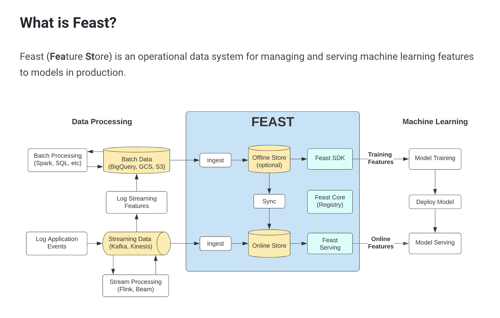
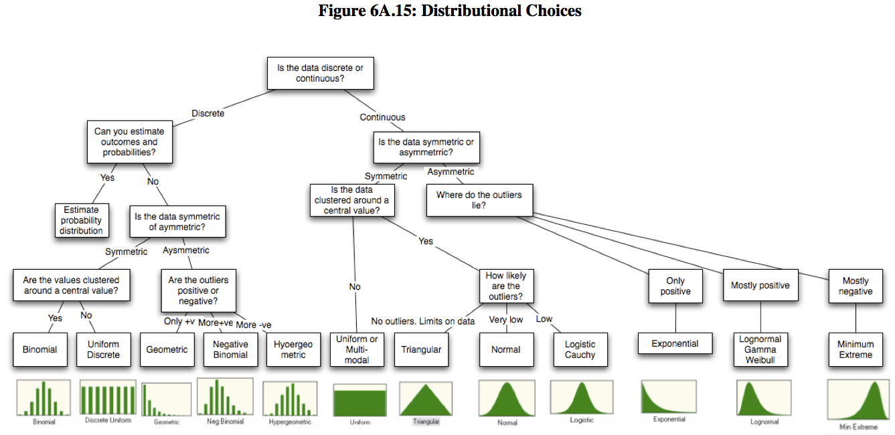
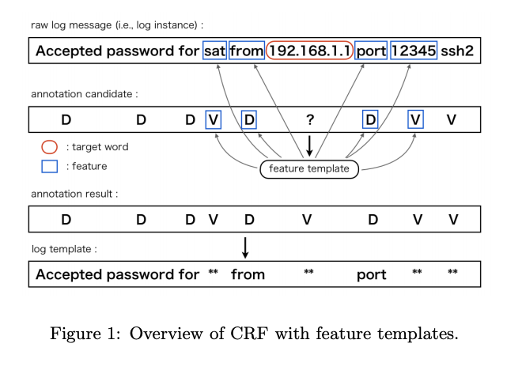

 @import url('https://themes.googleusercontent.com/fonts/css?kit=OvwjZ7UUHsxv7C4-\_gXmY8rlG5zgcL3cOeJjMkg34VEXRdAXlUfXVHNxPJvWmd6TEoxoVRC6fv0hfeQx68AwoebWh2ye6SBaMZzWc4yXzia4XpajCVNNHnfNA0AoC9-KrrgVYXyelVvmBUL3h1BibQ');ol.lst-kix\_hy717pifk7pb-7.start{counter-reset:lst-ctn-kix\_hy717pifk7pb-7 0}ol.lst-kix\_apie7dy12cjr-8{list-style-type:none}ol.lst-kix\_1vlrsmv805gp-1{list-style-type:none}ol.lst-kix\_uu5yvyisnsm5-1.start{counter-reset:lst-ctn-kix\_uu5yvyisnsm5-1 0}ol.lst-kix\_apie7dy12cjr-7{list-style-type:none}ol.lst-kix\_1vlrsmv805gp-0{list-style-type:none}ul.lst-kix\_m6txznm6ajok-0{list-style-type:none}ol.lst-kix\_apie7dy12cjr-6{list-style-type:none}ol.lst-kix\_am8zbpdj86d0-4.start{counter-reset:lst-ctn-kix\_am8zbpdj86d0-4 0}ol.lst-kix\_apie7dy12cjr-1{list-style-type:none}ol.lst-kix\_apie7dy12cjr-0{list-style-type:none}ol.lst-kix\_ip3by36mz7o6-3.start{counter-reset:lst-ctn-kix\_ip3by36mz7o6-3 0}.lst-kix\_5lh3851rrmv4-6>li{counter-increment:lst-ctn-kix\_5lh3851rrmv4-6}ol.lst-kix\_apie7dy12cjr-5{list-style-type:none}ol.lst-kix\_apie7dy12cjr-4{list-style-type:none}.lst-kix\_e4k725hgeu61-5>li:before{content:"" counter(lst-ctn-kix\_e4k725hgeu61-5,lower-roman) ". "}ol.lst-kix\_apie7dy12cjr-3{list-style-type:none}ol.lst-kix\_apie7dy12cjr-2{list-style-type:none}.lst-kix\_gmh6mjla1eln-4>li:before{content:"" counter(lst-ctn-kix\_gmh6mjla1eln-4,lower-latin) ". "}.lst-kix\_ttkarf84kceh-1>li{counter-increment:lst-ctn-kix\_ttkarf84kceh-1}ol.lst-kix\_1vlrsmv805gp-7{list-style-type:none}.lst-kix\_yb8joerf8zcc-1>li:before{content:"" counter(lst-ctn-kix\_yb8joerf8zcc-1,lower-latin) ". "}ol.lst-kix\_1vlrsmv805gp-6{list-style-type:none}ol.lst-kix\_1vlrsmv805gp-8{list-style-type:none}ol.lst-kix\_1vlrsmv805gp-3{list-style-type:none}.lst-kix\_w9ark4v512v5-2>li:before{content:"" counter(lst-ctn-kix\_w9ark4v512v5-2,lower-roman) ". "}ol.lst-kix\_1vlrsmv805gp-2{list-style-type:none}ol.lst-kix\_1vlrsmv805gp-5{list-style-type:none}ol.lst-kix\_1vlrsmv805gp-4{list-style-type:none}.lst-kix\_octjs34h2phb-8>li:before{content:"\\0025a0 "}.lst-kix\_xxxq041bg9cg-4>li{counter-increment:lst-ctn-kix\_xxxq041bg9cg-4}ol.lst-kix\_x5hl6g4ub8fg-1.start{counter-reset:lst-ctn-kix\_x5hl6g4ub8fg-1 0}.lst-kix\_3x2vp4gaxrbr-4>li:before{content:"" counter(lst-ctn-kix\_3x2vp4gaxrbr-4,lower-latin) ". "}.lst-kix\_j74xot21668x-6>li:before{content:"" counter(lst-ctn-kix\_j74xot21668x-6,decimal) ". "}ol.lst-kix\_zka969w4f0y-8.start{counter-reset:lst-ctn-kix\_zka969w4f0y-8 0}.lst-kix\_ii3s0wrgzehv-5>li:before{content:"" counter(lst-ctn-kix\_ii3s0wrgzehv-5,lower-roman) ". "}ol.lst-kix\_q7hj8vd4bp60-3.start{counter-reset:lst-ctn-kix\_q7hj8vd4bp60-3 0}ol.lst-kix\_azhf8c85w8xl-2.start{counter-reset:lst-ctn-kix\_azhf8c85w8xl-2 0}ol.lst-kix\_y0a54jnwhh1f-6.start{counter-reset:lst-ctn-kix\_y0a54jnwhh1f-6 0}.lst-kix\_xvds1jjqcugd-7>li:before{content:"" counter(lst-ctn-kix\_xvds1jjqcugd-7,lower-latin) ". "}.lst-kix\_vdu5yxne6alc-0>li:before{content:"\\0025cf "}.lst-kix\_sqlwndxxxts5-1>li:before{content:"" counter(lst-ctn-kix\_sqlwndxxxts5-1,lower-latin) ". "}.lst-kix\_qhoxdjtgav8t-6>li:before{content:"" counter(lst-ctn-kix\_qhoxdjtgav8t-6,decimal) ". "}.lst-kix\_6yhq5p5mg1v6-1>li{counter-increment:lst-ctn-kix\_6yhq5p5mg1v6-1}.lst-kix\_skytjl8yj0n4-6>li:before{content:"" counter(lst-ctn-kix\_skytjl8yj0n4-6,decimal) ". "}.lst-kix\_svdcxve97pdo-5>li:before{content:"" counter(lst-ctn-kix\_svdcxve97pdo-5,lower-roman) ". "}.lst-kix\_yl7om49guy5e-6>li:before{content:"" counter(lst-ctn-kix\_yl7om49guy5e-6,decimal) ". "}.lst-kix\_ttkarf84kceh-1>li:before{content:"" counter(lst-ctn-kix\_ttkarf84kceh-1,lower-latin) ". "}.lst-kix\_9x8gpbh3rqj-8>li{counter-increment:lst-ctn-kix\_9x8gpbh3rqj-8}.lst-kix\_hb7vll6wvxth-1>li:before{content:"" counter(lst-ctn-kix\_hb7vll6wvxth-1,lower-latin) ". "}ol.lst-kix\_5sdbwsgav4hg-7.start{counter-reset:lst-ctn-kix\_5sdbwsgav4hg-7 0}.lst-kix\_898lgmvakqnf-6>li{counter-increment:lst-ctn-kix\_898lgmvakqnf-6}ol.lst-kix\_pysrxeutxx8e-1.start{counter-reset:lst-ctn-kix\_pysrxeutxx8e-1 0}.lst-kix\_y2nf6g4fn7dy-7>li{counter-increment:lst-ctn-kix\_y2nf6g4fn7dy-7}.lst-kix\_oqfj3o66tns5-2>li{counter-increment:lst-ctn-kix\_oqfj3o66tns5-2}.lst-kix\_c2y13p8bfm2b-4>li:before{content:"" counter(lst-ctn-kix\_c2y13p8bfm2b-4,lower-latin) ". "}.lst-kix\_4gk909r6bqr-4>li:before{content:"" counter(lst-ctn-kix\_4gk909r6bqr-4,lower-latin) ". "}.lst-kix\_pjw7m8yt0lk1-8>li{counter-increment:lst-ctn-kix\_pjw7m8yt0lk1-8}ol.lst-kix\_8v43kgbea79y-0.start{counter-reset:lst-ctn-kix\_8v43kgbea79y-0 0}.lst-kix\_8z5s6t841ble-2>li{counter-increment:lst-ctn-kix\_8z5s6t841ble-2}ol.lst-kix\_mgq3zyv49j82-4.start{counter-reset:lst-ctn-kix\_mgq3zyv49j82-4 0}ol.lst-kix\_hl0u9dz43mi1-1.start{counter-reset:lst-ctn-kix\_hl0u9dz43mi1-1 0}.lst-kix\_ccx81cd6uhh8-0>li:before{content:"" counter(lst-ctn-kix\_ccx81cd6uhh8-0,decimal) ". "}ol.lst-kix\_l6nzni1tat6c-6.start{counter-reset:lst-ctn-kix\_l6nzni1tat6c-6 0}ol.lst-kix\_3wvas1b4ca0-0.start{counter-reset:lst-ctn-kix\_3wvas1b4ca0-0 0}ol.lst-kix\_7bzxiv2054rw-5.start{counter-reset:lst-ctn-kix\_7bzxiv2054rw-5 0}.lst-kix\_5ydopzbqpmtc-6>li:before{content:"\\0025cf "}ol.lst-kix\_xjxpxp35y5y-6.start{counter-reset:lst-ctn-kix\_xjxpxp35y5y-6 0}.lst-kix\_jb7v1xttmk1h-1>li{counter-increment:lst-ctn-kix\_jb7v1xttmk1h-1}.lst-kix\_4f0w1rp64bw-0>li:before{content:"\\0025cf "}ol.lst-kix\_898lgmvakqnf-6.start{counter-reset:lst-ctn-kix\_898lgmvakqnf-6 0}.lst-kix\_7nad6rof8o9o-8>li{counter-increment:lst-ctn-kix\_7nad6rof8o9o-8}.lst-kix\_5i7isw3yp64j-1>li:before{content:"" counter(lst-ctn-kix\_5i7isw3yp64j-1,lower-latin) ". "}ol.lst-kix\_n2b9ie5lg57s-7.start{counter-reset:lst-ctn-kix\_n2b9ie5lg57s-7 0}ol.lst-kix\_7glipiktwl4t-8.start{counter-reset:lst-ctn-kix\_7glipiktwl4t-8 0}ol.lst-kix\_hb7vll6wvxth-2.start{counter-reset:lst-ctn-kix\_hb7vll6wvxth-2 0}ol.lst-kix\_qo9612nl8xh6-8.start{counter-reset:lst-ctn-kix\_qo9612nl8xh6-8 0}.lst-kix\_pa5sjwodmtna-0>li{counter-increment:lst-ctn-kix\_pa5sjwodmtna-0}ol.lst-kix\_qs0e6rq4oqgu-3.start{counter-reset:lst-ctn-kix\_qs0e6rq4oqgu-3 0}.lst-kix\_eb3xpftjqu7r-3>li:before{content:"" counter(lst-ctn-kix\_eb3xpftjqu7r-3,decimal) ". "}.lst-kix\_eyarb2noq781-5>li:before{content:"" counter(lst-ctn-kix\_eyarb2noq781-5,lower-roman) ". "}.lst-kix\_y5dmfv17x7vs-8>li:before{content:"\\0025a0 "}.lst-kix\_aczd4n3khbqy-7>li{counter-increment:lst-ctn-kix\_aczd4n3khbqy-7}.lst-kix\_5u50shnrx61c-4>li{counter-increment:lst-ctn-kix\_5u50shnrx61c-4}.lst-kix\_96z3xj3lexdc-4>li:before{content:"" counter(lst-ctn-kix\_96z3xj3lexdc-4,lower-latin) ". "}.lst-kix\_gil14dbpr1p-2>li{counter-increment:lst-ctn-kix\_gil14dbpr1p-2}.lst-kix\_9rf86znhpvvq-8>li{counter-increment:lst-ctn-kix\_9rf86znhpvvq-8}ol.lst-kix\_q4s4uu9i5rje-4.start{counter-reset:lst-ctn-kix\_q4s4uu9i5rje-4 0}ol.lst-kix\_daw1wwgmapui-5.start{counter-reset:lst-ctn-kix\_daw1wwgmapui-5 0}.lst-kix\_5lh3851rrmv4-1>li:before{content:"" counter(lst-ctn-kix\_5lh3851rrmv4-1,lower-latin) ". "}ol.lst-kix\_x47femcv1b74-0.start{counter-reset:lst-ctn-kix\_x47femcv1b74-0 0}.lst-kix\_i8qb1up5vwi-1>li:before{content:"\\0025cb "}.lst-kix\_87crzcktfw48-8>li:before{content:"" counter(lst-ctn-kix\_87crzcktfw48-8,lower-roman) ". "}ol.lst-kix\_5duwb1vishby-4{list-style-type:none}.lst-kix\_zhniotpp3fob-2>li:before{content:"" counter(lst-ctn-kix\_zhniotpp3fob-2,lower-roman) ". "}.lst-kix\_uyxx8ijibpth-7>li:before{content:"\\0025cb "}ol.lst-kix\_5duwb1vishby-5{list-style-type:none}ol.lst-kix\_5duwb1vishby-6{list-style-type:none}ol.lst-kix\_5duwb1vishby-7{list-style-type:none}.lst-kix\_10skeku2lx67-0>li{counter-increment:lst-ctn-kix\_10skeku2lx67-0}.lst-kix\_r9hj4sp9dfwy-4>li{counter-increment:lst-ctn-kix\_r9hj4sp9dfwy-4}ol.lst-kix\_5duwb1vishby-0{list-style-type:none}.lst-kix\_y0a54jnwhh1f-0>li:before{content:"" counter(lst-ctn-kix\_y0a54jnwhh1f-0,decimal) ". "}.lst-kix\_f1vao6uznrqo-3>li:before{content:"" counter(lst-ctn-kix\_f1vao6uznrqo-3,decimal) ". "}ol.lst-kix\_5duwb1vishby-1{list-style-type:none}ol.lst-kix\_5duwb1vishby-2{list-style-type:none}ol.lst-kix\_5duwb1vishby-3{list-style-type:none}.lst-kix\_w0r0fm4v7uar-1>li:before{content:"\\0025cb "}ol.lst-kix\_qd6qlsmofow6-2.start{counter-reset:lst-ctn-kix\_qd6qlsmofow6-2 0}.lst-kix\_ckoofmrmbxpt-3>li:before{content:"\\0025cf "}.lst-kix\_6ral2twiyp4i-0>li:before{content:"\\0025cf "}.lst-kix\_9byfvuocbpwd-4>li{counter-increment:lst-ctn-kix\_9byfvuocbpwd-4}ol.lst-kix\_ushx6m7kmqbf-2.start{counter-reset:lst-ctn-kix\_ushx6m7kmqbf-2 0}.lst-kix\_7bzxiv2054rw-5>li:before{content:"" counter(lst-ctn-kix\_7bzxiv2054rw-5,lower-roman) ". "}ol.lst-kix\_gwamneyuay4e-2.start{counter-reset:lst-ctn-kix\_gwamneyuay4e-2 0}ol.lst-kix\_5duwb1vishby-8{list-style-type:none}.lst-kix\_hurspkwonmy1-5>li:before{content:"" counter(lst-ctn-kix\_hurspkwonmy1-5,lower-roman) ". "}.lst-kix\_qvkf8yhtc4qi-1>li{counter-increment:lst-ctn-kix\_qvkf8yhtc4qi-1}.lst-kix\_ajdxuh5inq2e-5>li:before{content:"\\0025a0 "}.lst-kix\_3elbtyv8vi23-2>li{counter-increment:lst-ctn-kix\_3elbtyv8vi23-2}.lst-kix\_szfn7wwfv4ws-7>li:before{content:"\\0025cb "}.lst-kix\_72ikkjan5t8b-4>li:before{content:"\\0025cb "}ol.lst-kix\_um8ppw1277k6-4.start{counter-reset:lst-ctn-kix\_um8ppw1277k6-4 0}.lst-kix\_b0176vxlb3uy-7>li:before{content:"\\0025cb "}ol.lst-kix\_1k578nh9wzys-5.start{counter-reset:lst-ctn-kix\_1k578nh9wzys-5 0}.lst-kix\_f3ae9pqli2l9-4>li:before{content:"" counter(lst-ctn-kix\_f3ae9pqli2l9-4,lower-latin) ". "}.lst-kix\_o780ol4g5p91-8>li:before{content:"" counter(lst-ctn-kix\_o780ol4g5p91-8,lower-roman) ". "}ul.lst-kix\_93tk95vh9yl3-4{list-style-type:none}ul.lst-kix\_93tk95vh9yl3-3{list-style-type:none}ul.lst-kix\_93tk95vh9yl3-6{list-style-type:none}ul.lst-kix\_93tk95vh9yl3-5{list-style-type:none}ul.lst-kix\_93tk95vh9yl3-8{list-style-type:none}.lst-kix\_mq2rp6ivjdfz-8>li{counter-increment:lst-ctn-kix\_mq2rp6ivjdfz-8}ol.lst-kix\_ckdef6tymlna-4.start{counter-reset:lst-ctn-kix\_ckdef6tymlna-4 0}ul.lst-kix\_93tk95vh9yl3-7{list-style-type:none}.lst-kix\_e6b0rqi7ml3w-5>li:before{content:"" counter(lst-ctn-kix\_e6b0rqi7ml3w-5,lower-roman) ". "}ol.lst-kix\_zdyu9y8516gz-0.start{counter-reset:lst-ctn-kix\_zdyu9y8516gz-0 0}.lst-kix\_mq2rp6ivjdfz-8>li:before{content:"" counter(lst-ctn-kix\_mq2rp6ivjdfz-8,lower-roman) ". "}.lst-kix\_flmwgaf4ve4g-7>li{counter-increment:lst-ctn-kix\_flmwgaf4ve4g-7}ol.lst-kix\_qmh8v7jm9osi-1.start{counter-reset:lst-ctn-kix\_qmh8v7jm9osi-1 0}ul.lst-kix\_93tk95vh9yl3-0{list-style-type:none}ul.lst-kix\_93tk95vh9yl3-2{list-style-type:none}ul.lst-kix\_93tk95vh9yl3-1{list-style-type:none}.lst-kix\_hs7sze8tsvl2-8>li{counter-increment:lst-ctn-kix\_hs7sze8tsvl2-8}.lst-kix\_ges5hpd5vyq1-1>li:before{content:"" counter(lst-ctn-kix\_ges5hpd5vyq1-1,lower-latin) ". "}.lst-kix\_daw1wwgmapui-4>li:before{content:"" counter(lst-ctn-kix\_daw1wwgmapui-4,lower-latin) ". "}.lst-kix\_fjgmly2gd115-2>li{counter-increment:lst-ctn-kix\_fjgmly2gd115-2}ol.lst-kix\_nc7cypii9ox1-4.start{counter-reset:lst-ctn-kix\_nc7cypii9ox1-4 0}ol.lst-kix\_og1zta544o19-6.start{counter-reset:lst-ctn-kix\_og1zta544o19-6 0}.lst-kix\_b4mn3gfberdw-2>li:before{content:"\\0025a0 "}.lst-kix\_v5tkl3ghzyqo-2>li:before{content:"" counter(lst-ctn-kix\_v5tkl3ghzyqo-2,lower-roman) ". "}.lst-kix\_z5xtxlh9qz1a-8>li:before{content:"" counter(lst-ctn-kix\_z5xtxlh9qz1a-8,lower-roman) ". "}.lst-kix\_dvle2vhpbfwi-4>li:before{content:"" counter(lst-ctn-kix\_dvle2vhpbfwi-4,lower-latin) ". "}ol.lst-kix\_go754f4iie6b-5.start{counter-reset:lst-ctn-kix\_go754f4iie6b-5 0}ol.lst-kix\_xxxq041bg9cg-4.start{counter-reset:lst-ctn-kix\_xxxq041bg9cg-4 0}ol.lst-kix\_3jr3562vlffu-0{list-style-type:none}ol.lst-kix\_1e6wnk1b58qm-0{list-style-type:none}.lst-kix\_goi3b57w5knq-4>li:before{content:"" counter(lst-ctn-kix\_goi3b57w5knq-4,lower-latin) ". "}.lst-kix\_hatotloj8gz5-6>li{counter-increment:lst-ctn-kix\_hatotloj8gz5-6}ol.lst-kix\_1e6wnk1b58qm-4{list-style-type:none}.lst-kix\_pgoxla6lpcpb-4>li:before{content:"\\0025cb "}ol.lst-kix\_v5tkl3ghzyqo-6.start{counter-reset:lst-ctn-kix\_v5tkl3ghzyqo-6 0}ol.lst-kix\_1e6wnk1b58qm-3{list-style-type:none}ol.lst-kix\_1e6wnk1b58qm-2{list-style-type:none}.lst-kix\_qdoatl1s1428-0>li:before{content:"" counter(lst-ctn-kix\_qdoatl1s1428-0,decimal) ". "}ol.lst-kix\_1e6wnk1b58qm-1{list-style-type:none}.lst-kix\_uf48emds76cj-5>li:before{content:"\\0025a0 "}.lst-kix\_2vx3lhktmz2-4>li{counter-increment:lst-ctn-kix\_2vx3lhktmz2-4}.lst-kix\_eegbnkkfi7r3-0>li:before{content:"\\0025cf "}ol.lst-kix\_pysrxeutxx8e-4{list-style-type:none}ol.lst-kix\_e4k725hgeu61-8.start{counter-reset:lst-ctn-kix\_e4k725hgeu61-8 0}ol.lst-kix\_pysrxeutxx8e-5{list-style-type:none}ol.lst-kix\_pysrxeutxx8e-2{list-style-type:none}.lst-kix\_c9wqxbtohv67-1>li:before{content:"\\0025cb "}ol.lst-kix\_pysrxeutxx8e-3{list-style-type:none}ol.lst-kix\_pysrxeutxx8e-0{list-style-type:none}ol.lst-kix\_pysrxeutxx8e-1{list-style-type:none}.lst-kix\_hysd61dnjzsg-3>li{counter-increment:lst-ctn-kix\_hysd61dnjzsg-3}.lst-kix\_wc254ct2wu46-4>li{counter-increment:lst-ctn-kix\_wc254ct2wu46-4}ol.lst-kix\_7xhgj2o08dbu-3.start{counter-reset:lst-ctn-kix\_7xhgj2o08dbu-3 0}ol.lst-kix\_f3ae9pqli2l9-0.start{counter-reset:lst-ctn-kix\_f3ae9pqli2l9-0 0}ol.lst-kix\_mdarqcb0vjiy-1.start{counter-reset:lst-ctn-kix\_mdarqcb0vjiy-1 0}.lst-kix\_dpz81p9k0ewx-2>li:before{content:"\\0025a0 "}ol.lst-kix\_h8dbip42bco-1.start{counter-reset:lst-ctn-kix\_h8dbip42bco-1 0}ol.lst-kix\_3jr3562vlffu-1{list-style-type:none}.lst-kix\_1k578nh9wzys-8>li:before{content:"" counter(lst-ctn-kix\_1k578nh9wzys-8,lower-roman) ". "}ol.lst-kix\_3jr3562vlffu-2{list-style-type:none}ol.lst-kix\_3jr3562vlffu-3{list-style-type:none}ol.lst-kix\_3jr3562vlffu-4{list-style-type:none}ol.lst-kix\_3jr3562vlffu-5{list-style-type:none}ol.lst-kix\_3jr3562vlffu-6{list-style-type:none}.lst-kix\_731luobvjxip-8>li:before{content:"" counter(lst-ctn-kix\_731luobvjxip-8,lower-roman) ". "}ol.lst-kix\_3jr3562vlffu-7{list-style-type:none}ol.lst-kix\_3jr3562vlffu-8{list-style-type:none}.lst-kix\_7o6b4spestad-1>li:before{content:"" counter(lst-ctn-kix\_7o6b4spestad-1,lower-latin) ". "}.lst-kix\_4352mom1haaw-5>li:before{content:"\\0025a0 "}.lst-kix\_1e6wnk1b58qm-8>li:before{content:"" counter(lst-ctn-kix\_1e6wnk1b58qm-8,lower-roman) ". "}ol.lst-kix\_flmwgaf4ve4g-3.start{counter-reset:lst-ctn-kix\_flmwgaf4ve4g-3 0}ol.lst-kix\_5d855gy0mujw-8.start{counter-reset:lst-ctn-kix\_5d855gy0mujw-8 0}.lst-kix\_zb4vx7glyecn-6>li:before{content:"" counter(lst-ctn-kix\_zb4vx7glyecn-6,decimal) ". "}.lst-kix\_hijb7dpr8clu-2>li:before{content:"" counter(lst-ctn-kix\_hijb7dpr8clu-2,lower-roman) ". "}.lst-kix\_sf4iksr754kw-6>li:before{content:"" counter(lst-ctn-kix\_sf4iksr754kw-6,decimal) ". "}ol.lst-kix\_4xhlfn9udb0c-1.start{counter-reset:lst-ctn-kix\_4xhlfn9udb0c-1 0}.lst-kix\_f3tn8gr1xc71-8>li:before{content:"\\0025a0 "}.lst-kix\_y2nf6g4fn7dy-5>li:before{content:"" counter(lst-ctn-kix\_y2nf6g4fn7dy-5,lower-roman) ". "}.lst-kix\_8gt39rfp44me-6>li:before{content:"\\0025cf "}ol.lst-kix\_r65066arm4y7-7.start{counter-reset:lst-ctn-kix\_r65066arm4y7-7 0}.lst-kix\_8mmd5hp407dx-3>li{counter-increment:lst-ctn-kix\_8mmd5hp407dx-3}.lst-kix\_xbpxxnyhnwjs-8>li:before{content:"" counter(lst-ctn-kix\_xbpxxnyhnwjs-8,lower-roman) ". "}.lst-kix\_qmh8v7jm9osi-5>li{counter-increment:lst-ctn-kix\_qmh8v7jm9osi-5}ol.lst-kix\_pysrxeutxx8e-8{list-style-type:none}ol.lst-kix\_pysrxeutxx8e-6{list-style-type:none}ol.lst-kix\_pysrxeutxx8e-7{list-style-type:none}ol.lst-kix\_hatotloj8gz5-0.start{counter-reset:lst-ctn-kix\_hatotloj8gz5-0 0}.lst-kix\_sqlwndxxxts5-5>li{counter-increment:lst-ctn-kix\_sqlwndxxxts5-5}ol.lst-kix\_hf08lsz1adap-1.start{counter-reset:lst-ctn-kix\_hf08lsz1adap-1 0}.lst-kix\_wveea7n1r664-6>li:before{content:"" counter(lst-ctn-kix\_wveea7n1r664-6,decimal) ". "}.lst-kix\_x17aj1671t21-3>li:before{content:"" counter(lst-ctn-kix\_x17aj1671t21-3,decimal) ". "}ol.lst-kix\_1cniub4o3gi1-1.start{counter-reset:lst-ctn-kix\_1cniub4o3gi1-1 0}.lst-kix\_608w3psy48rf-3>li:before{content:"" counter(lst-ctn-kix\_608w3psy48rf-3,decimal) ". "}.lst-kix\_z7e5t2elij0-4>li:before{content:"" counter(lst-ctn-kix\_z7e5t2elij0-4,lower-latin) ". "}.lst-kix\_9zwkywekqcsn-1>li:before{content:"" counter(lst-ctn-kix\_9zwkywekqcsn-1,lower-latin) ". "}ol.lst-kix\_4gk909r6bqr-0.start{counter-reset:lst-ctn-kix\_4gk909r6bqr-0 0}ol.lst-kix\_uedvbmfl2cik-0.start{counter-reset:lst-ctn-kix\_uedvbmfl2cik-0 0}.lst-kix\_pbqsu1qxgc17-1>li{counter-increment:lst-ctn-kix\_pbqsu1qxgc17-1}.lst-kix\_lmi44a42kay8-2>li:before{content:"\\0025a0 "}.lst-kix\_93tk95vh9yl3-5>li:before{content:"\\0025a0 "}.lst-kix\_k0qhta4lwwuk-3>li:before{content:"" counter(lst-ctn-kix\_k0qhta4lwwuk-3,decimal) ". "}ol.lst-kix\_5i7isw3yp64j-2.start{counter-reset:lst-ctn-kix\_5i7isw3yp64j-2 0}.lst-kix\_92k8aejqs22r-5>li:before{content:"" counter(lst-ctn-kix\_92k8aejqs22r-5,lower-roman) ". "}ol.lst-kix\_3elbtyv8vi23-5.start{counter-reset:lst-ctn-kix\_3elbtyv8vi23-5 0}.lst-kix\_o4yye9x3n0bk-0>li:before{content:"\\0025cf "}ol.lst-kix\_ats8wd50ftbx-5.start{counter-reset:lst-ctn-kix\_ats8wd50ftbx-5 0}ol.lst-kix\_i1bbm7s66sy-5.start{counter-reset:lst-ctn-kix\_i1bbm7s66sy-5 0}.lst-kix\_1rh75j17pap-7>li:before{content:"\\0025cb "}.lst-kix\_eb3xpftjqu7r-8>li{counter-increment:lst-ctn-kix\_eb3xpftjqu7r-8}.lst-kix\_twe83spxafxe-8>li:before{content:"\\0025a0 "}.lst-kix\_iagsgemvaaal-1>li{counter-increment:lst-ctn-kix\_iagsgemvaaal-1}ol.lst-kix\_gst69psd7z5q-4.start{counter-reset:lst-ctn-kix\_gst69psd7z5q-4 0}.lst-kix\_cu6x2097g82u-5>li{counter-increment:lst-ctn-kix\_cu6x2097g82u-5}.lst-kix\_4k6hxzvhr4kf-8>li:before{content:"\\0025a0 "}ol.lst-kix\_9zwkywekqcsn-5.start{counter-reset:lst-ctn-kix\_9zwkywekqcsn-5 0}ol.lst-kix\_q60b4kl98onc-3.start{counter-reset:lst-ctn-kix\_q60b4kl98onc-3 0}.lst-kix\_ncnf63qzfpwt-7>li{counter-increment:lst-ctn-kix\_ncnf63qzfpwt-7}.lst-kix\_84d90ssrkk8f-0>li:before{content:"" counter(lst-ctn-kix\_84d90ssrkk8f-0,decimal) ". "}.lst-kix\_7al86sdi66qk-1>li:before{content:"\\0025cb "}.lst-kix\_rxm1pc13owun-1>li{counter-increment:lst-ctn-kix\_rxm1pc13owun-1}.lst-kix\_em0538ionxwn-6>li:before{content:"" counter(lst-ctn-kix\_em0538ionxwn-6,decimal) ". "}ol.lst-kix\_qhoxdjtgav8t-7.start{counter-reset:lst-ctn-kix\_qhoxdjtgav8t-7 0}.lst-kix\_tkh44cvgxib5-8>li{counter-increment:lst-ctn-kix\_tkh44cvgxib5-8}.lst-kix\_d1v6r78jm0lo-5>li{counter-increment:lst-ctn-kix\_d1v6r78jm0lo-5}.lst-kix\_m6txznm6ajok-4>li{counter-increment:lst-ctn-kix\_m6txznm6ajok-4}ol.lst-kix\_hah84k120rlk-4.start{counter-reset:lst-ctn-kix\_hah84k120rlk-4 0}.lst-kix\_irrz2qeeps6n-7>li:before{content:"" counter(lst-ctn-kix\_irrz2qeeps6n-7,lower-latin) ". "}ol.lst-kix\_pz8t9qmhl1fa-0.start{counter-reset:lst-ctn-kix\_pz8t9qmhl1fa-0 0}.lst-kix\_l0rdk31u52tk-1>li:before{content:"" counter(lst-ctn-kix\_l0rdk31u52tk-1,lower-latin) ". "}.lst-kix\_c632ocsj7al3-6>li{counter-increment:lst-ctn-kix\_c632ocsj7al3-6}.lst-kix\_qwsf1g98250n-1>li{counter-increment:lst-ctn-kix\_qwsf1g98250n-1}.lst-kix\_2op8ovajep4v-8>li:before{content:"\\0025a0 "}.lst-kix\_66b93gjywqj6-2>li{counter-increment:lst-ctn-kix\_66b93gjywqj6-2}ol.lst-kix\_84d90ssrkk8f-4.start{counter-reset:lst-ctn-kix\_84d90ssrkk8f-4 0}.lst-kix\_5bgbslgl51tc-2>li:before{content:"" counter(lst-ctn-kix\_5bgbslgl51tc-2,lower-roman) ". "}.lst-kix\_w3gkuaxsm7n-5>li:before{content:"" counter(lst-ctn-kix\_w3gkuaxsm7n-5,lower-roman) ". "}.lst-kix\_stfnthdmhiwa-3>li:before{content:"" counter(lst-ctn-kix\_stfnthdmhiwa-3,decimal) ". "}.lst-kix\_dpmffrcy1htg-2>li{counter-increment:lst-ctn-kix\_dpmffrcy1htg-2}.lst-kix\_gwamneyuay4e-4>li{counter-increment:lst-ctn-kix\_gwamneyuay4e-4}ol.lst-kix\_fjgmly2gd115-5.start{counter-reset:lst-ctn-kix\_fjgmly2gd115-5 0}ol.lst-kix\_y2nf6g4fn7dy-7.start{counter-reset:lst-ctn-kix\_y2nf6g4fn7dy-7 0}.lst-kix\_dpikswh4xyhy-8>li:before{content:"\\0025a0 "}.lst-kix\_u2sz3co1xmvp-5>li{counter-increment:lst-ctn-kix\_u2sz3co1xmvp-5}.lst-kix\_uo5j4z82evmu-5>li:before{content:"" counter(lst-ctn-kix\_uo5j4z82evmu-5,lower-roman) ". "}.lst-kix\_c4khbracgppw-8>li{counter-increment:lst-ctn-kix\_c4khbracgppw-8}.lst-kix\_m6c9s7gjcoqm-2>li{counter-increment:lst-ctn-kix\_m6c9s7gjcoqm-2}ul.lst-kix\_vb9g106282lh-8{list-style-type:none}.lst-kix\_x17aj1671t21-2>li{counter-increment:lst-ctn-kix\_x17aj1671t21-2}.lst-kix\_leankajsdzjz-7>li{counter-increment:lst-ctn-kix\_leankajsdzjz-7}ul.lst-kix\_vb9g106282lh-6{list-style-type:none}ul.lst-kix\_vb9g106282lh-7{list-style-type:none}.lst-kix\_3wvas1b4ca0-4>li:before{content:"" counter(lst-ctn-kix\_3wvas1b4ca0-4,lower-latin) ". "}ol.lst-kix\_1e6wnk1b58qm-8{list-style-type:none}ol.lst-kix\_1e6wnk1b58qm-7{list-style-type:none}.lst-kix\_gst69psd7z5q-4>li:before{content:"" counter(lst-ctn-kix\_gst69psd7z5q-4,lower-latin) ". "}ol.lst-kix\_1e6wnk1b58qm-6{list-style-type:none}ol.lst-kix\_1e6wnk1b58qm-5{list-style-type:none}ol.lst-kix\_pbqsu1qxgc17-7.start{counter-reset:lst-ctn-kix\_pbqsu1qxgc17-7 0}ol.lst-kix\_ko1qifw3pfzl-0.start{counter-reset:lst-ctn-kix\_ko1qifw3pfzl-0 0}.lst-kix\_r97igka2la2i-4>li{counter-increment:lst-ctn-kix\_r97igka2la2i-4}ol.lst-kix\_gxtmis8xl4tt-5.start{counter-reset:lst-ctn-kix\_gxtmis8xl4tt-5 0}ul.lst-kix\_vb9g106282lh-0{list-style-type:none}ul.lst-kix\_vb9g106282lh-1{list-style-type:none}.lst-kix\_4n4m0orlbjgz-3>li:before{content:"\\0025cf "}.lst-kix\_i1bbm7s66sy-4>li:before{content:"" counter(lst-ctn-kix\_i1bbm7s66sy-4,lower-latin) ". "}ul.lst-kix\_vb9g106282lh-4{list-style-type:none}.lst-kix\_goi3b57w5knq-7>li{counter-increment:lst-ctn-kix\_goi3b57w5knq-7}ul.lst-kix\_vb9g106282lh-5{list-style-type:none}ul.lst-kix\_vb9g106282lh-2{list-style-type:none}.lst-kix\_5axvzwazzf0q-0>li:before{content:"\\0025cf "}ul.lst-kix\_vb9g106282lh-3{list-style-type:none}ul.lst-kix\_e82z0240mh22-3{list-style-type:none}ol.lst-kix\_t10k6zh84e1b-5{list-style-type:none}ul.lst-kix\_e82z0240mh22-4{list-style-type:none}ol.lst-kix\_t10k6zh84e1b-6{list-style-type:none}.lst-kix\_idd18rozsmie-7>li{counter-increment:lst-ctn-kix\_idd18rozsmie-7}ul.lst-kix\_e82z0240mh22-1{list-style-type:none}ol.lst-kix\_t10k6zh84e1b-7{list-style-type:none}ul.lst-kix\_e82z0240mh22-2{list-style-type:none}ol.lst-kix\_t10k6zh84e1b-8{list-style-type:none}.lst-kix\_h1h28a8y9gnw-7>li{counter-increment:lst-ctn-kix\_h1h28a8y9gnw-7}ol.lst-kix\_t10k6zh84e1b-1{list-style-type:none}ul.lst-kix\_e82z0240mh22-0{list-style-type:none}ol.lst-kix\_t10k6zh84e1b-2{list-style-type:none}.lst-kix\_sh9ciadrgjog-0>li{counter-increment:lst-ctn-kix\_sh9ciadrgjog-0}ol.lst-kix\_t10k6zh84e1b-3{list-style-type:none}ol.lst-kix\_t10k6zh84e1b-4{list-style-type:none}ol.lst-kix\_xr66hp2p5nmj-8.start{counter-reset:lst-ctn-kix\_xr66hp2p5nmj-8 0}ol.lst-kix\_759nvmg9xsy3-8.start{counter-reset:lst-ctn-kix\_759nvmg9xsy3-8 0}.lst-kix\_fshn22q244l9-3>li:before{content:"" counter(lst-ctn-kix\_fshn22q244l9-3,decimal) ". "}.lst-kix\_t28uwbhslnpp-7>li{counter-increment:lst-ctn-kix\_t28uwbhslnpp-7}ol.lst-kix\_t10k6zh84e1b-0{list-style-type:none}ul.lst-kix\_e82z0240mh22-7{list-style-type:none}.lst-kix\_sh9ciadrgjog-2>li:before{content:"" counter(lst-ctn-kix\_sh9ciadrgjog-2,lower-roman) ". "}ul.lst-kix\_e82z0240mh22-8{list-style-type:none}ul.lst-kix\_e82z0240mh22-5{list-style-type:none}ul.lst-kix\_e82z0240mh22-6{list-style-type:none}.lst-kix\_bbnzegnnqhyh-7>li:before{content:"\\0025cb "}ol.lst-kix\_96z3xj3lexdc-7.start{counter-reset:lst-ctn-kix\_96z3xj3lexdc-7 0}ol.lst-kix\_j1jiff57q9rz-2.start{counter-reset:lst-ctn-kix\_j1jiff57q9rz-2 0}ol.lst-kix\_o8dspqq8ujdh-2.start{counter-reset:lst-ctn-kix\_o8dspqq8ujdh-2 0}.lst-kix\_23vh7s8uarem-2>li:before{content:"" counter(lst-ctn-kix\_23vh7s8uarem-2,lower-roman) ". "}ol.lst-kix\_7o83mz6lgks-1.start{counter-reset:lst-ctn-kix\_7o83mz6lgks-1 0}.lst-kix\_pbw2qyhioekr-7>li{counter-increment:lst-ctn-kix\_pbw2qyhioekr-7}.lst-kix\_uonktz4q9jcw-7>li:before{content:"" counter(lst-ctn-kix\_uonktz4q9jcw-7,lower-latin) ". "}.lst-kix\_8eb17n2y34q4-4>li{counter-increment:lst-ctn-kix\_8eb17n2y34q4-4}.lst-kix\_c5oaw3l4wc85-0>li{counter-increment:lst-ctn-kix\_c5oaw3l4wc85-0}ol.lst-kix\_t0ai47vvxhau-6.start{counter-reset:lst-ctn-kix\_t0ai47vvxhau-6 0}.lst-kix\_hluq44g8p9m3-1>li:before{content:"" counter(lst-ctn-kix\_hluq44g8p9m3-1,lower-latin) ". "}ol.lst-kix\_ncnf63qzfpwt-4.start{counter-reset:lst-ctn-kix\_ncnf63qzfpwt-4 0}ol.lst-kix\_kj6rgf54r9bh-1.start{counter-reset:lst-ctn-kix\_kj6rgf54r9bh-1 0}ul.lst-kix\_4f0w1rp64bw-8{list-style-type:none}ul.lst-kix\_4f0w1rp64bw-6{list-style-type:none}ul.lst-kix\_4f0w1rp64bw-7{list-style-type:none}ul.lst-kix\_4f0w1rp64bw-4{list-style-type:none}.lst-kix\_n382c5sh3un7-1>li:before{content:"\\0025cb "}ul.lst-kix\_4f0w1rp64bw-5{list-style-type:none}ul.lst-kix\_4f0w1rp64bw-2{list-style-type:none}ul.lst-kix\_4f0w1rp64bw-3{list-style-type:none}ul.lst-kix\_4f0w1rp64bw-0{list-style-type:none}.lst-kix\_fspc68d73cz5-7>li:before{content:"\\0025cb "}ul.lst-kix\_4f0w1rp64bw-1{list-style-type:none}.lst-kix\_h1h28a8y9gnw-4>li:before{content:"" counter(lst-ctn-kix\_h1h28a8y9gnw-4,lower-latin) ". "}ol.lst-kix\_az7p5c2q8bab-5.start{counter-reset:lst-ctn-kix\_az7p5c2q8bab-5 0}.lst-kix\_sb726ib453no-1>li{counter-increment:lst-ctn-kix\_sb726ib453no-1}ol.lst-kix\_92nawvkx1zb-1{list-style-type:none}.lst-kix\_17f2ce94j6o1-1>li{counter-increment:lst-ctn-kix\_17f2ce94j6o1-1}.lst-kix\_w9ark4v512v5-1>li{counter-increment:lst-ctn-kix\_w9ark4v512v5-1}ol.lst-kix\_92nawvkx1zb-0{list-style-type:none}.lst-kix\_da6klf7m9ikp-5>li{counter-increment:lst-ctn-kix\_da6klf7m9ikp-5}.lst-kix\_1g4cqu3vemhz-1>li:before{content:"" counter(lst-ctn-kix\_1g4cqu3vemhz-1,lower-latin) ". "}.lst-kix\_x9s5u1lp5h3f-4>li{counter-increment:lst-ctn-kix\_x9s5u1lp5h3f-4}ol.lst-kix\_ehj8pkvmzuwx-4.start{counter-reset:lst-ctn-kix\_ehj8pkvmzuwx-4 0}.lst-kix\_ybavchjz5w2n-5>li{counter-increment:lst-ctn-kix\_ybavchjz5w2n-5}.lst-kix\_4blddxqf4n8f-2>li:before{content:"" counter(lst-ctn-kix\_4blddxqf4n8f-2,lower-roman) ". "}ol.lst-kix\_irrz2qeeps6n-8.start{counter-reset:lst-ctn-kix\_irrz2qeeps6n-8 0}.lst-kix\_k5ujhsavmfsn-6>li{counter-increment:lst-ctn-kix\_k5ujhsavmfsn-6}.lst-kix\_kzy2rxj022np-3>li:before{content:"" counter(lst-ctn-kix\_kzy2rxj022np-3,decimal) ". "}ol.lst-kix\_fbwh919mm0j-4.start{counter-reset:lst-ctn-kix\_fbwh919mm0j-4 0}ol.lst-kix\_92nawvkx1zb-7{list-style-type:none}ol.lst-kix\_92nawvkx1zb-6{list-style-type:none}ol.lst-kix\_92nawvkx1zb-8{list-style-type:none}ol.lst-kix\_92nawvkx1zb-3{list-style-type:none}.lst-kix\_wcheivpf8tcc-4>li:before{content:"" counter(lst-ctn-kix\_wcheivpf8tcc-4,lower-latin) ". "}ol.lst-kix\_92nawvkx1zb-2{list-style-type:none}.lst-kix\_go754f4iie6b-1>li:before{content:"" counter(lst-ctn-kix\_go754f4iie6b-1,lower-latin) ". "}ol.lst-kix\_92nawvkx1zb-5{list-style-type:none}ol.lst-kix\_92nawvkx1zb-4{list-style-type:none}.lst-kix\_os1vgvtp1hs9-1>li{counter-increment:lst-ctn-kix\_os1vgvtp1hs9-1}.lst-kix\_hs7sze8tsvl2-4>li:before{content:"" counter(lst-ctn-kix\_hs7sze8tsvl2-4,lower-latin) ". "}.lst-kix\_lmrtcoktrovl-6>li{counter-increment:lst-ctn-kix\_lmrtcoktrovl-6}ol.lst-kix\_xvds1jjqcugd-4.start{counter-reset:lst-ctn-kix\_xvds1jjqcugd-4 0}.lst-kix\_9vtny41eu3wy-3>li{counter-increment:lst-ctn-kix\_9vtny41eu3wy-3}.lst-kix\_2iwsy5u6j27p-6>li{counter-increment:lst-ctn-kix\_2iwsy5u6j27p-6}.lst-kix\_34w0eafl0meb-8>li:before{content:"\\0025a0 "}.lst-kix\_jmibakucala0-7>li:before{content:"\\0025cb "}.lst-kix\_hf08lsz1adap-0>li:before{content:"" counter(lst-ctn-kix\_hf08lsz1adap-0,decimal) ". "}.lst-kix\_6excevce6881-1>li{counter-increment:lst-ctn-kix\_6excevce6881-1}.lst-kix\_uoud3e7z22qa-5>li:before{content:"" counter(lst-ctn-kix\_uoud3e7z22qa-5,lower-roman) ". "}.lst-kix\_cjsa816iz0ln-2>li{counter-increment:lst-ctn-kix\_cjsa816iz0ln-2}ol.lst-kix\_aot51b3t4lyq-4.start{counter-reset:lst-ctn-kix\_aot51b3t4lyq-4 0}.lst-kix\_3rbhx9tys2cn-4>li:before{content:"" counter(lst-ctn-kix\_3rbhx9tys2cn-4,lower-latin) ". "}.lst-kix\_flzm65emr7x3-0>li:before{content:"" counter(lst-ctn-kix\_flzm65emr7x3-0,decimal) ". "}ol.lst-kix\_u2sz3co1xmvp-0.start{counter-reset:lst-ctn-kix\_u2sz3co1xmvp-0 0}.lst-kix\_yaxcmtd5xd4i-2>li:before{content:"\\0025a0 "}ol.lst-kix\_10skeku2lx67-3.start{counter-reset:lst-ctn-kix\_10skeku2lx67-3 0}.lst-kix\_qvkf8yhtc4qi-7>li:before{content:"" counter(lst-ctn-kix\_qvkf8yhtc4qi-7,lower-latin) ". "}.lst-kix\_2yua924z05ob-3>li:before{content:"" counter(lst-ctn-kix\_2yua924z05ob-3,decimal) ". "}.lst-kix\_yqfp119da5cs-7>li:before{content:"" counter(lst-ctn-kix\_yqfp119da5cs-7,lower-latin) ". "}ol.lst-kix\_dq88dhk12uih-1.start{counter-reset:lst-ctn-kix\_dq88dhk12uih-1 0}.lst-kix\_1vlrsmv805gp-0>li:before{content:"" counter(lst-ctn-kix\_1vlrsmv805gp-0,decimal) ". "}.lst-kix\_o67tgkayoey9-6>li:before{content:"" counter(lst-ctn-kix\_o67tgkayoey9-6,decimal) ". "}.lst-kix\_zhniotpp3fob-2>li{counter-increment:lst-ctn-kix\_zhniotpp3fob-2}.lst-kix\_q6gahzurl7vp-5>li:before{content:"\\0025a0 "}ol.lst-kix\_9x8gpbh3rqj-0.start{counter-reset:lst-ctn-kix\_9x8gpbh3rqj-0 0}.lst-kix\_z7e5t2elij0-6>li{counter-increment:lst-ctn-kix\_z7e5t2elij0-6}ol.lst-kix\_t5pwqkewv7rp-3.start{counter-reset:lst-ctn-kix\_t5pwqkewv7rp-3 0}.lst-kix\_k0qhta4lwwuk-1>li{counter-increment:lst-ctn-kix\_k0qhta4lwwuk-1}.lst-kix\_366rth6k7n2d-1>li{counter-increment:lst-ctn-kix\_366rth6k7n2d-1}.lst-kix\_1c2o7c55owxp-3>li:before{content:"\\0025cf "}.lst-kix\_bb46c4y9t44l-8>li:before{content:"" counter(lst-ctn-kix\_bb46c4y9t44l-8,lower-roman) ". "}.lst-kix\_31amq3btccvr-8>li:before{content:"" counter(lst-ctn-kix\_31amq3btccvr-8,lower-roman) ". "}.lst-kix\_8eb17n2y34q4-7>li{counter-increment:lst-ctn-kix\_8eb17n2y34q4-7}ol.lst-kix\_uon20pko4vt4-2.start{counter-reset:lst-ctn-kix\_uon20pko4vt4-2 0}.lst-kix\_m04ci7fzwmf-4>li:before{content:"\\0025cb "}.lst-kix\_bv8j00vwwjbx-4>li:before{content:"" counter(lst-ctn-kix\_bv8j00vwwjbx-4,lower-latin) ". "}.lst-kix\_hl0u9dz43mi1-8>li:before{content:"" counter(lst-ctn-kix\_hl0u9dz43mi1-8,lower-roman) ". "}ol.lst-kix\_f6cpvdpuv509-3.start{counter-reset:lst-ctn-kix\_f6cpvdpuv509-3 0}ol.lst-kix\_f5ax5vu7vrt0-3.start{counter-reset:lst-ctn-kix\_f5ax5vu7vrt0-3 0}ol.lst-kix\_4kzmjepgn26q-5.start{counter-reset:lst-ctn-kix\_4kzmjepgn26q-5 0}ol.lst-kix\_3pqka7y917ko-5.start{counter-reset:lst-ctn-kix\_3pqka7y917ko-5 0}.lst-kix\_c5oaw3l4wc85-3>li{counter-increment:lst-ctn-kix\_c5oaw3l4wc85-3}.lst-kix\_la985fcztpy-8>li{counter-increment:lst-ctn-kix\_la985fcztpy-8}.lst-kix\_tc2eziaa7oei-1>li:before{content:"\\0025cb "}.lst-kix\_iys8i18jfats-8>li:before{content:"" counter(lst-ctn-kix\_iys8i18jfats-8,lower-roman) ". "}ol.lst-kix\_f3oeix6uo9oo-1.start{counter-reset:lst-ctn-kix\_f3oeix6uo9oo-1 0}ol.lst-kix\_bx0nzv1anwkj-1.start{counter-reset:lst-ctn-kix\_bx0nzv1anwkj-1 0}ol.lst-kix\_tkh44cvgxib5-5.start{counter-reset:lst-ctn-kix\_tkh44cvgxib5-5 0}.lst-kix\_1vlrsmv805gp-1>li{counter-increment:lst-ctn-kix\_1vlrsmv805gp-1}.lst-kix\_cu5uuad8pho9-0>li{counter-increment:lst-ctn-kix\_cu5uuad8pho9-0}.lst-kix\_6yhq5p5mg1v6-3>li:before{content:"" counter(lst-ctn-kix\_6yhq5p5mg1v6-3,decimal) ". "}.lst-kix\_33c55fh5jl0f-5>li:before{content:"" counter(lst-ctn-kix\_33c55fh5jl0f-5,lower-roman) ". "}.lst-kix\_kw2glgv2kkgz-6>li:before{content:"\\0025cf "}.lst-kix\_nbypf8isvhy6-6>li:before{content:"(" counter(lst-ctn-kix\_nbypf8isvhy6-6,lower-roman) ") "}ol.lst-kix\_qmh8v7jm9osi-3{list-style-type:none}ol.lst-kix\_qmh8v7jm9osi-4{list-style-type:none}ol.lst-kix\_qmh8v7jm9osi-5{list-style-type:none}ol.lst-kix\_qmh8v7jm9osi-6{list-style-type:none}ol.lst-kix\_qmh8v7jm9osi-7{list-style-type:none}.lst-kix\_4ohlu9tmhzzq-1>li{counter-increment:lst-ctn-kix\_4ohlu9tmhzzq-1}.lst-kix\_t28uwbhslnpp-4>li{counter-increment:lst-ctn-kix\_t28uwbhslnpp-4}ol.lst-kix\_qmh8v7jm9osi-8{list-style-type:none}.lst-kix\_3glthuqw5ax-8>li:before{content:"" counter(lst-ctn-kix\_3glthuqw5ax-8,lower-roman) ". "}.lst-kix\_9h25dnahwvyr-6>li:before{content:"" counter(lst-ctn-kix\_9h25dnahwvyr-6,decimal) ". "}ol.lst-kix\_qmh8v7jm9osi-0{list-style-type:none}ol.lst-kix\_trsox48c3eo6-0.start{counter-reset:lst-ctn-kix\_trsox48c3eo6-0 0}ol.lst-kix\_qmh8v7jm9osi-1{list-style-type:none}ol.lst-kix\_aijacbb25oc-0.start{counter-reset:lst-ctn-kix\_aijacbb25oc-0 0}ol.lst-kix\_qmh8v7jm9osi-2{list-style-type:none}.lst-kix\_8mmd5hp407dx-0>li:before{content:"" counter(lst-ctn-kix\_8mmd5hp407dx-0,decimal) ". "}.lst-kix\_c1lb8ma1wm40-6>li:before{content:"" counter(lst-ctn-kix\_c1lb8ma1wm40-6,decimal) ". "}.lst-kix\_lnk31qktgnss-6>li:before{content:"\\0025cf "}.lst-kix\_dteg1dxprjog-0>li{counter-increment:lst-ctn-kix\_dteg1dxprjog-0}.lst-kix\_1cniub4o3gi1-5>li:before{content:"" counter(lst-ctn-kix\_1cniub4o3gi1-5,lower-roman) ". "}.lst-kix\_731luobvjxip-2>li{counter-increment:lst-ctn-kix\_731luobvjxip-2}.lst-kix\_o67tgkayoey9-1>li{counter-increment:lst-ctn-kix\_o67tgkayoey9-1}.lst-kix\_cp6daqnr3y0j-8>li:before{content:"\\0025a0 "}.lst-kix\_ggptascu36zc-3>li{counter-increment:lst-ctn-kix\_ggptascu36zc-3}.lst-kix\_goi3b57w5knq-4>li{counter-increment:lst-ctn-kix\_goi3b57w5knq-4}.lst-kix\_tgmtqrbnoeka-7>li{counter-increment:lst-ctn-kix\_tgmtqrbnoeka-7}.lst-kix\_sb726ib453no-4>li{counter-increment:lst-ctn-kix\_sb726ib453no-4}ol.lst-kix\_5lh3851rrmv4-5.start{counter-reset:lst-ctn-kix\_5lh3851rrmv4-5 0}ol.lst-kix\_480kfiytyj6b-4.start{counter-reset:lst-ctn-kix\_480kfiytyj6b-4 0}.lst-kix\_jfmvljk4yn80-4>li:before{content:"" counter(lst-ctn-kix\_jfmvljk4yn80-4,lower-latin) ". "}ul.lst-kix\_saab2v9ucbdp-7{list-style-type:none}ul.lst-kix\_saab2v9ucbdp-8{list-style-type:none}.lst-kix\_5tai8mpns782-2>li:before{content:"\\0025a0 "}ol.lst-kix\_agky593hzlhc-7.start{counter-reset:lst-ctn-kix\_agky593hzlhc-7 0}.lst-kix\_ybavchjz5w2n-8>li{counter-increment:lst-ctn-kix\_ybavchjz5w2n-8}.lst-kix\_y0q2etyoe8yu-5>li:before{content:"" counter(lst-ctn-kix\_y0q2etyoe8yu-5,lower-roman) ". "}ol.lst-kix\_c1lb8ma1wm40-1.start{counter-reset:lst-ctn-kix\_c1lb8ma1wm40-1 0}ol.lst-kix\_eg6xsx3ebkcx-6.start{counter-reset:lst-ctn-kix\_eg6xsx3ebkcx-6 0}.lst-kix\_j7tp3ugldb5g-0>li:before{content:"\\0025cf "}.lst-kix\_snave2pm9grc-2>li:before{content:"\\0025a0 "}.lst-kix\_3elbtyv8vi23-4>li:before{content:"" counter(lst-ctn-kix\_3elbtyv8vi23-4,lower-latin) ". "}.lst-kix\_4xhlfn9udb0c-7>li:before{content:"" counter(lst-ctn-kix\_4xhlfn9udb0c-7,lower-latin) ". "}.lst-kix\_oq46cia4jgj-2>li{counter-increment:lst-ctn-kix\_oq46cia4jgj-2}ol.lst-kix\_87crzcktfw48-4.start{counter-reset:lst-ctn-kix\_87crzcktfw48-4 0}.lst-kix\_pa5sjwodmtna-8>li:before{content:"" counter(lst-ctn-kix\_pa5sjwodmtna-8,lower-roman) ". "}.lst-kix\_t0ai47vvxhau-1>li{counter-increment:lst-ctn-kix\_t0ai47vvxhau-1}.lst-kix\_ma3kwebuzpr9-8>li{counter-increment:lst-ctn-kix\_ma3kwebuzpr9-8}.lst-kix\_719p6v7f0j52-7>li{counter-increment:lst-ctn-kix\_719p6v7f0j52-7}ol.lst-kix\_hs7sze8tsvl2-5.start{counter-reset:lst-ctn-kix\_hs7sze8tsvl2-5 0}ol.lst-kix\_ii3s0wrgzehv-0{list-style-type:none}ol.lst-kix\_ii3s0wrgzehv-1{list-style-type:none}ol.lst-kix\_ii3s0wrgzehv-2{list-style-type:none}ol.lst-kix\_ii3s0wrgzehv-3{list-style-type:none}.lst-kix\_v4c2cpiay5ep-6>li{counter-increment:lst-ctn-kix\_v4c2cpiay5ep-6}.lst-kix\_qmkd90uomu1s-2>li:before{content:"\\0025a0 "}ol.lst-kix\_ii3s0wrgzehv-4{list-style-type:none}ol.lst-kix\_ii3s0wrgzehv-5{list-style-type:none}ol.lst-kix\_ii3s0wrgzehv-6{list-style-type:none}ol.lst-kix\_ii3s0wrgzehv-7{list-style-type:none}ol.lst-kix\_r1zcsqk0f655-5.start{counter-reset:lst-ctn-kix\_r1zcsqk0f655-5 0}ol.lst-kix\_ii3s0wrgzehv-8{list-style-type:none}ol.lst-kix\_ocl0x3sujcql-6.start{counter-reset:lst-ctn-kix\_ocl0x3sujcql-6 0}ul.lst-kix\_saab2v9ucbdp-5{list-style-type:none}ul.lst-kix\_saab2v9ucbdp-6{list-style-type:none}.lst-kix\_5xlwjm3ign7e-3>li:before{content:"" counter(lst-ctn-kix\_5xlwjm3ign7e-3,decimal) ". "}ol.lst-kix\_8z5s6t841ble-1.start{counter-reset:lst-ctn-kix\_8z5s6t841ble-1 0}.lst-kix\_3jkv7za2oabh-6>li{counter-increment:lst-ctn-kix\_3jkv7za2oabh-6}ul.lst-kix\_saab2v9ucbdp-3{list-style-type:none}ul.lst-kix\_saab2v9ucbdp-4{list-style-type:none}ul.lst-kix\_saab2v9ucbdp-1{list-style-type:none}ol.lst-kix\_aetc8fz4tpwi-0.start{counter-reset:lst-ctn-kix\_aetc8fz4tpwi-0 0}ul.lst-kix\_saab2v9ucbdp-2{list-style-type:none}ul.lst-kix\_saab2v9ucbdp-0{list-style-type:none}.lst-kix\_jtd7qxk5rg44-6>li:before{content:"" counter(lst-ctn-kix\_jtd7qxk5rg44-6,decimal) ". "}.lst-kix\_sh9ciadrgjog-3>li{counter-increment:lst-ctn-kix\_sh9ciadrgjog-3}.lst-kix\_nc7cypii9ox1-1>li{counter-increment:lst-ctn-kix\_nc7cypii9ox1-1}ol.lst-kix\_opcrioxq6v38-0.start{counter-reset:lst-ctn-kix\_opcrioxq6v38-0 0}.lst-kix\_zb6pcmh3agh8-7>li:before{content:"" counter(lst-ctn-kix\_zb6pcmh3agh8-7,lower-latin) ". "}.lst-kix\_10skeku2lx67-7>li:before{content:"" counter(lst-ctn-kix\_10skeku2lx67-7,lower-latin) ". "}.lst-kix\_pz8t9qmhl1fa-7>li{counter-increment:lst-ctn-kix\_pz8t9qmhl1fa-7}.lst-kix\_u8dqj8e31p0c-1>li:before{content:"" counter(lst-ctn-kix\_u8dqj8e31p0c-1,lower-latin) ". "}ol.lst-kix\_9p1xqtwlqjz-1.start{counter-reset:lst-ctn-kix\_9p1xqtwlqjz-1 0}ol.lst-kix\_hcr8zpx8n6sa-3.start{counter-reset:lst-ctn-kix\_hcr8zpx8n6sa-3 0}.lst-kix\_os1vgvtp1hs9-4>li{counter-increment:lst-ctn-kix\_os1vgvtp1hs9-4}.lst-kix\_iu1kulpd9ra5-0>li{counter-increment:lst-ctn-kix\_iu1kulpd9ra5-0}.lst-kix\_3u54cwd8z5x0-1>li:before{content:"\\0025cb "}.lst-kix\_1ui4qysh7xfs-7>li:before{content:"\\0025cb "}.lst-kix\_cu6x2097g82u-8>li{counter-increment:lst-ctn-kix\_cu6x2097g82u-8}ol.lst-kix\_d5uat5wib63v-4.start{counter-reset:lst-ctn-kix\_d5uat5wib63v-4 0}.lst-kix\_4yd85sst4t5m-7>li:before{content:"\\0025cb "}.lst-kix\_e4pky0mskj4e-6>li:before{content:"\\0025cf "}.lst-kix\_aepek897ctqj-5>li:before{content:"\\0025a0 "}ol.lst-kix\_b7q3yglfkan6-5.start{counter-reset:lst-ctn-kix\_b7q3yglfkan6-5 0}ol.lst-kix\_o67tgkayoey9-8.start{counter-reset:lst-ctn-kix\_o67tgkayoey9-8 0}ol.lst-kix\_jfmvljk4yn80-0.start{counter-reset:lst-ctn-kix\_jfmvljk4yn80-0 0}.lst-kix\_3woernvqy9ue-5>li:before{content:"" counter(lst-ctn-kix\_3woernvqy9ue-5,lower-roman) ". "}ol.lst-kix\_hs7sze8tsvl2-4.start{counter-reset:lst-ctn-kix\_hs7sze8tsvl2-4 0}.lst-kix\_flmwgaf4ve4g-8>li:before{content:"" counter(lst-ctn-kix\_flmwgaf4ve4g-8,lower-roman) ". "}.lst-kix\_hysd61dnjzsg-0>li:before{content:"" counter(lst-ctn-kix\_hysd61dnjzsg-0,decimal) ". "}ol.lst-kix\_tqxt161d44hu-1.start{counter-reset:lst-ctn-kix\_tqxt161d44hu-1 0}.lst-kix\_7fl58shtm5n-0>li{counter-increment:lst-ctn-kix\_7fl58shtm5n-0}ol.lst-kix\_hurspkwonmy1-8.start{counter-reset:lst-ctn-kix\_hurspkwonmy1-8 0}.lst-kix\_5d855gy0mujw-5>li{counter-increment:lst-ctn-kix\_5d855gy0mujw-5}.lst-kix\_4xhlfn9udb0c-6>li{counter-increment:lst-ctn-kix\_4xhlfn9udb0c-6}.lst-kix\_i2xql7dkcyfu-6>li:before{content:"\\0025cf "}.lst-kix\_7glipiktwl4t-4>li:before{content:"" counter(lst-ctn-kix\_7glipiktwl4t-4,lower-latin) ". "}.lst-kix\_ybavchjz5w2n-6>li:before{content:"" counter(lst-ctn-kix\_ybavchjz5w2n-6,decimal) ". "}.lst-kix\_vv2zwno3crw3-7>li:before{content:"\\0025cb "}.lst-kix\_irrz2qeeps6n-1>li{counter-increment:lst-ctn-kix\_irrz2qeeps6n-1}.lst-kix\_pbw2qyhioekr-0>li:before{content:"" counter(lst-ctn-kix\_pbw2qyhioekr-0,decimal) ". "}.lst-kix\_iqvti5f45jsc-7>li:before{content:"\\0025cb "}ol.lst-kix\_bk83n4um4jy0-1.start{counter-reset:lst-ctn-kix\_bk83n4um4jy0-1 0}.lst-kix\_ip3by36mz7o6-6>li{counter-increment:lst-ctn-kix\_ip3by36mz7o6-6}ol.lst-kix\_vcrpg92oaihy-0.start{counter-reset:lst-ctn-kix\_vcrpg92oaihy-0 0}ol.lst-kix\_luabjktmdxar-7.start{counter-reset:lst-ctn-kix\_luabjktmdxar-7 0}.lst-kix\_hy717pifk7pb-8>li:before{content:"" counter(lst-ctn-kix\_hy717pifk7pb-8,lower-roman) ". "}ol.lst-kix\_os1vgvtp1hs9-8.start{counter-reset:lst-ctn-kix\_os1vgvtp1hs9-8 0}ol.lst-kix\_m9jcas5hu6do-2.start{counter-reset:lst-ctn-kix\_m9jcas5hu6do-2 0}ol.lst-kix\_6yhq5p5mg1v6-1.start{counter-reset:lst-ctn-kix\_6yhq5p5mg1v6-1 0}.lst-kix\_oo90i02nxww6-1>li{counter-increment:lst-ctn-kix\_oo90i02nxww6-1}.lst-kix\_5zy94bcg0e9-1>li:before{content:"" counter(lst-ctn-kix\_5zy94bcg0e9-1,lower-latin) ". "}.lst-kix\_wcheivpf8tcc-6>li{counter-increment:lst-ctn-kix\_wcheivpf8tcc-6}.lst-kix\_yf03ubm71b70-1>li:before{content:"+ "}.lst-kix\_5duwb1vishby-3>li:before{content:"" counter(lst-ctn-kix\_5duwb1vishby-3,decimal) ". "}.lst-kix\_lsvqu0yezlaq-4>li:before{content:"\\0025cb "}.lst-kix\_vrxra1y10uqz-0>li:before{content:"\\0025cf "}.lst-kix\_9p1xqtwlqjz-2>li:before{content:"" counter(lst-ctn-kix\_9p1xqtwlqjz-2,lower-roman) ". "}.lst-kix\_x9agda6qvcum-1>li:before{content:"\\0025cb "}ol.lst-kix\_tqwsnk56q1m7-7.start{counter-reset:lst-ctn-kix\_tqwsnk56q1m7-7 0}.lst-kix\_tfv1tk2vlb0q-2>li{counter-increment:lst-ctn-kix\_tfv1tk2vlb0q-2}.lst-kix\_t0ai47vvxhau-4>li{counter-increment:lst-ctn-kix\_t0ai47vvxhau-4}.lst-kix\_fatue3m4r0ig-2>li:before{content:"" counter(lst-ctn-kix\_fatue3m4r0ig-2,lower-roman) ". "}ol.lst-kix\_b7q3yglfkan6-6.start{counter-reset:lst-ctn-kix\_b7q3yglfkan6-6 0}.lst-kix\_p8fjsgkdws5d-6>li{counter-increment:lst-ctn-kix\_p8fjsgkdws5d-6}.lst-kix\_r1zcsqk0f655-1>li:before{content:"" counter(lst-ctn-kix\_r1zcsqk0f655-1,lower-latin) ". "}.lst-kix\_pjmfvwcp1rvb-5>li:before{content:"" counter(lst-ctn-kix\_pjmfvwcp1rvb-5,lower-roman) ". "}.lst-kix\_3glthuqw5ax-1>li{counter-increment:lst-ctn-kix\_3glthuqw5ax-1}.lst-kix\_79irckvcaiq-2>li{counter-increment:lst-ctn-kix\_79irckvcaiq-2}.lst-kix\_q038mhs8onb9-5>li:before{content:"" counter(lst-ctn-kix\_q038mhs8onb9-5,lower-roman) ". "}.lst-kix\_9jckw1p25pfi-2>li{counter-increment:lst-ctn-kix\_9jckw1p25pfi-2}ol.lst-kix\_wveea7n1r664-0.start{counter-reset:lst-ctn-kix\_wveea7n1r664-0 0}.lst-kix\_tni12wjxver0-3>li:before{content:"\\0025cf "}.lst-kix\_ryhv0yapl373-0>li{counter-increment:lst-ctn-kix\_ryhv0yapl373-0}ol.lst-kix\_v35xuul3egch-4.start{counter-reset:lst-ctn-kix\_v35xuul3egch-4 0}ol.lst-kix\_yb8joerf8zcc-0.start{counter-reset:lst-ctn-kix\_yb8joerf8zcc-0 0}.lst-kix\_gvprxgy4t05-2>li{counter-increment:lst-ctn-kix\_gvprxgy4t05-2}.lst-kix\_exdu0a4cm6l-5>li:before{content:"" counter(lst-ctn-kix\_exdu0a4cm6l-5,lower-roman) ". "}.lst-kix\_ry4qg82vig8f-6>li{counter-increment:lst-ctn-kix\_ry4qg82vig8f-6}ol.lst-kix\_r2okzp6cvc05-4.start{counter-reset:lst-ctn-kix\_r2okzp6cvc05-4 0}.lst-kix\_l6nzni1tat6c-0>li{counter-increment:lst-ctn-kix\_l6nzni1tat6c-0}ol.lst-kix\_n2b9ie5lg57s-5{list-style-type:none}ol.lst-kix\_n2b9ie5lg57s-6{list-style-type:none}ol.lst-kix\_n2b9ie5lg57s-3{list-style-type:none}ol.lst-kix\_n2b9ie5lg57s-4{list-style-type:none}ol.lst-kix\_n2b9ie5lg57s-1{list-style-type:none}.lst-kix\_xafbvaeceafk-0>li:before{content:"" counter(lst-ctn-kix\_xafbvaeceafk-0,decimal) ". "}ol.lst-kix\_n2b9ie5lg57s-2{list-style-type:none}ol.lst-kix\_n2b9ie5lg57s-0{list-style-type:none}ol.lst-kix\_6yhq5p5mg1v6-2.start{counter-reset:lst-ctn-kix\_6yhq5p5mg1v6-2 0}.lst-kix\_f6cpvdpuv509-2>li:before{content:"" counter(lst-ctn-kix\_f6cpvdpuv509-2,lower-roman) ". "}ol.lst-kix\_n2b9ie5lg57s-7{list-style-type:none}ol.lst-kix\_n2b9ie5lg57s-8{list-style-type:none}.lst-kix\_ccdzac4kxyuz-7>li:before{content:"" counter(lst-ctn-kix\_ccdzac4kxyuz-7,lower-latin) ". "}.lst-kix\_731luobvjxip-5>li{counter-increment:lst-ctn-kix\_731luobvjxip-5}.lst-kix\_ggptascu36zc-0>li{counter-increment:lst-ctn-kix\_ggptascu36zc-0}ol.lst-kix\_3pqka7y917ko-6.start{counter-reset:lst-ctn-kix\_3pqka7y917ko-6 0}ol.lst-kix\_vlllrjhym3pa-0{list-style-type:none}.lst-kix\_71x6ezim77o4-4>li:before{content:"" counter(lst-ctn-kix\_71x6ezim77o4-4,lower-latin) ". "}ol.lst-kix\_vlllrjhym3pa-8{list-style-type:none}.lst-kix\_17cjjfe17nx7-8>li:before{content:"" counter(lst-ctn-kix\_17cjjfe17nx7-8,lower-roman) ". "}.lst-kix\_10skeku2lx67-3>li{counter-increment:lst-ctn-kix\_10skeku2lx67-3}ol.lst-kix\_vlllrjhym3pa-7{list-style-type:none}.lst-kix\_3elbtyv8vi23-5>li{counter-increment:lst-ctn-kix\_3elbtyv8vi23-5}ol.lst-kix\_vlllrjhym3pa-6{list-style-type:none}ol.lst-kix\_vlllrjhym3pa-5{list-style-type:none}ol.lst-kix\_vlllrjhym3pa-4{list-style-type:none}ol.lst-kix\_vlllrjhym3pa-3{list-style-type:none}.lst-kix\_7xhgj2o08dbu-1>li:before{content:"" counter(lst-ctn-kix\_7xhgj2o08dbu-1,lower-latin) ". "}ol.lst-kix\_vlllrjhym3pa-2{list-style-type:none}.lst-kix\_5rdkbpolgg8-3>li:before{content:"\\0025cf "}ol.lst-kix\_cseoxzq2hl7w-8.start{counter-reset:lst-ctn-kix\_cseoxzq2hl7w-8 0}ol.lst-kix\_vlllrjhym3pa-1{list-style-type:none}ol.lst-kix\_822oluvmjqc5-0.start{counter-reset:lst-ctn-kix\_822oluvmjqc5-0 0}ol.lst-kix\_tkh44cvgxib5-6.start{counter-reset:lst-ctn-kix\_tkh44cvgxib5-6 0}.lst-kix\_f3oeix6uo9oo-7>li:before{content:"" counter(lst-ctn-kix\_f3oeix6uo9oo-7,lower-latin) ". "}.lst-kix\_yxc7lknjefb5-8>li:before{content:"\\0025a0 "}.lst-kix\_hysd61dnjzsg-0>li{counter-increment:lst-ctn-kix\_hysd61dnjzsg-0}.lst-kix\_qmh8v7jm9osi-2>li{counter-increment:lst-ctn-kix\_qmh8v7jm9osi-2}ol.lst-kix\_dq88dhk12uih-8{list-style-type:none}ol.lst-kix\_dq88dhk12uih-7{list-style-type:none}.lst-kix\_m6txznm6ajok-1>li{counter-increment:lst-ctn-kix\_m6txznm6ajok-1}ol.lst-kix\_dq88dhk12uih-6{list-style-type:none}ol.lst-kix\_33c55fh5jl0f-5.start{counter-reset:lst-ctn-kix\_33c55fh5jl0f-5 0}.lst-kix\_k6fuikcyiffy-6>li:before{content:"\\0025cf "}.lst-kix\_xf2c8ybu52qa-6>li:before{content:"" counter(lst-ctn-kix\_xf2c8ybu52qa-6,decimal) ". "}.lst-kix\_12daebk2zimz-5>li:before{content:"" counter(lst-ctn-kix\_12daebk2zimz-5,lower-roman) ". "}.lst-kix\_c4i4k6d5m6mh-6>li{counter-increment:lst-ctn-kix\_c4i4k6d5m6mh-6}ol.lst-kix\_dq88dhk12uih-1{list-style-type:none}.lst-kix\_97lt2689ig2x-3>li:before{content:"" counter(lst-ctn-kix\_97lt2689ig2x-3,decimal) ". "}ol.lst-kix\_dq88dhk12uih-0{list-style-type:none}ol.lst-kix\_10skeku2lx67-2.start{counter-reset:lst-ctn-kix\_10skeku2lx67-2 0}ol.lst-kix\_t5pwqkewv7rp-2.start{counter-reset:lst-ctn-kix\_t5pwqkewv7rp-2 0}ol.lst-kix\_dq88dhk12uih-5{list-style-type:none}ol.lst-kix\_dq88dhk12uih-4{list-style-type:none}.lst-kix\_u2sz3co1xmvp-2>li{counter-increment:lst-ctn-kix\_u2sz3co1xmvp-2}ol.lst-kix\_9x8gpbh3rqj-1.start{counter-reset:lst-ctn-kix\_9x8gpbh3rqj-1 0}ol.lst-kix\_dq88dhk12uih-3{list-style-type:none}ol.lst-kix\_dq88dhk12uih-2{list-style-type:none}.lst-kix\_r9hj4sp9dfwy-7>li{counter-increment:lst-ctn-kix\_r9hj4sp9dfwy-7}ul.lst-kix\_pasjr7fvjwi4-7{list-style-type:none}ul.lst-kix\_pasjr7fvjwi4-6{list-style-type:none}ul.lst-kix\_pasjr7fvjwi4-5{list-style-type:none}.lst-kix\_ckdef6tymlna-5>li:before{content:"" counter(lst-ctn-kix\_ckdef6tymlna-5,lower-roman) ". "}ul.lst-kix\_pasjr7fvjwi4-4{list-style-type:none}ul.lst-kix\_pasjr7fvjwi4-8{list-style-type:none}.lst-kix\_tqwsnk56q1m7-1>li:before{content:"" counter(lst-ctn-kix\_tqwsnk56q1m7-1,lower-latin) ". "}.lst-kix\_ggptascu36zc-6>li:before{content:"" counter(lst-ctn-kix\_ggptascu36zc-6,decimal) ". "}.lst-kix\_dteg1dxprjog-5>li:before{content:"" counter(lst-ctn-kix\_dteg1dxprjog-5,lower-roman) ". "}.lst-kix\_dpmffrcy1htg-5>li{counter-increment:lst-ctn-kix\_dpmffrcy1htg-5}ul.lst-kix\_pasjr7fvjwi4-3{list-style-type:none}.lst-kix\_fatue3m4r0ig-7>li{counter-increment:lst-ctn-kix\_fatue3m4r0ig-7}ul.lst-kix\_pasjr7fvjwi4-2{list-style-type:none}.lst-kix\_81wrsfb1ziiu-1>li:before{content:"" counter(lst-ctn-kix\_81wrsfb1ziiu-1,lower-latin) ". "}ul.lst-kix\_pasjr7fvjwi4-1{list-style-type:none}ul.lst-kix\_pasjr7fvjwi4-0{list-style-type:none}.lst-kix\_gmh6mjla1eln-3>li{counter-increment:lst-ctn-kix\_gmh6mjla1eln-3}ol.lst-kix\_7o83mz6lgks-0.start{counter-reset:lst-ctn-kix\_7o83mz6lgks-0 0}.lst-kix\_vjozovdoboyb-8>li:before{content:"" counter(lst-ctn-kix\_vjozovdoboyb-8,lower-roman) ". "}ol.lst-kix\_uon20pko4vt4-3.start{counter-reset:lst-ctn-kix\_uon20pko4vt4-3 0}ol.lst-kix\_ncnf63qzfpwt-5.start{counter-reset:lst-ctn-kix\_ncnf63qzfpwt-5 0}.lst-kix\_7ey9bth6dts0-4>li:before{content:"\\0025cb "}.lst-kix\_bk83n4um4jy0-0>li{counter-increment:lst-ctn-kix\_bk83n4um4jy0-0}.lst-kix\_b7q3yglfkan6-1>li:before{content:"" counter(lst-ctn-kix\_b7q3yglfkan6-1,lower-latin) ". "}.lst-kix\_cffs1iybf4qv-4>li:before{content:"\\0025cb "}ol.lst-kix\_9jckw1p25pfi-4.start{counter-reset:lst-ctn-kix\_9jckw1p25pfi-4 0}.lst-kix\_r3c2dmtsxb9v-2>li{counter-increment:lst-ctn-kix\_r3c2dmtsxb9v-2}.lst-kix\_t3dqwjw2em5d-7>li:before{content:"" counter(lst-ctn-kix\_t3dqwjw2em5d-7,lower-latin) ". "}.lst-kix\_bq363uokgd22-3>li:before{content:"\\0025cf "}.lst-kix\_c4i4k6d5m6mh-5>li:before{content:"" counter(lst-ctn-kix\_c4i4k6d5m6mh-5,lower-roman) ". "}ol.lst-kix\_8mmd5hp407dx-8.start{counter-reset:lst-ctn-kix\_8mmd5hp407dx-8 0}ol.lst-kix\_3wu2syifrio9-8.start{counter-reset:lst-ctn-kix\_3wu2syifrio9-8 0}.lst-kix\_oqfj3o66tns5-5>li{counter-increment:lst-ctn-kix\_oqfj3o66tns5-5}.lst-kix\_b7q3yglfkan6-6>li{counter-increment:lst-ctn-kix\_b7q3yglfkan6-6}ol.lst-kix\_uoud3e7z22qa-4.start{counter-reset:lst-ctn-kix\_uoud3e7z22qa-4 0}.lst-kix\_k5ujhsavmfsn-1>li:before{content:"" counter(lst-ctn-kix\_k5ujhsavmfsn-1,lower-latin) ". "}.lst-kix\_5d855gy0mujw-8>li{counter-increment:lst-ctn-kix\_5d855gy0mujw-8}ol.lst-kix\_hcr8zpx8n6sa-4.start{counter-reset:lst-ctn-kix\_hcr8zpx8n6sa-4 0}ol.lst-kix\_axymer318nw-5.start{counter-reset:lst-ctn-kix\_axymer318nw-5 0}.lst-kix\_nc7cypii9ox1-4>li{counter-increment:lst-ctn-kix\_nc7cypii9ox1-4}.lst-kix\_dmx8k22jhq59-2>li{counter-increment:lst-ctn-kix\_dmx8k22jhq59-2}ol.lst-kix\_v4c2cpiay5ep-0.start{counter-reset:lst-ctn-kix\_v4c2cpiay5ep-0 0}.lst-kix\_r97igka2la2i-2>li:before{content:"" counter(lst-ctn-kix\_r97igka2la2i-2,lower-roman) ". "}.lst-kix\_x5hl6g4ub8fg-1>li{counter-increment:lst-ctn-kix\_x5hl6g4ub8fg-1}ol.lst-kix\_y17cd3nzf3up-6.start{counter-reset:lst-ctn-kix\_y17cd3nzf3up-6 0}.lst-kix\_gpt0nq2obffu-7>li{counter-increment:lst-ctn-kix\_gpt0nq2obffu-7}.lst-kix\_17cjjfe17nx7-3>li{counter-increment:lst-ctn-kix\_17cjjfe17nx7-3}.lst-kix\_3wu2syifrio9-1>li:before{content:"" counter(lst-ctn-kix\_3wu2syifrio9-1,lower-latin) ". "}.lst-kix\_xxxq041bg9cg-7>li{counter-increment:lst-ctn-kix\_xxxq041bg9cg-7}.lst-kix\_wtj0vxd70dtm-6>li:before{content:"\\0025cf "}.lst-kix\_ats8wd50ftbx-8>li:before{content:"" counter(lst-ctn-kix\_ats8wd50ftbx-8,lower-roman) ". "}.lst-kix\_hy717pifk7pb-3>li:before{content:"" counter(lst-ctn-kix\_hy717pifk7pb-3,decimal) ". "}.lst-kix\_gwamneyuay4e-1>li{counter-increment:lst-ctn-kix\_gwamneyuay4e-1}.lst-kix\_3glthuqw5ax-4>li{counter-increment:lst-ctn-kix\_3glthuqw5ax-4}ol.lst-kix\_tbbk8svlnyzz-4{list-style-type:none}.lst-kix\_2xssc1np5fgy-0>li:before{content:"\\0025cf "}ol.lst-kix\_tbbk8svlnyzz-5{list-style-type:none}.lst-kix\_8lmwhbd249je-6>li:before{content:"" counter(lst-ctn-kix\_8lmwhbd249je-6,decimal) ". "}.lst-kix\_x5hl6g4ub8fg-4>li:before{content:"" counter(lst-ctn-kix\_x5hl6g4ub8fg-4,lower-latin) ". "}ol.lst-kix\_tbbk8svlnyzz-6{list-style-type:none}ol.lst-kix\_tbbk8svlnyzz-7{list-style-type:none}ol.lst-kix\_tbbk8svlnyzz-8{list-style-type:none}.lst-kix\_sv2xawykryvx-3>li:before{content:"\\0025cf "}.lst-kix\_ryhv0yapl373-4>li:before{content:"" counter(lst-ctn-kix\_ryhv0yapl373-4,lower-latin) ". "}.lst-kix\_dpqvmnwf8tyl-5>li:before{content:"" counter(lst-ctn-kix\_dpqvmnwf8tyl-5,lower-roman) ". "}.lst-kix\_d1v6r78jm0lo-2>li{counter-increment:lst-ctn-kix\_d1v6r78jm0lo-2}.lst-kix\_5dswpnp5edks-1>li:before{content:"" counter(lst-ctn-kix\_5dswpnp5edks-1,lower-latin) ". "}ol.lst-kix\_t8fqbb9r4mk5-6.start{counter-reset:lst-ctn-kix\_t8fqbb9r4mk5-6 0}.lst-kix\_qd6qlsmofow6-6>li{counter-increment:lst-ctn-kix\_qd6qlsmofow6-6}.lst-kix\_yf03ubm71b70-6>li:before{content:"+ "}.lst-kix\_8lmwhbd249je-0>li{counter-increment:lst-ctn-kix\_8lmwhbd249je-0}ol.lst-kix\_tbbk8svlnyzz-0{list-style-type:none}ol.lst-kix\_tbbk8svlnyzz-1{list-style-type:none}ol.lst-kix\_tbbk8svlnyzz-2{list-style-type:none}ol.lst-kix\_tbbk8svlnyzz-3{list-style-type:none}.lst-kix\_apie7dy12cjr-0>li{counter-increment:lst-ctn-kix\_apie7dy12cjr-0}.lst-kix\_ip3by36mz7o6-3>li{counter-increment:lst-ctn-kix\_ip3by36mz7o6-3}.lst-kix\_lmrtcoktrovl-6>li:before{content:"" counter(lst-ctn-kix\_lmrtcoktrovl-6,decimal) ". "}.lst-kix\_8m05i9gooff3-7>li:before{content:"" counter(lst-ctn-kix\_8m05i9gooff3-7,lower-latin) ". "}ol.lst-kix\_4kzmjepgn26q-4.start{counter-reset:lst-ctn-kix\_4kzmjepgn26q-4 0}.lst-kix\_5vbupm23erez-5>li:before{content:"" counter(lst-ctn-kix\_5vbupm23erez-5,lower-roman) ". "}.lst-kix\_gxzazxrkf4vq-3>li:before{content:"" counter(lst-ctn-kix\_gxzazxrkf4vq-3,decimal) ". "}.lst-kix\_2vx3lhktmz2-1>li{counter-increment:lst-ctn-kix\_2vx3lhktmz2-1}ol.lst-kix\_58om147cd8y4-7.start{counter-reset:lst-ctn-kix\_58om147cd8y4-7 0}ol.lst-kix\_2yua924z05ob-1.start{counter-reset:lst-ctn-kix\_2yua924z05ob-1 0}.lst-kix\_skytjl8yj0n4-7>li{counter-increment:lst-ctn-kix\_skytjl8yj0n4-7}.lst-kix\_ma3kwebuzpr9-2>li:before{content:"" counter(lst-ctn-kix\_ma3kwebuzpr9-2,lower-roman) ". "}.lst-kix\_2kfl47m6mo7-1>li{counter-increment:lst-ctn-kix\_2kfl47m6mo7-1}.lst-kix\_j1jiff57q9rz-6>li{counter-increment:lst-ctn-kix\_j1jiff57q9rz-6}ol.lst-kix\_hb7vll6wvxth-1{list-style-type:none}.lst-kix\_pyovsclmvqfi-2>li:before{content:"" counter(lst-ctn-kix\_pyovsclmvqfi-2,lower-roman) ". "}ol.lst-kix\_hb7vll6wvxth-2{list-style-type:none}ol.lst-kix\_hb7vll6wvxth-0{list-style-type:none}ol.lst-kix\_hb7vll6wvxth-5{list-style-type:none}ol.lst-kix\_hb7vll6wvxth-6{list-style-type:none}ol.lst-kix\_hb7vll6wvxth-3{list-style-type:none}ol.lst-kix\_hb7vll6wvxth-4{list-style-type:none}ol.lst-kix\_8lmwhbd249je-4.start{counter-reset:lst-ctn-kix\_8lmwhbd249je-4 0}ol.lst-kix\_hb7vll6wvxth-7{list-style-type:none}.lst-kix\_lp24ysxgihyb-6>li:before{content:"" counter(lst-ctn-kix\_lp24ysxgihyb-6,decimal) ". "}ol.lst-kix\_hb7vll6wvxth-8{list-style-type:none}.lst-kix\_vupikz4ley0l-1>li{counter-increment:lst-ctn-kix\_vupikz4ley0l-1}ol.lst-kix\_t10k6zh84e1b-8.start{counter-reset:lst-ctn-kix\_t10k6zh84e1b-8 0}.lst-kix\_occbim75cqnt-7>li:before{content:"" counter(lst-ctn-kix\_occbim75cqnt-7,lower-latin) ". "}.lst-kix\_aflllzvfw8mj-3>li:before{content:"" counter(lst-ctn-kix\_aflllzvfw8mj-3,decimal) ". "}ol.lst-kix\_f6cpvdpuv509-2.start{counter-reset:lst-ctn-kix\_f6cpvdpuv509-2 0}.lst-kix\_7ks24hswx9wx-4>li:before{content:"\\0025cb "}.lst-kix\_dmx8k22jhq59-4>li:before{content:"" counter(lst-ctn-kix\_dmx8k22jhq59-4,lower-latin) ". "}.lst-kix\_1g4cqu3vemhz-8>li{counter-increment:lst-ctn-kix\_1g4cqu3vemhz-8}.lst-kix\_bx0nzv1anwkj-4>li:before{content:"" counter(lst-ctn-kix\_bx0nzv1anwkj-4,lower-latin) ". "}.lst-kix\_8vg3uw10ff3e-8>li:before{content:"\\0025a0 "}.lst-kix\_94dhv7d8py8j-0>li:before{content:"\\0025cf "}.lst-kix\_k5ujhsavmfsn-3>li{counter-increment:lst-ctn-kix\_k5ujhsavmfsn-3}ol.lst-kix\_84d90ssrkk8f-3.start{counter-reset:lst-ctn-kix\_84d90ssrkk8f-3 0}.lst-kix\_m6c9s7gjcoqm-5>li{counter-increment:lst-ctn-kix\_m6c9s7gjcoqm-5}.lst-kix\_aot51b3t4lyq-1>li:before{content:"" counter(lst-ctn-kix\_aot51b3t4lyq-1,lower-latin) ". "}.lst-kix\_iwup15lq6dwo-8>li:before{content:"" counter(lst-ctn-kix\_iwup15lq6dwo-8,lower-roman) ". "}ol.lst-kix\_8lmwhbd249je-3.start{counter-reset:lst-ctn-kix\_8lmwhbd249je-3 0}.lst-kix\_9x8gpbh3rqj-5>li{counter-increment:lst-ctn-kix\_9x8gpbh3rqj-5}.lst-kix\_5cm5hev7ncu2-1>li:before{content:"\\0025cb "}.lst-kix\_u8dqj8e31p0c-7>li{counter-increment:lst-ctn-kix\_u8dqj8e31p0c-7}.lst-kix\_12n55m9hd18m-0>li:before{content:"" counter(lst-ctn-kix\_12n55m9hd18m-0,decimal) ". "}.lst-kix\_axymer318nw-4>li:before{content:"" counter(lst-ctn-kix\_axymer318nw-4,lower-latin) ". "}.lst-kix\_dgrs7r4r95s7-8>li:before{content:"\\0025a0 "}.lst-kix\_3rbhx9tys2cn-6>li{counter-increment:lst-ctn-kix\_3rbhx9tys2cn-6}.lst-kix\_rxm1pc13owun-4>li{counter-increment:lst-ctn-kix\_rxm1pc13owun-4}.lst-kix\_3jr3562vlffu-2>li:before{content:"" counter(lst-ctn-kix\_3jr3562vlffu-2,lower-roman) ". "}.lst-kix\_2kfl47m6mo7-7>li{counter-increment:lst-ctn-kix\_2kfl47m6mo7-7}.lst-kix\_pd4ysv8zjfmx-6>li{counter-increment:lst-ctn-kix\_pd4ysv8zjfmx-6}.lst-kix\_vioj9e49cvmx-4>li:before{content:"\\0025cb "}.lst-kix\_xxxq041bg9cg-1>li{counter-increment:lst-ctn-kix\_xxxq041bg9cg-1}ol.lst-kix\_pbqsu1qxgc17-8.start{counter-reset:lst-ctn-kix\_pbqsu1qxgc17-8 0}.lst-kix\_u8dqj8e31p0c-6>li:before{content:"" counter(lst-ctn-kix\_u8dqj8e31p0c-6,decimal) ". "}.lst-kix\_nsuedf224o3w-7>li{counter-increment:lst-ctn-kix\_nsuedf224o3w-7}.lst-kix\_servlc636m7w-6>li:before{content:"" counter(lst-ctn-kix\_servlc636m7w-6,decimal) ". "}ol.lst-kix\_q038mhs8onb9-5.start{counter-reset:lst-ctn-kix\_q038mhs8onb9-5 0}.lst-kix\_9byfvuocbpwd-1>li{counter-increment:lst-ctn-kix\_9byfvuocbpwd-1}.lst-kix\_i8hw4julf65d-3>li:before{content:"" counter(lst-ctn-kix\_i8hw4julf65d-3,decimal) ". "}.lst-kix\_t5pwqkewv7rp-5>li:before{content:"" counter(lst-ctn-kix\_t5pwqkewv7rp-5,lower-roman) ". "}.lst-kix\_66b93gjywqj6-5>li:before{content:"" counter(lst-ctn-kix\_66b93gjywqj6-5,lower-roman) ". "}ol.lst-kix\_4gk909r6bqr-1.start{counter-reset:lst-ctn-kix\_4gk909r6bqr-1 0}.lst-kix\_42hnwydo7x86-4>li:before{content:"" counter(lst-ctn-kix\_42hnwydo7x86-4,lower-latin) ". "}.lst-kix\_z7e5t2elij0-3>li{counter-increment:lst-ctn-kix\_z7e5t2elij0-3}.lst-kix\_r65066arm4y7-1>li{counter-increment:lst-ctn-kix\_r65066arm4y7-1}ol.lst-kix\_4xhlfn9udb0c-0.start{counter-reset:lst-ctn-kix\_4xhlfn9udb0c-0 0}.lst-kix\_xj9qx8v1wd1l-0>li:before{content:"\\0025cf "}.lst-kix\_9h25dnahwvyr-6>li{counter-increment:lst-ctn-kix\_9h25dnahwvyr-6}.lst-kix\_26thm6v6p1xn-5>li:before{content:"" counter(lst-ctn-kix\_26thm6v6p1xn-5,lower-roman) ". "}.lst-kix\_anafu6l8b81l-6>li:before{content:"\\0025cf "}ol.lst-kix\_7fr7wf2oj449-1.start{counter-reset:lst-ctn-kix\_7fr7wf2oj449-1 0}.lst-kix\_7o6b4spestad-6>li{counter-increment:lst-ctn-kix\_7o6b4spestad-6}ol.lst-kix\_q038mhs8onb9-6.start{counter-reset:lst-ctn-kix\_q038mhs8onb9-6 0}.lst-kix\_60mxafmtp60u-6>li:before{content:"" counter(lst-ctn-kix\_60mxafmtp60u-6,decimal) ". "}ol.lst-kix\_axymer318nw-4.start{counter-reset:lst-ctn-kix\_axymer318nw-4 0}.lst-kix\_4kzmjepgn26q-1>li{counter-increment:lst-ctn-kix\_4kzmjepgn26q-1}.lst-kix\_xjxpxp35y5y-2>li{counter-increment:lst-ctn-kix\_xjxpxp35y5y-2}.lst-kix\_ba94to7l5ari-2>li:before{content:"\\0025a0 "}.lst-kix\_8m05i9gooff3-7>li{counter-increment:lst-ctn-kix\_8m05i9gooff3-7}.lst-kix\_87ipxc8zwp7j-7>li:before{content:"" counter(lst-ctn-kix\_87ipxc8zwp7j-7,lower-latin) ". "}.lst-kix\_ysfnbssd4seg-6>li{counter-increment:lst-ctn-kix\_ysfnbssd4seg-6}.lst-kix\_8z5s6t841ble-5>li{counter-increment:lst-ctn-kix\_8z5s6t841ble-5}.lst-kix\_mgq3zyv49j82-3>li:before{content:"" counter(lst-ctn-kix\_mgq3zyv49j82-3,decimal) ". "}ol.lst-kix\_9zwkywekqcsn-6.start{counter-reset:lst-ctn-kix\_9zwkywekqcsn-6 0}.lst-kix\_2vx3lhktmz2-7>li:before{content:"" counter(lst-ctn-kix\_2vx3lhktmz2-7,lower-latin) ". "}.lst-kix\_tkh44cvgxib5-2>li:before{content:"" counter(lst-ctn-kix\_tkh44cvgxib5-2,lower-roman) ". "}.lst-kix\_ushx6m7kmqbf-8>li:before{content:"" counter(lst-ctn-kix\_ushx6m7kmqbf-8,lower-roman) ". "}.lst-kix\_ryk2jmv4ezol-7>li:before{content:"" counter(lst-ctn-kix\_ryk2jmv4ezol-7,lower-latin) ". "}ol.lst-kix\_gst69psd7z5q-5.start{counter-reset:lst-ctn-kix\_gst69psd7z5q-5 0}ol.lst-kix\_vo4pllh0puzu-2.start{counter-reset:lst-ctn-kix\_vo4pllh0puzu-2 0}.lst-kix\_uonktz4q9jcw-0>li{counter-increment:lst-ctn-kix\_uonktz4q9jcw-0}ol.lst-kix\_2cnaazb19ilo-0.start{counter-reset:lst-ctn-kix\_2cnaazb19ilo-0 0}.lst-kix\_d1v6r78jm0lo-3>li:before{content:"" counter(lst-ctn-kix\_d1v6r78jm0lo-3,decimal) ". "}.lst-kix\_cu5uuad8pho9-3>li{counter-increment:lst-ctn-kix\_cu5uuad8pho9-3}.lst-kix\_3pqka7y917ko-2>li:before{content:"" counter(lst-ctn-kix\_3pqka7y917ko-2,lower-roman) ". "}.lst-kix\_fah9j7tu0yox-7>li:before{content:"\\0025cb "}ol.lst-kix\_wnd2c41mlk3m-0.start{counter-reset:lst-ctn-kix\_wnd2c41mlk3m-0 0}.lst-kix\_s19ee7olw6fi-6>li:before{content:"" counter(lst-ctn-kix\_s19ee7olw6fi-6,decimal) ". "}.lst-kix\_cv4dzctbbc9j-4>li:before{content:"\\0025cb "}.lst-kix\_f5ax5vu7vrt0-6>li:before{content:"" counter(lst-ctn-kix\_f5ax5vu7vrt0-6,decimal) ". "}.lst-kix\_tc2eziaa7oei-6>li:before{content:"\\0025cf "}.lst-kix\_jcxcg7y6jeia-8>li:before{content:"" counter(lst-ctn-kix\_jcxcg7y6jeia-8,lower-roman) ". "}.lst-kix\_822oluvmjqc5-2>li:before{content:"" counter(lst-ctn-kix\_822oluvmjqc5-2,lower-roman) ". "}.lst-kix\_mdarqcb0vjiy-8>li:before{content:"" counter(lst-ctn-kix\_mdarqcb0vjiy-8,lower-roman) ". "}.lst-kix\_uzlil84nduap-6>li:before{content:"" counter(lst-ctn-kix\_uzlil84nduap-6,decimal) ". "}.lst-kix\_unxv6d1wwhs7-6>li{counter-increment:lst-ctn-kix\_unxv6d1wwhs7-6}.lst-kix\_xvds1jjqcugd-8>li{counter-increment:lst-ctn-kix\_xvds1jjqcugd-8}.lst-kix\_hysd61dnjzsg-6>li{counter-increment:lst-ctn-kix\_hysd61dnjzsg-6}.lst-kix\_gpt0nq2obffu-7>li:before{content:"" counter(lst-ctn-kix\_gpt0nq2obffu-7,lower-latin) ". "}.lst-kix\_bdto5b2brm45-7>li:before{content:"\\0025cb "}ol.lst-kix\_ysfnbssd4seg-8.start{counter-reset:lst-ctn-kix\_ysfnbssd4seg-8 0}.lst-kix\_iwup15lq6dwo-6>li{counter-increment:lst-ctn-kix\_iwup15lq6dwo-6}.lst-kix\_e4crv1gj316w-7>li:before{content:"" counter(lst-ctn-kix\_e4crv1gj316w-7,lower-latin) ". "}.lst-kix\_79irckvcaiq-4>li:before{content:"" counter(lst-ctn-kix\_79irckvcaiq-4,lower-latin) ". "}ol.lst-kix\_zdyu9y8516gz-1{list-style-type:none}ol.lst-kix\_zdyu9y8516gz-0{list-style-type:none}ol.lst-kix\_zdyu9y8516gz-3{list-style-type:none}ol.lst-kix\_zdyu9y8516gz-2{list-style-type:none}.lst-kix\_5sdbwsgav4hg-7>li:before{content:"" counter(lst-ctn-kix\_5sdbwsgav4hg-7,lower-latin) ". "}ol.lst-kix\_zdyu9y8516gz-5{list-style-type:none}ol.lst-kix\_uoud3e7z22qa-5.start{counter-reset:lst-ctn-kix\_uoud3e7z22qa-5 0}ol.lst-kix\_zdyu9y8516gz-4{list-style-type:none}ol.lst-kix\_zdyu9y8516gz-7{list-style-type:none}ol.lst-kix\_zdyu9y8516gz-6{list-style-type:none}ol.lst-kix\_go754f4iie6b-6.start{counter-reset:lst-ctn-kix\_go754f4iie6b-6 0}ol.lst-kix\_zdyu9y8516gz-8{list-style-type:none}.lst-kix\_26thm6v6p1xn-0>li{counter-increment:lst-ctn-kix\_26thm6v6p1xn-0}.lst-kix\_rouzyh65tqeb-4>li:before{content:"\\0025cb "}ul.lst-kix\_a1f7stljpnri-8{list-style-type:none}.lst-kix\_ko1qifw3pfzl-7>li:before{content:"" counter(lst-ctn-kix\_ko1qifw3pfzl-7,lower-latin) ". "}ul.lst-kix\_a1f7stljpnri-6{list-style-type:none}ul.lst-kix\_a1f7stljpnri-7{list-style-type:none}ul.lst-kix\_a1f7stljpnri-4{list-style-type:none}ul.lst-kix\_a1f7stljpnri-5{list-style-type:none}ul.lst-kix\_a1f7stljpnri-2{list-style-type:none}ul.lst-kix\_a1f7stljpnri-3{list-style-type:none}ul.lst-kix\_a1f7stljpnri-0{list-style-type:none}.lst-kix\_hubc4z6qmpk4-2>li:before{content:"" counter(lst-ctn-kix\_hubc4z6qmpk4-2,lower-roman) ". "}ul.lst-kix\_a1f7stljpnri-1{list-style-type:none}.lst-kix\_pasjr7fvjwi4-6>li:before{content:"\\0025cf "}ol.lst-kix\_xxxq041bg9cg-5.start{counter-reset:lst-ctn-kix\_xxxq041bg9cg-5 0}ol.lst-kix\_d7dwfctvkhep-0.start{counter-reset:lst-ctn-kix\_d7dwfctvkhep-0 0}.lst-kix\_l99bs33x7d3f-7>li:before{content:"" counter(lst-ctn-kix\_l99bs33x7d3f-7,lower-latin) ". "}.lst-kix\_tgmtqrbnoeka-4>li{counter-increment:lst-ctn-kix\_tgmtqrbnoeka-4}ul.lst-kix\_g6dcug2ylqbe-1{list-style-type:none}ul.lst-kix\_g6dcug2ylqbe-0{list-style-type:none}.lst-kix\_v4c2cpiay5ep-3>li:before{content:"" counter(lst-ctn-kix\_v4c2cpiay5ep-3,decimal) ". "}.lst-kix\_o67tgkayoey9-4>li{counter-increment:lst-ctn-kix\_o67tgkayoey9-4}.lst-kix\_dg233copt90r-1>li:before{content:"" counter(lst-ctn-kix\_dg233copt90r-1,lower-latin) ". "}ol.lst-kix\_759nvmg9xsy3-7.start{counter-reset:lst-ctn-kix\_759nvmg9xsy3-7 0}.lst-kix\_dteg1dxprjog-3>li{counter-increment:lst-ctn-kix\_dteg1dxprjog-3}.lst-kix\_qq0vwx8xffif-7>li:before{content:"" counter(lst-ctn-kix\_qq0vwx8xffif-7,lower-latin) ". "}.lst-kix\_ynge19vq19n-0>li:before{content:"\\0025cf "}.lst-kix\_hs7sze8tsvl2-5>li{counter-increment:lst-ctn-kix\_hs7sze8tsvl2-5}ul.lst-kix\_g6dcug2ylqbe-7{list-style-type:none}ul.lst-kix\_g6dcug2ylqbe-6{list-style-type:none}.lst-kix\_nsuedf224o3w-5>li:before{content:"" counter(lst-ctn-kix\_nsuedf224o3w-5,lower-roman) ". "}.lst-kix\_yvp1nqk3y8r4-4>li:before{content:"" counter(lst-ctn-kix\_yvp1nqk3y8r4-4,lower-latin) ". "}ul.lst-kix\_g6dcug2ylqbe-8{list-style-type:none}ul.lst-kix\_g6dcug2ylqbe-3{list-style-type:none}ul.lst-kix\_g6dcug2ylqbe-2{list-style-type:none}ul.lst-kix\_g6dcug2ylqbe-5{list-style-type:none}ul.lst-kix\_g6dcug2ylqbe-4{list-style-type:none}.lst-kix\_3jr3562vlffu-7>li{counter-increment:lst-ctn-kix\_3jr3562vlffu-7}.lst-kix\_apie7dy12cjr-7>li:before{content:"" counter(lst-ctn-kix\_apie7dy12cjr-7,lower-latin) ". "}.lst-kix\_5g3ngoxk0ptr-2>li:before{content:"" counter(lst-ctn-kix\_5g3ngoxk0ptr-2,lower-roman) ". "}.lst-kix\_7o6b4spestad-3>li{counter-increment:lst-ctn-kix\_7o6b4spestad-3}ol.lst-kix\_mgq3zyv49j82-5.start{counter-reset:lst-ctn-kix\_mgq3zyv49j82-5 0}.lst-kix\_wpy9rt9iod1r-4>li:before{content:"\\0025cb "}.lst-kix\_fqxv963iemwb-6>li:before{content:"\\0025cf "}ol.lst-kix\_jcxcg7y6jeia-8{list-style-type:none}ol.lst-kix\_jcxcg7y6jeia-7{list-style-type:none}ol.lst-kix\_jcxcg7y6jeia-6{list-style-type:none}ol.lst-kix\_jcxcg7y6jeia-5{list-style-type:none}ol.lst-kix\_jcxcg7y6jeia-4{list-style-type:none}ol.lst-kix\_jcxcg7y6jeia-3{list-style-type:none}ol.lst-kix\_v4c2cpiay5ep-1.start{counter-reset:lst-ctn-kix\_v4c2cpiay5ep-1 0}ol.lst-kix\_gi0j5ssjb48u-1.start{counter-reset:lst-ctn-kix\_gi0j5ssjb48u-1 0}.lst-kix\_5z0j5a956h39-6>li:before{content:"\\0025cf "}.lst-kix\_hluq44g8p9m3-6>li:before{content:"" counter(lst-ctn-kix\_hluq44g8p9m3-6,decimal) ". "}.lst-kix\_xjxpxp35y5y-5>li{counter-increment:lst-ctn-kix\_xjxpxp35y5y-5}ol.lst-kix\_gxtmis8xl4tt-4.start{counter-reset:lst-ctn-kix\_gxtmis8xl4tt-4 0}.lst-kix\_w4csxypqhvyz-4>li:before{content:"\\0025cb "}.lst-kix\_mlx3qn9hd6qn-2>li:before{content:"\\0025a0 "}.lst-kix\_3rbhx9tys2cn-3>li{counter-increment:lst-ctn-kix\_3rbhx9tys2cn-3}.lst-kix\_qs0e6rq4oqgu-6>li:before{content:"" counter(lst-ctn-kix\_qs0e6rq4oqgu-6,decimal) ". "}ol.lst-kix\_3jkv7za2oabh-0.start{counter-reset:lst-ctn-kix\_3jkv7za2oabh-0 0}.lst-kix\_t8fqbb9r4mk5-4>li:before{content:"" counter(lst-ctn-kix\_t8fqbb9r4mk5-4,lower-latin) ". "}ol.lst-kix\_jcxcg7y6jeia-2{list-style-type:none}ol.lst-kix\_ushx6m7kmqbf-3.start{counter-reset:lst-ctn-kix\_ushx6m7kmqbf-3 0}ol.lst-kix\_jcxcg7y6jeia-1{list-style-type:none}.lst-kix\_ccdzac4kxyuz-7>li{counter-increment:lst-ctn-kix\_ccdzac4kxyuz-7}.lst-kix\_lc7298gi14ua-1>li:before{content:"" counter(lst-ctn-kix\_lc7298gi14ua-1,lower-latin) ". "}ol.lst-kix\_jcxcg7y6jeia-0{list-style-type:none}.lst-kix\_9rf86znhpvvq-1>li:before{content:"" counter(lst-ctn-kix\_9rf86znhpvvq-1,lower-latin) ". "}.lst-kix\_o8mjw1a1lnkq-1>li{counter-increment:lst-ctn-kix\_o8mjw1a1lnkq-1}ol.lst-kix\_9jckw1p25pfi-3.start{counter-reset:lst-ctn-kix\_9jckw1p25pfi-3 0}.lst-kix\_d5uat5wib63v-4>li:before{content:"" counter(lst-ctn-kix\_d5uat5wib63v-4,lower-latin) ". "}ol.lst-kix\_dmx8k22jhq59-1.start{counter-reset:lst-ctn-kix\_dmx8k22jhq59-1 0}.lst-kix\_ocl0x3sujcql-7>li:before{content:"" counter(lst-ctn-kix\_ocl0x3sujcql-7,lower-latin) ". "}.lst-kix\_5dswpnp5edks-5>li{counter-increment:lst-ctn-kix\_5dswpnp5edks-5}.lst-kix\_23vh7s8uarem-6>li{counter-increment:lst-ctn-kix\_23vh7s8uarem-6}ol.lst-kix\_vo4pllh0puzu-1.start{counter-reset:lst-ctn-kix\_vo4pllh0puzu-1 0}ul.lst-kix\_m5tif0juh38j-1{list-style-type:none}.lst-kix\_t2n9dwlvn8av-7>li:before{content:"\\0025cb "}ul.lst-kix\_m5tif0juh38j-0{list-style-type:none}.lst-kix\_ym7isqno87wc-6>li{counter-increment:lst-ctn-kix\_ym7isqno87wc-6}.lst-kix\_1vlrsmv805gp-5>li:before{content:"" counter(lst-ctn-kix\_1vlrsmv805gp-5,lower-roman) ". "}.lst-kix\_occbim75cqnt-3>li{counter-increment:lst-ctn-kix\_occbim75cqnt-3}.lst-kix\_h9la4jh2idgu-2>li{counter-increment:lst-ctn-kix\_h9la4jh2idgu-2}.lst-kix\_7rhdrj20faaw-8>li:before{content:"" counter(lst-ctn-kix\_7rhdrj20faaw-8,lower-roman) ". "}.lst-kix\_1g4cqu3vemhz-5>li{counter-increment:lst-ctn-kix\_1g4cqu3vemhz-5}.lst-kix\_pz8t9qmhl1fa-1>li:before{content:"" counter(lst-ctn-kix\_pz8t9qmhl1fa-1,lower-latin) ". "}ul.lst-kix\_m5tif0juh38j-5{list-style-type:none}.lst-kix\_trsox48c3eo6-6>li:before{content:"" counter(lst-ctn-kix\_trsox48c3eo6-6,decimal) ". "}ul.lst-kix\_m5tif0juh38j-4{list-style-type:none}ul.lst-kix\_m5tif0juh38j-3{list-style-type:none}ul.lst-kix\_m5tif0juh38j-2{list-style-type:none}.lst-kix\_5wofjsyun5x2-1>li{counter-increment:lst-ctn-kix\_5wofjsyun5x2-1}ul.lst-kix\_m5tif0juh38j-8{list-style-type:none}ul.lst-kix\_m5tif0juh38j-7{list-style-type:none}ol.lst-kix\_cqtsgdncf74q-8.start{counter-reset:lst-ctn-kix\_cqtsgdncf74q-8 0}ul.lst-kix\_m5tif0juh38j-6{list-style-type:none}.lst-kix\_9h25dnahwvyr-0>li{counter-increment:lst-ctn-kix\_9h25dnahwvyr-0}.lst-kix\_8m05i9gooff3-1>li{counter-increment:lst-ctn-kix\_8m05i9gooff3-1}.lst-kix\_2h1c38cpawtu-0>li:before{content:"" counter(lst-ctn-kix\_2h1c38cpawtu-0,decimal) ". "}.lst-kix\_fbwh919mm0j-7>li:before{content:"" counter(lst-ctn-kix\_fbwh919mm0j-7,lower-latin) ". "}.lst-kix\_lmrtcoktrovl-3>li{counter-increment:lst-ctn-kix\_lmrtcoktrovl-3}.lst-kix\_qdoatl1s1428-2>li{counter-increment:lst-ctn-kix\_qdoatl1s1428-2}.lst-kix\_vo4pllh0puzu-6>li:before{content:"" counter(lst-ctn-kix\_vo4pllh0puzu-6,decimal) ". "}ol.lst-kix\_7fr7wf2oj449-0.start{counter-reset:lst-ctn-kix\_7fr7wf2oj449-0 0}ol.lst-kix\_822oluvmjqc5-1.start{counter-reset:lst-ctn-kix\_822oluvmjqc5-1 0}.lst-kix\_wmgc9eckpamm-0>li{counter-increment:lst-ctn-kix\_wmgc9eckpamm-0}.lst-kix\_q60b4kl98onc-1>li:before{content:"" counter(lst-ctn-kix\_q60b4kl98onc-1,lower-latin) ". "}.lst-kix\_759nvmg9xsy3-5>li:before{content:"" counter(lst-ctn-kix\_759nvmg9xsy3-5,lower-roman) ". "}.lst-kix\_pzlgr6xuhxct-6>li:before{content:"\\0025cf "}.lst-kix\_axymer318nw-4>li{counter-increment:lst-ctn-kix\_axymer318nw-4}.lst-kix\_axymer318nw-1>li{counter-increment:lst-ctn-kix\_axymer318nw-1}.lst-kix\_8m05i9gooff3-4>li{counter-increment:lst-ctn-kix\_8m05i9gooff3-4}ol.lst-kix\_33c55fh5jl0f-6.start{counter-reset:lst-ctn-kix\_33c55fh5jl0f-6 0}.lst-kix\_84d90ssrkk8f-5>li:before{content:"" counter(lst-ctn-kix\_84d90ssrkk8f-5,lower-roman) ". "}.lst-kix\_go7nc28bybzn-1>li:before{content:"\\0025cb "}ol.lst-kix\_gpt0nq2obffu-8.start{counter-reset:lst-ctn-kix\_gpt0nq2obffu-8 0}.lst-kix\_9h25dnahwvyr-3>li{counter-increment:lst-ctn-kix\_9h25dnahwvyr-3}ol.lst-kix\_gil14dbpr1p-7{list-style-type:none}ol.lst-kix\_gil14dbpr1p-8{list-style-type:none}.lst-kix\_wmgc9eckpamm-3>li{counter-increment:lst-ctn-kix\_wmgc9eckpamm-3}.lst-kix\_2yua924z05ob-8>li:before{content:"" counter(lst-ctn-kix\_2yua924z05ob-8,lower-roman) ". "}.lst-kix\_y44gwrsov03r-4>li:before{content:"\\0025cb "}.lst-kix\_qo9612nl8xh6-8>li:before{content:"" counter(lst-ctn-kix\_qo9612nl8xh6-8,lower-roman) ". "}ol.lst-kix\_am8zbpdj86d0-5.start{counter-reset:lst-ctn-kix\_am8zbpdj86d0-5 0}ol.lst-kix\_p8fjsgkdws5d-0{list-style-type:none}ol.lst-kix\_p8fjsgkdws5d-1{list-style-type:none}.lst-kix\_d2h1v86b2rbp-0>li:before{content:"\\0025cf "}ol.lst-kix\_p8fjsgkdws5d-2{list-style-type:none}.lst-kix\_unxv6d1wwhs7-3>li{counter-increment:lst-ctn-kix\_unxv6d1wwhs7-3}.lst-kix\_4mfib5tlhdec-3>li{counter-increment:lst-ctn-kix\_4mfib5tlhdec-3}.lst-kix\_719p6v7f0j52-5>li:before{content:"" counter(lst-ctn-kix\_719p6v7f0j52-5,lower-roman) ". "}.lst-kix\_2lcl3nudbi0f-5>li:before{content:"" counter(lst-ctn-kix\_2lcl3nudbi0f-5,lower-roman) ". "}.lst-kix\_x0l4djgqxesg-8>li:before{content:"" counter(lst-ctn-kix\_x0l4djgqxesg-8,lower-roman) ". "}.lst-kix\_ud5413bvyudr-3>li:before{content:"" counter(lst-ctn-kix\_ud5413bvyudr-3,decimal) ". "}.lst-kix\_fbwh919mm0j-6>li{counter-increment:lst-ctn-kix\_fbwh919mm0j-6}.lst-kix\_j7v88sx6kpnp-6>li{counter-increment:lst-ctn-kix\_j7v88sx6kpnp-6}.lst-kix\_uu5yvyisnsm5-8>li{counter-increment:lst-ctn-kix\_uu5yvyisnsm5-8}.lst-kix\_1g4cqu3vemhz-2>li{counter-increment:lst-ctn-kix\_1g4cqu3vemhz-2}.lst-kix\_sakw4jbepkup-2>li:before{content:"\\0025a0 "}.lst-kix\_5dswpnp5edks-2>li{counter-increment:lst-ctn-kix\_5dswpnp5edks-2}ol.lst-kix\_mq2rp6ivjdfz-4.start{counter-reset:lst-ctn-kix\_mq2rp6ivjdfz-4 0}.lst-kix\_h8dbip42bco-2>li{counter-increment:lst-ctn-kix\_h8dbip42bco-2}ol.lst-kix\_719p6v7f0j52-1.start{counter-reset:lst-ctn-kix\_719p6v7f0j52-1 0}.lst-kix\_jh6ic6lxu2vw-2>li:before{content:"\\0025a0 "}.lst-kix\_kk57odsncybz-4>li:before{content:"\\0025cb "}ol.lst-kix\_q4s4uu9i5rje-5.start{counter-reset:lst-ctn-kix\_q4s4uu9i5rje-5 0}.lst-kix\_8yly15ieblek-7>li{counter-increment:lst-ctn-kix\_8yly15ieblek-7}.lst-kix\_unxv6d1wwhs7-6>li:before{content:"" counter(lst-ctn-kix\_unxv6d1wwhs7-6,decimal) ". "}.lst-kix\_ou1cgfyvqthd-2>li{counter-increment:lst-ctn-kix\_ou1cgfyvqthd-2}.lst-kix\_eb3xpftjqu7r-5>li{counter-increment:lst-ctn-kix\_eb3xpftjqu7r-5}.lst-kix\_e4crv1gj316w-2>li{counter-increment:lst-ctn-kix\_e4crv1gj316w-2}.lst-kix\_366rth6k7n2d-3>li:before{content:"" counter(lst-ctn-kix\_366rth6k7n2d-3,decimal) ". "}ol.lst-kix\_60mxafmtp60u-4{list-style-type:none}ol.lst-kix\_60mxafmtp60u-3{list-style-type:none}ol.lst-kix\_60mxafmtp60u-6{list-style-type:none}.lst-kix\_2vx3lhktmz2-7>li{counter-increment:lst-ctn-kix\_2vx3lhktmz2-7}.lst-kix\_sx9tglqglqpl-8>li:before{content:"\\0025a0 "}ol.lst-kix\_60mxafmtp60u-5{list-style-type:none}.lst-kix\_7fl58shtm5n-7>li:before{content:"" counter(lst-ctn-kix\_7fl58shtm5n-7,lower-latin) ". "}ol.lst-kix\_60mxafmtp60u-8{list-style-type:none}ol.lst-kix\_60mxafmtp60u-7{list-style-type:none}ol.lst-kix\_og1zta544o19-5.start{counter-reset:lst-ctn-kix\_og1zta544o19-5 0}ol.lst-kix\_gmh6mjla1eln-5.start{counter-reset:lst-ctn-kix\_gmh6mjla1eln-5 0}ol.lst-kix\_p8fjsgkdws5d-7{list-style-type:none}.lst-kix\_lu5bizm6pa8w-5>li:before{content:"\\0025a0 "}ol.lst-kix\_p8fjsgkdws5d-8{list-style-type:none}.lst-kix\_xz0eyw28x68w-4>li:before{content:"" counter(lst-ctn-kix\_xz0eyw28x68w-4,lower-latin) ". "}ol.lst-kix\_60mxafmtp60u-0{list-style-type:none}.lst-kix\_p9rc1oxvtu45-3>li:before{content:"\\0025cf "}ol.lst-kix\_p8fjsgkdws5d-3{list-style-type:none}ol.lst-kix\_p8fjsgkdws5d-4{list-style-type:none}ol.lst-kix\_qd6qlsmofow6-1.start{counter-reset:lst-ctn-kix\_qd6qlsmofow6-1 0}ol.lst-kix\_60mxafmtp60u-2{list-style-type:none}ol.lst-kix\_p8fjsgkdws5d-5{list-style-type:none}ol.lst-kix\_y17cd3nzf3up-7.start{counter-reset:lst-ctn-kix\_y17cd3nzf3up-7 0}ol.lst-kix\_60mxafmtp60u-1{list-style-type:none}ol.lst-kix\_p8fjsgkdws5d-6{list-style-type:none}.lst-kix\_n5waigpdzhrw-0>li{counter-increment:lst-ctn-kix\_n5waigpdzhrw-0}ol.lst-kix\_ushx6m7kmqbf-1.start{counter-reset:lst-ctn-kix\_ushx6m7kmqbf-1 0}.lst-kix\_7tgdlgk8yay7-2>li:before{content:"\\0025a0 "}ol.lst-kix\_am8zbpdj86d0-3.start{counter-reset:lst-ctn-kix\_am8zbpdj86d0-3 0}ol.lst-kix\_gil14dbpr1p-1{list-style-type:none}ol.lst-kix\_gil14dbpr1p-2{list-style-type:none}.lst-kix\_gxtmis8xl4tt-7>li:before{content:"" counter(lst-ctn-kix\_gxtmis8xl4tt-7,lower-latin) ". "}ol.lst-kix\_gil14dbpr1p-0{list-style-type:none}ol.lst-kix\_58om147cd8y4-6.start{counter-reset:lst-ctn-kix\_58om147cd8y4-6 0}ol.lst-kix\_2yua924z05ob-2.start{counter-reset:lst-ctn-kix\_2yua924z05ob-2 0}ol.lst-kix\_gil14dbpr1p-5{list-style-type:none}.lst-kix\_pjw7m8yt0lk1-0>li:before{content:"" counter(lst-ctn-kix\_pjw7m8yt0lk1-0,decimal) ". "}ol.lst-kix\_gil14dbpr1p-6{list-style-type:none}ol.lst-kix\_gil14dbpr1p-3{list-style-type:none}ol.lst-kix\_gil14dbpr1p-4{list-style-type:none}.lst-kix\_vpmwz3122lgz-1>li:before{content:"\\0025cb "}.lst-kix\_sh9ciadrgjog-7>li:before{content:"" counter(lst-ctn-kix\_sh9ciadrgjog-7,lower-latin) ". "}.lst-kix\_eg6xsx3ebkcx-7>li:before{content:"" counter(lst-ctn-kix\_eg6xsx3ebkcx-7,lower-latin) ". "}ol.lst-kix\_hb7vll6wvxth-1.start{counter-reset:lst-ctn-kix\_hb7vll6wvxth-1 0}ol.lst-kix\_5g3ngoxk0ptr-8.start{counter-reset:lst-ctn-kix\_5g3ngoxk0ptr-8 0}.lst-kix\_qcws64jzqsvf-4>li:before{content:"" counter(lst-ctn-kix\_qcws64jzqsvf-4,lower-latin) ". "}ol.lst-kix\_gmh6mjla1eln-4.start{counter-reset:lst-ctn-kix\_gmh6mjla1eln-4 0}.lst-kix\_dteg1dxprjog-6>li{counter-increment:lst-ctn-kix\_dteg1dxprjog-6}ul.lst-kix\_2qrxt5ezp9ub-0{list-style-type:none}.lst-kix\_doymj74cn6fd-6>li:before{content:"\\0025cf "}.lst-kix\_gmh6mjla1eln-0>li{counter-increment:lst-ctn-kix\_gmh6mjla1eln-0}ul.lst-kix\_2qrxt5ezp9ub-1{list-style-type:none}ul.lst-kix\_2qrxt5ezp9ub-2{list-style-type:none}.lst-kix\_ym7isqno87wc-3>li{counter-increment:lst-ctn-kix\_ym7isqno87wc-3}.lst-kix\_occbim75cqnt-6>li{counter-increment:lst-ctn-kix\_occbim75cqnt-6}ul.lst-kix\_2qrxt5ezp9ub-3{list-style-type:none}ul.lst-kix\_2qrxt5ezp9ub-4{list-style-type:none}ul.lst-kix\_2qrxt5ezp9ub-5{list-style-type:none}.lst-kix\_y17cd3nzf3up-5>li:before{content:"" counter(lst-ctn-kix\_y17cd3nzf3up-5,lower-roman) ". "}.lst-kix\_gwamneyuay4e-7>li{counter-increment:lst-ctn-kix\_gwamneyuay4e-7}ul.lst-kix\_2qrxt5ezp9ub-6{list-style-type:none}ul.lst-kix\_2qrxt5ezp9ub-7{list-style-type:none}ul.lst-kix\_2qrxt5ezp9ub-8{list-style-type:none}ol.lst-kix\_rbh1uuilhte1-4{list-style-type:none}ol.lst-kix\_rbh1uuilhte1-3{list-style-type:none}ol.lst-kix\_rbh1uuilhte1-6{list-style-type:none}ol.lst-kix\_rbh1uuilhte1-5{list-style-type:none}ol.lst-kix\_rbh1uuilhte1-8{list-style-type:none}.lst-kix\_xr66hp2p5nmj-2>li{counter-increment:lst-ctn-kix\_xr66hp2p5nmj-2}ol.lst-kix\_rbh1uuilhte1-7{list-style-type:none}.lst-kix\_8z5s6t841ble-4>li:before{content:"" counter(lst-ctn-kix\_8z5s6t841ble-4,lower-latin) ". "}ol.lst-kix\_q4s4uu9i5rje-3.start{counter-reset:lst-ctn-kix\_q4s4uu9i5rje-3 0}.lst-kix\_dr6ow69odyu5-1>li:before{content:"" counter(lst-ctn-kix\_dr6ow69odyu5-1,lower-latin) ". "}.lst-kix\_m45qgmsmcdpw-0>li:before{content:"\\0025cf "}ol.lst-kix\_rbh1uuilhte1-0{list-style-type:none}.lst-kix\_unxs3qw74u78-1>li:before{content:"\\0025cb "}.lst-kix\_firhewk0rtbs-0>li:before{content:"" counter(lst-ctn-kix\_firhewk0rtbs-0,decimal) ". "}ol.lst-kix\_rbh1uuilhte1-2{list-style-type:none}ol.lst-kix\_rbh1uuilhte1-1{list-style-type:none}ol.lst-kix\_719p6v7f0j52-2.start{counter-reset:lst-ctn-kix\_719p6v7f0j52-2 0}.lst-kix\_cseoxzq2hl7w-8>li:before{content:"" counter(lst-ctn-kix\_cseoxzq2hl7w-8,lower-roman) ". "}ol.lst-kix\_t8fqbb9r4mk5-5.start{counter-reset:lst-ctn-kix\_t8fqbb9r4mk5-5 0}ol.lst-kix\_em0538ionxwn-3.start{counter-reset:lst-ctn-kix\_em0538ionxwn-3 0}ol.lst-kix\_mq2rp6ivjdfz-5.start{counter-reset:lst-ctn-kix\_mq2rp6ivjdfz-5 0}.lst-kix\_2qrxt5ezp9ub-8>li:before{content:"\\0025a0 "}.lst-kix\_4mfib5tlhdec-6>li{counter-increment:lst-ctn-kix\_4mfib5tlhdec-6}.lst-kix\_5wofjsyun5x2-3>li:before{content:"" counter(lst-ctn-kix\_5wofjsyun5x2-3,decimal) ". "}ol.lst-kix\_og1zta544o19-7.start{counter-reset:lst-ctn-kix\_og1zta544o19-7 0}ol.lst-kix\_r9hj4sp9dfwy-5.start{counter-reset:lst-ctn-kix\_r9hj4sp9dfwy-5 0}.lst-kix\_unxv6d1wwhs7-0>li{counter-increment:lst-ctn-kix\_unxv6d1wwhs7-0}ol.lst-kix\_ryhv0yapl373-1.start{counter-reset:lst-ctn-kix\_ryhv0yapl373-1 0}.lst-kix\_y901goyy1tfd-6>li:before{content:"" counter(lst-ctn-kix\_y901goyy1tfd-6,decimal) ". "}ol.lst-kix\_c4i4k6d5m6mh-6.start{counter-reset:lst-ctn-kix\_c4i4k6d5m6mh-6 0}ol.lst-kix\_yqfp119da5cs-1.start{counter-reset:lst-ctn-kix\_yqfp119da5cs-1 0}.lst-kix\_7o6b4spestad-0>li{counter-increment:lst-ctn-kix\_7o6b4spestad-0}ol.lst-kix\_gza78uy4rauc-6{list-style-type:none}ol.lst-kix\_gza78uy4rauc-5{list-style-type:none}ol.lst-kix\_c4i4k6d5m6mh-5.start{counter-reset:lst-ctn-kix\_c4i4k6d5m6mh-5 0}ol.lst-kix\_gza78uy4rauc-8{list-style-type:none}ol.lst-kix\_719p6v7f0j52-3.start{counter-reset:lst-ctn-kix\_719p6v7f0j52-3 0}.lst-kix\_23vh7s8uarem-3>li{counter-increment:lst-ctn-kix\_23vh7s8uarem-3}.lst-kix\_m6c9s7gjcoqm-6>li:before{content:"" counter(lst-ctn-kix\_m6c9s7gjcoqm-6,decimal) ". "}ol.lst-kix\_gza78uy4rauc-7{list-style-type:none}ol.lst-kix\_gza78uy4rauc-2{list-style-type:none}.lst-kix\_xjxpxp35y5y-8>li{counter-increment:lst-ctn-kix\_xjxpxp35y5y-8}ol.lst-kix\_gza78uy4rauc-1{list-style-type:none}ol.lst-kix\_gza78uy4rauc-4{list-style-type:none}ol.lst-kix\_gza78uy4rauc-3{list-style-type:none}.lst-kix\_q038mhs8onb9-2>li{counter-increment:lst-ctn-kix\_q038mhs8onb9-2}ol.lst-kix\_gza78uy4rauc-0{list-style-type:none}ol.lst-kix\_ryhv0yapl373-0.start{counter-reset:lst-ctn-kix\_ryhv0yapl373-0 0}ul.lst-kix\_ajdxuh5inq2e-7{list-style-type:none}ul.lst-kix\_ajdxuh5inq2e-8{list-style-type:none}.lst-kix\_um8ppw1277k6-1>li:before{content:"" counter(lst-ctn-kix\_um8ppw1277k6-1,lower-latin) ". "}.lst-kix\_5u50shnrx61c-1>li:before{content:"" counter(lst-ctn-kix\_5u50shnrx61c-1,lower-latin) ". "}.lst-kix\_dpcvnppdxyrw-8>li:before{content:"" counter(lst-ctn-kix\_dpcvnppdxyrw-8,lower-roman) ". "}.lst-kix\_lmrtcoktrovl-0>li{counter-increment:lst-ctn-kix\_lmrtcoktrovl-0}.lst-kix\_qdoatl1s1428-5>li{counter-increment:lst-ctn-kix\_qdoatl1s1428-5}.lst-kix\_qdoatl1s1428-8>li{counter-increment:lst-ctn-kix\_qdoatl1s1428-8}.lst-kix\_sqlwndxxxts5-2>li{counter-increment:lst-ctn-kix\_sqlwndxxxts5-2}.lst-kix\_zdyu9y8516gz-2>li:before{content:"" counter(lst-ctn-kix\_zdyu9y8516gz-2,lower-roman) ". "}.lst-kix\_cxfdms3taj2z-0>li:before{content:"" counter(lst-ctn-kix\_cxfdms3taj2z-0,decimal) ". "}.lst-kix\_pbqsu1qxgc17-4>li{counter-increment:lst-ctn-kix\_pbqsu1qxgc17-4}.lst-kix\_gi0j5ssjb48u-8>li:before{content:"" counter(lst-ctn-kix\_gi0j5ssjb48u-8,lower-roman) ". "}ol.lst-kix\_ryhv0yapl373-2.start{counter-reset:lst-ctn-kix\_ryhv0yapl373-2 0}.lst-kix\_23vh7s8uarem-0>li{counter-increment:lst-ctn-kix\_23vh7s8uarem-0}ol.lst-kix\_uo5j4z82evmu-8.start{counter-reset:lst-ctn-kix\_uo5j4z82evmu-8 0}.lst-kix\_8yly15ieblek-4>li{counter-increment:lst-ctn-kix\_8yly15ieblek-4}.lst-kix\_w0r0fm4v7uar-6>li:before{content:"\\0025cf "}.lst-kix\_az7p5c2q8bab-2>li{counter-increment:lst-ctn-kix\_az7p5c2q8bab-2}ol.lst-kix\_dvle2vhpbfwi-0.start{counter-reset:lst-ctn-kix\_dvle2vhpbfwi-0 0}.lst-kix\_2kfl47m6mo7-4>li{counter-increment:lst-ctn-kix\_2kfl47m6mo7-4}.lst-kix\_g81ypjwyl40s-1>li:before{content:"\\0025cb "}.lst-kix\_e0ghed9oneio-4>li:before{content:"\\0025cb "}ul.lst-kix\_cffs1iybf4qv-8{list-style-type:none}ul.lst-kix\_cffs1iybf4qv-7{list-style-type:none}ul.lst-kix\_cffs1iybf4qv-6{list-style-type:none}.lst-kix\_3rbhx9tys2cn-0>li{counter-increment:lst-ctn-kix\_3rbhx9tys2cn-0}ul.lst-kix\_cffs1iybf4qv-5{list-style-type:none}ul.lst-kix\_ajdxuh5inq2e-1{list-style-type:none}ul.lst-kix\_cffs1iybf4qv-4{list-style-type:none}ul.lst-kix\_ajdxuh5inq2e-2{list-style-type:none}ul.lst-kix\_cffs1iybf4qv-3{list-style-type:none}ul.lst-kix\_cffs1iybf4qv-2{list-style-type:none}.lst-kix\_qcws64jzqsvf-0>li{counter-increment:lst-ctn-kix\_qcws64jzqsvf-0}ol.lst-kix\_em0538ionxwn-5.start{counter-reset:lst-ctn-kix\_em0538ionxwn-5 0}ul.lst-kix\_ajdxuh5inq2e-0{list-style-type:none}ul.lst-kix\_cffs1iybf4qv-1{list-style-type:none}ul.lst-kix\_ajdxuh5inq2e-5{list-style-type:none}ul.lst-kix\_cffs1iybf4qv-0{list-style-type:none}ul.lst-kix\_ajdxuh5inq2e-6{list-style-type:none}ul.lst-kix\_ajdxuh5inq2e-3{list-style-type:none}.lst-kix\_75b3k21d36ex-0>li:before{content:"\\0025cf "}.lst-kix\_17f2ce94j6o1-3>li:before{content:"" counter(lst-ctn-kix\_17f2ce94j6o1-3,decimal) ". "}ul.lst-kix\_ajdxuh5inq2e-4{list-style-type:none}.lst-kix\_8dn68qvi7eou-3>li:before{content:"\\0025cf "}.lst-kix\_j7v88sx6kpnp-3>li{counter-increment:lst-ctn-kix\_j7v88sx6kpnp-3}.lst-kix\_u4lgioeesp4g-7>li:before{content:"" counter(lst-ctn-kix\_u4lgioeesp4g-7,lower-latin) ". "}ol.lst-kix\_gi0j5ssjb48u-0.start{counter-reset:lst-ctn-kix\_gi0j5ssjb48u-0 0}.lst-kix\_uu5yvyisnsm5-5>li{counter-increment:lst-ctn-kix\_uu5yvyisnsm5-5}.lst-kix\_wc254ct2wu46-0>li:before{content:"" counter(lst-ctn-kix\_wc254ct2wu46-0,decimal) ". "}.lst-kix\_u800yafncrfn-8>li:before{content:"\\0025a0 "}.lst-kix\_17cjjfe17nx7-0>li{counter-increment:lst-ctn-kix\_17cjjfe17nx7-0}.lst-kix\_bx0nzv1anwkj-8>li{counter-increment:lst-ctn-kix\_bx0nzv1anwkj-8}.lst-kix\_ajdxuh5inq2e-0>li:before{content:"\\0025cf "}.lst-kix\_i84pznvhe3ty-1>li:before{content:"\\0025cb "}ol.lst-kix\_ttkarf84kceh-0.start{counter-reset:lst-ctn-kix\_ttkarf84kceh-0 0}.lst-kix\_r2okzp6cvc05-0>li{counter-increment:lst-ctn-kix\_r2okzp6cvc05-0}.lst-kix\_qusmrzxnitez-8>li:before{content:"" counter(lst-ctn-kix\_qusmrzxnitez-8,lower-roman) ". "}.lst-kix\_7qq0pgto72cv-6>li:before{content:"\\0025cf "}ol.lst-kix\_dmx8k22jhq59-0.start{counter-reset:lst-ctn-kix\_dmx8k22jhq59-0 0}.lst-kix\_m6c9s7gjcoqm-8>li{counter-increment:lst-ctn-kix\_m6c9s7gjcoqm-8}.lst-kix\_pa5sjwodmtna-3>li{counter-increment:lst-ctn-kix\_pa5sjwodmtna-3}ol.lst-kix\_lc7298gi14ua-8{list-style-type:none}ol.lst-kix\_lc7298gi14ua-7{list-style-type:none}ol.lst-kix\_gxzazxrkf4vq-0.start{counter-reset:lst-ctn-kix\_gxzazxrkf4vq-0 0}ol.lst-kix\_lc7298gi14ua-6{list-style-type:none}ol.lst-kix\_lc7298gi14ua-5{list-style-type:none}.lst-kix\_7nad6rof8o9o-8>li:before{content:"" counter(lst-ctn-kix\_7nad6rof8o9o-8,lower-roman) ". "}ol.lst-kix\_r9hj4sp9dfwy-6.start{counter-reset:lst-ctn-kix\_r9hj4sp9dfwy-6 0}ol.lst-kix\_lc7298gi14ua-0{list-style-type:none}ol.lst-kix\_ttkarf84kceh-1.start{counter-reset:lst-ctn-kix\_ttkarf84kceh-1 0}ol.lst-kix\_lc7298gi14ua-4{list-style-type:none}ol.lst-kix\_lc7298gi14ua-3{list-style-type:none}.lst-kix\_mq2rp6ivjdfz-5>li{counter-increment:lst-ctn-kix\_mq2rp6ivjdfz-5}ol.lst-kix\_lc7298gi14ua-2{list-style-type:none}ol.lst-kix\_lc7298gi14ua-1{list-style-type:none}ol.lst-kix\_yqfp119da5cs-2.start{counter-reset:lst-ctn-kix\_yqfp119da5cs-2 0}.lst-kix\_xr66hp2p5nmj-6>li:before{content:"" counter(lst-ctn-kix\_xr66hp2p5nmj-6,decimal) ". "}ol.lst-kix\_em0538ionxwn-4.start{counter-reset:lst-ctn-kix\_em0538ionxwn-4 0}ol.lst-kix\_r9hj4sp9dfwy-7.start{counter-reset:lst-ctn-kix\_r9hj4sp9dfwy-7 0}ol.lst-kix\_w9ark4v512v5-8.start{counter-reset:lst-ctn-kix\_w9ark4v512v5-8 0}.lst-kix\_t32dm7iiwqe-3>li:before{content:"\\0025cf "}.lst-kix\_822oluvmjqc5-0>li{counter-increment:lst-ctn-kix\_822oluvmjqc5-0}ol.lst-kix\_tqwsnk56q1m7-6.start{counter-reset:lst-ctn-kix\_tqwsnk56q1m7-6 0}ol.lst-kix\_4kzmjepgn26q-6.start{counter-reset:lst-ctn-kix\_4kzmjepgn26q-6 0}ol.lst-kix\_rxm1pc13owun-7.start{counter-reset:lst-ctn-kix\_rxm1pc13owun-7 0}.lst-kix\_o4ox55rtdpd7-1>li:before{content:"\\0025cb "}.lst-kix\_w9ark4v512v5-7>li:before{content:"" counter(lst-ctn-kix\_w9ark4v512v5-7,lower-latin) ". "}.lst-kix\_fql63mmj6umu-2>li{counter-increment:lst-ctn-kix\_fql63mmj6umu-2}.lst-kix\_o4ox55rtdpd7-7>li:before{content:"\\0025cb "}ul.lst-kix\_5lhrvvpmrr93-7{list-style-type:none}ul.lst-kix\_5lhrvvpmrr93-8{list-style-type:none}ul.lst-kix\_5lhrvvpmrr93-5{list-style-type:none}ul.lst-kix\_5lhrvvpmrr93-6{list-style-type:none}ul.lst-kix\_5lhrvvpmrr93-3{list-style-type:none}.lst-kix\_em5ds7ufow2h-4>li:before{content:"" counter(lst-ctn-kix\_em5ds7ufow2h-4,lower-latin) ". "}ul.lst-kix\_5lhrvvpmrr93-4{list-style-type:none}ul.lst-kix\_5lhrvvpmrr93-1{list-style-type:none}ul.lst-kix\_5lhrvvpmrr93-2{list-style-type:none}ul.lst-kix\_5lhrvvpmrr93-0{list-style-type:none}.lst-kix\_e4k725hgeu61-0>li:before{content:"" counter(lst-ctn-kix\_e4k725hgeu61-0,decimal) ". "}.lst-kix\_6excevce6881-4>li:before{content:"" counter(lst-ctn-kix\_6excevce6881-4,lower-latin) ". "}.lst-kix\_z7e5t2elij0-0>li{counter-increment:lst-ctn-kix\_z7e5t2elij0-0}.lst-kix\_n4utxy3zwolm-0>li:before{content:"\\0025cf "}.lst-kix\_j74xot21668x-1>li:before{content:"" counter(lst-ctn-kix\_j74xot21668x-1,lower-latin) ". "}.lst-kix\_octjs34h2phb-3>li:before{content:"\\0025cf "}ol.lst-kix\_zhniotpp3fob-8.start{counter-reset:lst-ctn-kix\_zhniotpp3fob-8 0}.lst-kix\_xvds1jjqcugd-5>li{counter-increment:lst-ctn-kix\_xvds1jjqcugd-5}.lst-kix\_svwxwbgj6acn-2>li:before{content:"\\0025a0 "}ol.lst-kix\_9zwkywekqcsn-4.start{counter-reset:lst-ctn-kix\_9zwkywekqcsn-4 0}ol.lst-kix\_oqfj3o66tns5-2.start{counter-reset:lst-ctn-kix\_oqfj3o66tns5-2 0}ol.lst-kix\_gst69psd7z5q-3.start{counter-reset:lst-ctn-kix\_gst69psd7z5q-3 0}.lst-kix\_qd6qlsmofow6-3>li{counter-increment:lst-ctn-kix\_qd6qlsmofow6-3}.lst-kix\_v4c2cpiay5ep-3>li{counter-increment:lst-ctn-kix\_v4c2cpiay5ep-3}.lst-kix\_8lmwhbd249je-3>li{counter-increment:lst-ctn-kix\_8lmwhbd249je-3}ol.lst-kix\_fbwh919mm0j-5.start{counter-reset:lst-ctn-kix\_fbwh919mm0j-5 0}.lst-kix\_cqtsgdncf74q-8>li:before{content:"" counter(lst-ctn-kix\_cqtsgdncf74q-8,lower-roman) ". "}ol.lst-kix\_rb65u4m43elj-3.start{counter-reset:lst-ctn-kix\_rb65u4m43elj-3 0}.lst-kix\_svdcxve97pdo-0>li:before{content:"" counter(lst-ctn-kix\_svdcxve97pdo-0,decimal) ". "}.lst-kix\_yl7om49guy5e-1>li:before{content:"" counter(lst-ctn-kix\_yl7om49guy5e-1,lower-latin) ". "}.lst-kix\_xvds1jjqcugd-2>li:before{content:"" counter(lst-ctn-kix\_xvds1jjqcugd-2,lower-roman) ". "}.lst-kix\_daicsuqifft2-2>li{counter-increment:lst-ctn-kix\_daicsuqifft2-2}ol.lst-kix\_f6cpvdpuv509-4.start{counter-reset:lst-ctn-kix\_f6cpvdpuv509-4 0}.lst-kix\_ttkarf84kceh-6>li:before{content:"" counter(lst-ctn-kix\_ttkarf84kceh-6,decimal) ". "}.lst-kix\_go754f4iie6b-8>li{counter-increment:lst-ctn-kix\_go754f4iie6b-8}.lst-kix\_m4auq21u08tn-4>li:before{content:"\\0025cb "}.lst-kix\_k5ujhsavmfsn-0>li{counter-increment:lst-ctn-kix\_k5ujhsavmfsn-0}.lst-kix\_f3oeix6uo9oo-1>li{counter-increment:lst-ctn-kix\_f3oeix6uo9oo-1}.lst-kix\_h8dbip42bco-0>li:before{content:"" counter(lst-ctn-kix\_h8dbip42bco-0,decimal) ". "}.lst-kix\_jtd7qxk5rg44-1>li{counter-increment:lst-ctn-kix\_jtd7qxk5rg44-1}ol.lst-kix\_axymer318nw-3{list-style-type:none}ol.lst-kix\_axymer318nw-2{list-style-type:none}ol.lst-kix\_axymer318nw-1{list-style-type:none}ol.lst-kix\_axymer318nw-0{list-style-type:none}ol.lst-kix\_84d90ssrkk8f-5.start{counter-reset:lst-ctn-kix\_84d90ssrkk8f-5 0}ol.lst-kix\_axymer318nw-7{list-style-type:none}ol.lst-kix\_axymer318nw-6{list-style-type:none}ol.lst-kix\_lnr0zl50l68g-0{list-style-type:none}ol.lst-kix\_axymer318nw-5{list-style-type:none}.lst-kix\_mbzs7lxsis1e-0>li:before{content:"" counter(lst-ctn-kix\_mbzs7lxsis1e-0,decimal) ". "}ol.lst-kix\_axymer318nw-4{list-style-type:none}ol.lst-kix\_81wrsfb1ziiu-7{list-style-type:none}ol.lst-kix\_lnr0zl50l68g-2{list-style-type:none}ol.lst-kix\_81wrsfb1ziiu-6{list-style-type:none}ol.lst-kix\_lnr0zl50l68g-1{list-style-type:none}ol.lst-kix\_lnr0zl50l68g-4{list-style-type:none}ol.lst-kix\_81wrsfb1ziiu-8{list-style-type:none}ol.lst-kix\_lnr0zl50l68g-3{list-style-type:none}ol.lst-kix\_axymer318nw-8{list-style-type:none}ol.lst-kix\_q038mhs8onb9-5{list-style-type:none}ol.lst-kix\_lnr0zl50l68g-6{list-style-type:none}ol.lst-kix\_gpt0nq2obffu-7.start{counter-reset:lst-ctn-kix\_gpt0nq2obffu-7 0}ol.lst-kix\_q038mhs8onb9-6{list-style-type:none}ol.lst-kix\_lnr0zl50l68g-5{list-style-type:none}.lst-kix\_os1vgvtp1hs9-7>li{counter-increment:lst-ctn-kix\_os1vgvtp1hs9-7}ol.lst-kix\_q038mhs8onb9-7{list-style-type:none}ol.lst-kix\_lnr0zl50l68g-8{list-style-type:none}ol.lst-kix\_q038mhs8onb9-8{list-style-type:none}ol.lst-kix\_lnr0zl50l68g-7{list-style-type:none}ol.lst-kix\_q038mhs8onb9-1{list-style-type:none}ol.lst-kix\_q038mhs8onb9-2{list-style-type:none}ol.lst-kix\_q038mhs8onb9-3{list-style-type:none}.lst-kix\_hb7vll6wvxth-6>li:before{content:"" counter(lst-ctn-kix\_hb7vll6wvxth-6,decimal) ". "}ol.lst-kix\_q038mhs8onb9-4{list-style-type:none}ol.lst-kix\_c4i4k6d5m6mh-4.start{counter-reset:lst-ctn-kix\_c4i4k6d5m6mh-4 0}ul.lst-kix\_w0r0fm4v7uar-1{list-style-type:none}.lst-kix\_gxzazxrkf4vq-3>li{counter-increment:lst-ctn-kix\_gxzazxrkf4vq-3}ul.lst-kix\_w0r0fm4v7uar-0{list-style-type:none}.lst-kix\_eb3xpftjqu7r-8>li:before{content:"" counter(lst-ctn-kix\_eb3xpftjqu7r-8,lower-roman) ". "}.lst-kix\_skytjl8yj0n4-1>li:before{content:"" counter(lst-ctn-kix\_skytjl8yj0n4-1,lower-latin) ". "}.lst-kix\_ccx81cd6uhh8-5>li:before{content:"" counter(lst-ctn-kix\_ccx81cd6uhh8-5,lower-roman) ". "}ol.lst-kix\_mq2rp6ivjdfz-3.start{counter-reset:lst-ctn-kix\_mq2rp6ivjdfz-3 0}ol.lst-kix\_q038mhs8onb9-0{list-style-type:none}ol.lst-kix\_m9jcas5hu6do-3.start{counter-reset:lst-ctn-kix\_m9jcas5hu6do-3 0}ul.lst-kix\_w0r0fm4v7uar-5{list-style-type:none}ul.lst-kix\_w0r0fm4v7uar-4{list-style-type:none}ol.lst-kix\_s19ee7olw6fi-4.start{counter-reset:lst-ctn-kix\_s19ee7olw6fi-4 0}ul.lst-kix\_w0r0fm4v7uar-3{list-style-type:none}ul.lst-kix\_w0r0fm4v7uar-2{list-style-type:none}.lst-kix\_7fl58shtm5n-3>li{counter-increment:lst-ctn-kix\_7fl58shtm5n-3}.lst-kix\_dvle2vhpbfwi-0>li{counter-increment:lst-ctn-kix\_dvle2vhpbfwi-0}ul.lst-kix\_w0r0fm4v7uar-8{list-style-type:none}ul.lst-kix\_w0r0fm4v7uar-7{list-style-type:none}.lst-kix\_mbzs7lxsis1e-6>li:before{content:"" counter(lst-ctn-kix\_mbzs7lxsis1e-6,decimal) ". "}ul.lst-kix\_w0r0fm4v7uar-6{list-style-type:none}ol.lst-kix\_3jkv7za2oabh-1.start{counter-reset:lst-ctn-kix\_3jkv7za2oabh-1 0}ol.lst-kix\_81wrsfb1ziiu-1{list-style-type:none}ol.lst-kix\_81wrsfb1ziiu-0{list-style-type:none}ol.lst-kix\_81wrsfb1ziiu-3{list-style-type:none}ol.lst-kix\_81wrsfb1ziiu-2{list-style-type:none}ol.lst-kix\_t0ai47vvxhau-7.start{counter-reset:lst-ctn-kix\_t0ai47vvxhau-7 0}ol.lst-kix\_81wrsfb1ziiu-5{list-style-type:none}ol.lst-kix\_81wrsfb1ziiu-4{list-style-type:none}.lst-kix\_q7hj8vd4bp60-0>li{counter-increment:lst-ctn-kix\_q7hj8vd4bp60-0}ol.lst-kix\_gmh6mjla1eln-3.start{counter-reset:lst-ctn-kix\_gmh6mjla1eln-3 0}.lst-kix\_3u46u497jefs-3>li:before{content:"\\0025cf "}.lst-kix\_xbjcxjai5qlj-7>li:before{content:"\\0025cb "}.lst-kix\_1wwi0jawryak-3>li:before{content:"" counter(lst-ctn-kix\_1wwi0jawryak-3,decimal) ". "}ol.lst-kix\_8z5s6t841ble-2.start{counter-reset:lst-ctn-kix\_8z5s6t841ble-2 0}ol.lst-kix\_mdarqcb0vjiy-0.start{counter-reset:lst-ctn-kix\_mdarqcb0vjiy-0 0}ol.lst-kix\_e4k725hgeu61-7.start{counter-reset:lst-ctn-kix\_e4k725hgeu61-7 0}.lst-kix\_5zy94bcg0e9-6>li:before{content:"" counter(lst-ctn-kix\_5zy94bcg0e9-6,decimal) ". "}.lst-kix\_9jckw1p25pfi-5>li{counter-increment:lst-ctn-kix\_9jckw1p25pfi-5}.lst-kix\_e4k725hgeu61-8>li{counter-increment:lst-ctn-kix\_e4k725hgeu61-8}ol.lst-kix\_58om147cd8y4-5.start{counter-reset:lst-ctn-kix\_58om147cd8y4-5 0}.lst-kix\_qry8aysrhesj-0>li{counter-increment:lst-ctn-kix\_qry8aysrhesj-0}.lst-kix\_r3c2dmtsxb9v-5>li{counter-increment:lst-ctn-kix\_r3c2dmtsxb9v-5}.lst-kix\_ryk2jmv4ezol-0>li{counter-increment:lst-ctn-kix\_ryk2jmv4ezol-0}.lst-kix\_em0538ionxwn-1>li:before{content:"" counter(lst-ctn-kix\_em0538ionxwn-1,lower-latin) ". "}ol.lst-kix\_f3ae9pqli2l9-1.start{counter-reset:lst-ctn-kix\_f3ae9pqli2l9-1 0}.lst-kix\_gvprxgy4t05-5>li{counter-increment:lst-ctn-kix\_gvprxgy4t05-5}.lst-kix\_84d90ssrkk8f-3>li{counter-increment:lst-ctn-kix\_84d90ssrkk8f-3}.lst-kix\_rbh1uuilhte1-0>li:before{content:"" counter(lst-ctn-kix\_rbh1uuilhte1-0,decimal) ". "}ol.lst-kix\_az7p5c2q8bab-6.start{counter-reset:lst-ctn-kix\_az7p5c2q8bab-6 0}.lst-kix\_l6nzni1tat6c-3>li{counter-increment:lst-ctn-kix\_l6nzni1tat6c-3}.lst-kix\_n2b9ie5lg57s-4>li{counter-increment:lst-ctn-kix\_n2b9ie5lg57s-4}.lst-kix\_q32al1p4qb3z-5>li:before{content:"\\0025a0 "}.lst-kix\_9t740tq4qj65-1>li:before{content:"\\0025cb "}.lst-kix\_9x8gpbh3rqj-5>li:before{content:"" counter(lst-ctn-kix\_9x8gpbh3rqj-5,lower-roman) ". "}.lst-kix\_qjak0egwf7lu-7>li{counter-increment:lst-ctn-kix\_qjak0egwf7lu-7}.lst-kix\_ry4qg82vig8f-3>li{counter-increment:lst-ctn-kix\_ry4qg82vig8f-3}.lst-kix\_exdu0a4cm6l-2>li{counter-increment:lst-ctn-kix\_exdu0a4cm6l-2}.lst-kix\_h8dbip42bco-6>li:before{content:"" counter(lst-ctn-kix\_h8dbip42bco-6,decimal) ". "}.lst-kix\_v15c7lqwevfn-4>li:before{content:"" counter(lst-ctn-kix\_v15c7lqwevfn-4,lower-latin) ". "}ol.lst-kix\_96z3xj3lexdc-6.start{counter-reset:lst-ctn-kix\_96z3xj3lexdc-6 0}.lst-kix\_3elbtyv8vi23-8>li{counter-increment:lst-ctn-kix\_3elbtyv8vi23-8}.lst-kix\_9t740tq4qj65-7>li:before{content:"\\0025cb "}.lst-kix\_y23fhcd40k7n-5>li:before{content:"\\0025a0 "}.lst-kix\_wwpy4rkwxsvt-0>li:before{content:"+ "}.lst-kix\_3jkv7za2oabh-0>li{counter-increment:lst-ctn-kix\_3jkv7za2oabh-0}.lst-kix\_719p6v7f0j52-1>li{counter-increment:lst-ctn-kix\_719p6v7f0j52-1}.lst-kix\_panxb7dgqy5r-3>li:before{content:"\\0025cf "}.lst-kix\_m8dw1z2pkony-5>li:before{content:"" counter(lst-ctn-kix\_m8dw1z2pkony-5,lower-roman) ". "}ol.lst-kix\_9byfvuocbpwd-7.start{counter-reset:lst-ctn-kix\_9byfvuocbpwd-7 0}.lst-kix\_qa8s8m84msk4-5>li:before{content:"" counter(lst-ctn-kix\_qa8s8m84msk4-5,lower-roman) ". "}.lst-kix\_jfmvljk4yn80-0>li{counter-increment:lst-ctn-kix\_jfmvljk4yn80-0}.lst-kix\_my4x61tlws3t-8>li:before{content:"\\0025a0 "}.lst-kix\_yb8joerf8zcc-0>li{counter-increment:lst-ctn-kix\_yb8joerf8zcc-0}.lst-kix\_10skeku2lx67-6>li{counter-increment:lst-ctn-kix\_10skeku2lx67-6}.lst-kix\_ehj8pkvmzuwx-4>li{counter-increment:lst-ctn-kix\_ehj8pkvmzuwx-4}ol.lst-kix\_aczd4n3khbqy-8.start{counter-reset:lst-ctn-kix\_aczd4n3khbqy-8 0}.lst-kix\_tgmtqrbnoeka-1>li{counter-increment:lst-ctn-kix\_tgmtqrbnoeka-1}.lst-kix\_qhf5asemdooj-3>li:before{content:"\\0025cf "}.lst-kix\_flmwgaf4ve4g-1>li{counter-increment:lst-ctn-kix\_flmwgaf4ve4g-1}.lst-kix\_hs7sze8tsvl2-2>li{counter-increment:lst-ctn-kix\_hs7sze8tsvl2-2}.lst-kix\_ccdzac4kxyuz-2>li:before{content:"" counter(lst-ctn-kix\_ccdzac4kxyuz-2,lower-roman) ". "}.lst-kix\_rbh1uuilhte1-6>li:before{content:"" counter(lst-ctn-kix\_rbh1uuilhte1-6,decimal) ". "}.lst-kix\_zb4vx7glyecn-1>li{counter-increment:lst-ctn-kix\_zb4vx7glyecn-1}.lst-kix\_xbjcxjai5qlj-1>li:before{content:"\\0025cb "}.lst-kix\_q038mhs8onb9-0>li:before{content:"" counter(lst-ctn-kix\_q038mhs8onb9-0,decimal) ". "}.lst-kix\_vv2zwno3crw3-2>li:before{content:"\\0025a0 "}.lst-kix\_f6cpvdpuv509-7>li:before{content:"" counter(lst-ctn-kix\_f6cpvdpuv509-7,lower-latin) ". "}.lst-kix\_fjgmly2gd115-8>li{counter-increment:lst-ctn-kix\_fjgmly2gd115-8}.lst-kix\_q0zft6o0t2wq-8>li:before{content:"\\0025a0 "}.lst-kix\_p8fjsgkdws5d-3>li{counter-increment:lst-ctn-kix\_p8fjsgkdws5d-3}.lst-kix\_j7tp3ugldb5g-5>li:before{content:"\\0025a0 "}ol.lst-kix\_wwujd4skdly1-2{list-style-type:none}ol.lst-kix\_wwujd4skdly1-3{list-style-type:none}ol.lst-kix\_wwujd4skdly1-4{list-style-type:none}ol.lst-kix\_wwujd4skdly1-5{list-style-type:none}ol.lst-kix\_axymer318nw-3.start{counter-reset:lst-ctn-kix\_axymer318nw-3 0}ol.lst-kix\_wwujd4skdly1-6{list-style-type:none}.lst-kix\_2qrxt5ezp9ub-2>li:before{content:"\\0025a0 "}ol.lst-kix\_wwujd4skdly1-7{list-style-type:none}ol.lst-kix\_wwujd4skdly1-8{list-style-type:none}.lst-kix\_4yd85sst4t5m-2>li:before{content:"\\0025a0 "}ol.lst-kix\_wwujd4skdly1-0{list-style-type:none}ol.lst-kix\_wwujd4skdly1-1{list-style-type:none}.lst-kix\_8eb17n2y34q4-1>li{counter-increment:lst-ctn-kix\_8eb17n2y34q4-1}ol.lst-kix\_nc7cypii9ox1-3.start{counter-reset:lst-ctn-kix\_nc7cypii9ox1-3 0}.lst-kix\_e6b0rqi7ml3w-0>li:before{content:"" counter(lst-ctn-kix\_e6b0rqi7ml3w-0,decimal) ". "}ol.lst-kix\_ats8wd50ftbx-4.start{counter-reset:lst-ctn-kix\_ats8wd50ftbx-4 0}.lst-kix\_4352mom1haaw-0>li:before{content:"\\0025cf "}.lst-kix\_7bzxiv2054rw-0>li:before{content:"" counter(lst-ctn-kix\_7bzxiv2054rw-0,decimal) ". "}.lst-kix\_cu6x2097g82u-1>li:before{content:"" counter(lst-ctn-kix\_cu6x2097g82u-1,lower-latin) ". "}ol.lst-kix\_5bgbslgl51tc-0.start{counter-reset:lst-ctn-kix\_5bgbslgl51tc-0 0}.lst-kix\_za1517xcg1ol-0>li:before{content:"\\0025cf "}.lst-kix\_ip3by36mz7o6-0>li{counter-increment:lst-ctn-kix\_ip3by36mz7o6-0}ol.lst-kix\_q60b4kl98onc-4.start{counter-reset:lst-ctn-kix\_q60b4kl98onc-4 0}ul.lst-kix\_fah9j7tu0yox-8{list-style-type:none}ul.lst-kix\_fah9j7tu0yox-7{list-style-type:none}.lst-kix\_6yhq5p5mg1v6-7>li{counter-increment:lst-ctn-kix\_6yhq5p5mg1v6-7}ul.lst-kix\_fah9j7tu0yox-6{list-style-type:none}ul.lst-kix\_fah9j7tu0yox-5{list-style-type:none}ul.lst-kix\_fah9j7tu0yox-4{list-style-type:none}ul.lst-kix\_fah9j7tu0yox-3{list-style-type:none}ul.lst-kix\_fah9j7tu0yox-2{list-style-type:none}ul.lst-kix\_fah9j7tu0yox-1{list-style-type:none}ol.lst-kix\_1cniub4o3gi1-0.start{counter-reset:lst-ctn-kix\_1cniub4o3gi1-0 0}ul.lst-kix\_fah9j7tu0yox-0{list-style-type:none}ol.lst-kix\_17cjjfe17nx7-2.start{counter-reset:lst-ctn-kix\_17cjjfe17nx7-2 0}.lst-kix\_3u54cwd8z5x0-6>li:before{content:"\\0025cf "}.lst-kix\_iagsgemvaaal-2>li:before{content:"" counter(lst-ctn-kix\_iagsgemvaaal-2,lower-roman) ". "}.lst-kix\_oqfj3o66tns5-8>li{counter-increment:lst-ctn-kix\_oqfj3o66tns5-8}.lst-kix\_3woernvqy9ue-1>li{counter-increment:lst-ctn-kix\_3woernvqy9ue-1}.lst-kix\_ybavchjz5w2n-1>li:before{content:"" counter(lst-ctn-kix\_ybavchjz5w2n-1,lower-latin) ". "}.lst-kix\_dpcvnppdxyrw-2>li:before{content:"" counter(lst-ctn-kix\_dpcvnppdxyrw-2,lower-roman) ". "}.lst-kix\_7fr7wf2oj449-8>li{counter-increment:lst-ctn-kix\_7fr7wf2oj449-8}.lst-kix\_2vu0bs2d529g-4>li:before{content:"\\0025cb "}ol.lst-kix\_v5tkl3ghzyqo-5.start{counter-reset:lst-ctn-kix\_v5tkl3ghzyqo-5 0}.lst-kix\_x5hl6g4ub8fg-4>li{counter-increment:lst-ctn-kix\_x5hl6g4ub8fg-4}.lst-kix\_tqwsnk56q1m7-2>li{counter-increment:lst-ctn-kix\_tqwsnk56q1m7-2}.lst-kix\_nc7cypii9ox1-7>li{counter-increment:lst-ctn-kix\_nc7cypii9ox1-7}.lst-kix\_1roghq3f86nj-5>li{counter-increment:lst-ctn-kix\_1roghq3f86nj-5}ol.lst-kix\_wymh0t7e3x7-8{list-style-type:none}.lst-kix\_mgq3zyv49j82-1>li{counter-increment:lst-ctn-kix\_mgq3zyv49j82-1}.lst-kix\_1vlrsmv805gp-4>li{counter-increment:lst-ctn-kix\_1vlrsmv805gp-4}ol.lst-kix\_flmwgaf4ve4g-2.start{counter-reset:lst-ctn-kix\_flmwgaf4ve4g-2 0}.lst-kix\_5lhrvvpmrr93-5>li:before{content:"\\0025a0 "}ol.lst-kix\_81wrsfb1ziiu-8.start{counter-reset:lst-ctn-kix\_81wrsfb1ziiu-8 0}.lst-kix\_5vbupm23erez-1>li{counter-increment:lst-ctn-kix\_5vbupm23erez-1}.lst-kix\_aetc8fz4tpwi-4>li:before{content:"" counter(lst-ctn-kix\_aetc8fz4tpwi-4,lower-latin) ". "}ol.lst-kix\_wymh0t7e3x7-1{list-style-type:none}ol.lst-kix\_wymh0t7e3x7-0{list-style-type:none}ol.lst-kix\_wymh0t7e3x7-3{list-style-type:none}ol.lst-kix\_wymh0t7e3x7-2{list-style-type:none}ol.lst-kix\_wymh0t7e3x7-5{list-style-type:none}ol.lst-kix\_wymh0t7e3x7-4{list-style-type:none}ol.lst-kix\_wymh0t7e3x7-7{list-style-type:none}ol.lst-kix\_wymh0t7e3x7-6{list-style-type:none}.lst-kix\_oo90i02nxww6-4>li:before{content:"" counter(lst-ctn-kix\_oo90i02nxww6-4,lower-latin) ". "}ol.lst-kix\_4xhlfn9udb0c-2.start{counter-reset:lst-ctn-kix\_4xhlfn9udb0c-2 0}.lst-kix\_5lh3851rrmv4-0>li{counter-increment:lst-ctn-kix\_5lh3851rrmv4-0}.lst-kix\_75vq85hdn03p-2>li{counter-increment:lst-ctn-kix\_75vq85hdn03p-2}.lst-kix\_1roghq3f86nj-8>li:before{content:"" counter(lst-ctn-kix\_1roghq3f86nj-8,lower-roman) ". "}.lst-kix\_5xlwjm3ign7e-1>li{counter-increment:lst-ctn-kix\_5xlwjm3ign7e-1}ol.lst-kix\_h8dbip42bco-0.start{counter-reset:lst-ctn-kix\_h8dbip42bco-0 0}.lst-kix\_43mgky3pogsh-0>li:before{content:"\\0025cf "}.lst-kix\_pd4ysv8zjfmx-3>li{counter-increment:lst-ctn-kix\_pd4ysv8zjfmx-3}ol.lst-kix\_sh9ciadrgjog-8.start{counter-reset:lst-ctn-kix\_sh9ciadrgjog-8 0}ol.lst-kix\_ao8y6kyfjr8n-8.start{counter-reset:lst-ctn-kix\_ao8y6kyfjr8n-8 0}.lst-kix\_ckoofmrmbxpt-8>li:before{content:"\\0025a0 "}.lst-kix\_c5oaw3l4wc85-6>li{counter-increment:lst-ctn-kix\_c5oaw3l4wc85-6}ol.lst-kix\_ryk2jmv4ezol-0.start{counter-reset:lst-ctn-kix\_ryk2jmv4ezol-0 0}.lst-kix\_4mfib5tlhdec-0>li{counter-increment:lst-ctn-kix\_4mfib5tlhdec-0}.lst-kix\_ou1cgfyvqthd-8>li:before{content:"" counter(lst-ctn-kix\_ou1cgfyvqthd-8,lower-roman) ". "}.lst-kix\_nbypf8isvhy6-1>li:before{content:"" counter(lst-ctn-kix\_nbypf8isvhy6-1,upper-latin) ". "}.lst-kix\_4f0w1rp64bw-5>li:before{content:"\\0025a0 "}.lst-kix\_97lt2689ig2x-8>li{counter-increment:lst-ctn-kix\_97lt2689ig2x-8}.lst-kix\_ud5413bvyudr-8>li:before{content:"" counter(lst-ctn-kix\_ud5413bvyudr-8,lower-roman) ". "}ol.lst-kix\_92k8aejqs22r-4{list-style-type:none}ol.lst-kix\_92k8aejqs22r-3{list-style-type:none}ol.lst-kix\_92k8aejqs22r-6{list-style-type:none}ol.lst-kix\_92k8aejqs22r-5{list-style-type:none}.lst-kix\_fad4yxt2u4on-3>li:before{content:"" counter(lst-ctn-kix\_fad4yxt2u4on-3,decimal) ". "}.lst-kix\_cqtsgdncf74q-2>li:before{content:"" counter(lst-ctn-kix\_cqtsgdncf74q-2,lower-roman) ". "}ol.lst-kix\_92k8aejqs22r-0{list-style-type:none}ol.lst-kix\_v4c2cpiay5ep-2.start{counter-reset:lst-ctn-kix\_v4c2cpiay5ep-2 0}ol.lst-kix\_92k8aejqs22r-2{list-style-type:none}ol.lst-kix\_92k8aejqs22r-1{list-style-type:none}.lst-kix\_eg6xsx3ebkcx-2>li:before{content:"" counter(lst-ctn-kix\_eg6xsx3ebkcx-2,lower-roman) ". "}ul.lst-kix\_hont0o1q998c-7{list-style-type:none}ul.lst-kix\_hont0o1q998c-6{list-style-type:none}ul.lst-kix\_hont0o1q998c-8{list-style-type:none}ul.lst-kix\_hont0o1q998c-3{list-style-type:none}ol.lst-kix\_92k8aejqs22r-8{list-style-type:none}ul.lst-kix\_hont0o1q998c-2{list-style-type:none}ol.lst-kix\_92k8aejqs22r-7{list-style-type:none}.lst-kix\_n4utxy3zwolm-6>li:before{content:"\\0025cf "}ul.lst-kix\_hont0o1q998c-5{list-style-type:none}ul.lst-kix\_hont0o1q998c-4{list-style-type:none}.lst-kix\_9a7ulox87mrw-1>li:before{content:"" counter(lst-ctn-kix\_9a7ulox87mrw-1,lower-latin) ". "}ul.lst-kix\_hont0o1q998c-1{list-style-type:none}ol.lst-kix\_pz8t9qmhl1fa-1.start{counter-reset:lst-ctn-kix\_pz8t9qmhl1fa-1 0}ul.lst-kix\_hont0o1q998c-0{list-style-type:none}ul.lst-kix\_dccfbibzpe0z-0{list-style-type:none}ol.lst-kix\_9rf86znhpvvq-8.start{counter-reset:lst-ctn-kix\_9rf86znhpvvq-8 0}ul.lst-kix\_dccfbibzpe0z-1{list-style-type:none}ol.lst-kix\_qvkf8yhtc4qi-5.start{counter-reset:lst-ctn-kix\_qvkf8yhtc4qi-5 0}.lst-kix\_j1jiff57q9rz-3>li{counter-increment:lst-ctn-kix\_j1jiff57q9rz-3}ol.lst-kix\_5d855gy0mujw-7.start{counter-reset:lst-ctn-kix\_5d855gy0mujw-7 0}ul.lst-kix\_dccfbibzpe0z-2{list-style-type:none}ul.lst-kix\_dccfbibzpe0z-3{list-style-type:none}ul.lst-kix\_dccfbibzpe0z-4{list-style-type:none}ul.lst-kix\_dccfbibzpe0z-5{list-style-type:none}ul.lst-kix\_dccfbibzpe0z-6{list-style-type:none}ul.lst-kix\_dccfbibzpe0z-7{list-style-type:none}ul.lst-kix\_dccfbibzpe0z-8{list-style-type:none}.lst-kix\_ggptascu36zc-6>li{counter-increment:lst-ctn-kix\_ggptascu36zc-6}.lst-kix\_8mmd5hp407dx-5>li:before{content:"" counter(lst-ctn-kix\_8mmd5hp407dx-5,lower-roman) ". "}.lst-kix\_ll3d46nfzu9h-3>li:before{content:"\\0025cf "}ol.lst-kix\_l8zs8m7yw28b-1.start{counter-reset:lst-ctn-kix\_l8zs8m7yw28b-1 0}.lst-kix\_9h25dnahwvyr-1>li:before{content:"" counter(lst-ctn-kix\_9h25dnahwvyr-1,lower-latin) ". "}ol.lst-kix\_z1r5bfgphcd2-8.start{counter-reset:lst-ctn-kix\_z1r5bfgphcd2-8 0}.lst-kix\_jb7v1xttmk1h-7>li{counter-increment:lst-ctn-kix\_jb7v1xttmk1h-7}.lst-kix\_t10k6zh84e1b-8>li:before{content:"" counter(lst-ctn-kix\_t10k6zh84e1b-8,lower-roman) ". "}.lst-kix\_bbnzegnnqhyh-2>li:before{content:"\\0025a0 "}ol.lst-kix\_uon20pko4vt4-4.start{counter-reset:lst-ctn-kix\_uon20pko4vt4-4 0}ol.lst-kix\_pd4ysv8zjfmx-8.start{counter-reset:lst-ctn-kix\_pd4ysv8zjfmx-8 0}.lst-kix\_yaxcmtd5xd4i-7>li:before{content:"\\0025cb "}.lst-kix\_gil14dbpr1p-8>li{counter-increment:lst-ctn-kix\_gil14dbpr1p-8}.lst-kix\_7nad6rof8o9o-2>li{counter-increment:lst-ctn-kix\_7nad6rof8o9o-2}.lst-kix\_u9q9rvscged0-7>li:before{content:"\\0025cb "}.lst-kix\_jmibakucala0-2>li:before{content:"\\0025a0 "}.lst-kix\_7o83mz6lgks-4>li:before{content:"" counter(lst-ctn-kix\_7o83mz6lgks-4,lower-latin) ". "}ol.lst-kix\_xjxpxp35y5y-7.start{counter-reset:lst-ctn-kix\_xjxpxp35y5y-7 0}.lst-kix\_9rf86znhpvvq-2>li{counter-increment:lst-ctn-kix\_9rf86znhpvvq-2}.lst-kix\_aczd4n3khbqy-1>li{counter-increment:lst-ctn-kix\_aczd4n3khbqy-1}.lst-kix\_euey2d1ue0uo-5>li:before{content:"\\0025a0 "}.lst-kix\_wc254ct2wu46-1>li{counter-increment:lst-ctn-kix\_wc254ct2wu46-1}.lst-kix\_iwup15lq6dwo-3>li{counter-increment:lst-ctn-kix\_iwup15lq6dwo-3}ol.lst-kix\_x5hl6g4ub8fg-5{list-style-type:none}.lst-kix\_daicsuqifft2-0>li:before{content:"" counter(lst-ctn-kix\_daicsuqifft2-0,decimal) ". "}ol.lst-kix\_x5hl6g4ub8fg-6{list-style-type:none}ol.lst-kix\_x5hl6g4ub8fg-7{list-style-type:none}ol.lst-kix\_x5hl6g4ub8fg-8{list-style-type:none}ol.lst-kix\_qo9612nl8xh6-7.start{counter-reset:lst-ctn-kix\_qo9612nl8xh6-7 0}.lst-kix\_66b93gjywqj6-5>li{counter-increment:lst-ctn-kix\_66b93gjywqj6-5}.lst-kix\_mlx3qn9hd6qn-7>li:before{content:"\\0025cb "}ol.lst-kix\_x5hl6g4ub8fg-0{list-style-type:none}ol.lst-kix\_x5hl6g4ub8fg-1{list-style-type:none}.lst-kix\_1g4cqu3vemhz-6>li:before{content:"" counter(lst-ctn-kix\_1g4cqu3vemhz-6,decimal) ". "}ol.lst-kix\_x5hl6g4ub8fg-2{list-style-type:none}ol.lst-kix\_x5hl6g4ub8fg-3{list-style-type:none}ol.lst-kix\_x5hl6g4ub8fg-4{list-style-type:none}ol.lst-kix\_t5pwqkewv7rp-1.start{counter-reset:lst-ctn-kix\_t5pwqkewv7rp-1 0}ol.lst-kix\_x5hl6g4ub8fg-2.start{counter-reset:lst-ctn-kix\_x5hl6g4ub8fg-2 0}ol.lst-kix\_rvcd2idrq9z1-6.start{counter-reset:lst-ctn-kix\_rvcd2idrq9z1-6 0}ol.lst-kix\_q60b4kl98onc-2.start{counter-reset:lst-ctn-kix\_q60b4kl98onc-2 0}.lst-kix\_m9jcas5hu6do-1>li:before{content:"" counter(lst-ctn-kix\_m9jcas5hu6do-1,lower-latin) ". "}.lst-kix\_9x8gpbh3rqj-2>li{counter-increment:lst-ctn-kix\_9x8gpbh3rqj-2}ol.lst-kix\_y0a54jnwhh1f-5.start{counter-reset:lst-ctn-kix\_y0a54jnwhh1f-5 0}.lst-kix\_r1zcsqk0f655-6>li:before{content:"" counter(lst-ctn-kix\_r1zcsqk0f655-6,decimal) ". "}.lst-kix\_4blddxqf4n8f-7>li:before{content:"" counter(lst-ctn-kix\_4blddxqf4n8f-7,lower-latin) ". "}ol.lst-kix\_zka969w4f0y-7.start{counter-reset:lst-ctn-kix\_zka969w4f0y-7 0}.lst-kix\_7rhdrj20faaw-3>li:before{content:"" counter(lst-ctn-kix\_7rhdrj20faaw-3,decimal) ". "}ol.lst-kix\_jfmvljk4yn80-1.start{counter-reset:lst-ctn-kix\_jfmvljk4yn80-1 0}ol.lst-kix\_hs7sze8tsvl2-3.start{counter-reset:lst-ctn-kix\_hs7sze8tsvl2-3 0}.lst-kix\_iu1kulpd9ra5-6>li{counter-increment:lst-ctn-kix\_iu1kulpd9ra5-6}.lst-kix\_sqlwndxxxts5-8>li{counter-increment:lst-ctn-kix\_sqlwndxxxts5-8}.lst-kix\_kzy2rxj022np-8>li:before{content:"" counter(lst-ctn-kix\_kzy2rxj022np-8,lower-roman) ". "}.lst-kix\_uonktz4q9jcw-2>li:before{content:"" counter(lst-ctn-kix\_uonktz4q9jcw-2,lower-roman) ". "}.lst-kix\_tbbk8svlnyzz-2>li:before{content:"" counter(lst-ctn-kix\_tbbk8svlnyzz-2,lower-roman) ". "}ol.lst-kix\_ggptascu36zc-2{list-style-type:none}ol.lst-kix\_ggptascu36zc-1{list-style-type:none}ol.lst-kix\_ggptascu36zc-0{list-style-type:none}.lst-kix\_y2nf6g4fn7dy-1>li{counter-increment:lst-ctn-kix\_y2nf6g4fn7dy-1}ol.lst-kix\_ggptascu36zc-6{list-style-type:none}ol.lst-kix\_ggptascu36zc-5{list-style-type:none}ol.lst-kix\_ggptascu36zc-4{list-style-type:none}ol.lst-kix\_ggptascu36zc-3{list-style-type:none}.lst-kix\_tbbk8svlnyzz-8>li:before{content:"" counter(lst-ctn-kix\_tbbk8svlnyzz-8,lower-roman) ". "}ol.lst-kix\_5sdbwsgav4hg-6.start{counter-reset:lst-ctn-kix\_5sdbwsgav4hg-6 0}ol.lst-kix\_ggptascu36zc-8{list-style-type:none}.lst-kix\_hf08lsz1adap-5>li:before{content:"" counter(lst-ctn-kix\_hf08lsz1adap-5,lower-roman) ". "}ol.lst-kix\_ggptascu36zc-7{list-style-type:none}.lst-kix\_servlc636m7w-3>li{counter-increment:lst-ctn-kix\_servlc636m7w-3}ol.lst-kix\_dq88dhk12uih-3.start{counter-reset:lst-ctn-kix\_dq88dhk12uih-3 0}ol.lst-kix\_5sdbwsgav4hg-8.start{counter-reset:lst-ctn-kix\_5sdbwsgav4hg-8 0}.lst-kix\_stfnthdmhiwa-8>li:before{content:"" counter(lst-ctn-kix\_stfnthdmhiwa-8,lower-roman) ". "}ol.lst-kix\_y0a54jnwhh1f-7.start{counter-reset:lst-ctn-kix\_y0a54jnwhh1f-7 0}ol.lst-kix\_10skeku2lx67-1.start{counter-reset:lst-ctn-kix\_10skeku2lx67-1 0}.lst-kix\_iqvti5f45jsc-2>li:before{content:"\\0025a0 "}ol.lst-kix\_a3f8myv7pph6-2.start{counter-reset:lst-ctn-kix\_a3f8myv7pph6-2 0}.lst-kix\_x9s5u1lp5h3f-1>li{counter-increment:lst-ctn-kix\_x9s5u1lp5h3f-1}.lst-kix\_pd4ysv8zjfmx-4>li:before{content:"" counter(lst-ctn-kix\_pd4ysv8zjfmx-4,lower-latin) ". "}.lst-kix\_qwsf1g98250n-0>li:before{content:"" counter(lst-ctn-kix\_qwsf1g98250n-0,decimal) ". "}ol.lst-kix\_87crzcktfw48-5.start{counter-reset:lst-ctn-kix\_87crzcktfw48-5 0}.lst-kix\_qjak0egwf7lu-5>li:before{content:"" counter(lst-ctn-kix\_qjak0egwf7lu-5,lower-roman) ". "}.lst-kix\_j32bbfqs8ter-2>li:before{content:"" counter(lst-ctn-kix\_j32bbfqs8ter-2,lower-roman) ". "}.lst-kix\_flmwgaf4ve4g-3>li:before{content:"" counter(lst-ctn-kix\_flmwgaf4ve4g-3,decimal) ". "}ol.lst-kix\_uoud3e7z22qa-3.start{counter-reset:lst-ctn-kix\_uoud3e7z22qa-3 0}ol.lst-kix\_x5hl6g4ub8fg-0.start{counter-reset:lst-ctn-kix\_x5hl6g4ub8fg-0 0}ol.lst-kix\_zdyu9y8516gz-1.start{counter-reset:lst-ctn-kix\_zdyu9y8516gz-1 0}ol.lst-kix\_nc7cypii9ox1-5.start{counter-reset:lst-ctn-kix\_nc7cypii9ox1-5 0}.lst-kix\_898lgmvakqnf-0>li{counter-increment:lst-ctn-kix\_898lgmvakqnf-0}.lst-kix\_m6txznm6ajok-7>li{counter-increment:lst-ctn-kix\_m6txznm6ajok-7}.lst-kix\_4ohlu9tmhzzq-7>li{counter-increment:lst-ctn-kix\_4ohlu9tmhzzq-7}.lst-kix\_lgwtt2x6pzs5-4>li:before{content:"" counter(lst-ctn-kix\_lgwtt2x6pzs5-4,lower-latin) ". "}.lst-kix\_xbpxxnyhnwjs-3>li:before{content:"" counter(lst-ctn-kix\_xbpxxnyhnwjs-3,decimal) ". "}.lst-kix\_qwsf1g98250n-4>li{counter-increment:lst-ctn-kix\_qwsf1g98250n-4}ol.lst-kix\_u2sz3co1xmvp-2.start{counter-reset:lst-ctn-kix\_u2sz3co1xmvp-2 0}.lst-kix\_4k6hxzvhr4kf-3>li:before{content:"\\0025cf "}.lst-kix\_79irckvcaiq-5>li{counter-increment:lst-ctn-kix\_79irckvcaiq-5}.lst-kix\_zb6pcmh3agh8-2>li:before{content:"" counter(lst-ctn-kix\_zb6pcmh3agh8-2,lower-roman) ". "}ol.lst-kix\_j1jiff57q9rz-0.start{counter-reset:lst-ctn-kix\_j1jiff57q9rz-0 0}ol.lst-kix\_ma3kwebuzpr9-4.start{counter-reset:lst-ctn-kix\_ma3kwebuzpr9-4 0}.lst-kix\_vkjz2ti2xiz1-1>li:before{content:"\\0025cb "}ol.lst-kix\_mdarqcb0vjiy-2.start{counter-reset:lst-ctn-kix\_mdarqcb0vjiy-2 0}.lst-kix\_l1nn725dj1r7-4>li:before{content:"\\0025cb "}.lst-kix\_r97igka2la2i-1>li{counter-increment:lst-ctn-kix\_r97igka2la2i-1}.lst-kix\_gpt0nq2obffu-2>li:before{content:"" counter(lst-ctn-kix\_gpt0nq2obffu-2,lower-roman) ". "}.lst-kix\_buuxg2kafw79-6>li:before{content:"\\0025cf "}ol.lst-kix\_8lmwhbd249je-5.start{counter-reset:lst-ctn-kix\_8lmwhbd249je-5 0}.lst-kix\_zka969w4f0y-6>li:before{content:"" counter(lst-ctn-kix\_zka969w4f0y-6,decimal) ". "}.lst-kix\_9bfxqgk0awo7-6>li{counter-increment:lst-ctn-kix\_9bfxqgk0awo7-6}.lst-kix\_gwamneyuay4e-4>li:before{content:"" counter(lst-ctn-kix\_gwamneyuay4e-4,lower-latin) ". "}.lst-kix\_o1e30jns2dtv-8>li:before{content:"\\0025a0 "}.lst-kix\_fatue3m4r0ig-7>li:before{content:"" counter(lst-ctn-kix\_fatue3m4r0ig-7,lower-latin) ". "}ol.lst-kix\_z5xtxlh9qz1a-6.start{counter-reset:lst-ctn-kix\_z5xtxlh9qz1a-6 0}.lst-kix\_9hx6516egnjm-4>li:before{content:"" counter(lst-ctn-kix\_9hx6516egnjm-4,lower-latin) ". "}ol.lst-kix\_tkh44cvgxib5-7.start{counter-reset:lst-ctn-kix\_tkh44cvgxib5-7 0}.lst-kix\_vrxra1y10uqz-5>li:before{content:"\\0025a0 "}.lst-kix\_4n4m0orlbjgz-8>li:before{content:"\\0025a0 "}.lst-kix\_x17aj1671t21-5>li{counter-increment:lst-ctn-kix\_x17aj1671t21-5}.lst-kix\_buuxg2kafw79-0>li:before{content:"\\0025cf "}.lst-kix\_zka969w4f0y-0>li:before{content:"" counter(lst-ctn-kix\_zka969w4f0y-0,decimal) ". "}ol.lst-kix\_hcr8zpx8n6sa-2.start{counter-reset:lst-ctn-kix\_hcr8zpx8n6sa-2 0}.lst-kix\_jee8wuybkezd-7>li{counter-increment:lst-ctn-kix\_jee8wuybkezd-7}.lst-kix\_da6klf7m9ikp-8>li{counter-increment:lst-ctn-kix\_da6klf7m9ikp-8}.lst-kix\_og1zta544o19-0>li{counter-increment:lst-ctn-kix\_og1zta544o19-0}.lst-kix\_uo5j4z82evmu-3>li{counter-increment:lst-ctn-kix\_uo5j4z82evmu-3}.lst-kix\_nbypf8isvhy6-6>li{counter-increment:lst-ctn-kix\_nbypf8isvhy6-6}.lst-kix\_hb2ocamm4cib-4>li:before{content:"\\0025cb "}ol.lst-kix\_5duwb1vishby-7.start{counter-reset:lst-ctn-kix\_5duwb1vishby-7 0}.lst-kix\_tkh44cvgxib5-2>li{counter-increment:lst-ctn-kix\_tkh44cvgxib5-2}.lst-kix\_7o6b4spestad-6>li:before{content:"" counter(lst-ctn-kix\_7o6b4spestad-6,decimal) ". "}ol.lst-kix\_b7q3yglfkan6-4.start{counter-reset:lst-ctn-kix\_b7q3yglfkan6-4 0}ol.lst-kix\_o67tgkayoey9-7.start{counter-reset:lst-ctn-kix\_o67tgkayoey9-7 0}.lst-kix\_c9wqxbtohv67-6>li:before{content:"\\0025cf "}ol.lst-kix\_xjxpxp35y5y-5.start{counter-reset:lst-ctn-kix\_xjxpxp35y5y-5 0}.lst-kix\_t5pwqkewv7rp-0>li:before{content:"" counter(lst-ctn-kix\_t5pwqkewv7rp-0,decimal) ". "}.lst-kix\_cu5uuad8pho9-4>li:before{content:"" counter(lst-ctn-kix\_cu5uuad8pho9-4,lower-latin) ". "}ol.lst-kix\_m9jcas5hu6do-1.start{counter-reset:lst-ctn-kix\_m9jcas5hu6do-1 0}ol.lst-kix\_j7v88sx6kpnp-0.start{counter-reset:lst-ctn-kix\_j7v88sx6kpnp-0 0}.lst-kix\_qusmrzxnitez-0>li{counter-increment:lst-ctn-kix\_qusmrzxnitez-0}.lst-kix\_q0ls2nbg65q-3>li:before{content:"" counter(lst-ctn-kix\_q0ls2nbg65q-3,decimal) ". "}.lst-kix\_759nvmg9xsy3-3>li{counter-increment:lst-ctn-kix\_759nvmg9xsy3-3}.lst-kix\_5gxb1xa5ysmc-1>li:before{content:"" counter(lst-ctn-kix\_5gxb1xa5ysmc-1,lower-latin) ". "}.lst-kix\_9goqe0d5vq3v-4>li:before{content:"\\0025cb "}.lst-kix\_og1zta544o19-4>li:before{content:"" counter(lst-ctn-kix\_og1zta544o19-4,lower-latin) ". "}.lst-kix\_9a7ulox87mrw-7>li:before{content:"" counter(lst-ctn-kix\_9a7ulox87mrw-7,lower-latin) ". "}ol.lst-kix\_9a7ulox87mrw-7.start{counter-reset:lst-ctn-kix\_9a7ulox87mrw-7 0}.lst-kix\_vkxx9udfemk4-6>li:before{content:"" counter(lst-ctn-kix\_vkxx9udfemk4-6,decimal) ". "}.lst-kix\_pbw2qyhioekr-4>li{counter-increment:lst-ctn-kix\_pbw2qyhioekr-4}ol.lst-kix\_tqxt161d44hu-0.start{counter-reset:lst-ctn-kix\_tqxt161d44hu-0 0}.lst-kix\_t3dqwjw2em5d-5>li{counter-increment:lst-ctn-kix\_t3dqwjw2em5d-5}.lst-kix\_ep4kw15hlb51-2>li:before{content:"" counter(lst-ctn-kix\_ep4kw15hlb51-2,lower-roman) ". "}ol.lst-kix\_c1lb8ma1wm40-2.start{counter-reset:lst-ctn-kix\_c1lb8ma1wm40-2 0}.lst-kix\_x47femcv1b74-6>li{counter-increment:lst-ctn-kix\_x47femcv1b74-6}.lst-kix\_gaqu77z09q38-5>li:before{content:"\\0025a0 "}ol.lst-kix\_8z5s6t841ble-0.start{counter-reset:lst-ctn-kix\_8z5s6t841ble-0 0}.lst-kix\_aepek897ctqj-0>li:before{content:"\\0025cf "}ol.lst-kix\_ncnf63qzfpwt-6.start{counter-reset:lst-ctn-kix\_ncnf63qzfpwt-6 0}.lst-kix\_dmx8k22jhq59-5>li{counter-increment:lst-ctn-kix\_dmx8k22jhq59-5}ol.lst-kix\_kj6rgf54r9bh-3.start{counter-reset:lst-ctn-kix\_kj6rgf54r9bh-3 0}.lst-kix\_7rhdrj20faaw-7>li{counter-increment:lst-ctn-kix\_7rhdrj20faaw-7}.lst-kix\_qbkcs16199xq-3>li:before{content:"" counter(lst-ctn-kix\_qbkcs16199xq-3,decimal) ". "}.lst-kix\_1ui4qysh7xfs-2>li:before{content:"\\0025a0 "}ol.lst-kix\_5lh3851rrmv4-4.start{counter-reset:lst-ctn-kix\_5lh3851rrmv4-4 0}.lst-kix\_9vtny41eu3wy-0>li{counter-increment:lst-ctn-kix\_9vtny41eu3wy-0}.lst-kix\_rxm1pc13owun-4>li:before{content:"" counter(lst-ctn-kix\_rxm1pc13owun-4,lower-latin) ". "}ol.lst-kix\_ehj8pkvmzuwx-5.start{counter-reset:lst-ctn-kix\_ehj8pkvmzuwx-5 0}ol.lst-kix\_tqwsnk56q1m7-8.start{counter-reset:lst-ctn-kix\_tqwsnk56q1m7-8 0}.lst-kix\_snave2pm9grc-7>li:before{content:"\\0025cb "}.lst-kix\_ba94to7l5ari-7>li:before{content:"\\0025cb "}ol.lst-kix\_3pqka7y917ko-4.start{counter-reset:lst-ctn-kix\_3pqka7y917ko-4 0}.lst-kix\_gil14dbpr1p-8>li:before{content:"" counter(lst-ctn-kix\_gil14dbpr1p-8,lower-roman) ". "}.lst-kix\_y0q2etyoe8yu-0>li:before{content:"" counter(lst-ctn-kix\_y0q2etyoe8yu-0,decimal) ". "}ol.lst-kix\_8m05i9gooff3-4{list-style-type:none}ol.lst-kix\_8m05i9gooff3-3{list-style-type:none}.lst-kix\_nc7cypii9ox1-1>li:before{content:"" counter(lst-ctn-kix\_nc7cypii9ox1-1,lower-latin) ". "}.lst-kix\_93tk95vh9yl3-0>li:before{content:"\\0025cf "}.lst-kix\_eyarb2noq781-0>li:before{content:"" counter(lst-ctn-kix\_eyarb2noq781-0,decimal) ". "}ol.lst-kix\_8m05i9gooff3-2{list-style-type:none}.lst-kix\_5i7isw3yp64j-6>li:before{content:"" counter(lst-ctn-kix\_5i7isw3yp64j-6,decimal) ". "}ol.lst-kix\_8m05i9gooff3-1{list-style-type:none}.lst-kix\_oqfj3o66tns5-3>li:before{content:"" counter(lst-ctn-kix\_oqfj3o66tns5-3,decimal) ". "}ol.lst-kix\_8m05i9gooff3-8{list-style-type:none}ol.lst-kix\_8m05i9gooff3-7{list-style-type:none}ol.lst-kix\_8m05i9gooff3-6{list-style-type:none}ol.lst-kix\_8m05i9gooff3-5{list-style-type:none}ol.lst-kix\_t0ai47vvxhau-5.start{counter-reset:lst-ctn-kix\_t0ai47vvxhau-5 0}.lst-kix\_zhniotpp3fob-7>li:before{content:"" counter(lst-ctn-kix\_zhniotpp3fob-7,lower-latin) ". "}ul.lst-kix\_l7z0pzykvsmq-0{list-style-type:none}ul.lst-kix\_l7z0pzykvsmq-2{list-style-type:none}ul.lst-kix\_l7z0pzykvsmq-1{list-style-type:none}.lst-kix\_az7p5c2q8bab-4>li:before{content:"" counter(lst-ctn-kix\_az7p5c2q8bab-4,lower-latin) ". "}.lst-kix\_s693p54xq91x-4>li{counter-increment:lst-ctn-kix\_s693p54xq91x-4}ol.lst-kix\_tqxt161d44hu-2.start{counter-reset:lst-ctn-kix\_tqxt161d44hu-2 0}ol.lst-kix\_xvds1jjqcugd-2.start{counter-reset:lst-ctn-kix\_xvds1jjqcugd-2 0}.lst-kix\_iys8i18jfats-3>li:before{content:"" counter(lst-ctn-kix\_iys8i18jfats-3,decimal) ". "}.lst-kix\_7glipiktwl4t-8>li{counter-increment:lst-ctn-kix\_7glipiktwl4t-8}ol.lst-kix\_8m05i9gooff3-0{list-style-type:none}.lst-kix\_t28uwbhslnpp-1>li{counter-increment:lst-ctn-kix\_t28uwbhslnpp-1}ol.lst-kix\_5lh3851rrmv4-6.start{counter-reset:lst-ctn-kix\_5lh3851rrmv4-6 0}.lst-kix\_uyxx8ijibpth-2>li:before{content:"\\0025a0 "}ul.lst-kix\_l7z0pzykvsmq-8{list-style-type:none}ul.lst-kix\_l7z0pzykvsmq-7{list-style-type:none}.lst-kix\_dpmffrcy1htg-4>li:before{content:"" counter(lst-ctn-kix\_dpmffrcy1htg-4,lower-latin) ". "}ul.lst-kix\_l7z0pzykvsmq-4{list-style-type:none}ul.lst-kix\_l7z0pzykvsmq-3{list-style-type:none}.lst-kix\_ou1cgfyvqthd-2>li:before{content:"" counter(lst-ctn-kix\_ou1cgfyvqthd-2,lower-roman) ". "}ol.lst-kix\_eg6xsx3ebkcx-8.start{counter-reset:lst-ctn-kix\_eg6xsx3ebkcx-8 0}ul.lst-kix\_l7z0pzykvsmq-6{list-style-type:none}ul.lst-kix\_l7z0pzykvsmq-5{list-style-type:none}ol.lst-kix\_c1lb8ma1wm40-0.start{counter-reset:lst-ctn-kix\_c1lb8ma1wm40-0 0}.lst-kix\_q6gahzurl7vp-0>li:before{content:"\\0025cf "}.lst-kix\_5ydopzbqpmtc-1>li:before{content:"\\0025cb "}.lst-kix\_tydv0vqlqwkg-5>li:before{content:"\\0025a0 "}.lst-kix\_qezo8k97c41k-4>li:before{content:"\\0025cb "}.lst-kix\_hb7vll6wvxth-7>li{counter-increment:lst-ctn-kix\_hb7vll6wvxth-7}ol.lst-kix\_yb8joerf8zcc-1.start{counter-reset:lst-ctn-kix\_yb8joerf8zcc-1 0}.lst-kix\_3glthuqw5ax-3>li:before{content:"" counter(lst-ctn-kix\_3glthuqw5ax-3,decimal) ". "}ol.lst-kix\_6yhq5p5mg1v6-3.start{counter-reset:lst-ctn-kix\_6yhq5p5mg1v6-3 0}.lst-kix\_flzm65emr7x3-1>li{counter-increment:lst-ctn-kix\_flzm65emr7x3-1}ol.lst-kix\_aot51b3t4lyq-6.start{counter-reset:lst-ctn-kix\_aot51b3t4lyq-6 0}ol.lst-kix\_ocl0x3sujcql-4.start{counter-reset:lst-ctn-kix\_ocl0x3sujcql-4 0}.lst-kix\_c4khbracgppw-2>li{counter-increment:lst-ctn-kix\_c4khbracgppw-2}ol.lst-kix\_r1zcsqk0f655-7.start{counter-reset:lst-ctn-kix\_r1zcsqk0f655-7 0}.lst-kix\_pasjr7fvjwi4-0>li:before{content:"\\0025cf "}.lst-kix\_g8klrkhpa77s-5>li:before{content:"\\0025a0 "}ol.lst-kix\_480kfiytyj6b-2.start{counter-reset:lst-ctn-kix\_480kfiytyj6b-2 0}.lst-kix\_366rth6k7n2d-4>li{counter-increment:lst-ctn-kix\_366rth6k7n2d-4}.lst-kix\_pyovsclmvqfi-7>li:before{content:"" counter(lst-ctn-kix\_pyovsclmvqfi-7,lower-latin) ". "}ol.lst-kix\_v35xuul3egch-5.start{counter-reset:lst-ctn-kix\_v35xuul3egch-5 0}ol.lst-kix\_xr66hp2p5nmj-7.start{counter-reset:lst-ctn-kix\_xr66hp2p5nmj-7 0}.lst-kix\_33c55fh5jl0f-0>li:before{content:"" counter(lst-ctn-kix\_33c55fh5jl0f-0,decimal) ". "}.lst-kix\_y0a54jnwhh1f-5>li:before{content:"" counter(lst-ctn-kix\_y0a54jnwhh1f-5,lower-roman) ". "}.lst-kix\_j7dogg3a2s1f-4>li:before{content:"\\0025cb "}.lst-kix\_7xhgj2o08dbu-4>li{counter-increment:lst-ctn-kix\_7xhgj2o08dbu-4}.lst-kix\_daicsuqifft2-6>li:before{content:"" counter(lst-ctn-kix\_daicsuqifft2-6,decimal) ". "}.lst-kix\_b4mn3gfberdw-7>li:before{content:"\\0025cb "}.lst-kix\_cp6daqnr3y0j-3>li:before{content:"\\0025cf "}ol.lst-kix\_vcrpg92oaihy-1.start{counter-reset:lst-ctn-kix\_vcrpg92oaihy-1 0}.lst-kix\_fql63mmj6umu-4>li:before{content:"" counter(lst-ctn-kix\_fql63mmj6umu-4,lower-latin) ". "}ol.lst-kix\_os1vgvtp1hs9-7.start{counter-reset:lst-ctn-kix\_os1vgvtp1hs9-7 0}.lst-kix\_h9la4jh2idgu-4>li:before{content:"" counter(lst-ctn-kix\_h9la4jh2idgu-4,lower-latin) ". "}ol.lst-kix\_wveea7n1r664-1.start{counter-reset:lst-ctn-kix\_wveea7n1r664-1 0}.lst-kix\_rvcd2idrq9z1-6>li:before{content:"" counter(lst-ctn-kix\_rvcd2idrq9z1-6,decimal) ". "}.lst-kix\_pysrxeutxx8e-4>li:before{content:"" counter(lst-ctn-kix\_pysrxeutxx8e-4,lower-latin) ". "}.lst-kix\_gza78uy4rauc-1>li:before{content:"" counter(lst-ctn-kix\_gza78uy4rauc-1,lower-latin) ". "}.lst-kix\_5rdkbpolgg8-8>li:before{content:"\\0025a0 "}ol.lst-kix\_1k578nh9wzys-7.start{counter-reset:lst-ctn-kix\_1k578nh9wzys-7 0}.lst-kix\_xf2c8ybu52qa-0>li:before{content:"" counter(lst-ctn-kix\_xf2c8ybu52qa-0,decimal) ". "}.lst-kix\_qvkf8yhtc4qi-4>li{counter-increment:lst-ctn-kix\_qvkf8yhtc4qi-4}.lst-kix\_rb65u4m43elj-4>li{counter-increment:lst-ctn-kix\_rb65u4m43elj-4}ol.lst-kix\_gwamneyuay4e-4.start{counter-reset:lst-ctn-kix\_gwamneyuay4e-4 0}.lst-kix\_hy717pifk7pb-8>li{counter-increment:lst-ctn-kix\_hy717pifk7pb-8}.lst-kix\_zhniotpp3fob-8>li{counter-increment:lst-ctn-kix\_zhniotpp3fob-8}.lst-kix\_oq46cia4jgj-5>li{counter-increment:lst-ctn-kix\_oq46cia4jgj-5}ol.lst-kix\_dpmffrcy1htg-6.start{counter-reset:lst-ctn-kix\_dpmffrcy1htg-6 0}.lst-kix\_ncnf63qzfpwt-4>li:before{content:"" counter(lst-ctn-kix\_ncnf63qzfpwt-4,lower-latin) ". "}ol.lst-kix\_v35xuul3egch-3.start{counter-reset:lst-ctn-kix\_v35xuul3egch-3 0}ol.lst-kix\_jrpug7swm1tk-0{list-style-type:none}ol.lst-kix\_jrpug7swm1tk-2{list-style-type:none}ol.lst-kix\_jrpug7swm1tk-1{list-style-type:none}ol.lst-kix\_jrpug7swm1tk-4{list-style-type:none}ol.lst-kix\_jrpug7swm1tk-3{list-style-type:none}.lst-kix\_k6fuikcyiffy-0>li:before{content:"\\0025cf "}ol.lst-kix\_jrpug7swm1tk-6{list-style-type:none}.lst-kix\_os1vgvtp1hs9-4>li:before{content:"" counter(lst-ctn-kix\_os1vgvtp1hs9-4,lower-latin) ". "}ol.lst-kix\_jrpug7swm1tk-5{list-style-type:none}ol.lst-kix\_jrpug7swm1tk-8{list-style-type:none}ol.lst-kix\_ehj8pkvmzuwx-3.start{counter-reset:lst-ctn-kix\_ehj8pkvmzuwx-3 0}ol.lst-kix\_jrpug7swm1tk-7{list-style-type:none}.lst-kix\_z1r5bfgphcd2-4>li:before{content:"" counter(lst-ctn-kix\_z1r5bfgphcd2-4,lower-latin) ". "}.lst-kix\_lmrtcoktrovl-1>li:before{content:"" counter(lst-ctn-kix\_lmrtcoktrovl-1,lower-latin) ". "}.lst-kix\_9byfvuocbpwd-7>li{counter-increment:lst-ctn-kix\_9byfvuocbpwd-7}ol.lst-kix\_898lgmvakqnf-4.start{counter-reset:lst-ctn-kix\_898lgmvakqnf-4 0}.lst-kix\_t3dqwjw2em5d-2>li:before{content:"" counter(lst-ctn-kix\_t3dqwjw2em5d-2,lower-roman) ". "}.lst-kix\_81wrsfb1ziiu-6>li:before{content:"" counter(lst-ctn-kix\_81wrsfb1ziiu-6,decimal) ". "}.lst-kix\_5i7isw3yp64j-6>li{counter-increment:lst-ctn-kix\_5i7isw3yp64j-6}ol.lst-kix\_ry4qg82vig8f-0.start{counter-reset:lst-ctn-kix\_ry4qg82vig8f-0 0}.lst-kix\_vjozovdoboyb-3>li:before{content:"" counter(lst-ctn-kix\_vjozovdoboyb-3,decimal) ". "}.lst-kix\_x9agda6qvcum-7>li:before{content:"\\0025cb "}.lst-kix\_5duwb1vishby-8>li:before{content:"" counter(lst-ctn-kix\_5duwb1vishby-8,lower-roman) ". "}ol.lst-kix\_wc254ct2wu46-8.start{counter-reset:lst-ctn-kix\_wc254ct2wu46-8 0}.lst-kix\_bdto5b2brm45-2>li:before{content:"\\0025a0 "}ol.lst-kix\_qvkf8yhtc4qi-3.start{counter-reset:lst-ctn-kix\_qvkf8yhtc4qi-3 0}ol.lst-kix\_i1bbm7s66sy-7.start{counter-reset:lst-ctn-kix\_i1bbm7s66sy-7 0}.lst-kix\_w3gkuaxsm7n-5>li{counter-increment:lst-ctn-kix\_w3gkuaxsm7n-5}ol.lst-kix\_m6txznm6ajok-1.start{counter-reset:lst-ctn-kix\_m6txznm6ajok-1 0}.lst-kix\_o780ol4g5p91-1>li{counter-increment:lst-ctn-kix\_o780ol4g5p91-1}.lst-kix\_c4i4k6d5m6mh-0>li:before{content:"" counter(lst-ctn-kix\_c4i4k6d5m6mh-0,decimal) ". "}ol.lst-kix\_az7p5c2q8bab-4.start{counter-reset:lst-ctn-kix\_az7p5c2q8bab-4 0}ol.lst-kix\_j32bbfqs8ter-4.start{counter-reset:lst-ctn-kix\_j32bbfqs8ter-4 0}ol.lst-kix\_qhoxdjtgav8t-5.start{counter-reset:lst-ctn-kix\_qhoxdjtgav8t-5 0}ol.lst-kix\_7xhgj2o08dbu-1.start{counter-reset:lst-ctn-kix\_7xhgj2o08dbu-1 0}ol.lst-kix\_x47femcv1b74-2.start{counter-reset:lst-ctn-kix\_x47femcv1b74-2 0}.lst-kix\_f3oeix6uo9oo-1>li:before{content:"" counter(lst-ctn-kix\_f3oeix6uo9oo-1,lower-latin) ". "}ol.lst-kix\_7bzxiv2054rw-3.start{counter-reset:lst-ctn-kix\_7bzxiv2054rw-3 0}.lst-kix\_b7q3yglfkan6-6>li:before{content:"" counter(lst-ctn-kix\_b7q3yglfkan6-6,decimal) ". "}.lst-kix\_l6nzni1tat6c-4>li:before{content:"" counter(lst-ctn-kix\_l6nzni1tat6c-4,lower-latin) ". "}ol.lst-kix\_96z3xj3lexdc-8.start{counter-reset:lst-ctn-kix\_96z3xj3lexdc-8 0}ol.lst-kix\_ry4qg82vig8f-5{list-style-type:none}ol.lst-kix\_ma3kwebuzpr9-2.start{counter-reset:lst-ctn-kix\_ma3kwebuzpr9-2 0}ol.lst-kix\_ry4qg82vig8f-4{list-style-type:none}ol.lst-kix\_ry4qg82vig8f-3{list-style-type:none}ol.lst-kix\_ry4qg82vig8f-2{list-style-type:none}ol.lst-kix\_ry4qg82vig8f-8{list-style-type:none}.lst-kix\_r3c2dmtsxb9v-4>li:before{content:"" counter(lst-ctn-kix\_r3c2dmtsxb9v-4,lower-latin) ". "}ol.lst-kix\_ry4qg82vig8f-7{list-style-type:none}ol.lst-kix\_azhf8c85w8xl-4.start{counter-reset:lst-ctn-kix\_azhf8c85w8xl-4 0}ol.lst-kix\_ry4qg82vig8f-6{list-style-type:none}ol.lst-kix\_um8ppw1277k6-6.start{counter-reset:lst-ctn-kix\_um8ppw1277k6-6 0}.lst-kix\_ym7isqno87wc-5>li:before{content:"" counter(lst-ctn-kix\_ym7isqno87wc-5,lower-roman) ". "}.lst-kix\_cjsa816iz0ln-8>li{counter-increment:lst-ctn-kix\_cjsa816iz0ln-8}.lst-kix\_firhewk0rtbs-3>li{counter-increment:lst-ctn-kix\_firhewk0rtbs-3}.lst-kix\_m5tif0juh38j-0>li:before{content:"\\0025cf "}.lst-kix\_mbzs7lxsis1e-2>li{counter-increment:lst-ctn-kix\_mbzs7lxsis1e-2}.lst-kix\_sz7s4kp5ma4s-2>li:before{content:"\\0025a0 "}ol.lst-kix\_l6nzni1tat6c-4.start{counter-reset:lst-ctn-kix\_l6nzni1tat6c-4 0}.lst-kix\_u4lgioeesp4g-2>li:before{content:"" counter(lst-ctn-kix\_u4lgioeesp4g-2,lower-roman) ". "}.lst-kix\_f5ax5vu7vrt0-1>li:before{content:"" counter(lst-ctn-kix\_f5ax5vu7vrt0-1,lower-latin) ". "}ol.lst-kix\_dr6ow69odyu5-8.start{counter-reset:lst-ctn-kix\_dr6ow69odyu5-8 0}.lst-kix\_81wrsfb1ziiu-5>li{counter-increment:lst-ctn-kix\_81wrsfb1ziiu-5}.lst-kix\_wc254ct2wu46-7>li{counter-increment:lst-ctn-kix\_wc254ct2wu46-7}.lst-kix\_3pqka7y917ko-7>li:before{content:"" counter(lst-ctn-kix\_3pqka7y917ko-7,lower-latin) ". "}.lst-kix\_7qj9r12jc8-1>li:before{content:"\\0025cb "}.lst-kix\_v35xuul3egch-1>li:before{content:"" counter(lst-ctn-kix\_v35xuul3egch-1,lower-latin) ". "}.lst-kix\_7qj9r12jc8-7>li:before{content:"\\0025cb "}ol.lst-kix\_ry4qg82vig8f-1{list-style-type:none}ol.lst-kix\_ry4qg82vig8f-0{list-style-type:none}ol.lst-kix\_s19ee7olw6fi-2.start{counter-reset:lst-ctn-kix\_s19ee7olw6fi-2 0}.lst-kix\_c632ocsj7al3-3>li{counter-increment:lst-ctn-kix\_c632ocsj7al3-3}.lst-kix\_sz7s4kp5ma4s-8>li:before{content:"\\0025a0 "}.lst-kix\_q4s4uu9i5rje-4>li{counter-increment:lst-ctn-kix\_q4s4uu9i5rje-4}.lst-kix\_m5tif0juh38j-6>li:before{content:"\\0025cf "}.lst-kix\_c5oaw3l4wc85-2>li:before{content:"" counter(lst-ctn-kix\_c5oaw3l4wc85-2,lower-roman) ". "}.lst-kix\_wc254ct2wu46-5>li:before{content:"" counter(lst-ctn-kix\_wc254ct2wu46-5,lower-roman) ". "}.lst-kix\_qq0vwx8xffif-2>li:before{content:"" counter(lst-ctn-kix\_qq0vwx8xffif-2,lower-roman) ". "}.lst-kix\_y4a6ok58maw4-8>li:before{content:"" counter(lst-ctn-kix\_y4a6ok58maw4-8,decimal) ". "}ol.lst-kix\_9byfvuocbpwd-5.start{counter-reset:lst-ctn-kix\_9byfvuocbpwd-5 0}ol.lst-kix\_pjw7m8yt0lk1-7.start{counter-reset:lst-ctn-kix\_pjw7m8yt0lk1-7 0}ol.lst-kix\_uu5yvyisnsm5-3.start{counter-reset:lst-ctn-kix\_uu5yvyisnsm5-3 0}.lst-kix\_y4a6ok58maw4-2>li:before{content:"" counter(lst-ctn-kix\_y4a6ok58maw4-2,decimal) ". "}ol.lst-kix\_hy717pifk7pb-5.start{counter-reset:lst-ctn-kix\_hy717pifk7pb-5 0}.lst-kix\_dteg1dxprjog-0>li:before{content:"" counter(lst-ctn-kix\_dteg1dxprjog-0,decimal) ". "}.lst-kix\_a346l2jct5fs-4>li:before{content:"" counter(lst-ctn-kix\_a346l2jct5fs-4,lower-latin) ". "}.lst-kix\_n2b9ie5lg57s-4>li:before{content:"" counter(lst-ctn-kix\_n2b9ie5lg57s-4,lower-latin) ". "}ol.lst-kix\_daicsuqifft2-2.start{counter-reset:lst-ctn-kix\_daicsuqifft2-2 0}.lst-kix\_c5oaw3l4wc85-8>li:before{content:"" counter(lst-ctn-kix\_c5oaw3l4wc85-8,lower-roman) ". "}ol.lst-kix\_8v43kgbea79y-2.start{counter-reset:lst-ctn-kix\_8v43kgbea79y-2 0}ol.lst-kix\_fatue3m4r0ig-3.start{counter-reset:lst-ctn-kix\_fatue3m4r0ig-3 0}ol.lst-kix\_17cjjfe17nx7-0.start{counter-reset:lst-ctn-kix\_17cjjfe17nx7-0 0}.lst-kix\_bk83n4um4jy0-7>li:before{content:"" counter(lst-ctn-kix\_bk83n4um4jy0-7,lower-latin) ". "}ol.lst-kix\_f5ax5vu7vrt0-1.start{counter-reset:lst-ctn-kix\_f5ax5vu7vrt0-1 0}.lst-kix\_nsuedf224o3w-0>li:before{content:"" counter(lst-ctn-kix\_nsuedf224o3w-0,decimal) ". "}.lst-kix\_1cniub4o3gi1-3>li{counter-increment:lst-ctn-kix\_1cniub4o3gi1-3}.lst-kix\_hlail5ilybuf-5>li:before{content:"\\0025a0 "}.lst-kix\_v4c2cpiay5ep-8>li:before{content:"" counter(lst-ctn-kix\_v4c2cpiay5ep-8,lower-roman) ". "}ol.lst-kix\_i8hw4julf65d-8.start{counter-reset:lst-ctn-kix\_i8hw4julf65d-8 0}ol.lst-kix\_9p1xqtwlqjz-3.start{counter-reset:lst-ctn-kix\_9p1xqtwlqjz-3 0}.lst-kix\_i8hw4julf65d-7>li{counter-increment:lst-ctn-kix\_i8hw4julf65d-7}.lst-kix\_q0ls2nbg65q-8>li{counter-increment:lst-ctn-kix\_q0ls2nbg65q-8}.lst-kix\_agky593hzlhc-0>li:before{content:"" counter(lst-ctn-kix\_agky593hzlhc-0,decimal) ". "}ol.lst-kix\_trsox48c3eo6-1.start{counter-reset:lst-ctn-kix\_trsox48c3eo6-1 0}.lst-kix\_l8zs8m7yw28b-4>li:before{content:"" counter(lst-ctn-kix\_l8zs8m7yw28b-4,lower-latin) ". "}.lst-kix\_7qq0pgto72cv-1>li:before{content:"\\0025cb "}ol.lst-kix\_87crzcktfw48-3.start{counter-reset:lst-ctn-kix\_87crzcktfw48-3 0}.lst-kix\_oo90i02nxww6-7>li{counter-increment:lst-ctn-kix\_oo90i02nxww6-7}.lst-kix\_lmzax88d4obu-3>li:before{content:"\\0025cf "}.lst-kix\_w9ark4v512v5-4>li{counter-increment:lst-ctn-kix\_w9ark4v512v5-4}.lst-kix\_vb9g106282lh-4>li:before{content:"\\0025cb "}.lst-kix\_ao8y6kyfjr8n-3>li{counter-increment:lst-ctn-kix\_ao8y6kyfjr8n-3}.lst-kix\_x9s5u1lp5h3f-7>li{counter-increment:lst-ctn-kix\_x9s5u1lp5h3f-7}.lst-kix\_e82z0240mh22-4>li:before{content:"\\0025cb "}.lst-kix\_wveea7n1r664-3>li{counter-increment:lst-ctn-kix\_wveea7n1r664-3}ol.lst-kix\_3lr1i3qxzif3-1.start{counter-reset:lst-ctn-kix\_3lr1i3qxzif3-1 0}ol.lst-kix\_um8ppw1277k6-2.start{counter-reset:lst-ctn-kix\_um8ppw1277k6-2 0}.lst-kix\_qmh8v7jm9osi-6>li:before{content:"" counter(lst-ctn-kix\_qmh8v7jm9osi-6,decimal) ". "}.lst-kix\_nw8eki50cwbh-4>li{counter-increment:lst-ctn-kix\_nw8eki50cwbh-4}.lst-kix\_bk83n4um4jy0-1>li:before{content:"" counter(lst-ctn-kix\_bk83n4um4jy0-1,lower-latin) ". "}.lst-kix\_3jr3562vlffu-7>li:before{content:"" counter(lst-ctn-kix\_3jr3562vlffu-7,lower-latin) ". "}.lst-kix\_unxs3qw74u78-6>li:before{content:"\\0025cf "}.lst-kix\_i2xql7dkcyfu-0>li:before{content:"\\0025cf "}.lst-kix\_rvcd2idrq9z1-0>li:before{content:"" counter(lst-ctn-kix\_rvcd2idrq9z1-0,decimal) ". "}.lst-kix\_8vg3uw10ff3e-3>li:before{content:"\\0025cf "}.lst-kix\_pjw7m8yt0lk1-5>li{counter-increment:lst-ctn-kix\_pjw7m8yt0lk1-5}.lst-kix\_3u3hid4a26j8-4>li:before{content:"\\0025cb "}.lst-kix\_5d855gy0mujw-1>li:before{content:"" counter(lst-ctn-kix\_5d855gy0mujw-1,lower-latin) ". "}.lst-kix\_58om147cd8y4-0>li{counter-increment:lst-ctn-kix\_58om147cd8y4-0}.lst-kix\_5tai8mpns782-7>li:before{content:"\\0025cb "}.lst-kix\_ha47fnqzy6vf-5>li:before{content:"" counter(lst-ctn-kix\_ha47fnqzy6vf-5,lower-roman) ". "}.lst-kix\_xr66hp2p5nmj-1>li:before{content:"" counter(lst-ctn-kix\_xr66hp2p5nmj-1,lower-latin) ". "}ol.lst-kix\_u2sz3co1xmvp-8{list-style-type:none}.lst-kix\_k74tuqspcyzu-4>li:before{content:"\\0025cb "}ol.lst-kix\_u2sz3co1xmvp-6{list-style-type:none}.lst-kix\_azhf8c85w8xl-4>li:before{content:"" counter(lst-ctn-kix\_azhf8c85w8xl-4,lower-latin) ". "}ol.lst-kix\_u2sz3co1xmvp-7{list-style-type:none}ol.lst-kix\_z5xtxlh9qz1a-4.start{counter-reset:lst-ctn-kix\_z5xtxlh9qz1a-4 0}ol.lst-kix\_u2sz3co1xmvp-4{list-style-type:none}ol.lst-kix\_u2sz3co1xmvp-5{list-style-type:none}ol.lst-kix\_u2sz3co1xmvp-2{list-style-type:none}ol.lst-kix\_u2sz3co1xmvp-3{list-style-type:none}ol.lst-kix\_kzy2rxj022np-4{list-style-type:none}ol.lst-kix\_kzy2rxj022np-3{list-style-type:none}ol.lst-kix\_kzy2rxj022np-2{list-style-type:none}ol.lst-kix\_kzy2rxj022np-1{list-style-type:none}ol.lst-kix\_7glipiktwl4t-6.start{counter-reset:lst-ctn-kix\_7glipiktwl4t-6 0}ol.lst-kix\_kzy2rxj022np-8{list-style-type:none}ol.lst-kix\_kzy2rxj022np-7{list-style-type:none}.lst-kix\_xafbvaeceafk-5>li:before{content:"" counter(lst-ctn-kix\_xafbvaeceafk-5,lower-roman) ". "}ol.lst-kix\_kzy2rxj022np-6{list-style-type:none}ol.lst-kix\_kzy2rxj022np-5{list-style-type:none}.lst-kix\_33c55fh5jl0f-3>li{counter-increment:lst-ctn-kix\_33c55fh5jl0f-3}.lst-kix\_tfv1tk2vlb0q-1>li:before{content:"" counter(lst-ctn-kix\_tfv1tk2vlb0q-1,lower-latin) ". "}.lst-kix\_vlllrjhym3pa-4>li:before{content:"" counter(lst-ctn-kix\_vlllrjhym3pa-4,lower-latin) ". "}ol.lst-kix\_a3f8myv7pph6-0.start{counter-reset:lst-ctn-kix\_a3f8myv7pph6-0 0}ol.lst-kix\_kzy2rxj022np-0{list-style-type:none}ol.lst-kix\_898lgmvakqnf-8.start{counter-reset:lst-ctn-kix\_898lgmvakqnf-8 0}ol.lst-kix\_fjgmly2gd115-3.start{counter-reset:lst-ctn-kix\_fjgmly2gd115-3 0}ol.lst-kix\_rvcd2idrq9z1-8.start{counter-reset:lst-ctn-kix\_rvcd2idrq9z1-8 0}.lst-kix\_hatotloj8gz5-2>li:before{content:"" counter(lst-ctn-kix\_hatotloj8gz5-2,lower-roman) ". "}ol.lst-kix\_5i7isw3yp64j-4.start{counter-reset:lst-ctn-kix\_5i7isw3yp64j-4 0}ol.lst-kix\_y2nf6g4fn7dy-5.start{counter-reset:lst-ctn-kix\_y2nf6g4fn7dy-5 0}.lst-kix\_iwup15lq6dwo-3>li:before{content:"" counter(lst-ctn-kix\_iwup15lq6dwo-3,decimal) ". "}.lst-kix\_2cnaazb19ilo-1>li:before{content:"" counter(lst-ctn-kix\_2cnaazb19ilo-1,lower-latin) ". "}ol.lst-kix\_c632ocsj7al3-0.start{counter-reset:lst-ctn-kix\_c632ocsj7al3-0 0}.lst-kix\_4kzmjepgn26q-4>li:before{content:"" counter(lst-ctn-kix\_4kzmjepgn26q-4,lower-latin) ". "}.lst-kix\_t10k6zh84e1b-6>li{counter-increment:lst-ctn-kix\_t10k6zh84e1b-6}ol.lst-kix\_3elbtyv8vi23-7.start{counter-reset:lst-ctn-kix\_3elbtyv8vi23-7 0}ol.lst-kix\_o780ol4g5p91-1.start{counter-reset:lst-ctn-kix\_o780ol4g5p91-1 0}ol.lst-kix\_j74xot21668x-7.start{counter-reset:lst-ctn-kix\_j74xot21668x-7 0}ol.lst-kix\_8eb17n2y34q4-8{list-style-type:none}ol.lst-kix\_8eb17n2y34q4-7{list-style-type:none}ol.lst-kix\_dg233copt90r-0.start{counter-reset:lst-ctn-kix\_dg233copt90r-0 0}ol.lst-kix\_8eb17n2y34q4-6{list-style-type:none}.lst-kix\_gst69psd7z5q-1>li{counter-increment:lst-ctn-kix\_gst69psd7z5q-1}ol.lst-kix\_8eb17n2y34q4-5{list-style-type:none}.lst-kix\_3pqka7y917ko-4>li{counter-increment:lst-ctn-kix\_3pqka7y917ko-4}ol.lst-kix\_8eb17n2y34q4-4{list-style-type:none}ol.lst-kix\_8eb17n2y34q4-3{list-style-type:none}ol.lst-kix\_8eb17n2y34q4-2{list-style-type:none}ol.lst-kix\_8eb17n2y34q4-1{list-style-type:none}ol.lst-kix\_o8dspqq8ujdh-4.start{counter-reset:lst-ctn-kix\_o8dspqq8ujdh-4 0}ol.lst-kix\_8eb17n2y34q4-0{list-style-type:none}ol.lst-kix\_u2sz3co1xmvp-0{list-style-type:none}ol.lst-kix\_u2sz3co1xmvp-1{list-style-type:none}.lst-kix\_fshn22q244l9-0>li{counter-increment:lst-ctn-kix\_fshn22q244l9-0}.lst-kix\_an9vf3azba0k-4>li:before{content:"" counter(lst-ctn-kix\_an9vf3azba0k-4,lower-latin) ". "}.lst-kix\_ii3s0wrgzehv-6>li{counter-increment:lst-ctn-kix\_ii3s0wrgzehv-6}.lst-kix\_jtd7qxk5rg44-1>li:before{content:"" counter(lst-ctn-kix\_jtd7qxk5rg44-1,lower-latin) ". "}.lst-kix\_2iwsy5u6j27p-0>li{counter-increment:lst-ctn-kix\_2iwsy5u6j27p-0}.lst-kix\_fmj7viob06vu-2>li:before{content:"\\0025a0 "}ol.lst-kix\_dpcvnppdxyrw-0.start{counter-reset:lst-ctn-kix\_dpcvnppdxyrw-0 0}.lst-kix\_v35xuul3egch-7>li:before{content:"" counter(lst-ctn-kix\_v35xuul3egch-7,lower-latin) ". "}.lst-kix\_aot51b3t4lyq-6>li:before{content:"" counter(lst-ctn-kix\_aot51b3t4lyq-6,decimal) ". "}ol.lst-kix\_luabjktmdxar-7{list-style-type:none}.lst-kix\_cseoxzq2hl7w-3>li:before{content:"" counter(lst-ctn-kix\_cseoxzq2hl7w-3,decimal) ". "}ol.lst-kix\_luabjktmdxar-6{list-style-type:none}.lst-kix\_10skeku2lx67-2>li:before{content:"" counter(lst-ctn-kix\_10skeku2lx67-2,lower-roman) ". "}.lst-kix\_aflllzvfw8mj-7>li{counter-increment:lst-ctn-kix\_aflllzvfw8mj-7}ol.lst-kix\_luabjktmdxar-8{list-style-type:none}ol.lst-kix\_luabjktmdxar-3{list-style-type:none}ol.lst-kix\_luabjktmdxar-2{list-style-type:none}.lst-kix\_bd3y1gxycwqw-4>li:before{content:"\\0025cb "}ol.lst-kix\_luabjktmdxar-5{list-style-type:none}ol.lst-kix\_luabjktmdxar-4{list-style-type:none}.lst-kix\_wsry2u1xqn2b-5>li:before{content:"" counter(lst-ctn-kix\_wsry2u1xqn2b-5,lower-roman) ". "}.lst-kix\_n5waigpdzhrw-2>li:before{content:"" counter(lst-ctn-kix\_n5waigpdzhrw-2,lower-roman) ". "}.lst-kix\_92nawvkx1zb-5>li:before{content:"" counter(lst-ctn-kix\_92nawvkx1zb-5,lower-roman) ". "}ol.lst-kix\_luabjktmdxar-1{list-style-type:none}ol.lst-kix\_luabjktmdxar-0{list-style-type:none}.lst-kix\_9a7ulox87mrw-3>li{counter-increment:lst-ctn-kix\_9a7ulox87mrw-3}.lst-kix\_87ipxc8zwp7j-5>li{counter-increment:lst-ctn-kix\_87ipxc8zwp7j-5}.lst-kix\_k0qhta4lwwuk-7>li{counter-increment:lst-ctn-kix\_k0qhta4lwwuk-7}.lst-kix\_1k578nh9wzys-3>li{counter-increment:lst-ctn-kix\_1k578nh9wzys-3}.lst-kix\_em5ds7ufow2h-0>li{counter-increment:lst-ctn-kix\_em5ds7ufow2h-0}ol.lst-kix\_n2b9ie5lg57s-5.start{counter-reset:lst-ctn-kix\_n2b9ie5lg57s-5 0}.lst-kix\_9p1xqtwlqjz-8>li:before{content:"" counter(lst-ctn-kix\_9p1xqtwlqjz-8,lower-roman) ". "}ol.lst-kix\_fbwh919mm0j-3.start{counter-reset:lst-ctn-kix\_fbwh919mm0j-3 0}.lst-kix\_27qa3nen63kq-7>li:before{content:"" counter(lst-ctn-kix\_27qa3nen63kq-7,lower-latin) ". "}.lst-kix\_nj1z1sp52bm0-4>li:before{content:"" counter(lst-ctn-kix\_nj1z1sp52bm0-4,lower-latin) ". "}.lst-kix\_hah84k120rlk-5>li{counter-increment:lst-ctn-kix\_hah84k120rlk-5}.lst-kix\_aijacbb25oc-5>li:before{content:"" counter(lst-ctn-kix\_aijacbb25oc-5,lower-roman) ". "}.lst-kix\_q7hj8vd4bp60-3>li:before{content:"" counter(lst-ctn-kix\_q7hj8vd4bp60-3,decimal) ". "}.lst-kix\_dr6ow69odyu5-5>li{counter-increment:lst-ctn-kix\_dr6ow69odyu5-5}.lst-kix\_5dswpnp5edks-6>li:before{content:"" counter(lst-ctn-kix\_5dswpnp5edks-6,decimal) ". "}ol.lst-kix\_l8zs8m7yw28b-3.start{counter-reset:lst-ctn-kix\_l8zs8m7yw28b-3 0}.lst-kix\_da6klf7m9ikp-2>li{counter-increment:lst-ctn-kix\_da6klf7m9ikp-2}.lst-kix\_mz2nkscx4e5s-3>li:before{content:"" counter(lst-ctn-kix\_mz2nkscx4e5s-3,decimal) ". "}.lst-kix\_5u50shnrx61c-1>li{counter-increment:lst-ctn-kix\_5u50shnrx61c-1}ol.lst-kix\_ko1qifw3pfzl-2.start{counter-reset:lst-ctn-kix\_ko1qifw3pfzl-2 0}.lst-kix\_v35xuul3egch-8>li{counter-increment:lst-ctn-kix\_v35xuul3egch-8}.lst-kix\_jcxcg7y6jeia-3>li{counter-increment:lst-ctn-kix\_jcxcg7y6jeia-3}.lst-kix\_qs0e6rq4oqgu-0>li{counter-increment:lst-ctn-kix\_qs0e6rq4oqgu-0}ol.lst-kix\_hf08lsz1adap-3.start{counter-reset:lst-ctn-kix\_hf08lsz1adap-3 0}.lst-kix\_r9hj4sp9dfwy-1>li{counter-increment:lst-ctn-kix\_r9hj4sp9dfwy-1}ol.lst-kix\_1cniub4o3gi1-2.start{counter-reset:lst-ctn-kix\_1cniub4o3gi1-2 0}.lst-kix\_5kjfob1lp4mo-7>li:before{content:"\\0025cb "}.lst-kix\_5vbupm23erez-0>li:before{content:"" counter(lst-ctn-kix\_5vbupm23erez-0,decimal) ". "}.lst-kix\_xxg060lmxx1m-2>li{counter-increment:lst-ctn-kix\_xxg060lmxx1m-2}ol.lst-kix\_h8dbip42bco-2.start{counter-reset:lst-ctn-kix\_h8dbip42bco-2 0}ol.lst-kix\_ats8wd50ftbx-6.start{counter-reset:lst-ctn-kix\_ats8wd50ftbx-6 0}.lst-kix\_uoud3e7z22qa-0>li{counter-increment:lst-ctn-kix\_uoud3e7z22qa-0}.lst-kix\_occbim75cqnt-2>li:before{content:"" counter(lst-ctn-kix\_occbim75cqnt-2,lower-roman) ". "}ol.lst-kix\_flmwgaf4ve4g-4.start{counter-reset:lst-ctn-kix\_flmwgaf4ve4g-4 0}.lst-kix\_ats8wd50ftbx-3>li:before{content:"" counter(lst-ctn-kix\_ats8wd50ftbx-3,decimal) ". "}.lst-kix\_3x2vp4gaxrbr-3>li{counter-increment:lst-ctn-kix\_3x2vp4gaxrbr-3}ol.lst-kix\_7xhgj2o08dbu-5.start{counter-reset:lst-ctn-kix\_7xhgj2o08dbu-5 0}.lst-kix\_c1lb8ma1wm40-1>li:before{content:"" counter(lst-ctn-kix\_c1lb8ma1wm40-1,lower-latin) ". "}.lst-kix\_tcfy946xs50m-4>li:before{content:"\\0025cb "}ol.lst-kix\_hatotloj8gz5-2.start{counter-reset:lst-ctn-kix\_hatotloj8gz5-2 0}.lst-kix\_7fl58shtm5n-2>li:before{content:"" counter(lst-ctn-kix\_7fl58shtm5n-2,lower-roman) ". "}ol.lst-kix\_i1bbm7s66sy-3.start{counter-reset:lst-ctn-kix\_i1bbm7s66sy-3 0}.lst-kix\_nc7cypii9ox1-7>li:before{content:"" counter(lst-ctn-kix\_nc7cypii9ox1-7,lower-latin) ". "}.lst-kix\_s2zwequdpq5o-3>li:before{content:"\\0025cf "}ol.lst-kix\_x17aj1671t21-0.start{counter-reset:lst-ctn-kix\_x17aj1671t21-0 0}ol.lst-kix\_5vbupm23erez-8.start{counter-reset:lst-ctn-kix\_5vbupm23erez-8 0}.lst-kix\_dccfbibzpe0z-3>li:before{content:"\\0025cf "}.lst-kix\_pzlgr6xuhxct-1>li:before{content:"\\0025cb "}ol.lst-kix\_pysrxeutxx8e-0.start{counter-reset:lst-ctn-kix\_pysrxeutxx8e-0 0}.lst-kix\_apie7dy12cjr-2>li:before{content:"" counter(lst-ctn-kix\_apie7dy12cjr-2,lower-roman) ". "}.lst-kix\_xz0eyw28x68w-6>li{counter-increment:lst-ctn-kix\_xz0eyw28x68w-6}.lst-kix\_pjmfvwcp1rvb-2>li{counter-increment:lst-ctn-kix\_pjmfvwcp1rvb-2}ol.lst-kix\_qcws64jzqsvf-8.start{counter-reset:lst-ctn-kix\_qcws64jzqsvf-8 0}.lst-kix\_zb6pcmh3agh8-8>li{counter-increment:lst-ctn-kix\_zb6pcmh3agh8-8}.lst-kix\_qry8aysrhesj-6>li{counter-increment:lst-ctn-kix\_qry8aysrhesj-6}.lst-kix\_mbzs7lxsis1e-8>li{counter-increment:lst-ctn-kix\_mbzs7lxsis1e-8}.lst-kix\_u23g8ukatpuk-2>li{counter-increment:lst-ctn-kix\_u23g8ukatpuk-2}.lst-kix\_2enuxx74dtpz-2>li:before{content:"\\0025a0 "}.lst-kix\_vlllrjhym3pa-8>li{counter-increment:lst-ctn-kix\_vlllrjhym3pa-8}ol.lst-kix\_fql63mmj6umu-3.start{counter-reset:lst-ctn-kix\_fql63mmj6umu-3 0}.lst-kix\_v15c7lqwevfn-0>li{counter-increment:lst-ctn-kix\_v15c7lqwevfn-0}.lst-kix\_ciq8q3zc2pmf-4>li:before{content:"\\0025cb "}ol.lst-kix\_mbzs7lxsis1e-0.start{counter-reset:lst-ctn-kix\_mbzs7lxsis1e-0 0}.lst-kix\_x47femcv1b74-2>li:before{content:"" counter(lst-ctn-kix\_x47femcv1b74-2,lower-roman) ". "}ol.lst-kix\_fatue3m4r0ig-7.start{counter-reset:lst-ctn-kix\_fatue3m4r0ig-7 0}.lst-kix\_x47femcv1b74-8>li:before{content:"" counter(lst-ctn-kix\_x47femcv1b74-8,lower-roman) ". "}.lst-kix\_23vh7s8uarem-8>li:before{content:"" counter(lst-ctn-kix\_23vh7s8uarem-8,lower-roman) ". "}.lst-kix\_iys8i18jfats-5>li{counter-increment:lst-ctn-kix\_iys8i18jfats-5}.lst-kix\_wwwaq8aiq4jo-4>li{counter-increment:lst-ctn-kix\_wwwaq8aiq4jo-4}ol.lst-kix\_r3c2dmtsxb9v-5.start{counter-reset:lst-ctn-kix\_r3c2dmtsxb9v-5 0}.lst-kix\_z1r5bfgphcd2-0>li{counter-increment:lst-ctn-kix\_z1r5bfgphcd2-0}.lst-kix\_fshn22q244l9-6>li{counter-increment:lst-ctn-kix\_fshn22q244l9-6}.lst-kix\_cu6x2097g82u-2>li{counter-increment:lst-ctn-kix\_cu6x2097g82u-2}.lst-kix\_9vtny41eu3wy-6>li{counter-increment:lst-ctn-kix\_9vtny41eu3wy-6}.lst-kix\_pz8t9qmhl1fa-6>li:before{content:"" counter(lst-ctn-kix\_pz8t9qmhl1fa-6,decimal) ". "}.lst-kix\_xf2c8ybu52qa-3>li{counter-increment:lst-ctn-kix\_xf2c8ybu52qa-3}.lst-kix\_q60b4kl98onc-6>li:before{content:"" counter(lst-ctn-kix\_q60b4kl98onc-6,decimal) ". "}.lst-kix\_m9jcas5hu6do-7>li:before{content:"" counter(lst-ctn-kix\_m9jcas5hu6do-7,lower-latin) ". "}.lst-kix\_vo4pllh0puzu-1>li:before{content:"" counter(lst-ctn-kix\_vo4pllh0puzu-1,lower-latin) ". "}.lst-kix\_7rhdrj20faaw-1>li{counter-increment:lst-ctn-kix\_7rhdrj20faaw-1}.lst-kix\_qvkf8yhtc4qi-1>li:before{content:"" counter(lst-ctn-kix\_qvkf8yhtc4qi-1,lower-latin) ". "}ol.lst-kix\_27qa3nen63kq-6.start{counter-reset:lst-ctn-kix\_27qa3nen63kq-6 0}.lst-kix\_j74xot21668x-3>li{counter-increment:lst-ctn-kix\_j74xot21668x-3}.lst-kix\_t10k6zh84e1b-2>li:before{content:"" counter(lst-ctn-kix\_t10k6zh84e1b-2,lower-roman) ". "}.lst-kix\_trsox48c3eo6-1>li:before{content:"" counter(lst-ctn-kix\_trsox48c3eo6-1,lower-latin) ". "}ol.lst-kix\_daicsuqifft2-6.start{counter-reset:lst-ctn-kix\_daicsuqifft2-6 0}.lst-kix\_kvp8pgqhh33j-5>li{counter-increment:lst-ctn-kix\_kvp8pgqhh33j-5}ul.lst-kix\_75b3k21d36ex-2{list-style-type:none}ul.lst-kix\_75b3k21d36ex-3{list-style-type:none}ul.lst-kix\_75b3k21d36ex-4{list-style-type:none}ul.lst-kix\_75b3k21d36ex-5{list-style-type:none}ul.lst-kix\_75b3k21d36ex-6{list-style-type:none}ul.lst-kix\_75b3k21d36ex-7{list-style-type:none}ol.lst-kix\_gwamneyuay4e-0.start{counter-reset:lst-ctn-kix\_gwamneyuay4e-0 0}ul.lst-kix\_75b3k21d36ex-8{list-style-type:none}.lst-kix\_vcrpg92oaihy-1>li:before{content:"" counter(lst-ctn-kix\_vcrpg92oaihy-1,lower-latin) ". "}.lst-kix\_jrpug7swm1tk-4>li{counter-increment:lst-ctn-kix\_jrpug7swm1tk-4}ol.lst-kix\_r65066arm4y7-5.start{counter-reset:lst-ctn-kix\_r65066arm4y7-5 0}.lst-kix\_lgwtt2x6pzs5-1>li{counter-increment:lst-ctn-kix\_lgwtt2x6pzs5-1}.lst-kix\_58om147cd8y4-3>li:before{content:"" counter(lst-ctn-kix\_58om147cd8y4-3,decimal) ". "}ol.lst-kix\_1k578nh9wzys-3.start{counter-reset:lst-ctn-kix\_1k578nh9wzys-3 0}.lst-kix\_idd18rozsmie-4>li:before{content:"" counter(lst-ctn-kix\_idd18rozsmie-4,lower-latin) ". "}.lst-kix\_6excevce6881-4>li{counter-increment:lst-ctn-kix\_6excevce6881-4}.lst-kix\_qry8aysrhesj-4>li:before{content:"" counter(lst-ctn-kix\_qry8aysrhesj-4,lower-latin) ". "}.lst-kix\_hy717pifk7pb-2>li{counter-increment:lst-ctn-kix\_hy717pifk7pb-2}.lst-kix\_jcxcg7y6jeia-3>li:before{content:"" counter(lst-ctn-kix\_jcxcg7y6jeia-3,decimal) ". "}.lst-kix\_e4crv1gj316w-2>li:before{content:"" counter(lst-ctn-kix\_e4crv1gj316w-2,lower-roman) ". "}.lst-kix\_42hnwydo7x86-6>li{counter-increment:lst-ctn-kix\_42hnwydo7x86-6}.lst-kix\_c4khbracgppw-4>li:before{content:"" counter(lst-ctn-kix\_c4khbracgppw-4,lower-latin) ". "}.lst-kix\_2xq8n2twbiis-7>li{counter-increment:lst-ctn-kix\_2xq8n2twbiis-7}.lst-kix\_jtd7qxk5rg44-7>li{counter-increment:lst-ctn-kix\_jtd7qxk5rg44-7}ol.lst-kix\_daicsuqifft2-4.start{counter-reset:lst-ctn-kix\_daicsuqifft2-4 0}.lst-kix\_12n55m9hd18m-5>li{counter-increment:lst-ctn-kix\_12n55m9hd18m-5}ol.lst-kix\_27qa3nen63kq-8.start{counter-reset:lst-ctn-kix\_27qa3nen63kq-8 0}ul.lst-kix\_75b3k21d36ex-0{list-style-type:none}.lst-kix\_7fr7wf2oj449-7>li:before{content:"" counter(lst-ctn-kix\_7fr7wf2oj449-7,lower-latin) ". "}ul.lst-kix\_75b3k21d36ex-1{list-style-type:none}.lst-kix\_fbbyxn4l2462-6>li:before{content:"- "}.lst-kix\_2op8ovajep4v-3>li:before{content:"\\0025cf "}.lst-kix\_i84pznvhe3ty-6>li:before{content:"\\0025cf "}ol.lst-kix\_ckdef6tymlna-5.start{counter-reset:lst-ctn-kix\_ckdef6tymlna-5 0}ol.lst-kix\_2h1c38cpawtu-1.start{counter-reset:lst-ctn-kix\_2h1c38cpawtu-1 0}.lst-kix\_fbbyxn4l2462-0>li:before{content:"- "}.lst-kix\_zb4vx7glyecn-7>li{counter-increment:lst-ctn-kix\_zb4vx7glyecn-7}ol.lst-kix\_ud5413bvyudr-8.start{counter-reset:lst-ctn-kix\_ud5413bvyudr-8 0}ol.lst-kix\_v5tkl3ghzyqo-7.start{counter-reset:lst-ctn-kix\_v5tkl3ghzyqo-7 0}.lst-kix\_u800yafncrfn-3>li:before{content:"\\0025cf "}ol.lst-kix\_rbh1uuilhte1-0.start{counter-reset:lst-ctn-kix\_rbh1uuilhte1-0 0}.lst-kix\_vkjz2ti2xiz1-7>li:before{content:"\\0025cb "}.lst-kix\_iagsgemvaaal-4>li{counter-increment:lst-ctn-kix\_iagsgemvaaal-4}.lst-kix\_m8dw1z2pkony-3>li{counter-increment:lst-ctn-kix\_m8dw1z2pkony-3}.lst-kix\_2xq8n2twbiis-1>li{counter-increment:lst-ctn-kix\_2xq8n2twbiis-1}.lst-kix\_hijb7dpr8clu-5>li{counter-increment:lst-ctn-kix\_hijb7dpr8clu-5}.lst-kix\_17f2ce94j6o1-8>li:before{content:"" counter(lst-ctn-kix\_17f2ce94j6o1-8,lower-roman) ". "}ol.lst-kix\_7bzxiv2054rw-7.start{counter-reset:lst-ctn-kix\_7bzxiv2054rw-7 0}.lst-kix\_h1h28a8y9gnw-4>li{counter-increment:lst-ctn-kix\_h1h28a8y9gnw-4}.lst-kix\_dg233copt90r-6>li:before{content:"" counter(lst-ctn-kix\_dg233copt90r-6,decimal) ". "}.lst-kix\_ynge19vq19n-5>li:before{content:"\\0025a0 "}.lst-kix\_822oluvmjqc5-7>li:before{content:"" counter(lst-ctn-kix\_822oluvmjqc5-7,lower-latin) ". "}.lst-kix\_1e6wnk1b58qm-2>li{counter-increment:lst-ctn-kix\_1e6wnk1b58qm-2}ol.lst-kix\_skytjl8yj0n4-6.start{counter-reset:lst-ctn-kix\_skytjl8yj0n4-6 0}.lst-kix\_2lcl3nudbi0f-0>li{counter-increment:lst-ctn-kix\_2lcl3nudbi0f-0}.lst-kix\_r97igka2la2i-7>li{counter-increment:lst-ctn-kix\_r97igka2la2i-7}.lst-kix\_i8hw4julf65d-1>li{counter-increment:lst-ctn-kix\_i8hw4julf65d-1}ol.lst-kix\_fql63mmj6umu-5.start{counter-reset:lst-ctn-kix\_fql63mmj6umu-5 0}.lst-kix\_o1e30jns2dtv-2>li:before{content:"\\0025a0 "}ol.lst-kix\_mbzs7lxsis1e-2.start{counter-reset:lst-ctn-kix\_mbzs7lxsis1e-2 0}ol.lst-kix\_r3c2dmtsxb9v-3.start{counter-reset:lst-ctn-kix\_r3c2dmtsxb9v-3 0}.lst-kix\_servlc636m7w-1>li:before{content:"" counter(lst-ctn-kix\_servlc636m7w-1,lower-latin) ". "}ol.lst-kix\_26thm6v6p1xn-5.start{counter-reset:lst-ctn-kix\_26thm6v6p1xn-5 0}.lst-kix\_7o83mz6lgks-7>li{counter-increment:lst-ctn-kix\_7o83mz6lgks-7}.lst-kix\_66b93gjywqj6-0>li:before{content:"" counter(lst-ctn-kix\_66b93gjywqj6-0,decimal) ". "}.lst-kix\_i8hw4julf65d-8>li:before{content:"" counter(lst-ctn-kix\_i8hw4julf65d-8,lower-roman) ". "}.lst-kix\_iagsgemvaaal-8>li:before{content:"" counter(lst-ctn-kix\_iagsgemvaaal-8,lower-roman) ". "}.lst-kix\_5cm5hev7ncu2-6>li:before{content:"\\0025cf "}.lst-kix\_a1f7stljpnri-3>li:before{content:"\\0025cf "}ol.lst-kix\_fatue3m4r0ig-5.start{counter-reset:lst-ctn-kix\_fatue3m4r0ig-5 0}ol.lst-kix\_m8dw1z2pkony-8.start{counter-reset:lst-ctn-kix\_m8dw1z2pkony-8 0}ul.lst-kix\_gkaxt2464e9l-6{list-style-type:none}ul.lst-kix\_gkaxt2464e9l-7{list-style-type:none}ul.lst-kix\_gkaxt2464e9l-8{list-style-type:none}.lst-kix\_y17cd3nzf3up-0>li:before{content:"" counter(lst-ctn-kix\_y17cd3nzf3up-0,decimal) ". "}ul.lst-kix\_gkaxt2464e9l-2{list-style-type:none}ul.lst-kix\_gkaxt2464e9l-3{list-style-type:none}.lst-kix\_lmi44a42kay8-8>li:before{content:"\\0025a0 "}ul.lst-kix\_gkaxt2464e9l-4{list-style-type:none}ol.lst-kix\_rb65u4m43elj-1{list-style-type:none}ul.lst-kix\_gkaxt2464e9l-5{list-style-type:none}ol.lst-kix\_rb65u4m43elj-0{list-style-type:none}ol.lst-kix\_rb65u4m43elj-3{list-style-type:none}ol.lst-kix\_rb65u4m43elj-2{list-style-type:none}ol.lst-kix\_rb65u4m43elj-5{list-style-type:none}.lst-kix\_sf4iksr754kw-3>li{counter-increment:lst-ctn-kix\_sf4iksr754kw-3}ol.lst-kix\_rb65u4m43elj-4{list-style-type:none}.lst-kix\_za1517xcg1ol-6>li:before{content:"\\0025cf "}ol.lst-kix\_rb65u4m43elj-7{list-style-type:none}.lst-kix\_tfv1tk2vlb0q-7>li:before{content:"" counter(lst-ctn-kix\_tfv1tk2vlb0q-7,lower-latin) ". "}ol.lst-kix\_rb65u4m43elj-6{list-style-type:none}ol.lst-kix\_rb65u4m43elj-8{list-style-type:none}.lst-kix\_wco1yfd2n7vn-1>li{counter-increment:lst-ctn-kix\_wco1yfd2n7vn-1}.lst-kix\_ncnf63qzfpwt-1>li{counter-increment:lst-ctn-kix\_ncnf63qzfpwt-1}.lst-kix\_my4x61tlws3t-2>li:before{content:"\\0025a0 "}.lst-kix\_cu6x2097g82u-7>li:before{content:"" counter(lst-ctn-kix\_cu6x2097g82u-7,lower-latin) ". "}ul.lst-kix\_unxs3qw74u78-8{list-style-type:none}ul.lst-kix\_unxs3qw74u78-7{list-style-type:none}ul.lst-kix\_unxs3qw74u78-6{list-style-type:none}.lst-kix\_3nscyup2onto-4>li:before{content:"\\0025cb "}ul.lst-kix\_unxs3qw74u78-5{list-style-type:none}ol.lst-kix\_l6nzni1tat6c-8.start{counter-reset:lst-ctn-kix\_l6nzni1tat6c-8 0}ol.lst-kix\_rb65u4m43elj-5.start{counter-reset:lst-ctn-kix\_rb65u4m43elj-5 0}ul.lst-kix\_unxs3qw74u78-0{list-style-type:none}.lst-kix\_94dhv7d8py8j-5>li:before{content:"\\0025a0 "}.lst-kix\_5d855gy0mujw-7>li:before{content:"" counter(lst-ctn-kix\_5d855gy0mujw-7,lower-latin) ". "}.lst-kix\_n0goy2od4ap8-4>li:before{content:"\\0025cb "}ul.lst-kix\_unxs3qw74u78-4{list-style-type:none}ul.lst-kix\_unxs3qw74u78-3{list-style-type:none}ol.lst-kix\_ckdef6tymlna-3.start{counter-reset:lst-ctn-kix\_ckdef6tymlna-3 0}.lst-kix\_m45qgmsmcdpw-5>li:before{content:"\\0025a0 "}ul.lst-kix\_unxs3qw74u78-2{list-style-type:none}.lst-kix\_qdoatl1s1428-6>li:before{content:"" counter(lst-ctn-kix\_qdoatl1s1428-6,decimal) ". "}ul.lst-kix\_unxs3qw74u78-1{list-style-type:none}.lst-kix\_l99bs33x7d3f-7>li{counter-increment:lst-ctn-kix\_l99bs33x7d3f-7}ol.lst-kix\_pysrxeutxx8e-2.start{counter-reset:lst-ctn-kix\_pysrxeutxx8e-2 0}ol.lst-kix\_qcws64jzqsvf-6.start{counter-reset:lst-ctn-kix\_qcws64jzqsvf-6 0}ol.lst-kix\_oqfj3o66tns5-4.start{counter-reset:lst-ctn-kix\_oqfj3o66tns5-4 0}.lst-kix\_m6c9s7gjcoqm-1>li:before{content:"" counter(lst-ctn-kix\_m6c9s7gjcoqm-1,lower-latin) ". "}.lst-kix\_um8ppw1277k6-6>li:before{content:"" counter(lst-ctn-kix\_um8ppw1277k6-6,decimal) ". "}ol.lst-kix\_sb726ib453no-8.start{counter-reset:lst-ctn-kix\_sb726ib453no-8 0}.lst-kix\_l0rdk31u52tk-7>li:before{content:"" counter(lst-ctn-kix\_l0rdk31u52tk-7,lower-latin) ". "}.lst-kix\_sf4iksr754kw-1>li:before{content:"" counter(lst-ctn-kix\_sf4iksr754kw-1,lower-latin) ". "}ol.lst-kix\_leankajsdzjz-2.start{counter-reset:lst-ctn-kix\_leankajsdzjz-2 0}.lst-kix\_wu718nz0qzlc-3>li:before{content:"\\0025cf "}.lst-kix\_f3tn8gr1xc71-2>li:before{content:"\\0025a0 "}.lst-kix\_moi7wykpjc4n-3>li:before{content:"\\0025cf "}.lst-kix\_ushx6m7kmqbf-3>li:before{content:"" counter(lst-ctn-kix\_ushx6m7kmqbf-3,decimal) ". "}.lst-kix\_eyarb2noq781-7>li{counter-increment:lst-ctn-kix\_eyarb2noq781-7}.lst-kix\_mgq3zyv49j82-8>li:before{content:"" counter(lst-ctn-kix\_mgq3zyv49j82-8,lower-roman) ". "}ol.lst-kix\_skytjl8yj0n4-8.start{counter-reset:lst-ctn-kix\_skytjl8yj0n4-8 0}.lst-kix\_ttkarf84kceh-4>li{counter-increment:lst-ctn-kix\_ttkarf84kceh-4}.lst-kix\_zdyu9y8516gz-7>li:before{content:"" counter(lst-ctn-kix\_zdyu9y8516gz-7,lower-latin) ". "}ol.lst-kix\_ip3by36mz7o6-1.start{counter-reset:lst-ctn-kix\_ip3by36mz7o6-1 0}.lst-kix\_z1r5bfgphcd2-6>li{counter-increment:lst-ctn-kix\_z1r5bfgphcd2-6}ol.lst-kix\_fql63mmj6umu-1.start{counter-reset:lst-ctn-kix\_fql63mmj6umu-1 0}.lst-kix\_cxfdms3taj2z-5>li:before{content:"" counter(lst-ctn-kix\_cxfdms3taj2z-5,lower-roman) ". "}ul.lst-kix\_gkaxt2464e9l-0{list-style-type:none}ul.lst-kix\_gkaxt2464e9l-1{list-style-type:none}.lst-kix\_r2okzp6cvc05-3>li:before{content:"" counter(lst-ctn-kix\_r2okzp6cvc05-3,decimal) ". "}.lst-kix\_2h1c38cpawtu-5>li{counter-increment:lst-ctn-kix\_2h1c38cpawtu-5}.lst-kix\_dr6ow69odyu5-6>li:before{content:"" counter(lst-ctn-kix\_dr6ow69odyu5-6,decimal) ". "}.lst-kix\_hl0u9dz43mi1-7>li{counter-increment:lst-ctn-kix\_hl0u9dz43mi1-7}ol.lst-kix\_azhf8c85w8xl-0.start{counter-reset:lst-ctn-kix\_azhf8c85w8xl-0 0}ol.lst-kix\_5u50shnrx61c-2.start{counter-reset:lst-ctn-kix\_5u50shnrx61c-2 0}.lst-kix\_mdarqcb0vjiy-3>li:before{content:"" counter(lst-ctn-kix\_mdarqcb0vjiy-3,decimal) ". "}.lst-kix\_em5ds7ufow2h-6>li{counter-increment:lst-ctn-kix\_em5ds7ufow2h-6}.lst-kix\_n5waigpdzhrw-8>li:before{content:"" counter(lst-ctn-kix\_n5waigpdzhrw-8,lower-roman) ". "}.lst-kix\_l69we8obkpkd-4>li:before{content:"\\0025cb "}.lst-kix\_27qa3nen63kq-1>li:before{content:"" counter(lst-ctn-kix\_27qa3nen63kq-1,lower-latin) ". "}.lst-kix\_l886htt5572q-7>li:before{content:"" counter(lst-ctn-kix\_l886htt5572q-7,lower-latin) ". "}ol.lst-kix\_dpmffrcy1htg-2.start{counter-reset:lst-ctn-kix\_dpmffrcy1htg-2 0}.lst-kix\_vkxx9udfemk4-5>li{counter-increment:lst-ctn-kix\_vkxx9udfemk4-5}.lst-kix\_pjmfvwcp1rvb-8>li{counter-increment:lst-ctn-kix\_pjmfvwcp1rvb-8}.lst-kix\_xbpxxnyhnwjs-6>li{counter-increment:lst-ctn-kix\_xbpxxnyhnwjs-6}.lst-kix\_5bgbslgl51tc-4>li{counter-increment:lst-ctn-kix\_5bgbslgl51tc-4}.lst-kix\_5kjfob1lp4mo-1>li:before{content:"\\0025cb "}.lst-kix\_ccx81cd6uhh8-2>li{counter-increment:lst-ctn-kix\_ccx81cd6uhh8-2}ol.lst-kix\_hl0u9dz43mi1-3.start{counter-reset:lst-ctn-kix\_hl0u9dz43mi1-3 0}.lst-kix\_hatotloj8gz5-0>li{counter-increment:lst-ctn-kix\_hatotloj8gz5-0}ol.lst-kix\_leankajsdzjz-0.start{counter-reset:lst-ctn-kix\_leankajsdzjz-0 0}.lst-kix\_c632ocsj7al3-5>li:before{content:"" counter(lst-ctn-kix\_c632ocsj7al3-5,lower-roman) ". "}.lst-kix\_9mf7bdehrbz3-2>li:before{content:"\\0025a0 "}.lst-kix\_dg233copt90r-3>li{counter-increment:lst-ctn-kix\_dg233copt90r-3}ol.lst-kix\_qjak0egwf7lu-7.start{counter-reset:lst-ctn-kix\_qjak0egwf7lu-7 0}.lst-kix\_an9vf3azba0k-4>li{counter-increment:lst-ctn-kix\_an9vf3azba0k-4}.lst-kix\_43mgky3pogsh-6>li:before{content:"\\0025cf "}.lst-kix\_sv2xawykryvx-8>li:before{content:"\\0025a0 "}.lst-kix\_rk6k53ylzyn7-3>li:before{content:"\\0025cf "}.lst-kix\_x0l4djgqxesg-3>li:before{content:"" counter(lst-ctn-kix\_x0l4djgqxesg-3,decimal) ". "}ol.lst-kix\_gza78uy4rauc-8.start{counter-reset:lst-ctn-kix\_gza78uy4rauc-8 0}.lst-kix\_jz8mhguf5oug-4>li:before{content:"\\0025cb "}ol.lst-kix\_26thm6v6p1xn-1.start{counter-reset:lst-ctn-kix\_26thm6v6p1xn-1 0}.lst-kix\_qo9612nl8xh6-3>li:before{content:"" counter(lst-ctn-kix\_qo9612nl8xh6-3,decimal) ". "}.lst-kix\_t8fqbb9r4mk5-1>li{counter-increment:lst-ctn-kix\_t8fqbb9r4mk5-1}.lst-kix\_2lcl3nudbi0f-0>li:before{content:"" counter(lst-ctn-kix\_2lcl3nudbi0f-0,decimal) ". "}ol.lst-kix\_ip3by36mz7o6-5.start{counter-reset:lst-ctn-kix\_ip3by36mz7o6-5 0}ol.lst-kix\_5u50shnrx61c-0.start{counter-reset:lst-ctn-kix\_5u50shnrx61c-0 0}ol.lst-kix\_m8dw1z2pkony-6.start{counter-reset:lst-ctn-kix\_m8dw1z2pkony-6 0}.lst-kix\_8xhvv87fict2-2>li:before{content:"\\0025a0 "}ol.lst-kix\_go754f4iie6b-8{list-style-type:none}.lst-kix\_2cnaazb19ilo-8>li{counter-increment:lst-ctn-kix\_2cnaazb19ilo-8}ol.lst-kix\_go754f4iie6b-6{list-style-type:none}ol.lst-kix\_go754f4iie6b-7{list-style-type:none}.lst-kix\_87crzcktfw48-4>li{counter-increment:lst-ctn-kix\_87crzcktfw48-4}ol.lst-kix\_go754f4iie6b-4{list-style-type:none}ol.lst-kix\_go754f4iie6b-5{list-style-type:none}ol.lst-kix\_go754f4iie6b-2{list-style-type:none}ol.lst-kix\_go754f4iie6b-3{list-style-type:none}ol.lst-kix\_go754f4iie6b-0{list-style-type:none}ol.lst-kix\_go754f4iie6b-1{list-style-type:none}.lst-kix\_vpmwz3122lgz-6>li:before{content:"\\0025cf "}.lst-kix\_qk89987pldlx-3>li:before{content:"\\0025cf "}ol.lst-kix\_dpmffrcy1htg-4.start{counter-reset:lst-ctn-kix\_dpmffrcy1htg-4 0}ol.lst-kix\_j32bbfqs8ter-6.start{counter-reset:lst-ctn-kix\_j32bbfqs8ter-6 0}.lst-kix\_d9tft4hzb39g-4>li{counter-increment:lst-ctn-kix\_d9tft4hzb39g-4}.lst-kix\_5u50shnrx61c-7>li{counter-increment:lst-ctn-kix\_5u50shnrx61c-7}.lst-kix\_pjw7m8yt0lk1-5>li:before{content:"" counter(lst-ctn-kix\_pjw7m8yt0lk1-5,lower-roman) ". "}.lst-kix\_o8dspqq8ujdh-1>li:before{content:"" counter(lst-ctn-kix\_o8dspqq8ujdh-1,lower-latin) ". "}.lst-kix\_aflllzvfw8mj-8>li:before{content:"" counter(lst-ctn-kix\_aflllzvfw8mj-8,lower-roman) ". "}.lst-kix\_qq0vwx8xffif-3>li{counter-increment:lst-ctn-kix\_qq0vwx8xffif-3}.lst-kix\_leankajsdzjz-1>li{counter-increment:lst-ctn-kix\_leankajsdzjz-1}.lst-kix\_dq88dhk12uih-4>li:before{content:"" counter(lst-ctn-kix\_dq88dhk12uih-4,lower-latin) ". "}.lst-kix\_daw1wwgmapui-2>li{counter-increment:lst-ctn-kix\_daw1wwgmapui-2}.lst-kix\_svwxwbgj6acn-8>li:before{content:"\\0025a0 "}.lst-kix\_l886htt5572q-3>li{counter-increment:lst-ctn-kix\_l886htt5572q-3}.lst-kix\_8m05i9gooff3-2>li:before{content:"" counter(lst-ctn-kix\_8m05i9gooff3-2,lower-roman) ". "}.lst-kix\_5g3ngoxk0ptr-7>li:before{content:"" counter(lst-ctn-kix\_5g3ngoxk0ptr-7,lower-latin) ". "}.lst-kix\_tbbk8svlnyzz-4>li{counter-increment:lst-ctn-kix\_tbbk8svlnyzz-4}.lst-kix\_cspxhwd2vhhm-2>li:before{content:"\\0025a0 "}.lst-kix\_p9rc1oxvtu45-8>li:before{content:"\\0025a0 "}ol.lst-kix\_26thm6v6p1xn-3.start{counter-reset:lst-ctn-kix\_26thm6v6p1xn-3 0}.lst-kix\_yvp1nqk3y8r4-5>li{counter-increment:lst-ctn-kix\_yvp1nqk3y8r4-5}.lst-kix\_f5ax5vu7vrt0-6>li{counter-increment:lst-ctn-kix\_f5ax5vu7vrt0-6}ol.lst-kix\_l99bs33x7d3f-8.start{counter-reset:lst-ctn-kix\_l99bs33x7d3f-8 0}ol.lst-kix\_yb8joerf8zcc-2.start{counter-reset:lst-ctn-kix\_yb8joerf8zcc-2 0}.lst-kix\_gxtmis8xl4tt-8>li{counter-increment:lst-ctn-kix\_gxtmis8xl4tt-8}.lst-kix\_azhf8c85w8xl-0>li{counter-increment:lst-ctn-kix\_azhf8c85w8xl-0}.lst-kix\_yb8joerf8zcc-7>li:before{content:"" counter(lst-ctn-kix\_yb8joerf8zcc-7,lower-latin) ". "}ol.lst-kix\_btqbxblxuo5-7.start{counter-reset:lst-ctn-kix\_btqbxblxuo5-7 0}ol.lst-kix\_9zwkywekqcsn-0{list-style-type:none}ul.lst-kix\_g81ypjwyl40s-5{list-style-type:none}.lst-kix\_75vq85hdn03p-8>li{counter-increment:lst-ctn-kix\_75vq85hdn03p-8}ul.lst-kix\_g81ypjwyl40s-6{list-style-type:none}.lst-kix\_em5ds7ufow2h-5>li:before{content:"" counter(lst-ctn-kix\_em5ds7ufow2h-5,lower-roman) ". "}ul.lst-kix\_g81ypjwyl40s-7{list-style-type:none}ul.lst-kix\_g81ypjwyl40s-8{list-style-type:none}ul.lst-kix\_g81ypjwyl40s-1{list-style-type:none}.lst-kix\_uoud3e7z22qa-3>li{counter-increment:lst-ctn-kix\_uoud3e7z22qa-3}ul.lst-kix\_g81ypjwyl40s-2{list-style-type:none}.lst-kix\_octjs34h2phb-2>li:before{content:"\\0025a0 "}ul.lst-kix\_g81ypjwyl40s-3{list-style-type:none}.lst-kix\_o4ox55rtdpd7-6>li:before{content:"\\0025cf "}ul.lst-kix\_g81ypjwyl40s-4{list-style-type:none}.lst-kix\_3wvas1b4ca0-7>li{counter-increment:lst-ctn-kix\_3wvas1b4ca0-7}ol.lst-kix\_eyarb2noq781-0.start{counter-reset:lst-ctn-kix\_eyarb2noq781-0 0}ol.lst-kix\_75vq85hdn03p-7.start{counter-reset:lst-ctn-kix\_75vq85hdn03p-7 0}.lst-kix\_svwxwbgj6acn-3>li:before{content:"\\0025cf "}ol.lst-kix\_a3f8myv7pph6-3.start{counter-reset:lst-ctn-kix\_a3f8myv7pph6-3 0}ol.lst-kix\_t10k6zh84e1b-6.start{counter-reset:lst-ctn-kix\_t10k6zh84e1b-6 0}.lst-kix\_j74xot21668x-0>li:before{content:"" counter(lst-ctn-kix\_j74xot21668x-0,decimal) ". "}ol.lst-kix\_8lmwhbd249je-6.start{counter-reset:lst-ctn-kix\_8lmwhbd249je-6 0}ul.lst-kix\_g81ypjwyl40s-0{list-style-type:none}.lst-kix\_v5tkl3ghzyqo-5>li{counter-increment:lst-ctn-kix\_v5tkl3ghzyqo-5}.lst-kix\_n4utxy3zwolm-1>li:before{content:"\\0025cb "}.lst-kix\_g6dcug2ylqbe-3>li:before{content:"\\0025cf "}ol.lst-kix\_23vh7s8uarem-1{list-style-type:none}ol.lst-kix\_23vh7s8uarem-0{list-style-type:none}ol.lst-kix\_hs7sze8tsvl2-2.start{counter-reset:lst-ctn-kix\_hs7sze8tsvl2-2 0}ol.lst-kix\_i8hw4julf65d-6.start{counter-reset:lst-ctn-kix\_i8hw4julf65d-6 0}ol.lst-kix\_jfmvljk4yn80-2.start{counter-reset:lst-ctn-kix\_jfmvljk4yn80-2 0}ol.lst-kix\_5u50shnrx61c-4.start{counter-reset:lst-ctn-kix\_5u50shnrx61c-4 0}.lst-kix\_27qa3nen63kq-5>li{counter-increment:lst-ctn-kix\_27qa3nen63kq-5}.lst-kix\_g6dcug2ylqbe-7>li:before{content:"\\0025cb "}ul.lst-kix\_bd3y1gxycwqw-2{list-style-type:none}ul.lst-kix\_xbjcxjai5qlj-8{list-style-type:none}ul.lst-kix\_bd3y1gxycwqw-3{list-style-type:none}ul.lst-kix\_bd3y1gxycwqw-0{list-style-type:none}ul.lst-kix\_xbjcxjai5qlj-6{list-style-type:none}ul.lst-kix\_bd3y1gxycwqw-1{list-style-type:none}ul.lst-kix\_xbjcxjai5qlj-7{list-style-type:none}.lst-kix\_yl7om49guy5e-0>li:before{content:"" counter(lst-ctn-kix\_yl7om49guy5e-0,decimal) ". "}.lst-kix\_ttkarf84kceh-7>li:before{content:"" counter(lst-ctn-kix\_ttkarf84kceh-7,lower-latin) ". "}ul.lst-kix\_bd3y1gxycwqw-6{list-style-type:none}ul.lst-kix\_xbjcxjai5qlj-4{list-style-type:none}ul.lst-kix\_bd3y1gxycwqw-7{list-style-type:none}ul.lst-kix\_xbjcxjai5qlj-5{list-style-type:none}ul.lst-kix\_bd3y1gxycwqw-4{list-style-type:none}ul.lst-kix\_xbjcxjai5qlj-2{list-style-type:none}.lst-kix\_cqtsgdncf74q-7>li:before{content:"" counter(lst-ctn-kix\_cqtsgdncf74q-7,lower-latin) ". "}ul.lst-kix\_bd3y1gxycwqw-5{list-style-type:none}ul.lst-kix\_xbjcxjai5qlj-3{list-style-type:none}.lst-kix\_4ohlu9tmhzzq-4>li:before{content:"" counter(lst-ctn-kix\_4ohlu9tmhzzq-4,lower-latin) ". "}ul.lst-kix\_xbjcxjai5qlj-0{list-style-type:none}ul.lst-kix\_xbjcxjai5qlj-1{list-style-type:none}.lst-kix\_uo5j4z82evmu-6>li{counter-increment:lst-ctn-kix\_uo5j4z82evmu-6}.lst-kix\_qa8s8m84msk4-0>li:before{content:"" counter(lst-ctn-kix\_qa8s8m84msk4-0,decimal) ". "}.lst-kix\_qhoxdjtgav8t-0>li:before{content:"" counter(lst-ctn-kix\_qhoxdjtgav8t-0,decimal) ". "}.lst-kix\_7bzxiv2054rw-7>li{counter-increment:lst-ctn-kix\_7bzxiv2054rw-7}.lst-kix\_4ohlu9tmhzzq-0>li:before{content:"" counter(lst-ctn-kix\_4ohlu9tmhzzq-0,decimal) ". "}ol.lst-kix\_23vh7s8uarem-3{list-style-type:none}ol.lst-kix\_kvp8pgqhh33j-0{list-style-type:none}.lst-kix\_9a7ulox87mrw-6>li{counter-increment:lst-ctn-kix\_9a7ulox87mrw-6}ol.lst-kix\_23vh7s8uarem-2{list-style-type:none}ol.lst-kix\_kvp8pgqhh33j-1{list-style-type:none}ol.lst-kix\_z5xtxlh9qz1a-2.start{counter-reset:lst-ctn-kix\_z5xtxlh9qz1a-2 0}.lst-kix\_480kfiytyj6b-8>li{counter-increment:lst-ctn-kix\_480kfiytyj6b-8}ol.lst-kix\_23vh7s8uarem-5{list-style-type:none}ol.lst-kix\_kvp8pgqhh33j-2{list-style-type:none}ol.lst-kix\_23vh7s8uarem-4{list-style-type:none}ol.lst-kix\_kvp8pgqhh33j-3{list-style-type:none}ol.lst-kix\_23vh7s8uarem-7{list-style-type:none}.lst-kix\_c1lb8ma1wm40-0>li{counter-increment:lst-ctn-kix\_c1lb8ma1wm40-0}ol.lst-kix\_23vh7s8uarem-6{list-style-type:none}.lst-kix\_o8dspqq8ujdh-4>li{counter-increment:lst-ctn-kix\_o8dspqq8ujdh-4}ol.lst-kix\_23vh7s8uarem-8{list-style-type:none}.lst-kix\_5bgbslgl51tc-1>li{counter-increment:lst-ctn-kix\_5bgbslgl51tc-1}.lst-kix\_m9jcas5hu6do-6>li{counter-increment:lst-ctn-kix\_m9jcas5hu6do-6}.lst-kix\_mbzs7lxsis1e-1>li:before{content:"" counter(lst-ctn-kix\_mbzs7lxsis1e-1,lower-latin) ". "}.lst-kix\_9jckw1p25pfi-8>li:before{content:"" counter(lst-ctn-kix\_9jckw1p25pfi-8,lower-roman) ". "}.lst-kix\_m4auq21u08tn-5>li:before{content:"\\0025a0 "}.lst-kix\_wwpy4rkwxsvt-5>li:before{content:"+ "}ol.lst-kix\_8lmwhbd249je-1.start{counter-reset:lst-ctn-kix\_8lmwhbd249je-1 0}.lst-kix\_aflllzvfw8mj-4>li{counter-increment:lst-ctn-kix\_aflllzvfw8mj-4}.lst-kix\_nw8eki50cwbh-4>li:before{content:"" counter(lst-ctn-kix\_nw8eki50cwbh-4,lower-latin) ". "}ol.lst-kix\_87crzcktfw48-6.start{counter-reset:lst-ctn-kix\_87crzcktfw48-6 0}.lst-kix\_ccx81cd6uhh8-6>li:before{content:"" counter(lst-ctn-kix\_ccx81cd6uhh8-6,decimal) ". "}ul.lst-kix\_sakw4jbepkup-8{list-style-type:none}ol.lst-kix\_aetc8fz4tpwi-2.start{counter-reset:lst-ctn-kix\_aetc8fz4tpwi-2 0}ul.lst-kix\_sakw4jbepkup-1{list-style-type:none}ul.lst-kix\_sakw4jbepkup-0{list-style-type:none}.lst-kix\_x47femcv1b74-3>li{counter-increment:lst-ctn-kix\_x47femcv1b74-3}ul.lst-kix\_sakw4jbepkup-3{list-style-type:none}ul.lst-kix\_sakw4jbepkup-2{list-style-type:none}ol.lst-kix\_xbpxxnyhnwjs-8.start{counter-reset:lst-ctn-kix\_xbpxxnyhnwjs-8 0}ul.lst-kix\_sakw4jbepkup-5{list-style-type:none}ul.lst-kix\_sakw4jbepkup-4{list-style-type:none}.lst-kix\_m6txznm6ajok-0>li:before{content:"\\0025cf "}ul.lst-kix\_sakw4jbepkup-7{list-style-type:none}ul.lst-kix\_sakw4jbepkup-6{list-style-type:none}.lst-kix\_y17cd3nzf3up-6>li{counter-increment:lst-ctn-kix\_y17cd3nzf3up-6}.lst-kix\_iu1kulpd9ra5-2>li:before{content:"" counter(lst-ctn-kix\_iu1kulpd9ra5-2,lower-roman) ". "}.lst-kix\_qd6qlsmofow6-4>li:before{content:"" counter(lst-ctn-kix\_qd6qlsmofow6-4,lower-latin) ". "}.lst-kix\_ko1qifw3pfzl-6>li{counter-increment:lst-ctn-kix\_ko1qifw3pfzl-6}.lst-kix\_y5dmfv17x7vs-2>li:before{content:"\\0025a0 "}.lst-kix\_aetc8fz4tpwi-3>li:before{content:"" counter(lst-ctn-kix\_aetc8fz4tpwi-3,decimal) ". "}.lst-kix\_w0r0fm4v7uar-7>li:before{content:"\\0025cb "}ol.lst-kix\_ma3kwebuzpr9-5.start{counter-reset:lst-ctn-kix\_ma3kwebuzpr9-5 0}.lst-kix\_v35xuul3egch-5>li{counter-increment:lst-ctn-kix\_v35xuul3egch-5}.lst-kix\_6ral2twiyp4i-6>li:before{content:"\\0025cf "}ol.lst-kix\_t8fqbb9r4mk5-3.start{counter-reset:lst-ctn-kix\_t8fqbb9r4mk5-3 0}.lst-kix\_5lh3851rrmv4-7>li:before{content:"" counter(lst-ctn-kix\_5lh3851rrmv4-7,lower-latin) ". "}.lst-kix\_qs0e6rq4oqgu-3>li{counter-increment:lst-ctn-kix\_qs0e6rq4oqgu-3}.lst-kix\_75b3k21d36ex-5>li:before{content:"\\0025a0 "}ol.lst-kix\_4ijrjezebp6d-8.start{counter-reset:lst-ctn-kix\_4ijrjezebp6d-8 0}.lst-kix\_dpmffrcy1htg-3>li:before{content:"" counter(lst-ctn-kix\_dpmffrcy1htg-3,decimal) ". "}ol.lst-kix\_kvp8pgqhh33j-8{list-style-type:none}ol.lst-kix\_kvp8pgqhh33j-4{list-style-type:none}ol.lst-kix\_kvp8pgqhh33j-5{list-style-type:none}.lst-kix\_ou1cgfyvqthd-3>li:before{content:"" counter(lst-ctn-kix\_ou1cgfyvqthd-3,decimal) ". "}ol.lst-kix\_kvp8pgqhh33j-6{list-style-type:none}ol.lst-kix\_kvp8pgqhh33j-7{list-style-type:none}.lst-kix\_4f0w1rp64bw-6>li:before{content:"\\0025cf "}.lst-kix\_5ydopzbqpmtc-0>li:before{content:"\\0025cf "}.lst-kix\_iu1kulpd9ra5-6>li:before{content:"" counter(lst-ctn-kix\_iu1kulpd9ra5-6,decimal) ". "}.lst-kix\_qd6qlsmofow6-8>li:before{content:"" counter(lst-ctn-kix\_qd6qlsmofow6-8,lower-roman) ". "}.lst-kix\_gxtmis8xl4tt-1>li{counter-increment:lst-ctn-kix\_gxtmis8xl4tt-1}ol.lst-kix\_b7q3yglfkan6-3.start{counter-reset:lst-ctn-kix\_b7q3yglfkan6-3 0}ol.lst-kix\_8mmd5hp407dx-6.start{counter-reset:lst-ctn-kix\_8mmd5hp407dx-6 0}.lst-kix\_u4lgioeesp4g-3>li{counter-increment:lst-ctn-kix\_u4lgioeesp4g-3}ol.lst-kix\_2iwsy5u6j27p-8{list-style-type:none}.lst-kix\_9a7ulox87mrw-6>li:before{content:"" counter(lst-ctn-kix\_9a7ulox87mrw-6,decimal) ". "}.lst-kix\_b187d4i9cv9s-0>li:before{content:"\\0025cf "}ol.lst-kix\_skytjl8yj0n4-5.start{counter-reset:lst-ctn-kix\_skytjl8yj0n4-5 0}ol.lst-kix\_tkh44cvgxib5-8.start{counter-reset:lst-ctn-kix\_tkh44cvgxib5-8 0}ol.lst-kix\_2iwsy5u6j27p-6{list-style-type:none}ol.lst-kix\_2iwsy5u6j27p-7{list-style-type:none}.lst-kix\_szfn7wwfv4ws-1>li:before{content:"\\0025cb "}.lst-kix\_fad4yxt2u4on-4>li:before{content:"" counter(lst-ctn-kix\_fad4yxt2u4on-4,lower-latin) ". "}.lst-kix\_b187d4i9cv9s-4>li:before{content:"\\0025cb "}.lst-kix\_dg233copt90r-0>li{counter-increment:lst-ctn-kix\_dg233copt90r-0}.lst-kix\_tqxt161d44hu-5>li{counter-increment:lst-ctn-kix\_tqxt161d44hu-5}.lst-kix\_vkxx9udfemk4-2>li{counter-increment:lst-ctn-kix\_vkxx9udfemk4-2}ol.lst-kix\_2iwsy5u6j27p-4{list-style-type:none}ol.lst-kix\_2iwsy5u6j27p-5{list-style-type:none}ol.lst-kix\_t5pwqkewv7rp-5.start{counter-reset:lst-ctn-kix\_t5pwqkewv7rp-5 0}ol.lst-kix\_2iwsy5u6j27p-2{list-style-type:none}ol.lst-kix\_2iwsy5u6j27p-3{list-style-type:none}.lst-kix\_b4mn3gfberdw-8>li:before{content:"\\0025a0 "}.lst-kix\_ou1cgfyvqthd-8>li{counter-increment:lst-ctn-kix\_ou1cgfyvqthd-8}ol.lst-kix\_2iwsy5u6j27p-0{list-style-type:none}ol.lst-kix\_2iwsy5u6j27p-1{list-style-type:none}.lst-kix\_dr6ow69odyu5-8>li{counter-increment:lst-ctn-kix\_dr6ow69odyu5-8}ol.lst-kix\_q038mhs8onb9-3.start{counter-reset:lst-ctn-kix\_q038mhs8onb9-3 0}.lst-kix\_ll3d46nfzu9h-4>li:before{content:"\\0025cb "}.lst-kix\_c1lb8ma1wm40-7>li{counter-increment:lst-ctn-kix\_c1lb8ma1wm40-7}ol.lst-kix\_hcr8zpx8n6sa-1.start{counter-reset:lst-ctn-kix\_hcr8zpx8n6sa-1 0}.lst-kix\_h5qpsoc0ec8v-3>li:before{content:"\\0025cf "}ol.lst-kix\_9zwkywekqcsn-1{list-style-type:none}ol.lst-kix\_9zwkywekqcsn-2{list-style-type:none}ol.lst-kix\_9zwkywekqcsn-3{list-style-type:none}ol.lst-kix\_9zwkywekqcsn-4{list-style-type:none}ol.lst-kix\_9zwkywekqcsn-5{list-style-type:none}ol.lst-kix\_9zwkywekqcsn-6{list-style-type:none}ol.lst-kix\_9zwkywekqcsn-7{list-style-type:none}ol.lst-kix\_9zwkywekqcsn-8{list-style-type:none}ol.lst-kix\_hs7sze8tsvl2-7.start{counter-reset:lst-ctn-kix\_hs7sze8tsvl2-7 0}.lst-kix\_h5qpsoc0ec8v-7>li:before{content:"\\0025cb "}.lst-kix\_lgwtt2x6pzs5-7>li{counter-increment:lst-ctn-kix\_lgwtt2x6pzs5-7}.lst-kix\_bv8j00vwwjbx-8>li{counter-increment:lst-ctn-kix\_bv8j00vwwjbx-8}.lst-kix\_j7tp3ugldb5g-6>li:before{content:"\\0025cf "}.lst-kix\_q7hj8vd4bp60-6>li{counter-increment:lst-ctn-kix\_q7hj8vd4bp60-6}ol.lst-kix\_t3dqwjw2em5d-8{list-style-type:none}ol.lst-kix\_t3dqwjw2em5d-7{list-style-type:none}ol.lst-kix\_t3dqwjw2em5d-6{list-style-type:none}ol.lst-kix\_t3dqwjw2em5d-5{list-style-type:none}.lst-kix\_az7p5c2q8bab-8>li{counter-increment:lst-ctn-kix\_az7p5c2q8bab-8}ol.lst-kix\_t3dqwjw2em5d-4{list-style-type:none}.lst-kix\_dpcvnppdxyrw-1>li{counter-increment:lst-ctn-kix\_dpcvnppdxyrw-1}ol.lst-kix\_t3dqwjw2em5d-3{list-style-type:none}ol.lst-kix\_zb4vx7glyecn-0{list-style-type:none}ol.lst-kix\_t3dqwjw2em5d-2{list-style-type:none}ol.lst-kix\_zb4vx7glyecn-1{list-style-type:none}ol.lst-kix\_t3dqwjw2em5d-1{list-style-type:none}ol.lst-kix\_t3dqwjw2em5d-0{list-style-type:none}.lst-kix\_am8zbpdj86d0-3>li:before{content:"" counter(lst-ctn-kix\_am8zbpdj86d0-3,decimal) ". "}.lst-kix\_2qrxt5ezp9ub-3>li:before{content:"\\0025cf "}ol.lst-kix\_759nvmg9xsy3-5.start{counter-reset:lst-ctn-kix\_759nvmg9xsy3-5 0}.lst-kix\_r1zcsqk0f655-4>li{counter-increment:lst-ctn-kix\_r1zcsqk0f655-4}.lst-kix\_2yua924z05ob-4>li{counter-increment:lst-ctn-kix\_2yua924z05ob-4}ol.lst-kix\_r3c2dmtsxb9v-1.start{counter-reset:lst-ctn-kix\_r3c2dmtsxb9v-1 0}.lst-kix\_o780ol4g5p91-2>li:before{content:"" counter(lst-ctn-kix\_o780ol4g5p91-2,lower-roman) ". "}ol.lst-kix\_zb4vx7glyecn-6{list-style-type:none}ol.lst-kix\_zb4vx7glyecn-7{list-style-type:none}ol.lst-kix\_zb4vx7glyecn-8{list-style-type:none}.lst-kix\_92nawvkx1zb-3>li{counter-increment:lst-ctn-kix\_92nawvkx1zb-3}ol.lst-kix\_zb4vx7glyecn-2{list-style-type:none}ol.lst-kix\_zb4vx7glyecn-3{list-style-type:none}ol.lst-kix\_zb4vx7glyecn-4{list-style-type:none}ol.lst-kix\_zb4vx7glyecn-5{list-style-type:none}.lst-kix\_uzlil84nduap-2>li{counter-increment:lst-ctn-kix\_uzlil84nduap-2}.lst-kix\_saab2v9ucbdp-6>li:before{content:"\\0025cf "}.lst-kix\_cu6x2097g82u-2>li:before{content:"" counter(lst-ctn-kix\_cu6x2097g82u-2,lower-roman) ". "}.lst-kix\_kvp8pgqhh33j-4>li:before{content:"" counter(lst-ctn-kix\_kvp8pgqhh33j-4,lower-latin) ". "}.lst-kix\_b0176vxlb3uy-1>li:before{content:"\\0025cb "}.lst-kix\_hb7vll6wvxth-1>li{counter-increment:lst-ctn-kix\_hb7vll6wvxth-1}.lst-kix\_qa8s8m84msk4-4>li{counter-increment:lst-ctn-kix\_qa8s8m84msk4-4}.lst-kix\_za1517xcg1ol-1>li:before{content:"\\0025cb "}.lst-kix\_q60b4kl98onc-0>li{counter-increment:lst-ctn-kix\_q60b4kl98onc-0}.lst-kix\_daicsuqifft2-8>li{counter-increment:lst-ctn-kix\_daicsuqifft2-8}.lst-kix\_moi7wykpjc4n-4>li:before{content:"\\0025cb "}ol.lst-kix\_cu5uuad8pho9-8.start{counter-reset:lst-ctn-kix\_cu5uuad8pho9-8 0}.lst-kix\_saab2v9ucbdp-2>li:before{content:"\\0025a0 "}.lst-kix\_hl0u9dz43mi1-1>li{counter-increment:lst-ctn-kix\_hl0u9dz43mi1-1}.lst-kix\_vjozovdoboyb-3>li{counter-increment:lst-ctn-kix\_vjozovdoboyb-3}.lst-kix\_9hhqmzg2vu01-3>li:before{content:"\\0025cf "}ol.lst-kix\_qusmrzxnitez-7{list-style-type:none}ol.lst-kix\_qusmrzxnitez-8{list-style-type:none}.lst-kix\_1ui4qysh7xfs-1>li:before{content:"\\0025cb "}ol.lst-kix\_qusmrzxnitez-5{list-style-type:none}ol.lst-kix\_qusmrzxnitez-6{list-style-type:none}ol.lst-kix\_qusmrzxnitez-3{list-style-type:none}.lst-kix\_ybavchjz5w2n-0>li:before{content:"" counter(lst-ctn-kix\_ybavchjz5w2n-0,decimal) ". "}ol.lst-kix\_qusmrzxnitez-4{list-style-type:none}ol.lst-kix\_qusmrzxnitez-1{list-style-type:none}.lst-kix\_9hhqmzg2vu01-7>li:before{content:"\\0025cb "}ol.lst-kix\_qusmrzxnitez-2{list-style-type:none}ol.lst-kix\_qusmrzxnitez-0{list-style-type:none}.lst-kix\_e4pky0mskj4e-0>li:before{content:"\\0025cf "}.lst-kix\_2vu0bs2d529g-3>li:before{content:"\\0025cf "}.lst-kix\_em0538ionxwn-4>li{counter-increment:lst-ctn-kix\_em0538ionxwn-4}.lst-kix\_iagsgemvaaal-3>li:before{content:"" counter(lst-ctn-kix\_iagsgemvaaal-3,decimal) ". "}.lst-kix\_5u50shnrx61c-7>li:before{content:"" counter(lst-ctn-kix\_5u50shnrx61c-7,lower-latin) ". "}.lst-kix\_1wwi0jawryak-2>li:before{content:"" counter(lst-ctn-kix\_1wwi0jawryak-2,lower-roman) ". "}ol.lst-kix\_fad4yxt2u4on-0{list-style-type:none}ul.lst-kix\_tydv0vqlqwkg-8{list-style-type:none}ul.lst-kix\_tydv0vqlqwkg-7{list-style-type:none}.lst-kix\_go7nc28bybzn-0>li:before{content:"\\0025cf "}.lst-kix\_vv2zwno3crw3-1>li:before{content:"\\0025cb "}.lst-kix\_u23g8ukatpuk-8>li{counter-increment:lst-ctn-kix\_u23g8ukatpuk-8}.lst-kix\_d7dwfctvkhep-0>li{counter-increment:lst-ctn-kix\_d7dwfctvkhep-0}ol.lst-kix\_kj6rgf54r9bh-0{list-style-type:none}.lst-kix\_719p6v7f0j52-0>li:before{content:"" counter(lst-ctn-kix\_719p6v7f0j52-0,decimal) ". "}ol.lst-kix\_d7dwfctvkhep-2.start{counter-reset:lst-ctn-kix\_d7dwfctvkhep-2 0}.lst-kix\_rbh1uuilhte1-1>li:before{content:"" counter(lst-ctn-kix\_rbh1uuilhte1-1,lower-latin) ". "}.lst-kix\_y44gwrsov03r-3>li:before{content:"\\0025cf "}.lst-kix\_hijb7dpr8clu-2>li{counter-increment:lst-ctn-kix\_hijb7dpr8clu-2}.lst-kix\_qjak0egwf7lu-0>li:before{content:"" counter(lst-ctn-kix\_qjak0egwf7lu-0,decimal) ". "}ol.lst-kix\_2h1c38cpawtu-3{list-style-type:none}ol.lst-kix\_2h1c38cpawtu-2{list-style-type:none}ol.lst-kix\_c5oaw3l4wc85-7.start{counter-reset:lst-ctn-kix\_c5oaw3l4wc85-7 0}.lst-kix\_qhoxdjtgav8t-7>li{counter-increment:lst-ctn-kix\_qhoxdjtgav8t-7}ol.lst-kix\_2h1c38cpawtu-5{list-style-type:none}ol.lst-kix\_2h1c38cpawtu-4{list-style-type:none}.lst-kix\_9t740tq4qj65-2>li:before{content:"\\0025a0 "}ol.lst-kix\_axymer318nw-7.start{counter-reset:lst-ctn-kix\_axymer318nw-7 0}ol.lst-kix\_2h1c38cpawtu-1{list-style-type:none}.lst-kix\_d2h1v86b2rbp-5>li:before{content:"\\0025a0 "}ol.lst-kix\_2h1c38cpawtu-0{list-style-type:none}.lst-kix\_v15c7lqwevfn-3>li:before{content:"" counter(lst-ctn-kix\_v15c7lqwevfn-3,decimal) ". "}.lst-kix\_dpcvnppdxyrw-8>li{counter-increment:lst-ctn-kix\_dpcvnppdxyrw-8}ol.lst-kix\_608w3psy48rf-7.start{counter-reset:lst-ctn-kix\_608w3psy48rf-7 0}.lst-kix\_h8dbip42bco-5>li:before{content:"" counter(lst-ctn-kix\_h8dbip42bco-5,lower-roman) ". "}.lst-kix\_panxb7dgqy5r-2>li:before{content:"\\0025a0 "}ol.lst-kix\_27qa3nen63kq-5.start{counter-reset:lst-ctn-kix\_27qa3nen63kq-5 0}ul.lst-kix\_tydv0vqlqwkg-4{list-style-type:none}ul.lst-kix\_tydv0vqlqwkg-3{list-style-type:none}.lst-kix\_q4s4uu9i5rje-1>li{counter-increment:lst-ctn-kix\_q4s4uu9i5rje-1}ul.lst-kix\_tydv0vqlqwkg-6{list-style-type:none}ul.lst-kix\_bd3y1gxycwqw-8{list-style-type:none}ol.lst-kix\_okxzk6g5ubmj-8.start{counter-reset:lst-ctn-kix\_okxzk6g5ubmj-8 0}.lst-kix\_kk57odsncybz-5>li:before{content:"\\0025a0 "}ul.lst-kix\_tydv0vqlqwkg-5{list-style-type:none}.lst-kix\_m8dw1z2pkony-4>li:before{content:"" counter(lst-ctn-kix\_m8dw1z2pkony-4,lower-latin) ". "}ul.lst-kix\_tydv0vqlqwkg-0{list-style-type:none}ol.lst-kix\_2h1c38cpawtu-7{list-style-type:none}.lst-kix\_zka969w4f0y-1>li{counter-increment:lst-ctn-kix\_zka969w4f0y-1}ol.lst-kix\_2h1c38cpawtu-6{list-style-type:none}ul.lst-kix\_tydv0vqlqwkg-2{list-style-type:none}ul.lst-kix\_tydv0vqlqwkg-1{list-style-type:none}ol.lst-kix\_uon20pko4vt4-5.start{counter-reset:lst-ctn-kix\_uon20pko4vt4-5 0}ol.lst-kix\_2h1c38cpawtu-8{list-style-type:none}ol.lst-kix\_o8dspqq8ujdh-0.start{counter-reset:lst-ctn-kix\_o8dspqq8ujdh-0 0}.lst-kix\_zka969w4f0y-8>li{counter-increment:lst-ctn-kix\_zka969w4f0y-8}ol.lst-kix\_qvkf8yhtc4qi-6.start{counter-reset:lst-ctn-kix\_qvkf8yhtc4qi-6 0}.lst-kix\_flzm65emr7x3-7>li{counter-increment:lst-ctn-kix\_flzm65emr7x3-7}.lst-kix\_608w3psy48rf-4>li{counter-increment:lst-ctn-kix\_608w3psy48rf-4}ol.lst-kix\_gst69psd7z5q-2.start{counter-reset:lst-ctn-kix\_gst69psd7z5q-2 0}.lst-kix\_ao8y6kyfjr8n-6>li{counter-increment:lst-ctn-kix\_ao8y6kyfjr8n-6}ol.lst-kix\_z1r5bfgphcd2-7.start{counter-reset:lst-ctn-kix\_z1r5bfgphcd2-7 0}.lst-kix\_8xhvv87fict2-8>li:before{content:"\\0025a0 "}ol.lst-kix\_x17aj1671t21-1.start{counter-reset:lst-ctn-kix\_x17aj1671t21-1 0}.lst-kix\_my4x61tlws3t-3>li:before{content:"\\0025cf "}.lst-kix\_3lr1i3qxzif3-3>li{counter-increment:lst-ctn-kix\_3lr1i3qxzif3-3}ol.lst-kix\_3elbtyv8vi23-3.start{counter-reset:lst-ctn-kix\_3elbtyv8vi23-3 0}ol.lst-kix\_5i7isw3yp64j-0.start{counter-reset:lst-ctn-kix\_5i7isw3yp64j-0 0}ol.lst-kix\_9zwkywekqcsn-3.start{counter-reset:lst-ctn-kix\_9zwkywekqcsn-3 0}.lst-kix\_unxv6d1wwhs7-1>li:before{content:"" counter(lst-ctn-kix\_unxv6d1wwhs7-1,lower-latin) ". "}ol.lst-kix\_m6txznm6ajok-3.start{counter-reset:lst-ctn-kix\_m6txznm6ajok-3 0}.lst-kix\_5duwb1vishby-3>li{counter-increment:lst-ctn-kix\_5duwb1vishby-3}.lst-kix\_sakw4jbepkup-7>li:before{content:"\\0025cb "}.lst-kix\_r2okzp6cvc05-6>li{counter-increment:lst-ctn-kix\_r2okzp6cvc05-6}.lst-kix\_fatue3m4r0ig-8>li:before{content:"" counter(lst-ctn-kix\_fatue3m4r0ig-8,lower-roman) ". "}ol.lst-kix\_cseoxzq2hl7w-6.start{counter-reset:lst-ctn-kix\_cseoxzq2hl7w-6 0}ol.lst-kix\_u4lgioeesp4g-0.start{counter-reset:lst-ctn-kix\_u4lgioeesp4g-0 0}ol.lst-kix\_v4c2cpiay5ep-3.start{counter-reset:lst-ctn-kix\_v4c2cpiay5ep-3 0}.lst-kix\_aot51b3t4lyq-8>li{counter-increment:lst-ctn-kix\_aot51b3t4lyq-8}.lst-kix\_bem065248jkb-0>li:before{content:"\\0025cf "}.lst-kix\_gkaxt2464e9l-2>li:before{content:"\\0025a0 "}ol.lst-kix\_kj6rgf54r9bh-8{list-style-type:none}.lst-kix\_wnd2c41mlk3m-2>li{counter-increment:lst-ctn-kix\_wnd2c41mlk3m-2}ol.lst-kix\_kj6rgf54r9bh-7{list-style-type:none}.lst-kix\_bem065248jkb-4>li:before{content:"\\0025cb "}ol.lst-kix\_kj6rgf54r9bh-6{list-style-type:none}ol.lst-kix\_kj6rgf54r9bh-5{list-style-type:none}ol.lst-kix\_kj6rgf54r9bh-4{list-style-type:none}ol.lst-kix\_kj6rgf54r9bh-3{list-style-type:none}.lst-kix\_ccdzac4kxyuz-1>li:before{content:"" counter(lst-ctn-kix\_ccdzac4kxyuz-1,lower-latin) ". "}ol.lst-kix\_kj6rgf54r9bh-2{list-style-type:none}ol.lst-kix\_kj6rgf54r9bh-1{list-style-type:none}.lst-kix\_d7dwfctvkhep-7>li{counter-increment:lst-ctn-kix\_d7dwfctvkhep-7}ol.lst-kix\_yl7om49guy5e-0.start{counter-reset:lst-ctn-kix\_yl7om49guy5e-0 0}.lst-kix\_xbjcxjai5qlj-2>li:before{content:"\\0025a0 "}ol.lst-kix\_731luobvjxip-8.start{counter-reset:lst-ctn-kix\_731luobvjxip-8 0}ol.lst-kix\_fad4yxt2u4on-6{list-style-type:none}ol.lst-kix\_fad4yxt2u4on-5{list-style-type:none}ol.lst-kix\_fad4yxt2u4on-8{list-style-type:none}ol.lst-kix\_7fr7wf2oj449-3.start{counter-reset:lst-ctn-kix\_7fr7wf2oj449-3 0}ol.lst-kix\_fad4yxt2u4on-7{list-style-type:none}ol.lst-kix\_fad4yxt2u4on-2{list-style-type:none}ol.lst-kix\_fad4yxt2u4on-1{list-style-type:none}ol.lst-kix\_fad4yxt2u4on-4{list-style-type:none}ol.lst-kix\_fad4yxt2u4on-3{list-style-type:none}.lst-kix\_qbkcs16199xq-8>li{counter-increment:lst-ctn-kix\_qbkcs16199xq-8}.lst-kix\_gpt0nq2obffu-1>li{counter-increment:lst-ctn-kix\_gpt0nq2obffu-1}.lst-kix\_5gxb1xa5ysmc-6>li{counter-increment:lst-ctn-kix\_5gxb1xa5ysmc-6}.lst-kix\_fjgmly2gd115-4>li:before{content:"" counter(lst-ctn-kix\_fjgmly2gd115-4,lower-latin) ". "}.lst-kix\_wsry2u1xqn2b-2>li{counter-increment:lst-ctn-kix\_wsry2u1xqn2b-2}.lst-kix\_la985fcztpy-0>li:before{content:"" counter(lst-ctn-kix\_la985fcztpy-0,decimal) ". "}.lst-kix\_wymh0t7e3x7-4>li:before{content:"" counter(lst-ctn-kix\_wymh0t7e3x7-4,lower-latin) ". "}ul.lst-kix\_lojjabisu6hp-0{list-style-type:none}ul.lst-kix\_lojjabisu6hp-1{list-style-type:none}ol.lst-kix\_1e6wnk1b58qm-0.start{counter-reset:lst-ctn-kix\_1e6wnk1b58qm-0 0}ul.lst-kix\_lojjabisu6hp-2{list-style-type:none}.lst-kix\_ha47fnqzy6vf-5>li{counter-increment:lst-ctn-kix\_ha47fnqzy6vf-5}ul.lst-kix\_lojjabisu6hp-3{list-style-type:none}.lst-kix\_hluq44g8p9m3-7>li:before{content:"" counter(lst-ctn-kix\_hluq44g8p9m3-7,lower-latin) ". "}ul.lst-kix\_lojjabisu6hp-4{list-style-type:none}.lst-kix\_34w0eafl0meb-2>li:before{content:"\\0025a0 "}ul.lst-kix\_lojjabisu6hp-5{list-style-type:none}.lst-kix\_qs0e6rq4oqgu-7>li:before{content:"" counter(lst-ctn-kix\_qs0e6rq4oqgu-7,lower-latin) ". "}ul.lst-kix\_lojjabisu6hp-6{list-style-type:none}ul.lst-kix\_lojjabisu6hp-7{list-style-type:none}ul.lst-kix\_lojjabisu6hp-8{list-style-type:none}.lst-kix\_2iwsy5u6j27p-3>li:before{content:"" counter(lst-ctn-kix\_2iwsy5u6j27p-3,decimal) ". "}ol.lst-kix\_occbim75cqnt-8.start{counter-reset:lst-ctn-kix\_occbim75cqnt-8 0}ol.lst-kix\_ocl0x3sujcql-3.start{counter-reset:lst-ctn-kix\_ocl0x3sujcql-3 0}.lst-kix\_7glipiktwl4t-2>li{counter-increment:lst-ctn-kix\_7glipiktwl4t-2}.lst-kix\_khdjp5nt6m2o-4>li{counter-increment:lst-ctn-kix\_khdjp5nt6m2o-4}.lst-kix\_friiapra4ay2-7>li:before{content:"" counter(lst-ctn-kix\_friiapra4ay2-7,lower-latin) ". "}.lst-kix\_7tgdlgk8yay7-8>li:before{content:"\\0025a0 "}.lst-kix\_vy70dciyo769-6>li:before{content:"\\0025cf "}ol.lst-kix\_s693p54xq91x-7.start{counter-reset:lst-ctn-kix\_s693p54xq91x-7 0}.lst-kix\_luabjktmdxar-4>li:before{content:"" counter(lst-ctn-kix\_luabjktmdxar-4,lower-latin) ". "}ol.lst-kix\_h8dbip42bco-4.start{counter-reset:lst-ctn-kix\_h8dbip42bco-4 0}ol.lst-kix\_d5uat5wib63v-2.start{counter-reset:lst-ctn-kix\_d5uat5wib63v-2 0}.lst-kix\_ud5413bvyudr-5>li{counter-increment:lst-ctn-kix\_ud5413bvyudr-5}.lst-kix\_y901goyy1tfd-4>li{counter-increment:lst-ctn-kix\_y901goyy1tfd-4}.lst-kix\_pz8t9qmhl1fa-7>li:before{content:"" counter(lst-ctn-kix\_pz8t9qmhl1fa-7,lower-latin) ". "}ol.lst-kix\_480kfiytyj6b-6.start{counter-reset:lst-ctn-kix\_480kfiytyj6b-6 0}.lst-kix\_okxzk6g5ubmj-2>li:before{content:"" counter(lst-ctn-kix\_okxzk6g5ubmj-2,lower-roman) ". "}.lst-kix\_r1zcsqk0f655-7>li:before{content:"" counter(lst-ctn-kix\_r1zcsqk0f655-7,lower-latin) ". "}.lst-kix\_jb7v1xttmk1h-7>li:before{content:"" counter(lst-ctn-kix\_jb7v1xttmk1h-7,lower-latin) ". "}ol.lst-kix\_m9jcas5hu6do-4.start{counter-reset:lst-ctn-kix\_m9jcas5hu6do-4 0}.lst-kix\_s693p54xq91x-1>li{counter-increment:lst-ctn-kix\_s693p54xq91x-1}.lst-kix\_1vlrsmv805gp-6>li:before{content:"" counter(lst-ctn-kix\_1vlrsmv805gp-6,decimal) ". "}.lst-kix\_ocl0x3sujcql-1>li:before{content:"" counter(lst-ctn-kix\_ocl0x3sujcql-1,lower-latin) ". "}.lst-kix\_b7q3yglfkan6-0>li{counter-increment:lst-ctn-kix\_b7q3yglfkan6-0}ol.lst-kix\_r1zcsqk0f655-3.start{counter-reset:lst-ctn-kix\_r1zcsqk0f655-3 0}.lst-kix\_uonktz4q9jcw-1>li:before{content:"" counter(lst-ctn-kix\_uonktz4q9jcw-1,lower-latin) ". "}ol.lst-kix\_f6cpvdpuv509-5.start{counter-reset:lst-ctn-kix\_f6cpvdpuv509-5 0}ol.lst-kix\_ha47fnqzy6vf-0.start{counter-reset:lst-ctn-kix\_ha47fnqzy6vf-0 0}.lst-kix\_pyovsclmvqfi-2>li{counter-increment:lst-ctn-kix\_pyovsclmvqfi-2}ol.lst-kix\_flmwgaf4ve4g-1.start{counter-reset:lst-ctn-kix\_flmwgaf4ve4g-1 0}.lst-kix\_kzy2rxj022np-2>li{counter-increment:lst-ctn-kix\_kzy2rxj022np-2}.lst-kix\_x0l4djgqxesg-8>li{counter-increment:lst-ctn-kix\_x0l4djgqxesg-8}.lst-kix\_vo4pllh0puzu-0>li:before{content:"" counter(lst-ctn-kix\_vo4pllh0puzu-0,decimal) ". "}.lst-kix\_hf08lsz1adap-6>li:before{content:"" counter(lst-ctn-kix\_hf08lsz1adap-6,decimal) ". "}ol.lst-kix\_jtd7qxk5rg44-1.start{counter-reset:lst-ctn-kix\_jtd7qxk5rg44-1 0}.lst-kix\_60mxafmtp60u-5>li{counter-increment:lst-ctn-kix\_60mxafmtp60u-5}.lst-kix\_t10k6zh84e1b-0>li{counter-increment:lst-ctn-kix\_t10k6zh84e1b-0}.lst-kix\_xxg060lmxx1m-4>li:before{content:"" counter(lst-ctn-kix\_xxg060lmxx1m-4,lower-latin) ". "}ol.lst-kix\_4kzmjepgn26q-7.start{counter-reset:lst-ctn-kix\_4kzmjepgn26q-7 0}.lst-kix\_q7hj8vd4bp60-8>li:before{content:"" counter(lst-ctn-kix\_q7hj8vd4bp60-8,lower-roman) ". "}ol.lst-kix\_fbwh919mm0j-6.start{counter-reset:lst-ctn-kix\_fbwh919mm0j-6 0}.lst-kix\_aczd4n3khbqy-7>li:before{content:"" counter(lst-ctn-kix\_aczd4n3khbqy-7,lower-latin) ". "}ol.lst-kix\_qo9612nl8xh6-5.start{counter-reset:lst-ctn-kix\_qo9612nl8xh6-5 0}.lst-kix\_nbypf8isvhy6-0>li{counter-increment:lst-ctn-kix\_nbypf8isvhy6-0}ol.lst-kix\_j1jiff57q9rz-7{list-style-type:none}ol.lst-kix\_j1jiff57q9rz-8{list-style-type:none}ol.lst-kix\_9a7ulox87mrw-6.start{counter-reset:lst-ctn-kix\_9a7ulox87mrw-6 0}ol.lst-kix\_j1jiff57q9rz-3{list-style-type:none}ol.lst-kix\_j1jiff57q9rz-4{list-style-type:none}.lst-kix\_5zsrt4ran777-4>li:before{content:"\\0025cb "}ol.lst-kix\_j1jiff57q9rz-5{list-style-type:none}ol.lst-kix\_q60b4kl98onc-0.start{counter-reset:lst-ctn-kix\_q60b4kl98onc-0 0}ol.lst-kix\_j1jiff57q9rz-6{list-style-type:none}ol.lst-kix\_j1jiff57q9rz-0{list-style-type:none}ol.lst-kix\_j1jiff57q9rz-1{list-style-type:none}ol.lst-kix\_j1jiff57q9rz-2{list-style-type:none}ol.lst-kix\_c1lb8ma1wm40-3.start{counter-reset:lst-ctn-kix\_c1lb8ma1wm40-3 0}ol.lst-kix\_qmh8v7jm9osi-3.start{counter-reset:lst-ctn-kix\_qmh8v7jm9osi-3 0}.lst-kix\_mz2nkscx4e5s-4>li:before{content:"" counter(lst-ctn-kix\_mz2nkscx4e5s-4,lower-latin) ". "}ol.lst-kix\_hah84k120rlk-7.start{counter-reset:lst-ctn-kix\_hah84k120rlk-7 0}.lst-kix\_x0l4djgqxesg-2>li:before{content:"" counter(lst-ctn-kix\_x0l4djgqxesg-2,lower-roman) ". "}ol.lst-kix\_t0ai47vvxhau-8.start{counter-reset:lst-ctn-kix\_t0ai47vvxhau-8 0}.lst-kix\_tydv0vqlqwkg-0>li:before{content:"\\0025cf "}.lst-kix\_43mgky3pogsh-5>li:before{content:"\\0025a0 "}.lst-kix\_nsuedf224o3w-1>li{counter-increment:lst-ctn-kix\_nsuedf224o3w-1}ul.lst-kix\_h5qpsoc0ec8v-3{list-style-type:none}ul.lst-kix\_h5qpsoc0ec8v-2{list-style-type:none}ol.lst-kix\_5duwb1vishby-6.start{counter-reset:lst-ctn-kix\_5duwb1vishby-6 0}ul.lst-kix\_h5qpsoc0ec8v-1{list-style-type:none}ul.lst-kix\_h5qpsoc0ec8v-0{list-style-type:none}ul.lst-kix\_h5qpsoc0ec8v-7{list-style-type:none}ol.lst-kix\_agky593hzlhc-5.start{counter-reset:lst-ctn-kix\_agky593hzlhc-5 0}ul.lst-kix\_h5qpsoc0ec8v-6{list-style-type:none}ul.lst-kix\_h5qpsoc0ec8v-5{list-style-type:none}ul.lst-kix\_h5qpsoc0ec8v-4{list-style-type:none}.lst-kix\_jz8mhguf5oug-3>li:before{content:"\\0025cf "}ol.lst-kix\_o67tgkayoey9-6.start{counter-reset:lst-ctn-kix\_o67tgkayoey9-6 0}ul.lst-kix\_h5qpsoc0ec8v-8{list-style-type:none}.lst-kix\_e6b0rqi7ml3w-6>li{counter-increment:lst-ctn-kix\_e6b0rqi7ml3w-6}ul.lst-kix\_g8klrkhpa77s-8{list-style-type:none}ol.lst-kix\_96z3xj3lexdc-5.start{counter-reset:lst-ctn-kix\_96z3xj3lexdc-5 0}.lst-kix\_lp24ysxgihyb-3>li{counter-increment:lst-ctn-kix\_lp24ysxgihyb-3}ol.lst-kix\_ggptascu36zc-8.start{counter-reset:lst-ctn-kix\_ggptascu36zc-8 0}.lst-kix\_kw2glgv2kkgz-0>li:before{content:"\\0025cf "}ul.lst-kix\_g8klrkhpa77s-4{list-style-type:none}ul.lst-kix\_g8klrkhpa77s-5{list-style-type:none}ul.lst-kix\_g8klrkhpa77s-6{list-style-type:none}ul.lst-kix\_g8klrkhpa77s-7{list-style-type:none}.lst-kix\_jee8wuybkezd-4>li{counter-increment:lst-ctn-kix\_jee8wuybkezd-4}ul.lst-kix\_g8klrkhpa77s-0{list-style-type:none}ol.lst-kix\_eyarb2noq781-3{list-style-type:none}ul.lst-kix\_g8klrkhpa77s-1{list-style-type:none}.lst-kix\_uon20pko4vt4-1>li:before{content:"" counter(lst-ctn-kix\_uon20pko4vt4-1,lower-latin) ". "}ol.lst-kix\_eyarb2noq781-2{list-style-type:none}ul.lst-kix\_g8klrkhpa77s-2{list-style-type:none}ol.lst-kix\_eyarb2noq781-5{list-style-type:none}ul.lst-kix\_g8klrkhpa77s-3{list-style-type:none}ol.lst-kix\_eyarb2noq781-4{list-style-type:none}ol.lst-kix\_eyarb2noq781-7{list-style-type:none}ol.lst-kix\_eyarb2noq781-6{list-style-type:none}.lst-kix\_9bfxqgk0awo7-0>li{counter-increment:lst-ctn-kix\_9bfxqgk0awo7-0}ol.lst-kix\_eyarb2noq781-8{list-style-type:none}.lst-kix\_g8klrkhpa77s-0>li:before{content:"\\0025cf "}.lst-kix\_daicsuqifft2-1>li:before{content:"" counter(lst-ctn-kix\_daicsuqifft2-1,lower-latin) ". "}ol.lst-kix\_eyarb2noq781-1{list-style-type:none}.lst-kix\_jh6ic6lxu2vw-8>li:before{content:"\\0025a0 "}ol.lst-kix\_eyarb2noq781-0{list-style-type:none}.lst-kix\_a346l2jct5fs-6>li{counter-increment:lst-ctn-kix\_a346l2jct5fs-6}.lst-kix\_jfmvljk4yn80-6>li{counter-increment:lst-ctn-kix\_jfmvljk4yn80-6}.lst-kix\_5xlwjm3ign7e-4>li{counter-increment:lst-ctn-kix\_5xlwjm3ign7e-4}.lst-kix\_c4khbracgppw-0>li:before{content:"" counter(lst-ctn-kix\_c4khbracgppw-0,decimal) ". "}ol.lst-kix\_aetc8fz4tpwi-4{list-style-type:none}ol.lst-kix\_aetc8fz4tpwi-5{list-style-type:none}ol.lst-kix\_aetc8fz4tpwi-2{list-style-type:none}.lst-kix\_skytjl8yj0n4-1>li{counter-increment:lst-ctn-kix\_skytjl8yj0n4-1}.lst-kix\_dccfbibzpe0z-8>li:before{content:"\\0025a0 "}ol.lst-kix\_aetc8fz4tpwi-3{list-style-type:none}ol.lst-kix\_aetc8fz4tpwi-0{list-style-type:none}ol.lst-kix\_aetc8fz4tpwi-1{list-style-type:none}.lst-kix\_aijacbb25oc-4>li{counter-increment:lst-ctn-kix\_aijacbb25oc-4}.lst-kix\_8mmd5hp407dx-6>li:before{content:"" counter(lst-ctn-kix\_8mmd5hp407dx-6,decimal) ". "}.lst-kix\_dq88dhk12uih-3>li:before{content:"" counter(lst-ctn-kix\_dq88dhk12uih-3,decimal) ". "}ol.lst-kix\_bk83n4um4jy0-4.start{counter-reset:lst-ctn-kix\_bk83n4um4jy0-4 0}ol.lst-kix\_aetc8fz4tpwi-8{list-style-type:none}ol.lst-kix\_aetc8fz4tpwi-6{list-style-type:none}ol.lst-kix\_aetc8fz4tpwi-7{list-style-type:none}ol.lst-kix\_az7p5c2q8bab-7.start{counter-reset:lst-ctn-kix\_az7p5c2q8bab-7 0}.lst-kix\_nc7cypii9ox1-6>li:before{content:"" counter(lst-ctn-kix\_nc7cypii9ox1-6,decimal) ". "}.lst-kix\_8eb17n2y34q4-7>li:before{content:"" counter(lst-ctn-kix\_8eb17n2y34q4-7,lower-latin) ". "}.lst-kix\_qbkcs16199xq-1>li{counter-increment:lst-ctn-kix\_qbkcs16199xq-1}.lst-kix\_75vq85hdn03p-0>li:before{content:"" counter(lst-ctn-kix\_75vq85hdn03p-0,decimal) ". "}.lst-kix\_agky593hzlhc-4>li{counter-increment:lst-ctn-kix\_agky593hzlhc-4}ol.lst-kix\_8v43kgbea79y-3.start{counter-reset:lst-ctn-kix\_8v43kgbea79y-3 0}.lst-kix\_whfgkctiryc0-3>li:before{content:"\\0025cf "}.lst-kix\_ryk2jmv4ezol-1>li:before{content:"" counter(lst-ctn-kix\_ryk2jmv4ezol-1,lower-latin) ". "}.lst-kix\_5cm5hev7ncu2-7>li:before{content:"\\0025cb "}.lst-kix\_aot51b3t4lyq-0>li:before{content:"" counter(lst-ctn-kix\_aot51b3t4lyq-0,decimal) ". "}ol.lst-kix\_wveea7n1r664-2.start{counter-reset:lst-ctn-kix\_wveea7n1r664-2 0}.lst-kix\_1wwi0jawryak-7>li{counter-increment:lst-ctn-kix\_1wwi0jawryak-7}.lst-kix\_m3bj70me4ffg-4>li:before{content:"\\0025cb "}.lst-kix\_dcgy8chwbjvc-1>li:before{content:"\\0025cb "}.lst-kix\_731luobvjxip-2>li:before{content:"" counter(lst-ctn-kix\_731luobvjxip-2,lower-roman) ". "}.lst-kix\_jcxcg7y6jeia-6>li{counter-increment:lst-ctn-kix\_jcxcg7y6jeia-6}.lst-kix\_trsox48c3eo6-8>li{counter-increment:lst-ctn-kix\_trsox48c3eo6-8}.lst-kix\_5duwb1vishby-6>li{counter-increment:lst-ctn-kix\_5duwb1vishby-6}.lst-kix\_q0ls2nbg65q-8>li:before{content:"" counter(lst-ctn-kix\_q0ls2nbg65q-8,lower-roman) ". "}.lst-kix\_t5pwqkewv7rp-5>li{counter-increment:lst-ctn-kix\_t5pwqkewv7rp-5}ol.lst-kix\_qs0e6rq4oqgu-1.start{counter-reset:lst-ctn-kix\_qs0e6rq4oqgu-1 0}.lst-kix\_mtzveu4lhqy2-4>li:before{content:"\\0025cb "}.lst-kix\_26thm6v6p1xn-6>li{counter-increment:lst-ctn-kix\_26thm6v6p1xn-6}.lst-kix\_7glipiktwl4t-5>li{counter-increment:lst-ctn-kix\_7glipiktwl4t-5}ol.lst-kix\_um8ppw1277k6-7.start{counter-reset:lst-ctn-kix\_um8ppw1277k6-7 0}.lst-kix\_a1f7stljpnri-4>li:before{content:"\\0025cb "}.lst-kix\_4blddxqf4n8f-0>li{counter-increment:lst-ctn-kix\_4blddxqf4n8f-0}.lst-kix\_btqbxblxuo5-6>li{counter-increment:lst-ctn-kix\_btqbxblxuo5-6}.lst-kix\_gst69psd7z5q-7>li{counter-increment:lst-ctn-kix\_gst69psd7z5q-7}ol.lst-kix\_zdyu9y8516gz-2.start{counter-reset:lst-ctn-kix\_zdyu9y8516gz-2 0}.lst-kix\_iwup15lq6dwo-0>li{counter-increment:lst-ctn-kix\_iwup15lq6dwo-0}ol.lst-kix\_10skeku2lx67-5.start{counter-reset:lst-ctn-kix\_10skeku2lx67-5 0}.lst-kix\_dpz81p9k0ewx-8>li:before{content:"\\0025a0 "}ol.lst-kix\_v35xuul3egch-6.start{counter-reset:lst-ctn-kix\_v35xuul3egch-6 0}.lst-kix\_4blddxqf4n8f-7>li{counter-increment:lst-ctn-kix\_4blddxqf4n8f-7}.lst-kix\_m6c9s7gjcoqm-5>li:before{content:"" counter(lst-ctn-kix\_m6c9s7gjcoqm-5,lower-roman) ". "}ol.lst-kix\_xjxpxp35y5y-4.start{counter-reset:lst-ctn-kix\_xjxpxp35y5y-4 0}.lst-kix\_sf4iksr754kw-0>li:before{content:"" counter(lst-ctn-kix\_sf4iksr754kw-0,decimal) ". "}ol.lst-kix\_daw1wwgmapui-7.start{counter-reset:lst-ctn-kix\_daw1wwgmapui-7 0}.lst-kix\_5g3ngoxk0ptr-6>li{counter-increment:lst-ctn-kix\_5g3ngoxk0ptr-6}.lst-kix\_dpcvnppdxyrw-7>li:before{content:"" counter(lst-ctn-kix\_dpcvnppdxyrw-7,lower-latin) ". "}.lst-kix\_btqbxblxuo5-2>li{counter-increment:lst-ctn-kix\_btqbxblxuo5-2}ol.lst-kix\_zka969w4f0y-6.start{counter-reset:lst-ctn-kix\_zka969w4f0y-6 0}.lst-kix\_aetc8fz4tpwi-2>li{counter-increment:lst-ctn-kix\_aetc8fz4tpwi-2}.lst-kix\_qbkcs16199xq-8>li:before{content:"" counter(lst-ctn-kix\_qbkcs16199xq-8,lower-roman) ". "}.lst-kix\_tkh44cvgxib5-7>li:before{content:"" counter(lst-ctn-kix\_tkh44cvgxib5-7,lower-latin) ". "}ul.lst-kix\_2vu0bs2d529g-6{list-style-type:none}ul.lst-kix\_2vu0bs2d529g-7{list-style-type:none}ul.lst-kix\_2vu0bs2d529g-4{list-style-type:none}ol.lst-kix\_zdyu9y8516gz-3.start{counter-reset:lst-ctn-kix\_zdyu9y8516gz-3 0}ul.lst-kix\_2vu0bs2d529g-5{list-style-type:none}.lst-kix\_cxfdms3taj2z-1>li:before{content:"" counter(lst-ctn-kix\_cxfdms3taj2z-1,lower-latin) ". "}.lst-kix\_898lgmvakqnf-3>li:before{content:"" counter(lst-ctn-kix\_898lgmvakqnf-3,decimal) ". "}ul.lst-kix\_2vu0bs2d529g-8{list-style-type:none}.lst-kix\_9zwkywekqcsn-7>li:before{content:"" counter(lst-ctn-kix\_9zwkywekqcsn-7,lower-latin) ". "}.lst-kix\_5sdbwsgav4hg-4>li{counter-increment:lst-ctn-kix\_5sdbwsgav4hg-4}ul.lst-kix\_2vu0bs2d529g-2{list-style-type:none}.lst-kix\_60mxafmtp60u-2>li{counter-increment:lst-ctn-kix\_60mxafmtp60u-2}ul.lst-kix\_2vu0bs2d529g-3{list-style-type:none}ul.lst-kix\_2vu0bs2d529g-0{list-style-type:none}.lst-kix\_kzy2rxj022np-5>li{counter-increment:lst-ctn-kix\_kzy2rxj022np-5}ul.lst-kix\_2vu0bs2d529g-1{list-style-type:none}.lst-kix\_anafu6l8b81l-0>li:before{content:"\\0025cf "}.lst-kix\_w3gkuaxsm7n-2>li{counter-increment:lst-ctn-kix\_w3gkuaxsm7n-2}.lst-kix\_ao8y6kyfjr8n-4>li:before{content:"" counter(lst-ctn-kix\_ao8y6kyfjr8n-4,lower-latin) ". "}.lst-kix\_3jr3562vlffu-1>li{counter-increment:lst-ctn-kix\_3jr3562vlffu-1}.lst-kix\_dq88dhk12uih-2>li{counter-increment:lst-ctn-kix\_dq88dhk12uih-2}.lst-kix\_c6yljx3rx0gn-0>li:before{content:"" counter(lst-ctn-kix\_c6yljx3rx0gn-0,decimal) ". "}.lst-kix\_3u46u497jefs-8>li:before{content:"\\0025a0 "}.lst-kix\_9byfvuocbpwd-4>li:before{content:"" counter(lst-ctn-kix\_9byfvuocbpwd-4,lower-latin) ". "}.lst-kix\_71on8gn6c94c-8>li:before{content:"\\0025a0 "}ol.lst-kix\_r2okzp6cvc05-2.start{counter-reset:lst-ctn-kix\_r2okzp6cvc05-2 0}.lst-kix\_hurspkwonmy1-4>li{counter-increment:lst-ctn-kix\_hurspkwonmy1-4}.lst-kix\_wtj0vxd70dtm-5>li:before{content:"\\0025a0 "}.lst-kix\_em0538ionxwn-0>li:before{content:"" counter(lst-ctn-kix\_em0538ionxwn-0,decimal) ". "}.lst-kix\_qhf5asemdooj-8>li:before{content:"\\0025a0 "}.lst-kix\_o780ol4g5p91-7>li{counter-increment:lst-ctn-kix\_o780ol4g5p91-7}.lst-kix\_khdjp5nt6m2o-6>li:before{content:"" counter(lst-ctn-kix\_khdjp5nt6m2o-6,decimal) ". "}.lst-kix\_5bgbslgl51tc-8>li:before{content:"" counter(lst-ctn-kix\_5bgbslgl51tc-8,lower-roman) ". "}.lst-kix\_thno6qnr47oc-0>li:before{content:"\\0025cf "}.lst-kix\_c7yv2p207ho0-6>li:before{content:"\\0025cf "}.lst-kix\_qry8aysrhesj-3>li:before{content:"" counter(lst-ctn-kix\_qry8aysrhesj-3,decimal) ". "}.lst-kix\_5sdbwsgav4hg-1>li:before{content:"" counter(lst-ctn-kix\_5sdbwsgav4hg-1,lower-latin) ". "}ol.lst-kix\_sf4iksr754kw-8.start{counter-reset:lst-ctn-kix\_sf4iksr754kw-8 0}.lst-kix\_sz7s4kp5ma4s-3>li:before{content:"\\0025cf "}.lst-kix\_x5hl6g4ub8fg-3>li:before{content:"" counter(lst-ctn-kix\_x5hl6g4ub8fg-3,decimal) ". "}ol.lst-kix\_ii3s0wrgzehv-0.start{counter-reset:lst-ctn-kix\_ii3s0wrgzehv-0 0}.lst-kix\_e4crv1gj316w-1>li:before{content:"" counter(lst-ctn-kix\_e4crv1gj316w-1,lower-latin) ". "}.lst-kix\_c4i4k6d5m6mh-0>li{counter-increment:lst-ctn-kix\_c4i4k6d5m6mh-0}.lst-kix\_7qj9r12jc8-6>li:before{content:"\\0025cf "}.lst-kix\_z5xtxlh9qz1a-5>li{counter-increment:lst-ctn-kix\_z5xtxlh9qz1a-5}ol.lst-kix\_cxfdms3taj2z-0.start{counter-reset:lst-ctn-kix\_cxfdms3taj2z-0 0}.lst-kix\_pbqsu1qxgc17-4>li:before{content:"" counter(lst-ctn-kix\_pbqsu1qxgc17-4,lower-latin) ". "}.lst-kix\_l886htt5572q-3>li:before{content:"" counter(lst-ctn-kix\_l886htt5572q-3,decimal) ". "}ol.lst-kix\_daw1wwgmapui-8.start{counter-reset:lst-ctn-kix\_daw1wwgmapui-8 0}.lst-kix\_azhf8c85w8xl-7>li{counter-increment:lst-ctn-kix\_azhf8c85w8xl-7}.lst-kix\_1k578nh9wzys-2>li:before{content:"" counter(lst-ctn-kix\_1k578nh9wzys-2,lower-roman) ". "}.lst-kix\_gxzazxrkf4vq-2>li:before{content:"" counter(lst-ctn-kix\_gxzazxrkf4vq-2,lower-roman) ". "}.lst-kix\_31amq3btccvr-6>li{counter-increment:lst-ctn-kix\_31amq3btccvr-6}.lst-kix\_lmrtcoktrovl-7>li:before{content:"" counter(lst-ctn-kix\_lmrtcoktrovl-7,lower-latin) ". "}.lst-kix\_ffe9f22co82k-4>li:before{content:"\\0025cb "}.lst-kix\_uu5yvyisnsm5-5>li:before{content:"" counter(lst-ctn-kix\_uu5yvyisnsm5-5,lower-roman) ". "}.lst-kix\_y0a54jnwhh1f-3>li{counter-increment:lst-ctn-kix\_y0a54jnwhh1f-3}ol.lst-kix\_4blddxqf4n8f-0.start{counter-reset:lst-ctn-kix\_4blddxqf4n8f-0 0}ol.lst-kix\_t0ai47vvxhau-3.start{counter-reset:lst-ctn-kix\_t0ai47vvxhau-3 0}.lst-kix\_vkjz2ti2xiz1-6>li:before{content:"\\0025cf "}.lst-kix\_og1zta544o19-3>li{counter-increment:lst-ctn-kix\_og1zta544o19-3}.lst-kix\_opcrioxq6v38-4>li{counter-increment:lst-ctn-kix\_opcrioxq6v38-4}.lst-kix\_cjsa816iz0ln-6>li:before{content:"" counter(lst-ctn-kix\_cjsa816iz0ln-6,decimal) ". "}.lst-kix\_84d90ssrkk8f-0>li{counter-increment:lst-ctn-kix\_84d90ssrkk8f-0}ol.lst-kix\_ncnf63qzfpwt-2.start{counter-reset:lst-ctn-kix\_ncnf63qzfpwt-2 0}.lst-kix\_xz0eyw28x68w-3>li:before{content:"" counter(lst-ctn-kix\_xz0eyw28x68w-3,decimal) ". "}ul.lst-kix\_9mf7bdehrbz3-1{list-style-type:none}ol.lst-kix\_firhewk0rtbs-1.start{counter-reset:lst-ctn-kix\_firhewk0rtbs-1 0}ol.lst-kix\_sqlwndxxxts5-0.start{counter-reset:lst-ctn-kix\_sqlwndxxxts5-0 0}ul.lst-kix\_9mf7bdehrbz3-0{list-style-type:none}ol.lst-kix\_b7q3yglfkan6-8.start{counter-reset:lst-ctn-kix\_b7q3yglfkan6-8 0}.lst-kix\_svdcxve97pdo-2>li{counter-increment:lst-ctn-kix\_svdcxve97pdo-2}.lst-kix\_qmh8v7jm9osi-0>li:before{content:"" counter(lst-ctn-kix\_qmh8v7jm9osi-0,decimal) ". "}ol.lst-kix\_aot51b3t4lyq-7.start{counter-reset:lst-ctn-kix\_aot51b3t4lyq-7 0}ul.lst-kix\_9mf7bdehrbz3-5{list-style-type:none}ul.lst-kix\_9mf7bdehrbz3-4{list-style-type:none}ul.lst-kix\_9mf7bdehrbz3-3{list-style-type:none}ul.lst-kix\_9mf7bdehrbz3-2{list-style-type:none}.lst-kix\_kj6rgf54r9bh-4>li{counter-increment:lst-ctn-kix\_kj6rgf54r9bh-4}ul.lst-kix\_9mf7bdehrbz3-8{list-style-type:none}ul.lst-kix\_9mf7bdehrbz3-7{list-style-type:none}ul.lst-kix\_9mf7bdehrbz3-6{list-style-type:none}.lst-kix\_4ijrjezebp6d-0>li:before{content:"" counter(lst-ctn-kix\_4ijrjezebp6d-0,decimal) ". "}.lst-kix\_c6yljx3rx0gn-4>li{counter-increment:lst-ctn-kix\_c6yljx3rx0gn-4}.lst-kix\_dpikswh4xyhy-2>li:before{content:"\\0025a0 "}.lst-kix\_u9q9rvscged0-2>li:before{content:"\\0025a0 "}ol.lst-kix\_5lh3851rrmv4-8.start{counter-reset:lst-ctn-kix\_5lh3851rrmv4-8 0}.lst-kix\_agky593hzlhc-1>li{counter-increment:lst-ctn-kix\_agky593hzlhc-1}ol.lst-kix\_3wvas1b4ca0-3.start{counter-reset:lst-ctn-kix\_3wvas1b4ca0-3 0}ol.lst-kix\_luabjktmdxar-4.start{counter-reset:lst-ctn-kix\_luabjktmdxar-4 0}ol.lst-kix\_xvds1jjqcugd-1.start{counter-reset:lst-ctn-kix\_xvds1jjqcugd-1 0}.lst-kix\_mgq3zyv49j82-7>li{counter-increment:lst-ctn-kix\_mgq3zyv49j82-7}.lst-kix\_mz2nkscx4e5s-6>li{counter-increment:lst-ctn-kix\_mz2nkscx4e5s-6}ol.lst-kix\_pd4ysv8zjfmx-7.start{counter-reset:lst-ctn-kix\_pd4ysv8zjfmx-7 0}.lst-kix\_7xhgj2o08dbu-7>li:before{content:"" counter(lst-ctn-kix\_7xhgj2o08dbu-7,lower-latin) ". "}.lst-kix\_irrz2qeeps6n-7>li{counter-increment:lst-ctn-kix\_irrz2qeeps6n-7}.lst-kix\_608w3psy48rf-7>li{counter-increment:lst-ctn-kix\_608w3psy48rf-7}ul.lst-kix\_5ydopzbqpmtc-6{list-style-type:none}ul.lst-kix\_5ydopzbqpmtc-5{list-style-type:none}ul.lst-kix\_5ydopzbqpmtc-8{list-style-type:none}ul.lst-kix\_5ydopzbqpmtc-7{list-style-type:none}ul.lst-kix\_5ydopzbqpmtc-2{list-style-type:none}.lst-kix\_f3oeix6uo9oo-6>li:before{content:"" counter(lst-ctn-kix\_f3oeix6uo9oo-6,decimal) ". "}ul.lst-kix\_5ydopzbqpmtc-1{list-style-type:none}ol.lst-kix\_qmh8v7jm9osi-4.start{counter-reset:lst-ctn-kix\_qmh8v7jm9osi-4 0}ul.lst-kix\_5ydopzbqpmtc-4{list-style-type:none}ul.lst-kix\_5ydopzbqpmtc-3{list-style-type:none}.lst-kix\_2kfl47m6mo7-6>li:before{content:"" counter(lst-ctn-kix\_2kfl47m6mo7-6,decimal) ". "}ul.lst-kix\_5ydopzbqpmtc-0{list-style-type:none}ol.lst-kix\_c1lb8ma1wm40-4.start{counter-reset:lst-ctn-kix\_c1lb8ma1wm40-4 0}.lst-kix\_ats8wd50ftbx-2>li{counter-increment:lst-ctn-kix\_ats8wd50ftbx-2}ol.lst-kix\_r2okzp6cvc05-6.start{counter-reset:lst-ctn-kix\_r2okzp6cvc05-6 0}.lst-kix\_tqwsnk56q1m7-7>li:before{content:"" counter(lst-ctn-kix\_tqwsnk56q1m7-7,lower-latin) ". "}ol.lst-kix\_4xhlfn9udb0c-4.start{counter-reset:lst-ctn-kix\_4xhlfn9udb0c-4 0}ul.lst-kix\_u800yafncrfn-6{list-style-type:none}.lst-kix\_p8fjsgkdws5d-5>li:before{content:"" counter(lst-ctn-kix\_p8fjsgkdws5d-5,lower-roman) ". "}ul.lst-kix\_u800yafncrfn-5{list-style-type:none}ul.lst-kix\_u800yafncrfn-4{list-style-type:none}ul.lst-kix\_u800yafncrfn-3{list-style-type:none}ul.lst-kix\_u800yafncrfn-2{list-style-type:none}.lst-kix\_ry4qg82vig8f-0>li{counter-increment:lst-ctn-kix\_ry4qg82vig8f-0}ul.lst-kix\_u800yafncrfn-1{list-style-type:none}.lst-kix\_k6fuikcyiffy-5>li:before{content:"\\0025a0 "}ul.lst-kix\_u800yafncrfn-0{list-style-type:none}.lst-kix\_rvcd2idrq9z1-6>li{counter-increment:lst-ctn-kix\_rvcd2idrq9z1-6}.lst-kix\_ko1qifw3pfzl-3>li{counter-increment:lst-ctn-kix\_ko1qifw3pfzl-3}ul.lst-kix\_u800yafncrfn-8{list-style-type:none}ol.lst-kix\_8yly15ieblek-0{list-style-type:none}ul.lst-kix\_u800yafncrfn-7{list-style-type:none}.lst-kix\_xf2c8ybu52qa-5>li:before{content:"" counter(lst-ctn-kix\_xf2c8ybu52qa-5,lower-roman) ". "}ol.lst-kix\_8yly15ieblek-2{list-style-type:none}ol.lst-kix\_8yly15ieblek-1{list-style-type:none}.lst-kix\_759nvmg9xsy3-6>li{counter-increment:lst-ctn-kix\_759nvmg9xsy3-6}ol.lst-kix\_8yly15ieblek-4{list-style-type:none}ol.lst-kix\_8yly15ieblek-3{list-style-type:none}.lst-kix\_qcws64jzqsvf-6>li{counter-increment:lst-ctn-kix\_qcws64jzqsvf-6}ol.lst-kix\_8yly15ieblek-6{list-style-type:none}ol.lst-kix\_8yly15ieblek-5{list-style-type:none}ol.lst-kix\_8yly15ieblek-8{list-style-type:none}.lst-kix\_7bzxiv2054rw-3>li{counter-increment:lst-ctn-kix\_7bzxiv2054rw-3}ol.lst-kix\_8yly15ieblek-7{list-style-type:none}.lst-kix\_z1r5bfgphcd2-3>li:before{content:"" counter(lst-ctn-kix\_z1r5bfgphcd2-3,decimal) ". "}.lst-kix\_t3dqwjw2em5d-1>li:before{content:"" counter(lst-ctn-kix\_t3dqwjw2em5d-1,lower-latin) ". "}.lst-kix\_ushx6m7kmqbf-2>li{counter-increment:lst-ctn-kix\_ushx6m7kmqbf-2}ol.lst-kix\_s693p54xq91x-6.start{counter-reset:lst-ctn-kix\_s693p54xq91x-6 0}.lst-kix\_pz8t9qmhl1fa-1>li{counter-increment:lst-ctn-kix\_pz8t9qmhl1fa-1}.lst-kix\_az7p5c2q8bab-5>li{counter-increment:lst-ctn-kix\_az7p5c2q8bab-5}.lst-kix\_xr66hp2p5nmj-5>li{counter-increment:lst-ctn-kix\_xr66hp2p5nmj-5}.lst-kix\_bdto5b2brm45-1>li:before{content:"\\0025cb "}ol.lst-kix\_qs0e6rq4oqgu-5.start{counter-reset:lst-ctn-kix\_qs0e6rq4oqgu-5 0}.lst-kix\_z1r5bfgphcd2-8>li:before{content:"" counter(lst-ctn-kix\_z1r5bfgphcd2-8,lower-roman) ". "}.lst-kix\_r65066arm4y7-7>li{counter-increment:lst-ctn-kix\_r65066arm4y7-7}ol.lst-kix\_hah84k120rlk-6.start{counter-reset:lst-ctn-kix\_hah84k120rlk-6 0}.lst-kix\_yf03ubm71b70-0>li:before{content:"+ "}.lst-kix\_da6klf7m9ikp-2>li:before{content:"" counter(lst-ctn-kix\_da6klf7m9ikp-2,lower-roman) ". "}ol.lst-kix\_r9hj4sp9dfwy-3.start{counter-reset:lst-ctn-kix\_r9hj4sp9dfwy-3 0}.lst-kix\_l6nzni1tat6c-3>li:before{content:"" counter(lst-ctn-kix\_l6nzni1tat6c-3,decimal) ". "}.lst-kix\_gxzazxrkf4vq-0>li{counter-increment:lst-ctn-kix\_gxzazxrkf4vq-0}ol.lst-kix\_xxxq041bg9cg-1.start{counter-reset:lst-ctn-kix\_xxxq041bg9cg-1 0}.lst-kix\_hubc4z6qmpk4-6>li{counter-increment:lst-ctn-kix\_hubc4z6qmpk4-6}.lst-kix\_da6klf7m9ikp-6>li:before{content:"" counter(lst-ctn-kix\_da6klf7m9ikp-6,decimal) ". "}ol.lst-kix\_cqtsgdncf74q-7.start{counter-reset:lst-ctn-kix\_cqtsgdncf74q-7 0}.lst-kix\_b7q3yglfkan6-7>li:before{content:"" counter(lst-ctn-kix\_b7q3yglfkan6-7,lower-latin) ". "}ol.lst-kix\_sh9ciadrgjog-6.start{counter-reset:lst-ctn-kix\_sh9ciadrgjog-6 0}.lst-kix\_um8ppw1277k6-3>li{counter-increment:lst-ctn-kix\_um8ppw1277k6-3}.lst-kix\_wco1yfd2n7vn-5>li:before{content:"" counter(lst-ctn-kix\_wco1yfd2n7vn-5,lower-roman) ". "}.lst-kix\_s19ee7olw6fi-0>li:before{content:"" counter(lst-ctn-kix\_s19ee7olw6fi-0,decimal) ". "}ol.lst-kix\_qs0e6rq4oqgu-0.start{counter-reset:lst-ctn-kix\_qs0e6rq4oqgu-0 0}.lst-kix\_27qa3nen63kq-2>li:before{content:"" counter(lst-ctn-kix\_27qa3nen63kq-2,lower-roman) ". "}.lst-kix\_4blddxqf4n8f-4>li{counter-increment:lst-ctn-kix\_4blddxqf4n8f-4}ol.lst-kix\_c2y13p8bfm2b-1.start{counter-reset:lst-ctn-kix\_c2y13p8bfm2b-1 0}ol.lst-kix\_c4i4k6d5m6mh-7.start{counter-reset:lst-ctn-kix\_c4i4k6d5m6mh-7 0}.lst-kix\_9p1xqtwlqjz-5>li{counter-increment:lst-ctn-kix\_9p1xqtwlqjz-5}.lst-kix\_5kjfob1lp4mo-2>li:before{content:"\\0025a0 "}.lst-kix\_3wu2syifrio9-7>li:before{content:"" counter(lst-ctn-kix\_3wu2syifrio9-7,lower-latin) ". "}.lst-kix\_c6yljx3rx0gn-1>li:before{content:"" counter(lst-ctn-kix\_c6yljx3rx0gn-1,lower-latin) ". "}.lst-kix\_aijacbb25oc-0>li:before{content:"" counter(lst-ctn-kix\_aijacbb25oc-0,decimal) ". "}.lst-kix\_y0a54jnwhh1f-6>li{counter-increment:lst-ctn-kix\_y0a54jnwhh1f-6}ol.lst-kix\_84d90ssrkk8f-7.start{counter-reset:lst-ctn-kix\_84d90ssrkk8f-7 0}.lst-kix\_96z3xj3lexdc-4>li{counter-increment:lst-ctn-kix\_96z3xj3lexdc-4}ol.lst-kix\_d5uat5wib63v-6.start{counter-reset:lst-ctn-kix\_d5uat5wib63v-6 0}ol.lst-kix\_mdarqcb0vjiy-3.start{counter-reset:lst-ctn-kix\_mdarqcb0vjiy-3 0}.lst-kix\_hcr8zpx8n6sa-5>li{counter-increment:lst-ctn-kix\_hcr8zpx8n6sa-5}.lst-kix\_f5ax5vu7vrt0-7>li:before{content:"" counter(lst-ctn-kix\_f5ax5vu7vrt0-7,lower-latin) ". "}.lst-kix\_b5wnyuta469k-1>li:before{content:"\\0025cb "}.lst-kix\_r3c2dmtsxb9v-0>li:before{content:"" counter(lst-ctn-kix\_r3c2dmtsxb9v-0,decimal) ". "}.lst-kix\_thno6qnr47oc-1>li:before{content:"\\0025cb "}ol.lst-kix\_4gk909r6bqr-2.start{counter-reset:lst-ctn-kix\_4gk909r6bqr-2 0}.lst-kix\_gza78uy4rauc-6>li{counter-increment:lst-ctn-kix\_gza78uy4rauc-6}.lst-kix\_luabjktmdxar-3>li{counter-increment:lst-ctn-kix\_luabjktmdxar-3}.lst-kix\_hf08lsz1adap-3>li{counter-increment:lst-ctn-kix\_hf08lsz1adap-3}.lst-kix\_l99bs33x7d3f-8>li:before{content:"" counter(lst-ctn-kix\_l99bs33x7d3f-8,lower-roman) ". "}.lst-kix\_n0goy2od4ap8-8>li:before{content:"\\0025a0 "}.lst-kix\_azhf8c85w8xl-3>li{counter-increment:lst-ctn-kix\_azhf8c85w8xl-3}.lst-kix\_ckdef6tymlna-4>li{counter-increment:lst-ctn-kix\_ckdef6tymlna-4}.lst-kix\_1l2th4hiiuzf-4>li:before{content:"\\0025cb "}.lst-kix\_hubc4z6qmpk4-1>li:before{content:"" counter(lst-ctn-kix\_hubc4z6qmpk4-1,lower-latin) ". "}ol.lst-kix\_svdcxve97pdo-0{list-style-type:none}ol.lst-kix\_ou1cgfyvqthd-8.start{counter-reset:lst-ctn-kix\_ou1cgfyvqthd-8 0}ol.lst-kix\_f6cpvdpuv509-1.start{counter-reset:lst-ctn-kix\_f6cpvdpuv509-1 0}.lst-kix\_75vq85hdn03p-5>li{counter-increment:lst-ctn-kix\_75vq85hdn03p-5}ol.lst-kix\_svdcxve97pdo-1{list-style-type:none}ol.lst-kix\_svdcxve97pdo-2{list-style-type:none}.lst-kix\_gi0j5ssjb48u-3>li{counter-increment:lst-ctn-kix\_gi0j5ssjb48u-3}ol.lst-kix\_svdcxve97pdo-3{list-style-type:none}ol.lst-kix\_svdcxve97pdo-4{list-style-type:none}ol.lst-kix\_am8zbpdj86d0-2.start{counter-reset:lst-ctn-kix\_am8zbpdj86d0-2 0}.lst-kix\_pasjr7fvjwi4-5>li:before{content:"\\0025a0 "}ol.lst-kix\_svdcxve97pdo-5{list-style-type:none}ol.lst-kix\_719p6v7f0j52-0.start{counter-reset:lst-ctn-kix\_719p6v7f0j52-0 0}.lst-kix\_okxzk6g5ubmj-4>li{counter-increment:lst-ctn-kix\_okxzk6g5ubmj-4}ol.lst-kix\_svdcxve97pdo-6{list-style-type:none}ol.lst-kix\_svdcxve97pdo-7{list-style-type:none}ol.lst-kix\_svdcxve97pdo-8{list-style-type:none}.lst-kix\_vupikz4ley0l-5>li:before{content:"\\0025a0 "}.lst-kix\_c2y13p8bfm2b-0>li{counter-increment:lst-ctn-kix\_c2y13p8bfm2b-0}.lst-kix\_1vlrsmv805gp-7>li{counter-increment:lst-ctn-kix\_1vlrsmv805gp-7}.lst-kix\_agky593hzlhc-6>li:before{content:"" counter(lst-ctn-kix\_agky593hzlhc-6,decimal) ". "}.lst-kix\_j1jiff57q9rz-0>li{counter-increment:lst-ctn-kix\_j1jiff57q9rz-0}.lst-kix\_t8fqbb9r4mk5-5>li{counter-increment:lst-ctn-kix\_t8fqbb9r4mk5-5}.lst-kix\_ats8wd50ftbx-2>li:before{content:"" counter(lst-ctn-kix\_ats8wd50ftbx-2,lower-roman) ". "}.lst-kix\_tcfy946xs50m-5>li:before{content:"\\0025a0 "}.lst-kix\_y4a6ok58maw4-3>li{counter-increment:lst-ctn-kix\_y4a6ok58maw4-3}.lst-kix\_dpqvmnwf8tyl-1>li{counter-increment:lst-ctn-kix\_dpqvmnwf8tyl-1}.lst-kix\_lp24ysxgihyb-0>li:before{content:"" counter(lst-ctn-kix\_lp24ysxgihyb-0,decimal) ". "}.lst-kix\_c632ocsj7al3-0>li:before{content:"" counter(lst-ctn-kix\_c632ocsj7al3-0,decimal) ". "}.lst-kix\_8m05i9gooff3-1>li:before{content:"" counter(lst-ctn-kix\_8m05i9gooff3-1,lower-latin) ". "}.lst-kix\_uon20pko4vt4-4>li{counter-increment:lst-ctn-kix\_uon20pko4vt4-4}ol.lst-kix\_daw1wwgmapui-3.start{counter-reset:lst-ctn-kix\_daw1wwgmapui-3 0}.lst-kix\_qq0vwx8xffif-6>li:before{content:"" counter(lst-ctn-kix\_qq0vwx8xffif-6,decimal) ". "}ul.lst-kix\_yxc7lknjefb5-4{list-style-type:none}ul.lst-kix\_yxc7lknjefb5-3{list-style-type:none}.lst-kix\_firhewk0rtbs-6>li:before{content:"" counter(lst-ctn-kix\_firhewk0rtbs-6,decimal) ". "}ul.lst-kix\_yxc7lknjefb5-6{list-style-type:none}ul.lst-kix\_yxc7lknjefb5-5{list-style-type:none}ul.lst-kix\_yxc7lknjefb5-0{list-style-type:none}.lst-kix\_d9tft4hzb39g-1>li:before{content:"" counter(lst-ctn-kix\_d9tft4hzb39g-1,lower-latin) ". "}ul.lst-kix\_yxc7lknjefb5-2{list-style-type:none}ul.lst-kix\_yxc7lknjefb5-1{list-style-type:none}.lst-kix\_ha47fnqzy6vf-0>li:before{content:"" counter(lst-ctn-kix\_ha47fnqzy6vf-0,decimal) ". "}.lst-kix\_qmkd90uomu1s-8>li:before{content:"\\0025a0 "}ul.lst-kix\_yxc7lknjefb5-8{list-style-type:none}ul.lst-kix\_yxc7lknjefb5-7{list-style-type:none}.lst-kix\_5tai8mpns782-3>li:before{content:"\\0025cf "}.lst-kix\_gil14dbpr1p-3>li:before{content:"" counter(lst-ctn-kix\_gil14dbpr1p-3,decimal) ". "}.lst-kix\_o8dspqq8ujdh-1>li{counter-increment:lst-ctn-kix\_o8dspqq8ujdh-1}.lst-kix\_m3bj70me4ffg-3>li:before{content:"\\0025cf "}.lst-kix\_dcgy8chwbjvc-2>li:before{content:"\\0025a0 "}.lst-kix\_hb2ocamm4cib-5>li:before{content:"\\0025a0 "}.lst-kix\_dmx8k22jhq59-5>li:before{content:"" counter(lst-ctn-kix\_dmx8k22jhq59-5,lower-roman) ". "}.lst-kix\_wcheivpf8tcc-0>li{counter-increment:lst-ctn-kix\_wcheivpf8tcc-0}.lst-kix\_axymer318nw-5>li:before{content:"" counter(lst-ctn-kix\_axymer318nw-5,lower-roman) ". "}ol.lst-kix\_7fr7wf2oj449-2.start{counter-reset:lst-ctn-kix\_7fr7wf2oj449-2 0}ol.lst-kix\_ybavchjz5w2n-6{list-style-type:none}ul.lst-kix\_7ks24hswx9wx-0{list-style-type:none}ol.lst-kix\_ybavchjz5w2n-7{list-style-type:none}ul.lst-kix\_7ks24hswx9wx-1{list-style-type:none}ol.lst-kix\_ybavchjz5w2n-8{list-style-type:none}ul.lst-kix\_7ks24hswx9wx-2{list-style-type:none}.lst-kix\_k74tuqspcyzu-5>li:before{content:"\\0025a0 "}ul.lst-kix\_7ks24hswx9wx-3{list-style-type:none}ol.lst-kix\_gst69psd7z5q-6.start{counter-reset:lst-ctn-kix\_gst69psd7z5q-6 0}ol.lst-kix\_aijacbb25oc-3.start{counter-reset:lst-ctn-kix\_aijacbb25oc-3 0}ol.lst-kix\_7o83mz6lgks-4.start{counter-reset:lst-ctn-kix\_7o83mz6lgks-4 0}ol.lst-kix\_wcheivpf8tcc-1{list-style-type:none}ol.lst-kix\_wcheivpf8tcc-2{list-style-type:none}.lst-kix\_vlllrjhym3pa-3>li:before{content:"" counter(lst-ctn-kix\_vlllrjhym3pa-3,decimal) ". "}ol.lst-kix\_wcheivpf8tcc-0{list-style-type:none}ol.lst-kix\_wcheivpf8tcc-5{list-style-type:none}ol.lst-kix\_wcheivpf8tcc-6{list-style-type:none}ol.lst-kix\_wcheivpf8tcc-3{list-style-type:none}ol.lst-kix\_wcheivpf8tcc-4{list-style-type:none}ol.lst-kix\_mgq3zyv49j82-2.start{counter-reset:lst-ctn-kix\_mgq3zyv49j82-2 0}ol.lst-kix\_y901goyy1tfd-0.start{counter-reset:lst-ctn-kix\_y901goyy1tfd-0 0}ol.lst-kix\_ybavchjz5w2n-2{list-style-type:none}ul.lst-kix\_7ks24hswx9wx-4{list-style-type:none}ol.lst-kix\_ybavchjz5w2n-3{list-style-type:none}ul.lst-kix\_7ks24hswx9wx-5{list-style-type:none}ol.lst-kix\_wcheivpf8tcc-7{list-style-type:none}ol.lst-kix\_ybavchjz5w2n-4{list-style-type:none}ul.lst-kix\_7ks24hswx9wx-6{list-style-type:none}ol.lst-kix\_wcheivpf8tcc-8{list-style-type:none}ol.lst-kix\_ybavchjz5w2n-5{list-style-type:none}ul.lst-kix\_7ks24hswx9wx-7{list-style-type:none}ul.lst-kix\_7ks24hswx9wx-8{list-style-type:none}ol.lst-kix\_ybavchjz5w2n-0{list-style-type:none}.lst-kix\_5dswpnp5edks-8>li{counter-increment:lst-ctn-kix\_5dswpnp5edks-8}ol.lst-kix\_ybavchjz5w2n-1{list-style-type:none}.lst-kix\_ry4qg82vig8f-4>li:before{content:"" counter(lst-ctn-kix\_ry4qg82vig8f-4,lower-latin) ". "}.lst-kix\_1l2th4hiiuzf-8>li:before{content:"\\0025a0 "}.lst-kix\_3jr3562vlffu-4>li{counter-increment:lst-ctn-kix\_3jr3562vlffu-4}.lst-kix\_q038mhs8onb9-8>li{counter-increment:lst-ctn-kix\_q038mhs8onb9-8}ol.lst-kix\_9zwkywekqcsn-7.start{counter-reset:lst-ctn-kix\_9zwkywekqcsn-7 0}ol.lst-kix\_hatotloj8gz5-8{list-style-type:none}ol.lst-kix\_hatotloj8gz5-6{list-style-type:none}.lst-kix\_bk83n4um4jy0-6>li{counter-increment:lst-ctn-kix\_bk83n4um4jy0-6}.lst-kix\_4ijrjezebp6d-7>li{counter-increment:lst-ctn-kix\_4ijrjezebp6d-7}.lst-kix\_gxtmis8xl4tt-5>li{counter-increment:lst-ctn-kix\_gxtmis8xl4tt-5}ol.lst-kix\_hatotloj8gz5-7{list-style-type:none}ol.lst-kix\_4kzmjepgn26q-8.start{counter-reset:lst-ctn-kix\_4kzmjepgn26q-8 0}ol.lst-kix\_q7hj8vd4bp60-0.start{counter-reset:lst-ctn-kix\_q7hj8vd4bp60-0 0}ol.lst-kix\_gxtmis8xl4tt-2.start{counter-reset:lst-ctn-kix\_gxtmis8xl4tt-2 0}.lst-kix\_tpk8kfp7xjhd-8>li:before{content:"\\0025a0 "}.lst-kix\_gvprxgy4t05-4>li:before{content:"" counter(lst-ctn-kix\_gvprxgy4t05-4,lower-latin) ". "}ol.lst-kix\_ushx6m7kmqbf-5.start{counter-reset:lst-ctn-kix\_ushx6m7kmqbf-5 0}ol.lst-kix\_hatotloj8gz5-4{list-style-type:none}ol.lst-kix\_hatotloj8gz5-5{list-style-type:none}.lst-kix\_rk6k53ylzyn7-8>li:before{content:"\\0025a0 "}ol.lst-kix\_hatotloj8gz5-2{list-style-type:none}.lst-kix\_gvprxgy4t05-0>li:before{content:"" counter(lst-ctn-kix\_gvprxgy4t05-0,decimal) ". "}ol.lst-kix\_hatotloj8gz5-3{list-style-type:none}ol.lst-kix\_hatotloj8gz5-0{list-style-type:none}.lst-kix\_vkxx9udfemk4-0>li:before{content:"" counter(lst-ctn-kix\_vkxx9udfemk4-0,decimal) ". "}ol.lst-kix\_hatotloj8gz5-1{list-style-type:none}.lst-kix\_wsry2u1xqn2b-0>li:before{content:"" counter(lst-ctn-kix\_wsry2u1xqn2b-0,decimal) ". "}ul.lst-kix\_vv2zwno3crw3-0{list-style-type:none}.lst-kix\_92nawvkx1zb-0>li:before{content:"" counter(lst-ctn-kix\_92nawvkx1zb-0,decimal) ". "}.lst-kix\_898lgmvakqnf-4>li:before{content:"" counter(lst-ctn-kix\_898lgmvakqnf-4,lower-latin) ". "}ul.lst-kix\_vv2zwno3crw3-1{list-style-type:none}ul.lst-kix\_vv2zwno3crw3-2{list-style-type:none}ol.lst-kix\_q7hj8vd4bp60-1.start{counter-reset:lst-ctn-kix\_q7hj8vd4bp60-1 0}.lst-kix\_7fl58shtm5n-6>li{counter-increment:lst-ctn-kix\_7fl58shtm5n-6}.lst-kix\_60mxafmtp60u-5>li:before{content:"" counter(lst-ctn-kix\_60mxafmtp60u-5,lower-roman) ". "}.lst-kix\_87ipxc8zwp7j-8>li:before{content:"" counter(lst-ctn-kix\_87ipxc8zwp7j-8,lower-roman) ". "}.lst-kix\_aepek897ctqj-6>li:before{content:"\\0025cf "}.lst-kix\_4xhlfn9udb0c-1>li:before{content:"" counter(lst-ctn-kix\_4xhlfn9udb0c-1,lower-latin) ". "}ul.lst-kix\_vv2zwno3crw3-3{list-style-type:none}ul.lst-kix\_vv2zwno3crw3-4{list-style-type:none}ul.lst-kix\_vv2zwno3crw3-5{list-style-type:none}ul.lst-kix\_vv2zwno3crw3-6{list-style-type:none}ul.lst-kix\_vv2zwno3crw3-7{list-style-type:none}.lst-kix\_y17cd3nzf3up-3>li{counter-increment:lst-ctn-kix\_y17cd3nzf3up-3}ul.lst-kix\_vv2zwno3crw3-8{list-style-type:none}.lst-kix\_hurspkwonmy1-0>li{counter-increment:lst-ctn-kix\_hurspkwonmy1-0}.lst-kix\_dvle2vhpbfwi-3>li{counter-increment:lst-ctn-kix\_dvle2vhpbfwi-3}ul.lst-kix\_go7nc28bybzn-8{list-style-type:none}ul.lst-kix\_go7nc28bybzn-5{list-style-type:none}.lst-kix\_h9la4jh2idgu-5>li{counter-increment:lst-ctn-kix\_h9la4jh2idgu-5}ul.lst-kix\_go7nc28bybzn-4{list-style-type:none}ul.lst-kix\_go7nc28bybzn-7{list-style-type:none}ul.lst-kix\_go7nc28bybzn-6{list-style-type:none}ul.lst-kix\_go7nc28bybzn-1{list-style-type:none}ul.lst-kix\_go7nc28bybzn-0{list-style-type:none}.lst-kix\_aetc8fz4tpwi-6>li{counter-increment:lst-ctn-kix\_aetc8fz4tpwi-6}ul.lst-kix\_go7nc28bybzn-3{list-style-type:none}.lst-kix\_vo4pllh0puzu-6>li{counter-increment:lst-ctn-kix\_vo4pllh0puzu-6}ul.lst-kix\_go7nc28bybzn-2{list-style-type:none}.lst-kix\_eg6xsx3ebkcx-6>li{counter-increment:lst-ctn-kix\_eg6xsx3ebkcx-6}.lst-kix\_g81ypjwyl40s-7>li:before{content:"\\0025cb "}.lst-kix\_ym7isqno87wc-4>li:before{content:"" counter(lst-ctn-kix\_ym7isqno87wc-4,lower-latin) ". "}ol.lst-kix\_gpt0nq2obffu-5.start{counter-reset:lst-ctn-kix\_gpt0nq2obffu-5 0}.lst-kix\_a346l2jct5fs-3>li{counter-increment:lst-ctn-kix\_a346l2jct5fs-3}.lst-kix\_hy717pifk7pb-2>li:before{content:"" counter(lst-ctn-kix\_hy717pifk7pb-2,lower-roman) ". "}ol.lst-kix\_4mfib5tlhdec-7.start{counter-reset:lst-ctn-kix\_4mfib5tlhdec-7 0}.lst-kix\_pbw2qyhioekr-6>li:before{content:"" counter(lst-ctn-kix\_pbw2qyhioekr-6,decimal) ". "}.lst-kix\_iqvti5f45jsc-1>li:before{content:"\\0025cb "}.lst-kix\_idd18rozsmie-5>li:before{content:"" counter(lst-ctn-kix\_idd18rozsmie-5,lower-roman) ". "}ol.lst-kix\_f6cpvdpuv509-6.start{counter-reset:lst-ctn-kix\_f6cpvdpuv509-6 0}.lst-kix\_b5wnyuta469k-2>li:before{content:"\\0025a0 "}ol.lst-kix\_iagsgemvaaal-1.start{counter-reset:lst-ctn-kix\_iagsgemvaaal-1 0}ol.lst-kix\_uoud3e7z22qa-8.start{counter-reset:lst-ctn-kix\_uoud3e7z22qa-8 0}.lst-kix\_v5tkl3ghzyqo-2>li{counter-increment:lst-ctn-kix\_v5tkl3ghzyqo-2}.lst-kix\_58om147cd8y4-7>li{counter-increment:lst-ctn-kix\_58om147cd8y4-7}ol.lst-kix\_9rf86znhpvvq-6.start{counter-reset:lst-ctn-kix\_9rf86znhpvvq-6 0}.lst-kix\_btqbxblxuo5-2>li:before{content:"" counter(lst-ctn-kix\_btqbxblxuo5-2,lower-roman) ". "}.lst-kix\_wu718nz0qzlc-8>li:before{content:"\\0025a0 "}.lst-kix\_o8mjw1a1lnkq-4>li{counter-increment:lst-ctn-kix\_o8mjw1a1lnkq-4}.lst-kix\_ccdzac4kxyuz-4>li{counter-increment:lst-ctn-kix\_ccdzac4kxyuz-4}.lst-kix\_yf03ubm71b70-7>li:before{content:"+ "}.lst-kix\_l6nzni1tat6c-6>li{counter-increment:lst-ctn-kix\_l6nzni1tat6c-6}.lst-kix\_bx0nzv1anwkj-2>li{counter-increment:lst-ctn-kix\_bx0nzv1anwkj-2}.lst-kix\_3wu2syifrio9-5>li{counter-increment:lst-ctn-kix\_3wu2syifrio9-5}.lst-kix\_7ks24hswx9wx-5>li:before{content:"\\0025a0 "}.lst-kix\_ryhv0yapl373-6>li{counter-increment:lst-ctn-kix\_ryhv0yapl373-6}.lst-kix\_qusmrzxnitez-2>li:before{content:"" counter(lst-ctn-kix\_qusmrzxnitez-2,lower-roman) ". "}ol.lst-kix\_uedvbmfl2cik-3.start{counter-reset:lst-ctn-kix\_uedvbmfl2cik-3 0}.lst-kix\_33c55fh5jl0f-6>li:before{content:"" counter(lst-ctn-kix\_33c55fh5jl0f-6,decimal) ". "}ol.lst-kix\_84d90ssrkk8f-2.start{counter-reset:lst-ctn-kix\_84d90ssrkk8f-2 0}.lst-kix\_u800yafncrfn-2>li:before{content:"\\0025a0 "}.lst-kix\_uon20pko4vt4-0>li:before{content:"" counter(lst-ctn-kix\_uon20pko4vt4-0,decimal) ". "}.lst-kix\_3jkv7za2oabh-5>li:before{content:"" counter(lst-ctn-kix\_3jkv7za2oabh-5,lower-roman) ". "}ol.lst-kix\_cseoxzq2hl7w-7.start{counter-reset:lst-ctn-kix\_cseoxzq2hl7w-7 0}.lst-kix\_5g3ngoxk0ptr-2>li{counter-increment:lst-ctn-kix\_5g3ngoxk0ptr-2}ol.lst-kix\_nc7cypii9ox1-8{list-style-type:none}ol.lst-kix\_ysfnbssd4seg-7.start{counter-reset:lst-ctn-kix\_ysfnbssd4seg-7 0}.lst-kix\_vcrpg92oaihy-8>li{counter-increment:lst-ctn-kix\_vcrpg92oaihy-8}ol.lst-kix\_mgq3zyv49j82-6.start{counter-reset:lst-ctn-kix\_mgq3zyv49j82-6 0}.lst-kix\_gza78uy4rauc-7>li:before{content:"" counter(lst-ctn-kix\_gza78uy4rauc-7,lower-latin) ". "}ol.lst-kix\_nc7cypii9ox1-2{list-style-type:none}ol.lst-kix\_nc7cypii9ox1-3{list-style-type:none}ol.lst-kix\_nc7cypii9ox1-0{list-style-type:none}.lst-kix\_ocl0x3sujcql-4>li{counter-increment:lst-ctn-kix\_ocl0x3sujcql-4}ol.lst-kix\_nc7cypii9ox1-1{list-style-type:none}ol.lst-kix\_nc7cypii9ox1-6{list-style-type:none}ol.lst-kix\_nc7cypii9ox1-7{list-style-type:none}ol.lst-kix\_nc7cypii9ox1-4{list-style-type:none}ol.lst-kix\_nc7cypii9ox1-5{list-style-type:none}.lst-kix\_a346l2jct5fs-3>li:before{content:"" counter(lst-ctn-kix\_a346l2jct5fs-3,decimal) ". "}.lst-kix\_n5waigpdzhrw-3>li{counter-increment:lst-ctn-kix\_n5waigpdzhrw-3}ol.lst-kix\_hah84k120rlk-2.start{counter-reset:lst-ctn-kix\_hah84k120rlk-2 0}.lst-kix\_tai0usjs4ovg-8>li:before{content:"\\0025a0 "}.lst-kix\_pyovsclmvqfi-1>li:before{content:"" counter(lst-ctn-kix\_pyovsclmvqfi-1,lower-latin) ". "}.lst-kix\_7qq0pgto72cv-0>li:before{content:"\\0025cf "}ol.lst-kix\_irrz2qeeps6n-5.start{counter-reset:lst-ctn-kix\_irrz2qeeps6n-5 0}ol.lst-kix\_gst69psd7z5q-1.start{counter-reset:lst-ctn-kix\_gst69psd7z5q-1 0}.lst-kix\_zka969w4f0y-5>li:before{content:"" counter(lst-ctn-kix\_zka969w4f0y-5,lower-roman) ". "}.lst-kix\_kj6rgf54r9bh-8>li:before{content:"" counter(lst-ctn-kix\_kj6rgf54r9bh-8,lower-roman) ". "}.lst-kix\_hlail5ilybuf-4>li:before{content:"\\0025cb "}.lst-kix\_8d7d9a3l9hyv-5>li:before{content:"\\0025a0 "}.lst-kix\_cqtsgdncf74q-7>li{counter-increment:lst-ctn-kix\_cqtsgdncf74q-7}ol.lst-kix\_q7hj8vd4bp60-5.start{counter-reset:lst-ctn-kix\_q7hj8vd4bp60-5 0}.lst-kix\_vrxra1y10uqz-6>li:before{content:"\\0025cf "}.lst-kix\_kj6rgf54r9bh-4>li:before{content:"" counter(lst-ctn-kix\_kj6rgf54r9bh-4,lower-latin) ". "}ol.lst-kix\_mgq3zyv49j82-7.start{counter-reset:lst-ctn-kix\_mgq3zyv49j82-7 0}ol.lst-kix\_81wrsfb1ziiu-6.start{counter-reset:lst-ctn-kix\_81wrsfb1ziiu-6 0}.lst-kix\_tai0usjs4ovg-4>li:before{content:"\\0025cb "}.lst-kix\_yb8joerf8zcc-3>li{counter-increment:lst-ctn-kix\_yb8joerf8zcc-3}ol.lst-kix\_ysfnbssd4seg-6.start{counter-reset:lst-ctn-kix\_ysfnbssd4seg-6 0}ol.lst-kix\_y17cd3nzf3up-2{list-style-type:none}.lst-kix\_luabjktmdxar-0>li:before{content:"" counter(lst-ctn-kix\_luabjktmdxar-0,decimal) ". "}ol.lst-kix\_y17cd3nzf3up-3{list-style-type:none}ol.lst-kix\_y17cd3nzf3up-0{list-style-type:none}.lst-kix\_bbnzegnnqhyh-1>li:before{content:"\\0025cb "}ol.lst-kix\_y17cd3nzf3up-1{list-style-type:none}ol.lst-kix\_y17cd3nzf3up-6{list-style-type:none}ol.lst-kix\_y17cd3nzf3up-7{list-style-type:none}.lst-kix\_t10k6zh84e1b-7>li:before{content:"" counter(lst-ctn-kix\_t10k6zh84e1b-7,lower-latin) ". "}ol.lst-kix\_y17cd3nzf3up-4{list-style-type:none}.lst-kix\_fjgmly2gd115-0>li:before{content:"" counter(lst-ctn-kix\_fjgmly2gd115-0,decimal) ". "}.lst-kix\_79irckvcaiq-8>li{counter-increment:lst-ctn-kix\_79irckvcaiq-8}ol.lst-kix\_y17cd3nzf3up-5{list-style-type:none}.lst-kix\_fspc68d73cz5-1>li:before{content:"\\0025cb "}ol.lst-kix\_t8fqbb9r4mk5-2.start{counter-reset:lst-ctn-kix\_t8fqbb9r4mk5-2 0}.lst-kix\_23vh7s8uarem-3>li:before{content:"" counter(lst-ctn-kix\_23vh7s8uarem-3,decimal) ". "}ol.lst-kix\_y17cd3nzf3up-8{list-style-type:none}.lst-kix\_sh9ciadrgjog-1>li:before{content:"" counter(lst-ctn-kix\_sh9ciadrgjog-1,lower-latin) ". "}.lst-kix\_ep4kw15hlb51-2>li{counter-increment:lst-ctn-kix\_ep4kw15hlb51-2}.lst-kix\_pzlgr6xuhxct-0>li:before{content:"\\0025cf "}.lst-kix\_uonktz4q9jcw-6>li:before{content:"" counter(lst-ctn-kix\_uonktz4q9jcw-6,decimal) ". "}ol.lst-kix\_4xhlfn9udb0c-0{list-style-type:none}ol.lst-kix\_4xhlfn9udb0c-1{list-style-type:none}ol.lst-kix\_4xhlfn9udb0c-6{list-style-type:none}ol.lst-kix\_4xhlfn9udb0c-7{list-style-type:none}ol.lst-kix\_4xhlfn9udb0c-8{list-style-type:none}ol.lst-kix\_4xhlfn9udb0c-2{list-style-type:none}.lst-kix\_friiapra4ay2-3>li:before{content:"" counter(lst-ctn-kix\_friiapra4ay2-3,decimal) ". "}ol.lst-kix\_4xhlfn9udb0c-3{list-style-type:none}ol.lst-kix\_4xhlfn9udb0c-4{list-style-type:none}.lst-kix\_la985fcztpy-4>li:before{content:"" counter(lst-ctn-kix\_la985fcztpy-4,lower-latin) ". "}ol.lst-kix\_4xhlfn9udb0c-5{list-style-type:none}.lst-kix\_i1bbm7s66sy-7>li{counter-increment:lst-ctn-kix\_i1bbm7s66sy-7}.lst-kix\_tfv1tk2vlb0q-8>li{counter-increment:lst-ctn-kix\_tfv1tk2vlb0q-8}.lst-kix\_jmibakucala0-1>li:before{content:"\\0025cb "}.lst-kix\_u8dqj8e31p0c-4>li{counter-increment:lst-ctn-kix\_u8dqj8e31p0c-4}ol.lst-kix\_jrpug7swm1tk-7.start{counter-reset:lst-ctn-kix\_jrpug7swm1tk-7 0}ol.lst-kix\_wnd2c41mlk3m-1.start{counter-reset:lst-ctn-kix\_wnd2c41mlk3m-1 0}ol.lst-kix\_uedvbmfl2cik-2.start{counter-reset:lst-ctn-kix\_uedvbmfl2cik-2 0}.lst-kix\_wwujd4skdly1-1>li{counter-increment:lst-ctn-kix\_wwujd4skdly1-1}.lst-kix\_kvp8pgqhh33j-1>li{counter-increment:lst-ctn-kix\_kvp8pgqhh33j-1}.lst-kix\_f1vao6uznrqo-2>li{counter-increment:lst-ctn-kix\_f1vao6uznrqo-2}.lst-kix\_uzlil84nduap-5>li{counter-increment:lst-ctn-kix\_uzlil84nduap-5}ol.lst-kix\_c4i4k6d5m6mh-3.start{counter-reset:lst-ctn-kix\_c4i4k6d5m6mh-3 0}ol.lst-kix\_wco1yfd2n7vn-0.start{counter-reset:lst-ctn-kix\_wco1yfd2n7vn-0 0}.lst-kix\_mlx3qn9hd6qn-8>li:before{content:"\\0025a0 "}ol.lst-kix\_42hnwydo7x86-8.start{counter-reset:lst-ctn-kix\_42hnwydo7x86-8 0}.lst-kix\_vy70dciyo769-2>li:before{content:"\\0025a0 "}.lst-kix\_qs0e6rq4oqgu-0>li:before{content:"" counter(lst-ctn-kix\_qs0e6rq4oqgu-0,decimal) ". "}.lst-kix\_tbbk8svlnyzz-8>li{counter-increment:lst-ctn-kix\_tbbk8svlnyzz-8}.lst-kix\_x47femcv1b74-7>li:before{content:"" counter(lst-ctn-kix\_x47femcv1b74-7,lower-latin) ". "}.lst-kix\_ges5hpd5vyq1-0>li{counter-increment:lst-ctn-kix\_ges5hpd5vyq1-0}.lst-kix\_lc7298gi14ua-3>li{counter-increment:lst-ctn-kix\_lc7298gi14ua-3}ol.lst-kix\_ryhv0yapl373-4.start{counter-reset:lst-ctn-kix\_ryhv0yapl373-4 0}ol.lst-kix\_t8fqbb9r4mk5-7.start{counter-reset:lst-ctn-kix\_t8fqbb9r4mk5-7 0}.lst-kix\_dpcvnppdxyrw-4>li{counter-increment:lst-ctn-kix\_dpcvnppdxyrw-4}.lst-kix\_m9jcas5hu6do-2>li:before{content:"" counter(lst-ctn-kix\_m9jcas5hu6do-2,lower-roman) ". "}.lst-kix\_jb7v1xttmk1h-3>li:before{content:"" counter(lst-ctn-kix\_jb7v1xttmk1h-3,decimal) ". "}.lst-kix\_kzy2rxj022np-4>li:before{content:"" counter(lst-ctn-kix\_kzy2rxj022np-4,lower-latin) ". "}.lst-kix\_okxzk6g5ubmj-6>li:before{content:"" counter(lst-ctn-kix\_okxzk6g5ubmj-6,decimal) ". "}.lst-kix\_wsry2u1xqn2b-6>li{counter-increment:lst-ctn-kix\_wsry2u1xqn2b-6}ol.lst-kix\_84d90ssrkk8f-6.start{counter-reset:lst-ctn-kix\_84d90ssrkk8f-6 0}ol.lst-kix\_em0538ionxwn-7.start{counter-reset:lst-ctn-kix\_em0538ionxwn-7 0}.lst-kix\_a3f8myv7pph6-6>li{counter-increment:lst-ctn-kix\_a3f8myv7pph6-6}.lst-kix\_o67tgkayoey9-0>li:before{content:"" counter(lst-ctn-kix\_o67tgkayoey9-0,decimal) ". "}ol.lst-kix\_tfv1tk2vlb0q-1.start{counter-reset:lst-ctn-kix\_tfv1tk2vlb0q-1 0}.lst-kix\_uoud3e7z22qa-4>li:before{content:"" counter(lst-ctn-kix\_uoud3e7z22qa-4,lower-latin) ". "}ol.lst-kix\_aot51b3t4lyq-4{list-style-type:none}ol.lst-kix\_aot51b3t4lyq-5{list-style-type:none}ol.lst-kix\_aot51b3t4lyq-2{list-style-type:none}ol.lst-kix\_aot51b3t4lyq-3{list-style-type:none}ol.lst-kix\_aot51b3t4lyq-0{list-style-type:none}ol.lst-kix\_5g3ngoxk0ptr-5.start{counter-reset:lst-ctn-kix\_5g3ngoxk0ptr-5 0}.lst-kix\_xxg060lmxx1m-8>li:before{content:"" counter(lst-ctn-kix\_xxg060lmxx1m-8,lower-roman) ". "}ol.lst-kix\_aot51b3t4lyq-1{list-style-type:none}.lst-kix\_12daebk2zimz-2>li{counter-increment:lst-ctn-kix\_12daebk2zimz-2}.lst-kix\_5zsrt4ran777-0>li:before{content:"\\0025cf "}ol.lst-kix\_ttkarf84kceh-4.start{counter-reset:lst-ctn-kix\_ttkarf84kceh-4 0}ol.lst-kix\_aot51b3t4lyq-8{list-style-type:none}.lst-kix\_qvkf8yhtc4qi-6>li:before{content:"" counter(lst-ctn-kix\_qvkf8yhtc4qi-6,decimal) ". "}ol.lst-kix\_gmh6mjla1eln-7.start{counter-reset:lst-ctn-kix\_gmh6mjla1eln-7 0}ol.lst-kix\_go754f4iie6b-8.start{counter-reset:lst-ctn-kix\_go754f4iie6b-8 0}ol.lst-kix\_aot51b3t4lyq-6{list-style-type:none}.lst-kix\_hf08lsz1adap-1>li:before{content:"" counter(lst-ctn-kix\_hf08lsz1adap-1,lower-latin) ". "}ol.lst-kix\_aot51b3t4lyq-7{list-style-type:none}ol.lst-kix\_75vq85hdn03p-6.start{counter-reset:lst-ctn-kix\_75vq85hdn03p-6 0}.lst-kix\_2yua924z05ob-2>li:before{content:"" counter(lst-ctn-kix\_2yua924z05ob-2,lower-roman) ". "}ol.lst-kix\_9jckw1p25pfi-5.start{counter-reset:lst-ctn-kix\_9jckw1p25pfi-5 0}ol.lst-kix\_q4s4uu9i5rje-7.start{counter-reset:lst-ctn-kix\_q4s4uu9i5rje-7 0}.lst-kix\_5lhrvvpmrr93-4>li:before{content:"\\0025cb "}ol.lst-kix\_zhniotpp3fob-7.start{counter-reset:lst-ctn-kix\_zhniotpp3fob-7 0}.lst-kix\_khdjp5nt6m2o-7>li:before{content:"" counter(lst-ctn-kix\_khdjp5nt6m2o-7,lower-latin) ". "}ol.lst-kix\_2cnaazb19ilo-3.start{counter-reset:lst-ctn-kix\_2cnaazb19ilo-3 0}ol.lst-kix\_cqtsgdncf74q-6.start{counter-reset:lst-ctn-kix\_cqtsgdncf74q-6 0}ul.lst-kix\_uaohh962iinm-4{list-style-type:none}ul.lst-kix\_uaohh962iinm-5{list-style-type:none}.lst-kix\_tqxt161d44hu-8>li:before{content:"" counter(lst-ctn-kix\_tqxt161d44hu-8,lower-roman) ". "}ul.lst-kix\_uaohh962iinm-6{list-style-type:none}ul.lst-kix\_uaohh962iinm-7{list-style-type:none}ul.lst-kix\_uaohh962iinm-0{list-style-type:none}.lst-kix\_az7p5c2q8bab-3>li:before{content:"" counter(lst-ctn-kix\_az7p5c2q8bab-3,decimal) ". "}ol.lst-kix\_z7e5t2elij0-6.start{counter-reset:lst-ctn-kix\_z7e5t2elij0-6 0}ol.lst-kix\_friiapra4ay2-0.start{counter-reset:lst-ctn-kix\_friiapra4ay2-0 0}ul.lst-kix\_uaohh962iinm-1{list-style-type:none}ul.lst-kix\_uaohh962iinm-2{list-style-type:none}ul.lst-kix\_uaohh962iinm-3{list-style-type:none}ol.lst-kix\_9zwkywekqcsn-8.start{counter-reset:lst-ctn-kix\_9zwkywekqcsn-8 0}.lst-kix\_yqfp119da5cs-1>li:before{content:"" counter(lst-ctn-kix\_yqfp119da5cs-1,lower-latin) ". "}ul.lst-kix\_uaohh962iinm-8{list-style-type:none}.lst-kix\_i1bbm7s66sy-4>li{counter-increment:lst-ctn-kix\_i1bbm7s66sy-4}.lst-kix\_w3gkuaxsm7n-4>li:before{content:"" counter(lst-ctn-kix\_w3gkuaxsm7n-4,lower-latin) ". "}.lst-kix\_k8o1yk4k96hj-2>li{counter-increment:lst-ctn-kix\_k8o1yk4k96hj-2}.lst-kix\_u8dqj8e31p0c-1>li{counter-increment:lst-ctn-kix\_u8dqj8e31p0c-1}.lst-kix\_7o83mz6lgks-0>li{counter-increment:lst-ctn-kix\_7o83mz6lgks-0}.lst-kix\_vcycf3mraqr-5>li{counter-increment:lst-ctn-kix\_vcycf3mraqr-5}ol.lst-kix\_71x6ezim77o4-0.start{counter-reset:lst-ctn-kix\_71x6ezim77o4-0 0}.lst-kix\_fad4yxt2u4on-1>li{counter-increment:lst-ctn-kix\_fad4yxt2u4on-1}ol.lst-kix\_2yua924z05ob-0.start{counter-reset:lst-ctn-kix\_2yua924z05ob-0 0}.lst-kix\_d2h1v86b2rbp-6>li:before{content:"\\0025cf "}.lst-kix\_qwsf1g98250n-4>li:before{content:"" counter(lst-ctn-kix\_qwsf1g98250n-4,lower-latin) ". "}.lst-kix\_j7dogg3a2s1f-5>li:before{content:"\\0025a0 "}.lst-kix\_8eb17n2y34q4-3>li:before{content:"" counter(lst-ctn-kix\_8eb17n2y34q4-3,decimal) ". "}.lst-kix\_apie7dy12cjr-6>li{counter-increment:lst-ctn-kix\_apie7dy12cjr-6}.lst-kix\_cjsa816iz0ln-7>li:before{content:"" counter(lst-ctn-kix\_cjsa816iz0ln-7,lower-latin) ". "}.lst-kix\_hluq44g8p9m3-8>li{counter-increment:lst-ctn-kix\_hluq44g8p9m3-8}.lst-kix\_1k578nh9wzys-3>li:before{content:"" counter(lst-ctn-kix\_1k578nh9wzys-3,decimal) ". "}ol.lst-kix\_q038mhs8onb9-2.start{counter-reset:lst-ctn-kix\_q038mhs8onb9-2 0}ol.lst-kix\_mq2rp6ivjdfz-7.start{counter-reset:lst-ctn-kix\_mq2rp6ivjdfz-7 0}.lst-kix\_uu5yvyisnsm5-6>li:before{content:"" counter(lst-ctn-kix\_uu5yvyisnsm5-6,decimal) ". "}.lst-kix\_eg6xsx3ebkcx-1>li:before{content:"" counter(lst-ctn-kix\_eg6xsx3ebkcx-1,lower-latin) ". "}.lst-kix\_mdarqcb0vjiy-5>li{counter-increment:lst-ctn-kix\_mdarqcb0vjiy-5}.lst-kix\_exdu0a4cm6l-4>li:before{content:"" counter(lst-ctn-kix\_exdu0a4cm6l-4,lower-latin) ". "}.lst-kix\_unxv6d1wwhs7-0>li:before{content:"" counter(lst-ctn-kix\_unxv6d1wwhs7-0,decimal) ". "}.lst-kix\_sakw4jbepkup-8>li:before{content:"\\0025a0 "}.lst-kix\_qk89987pldlx-8>li:before{content:"\\0025a0 "}.lst-kix\_zb6pcmh3agh8-1>li{counter-increment:lst-ctn-kix\_zb6pcmh3agh8-1}.lst-kix\_7fl58shtm5n-1>li:before{content:"" counter(lst-ctn-kix\_7fl58shtm5n-1,lower-latin) ". "}ul.lst-kix\_moi7wykpjc4n-0{list-style-type:none}ul.lst-kix\_moi7wykpjc4n-1{list-style-type:none}.lst-kix\_gkaxt2464e9l-3>li:before{content:"\\0025cf "}ul.lst-kix\_moi7wykpjc4n-2{list-style-type:none}ul.lst-kix\_moi7wykpjc4n-3{list-style-type:none}.lst-kix\_yl7om49guy5e-7>li{counter-increment:lst-ctn-kix\_yl7om49guy5e-7}ul.lst-kix\_moi7wykpjc4n-4{list-style-type:none}ul.lst-kix\_moi7wykpjc4n-5{list-style-type:none}ul.lst-kix\_moi7wykpjc4n-6{list-style-type:none}ul.lst-kix\_moi7wykpjc4n-7{list-style-type:none}ul.lst-kix\_moi7wykpjc4n-8{list-style-type:none}.lst-kix\_s2zwequdpq5o-4>li:before{content:"\\0025cb "}.lst-kix\_o8dspqq8ujdh-6>li:before{content:"" counter(lst-ctn-kix\_o8dspqq8ujdh-6,decimal) ". "}ol.lst-kix\_4gk909r6bqr-3.start{counter-reset:lst-ctn-kix\_4gk909r6bqr-3 0}.lst-kix\_yb8joerf8zcc-6>li{counter-increment:lst-ctn-kix\_yb8joerf8zcc-6}ol.lst-kix\_hurspkwonmy1-7{list-style-type:none}ol.lst-kix\_hurspkwonmy1-8{list-style-type:none}.lst-kix\_ou1cgfyvqthd-5>li{counter-increment:lst-ctn-kix\_ou1cgfyvqthd-5}ol.lst-kix\_hurspkwonmy1-1{list-style-type:none}ol.lst-kix\_hurspkwonmy1-2{list-style-type:none}.lst-kix\_8vg3uw10ff3e-2>li:before{content:"\\0025a0 "}ol.lst-kix\_hurspkwonmy1-0{list-style-type:none}ol.lst-kix\_hurspkwonmy1-5{list-style-type:none}ol.lst-kix\_hurspkwonmy1-6{list-style-type:none}ol.lst-kix\_hurspkwonmy1-3{list-style-type:none}ol.lst-kix\_hurspkwonmy1-4{list-style-type:none}.lst-kix\_3elbtyv8vi23-3>li:before{content:"" counter(lst-ctn-kix\_3elbtyv8vi23-3,decimal) ". "}.lst-kix\_whfgkctiryc0-7>li:before{content:"\\0025cb "}ol.lst-kix\_cqtsgdncf74q-1{list-style-type:none}.lst-kix\_q0zft6o0t2wq-2>li:before{content:"\\0025a0 "}ol.lst-kix\_cqtsgdncf74q-0{list-style-type:none}.lst-kix\_5d855gy0mujw-2>li:before{content:"" counter(lst-ctn-kix\_5d855gy0mujw-2,lower-roman) ". "}.lst-kix\_fmj7viob06vu-7>li:before{content:"\\0025cb "}.lst-kix\_bk83n4um4jy0-2>li:before{content:"" counter(lst-ctn-kix\_bk83n4um4jy0-2,lower-roman) ". "}ol.lst-kix\_8mmd5hp407dx-5.start{counter-reset:lst-ctn-kix\_8mmd5hp407dx-5 0}ol.lst-kix\_gi0j5ssjb48u-4.start{counter-reset:lst-ctn-kix\_gi0j5ssjb48u-4 0}ol.lst-kix\_cqtsgdncf74q-7{list-style-type:none}ol.lst-kix\_cqtsgdncf74q-6{list-style-type:none}ol.lst-kix\_cqtsgdncf74q-8{list-style-type:none}.lst-kix\_7o6b4spestad-7>li:before{content:"" counter(lst-ctn-kix\_7o6b4spestad-7,lower-latin) ". "}.lst-kix\_eegbnkkfi7r3-6>li:before{content:"\\0025cf "}ol.lst-kix\_cqtsgdncf74q-3{list-style-type:none}.lst-kix\_z04o2ejq0g4l-5>li:before{content:"\\0025a0 "}.lst-kix\_cu5uuad8pho9-0>li:before{content:"" counter(lst-ctn-kix\_cu5uuad8pho9-0,decimal) ". "}ol.lst-kix\_cqtsgdncf74q-2{list-style-type:none}.lst-kix\_dywzk3cuifvc-5>li:before{content:"\\0025a0 "}ol.lst-kix\_cqtsgdncf74q-5{list-style-type:none}ol.lst-kix\_cqtsgdncf74q-4{list-style-type:none}.lst-kix\_3u3hid4a26j8-3>li:before{content:"\\0025cf "}ol.lst-kix\_2yua924z05ob-4.start{counter-reset:lst-ctn-kix\_2yua924z05ob-4 0}ol.lst-kix\_khdjp5nt6m2o-8.start{counter-reset:lst-ctn-kix\_khdjp5nt6m2o-8 0}.lst-kix\_xvds1jjqcugd-2>li{counter-increment:lst-ctn-kix\_xvds1jjqcugd-2}.lst-kix\_ges5hpd5vyq1-3>li{counter-increment:lst-ctn-kix\_ges5hpd5vyq1-3}ol.lst-kix\_jee8wuybkezd-6{list-style-type:none}ol.lst-kix\_jee8wuybkezd-7{list-style-type:none}ol.lst-kix\_jee8wuybkezd-8{list-style-type:none}ol.lst-kix\_jee8wuybkezd-2{list-style-type:none}ol.lst-kix\_jee8wuybkezd-3{list-style-type:none}ol.lst-kix\_jee8wuybkezd-4{list-style-type:none}.lst-kix\_vcycf3mraqr-2>li{counter-increment:lst-ctn-kix\_vcycf3mraqr-2}.lst-kix\_mtzveu4lhqy2-5>li:before{content:"\\0025a0 "}ol.lst-kix\_jee8wuybkezd-5{list-style-type:none}ol.lst-kix\_am8zbpdj86d0-7.start{counter-reset:lst-ctn-kix\_am8zbpdj86d0-7 0}.lst-kix\_3lr1i3qxzif3-6>li{counter-increment:lst-ctn-kix\_3lr1i3qxzif3-6}ol.lst-kix\_y17cd3nzf3up-5.start{counter-reset:lst-ctn-kix\_y17cd3nzf3up-5 0}.lst-kix\_2cnaazb19ilo-6>li:before{content:"" counter(lst-ctn-kix\_2cnaazb19ilo-6,decimal) ". "}ol.lst-kix\_jee8wuybkezd-0{list-style-type:none}ol.lst-kix\_jee8wuybkezd-1{list-style-type:none}ol.lst-kix\_3jkv7za2oabh-3.start{counter-reset:lst-ctn-kix\_3jkv7za2oabh-3 0}ul.lst-kix\_n4utxy3zwolm-0{list-style-type:none}ul.lst-kix\_n4utxy3zwolm-2{list-style-type:none}ul.lst-kix\_n4utxy3zwolm-1{list-style-type:none}ul.lst-kix\_n4utxy3zwolm-8{list-style-type:none}.lst-kix\_27qa3nen63kq-2>li{counter-increment:lst-ctn-kix\_27qa3nen63kq-2}ul.lst-kix\_n4utxy3zwolm-7{list-style-type:none}ul.lst-kix\_n4utxy3zwolm-4{list-style-type:none}ul.lst-kix\_n4utxy3zwolm-3{list-style-type:none}.lst-kix\_iwup15lq6dwo-2>li:before{content:"" counter(lst-ctn-kix\_iwup15lq6dwo-2,lower-roman) ". "}ul.lst-kix\_n4utxy3zwolm-6{list-style-type:none}ul.lst-kix\_n4utxy3zwolm-5{list-style-type:none}ol.lst-kix\_m6c9s7gjcoqm-8.start{counter-reset:lst-ctn-kix\_m6c9s7gjcoqm-8 0}ul.lst-kix\_3u46u497jefs-8{list-style-type:none}ol.lst-kix\_dmx8k22jhq59-3.start{counter-reset:lst-ctn-kix\_dmx8k22jhq59-3 0}ol.lst-kix\_vjozovdoboyb-7.start{counter-reset:lst-ctn-kix\_vjozovdoboyb-7 0}.lst-kix\_ep4kw15hlb51-5>li{counter-increment:lst-ctn-kix\_ep4kw15hlb51-5}.lst-kix\_zb6pcmh3agh8-6>li:before{content:"" counter(lst-ctn-kix\_zb6pcmh3agh8-6,decimal) ". "}.lst-kix\_ao8y6kyfjr8n-8>li:before{content:"" counter(lst-ctn-kix\_ao8y6kyfjr8n-8,lower-roman) ". "}.lst-kix\_9goqe0d5vq3v-8>li:before{content:"\\0025a0 "}.lst-kix\_5wofjsyun5x2-7>li{counter-increment:lst-ctn-kix\_5wofjsyun5x2-7}.lst-kix\_v35xuul3egch-2>li:before{content:"" counter(lst-ctn-kix\_v35xuul3egch-2,lower-roman) ". "}ol.lst-kix\_71x6ezim77o4-1.start{counter-reset:lst-ctn-kix\_71x6ezim77o4-1 0}.lst-kix\_eg6xsx3ebkcx-3>li{counter-increment:lst-ctn-kix\_eg6xsx3ebkcx-3}.lst-kix\_bb46c4y9t44l-7>li{counter-increment:lst-ctn-kix\_bb46c4y9t44l-7}ul.lst-kix\_3u46u497jefs-6{list-style-type:none}ol.lst-kix\_yqfp119da5cs-5.start{counter-reset:lst-ctn-kix\_yqfp119da5cs-5 0}ul.lst-kix\_3u46u497jefs-7{list-style-type:none}ul.lst-kix\_3u46u497jefs-4{list-style-type:none}ul.lst-kix\_3u46u497jefs-5{list-style-type:none}ul.lst-kix\_3u46u497jefs-2{list-style-type:none}.lst-kix\_4kzmjepgn26q-5>li:before{content:"" counter(lst-ctn-kix\_4kzmjepgn26q-5,lower-roman) ". "}ul.lst-kix\_3u46u497jefs-3{list-style-type:none}.lst-kix\_u8dqj8e31p0c-0>li:before{content:"" counter(lst-ctn-kix\_u8dqj8e31p0c-0,decimal) ". "}ul.lst-kix\_3u46u497jefs-0{list-style-type:none}ul.lst-kix\_3u46u497jefs-1{list-style-type:none}.lst-kix\_i2xql7dkcyfu-5>li:before{content:"\\0025a0 "}.lst-kix\_yqfp119da5cs-2>li{counter-increment:lst-ctn-kix\_yqfp119da5cs-2}.lst-kix\_n5waigpdzhrw-3>li:before{content:"" counter(lst-ctn-kix\_n5waigpdzhrw-3,decimal) ". "}.lst-kix\_7al86sdi66qk-7>li:before{content:"\\0025cb "}.lst-kix\_4yd85sst4t5m-8>li:before{content:"\\0025a0 "}.lst-kix\_a3f8myv7pph6-3>li{counter-increment:lst-ctn-kix\_a3f8myv7pph6-3}ol.lst-kix\_yqfp119da5cs-0.start{counter-reset:lst-ctn-kix\_yqfp119da5cs-0 0}ol.lst-kix\_lnr0zl50l68g-1.start{counter-reset:lst-ctn-kix\_lnr0zl50l68g-1 0}.lst-kix\_zdyu9y8516gz-8>li{counter-increment:lst-ctn-kix\_zdyu9y8516gz-8}.lst-kix\_87ipxc8zwp7j-1>li:before{content:"" counter(lst-ctn-kix\_87ipxc8zwp7j-1,lower-latin) ". "}.lst-kix\_ba94to7l5ari-8>li:before{content:"\\0025a0 "}.lst-kix\_em0538ionxwn-1>li{counter-increment:lst-ctn-kix\_em0538ionxwn-1}ol.lst-kix\_am8zbpdj86d0-6.start{counter-reset:lst-ctn-kix\_am8zbpdj86d0-6 0}.lst-kix\_93tk95vh9yl3-4>li:before{content:"\\0025cb "}.lst-kix\_ep4kw15hlb51-6>li:before{content:"" counter(lst-ctn-kix\_ep4kw15hlb51-6,decimal) ". "}.lst-kix\_2cnaazb19ilo-1>li{counter-increment:lst-ctn-kix\_2cnaazb19ilo-1}.lst-kix\_r2okzp6cvc05-8>li:before{content:"" counter(lst-ctn-kix\_r2okzp6cvc05-8,lower-roman) ". "}.lst-kix\_9byfvuocbpwd-8>li:before{content:"" counter(lst-ctn-kix\_9byfvuocbpwd-8,lower-roman) ". "}.lst-kix\_1cniub4o3gi1-6>li:before{content:"" counter(lst-ctn-kix\_1cniub4o3gi1-6,decimal) ". "}.lst-kix\_e4crv1gj316w-5>li{counter-increment:lst-ctn-kix\_e4crv1gj316w-5}.lst-kix\_qa8s8m84msk4-0>li{counter-increment:lst-ctn-kix\_qa8s8m84msk4-0}.lst-kix\_xafbvaeceafk-2>li{counter-increment:lst-ctn-kix\_xafbvaeceafk-2}.lst-kix\_1c2o7c55owxp-4>li:before{content:"\\0025cb "}.lst-kix\_rbh1uuilhte1-0>li{counter-increment:lst-ctn-kix\_rbh1uuilhte1-0}.lst-kix\_nj1z1sp52bm0-1>li{counter-increment:lst-ctn-kix\_nj1z1sp52bm0-1}.lst-kix\_okxzk6g5ubmj-1>li{counter-increment:lst-ctn-kix\_okxzk6g5ubmj-1}.lst-kix\_r1zcsqk0f655-0>li{counter-increment:lst-ctn-kix\_r1zcsqk0f655-0}.lst-kix\_aczd4n3khbqy-6>li:before{content:"" counter(lst-ctn-kix\_aczd4n3khbqy-6,decimal) ". "}.lst-kix\_i8qb1up5vwi-2>li:before{content:"\\0025a0 "}ol.lst-kix\_gil14dbpr1p-8.start{counter-reset:lst-ctn-kix\_gil14dbpr1p-8 0}.lst-kix\_7bzxiv2054rw-0>li{counter-increment:lst-ctn-kix\_7bzxiv2054rw-0}ol.lst-kix\_719p6v7f0j52-4.start{counter-reset:lst-ctn-kix\_719p6v7f0j52-4 0}ol.lst-kix\_4mfib5tlhdec-6{list-style-type:none}.lst-kix\_nw8eki50cwbh-8>li:before{content:"" counter(lst-ctn-kix\_nw8eki50cwbh-8,lower-roman) ". "}.lst-kix\_3pqka7y917ko-8>li:before{content:"" counter(lst-ctn-kix\_3pqka7y917ko-8,lower-roman) ". "}.lst-kix\_pbqsu1qxgc17-0>li:before{content:"" counter(lst-ctn-kix\_pbqsu1qxgc17-0,decimal) ". "}ol.lst-kix\_4mfib5tlhdec-7{list-style-type:none}ol.lst-kix\_4mfib5tlhdec-8{list-style-type:none}.lst-kix\_m5tif0juh38j-1>li:before{content:"\\0025cb "}.lst-kix\_c7yv2p207ho0-2>li:before{content:"\\0025a0 "}.lst-kix\_92k8aejqs22r-6>li{counter-increment:lst-ctn-kix\_92k8aejqs22r-6}.lst-kix\_xbpxxnyhnwjs-2>li:before{content:"" counter(lst-ctn-kix\_xbpxxnyhnwjs-2,lower-roman) ". "}.lst-kix\_u4lgioeesp4g-0>li{counter-increment:lst-ctn-kix\_u4lgioeesp4g-0}ol.lst-kix\_gi0j5ssjb48u-3.start{counter-reset:lst-ctn-kix\_gi0j5ssjb48u-3 0}.lst-kix\_fbwh919mm0j-3>li{counter-increment:lst-ctn-kix\_fbwh919mm0j-3}ol.lst-kix\_yqfp119da5cs-4.start{counter-reset:lst-ctn-kix\_yqfp119da5cs-4 0}.lst-kix\_tc2eziaa7oei-0>li:before{content:"\\0025cf "}.lst-kix\_d5uat5wib63v-6>li{counter-increment:lst-ctn-kix\_d5uat5wib63v-6}ol.lst-kix\_xr66hp2p5nmj-2{list-style-type:none}ol.lst-kix\_xr66hp2p5nmj-1{list-style-type:none}ol.lst-kix\_fshn22q244l9-0.start{counter-reset:lst-ctn-kix\_fshn22q244l9-0 0}ol.lst-kix\_xr66hp2p5nmj-4{list-style-type:none}.lst-kix\_pysrxeutxx8e-1>li{counter-increment:lst-ctn-kix\_pysrxeutxx8e-1}ol.lst-kix\_xr66hp2p5nmj-3{list-style-type:none}ol.lst-kix\_9jckw1p25pfi-0.start{counter-reset:lst-ctn-kix\_9jckw1p25pfi-0 0}ol.lst-kix\_xr66hp2p5nmj-6{list-style-type:none}ol.lst-kix\_xr66hp2p5nmj-5{list-style-type:none}ol.lst-kix\_xr66hp2p5nmj-8{list-style-type:none}ol.lst-kix\_qdoatl1s1428-8.start{counter-reset:lst-ctn-kix\_qdoatl1s1428-8 0}ol.lst-kix\_xr66hp2p5nmj-7{list-style-type:none}.lst-kix\_hubc4z6qmpk4-8>li:before{content:"" counter(lst-ctn-kix\_hubc4z6qmpk4-8,lower-roman) ". "}.lst-kix\_gpt0nq2obffu-1>li:before{content:"" counter(lst-ctn-kix\_gpt0nq2obffu-1,lower-latin) ". "}ol.lst-kix\_c4i4k6d5m6mh-2.start{counter-reset:lst-ctn-kix\_c4i4k6d5m6mh-2 0}.lst-kix\_ffe9f22co82k-8>li:before{content:"\\0025a0 "}.lst-kix\_4gk909r6bqr-1>li{counter-increment:lst-ctn-kix\_4gk909r6bqr-1}ol.lst-kix\_tgmtqrbnoeka-0.start{counter-reset:lst-ctn-kix\_tgmtqrbnoeka-0 0}ol.lst-kix\_8m05i9gooff3-8.start{counter-reset:lst-ctn-kix\_8m05i9gooff3-8 0}.lst-kix\_5axvzwazzf0q-6>li:before{content:"\\0025cf "}.lst-kix\_uedvbmfl2cik-0>li{counter-increment:lst-ctn-kix\_uedvbmfl2cik-0}ol.lst-kix\_4mfib5tlhdec-2{list-style-type:none}.lst-kix\_gwamneyuay4e-5>li:before{content:"" counter(lst-ctn-kix\_gwamneyuay4e-5,lower-roman) ". "}ol.lst-kix\_4mfib5tlhdec-3{list-style-type:none}ol.lst-kix\_4mfib5tlhdec-4{list-style-type:none}ol.lst-kix\_gil14dbpr1p-7.start{counter-reset:lst-ctn-kix\_gil14dbpr1p-7 0}ol.lst-kix\_4mfib5tlhdec-5{list-style-type:none}ol.lst-kix\_xr66hp2p5nmj-0{list-style-type:none}ol.lst-kix\_4mfib5tlhdec-0{list-style-type:none}ol.lst-kix\_4mfib5tlhdec-1{list-style-type:none}ul.lst-kix\_m04ci7fzwmf-7{list-style-type:none}ul.lst-kix\_m04ci7fzwmf-8{list-style-type:none}ul.lst-kix\_m04ci7fzwmf-5{list-style-type:none}ul.lst-kix\_m04ci7fzwmf-6{list-style-type:none}.lst-kix\_c1lb8ma1wm40-4>li{counter-increment:lst-ctn-kix\_c1lb8ma1wm40-4}.lst-kix\_o1e30jns2dtv-7>li:before{content:"\\0025cb "}ol.lst-kix\_uo5j4z82evmu-7.start{counter-reset:lst-ctn-kix\_uo5j4z82evmu-7 0}ul.lst-kix\_m04ci7fzwmf-0{list-style-type:none}ol.lst-kix\_9jckw1p25pfi-1.start{counter-reset:lst-ctn-kix\_9jckw1p25pfi-1 0}ul.lst-kix\_m04ci7fzwmf-3{list-style-type:none}ul.lst-kix\_m04ci7fzwmf-4{list-style-type:none}.lst-kix\_t8fqbb9r4mk5-8>li{counter-increment:lst-ctn-kix\_t8fqbb9r4mk5-8}ul.lst-kix\_m04ci7fzwmf-1{list-style-type:none}ul.lst-kix\_m04ci7fzwmf-2{list-style-type:none}.lst-kix\_l99bs33x7d3f-1>li:before{content:"" counter(lst-ctn-kix\_l99bs33x7d3f-1,lower-latin) ". "}.lst-kix\_wveea7n1r664-7>li{counter-increment:lst-ctn-kix\_wveea7n1r664-7}ol.lst-kix\_dvle2vhpbfwi-1.start{counter-reset:lst-ctn-kix\_dvle2vhpbfwi-1 0}.lst-kix\_71on8gn6c94c-4>li:before{content:"\\0025cb "}.lst-kix\_4ijrjezebp6d-4>li:before{content:"" counter(lst-ctn-kix\_4ijrjezebp6d-4,lower-latin) ". "}.lst-kix\_75vq85hdn03p-1>li:before{content:"" counter(lst-ctn-kix\_75vq85hdn03p-1,lower-latin) ". "}.lst-kix\_s19ee7olw6fi-7>li{counter-increment:lst-ctn-kix\_s19ee7olw6fi-7}.lst-kix\_9zwkywekqcsn-2>li{counter-increment:lst-ctn-kix\_9zwkywekqcsn-2}ol.lst-kix\_cxfdms3taj2z-1.start{counter-reset:lst-ctn-kix\_cxfdms3taj2z-1 0}ol.lst-kix\_3woernvqy9ue-0.start{counter-reset:lst-ctn-kix\_3woernvqy9ue-0 0}.lst-kix\_e4k725hgeu61-4>li:before{content:"" counter(lst-ctn-kix\_e4k725hgeu61-4,lower-latin) ". "}.lst-kix\_3pqka7y917ko-7>li{counter-increment:lst-ctn-kix\_3pqka7y917ko-7}.lst-kix\_yb8joerf8zcc-6>li:before{content:"" counter(lst-ctn-kix\_yb8joerf8zcc-6,decimal) ". "}.lst-kix\_4kzmjepgn26q-4>li{counter-increment:lst-ctn-kix\_4kzmjepgn26q-4}ol.lst-kix\_daicsuqifft2-5.start{counter-reset:lst-ctn-kix\_daicsuqifft2-5 0}ol.lst-kix\_ha47fnqzy6vf-1.start{counter-reset:lst-ctn-kix\_ha47fnqzy6vf-1 0}.lst-kix\_m6txznm6ajok-5>li:before{content:"" counter(lst-ctn-kix\_m6txznm6ajok-5,lower-roman) ". "}ol.lst-kix\_mq2rp6ivjdfz-8.start{counter-reset:lst-ctn-kix\_mq2rp6ivjdfz-8 0}.lst-kix\_octjs34h2phb-7>li:before{content:"\\0025cb "}.lst-kix\_em5ds7ufow2h-0>li:before{content:"" counter(lst-ctn-kix\_em5ds7ufow2h-0,decimal) ". "}.lst-kix\_rxm1pc13owun-7>li{counter-increment:lst-ctn-kix\_rxm1pc13owun-7}.lst-kix\_ii3s0wrgzehv-0>li:before{content:"" counter(lst-ctn-kix\_ii3s0wrgzehv-0,decimal) ". "}.lst-kix\_g6dcug2ylqbe-2>li:before{content:"\\0025a0 "}.lst-kix\_gst69psd7z5q-4>li{counter-increment:lst-ctn-kix\_gst69psd7z5q-4}.lst-kix\_l8zs8m7yw28b-0>li{counter-increment:lst-ctn-kix\_l8zs8m7yw28b-0}.lst-kix\_j74xot21668x-5>li:before{content:"" counter(lst-ctn-kix\_j74xot21668x-5,lower-roman) ". "}ol.lst-kix\_hluq44g8p9m3-1.start{counter-reset:lst-ctn-kix\_hluq44g8p9m3-1 0}.lst-kix\_3x2vp4gaxrbr-3>li:before{content:"" counter(lst-ctn-kix\_3x2vp4gaxrbr-3,decimal) ". "}.lst-kix\_g6dcug2ylqbe-8>li:before{content:"\\0025a0 "}.lst-kix\_c632ocsj7al3-0>li{counter-increment:lst-ctn-kix\_c632ocsj7al3-0}.lst-kix\_9jckw1p25pfi-3>li:before{content:"" counter(lst-ctn-kix\_9jckw1p25pfi-3,decimal) ". "}.lst-kix\_xvds1jjqcugd-8>li:before{content:"" counter(lst-ctn-kix\_xvds1jjqcugd-8,lower-roman) ". "}.lst-kix\_r62jilrzzdup-7>li{counter-increment:lst-ctn-kix\_r62jilrzzdup-7}.lst-kix\_sb726ib453no-7>li{counter-increment:lst-ctn-kix\_sb726ib453no-7}ul.lst-kix\_9t740tq4qj65-1{list-style-type:none}ul.lst-kix\_9t740tq4qj65-0{list-style-type:none}.lst-kix\_yl7om49guy5e-5>li:before{content:"" counter(lst-ctn-kix\_yl7om49guy5e-5,lower-roman) ". "}.lst-kix\_qo9612nl8xh6-6>li{counter-increment:lst-ctn-kix\_qo9612nl8xh6-6}ul.lst-kix\_9t740tq4qj65-5{list-style-type:none}.lst-kix\_qhoxdjtgav8t-7>li:before{content:"" counter(lst-ctn-kix\_qhoxdjtgav8t-7,lower-latin) ". "}ul.lst-kix\_9t740tq4qj65-4{list-style-type:none}ul.lst-kix\_9t740tq4qj65-3{list-style-type:none}ul.lst-kix\_9t740tq4qj65-2{list-style-type:none}.lst-kix\_qhoxdjtgav8t-1>li:before{content:"" counter(lst-ctn-kix\_qhoxdjtgav8t-1,lower-latin) ". "}ul.lst-kix\_9t740tq4qj65-8{list-style-type:none}.lst-kix\_4ohlu9tmhzzq-5>li:before{content:"" counter(lst-ctn-kix\_4ohlu9tmhzzq-5,lower-roman) ". "}ul.lst-kix\_9t740tq4qj65-7{list-style-type:none}.lst-kix\_ym7isqno87wc-0>li{counter-increment:lst-ctn-kix\_ym7isqno87wc-0}.lst-kix\_8dn68qvi7eou-8>li:before{content:"\\0025a0 "}ul.lst-kix\_9t740tq4qj65-6{list-style-type:none}ol.lst-kix\_iu1kulpd9ra5-2{list-style-type:none}.lst-kix\_wveea7n1r664-0>li{counter-increment:lst-ctn-kix\_wveea7n1r664-0}ol.lst-kix\_iu1kulpd9ra5-1{list-style-type:none}ol.lst-kix\_iu1kulpd9ra5-4{list-style-type:none}ol.lst-kix\_iu1kulpd9ra5-3{list-style-type:none}ol.lst-kix\_iu1kulpd9ra5-6{list-style-type:none}.lst-kix\_svdcxve97pdo-4>li:before{content:"" counter(lst-ctn-kix\_svdcxve97pdo-4,lower-latin) ". "}.lst-kix\_5zy94bcg0e9-1>li{counter-increment:lst-ctn-kix\_5zy94bcg0e9-1}ol.lst-kix\_iu1kulpd9ra5-5{list-style-type:none}ol.lst-kix\_iu1kulpd9ra5-8{list-style-type:none}.lst-kix\_1cniub4o3gi1-7>li{counter-increment:lst-ctn-kix\_1cniub4o3gi1-7}ol.lst-kix\_iu1kulpd9ra5-7{list-style-type:none}ol.lst-kix\_gmh6mjla1eln-8.start{counter-reset:lst-ctn-kix\_gmh6mjla1eln-8 0}.lst-kix\_hb7vll6wvxth-0>li:before{content:"" counter(lst-ctn-kix\_hb7vll6wvxth-0,decimal) ". "}ol.lst-kix\_iu1kulpd9ra5-0{list-style-type:none}.lst-kix\_ttkarf84kceh-2>li:before{content:"" counter(lst-ctn-kix\_ttkarf84kceh-2,lower-roman) ". "}.lst-kix\_5sdbwsgav4hg-7>li{counter-increment:lst-ctn-kix\_5sdbwsgav4hg-7}.lst-kix\_nw8eki50cwbh-3>li:before{content:"" counter(lst-ctn-kix\_nw8eki50cwbh-3,decimal) ". "}.lst-kix\_7f07q5u5p3pl-4>li:before{content:"\\0025cb "}.lst-kix\_vo4pllh0puzu-4>li{counter-increment:lst-ctn-kix\_vo4pllh0puzu-4}.lst-kix\_1k578nh9wzys-6>li{counter-increment:lst-ctn-kix\_1k578nh9wzys-6}ol.lst-kix\_5wofjsyun5x2-8{list-style-type:none}.lst-kix\_vv2zwno3crw3-6>li:before{content:"\\0025cf "}ol.lst-kix\_9vtny41eu3wy-3{list-style-type:none}ol.lst-kix\_5wofjsyun5x2-4{list-style-type:none}ul.lst-kix\_4352mom1haaw-8{list-style-type:none}ol.lst-kix\_9vtny41eu3wy-4{list-style-type:none}ol.lst-kix\_5wofjsyun5x2-5{list-style-type:none}ol.lst-kix\_xvds1jjqcugd-5.start{counter-reset:lst-ctn-kix\_xvds1jjqcugd-5 0}.lst-kix\_92k8aejqs22r-6>li:before{content:"" counter(lst-ctn-kix\_92k8aejqs22r-6,decimal) ". "}ol.lst-kix\_9vtny41eu3wy-1{list-style-type:none}ol.lst-kix\_5wofjsyun5x2-6{list-style-type:none}.lst-kix\_ryhv0yapl373-3>li{counter-increment:lst-ctn-kix\_ryhv0yapl373-3}ol.lst-kix\_9vtny41eu3wy-2{list-style-type:none}ol.lst-kix\_5wofjsyun5x2-7{list-style-type:none}ol.lst-kix\_uzlil84nduap-8{list-style-type:none}ol.lst-kix\_9vtny41eu3wy-7{list-style-type:none}ol.lst-kix\_5wofjsyun5x2-0{list-style-type:none}ol.lst-kix\_uzlil84nduap-7{list-style-type:none}ol.lst-kix\_9vtny41eu3wy-8{list-style-type:none}ol.lst-kix\_5wofjsyun5x2-1{list-style-type:none}.lst-kix\_5bgbslgl51tc-7>li:before{content:"" counter(lst-ctn-kix\_5bgbslgl51tc-7,lower-latin) ". "}ol.lst-kix\_9vtny41eu3wy-5{list-style-type:none}ol.lst-kix\_5wofjsyun5x2-2{list-style-type:none}.lst-kix\_r65066arm4y7-4>li{counter-increment:lst-ctn-kix\_r65066arm4y7-4}ol.lst-kix\_5sdbwsgav4hg-8{list-style-type:none}ol.lst-kix\_9vtny41eu3wy-6{list-style-type:none}ol.lst-kix\_5wofjsyun5x2-3{list-style-type:none}ul.lst-kix\_4352mom1haaw-1{list-style-type:none}ol.lst-kix\_uzlil84nduap-4{list-style-type:none}ul.lst-kix\_4352mom1haaw-0{list-style-type:none}ol.lst-kix\_uzlil84nduap-3{list-style-type:none}ol.lst-kix\_2yua924z05ob-3.start{counter-reset:lst-ctn-kix\_2yua924z05ob-3 0}ul.lst-kix\_4352mom1haaw-3{list-style-type:none}ol.lst-kix\_uzlil84nduap-6{list-style-type:none}ul.lst-kix\_4352mom1haaw-2{list-style-type:none}ol.lst-kix\_uzlil84nduap-5{list-style-type:none}.lst-kix\_k0qhta4lwwuk-8>li:before{content:"" counter(lst-ctn-kix\_k0qhta4lwwuk-8,lower-roman) ". "}ul.lst-kix\_4352mom1haaw-5{list-style-type:none}ol.lst-kix\_uzlil84nduap-0{list-style-type:none}ul.lst-kix\_4352mom1haaw-4{list-style-type:none}ul.lst-kix\_4352mom1haaw-7{list-style-type:none}ol.lst-kix\_uzlil84nduap-2{list-style-type:none}ul.lst-kix\_4352mom1haaw-6{list-style-type:none}ol.lst-kix\_uzlil84nduap-1{list-style-type:none}.lst-kix\_pz8t9qmhl1fa-4>li{counter-increment:lst-ctn-kix\_pz8t9qmhl1fa-4}ol.lst-kix\_j32bbfqs8ter-1.start{counter-reset:lst-ctn-kix\_j32bbfqs8ter-1 0}ol.lst-kix\_5sdbwsgav4hg-6{list-style-type:none}.lst-kix\_cspxhwd2vhhm-7>li:before{content:"\\0025cb "}ol.lst-kix\_5sdbwsgav4hg-7{list-style-type:none}ol.lst-kix\_5sdbwsgav4hg-4{list-style-type:none}.lst-kix\_3pqka7y917ko-0>li{counter-increment:lst-ctn-kix\_3pqka7y917ko-0}ol.lst-kix\_5sdbwsgav4hg-5{list-style-type:none}.lst-kix\_l886htt5572q-8>li:before{content:"" counter(lst-ctn-kix\_l886htt5572q-8,lower-roman) ". "}ol.lst-kix\_5sdbwsgav4hg-2{list-style-type:none}.lst-kix\_v15c7lqwevfn-8>li:before{content:"" counter(lst-ctn-kix\_v15c7lqwevfn-8,lower-roman) ". "}ol.lst-kix\_5sdbwsgav4hg-3{list-style-type:none}.lst-kix\_5i7isw3yp64j-2>li{counter-increment:lst-ctn-kix\_5i7isw3yp64j-2}ol.lst-kix\_5sdbwsgav4hg-0{list-style-type:none}ol.lst-kix\_5sdbwsgav4hg-1{list-style-type:none}.lst-kix\_t0ai47vvxhau-7>li{counter-increment:lst-ctn-kix\_t0ai47vvxhau-7}.lst-kix\_em0538ionxwn-5>li:before{content:"" counter(lst-ctn-kix\_em0538ionxwn-5,lower-roman) ". "}.lst-kix\_l0rdk31u52tk-2>li:before{content:"" counter(lst-ctn-kix\_l0rdk31u52tk-2,lower-roman) ". "}.lst-kix\_daw1wwgmapui-6>li{counter-increment:lst-ctn-kix\_daw1wwgmapui-6}.lst-kix\_l886htt5572q-2>li:before{content:"" counter(lst-ctn-kix\_l886htt5572q-2,lower-roman) ". "}.lst-kix\_z5xtxlh9qz1a-8>li{counter-increment:lst-ctn-kix\_z5xtxlh9qz1a-8}.lst-kix\_ocl0x3sujcql-6>li{counter-increment:lst-ctn-kix\_ocl0x3sujcql-6}.lst-kix\_8dn68qvi7eou-2>li:before{content:"\\0025a0 "}ol.lst-kix\_9vtny41eu3wy-0{list-style-type:none}ol.lst-kix\_r3c2dmtsxb9v-2.start{counter-reset:lst-ctn-kix\_r3c2dmtsxb9v-2 0}.lst-kix\_lnr0zl50l68g-1>li{counter-increment:lst-ctn-kix\_lnr0zl50l68g-1}.lst-kix\_meejeq4mahdb-4>li:before{content:"\\0025cb "}.lst-kix\_t32dm7iiwqe-2>li:before{content:"\\0025a0 "}ol.lst-kix\_c4i4k6d5m6mh-8{list-style-type:none}ol.lst-kix\_c4i4k6d5m6mh-7{list-style-type:none}ol.lst-kix\_c4i4k6d5m6mh-6{list-style-type:none}ol.lst-kix\_c4i4k6d5m6mh-5{list-style-type:none}ol.lst-kix\_c4i4k6d5m6mh-4{list-style-type:none}ol.lst-kix\_c4i4k6d5m6mh-3{list-style-type:none}ol.lst-kix\_c4i4k6d5m6mh-2{list-style-type:none}ol.lst-kix\_c4i4k6d5m6mh-1{list-style-type:none}ol.lst-kix\_c4i4k6d5m6mh-0{list-style-type:none}.lst-kix\_t32dm7iiwqe-8>li:before{content:"\\0025a0 "}.lst-kix\_5axvzwazzf0q-5>li:before{content:"\\0025a0 "}.lst-kix\_e4k725hgeu61-1>li{counter-increment:lst-ctn-kix\_e4k725hgeu61-1}.lst-kix\_7fr7wf2oj449-1>li{counter-increment:lst-ctn-kix\_7fr7wf2oj449-1}.lst-kix\_hah84k120rlk-2>li{counter-increment:lst-ctn-kix\_hah84k120rlk-2}ol.lst-kix\_sb726ib453no-5.start{counter-reset:lst-ctn-kix\_sb726ib453no-5 0}.lst-kix\_mq2rp6ivjdfz-2>li{counter-increment:lst-ctn-kix\_mq2rp6ivjdfz-2}.lst-kix\_cu5uuad8pho9-6>li{counter-increment:lst-ctn-kix\_cu5uuad8pho9-6}ol.lst-kix\_gwamneyuay4e-1.start{counter-reset:lst-ctn-kix\_gwamneyuay4e-1 0}.lst-kix\_3wvas1b4ca0-3>li:before{content:"" counter(lst-ctn-kix\_3wvas1b4ca0-3,decimal) ". "}ol.lst-kix\_3wu2syifrio9-5.start{counter-reset:lst-ctn-kix\_3wu2syifrio9-5 0}.lst-kix\_c6yljx3rx0gn-7>li{counter-increment:lst-ctn-kix\_c6yljx3rx0gn-7}.lst-kix\_o8mjw1a1lnkq-4>li:before{content:"" counter(lst-ctn-kix\_o8mjw1a1lnkq-4,lower-latin) ". "}.lst-kix\_ryk2jmv4ezol-7>li{counter-increment:lst-ctn-kix\_ryk2jmv4ezol-7}.lst-kix\_bem065248jkb-5>li:before{content:"\\0025a0 "}.lst-kix\_cspxhwd2vhhm-1>li:before{content:"\\0025cb "}.lst-kix\_92k8aejqs22r-0>li:before{content:"" counter(lst-ctn-kix\_92k8aejqs22r-0,decimal) ". "}.lst-kix\_731luobvjxip-8>li{counter-increment:lst-ctn-kix\_731luobvjxip-8}.lst-kix\_71on8gn6c94c-3>li:before{content:"\\0025cf "}.lst-kix\_ccdzac4kxyuz-6>li:before{content:"" counter(lst-ctn-kix\_ccdzac4kxyuz-6,decimal) ". "}ol.lst-kix\_xxg060lmxx1m-8.start{counter-reset:lst-ctn-kix\_xxg060lmxx1m-8 0}ol.lst-kix\_uon20pko4vt4-1.start{counter-reset:lst-ctn-kix\_uon20pko4vt4-1 0}ol.lst-kix\_6excevce6881-7.start{counter-reset:lst-ctn-kix\_6excevce6881-7 0}.lst-kix\_dvle2vhpbfwi-5>li:before{content:"" counter(lst-ctn-kix\_dvle2vhpbfwi-5,lower-roman) ". "}.lst-kix\_z7e5t2elij0-5>li:before{content:"" counter(lst-ctn-kix\_z7e5t2elij0-5,lower-roman) ". "}.lst-kix\_bb46c4y9t44l-5>li{counter-increment:lst-ctn-kix\_bb46c4y9t44l-5}ol.lst-kix\_iagsgemvaaal-2.start{counter-reset:lst-ctn-kix\_iagsgemvaaal-2 0}ol.lst-kix\_f3oeix6uo9oo-2.start{counter-reset:lst-ctn-kix\_f3oeix6uo9oo-2 0}ol.lst-kix\_hb7vll6wvxth-3.start{counter-reset:lst-ctn-kix\_hb7vll6wvxth-3 0}ol.lst-kix\_qd6qlsmofow6-3.start{counter-reset:lst-ctn-kix\_qd6qlsmofow6-3 0}.lst-kix\_qjak0egwf7lu-0>li{counter-increment:lst-ctn-kix\_qjak0egwf7lu-0}.lst-kix\_whfgkctiryc0-8>li:before{content:"\\0025a0 "}.lst-kix\_lmi44a42kay8-7>li:before{content:"\\0025cb "}.lst-kix\_eegbnkkfi7r3-5>li:before{content:"\\0025a0 "}ol.lst-kix\_p8fjsgkdws5d-0.start{counter-reset:lst-ctn-kix\_p8fjsgkdws5d-0 0}.lst-kix\_uf48emds76cj-6>li:before{content:"\\0025cf "}ol.lst-kix\_9x8gpbh3rqj-4.start{counter-reset:lst-ctn-kix\_9x8gpbh3rqj-4 0}.lst-kix\_gi0j5ssjb48u-0>li{counter-increment:lst-ctn-kix\_gi0j5ssjb48u-0}.lst-kix\_j7tp3ugldb5g-1>li:before{content:"\\0025cb "}.lst-kix\_cxfdms3taj2z-6>li:before{content:"" counter(lst-ctn-kix\_cxfdms3taj2z-6,decimal) ". "}.lst-kix\_h8dbip42bco-5>li{counter-increment:lst-ctn-kix\_h8dbip42bco-5}.lst-kix\_5vbupm23erez-8>li{counter-increment:lst-ctn-kix\_5vbupm23erez-8}.lst-kix\_khdjp5nt6m2o-1>li{counter-increment:lst-ctn-kix\_khdjp5nt6m2o-1}ol.lst-kix\_qo9612nl8xh6-4.start{counter-reset:lst-ctn-kix\_qo9612nl8xh6-4 0}ol.lst-kix\_ep4kw15hlb51-0{list-style-type:none}ol.lst-kix\_friiapra4ay2-1.start{counter-reset:lst-ctn-kix\_friiapra4ay2-1 0}ol.lst-kix\_ep4kw15hlb51-1{list-style-type:none}.lst-kix\_dpz81p9k0ewx-7>li:before{content:"\\0025cb "}.lst-kix\_saab2v9ucbdp-7>li:before{content:"\\0025cb "}ol.lst-kix\_ep4kw15hlb51-4{list-style-type:none}.lst-kix\_2h1c38cpawtu-1>li{counter-increment:lst-ctn-kix\_2h1c38cpawtu-1}ol.lst-kix\_ep4kw15hlb51-5{list-style-type:none}ol.lst-kix\_ep4kw15hlb51-2{list-style-type:none}ol.lst-kix\_ep4kw15hlb51-3{list-style-type:none}.lst-kix\_4352mom1haaw-4>li:before{content:"\\0025cb "}ul.lst-kix\_lu5bizm6pa8w-0{list-style-type:none}ol.lst-kix\_ushx6m7kmqbf-6.start{counter-reset:lst-ctn-kix\_ushx6m7kmqbf-6 0}ul.lst-kix\_lu5bizm6pa8w-5{list-style-type:none}ul.lst-kix\_lu5bizm6pa8w-6{list-style-type:none}ul.lst-kix\_lu5bizm6pa8w-7{list-style-type:none}ul.lst-kix\_lu5bizm6pa8w-8{list-style-type:none}ul.lst-kix\_lu5bizm6pa8w-1{list-style-type:none}ol.lst-kix\_mgq3zyv49j82-3.start{counter-reset:lst-ctn-kix\_mgq3zyv49j82-3 0}ul.lst-kix\_lu5bizm6pa8w-2{list-style-type:none}.lst-kix\_irrz2qeeps6n-4>li{counter-increment:lst-ctn-kix\_irrz2qeeps6n-4}ul.lst-kix\_lu5bizm6pa8w-3{list-style-type:none}.lst-kix\_5u50shnrx61c-6>li:before{content:"" counter(lst-ctn-kix\_5u50shnrx61c-6,decimal) ". "}ul.lst-kix\_lu5bizm6pa8w-4{list-style-type:none}ul.lst-kix\_tpk8kfp7xjhd-6{list-style-type:none}ol.lst-kix\_ep4kw15hlb51-8{list-style-type:none}ul.lst-kix\_tpk8kfp7xjhd-7{list-style-type:none}ol.lst-kix\_822oluvmjqc5-2.start{counter-reset:lst-ctn-kix\_822oluvmjqc5-2 0}.lst-kix\_f3tn8gr1xc71-3>li:before{content:"\\0025cf "}ul.lst-kix\_tpk8kfp7xjhd-4{list-style-type:none}ol.lst-kix\_ep4kw15hlb51-6{list-style-type:none}ul.lst-kix\_tpk8kfp7xjhd-5{list-style-type:none}ol.lst-kix\_ep4kw15hlb51-7{list-style-type:none}.lst-kix\_m6c9s7gjcoqm-0>li:before{content:"" counter(lst-ctn-kix\_m6c9s7gjcoqm-0,decimal) ". "}ul.lst-kix\_tpk8kfp7xjhd-2{list-style-type:none}ul.lst-kix\_tpk8kfp7xjhd-3{list-style-type:none}.lst-kix\_e4pky0mskj4e-7>li:before{content:"\\0025cb "}ul.lst-kix\_tpk8kfp7xjhd-0{list-style-type:none}.lst-kix\_wymh0t7e3x7-5>li{counter-increment:lst-ctn-kix\_wymh0t7e3x7-5}ol.lst-kix\_8lmwhbd249je-2.start{counter-reset:lst-ctn-kix\_8lmwhbd249je-2 0}ul.lst-kix\_tpk8kfp7xjhd-1{list-style-type:none}.lst-kix\_wmgc9eckpamm-6>li{counter-increment:lst-ctn-kix\_wmgc9eckpamm-6}ol.lst-kix\_n2b9ie5lg57s-6.start{counter-reset:lst-ctn-kix\_n2b9ie5lg57s-6 0}.lst-kix\_xbpxxnyhnwjs-7>li:before{content:"" counter(lst-ctn-kix\_xbpxxnyhnwjs-7,lower-latin) ". "}.lst-kix\_mbzs7lxsis1e-5>li{counter-increment:lst-ctn-kix\_mbzs7lxsis1e-5}.lst-kix\_2iwsy5u6j27p-3>li{counter-increment:lst-ctn-kix\_2iwsy5u6j27p-3}.lst-kix\_2h1c38cpawtu-8>li{counter-increment:lst-ctn-kix\_2h1c38cpawtu-8}.lst-kix\_yqfp119da5cs-5>li{counter-increment:lst-ctn-kix\_yqfp119da5cs-5}.lst-kix\_o780ol4g5p91-4>li{counter-increment:lst-ctn-kix\_o780ol4g5p91-4}ol.lst-kix\_q4s4uu9i5rje-8.start{counter-reset:lst-ctn-kix\_q4s4uu9i5rje-8 0}.lst-kix\_9zwkywekqcsn-6>li:before{content:"" counter(lst-ctn-kix\_9zwkywekqcsn-6,decimal) ". "}.lst-kix\_x0l4djgqxesg-5>li{counter-increment:lst-ctn-kix\_x0l4djgqxesg-5}.lst-kix\_87ipxc8zwp7j-2>li{counter-increment:lst-ctn-kix\_87ipxc8zwp7j-2}.lst-kix\_ybavchjz5w2n-5>li:before{content:"" counter(lst-ctn-kix\_ybavchjz5w2n-5,lower-roman) ". "}.lst-kix\_42hnwydo7x86-2>li{counter-increment:lst-ctn-kix\_42hnwydo7x86-2}ul.lst-kix\_tpk8kfp7xjhd-8{list-style-type:none}ol.lst-kix\_ckdef6tymlna-8.start{counter-reset:lst-ctn-kix\_ckdef6tymlna-8 0}.lst-kix\_9hhqmzg2vu01-8>li:before{content:"\\0025a0 "}ol.lst-kix\_r65066arm4y7-6.start{counter-reset:lst-ctn-kix\_r65066arm4y7-6 0}.lst-kix\_mdarqcb0vjiy-3>li{counter-increment:lst-ctn-kix\_mdarqcb0vjiy-3}.lst-kix\_x17aj1671t21-8>li:before{content:"" counter(lst-ctn-kix\_x17aj1671t21-8,lower-roman) ". "}.lst-kix\_lp24ysxgihyb-6>li{counter-increment:lst-ctn-kix\_lp24ysxgihyb-6}.lst-kix\_vcrpg92oaihy-2>li:before{content:"" counter(lst-ctn-kix\_vcrpg92oaihy-2,lower-roman) ". "}.lst-kix\_qd6qlsmofow6-3>li:before{content:"" counter(lst-ctn-kix\_qd6qlsmofow6-3,decimal) ". "}.lst-kix\_t10k6zh84e1b-3>li{counter-increment:lst-ctn-kix\_t10k6zh84e1b-3}.lst-kix\_aetc8fz4tpwi-8>li:before{content:"" counter(lst-ctn-kix\_aetc8fz4tpwi-8,lower-roman) ". "}.lst-kix\_um8ppw1277k6-1>li{counter-increment:lst-ctn-kix\_um8ppw1277k6-1}ol.lst-kix\_q038mhs8onb9-7.start{counter-reset:lst-ctn-kix\_q038mhs8onb9-7 0}ol.lst-kix\_nj1z1sp52bm0-8{list-style-type:none}.lst-kix\_4f0w1rp64bw-1>li:before{content:"\\0025cb "}.lst-kix\_uon20pko4vt4-7>li{counter-increment:lst-ctn-kix\_uon20pko4vt4-7}.lst-kix\_sh9ciadrgjog-6>li{counter-increment:lst-ctn-kix\_sh9ciadrgjog-6}.lst-kix\_y5dmfv17x7vs-3>li:before{content:"\\0025cf "}ol.lst-kix\_o780ol4g5p91-2.start{counter-reset:lst-ctn-kix\_o780ol4g5p91-2 0}ol.lst-kix\_pbqsu1qxgc17-6.start{counter-reset:lst-ctn-kix\_pbqsu1qxgc17-6 0}.lst-kix\_5zsrt4ran777-5>li:before{content:"\\0025a0 "}.lst-kix\_eb3xpftjqu7r-4>li:before{content:"" counter(lst-ctn-kix\_eb3xpftjqu7r-4,lower-latin) ". "}.lst-kix\_5lh3851rrmv4-6>li:before{content:"" counter(lst-ctn-kix\_5lh3851rrmv4-6,decimal) ". "}.lst-kix\_6ral2twiyp4i-5>li:before{content:"\\0025a0 "}.lst-kix\_7o83mz6lgks-3>li{counter-increment:lst-ctn-kix\_7o83mz6lgks-3}.lst-kix\_f3oeix6uo9oo-8>li{counter-increment:lst-ctn-kix\_f3oeix6uo9oo-8}.lst-kix\_oq46cia4jgj-8>li{counter-increment:lst-ctn-kix\_oq46cia4jgj-8}.lst-kix\_81wrsfb1ziiu-2>li{counter-increment:lst-ctn-kix\_81wrsfb1ziiu-2}.lst-kix\_iu1kulpd9ra5-7>li:before{content:"" counter(lst-ctn-kix\_iu1kulpd9ra5-7,lower-latin) ". "}.lst-kix\_s19ee7olw6fi-0>li{counter-increment:lst-ctn-kix\_s19ee7olw6fi-0}.lst-kix\_ckoofmrmbxpt-4>li:before{content:"\\0025cb "}ol.lst-kix\_yvp1nqk3y8r4-7.start{counter-reset:lst-ctn-kix\_yvp1nqk3y8r4-7 0}.lst-kix\_gi0j5ssjb48u-5>li{counter-increment:lst-ctn-kix\_gi0j5ssjb48u-5}.lst-kix\_fbbyxn4l2462-5>li:before{content:"- "}.lst-kix\_8eb17n2y34q4-2>li:before{content:"" counter(lst-ctn-kix\_8eb17n2y34q4-2,lower-roman) ". "}.lst-kix\_17cjjfe17nx7-6>li{counter-increment:lst-ctn-kix\_17cjjfe17nx7-6}.lst-kix\_szfn7wwfv4ws-2>li:before{content:"\\0025a0 "}ol.lst-kix\_7rhdrj20faaw-6.start{counter-reset:lst-ctn-kix\_7rhdrj20faaw-6 0}.lst-kix\_hurspkwonmy1-6>li:before{content:"" counter(lst-ctn-kix\_hurspkwonmy1-6,decimal) ". "}ol.lst-kix\_hah84k120rlk-3.start{counter-reset:lst-ctn-kix\_hah84k120rlk-3 0}ol.lst-kix\_axymer318nw-8.start{counter-reset:lst-ctn-kix\_axymer318nw-8 0}ol.lst-kix\_gxtmis8xl4tt-6.start{counter-reset:lst-ctn-kix\_gxtmis8xl4tt-6 0}ol.lst-kix\_i1bbm7s66sy-4.start{counter-reset:lst-ctn-kix\_i1bbm7s66sy-4 0}ol.lst-kix\_q7hj8vd4bp60-4.start{counter-reset:lst-ctn-kix\_q7hj8vd4bp60-4 0}.lst-kix\_b0176vxlb3uy-8>li:before{content:"\\0025a0 "}.lst-kix\_8mmd5hp407dx-1>li:before{content:"" counter(lst-ctn-kix\_8mmd5hp407dx-1,lower-latin) ". "}ol.lst-kix\_go754f4iie6b-4.start{counter-reset:lst-ctn-kix\_go754f4iie6b-4 0}.lst-kix\_7tgdlgk8yay7-1>li:before{content:"\\0025cb "}.lst-kix\_eg6xsx3ebkcx-6>li:before{content:"" counter(lst-ctn-kix\_eg6xsx3ebkcx-6,decimal) ". "}.lst-kix\_h5qpsoc0ec8v-2>li:before{content:"\\0025a0 "}.lst-kix\_1cniub4o3gi1-0>li{counter-increment:lst-ctn-kix\_1cniub4o3gi1-0}.lst-kix\_1cniub4o3gi1-0>li:before{content:"" counter(lst-ctn-kix\_1cniub4o3gi1-0,decimal) ". "}ol.lst-kix\_nj1z1sp52bm0-5{list-style-type:none}ol.lst-kix\_hysd61dnjzsg-2.start{counter-reset:lst-ctn-kix\_hysd61dnjzsg-2 0}ul.lst-kix\_za1517xcg1ol-1{list-style-type:none}ol.lst-kix\_nj1z1sp52bm0-4{list-style-type:none}.lst-kix\_rb65u4m43elj-7>li{counter-increment:lst-ctn-kix\_rb65u4m43elj-7}ul.lst-kix\_za1517xcg1ol-0{list-style-type:none}ol.lst-kix\_nj1z1sp52bm0-7{list-style-type:none}ol.lst-kix\_nj1z1sp52bm0-6{list-style-type:none}ol.lst-kix\_nj1z1sp52bm0-1{list-style-type:none}ol.lst-kix\_2lcl3nudbi0f-8.start{counter-reset:lst-ctn-kix\_2lcl3nudbi0f-8 0}ul.lst-kix\_za1517xcg1ol-5{list-style-type:none}ol.lst-kix\_nj1z1sp52bm0-0{list-style-type:none}ul.lst-kix\_za1517xcg1ol-4{list-style-type:none}ol.lst-kix\_nj1z1sp52bm0-3{list-style-type:none}ul.lst-kix\_za1517xcg1ol-3{list-style-type:none}ol.lst-kix\_nj1z1sp52bm0-2{list-style-type:none}ul.lst-kix\_za1517xcg1ol-2{list-style-type:none}.lst-kix\_l8zs8m7yw28b-7>li{counter-increment:lst-ctn-kix\_l8zs8m7yw28b-7}ul.lst-kix\_za1517xcg1ol-8{list-style-type:none}ul.lst-kix\_za1517xcg1ol-7{list-style-type:none}ul.lst-kix\_za1517xcg1ol-6{list-style-type:none}ol.lst-kix\_x9s5u1lp5h3f-8.start{counter-reset:lst-ctn-kix\_x9s5u1lp5h3f-8 0}ol.lst-kix\_3elbtyv8vi23-4.start{counter-reset:lst-ctn-kix\_3elbtyv8vi23-4 0}ul.lst-kix\_mlx3qn9hd6qn-7{list-style-type:none}ul.lst-kix\_eegbnkkfi7r3-2{list-style-type:none}ol.lst-kix\_o8dspqq8ujdh-5{list-style-type:none}ul.lst-kix\_mlx3qn9hd6qn-6{list-style-type:none}ul.lst-kix\_eegbnkkfi7r3-1{list-style-type:none}ol.lst-kix\_o8dspqq8ujdh-4{list-style-type:none}ul.lst-kix\_mlx3qn9hd6qn-5{list-style-type:none}ul.lst-kix\_eegbnkkfi7r3-0{list-style-type:none}ol.lst-kix\_o8dspqq8ujdh-3{list-style-type:none}.lst-kix\_la985fcztpy-5>li:before{content:"" counter(lst-ctn-kix\_la985fcztpy-5,lower-roman) ". "}ul.lst-kix\_mlx3qn9hd6qn-4{list-style-type:none}ol.lst-kix\_o8dspqq8ujdh-2{list-style-type:none}ul.lst-kix\_eegbnkkfi7r3-6{list-style-type:none}ol.lst-kix\_o8dspqq8ujdh-1{list-style-type:none}ul.lst-kix\_eegbnkkfi7r3-5{list-style-type:none}ol.lst-kix\_o8dspqq8ujdh-0{list-style-type:none}ul.lst-kix\_eegbnkkfi7r3-4{list-style-type:none}ul.lst-kix\_mlx3qn9hd6qn-8{list-style-type:none}ul.lst-kix\_eegbnkkfi7r3-3{list-style-type:none}.lst-kix\_fjgmly2gd115-5>li:before{content:"" counter(lst-ctn-kix\_fjgmly2gd115-5,lower-roman) ". "}.lst-kix\_opcrioxq6v38-7>li{counter-increment:lst-ctn-kix\_opcrioxq6v38-7}.lst-kix\_t3dqwjw2em5d-8>li{counter-increment:lst-ctn-kix\_t3dqwjw2em5d-8}.lst-kix\_9bfxqgk0awo7-3>li{counter-increment:lst-ctn-kix\_9bfxqgk0awo7-3}ul.lst-kix\_eegbnkkfi7r3-8{list-style-type:none}.lst-kix\_fspc68d73cz5-2>li:before{content:"\\0025a0 "}ul.lst-kix\_eegbnkkfi7r3-7{list-style-type:none}ul.lst-kix\_mlx3qn9hd6qn-3{list-style-type:none}ul.lst-kix\_mlx3qn9hd6qn-2{list-style-type:none}ol.lst-kix\_o8dspqq8ujdh-8{list-style-type:none}ul.lst-kix\_mlx3qn9hd6qn-1{list-style-type:none}ol.lst-kix\_o8dspqq8ujdh-7{list-style-type:none}.lst-kix\_n382c5sh3un7-6>li:before{content:"\\0025cf "}ul.lst-kix\_mlx3qn9hd6qn-0{list-style-type:none}ol.lst-kix\_hcr8zpx8n6sa-5.start{counter-reset:lst-ctn-kix\_hcr8zpx8n6sa-5 0}ol.lst-kix\_o8dspqq8ujdh-6{list-style-type:none}.lst-kix\_3wu2syifrio9-3>li{counter-increment:lst-ctn-kix\_3wu2syifrio9-3}.lst-kix\_2enuxx74dtpz-1>li:before{content:"\\0025cb "}.lst-kix\_m8dw1z2pkony-0>li{counter-increment:lst-ctn-kix\_m8dw1z2pkony-0}.lst-kix\_l0rdk31u52tk-8>li{counter-increment:lst-ctn-kix\_l0rdk31u52tk-8}.lst-kix\_xxg060lmxx1m-6>li{counter-increment:lst-ctn-kix\_xxg060lmxx1m-6}ol.lst-kix\_b7q3yglfkan6-7.start{counter-reset:lst-ctn-kix\_b7q3yglfkan6-7 0}.lst-kix\_friiapra4ay2-2>li:before{content:"" counter(lst-ctn-kix\_friiapra4ay2-2,lower-roman) ". "}ol.lst-kix\_17f2ce94j6o1-6.start{counter-reset:lst-ctn-kix\_17f2ce94j6o1-6 0}.lst-kix\_hubc4z6qmpk4-4>li{counter-increment:lst-ctn-kix\_hubc4z6qmpk4-4}.lst-kix\_8mmd5hp407dx-0>li{counter-increment:lst-ctn-kix\_8mmd5hp407dx-0}.lst-kix\_vjozovdoboyb-0>li{counter-increment:lst-ctn-kix\_vjozovdoboyb-0}ol.lst-kix\_k0qhta4lwwuk-8{list-style-type:none}.lst-kix\_vy70dciyo769-1>li:before{content:"\\0025cb "}ol.lst-kix\_k0qhta4lwwuk-5{list-style-type:none}ol.lst-kix\_k0qhta4lwwuk-4{list-style-type:none}ol.lst-kix\_k0qhta4lwwuk-7{list-style-type:none}ol.lst-kix\_k0qhta4lwwuk-6{list-style-type:none}.lst-kix\_hluq44g8p9m3-2>li:before{content:"" counter(lst-ctn-kix\_hluq44g8p9m3-2,lower-roman) ". "}.lst-kix\_go754f4iie6b-6>li:before{content:"" counter(lst-ctn-kix\_go754f4iie6b-6,decimal) ". "}ol.lst-kix\_k0qhta4lwwuk-1{list-style-type:none}ol.lst-kix\_k0qhta4lwwuk-0{list-style-type:none}ol.lst-kix\_k0qhta4lwwuk-3{list-style-type:none}ol.lst-kix\_k0qhta4lwwuk-2{list-style-type:none}ol.lst-kix\_z5xtxlh9qz1a-1.start{counter-reset:lst-ctn-kix\_z5xtxlh9qz1a-1 0}.lst-kix\_fspc68d73cz5-8>li:before{content:"\\0025a0 "}ol.lst-kix\_aflllzvfw8mj-0.start{counter-reset:lst-ctn-kix\_aflllzvfw8mj-0 0}.lst-kix\_d5uat5wib63v-3>li:before{content:"" counter(lst-ctn-kix\_d5uat5wib63v-3,decimal) ". "}.lst-kix\_n382c5sh3un7-0>li:before{content:"\\0025cf "}.lst-kix\_dpqvmnwf8tyl-3>li{counter-increment:lst-ctn-kix\_dpqvmnwf8tyl-3}ol.lst-kix\_qs0e6rq4oqgu-4.start{counter-reset:lst-ctn-kix\_qs0e6rq4oqgu-4 0}.lst-kix\_pz8t9qmhl1fa-2>li:before{content:"" counter(lst-ctn-kix\_pz8t9qmhl1fa-2,lower-roman) ". "}ol.lst-kix\_ko1qifw3pfzl-1{list-style-type:none}ol.lst-kix\_qhoxdjtgav8t-6.start{counter-reset:lst-ctn-kix\_qhoxdjtgav8t-6 0}ol.lst-kix\_ko1qifw3pfzl-0{list-style-type:none}.lst-kix\_k0qhta4lwwuk-4>li{counter-increment:lst-ctn-kix\_k0qhta4lwwuk-4}ol.lst-kix\_3wvas1b4ca0-2{list-style-type:none}ol.lst-kix\_9rf86znhpvvq-5.start{counter-reset:lst-ctn-kix\_9rf86znhpvvq-5 0}ol.lst-kix\_3wvas1b4ca0-3{list-style-type:none}ol.lst-kix\_3glthuqw5ax-0.start{counter-reset:lst-ctn-kix\_3glthuqw5ax-0 0}ol.lst-kix\_3wvas1b4ca0-0{list-style-type:none}ol.lst-kix\_3wvas1b4ca0-1{list-style-type:none}ol.lst-kix\_nc7cypii9ox1-0.start{counter-reset:lst-ctn-kix\_nc7cypii9ox1-0 0}ol.lst-kix\_3wvas1b4ca0-6{list-style-type:none}ol.lst-kix\_3wvas1b4ca0-7{list-style-type:none}.lst-kix\_jb7v1xttmk1h-2>li:before{content:"" counter(lst-ctn-kix\_jb7v1xttmk1h-2,lower-roman) ". "}ol.lst-kix\_3wvas1b4ca0-4{list-style-type:none}ol.lst-kix\_3wvas1b4ca0-5{list-style-type:none}.lst-kix\_lnr0zl50l68g-6>li{counter-increment:lst-ctn-kix\_lnr0zl50l68g-6}ol.lst-kix\_3wvas1b4ca0-8{list-style-type:none}ol.lst-kix\_hurspkwonmy1-7.start{counter-reset:lst-ctn-kix\_hurspkwonmy1-7 0}.lst-kix\_9zwkywekqcsn-0>li{counter-increment:lst-ctn-kix\_9zwkywekqcsn-0}.lst-kix\_pjw7m8yt0lk1-2>li{counter-increment:lst-ctn-kix\_pjw7m8yt0lk1-2}.lst-kix\_vo4pllh0puzu-5>li:before{content:"" counter(lst-ctn-kix\_vo4pllh0puzu-5,lower-roman) ". "}.lst-kix\_yqfp119da5cs-2>li:before{content:"" counter(lst-ctn-kix\_yqfp119da5cs-2,lower-roman) ". "}.lst-kix\_2iwsy5u6j27p-8>li:before{content:"" counter(lst-ctn-kix\_2iwsy5u6j27p-8,lower-roman) ". "}.lst-kix\_o67tgkayoey9-1>li:before{content:"" counter(lst-ctn-kix\_o67tgkayoey9-1,lower-latin) ". "}ol.lst-kix\_iys8i18jfats-0.start{counter-reset:lst-ctn-kix\_iys8i18jfats-0 0}.lst-kix\_7rhdrj20faaw-4>li{counter-increment:lst-ctn-kix\_7rhdrj20faaw-4}.lst-kix\_2enuxx74dtpz-7>li:before{content:"\\0025cb "}.lst-kix\_khdjp5nt6m2o-1>li:before{content:"" counter(lst-ctn-kix\_khdjp5nt6m2o-1,lower-latin) ". "}ul.lst-kix\_q32al1p4qb3z-7{list-style-type:none}ul.lst-kix\_q32al1p4qb3z-8{list-style-type:none}ol.lst-kix\_ma3kwebuzpr9-1.start{counter-reset:lst-ctn-kix\_ma3kwebuzpr9-1 0}ul.lst-kix\_q32al1p4qb3z-0{list-style-type:none}ul.lst-kix\_q32al1p4qb3z-1{list-style-type:none}.lst-kix\_yqfp119da5cs-8>li:before{content:"" counter(lst-ctn-kix\_yqfp119da5cs-8,lower-roman) ". "}.lst-kix\_servlc636m7w-6>li{counter-increment:lst-ctn-kix\_servlc636m7w-6}.lst-kix\_o67tgkayoey9-7>li:before{content:"" counter(lst-ctn-kix\_o67tgkayoey9-7,lower-latin) ". "}ul.lst-kix\_q32al1p4qb3z-2{list-style-type:none}ol.lst-kix\_xafbvaeceafk-0.start{counter-reset:lst-ctn-kix\_xafbvaeceafk-0 0}.lst-kix\_pzlgr6xuhxct-5>li:before{content:"\\0025a0 "}ul.lst-kix\_q32al1p4qb3z-3{list-style-type:none}ul.lst-kix\_q32al1p4qb3z-4{list-style-type:none}ul.lst-kix\_q32al1p4qb3z-5{list-style-type:none}ul.lst-kix\_q32al1p4qb3z-6{list-style-type:none}ol.lst-kix\_t5pwqkewv7rp-6.start{counter-reset:lst-ctn-kix\_t5pwqkewv7rp-6 0}.lst-kix\_pbw2qyhioekr-5>li:before{content:"" counter(lst-ctn-kix\_pbw2qyhioekr-5,lower-roman) ". "}.lst-kix\_ybavchjz5w2n-2>li{counter-increment:lst-ctn-kix\_ybavchjz5w2n-2}ol.lst-kix\_t10k6zh84e1b-7.start{counter-reset:lst-ctn-kix\_t10k6zh84e1b-7 0}.lst-kix\_u2sz3co1xmvp-8>li{counter-increment:lst-ctn-kix\_u2sz3co1xmvp-8}ol.lst-kix\_hubc4z6qmpk4-8.start{counter-reset:lst-ctn-kix\_hubc4z6qmpk4-8 0}ol.lst-kix\_87crzcktfw48-2.start{counter-reset:lst-ctn-kix\_87crzcktfw48-2 0}ol.lst-kix\_8z5s6t841ble-5.start{counter-reset:lst-ctn-kix\_8z5s6t841ble-5 0}.lst-kix\_qmh8v7jm9osi-8>li{counter-increment:lst-ctn-kix\_qmh8v7jm9osi-8}.lst-kix\_7al86sdi66qk-0>li:before{content:"\\0025cf "}.lst-kix\_l0rdk31u52tk-1>li{counter-increment:lst-ctn-kix\_l0rdk31u52tk-1}.lst-kix\_hcr8zpx8n6sa-7>li{counter-increment:lst-ctn-kix\_hcr8zpx8n6sa-7}.lst-kix\_wcheivpf8tcc-3>li{counter-increment:lst-ctn-kix\_wcheivpf8tcc-3}.lst-kix\_hont0o1q998c-4>li:before{content:"\\0025cb "}ol.lst-kix\_bv8j00vwwjbx-8{list-style-type:none}.lst-kix\_qhoxdjtgav8t-4>li{counter-increment:lst-ctn-kix\_qhoxdjtgav8t-4}ol.lst-kix\_bv8j00vwwjbx-7{list-style-type:none}.lst-kix\_tfv1tk2vlb0q-5>li{counter-increment:lst-ctn-kix\_tfv1tk2vlb0q-5}.lst-kix\_e4crv1gj316w-6>li:before{content:"" counter(lst-ctn-kix\_e4crv1gj316w-6,decimal) ". "}.lst-kix\_c7yv2p207ho0-1>li:before{content:"\\0025cb "}ol.lst-kix\_l8zs8m7yw28b-6.start{counter-reset:lst-ctn-kix\_l8zs8m7yw28b-6 0}.lst-kix\_58om147cd8y4-4>li{counter-increment:lst-ctn-kix\_58om147cd8y4-4}.lst-kix\_qry8aysrhesj-8>li:before{content:"" counter(lst-ctn-kix\_qry8aysrhesj-8,lower-roman) ". "}ol.lst-kix\_qmh8v7jm9osi-0.start{counter-reset:lst-ctn-kix\_qmh8v7jm9osi-0 0}ol.lst-kix\_um8ppw1277k6-3.start{counter-reset:lst-ctn-kix\_um8ppw1277k6-3 0}ol.lst-kix\_bv8j00vwwjbx-6{list-style-type:none}ol.lst-kix\_bv8j00vwwjbx-5{list-style-type:none}ol.lst-kix\_bv8j00vwwjbx-4{list-style-type:none}.lst-kix\_btqbxblxuo5-1>li:before{content:"" counter(lst-ctn-kix\_btqbxblxuo5-1,lower-latin) ". "}ol.lst-kix\_bv8j00vwwjbx-3{list-style-type:none}.lst-kix\_occbim75cqnt-0>li{counter-increment:lst-ctn-kix\_occbim75cqnt-0}.lst-kix\_2lcl3nudbi0f-1>li:before{content:"" counter(lst-ctn-kix\_2lcl3nudbi0f-1,lower-latin) ". "}ol.lst-kix\_bv8j00vwwjbx-2{list-style-type:none}ol.lst-kix\_bv8j00vwwjbx-1{list-style-type:none}ol.lst-kix\_hf08lsz1adap-0.start{counter-reset:lst-ctn-kix\_hf08lsz1adap-0 0}ol.lst-kix\_bv8j00vwwjbx-0{list-style-type:none}ol.lst-kix\_hs7sze8tsvl2-6.start{counter-reset:lst-ctn-kix\_hs7sze8tsvl2-6 0}ol.lst-kix\_daw1wwgmapui-4.start{counter-reset:lst-ctn-kix\_daw1wwgmapui-4 0}ol.lst-kix\_opcrioxq6v38-3.start{counter-reset:lst-ctn-kix\_opcrioxq6v38-3 0}ol.lst-kix\_k5ujhsavmfsn-0.start{counter-reset:lst-ctn-kix\_k5ujhsavmfsn-0 0}.lst-kix\_8xhvv87fict2-3>li:before{content:"\\0025cf "}.lst-kix\_uonktz4q9jcw-7>li{counter-increment:lst-ctn-kix\_uonktz4q9jcw-7}.lst-kix\_dpikswh4xyhy-7>li:before{content:"\\0025cb "}.lst-kix\_uu5yvyisnsm5-0>li:before{content:"" counter(lst-ctn-kix\_uu5yvyisnsm5-0,decimal) ". "}.lst-kix\_qusmrzxnitez-7>li{counter-increment:lst-ctn-kix\_qusmrzxnitez-7}.lst-kix\_cjsa816iz0ln-1>li:before{content:"" counter(lst-ctn-kix\_cjsa816iz0ln-1,lower-latin) ". "}.lst-kix\_uo5j4z82evmu-6>li:before{content:"" counter(lst-ctn-kix\_uo5j4z82evmu-6,decimal) ". "}.lst-kix\_yqfp119da5cs-0>li{counter-increment:lst-ctn-kix\_yqfp119da5cs-0}ol.lst-kix\_btqbxblxuo5-6.start{counter-reset:lst-ctn-kix\_btqbxblxuo5-6 0}.lst-kix\_ha47fnqzy6vf-8>li{counter-increment:lst-ctn-kix\_ha47fnqzy6vf-8}.lst-kix\_btqbxblxuo5-7>li:before{content:"" counter(lst-ctn-kix\_btqbxblxuo5-7,lower-latin) ". "}ol.lst-kix\_xjxpxp35y5y-2{list-style-type:none}.lst-kix\_uo5j4z82evmu-0>li:before{content:"" counter(lst-ctn-kix\_uo5j4z82evmu-0,decimal) ". "}.lst-kix\_pjw7m8yt0lk1-6>li:before{content:"" counter(lst-ctn-kix\_pjw7m8yt0lk1-6,decimal) ". "}ol.lst-kix\_xjxpxp35y5y-3{list-style-type:none}.lst-kix\_o8dspqq8ujdh-0>li:before{content:"" counter(lst-ctn-kix\_o8dspqq8ujdh-0,decimal) ". "}ol.lst-kix\_xjxpxp35y5y-4{list-style-type:none}ol.lst-kix\_xjxpxp35y5y-5{list-style-type:none}ol.lst-kix\_xjxpxp35y5y-6{list-style-type:none}ol.lst-kix\_xjxpxp35y5y-7{list-style-type:none}.lst-kix\_4ijrjezebp6d-5>li:before{content:"" counter(lst-ctn-kix\_4ijrjezebp6d-5,lower-roman) ". "}ol.lst-kix\_xjxpxp35y5y-8{list-style-type:none}.lst-kix\_gst69psd7z5q-5>li:before{content:"" counter(lst-ctn-kix\_gst69psd7z5q-5,lower-roman) ". "}ol.lst-kix\_xjxpxp35y5y-0{list-style-type:none}ol.lst-kix\_xjxpxp35y5y-1{list-style-type:none}ol.lst-kix\_bx0nzv1anwkj-8{list-style-type:none}ol.lst-kix\_bx0nzv1anwkj-7{list-style-type:none}.lst-kix\_5g3ngoxk0ptr-6>li:before{content:"" counter(lst-ctn-kix\_5g3ngoxk0ptr-6,decimal) ". "}ol.lst-kix\_5lh3851rrmv4-1.start{counter-reset:lst-ctn-kix\_5lh3851rrmv4-1 0}ol.lst-kix\_bx0nzv1anwkj-0{list-style-type:none}ol.lst-kix\_uu5yvyisnsm5-2.start{counter-reset:lst-ctn-kix\_uu5yvyisnsm5-2 0}ol.lst-kix\_bx0nzv1anwkj-2{list-style-type:none}ol.lst-kix\_bx0nzv1anwkj-1{list-style-type:none}ol.lst-kix\_bx0nzv1anwkj-4{list-style-type:none}ol.lst-kix\_bx0nzv1anwkj-3{list-style-type:none}ol.lst-kix\_bx0nzv1anwkj-6{list-style-type:none}ol.lst-kix\_bx0nzv1anwkj-5{list-style-type:none}.lst-kix\_d9tft4hzb39g-0>li:before{content:"" counter(lst-ctn-kix\_d9tft4hzb39g-0,decimal) ". "}ol.lst-kix\_f5ax5vu7vrt0-2.start{counter-reset:lst-ctn-kix\_f5ax5vu7vrt0-2 0}.lst-kix\_qdoatl1s1428-5>li:before{content:"" counter(lst-ctn-kix\_qdoatl1s1428-5,lower-roman) ". "}.lst-kix\_94dhv7d8py8j-6>li:before{content:"\\0025cf "}ol.lst-kix\_j1jiff57q9rz-5.start{counter-reset:lst-ctn-kix\_j1jiff57q9rz-5 0}.lst-kix\_y17cd3nzf3up-4>li:before{content:"" counter(lst-ctn-kix\_y17cd3nzf3up-4,lower-latin) ". "}.lst-kix\_uf48emds76cj-0>li:before{content:"\\0025cf "}ol.lst-kix\_4kzmjepgn26q-3.start{counter-reset:lst-ctn-kix\_4kzmjepgn26q-3 0}ol.lst-kix\_sf4iksr754kw-7.start{counter-reset:lst-ctn-kix\_sf4iksr754kw-7 0}.lst-kix\_dr6ow69odyu5-5>li:before{content:"" counter(lst-ctn-kix\_dr6ow69odyu5-5,lower-roman) ". "}.lst-kix\_5cm5hev7ncu2-2>li:before{content:"\\0025a0 "}.lst-kix\_dywzk3cuifvc-4>li:before{content:"\\0025cb "}ol.lst-kix\_ncnf63qzfpwt-1.start{counter-reset:lst-ctn-kix\_ncnf63qzfpwt-1 0}.lst-kix\_tfv1tk2vlb0q-6>li:before{content:"" counter(lst-ctn-kix\_tfv1tk2vlb0q-6,decimal) ". "}ol.lst-kix\_9bfxqgk0awo7-2{list-style-type:none}ol.lst-kix\_9bfxqgk0awo7-1{list-style-type:none}ol.lst-kix\_9bfxqgk0awo7-0{list-style-type:none}ol.lst-kix\_bk83n4um4jy0-0.start{counter-reset:lst-ctn-kix\_bk83n4um4jy0-0 0}.lst-kix\_71x6ezim77o4-6>li{counter-increment:lst-ctn-kix\_71x6ezim77o4-6}.lst-kix\_uon20pko4vt4-6>li:before{content:"" counter(lst-ctn-kix\_uon20pko4vt4-6,decimal) ". "}ol.lst-kix\_9bfxqgk0awo7-8{list-style-type:none}ol.lst-kix\_9p1xqtwlqjz-2.start{counter-reset:lst-ctn-kix\_9p1xqtwlqjz-2 0}ol.lst-kix\_tqwsnk56q1m7-3.start{counter-reset:lst-ctn-kix\_tqwsnk56q1m7-3 0}.lst-kix\_sf4iksr754kw-5>li:before{content:"" counter(lst-ctn-kix\_sf4iksr754kw-5,lower-roman) ". "}ol.lst-kix\_9bfxqgk0awo7-7{list-style-type:none}.lst-kix\_ry4qg82vig8f-5>li:before{content:"" counter(lst-ctn-kix\_ry4qg82vig8f-5,lower-roman) ". "}.lst-kix\_qwsf1g98250n-7>li{counter-increment:lst-ctn-kix\_qwsf1g98250n-7}.lst-kix\_stfnthdmhiwa-6>li{counter-increment:lst-ctn-kix\_stfnthdmhiwa-6}ol.lst-kix\_9bfxqgk0awo7-6{list-style-type:none}.lst-kix\_b0176vxlb3uy-2>li:before{content:"\\0025a0 "}ol.lst-kix\_9bfxqgk0awo7-5{list-style-type:none}.lst-kix\_731luobvjxip-7>li:before{content:"" counter(lst-ctn-kix\_731luobvjxip-7,lower-latin) ". "}ol.lst-kix\_9bfxqgk0awo7-4{list-style-type:none}.lst-kix\_wymh0t7e3x7-7>li{counter-increment:lst-ctn-kix\_wymh0t7e3x7-7}.lst-kix\_r62jilrzzdup-2>li{counter-increment:lst-ctn-kix\_r62jilrzzdup-2}ol.lst-kix\_9bfxqgk0awo7-3{list-style-type:none}.lst-kix\_n0goy2od4ap8-3>li:before{content:"\\0025cf "}.lst-kix\_66b93gjywqj6-8>li{counter-increment:lst-ctn-kix\_66b93gjywqj6-8}ol.lst-kix\_trsox48c3eo6-2{list-style-type:none}ol.lst-kix\_trsox48c3eo6-1{list-style-type:none}ol.lst-kix\_trsox48c3eo6-4{list-style-type:none}ol.lst-kix\_trsox48c3eo6-3{list-style-type:none}ol.lst-kix\_d5uat5wib63v-5.start{counter-reset:lst-ctn-kix\_d5uat5wib63v-5 0}ol.lst-kix\_trsox48c3eo6-0{list-style-type:none}ol.lst-kix\_aetc8fz4tpwi-1.start{counter-reset:lst-ctn-kix\_aetc8fz4tpwi-1 0}ol.lst-kix\_aot51b3t4lyq-3.start{counter-reset:lst-ctn-kix\_aot51b3t4lyq-3 0}ol.lst-kix\_trsox48c3eo6-6{list-style-type:none}ol.lst-kix\_ocl0x3sujcql-7.start{counter-reset:lst-ctn-kix\_ocl0x3sujcql-7 0}ol.lst-kix\_trsox48c3eo6-5{list-style-type:none}ol.lst-kix\_trsox48c3eo6-8{list-style-type:none}ol.lst-kix\_trsox48c3eo6-7{list-style-type:none}.lst-kix\_firhewk0rtbs-6>li{counter-increment:lst-ctn-kix\_firhewk0rtbs-6}.lst-kix\_96z3xj3lexdc-1>li{counter-increment:lst-ctn-kix\_96z3xj3lexdc-1}.lst-kix\_saab2v9ucbdp-1>li:before{content:"\\0025cb "}ol.lst-kix\_tkh44cvgxib5-4.start{counter-reset:lst-ctn-kix\_tkh44cvgxib5-4 0}.lst-kix\_5u50shnrx61c-0>li:before{content:"" counter(lst-ctn-kix\_5u50shnrx61c-0,decimal) ". "}.lst-kix\_hluq44g8p9m3-6>li{counter-increment:lst-ctn-kix\_hluq44g8p9m3-6}ol.lst-kix\_luabjktmdxar-8.start{counter-reset:lst-ctn-kix\_luabjktmdxar-8 0}ol.lst-kix\_vupikz4ley0l-1.start{counter-reset:lst-ctn-kix\_vupikz4ley0l-1 0}.lst-kix\_pyovsclmvqfi-5>li{counter-increment:lst-ctn-kix\_pyovsclmvqfi-5}ol.lst-kix\_nc7cypii9ox1-8.start{counter-reset:lst-ctn-kix\_nc7cypii9ox1-8 0}.lst-kix\_e4pky0mskj4e-1>li:before{content:"\\0025cb "}.lst-kix\_aijacbb25oc-6>li:before{content:"" counter(lst-ctn-kix\_aijacbb25oc-6,decimal) ". "}.lst-kix\_iu1kulpd9ra5-3>li{counter-increment:lst-ctn-kix\_iu1kulpd9ra5-3}ol.lst-kix\_wymh0t7e3x7-0.start{counter-reset:lst-ctn-kix\_wymh0t7e3x7-0 0}.lst-kix\_7al86sdi66qk-6>li:before{content:"\\0025cf "}ol.lst-kix\_lmrtcoktrovl-1{list-style-type:none}ol.lst-kix\_lmrtcoktrovl-0{list-style-type:none}ol.lst-kix\_lmrtcoktrovl-3{list-style-type:none}ol.lst-kix\_lmrtcoktrovl-2{list-style-type:none}.lst-kix\_4xhlfn9udb0c-2>li:before{content:"" counter(lst-ctn-kix\_4xhlfn9udb0c-2,lower-roman) ". "}.lst-kix\_87ipxc8zwp7j-2>li:before{content:"" counter(lst-ctn-kix\_87ipxc8zwp7j-2,lower-roman) ". "}ol.lst-kix\_lmrtcoktrovl-8{list-style-type:none}.lst-kix\_lmi44a42kay8-1>li:before{content:"\\0025cb "}.lst-kix\_k0qhta4lwwuk-2>li:before{content:"" counter(lst-ctn-kix\_k0qhta4lwwuk-2,lower-roman) ". "}ol.lst-kix\_lmrtcoktrovl-5{list-style-type:none}ol.lst-kix\_os1vgvtp1hs9-4.start{counter-reset:lst-ctn-kix\_os1vgvtp1hs9-4 0}ol.lst-kix\_lmrtcoktrovl-4{list-style-type:none}ol.lst-kix\_c2y13p8bfm2b-0.start{counter-reset:lst-ctn-kix\_c2y13p8bfm2b-0 0}ol.lst-kix\_lmrtcoktrovl-7{list-style-type:none}ol.lst-kix\_lmrtcoktrovl-6{list-style-type:none}.lst-kix\_5zy94bcg0e9-3>li{counter-increment:lst-ctn-kix\_5zy94bcg0e9-3}ol.lst-kix\_fatue3m4r0ig-0{list-style-type:none}ol.lst-kix\_fatue3m4r0ig-1{list-style-type:none}ol.lst-kix\_r2okzp6cvc05-5.start{counter-reset:lst-ctn-kix\_r2okzp6cvc05-5 0}.lst-kix\_ckdef6tymlna-1>li{counter-increment:lst-ctn-kix\_ckdef6tymlna-1}ol.lst-kix\_bx0nzv1anwkj-4.start{counter-reset:lst-ctn-kix\_bx0nzv1anwkj-4 0}ol.lst-kix\_fatue3m4r0ig-6{list-style-type:none}ol.lst-kix\_fatue3m4r0ig-7{list-style-type:none}ol.lst-kix\_fatue3m4r0ig-8{list-style-type:none}ol.lst-kix\_fatue3m4r0ig-2{list-style-type:none}.lst-kix\_58om147cd8y4-4>li:before{content:"" counter(lst-ctn-kix\_58om147cd8y4-4,lower-latin) ". "}ol.lst-kix\_fatue3m4r0ig-3{list-style-type:none}.lst-kix\_y4a6ok58maw4-5>li{counter-increment:lst-ctn-kix\_y4a6ok58maw4-5}ol.lst-kix\_fatue3m4r0ig-4{list-style-type:none}ol.lst-kix\_fatue3m4r0ig-5{list-style-type:none}.lst-kix\_3wu2syifrio9-0>li:before{content:"" counter(lst-ctn-kix\_3wu2syifrio9-0,decimal) ". "}ol.lst-kix\_kj6rgf54r9bh-2.start{counter-reset:lst-ctn-kix\_kj6rgf54r9bh-2 0}ol.lst-kix\_firhewk0rtbs-0.start{counter-reset:lst-ctn-kix\_firhewk0rtbs-0 0}.lst-kix\_hf08lsz1adap-5>li{counter-increment:lst-ctn-kix\_hf08lsz1adap-5}.lst-kix\_iu1kulpd9ra5-1>li:before{content:"" counter(lst-ctn-kix\_iu1kulpd9ra5-1,lower-latin) ". "}ol.lst-kix\_v35xuul3egch-2.start{counter-reset:lst-ctn-kix\_v35xuul3egch-2 0}ol.lst-kix\_tqxt161d44hu-5.start{counter-reset:lst-ctn-kix\_tqxt161d44hu-5 0}.lst-kix\_sv2xawykryvx-4>li:before{content:"\\0025cb "}ol.lst-kix\_480kfiytyj6b-3.start{counter-reset:lst-ctn-kix\_480kfiytyj6b-3 0}ol.lst-kix\_agky593hzlhc-8.start{counter-reset:lst-ctn-kix\_agky593hzlhc-8 0}ol.lst-kix\_eg6xsx3ebkcx-5.start{counter-reset:lst-ctn-kix\_eg6xsx3ebkcx-5 0}.lst-kix\_96z3xj3lexdc-3>li:before{content:"" counter(lst-ctn-kix\_96z3xj3lexdc-3,decimal) ". "}.lst-kix\_yl7om49guy5e-5>li{counter-increment:lst-ctn-kix\_yl7om49guy5e-5}.lst-kix\_jz8mhguf5oug-8>li:before{content:"\\0025a0 "}.lst-kix\_c4khbracgppw-5>li:before{content:"" counter(lst-ctn-kix\_c4khbracgppw-5,lower-roman) ". "}ol.lst-kix\_dr6ow69odyu5-5.start{counter-reset:lst-ctn-kix\_dr6ow69odyu5-5 0}.lst-kix\_w0r0fm4v7uar-2>li:before{content:"\\0025a0 "}ol.lst-kix\_xr66hp2p5nmj-6.start{counter-reset:lst-ctn-kix\_xr66hp2p5nmj-6 0}.lst-kix\_x0l4djgqxesg-7>li:before{content:"" counter(lst-ctn-kix\_x0l4djgqxesg-7,lower-latin) ". "}ol.lst-kix\_f5ax5vu7vrt0-6.start{counter-reset:lst-ctn-kix\_f5ax5vu7vrt0-6 0}ol.lst-kix\_2vx3lhktmz2-7.start{counter-reset:lst-ctn-kix\_2vx3lhktmz2-7 0}.lst-kix\_c5oaw3l4wc85-3>li:before{content:"" counter(lst-ctn-kix\_c5oaw3l4wc85-3,decimal) ". "}.lst-kix\_zhniotpp3fob-5>li{counter-increment:lst-ctn-kix\_zhniotpp3fob-5}.lst-kix\_f6cpvdpuv509-3>li{counter-increment:lst-ctn-kix\_f6cpvdpuv509-3}ol.lst-kix\_m9jcas5hu6do-0.start{counter-reset:lst-ctn-kix\_m9jcas5hu6do-0 0}ol.lst-kix\_3pqka7y917ko-1.start{counter-reset:lst-ctn-kix\_3pqka7y917ko-1 0}.lst-kix\_lp24ysxgihyb-7>li:before{content:"" counter(lst-ctn-kix\_lp24ysxgihyb-7,lower-latin) ". "}ol.lst-kix\_ehj8pkvmzuwx-0.start{counter-reset:lst-ctn-kix\_ehj8pkvmzuwx-0 0}.lst-kix\_b187d4i9cv9s-5>li:before{content:"\\0025a0 "}.lst-kix\_qq0vwx8xffif-1>li:before{content:"" counter(lst-ctn-kix\_qq0vwx8xffif-1,lower-latin) ". "}.lst-kix\_nbypf8isvhy6-3>li{counter-increment:lst-ctn-kix\_nbypf8isvhy6-3}ol.lst-kix\_ii3s0wrgzehv-1.start{counter-reset:lst-ctn-kix\_ii3s0wrgzehv-1 0}.lst-kix\_j32bbfqs8ter-6>li{counter-increment:lst-ctn-kix\_j32bbfqs8ter-6}ol.lst-kix\_10skeku2lx67-6.start{counter-reset:lst-ctn-kix\_10skeku2lx67-6 0}.lst-kix\_bv8j00vwwjbx-5>li{counter-increment:lst-ctn-kix\_bv8j00vwwjbx-5}ol.lst-kix\_x5hl6g4ub8fg-5.start{counter-reset:lst-ctn-kix\_x5hl6g4ub8fg-5 0}.lst-kix\_y4a6ok58maw4-3>li:before{content:"" counter(lst-ctn-kix\_y4a6ok58maw4-3,lower-latin) ". "}.lst-kix\_ajdxuh5inq2e-4>li:before{content:"\\0025cb "}ol.lst-kix\_d5uat5wib63v-1.start{counter-reset:lst-ctn-kix\_d5uat5wib63v-1 0}.lst-kix\_go754f4iie6b-1>li{counter-increment:lst-ctn-kix\_go754f4iie6b-1}.lst-kix\_o780ol4g5p91-7>li:before{content:"" counter(lst-ctn-kix\_o780ol4g5p91-7,lower-latin) ". "}ol.lst-kix\_y0a54jnwhh1f-2.start{counter-reset:lst-ctn-kix\_y0a54jnwhh1f-2 0}.lst-kix\_rvcd2idrq9z1-4>li{counter-increment:lst-ctn-kix\_rvcd2idrq9z1-4}.lst-kix\_dq88dhk12uih-8>li:before{content:"" counter(lst-ctn-kix\_dq88dhk12uih-8,lower-roman) ". "}.lst-kix\_am8zbpdj86d0-4>li:before{content:"" counter(lst-ctn-kix\_am8zbpdj86d0-4,lower-latin) ". "}.lst-kix\_k8o1yk4k96hj-4>li{counter-increment:lst-ctn-kix\_k8o1yk4k96hj-4}ol.lst-kix\_r1zcsqk0f655-6.start{counter-reset:lst-ctn-kix\_r1zcsqk0f655-6 0}.lst-kix\_lc7298gi14ua-5>li{counter-increment:lst-ctn-kix\_lc7298gi14ua-5}.lst-kix\_ii3s0wrgzehv-2>li{counter-increment:lst-ctn-kix\_ii3s0wrgzehv-2}ol.lst-kix\_t0ai47vvxhau-4.start{counter-reset:lst-ctn-kix\_t0ai47vvxhau-4 0}.lst-kix\_r3c2dmtsxb9v-5>li:before{content:"" counter(lst-ctn-kix\_r3c2dmtsxb9v-5,lower-roman) ". "}ol.lst-kix\_4blddxqf4n8f-1.start{counter-reset:lst-ctn-kix\_4blddxqf4n8f-1 0}ol.lst-kix\_5sdbwsgav4hg-3.start{counter-reset:lst-ctn-kix\_5sdbwsgav4hg-3 0}.lst-kix\_fjgmly2gd115-5>li{counter-increment:lst-ctn-kix\_fjgmly2gd115-5}ol.lst-kix\_v4c2cpiay5ep-6{list-style-type:none}ul.lst-kix\_5z0j5a956h39-6{list-style-type:none}ol.lst-kix\_v4c2cpiay5ep-7{list-style-type:none}ul.lst-kix\_5z0j5a956h39-7{list-style-type:none}ol.lst-kix\_v4c2cpiay5ep-8{list-style-type:none}ul.lst-kix\_5z0j5a956h39-8{list-style-type:none}ol.lst-kix\_r1zcsqk0f655-2.start{counter-reset:lst-ctn-kix\_r1zcsqk0f655-2 0}.lst-kix\_71x6ezim77o4-5>li:before{content:"" counter(lst-ctn-kix\_71x6ezim77o4-5,lower-roman) ". "}ul.lst-kix\_5z0j5a956h39-2{list-style-type:none}ol.lst-kix\_5vbupm23erez-7.start{counter-reset:lst-ctn-kix\_5vbupm23erez-7 0}ul.lst-kix\_5z0j5a956h39-3{list-style-type:none}ul.lst-kix\_5z0j5a956h39-4{list-style-type:none}ul.lst-kix\_5z0j5a956h39-5{list-style-type:none}ol.lst-kix\_v4c2cpiay5ep-0{list-style-type:none}ol.lst-kix\_v4c2cpiay5ep-1{list-style-type:none}ol.lst-kix\_v4c2cpiay5ep-2{list-style-type:none}ol.lst-kix\_480kfiytyj6b-7.start{counter-reset:lst-ctn-kix\_480kfiytyj6b-7 0}ol.lst-kix\_v4c2cpiay5ep-3{list-style-type:none}.lst-kix\_l6nzni1tat6c-8>li:before{content:"" counter(lst-ctn-kix\_l6nzni1tat6c-8,lower-roman) ". "}ol.lst-kix\_v4c2cpiay5ep-4{list-style-type:none}ol.lst-kix\_7nad6rof8o9o-8.start{counter-reset:lst-ctn-kix\_7nad6rof8o9o-8 0}ol.lst-kix\_v4c2cpiay5ep-5{list-style-type:none}ol.lst-kix\_hf08lsz1adap-4.start{counter-reset:lst-ctn-kix\_hf08lsz1adap-4 0}.lst-kix\_2kfl47m6mo7-7>li:before{content:"" counter(lst-ctn-kix\_2kfl47m6mo7-7,lower-latin) ". "}.lst-kix\_r97igka2la2i-7>li:before{content:"" counter(lst-ctn-kix\_r97igka2la2i-7,lower-latin) ". "}.lst-kix\_5rdkbpolgg8-4>li:before{content:"\\0025cb "}.lst-kix\_hl0u9dz43mi1-4>li{counter-increment:lst-ctn-kix\_hl0u9dz43mi1-4}.lst-kix\_7xhgj2o08dbu-2>li:before{content:"" counter(lst-ctn-kix\_7xhgj2o08dbu-2,lower-roman) ". "}ol.lst-kix\_bx0nzv1anwkj-0.start{counter-reset:lst-ctn-kix\_bx0nzv1anwkj-0 0}ol.lst-kix\_r2okzp6cvc05-1.start{counter-reset:lst-ctn-kix\_r2okzp6cvc05-1 0}ol.lst-kix\_agky593hzlhc-4.start{counter-reset:lst-ctn-kix\_agky593hzlhc-4 0}ol.lst-kix\_dpmffrcy1htg-1.start{counter-reset:lst-ctn-kix\_dpmffrcy1htg-1 0}ol.lst-kix\_q60b4kl98onc-1.start{counter-reset:lst-ctn-kix\_q60b4kl98onc-1 0}.lst-kix\_t5pwqkewv7rp-2>li{counter-increment:lst-ctn-kix\_t5pwqkewv7rp-2}.lst-kix\_2kfl47m6mo7-1>li:before{content:"" counter(lst-ctn-kix\_2kfl47m6mo7-1,lower-latin) ". "}ol.lst-kix\_ud5413bvyudr-0{list-style-type:none}.lst-kix\_97lt2689ig2x-2>li:before{content:"" counter(lst-ctn-kix\_97lt2689ig2x-2,lower-roman) ". "}.lst-kix\_ckdef6tymlna-0>li:before{content:"" counter(lst-ctn-kix\_ckdef6tymlna-0,decimal) ". "}ol.lst-kix\_ud5413bvyudr-4{list-style-type:none}ol.lst-kix\_ud5413bvyudr-3{list-style-type:none}ol.lst-kix\_ud5413bvyudr-2{list-style-type:none}ol.lst-kix\_dq88dhk12uih-2.start{counter-reset:lst-ctn-kix\_dq88dhk12uih-2 0}.lst-kix\_r1zcsqk0f655-7>li{counter-increment:lst-ctn-kix\_r1zcsqk0f655-7}ol.lst-kix\_ud5413bvyudr-1{list-style-type:none}.lst-kix\_tqwsnk56q1m7-6>li:before{content:"" counter(lst-ctn-kix\_tqwsnk56q1m7-6,decimal) ". "}.lst-kix\_719p6v7f0j52-4>li{counter-increment:lst-ctn-kix\_719p6v7f0j52-4}ol.lst-kix\_ud5413bvyudr-8{list-style-type:none}.lst-kix\_exdu0a4cm6l-5>li{counter-increment:lst-ctn-kix\_exdu0a4cm6l-5}ol.lst-kix\_ud5413bvyudr-7{list-style-type:none}ol.lst-kix\_ud5413bvyudr-6{list-style-type:none}.lst-kix\_ma3kwebuzpr9-7>li:before{content:"" counter(lst-ctn-kix\_ma3kwebuzpr9-7,lower-latin) ". "}ol.lst-kix\_ud5413bvyudr-5{list-style-type:none}ol.lst-kix\_ats8wd50ftbx-7.start{counter-reset:lst-ctn-kix\_ats8wd50ftbx-7 0}ol.lst-kix\_goi3b57w5knq-2.start{counter-reset:lst-ctn-kix\_goi3b57w5knq-2 0}.lst-kix\_p8fjsgkdws5d-0>li:before{content:"" counter(lst-ctn-kix\_p8fjsgkdws5d-0,decimal) ". "}.lst-kix\_dteg1dxprjog-4>li:before{content:"" counter(lst-ctn-kix\_dteg1dxprjog-4,lower-latin) ". "}.lst-kix\_tqwsnk56q1m7-0>li:before{content:"" counter(lst-ctn-kix\_tqwsnk56q1m7-0,decimal) ". "}.lst-kix\_97lt2689ig2x-8>li:before{content:"" counter(lst-ctn-kix\_97lt2689ig2x-8,lower-roman) ". "}.lst-kix\_ckdef6tymlna-6>li:before{content:"" counter(lst-ctn-kix\_ckdef6tymlna-6,decimal) ". "}ol.lst-kix\_7xhgj2o08dbu-6.start{counter-reset:lst-ctn-kix\_7xhgj2o08dbu-6 0}.lst-kix\_lmrtcoktrovl-2>li:before{content:"" counter(lst-ctn-kix\_lmrtcoktrovl-2,lower-roman) ". "}.lst-kix\_p8fjsgkdws5d-0>li{counter-increment:lst-ctn-kix\_p8fjsgkdws5d-0}.lst-kix\_fatue3m4r0ig-0>li{counter-increment:lst-ctn-kix\_fatue3m4r0ig-0}ol.lst-kix\_xjxpxp35y5y-8.start{counter-reset:lst-ctn-kix\_xjxpxp35y5y-8 0}.lst-kix\_x9agda6qvcum-6>li:before{content:"\\0025cf "}.lst-kix\_b7q3yglfkan6-2>li:before{content:"" counter(lst-ctn-kix\_b7q3yglfkan6-2,lower-roman) ". "}.lst-kix\_y0q2etyoe8yu-0>li{counter-increment:lst-ctn-kix\_y0q2etyoe8yu-0}.lst-kix\_t3dqwjw2em5d-6>li:before{content:"" counter(lst-ctn-kix\_t3dqwjw2em5d-6,decimal) ". "}.lst-kix\_khdjp5nt6m2o-6>li{counter-increment:lst-ctn-kix\_khdjp5nt6m2o-6}.lst-kix\_hatotloj8gz5-3>li{counter-increment:lst-ctn-kix\_hatotloj8gz5-3}ol.lst-kix\_u2sz3co1xmvp-1.start{counter-reset:lst-ctn-kix\_u2sz3co1xmvp-1 0}ol.lst-kix\_1k578nh9wzys-2.start{counter-reset:lst-ctn-kix\_1k578nh9wzys-2 0}.lst-kix\_cffs1iybf4qv-3>li:before{content:"\\0025cf "}.lst-kix\_vjozovdoboyb-2>li:before{content:"" counter(lst-ctn-kix\_vjozovdoboyb-2,lower-roman) ". "}ul.lst-kix\_m87msjuer1o-3{list-style-type:none}ol.lst-kix\_j74xot21668x-8.start{counter-reset:lst-ctn-kix\_j74xot21668x-8 0}ul.lst-kix\_m87msjuer1o-4{list-style-type:none}ul.lst-kix\_m87msjuer1o-1{list-style-type:none}ul.lst-kix\_m87msjuer1o-2{list-style-type:none}ul.lst-kix\_m87msjuer1o-7{list-style-type:none}.lst-kix\_da6klf7m9ikp-1>li:before{content:"" counter(lst-ctn-kix\_da6klf7m9ikp-1,lower-latin) ". "}.lst-kix\_ha47fnqzy6vf-3>li{counter-increment:lst-ctn-kix\_ha47fnqzy6vf-3}ul.lst-kix\_m87msjuer1o-8{list-style-type:none}ul.lst-kix\_m87msjuer1o-5{list-style-type:none}ol.lst-kix\_vcrpg92oaihy-4.start{counter-reset:lst-ctn-kix\_vcrpg92oaihy-4 0}ul.lst-kix\_m87msjuer1o-6{list-style-type:none}ol.lst-kix\_pa5sjwodmtna-1.start{counter-reset:lst-ctn-kix\_pa5sjwodmtna-1 0}.lst-kix\_cxfdms3taj2z-3>li{counter-increment:lst-ctn-kix\_cxfdms3taj2z-3}.lst-kix\_da6klf7m9ikp-7>li:before{content:"" counter(lst-ctn-kix\_da6klf7m9ikp-7,lower-latin) ". "}.lst-kix\_thno6qnr47oc-6>li:before{content:"\\0025cf "}.lst-kix\_s19ee7olw6fi-1>li:before{content:"" counter(lst-ctn-kix\_s19ee7olw6fi-1,lower-latin) ". "}.lst-kix\_ma3kwebuzpr9-1>li{counter-increment:lst-ctn-kix\_ma3kwebuzpr9-1}.lst-kix\_tqwsnk56q1m7-5>li{counter-increment:lst-ctn-kix\_tqwsnk56q1m7-5}ul.lst-kix\_5z0j5a956h39-0{list-style-type:none}ul.lst-kix\_5z0j5a956h39-1{list-style-type:none}.lst-kix\_r97igka2la2i-1>li:before{content:"" counter(lst-ctn-kix\_r97igka2la2i-1,lower-latin) ". "}ul.lst-kix\_m87msjuer1o-0{list-style-type:none}.lst-kix\_fql63mmj6umu-6>li{counter-increment:lst-ctn-kix\_fql63mmj6umu-6}ol.lst-kix\_23vh7s8uarem-0.start{counter-reset:lst-ctn-kix\_23vh7s8uarem-0 0}ol.lst-kix\_fql63mmj6umu-2.start{counter-reset:lst-ctn-kix\_fql63mmj6umu-2 0}.lst-kix\_pbw2qyhioekr-1>li{counter-increment:lst-ctn-kix\_pbw2qyhioekr-1}.lst-kix\_wco1yfd2n7vn-6>li:before{content:"" counter(lst-ctn-kix\_wco1yfd2n7vn-6,decimal) ". "}.lst-kix\_d9tft4hzb39g-1>li{counter-increment:lst-ctn-kix\_d9tft4hzb39g-1}.lst-kix\_b5wnyuta469k-7>li:before{content:"\\0025cb "}.lst-kix\_opcrioxq6v38-2>li{counter-increment:lst-ctn-kix\_opcrioxq6v38-2}.lst-kix\_3pqka7y917ko-3>li:before{content:"" counter(lst-ctn-kix\_3pqka7y917ko-3,decimal) ". "}.lst-kix\_9p1xqtwlqjz-7>li:before{content:"" counter(lst-ctn-kix\_9p1xqtwlqjz-7,lower-latin) ". "}.lst-kix\_cv4dzctbbc9j-5>li:before{content:"\\0025a0 "}.lst-kix\_480kfiytyj6b-5>li{counter-increment:lst-ctn-kix\_480kfiytyj6b-5}.lst-kix\_an9vf3azba0k-1>li{counter-increment:lst-ctn-kix\_an9vf3azba0k-1}.lst-kix\_sf4iksr754kw-6>li{counter-increment:lst-ctn-kix\_sf4iksr754kw-6}.lst-kix\_9p1xqtwlqjz-1>li:before{content:"" counter(lst-ctn-kix\_9p1xqtwlqjz-1,lower-latin) ". "}.lst-kix\_ncnf63qzfpwt-4>li{counter-increment:lst-ctn-kix\_ncnf63qzfpwt-4}ol.lst-kix\_j1jiff57q9rz-1.start{counter-reset:lst-ctn-kix\_j1jiff57q9rz-1 0}.lst-kix\_x9agda6qvcum-0>li:before{content:"\\0025cf "}.lst-kix\_bdto5b2brm45-6>li:before{content:"\\0025cf "}ol.lst-kix\_2h1c38cpawtu-0.start{counter-reset:lst-ctn-kix\_2h1c38cpawtu-0 0}ol.lst-kix\_7bzxiv2054rw-8.start{counter-reset:lst-ctn-kix\_7bzxiv2054rw-8 0}.lst-kix\_pyovsclmvqfi-0>li{counter-increment:lst-ctn-kix\_pyovsclmvqfi-0}.lst-kix\_26thm6v6p1xn-0>li:before{content:"" counter(lst-ctn-kix\_26thm6v6p1xn-0,decimal) ". "}.lst-kix\_tni12wjxver0-2>li:before{content:"\\0025a0 "}.lst-kix\_a346l2jct5fs-8>li:before{content:"" counter(lst-ctn-kix\_a346l2jct5fs-8,lower-roman) ". "}.lst-kix\_vlllrjhym3pa-8>li:before{content:"" counter(lst-ctn-kix\_vlllrjhym3pa-8,lower-roman) ". "}.lst-kix\_hubc4z6qmpk4-7>li:before{content:"" counter(lst-ctn-kix\_hubc4z6qmpk4-7,lower-latin) ". "}.lst-kix\_3jkv7za2oabh-4>li:before{content:"" counter(lst-ctn-kix\_3jkv7za2oabh-4,lower-latin) ". "}.lst-kix\_hurspkwonmy1-7>li{counter-increment:lst-ctn-kix\_hurspkwonmy1-7}ol.lst-kix\_z5xtxlh9qz1a-5.start{counter-reset:lst-ctn-kix\_z5xtxlh9qz1a-5 0}.lst-kix\_ffe9f22co82k-3>li:before{content:"\\0025cf "}.lst-kix\_7ks24hswx9wx-0>li:before{content:"\\0025cf "}.lst-kix\_pyovsclmvqfi-6>li:before{content:"" counter(lst-ctn-kix\_pyovsclmvqfi-6,decimal) ". "}.lst-kix\_trsox48c3eo6-5>li{counter-increment:lst-ctn-kix\_trsox48c3eo6-5}ol.lst-kix\_uedvbmfl2cik-0{list-style-type:none}.lst-kix\_kj6rgf54r9bh-1>li{counter-increment:lst-ctn-kix\_kj6rgf54r9bh-1}.lst-kix\_zdyu9y8516gz-1>li{counter-increment:lst-ctn-kix\_zdyu9y8516gz-1}.lst-kix\_lsvqu0yezlaq-5>li:before{content:"\\0025a0 "}.lst-kix\_occbim75cqnt-1>li:before{content:"" counter(lst-ctn-kix\_occbim75cqnt-1,lower-latin) ". "}ol.lst-kix\_rb65u4m43elj-6.start{counter-reset:lst-ctn-kix\_rb65u4m43elj-6 0}.lst-kix\_gza78uy4rauc-2>li:before{content:"" counter(lst-ctn-kix\_gza78uy4rauc-2,lower-roman) ". "}.lst-kix\_7xhgj2o08dbu-1>li{counter-increment:lst-ctn-kix\_7xhgj2o08dbu-1}ol.lst-kix\_ehj8pkvmzuwx-8.start{counter-reset:lst-ctn-kix\_ehj8pkvmzuwx-8 0}ol.lst-kix\_uedvbmfl2cik-5{list-style-type:none}ol.lst-kix\_uedvbmfl2cik-6{list-style-type:none}ol.lst-kix\_uedvbmfl2cik-7{list-style-type:none}ol.lst-kix\_uedvbmfl2cik-8{list-style-type:none}ol.lst-kix\_uedvbmfl2cik-1{list-style-type:none}.lst-kix\_qmh8v7jm9osi-5>li:before{content:"" counter(lst-ctn-kix\_qmh8v7jm9osi-5,lower-roman) ". "}.lst-kix\_leankajsdzjz-4>li{counter-increment:lst-ctn-kix\_leankajsdzjz-4}ol.lst-kix\_uedvbmfl2cik-2{list-style-type:none}ol.lst-kix\_uedvbmfl2cik-3{list-style-type:none}.lst-kix\_8d7d9a3l9hyv-4>li:before{content:"\\0025cb "}ol.lst-kix\_uedvbmfl2cik-4{list-style-type:none}.lst-kix\_7qq0pgto72cv-5>li:before{content:"\\0025a0 "}.lst-kix\_l99bs33x7d3f-2>li:before{content:"" counter(lst-ctn-kix\_l99bs33x7d3f-2,lower-roman) ". "}.lst-kix\_tni12wjxver0-8>li:before{content:"\\0025a0 "}.lst-kix\_kj6rgf54r9bh-3>li:before{content:"" counter(lst-ctn-kix\_kj6rgf54r9bh-3,decimal) ". "}ol.lst-kix\_rvcd2idrq9z1-3.start{counter-reset:lst-ctn-kix\_rvcd2idrq9z1-3 0}.lst-kix\_8vg3uw10ff3e-7>li:before{content:"\\0025cb "}.lst-kix\_dcgy8chwbjvc-7>li:before{content:"\\0025cb "}ul.lst-kix\_i32phod4sggr-8{list-style-type:none}.lst-kix\_jfmvljk4yn80-5>li:before{content:"" counter(lst-ctn-kix\_jfmvljk4yn80-5,lower-roman) ". "}ul.lst-kix\_i32phod4sggr-7{list-style-type:none}ul.lst-kix\_i32phod4sggr-6{list-style-type:none}.lst-kix\_rvcd2idrq9z1-7>li:before{content:"" counter(lst-ctn-kix\_rvcd2idrq9z1-7,lower-latin) ". "}ul.lst-kix\_i32phod4sggr-5{list-style-type:none}.lst-kix\_5tai8mpns782-8>li:before{content:"\\0025a0 "}ul.lst-kix\_i32phod4sggr-4{list-style-type:none}ul.lst-kix\_i32phod4sggr-3{list-style-type:none}ol.lst-kix\_yl7om49guy5e-2{list-style-type:none}ol.lst-kix\_yl7om49guy5e-1{list-style-type:none}ol.lst-kix\_yl7om49guy5e-0{list-style-type:none}.lst-kix\_rvcd2idrq9z1-1>li:before{content:"" counter(lst-ctn-kix\_rvcd2idrq9z1-1,lower-latin) ". "}.lst-kix\_wwwaq8aiq4jo-1>li{counter-increment:lst-ctn-kix\_wwwaq8aiq4jo-1}.lst-kix\_2yua924z05ob-2>li{counter-increment:lst-ctn-kix\_2yua924z05ob-2}.lst-kix\_iwup15lq6dwo-7>li:before{content:"" counter(lst-ctn-kix\_iwup15lq6dwo-7,lower-latin) ". "}.lst-kix\_firhewk0rtbs-5>li:before{content:"" counter(lst-ctn-kix\_firhewk0rtbs-5,lower-roman) ". "}.lst-kix\_87crzcktfw48-1>li{counter-increment:lst-ctn-kix\_87crzcktfw48-1}.lst-kix\_hb7vll6wvxth-3>li{counter-increment:lst-ctn-kix\_hb7vll6wvxth-3}.lst-kix\_5xlwjm3ign7e-8>li:before{content:"" counter(lst-ctn-kix\_5xlwjm3ign7e-8,lower-roman) ". "}ol.lst-kix\_yl7om49guy5e-8{list-style-type:none}ol.lst-kix\_yl7om49guy5e-7{list-style-type:none}ol.lst-kix\_yl7om49guy5e-6{list-style-type:none}.lst-kix\_f3ae9pqli2l9-2>li{counter-increment:lst-ctn-kix\_f3ae9pqli2l9-2}ol.lst-kix\_yl7om49guy5e-5{list-style-type:none}.lst-kix\_d9tft4hzb39g-6>li:before{content:"" counter(lst-ctn-kix\_d9tft4hzb39g-6,decimal) ". "}ol.lst-kix\_yl7om49guy5e-4{list-style-type:none}ol.lst-kix\_yl7om49guy5e-3{list-style-type:none}.lst-kix\_c2y13p8bfm2b-7>li{counter-increment:lst-ctn-kix\_c2y13p8bfm2b-7}.lst-kix\_k74tuqspcyzu-0>li:before{content:"\\0025cf "}.lst-kix\_jfmvljk4yn80-3>li{counter-increment:lst-ctn-kix\_jfmvljk4yn80-3}.lst-kix\_3jr3562vlffu-6>li:before{content:"" counter(lst-ctn-kix\_3jr3562vlffu-6,decimal) ". "}.lst-kix\_z04o2ejq0g4l-4>li:before{content:"\\0025cb "}ol.lst-kix\_fql63mmj6umu-6.start{counter-reset:lst-ctn-kix\_fql63mmj6umu-6 0}.lst-kix\_898lgmvakqnf-3>li{counter-increment:lst-ctn-kix\_898lgmvakqnf-3}.lst-kix\_3u3hid4a26j8-8>li:before{content:"\\0025a0 "}ol.lst-kix\_fbwh919mm0j-2.start{counter-reset:lst-ctn-kix\_fbwh919mm0j-2 0}ol.lst-kix\_trsox48c3eo6-2.start{counter-reset:lst-ctn-kix\_trsox48c3eo6-2 0}.lst-kix\_qmkd90uomu1s-3>li:before{content:"\\0025cf "}.lst-kix\_r2okzp6cvc05-4>li{counter-increment:lst-ctn-kix\_r2okzp6cvc05-4}.lst-kix\_12n55m9hd18m-8>li{counter-increment:lst-ctn-kix\_12n55m9hd18m-8}ol.lst-kix\_l8zs8m7yw28b-2.start{counter-reset:lst-ctn-kix\_l8zs8m7yw28b-2 0}.lst-kix\_8v43kgbea79y-0>li{counter-increment:lst-ctn-kix\_8v43kgbea79y-0}ul.lst-kix\_i32phod4sggr-2{list-style-type:none}ul.lst-kix\_i32phod4sggr-1{list-style-type:none}ol.lst-kix\_17cjjfe17nx7-1.start{counter-reset:lst-ctn-kix\_17cjjfe17nx7-1 0}ul.lst-kix\_i32phod4sggr-0{list-style-type:none}.lst-kix\_vkxx9udfemk4-5>li:before{content:"" counter(lst-ctn-kix\_vkxx9udfemk4-5,lower-roman) ". "}ol.lst-kix\_ats8wd50ftbx-3.start{counter-reset:lst-ctn-kix\_ats8wd50ftbx-3 0}.lst-kix\_3woernvqy9ue-4>li:before{content:"" counter(lst-ctn-kix\_3woernvqy9ue-4,lower-latin) ". "}ol.lst-kix\_608w3psy48rf-8.start{counter-reset:lst-ctn-kix\_608w3psy48rf-8 0}ol.lst-kix\_qcws64jzqsvf-1{list-style-type:none}ol.lst-kix\_jb7v1xttmk1h-2.start{counter-reset:lst-ctn-kix\_jb7v1xttmk1h-2 0}ol.lst-kix\_qcws64jzqsvf-2{list-style-type:none}ol.lst-kix\_qcws64jzqsvf-3{list-style-type:none}ol.lst-kix\_qcws64jzqsvf-4{list-style-type:none}ol.lst-kix\_qcws64jzqsvf-5{list-style-type:none}ol.lst-kix\_qcws64jzqsvf-6{list-style-type:none}ol.lst-kix\_qcws64jzqsvf-7{list-style-type:none}ol.lst-kix\_qcws64jzqsvf-8{list-style-type:none}ol.lst-kix\_y2nf6g4fn7dy-4.start{counter-reset:lst-ctn-kix\_y2nf6g4fn7dy-4 0}ol.lst-kix\_5i7isw3yp64j-3.start{counter-reset:lst-ctn-kix\_5i7isw3yp64j-3 0}ol.lst-kix\_qcws64jzqsvf-0{list-style-type:none}ol.lst-kix\_rvcd2idrq9z1-7.start{counter-reset:lst-ctn-kix\_rvcd2idrq9z1-7 0}.lst-kix\_aot51b3t4lyq-5>li:before{content:"" counter(lst-ctn-kix\_aot51b3t4lyq-5,lower-roman) ". "}ol.lst-kix\_fjgmly2gd115-8.start{counter-reset:lst-ctn-kix\_fjgmly2gd115-8 0}ol.lst-kix\_79irckvcaiq-6.start{counter-reset:lst-ctn-kix\_79irckvcaiq-6 0}ol.lst-kix\_9h25dnahwvyr-8.start{counter-reset:lst-ctn-kix\_9h25dnahwvyr-8 0}ol.lst-kix\_qvkf8yhtc4qi-2.start{counter-reset:lst-ctn-kix\_qvkf8yhtc4qi-2 0}.lst-kix\_ep4kw15hlb51-7>li:before{content:"" counter(lst-ctn-kix\_ep4kw15hlb51-7,lower-latin) ". "}.lst-kix\_lp24ysxgihyb-1>li{counter-increment:lst-ctn-kix\_lp24ysxgihyb-1}ol.lst-kix\_wc254ct2wu46-7.start{counter-reset:lst-ctn-kix\_wc254ct2wu46-7 0}.lst-kix\_ryk2jmv4ezol-8>li:before{content:"" counter(lst-ctn-kix\_ryk2jmv4ezol-8,lower-roman) ". "}ol.lst-kix\_cu5uuad8pho9-7.start{counter-reset:lst-ctn-kix\_cu5uuad8pho9-7 0}.lst-kix\_tpk8kfp7xjhd-3>li:before{content:"\\0025cf "}ol.lst-kix\_3lr1i3qxzif3-2.start{counter-reset:lst-ctn-kix\_3lr1i3qxzif3-2 0}.lst-kix\_anafu6l8b81l-1>li:before{content:"\\0025cb "}ol.lst-kix\_m6txznm6ajok-2.start{counter-reset:lst-ctn-kix\_m6txznm6ajok-2 0}ol.lst-kix\_7glipiktwl4t-5.start{counter-reset:lst-ctn-kix\_7glipiktwl4t-5 0}.lst-kix\_qwsf1g98250n-5>li:before{content:"" counter(lst-ctn-kix\_qwsf1g98250n-5,lower-roman) ". "}.lst-kix\_j32bbfqs8ter-7>li:before{content:"" counter(lst-ctn-kix\_j32bbfqs8ter-7,lower-latin) ". "}ol.lst-kix\_v5tkl3ghzyqo-2.start{counter-reset:lst-ctn-kix\_v5tkl3ghzyqo-2 0}.lst-kix\_wco1yfd2n7vn-0>li:before{content:"" counter(lst-ctn-kix\_wco1yfd2n7vn-0,decimal) ". "}ol.lst-kix\_az7p5c2q8bab-3.start{counter-reset:lst-ctn-kix\_az7p5c2q8bab-3 0}ol.lst-kix\_f3ae9pqli2l9-4.start{counter-reset:lst-ctn-kix\_f3ae9pqli2l9-4 0}ol.lst-kix\_hatotloj8gz5-3.start{counter-reset:lst-ctn-kix\_hatotloj8gz5-3 0}.lst-kix\_3wu2syifrio9-6>li:before{content:"" counter(lst-ctn-kix\_3wu2syifrio9-6,decimal) ". "}ol.lst-kix\_5bgbslgl51tc-1.start{counter-reset:lst-ctn-kix\_5bgbslgl51tc-1 0}.lst-kix\_xf2c8ybu52qa-0>li{counter-increment:lst-ctn-kix\_xf2c8ybu52qa-0}.lst-kix\_2yua924z05ob-7>li:before{content:"" counter(lst-ctn-kix\_2yua924z05ob-7,lower-latin) ". "}.lst-kix\_ats8wd50ftbx-7>li:before{content:"" counter(lst-ctn-kix\_ats8wd50ftbx-7,lower-latin) ". "}ol.lst-kix\_7xhgj2o08dbu-2.start{counter-reset:lst-ctn-kix\_7xhgj2o08dbu-2 0}.lst-kix\_tqxt161d44hu-2>li{counter-increment:lst-ctn-kix\_tqxt161d44hu-2}.lst-kix\_ehj8pkvmzuwx-1>li{counter-increment:lst-ctn-kix\_ehj8pkvmzuwx-1}.lst-kix\_c6yljx3rx0gn-6>li:before{content:"" counter(lst-ctn-kix\_c6yljx3rx0gn-6,decimal) ". "}ol.lst-kix\_366rth6k7n2d-6{list-style-type:none}ol.lst-kix\_iwup15lq6dwo-3{list-style-type:none}.lst-kix\_f5ax5vu7vrt0-2>li:before{content:"" counter(lst-ctn-kix\_f5ax5vu7vrt0-2,lower-roman) ". "}ol.lst-kix\_366rth6k7n2d-7{list-style-type:none}ol.lst-kix\_iwup15lq6dwo-4{list-style-type:none}ol.lst-kix\_366rth6k7n2d-8{list-style-type:none}ol.lst-kix\_iwup15lq6dwo-5{list-style-type:none}ol.lst-kix\_iwup15lq6dwo-6{list-style-type:none}ol.lst-kix\_17cjjfe17nx7-5.start{counter-reset:lst-ctn-kix\_17cjjfe17nx7-5 0}ol.lst-kix\_iwup15lq6dwo-0{list-style-type:none}ol.lst-kix\_iwup15lq6dwo-1{list-style-type:none}ol.lst-kix\_iwup15lq6dwo-2{list-style-type:none}.lst-kix\_tqxt161d44hu-3>li:before{content:"" counter(lst-ctn-kix\_tqxt161d44hu-3,decimal) ". "}.lst-kix\_am8zbpdj86d0-0>li{counter-increment:lst-ctn-kix\_am8zbpdj86d0-0}.lst-kix\_v4c2cpiay5ep-0>li{counter-increment:lst-ctn-kix\_v4c2cpiay5ep-0}ol.lst-kix\_iwup15lq6dwo-7{list-style-type:none}ol.lst-kix\_iwup15lq6dwo-8{list-style-type:none}ol.lst-kix\_ko1qifw3pfzl-8{list-style-type:none}ol.lst-kix\_ko1qifw3pfzl-7{list-style-type:none}ol.lst-kix\_ko1qifw3pfzl-6{list-style-type:none}ol.lst-kix\_ko1qifw3pfzl-5{list-style-type:none}ol.lst-kix\_ao8y6kyfjr8n-5.start{counter-reset:lst-ctn-kix\_ao8y6kyfjr8n-5 0}ol.lst-kix\_ko1qifw3pfzl-4{list-style-type:none}ol.lst-kix\_ko1qifw3pfzl-3{list-style-type:none}.lst-kix\_4kzmjepgn26q-0>li:before{content:"" counter(lst-ctn-kix\_4kzmjepgn26q-0,decimal) ". "}ol.lst-kix\_ko1qifw3pfzl-2{list-style-type:none}ol.lst-kix\_366rth6k7n2d-0{list-style-type:none}ol.lst-kix\_366rth6k7n2d-1{list-style-type:none}ol.lst-kix\_366rth6k7n2d-2{list-style-type:none}ol.lst-kix\_366rth6k7n2d-3{list-style-type:none}ol.lst-kix\_366rth6k7n2d-4{list-style-type:none}ol.lst-kix\_o8dspqq8ujdh-3.start{counter-reset:lst-ctn-kix\_o8dspqq8ujdh-3 0}ol.lst-kix\_366rth6k7n2d-5{list-style-type:none}.lst-kix\_kw2glgv2kkgz-1>li:before{content:"\\0025cb "}.lst-kix\_zb6pcmh3agh8-1>li:before{content:"" counter(lst-ctn-kix\_zb6pcmh3agh8-1,lower-latin) ". "}.lst-kix\_friiapra4ay2-2>li{counter-increment:lst-ctn-kix\_friiapra4ay2-2}.lst-kix\_n2b9ie5lg57s-7>li{counter-increment:lst-ctn-kix\_n2b9ie5lg57s-7}.lst-kix\_7nad6rof8o9o-5>li{counter-increment:lst-ctn-kix\_7nad6rof8o9o-5}.lst-kix\_366rth6k7n2d-2>li:before{content:"" counter(lst-ctn-kix\_366rth6k7n2d-2,lower-roman) ". "}ol.lst-kix\_c5oaw3l4wc85-8.start{counter-reset:lst-ctn-kix\_c5oaw3l4wc85-8 0}.lst-kix\_822oluvmjqc5-3>li{counter-increment:lst-ctn-kix\_822oluvmjqc5-3}ol.lst-kix\_d9tft4hzb39g-2.start{counter-reset:lst-ctn-kix\_d9tft4hzb39g-2 0}.lst-kix\_qo9612nl8xh6-1>li{counter-increment:lst-ctn-kix\_qo9612nl8xh6-1}ol.lst-kix\_q60b4kl98onc-5.start{counter-reset:lst-ctn-kix\_q60b4kl98onc-5 0}ol.lst-kix\_zka969w4f0y-5{list-style-type:none}ol.lst-kix\_zka969w4f0y-6{list-style-type:none}ol.lst-kix\_zka969w4f0y-7{list-style-type:none}ol.lst-kix\_zka969w4f0y-8{list-style-type:none}ol.lst-kix\_zka969w4f0y-1{list-style-type:none}ol.lst-kix\_zka969w4f0y-2{list-style-type:none}.lst-kix\_97lt2689ig2x-1>li{counter-increment:lst-ctn-kix\_97lt2689ig2x-1}ol.lst-kix\_zka969w4f0y-3{list-style-type:none}ol.lst-kix\_zka969w4f0y-4{list-style-type:none}.lst-kix\_gil14dbpr1p-5>li{counter-increment:lst-ctn-kix\_gil14dbpr1p-5}.lst-kix\_7fl58shtm5n-6>li:before{content:"" counter(lst-ctn-kix\_7fl58shtm5n-6,decimal) ". "}.lst-kix\_vupikz4ley0l-4>li:before{content:"\\0025cb "}.lst-kix\_vcrpg92oaihy-1>li{counter-increment:lst-ctn-kix\_vcrpg92oaihy-1}ol.lst-kix\_zka969w4f0y-0{list-style-type:none}ol.lst-kix\_1cniub4o3gi1-3.start{counter-reset:lst-ctn-kix\_1cniub4o3gi1-3 0}.lst-kix\_aijacbb25oc-1>li{counter-increment:lst-ctn-kix\_aijacbb25oc-1}.lst-kix\_tcfy946xs50m-0>li:before{content:"\\0025cf "}ol.lst-kix\_h8dbip42bco-3.start{counter-reset:lst-ctn-kix\_h8dbip42bco-3 0}.lst-kix\_q60b4kl98onc-2>li{counter-increment:lst-ctn-kix\_q60b4kl98onc-2}ol.lst-kix\_fjgmly2gd115-4.start{counter-reset:lst-ctn-kix\_fjgmly2gd115-4 0}.lst-kix\_buuxg2kafw79-5>li:before{content:"\\0025a0 "}ol.lst-kix\_flmwgaf4ve4g-5.start{counter-reset:lst-ctn-kix\_flmwgaf4ve4g-5 0}.lst-kix\_gxzazxrkf4vq-8>li:before{content:"" counter(lst-ctn-kix\_gxzazxrkf4vq-8,lower-roman) ". "}.lst-kix\_l8zs8m7yw28b-5>li:before{content:"" counter(lst-ctn-kix\_l8zs8m7yw28b-5,lower-roman) ". "}.lst-kix\_agky593hzlhc-1>li:before{content:"" counter(lst-ctn-kix\_agky593hzlhc-1,lower-latin) ". "}.lst-kix\_lp24ysxgihyb-1>li:before{content:"" counter(lst-ctn-kix\_lp24ysxgihyb-1,lower-latin) ". "}.lst-kix\_4ijrjezebp6d-0>li{counter-increment:lst-ctn-kix\_4ijrjezebp6d-0}.lst-kix\_9hx6516egnjm-3>li:before{content:"" counter(lst-ctn-kix\_9hx6516egnjm-3,decimal) ". "}.lst-kix\_daicsuqifft2-6>li{counter-increment:lst-ctn-kix\_daicsuqifft2-6}ol.lst-kix\_s19ee7olw6fi-7.start{counter-reset:lst-ctn-kix\_s19ee7olw6fi-7 0}ul.lst-kix\_jmibakucala0-1{list-style-type:none}ul.lst-kix\_jmibakucala0-2{list-style-type:none}ol.lst-kix\_j32bbfqs8ter-5.start{counter-reset:lst-ctn-kix\_j32bbfqs8ter-5 0}.lst-kix\_l99bs33x7d3f-4>li{counter-increment:lst-ctn-kix\_l99bs33x7d3f-4}ul.lst-kix\_jmibakucala0-0{list-style-type:none}ol.lst-kix\_ko1qifw3pfzl-3.start{counter-reset:lst-ctn-kix\_ko1qifw3pfzl-3 0}ul.lst-kix\_sx9tglqglqpl-7{list-style-type:none}ul.lst-kix\_sx9tglqglqpl-8{list-style-type:none}ul.lst-kix\_sx9tglqglqpl-5{list-style-type:none}ul.lst-kix\_sx9tglqglqpl-6{list-style-type:none}.lst-kix\_fshn22q244l9-2>li:before{content:"" counter(lst-ctn-kix\_fshn22q244l9-2,lower-roman) ". "}ol.lst-kix\_fatue3m4r0ig-2.start{counter-reset:lst-ctn-kix\_fatue3m4r0ig-2 0}ol.lst-kix\_l6nzni1tat6c-5.start{counter-reset:lst-ctn-kix\_l6nzni1tat6c-5 0}ol.lst-kix\_fjgmly2gd115-0.start{counter-reset:lst-ctn-kix\_fjgmly2gd115-0 0}.lst-kix\_vy70dciyo769-7>li:before{content:"\\0025cb "}ol.lst-kix\_s19ee7olw6fi-3.start{counter-reset:lst-ctn-kix\_s19ee7olw6fi-3 0}.lst-kix\_iagsgemvaaal-7>li{counter-increment:lst-ctn-kix\_iagsgemvaaal-7}ol.lst-kix\_9byfvuocbpwd-6.start{counter-reset:lst-ctn-kix\_9byfvuocbpwd-6 0}ul.lst-kix\_jmibakucala0-7{list-style-type:none}ul.lst-kix\_jmibakucala0-8{list-style-type:none}ul.lst-kix\_jmibakucala0-5{list-style-type:none}.lst-kix\_34w0eafl0meb-3>li:before{content:"\\0025cf "}ul.lst-kix\_jmibakucala0-6{list-style-type:none}.lst-kix\_bbnzegnnqhyh-6>li:before{content:"\\0025cf "}ul.lst-kix\_jmibakucala0-3{list-style-type:none}ol.lst-kix\_26thm6v6p1xn-2.start{counter-reset:lst-ctn-kix\_26thm6v6p1xn-2 0}ul.lst-kix\_jmibakucala0-4{list-style-type:none}.lst-kix\_mlx3qn9hd6qn-3>li:before{content:"\\0025cf "}.lst-kix\_7o83mz6lgks-5>li:before{content:"" counter(lst-ctn-kix\_7o83mz6lgks-5,lower-roman) ". "}.lst-kix\_friiapra4ay2-8>li:before{content:"" counter(lst-ctn-kix\_friiapra4ay2-8,lower-roman) ". "}.lst-kix\_w4csxypqhvyz-5>li:before{content:"\\0025a0 "}.lst-kix\_wco1yfd2n7vn-4>li{counter-increment:lst-ctn-kix\_wco1yfd2n7vn-4}.lst-kix\_okxzk6g5ubmj-1>li:before{content:"" counter(lst-ctn-kix\_okxzk6g5ubmj-1,lower-latin) ". "}ol.lst-kix\_7bzxiv2054rw-4.start{counter-reset:lst-ctn-kix\_7bzxiv2054rw-4 0}.lst-kix\_31amq3btccvr-4>li{counter-increment:lst-ctn-kix\_31amq3btccvr-4}ol.lst-kix\_898lgmvakqnf-5.start{counter-reset:lst-ctn-kix\_898lgmvakqnf-5 0}.lst-kix\_axymer318nw-8>li{counter-increment:lst-ctn-kix\_axymer318nw-8}ol.lst-kix\_idd18rozsmie-0.start{counter-reset:lst-ctn-kix\_idd18rozsmie-0 0}.lst-kix\_qa8s8m84msk4-7>li{counter-increment:lst-ctn-kix\_qa8s8m84msk4-7}ol.lst-kix\_ckdef6tymlna-0.start{counter-reset:lst-ctn-kix\_ckdef6tymlna-0 0}.lst-kix\_luabjktmdxar-5>li:before{content:"" counter(lst-ctn-kix\_luabjktmdxar-5,lower-roman) ". "}ol.lst-kix\_y2nf6g4fn7dy-8.start{counter-reset:lst-ctn-kix\_y2nf6g4fn7dy-8 0}ul.lst-kix\_sx9tglqglqpl-3{list-style-type:none}.lst-kix\_9hx6516egnjm-3>li{counter-increment:lst-ctn-kix\_9hx6516egnjm-3}.lst-kix\_qs0e6rq4oqgu-1>li:before{content:"" counter(lst-ctn-kix\_qs0e6rq4oqgu-1,lower-latin) ". "}ul.lst-kix\_sx9tglqglqpl-4{list-style-type:none}ul.lst-kix\_sx9tglqglqpl-1{list-style-type:none}ol.lst-kix\_rb65u4m43elj-2.start{counter-reset:lst-ctn-kix\_rb65u4m43elj-2 0}ul.lst-kix\_sx9tglqglqpl-2{list-style-type:none}.lst-kix\_ocl0x3sujcql-8>li:before{content:"" counter(lst-ctn-kix\_ocl0x3sujcql-8,lower-roman) ". "}ul.lst-kix\_sx9tglqglqpl-0{list-style-type:none}.lst-kix\_kvp8pgqhh33j-8>li{counter-increment:lst-ctn-kix\_kvp8pgqhh33j-8}.lst-kix\_jh6ic6lxu2vw-1>li:before{content:"\\0025cb "}.lst-kix\_lgwtt2x6pzs5-4>li{counter-increment:lst-ctn-kix\_lgwtt2x6pzs5-4}ol.lst-kix\_rbh1uuilhte1-3.start{counter-reset:lst-ctn-kix\_rbh1uuilhte1-3 0}.lst-kix\_okxzk6g5ubmj-7>li:before{content:"" counter(lst-ctn-kix\_okxzk6g5ubmj-7,lower-latin) ". "}.lst-kix\_xbpxxnyhnwjs-3>li{counter-increment:lst-ctn-kix\_xbpxxnyhnwjs-3}.lst-kix\_go754f4iie6b-0>li:before{content:"" counter(lst-ctn-kix\_go754f4iie6b-0,decimal) ". "}ol.lst-kix\_58om147cd8y4-1{list-style-type:none}ol.lst-kix\_58om147cd8y4-0{list-style-type:none}ol.lst-kix\_5u50shnrx61c-3.start{counter-reset:lst-ctn-kix\_5u50shnrx61c-3 0}ol.lst-kix\_58om147cd8y4-3{list-style-type:none}.lst-kix\_ocl0x3sujcql-2>li:before{content:"" counter(lst-ctn-kix\_ocl0x3sujcql-2,lower-roman) ". "}ol.lst-kix\_58om147cd8y4-2{list-style-type:none}ol.lst-kix\_58om147cd8y4-5{list-style-type:none}ol.lst-kix\_58om147cd8y4-4{list-style-type:none}ol.lst-kix\_58om147cd8y4-7{list-style-type:none}ol.lst-kix\_5d855gy0mujw-4.start{counter-reset:lst-ctn-kix\_5d855gy0mujw-4 0}ol.lst-kix\_58om147cd8y4-6{list-style-type:none}.lst-kix\_cseoxzq2hl7w-1>li{counter-increment:lst-ctn-kix\_cseoxzq2hl7w-1}.lst-kix\_cqtsgdncf74q-5>li{counter-increment:lst-ctn-kix\_cqtsgdncf74q-5}ol.lst-kix\_pz8t9qmhl1fa-4.start{counter-reset:lst-ctn-kix\_pz8t9qmhl1fa-4 0}ol.lst-kix\_e6b0rqi7ml3w-0.start{counter-reset:lst-ctn-kix\_e6b0rqi7ml3w-0 0}ol.lst-kix\_k8o1yk4k96hj-7.start{counter-reset:lst-ctn-kix\_k8o1yk4k96hj-7 0}ol.lst-kix\_lc7298gi14ua-8.start{counter-reset:lst-ctn-kix\_lc7298gi14ua-8 0}.lst-kix\_hs7sze8tsvl2-5>li:before{content:"" counter(lst-ctn-kix\_hs7sze8tsvl2-5,lower-roman) ". "}.lst-kix\_3woernvqy9ue-4>li{counter-increment:lst-ctn-kix\_3woernvqy9ue-4}ol.lst-kix\_gza78uy4rauc-7.start{counter-reset:lst-ctn-kix\_gza78uy4rauc-7 0}.lst-kix\_tbbk8svlnyzz-1>li:before{content:"" counter(lst-ctn-kix\_tbbk8svlnyzz-1,lower-latin) ". "}.lst-kix\_jmibakucala0-6>li:before{content:"\\0025cf "}.lst-kix\_nj1z1sp52bm0-8>li{counter-increment:lst-ctn-kix\_nj1z1sp52bm0-8}ol.lst-kix\_e4k725hgeu61-6.start{counter-reset:lst-ctn-kix\_e4k725hgeu61-6 0}.lst-kix\_fshn22q244l9-8>li:before{content:"" counter(lst-ctn-kix\_fshn22q244l9-8,lower-roman) ". "}ol.lst-kix\_dg233copt90r-1.start{counter-reset:lst-ctn-kix\_dg233copt90r-1 0}.lst-kix\_xxg060lmxx1m-3>li:before{content:"" counter(lst-ctn-kix\_xxg060lmxx1m-3,decimal) ". "}ol.lst-kix\_gwamneyuay4e-5.start{counter-reset:lst-ctn-kix\_gwamneyuay4e-5 0}.lst-kix\_tbbk8svlnyzz-7>li:before{content:"" counter(lst-ctn-kix\_tbbk8svlnyzz-7,lower-latin) ". "}.lst-kix\_j74xot21668x-0>li{counter-increment:lst-ctn-kix\_j74xot21668x-0}.lst-kix\_tqxt161d44hu-7>li{counter-increment:lst-ctn-kix\_tqxt161d44hu-7}ol.lst-kix\_rxm1pc13owun-6.start{counter-reset:lst-ctn-kix\_rxm1pc13owun-6 0}.lst-kix\_1roghq3f86nj-8>li{counter-increment:lst-ctn-kix\_1roghq3f86nj-8}.lst-kix\_em5ds7ufow2h-3>li{counter-increment:lst-ctn-kix\_em5ds7ufow2h-3}.lst-kix\_nc7cypii9ox1-0>li:before{content:"" counter(lst-ctn-kix\_nc7cypii9ox1-0,decimal) ". "}ol.lst-kix\_daicsuqifft2-1.start{counter-reset:lst-ctn-kix\_daicsuqifft2-1 0}.lst-kix\_1roghq3f86nj-3>li:before{content:"" counter(lst-ctn-kix\_1roghq3f86nj-3,decimal) ". "}.lst-kix\_y901goyy1tfd-7>li{counter-increment:lst-ctn-kix\_y901goyy1tfd-7}.lst-kix\_oqfj3o66tns5-4>li:before{content:"" counter(lst-ctn-kix\_oqfj3o66tns5-4,lower-latin) ". "}.lst-kix\_9byfvuocbpwd-3>li:before{content:"" counter(lst-ctn-kix\_9byfvuocbpwd-3,decimal) ". "}.lst-kix\_iqvti5f45jsc-6>li:before{content:"\\0025cf "}ol.lst-kix\_i8hw4julf65d-7.start{counter-reset:lst-ctn-kix\_i8hw4julf65d-7 0}.lst-kix\_ttkarf84kceh-7>li{counter-increment:lst-ctn-kix\_ttkarf84kceh-7}.lst-kix\_tc2eziaa7oei-5>li:before{content:"\\0025a0 "}.lst-kix\_fatue3m4r0ig-3>li:before{content:"" counter(lst-ctn-kix\_fatue3m4r0ig-3,decimal) ". "}.lst-kix\_c7yv2p207ho0-7>li:before{content:"\\0025cb "}.lst-kix\_z1r5bfgphcd2-3>li{counter-increment:lst-ctn-kix\_z1r5bfgphcd2-3}ol.lst-kix\_3elbtyv8vi23-8.start{counter-reset:lst-ctn-kix\_3elbtyv8vi23-8 0}ul.lst-kix\_y5dmfv17x7vs-6{list-style-type:none}ul.lst-kix\_y5dmfv17x7vs-7{list-style-type:none}ul.lst-kix\_y5dmfv17x7vs-8{list-style-type:none}.lst-kix\_5sdbwsgav4hg-2>li:before{content:"" counter(lst-ctn-kix\_5sdbwsgav4hg-2,lower-roman) ". "}.lst-kix\_vrxra1y10uqz-1>li:before{content:"\\0025cb "}ul.lst-kix\_y5dmfv17x7vs-2{list-style-type:none}ul.lst-kix\_y5dmfv17x7vs-3{list-style-type:none}ul.lst-kix\_y5dmfv17x7vs-4{list-style-type:none}.lst-kix\_2yua924z05ob-7>li{counter-increment:lst-ctn-kix\_2yua924z05ob-7}ul.lst-kix\_y5dmfv17x7vs-5{list-style-type:none}ol.lst-kix\_i1bbm7s66sy-8.start{counter-reset:lst-ctn-kix\_i1bbm7s66sy-8 0}.lst-kix\_g81ypjwyl40s-6>li:before{content:"\\0025cf "}.lst-kix\_jb7v1xttmk1h-8>li:before{content:"" counter(lst-ctn-kix\_jb7v1xttmk1h-8,lower-roman) ". "}.lst-kix\_gpt0nq2obffu-6>li:before{content:"" counter(lst-ctn-kix\_gpt0nq2obffu-6,decimal) ". "}ul.lst-kix\_y5dmfv17x7vs-0{list-style-type:none}ul.lst-kix\_y5dmfv17x7vs-1{list-style-type:none}.lst-kix\_aczd4n3khbqy-1>li:before{content:"" counter(lst-ctn-kix\_aczd4n3khbqy-1,lower-latin) ". "}ul.lst-kix\_ckoofmrmbxpt-4{list-style-type:none}ul.lst-kix\_ckoofmrmbxpt-3{list-style-type:none}ul.lst-kix\_ckoofmrmbxpt-2{list-style-type:none}ul.lst-kix\_ckoofmrmbxpt-1{list-style-type:none}.lst-kix\_5sdbwsgav4hg-8>li:before{content:"" counter(lst-ctn-kix\_5sdbwsgav4hg-8,lower-roman) ". "}ul.lst-kix\_ckoofmrmbxpt-0{list-style-type:none}.lst-kix\_r1zcsqk0f655-2>li:before{content:"" counter(lst-ctn-kix\_r1zcsqk0f655-2,lower-roman) ". "}.lst-kix\_pbqsu1qxgc17-5>li:before{content:"" counter(lst-ctn-kix\_pbqsu1qxgc17-5,lower-roman) ". "}ul.lst-kix\_ckoofmrmbxpt-8{list-style-type:none}ul.lst-kix\_ckoofmrmbxpt-7{list-style-type:none}ul.lst-kix\_ckoofmrmbxpt-6{list-style-type:none}ul.lst-kix\_ckoofmrmbxpt-5{list-style-type:none}.lst-kix\_kj6rgf54r9bh-6>li{counter-increment:lst-ctn-kix\_kj6rgf54r9bh-6}.lst-kix\_qusmrzxnitez-3>li:before{content:"" counter(lst-ctn-kix\_qusmrzxnitez-3,decimal) ". "}.lst-kix\_ko1qifw3pfzl-8>li:before{content:"" counter(lst-ctn-kix\_ko1qifw3pfzl-8,lower-roman) ". "}.lst-kix\_u23g8ukatpuk-5>li{counter-increment:lst-ctn-kix\_u23g8ukatpuk-5}.lst-kix\_75vq85hdn03p-6>li:before{content:"" counter(lst-ctn-kix\_75vq85hdn03p-6,decimal) ". "}.lst-kix\_g8klrkhpa77s-6>li:before{content:"\\0025cf "}.lst-kix\_gwamneyuay4e-0>li:before{content:"" counter(lst-ctn-kix\_gwamneyuay4e-0,decimal) ". "}.lst-kix\_33c55fh5jl0f-1>li:before{content:"" counter(lst-ctn-kix\_33c55fh5jl0f-1,lower-latin) ". "}ol.lst-kix\_mbzs7lxsis1e-3.start{counter-reset:lst-ctn-kix\_mbzs7lxsis1e-3 0}.lst-kix\_vlllrjhym3pa-5>li{counter-increment:lst-ctn-kix\_vlllrjhym3pa-5}.lst-kix\_ko1qifw3pfzl-2>li:before{content:"" counter(lst-ctn-kix\_ko1qifw3pfzl-2,lower-roman) ". "}ol.lst-kix\_azhf8c85w8xl-3.start{counter-reset:lst-ctn-kix\_azhf8c85w8xl-3 0}ol.lst-kix\_1k578nh9wzys-6.start{counter-reset:lst-ctn-kix\_1k578nh9wzys-6 0}.lst-kix\_3x2vp4gaxrbr-6>li{counter-increment:lst-ctn-kix\_3x2vp4gaxrbr-6}.lst-kix\_daicsuqifft2-7>li:before{content:"" counter(lst-ctn-kix\_daicsuqifft2-7,lower-latin) ". "}.lst-kix\_qq0vwx8xffif-0>li{counter-increment:lst-ctn-kix\_qq0vwx8xffif-0}.lst-kix\_l886htt5572q-6>li{counter-increment:lst-ctn-kix\_l886htt5572q-6}.lst-kix\_cp6daqnr3y0j-2>li:before{content:"\\0025a0 "}.lst-kix\_fad4yxt2u4on-8>li{counter-increment:lst-ctn-kix\_fad4yxt2u4on-8}.lst-kix\_fql63mmj6umu-3>li:before{content:"" counter(lst-ctn-kix\_fql63mmj6umu-3,decimal) ". "}.lst-kix\_tai0usjs4ovg-3>li:before{content:"\\0025cf "}.lst-kix\_tbbk8svlnyzz-1>li{counter-increment:lst-ctn-kix\_tbbk8svlnyzz-1}.lst-kix\_yvp1nqk3y8r4-2>li{counter-increment:lst-ctn-kix\_yvp1nqk3y8r4-2}ol.lst-kix\_pjw7m8yt0lk1-8.start{counter-reset:lst-ctn-kix\_pjw7m8yt0lk1-8 0}ol.lst-kix\_hy717pifk7pb-6.start{counter-reset:lst-ctn-kix\_hy717pifk7pb-6 0}ol.lst-kix\_daw1wwgmapui-2{list-style-type:none}ol.lst-kix\_daw1wwgmapui-1{list-style-type:none}ol.lst-kix\_daw1wwgmapui-0{list-style-type:none}ol.lst-kix\_daw1wwgmapui-6{list-style-type:none}ol.lst-kix\_daw1wwgmapui-5{list-style-type:none}ol.lst-kix\_daw1wwgmapui-4{list-style-type:none}ol.lst-kix\_daw1wwgmapui-3{list-style-type:none}.lst-kix\_q0zft6o0t2wq-7>li:before{content:"\\0025cb "}.lst-kix\_whfgkctiryc0-2>li:before{content:"\\0025a0 "}.lst-kix\_3elbtyv8vi23-8>li:before{content:"" counter(lst-ctn-kix\_3elbtyv8vi23-8,lower-roman) ". "}.lst-kix\_ryk2jmv4ezol-2>li:before{content:"" counter(lst-ctn-kix\_ryk2jmv4ezol-2,lower-roman) ". "}ol.lst-kix\_ip3by36mz7o6-6.start{counter-reset:lst-ctn-kix\_ip3by36mz7o6-6 0}.lst-kix\_4yd85sst4t5m-3>li:before{content:"\\0025cf "}.lst-kix\_cu5uuad8pho9-5>li:before{content:"" counter(lst-ctn-kix\_cu5uuad8pho9-5,lower-roman) ". "}ol.lst-kix\_pysrxeutxx8e-3.start{counter-reset:lst-ctn-kix\_pysrxeutxx8e-3 0}.lst-kix\_u8dqj8e31p0c-5>li:before{content:"" counter(lst-ctn-kix\_u8dqj8e31p0c-5,lower-roman) ". "}.lst-kix\_hb2ocamm4cib-0>li:before{content:"\\0025cf "}.lst-kix\_t5pwqkewv7rp-4>li:before{content:"" counter(lst-ctn-kix\_t5pwqkewv7rp-4,lower-latin) ". "}.lst-kix\_7o6b4spestad-2>li:before{content:"" counter(lst-ctn-kix\_7o6b4spestad-2,lower-roman) ". "}.lst-kix\_9goqe0d5vq3v-3>li:before{content:"\\0025cf "}.lst-kix\_5xlwjm3ign7e-2>li:before{content:"" counter(lst-ctn-kix\_5xlwjm3ign7e-2,lower-roman) ". "}ol.lst-kix\_oqfj3o66tns5-5.start{counter-reset:lst-ctn-kix\_oqfj3o66tns5-5 0}.lst-kix\_iys8i18jfats-2>li{counter-increment:lst-ctn-kix\_iys8i18jfats-2}.lst-kix\_26thm6v6p1xn-6>li:before{content:"" counter(lst-ctn-kix\_26thm6v6p1xn-6,decimal) ". "}.lst-kix\_c6yljx3rx0gn-2>li{counter-increment:lst-ctn-kix\_c6yljx3rx0gn-2}ol.lst-kix\_aczd4n3khbqy-5.start{counter-reset:lst-ctn-kix\_aczd4n3khbqy-5 0}.lst-kix\_ep4kw15hlb51-1>li:before{content:"" counter(lst-ctn-kix\_ep4kw15hlb51-1,lower-latin) ". "}.lst-kix\_9zwkywekqcsn-0>li:before{content:"" counter(lst-ctn-kix\_9zwkywekqcsn-0,decimal) ". "}.lst-kix\_6excevce6881-7>li{counter-increment:lst-ctn-kix\_6excevce6881-7}.lst-kix\_pjmfvwcp1rvb-5>li{counter-increment:lst-ctn-kix\_pjmfvwcp1rvb-5}.lst-kix\_8yly15ieblek-4>li:before{content:"" counter(lst-ctn-kix\_8yly15ieblek-4,lower-latin) ". "}.lst-kix\_gaqu77z09q38-4>li:before{content:"\\0025cb "}.lst-kix\_5lh3851rrmv4-0>li:before{content:"" counter(lst-ctn-kix\_5lh3851rrmv4-0,decimal) ". "}ol.lst-kix\_m8dw1z2pkony-3.start{counter-reset:lst-ctn-kix\_m8dw1z2pkony-3 0}.lst-kix\_anafu6l8b81l-7>li:before{content:"\\0025cb "}.lst-kix\_x17aj1671t21-2>li:before{content:"" counter(lst-ctn-kix\_x17aj1671t21-2,lower-roman) ". "}ol.lst-kix\_qjak0egwf7lu-4.start{counter-reset:lst-ctn-kix\_qjak0egwf7lu-4 0}ol.lst-kix\_x47femcv1b74-3.start{counter-reset:lst-ctn-kix\_x47femcv1b74-3 0}.lst-kix\_mgq3zyv49j82-5>li{counter-increment:lst-ctn-kix\_mgq3zyv49j82-5}ol.lst-kix\_4ijrjezebp6d-7.start{counter-reset:lst-ctn-kix\_4ijrjezebp6d-7 0}.lst-kix\_aepek897ctqj-1>li:before{content:"\\0025cb "}ol.lst-kix\_hl0u9dz43mi1-0.start{counter-reset:lst-ctn-kix\_hl0u9dz43mi1-0 0}.lst-kix\_panxb7dgqy5r-8>li:before{content:"\\0025a0 "}ol.lst-kix\_qcws64jzqsvf-5.start{counter-reset:lst-ctn-kix\_qcws64jzqsvf-5 0}.lst-kix\_9hhqmzg2vu01-2>li:before{content:"\\0025a0 "}.lst-kix\_ba94to7l5ari-3>li:before{content:"\\0025cf "}ol.lst-kix\_9bfxqgk0awo7-6.start{counter-reset:lst-ctn-kix\_9bfxqgk0awo7-6 0}ol.lst-kix\_2h1c38cpawtu-4.start{counter-reset:lst-ctn-kix\_2h1c38cpawtu-4 0}.lst-kix\_gvprxgy4t05-5>li:before{content:"" counter(lst-ctn-kix\_gvprxgy4t05-5,lower-roman) ". "}ul.lst-kix\_x9agda6qvcum-7{list-style-type:none}ul.lst-kix\_x9agda6qvcum-8{list-style-type:none}ul.lst-kix\_x9agda6qvcum-5{list-style-type:none}ol.lst-kix\_leankajsdzjz-1.start{counter-reset:lst-ctn-kix\_leankajsdzjz-1 0}ul.lst-kix\_x9agda6qvcum-6{list-style-type:none}.lst-kix\_wwujd4skdly1-8>li{counter-increment:lst-ctn-kix\_wwujd4skdly1-8}ol.lst-kix\_9byfvuocbpwd-2.start{counter-reset:lst-ctn-kix\_9byfvuocbpwd-2 0}ol.lst-kix\_r3c2dmtsxb9v-6.start{counter-reset:lst-ctn-kix\_r3c2dmtsxb9v-6 0}.lst-kix\_y0q2etyoe8yu-1>li:before{content:"" counter(lst-ctn-kix\_y0q2etyoe8yu-1,lower-latin) ". "}ul.lst-kix\_x9agda6qvcum-0{list-style-type:none}.lst-kix\_ao8y6kyfjr8n-3>li:before{content:"" counter(lst-ctn-kix\_ao8y6kyfjr8n-3,decimal) ". "}ol.lst-kix\_26thm6v6p1xn-6.start{counter-reset:lst-ctn-kix\_26thm6v6p1xn-6 0}ul.lst-kix\_x9agda6qvcum-3{list-style-type:none}ul.lst-kix\_x9agda6qvcum-4{list-style-type:none}ul.lst-kix\_x9agda6qvcum-1{list-style-type:none}ul.lst-kix\_x9agda6qvcum-2{list-style-type:none}ol.lst-kix\_c4khbracgppw-8.start{counter-reset:lst-ctn-kix\_c4khbracgppw-8 0}.lst-kix\_q32al1p4qb3z-0>li:before{content:"\\0025cf "}.lst-kix\_6yhq5p5mg1v6-4>li{counter-increment:lst-ctn-kix\_6yhq5p5mg1v6-4}.lst-kix\_1wwi0jawryak-8>li:before{content:"" counter(lst-ctn-kix\_1wwi0jawryak-8,lower-roman) ". "}.lst-kix\_pd4ysv8zjfmx-3>li:before{content:"" counter(lst-ctn-kix\_pd4ysv8zjfmx-3,decimal) ". "}.lst-kix\_5ydopzbqpmtc-5>li:before{content:"\\0025a0 "}ol.lst-kix\_fatue3m4r0ig-6.start{counter-reset:lst-ctn-kix\_fatue3m4r0ig-6 0}ol.lst-kix\_8yly15ieblek-0.start{counter-reset:lst-ctn-kix\_8yly15ieblek-0 0}.lst-kix\_gkaxt2464e9l-8>li:before{content:"\\0025a0 "}.lst-kix\_uedvbmfl2cik-7>li{counter-increment:lst-ctn-kix\_uedvbmfl2cik-7}ol.lst-kix\_3jkv7za2oabh-0{list-style-type:none}ol.lst-kix\_nbypf8isvhy6-6.start{counter-reset:lst-ctn-kix\_nbypf8isvhy6-6 0}.lst-kix\_eyarb2noq781-4>li{counter-increment:lst-ctn-kix\_eyarb2noq781-4}ol.lst-kix\_3jkv7za2oabh-6{list-style-type:none}ol.lst-kix\_3jkv7za2oabh-5{list-style-type:none}ol.lst-kix\_3jkv7za2oabh-8{list-style-type:none}ol.lst-kix\_3jkv7za2oabh-7{list-style-type:none}ol.lst-kix\_3jkv7za2oabh-2{list-style-type:none}ol.lst-kix\_3jkv7za2oabh-1{list-style-type:none}.lst-kix\_j32bbfqs8ter-1>li:before{content:"" counter(lst-ctn-kix\_j32bbfqs8ter-1,lower-latin) ". "}ol.lst-kix\_3jkv7za2oabh-4{list-style-type:none}.lst-kix\_go7nc28bybzn-6>li:before{content:"\\0025cf "}ol.lst-kix\_3jkv7za2oabh-3{list-style-type:none}ol.lst-kix\_m8dw1z2pkony-7.start{counter-reset:lst-ctn-kix\_m8dw1z2pkony-7 0}.lst-kix\_9x8gpbh3rqj-4>li:before{content:"" counter(lst-ctn-kix\_9x8gpbh3rqj-4,lower-latin) ". "}.lst-kix\_m4auq21u08tn-0>li:before{content:"\\0025cf "}ol.lst-kix\_58om147cd8y4-8{list-style-type:none}.lst-kix\_v15c7lqwevfn-3>li{counter-increment:lst-ctn-kix\_v15c7lqwevfn-3}.lst-kix\_92nawvkx1zb-0>li{counter-increment:lst-ctn-kix\_92nawvkx1zb-0}ol.lst-kix\_ip3by36mz7o6-2.start{counter-reset:lst-ctn-kix\_ip3by36mz7o6-2 0}ol.lst-kix\_bv8j00vwwjbx-8.start{counter-reset:lst-ctn-kix\_bv8j00vwwjbx-8 0}.lst-kix\_dpmffrcy1htg-8>li:before{content:"" counter(lst-ctn-kix\_dpmffrcy1htg-8,lower-roman) ". "}ol.lst-kix\_898lgmvakqnf-1.start{counter-reset:lst-ctn-kix\_898lgmvakqnf-1 0}.lst-kix\_az7p5c2q8bab-8>li:before{content:"" counter(lst-ctn-kix\_az7p5c2q8bab-8,lower-roman) ". "}.lst-kix\_33c55fh5jl0f-6>li{counter-increment:lst-ctn-kix\_33c55fh5jl0f-6}.lst-kix\_y23fhcd40k7n-4>li:before{content:"\\0025cb "}.lst-kix\_jrpug7swm1tk-7>li{counter-increment:lst-ctn-kix\_jrpug7swm1tk-7}ol.lst-kix\_hl0u9dz43mi1-4.start{counter-reset:lst-ctn-kix\_hl0u9dz43mi1-4 0}.lst-kix\_1l2th4hiiuzf-3>li:before{content:"\\0025cf "}.lst-kix\_gza78uy4rauc-4>li{counter-increment:lst-ctn-kix\_gza78uy4rauc-4}.lst-kix\_szfn7wwfv4ws-8>li:before{content:"\\0025a0 "}ol.lst-kix\_qjak0egwf7lu-8.start{counter-reset:lst-ctn-kix\_qjak0egwf7lu-8 0}.lst-kix\_jh6ic6lxu2vw-7>li:before{content:"\\0025cb "}.lst-kix\_kw2glgv2kkgz-7>li:before{content:"\\0025cb "}.lst-kix\_4gk909r6bqr-8>li{counter-increment:lst-ctn-kix\_4gk909r6bqr-8}.lst-kix\_j7dogg3a2s1f-0>li:before{content:"\\0025cf "}.lst-kix\_qry8aysrhesj-3>li{counter-increment:lst-ctn-kix\_qry8aysrhesj-3}.lst-kix\_7tgdlgk8yay7-7>li:before{content:"\\0025cb "}.lst-kix\_366rth6k7n2d-8>li:before{content:"" counter(lst-ctn-kix\_366rth6k7n2d-8,lower-roman) ". "}.lst-kix\_nw8eki50cwbh-7>li{counter-increment:lst-ctn-kix\_nw8eki50cwbh-7}ol.lst-kix\_pa5sjwodmtna-0{list-style-type:none}ol.lst-kix\_pa5sjwodmtna-1{list-style-type:none}.lst-kix\_pysrxeutxx8e-8>li{counter-increment:lst-ctn-kix\_pysrxeutxx8e-8}ol.lst-kix\_pa5sjwodmtna-2{list-style-type:none}ol.lst-kix\_pa5sjwodmtna-3{list-style-type:none}ol.lst-kix\_pa5sjwodmtna-4{list-style-type:none}ol.lst-kix\_pa5sjwodmtna-5{list-style-type:none}ol.lst-kix\_oqfj3o66tns5-1.start{counter-reset:lst-ctn-kix\_oqfj3o66tns5-1 0}ol.lst-kix\_pa5sjwodmtna-6{list-style-type:none}ol.lst-kix\_pa5sjwodmtna-7{list-style-type:none}ol.lst-kix\_pa5sjwodmtna-8{list-style-type:none}.lst-kix\_y0q2etyoe8yu-5>li{counter-increment:lst-ctn-kix\_y0q2etyoe8yu-5}ul.lst-kix\_bbnzegnnqhyh-6{list-style-type:none}ul.lst-kix\_bbnzegnnqhyh-5{list-style-type:none}ul.lst-kix\_bbnzegnnqhyh-8{list-style-type:none}ul.lst-kix\_bbnzegnnqhyh-7{list-style-type:none}.lst-kix\_ma3kwebuzpr9-1>li:before{content:"" counter(lst-ctn-kix\_ma3kwebuzpr9-1,lower-latin) ". "}.lst-kix\_b4mn3gfberdw-3>li:before{content:"\\0025cf "}ol.lst-kix\_s693p54xq91x-1{list-style-type:none}.lst-kix\_1e6wnk1b58qm-5>li{counter-increment:lst-ctn-kix\_1e6wnk1b58qm-5}ul.lst-kix\_bbnzegnnqhyh-0{list-style-type:none}ol.lst-kix\_s693p54xq91x-0{list-style-type:none}ul.lst-kix\_bbnzegnnqhyh-2{list-style-type:none}ul.lst-kix\_bbnzegnnqhyh-1{list-style-type:none}ul.lst-kix\_bbnzegnnqhyh-4{list-style-type:none}ul.lst-kix\_bbnzegnnqhyh-3{list-style-type:none}ol.lst-kix\_s693p54xq91x-7{list-style-type:none}ol.lst-kix\_s693p54xq91x-6{list-style-type:none}.lst-kix\_i8hw4julf65d-4>li{counter-increment:lst-ctn-kix\_i8hw4julf65d-4}ol.lst-kix\_s693p54xq91x-8{list-style-type:none}.lst-kix\_h5qpsoc0ec8v-8>li:before{content:"\\0025a0 "}ol.lst-kix\_s693p54xq91x-3{list-style-type:none}ol.lst-kix\_s693p54xq91x-2{list-style-type:none}.lst-kix\_8eb17n2y34q4-8>li:before{content:"" counter(lst-ctn-kix\_8eb17n2y34q4-8,lower-roman) ". "}.lst-kix\_q0ls2nbg65q-5>li{counter-increment:lst-ctn-kix\_q0ls2nbg65q-5}ol.lst-kix\_s693p54xq91x-5{list-style-type:none}ol.lst-kix\_s693p54xq91x-4{list-style-type:none}ol.lst-kix\_87ipxc8zwp7j-6.start{counter-reset:lst-ctn-kix\_87ipxc8zwp7j-6 0}ol.lst-kix\_dpmffrcy1htg-5.start{counter-reset:lst-ctn-kix\_dpmffrcy1htg-5 0}ol.lst-kix\_iu1kulpd9ra5-1.start{counter-reset:lst-ctn-kix\_iu1kulpd9ra5-1 0}ol.lst-kix\_daw1wwgmapui-8{list-style-type:none}.lst-kix\_hurspkwonmy1-0>li:before{content:"" counter(lst-ctn-kix\_hurspkwonmy1-0,decimal) ". "}ol.lst-kix\_daw1wwgmapui-7{list-style-type:none}.lst-kix\_3woernvqy9ue-2>li{counter-increment:lst-ctn-kix\_3woernvqy9ue-2}.lst-kix\_dmx8k22jhq59-6>li{counter-increment:lst-ctn-kix\_dmx8k22jhq59-6}ol.lst-kix\_ges5hpd5vyq1-6.start{counter-reset:lst-ctn-kix\_ges5hpd5vyq1-6 0}.lst-kix\_yb8joerf8zcc-5>li:before{content:"" counter(lst-ctn-kix\_yb8joerf8zcc-5,lower-roman) ". "}.lst-kix\_gmh6mjla1eln-8>li:before{content:"" counter(lst-ctn-kix\_gmh6mjla1eln-8,lower-roman) ". "}.lst-kix\_kacti79h2760-6>li:before{content:"\\0025cf "}ul.lst-kix\_o4yye9x3n0bk-0{list-style-type:none}.lst-kix\_e4k725hgeu61-1>li:before{content:"" counter(lst-ctn-kix\_e4k725hgeu61-1,lower-latin) ". "}.lst-kix\_m6txznm6ajok-6>li:before{content:"" counter(lst-ctn-kix\_m6txznm6ajok-6,decimal) ". "}.lst-kix\_o4ox55rtdpd7-8>li:before{content:"\\0025a0 "}ul.lst-kix\_o4yye9x3n0bk-1{list-style-type:none}ul.lst-kix\_o4yye9x3n0bk-2{list-style-type:none}ol.lst-kix\_zdyu9y8516gz-5.start{counter-reset:lst-ctn-kix\_zdyu9y8516gz-5 0}ul.lst-kix\_o4yye9x3n0bk-3{list-style-type:none}ul.lst-kix\_o4yye9x3n0bk-4{list-style-type:none}ul.lst-kix\_o4yye9x3n0bk-5{list-style-type:none}.lst-kix\_ii3s0wrgzehv-1>li:before{content:"" counter(lst-ctn-kix\_ii3s0wrgzehv-1,lower-latin) ". "}ul.lst-kix\_o4yye9x3n0bk-6{list-style-type:none}ul.lst-kix\_o4yye9x3n0bk-7{list-style-type:none}.lst-kix\_xxxq041bg9cg-2>li:before{content:"" counter(lst-ctn-kix\_xxxq041bg9cg-2,lower-roman) ". "}ul.lst-kix\_o4yye9x3n0bk-8{list-style-type:none}.lst-kix\_g6dcug2ylqbe-1>li:before{content:"\\0025cb "}.lst-kix\_3x2vp4gaxrbr-0>li:before{content:"" counter(lst-ctn-kix\_3x2vp4gaxrbr-0,decimal) ". "}.lst-kix\_y901goyy1tfd-2>li{counter-increment:lst-ctn-kix\_y901goyy1tfd-2}ol.lst-kix\_oo90i02nxww6-8.start{counter-reset:lst-ctn-kix\_oo90i02nxww6-8 0}ol.lst-kix\_26thm6v6p1xn-8.start{counter-reset:lst-ctn-kix\_26thm6v6p1xn-8 0}.lst-kix\_hs7sze8tsvl2-1>li{counter-increment:lst-ctn-kix\_hs7sze8tsvl2-1}ol.lst-kix\_pysrxeutxx8e-6.start{counter-reset:lst-ctn-kix\_pysrxeutxx8e-6 0}.lst-kix\_jee8wuybkezd-6>li{counter-increment:lst-ctn-kix\_jee8wuybkezd-6}.lst-kix\_ttkarf84kceh-5>li:before{content:"" counter(lst-ctn-kix\_ttkarf84kceh-5,lower-roman) ". "}ol.lst-kix\_pjw7m8yt0lk1-4.start{counter-reset:lst-ctn-kix\_pjw7m8yt0lk1-4 0}.lst-kix\_9vtny41eu3wy-5>li:before{content:"" counter(lst-ctn-kix\_9vtny41eu3wy-5,lower-roman) ". "}.lst-kix\_lnr0zl50l68g-0>li:before{content:"" counter(lst-ctn-kix\_lnr0zl50l68g-0,decimal) ". "}.lst-kix\_svdcxve97pdo-1>li:before{content:"" counter(lst-ctn-kix\_svdcxve97pdo-1,lower-latin) ". "}.lst-kix\_xvds1jjqcugd-3>li:before{content:"" counter(lst-ctn-kix\_xvds1jjqcugd-3,decimal) ". "}.lst-kix\_4ohlu9tmhzzq-6>li:before{content:"" counter(lst-ctn-kix\_4ohlu9tmhzzq-6,decimal) ". "}ol.lst-kix\_i1bbm7s66sy-0.start{counter-reset:lst-ctn-kix\_i1bbm7s66sy-0 0}.lst-kix\_m4auq21u08tn-3>li:before{content:"\\0025cf "}ol.lst-kix\_8v43kgbea79y-5.start{counter-reset:lst-ctn-kix\_8v43kgbea79y-5 0}.lst-kix\_c2y13p8bfm2b-8>li:before{content:"" counter(lst-ctn-kix\_c2y13p8bfm2b-8,lower-roman) ". "}ol.lst-kix\_hy717pifk7pb-2.start{counter-reset:lst-ctn-kix\_hy717pifk7pb-2 0}ol.lst-kix\_q60b4kl98onc-8.start{counter-reset:lst-ctn-kix\_q60b4kl98onc-8 0}.lst-kix\_qvkf8yhtc4qi-8>li{counter-increment:lst-ctn-kix\_qvkf8yhtc4qi-8}.lst-kix\_a3f8myv7pph6-2>li:before{content:"" counter(lst-ctn-kix\_a3f8myv7pph6-2,lower-roman) ". "}.lst-kix\_c2y13p8bfm2b-0>li:before{content:"" counter(lst-ctn-kix\_c2y13p8bfm2b-0,decimal) ". "}ol.lst-kix\_y4a6ok58maw4-1.start{counter-reset:lst-ctn-kix\_y4a6ok58maw4-1 0}.lst-kix\_nw8eki50cwbh-2>li:before{content:"" counter(lst-ctn-kix\_nw8eki50cwbh-2,lower-roman) ". "}.lst-kix\_hb7vll6wvxth-5>li:before{content:"" counter(lst-ctn-kix\_hb7vll6wvxth-5,lower-roman) ". "}ol.lst-kix\_h1h28a8y9gnw-1.start{counter-reset:lst-ctn-kix\_h1h28a8y9gnw-1 0}.lst-kix\_ccx81cd6uhh8-4>li:before{content:"" counter(lst-ctn-kix\_ccx81cd6uhh8-4,lower-latin) ". "}ol.lst-kix\_azhf8c85w8xl-7.start{counter-reset:lst-ctn-kix\_azhf8c85w8xl-7 0}.lst-kix\_gmh6mjla1eln-0>li:before{content:"" counter(lst-ctn-kix\_gmh6mjla1eln-0,decimal) ". "}.lst-kix\_17cjjfe17nx7-7>li{counter-increment:lst-ctn-kix\_17cjjfe17nx7-7}.lst-kix\_10skeku2lx67-7>li{counter-increment:lst-ctn-kix\_10skeku2lx67-7}.lst-kix\_mbzs7lxsis1e-7>li:before{content:"" counter(lst-ctn-kix\_mbzs7lxsis1e-7,lower-latin) ". "}ol.lst-kix\_2kfl47m6mo7-8.start{counter-reset:lst-ctn-kix\_2kfl47m6mo7-8 0}ol.lst-kix\_pz8t9qmhl1fa-5.start{counter-reset:lst-ctn-kix\_pz8t9qmhl1fa-5 0}.lst-kix\_w0r0fm4v7uar-5>li:before{content:"\\0025a0 "}.lst-kix\_eyarb2noq781-1>li:before{content:"" counter(lst-ctn-kix\_eyarb2noq781-1,lower-latin) ". "}ol.lst-kix\_aflllzvfw8mj-4.start{counter-reset:lst-ctn-kix\_aflllzvfw8mj-4 0}.lst-kix\_y5dmfv17x7vs-4>li:before{content:"\\0025cb "}ol.lst-kix\_7o6b4spestad-7.start{counter-reset:lst-ctn-kix\_7o6b4spestad-7 0}.lst-kix\_ysfnbssd4seg-2>li{counter-increment:lst-ctn-kix\_ysfnbssd4seg-2}.lst-kix\_oo90i02nxww6-5>li:before{content:"" counter(lst-ctn-kix\_oo90i02nxww6-5,lower-roman) ". "}.lst-kix\_fad4yxt2u4on-2>li{counter-increment:lst-ctn-kix\_fad4yxt2u4on-2}ol.lst-kix\_r9hj4sp9dfwy-1.start{counter-reset:lst-ctn-kix\_r9hj4sp9dfwy-1 0}ul.lst-kix\_3u3hid4a26j8-8{list-style-type:none}.lst-kix\_gmh6mjla1eln-7>li{counter-increment:lst-ctn-kix\_gmh6mjla1eln-7}ul.lst-kix\_3u3hid4a26j8-6{list-style-type:none}ul.lst-kix\_3u3hid4a26j8-7{list-style-type:none}ul.lst-kix\_3u3hid4a26j8-4{list-style-type:none}ul.lst-kix\_3u3hid4a26j8-5{list-style-type:none}ul.lst-kix\_3u3hid4a26j8-2{list-style-type:none}.lst-kix\_719p6v7f0j52-0>li{counter-increment:lst-ctn-kix\_719p6v7f0j52-0}ul.lst-kix\_3u3hid4a26j8-3{list-style-type:none}.lst-kix\_j74xot21668x-2>li{counter-increment:lst-ctn-kix\_j74xot21668x-2}ul.lst-kix\_3u3hid4a26j8-0{list-style-type:none}.lst-kix\_qd6qlsmofow6-2>li:before{content:"" counter(lst-ctn-kix\_qd6qlsmofow6-2,lower-roman) ". "}ol.lst-kix\_r65066arm4y7-2.start{counter-reset:lst-ctn-kix\_r65066arm4y7-2 0}ul.lst-kix\_3u3hid4a26j8-1{list-style-type:none}.lst-kix\_75b3k21d36ex-7>li:before{content:"\\0025cb "}.lst-kix\_nc7cypii9ox1-8>li{counter-increment:lst-ctn-kix\_nc7cypii9ox1-8}.lst-kix\_ou1cgfyvqthd-1>li:before{content:"" counter(lst-ctn-kix\_ou1cgfyvqthd-1,lower-latin) ". "}ol.lst-kix\_ocl0x3sujcql-0{list-style-type:none}.lst-kix\_5lh3851rrmv4-5>li:before{content:"" counter(lst-ctn-kix\_5lh3851rrmv4-5,lower-roman) ". "}ol.lst-kix\_ocl0x3sujcql-1{list-style-type:none}.lst-kix\_ckoofmrmbxpt-7>li:before{content:"\\0025cb "}.lst-kix\_tbbk8svlnyzz-2>li{counter-increment:lst-ctn-kix\_tbbk8svlnyzz-2}ol.lst-kix\_ocl0x3sujcql-2{list-style-type:none}ol.lst-kix\_ocl0x3sujcql-3{list-style-type:none}ol.lst-kix\_ocl0x3sujcql-4{list-style-type:none}ol.lst-kix\_ocl0x3sujcql-5{list-style-type:none}ol.lst-kix\_ocl0x3sujcql-6{list-style-type:none}.lst-kix\_e4k725hgeu61-7>li{counter-increment:lst-ctn-kix\_e4k725hgeu61-7}ol.lst-kix\_ocl0x3sujcql-7{list-style-type:none}ol.lst-kix\_ocl0x3sujcql-8{list-style-type:none}ol.lst-kix\_uzlil84nduap-3.start{counter-reset:lst-ctn-kix\_uzlil84nduap-3 0}.lst-kix\_7glipiktwl4t-7>li{counter-increment:lst-ctn-kix\_7glipiktwl4t-7}ol.lst-kix\_l6nzni1tat6c-1.start{counter-reset:lst-ctn-kix\_l6nzni1tat6c-1 0}ol.lst-kix\_uonktz4q9jcw-1.start{counter-reset:lst-ctn-kix\_uonktz4q9jcw-1 0}.lst-kix\_friiapra4ay2-0>li{counter-increment:lst-ctn-kix\_friiapra4ay2-0}.lst-kix\_l0rdk31u52tk-2>li{counter-increment:lst-ctn-kix\_l0rdk31u52tk-2}ol.lst-kix\_gxtmis8xl4tt-0.start{counter-reset:lst-ctn-kix\_gxtmis8xl4tt-0 0}.lst-kix\_f1vao6uznrqo-7>li:before{content:"" counter(lst-ctn-kix\_f1vao6uznrqo-7,lower-latin) ". "}.lst-kix\_4f0w1rp64bw-4>li:before{content:"\\0025cb "}ol.lst-kix\_bk83n4um4jy0-6.start{counter-reset:lst-ctn-kix\_bk83n4um4jy0-6 0}.lst-kix\_uyxx8ijibpth-3>li:before{content:"\\0025cf "}.lst-kix\_bkdvu9v13g1e-5>li:before{content:"\\0025a0 "}.lst-kix\_5ydopzbqpmtc-2>li:before{content:"\\0025a0 "}.lst-kix\_96z3xj3lexdc-8>li:before{content:"" counter(lst-ctn-kix\_96z3xj3lexdc-8,lower-roman) ". "}ol.lst-kix\_gxzazxrkf4vq-4.start{counter-reset:lst-ctn-kix\_gxzazxrkf4vq-4 0}.lst-kix\_bk83n4um4jy0-4>li{counter-increment:lst-ctn-kix\_bk83n4um4jy0-4}.lst-kix\_szfn7wwfv4ws-3>li:before{content:"\\0025cf "}.lst-kix\_c4i4k6d5m6mh-2>li{counter-increment:lst-ctn-kix\_c4i4k6d5m6mh-2}.lst-kix\_f3ae9pqli2l9-8>li:before{content:"" counter(lst-ctn-kix\_f3ae9pqli2l9-8,lower-roman) ". "}.lst-kix\_72ikkjan5t8b-0>li:before{content:"\\0025cf "}.lst-kix\_n4utxy3zwolm-7>li:before{content:"\\0025cb "}.lst-kix\_b7q3yglfkan6-2>li{counter-increment:lst-ctn-kix\_b7q3yglfkan6-2}.lst-kix\_9a7ulox87mrw-0>li:before{content:"" counter(lst-ctn-kix\_9a7ulox87mrw-0,decimal) ". "}.lst-kix\_ges5hpd5vyq1-5>li:before{content:"" counter(lst-ctn-kix\_ges5hpd5vyq1-5,lower-roman) ". "}ol.lst-kix\_idd18rozsmie-3{list-style-type:none}ol.lst-kix\_idd18rozsmie-2{list-style-type:none}ol.lst-kix\_idd18rozsmie-1{list-style-type:none}ol.lst-kix\_idd18rozsmie-0{list-style-type:none}.lst-kix\_72ikkjan5t8b-8>li:before{content:"\\0025a0 "}ol.lst-kix\_idd18rozsmie-7{list-style-type:none}ol.lst-kix\_idd18rozsmie-6{list-style-type:none}ol.lst-kix\_qhoxdjtgav8t-2.start{counter-reset:lst-ctn-kix\_qhoxdjtgav8t-2 0}ol.lst-kix\_idd18rozsmie-5{list-style-type:none}.lst-kix\_b4mn3gfberdw-6>li:before{content:"\\0025cf "}ol.lst-kix\_idd18rozsmie-4{list-style-type:none}.lst-kix\_ll3d46nfzu9h-2>li:before{content:"\\0025a0 "}.lst-kix\_h5qpsoc0ec8v-1>li:before{content:"\\0025cb "}ol.lst-kix\_idd18rozsmie-8{list-style-type:none}.lst-kix\_xbpxxnyhnwjs-8>li{counter-increment:lst-ctn-kix\_xbpxxnyhnwjs-8}.lst-kix\_am8zbpdj86d0-5>li:before{content:"" counter(lst-ctn-kix\_am8zbpdj86d0-5,lower-roman) ". "}.lst-kix\_uu5yvyisnsm5-1>li{counter-increment:lst-ctn-kix\_uu5yvyisnsm5-1}.lst-kix\_3f8ubgn00smi-8>li:before{content:"\\0025a0 "}ol.lst-kix\_uo5j4z82evmu-0{list-style-type:none}ol.lst-kix\_stfnthdmhiwa-2.start{counter-reset:lst-ctn-kix\_stfnthdmhiwa-2 0}ol.lst-kix\_uo5j4z82evmu-2{list-style-type:none}ol.lst-kix\_uo5j4z82evmu-1{list-style-type:none}ol.lst-kix\_r1zcsqk0f655-0.start{counter-reset:lst-ctn-kix\_r1zcsqk0f655-0 0}ol.lst-kix\_uo5j4z82evmu-4{list-style-type:none}ol.lst-kix\_uo5j4z82evmu-3{list-style-type:none}ol.lst-kix\_uo5j4z82evmu-6{list-style-type:none}ol.lst-kix\_uo5j4z82evmu-5{list-style-type:none}ol.lst-kix\_uo5j4z82evmu-8{list-style-type:none}ol.lst-kix\_uo5j4z82evmu-7{list-style-type:none}ol.lst-kix\_cqtsgdncf74q-4.start{counter-reset:lst-ctn-kix\_cqtsgdncf74q-4 0}.lst-kix\_hurspkwonmy1-1>li:before{content:"" counter(lst-ctn-kix\_hurspkwonmy1-1,lower-latin) ". "}ol.lst-kix\_ym7isqno87wc-2.start{counter-reset:lst-ctn-kix\_ym7isqno87wc-2 0}.lst-kix\_1e6wnk1b58qm-4>li:before{content:"" counter(lst-ctn-kix\_1e6wnk1b58qm-4,lower-latin) ". "}.lst-kix\_dvle2vhpbfwi-0>li:before{content:"" counter(lst-ctn-kix\_dvle2vhpbfwi-0,decimal) ". "}.lst-kix\_pbqsu1qxgc17-8>li{counter-increment:lst-ctn-kix\_pbqsu1qxgc17-8}.lst-kix\_pgoxla6lpcpb-0>li:before{content:"\\0025cf "}.lst-kix\_dywzk3cuifvc-3>li:before{content:"\\0025cf "}.lst-kix\_qdoatl1s1428-4>li:before{content:"" counter(lst-ctn-kix\_qdoatl1s1428-4,lower-latin) ". "}ol.lst-kix\_iwup15lq6dwo-6.start{counter-reset:lst-ctn-kix\_iwup15lq6dwo-6 0}.lst-kix\_pa5sjwodmtna-7>li{counter-increment:lst-ctn-kix\_pa5sjwodmtna-7}.lst-kix\_v5tkl3ghzyqo-6>li:before{content:"" counter(lst-ctn-kix\_v5tkl3ghzyqo-6,decimal) ". "}ol.lst-kix\_ou1cgfyvqthd-6.start{counter-reset:lst-ctn-kix\_ou1cgfyvqthd-6 0}ol.lst-kix\_sh9ciadrgjog-4.start{counter-reset:lst-ctn-kix\_sh9ciadrgjog-4 0}ol.lst-kix\_ao8y6kyfjr8n-4.start{counter-reset:lst-ctn-kix\_ao8y6kyfjr8n-4 0}.lst-kix\_9bfxqgk0awo7-2>li{counter-increment:lst-ctn-kix\_9bfxqgk0awo7-2}.lst-kix\_ccx81cd6uhh8-6>li{counter-increment:lst-ctn-kix\_ccx81cd6uhh8-6}.lst-kix\_7o6b4spestad-5>li:before{content:"" counter(lst-ctn-kix\_7o6b4spestad-5,lower-roman) ". "}.lst-kix\_731luobvjxip-4>li:before{content:"" counter(lst-ctn-kix\_731luobvjxip-4,lower-latin) ". "}.lst-kix\_goi3b57w5knq-8>li:before{content:"" counter(lst-ctn-kix\_goi3b57w5knq-8,lower-roman) ". "}.lst-kix\_c9wqxbtohv67-5>li:before{content:"\\0025a0 "}.lst-kix\_1k578nh9wzys-5>li{counter-increment:lst-ctn-kix\_1k578nh9wzys-5}ol.lst-kix\_7rhdrj20faaw-5.start{counter-reset:lst-ctn-kix\_7rhdrj20faaw-5 0}.lst-kix\_iagsgemvaaal-8>li{counter-increment:lst-ctn-kix\_iagsgemvaaal-8}ol.lst-kix\_jtd7qxk5rg44-3.start{counter-reset:lst-ctn-kix\_jtd7qxk5rg44-3 0}.lst-kix\_eegbnkkfi7r3-4>li:before{content:"\\0025cb "}.lst-kix\_jb7v1xttmk1h-8>li{counter-increment:lst-ctn-kix\_jb7v1xttmk1h-8}ol.lst-kix\_xf2c8ybu52qa-7.start{counter-reset:lst-ctn-kix\_xf2c8ybu52qa-7 0}.lst-kix\_4kzmjepgn26q-5>li{counter-increment:lst-ctn-kix\_4kzmjepgn26q-5}.lst-kix\_4352mom1haaw-1>li:before{content:"\\0025cb "}.lst-kix\_7bzxiv2054rw-1>li:before{content:"" counter(lst-ctn-kix\_7bzxiv2054rw-1,lower-latin) ". "}.lst-kix\_z5xtxlh9qz1a-4>li:before{content:"" counter(lst-ctn-kix\_z5xtxlh9qz1a-4,lower-latin) ". "}ol.lst-kix\_vlllrjhym3pa-1.start{counter-reset:lst-ctn-kix\_vlllrjhym3pa-1 0}.lst-kix\_leankajsdzjz-0>li{counter-increment:lst-ctn-kix\_leankajsdzjz-0}.lst-kix\_5duwb1vishby-8>li{counter-increment:lst-ctn-kix\_5duwb1vishby-8}.lst-kix\_u8dqj8e31p0c-3>li{counter-increment:lst-ctn-kix\_u8dqj8e31p0c-3}ol.lst-kix\_gvprxgy4t05-0.start{counter-reset:lst-ctn-kix\_gvprxgy4t05-0 0}ol.lst-kix\_friiapra4ay2-2.start{counter-reset:lst-ctn-kix\_friiapra4ay2-2 0}ol.lst-kix\_u23g8ukatpuk-7.start{counter-reset:lst-ctn-kix\_u23g8ukatpuk-7 0}ol.lst-kix\_ysfnbssd4seg-4.start{counter-reset:lst-ctn-kix\_ysfnbssd4seg-4 0}ol.lst-kix\_h8dbip42bco-6.start{counter-reset:lst-ctn-kix\_h8dbip42bco-6 0}.lst-kix\_m6c9s7gjcoqm-7>li:before{content:"" counter(lst-ctn-kix\_m6c9s7gjcoqm-7,lower-latin) ". "}ol.lst-kix\_qo9612nl8xh6-3.start{counter-reset:lst-ctn-kix\_qo9612nl8xh6-3 0}.lst-kix\_q4s4uu9i5rje-6>li{counter-increment:lst-ctn-kix\_q4s4uu9i5rje-6}ol.lst-kix\_9zwkywekqcsn-0.start{counter-reset:lst-ctn-kix\_9zwkywekqcsn-0 0}ol.lst-kix\_hatotloj8gz5-5.start{counter-reset:lst-ctn-kix\_hatotloj8gz5-5 0}ol.lst-kix\_5bgbslgl51tc-4.start{counter-reset:lst-ctn-kix\_5bgbslgl51tc-4 0}.lst-kix\_rb65u4m43elj-8>li:before{content:"" counter(lst-ctn-kix\_rb65u4m43elj-8,lower-roman) ". "}ul.lst-kix\_gaqu77z09q38-8{list-style-type:none}ol.lst-kix\_7bzxiv2054rw-8{list-style-type:none}.lst-kix\_jfmvljk4yn80-1>li{counter-increment:lst-ctn-kix\_jfmvljk4yn80-1}ol.lst-kix\_7bzxiv2054rw-7{list-style-type:none}ol.lst-kix\_7bzxiv2054rw-4{list-style-type:none}ul.lst-kix\_gaqu77z09q38-3{list-style-type:none}ol.lst-kix\_7bzxiv2054rw-3{list-style-type:none}ul.lst-kix\_gaqu77z09q38-2{list-style-type:none}ol.lst-kix\_7bzxiv2054rw-6{list-style-type:none}ul.lst-kix\_gaqu77z09q38-1{list-style-type:none}.lst-kix\_v4c2cpiay5ep-2>li{counter-increment:lst-ctn-kix\_v4c2cpiay5ep-2}ol.lst-kix\_7bzxiv2054rw-5{list-style-type:none}ul.lst-kix\_gaqu77z09q38-0{list-style-type:none}ol.lst-kix\_o8mjw1a1lnkq-7.start{counter-reset:lst-ctn-kix\_o8mjw1a1lnkq-7 0}ol.lst-kix\_7bzxiv2054rw-0{list-style-type:none}.lst-kix\_hluq44g8p9m3-0>li{counter-increment:lst-ctn-kix\_hluq44g8p9m3-0}ul.lst-kix\_gaqu77z09q38-7{list-style-type:none}ol.lst-kix\_7xhgj2o08dbu-8.start{counter-reset:lst-ctn-kix\_7xhgj2o08dbu-8 0}ul.lst-kix\_gaqu77z09q38-6{list-style-type:none}ol.lst-kix\_7bzxiv2054rw-2{list-style-type:none}ol.lst-kix\_zb4vx7glyecn-0.start{counter-reset:lst-ctn-kix\_zb4vx7glyecn-0 0}ul.lst-kix\_gaqu77z09q38-5{list-style-type:none}ol.lst-kix\_7bzxiv2054rw-1{list-style-type:none}.lst-kix\_2kmi4waogj8m-3>li:before{content:"\\0025cf "}ul.lst-kix\_gaqu77z09q38-4{list-style-type:none}.lst-kix\_2xq8n2twbiis-0>li:before{content:"" counter(lst-ctn-kix\_2xq8n2twbiis-0,decimal) ". "}.lst-kix\_x17aj1671t21-7>li:before{content:"" counter(lst-ctn-kix\_x17aj1671t21-7,lower-latin) ". "}.lst-kix\_92k8aejqs22r-5>li{counter-increment:lst-ctn-kix\_92k8aejqs22r-5}.lst-kix\_z7e5t2elij0-0>li:before{content:"" counter(lst-ctn-kix\_z7e5t2elij0-0,decimal) ". "}.lst-kix\_dpcvnppdxyrw-1>li:before{content:"" counter(lst-ctn-kix\_dpcvnppdxyrw-1,lower-latin) ". "}ol.lst-kix\_daw1wwgmapui-0.start{counter-reset:lst-ctn-kix\_daw1wwgmapui-0 0}ol.lst-kix\_jb7v1xttmk1h-3.start{counter-reset:lst-ctn-kix\_jb7v1xttmk1h-3 0}.lst-kix\_goi3b57w5knq-0>li:before{content:"" counter(lst-ctn-kix\_goi3b57w5knq-0,decimal) ". "}.lst-kix\_fql63mmj6umu-3>li{counter-increment:lst-ctn-kix\_fql63mmj6umu-3}.lst-kix\_1rh75j17pap-3>li:before{content:"\\0025cf "}.lst-kix\_pz8t9qmhl1fa-3>li{counter-increment:lst-ctn-kix\_pz8t9qmhl1fa-3}.lst-kix\_cqtsgdncf74q-2>li{counter-increment:lst-ctn-kix\_cqtsgdncf74q-2}ol.lst-kix\_zhniotpp3fob-4.start{counter-reset:lst-ctn-kix\_zhniotpp3fob-4 0}.lst-kix\_k0qhta4lwwuk-7>li:before{content:"" counter(lst-ctn-kix\_k0qhta4lwwuk-7,lower-latin) ". "}ol.lst-kix\_oqfj3o66tns5-4{list-style-type:none}ol.lst-kix\_oqfj3o66tns5-3{list-style-type:none}ol.lst-kix\_oqfj3o66tns5-2{list-style-type:none}ol.lst-kix\_oqfj3o66tns5-1{list-style-type:none}ol.lst-kix\_oqfj3o66tns5-8{list-style-type:none}.lst-kix\_q32al1p4qb3z-6>li:before{content:"\\0025cf "}ol.lst-kix\_oqfj3o66tns5-7{list-style-type:none}ol.lst-kix\_oqfj3o66tns5-6{list-style-type:none}ol.lst-kix\_oqfj3o66tns5-5{list-style-type:none}.lst-kix\_ushx6m7kmqbf-0>li{counter-increment:lst-ctn-kix\_ushx6m7kmqbf-0}.lst-kix\_9byfvuocbpwd-2>li:before{content:"" counter(lst-ctn-kix\_9byfvuocbpwd-2,lower-roman) ". "}.lst-kix\_aot51b3t4lyq-3>li{counter-increment:lst-ctn-kix\_aot51b3t4lyq-3}ol.lst-kix\_oqfj3o66tns5-0{list-style-type:none}.lst-kix\_e4crv1gj316w-6>li{counter-increment:lst-ctn-kix\_e4crv1gj316w-6}.lst-kix\_9x8gpbh3rqj-6>li:before{content:"" counter(lst-ctn-kix\_9x8gpbh3rqj-6,decimal) ". "}ol.lst-kix\_aijacbb25oc-5.start{counter-reset:lst-ctn-kix\_aijacbb25oc-5 0}.lst-kix\_ko1qifw3pfzl-8>li{counter-increment:lst-ctn-kix\_ko1qifw3pfzl-8}.lst-kix\_3wvas1b4ca0-0>li:before{content:"" counter(lst-ctn-kix\_3wvas1b4ca0-0,decimal) ". "}.lst-kix\_qry8aysrhesj-5>li:before{content:"" counter(lst-ctn-kix\_qry8aysrhesj-5,lower-roman) ". "}ol.lst-kix\_6excevce6881-6.start{counter-reset:lst-ctn-kix\_6excevce6881-6 0}.lst-kix\_q7hj8vd4bp60-1>li{counter-increment:lst-ctn-kix\_q7hj8vd4bp60-1}.lst-kix\_em0538ionxwn-2>li:before{content:"" counter(lst-ctn-kix\_em0538ionxwn-2,lower-roman) ". "}ol.lst-kix\_hf08lsz1adap-6.start{counter-reset:lst-ctn-kix\_hf08lsz1adap-6 0}.lst-kix\_w3gkuaxsm7n-1>li:before{content:"" counter(lst-ctn-kix\_w3gkuaxsm7n-1,lower-latin) ". "}.lst-kix\_y23fhcd40k7n-6>li:before{content:"\\0025cf "}.lst-kix\_apie7dy12cjr-4>li{counter-increment:lst-ctn-kix\_apie7dy12cjr-4}.lst-kix\_xbpxxnyhnwjs-4>li:before{content:"" counter(lst-ctn-kix\_xbpxxnyhnwjs-4,lower-latin) ". "}ol.lst-kix\_12n55m9hd18m-8.start{counter-reset:lst-ctn-kix\_12n55m9hd18m-8 0}.lst-kix\_wwwaq8aiq4jo-6>li{counter-increment:lst-ctn-kix\_wwwaq8aiq4jo-6}.lst-kix\_hy717pifk7pb-4>li{counter-increment:lst-ctn-kix\_hy717pifk7pb-4}.lst-kix\_twe83spxafxe-4>li:before{content:"\\0025cb "}.lst-kix\_l886htt5572q-1>li:before{content:"" counter(lst-ctn-kix\_l886htt5572q-1,lower-latin) ". "}.lst-kix\_qa8s8m84msk4-6>li:before{content:"" counter(lst-ctn-kix\_qa8s8m84msk4-6,decimal) ". "}ol.lst-kix\_n2b9ie5lg57s-2.start{counter-reset:lst-ctn-kix\_n2b9ie5lg57s-2 0}ul.lst-kix\_3u54cwd8z5x0-8{list-style-type:none}ul.lst-kix\_3u54cwd8z5x0-7{list-style-type:none}.lst-kix\_go754f4iie6b-7>li{counter-increment:lst-ctn-kix\_go754f4iie6b-7}ul.lst-kix\_3u54cwd8z5x0-6{list-style-type:none}ul.lst-kix\_3u54cwd8z5x0-5{list-style-type:none}ol.lst-kix\_s19ee7olw6fi-8.start{counter-reset:lst-ctn-kix\_s19ee7olw6fi-8 0}ol.lst-kix\_gpt0nq2obffu-3.start{counter-reset:lst-ctn-kix\_gpt0nq2obffu-3 0}.lst-kix\_1k578nh9wzys-4>li:before{content:"" counter(lst-ctn-kix\_1k578nh9wzys-4,lower-latin) ". "}.lst-kix\_fbwh919mm0j-2>li{counter-increment:lst-ctn-kix\_fbwh919mm0j-2}.lst-kix\_7xhgj2o08dbu-5>li{counter-increment:lst-ctn-kix\_7xhgj2o08dbu-5}ol.lst-kix\_7bzxiv2054rw-0.start{counter-reset:lst-ctn-kix\_7bzxiv2054rw-0 0}.lst-kix\_5axvzwazzf0q-4>li:before{content:"\\0025cb "}ul.lst-kix\_3f8ubgn00smi-3{list-style-type:none}ul.lst-kix\_3f8ubgn00smi-4{list-style-type:none}ul.lst-kix\_3f8ubgn00smi-5{list-style-type:none}ul.lst-kix\_3f8ubgn00smi-6{list-style-type:none}ol.lst-kix\_4mfib5tlhdec-5.start{counter-reset:lst-ctn-kix\_4mfib5tlhdec-5 0}.lst-kix\_l1nn725dj1r7-5>li:before{content:"\\0025a0 "}ul.lst-kix\_3f8ubgn00smi-7{list-style-type:none}ul.lst-kix\_3f8ubgn00smi-8{list-style-type:none}.lst-kix\_87crzcktfw48-3>li{counter-increment:lst-ctn-kix\_87crzcktfw48-3}ol.lst-kix\_qs0e6rq4oqgu-8.start{counter-reset:lst-ctn-kix\_qs0e6rq4oqgu-8 0}.lst-kix\_lgwtt2x6pzs5-5>li{counter-increment:lst-ctn-kix\_lgwtt2x6pzs5-5}ul.lst-kix\_3f8ubgn00smi-0{list-style-type:none}ul.lst-kix\_3f8ubgn00smi-1{list-style-type:none}ul.lst-kix\_3f8ubgn00smi-2{list-style-type:none}.lst-kix\_9mf7bdehrbz3-8>li:before{content:"\\0025a0 "}.lst-kix\_gst69psd7z5q-8>li:before{content:"" counter(lst-ctn-kix\_gst69psd7z5q-8,lower-roman) ". "}.lst-kix\_uo5j4z82evmu-1>li:before{content:"" counter(lst-ctn-kix\_uo5j4z82evmu-1,lower-latin) ". "}ol.lst-kix\_y901goyy1tfd-2.start{counter-reset:lst-ctn-kix\_y901goyy1tfd-2 0}ol.lst-kix\_qd6qlsmofow6-7.start{counter-reset:lst-ctn-kix\_qd6qlsmofow6-7 0}ol.lst-kix\_qusmrzxnitez-1.start{counter-reset:lst-ctn-kix\_qusmrzxnitez-1 0}.lst-kix\_4n4m0orlbjgz-7>li:before{content:"\\0025cb "}ol.lst-kix\_iagsgemvaaal-3.start{counter-reset:lst-ctn-kix\_iagsgemvaaal-3 0}.lst-kix\_vjozovdoboyb-1>li{counter-increment:lst-ctn-kix\_vjozovdoboyb-1}ul.lst-kix\_3u54cwd8z5x0-4{list-style-type:none}ul.lst-kix\_3u54cwd8z5x0-3{list-style-type:none}.lst-kix\_sb726ib453no-8>li{counter-increment:lst-ctn-kix\_sb726ib453no-8}.lst-kix\_92k8aejqs22r-1>li:before{content:"" counter(lst-ctn-kix\_92k8aejqs22r-1,lower-latin) ". "}ul.lst-kix\_3u54cwd8z5x0-2{list-style-type:none}ul.lst-kix\_3u54cwd8z5x0-1{list-style-type:none}ul.lst-kix\_3u54cwd8z5x0-0{list-style-type:none}.lst-kix\_wveea7n1r664-1>li{counter-increment:lst-ctn-kix\_wveea7n1r664-1}.lst-kix\_dpikswh4xyhy-4>li:before{content:"\\0025cb "}.lst-kix\_o1e30jns2dtv-1>li:before{content:"\\0025cb "}ol.lst-kix\_c6yljx3rx0gn-8.start{counter-reset:lst-ctn-kix\_c6yljx3rx0gn-8 0}ol.lst-kix\_5duwb1vishby-4.start{counter-reset:lst-ctn-kix\_5duwb1vishby-4 0}ol.lst-kix\_wveea7n1r664-5.start{counter-reset:lst-ctn-kix\_wveea7n1r664-5 0}ol.lst-kix\_x17aj1671t21-3.start{counter-reset:lst-ctn-kix\_x17aj1671t21-3 0}.lst-kix\_q0ls2nbg65q-7>li{counter-increment:lst-ctn-kix\_q0ls2nbg65q-7}.lst-kix\_fqxv963iemwb-7>li:before{content:"\\0025cb "}.lst-kix\_27qa3nen63kq-3>li{counter-increment:lst-ctn-kix\_27qa3nen63kq-3}.lst-kix\_5z0j5a956h39-2>li:before{content:"\\0025a0 "}.lst-kix\_lc7298gi14ua-5>li:before{content:"" counter(lst-ctn-kix\_lc7298gi14ua-5,lower-roman) ". "}.lst-kix\_apie7dy12cjr-0>li:before{content:"" counter(lst-ctn-kix\_apie7dy12cjr-0,decimal) ". "}.lst-kix\_tqwsnk56q1m7-3>li{counter-increment:lst-ctn-kix\_tqwsnk56q1m7-3}.lst-kix\_5i7isw3yp64j-8>li{counter-increment:lst-ctn-kix\_5i7isw3yp64j-8}.lst-kix\_oo90i02nxww6-8>li{counter-increment:lst-ctn-kix\_oo90i02nxww6-8}.lst-kix\_k0qhta4lwwuk-8>li{counter-increment:lst-ctn-kix\_k0qhta4lwwuk-8}.lst-kix\_u9q9rvscged0-8>li:before{content:"\\0025a0 "}ol.lst-kix\_7o83mz6lgks-6.start{counter-reset:lst-ctn-kix\_7o83mz6lgks-6 0}.lst-kix\_x47femcv1b74-1>li:before{content:"" counter(lst-ctn-kix\_x47femcv1b74-1,lower-latin) ". "}.lst-kix\_qs0e6rq4oqgu-5>li:before{content:"" counter(lst-ctn-kix\_qs0e6rq4oqgu-5,lower-roman) ". "}.lst-kix\_xr66hp2p5nmj-3>li{counter-increment:lst-ctn-kix\_xr66hp2p5nmj-3}.lst-kix\_9rf86znhpvvq-5>li:before{content:"" counter(lst-ctn-kix\_9rf86znhpvvq-5,lower-roman) ". "}.lst-kix\_d5uat5wib63v-8>li:before{content:"" counter(lst-ctn-kix\_d5uat5wib63v-8,lower-roman) ". "}.lst-kix\_euey2d1ue0uo-4>li:before{content:"\\0025cb "}.lst-kix\_cu5uuad8pho9-7>li{counter-increment:lst-ctn-kix\_cu5uuad8pho9-7}.lst-kix\_ciq8q3zc2pmf-5>li:before{content:"\\0025a0 "}.lst-kix\_dzh988q4t7n1-6>li:before{content:"\\0025cf "}.lst-kix\_c2y13p8bfm2b-6>li{counter-increment:lst-ctn-kix\_c2y13p8bfm2b-6}.lst-kix\_r2okzp6cvc05-1>li{counter-increment:lst-ctn-kix\_r2okzp6cvc05-1}.lst-kix\_luabjktmdxar-6>li:before{content:"" counter(lst-ctn-kix\_luabjktmdxar-6,decimal) ". "}.lst-kix\_5vbupm23erez-5>li{counter-increment:lst-ctn-kix\_5vbupm23erez-5}ol.lst-kix\_4blddxqf4n8f-3.start{counter-reset:lst-ctn-kix\_4blddxqf4n8f-3 0}ol.lst-kix\_10skeku2lx67-8.start{counter-reset:lst-ctn-kix\_10skeku2lx67-8 0}.lst-kix\_cf3biba2yh25-5>li:before{content:"\\0025a0 "}.lst-kix\_l886htt5572q-2>li{counter-increment:lst-ctn-kix\_l886htt5572q-2}.lst-kix\_7rhdrj20faaw-4>li:before{content:"" counter(lst-ctn-kix\_7rhdrj20faaw-4,lower-latin) ". "}.lst-kix\_75vq85hdn03p-6>li{counter-increment:lst-ctn-kix\_75vq85hdn03p-6}.lst-kix\_6excevce6881-8>li{counter-increment:lst-ctn-kix\_6excevce6881-8}ul.lst-kix\_cspxhwd2vhhm-3{list-style-type:none}ul.lst-kix\_cspxhwd2vhhm-4{list-style-type:none}.lst-kix\_jb7v1xttmk1h-1>li:before{content:"" counter(lst-ctn-kix\_jb7v1xttmk1h-1,lower-latin) ". "}ul.lst-kix\_cspxhwd2vhhm-1{list-style-type:none}.lst-kix\_am8zbpdj86d0-8>li{counter-increment:lst-ctn-kix\_am8zbpdj86d0-8}ul.lst-kix\_cspxhwd2vhhm-2{list-style-type:none}ol.lst-kix\_822oluvmjqc5-6.start{counter-reset:lst-ctn-kix\_822oluvmjqc5-6 0}ul.lst-kix\_cspxhwd2vhhm-0{list-style-type:none}.lst-kix\_92nawvkx1zb-8>li{counter-increment:lst-ctn-kix\_92nawvkx1zb-8}ol.lst-kix\_7fr7wf2oj449-5.start{counter-reset:lst-ctn-kix\_7fr7wf2oj449-5 0}ol.lst-kix\_v4c2cpiay5ep-6.start{counter-reset:lst-ctn-kix\_v4c2cpiay5ep-6 0}.lst-kix\_t3dqwjw2em5d-4>li{counter-increment:lst-ctn-kix\_t3dqwjw2em5d-4}.lst-kix\_m9jcas5hu6do-0>li:before{content:"" counter(lst-ctn-kix\_m9jcas5hu6do-0,decimal) ". "}.lst-kix\_d5uat5wib63v-1>li{counter-increment:lst-ctn-kix\_d5uat5wib63v-1}ol.lst-kix\_96z3xj3lexdc-2.start{counter-reset:lst-ctn-kix\_96z3xj3lexdc-2 0}ul.lst-kix\_cspxhwd2vhhm-7{list-style-type:none}.lst-kix\_t2n9dwlvn8av-3>li:before{content:"\\0025cf "}ul.lst-kix\_cspxhwd2vhhm-8{list-style-type:none}ul.lst-kix\_cspxhwd2vhhm-5{list-style-type:none}ol.lst-kix\_l886htt5572q-7{list-style-type:none}ul.lst-kix\_cspxhwd2vhhm-6{list-style-type:none}ol.lst-kix\_l886htt5572q-8{list-style-type:none}ol.lst-kix\_l886htt5572q-5{list-style-type:none}ol.lst-kix\_c5oaw3l4wc85-5.start{counter-reset:lst-ctn-kix\_c5oaw3l4wc85-5 0}ol.lst-kix\_l886htt5572q-6{list-style-type:none}.lst-kix\_trsox48c3eo6-7>li:before{content:"" counter(lst-ctn-kix\_trsox48c3eo6-7,lower-latin) ". "}ol.lst-kix\_a346l2jct5fs-1{list-style-type:none}ol.lst-kix\_l886htt5572q-3{list-style-type:none}ol.lst-kix\_a346l2jct5fs-0{list-style-type:none}ol.lst-kix\_l886htt5572q-4{list-style-type:none}ol.lst-kix\_a346l2jct5fs-3{list-style-type:none}ol.lst-kix\_l886htt5572q-1{list-style-type:none}ol.lst-kix\_a346l2jct5fs-2{list-style-type:none}ol.lst-kix\_l886htt5572q-2{list-style-type:none}ol.lst-kix\_a346l2jct5fs-5{list-style-type:none}ol.lst-kix\_a346l2jct5fs-4{list-style-type:none}ol.lst-kix\_l886htt5572q-0{list-style-type:none}ol.lst-kix\_a346l2jct5fs-7{list-style-type:none}ol.lst-kix\_a346l2jct5fs-6{list-style-type:none}ol.lst-kix\_a346l2jct5fs-8{list-style-type:none}.lst-kix\_yqfp119da5cs-8>li{counter-increment:lst-ctn-kix\_yqfp119da5cs-8}ol.lst-kix\_yl7om49guy5e-3.start{counter-reset:lst-ctn-kix\_yl7om49guy5e-3 0}.lst-kix\_1vlrsmv805gp-8>li{counter-increment:lst-ctn-kix\_1vlrsmv805gp-8}ol.lst-kix\_hluq44g8p9m3-2.start{counter-reset:lst-ctn-kix\_hluq44g8p9m3-2 0}.lst-kix\_fbwh919mm0j-3>li:before{content:"" counter(lst-ctn-kix\_fbwh919mm0j-3,decimal) ". "}ol.lst-kix\_4kzmjepgn26q-0.start{counter-reset:lst-ctn-kix\_4kzmjepgn26q-0 0}ol.lst-kix\_vcycf3mraqr-6.start{counter-reset:lst-ctn-kix\_vcycf3mraqr-6 0}.lst-kix\_ysfnbssd4seg-8>li:before{content:"" counter(lst-ctn-kix\_ysfnbssd4seg-8,lower-roman) ". "}.lst-kix\_l886htt5572q-5>li{counter-increment:lst-ctn-kix\_l886htt5572q-5}ol.lst-kix\_dteg1dxprjog-7.start{counter-reset:lst-ctn-kix\_dteg1dxprjog-7 0}.lst-kix\_vcrpg92oaihy-5>li:before{content:"" counter(lst-ctn-kix\_vcrpg92oaihy-5,lower-roman) ". "}ol.lst-kix\_9p1xqtwlqjz-6.start{counter-reset:lst-ctn-kix\_9p1xqtwlqjz-6 0}.lst-kix\_1roghq3f86nj-7>li:before{content:"" counter(lst-ctn-kix\_1roghq3f86nj-7,lower-latin) ". "}.lst-kix\_d1v6r78jm0lo-2>li:before{content:"" counter(lst-ctn-kix\_d1v6r78jm0lo-2,lower-roman) ". "}.lst-kix\_tgmtqrbnoeka-0>li{counter-increment:lst-ctn-kix\_tgmtqrbnoeka-0}.lst-kix\_h2onvnlbj5ca-5>li:before{content:"\\0025a0 "}ol.lst-kix\_h9la4jh2idgu-8.start{counter-reset:lst-ctn-kix\_h9la4jh2idgu-8 0}.lst-kix\_ysfnbssd4seg-0>li:before{content:"" counter(lst-ctn-kix\_ysfnbssd4seg-0,decimal) ". "}.lst-kix\_fah9j7tu0yox-8>li:before{content:"\\0025a0 "}.lst-kix\_pbw2qyhioekr-0>li{counter-increment:lst-ctn-kix\_pbw2qyhioekr-0}ol.lst-kix\_opcrioxq6v38-5.start{counter-reset:lst-ctn-kix\_opcrioxq6v38-5 0}.lst-kix\_q7hj8vd4bp60-2>li:before{content:"" counter(lst-ctn-kix\_q7hj8vd4bp60-2,lower-roman) ". "}.lst-kix\_idd18rozsmie-8>li:before{content:"" counter(lst-ctn-kix\_idd18rozsmie-8,lower-roman) ". "}.lst-kix\_9ghe2ui5thgj-1>li:before{content:"\\0025cb "}.lst-kix\_ybavchjz5w2n-1>li{counter-increment:lst-ctn-kix\_ybavchjz5w2n-1}ol.lst-kix\_c2y13p8bfm2b-4.start{counter-reset:lst-ctn-kix\_c2y13p8bfm2b-4 0}.lst-kix\_5lhrvvpmrr93-6>li:before{content:"\\0025cf "}ol.lst-kix\_h9la4jh2idgu-7{list-style-type:none}ol.lst-kix\_h9la4jh2idgu-6{list-style-type:none}ol.lst-kix\_h9la4jh2idgu-5{list-style-type:none}ol.lst-kix\_h9la4jh2idgu-4{list-style-type:none}ol.lst-kix\_h9la4jh2idgu-3{list-style-type:none}ol.lst-kix\_h9la4jh2idgu-2{list-style-type:none}.lst-kix\_yvp1nqk3y8r4-3>li{counter-increment:lst-ctn-kix\_yvp1nqk3y8r4-3}ol.lst-kix\_h9la4jh2idgu-1{list-style-type:none}ol.lst-kix\_h9la4jh2idgu-0{list-style-type:none}.lst-kix\_uedvbmfl2cik-8>li:before{content:"" counter(lst-ctn-kix\_uedvbmfl2cik-8,lower-roman) ". "}.lst-kix\_x0l4djgqxesg-4>li:before{content:"" counter(lst-ctn-kix\_x0l4djgqxesg-4,lower-latin) ". "}.lst-kix\_5bgbslgl51tc-3>li{counter-increment:lst-ctn-kix\_5bgbslgl51tc-3}.lst-kix\_2iwsy5u6j27p-2>li{counter-increment:lst-ctn-kix\_2iwsy5u6j27p-2}.lst-kix\_dpqvmnwf8tyl-6>li{counter-increment:lst-ctn-kix\_dpqvmnwf8tyl-6}.lst-kix\_42hnwydo7x86-0>li:before{content:"" counter(lst-ctn-kix\_42hnwydo7x86-0,decimal) ". "}.lst-kix\_3wvas1b4ca0-2>li{counter-increment:lst-ctn-kix\_3wvas1b4ca0-2}.lst-kix\_2aha5jg5rs3n-7>li:before{content:"\\0025cb "}ol.lst-kix\_1g4cqu3vemhz-8.start{counter-reset:lst-ctn-kix\_1g4cqu3vemhz-8 0}.lst-kix\_43mgky3pogsh-7>li:before{content:"\\0025cb "}.lst-kix\_wu718nz0qzlc-5>li:before{content:"\\0025a0 "}.lst-kix\_ud5413bvyudr-7>li:before{content:"" counter(lst-ctn-kix\_ud5413bvyudr-7,lower-latin) ". "}.lst-kix\_58om147cd8y4-7>li:before{content:"" counter(lst-ctn-kix\_58om147cd8y4-7,lower-latin) ". "}ol.lst-kix\_h9la4jh2idgu-8{list-style-type:none}.lst-kix\_gi0j5ssjb48u-8>li{counter-increment:lst-ctn-kix\_gi0j5ssjb48u-8}.lst-kix\_8eb17n2y34q4-1>li:before{content:"" counter(lst-ctn-kix\_8eb17n2y34q4-1,lower-latin) ". "}.lst-kix\_9a7ulox87mrw-1>li{counter-increment:lst-ctn-kix\_9a7ulox87mrw-1}.lst-kix\_27qa3nen63kq-0>li{counter-increment:lst-ctn-kix\_27qa3nen63kq-0}ol.lst-kix\_m9jcas5hu6do-7.start{counter-reset:lst-ctn-kix\_m9jcas5hu6do-7 0}ol.lst-kix\_wcheivpf8tcc-8.start{counter-reset:lst-ctn-kix\_wcheivpf8tcc-8 0}.lst-kix\_dg233copt90r-5>li{counter-increment:lst-ctn-kix\_dg233copt90r-5}ol.lst-kix\_q0ls2nbg65q-7.start{counter-reset:lst-ctn-kix\_q0ls2nbg65q-7 0}.lst-kix\_eg6xsx3ebkcx-8>li{counter-increment:lst-ctn-kix\_eg6xsx3ebkcx-8}.lst-kix\_8m05i9gooff3-0>li{counter-increment:lst-ctn-kix\_8m05i9gooff3-0}.lst-kix\_qusmrzxnitez-1>li:before{content:"" counter(lst-ctn-kix\_qusmrzxnitez-1,lower-latin) ". "}.lst-kix\_ko1qifw3pfzl-6>li:before{content:"" counter(lst-ctn-kix\_ko1qifw3pfzl-6,decimal) ". "}.lst-kix\_jh6ic6lxu2vw-6>li:before{content:"\\0025cf "}.lst-kix\_7tgdlgk8yay7-6>li:before{content:"\\0025cf "}ol.lst-kix\_em5ds7ufow2h-8.start{counter-reset:lst-ctn-kix\_em5ds7ufow2h-8 0}.lst-kix\_q60b4kl98onc-5>li{counter-increment:lst-ctn-kix\_q60b4kl98onc-5}.lst-kix\_hf08lsz1adap-8>li{counter-increment:lst-ctn-kix\_hf08lsz1adap-8}.lst-kix\_g8ahm56i6f60-7>li:before{content:"\\0025cb "}.lst-kix\_fbbyxn4l2462-2>li:before{content:"- "}.lst-kix\_gxtmis8xl4tt-3>li:before{content:"" counter(lst-ctn-kix\_gxtmis8xl4tt-3,decimal) ". "}.lst-kix\_ats8wd50ftbx-8>li{counter-increment:lst-ctn-kix\_ats8wd50ftbx-8}.lst-kix\_ip3by36mz7o6-2>li:before{content:"" counter(lst-ctn-kix\_ip3by36mz7o6-2,lower-roman) ". "}.lst-kix\_dq88dhk12uih-5>li:before{content:"" counter(lst-ctn-kix\_dq88dhk12uih-5,lower-roman) ". "}ol.lst-kix\_3woernvqy9ue-1.start{counter-reset:lst-ctn-kix\_3woernvqy9ue-1 0}.lst-kix\_irrz2qeeps6n-5>li{counter-increment:lst-ctn-kix\_irrz2qeeps6n-5}.lst-kix\_la985fcztpy-1>li{counter-increment:lst-ctn-kix\_la985fcztpy-1}.lst-kix\_dg233copt90r-2>li:before{content:"" counter(lst-ctn-kix\_dg233copt90r-2,lower-roman) ". "}.lst-kix\_p9rc1oxvtu45-7>li:before{content:"\\0025cb "}.lst-kix\_dgrs7r4r95s7-4>li:before{content:"\\0025cb "}.lst-kix\_exdu0a4cm6l-3>li{counter-increment:lst-ctn-kix\_exdu0a4cm6l-3}ol.lst-kix\_apie7dy12cjr-1.start{counter-reset:lst-ctn-kix\_apie7dy12cjr-1 0}.lst-kix\_p8fjsgkdws5d-2>li{counter-increment:lst-ctn-kix\_p8fjsgkdws5d-2}.lst-kix\_rbh1uuilhte1-2>li{counter-increment:lst-ctn-kix\_rbh1uuilhte1-2}.lst-kix\_vcycf3mraqr-0>li{counter-increment:lst-ctn-kix\_vcycf3mraqr-0}.lst-kix\_92nawvkx1zb-5>li{counter-increment:lst-ctn-kix\_92nawvkx1zb-5}.lst-kix\_m45qgmsmcdpw-4>li:before{content:"\\0025cb "}.lst-kix\_e82z0240mh22-3>li:before{content:"\\0025cf "}.lst-kix\_3pqka7y917ko-6>li{counter-increment:lst-ctn-kix\_3pqka7y917ko-6}.lst-kix\_3glthuqw5ax-8>li{counter-increment:lst-ctn-kix\_3glthuqw5ax-8}.lst-kix\_8vg3uw10ff3e-1>li:before{content:"\\0025cb "}ol.lst-kix\_a3f8myv7pph6-6.start{counter-reset:lst-ctn-kix\_a3f8myv7pph6-6 0}ol.lst-kix\_k5ujhsavmfsn-2.start{counter-reset:lst-ctn-kix\_k5ujhsavmfsn-2 0}.lst-kix\_xr66hp2p5nmj-2>li:before{content:"" counter(lst-ctn-kix\_xr66hp2p5nmj-2,lower-roman) ". "}.lst-kix\_q4s4uu9i5rje-6>li:before{content:"" counter(lst-ctn-kix\_q4s4uu9i5rje-6,decimal) ". "}.lst-kix\_2qrxt5ezp9ub-1>li:before{content:"\\0025cb "}ol.lst-kix\_tbbk8svlnyzz-0.start{counter-reset:lst-ctn-kix\_tbbk8svlnyzz-0 0}.lst-kix\_xvds1jjqcugd-4>li{counter-increment:lst-ctn-kix\_xvds1jjqcugd-4}.lst-kix\_9hhqmzg2vu01-1>li:before{content:"\\0025cb "}.lst-kix\_12n55m9hd18m-1>li:before{content:"" counter(lst-ctn-kix\_12n55m9hd18m-1,lower-latin) ". "}.lst-kix\_za1517xcg1ol-7>li:before{content:"\\0025cb "}.lst-kix\_9bfxqgk0awo7-3>li:before{content:"" counter(lst-ctn-kix\_9bfxqgk0awo7-3,decimal) ". "}.lst-kix\_em0538ionxwn-6>li{counter-increment:lst-ctn-kix\_em0538ionxwn-6}.lst-kix\_vlllrjhym3pa-2>li:before{content:"" counter(lst-ctn-kix\_vlllrjhym3pa-2,lower-roman) ". "}.lst-kix\_tfv1tk2vlb0q-3>li:before{content:"" counter(lst-ctn-kix\_tfv1tk2vlb0q-3,decimal) ". "}ol.lst-kix\_jfmvljk4yn80-5.start{counter-reset:lst-ctn-kix\_jfmvljk4yn80-5 0}.lst-kix\_azhf8c85w8xl-6>li:before{content:"" counter(lst-ctn-kix\_azhf8c85w8xl-6,decimal) ". "}.lst-kix\_iu1kulpd9ra5-7>li{counter-increment:lst-ctn-kix\_iu1kulpd9ra5-7}ol.lst-kix\_hurspkwonmy1-3.start{counter-reset:lst-ctn-kix\_hurspkwonmy1-3 0}.lst-kix\_vkxx9udfemk4-7>li{counter-increment:lst-ctn-kix\_vkxx9udfemk4-7}.lst-kix\_5u50shnrx61c-5>li:before{content:"" counter(lst-ctn-kix\_5u50shnrx61c-5,lower-roman) ". "}.lst-kix\_panxb7dgqy5r-4>li:before{content:"\\0025cb "}ol.lst-kix\_luabjktmdxar-2.start{counter-reset:lst-ctn-kix\_luabjktmdxar-2 0}ol.lst-kix\_6yhq5p5mg1v6-6.start{counter-reset:lst-ctn-kix\_6yhq5p5mg1v6-6 0}.lst-kix\_moi7wykpjc4n-2>li:before{content:"\\0025a0 "}ol.lst-kix\_sqlwndxxxts5-3.start{counter-reset:lst-ctn-kix\_sqlwndxxxts5-3 0}.lst-kix\_um8ppw1277k6-5>li:before{content:"" counter(lst-ctn-kix\_um8ppw1277k6-5,lower-roman) ". "}ol.lst-kix\_k0qhta4lwwuk-8.start{counter-reset:lst-ctn-kix\_k0qhta4lwwuk-8 0}.lst-kix\_q7hj8vd4bp60-4>li{counter-increment:lst-ctn-kix\_q7hj8vd4bp60-4}.lst-kix\_8yly15ieblek-8>li:before{content:"" counter(lst-ctn-kix\_8yly15ieblek-8,lower-roman) ". "}.lst-kix\_pz8t9qmhl1fa-0>li{counter-increment:lst-ctn-kix\_pz8t9qmhl1fa-0}.lst-kix\_e4crv1gj316w-3>li{counter-increment:lst-ctn-kix\_e4crv1gj316w-3}.lst-kix\_1cniub4o3gi1-1>li{counter-increment:lst-ctn-kix\_1cniub4o3gi1-1}ul.lst-kix\_qhf5asemdooj-1{list-style-type:none}ul.lst-kix\_qhf5asemdooj-2{list-style-type:none}ul.lst-kix\_qhf5asemdooj-0{list-style-type:none}.lst-kix\_1vlrsmv805gp-5>li{counter-increment:lst-ctn-kix\_1vlrsmv805gp-5}ol.lst-kix\_mdarqcb0vjiy-6.start{counter-reset:lst-ctn-kix\_mdarqcb0vjiy-6 0}ul.lst-kix\_qhf5asemdooj-7{list-style-type:none}ul.lst-kix\_qhf5asemdooj-8{list-style-type:none}ul.lst-kix\_qhf5asemdooj-5{list-style-type:none}ul.lst-kix\_qhf5asemdooj-6{list-style-type:none}ul.lst-kix\_qhf5asemdooj-3{list-style-type:none}.lst-kix\_2vx3lhktmz2-8>li{counter-increment:lst-ctn-kix\_2vx3lhktmz2-8}ul.lst-kix\_qhf5asemdooj-4{list-style-type:none}.lst-kix\_8lmwhbd249je-4>li{counter-increment:lst-ctn-kix\_8lmwhbd249je-4}.lst-kix\_ma3kwebuzpr9-4>li{counter-increment:lst-ctn-kix\_ma3kwebuzpr9-4}ol.lst-kix\_17f2ce94j6o1-4.start{counter-reset:lst-ctn-kix\_17f2ce94j6o1-4 0}.lst-kix\_mdarqcb0vjiy-0>li{counter-increment:lst-ctn-kix\_mdarqcb0vjiy-0}ol.lst-kix\_ocl0x3sujcql-1.start{counter-reset:lst-ctn-kix\_ocl0x3sujcql-1 0}ol.lst-kix\_wmgc9eckpamm-5.start{counter-reset:lst-ctn-kix\_wmgc9eckpamm-5 0}.lst-kix\_5kjfob1lp4mo-5>li:before{content:"\\0025a0 "}ol.lst-kix\_leankajsdzjz-8{list-style-type:none}.lst-kix\_uonktz4q9jcw-4>li{counter-increment:lst-ctn-kix\_uonktz4q9jcw-4}.lst-kix\_y44gwrsov03r-5>li:before{content:"\\0025a0 "}ol.lst-kix\_leankajsdzjz-4{list-style-type:none}ol.lst-kix\_leankajsdzjz-5{list-style-type:none}.lst-kix\_hysd61dnjzsg-7>li{counter-increment:lst-ctn-kix\_hysd61dnjzsg-7}ol.lst-kix\_leankajsdzjz-6{list-style-type:none}ol.lst-kix\_leankajsdzjz-7{list-style-type:none}ol.lst-kix\_leankajsdzjz-0{list-style-type:none}ul.lst-kix\_euey2d1ue0uo-6{list-style-type:none}ol.lst-kix\_leankajsdzjz-1{list-style-type:none}ul.lst-kix\_euey2d1ue0uo-7{list-style-type:none}ol.lst-kix\_leankajsdzjz-2{list-style-type:none}ul.lst-kix\_euey2d1ue0uo-8{list-style-type:none}ol.lst-kix\_leankajsdzjz-3{list-style-type:none}.lst-kix\_pd4ysv8zjfmx-2>li{counter-increment:lst-ctn-kix\_pd4ysv8zjfmx-2}ul.lst-kix\_euey2d1ue0uo-2{list-style-type:none}.lst-kix\_75vq85hdn03p-3>li{counter-increment:lst-ctn-kix\_75vq85hdn03p-3}.lst-kix\_fatue3m4r0ig-3>li{counter-increment:lst-ctn-kix\_fatue3m4r0ig-3}ul.lst-kix\_euey2d1ue0uo-3{list-style-type:none}ul.lst-kix\_euey2d1ue0uo-4{list-style-type:none}.lst-kix\_go7nc28bybzn-2>li:before{content:"\\0025a0 "}.lst-kix\_eg6xsx3ebkcx-5>li{counter-increment:lst-ctn-kix\_eg6xsx3ebkcx-5}ul.lst-kix\_euey2d1ue0uo-5{list-style-type:none}.lst-kix\_gi0j5ssjb48u-4>li:before{content:"" counter(lst-ctn-kix\_gi0j5ssjb48u-4,lower-latin) ". "}ol.lst-kix\_5xlwjm3ign7e-0.start{counter-reset:lst-ctn-kix\_5xlwjm3ign7e-0 0}.lst-kix\_r3c2dmtsxb9v-6>li{counter-increment:lst-ctn-kix\_r3c2dmtsxb9v-6}.lst-kix\_5wofjsyun5x2-2>li{counter-increment:lst-ctn-kix\_5wofjsyun5x2-2}.lst-kix\_yvp1nqk3y8r4-0>li{counter-increment:lst-ctn-kix\_yvp1nqk3y8r4-0}.lst-kix\_u4lgioeesp4g-3>li:before{content:"" counter(lst-ctn-kix\_u4lgioeesp4g-3,decimal) ". "}ol.lst-kix\_17f2ce94j6o1-5.start{counter-reset:lst-ctn-kix\_17f2ce94j6o1-5 0}.lst-kix\_719p6v7f0j52-6>li:before{content:"" counter(lst-ctn-kix\_719p6v7f0j52-6,decimal) ". "}.lst-kix\_v15c7lqwevfn-5>li:before{content:"" counter(lst-ctn-kix\_v15c7lqwevfn-5,lower-roman) ". "}.lst-kix\_97lt2689ig2x-7>li{counter-increment:lst-ctn-kix\_97lt2689ig2x-7}.lst-kix\_m8dw1z2pkony-6>li:before{content:"" counter(lst-ctn-kix\_m8dw1z2pkony-6,decimal) ". "}ul.lst-kix\_euey2d1ue0uo-0{list-style-type:none}ul.lst-kix\_euey2d1ue0uo-1{list-style-type:none}ol.lst-kix\_sqlwndxxxts5-2.start{counter-reset:lst-ctn-kix\_sqlwndxxxts5-2 0}.lst-kix\_8dn68qvi7eou-7>li:before{content:"\\0025cb "}.lst-kix\_5dswpnp5edks-0>li:before{content:"" counter(lst-ctn-kix\_5dswpnp5edks-0,decimal) ". "}.lst-kix\_1e6wnk1b58qm-0>li{counter-increment:lst-ctn-kix\_1e6wnk1b58qm-0}ol.lst-kix\_2vx3lhktmz2-5.start{counter-reset:lst-ctn-kix\_2vx3lhktmz2-5 0}.lst-kix\_vdu5yxne6alc-4>li:before{content:"\\0025cb "}.lst-kix\_5vbupm23erez-2>li{counter-increment:lst-ctn-kix\_5vbupm23erez-2}.lst-kix\_d2h1v86b2rbp-7>li:before{content:"\\0025cb "}ol.lst-kix\_flzm65emr7x3-0.start{counter-reset:lst-ctn-kix\_flzm65emr7x3-0 0}ol.lst-kix\_jfmvljk4yn80-4.start{counter-reset:lst-ctn-kix\_jfmvljk4yn80-4 0}ol.lst-kix\_j1jiff57q9rz-7.start{counter-reset:lst-ctn-kix\_j1jiff57q9rz-7 0}.lst-kix\_i84pznvhe3ty-5>li:before{content:"\\0025a0 "}.lst-kix\_a346l2jct5fs-5>li:before{content:"" counter(lst-ctn-kix\_a346l2jct5fs-5,lower-roman) ". "}.lst-kix\_wc254ct2wu46-4>li:before{content:"" counter(lst-ctn-kix\_wc254ct2wu46-4,lower-latin) ". "}ol.lst-kix\_la985fcztpy-6.start{counter-reset:lst-ctn-kix\_la985fcztpy-6 0}.lst-kix\_unxv6d1wwhs7-7>li:before{content:"" counter(lst-ctn-kix\_unxv6d1wwhs7-7,lower-latin) ". "}.lst-kix\_cu6x2097g82u-0>li:before{content:"" counter(lst-ctn-kix\_cu6x2097g82u-0,decimal) ". "}.lst-kix\_tqwsnk56q1m7-6>li{counter-increment:lst-ctn-kix\_tqwsnk56q1m7-6}.lst-kix\_8xhvv87fict2-6>li:before{content:"\\0025cf "}.lst-kix\_lu5bizm6pa8w-4>li:before{content:"\\0025cb "}.lst-kix\_c5oaw3l4wc85-7>li{counter-increment:lst-ctn-kix\_c5oaw3l4wc85-7}ol.lst-kix\_hs7sze8tsvl2-0.start{counter-reset:lst-ctn-kix\_hs7sze8tsvl2-0 0}ol.lst-kix\_cxfdms3taj2z-2.start{counter-reset:lst-ctn-kix\_cxfdms3taj2z-2 0}ol.lst-kix\_a346l2jct5fs-2.start{counter-reset:lst-ctn-kix\_a346l2jct5fs-2 0}ol.lst-kix\_eb3xpftjqu7r-0.start{counter-reset:lst-ctn-kix\_eb3xpftjqu7r-0 0}.lst-kix\_irrz2qeeps6n-8>li{counter-increment:lst-ctn-kix\_irrz2qeeps6n-8}.lst-kix\_lojjabisu6hp-7>li:before{content:"\\0025cb "}ol.lst-kix\_u8dqj8e31p0c-0{list-style-type:none}.lst-kix\_vupikz4ley0l-6>li:before{content:"\\0025cf "}.lst-kix\_gkaxt2464e9l-4>li:before{content:"\\0025cb "}ol.lst-kix\_u8dqj8e31p0c-2{list-style-type:none}.lst-kix\_o8mjw1a1lnkq-5>li:before{content:"" counter(lst-ctn-kix\_o8mjw1a1lnkq-5,lower-roman) ". "}.lst-kix\_unxs3qw74u78-8>li:before{content:"\\0025a0 "}ol.lst-kix\_u8dqj8e31p0c-1{list-style-type:none}ol.lst-kix\_u8dqj8e31p0c-4{list-style-type:none}ol.lst-kix\_u8dqj8e31p0c-3{list-style-type:none}ol.lst-kix\_u8dqj8e31p0c-6{list-style-type:none}ol.lst-kix\_u8dqj8e31p0c-5{list-style-type:none}ol.lst-kix\_x5hl6g4ub8fg-6.start{counter-reset:lst-ctn-kix\_x5hl6g4ub8fg-6 0}ol.lst-kix\_u8dqj8e31p0c-8{list-style-type:none}ol.lst-kix\_u8dqj8e31p0c-7{list-style-type:none}.lst-kix\_tai0usjs4ovg-2>li:before{content:"\\0025a0 "}.lst-kix\_exdu0a4cm6l-6>li{counter-increment:lst-ctn-kix\_exdu0a4cm6l-6}.lst-kix\_bem065248jkb-6>li:before{content:"\\0025cf "}ol.lst-kix\_bx0nzv1anwkj-6.start{counter-reset:lst-ctn-kix\_bx0nzv1anwkj-6 0}ol.lst-kix\_tkh44cvgxib5-0.start{counter-reset:lst-ctn-kix\_tkh44cvgxib5-0 0}ol.lst-kix\_zka969w4f0y-3.start{counter-reset:lst-ctn-kix\_zka969w4f0y-3 0}ol.lst-kix\_4ohlu9tmhzzq-0.start{counter-reset:lst-ctn-kix\_4ohlu9tmhzzq-0 0}.lst-kix\_5g3ngoxk0ptr-3>li:before{content:"" counter(lst-ctn-kix\_5g3ngoxk0ptr-3,decimal) ". "}.lst-kix\_aflllzvfw8mj-4>li:before{content:"" counter(lst-ctn-kix\_aflllzvfw8mj-4,lower-latin) ". "}.lst-kix\_kj6rgf54r9bh-2>li:before{content:"" counter(lst-ctn-kix\_kj6rgf54r9bh-2,lower-roman) ". "}.lst-kix\_7qq0pgto72cv-2>li:before{content:"\\0025a0 "}ol.lst-kix\_dvle2vhpbfwi-4.start{counter-reset:lst-ctn-kix\_dvle2vhpbfwi-4 0}.lst-kix\_h9la4jh2idgu-8>li:before{content:"" counter(lst-ctn-kix\_h9la4jh2idgu-8,lower-roman) ". "}ul.lst-kix\_lsvqu0yezlaq-8{list-style-type:none}ul.lst-kix\_lsvqu0yezlaq-6{list-style-type:none}ul.lst-kix\_lsvqu0yezlaq-7{list-style-type:none}.lst-kix\_7xhgj2o08dbu-8>li{counter-increment:lst-ctn-kix\_7xhgj2o08dbu-8}ul.lst-kix\_lsvqu0yezlaq-0{list-style-type:none}ul.lst-kix\_lsvqu0yezlaq-1{list-style-type:none}.lst-kix\_7glipiktwl4t-4>li{counter-increment:lst-ctn-kix\_7glipiktwl4t-4}.lst-kix\_17cjjfe17nx7-7>li:before{content:"" counter(lst-ctn-kix\_17cjjfe17nx7-7,lower-latin) ". "}ol.lst-kix\_ttkarf84kceh-5.start{counter-reset:lst-ctn-kix\_ttkarf84kceh-5 0}ul.lst-kix\_lsvqu0yezlaq-4{list-style-type:none}ul.lst-kix\_lsvqu0yezlaq-5{list-style-type:none}ul.lst-kix\_lsvqu0yezlaq-2{list-style-type:none}ul.lst-kix\_lsvqu0yezlaq-3{list-style-type:none}.lst-kix\_87crzcktfw48-0>li{counter-increment:lst-ctn-kix\_87crzcktfw48-0}ul.lst-kix\_1l2th4hiiuzf-8{list-style-type:none}ul.lst-kix\_1l2th4hiiuzf-7{list-style-type:none}.lst-kix\_iagsgemvaaal-5>li{counter-increment:lst-ctn-kix\_iagsgemvaaal-5}.lst-kix\_7o83mz6lgks-6>li{counter-increment:lst-ctn-kix\_7o83mz6lgks-6}ol.lst-kix\_axymer318nw-0.start{counter-reset:lst-ctn-kix\_axymer318nw-0 0}.lst-kix\_k6fuikcyiffy-2>li:before{content:"\\0025a0 "}ol.lst-kix\_opcrioxq6v38-4.start{counter-reset:lst-ctn-kix\_opcrioxq6v38-4 0}ul.lst-kix\_1l2th4hiiuzf-0{list-style-type:none}.lst-kix\_yl7om49guy5e-2>li{counter-increment:lst-ctn-kix\_yl7om49guy5e-2}.lst-kix\_e4k725hgeu61-4>li{counter-increment:lst-ctn-kix\_e4k725hgeu61-4}.lst-kix\_ep4kw15hlb51-0>li{counter-increment:lst-ctn-kix\_ep4kw15hlb51-0}ul.lst-kix\_1l2th4hiiuzf-2{list-style-type:none}.lst-kix\_ma3kwebuzpr9-6>li:before{content:"" counter(lst-ctn-kix\_ma3kwebuzpr9-6,decimal) ". "}ul.lst-kix\_1l2th4hiiuzf-1{list-style-type:none}ul.lst-kix\_1l2th4hiiuzf-4{list-style-type:none}ul.lst-kix\_1l2th4hiiuzf-3{list-style-type:none}.lst-kix\_ncnf63qzfpwt-3>li:before{content:"" counter(lst-ctn-kix\_ncnf63qzfpwt-3,decimal) ". "}ul.lst-kix\_1l2th4hiiuzf-6{list-style-type:none}ul.lst-kix\_1l2th4hiiuzf-5{list-style-type:none}.lst-kix\_7nad6rof8o9o-4>li{counter-increment:lst-ctn-kix\_7nad6rof8o9o-4}.lst-kix\_5sdbwsgav4hg-3>li{counter-increment:lst-ctn-kix\_5sdbwsgav4hg-3}.lst-kix\_xf2c8ybu52qa-2>li:before{content:"" counter(lst-ctn-kix\_xf2c8ybu52qa-2,lower-roman) ". "}.lst-kix\_ggptascu36zc-7>li:before{content:"" counter(lst-ctn-kix\_ggptascu36zc-7,lower-latin) ". "}.lst-kix\_l99bs33x7d3f-6>li{counter-increment:lst-ctn-kix\_l99bs33x7d3f-6}.lst-kix\_ncnf63qzfpwt-6>li:before{content:"" counter(lst-ctn-kix\_ncnf63qzfpwt-6,decimal) ". "}.lst-kix\_m8dw1z2pkony-2>li{counter-increment:lst-ctn-kix\_m8dw1z2pkony-2}.lst-kix\_71x6ezim77o4-0>li:before{content:"" counter(lst-ctn-kix\_71x6ezim77o4-0,decimal) ". "}ol.lst-kix\_xbpxxnyhnwjs-6{list-style-type:none}ol.lst-kix\_xbpxxnyhnwjs-7{list-style-type:none}ol.lst-kix\_xbpxxnyhnwjs-8{list-style-type:none}.lst-kix\_gil14dbpr1p-6>li{counter-increment:lst-ctn-kix\_gil14dbpr1p-6}.lst-kix\_3pqka7y917ko-3>li{counter-increment:lst-ctn-kix\_3pqka7y917ko-3}.lst-kix\_898lgmvakqnf-2>li{counter-increment:lst-ctn-kix\_898lgmvakqnf-2}.lst-kix\_jee8wuybkezd-1>li:before{content:"" counter(lst-ctn-kix\_jee8wuybkezd-1,lower-latin) ". "}ol.lst-kix\_xbpxxnyhnwjs-0{list-style-type:none}.lst-kix\_vjozovdoboyb-7>li:before{content:"" counter(lst-ctn-kix\_vjozovdoboyb-7,lower-latin) ". "}ol.lst-kix\_xbpxxnyhnwjs-1{list-style-type:none}ol.lst-kix\_xbpxxnyhnwjs-2{list-style-type:none}.lst-kix\_x9agda6qvcum-8>li:before{content:"\\0025a0 "}ol.lst-kix\_xbpxxnyhnwjs-3{list-style-type:none}.lst-kix\_81wrsfb1ziiu-5>li:before{content:"" counter(lst-ctn-kix\_81wrsfb1ziiu-5,lower-roman) ". "}ol.lst-kix\_xbpxxnyhnwjs-4{list-style-type:none}ol.lst-kix\_xbpxxnyhnwjs-5{list-style-type:none}ol.lst-kix\_wco1yfd2n7vn-1.start{counter-reset:lst-ctn-kix\_wco1yfd2n7vn-1 0}.lst-kix\_vjozovdoboyb-4>li:before{content:"" counter(lst-ctn-kix\_vjozovdoboyb-4,lower-latin) ". "}ol.lst-kix\_cseoxzq2hl7w-3.start{counter-reset:lst-ctn-kix\_cseoxzq2hl7w-3 0}ol.lst-kix\_5gxb1xa5ysmc-7.start{counter-reset:lst-ctn-kix\_5gxb1xa5ysmc-7 0}.lst-kix\_qjak0egwf7lu-3>li{counter-increment:lst-ctn-kix\_qjak0egwf7lu-3}.lst-kix\_81wrsfb1ziiu-8>li:before{content:"" counter(lst-ctn-kix\_81wrsfb1ziiu-8,lower-roman) ". "}ol.lst-kix\_5g3ngoxk0ptr-4.start{counter-reset:lst-ctn-kix\_5g3ngoxk0ptr-4 0}.lst-kix\_b7q3yglfkan6-0>li:before{content:"" counter(lst-ctn-kix\_b7q3yglfkan6-0,decimal) ". "}.lst-kix\_x17aj1671t21-6>li{counter-increment:lst-ctn-kix\_x17aj1671t21-6}.lst-kix\_u4lgioeesp4g-0>li:before{content:"" counter(lst-ctn-kix\_u4lgioeesp4g-0,decimal) ". "}.lst-kix\_7ey9bth6dts0-8>li:before{content:"\\0025a0 "}ol.lst-kix\_5i7isw3yp64j-6{list-style-type:none}ol.lst-kix\_12n55m9hd18m-2{list-style-type:none}ol.lst-kix\_5i7isw3yp64j-5{list-style-type:none}ol.lst-kix\_12n55m9hd18m-3{list-style-type:none}ol.lst-kix\_5i7isw3yp64j-4{list-style-type:none}ol.lst-kix\_12n55m9hd18m-4{list-style-type:none}ol.lst-kix\_5i7isw3yp64j-3{list-style-type:none}ol.lst-kix\_12n55m9hd18m-5{list-style-type:none}.lst-kix\_x9s5u1lp5h3f-0>li:before{content:"" counter(lst-ctn-kix\_x9s5u1lp5h3f-0,decimal) ". "}.lst-kix\_hluq44g8p9m3-3>li{counter-increment:lst-ctn-kix\_hluq44g8p9m3-3}.lst-kix\_jfmvljk4yn80-4>li{counter-increment:lst-ctn-kix\_jfmvljk4yn80-4}ol.lst-kix\_5i7isw3yp64j-8{list-style-type:none}ol.lst-kix\_12n55m9hd18m-0{list-style-type:none}ol.lst-kix\_5i7isw3yp64j-7{list-style-type:none}ol.lst-kix\_12n55m9hd18m-1{list-style-type:none}ol.lst-kix\_9x8gpbh3rqj-6.start{counter-reset:lst-ctn-kix\_9x8gpbh3rqj-6 0}ol.lst-kix\_5i7isw3yp64j-2{list-style-type:none}ol.lst-kix\_vjozovdoboyb-6.start{counter-reset:lst-ctn-kix\_vjozovdoboyb-6 0}.lst-kix\_9byfvuocbpwd-0>li{counter-increment:lst-ctn-kix\_9byfvuocbpwd-0}ol.lst-kix\_5i7isw3yp64j-1{list-style-type:none}ol.lst-kix\_5i7isw3yp64j-0{list-style-type:none}.lst-kix\_da6klf7m9ikp-0>li:before{content:"" counter(lst-ctn-kix\_da6klf7m9ikp-0,decimal) ". "}ol.lst-kix\_wveea7n1r664-4.start{counter-reset:lst-ctn-kix\_wveea7n1r664-4 0}ol.lst-kix\_zb6pcmh3agh8-1.start{counter-reset:lst-ctn-kix\_zb6pcmh3agh8-1 0}.lst-kix\_bq363uokgd22-7>li:before{content:"\\0025cb "}.lst-kix\_l6nzni1tat6c-2>li:before{content:"" counter(lst-ctn-kix\_l6nzni1tat6c-2,lower-roman) ". "}ol.lst-kix\_12n55m9hd18m-6{list-style-type:none}.lst-kix\_hijb7dpr8clu-7>li{counter-increment:lst-ctn-kix\_hijb7dpr8clu-7}.lst-kix\_z1r5bfgphcd2-2>li:before{content:"" counter(lst-ctn-kix\_z1r5bfgphcd2-2,lower-roman) ". "}ol.lst-kix\_12n55m9hd18m-7{list-style-type:none}ol.lst-kix\_12n55m9hd18m-8{list-style-type:none}.lst-kix\_5gxb1xa5ysmc-0>li{counter-increment:lst-ctn-kix\_5gxb1xa5ysmc-0}.lst-kix\_o780ol4g5p91-8>li{counter-increment:lst-ctn-kix\_o780ol4g5p91-8}ol.lst-kix\_hubc4z6qmpk4-5.start{counter-reset:lst-ctn-kix\_hubc4z6qmpk4-5 0}ol.lst-kix\_7o83mz6lgks-5.start{counter-reset:lst-ctn-kix\_7o83mz6lgks-5 0}ol.lst-kix\_3jkv7za2oabh-4.start{counter-reset:lst-ctn-kix\_3jkv7za2oabh-4 0}.lst-kix\_27qa3nen63kq-0>li:before{content:"" counter(lst-ctn-kix\_27qa3nen63kq-0,decimal) ". "}.lst-kix\_c6yljx3rx0gn-7>li:before{content:"" counter(lst-ctn-kix\_c6yljx3rx0gn-7,lower-latin) ". "}.lst-kix\_2lcl3nudbi0f-1>li{counter-increment:lst-ctn-kix\_2lcl3nudbi0f-1}.lst-kix\_go754f4iie6b-4>li{counter-increment:lst-ctn-kix\_go754f4iie6b-4}.lst-kix\_1cniub4o3gi1-4>li{counter-increment:lst-ctn-kix\_1cniub4o3gi1-4}.lst-kix\_lgwtt2x6pzs5-2>li{counter-increment:lst-ctn-kix\_lgwtt2x6pzs5-2}ol.lst-kix\_d7dwfctvkhep-5.start{counter-reset:lst-ctn-kix\_d7dwfctvkhep-5 0}.lst-kix\_uzlil84nduap-5>li:before{content:"" counter(lst-ctn-kix\_uzlil84nduap-5,lower-roman) ". "}.lst-kix\_c632ocsj7al3-6>li:before{content:"" counter(lst-ctn-kix\_c632ocsj7al3-6,decimal) ". "}.lst-kix\_sv2xawykryvx-7>li:before{content:"\\0025cb "}ol.lst-kix\_vcrpg92oaihy-1{list-style-type:none}ol.lst-kix\_vcrpg92oaihy-0{list-style-type:none}.lst-kix\_8lmwhbd249je-2>li:before{content:"" counter(lst-ctn-kix\_8lmwhbd249je-2,lower-roman) ". "}ol.lst-kix\_vcrpg92oaihy-3{list-style-type:none}ol.lst-kix\_vcrpg92oaihy-2{list-style-type:none}.lst-kix\_c4khbracgppw-4>li{counter-increment:lst-ctn-kix\_c4khbracgppw-4}ol.lst-kix\_4gk909r6bqr-4{list-style-type:none}ol.lst-kix\_4gk909r6bqr-5{list-style-type:none}ol.lst-kix\_vcrpg92oaihy-8{list-style-type:none}.lst-kix\_7nad6rof8o9o-1>li:before{content:"" counter(lst-ctn-kix\_7nad6rof8o9o-1,lower-latin) ". "}ol.lst-kix\_4gk909r6bqr-2{list-style-type:none}.lst-kix\_ryhv0yapl373-8>li:before{content:"" counter(lst-ctn-kix\_ryhv0yapl373-8,lower-roman) ". "}ol.lst-kix\_4gk909r6bqr-3{list-style-type:none}ol.lst-kix\_4gk909r6bqr-0{list-style-type:none}ol.lst-kix\_vcrpg92oaihy-5{list-style-type:none}ol.lst-kix\_4gk909r6bqr-1{list-style-type:none}ol.lst-kix\_vcrpg92oaihy-4{list-style-type:none}.lst-kix\_79irckvcaiq-3>li:before{content:"" counter(lst-ctn-kix\_79irckvcaiq-3,decimal) ". "}ol.lst-kix\_vcrpg92oaihy-7{list-style-type:none}.lst-kix\_m5tif0juh38j-4>li:before{content:"\\0025cb "}ol.lst-kix\_vcrpg92oaihy-6{list-style-type:none}ol.lst-kix\_4gk909r6bqr-8{list-style-type:none}.lst-kix\_l69we8obkpkd-3>li:before{content:"\\0025cf "}ol.lst-kix\_4gk909r6bqr-6{list-style-type:none}ol.lst-kix\_4gk909r6bqr-7{list-style-type:none}.lst-kix\_uonktz4q9jcw-1>li{counter-increment:lst-ctn-kix\_uonktz4q9jcw-1}ol.lst-kix\_3woernvqy9ue-2.start{counter-reset:lst-ctn-kix\_3woernvqy9ue-2 0}.lst-kix\_3woernvqy9ue-5>li{counter-increment:lst-ctn-kix\_3woernvqy9ue-5}.lst-kix\_wc254ct2wu46-0>li{counter-increment:lst-ctn-kix\_wc254ct2wu46-0}.lst-kix\_1l2th4hiiuzf-2>li:before{content:"\\0025a0 "}.lst-kix\_l8zs8m7yw28b-0>li:before{content:"" counter(lst-ctn-kix\_l8zs8m7yw28b-0,decimal) ". "}.lst-kix\_j7v88sx6kpnp-2>li:before{content:"" counter(lst-ctn-kix\_j7v88sx6kpnp-2,lower-roman) ". "}.lst-kix\_c5oaw3l4wc85-4>li:before{content:"" counter(lst-ctn-kix\_c5oaw3l4wc85-4,lower-latin) ". "}ol.lst-kix\_kj6rgf54r9bh-7.start{counter-reset:lst-ctn-kix\_kj6rgf54r9bh-7 0}.lst-kix\_9bfxqgk0awo7-5>li{counter-increment:lst-ctn-kix\_9bfxqgk0awo7-5}.lst-kix\_n2b9ie5lg57s-6>li:before{content:"" counter(lst-ctn-kix\_n2b9ie5lg57s-6,decimal) ". "}ol.lst-kix\_rxm1pc13owun-7{list-style-type:none}ol.lst-kix\_apie7dy12cjr-2.start{counter-reset:lst-ctn-kix\_apie7dy12cjr-2 0}.lst-kix\_3jkv7za2oabh-6>li:before{content:"" counter(lst-ctn-kix\_3jkv7za2oabh-6,decimal) ". "}ol.lst-kix\_rxm1pc13owun-8{list-style-type:none}.lst-kix\_occbim75cqnt-3>li:before{content:"" counter(lst-ctn-kix\_occbim75cqnt-3,decimal) ". "}ol.lst-kix\_khdjp5nt6m2o-7.start{counter-reset:lst-ctn-kix\_khdjp5nt6m2o-7 0}ol.lst-kix\_2cnaazb19ilo-5.start{counter-reset:lst-ctn-kix\_2cnaazb19ilo-5 0}.lst-kix\_y4a6ok58maw4-4>li:before{content:"" counter(lst-ctn-kix\_y4a6ok58maw4-4,lower-roman) ". "}.lst-kix\_t10k6zh84e1b-5>li{counter-increment:lst-ctn-kix\_t10k6zh84e1b-5}.lst-kix\_uaohh962iinm-1>li:before{content:"\\0025cb "}.lst-kix\_hlail5ilybuf-1>li:before{content:"\\0025cb "}.lst-kix\_v4c2cpiay5ep-4>li:before{content:"" counter(lst-ctn-kix\_v4c2cpiay5ep-4,lower-latin) ". "}.lst-kix\_ehj8pkvmzuwx-8>li:before{content:"" counter(lst-ctn-kix\_ehj8pkvmzuwx-8,lower-roman) ". "}.lst-kix\_gza78uy4rauc-0>li:before{content:"" counter(lst-ctn-kix\_gza78uy4rauc-0,decimal) ". "}.lst-kix\_8d7d9a3l9hyv-6>li:before{content:"\\0025cf "}ol.lst-kix\_rxm1pc13owun-3{list-style-type:none}ol.lst-kix\_rxm1pc13owun-4{list-style-type:none}ol.lst-kix\_r62jilrzzdup-7.start{counter-reset:lst-ctn-kix\_r62jilrzzdup-7 0}ol.lst-kix\_rxm1pc13owun-5{list-style-type:none}.lst-kix\_k8o1yk4k96hj-7>li{counter-increment:lst-ctn-kix\_k8o1yk4k96hj-7}ol.lst-kix\_rxm1pc13owun-6{list-style-type:none}ol.lst-kix\_rxm1pc13owun-0{list-style-type:none}ol.lst-kix\_rxm1pc13owun-1{list-style-type:none}ol.lst-kix\_rxm1pc13owun-2{list-style-type:none}ol.lst-kix\_v35xuul3egch-0{list-style-type:none}ol.lst-kix\_33c55fh5jl0f-7{list-style-type:none}ol.lst-kix\_33c55fh5jl0f-8{list-style-type:none}.lst-kix\_pd4ysv8zjfmx-5>li{counter-increment:lst-ctn-kix\_pd4ysv8zjfmx-5}ol.lst-kix\_v35xuul3egch-7{list-style-type:none}ol.lst-kix\_33c55fh5jl0f-3{list-style-type:none}ol.lst-kix\_v35xuul3egch-8{list-style-type:none}ol.lst-kix\_33c55fh5jl0f-4{list-style-type:none}ol.lst-kix\_v35xuul3egch-5{list-style-type:none}.lst-kix\_wveea7n1r664-4>li{counter-increment:lst-ctn-kix\_wveea7n1r664-4}ol.lst-kix\_33c55fh5jl0f-5{list-style-type:none}ol.lst-kix\_v35xuul3egch-6{list-style-type:none}ol.lst-kix\_33c55fh5jl0f-6{list-style-type:none}ol.lst-kix\_v35xuul3egch-3{list-style-type:none}ol.lst-kix\_v35xuul3egch-4{list-style-type:none}ol.lst-kix\_33c55fh5jl0f-0{list-style-type:none}.lst-kix\_s693p54xq91x-6>li{counter-increment:lst-ctn-kix\_s693p54xq91x-6}ol.lst-kix\_v35xuul3egch-1{list-style-type:none}ol.lst-kix\_33c55fh5jl0f-1{list-style-type:none}.lst-kix\_tkh44cvgxib5-4>li{counter-increment:lst-ctn-kix\_tkh44cvgxib5-4}ol.lst-kix\_v35xuul3egch-2{list-style-type:none}ol.lst-kix\_33c55fh5jl0f-2{list-style-type:none}.lst-kix\_bx0nzv1anwkj-8>li:before{content:"" counter(lst-ctn-kix\_bx0nzv1anwkj-8,lower-roman) ". "}.lst-kix\_u4lgioeesp4g-8>li{counter-increment:lst-ctn-kix\_u4lgioeesp4g-8}.lst-kix\_qq0vwx8xffif-2>li{counter-increment:lst-ctn-kix\_qq0vwx8xffif-2}.lst-kix\_3nscyup2onto-2>li:before{content:"\\0025a0 "}.lst-kix\_5cm5hev7ncu2-8>li:before{content:"\\0025a0 "}.lst-kix\_ryk2jmv4ezol-3>li:before{content:"" counter(lst-ctn-kix\_ryk2jmv4ezol-3,decimal) ". "}.lst-kix\_u23g8ukatpuk-3>li{counter-increment:lst-ctn-kix\_u23g8ukatpuk-3}.lst-kix\_i8hw4julf65d-7>li:before{content:"" counter(lst-ctn-kix\_i8hw4julf65d-7,lower-latin) ". "}.lst-kix\_dmx8k22jhq59-8>li:before{content:"" counter(lst-ctn-kix\_dmx8k22jhq59-8,lower-roman) ". "}.lst-kix\_t3dqwjw2em5d-7>li{counter-increment:lst-ctn-kix\_t3dqwjw2em5d-7}.lst-kix\_fjgmly2gd115-6>li{counter-increment:lst-ctn-kix\_fjgmly2gd115-6}.lst-kix\_4xhlfn9udb0c-8>li:before{content:"" counter(lst-ctn-kix\_4xhlfn9udb0c-8,lower-roman) ". "}ol.lst-kix\_da6klf7m9ikp-8.start{counter-reset:lst-ctn-kix\_da6klf7m9ikp-8 0}.lst-kix\_xafbvaeceafk-1>li:before{content:"" counter(lst-ctn-kix\_xafbvaeceafk-1,lower-latin) ". "}.lst-kix\_snave2pm9grc-1>li:before{content:"\\0025cb "}.lst-kix\_r1zcsqk0f655-6>li{counter-increment:lst-ctn-kix\_r1zcsqk0f655-6}ol.lst-kix\_9zwkywekqcsn-1.start{counter-reset:lst-ctn-kix\_9zwkywekqcsn-1 0}.lst-kix\_fshn22q244l9-7>li{counter-increment:lst-ctn-kix\_fshn22q244l9-7}.lst-kix\_tbbk8svlnyzz-5>li{counter-increment:lst-ctn-kix\_tbbk8svlnyzz-5}.lst-kix\_cu5uuad8pho9-3>li:before{content:"" counter(lst-ctn-kix\_cu5uuad8pho9-3,decimal) ". "}.lst-kix\_2cnaazb19ilo-0>li:before{content:"" counter(lst-ctn-kix\_2cnaazb19ilo-0,decimal) ". "}.lst-kix\_vioj9e49cvmx-0>li:before{content:"\\0025cf "}.lst-kix\_a1f7stljpnri-5>li:before{content:"\\0025a0 "}.lst-kix\_ao8y6kyfjr8n-1>li{counter-increment:lst-ctn-kix\_ao8y6kyfjr8n-1}ol.lst-kix\_zhniotpp3fob-5.start{counter-reset:lst-ctn-kix\_zhniotpp3fob-5 0}ol.lst-kix\_4mfib5tlhdec-6.start{counter-reset:lst-ctn-kix\_4mfib5tlhdec-6 0}.lst-kix\_uon20pko4vt4-7>li:before{content:"" counter(lst-ctn-kix\_uon20pko4vt4-7,lower-latin) ". "}ol.lst-kix\_2cnaazb19ilo-4.start{counter-reset:lst-ctn-kix\_2cnaazb19ilo-4 0}ol.lst-kix\_gst69psd7z5q-0.start{counter-reset:lst-ctn-kix\_gst69psd7z5q-0 0}ol.lst-kix\_pyovsclmvqfi-8.start{counter-reset:lst-ctn-kix\_pyovsclmvqfi-8 0}.lst-kix\_5gxb1xa5ysmc-2>li:before{content:"" counter(lst-ctn-kix\_5gxb1xa5ysmc-2,lower-roman) ". "}.lst-kix\_9goqe0d5vq3v-2>li:before{content:"\\0025a0 "}.lst-kix\_5d855gy0mujw-8>li:before{content:"" counter(lst-ctn-kix\_5d855gy0mujw-8,lower-roman) ". "}.lst-kix\_n0goy2od4ap8-5>li:before{content:"\\0025a0 "}.lst-kix\_anafu6l8b81l-2>li:before{content:"\\0025a0 "}ol.lst-kix\_9x8gpbh3rqj-5.start{counter-reset:lst-ctn-kix\_9x8gpbh3rqj-5 0}ul.lst-kix\_jh6ic6lxu2vw-7{list-style-type:none}ul.lst-kix\_jh6ic6lxu2vw-8{list-style-type:none}ul.lst-kix\_jh6ic6lxu2vw-5{list-style-type:none}ul.lst-kix\_jh6ic6lxu2vw-6{list-style-type:none}.lst-kix\_xj9qx8v1wd1l-4>li:before{content:"\\0025cb "}ul.lst-kix\_jh6ic6lxu2vw-3{list-style-type:none}ul.lst-kix\_jh6ic6lxu2vw-4{list-style-type:none}.lst-kix\_i8hw4julf65d-0>li{counter-increment:lst-ctn-kix\_i8hw4julf65d-0}.lst-kix\_um8ppw1277k6-8>li:before{content:"" counter(lst-ctn-kix\_um8ppw1277k6-8,lower-roman) ". "}.lst-kix\_gvprxgy4t05-3>li:before{content:"" counter(lst-ctn-kix\_gvprxgy4t05-3,decimal) ". "}ol.lst-kix\_sh9ciadrgjog-5.start{counter-reset:lst-ctn-kix\_sh9ciadrgjog-5 0}ol.lst-kix\_wnd2c41mlk3m-5.start{counter-reset:lst-ctn-kix\_wnd2c41mlk3m-5 0}ol.lst-kix\_zb6pcmh3agh8-0.start{counter-reset:lst-ctn-kix\_zb6pcmh3agh8-0 0}.lst-kix\_btqbxblxuo5-8>li{counter-increment:lst-ctn-kix\_btqbxblxuo5-8}.lst-kix\_xj9qx8v1wd1l-7>li:before{content:"\\0025cb "}ul.lst-kix\_jh6ic6lxu2vw-1{list-style-type:none}ul.lst-kix\_jh6ic6lxu2vw-2{list-style-type:none}.lst-kix\_5i7isw3yp64j-5>li{counter-increment:lst-ctn-kix\_5i7isw3yp64j-5}ul.lst-kix\_jh6ic6lxu2vw-0{list-style-type:none}.lst-kix\_rb65u4m43elj-5>li{counter-increment:lst-ctn-kix\_rb65u4m43elj-5}.lst-kix\_17f2ce94j6o1-8>li{counter-increment:lst-ctn-kix\_17f2ce94j6o1-8}.lst-kix\_1wwi0jawryak-5>li{counter-increment:lst-ctn-kix\_1wwi0jawryak-5}ol.lst-kix\_t28uwbhslnpp-1.start{counter-reset:lst-ctn-kix\_t28uwbhslnpp-1 0}ol.lst-kix\_ysfnbssd4seg-3.start{counter-reset:lst-ctn-kix\_ysfnbssd4seg-3 0}.lst-kix\_2vx3lhktmz2-6>li:before{content:"" counter(lst-ctn-kix\_2vx3lhktmz2-6,decimal) ". "}.lst-kix\_12n55m9hd18m-6>li{counter-increment:lst-ctn-kix\_12n55m9hd18m-6}ol.lst-kix\_5gxb1xa5ysmc-8.start{counter-reset:lst-ctn-kix\_5gxb1xa5ysmc-8 0}ol.lst-kix\_pbqsu1qxgc17-3.start{counter-reset:lst-ctn-kix\_pbqsu1qxgc17-3 0}.lst-kix\_5g3ngoxk0ptr-0>li{counter-increment:lst-ctn-kix\_5g3ngoxk0ptr-0}.lst-kix\_bd3y1gxycwqw-3>li:before{content:"\\0025cf "}.lst-kix\_tkh44cvgxib5-1>li:before{content:"" counter(lst-ctn-kix\_tkh44cvgxib5-1,lower-latin) ". "}.lst-kix\_ep4kw15hlb51-3>li:before{content:"" counter(lst-ctn-kix\_ep4kw15hlb51-3,decimal) ". "}ol.lst-kix\_7fr7wf2oj449-6.start{counter-reset:lst-ctn-kix\_7fr7wf2oj449-6 0}.lst-kix\_am8zbpdj86d0-5>li{counter-increment:lst-ctn-kix\_am8zbpdj86d0-5}ol.lst-kix\_aijacbb25oc-4.start{counter-reset:lst-ctn-kix\_aijacbb25oc-4 0}.lst-kix\_n5waigpdzhrw-6>li:before{content:"" counter(lst-ctn-kix\_n5waigpdzhrw-6,decimal) ". "}.lst-kix\_pd4ysv8zjfmx-5>li:before{content:"" counter(lst-ctn-kix\_pd4ysv8zjfmx-5,lower-roman) ". "}ol.lst-kix\_ryk2jmv4ezol-3.start{counter-reset:lst-ctn-kix\_ryk2jmv4ezol-3 0}ol.lst-kix\_uon20pko4vt4-8.start{counter-reset:lst-ctn-kix\_uon20pko4vt4-8 0}.lst-kix\_r3c2dmtsxb9v-3>li:before{content:"" counter(lst-ctn-kix\_r3c2dmtsxb9v-3,decimal) ". "}.lst-kix\_l69we8obkpkd-6>li:before{content:"\\0025cf "}.lst-kix\_79irckvcaiq-0>li:before{content:"" counter(lst-ctn-kix\_79irckvcaiq-0,decimal) ". "}ol.lst-kix\_jtd7qxk5rg44-4.start{counter-reset:lst-ctn-kix\_jtd7qxk5rg44-4 0}.lst-kix\_mdarqcb0vjiy-4>li:before{content:"" counter(lst-ctn-kix\_mdarqcb0vjiy-4,lower-latin) ". "}ol.lst-kix\_ccdzac4kxyuz-0.start{counter-reset:lst-ctn-kix\_ccdzac4kxyuz-0 0}.lst-kix\_j32bbfqs8ter-3>li:before{content:"" counter(lst-ctn-kix\_j32bbfqs8ter-3,decimal) ". "}ol.lst-kix\_jrpug7swm1tk-6.start{counter-reset:lst-ctn-kix\_jrpug7swm1tk-6 0}ol.lst-kix\_hluq44g8p9m3-3.start{counter-reset:lst-ctn-kix\_hluq44g8p9m3-3 0}.lst-kix\_jcxcg7y6jeia-4>li:before{content:"" counter(lst-ctn-kix\_jcxcg7y6jeia-4,lower-latin) ". "}.lst-kix\_uzlil84nduap-0>li{counter-increment:lst-ctn-kix\_uzlil84nduap-0}.lst-kix\_5sdbwsgav4hg-3>li:before{content:"" counter(lst-ctn-kix\_5sdbwsgav4hg-3,decimal) ". "}ol.lst-kix\_v4c2cpiay5ep-5.start{counter-reset:lst-ctn-kix\_v4c2cpiay5ep-5 0}.lst-kix\_jz8mhguf5oug-2>li:before{content:"\\0025a0 "}ol.lst-kix\_cseoxzq2hl7w-4.start{counter-reset:lst-ctn-kix\_cseoxzq2hl7w-4 0}.lst-kix\_m5tif0juh38j-7>li:before{content:"\\0025cb "}.lst-kix\_iu1kulpd9ra5-4>li{counter-increment:lst-ctn-kix\_iu1kulpd9ra5-4}ol.lst-kix\_5g3ngoxk0ptr-3.start{counter-reset:lst-ctn-kix\_5g3ngoxk0ptr-3 0}.lst-kix\_ffe9f22co82k-2>li:before{content:"\\0025a0 "}.lst-kix\_oqfj3o66tns5-6>li{counter-increment:lst-ctn-kix\_oqfj3o66tns5-6}.lst-kix\_qq0vwx8xffif-3>li:before{content:"" counter(lst-ctn-kix\_qq0vwx8xffif-3,decimal) ". "}.lst-kix\_occbim75cqnt-6>li:before{content:"" counter(lst-ctn-kix\_occbim75cqnt-6,decimal) ". "}ol.lst-kix\_y901goyy1tfd-1.start{counter-reset:lst-ctn-kix\_y901goyy1tfd-1 0}.lst-kix\_ccx81cd6uhh8-3>li{counter-increment:lst-ctn-kix\_ccx81cd6uhh8-3}ol.lst-kix\_iagsgemvaaal-4.start{counter-reset:lst-ctn-kix\_iagsgemvaaal-4 0}.lst-kix\_yvp1nqk3y8r4-8>li:before{content:"" counter(lst-ctn-kix\_yvp1nqk3y8r4-8,lower-roman) ". "}.lst-kix\_ko1qifw3pfzl-3>li:before{content:"" counter(lst-ctn-kix\_ko1qifw3pfzl-3,decimal) ". "}.lst-kix\_2xq8n2twbiis-5>li{counter-increment:lst-ctn-kix\_2xq8n2twbiis-5}.lst-kix\_ma3kwebuzpr9-3>li:before{content:"" counter(lst-ctn-kix\_ma3kwebuzpr9-3,decimal) ". "}ol.lst-kix\_ma3kwebuzpr9-8{list-style-type:none}ol.lst-kix\_ma3kwebuzpr9-7{list-style-type:none}ol.lst-kix\_ma3kwebuzpr9-6{list-style-type:none}.lst-kix\_nsuedf224o3w-1>li:before{content:"" counter(lst-ctn-kix\_nsuedf224o3w-1,lower-latin) ". "}ol.lst-kix\_jrpug7swm1tk-5.start{counter-reset:lst-ctn-kix\_jrpug7swm1tk-5 0}ol.lst-kix\_ma3kwebuzpr9-5{list-style-type:none}.lst-kix\_svdcxve97pdo-8>li{counter-increment:lst-ctn-kix\_svdcxve97pdo-8}.lst-kix\_v4c2cpiay5ep-7>li:before{content:"" counter(lst-ctn-kix\_v4c2cpiay5ep-7,lower-latin) ". "}.lst-kix\_ynge19vq19n-4>li:before{content:"\\0025cb "}ol.lst-kix\_ma3kwebuzpr9-0{list-style-type:none}ol.lst-kix\_ma3kwebuzpr9-4{list-style-type:none}.lst-kix\_xjxpxp35y5y-5>li:before{content:"" counter(lst-ctn-kix\_xjxpxp35y5y-5,lower-roman) ". "}ol.lst-kix\_ma3kwebuzpr9-3{list-style-type:none}.lst-kix\_822oluvmjqc5-6>li:before{content:"" counter(lst-ctn-kix\_822oluvmjqc5-6,decimal) ". "}ol.lst-kix\_ma3kwebuzpr9-2{list-style-type:none}ol.lst-kix\_uon20pko4vt4-7.start{counter-reset:lst-ctn-kix\_uon20pko4vt4-7 0}.lst-kix\_xf2c8ybu52qa-7>li{counter-increment:lst-ctn-kix\_xf2c8ybu52qa-7}ol.lst-kix\_ma3kwebuzpr9-1{list-style-type:none}.lst-kix\_bk83n4um4jy0-8>li:before{content:"" counter(lst-ctn-kix\_bk83n4um4jy0-8,lower-roman) ". "}.lst-kix\_z5xtxlh9qz1a-4>li{counter-increment:lst-ctn-kix\_z5xtxlh9qz1a-4}.lst-kix\_an9vf3azba0k-3>li{counter-increment:lst-ctn-kix\_an9vf3azba0k-3}ol.lst-kix\_gpt0nq2obffu-4.start{counter-reset:lst-ctn-kix\_gpt0nq2obffu-4 0}.lst-kix\_7fl58shtm5n-1>li{counter-increment:lst-ctn-kix\_7fl58shtm5n-1}ol.lst-kix\_q4s4uu9i5rje-0.start{counter-reset:lst-ctn-kix\_q4s4uu9i5rje-0 0}.lst-kix\_jcxcg7y6jeia-7>li{counter-increment:lst-ctn-kix\_jcxcg7y6jeia-7}ol.lst-kix\_hb7vll6wvxth-6.start{counter-reset:lst-ctn-kix\_hb7vll6wvxth-6 0}ol.lst-kix\_oq46cia4jgj-8{list-style-type:none}ol.lst-kix\_oq46cia4jgj-7{list-style-type:none}ol.lst-kix\_oq46cia4jgj-4{list-style-type:none}ol.lst-kix\_oq46cia4jgj-3{list-style-type:none}ol.lst-kix\_oq46cia4jgj-6{list-style-type:none}.lst-kix\_fjgmly2gd115-6>li:before{content:"" counter(lst-ctn-kix\_fjgmly2gd115-6,decimal) ". "}ol.lst-kix\_oq46cia4jgj-5{list-style-type:none}.lst-kix\_t10k6zh84e1b-1>li:before{content:"" counter(lst-ctn-kix\_t10k6zh84e1b-1,lower-latin) ". "}ol.lst-kix\_gxzazxrkf4vq-5.start{counter-reset:lst-ctn-kix\_gxzazxrkf4vq-5 0}.lst-kix\_34w0eafl0meb-4>li:before{content:"\\0025cb "}.lst-kix\_lc7298gi14ua-8>li:before{content:"" counter(lst-ctn-kix\_lc7298gi14ua-8,lower-roman) ". "}.lst-kix\_lgwtt2x6pzs5-8>li{counter-increment:lst-ctn-kix\_lgwtt2x6pzs5-8}ol.lst-kix\_vjozovdoboyb-5.start{counter-reset:lst-ctn-kix\_vjozovdoboyb-5 0}.lst-kix\_hs7sze8tsvl2-0>li:before{content:"" counter(lst-ctn-kix\_hs7sze8tsvl2-0,decimal) ". "}.lst-kix\_7o83mz6lgks-0>li:before{content:"" counter(lst-ctn-kix\_7o83mz6lgks-0,decimal) ". "}.lst-kix\_mdarqcb0vjiy-8>li{counter-increment:lst-ctn-kix\_mdarqcb0vjiy-8}.lst-kix\_zb4vx7glyecn-0>li{counter-increment:lst-ctn-kix\_zb4vx7glyecn-0}ol.lst-kix\_qusmrzxnitez-0.start{counter-reset:lst-ctn-kix\_qusmrzxnitez-0 0}.lst-kix\_w3gkuaxsm7n-7>li{counter-increment:lst-ctn-kix\_w3gkuaxsm7n-7}ol.lst-kix\_3jkv7za2oabh-5.start{counter-reset:lst-ctn-kix\_3jkv7za2oabh-5 0}ol.lst-kix\_822oluvmjqc5-8{list-style-type:none}.lst-kix\_t0ai47vvxhau-6>li:before{content:"" counter(lst-ctn-kix\_t0ai47vvxhau-6,decimal) ". "}ol.lst-kix\_822oluvmjqc5-7{list-style-type:none}.lst-kix\_hah84k120rlk-3>li:before{content:"" counter(lst-ctn-kix\_hah84k120rlk-3,decimal) ". "}.lst-kix\_oq46cia4jgj-2>li:before{content:"" counter(lst-ctn-kix\_oq46cia4jgj-2,lower-roman) ". "}ol.lst-kix\_hah84k120rlk-0.start{counter-reset:lst-ctn-kix\_hah84k120rlk-0 0}.lst-kix\_wcheivpf8tcc-8>li:before{content:"" counter(lst-ctn-kix\_wcheivpf8tcc-8,lower-roman) ". "}ol.lst-kix\_oq46cia4jgj-0{list-style-type:none}ol.lst-kix\_oq46cia4jgj-2{list-style-type:none}ol.lst-kix\_2yua924z05ob-7.start{counter-reset:lst-ctn-kix\_2yua924z05ob-7 0}ol.lst-kix\_oq46cia4jgj-1{list-style-type:none}ol.lst-kix\_822oluvmjqc5-0{list-style-type:none}ol.lst-kix\_822oluvmjqc5-2{list-style-type:none}ol.lst-kix\_822oluvmjqc5-1{list-style-type:none}ol.lst-kix\_822oluvmjqc5-4{list-style-type:none}ol.lst-kix\_822oluvmjqc5-3{list-style-type:none}ol.lst-kix\_qdoatl1s1428-5.start{counter-reset:lst-ctn-kix\_qdoatl1s1428-5 0}ol.lst-kix\_822oluvmjqc5-6{list-style-type:none}ol.lst-kix\_822oluvmjqc5-5{list-style-type:none}ol.lst-kix\_r9hj4sp9dfwy-2.start{counter-reset:lst-ctn-kix\_r9hj4sp9dfwy-2 0}ol.lst-kix\_d7dwfctvkhep-4.start{counter-reset:lst-ctn-kix\_d7dwfctvkhep-4 0}ol.lst-kix\_gil14dbpr1p-4.start{counter-reset:lst-ctn-kix\_gil14dbpr1p-4 0}ol.lst-kix\_1vlrsmv805gp-6.start{counter-reset:lst-ctn-kix\_1vlrsmv805gp-6 0}.lst-kix\_j32bbfqs8ter-1>li{counter-increment:lst-ctn-kix\_j32bbfqs8ter-1}.lst-kix\_9p1xqtwlqjz-3>li{counter-increment:lst-ctn-kix\_9p1xqtwlqjz-3}.lst-kix\_pz8t9qmhl1fa-6>li{counter-increment:lst-ctn-kix\_pz8t9qmhl1fa-6}.lst-kix\_4blddxqf4n8f-3>li:before{content:"" counter(lst-ctn-kix\_4blddxqf4n8f-3,decimal) ". "}ol.lst-kix\_dpqvmnwf8tyl-2.start{counter-reset:lst-ctn-kix\_dpqvmnwf8tyl-2 0}ol.lst-kix\_6excevce6881-5.start{counter-reset:lst-ctn-kix\_6excevce6881-5 0}.lst-kix\_aot51b3t4lyq-0>li{counter-increment:lst-ctn-kix\_aot51b3t4lyq-0}.lst-kix\_u23g8ukatpuk-6>li{counter-increment:lst-ctn-kix\_u23g8ukatpuk-6}.lst-kix\_bv8j00vwwjbx-0>li:before{content:"" counter(lst-ctn-kix\_bv8j00vwwjbx-0,decimal) ". "}.lst-kix\_h1h28a8y9gnw-8>li:before{content:"" counter(lst-ctn-kix\_h1h28a8y9gnw-8,lower-roman) ". "}.lst-kix\_1g4cqu3vemhz-0>li:before{content:"" counter(lst-ctn-kix\_1g4cqu3vemhz-0,decimal) ". "}ol.lst-kix\_friiapra4ay2-3.start{counter-reset:lst-ctn-kix\_friiapra4ay2-3 0}ol.lst-kix\_e4crv1gj316w-8.start{counter-reset:lst-ctn-kix\_e4crv1gj316w-8 0}ol.lst-kix\_em0538ionxwn-0.start{counter-reset:lst-ctn-kix\_em0538ionxwn-0 0}.lst-kix\_qvkf8yhtc4qi-3>li:before{content:"" counter(lst-ctn-kix\_qvkf8yhtc4qi-3,decimal) ". "}.lst-kix\_idd18rozsmie-3>li{counter-increment:lst-ctn-kix\_idd18rozsmie-3}.lst-kix\_t0ai47vvxhau-3>li:before{content:"" counter(lst-ctn-kix\_t0ai47vvxhau-3,decimal) ". "}.lst-kix\_n2b9ie5lg57s-5>li{counter-increment:lst-ctn-kix\_n2b9ie5lg57s-5}.lst-kix\_kzy2rxj022np-7>li:before{content:"" counter(lst-ctn-kix\_kzy2rxj022np-7,lower-latin) ". "}.lst-kix\_uonktz4q9jcw-3>li:before{content:"" counter(lst-ctn-kix\_uonktz4q9jcw-3,decimal) ". "}.lst-kix\_tbbk8svlnyzz-6>li:before{content:"" counter(lst-ctn-kix\_tbbk8svlnyzz-6,decimal) ". "}.lst-kix\_yaxcmtd5xd4i-3>li:before{content:"\\0025cf "}.lst-kix\_fshn22q244l9-7>li:before{content:"" counter(lst-ctn-kix\_fshn22q244l9-7,lower-latin) ". "}.lst-kix\_hf08lsz1adap-4>li:before{content:"" counter(lst-ctn-kix\_hf08lsz1adap-4,lower-latin) ". "}.lst-kix\_t10k6zh84e1b-4>li:before{content:"" counter(lst-ctn-kix\_t10k6zh84e1b-4,lower-latin) ". "}.lst-kix\_jmibakucala0-8>li:before{content:"\\0025a0 "}.lst-kix\_xxg060lmxx1m-5>li:before{content:"" counter(lst-ctn-kix\_xxg060lmxx1m-5,lower-roman) ". "}.lst-kix\_uoud3e7z22qa-1>li{counter-increment:lst-ctn-kix\_uoud3e7z22qa-1}ol.lst-kix\_5zy94bcg0e9-7{list-style-type:none}ol.lst-kix\_5zy94bcg0e9-6{list-style-type:none}.lst-kix\_7xhgj2o08dbu-2>li{counter-increment:lst-ctn-kix\_7xhgj2o08dbu-2}ol.lst-kix\_5zy94bcg0e9-8{list-style-type:none}.lst-kix\_j32bbfqs8ter-6>li:before{content:"" counter(lst-ctn-kix\_j32bbfqs8ter-6,decimal) ". "}.lst-kix\_87ipxc8zwp7j-3>li{counter-increment:lst-ctn-kix\_87ipxc8zwp7j-3}.lst-kix\_93tk95vh9yl3-1>li:before{content:"\\0025cb "}ol.lst-kix\_xxxq041bg9cg-0.start{counter-reset:lst-ctn-kix\_xxxq041bg9cg-0 0}.lst-kix\_d9tft4hzb39g-0>li{counter-increment:lst-ctn-kix\_d9tft4hzb39g-0}.lst-kix\_4k6hxzvhr4kf-7>li:before{content:"\\0025cb "}ol.lst-kix\_am8zbpdj86d0-0.start{counter-reset:lst-ctn-kix\_am8zbpdj86d0-0 0}ol.lst-kix\_cjsa816iz0ln-6.start{counter-reset:lst-ctn-kix\_cjsa816iz0ln-6 0}.lst-kix\_dpcvnppdxyrw-7>li{counter-increment:lst-ctn-kix\_dpcvnppdxyrw-7}.lst-kix\_oqfj3o66tns5-2>li:before{content:"" counter(lst-ctn-kix\_oqfj3o66tns5-2,lower-roman) ". "}.lst-kix\_x9s5u1lp5h3f-0>li{counter-increment:lst-ctn-kix\_x9s5u1lp5h3f-0}ol.lst-kix\_cqtsgdncf74q-3.start{counter-reset:lst-ctn-kix\_cqtsgdncf74q-3 0}.lst-kix\_m04ci7fzwmf-0>li:before{content:"\\0025cf "}ol.lst-kix\_n5waigpdzhrw-8.start{counter-reset:lst-ctn-kix\_n5waigpdzhrw-8 0}.lst-kix\_twe83spxafxe-1>li:before{content:"\\0025cb "}.lst-kix\_irrz2qeeps6n-8>li:before{content:"" counter(lst-ctn-kix\_irrz2qeeps6n-8,lower-roman) ". "}ol.lst-kix\_stfnthdmhiwa-1.start{counter-reset:lst-ctn-kix\_stfnthdmhiwa-1 0}.lst-kix\_hont0o1q998c-8>li:before{content:"\\0025a0 "}ol.lst-kix\_5zy94bcg0e9-3{list-style-type:none}ol.lst-kix\_ttkarf84kceh-6.start{counter-reset:lst-ctn-kix\_ttkarf84kceh-6 0}.lst-kix\_qezo8k97c41k-3>li:before{content:"\\0025cf "}ol.lst-kix\_5zy94bcg0e9-2{list-style-type:none}ol.lst-kix\_5zy94bcg0e9-5{list-style-type:none}ol.lst-kix\_5zy94bcg0e9-4{list-style-type:none}ol.lst-kix\_5zy94bcg0e9-1{list-style-type:none}ol.lst-kix\_5zy94bcg0e9-0{list-style-type:none}.lst-kix\_zb6pcmh3agh8-0>li:before{content:"" counter(lst-ctn-kix\_zb6pcmh3agh8-0,decimal) ". "}ol.lst-kix\_oq46cia4jgj-1.start{counter-reset:lst-ctn-kix\_oq46cia4jgj-1 0}ol.lst-kix\_mgq3zyv49j82-0.start{counter-reset:lst-ctn-kix\_mgq3zyv49j82-0 0}.lst-kix\_gwamneyuay4e-8>li:before{content:"" counter(lst-ctn-kix\_gwamneyuay4e-8,lower-roman) ". "}ol.lst-kix\_84d90ssrkk8f-8.start{counter-reset:lst-ctn-kix\_84d90ssrkk8f-8 0}.lst-kix\_7fr7wf2oj449-7>li{counter-increment:lst-ctn-kix\_7fr7wf2oj449-7}.lst-kix\_o1e30jns2dtv-4>li:before{content:"\\0025cb "}.lst-kix\_c1lb8ma1wm40-2>li:before{content:"" counter(lst-ctn-kix\_c1lb8ma1wm40-2,lower-roman) ". "}.lst-kix\_9hx6516egnjm-8>li:before{content:"" counter(lst-ctn-kix\_9hx6516egnjm-8,lower-roman) ". "}.lst-kix\_z5xtxlh9qz1a-7>li{counter-increment:lst-ctn-kix\_z5xtxlh9qz1a-7}.lst-kix\_u23g8ukatpuk-1>li:before{content:"" counter(lst-ctn-kix\_u23g8ukatpuk-1,lower-latin) ". "}ol.lst-kix\_r9hj4sp9dfwy-0.start{counter-reset:lst-ctn-kix\_r9hj4sp9dfwy-0 0}.lst-kix\_da6klf7m9ikp-6>li{counter-increment:lst-ctn-kix\_da6klf7m9ikp-6}ol.lst-kix\_9vtny41eu3wy-8.start{counter-reset:lst-ctn-kix\_9vtny41eu3wy-8 0}ol.lst-kix\_khdjp5nt6m2o-6.start{counter-reset:lst-ctn-kix\_khdjp5nt6m2o-6 0}.lst-kix\_4n4m0orlbjgz-4>li:before{content:"\\0025cb "}.lst-kix\_pd4ysv8zjfmx-8>li:before{content:"" counter(lst-ctn-kix\_pd4ysv8zjfmx-8,lower-roman) ". "}.lst-kix\_l1nn725dj1r7-0>li:before{content:"\\0025cf "}.lst-kix\_og1zta544o19-8>li:before{content:"" counter(lst-ctn-kix\_og1zta544o19-8,lower-roman) ". "}.lst-kix\_5tai8mpns782-6>li:before{content:"\\0025cf "}.lst-kix\_lmzax88d4obu-4>li:before{content:"\\0025cb "}ol.lst-kix\_1vlrsmv805gp-8.start{counter-reset:lst-ctn-kix\_1vlrsmv805gp-8 0}.lst-kix\_o780ol4g5p91-2>li{counter-increment:lst-ctn-kix\_o780ol4g5p91-2}ol.lst-kix\_fshn22q244l9-2.start{counter-reset:lst-ctn-kix\_fshn22q244l9-2 0}.lst-kix\_jfmvljk4yn80-3>li:before{content:"" counter(lst-ctn-kix\_jfmvljk4yn80-3,decimal) ". "}ol.lst-kix\_tfv1tk2vlb0q-4.start{counter-reset:lst-ctn-kix\_tfv1tk2vlb0q-4 0}.lst-kix\_rvcd2idrq9z1-2>li:before{content:"" counter(lst-ctn-kix\_rvcd2idrq9z1-2,lower-roman) ". "}.lst-kix\_d9tft4hzb39g-7>li:before{content:"" counter(lst-ctn-kix\_d9tft4hzb39g-7,lower-latin) ". "}ol.lst-kix\_n5waigpdzhrw-6.start{counter-reset:lst-ctn-kix\_n5waigpdzhrw-6 0}.lst-kix\_lmzax88d4obu-1>li:before{content:"\\0025cb "}.lst-kix\_qvkf8yhtc4qi-5>li{counter-increment:lst-ctn-kix\_qvkf8yhtc4qi-5}ol.lst-kix\_uo5j4z82evmu-4.start{counter-reset:lst-ctn-kix\_uo5j4z82evmu-4 0}.lst-kix\_wnd2c41mlk3m-0>li:before{content:"" counter(lst-ctn-kix\_wnd2c41mlk3m-0,decimal) ". "}.lst-kix\_f3ae9pqli2l9-0>li{counter-increment:lst-ctn-kix\_f3ae9pqli2l9-0}.lst-kix\_r97igka2la2i-3>li{counter-increment:lst-ctn-kix\_r97igka2la2i-3}.lst-kix\_dpz81p9k0ewx-1>li:before{content:"\\0025cb "}.lst-kix\_qmkd90uomu1s-1>li:before{content:"\\0025cb "}ol.lst-kix\_9vtny41eu3wy-0.start{counter-reset:lst-ctn-kix\_9vtny41eu3wy-0 0}ol.lst-kix\_75vq85hdn03p-4.start{counter-reset:lst-ctn-kix\_75vq85hdn03p-4 0}.lst-kix\_7nad6rof8o9o-1>li{counter-increment:lst-ctn-kix\_7nad6rof8o9o-1}.lst-kix\_hf08lsz1adap-0>li{counter-increment:lst-ctn-kix\_hf08lsz1adap-0}.lst-kix\_hatotloj8gz5-3>li:before{content:"" counter(lst-ctn-kix\_hatotloj8gz5-3,decimal) ". "}ol.lst-kix\_vkxx9udfemk4-1.start{counter-reset:lst-ctn-kix\_vkxx9udfemk4-1 0}.lst-kix\_9rf86znhpvvq-1>li{counter-increment:lst-ctn-kix\_9rf86znhpvvq-1}.lst-kix\_8gt39rfp44me-5>li:before{content:"\\0025a0 "}.lst-kix\_jtd7qxk5rg44-2>li:before{content:"" counter(lst-ctn-kix\_jtd7qxk5rg44-2,lower-roman) ". "}ol.lst-kix\_vkxx9udfemk4-0.start{counter-reset:lst-ctn-kix\_vkxx9udfemk4-0 0}.lst-kix\_saab2v9ucbdp-0>li:before{content:"\\0025cf "}ol.lst-kix\_em0538ionxwn-8.start{counter-reset:lst-ctn-kix\_em0538ionxwn-8 0}ol.lst-kix\_75vq85hdn03p-5.start{counter-reset:lst-ctn-kix\_75vq85hdn03p-5 0}.lst-kix\_2lcl3nudbi0f-4>li{counter-increment:lst-ctn-kix\_2lcl3nudbi0f-4}ol.lst-kix\_1vlrsmv805gp-7.start{counter-reset:lst-ctn-kix\_1vlrsmv805gp-7 0}.lst-kix\_10skeku2lx67-0>li:before{content:"" counter(lst-ctn-kix\_10skeku2lx67-0,decimal) ". "}.lst-kix\_1ui4qysh7xfs-3>li:before{content:"\\0025cf "}.lst-kix\_608w3psy48rf-4>li:before{content:"" counter(lst-ctn-kix\_608w3psy48rf-4,lower-latin) ". "}.lst-kix\_10skeku2lx67-3>li:before{content:"" counter(lst-ctn-kix\_10skeku2lx67-3,decimal) ". "}.lst-kix\_1ui4qysh7xfs-6>li:before{content:"\\0025cf "}.lst-kix\_rxm1pc13owun-5>li:before{content:"" counter(lst-ctn-kix\_rxm1pc13owun-5,lower-roman) ". "}.lst-kix\_9zwkywekqcsn-8>li:before{content:"" counter(lst-ctn-kix\_9zwkywekqcsn-8,lower-roman) ". "}.lst-kix\_idd18rozsmie-6>li{counter-increment:lst-ctn-kix\_idd18rozsmie-6}.lst-kix\_n2b9ie5lg57s-8>li{counter-increment:lst-ctn-kix\_n2b9ie5lg57s-8}.lst-kix\_3woernvqy9ue-6>li:before{content:"" counter(lst-ctn-kix\_3woernvqy9ue-6,decimal) ". "}.lst-kix\_uoud3e7z22qa-4>li{counter-increment:lst-ctn-kix\_uoud3e7z22qa-4}ol.lst-kix\_w9ark4v512v5-5.start{counter-reset:lst-ctn-kix\_w9ark4v512v5-5 0}ol.lst-kix\_n5waigpdzhrw-7.start{counter-reset:lst-ctn-kix\_n5waigpdzhrw-7 0}ol.lst-kix\_wco1yfd2n7vn-2.start{counter-reset:lst-ctn-kix\_wco1yfd2n7vn-2 0}.lst-kix\_e4pky0mskj4e-2>li:before{content:"\\0025a0 "}.lst-kix\_84d90ssrkk8f-2>li{counter-increment:lst-ctn-kix\_84d90ssrkk8f-2}ol.lst-kix\_71x6ezim77o4-2.start{counter-reset:lst-ctn-kix\_71x6ezim77o4-2 0}.lst-kix\_f6cpvdpuv509-5>li{counter-increment:lst-ctn-kix\_f6cpvdpuv509-5}.lst-kix\_q6gahzurl7vp-4>li:before{content:"\\0025cb "}.lst-kix\_wymh0t7e3x7-2>li{counter-increment:lst-ctn-kix\_wymh0t7e3x7-2}ol.lst-kix\_58om147cd8y4-2.start{counter-reset:lst-ctn-kix\_58om147cd8y4-2 0}.lst-kix\_gxtmis8xl4tt-2>li{counter-increment:lst-ctn-kix\_gxtmis8xl4tt-2}.lst-kix\_b5wnyuta469k-8>li:before{content:"\\0025a0 "}.lst-kix\_5zsrt4ran777-3>li:before{content:"\\0025cf "}.lst-kix\_hcr8zpx8n6sa-7>li:before{content:"" counter(lst-ctn-kix\_hcr8zpx8n6sa-7,lower-latin) ". "}.lst-kix\_9p1xqtwlqjz-6>li:before{content:"" counter(lst-ctn-kix\_9p1xqtwlqjz-6,decimal) ". "}.lst-kix\_t10k6zh84e1b-2>li{counter-increment:lst-ctn-kix\_t10k6zh84e1b-2}ul.lst-kix\_szfn7wwfv4ws-7{list-style-type:none}ul.lst-kix\_szfn7wwfv4ws-8{list-style-type:none}.lst-kix\_qjak0egwf7lu-6>li{counter-increment:lst-ctn-kix\_qjak0egwf7lu-6}ul.lst-kix\_szfn7wwfv4ws-5{list-style-type:none}ol.lst-kix\_am8zbpdj86d0-8.start{counter-reset:lst-ctn-kix\_am8zbpdj86d0-8 0}ol.lst-kix\_gmh6mjla1eln-0.start{counter-reset:lst-ctn-kix\_gmh6mjla1eln-0 0}ul.lst-kix\_szfn7wwfv4ws-6{list-style-type:none}ol.lst-kix\_gil14dbpr1p-5.start{counter-reset:lst-ctn-kix\_gil14dbpr1p-5 0}ul.lst-kix\_szfn7wwfv4ws-3{list-style-type:none}ul.lst-kix\_szfn7wwfv4ws-4{list-style-type:none}ol.lst-kix\_qdoatl1s1428-6.start{counter-reset:lst-ctn-kix\_qdoatl1s1428-6 0}ul.lst-kix\_szfn7wwfv4ws-1{list-style-type:none}ul.lst-kix\_szfn7wwfv4ws-2{list-style-type:none}ul.lst-kix\_szfn7wwfv4ws-0{list-style-type:none}.lst-kix\_eyarb2noq781-4>li:before{content:"" counter(lst-ctn-kix\_eyarb2noq781-4,lower-latin) ". "}.lst-kix\_7fr7wf2oj449-4>li{counter-increment:lst-ctn-kix\_7fr7wf2oj449-4}ol.lst-kix\_2yua924z05ob-6.start{counter-reset:lst-ctn-kix\_2yua924z05ob-6 0}ol.lst-kix\_9hx6516egnjm-3.start{counter-reset:lst-ctn-kix\_9hx6516egnjm-3 0}.lst-kix\_rb65u4m43elj-8>li{counter-increment:lst-ctn-kix\_rb65u4m43elj-8}.lst-kix\_dpmffrcy1htg-0>li:before{content:"" counter(lst-ctn-kix\_dpmffrcy1htg-0,decimal) ". "}ol.lst-kix\_2xq8n2twbiis-0.start{counter-reset:lst-ctn-kix\_2xq8n2twbiis-0 0}ol.lst-kix\_vcycf3mraqr-1{list-style-type:none}ol.lst-kix\_vcycf3mraqr-0{list-style-type:none}ol.lst-kix\_71x6ezim77o4-3.start{counter-reset:lst-ctn-kix\_71x6ezim77o4-3 0}ol.lst-kix\_vcycf3mraqr-5{list-style-type:none}ol.lst-kix\_vcycf3mraqr-4{list-style-type:none}ol.lst-kix\_vcycf3mraqr-3{list-style-type:none}.lst-kix\_5duwb1vishby-7>li:before{content:"" counter(lst-ctn-kix\_5duwb1vishby-7,lower-latin) ". "}ol.lst-kix\_vcycf3mraqr-2{list-style-type:none}ol.lst-kix\_vcycf3mraqr-8{list-style-type:none}ol.lst-kix\_vcycf3mraqr-7{list-style-type:none}ol.lst-kix\_vcycf3mraqr-6{list-style-type:none}.lst-kix\_y2nf6g4fn7dy-0>li{counter-increment:lst-ctn-kix\_y2nf6g4fn7dy-0}.lst-kix\_opcrioxq6v38-7>li:before{content:"" counter(lst-ctn-kix\_opcrioxq6v38-7,lower-latin) ". "}.lst-kix\_dr6ow69odyu5-6>li{counter-increment:lst-ctn-kix\_dr6ow69odyu5-6}.lst-kix\_5sdbwsgav4hg-6>li{counter-increment:lst-ctn-kix\_5sdbwsgav4hg-6}ol.lst-kix\_tfv1tk2vlb0q-3.start{counter-reset:lst-ctn-kix\_tfv1tk2vlb0q-3 0}.lst-kix\_hont0o1q998c-5>li:before{content:"\\0025a0 "}ol.lst-kix\_uo5j4z82evmu-5.start{counter-reset:lst-ctn-kix\_uo5j4z82evmu-5 0}.lst-kix\_gxzazxrkf4vq-5>li{counter-increment:lst-ctn-kix\_gxzazxrkf4vq-5}.lst-kix\_o780ol4g5p91-5>li{counter-increment:lst-ctn-kix\_o780ol4g5p91-5}.lst-kix\_9a7ulox87mrw-3>li:before{content:"" counter(lst-ctn-kix\_9a7ulox87mrw-3,decimal) ". "}.lst-kix\_cxfdms3taj2z-5>li{counter-increment:lst-ctn-kix\_cxfdms3taj2z-5}.lst-kix\_q038mhs8onb9-1>li:before{content:"" counter(lst-ctn-kix\_q038mhs8onb9-1,lower-latin) ". "}ol.lst-kix\_y17cd3nzf3up-1.start{counter-reset:lst-ctn-kix\_y17cd3nzf3up-1 0}.lst-kix\_l8zs8m7yw28b-3>li:before{content:"" counter(lst-ctn-kix\_l8zs8m7yw28b-3,decimal) ". "}.lst-kix\_aczd4n3khbqy-3>li{counter-increment:lst-ctn-kix\_aczd4n3khbqy-3}ol.lst-kix\_71x6ezim77o4-4.start{counter-reset:lst-ctn-kix\_71x6ezim77o4-4 0}.lst-kix\_j7dogg3a2s1f-8>li:before{content:"\\0025a0 "}.lst-kix\_87ipxc8zwp7j-6>li{counter-increment:lst-ctn-kix\_87ipxc8zwp7j-6}.lst-kix\_9vtny41eu3wy-2>li{counter-increment:lst-ctn-kix\_9vtny41eu3wy-2}ol.lst-kix\_8eb17n2y34q4-8.start{counter-reset:lst-ctn-kix\_8eb17n2y34q4-8 0}.lst-kix\_daicsuqifft2-2>li:before{content:"" counter(lst-ctn-kix\_daicsuqifft2-2,lower-roman) ". "}.lst-kix\_759nvmg9xsy3-1>li{counter-increment:lst-ctn-kix\_759nvmg9xsy3-1}ol.lst-kix\_m6c9s7gjcoqm-5.start{counter-reset:lst-ctn-kix\_m6c9s7gjcoqm-5 0}ol.lst-kix\_719p6v7f0j52-7.start{counter-reset:lst-ctn-kix\_719p6v7f0j52-7 0}.lst-kix\_buuxg2kafw79-7>li:before{content:"\\0025cb "}ol.lst-kix\_7glipiktwl4t-6{list-style-type:none}ol.lst-kix\_7glipiktwl4t-5{list-style-type:none}ol.lst-kix\_7glipiktwl4t-4{list-style-type:none}ol.lst-kix\_mq2rp6ivjdfz-0.start{counter-reset:lst-ctn-kix\_mq2rp6ivjdfz-0 0}ol.lst-kix\_7glipiktwl4t-3{list-style-type:none}.lst-kix\_b187d4i9cv9s-1>li:before{content:"\\0025cb "}ol.lst-kix\_7glipiktwl4t-8{list-style-type:none}ol.lst-kix\_7glipiktwl4t-7{list-style-type:none}.lst-kix\_n2b9ie5lg57s-3>li:before{content:"" counter(lst-ctn-kix\_n2b9ie5lg57s-3,decimal) ". "}.lst-kix\_x9s5u1lp5h3f-3>li{counter-increment:lst-ctn-kix\_x9s5u1lp5h3f-3}.lst-kix\_9hx6516egnjm-5>li:before{content:"" counter(lst-ctn-kix\_9hx6516egnjm-5,lower-roman) ". "}ol.lst-kix\_7glipiktwl4t-2{list-style-type:none}ol.lst-kix\_7glipiktwl4t-1{list-style-type:none}ol.lst-kix\_7glipiktwl4t-0{list-style-type:none}.lst-kix\_ccdzac4kxyuz-3>li:before{content:"" counter(lst-ctn-kix\_ccdzac4kxyuz-3,decimal) ". "}.lst-kix\_lnk31qktgnss-5>li:before{content:"\\0025a0 "}ol.lst-kix\_qdoatl1s1428-7.start{counter-reset:lst-ctn-kix\_qdoatl1s1428-7 0}.lst-kix\_am8zbpdj86d0-8>li:before{content:"" counter(lst-ctn-kix\_am8zbpdj86d0-8,lower-roman) ". "}.lst-kix\_aetc8fz4tpwi-0>li{counter-increment:lst-ctn-kix\_aetc8fz4tpwi-0}.lst-kix\_v35xuul3egch-7>li{counter-increment:lst-ctn-kix\_v35xuul3egch-7}.lst-kix\_8mmd5hp407dx-2>li{counter-increment:lst-ctn-kix\_8mmd5hp407dx-2}.lst-kix\_jfmvljk4yn80-0>li:before{content:"" counter(lst-ctn-kix\_jfmvljk4yn80-0,decimal) ". "}.lst-kix\_w9ark4v512v5-0>li{counter-increment:lst-ctn-kix\_w9ark4v512v5-0}.lst-kix\_nc7cypii9ox1-5>li:before{content:"" counter(lst-ctn-kix\_nc7cypii9ox1-5,lower-roman) ". "}.lst-kix\_jcxcg7y6jeia-4>li{counter-increment:lst-ctn-kix\_jcxcg7y6jeia-4}ol.lst-kix\_gil14dbpr1p-6.start{counter-reset:lst-ctn-kix\_gil14dbpr1p-6 0}ol.lst-kix\_fshn22q244l9-1.start{counter-reset:lst-ctn-kix\_fshn22q244l9-1 0}ol.lst-kix\_719p6v7f0j52-6.start{counter-reset:lst-ctn-kix\_719p6v7f0j52-6 0}.lst-kix\_jtd7qxk5rg44-3>li{counter-increment:lst-ctn-kix\_jtd7qxk5rg44-3}ol.lst-kix\_9hx6516egnjm-8{list-style-type:none}.lst-kix\_w9ark4v512v5-1>li:before{content:"" counter(lst-ctn-kix\_w9ark4v512v5-1,lower-latin) ". "}ol.lst-kix\_9hx6516egnjm-7{list-style-type:none}ol.lst-kix\_9hx6516egnjm-6{list-style-type:none}ol.lst-kix\_9hx6516egnjm-5{list-style-type:none}ol.lst-kix\_iu1kulpd9ra5-0.start{counter-reset:lst-ctn-kix\_iu1kulpd9ra5-0 0}ol.lst-kix\_aijacbb25oc-6.start{counter-reset:lst-ctn-kix\_aijacbb25oc-6 0}ul.lst-kix\_ciq8q3zc2pmf-1{list-style-type:none}ul.lst-kix\_ciq8q3zc2pmf-0{list-style-type:none}.lst-kix\_j74xot21668x-7>li:before{content:"" counter(lst-ctn-kix\_j74xot21668x-7,lower-latin) ". "}.lst-kix\_okxzk6g5ubmj-7>li{counter-increment:lst-ctn-kix\_okxzk6g5ubmj-7}.lst-kix\_9hx6516egnjm-1>li{counter-increment:lst-ctn-kix\_9hx6516egnjm-1}.lst-kix\_lojjabisu6hp-4>li:before{content:"\\0025cb "}.lst-kix\_bv8j00vwwjbx-7>li{counter-increment:lst-ctn-kix\_bv8j00vwwjbx-7}ul.lst-kix\_ciq8q3zc2pmf-3{list-style-type:none}ul.lst-kix\_ciq8q3zc2pmf-2{list-style-type:none}ul.lst-kix\_ciq8q3zc2pmf-5{list-style-type:none}.lst-kix\_yb8joerf8zcc-2>li:before{content:"" counter(lst-ctn-kix\_yb8joerf8zcc-2,lower-roman) ". "}ul.lst-kix\_ciq8q3zc2pmf-4{list-style-type:none}.lst-kix\_pysrxeutxx8e-5>li{counter-increment:lst-ctn-kix\_pysrxeutxx8e-5}ul.lst-kix\_ciq8q3zc2pmf-7{list-style-type:none}.lst-kix\_uzlil84nduap-3>li{counter-increment:lst-ctn-kix\_uzlil84nduap-3}ul.lst-kix\_ciq8q3zc2pmf-6{list-style-type:none}.lst-kix\_ushx6m7kmqbf-6>li{counter-increment:lst-ctn-kix\_ushx6m7kmqbf-6}ul.lst-kix\_ciq8q3zc2pmf-8{list-style-type:none}.lst-kix\_xxxq041bg9cg-5>li:before{content:"" counter(lst-ctn-kix\_xxxq041bg9cg-5,lower-roman) ". "}ol.lst-kix\_hs7sze8tsvl2-8{list-style-type:none}.lst-kix\_ii3s0wrgzehv-4>li:before{content:"" counter(lst-ctn-kix\_ii3s0wrgzehv-4,lower-latin) ". "}ol.lst-kix\_hs7sze8tsvl2-5{list-style-type:none}.lst-kix\_4ohlu9tmhzzq-2>li{counter-increment:lst-ctn-kix\_4ohlu9tmhzzq-2}ol.lst-kix\_hs7sze8tsvl2-4{list-style-type:none}ol.lst-kix\_7fr7wf2oj449-4.start{counter-reset:lst-ctn-kix\_7fr7wf2oj449-4 0}ol.lst-kix\_hs7sze8tsvl2-7{list-style-type:none}.lst-kix\_2xq8n2twbiis-2>li{counter-increment:lst-ctn-kix\_2xq8n2twbiis-2}ol.lst-kix\_hs7sze8tsvl2-6{list-style-type:none}ol.lst-kix\_hs7sze8tsvl2-1{list-style-type:none}ol.lst-kix\_hs7sze8tsvl2-0{list-style-type:none}ol.lst-kix\_hs7sze8tsvl2-3{list-style-type:none}ol.lst-kix\_hs7sze8tsvl2-2{list-style-type:none}.lst-kix\_e6b0rqi7ml3w-0>li{counter-increment:lst-ctn-kix\_e6b0rqi7ml3w-0}ol.lst-kix\_j1jiff57q9rz-8.start{counter-reset:lst-ctn-kix\_j1jiff57q9rz-8 0}ol.lst-kix\_9hx6516egnjm-0{list-style-type:none}.lst-kix\_meejeq4mahdb-8>li:before{content:"\\0025a0 "}ol.lst-kix\_9hx6516egnjm-4{list-style-type:none}ol.lst-kix\_9hx6516egnjm-3{list-style-type:none}ol.lst-kix\_9hx6516egnjm-2{list-style-type:none}ol.lst-kix\_9hx6516egnjm-1{list-style-type:none}ol.lst-kix\_y0a54jnwhh1f-5{list-style-type:none}ol.lst-kix\_y0a54jnwhh1f-4{list-style-type:none}ol.lst-kix\_y0a54jnwhh1f-7{list-style-type:none}ul.lst-kix\_doymj74cn6fd-8{list-style-type:none}.lst-kix\_hb7vll6wvxth-0>li{counter-increment:lst-ctn-kix\_hb7vll6wvxth-0}ol.lst-kix\_y0a54jnwhh1f-6{list-style-type:none}.lst-kix\_sqlwndxxxts5-2>li:before{content:"" counter(lst-ctn-kix\_sqlwndxxxts5-2,lower-roman) ". "}ol.lst-kix\_y0a54jnwhh1f-1{list-style-type:none}ul.lst-kix\_yaxcmtd5xd4i-8{list-style-type:none}ol.lst-kix\_y0a54jnwhh1f-0{list-style-type:none}ul.lst-kix\_yaxcmtd5xd4i-7{list-style-type:none}ol.lst-kix\_y0a54jnwhh1f-3{list-style-type:none}ul.lst-kix\_yaxcmtd5xd4i-6{list-style-type:none}ol.lst-kix\_y0a54jnwhh1f-2{list-style-type:none}ul.lst-kix\_yaxcmtd5xd4i-5{list-style-type:none}ul.lst-kix\_doymj74cn6fd-2{list-style-type:none}ul.lst-kix\_doymj74cn6fd-3{list-style-type:none}ol.lst-kix\_ud5413bvyudr-4.start{counter-reset:lst-ctn-kix\_ud5413bvyudr-4 0}ul.lst-kix\_doymj74cn6fd-0{list-style-type:none}ul.lst-kix\_doymj74cn6fd-1{list-style-type:none}ul.lst-kix\_doymj74cn6fd-6{list-style-type:none}ul.lst-kix\_doymj74cn6fd-7{list-style-type:none}ul.lst-kix\_doymj74cn6fd-4{list-style-type:none}ul.lst-kix\_doymj74cn6fd-5{list-style-type:none}ol.lst-kix\_2vx3lhktmz2-4.start{counter-reset:lst-ctn-kix\_2vx3lhktmz2-4 0}.lst-kix\_skytjl8yj0n4-7>li:before{content:"" counter(lst-ctn-kix\_skytjl8yj0n4-7,lower-latin) ". "}.lst-kix\_9vtny41eu3wy-2>li:before{content:"" counter(lst-ctn-kix\_9vtny41eu3wy-2,lower-roman) ". "}ul.lst-kix\_yaxcmtd5xd4i-4{list-style-type:none}.lst-kix\_9jckw1p25pfi-7>li:before{content:"" counter(lst-ctn-kix\_9jckw1p25pfi-7,lower-latin) ". "}ul.lst-kix\_yaxcmtd5xd4i-3{list-style-type:none}ul.lst-kix\_yaxcmtd5xd4i-2{list-style-type:none}.lst-kix\_5dswpnp5edks-3>li{counter-increment:lst-ctn-kix\_5dswpnp5edks-3}ul.lst-kix\_yaxcmtd5xd4i-1{list-style-type:none}ul.lst-kix\_yaxcmtd5xd4i-0{list-style-type:none}.lst-kix\_yl7om49guy5e-7>li:before{content:"" counter(lst-ctn-kix\_yl7om49guy5e-7,lower-latin) ". "}ol.lst-kix\_tfv1tk2vlb0q-2.start{counter-reset:lst-ctn-kix\_tfv1tk2vlb0q-2 0}.lst-kix\_2vx3lhktmz2-5>li{counter-increment:lst-ctn-kix\_2vx3lhktmz2-5}.lst-kix\_7f07q5u5p3pl-8>li:before{content:"\\0025a0 "}ol.lst-kix\_daicsuqifft2-0.start{counter-reset:lst-ctn-kix\_daicsuqifft2-0 0}ol.lst-kix\_fjgmly2gd115-1.start{counter-reset:lst-ctn-kix\_fjgmly2gd115-1 0}ol.lst-kix\_5duwb1vishby-5.start{counter-reset:lst-ctn-kix\_5duwb1vishby-5 0}ol.lst-kix\_d7dwfctvkhep-3.start{counter-reset:lst-ctn-kix\_d7dwfctvkhep-3 0}.lst-kix\_hvifpurkrg3d-7>li:before{content:"\\0025cb "}ol.lst-kix\_xxxq041bg9cg-8.start{counter-reset:lst-ctn-kix\_xxxq041bg9cg-8 0}.lst-kix\_4gk909r6bqr-5>li:before{content:"" counter(lst-ctn-kix\_4gk909r6bqr-5,lower-roman) ". "}ol.lst-kix\_4blddxqf4n8f-4.start{counter-reset:lst-ctn-kix\_4blddxqf4n8f-4 0}.lst-kix\_a3f8myv7pph6-5>li:before{content:"" counter(lst-ctn-kix\_a3f8myv7pph6-5,lower-roman) ". "}.lst-kix\_ou1cgfyvqthd-0>li{counter-increment:lst-ctn-kix\_ou1cgfyvqthd-0}.lst-kix\_gil14dbpr1p-3>li{counter-increment:lst-ctn-kix\_gil14dbpr1p-3}.lst-kix\_ccx81cd6uhh8-1>li:before{content:"" counter(lst-ctn-kix\_ccx81cd6uhh8-1,lower-latin) ". "}ol.lst-kix\_87crzcktfw48-0{list-style-type:none}ol.lst-kix\_87crzcktfw48-1{list-style-type:none}ul.lst-kix\_b187d4i9cv9s-1{list-style-type:none}.lst-kix\_1wwi0jawryak-1>li:before{content:"" counter(lst-ctn-kix\_1wwi0jawryak-1,lower-latin) ". "}ul.lst-kix\_b187d4i9cv9s-0{list-style-type:none}ul.lst-kix\_b187d4i9cv9s-3{list-style-type:none}.lst-kix\_1rh75j17pap-0>li:before{content:"\\0025cf "}ul.lst-kix\_b187d4i9cv9s-2{list-style-type:none}.lst-kix\_92k8aejqs22r-4>li:before{content:"" counter(lst-ctn-kix\_92k8aejqs22r-4,lower-latin) ". "}ul.lst-kix\_b187d4i9cv9s-5{list-style-type:none}.lst-kix\_k0qhta4lwwuk-2>li{counter-increment:lst-ctn-kix\_k0qhta4lwwuk-2}ol.lst-kix\_97lt2689ig2x-8{list-style-type:none}ul.lst-kix\_b187d4i9cv9s-4{list-style-type:none}.lst-kix\_wsry2u1xqn2b-8>li{counter-increment:lst-ctn-kix\_wsry2u1xqn2b-8}.lst-kix\_aczd4n3khbqy-6>li{counter-increment:lst-ctn-kix\_aczd4n3khbqy-6}.lst-kix\_5zy94bcg0e9-0>li:before{content:"" counter(lst-ctn-kix\_5zy94bcg0e9-0,decimal) ". "}.lst-kix\_gi0j5ssjb48u-1>li:before{content:"" counter(lst-ctn-kix\_gi0j5ssjb48u-1,lower-latin) ". "}ol.lst-kix\_87crzcktfw48-8{list-style-type:none}ol.lst-kix\_97lt2689ig2x-6{list-style-type:none}ol.lst-kix\_97lt2689ig2x-7{list-style-type:none}ol.lst-kix\_87crzcktfw48-6{list-style-type:none}ol.lst-kix\_97lt2689ig2x-4{list-style-type:none}ol.lst-kix\_87crzcktfw48-7{list-style-type:none}ol.lst-kix\_97lt2689ig2x-5{list-style-type:none}ol.lst-kix\_87crzcktfw48-4{list-style-type:none}ol.lst-kix\_97lt2689ig2x-2{list-style-type:none}.lst-kix\_o4yye9x3n0bk-1>li:before{content:"\\0025cb "}ol.lst-kix\_87crzcktfw48-5{list-style-type:none}ol.lst-kix\_97lt2689ig2x-3{list-style-type:none}ol.lst-kix\_87crzcktfw48-2{list-style-type:none}ol.lst-kix\_97lt2689ig2x-0{list-style-type:none}ol.lst-kix\_87crzcktfw48-3{list-style-type:none}ol.lst-kix\_97lt2689ig2x-1{list-style-type:none}.lst-kix\_rbh1uuilhte1-2>li:before{content:"" counter(lst-ctn-kix\_rbh1uuilhte1-2,lower-roman) ". "}ol.lst-kix\_3glthuqw5ax-5{list-style-type:none}ol.lst-kix\_3glthuqw5ax-4{list-style-type:none}ol.lst-kix\_apie7dy12cjr-0.start{counter-reset:lst-ctn-kix\_apie7dy12cjr-0 0}ol.lst-kix\_3glthuqw5ax-3{list-style-type:none}ol.lst-kix\_3glthuqw5ax-2{list-style-type:none}.lst-kix\_wwpy4rkwxsvt-2>li:before{content:"+ "}ol.lst-kix\_3glthuqw5ax-1{list-style-type:none}ol.lst-kix\_3glthuqw5ax-0{list-style-type:none}.lst-kix\_dvle2vhpbfwi-7>li{counter-increment:lst-ctn-kix\_dvle2vhpbfwi-7}.lst-kix\_7nad6rof8o9o-7>li{counter-increment:lst-ctn-kix\_7nad6rof8o9o-7}ol.lst-kix\_gpt0nq2obffu-7{list-style-type:none}ol.lst-kix\_gpt0nq2obffu-8{list-style-type:none}.lst-kix\_pbqsu1qxgc17-0>li{counter-increment:lst-ctn-kix\_pbqsu1qxgc17-0}.lst-kix\_vdu5yxne6alc-7>li:before{content:"\\0025cb "}ol.lst-kix\_3glthuqw5ax-8{list-style-type:none}ol.lst-kix\_3glthuqw5ax-7{list-style-type:none}ol.lst-kix\_ncnf63qzfpwt-8.start{counter-reset:lst-ctn-kix\_ncnf63qzfpwt-8 0}ol.lst-kix\_3glthuqw5ax-6{list-style-type:none}ol.lst-kix\_gpt0nq2obffu-0{list-style-type:none}ol.lst-kix\_gpt0nq2obffu-1{list-style-type:none}ol.lst-kix\_gpt0nq2obffu-2{list-style-type:none}ol.lst-kix\_gpt0nq2obffu-3{list-style-type:none}ol.lst-kix\_gpt0nq2obffu-4{list-style-type:none}.lst-kix\_5bgbslgl51tc-1>li:before{content:"" counter(lst-ctn-kix\_5bgbslgl51tc-1,lower-latin) ". "}.lst-kix\_8dn68qvi7eou-4>li:before{content:"\\0025cb "}ol.lst-kix\_gpt0nq2obffu-5{list-style-type:none}.lst-kix\_pa5sjwodmtna-1>li{counter-increment:lst-ctn-kix\_pa5sjwodmtna-1}ol.lst-kix\_gpt0nq2obffu-6{list-style-type:none}ol.lst-kix\_cu5uuad8pho9-4.start{counter-reset:lst-ctn-kix\_cu5uuad8pho9-4 0}.lst-kix\_r1zcsqk0f655-3>li{counter-increment:lst-ctn-kix\_r1zcsqk0f655-3}ol.lst-kix\_d5uat5wib63v-8.start{counter-reset:lst-ctn-kix\_d5uat5wib63v-8 0}.lst-kix\_5d855gy0mujw-4>li{counter-increment:lst-ctn-kix\_5d855gy0mujw-4}ol.lst-kix\_uoud3e7z22qa-1.start{counter-reset:lst-ctn-kix\_uoud3e7z22qa-1 0}ol.lst-kix\_dq88dhk12uih-5.start{counter-reset:lst-ctn-kix\_dq88dhk12uih-5 0}ol.lst-kix\_gvprxgy4t05-1.start{counter-reset:lst-ctn-kix\_gvprxgy4t05-1 0}ol.lst-kix\_pz8t9qmhl1fa-8{list-style-type:none}ol.lst-kix\_j7v88sx6kpnp-2.start{counter-reset:lst-ctn-kix\_j7v88sx6kpnp-2 0}ol.lst-kix\_i1bbm7s66sy-8{list-style-type:none}.lst-kix\_c1lb8ma1wm40-1>li{counter-increment:lst-ctn-kix\_c1lb8ma1wm40-1}ol.lst-kix\_pz8t9qmhl1fa-6{list-style-type:none}ol.lst-kix\_pz8t9qmhl1fa-7{list-style-type:none}ol.lst-kix\_i1bbm7s66sy-5{list-style-type:none}.lst-kix\_mz2nkscx4e5s-3>li{counter-increment:lst-ctn-kix\_mz2nkscx4e5s-3}ol.lst-kix\_i1bbm7s66sy-4{list-style-type:none}.lst-kix\_j7v88sx6kpnp-7>li{counter-increment:lst-ctn-kix\_j7v88sx6kpnp-7}ol.lst-kix\_q0ls2nbg65q-6.start{counter-reset:lst-ctn-kix\_q0ls2nbg65q-6 0}ol.lst-kix\_i1bbm7s66sy-7{list-style-type:none}.lst-kix\_i1bbm7s66sy-5>li:before{content:"" counter(lst-ctn-kix\_i1bbm7s66sy-5,lower-roman) ". "}ol.lst-kix\_i1bbm7s66sy-6{list-style-type:none}ol.lst-kix\_i1bbm7s66sy-1{list-style-type:none}ol.lst-kix\_pz8t9qmhl1fa-0{list-style-type:none}.lst-kix\_iys8i18jfats-6>li{counter-increment:lst-ctn-kix\_iys8i18jfats-6}ol.lst-kix\_i1bbm7s66sy-0{list-style-type:none}ol.lst-kix\_pz8t9qmhl1fa-1{list-style-type:none}.lst-kix\_f6cpvdpuv509-1>li:before{content:"" counter(lst-ctn-kix\_f6cpvdpuv509-1,lower-latin) ". "}ol.lst-kix\_i1bbm7s66sy-3{list-style-type:none}.lst-kix\_9mf7bdehrbz3-5>li:before{content:"\\0025a0 "}ol.lst-kix\_i1bbm7s66sy-2{list-style-type:none}ol.lst-kix\_pz8t9qmhl1fa-4{list-style-type:none}ol.lst-kix\_pz8t9qmhl1fa-5{list-style-type:none}ol.lst-kix\_pz8t9qmhl1fa-2{list-style-type:none}ol.lst-kix\_u2sz3co1xmvp-4.start{counter-reset:lst-ctn-kix\_u2sz3co1xmvp-4 0}ol.lst-kix\_pz8t9qmhl1fa-3{list-style-type:none}ol.lst-kix\_xz0eyw28x68w-6{list-style-type:none}ol.lst-kix\_xz0eyw28x68w-5{list-style-type:none}.lst-kix\_71on8gn6c94c-7>li:before{content:"\\0025cb "}ol.lst-kix\_xz0eyw28x68w-4{list-style-type:none}ol.lst-kix\_xz0eyw28x68w-3{list-style-type:none}ol.lst-kix\_31amq3btccvr-6.start{counter-reset:lst-ctn-kix\_31amq3btccvr-6 0}.lst-kix\_z5xtxlh9qz1a-1>li{counter-increment:lst-ctn-kix\_z5xtxlh9qz1a-1}ol.lst-kix\_xz0eyw28x68w-2{list-style-type:none}ol.lst-kix\_c2y13p8bfm2b-3.start{counter-reset:lst-ctn-kix\_c2y13p8bfm2b-3 0}ol.lst-kix\_xz0eyw28x68w-1{list-style-type:none}.lst-kix\_v35xuul3egch-4>li{counter-increment:lst-ctn-kix\_v35xuul3egch-4}ol.lst-kix\_xz0eyw28x68w-0{list-style-type:none}.lst-kix\_9h25dnahwvyr-2>li{counter-increment:lst-ctn-kix\_9h25dnahwvyr-2}ul.lst-kix\_b187d4i9cv9s-7{list-style-type:none}ul.lst-kix\_b187d4i9cv9s-6{list-style-type:none}ul.lst-kix\_b187d4i9cv9s-8{list-style-type:none}.lst-kix\_5axvzwazzf0q-1>li:before{content:"\\0025cb "}.lst-kix\_71on8gn6c94c-5>li:before{content:"\\0025a0 "}ol.lst-kix\_xz0eyw28x68w-8{list-style-type:none}ol.lst-kix\_xz0eyw28x68w-7{list-style-type:none}.lst-kix\_y17cd3nzf3up-6>li:before{content:"" counter(lst-ctn-kix\_y17cd3nzf3up-6,decimal) ". "}ol.lst-kix\_t28uwbhslnpp-0.start{counter-reset:lst-ctn-kix\_t28uwbhslnpp-0 0}ol.lst-kix\_hf08lsz1adap-7.start{counter-reset:lst-ctn-kix\_hf08lsz1adap-7 0}ol.lst-kix\_qs0e6rq4oqgu-7.start{counter-reset:lst-ctn-kix\_qs0e6rq4oqgu-7 0}.lst-kix\_r65066arm4y7-8>li:before{content:"" counter(lst-ctn-kix\_r65066arm4y7-8,lower-roman) ". "}ol.lst-kix\_mgq3zyv49j82-8.start{counter-reset:lst-ctn-kix\_mgq3zyv49j82-8 0}.lst-kix\_898lgmvakqnf-5>li{counter-increment:lst-ctn-kix\_898lgmvakqnf-5}.lst-kix\_pgoxla6lpcpb-3>li:before{content:"\\0025cf "}.lst-kix\_kvp8pgqhh33j-1>li:before{content:"" counter(lst-ctn-kix\_kvp8pgqhh33j-1,lower-latin) ". "}ol.lst-kix\_hah84k120rlk-8.start{counter-reset:lst-ctn-kix\_hah84k120rlk-8 0}.lst-kix\_khdjp5nt6m2o-3>li{counter-increment:lst-ctn-kix\_khdjp5nt6m2o-3}ol.lst-kix\_bk83n4um4jy0-5.start{counter-reset:lst-ctn-kix\_bk83n4um4jy0-5 0}.lst-kix\_2kmi4waogj8m-6>li:before{content:"\\0025cf "}ol.lst-kix\_aetc8fz4tpwi-6.start{counter-reset:lst-ctn-kix\_aetc8fz4tpwi-6 0}.lst-kix\_j1jiff57q9rz-6>li:before{content:"" counter(lst-ctn-kix\_j1jiff57q9rz-6,decimal) ". "}.lst-kix\_whfgkctiryc0-4>li:before{content:"\\0025cb "}ol.lst-kix\_1roghq3f86nj-1.start{counter-reset:lst-ctn-kix\_1roghq3f86nj-1 0}ol.lst-kix\_l6nzni1tat6c-2.start{counter-reset:lst-ctn-kix\_l6nzni1tat6c-2 0}ol.lst-kix\_8eb17n2y34q4-0.start{counter-reset:lst-ctn-kix\_8eb17n2y34q4-0 0}ol.lst-kix\_33c55fh5jl0f-2.start{counter-reset:lst-ctn-kix\_33c55fh5jl0f-2 0}ol.lst-kix\_og1zta544o19-2.start{counter-reset:lst-ctn-kix\_og1zta544o19-2 0}.lst-kix\_8v43kgbea79y-2>li{counter-increment:lst-ctn-kix\_8v43kgbea79y-2}.lst-kix\_5lh3851rrmv4-7>li{counter-increment:lst-ctn-kix\_5lh3851rrmv4-7}.lst-kix\_azhf8c85w8xl-1>li{counter-increment:lst-ctn-kix\_azhf8c85w8xl-1}.lst-kix\_9bfxqgk0awo7-0>li:before{content:"" counter(lst-ctn-kix\_9bfxqgk0awo7-0,decimal) ". "}.lst-kix\_eegbnkkfi7r3-1>li:before{content:"\\0025cb "}ol.lst-kix\_qd6qlsmofow6-8{list-style-type:none}ol.lst-kix\_daw1wwgmapui-1.start{counter-reset:lst-ctn-kix\_daw1wwgmapui-1 0}.lst-kix\_1k578nh9wzys-7>li:before{content:"" counter(lst-ctn-kix\_1k578nh9wzys-7,lower-latin) ". "}.lst-kix\_2iwsy5u6j27p-5>li{counter-increment:lst-ctn-kix\_2iwsy5u6j27p-5}ol.lst-kix\_hatotloj8gz5-4.start{counter-reset:lst-ctn-kix\_hatotloj8gz5-4 0}ol.lst-kix\_7bzxiv2054rw-1.start{counter-reset:lst-ctn-kix\_7bzxiv2054rw-1 0}ol.lst-kix\_ccdzac4kxyuz-1.start{counter-reset:lst-ctn-kix\_ccdzac4kxyuz-1 0}.lst-kix\_hijb7dpr8clu-3>li:before{content:"" counter(lst-ctn-kix\_hijb7dpr8clu-3,decimal) ". "}.lst-kix\_sf4iksr754kw-7>li:before{content:"" counter(lst-ctn-kix\_sf4iksr754kw-7,lower-latin) ". "}.lst-kix\_7bzxiv2054rw-6>li{counter-increment:lst-ctn-kix\_7bzxiv2054rw-6}ol.lst-kix\_qhoxdjtgav8t-3.start{counter-reset:lst-ctn-kix\_qhoxdjtgav8t-3 0}.lst-kix\_zb4vx7glyecn-7>li:before{content:"" counter(lst-ctn-kix\_zb4vx7glyecn-7,lower-latin) ". "}.lst-kix\_5sdbwsgav4hg-0>li{counter-increment:lst-ctn-kix\_5sdbwsgav4hg-0}ul.lst-kix\_1rh75j17pap-6{list-style-type:none}ul.lst-kix\_1rh75j17pap-5{list-style-type:none}.lst-kix\_ao8y6kyfjr8n-5>li:before{content:"" counter(lst-ctn-kix\_ao8y6kyfjr8n-5,lower-roman) ". "}ol.lst-kix\_okxzk6g5ubmj-4.start{counter-reset:lst-ctn-kix\_okxzk6g5ubmj-4 0}.lst-kix\_5u50shnrx61c-2>li:before{content:"" counter(lst-ctn-kix\_5u50shnrx61c-2,lower-roman) ". "}ul.lst-kix\_1rh75j17pap-8{list-style-type:none}ul.lst-kix\_1rh75j17pap-7{list-style-type:none}.lst-kix\_gaqu77z09q38-3>li:before{content:"\\0025cf "}.lst-kix\_y2nf6g4fn7dy-6>li:before{content:"" counter(lst-ctn-kix\_y2nf6g4fn7dy-6,decimal) ". "}.lst-kix\_8yly15ieblek-5>li:before{content:"" counter(lst-ctn-kix\_8yly15ieblek-5,lower-roman) ". "}.lst-kix\_k5ujhsavmfsn-7>li{counter-increment:lst-ctn-kix\_k5ujhsavmfsn-7}.lst-kix\_stfnthdmhiwa-8>li{counter-increment:lst-ctn-kix\_stfnthdmhiwa-8}ol.lst-kix\_jtd7qxk5rg44-2.start{counter-reset:lst-ctn-kix\_jtd7qxk5rg44-2 0}ol.lst-kix\_azhf8c85w8xl-6.start{counter-reset:lst-ctn-kix\_azhf8c85w8xl-6 0}ol.lst-kix\_7o6b4spestad-6.start{counter-reset:lst-ctn-kix\_7o6b4spestad-6 0}.lst-kix\_6yhq5p5mg1v6-0>li{counter-increment:lst-ctn-kix\_6yhq5p5mg1v6-0}.lst-kix\_ip3by36mz7o6-7>li{counter-increment:lst-ctn-kix\_ip3by36mz7o6-7}ol.lst-kix\_stfnthdmhiwa-6{list-style-type:none}ol.lst-kix\_stfnthdmhiwa-7{list-style-type:none}ol.lst-kix\_stfnthdmhiwa-8{list-style-type:none}.lst-kix\_7al86sdi66qk-8>li:before{content:"\\0025a0 "}.lst-kix\_cxfdms3taj2z-2>li:before{content:"" counter(lst-ctn-kix\_cxfdms3taj2z-2,lower-roman) ". "}.lst-kix\_pa5sjwodmtna-1>li:before{content:"" counter(lst-ctn-kix\_pa5sjwodmtna-1,lower-latin) ". "}ol.lst-kix\_gxtmis8xl4tt-1.start{counter-reset:lst-ctn-kix\_gxtmis8xl4tt-1 0}ol.lst-kix\_pjw7m8yt0lk1-5.start{counter-reset:lst-ctn-kix\_pjw7m8yt0lk1-5 0}.lst-kix\_xbpxxnyhnwjs-0>li{counter-increment:lst-ctn-kix\_xbpxxnyhnwjs-0}.lst-kix\_h8dbip42bco-3>li{counter-increment:lst-ctn-kix\_h8dbip42bco-3}.lst-kix\_x17aj1671t21-4>li:before{content:"" counter(lst-ctn-kix\_x17aj1671t21-4,lower-latin) ". "}ol.lst-kix\_mz2nkscx4e5s-2.start{counter-reset:lst-ctn-kix\_mz2nkscx4e5s-2 0}ol.lst-kix\_822oluvmjqc5-7.start{counter-reset:lst-ctn-kix\_822oluvmjqc5-7 0}.lst-kix\_8yly15ieblek-3>li{counter-increment:lst-ctn-kix\_8yly15ieblek-3}.lst-kix\_zdyu9y8516gz-1>li:before{content:"" counter(lst-ctn-kix\_zdyu9y8516gz-1,lower-latin) ". "}.lst-kix\_um8ppw1277k6-6>li{counter-increment:lst-ctn-kix\_um8ppw1277k6-6}.lst-kix\_r65066arm4y7-0>li:before{content:"" counter(lst-ctn-kix\_r65066arm4y7-0,decimal) ". "}ol.lst-kix\_uu5yvyisnsm5-5.start{counter-reset:lst-ctn-kix\_uu5yvyisnsm5-5 0}ol.lst-kix\_stfnthdmhiwa-2{list-style-type:none}.lst-kix\_60mxafmtp60u-8>li{counter-increment:lst-ctn-kix\_60mxafmtp60u-8}ol.lst-kix\_stfnthdmhiwa-3{list-style-type:none}ol.lst-kix\_stfnthdmhiwa-4{list-style-type:none}ol.lst-kix\_stfnthdmhiwa-5{list-style-type:none}ol.lst-kix\_opcrioxq6v38-6.start{counter-reset:lst-ctn-kix\_opcrioxq6v38-6 0}ol.lst-kix\_stfnthdmhiwa-0{list-style-type:none}ol.lst-kix\_stfnthdmhiwa-1{list-style-type:none}.lst-kix\_iwup15lq6dwo-8>li{counter-increment:lst-ctn-kix\_iwup15lq6dwo-8}.lst-kix\_c6yljx3rx0gn-5>li{counter-increment:lst-ctn-kix\_c6yljx3rx0gn-5}.lst-kix\_q6gahzurl7vp-6>li:before{content:"\\0025cf "}.lst-kix\_1roghq3f86nj-4>li:before{content:"" counter(lst-ctn-kix\_1roghq3f86nj-4,lower-latin) ". "}ol.lst-kix\_4mfib5tlhdec-4.start{counter-reset:lst-ctn-kix\_4mfib5tlhdec-4 0}.lst-kix\_aczd4n3khbqy-8>li:before{content:"" counter(lst-ctn-kix\_aczd4n3khbqy-8,lower-roman) ". "}.lst-kix\_cseoxzq2hl7w-3>li{counter-increment:lst-ctn-kix\_cseoxzq2hl7w-3}.lst-kix\_5zsrt4ran777-1>li:before{content:"\\0025cb "}.lst-kix\_ud5413bvyudr-2>li{counter-increment:lst-ctn-kix\_ud5413bvyudr-2}.lst-kix\_5i7isw3yp64j-0>li:before{content:"" counter(lst-ctn-kix\_5i7isw3yp64j-0,decimal) ". "}.lst-kix\_79irckvcaiq-3>li{counter-increment:lst-ctn-kix\_79irckvcaiq-3}.lst-kix\_aetc8fz4tpwi-0>li:before{content:"" counter(lst-ctn-kix\_aetc8fz4tpwi-0,decimal) ". "}ol.lst-kix\_ry4qg82vig8f-2.start{counter-reset:lst-ctn-kix\_ry4qg82vig8f-2 0}ol.lst-kix\_n2b9ie5lg57s-1.start{counter-reset:lst-ctn-kix\_n2b9ie5lg57s-1 0}.lst-kix\_jrpug7swm1tk-8>li:before{content:"" counter(lst-ctn-kix\_jrpug7swm1tk-8,lower-roman) ". "}.lst-kix\_y5dmfv17x7vs-7>li:before{content:"\\0025cb "}.lst-kix\_i1bbm7s66sy-1>li{counter-increment:lst-ctn-kix\_i1bbm7s66sy-1}ol.lst-kix\_um8ppw1277k6-0.start{counter-reset:lst-ctn-kix\_um8ppw1277k6-0 0}.lst-kix\_ip3by36mz7o6-5>li:before{content:"" counter(lst-ctn-kix\_ip3by36mz7o6-5,lower-roman) ". "}.lst-kix\_5lh3851rrmv4-2>li:before{content:"" counter(lst-ctn-kix\_5lh3851rrmv4-2,lower-roman) ". "}.lst-kix\_wco1yfd2n7vn-7>li{counter-increment:lst-ctn-kix\_wco1yfd2n7vn-7}.lst-kix\_aczd4n3khbqy-0>li:before{content:"" counter(lst-ctn-kix\_aczd4n3khbqy-0,decimal) ". "}ol.lst-kix\_3glthuqw5ax-5.start{counter-reset:lst-ctn-kix\_3glthuqw5ax-5 0}.lst-kix\_ry4qg82vig8f-5>li{counter-increment:lst-ctn-kix\_ry4qg82vig8f-5}.lst-kix\_96z3xj3lexdc-5>li:before{content:"" counter(lst-ctn-kix\_96z3xj3lexdc-5,lower-roman) ". "}.lst-kix\_l6nzni1tat6c-1>li{counter-increment:lst-ctn-kix\_l6nzni1tat6c-1}.lst-kix\_zhniotpp3fob-1>li:before{content:"" counter(lst-ctn-kix\_zhniotpp3fob-1,lower-latin) ". "}.lst-kix\_nc7cypii9ox1-0>li{counter-increment:lst-ctn-kix\_nc7cypii9ox1-0}.lst-kix\_qezo8k97c41k-6>li:before{content:"\\0025cf "}ol.lst-kix\_x17aj1671t21-2.start{counter-reset:lst-ctn-kix\_x17aj1671t21-2 0}.lst-kix\_x0l4djgqxesg-7>li{counter-increment:lst-ctn-kix\_x0l4djgqxesg-7}.lst-kix\_jrpug7swm1tk-0>li:before{content:"" counter(lst-ctn-kix\_jrpug7swm1tk-0,decimal) ". "}.lst-kix\_ym7isqno87wc-7>li{counter-increment:lst-ctn-kix\_ym7isqno87wc-7}.lst-kix\_luabjktmdxar-6>li{counter-increment:lst-ctn-kix\_luabjktmdxar-6}.lst-kix\_3woernvqy9ue-8>li{counter-increment:lst-ctn-kix\_3woernvqy9ue-8}.lst-kix\_fad4yxt2u4on-7>li:before{content:"" counter(lst-ctn-kix\_fad4yxt2u4on-7,lower-latin) ". "}.lst-kix\_87ipxc8zwp7j-0>li{counter-increment:lst-ctn-kix\_87ipxc8zwp7j-0}ol.lst-kix\_7o83mz6lgks-7.start{counter-reset:lst-ctn-kix\_7o83mz6lgks-7 0}.lst-kix\_75vq85hdn03p-7>li:before{content:"" counter(lst-ctn-kix\_75vq85hdn03p-7,lower-latin) ". "}ol.lst-kix\_uon20pko4vt4-6.start{counter-reset:lst-ctn-kix\_uon20pko4vt4-6 0}.lst-kix\_480kfiytyj6b-7>li{counter-increment:lst-ctn-kix\_480kfiytyj6b-7}ol.lst-kix\_xbpxxnyhnwjs-4.start{counter-reset:lst-ctn-kix\_xbpxxnyhnwjs-4 0}ol.lst-kix\_qd6qlsmofow6-8.start{counter-reset:lst-ctn-kix\_qd6qlsmofow6-8 0}ol.lst-kix\_qd6qlsmofow6-5{list-style-type:none}.lst-kix\_4mfib5tlhdec-0>li:before{content:"" counter(lst-ctn-kix\_4mfib5tlhdec-0,decimal) ". "}ol.lst-kix\_qd6qlsmofow6-4{list-style-type:none}ol.lst-kix\_qd6qlsmofow6-7{list-style-type:none}ol.lst-kix\_qd6qlsmofow6-6{list-style-type:none}ol.lst-kix\_qd6qlsmofow6-1{list-style-type:none}ol.lst-kix\_qd6qlsmofow6-0{list-style-type:none}ol.lst-kix\_qd6qlsmofow6-3{list-style-type:none}ol.lst-kix\_dpqvmnwf8tyl-3.start{counter-reset:lst-ctn-kix\_dpqvmnwf8tyl-3 0}ol.lst-kix\_qd6qlsmofow6-2{list-style-type:none}.lst-kix\_b187d4i9cv9s-3>li:before{content:"\\0025cf "}.lst-kix\_szfn7wwfv4ws-6>li:before{content:"\\0025cf "}.lst-kix\_f3ae9pqli2l9-5>li:before{content:"" counter(lst-ctn-kix\_f3ae9pqli2l9-5,lower-roman) ". "}.lst-kix\_qcws64jzqsvf-1>li{counter-increment:lst-ctn-kix\_qcws64jzqsvf-1}.lst-kix\_ybavchjz5w2n-4>li{counter-increment:lst-ctn-kix\_ybavchjz5w2n-4}ol.lst-kix\_1wwi0jawryak-1.start{counter-reset:lst-ctn-kix\_1wwi0jawryak-1 0}.lst-kix\_t8fqbb9r4mk5-2>li{counter-increment:lst-ctn-kix\_t8fqbb9r4mk5-2}ol.lst-kix\_exdu0a4cm6l-3.start{counter-reset:lst-ctn-kix\_exdu0a4cm6l-3 0}ol.lst-kix\_l0rdk31u52tk-8.start{counter-reset:lst-ctn-kix\_l0rdk31u52tk-8 0}ol.lst-kix\_vo4pllh0puzu-5.start{counter-reset:lst-ctn-kix\_vo4pllh0puzu-5 0}ol.lst-kix\_t10k6zh84e1b-2.start{counter-reset:lst-ctn-kix\_t10k6zh84e1b-2 0}ol.lst-kix\_xz0eyw28x68w-8.start{counter-reset:lst-ctn-kix\_xz0eyw28x68w-8 0}.lst-kix\_fql63mmj6umu-2>li:before{content:"" counter(lst-ctn-kix\_fql63mmj6umu-2,lower-roman) ". "}.lst-kix\_vpmwz3122lgz-0>li:before{content:"\\0025cf "}ol.lst-kix\_5zy94bcg0e9-6.start{counter-reset:lst-ctn-kix\_5zy94bcg0e9-6 0}.lst-kix\_1cniub4o3gi1-4>li:before{content:"" counter(lst-ctn-kix\_1cniub4o3gi1-4,lower-latin) ". "}.lst-kix\_i32phod4sggr-4>li:before{content:"\\0025cb "}ol.lst-kix\_ryk2jmv4ezol-2.start{counter-reset:lst-ctn-kix\_ryk2jmv4ezol-2 0}ol.lst-kix\_uzlil84nduap-4.start{counter-reset:lst-ctn-kix\_uzlil84nduap-4 0}ol.lst-kix\_y4a6ok58maw4-2.start{counter-reset:lst-ctn-kix\_y4a6ok58maw4-2 0}.lst-kix\_fspc68d73cz5-0>li:before{content:"\\0025cf "}.lst-kix\_wymh0t7e3x7-7>li:before{content:"" counter(lst-ctn-kix\_wymh0t7e3x7-7,lower-latin) ". "}ul.lst-kix\_vioj9e49cvmx-8{list-style-type:none}.lst-kix\_u2sz3co1xmvp-1>li:before{content:"" counter(lst-ctn-kix\_u2sz3co1xmvp-1,lower-latin) ". "}ul.lst-kix\_vioj9e49cvmx-5{list-style-type:none}ul.lst-kix\_vioj9e49cvmx-4{list-style-type:none}.lst-kix\_wpy9rt9iod1r-3>li:before{content:"\\0025cf "}ul.lst-kix\_vioj9e49cvmx-7{list-style-type:none}ul.lst-kix\_vioj9e49cvmx-6{list-style-type:none}.lst-kix\_2iwsy5u6j27p-0>li:before{content:"" counter(lst-ctn-kix\_2iwsy5u6j27p-0,decimal) ". "}ol.lst-kix\_9x8gpbh3rqj-7.start{counter-reset:lst-ctn-kix\_9x8gpbh3rqj-7 0}ol.lst-kix\_sqlwndxxxts5-1.start{counter-reset:lst-ctn-kix\_sqlwndxxxts5-1 0}.lst-kix\_hah84k120rlk-5>li:before{content:"" counter(lst-ctn-kix\_hah84k120rlk-5,lower-roman) ". "}.lst-kix\_mlx3qn9hd6qn-1>li:before{content:"\\0025cb "}ol.lst-kix\_i1bbm7s66sy-1.start{counter-reset:lst-ctn-kix\_i1bbm7s66sy-1 0}ul.lst-kix\_bkdvu9v13g1e-7{list-style-type:none}.lst-kix\_dzh988q4t7n1-3>li:before{content:"\\0025cf "}ul.lst-kix\_bkdvu9v13g1e-8{list-style-type:none}.lst-kix\_t8fqbb9r4mk5-3>li:before{content:"" counter(lst-ctn-kix\_t8fqbb9r4mk5-3,decimal) ". "}.lst-kix\_euey2d1ue0uo-7>li:before{content:"\\0025cb "}ul.lst-kix\_bkdvu9v13g1e-5{list-style-type:none}ul.lst-kix\_bkdvu9v13g1e-6{list-style-type:none}.lst-kix\_qs0e6rq4oqgu-2>li:before{content:"" counter(lst-ctn-kix\_qs0e6rq4oqgu-2,lower-roman) ". "}ol.lst-kix\_7o6b4spestad-8.start{counter-reset:lst-ctn-kix\_7o6b4spestad-8 0}ul.lst-kix\_bkdvu9v13g1e-3{list-style-type:none}ul.lst-kix\_bkdvu9v13g1e-4{list-style-type:none}ul.lst-kix\_bkdvu9v13g1e-1{list-style-type:none}ul.lst-kix\_bkdvu9v13g1e-2{list-style-type:none}.lst-kix\_yvp1nqk3y8r4-6>li{counter-increment:lst-ctn-kix\_yvp1nqk3y8r4-6}.lst-kix\_d5uat5wib63v-5>li:before{content:"" counter(lst-ctn-kix\_d5uat5wib63v-5,lower-roman) ". "}ul.lst-kix\_bkdvu9v13g1e-0{list-style-type:none}ul.lst-kix\_vioj9e49cvmx-1{list-style-type:none}ul.lst-kix\_vioj9e49cvmx-0{list-style-type:none}.lst-kix\_zka969w4f0y-4>li{counter-increment:lst-ctn-kix\_zka969w4f0y-4}ul.lst-kix\_vioj9e49cvmx-3{list-style-type:none}ul.lst-kix\_vioj9e49cvmx-2{list-style-type:none}ol.lst-kix\_xxg060lmxx1m-5.start{counter-reset:lst-ctn-kix\_xxg060lmxx1m-5 0}.lst-kix\_cf3biba2yh25-2>li:before{content:"\\0025a0 "}.lst-kix\_vy70dciyo769-3>li:before{content:"\\0025cf "}ol.lst-kix\_wmgc9eckpamm-4.start{counter-reset:lst-ctn-kix\_wmgc9eckpamm-4 0}.lst-kix\_flmwgaf4ve4g-6>li{counter-increment:lst-ctn-kix\_flmwgaf4ve4g-6}.lst-kix\_10skeku2lx67-1>li{counter-increment:lst-ctn-kix\_10skeku2lx67-1}.lst-kix\_1vlrsmv805gp-1>li:before{content:"" counter(lst-ctn-kix\_1vlrsmv805gp-1,lower-latin) ". "}.lst-kix\_rouzyh65tqeb-8>li:before{content:"\\0025a0 "}.lst-kix\_pz8t9qmhl1fa-0>li:before{content:"" counter(lst-ctn-kix\_pz8t9qmhl1fa-0,decimal) ". "}.lst-kix\_y4a6ok58maw4-2>li{counter-increment:lst-ctn-kix\_y4a6ok58maw4-2}.lst-kix\_trsox48c3eo6-4>li:before{content:"" counter(lst-ctn-kix\_trsox48c3eo6-4,lower-latin) ". "}.lst-kix\_okxzk6g5ubmj-3>li:before{content:"" counter(lst-ctn-kix\_okxzk6g5ubmj-3,decimal) ". "}.lst-kix\_8lmwhbd249je-1>li{counter-increment:lst-ctn-kix\_8lmwhbd249je-1}ol.lst-kix\_pa5sjwodmtna-0.start{counter-reset:lst-ctn-kix\_pa5sjwodmtna-0 0}.lst-kix\_t2n9dwlvn8av-0>li:before{content:"\\0025cf "}.lst-kix\_okxzk6g5ubmj-5>li:before{content:"" counter(lst-ctn-kix\_okxzk6g5ubmj-5,lower-roman) ". "}ol.lst-kix\_goi3b57w5knq-1.start{counter-reset:lst-ctn-kix\_goi3b57w5knq-1 0}ol.lst-kix\_bk83n4um4jy0-7.start{counter-reset:lst-ctn-kix\_bk83n4um4jy0-7 0}.lst-kix\_flzm65emr7x3-8>li{counter-increment:lst-ctn-kix\_flzm65emr7x3-8}ol.lst-kix\_firhewk0rtbs-5.start{counter-reset:lst-ctn-kix\_firhewk0rtbs-5 0}.lst-kix\_flzm65emr7x3-7>li:before{content:"" counter(lst-ctn-kix\_flzm65emr7x3-7,lower-latin) ". "}.lst-kix\_hs7sze8tsvl2-3>li:before{content:"" counter(lst-ctn-kix\_hs7sze8tsvl2-3,decimal) ". "}.lst-kix\_xxg060lmxx1m-7>li:before{content:"" counter(lst-ctn-kix\_xxg060lmxx1m-7,lower-latin) ". "}.lst-kix\_1wwi0jawryak-8>li{counter-increment:lst-ctn-kix\_1wwi0jawryak-8}ol.lst-kix\_luabjktmdxar-1.start{counter-reset:lst-ctn-kix\_luabjktmdxar-1 0}.lst-kix\_759nvmg9xsy3-1>li:before{content:"" counter(lst-ctn-kix\_759nvmg9xsy3-1,lower-latin) ". "}.lst-kix\_9rf86znhpvvq-8>li:before{content:"" counter(lst-ctn-kix\_9rf86znhpvvq-8,lower-roman) ". "}.lst-kix\_2h1c38cpawtu-4>li:before{content:"" counter(lst-ctn-kix\_2h1c38cpawtu-4,lower-latin) ". "}.lst-kix\_lnr0zl50l68g-3>li{counter-increment:lst-ctn-kix\_lnr0zl50l68g-3}ol.lst-kix\_wnd2c41mlk3m-6.start{counter-reset:lst-ctn-kix\_wnd2c41mlk3m-6 0}.lst-kix\_34w0eafl0meb-7>li:before{content:"\\0025cb "}.lst-kix\_fbwh919mm0j-0>li:before{content:"" counter(lst-ctn-kix\_fbwh919mm0j-0,decimal) ". "}.lst-kix\_m6txznm6ajok-3>li{counter-increment:lst-ctn-kix\_m6txznm6ajok-3}.lst-kix\_pzlgr6xuhxct-7>li:before{content:"\\0025cb "}.lst-kix\_fshn22q244l9-4>li:before{content:"" counter(lst-ctn-kix\_fshn22q244l9-4,lower-latin) ". "}.lst-kix\_nsuedf224o3w-0>li{counter-increment:lst-ctn-kix\_nsuedf224o3w-0}.lst-kix\_2h1c38cpawtu-6>li:before{content:"" counter(lst-ctn-kix\_2h1c38cpawtu-6,decimal) ". "}.lst-kix\_9p1xqtwlqjz-6>li{counter-increment:lst-ctn-kix\_9p1xqtwlqjz-6}ol.lst-kix\_go754f4iie6b-1.start{counter-reset:lst-ctn-kix\_go754f4iie6b-1 0}ol.lst-kix\_8v43kgbea79y-6.start{counter-reset:lst-ctn-kix\_8v43kgbea79y-6 0}.lst-kix\_sf4iksr754kw-4>li{counter-increment:lst-ctn-kix\_sf4iksr754kw-4}ol.lst-kix\_m6txznm6ajok-7.start{counter-reset:lst-ctn-kix\_m6txznm6ajok-7 0}ol.lst-kix\_f6cpvdpuv509-0{list-style-type:none}ol.lst-kix\_f6cpvdpuv509-2{list-style-type:none}ol.lst-kix\_f6cpvdpuv509-1{list-style-type:none}ol.lst-kix\_f6cpvdpuv509-4{list-style-type:none}.lst-kix\_c5oaw3l4wc85-4>li{counter-increment:lst-ctn-kix\_c5oaw3l4wc85-4}ol.lst-kix\_f6cpvdpuv509-3{list-style-type:none}ol.lst-kix\_f6cpvdpuv509-6{list-style-type:none}.lst-kix\_qwsf1g98250n-6>li:before{content:"" counter(lst-ctn-kix\_qwsf1g98250n-6,decimal) ". "}ol.lst-kix\_hatotloj8gz5-6.start{counter-reset:lst-ctn-kix\_hatotloj8gz5-6 0}ol.lst-kix\_f6cpvdpuv509-5{list-style-type:none}ol.lst-kix\_f6cpvdpuv509-8{list-style-type:none}ol.lst-kix\_f6cpvdpuv509-7{list-style-type:none}ol.lst-kix\_2iwsy5u6j27p-8.start{counter-reset:lst-ctn-kix\_2iwsy5u6j27p-8 0}.lst-kix\_y44gwrsov03r-8>li:before{content:"\\0025a0 "}ol.lst-kix\_xz0eyw28x68w-0.start{counter-reset:lst-ctn-kix\_xz0eyw28x68w-0 0}.lst-kix\_t3dqwjw2em5d-1>li{counter-increment:lst-ctn-kix\_t3dqwjw2em5d-1}.lst-kix\_gkaxt2464e9l-7>li:before{content:"\\0025cb "}.lst-kix\_c7yv2p207ho0-3>li:before{content:"\\0025cf "}ol.lst-kix\_rvcd2idrq9z1-4.start{counter-reset:lst-ctn-kix\_rvcd2idrq9z1-4 0}.lst-kix\_84d90ssrkk8f-1>li:before{content:"" counter(lst-ctn-kix\_84d90ssrkk8f-1,lower-latin) ". "}.lst-kix\_go7nc28bybzn-5>li:before{content:"\\0025a0 "}.lst-kix\_ko1qifw3pfzl-5>li{counter-increment:lst-ctn-kix\_ko1qifw3pfzl-5}.lst-kix\_sakw4jbepkup-6>li:before{content:"\\0025cf "}.lst-kix\_pbqsu1qxgc17-1>li:before{content:"" counter(lst-ctn-kix\_pbqsu1qxgc17-1,lower-latin) ". "}.lst-kix\_kk57odsncybz-6>li:before{content:"\\0025cf "}.lst-kix\_97lt2689ig2x-4>li{counter-increment:lst-ctn-kix\_97lt2689ig2x-4}.lst-kix\_tqxt161d44hu-4>li:before{content:"" counter(lst-ctn-kix\_tqxt161d44hu-4,lower-latin) ". "}ol.lst-kix\_r1zcsqk0f655-1.start{counter-reset:lst-ctn-kix\_r1zcsqk0f655-1 0}.lst-kix\_5sdbwsgav4hg-6>li:before{content:"" counter(lst-ctn-kix\_5sdbwsgav4hg-6,decimal) ". "}.lst-kix\_irrz2qeeps6n-6>li:before{content:"" counter(lst-ctn-kix\_irrz2qeeps6n-6,decimal) ". "}.lst-kix\_r3c2dmtsxb9v-3>li{counter-increment:lst-ctn-kix\_r3c2dmtsxb9v-3}ol.lst-kix\_8v43kgbea79y-4.start{counter-reset:lst-ctn-kix\_8v43kgbea79y-4 0}ol.lst-kix\_z5xtxlh9qz1a-8.start{counter-reset:lst-ctn-kix\_z5xtxlh9qz1a-8 0}ol.lst-kix\_eg6xsx3ebkcx-2.start{counter-reset:lst-ctn-kix\_eg6xsx3ebkcx-2 0}ol.lst-kix\_k5ujhsavmfsn-3.start{counter-reset:lst-ctn-kix\_k5ujhsavmfsn-3 0}.lst-kix\_stfnthdmhiwa-2>li:before{content:"" counter(lst-ctn-kix\_stfnthdmhiwa-2,lower-roman) ". "}ol.lst-kix\_u8dqj8e31p0c-5.start{counter-reset:lst-ctn-kix\_u8dqj8e31p0c-5 0}.lst-kix\_gpt0nq2obffu-8>li:before{content:"" counter(lst-ctn-kix\_gpt0nq2obffu-8,lower-roman) ". "}ol.lst-kix\_a3f8myv7pph6-4.start{counter-reset:lst-ctn-kix\_a3f8myv7pph6-4 0}.lst-kix\_d1v6r78jm0lo-1>li{counter-increment:lst-ctn-kix\_d1v6r78jm0lo-1}.lst-kix\_y2nf6g4fn7dy-8>li{counter-increment:lst-ctn-kix\_y2nf6g4fn7dy-8}.lst-kix\_lu5bizm6pa8w-7>li:before{content:"\\0025cb "}.lst-kix\_8v43kgbea79y-7>li:before{content:"" counter(lst-ctn-kix\_8v43kgbea79y-7,lower-latin) ". "}.lst-kix\_gnhpen1oougf-2>li:before{content:"\\0025a0 "}ol.lst-kix\_5xlwjm3ign7e-8.start{counter-reset:lst-ctn-kix\_5xlwjm3ign7e-8 0}.lst-kix\_oq46cia4jgj-6>li{counter-increment:lst-ctn-kix\_oq46cia4jgj-6}.lst-kix\_u2sz3co1xmvp-1>li{counter-increment:lst-ctn-kix\_u2sz3co1xmvp-1}ol.lst-kix\_uonktz4q9jcw-0.start{counter-reset:lst-ctn-kix\_uonktz4q9jcw-0 0}ol.lst-kix\_ehj8pkvmzuwx-7.start{counter-reset:lst-ctn-kix\_ehj8pkvmzuwx-7 0}.lst-kix\_svdcxve97pdo-5>li{counter-increment:lst-ctn-kix\_svdcxve97pdo-5}.lst-kix\_eyarb2noq781-6>li{counter-increment:lst-ctn-kix\_eyarb2noq781-6}ol.lst-kix\_aflllzvfw8mj-5.start{counter-reset:lst-ctn-kix\_aflllzvfw8mj-5 0}ol.lst-kix\_480kfiytyj6b-8.start{counter-reset:lst-ctn-kix\_480kfiytyj6b-8 0}.lst-kix\_k8o1yk4k96hj-4>li:before{content:"" counter(lst-ctn-kix\_k8o1yk4k96hj-4,lower-latin) ". "}.lst-kix\_u9q9rvscged0-5>li:before{content:"\\0025a0 "}.lst-kix\_jb7v1xttmk1h-0>li{counter-increment:lst-ctn-kix\_jb7v1xttmk1h-0}.lst-kix\_xf2c8ybu52qa-4>li{counter-increment:lst-ctn-kix\_xf2c8ybu52qa-4}.lst-kix\_wnd2c41mlk3m-5>li{counter-increment:lst-ctn-kix\_wnd2c41mlk3m-5}ol.lst-kix\_xr66hp2p5nmj-1.start{counter-reset:lst-ctn-kix\_xr66hp2p5nmj-1 0}.lst-kix\_xz0eyw28x68w-8>li:before{content:"" counter(lst-ctn-kix\_xz0eyw28x68w-8,lower-roman) ". "}.lst-kix\_occbim75cqnt-7>li{counter-increment:lst-ctn-kix\_occbim75cqnt-7}.lst-kix\_8v43kgbea79y-5>li:before{content:"" counter(lst-ctn-kix\_8v43kgbea79y-5,lower-roman) ". "}ol.lst-kix\_12daebk2zimz-8.start{counter-reset:lst-ctn-kix\_12daebk2zimz-8 0}.lst-kix\_doymj74cn6fd-5>li:before{content:"\\0025a0 "}.lst-kix\_pjmfvwcp1rvb-3>li{counter-increment:lst-ctn-kix\_pjmfvwcp1rvb-3}.lst-kix\_ges5hpd5vyq1-1>li{counter-increment:lst-ctn-kix\_ges5hpd5vyq1-1}.lst-kix\_q0zft6o0t2wq-6>li:before{content:"\\0025cf "}.lst-kix\_2vu0bs2d529g-2>li:before{content:"\\0025a0 "}ol.lst-kix\_r62jilrzzdup-8.start{counter-reset:lst-ctn-kix\_r62jilrzzdup-8 0}.lst-kix\_whfgkctiryc0-6>li:before{content:"\\0025cf "}.lst-kix\_8z5s6t841ble-3>li:before{content:"" counter(lst-ctn-kix\_8z5s6t841ble-3,decimal) ". "}ol.lst-kix\_7fl58shtm5n-2.start{counter-reset:lst-ctn-kix\_7fl58shtm5n-2 0}ol.lst-kix\_17f2ce94j6o1-3.start{counter-reset:lst-ctn-kix\_17f2ce94j6o1-3 0}.lst-kix\_j1jiff57q9rz-4>li:before{content:"" counter(lst-ctn-kix\_j1jiff57q9rz-4,lower-latin) ". "}ol.lst-kix\_cxfdms3taj2z-4.start{counter-reset:lst-ctn-kix\_cxfdms3taj2z-4 0}ol.lst-kix\_96z3xj3lexdc-4.start{counter-reset:lst-ctn-kix\_96z3xj3lexdc-4 0}.lst-kix\_qs0e6rq4oqgu-6>li{counter-increment:lst-ctn-kix\_qs0e6rq4oqgu-6}.lst-kix\_d7dwfctvkhep-1>li:before{content:"" counter(lst-ctn-kix\_d7dwfctvkhep-1,lower-latin) ". "}.lst-kix\_3jr3562vlffu-1>li:before{content:"" counter(lst-ctn-kix\_3jr3562vlffu-1,lower-latin) ". "}ol.lst-kix\_luabjktmdxar-3.start{counter-reset:lst-ctn-kix\_luabjktmdxar-3 0}.lst-kix\_3elbtyv8vi23-6>li{counter-increment:lst-ctn-kix\_3elbtyv8vi23-6}.lst-kix\_ep4kw15hlb51-3>li{counter-increment:lst-ctn-kix\_ep4kw15hlb51-3}ol.lst-kix\_3woernvqy9ue-3.start{counter-reset:lst-ctn-kix\_3woernvqy9ue-3 0}ol.lst-kix\_l0rdk31u52tk-0.start{counter-reset:lst-ctn-kix\_l0rdk31u52tk-0 0}.lst-kix\_qry8aysrhesj-5>li{counter-increment:lst-ctn-kix\_qry8aysrhesj-5}.lst-kix\_qmh8v7jm9osi-1>li{counter-increment:lst-ctn-kix\_qmh8v7jm9osi-1}.lst-kix\_zb4vx7glyecn-8>li{counter-increment:lst-ctn-kix\_zb4vx7glyecn-8}.lst-kix\_y2nf6g4fn7dy-4>li:before{content:"" counter(lst-ctn-kix\_y2nf6g4fn7dy-4,lower-latin) ". "}.lst-kix\_dg233copt90r-8>li{counter-increment:lst-ctn-kix\_dg233copt90r-8}.lst-kix\_friiapra4ay2-6>li{counter-increment:lst-ctn-kix\_friiapra4ay2-6}.lst-kix\_ysfnbssd4seg-8>li{counter-increment:lst-ctn-kix\_ysfnbssd4seg-8}.lst-kix\_hy717pifk7pb-7>li{counter-increment:lst-ctn-kix\_hy717pifk7pb-7}.lst-kix\_qbkcs16199xq-5>li{counter-increment:lst-ctn-kix\_qbkcs16199xq-5}.lst-kix\_dq88dhk12uih-5>li{counter-increment:lst-ctn-kix\_dq88dhk12uih-5}.lst-kix\_ao8y6kyfjr8n-7>li:before{content:"" counter(lst-ctn-kix\_ao8y6kyfjr8n-7,lower-latin) ". "}.lst-kix\_26thm6v6p1xn-7>li:before{content:"" counter(lst-ctn-kix\_26thm6v6p1xn-7,lower-latin) ". "}.lst-kix\_l886htt5572q-8>li{counter-increment:lst-ctn-kix\_l886htt5572q-8}.lst-kix\_panxb7dgqy5r-7>li:before{content:"\\0025cb "}.lst-kix\_zb4vx7glyecn-5>li:before{content:"" counter(lst-ctn-kix\_zb4vx7glyecn-5,lower-roman) ". "}.lst-kix\_480kfiytyj6b-2>li:before{content:"" counter(lst-ctn-kix\_480kfiytyj6b-2,lower-roman) ". "}.lst-kix\_d7dwfctvkhep-3>li{counter-increment:lst-ctn-kix\_d7dwfctvkhep-3}ol.lst-kix\_y4a6ok58maw4-0.start{counter-reset:lst-ctn-kix\_y4a6ok58maw4-0 0}.lst-kix\_4kzmjepgn26q-1>li:before{content:"" counter(lst-ctn-kix\_4kzmjepgn26q-1,lower-latin) ". "}.lst-kix\_dpcvnppdxyrw-4>li:before{content:"" counter(lst-ctn-kix\_dpcvnppdxyrw-4,lower-latin) ". "}.lst-kix\_goi3b57w5knq-8>li{counter-increment:lst-ctn-kix\_goi3b57w5knq-8}.lst-kix\_y901goyy1tfd-5>li:before{content:"" counter(lst-ctn-kix\_y901goyy1tfd-5,lower-roman) ". "}ol.lst-kix\_ocl0x3sujcql-0.start{counter-reset:lst-ctn-kix\_ocl0x3sujcql-0 0}ol.lst-kix\_w3gkuaxsm7n-0.start{counter-reset:lst-ctn-kix\_w3gkuaxsm7n-0 0}ol.lst-kix\_l886htt5572q-4.start{counter-reset:lst-ctn-kix\_l886htt5572q-4 0}.lst-kix\_gvprxgy4t05-1>li:before{content:"" counter(lst-ctn-kix\_gvprxgy4t05-1,lower-latin) ". "}ul.lst-kix\_qk89987pldlx-8{list-style-type:none}ol.lst-kix\_5i7isw3yp64j-8.start{counter-reset:lst-ctn-kix\_5i7isw3yp64j-8 0}ul.lst-kix\_qk89987pldlx-6{list-style-type:none}ol.lst-kix\_em5ds7ufow2h-6.start{counter-reset:lst-ctn-kix\_em5ds7ufow2h-6 0}ul.lst-kix\_qk89987pldlx-7{list-style-type:none}ul.lst-kix\_qk89987pldlx-4{list-style-type:none}ul.lst-kix\_qk89987pldlx-5{list-style-type:none}.lst-kix\_r9hj4sp9dfwy-1>li:before{content:"" counter(lst-ctn-kix\_r9hj4sp9dfwy-1,lower-latin) ". "}ul.lst-kix\_qk89987pldlx-2{list-style-type:none}ul.lst-kix\_qk89987pldlx-3{list-style-type:none}ul.lst-kix\_qk89987pldlx-0{list-style-type:none}ul.lst-kix\_qk89987pldlx-1{list-style-type:none}.lst-kix\_tkh44cvgxib5-4>li:before{content:"" counter(lst-ctn-kix\_tkh44cvgxib5-4,lower-latin) ". "}ol.lst-kix\_uonktz4q9jcw-2.start{counter-reset:lst-ctn-kix\_uonktz4q9jcw-2 0}.lst-kix\_3wu2syifrio9-6>li{counter-increment:lst-ctn-kix\_3wu2syifrio9-6}.lst-kix\_wveea7n1r664-5>li:before{content:"" counter(lst-ctn-kix\_wveea7n1r664-5,lower-roman) ". "}ol.lst-kix\_um8ppw1277k6-8.start{counter-reset:lst-ctn-kix\_um8ppw1277k6-8 0}ol.lst-kix\_6yhq5p5mg1v6-5.start{counter-reset:lst-ctn-kix\_6yhq5p5mg1v6-5 0}ol.lst-kix\_k0qhta4lwwuk-7.start{counter-reset:lst-ctn-kix\_k0qhta4lwwuk-7 0}.lst-kix\_ryk2jmv4ezol-6>li:before{content:"" counter(lst-ctn-kix\_ryk2jmv4ezol-6,decimal) ". "}ol.lst-kix\_ncnf63qzfpwt-0.start{counter-reset:lst-ctn-kix\_ncnf63qzfpwt-0 0}.lst-kix\_sqlwndxxxts5-4>li{counter-increment:lst-ctn-kix\_sqlwndxxxts5-4}.lst-kix\_3wu2syifrio9-8>li:before{content:"" counter(lst-ctn-kix\_3wu2syifrio9-8,lower-roman) ". "}.lst-kix\_vjozovdoboyb-7>li{counter-increment:lst-ctn-kix\_vjozovdoboyb-7}ol.lst-kix\_d5uat5wib63v-0.start{counter-reset:lst-ctn-kix\_d5uat5wib63v-0 0}ol.lst-kix\_hs7sze8tsvl2-1.start{counter-reset:lst-ctn-kix\_hs7sze8tsvl2-1 0}ol.lst-kix\_ocl0x3sujcql-2.start{counter-reset:lst-ctn-kix\_ocl0x3sujcql-2 0}ol.lst-kix\_4blddxqf4n8f-2.start{counter-reset:lst-ctn-kix\_4blddxqf4n8f-2 0}.lst-kix\_87crzcktfw48-7>li:before{content:"" counter(lst-ctn-kix\_87crzcktfw48-7,lower-latin) ". "}ol.lst-kix\_bx0nzv1anwkj-7.start{counter-reset:lst-ctn-kix\_bx0nzv1anwkj-7 0}ol.lst-kix\_hurspkwonmy1-2.start{counter-reset:lst-ctn-kix\_hurspkwonmy1-2 0}.lst-kix\_c2y13p8bfm2b-3>li{counter-increment:lst-ctn-kix\_c2y13p8bfm2b-3}.lst-kix\_rxm1pc13owun-0>li{counter-increment:lst-ctn-kix\_rxm1pc13owun-0}.lst-kix\_jrpug7swm1tk-5>li{counter-increment:lst-ctn-kix\_jrpug7swm1tk-5}.lst-kix\_hcr8zpx8n6sa-4>li{counter-increment:lst-ctn-kix\_hcr8zpx8n6sa-4}.lst-kix\_9ghe2ui5thgj-4>li:before{content:"\\0025cb "}ol.lst-kix\_5duwb1vishby-3.start{counter-reset:lst-ctn-kix\_5duwb1vishby-3 0}.lst-kix\_ats8wd50ftbx-5>li{counter-increment:lst-ctn-kix\_ats8wd50ftbx-5}ol.lst-kix\_os1vgvtp1hs9-5.start{counter-reset:lst-ctn-kix\_os1vgvtp1hs9-5 0}.lst-kix\_jee8wuybkezd-0>li{counter-increment:lst-ctn-kix\_jee8wuybkezd-0}.lst-kix\_g81ypjwyl40s-5>li:before{content:"\\0025a0 "}.lst-kix\_em0538ionxwn-3>li{counter-increment:lst-ctn-kix\_em0538ionxwn-3}.lst-kix\_3lr1i3qxzif3-0>li:before{content:"" counter(lst-ctn-kix\_3lr1i3qxzif3-0,decimal) ". "}ol.lst-kix\_xvds1jjqcugd-8{list-style-type:none}ol.lst-kix\_480kfiytyj6b-0.start{counter-reset:lst-ctn-kix\_480kfiytyj6b-0 0}ol.lst-kix\_xvds1jjqcugd-7{list-style-type:none}ol.lst-kix\_wveea7n1r664-3.start{counter-reset:lst-ctn-kix\_wveea7n1r664-3 0}ol.lst-kix\_xvds1jjqcugd-4{list-style-type:none}ol.lst-kix\_3pqka7y917ko-2.start{counter-reset:lst-ctn-kix\_3pqka7y917ko-2 0}.lst-kix\_lmrtcoktrovl-2>li{counter-increment:lst-ctn-kix\_lmrtcoktrovl-2}ol.lst-kix\_xvds1jjqcugd-3{list-style-type:none}.lst-kix\_uedvbmfl2cik-5>li:before{content:"" counter(lst-ctn-kix\_uedvbmfl2cik-5,lower-roman) ". "}ol.lst-kix\_xvds1jjqcugd-6{list-style-type:none}ol.lst-kix\_xvds1jjqcugd-5{list-style-type:none}ol.lst-kix\_xvds1jjqcugd-0{list-style-type:none}.lst-kix\_leankajsdzjz-6>li{counter-increment:lst-ctn-kix\_leankajsdzjz-6}ol.lst-kix\_xvds1jjqcugd-2{list-style-type:none}ol.lst-kix\_xvds1jjqcugd-1{list-style-type:none}.lst-kix\_6excevce6881-5>li{counter-increment:lst-ctn-kix\_6excevce6881-5}ol.lst-kix\_12daebk2zimz-0.start{counter-reset:lst-ctn-kix\_12daebk2zimz-0 0}.lst-kix\_az7p5c2q8bab-0>li{counter-increment:lst-ctn-kix\_az7p5c2q8bab-0}ol.lst-kix\_vcrpg92oaihy-3.start{counter-reset:lst-ctn-kix\_vcrpg92oaihy-3 0}.lst-kix\_jh6ic6lxu2vw-3>li:before{content:"\\0025cf "}ol.lst-kix\_tbbk8svlnyzz-1.start{counter-reset:lst-ctn-kix\_tbbk8svlnyzz-1 0}ol.lst-kix\_a346l2jct5fs-1.start{counter-reset:lst-ctn-kix\_a346l2jct5fs-1 0}.lst-kix\_3lr1i3qxzif3-8>li:before{content:"" counter(lst-ctn-kix\_3lr1i3qxzif3-8,lower-roman) ". "}.lst-kix\_vcycf3mraqr-1>li:before{content:"" counter(lst-ctn-kix\_vcycf3mraqr-1,lower-latin) ". "}ul.lst-kix\_v9q8p6fjbe0b-8{list-style-type:none}.lst-kix\_7nad6rof8o9o-4>li:before{content:"" counter(lst-ctn-kix\_7nad6rof8o9o-4,lower-latin) ". "}.lst-kix\_2yua924z05ob-5>li{counter-increment:lst-ctn-kix\_2yua924z05ob-5}ul.lst-kix\_i2xql7dkcyfu-8{list-style-type:none}.lst-kix\_hubc4z6qmpk4-7>li{counter-increment:lst-ctn-kix\_hubc4z6qmpk4-7}ol.lst-kix\_tqwsnk56q1m7-4.start{counter-reset:lst-ctn-kix\_tqwsnk56q1m7-4 0}ul.lst-kix\_v9q8p6fjbe0b-7{list-style-type:none}ol.lst-kix\_bx0nzv1anwkj-5.start{counter-reset:lst-ctn-kix\_bx0nzv1anwkj-5 0}ul.lst-kix\_v9q8p6fjbe0b-6{list-style-type:none}ul.lst-kix\_v9q8p6fjbe0b-5{list-style-type:none}ol.lst-kix\_da6klf7m9ikp-0.start{counter-reset:lst-ctn-kix\_da6klf7m9ikp-0 0}.lst-kix\_7tgdlgk8yay7-3>li:before{content:"\\0025cf "}ul.lst-kix\_v9q8p6fjbe0b-4{list-style-type:none}ul.lst-kix\_v9q8p6fjbe0b-3{list-style-type:none}ul.lst-kix\_v9q8p6fjbe0b-2{list-style-type:none}ul.lst-kix\_v9q8p6fjbe0b-1{list-style-type:none}ul.lst-kix\_v9q8p6fjbe0b-0{list-style-type:none}.lst-kix\_e6b0rqi7ml3w-6>li:before{content:"" counter(lst-ctn-kix\_e6b0rqi7ml3w-6,decimal) ". "}ol.lst-kix\_10skeku2lx67-7.start{counter-reset:lst-ctn-kix\_10skeku2lx67-7 0}ol.lst-kix\_jee8wuybkezd-6.start{counter-reset:lst-ctn-kix\_jee8wuybkezd-6 0}ol.lst-kix\_j1jiff57q9rz-6.start{counter-reset:lst-ctn-kix\_j1jiff57q9rz-6 0}.lst-kix\_tgmtqrbnoeka-7>li:before{content:"" counter(lst-ctn-kix\_tgmtqrbnoeka-7,lower-latin) ". "}.lst-kix\_z7e5t2elij0-2>li{counter-increment:lst-ctn-kix\_z7e5t2elij0-2}ol.lst-kix\_tqxt161d44hu-4.start{counter-reset:lst-ctn-kix\_tqxt161d44hu-4 0}ul.lst-kix\_i2xql7dkcyfu-0{list-style-type:none}ul.lst-kix\_i2xql7dkcyfu-1{list-style-type:none}ul.lst-kix\_i2xql7dkcyfu-2{list-style-type:none}ol.lst-kix\_h9la4jh2idgu-0.start{counter-reset:lst-ctn-kix\_h9la4jh2idgu-0 0}ol.lst-kix\_2vx3lhktmz2-6.start{counter-reset:lst-ctn-kix\_2vx3lhktmz2-6 0}ul.lst-kix\_i2xql7dkcyfu-3{list-style-type:none}ul.lst-kix\_i2xql7dkcyfu-4{list-style-type:none}ol.lst-kix\_jfmvljk4yn80-3.start{counter-reset:lst-ctn-kix\_jfmvljk4yn80-3 0}ul.lst-kix\_i2xql7dkcyfu-5{list-style-type:none}li.li-bullet-0:before{margin-left:-18pt;white-space:nowrap;display:inline-block;min-width:18pt}ul.lst-kix\_i2xql7dkcyfu-6{list-style-type:none}.lst-kix\_mq2rp6ivjdfz-7>li:before{content:"" counter(lst-ctn-kix\_mq2rp6ivjdfz-7,lower-latin) ". "}ul.lst-kix\_i2xql7dkcyfu-7{list-style-type:none}.lst-kix\_hurspkwonmy1-4>li:before{content:"" counter(lst-ctn-kix\_hurspkwonmy1-4,lower-latin) ". "}.lst-kix\_q4s4uu9i5rje-3>li:before{content:"" counter(lst-ctn-kix\_q4s4uu9i5rje-3,decimal) ". "}.lst-kix\_eg6xsx3ebkcx-8>li:before{content:"" counter(lst-ctn-kix\_eg6xsx3ebkcx-8,lower-roman) ". "}.lst-kix\_3f8ubgn00smi-5>li:before{content:"\\0025a0 "}.lst-kix\_5gxb1xa5ysmc-3>li{counter-increment:lst-ctn-kix\_5gxb1xa5ysmc-3}ol.lst-kix\_leankajsdzjz-4.start{counter-reset:lst-ctn-kix\_leankajsdzjz-4 0}ol.lst-kix\_f3oeix6uo9oo-5.start{counter-reset:lst-ctn-kix\_f3oeix6uo9oo-5 0}.lst-kix\_71x6ezim77o4-3>li:before{content:"" counter(lst-ctn-kix\_71x6ezim77o4-3,decimal) ". "}.lst-kix\_f1vao6uznrqo-0>li{counter-increment:lst-ctn-kix\_f1vao6uznrqo-0}.lst-kix\_2kfl47m6mo7-8>li{counter-increment:lst-ctn-kix\_2kfl47m6mo7-8}ul.lst-kix\_8xhvv87fict2-3{list-style-type:none}ul.lst-kix\_8xhvv87fict2-2{list-style-type:none}ul.lst-kix\_8xhvv87fict2-5{list-style-type:none}ul.lst-kix\_8xhvv87fict2-4{list-style-type:none}ol.lst-kix\_5bgbslgl51tc-2.start{counter-reset:lst-ctn-kix\_5bgbslgl51tc-2 0}ul.lst-kix\_8xhvv87fict2-7{list-style-type:none}ol.lst-kix\_qo9612nl8xh6-1.start{counter-reset:lst-ctn-kix\_qo9612nl8xh6-1 0}ul.lst-kix\_8xhvv87fict2-6{list-style-type:none}.lst-kix\_r97igka2la2i-8>li:before{content:"" counter(lst-ctn-kix\_r97igka2la2i-8,lower-roman) ". "}ul.lst-kix\_8xhvv87fict2-8{list-style-type:none}.lst-kix\_yxc7lknjefb5-7>li:before{content:"\\0025cb "}ol.lst-kix\_hy717pifk7pb-8{list-style-type:none}.lst-kix\_2kfl47m6mo7-5>li:before{content:"" counter(lst-ctn-kix\_2kfl47m6mo7-5,lower-roman) ". "}.lst-kix\_5rdkbpolgg8-5>li:before{content:"\\0025a0 "}ul.lst-kix\_8xhvv87fict2-1{list-style-type:none}ul.lst-kix\_8xhvv87fict2-0{list-style-type:none}ol.lst-kix\_wnd2c41mlk3m-5{list-style-type:none}.lst-kix\_1k578nh9wzys-2>li{counter-increment:lst-ctn-kix\_1k578nh9wzys-2}ol.lst-kix\_hy717pifk7pb-0{list-style-type:none}ol.lst-kix\_wnd2c41mlk3m-4{list-style-type:none}ol.lst-kix\_hy717pifk7pb-1{list-style-type:none}ol.lst-kix\_wnd2c41mlk3m-7{list-style-type:none}ol.lst-kix\_hy717pifk7pb-2{list-style-type:none}ol.lst-kix\_v5tkl3ghzyqo-3.start{counter-reset:lst-ctn-kix\_v5tkl3ghzyqo-3 0}ol.lst-kix\_wnd2c41mlk3m-6{list-style-type:none}ol.lst-kix\_hy717pifk7pb-3{list-style-type:none}ol.lst-kix\_hy717pifk7pb-4{list-style-type:none}.lst-kix\_ggptascu36zc-5>li:before{content:"" counter(lst-ctn-kix\_ggptascu36zc-5,lower-roman) ". "}ol.lst-kix\_wnd2c41mlk3m-8{list-style-type:none}ol.lst-kix\_hy717pifk7pb-5{list-style-type:none}.lst-kix\_12daebk2zimz-1>li:before{content:"" counter(lst-ctn-kix\_12daebk2zimz-1,lower-latin) ". "}ol.lst-kix\_hy717pifk7pb-6{list-style-type:none}ol.lst-kix\_hy717pifk7pb-7{list-style-type:none}ol.lst-kix\_j74xot21668x-3.start{counter-reset:lst-ctn-kix\_j74xot21668x-3 0}.lst-kix\_ckdef6tymlna-1>li:before{content:"" counter(lst-ctn-kix\_ckdef6tymlna-1,lower-latin) ". "}.lst-kix\_2kfl47m6mo7-2>li:before{content:"" counter(lst-ctn-kix\_2kfl47m6mo7-2,lower-roman) ". "}ol.lst-kix\_wnd2c41mlk3m-1{list-style-type:none}ol.lst-kix\_wnd2c41mlk3m-0{list-style-type:none}ol.lst-kix\_5d855gy0mujw-5.start{counter-reset:lst-ctn-kix\_5d855gy0mujw-5 0}ol.lst-kix\_wnd2c41mlk3m-3{list-style-type:none}.lst-kix\_tqwsnk56q1m7-5>li:before{content:"" counter(lst-ctn-kix\_tqwsnk56q1m7-5,lower-roman) ". "}ol.lst-kix\_wnd2c41mlk3m-2{list-style-type:none}.lst-kix\_dteg1dxprjog-3>li:before{content:"" counter(lst-ctn-kix\_dteg1dxprjog-3,decimal) ". "}.lst-kix\_os1vgvtp1hs9-1>li:before{content:"" counter(lst-ctn-kix\_os1vgvtp1hs9-1,lower-latin) ". "}.lst-kix\_x9s5u1lp5h3f-8>li:before{content:"" counter(lst-ctn-kix\_x9s5u1lp5h3f-8,lower-roman) ". "}.lst-kix\_bk83n4um4jy0-7>li{counter-increment:lst-ctn-kix\_bk83n4um4jy0-7}ol.lst-kix\_wcheivpf8tcc-0.start{counter-reset:lst-ctn-kix\_wcheivpf8tcc-0 0}.lst-kix\_ckdef6tymlna-4>li:before{content:"" counter(lst-ctn-kix\_ckdef6tymlna-4,lower-latin) ". "}ol.lst-kix\_pd4ysv8zjfmx-2.start{counter-reset:lst-ctn-kix\_pd4ysv8zjfmx-2 0}.lst-kix\_tqwsnk56q1m7-2>li:before{content:"" counter(lst-ctn-kix\_tqwsnk56q1m7-2,lower-roman) ". "}.lst-kix\_k5ujhsavmfsn-8>li:before{content:"" counter(lst-ctn-kix\_k5ujhsavmfsn-8,lower-roman) ". "}.lst-kix\_ii3s0wrgzehv-0>li{counter-increment:lst-ctn-kix\_ii3s0wrgzehv-0}.lst-kix\_8z5s6t841ble-6>li{counter-increment:lst-ctn-kix\_8z5s6t841ble-6}.lst-kix\_o67tgkayoey9-3>li{counter-increment:lst-ctn-kix\_o67tgkayoey9-3}.lst-kix\_bb46c4y9t44l-2>li{counter-increment:lst-ctn-kix\_bb46c4y9t44l-2}ol.lst-kix\_gza78uy4rauc-6.start{counter-reset:lst-ctn-kix\_gza78uy4rauc-6 0}.lst-kix\_vcycf3mraqr-3>li{counter-increment:lst-ctn-kix\_vcycf3mraqr-3}ol.lst-kix\_7nad6rof8o9o-3.start{counter-reset:lst-ctn-kix\_7nad6rof8o9o-3 0}.lst-kix\_k5ujhsavmfsn-5>li:before{content:"" counter(lst-ctn-kix\_k5ujhsavmfsn-5,lower-roman) ". "}.lst-kix\_da6klf7m9ikp-8>li:before{content:"" counter(lst-ctn-kix\_da6klf7m9ikp-8,lower-roman) ". "}ol.lst-kix\_ckdef6tymlna-1.start{counter-reset:lst-ctn-kix\_ckdef6tymlna-1 0}ol.lst-kix\_bb46c4y9t44l-0.start{counter-reset:lst-ctn-kix\_bb46c4y9t44l-0 0}ol.lst-kix\_f3ae9pqli2l9-3.start{counter-reset:lst-ctn-kix\_f3ae9pqli2l9-3 0}ol.lst-kix\_1cniub4o3gi1-8.start{counter-reset:lst-ctn-kix\_1cniub4o3gi1-8 0}.lst-kix\_xxxq041bg9cg-0>li{counter-increment:lst-ctn-kix\_xxxq041bg9cg-0}.lst-kix\_c632ocsj7al3-4>li{counter-increment:lst-ctn-kix\_c632ocsj7al3-4}.lst-kix\_pyovsclmvqfi-8>li{counter-increment:lst-ctn-kix\_pyovsclmvqfi-8}ol.lst-kix\_x17aj1671t21-4.start{counter-reset:lst-ctn-kix\_x17aj1671t21-4 0}ol.lst-kix\_k8o1yk4k96hj-8{list-style-type:none}ol.lst-kix\_7rhdrj20faaw-3.start{counter-reset:lst-ctn-kix\_7rhdrj20faaw-3 0}ol.lst-kix\_k8o1yk4k96hj-6{list-style-type:none}ol.lst-kix\_k8o1yk4k96hj-7{list-style-type:none}ol.lst-kix\_k8o1yk4k96hj-4{list-style-type:none}ol.lst-kix\_k8o1yk4k96hj-5{list-style-type:none}ol.lst-kix\_k8o1yk4k96hj-2{list-style-type:none}ol.lst-kix\_k8o1yk4k96hj-3{list-style-type:none}.lst-kix\_aflllzvfw8mj-1>li{counter-increment:lst-ctn-kix\_aflllzvfw8mj-1}ol.lst-kix\_k8o1yk4k96hj-0{list-style-type:none}ol.lst-kix\_k8o1yk4k96hj-1{list-style-type:none}.lst-kix\_thno6qnr47oc-5>li:before{content:"\\0025a0 "}.lst-kix\_8lmwhbd249je-7>li{counter-increment:lst-ctn-kix\_8lmwhbd249je-7}ol.lst-kix\_f1vao6uznrqo-2.start{counter-reset:lst-ctn-kix\_f1vao6uznrqo-2 0}.lst-kix\_s19ee7olw6fi-2>li:before{content:"" counter(lst-ctn-kix\_s19ee7olw6fi-2,lower-roman) ". "}.lst-kix\_92k8aejqs22r-8>li{counter-increment:lst-ctn-kix\_92k8aejqs22r-8}ol.lst-kix\_nc7cypii9ox1-1.start{counter-reset:lst-ctn-kix\_nc7cypii9ox1-1 0}.lst-kix\_wco1yfd2n7vn-4>li:before{content:"" counter(lst-ctn-kix\_wco1yfd2n7vn-4,lower-latin) ". "}ol.lst-kix\_qjak0egwf7lu-5.start{counter-reset:lst-ctn-kix\_qjak0egwf7lu-5 0}ol.lst-kix\_bb46c4y9t44l-4{list-style-type:none}ol.lst-kix\_bb46c4y9t44l-5{list-style-type:none}.lst-kix\_hy717pifk7pb-7>li:before{content:"" counter(lst-ctn-kix\_hy717pifk7pb-7,lower-latin) ". "}ol.lst-kix\_bb46c4y9t44l-6{list-style-type:none}ol.lst-kix\_bb46c4y9t44l-7{list-style-type:none}ol.lst-kix\_bb46c4y9t44l-8{list-style-type:none}ol.lst-kix\_cu5uuad8pho9-6.start{counter-reset:lst-ctn-kix\_cu5uuad8pho9-6 0}ol.lst-kix\_m9jcas5hu6do-5.start{counter-reset:lst-ctn-kix\_m9jcas5hu6do-5 0}ol.lst-kix\_bb46c4y9t44l-0{list-style-type:none}.lst-kix\_wco1yfd2n7vn-1>li:before{content:"" counter(lst-ctn-kix\_wco1yfd2n7vn-1,lower-latin) ". "}ol.lst-kix\_bb46c4y9t44l-1{list-style-type:none}ol.lst-kix\_bb46c4y9t44l-2{list-style-type:none}ol.lst-kix\_bb46c4y9t44l-3{list-style-type:none}.lst-kix\_fbwh919mm0j-5>li{counter-increment:lst-ctn-kix\_fbwh919mm0j-5}.lst-kix\_zb6pcmh3agh8-2>li{counter-increment:lst-ctn-kix\_zb6pcmh3agh8-2}.lst-kix\_5dswpnp5edks-3>li:before{content:"" counter(lst-ctn-kix\_5dswpnp5edks-3,decimal) ". "}.lst-kix\_s19ee7olw6fi-5>li:before{content:"" counter(lst-ctn-kix\_s19ee7olw6fi-5,lower-roman) ". "}ol.lst-kix\_sb726ib453no-2.start{counter-reset:lst-ctn-kix\_sb726ib453no-2 0}.lst-kix\_nj1z1sp52bm0-7>li:before{content:"" counter(lst-ctn-kix\_nj1z1sp52bm0-7,lower-latin) ". "}.lst-kix\_og1zta544o19-6>li{counter-increment:lst-ctn-kix\_og1zta544o19-6}ol.lst-kix\_rbh1uuilhte1-2.start{counter-reset:lst-ctn-kix\_rbh1uuilhte1-2 0}.lst-kix\_v9q8p6fjbe0b-1>li:before{content:"\\0025cb "}.lst-kix\_e0ghed9oneio-3>li:before{content:"\\0025cf "}.lst-kix\_ryhv0yapl373-0>li:before{content:"" counter(lst-ctn-kix\_ryhv0yapl373-0,decimal) ". "}ol.lst-kix\_2iwsy5u6j27p-0.start{counter-reset:lst-ctn-kix\_2iwsy5u6j27p-0 0}.lst-kix\_v15c7lqwevfn-6>li{counter-increment:lst-ctn-kix\_v15c7lqwevfn-6}.lst-kix\_f5ax5vu7vrt0-2>li{counter-increment:lst-ctn-kix\_f5ax5vu7vrt0-2}.lst-kix\_aijacbb25oc-3>li{counter-increment:lst-ctn-kix\_aijacbb25oc-3}ol.lst-kix\_wwujd4skdly1-5.start{counter-reset:lst-ctn-kix\_wwujd4skdly1-5 0}ol.lst-kix\_gmh6mjla1eln-2{list-style-type:none}ol.lst-kix\_gmh6mjla1eln-1{list-style-type:none}ol.lst-kix\_gmh6mjla1eln-0{list-style-type:none}.lst-kix\_dpqvmnwf8tyl-7>li:before{content:"" counter(lst-ctn-kix\_dpqvmnwf8tyl-7,lower-latin) ". "}ol.lst-kix\_12daebk2zimz-0{list-style-type:none}.lst-kix\_xafbvaeceafk-0>li{counter-increment:lst-ctn-kix\_xafbvaeceafk-0}ol.lst-kix\_gmh6mjla1eln-6{list-style-type:none}ol.lst-kix\_12daebk2zimz-2{list-style-type:none}.lst-kix\_2xssc1np5fgy-4>li:before{content:"\\0025cb "}ol.lst-kix\_gmh6mjla1eln-5{list-style-type:none}ol.lst-kix\_12daebk2zimz-1{list-style-type:none}ol.lst-kix\_gmh6mjla1eln-4{list-style-type:none}ol.lst-kix\_12daebk2zimz-4{list-style-type:none}ol.lst-kix\_gmh6mjla1eln-3{list-style-type:none}ol.lst-kix\_12daebk2zimz-3{list-style-type:none}ol.lst-kix\_12daebk2zimz-6{list-style-type:none}ol.lst-kix\_12daebk2zimz-5{list-style-type:none}ol.lst-kix\_gmh6mjla1eln-8{list-style-type:none}ol.lst-kix\_12daebk2zimz-8{list-style-type:none}ol.lst-kix\_gmh6mjla1eln-7{list-style-type:none}.lst-kix\_yf03ubm71b70-8>li:before{content:"+ "}ol.lst-kix\_12daebk2zimz-7{list-style-type:none}.lst-kix\_4ucz60azadj7-3>li:before{content:"\\0025cf "}.lst-kix\_gxzazxrkf4vq-1>li:before{content:"" counter(lst-ctn-kix\_gxzazxrkf4vq-1,lower-latin) ". "}ol.lst-kix\_5vbupm23erez-2.start{counter-reset:lst-ctn-kix\_5vbupm23erez-2 0}ol.lst-kix\_pz8t9qmhl1fa-7.start{counter-reset:lst-ctn-kix\_pz8t9qmhl1fa-7 0}.lst-kix\_sb726ib453no-8>li:before{content:"" counter(lst-ctn-kix\_sb726ib453no-8,lower-roman) ". "}.lst-kix\_l99bs33x7d3f-6>li:before{content:"" counter(lst-ctn-kix\_l99bs33x7d3f-6,decimal) ". "}.lst-kix\_ccdzac4kxyuz-6>li{counter-increment:lst-ctn-kix\_ccdzac4kxyuz-6}.lst-kix\_y0q2etyoe8yu-8>li{counter-increment:lst-ctn-kix\_y0q2etyoe8yu-8}.lst-kix\_rvcd2idrq9z1-7>li{counter-increment:lst-ctn-kix\_rvcd2idrq9z1-7}ol.lst-kix\_k5ujhsavmfsn-1.start{counter-reset:lst-ctn-kix\_k5ujhsavmfsn-1 0}.lst-kix\_x5hl6g4ub8fg-8>li:before{content:"" counter(lst-ctn-kix\_x5hl6g4ub8fg-8,lower-roman) ". "}.lst-kix\_pysrxeutxx8e-7>li:before{content:"" counter(lst-ctn-kix\_pysrxeutxx8e-7,lower-latin) ". "}ol.lst-kix\_5wofjsyun5x2-6.start{counter-reset:lst-ctn-kix\_5wofjsyun5x2-6 0}ol.lst-kix\_o8dspqq8ujdh-8.start{counter-reset:lst-ctn-kix\_o8dspqq8ujdh-8 0}.lst-kix\_17f2ce94j6o1-0>li{counter-increment:lst-ctn-kix\_17f2ce94j6o1-0}.lst-kix\_lp24ysxgihyb-2>li:before{content:"" counter(lst-ctn-kix\_lp24ysxgihyb-2,lower-roman) ". "}ul.lst-kix\_dpikswh4xyhy-5{list-style-type:none}.lst-kix\_z04o2ejq0g4l-3>li:before{content:"\\0025cf "}ul.lst-kix\_dpikswh4xyhy-6{list-style-type:none}ol.lst-kix\_x0l4djgqxesg-2.start{counter-reset:lst-ctn-kix\_x0l4djgqxesg-2 0}ul.lst-kix\_dpikswh4xyhy-7{list-style-type:none}ul.lst-kix\_dpikswh4xyhy-8{list-style-type:none}ul.lst-kix\_dpikswh4xyhy-1{list-style-type:none}.lst-kix\_dcgy8chwbjvc-6>li:before{content:"\\0025cf "}ul.lst-kix\_dpikswh4xyhy-2{list-style-type:none}.lst-kix\_5tai8mpns782-4>li:before{content:"\\0025cb "}ul.lst-kix\_dpikswh4xyhy-3{list-style-type:none}ul.lst-kix\_dpikswh4xyhy-4{list-style-type:none}ol.lst-kix\_oo90i02nxww6-0.start{counter-reset:lst-ctn-kix\_oo90i02nxww6-0 0}.lst-kix\_z04o2ejq0g4l-0>li:before{content:"\\0025cf "}.lst-kix\_m3bj70me4ffg-2>li:before{content:"\\0025a0 "}ol.lst-kix\_608w3psy48rf-3.start{counter-reset:lst-ctn-kix\_608w3psy48rf-3 0}.lst-kix\_bx0nzv1anwkj-0>li:before{content:"" counter(lst-ctn-kix\_bx0nzv1anwkj-0,decimal) ". "}ol.lst-kix\_1wwi0jawryak-7{list-style-type:none}ol.lst-kix\_1wwi0jawryak-6{list-style-type:none}ol.lst-kix\_1wwi0jawryak-8{list-style-type:none}ol.lst-kix\_1wwi0jawryak-3{list-style-type:none}ol.lst-kix\_1wwi0jawryak-2{list-style-type:none}ol.lst-kix\_1wwi0jawryak-5{list-style-type:none}.lst-kix\_dcgy8chwbjvc-3>li:before{content:"\\0025cf "}ol.lst-kix\_1wwi0jawryak-4{list-style-type:none}ul.lst-kix\_dpikswh4xyhy-0{list-style-type:none}ol.lst-kix\_1wwi0jawryak-1{list-style-type:none}ol.lst-kix\_1wwi0jawryak-0{list-style-type:none}.lst-kix\_5wofjsyun5x2-4>li:before{content:"" counter(lst-ctn-kix\_5wofjsyun5x2-4,lower-latin) ". "}.lst-kix\_mtzveu4lhqy2-3>li:before{content:"\\0025cf "}ol.lst-kix\_hubc4z6qmpk4-0{list-style-type:none}ol.lst-kix\_hubc4z6qmpk4-1{list-style-type:none}ol.lst-kix\_hubc4z6qmpk4-2{list-style-type:none}.lst-kix\_r62jilrzzdup-4>li:before{content:"" counter(lst-ctn-kix\_r62jilrzzdup-4,lower-latin) ". "}ol.lst-kix\_hubc4z6qmpk4-3{list-style-type:none}ol.lst-kix\_hubc4z6qmpk4-4{list-style-type:none}ol.lst-kix\_hubc4z6qmpk4-5{list-style-type:none}ol.lst-kix\_flzm65emr7x3-8.start{counter-reset:lst-ctn-kix\_flzm65emr7x3-8 0}ol.lst-kix\_hubc4z6qmpk4-6{list-style-type:none}.lst-kix\_xjxpxp35y5y-4>li{counter-increment:lst-ctn-kix\_xjxpxp35y5y-4}.lst-kix\_5cm5hev7ncu2-0>li:before{content:"\\0025cf "}ol.lst-kix\_hubc4z6qmpk4-7{list-style-type:none}.lst-kix\_apie7dy12cjr-7>li{counter-increment:lst-ctn-kix\_apie7dy12cjr-7}ol.lst-kix\_hubc4z6qmpk4-8{list-style-type:none}.lst-kix\_r62jilrzzdup-7>li:before{content:"" counter(lst-ctn-kix\_r62jilrzzdup-7,lower-latin) ". "}.lst-kix\_gpt0nq2obffu-0>li{counter-increment:lst-ctn-kix\_gpt0nq2obffu-0}.lst-kix\_l0rdk31u52tk-5>li{counter-increment:lst-ctn-kix\_l0rdk31u52tk-5}.lst-kix\_66b93gjywqj6-6>li:before{content:"" counter(lst-ctn-kix\_66b93gjywqj6-6,decimal) ". "}.lst-kix\_5wofjsyun5x2-1>li:before{content:"" counter(lst-ctn-kix\_5wofjsyun5x2-1,lower-latin) ". "}.lst-kix\_servlc636m7w-7>li:before{content:"" counter(lst-ctn-kix\_servlc636m7w-7,lower-latin) ". "}.lst-kix\_xafbvaeceafk-6>li{counter-increment:lst-ctn-kix\_xafbvaeceafk-6}.lst-kix\_r9hj4sp9dfwy-6>li{counter-increment:lst-ctn-kix\_r9hj4sp9dfwy-6}ol.lst-kix\_skytjl8yj0n4-2.start{counter-reset:lst-ctn-kix\_skytjl8yj0n4-2 0}.lst-kix\_zb6pcmh3agh8-8>li:before{content:"" counter(lst-ctn-kix\_zb6pcmh3agh8-8,lower-roman) ". "}ol.lst-kix\_eb3xpftjqu7r-8.start{counter-reset:lst-ctn-kix\_eb3xpftjqu7r-8 0}.lst-kix\_skytjl8yj0n4-0>li{counter-increment:lst-ctn-kix\_skytjl8yj0n4-0}ol.lst-kix\_9p1xqtwlqjz-7.start{counter-reset:lst-ctn-kix\_9p1xqtwlqjz-7 0}ol.lst-kix\_ym7isqno87wc-1.start{counter-reset:lst-ctn-kix\_ym7isqno87wc-1 0}.lst-kix\_mgq3zyv49j82-2>li:before{content:"" counter(lst-ctn-kix\_mgq3zyv49j82-2,lower-roman) ". "}.lst-kix\_17cjjfe17nx7-4>li{counter-increment:lst-ctn-kix\_17cjjfe17nx7-4}.lst-kix\_nj1z1sp52bm0-5>li{counter-increment:lst-ctn-kix\_nj1z1sp52bm0-5}.lst-kix\_tpk8kfp7xjhd-7>li:before{content:"\\0025cb "}.lst-kix\_axymer318nw-0>li:before{content:"" counter(lst-ctn-kix\_axymer318nw-0,decimal) ". "}.lst-kix\_cseoxzq2hl7w-6>li:before{content:"" counter(lst-ctn-kix\_cseoxzq2hl7w-6,decimal) ". "}.lst-kix\_87ipxc8zwp7j-0>li:before{content:"" counter(lst-ctn-kix\_87ipxc8zwp7j-0,decimal) ". "}.lst-kix\_vo4pllh0puzu-1>li{counter-increment:lst-ctn-kix\_vo4pllh0puzu-1}ol.lst-kix\_o67tgkayoey9-1.start{counter-reset:lst-ctn-kix\_o67tgkayoey9-1 0}ol.lst-kix\_ep4kw15hlb51-1.start{counter-reset:lst-ctn-kix\_ep4kw15hlb51-1 0}.lst-kix\_4xhlfn9udb0c-0>li:before{content:"" counter(lst-ctn-kix\_4xhlfn9udb0c-0,decimal) ". "}.lst-kix\_tpk8kfp7xjhd-4>li:before{content:"\\0025cb "}ol.lst-kix\_xxg060lmxx1m-7.start{counter-reset:lst-ctn-kix\_xxg060lmxx1m-7 0}.lst-kix\_t0ai47vvxhau-3>li{counter-increment:lst-ctn-kix\_t0ai47vvxhau-3}.lst-kix\_92k8aejqs22r-2>li{counter-increment:lst-ctn-kix\_92k8aejqs22r-2}.lst-kix\_h2onvnlbj5ca-8>li:before{content:"\\0025a0 "}ol.lst-kix\_i8hw4julf65d-4.start{counter-reset:lst-ctn-kix\_i8hw4julf65d-4 0}.lst-kix\_firhewk0rtbs-2>li{counter-increment:lst-ctn-kix\_firhewk0rtbs-2}.lst-kix\_bb46c4y9t44l-1>li:before{content:"" counter(lst-ctn-kix\_bb46c4y9t44l-1,lower-latin) ". "}ol.lst-kix\_z5xtxlh9qz1a-0.start{counter-reset:lst-ctn-kix\_z5xtxlh9qz1a-0 0}.lst-kix\_m9jcas5hu6do-3>li{counter-increment:lst-ctn-kix\_m9jcas5hu6do-3}ol.lst-kix\_dpcvnppdxyrw-4.start{counter-reset:lst-ctn-kix\_dpcvnppdxyrw-4 0}.lst-kix\_tqxt161d44hu-7>li:before{content:"" counter(lst-ctn-kix\_tqxt161d44hu-7,lower-latin) ". "}ol.lst-kix\_nw8eki50cwbh-3.start{counter-reset:lst-ctn-kix\_nw8eki50cwbh-3 0}.lst-kix\_ym7isqno87wc-8>li:before{content:"" counter(lst-ctn-kix\_ym7isqno87wc-8,lower-roman) ". "}.lst-kix\_thno6qnr47oc-2>li:before{content:"\\0025a0 "}.lst-kix\_x5hl6g4ub8fg-5>li:before{content:"" counter(lst-ctn-kix\_x5hl6g4ub8fg-5,lower-roman) ". "}.lst-kix\_4kzmjepgn26q-8>li{counter-increment:lst-ctn-kix\_4kzmjepgn26q-8}ol.lst-kix\_o780ol4g5p91-5.start{counter-reset:lst-ctn-kix\_o780ol4g5p91-5 0}.lst-kix\_axymer318nw-0>li{counter-increment:lst-ctn-kix\_axymer318nw-0}ol.lst-kix\_e4k725hgeu61-1.start{counter-reset:lst-ctn-kix\_e4k725hgeu61-1 0}.lst-kix\_leankajsdzjz-2>li:before{content:"" counter(lst-ctn-kix\_leankajsdzjz-2,lower-roman) ". "}.lst-kix\_dpqvmnwf8tyl-4>li:before{content:"" counter(lst-ctn-kix\_dpqvmnwf8tyl-4,lower-latin) ". "}ol.lst-kix\_z1r5bfgphcd2-6.start{counter-reset:lst-ctn-kix\_z1r5bfgphcd2-6 0}.lst-kix\_e0ghed9oneio-6>li:before{content:"\\0025cf "}.lst-kix\_an9vf3azba0k-7>li:before{content:"" counter(lst-ctn-kix\_an9vf3azba0k-7,lower-latin) ". "}ol.lst-kix\_t3dqwjw2em5d-1.start{counter-reset:lst-ctn-kix\_t3dqwjw2em5d-1 0}ol.lst-kix\_tqxt161d44hu-3{list-style-type:none}ol.lst-kix\_tqxt161d44hu-4{list-style-type:none}ol.lst-kix\_tqxt161d44hu-1{list-style-type:none}ol.lst-kix\_tqxt161d44hu-2{list-style-type:none}ol.lst-kix\_tqxt161d44hu-7{list-style-type:none}ol.lst-kix\_9h25dnahwvyr-3.start{counter-reset:lst-ctn-kix\_9h25dnahwvyr-3 0}ol.lst-kix\_tqxt161d44hu-8{list-style-type:none}ol.lst-kix\_tqxt161d44hu-5{list-style-type:none}ol.lst-kix\_tqxt161d44hu-6{list-style-type:none}.lst-kix\_8z5s6t841ble-0>li{counter-increment:lst-ctn-kix\_8z5s6t841ble-0}ol.lst-kix\_tqxt161d44hu-0{list-style-type:none}.lst-kix\_lnr0zl50l68g-4>li{counter-increment:lst-ctn-kix\_lnr0zl50l68g-4}ol.lst-kix\_17cjjfe17nx7-6.start{counter-reset:lst-ctn-kix\_17cjjfe17nx7-6 0}.lst-kix\_cu6x2097g82u-7>li{counter-increment:lst-ctn-kix\_cu6x2097g82u-7}.lst-kix\_yvp1nqk3y8r4-0>li:before{content:"" counter(lst-ctn-kix\_yvp1nqk3y8r4-0,decimal) ". "}.lst-kix\_2cnaazb19ilo-2>li{counter-increment:lst-ctn-kix\_2cnaazb19ilo-2}ol.lst-kix\_jb7v1xttmk1h-5.start{counter-reset:lst-ctn-kix\_jb7v1xttmk1h-5 0}.lst-kix\_8m05i9gooff3-8>li:before{content:"" counter(lst-ctn-kix\_8m05i9gooff3-8,lower-roman) ". "}ol.lst-kix\_uu5yvyisnsm5-0{list-style-type:none}ol.lst-kix\_uu5yvyisnsm5-4{list-style-type:none}.lst-kix\_4ucz60azadj7-6>li:before{content:"\\0025cf "}ol.lst-kix\_uu5yvyisnsm5-3{list-style-type:none}ol.lst-kix\_uu5yvyisnsm5-2{list-style-type:none}ol.lst-kix\_uu5yvyisnsm5-1{list-style-type:none}.lst-kix\_uu5yvyisnsm5-7>li:before{content:"" counter(lst-ctn-kix\_uu5yvyisnsm5-7,lower-latin) ". "}ol.lst-kix\_uu5yvyisnsm5-8{list-style-type:none}ol.lst-kix\_uu5yvyisnsm5-7{list-style-type:none}.lst-kix\_sb726ib453no-5>li:before{content:"" counter(lst-ctn-kix\_sb726ib453no-5,lower-roman) ". "}ol.lst-kix\_uu5yvyisnsm5-6{list-style-type:none}.lst-kix\_l99bs33x7d3f-3>li:before{content:"" counter(lst-ctn-kix\_l99bs33x7d3f-3,decimal) ". "}.lst-kix\_a346l2jct5fs-7>li:before{content:"" counter(lst-ctn-kix\_a346l2jct5fs-7,lower-latin) ". "}ol.lst-kix\_uu5yvyisnsm5-5{list-style-type:none}.lst-kix\_q038mhs8onb9-3>li{counter-increment:lst-ctn-kix\_q038mhs8onb9-3}.lst-kix\_t28uwbhslnpp-8>li:before{content:"" counter(lst-ctn-kix\_t28uwbhslnpp-8,lower-roman) ". "}.lst-kix\_pbw2qyhioekr-3>li{counter-increment:lst-ctn-kix\_pbw2qyhioekr-3}ol.lst-kix\_yl7om49guy5e-1.start{counter-reset:lst-ctn-kix\_yl7om49guy5e-1 0}.lst-kix\_wcheivpf8tcc-7>li{counter-increment:lst-ctn-kix\_wcheivpf8tcc-7}.lst-kix\_4xhlfn9udb0c-7>li{counter-increment:lst-ctn-kix\_4xhlfn9udb0c-7}.lst-kix\_btqbxblxuo5-6>li:before{content:"" counter(lst-ctn-kix\_btqbxblxuo5-6,decimal) ". "}.lst-kix\_sx9tglqglqpl-7>li:before{content:"\\0025cb "}.lst-kix\_xz0eyw28x68w-5>li:before{content:"" counter(lst-ctn-kix\_xz0eyw28x68w-5,lower-roman) ". "}.lst-kix\_xvds1jjqcugd-1>li{counter-increment:lst-ctn-kix\_xvds1jjqcugd-1}ol.lst-kix\_w3gkuaxsm7n-8.start{counter-reset:lst-ctn-kix\_w3gkuaxsm7n-8 0}.lst-kix\_daw1wwgmapui-8>li{counter-increment:lst-ctn-kix\_daw1wwgmapui-8}ol.lst-kix\_hysd61dnjzsg-1.start{counter-reset:lst-ctn-kix\_hysd61dnjzsg-1 0}.lst-kix\_4ijrjezebp6d-6>li:before{content:"" counter(lst-ctn-kix\_4ijrjezebp6d-6,decimal) ". "}.lst-kix\_k8o1yk4k96hj-7>li:before{content:"" counter(lst-ctn-kix\_k8o1yk4k96hj-7,lower-latin) ". "}ol.lst-kix\_c632ocsj7al3-4.start{counter-reset:lst-ctn-kix\_c632ocsj7al3-4 0}ol.lst-kix\_trsox48c3eo6-7.start{counter-reset:lst-ctn-kix\_trsox48c3eo6-7 0}.lst-kix\_9byfvuocbpwd-8>li{counter-increment:lst-ctn-kix\_9byfvuocbpwd-8}ol.lst-kix\_q60b4kl98onc-6.start{counter-reset:lst-ctn-kix\_q60b4kl98onc-6 0}.lst-kix\_lp24ysxgihyb-5>li:before{content:"" counter(lst-ctn-kix\_lp24ysxgihyb-5,lower-roman) ". "}.lst-kix\_7qq0pgto72cv-4>li:before{content:"\\0025cb "}ol.lst-kix\_d9tft4hzb39g-3.start{counter-reset:lst-ctn-kix\_d9tft4hzb39g-3 0}ol.lst-kix\_hf08lsz1adap-5.start{counter-reset:lst-ctn-kix\_hf08lsz1adap-5 0}.lst-kix\_aqx8p1odwike-8>li:before{content:"\\0025a0 "}.lst-kix\_aflllzvfw8mj-2>li:before{content:"" counter(lst-ctn-kix\_aflllzvfw8mj-2,lower-roman) ". "}ol.lst-kix\_ges5hpd5vyq1-8.start{counter-reset:lst-ctn-kix\_ges5hpd5vyq1-8 0}.lst-kix\_qcws64jzqsvf-3>li:before{content:"" counter(lst-ctn-kix\_qcws64jzqsvf-3,decimal) ". "}.lst-kix\_31amq3btccvr-1>li:before{content:"" counter(lst-ctn-kix\_31amq3btccvr-1,lower-latin) ". "}.lst-kix\_719p6v7f0j52-6>li{counter-increment:lst-ctn-kix\_719p6v7f0j52-6}.lst-kix\_3lr1i3qxzif3-5>li{counter-increment:lst-ctn-kix\_3lr1i3qxzif3-5}.lst-kix\_fqxv963iemwb-5>li:before{content:"\\0025a0 "}.lst-kix\_n382c5sh3un7-7>li:before{content:"\\0025cb "}ul.lst-kix\_pgoxla6lpcpb-0{list-style-type:none}.lst-kix\_la985fcztpy-6>li:before{content:"" counter(lst-ctn-kix\_la985fcztpy-6,decimal) ". "}ol.lst-kix\_bv8j00vwwjbx-7.start{counter-reset:lst-ctn-kix\_bv8j00vwwjbx-7 0}ol.lst-kix\_3rbhx9tys2cn-8.start{counter-reset:lst-ctn-kix\_3rbhx9tys2cn-8 0}.lst-kix\_trsox48c3eo6-7>li{counter-increment:lst-ctn-kix\_trsox48c3eo6-7}.lst-kix\_5g3ngoxk0ptr-1>li:before{content:"" counter(lst-ctn-kix\_5g3ngoxk0ptr-1,lower-latin) ". "}ol.lst-kix\_jtd7qxk5rg44-1{list-style-type:none}ol.lst-kix\_jtd7qxk5rg44-0{list-style-type:none}ol.lst-kix\_jtd7qxk5rg44-3{list-style-type:none}ol.lst-kix\_jtd7qxk5rg44-2{list-style-type:none}.lst-kix\_uonktz4q9jcw-5>li:before{content:"" counter(lst-ctn-kix\_uonktz4q9jcw-5,lower-roman) ". "}ul.lst-kix\_pgoxla6lpcpb-4{list-style-type:none}ul.lst-kix\_pgoxla6lpcpb-3{list-style-type:none}.lst-kix\_friiapra4ay2-1>li:before{content:"" counter(lst-ctn-kix\_friiapra4ay2-1,lower-latin) ". "}ul.lst-kix\_pgoxla6lpcpb-2{list-style-type:none}ul.lst-kix\_pgoxla6lpcpb-1{list-style-type:none}ul.lst-kix\_pgoxla6lpcpb-8{list-style-type:none}ul.lst-kix\_pgoxla6lpcpb-7{list-style-type:none}ul.lst-kix\_pgoxla6lpcpb-6{list-style-type:none}ul.lst-kix\_pgoxla6lpcpb-5{list-style-type:none}ol.lst-kix\_hy717pifk7pb-1.start{counter-reset:lst-ctn-kix\_hy717pifk7pb-1 0}.lst-kix\_4kzmjepgn26q-2>li{counter-increment:lst-ctn-kix\_4kzmjepgn26q-2}.lst-kix\_go754f4iie6b-7>li:before{content:"" counter(lst-ctn-kix\_go754f4iie6b-7,lower-latin) ". "}ol.lst-kix\_btqbxblxuo5-2{list-style-type:none}ol.lst-kix\_btqbxblxuo5-1{list-style-type:none}ol.lst-kix\_btqbxblxuo5-4{list-style-type:none}ol.lst-kix\_btqbxblxuo5-3{list-style-type:none}.lst-kix\_f5ax5vu7vrt0-8>li{counter-increment:lst-ctn-kix\_f5ax5vu7vrt0-8}ol.lst-kix\_btqbxblxuo5-6{list-style-type:none}ol.lst-kix\_btqbxblxuo5-5{list-style-type:none}ol.lst-kix\_btqbxblxuo5-8{list-style-type:none}ol.lst-kix\_btqbxblxuo5-7{list-style-type:none}ol.lst-kix\_oqfj3o66tns5-8.start{counter-reset:lst-ctn-kix\_oqfj3o66tns5-8 0}.lst-kix\_wmgc9eckpamm-7>li:before{content:"" counter(lst-ctn-kix\_wmgc9eckpamm-7,lower-latin) ". "}ol.lst-kix\_btqbxblxuo5-0{list-style-type:none}.lst-kix\_h1h28a8y9gnw-0>li:before{content:"" counter(lst-ctn-kix\_h1h28a8y9gnw-0,decimal) ". "}.lst-kix\_l7z0pzykvsmq-6>li:before{content:"\\0025cf "}ol.lst-kix\_1k578nh9wzys-1.start{counter-reset:lst-ctn-kix\_1k578nh9wzys-1 0}.lst-kix\_731luobvjxip-6>li{counter-increment:lst-ctn-kix\_731luobvjxip-6}.lst-kix\_1vlrsmv805gp-4>li:before{content:"" counter(lst-ctn-kix\_1vlrsmv805gp-4,lower-latin) ". "}.lst-kix\_tfv1tk2vlb0q-1>li{counter-increment:lst-ctn-kix\_tfv1tk2vlb0q-1}ol.lst-kix\_x0l4djgqxesg-0.start{counter-reset:lst-ctn-kix\_x0l4djgqxesg-0 0}.lst-kix\_4blddxqf4n8f-1>li:before{content:"" counter(lst-ctn-kix\_4blddxqf4n8f-1,lower-latin) ". "}ol.lst-kix\_9bfxqgk0awo7-5.start{counter-reset:lst-ctn-kix\_9bfxqgk0awo7-5 0}.lst-kix\_26thm6v6p1xn-1>li{counter-increment:lst-ctn-kix\_26thm6v6p1xn-1}ol.lst-kix\_26thm6v6p1xn-7.start{counter-reset:lst-ctn-kix\_26thm6v6p1xn-7 0}ol.lst-kix\_7xhgj2o08dbu-7.start{counter-reset:lst-ctn-kix\_7xhgj2o08dbu-7 0}ol.lst-kix\_79irckvcaiq-5.start{counter-reset:lst-ctn-kix\_79irckvcaiq-5 0}.lst-kix\_oq46cia4jgj-4>li:before{content:"" counter(lst-ctn-kix\_oq46cia4jgj-4,lower-latin) ". "}ol.lst-kix\_z1r5bfgphcd2-4.start{counter-reset:lst-ctn-kix\_z1r5bfgphcd2-4 0}.lst-kix\_yqfp119da5cs-3>li:before{content:"" counter(lst-ctn-kix\_yqfp119da5cs-3,decimal) ". "}.lst-kix\_mfbhyobqqsty-5>li:before{content:"\\0025a0 "}.lst-kix\_79irckvcaiq-4>li{counter-increment:lst-ctn-kix\_79irckvcaiq-4}.lst-kix\_q60b4kl98onc-3>li:before{content:"" counter(lst-ctn-kix\_q60b4kl98onc-3,decimal) ". "}ol.lst-kix\_jtd7qxk5rg44-8{list-style-type:none}.lst-kix\_yqfp119da5cs-6>li:before{content:"" counter(lst-ctn-kix\_yqfp119da5cs-6,decimal) ". "}.lst-kix\_wcheivpf8tcc-0>li:before{content:"" counter(lst-ctn-kix\_wcheivpf8tcc-0,decimal) ". "}ol.lst-kix\_jtd7qxk5rg44-5{list-style-type:none}.lst-kix\_vo4pllh0puzu-7>li:before{content:"" counter(lst-ctn-kix\_vo4pllh0puzu-7,lower-latin) ". "}ol.lst-kix\_jtd7qxk5rg44-4{list-style-type:none}ol.lst-kix\_jtd7qxk5rg44-7{list-style-type:none}.lst-kix\_2enuxx74dtpz-8>li:before{content:"\\0025a0 "}ol.lst-kix\_jtd7qxk5rg44-6{list-style-type:none}.lst-kix\_3rbhx9tys2cn-5>li:before{content:"" counter(lst-ctn-kix\_3rbhx9tys2cn-5,lower-roman) ". "}.lst-kix\_s693p54xq91x-2>li:before{content:"" counter(lst-ctn-kix\_s693p54xq91x-2,lower-roman) ". "}.lst-kix\_yaxcmtd5xd4i-1>li:before{content:"\\0025cb "}.lst-kix\_v5tkl3ghzyqo-3>li{counter-increment:lst-ctn-kix\_v5tkl3ghzyqo-3}ol.lst-kix\_87ipxc8zwp7j-3.start{counter-reset:lst-ctn-kix\_87ipxc8zwp7j-3 0}.lst-kix\_flzm65emr7x3-4>li:before{content:"" counter(lst-ctn-kix\_flzm65emr7x3-4,lower-latin) ". "}.lst-kix\_hf08lsz1adap-2>li:before{content:"" counter(lst-ctn-kix\_hf08lsz1adap-2,lower-roman) ". "}.lst-kix\_q60b4kl98onc-0>li:before{content:"" counter(lst-ctn-kix\_q60b4kl98onc-0,decimal) ". "}.lst-kix\_wwujd4skdly1-5>li{counter-increment:lst-ctn-kix\_wwujd4skdly1-5}ul.lst-kix\_94dhv7d8py8j-2{list-style-type:none}ul.lst-kix\_94dhv7d8py8j-3{list-style-type:none}ul.lst-kix\_94dhv7d8py8j-4{list-style-type:none}ul.lst-kix\_94dhv7d8py8j-5{list-style-type:none}ol.lst-kix\_oqfj3o66tns5-6.start{counter-reset:lst-ctn-kix\_oqfj3o66tns5-6 0}ul.lst-kix\_94dhv7d8py8j-6{list-style-type:none}.lst-kix\_ges5hpd5vyq1-7>li{counter-increment:lst-ctn-kix\_ges5hpd5vyq1-7}ul.lst-kix\_94dhv7d8py8j-7{list-style-type:none}.lst-kix\_d1v6r78jm0lo-4>li:before{content:"" counter(lst-ctn-kix\_d1v6r78jm0lo-4,lower-latin) ". "}ol.lst-kix\_2h1c38cpawtu-3.start{counter-reset:lst-ctn-kix\_2h1c38cpawtu-3 0}ul.lst-kix\_94dhv7d8py8j-8{list-style-type:none}.lst-kix\_gza78uy4rauc-7>li{counter-increment:lst-ctn-kix\_gza78uy4rauc-7}.lst-kix\_822oluvmjqc5-6>li{counter-increment:lst-ctn-kix\_822oluvmjqc5-6}.lst-kix\_fah9j7tu0yox-6>li:before{content:"\\0025cf "}.lst-kix\_dmx8k22jhq59-0>li{counter-increment:lst-ctn-kix\_dmx8k22jhq59-0}ol.lst-kix\_5g3ngoxk0ptr-4{list-style-type:none}ol.lst-kix\_5g3ngoxk0ptr-3{list-style-type:none}.lst-kix\_dg233copt90r-0>li:before{content:"" counter(lst-ctn-kix\_dg233copt90r-0,decimal) ". "}ol.lst-kix\_5g3ngoxk0ptr-2{list-style-type:none}ol.lst-kix\_5g3ngoxk0ptr-1{list-style-type:none}ol.lst-kix\_5g3ngoxk0ptr-8{list-style-type:none}.lst-kix\_hysd61dnjzsg-7>li:before{content:"" counter(lst-ctn-kix\_hysd61dnjzsg-7,lower-latin) ". "}ol.lst-kix\_5g3ngoxk0ptr-7{list-style-type:none}ol.lst-kix\_c4khbracgppw-5.start{counter-reset:lst-ctn-kix\_c4khbracgppw-5 0}.lst-kix\_5duwb1vishby-0>li{counter-increment:lst-ctn-kix\_5duwb1vishby-0}ol.lst-kix\_5g3ngoxk0ptr-6{list-style-type:none}ol.lst-kix\_5g3ngoxk0ptr-5{list-style-type:none}.lst-kix\_1e6wnk1b58qm-8>li{counter-increment:lst-ctn-kix\_1e6wnk1b58qm-8}ol.lst-kix\_5u50shnrx61c-8.start{counter-reset:lst-ctn-kix\_5u50shnrx61c-8 0}.lst-kix\_khdjp5nt6m2o-5>li:before{content:"" counter(lst-ctn-kix\_khdjp5nt6m2o-5,lower-roman) ". "}ol.lst-kix\_5wofjsyun5x2-8.start{counter-reset:lst-ctn-kix\_5wofjsyun5x2-8 0}ul.lst-kix\_94dhv7d8py8j-0{list-style-type:none}.lst-kix\_vcrpg92oaihy-7>li:before{content:"" counter(lst-ctn-kix\_vcrpg92oaihy-7,lower-latin) ". "}ul.lst-kix\_94dhv7d8py8j-1{list-style-type:none}.lst-kix\_pbw2qyhioekr-7>li:before{content:"" counter(lst-ctn-kix\_pbw2qyhioekr-7,lower-latin) ". "}.lst-kix\_1k578nh9wzys-8>li{counter-increment:lst-ctn-kix\_1k578nh9wzys-8}.lst-kix\_mfbhyobqqsty-2>li:before{content:"\\0025a0 "}.lst-kix\_hl0u9dz43mi1-4>li:before{content:"" counter(lst-ctn-kix\_hl0u9dz43mi1-4,lower-latin) ". "}ol.lst-kix\_wc254ct2wu46-2.start{counter-reset:lst-ctn-kix\_wc254ct2wu46-2 0}.lst-kix\_e4crv1gj316w-8>li:before{content:"" counter(lst-ctn-kix\_e4crv1gj316w-8,lower-roman) ". "}ol.lst-kix\_5g3ngoxk0ptr-0{list-style-type:none}.lst-kix\_btqbxblxuo5-3>li:before{content:"" counter(lst-ctn-kix\_btqbxblxuo5-3,decimal) ". "}.lst-kix\_x0l4djgqxesg-6>li:before{content:"" counter(lst-ctn-kix\_x0l4djgqxesg-6,decimal) ". "}.lst-kix\_m04ci7fzwmf-8>li:before{content:"\\0025a0 "}ol.lst-kix\_skytjl8yj0n4-4.start{counter-reset:lst-ctn-kix\_skytjl8yj0n4-4 0}ul.lst-kix\_1rh75j17pap-2{list-style-type:none}ul.lst-kix\_1rh75j17pap-1{list-style-type:none}ul.lst-kix\_1rh75j17pap-4{list-style-type:none}ul.lst-kix\_1rh75j17pap-3{list-style-type:none}ul.lst-kix\_1rh75j17pap-0{list-style-type:none}.lst-kix\_ccdzac4kxyuz-0>li{counter-increment:lst-ctn-kix\_ccdzac4kxyuz-0}.lst-kix\_6yhq5p5mg1v6-7>li:before{content:"" counter(lst-ctn-kix\_6yhq5p5mg1v6-7,lower-latin) ". "}ol.lst-kix\_j32bbfqs8ter-0.start{counter-reset:lst-ctn-kix\_j32bbfqs8ter-0 0}.lst-kix\_9h25dnahwvyr-4>li:before{content:"" counter(lst-ctn-kix\_9h25dnahwvyr-4,lower-latin) ". "}ol.lst-kix\_sb726ib453no-4.start{counter-reset:lst-ctn-kix\_sb726ib453no-4 0}.lst-kix\_x47femcv1b74-5>li{counter-increment:lst-ctn-kix\_x47femcv1b74-5}ol.lst-kix\_u4lgioeesp4g-5.start{counter-reset:lst-ctn-kix\_u4lgioeesp4g-5 0}.lst-kix\_g8ahm56i6f60-5>li:before{content:"\\0025a0 "}.lst-kix\_os1vgvtp1hs9-2>li{counter-increment:lst-ctn-kix\_os1vgvtp1hs9-2}.lst-kix\_cjsa816iz0ln-5>li:before{content:"" counter(lst-ctn-kix\_cjsa816iz0ln-5,lower-roman) ". "}.lst-kix\_qwsf1g98250n-5>li{counter-increment:lst-ctn-kix\_qwsf1g98250n-5}ol.lst-kix\_os1vgvtp1hs9-8{list-style-type:none}ol.lst-kix\_os1vgvtp1hs9-6{list-style-type:none}ol.lst-kix\_os1vgvtp1hs9-7{list-style-type:none}.lst-kix\_i32phod4sggr-1>li:before{content:"\\0025cb "}ol.lst-kix\_s19ee7olw6fi-0.start{counter-reset:lst-ctn-kix\_s19ee7olw6fi-0 0}.lst-kix\_vugucf3ne1td-1>li:before{content:"\\0025cb "}.lst-kix\_wwwaq8aiq4jo-3>li:before{content:"" counter(lst-ctn-kix\_wwwaq8aiq4jo-3,decimal) ". "}.lst-kix\_31amq3btccvr-4>li:before{content:"" counter(lst-ctn-kix\_31amq3btccvr-4,lower-latin) ". "}.lst-kix\_1cniub4o3gi1-1>li:before{content:"" counter(lst-ctn-kix\_1cniub4o3gi1-1,lower-latin) ". "}.lst-kix\_vpmwz3122lgz-3>li:before{content:"\\0025cf "}ol.lst-kix\_rb65u4m43elj-7.start{counter-reset:lst-ctn-kix\_rb65u4m43elj-7 0}ol.lst-kix\_os1vgvtp1hs9-4{list-style-type:none}ol.lst-kix\_os1vgvtp1hs9-5{list-style-type:none}ol.lst-kix\_os1vgvtp1hs9-2{list-style-type:none}.lst-kix\_sb726ib453no-5>li{counter-increment:lst-ctn-kix\_sb726ib453no-5}ol.lst-kix\_os1vgvtp1hs9-3{list-style-type:none}.lst-kix\_bb46c4y9t44l-4>li:before{content:"" counter(lst-ctn-kix\_bb46c4y9t44l-4,lower-latin) ". "}ol.lst-kix\_os1vgvtp1hs9-0{list-style-type:none}ol.lst-kix\_os1vgvtp1hs9-1{list-style-type:none}.lst-kix\_daicsuqifft2-3>li{counter-increment:lst-ctn-kix\_daicsuqifft2-3}.lst-kix\_m87msjuer1o-4>li:before{content:"\\0025cb "}.lst-kix\_firhewk0rtbs-8>li{counter-increment:lst-ctn-kix\_firhewk0rtbs-8}.lst-kix\_qdoatl1s1428-1>li{counter-increment:lst-ctn-kix\_qdoatl1s1428-1}.lst-kix\_c4i4k6d5m6mh-5>li{counter-increment:lst-ctn-kix\_c4i4k6d5m6mh-5}ol.lst-kix\_x47femcv1b74-4.start{counter-reset:lst-ctn-kix\_x47femcv1b74-4 0}ol.lst-kix\_gza78uy4rauc-4.start{counter-reset:lst-ctn-kix\_gza78uy4rauc-4 0}.lst-kix\_servlc636m7w-4>li:before{content:"" counter(lst-ctn-kix\_servlc636m7w-4,lower-latin) ". "}ol.lst-kix\_daicsuqifft2-8.start{counter-reset:lst-ctn-kix\_daicsuqifft2-8 0}.lst-kix\_66b93gjywqj6-6>li{counter-increment:lst-ctn-kix\_66b93gjywqj6-6}ol.lst-kix\_j32bbfqs8ter-8.start{counter-reset:lst-ctn-kix\_j32bbfqs8ter-8 0}ol.lst-kix\_9h25dnahwvyr-0{list-style-type:none}.lst-kix\_j1jiff57q9rz-2>li{counter-increment:lst-ctn-kix\_j1jiff57q9rz-2}ol.lst-kix\_d1v6r78jm0lo-2.start{counter-reset:lst-ctn-kix\_d1v6r78jm0lo-2 0}ol.lst-kix\_9h25dnahwvyr-1{list-style-type:none}ol.lst-kix\_9h25dnahwvyr-2{list-style-type:none}ol.lst-kix\_9h25dnahwvyr-3{list-style-type:none}.lst-kix\_dmx8k22jhq59-6>li:before{content:"" counter(lst-ctn-kix\_dmx8k22jhq59-6,decimal) ". "}ol.lst-kix\_9h25dnahwvyr-4{list-style-type:none}.lst-kix\_axymer318nw-3>li:before{content:"" counter(lst-ctn-kix\_axymer318nw-3,decimal) ". "}ol.lst-kix\_9h25dnahwvyr-5{list-style-type:none}ol.lst-kix\_9byfvuocbpwd-3.start{counter-reset:lst-ctn-kix\_9byfvuocbpwd-3 0}ol.lst-kix\_9h25dnahwvyr-6{list-style-type:none}ol.lst-kix\_9h25dnahwvyr-7{list-style-type:none}ol.lst-kix\_9h25dnahwvyr-8{list-style-type:none}.lst-kix\_m87msjuer1o-1>li:before{content:"\\0025cb "}.lst-kix\_l8zs8m7yw28b-3>li{counter-increment:lst-ctn-kix\_l8zs8m7yw28b-3}.lst-kix\_42hnwydo7x86-0>li{counter-increment:lst-ctn-kix\_42hnwydo7x86-0}.lst-kix\_dvle2vhpbfwi-1>li{counter-increment:lst-ctn-kix\_dvle2vhpbfwi-1}.lst-kix\_bx0nzv1anwkj-1>li{counter-increment:lst-ctn-kix\_bx0nzv1anwkj-1}.lst-kix\_31amq3btccvr-1>li{counter-increment:lst-ctn-kix\_31amq3btccvr-1}ol.lst-kix\_l99bs33x7d3f-5.start{counter-reset:lst-ctn-kix\_l99bs33x7d3f-5 0}.lst-kix\_z5xtxlh9qz1a-1>li:before{content:"" counter(lst-ctn-kix\_z5xtxlh9qz1a-1,lower-latin) ". "}ol.lst-kix\_r65066arm4y7-1.start{counter-reset:lst-ctn-kix\_r65066arm4y7-1 0}.lst-kix\_66b93gjywqj6-3>li:before{content:"" counter(lst-ctn-kix\_66b93gjywqj6-3,decimal) ". "}.lst-kix\_ry4qg82vig8f-6>li:before{content:"" counter(lst-ctn-kix\_ry4qg82vig8f-6,decimal) ". "}.lst-kix\_9hx6516egnjm-0>li{counter-increment:lst-ctn-kix\_9hx6516egnjm-0}.lst-kix\_saab2v9ucbdp-8>li:before{content:"\\0025a0 "}ol.lst-kix\_pjmfvwcp1rvb-4.start{counter-reset:lst-ctn-kix\_pjmfvwcp1rvb-4 0}.lst-kix\_tgmtqrbnoeka-8>li{counter-increment:lst-ctn-kix\_tgmtqrbnoeka-8}.lst-kix\_s19ee7olw6fi-4>li{counter-increment:lst-ctn-kix\_s19ee7olw6fi-4}.lst-kix\_pa5sjwodmtna-4>li:before{content:"" counter(lst-ctn-kix\_pa5sjwodmtna-4,lower-latin) ". "}.lst-kix\_898lgmvakqnf-2>li:before{content:"" counter(lst-ctn-kix\_898lgmvakqnf-2,lower-roman) ". "}.lst-kix\_rb65u4m43elj-6>li:before{content:"" counter(lst-ctn-kix\_rb65u4m43elj-6,decimal) ". "}ol.lst-kix\_c4khbracgppw-7.start{counter-reset:lst-ctn-kix\_c4khbracgppw-7 0}.lst-kix\_ha47fnqzy6vf-0>li{counter-increment:lst-ctn-kix\_ha47fnqzy6vf-0}.lst-kix\_mtzveu4lhqy2-0>li:before{content:"\\0025cf "}.lst-kix\_23vh7s8uarem-7>li{counter-increment:lst-ctn-kix\_23vh7s8uarem-7}.lst-kix\_3u54cwd8z5x0-0>li:before{content:"\\0025cf "}.lst-kix\_gwamneyuay4e-0>li{counter-increment:lst-ctn-kix\_gwamneyuay4e-0}.lst-kix\_dpmffrcy1htg-6>li{counter-increment:lst-ctn-kix\_dpmffrcy1htg-6}.lst-kix\_z7e5t2elij0-3>li:before{content:"" counter(lst-ctn-kix\_z7e5t2elij0-3,decimal) ". "}.lst-kix\_hysd61dnjzsg-4>li:before{content:"" counter(lst-ctn-kix\_hysd61dnjzsg-4,lower-latin) ". "}.lst-kix\_y0a54jnwhh1f-5>li{counter-increment:lst-ctn-kix\_y0a54jnwhh1f-5}.lst-kix\_7glipiktwl4t-3>li:before{content:"" counter(lst-ctn-kix\_7glipiktwl4t-3,decimal) ". "}.lst-kix\_dywzk3cuifvc-0>li:before{content:"\\0025cf "}.lst-kix\_f1vao6uznrqo-6>li{counter-increment:lst-ctn-kix\_f1vao6uznrqo-6}.lst-kix\_2xq8n2twbiis-2>li:before{content:"" counter(lst-ctn-kix\_2xq8n2twbiis-2,lower-roman) ". "}.lst-kix\_wnd2c41mlk3m-8>li:before{content:"" counter(lst-ctn-kix\_wnd2c41mlk3m-8,lower-roman) ". "}.lst-kix\_r3c2dmtsxb9v-1>li:before{content:"" counter(lst-ctn-kix\_r3c2dmtsxb9v-1,lower-latin) ". "}.lst-kix\_vlllrjhym3pa-2>li{counter-increment:lst-ctn-kix\_vlllrjhym3pa-2}ol.lst-kix\_qcws64jzqsvf-4.start{counter-reset:lst-ctn-kix\_qcws64jzqsvf-4 0}ol.lst-kix\_ybavchjz5w2n-7.start{counter-reset:lst-ctn-kix\_ybavchjz5w2n-7 0}ol.lst-kix\_qjak0egwf7lu-4{list-style-type:none}ol.lst-kix\_qjak0egwf7lu-3{list-style-type:none}ol.lst-kix\_qjak0egwf7lu-2{list-style-type:none}ol.lst-kix\_qjak0egwf7lu-1{list-style-type:none}ol.lst-kix\_qjak0egwf7lu-0{list-style-type:none}.lst-kix\_iu1kulpd9ra5-5>li:before{content:"" counter(lst-ctn-kix\_iu1kulpd9ra5-5,lower-roman) ". "}ol.lst-kix\_y0q2etyoe8yu-7{list-style-type:none}ol.lst-kix\_y0q2etyoe8yu-8{list-style-type:none}ol.lst-kix\_y0q2etyoe8yu-5{list-style-type:none}ol.lst-kix\_y0q2etyoe8yu-6{list-style-type:none}.lst-kix\_khdjp5nt6m2o-2>li:before{content:"" counter(lst-ctn-kix\_khdjp5nt6m2o-2,lower-roman) ". "}ol.lst-kix\_y0q2etyoe8yu-3{list-style-type:none}ol.lst-kix\_y0q2etyoe8yu-4{list-style-type:none}.lst-kix\_58om147cd8y4-6>li{counter-increment:lst-ctn-kix\_58om147cd8y4-6}.lst-kix\_b5wnyuta469k-0>li:before{content:"\\0025cf "}.lst-kix\_mgq3zyv49j82-2>li{counter-increment:lst-ctn-kix\_mgq3zyv49j82-2}ol.lst-kix\_y0q2etyoe8yu-1{list-style-type:none}ol.lst-kix\_y0q2etyoe8yu-2{list-style-type:none}.lst-kix\_cseoxzq2hl7w-4>li{counter-increment:lst-ctn-kix\_cseoxzq2hl7w-4}ol.lst-kix\_y0q2etyoe8yu-0{list-style-type:none}ol.lst-kix\_rb65u4m43elj-1.start{counter-reset:lst-ctn-kix\_rb65u4m43elj-1 0}.lst-kix\_hl0u9dz43mi1-1>li:before{content:"" counter(lst-ctn-kix\_hl0u9dz43mi1-1,lower-latin) ". "}.lst-kix\_hy717pifk7pb-4>li:before{content:"" counter(lst-ctn-kix\_hy717pifk7pb-4,lower-latin) ". "}ol.lst-kix\_lc7298gi14ua-3.start{counter-reset:lst-ctn-kix\_lc7298gi14ua-3 0}ol.lst-kix\_aczd4n3khbqy-4.start{counter-reset:lst-ctn-kix\_aczd4n3khbqy-4 0}.lst-kix\_eb3xpftjqu7r-2>li:before{content:"" counter(lst-ctn-kix\_eb3xpftjqu7r-2,lower-roman) ". "}ol.lst-kix\_gwamneyuay4e-6.start{counter-reset:lst-ctn-kix\_gwamneyuay4e-6 0}.lst-kix\_bkdvu9v13g1e-2>li:before{content:"\\0025a0 "}ol.lst-kix\_3rbhx9tys2cn-6.start{counter-reset:lst-ctn-kix\_3rbhx9tys2cn-6 0}ol.lst-kix\_qjak0egwf7lu-8{list-style-type:none}ol.lst-kix\_qjak0egwf7lu-7{list-style-type:none}.lst-kix\_m6c9s7gjcoqm-1>li{counter-increment:lst-ctn-kix\_m6c9s7gjcoqm-1}ol.lst-kix\_qjak0egwf7lu-6{list-style-type:none}ol.lst-kix\_qjak0egwf7lu-5{list-style-type:none}ol.lst-kix\_92k8aejqs22r-8.start{counter-reset:lst-ctn-kix\_92k8aejqs22r-8 0}ol.lst-kix\_k8o1yk4k96hj-6.start{counter-reset:lst-ctn-kix\_k8o1yk4k96hj-6 0}ol.lst-kix\_m8dw1z2pkony-4.start{counter-reset:lst-ctn-kix\_m8dw1z2pkony-4 0}ol.lst-kix\_y0a54jnwhh1f-8{list-style-type:none}ol.lst-kix\_c6yljx3rx0gn-8{list-style-type:none}ol.lst-kix\_c6yljx3rx0gn-7{list-style-type:none}.lst-kix\_cjsa816iz0ln-2>li:before{content:"" counter(lst-ctn-kix\_cjsa816iz0ln-2,lower-roman) ". "}ul.lst-kix\_fbbyxn4l2462-0{list-style-type:none}ol.lst-kix\_c6yljx3rx0gn-6{list-style-type:none}ul.lst-kix\_fbbyxn4l2462-1{list-style-type:none}ol.lst-kix\_c6yljx3rx0gn-5{list-style-type:none}ol.lst-kix\_bv8j00vwwjbx-5.start{counter-reset:lst-ctn-kix\_bv8j00vwwjbx-5 0}.lst-kix\_9x8gpbh3rqj-1>li{counter-increment:lst-ctn-kix\_9x8gpbh3rqj-1}.lst-kix\_n0goy2od4ap8-7>li:before{content:"\\0025cb "}ol.lst-kix\_x47femcv1b74-6.start{counter-reset:lst-ctn-kix\_x47femcv1b74-6 0}.lst-kix\_nbypf8isvhy6-7>li:before{content:"(" counter(lst-ctn-kix\_nbypf8isvhy6-7,lower-latin) ") "}.lst-kix\_3rbhx9tys2cn-7>li{counter-increment:lst-ctn-kix\_3rbhx9tys2cn-7}.lst-kix\_hubc4z6qmpk4-0>li:before{content:"" counter(lst-ctn-kix\_hubc4z6qmpk4-0,decimal) ". "}ol.lst-kix\_nbypf8isvhy6-7.start{counter-reset:lst-ctn-kix\_nbypf8isvhy6-7 0}.lst-kix\_pjmfvwcp1rvb-1>li:before{content:"" counter(lst-ctn-kix\_pjmfvwcp1rvb-1,lower-latin) ". "}ol.lst-kix\_y0q2etyoe8yu-7.start{counter-reset:lst-ctn-kix\_y0q2etyoe8yu-7 0}ol.lst-kix\_qcws64jzqsvf-2.start{counter-reset:lst-ctn-kix\_qcws64jzqsvf-2 0}ol.lst-kix\_lgwtt2x6pzs5-7.start{counter-reset:lst-ctn-kix\_lgwtt2x6pzs5-7 0}ol.lst-kix\_87ipxc8zwp7j-5.start{counter-reset:lst-ctn-kix\_87ipxc8zwp7j-5 0}.lst-kix\_r65066arm4y7-0>li{counter-increment:lst-ctn-kix\_r65066arm4y7-0}ol.lst-kix\_c6yljx3rx0gn-0{list-style-type:none}.lst-kix\_7o6b4spestad-7>li{counter-increment:lst-ctn-kix\_7o6b4spestad-7}ol.lst-kix\_5wofjsyun5x2-0.start{counter-reset:lst-ctn-kix\_5wofjsyun5x2-0 0}ol.lst-kix\_c6yljx3rx0gn-4{list-style-type:none}ol.lst-kix\_c6yljx3rx0gn-3{list-style-type:none}.lst-kix\_c4khbracgppw-1>li:before{content:"" counter(lst-ctn-kix\_c4khbracgppw-1,lower-latin) ". "}ol.lst-kix\_c6yljx3rx0gn-2{list-style-type:none}.lst-kix\_5vbupm23erez-6>li:before{content:"" counter(lst-ctn-kix\_5vbupm23erez-6,decimal) ". "}.lst-kix\_9h25dnahwvyr-7>li:before{content:"" counter(lst-ctn-kix\_9h25dnahwvyr-7,lower-latin) ". "}ol.lst-kix\_c6yljx3rx0gn-1{list-style-type:none}ol.lst-kix\_l99bs33x7d3f-7.start{counter-reset:lst-ctn-kix\_l99bs33x7d3f-7 0}ol.lst-kix\_oqfj3o66tns5-0.start{counter-reset:lst-ctn-kix\_oqfj3o66tns5-0 0}ol.lst-kix\_d1v6r78jm0lo-0.start{counter-reset:lst-ctn-kix\_d1v6r78jm0lo-0 0}ol.lst-kix\_aczd4n3khbqy-2.start{counter-reset:lst-ctn-kix\_aczd4n3khbqy-2 0}ol.lst-kix\_iagsgemvaaal-0{list-style-type:none}.lst-kix\_vugucf3ne1td-4>li:before{content:"\\0025cb "}ol.lst-kix\_898lgmvakqnf-0.start{counter-reset:lst-ctn-kix\_898lgmvakqnf-0 0}ol.lst-kix\_k8o1yk4k96hj-4.start{counter-reset:lst-ctn-kix\_k8o1yk4k96hj-4 0}ol.lst-kix\_iagsgemvaaal-8{list-style-type:none}ol.lst-kix\_iagsgemvaaal-7{list-style-type:none}ol.lst-kix\_iagsgemvaaal-6{list-style-type:none}ol.lst-kix\_pysrxeutxx8e-4.start{counter-reset:lst-ctn-kix\_pysrxeutxx8e-4 0}ol.lst-kix\_iagsgemvaaal-5{list-style-type:none}ol.lst-kix\_92k8aejqs22r-6.start{counter-reset:lst-ctn-kix\_92k8aejqs22r-6 0}ol.lst-kix\_iagsgemvaaal-4{list-style-type:none}ol.lst-kix\_iagsgemvaaal-3{list-style-type:none}.lst-kix\_fad4yxt2u4on-5>li{counter-increment:lst-ctn-kix\_fad4yxt2u4on-5}.lst-kix\_daw1wwgmapui-5>li:before{content:"" counter(lst-ctn-kix\_daw1wwgmapui-5,lower-roman) ". "}ol.lst-kix\_iagsgemvaaal-2{list-style-type:none}.lst-kix\_unxv6d1wwhs7-7>li{counter-increment:lst-ctn-kix\_unxv6d1wwhs7-7}ol.lst-kix\_iagsgemvaaal-1{list-style-type:none}ul.lst-kix\_fbbyxn4l2462-6{list-style-type:none}ul.lst-kix\_fbbyxn4l2462-7{list-style-type:none}.lst-kix\_wwwaq8aiq4jo-6>li:before{content:"" counter(lst-ctn-kix\_wwwaq8aiq4jo-6,decimal) ". "}ul.lst-kix\_fbbyxn4l2462-8{list-style-type:none}.lst-kix\_xxg060lmxx1m-8>li{counter-increment:lst-ctn-kix\_xxg060lmxx1m-8}ul.lst-kix\_fbbyxn4l2462-2{list-style-type:none}.lst-kix\_qhoxdjtgav8t-6>li{counter-increment:lst-ctn-kix\_qhoxdjtgav8t-6}ul.lst-kix\_fbbyxn4l2462-3{list-style-type:none}.lst-kix\_qq0vwx8xffif-5>li:before{content:"" counter(lst-ctn-kix\_qq0vwx8xffif-5,lower-roman) ". "}ul.lst-kix\_fbbyxn4l2462-4{list-style-type:none}ul.lst-kix\_fbbyxn4l2462-5{list-style-type:none}ol.lst-kix\_gwamneyuay4e-8.start{counter-reset:lst-ctn-kix\_gwamneyuay4e-8 0}.lst-kix\_f6cpvdpuv509-6>li{counter-increment:lst-ctn-kix\_f6cpvdpuv509-6}.lst-kix\_dteg1dxprjog-5>li{counter-increment:lst-ctn-kix\_dteg1dxprjog-5}ol.lst-kix\_wnd2c41mlk3m-7.start{counter-reset:lst-ctn-kix\_wnd2c41mlk3m-7 0}.lst-kix\_j74xot21668x-8>li:before{content:"" counter(lst-ctn-kix\_j74xot21668x-8,lower-roman) ". "}.lst-kix\_8v43kgbea79y-3>li{counter-increment:lst-ctn-kix\_8v43kgbea79y-3}.lst-kix\_6advowgfq8b4-0>li:before{content:"\\0025cf "}ol.lst-kix\_5xlwjm3ign7e-7.start{counter-reset:lst-ctn-kix\_5xlwjm3ign7e-7 0}ol.lst-kix\_3glthuqw5ax-6.start{counter-reset:lst-ctn-kix\_3glthuqw5ax-6 0}ul.lst-kix\_6advowgfq8b4-3{list-style-type:none}ul.lst-kix\_6advowgfq8b4-2{list-style-type:none}ul.lst-kix\_6advowgfq8b4-1{list-style-type:none}ul.lst-kix\_6advowgfq8b4-0{list-style-type:none}.lst-kix\_6excevce6881-7>li:before{content:"" counter(lst-ctn-kix\_6excevce6881-7,lower-latin) ". "}.lst-kix\_e4k725hgeu61-3>li:before{content:"" counter(lst-ctn-kix\_e4k725hgeu61-3,decimal) ". "}ol.lst-kix\_m8dw1z2pkony-5.start{counter-reset:lst-ctn-kix\_m8dw1z2pkony-5 0}ul.lst-kix\_l1nn725dj1r7-8{list-style-type:none}ul.lst-kix\_l1nn725dj1r7-6{list-style-type:none}ul.lst-kix\_l1nn725dj1r7-7{list-style-type:none}.lst-kix\_svwxwbgj6acn-7>li:before{content:"\\0025cb "}ol.lst-kix\_z5xtxlh9qz1a-7.start{counter-reset:lst-ctn-kix\_z5xtxlh9qz1a-7 0}.lst-kix\_yb8joerf8zcc-3>li:before{content:"" counter(lst-ctn-kix\_yb8joerf8zcc-3,decimal) ". "}ul.lst-kix\_l1nn725dj1r7-0{list-style-type:none}ul.lst-kix\_l1nn725dj1r7-1{list-style-type:none}ol.lst-kix\_wmgc9eckpamm-3.start{counter-reset:lst-ctn-kix\_wmgc9eckpamm-3 0}.lst-kix\_xxxq041bg9cg-4>li:before{content:"" counter(lst-ctn-kix\_xxxq041bg9cg-4,lower-latin) ". "}.lst-kix\_hcr8zpx8n6sa-1>li{counter-increment:lst-ctn-kix\_hcr8zpx8n6sa-1}ul.lst-kix\_l1nn725dj1r7-4{list-style-type:none}.lst-kix\_ii3s0wrgzehv-3>li:before{content:"" counter(lst-ctn-kix\_ii3s0wrgzehv-3,decimal) ". "}ul.lst-kix\_l1nn725dj1r7-5{list-style-type:none}.lst-kix\_81wrsfb1ziiu-8>li{counter-increment:lst-ctn-kix\_81wrsfb1ziiu-8}ul.lst-kix\_l1nn725dj1r7-2{list-style-type:none}.lst-kix\_m6txznm6ajok-8>li:before{content:"" counter(lst-ctn-kix\_m6txznm6ajok-8,lower-roman) ". "}ul.lst-kix\_l1nn725dj1r7-3{list-style-type:none}ol.lst-kix\_rvcd2idrq9z1-5.start{counter-reset:lst-ctn-kix\_rvcd2idrq9z1-5 0}.lst-kix\_kacti79h2760-4>li:before{content:"\\0025cb "}ul.lst-kix\_6advowgfq8b4-8{list-style-type:none}ul.lst-kix\_6advowgfq8b4-7{list-style-type:none}ul.lst-kix\_6advowgfq8b4-6{list-style-type:none}ul.lst-kix\_6advowgfq8b4-5{list-style-type:none}ul.lst-kix\_6advowgfq8b4-4{list-style-type:none}.lst-kix\_lmrtcoktrovl-8>li{counter-increment:lst-ctn-kix\_lmrtcoktrovl-8}ol.lst-kix\_z7e5t2elij0-7.start{counter-reset:lst-ctn-kix\_z7e5t2elij0-7 0}ol.lst-kix\_servlc636m7w-0{list-style-type:none}.lst-kix\_3x2vp4gaxrbr-2>li:before{content:"" counter(lst-ctn-kix\_3x2vp4gaxrbr-2,lower-roman) ". "}ol.lst-kix\_servlc636m7w-1{list-style-type:none}.lst-kix\_da6klf7m9ikp-7>li{counter-increment:lst-ctn-kix\_da6klf7m9ikp-7}ol.lst-kix\_servlc636m7w-2{list-style-type:none}ol.lst-kix\_hysd61dnjzsg-2{list-style-type:none}ol.lst-kix\_servlc636m7w-3{list-style-type:none}ol.lst-kix\_hysd61dnjzsg-3{list-style-type:none}ol.lst-kix\_servlc636m7w-4{list-style-type:none}ol.lst-kix\_hysd61dnjzsg-0{list-style-type:none}ol.lst-kix\_servlc636m7w-5{list-style-type:none}ol.lst-kix\_hysd61dnjzsg-1{list-style-type:none}ol.lst-kix\_hysd61dnjzsg-6{list-style-type:none}ol.lst-kix\_hysd61dnjzsg-7{list-style-type:none}ol.lst-kix\_hysd61dnjzsg-4{list-style-type:none}ol.lst-kix\_hysd61dnjzsg-5{list-style-type:none}ol.lst-kix\_hysd61dnjzsg-8{list-style-type:none}.lst-kix\_4ohlu9tmhzzq-8>li:before{content:"" counter(lst-ctn-kix\_4ohlu9tmhzzq-8,lower-roman) ". "}.lst-kix\_lnr0zl50l68g-2>li:before{content:"" counter(lst-ctn-kix\_lnr0zl50l68g-2,lower-roman) ". "}.lst-kix\_qa8s8m84msk4-4>li:before{content:"" counter(lst-ctn-kix\_qa8s8m84msk4-4,lower-latin) ". "}.lst-kix\_ggptascu36zc-5>li{counter-increment:lst-ctn-kix\_ggptascu36zc-5}.lst-kix\_ttkarf84kceh-3>li:before{content:"" counter(lst-ctn-kix\_ttkarf84kceh-3,decimal) ". "}.lst-kix\_9vtny41eu3wy-3>li:before{content:"" counter(lst-ctn-kix\_9vtny41eu3wy-3,decimal) ". "}ol.lst-kix\_l8zs8m7yw28b-5.start{counter-reset:lst-ctn-kix\_l8zs8m7yw28b-5 0}ol.lst-kix\_d9tft4hzb39g-5.start{counter-reset:lst-ctn-kix\_d9tft4hzb39g-5 0}ol.lst-kix\_pyovsclmvqfi-6.start{counter-reset:lst-ctn-kix\_pyovsclmvqfi-6 0}.lst-kix\_9jckw1p25pfi-4>li:before{content:"" counter(lst-ctn-kix\_9jckw1p25pfi-4,lower-latin) ". "}.lst-kix\_759nvmg9xsy3-2>li{counter-increment:lst-ctn-kix\_759nvmg9xsy3-2}ol.lst-kix\_5gxb1xa5ysmc-0.start{counter-reset:lst-ctn-kix\_5gxb1xa5ysmc-0 0}.lst-kix\_skytjl8yj0n4-4>li:before{content:"" counter(lst-ctn-kix\_skytjl8yj0n4-4,lower-latin) ". "}.lst-kix\_yl7om49guy5e-8>li:before{content:"" counter(lst-ctn-kix\_yl7om49guy5e-8,lower-roman) ". "}.lst-kix\_y23fhcd40k7n-8>li:before{content:"\\0025a0 "}.lst-kix\_r97igka2la2i-2>li{counter-increment:lst-ctn-kix\_r97igka2la2i-2}ol.lst-kix\_zb6pcmh3agh8-8.start{counter-reset:lst-ctn-kix\_zb6pcmh3agh8-8 0}.lst-kix\_xvds1jjqcugd-5>li:before{content:"" counter(lst-ctn-kix\_xvds1jjqcugd-5,lower-roman) ". "}ol.lst-kix\_dr6ow69odyu5-6.start{counter-reset:lst-ctn-kix\_dr6ow69odyu5-6 0}.lst-kix\_svdcxve97pdo-3>li:before{content:"" counter(lst-ctn-kix\_svdcxve97pdo-3,decimal) ". "}.lst-kix\_hcr8zpx8n6sa-8>li{counter-increment:lst-ctn-kix\_hcr8zpx8n6sa-8}.lst-kix\_zdyu9y8516gz-5>li{counter-increment:lst-ctn-kix\_zdyu9y8516gz-5}.lst-kix\_hb7vll6wvxth-3>li:before{content:"" counter(lst-ctn-kix\_hb7vll6wvxth-3,decimal) ". "}ol.lst-kix\_2iwsy5u6j27p-7.start{counter-reset:lst-ctn-kix\_2iwsy5u6j27p-7 0}.lst-kix\_7f07q5u5p3pl-5>li:before{content:"\\0025a0 "}.lst-kix\_hvifpurkrg3d-8>li:before{content:"\\0025a0 "}.lst-kix\_a3f8myv7pph6-4>li:before{content:"" counter(lst-ctn-kix\_a3f8myv7pph6-4,lower-latin) ". "}.lst-kix\_zhniotpp3fob-4>li{counter-increment:lst-ctn-kix\_zhniotpp3fob-4}.lst-kix\_2h1c38cpawtu-2>li{counter-increment:lst-ctn-kix\_2h1c38cpawtu-2}.lst-kix\_ccx81cd6uhh8-2>li:before{content:"" counter(lst-ctn-kix\_ccx81cd6uhh8-2,lower-roman) ". "}.lst-kix\_nw8eki50cwbh-0>li:before{content:"" counter(lst-ctn-kix\_nw8eki50cwbh-0,decimal) ". "}.lst-kix\_ry4qg82vig8f-4>li{counter-increment:lst-ctn-kix\_ry4qg82vig8f-4}ol.lst-kix\_1g4cqu3vemhz-0.start{counter-reset:lst-ctn-kix\_1g4cqu3vemhz-0 0}.lst-kix\_y5dmfv17x7vs-6>li:before{content:"\\0025cf "}.lst-kix\_eyarb2noq781-3>li:before{content:"" counter(lst-ctn-kix\_eyarb2noq781-3,decimal) ". "}.lst-kix\_qd6qlsmofow6-0>li:before{content:"" counter(lst-ctn-kix\_qd6qlsmofow6-0,decimal) ". "}.lst-kix\_5i7isw3yp64j-3>li:before{content:"" counter(lst-ctn-kix\_5i7isw3yp64j-3,decimal) ". "}.lst-kix\_1g4cqu3vemhz-3>li{counter-increment:lst-ctn-kix\_1g4cqu3vemhz-3}.lst-kix\_4f0w1rp64bw-2>li:before{content:"\\0025a0 "}.lst-kix\_oo90i02nxww6-3>li:before{content:"" counter(lst-ctn-kix\_oo90i02nxww6-3,decimal) ". "}.lst-kix\_hcr8zpx8n6sa-8>li:before{content:"" counter(lst-ctn-kix\_hcr8zpx8n6sa-8,lower-roman) ". "}.lst-kix\_2cnaazb19ilo-5>li{counter-increment:lst-ctn-kix\_2cnaazb19ilo-5}.lst-kix\_wcheivpf8tcc-4>li{counter-increment:lst-ctn-kix\_wcheivpf8tcc-4}.lst-kix\_vcrpg92oaihy-5>li{counter-increment:lst-ctn-kix\_vcrpg92oaihy-5}.lst-kix\_r65066arm4y7-3>li{counter-increment:lst-ctn-kix\_r65066arm4y7-3}.lst-kix\_daw1wwgmapui-5>li{counter-increment:lst-ctn-kix\_daw1wwgmapui-5}.lst-kix\_23vh7s8uarem-1>li{counter-increment:lst-ctn-kix\_23vh7s8uarem-1}.lst-kix\_ocl0x3sujcql-7>li{counter-increment:lst-ctn-kix\_ocl0x3sujcql-7}ol.lst-kix\_m6txznm6ajok-8.start{counter-reset:lst-ctn-kix\_m6txznm6ajok-8 0}ol.lst-kix\_tbbk8svlnyzz-7.start{counter-reset:lst-ctn-kix\_tbbk8svlnyzz-7 0}.lst-kix\_96z3xj3lexdc-6>li:before{content:"" counter(lst-ctn-kix\_96z3xj3lexdc-6,decimal) ". "}ol.lst-kix\_vkxx9udfemk4-8.start{counter-reset:lst-ctn-kix\_vkxx9udfemk4-8 0}.lst-kix\_f3ae9pqli2l9-6>li{counter-increment:lst-ctn-kix\_f3ae9pqli2l9-6}ol.lst-kix\_firhewk0rtbs-6.start{counter-reset:lst-ctn-kix\_firhewk0rtbs-6 0}.lst-kix\_5lh3851rrmv4-3>li:before{content:"" counter(lst-ctn-kix\_5lh3851rrmv4-3,decimal) ". "}ol.lst-kix\_aetc8fz4tpwi-7.start{counter-reset:lst-ctn-kix\_aetc8fz4tpwi-7 0}.lst-kix\_uyxx8ijibpth-1>li:before{content:"\\0025cb "}.lst-kix\_eb3xpftjqu7r-1>li:before{content:"" counter(lst-ctn-kix\_eb3xpftjqu7r-1,lower-latin) ". "}.lst-kix\_o8mjw1a1lnkq-7>li{counter-increment:lst-ctn-kix\_o8mjw1a1lnkq-7}ol.lst-kix\_731luobvjxip-3.start{counter-reset:lst-ctn-kix\_731luobvjxip-3 0}.lst-kix\_71x6ezim77o4-3>li{counter-increment:lst-ctn-kix\_71x6ezim77o4-3}.lst-kix\_bkdvu9v13g1e-3>li:before{content:"\\0025cf "}.lst-kix\_ges5hpd5vyq1-7>li:before{content:"" counter(lst-ctn-kix\_ges5hpd5vyq1-7,lower-latin) ". "}.lst-kix\_5zy94bcg0e9-0>li{counter-increment:lst-ctn-kix\_5zy94bcg0e9-0}.lst-kix\_9a7ulox87mrw-2>li:before{content:"" counter(lst-ctn-kix\_9a7ulox87mrw-2,lower-roman) ". "}ol.lst-kix\_servlc636m7w-6{list-style-type:none}ol.lst-kix\_servlc636m7w-7{list-style-type:none}ol.lst-kix\_servlc636m7w-8{list-style-type:none}.lst-kix\_opcrioxq6v38-8>li:before{content:"" counter(lst-ctn-kix\_opcrioxq6v38-8,lower-roman) ". "}.lst-kix\_y0a54jnwhh1f-2>li:before{content:"" counter(lst-ctn-kix\_y0a54jnwhh1f-2,lower-roman) ". "}.lst-kix\_ocl0x3sujcql-0>li{counter-increment:lst-ctn-kix\_ocl0x3sujcql-0}.lst-kix\_58om147cd8y4-3>li{counter-increment:lst-ctn-kix\_58om147cd8y4-3}ol.lst-kix\_xr66hp2p5nmj-0.start{counter-reset:lst-ctn-kix\_xr66hp2p5nmj-0 0}ol.lst-kix\_hubc4z6qmpk4-7.start{counter-reset:lst-ctn-kix\_hubc4z6qmpk4-7 0}.lst-kix\_f3ae9pqli2l9-6>li:before{content:"" counter(lst-ctn-kix\_f3ae9pqli2l9-6,decimal) ". "}.lst-kix\_c632ocsj7al3-8>li{counter-increment:lst-ctn-kix\_c632ocsj7al3-8}.lst-kix\_szfn7wwfv4ws-5>li:before{content:"\\0025a0 "}.lst-kix\_n4utxy3zwolm-5>li:before{content:"\\0025a0 "}ol.lst-kix\_2h1c38cpawtu-2.start{counter-reset:lst-ctn-kix\_2h1c38cpawtu-2 0}.lst-kix\_n5waigpdzhrw-6>li{counter-increment:lst-ctn-kix\_n5waigpdzhrw-6}ol.lst-kix\_10skeku2lx67-0.start{counter-reset:lst-ctn-kix\_10skeku2lx67-0 0}.lst-kix\_eyarb2noq781-0>li{counter-increment:lst-ctn-kix\_eyarb2noq781-0}ol.lst-kix\_dq88dhk12uih-4.start{counter-reset:lst-ctn-kix\_dq88dhk12uih-4 0}.lst-kix\_cu6x2097g82u-3>li{counter-increment:lst-ctn-kix\_cu6x2097g82u-3}.lst-kix\_3x2vp4gaxrbr-0>li{counter-increment:lst-ctn-kix\_3x2vp4gaxrbr-0}.lst-kix\_occbim75cqnt-1>li{counter-increment:lst-ctn-kix\_occbim75cqnt-1}.lst-kix\_v5tkl3ghzyqo-8>li:before{content:"" counter(lst-ctn-kix\_v5tkl3ghzyqo-8,lower-roman) ". "}.lst-kix\_3f8ubgn00smi-6>li:before{content:"\\0025cf "}.lst-kix\_da6klf7m9ikp-0>li{counter-increment:lst-ctn-kix\_da6klf7m9ikp-0}.lst-kix\_ajdxuh5inq2e-7>li:before{content:"\\0025cb "}.lst-kix\_am8zbpdj86d0-7>li:before{content:"" counter(lst-ctn-kix\_am8zbpdj86d0-7,lower-latin) ". "}.lst-kix\_hurspkwonmy1-3>li:before{content:"" counter(lst-ctn-kix\_hurspkwonmy1-3,decimal) ". "}ul.lst-kix\_5zsrt4ran777-4{list-style-type:none}ol.lst-kix\_axymer318nw-2.start{counter-reset:lst-ctn-kix\_axymer318nw-2 0}ul.lst-kix\_5zsrt4ran777-3{list-style-type:none}ul.lst-kix\_5zsrt4ran777-2{list-style-type:none}.lst-kix\_tgmtqrbnoeka-8>li:before{content:"" counter(lst-ctn-kix\_tgmtqrbnoeka-8,lower-roman) ". "}.lst-kix\_xxg060lmxx1m-5>li{counter-increment:lst-ctn-kix\_xxg060lmxx1m-5}ul.lst-kix\_5zsrt4ran777-1{list-style-type:none}ol.lst-kix\_8eb17n2y34q4-1.start{counter-reset:lst-ctn-kix\_8eb17n2y34q4-1 0}ol.lst-kix\_uon20pko4vt4-0.start{counter-reset:lst-ctn-kix\_uon20pko4vt4-0 0}ul.lst-kix\_5zsrt4ran777-0{list-style-type:none}.lst-kix\_fad4yxt2u4on-8>li:before{content:"" counter(lst-ctn-kix\_fad4yxt2u4on-8,lower-roman) ". "}ol.lst-kix\_m8dw1z2pkony-4{list-style-type:none}.lst-kix\_m45qgmsmcdpw-6>li:before{content:"\\0025cf "}ol.lst-kix\_c1lb8ma1wm40-2{list-style-type:none}ol.lst-kix\_m8dw1z2pkony-3{list-style-type:none}.lst-kix\_m87msjuer1o-3>li:before{content:"\\0025cf "}ol.lst-kix\_c1lb8ma1wm40-3{list-style-type:none}ol.lst-kix\_m8dw1z2pkony-6{list-style-type:none}ol.lst-kix\_c1lb8ma1wm40-0{list-style-type:none}ol.lst-kix\_m8dw1z2pkony-5{list-style-type:none}ol.lst-kix\_c1lb8ma1wm40-1{list-style-type:none}ol.lst-kix\_trsox48c3eo6-8.start{counter-reset:lst-ctn-kix\_trsox48c3eo6-8 0}ol.lst-kix\_m8dw1z2pkony-8{list-style-type:none}ul.lst-kix\_5zsrt4ran777-8{list-style-type:none}.lst-kix\_doymj74cn6fd-8>li:before{content:"\\0025a0 "}ol.lst-kix\_m8dw1z2pkony-7{list-style-type:none}ul.lst-kix\_5zsrt4ran777-7{list-style-type:none}.lst-kix\_kvp8pgqhh33j-0>li:before{content:"" counter(lst-ctn-kix\_kvp8pgqhh33j-0,decimal) ". "}ul.lst-kix\_5zsrt4ran777-6{list-style-type:none}ul.lst-kix\_5zsrt4ran777-5{list-style-type:none}ol.lst-kix\_ggptascu36zc-3.start{counter-reset:lst-ctn-kix\_ggptascu36zc-3 0}ol.lst-kix\_c1lb8ma1wm40-8{list-style-type:none}.lst-kix\_ckdef6tymlna-7>li{counter-increment:lst-ctn-kix\_ckdef6tymlna-7}ol.lst-kix\_w3gkuaxsm7n-6.start{counter-reset:lst-ctn-kix\_w3gkuaxsm7n-6 0}ol.lst-kix\_c1lb8ma1wm40-6{list-style-type:none}ol.lst-kix\_c1lb8ma1wm40-7{list-style-type:none}ol.lst-kix\_c1lb8ma1wm40-4{list-style-type:none}ol.lst-kix\_c1lb8ma1wm40-5{list-style-type:none}ol.lst-kix\_9h25dnahwvyr-2.start{counter-reset:lst-ctn-kix\_9h25dnahwvyr-2 0}.lst-kix\_rxm1pc13owun-6>li{counter-increment:lst-ctn-kix\_rxm1pc13owun-6}ol.lst-kix\_yvp1nqk3y8r4-8.start{counter-reset:lst-ctn-kix\_yvp1nqk3y8r4-8 0}.lst-kix\_8z5s6t841ble-6>li:before{content:"" counter(lst-ctn-kix\_8z5s6t841ble-6,decimal) ". "}ol.lst-kix\_822oluvmjqc5-8.start{counter-reset:lst-ctn-kix\_822oluvmjqc5-8 0}.lst-kix\_7fl58shtm5n-2>li{counter-increment:lst-ctn-kix\_7fl58shtm5n-2}ol.lst-kix\_m8dw1z2pkony-0{list-style-type:none}ol.lst-kix\_m8dw1z2pkony-2{list-style-type:none}ol.lst-kix\_m8dw1z2pkony-1{list-style-type:none}ol.lst-kix\_q0ls2nbg65q-5.start{counter-reset:lst-ctn-kix\_q0ls2nbg65q-5 0}.lst-kix\_jtd7qxk5rg44-2>li{counter-increment:lst-ctn-kix\_jtd7qxk5rg44-2}.lst-kix\_gza78uy4rauc-3>li{counter-increment:lst-ctn-kix\_gza78uy4rauc-3}.lst-kix\_5zy94bcg0e9-7>li{counter-increment:lst-ctn-kix\_5zy94bcg0e9-7}.lst-kix\_9bfxqgk0awo7-1>li:before{content:"" counter(lst-ctn-kix\_9bfxqgk0awo7-1,lower-latin) ". "}.lst-kix\_za1517xcg1ol-5>li:before{content:"\\0025a0 "}.lst-kix\_i84pznvhe3ty-7>li:before{content:"\\0025cb "}.lst-kix\_y901goyy1tfd-8>li:before{content:"" counter(lst-ctn-kix\_y901goyy1tfd-8,lower-roman) ". "}ol.lst-kix\_uoud3e7z22qa-2.start{counter-reset:lst-ctn-kix\_uoud3e7z22qa-2 0}.lst-kix\_y17cd3nzf3up-7>li:before{content:"" counter(lst-ctn-kix\_y17cd3nzf3up-7,lower-latin) ". "}ol.lst-kix\_1roghq3f86nj-0.start{counter-reset:lst-ctn-kix\_1roghq3f86nj-0 0}.lst-kix\_5u50shnrx61c-3>li:before{content:"" counter(lst-ctn-kix\_5u50shnrx61c-3,decimal) ". "}.lst-kix\_panxb7dgqy5r-6>li:before{content:"\\0025cf "}ol.lst-kix\_f3oeix6uo9oo-3.start{counter-reset:lst-ctn-kix\_f3oeix6uo9oo-3 0}.lst-kix\_480kfiytyj6b-1>li:before{content:"" counter(lst-ctn-kix\_480kfiytyj6b-1,lower-latin) ". "}.lst-kix\_zdyu9y8516gz-4>li:before{content:"" counter(lst-ctn-kix\_zdyu9y8516gz-4,lower-latin) ". "}.lst-kix\_zb6pcmh3agh8-5>li{counter-increment:lst-ctn-kix\_zb6pcmh3agh8-5}ol.lst-kix\_mz2nkscx4e5s-3.start{counter-reset:lst-ctn-kix\_mz2nkscx4e5s-3 0}ol.lst-kix\_fjgmly2gd115-2.start{counter-reset:lst-ctn-kix\_fjgmly2gd115-2 0}ol.lst-kix\_ccdzac4kxyuz-2.start{counter-reset:lst-ctn-kix\_ccdzac4kxyuz-2 0}ol.lst-kix\_bb46c4y9t44l-8.start{counter-reset:lst-ctn-kix\_bb46c4y9t44l-8 0}.lst-kix\_8yly15ieblek-6>li:before{content:"" counter(lst-ctn-kix\_8yly15ieblek-6,decimal) ". "}ol.lst-kix\_dpcvnppdxyrw-6.start{counter-reset:lst-ctn-kix\_dpcvnppdxyrw-6 0}ol.lst-kix\_4kzmjepgn26q-2{list-style-type:none}ol.lst-kix\_e4crv1gj316w-1.start{counter-reset:lst-ctn-kix\_e4crv1gj316w-1 0}ol.lst-kix\_4kzmjepgn26q-3{list-style-type:none}ol.lst-kix\_608w3psy48rf-2.start{counter-reset:lst-ctn-kix\_608w3psy48rf-2 0}ol.lst-kix\_4kzmjepgn26q-0{list-style-type:none}.lst-kix\_c632ocsj7al3-1>li{counter-increment:lst-ctn-kix\_c632ocsj7al3-1}ol.lst-kix\_c632ocsj7al3-6.start{counter-reset:lst-ctn-kix\_c632ocsj7al3-6 0}ol.lst-kix\_4kzmjepgn26q-1{list-style-type:none}ol.lst-kix\_qa8s8m84msk4-2{list-style-type:none}.lst-kix\_pa5sjwodmtna-2>li:before{content:"" counter(lst-ctn-kix\_pa5sjwodmtna-2,lower-roman) ". "}ol.lst-kix\_qa8s8m84msk4-3{list-style-type:none}ol.lst-kix\_qa8s8m84msk4-0{list-style-type:none}ol.lst-kix\_qa8s8m84msk4-1{list-style-type:none}ol.lst-kix\_goi3b57w5knq-0.start{counter-reset:lst-ctn-kix\_goi3b57w5knq-0 0}.lst-kix\_4yd85sst4t5m-5>li:before{content:"\\0025a0 "}ol.lst-kix\_qa8s8m84msk4-6{list-style-type:none}ol.lst-kix\_qa8s8m84msk4-7{list-style-type:none}ol.lst-kix\_qa8s8m84msk4-4{list-style-type:none}ol.lst-kix\_4kzmjepgn26q-8{list-style-type:none}.lst-kix\_cxfdms3taj2z-6>li{counter-increment:lst-ctn-kix\_cxfdms3taj2z-6}ol.lst-kix\_qa8s8m84msk4-5{list-style-type:none}ol.lst-kix\_4kzmjepgn26q-6{list-style-type:none}ol.lst-kix\_4kzmjepgn26q-7{list-style-type:none}ol.lst-kix\_qa8s8m84msk4-8{list-style-type:none}ol.lst-kix\_4kzmjepgn26q-4{list-style-type:none}ol.lst-kix\_4kzmjepgn26q-5{list-style-type:none}.lst-kix\_iagsgemvaaal-7>li:before{content:"" counter(lst-ctn-kix\_iagsgemvaaal-7,lower-latin) ". "}.lst-kix\_servlc636m7w-0>li{counter-increment:lst-ctn-kix\_servlc636m7w-0}.lst-kix\_hubc4z6qmpk4-3>li{counter-increment:lst-ctn-kix\_hubc4z6qmpk4-3}.lst-kix\_eb3xpftjqu7r-6>li{counter-increment:lst-ctn-kix\_eb3xpftjqu7r-6}.lst-kix\_nw8eki50cwbh-8>li{counter-increment:lst-ctn-kix\_nw8eki50cwbh-8}.lst-kix\_1ui4qysh7xfs-5>li:before{content:"\\0025a0 "}.lst-kix\_e4pky0mskj4e-4>li:before{content:"\\0025cb "}ol.lst-kix\_okxzk6g5ubmj-3.start{counter-reset:lst-ctn-kix\_okxzk6g5ubmj-3 0}.lst-kix\_y44gwrsov03r-7>li:before{content:"\\0025cb "}ol.lst-kix\_79irckvcaiq-3.start{counter-reset:lst-ctn-kix\_79irckvcaiq-3 0}.lst-kix\_lc7298gi14ua-6>li{counter-increment:lst-ctn-kix\_lc7298gi14ua-6}.lst-kix\_ii3s0wrgzehv-3>li{counter-increment:lst-ctn-kix\_ii3s0wrgzehv-3}ol.lst-kix\_5zy94bcg0e9-7.start{counter-reset:lst-ctn-kix\_5zy94bcg0e9-7 0}.lst-kix\_go7nc28bybzn-4>li:before{content:"\\0025cb "}.lst-kix\_gkaxt2464e9l-6>li:before{content:"\\0025cf "}.lst-kix\_flmwgaf4ve4g-2>li:before{content:"" counter(lst-ctn-kix\_flmwgaf4ve4g-2,lower-roman) ". "}.lst-kix\_gi0j5ssjb48u-2>li:before{content:"" counter(lst-ctn-kix\_gi0j5ssjb48u-2,lower-roman) ". "}.lst-kix\_hysd61dnjzsg-6>li:before{content:"" counter(lst-ctn-kix\_hysd61dnjzsg-6,decimal) ". "}.lst-kix\_dpmffrcy1htg-0>li{counter-increment:lst-ctn-kix\_dpmffrcy1htg-0}.lst-kix\_cspxhwd2vhhm-8>li:before{content:"\\0025a0 "}.lst-kix\_y4a6ok58maw4-6>li{counter-increment:lst-ctn-kix\_y4a6ok58maw4-6}.lst-kix\_ckdef6tymlna-0>li{counter-increment:lst-ctn-kix\_ckdef6tymlna-0}.lst-kix\_719p6v7f0j52-8>li:before{content:"" counter(lst-ctn-kix\_719p6v7f0j52-8,lower-roman) ". "}.lst-kix\_sakw4jbepkup-3>li:before{content:"\\0025cf "}.lst-kix\_wwpy4rkwxsvt-1>li:before{content:"+ "}.lst-kix\_96z3xj3lexdc-7>li{counter-increment:lst-ctn-kix\_96z3xj3lexdc-7}.lst-kix\_8dn68qvi7eou-5>li:before{content:"\\0025a0 "}ol.lst-kix\_l0rdk31u52tk-7.start{counter-reset:lst-ctn-kix\_l0rdk31u52tk-7 0}ol.lst-kix\_ud5413bvyudr-3.start{counter-reset:lst-ctn-kix\_ud5413bvyudr-3 0}ol.lst-kix\_xbpxxnyhnwjs-3.start{counter-reset:lst-ctn-kix\_xbpxxnyhnwjs-3 0}ol.lst-kix\_vo4pllh0puzu-4.start{counter-reset:lst-ctn-kix\_vo4pllh0puzu-4 0}.lst-kix\_gxzazxrkf4vq-4>li{counter-increment:lst-ctn-kix\_gxzazxrkf4vq-4}.lst-kix\_rvcd2idrq9z1-3>li{counter-increment:lst-ctn-kix\_rvcd2idrq9z1-3}ol.lst-kix\_84d90ssrkk8f-1.start{counter-reset:lst-ctn-kix\_84d90ssrkk8f-1 0}.lst-kix\_qmh8v7jm9osi-7>li{counter-increment:lst-ctn-kix\_qmh8v7jm9osi-7}.lst-kix\_vdu5yxne6alc-6>li:before{content:"\\0025cf "}ol.lst-kix\_irrz2qeeps6n-6.start{counter-reset:lst-ctn-kix\_irrz2qeeps6n-6 0}.lst-kix\_meejeq4mahdb-5>li:before{content:"\\0025a0 "}ol.lst-kix\_1wwi0jawryak-2.start{counter-reset:lst-ctn-kix\_1wwi0jawryak-2 0}.lst-kix\_hl0u9dz43mi1-8>li{counter-increment:lst-ctn-kix\_hl0u9dz43mi1-8}ol.lst-kix\_ryk2jmv4ezol-1.start{counter-reset:lst-ctn-kix\_ryk2jmv4ezol-1 0}.lst-kix\_m8dw1z2pkony-8>li:before{content:"" counter(lst-ctn-kix\_m8dw1z2pkony-8,lower-roman) ". "}.lst-kix\_servlc636m7w-7>li{counter-increment:lst-ctn-kix\_servlc636m7w-7}.lst-kix\_exdu0a4cm6l-7>li:before{content:"" counter(lst-ctn-kix\_exdu0a4cm6l-7,lower-latin) ". "}.lst-kix\_nw8eki50cwbh-1>li{counter-increment:lst-ctn-kix\_nw8eki50cwbh-1}ol.lst-kix\_t10k6zh84e1b-1.start{counter-reset:lst-ctn-kix\_t10k6zh84e1b-1 0}ol.lst-kix\_81wrsfb1ziiu-7.start{counter-reset:lst-ctn-kix\_81wrsfb1ziiu-7 0}.lst-kix\_my4x61tlws3t-7>li:before{content:"\\0025cb "}.lst-kix\_o8mjw1a1lnkq-7>li:before{content:"" counter(lst-ctn-kix\_o8mjw1a1lnkq-7,lower-latin) ". "}.lst-kix\_uedvbmfl2cik-6>li{counter-increment:lst-ctn-kix\_uedvbmfl2cik-6}ol.lst-kix\_33c55fh5jl0f-3.start{counter-reset:lst-ctn-kix\_33c55fh5jl0f-3 0}ol.lst-kix\_nw8eki50cwbh-4.start{counter-reset:lst-ctn-kix\_nw8eki50cwbh-4 0}.lst-kix\_rbh1uuilhte1-5>li:before{content:"" counter(lst-ctn-kix\_rbh1uuilhte1-5,lower-roman) ". "}.lst-kix\_o8dspqq8ujdh-7>li:before{content:"" counter(lst-ctn-kix\_o8dspqq8ujdh-7,lower-latin) ". "}.lst-kix\_lojjabisu6hp-5>li:before{content:"\\0025a0 "}.lst-kix\_unxv6d1wwhs7-1>li{counter-increment:lst-ctn-kix\_unxv6d1wwhs7-1}.lst-kix\_wwwaq8aiq4jo-4>li:before{content:"" counter(lst-ctn-kix\_wwwaq8aiq4jo-4,lower-latin) ". "}.lst-kix\_bem065248jkb-8>li:before{content:"\\0025a0 "}.lst-kix\_qhoxdjtgav8t-0>li{counter-increment:lst-ctn-kix\_qhoxdjtgav8t-0}.lst-kix\_qjak0egwf7lu-8>li:before{content:"" counter(lst-ctn-kix\_qjak0egwf7lu-8,lower-roman) ". "}.lst-kix\_96z3xj3lexdc-0>li{counter-increment:lst-ctn-kix\_96z3xj3lexdc-0}ol.lst-kix\_o780ol4g5p91-3.start{counter-reset:lst-ctn-kix\_o780ol4g5p91-3 0}ol.lst-kix\_dpqvmnwf8tyl-4.start{counter-reset:lst-ctn-kix\_dpqvmnwf8tyl-4 0}.lst-kix\_ccdzac4kxyuz-5>li:before{content:"" counter(lst-ctn-kix\_ccdzac4kxyuz-5,lower-roman) ". "}ul.lst-kix\_bem065248jkb-5{list-style-type:none}ul.lst-kix\_bem065248jkb-6{list-style-type:none}ul.lst-kix\_bem065248jkb-7{list-style-type:none}ul.lst-kix\_bem065248jkb-8{list-style-type:none}ul.lst-kix\_bem065248jkb-1{list-style-type:none}ul.lst-kix\_bem065248jkb-2{list-style-type:none}ul.lst-kix\_bem065248jkb-3{list-style-type:none}.lst-kix\_la985fcztpy-8>li:before{content:"" counter(lst-ctn-kix\_la985fcztpy-8,lower-roman) ". "}ul.lst-kix\_bem065248jkb-4{list-style-type:none}.lst-kix\_lc7298gi14ua-7>li:before{content:"" counter(lst-ctn-kix\_lc7298gi14ua-7,lower-latin) ". "}ul.lst-kix\_bem065248jkb-0{list-style-type:none}ol.lst-kix\_xxxq041bg9cg-7.start{counter-reset:lst-ctn-kix\_xxxq041bg9cg-7 0}ol.lst-kix\_480kfiytyj6b-1.start{counter-reset:lst-ctn-kix\_480kfiytyj6b-1 0}ol.lst-kix\_12n55m9hd18m-1.start{counter-reset:lst-ctn-kix\_12n55m9hd18m-1 0}ol.lst-kix\_wwujd4skdly1-4.start{counter-reset:lst-ctn-kix\_wwujd4skdly1-4 0}ol.lst-kix\_f5ax5vu7vrt0-5.start{counter-reset:lst-ctn-kix\_f5ax5vu7vrt0-5 0}ol.lst-kix\_xz0eyw28x68w-7.start{counter-reset:lst-ctn-kix\_xz0eyw28x68w-7 0}.lst-kix\_ryk2jmv4ezol-6>li{counter-increment:lst-ctn-kix\_ryk2jmv4ezol-6}.lst-kix\_stfnthdmhiwa-5>li{counter-increment:lst-ctn-kix\_stfnthdmhiwa-5}ul.lst-kix\_jz8mhguf5oug-8{list-style-type:none}.lst-kix\_dzh988q4t7n1-4>li:before{content:"\\0025cb "}ol.lst-kix\_pbqsu1qxgc17-5.start{counter-reset:lst-ctn-kix\_pbqsu1qxgc17-5 0}ol.lst-kix\_j7v88sx6kpnp-4{list-style-type:none}.lst-kix\_d5uat5wib63v-6>li:before{content:"" counter(lst-ctn-kix\_d5uat5wib63v-6,decimal) ". "}ul.lst-kix\_jz8mhguf5oug-2{list-style-type:none}ol.lst-kix\_j7v88sx6kpnp-5{list-style-type:none}ul.lst-kix\_jz8mhguf5oug-3{list-style-type:none}ol.lst-kix\_j7v88sx6kpnp-6{list-style-type:none}ul.lst-kix\_jz8mhguf5oug-0{list-style-type:none}ol.lst-kix\_7xhgj2o08dbu-0.start{counter-reset:lst-ctn-kix\_7xhgj2o08dbu-0 0}ol.lst-kix\_j7v88sx6kpnp-7{list-style-type:none}ol.lst-kix\_31amq3btccvr-7.start{counter-reset:lst-ctn-kix\_31amq3btccvr-7 0}ul.lst-kix\_jz8mhguf5oug-1{list-style-type:none}ol.lst-kix\_j7v88sx6kpnp-0{list-style-type:none}.lst-kix\_x47femcv1b74-3>li:before{content:"" counter(lst-ctn-kix\_x47femcv1b74-3,decimal) ". "}ul.lst-kix\_jz8mhguf5oug-6{list-style-type:none}ol.lst-kix\_j7v88sx6kpnp-1{list-style-type:none}ul.lst-kix\_jz8mhguf5oug-7{list-style-type:none}ol.lst-kix\_j7v88sx6kpnp-2{list-style-type:none}ul.lst-kix\_jz8mhguf5oug-4{list-style-type:none}ol.lst-kix\_j7v88sx6kpnp-3{list-style-type:none}ul.lst-kix\_jz8mhguf5oug-5{list-style-type:none}ol.lst-kix\_c2y13p8bfm2b-2.start{counter-reset:lst-ctn-kix\_c2y13p8bfm2b-2 0}ol.lst-kix\_j7v88sx6kpnp-8{list-style-type:none}.lst-kix\_5u50shnrx61c-6>li{counter-increment:lst-ctn-kix\_5u50shnrx61c-6}ol.lst-kix\_mdarqcb0vjiy-4.start{counter-reset:lst-ctn-kix\_mdarqcb0vjiy-4 0}ol.lst-kix\_ao8y6kyfjr8n-2.start{counter-reset:lst-ctn-kix\_ao8y6kyfjr8n-2 0}.lst-kix\_x0l4djgqxesg-4>li{counter-increment:lst-ctn-kix\_x0l4djgqxesg-4}ol.lst-kix\_r1zcsqk0f655-8.start{counter-reset:lst-ctn-kix\_r1zcsqk0f655-8 0}ol.lst-kix\_y4a6ok58maw4-0{list-style-type:none}.lst-kix\_c6yljx3rx0gn-8>li{counter-increment:lst-ctn-kix\_c6yljx3rx0gn-8}ol.lst-kix\_y4a6ok58maw4-2{list-style-type:none}ol.lst-kix\_y4a6ok58maw4-1{list-style-type:none}ol.lst-kix\_y4a6ok58maw4-4{list-style-type:none}ol.lst-kix\_y4a6ok58maw4-3{list-style-type:none}ol.lst-kix\_y4a6ok58maw4-6{list-style-type:none}ol.lst-kix\_y4a6ok58maw4-5{list-style-type:none}ol.lst-kix\_u23g8ukatpuk-8{list-style-type:none}ol.lst-kix\_u23g8ukatpuk-7{list-style-type:none}ol.lst-kix\_u23g8ukatpuk-6{list-style-type:none}.lst-kix\_trsox48c3eo6-5>li:before{content:"" counter(lst-ctn-kix\_trsox48c3eo6-5,lower-roman) ". "}ol.lst-kix\_u23g8ukatpuk-5{list-style-type:none}ol.lst-kix\_u23g8ukatpuk-4{list-style-type:none}ol.lst-kix\_u23g8ukatpuk-3{list-style-type:none}ol.lst-kix\_eg6xsx3ebkcx-4.start{counter-reset:lst-ctn-kix\_eg6xsx3ebkcx-4 0}ol.lst-kix\_u23g8ukatpuk-2{list-style-type:none}.lst-kix\_33c55fh5jl0f-0>li{counter-increment:lst-ctn-kix\_33c55fh5jl0f-0}ol.lst-kix\_u23g8ukatpuk-1{list-style-type:none}ol.lst-kix\_u23g8ukatpuk-0{list-style-type:none}.lst-kix\_t2n9dwlvn8av-1>li:before{content:"\\0025cb "}.lst-kix\_f3oeix6uo9oo-7>li{counter-increment:lst-ctn-kix\_f3oeix6uo9oo-7}.lst-kix\_khdjp5nt6m2o-0>li{counter-increment:lst-ctn-kix\_khdjp5nt6m2o-0}.lst-kix\_ep4kw15hlb51-6>li{counter-increment:lst-ctn-kix\_ep4kw15hlb51-6}ol.lst-kix\_jcxcg7y6jeia-5.start{counter-reset:lst-ctn-kix\_jcxcg7y6jeia-5 0}.lst-kix\_9rf86znhpvvq-7>li:before{content:"" counter(lst-ctn-kix\_9rf86znhpvvq-7,lower-latin) ". "}.lst-kix\_t0ai47vvxhau-4>li:before{content:"" counter(lst-ctn-kix\_t0ai47vvxhau-4,lower-latin) ". "}ol.lst-kix\_42hnwydo7x86-6{list-style-type:none}ol.lst-kix\_ocl0x3sujcql-8.start{counter-reset:lst-ctn-kix\_ocl0x3sujcql-8 0}ol.lst-kix\_42hnwydo7x86-5{list-style-type:none}ol.lst-kix\_42hnwydo7x86-4{list-style-type:none}ol.lst-kix\_42hnwydo7x86-3{list-style-type:none}.lst-kix\_kzy2rxj022np-5>li:before{content:"" counter(lst-ctn-kix\_kzy2rxj022np-5,lower-roman) ". "}.lst-kix\_yqfp119da5cs-5>li:before{content:"" counter(lst-ctn-kix\_yqfp119da5cs-5,lower-roman) ". "}ol.lst-kix\_42hnwydo7x86-2{list-style-type:none}ol.lst-kix\_42hnwydo7x86-1{list-style-type:none}ol.lst-kix\_k0qhta4lwwuk-0.start{counter-reset:lst-ctn-kix\_k0qhta4lwwuk-0 0}ol.lst-kix\_42hnwydo7x86-0{list-style-type:none}.lst-kix\_vo4pllh0puzu-8>li:before{content:"" counter(lst-ctn-kix\_vo4pllh0puzu-8,lower-roman) ". "}ol.lst-kix\_f3ae9pqli2l9-2.start{counter-reset:lst-ctn-kix\_f3ae9pqli2l9-2 0}.lst-kix\_mq2rp6ivjdfz-3>li{counter-increment:lst-ctn-kix\_mq2rp6ivjdfz-3}ol.lst-kix\_l886htt5572q-5.start{counter-reset:lst-ctn-kix\_l886htt5572q-5 0}.lst-kix\_fbwh919mm0j-1>li:before{content:"" counter(lst-ctn-kix\_fbwh919mm0j-1,lower-latin) ". "}.lst-kix\_t10k6zh84e1b-3>li:before{content:"" counter(lst-ctn-kix\_t10k6zh84e1b-3,decimal) ". "}ol.lst-kix\_ry4qg82vig8f-1.start{counter-reset:lst-ctn-kix\_ry4qg82vig8f-1 0}.lst-kix\_q60b4kl98onc-2>li:before{content:"" counter(lst-ctn-kix\_q60b4kl98onc-2,lower-roman) ". "}.lst-kix\_tbbk8svlnyzz-3>li:before{content:"" counter(lst-ctn-kix\_tbbk8svlnyzz-3,decimal) ". "}ol.lst-kix\_42hnwydo7x86-8{list-style-type:none}.lst-kix\_s693p54xq91x-1>li:before{content:"" counter(lst-ctn-kix\_s693p54xq91x-1,lower-latin) ". "}ol.lst-kix\_42hnwydo7x86-7{list-style-type:none}ol.lst-kix\_y4a6ok58maw4-8{list-style-type:none}ol.lst-kix\_y4a6ok58maw4-7{list-style-type:none}.lst-kix\_nbypf8isvhy6-7>li{counter-increment:lst-ctn-kix\_nbypf8isvhy6-7}ol.lst-kix\_vcycf3mraqr-8.start{counter-reset:lst-ctn-kix\_vcycf3mraqr-8 0}ol.lst-kix\_nc7cypii9ox1-2.start{counter-reset:lst-ctn-kix\_nc7cypii9ox1-2 0}.lst-kix\_1roghq3f86nj-5>li:before{content:"" counter(lst-ctn-kix\_1roghq3f86nj-5,lower-roman) ". "}ol.lst-kix\_gst69psd7z5q-7.start{counter-reset:lst-ctn-kix\_gst69psd7z5q-7 0}ol.lst-kix\_vlllrjhym3pa-8.start{counter-reset:lst-ctn-kix\_vlllrjhym3pa-8 0}ol.lst-kix\_j7v88sx6kpnp-1.start{counter-reset:lst-ctn-kix\_j7v88sx6kpnp-1 0}.lst-kix\_oqfj3o66tns5-0>li:before{content:"" counter(lst-ctn-kix\_oqfj3o66tns5-0,decimal) ". "}ol.lst-kix\_gvprxgy4t05-2.start{counter-reset:lst-ctn-kix\_gvprxgy4t05-2 0}ol.lst-kix\_daw1wwgmapui-2.start{counter-reset:lst-ctn-kix\_daw1wwgmapui-2 0}ol.lst-kix\_pd4ysv8zjfmx-1.start{counter-reset:lst-ctn-kix\_pd4ysv8zjfmx-1 0}ol.lst-kix\_qhoxdjtgav8t-4.start{counter-reset:lst-ctn-kix\_qhoxdjtgav8t-4 0}.lst-kix\_tc2eziaa7oei-7>li:before{content:"\\0025cb "}.lst-kix\_33c55fh5jl0f-7>li{counter-increment:lst-ctn-kix\_33c55fh5jl0f-7}.lst-kix\_ip3by36mz7o6-4>li:before{content:"" counter(lst-ctn-kix\_ip3by36mz7o6-4,lower-latin) ". "}.lst-kix\_6yhq5p5mg1v6-3>li{counter-increment:lst-ctn-kix\_6yhq5p5mg1v6-3}.lst-kix\_bv8j00vwwjbx-1>li{counter-increment:lst-ctn-kix\_bv8j00vwwjbx-1}.lst-kix\_hl0u9dz43mi1-2>li:before{content:"" counter(lst-ctn-kix\_hl0u9dz43mi1-2,lower-roman) ". "}.lst-kix\_g81ypjwyl40s-2>li:before{content:"\\0025a0 "}.lst-kix\_u2sz3co1xmvp-7>li{counter-increment:lst-ctn-kix\_u2sz3co1xmvp-7}.lst-kix\_qusmrzxnitez-6>li{counter-increment:lst-ctn-kix\_qusmrzxnitez-6}.lst-kix\_17f2ce94j6o1-2>li:before{content:"" counter(lst-ctn-kix\_17f2ce94j6o1-2,lower-roman) ". "}ol.lst-kix\_5lh3851rrmv4-3.start{counter-reset:lst-ctn-kix\_5lh3851rrmv4-3 0}.lst-kix\_2kfl47m6mo7-2>li{counter-increment:lst-ctn-kix\_2kfl47m6mo7-2}ol.lst-kix\_4kzmjepgn26q-2.start{counter-reset:lst-ctn-kix\_4kzmjepgn26q-2 0}ol.lst-kix\_c6yljx3rx0gn-1.start{counter-reset:lst-ctn-kix\_c6yljx3rx0gn-1 0}.lst-kix\_gxtmis8xl4tt-1>li:before{content:"" counter(lst-ctn-kix\_gxtmis8xl4tt-1,lower-latin) ". "}.lst-kix\_g8klrkhpa77s-8>li:before{content:"\\0025a0 "}ol.lst-kix\_1e6wnk1b58qm-5.start{counter-reset:lst-ctn-kix\_1e6wnk1b58qm-5 0}.lst-kix\_s2zwequdpq5o-8>li:before{content:"\\0025a0 "}ol.lst-kix\_pjmfvwcp1rvb-6{list-style-type:none}ul.lst-kix\_aqx8p1odwike-2{list-style-type:none}ol.lst-kix\_pjmfvwcp1rvb-5{list-style-type:none}ul.lst-kix\_aqx8p1odwike-1{list-style-type:none}ol.lst-kix\_pjmfvwcp1rvb-8{list-style-type:none}ul.lst-kix\_aqx8p1odwike-0{list-style-type:none}ol.lst-kix\_pjmfvwcp1rvb-7{list-style-type:none}ol.lst-kix\_pjmfvwcp1rvb-2{list-style-type:none}ul.lst-kix\_aqx8p1odwike-6{list-style-type:none}ol.lst-kix\_pjmfvwcp1rvb-1{list-style-type:none}ul.lst-kix\_aqx8p1odwike-5{list-style-type:none}.lst-kix\_33c55fh5jl0f-3>li:before{content:"" counter(lst-ctn-kix\_33c55fh5jl0f-3,decimal) ". "}ol.lst-kix\_pjmfvwcp1rvb-4{list-style-type:none}ul.lst-kix\_aqx8p1odwike-4{list-style-type:none}.lst-kix\_ko1qifw3pfzl-4>li:before{content:"" counter(lst-ctn-kix\_ko1qifw3pfzl-4,lower-latin) ". "}ol.lst-kix\_pjmfvwcp1rvb-3{list-style-type:none}ul.lst-kix\_aqx8p1odwike-3{list-style-type:none}ol.lst-kix\_60mxafmtp60u-4.start{counter-reset:lst-ctn-kix\_60mxafmtp60u-4 0}ol.lst-kix\_pjmfvwcp1rvb-0{list-style-type:none}ul.lst-kix\_aqx8p1odwike-8{list-style-type:none}ul.lst-kix\_aqx8p1odwike-7{list-style-type:none}.lst-kix\_75vq85hdn03p-8>li:before{content:"" counter(lst-ctn-kix\_75vq85hdn03p-8,lower-roman) ". "}.lst-kix\_3glthuqw5ax-6>li:before{content:"" counter(lst-ctn-kix\_3glthuqw5ax-6,decimal) ". "}.lst-kix\_t8fqbb9r4mk5-6>li:before{content:"" counter(lst-ctn-kix\_t8fqbb9r4mk5-6,decimal) ". "}ol.lst-kix\_8z5s6t841ble-3.start{counter-reset:lst-ctn-kix\_8z5s6t841ble-3 0}ol.lst-kix\_occbim75cqnt-3.start{counter-reset:lst-ctn-kix\_occbim75cqnt-3 0}ol.lst-kix\_4ohlu9tmhzzq-7.start{counter-reset:lst-ctn-kix\_4ohlu9tmhzzq-7 0}.lst-kix\_c6yljx3rx0gn-1>li{counter-increment:lst-ctn-kix\_c6yljx3rx0gn-1}.lst-kix\_pjw7m8yt0lk1-6>li{counter-increment:lst-ctn-kix\_pjw7m8yt0lk1-6}.lst-kix\_c1lb8ma1wm40-0>li:before{content:"" counter(lst-ctn-kix\_c1lb8ma1wm40-0,decimal) ". "}ol.lst-kix\_366rth6k7n2d-5.start{counter-reset:lst-ctn-kix\_366rth6k7n2d-5 0}ol.lst-kix\_d5uat5wib63v-7.start{counter-reset:lst-ctn-kix\_d5uat5wib63v-7 0}.lst-kix\_dccfbibzpe0z-0>li:before{content:"\\0025cf "}.lst-kix\_vugucf3ne1td-3>li:before{content:"\\0025cf "}.lst-kix\_lc7298gi14ua-2>li{counter-increment:lst-ctn-kix\_lc7298gi14ua-2}ol.lst-kix\_7fl58shtm5n-3.start{counter-reset:lst-ctn-kix\_7fl58shtm5n-3 0}.lst-kix\_dgrs7r4r95s7-2>li:before{content:"\\0025a0 "}.lst-kix\_gst69psd7z5q-3>li{counter-increment:lst-ctn-kix\_gst69psd7z5q-3}.lst-kix\_u23g8ukatpuk-3>li:before{content:"" counter(lst-ctn-kix\_u23g8ukatpuk-3,decimal) ". "}.lst-kix\_ttkarf84kceh-6>li{counter-increment:lst-ctn-kix\_ttkarf84kceh-6}ol.lst-kix\_h9la4jh2idgu-1.start{counter-reset:lst-ctn-kix\_h9la4jh2idgu-1 0}.lst-kix\_firhewk0rtbs-7>li:before{content:"" counter(lst-ctn-kix\_firhewk0rtbs-7,lower-latin) ". "}.lst-kix\_1e6wnk1b58qm-2>li:before{content:"" counter(lst-ctn-kix\_1e6wnk1b58qm-2,lower-roman) ". "}ol.lst-kix\_u2sz3co1xmvp-3.start{counter-reset:lst-ctn-kix\_u2sz3co1xmvp-3 0}ol.lst-kix\_eb3xpftjqu7r-0{list-style-type:none}ol.lst-kix\_la985fcztpy-8.start{counter-reset:lst-ctn-kix\_la985fcztpy-8 0}ol.lst-kix\_eb3xpftjqu7r-1{list-style-type:none}.lst-kix\_servlc636m7w-5>li:before{content:"" counter(lst-ctn-kix\_servlc636m7w-5,lower-roman) ". "}ol.lst-kix\_eb3xpftjqu7r-2{list-style-type:none}.lst-kix\_pgoxla6lpcpb-2>li:before{content:"\\0025a0 "}ol.lst-kix\_eb3xpftjqu7r-3{list-style-type:none}ol.lst-kix\_zka969w4f0y-5.start{counter-reset:lst-ctn-kix\_zka969w4f0y-5 0}ol.lst-kix\_eb3xpftjqu7r-4{list-style-type:none}ol.lst-kix\_u8dqj8e31p0c-4.start{counter-reset:lst-ctn-kix\_u8dqj8e31p0c-4 0}ol.lst-kix\_eb3xpftjqu7r-5{list-style-type:none}ol.lst-kix\_eb3xpftjqu7r-6{list-style-type:none}ol.lst-kix\_eb3xpftjqu7r-7{list-style-type:none}.lst-kix\_z04o2ejq0g4l-1>li:before{content:"\\0025cb "}ol.lst-kix\_eb3xpftjqu7r-8{list-style-type:none}.lst-kix\_dywzk3cuifvc-1>li:before{content:"\\0025cb "}.lst-kix\_qdoatl1s1428-2>li:before{content:"" counter(lst-ctn-kix\_qdoatl1s1428-2,lower-roman) ". "}ol.lst-kix\_12daebk2zimz-2.start{counter-reset:lst-ctn-kix\_12daebk2zimz-2 0}.lst-kix\_f3oeix6uo9oo-4>li{counter-increment:lst-ctn-kix\_f3oeix6uo9oo-4}.lst-kix\_fmj7viob06vu-8>li:before{content:"\\0025a0 "}.lst-kix\_5xlwjm3ign7e-7>li{counter-increment:lst-ctn-kix\_5xlwjm3ign7e-7}.lst-kix\_q0zft6o0t2wq-3>li:before{content:"\\0025cf "}.lst-kix\_ehj8pkvmzuwx-7>li{counter-increment:lst-ctn-kix\_ehj8pkvmzuwx-7}.lst-kix\_3jr3562vlffu-4>li:before{content:"" counter(lst-ctn-kix\_3jr3562vlffu-4,lower-latin) ". "}ol.lst-kix\_ncnf63qzfpwt-7.start{counter-reset:lst-ctn-kix\_ncnf63qzfpwt-7 0}.lst-kix\_9zwkywekqcsn-3>li{counter-increment:lst-ctn-kix\_9zwkywekqcsn-3}.lst-kix\_e6b0rqi7ml3w-3>li:before{content:"" counter(lst-ctn-kix\_e6b0rqi7ml3w-3,decimal) ". "}.lst-kix\_cu5uuad8pho9-1>li:before{content:"" counter(lst-ctn-kix\_cu5uuad8pho9-1,lower-latin) ". "}ol.lst-kix\_3pqka7y917ko-3.start{counter-reset:lst-ctn-kix\_3pqka7y917ko-3 0}.lst-kix\_hijb7dpr8clu-6>li{counter-increment:lst-ctn-kix\_hijb7dpr8clu-6}.lst-kix\_h9la4jh2idgu-1>li{counter-increment:lst-ctn-kix\_h9la4jh2idgu-1}.lst-kix\_dpz81p9k0ewx-0>li:before{content:"\\0025cf "}ol.lst-kix\_a346l2jct5fs-0.start{counter-reset:lst-ctn-kix\_a346l2jct5fs-0 0}.lst-kix\_sf4iksr754kw-8>li:before{content:"" counter(lst-ctn-kix\_sf4iksr754kw-8,lower-roman) ". "}ol.lst-kix\_5sdbwsgav4hg-4.start{counter-reset:lst-ctn-kix\_5sdbwsgav4hg-4 0}.lst-kix\_eegbnkkfi7r3-2>li:before{content:"\\0025a0 "}.lst-kix\_r62jilrzzdup-6>li:before{content:"" counter(lst-ctn-kix\_r62jilrzzdup-6,decimal) ". "}.lst-kix\_hah84k120rlk-8>li{counter-increment:lst-ctn-kix\_hah84k120rlk-8}.lst-kix\_q0ls2nbg65q-0>li:before{content:"" counter(lst-ctn-kix\_q0ls2nbg65q-0,decimal) ". "}.lst-kix\_z5xtxlh9qz1a-2>li:before{content:"" counter(lst-ctn-kix\_z5xtxlh9qz1a-2,lower-roman) ". "}.lst-kix\_ym7isqno87wc-1>li{counter-increment:lst-ctn-kix\_ym7isqno87wc-1}ol.lst-kix\_ehj8pkvmzuwx-6.start{counter-reset:lst-ctn-kix\_ehj8pkvmzuwx-6 0}ol.lst-kix\_y0a54jnwhh1f-3.start{counter-reset:lst-ctn-kix\_y0a54jnwhh1f-3 0}.lst-kix\_5d855gy0mujw-6>li:before{content:"" counter(lst-ctn-kix\_5d855gy0mujw-6,decimal) ". "}.lst-kix\_9p1xqtwlqjz-2>li{counter-increment:lst-ctn-kix\_9p1xqtwlqjz-2}.lst-kix\_3wu2syifrio9-2>li{counter-increment:lst-ctn-kix\_3wu2syifrio9-2}ol.lst-kix\_3wu2syifrio9-6.start{counter-reset:lst-ctn-kix\_3wu2syifrio9-6 0}.lst-kix\_x0l4djgqxesg-1>li{counter-increment:lst-ctn-kix\_x0l4djgqxesg-1}.lst-kix\_dvle2vhpbfwi-2>li:before{content:"" counter(lst-ctn-kix\_dvle2vhpbfwi-2,lower-roman) ". "}.lst-kix\_qd6qlsmofow6-0>li{counter-increment:lst-ctn-kix\_qd6qlsmofow6-0}.lst-kix\_lnr0zl50l68g-7>li{counter-increment:lst-ctn-kix\_lnr0zl50l68g-7}.lst-kix\_gaqu77z09q38-0>li:before{content:"\\0025cf "}.lst-kix\_xj9qx8v1wd1l-6>li:before{content:"\\0025cf "}.lst-kix\_3x2vp4gaxrbr-7>li{counter-increment:lst-ctn-kix\_3x2vp4gaxrbr-7}ol.lst-kix\_pd4ysv8zjfmx-2{list-style-type:none}.lst-kix\_stfnthdmhiwa-2>li{counter-increment:lst-ctn-kix\_stfnthdmhiwa-2}ol.lst-kix\_pd4ysv8zjfmx-3{list-style-type:none}ol.lst-kix\_pd4ysv8zjfmx-4{list-style-type:none}ol.lst-kix\_pd4ysv8zjfmx-5{list-style-type:none}.lst-kix\_h9la4jh2idgu-8>li{counter-increment:lst-ctn-kix\_h9la4jh2idgu-8}ol.lst-kix\_pd4ysv8zjfmx-6{list-style-type:none}.lst-kix\_60mxafmtp60u-8>li:before{content:"" counter(lst-ctn-kix\_60mxafmtp60u-8,lower-roman) ". "}ol.lst-kix\_pd4ysv8zjfmx-7{list-style-type:none}ol.lst-kix\_pd4ysv8zjfmx-8{list-style-type:none}.lst-kix\_ryk2jmv4ezol-3>li{counter-increment:lst-ctn-kix\_ryk2jmv4ezol-3}.lst-kix\_aot51b3t4lyq-8>li:before{content:"" counter(lst-ctn-kix\_aot51b3t4lyq-8,lower-roman) ". "}ol.lst-kix\_j74xot21668x-1.start{counter-reset:lst-ctn-kix\_j74xot21668x-1 0}ol.lst-kix\_pd4ysv8zjfmx-0{list-style-type:none}ol.lst-kix\_pd4ysv8zjfmx-1{list-style-type:none}.lst-kix\_axymer318nw-2>li:before{content:"" counter(lst-ctn-kix\_axymer318nw-2,lower-roman) ". "}.lst-kix\_wveea7n1r664-8>li:before{content:"" counter(lst-ctn-kix\_wveea7n1r664-8,lower-roman) ". "}.lst-kix\_lnr0zl50l68g-0>li{counter-increment:lst-ctn-kix\_lnr0zl50l68g-0}.lst-kix\_ep4kw15hlb51-5>li:before{content:"" counter(lst-ctn-kix\_ep4kw15hlb51-5,lower-roman) ". "}.lst-kix\_z7e5t2elij0-2>li:before{content:"" counter(lst-ctn-kix\_z7e5t2elij0-2,lower-roman) ". "}ol.lst-kix\_h1h28a8y9gnw-8.start{counter-reset:lst-ctn-kix\_h1h28a8y9gnw-8 0}.lst-kix\_5u50shnrx61c-2>li{counter-increment:lst-ctn-kix\_5u50shnrx61c-2}.lst-kix\_o8mjw1a1lnkq-0>li{counter-increment:lst-ctn-kix\_o8mjw1a1lnkq-0}.lst-kix\_k0qhta4lwwuk-5>li:before{content:"" counter(lst-ctn-kix\_k0qhta4lwwuk-5,lower-roman) ". "}.lst-kix\_hah84k120rlk-1>li{counter-increment:lst-ctn-kix\_hah84k120rlk-1}.lst-kix\_93tk95vh9yl3-3>li:before{content:"\\0025cf "}ol.lst-kix\_gi0j5ssjb48u-7{list-style-type:none}ol.lst-kix\_gi0j5ssjb48u-8{list-style-type:none}ol.lst-kix\_gi0j5ssjb48u-1{list-style-type:none}ul.lst-kix\_34w0eafl0meb-5{list-style-type:none}ol.lst-kix\_gi0j5ssjb48u-2{list-style-type:none}ul.lst-kix\_34w0eafl0meb-6{list-style-type:none}ol.lst-kix\_da6klf7m9ikp-1.start{counter-reset:lst-ctn-kix\_da6klf7m9ikp-1 0}ul.lst-kix\_34w0eafl0meb-3{list-style-type:none}ol.lst-kix\_gi0j5ssjb48u-0{list-style-type:none}ul.lst-kix\_34w0eafl0meb-4{list-style-type:none}ol.lst-kix\_gi0j5ssjb48u-5{list-style-type:none}ol.lst-kix\_gi0j5ssjb48u-6{list-style-type:none}.lst-kix\_trsox48c3eo6-1>li{counter-increment:lst-ctn-kix\_trsox48c3eo6-1}ol.lst-kix\_gi0j5ssjb48u-3{list-style-type:none}ul.lst-kix\_34w0eafl0meb-7{list-style-type:none}ol.lst-kix\_gi0j5ssjb48u-4{list-style-type:none}ul.lst-kix\_34w0eafl0meb-8{list-style-type:none}.lst-kix\_ehj8pkvmzuwx-0>li{counter-increment:lst-ctn-kix\_ehj8pkvmzuwx-0}.lst-kix\_n5waigpdzhrw-2>li{counter-increment:lst-ctn-kix\_n5waigpdzhrw-2}ul.lst-kix\_34w0eafl0meb-1{list-style-type:none}ul.lst-kix\_34w0eafl0meb-2{list-style-type:none}.lst-kix\_j32bbfqs8ter-5>li:before{content:"" counter(lst-ctn-kix\_j32bbfqs8ter-5,lower-roman) ". "}.lst-kix\_s19ee7olw6fi-4>li:before{content:"" counter(lst-ctn-kix\_s19ee7olw6fi-4,lower-latin) ". "}ul.lst-kix\_34w0eafl0meb-0{list-style-type:none}ol.lst-kix\_y0a54jnwhh1f-4.start{counter-reset:lst-ctn-kix\_y0a54jnwhh1f-4 0}ol.lst-kix\_5sdbwsgav4hg-5.start{counter-reset:lst-ctn-kix\_5sdbwsgav4hg-5 0}.lst-kix\_xz0eyw28x68w-0>li{counter-increment:lst-ctn-kix\_xz0eyw28x68w-0}.lst-kix\_c6yljx3rx0gn-8>li:before{content:"" counter(lst-ctn-kix\_c6yljx3rx0gn-8,lower-roman) ". "}ol.lst-kix\_6yhq5p5mg1v6-4.start{counter-reset:lst-ctn-kix\_6yhq5p5mg1v6-4 0}.lst-kix\_mfbhyobqqsty-3>li:before{content:"\\0025cf "}ol.lst-kix\_x5hl6g4ub8fg-8.start{counter-reset:lst-ctn-kix\_x5hl6g4ub8fg-8 0}.lst-kix\_9x8gpbh3rqj-8>li:before{content:"" counter(lst-ctn-kix\_9x8gpbh3rqj-8,lower-roman) ". "}.lst-kix\_khdjp5nt6m2o-7>li{counter-increment:lst-ctn-kix\_khdjp5nt6m2o-7}ol.lst-kix\_3wvas1b4ca0-2.start{counter-reset:lst-ctn-kix\_3wvas1b4ca0-2 0}.lst-kix\_5xlwjm3ign7e-0>li{counter-increment:lst-ctn-kix\_5xlwjm3ign7e-0}.lst-kix\_leankajsdzjz-0>li:before{content:"" counter(lst-ctn-kix\_leankajsdzjz-0,decimal) ". "}ol.lst-kix\_qry8aysrhesj-2{list-style-type:none}ol.lst-kix\_jee8wuybkezd-8.start{counter-reset:lst-ctn-kix\_jee8wuybkezd-8 0}ol.lst-kix\_qry8aysrhesj-3{list-style-type:none}.lst-kix\_twe83spxafxe-2>li:before{content:"\\0025a0 "}ol.lst-kix\_qry8aysrhesj-0{list-style-type:none}ol.lst-kix\_qry8aysrhesj-1{list-style-type:none}.lst-kix\_5bgbslgl51tc-0>li:before{content:"" counter(lst-ctn-kix\_5bgbslgl51tc-0,decimal) ". "}ol.lst-kix\_qry8aysrhesj-6{list-style-type:none}.lst-kix\_stfnthdmhiwa-5>li:before{content:"" counter(lst-ctn-kix\_stfnthdmhiwa-5,lower-roman) ". "}ol.lst-kix\_qry8aysrhesj-7{list-style-type:none}ol.lst-kix\_qry8aysrhesj-4{list-style-type:none}ol.lst-kix\_qry8aysrhesj-5{list-style-type:none}ol.lst-kix\_qry8aysrhesj-8{list-style-type:none}.lst-kix\_wmgc9eckpamm-5>li{counter-increment:lst-ctn-kix\_wmgc9eckpamm-5}.lst-kix\_wsry2u1xqn2b-5>li{counter-increment:lst-ctn-kix\_wsry2u1xqn2b-5}ol.lst-kix\_v15c7lqwevfn-4.start{counter-reset:lst-ctn-kix\_v15c7lqwevfn-4 0}ol.lst-kix\_tqxt161d44hu-3.start{counter-reset:lst-ctn-kix\_tqxt161d44hu-3 0}.lst-kix\_480kfiytyj6b-1>li{counter-increment:lst-ctn-kix\_480kfiytyj6b-1}ol.lst-kix\_os1vgvtp1hs9-6.start{counter-reset:lst-ctn-kix\_os1vgvtp1hs9-6 0}ol.lst-kix\_12daebk2zimz-1.start{counter-reset:lst-ctn-kix\_12daebk2zimz-1 0}ol.lst-kix\_vcrpg92oaihy-2.start{counter-reset:lst-ctn-kix\_vcrpg92oaihy-2 0}.lst-kix\_1wwi0jawryak-4>li{counter-increment:lst-ctn-kix\_1wwi0jawryak-4}.lst-kix\_sb726ib453no-7>li:before{content:"" counter(lst-ctn-kix\_sb726ib453no-7,lower-latin) ". "}.lst-kix\_l99bs33x7d3f-5>li:before{content:"" counter(lst-ctn-kix\_l99bs33x7d3f-5,lower-roman) ". "}.lst-kix\_xjxpxp35y5y-3>li:before{content:"" counter(lst-ctn-kix\_xjxpxp35y5y-3,decimal) ". "}ol.lst-kix\_jee8wuybkezd-7.start{counter-reset:lst-ctn-kix\_jee8wuybkezd-7 0}.lst-kix\_uzlil84nduap-6>li{counter-increment:lst-ctn-kix\_uzlil84nduap-6}.lst-kix\_uo5j4z82evmu-3>li:before{content:"" counter(lst-ctn-kix\_uo5j4z82evmu-3,decimal) ". "}ol.lst-kix\_wcheivpf8tcc-1.start{counter-reset:lst-ctn-kix\_wcheivpf8tcc-1 0}ol.lst-kix\_tqwsnk56q1m7-5.start{counter-reset:lst-ctn-kix\_tqwsnk56q1m7-5 0}.lst-kix\_qhf5asemdooj-0>li:before{content:"\\0025cf "}.lst-kix\_822oluvmjqc5-8>li:before{content:"" counter(lst-ctn-kix\_822oluvmjqc5-8,lower-roman) ". "}.lst-kix\_o1e30jns2dtv-3>li:before{content:"\\0025cf "}.lst-kix\_bk83n4um4jy0-6>li:before{content:"" counter(lst-ctn-kix\_bk83n4um4jy0-6,decimal) ". "}.lst-kix\_sh9ciadrgjog-8>li:before{content:"" counter(lst-ctn-kix\_sh9ciadrgjog-8,lower-roman) ". "}.lst-kix\_9mf7bdehrbz3-6>li:before{content:"\\0025cf "}.lst-kix\_4ijrjezebp6d-8>li:before{content:"" counter(lst-ctn-kix\_4ijrjezebp6d-8,lower-roman) ". "}.lst-kix\_4n4m0orlbjgz-5>li:before{content:"\\0025a0 "}.lst-kix\_5axvzwazzf0q-2>li:before{content:"\\0025a0 "}.lst-kix\_pd4ysv8zjfmx-7>li:before{content:"" counter(lst-ctn-kix\_pd4ysv8zjfmx-7,lower-latin) ". "}.lst-kix\_92k8aejqs22r-3>li:before{content:"" counter(lst-ctn-kix\_92k8aejqs22r-3,decimal) ". "}.lst-kix\_gst69psd7z5q-0>li{counter-increment:lst-ctn-kix\_gst69psd7z5q-0}.lst-kix\_7xhgj2o08dbu-6>li:before{content:"" counter(lst-ctn-kix\_7xhgj2o08dbu-6,decimal) ". "}ol.lst-kix\_uedvbmfl2cik-8.start{counter-reset:lst-ctn-kix\_uedvbmfl2cik-8 0}ol.lst-kix\_w9ark4v512v5-7.start{counter-reset:lst-ctn-kix\_w9ark4v512v5-7 0}ol.lst-kix\_lmrtcoktrovl-2.start{counter-reset:lst-ctn-kix\_lmrtcoktrovl-2 0}.lst-kix\_ao8y6kyfjr8n-2>li{counter-increment:lst-ctn-kix\_ao8y6kyfjr8n-2}ol.lst-kix\_719p6v7f0j52-5.start{counter-reset:lst-ctn-kix\_719p6v7f0j52-5 0}ol.lst-kix\_go754f4iie6b-2.start{counter-reset:lst-ctn-kix\_go754f4iie6b-2 0}ol.lst-kix\_5lh3851rrmv4-2.start{counter-reset:lst-ctn-kix\_5lh3851rrmv4-2 0}ol.lst-kix\_ryhv0yapl373-3.start{counter-reset:lst-ctn-kix\_ryhv0yapl373-3 0}.lst-kix\_tqwsnk56q1m7-4>li:before{content:"" counter(lst-ctn-kix\_tqwsnk56q1m7-4,lower-latin) ". "}.lst-kix\_r97igka2la2i-6>li{counter-increment:lst-ctn-kix\_r97igka2la2i-6}.lst-kix\_f3ae9pqli2l9-3>li{counter-increment:lst-ctn-kix\_f3ae9pqli2l9-3}.lst-kix\_p8fjsgkdws5d-8>li:before{content:"" counter(lst-ctn-kix\_p8fjsgkdws5d-8,lower-roman) ". "}ol.lst-kix\_1e6wnk1b58qm-6.start{counter-reset:lst-ctn-kix\_1e6wnk1b58qm-6 0}.lst-kix\_2kfl47m6mo7-3>li:before{content:"" counter(lst-ctn-kix\_2kfl47m6mo7-3,decimal) ". "}ol.lst-kix\_r9hj4sp9dfwy-8.start{counter-reset:lst-ctn-kix\_r9hj4sp9dfwy-8 0}.lst-kix\_ocl0x3sujcql-3>li{counter-increment:lst-ctn-kix\_ocl0x3sujcql-3}.lst-kix\_3jr3562vlffu-5>li{counter-increment:lst-ctn-kix\_3jr3562vlffu-5}ol.lst-kix\_og1zta544o19-4.start{counter-reset:lst-ctn-kix\_og1zta544o19-4 0}.lst-kix\_la985fcztpy-2>li{counter-increment:lst-ctn-kix\_la985fcztpy-2}ol.lst-kix\_jcxcg7y6jeia-4.start{counter-reset:lst-ctn-kix\_jcxcg7y6jeia-4 0}.lst-kix\_aflllzvfw8mj-8>li{counter-increment:lst-ctn-kix\_aflllzvfw8mj-8}.lst-kix\_71x6ezim77o4-1>li:before{content:"" counter(lst-ctn-kix\_71x6ezim77o4-1,lower-latin) ". "}.lst-kix\_4ohlu9tmhzzq-6>li{counter-increment:lst-ctn-kix\_4ohlu9tmhzzq-6}.lst-kix\_2xq8n2twbiis-6>li{counter-increment:lst-ctn-kix\_2xq8n2twbiis-6}ol.lst-kix\_pbqsu1qxgc17-4.start{counter-reset:lst-ctn-kix\_pbqsu1qxgc17-4 0}.lst-kix\_17f2ce94j6o1-7>li{counter-increment:lst-ctn-kix\_17f2ce94j6o1-7}.lst-kix\_jee8wuybkezd-3>li:before{content:"" counter(lst-ctn-kix\_jee8wuybkezd-3,decimal) ". "}ol.lst-kix\_gmh6mjla1eln-1.start{counter-reset:lst-ctn-kix\_gmh6mjla1eln-1 0}.lst-kix\_t28uwbhslnpp-5>li{counter-increment:lst-ctn-kix\_t28uwbhslnpp-5}.lst-kix\_lmrtcoktrovl-0>li:before{content:"" counter(lst-ctn-kix\_lmrtcoktrovl-0,decimal) ". "}.lst-kix\_k5ujhsavmfsn-7>li:before{content:"" counter(lst-ctn-kix\_k5ujhsavmfsn-7,lower-latin) ". "}ol.lst-kix\_em0538ionxwn-1.start{counter-reset:lst-ctn-kix\_em0538ionxwn-1 0}.lst-kix\_vjozovdoboyb-5>li:before{content:"" counter(lst-ctn-kix\_vjozovdoboyb-5,lower-roman) ". "}.lst-kix\_rbh1uuilhte1-3>li{counter-increment:lst-ctn-kix\_rbh1uuilhte1-3}ol.lst-kix\_q4s4uu9i5rje-1.start{counter-reset:lst-ctn-kix\_q4s4uu9i5rje-1 0}ol.lst-kix\_hb7vll6wvxth-5.start{counter-reset:lst-ctn-kix\_hb7vll6wvxth-5 0}.lst-kix\_97lt2689ig2x-0>li:before{content:"" counter(lst-ctn-kix\_97lt2689ig2x-0,decimal) ". "}.lst-kix\_uzlil84nduap-8>li:before{content:"" counter(lst-ctn-kix\_uzlil84nduap-8,lower-roman) ". "}.lst-kix\_zdyu9y8516gz-2>li{counter-increment:lst-ctn-kix\_zdyu9y8516gz-2}.lst-kix\_zhniotpp3fob-1>li{counter-increment:lst-ctn-kix\_zhniotpp3fob-1}.lst-kix\_o8mjw1a1lnkq-3>li{counter-increment:lst-ctn-kix\_o8mjw1a1lnkq-3}.lst-kix\_l6nzni1tat6c-0>li:before{content:"" counter(lst-ctn-kix\_l6nzni1tat6c-0,decimal) ". "}.lst-kix\_em0538ionxwn-7>li{counter-increment:lst-ctn-kix\_em0538ionxwn-7}.lst-kix\_uoud3e7z22qa-7>li{counter-increment:lst-ctn-kix\_uoud3e7z22qa-7}.lst-kix\_f6cpvdpuv509-2>li{counter-increment:lst-ctn-kix\_f6cpvdpuv509-2}ol.lst-kix\_6excevce6881-4.start{counter-reset:lst-ctn-kix\_6excevce6881-4 0}.lst-kix\_5kjfob1lp4mo-6>li:before{content:"\\0025cf "}ol.lst-kix\_31amq3btccvr-8.start{counter-reset:lst-ctn-kix\_31amq3btccvr-8 0}.lst-kix\_2yua924z05ob-8>li{counter-increment:lst-ctn-kix\_2yua924z05ob-8}.lst-kix\_qd6qlsmofow6-7>li{counter-increment:lst-ctn-kix\_qd6qlsmofow6-7}.lst-kix\_hy717pifk7pb-5>li:before{content:"" counter(lst-ctn-kix\_hy717pifk7pb-5,lower-roman) ". "}.lst-kix\_l69we8obkpkd-5>li:before{content:"\\0025a0 "}.lst-kix\_79irckvcaiq-1>li:before{content:"" counter(lst-ctn-kix\_79irckvcaiq-1,lower-latin) ". "}ol.lst-kix\_ushx6m7kmqbf-4.start{counter-reset:lst-ctn-kix\_ushx6m7kmqbf-4 0}ol.lst-kix\_60mxafmtp60u-5.start{counter-reset:lst-ctn-kix\_60mxafmtp60u-5 0}ol.lst-kix\_zb4vx7glyecn-7.start{counter-reset:lst-ctn-kix\_zb4vx7glyecn-7 0}ol.lst-kix\_firhewk0rtbs-2{list-style-type:none}ol.lst-kix\_firhewk0rtbs-3{list-style-type:none}ol.lst-kix\_firhewk0rtbs-0{list-style-type:none}ol.lst-kix\_mgq3zyv49j82-1.start{counter-reset:lst-ctn-kix\_mgq3zyv49j82-1 0}ol.lst-kix\_firhewk0rtbs-1{list-style-type:none}ol.lst-kix\_8m05i9gooff3-3.start{counter-reset:lst-ctn-kix\_8m05i9gooff3-3 0}.lst-kix\_c632ocsj7al3-4>li:before{content:"" counter(lst-ctn-kix\_c632ocsj7al3-4,lower-latin) ". "}.lst-kix\_9p1xqtwlqjz-3>li:before{content:"" counter(lst-ctn-kix\_9p1xqtwlqjz-3,decimal) ". "}.lst-kix\_4gk909r6bqr-4>li{counter-increment:lst-ctn-kix\_4gk909r6bqr-4}.lst-kix\_3pqka7y917ko-1>li:before{content:"" counter(lst-ctn-kix\_3pqka7y917ko-1,lower-latin) ". "}ul.lst-kix\_3nscyup2onto-1{list-style-type:none}.lst-kix\_azhf8c85w8xl-4>li{counter-increment:lst-ctn-kix\_azhf8c85w8xl-4}ul.lst-kix\_3nscyup2onto-0{list-style-type:none}.lst-kix\_cv4dzctbbc9j-7>li:before{content:"\\0025cb "}ul.lst-kix\_3nscyup2onto-3{list-style-type:none}ul.lst-kix\_3nscyup2onto-2{list-style-type:none}ul.lst-kix\_3nscyup2onto-5{list-style-type:none}ul.lst-kix\_3nscyup2onto-4{list-style-type:none}ul.lst-kix\_3nscyup2onto-7{list-style-type:none}ul.lst-kix\_3nscyup2onto-6{list-style-type:none}ol.lst-kix\_7fl58shtm5n-4.start{counter-reset:lst-ctn-kix\_7fl58shtm5n-4 0}ul.lst-kix\_3nscyup2onto-8{list-style-type:none}.lst-kix\_h9la4jh2idgu-4>li{counter-increment:lst-ctn-kix\_h9la4jh2idgu-4}.lst-kix\_y17cd3nzf3up-2>li{counter-increment:lst-ctn-kix\_y17cd3nzf3up-2}.lst-kix\_an9vf3azba0k-8>li:before{content:"" counter(lst-ctn-kix\_an9vf3azba0k-8,lower-roman) ". "}.lst-kix\_q0ls2nbg65q-1>li{counter-increment:lst-ctn-kix\_q0ls2nbg65q-1}.lst-kix\_2xssc1np5fgy-6>li:before{content:"\\0025cf "}.lst-kix\_8lmwhbd249je-0>li:before{content:"" counter(lst-ctn-kix\_8lmwhbd249je-0,decimal) ". "}.lst-kix\_lmrtcoktrovl-5>li{counter-increment:lst-ctn-kix\_lmrtcoktrovl-5}.lst-kix\_hatotloj8gz5-4>li{counter-increment:lst-ctn-kix\_hatotloj8gz5-4}.lst-kix\_4ucz60azadj7-5>li:before{content:"\\0025a0 "}.lst-kix\_7ks24hswx9wx-2>li:before{content:"\\0025a0 "}ol.lst-kix\_8z5s6t841ble-4.start{counter-reset:lst-ctn-kix\_8z5s6t841ble-4 0}ol.lst-kix\_gxzazxrkf4vq-6.start{counter-reset:lst-ctn-kix\_gxzazxrkf4vq-6 0}.lst-kix\_l99bs33x7d3f-4>li:before{content:"" counter(lst-ctn-kix\_l99bs33x7d3f-4,lower-latin) ". "}.lst-kix\_3jkv7za2oabh-8>li:before{content:"" counter(lst-ctn-kix\_3jkv7za2oabh-8,lower-roman) ". "}ol.lst-kix\_u8dqj8e31p0c-3.start{counter-reset:lst-ctn-kix\_u8dqj8e31p0c-3 0}.lst-kix\_rxm1pc13owun-3>li{counter-increment:lst-ctn-kix\_rxm1pc13owun-3}.lst-kix\_sb726ib453no-6>li:before{content:"" counter(lst-ctn-kix\_sb726ib453no-6,decimal) ". "}ol.lst-kix\_qdoatl1s1428-8{list-style-type:none}.lst-kix\_8m05i9gooff3-6>li{counter-increment:lst-ctn-kix\_8m05i9gooff3-6}ol.lst-kix\_qdoatl1s1428-7{list-style-type:none}ol.lst-kix\_qdoatl1s1428-6{list-style-type:none}.lst-kix\_9a7ulox87mrw-2>li{counter-increment:lst-ctn-kix\_9a7ulox87mrw-2}ol.lst-kix\_qdoatl1s1428-5{list-style-type:none}ol.lst-kix\_qdoatl1s1428-4{list-style-type:none}ol.lst-kix\_qdoatl1s1428-3{list-style-type:none}ol.lst-kix\_qdoatl1s1428-2{list-style-type:none}.lst-kix\_5vbupm23erez-7>li:before{content:"" counter(lst-ctn-kix\_5vbupm23erez-7,lower-latin) ". "}.lst-kix\_pyovsclmvqfi-8>li:before{content:"" counter(lst-ctn-kix\_pyovsclmvqfi-8,lower-roman) ". "}ol.lst-kix\_qdoatl1s1428-1{list-style-type:none}ol.lst-kix\_qdoatl1s1428-0{list-style-type:none}.lst-kix\_8d7d9a3l9hyv-8>li:before{content:"\\0025a0 "}.lst-kix\_5dswpnp5edks-7>li{counter-increment:lst-ctn-kix\_5dswpnp5edks-7}.lst-kix\_ehj8pkvmzuwx-6>li:before{content:"" counter(lst-ctn-kix\_ehj8pkvmzuwx-6,decimal) ". "}ol.lst-kix\_qd6qlsmofow6-0.start{counter-reset:lst-ctn-kix\_qd6qlsmofow6-0 0}ol.lst-kix\_firhewk0rtbs-6{list-style-type:none}ol.lst-kix\_firhewk0rtbs-7{list-style-type:none}ol.lst-kix\_firhewk0rtbs-4{list-style-type:none}ol.lst-kix\_firhewk0rtbs-5{list-style-type:none}ol.lst-kix\_firhewk0rtbs-8{list-style-type:none}.lst-kix\_wc254ct2wu46-7>li:before{content:"" counter(lst-ctn-kix\_wc254ct2wu46-7,lower-latin) ". "}.lst-kix\_iwup15lq6dwo-4>li{counter-increment:lst-ctn-kix\_iwup15lq6dwo-4}.lst-kix\_qmh8v7jm9osi-1>li:before{content:"" counter(lst-ctn-kix\_qmh8v7jm9osi-1,lower-latin) ". "}.lst-kix\_v4c2cpiay5ep-6>li:before{content:"" counter(lst-ctn-kix\_v4c2cpiay5ep-6,decimal) ". "}.lst-kix\_sh9ciadrgjog-2>li{counter-increment:lst-ctn-kix\_sh9ciadrgjog-2}.lst-kix\_rvcd2idrq9z1-5>li:before{content:"" counter(lst-ctn-kix\_rvcd2idrq9z1-5,lower-roman) ". "}.lst-kix\_e82z0240mh22-5>li:before{content:"\\0025a0 "}.lst-kix\_hl0u9dz43mi1-5>li{counter-increment:lst-ctn-kix\_hl0u9dz43mi1-5}ol.lst-kix\_9rf86znhpvvq-7.start{counter-reset:lst-ctn-kix\_9rf86znhpvvq-7 0}ol.lst-kix\_hah84k120rlk-5{list-style-type:none}ol.lst-kix\_hah84k120rlk-6{list-style-type:none}.lst-kix\_axymer318nw-7>li{counter-increment:lst-ctn-kix\_axymer318nw-7}ol.lst-kix\_hah84k120rlk-7{list-style-type:none}.lst-kix\_5d855gy0mujw-5>li:before{content:"" counter(lst-ctn-kix\_5d855gy0mujw-5,lower-roman) ". "}ol.lst-kix\_hah84k120rlk-8{list-style-type:none}.lst-kix\_gil14dbpr1p-2>li:before{content:"" counter(lst-ctn-kix\_gil14dbpr1p-2,lower-roman) ". "}.lst-kix\_q4s4uu9i5rje-4>li:before{content:"" counter(lst-ctn-kix\_q4s4uu9i5rje-4,lower-latin) ". "}.lst-kix\_snave2pm9grc-4>li:before{content:"\\0025cb "}.lst-kix\_xr66hp2p5nmj-0>li:before{content:"" counter(lst-ctn-kix\_xr66hp2p5nmj-0,decimal) ". "}.lst-kix\_3u3hid4a26j8-0>li:before{content:"\\0025cf "}.lst-kix\_3elbtyv8vi23-6>li:before{content:"" counter(lst-ctn-kix\_3elbtyv8vi23-6,decimal) ". "}ol.lst-kix\_gxtmis8xl4tt-7.start{counter-reset:lst-ctn-kix\_gxtmis8xl4tt-7 0}ol.lst-kix\_v4c2cpiay5ep-4.start{counter-reset:lst-ctn-kix\_v4c2cpiay5ep-4 0}ol.lst-kix\_vo4pllh0puzu-3.start{counter-reset:lst-ctn-kix\_vo4pllh0puzu-3 0}.lst-kix\_bk83n4um4jy0-5>li:before{content:"" counter(lst-ctn-kix\_bk83n4um4jy0-5,lower-roman) ". "}.lst-kix\_ynge19vq19n-7>li:before{content:"\\0025cb "}ol.lst-kix\_5zy94bcg0e9-8.start{counter-reset:lst-ctn-kix\_5zy94bcg0e9-8 0}ol.lst-kix\_hluq44g8p9m3-4.start{counter-reset:lst-ctn-kix\_hluq44g8p9m3-4 0}.lst-kix\_t5pwqkewv7rp-2>li:before{content:"" counter(lst-ctn-kix\_t5pwqkewv7rp-2,lower-roman) ". "}.lst-kix\_ry4qg82vig8f-8>li:before{content:"" counter(lst-ctn-kix\_ry4qg82vig8f-8,lower-roman) ". "}.lst-kix\_hb2ocamm4cib-2>li:before{content:"\\0025a0 "}ol.lst-kix\_exdu0a4cm6l-5.start{counter-reset:lst-ctn-kix\_exdu0a4cm6l-5 0}.lst-kix\_vlllrjhym3pa-0>li:before{content:"" counter(lst-ctn-kix\_vlllrjhym3pa-0,decimal) ". "}ol.lst-kix\_2kfl47m6mo7-0.start{counter-reset:lst-ctn-kix\_2kfl47m6mo7-0 0}.lst-kix\_3nscyup2onto-3>li:before{content:"\\0025cf "}ol.lst-kix\_cjsa816iz0ln-5.start{counter-reset:lst-ctn-kix\_cjsa816iz0ln-5 0}ol.lst-kix\_am8zbpdj86d0-1.start{counter-reset:lst-ctn-kix\_am8zbpdj86d0-1 0}.lst-kix\_u8dqj8e31p0c-7>li:before{content:"" counter(lst-ctn-kix\_u8dqj8e31p0c-7,lower-latin) ". "}ol.lst-kix\_cjsa816iz0ln-4.start{counter-reset:lst-ctn-kix\_cjsa816iz0ln-4 0}ol.lst-kix\_f5ax5vu7vrt0-0{list-style-type:none}ol.lst-kix\_f5ax5vu7vrt0-1{list-style-type:none}ol.lst-kix\_f5ax5vu7vrt0-2{list-style-type:none}ol.lst-kix\_f5ax5vu7vrt0-3{list-style-type:none}ol.lst-kix\_f5ax5vu7vrt0-4{list-style-type:none}ol.lst-kix\_f5ax5vu7vrt0-5{list-style-type:none}.lst-kix\_wu718nz0qzlc-4>li:before{content:"\\0025cb "}.lst-kix\_um8ppw1277k6-7>li:before{content:"" counter(lst-ctn-kix\_um8ppw1277k6-7,lower-latin) ". "}.lst-kix\_anafu6l8b81l-5>li:before{content:"\\0025a0 "}.lst-kix\_gvprxgy4t05-1>li{counter-increment:lst-ctn-kix\_gvprxgy4t05-1}.lst-kix\_vkxx9udfemk4-1>li:before{content:"" counter(lst-ctn-kix\_vkxx9udfemk4-1,lower-latin) ". "}ol.lst-kix\_stfnthdmhiwa-0.start{counter-reset:lst-ctn-kix\_stfnthdmhiwa-0 0}ol.lst-kix\_zhniotpp3fob-6.start{counter-reset:lst-ctn-kix\_zhniotpp3fob-6 0}.lst-kix\_9jckw1p25pfi-1>li{counter-increment:lst-ctn-kix\_9jckw1p25pfi-1}.lst-kix\_qa8s8m84msk4-8>li{counter-increment:lst-ctn-kix\_qa8s8m84msk4-8}.lst-kix\_12daebk2zimz-5>li{counter-increment:lst-ctn-kix\_12daebk2zimz-5}.lst-kix\_dg233copt90r-4>li{counter-increment:lst-ctn-kix\_dg233copt90r-4}.lst-kix\_898lgmvakqnf-0>li:before{content:"" counter(lst-ctn-kix\_898lgmvakqnf-0,decimal) ". "}.lst-kix\_i2xql7dkcyfu-8>li:before{content:"\\0025a0 "}.lst-kix\_rxm1pc13owun-2>li:before{content:"" counter(lst-ctn-kix\_rxm1pc13owun-2,lower-roman) ". "}.lst-kix\_dr6ow69odyu5-7>li:before{content:"" counter(lst-ctn-kix\_dr6ow69odyu5-7,lower-latin) ". "}.lst-kix\_axymer318nw-1>li:before{content:"" counter(lst-ctn-kix\_axymer318nw-1,lower-latin) ". "}.lst-kix\_dr6ow69odyu5-8>li:before{content:"" counter(lst-ctn-kix\_dr6ow69odyu5-8,lower-roman) ". "}ol.lst-kix\_qs0e6rq4oqgu-6.start{counter-reset:lst-ctn-kix\_qs0e6rq4oqgu-6 0}.lst-kix\_4xhlfn9udb0c-0>li{counter-increment:lst-ctn-kix\_4xhlfn9udb0c-0}ol.lst-kix\_hah84k120rlk-0{list-style-type:none}ol.lst-kix\_hah84k120rlk-1{list-style-type:none}ol.lst-kix\_hah84k120rlk-2{list-style-type:none}ol.lst-kix\_hah84k120rlk-3{list-style-type:none}ol.lst-kix\_hah84k120rlk-4{list-style-type:none}ol.lst-kix\_f5ax5vu7vrt0-6{list-style-type:none}ol.lst-kix\_hb7vll6wvxth-4.start{counter-reset:lst-ctn-kix\_hb7vll6wvxth-4 0}ol.lst-kix\_f5ax5vu7vrt0-7{list-style-type:none}.lst-kix\_8eb17n2y34q4-5>li{counter-increment:lst-ctn-kix\_8eb17n2y34q4-5}ol.lst-kix\_f5ax5vu7vrt0-8{list-style-type:none}.lst-kix\_sf4iksr754kw-7>li{counter-increment:lst-ctn-kix\_sf4iksr754kw-7}.lst-kix\_mdarqcb0vjiy-1>li:before{content:"" counter(lst-ctn-kix\_mdarqcb0vjiy-1,lower-latin) ". "}.lst-kix\_ncnf63qzfpwt-5>li{counter-increment:lst-ctn-kix\_ncnf63qzfpwt-5}ol.lst-kix\_gxtmis8xl4tt-8.start{counter-reset:lst-ctn-kix\_gxtmis8xl4tt-8 0}ol.lst-kix\_dg233copt90r-7{list-style-type:none}.lst-kix\_hy717pifk7pb-6>li:before{content:"" counter(lst-ctn-kix\_hy717pifk7pb-6,decimal) ". "}ol.lst-kix\_dg233copt90r-8{list-style-type:none}ol.lst-kix\_dg233copt90r-3{list-style-type:none}ol.lst-kix\_dg233copt90r-4{list-style-type:none}ol.lst-kix\_dg233copt90r-5{list-style-type:none}ol.lst-kix\_dg233copt90r-6{list-style-type:none}ol.lst-kix\_dg233copt90r-0{list-style-type:none}ol.lst-kix\_dg233copt90r-1{list-style-type:none}ol.lst-kix\_dg233copt90r-2{list-style-type:none}ol.lst-kix\_9zwkywekqcsn-2.start{counter-reset:lst-ctn-kix\_9zwkywekqcsn-2 0}ul.lst-kix\_d2h1v86b2rbp-5{list-style-type:none}ul.lst-kix\_d2h1v86b2rbp-4{list-style-type:none}ul.lst-kix\_d2h1v86b2rbp-3{list-style-type:none}ul.lst-kix\_d2h1v86b2rbp-2{list-style-type:none}ul.lst-kix\_d2h1v86b2rbp-1{list-style-type:none}ul.lst-kix\_d2h1v86b2rbp-0{list-style-type:none}.lst-kix\_nj1z1sp52bm0-8>li:before{content:"" counter(lst-ctn-kix\_nj1z1sp52bm0-8,lower-roman) ". "}.lst-kix\_c632ocsj7al3-3>li:before{content:"" counter(lst-ctn-kix\_c632ocsj7al3-3,decimal) ". "}ol.lst-kix\_hah84k120rlk-1.start{counter-reset:lst-ctn-kix\_hah84k120rlk-1 0}ul.lst-kix\_d2h1v86b2rbp-8{list-style-type:none}ul.lst-kix\_d2h1v86b2rbp-7{list-style-type:none}ul.lst-kix\_d2h1v86b2rbp-6{list-style-type:none}ul.lst-kix\_twe83spxafxe-0{list-style-type:none}.lst-kix\_u4lgioeesp4g-1>li:before{content:"" counter(lst-ctn-kix\_u4lgioeesp4g-1,lower-latin) ". "}.lst-kix\_sv2xawykryvx-6>li:before{content:"\\0025cf "}.lst-kix\_5zy94bcg0e9-4>li{counter-increment:lst-ctn-kix\_5zy94bcg0e9-4}.lst-kix\_v9q8p6fjbe0b-0>li:before{content:"\\0025cf "}.lst-kix\_7nad6rof8o9o-2>li:before{content:"" counter(lst-ctn-kix\_7nad6rof8o9o-2,lower-roman) ". "}ol.lst-kix\_xxxq041bg9cg-6.start{counter-reset:lst-ctn-kix\_xxxq041bg9cg-6 0}ul.lst-kix\_twe83spxafxe-8{list-style-type:none}.lst-kix\_2aha5jg5rs3n-8>li:before{content:"\\0025a0 "}ul.lst-kix\_twe83spxafxe-7{list-style-type:none}ul.lst-kix\_twe83spxafxe-6{list-style-type:none}.lst-kix\_e6b0rqi7ml3w-3>li{counter-increment:lst-ctn-kix\_e6b0rqi7ml3w-3}ul.lst-kix\_twe83spxafxe-5{list-style-type:none}ul.lst-kix\_twe83spxafxe-4{list-style-type:none}.lst-kix\_t5pwqkewv7rp-8>li{counter-increment:lst-ctn-kix\_t5pwqkewv7rp-8}ul.lst-kix\_twe83spxafxe-3{list-style-type:none}ul.lst-kix\_twe83spxafxe-2{list-style-type:none}ul.lst-kix\_twe83spxafxe-1{list-style-type:none}ol.lst-kix\_33c55fh5jl0f-4.start{counter-reset:lst-ctn-kix\_33c55fh5jl0f-4 0}.lst-kix\_1l2th4hiiuzf-1>li:before{content:"\\0025cb "}ol.lst-kix\_go754f4iie6b-3.start{counter-reset:lst-ctn-kix\_go754f4iie6b-3 0}ol.lst-kix\_759nvmg9xsy3-6.start{counter-reset:lst-ctn-kix\_759nvmg9xsy3-6 0}.lst-kix\_j7v88sx6kpnp-1>li:before{content:"" counter(lst-ctn-kix\_j7v88sx6kpnp-1,lower-latin) ". "}.lst-kix\_wc254ct2wu46-6>li:before{content:"" counter(lst-ctn-kix\_wc254ct2wu46-6,decimal) ". "}ol.lst-kix\_4xhlfn9udb0c-3.start{counter-reset:lst-ctn-kix\_4xhlfn9udb0c-3 0}ol.lst-kix\_6excevce6881-1{list-style-type:none}ol.lst-kix\_6excevce6881-2{list-style-type:none}ol.lst-kix\_6excevce6881-0{list-style-type:none}ol.lst-kix\_6excevce6881-5{list-style-type:none}ol.lst-kix\_exdu0a4cm6l-4.start{counter-reset:lst-ctn-kix\_exdu0a4cm6l-4 0}ol.lst-kix\_6excevce6881-6{list-style-type:none}ol.lst-kix\_6excevce6881-3{list-style-type:none}ol.lst-kix\_6excevce6881-4{list-style-type:none}.lst-kix\_uaohh962iinm-0>li:before{content:"\\0025cf "}.lst-kix\_vkxx9udfemk4-6>li{counter-increment:lst-ctn-kix\_vkxx9udfemk4-6}ol.lst-kix\_6excevce6881-7{list-style-type:none}ol.lst-kix\_6excevce6881-8{list-style-type:none}.lst-kix\_hlail5ilybuf-0>li:before{content:"\\0025cf "}.lst-kix\_uo5j4z82evmu-2>li{counter-increment:lst-ctn-kix\_uo5j4z82evmu-2}.lst-kix\_iys8i18jfats-3>li{counter-increment:lst-ctn-kix\_iys8i18jfats-3}.lst-kix\_wwujd4skdly1-0>li:before{content:"" counter(lst-ctn-kix\_wwujd4skdly1-0,decimal) ". "}.lst-kix\_vupikz4ley0l-8>li:before{content:"\\0025a0 "}.lst-kix\_cu6x2097g82u-0>li{counter-increment:lst-ctn-kix\_cu6x2097g82u-0}.lst-kix\_gnhpen1oougf-1>li:before{content:"\\0025cb "}.lst-kix\_vugucf3ne1td-2>li:before{content:"\\0025a0 "}.lst-kix\_s2zwequdpq5o-7>li:before{content:"\\0025cb "}.lst-kix\_v35xuul3egch-1>li{counter-increment:lst-ctn-kix\_v35xuul3egch-1}.lst-kix\_ttkarf84kceh-3>li{counter-increment:lst-ctn-kix\_ttkarf84kceh-3}.lst-kix\_71x6ezim77o4-7>li{counter-increment:lst-ctn-kix\_71x6ezim77o4-7}.lst-kix\_eyarb2noq781-3>li{counter-increment:lst-ctn-kix\_eyarb2noq781-3}ol.lst-kix\_uon20pko4vt4-6{list-style-type:none}ol.lst-kix\_uon20pko4vt4-5{list-style-type:none}ol.lst-kix\_mq2rp6ivjdfz-2.start{counter-reset:lst-ctn-kix\_mq2rp6ivjdfz-2 0}.lst-kix\_4ijrjezebp6d-4>li{counter-increment:lst-ctn-kix\_4ijrjezebp6d-4}ol.lst-kix\_uon20pko4vt4-4{list-style-type:none}ol.lst-kix\_uon20pko4vt4-3{list-style-type:none}ul.lst-kix\_yf03ubm71b70-8{list-style-type:none}ol.lst-kix\_uon20pko4vt4-8{list-style-type:none}ol.lst-kix\_uon20pko4vt4-7{list-style-type:none}ul.lst-kix\_yf03ubm71b70-6{list-style-type:none}ul.lst-kix\_yf03ubm71b70-7{list-style-type:none}ul.lst-kix\_yf03ubm71b70-4{list-style-type:none}.lst-kix\_apie7dy12cjr-1>li:before{content:"" counter(lst-ctn-kix\_apie7dy12cjr-1,lower-latin) ". "}ul.lst-kix\_yf03ubm71b70-5{list-style-type:none}ul.lst-kix\_yf03ubm71b70-2{list-style-type:none}ol.lst-kix\_yqfp119da5cs-3.start{counter-reset:lst-ctn-kix\_yqfp119da5cs-3 0}.lst-kix\_u2sz3co1xmvp-0>li:before{content:"" counter(lst-ctn-kix\_u2sz3co1xmvp-0,decimal) ". "}ul.lst-kix\_yf03ubm71b70-3{list-style-type:none}ol.lst-kix\_eyarb2noq781-6.start{counter-reset:lst-ctn-kix\_eyarb2noq781-6 0}ul.lst-kix\_yf03ubm71b70-0{list-style-type:none}ul.lst-kix\_yf03ubm71b70-1{list-style-type:none}.lst-kix\_26thm6v6p1xn-5>li{counter-increment:lst-ctn-kix\_26thm6v6p1xn-5}ol.lst-kix\_xbpxxnyhnwjs-2.start{counter-reset:lst-ctn-kix\_xbpxxnyhnwjs-2 0}.lst-kix\_23vh7s8uarem-0>li:before{content:"" counter(lst-ctn-kix\_23vh7s8uarem-0,decimal) ". "}.lst-kix\_go754f4iie6b-8>li:before{content:"" counter(lst-ctn-kix\_go754f4iie6b-8,lower-roman) ". "}.lst-kix\_ciq8q3zc2pmf-3>li:before{content:"\\0025cf "}.lst-kix\_7o83mz6lgks-3>li:before{content:"" counter(lst-ctn-kix\_7o83mz6lgks-3,decimal) ". "}ol.lst-kix\_9hx6516egnjm-4.start{counter-reset:lst-ctn-kix\_9hx6516egnjm-4 0}.lst-kix\_qs0e6rq4oqgu-3>li:before{content:"" counter(lst-ctn-kix\_qs0e6rq4oqgu-3,decimal) ". "}ol.lst-kix\_gmh6mjla1eln-2.start{counter-reset:lst-ctn-kix\_gmh6mjla1eln-2 0}.lst-kix\_5duwb1vishby-7>li{counter-increment:lst-ctn-kix\_5duwb1vishby-7}.lst-kix\_w4csxypqhvyz-7>li:before{content:"\\0025cb "}.lst-kix\_7rhdrj20faaw-8>li{counter-increment:lst-ctn-kix\_7rhdrj20faaw-8}.lst-kix\_flmwgaf4ve4g-2>li{counter-increment:lst-ctn-kix\_flmwgaf4ve4g-2}.lst-kix\_vy70dciyo769-5>li:before{content:"\\0025a0 "}ol.lst-kix\_1wwi0jawryak-3.start{counter-reset:lst-ctn-kix\_1wwi0jawryak-3 0}.lst-kix\_gza78uy4rauc-0>li{counter-increment:lst-ctn-kix\_gza78uy4rauc-0}ol.lst-kix\_uon20pko4vt4-2{list-style-type:none}.lst-kix\_cf3biba2yh25-3>li:before{content:"\\0025cf "}ol.lst-kix\_uon20pko4vt4-1{list-style-type:none}ol.lst-kix\_uon20pko4vt4-0{list-style-type:none}.lst-kix\_l7z0pzykvsmq-7>li:before{content:"\\0025cb "}ol.lst-kix\_t10k6zh84e1b-0.start{counter-reset:lst-ctn-kix\_t10k6zh84e1b-0 0}.lst-kix\_1g4cqu3vemhz-3>li:before{content:"" counter(lst-ctn-kix\_1g4cqu3vemhz-3,decimal) ". "}.lst-kix\_1vlrsmv805gp-2>li:before{content:"" counter(lst-ctn-kix\_1vlrsmv805gp-2,lower-roman) ". "}.lst-kix\_qvkf8yhtc4qi-2>li{counter-increment:lst-ctn-kix\_qvkf8yhtc4qi-2}ol.lst-kix\_lnr0zl50l68g-0.start{counter-reset:lst-ctn-kix\_lnr0zl50l68g-0 0}ol.lst-kix\_8mmd5hp407dx-7.start{counter-reset:lst-ctn-kix\_8mmd5hp407dx-7 0}ol.lst-kix\_dpmffrcy1htg-4{list-style-type:none}ol.lst-kix\_h8dbip42bco-8{list-style-type:none}ol.lst-kix\_dpmffrcy1htg-5{list-style-type:none}.lst-kix\_jb7v1xttmk1h-0>li:before{content:"" counter(lst-ctn-kix\_jb7v1xttmk1h-0,decimal) ". "}ol.lst-kix\_dpmffrcy1htg-2{list-style-type:none}ol.lst-kix\_dpmffrcy1htg-3{list-style-type:none}ol.lst-kix\_dpmffrcy1htg-0{list-style-type:none}ol.lst-kix\_dpmffrcy1htg-1{list-style-type:none}ol.lst-kix\_w9ark4v512v5-6.start{counter-reset:lst-ctn-kix\_w9ark4v512v5-6 0}ol.lst-kix\_h8dbip42bco-1{list-style-type:none}ol.lst-kix\_h8dbip42bco-0{list-style-type:none}.lst-kix\_1e6wnk1b58qm-1>li{counter-increment:lst-ctn-kix\_1e6wnk1b58qm-1}ol.lst-kix\_h8dbip42bco-3{list-style-type:none}.lst-kix\_822oluvmjqc5-2>li{counter-increment:lst-ctn-kix\_822oluvmjqc5-2}ol.lst-kix\_h8dbip42bco-2{list-style-type:none}ol.lst-kix\_h8dbip42bco-5{list-style-type:none}ol.lst-kix\_dpmffrcy1htg-8{list-style-type:none}ol.lst-kix\_h8dbip42bco-4{list-style-type:none}ol.lst-kix\_h8dbip42bco-7{list-style-type:none}ol.lst-kix\_dpmffrcy1htg-6{list-style-type:none}ol.lst-kix\_h8dbip42bco-6{list-style-type:none}ol.lst-kix\_dpmffrcy1htg-7{list-style-type:none}.lst-kix\_7rhdrj20faaw-2>li:before{content:"" counter(lst-ctn-kix\_7rhdrj20faaw-2,lower-roman) ". "}ol.lst-kix\_z7e5t2elij0-8.start{counter-reset:lst-ctn-kix\_z7e5t2elij0-8 0}.lst-kix\_ocl0x3sujcql-0>li:before{content:"" counter(lst-ctn-kix\_ocl0x3sujcql-0,decimal) ". "}.lst-kix\_mfbhyobqqsty-4>li:before{content:"\\0025cb "}.lst-kix\_flzm65emr7x3-6>li:before{content:"" counter(lst-ctn-kix\_flzm65emr7x3-6,decimal) ". "}.lst-kix\_yqfp119da5cs-4>li:before{content:"" counter(lst-ctn-kix\_yqfp119da5cs-4,lower-latin) ". "}.lst-kix\_s693p54xq91x-0>li:before{content:"" counter(lst-ctn-kix\_s693p54xq91x-0,decimal) ". "}.lst-kix\_5z0j5a956h39-0>li:before{content:"\\0025cf "}.lst-kix\_uoud3e7z22qa-7>li:before{content:"" counter(lst-ctn-kix\_uoud3e7z22qa-7,lower-latin) ". "}ol.lst-kix\_t28uwbhslnpp-8.start{counter-reset:lst-ctn-kix\_t28uwbhslnpp-8 0}.lst-kix\_3rbhx9tys2cn-3>li:before{content:"" counter(lst-ctn-kix\_3rbhx9tys2cn-3,decimal) ". "}ol.lst-kix\_5gxb1xa5ysmc-1.start{counter-reset:lst-ctn-kix\_5gxb1xa5ysmc-1 0}.lst-kix\_cxfdms3taj2z-2>li{counter-increment:lst-ctn-kix\_cxfdms3taj2z-2}.lst-kix\_bb46c4y9t44l-2>li:before{content:"" counter(lst-ctn-kix\_bb46c4y9t44l-2,lower-roman) ". "}.lst-kix\_nc7cypii9ox1-2>li:before{content:"" counter(lst-ctn-kix\_nc7cypii9ox1-2,lower-roman) ". "}ol.lst-kix\_og1zta544o19-3.start{counter-reset:lst-ctn-kix\_og1zta544o19-3 0}.lst-kix\_oqfj3o66tns5-3>li{counter-increment:lst-ctn-kix\_oqfj3o66tns5-3}ol.lst-kix\_pyovsclmvqfi-7.start{counter-reset:lst-ctn-kix\_pyovsclmvqfi-7 0}.lst-kix\_c7yv2p207ho0-5>li:before{content:"\\0025a0 "}.lst-kix\_3glthuqw5ax-2>li{counter-increment:lst-ctn-kix\_3glthuqw5ax-2}ol.lst-kix\_okxzk6g5ubmj-2.start{counter-reset:lst-ctn-kix\_okxzk6g5ubmj-2 0}.lst-kix\_q7hj8vd4bp60-4>li:before{content:"" counter(lst-ctn-kix\_q7hj8vd4bp60-4,lower-latin) ". "}.lst-kix\_1c2o7c55owxp-1>li:before{content:"\\0025cb "}ol.lst-kix\_q038mhs8onb9-4.start{counter-reset:lst-ctn-kix\_q038mhs8onb9-4 0}.lst-kix\_jcxcg7y6jeia-1>li:before{content:"" counter(lst-ctn-kix\_jcxcg7y6jeia-1,lower-latin) ". "}.lst-kix\_9ghe2ui5thgj-3>li:before{content:"\\0025cf "}ol.lst-kix\_c4khbracgppw-8{list-style-type:none}.lst-kix\_uedvbmfl2cik-6>li:before{content:"" counter(lst-ctn-kix\_uedvbmfl2cik-6,decimal) ". "}.lst-kix\_xbpxxnyhnwjs-5>li:before{content:"" counter(lst-ctn-kix\_xbpxxnyhnwjs-5,lower-roman) ". "}ol.lst-kix\_c4khbracgppw-7{list-style-type:none}.lst-kix\_leankajsdzjz-1>li:before{content:"" counter(lst-ctn-kix\_leankajsdzjz-1,lower-latin) ". "}ol.lst-kix\_c4khbracgppw-4{list-style-type:none}ol.lst-kix\_c4khbracgppw-3{list-style-type:none}ol.lst-kix\_c4khbracgppw-6{list-style-type:none}ol.lst-kix\_c4khbracgppw-5{list-style-type:none}ol.lst-kix\_c4khbracgppw-0{list-style-type:none}.lst-kix\_mz2nkscx4e5s-8>li:before{content:"" counter(lst-ctn-kix\_mz2nkscx4e5s-8,lower-roman) ". "}.lst-kix\_mbzs7lxsis1e-4>li{counter-increment:lst-ctn-kix\_mbzs7lxsis1e-4}ol.lst-kix\_c4khbracgppw-2{list-style-type:none}ol.lst-kix\_c4khbracgppw-1{list-style-type:none}.lst-kix\_pbqsu1qxgc17-3>li:before{content:"" counter(lst-ctn-kix\_pbqsu1qxgc17-3,decimal) ". "}.lst-kix\_l99bs33x7d3f-0>li{counter-increment:lst-ctn-kix\_l99bs33x7d3f-0}ol.lst-kix\_iwup15lq6dwo-4.start{counter-reset:lst-ctn-kix\_iwup15lq6dwo-4 0}.lst-kix\_cseoxzq2hl7w-0>li{counter-increment:lst-ctn-kix\_cseoxzq2hl7w-0}ol.lst-kix\_t8fqbb9r4mk5-4.start{counter-reset:lst-ctn-kix\_t8fqbb9r4mk5-4 0}ol.lst-kix\_8eb17n2y34q4-2.start{counter-reset:lst-ctn-kix\_8eb17n2y34q4-2 0}.lst-kix\_btqbxblxuo5-5>li:before{content:"" counter(lst-ctn-kix\_btqbxblxuo5-5,lower-roman) ". "}.lst-kix\_79irckvcaiq-0>li{counter-increment:lst-ctn-kix\_79irckvcaiq-0}.lst-kix\_8xhvv87fict2-7>li:before{content:"\\0025cb "}.lst-kix\_uo5j4z82evmu-4>li:before{content:"" counter(lst-ctn-kix\_uo5j4z82evmu-4,lower-latin) ". "}.lst-kix\_daicsuqifft2-5>li:before{content:"" counter(lst-ctn-kix\_daicsuqifft2-5,lower-roman) ". "}ol.lst-kix\_731luobvjxip-2.start{counter-reset:lst-ctn-kix\_731luobvjxip-2 0}ol.lst-kix\_axymer318nw-1.start{counter-reset:lst-ctn-kix\_axymer318nw-1 0}.lst-kix\_q4s4uu9i5rje-5>li{counter-increment:lst-ctn-kix\_q4s4uu9i5rje-5}ol.lst-kix\_2cnaazb19ilo-6.start{counter-reset:lst-ctn-kix\_2cnaazb19ilo-6 0}.lst-kix\_4ijrjezebp6d-7>li:before{content:"" counter(lst-ctn-kix\_4ijrjezebp6d-7,lower-latin) ". "}.lst-kix\_unxs3qw74u78-7>li:before{content:"\\0025cb "}.lst-kix\_an9vf3azba0k-0>li{counter-increment:lst-ctn-kix\_an9vf3azba0k-0}.lst-kix\_31amq3btccvr-2>li:before{content:"" counter(lst-ctn-kix\_31amq3btccvr-2,lower-roman) ". "}.lst-kix\_dpikswh4xyhy-3>li:before{content:"\\0025cf "}.lst-kix\_lnk31qktgnss-8>li:before{content:"\\0025a0 "}.lst-kix\_i32phod4sggr-3>li:before{content:"\\0025cf "}.lst-kix\_jtd7qxk5rg44-6>li{counter-increment:lst-ctn-kix\_jtd7qxk5rg44-6}.lst-kix\_1cniub4o3gi1-3>li:before{content:"" counter(lst-ctn-kix\_1cniub4o3gi1-3,decimal) ". "}.lst-kix\_tai0usjs4ovg-1>li:before{content:"\\0025cb "}.lst-kix\_gxzazxrkf4vq-8>li{counter-increment:lst-ctn-kix\_gxzazxrkf4vq-8}.lst-kix\_m3bj70me4ffg-0>li:before{content:"\\0025cf "}.lst-kix\_dcgy8chwbjvc-5>li:before{content:"\\0025a0 "}.lst-kix\_dvle2vhpbfwi-3>li:before{content:"" counter(lst-ctn-kix\_dvle2vhpbfwi-3,decimal) ". "}.lst-kix\_eb3xpftjqu7r-2>li{counter-increment:lst-ctn-kix\_eb3xpftjqu7r-2}.lst-kix\_qdoatl1s1428-1>li:before{content:"" counter(lst-ctn-kix\_qdoatl1s1428-1,lower-latin) ". "}.lst-kix\_vb9g106282lh-3>li:before{content:"\\0025cf "}.lst-kix\_os1vgvtp1hs9-6>li{counter-increment:lst-ctn-kix\_os1vgvtp1hs9-6}ol.lst-kix\_wco1yfd2n7vn-3.start{counter-reset:lst-ctn-kix\_wco1yfd2n7vn-3 0}ol.lst-kix\_8mmd5hp407dx-6{list-style-type:none}.lst-kix\_em5ds7ufow2h-2>li{counter-increment:lst-ctn-kix\_em5ds7ufow2h-2}ol.lst-kix\_8mmd5hp407dx-5{list-style-type:none}ol.lst-kix\_8mmd5hp407dx-8{list-style-type:none}.lst-kix\_c9wqxbtohv67-7>li:before{content:"\\0025cb "}ol.lst-kix\_8mmd5hp407dx-7{list-style-type:none}ol.lst-kix\_8mmd5hp407dx-2{list-style-type:none}ol.lst-kix\_1k578nh9wzys-8{list-style-type:none}ol.lst-kix\_8mmd5hp407dx-1{list-style-type:none}ol.lst-kix\_1k578nh9wzys-7{list-style-type:none}ol.lst-kix\_8mmd5hp407dx-4{list-style-type:none}ol.lst-kix\_8mmd5hp407dx-3{list-style-type:none}.lst-kix\_2kmi4waogj8m-5>li:before{content:"\\0025a0 "}.lst-kix\_r9hj4sp9dfwy-0>li:before{content:"" counter(lst-ctn-kix\_r9hj4sp9dfwy-0,decimal) ". "}.lst-kix\_uedvbmfl2cik-3>li{counter-increment:lst-ctn-kix\_uedvbmfl2cik-3}ol.lst-kix\_8mmd5hp407dx-0{list-style-type:none}.lst-kix\_731luobvjxip-3>li:before{content:"" counter(lst-ctn-kix\_731luobvjxip-3,decimal) ". "}ol.lst-kix\_v15c7lqwevfn-8{list-style-type:none}.lst-kix\_2cnaazb19ilo-3>li:before{content:"" counter(lst-ctn-kix\_2cnaazb19ilo-3,decimal) ". "}.lst-kix\_a1f7stljpnri-8>li:before{content:"\\0025a0 "}ol.lst-kix\_v15c7lqwevfn-6{list-style-type:none}ol.lst-kix\_v15c7lqwevfn-7{list-style-type:none}ol.lst-kix\_flmwgaf4ve4g-0{list-style-type:none}ol.lst-kix\_v15c7lqwevfn-4{list-style-type:none}ol.lst-kix\_flmwgaf4ve4g-1{list-style-type:none}.lst-kix\_azhf8c85w8xl-5>li:before{content:"" counter(lst-ctn-kix\_azhf8c85w8xl-5,lower-roman) ". "}ol.lst-kix\_92nawvkx1zb-4.start{counter-reset:lst-ctn-kix\_92nawvkx1zb-4 0}ol.lst-kix\_v15c7lqwevfn-5{list-style-type:none}ol.lst-kix\_flmwgaf4ve4g-2{list-style-type:none}ol.lst-kix\_2xq8n2twbiis-7.start{counter-reset:lst-ctn-kix\_2xq8n2twbiis-7 0}ol.lst-kix\_v15c7lqwevfn-2{list-style-type:none}ol.lst-kix\_flmwgaf4ve4g-3{list-style-type:none}ol.lst-kix\_v15c7lqwevfn-3{list-style-type:none}ol.lst-kix\_flmwgaf4ve4g-4{list-style-type:none}ol.lst-kix\_v15c7lqwevfn-0{list-style-type:none}ol.lst-kix\_flmwgaf4ve4g-5{list-style-type:none}ol.lst-kix\_1k578nh9wzys-4{list-style-type:none}.lst-kix\_r62jilrzzdup-5>li:before{content:"" counter(lst-ctn-kix\_r62jilrzzdup-5,lower-roman) ". "}ol.lst-kix\_v15c7lqwevfn-1{list-style-type:none}ol.lst-kix\_flmwgaf4ve4g-6{list-style-type:none}ol.lst-kix\_1k578nh9wzys-3{list-style-type:none}.lst-kix\_9bfxqgk0awo7-2>li:before{content:"" counter(lst-ctn-kix\_9bfxqgk0awo7-2,lower-roman) ". "}ol.lst-kix\_flmwgaf4ve4g-7{list-style-type:none}ol.lst-kix\_1k578nh9wzys-6{list-style-type:none}ol.lst-kix\_flmwgaf4ve4g-8{list-style-type:none}ol.lst-kix\_1k578nh9wzys-5{list-style-type:none}.lst-kix\_ry4qg82vig8f-8>li{counter-increment:lst-ctn-kix\_ry4qg82vig8f-8}ol.lst-kix\_1k578nh9wzys-0{list-style-type:none}.lst-kix\_k74tuqspcyzu-2>li:before{content:"\\0025a0 "}ol.lst-kix\_1k578nh9wzys-2{list-style-type:none}.lst-kix\_eegbnkkfi7r3-3>li:before{content:"\\0025cf "}ol.lst-kix\_1k578nh9wzys-1{list-style-type:none}.lst-kix\_h1h28a8y9gnw-8>li{counter-increment:lst-ctn-kix\_h1h28a8y9gnw-8}.lst-kix\_iwup15lq6dwo-5>li:before{content:"" counter(lst-ctn-kix\_iwup15lq6dwo-5,lower-roman) ". "}.lst-kix\_hatotloj8gz5-0>li:before{content:"" counter(lst-ctn-kix\_hatotloj8gz5-0,decimal) ". "}.lst-kix\_1k578nh9wzys-6>li:before{content:"" counter(lst-ctn-kix\_1k578nh9wzys-6,decimal) ". "}.lst-kix\_tfv1tk2vlb0q-2>li:before{content:"" counter(lst-ctn-kix\_tfv1tk2vlb0q-2,lower-roman) ". "}ol.lst-kix\_oq46cia4jgj-0.start{counter-reset:lst-ctn-kix\_oq46cia4jgj-0 0}.lst-kix\_4ijrjezebp6d-1>li{counter-increment:lst-ctn-kix\_4ijrjezebp6d-1}ol.lst-kix\_58om147cd8y4-4.start{counter-reset:lst-ctn-kix\_58om147cd8y4-4 0}ol.lst-kix\_2xq8n2twbiis-6.start{counter-reset:lst-ctn-kix\_2xq8n2twbiis-6 0}.lst-kix\_5u50shnrx61c-4>li:before{content:"" counter(lst-ctn-kix\_5u50shnrx61c-4,lower-latin) ". "}.lst-kix\_9hx6516egnjm-4>li{counter-increment:lst-ctn-kix\_9hx6516egnjm-4}.lst-kix\_jfmvljk4yn80-7>li{counter-increment:lst-ctn-kix\_jfmvljk4yn80-7}.lst-kix\_bd3y1gxycwqw-6>li:before{content:"\\0025cf "}.lst-kix\_608w3psy48rf-1>li:before{content:"" counter(lst-ctn-kix\_608w3psy48rf-1,lower-latin) ". "}.lst-kix\_aot51b3t4lyq-7>li:before{content:"" counter(lst-ctn-kix\_aot51b3t4lyq-7,lower-latin) ". "}ol.lst-kix\_n5waigpdzhrw-0.start{counter-reset:lst-ctn-kix\_n5waigpdzhrw-0 0}ol.lst-kix\_q4s4uu9i5rje-2.start{counter-reset:lst-ctn-kix\_q4s4uu9i5rje-2 0}.lst-kix\_ncnf63qzfpwt-8>li{counter-increment:lst-ctn-kix\_ncnf63qzfpwt-8}.lst-kix\_e4pky0mskj4e-5>li:before{content:"\\0025a0 "}.lst-kix\_h2onvnlbj5ca-6>li:before{content:"\\0025cf "}.lst-kix\_tpk8kfp7xjhd-5>li:before{content:"\\0025a0 "}ol.lst-kix\_92nawvkx1zb-3.start{counter-reset:lst-ctn-kix\_92nawvkx1zb-3 0}ol.lst-kix\_58om147cd8y4-3.start{counter-reset:lst-ctn-kix\_58om147cd8y4-3 0}ol.lst-kix\_2yua924z05ob-5.start{counter-reset:lst-ctn-kix\_2yua924z05ob-5 0}.lst-kix\_8gt39rfp44me-8>li:before{content:"\\0025a0 "}.lst-kix\_qwsf1g98250n-7>li:before{content:"" counter(lst-ctn-kix\_qwsf1g98250n-7,lower-latin) ". "}.lst-kix\_1rh75j17pap-1>li:before{content:"\\0025cb "}.lst-kix\_apie7dy12cjr-3>li{counter-increment:lst-ctn-kix\_apie7dy12cjr-3}.lst-kix\_wco1yfd2n7vn-2>li:before{content:"" counter(lst-ctn-kix\_wco1yfd2n7vn-2,lower-roman) ". "}.lst-kix\_tkh44cvgxib5-7>li{counter-increment:lst-ctn-kix\_tkh44cvgxib5-7}.lst-kix\_x5hl6g4ub8fg-7>li{counter-increment:lst-ctn-kix\_x5hl6g4ub8fg-7}ul.lst-kix\_lnk31qktgnss-8{list-style-type:none}ul.lst-kix\_lnk31qktgnss-7{list-style-type:none}.lst-kix\_9hx6516egnjm-7>li{counter-increment:lst-ctn-kix\_9hx6516egnjm-7}ol.lst-kix\_9jckw1p25pfi-2.start{counter-reset:lst-ctn-kix\_9jckw1p25pfi-2 0}.lst-kix\_thno6qnr47oc-4>li:before{content:"\\0025cb "}.lst-kix\_x17aj1671t21-3>li{counter-increment:lst-ctn-kix\_x17aj1671t21-3}ol.lst-kix\_9a7ulox87mrw-3{list-style-type:none}ol.lst-kix\_dmx8k22jhq59-2.start{counter-reset:lst-ctn-kix\_dmx8k22jhq59-2 0}ol.lst-kix\_9a7ulox87mrw-4{list-style-type:none}ol.lst-kix\_9a7ulox87mrw-5{list-style-type:none}ol.lst-kix\_9a7ulox87mrw-6{list-style-type:none}.lst-kix\_5lhrvvpmrr93-7>li:before{content:"\\0025cb "}ol.lst-kix\_9a7ulox87mrw-7{list-style-type:none}ol.lst-kix\_9a7ulox87mrw-8{list-style-type:none}.lst-kix\_6ral2twiyp4i-7>li:before{content:"\\0025cb "}ol.lst-kix\_hijb7dpr8clu-3.start{counter-reset:lst-ctn-kix\_hijb7dpr8clu-3 0}ol.lst-kix\_m6c9s7gjcoqm-7.start{counter-reset:lst-ctn-kix\_m6c9s7gjcoqm-7 0}.lst-kix\_lgwtt2x6pzs5-3>li:before{content:"" counter(lst-ctn-kix\_lgwtt2x6pzs5-3,decimal) ". "}ol.lst-kix\_9a7ulox87mrw-0{list-style-type:none}ol.lst-kix\_9a7ulox87mrw-1{list-style-type:none}.lst-kix\_5d855gy0mujw-0>li{counter-increment:lst-ctn-kix\_5d855gy0mujw-0}.lst-kix\_96z3xj3lexdc-7>li:before{content:"" counter(lst-ctn-kix\_96z3xj3lexdc-7,lower-latin) ". "}.lst-kix\_sz7s4kp5ma4s-7>li:before{content:"\\0025cb "}ol.lst-kix\_9a7ulox87mrw-2{list-style-type:none}ol.lst-kix\_em0538ionxwn-2.start{counter-reset:lst-ctn-kix\_em0538ionxwn-2 0}.lst-kix\_q32al1p4qb3z-8>li:before{content:"\\0025a0 "}ol.lst-kix\_dvle2vhpbfwi-3.start{counter-reset:lst-ctn-kix\_dvle2vhpbfwi-3 0}.lst-kix\_c4khbracgppw-7>li{counter-increment:lst-ctn-kix\_c4khbracgppw-7}.lst-kix\_7qj9r12jc8-2>li:before{content:"\\0025a0 "}.lst-kix\_tqxt161d44hu-5>li:before{content:"" counter(lst-ctn-kix\_tqxt161d44hu-5,lower-roman) ". "}ol.lst-kix\_fshn22q244l9-3.start{counter-reset:lst-ctn-kix\_fshn22q244l9-3 0}.lst-kix\_ckoofmrmbxpt-6>li:before{content:"\\0025cf "}ul.lst-kix\_lnk31qktgnss-0{list-style-type:none}.lst-kix\_iys8i18jfats-7>li:before{content:"" counter(lst-ctn-kix\_iys8i18jfats-7,lower-latin) ". "}.lst-kix\_7rhdrj20faaw-5>li{counter-increment:lst-ctn-kix\_7rhdrj20faaw-5}.lst-kix\_mbzs7lxsis1e-1>li{counter-increment:lst-ctn-kix\_mbzs7lxsis1e-1}ul.lst-kix\_lnk31qktgnss-2{list-style-type:none}ul.lst-kix\_lnk31qktgnss-1{list-style-type:none}ul.lst-kix\_lnk31qktgnss-4{list-style-type:none}ul.lst-kix\_lnk31qktgnss-3{list-style-type:none}ul.lst-kix\_lnk31qktgnss-6{list-style-type:none}ul.lst-kix\_lnk31qktgnss-5{list-style-type:none}.lst-kix\_58om147cd8y4-8>li:before{content:"" counter(lst-ctn-kix\_58om147cd8y4-8,lower-roman) ". "}ol.lst-kix\_mq2rp6ivjdfz-1.start{counter-reset:lst-ctn-kix\_mq2rp6ivjdfz-1 0}.lst-kix\_zhniotpp3fob-3>li:before{content:"" counter(lst-ctn-kix\_zhniotpp3fob-3,decimal) ". "}ol.lst-kix\_4gk909r6bqr-8.start{counter-reset:lst-ctn-kix\_4gk909r6bqr-8 0}.lst-kix\_366rth6k7n2d-0>li:before{content:"" counter(lst-ctn-kix\_366rth6k7n2d-0,decimal) ". "}.lst-kix\_y4a6ok58maw4-7>li:before{content:"" counter(lst-ctn-kix\_y4a6ok58maw4-7,lower-roman) ". "}.lst-kix\_vkjz2ti2xiz1-2>li:before{content:"\\0025a0 "}.lst-kix\_vcrpg92oaihy-2>li{counter-increment:lst-ctn-kix\_vcrpg92oaihy-2}.lst-kix\_oqfj3o66tns5-0>li{counter-increment:lst-ctn-kix\_oqfj3o66tns5-0}ol.lst-kix\_9hx6516egnjm-5.start{counter-reset:lst-ctn-kix\_9hx6516egnjm-5 0}ol.lst-kix\_dvle2vhpbfwi-2.start{counter-reset:lst-ctn-kix\_dvle2vhpbfwi-2 0}.lst-kix\_y901goyy1tfd-3>li{counter-increment:lst-ctn-kix\_y901goyy1tfd-3}ol.lst-kix\_uo5j4z82evmu-6.start{counter-reset:lst-ctn-kix\_uo5j4z82evmu-6 0}.lst-kix\_7fl58shtm5n-4>li:before{content:"" counter(lst-ctn-kix\_7fl58shtm5n-4,lower-latin) ". "}.lst-kix\_c5oaw3l4wc85-7>li:before{content:"" counter(lst-ctn-kix\_c5oaw3l4wc85-7,lower-latin) ". "}ol.lst-kix\_eyarb2noq781-5.start{counter-reset:lst-ctn-kix\_eyarb2noq781-5 0}.lst-kix\_n4utxy3zwolm-4>li:before{content:"\\0025cb "}.lst-kix\_h5qpsoc0ec8v-0>li:before{content:"\\0025cf "}.lst-kix\_x5hl6g4ub8fg-7>li:before{content:"" counter(lst-ctn-kix\_x5hl6g4ub8fg-7,lower-latin) ". "}.lst-kix\_k8o1yk4k96hj-5>li:before{content:"" counter(lst-ctn-kix\_k8o1yk4k96hj-5,lower-roman) ". "}.lst-kix\_da6klf7m9ikp-3>li{counter-increment:lst-ctn-kix\_da6klf7m9ikp-3}.lst-kix\_r9hj4sp9dfwy-2>li{counter-increment:lst-ctn-kix\_r9hj4sp9dfwy-2}ol.lst-kix\_y17cd3nzf3up-0.start{counter-reset:lst-ctn-kix\_y17cd3nzf3up-0 0}.lst-kix\_xz0eyw28x68w-7>li:before{content:"" counter(lst-ctn-kix\_xz0eyw28x68w-7,lower-latin) ". "}.lst-kix\_pysrxeutxx8e-8>li:before{content:"" counter(lst-ctn-kix\_pysrxeutxx8e-8,lower-roman) ". "}.lst-kix\_l1nn725dj1r7-3>li:before{content:"\\0025cf "}ol.lst-kix\_gi0j5ssjb48u-2.start{counter-reset:lst-ctn-kix\_gi0j5ssjb48u-2 0}.lst-kix\_uon20pko4vt4-1>li{counter-increment:lst-ctn-kix\_uon20pko4vt4-1}.lst-kix\_sh9ciadrgjog-5>li{counter-increment:lst-ctn-kix\_sh9ciadrgjog-5}.lst-kix\_81wrsfb1ziiu-1>li{counter-increment:lst-ctn-kix\_81wrsfb1ziiu-1}ol.lst-kix\_9vtny41eu3wy-1.start{counter-reset:lst-ctn-kix\_9vtny41eu3wy-1 0}ol.lst-kix\_m6c9s7gjcoqm-6.start{counter-reset:lst-ctn-kix\_m6c9s7gjcoqm-6 0}.lst-kix\_lp24ysxgihyb-3>li:before{content:"" counter(lst-ctn-kix\_lp24ysxgihyb-3,decimal) ". "}.lst-kix\_tcfy946xs50m-2>li:before{content:"\\0025a0 "}.lst-kix\_hatotloj8gz5-7>li{counter-increment:lst-ctn-kix\_hatotloj8gz5-7}ol.lst-kix\_c5oaw3l4wc85-6.start{counter-reset:lst-ctn-kix\_c5oaw3l4wc85-6 0}.lst-kix\_wc254ct2wu46-3>li{counter-increment:lst-ctn-kix\_wc254ct2wu46-3}ol.lst-kix\_366rth6k7n2d-4.start{counter-reset:lst-ctn-kix\_366rth6k7n2d-4 0}.lst-kix\_i8hw4julf65d-3>li{counter-increment:lst-ctn-kix\_i8hw4julf65d-3}ol.lst-kix\_rb65u4m43elj-8.start{counter-reset:lst-ctn-kix\_rb65u4m43elj-8 0}.lst-kix\_e4k725hgeu61-2>li:before{content:"" counter(lst-ctn-kix\_e4k725hgeu61-2,lower-roman) ". "}.lst-kix\_yb8joerf8zcc-4>li:before{content:"" counter(lst-ctn-kix\_yb8joerf8zcc-4,lower-latin) ". "}ol.lst-kix\_khdjp5nt6m2o-5.start{counter-reset:lst-ctn-kix\_khdjp5nt6m2o-5 0}ol.lst-kix\_ushx6m7kmqbf-7{list-style-type:none}ol.lst-kix\_ushx6m7kmqbf-6{list-style-type:none}ol.lst-kix\_ushx6m7kmqbf-8{list-style-type:none}.lst-kix\_w9ark4v512v5-3>li:before{content:"" counter(lst-ctn-kix\_w9ark4v512v5-3,decimal) ". "}ol.lst-kix\_aczd4n3khbqy-3.start{counter-reset:lst-ctn-kix\_aczd4n3khbqy-3 0}ol.lst-kix\_84d90ssrkk8f-0.start{counter-reset:lst-ctn-kix\_84d90ssrkk8f-0 0}.lst-kix\_svwxwbgj6acn-6>li:before{content:"\\0025cf "}.lst-kix\_xxxq041bg9cg-3>li:before{content:"" counter(lst-ctn-kix\_xxxq041bg9cg-3,decimal) ". "}.lst-kix\_kacti79h2760-5>li:before{content:"\\0025a0 "}.lst-kix\_6excevce6881-8>li:before{content:"" counter(lst-ctn-kix\_6excevce6881-8,lower-roman) ". "}ol.lst-kix\_5i7isw3yp64j-1.start{counter-reset:lst-ctn-kix\_5i7isw3yp64j-1 0}.lst-kix\_3x2vp4gaxrbr-1>li:before{content:"" counter(lst-ctn-kix\_3x2vp4gaxrbr-1,lower-latin) ". "}.lst-kix\_ii3s0wrgzehv-2>li:before{content:"" counter(lst-ctn-kix\_ii3s0wrgzehv-2,lower-roman) ". "}ol.lst-kix\_2kfl47m6mo7-3{list-style-type:none}ol.lst-kix\_2kfl47m6mo7-4{list-style-type:none}ol.lst-kix\_2kfl47m6mo7-1{list-style-type:none}ol.lst-kix\_2kfl47m6mo7-2{list-style-type:none}.lst-kix\_uu5yvyisnsm5-2>li{counter-increment:lst-ctn-kix\_uu5yvyisnsm5-2}ol.lst-kix\_2kfl47m6mo7-7{list-style-type:none}ol.lst-kix\_2kfl47m6mo7-8{list-style-type:none}ol.lst-kix\_y17cd3nzf3up-8.start{counter-reset:lst-ctn-kix\_y17cd3nzf3up-8 0}ol.lst-kix\_2kfl47m6mo7-5{list-style-type:none}ol.lst-kix\_2kfl47m6mo7-6{list-style-type:none}ol.lst-kix\_y901goyy1tfd-3.start{counter-reset:lst-ctn-kix\_y901goyy1tfd-3 0}.lst-kix\_j7v88sx6kpnp-0>li{counter-increment:lst-ctn-kix\_j7v88sx6kpnp-0}.lst-kix\_meejeq4mahdb-6>li:before{content:"\\0025cf "}ol.lst-kix\_2kfl47m6mo7-0{list-style-type:none}ol.lst-kix\_79irckvcaiq-4.start{counter-reset:lst-ctn-kix\_79irckvcaiq-4 0}.lst-kix\_lnr0zl50l68g-1>li:before{content:"" counter(lst-ctn-kix\_lnr0zl50l68g-1,lower-latin) ". "}.lst-kix\_9jckw1p25pfi-5>li:before{content:"" counter(lst-ctn-kix\_9jckw1p25pfi-5,lower-roman) ". "}.lst-kix\_qa8s8m84msk4-3>li:before{content:"" counter(lst-ctn-kix\_qa8s8m84msk4-3,decimal) ". "}.lst-kix\_v15c7lqwevfn-2>li{counter-increment:lst-ctn-kix\_v15c7lqwevfn-2}ol.lst-kix\_4kzmjepgn26q-1.start{counter-reset:lst-ctn-kix\_4kzmjepgn26q-1 0}ol.lst-kix\_3jkv7za2oabh-6.start{counter-reset:lst-ctn-kix\_3jkv7za2oabh-6 0}.lst-kix\_4ohlu9tmhzzq-7>li:before{content:"" counter(lst-ctn-kix\_4ohlu9tmhzzq-7,lower-latin) ". "}.lst-kix\_ttkarf84kceh-4>li:before{content:"" counter(lst-ctn-kix\_ttkarf84kceh-4,lower-latin) ". "}.lst-kix\_sqlwndxxxts5-0>li:before{content:"" counter(lst-ctn-kix\_sqlwndxxxts5-0,decimal) ". "}ol.lst-kix\_bb46c4y9t44l-7.start{counter-reset:lst-ctn-kix\_bb46c4y9t44l-7 0}.lst-kix\_w9ark4v512v5-7>li{counter-increment:lst-ctn-kix\_w9ark4v512v5-7}ol.lst-kix\_f5ax5vu7vrt0-4.start{counter-reset:lst-ctn-kix\_f5ax5vu7vrt0-4 0}ol.lst-kix\_mdarqcb0vjiy-5.start{counter-reset:lst-ctn-kix\_mdarqcb0vjiy-5 0}.lst-kix\_9vtny41eu3wy-4>li:before{content:"" counter(lst-ctn-kix\_9vtny41eu3wy-4,lower-latin) ". "}ol.lst-kix\_w9ark4v512v5-8{list-style-type:none}.lst-kix\_y23fhcd40k7n-7>li:before{content:"\\0025cb "}ol.lst-kix\_w9ark4v512v5-5{list-style-type:none}ol.lst-kix\_w9ark4v512v5-4{list-style-type:none}ol.lst-kix\_w9ark4v512v5-7{list-style-type:none}ol.lst-kix\_irrz2qeeps6n-7.start{counter-reset:lst-ctn-kix\_irrz2qeeps6n-7 0}ol.lst-kix\_w9ark4v512v5-6{list-style-type:none}ol.lst-kix\_w9ark4v512v5-1{list-style-type:none}ol.lst-kix\_w9ark4v512v5-0{list-style-type:none}ol.lst-kix\_w9ark4v512v5-3{list-style-type:none}ol.lst-kix\_w9ark4v512v5-2{list-style-type:none}.lst-kix\_svdcxve97pdo-2>li:before{content:"" counter(lst-ctn-kix\_svdcxve97pdo-2,lower-roman) ". "}ol.lst-kix\_vcycf3mraqr-7.start{counter-reset:lst-ctn-kix\_vcycf3mraqr-7 0}.lst-kix\_xvds1jjqcugd-6>li:before{content:"" counter(lst-ctn-kix\_xvds1jjqcugd-6,decimal) ". "}.lst-kix\_4blddxqf4n8f-1>li{counter-increment:lst-ctn-kix\_4blddxqf4n8f-1}.lst-kix\_skytjl8yj0n4-5>li:before{content:"" counter(lst-ctn-kix\_skytjl8yj0n4-5,lower-roman) ". "}ol.lst-kix\_c6yljx3rx0gn-2.start{counter-reset:lst-ctn-kix\_c6yljx3rx0gn-2 0}.lst-kix\_hb7vll6wvxth-2>li:before{content:"" counter(lst-ctn-kix\_hb7vll6wvxth-2,lower-roman) ". "}.lst-kix\_7f07q5u5p3pl-6>li:before{content:"\\0025cf "}.lst-kix\_vlllrjhym3pa-6>li{counter-increment:lst-ctn-kix\_vlllrjhym3pa-6}.lst-kix\_a3f8myv7pph6-3>li:before{content:"" counter(lst-ctn-kix\_a3f8myv7pph6-3,decimal) ". "}ol.lst-kix\_h8dbip42bco-5.start{counter-reset:lst-ctn-kix\_h8dbip42bco-5 0}.lst-kix\_4gk909r6bqr-3>li:before{content:"" counter(lst-ctn-kix\_4gk909r6bqr-3,decimal) ". "}ol.lst-kix\_dg233copt90r-7.start{counter-reset:lst-ctn-kix\_dg233copt90r-7 0}.lst-kix\_4xhlfn9udb0c-3>li{counter-increment:lst-ctn-kix\_4xhlfn9udb0c-3}.lst-kix\_ccx81cd6uhh8-3>li:before{content:"" counter(lst-ctn-kix\_ccx81cd6uhh8-3,decimal) ". "}ul.lst-kix\_fspc68d73cz5-1{list-style-type:none}.lst-kix\_nj1z1sp52bm0-2>li{counter-increment:lst-ctn-kix\_nj1z1sp52bm0-2}ul.lst-kix\_fspc68d73cz5-2{list-style-type:none}ul.lst-kix\_fspc68d73cz5-3{list-style-type:none}ul.lst-kix\_fspc68d73cz5-4{list-style-type:none}ol.lst-kix\_9p1xqtwlqjz-0.start{counter-reset:lst-ctn-kix\_9p1xqtwlqjz-0 0}ul.lst-kix\_fspc68d73cz5-5{list-style-type:none}.lst-kix\_kzy2rxj022np-8>li{counter-increment:lst-ctn-kix\_kzy2rxj022np-8}ul.lst-kix\_fspc68d73cz5-6{list-style-type:none}.lst-kix\_pbqsu1qxgc17-7>li{counter-increment:lst-ctn-kix\_pbqsu1qxgc17-7}.lst-kix\_c4khbracgppw-0>li{counter-increment:lst-ctn-kix\_c4khbracgppw-0}ul.lst-kix\_fspc68d73cz5-7{list-style-type:none}ol.lst-kix\_unxv6d1wwhs7-5.start{counter-reset:lst-ctn-kix\_unxv6d1wwhs7-5 0}.lst-kix\_y0a54jnwhh1f-2>li{counter-increment:lst-ctn-kix\_y0a54jnwhh1f-2}ul.lst-kix\_fspc68d73cz5-8{list-style-type:none}.lst-kix\_1rh75j17pap-2>li:before{content:"\\0025a0 "}.lst-kix\_bx0nzv1anwkj-5>li{counter-increment:lst-ctn-kix\_bx0nzv1anwkj-5}ol.lst-kix\_mbzs7lxsis1e-1.start{counter-reset:lst-ctn-kix\_mbzs7lxsis1e-1 0}.lst-kix\_o67tgkayoey9-0>li{counter-increment:lst-ctn-kix\_o67tgkayoey9-0}.lst-kix\_c1lb8ma1wm40-8>li{counter-increment:lst-ctn-kix\_c1lb8ma1wm40-8}.lst-kix\_gmh6mjla1eln-6>li{counter-increment:lst-ctn-kix\_gmh6mjla1eln-6}.lst-kix\_v15c7lqwevfn-6>li:before{content:"" counter(lst-ctn-kix\_v15c7lqwevfn-6,decimal) ". "}.lst-kix\_5zy94bcg0e9-2>li:before{content:"" counter(lst-ctn-kix\_5zy94bcg0e9-2,lower-roman) ". "}ol.lst-kix\_4ohlu9tmhzzq-6.start{counter-reset:lst-ctn-kix\_4ohlu9tmhzzq-6 0}ol.lst-kix\_ao8y6kyfjr8n-3.start{counter-reset:lst-ctn-kix\_ao8y6kyfjr8n-3 0}.lst-kix\_rbh1uuilhte1-4>li:before{content:"" counter(lst-ctn-kix\_rbh1uuilhte1-4,lower-latin) ". "}.lst-kix\_gi0j5ssjb48u-3>li:before{content:"" counter(lst-ctn-kix\_gi0j5ssjb48u-3,decimal) ". "}.lst-kix\_9x8gpbh3rqj-7>li:before{content:"" counter(lst-ctn-kix\_9x8gpbh3rqj-7,lower-latin) ". "}.lst-kix\_em0538ionxwn-3>li:before{content:"" counter(lst-ctn-kix\_em0538ionxwn-3,decimal) ". "}.lst-kix\_vkxx9udfemk4-3>li{counter-increment:lst-ctn-kix\_vkxx9udfemk4-3}.lst-kix\_ccx81cd6uhh8-0>li{counter-increment:lst-ctn-kix\_ccx81cd6uhh8-0}ol.lst-kix\_vjozovdoboyb-4.start{counter-reset:lst-ctn-kix\_vjozovdoboyb-4 0}.lst-kix\_l0rdk31u52tk-0>li:before{content:"" counter(lst-ctn-kix\_l0rdk31u52tk-0,decimal) ". "}ol.lst-kix\_jfmvljk4yn80-6{list-style-type:none}ol.lst-kix\_jfmvljk4yn80-7{list-style-type:none}.lst-kix\_m8dw1z2pkony-7>li:before{content:"" counter(lst-ctn-kix\_m8dw1z2pkony-7,lower-latin) ". "}ol.lst-kix\_jfmvljk4yn80-8{list-style-type:none}ol.lst-kix\_jfmvljk4yn80-2{list-style-type:none}.lst-kix\_vdu5yxne6alc-5>li:before{content:"\\0025a0 "}ol.lst-kix\_jfmvljk4yn80-3{list-style-type:none}ol.lst-kix\_jfmvljk4yn80-4{list-style-type:none}ol.lst-kix\_jfmvljk4yn80-5{list-style-type:none}.lst-kix\_l886htt5572q-0>li:before{content:"" counter(lst-ctn-kix\_l886htt5572q-0,decimal) ". "}ol.lst-kix\_jfmvljk4yn80-0{list-style-type:none}.lst-kix\_aflllzvfw8mj-5>li{counter-increment:lst-ctn-kix\_aflllzvfw8mj-5}ol.lst-kix\_jfmvljk4yn80-1{list-style-type:none}ol.lst-kix\_ttkarf84kceh-7.start{counter-reset:lst-ctn-kix\_ttkarf84kceh-7 0}.lst-kix\_t32dm7iiwqe-0>li:before{content:"\\0025cf "}ol.lst-kix\_qmh8v7jm9osi-2.start{counter-reset:lst-ctn-kix\_qmh8v7jm9osi-2 0}ol.lst-kix\_2vx3lhktmz2-7{list-style-type:none}.lst-kix\_eg6xsx3ebkcx-2>li{counter-increment:lst-ctn-kix\_eg6xsx3ebkcx-2}ol.lst-kix\_2vx3lhktmz2-6{list-style-type:none}ol.lst-kix\_fql63mmj6umu-4.start{counter-reset:lst-ctn-kix\_fql63mmj6umu-4 0}.lst-kix\_5axvzwazzf0q-3>li:before{content:"\\0025cf "}ol.lst-kix\_2vx3lhktmz2-8{list-style-type:none}ol.lst-kix\_2vx3lhktmz2-3{list-style-type:none}.lst-kix\_aetc8fz4tpwi-3>li{counter-increment:lst-ctn-kix\_aetc8fz4tpwi-3}ol.lst-kix\_2vx3lhktmz2-2{list-style-type:none}ol.lst-kix\_2vx3lhktmz2-5{list-style-type:none}ol.lst-kix\_2vx3lhktmz2-4{list-style-type:none}ol.lst-kix\_2vx3lhktmz2-1{list-style-type:none}ol.lst-kix\_2vx3lhktmz2-0{list-style-type:none}.lst-kix\_pjmfvwcp1rvb-0>li:before{content:"" counter(lst-ctn-kix\_pjmfvwcp1rvb-0,decimal) ". "}.lst-kix\_my4x61tlws3t-6>li:before{content:"\\0025cf "}ol.lst-kix\_friiapra4ay2-8{list-style-type:none}ol.lst-kix\_friiapra4ay2-7{list-style-type:none}.lst-kix\_f6cpvdpuv509-3>li:before{content:"" counter(lst-ctn-kix\_f6cpvdpuv509-3,decimal) ". "}ol.lst-kix\_ushx6m7kmqbf-1{list-style-type:none}.lst-kix\_9mf7bdehrbz3-7>li:before{content:"\\0025cb "}ol.lst-kix\_ushx6m7kmqbf-0{list-style-type:none}.lst-kix\_o67tgkayoey9-7>li{counter-increment:lst-ctn-kix\_o67tgkayoey9-7}ol.lst-kix\_ushx6m7kmqbf-3{list-style-type:none}ol.lst-kix\_ushx6m7kmqbf-2{list-style-type:none}ol.lst-kix\_ushx6m7kmqbf-5{list-style-type:none}ol.lst-kix\_sh9ciadrgjog-3.start{counter-reset:lst-ctn-kix\_sh9ciadrgjog-3 0}ol.lst-kix\_ushx6m7kmqbf-4{list-style-type:none}.lst-kix\_lojjabisu6hp-6>li:before{content:"\\0025cf "}ol.lst-kix\_oqfj3o66tns5-7.start{counter-reset:lst-ctn-kix\_oqfj3o66tns5-7 0}ol.lst-kix\_dteg1dxprjog-8.start{counter-reset:lst-ctn-kix\_dteg1dxprjog-8 0}ol.lst-kix\_s693p54xq91x-8.start{counter-reset:lst-ctn-kix\_s693p54xq91x-8 0}ol.lst-kix\_t5pwqkewv7rp-4.start{counter-reset:lst-ctn-kix\_t5pwqkewv7rp-4 0}.lst-kix\_ccdzac4kxyuz-4>li:before{content:"" counter(lst-ctn-kix\_ccdzac4kxyuz-4,lower-latin) ". "}ol.lst-kix\_friiapra4ay2-0{list-style-type:none}.lst-kix\_5wofjsyun5x2-6>li{counter-increment:lst-ctn-kix\_5wofjsyun5x2-6}.lst-kix\_92k8aejqs22r-2>li:before{content:"" counter(lst-ctn-kix\_92k8aejqs22r-2,lower-roman) ". "}ol.lst-kix\_gst69psd7z5q-8.start{counter-reset:lst-ctn-kix\_gst69psd7z5q-8 0}ol.lst-kix\_friiapra4ay2-2{list-style-type:none}.lst-kix\_em5ds7ufow2h-8>li:before{content:"" counter(lst-ctn-kix\_em5ds7ufow2h-8,lower-roman) ". "}ol.lst-kix\_friiapra4ay2-1{list-style-type:none}ol.lst-kix\_friiapra4ay2-4{list-style-type:none}ol.lst-kix\_friiapra4ay2-3{list-style-type:none}ol.lst-kix\_friiapra4ay2-6{list-style-type:none}ol.lst-kix\_friiapra4ay2-5{list-style-type:none}.lst-kix\_i1bbm7s66sy-3>li:before{content:"" counter(lst-ctn-kix\_i1bbm7s66sy-3,decimal) ". "}.lst-kix\_o8mjw1a1lnkq-8>li:before{content:"" counter(lst-ctn-kix\_o8mjw1a1lnkq-8,lower-roman) ". "}.lst-kix\_1e6wnk1b58qm-3>li:before{content:"" counter(lst-ctn-kix\_1e6wnk1b58qm-3,decimal) ". "}.lst-kix\_doymj74cn6fd-7>li:before{content:"\\0025cb "}.lst-kix\_m87msjuer1o-2>li:before{content:"\\0025a0 "}.lst-kix\_m45qgmsmcdpw-7>li:before{content:"\\0025cb "}.lst-kix\_dywzk3cuifvc-2>li:before{content:"\\0025a0 "}.lst-kix\_q0zft6o0t2wq-4>li:before{content:"\\0025cb "}ol.lst-kix\_pbw2qyhioekr-5.start{counter-reset:lst-ctn-kix\_pbw2qyhioekr-5 0}.lst-kix\_rbh1uuilhte1-6>li{counter-increment:lst-ctn-kix\_rbh1uuilhte1-6}.lst-kix\_8z5s6t841ble-5>li:before{content:"" counter(lst-ctn-kix\_8z5s6t841ble-5,lower-roman) ". "}.lst-kix\_2vu0bs2d529g-0>li:before{content:"\\0025cf "}ol.lst-kix\_cqtsgdncf74q-5.start{counter-reset:lst-ctn-kix\_cqtsgdncf74q-5 0}.lst-kix\_c9wqxbtohv67-8>li:before{content:"\\0025a0 "}ol.lst-kix\_5g3ngoxk0ptr-2.start{counter-reset:lst-ctn-kix\_5g3ngoxk0ptr-2 0}.lst-kix\_x47femcv1b74-2>li{counter-increment:lst-ctn-kix\_x47femcv1b74-2}ul.lst-kix\_hb2ocamm4cib-6{list-style-type:none}ul.lst-kix\_hb2ocamm4cib-7{list-style-type:none}ol.lst-kix\_17cjjfe17nx7-7.start{counter-reset:lst-ctn-kix\_17cjjfe17nx7-7 0}.lst-kix\_9a7ulox87mrw-5>li{counter-increment:lst-ctn-kix\_9a7ulox87mrw-5}ul.lst-kix\_hb2ocamm4cib-4{list-style-type:none}ul.lst-kix\_hb2ocamm4cib-5{list-style-type:none}.lst-kix\_e6b0rqi7ml3w-4>li:before{content:"" counter(lst-ctn-kix\_e6b0rqi7ml3w-4,lower-latin) ". "}ul.lst-kix\_hb2ocamm4cib-8{list-style-type:none}ol.lst-kix\_cseoxzq2hl7w-5.start{counter-reset:lst-ctn-kix\_cseoxzq2hl7w-5 0}.lst-kix\_5bgbslgl51tc-0>li{counter-increment:lst-ctn-kix\_5bgbslgl51tc-0}.lst-kix\_za1517xcg1ol-4>li:before{content:"\\0025cb "}ul.lst-kix\_hb2ocamm4cib-2{list-style-type:none}ul.lst-kix\_hb2ocamm4cib-3{list-style-type:none}ul.lst-kix\_hb2ocamm4cib-0{list-style-type:none}ul.lst-kix\_hb2ocamm4cib-1{list-style-type:none}.lst-kix\_z5xtxlh9qz1a-3>li:before{content:"" counter(lst-ctn-kix\_z5xtxlh9qz1a-3,decimal) ". "}.lst-kix\_la985fcztpy-5>li{counter-increment:lst-ctn-kix\_la985fcztpy-5}.lst-kix\_y901goyy1tfd-7>li:before{content:"" counter(lst-ctn-kix\_y901goyy1tfd-7,lower-latin) ". "}.lst-kix\_480kfiytyj6b-0>li:before{content:"" counter(lst-ctn-kix\_480kfiytyj6b-0,decimal) ". "}.lst-kix\_kzy2rxj022np-1>li{counter-increment:lst-ctn-kix\_kzy2rxj022np-1}ol.lst-kix\_lgwtt2x6pzs5-0.start{counter-reset:lst-ctn-kix\_lgwtt2x6pzs5-0 0}.lst-kix\_b0176vxlb3uy-0>li:before{content:"\\0025cf "}.lst-kix\_l99bs33x7d3f-3>li{counter-increment:lst-ctn-kix\_l99bs33x7d3f-3}.lst-kix\_m6c9s7gjcoqm-8>li:before{content:"" counter(lst-ctn-kix\_m6c9s7gjcoqm-8,lower-roman) ". "}.lst-kix\_panxb7dgqy5r-5>li:before{content:"\\0025a0 "}ol.lst-kix\_cu6x2097g82u-3.start{counter-reset:lst-ctn-kix\_cu6x2097g82u-3 0}.lst-kix\_kj6rgf54r9bh-5>li{counter-increment:lst-ctn-kix\_kj6rgf54r9bh-5}ol.lst-kix\_iwup15lq6dwo-5.start{counter-reset:lst-ctn-kix\_iwup15lq6dwo-5 0}.lst-kix\_moi7wykpjc4n-1>li:before{content:"\\0025cb "}ol.lst-kix\_fad4yxt2u4on-3.start{counter-reset:lst-ctn-kix\_fad4yxt2u4on-3 0}ol.lst-kix\_qry8aysrhesj-4.start{counter-reset:lst-ctn-kix\_qry8aysrhesj-4 0}.lst-kix\_5bgbslgl51tc-7>li{counter-increment:lst-ctn-kix\_5bgbslgl51tc-7}.lst-kix\_rb65u4m43elj-7>li:before{content:"" counter(lst-ctn-kix\_rb65u4m43elj-7,lower-latin) ". "}.lst-kix\_12daebk2zimz-8>li{counter-increment:lst-ctn-kix\_12daebk2zimz-8}.lst-kix\_4yd85sst4t5m-6>li:before{content:"\\0025cf "}.lst-kix\_608w3psy48rf-2>li:before{content:"" counter(lst-ctn-kix\_608w3psy48rf-2,lower-roman) ". "}ol.lst-kix\_t0ai47vvxhau-1{list-style-type:none}.lst-kix\_3wvas1b4ca0-6>li{counter-increment:lst-ctn-kix\_3wvas1b4ca0-6}.lst-kix\_3u54cwd8z5x0-2>li:before{content:"\\0025a0 "}ol.lst-kix\_t0ai47vvxhau-0{list-style-type:none}ol.lst-kix\_t0ai47vvxhau-3{list-style-type:none}ol.lst-kix\_t0ai47vvxhau-2{list-style-type:none}.lst-kix\_b7q3yglfkan6-3>li{counter-increment:lst-ctn-kix\_b7q3yglfkan6-3}ol.lst-kix\_t0ai47vvxhau-5{list-style-type:none}ol.lst-kix\_t0ai47vvxhau-4{list-style-type:none}ol.lst-kix\_t0ai47vvxhau-7{list-style-type:none}.lst-kix\_wveea7n1r664-7>li:before{content:"" counter(lst-ctn-kix\_wveea7n1r664-7,lower-latin) ". "}ol.lst-kix\_t0ai47vvxhau-6{list-style-type:none}.lst-kix\_u4lgioeesp4g-4>li{counter-increment:lst-ctn-kix\_u4lgioeesp4g-4}ul.lst-kix\_bq363uokgd22-0{list-style-type:none}ol.lst-kix\_t0ai47vvxhau-8{list-style-type:none}ul.lst-kix\_bq363uokgd22-1{list-style-type:none}ul.lst-kix\_bq363uokgd22-2{list-style-type:none}ul.lst-kix\_bq363uokgd22-3{list-style-type:none}ul.lst-kix\_bq363uokgd22-4{list-style-type:none}ul.lst-kix\_bq363uokgd22-5{list-style-type:none}ul.lst-kix\_bq363uokgd22-6{list-style-type:none}.lst-kix\_7glipiktwl4t-5>li:before{content:"" counter(lst-ctn-kix\_7glipiktwl4t-5,lower-roman) ". "}ul.lst-kix\_bq363uokgd22-7{list-style-type:none}.lst-kix\_k0qhta4lwwuk-4>li:before{content:"" counter(lst-ctn-kix\_k0qhta4lwwuk-4,lower-latin) ". "}ul.lst-kix\_bq363uokgd22-8{list-style-type:none}.lst-kix\_c4i4k6d5m6mh-1>li{counter-increment:lst-ctn-kix\_c4i4k6d5m6mh-1}.lst-kix\_iagsgemvaaal-6>li:before{content:"" counter(lst-ctn-kix\_iagsgemvaaal-6,decimal) ". "}ol.lst-kix\_7glipiktwl4t-7.start{counter-reset:lst-ctn-kix\_7glipiktwl4t-7 0}.lst-kix\_8gt39rfp44me-7>li:before{content:"\\0025cb "}.lst-kix\_z7e5t2elij0-1>li:before{content:"" counter(lst-ctn-kix\_z7e5t2elij0-1,lower-latin) ". "}.lst-kix\_2xq8n2twbiis-1>li:before{content:"" counter(lst-ctn-kix\_2xq8n2twbiis-1,lower-latin) ". "}.lst-kix\_1ui4qysh7xfs-4>li:before{content:"\\0025cb "}ol.lst-kix\_q7hj8vd4bp60-2.start{counter-reset:lst-ctn-kix\_q7hj8vd4bp60-2 0}.lst-kix\_vcycf3mraqr-6>li{counter-increment:lst-ctn-kix\_vcycf3mraqr-6}.lst-kix\_bk83n4um4jy0-3>li{counter-increment:lst-ctn-kix\_bk83n4um4jy0-3}ol.lst-kix\_uedvbmfl2cik-1.start{counter-reset:lst-ctn-kix\_uedvbmfl2cik-1 0}.lst-kix\_93tk95vh9yl3-2>li:before{content:"\\0025a0 "}ol.lst-kix\_r3c2dmtsxb9v-8{list-style-type:none}.lst-kix\_iu1kulpd9ra5-3>li:before{content:"" counter(lst-ctn-kix\_iu1kulpd9ra5-3,decimal) ". "}ol.lst-kix\_9a7ulox87mrw-0.start{counter-reset:lst-ctn-kix\_9a7ulox87mrw-0 0}.lst-kix\_eyarb2noq781-2>li:before{content:"" counter(lst-ctn-kix\_eyarb2noq781-2,lower-roman) ". "}.lst-kix\_vcrpg92oaihy-6>li:before{content:"" counter(lst-ctn-kix\_vcrpg92oaihy-6,decimal) ". "}ol.lst-kix\_2kfl47m6mo7-7.start{counter-reset:lst-ctn-kix\_2kfl47m6mo7-7 0}.lst-kix\_9ghe2ui5thgj-2>li:before{content:"\\0025a0 "}.lst-kix\_uyxx8ijibpth-0>li:before{content:"\\0025cf "}.lst-kix\_ou1cgfyvqthd-0>li:before{content:"" counter(lst-ctn-kix\_ou1cgfyvqthd-0,decimal) ". "}.lst-kix\_z1r5bfgphcd2-2>li{counter-increment:lst-ctn-kix\_z1r5bfgphcd2-2}.lst-kix\_hl0u9dz43mi1-3>li:before{content:"" counter(lst-ctn-kix\_hl0u9dz43mi1-3,decimal) ". "}ol.lst-kix\_jb7v1xttmk1h-4.start{counter-reset:lst-ctn-kix\_jb7v1xttmk1h-4 0}.lst-kix\_c4khbracgppw-3>li:before{content:"" counter(lst-ctn-kix\_c4khbracgppw-3,decimal) ". "}.lst-kix\_75b3k21d36ex-6>li:before{content:"\\0025cf "}.lst-kix\_60mxafmtp60u-1>li{counter-increment:lst-ctn-kix\_60mxafmtp60u-1}ol.lst-kix\_ggptascu36zc-2.start{counter-reset:lst-ctn-kix\_ggptascu36zc-2 0}ul.lst-kix\_aepek897ctqj-4{list-style-type:none}.lst-kix\_x0l4djgqxesg-5>li:before{content:"" counter(lst-ctn-kix\_x0l4djgqxesg-5,lower-roman) ". "}ul.lst-kix\_aepek897ctqj-3{list-style-type:none}ol.lst-kix\_ysfnbssd4seg-5.start{counter-reset:lst-ctn-kix\_ysfnbssd4seg-5 0}ul.lst-kix\_aepek897ctqj-6{list-style-type:none}ol.lst-kix\_qusmrzxnitez-2.start{counter-reset:lst-ctn-kix\_qusmrzxnitez-2 0}.lst-kix\_qry8aysrhesj-2>li{counter-increment:lst-ctn-kix\_qry8aysrhesj-2}ul.lst-kix\_aepek897ctqj-5{list-style-type:none}ul.lst-kix\_aepek897ctqj-8{list-style-type:none}ul.lst-kix\_aepek897ctqj-7{list-style-type:none}.lst-kix\_eb3xpftjqu7r-0>li:before{content:"" counter(lst-ctn-kix\_eb3xpftjqu7r-0,decimal) ". "}.lst-kix\_i8qb1up5vwi-0>li:before{content:"\\0025cf "}ol.lst-kix\_gpt0nq2obffu-2.start{counter-reset:lst-ctn-kix\_gpt0nq2obffu-2 0}ol.lst-kix\_r3c2dmtsxb9v-1{list-style-type:none}ol.lst-kix\_r3c2dmtsxb9v-0{list-style-type:none}ol.lst-kix\_r3c2dmtsxb9v-3{list-style-type:none}ol.lst-kix\_r3c2dmtsxb9v-2{list-style-type:none}ol.lst-kix\_w3gkuaxsm7n-7.start{counter-reset:lst-ctn-kix\_w3gkuaxsm7n-7 0}ol.lst-kix\_r3c2dmtsxb9v-5{list-style-type:none}ul.lst-kix\_aepek897ctqj-0{list-style-type:none}.lst-kix\_nbypf8isvhy6-5>li:before{content:"(" counter(lst-ctn-kix\_nbypf8isvhy6-5,lower-latin) ") "}.lst-kix\_2kfl47m6mo7-5>li{counter-increment:lst-ctn-kix\_2kfl47m6mo7-5}ol.lst-kix\_r3c2dmtsxb9v-4{list-style-type:none}.lst-kix\_q0ls2nbg65q-4>li{counter-increment:lst-ctn-kix\_q0ls2nbg65q-4}ol.lst-kix\_r3c2dmtsxb9v-7{list-style-type:none}ul.lst-kix\_aepek897ctqj-2{list-style-type:none}.lst-kix\_17f2ce94j6o1-1>li:before{content:"" counter(lst-ctn-kix\_17f2ce94j6o1-1,lower-latin) ". "}.lst-kix\_okxzk6g5ubmj-0>li{counter-increment:lst-ctn-kix\_okxzk6g5ubmj-0}ol.lst-kix\_r3c2dmtsxb9v-6{list-style-type:none}ul.lst-kix\_aepek897ctqj-1{list-style-type:none}ol.lst-kix\_qq0vwx8xffif-3.start{counter-reset:lst-ctn-kix\_qq0vwx8xffif-3 0}.lst-kix\_xafbvaeceafk-3>li{counter-increment:lst-ctn-kix\_xafbvaeceafk-3}.lst-kix\_43mgky3pogsh-8>li:before{content:"\\0025a0 "}.lst-kix\_bkdvu9v13g1e-4>li:before{content:"\\0025cb "}ol.lst-kix\_tkh44cvgxib5-8{list-style-type:none}ol.lst-kix\_c5oaw3l4wc85-6{list-style-type:none}ol.lst-kix\_tkh44cvgxib5-2{list-style-type:none}ol.lst-kix\_c5oaw3l4wc85-7{list-style-type:none}ol.lst-kix\_tkh44cvgxib5-3{list-style-type:none}ol.lst-kix\_jrpug7swm1tk-4.start{counter-reset:lst-ctn-kix\_jrpug7swm1tk-4 0}ol.lst-kix\_c5oaw3l4wc85-8{list-style-type:none}ol.lst-kix\_tkh44cvgxib5-0{list-style-type:none}.lst-kix\_ges5hpd5vyq1-4>li{counter-increment:lst-ctn-kix\_ges5hpd5vyq1-4}ol.lst-kix\_tkh44cvgxib5-1{list-style-type:none}ol.lst-kix\_tkh44cvgxib5-6{list-style-type:none}ol.lst-kix\_tkh44cvgxib5-7{list-style-type:none}.lst-kix\_daw1wwgmapui-3>li:before{content:"" counter(lst-ctn-kix\_daw1wwgmapui-3,decimal) ". "}ol.lst-kix\_tkh44cvgxib5-4{list-style-type:none}ol.lst-kix\_3lr1i3qxzif3-0.start{counter-reset:lst-ctn-kix\_3lr1i3qxzif3-0 0}ol.lst-kix\_tkh44cvgxib5-5{list-style-type:none}ol.lst-kix\_c5oaw3l4wc85-0{list-style-type:none}ol.lst-kix\_c5oaw3l4wc85-1{list-style-type:none}ol.lst-kix\_c5oaw3l4wc85-2{list-style-type:none}ol.lst-kix\_t3dqwjw2em5d-0.start{counter-reset:lst-ctn-kix\_t3dqwjw2em5d-0 0}ol.lst-kix\_c5oaw3l4wc85-3{list-style-type:none}ol.lst-kix\_ges5hpd5vyq1-7.start{counter-reset:lst-ctn-kix\_ges5hpd5vyq1-7 0}.lst-kix\_4blddxqf4n8f-8>li{counter-increment:lst-ctn-kix\_4blddxqf4n8f-8}ol.lst-kix\_c5oaw3l4wc85-4{list-style-type:none}.lst-kix\_9h25dnahwvyr-5>li:before{content:"" counter(lst-ctn-kix\_9h25dnahwvyr-5,lower-roman) ". "}.lst-kix\_fbbyxn4l2462-1>li:before{content:"- "}ol.lst-kix\_c5oaw3l4wc85-5{list-style-type:none}.lst-kix\_g8ahm56i6f60-6>li:before{content:"\\0025cf "}.lst-kix\_daicsuqifft2-4>li:before{content:"" counter(lst-ctn-kix\_daicsuqifft2-4,lower-latin) ". "}.lst-kix\_4gk909r6bqr-7>li{counter-increment:lst-ctn-kix\_4gk909r6bqr-7}ol.lst-kix\_o780ol4g5p91-4.start{counter-reset:lst-ctn-kix\_o780ol4g5p91-4 0}.lst-kix\_ges5hpd5vyq1-6>li:before{content:"" counter(lst-ctn-kix\_ges5hpd5vyq1-6,decimal) ". "}ol.lst-kix\_y2nf6g4fn7dy-6.start{counter-reset:lst-ctn-kix\_y2nf6g4fn7dy-6 0}ol.lst-kix\_o8dspqq8ujdh-1.start{counter-reset:lst-ctn-kix\_o8dspqq8ujdh-1 0}.lst-kix\_ajdxuh5inq2e-6>li:before{content:"\\0025cf "}ol.lst-kix\_xf2c8ybu52qa-8.start{counter-reset:lst-ctn-kix\_xf2c8ybu52qa-8 0}.lst-kix\_3f8ubgn00smi-7>li:before{content:"\\0025cb "}.lst-kix\_i1bbm7s66sy-8>li{counter-increment:lst-ctn-kix\_i1bbm7s66sy-8}.lst-kix\_dq88dhk12uih-1>li{counter-increment:lst-ctn-kix\_dq88dhk12uih-1}.lst-kix\_dq88dhk12uih-6>li:before{content:"" counter(lst-ctn-kix\_dq88dhk12uih-6,decimal) ". "}.lst-kix\_dq88dhk12uih-8>li{counter-increment:lst-ctn-kix\_dq88dhk12uih-8}ol.lst-kix\_1g4cqu3vemhz-1.start{counter-reset:lst-ctn-kix\_1g4cqu3vemhz-1 0}ol.lst-kix\_3wvas1b4ca0-1.start{counter-reset:lst-ctn-kix\_3wvas1b4ca0-1 0}.lst-kix\_d7dwfctvkhep-6>li{counter-increment:lst-ctn-kix\_d7dwfctvkhep-6}.lst-kix\_n382c5sh3un7-8>li:before{content:"\\0025a0 "}ol.lst-kix\_x5hl6g4ub8fg-7.start{counter-reset:lst-ctn-kix\_x5hl6g4ub8fg-7 0}.lst-kix\_wpy9rt9iod1r-5>li:before{content:"\\0025a0 "}ol.lst-kix\_h1h28a8y9gnw-0.start{counter-reset:lst-ctn-kix\_h1h28a8y9gnw-0 0}.lst-kix\_la985fcztpy-7>li:before{content:"" counter(lst-ctn-kix\_la985fcztpy-7,lower-latin) ". "}.lst-kix\_flzm65emr7x3-4>li{counter-increment:lst-ctn-kix\_flzm65emr7x3-4}.lst-kix\_q60b4kl98onc-8>li{counter-increment:lst-ctn-kix\_q60b4kl98onc-8}.lst-kix\_u2sz3co1xmvp-4>li{counter-increment:lst-ctn-kix\_u2sz3co1xmvp-4}.lst-kix\_btqbxblxuo5-5>li{counter-increment:lst-ctn-kix\_btqbxblxuo5-5}ol.lst-kix\_hs7sze8tsvl2-8.start{counter-reset:lst-ctn-kix\_hs7sze8tsvl2-8 0}.lst-kix\_23vh7s8uarem-1>li:before{content:"" counter(lst-ctn-kix\_23vh7s8uarem-1,lower-latin) ". "}.lst-kix\_ciq8q3zc2pmf-2>li:before{content:"\\0025a0 "}.lst-kix\_qs0e6rq4oqgu-4>li:before{content:"" counter(lst-ctn-kix\_qs0e6rq4oqgu-4,lower-latin) ". "}.lst-kix\_oq46cia4jgj-3>li:before{content:"" counter(lst-ctn-kix\_oq46cia4jgj-3,decimal) ". "}.lst-kix\_x47femcv1b74-4>li:before{content:"" counter(lst-ctn-kix\_x47femcv1b74-4,lower-latin) ". "}.lst-kix\_q038mhs8onb9-7>li{counter-increment:lst-ctn-kix\_q038mhs8onb9-7}.lst-kix\_w4csxypqhvyz-8>li:before{content:"\\0025a0 "}ol.lst-kix\_d9tft4hzb39g-4.start{counter-reset:lst-ctn-kix\_d9tft4hzb39g-4 0}ol.lst-kix\_yb8joerf8zcc-8.start{counter-reset:lst-ctn-kix\_yb8joerf8zcc-8 0}ol.lst-kix\_qa8s8m84msk4-4.start{counter-reset:lst-ctn-kix\_qa8s8m84msk4-4 0}.lst-kix\_wmgc9eckpamm-8>li:before{content:"" counter(lst-ctn-kix\_wmgc9eckpamm-8,lower-roman) ". "}.lst-kix\_qmh8v7jm9osi-4>li{counter-increment:lst-ctn-kix\_qmh8v7jm9osi-4}.lst-kix\_nsuedf224o3w-4>li{counter-increment:lst-ctn-kix\_nsuedf224o3w-4}.lst-kix\_d1v6r78jm0lo-8>li{counter-increment:lst-ctn-kix\_d1v6r78jm0lo-8}.lst-kix\_l7z0pzykvsmq-8>li:before{content:"\\0025a0 "}.lst-kix\_agky593hzlhc-5>li{counter-increment:lst-ctn-kix\_agky593hzlhc-5}.lst-kix\_7rhdrj20faaw-1>li:before{content:"" counter(lst-ctn-kix\_7rhdrj20faaw-1,lower-latin) ". "}.lst-kix\_3glthuqw5ax-5>li{counter-increment:lst-ctn-kix\_3glthuqw5ax-5}.lst-kix\_jrpug7swm1tk-1>li{counter-increment:lst-ctn-kix\_jrpug7swm1tk-1}.lst-kix\_hubc4z6qmpk4-0>li{counter-increment:lst-ctn-kix\_hubc4z6qmpk4-0}.lst-kix\_1vlrsmv805gp-3>li:before{content:"" counter(lst-ctn-kix\_1vlrsmv805gp-3,decimal) ". "}.lst-kix\_jrpug7swm1tk-8>li{counter-increment:lst-ctn-kix\_jrpug7swm1tk-8}.lst-kix\_q60b4kl98onc-1>li{counter-increment:lst-ctn-kix\_q60b4kl98onc-1}.lst-kix\_d5uat5wib63v-5>li{counter-increment:lst-ctn-kix\_d5uat5wib63v-5}ol.lst-kix\_l8zs8m7yw28b-4.start{counter-reset:lst-ctn-kix\_l8zs8m7yw28b-4 0}.lst-kix\_qvkf8yhtc4qi-2>li:before{content:"" counter(lst-ctn-kix\_qvkf8yhtc4qi-2,lower-roman) ". "}.lst-kix\_flzm65emr7x3-5>li:before{content:"" counter(lst-ctn-kix\_flzm65emr7x3-5,lower-roman) ". "}.lst-kix\_5g3ngoxk0ptr-3>li{counter-increment:lst-ctn-kix\_5g3ngoxk0ptr-3}.lst-kix\_r2okzp6cvc05-5>li{counter-increment:lst-ctn-kix\_r2okzp6cvc05-5}.lst-kix\_uonktz4q9jcw-4>li:before{content:"" counter(lst-ctn-kix\_uonktz4q9jcw-4,lower-latin) ". "}.lst-kix\_5z0j5a956h39-1>li:before{content:"\\0025cb "}.lst-kix\_ma3kwebuzpr9-7>li{counter-increment:lst-ctn-kix\_ma3kwebuzpr9-7}.lst-kix\_uoud3e7z22qa-6>li:before{content:"" counter(lst-ctn-kix\_uoud3e7z22qa-6,decimal) ". "}.lst-kix\_8eb17n2y34q4-8>li{counter-increment:lst-ctn-kix\_8eb17n2y34q4-8}ol.lst-kix\_dr6ow69odyu5-7.start{counter-reset:lst-ctn-kix\_dr6ow69odyu5-7 0}ol.lst-kix\_qo9612nl8xh6-2.start{counter-reset:lst-ctn-kix\_qo9612nl8xh6-2 0}.lst-kix\_hf08lsz1adap-3>li:before{content:"" counter(lst-ctn-kix\_hf08lsz1adap-3,decimal) ". "}ol.lst-kix\_j74xot21668x-2.start{counter-reset:lst-ctn-kix\_j74xot21668x-2 0}.lst-kix\_qwsf1g98250n-8>li:before{content:"" counter(lst-ctn-kix\_qwsf1g98250n-8,lower-roman) ". "}.lst-kix\_qs0e6rq4oqgu-2>li{counter-increment:lst-ctn-kix\_qs0e6rq4oqgu-2}.lst-kix\_khdjp5nt6m2o-3>li:before{content:"" counter(lst-ctn-kix\_khdjp5nt6m2o-3,decimal) ". "}.lst-kix\_hysd61dnjzsg-5>li:before{content:"" counter(lst-ctn-kix\_hysd61dnjzsg-5,lower-roman) ". "}.lst-kix\_q038mhs8onb9-0>li{counter-increment:lst-ctn-kix\_q038mhs8onb9-0}ol.lst-kix\_3wu2syifrio9-7.start{counter-reset:lst-ctn-kix\_3wu2syifrio9-7 0}.lst-kix\_1wwi0jawryak-1>li{counter-increment:lst-ctn-kix\_1wwi0jawryak-1}.lst-kix\_tqxt161d44hu-6>li:before{content:"" counter(lst-ctn-kix\_tqxt161d44hu-6,decimal) ". "}ol.lst-kix\_nsuedf224o3w-3.start{counter-reset:lst-ctn-kix\_nsuedf224o3w-3 0}.lst-kix\_lgwtt2x6pzs5-2>li:before{content:"" counter(lst-ctn-kix\_lgwtt2x6pzs5-2,lower-roman) ". "}.lst-kix\_w3gkuaxsm7n-0>li:before{content:"" counter(lst-ctn-kix\_w3gkuaxsm7n-0,decimal) ". "}ol.lst-kix\_btqbxblxuo5-8.start{counter-reset:lst-ctn-kix\_btqbxblxuo5-8 0}.lst-kix\_qry8aysrhesj-6>li:before{content:"" counter(lst-ctn-kix\_qry8aysrhesj-6,decimal) ". "}.lst-kix\_366rth6k7n2d-0>li{counter-increment:lst-ctn-kix\_366rth6k7n2d-0}ol.lst-kix\_kj6rgf54r9bh-8.start{counter-reset:lst-ctn-kix\_kj6rgf54r9bh-8 0}.lst-kix\_sakw4jbepkup-4>li:before{content:"\\0025cb "}.lst-kix\_kk57odsncybz-8>li:before{content:"\\0025a0 "}.lst-kix\_leankajsdzjz-3>li{counter-increment:lst-ctn-kix\_leankajsdzjz-3}.lst-kix\_o8dspqq8ujdh-5>li{counter-increment:lst-ctn-kix\_o8dspqq8ujdh-5}ol.lst-kix\_e4k725hgeu61-0{list-style-type:none}.lst-kix\_cjsa816iz0ln-3>li:before{content:"" counter(lst-ctn-kix\_cjsa816iz0ln-3,decimal) ". "}ol.lst-kix\_e4k725hgeu61-2{list-style-type:none}ol.lst-kix\_vo4pllh0puzu-1{list-style-type:none}ol.lst-kix\_e4k725hgeu61-1{list-style-type:none}ol.lst-kix\_vo4pllh0puzu-0{list-style-type:none}ol.lst-kix\_e4k725hgeu61-4{list-style-type:none}ol.lst-kix\_tbbk8svlnyzz-8.start{counter-reset:lst-ctn-kix\_tbbk8svlnyzz-8 0}.lst-kix\_2op8ovajep4v-7>li:before{content:"\\0025cb "}ol.lst-kix\_e4k725hgeu61-3{list-style-type:none}ol.lst-kix\_e4k725hgeu61-6{list-style-type:none}ol.lst-kix\_e4k725hgeu61-5{list-style-type:none}.lst-kix\_oo90i02nxww6-4>li{counter-increment:lst-ctn-kix\_oo90i02nxww6-4}ol.lst-kix\_e4k725hgeu61-8{list-style-type:none}ol.lst-kix\_vo4pllh0puzu-7{list-style-type:none}.lst-kix\_pjmfvwcp1rvb-6>li{counter-increment:lst-ctn-kix\_pjmfvwcp1rvb-6}ol.lst-kix\_e4k725hgeu61-7{list-style-type:none}ol.lst-kix\_vo4pllh0puzu-6{list-style-type:none}.lst-kix\_1k578nh9wzys-5>li:before{content:"" counter(lst-ctn-kix\_1k578nh9wzys-5,lower-roman) ". "}ol.lst-kix\_vo4pllh0puzu-8{list-style-type:none}.lst-kix\_vjozovdoboyb-4>li{counter-increment:lst-ctn-kix\_vjozovdoboyb-4}.lst-kix\_rvcd2idrq9z1-0>li{counter-increment:lst-ctn-kix\_rvcd2idrq9z1-0}ol.lst-kix\_vo4pllh0puzu-3{list-style-type:none}ol.lst-kix\_vo4pllh0puzu-2{list-style-type:none}ol.lst-kix\_vo4pllh0puzu-5{list-style-type:none}ol.lst-kix\_vo4pllh0puzu-4{list-style-type:none}.lst-kix\_o8dspqq8ujdh-8>li:before{content:"" counter(lst-ctn-kix\_o8dspqq8ujdh-8,lower-roman) ". "}.lst-kix\_hurspkwonmy1-1>li{counter-increment:lst-ctn-kix\_hurspkwonmy1-1}.lst-kix\_xz0eyw28x68w-6>li:before{content:"" counter(lst-ctn-kix\_xz0eyw28x68w-6,decimal) ". "}.lst-kix\_7fl58shtm5n-3>li:before{content:"" counter(lst-ctn-kix\_7fl58shtm5n-3,decimal) ". "}.lst-kix\_buuxg2kafw79-8>li:before{content:"\\0025a0 "}.lst-kix\_vkjz2ti2xiz1-3>li:before{content:"\\0025cf "}.lst-kix\_sqlwndxxxts5-1>li{counter-increment:lst-ctn-kix\_sqlwndxxxts5-1}.lst-kix\_hurspkwonmy1-8>li{counter-increment:lst-ctn-kix\_hurspkwonmy1-8}.lst-kix\_gst69psd7z5q-7>li:before{content:"" counter(lst-ctn-kix\_gst69psd7z5q-7,lower-latin) ". "}ol.lst-kix\_m9jcas5hu6do-6.start{counter-reset:lst-ctn-kix\_m9jcas5hu6do-6 0}.lst-kix\_k8o1yk4k96hj-6>li:before{content:"" counter(lst-ctn-kix\_k8o1yk4k96hj-6,decimal) ". "}ol.lst-kix\_n2b9ie5lg57s-8.start{counter-reset:lst-ctn-kix\_n2b9ie5lg57s-8 0}.lst-kix\_az7p5c2q8bab-4>li{counter-increment:lst-ctn-kix\_az7p5c2q8bab-4}.lst-kix\_9hx6516egnjm-6>li:before{content:"" counter(lst-ctn-kix\_9hx6516egnjm-6,decimal) ". "}ol.lst-kix\_ou1cgfyvqthd-7.start{counter-reset:lst-ctn-kix\_ou1cgfyvqthd-7 0}.lst-kix\_l1nn725dj1r7-2>li:before{content:"\\0025a0 "}ol.lst-kix\_kzy2rxj022np-4.start{counter-reset:lst-ctn-kix\_kzy2rxj022np-4 0}.lst-kix\_uu5yvyisnsm5-8>li:before{content:"" counter(lst-ctn-kix\_uu5yvyisnsm5-8,lower-roman) ". "}ol.lst-kix\_hubc4z6qmpk4-6.start{counter-reset:lst-ctn-kix\_hubc4z6qmpk4-6 0}.lst-kix\_wwwaq8aiq4jo-5>li:before{content:"" counter(lst-ctn-kix\_wwwaq8aiq4jo-5,lower-roman) ". "}.lst-kix\_17f2ce94j6o1-4>li{counter-increment:lst-ctn-kix\_17f2ce94j6o1-4}.lst-kix\_e82z0240mh22-6>li:before{content:"\\0025cf "}.lst-kix\_5tai8mpns782-5>li:before{content:"\\0025a0 "}.lst-kix\_wco1yfd2n7vn-3>li{counter-increment:lst-ctn-kix\_wco1yfd2n7vn-3}ol.lst-kix\_dteg1dxprjog-0.start{counter-reset:lst-ctn-kix\_dteg1dxprjog-0 0}.lst-kix\_m3bj70me4ffg-1>li:before{content:"\\0025cb "}.lst-kix\_v5tkl3ghzyqo-7>li:before{content:"" counter(lst-ctn-kix\_v5tkl3ghzyqo-7,lower-latin) ". "}.lst-kix\_qcws64jzqsvf-5>li{counter-increment:lst-ctn-kix\_qcws64jzqsvf-5}.lst-kix\_366rth6k7n2d-7>li{counter-increment:lst-ctn-kix\_366rth6k7n2d-7}.lst-kix\_vb9g106282lh-2>li:before{content:"\\0025a0 "}.lst-kix\_2kmi4waogj8m-4>li:before{content:"\\0025cb "}.lst-kix\_t28uwbhslnpp-8>li{counter-increment:lst-ctn-kix\_t28uwbhslnpp-8}.lst-kix\_dcgy8chwbjvc-4>li:before{content:"\\0025cb "}.lst-kix\_hijb7dpr8clu-1>li:before{content:"" counter(lst-ctn-kix\_hijb7dpr8clu-1,lower-latin) ". "}.lst-kix\_a1f7stljpnri-7>li:before{content:"\\0025cb "}ol.lst-kix\_ym7isqno87wc-8.start{counter-reset:lst-ctn-kix\_ym7isqno87wc-8 0}.lst-kix\_uf48emds76cj-8>li:before{content:"\\0025a0 "}.lst-kix\_k74tuqspcyzu-3>li:before{content:"\\0025cf "}.lst-kix\_zka969w4f0y-7>li{counter-increment:lst-ctn-kix\_zka969w4f0y-7}ol.lst-kix\_r2okzp6cvc05-3.start{counter-reset:lst-ctn-kix\_r2okzp6cvc05-3 0}.lst-kix\_aijacbb25oc-0>li{counter-increment:lst-ctn-kix\_aijacbb25oc-0}.lst-kix\_i84pznvhe3ty-8>li:before{content:"\\0025a0 "}ol.lst-kix\_em5ds7ufow2h-7.start{counter-reset:lst-ctn-kix\_em5ds7ufow2h-7 0}.lst-kix\_5wofjsyun5x2-2>li:before{content:"" counter(lst-ctn-kix\_5wofjsyun5x2-2,lower-roman) ". "}.lst-kix\_66b93gjywqj6-4>li:before{content:"" counter(lst-ctn-kix\_66b93gjywqj6-4,lower-latin) ". "}.lst-kix\_2cnaazb19ilo-2>li:before{content:"" counter(lst-ctn-kix\_2cnaazb19ilo-2,lower-roman) ". "}ol.lst-kix\_qs0e6rq4oqgu-0{list-style-type:none}.lst-kix\_fatue3m4r0ig-6>li{counter-increment:lst-ctn-kix\_fatue3m4r0ig-6}.lst-kix\_5lh3851rrmv4-3>li{counter-increment:lst-ctn-kix\_5lh3851rrmv4-3}.lst-kix\_7glipiktwl4t-1>li{counter-increment:lst-ctn-kix\_7glipiktwl4t-1}.lst-kix\_ao8y6kyfjr8n-5>li{counter-increment:lst-ctn-kix\_ao8y6kyfjr8n-5}ol.lst-kix\_agky593hzlhc-6.start{counter-reset:lst-ctn-kix\_agky593hzlhc-6 0}.lst-kix\_cjsa816iz0ln-5>li{counter-increment:lst-ctn-kix\_cjsa816iz0ln-5}ol.lst-kix\_9a7ulox87mrw-8.start{counter-reset:lst-ctn-kix\_9a7ulox87mrw-8 0}.lst-kix\_gpt0nq2obffu-4>li{counter-increment:lst-ctn-kix\_gpt0nq2obffu-4}.lst-kix\_jb7v1xttmk1h-4>li{counter-increment:lst-ctn-kix\_jb7v1xttmk1h-4}.lst-kix\_hy717pifk7pb-0>li{counter-increment:lst-ctn-kix\_hy717pifk7pb-0}.lst-kix\_dg233copt90r-1>li{counter-increment:lst-ctn-kix\_dg233copt90r-1}.lst-kix\_pa5sjwodmtna-3>li:before{content:"" counter(lst-ctn-kix\_pa5sjwodmtna-3,decimal) ". "}.lst-kix\_mtzveu4lhqy2-1>li:before{content:"\\0025cb "}.lst-kix\_cxfdms3taj2z-4>li:before{content:"" counter(lst-ctn-kix\_cxfdms3taj2z-4,lower-latin) ". "}.lst-kix\_bd3y1gxycwqw-5>li:before{content:"\\0025a0 "}.lst-kix\_mgq3zyv49j82-1>li:before{content:"" counter(lst-ctn-kix\_mgq3zyv49j82-1,lower-latin) ". "}.lst-kix\_zdyu9y8516gz-3>li:before{content:"" counter(lst-ctn-kix\_zdyu9y8516gz-3,decimal) ". "}.lst-kix\_tpk8kfp7xjhd-6>li:before{content:"\\0025cf "}.lst-kix\_f3tn8gr1xc71-1>li:before{content:"\\0025cb "}.lst-kix\_mdarqcb0vjiy-2>li:before{content:"" counter(lst-ctn-kix\_mdarqcb0vjiy-2,lower-roman) ". "}ol.lst-kix\_qs0e6rq4oqgu-5{list-style-type:none}ol.lst-kix\_qs0e6rq4oqgu-6{list-style-type:none}.lst-kix\_n5waigpdzhrw-7>li:before{content:"" counter(lst-ctn-kix\_n5waigpdzhrw-7,lower-latin) ". "}ol.lst-kix\_qs0e6rq4oqgu-7{list-style-type:none}ol.lst-kix\_qs0e6rq4oqgu-8{list-style-type:none}ol.lst-kix\_qs0e6rq4oqgu-1{list-style-type:none}ol.lst-kix\_qs0e6rq4oqgu-2{list-style-type:none}.lst-kix\_8yly15ieblek-6>li{counter-increment:lst-ctn-kix\_8yly15ieblek-6}ol.lst-kix\_qs0e6rq4oqgu-3{list-style-type:none}.lst-kix\_ushx6m7kmqbf-7>li:before{content:"" counter(lst-ctn-kix\_ushx6m7kmqbf-7,lower-latin) ". "}ol.lst-kix\_qs0e6rq4oqgu-4{list-style-type:none}.lst-kix\_a346l2jct5fs-2>li{counter-increment:lst-ctn-kix\_a346l2jct5fs-2}.lst-kix\_qcws64jzqsvf-5>li:before{content:"" counter(lst-ctn-kix\_qcws64jzqsvf-5,lower-roman) ". "}ul.lst-kix\_fspc68d73cz5-0{list-style-type:none}ol.lst-kix\_mq2rp6ivjdfz-5{list-style-type:none}.lst-kix\_4f0w1rp64bw-3>li:before{content:"\\0025cf "}ol.lst-kix\_mq2rp6ivjdfz-4{list-style-type:none}ol.lst-kix\_mq2rp6ivjdfz-3{list-style-type:none}.lst-kix\_8m05i9gooff3-3>li{counter-increment:lst-ctn-kix\_8m05i9gooff3-3}ol.lst-kix\_zdyu9y8516gz-4.start{counter-reset:lst-ctn-kix\_zdyu9y8516gz-4 0}ol.lst-kix\_mq2rp6ivjdfz-2{list-style-type:none}ol.lst-kix\_mq2rp6ivjdfz-8{list-style-type:none}ol.lst-kix\_mq2rp6ivjdfz-7{list-style-type:none}ol.lst-kix\_mq2rp6ivjdfz-6{list-style-type:none}ol.lst-kix\_v15c7lqwevfn-3.start{counter-reset:lst-ctn-kix\_v15c7lqwevfn-3 0}ol.lst-kix\_97lt2689ig2x-6.start{counter-reset:lst-ctn-kix\_97lt2689ig2x-6 0}.lst-kix\_q7hj8vd4bp60-5>li:before{content:"" counter(lst-ctn-kix\_q7hj8vd4bp60-5,lower-roman) ". "}.lst-kix\_ym7isqno87wc-6>li:before{content:"" counter(lst-ctn-kix\_ym7isqno87wc-6,decimal) ". "}ol.lst-kix\_kvp8pgqhh33j-6.start{counter-reset:lst-ctn-kix\_kvp8pgqhh33j-6 0}ul.lst-kix\_tai0usjs4ovg-4{list-style-type:none}ul.lst-kix\_tai0usjs4ovg-5{list-style-type:none}.lst-kix\_jcxcg7y6jeia-2>li:before{content:"" counter(lst-ctn-kix\_jcxcg7y6jeia-2,lower-roman) ". "}ul.lst-kix\_tai0usjs4ovg-2{list-style-type:none}ul.lst-kix\_tai0usjs4ovg-3{list-style-type:none}ul.lst-kix\_tai0usjs4ovg-8{list-style-type:none}.lst-kix\_qo9612nl8xh6-7>li:before{content:"" counter(lst-ctn-kix\_qo9612nl8xh6-7,lower-latin) ". "}ul.lst-kix\_tai0usjs4ovg-6{list-style-type:none}ul.lst-kix\_tai0usjs4ovg-7{list-style-type:none}.lst-kix\_dpqvmnwf8tyl-6>li:before{content:"" counter(lst-ctn-kix\_dpqvmnwf8tyl-6,decimal) ". "}.lst-kix\_hijb7dpr8clu-3>li{counter-increment:lst-ctn-kix\_hijb7dpr8clu-3}ul.lst-kix\_tai0usjs4ovg-0{list-style-type:none}.lst-kix\_f1vao6uznrqo-8>li:before{content:"" counter(lst-ctn-kix\_f1vao6uznrqo-8,lower-roman) ". "}ul.lst-kix\_tai0usjs4ovg-1{list-style-type:none}ol.lst-kix\_s693p54xq91x-0.start{counter-reset:lst-ctn-kix\_s693p54xq91x-0 0}.lst-kix\_qusmrzxnitez-3>li{counter-increment:lst-ctn-kix\_qusmrzxnitez-3}.lst-kix\_m5tif0juh38j-5>li:before{content:"\\0025a0 "}.lst-kix\_oo90i02nxww6-2>li:before{content:"" counter(lst-ctn-kix\_oo90i02nxww6-2,lower-roman) ". "}ol.lst-kix\_cxfdms3taj2z-3.start{counter-reset:lst-ctn-kix\_cxfdms3taj2z-3 0}.lst-kix\_7fr7wf2oj449-8>li:before{content:"" counter(lst-ctn-kix\_7fr7wf2oj449-8,lower-roman) ". "}ol.lst-kix\_flzm65emr7x3-1.start{counter-reset:lst-ctn-kix\_flzm65emr7x3-1 0}.lst-kix\_xbpxxnyhnwjs-4>li{counter-increment:lst-ctn-kix\_xbpxxnyhnwjs-4}ol.lst-kix\_eb3xpftjqu7r-1.start{counter-reset:lst-ctn-kix\_eb3xpftjqu7r-1 0}.lst-kix\_jz8mhguf5oug-0>li:before{content:"\\0025cf "}.lst-kix\_6yhq5p5mg1v6-8>li:before{content:"" counter(lst-ctn-kix\_6yhq5p5mg1v6-8,lower-roman) ". "}.lst-kix\_occbim75cqnt-4>li:before{content:"" counter(lst-ctn-kix\_occbim75cqnt-4,lower-latin) ". "}ol.lst-kix\_kj6rgf54r9bh-0.start{counter-reset:lst-ctn-kix\_kj6rgf54r9bh-0 0}ol.lst-kix\_zka969w4f0y-4.start{counter-reset:lst-ctn-kix\_zka969w4f0y-4 0}.lst-kix\_608w3psy48rf-3>li{counter-increment:lst-ctn-kix\_608w3psy48rf-3}.lst-kix\_4ucz60azadj7-4>li:before{content:"\\0025cb "}.lst-kix\_ynge19vq19n-6>li:before{content:"\\0025cf "}.lst-kix\_skytjl8yj0n4-4>li{counter-increment:lst-ctn-kix\_skytjl8yj0n4-4}.lst-kix\_ko1qifw3pfzl-2>li{counter-increment:lst-ctn-kix\_ko1qifw3pfzl-2}.lst-kix\_wnd2c41mlk3m-8>li{counter-increment:lst-ctn-kix\_wnd2c41mlk3m-8}ol.lst-kix\_la985fcztpy-7.start{counter-reset:lst-ctn-kix\_la985fcztpy-7 0}ol.lst-kix\_az7p5c2q8bab-6{list-style-type:none}ol.lst-kix\_az7p5c2q8bab-5{list-style-type:none}ol.lst-kix\_az7p5c2q8bab-8{list-style-type:none}ol.lst-kix\_az7p5c2q8bab-7{list-style-type:none}.lst-kix\_occbim75cqnt-4>li{counter-increment:lst-ctn-kix\_occbim75cqnt-4}ol.lst-kix\_mq2rp6ivjdfz-1{list-style-type:none}ol.lst-kix\_mq2rp6ivjdfz-0{list-style-type:none}.lst-kix\_goi3b57w5knq-1>li{counter-increment:lst-ctn-kix\_goi3b57w5knq-1}.lst-kix\_31amq3btccvr-3>li:before{content:"" counter(lst-ctn-kix\_31amq3btccvr-3,decimal) ". "}.lst-kix\_1cniub4o3gi1-2>li:before{content:"" counter(lst-ctn-kix\_1cniub4o3gi1-2,lower-roman) ". "}.lst-kix\_i32phod4sggr-2>li:before{content:"\\0025a0 "}.lst-kix\_xf2c8ybu52qa-1>li{counter-increment:lst-ctn-kix\_xf2c8ybu52qa-1}.lst-kix\_aijacbb25oc-7>li{counter-increment:lst-ctn-kix\_aijacbb25oc-7}ol.lst-kix\_az7p5c2q8bab-0{list-style-type:none}.lst-kix\_vpmwz3122lgz-2>li:before{content:"\\0025a0 "}ol.lst-kix\_az7p5c2q8bab-2{list-style-type:none}ol.lst-kix\_az7p5c2q8bab-1{list-style-type:none}ol.lst-kix\_az7p5c2q8bab-4{list-style-type:none}ol.lst-kix\_az7p5c2q8bab-3{list-style-type:none}.lst-kix\_bb46c4y9t44l-3>li:before{content:"" counter(lst-ctn-kix\_bb46c4y9t44l-3,decimal) ". "}ol.lst-kix\_lc7298gi14ua-2.start{counter-reset:lst-ctn-kix\_lc7298gi14ua-2 0}.lst-kix\_k5ujhsavmfsn-4>li{counter-increment:lst-ctn-kix\_k5ujhsavmfsn-4}.lst-kix\_7xhgj2o08dbu-5>li:before{content:"" counter(lst-ctn-kix\_7xhgj2o08dbu-5,lower-roman) ". "}ol.lst-kix\_hysd61dnjzsg-0.start{counter-reset:lst-ctn-kix\_hysd61dnjzsg-0 0}ol.lst-kix\_z1r5bfgphcd2-5.start{counter-reset:lst-ctn-kix\_z1r5bfgphcd2-5 0}ol.lst-kix\_r3c2dmtsxb9v-4.start{counter-reset:lst-ctn-kix\_r3c2dmtsxb9v-4 0}ol.lst-kix\_8z5s6t841ble-5{list-style-type:none}.lst-kix\_ou1cgfyvqthd-4>li{counter-increment:lst-ctn-kix\_ou1cgfyvqthd-4}ol.lst-kix\_8z5s6t841ble-6{list-style-type:none}ol.lst-kix\_8z5s6t841ble-3{list-style-type:none}ol.lst-kix\_8z5s6t841ble-4{list-style-type:none}ol.lst-kix\_8z5s6t841ble-7{list-style-type:none}ol.lst-kix\_27qa3nen63kq-7.start{counter-reset:lst-ctn-kix\_27qa3nen63kq-7 0}.lst-kix\_5rdkbpolgg8-7>li:before{content:"\\0025cb "}ol.lst-kix\_8z5s6t841ble-8{list-style-type:none}.lst-kix\_2kfl47m6mo7-4>li:before{content:"" counter(lst-ctn-kix\_2kfl47m6mo7-4,lower-latin) ". "}ol.lst-kix\_aot51b3t4lyq-5.start{counter-reset:lst-ctn-kix\_aot51b3t4lyq-5 0}.lst-kix\_f3oeix6uo9oo-8>li:before{content:"" counter(lst-ctn-kix\_f3oeix6uo9oo-8,lower-roman) ". "}ol.lst-kix\_e4k725hgeu61-0.start{counter-reset:lst-ctn-kix\_e4k725hgeu61-0 0}.lst-kix\_2yua924z05ob-1>li{counter-increment:lst-ctn-kix\_2yua924z05ob-1}ol.lst-kix\_nbypf8isvhy6-8.start{counter-reset:lst-ctn-kix\_nbypf8isvhy6-8 0}.lst-kix\_dvle2vhpbfwi-4>li{counter-increment:lst-ctn-kix\_dvle2vhpbfwi-4}.lst-kix\_tqwsnk56q1m7-3>li:before{content:"" counter(lst-ctn-kix\_tqwsnk56q1m7-3,decimal) ". "}ol.lst-kix\_9bfxqgk0awo7-4.start{counter-reset:lst-ctn-kix\_9bfxqgk0awo7-4 0}.lst-kix\_12daebk2zimz-0>li:before{content:"" counter(lst-ctn-kix\_12daebk2zimz-0,decimal) ". "}.lst-kix\_ncnf63qzfpwt-5>li:before{content:"" counter(lst-ctn-kix\_ncnf63qzfpwt-5,lower-roman) ". "}.lst-kix\_xf2c8ybu52qa-1>li:before{content:"" counter(lst-ctn-kix\_xf2c8ybu52qa-1,lower-latin) ". "}.lst-kix\_os1vgvtp1hs9-0>li:before{content:"" counter(lst-ctn-kix\_os1vgvtp1hs9-0,decimal) ". "}.lst-kix\_ckdef6tymlna-3>li:before{content:"" counter(lst-ctn-kix\_ckdef6tymlna-3,decimal) ". "}.lst-kix\_71x6ezim77o4-2>li:before{content:"" counter(lst-ctn-kix\_71x6ezim77o4-2,lower-roman) ". "}.lst-kix\_hb7vll6wvxth-4>li{counter-increment:lst-ctn-kix\_hb7vll6wvxth-4}.lst-kix\_pa5sjwodmtna-4>li{counter-increment:lst-ctn-kix\_pa5sjwodmtna-4}.lst-kix\_ysfnbssd4seg-5>li{counter-increment:lst-ctn-kix\_ysfnbssd4seg-5}.lst-kix\_friiapra4ay2-3>li{counter-increment:lst-ctn-kix\_friiapra4ay2-3}.lst-kix\_k6fuikcyiffy-1>li:before{content:"\\0025cb "}.lst-kix\_ym7isqno87wc-4>li{counter-increment:lst-ctn-kix\_ym7isqno87wc-4}.lst-kix\_81wrsfb1ziiu-7>li:before{content:"" counter(lst-ctn-kix\_81wrsfb1ziiu-7,lower-latin) ". "}ol.lst-kix\_ym7isqno87wc-0.start{counter-reset:lst-ctn-kix\_ym7isqno87wc-0 0}.lst-kix\_k5ujhsavmfsn-6>li:before{content:"" counter(lst-ctn-kix\_k5ujhsavmfsn-6,decimal) ". "}.lst-kix\_jee8wuybkezd-2>li:before{content:"" counter(lst-ctn-kix\_jee8wuybkezd-2,lower-roman) ". "}ol.lst-kix\_xvds1jjqcugd-3.start{counter-reset:lst-ctn-kix\_xvds1jjqcugd-3 0}ul.lst-kix\_kk57odsncybz-0{list-style-type:none}.lst-kix\_t3dqwjw2em5d-3>li:before{content:"" counter(lst-ctn-kix\_t3dqwjw2em5d-3,decimal) ". "}.lst-kix\_cffs1iybf4qv-0>li:before{content:"\\0025cf "}.lst-kix\_23vh7s8uarem-4>li{counter-increment:lst-ctn-kix\_23vh7s8uarem-4}ol.lst-kix\_xxg060lmxx1m-6.start{counter-reset:lst-ctn-kix\_xxg060lmxx1m-6 0}.lst-kix\_uzlil84nduap-7>li:before{content:"" counter(lst-ctn-kix\_uzlil84nduap-7,lower-latin) ". "}.lst-kix\_bdto5b2brm45-3>li:before{content:"\\0025cf "}ul.lst-kix\_hvifpurkrg3d-2{list-style-type:none}ul.lst-kix\_hvifpurkrg3d-3{list-style-type:none}ul.lst-kix\_hvifpurkrg3d-4{list-style-type:none}ul.lst-kix\_hvifpurkrg3d-5{list-style-type:none}ul.lst-kix\_hvifpurkrg3d-6{list-style-type:none}ul.lst-kix\_hvifpurkrg3d-7{list-style-type:none}ul.lst-kix\_hvifpurkrg3d-8{list-style-type:none}ol.lst-kix\_eg6xsx3ebkcx-3.start{counter-reset:lst-ctn-kix\_eg6xsx3ebkcx-3 0}ol.lst-kix\_hurspkwonmy1-1.start{counter-reset:lst-ctn-kix\_hurspkwonmy1-1 0}ul.lst-kix\_kk57odsncybz-1{list-style-type:none}ul.lst-kix\_kk57odsncybz-2{list-style-type:none}ul.lst-kix\_kk57odsncybz-3{list-style-type:none}ul.lst-kix\_kk57odsncybz-4{list-style-type:none}.lst-kix\_1roghq3f86nj-2>li{counter-increment:lst-ctn-kix\_1roghq3f86nj-2}ul.lst-kix\_kk57odsncybz-5{list-style-type:none}ul.lst-kix\_kk57odsncybz-6{list-style-type:none}ul.lst-kix\_kk57odsncybz-7{list-style-type:none}.lst-kix\_bq363uokgd22-8>li:before{content:"\\0025a0 "}ul.lst-kix\_kk57odsncybz-8{list-style-type:none}.lst-kix\_z1r5bfgphcd2-0>li:before{content:"" counter(lst-ctn-kix\_z1r5bfgphcd2-0,decimal) ". "}ul.lst-kix\_hvifpurkrg3d-0{list-style-type:none}ul.lst-kix\_hvifpurkrg3d-1{list-style-type:none}.lst-kix\_wco1yfd2n7vn-3>li:before{content:"" counter(lst-ctn-kix\_wco1yfd2n7vn-3,decimal) ". "}ol.lst-kix\_u4lgioeesp4g-6.start{counter-reset:lst-ctn-kix\_u4lgioeesp4g-6 0}.lst-kix\_qbkcs16199xq-2>li{counter-increment:lst-ctn-kix\_qbkcs16199xq-2}.lst-kix\_ggptascu36zc-2>li{counter-increment:lst-ctn-kix\_ggptascu36zc-2}ol.lst-kix\_iu1kulpd9ra5-7.start{counter-reset:lst-ctn-kix\_iu1kulpd9ra5-7 0}.lst-kix\_480kfiytyj6b-4>li{counter-increment:lst-ctn-kix\_480kfiytyj6b-4}.lst-kix\_8mmd5hp407dx-6>li{counter-increment:lst-ctn-kix\_8mmd5hp407dx-6}.lst-kix\_87crzcktfw48-7>li{counter-increment:lst-ctn-kix\_87crzcktfw48-7}.lst-kix\_thno6qnr47oc-3>li:before{content:"\\0025cf "}.lst-kix\_wmgc9eckpamm-2>li{counter-increment:lst-ctn-kix\_wmgc9eckpamm-2}.lst-kix\_5dswpnp5edks-0>li{counter-increment:lst-ctn-kix\_5dswpnp5edks-0}.lst-kix\_sz7s4kp5ma4s-6>li:before{content:"\\0025cf "}ol.lst-kix\_xf2c8ybu52qa-0.start{counter-reset:lst-ctn-kix\_xf2c8ybu52qa-0 0}.lst-kix\_e0ghed9oneio-5>li:before{content:"\\0025a0 "}.lst-kix\_f5ax5vu7vrt0-5>li:before{content:"" counter(lst-ctn-kix\_f5ax5vu7vrt0-5,lower-roman) ". "}.lst-kix\_7nad6rof8o9o-3>li:before{content:"" counter(lst-ctn-kix\_7nad6rof8o9o-3,decimal) ". "}ol.lst-kix\_oo90i02nxww6-1.start{counter-reset:lst-ctn-kix\_oo90i02nxww6-1 0}.lst-kix\_em0538ionxwn-0>li{counter-increment:lst-ctn-kix\_em0538ionxwn-0}.lst-kix\_7qj9r12jc8-3>li:before{content:"\\0025cf "}ol.lst-kix\_96z3xj3lexdc-3.start{counter-reset:lst-ctn-kix\_96z3xj3lexdc-3 0}.lst-kix\_jee8wuybkezd-3>li{counter-increment:lst-ctn-kix\_jee8wuybkezd-3}ol.lst-kix\_w3gkuaxsm7n-5{list-style-type:none}ol.lst-kix\_w3gkuaxsm7n-4{list-style-type:none}ol.lst-kix\_w3gkuaxsm7n-3{list-style-type:none}ol.lst-kix\_wsry2u1xqn2b-4.start{counter-reset:lst-ctn-kix\_wsry2u1xqn2b-4 0}ol.lst-kix\_w3gkuaxsm7n-2{list-style-type:none}ol.lst-kix\_w3gkuaxsm7n-1{list-style-type:none}ol.lst-kix\_w3gkuaxsm7n-0{list-style-type:none}.lst-kix\_y4a6ok58maw4-6>li:before{content:"" counter(lst-ctn-kix\_y4a6ok58maw4-6,lower-latin) ". "}ol.lst-kix\_aflllzvfw8mj-6.start{counter-reset:lst-ctn-kix\_aflllzvfw8mj-6 0}.lst-kix\_5gxb1xa5ysmc-0>li:before{content:"" counter(lst-ctn-kix\_5gxb1xa5ysmc-0,decimal) ". "}.lst-kix\_c5oaw3l4wc85-6>li:before{content:"" counter(lst-ctn-kix\_c5oaw3l4wc85-6,decimal) ". "}.lst-kix\_l8zs8m7yw28b-2>li:before{content:"" counter(lst-ctn-kix\_l8zs8m7yw28b-2,lower-roman) ". "}.lst-kix\_ushx6m7kmqbf-3>li{counter-increment:lst-ctn-kix\_ushx6m7kmqbf-3}.lst-kix\_uonktz4q9jcw-8>li{counter-increment:lst-ctn-kix\_uonktz4q9jcw-8}.lst-kix\_ma3kwebuzpr9-4>li:before{content:"" counter(lst-ctn-kix\_ma3kwebuzpr9-4,lower-latin) ". "}ol.lst-kix\_w3gkuaxsm7n-8{list-style-type:none}ol.lst-kix\_w3gkuaxsm7n-7{list-style-type:none}ol.lst-kix\_w3gkuaxsm7n-6{list-style-type:none}.lst-kix\_1l2th4hiiuzf-0>li:before{content:"\\0025cf "}.lst-kix\_tcfy946xs50m-3>li:before{content:"\\0025cf "}.lst-kix\_x5hl6g4ub8fg-6>li:before{content:"" counter(lst-ctn-kix\_x5hl6g4ub8fg-6,decimal) ". "}.lst-kix\_vupikz4ley0l-7>li:before{content:"\\0025cb "}ol.lst-kix\_uzlil84nduap-5.start{counter-reset:lst-ctn-kix\_uzlil84nduap-5 0}ol.lst-kix\_a3f8myv7pph6-5.start{counter-reset:lst-ctn-kix\_a3f8myv7pph6-5 0}.lst-kix\_wwwaq8aiq4jo-2>li{counter-increment:lst-ctn-kix\_wwwaq8aiq4jo-2}ol.lst-kix\_8z5s6t841ble-1{list-style-type:none}ol.lst-kix\_8z5s6t841ble-2{list-style-type:none}.lst-kix\_pasjr7fvjwi4-7>li:before{content:"\\0025cb "}ol.lst-kix\_8z5s6t841ble-0{list-style-type:none}.lst-kix\_unxv6d1wwhs7-4>li{counter-increment:lst-ctn-kix\_unxv6d1wwhs7-4}.lst-kix\_lp24ysxgihyb-4>li:before{content:"" counter(lst-ctn-kix\_lp24ysxgihyb-4,lower-latin) ". "}.lst-kix\_j7v88sx6kpnp-0>li:before{content:"" counter(lst-ctn-kix\_j7v88sx6kpnp-0,decimal) ". "}.lst-kix\_qhoxdjtgav8t-3>li{counter-increment:lst-ctn-kix\_qhoxdjtgav8t-3}.lst-kix\_dpqvmnwf8tyl-2>li{counter-increment:lst-ctn-kix\_dpqvmnwf8tyl-2}.lst-kix\_759nvmg9xsy3-5>li{counter-increment:lst-ctn-kix\_759nvmg9xsy3-5}.lst-kix\_rvcd2idrq9z1-4>li:before{content:"" counter(lst-ctn-kix\_rvcd2idrq9z1-4,lower-latin) ". "}ol.lst-kix\_svdcxve97pdo-3.start{counter-reset:lst-ctn-kix\_svdcxve97pdo-3 0}.lst-kix\_svdcxve97pdo-1>li{counter-increment:lst-ctn-kix\_svdcxve97pdo-1}.lst-kix\_jfmvljk4yn80-2>li:before{content:"" counter(lst-ctn-kix\_jfmvljk4yn80-2,lower-roman) ". "}.lst-kix\_2lcl3nudbi0f-8>li{counter-increment:lst-ctn-kix\_2lcl3nudbi0f-8}ol.lst-kix\_uu5yvyisnsm5-4.start{counter-reset:lst-ctn-kix\_uu5yvyisnsm5-4 0}.lst-kix\_q4s4uu9i5rje-5>li:before{content:"" counter(lst-ctn-kix\_q4s4uu9i5rje-5,lower-roman) ". "}.lst-kix\_3elbtyv8vi23-5>li:before{content:"" counter(lst-ctn-kix\_3elbtyv8vi23-5,lower-roman) ". "}ol.lst-kix\_skytjl8yj0n4-3.start{counter-reset:lst-ctn-kix\_skytjl8yj0n4-3 0}.lst-kix\_cu5uuad8pho9-2>li:before{content:"" counter(lst-ctn-kix\_cu5uuad8pho9-2,lower-roman) ". "}.lst-kix\_lmzax88d4obu-2>li:before{content:"\\0025a0 "}.lst-kix\_d7dwfctvkhep-0>li:before{content:"" counter(lst-ctn-kix\_d7dwfctvkhep-0,decimal) ". "}ol.lst-kix\_3elbtyv8vi23-6.start{counter-reset:lst-ctn-kix\_3elbtyv8vi23-6 0}ol.lst-kix\_ma3kwebuzpr9-3.start{counter-reset:lst-ctn-kix\_ma3kwebuzpr9-3 0}.lst-kix\_3jr3562vlffu-3>li:before{content:"" counter(lst-ctn-kix\_3jr3562vlffu-3,decimal) ". "}ol.lst-kix\_sf4iksr754kw-1.start{counter-reset:lst-ctn-kix\_sf4iksr754kw-1 0}ol.lst-kix\_dpcvnppdxyrw-5.start{counter-reset:lst-ctn-kix\_dpcvnppdxyrw-5 0}.lst-kix\_9rf86znhpvvq-5>li{counter-increment:lst-ctn-kix\_9rf86znhpvvq-5}.lst-kix\_qmkd90uomu1s-0>li:before{content:"\\0025cf "}.lst-kix\_t5pwqkewv7rp-1>li:before{content:"" counter(lst-ctn-kix\_t5pwqkewv7rp-1,lower-latin) ". "}.lst-kix\_5gxb1xa5ysmc-7>li{counter-increment:lst-ctn-kix\_5gxb1xa5ysmc-7}ol.lst-kix\_5wofjsyun5x2-7.start{counter-reset:lst-ctn-kix\_5wofjsyun5x2-7 0}ol.lst-kix\_azhf8c85w8xl-5.start{counter-reset:lst-ctn-kix\_azhf8c85w8xl-5 0}ol.lst-kix\_pjw7m8yt0lk1-6.start{counter-reset:lst-ctn-kix\_pjw7m8yt0lk1-6 0}ol.lst-kix\_sb726ib453no-3.start{counter-reset:lst-ctn-kix\_sb726ib453no-3 0}ol.lst-kix\_9p1xqtwlqjz-8.start{counter-reset:lst-ctn-kix\_9p1xqtwlqjz-8 0}.lst-kix\_iwup15lq6dwo-4>li:before{content:"" counter(lst-ctn-kix\_iwup15lq6dwo-4,lower-latin) ". "}.lst-kix\_hatotloj8gz5-1>li:before{content:"" counter(lst-ctn-kix\_hatotloj8gz5-1,lower-latin) ". "}ol.lst-kix\_c632ocsj7al3-5.start{counter-reset:lst-ctn-kix\_c632ocsj7al3-5 0}ol.lst-kix\_n2b9ie5lg57s-0.start{counter-reset:lst-ctn-kix\_n2b9ie5lg57s-0 0}ul.lst-kix\_rk6k53ylzyn7-2{list-style-type:none}ul.lst-kix\_rk6k53ylzyn7-3{list-style-type:none}ul.lst-kix\_rk6k53ylzyn7-4{list-style-type:none}ul.lst-kix\_rk6k53ylzyn7-5{list-style-type:none}ul.lst-kix\_rk6k53ylzyn7-6{list-style-type:none}ol.lst-kix\_agky593hzlhc-8{list-style-type:none}ul.lst-kix\_rk6k53ylzyn7-7{list-style-type:none}ol.lst-kix\_agky593hzlhc-7{list-style-type:none}ul.lst-kix\_rk6k53ylzyn7-8{list-style-type:none}ol.lst-kix\_agky593hzlhc-6{list-style-type:none}ol.lst-kix\_agky593hzlhc-5{list-style-type:none}ol.lst-kix\_zhniotpp3fob-8{list-style-type:none}.lst-kix\_4kzmjepgn26q-3>li:before{content:"" counter(lst-ctn-kix\_4kzmjepgn26q-3,decimal) ". "}ol.lst-kix\_agky593hzlhc-4{list-style-type:none}ol.lst-kix\_zhniotpp3fob-7{list-style-type:none}ol.lst-kix\_agky593hzlhc-3{list-style-type:none}ol.lst-kix\_agky593hzlhc-2{list-style-type:none}ol.lst-kix\_um8ppw1277k6-1.start{counter-reset:lst-ctn-kix\_um8ppw1277k6-1 0}ol.lst-kix\_agky593hzlhc-1{list-style-type:none}ol.lst-kix\_zhniotpp3fob-4{list-style-type:none}.lst-kix\_xz0eyw28x68w-3>li{counter-increment:lst-ctn-kix\_xz0eyw28x68w-3}ol.lst-kix\_agky593hzlhc-0{list-style-type:none}ol.lst-kix\_zhniotpp3fob-3{list-style-type:none}.lst-kix\_trsox48c3eo6-4>li{counter-increment:lst-ctn-kix\_trsox48c3eo6-4}ol.lst-kix\_zhniotpp3fob-6{list-style-type:none}ul.lst-kix\_rk6k53ylzyn7-0{list-style-type:none}ol.lst-kix\_zhniotpp3fob-5{list-style-type:none}ul.lst-kix\_rk6k53ylzyn7-1{list-style-type:none}ol.lst-kix\_zhniotpp3fob-0{list-style-type:none}.lst-kix\_mq2rp6ivjdfz-6>li{counter-increment:lst-ctn-kix\_mq2rp6ivjdfz-6}ol.lst-kix\_zhniotpp3fob-2{list-style-type:none}ol.lst-kix\_zhniotpp3fob-1{list-style-type:none}.lst-kix\_bv8j00vwwjbx-4>li{counter-increment:lst-ctn-kix\_bv8j00vwwjbx-4}.lst-kix\_jtd7qxk5rg44-0>li:before{content:"" counter(lst-ctn-kix\_jtd7qxk5rg44-0,decimal) ". "}ol.lst-kix\_f1vao6uznrqo-3.start{counter-reset:lst-ctn-kix\_f1vao6uznrqo-3 0}.lst-kix\_10skeku2lx67-1>li:before{content:"" counter(lst-ctn-kix\_10skeku2lx67-1,lower-latin) ". "}.lst-kix\_i2xql7dkcyfu-7>li:before{content:"\\0025cb "}.lst-kix\_rxm1pc13owun-3>li:before{content:"" counter(lst-ctn-kix\_rxm1pc13owun-3,decimal) ". "}.lst-kix\_y2nf6g4fn7dy-4>li{counter-increment:lst-ctn-kix\_y2nf6g4fn7dy-4}.lst-kix\_cseoxzq2hl7w-7>li:before{content:"" counter(lst-ctn-kix\_cseoxzq2hl7w-7,lower-latin) ". "}.lst-kix\_j74xot21668x-6>li{counter-increment:lst-ctn-kix\_j74xot21668x-6}.lst-kix\_wwujd4skdly1-2>li{counter-increment:lst-ctn-kix\_wwujd4skdly1-2}.lst-kix\_hf08lsz1adap-4>li{counter-increment:lst-ctn-kix\_hf08lsz1adap-4}.lst-kix\_h2onvnlbj5ca-7>li:before{content:"\\0025cb "}.lst-kix\_ba94to7l5ari-6>li:before{content:"\\0025cf "}.lst-kix\_ep4kw15hlb51-4>li:before{content:"" counter(lst-ctn-kix\_ep4kw15hlb51-4,lower-latin) ". "}.lst-kix\_10skeku2lx67-4>li{counter-increment:lst-ctn-kix\_10skeku2lx67-4}.lst-kix\_kvp8pgqhh33j-2>li{counter-increment:lst-ctn-kix\_kvp8pgqhh33j-2}.lst-kix\_nbypf8isvhy6-4>li{counter-increment:lst-ctn-kix\_nbypf8isvhy6-4}.lst-kix\_3woernvqy9ue-7>li:before{content:"" counter(lst-ctn-kix\_3woernvqy9ue-7,lower-latin) ". "}ol.lst-kix\_o8mjw1a1lnkq-8.start{counter-reset:lst-ctn-kix\_o8mjw1a1lnkq-8 0}ol.lst-kix\_7rhdrj20faaw-4.start{counter-reset:lst-ctn-kix\_7rhdrj20faaw-4 0}.lst-kix\_oqfj3o66tns5-1>li:before{content:"" counter(lst-ctn-kix\_oqfj3o66tns5-1,lower-latin) ". "}ol.lst-kix\_5d855gy0mujw-6.start{counter-reset:lst-ctn-kix\_5d855gy0mujw-6 0}.lst-kix\_nc7cypii9ox1-3>li:before{content:"" counter(lst-ctn-kix\_nc7cypii9ox1-3,decimal) ". "}.lst-kix\_u8dqj8e31p0c-0>li{counter-increment:lst-ctn-kix\_u8dqj8e31p0c-0}.lst-kix\_ma3kwebuzpr9-0>li{counter-increment:lst-ctn-kix\_ma3kwebuzpr9-0}ol.lst-kix\_rxm1pc13owun-0.start{counter-reset:lst-ctn-kix\_rxm1pc13owun-0 0}ol.lst-kix\_r65066arm4y7-8.start{counter-reset:lst-ctn-kix\_r65066arm4y7-8 0}.lst-kix\_wtj0vxd70dtm-7>li:before{content:"\\0025cb "}.lst-kix\_5dswpnp5edks-2>li:before{content:"" counter(lst-ctn-kix\_5dswpnp5edks-2,lower-roman) ". "}ol.lst-kix\_o67tgkayoey9-0.start{counter-reset:lst-ctn-kix\_o67tgkayoey9-0 0}ol.lst-kix\_7bzxiv2054rw-2.start{counter-reset:lst-ctn-kix\_7bzxiv2054rw-2 0}.lst-kix\_c7yv2p207ho0-4>li:before{content:"\\0025cb "}.lst-kix\_1c2o7c55owxp-2>li:before{content:"\\0025a0 "}ol.lst-kix\_4ohlu9tmhzzq-1{list-style-type:none}ol.lst-kix\_i1bbm7s66sy-2.start{counter-reset:lst-ctn-kix\_i1bbm7s66sy-2 0}ol.lst-kix\_4ohlu9tmhzzq-0{list-style-type:none}.lst-kix\_9p1xqtwlqjz-4>li:before{content:"" counter(lst-ctn-kix\_9p1xqtwlqjz-4,lower-latin) ". "}ol.lst-kix\_x0l4djgqxesg-1.start{counter-reset:lst-ctn-kix\_x0l4djgqxesg-1 0}ol.lst-kix\_f3oeix6uo9oo-4.start{counter-reset:lst-ctn-kix\_f3oeix6uo9oo-4 0}.lst-kix\_g81ypjwyl40s-3>li:before{content:"\\0025cf "}.lst-kix\_9zwkywekqcsn-6>li{counter-increment:lst-ctn-kix\_9zwkywekqcsn-6}.lst-kix\_cv4dzctbbc9j-8>li:before{content:"\\0025a0 "}ol.lst-kix\_u23g8ukatpuk-8.start{counter-reset:lst-ctn-kix\_u23g8ukatpuk-8 0}.lst-kix\_uedvbmfl2cik-7>li:before{content:"" counter(lst-ctn-kix\_uedvbmfl2cik-7,lower-latin) ". "}.lst-kix\_v35xuul3egch-0>li:before{content:"" counter(lst-ctn-kix\_v35xuul3egch-0,decimal) ". "}.lst-kix\_2xssc1np5fgy-5>li:before{content:"\\0025a0 "}.lst-kix\_71x6ezim77o4-0>li{counter-increment:lst-ctn-kix\_71x6ezim77o4-0}.lst-kix\_3jkv7za2oabh-3>li{counter-increment:lst-ctn-kix\_3jkv7za2oabh-3}.lst-kix\_qa8s8m84msk4-1>li{counter-increment:lst-ctn-kix\_qa8s8m84msk4-1}.lst-kix\_hont0o1q998c-7>li:before{content:"\\0025cb "}.lst-kix\_pbqsu1qxgc17-2>li:before{content:"" counter(lst-ctn-kix\_pbqsu1qxgc17-2,lower-roman) ". "}.lst-kix\_mz2nkscx4e5s-7>li:before{content:"" counter(lst-ctn-kix\_mz2nkscx4e5s-7,lower-latin) ". "}ol.lst-kix\_5bgbslgl51tc-3.start{counter-reset:lst-ctn-kix\_5bgbslgl51tc-3 0}.lst-kix\_xr66hp2p5nmj-6>li{counter-increment:lst-ctn-kix\_xr66hp2p5nmj-6}ol.lst-kix\_yl7om49guy5e-2.start{counter-reset:lst-ctn-kix\_yl7om49guy5e-2 0}.lst-kix\_719p6v7f0j52-3>li{counter-increment:lst-ctn-kix\_719p6v7f0j52-3}.lst-kix\_kj6rgf54r9bh-0>li:before{content:"" counter(lst-ctn-kix\_kj6rgf54r9bh-0,decimal) ". "}.lst-kix\_84d90ssrkk8f-6>li{counter-increment:lst-ctn-kix\_84d90ssrkk8f-6}.lst-kix\_dteg1dxprjog-1>li:before{content:"" counter(lst-ctn-kix\_dteg1dxprjog-1,lower-latin) ". "}.lst-kix\_9jckw1p25pfi-8>li{counter-increment:lst-ctn-kix\_9jckw1p25pfi-8}ol.lst-kix\_vlllrjhym3pa-0.start{counter-reset:lst-ctn-kix\_vlllrjhym3pa-0 0}.lst-kix\_n2b9ie5lg57s-5>li:before{content:"" counter(lst-ctn-kix\_n2b9ie5lg57s-5,lower-roman) ". "}.lst-kix\_k0qhta4lwwuk-5>li{counter-increment:lst-ctn-kix\_k0qhta4lwwuk-5}.lst-kix\_lu5bizm6pa8w-6>li:before{content:"\\0025cf "}ol.lst-kix\_ko1qifw3pfzl-1.start{counter-reset:lst-ctn-kix\_ko1qifw3pfzl-1 0}.lst-kix\_t8fqbb9r4mk5-5>li:before{content:"" counter(lst-ctn-kix\_t8fqbb9r4mk5-5,lower-roman) ". "}.lst-kix\_gvprxgy4t05-8>li{counter-increment:lst-ctn-kix\_gvprxgy4t05-8}.lst-kix\_pysrxeutxx8e-2>li{counter-increment:lst-ctn-kix\_pysrxeutxx8e-2}ul.lst-kix\_7qj9r12jc8-1{list-style-type:none}ol.lst-kix\_4ohlu9tmhzzq-8{list-style-type:none}ul.lst-kix\_7qj9r12jc8-0{list-style-type:none}ol.lst-kix\_4ohlu9tmhzzq-7{list-style-type:none}ul.lst-kix\_7qj9r12jc8-3{list-style-type:none}.lst-kix\_mz2nkscx4e5s-0>li{counter-increment:lst-ctn-kix\_mz2nkscx4e5s-0}ol.lst-kix\_4ohlu9tmhzzq-6{list-style-type:none}ul.lst-kix\_7qj9r12jc8-2{list-style-type:none}ol.lst-kix\_4ohlu9tmhzzq-5{list-style-type:none}ol.lst-kix\_4ohlu9tmhzzq-4{list-style-type:none}ol.lst-kix\_4ohlu9tmhzzq-3{list-style-type:none}ol.lst-kix\_4ohlu9tmhzzq-2{list-style-type:none}.lst-kix\_qwsf1g98250n-8>li{counter-increment:lst-ctn-kix\_qwsf1g98250n-8}ol.lst-kix\_wwwaq8aiq4jo-3.start{counter-reset:lst-ctn-kix\_wwwaq8aiq4jo-3 0}ul.lst-kix\_7qj9r12jc8-8{list-style-type:none}.lst-kix\_pjw7m8yt0lk1-3>li{counter-increment:lst-ctn-kix\_pjw7m8yt0lk1-3}ul.lst-kix\_7qj9r12jc8-5{list-style-type:none}ul.lst-kix\_7qj9r12jc8-4{list-style-type:none}ul.lst-kix\_7qj9r12jc8-7{list-style-type:none}ul.lst-kix\_7qj9r12jc8-6{list-style-type:none}.lst-kix\_zb4vx7glyecn-4>li{counter-increment:lst-ctn-kix\_zb4vx7glyecn-4}ol.lst-kix\_17cjjfe17nx7-2{list-style-type:none}.lst-kix\_tai0usjs4ovg-0>li:before{content:"\\0025cf "}ol.lst-kix\_17cjjfe17nx7-3{list-style-type:none}.lst-kix\_1g4cqu3vemhz-6>li{counter-increment:lst-ctn-kix\_1g4cqu3vemhz-6}.lst-kix\_t5pwqkewv7rp-1>li{counter-increment:lst-ctn-kix\_t5pwqkewv7rp-1}ol.lst-kix\_17cjjfe17nx7-0{list-style-type:none}.lst-kix\_lnk31qktgnss-7>li:before{content:"\\0025cb "}ol.lst-kix\_17cjjfe17nx7-1{list-style-type:none}ol.lst-kix\_17cjjfe17nx7-6{list-style-type:none}ol.lst-kix\_btqbxblxuo5-0.start{counter-reset:lst-ctn-kix\_btqbxblxuo5-0 0}.lst-kix\_u23g8ukatpuk-2>li:before{content:"" counter(lst-ctn-kix\_u23g8ukatpuk-2,lower-roman) ". "}ol.lst-kix\_17cjjfe17nx7-7{list-style-type:none}ol.lst-kix\_17cjjfe17nx7-4{list-style-type:none}.lst-kix\_qmh8v7jm9osi-2>li:before{content:"" counter(lst-ctn-kix\_qmh8v7jm9osi-2,lower-roman) ". "}ol.lst-kix\_17cjjfe17nx7-5{list-style-type:none}ol.lst-kix\_17cjjfe17nx7-8{list-style-type:none}.lst-kix\_wymh0t7e3x7-8>li:before{content:"" counter(lst-ctn-kix\_wymh0t7e3x7-8,lower-roman) ". "}ol.lst-kix\_q60b4kl98onc-7.start{counter-reset:lst-ctn-kix\_q60b4kl98onc-7 0}ol.lst-kix\_q60b4kl98onc-8{list-style-type:none}ol.lst-kix\_qjak0egwf7lu-6.start{counter-reset:lst-ctn-kix\_qjak0egwf7lu-6 0}.lst-kix\_a3f8myv7pph6-2>li{counter-increment:lst-ctn-kix\_a3f8myv7pph6-2}ol.lst-kix\_qvkf8yhtc4qi-4.start{counter-reset:lst-ctn-kix\_qvkf8yhtc4qi-4 0}ol.lst-kix\_q60b4kl98onc-1{list-style-type:none}ol.lst-kix\_q60b4kl98onc-0{list-style-type:none}.lst-kix\_dpcvnppdxyrw-0>li{counter-increment:lst-ctn-kix\_dpcvnppdxyrw-0}ol.lst-kix\_q60b4kl98onc-3{list-style-type:none}.lst-kix\_bbnzegnnqhyh-3>li:before{content:"\\0025cf "}ol.lst-kix\_23vh7s8uarem-6.start{counter-reset:lst-ctn-kix\_23vh7s8uarem-6 0}ol.lst-kix\_q60b4kl98onc-2{list-style-type:none}ol.lst-kix\_q60b4kl98onc-5{list-style-type:none}ol.lst-kix\_hl0u9dz43mi1-2.start{counter-reset:lst-ctn-kix\_hl0u9dz43mi1-2 0}ol.lst-kix\_q60b4kl98onc-4{list-style-type:none}ol.lst-kix\_q60b4kl98onc-7{list-style-type:none}ol.lst-kix\_qwsf1g98250n-3.start{counter-reset:lst-ctn-kix\_qwsf1g98250n-3 0}ol.lst-kix\_q60b4kl98onc-6{list-style-type:none}.lst-kix\_luabjktmdxar-8>li:before{content:"" counter(lst-ctn-kix\_luabjktmdxar-8,lower-roman) ". "}.lst-kix\_lc7298gi14ua-6>li:before{content:"" counter(lst-ctn-kix\_lc7298gi14ua-6,decimal) ". "}.lst-kix\_hluq44g8p9m3-5>li:before{content:"" counter(lst-ctn-kix\_hluq44g8p9m3-5,lower-roman) ". "}.lst-kix\_34w0eafl0meb-6>li:before{content:"\\0025cf "}ol.lst-kix\_7nad6rof8o9o-2.start{counter-reset:lst-ctn-kix\_7nad6rof8o9o-2 0}.lst-kix\_u9q9rvscged0-6>li:before{content:"\\0025cf "}ul.lst-kix\_fmj7viob06vu-1{list-style-type:none}.lst-kix\_t0ai47vvxhau-5>li:before{content:"" counter(lst-ctn-kix\_t0ai47vvxhau-5,lower-roman) ". "}ul.lst-kix\_fmj7viob06vu-0{list-style-type:none}.lst-kix\_9rf86znhpvvq-6>li:before{content:"" counter(lst-ctn-kix\_9rf86znhpvvq-6,decimal) ". "}.lst-kix\_d9tft4hzb39g-7>li{counter-increment:lst-ctn-kix\_d9tft4hzb39g-7}.lst-kix\_7fr7wf2oj449-0>li{counter-increment:lst-ctn-kix\_7fr7wf2oj449-0}ol.lst-kix\_cu5uuad8pho9-5.start{counter-reset:lst-ctn-kix\_cu5uuad8pho9-5 0}.lst-kix\_hah84k120rlk-4>li:before{content:"" counter(lst-ctn-kix\_hah84k120rlk-4,lower-latin) ". "}.lst-kix\_mlx3qn9hd6qn-0>li:before{content:"\\0025cf "}.lst-kix\_7o83mz6lgks-2>li:before{content:"" counter(lst-ctn-kix\_7o83mz6lgks-2,lower-roman) ". "}.lst-kix\_an9vf3azba0k-7>li{counter-increment:lst-ctn-kix\_an9vf3azba0k-7}.lst-kix\_euey2d1ue0uo-6>li:before{content:"\\0025cf "}.lst-kix\_dzh988q4t7n1-5>li:before{content:"\\0025a0 "}.lst-kix\_sf4iksr754kw-0>li{counter-increment:lst-ctn-kix\_sf4iksr754kw-0}.lst-kix\_yb8joerf8zcc-2>li{counter-increment:lst-ctn-kix\_yb8joerf8zcc-2}.lst-kix\_fjgmly2gd115-8>li:before{content:"" counter(lst-ctn-kix\_fjgmly2gd115-8,lower-roman) ". "}.lst-kix\_cf3biba2yh25-4>li:before{content:"\\0025cb "}ol.lst-kix\_v5tkl3ghzyqo-4.start{counter-reset:lst-ctn-kix\_v5tkl3ghzyqo-4 0}.lst-kix\_aot51b3t4lyq-7>li{counter-increment:lst-ctn-kix\_aot51b3t4lyq-7}.lst-kix\_1g4cqu3vemhz-2>li:before{content:"" counter(lst-ctn-kix\_1g4cqu3vemhz-2,lower-roman) ". "}ol.lst-kix\_ep4kw15hlb51-2.start{counter-reset:lst-ctn-kix\_ep4kw15hlb51-2 0}ol.lst-kix\_yvp1nqk3y8r4-6{list-style-type:none}ol.lst-kix\_yvp1nqk3y8r4-5{list-style-type:none}.lst-kix\_r1zcsqk0f655-5>li:before{content:"" counter(lst-ctn-kix\_r1zcsqk0f655-5,lower-roman) ". "}.lst-kix\_okxzk6g5ubmj-4>li:before{content:"" counter(lst-ctn-kix\_okxzk6g5ubmj-4,lower-latin) ". "}ol.lst-kix\_yvp1nqk3y8r4-8{list-style-type:none}ol.lst-kix\_yvp1nqk3y8r4-7{list-style-type:none}ol.lst-kix\_lp24ysxgihyb-3.start{counter-reset:lst-ctn-kix\_lp24ysxgihyb-3 0}ol.lst-kix\_yvp1nqk3y8r4-0{list-style-type:none}ol.lst-kix\_yvp1nqk3y8r4-2{list-style-type:none}ol.lst-kix\_yvp1nqk3y8r4-1{list-style-type:none}ol.lst-kix\_i8hw4julf65d-5.start{counter-reset:lst-ctn-kix\_i8hw4julf65d-5 0}ol.lst-kix\_yvp1nqk3y8r4-4{list-style-type:none}.lst-kix\_t2n9dwlvn8av-2>li:before{content:"\\0025a0 "}ol.lst-kix\_yvp1nqk3y8r4-3{list-style-type:none}ul.lst-kix\_fmj7viob06vu-5{list-style-type:none}.lst-kix\_759nvmg9xsy3-0>li:before{content:"" counter(lst-ctn-kix\_759nvmg9xsy3-0,decimal) ". "}ul.lst-kix\_fmj7viob06vu-4{list-style-type:none}ul.lst-kix\_fmj7viob06vu-3{list-style-type:none}.lst-kix\_j32bbfqs8ter-5>li{counter-increment:lst-ctn-kix\_j32bbfqs8ter-5}ul.lst-kix\_fmj7viob06vu-2{list-style-type:none}ul.lst-kix\_fmj7viob06vu-8{list-style-type:none}ul.lst-kix\_fmj7viob06vu-7{list-style-type:none}.lst-kix\_fql63mmj6umu-0>li{counter-increment:lst-ctn-kix\_fql63mmj6umu-0}ul.lst-kix\_fmj7viob06vu-6{list-style-type:none}.lst-kix\_dpmffrcy1htg-3>li{counter-increment:lst-ctn-kix\_dpmffrcy1htg-3}.lst-kix\_hs7sze8tsvl2-2>li:before{content:"" counter(lst-ctn-kix\_hs7sze8tsvl2-2,lower-roman) ". "}.lst-kix\_kzy2rxj022np-6>li:before{content:"" counter(lst-ctn-kix\_kzy2rxj022np-6,decimal) ". "}.lst-kix\_pzlgr6xuhxct-8>li:before{content:"\\0025a0 "}.lst-kix\_fshn22q244l9-5>li:before{content:"" counter(lst-ctn-kix\_fshn22q244l9-5,lower-roman) ". "}.lst-kix\_h8dbip42bco-6>li{counter-increment:lst-ctn-kix\_h8dbip42bco-6}.lst-kix\_tbbk8svlnyzz-4>li:before{content:"" counter(lst-ctn-kix\_tbbk8svlnyzz-4,lower-latin) ". "}.lst-kix\_fbwh919mm0j-2>li:before{content:"" counter(lst-ctn-kix\_fbwh919mm0j-2,lower-roman) ". "}.lst-kix\_2h1c38cpawtu-5>li:before{content:"" counter(lst-ctn-kix\_2h1c38cpawtu-5,lower-roman) ". "}.lst-kix\_xxg060lmxx1m-6>li:before{content:"" counter(lst-ctn-kix\_xxg060lmxx1m-6,decimal) ". "}.lst-kix\_y44gwrsov03r-6>li:before{content:"\\0025cf "}.lst-kix\_go7nc28bybzn-3>li:before{content:"\\0025cf "}.lst-kix\_pd4ysv8zjfmx-6>li:before{content:"" counter(lst-ctn-kix\_pd4ysv8zjfmx-6,decimal) ". "}ol.lst-kix\_9byfvuocbpwd-3{list-style-type:none}ol.lst-kix\_9byfvuocbpwd-4{list-style-type:none}ol.lst-kix\_9byfvuocbpwd-5{list-style-type:none}ol.lst-kix\_9byfvuocbpwd-6{list-style-type:none}.lst-kix\_j32bbfqs8ter-4>li:before{content:"" counter(lst-ctn-kix\_j32bbfqs8ter-4,lower-latin) ". "}ol.lst-kix\_9byfvuocbpwd-7{list-style-type:none}ol.lst-kix\_9byfvuocbpwd-8{list-style-type:none}ol.lst-kix\_pz8t9qmhl1fa-6.start{counter-reset:lst-ctn-kix\_pz8t9qmhl1fa-6 0}.lst-kix\_az7p5c2q8bab-5>li:before{content:"" counter(lst-ctn-kix\_az7p5c2q8bab-5,lower-roman) ". "}ol.lst-kix\_em0538ionxwn-1{list-style-type:none}ol.lst-kix\_em0538ionxwn-0{list-style-type:none}ol.lst-kix\_em0538ionxwn-3{list-style-type:none}ol.lst-kix\_3lr1i3qxzif3-8.start{counter-reset:lst-ctn-kix\_3lr1i3qxzif3-8 0}ol.lst-kix\_em0538ionxwn-2{list-style-type:none}ol.lst-kix\_em0538ionxwn-5{list-style-type:none}.lst-kix\_ryhv0yapl373-2>li{counter-increment:lst-ctn-kix\_ryhv0yapl373-2}ol.lst-kix\_em0538ionxwn-4{list-style-type:none}ol.lst-kix\_em0538ionxwn-7{list-style-type:none}ol.lst-kix\_em0538ionxwn-6{list-style-type:none}ol.lst-kix\_em0538ionxwn-8{list-style-type:none}.lst-kix\_flmwgaf4ve4g-1>li:before{content:"" counter(lst-ctn-kix\_flmwgaf4ve4g-1,lower-latin) ". "}.lst-kix\_s19ee7olw6fi-1>li{counter-increment:lst-ctn-kix\_s19ee7olw6fi-1}.lst-kix\_qq0vwx8xffif-6>li{counter-increment:lst-ctn-kix\_qq0vwx8xffif-6}ol.lst-kix\_rxm1pc13owun-8.start{counter-reset:lst-ctn-kix\_rxm1pc13owun-8 0}.lst-kix\_jcxcg7y6jeia-0>li{counter-increment:lst-ctn-kix\_jcxcg7y6jeia-0}ol.lst-kix\_9byfvuocbpwd-4.start{counter-reset:lst-ctn-kix\_9byfvuocbpwd-4 0}.lst-kix\_gxzazxrkf4vq-1>li{counter-increment:lst-ctn-kix\_gxzazxrkf4vq-1}ol.lst-kix\_1k578nh9wzys-8.start{counter-reset:lst-ctn-kix\_1k578nh9wzys-8 0}ol.lst-kix\_leankajsdzjz-3.start{counter-reset:lst-ctn-kix\_leankajsdzjz-3 0}.lst-kix\_xjxpxp35y5y-1>li{counter-increment:lst-ctn-kix\_xjxpxp35y5y-1}ol.lst-kix\_hy717pifk7pb-8.start{counter-reset:lst-ctn-kix\_hy717pifk7pb-8 0}.lst-kix\_d2h1v86b2rbp-8>li:before{content:"\\0025a0 "}.lst-kix\_twe83spxafxe-3>li:before{content:"\\0025cf "}ol.lst-kix\_9byfvuocbpwd-0{list-style-type:none}ol.lst-kix\_9byfvuocbpwd-1{list-style-type:none}ol.lst-kix\_9byfvuocbpwd-2{list-style-type:none}.lst-kix\_stfnthdmhiwa-4>li:before{content:"" counter(lst-ctn-kix\_stfnthdmhiwa-4,lower-latin) ". "}ol.lst-kix\_fatue3m4r0ig-4.start{counter-reset:lst-ctn-kix\_fatue3m4r0ig-4 0}.lst-kix\_qezo8k97c41k-5>li:before{content:"\\0025a0 "}.lst-kix\_firhewk0rtbs-5>li{counter-increment:lst-ctn-kix\_firhewk0rtbs-5}ol.lst-kix\_gza78uy4rauc-5.start{counter-reset:lst-ctn-kix\_gza78uy4rauc-5 0}.lst-kix\_27qa3nen63kq-6>li{counter-increment:lst-ctn-kix\_27qa3nen63kq-6}ol.lst-kix\_s19ee7olw6fi-1.start{counter-reset:lst-ctn-kix\_s19ee7olw6fi-1 0}.lst-kix\_dr6ow69odyu5-2>li{counter-increment:lst-ctn-kix\_dr6ow69odyu5-2}.lst-kix\_jh6ic6lxu2vw-4>li:before{content:"\\0025cb "}.lst-kix\_w3gkuaxsm7n-3>li{counter-increment:lst-ctn-kix\_w3gkuaxsm7n-3}.lst-kix\_c4i4k6d5m6mh-8>li{counter-increment:lst-ctn-kix\_c4i4k6d5m6mh-8}.lst-kix\_exdu0a4cm6l-6>li:before{content:"" counter(lst-ctn-kix\_exdu0a4cm6l-6,decimal) ". "}.lst-kix\_wymh0t7e3x7-6>li{counter-increment:lst-ctn-kix\_wymh0t7e3x7-6}ol.lst-kix\_898lgmvakqnf-7.start{counter-reset:lst-ctn-kix\_898lgmvakqnf-7 0}.lst-kix\_7tgdlgk8yay7-4>li:before{content:"\\0025cb "}ol.lst-kix\_5vbupm23erez-1.start{counter-reset:lst-ctn-kix\_5vbupm23erez-1 0}.lst-kix\_xjxpxp35y5y-4>li:before{content:"" counter(lst-ctn-kix\_xjxpxp35y5y-4,lower-latin) ". "}.lst-kix\_gkaxt2464e9l-5>li:before{content:"\\0025a0 "}ol.lst-kix\_servlc636m7w-2.start{counter-reset:lst-ctn-kix\_servlc636m7w-2 0}ol.lst-kix\_hysd61dnjzsg-8.start{counter-reset:lst-ctn-kix\_hysd61dnjzsg-8 0}.lst-kix\_gnhpen1oougf-0>li:before{content:"\\0025cf "}.lst-kix\_4n4m0orlbjgz-6>li:before{content:"\\0025cf "}ol.lst-kix\_rbh1uuilhte1-1.start{counter-reset:lst-ctn-kix\_rbh1uuilhte1-1 0}ol.lst-kix\_l6nzni1tat6c-3.start{counter-reset:lst-ctn-kix\_l6nzni1tat6c-3 0}ol.lst-kix\_nbypf8isvhy6-0.start{counter-reset:lst-ctn-kix\_nbypf8isvhy6-0 0}ol.lst-kix\_8yly15ieblek-6.start{counter-reset:lst-ctn-kix\_8yly15ieblek-6 0}.lst-kix\_vcycf3mraqr-0>li:before{content:"" counter(lst-ctn-kix\_vcycf3mraqr-0,decimal) ". "}.lst-kix\_ud5413bvyudr-6>li{counter-increment:lst-ctn-kix\_ud5413bvyudr-6}ol.lst-kix\_k8o1yk4k96hj-5.start{counter-reset:lst-ctn-kix\_k8o1yk4k96hj-5 0}.lst-kix\_j7tp3ugldb5g-4>li:before{content:"\\0025cb "}.lst-kix\_firhewk0rtbs-8>li:before{content:"" counter(lst-ctn-kix\_firhewk0rtbs-8,lower-roman) ". "}.lst-kix\_gil14dbpr1p-1>li:before{content:"" counter(lst-ctn-kix\_gil14dbpr1p-1,lower-latin) ". "}ol.lst-kix\_gwamneyuay4e-7.start{counter-reset:lst-ctn-kix\_gwamneyuay4e-7 0}.lst-kix\_pgoxla6lpcpb-1>li:before{content:"\\0025cb "}ul.lst-kix\_e4pky0mskj4e-4{list-style-type:none}.lst-kix\_2qrxt5ezp9ub-0>li:before{content:"\\0025cf "}ul.lst-kix\_e4pky0mskj4e-5{list-style-type:none}ul.lst-kix\_e4pky0mskj4e-2{list-style-type:none}.lst-kix\_hb2ocamm4cib-3>li:before{content:"\\0025cf "}ul.lst-kix\_e4pky0mskj4e-3{list-style-type:none}.lst-kix\_5d855gy0mujw-7>li{counter-increment:lst-ctn-kix\_5d855gy0mujw-7}.lst-kix\_x5hl6g4ub8fg-0>li{counter-increment:lst-ctn-kix\_x5hl6g4ub8fg-0}ul.lst-kix\_e4pky0mskj4e-8{list-style-type:none}.lst-kix\_j1jiff57q9rz-5>li:before{content:"" counter(lst-ctn-kix\_j1jiff57q9rz-5,lower-roman) ". "}ul.lst-kix\_e4pky0mskj4e-6{list-style-type:none}.lst-kix\_snave2pm9grc-3>li:before{content:"\\0025cf "}ul.lst-kix\_e4pky0mskj4e-7{list-style-type:none}ul.lst-kix\_e4pky0mskj4e-0{list-style-type:none}.lst-kix\_79irckvcaiq-7>li{counter-increment:lst-ctn-kix\_79irckvcaiq-7}ul.lst-kix\_e4pky0mskj4e-1{list-style-type:none}ol.lst-kix\_ybavchjz5w2n-6.start{counter-reset:lst-ctn-kix\_ybavchjz5w2n-6 0}ol.lst-kix\_4ijrjezebp6d-1.start{counter-reset:lst-ctn-kix\_4ijrjezebp6d-1 0}ol.lst-kix\_5u50shnrx61c-1.start{counter-reset:lst-ctn-kix\_5u50shnrx61c-1 0}.lst-kix\_tkh44cvgxib5-0>li{counter-increment:lst-ctn-kix\_tkh44cvgxib5-0}ol.lst-kix\_dpmffrcy1htg-3.start{counter-reset:lst-ctn-kix\_dpmffrcy1htg-3 0}.lst-kix\_f5ax5vu7vrt0-5>li{counter-increment:lst-ctn-kix\_f5ax5vu7vrt0-5}ol.lst-kix\_c4khbracgppw-6.start{counter-reset:lst-ctn-kix\_c4khbracgppw-6 0}.lst-kix\_u8dqj8e31p0c-8>li:before{content:"" counter(lst-ctn-kix\_u8dqj8e31p0c-8,lower-roman) ". "}.lst-kix\_8z5s6t841ble-3>li{counter-increment:lst-ctn-kix\_8z5s6t841ble-3}.lst-kix\_xj9qx8v1wd1l-5>li:before{content:"\\0025a0 "}.lst-kix\_m9jcas5hu6do-0>li{counter-increment:lst-ctn-kix\_m9jcas5hu6do-0}ol.lst-kix\_26thm6v6p1xn-0.start{counter-reset:lst-ctn-kix\_26thm6v6p1xn-0 0}.lst-kix\_f1vao6uznrqo-3>li{counter-increment:lst-ctn-kix\_f1vao6uznrqo-3}.lst-kix\_luabjktmdxar-2>li{counter-increment:lst-ctn-kix\_luabjktmdxar-2}.lst-kix\_gaqu77z09q38-1>li:before{content:"\\0025cb "}ol.lst-kix\_wc254ct2wu46-1.start{counter-reset:lst-ctn-kix\_wc254ct2wu46-1 0}.lst-kix\_anafu6l8b81l-4>li:before{content:"\\0025cb "}ol.lst-kix\_r65066arm4y7-0.start{counter-reset:lst-ctn-kix\_r65066arm4y7-0 0}.lst-kix\_dteg1dxprjog-2>li{counter-increment:lst-ctn-kix\_dteg1dxprjog-2}.lst-kix\_dpcvnppdxyrw-3>li:before{content:"" counter(lst-ctn-kix\_dpcvnppdxyrw-3,decimal) ". "}.lst-kix\_s693p54xq91x-2>li{counter-increment:lst-ctn-kix\_s693p54xq91x-2}.lst-kix\_gvprxgy4t05-2>li:before{content:"" counter(lst-ctn-kix\_gvprxgy4t05-2,lower-roman) ". "}.lst-kix\_60mxafmtp60u-7>li:before{content:"" counter(lst-ctn-kix\_60mxafmtp60u-7,lower-latin) ". "}ol.lst-kix\_66b93gjywqj6-5.start{counter-reset:lst-ctn-kix\_66b93gjywqj6-5 0}.lst-kix\_vkxx9udfemk4-2>li:before{content:"" counter(lst-ctn-kix\_vkxx9udfemk4-2,lower-roman) ". "}.lst-kix\_8yly15ieblek-7>li:before{content:"" counter(lst-ctn-kix\_8yly15ieblek-7,lower-latin) ". "}ol.lst-kix\_t3dqwjw2em5d-8.start{counter-reset:lst-ctn-kix\_t3dqwjw2em5d-8 0}.lst-kix\_cseoxzq2hl7w-7>li{counter-increment:lst-ctn-kix\_cseoxzq2hl7w-7}ol.lst-kix\_o8mjw1a1lnkq-0.start{counter-reset:lst-ctn-kix\_o8mjw1a1lnkq-0 0}ol.lst-kix\_pjmfvwcp1rvb-3.start{counter-reset:lst-ctn-kix\_pjmfvwcp1rvb-3 0}ol.lst-kix\_ckdef6tymlna-2.start{counter-reset:lst-ctn-kix\_ckdef6tymlna-2 0}.lst-kix\_l6nzni1tat6c-5>li{counter-increment:lst-ctn-kix\_l6nzni1tat6c-5}.lst-kix\_2vx3lhktmz2-8>li:before{content:"" counter(lst-ctn-kix\_2vx3lhktmz2-8,lower-roman) ". "}.lst-kix\_ybavchjz5w2n-2>li:before{content:"" counter(lst-ctn-kix\_ybavchjz5w2n-2,lower-roman) ". "}ol.lst-kix\_5lh3851rrmv4-3{list-style-type:none}ol.lst-kix\_5lh3851rrmv4-2{list-style-type:none}.lst-kix\_v5tkl3ghzyqo-6>li{counter-increment:lst-ctn-kix\_v5tkl3ghzyqo-6}ol.lst-kix\_5lh3851rrmv4-5{list-style-type:none}.lst-kix\_x17aj1671t21-5>li:before{content:"" counter(lst-ctn-kix\_x17aj1671t21-5,lower-roman) ". "}ol.lst-kix\_5lh3851rrmv4-4{list-style-type:none}.lst-kix\_ryk2jmv4ezol-5>li:before{content:"" counter(lst-ctn-kix\_ryk2jmv4ezol-5,lower-roman) ". "}.lst-kix\_tkh44cvgxib5-3>li:before{content:"" counter(lst-ctn-kix\_tkh44cvgxib5-3,decimal) ". "}ol.lst-kix\_u23g8ukatpuk-0.start{counter-reset:lst-ctn-kix\_u23g8ukatpuk-0 0}ol.lst-kix\_5lh3851rrmv4-1{list-style-type:none}ol.lst-kix\_5lh3851rrmv4-0{list-style-type:none}ol.lst-kix\_5lh3851rrmv4-7{list-style-type:none}.lst-kix\_ry4qg82vig8f-1>li{counter-increment:lst-ctn-kix\_ry4qg82vig8f-1}.lst-kix\_3lr1i3qxzif3-2>li{counter-increment:lst-ctn-kix\_3lr1i3qxzif3-2}ol.lst-kix\_5lh3851rrmv4-6{list-style-type:none}ol.lst-kix\_5lh3851rrmv4-8{list-style-type:none}ol.lst-kix\_1k578nh9wzys-0.start{counter-reset:lst-ctn-kix\_1k578nh9wzys-0 0}ul.lst-kix\_vy70dciyo769-0{list-style-type:none}ul.lst-kix\_vy70dciyo769-1{list-style-type:none}.lst-kix\_ccdzac4kxyuz-3>li{counter-increment:lst-ctn-kix\_ccdzac4kxyuz-3}ul.lst-kix\_vy70dciyo769-2{list-style-type:none}ol.lst-kix\_hy717pifk7pb-0.start{counter-reset:lst-ctn-kix\_hy717pifk7pb-0 0}.lst-kix\_h1h28a8y9gnw-1>li{counter-increment:lst-ctn-kix\_h1h28a8y9gnw-1}.lst-kix\_t0ai47vvxhau-6>li{counter-increment:lst-ctn-kix\_t0ai47vvxhau-6}ul.lst-kix\_vy70dciyo769-7{list-style-type:none}ul.lst-kix\_vy70dciyo769-8{list-style-type:none}.lst-kix\_5i7isw3yp64j-2>li:before{content:"" counter(lst-ctn-kix\_5i7isw3yp64j-2,lower-roman) ". "}.lst-kix\_tfv1tk2vlb0q-4>li{counter-increment:lst-ctn-kix\_tfv1tk2vlb0q-4}.lst-kix\_iqvti5f45jsc-3>li:before{content:"\\0025cf "}.lst-kix\_m8dw1z2pkony-6>li{counter-increment:lst-ctn-kix\_m8dw1z2pkony-6}ul.lst-kix\_vy70dciyo769-3{list-style-type:none}ul.lst-kix\_vy70dciyo769-4{list-style-type:none}.lst-kix\_1roghq3f86nj-6>li:before{content:"" counter(lst-ctn-kix\_1roghq3f86nj-6,decimal) ". "}ol.lst-kix\_87ipxc8zwp7j-4.start{counter-reset:lst-ctn-kix\_87ipxc8zwp7j-4 0}ul.lst-kix\_vy70dciyo769-5{list-style-type:none}ul.lst-kix\_vy70dciyo769-6{list-style-type:none}.lst-kix\_9byfvuocbpwd-0>li:before{content:"" counter(lst-ctn-kix\_9byfvuocbpwd-0,decimal) ". "}.lst-kix\_fshn22q244l9-3>li{counter-increment:lst-ctn-kix\_fshn22q244l9-3}.lst-kix\_3pqka7y917ko-0>li:before{content:"" counter(lst-ctn-kix\_3pqka7y917ko-0,decimal) ". "}.lst-kix\_tc2eziaa7oei-8>li:before{content:"\\0025a0 "}.lst-kix\_fatue3m4r0ig-6>li:before{content:"" counter(lst-ctn-kix\_fatue3m4r0ig-6,decimal) ". "}.lst-kix\_ip3by36mz7o6-3>li:before{content:"" counter(lst-ctn-kix\_ip3by36mz7o6-3,decimal) ". "}.lst-kix\_9t740tq4qj65-0>li:before{content:"\\0025cf "}.lst-kix\_l8zs8m7yw28b-6>li{counter-increment:lst-ctn-kix\_l8zs8m7yw28b-6}.lst-kix\_um8ppw1277k6-2>li{counter-increment:lst-ctn-kix\_um8ppw1277k6-2}ol.lst-kix\_daicsuqifft2-7.start{counter-reset:lst-ctn-kix\_daicsuqifft2-7 0}.lst-kix\_h8dbip42bco-7>li:before{content:"" counter(lst-ctn-kix\_h8dbip42bco-7,lower-latin) ". "}.lst-kix\_y0a54jnwhh1f-1>li:before{content:"" counter(lst-ctn-kix\_y0a54jnwhh1f-1,lower-latin) ". "}.lst-kix\_42hnwydo7x86-3>li{counter-increment:lst-ctn-kix\_42hnwydo7x86-3}.lst-kix\_5sdbwsgav4hg-5>li:before{content:"" counter(lst-ctn-kix\_5sdbwsgav4hg-5,lower-roman) ". "}.lst-kix\_12n55m9hd18m-2>li{counter-increment:lst-ctn-kix\_12n55m9hd18m-2}.lst-kix\_uon20pko4vt4-8>li{counter-increment:lst-ctn-kix\_uon20pko4vt4-8}.lst-kix\_8lmwhbd249je-1>li:before{content:"" counter(lst-ctn-kix\_8lmwhbd249je-1,lower-latin) ". "}ol.lst-kix\_5dswpnp5edks-4.start{counter-reset:lst-ctn-kix\_5dswpnp5edks-4 0}ol.lst-kix\_d1v6r78jm0lo-1.start{counter-reset:lst-ctn-kix\_d1v6r78jm0lo-1 0}.lst-kix\_9goqe0d5vq3v-0>li:before{content:"\\0025cf "}ol.lst-kix\_gwamneyuay4e-0{list-style-type:none}.lst-kix\_n2b9ie5lg57s-1>li{counter-increment:lst-ctn-kix\_n2b9ie5lg57s-1}ol.lst-kix\_gwamneyuay4e-1{list-style-type:none}.lst-kix\_ffe9f22co82k-0>li:before{content:"\\0025cf "}ol.lst-kix\_gwamneyuay4e-2{list-style-type:none}ol.lst-kix\_gwamneyuay4e-3{list-style-type:none}ol.lst-kix\_gwamneyuay4e-4{list-style-type:none}ol.lst-kix\_gwamneyuay4e-5{list-style-type:none}ol.lst-kix\_l99bs33x7d3f-6.start{counter-reset:lst-ctn-kix\_l99bs33x7d3f-6 0}ol.lst-kix\_gwamneyuay4e-6{list-style-type:none}ol.lst-kix\_gwamneyuay4e-7{list-style-type:none}.lst-kix\_ko1qifw3pfzl-5>li:before{content:"" counter(lst-ctn-kix\_ko1qifw3pfzl-5,lower-roman) ". "}ul.lst-kix\_kw2glgv2kkgz-1{list-style-type:none}.lst-kix\_8v43kgbea79y-6>li:before{content:"" counter(lst-ctn-kix\_8v43kgbea79y-6,decimal) ". "}ol.lst-kix\_gwamneyuay4e-8{list-style-type:none}ul.lst-kix\_kw2glgv2kkgz-0{list-style-type:none}.lst-kix\_8v43kgbea79y-6>li{counter-increment:lst-ctn-kix\_8v43kgbea79y-6}.lst-kix\_f3ae9pqli2l9-7>li:before{content:"" counter(lst-ctn-kix\_f3ae9pqli2l9-7,lower-latin) ". "}.lst-kix\_qusmrzxnitez-0>li:before{content:"" counter(lst-ctn-kix\_qusmrzxnitez-0,decimal) ". "}.lst-kix\_rb65u4m43elj-1>li{counter-increment:lst-ctn-kix\_rb65u4m43elj-1}ul.lst-kix\_kw2glgv2kkgz-5{list-style-type:none}.lst-kix\_33c55fh5jl0f-4>li:before{content:"" counter(lst-ctn-kix\_33c55fh5jl0f-4,lower-latin) ". "}ul.lst-kix\_kw2glgv2kkgz-4{list-style-type:none}ul.lst-kix\_kw2glgv2kkgz-3{list-style-type:none}ul.lst-kix\_kw2glgv2kkgz-2{list-style-type:none}ul.lst-kix\_kw2glgv2kkgz-8{list-style-type:none}ol.lst-kix\_y0q2etyoe8yu-6.start{counter-reset:lst-ctn-kix\_y0q2etyoe8yu-6 0}.lst-kix\_dmx8k22jhq59-3>li{counter-increment:lst-ctn-kix\_dmx8k22jhq59-3}ul.lst-kix\_kw2glgv2kkgz-7{list-style-type:none}ol.lst-kix\_92k8aejqs22r-7.start{counter-reset:lst-ctn-kix\_92k8aejqs22r-7 0}ul.lst-kix\_kw2glgv2kkgz-6{list-style-type:none}.lst-kix\_zka969w4f0y-7>li:before{content:"" counter(lst-ctn-kix\_zka969w4f0y-7,lower-latin) ". "}ol.lst-kix\_pysrxeutxx8e-5.start{counter-reset:lst-ctn-kix\_pysrxeutxx8e-5 0}.lst-kix\_3jkv7za2oabh-7>li:before{content:"" counter(lst-ctn-kix\_3jkv7za2oabh-7,lower-latin) ". "}.lst-kix\_3glthuqw5ax-7>li:before{content:"" counter(lst-ctn-kix\_3glthuqw5ax-7,lower-latin) ". "}.lst-kix\_7fl58shtm5n-5>li{counter-increment:lst-ctn-kix\_7fl58shtm5n-5}.lst-kix\_gxtmis8xl4tt-2>li:before{content:"" counter(lst-ctn-kix\_gxtmis8xl4tt-2,lower-roman) ". "}.lst-kix\_8d7d9a3l9hyv-7>li:before{content:"\\0025cb "}ol.lst-kix\_bv8j00vwwjbx-6.start{counter-reset:lst-ctn-kix\_bv8j00vwwjbx-6 0}.lst-kix\_ehj8pkvmzuwx-7>li:before{content:"" counter(lst-ctn-kix\_ehj8pkvmzuwx-7,lower-latin) ". "}.lst-kix\_lsvqu0yezlaq-8>li:before{content:"\\0025a0 "}ol.lst-kix\_3rbhx9tys2cn-7.start{counter-reset:lst-ctn-kix\_3rbhx9tys2cn-7 0}ol.lst-kix\_ip3by36mz7o6-4.start{counter-reset:lst-ctn-kix\_ip3by36mz7o6-4 0}ul.lst-kix\_cv4dzctbbc9j-0{list-style-type:none}.lst-kix\_fql63mmj6umu-0>li:before{content:"" counter(lst-ctn-kix\_fql63mmj6umu-0,decimal) ". "}ol.lst-kix\_qcws64jzqsvf-3.start{counter-reset:lst-ctn-kix\_qcws64jzqsvf-3 0}.lst-kix\_dgrs7r4r95s7-3>li:before{content:"\\0025cf "}ul.lst-kix\_cv4dzctbbc9j-2{list-style-type:none}ul.lst-kix\_cv4dzctbbc9j-1{list-style-type:none}ul.lst-kix\_cv4dzctbbc9j-4{list-style-type:none}ol.lst-kix\_x47femcv1b74-5.start{counter-reset:lst-ctn-kix\_x47femcv1b74-5 0}ul.lst-kix\_cv4dzctbbc9j-3{list-style-type:none}ul.lst-kix\_cv4dzctbbc9j-6{list-style-type:none}ul.lst-kix\_cv4dzctbbc9j-5{list-style-type:none}ol.lst-kix\_lgwtt2x6pzs5-8.start{counter-reset:lst-ctn-kix\_lgwtt2x6pzs5-8 0}ul.lst-kix\_cv4dzctbbc9j-8{list-style-type:none}ul.lst-kix\_cv4dzctbbc9j-7{list-style-type:none}ol.lst-kix\_rb65u4m43elj-0.start{counter-reset:lst-ctn-kix\_rb65u4m43elj-0 0}ol.lst-kix\_j32bbfqs8ter-7.start{counter-reset:lst-ctn-kix\_j32bbfqs8ter-7 0}.lst-kix\_daicsuqifft2-0>li{counter-increment:lst-ctn-kix\_daicsuqifft2-0}.lst-kix\_vv2zwno3crw3-3>li:before{content:"\\0025cf "}.lst-kix\_7ks24hswx9wx-3>li:before{content:"\\0025cf "}.lst-kix\_xbjcxjai5qlj-0>li:before{content:"\\0025cf "}ol.lst-kix\_fjgmly2gd115-0{list-style-type:none}ul.lst-kix\_9hhqmzg2vu01-1{list-style-type:none}ol.lst-kix\_fjgmly2gd115-1{list-style-type:none}ul.lst-kix\_9hhqmzg2vu01-2{list-style-type:none}ul.lst-kix\_9hhqmzg2vu01-3{list-style-type:none}.lst-kix\_6advowgfq8b4-2>li:before{content:"\\0025a0 "}ul.lst-kix\_9hhqmzg2vu01-4{list-style-type:none}ul.lst-kix\_9hhqmzg2vu01-5{list-style-type:none}.lst-kix\_a346l2jct5fs-8>li{counter-increment:lst-ctn-kix\_a346l2jct5fs-8}ul.lst-kix\_9hhqmzg2vu01-6{list-style-type:none}ul.lst-kix\_9hhqmzg2vu01-7{list-style-type:none}ul.lst-kix\_9hhqmzg2vu01-8{list-style-type:none}ol.lst-kix\_fjgmly2gd115-8{list-style-type:none}ol.lst-kix\_fjgmly2gd115-6{list-style-type:none}.lst-kix\_pyovsclmvqfi-4>li{counter-increment:lst-ctn-kix\_pyovsclmvqfi-4}ol.lst-kix\_fjgmly2gd115-7{list-style-type:none}ol.lst-kix\_fjgmly2gd115-4{list-style-type:none}ol.lst-kix\_fjgmly2gd115-5{list-style-type:none}ol.lst-kix\_e6b0rqi7ml3w-6.start{counter-reset:lst-ctn-kix\_e6b0rqi7ml3w-6 0}ol.lst-kix\_fjgmly2gd115-2{list-style-type:none}.lst-kix\_m6txznm6ajok-2>li:before{content:"" counter(lst-ctn-kix\_m6txznm6ajok-2,lower-roman) ". "}.lst-kix\_o4ox55rtdpd7-4>li:before{content:"\\0025cb "}ol.lst-kix\_fjgmly2gd115-3{list-style-type:none}.lst-kix\_o8mjw1a1lnkq-1>li:before{content:"" counter(lst-ctn-kix\_o8mjw1a1lnkq-1,lower-latin) ". "}.lst-kix\_octjs34h2phb-0>li:before{content:"\\0025cf "}.lst-kix\_lojjabisu6hp-3>li:before{content:"\\0025cf "}ul.lst-kix\_w4csxypqhvyz-7{list-style-type:none}ul.lst-kix\_w4csxypqhvyz-8{list-style-type:none}ul.lst-kix\_w4csxypqhvyz-5{list-style-type:none}ul.lst-kix\_w4csxypqhvyz-6{list-style-type:none}ol.lst-kix\_flzm65emr7x3-5.start{counter-reset:lst-ctn-kix\_flzm65emr7x3-5 0}ul.lst-kix\_w4csxypqhvyz-3{list-style-type:none}ol.lst-kix\_u8dqj8e31p0c-1.start{counter-reset:lst-ctn-kix\_u8dqj8e31p0c-1 0}ol.lst-kix\_idd18rozsmie-6.start{counter-reset:lst-ctn-kix\_idd18rozsmie-6 0}ul.lst-kix\_w4csxypqhvyz-4{list-style-type:none}ul.lst-kix\_9hhqmzg2vu01-0{list-style-type:none}ul.lst-kix\_w4csxypqhvyz-1{list-style-type:none}ul.lst-kix\_w4csxypqhvyz-2{list-style-type:none}.lst-kix\_60mxafmtp60u-7>li{counter-increment:lst-ctn-kix\_60mxafmtp60u-7}ul.lst-kix\_w4csxypqhvyz-0{list-style-type:none}.lst-kix\_kacti79h2760-2>li:before{content:"\\0025a0 "}.lst-kix\_svwxwbgj6acn-5>li:before{content:"\\0025a0 "}.lst-kix\_xxxq041bg9cg-6>li:before{content:"" counter(lst-ctn-kix\_xxxq041bg9cg-6,decimal) ". "}ol.lst-kix\_h1h28a8y9gnw-6.start{counter-reset:lst-ctn-kix\_h1h28a8y9gnw-6 0}.lst-kix\_5gxb1xa5ysmc-4>li{counter-increment:lst-ctn-kix\_5gxb1xa5ysmc-4}.lst-kix\_ha47fnqzy6vf-7>li{counter-increment:lst-ctn-kix\_ha47fnqzy6vf-7}.lst-kix\_hluq44g8p9m3-7>li{counter-increment:lst-ctn-kix\_hluq44g8p9m3-7}ol.lst-kix\_servlc636m7w-3.start{counter-reset:lst-ctn-kix\_servlc636m7w-3 0}ol.lst-kix\_stfnthdmhiwa-7.start{counter-reset:lst-ctn-kix\_stfnthdmhiwa-7 0}ol.lst-kix\_ybavchjz5w2n-3.start{counter-reset:lst-ctn-kix\_ybavchjz5w2n-3 0}ol.lst-kix\_qusmrzxnitez-6.start{counter-reset:lst-ctn-kix\_qusmrzxnitez-6 0}.lst-kix\_g6dcug2ylqbe-5>li:before{content:"\\0025a0 "}ol.lst-kix\_cjsa816iz0ln-2.start{counter-reset:lst-ctn-kix\_cjsa816iz0ln-2 0}.lst-kix\_y0q2etyoe8yu-4>li{counter-increment:lst-ctn-kix\_y0q2etyoe8yu-4}.lst-kix\_meejeq4mahdb-7>li:before{content:"\\0025cb "}.lst-kix\_xbpxxnyhnwjs-1>li{counter-increment:lst-ctn-kix\_xbpxxnyhnwjs-1}ol.lst-kix\_2kfl47m6mo7-3.start{counter-reset:lst-ctn-kix\_2kfl47m6mo7-3 0}.lst-kix\_cqtsgdncf74q-5>li:before{content:"" counter(lst-ctn-kix\_cqtsgdncf74q-5,lower-roman) ". "}.lst-kix\_e4k725hgeu61-0>li{counter-increment:lst-ctn-kix\_e4k725hgeu61-0}ol.lst-kix\_12daebk2zimz-4.start{counter-reset:lst-ctn-kix\_12daebk2zimz-4 0}.lst-kix\_k8o1yk4k96hj-3>li{counter-increment:lst-ctn-kix\_k8o1yk4k96hj-3}ol.lst-kix\_9vtny41eu3wy-4.start{counter-reset:lst-ctn-kix\_9vtny41eu3wy-4 0}.lst-kix\_ryk2jmv4ezol-8>li{counter-increment:lst-ctn-kix\_ryk2jmv4ezol-8}ol.lst-kix\_exdu0a4cm6l-7.start{counter-reset:lst-ctn-kix\_exdu0a4cm6l-7 0}.lst-kix\_wco1yfd2n7vn-6>li{counter-increment:lst-ctn-kix\_wco1yfd2n7vn-6}.lst-kix\_lnr0zl50l68g-4>li:before{content:"" counter(lst-ctn-kix\_lnr0zl50l68g-4,lower-latin) ". "}.lst-kix\_9jckw1p25pfi-6>li:before{content:"" counter(lst-ctn-kix\_9jckw1p25pfi-6,decimal) ". "}.lst-kix\_m4auq21u08tn-7>li:before{content:"\\0025cb "}.lst-kix\_qa8s8m84msk4-2>li:before{content:"" counter(lst-ctn-kix\_qa8s8m84msk4-2,lower-roman) ". "}ol.lst-kix\_qa8s8m84msk4-5.start{counter-reset:lst-ctn-kix\_qa8s8m84msk4-5 0}.lst-kix\_1e6wnk1b58qm-7>li{counter-increment:lst-ctn-kix\_1e6wnk1b58qm-7}.lst-kix\_h8dbip42bco-3>li:before{content:"" counter(lst-ctn-kix\_h8dbip42bco-3,decimal) ". "}.lst-kix\_mbzs7lxsis1e-3>li:before{content:"" counter(lst-ctn-kix\_mbzs7lxsis1e-3,decimal) ". "}.lst-kix\_qbkcs16199xq-6>li{counter-increment:lst-ctn-kix\_qbkcs16199xq-6}.lst-kix\_4ijrjezebp6d-2>li{counter-increment:lst-ctn-kix\_4ijrjezebp6d-2}.lst-kix\_svdcxve97pdo-4>li{counter-increment:lst-ctn-kix\_svdcxve97pdo-4}.lst-kix\_9vtny41eu3wy-1>li:before{content:"" counter(lst-ctn-kix\_9vtny41eu3wy-1,lower-latin) ". "}.lst-kix\_4ohlu9tmhzzq-2>li:before{content:"" counter(lst-ctn-kix\_4ohlu9tmhzzq-2,lower-roman) ". "}ol.lst-kix\_60mxafmtp60u-7.start{counter-reset:lst-ctn-kix\_60mxafmtp60u-7 0}.lst-kix\_7f07q5u5p3pl-7>li:before{content:"\\0025cb "}.lst-kix\_nw8eki50cwbh-6>li:before{content:"" counter(lst-ctn-kix\_nw8eki50cwbh-6,decimal) ". "}.lst-kix\_ccx81cd6uhh8-8>li:before{content:"" counter(lst-ctn-kix\_ccx81cd6uhh8-8,lower-roman) ". "}.lst-kix\_a3f8myv7pph6-6>li:before{content:"" counter(lst-ctn-kix\_a3f8myv7pph6-6,decimal) ". "}.lst-kix\_hvifpurkrg3d-6>li:before{content:"\\0025cf "}.lst-kix\_friiapra4ay2-7>li{counter-increment:lst-ctn-kix\_friiapra4ay2-7}.lst-kix\_7o83mz6lgks-2>li{counter-increment:lst-ctn-kix\_7o83mz6lgks-2}ol.lst-kix\_k8o1yk4k96hj-1.start{counter-reset:lst-ctn-kix\_k8o1yk4k96hj-1 0}ol.lst-kix\_oo90i02nxww6-3.start{counter-reset:lst-ctn-kix\_oo90i02nxww6-3 0}ol.lst-kix\_7fl58shtm5n-6.start{counter-reset:lst-ctn-kix\_7fl58shtm5n-6 0}.lst-kix\_yl7om49guy5e-6>li{counter-increment:lst-ctn-kix\_yl7om49guy5e-6}ol.lst-kix\_u23g8ukatpuk-2.start{counter-reset:lst-ctn-kix\_u23g8ukatpuk-2 0}.lst-kix\_12daebk2zimz-7>li{counter-increment:lst-ctn-kix\_12daebk2zimz-7}.lst-kix\_iu1kulpd9ra5-4>li:before{content:"" counter(lst-ctn-kix\_iu1kulpd9ra5-4,lower-latin) ". "}.lst-kix\_aetc8fz4tpwi-1>li:before{content:"" counter(lst-ctn-kix\_aetc8fz4tpwi-1,lower-latin) ". "}.lst-kix\_hcr8zpx8n6sa-6>li:before{content:"" counter(lst-ctn-kix\_hcr8zpx8n6sa-6,decimal) ". "}ol.lst-kix\_f1vao6uznrqo-5.start{counter-reset:lst-ctn-kix\_f1vao6uznrqo-5 0}ol.lst-kix\_kzy2rxj022np-3.start{counter-reset:lst-ctn-kix\_kzy2rxj022np-3 0}.lst-kix\_qd6qlsmofow6-6>li:before{content:"" counter(lst-ctn-kix\_qd6qlsmofow6-6,decimal) ". "}.lst-kix\_87crzcktfw48-0>li:before{content:"" counter(lst-ctn-kix\_87crzcktfw48-0,decimal) ". "}.lst-kix\_mz2nkscx4e5s-4>li{counter-increment:lst-ctn-kix\_mz2nkscx4e5s-4}.lst-kix\_dvle2vhpbfwi-8>li{counter-increment:lst-ctn-kix\_dvle2vhpbfwi-8}.lst-kix\_6ral2twiyp4i-8>li:before{content:"\\0025a0 "}ol.lst-kix\_o8mjw1a1lnkq-2.start{counter-reset:lst-ctn-kix\_o8mjw1a1lnkq-2 0}.lst-kix\_wsry2u1xqn2b-7>li{counter-increment:lst-ctn-kix\_wsry2u1xqn2b-7}.lst-kix\_dpmffrcy1htg-1>li:before{content:"" counter(lst-ctn-kix\_dpmffrcy1htg-1,lower-latin) ". "}ol.lst-kix\_92k8aejqs22r-2.start{counter-reset:lst-ctn-kix\_92k8aejqs22r-2 0}.lst-kix\_opcrioxq6v38-6>li:before{content:"" counter(lst-ctn-kix\_opcrioxq6v38-6,decimal) ". "}.lst-kix\_bkdvu9v13g1e-1>li:before{content:"\\0025cb "}ol.lst-kix\_pbw2qyhioekr-6.start{counter-reset:lst-ctn-kix\_pbw2qyhioekr-6 0}.lst-kix\_oo90i02nxww6-1>li:before{content:"" counter(lst-ctn-kix\_oo90i02nxww6-1,lower-latin) ". "}.lst-kix\_4f0w1rp64bw-8>li:before{content:"\\0025a0 "}.lst-kix\_c6yljx3rx0gn-6>li{counter-increment:lst-ctn-kix\_c6yljx3rx0gn-6}.lst-kix\_75b3k21d36ex-3>li:before{content:"\\0025cf "}.lst-kix\_5duwb1vishby-1>li{counter-increment:lst-ctn-kix\_5duwb1vishby-1}.lst-kix\_uedvbmfl2cik-8>li{counter-increment:lst-ctn-kix\_uedvbmfl2cik-8}.lst-kix\_ou1cgfyvqthd-5>li:before{content:"" counter(lst-ctn-kix\_ou1cgfyvqthd-5,lower-roman) ". "}.lst-kix\_9a7ulox87mrw-4>li:before{content:"" counter(lst-ctn-kix\_9a7ulox87mrw-4,lower-latin) ". "}.lst-kix\_nj1z1sp52bm0-3>li{counter-increment:lst-ctn-kix\_nj1z1sp52bm0-3}.lst-kix\_y0a54jnwhh1f-8>li:before{content:"" counter(lst-ctn-kix\_y0a54jnwhh1f-8,lower-roman) ". "}ol.lst-kix\_iwup15lq6dwo-1.start{counter-reset:lst-ctn-kix\_iwup15lq6dwo-1 0}ol.lst-kix\_jcxcg7y6jeia-2.start{counter-reset:lst-ctn-kix\_jcxcg7y6jeia-2 0}.lst-kix\_fad4yxt2u4on-6>li:before{content:"" counter(lst-ctn-kix\_fad4yxt2u4on-6,decimal) ". "}.lst-kix\_42hnwydo7x86-1>li{counter-increment:lst-ctn-kix\_42hnwydo7x86-1}.lst-kix\_mq2rp6ivjdfz-0>li:before{content:"" counter(lst-ctn-kix\_mq2rp6ivjdfz-0,decimal) ". "}.lst-kix\_wwujd4skdly1-6>li{counter-increment:lst-ctn-kix\_wwujd4skdly1-6}ol.lst-kix\_jee8wuybkezd-0.start{counter-reset:lst-ctn-kix\_jee8wuybkezd-0 0}.lst-kix\_4mfib5tlhdec-7>li:before{content:"" counter(lst-ctn-kix\_4mfib5tlhdec-7,lower-latin) ". "}ol.lst-kix\_gil14dbpr1p-0.start{counter-reset:lst-ctn-kix\_gil14dbpr1p-0 0}.lst-kix\_hurspkwonmy1-2>li{counter-increment:lst-ctn-kix\_hurspkwonmy1-2}ol.lst-kix\_qdoatl1s1428-1.start{counter-reset:lst-ctn-kix\_qdoatl1s1428-1 0}.lst-kix\_b187d4i9cv9s-2>li:before{content:"\\0025a0 "}.lst-kix\_n4utxy3zwolm-3>li:before{content:"\\0025cf "}.lst-kix\_f1vao6uznrqo-4>li{counter-increment:lst-ctn-kix\_f1vao6uznrqo-4}.lst-kix\_tgmtqrbnoeka-6>li:before{content:"" counter(lst-ctn-kix\_tgmtqrbnoeka-6,decimal) ". "}.lst-kix\_ll3d46nfzu9h-6>li:before{content:"\\0025cf "}ol.lst-kix\_6excevce6881-1.start{counter-reset:lst-ctn-kix\_6excevce6881-1 0}.lst-kix\_stfnthdmhiwa-7>li{counter-increment:lst-ctn-kix\_stfnthdmhiwa-7}ol.lst-kix\_3x2vp4gaxrbr-5.start{counter-reset:lst-ctn-kix\_3x2vp4gaxrbr-5 0}ol.lst-kix\_ges5hpd5vyq1-1.start{counter-reset:lst-ctn-kix\_ges5hpd5vyq1-1 0}ol.lst-kix\_vlllrjhym3pa-6.start{counter-reset:lst-ctn-kix\_vlllrjhym3pa-6 0}.lst-kix\_bb46c4y9t44l-6>li{counter-increment:lst-ctn-kix\_bb46c4y9t44l-6}ol.lst-kix\_nj1z1sp52bm0-6.start{counter-reset:lst-ctn-kix\_nj1z1sp52bm0-6 0}.lst-kix\_h5qpsoc0ec8v-5>li:before{content:"\\0025a0 "}.lst-kix\_3f8ubgn00smi-4>li:before{content:"\\0025cb "}.lst-kix\_7glipiktwl4t-0>li{counter-increment:lst-ctn-kix\_7glipiktwl4t-0}.lst-kix\_y5dmfv17x7vs-0>li:before{content:"\\0025cf "}ol.lst-kix\_3pqka7y917ko-1{list-style-type:none}ol.lst-kix\_cu5uuad8pho9-2{list-style-type:none}ol.lst-kix\_3pqka7y917ko-0{list-style-type:none}ol.lst-kix\_cu5uuad8pho9-1{list-style-type:none}ol.lst-kix\_3pqka7y917ko-3{list-style-type:none}ol.lst-kix\_cu5uuad8pho9-0{list-style-type:none}ol.lst-kix\_3pqka7y917ko-2{list-style-type:none}.lst-kix\_r65066arm4y7-7>li:before{content:"" counter(lst-ctn-kix\_r65066arm4y7-7,lower-latin) ". "}ol.lst-kix\_3pqka7y917ko-5{list-style-type:none}.lst-kix\_5g3ngoxk0ptr-4>li{counter-increment:lst-ctn-kix\_5g3ngoxk0ptr-4}.lst-kix\_731luobvjxip-0>li:before{content:"" counter(lst-ctn-kix\_731luobvjxip-0,decimal) ". "}ol.lst-kix\_c4khbracgppw-1.start{counter-reset:lst-ctn-kix\_c4khbracgppw-1 0}ol.lst-kix\_3pqka7y917ko-4{list-style-type:none}.lst-kix\_dywzk3cuifvc-7>li:before{content:"\\0025cb "}ol.lst-kix\_3pqka7y917ko-7{list-style-type:none}.lst-kix\_qdoatl1s1428-8>li:before{content:"" counter(lst-ctn-kix\_qdoatl1s1428-8,lower-roman) ". "}ol.lst-kix\_3pqka7y917ko-6{list-style-type:none}ol.lst-kix\_3pqka7y917ko-8{list-style-type:none}ol.lst-kix\_4mfib5tlhdec-0.start{counter-reset:lst-ctn-kix\_4mfib5tlhdec-0 0}.lst-kix\_q0zft6o0t2wq-5>li:before{content:"\\0025a0 "}.lst-kix\_eegbnkkfi7r3-8>li:before{content:"\\0025a0 "}.lst-kix\_kvp8pgqhh33j-0>li{counter-increment:lst-ctn-kix\_kvp8pgqhh33j-0}.lst-kix\_1e6wnk1b58qm-0>li:before{content:"" counter(lst-ctn-kix\_1e6wnk1b58qm-0,decimal) ". "}ol.lst-kix\_cu5uuad8pho9-8{list-style-type:none}ol.lst-kix\_cu5uuad8pho9-7{list-style-type:none}ol.lst-kix\_cu5uuad8pho9-6{list-style-type:none}.lst-kix\_whfgkctiryc0-5>li:before{content:"\\0025a0 "}ol.lst-kix\_cu5uuad8pho9-5{list-style-type:none}ol.lst-kix\_cu5uuad8pho9-4{list-style-type:none}.lst-kix\_2kmi4waogj8m-7>li:before{content:"\\0025cb "}ol.lst-kix\_2lcl3nudbi0f-2.start{counter-reset:lst-ctn-kix\_2lcl3nudbi0f-2 0}ol.lst-kix\_cu5uuad8pho9-3{list-style-type:none}.lst-kix\_go754f4iie6b-0>li{counter-increment:lst-ctn-kix\_go754f4iie6b-0}ol.lst-kix\_fad4yxt2u4on-4.start{counter-reset:lst-ctn-kix\_fad4yxt2u4on-4 0}ol.lst-kix\_iagsgemvaaal-8.start{counter-reset:lst-ctn-kix\_iagsgemvaaal-8 0}ol.lst-kix\_zb4vx7glyecn-5.start{counter-reset:lst-ctn-kix\_zb4vx7glyecn-5 0}.lst-kix\_q0ls2nbg65q-6>li:before{content:"" counter(lst-ctn-kix\_q0ls2nbg65q-6,decimal) ". "}.lst-kix\_ushx6m7kmqbf-7>li{counter-increment:lst-ctn-kix\_ushx6m7kmqbf-7}ol.lst-kix\_friiapra4ay2-7.start{counter-reset:lst-ctn-kix\_friiapra4ay2-7 0}ol.lst-kix\_jb7v1xttmk1h-8.start{counter-reset:lst-ctn-kix\_jb7v1xttmk1h-8 0}.lst-kix\_9zwkywekqcsn-1>li{counter-increment:lst-ctn-kix\_9zwkywekqcsn-1}ol.lst-kix\_9bfxqgk0awo7-1.start{counter-reset:lst-ctn-kix\_9bfxqgk0awo7-1 0}.lst-kix\_z5xtxlh9qz1a-0>li:before{content:"" counter(lst-ctn-kix\_z5xtxlh9qz1a-0,decimal) ". "}.lst-kix\_bv8j00vwwjbx-6>li{counter-increment:lst-ctn-kix\_bv8j00vwwjbx-6}.lst-kix\_eg6xsx3ebkcx-1>li{counter-increment:lst-ctn-kix\_eg6xsx3ebkcx-1}.lst-kix\_y4a6ok58maw4-1>li{counter-increment:lst-ctn-kix\_y4a6ok58maw4-1}.lst-kix\_ao8y6kyfjr8n-6>li:before{content:"" counter(lst-ctn-kix\_ao8y6kyfjr8n-6,decimal) ". "}.lst-kix\_zb6pcmh3agh8-0>li{counter-increment:lst-ctn-kix\_zb6pcmh3agh8-0}.lst-kix\_wnd2c41mlk3m-4>li{counter-increment:lst-ctn-kix\_wnd2c41mlk3m-4}.lst-kix\_gaqu77z09q38-2>li:before{content:"\\0025a0 "}.lst-kix\_822oluvmjqc5-8>li{counter-increment:lst-ctn-kix\_822oluvmjqc5-8}.lst-kix\_dpcvnppdxyrw-5>li:before{content:"" counter(lst-ctn-kix\_dpcvnppdxyrw-5,lower-roman) ". "}.lst-kix\_lc7298gi14ua-4>li{counter-increment:lst-ctn-kix\_lc7298gi14ua-4}.lst-kix\_zka969w4f0y-3>li{counter-increment:lst-ctn-kix\_zka969w4f0y-3}.lst-kix\_e6b0rqi7ml3w-1>li{counter-increment:lst-ctn-kix\_e6b0rqi7ml3w-1}ol.lst-kix\_ccx81cd6uhh8-5.start{counter-reset:lst-ctn-kix\_ccx81cd6uhh8-5 0}ul.lst-kix\_b4mn3gfberdw-0{list-style-type:none}ul.lst-kix\_b4mn3gfberdw-1{list-style-type:none}ul.lst-kix\_b4mn3gfberdw-2{list-style-type:none}ul.lst-kix\_b4mn3gfberdw-3{list-style-type:none}.lst-kix\_cxfdms3taj2z-3>li:before{content:"" counter(lst-ctn-kix\_cxfdms3taj2z-3,decimal) ". "}ul.lst-kix\_b4mn3gfberdw-4{list-style-type:none}.lst-kix\_qry8aysrhesj-1>li:before{content:"" counter(lst-ctn-kix\_qry8aysrhesj-1,lower-latin) ". "}ul.lst-kix\_b4mn3gfberdw-5{list-style-type:none}ol.lst-kix\_ry4qg82vig8f-8.start{counter-reset:lst-ctn-kix\_ry4qg82vig8f-8 0}ul.lst-kix\_b4mn3gfberdw-6{list-style-type:none}.lst-kix\_2xq8n2twbiis-4>li:before{content:"" counter(lst-ctn-kix\_2xq8n2twbiis-4,lower-latin) ". "}ul.lst-kix\_b4mn3gfberdw-7{list-style-type:none}.lst-kix\_r2okzp6cvc05-8>li{counter-increment:lst-ctn-kix\_r2okzp6cvc05-8}ol.lst-kix\_xz0eyw28x68w-4.start{counter-reset:lst-ctn-kix\_xz0eyw28x68w-4 0}ul.lst-kix\_b4mn3gfberdw-8{list-style-type:none}.lst-kix\_rb65u4m43elj-4>li:before{content:"" counter(lst-ctn-kix\_rb65u4m43elj-4,lower-latin) ". "}ol.lst-kix\_jtd7qxk5rg44-8.start{counter-reset:lst-ctn-kix\_jtd7qxk5rg44-8 0}ol.lst-kix\_uzlil84nduap-8.start{counter-reset:lst-ctn-kix\_uzlil84nduap-8 0}.lst-kix\_2yua924z05ob-6>li{counter-increment:lst-ctn-kix\_2yua924z05ob-6}.lst-kix\_f3tn8gr1xc71-0>li:before{content:"\\0025cf "}ol.lst-kix\_12n55m9hd18m-3.start{counter-reset:lst-ctn-kix\_12n55m9hd18m-3 0}ol.lst-kix\_lmrtcoktrovl-4.start{counter-reset:lst-ctn-kix\_lmrtcoktrovl-4 0}.lst-kix\_wnd2c41mlk3m-7>li:before{content:"" counter(lst-ctn-kix\_wnd2c41mlk3m-7,lower-latin) ". "}.lst-kix\_84d90ssrkk8f-8>li:before{content:"" counter(lst-ctn-kix\_84d90ssrkk8f-8,lower-roman) ". "}.lst-kix\_m6c9s7gjcoqm-3>li:before{content:"" counter(lst-ctn-kix\_m6c9s7gjcoqm-3,decimal) ". "}.lst-kix\_wveea7n1r664-8>li{counter-increment:lst-ctn-kix\_wveea7n1r664-8}.lst-kix\_9byfvuocbpwd-6>li:before{content:"" counter(lst-ctn-kix\_9byfvuocbpwd-6,decimal) ". "}ol.lst-kix\_iys8i18jfats-6.start{counter-reset:lst-ctn-kix\_iys8i18jfats-6 0}.lst-kix\_qhoxdjtgav8t-5>li{counter-increment:lst-ctn-kix\_qhoxdjtgav8t-5}ol.lst-kix\_cu6x2097g82u-2.start{counter-reset:lst-ctn-kix\_cu6x2097g82u-2 0}.lst-kix\_l886htt5572q-5>li:before{content:"" counter(lst-ctn-kix\_l886htt5572q-5,lower-roman) ". "}.lst-kix\_q32al1p4qb3z-2>li:before{content:"\\0025a0 "}.lst-kix\_yb8joerf8zcc-8>li{counter-increment:lst-ctn-kix\_yb8joerf8zcc-8}.lst-kix\_9mf7bdehrbz3-4>li:before{content:"\\0025cb "}.lst-kix\_qhf5asemdooj-6>li:before{content:"\\0025cf "}ol.lst-kix\_79irckvcaiq-0.start{counter-reset:lst-ctn-kix\_79irckvcaiq-0 0}.lst-kix\_khdjp5nt6m2o-4>li:before{content:"" counter(lst-ctn-kix\_khdjp5nt6m2o-4,lower-latin) ". "}.lst-kix\_em0538ionxwn-2>li{counter-increment:lst-ctn-kix\_em0538ionxwn-2}ol.lst-kix\_ym7isqno87wc-1{list-style-type:none}ol.lst-kix\_ym7isqno87wc-2{list-style-type:none}.lst-kix\_hubc4z6qmpk4-8>li{counter-increment:lst-ctn-kix\_hubc4z6qmpk4-8}ol.lst-kix\_ym7isqno87wc-0{list-style-type:none}ol.lst-kix\_ym7isqno87wc-5{list-style-type:none}ol.lst-kix\_ym7isqno87wc-6{list-style-type:none}ol.lst-kix\_ym7isqno87wc-3{list-style-type:none}ol.lst-kix\_ym7isqno87wc-4{list-style-type:none}.lst-kix\_d7dwfctvkhep-2>li{counter-increment:lst-ctn-kix\_d7dwfctvkhep-2}.lst-kix\_4k6hxzvhr4kf-0>li:before{content:"\\0025cf "}ol.lst-kix\_ud5413bvyudr-0.start{counter-reset:lst-ctn-kix\_ud5413bvyudr-0 0}.lst-kix\_9x8gpbh3rqj-2>li:before{content:"" counter(lst-ctn-kix\_9x8gpbh3rqj-2,lower-roman) ". "}.lst-kix\_5zy94bcg0e9-2>li{counter-increment:lst-ctn-kix\_5zy94bcg0e9-2}.lst-kix\_twe83spxafxe-0>li:before{content:"\\0025cf "}ol.lst-kix\_oq46cia4jgj-7.start{counter-reset:lst-ctn-kix\_oq46cia4jgj-7 0}.lst-kix\_vjozovdoboyb-8>li{counter-increment:lst-ctn-kix\_vjozovdoboyb-8}.lst-kix\_jfmvljk4yn80-8>li{counter-increment:lst-ctn-kix\_jfmvljk4yn80-8}ol.lst-kix\_khdjp5nt6m2o-1.start{counter-reset:lst-ctn-kix\_khdjp5nt6m2o-1 0}ol.lst-kix\_ym7isqno87wc-7{list-style-type:none}.lst-kix\_xbpxxnyhnwjs-0>li:before{content:"" counter(lst-ctn-kix\_xbpxxnyhnwjs-0,decimal) ". "}.lst-kix\_3u46u497jefs-6>li:before{content:"\\0025cf "}ol.lst-kix\_ym7isqno87wc-8{list-style-type:none}.lst-kix\_y23fhcd40k7n-2>li:before{content:"\\0025a0 "}.lst-kix\_1k578nh9wzys-0>li:before{content:"" counter(lst-ctn-kix\_1k578nh9wzys-0,decimal) ". "}ol.lst-kix\_7nad6rof8o9o-0.start{counter-reset:lst-ctn-kix\_7nad6rof8o9o-0 0}.lst-kix\_ats8wd50ftbx-4>li{counter-increment:lst-ctn-kix\_ats8wd50ftbx-4}.lst-kix\_dpcvnppdxyrw-3>li{counter-increment:lst-ctn-kix\_dpcvnppdxyrw-3}ol.lst-kix\_ou1cgfyvqthd-1.start{counter-reset:lst-ctn-kix\_ou1cgfyvqthd-1 0}ol.lst-kix\_svdcxve97pdo-5.start{counter-reset:lst-ctn-kix\_svdcxve97pdo-5 0}ol.lst-kix\_qq0vwx8xffif-2.start{counter-reset:lst-ctn-kix\_qq0vwx8xffif-2 0}.lst-kix\_r62jilrzzdup-6>li{counter-increment:lst-ctn-kix\_r62jilrzzdup-6}.lst-kix\_2op8ovajep4v-0>li:before{content:"\\0025cf "}.lst-kix\_cjsa816iz0ln-4>li:before{content:"" counter(lst-ctn-kix\_cjsa816iz0ln-4,lower-latin) ". "}ol.lst-kix\_7o6b4spestad-2.start{counter-reset:lst-ctn-kix\_7o6b4spestad-2 0}.lst-kix\_5axvzwazzf0q-8>li:before{content:"\\0025a0 "}ol.lst-kix\_la985fcztpy-7{list-style-type:none}ol.lst-kix\_la985fcztpy-6{list-style-type:none}ol.lst-kix\_la985fcztpy-8{list-style-type:none}ol.lst-kix\_la985fcztpy-3{list-style-type:none}ol.lst-kix\_la985fcztpy-2{list-style-type:none}ol.lst-kix\_la985fcztpy-5{list-style-type:none}ol.lst-kix\_la985fcztpy-4{list-style-type:none}.lst-kix\_dpikswh4xyhy-0>li:before{content:"\\0025cf "}.lst-kix\_o1e30jns2dtv-5>li:before{content:"\\0025a0 "}.lst-kix\_q7hj8vd4bp60-8>li{counter-increment:lst-ctn-kix\_q7hj8vd4bp60-8}.lst-kix\_ep4kw15hlb51-4>li{counter-increment:lst-ctn-kix\_ep4kw15hlb51-4}.lst-kix\_71on8gn6c94c-6>li:before{content:"\\0025cf "}.lst-kix\_l1nn725dj1r7-1>li:before{content:"\\0025cb "}.lst-kix\_em5ds7ufow2h-7>li:before{content:"" counter(lst-ctn-kix\_em5ds7ufow2h-7,lower-latin) ". "}.lst-kix\_o4yye9x3n0bk-8>li:before{content:"\\0025a0 "}ol.lst-kix\_r62jilrzzdup-1.start{counter-reset:lst-ctn-kix\_r62jilrzzdup-1 0}ol.lst-kix\_la985fcztpy-1{list-style-type:none}ol.lst-kix\_la985fcztpy-0{list-style-type:none}.lst-kix\_92nawvkx1zb-1>li{counter-increment:lst-ctn-kix\_92nawvkx1zb-1}ol.lst-kix\_hluq44g8p9m3-5{list-style-type:none}ol.lst-kix\_hluq44g8p9m3-6{list-style-type:none}ol.lst-kix\_hluq44g8p9m3-3{list-style-type:none}ol.lst-kix\_hluq44g8p9m3-4{list-style-type:none}ol.lst-kix\_hluq44g8p9m3-1{list-style-type:none}ol.lst-kix\_hluq44g8p9m3-2{list-style-type:none}.lst-kix\_la985fcztpy-2>li:before{content:"" counter(lst-ctn-kix\_la985fcztpy-2,lower-roman) ". "}ol.lst-kix\_hluq44g8p9m3-0{list-style-type:none}.lst-kix\_u2sz3co1xmvp-2>li:before{content:"" counter(lst-ctn-kix\_u2sz3co1xmvp-2,lower-roman) ". "}.lst-kix\_c1lb8ma1wm40-2>li{counter-increment:lst-ctn-kix\_c1lb8ma1wm40-2}.lst-kix\_rvcd2idrq9z1-8>li{counter-increment:lst-ctn-kix\_rvcd2idrq9z1-8}.lst-kix\_f3ae9pqli2l9-1>li{counter-increment:lst-ctn-kix\_f3ae9pqli2l9-1}.lst-kix\_34w0eafl0meb-0>li:before{content:"\\0025cf "}ol.lst-kix\_5zy94bcg0e9-0.start{counter-reset:lst-ctn-kix\_5zy94bcg0e9-0 0}.lst-kix\_hf08lsz1adap-8>li:before{content:"" counter(lst-ctn-kix\_hf08lsz1adap-8,lower-roman) ". "}ol.lst-kix\_vcycf3mraqr-1.start{counter-reset:lst-ctn-kix\_vcycf3mraqr-1 0}ol.lst-kix\_dpcvnppdxyrw-8.start{counter-reset:lst-ctn-kix\_dpcvnppdxyrw-8 0}ol.lst-kix\_608w3psy48rf-0.start{counter-reset:lst-ctn-kix\_608w3psy48rf-0 0}ol.lst-kix\_q0ls2nbg65q-2.start{counter-reset:lst-ctn-kix\_q0ls2nbg65q-2 0}.lst-kix\_t8fqbb9r4mk5-6>li{counter-increment:lst-ctn-kix\_t8fqbb9r4mk5-6}.lst-kix\_2iwsy5u6j27p-1>li:before{content:"" counter(lst-ctn-kix\_2iwsy5u6j27p-1,lower-latin) ". "}.lst-kix\_7bzxiv2054rw-5>li{counter-increment:lst-ctn-kix\_7bzxiv2054rw-5}.lst-kix\_2h1c38cpawtu-0>li{counter-increment:lst-ctn-kix\_2h1c38cpawtu-0}.lst-kix\_7o83mz6lgks-1>li:before{content:"" counter(lst-ctn-kix\_7o83mz6lgks-1,lower-latin) ". "}ol.lst-kix\_dg233copt90r-8.start{counter-reset:lst-ctn-kix\_dg233copt90r-8 0}ol.lst-kix\_w3gkuaxsm7n-3.start{counter-reset:lst-ctn-kix\_w3gkuaxsm7n-3 0}.lst-kix\_wymh0t7e3x7-6>li:before{content:"" counter(lst-ctn-kix\_wymh0t7e3x7-6,decimal) ". "}.lst-kix\_fjgmly2gd115-2>li:before{content:"" counter(lst-ctn-kix\_fjgmly2gd115-2,lower-roman) ". "}.lst-kix\_friiapra4ay2-5>li:before{content:"" counter(lst-ctn-kix\_friiapra4ay2-5,lower-roman) ". "}ul.lst-kix\_71on8gn6c94c-8{list-style-type:none}ol.lst-kix\_eb3xpftjqu7r-5.start{counter-reset:lst-ctn-kix\_eb3xpftjqu7r-5 0}ul.lst-kix\_71on8gn6c94c-5{list-style-type:none}ul.lst-kix\_71on8gn6c94c-4{list-style-type:none}ol.lst-kix\_cxfdms3taj2z-7.start{counter-reset:lst-ctn-kix\_cxfdms3taj2z-7 0}.lst-kix\_w4csxypqhvyz-1>li:before{content:"\\0025cb "}ul.lst-kix\_71on8gn6c94c-7{list-style-type:none}ul.lst-kix\_71on8gn6c94c-6{list-style-type:none}ul.lst-kix\_71on8gn6c94c-1{list-style-type:none}ul.lst-kix\_71on8gn6c94c-0{list-style-type:none}ul.lst-kix\_71on8gn6c94c-3{list-style-type:none}.lst-kix\_2cnaazb19ilo-0>li{counter-increment:lst-ctn-kix\_2cnaazb19ilo-0}ul.lst-kix\_71on8gn6c94c-2{list-style-type:none}ol.lst-kix\_c632ocsj7al3-8.start{counter-reset:lst-ctn-kix\_c632ocsj7al3-8 0}ol.lst-kix\_4ohlu9tmhzzq-5.start{counter-reset:lst-ctn-kix\_4ohlu9tmhzzq-5 0}.lst-kix\_vy70dciyo769-4>li:before{content:"\\0025cb "}ol.lst-kix\_x17aj1671t21-8.start{counter-reset:lst-ctn-kix\_x17aj1671t21-8 0}.lst-kix\_l7z0pzykvsmq-5>li:before{content:"\\0025a0 "}.lst-kix\_wmgc9eckpamm-5>li:before{content:"" counter(lst-ctn-kix\_wmgc9eckpamm-5,lower-roman) ". "}.lst-kix\_o8dspqq8ujdh-2>li{counter-increment:lst-ctn-kix\_o8dspqq8ujdh-2}ol.lst-kix\_hluq44g8p9m3-7{list-style-type:none}ol.lst-kix\_3woernvqy9ue-6.start{counter-reset:lst-ctn-kix\_3woernvqy9ue-6 0}ol.lst-kix\_hluq44g8p9m3-8{list-style-type:none}ol.lst-kix\_v15c7lqwevfn-1.start{counter-reset:lst-ctn-kix\_v15c7lqwevfn-1 0}ol.lst-kix\_c6yljx3rx0gn-3.start{counter-reset:lst-ctn-kix\_c6yljx3rx0gn-3 0}ol.lst-kix\_pa5sjwodmtna-7.start{counter-reset:lst-ctn-kix\_pa5sjwodmtna-7 0}.lst-kix\_daw1wwgmapui-7>li{counter-increment:lst-ctn-kix\_daw1wwgmapui-7}ol.lst-kix\_goi3b57w5knq-8.start{counter-reset:lst-ctn-kix\_goi3b57w5knq-8 0}.lst-kix\_1vlrsmv805gp-8>li:before{content:"" counter(lst-ctn-kix\_1vlrsmv805gp-8,lower-roman) ". "}.lst-kix\_27qa3nen63kq-7>li{counter-increment:lst-ctn-kix\_27qa3nen63kq-7}.lst-kix\_vcrpg92oaihy-0>li{counter-increment:lst-ctn-kix\_vcrpg92oaihy-0}.lst-kix\_q0ls2nbg65q-3>li{counter-increment:lst-ctn-kix\_q0ls2nbg65q-3}.lst-kix\_flzm65emr7x3-8>li:before{content:"" counter(lst-ctn-kix\_flzm65emr7x3-8,lower-roman) ". "}.lst-kix\_8v43kgbea79y-1>li{counter-increment:lst-ctn-kix\_8v43kgbea79y-1}.lst-kix\_gi0j5ssjb48u-1>li{counter-increment:lst-ctn-kix\_gi0j5ssjb48u-1}ol.lst-kix\_c5oaw3l4wc85-0.start{counter-reset:lst-ctn-kix\_c5oaw3l4wc85-0 0}.lst-kix\_iys8i18jfats-0>li:before{content:"" counter(lst-ctn-kix\_iys8i18jfats-0,decimal) ". "}.lst-kix\_q0ls2nbg65q-0>li{counter-increment:lst-ctn-kix\_q0ls2nbg65q-0}.lst-kix\_oq46cia4jgj-6>li:before{content:"" counter(lst-ctn-kix\_oq46cia4jgj-6,decimal) ". "}.lst-kix\_t0ai47vvxhau-2>li:before{content:"" counter(lst-ctn-kix\_t0ai47vvxhau-2,lower-roman) ". "}.lst-kix\_hf08lsz1adap-1>li{counter-increment:lst-ctn-kix\_hf08lsz1adap-1}.lst-kix\_q60b4kl98onc-4>li:before{content:"" counter(lst-ctn-kix\_q60b4kl98onc-4,lower-latin) ". "}ol.lst-kix\_dpqvmnwf8tyl-7.start{counter-reset:lst-ctn-kix\_dpqvmnwf8tyl-7 0}ol.lst-kix\_h9la4jh2idgu-3.start{counter-reset:lst-ctn-kix\_h9la4jh2idgu-3 0}ol.lst-kix\_ha47fnqzy6vf-7.start{counter-reset:lst-ctn-kix\_ha47fnqzy6vf-7 0}.lst-kix\_t10k6zh84e1b-5>li:before{content:"" counter(lst-ctn-kix\_t10k6zh84e1b-5,lower-roman) ". "}.lst-kix\_58om147cd8y4-5>li{counter-increment:lst-ctn-kix\_58om147cd8y4-5}.lst-kix\_tbbk8svlnyzz-5>li:before{content:"" counter(lst-ctn-kix\_tbbk8svlnyzz-5,lower-roman) ". "}.lst-kix\_58om147cd8y4-8>li{counter-increment:lst-ctn-kix\_58om147cd8y4-8}ol.lst-kix\_la985fcztpy-1.start{counter-reset:lst-ctn-kix\_la985fcztpy-1 0}.lst-kix\_bb46c4y9t44l-0>li:before{content:"" counter(lst-ctn-kix\_bb46c4y9t44l-0,decimal) ". "}ol.lst-kix\_r97igka2la2i-3.start{counter-reset:lst-ctn-kix\_r97igka2la2i-3 0}ol.lst-kix\_3jr3562vlffu-5.start{counter-reset:lst-ctn-kix\_3jr3562vlffu-5 0}.lst-kix\_5zsrt4ran777-2>li:before{content:"\\0025a0 "}.lst-kix\_oqfj3o66tns5-6>li:before{content:"" counter(lst-ctn-kix\_oqfj3o66tns5-6,decimal) ". "}ol.lst-kix\_l0rdk31u52tk-4.start{counter-reset:lst-ctn-kix\_l0rdk31u52tk-4 0}ol.lst-kix\_sqlwndxxxts5-8.start{counter-reset:lst-ctn-kix\_sqlwndxxxts5-8 0}ol.lst-kix\_sf4iksr754kw-0.start{counter-reset:lst-ctn-kix\_sf4iksr754kw-0 0}.lst-kix\_ao8y6kyfjr8n-8>li{counter-increment:lst-ctn-kix\_ao8y6kyfjr8n-8}.lst-kix\_hl0u9dz43mi1-0>li:before{content:"" counter(lst-ctn-kix\_hl0u9dz43mi1-0,decimal) ". "}.lst-kix\_u4lgioeesp4g-1>li{counter-increment:lst-ctn-kix\_u4lgioeesp4g-1}.lst-kix\_az7p5c2q8bab-1>li:before{content:"" counter(lst-ctn-kix\_az7p5c2q8bab-1,lower-latin) ". "}ol.lst-kix\_wymh0t7e3x7-6.start{counter-reset:lst-ctn-kix\_wymh0t7e3x7-6 0}.lst-kix\_d5uat5wib63v-8>li{counter-increment:lst-ctn-kix\_d5uat5wib63v-8}.lst-kix\_c4khbracgppw-2>li:before{content:"" counter(lst-ctn-kix\_c4khbracgppw-2,lower-roman) ". "}.lst-kix\_mdarqcb0vjiy-4>li{counter-increment:lst-ctn-kix\_mdarqcb0vjiy-4}ol.lst-kix\_occbim75cqnt-1.start{counter-reset:lst-ctn-kix\_occbim75cqnt-1 0}ol.lst-kix\_366rth6k7n2d-3.start{counter-reset:lst-ctn-kix\_366rth6k7n2d-3 0}ol.lst-kix\_y901goyy1tfd-7.start{counter-reset:lst-ctn-kix\_y901goyy1tfd-7 0}.lst-kix\_tydv0vqlqwkg-2>li:before{content:"\\0025a0 "}ol.lst-kix\_q0ls2nbg65q-8{list-style-type:none}ol.lst-kix\_jrpug7swm1tk-0.start{counter-reset:lst-ctn-kix\_jrpug7swm1tk-0 0}ol.lst-kix\_yvp1nqk3y8r4-1.start{counter-reset:lst-ctn-kix\_yvp1nqk3y8r4-1 0}ol.lst-kix\_a346l2jct5fs-7.start{counter-reset:lst-ctn-kix\_a346l2jct5fs-7 0}.lst-kix\_3lr1i3qxzif3-1>li{counter-increment:lst-ctn-kix\_3lr1i3qxzif3-1}ol.lst-kix\_yl7om49guy5e-8.start{counter-reset:lst-ctn-kix\_yl7om49guy5e-8 0}.lst-kix\_qezo8k97c41k-7>li:before{content:"\\0025cb "}.lst-kix\_yqfp119da5cs-1>li{counter-increment:lst-ctn-kix\_yqfp119da5cs-1}.lst-kix\_7fr7wf2oj449-5>li:before{content:"" counter(lst-ctn-kix\_7fr7wf2oj449-5,lower-roman) ". "}.lst-kix\_mz2nkscx4e5s-6>li:before{content:"" counter(lst-ctn-kix\_mz2nkscx4e5s-6,decimal) ". "}ol.lst-kix\_qry8aysrhesj-5.start{counter-reset:lst-ctn-kix\_qry8aysrhesj-5 0}ol.lst-kix\_wwujd4skdly1-2.start{counter-reset:lst-ctn-kix\_wwujd4skdly1-2 0}ol.lst-kix\_l886htt5572q-7.start{counter-reset:lst-ctn-kix\_l886htt5572q-7 0}.lst-kix\_j7dogg3a2s1f-7>li:before{content:"\\0025cb "}ol.lst-kix\_x0l4djgqxesg-7.start{counter-reset:lst-ctn-kix\_x0l4djgqxesg-7 0}.lst-kix\_3glthuqw5ax-0>li:before{content:"" counter(lst-ctn-kix\_3glthuqw5ax-0,decimal) ". "}ol.lst-kix\_cu6x2097g82u-4{list-style-type:none}.lst-kix\_a3f8myv7pph6-5>li{counter-increment:lst-ctn-kix\_a3f8myv7pph6-5}ol.lst-kix\_cu6x2097g82u-3{list-style-type:none}ol.lst-kix\_cu6x2097g82u-6{list-style-type:none}ol.lst-kix\_cu6x2097g82u-5{list-style-type:none}ol.lst-kix\_cu6x2097g82u-8{list-style-type:none}ol.lst-kix\_cu6x2097g82u-7{list-style-type:none}.lst-kix\_zdyu9y8516gz-0>li{counter-increment:lst-ctn-kix\_zdyu9y8516gz-0}ul.lst-kix\_tcfy946xs50m-8{list-style-type:none}.lst-kix\_7bzxiv2054rw-2>li{counter-increment:lst-ctn-kix\_7bzxiv2054rw-2}.lst-kix\_8mmd5hp407dx-8>li:before{content:"" counter(lst-ctn-kix\_8mmd5hp407dx-8,lower-roman) ". "}ul.lst-kix\_tcfy946xs50m-7{list-style-type:none}ul.lst-kix\_tcfy946xs50m-6{list-style-type:none}ol.lst-kix\_ccdzac4kxyuz-5.start{counter-reset:lst-ctn-kix\_ccdzac4kxyuz-5 0}ul.lst-kix\_tcfy946xs50m-5{list-style-type:none}ul.lst-kix\_tcfy946xs50m-4{list-style-type:none}ul.lst-kix\_tcfy946xs50m-3{list-style-type:none}ol.lst-kix\_q0ls2nbg65q-6{list-style-type:none}ol.lst-kix\_q0ls2nbg65q-7{list-style-type:none}.lst-kix\_cp6daqnr3y0j-0>li:before{content:"\\0025cf "}ol.lst-kix\_q0ls2nbg65q-4{list-style-type:none}.lst-kix\_daicsuqifft2-3>li:before{content:"" counter(lst-ctn-kix\_daicsuqifft2-3,decimal) ". "}ol.lst-kix\_q0ls2nbg65q-5{list-style-type:none}ol.lst-kix\_q0ls2nbg65q-2{list-style-type:none}.lst-kix\_g8klrkhpa77s-2>li:before{content:"\\0025a0 "}ol.lst-kix\_q0ls2nbg65q-3{list-style-type:none}ol.lst-kix\_nsuedf224o3w-1.start{counter-reset:lst-ctn-kix\_nsuedf224o3w-1 0}ol.lst-kix\_q0ls2nbg65q-0{list-style-type:none}ol.lst-kix\_q0ls2nbg65q-1{list-style-type:none}.lst-kix\_i32phod4sggr-5>li:before{content:"\\0025a0 "}.lst-kix\_9a7ulox87mrw-8>li{counter-increment:lst-ctn-kix\_9a7ulox87mrw-8}ol.lst-kix\_firhewk0rtbs-8.start{counter-reset:lst-ctn-kix\_firhewk0rtbs-8 0}.lst-kix\_vugucf3ne1td-5>li:before{content:"\\0025a0 "}ul.lst-kix\_tcfy946xs50m-2{list-style-type:none}ol.lst-kix\_wsry2u1xqn2b-3.start{counter-reset:lst-ctn-kix\_wsry2u1xqn2b-3 0}.lst-kix\_fql63mmj6umu-1>li:before{content:"" counter(lst-ctn-kix\_fql63mmj6umu-1,lower-latin) ". "}ul.lst-kix\_tcfy946xs50m-1{list-style-type:none}ul.lst-kix\_tcfy946xs50m-0{list-style-type:none}.lst-kix\_5i7isw3yp64j-1>li{counter-increment:lst-ctn-kix\_5i7isw3yp64j-1}.lst-kix\_u23g8ukatpuk-5>li:before{content:"" counter(lst-ctn-kix\_u23g8ukatpuk-5,lower-roman) ". "}ol.lst-kix\_4blddxqf4n8f-8.start{counter-reset:lst-ctn-kix\_4blddxqf4n8f-8 0}ol.lst-kix\_cu6x2097g82u-0{list-style-type:none}ol.lst-kix\_cu6x2097g82u-2{list-style-type:none}ol.lst-kix\_cu6x2097g82u-1{list-style-type:none}.lst-kix\_31amq3btccvr-0>li:before{content:"" counter(lst-ctn-kix\_31amq3btccvr-0,decimal) ". "}.lst-kix\_nc7cypii9ox1-4>li:before{content:"" counter(lst-ctn-kix\_nc7cypii9ox1-4,lower-latin) ". "}ol.lst-kix\_2vx3lhktmz2-0.start{counter-reset:lst-ctn-kix\_2vx3lhktmz2-0 0}ol.lst-kix\_7rhdrj20faaw-0.start{counter-reset:lst-ctn-kix\_7rhdrj20faaw-0 0}.lst-kix\_lmzax88d4obu-5>li:before{content:"\\0025a0 "}.lst-kix\_rvcd2idrq9z1-3>li:before{content:"" counter(lst-ctn-kix\_rvcd2idrq9z1-3,decimal) ". "}.lst-kix\_gil14dbpr1p-5>li:before{content:"" counter(lst-ctn-kix\_gil14dbpr1p-5,lower-roman) ". "}.lst-kix\_m87msjuer1o-5>li:before{content:"\\0025a0 "}ol.lst-kix\_wcheivpf8tcc-3.start{counter-reset:lst-ctn-kix\_wcheivpf8tcc-3 0}.lst-kix\_yvp1nqk3y8r4-7>li{counter-increment:lst-ctn-kix\_yvp1nqk3y8r4-7}.lst-kix\_d9tft4hzb39g-3>li:before{content:"" counter(lst-ctn-kix\_d9tft4hzb39g-3,decimal) ". "}.lst-kix\_hb2ocamm4cib-7>li:before{content:"\\0025cb "}.lst-kix\_dmx8k22jhq59-7>li:before{content:"" counter(lst-ctn-kix\_dmx8k22jhq59-7,lower-latin) ". "}.lst-kix\_am8zbpdj86d0-1>li:before{content:"" counter(lst-ctn-kix\_am8zbpdj86d0-1,lower-latin) ". "}ol.lst-kix\_xxg060lmxx1m-2.start{counter-reset:lst-ctn-kix\_xxg060lmxx1m-2 0}ol.lst-kix\_5xlwjm3ign7e-4.start{counter-reset:lst-ctn-kix\_5xlwjm3ign7e-4 0}.lst-kix\_mdarqcb0vjiy-7>li{counter-increment:lst-ctn-kix\_mdarqcb0vjiy-7}ul.lst-kix\_y23fhcd40k7n-8{list-style-type:none}.lst-kix\_vkxx9udfemk4-0>li{counter-increment:lst-ctn-kix\_vkxx9udfemk4-0}ul.lst-kix\_y23fhcd40k7n-4{list-style-type:none}ol.lst-kix\_17f2ce94j6o1-0{list-style-type:none}ul.lst-kix\_y23fhcd40k7n-5{list-style-type:none}ol.lst-kix\_17f2ce94j6o1-1{list-style-type:none}ul.lst-kix\_y23fhcd40k7n-6{list-style-type:none}ul.lst-kix\_y23fhcd40k7n-7{list-style-type:none}ul.lst-kix\_y23fhcd40k7n-0{list-style-type:none}.lst-kix\_xafbvaeceafk-8>li:before{content:"" counter(lst-ctn-kix\_xafbvaeceafk-8,lower-roman) ". "}ul.lst-kix\_y23fhcd40k7n-1{list-style-type:none}.lst-kix\_og1zta544o19-1>li:before{content:"" counter(lst-ctn-kix\_og1zta544o19-1,lower-latin) ". "}.lst-kix\_cqtsgdncf74q-6>li{counter-increment:lst-ctn-kix\_cqtsgdncf74q-6}ul.lst-kix\_y23fhcd40k7n-2{list-style-type:none}.lst-kix\_ry4qg82vig8f-2>li:before{content:"" counter(lst-ctn-kix\_ry4qg82vig8f-2,lower-roman) ". "}ol.lst-kix\_wmgc9eckpamm-0.start{counter-reset:lst-ctn-kix\_wmgc9eckpamm-0 0}ul.lst-kix\_y23fhcd40k7n-3{list-style-type:none}ol.lst-kix\_kvp8pgqhh33j-5.start{counter-reset:lst-ctn-kix\_kvp8pgqhh33j-5 0}ol.lst-kix\_17f2ce94j6o1-8{list-style-type:none}ol.lst-kix\_97lt2689ig2x-5.start{counter-reset:lst-ctn-kix\_97lt2689ig2x-5 0}ol.lst-kix\_17f2ce94j6o1-6{list-style-type:none}ol.lst-kix\_ii3s0wrgzehv-7.start{counter-reset:lst-ctn-kix\_ii3s0wrgzehv-7 0}.lst-kix\_j7tp3ugldb5g-8>li:before{content:"\\0025a0 "}ol.lst-kix\_17f2ce94j6o1-7{list-style-type:none}ol.lst-kix\_17f2ce94j6o1-4{list-style-type:none}ol.lst-kix\_17f2ce94j6o1-5{list-style-type:none}ol.lst-kix\_17f2ce94j6o1-2{list-style-type:none}.lst-kix\_okxzk6g5ubmj-6>li{counter-increment:lst-ctn-kix\_okxzk6g5ubmj-6}ol.lst-kix\_17f2ce94j6o1-3{list-style-type:none}.lst-kix\_vkxx9udfemk4-3>li:before{content:"" counter(lst-ctn-kix\_vkxx9udfemk4-3,decimal) ". "}ol.lst-kix\_8v43kgbea79y-6{list-style-type:none}.lst-kix\_r1zcsqk0f655-2>li{counter-increment:lst-ctn-kix\_r1zcsqk0f655-2}.lst-kix\_eyarb2noq781-2>li{counter-increment:lst-ctn-kix\_eyarb2noq781-2}ol.lst-kix\_1roghq3f86nj-7.start{counter-reset:lst-ctn-kix\_1roghq3f86nj-7 0}ol.lst-kix\_8v43kgbea79y-5{list-style-type:none}ol.lst-kix\_8v43kgbea79y-8{list-style-type:none}ol.lst-kix\_8v43kgbea79y-7{list-style-type:none}.lst-kix\_t8fqbb9r4mk5-3>li{counter-increment:lst-ctn-kix\_t8fqbb9r4mk5-3}.lst-kix\_1cniub4o3gi1-8>li{counter-increment:lst-ctn-kix\_1cniub4o3gi1-8}.lst-kix\_v15c7lqwevfn-8>li{counter-increment:lst-ctn-kix\_v15c7lqwevfn-8}ol.lst-kix\_xafbvaeceafk-7.start{counter-reset:lst-ctn-kix\_xafbvaeceafk-7 0}.lst-kix\_ges5hpd5vyq1-5>li{counter-increment:lst-ctn-kix\_ges5hpd5vyq1-5}ol.lst-kix\_97lt2689ig2x-4.start{counter-reset:lst-ctn-kix\_97lt2689ig2x-4 0}ol.lst-kix\_8v43kgbea79y-0{list-style-type:none}.lst-kix\_saab2v9ucbdp-4>li:before{content:"\\0025cb "}ol.lst-kix\_qbkcs16199xq-5.start{counter-reset:lst-ctn-kix\_qbkcs16199xq-5 0}ol.lst-kix\_8v43kgbea79y-2{list-style-type:none}ol.lst-kix\_8v43kgbea79y-1{list-style-type:none}ol.lst-kix\_8v43kgbea79y-4{list-style-type:none}ol.lst-kix\_8v43kgbea79y-3{list-style-type:none}.lst-kix\_xafbvaeceafk-4>li{counter-increment:lst-ctn-kix\_xafbvaeceafk-4}ol.lst-kix\_da6klf7m9ikp-3.start{counter-reset:lst-ctn-kix\_da6klf7m9ikp-3 0}ol.lst-kix\_5xlwjm3ign7e-5.start{counter-reset:lst-ctn-kix\_5xlwjm3ign7e-5 0}ol.lst-kix\_tbbk8svlnyzz-5.start{counter-reset:lst-ctn-kix\_tbbk8svlnyzz-5 0}ol.lst-kix\_1e6wnk1b58qm-8.start{counter-reset:lst-ctn-kix\_1e6wnk1b58qm-8 0}.lst-kix\_rxm1pc13owun-1>li:before{content:"" counter(lst-ctn-kix\_rxm1pc13owun-1,lower-latin) ". "}.lst-kix\_4gk909r6bqr-3>li{counter-increment:lst-ctn-kix\_4gk909r6bqr-3}.lst-kix\_an9vf3azba0k-1>li:before{content:"" counter(lst-ctn-kix\_an9vf3azba0k-1,lower-latin) ". "}.lst-kix\_4gk909r6bqr-6>li{counter-increment:lst-ctn-kix\_4gk909r6bqr-6}.lst-kix\_qa8s8m84msk4-2>li{counter-increment:lst-ctn-kix\_qa8s8m84msk4-2}.lst-kix\_pa5sjwodmtna-0>li:before{content:"" counter(lst-ctn-kix\_pa5sjwodmtna-0,decimal) ". "}.lst-kix\_pysrxeutxx8e-6>li{counter-increment:lst-ctn-kix\_pysrxeutxx8e-6}.lst-kix\_gi0j5ssjb48u-4>li{counter-increment:lst-ctn-kix\_gi0j5ssjb48u-4}.lst-kix\_97lt2689ig2x-0>li{counter-increment:lst-ctn-kix\_97lt2689ig2x-0}ol.lst-kix\_qbkcs16199xq-4.start{counter-reset:lst-ctn-kix\_qbkcs16199xq-4 0}.lst-kix\_vlllrjhym3pa-0>li{counter-increment:lst-ctn-kix\_vlllrjhym3pa-0}ol.lst-kix\_ym7isqno87wc-7.start{counter-reset:lst-ctn-kix\_ym7isqno87wc-7 0}.lst-kix\_92nawvkx1zb-2>li:before{content:"" counter(lst-ctn-kix\_92nawvkx1zb-2,lower-roman) ". "}ol.lst-kix\_gvprxgy4t05-5.start{counter-reset:lst-ctn-kix\_gvprxgy4t05-5 0}.lst-kix\_an9vf3azba0k-2>li{counter-increment:lst-ctn-kix\_an9vf3azba0k-2}.lst-kix\_a3f8myv7pph6-8>li{counter-increment:lst-ctn-kix\_a3f8myv7pph6-8}.lst-kix\_v15c7lqwevfn-5>li{counter-increment:lst-ctn-kix\_v15c7lqwevfn-5}.lst-kix\_zdyu9y8516gz-3>li{counter-increment:lst-ctn-kix\_zdyu9y8516gz-3}.lst-kix\_sf4iksr754kw-8>li{counter-increment:lst-ctn-kix\_sf4iksr754kw-8}.lst-kix\_hy717pifk7pb-0>li:before{content:"" counter(lst-ctn-kix\_hy717pifk7pb-0,decimal) ". "}.lst-kix\_xbjcxjai5qlj-4>li:before{content:"\\0025cb "}ol.lst-kix\_em5ds7ufow2h-3.start{counter-reset:lst-ctn-kix\_em5ds7ufow2h-3 0}.lst-kix\_pbw2qyhioekr-8>li:before{content:"" counter(lst-ctn-kix\_pbw2qyhioekr-8,lower-roman) ". "}ol.lst-kix\_unxv6d1wwhs7-4.start{counter-reset:lst-ctn-kix\_unxv6d1wwhs7-4 0}.lst-kix\_b5wnyuta469k-4>li:before{content:"\\0025cb "}.lst-kix\_flmwgaf4ve4g-0>li:before{content:"" counter(lst-ctn-kix\_flmwgaf4ve4g-0,decimal) ". "}.lst-kix\_hysd61dnjzsg-8>li:before{content:"" counter(lst-ctn-kix\_hysd61dnjzsg-8,lower-roman) ". "}ol.lst-kix\_k0qhta4lwwuk-3.start{counter-reset:lst-ctn-kix\_k0qhta4lwwuk-3 0}.lst-kix\_qjak0egwf7lu-2>li:before{content:"" counter(lst-ctn-kix\_qjak0egwf7lu-2,lower-roman) ". "}.lst-kix\_rbh1uuilhte1-3>li:before{content:"" counter(lst-ctn-kix\_rbh1uuilhte1-3,decimal) ". "}.lst-kix\_2cnaazb19ilo-3>li{counter-increment:lst-ctn-kix\_2cnaazb19ilo-3}ol.lst-kix\_1g4cqu3vemhz-2.start{counter-reset:lst-ctn-kix\_1g4cqu3vemhz-2 0}.lst-kix\_hont0o1q998c-1>li:before{content:"\\0025cb "}.lst-kix\_btqbxblxuo5-4>li:before{content:"" counter(lst-ctn-kix\_btqbxblxuo5-4,lower-latin) ". "}ol.lst-kix\_k5ujhsavmfsn-6.start{counter-reset:lst-ctn-kix\_k5ujhsavmfsn-6 0}.lst-kix\_vo4pllh0puzu-5>li{counter-increment:lst-ctn-kix\_vo4pllh0puzu-5}.lst-kix\_cseoxzq2hl7w-2>li{counter-increment:lst-ctn-kix\_cseoxzq2hl7w-2}ol.lst-kix\_1roghq3f86nj-8.start{counter-reset:lst-ctn-kix\_1roghq3f86nj-8 0}ol.lst-kix\_y4a6ok58maw4-6.start{counter-reset:lst-ctn-kix\_y4a6ok58maw4-6 0}.lst-kix\_yqfp119da5cs-4>li{counter-increment:lst-ctn-kix\_yqfp119da5cs-4}ol.lst-kix\_tbbk8svlnyzz-4.start{counter-reset:lst-ctn-kix\_tbbk8svlnyzz-4 0}.lst-kix\_9t740tq4qj65-4>li:before{content:"\\0025cb "}ol.lst-kix\_hubc4z6qmpk4-0.start{counter-reset:lst-ctn-kix\_hubc4z6qmpk4-0 0}ol.lst-kix\_ckdef6tymlna-7{list-style-type:none}ol.lst-kix\_og1zta544o19-4{list-style-type:none}ol.lst-kix\_ckdef6tymlna-8{list-style-type:none}ol.lst-kix\_og1zta544o19-3{list-style-type:none}ol.lst-kix\_og1zta544o19-6{list-style-type:none}ol.lst-kix\_og1zta544o19-5{list-style-type:none}ol.lst-kix\_og1zta544o19-0{list-style-type:none}.lst-kix\_92k8aejqs22r-1>li{counter-increment:lst-ctn-kix\_92k8aejqs22r-1}ol.lst-kix\_og1zta544o19-2{list-style-type:none}ol.lst-kix\_og1zta544o19-1{list-style-type:none}.lst-kix\_am8zbpdj86d0-1>li{counter-increment:lst-ctn-kix\_am8zbpdj86d0-1}ol.lst-kix\_ckdef6tymlna-0{list-style-type:none}ol.lst-kix\_ckdef6tymlna-1{list-style-type:none}.lst-kix\_l99bs33x7d3f-2>li{counter-increment:lst-ctn-kix\_l99bs33x7d3f-2}ol.lst-kix\_ckdef6tymlna-2{list-style-type:none}ol.lst-kix\_ckdef6tymlna-3{list-style-type:none}ol.lst-kix\_og1zta544o19-8{list-style-type:none}ol.lst-kix\_ckdef6tymlna-4{list-style-type:none}ol.lst-kix\_og1zta544o19-7{list-style-type:none}ol.lst-kix\_ckdef6tymlna-5{list-style-type:none}ol.lst-kix\_ckdef6tymlna-6{list-style-type:none}ol.lst-kix\_k5ujhsavmfsn-7.start{counter-reset:lst-ctn-kix\_k5ujhsavmfsn-7 0}.lst-kix\_t28uwbhslnpp-6>li:before{content:"" counter(lst-ctn-kix\_t28uwbhslnpp-6,decimal) ". "}ol.lst-kix\_wmgc9eckpamm-1.start{counter-reset:lst-ctn-kix\_wmgc9eckpamm-1 0}ol.lst-kix\_31amq3btccvr-0.start{counter-reset:lst-ctn-kix\_31amq3btccvr-0 0}ul.lst-kix\_t32dm7iiwqe-1{list-style-type:none}ul.lst-kix\_t32dm7iiwqe-2{list-style-type:none}ul.lst-kix\_t32dm7iiwqe-3{list-style-type:none}.lst-kix\_9hx6516egnjm-2>li{counter-increment:lst-ctn-kix\_9hx6516egnjm-2}ul.lst-kix\_t32dm7iiwqe-4{list-style-type:none}ul.lst-kix\_t32dm7iiwqe-5{list-style-type:none}.lst-kix\_zka969w4f0y-3>li:before{content:"" counter(lst-ctn-kix\_zka969w4f0y-3,decimal) ". "}ul.lst-kix\_t32dm7iiwqe-6{list-style-type:none}ul.lst-kix\_t32dm7iiwqe-7{list-style-type:none}ul.lst-kix\_t32dm7iiwqe-8{list-style-type:none}.lst-kix\_vcycf3mraqr-7>li{counter-increment:lst-ctn-kix\_vcycf3mraqr-7}ol.lst-kix\_uonktz4q9jcw-6.start{counter-reset:lst-ctn-kix\_uonktz4q9jcw-6 0}ul.lst-kix\_t32dm7iiwqe-0{list-style-type:none}ol.lst-kix\_kvp8pgqhh33j-4.start{counter-reset:lst-ctn-kix\_kvp8pgqhh33j-4 0}.lst-kix\_wwwaq8aiq4jo-2>li:before{content:"" counter(lst-ctn-kix\_wwwaq8aiq4jo-2,lower-roman) ". "}.lst-kix\_l8zs8m7yw28b-7>li:before{content:"" counter(lst-ctn-kix\_l8zs8m7yw28b-7,lower-latin) ". "}ol.lst-kix\_1g4cqu3vemhz-3.start{counter-reset:lst-ctn-kix\_1g4cqu3vemhz-3 0}.lst-kix\_buuxg2kafw79-3>li:before{content:"\\0025cf "}.lst-kix\_vrxra1y10uqz-8>li:before{content:"\\0025a0 "}ol.lst-kix\_dteg1dxprjog-2.start{counter-reset:lst-ctn-kix\_dteg1dxprjog-2 0}.lst-kix\_fshn22q244l9-8>li{counter-increment:lst-ctn-kix\_fshn22q244l9-8}.lst-kix\_9hx6516egnjm-1>li:before{content:"" counter(lst-ctn-kix\_9hx6516egnjm-1,lower-latin) ". "}.lst-kix\_i1bbm7s66sy-2>li{counter-increment:lst-ctn-kix\_i1bbm7s66sy-2}ol.lst-kix\_x9s5u1lp5h3f-1.start{counter-reset:lst-ctn-kix\_x9s5u1lp5h3f-1 0}.lst-kix\_71x6ezim77o4-7>li:before{content:"" counter(lst-ctn-kix\_71x6ezim77o4-7,lower-latin) ". "}.lst-kix\_wwujd4skdly1-3>li{counter-increment:lst-ctn-kix\_wwujd4skdly1-3}.lst-kix\_nj1z1sp52bm0-6>li{counter-increment:lst-ctn-kix\_nj1z1sp52bm0-6}.lst-kix\_7xhgj2o08dbu-4>li:before{content:"" counter(lst-ctn-kix\_7xhgj2o08dbu-4,lower-latin) ". "}ol.lst-kix\_8eb17n2y34q4-3.start{counter-reset:lst-ctn-kix\_8eb17n2y34q4-3 0}.lst-kix\_5rdkbpolgg8-6>li:before{content:"\\0025cf "}ol.lst-kix\_apie7dy12cjr-7.start{counter-reset:lst-ctn-kix\_apie7dy12cjr-7 0}.lst-kix\_r62jilrzzdup-3>li{counter-increment:lst-ctn-kix\_r62jilrzzdup-3}ol.lst-kix\_wco1yfd2n7vn-6.start{counter-reset:lst-ctn-kix\_wco1yfd2n7vn-6 0}.lst-kix\_tbbk8svlnyzz-6>li{counter-increment:lst-ctn-kix\_tbbk8svlnyzz-6}.lst-kix\_zka969w4f0y-6>li{counter-increment:lst-ctn-kix\_zka969w4f0y-6}.lst-kix\_fad4yxt2u4on-6>li{counter-increment:lst-ctn-kix\_fad4yxt2u4on-6}.lst-kix\_apie7dy12cjr-8>li{counter-increment:lst-ctn-kix\_apie7dy12cjr-8}ol.lst-kix\_2xq8n2twbiis-4.start{counter-reset:lst-ctn-kix\_2xq8n2twbiis-4 0}.lst-kix\_ggptascu36zc-3>li:before{content:"" counter(lst-ctn-kix\_ggptascu36zc-3,decimal) ". "}.lst-kix\_k6fuikcyiffy-3>li:before{content:"\\0025cf "}.lst-kix\_p8fjsgkdws5d-7>li:before{content:"" counter(lst-ctn-kix\_p8fjsgkdws5d-7,lower-latin) ". "}.lst-kix\_lp24ysxgihyb-2>li{counter-increment:lst-ctn-kix\_lp24ysxgihyb-2}ol.lst-kix\_42hnwydo7x86-2.start{counter-reset:lst-ctn-kix\_42hnwydo7x86-2 0}ol.lst-kix\_ccdzac4kxyuz-4.start{counter-reset:lst-ctn-kix\_ccdzac4kxyuz-4 0}ol.lst-kix\_okxzk6g5ubmj-1.start{counter-reset:lst-ctn-kix\_okxzk6g5ubmj-1 0}.lst-kix\_ckdef6tymlna-2>li:before{content:"" counter(lst-ctn-kix\_ckdef6tymlna-2,lower-roman) ". "}.lst-kix\_x9s5u1lp5h3f-7>li:before{content:"" counter(lst-ctn-kix\_x9s5u1lp5h3f-7,lower-latin) ". "}.lst-kix\_97lt2689ig2x-6>li:before{content:"" counter(lst-ctn-kix\_97lt2689ig2x-6,decimal) ". "}.lst-kix\_os1vgvtp1hs9-2>li:before{content:"" counter(lst-ctn-kix\_os1vgvtp1hs9-2,lower-roman) ". "}.lst-kix\_5xlwjm3ign7e-6>li{counter-increment:lst-ctn-kix\_5xlwjm3ign7e-6}.lst-kix\_12daebk2zimz-2>li:before{content:"" counter(lst-ctn-kix\_12daebk2zimz-2,lower-roman) ". "}.lst-kix\_ncnf63qzfpwt-7>li:before{content:"" counter(lst-ctn-kix\_ncnf63qzfpwt-7,lower-latin) ". "}.lst-kix\_81wrsfb1ziiu-4>li:before{content:"" counter(lst-ctn-kix\_81wrsfb1ziiu-4,lower-latin) ". "}.lst-kix\_mz2nkscx4e5s-7>li{counter-increment:lst-ctn-kix\_mz2nkscx4e5s-7}ol.lst-kix\_xbpxxnyhnwjs-1.start{counter-reset:lst-ctn-kix\_xbpxxnyhnwjs-1 0}.lst-kix\_t3dqwjw2em5d-4>li:before{content:"" counter(lst-ctn-kix\_t3dqwjw2em5d-4,lower-latin) ". "}.lst-kix\_z1r5bfgphcd2-6>li:before{content:"" counter(lst-ctn-kix\_z1r5bfgphcd2-6,decimal) ". "}.lst-kix\_cffs1iybf4qv-1>li:before{content:"\\0025cb "}.lst-kix\_bdto5b2brm45-4>li:before{content:"\\0025cb "}ol.lst-kix\_jrpug7swm1tk-1.start{counter-reset:lst-ctn-kix\_jrpug7swm1tk-1 0}ol.lst-kix\_hluq44g8p9m3-8.start{counter-reset:lst-ctn-kix\_hluq44g8p9m3-8 0}.lst-kix\_c4i4k6d5m6mh-2>li:before{content:"" counter(lst-ctn-kix\_c4i4k6d5m6mh-2,lower-roman) ". "}ol.lst-kix\_eyarb2noq781-7.start{counter-reset:lst-ctn-kix\_eyarb2noq781-7 0}ol.lst-kix\_4ohlu9tmhzzq-4.start{counter-reset:lst-ctn-kix\_4ohlu9tmhzzq-4 0}ol.lst-kix\_hijb7dpr8clu-1.start{counter-reset:lst-ctn-kix\_hijb7dpr8clu-1 0}.lst-kix\_xafbvaeceafk-7>li{counter-increment:lst-ctn-kix\_xafbvaeceafk-7}ol.lst-kix\_xafbvaeceafk-6.start{counter-reset:lst-ctn-kix\_xafbvaeceafk-6 0}.lst-kix\_jee8wuybkezd-2>li{counter-increment:lst-ctn-kix\_jee8wuybkezd-2}.lst-kix\_s19ee7olw6fi-3>li:before{content:"" counter(lst-ctn-kix\_s19ee7olw6fi-3,decimal) ". "}.lst-kix\_b7q3yglfkan6-4>li:before{content:"" counter(lst-ctn-kix\_b7q3yglfkan6-4,lower-latin) ". "}.lst-kix\_l6nzni1tat6c-6>li:before{content:"" counter(lst-ctn-kix\_l6nzni1tat6c-6,decimal) ". "}.lst-kix\_l0rdk31u52tk-6>li{counter-increment:lst-ctn-kix\_l0rdk31u52tk-6}.lst-kix\_7ey9bth6dts0-1>li:before{content:"\\0025cb "}ol.lst-kix\_da6klf7m9ikp-4.start{counter-reset:lst-ctn-kix\_da6klf7m9ikp-4 0}ol.lst-kix\_5u50shnrx61c-0{list-style-type:none}ol.lst-kix\_731luobvjxip-0.start{counter-reset:lst-ctn-kix\_731luobvjxip-0 0}ol.lst-kix\_5u50shnrx61c-1{list-style-type:none}ol.lst-kix\_5u50shnrx61c-2{list-style-type:none}.lst-kix\_r3c2dmtsxb9v-2>li:before{content:"" counter(lst-ctn-kix\_r3c2dmtsxb9v-2,lower-roman) ". "}.lst-kix\_m5tif0juh38j-8>li:before{content:"\\0025a0 "}ol.lst-kix\_p8fjsgkdws5d-7.start{counter-reset:lst-ctn-kix\_p8fjsgkdws5d-7 0}ol.lst-kix\_tgmtqrbnoeka-8.start{counter-reset:lst-ctn-kix\_tgmtqrbnoeka-8 0}.lst-kix\_wco1yfd2n7vn-8>li:before{content:"" counter(lst-ctn-kix\_wco1yfd2n7vn-8,lower-roman) ". "}ol.lst-kix\_zb6pcmh3agh8-6.start{counter-reset:lst-ctn-kix\_zb6pcmh3agh8-6 0}ol.lst-kix\_e4crv1gj316w-4.start{counter-reset:lst-ctn-kix\_e4crv1gj316w-4 0}.lst-kix\_eyarb2noq781-5>li{counter-increment:lst-ctn-kix\_eyarb2noq781-5}.lst-kix\_ym7isqno87wc-7>li:before{content:"" counter(lst-ctn-kix\_ym7isqno87wc-7,lower-latin) ". "}.lst-kix\_y901goyy1tfd-6>li{counter-increment:lst-ctn-kix\_y901goyy1tfd-6}ol.lst-kix\_vjozovdoboyb-1.start{counter-reset:lst-ctn-kix\_vjozovdoboyb-1 0}ol.lst-kix\_fshn22q244l9-6.start{counter-reset:lst-ctn-kix\_fshn22q244l9-6 0}.lst-kix\_bv8j00vwwjbx-3>li{counter-increment:lst-ctn-kix\_bv8j00vwwjbx-3}.lst-kix\_e0ghed9oneio-7>li:before{content:"\\0025cb "}.lst-kix\_u4lgioeesp4g-4>li:before{content:"" counter(lst-ctn-kix\_u4lgioeesp4g-4,lower-latin) ". "}.lst-kix\_vo4pllh0puzu-8>li{counter-increment:lst-ctn-kix\_vo4pllh0puzu-8}.lst-kix\_79irckvcaiq-7>li:before{content:"" counter(lst-ctn-kix\_79irckvcaiq-7,lower-latin) ". "}.lst-kix\_y0q2etyoe8yu-7>li{counter-increment:lst-ctn-kix\_y0q2etyoe8yu-7}.lst-kix\_a346l2jct5fs-6>li:before{content:"" counter(lst-ctn-kix\_a346l2jct5fs-6,decimal) ". "}.lst-kix\_n0goy2od4ap8-6>li:before{content:"\\0025cf "}ol.lst-kix\_ryk2jmv4ezol-8.start{counter-reset:lst-ctn-kix\_ryk2jmv4ezol-8 0}.lst-kix\_3jkv7za2oabh-2>li:before{content:"" counter(lst-ctn-kix\_3jkv7za2oabh-2,lower-roman) ". "}.lst-kix\_9goqe0d5vq3v-1>li:before{content:"\\0025cb "}.lst-kix\_agky593hzlhc-8>li:before{content:"" counter(lst-ctn-kix\_agky593hzlhc-8,lower-roman) ". "}.lst-kix\_pyovsclmvqfi-1>li{counter-increment:lst-ctn-kix\_pyovsclmvqfi-1}.lst-kix\_ffe9f22co82k-1>li:before{content:"\\0025cb "}.lst-kix\_yvp1nqk3y8r4-1>li:before{content:"" counter(lst-ctn-kix\_yvp1nqk3y8r4-1,lower-latin) ". "}.lst-kix\_pyovsclmvqfi-7>li{counter-increment:lst-ctn-kix\_pyovsclmvqfi-7}.lst-kix\_vlllrjhym3pa-6>li:before{content:"" counter(lst-ctn-kix\_vlllrjhym3pa-6,decimal) ". "}ol.lst-kix\_an9vf3azba0k-5.start{counter-reset:lst-ctn-kix\_an9vf3azba0k-5 0}.lst-kix\_7nad6rof8o9o-5>li:before{content:"" counter(lst-ctn-kix\_7nad6rof8o9o-5,lower-roman) ". "}.lst-kix\_sf4iksr754kw-5>li{counter-increment:lst-ctn-kix\_sf4iksr754kw-5}ol.lst-kix\_a346l2jct5fs-8.start{counter-reset:lst-ctn-kix\_a346l2jct5fs-8 0}.lst-kix\_dteg1dxprjog-2>li:before{content:"" counter(lst-ctn-kix\_dteg1dxprjog-2,lower-roman) ". "}.lst-kix\_3woernvqy9ue-6>li{counter-increment:lst-ctn-kix\_3woernvqy9ue-6}.lst-kix\_tni12wjxver0-0>li:before{content:"\\0025cf "}.lst-kix\_pasjr7fvjwi4-3>li:before{content:"\\0025cf "}.lst-kix\_lsvqu0yezlaq-7>li:before{content:"\\0025cb "}.lst-kix\_nsuedf224o3w-2>li:before{content:"" counter(lst-ctn-kix\_nsuedf224o3w-2,lower-roman) ". "}ol.lst-kix\_sqlwndxxxts5-7.start{counter-reset:lst-ctn-kix\_sqlwndxxxts5-7 0}ol.lst-kix\_92nawvkx1zb-6.start{counter-reset:lst-ctn-kix\_92nawvkx1zb-6 0}.lst-kix\_wwujd4skdly1-7>li:before{content:"" counter(lst-ctn-kix\_wwujd4skdly1-7,lower-latin) ". "}.lst-kix\_v4c2cpiay5ep-0>li:before{content:"" counter(lst-ctn-kix\_v4c2cpiay5ep-0,decimal) ". "}.lst-kix\_gza78uy4rauc-4>li:before{content:"" counter(lst-ctn-kix\_gza78uy4rauc-4,lower-latin) ". "}.lst-kix\_h9la4jh2idgu-1>li:before{content:"" counter(lst-ctn-kix\_h9la4jh2idgu-1,lower-latin) ". "}ol.lst-kix\_17f2ce94j6o1-0.start{counter-reset:lst-ctn-kix\_17f2ce94j6o1-0 0}.lst-kix\_y4a6ok58maw4-0>li:before{content:"" counter(lst-ctn-kix\_y4a6ok58maw4-0,lower-latin) ". "}ol.lst-kix\_m6c9s7gjcoqm-0.start{counter-reset:lst-ctn-kix\_m6c9s7gjcoqm-0 0}ol.lst-kix\_81wrsfb1ziiu-0.start{counter-reset:lst-ctn-kix\_81wrsfb1ziiu-0 0}.lst-kix\_pysrxeutxx8e-1>li:before{content:"" counter(lst-ctn-kix\_pysrxeutxx8e-1,lower-latin) ". "}.lst-kix\_7qq0pgto72cv-3>li:before{content:"\\0025cf "}.lst-kix\_8d7d9a3l9hyv-2>li:before{content:"\\0025a0 "}.lst-kix\_kj6rgf54r9bh-1>li:before{content:"" counter(lst-ctn-kix\_kj6rgf54r9bh-1,lower-latin) ". "}ol.lst-kix\_5u50shnrx61c-7{list-style-type:none}ol.lst-kix\_5u50shnrx61c-8{list-style-type:none}.lst-kix\_qq0vwx8xffif-4>li:before{content:"" counter(lst-ctn-kix\_qq0vwx8xffif-4,lower-latin) ". "}ol.lst-kix\_nsuedf224o3w-2.start{counter-reset:lst-ctn-kix\_nsuedf224o3w-2 0}ol.lst-kix\_5u50shnrx61c-3{list-style-type:none}.lst-kix\_khdjp5nt6m2o-5>li{counter-increment:lst-ctn-kix\_khdjp5nt6m2o-5}ol.lst-kix\_5u50shnrx61c-4{list-style-type:none}.lst-kix\_c5oaw3l4wc85-0>li:before{content:"" counter(lst-ctn-kix\_c5oaw3l4wc85-0,decimal) ". "}ol.lst-kix\_5u50shnrx61c-5{list-style-type:none}ol.lst-kix\_5u50shnrx61c-6{list-style-type:none}ol.lst-kix\_iys8i18jfats-1{list-style-type:none}ol.lst-kix\_tfv1tk2vlb0q-6{list-style-type:none}.lst-kix\_agky593hzlhc-2>li{counter-increment:lst-ctn-kix\_agky593hzlhc-2}ol.lst-kix\_iys8i18jfats-0{list-style-type:none}ol.lst-kix\_tfv1tk2vlb0q-7{list-style-type:none}ol.lst-kix\_tfv1tk2vlb0q-4{list-style-type:none}ol.lst-kix\_tfv1tk2vlb0q-5{list-style-type:none}ol.lst-kix\_iys8i18jfats-5{list-style-type:none}ol.lst-kix\_tfv1tk2vlb0q-2{list-style-type:none}ol.lst-kix\_iys8i18jfats-4{list-style-type:none}ol.lst-kix\_tfv1tk2vlb0q-3{list-style-type:none}ol.lst-kix\_iys8i18jfats-3{list-style-type:none}ol.lst-kix\_tfv1tk2vlb0q-0{list-style-type:none}.lst-kix\_608w3psy48rf-6>li{counter-increment:lst-ctn-kix\_608w3psy48rf-6}ol.lst-kix\_iys8i18jfats-2{list-style-type:none}ol.lst-kix\_tfv1tk2vlb0q-1{list-style-type:none}ol.lst-kix\_y901goyy1tfd-6.start{counter-reset:lst-ctn-kix\_y901goyy1tfd-6 0}ol.lst-kix\_iys8i18jfats-8{list-style-type:none}.lst-kix\_ats8wd50ftbx-1>li{counter-increment:lst-ctn-kix\_ats8wd50ftbx-1}ol.lst-kix\_iys8i18jfats-7{list-style-type:none}ol.lst-kix\_iys8i18jfats-6{list-style-type:none}.lst-kix\_servlc636m7w-3>li:before{content:"" counter(lst-ctn-kix\_servlc636m7w-3,decimal) ". "}.lst-kix\_1e6wnk1b58qm-4>li{counter-increment:lst-ctn-kix\_1e6wnk1b58qm-4}.lst-kix\_4xhlfn9udb0c-4>li:before{content:"" counter(lst-ctn-kix\_4xhlfn9udb0c-4,lower-latin) ". "}.lst-kix\_a1f7stljpnri-1>li:before{content:"\\0025cb "}.lst-kix\_m3bj70me4ffg-6>li:before{content:"\\0025cf "}.lst-kix\_n5waigpdzhrw-8>li{counter-increment:lst-ctn-kix\_n5waigpdzhrw-8}.lst-kix\_5cm5hev7ncu2-4>li:before{content:"\\0025cb "}.lst-kix\_l99bs33x7d3f-5>li{counter-increment:lst-ctn-kix\_l99bs33x7d3f-5}ol.lst-kix\_khdjp5nt6m2o-2.start{counter-reset:lst-ctn-kix\_khdjp5nt6m2o-2 0}.lst-kix\_mtzveu4lhqy2-2>li:before{content:"\\0025a0 "}ol.lst-kix\_t28uwbhslnpp-6.start{counter-reset:lst-ctn-kix\_t28uwbhslnpp-6 0}.lst-kix\_5xlwjm3ign7e-0>li:before{content:"" counter(lst-ctn-kix\_5xlwjm3ign7e-0,decimal) ". "}.lst-kix\_60mxafmtp60u-4>li{counter-increment:lst-ctn-kix\_60mxafmtp60u-4}ol.lst-kix\_5gxb1xa5ysmc-3.start{counter-reset:lst-ctn-kix\_5gxb1xa5ysmc-3 0}ol.lst-kix\_1roghq3f86nj-8{list-style-type:none}.lst-kix\_cu5uuad8pho9-7>li:before{content:"" counter(lst-ctn-kix\_cu5uuad8pho9-7,lower-latin) ". "}.lst-kix\_5wofjsyun5x2-0>li:before{content:"" counter(lst-ctn-kix\_5wofjsyun5x2-0,decimal) ". "}.lst-kix\_xxg060lmxx1m-7>li{counter-increment:lst-ctn-kix\_xxg060lmxx1m-7}.lst-kix\_vioj9e49cvmx-7>li:before{content:"\\0025cb "}ol.lst-kix\_ccx81cd6uhh8-6.start{counter-reset:lst-ctn-kix\_ccx81cd6uhh8-6 0}.lst-kix\_66b93gjywqj6-2>li:before{content:"" counter(lst-ctn-kix\_66b93gjywqj6-2,lower-roman) ". "}.lst-kix\_3nscyup2onto-6>li:before{content:"\\0025cf "}.lst-kix\_ry4qg82vig8f-7>li:before{content:"" counter(lst-ctn-kix\_ry4qg82vig8f-7,lower-latin) ". "}.lst-kix\_uon20pko4vt4-3>li:before{content:"" counter(lst-ctn-kix\_uon20pko4vt4-3,decimal) ". "}.lst-kix\_r62jilrzzdup-8>li:before{content:"" counter(lst-ctn-kix\_r62jilrzzdup-8,lower-roman) ". "}.lst-kix\_ha47fnqzy6vf-4>li{counter-increment:lst-ctn-kix\_ha47fnqzy6vf-4}ol.lst-kix\_1roghq3f86nj-4{list-style-type:none}.lst-kix\_y0q2etyoe8yu-1>li{counter-increment:lst-ctn-kix\_y0q2etyoe8yu-1}ol.lst-kix\_1roghq3f86nj-5{list-style-type:none}ol.lst-kix\_1roghq3f86nj-6{list-style-type:none}ol.lst-kix\_1roghq3f86nj-7{list-style-type:none}ol.lst-kix\_p8fjsgkdws5d-6.start{counter-reset:lst-ctn-kix\_p8fjsgkdws5d-6 0}ol.lst-kix\_1roghq3f86nj-0{list-style-type:none}.lst-kix\_d7dwfctvkhep-8>li:before{content:"" counter(lst-ctn-kix\_d7dwfctvkhep-8,lower-roman) ". "}ol.lst-kix\_1roghq3f86nj-1{list-style-type:none}ol.lst-kix\_1roghq3f86nj-2{list-style-type:none}ol.lst-kix\_1roghq3f86nj-3{list-style-type:none}.lst-kix\_wu718nz0qzlc-1>li:before{content:"\\0025cb "}.lst-kix\_xj9qx8v1wd1l-3>li:before{content:"\\0025cf "}.lst-kix\_a346l2jct5fs-5>li{counter-increment:lst-ctn-kix\_a346l2jct5fs-5}ol.lst-kix\_dpqvmnwf8tyl-6.start{counter-reset:lst-ctn-kix\_dpqvmnwf8tyl-6 0}.lst-kix\_qhoxdjtgav8t-2>li{counter-increment:lst-ctn-kix\_qhoxdjtgav8t-2}ol.lst-kix\_occbim75cqnt-0.start{counter-reset:lst-ctn-kix\_occbim75cqnt-0 0}.lst-kix\_um8ppw1277k6-4>li:before{content:"" counter(lst-ctn-kix\_um8ppw1277k6-4,lower-latin) ". "}ol.lst-kix\_8lmwhbd249je-0{list-style-type:none}ol.lst-kix\_12n55m9hd18m-4.start{counter-reset:lst-ctn-kix\_12n55m9hd18m-4 0}.lst-kix\_gza78uy4rauc-5>li{counter-increment:lst-ctn-kix\_gza78uy4rauc-5}.lst-kix\_26thm6v6p1xn-8>li:before{content:"" counter(lst-ctn-kix\_26thm6v6p1xn-8,lower-roman) ". "}.lst-kix\_qbkcs16199xq-6>li:before{content:"" counter(lst-ctn-kix\_qbkcs16199xq-6,decimal) ". "}.lst-kix\_898lgmvakqnf-1>li:before{content:"" counter(lst-ctn-kix\_898lgmvakqnf-1,lower-latin) ". "}ol.lst-kix\_l0rdk31u52tk-5.start{counter-reset:lst-ctn-kix\_l0rdk31u52tk-5 0}ol.lst-kix\_75vq85hdn03p-0.start{counter-reset:lst-ctn-kix\_75vq85hdn03p-0 0}.lst-kix\_tkh44cvgxib5-5>li:before{content:"" counter(lst-ctn-kix\_tkh44cvgxib5-5,lower-roman) ". "}.lst-kix\_gvprxgy4t05-7>li:before{content:"" counter(lst-ctn-kix\_gvprxgy4t05-7,lower-latin) ". "}ol.lst-kix\_4mfib5tlhdec-1.start{counter-reset:lst-ctn-kix\_4mfib5tlhdec-1 0}.lst-kix\_friiapra4ay2-4>li{counter-increment:lst-ctn-kix\_friiapra4ay2-4}.lst-kix\_snave2pm9grc-5>li:before{content:"\\0025a0 "}.lst-kix\_ba94to7l5ari-5>li:before{content:"\\0025a0 "}.lst-kix\_31amq3btccvr-5>li{counter-increment:lst-ctn-kix\_31amq3btccvr-5}.lst-kix\_7o83mz6lgks-5>li{counter-increment:lst-ctn-kix\_7o83mz6lgks-5}.lst-kix\_cv4dzctbbc9j-1>li:before{content:"\\0025cb "}ol.lst-kix\_zhniotpp3fob-0.start{counter-reset:lst-ctn-kix\_zhniotpp3fob-0 0}ol.lst-kix\_1wwi0jawryak-5.start{counter-reset:lst-ctn-kix\_1wwi0jawryak-5 0}.lst-kix\_ryk2jmv4ezol-4>li:before{content:"" counter(lst-ctn-kix\_ryk2jmv4ezol-4,lower-latin) ". "}.lst-kix\_vlllrjhym3pa-3>li{counter-increment:lst-ctn-kix\_vlllrjhym3pa-3}ol.lst-kix\_zb4vx7glyecn-6.start{counter-reset:lst-ctn-kix\_zb4vx7glyecn-6 0}.lst-kix\_c2y13p8bfm2b-2>li{counter-increment:lst-ctn-kix\_c2y13p8bfm2b-2}.lst-kix\_l69we8obkpkd-2>li:before{content:"\\0025a0 "}ol.lst-kix\_5gxb1xa5ysmc-2.start{counter-reset:lst-ctn-kix\_5gxb1xa5ysmc-2 0}.lst-kix\_bb46c4y9t44l-5>li:before{content:"" counter(lst-ctn-kix\_bb46c4y9t44l-5,lower-roman) ". "}ol.lst-kix\_t28uwbhslnpp-7.start{counter-reset:lst-ctn-kix\_t28uwbhslnpp-7 0}.lst-kix\_wnd2c41mlk3m-7>li{counter-increment:lst-ctn-kix\_wnd2c41mlk3m-7}.lst-kix\_1cniub4o3gi1-5>li{counter-increment:lst-ctn-kix\_1cniub4o3gi1-5}.lst-kix\_pd4ysv8zjfmx-1>li:before{content:"" counter(lst-ctn-kix\_pd4ysv8zjfmx-1,lower-latin) ". "}.lst-kix\_42hnwydo7x86-4>li{counter-increment:lst-ctn-kix\_42hnwydo7x86-4}.lst-kix\_wtj0vxd70dtm-3>li:before{content:"\\0025cf "}ol.lst-kix\_1wwi0jawryak-4.start{counter-reset:lst-ctn-kix\_1wwi0jawryak-4 0}ol.lst-kix\_pyovsclmvqfi-4.start{counter-reset:lst-ctn-kix\_pyovsclmvqfi-4 0}ol.lst-kix\_friiapra4ay2-8.start{counter-reset:lst-ctn-kix\_friiapra4ay2-8 0}ol.lst-kix\_8lmwhbd249je-3{list-style-type:none}ol.lst-kix\_8lmwhbd249je-4{list-style-type:none}ol.lst-kix\_8lmwhbd249je-1{list-style-type:none}.lst-kix\_f1vao6uznrqo-7>li{counter-increment:lst-ctn-kix\_f1vao6uznrqo-7}ol.lst-kix\_8lmwhbd249je-2{list-style-type:none}ol.lst-kix\_8lmwhbd249je-7{list-style-type:none}.lst-kix\_mfbhyobqqsty-1>li:before{content:"\\0025cb "}ol.lst-kix\_8lmwhbd249je-8{list-style-type:none}ol.lst-kix\_lmrtcoktrovl-3.start{counter-reset:lst-ctn-kix\_lmrtcoktrovl-3 0}ol.lst-kix\_8lmwhbd249je-5{list-style-type:none}.lst-kix\_y0a54jnwhh1f-4>li{counter-increment:lst-ctn-kix\_y0a54jnwhh1f-4}ol.lst-kix\_8lmwhbd249je-6{list-style-type:none}.lst-kix\_ryhv0yapl373-1>li:before{content:"" counter(lst-ctn-kix\_ryhv0yapl373-1,lower-latin) ". "}.lst-kix\_x5hl6g4ub8fg-1>li:before{content:"" counter(lst-ctn-kix\_x5hl6g4ub8fg-1,lower-latin) ". "}.lst-kix\_bv8j00vwwjbx-7>li:before{content:"" counter(lst-ctn-kix\_bv8j00vwwjbx-7,lower-latin) ". "}.lst-kix\_c6yljx3rx0gn-3>li{counter-increment:lst-ctn-kix\_c6yljx3rx0gn-3}ol.lst-kix\_ou1cgfyvqthd-2.start{counter-reset:lst-ctn-kix\_ou1cgfyvqthd-2 0}.lst-kix\_aflllzvfw8mj-2>li{counter-increment:lst-ctn-kix\_aflllzvfw8mj-2}ol.lst-kix\_apie7dy12cjr-6.start{counter-reset:lst-ctn-kix\_apie7dy12cjr-6 0}.lst-kix\_ii3s0wrgzehv-1>li{counter-increment:lst-ctn-kix\_ii3s0wrgzehv-1}.lst-kix\_jz8mhguf5oug-6>li:before{content:"\\0025cf "}.lst-kix\_dpqvmnwf8tyl-8>li:before{content:"" counter(lst-ctn-kix\_dpqvmnwf8tyl-8,lower-roman) ". "}.lst-kix\_m9jcas5hu6do-1>li{counter-increment:lst-ctn-kix\_m9jcas5hu6do-1}.lst-kix\_gxzazxrkf4vq-0>li:before{content:"" counter(lst-ctn-kix\_gxzazxrkf4vq-0,decimal) ". "}.lst-kix\_4ucz60azadj7-2>li:before{content:"\\0025a0 "}.lst-kix\_uu5yvyisnsm5-3>li:before{content:"" counter(lst-ctn-kix\_uu5yvyisnsm5-3,decimal) ". "}ol.lst-kix\_oq46cia4jgj-8.start{counter-reset:lst-ctn-kix\_oq46cia4jgj-8 0}.lst-kix\_xz0eyw28x68w-1>li:before{content:"" counter(lst-ctn-kix\_xz0eyw28x68w-1,lower-latin) ". "}.lst-kix\_dvle2vhpbfwi-5>li{counter-increment:lst-ctn-kix\_dvle2vhpbfwi-5}ol.lst-kix\_r62jilrzzdup-2.start{counter-reset:lst-ctn-kix\_r62jilrzzdup-2 0}.lst-kix\_3lr1i3qxzif3-2>li:before{content:"" counter(lst-ctn-kix\_3lr1i3qxzif3-2,lower-roman) ". "}.lst-kix\_366rth6k7n2d-6>li:before{content:"" counter(lst-ctn-kix\_366rth6k7n2d-6,decimal) ". "}.lst-kix\_f5ax5vu7vrt0-4>li{counter-increment:lst-ctn-kix\_f5ax5vu7vrt0-4}ol.lst-kix\_z7e5t2elij0-0.start{counter-reset:lst-ctn-kix\_z7e5t2elij0-0 0}.lst-kix\_5vbupm23erez-8>li:before{content:"" counter(lst-ctn-kix\_5vbupm23erez-8,lower-roman) ". "}ol.lst-kix\_26thm6v6p1xn-3{list-style-type:none}ol.lst-kix\_26thm6v6p1xn-4{list-style-type:none}ol.lst-kix\_26thm6v6p1xn-5{list-style-type:none}.lst-kix\_3pqka7y917ko-2>li{counter-increment:lst-ctn-kix\_3pqka7y917ko-2}ol.lst-kix\_26thm6v6p1xn-6{list-style-type:none}ol.lst-kix\_26thm6v6p1xn-0{list-style-type:none}ol.lst-kix\_pyovsclmvqfi-3.start{counter-reset:lst-ctn-kix\_pyovsclmvqfi-3 0}ol.lst-kix\_26thm6v6p1xn-1{list-style-type:none}ol.lst-kix\_26thm6v6p1xn-2{list-style-type:none}.lst-kix\_s19ee7olw6fi-5>li{counter-increment:lst-ctn-kix\_s19ee7olw6fi-5}ol.lst-kix\_26thm6v6p1xn-7{list-style-type:none}.lst-kix\_u9q9rvscged0-4>li:before{content:"\\0025cb "}ol.lst-kix\_26thm6v6p1xn-8{list-style-type:none}.lst-kix\_bk83n4um4jy0-8>li{counter-increment:lst-ctn-kix\_bk83n4um4jy0-8}.lst-kix\_6yhq5p5mg1v6-6>li:before{content:"" counter(lst-ctn-kix\_6yhq5p5mg1v6-6,decimal) ". "}ol.lst-kix\_tfv1tk2vlb0q-8{list-style-type:none}.lst-kix\_wpy9rt9iod1r-1>li:before{content:"\\0025cb "}.lst-kix\_fqxv963iemwb-3>li:before{content:"\\0025cf "}.lst-kix\_fshn22q244l9-0>li:before{content:"" counter(lst-ctn-kix\_fshn22q244l9-0,decimal) ". "}.lst-kix\_apie7dy12cjr-4>li:before{content:"" counter(lst-ctn-kix\_apie7dy12cjr-4,lower-latin) ". "}.lst-kix\_v5tkl3ghzyqo-7>li{counter-increment:lst-ctn-kix\_v5tkl3ghzyqo-7}.lst-kix\_l8zs8m7yw28b-2>li{counter-increment:lst-ctn-kix\_l8zs8m7yw28b-2}ol.lst-kix\_hijb7dpr8clu-2.start{counter-reset:lst-ctn-kix\_hijb7dpr8clu-2 0}.lst-kix\_y17cd3nzf3up-8>li{counter-increment:lst-ctn-kix\_y17cd3nzf3up-8}.lst-kix\_mgq3zyv49j82-6>li{counter-increment:lst-ctn-kix\_mgq3zyv49j82-6}.lst-kix\_5z0j5a956h39-3>li:before{content:"\\0025cf "}.lst-kix\_hb7vll6wvxth-2>li{counter-increment:lst-ctn-kix\_hb7vll6wvxth-2}.lst-kix\_friiapra4ay2-0>li:before{content:"" counter(lst-ctn-kix\_friiapra4ay2-0,decimal) ". "}.lst-kix\_euey2d1ue0uo-8>li:before{content:"\\0025a0 "}.lst-kix\_bbnzegnnqhyh-4>li:before{content:"\\0025cb "}.lst-kix\_exdu0a4cm6l-7>li{counter-increment:lst-ctn-kix\_exdu0a4cm6l-7}.lst-kix\_qo9612nl8xh6-8>li{counter-increment:lst-ctn-kix\_qo9612nl8xh6-8}.lst-kix\_x47femcv1b74-1>li{counter-increment:lst-ctn-kix\_x47femcv1b74-1}ol.lst-kix\_exdu0a4cm6l-8.start{counter-reset:lst-ctn-kix\_exdu0a4cm6l-8 0}.lst-kix\_mlx3qn9hd6qn-5>li:before{content:"\\0025a0 "}.lst-kix\_x47femcv1b74-0>li:before{content:"" counter(lst-ctn-kix\_x47femcv1b74-0,decimal) ". "}.lst-kix\_d5uat5wib63v-7>li:before{content:"" counter(lst-ctn-kix\_d5uat5wib63v-7,lower-latin) ". "}.lst-kix\_9rf86znhpvvq-4>li:before{content:"" counter(lst-ctn-kix\_9rf86znhpvvq-4,lower-latin) ". "}.lst-kix\_t8fqbb9r4mk5-1>li:before{content:"" counter(lst-ctn-kix\_t8fqbb9r4mk5-1,lower-latin) ". "}ol.lst-kix\_iys8i18jfats-5.start{counter-reset:lst-ctn-kix\_iys8i18jfats-5 0}ol.lst-kix\_hluq44g8p9m3-7.start{counter-reset:lst-ctn-kix\_hluq44g8p9m3-7 0}ol.lst-kix\_9vtny41eu3wy-3.start{counter-reset:lst-ctn-kix\_9vtny41eu3wy-3 0}ol.lst-kix\_e4crv1gj316w-3.start{counter-reset:lst-ctn-kix\_e4crv1gj316w-3 0}.lst-kix\_cf3biba2yh25-6>li:before{content:"\\0025cf "}ol.lst-kix\_vjozovdoboyb-0.start{counter-reset:lst-ctn-kix\_vjozovdoboyb-0 0}.lst-kix\_t2n9dwlvn8av-4>li:before{content:"\\0025cb "}.lst-kix\_2lcl3nudbi0f-8>li:before{content:"" counter(lst-ctn-kix\_2lcl3nudbi0f-8,lower-roman) ". "}.lst-kix\_opcrioxq6v38-3>li{counter-increment:lst-ctn-kix\_opcrioxq6v38-3}ol.lst-kix\_tfv1tk2vlb0q-8.start{counter-reset:lst-ctn-kix\_tfv1tk2vlb0q-8 0}.lst-kix\_o67tgkayoey9-3>li:before{content:"" counter(lst-ctn-kix\_o67tgkayoey9-3,decimal) ". "}ol.lst-kix\_8eb17n2y34q4-4.start{counter-reset:lst-ctn-kix\_8eb17n2y34q4-4 0}.lst-kix\_og1zta544o19-8>li{counter-increment:lst-ctn-kix\_og1zta544o19-8}ul.lst-kix\_buuxg2kafw79-6{list-style-type:none}.lst-kix\_fbwh919mm0j-4>li:before{content:"" counter(lst-ctn-kix\_fbwh919mm0j-4,lower-latin) ". "}ul.lst-kix\_buuxg2kafw79-5{list-style-type:none}ul.lst-kix\_buuxg2kafw79-4{list-style-type:none}ul.lst-kix\_buuxg2kafw79-3{list-style-type:none}.lst-kix\_og1zta544o19-5>li{counter-increment:lst-ctn-kix\_og1zta544o19-5}ul.lst-kix\_buuxg2kafw79-2{list-style-type:none}ol.lst-kix\_cjsa816iz0ln-3.start{counter-reset:lst-ctn-kix\_cjsa816iz0ln-3 0}ul.lst-kix\_buuxg2kafw79-1{list-style-type:none}ul.lst-kix\_buuxg2kafw79-0{list-style-type:none}.lst-kix\_kj6rgf54r9bh-2>li{counter-increment:lst-ctn-kix\_kj6rgf54r9bh-2}.lst-kix\_759nvmg9xsy3-8>li:before{content:"" counter(lst-ctn-kix\_759nvmg9xsy3-8,lower-roman) ". "}.lst-kix\_trsox48c3eo6-3>li:before{content:"" counter(lst-ctn-kix\_trsox48c3eo6-3,decimal) ". "}ul.lst-kix\_buuxg2kafw79-8{list-style-type:none}.lst-kix\_2yua924z05ob-3>li{counter-increment:lst-ctn-kix\_2yua924z05ob-3}ul.lst-kix\_buuxg2kafw79-7{list-style-type:none}.lst-kix\_flzm65emr7x3-3>li:before{content:"" counter(lst-ctn-kix\_flzm65emr7x3-3,decimal) ". "}ol.lst-kix\_2xq8n2twbiis-5.start{counter-reset:lst-ctn-kix\_2xq8n2twbiis-5 0}.lst-kix\_31amq3btccvr-8>li{counter-increment:lst-ctn-kix\_31amq3btccvr-8}.lst-kix\_s693p54xq91x-3>li:before{content:"" counter(lst-ctn-kix\_s693p54xq91x-3,decimal) ". "}.lst-kix\_d1v6r78jm0lo-6>li:before{content:"" counter(lst-ctn-kix\_d1v6r78jm0lo-6,decimal) ". "}ul.lst-kix\_8d7d9a3l9hyv-8{list-style-type:none}ul.lst-kix\_8d7d9a3l9hyv-7{list-style-type:none}ul.lst-kix\_8d7d9a3l9hyv-6{list-style-type:none}ul.lst-kix\_8d7d9a3l9hyv-5{list-style-type:none}ul.lst-kix\_8d7d9a3l9hyv-4{list-style-type:none}ul.lst-kix\_8d7d9a3l9hyv-3{list-style-type:none}ul.lst-kix\_8d7d9a3l9hyv-2{list-style-type:none}.lst-kix\_fah9j7tu0yox-4>li:before{content:"\\0025cb "}ul.lst-kix\_8d7d9a3l9hyv-1{list-style-type:none}ul.lst-kix\_8d7d9a3l9hyv-0{list-style-type:none}.lst-kix\_fql63mmj6umu-7>li{counter-increment:lst-ctn-kix\_fql63mmj6umu-7}ol.lst-kix\_92nawvkx1zb-5.start{counter-reset:lst-ctn-kix\_92nawvkx1zb-5 0}.lst-kix\_gza78uy4rauc-8>li{counter-increment:lst-ctn-kix\_gza78uy4rauc-8}.lst-kix\_lgwtt2x6pzs5-6>li:before{content:"" counter(lst-ctn-kix\_lgwtt2x6pzs5-6,decimal) ". "}.lst-kix\_822oluvmjqc5-5>li{counter-increment:lst-ctn-kix\_822oluvmjqc5-5}ol.lst-kix\_6excevce6881-0.start{counter-reset:lst-ctn-kix\_6excevce6881-0 0}.lst-kix\_f5ax5vu7vrt0-1>li{counter-increment:lst-ctn-kix\_f5ax5vu7vrt0-1}.lst-kix\_480kfiytyj6b-3>li{counter-increment:lst-ctn-kix\_480kfiytyj6b-3}.lst-kix\_tqxt161d44hu-0>li{counter-increment:lst-ctn-kix\_tqxt161d44hu-0}.lst-kix\_m9jcas5hu6do-4>li{counter-increment:lst-ctn-kix\_m9jcas5hu6do-4}.lst-kix\_g81ypjwyl40s-4>li:before{content:"\\0025cb "}ol.lst-kix\_xbpxxnyhnwjs-0.start{counter-reset:lst-ctn-kix\_xbpxxnyhnwjs-0 0}ol.lst-kix\_wco1yfd2n7vn-7.start{counter-reset:lst-ctn-kix\_wco1yfd2n7vn-7 0}.lst-kix\_ats8wd50ftbx-7>li{counter-increment:lst-ctn-kix\_ats8wd50ftbx-7}ol.lst-kix\_an9vf3azba0k-4.start{counter-reset:lst-ctn-kix\_an9vf3azba0k-4 0}.lst-kix\_17f2ce94j6o1-0>li:before{content:"" counter(lst-ctn-kix\_17f2ce94j6o1-0,decimal) ". "}.lst-kix\_trsox48c3eo6-0>li{counter-increment:lst-ctn-kix\_trsox48c3eo6-0}.lst-kix\_lp24ysxgihyb-8>li{counter-increment:lst-ctn-kix\_lp24ysxgihyb-8}ol.lst-kix\_fshn22q244l9-7.start{counter-reset:lst-ctn-kix\_fshn22q244l9-7 0}.lst-kix\_rouzyh65tqeb-1>li:before{content:"\\0025cb "}.lst-kix\_g8ahm56i6f60-3>li:before{content:"\\0025cf "}ol.lst-kix\_8m05i9gooff3-1.start{counter-reset:lst-ctn-kix\_8m05i9gooff3-1 0}.lst-kix\_lnr0zl50l68g-2>li{counter-increment:lst-ctn-kix\_lnr0zl50l68g-2}ol.lst-kix\_tgmtqrbnoeka-7.start{counter-reset:lst-ctn-kix\_tgmtqrbnoeka-7 0}.lst-kix\_1k578nh9wzys-1>li{counter-increment:lst-ctn-kix\_1k578nh9wzys-1}.lst-kix\_gst69psd7z5q-1>li:before{content:"" counter(lst-ctn-kix\_gst69psd7z5q-1,lower-latin) ". "}.lst-kix\_vcycf3mraqr-8>li:before{content:"" counter(lst-ctn-kix\_vcycf3mraqr-8,lower-roman) ". "}.lst-kix\_26thm6v6p1xn-8>li{counter-increment:lst-ctn-kix\_26thm6v6p1xn-8}.lst-kix\_qusmrzxnitez-5>li:before{content:"" counter(lst-ctn-kix\_qusmrzxnitez-5,lower-roman) ". "}.lst-kix\_k8o1yk4k96hj-8>li:before{content:"" counter(lst-ctn-kix\_k8o1yk4k96hj-8,lower-roman) ". "}ol.lst-kix\_731luobvjxip-1.start{counter-reset:lst-ctn-kix\_731luobvjxip-1 0}.lst-kix\_s19ee7olw6fi-8>li{counter-increment:lst-ctn-kix\_s19ee7olw6fi-8}ol.lst-kix\_x9s5u1lp5h3f-2.start{counter-reset:lst-ctn-kix\_x9s5u1lp5h3f-2 0}.lst-kix\_8z5s6t841ble-1>li:before{content:"" counter(lst-ctn-kix\_8z5s6t841ble-1,lower-latin) ". "}ol.lst-kix\_iwup15lq6dwo-2.start{counter-reset:lst-ctn-kix\_iwup15lq6dwo-2 0}ol.lst-kix\_okxzk6g5ubmj-0.start{counter-reset:lst-ctn-kix\_okxzk6g5ubmj-0 0}.lst-kix\_q7hj8vd4bp60-5>li{counter-increment:lst-ctn-kix\_q7hj8vd4bp60-5}ol.lst-kix\_8m05i9gooff3-2.start{counter-reset:lst-ctn-kix\_8m05i9gooff3-2 0}ol.lst-kix\_qdoatl1s1428-0.start{counter-reset:lst-ctn-kix\_qdoatl1s1428-0 0}.lst-kix\_92nawvkx1zb-4>li{counter-increment:lst-ctn-kix\_92nawvkx1zb-4}.lst-kix\_x0l4djgqxesg-3>li{counter-increment:lst-ctn-kix\_x0l4djgqxesg-3}.lst-kix\_z04o2ejq0g4l-2>li:before{content:"\\0025a0 "}.lst-kix\_kvp8pgqhh33j-2>li:before{content:"" counter(lst-ctn-kix\_kvp8pgqhh33j-2,lower-roman) ". "}.lst-kix\_i8hw4julf65d-0>li:before{content:"" counter(lst-ctn-kix\_i8hw4julf65d-0,decimal) ". "}.lst-kix\_2vu0bs2d529g-1>li:before{content:"\\0025cb "}.lst-kix\_unxs3qw74u78-4>li:before{content:"\\0025cb "}.lst-kix\_q4s4uu9i5rje-7>li:before{content:"" counter(lst-ctn-kix\_q4s4uu9i5rje-7,lower-latin) ". "}ol.lst-kix\_zb6pcmh3agh8-5.start{counter-reset:lst-ctn-kix\_zb6pcmh3agh8-5 0}.lst-kix\_xr66hp2p5nmj-3>li:before{content:"" counter(lst-ctn-kix\_xr66hp2p5nmj-3,decimal) ". "}.lst-kix\_e6b0rqi7ml3w-2>li:before{content:"" counter(lst-ctn-kix\_e6b0rqi7ml3w-2,lower-roman) ". "}ol.lst-kix\_iwup15lq6dwo-0.start{counter-reset:lst-ctn-kix\_iwup15lq6dwo-0 0}.lst-kix\_8vg3uw10ff3e-5>li:before{content:"\\0025a0 "}ol.lst-kix\_lnr0zl50l68g-8.start{counter-reset:lst-ctn-kix\_lnr0zl50l68g-8 0}.lst-kix\_azhf8c85w8xl-2>li:before{content:"" counter(lst-ctn-kix\_azhf8c85w8xl-2,lower-roman) ". "}ol.lst-kix\_qdoatl1s1428-2.start{counter-reset:lst-ctn-kix\_qdoatl1s1428-2 0}.lst-kix\_3u3hid4a26j8-6>li:before{content:"\\0025cf "}.lst-kix\_2qrxt5ezp9ub-5>li:before{content:"\\0025a0 "}ol.lst-kix\_gil14dbpr1p-1.start{counter-reset:lst-ctn-kix\_gil14dbpr1p-1 0}.lst-kix\_m9jcas5hu6do-7>li{counter-increment:lst-ctn-kix\_m9jcas5hu6do-7}.lst-kix\_y0a54jnwhh1f-1>li{counter-increment:lst-ctn-kix\_y0a54jnwhh1f-1}.lst-kix\_hijb7dpr8clu-5>li:before{content:"" counter(lst-ctn-kix\_hijb7dpr8clu-5,lower-roman) ". "}.lst-kix\_tqxt161d44hu-6>li{counter-increment:lst-ctn-kix\_tqxt161d44hu-6}ol.lst-kix\_1vlrsmv805gp-2.start{counter-reset:lst-ctn-kix\_1vlrsmv805gp-2 0}ol.lst-kix\_9hx6516egnjm-7.start{counter-reset:lst-ctn-kix\_9hx6516egnjm-7 0}.lst-kix\_5duwb1vishby-4>li{counter-increment:lst-ctn-kix\_5duwb1vishby-4}ol.lst-kix\_71x6ezim77o4-7.start{counter-reset:lst-ctn-kix\_71x6ezim77o4-7 0}.lst-kix\_trsox48c3eo6-6>li{counter-increment:lst-ctn-kix\_trsox48c3eo6-6}.lst-kix\_y17cd3nzf3up-8>li:before{content:"" counter(lst-ctn-kix\_y17cd3nzf3up-8,lower-roman) ". "}.lst-kix\_o780ol4g5p91-0>li:before{content:"" counter(lst-ctn-kix\_o780ol4g5p91-0,decimal) ". "}ol.lst-kix\_lnr0zl50l68g-7.start{counter-reset:lst-ctn-kix\_lnr0zl50l68g-7 0}.lst-kix\_42hnwydo7x86-7>li:before{content:"" counter(lst-ctn-kix\_42hnwydo7x86-7,lower-latin) ". "}.lst-kix\_4kzmjepgn26q-2>li:before{content:"" counter(lst-ctn-kix\_4kzmjepgn26q-2,lower-roman) ". "}ol.lst-kix\_cqtsgdncf74q-0.start{counter-reset:lst-ctn-kix\_cqtsgdncf74q-0 0}.lst-kix\_qo9612nl8xh6-5>li{counter-increment:lst-ctn-kix\_qo9612nl8xh6-5}.lst-kix\_mz2nkscx4e5s-1>li{counter-increment:lst-ctn-kix\_mz2nkscx4e5s-1}ol.lst-kix\_9hx6516egnjm-8.start{counter-reset:lst-ctn-kix\_9hx6516egnjm-8 0}ol.lst-kix\_eyarb2noq781-8.start{counter-reset:lst-ctn-kix\_eyarb2noq781-8 0}ol.lst-kix\_n5waigpdzhrw-1.start{counter-reset:lst-ctn-kix\_n5waigpdzhrw-1 0}.lst-kix\_aijacbb25oc-2>li{counter-increment:lst-ctn-kix\_aijacbb25oc-2}.lst-kix\_cseoxzq2hl7w-5>li:before{content:"" counter(lst-ctn-kix\_cseoxzq2hl7w-5,lower-roman) ". "}.lst-kix\_mgq3zyv49j82-0>li:before{content:"" counter(lst-ctn-kix\_mgq3zyv49j82-0,decimal) ". "}ol.lst-kix\_9vtny41eu3wy-5.start{counter-reset:lst-ctn-kix\_9vtny41eu3wy-5 0}ol.lst-kix\_5bgbslgl51tc-5{list-style-type:none}ol.lst-kix\_5bgbslgl51tc-4{list-style-type:none}ol.lst-kix\_71x6ezim77o4-8.start{counter-reset:lst-ctn-kix\_71x6ezim77o4-8 0}ol.lst-kix\_5bgbslgl51tc-3{list-style-type:none}ol.lst-kix\_5bgbslgl51tc-2{list-style-type:none}ol.lst-kix\_5bgbslgl51tc-1{list-style-type:none}ol.lst-kix\_5bgbslgl51tc-0{list-style-type:none}ol.lst-kix\_5bgbslgl51tc-8{list-style-type:none}ol.lst-kix\_5bgbslgl51tc-7{list-style-type:none}ol.lst-kix\_5bgbslgl51tc-6{list-style-type:none}.lst-kix\_e82z0240mh22-2>li:before{content:"\\0025a0 "}.lst-kix\_vb9g106282lh-6>li:before{content:"\\0025cf "}ol.lst-kix\_vkxx9udfemk4-6.start{counter-reset:lst-ctn-kix\_vkxx9udfemk4-6 0}.lst-kix\_opcrioxq6v38-6>li{counter-increment:lst-ctn-kix\_opcrioxq6v38-6}.lst-kix\_c2y13p8bfm2b-5>li{counter-increment:lst-ctn-kix\_c2y13p8bfm2b-5}ol.lst-kix\_1vlrsmv805gp-1.start{counter-reset:lst-ctn-kix\_1vlrsmv805gp-1 0}.lst-kix\_y5dmfv17x7vs-5>li:before{content:"\\0025a0 "}.lst-kix\_qcws64jzqsvf-1>li:before{content:"" counter(lst-ctn-kix\_qcws64jzqsvf-1,lower-latin) ". "}.lst-kix\_y44gwrsov03r-1>li:before{content:"\\0025cb "}.lst-kix\_q7hj8vd4bp60-1>li:before{content:"" counter(lst-ctn-kix\_q7hj8vd4bp60-1,lower-latin) ". "}.lst-kix\_1wwi0jawryak-0>li:before{content:"" counter(lst-ctn-kix\_1wwi0jawryak-0,decimal) ". "}ol.lst-kix\_42hnwydo7x86-1.start{counter-reset:lst-ctn-kix\_42hnwydo7x86-1 0}ol.lst-kix\_stfnthdmhiwa-6.start{counter-reset:lst-ctn-kix\_stfnthdmhiwa-6 0}ol.lst-kix\_vkxx9udfemk4-5.start{counter-reset:lst-ctn-kix\_vkxx9udfemk4-5 0}.lst-kix\_719p6v7f0j52-2>li:before{content:"" counter(lst-ctn-kix\_719p6v7f0j52-2,lower-roman) ". "}ol.lst-kix\_9hx6516egnjm-6.start{counter-reset:lst-ctn-kix\_9hx6516egnjm-6 0}.lst-kix\_qbkcs16199xq-3>li{counter-increment:lst-ctn-kix\_qbkcs16199xq-3}.lst-kix\_5dswpnp5edks-4>li:before{content:"" counter(lst-ctn-kix\_5dswpnp5edks-4,lower-latin) ". "}.lst-kix\_qo9612nl8xh6-2>li{counter-increment:lst-ctn-kix\_qo9612nl8xh6-2}.lst-kix\_qd6qlsmofow6-1>li:before{content:"" counter(lst-ctn-kix\_qd6qlsmofow6-1,lower-latin) ". "}.lst-kix\_tqxt161d44hu-3>li{counter-increment:lst-ctn-kix\_tqxt161d44hu-3}.lst-kix\_480kfiytyj6b-6>li{counter-increment:lst-ctn-kix\_480kfiytyj6b-6}.lst-kix\_kk57odsncybz-7>li:before{content:"\\0025cb "}.lst-kix\_bq363uokgd22-0>li:before{content:"\\0025cf "}.lst-kix\_wwpy4rkwxsvt-3>li:before{content:"+ "}.lst-kix\_m8dw1z2pkony-2>li:before{content:"" counter(lst-ctn-kix\_m8dw1z2pkony-2,lower-roman) ". "}.lst-kix\_sakw4jbepkup-5>li:before{content:"\\0025a0 "}.lst-kix\_sv2xawykryvx-0>li:before{content:"\\0025cf "}.lst-kix\_daicsuqifft2-7>li{counter-increment:lst-ctn-kix\_daicsuqifft2-7}.lst-kix\_d2h1v86b2rbp-3>li:before{content:"\\0025cf "}.lst-kix\_jrpug7swm1tk-2>li:before{content:"" counter(lst-ctn-kix\_jrpug7swm1tk-2,lower-roman) ". "}.lst-kix\_lp24ysxgihyb-5>li{counter-increment:lst-ctn-kix\_lp24ysxgihyb-5}ol.lst-kix\_n5waigpdzhrw-2.start{counter-reset:lst-ctn-kix\_n5waigpdzhrw-2 0}.lst-kix\_panxb7dgqy5r-0>li:before{content:"\\0025cf "}.lst-kix\_trsox48c3eo6-3>li{counter-increment:lst-ctn-kix\_trsox48c3eo6-3}.lst-kix\_x0l4djgqxesg-6>li{counter-increment:lst-ctn-kix\_x0l4djgqxesg-6}ol.lst-kix\_r97igka2la2i-0{list-style-type:none}.lst-kix\_unxv6d1wwhs7-3>li:before{content:"" counter(lst-ctn-kix\_unxv6d1wwhs7-3,decimal) ". "}ol.lst-kix\_r97igka2la2i-2{list-style-type:none}ol.lst-kix\_r97igka2la2i-1{list-style-type:none}.lst-kix\_8eb17n2y34q4-0>li:before{content:"" counter(lst-ctn-kix\_8eb17n2y34q4-0,decimal) ". "}ol.lst-kix\_r97igka2la2i-4{list-style-type:none}.lst-kix\_p9rc1oxvtu45-0>li:before{content:"\\0025cf "}ol.lst-kix\_r97igka2la2i-3{list-style-type:none}ol.lst-kix\_r97igka2la2i-6{list-style-type:none}ol.lst-kix\_r97igka2la2i-5{list-style-type:none}.lst-kix\_7bzxiv2054rw-2>li:before{content:"" counter(lst-ctn-kix\_7bzxiv2054rw-2,lower-roman) ". "}ol.lst-kix\_r97igka2la2i-8{list-style-type:none}ol.lst-kix\_r97igka2la2i-7{list-style-type:none}.lst-kix\_lu5bizm6pa8w-8>li:before{content:"\\0025a0 "}.lst-kix\_cqtsgdncf74q-0>li:before{content:"" counter(lst-ctn-kix\_cqtsgdncf74q-0,decimal) ". "}ol.lst-kix\_stfnthdmhiwa-8.start{counter-reset:lst-ctn-kix\_stfnthdmhiwa-8 0}ol.lst-kix\_1vlrsmv805gp-3.start{counter-reset:lst-ctn-kix\_1vlrsmv805gp-3 0}.lst-kix\_vupikz4ley0l-2>li:before{content:"\\0025a0 "}.lst-kix\_servlc636m7w-1>li{counter-increment:lst-ctn-kix\_servlc636m7w-1}.lst-kix\_q4s4uu9i5rje-2>li{counter-increment:lst-ctn-kix\_q4s4uu9i5rje-2}.lst-kix\_gkaxt2464e9l-0>li:before{content:"\\0025cf "}ol.lst-kix\_n5waigpdzhrw-3.start{counter-reset:lst-ctn-kix\_n5waigpdzhrw-3 0}.lst-kix\_ats8wd50ftbx-5>li:before{content:"" counter(lst-ctn-kix\_ats8wd50ftbx-5,lower-roman) ". "}.lst-kix\_stfnthdmhiwa-4>li{counter-increment:lst-ctn-kix\_stfnthdmhiwa-4}.lst-kix\_uo5j4z82evmu-8>li{counter-increment:lst-ctn-kix\_uo5j4z82evmu-8}.lst-kix\_71x6ezim77o4-1>li{counter-increment:lst-ctn-kix\_71x6ezim77o4-1}.lst-kix\_firhewk0rtbs-1>li{counter-increment:lst-ctn-kix\_firhewk0rtbs-1}.lst-kix\_lnr0zl50l68g-5>li{counter-increment:lst-ctn-kix\_lnr0zl50l68g-5}.lst-kix\_s2zwequdpq5o-1>li:before{content:"\\0025cb "}.lst-kix\_aflllzvfw8mj-0>li:before{content:"" counter(lst-ctn-kix\_aflllzvfw8mj-0,decimal) ". "}.lst-kix\_dccfbibzpe0z-1>li:before{content:"\\0025cb "}.lst-kix\_khdjp5nt6m2o-2>li{counter-increment:lst-ctn-kix\_khdjp5nt6m2o-2}.lst-kix\_aqx8p1odwike-6>li:before{content:"\\0025cf "}ol.lst-kix\_occbim75cqnt-2.start{counter-reset:lst-ctn-kix\_occbim75cqnt-2 0}ol.lst-kix\_tfv1tk2vlb0q-7.start{counter-reset:lst-ctn-kix\_tfv1tk2vlb0q-7 0}ol.lst-kix\_svdcxve97pdo-6.start{counter-reset:lst-ctn-kix\_svdcxve97pdo-6 0}.lst-kix\_vjozovdoboyb-2>li{counter-increment:lst-ctn-kix\_vjozovdoboyb-2}ol.lst-kix\_d5uat5wib63v-3{list-style-type:none}.lst-kix\_gza78uy4rauc-2>li{counter-increment:lst-ctn-kix\_gza78uy4rauc-2}ol.lst-kix\_d5uat5wib63v-2{list-style-type:none}ol.lst-kix\_d5uat5wib63v-1{list-style-type:none}ol.lst-kix\_d5uat5wib63v-0{list-style-type:none}ol.lst-kix\_d5uat5wib63v-7{list-style-type:none}ol.lst-kix\_ep4kw15hlb51-3.start{counter-reset:lst-ctn-kix\_ep4kw15hlb51-3 0}ol.lst-kix\_d5uat5wib63v-6{list-style-type:none}ol.lst-kix\_dteg1dxprjog-3.start{counter-reset:lst-ctn-kix\_dteg1dxprjog-3 0}ol.lst-kix\_d5uat5wib63v-5{list-style-type:none}ol.lst-kix\_d5uat5wib63v-4{list-style-type:none}.lst-kix\_sf4iksr754kw-2>li{counter-increment:lst-ctn-kix\_sf4iksr754kw-2}.lst-kix\_m6txznm6ajok-7>li:before{content:"" counter(lst-ctn-kix\_m6txznm6ajok-7,lower-latin) ". "}.lst-kix\_em5ds7ufow2h-2>li:before{content:"" counter(lst-ctn-kix\_em5ds7ufow2h-2,lower-roman) ". "}ol.lst-kix\_d5uat5wib63v-8{list-style-type:none}.lst-kix\_cxfdms3taj2z-7>li{counter-increment:lst-ctn-kix\_cxfdms3taj2z-7}.lst-kix\_kacti79h2760-7>li:before{content:"\\0025cb "}.lst-kix\_tgmtqrbnoeka-1>li:before{content:"" counter(lst-ctn-kix\_tgmtqrbnoeka-1,lower-latin) ". "}ol.lst-kix\_5wofjsyun5x2-4.start{counter-reset:lst-ctn-kix\_5wofjsyun5x2-4 0}ol.lst-kix\_sb726ib453no-0.start{counter-reset:lst-ctn-kix\_sb726ib453no-0 0}ol.lst-kix\_r62jilrzzdup-0.start{counter-reset:lst-ctn-kix\_r62jilrzzdup-0 0}.lst-kix\_hubc4z6qmpk4-2>li{counter-increment:lst-ctn-kix\_hubc4z6qmpk4-2}ol.lst-kix\_l886htt5572q-6.start{counter-reset:lst-ctn-kix\_l886htt5572q-6 0}ol.lst-kix\_em5ds7ufow2h-4.start{counter-reset:lst-ctn-kix\_em5ds7ufow2h-4 0}.lst-kix\_octjs34h2phb-5>li:before{content:"\\0025a0 "}.lst-kix\_lgwtt2x6pzs5-6>li{counter-increment:lst-ctn-kix\_lgwtt2x6pzs5-6}.lst-kix\_d7dwfctvkhep-8>li{counter-increment:lst-ctn-kix\_d7dwfctvkhep-8}.lst-kix\_flzm65emr7x3-6>li{counter-increment:lst-ctn-kix\_flzm65emr7x3-6}ol.lst-kix\_c5oaw3l4wc85-1.start{counter-reset:lst-ctn-kix\_c5oaw3l4wc85-1 0}ol.lst-kix\_tgmtqrbnoeka-6.start{counter-reset:lst-ctn-kix\_tgmtqrbnoeka-6 0}.lst-kix\_sqlwndxxxts5-4>li:before{content:"" counter(lst-ctn-kix\_sqlwndxxxts5-4,lower-latin) ". "}.lst-kix\_qhoxdjtgav8t-3>li:before{content:"" counter(lst-ctn-kix\_qhoxdjtgav8t-3,decimal) ". "}.lst-kix\_2lcl3nudbi0f-5>li{counter-increment:lst-ctn-kix\_2lcl3nudbi0f-5}.lst-kix\_9jckw1p25pfi-1>li:before{content:"" counter(lst-ctn-kix\_9jckw1p25pfi-1,lower-latin) ". "}.lst-kix\_vdu5yxne6alc-3>li:before{content:"\\0025cf "}.lst-kix\_dpqvmnwf8tyl-5>li{counter-increment:lst-ctn-kix\_dpqvmnwf8tyl-5}ol.lst-kix\_e4crv1gj316w-2.start{counter-reset:lst-ctn-kix\_e4crv1gj316w-2 0}ol.lst-kix\_pjmfvwcp1rvb-2.start{counter-reset:lst-ctn-kix\_pjmfvwcp1rvb-2 0}ol.lst-kix\_cxfdms3taj2z-6.start{counter-reset:lst-ctn-kix\_cxfdms3taj2z-6 0}.lst-kix\_an9vf3azba0k-5>li{counter-increment:lst-ctn-kix\_an9vf3azba0k-5}.lst-kix\_e6b0rqi7ml3w-7>li{counter-increment:lst-ctn-kix\_e6b0rqi7ml3w-7}.lst-kix\_yvp1nqk3y8r4-4>li{counter-increment:lst-ctn-kix\_yvp1nqk3y8r4-4}.lst-kix\_m4auq21u08tn-2>li:before{content:"\\0025a0 "}.lst-kix\_skytjl8yj0n4-3>li:before{content:"" counter(lst-ctn-kix\_skytjl8yj0n4-3,decimal) ". "}ol.lst-kix\_3woernvqy9ue-5.start{counter-reset:lst-ctn-kix\_3woernvqy9ue-5 0}.lst-kix\_xvds1jjqcugd-4>li:before{content:"" counter(lst-ctn-kix\_xvds1jjqcugd-4,lower-latin) ". "}.lst-kix\_c2y13p8bfm2b-7>li:before{content:"" counter(lst-ctn-kix\_c2y13p8bfm2b-7,lower-latin) ". "}.lst-kix\_eyarb2noq781-8>li{counter-increment:lst-ctn-kix\_eyarb2noq781-8}.lst-kix\_g6dcug2ylqbe-0>li:before{content:"\\0025cf "}ol.lst-kix\_ha47fnqzy6vf-6.start{counter-reset:lst-ctn-kix\_ha47fnqzy6vf-6 0}.lst-kix\_qa8s8m84msk4-5>li{counter-increment:lst-ctn-kix\_qa8s8m84msk4-5}ol.lst-kix\_23vh7s8uarem-7.start{counter-reset:lst-ctn-kix\_23vh7s8uarem-7 0}.lst-kix\_hb7vll6wvxth-4>li:before{content:"" counter(lst-ctn-kix\_hb7vll6wvxth-4,lower-latin) ". "}.lst-kix\_pa5sjwodmtna-8>li{counter-increment:lst-ctn-kix\_pa5sjwodmtna-8}.lst-kix\_4gk909r6bqr-0>li{counter-increment:lst-ctn-kix\_4gk909r6bqr-0}.lst-kix\_c2y13p8bfm2b-1>li:before{content:"" counter(lst-ctn-kix\_c2y13p8bfm2b-1,lower-latin) ". "}.lst-kix\_wwpy4rkwxsvt-8>li:before{content:"+ "}.lst-kix\_nbypf8isvhy6-1>li{counter-increment:lst-ctn-kix\_nbypf8isvhy6-1}ul.lst-kix\_5axvzwazzf0q-8{list-style-type:none}.lst-kix\_7f07q5u5p3pl-2>li:before{content:"\\0025a0 "}ul.lst-kix\_5axvzwazzf0q-6{list-style-type:none}ul.lst-kix\_5axvzwazzf0q-7{list-style-type:none}ul.lst-kix\_5axvzwazzf0q-4{list-style-type:none}ul.lst-kix\_5axvzwazzf0q-5{list-style-type:none}ul.lst-kix\_5axvzwazzf0q-2{list-style-type:none}ul.lst-kix\_5axvzwazzf0q-3{list-style-type:none}.lst-kix\_31amq3btccvr-2>li{counter-increment:lst-ctn-kix\_31amq3btccvr-2}ul.lst-kix\_5axvzwazzf0q-0{list-style-type:none}ul.lst-kix\_5axvzwazzf0q-1{list-style-type:none}.lst-kix\_nw8eki50cwbh-1>li:before{content:"" counter(lst-ctn-kix\_nw8eki50cwbh-1,lower-latin) ". "}.lst-kix\_ccx81cd6uhh8-7>li{counter-increment:lst-ctn-kix\_ccx81cd6uhh8-7}.lst-kix\_9bfxqgk0awo7-1>li{counter-increment:lst-ctn-kix\_9bfxqgk0awo7-1}ol.lst-kix\_wymh0t7e3x7-7.start{counter-reset:lst-ctn-kix\_wymh0t7e3x7-7 0}.lst-kix\_mbzs7lxsis1e-8>li:before{content:"" counter(lst-ctn-kix\_mbzs7lxsis1e-8,lower-roman) ". "}ol.lst-kix\_5vbupm23erez-0.start{counter-reset:lst-ctn-kix\_5vbupm23erez-0 0}ol.lst-kix\_eb3xpftjqu7r-6.start{counter-reset:lst-ctn-kix\_eb3xpftjqu7r-6 0}.lst-kix\_gi0j5ssjb48u-5>li:before{content:"" counter(lst-ctn-kix\_gi0j5ssjb48u-5,lower-roman) ". "}.lst-kix\_rvcd2idrq9z1-2>li{counter-increment:lst-ctn-kix\_rvcd2idrq9z1-2}.lst-kix\_t8fqbb9r4mk5-0>li{counter-increment:lst-ctn-kix\_t8fqbb9r4mk5-0}ol.lst-kix\_12n55m9hd18m-2.start{counter-reset:lst-ctn-kix\_12n55m9hd18m-2 0}.lst-kix\_cspxhwd2vhhm-5>li:before{content:"\\0025a0 "}.lst-kix\_q32al1p4qb3z-7>li:before{content:"\\0025cb "}ol.lst-kix\_7rhdrj20faaw-1.start{counter-reset:lst-ctn-kix\_7rhdrj20faaw-1 0}ol.lst-kix\_v15c7lqwevfn-0.start{counter-reset:lst-ctn-kix\_v15c7lqwevfn-0 0}.lst-kix\_h8dbip42bco-8>li:before{content:"" counter(lst-ctn-kix\_h8dbip42bco-8,lower-roman) ". "}.lst-kix\_3wvas1b4ca0-1>li:before{content:"" counter(lst-ctn-kix\_3wvas1b4ca0-1,lower-latin) ". "}ul.lst-kix\_mtzveu4lhqy2-3{list-style-type:none}ul.lst-kix\_mtzveu4lhqy2-2{list-style-type:none}ul.lst-kix\_mtzveu4lhqy2-1{list-style-type:none}ul.lst-kix\_mtzveu4lhqy2-0{list-style-type:none}ol.lst-kix\_xf2c8ybu52qa-3.start{counter-reset:lst-ctn-kix\_xf2c8ybu52qa-3 0}.lst-kix\_7rhdrj20faaw-2>li{counter-increment:lst-ctn-kix\_7rhdrj20faaw-2}ol.lst-kix\_nsuedf224o3w-0.start{counter-reset:lst-ctn-kix\_nsuedf224o3w-0 0}ul.lst-kix\_mtzveu4lhqy2-8{list-style-type:none}.lst-kix\_l0rdk31u52tk-4>li:before{content:"" counter(lst-ctn-kix\_l0rdk31u52tk-4,lower-latin) ". "}.lst-kix\_5xlwjm3ign7e-3>li{counter-increment:lst-ctn-kix\_5xlwjm3ign7e-3}ul.lst-kix\_mtzveu4lhqy2-7{list-style-type:none}ul.lst-kix\_mtzveu4lhqy2-6{list-style-type:none}ol.lst-kix\_hysd61dnjzsg-7.start{counter-reset:lst-ctn-kix\_hysd61dnjzsg-7 0}ul.lst-kix\_mtzveu4lhqy2-5{list-style-type:none}ol.lst-kix\_2lcl3nudbi0f-3.start{counter-reset:lst-ctn-kix\_2lcl3nudbi0f-3 0}.lst-kix\_8dn68qvi7eou-6>li:before{content:"\\0025cf "}ul.lst-kix\_mtzveu4lhqy2-4{list-style-type:none}ol.lst-kix\_x9s5u1lp5h3f-3.start{counter-reset:lst-ctn-kix\_x9s5u1lp5h3f-3 0}.lst-kix\_cqtsgdncf74q-3>li{counter-increment:lst-ctn-kix\_cqtsgdncf74q-3}ol.lst-kix\_608w3psy48rf-1.start{counter-reset:lst-ctn-kix\_608w3psy48rf-1 0}ol.lst-kix\_t8fqbb9r4mk5-4{list-style-type:none}ol.lst-kix\_t8fqbb9r4mk5-5{list-style-type:none}ol.lst-kix\_t8fqbb9r4mk5-6{list-style-type:none}ol.lst-kix\_t8fqbb9r4mk5-7{list-style-type:none}ol.lst-kix\_2lcl3nudbi0f-0{list-style-type:none}ol.lst-kix\_t8fqbb9r4mk5-8{list-style-type:none}ol.lst-kix\_2lcl3nudbi0f-1{list-style-type:none}ol.lst-kix\_2lcl3nudbi0f-2{list-style-type:none}ol.lst-kix\_2lcl3nudbi0f-3{list-style-type:none}ol.lst-kix\_2lcl3nudbi0f-4{list-style-type:none}ol.lst-kix\_2lcl3nudbi0f-5{list-style-type:none}ol.lst-kix\_pd4ysv8zjfmx-0.start{counter-reset:lst-ctn-kix\_pd4ysv8zjfmx-0 0}ol.lst-kix\_2lcl3nudbi0f-6{list-style-type:none}.lst-kix\_t32dm7iiwqe-6>li:before{content:"\\0025cf "}ol.lst-kix\_2lcl3nudbi0f-7{list-style-type:none}ol.lst-kix\_2lcl3nudbi0f-8{list-style-type:none}ol.lst-kix\_t8fqbb9r4mk5-0{list-style-type:none}.lst-kix\_meejeq4mahdb-2>li:before{content:"\\0025a0 "}ol.lst-kix\_t8fqbb9r4mk5-1{list-style-type:none}ol.lst-kix\_t8fqbb9r4mk5-2{list-style-type:none}ol.lst-kix\_6excevce6881-2.start{counter-reset:lst-ctn-kix\_6excevce6881-2 0}ol.lst-kix\_t8fqbb9r4mk5-3{list-style-type:none}.lst-kix\_ou1cgfyvqthd-7>li{counter-increment:lst-ctn-kix\_ou1cgfyvqthd-7}ol.lst-kix\_bv8j00vwwjbx-1.start{counter-reset:lst-ctn-kix\_bv8j00vwwjbx-1 0}ol.lst-kix\_3rbhx9tys2cn-0.start{counter-reset:lst-ctn-kix\_3rbhx9tys2cn-0 0}ol.lst-kix\_nbypf8isvhy6-1.start{counter-reset:lst-ctn-kix\_nbypf8isvhy6-1 0}.lst-kix\_wwujd4skdly1-0>li{counter-increment:lst-ctn-kix\_wwujd4skdly1-0}.lst-kix\_uo5j4z82evmu-5>li{counter-increment:lst-ctn-kix\_uo5j4z82evmu-5}ul.lst-kix\_vpmwz3122lgz-0{list-style-type:none}.lst-kix\_qhf5asemdooj-1>li:before{content:"\\0025cb "}ul.lst-kix\_vpmwz3122lgz-1{list-style-type:none}ul.lst-kix\_vpmwz3122lgz-2{list-style-type:none}.lst-kix\_lojjabisu6hp-8>li:before{content:"\\0025a0 "}ul.lst-kix\_vpmwz3122lgz-3{list-style-type:none}ul.lst-kix\_vpmwz3122lgz-4{list-style-type:none}ul.lst-kix\_vpmwz3122lgz-5{list-style-type:none}.lst-kix\_o8mjw1a1lnkq-6>li:before{content:"" counter(lst-ctn-kix\_o8mjw1a1lnkq-6,decimal) ". "}.lst-kix\_rbh1uuilhte1-8>li:before{content:"" counter(lst-ctn-kix\_rbh1uuilhte1-8,lower-roman) ". "}.lst-kix\_lnr0zl50l68g-8>li{counter-increment:lst-ctn-kix\_lnr0zl50l68g-8}.lst-kix\_3wvas1b4ca0-7>li:before{content:"" counter(lst-ctn-kix\_3wvas1b4ca0-7,lower-latin) ". "}.lst-kix\_3wu2syifrio9-1>li{counter-increment:lst-ctn-kix\_3wu2syifrio9-1}.lst-kix\_gxtmis8xl4tt-0>li{counter-increment:lst-ctn-kix\_gxtmis8xl4tt-0}.lst-kix\_ysfnbssd4seg-1>li{counter-increment:lst-ctn-kix\_ysfnbssd4seg-1}ol.lst-kix\_ysfnbssd4seg-0.start{counter-reset:lst-ctn-kix\_ysfnbssd4seg-0 0}.lst-kix\_bem065248jkb-7>li:before{content:"\\0025cb "}ol.lst-kix\_w3gkuaxsm7n-2.start{counter-reset:lst-ctn-kix\_w3gkuaxsm7n-2 0}.lst-kix\_pjw7m8yt0lk1-0>li{counter-increment:lst-ctn-kix\_pjw7m8yt0lk1-0}.lst-kix\_fshn22q244l9-5>li{counter-increment:lst-ctn-kix\_fshn22q244l9-5}ul.lst-kix\_vpmwz3122lgz-6{list-style-type:none}ul.lst-kix\_vpmwz3122lgz-7{list-style-type:none}ul.lst-kix\_vpmwz3122lgz-8{list-style-type:none}.lst-kix\_vv2zwno3crw3-4>li:before{content:"\\0025cb "}ol.lst-kix\_3jr3562vlffu-4.start{counter-reset:lst-ctn-kix\_3jr3562vlffu-4 0}ol.lst-kix\_uo5j4z82evmu-0.start{counter-reset:lst-ctn-kix\_uo5j4z82evmu-0 0}ol.lst-kix\_y901goyy1tfd-8.start{counter-reset:lst-ctn-kix\_y901goyy1tfd-8 0}ol.lst-kix\_r97igka2la2i-4.start{counter-reset:lst-ctn-kix\_r97igka2la2i-4 0}ol.lst-kix\_yvp1nqk3y8r4-2.start{counter-reset:lst-ctn-kix\_yvp1nqk3y8r4-2 0}ol.lst-kix\_wwujd4skdly1-3.start{counter-reset:lst-ctn-kix\_wwujd4skdly1-3 0}.lst-kix\_u8dqj8e31p0c-2>li{counter-increment:lst-ctn-kix\_u8dqj8e31p0c-2}.lst-kix\_dvle2vhpbfwi-1>li:before{content:"" counter(lst-ctn-kix\_dvle2vhpbfwi-1,lower-latin) ". "}ol.lst-kix\_8yly15ieblek-7.start{counter-reset:lst-ctn-kix\_8yly15ieblek-7 0}.lst-kix\_qdoatl1s1428-3>li:before{content:"" counter(lst-ctn-kix\_qdoatl1s1428-3,decimal) ". "}.lst-kix\_whfgkctiryc0-0>li:before{content:"\\0025cf "}.lst-kix\_12daebk2zimz-1>li{counter-increment:lst-ctn-kix\_12daebk2zimz-1}.lst-kix\_731luobvjxip-5>li:before{content:"" counter(lst-ctn-kix\_731luobvjxip-5,lower-roman) ". "}.lst-kix\_q0zft6o0t2wq-0>li:before{content:"\\0025cf "}.lst-kix\_f6cpvdpuv509-7>li{counter-increment:lst-ctn-kix\_f6cpvdpuv509-7}.lst-kix\_wnd2c41mlk3m-2>li:before{content:"" counter(lst-ctn-kix\_wnd2c41mlk3m-2,lower-roman) ". "}.lst-kix\_9hhqmzg2vu01-0>li:before{content:"\\0025cf "}.lst-kix\_doymj74cn6fd-3>li:before{content:"\\0025cf "}.lst-kix\_dmx8k22jhq59-7>li{counter-increment:lst-ctn-kix\_dmx8k22jhq59-7}.lst-kix\_j32bbfqs8ter-2>li{counter-increment:lst-ctn-kix\_j32bbfqs8ter-2}.lst-kix\_wsry2u1xqn2b-1>li{counter-increment:lst-ctn-kix\_wsry2u1xqn2b-1}.lst-kix\_o780ol4g5p91-5>li:before{content:"" counter(lst-ctn-kix\_o780ol4g5p91-5,lower-roman) ". "}.lst-kix\_x47femcv1b74-4>li{counter-increment:lst-ctn-kix\_x47femcv1b74-4}ol.lst-kix\_f1vao6uznrqo-4.start{counter-reset:lst-ctn-kix\_f1vao6uznrqo-4 0}.lst-kix\_c9wqxbtohv67-4>li:before{content:"\\0025cb "}ol.lst-kix\_3wu2syifrio9-0.start{counter-reset:lst-ctn-kix\_3wu2syifrio9-0 0}.lst-kix\_7o6b4spestad-4>li:before{content:"" counter(lst-ctn-kix\_7o6b4spestad-4,lower-latin) ". "}.lst-kix\_75vq85hdn03p-7>li{counter-increment:lst-ctn-kix\_75vq85hdn03p-7}.lst-kix\_mbzs7lxsis1e-7>li{counter-increment:lst-ctn-kix\_mbzs7lxsis1e-7}.lst-kix\_c6yljx3rx0gn-0>li{counter-increment:lst-ctn-kix\_c6yljx3rx0gn-0}.lst-kix\_q0ls2nbg65q-1>li:before{content:"" counter(lst-ctn-kix\_q0ls2nbg65q-1,lower-latin) ". "}.lst-kix\_4352mom1haaw-8>li:before{content:"\\0025a0 "}ol.lst-kix\_8mmd5hp407dx-0.start{counter-reset:lst-ctn-kix\_8mmd5hp407dx-0 0}ol.lst-kix\_iagsgemvaaal-7.start{counter-reset:lst-ctn-kix\_iagsgemvaaal-7 0}.lst-kix\_hs7sze8tsvl2-0>li{counter-increment:lst-ctn-kix\_hs7sze8tsvl2-0}.lst-kix\_480kfiytyj6b-8>li:before{content:"" counter(lst-ctn-kix\_480kfiytyj6b-8,lower-roman) ". "}ol.lst-kix\_wco1yfd2n7vn-8.start{counter-reset:lst-ctn-kix\_wco1yfd2n7vn-8 0}.lst-kix\_azhf8c85w8xl-8>li{counter-increment:lst-ctn-kix\_azhf8c85w8xl-8}ol.lst-kix\_5gxb1xa5ysmc-3{list-style-type:none}ol.lst-kix\_p8fjsgkdws5d-5.start{counter-reset:lst-ctn-kix\_p8fjsgkdws5d-5 0}ol.lst-kix\_5gxb1xa5ysmc-2{list-style-type:none}ol.lst-kix\_5gxb1xa5ysmc-1{list-style-type:none}ol.lst-kix\_5gxb1xa5ysmc-0{list-style-type:none}.lst-kix\_8gt39rfp44me-3>li:before{content:"\\0025cf "}ol.lst-kix\_5gxb1xa5ysmc-7{list-style-type:none}.lst-kix\_y901goyy1tfd-3>li:before{content:"" counter(lst-ctn-kix\_y901goyy1tfd-3,decimal) ". "}ol.lst-kix\_5gxb1xa5ysmc-6{list-style-type:none}ol.lst-kix\_5gxb1xa5ysmc-5{list-style-type:none}ol.lst-kix\_5gxb1xa5ysmc-4{list-style-type:none}.lst-kix\_ud5413bvyudr-0>li:before{content:"" counter(lst-ctn-kix\_ud5413bvyudr-0,decimal) ". "}.lst-kix\_tbbk8svlnyzz-3>li{counter-increment:lst-ctn-kix\_tbbk8svlnyzz-3}ol.lst-kix\_5gxb1xa5ysmc-8{list-style-type:none}ol.lst-kix\_iys8i18jfats-7.start{counter-reset:lst-ctn-kix\_iys8i18jfats-7 0}.lst-kix\_x17aj1671t21-0>li:before{content:"" counter(lst-ctn-kix\_x17aj1671t21-0,decimal) ". "}.lst-kix\_wveea7n1r664-3>li:before{content:"" counter(lst-ctn-kix\_wveea7n1r664-3,decimal) ". "}.lst-kix\_gi0j5ssjb48u-7>li{counter-increment:lst-ctn-kix\_gi0j5ssjb48u-7}.lst-kix\_k0qhta4lwwuk-0>li:before{content:"" counter(lst-ctn-kix\_k0qhta4lwwuk-0,decimal) ". "}.lst-kix\_flmwgaf4ve4g-5>li:before{content:"" counter(lst-ctn-kix\_flmwgaf4ve4g-5,lower-roman) ". "}.lst-kix\_og1zta544o19-2>li{counter-increment:lst-ctn-kix\_og1zta544o19-2}.lst-kix\_5vbupm23erez-6>li{counter-increment:lst-ctn-kix\_5vbupm23erez-6}.lst-kix\_y0q2etyoe8yu-2>li:before{content:"" counter(lst-ctn-kix\_y0q2etyoe8yu-2,lower-roman) ". "}.lst-kix\_ao8y6kyfjr8n-1>li:before{content:"" counter(lst-ctn-kix\_ao8y6kyfjr8n-1,lower-latin) ". "}ol.lst-kix\_9h25dnahwvyr-1.start{counter-reset:lst-ctn-kix\_9h25dnahwvyr-1 0}.lst-kix\_608w3psy48rf-6>li:before{content:"" counter(lst-ctn-kix\_608w3psy48rf-6,decimal) ". "}.lst-kix\_e4pky0mskj4e-3>li:before{content:"\\0025cf "}ol.lst-kix\_9jckw1p25pfi-1{list-style-type:none}ol.lst-kix\_9jckw1p25pfi-0{list-style-type:none}.lst-kix\_w0r0fm4v7uar-4>li:before{content:"\\0025cb "}ol.lst-kix\_9jckw1p25pfi-3{list-style-type:none}ol.lst-kix\_9jckw1p25pfi-2{list-style-type:none}.lst-kix\_khdjp5nt6m2o-8>li{counter-increment:lst-ctn-kix\_khdjp5nt6m2o-8}ol.lst-kix\_zb4vx7glyecn-4.start{counter-reset:lst-ctn-kix\_zb4vx7glyecn-4 0}.lst-kix\_xz0eyw28x68w-1>li{counter-increment:lst-ctn-kix\_xz0eyw28x68w-1}ol.lst-kix\_rbh1uuilhte1-8.start{counter-reset:lst-ctn-kix\_rbh1uuilhte1-8 0}.lst-kix\_87crzcktfw48-5>li:before{content:"" counter(lst-ctn-kix\_87crzcktfw48-5,lower-roman) ". "}.lst-kix\_3jr3562vlffu-2>li{counter-increment:lst-ctn-kix\_3jr3562vlffu-2}.lst-kix\_wymh0t7e3x7-3>li{counter-increment:lst-ctn-kix\_wymh0t7e3x7-3}ol.lst-kix\_9jckw1p25pfi-8{list-style-type:none}ol.lst-kix\_2kfl47m6mo7-4.start{counter-reset:lst-ctn-kix\_2kfl47m6mo7-4 0}.lst-kix\_uonktz4q9jcw-5>li{counter-increment:lst-ctn-kix\_uonktz4q9jcw-5}ol.lst-kix\_9jckw1p25pfi-5{list-style-type:none}ol.lst-kix\_9jckw1p25pfi-4{list-style-type:none}ol.lst-kix\_9jckw1p25pfi-7{list-style-type:none}ol.lst-kix\_9jckw1p25pfi-6{list-style-type:none}ul.lst-kix\_sz7s4kp5ma4s-8{list-style-type:none}ul.lst-kix\_sz7s4kp5ma4s-7{list-style-type:none}.lst-kix\_tqwsnk56q1m7-7>li{counter-increment:lst-ctn-kix\_tqwsnk56q1m7-7}.lst-kix\_mdarqcb0vjiy-1>li{counter-increment:lst-ctn-kix\_mdarqcb0vjiy-1}ul.lst-kix\_sz7s4kp5ma4s-4{list-style-type:none}ul.lst-kix\_sz7s4kp5ma4s-3{list-style-type:none}ul.lst-kix\_sz7s4kp5ma4s-6{list-style-type:none}ul.lst-kix\_sz7s4kp5ma4s-5{list-style-type:none}ul.lst-kix\_sz7s4kp5ma4s-0{list-style-type:none}ol.lst-kix\_oo90i02nxww6-4.start{counter-reset:lst-ctn-kix\_oo90i02nxww6-4 0}ul.lst-kix\_sz7s4kp5ma4s-2{list-style-type:none}.lst-kix\_7fr7wf2oj449-3>li{counter-increment:lst-ctn-kix\_7fr7wf2oj449-3}.lst-kix\_t10k6zh84e1b-1>li{counter-increment:lst-ctn-kix\_t10k6zh84e1b-1}ul.lst-kix\_sz7s4kp5ma4s-1{list-style-type:none}.lst-kix\_az7p5c2q8bab-6>li:before{content:"" counter(lst-ctn-kix\_az7p5c2q8bab-6,decimal) ". "}.lst-kix\_dpmffrcy1htg-6>li:before{content:"" counter(lst-ctn-kix\_dpmffrcy1htg-6,decimal) ". "}.lst-kix\_c4khbracgppw-7>li:before{content:"" counter(lst-ctn-kix\_c4khbracgppw-7,lower-latin) ". "}.lst-kix\_ckoofmrmbxpt-0>li:before{content:"\\0025cf "}.lst-kix\_5ydopzbqpmtc-3>li:before{content:"\\0025cf "}.lst-kix\_uyxx8ijibpth-4>li:before{content:"\\0025cb "}.lst-kix\_9x8gpbh3rqj-0>li{counter-increment:lst-ctn-kix\_9x8gpbh3rqj-0}.lst-kix\_5i7isw3yp64j-4>li:before{content:"" counter(lst-ctn-kix\_5i7isw3yp64j-4,lower-latin) ". "}ol.lst-kix\_7nad6rof8o9o-1.start{counter-reset:lst-ctn-kix\_7nad6rof8o9o-1 0}.lst-kix\_i8qb1up5vwi-4>li:before{content:"\\0025cb "}.lst-kix\_7bzxiv2054rw-8>li:before{content:"" counter(lst-ctn-kix\_7bzxiv2054rw-8,lower-roman) ". "}.lst-kix\_jh6ic6lxu2vw-5>li:before{content:"\\0025a0 "}ol.lst-kix\_5gxb1xa5ysmc-4.start{counter-reset:lst-ctn-kix\_5gxb1xa5ysmc-4 0}.lst-kix\_1wwi0jawryak-3>li{counter-increment:lst-ctn-kix\_1wwi0jawryak-3}ol.lst-kix\_wwwaq8aiq4jo-4.start{counter-reset:lst-ctn-kix\_wwwaq8aiq4jo-4 0}ol.lst-kix\_5vbupm23erez-1{list-style-type:none}ol.lst-kix\_khdjp5nt6m2o-0.start{counter-reset:lst-ctn-kix\_khdjp5nt6m2o-0 0}ol.lst-kix\_nw8eki50cwbh-5.start{counter-reset:lst-ctn-kix\_nw8eki50cwbh-5 0}ol.lst-kix\_5vbupm23erez-2{list-style-type:none}ol.lst-kix\_friiapra4ay2-6.start{counter-reset:lst-ctn-kix\_friiapra4ay2-6 0}ol.lst-kix\_5vbupm23erez-0{list-style-type:none}.lst-kix\_b0176vxlb3uy-4>li:before{content:"\\0025cb "}ol.lst-kix\_5vbupm23erez-5{list-style-type:none}ol.lst-kix\_wsry2u1xqn2b-2{list-style-type:none}ul.lst-kix\_72ikkjan5t8b-6{list-style-type:none}.lst-kix\_y17cd3nzf3up-5>li{counter-increment:lst-ctn-kix\_y17cd3nzf3up-5}ol.lst-kix\_5vbupm23erez-6{list-style-type:none}ol.lst-kix\_wsry2u1xqn2b-1{list-style-type:none}ul.lst-kix\_72ikkjan5t8b-5{list-style-type:none}ol.lst-kix\_5vbupm23erez-3{list-style-type:none}ol.lst-kix\_wsry2u1xqn2b-4{list-style-type:none}ul.lst-kix\_72ikkjan5t8b-4{list-style-type:none}ol.lst-kix\_5vbupm23erez-4{list-style-type:none}ol.lst-kix\_wsry2u1xqn2b-3{list-style-type:none}ul.lst-kix\_72ikkjan5t8b-3{list-style-type:none}ul.lst-kix\_72ikkjan5t8b-2{list-style-type:none}.lst-kix\_o780ol4g5p91-6>li{counter-increment:lst-ctn-kix\_o780ol4g5p91-6}ul.lst-kix\_72ikkjan5t8b-1{list-style-type:none}ol.lst-kix\_5vbupm23erez-7{list-style-type:none}ol.lst-kix\_wsry2u1xqn2b-0{list-style-type:none}.lst-kix\_y0a54jnwhh1f-3>li:before{content:"" counter(lst-ctn-kix\_y0a54jnwhh1f-3,decimal) ". "}.lst-kix\_17f2ce94j6o1-5>li:before{content:"" counter(lst-ctn-kix\_17f2ce94j6o1-5,lower-roman) ". "}ul.lst-kix\_72ikkjan5t8b-0{list-style-type:none}ol.lst-kix\_5vbupm23erez-8{list-style-type:none}.lst-kix\_ajdxuh5inq2e-2>li:before{content:"\\0025a0 "}ol.lst-kix\_lp24ysxgihyb-0.start{counter-reset:lst-ctn-kix\_lp24ysxgihyb-0 0}.lst-kix\_7tgdlgk8yay7-5>li:before{content:"\\0025a0 "}.lst-kix\_5sdbwsgav4hg-5>li{counter-increment:lst-ctn-kix\_5sdbwsgav4hg-5}.lst-kix\_3glthuqw5ax-5>li:before{content:"" counter(lst-ctn-kix\_3glthuqw5ax-5,lower-roman) ". "}ol.lst-kix\_wsry2u1xqn2b-6{list-style-type:none}.lst-kix\_l99bs33x7d3f-8>li{counter-increment:lst-ctn-kix\_l99bs33x7d3f-8}ol.lst-kix\_wsry2u1xqn2b-5{list-style-type:none}ol.lst-kix\_wsry2u1xqn2b-8{list-style-type:none}ul.lst-kix\_72ikkjan5t8b-8{list-style-type:none}ol.lst-kix\_wsry2u1xqn2b-7{list-style-type:none}ol.lst-kix\_cjsa816iz0ln-1.start{counter-reset:lst-ctn-kix\_cjsa816iz0ln-1 0}ul.lst-kix\_72ikkjan5t8b-7{list-style-type:none}.lst-kix\_9p1xqtwlqjz-1>li{counter-increment:lst-ctn-kix\_9p1xqtwlqjz-1}.lst-kix\_daicsuqifft2-8>li:before{content:"" counter(lst-ctn-kix\_daicsuqifft2-8,lower-roman) ". "}ul.lst-kix\_ffe9f22co82k-1{list-style-type:none}ul.lst-kix\_ffe9f22co82k-0{list-style-type:none}ul.lst-kix\_ffe9f22co82k-3{list-style-type:none}ul.lst-kix\_ffe9f22co82k-2{list-style-type:none}.lst-kix\_fatue3m4r0ig-2>li{counter-increment:lst-ctn-kix\_fatue3m4r0ig-2}ul.lst-kix\_ffe9f22co82k-5{list-style-type:none}.lst-kix\_ip3by36mz7o6-1>li:before{content:"" counter(lst-ctn-kix\_ip3by36mz7o6-1,lower-latin) ". "}ul.lst-kix\_ffe9f22co82k-4{list-style-type:none}.lst-kix\_iwup15lq6dwo-1>li{counter-increment:lst-ctn-kix\_iwup15lq6dwo-1}ol.lst-kix\_ou1cgfyvqthd-0.start{counter-reset:lst-ctn-kix\_ou1cgfyvqthd-0 0}ul.lst-kix\_ffe9f22co82k-7{list-style-type:none}ul.lst-kix\_ffe9f22co82k-6{list-style-type:none}ul.lst-kix\_ffe9f22co82k-8{list-style-type:none}.lst-kix\_e6b0rqi7ml3w-8>li:before{content:"" counter(lst-ctn-kix\_e6b0rqi7ml3w-8,lower-roman) ". "}ol.lst-kix\_hluq44g8p9m3-6.start{counter-reset:lst-ctn-kix\_hluq44g8p9m3-6 0}.lst-kix\_b4mn3gfberdw-5>li:before{content:"\\0025a0 "}.lst-kix\_am8zbpdj86d0-6>li:before{content:"" counter(lst-ctn-kix\_am8zbpdj86d0-6,decimal) ". "}.lst-kix\_hurspkwonmy1-2>li:before{content:"" counter(lst-ctn-kix\_hurspkwonmy1-2,lower-roman) ". "}.lst-kix\_wveea7n1r664-2>li{counter-increment:lst-ctn-kix\_wveea7n1r664-2}ol.lst-kix\_k5ujhsavmfsn-5.start{counter-reset:lst-ctn-kix\_k5ujhsavmfsn-5 0}ol.lst-kix\_3x2vp4gaxrbr-4.start{counter-reset:lst-ctn-kix\_3x2vp4gaxrbr-4 0}ol.lst-kix\_xafbvaeceafk-5.start{counter-reset:lst-ctn-kix\_xafbvaeceafk-5 0}.lst-kix\_dvle2vhpbfwi-2>li{counter-increment:lst-ctn-kix\_dvle2vhpbfwi-2}.lst-kix\_r1zcsqk0f655-5>li{counter-increment:lst-ctn-kix\_r1zcsqk0f655-5}.lst-kix\_luabjktmdxar-7>li:before{content:"" counter(lst-ctn-kix\_luabjktmdxar-7,lower-latin) ". "}ol.lst-kix\_tbbk8svlnyzz-3.start{counter-reset:lst-ctn-kix\_tbbk8svlnyzz-3 0}.lst-kix\_hluq44g8p9m3-4>li:before{content:"" counter(lst-ctn-kix\_hluq44g8p9m3-4,lower-latin) ". "}ol.lst-kix\_nj1z1sp52bm0-5.start{counter-reset:lst-ctn-kix\_nj1z1sp52bm0-5 0}.lst-kix\_34w0eafl0meb-5>li:before{content:"\\0025a0 "}.lst-kix\_am8zbpdj86d0-4>li{counter-increment:lst-ctn-kix\_am8zbpdj86d0-4}.lst-kix\_bx0nzv1anwkj-0>li{counter-increment:lst-ctn-kix\_bx0nzv1anwkj-0}.lst-kix\_lc7298gi14ua-4>li:before{content:"" counter(lst-ctn-kix\_lc7298gi14ua-4,lower-latin) ". "}.lst-kix\_j1jiff57q9rz-1>li{counter-increment:lst-ctn-kix\_j1jiff57q9rz-1}ol.lst-kix\_i8hw4julf65d-0.start{counter-reset:lst-ctn-kix\_i8hw4julf65d-0 0}.lst-kix\_lnk31qktgnss-3>li:before{content:"\\0025cf "}.lst-kix\_t0ai47vvxhau-7>li:before{content:"" counter(lst-ctn-kix\_t0ai47vvxhau-7,lower-latin) ". "}ol.lst-kix\_btqbxblxuo5-1.start{counter-reset:lst-ctn-kix\_btqbxblxuo5-1 0}.lst-kix\_7o83mz6lgks-6>li:before{content:"" counter(lst-ctn-kix\_7o83mz6lgks-6,decimal) ". "}ol.lst-kix\_60mxafmtp60u-6.start{counter-reset:lst-ctn-kix\_60mxafmtp60u-6 0}.lst-kix\_go754f4iie6b-4>li:before{content:"" counter(lst-ctn-kix\_go754f4iie6b-4,lower-latin) ". "}.lst-kix\_w4csxypqhvyz-6>li:before{content:"\\0025cf "}.lst-kix\_wymh0t7e3x7-1>li:before{content:"" counter(lst-ctn-kix\_wymh0t7e3x7-1,lower-latin) ". "}ol.lst-kix\_ges5hpd5vyq1-0.start{counter-reset:lst-ctn-kix\_ges5hpd5vyq1-0 0}.lst-kix\_u2sz3co1xmvp-7>li:before{content:"" counter(lst-ctn-kix\_u2sz3co1xmvp-7,lower-latin) ". "}.lst-kix\_vo4pllh0puzu-2>li{counter-increment:lst-ctn-kix\_vo4pllh0puzu-2}.lst-kix\_fjgmly2gd115-7>li:before{content:"" counter(lst-ctn-kix\_fjgmly2gd115-7,lower-latin) ". "}.lst-kix\_aetc8fz4tpwi-1>li{counter-increment:lst-ctn-kix\_aetc8fz4tpwi-1}ol.lst-kix\_hubc4z6qmpk4-1.start{counter-reset:lst-ctn-kix\_hubc4z6qmpk4-1 0}.lst-kix\_wnd2c41mlk3m-1>li{counter-increment:lst-ctn-kix\_wnd2c41mlk3m-1}ol.lst-kix\_rvcd2idrq9z1-2{list-style-type:none}ol.lst-kix\_rvcd2idrq9z1-3{list-style-type:none}.lst-kix\_1g4cqu3vemhz-4>li:before{content:"" counter(lst-ctn-kix\_1g4cqu3vemhz-4,lower-latin) ". "}ol.lst-kix\_rvcd2idrq9z1-4{list-style-type:none}ol.lst-kix\_aetc8fz4tpwi-8.start{counter-reset:lst-ctn-kix\_aetc8fz4tpwi-8 0}ol.lst-kix\_rvcd2idrq9z1-5{list-style-type:none}ol.lst-kix\_2iwsy5u6j27p-6.start{counter-reset:lst-ctn-kix\_2iwsy5u6j27p-6 0}.lst-kix\_5g3ngoxk0ptr-7>li{counter-increment:lst-ctn-kix\_5g3ngoxk0ptr-7}ol.lst-kix\_rvcd2idrq9z1-0{list-style-type:none}ol.lst-kix\_rvcd2idrq9z1-1{list-style-type:none}ol.lst-kix\_2kfl47m6mo7-2.start{counter-reset:lst-ctn-kix\_2kfl47m6mo7-2 0}.lst-kix\_qcws64jzqsvf-8>li{counter-increment:lst-ctn-kix\_qcws64jzqsvf-8}ol.lst-kix\_rvcd2idrq9z1-6{list-style-type:none}ol.lst-kix\_rvcd2idrq9z1-7{list-style-type:none}ol.lst-kix\_rvcd2idrq9z1-8{list-style-type:none}.lst-kix\_9zwkywekqcsn-4>li{counter-increment:lst-ctn-kix\_9zwkywekqcsn-4}.lst-kix\_ocl0x3sujcql-4>li:before{content:"" counter(lst-ctn-kix\_ocl0x3sujcql-4,lower-latin) ". "}ol.lst-kix\_97lt2689ig2x-3.start{counter-reset:lst-ctn-kix\_97lt2689ig2x-3 0}ol.lst-kix\_qusmrzxnitez-5.start{counter-reset:lst-ctn-kix\_qusmrzxnitez-5 0}.lst-kix\_bv8j00vwwjbx-1>li:before{content:"" counter(lst-ctn-kix\_bv8j00vwwjbx-1,lower-latin) ". "}ol.lst-kix\_oo90i02nxww6-2.start{counter-reset:lst-ctn-kix\_oo90i02nxww6-2 0}.lst-kix\_33c55fh5jl0f-4>li{counter-increment:lst-ctn-kix\_33c55fh5jl0f-4}.lst-kix\_opcrioxq6v38-0>li{counter-increment:lst-ctn-kix\_opcrioxq6v38-0}.lst-kix\_2iwsy5u6j27p-6>li:before{content:"" counter(lst-ctn-kix\_2iwsy5u6j27p-6,decimal) ". "}.lst-kix\_tbbk8svlnyzz-0>li:before{content:"" counter(lst-ctn-kix\_tbbk8svlnyzz-0,decimal) ". "}.lst-kix\_jmibakucala0-4>li:before{content:"\\0025cb "}.lst-kix\_q60b4kl98onc-4>li{counter-increment:lst-ctn-kix\_q60b4kl98onc-4}.lst-kix\_zka969w4f0y-0>li{counter-increment:lst-ctn-kix\_zka969w4f0y-0}.lst-kix\_hs7sze8tsvl2-1>li:before{content:"" counter(lst-ctn-kix\_hs7sze8tsvl2-1,lower-latin) ". "}.lst-kix\_uoud3e7z22qa-8>li:before{content:"" counter(lst-ctn-kix\_uoud3e7z22qa-8,lower-roman) ". "}.lst-kix\_fshn22q244l9-6>li:before{content:"" counter(lst-ctn-kix\_fshn22q244l9-6,decimal) ". "}.lst-kix\_xxg060lmxx1m-1>li:before{content:"" counter(lst-ctn-kix\_xxg060lmxx1m-1,lower-latin) ". "}ol.lst-kix\_1e6wnk1b58qm-7.start{counter-reset:lst-ctn-kix\_1e6wnk1b58qm-7 0}ol.lst-kix\_5xlwjm3ign7e-6.start{counter-reset:lst-ctn-kix\_5xlwjm3ign7e-6 0}ol.lst-kix\_idd18rozsmie-5.start{counter-reset:lst-ctn-kix\_idd18rozsmie-5 0}.lst-kix\_hah84k120rlk-4>li{counter-increment:lst-ctn-kix\_hah84k120rlk-4}.lst-kix\_wco1yfd2n7vn-0>li{counter-increment:lst-ctn-kix\_wco1yfd2n7vn-0}ol.lst-kix\_ccdzac4kxyuz-3.start{counter-reset:lst-ctn-kix\_ccdzac4kxyuz-3 0}ol.lst-kix\_ii3s0wrgzehv-6.start{counter-reset:lst-ctn-kix\_ii3s0wrgzehv-6 0}.lst-kix\_qjak0egwf7lu-7>li:before{content:"" counter(lst-ctn-kix\_qjak0egwf7lu-7,lower-latin) ". "}ol.lst-kix\_sh9ciadrgjog-0.start{counter-reset:lst-ctn-kix\_sh9ciadrgjog-0 0}ol.lst-kix\_ao8y6kyfjr8n-0.start{counter-reset:lst-ctn-kix\_ao8y6kyfjr8n-0 0}ol.lst-kix\_dr6ow69odyu5-0.start{counter-reset:lst-ctn-kix\_dr6ow69odyu5-0 0}ol.lst-kix\_ges5hpd5vyq1-2.start{counter-reset:lst-ctn-kix\_ges5hpd5vyq1-2 0}.lst-kix\_iqvti5f45jsc-4>li:before{content:"\\0025cb "}.lst-kix\_ges5hpd5vyq1-8>li{counter-increment:lst-ctn-kix\_ges5hpd5vyq1-8}.lst-kix\_2yua924z05ob-6>li:before{content:"" counter(lst-ctn-kix\_2yua924z05ob-6,decimal) ". "}ol.lst-kix\_qbkcs16199xq-3.start{counter-reset:lst-ctn-kix\_qbkcs16199xq-3 0}ol.lst-kix\_9rf86znhpvvq-0.start{counter-reset:lst-ctn-kix\_9rf86znhpvvq-0 0}.lst-kix\_608w3psy48rf-0>li:before{content:"" counter(lst-ctn-kix\_608w3psy48rf-0,decimal) ". "}ol.lst-kix\_h1h28a8y9gnw-7.start{counter-reset:lst-ctn-kix\_h1h28a8y9gnw-7 0}ol.lst-kix\_vlllrjhym3pa-5.start{counter-reset:lst-ctn-kix\_vlllrjhym3pa-5 0}.lst-kix\_fatue3m4r0ig-5>li:before{content:"" counter(lst-ctn-kix\_fatue3m4r0ig-5,lower-roman) ". "}ol.lst-kix\_wnd2c41mlk3m-8.start{counter-reset:lst-ctn-kix\_wnd2c41mlk3m-8 0}.lst-kix\_9byfvuocbpwd-1>li:before{content:"" counter(lst-ctn-kix\_9byfvuocbpwd-1,lower-latin) ". "}ol.lst-kix\_wsry2u1xqn2b-5.start{counter-reset:lst-ctn-kix\_wsry2u1xqn2b-5 0}.lst-kix\_5sdbwsgav4hg-4>li:before{content:"" counter(lst-ctn-kix\_5sdbwsgav4hg-4,lower-latin) ". "}.lst-kix\_exdu0a4cm6l-8>li:before{content:"" counter(lst-ctn-kix\_exdu0a4cm6l-8,lower-roman) ". "}.lst-kix\_cseoxzq2hl7w-5>li{counter-increment:lst-ctn-kix\_cseoxzq2hl7w-5}.lst-kix\_uo5j4z82evmu-8>li:before{content:"" counter(lst-ctn-kix\_uo5j4z82evmu-8,lower-roman) ". "}.lst-kix\_ha47fnqzy6vf-1>li{counter-increment:lst-ctn-kix\_ha47fnqzy6vf-1}.lst-kix\_r1zcsqk0f655-4>li:before{content:"" counter(lst-ctn-kix\_r1zcsqk0f655-4,lower-latin) ". "}.lst-kix\_stfnthdmhiwa-0>li:before{content:"" counter(lst-ctn-kix\_stfnthdmhiwa-0,decimal) ". "}.lst-kix\_mgq3zyv49j82-3>li{counter-increment:lst-ctn-kix\_mgq3zyv49j82-3}.lst-kix\_w3gkuaxsm7n-8>li:before{content:"" counter(lst-ctn-kix\_w3gkuaxsm7n-8,lower-roman) ". "}ol.lst-kix\_flzm65emr7x3-4.start{counter-reset:lst-ctn-kix\_flzm65emr7x3-4 0}ol.lst-kix\_q0ls2nbg65q-4.start{counter-reset:lst-ctn-kix\_q0ls2nbg65q-4 0}.lst-kix\_twe83spxafxe-5>li:before{content:"\\0025a0 "}.lst-kix\_xbpxxnyhnwjs-7>li{counter-increment:lst-ctn-kix\_xbpxxnyhnwjs-7}.lst-kix\_hont0o1q998c-6>li:before{content:"\\0025cf "}ol.lst-kix\_idd18rozsmie-7.start{counter-reset:lst-ctn-kix\_idd18rozsmie-7 0}.lst-kix\_exdu0a4cm6l-2>li:before{content:"" counter(lst-ctn-kix\_exdu0a4cm6l-2,lower-roman) ". "}ol.lst-kix\_xxg060lmxx1m-3.start{counter-reset:lst-ctn-kix\_xxg060lmxx1m-3 0}ol.lst-kix\_17f2ce94j6o1-1.start{counter-reset:lst-ctn-kix\_17f2ce94j6o1-1 0}ol.lst-kix\_h1h28a8y9gnw-5.start{counter-reset:lst-ctn-kix\_h1h28a8y9gnw-5 0}.lst-kix\_7bzxiv2054rw-8>li{counter-increment:lst-ctn-kix\_7bzxiv2054rw-8}.lst-kix\_7fl58shtm5n-5>li:before{content:"" counter(lst-ctn-kix\_7fl58shtm5n-5,lower-roman) ". "}ol.lst-kix\_3x2vp4gaxrbr-6.start{counter-reset:lst-ctn-kix\_3x2vp4gaxrbr-6 0}.lst-kix\_l7z0pzykvsmq-0>li:before{content:"\\0025cf "}.lst-kix\_v5tkl3ghzyqo-4>li{counter-increment:lst-ctn-kix\_v5tkl3ghzyqo-4}.lst-kix\_vrxra1y10uqz-3>li:before{content:"\\0025cf "}ol.lst-kix\_nj1z1sp52bm0-7.start{counter-reset:lst-ctn-kix\_nj1z1sp52bm0-7 0}.lst-kix\_zka969w4f0y-8>li:before{content:"" counter(lst-ctn-kix\_zka969w4f0y-8,lower-roman) ". "}ol.lst-kix\_flzm65emr7x3-6.start{counter-reset:lst-ctn-kix\_flzm65emr7x3-6 0}ol.lst-kix\_nw8eki50cwbh-1{list-style-type:none}ol.lst-kix\_nw8eki50cwbh-0{list-style-type:none}ol.lst-kix\_nw8eki50cwbh-3{list-style-type:none}ol.lst-kix\_nw8eki50cwbh-2{list-style-type:none}ol.lst-kix\_nw8eki50cwbh-5{list-style-type:none}ol.lst-kix\_nw8eki50cwbh-4{list-style-type:none}ol.lst-kix\_jcxcg7y6jeia-3.start{counter-reset:lst-ctn-kix\_jcxcg7y6jeia-3 0}ol.lst-kix\_nw8eki50cwbh-7{list-style-type:none}ol.lst-kix\_nw8eki50cwbh-6{list-style-type:none}ol.lst-kix\_nw8eki50cwbh-8{list-style-type:none}ol.lst-kix\_qry8aysrhesj-7.start{counter-reset:lst-ctn-kix\_qry8aysrhesj-7 0}ol.lst-kix\_x0l4djgqxesg-8.start{counter-reset:lst-ctn-kix\_x0l4djgqxesg-8 0}.lst-kix\_xjxpxp35y5y-6>li:before{content:"" counter(lst-ctn-kix\_xjxpxp35y5y-6,decimal) ". "}ol.lst-kix\_qusmrzxnitez-7.start{counter-reset:lst-ctn-kix\_qusmrzxnitez-7 0}.lst-kix\_dpikswh4xyhy-5>li:before{content:"\\0025a0 "}.lst-kix\_vcycf3mraqr-4>li{counter-increment:lst-ctn-kix\_vcycf3mraqr-4}.lst-kix\_sh9ciadrgjog-5>li:before{content:"" counter(lst-ctn-kix\_sh9ciadrgjog-5,lower-roman) ". "}ol.lst-kix\_5bgbslgl51tc-8.start{counter-reset:lst-ctn-kix\_5bgbslgl51tc-8 0}ol.lst-kix\_e4crv1gj316w-7{list-style-type:none}ol.lst-kix\_firhewk0rtbs-7.start{counter-reset:lst-ctn-kix\_firhewk0rtbs-7 0}ol.lst-kix\_e4crv1gj316w-6{list-style-type:none}ol.lst-kix\_e4crv1gj316w-5{list-style-type:none}.lst-kix\_jfmvljk4yn80-7>li:before{content:"" counter(lst-ctn-kix\_jfmvljk4yn80-7,lower-latin) ". "}ol.lst-kix\_e4crv1gj316w-4{list-style-type:none}.lst-kix\_j7tp3ugldb5g-3>li:before{content:"\\0025cf "}ol.lst-kix\_e4crv1gj316w-8{list-style-type:none}.lst-kix\_3elbtyv8vi23-7>li:before{content:"" counter(lst-ctn-kix\_3elbtyv8vi23-7,lower-latin) ". "}ol.lst-kix\_e4crv1gj316w-3{list-style-type:none}.lst-kix\_1e6wnk1b58qm-5>li:before{content:"" counter(lst-ctn-kix\_1e6wnk1b58qm-5,lower-roman) ". "}ol.lst-kix\_e4crv1gj316w-2{list-style-type:none}.lst-kix\_iwup15lq6dwo-6>li:before{content:"" counter(lst-ctn-kix\_iwup15lq6dwo-6,decimal) ". "}ol.lst-kix\_e4crv1gj316w-1{list-style-type:none}ol.lst-kix\_e4crv1gj316w-0{list-style-type:none}ol.lst-kix\_c6yljx3rx0gn-5.start{counter-reset:lst-ctn-kix\_c6yljx3rx0gn-5 0}.lst-kix\_dvle2vhpbfwi-7>li:before{content:"" counter(lst-ctn-kix\_dvle2vhpbfwi-7,lower-latin) ". "}.lst-kix\_27qa3nen63kq-4>li{counter-increment:lst-ctn-kix\_27qa3nen63kq-4}.lst-kix\_f5ax5vu7vrt0-7>li{counter-increment:lst-ctn-kix\_f5ax5vu7vrt0-7}.lst-kix\_gil14dbpr1p-0>li:before{content:"" counter(lst-ctn-kix\_gil14dbpr1p-0,decimal) ". "}.lst-kix\_y0q2etyoe8yu-8>li:before{content:"" counter(lst-ctn-kix\_y0q2etyoe8yu-8,lower-roman) ". "}.lst-kix\_lmzax88d4obu-0>li:before{content:"\\0025cf "}.lst-kix\_f1vao6uznrqo-1>li{counter-increment:lst-ctn-kix\_f1vao6uznrqo-1}.lst-kix\_4yd85sst4t5m-4>li:before{content:"\\0025cb "}.lst-kix\_aot51b3t4lyq-3>li:before{content:"" counter(lst-ctn-kix\_aot51b3t4lyq-3,decimal) ". "}ol.lst-kix\_1g4cqu3vemhz-4.start{counter-reset:lst-ctn-kix\_1g4cqu3vemhz-4 0}ol.lst-kix\_r97igka2la2i-2.start{counter-reset:lst-ctn-kix\_r97igka2la2i-2 0}.lst-kix\_vioj9e49cvmx-1>li:before{content:"\\0025cb "}ol.lst-kix\_366rth6k7n2d-1.start{counter-reset:lst-ctn-kix\_366rth6k7n2d-1 0}ol.lst-kix\_vlllrjhym3pa-7.start{counter-reset:lst-ctn-kix\_vlllrjhym3pa-7 0}.lst-kix\_3lr1i3qxzif3-4>li{counter-increment:lst-ctn-kix\_3lr1i3qxzif3-4}ol.lst-kix\_la985fcztpy-2.start{counter-reset:lst-ctn-kix\_la985fcztpy-2 0}ol.lst-kix\_da6klf7m9ikp-2.start{counter-reset:lst-ctn-kix\_da6klf7m9ikp-2 0}.lst-kix\_5xlwjm3ign7e-6>li:before{content:"" counter(lst-ctn-kix\_5xlwjm3ign7e-6,decimal) ". "}ol.lst-kix\_wwujd4skdly1-1.start{counter-reset:lst-ctn-kix\_wwujd4skdly1-1 0}.lst-kix\_t5pwqkewv7rp-8>li:before{content:"" counter(lst-ctn-kix\_t5pwqkewv7rp-8,lower-roman) ". "}.lst-kix\_4352mom1haaw-2>li:before{content:"\\0025a0 "}ol.lst-kix\_4blddxqf4n8f-6.start{counter-reset:lst-ctn-kix\_4blddxqf4n8f-6 0}.lst-kix\_qmkd90uomu1s-5>li:before{content:"\\0025a0 "}ol.lst-kix\_jcxcg7y6jeia-1.start{counter-reset:lst-ctn-kix\_jcxcg7y6jeia-1 0}.lst-kix\_xf2c8ybu52qa-8>li{counter-increment:lst-ctn-kix\_xf2c8ybu52qa-8}.lst-kix\_3woernvqy9ue-2>li:before{content:"" counter(lst-ctn-kix\_3woernvqy9ue-2,lower-roman) ". "}.lst-kix\_anafu6l8b81l-3>li:before{content:"\\0025cf "}ol.lst-kix\_k0qhta4lwwuk-1.start{counter-reset:lst-ctn-kix\_k0qhta4lwwuk-1 0}.lst-kix\_u8dqj8e31p0c-4>li:before{content:"" counter(lst-ctn-kix\_u8dqj8e31p0c-4,lower-latin) ". "}ol.lst-kix\_wc254ct2wu46-4{list-style-type:none}ol.lst-kix\_wc254ct2wu46-3{list-style-type:none}.lst-kix\_pbqsu1qxgc17-7>li:before{content:"" counter(lst-ctn-kix\_pbqsu1qxgc17-7,lower-latin) ". "}ol.lst-kix\_wc254ct2wu46-6{list-style-type:none}ol.lst-kix\_wc254ct2wu46-5{list-style-type:none}ol.lst-kix\_wc254ct2wu46-8{list-style-type:none}ol.lst-kix\_wc254ct2wu46-7{list-style-type:none}ol.lst-kix\_wc254ct2wu46-0{list-style-type:none}ol.lst-kix\_h9la4jh2idgu-2.start{counter-reset:lst-ctn-kix\_h9la4jh2idgu-2 0}ol.lst-kix\_pa5sjwodmtna-8.start{counter-reset:lst-ctn-kix\_pa5sjwodmtna-8 0}ol.lst-kix\_wc254ct2wu46-2{list-style-type:none}ol.lst-kix\_wc254ct2wu46-1{list-style-type:none}ol.lst-kix\_60mxafmtp60u-8.start{counter-reset:lst-ctn-kix\_60mxafmtp60u-8 0}.lst-kix\_8v43kgbea79y-4>li{counter-increment:lst-ctn-kix\_8v43kgbea79y-4}ol.lst-kix\_qq0vwx8xffif-0{list-style-type:none}ol.lst-kix\_qq0vwx8xffif-2{list-style-type:none}.lst-kix\_r2okzp6cvc05-2>li{counter-increment:lst-ctn-kix\_r2okzp6cvc05-2}.lst-kix\_ybavchjz5w2n-3>li:before{content:"" counter(lst-ctn-kix\_ybavchjz5w2n-3,decimal) ". "}ol.lst-kix\_qq0vwx8xffif-1{list-style-type:none}.lst-kix\_hy717pifk7pb-3>li{counter-increment:lst-ctn-kix\_hy717pifk7pb-3}.lst-kix\_dr6ow69odyu5-4>li{counter-increment:lst-ctn-kix\_dr6ow69odyu5-4}.lst-kix\_eb3xpftjqu7r-0>li{counter-increment:lst-ctn-kix\_eb3xpftjqu7r-0}.lst-kix\_9zwkywekqcsn-4>li:before{content:"" counter(lst-ctn-kix\_9zwkywekqcsn-4,lower-latin) ". "}.lst-kix\_xvds1jjqcugd-0>li{counter-increment:lst-ctn-kix\_xvds1jjqcugd-0}.lst-kix\_60mxafmtp60u-3>li:before{content:"" counter(lst-ctn-kix\_60mxafmtp60u-3,decimal) ". "}.lst-kix\_x17aj1671t21-6>li:before{content:"" counter(lst-ctn-kix\_x17aj1671t21-6,decimal) ". "}.lst-kix\_aepek897ctqj-8>li:before{content:"\\0025a0 "}ol.lst-kix\_d1v6r78jm0lo-8{list-style-type:none}.lst-kix\_5zsrt4ran777-7>li:before{content:"\\0025cb "}ol.lst-kix\_d1v6r78jm0lo-7{list-style-type:none}ol.lst-kix\_d1v6r78jm0lo-6{list-style-type:none}ol.lst-kix\_d1v6r78jm0lo-5{list-style-type:none}ol.lst-kix\_3woernvqy9ue-7.start{counter-reset:lst-ctn-kix\_3woernvqy9ue-7 0}ol.lst-kix\_wmgc9eckpamm-2.start{counter-reset:lst-ctn-kix\_wmgc9eckpamm-2 0}ol.lst-kix\_kvp8pgqhh33j-3.start{counter-reset:lst-ctn-kix\_kvp8pgqhh33j-3 0}ol.lst-kix\_d1v6r78jm0lo-0{list-style-type:none}ol.lst-kix\_4ohlu9tmhzzq-3.start{counter-reset:lst-ctn-kix\_4ohlu9tmhzzq-3 0}ol.lst-kix\_d1v6r78jm0lo-4{list-style-type:none}ol.lst-kix\_d1v6r78jm0lo-3{list-style-type:none}ol.lst-kix\_d1v6r78jm0lo-2{list-style-type:none}ol.lst-kix\_d1v6r78jm0lo-1{list-style-type:none}ol.lst-kix\_qq0vwx8xffif-8{list-style-type:none}ol.lst-kix\_qq0vwx8xffif-7{list-style-type:none}.lst-kix\_tc2eziaa7oei-4>li:before{content:"\\0025cb "}.lst-kix\_kvp8pgqhh33j-6>li{counter-increment:lst-ctn-kix\_kvp8pgqhh33j-6}ol.lst-kix\_qq0vwx8xffif-4{list-style-type:none}ol.lst-kix\_qq0vwx8xffif-3{list-style-type:none}ol.lst-kix\_qq0vwx8xffif-6{list-style-type:none}ol.lst-kix\_qq0vwx8xffif-5{list-style-type:none}.lst-kix\_1c2o7c55owxp-0>li:before{content:"\\0025cf "}.lst-kix\_hvifpurkrg3d-1>li:before{content:"\\0025cb "}ul.lst-kix\_u9q9rvscged0-6{list-style-type:none}ul.lst-kix\_u9q9rvscged0-5{list-style-type:none}ol.lst-kix\_vcycf3mraqr-2.start{counter-reset:lst-ctn-kix\_vcycf3mraqr-2 0}ul.lst-kix\_u9q9rvscged0-4{list-style-type:none}.lst-kix\_u23g8ukatpuk-7>li{counter-increment:lst-ctn-kix\_u23g8ukatpuk-7}ul.lst-kix\_u9q9rvscged0-3{list-style-type:none}ol.lst-kix\_dteg1dxprjog-1.start{counter-reset:lst-ctn-kix\_dteg1dxprjog-1 0}ul.lst-kix\_u9q9rvscged0-2{list-style-type:none}.lst-kix\_5lh3851rrmv4-4>li:before{content:"" counter(lst-ctn-kix\_5lh3851rrmv4-4,lower-latin) ". "}ol.lst-kix\_wcheivpf8tcc-4.start{counter-reset:lst-ctn-kix\_wcheivpf8tcc-4 0}ul.lst-kix\_u9q9rvscged0-1{list-style-type:none}ul.lst-kix\_u9q9rvscged0-0{list-style-type:none}.lst-kix\_6ral2twiyp4i-3>li:before{content:"\\0025cf "}.lst-kix\_10skeku2lx67-8>li{counter-increment:lst-ctn-kix\_10skeku2lx67-8}.lst-kix\_f5ax5vu7vrt0-4>li:before{content:"" counter(lst-ctn-kix\_f5ax5vu7vrt0-4,lower-latin) ". "}.lst-kix\_ushx6m7kmqbf-1>li{counter-increment:lst-ctn-kix\_ushx6m7kmqbf-1}ul.lst-kix\_j7dogg3a2s1f-7{list-style-type:none}ul.lst-kix\_j7dogg3a2s1f-8{list-style-type:none}ul.lst-kix\_j7dogg3a2s1f-5{list-style-type:none}ul.lst-kix\_j7dogg3a2s1f-6{list-style-type:none}.lst-kix\_uedvbmfl2cik-5>li{counter-increment:lst-ctn-kix\_uedvbmfl2cik-5}ul.lst-kix\_u9q9rvscged0-8{list-style-type:none}ul.lst-kix\_u9q9rvscged0-7{list-style-type:none}.lst-kix\_hl0u9dz43mi1-2>li{counter-increment:lst-ctn-kix\_hl0u9dz43mi1-2}.lst-kix\_szfn7wwfv4ws-4>li:before{content:"\\0025cb "}.lst-kix\_7ks24hswx9wx-7>li:before{content:"\\0025cb "}.lst-kix\_agky593hzlhc-3>li:before{content:"" counter(lst-ctn-kix\_agky593hzlhc-3,decimal) ". "}ul.lst-kix\_j7dogg3a2s1f-3{list-style-type:none}ul.lst-kix\_j7dogg3a2s1f-4{list-style-type:none}ul.lst-kix\_j7dogg3a2s1f-1{list-style-type:none}ul.lst-kix\_j7dogg3a2s1f-2{list-style-type:none}ul.lst-kix\_j7dogg3a2s1f-0{list-style-type:none}.lst-kix\_ma3kwebuzpr9-5>li:before{content:"" counter(lst-ctn-kix\_ma3kwebuzpr9-5,lower-roman) ". "}.lst-kix\_ges5hpd5vyq1-4>li:before{content:"" counter(lst-ctn-kix\_ges5hpd5vyq1-4,lower-latin) ". "}.lst-kix\_fad4yxt2u4on-1>li:before{content:"" counter(lst-ctn-kix\_fad4yxt2u4on-1,lower-latin) ". "}ol.lst-kix\_o8mjw1a1lnkq-2{list-style-type:none}ol.lst-kix\_o8mjw1a1lnkq-1{list-style-type:none}ol.lst-kix\_o8mjw1a1lnkq-0{list-style-type:none}.lst-kix\_wwwaq8aiq4jo-5>li{counter-increment:lst-ctn-kix\_wwwaq8aiq4jo-5}.lst-kix\_8mmd5hp407dx-3>li:before{content:"" counter(lst-ctn-kix\_8mmd5hp407dx-3,decimal) ". "}ol.lst-kix\_o8mjw1a1lnkq-6{list-style-type:none}ol.lst-kix\_o8mjw1a1lnkq-5{list-style-type:none}.lst-kix\_ll3d46nfzu9h-1>li:before{content:"\\0025cb "}ol.lst-kix\_o8mjw1a1lnkq-4{list-style-type:none}ol.lst-kix\_o8mjw1a1lnkq-3{list-style-type:none}.lst-kix\_pasjr7fvjwi4-8>li:before{content:"\\0025a0 "}.lst-kix\_az7p5c2q8bab-7>li{counter-increment:lst-ctn-kix\_az7p5c2q8bab-7}ol.lst-kix\_o8mjw1a1lnkq-8{list-style-type:none}ol.lst-kix\_o8mjw1a1lnkq-7{list-style-type:none}.lst-kix\_u23g8ukatpuk-0>li:before{content:"" counter(lst-ctn-kix\_u23g8ukatpuk-0,decimal) ". "}.lst-kix\_n2b9ie5lg57s-7>li:before{content:"" counter(lst-ctn-kix\_n2b9ie5lg57s-7,lower-latin) ". "}ol.lst-kix\_unxv6d1wwhs7-2.start{counter-reset:lst-ctn-kix\_unxv6d1wwhs7-2 0}ol.lst-kix\_wcheivpf8tcc-2.start{counter-reset:lst-ctn-kix\_wcheivpf8tcc-2 0}ol.lst-kix\_em5ds7ufow2h-2.start{counter-reset:lst-ctn-kix\_em5ds7ufow2h-2 0}.lst-kix\_kw2glgv2kkgz-3>li:before{content:"\\0025cf "}.lst-kix\_33c55fh5jl0f-8>li:before{content:"" counter(lst-ctn-kix\_33c55fh5jl0f-8,lower-roman) ". "}.lst-kix\_aetc8fz4tpwi-6>li:before{content:"" counter(lst-ctn-kix\_aetc8fz4tpwi-6,decimal) ". "}.lst-kix\_os1vgvtp1hs9-7>li:before{content:"" counter(lst-ctn-kix\_os1vgvtp1hs9-7,lower-latin) ". "}ol.lst-kix\_pbw2qyhioekr-8.start{counter-reset:lst-ctn-kix\_pbw2qyhioekr-8 0}.lst-kix\_f3oeix6uo9oo-4>li:before{content:"" counter(lst-ctn-kix\_f3oeix6uo9oo-4,lower-latin) ". "}.lst-kix\_ges5hpd5vyq1-2>li{counter-increment:lst-ctn-kix\_ges5hpd5vyq1-2}.lst-kix\_3x2vp4gaxrbr-4>li{counter-increment:lst-ctn-kix\_3x2vp4gaxrbr-4}.lst-kix\_x9s5u1lp5h3f-2>li:before{content:"" counter(lst-ctn-kix\_x9s5u1lp5h3f-2,lower-roman) ". "}ol.lst-kix\_s693p54xq91x-1.start{counter-reset:lst-ctn-kix\_s693p54xq91x-1 0}.lst-kix\_lc7298gi14ua-1>li{counter-increment:lst-ctn-kix\_lc7298gi14ua-1}.lst-kix\_axymer318nw-6>li{counter-increment:lst-ctn-kix\_axymer318nw-6}ol.lst-kix\_92k8aejqs22r-4.start{counter-reset:lst-ctn-kix\_92k8aejqs22r-4 0}.lst-kix\_97lt2689ig2x-1>li:before{content:"" counter(lst-ctn-kix\_97lt2689ig2x-1,lower-latin) ". "}ol.lst-kix\_3rbhx9tys2cn-2.start{counter-reset:lst-ctn-kix\_3rbhx9tys2cn-2 0}.lst-kix\_vjozovdoboyb-0>li:before{content:"" counter(lst-ctn-kix\_vjozovdoboyb-0,decimal) ". "}.lst-kix\_kzy2rxj022np-4>li{counter-increment:lst-ctn-kix\_kzy2rxj022np-4}.lst-kix\_12daebk2zimz-7>li:before{content:"" counter(lst-ctn-kix\_12daebk2zimz-7,lower-latin) ". "}ol.lst-kix\_3jr3562vlffu-6.start{counter-reset:lst-ctn-kix\_3jr3562vlffu-6 0}ol.lst-kix\_pa5sjwodmtna-6.start{counter-reset:lst-ctn-kix\_pa5sjwodmtna-6 0}ol.lst-kix\_h9la4jh2idgu-4.start{counter-reset:lst-ctn-kix\_h9la4jh2idgu-4 0}.lst-kix\_wcheivpf8tcc-1>li{counter-increment:lst-ctn-kix\_wcheivpf8tcc-1}ol.lst-kix\_ym7isqno87wc-5.start{counter-reset:lst-ctn-kix\_ym7isqno87wc-5 0}.lst-kix\_xf2c8ybu52qa-3>li:before{content:"" counter(lst-ctn-kix\_xf2c8ybu52qa-3,decimal) ". "}ol.lst-kix\_z1r5bfgphcd2-0.start{counter-reset:lst-ctn-kix\_z1r5bfgphcd2-0 0}ol.lst-kix\_lgwtt2x6pzs5-3.start{counter-reset:lst-ctn-kix\_lgwtt2x6pzs5-3 0}.lst-kix\_ggptascu36zc-8>li:before{content:"" counter(lst-ctn-kix\_ggptascu36zc-8,lower-roman) ". "}.lst-kix\_ckdef6tymlna-7>li:before{content:"" counter(lst-ctn-kix\_ckdef6tymlna-7,lower-latin) ". "}.lst-kix\_p8fjsgkdws5d-2>li:before{content:"" counter(lst-ctn-kix\_p8fjsgkdws5d-2,lower-roman) ". "}ol.lst-kix\_w3gkuaxsm7n-4.start{counter-reset:lst-ctn-kix\_w3gkuaxsm7n-4 0}ol.lst-kix\_eb3xpftjqu7r-4.start{counter-reset:lst-ctn-kix\_eb3xpftjqu7r-4 0}.lst-kix\_cffs1iybf4qv-7>li:before{content:"\\0025cb "}.lst-kix\_vjozovdoboyb-6>li:before{content:"" counter(lst-ctn-kix\_vjozovdoboyb-6,decimal) ". "}ol.lst-kix\_yvp1nqk3y8r4-0.start{counter-reset:lst-ctn-kix\_yvp1nqk3y8r4-0 0}ul.lst-kix\_dcgy8chwbjvc-0{list-style-type:none}.lst-kix\_x9agda6qvcum-4>li:before{content:"\\0025cb "}ul.lst-kix\_1ui4qysh7xfs-8{list-style-type:none}ul.lst-kix\_1ui4qysh7xfs-7{list-style-type:none}ul.lst-kix\_1ui4qysh7xfs-6{list-style-type:none}ul.lst-kix\_1ui4qysh7xfs-5{list-style-type:none}ul.lst-kix\_1ui4qysh7xfs-4{list-style-type:none}ul.lst-kix\_1ui4qysh7xfs-3{list-style-type:none}ul.lst-kix\_1ui4qysh7xfs-2{list-style-type:none}ul.lst-kix\_1ui4qysh7xfs-1{list-style-type:none}ul.lst-kix\_1ui4qysh7xfs-0{list-style-type:none}.lst-kix\_l6nzni1tat6c-1>li:before{content:"" counter(lst-ctn-kix\_l6nzni1tat6c-1,lower-latin) ". "}ol.lst-kix\_goi3b57w5knq-7.start{counter-reset:lst-ctn-kix\_goi3b57w5knq-7 0}ol.lst-kix\_vcycf3mraqr-0.start{counter-reset:lst-ctn-kix\_vcycf3mraqr-0 0}.lst-kix\_3wvas1b4ca0-3>li{counter-increment:lst-ctn-kix\_3wvas1b4ca0-3}.lst-kix\_u4lgioeesp4g-7>li{counter-increment:lst-ctn-kix\_u4lgioeesp4g-7}ol.lst-kix\_v15c7lqwevfn-2.start{counter-reset:lst-ctn-kix\_v15c7lqwevfn-2 0}.lst-kix\_thno6qnr47oc-8>li:before{content:"\\0025a0 "}.lst-kix\_z1r5bfgphcd2-1>li:before{content:"" counter(lst-ctn-kix\_z1r5bfgphcd2-1,lower-latin) ". "}ol.lst-kix\_nw8eki50cwbh-7.start{counter-reset:lst-ctn-kix\_nw8eki50cwbh-7 0}.lst-kix\_97lt2689ig2x-3>li{counter-increment:lst-ctn-kix\_97lt2689ig2x-3}ol.lst-kix\_l99bs33x7d3f-1.start{counter-reset:lst-ctn-kix\_l99bs33x7d3f-1 0}.lst-kix\_5kjfob1lp4mo-4>li:before{content:"\\0025cb "}.lst-kix\_27qa3nen63kq-4>li:before{content:"" counter(lst-ctn-kix\_27qa3nen63kq-4,lower-latin) ". "}ol.lst-kix\_xxg060lmxx1m-1.start{counter-reset:lst-ctn-kix\_xxg060lmxx1m-1 0}.lst-kix\_l69we8obkpkd-7>li:before{content:"\\0025cb "}.lst-kix\_wtj0vxd70dtm-8>li:before{content:"\\0025a0 "}ul.lst-kix\_o1e30jns2dtv-5{list-style-type:none}ul.lst-kix\_o1e30jns2dtv-4{list-style-type:none}.lst-kix\_9p1xqtwlqjz-5>li:before{content:"" counter(lst-ctn-kix\_9p1xqtwlqjz-5,lower-roman) ". "}ul.lst-kix\_o1e30jns2dtv-3{list-style-type:none}.lst-kix\_idd18rozsmie-2>li{counter-increment:lst-ctn-kix\_idd18rozsmie-2}.lst-kix\_jcxcg7y6jeia-2>li{counter-increment:lst-ctn-kix\_jcxcg7y6jeia-2}ul.lst-kix\_o1e30jns2dtv-2{list-style-type:none}.lst-kix\_aijacbb25oc-2>li:before{content:"" counter(lst-ctn-kix\_aijacbb25oc-2,lower-roman) ". "}ul.lst-kix\_o1e30jns2dtv-1{list-style-type:none}.lst-kix\_c632ocsj7al3-2>li:before{content:"" counter(lst-ctn-kix\_c632ocsj7al3-2,lower-roman) ". "}ul.lst-kix\_o1e30jns2dtv-0{list-style-type:none}ol.lst-kix\_servlc636m7w-1.start{counter-reset:lst-ctn-kix\_servlc636m7w-1 0}.lst-kix\_608w3psy48rf-0>li{counter-increment:lst-ctn-kix\_608w3psy48rf-0}.lst-kix\_k8o1yk4k96hj-0>li{counter-increment:lst-ctn-kix\_k8o1yk4k96hj-0}ul.lst-kix\_o1e30jns2dtv-8{list-style-type:none}ul.lst-kix\_o1e30jns2dtv-7{list-style-type:none}ol.lst-kix\_x0l4djgqxesg-6.start{counter-reset:lst-ctn-kix\_x0l4djgqxesg-6 0}ul.lst-kix\_o1e30jns2dtv-6{list-style-type:none}ol.lst-kix\_i8hw4julf65d-3{list-style-type:none}.lst-kix\_c632ocsj7al3-8>li:before{content:"" counter(lst-ctn-kix\_c632ocsj7al3-8,lower-roman) ". "}ol.lst-kix\_i8hw4julf65d-4{list-style-type:none}ol.lst-kix\_i8hw4julf65d-1{list-style-type:none}.lst-kix\_rk6k53ylzyn7-6>li:before{content:"\\0025cf "}ol.lst-kix\_i8hw4julf65d-2{list-style-type:none}.lst-kix\_87ipxc8zwp7j-4>li{counter-increment:lst-ctn-kix\_87ipxc8zwp7j-4}ol.lst-kix\_i8hw4julf65d-0{list-style-type:none}.lst-kix\_hijb7dpr8clu-0>li{counter-increment:lst-ctn-kix\_hijb7dpr8clu-0}ol.lst-kix\_i8hw4julf65d-7{list-style-type:none}.lst-kix\_lsvqu0yezlaq-1>li:before{content:"\\0025cb "}ol.lst-kix\_i8hw4julf65d-8{list-style-type:none}ol.lst-kix\_i8hw4julf65d-5{list-style-type:none}ol.lst-kix\_i8hw4julf65d-6{list-style-type:none}.lst-kix\_ryhv0yapl373-6>li:before{content:"" counter(lst-ctn-kix\_ryhv0yapl373-6,decimal) ". "}.lst-kix\_okxzk6g5ubmj-3>li{counter-increment:lst-ctn-kix\_okxzk6g5ubmj-3}.lst-kix\_rk6k53ylzyn7-0>li:before{content:"\\0025cf "}ol.lst-kix\_23vh7s8uarem-5.start{counter-reset:lst-ctn-kix\_23vh7s8uarem-5 0}.lst-kix\_lmrtcoktrovl-4>li:before{content:"" counter(lst-ctn-kix\_lmrtcoktrovl-4,lower-latin) ". "}.lst-kix\_sv2xawykryvx-5>li:before{content:"\\0025a0 "}ol.lst-kix\_sf4iksr754kw-2.start{counter-reset:lst-ctn-kix\_sf4iksr754kw-2 0}ol.lst-kix\_ep4kw15hlb51-5.start{counter-reset:lst-ctn-kix\_ep4kw15hlb51-5 0}.lst-kix\_xr66hp2p5nmj-4>li{counter-increment:lst-ctn-kix\_xr66hp2p5nmj-4}.lst-kix\_8m05i9gooff3-5>li:before{content:"" counter(lst-ctn-kix\_8m05i9gooff3-5,lower-roman) ". "}.lst-kix\_5vbupm23erez-3>li:before{content:"" counter(lst-ctn-kix\_5vbupm23erez-3,decimal) ". "}.lst-kix\_occbim75cqnt-5>li:before{content:"" counter(lst-ctn-kix\_occbim75cqnt-5,lower-roman) ". "}ol.lst-kix\_ii3s0wrgzehv-8.start{counter-reset:lst-ctn-kix\_ii3s0wrgzehv-8 0}ol.lst-kix\_8yly15ieblek-5.start{counter-reset:lst-ctn-kix\_8yly15ieblek-5 0}ol.lst-kix\_ybavchjz5w2n-1.start{counter-reset:lst-ctn-kix\_ybavchjz5w2n-1 0}ol.lst-kix\_la985fcztpy-0.start{counter-reset:lst-ctn-kix\_la985fcztpy-0 0}ol.lst-kix\_fad4yxt2u4on-6.start{counter-reset:lst-ctn-kix\_fad4yxt2u4on-6 0}ol.lst-kix\_kzy2rxj022np-5.start{counter-reset:lst-ctn-kix\_kzy2rxj022np-5 0}.lst-kix\_t3dqwjw2em5d-6>li{counter-increment:lst-ctn-kix\_t3dqwjw2em5d-6}ol.lst-kix\_l886htt5572q-8.start{counter-reset:lst-ctn-kix\_l886htt5572q-8 0}.lst-kix\_aflllzvfw8mj-5>li:before{content:"" counter(lst-ctn-kix\_aflllzvfw8mj-5,lower-roman) ". "}.lst-kix\_9hx6516egnjm-5>li{counter-increment:lst-ctn-kix\_9hx6516egnjm-5}.lst-kix\_tcfy946xs50m-1>li:before{content:"\\0025cb "}.lst-kix\_tcfy946xs50m-7>li:before{content:"\\0025cb "}.lst-kix\_nj1z1sp52bm0-1>li:before{content:"" counter(lst-ctn-kix\_nj1z1sp52bm0-1,lower-latin) ". "}.lst-kix\_jb7v1xttmk1h-6>li{counter-increment:lst-ctn-kix\_jb7v1xttmk1h-6}.lst-kix\_v9q8p6fjbe0b-7>li:before{content:"\\0025cb "}.lst-kix\_4blddxqf4n8f-5>li{counter-increment:lst-ctn-kix\_4blddxqf4n8f-5}.lst-kix\_d9tft4hzb39g-8>li:before{content:"" counter(lst-ctn-kix\_d9tft4hzb39g-8,lower-roman) ". "}ol.lst-kix\_yl7om49guy5e-7.start{counter-reset:lst-ctn-kix\_yl7om49guy5e-7 0}.lst-kix\_17f2ce94j6o1-6>li{counter-increment:lst-ctn-kix\_17f2ce94j6o1-6}.lst-kix\_ats8wd50ftbx-0>li:before{content:"" counter(lst-ctn-kix\_ats8wd50ftbx-0,decimal) ". "}.lst-kix\_qmh8v7jm9osi-3>li:before{content:"" counter(lst-ctn-kix\_qmh8v7jm9osi-3,decimal) ". "}.lst-kix\_h9la4jh2idgu-7>li:before{content:"" counter(lst-ctn-kix\_h9la4jh2idgu-7,lower-latin) ". "}.lst-kix\_qjak0egwf7lu-2>li{counter-increment:lst-ctn-kix\_qjak0egwf7lu-2}.lst-kix\_tni12wjxver0-6>li:before{content:"\\0025cf "}.lst-kix\_btqbxblxuo5-7>li{counter-increment:lst-ctn-kix\_btqbxblxuo5-7}.lst-kix\_i1bbm7s66sy-5>li{counter-increment:lst-ctn-kix\_i1bbm7s66sy-5}ol.lst-kix\_cxfdms3taj2z-8.start{counter-reset:lst-ctn-kix\_cxfdms3taj2z-8 0}.lst-kix\_96z3xj3lexdc-3>li{counter-increment:lst-ctn-kix\_96z3xj3lexdc-3}.lst-kix\_og1zta544o19-7>li:before{content:"" counter(lst-ctn-kix\_og1zta544o19-7,lower-latin) ". "}ol.lst-kix\_wwwaq8aiq4jo-2.start{counter-reset:lst-ctn-kix\_wwwaq8aiq4jo-2 0}.lst-kix\_ocl0x3sujcql-2>li{counter-increment:lst-ctn-kix\_ocl0x3sujcql-2}.lst-kix\_hatotloj8gz5-5>li:before{content:"" counter(lst-ctn-kix\_hatotloj8gz5-5,lower-roman) ". "}.lst-kix\_la985fcztpy-3>li{counter-increment:lst-ctn-kix\_la985fcztpy-3}.lst-kix\_ha47fnqzy6vf-8>li:before{content:"" counter(lst-ctn-kix\_ha47fnqzy6vf-8,lower-roman) ". "}.lst-kix\_jfmvljk4yn80-1>li:before{content:"" counter(lst-ctn-kix\_jfmvljk4yn80-1,lower-latin) ". "}.lst-kix\_8vg3uw10ff3e-0>li:before{content:"\\0025cf "}.lst-kix\_w3gkuaxsm7n-6>li{counter-increment:lst-ctn-kix\_w3gkuaxsm7n-6}.lst-kix\_94dhv7d8py8j-8>li:before{content:"\\0025a0 "}.lst-kix\_5d855gy0mujw-4>li:before{content:"" counter(lst-ctn-kix\_5d855gy0mujw-4,lower-latin) ". "}.lst-kix\_vb9g106282lh-1>li:before{content:"\\0025cb "}.lst-kix\_dr6ow69odyu5-3>li:before{content:"" counter(lst-ctn-kix\_dr6ow69odyu5-3,decimal) ". "}.lst-kix\_3elbtyv8vi23-1>li:before{content:"" counter(lst-ctn-kix\_3elbtyv8vi23-1,lower-latin) ". "}.lst-kix\_9rf86znhpvvq-3>li{counter-increment:lst-ctn-kix\_9rf86znhpvvq-3}ol.lst-kix\_ud5413bvyudr-2.start{counter-reset:lst-ctn-kix\_ud5413bvyudr-2 0}.lst-kix\_3u3hid4a26j8-1>li:before{content:"\\0025cb "}ol.lst-kix\_d9tft4hzb39g-7.start{counter-reset:lst-ctn-kix\_d9tft4hzb39g-7 0}.lst-kix\_bk83n4um4jy0-4>li:before{content:"" counter(lst-ctn-kix\_bk83n4um4jy0-4,lower-latin) ". "}ol.lst-kix\_m6txznm6ajok-3{list-style-type:none}.lst-kix\_xafbvaeceafk-2>li:before{content:"" counter(lst-ctn-kix\_xafbvaeceafk-2,lower-roman) ". "}ol.lst-kix\_m6txznm6ajok-2{list-style-type:none}ol.lst-kix\_wymh0t7e3x7-5.start{counter-reset:lst-ctn-kix\_wymh0t7e3x7-5 0}ol.lst-kix\_m6txznm6ajok-1{list-style-type:none}ol.lst-kix\_m6txznm6ajok-7{list-style-type:none}ol.lst-kix\_m6txznm6ajok-6{list-style-type:none}.lst-kix\_iwup15lq6dwo-0>li:before{content:"" counter(lst-ctn-kix\_iwup15lq6dwo-0,decimal) ". "}ol.lst-kix\_m6txznm6ajok-5{list-style-type:none}.lst-kix\_2cnaazb19ilo-4>li:before{content:"" counter(lst-ctn-kix\_2cnaazb19ilo-4,lower-latin) ". "}.lst-kix\_k74tuqspcyzu-1>li:before{content:"\\0025cb "}.lst-kix\_ynge19vq19n-8>li:before{content:"\\0025a0 "}ol.lst-kix\_m6txznm6ajok-4{list-style-type:none}ol.lst-kix\_z1r5bfgphcd2-6{list-style-type:none}.lst-kix\_d5uat5wib63v-2>li{counter-increment:lst-ctn-kix\_d5uat5wib63v-2}ol.lst-kix\_z1r5bfgphcd2-5{list-style-type:none}ol.lst-kix\_z1r5bfgphcd2-4{list-style-type:none}ol.lst-kix\_z1r5bfgphcd2-3{list-style-type:none}ol.lst-kix\_z1r5bfgphcd2-2{list-style-type:none}ol.lst-kix\_z1r5bfgphcd2-1{list-style-type:none}.lst-kix\_uon20pko4vt4-8>li:before{content:"" counter(lst-ctn-kix\_uon20pko4vt4-8,lower-roman) ". "}.lst-kix\_a1f7stljpnri-6>li:before{content:"\\0025cf "}ol.lst-kix\_z1r5bfgphcd2-0{list-style-type:none}ol.lst-kix\_d1v6r78jm0lo-8.start{counter-reset:lst-ctn-kix\_d1v6r78jm0lo-8 0}.lst-kix\_jcxcg7y6jeia-8>li{counter-increment:lst-ctn-kix\_jcxcg7y6jeia-8}ul.lst-kix\_pzlgr6xuhxct-4{list-style-type:none}ul.lst-kix\_pzlgr6xuhxct-5{list-style-type:none}.lst-kix\_gil14dbpr1p-7>li{counter-increment:lst-ctn-kix\_gil14dbpr1p-7}ul.lst-kix\_pzlgr6xuhxct-2{list-style-type:none}ul.lst-kix\_pzlgr6xuhxct-3{list-style-type:none}ul.lst-kix\_pzlgr6xuhxct-8{list-style-type:none}.lst-kix\_jfmvljk4yn80-5>li{counter-increment:lst-ctn-kix\_jfmvljk4yn80-5}ol.lst-kix\_z1r5bfgphcd2-8{list-style-type:none}ol.lst-kix\_79irckvcaiq-1.start{counter-reset:lst-ctn-kix\_79irckvcaiq-1 0}ul.lst-kix\_pzlgr6xuhxct-6{list-style-type:none}ol.lst-kix\_z1r5bfgphcd2-7{list-style-type:none}ul.lst-kix\_pzlgr6xuhxct-7{list-style-type:none}.lst-kix\_azhf8c85w8xl-7>li:before{content:"" counter(lst-ctn-kix\_azhf8c85w8xl-7,lower-latin) ". "}.lst-kix\_tfv1tk2vlb0q-4>li:before{content:"" counter(lst-ctn-kix\_tfv1tk2vlb0q-4,lower-latin) ". "}ol.lst-kix\_m6txznm6ajok-8{list-style-type:none}ul.lst-kix\_pzlgr6xuhxct-0{list-style-type:none}ul.lst-kix\_pzlgr6xuhxct-1{list-style-type:none}.lst-kix\_4kzmjepgn26q-7>li:before{content:"" counter(lst-ctn-kix\_4kzmjepgn26q-7,lower-latin) ". "}.lst-kix\_ushx6m7kmqbf-0>li:before{content:"" counter(lst-ctn-kix\_ushx6m7kmqbf-0,decimal) ". "}ol.lst-kix\_7glipiktwl4t-0.start{counter-reset:lst-ctn-kix\_7glipiktwl4t-0 0}.lst-kix\_rbh1uuilhte1-4>li{counter-increment:lst-ctn-kix\_rbh1uuilhte1-4}.lst-kix\_uon20pko4vt4-5>li{counter-increment:lst-ctn-kix\_uon20pko4vt4-5}.lst-kix\_c1lb8ma1wm40-5>li{counter-increment:lst-ctn-kix\_c1lb8ma1wm40-5}.lst-kix\_yb8joerf8zcc-5>li{counter-increment:lst-ctn-kix\_yb8joerf8zcc-5}.lst-kix\_n0goy2od4ap8-1>li:before{content:"\\0025cb "}.lst-kix\_rxm1pc13owun-7>li:before{content:"" counter(lst-ctn-kix\_rxm1pc13owun-7,lower-latin) ". "}.lst-kix\_92nawvkx1zb-8>li:before{content:"" counter(lst-ctn-kix\_92nawvkx1zb-8,lower-roman) ". "}.lst-kix\_v35xuul3egch-4>li:before{content:"" counter(lst-ctn-kix\_v35xuul3egch-4,lower-latin) ". "}ol.lst-kix\_servlc636m7w-5.start{counter-reset:lst-ctn-kix\_servlc636m7w-5 0}.lst-kix\_fbwh919mm0j-4>li{counter-increment:lst-ctn-kix\_fbwh919mm0j-4}.lst-kix\_i2xql7dkcyfu-3>li:before{content:"\\0025cf "}.lst-kix\_n5waigpdzhrw-5>li:before{content:"" counter(lst-ctn-kix\_n5waigpdzhrw-5,lower-roman) ". "}.lst-kix\_vcrpg92oaihy-3>li{counter-increment:lst-ctn-kix\_vcrpg92oaihy-3}.lst-kix\_pysrxeutxx8e-0>li{counter-increment:lst-ctn-kix\_pysrxeutxx8e-0}.lst-kix\_7nad6rof8o9o-3>li{counter-increment:lst-ctn-kix\_7nad6rof8o9o-3}.lst-kix\_aijacbb25oc-8>li:before{content:"" counter(lst-ctn-kix\_aijacbb25oc-8,lower-roman) ". "}ol.lst-kix\_pbw2qyhioekr-4.start{counter-reset:lst-ctn-kix\_pbw2qyhioekr-4 0}.lst-kix\_fmj7viob06vu-5>li:before{content:"\\0025a0 "}ol.lst-kix\_f3oeix6uo9oo-1{list-style-type:none}.lst-kix\_3woernvqy9ue-8>li:before{content:"" counter(lst-ctn-kix\_3woernvqy9ue-8,lower-roman) ". "}.lst-kix\_cu5uuad8pho9-8>li{counter-increment:lst-ctn-kix\_cu5uuad8pho9-8}ol.lst-kix\_f3oeix6uo9oo-0{list-style-type:none}.lst-kix\_aczd4n3khbqy-2>li{counter-increment:lst-ctn-kix\_aczd4n3khbqy-2}ol.lst-kix\_f3oeix6uo9oo-3{list-style-type:none}ol.lst-kix\_f3oeix6uo9oo-2{list-style-type:none}.lst-kix\_c4khbracgppw-3>li{counter-increment:lst-ctn-kix\_c4khbracgppw-3}.lst-kix\_r2okzp6cvc05-6>li:before{content:"" counter(lst-ctn-kix\_r2okzp6cvc05-6,decimal) ". "}ol.lst-kix\_f3oeix6uo9oo-8{list-style-type:none}ol.lst-kix\_kzy2rxj022np-1.start{counter-reset:lst-ctn-kix\_kzy2rxj022np-1 0}ol.lst-kix\_f3oeix6uo9oo-5{list-style-type:none}ol.lst-kix\_f3oeix6uo9oo-4{list-style-type:none}.lst-kix\_bd3y1gxycwqw-7>li:before{content:"\\0025cb "}ol.lst-kix\_f3oeix6uo9oo-7{list-style-type:none}ol.lst-kix\_f3oeix6uo9oo-6{list-style-type:none}ol.lst-kix\_cu6x2097g82u-4.start{counter-reset:lst-ctn-kix\_cu6x2097g82u-4 0}.lst-kix\_wsry2u1xqn2b-8>li:before{content:"" counter(lst-ctn-kix\_wsry2u1xqn2b-8,lower-roman) ". "}.lst-kix\_mdarqcb0vjiy-0>li:before{content:"" counter(lst-ctn-kix\_mdarqcb0vjiy-0,decimal) ". "}.lst-kix\_zb6pcmh3agh8-3>li{counter-increment:lst-ctn-kix\_zb6pcmh3agh8-3}.lst-kix\_nj1z1sp52bm0-0>li{counter-increment:lst-ctn-kix\_nj1z1sp52bm0-0}ol.lst-kix\_ha47fnqzy6vf-8.start{counter-reset:lst-ctn-kix\_ha47fnqzy6vf-8 0}ol.lst-kix\_jb7v1xttmk1h-7.start{counter-reset:lst-ctn-kix\_jb7v1xttmk1h-7 0}ol.lst-kix\_leankajsdzjz-8.start{counter-reset:lst-ctn-kix\_leankajsdzjz-8 0}.lst-kix\_apie7dy12cjr-2>li{counter-increment:lst-ctn-kix\_apie7dy12cjr-2}.lst-kix\_8lmwhbd249je-8>li{counter-increment:lst-ctn-kix\_8lmwhbd249je-8}.lst-kix\_hurspkwonmy1-5>li{counter-increment:lst-ctn-kix\_hurspkwonmy1-5}.lst-kix\_xafbvaeceafk-1>li{counter-increment:lst-ctn-kix\_xafbvaeceafk-1}.lst-kix\_lgwtt2x6pzs5-1>li:before{content:"" counter(lst-ctn-kix\_lgwtt2x6pzs5-1,lower-latin) ". "}ol.lst-kix\_an9vf3azba0k-2{list-style-type:none}ol.lst-kix\_an9vf3azba0k-1{list-style-type:none}ol.lst-kix\_an9vf3azba0k-4{list-style-type:none}.lst-kix\_eg6xsx3ebkcx-4>li{counter-increment:lst-ctn-kix\_eg6xsx3ebkcx-4}ol.lst-kix\_an9vf3azba0k-3{list-style-type:none}.lst-kix\_e4crv1gj316w-4>li{counter-increment:lst-ctn-kix\_e4crv1gj316w-4}ol.lst-kix\_an9vf3azba0k-0{list-style-type:none}.lst-kix\_o8dspqq8ujdh-8>li{counter-increment:lst-ctn-kix\_o8dspqq8ujdh-8}ul.lst-kix\_dcgy8chwbjvc-8{list-style-type:none}ul.lst-kix\_dcgy8chwbjvc-7{list-style-type:none}ul.lst-kix\_dcgy8chwbjvc-6{list-style-type:none}ul.lst-kix\_dcgy8chwbjvc-5{list-style-type:none}ol.lst-kix\_lp24ysxgihyb-2.start{counter-reset:lst-ctn-kix\_lp24ysxgihyb-2 0}ul.lst-kix\_dcgy8chwbjvc-4{list-style-type:none}ol.lst-kix\_an9vf3azba0k-6{list-style-type:none}ul.lst-kix\_dcgy8chwbjvc-3{list-style-type:none}ol.lst-kix\_an9vf3azba0k-5{list-style-type:none}.lst-kix\_idd18rozsmie-1>li:before{content:"" counter(lst-ctn-kix\_idd18rozsmie-1,lower-latin) ". "}ul.lst-kix\_dcgy8chwbjvc-2{list-style-type:none}ol.lst-kix\_an9vf3azba0k-8{list-style-type:none}.lst-kix\_sz7s4kp5ma4s-5>li:before{content:"\\0025a0 "}ul.lst-kix\_dcgy8chwbjvc-1{list-style-type:none}ol.lst-kix\_an9vf3azba0k-7{list-style-type:none}.lst-kix\_58om147cd8y4-6>li:before{content:"" counter(lst-ctn-kix\_58om147cd8y4-6,decimal) ". "}.lst-kix\_m5tif0juh38j-3>li:before{content:"\\0025cf "}.lst-kix\_1c2o7c55owxp-6>li:before{content:"\\0025cf "}.lst-kix\_jcxcg7y6jeia-0>li:before{content:"" counter(lst-ctn-kix\_jcxcg7y6jeia-0,decimal) ". "}.lst-kix\_7qj9r12jc8-4>li:before{content:"\\0025cb "}ol.lst-kix\_xz0eyw28x68w-6.start{counter-reset:lst-ctn-kix\_xz0eyw28x68w-6 0}ol.lst-kix\_svdcxve97pdo-4.start{counter-reset:lst-ctn-kix\_svdcxve97pdo-4 0}ol.lst-kix\_mz2nkscx4e5s-4.start{counter-reset:lst-ctn-kix\_mz2nkscx4e5s-4 0}ol.lst-kix\_cu6x2097g82u-0.start{counter-reset:lst-ctn-kix\_cu6x2097g82u-0 0}.lst-kix\_92k8aejqs22r-7>li{counter-increment:lst-ctn-kix\_92k8aejqs22r-7}.lst-kix\_f3ae9pqli2l9-4>li{counter-increment:lst-ctn-kix\_f3ae9pqli2l9-4}.lst-kix\_l8zs8m7yw28b-1>li:before{content:"" counter(lst-ctn-kix\_l8zs8m7yw28b-1,lower-latin) ". "}ol.lst-kix\_mz2nkscx4e5s-6.start{counter-reset:lst-ctn-kix\_mz2nkscx4e5s-6 0}.lst-kix\_c5oaw3l4wc85-5>li:before{content:"" counter(lst-ctn-kix\_c5oaw3l4wc85-5,lower-roman) ". "}.lst-kix\_gwamneyuay4e-7>li:before{content:"" counter(lst-ctn-kix\_gwamneyuay4e-7,lower-latin) ". "}.lst-kix\_y4a6ok58maw4-5>li:before{content:"" counter(lst-ctn-kix\_y4a6ok58maw4-5,decimal) ". "}.lst-kix\_vkjz2ti2xiz1-4>li:before{content:"\\0025cb "}.lst-kix\_wc254ct2wu46-2>li:before{content:"" counter(lst-ctn-kix\_wc254ct2wu46-2,lower-roman) ". "}.lst-kix\_9hx6516egnjm-7>li:before{content:"" counter(lst-ctn-kix\_9hx6516egnjm-7,lower-latin) ". "}.lst-kix\_gst69psd7z5q-6>li{counter-increment:lst-ctn-kix\_gst69psd7z5q-6}.lst-kix\_r3c2dmtsxb9v-7>li:before{content:"" counter(lst-ctn-kix\_r3c2dmtsxb9v-7,lower-latin) ". "}ol.lst-kix\_pjw7m8yt0lk1-1.start{counter-reset:lst-ctn-kix\_pjw7m8yt0lk1-1 0}.lst-kix\_r65066arm4y7-6>li{counter-increment:lst-ctn-kix\_r65066arm4y7-6}.lst-kix\_hlail5ilybuf-8>li:before{content:"\\0025a0 "}ol.lst-kix\_2iwsy5u6j27p-4.start{counter-reset:lst-ctn-kix\_2iwsy5u6j27p-4 0}.lst-kix\_bb46c4y9t44l-3>li{counter-increment:lst-ctn-kix\_bb46c4y9t44l-3}.lst-kix\_5wofjsyun5x2-3>li{counter-increment:lst-ctn-kix\_5wofjsyun5x2-3}ul.lst-kix\_2xssc1np5fgy-0{list-style-type:none}ul.lst-kix\_2xssc1np5fgy-1{list-style-type:none}ul.lst-kix\_2xssc1np5fgy-2{list-style-type:none}.lst-kix\_hcr8zpx8n6sa-3>li{counter-increment:lst-ctn-kix\_hcr8zpx8n6sa-3}ul.lst-kix\_2xssc1np5fgy-3{list-style-type:none}ul.lst-kix\_2xssc1np5fgy-4{list-style-type:none}.lst-kix\_u800yafncrfn-6>li:before{content:"\\0025cf "}ol.lst-kix\_ggptascu36zc-1.start{counter-reset:lst-ctn-kix\_ggptascu36zc-1 0}ul.lst-kix\_2xssc1np5fgy-5{list-style-type:none}ul.lst-kix\_2xssc1np5fgy-6{list-style-type:none}ul.lst-kix\_2xssc1np5fgy-7{list-style-type:none}ul.lst-kix\_2xssc1np5fgy-8{list-style-type:none}ol.lst-kix\_j7v88sx6kpnp-8.start{counter-reset:lst-ctn-kix\_j7v88sx6kpnp-8 0}ol.lst-kix\_l99bs33x7d3f-2{list-style-type:none}ol.lst-kix\_2xq8n2twbiis-0{list-style-type:none}.lst-kix\_5z0j5a956h39-8>li:before{content:"\\0025a0 "}ol.lst-kix\_l99bs33x7d3f-3{list-style-type:none}ol.lst-kix\_2xq8n2twbiis-1{list-style-type:none}ol.lst-kix\_l99bs33x7d3f-0{list-style-type:none}.lst-kix\_n382c5sh3un7-4>li:before{content:"\\0025cb "}ol.lst-kix\_l99bs33x7d3f-1{list-style-type:none}ol.lst-kix\_l99bs33x7d3f-6{list-style-type:none}.lst-kix\_fqxv963iemwb-8>li:before{content:"\\0025a0 "}ol.lst-kix\_l99bs33x7d3f-7{list-style-type:none}.lst-kix\_s693p54xq91x-8>li:before{content:"" counter(lst-ctn-kix\_s693p54xq91x-8,lower-roman) ". "}ol.lst-kix\_l99bs33x7d3f-4{list-style-type:none}ol.lst-kix\_l99bs33x7d3f-5{list-style-type:none}.lst-kix\_t5pwqkewv7rp-4>li{counter-increment:lst-ctn-kix\_t5pwqkewv7rp-4}.lst-kix\_23vh7s8uarem-5>li:before{content:"" counter(lst-ctn-kix\_23vh7s8uarem-5,lower-roman) ". "}ol.lst-kix\_l99bs33x7d3f-8{list-style-type:none}.lst-kix\_2enuxx74dtpz-5>li:before{content:"\\0025a0 "}ol.lst-kix\_k8o1yk4k96hj-2.start{counter-reset:lst-ctn-kix\_k8o1yk4k96hj-2 0}.lst-kix\_ciq8q3zc2pmf-1>li:before{content:"\\0025cb "}.lst-kix\_um8ppw1277k6-5>li{counter-increment:lst-ctn-kix\_um8ppw1277k6-5}ul.lst-kix\_7f07q5u5p3pl-0{list-style-type:none}.lst-kix\_uoud3e7z22qa-5>li{counter-increment:lst-ctn-kix\_uoud3e7z22qa-5}.lst-kix\_fjgmly2gd115-7>li{counter-increment:lst-ctn-kix\_fjgmly2gd115-7}ul.lst-kix\_7f07q5u5p3pl-1{list-style-type:none}ul.lst-kix\_7f07q5u5p3pl-2{list-style-type:none}.lst-kix\_oq46cia4jgj-1>li:before{content:"" counter(lst-ctn-kix\_oq46cia4jgj-1,lower-latin) ". "}ul.lst-kix\_7f07q5u5p3pl-3{list-style-type:none}ol.lst-kix\_iu1kulpd9ra5-6.start{counter-reset:lst-ctn-kix\_iu1kulpd9ra5-6 0}ul.lst-kix\_7f07q5u5p3pl-4{list-style-type:none}ul.lst-kix\_7f07q5u5p3pl-5{list-style-type:none}ul.lst-kix\_7f07q5u5p3pl-6{list-style-type:none}ul.lst-kix\_7f07q5u5p3pl-7{list-style-type:none}.lst-kix\_d5uat5wib63v-2>li:before{content:"" counter(lst-ctn-kix\_d5uat5wib63v-2,lower-roman) ". "}ol.lst-kix\_bb46c4y9t44l-6.start{counter-reset:lst-ctn-kix\_bb46c4y9t44l-6 0}.lst-kix\_qs0e6rq4oqgu-5>li{counter-increment:lst-ctn-kix\_qs0e6rq4oqgu-5}.lst-kix\_x47femcv1b74-5>li:before{content:"" counter(lst-ctn-kix\_x47femcv1b74-5,lower-roman) ". "}ol.lst-kix\_ry4qg82vig8f-6.start{counter-reset:lst-ctn-kix\_ry4qg82vig8f-6 0}.lst-kix\_h1h28a8y9gnw-6>li:before{content:"" counter(lst-ctn-kix\_h1h28a8y9gnw-6,decimal) ". "}.lst-kix\_759nvmg9xsy3-8>li{counter-increment:lst-ctn-kix\_759nvmg9xsy3-8}.lst-kix\_3elbtyv8vi23-7>li{counter-increment:lst-ctn-kix\_3elbtyv8vi23-7}.lst-kix\_pz8t9qmhl1fa-3>li:before{content:"" counter(lst-ctn-kix\_pz8t9qmhl1fa-3,decimal) ". "}.lst-kix\_7rhdrj20faaw-0>li:before{content:"" counter(lst-ctn-kix\_7rhdrj20faaw-0,decimal) ". "}.lst-kix\_v35xuul3egch-3>li{counter-increment:lst-ctn-kix\_v35xuul3egch-3}.lst-kix\_tkh44cvgxib5-3>li{counter-increment:lst-ctn-kix\_tkh44cvgxib5-3}ul.lst-kix\_7f07q5u5p3pl-8{list-style-type:none}.lst-kix\_4ijrjezebp6d-8>li{counter-increment:lst-ctn-kix\_4ijrjezebp6d-8}.lst-kix\_azhf8c85w8xl-2>li{counter-increment:lst-ctn-kix\_azhf8c85w8xl-2}.lst-kix\_uoud3e7z22qa-2>li:before{content:"" counter(lst-ctn-kix\_uoud3e7z22qa-2,lower-roman) ". "}ol.lst-kix\_gza78uy4rauc-0.start{counter-reset:lst-ctn-kix\_gza78uy4rauc-0 0}ol.lst-kix\_e6b0rqi7ml3w-5.start{counter-reset:lst-ctn-kix\_e6b0rqi7ml3w-5 0}.lst-kix\_ip3by36mz7o6-1>li{counter-increment:lst-ctn-kix\_ip3by36mz7o6-1}ol.lst-kix\_cu5uuad8pho9-0.start{counter-reset:lst-ctn-kix\_cu5uuad8pho9-0 0}.lst-kix\_m9jcas5hu6do-4>li:before{content:"" counter(lst-ctn-kix\_m9jcas5hu6do-4,lower-latin) ". "}.lst-kix\_wpy9rt9iod1r-6>li:before{content:"\\0025cf "}.lst-kix\_o67tgkayoey9-8>li:before{content:"" counter(lst-ctn-kix\_o67tgkayoey9-8,lower-roman) ". "}ol.lst-kix\_2xq8n2twbiis-4{list-style-type:none}ol.lst-kix\_2xq8n2twbiis-5{list-style-type:none}ol.lst-kix\_lc7298gi14ua-1.start{counter-reset:lst-ctn-kix\_lc7298gi14ua-1 0}ol.lst-kix\_2xq8n2twbiis-2{list-style-type:none}.lst-kix\_l6nzni1tat6c-8>li{counter-increment:lst-ctn-kix\_l6nzni1tat6c-8}.lst-kix\_qvkf8yhtc4qi-4>li:before{content:"" counter(lst-ctn-kix\_qvkf8yhtc4qi-4,lower-latin) ". "}ol.lst-kix\_2xq8n2twbiis-3{list-style-type:none}.lst-kix\_2yua924z05ob-0>li:before{content:"" counter(lst-ctn-kix\_2yua924z05ob-0,decimal) ". "}ol.lst-kix\_2xq8n2twbiis-8{list-style-type:none}ol.lst-kix\_fad4yxt2u4on-2.start{counter-reset:lst-ctn-kix\_fad4yxt2u4on-2 0}ol.lst-kix\_2xq8n2twbiis-6{list-style-type:none}.lst-kix\_vo4pllh0puzu-4>li:before{content:"" counter(lst-ctn-kix\_vo4pllh0puzu-4,lower-latin) ". "}ol.lst-kix\_3glthuqw5ax-7.start{counter-reset:lst-ctn-kix\_3glthuqw5ax-7 0}ol.lst-kix\_2xq8n2twbiis-7{list-style-type:none}.lst-kix\_ocl0x3sujcql-8>li{counter-increment:lst-ctn-kix\_ocl0x3sujcql-8}.lst-kix\_qcws64jzqsvf-6>li:before{content:"" counter(lst-ctn-kix\_qcws64jzqsvf-6,decimal) ". "}.lst-kix\_q7hj8vd4bp60-6>li:before{content:"" counter(lst-ctn-kix\_q7hj8vd4bp60-6,decimal) ". "}.lst-kix\_luabjktmdxar-5>li{counter-increment:lst-ctn-kix\_luabjktmdxar-5}.lst-kix\_aot51b3t4lyq-4>li{counter-increment:lst-ctn-kix\_aot51b3t4lyq-4}.lst-kix\_5lhrvvpmrr93-2>li:before{content:"\\0025a0 "}.lst-kix\_s693p54xq91x-5>li{counter-increment:lst-ctn-kix\_s693p54xq91x-5}.lst-kix\_cxfdms3taj2z-1>li{counter-increment:lst-ctn-kix\_cxfdms3taj2z-1}.lst-kix\_1roghq3f86nj-0>li{counter-increment:lst-ctn-kix\_1roghq3f86nj-0}.lst-kix\_lc7298gi14ua-7>li{counter-increment:lst-ctn-kix\_lc7298gi14ua-7}.lst-kix\_7fl58shtm5n-8>li{counter-increment:lst-ctn-kix\_7fl58shtm5n-8}.lst-kix\_3wu2syifrio9-7>li{counter-increment:lst-ctn-kix\_3wu2syifrio9-7}.lst-kix\_z5xtxlh9qz1a-6>li{counter-increment:lst-ctn-kix\_z5xtxlh9qz1a-6}.lst-kix\_x0l4djgqxesg-0>li:before{content:"" counter(lst-ctn-kix\_x0l4djgqxesg-0,decimal) ". "}.lst-kix\_43mgky3pogsh-3>li:before{content:"\\0025cf "}.lst-kix\_719p6v7f0j52-7>li:before{content:"" counter(lst-ctn-kix\_719p6v7f0j52-7,lower-latin) ". "}.lst-kix\_mz2nkscx4e5s-0>li:before{content:"" counter(lst-ctn-kix\_mz2nkscx4e5s-0,decimal) ". "}.lst-kix\_go754f4iie6b-3>li{counter-increment:lst-ctn-kix\_go754f4iie6b-3}ol.lst-kix\_87ipxc8zwp7j-1.start{counter-reset:lst-ctn-kix\_87ipxc8zwp7j-1 0}.lst-kix\_qo9612nl8xh6-6>li:before{content:"" counter(lst-ctn-kix\_qo9612nl8xh6-6,decimal) ". "}.lst-kix\_w3gkuaxsm7n-2>li:before{content:"" counter(lst-ctn-kix\_w3gkuaxsm7n-2,lower-roman) ". "}.lst-kix\_2lcl3nudbi0f-3>li:before{content:"" counter(lst-ctn-kix\_2lcl3nudbi0f-3,decimal) ". "}.lst-kix\_f6cpvdpuv509-1>li{counter-increment:lst-ctn-kix\_f6cpvdpuv509-1}ol.lst-kix\_e6b0rqi7ml3w-7.start{counter-reset:lst-ctn-kix\_e6b0rqi7ml3w-7 0}ol.lst-kix\_gza78uy4rauc-2.start{counter-reset:lst-ctn-kix\_gza78uy4rauc-2 0}.lst-kix\_pd4ysv8zjfmx-4>li{counter-increment:lst-ctn-kix\_pd4ysv8zjfmx-4}.lst-kix\_nbypf8isvhy6-4>li:before{content:"(" counter(lst-ctn-kix\_nbypf8isvhy6-4,decimal) ") "}ol.lst-kix\_66b93gjywqj6-6.start{counter-reset:lst-ctn-kix\_66b93gjywqj6-6 0}.lst-kix\_qo9612nl8xh6-0>li:before{content:"" counter(lst-ctn-kix\_qo9612nl8xh6-0,decimal) ". "}.lst-kix\_sakw4jbepkup-0>li:before{content:"\\0025cf "}ol.lst-kix\_tgmtqrbnoeka-2{list-style-type:none}ol.lst-kix\_tgmtqrbnoeka-3{list-style-type:none}ol.lst-kix\_tgmtqrbnoeka-0{list-style-type:none}ol.lst-kix\_o8mjw1a1lnkq-3.start{counter-reset:lst-ctn-kix\_o8mjw1a1lnkq-3 0}ol.lst-kix\_tgmtqrbnoeka-1{list-style-type:none}ol.lst-kix\_c4khbracgppw-3.start{counter-reset:lst-ctn-kix\_c4khbracgppw-3 0}.lst-kix\_f3oeix6uo9oo-6>li{counter-increment:lst-ctn-kix\_f3oeix6uo9oo-6}.lst-kix\_ma3kwebuzpr9-3>li{counter-increment:lst-ctn-kix\_ma3kwebuzpr9-3}.lst-kix\_jz8mhguf5oug-1>li:before{content:"\\0025cb "}ol.lst-kix\_ko1qifw3pfzl-8.start{counter-reset:lst-ctn-kix\_ko1qifw3pfzl-8 0}.lst-kix\_6yhq5p5mg1v6-1>li:before{content:"" counter(lst-ctn-kix\_6yhq5p5mg1v6-1,lower-latin) ". "}.lst-kix\_p9rc1oxvtu45-5>li:before{content:"\\0025a0 "}ol.lst-kix\_iu1kulpd9ra5-8.start{counter-reset:lst-ctn-kix\_iu1kulpd9ra5-8 0}.lst-kix\_qk89987pldlx-0>li:before{content:"\\0025cf "}ol.lst-kix\_f1vao6uznrqo-6.start{counter-reset:lst-ctn-kix\_f1vao6uznrqo-6 0}.lst-kix\_x5hl6g4ub8fg-3>li{counter-increment:lst-ctn-kix\_x5hl6g4ub8fg-3}ol.lst-kix\_tgmtqrbnoeka-6{list-style-type:none}.lst-kix\_8xhvv87fict2-5>li:before{content:"\\0025a0 "}ol.lst-kix\_tgmtqrbnoeka-7{list-style-type:none}ol.lst-kix\_tgmtqrbnoeka-4{list-style-type:none}ol.lst-kix\_tgmtqrbnoeka-5{list-style-type:none}ol.lst-kix\_tgmtqrbnoeka-8{list-style-type:none}.lst-kix\_dq88dhk12uih-7>li:before{content:"" counter(lst-ctn-kix\_dq88dhk12uih-7,lower-latin) ". "}.lst-kix\_dccfbibzpe0z-6>li:before{content:"\\0025cf "}.lst-kix\_uo5j4z82evmu-2>li:before{content:"" counter(lst-ctn-kix\_uo5j4z82evmu-2,lower-roman) ". "}.lst-kix\_gxtmis8xl4tt-6>li{counter-increment:lst-ctn-kix\_gxtmis8xl4tt-6}.lst-kix\_pjw7m8yt0lk1-8>li:before{content:"" counter(lst-ctn-kix\_pjw7m8yt0lk1-8,lower-roman) ". "}.lst-kix\_qk89987pldlx-6>li:before{content:"\\0025cf "}ol.lst-kix\_t3dqwjw2em5d-5.start{counter-reset:lst-ctn-kix\_t3dqwjw2em5d-5 0}.lst-kix\_t3dqwjw2em5d-0>li{counter-increment:lst-ctn-kix\_t3dqwjw2em5d-0}.lst-kix\_dq88dhk12uih-1>li:before{content:"" counter(lst-ctn-kix\_dq88dhk12uih-1,lower-latin) ". "}ul.lst-kix\_lmi44a42kay8-8{list-style-type:none}ul.lst-kix\_lmi44a42kay8-7{list-style-type:none}ol.lst-kix\_u23g8ukatpuk-3.start{counter-reset:lst-ctn-kix\_u23g8ukatpuk-3 0}ul.lst-kix\_lmi44a42kay8-6{list-style-type:none}ul.lst-kix\_lmi44a42kay8-5{list-style-type:none}ul.lst-kix\_lmi44a42kay8-4{list-style-type:none}ul.lst-kix\_lmi44a42kay8-3{list-style-type:none}ul.lst-kix\_lmi44a42kay8-2{list-style-type:none}.lst-kix\_btqbxblxuo5-1>li{counter-increment:lst-ctn-kix\_btqbxblxuo5-1}ul.lst-kix\_lmi44a42kay8-1{list-style-type:none}.lst-kix\_s2zwequdpq5o-6>li:before{content:"\\0025cf "}ol.lst-kix\_oo90i02nxww6-8{list-style-type:none}ul.lst-kix\_lmi44a42kay8-0{list-style-type:none}ol.lst-kix\_oo90i02nxww6-7{list-style-type:none}ol.lst-kix\_92k8aejqs22r-0.start{counter-reset:lst-ctn-kix\_92k8aejqs22r-0 0}ol.lst-kix\_9bfxqgk0awo7-3.start{counter-reset:lst-ctn-kix\_9bfxqgk0awo7-3 0}ol.lst-kix\_d1v6r78jm0lo-6.start{counter-reset:lst-ctn-kix\_d1v6r78jm0lo-6 0}ol.lst-kix\_oo90i02nxww6-4{list-style-type:none}ol.lst-kix\_2lcl3nudbi0f-1.start{counter-reset:lst-ctn-kix\_2lcl3nudbi0f-1 0}.lst-kix\_dq88dhk12uih-4>li{counter-increment:lst-ctn-kix\_dq88dhk12uih-4}.lst-kix\_unxv6d1wwhs7-8>li:before{content:"" counter(lst-ctn-kix\_unxv6d1wwhs7-8,lower-roman) ". "}.lst-kix\_pjw7m8yt0lk1-2>li:before{content:"" counter(lst-ctn-kix\_pjw7m8yt0lk1-2,lower-roman) ". "}ol.lst-kix\_oo90i02nxww6-3{list-style-type:none}.lst-kix\_o8dspqq8ujdh-4>li:before{content:"" counter(lst-ctn-kix\_o8dspqq8ujdh-4,lower-latin) ". "}.lst-kix\_5g3ngoxk0ptr-4>li:before{content:"" counter(lst-ctn-kix\_5g3ngoxk0ptr-4,lower-latin) ". "}.lst-kix\_r3c2dmtsxb9v-4>li{counter-increment:lst-ctn-kix\_r3c2dmtsxb9v-4}ol.lst-kix\_oo90i02nxww6-6{list-style-type:none}ol.lst-kix\_oo90i02nxww6-5{list-style-type:none}ol.lst-kix\_oo90i02nxww6-0{list-style-type:none}ol.lst-kix\_oo90i02nxww6-2{list-style-type:none}.lst-kix\_c1lb8ma1wm40-4>li:before{content:"" counter(lst-ctn-kix\_c1lb8ma1wm40-4,lower-latin) ". "}ol.lst-kix\_oo90i02nxww6-1{list-style-type:none}ol.lst-kix\_bb46c4y9t44l-4.start{counter-reset:lst-ctn-kix\_bb46c4y9t44l-4 0}.lst-kix\_k8o1yk4k96hj-6>li{counter-increment:lst-ctn-kix\_k8o1yk4k96hj-6}ol.lst-kix\_5dswpnp5edks-3.start{counter-reset:lst-ctn-kix\_5dswpnp5edks-3 0}ol.lst-kix\_qwsf1g98250n-0.start{counter-reset:lst-ctn-kix\_qwsf1g98250n-0 0}.lst-kix\_m45qgmsmcdpw-8>li:before{content:"\\0025a0 "}.lst-kix\_ha47fnqzy6vf-2>li:before{content:"" counter(lst-ctn-kix\_ha47fnqzy6vf-2,lower-roman) ". "}.lst-kix\_e82z0240mh22-7>li:before{content:"\\0025cb "}.lst-kix\_em0538ionxwn-8>li{counter-increment:lst-ctn-kix\_em0538ionxwn-8}ol.lst-kix\_mbzs7lxsis1e-8.start{counter-reset:lst-ctn-kix\_mbzs7lxsis1e-8 0}.lst-kix\_z5xtxlh9qz1a-0>li{counter-increment:lst-ctn-kix\_z5xtxlh9qz1a-0}ol.lst-kix\_o8mjw1a1lnkq-1.start{counter-reset:lst-ctn-kix\_o8mjw1a1lnkq-1 0}.lst-kix\_ryk2jmv4ezol-5>li{counter-increment:lst-ctn-kix\_ryk2jmv4ezol-5}ol.lst-kix\_a3f8myv7pph6-8{list-style-type:none}.lst-kix\_uzlil84nduap-4>li{counter-increment:lst-ctn-kix\_uzlil84nduap-4}ol.lst-kix\_66b93gjywqj6-4.start{counter-reset:lst-ctn-kix\_66b93gjywqj6-4 0}.lst-kix\_3nscyup2onto-1>li:before{content:"\\0025cb "}.lst-kix\_lmi44a42kay8-5>li:before{content:"\\0025a0 "}ol.lst-kix\_wc254ct2wu46-0.start{counter-reset:lst-ctn-kix\_wc254ct2wu46-0 0}ol.lst-kix\_aczd4n3khbqy-0.start{counter-reset:lst-ctn-kix\_aczd4n3khbqy-0 0}ol.lst-kix\_xf2c8ybu52qa-1.start{counter-reset:lst-ctn-kix\_xf2c8ybu52qa-1 0}ol.lst-kix\_qcws64jzqsvf-0.start{counter-reset:lst-ctn-kix\_qcws64jzqsvf-0 0}.lst-kix\_irrz2qeeps6n-6>li{counter-increment:lst-ctn-kix\_irrz2qeeps6n-6}.lst-kix\_r2okzp6cvc05-0>li:before{content:"" counter(lst-ctn-kix\_r2okzp6cvc05-0,decimal) ". "}.lst-kix\_hijb7dpr8clu-0>li:before{content:"" counter(lst-ctn-kix\_hijb7dpr8clu-0,decimal) ". "}.lst-kix\_cxfdms3taj2z-8>li:before{content:"" counter(lst-ctn-kix\_cxfdms3taj2z-8,lower-roman) ". "}.lst-kix\_za1517xcg1ol-3>li:before{content:"\\0025cf "}.lst-kix\_uf48emds76cj-7>li:before{content:"\\0025cb "}ol.lst-kix\_u4lgioeesp4g-7.start{counter-reset:lst-ctn-kix\_u4lgioeesp4g-7 0}ol.lst-kix\_t3dqwjw2em5d-7.start{counter-reset:lst-ctn-kix\_t3dqwjw2em5d-7 0}ol.lst-kix\_a3f8myv7pph6-1{list-style-type:none}ol.lst-kix\_3lr1i3qxzif3-7.start{counter-reset:lst-ctn-kix\_3lr1i3qxzif3-7 0}ol.lst-kix\_a3f8myv7pph6-0{list-style-type:none}.lst-kix\_vlllrjhym3pa-1>li:before{content:"" counter(lst-ctn-kix\_vlllrjhym3pa-1,lower-latin) ". "}ol.lst-kix\_a3f8myv7pph6-3{list-style-type:none}.lst-kix\_cu6x2097g82u-4>li:before{content:"" counter(lst-ctn-kix\_cu6x2097g82u-4,lower-latin) ". "}ol.lst-kix\_a3f8myv7pph6-2{list-style-type:none}ol.lst-kix\_a3f8myv7pph6-5{list-style-type:none}ol.lst-kix\_a3f8myv7pph6-4{list-style-type:none}ol.lst-kix\_a3f8myv7pph6-7{list-style-type:none}.lst-kix\_kvp8pgqhh33j-7>li:before{content:"" counter(lst-ctn-kix\_kvp8pgqhh33j-7,lower-latin) ". "}.lst-kix\_94dhv7d8py8j-2>li:before{content:"\\0025a0 "}ol.lst-kix\_a3f8myv7pph6-6{list-style-type:none}ol.lst-kix\_cu5uuad8pho9-2.start{counter-reset:lst-ctn-kix\_cu5uuad8pho9-2 0}.lst-kix\_i8hw4julf65d-5>li:before{content:"" counter(lst-ctn-kix\_i8hw4julf65d-5,lower-roman) ". "}.lst-kix\_hluq44g8p9m3-4>li{counter-increment:lst-ctn-kix\_hluq44g8p9m3-4}.lst-kix\_k74tuqspcyzu-7>li:before{content:"\\0025cb "}ol.lst-kix\_ybavchjz5w2n-5.start{counter-reset:lst-ctn-kix\_ybavchjz5w2n-5 0}.lst-kix\_f3tn8gr1xc71-5>li:before{content:"\\0025a0 "}ol.lst-kix\_y0q2etyoe8yu-3.start{counter-reset:lst-ctn-kix\_y0q2etyoe8yu-3 0}.lst-kix\_ko1qifw3pfzl-4>li{counter-increment:lst-ctn-kix\_ko1qifw3pfzl-4}.lst-kix\_k5ujhsavmfsn-1>li{counter-increment:lst-ctn-kix\_k5ujhsavmfsn-1}ol.lst-kix\_k8o1yk4k96hj-0.start{counter-reset:lst-ctn-kix\_k8o1yk4k96hj-0 0}.lst-kix\_tfv1tk2vlb0q-7>li{counter-increment:lst-ctn-kix\_tfv1tk2vlb0q-7}.lst-kix\_ckdef6tymlna-3>li{counter-increment:lst-ctn-kix\_ckdef6tymlna-3}.lst-kix\_bd3y1gxycwqw-1>li:before{content:"\\0025cb "}.lst-kix\_5zy94bcg0e9-5>li{counter-increment:lst-ctn-kix\_5zy94bcg0e9-5}.lst-kix\_wsry2u1xqn2b-2>li:before{content:"" counter(lst-ctn-kix\_wsry2u1xqn2b-2,lower-roman) ". "}.lst-kix\_mgq3zyv49j82-5>li:before{content:"" counter(lst-ctn-kix\_mgq3zyv49j82-5,lower-roman) ". "}.lst-kix\_yl7om49guy5e-3>li{counter-increment:lst-ctn-kix\_yl7om49guy5e-3}ol.lst-kix\_u23g8ukatpuk-1.start{counter-reset:lst-ctn-kix\_u23g8ukatpuk-1 0}ol.lst-kix\_lgwtt2x6pzs5-5.start{counter-reset:lst-ctn-kix\_lgwtt2x6pzs5-5 0}.lst-kix\_j32bbfqs8ter-8>li{counter-increment:lst-ctn-kix\_j32bbfqs8ter-8}ol.lst-kix\_iu1kulpd9ra5-4.start{counter-reset:lst-ctn-kix\_iu1kulpd9ra5-4 0}.lst-kix\_qusmrzxnitez-5>li{counter-increment:lst-ctn-kix\_qusmrzxnitez-5}.lst-kix\_l6nzni1tat6c-2>li{counter-increment:lst-ctn-kix\_l6nzni1tat6c-2}ol.lst-kix\_5wofjsyun5x2-2.start{counter-reset:lst-ctn-kix\_5wofjsyun5x2-2 0}.lst-kix\_hf08lsz1adap-7>li{counter-increment:lst-ctn-kix\_hf08lsz1adap-7}.lst-kix\_ushx6m7kmqbf-6>li:before{content:"" counter(lst-ctn-kix\_ushx6m7kmqbf-6,decimal) ". "}.lst-kix\_k0qhta4lwwuk-6>li:before{content:"" counter(lst-ctn-kix\_k0qhta4lwwuk-6,decimal) ". "}ol.lst-kix\_4ijrjezebp6d-0.start{counter-reset:lst-ctn-kix\_4ijrjezebp6d-0 0}.lst-kix\_cseoxzq2hl7w-0>li:before{content:"" counter(lst-ctn-kix\_cseoxzq2hl7w-0,decimal) ". "}.lst-kix\_iagsgemvaaal-5>li:before{content:"" counter(lst-ctn-kix\_iagsgemvaaal-5,lower-roman) ". "}.lst-kix\_e4k725hgeu61-3>li{counter-increment:lst-ctn-kix\_e4k725hgeu61-3}ol.lst-kix\_4ijrjezebp6d-2.start{counter-reset:lst-ctn-kix\_4ijrjezebp6d-2 0}.lst-kix\_d1v6r78jm0lo-1>li:before{content:"" counter(lst-ctn-kix\_d1v6r78jm0lo-1,lower-latin) ". "}.lst-kix\_vcrpg92oaihy-4>li:before{content:"" counter(lst-ctn-kix\_vcrpg92oaihy-4,lower-latin) ". "}.lst-kix\_92k8aejqs22r-7>li:before{content:"" counter(lst-ctn-kix\_92k8aejqs22r-7,lower-latin) ". "}.lst-kix\_ym7isqno87wc-2>li:before{content:"" counter(lst-ctn-kix\_ym7isqno87wc-2,lower-roman) ". "}ol.lst-kix\_pjmfvwcp1rvb-0.start{counter-reset:lst-ctn-kix\_pjmfvwcp1rvb-0 0}.lst-kix\_idd18rozsmie-7>li:before{content:"" counter(lst-ctn-kix\_idd18rozsmie-7,lower-latin) ". "}ol.lst-kix\_x47femcv1b74-8.start{counter-reset:lst-ctn-kix\_x47femcv1b74-8 0}.lst-kix\_w3gkuaxsm7n-0>li{counter-increment:lst-ctn-kix\_w3gkuaxsm7n-0}.lst-kix\_5lh3851rrmv4-1>li{counter-increment:lst-ctn-kix\_5lh3851rrmv4-1}ol.lst-kix\_qwsf1g98250n-4.start{counter-reset:lst-ctn-kix\_qwsf1g98250n-4 0}.lst-kix\_mdarqcb0vjiy-6>li:before{content:"" counter(lst-ctn-kix\_mdarqcb0vjiy-6,decimal) ". "}.lst-kix\_jcxcg7y6jeia-6>li:before{content:"" counter(lst-ctn-kix\_jcxcg7y6jeia-6,decimal) ". "}.lst-kix\_58om147cd8y4-0>li:before{content:"" counter(lst-ctn-kix\_58om147cd8y4-0,decimal) ". "}.lst-kix\_s19ee7olw6fi-8>li:before{content:"" counter(lst-ctn-kix\_s19ee7olw6fi-8,lower-roman) ". "}.lst-kix\_e4crv1gj316w-5>li:before{content:"" counter(lst-ctn-kix\_e4crv1gj316w-5,lower-roman) ". "}.lst-kix\_em0538ionxwn-4>li:before{content:"" counter(lst-ctn-kix\_em0538ionxwn-4,lower-latin) ". "}.lst-kix\_ryhv0yapl373-5>li{counter-increment:lst-ctn-kix\_ryhv0yapl373-5}.lst-kix\_75b3k21d36ex-8>li:before{content:"\\0025a0 "}.lst-kix\_qry8aysrhesj-7>li:before{content:"" counter(lst-ctn-kix\_qry8aysrhesj-7,lower-latin) ". "}ol.lst-kix\_5dswpnp5edks-7.start{counter-reset:lst-ctn-kix\_5dswpnp5edks-7 0}ol.lst-kix\_qwsf1g98250n-2.start{counter-reset:lst-ctn-kix\_qwsf1g98250n-2 0}.lst-kix\_79irckvcaiq-2>li:before{content:"" counter(lst-ctn-kix\_79irckvcaiq-2,lower-roman) ". "}.lst-kix\_y4a6ok58maw4-7>li{counter-increment:lst-ctn-kix\_y4a6ok58maw4-7}ol.lst-kix\_y0q2etyoe8yu-5.start{counter-reset:lst-ctn-kix\_y0q2etyoe8yu-5 0}.lst-kix\_moi7wykpjc4n-6>li:before{content:"\\0025cf "}.lst-kix\_v15c7lqwevfn-1>li:before{content:"" counter(lst-ctn-kix\_v15c7lqwevfn-1,lower-latin) ". "}.lst-kix\_aetc8fz4tpwi-7>li{counter-increment:lst-ctn-kix\_aetc8fz4tpwi-7}.lst-kix\_5g3ngoxk0ptr-1>li{counter-increment:lst-ctn-kix\_5g3ngoxk0ptr-1}.lst-kix\_wu718nz0qzlc-6>li:before{content:"\\0025cf "}.lst-kix\_2op8ovajep4v-6>li:before{content:"\\0025cf "}.lst-kix\_g8ahm56i6f60-8>li:before{content:"\\0025a0 "}.lst-kix\_qa8s8m84msk4-8>li:before{content:"" counter(lst-ctn-kix\_qa8s8m84msk4-8,lower-roman) ". "}.lst-kix\_yvp1nqk3y8r4-6>li:before{content:"" counter(lst-ctn-kix\_yvp1nqk3y8r4-6,decimal) ". "}.lst-kix\_nc7cypii9ox1-6>li{counter-increment:lst-ctn-kix\_nc7cypii9ox1-6}.lst-kix\_oqfj3o66tns5-7>li{counter-increment:lst-ctn-kix\_oqfj3o66tns5-7}.lst-kix\_my4x61tlws3t-5>li:before{content:"\\0025a0 "}.lst-kix\_u800yafncrfn-0>li:before{content:"\\0025cf "}ol.lst-kix\_5dswpnp5edks-5.start{counter-reset:lst-ctn-kix\_5dswpnp5edks-5 0}.lst-kix\_iu1kulpd9ra5-5>li{counter-increment:lst-ctn-kix\_iu1kulpd9ra5-5}.lst-kix\_a346l2jct5fs-1>li:before{content:"" counter(lst-ctn-kix\_a346l2jct5fs-1,lower-latin) ". "}.lst-kix\_4xhlfn9udb0c-1>li{counter-increment:lst-ctn-kix\_4xhlfn9udb0c-1}.lst-kix\_9p1xqtwlqjz-7>li{counter-increment:lst-ctn-kix\_9p1xqtwlqjz-7}.lst-kix\_fbbyxn4l2462-3>li:before{content:"- "}ul.lst-kix\_7al86sdi66qk-7{list-style-type:none}.lst-kix\_v4c2cpiay5ep-5>li:before{content:"" counter(lst-ctn-kix\_v4c2cpiay5ep-5,lower-roman) ". "}ul.lst-kix\_7al86sdi66qk-8{list-style-type:none}.lst-kix\_6excevce6881-1>li:before{content:"" counter(lst-ctn-kix\_6excevce6881-1,lower-latin) ". "}.lst-kix\_gst69psd7z5q-6>li:before{content:"" counter(lst-ctn-kix\_gst69psd7z5q-6,decimal) ". "}.lst-kix\_hlail5ilybuf-2>li:before{content:"\\0025a0 "}.lst-kix\_8lmwhbd249je-2>li{counter-increment:lst-ctn-kix\_8lmwhbd249je-2}.lst-kix\_dg233copt90r-3>li:before{content:"" counter(lst-ctn-kix\_dg233copt90r-3,decimal) ". "}ul.lst-kix\_7al86sdi66qk-0{list-style-type:none}ul.lst-kix\_7al86sdi66qk-1{list-style-type:none}ul.lst-kix\_7al86sdi66qk-2{list-style-type:none}ul.lst-kix\_7al86sdi66qk-3{list-style-type:none}ul.lst-kix\_7al86sdi66qk-4{list-style-type:none}ul.lst-kix\_7al86sdi66qk-5{list-style-type:none}.lst-kix\_ynge19vq19n-2>li:before{content:"\\0025a0 "}ul.lst-kix\_7al86sdi66qk-6{list-style-type:none}.lst-kix\_wc254ct2wu46-8>li:before{content:"" counter(lst-ctn-kix\_wc254ct2wu46-8,lower-roman) ". "}.lst-kix\_ud5413bvyudr-3>li{counter-increment:lst-ctn-kix\_ud5413bvyudr-3}.lst-kix\_ajdxuh5inq2e-8>li:before{content:"\\0025a0 "}.lst-kix\_i1bbm7s66sy-2>li:before{content:"" counter(lst-ctn-kix\_i1bbm7s66sy-2,lower-roman) ". "}.lst-kix\_7glipiktwl4t-3>li{counter-increment:lst-ctn-kix\_7glipiktwl4t-3}.lst-kix\_pz8t9qmhl1fa-2>li{counter-increment:lst-ctn-kix\_pz8t9qmhl1fa-2}.lst-kix\_w9ark4v512v5-0>li:before{content:"" counter(lst-ctn-kix\_w9ark4v512v5-0,decimal) ". "}ul.lst-kix\_panxb7dgqy5r-0{list-style-type:none}.lst-kix\_xf2c8ybu52qa-5>li{counter-increment:lst-ctn-kix\_xf2c8ybu52qa-5}ul.lst-kix\_panxb7dgqy5r-6{list-style-type:none}ul.lst-kix\_panxb7dgqy5r-5{list-style-type:none}.lst-kix\_6advowgfq8b4-8>li:before{content:"\\0025a0 "}ol.lst-kix\_2cnaazb19ilo-7.start{counter-reset:lst-ctn-kix\_2cnaazb19ilo-7 0}ul.lst-kix\_panxb7dgqy5r-8{list-style-type:none}ul.lst-kix\_panxb7dgqy5r-7{list-style-type:none}ul.lst-kix\_panxb7dgqy5r-2{list-style-type:none}ul.lst-kix\_panxb7dgqy5r-1{list-style-type:none}ul.lst-kix\_panxb7dgqy5r-4{list-style-type:none}ul.lst-kix\_panxb7dgqy5r-3{list-style-type:none}.lst-kix\_kacti79h2760-8>li:before{content:"\\0025a0 "}.lst-kix\_gmh6mjla1eln-6>li:before{content:"" counter(lst-ctn-kix\_gmh6mjla1eln-6,decimal) ". "}ol.lst-kix\_wwwaq8aiq4jo-5.start{counter-reset:lst-ctn-kix\_wwwaq8aiq4jo-5 0}ol.lst-kix\_2h1c38cpawtu-7.start{counter-reset:lst-ctn-kix\_2h1c38cpawtu-7 0}.lst-kix\_w9ark4v512v5-4>li:before{content:"" counter(lst-ctn-kix\_w9ark4v512v5-4,lower-latin) ". "}.lst-kix\_em5ds7ufow2h-1>li:before{content:"" counter(lst-ctn-kix\_em5ds7ufow2h-1,lower-latin) ". "}.lst-kix\_rbh1uuilhte1-7>li{counter-increment:lst-ctn-kix\_rbh1uuilhte1-7}.lst-kix\_tgmtqrbnoeka-0>li:before{content:"" counter(lst-ctn-kix\_tgmtqrbnoeka-0,decimal) ". "}ol.lst-kix\_skytjl8yj0n4-0.start{counter-reset:lst-ctn-kix\_skytjl8yj0n4-0 0}.lst-kix\_octjs34h2phb-6>li:before{content:"\\0025cf "}.lst-kix\_qry8aysrhesj-8>li{counter-increment:lst-ctn-kix\_qry8aysrhesj-8}ol.lst-kix\_qbkcs16199xq-2.start{counter-reset:lst-ctn-kix\_qbkcs16199xq-2 0}.lst-kix\_1roghq3f86nj-6>li{counter-increment:lst-ctn-kix\_1roghq3f86nj-6}.lst-kix\_j74xot21668x-4>li:before{content:"" counter(lst-ctn-kix\_j74xot21668x-4,lower-latin) ". "}.lst-kix\_h1h28a8y9gnw-5>li{counter-increment:lst-ctn-kix\_h1h28a8y9gnw-5}.lst-kix\_xxxq041bg9cg-0>li:before{content:"" counter(lst-ctn-kix\_xxxq041bg9cg-0,decimal) ". "}.lst-kix\_xjxpxp35y5y-7>li{counter-increment:lst-ctn-kix\_xjxpxp35y5y-7}.lst-kix\_9vtny41eu3wy-1>li{counter-increment:lst-ctn-kix\_9vtny41eu3wy-1}.lst-kix\_qcws64jzqsvf-2>li{counter-increment:lst-ctn-kix\_qcws64jzqsvf-2}.lst-kix\_vdu5yxne6alc-2>li:before{content:"\\0025a0 "}ol.lst-kix\_btqbxblxuo5-2.start{counter-reset:lst-ctn-kix\_btqbxblxuo5-2 0}.lst-kix\_9vtny41eu3wy-7>li:before{content:"" counter(lst-ctn-kix\_9vtny41eu3wy-7,lower-latin) ". "}.lst-kix\_731luobvjxip-0>li{counter-increment:lst-ctn-kix\_731luobvjxip-0}.lst-kix\_la985fcztpy-6>li{counter-increment:lst-ctn-kix\_la985fcztpy-6}.lst-kix\_skytjl8yj0n4-8>li:before{content:"" counter(lst-ctn-kix\_skytjl8yj0n4-8,lower-roman) ". "}ol.lst-kix\_wwwaq8aiq4jo-0.start{counter-reset:lst-ctn-kix\_wwwaq8aiq4jo-0 0}.lst-kix\_unxv6d1wwhs7-8>li{counter-increment:lst-ctn-kix\_unxv6d1wwhs7-8}ol.lst-kix\_x0l4djgqxesg-4.start{counter-reset:lst-ctn-kix\_x0l4djgqxesg-4 0}.lst-kix\_qhoxdjtgav8t-8>li:before{content:"" counter(lst-ctn-kix\_qhoxdjtgav8t-8,lower-roman) ". "}ol.lst-kix\_k5ujhsavmfsn-4.start{counter-reset:lst-ctn-kix\_k5ujhsavmfsn-4 0}ol.lst-kix\_l99bs33x7d3f-3.start{counter-reset:lst-ctn-kix\_l99bs33x7d3f-3 0}.lst-kix\_sqlwndxxxts5-3>li:before{content:"" counter(lst-ctn-kix\_sqlwndxxxts5-3,decimal) ". "}ol.lst-kix\_87ipxc8zwp7j-2.start{counter-reset:lst-ctn-kix\_87ipxc8zwp7j-2 0}ol.lst-kix\_ii3s0wrgzehv-5.start{counter-reset:lst-ctn-kix\_ii3s0wrgzehv-5 0}ol.lst-kix\_8mmd5hp407dx-1.start{counter-reset:lst-ctn-kix\_8mmd5hp407dx-1 0}.lst-kix\_a3f8myv7pph6-0>li:before{content:"" counter(lst-ctn-kix\_a3f8myv7pph6-0,decimal) ". "}.lst-kix\_4gk909r6bqr-2>li:before{content:"" counter(lst-ctn-kix\_4gk909r6bqr-2,lower-roman) ". "}ol.lst-kix\_dr6ow69odyu5-1.start{counter-reset:lst-ctn-kix\_dr6ow69odyu5-1 0}ol.lst-kix\_bk83n4um4jy0-4{list-style-type:none}ol.lst-kix\_bk83n4um4jy0-5{list-style-type:none}.lst-kix\_3wvas1b4ca0-0>li{counter-increment:lst-ctn-kix\_3wvas1b4ca0-0}ol.lst-kix\_bk83n4um4jy0-6{list-style-type:none}ol.lst-kix\_bk83n4um4jy0-7{list-style-type:none}.lst-kix\_dr6ow69odyu5-1>li{counter-increment:lst-ctn-kix\_dr6ow69odyu5-1}.lst-kix\_dg233copt90r-7>li{counter-increment:lst-ctn-kix\_dg233copt90r-7}ol.lst-kix\_bk83n4um4jy0-0{list-style-type:none}ol.lst-kix\_bk83n4um4jy0-1{list-style-type:none}ol.lst-kix\_bk83n4um4jy0-2{list-style-type:none}ol.lst-kix\_bk83n4um4jy0-3{list-style-type:none}.lst-kix\_c2y13p8bfm2b-2>li:before{content:"" counter(lst-ctn-kix\_c2y13p8bfm2b-2,lower-roman) ". "}ol.lst-kix\_27qa3nen63kq-0.start{counter-reset:lst-ctn-kix\_27qa3nen63kq-0 0}ol.lst-kix\_jfmvljk4yn80-7.start{counter-reset:lst-ctn-kix\_jfmvljk4yn80-7 0}.lst-kix\_gmh6mjla1eln-2>li:before{content:"" counter(lst-ctn-kix\_gmh6mjla1eln-2,lower-roman) ". "}.lst-kix\_8eb17n2y34q4-2>li{counter-increment:lst-ctn-kix\_8eb17n2y34q4-2}.lst-kix\_4gk909r6bqr-6>li:before{content:"" counter(lst-ctn-kix\_4gk909r6bqr-6,decimal) ". "}ol.lst-kix\_bk83n4um4jy0-8{list-style-type:none}ol.lst-kix\_p8fjsgkdws5d-4.start{counter-reset:lst-ctn-kix\_p8fjsgkdws5d-4 0}ol.lst-kix\_fshn22q244l9-4.start{counter-reset:lst-ctn-kix\_fshn22q244l9-4 0}ol.lst-kix\_z7e5t2elij0-2.start{counter-reset:lst-ctn-kix\_z7e5t2elij0-2 0}ol.lst-kix\_kvp8pgqhh33j-7.start{counter-reset:lst-ctn-kix\_kvp8pgqhh33j-7 0}ol.lst-kix\_a3f8myv7pph6-8.start{counter-reset:lst-ctn-kix\_a3f8myv7pph6-8 0}ol.lst-kix\_lp24ysxgihyb-4.start{counter-reset:lst-ctn-kix\_lp24ysxgihyb-4 0}ol.lst-kix\_j32bbfqs8ter-0{list-style-type:none}ol.lst-kix\_j32bbfqs8ter-2{list-style-type:none}ol.lst-kix\_j32bbfqs8ter-1{list-style-type:none}.lst-kix\_aetc8fz4tpwi-7>li:before{content:"" counter(lst-ctn-kix\_aetc8fz4tpwi-7,lower-latin) ". "}ol.lst-kix\_j32bbfqs8ter-4{list-style-type:none}ol.lst-kix\_j32bbfqs8ter-3{list-style-type:none}ol.lst-kix\_j32bbfqs8ter-6{list-style-type:none}ol.lst-kix\_j32bbfqs8ter-5{list-style-type:none}ol.lst-kix\_j32bbfqs8ter-8{list-style-type:none}.lst-kix\_f1vao6uznrqo-1>li:before{content:"" counter(lst-ctn-kix\_f1vao6uznrqo-1,lower-latin) ". "}ol.lst-kix\_j32bbfqs8ter-7{list-style-type:none}.lst-kix\_5ydopzbqpmtc-4>li:before{content:"\\0025cb "}.lst-kix\_hcr8zpx8n6sa-0>li:before{content:"" counter(lst-ctn-kix\_hcr8zpx8n6sa-0,decimal) ". "}.lst-kix\_iys8i18jfats-7>li{counter-increment:lst-ctn-kix\_iys8i18jfats-7}.lst-kix\_87crzcktfw48-6>li:before{content:"" counter(lst-ctn-kix\_87crzcktfw48-6,decimal) ". "}.lst-kix\_96z3xj3lexdc-2>li:before{content:"" counter(lst-ctn-kix\_96z3xj3lexdc-2,lower-roman) ". "}ol.lst-kix\_wco1yfd2n7vn-4.start{counter-reset:lst-ctn-kix\_wco1yfd2n7vn-4 0}ol.lst-kix\_zb6pcmh3agh8-3.start{counter-reset:lst-ctn-kix\_zb6pcmh3agh8-3 0}.lst-kix\_i8qb1up5vwi-3>li:before{content:"\\0025cf "}.lst-kix\_axymer318nw-3>li{counter-increment:lst-ctn-kix\_axymer318nw-3}.lst-kix\_pjmfvwcp1rvb-7>li{counter-increment:lst-ctn-kix\_pjmfvwcp1rvb-7}ol.lst-kix\_sqlwndxxxts5-5.start{counter-reset:lst-ctn-kix\_sqlwndxxxts5-5 0}ol.lst-kix\_8yly15ieblek-8.start{counter-reset:lst-ctn-kix\_8yly15ieblek-8 0}.lst-kix\_hvifpurkrg3d-0>li:before{content:"\\0025cf "}.lst-kix\_ckoofmrmbxpt-5>li:before{content:"\\0025a0 "}.lst-kix\_bx0nzv1anwkj-6>li{counter-increment:lst-ctn-kix\_bx0nzv1anwkj-6}.lst-kix\_opcrioxq6v38-0>li:before{content:"" counter(lst-ctn-kix\_opcrioxq6v38-0,decimal) ". "}.lst-kix\_8yly15ieblek-2>li{counter-increment:lst-ctn-kix\_8yly15ieblek-2}.lst-kix\_m4auq21u08tn-1>li:before{content:"\\0025cb "}.lst-kix\_bkdvu9v13g1e-7>li:before{content:"\\0025cb "}.lst-kix\_dpmffrcy1htg-7>li:before{content:"" counter(lst-ctn-kix\_dpmffrcy1htg-7,lower-latin) ". "}.lst-kix\_f1vao6uznrqo-5>li:before{content:"" counter(lst-ctn-kix\_f1vao6uznrqo-5,lower-roman) ". "}.lst-kix\_zhniotpp3fob-0>li:before{content:"" counter(lst-ctn-kix\_zhniotpp3fob-0,decimal) ". "}.lst-kix\_zhniotpp3fob-4>li:before{content:"" counter(lst-ctn-kix\_zhniotpp3fob-4,lower-latin) ". "}.lst-kix\_oo90i02nxww6-3>li{counter-increment:lst-ctn-kix\_oo90i02nxww6-3}.lst-kix\_w0r0fm4v7uar-3>li:before{content:"\\0025cf "}ol.lst-kix\_1roghq3f86nj-5.start{counter-reset:lst-ctn-kix\_1roghq3f86nj-5 0}ol.lst-kix\_17f2ce94j6o1-2.start{counter-reset:lst-ctn-kix\_17f2ce94j6o1-2 0}ol.lst-kix\_cjsa816iz0ln-5{list-style-type:none}ol.lst-kix\_cjsa816iz0ln-4{list-style-type:none}.lst-kix\_d1v6r78jm0lo-7>li{counter-increment:lst-ctn-kix\_d1v6r78jm0lo-7}ol.lst-kix\_cjsa816iz0ln-3{list-style-type:none}ol.lst-kix\_cjsa816iz0ln-2{list-style-type:none}.lst-kix\_pjmfvwcp1rvb-0>li{counter-increment:lst-ctn-kix\_pjmfvwcp1rvb-0}ol.lst-kix\_cjsa816iz0ln-1{list-style-type:none}ol.lst-kix\_cjsa816iz0ln-0{list-style-type:none}.lst-kix\_hurspkwonmy1-7>li:before{content:"" counter(lst-ctn-kix\_hurspkwonmy1-7,lower-latin) ". "}.lst-kix\_sqlwndxxxts5-7>li{counter-increment:lst-ctn-kix\_sqlwndxxxts5-7}.lst-kix\_daw1wwgmapui-2>li:before{content:"" counter(lst-ctn-kix\_daw1wwgmapui-2,lower-roman) ". "}.lst-kix\_ges5hpd5vyq1-3>li:before{content:"" counter(lst-ctn-kix\_ges5hpd5vyq1-3,decimal) ". "}ol.lst-kix\_yb8joerf8zcc-7.start{counter-reset:lst-ctn-kix\_yb8joerf8zcc-7 0}ol.lst-kix\_cjsa816iz0ln-8{list-style-type:none}ol.lst-kix\_cjsa816iz0ln-7{list-style-type:none}ol.lst-kix\_cjsa816iz0ln-6{list-style-type:none}ol.lst-kix\_lgwtt2x6pzs5-1.start{counter-reset:lst-ctn-kix\_lgwtt2x6pzs5-1 0}ol.lst-kix\_3jr3562vlffu-3.start{counter-reset:lst-ctn-kix\_3jr3562vlffu-3 0}.lst-kix\_ajdxuh5inq2e-3>li:before{content:"\\0025cf "}ol.lst-kix\_yvp1nqk3y8r4-3.start{counter-reset:lst-ctn-kix\_yvp1nqk3y8r4-3 0}.lst-kix\_iys8i18jfats-0>li{counter-increment:lst-ctn-kix\_iys8i18jfats-0}.lst-kix\_23vh7s8uarem-8>li{counter-increment:lst-ctn-kix\_23vh7s8uarem-8}.lst-kix\_4mfib5tlhdec-1>li:before{content:"" counter(lst-ctn-kix\_4mfib5tlhdec-1,lower-latin) ". "}.lst-kix\_ou1cgfyvqthd-1>li{counter-increment:lst-ctn-kix\_ou1cgfyvqthd-1}.lst-kix\_ll3d46nfzu9h-0>li:before{content:"\\0025cf "}.lst-kix\_72ikkjan5t8b-2>li:before{content:"\\0025a0 "}.lst-kix\_7bzxiv2054rw-7>li:before{content:"" counter(lst-ctn-kix\_7bzxiv2054rw-7,lower-latin) ". "}.lst-kix\_fad4yxt2u4on-0>li:before{content:"" counter(lst-ctn-kix\_fad4yxt2u4on-0,decimal) ". "}.lst-kix\_b4mn3gfberdw-4>li:before{content:"\\0025cb "}ol.lst-kix\_75vq85hdn03p-2.start{counter-reset:lst-ctn-kix\_75vq85hdn03p-2 0}.lst-kix\_k5ujhsavmfsn-8>li{counter-increment:lst-ctn-kix\_k5ujhsavmfsn-8}ul.lst-kix\_qmkd90uomu1s-4{list-style-type:none}ul.lst-kix\_qmkd90uomu1s-3{list-style-type:none}ol.lst-kix\_xxg060lmxx1m-4.start{counter-reset:lst-ctn-kix\_xxg060lmxx1m-4 0}ul.lst-kix\_qmkd90uomu1s-2{list-style-type:none}ul.lst-kix\_qmkd90uomu1s-1{list-style-type:none}ol.lst-kix\_ttkarf84kceh-8.start{counter-reset:lst-ctn-kix\_ttkarf84kceh-8 0}ul.lst-kix\_qmkd90uomu1s-8{list-style-type:none}.lst-kix\_72ikkjan5t8b-6>li:before{content:"\\0025cf "}ol.lst-kix\_gza78uy4rauc-3.start{counter-reset:lst-ctn-kix\_gza78uy4rauc-3 0}ul.lst-kix\_qmkd90uomu1s-7{list-style-type:none}.lst-kix\_e6b0rqi7ml3w-7>li:before{content:"" counter(lst-ctn-kix\_e6b0rqi7ml3w-7,lower-latin) ". "}ul.lst-kix\_qmkd90uomu1s-6{list-style-type:none}ul.lst-kix\_qmkd90uomu1s-5{list-style-type:none}.lst-kix\_5bgbslgl51tc-8>li{counter-increment:lst-ctn-kix\_5bgbslgl51tc-8}.lst-kix\_daw1wwgmapui-6>li:before{content:"" counter(lst-ctn-kix\_daw1wwgmapui-6,decimal) ". "}.lst-kix\_xjxpxp35y5y-0>li{counter-increment:lst-ctn-kix\_xjxpxp35y5y-0}ul.lst-kix\_qmkd90uomu1s-0{list-style-type:none}.lst-kix\_mq2rp6ivjdfz-6>li:before{content:"" counter(lst-ctn-kix\_mq2rp6ivjdfz-6,decimal) ". "}ol.lst-kix\_h9la4jh2idgu-6.start{counter-reset:lst-ctn-kix\_h9la4jh2idgu-6 0}ol.lst-kix\_qry8aysrhesj-3.start{counter-reset:lst-ctn-kix\_qry8aysrhesj-3 0}ul.lst-kix\_q0zft6o0t2wq-7{list-style-type:none}ol.lst-kix\_apie7dy12cjr-4.start{counter-reset:lst-ctn-kix\_apie7dy12cjr-4 0}.lst-kix\_j7tp3ugldb5g-2>li:before{content:"\\0025a0 "}ul.lst-kix\_q0zft6o0t2wq-8{list-style-type:none}ul.lst-kix\_q0zft6o0t2wq-5{list-style-type:none}.lst-kix\_doymj74cn6fd-4>li:before{content:"\\0025cb "}ul.lst-kix\_q0zft6o0t2wq-6{list-style-type:none}ul.lst-kix\_q0zft6o0t2wq-3{list-style-type:none}ul.lst-kix\_q0zft6o0t2wq-4{list-style-type:none}ul.lst-kix\_q0zft6o0t2wq-1{list-style-type:none}ul.lst-kix\_q0zft6o0t2wq-2{list-style-type:none}ul.lst-kix\_q0zft6o0t2wq-0{list-style-type:none}.lst-kix\_y17cd3nzf3up-3>li:before{content:"" counter(lst-ctn-kix\_y17cd3nzf3up-3,decimal) ". "}.lst-kix\_j1jiff57q9rz-7>li:before{content:"" counter(lst-ctn-kix\_j1jiff57q9rz-7,lower-latin) ". "}ol.lst-kix\_x9s5u1lp5h3f-4.start{counter-reset:lst-ctn-kix\_x9s5u1lp5h3f-4 0}.lst-kix\_8z5s6t841ble-2>li:before{content:"" counter(lst-ctn-kix\_8z5s6t841ble-2,lower-roman) ". "}.lst-kix\_j1jiff57q9rz-3>li:before{content:"" counter(lst-ctn-kix\_j1jiff57q9rz-3,decimal) ". "}.lst-kix\_y0q2etyoe8yu-7>li:before{content:"" counter(lst-ctn-kix\_y0q2etyoe8yu-7,lower-latin) ". "}.lst-kix\_4xhlfn9udb0c-4>li{counter-increment:lst-ctn-kix\_4xhlfn9udb0c-4}.lst-kix\_o67tgkayoey9-6>li{counter-increment:lst-ctn-kix\_o67tgkayoey9-6}ol.lst-kix\_m6c9s7gjcoqm-8{list-style-type:none}ol.lst-kix\_m6c9s7gjcoqm-7{list-style-type:none}ol.lst-kix\_m6c9s7gjcoqm-6{list-style-type:none}ol.lst-kix\_m6c9s7gjcoqm-5{list-style-type:none}.lst-kix\_pa5sjwodmtna-6>li:before{content:"" counter(lst-ctn-kix\_pa5sjwodmtna-6,decimal) ". "}ol.lst-kix\_m6c9s7gjcoqm-4{list-style-type:none}ol.lst-kix\_m6c9s7gjcoqm-3{list-style-type:none}ol.lst-kix\_m6c9s7gjcoqm-2{list-style-type:none}.lst-kix\_o780ol4g5p91-6>li:before{content:"" counter(lst-ctn-kix\_o780ol4g5p91-6,decimal) ". "}ol.lst-kix\_m6c9s7gjcoqm-1{list-style-type:none}ol.lst-kix\_opcrioxq6v38-7.start{counter-reset:lst-ctn-kix\_opcrioxq6v38-7 0}ol.lst-kix\_m6c9s7gjcoqm-0{list-style-type:none}ol.lst-kix\_eb3xpftjqu7r-7.start{counter-reset:lst-ctn-kix\_eb3xpftjqu7r-7 0}.lst-kix\_kvp8pgqhh33j-8>li:before{content:"" counter(lst-ctn-kix\_kvp8pgqhh33j-8,lower-roman) ". "}.lst-kix\_sqlwndxxxts5-0>li{counter-increment:lst-ctn-kix\_sqlwndxxxts5-0}.lst-kix\_m6c9s7gjcoqm-7>li{counter-increment:lst-ctn-kix\_m6c9s7gjcoqm-7}.lst-kix\_hatotloj8gz5-8>li{counter-increment:lst-ctn-kix\_hatotloj8gz5-8}.lst-kix\_9bfxqgk0awo7-5>li:before{content:"" counter(lst-ctn-kix\_9bfxqgk0awo7-5,lower-roman) ". "}ol.lst-kix\_5dswpnp5edks-2{list-style-type:none}ul.lst-kix\_m45qgmsmcdpw-0{list-style-type:none}ol.lst-kix\_5zy94bcg0e9-2.start{counter-reset:lst-ctn-kix\_5zy94bcg0e9-2 0}ol.lst-kix\_5dswpnp5edks-3{list-style-type:none}ul.lst-kix\_m45qgmsmcdpw-1{list-style-type:none}ol.lst-kix\_5dswpnp5edks-4{list-style-type:none}ol.lst-kix\_5dswpnp5edks-5{list-style-type:none}ol.lst-kix\_5dswpnp5edks-6{list-style-type:none}ul.lst-kix\_m45qgmsmcdpw-4{list-style-type:none}ol.lst-kix\_5dswpnp5edks-7{list-style-type:none}ul.lst-kix\_m45qgmsmcdpw-5{list-style-type:none}ol.lst-kix\_5dswpnp5edks-8{list-style-type:none}ul.lst-kix\_m45qgmsmcdpw-2{list-style-type:none}ul.lst-kix\_m45qgmsmcdpw-3{list-style-type:none}.lst-kix\_ehj8pkvmzuwx-3>li{counter-increment:lst-ctn-kix\_ehj8pkvmzuwx-3}ol.lst-kix\_u2sz3co1xmvp-8.start{counter-reset:lst-ctn-kix\_u2sz3co1xmvp-8 0}.lst-kix\_e4pky0mskj4e-8>li:before{content:"\\0025a0 "}ol.lst-kix\_5dswpnp5edks-0{list-style-type:none}ol.lst-kix\_5dswpnp5edks-1{list-style-type:none}.lst-kix\_y901goyy1tfd-4>li:before{content:"" counter(lst-ctn-kix\_y901goyy1tfd-4,lower-latin) ". "}.lst-kix\_leankajsdzjz-2>li{counter-increment:lst-ctn-kix\_leankajsdzjz-2}.lst-kix\_moi7wykpjc4n-0>li:before{content:"\\0025cf "}ol.lst-kix\_9a7ulox87mrw-1.start{counter-reset:lst-ctn-kix\_9a7ulox87mrw-1 0}.lst-kix\_ud5413bvyudr-1>li:before{content:"" counter(lst-ctn-kix\_ud5413bvyudr-1,lower-latin) ". "}.lst-kix\_goi3b57w5knq-2>li{counter-increment:lst-ctn-kix\_goi3b57w5knq-2}ul.lst-kix\_m45qgmsmcdpw-8{list-style-type:none}.lst-kix\_daicsuqifft2-1>li{counter-increment:lst-ctn-kix\_daicsuqifft2-1}ul.lst-kix\_m45qgmsmcdpw-6{list-style-type:none}.lst-kix\_occbim75cqnt-8>li{counter-increment:lst-ctn-kix\_occbim75cqnt-8}ul.lst-kix\_m45qgmsmcdpw-7{list-style-type:none}.lst-kix\_tgmtqrbnoeka-2>li{counter-increment:lst-ctn-kix\_tgmtqrbnoeka-2}.lst-kix\_3u54cwd8z5x0-3>li:before{content:"\\0025cf "}ol.lst-kix\_3jkv7za2oabh-7.start{counter-reset:lst-ctn-kix\_3jkv7za2oabh-7 0}ol.lst-kix\_svdcxve97pdo-2.start{counter-reset:lst-ctn-kix\_svdcxve97pdo-2 0}.lst-kix\_q60b4kl98onc-7>li{counter-increment:lst-ctn-kix\_q60b4kl98onc-7}.lst-kix\_7xhgj2o08dbu-3>li{counter-increment:lst-ctn-kix\_7xhgj2o08dbu-3}.lst-kix\_wc254ct2wu46-2>li{counter-increment:lst-ctn-kix\_wc254ct2wu46-2}.lst-kix\_hysd61dnjzsg-2>li:before{content:"" counter(lst-ctn-kix\_hysd61dnjzsg-2,lower-roman) ". "}ol.lst-kix\_3wu2syifrio9-1.start{counter-reset:lst-ctn-kix\_3wu2syifrio9-1 0}.lst-kix\_7glipiktwl4t-2>li:before{content:"" counter(lst-ctn-kix\_7glipiktwl4t-2,lower-roman) ". "}.lst-kix\_7glipiktwl4t-6>li:before{content:"" counter(lst-ctn-kix\_7glipiktwl4t-6,decimal) ". "}.lst-kix\_c4khbracgppw-6>li{counter-increment:lst-ctn-kix\_c4khbracgppw-6}.lst-kix\_ybavchjz5w2n-4>li:before{content:"" counter(lst-ctn-kix\_ybavchjz5w2n-4,lower-latin) ". "}.lst-kix\_xvds1jjqcugd-6>li{counter-increment:lst-ctn-kix\_xvds1jjqcugd-6}.lst-kix\_zdyu9y8516gz-0>li:before{content:"" counter(lst-ctn-kix\_zdyu9y8516gz-0,decimal) ". "}.lst-kix\_4ohlu9tmhzzq-3>li{counter-increment:lst-ctn-kix\_4ohlu9tmhzzq-3}.lst-kix\_2xq8n2twbiis-3>li{counter-increment:lst-ctn-kix\_2xq8n2twbiis-3}.lst-kix\_hatotloj8gz5-1>li{counter-increment:lst-ctn-kix\_hatotloj8gz5-1}ol.lst-kix\_27qa3nen63kq-7{list-style-type:none}ol.lst-kix\_27qa3nen63kq-8{list-style-type:none}.lst-kix\_vv2zwno3crw3-5>li:before{content:"\\0025a0 "}ol.lst-kix\_27qa3nen63kq-3{list-style-type:none}.lst-kix\_ccx81cd6uhh8-1>li{counter-increment:lst-ctn-kix\_ccx81cd6uhh8-1}.lst-kix\_gi0j5ssjb48u-6>li:before{content:"" counter(lst-ctn-kix\_gi0j5ssjb48u-6,decimal) ". "}ol.lst-kix\_27qa3nen63kq-4{list-style-type:none}ol.lst-kix\_27qa3nen63kq-5{list-style-type:none}ol.lst-kix\_27qa3nen63kq-6{list-style-type:none}.lst-kix\_t28uwbhslnpp-2>li{counter-increment:lst-ctn-kix\_t28uwbhslnpp-2}ol.lst-kix\_27qa3nen63kq-0{list-style-type:none}ol.lst-kix\_27qa3nen63kq-1{list-style-type:none}ol.lst-kix\_27qa3nen63kq-2{list-style-type:none}ol.lst-kix\_17cjjfe17nx7-8.start{counter-reset:lst-ctn-kix\_17cjjfe17nx7-8 0}.lst-kix\_v15c7lqwevfn-7>li:before{content:"" counter(lst-ctn-kix\_v15c7lqwevfn-7,lower-latin) ". "}.lst-kix\_hb7vll6wvxth-8>li{counter-increment:lst-ctn-kix\_hb7vll6wvxth-8}ol.lst-kix\_pyovsclmvqfi-1.start{counter-reset:lst-ctn-kix\_pyovsclmvqfi-1 0}.lst-kix\_8m05i9gooff3-2>li{counter-increment:lst-ctn-kix\_8m05i9gooff3-2}.lst-kix\_5zy94bcg0e9-3>li:before{content:"" counter(lst-ctn-kix\_5zy94bcg0e9-3,decimal) ". "}.lst-kix\_fatue3m4r0ig-4>li:before{content:"" counter(lst-ctn-kix\_fatue3m4r0ig-4,lower-latin) ". "}.lst-kix\_3elbtyv8vi23-0>li{counter-increment:lst-ctn-kix\_3elbtyv8vi23-0}ol.lst-kix\_2iwsy5u6j27p-2.start{counter-reset:lst-ctn-kix\_2iwsy5u6j27p-2 0}.lst-kix\_8dn68qvi7eou-1>li:before{content:"\\0025cb "}ol.lst-kix\_jrpug7swm1tk-3.start{counter-reset:lst-ctn-kix\_jrpug7swm1tk-3 0}ol.lst-kix\_dg233copt90r-6.start{counter-reset:lst-ctn-kix\_dg233copt90r-6 0}.lst-kix\_pjmfvwcp1rvb-3>li:before{content:"" counter(lst-ctn-kix\_pjmfvwcp1rvb-3,decimal) ". "}.lst-kix\_x9s5u1lp5h3f-2>li{counter-increment:lst-ctn-kix\_x9s5u1lp5h3f-2}.lst-kix\_r1zcsqk0f655-3>li:before{content:"" counter(lst-ctn-kix\_r1zcsqk0f655-3,decimal) ". "}.lst-kix\_2lcl3nudbi0f-2>li:before{content:"" counter(lst-ctn-kix\_2lcl3nudbi0f-2,lower-roman) ". "}.lst-kix\_aot51b3t4lyq-1>li{counter-increment:lst-ctn-kix\_aot51b3t4lyq-1}ol.lst-kix\_j7v88sx6kpnp-6.start{counter-reset:lst-ctn-kix\_j7v88sx6kpnp-6 0}.lst-kix\_366rth6k7n2d-3>li{counter-increment:lst-ctn-kix\_366rth6k7n2d-3}.lst-kix\_pjmfvwcp1rvb-7>li:before{content:"" counter(lst-ctn-kix\_pjmfvwcp1rvb-7,lower-latin) ". "}.lst-kix\_flzm65emr7x3-0>li{counter-increment:lst-ctn-kix\_flzm65emr7x3-0}ol.lst-kix\_9x8gpbh3rqj-8.start{counter-reset:lst-ctn-kix\_9x8gpbh3rqj-8 0}.lst-kix\_t32dm7iiwqe-1>li:before{content:"\\0025cb "}ol.lst-kix\_ttkarf84kceh-2{list-style-type:none}ol.lst-kix\_ttkarf84kceh-3{list-style-type:none}ol.lst-kix\_ttkarf84kceh-4{list-style-type:none}ol.lst-kix\_q0ls2nbg65q-0.start{counter-reset:lst-ctn-kix\_q0ls2nbg65q-0 0}ol.lst-kix\_ttkarf84kceh-5{list-style-type:none}.lst-kix\_q038mhs8onb9-3>li:before{content:"" counter(lst-ctn-kix\_q038mhs8onb9-3,decimal) ". "}.lst-kix\_q038mhs8onb9-7>li:before{content:"" counter(lst-ctn-kix\_q038mhs8onb9-7,lower-latin) ". "}ol.lst-kix\_ttkarf84kceh-0{list-style-type:none}.lst-kix\_cjsa816iz0ln-4>li{counter-increment:lst-ctn-kix\_cjsa816iz0ln-4}ol.lst-kix\_ttkarf84kceh-1{list-style-type:none}.lst-kix\_lmrtcoktrovl-1>li{counter-increment:lst-ctn-kix\_lmrtcoktrovl-1}ol.lst-kix\_hluq44g8p9m3-5.start{counter-reset:lst-ctn-kix\_hluq44g8p9m3-5 0}.lst-kix\_8v43kgbea79y-8>li:before{content:"" counter(lst-ctn-kix\_8v43kgbea79y-8,lower-roman) ". "}.lst-kix\_qd6qlsmofow6-4>li{counter-increment:lst-ctn-kix\_qd6qlsmofow6-4}ol.lst-kix\_5g3ngoxk0ptr-1.start{counter-reset:lst-ctn-kix\_5g3ngoxk0ptr-1 0}.lst-kix\_3rbhx9tys2cn-1>li{counter-increment:lst-ctn-kix\_3rbhx9tys2cn-1}.lst-kix\_idd18rozsmie-5>li{counter-increment:lst-ctn-kix\_idd18rozsmie-5}.lst-kix\_em5ds7ufow2h-5>li{counter-increment:lst-ctn-kix\_em5ds7ufow2h-5}.lst-kix\_8xhvv87fict2-4>li:before{content:"\\0025cb "}.lst-kix\_exdu0a4cm6l-3>li:before{content:"" counter(lst-ctn-kix\_exdu0a4cm6l-3,decimal) ". "}.lst-kix\_f6cpvdpuv509-4>li:before{content:"" counter(lst-ctn-kix\_f6cpvdpuv509-4,lower-latin) ". "}.lst-kix\_pjw7m8yt0lk1-7>li:before{content:"" counter(lst-ctn-kix\_pjw7m8yt0lk1-7,lower-latin) ". "}.lst-kix\_qmh8v7jm9osi-0>li{counter-increment:lst-ctn-kix\_qmh8v7jm9osi-0}.lst-kix\_f6cpvdpuv509-0>li:before{content:"" counter(lst-ctn-kix\_f6cpvdpuv509-0,decimal) ". "}ol.lst-kix\_7o83mz6lgks-8.start{counter-reset:lst-ctn-kix\_7o83mz6lgks-8 0}.lst-kix\_jb7v1xttmk1h-3>li{counter-increment:lst-ctn-kix\_jb7v1xttmk1h-3}.lst-kix\_az7p5c2q8bab-1>li{counter-increment:lst-ctn-kix\_az7p5c2q8bab-1}.lst-kix\_wwwaq8aiq4jo-8>li:before{content:"" counter(lst-ctn-kix\_wwwaq8aiq4jo-8,lower-roman) ". "}ol.lst-kix\_ccx81cd6uhh8-8.start{counter-reset:lst-ctn-kix\_ccx81cd6uhh8-8 0}.lst-kix\_q4s4uu9i5rje-8>li{counter-increment:lst-ctn-kix\_q4s4uu9i5rje-8}ol.lst-kix\_aijacbb25oc-7.start{counter-reset:lst-ctn-kix\_aijacbb25oc-7 0}.lst-kix\_7o6b4spestad-1>li{counter-increment:lst-ctn-kix\_7o6b4spestad-1}.lst-kix\_9vtny41eu3wy-8>li{counter-increment:lst-ctn-kix\_9vtny41eu3wy-8}.lst-kix\_z7e5t2elij0-8>li{counter-increment:lst-ctn-kix\_z7e5t2elij0-8}.lst-kix\_cspxhwd2vhhm-0>li:before{content:"\\0025cf "}.lst-kix\_17f2ce94j6o1-3>li{counter-increment:lst-ctn-kix\_17f2ce94j6o1-3}ol.lst-kix\_ttkarf84kceh-6{list-style-type:none}.lst-kix\_8v43kgbea79y-4>li:before{content:"" counter(lst-ctn-kix\_8v43kgbea79y-4,lower-latin) ". "}ol.lst-kix\_ttkarf84kceh-7{list-style-type:none}.lst-kix\_w9ark4v512v5-6>li{counter-increment:lst-ctn-kix\_w9ark4v512v5-6}ol.lst-kix\_ttkarf84kceh-8{list-style-type:none}.lst-kix\_wpy9rt9iod1r-2>li:before{content:"\\0025a0 "}ol.lst-kix\_gpt0nq2obffu-1.start{counter-reset:lst-ctn-kix\_gpt0nq2obffu-1 0}.lst-kix\_sh9ciadrgjog-0>li:before{content:"" counter(lst-ctn-kix\_sh9ciadrgjog-0,decimal) ". "}ol.lst-kix\_fql63mmj6umu-1{list-style-type:none}ol.lst-kix\_fql63mmj6umu-0{list-style-type:none}.lst-kix\_b7q3yglfkan6-4>li{counter-increment:lst-ctn-kix\_b7q3yglfkan6-4}.lst-kix\_fshn22q244l9-1>li:before{content:"" counter(lst-ctn-kix\_fshn22q244l9-1,lower-latin) ". "}ol.lst-kix\_fql63mmj6umu-3{list-style-type:none}ol.lst-kix\_fql63mmj6umu-2{list-style-type:none}.lst-kix\_23vh7s8uarem-4>li:before{content:"" counter(lst-ctn-kix\_23vh7s8uarem-4,lower-latin) ". "}.lst-kix\_lnk31qktgnss-4>li:before{content:"\\0025cb "}ol.lst-kix\_fql63mmj6umu-8{list-style-type:none}.lst-kix\_yaxcmtd5xd4i-4>li:before{content:"\\0025cb "}.lst-kix\_8z5s6t841ble-4>li{counter-increment:lst-ctn-kix\_8z5s6t841ble-4}ol.lst-kix\_fql63mmj6umu-5{list-style-type:none}.lst-kix\_5z0j5a956h39-4>li:before{content:"\\0025cb "}ol.lst-kix\_fql63mmj6umu-4{list-style-type:none}ol.lst-kix\_fql63mmj6umu-7{list-style-type:none}ol.lst-kix\_fql63mmj6umu-6{list-style-type:none}.lst-kix\_bbnzegnnqhyh-5>li:before{content:"\\0025a0 "}.lst-kix\_y2nf6g4fn7dy-5>li{counter-increment:lst-ctn-kix\_y2nf6g4fn7dy-5}ol.lst-kix\_k0qhta4lwwuk-5.start{counter-reset:lst-ctn-kix\_k0qhta4lwwuk-5 0}ol.lst-kix\_9rf86znhpvvq-0{list-style-type:none}ol.lst-kix\_9rf86znhpvvq-2{list-style-type:none}.lst-kix\_10skeku2lx67-5>li{counter-increment:lst-ctn-kix\_10skeku2lx67-5}.lst-kix\_mlx3qn9hd6qn-4>li:before{content:"\\0025cb "}ol.lst-kix\_9rf86znhpvvq-1{list-style-type:none}ol.lst-kix\_rxm1pc13owun-1.start{counter-reset:lst-ctn-kix\_rxm1pc13owun-1 0}ol.lst-kix\_9rf86znhpvvq-4{list-style-type:none}ol.lst-kix\_9rf86znhpvvq-3{list-style-type:none}.lst-kix\_qvkf8yhtc4qi-6>li{counter-increment:lst-ctn-kix\_qvkf8yhtc4qi-6}ol.lst-kix\_9rf86znhpvvq-6{list-style-type:none}ol.lst-kix\_9rf86znhpvvq-5{list-style-type:none}ol.lst-kix\_9rf86znhpvvq-8{list-style-type:none}ol.lst-kix\_9rf86znhpvvq-7{list-style-type:none}.lst-kix\_oq46cia4jgj-0>li:before{content:"" counter(lst-ctn-kix\_oq46cia4jgj-0,decimal) ". "}ol.lst-kix\_zb4vx7glyecn-8.start{counter-reset:lst-ctn-kix\_zb4vx7glyecn-8 0}.lst-kix\_hah84k120rlk-2>li:before{content:"" counter(lst-ctn-kix\_hah84k120rlk-2,lower-roman) ". "}.lst-kix\_9x8gpbh3rqj-6>li{counter-increment:lst-ctn-kix\_9x8gpbh3rqj-6}.lst-kix\_euey2d1ue0uo-2>li:before{content:"\\0025a0 "}ol.lst-kix\_hurspkwonmy1-0.start{counter-reset:lst-ctn-kix\_hurspkwonmy1-0 0}.lst-kix\_u2sz3co1xmvp-0>li{counter-increment:lst-ctn-kix\_u2sz3co1xmvp-0}ol.lst-kix\_unxv6d1wwhs7-6.start{counter-reset:lst-ctn-kix\_unxv6d1wwhs7-6 0}.lst-kix\_4blddxqf4n8f-4>li:before{content:"" counter(lst-ctn-kix\_4blddxqf4n8f-4,lower-latin) ". "}.lst-kix\_2aha5jg5rs3n-5>li:before{content:"\\0025a0 "}ol.lst-kix\_em5ds7ufow2h-5.start{counter-reset:lst-ctn-kix\_em5ds7ufow2h-5 0}.lst-kix\_h1h28a8y9gnw-2>li:before{content:"" counter(lst-ctn-kix\_h1h28a8y9gnw-2,lower-roman) ". "}ol.lst-kix\_ou1cgfyvqthd-4.start{counter-reset:lst-ctn-kix\_ou1cgfyvqthd-4 0}.lst-kix\_rouzyh65tqeb-7>li:before{content:"\\0025cb "}.lst-kix\_jh6ic6lxu2vw-0>li:before{content:"\\0025cf "}.lst-kix\_cf3biba2yh25-7>li:before{content:"\\0025cb "}ol.lst-kix\_vlllrjhym3pa-3.start{counter-reset:lst-ctn-kix\_vlllrjhym3pa-3 0}ol.lst-kix\_7rhdrj20faaw-2.start{counter-reset:lst-ctn-kix\_7rhdrj20faaw-2 0}ol.lst-kix\_wymh0t7e3x7-8.start{counter-reset:lst-ctn-kix\_wymh0t7e3x7-8 0}ol.lst-kix\_y901goyy1tfd-4.start{counter-reset:lst-ctn-kix\_y901goyy1tfd-4 0}.lst-kix\_s693p54xq91x-8>li{counter-increment:lst-ctn-kix\_s693p54xq91x-8}.lst-kix\_wcheivpf8tcc-2>li:before{content:"" counter(lst-ctn-kix\_wcheivpf8tcc-2,lower-roman) ". "}.lst-kix\_759nvmg9xsy3-2>li:before{content:"" counter(lst-ctn-kix\_759nvmg9xsy3-2,lower-roman) ". "}.lst-kix\_uoud3e7z22qa-3>li:before{content:"" counter(lst-ctn-kix\_uoud3e7z22qa-3,decimal) ". "}ol.lst-kix\_iagsgemvaaal-6.start{counter-reset:lst-ctn-kix\_iagsgemvaaal-6 0}.lst-kix\_jmibakucala0-5>li:before{content:"\\0025a0 "}ol.lst-kix\_31amq3btccvr-2.start{counter-reset:lst-ctn-kix\_31amq3btccvr-2 0}.lst-kix\_hy717pifk7pb-6>li{counter-increment:lst-ctn-kix\_hy717pifk7pb-6}ol.lst-kix\_uedvbmfl2cik-7.start{counter-reset:lst-ctn-kix\_uedvbmfl2cik-7 0}.lst-kix\_2h1c38cpawtu-3>li:before{content:"" counter(lst-ctn-kix\_2h1c38cpawtu-3,decimal) ". "}.lst-kix\_aczd4n3khbqy-5>li{counter-increment:lst-ctn-kix\_aczd4n3khbqy-5}.lst-kix\_m6txznm6ajok-6>li{counter-increment:lst-ctn-kix\_m6txznm6ajok-6}.lst-kix\_c4i4k6d5m6mh-4>li{counter-increment:lst-ctn-kix\_c4i4k6d5m6mh-4}ul.lst-kix\_kacti79h2760-7{list-style-type:none}ol.lst-kix\_2vx3lhktmz2-3.start{counter-reset:lst-ctn-kix\_2vx3lhktmz2-3 0}ul.lst-kix\_kacti79h2760-6{list-style-type:none}.lst-kix\_3rbhx9tys2cn-2>li:before{content:"" counter(lst-ctn-kix\_3rbhx9tys2cn-2,lower-roman) ". "}.lst-kix\_2kfl47m6mo7-6>li{counter-increment:lst-ctn-kix\_2kfl47m6mo7-6}ul.lst-kix\_kacti79h2760-8{list-style-type:none}ul.lst-kix\_kacti79h2760-3{list-style-type:none}ul.lst-kix\_kacti79h2760-2{list-style-type:none}.lst-kix\_flzm65emr7x3-2>li:before{content:"" counter(lst-ctn-kix\_flzm65emr7x3-2,lower-roman) ". "}ul.lst-kix\_kacti79h2760-5{list-style-type:none}.lst-kix\_ncnf63qzfpwt-2>li{counter-increment:lst-ctn-kix\_ncnf63qzfpwt-2}ul.lst-kix\_kacti79h2760-4{list-style-type:none}.lst-kix\_hs7sze8tsvl2-6>li:before{content:"" counter(lst-ctn-kix\_hs7sze8tsvl2-6,decimal) ". "}ul.lst-kix\_kacti79h2760-1{list-style-type:none}ul.lst-kix\_kacti79h2760-0{list-style-type:none}.lst-kix\_qvkf8yhtc4qi-5>li:before{content:"" counter(lst-ctn-kix\_qvkf8yhtc4qi-5,lower-roman) ". "}.lst-kix\_2yua924z05ob-1>li:before{content:"" counter(lst-ctn-kix\_2yua924z05ob-1,lower-latin) ". "}.lst-kix\_pzlgr6xuhxct-4>li:before{content:"\\0025cb "}.lst-kix\_q6gahzurl7vp-3>li:before{content:"\\0025cf "}ol.lst-kix\_3wvas1b4ca0-8.start{counter-reset:lst-ctn-kix\_3wvas1b4ca0-8 0}ol.lst-kix\_4blddxqf4n8f-5.start{counter-reset:lst-ctn-kix\_4blddxqf4n8f-5 0}.lst-kix\_5lhrvvpmrr93-8>li:before{content:"\\0025a0 "}.lst-kix\_skytjl8yj0n4-8>li{counter-increment:lst-ctn-kix\_skytjl8yj0n4-8}.lst-kix\_bb46c4y9t44l-6>li:before{content:"" counter(lst-ctn-kix\_bb46c4y9t44l-6,decimal) ". "}ol.lst-kix\_3woernvqy9ue-4.start{counter-reset:lst-ctn-kix\_3woernvqy9ue-4 0}.lst-kix\_qezo8k97c41k-1>li:before{content:"\\0025cb "}.lst-kix\_vcrpg92oaihy-3>li:before{content:"" counter(lst-ctn-kix\_vcrpg92oaihy-3,decimal) ". "}ol.lst-kix\_ha47fnqzy6vf-5{list-style-type:none}.lst-kix\_iys8i18jfats-6>li:before{content:"" counter(lst-ctn-kix\_iys8i18jfats-6,decimal) ". "}.lst-kix\_idd18rozsmie-6>li:before{content:"" counter(lst-ctn-kix\_idd18rozsmie-6,decimal) ". "}ol.lst-kix\_ha47fnqzy6vf-6{list-style-type:none}ol.lst-kix\_tqxt161d44hu-8.start{counter-reset:lst-ctn-kix\_tqxt161d44hu-8 0}ol.lst-kix\_ha47fnqzy6vf-7{list-style-type:none}ol.lst-kix\_4xhlfn9udb0c-8.start{counter-reset:lst-ctn-kix\_4xhlfn9udb0c-8 0}ol.lst-kix\_ha47fnqzy6vf-8{list-style-type:none}.lst-kix\_31amq3btccvr-6>li:before{content:"" counter(lst-ctn-kix\_31amq3btccvr-6,decimal) ". "}.lst-kix\_d1v6r78jm0lo-0>li:before{content:"" counter(lst-ctn-kix\_d1v6r78jm0lo-0,decimal) ". "}ol.lst-kix\_aflllzvfw8mj-7.start{counter-reset:lst-ctn-kix\_aflllzvfw8mj-7 0}.lst-kix\_1wwi0jawryak-0>li{counter-increment:lst-ctn-kix\_1wwi0jawryak-0}ol.lst-kix\_wymh0t7e3x7-3.start{counter-reset:lst-ctn-kix\_wymh0t7e3x7-3 0}ol.lst-kix\_ha47fnqzy6vf-0{list-style-type:none}.lst-kix\_ysfnbssd4seg-2>li:before{content:"" counter(lst-ctn-kix\_ysfnbssd4seg-2,lower-roman) ". "}ol.lst-kix\_jee8wuybkezd-2.start{counter-reset:lst-ctn-kix\_jee8wuybkezd-2 0}ol.lst-kix\_ha47fnqzy6vf-1{list-style-type:none}ol.lst-kix\_81wrsfb1ziiu-2.start{counter-reset:lst-ctn-kix\_81wrsfb1ziiu-2 0}ol.lst-kix\_ha47fnqzy6vf-2{list-style-type:none}.lst-kix\_wwwaq8aiq4jo-8>li{counter-increment:lst-ctn-kix\_wwwaq8aiq4jo-8}ol.lst-kix\_ha47fnqzy6vf-3{list-style-type:none}ol.lst-kix\_ha47fnqzy6vf-4{list-style-type:none}ol.lst-kix\_ha47fnqzy6vf-5.start{counter-reset:lst-ctn-kix\_ha47fnqzy6vf-5 0}.lst-kix\_jcxcg7y6jeia-5>li:before{content:"" counter(lst-ctn-kix\_jcxcg7y6jeia-5,lower-roman) ". "}ol.lst-kix\_5bgbslgl51tc-6.start{counter-reset:lst-ctn-kix\_5bgbslgl51tc-6 0}ol.lst-kix\_yl7om49guy5e-5.start{counter-reset:lst-ctn-kix\_yl7om49guy5e-5 0}.lst-kix\_tydv0vqlqwkg-8>li:before{content:"\\0025a0 "}.lst-kix\_1c2o7c55owxp-5>li:before{content:"\\0025a0 "}.lst-kix\_wu718nz0qzlc-7>li:before{content:"\\0025cb "}.lst-kix\_jrpug7swm1tk-1>li:before{content:"" counter(lst-ctn-kix\_jrpug7swm1tk-1,lower-latin) ". "}ol.lst-kix\_kzy2rxj022np-6.start{counter-reset:lst-ctn-kix\_kzy2rxj022np-6 0}.lst-kix\_az7p5c2q8bab-7>li:before{content:"" counter(lst-ctn-kix\_az7p5c2q8bab-7,lower-latin) ". "}.lst-kix\_898lgmvakqnf-8>li{counter-increment:lst-ctn-kix\_898lgmvakqnf-8}.lst-kix\_x17aj1671t21-4>li{counter-increment:lst-ctn-kix\_x17aj1671t21-4}ol.lst-kix\_uzlil84nduap-6.start{counter-reset:lst-ctn-kix\_uzlil84nduap-6 0}.lst-kix\_m04ci7fzwmf-6>li:before{content:"\\0025cf "}.lst-kix\_fbbyxn4l2462-4>li:before{content:"- "}.lst-kix\_b7q3yglfkan6-7>li{counter-increment:lst-ctn-kix\_b7q3yglfkan6-7}.lst-kix\_nsuedf224o3w-8>li{counter-increment:lst-ctn-kix\_nsuedf224o3w-8}.lst-kix\_366rth6k7n2d-1>li:before{content:"" counter(lst-ctn-kix\_366rth6k7n2d-1,lower-latin) ". "}.lst-kix\_nbypf8isvhy6-8>li:before{content:"(" counter(lst-ctn-kix\_nbypf8isvhy6-8,lower-roman) ") "}.lst-kix\_qjak0egwf7lu-8>li{counter-increment:lst-ctn-kix\_qjak0egwf7lu-8}.lst-kix\_dpmffrcy1htg-4>li{counter-increment:lst-ctn-kix\_dpmffrcy1htg-4}.lst-kix\_j7dogg3a2s1f-1>li:before{content:"\\0025cb "}ol.lst-kix\_hatotloj8gz5-8.start{counter-reset:lst-ctn-kix\_hatotloj8gz5-8 0}.lst-kix\_f3oeix6uo9oo-0>li{counter-increment:lst-ctn-kix\_f3oeix6uo9oo-0}ol.lst-kix\_12daebk2zimz-7.start{counter-reset:lst-ctn-kix\_12daebk2zimz-7 0}.lst-kix\_kw2glgv2kkgz-8>li:before{content:"\\0025a0 "}.lst-kix\_pbqsu1qxgc17-6>li{counter-increment:lst-ctn-kix\_pbqsu1qxgc17-6}ol.lst-kix\_r97igka2la2i-5.start{counter-reset:lst-ctn-kix\_r97igka2la2i-5 0}.lst-kix\_u800yafncrfn-1>li:before{content:"\\0025cb "}.lst-kix\_26thm6v6p1xn-2>li{counter-increment:lst-ctn-kix\_26thm6v6p1xn-2}.lst-kix\_p9rc1oxvtu45-1>li:before{content:"\\0025cb "}ol.lst-kix\_wveea7n1r664-7.start{counter-reset:lst-ctn-kix\_wveea7n1r664-7 0}.lst-kix\_9h25dnahwvyr-8>li:before{content:"" counter(lst-ctn-kix\_9h25dnahwvyr-8,lower-roman) ". "}ol.lst-kix\_sh9ciadrgjog-2.start{counter-reset:lst-ctn-kix\_sh9ciadrgjog-2 0}.lst-kix\_j7v88sx6kpnp-1>li{counter-increment:lst-ctn-kix\_j7v88sx6kpnp-1}ol.lst-kix\_sf4iksr754kw-3.start{counter-reset:lst-ctn-kix\_sf4iksr754kw-3 0}ol.lst-kix\_x17aj1671t21-6.start{counter-reset:lst-ctn-kix\_x17aj1671t21-6 0}.lst-kix\_ynge19vq19n-3>li:before{content:"\\0025cf "}.lst-kix\_eg6xsx3ebkcx-5>li:before{content:"" counter(lst-ctn-kix\_eg6xsx3ebkcx-5,lower-roman) ". "}.lst-kix\_s2zwequdpq5o-0>li:before{content:"\\0025cf "}.lst-kix\_gpt0nq2obffu-8>li{counter-increment:lst-ctn-kix\_gpt0nq2obffu-8}.lst-kix\_c1lb8ma1wm40-8>li:before{content:"" counter(lst-ctn-kix\_c1lb8ma1wm40-8,lower-roman) ". "}.lst-kix\_7tgdlgk8yay7-0>li:before{content:"\\0025cf "}.lst-kix\_aqx8p1odwike-7>li:before{content:"\\0025cb "}.lst-kix\_9h25dnahwvyr-8>li{counter-increment:lst-ctn-kix\_9h25dnahwvyr-8}.lst-kix\_898lgmvakqnf-1>li{counter-increment:lst-ctn-kix\_898lgmvakqnf-1}.lst-kix\_qcws64jzqsvf-2>li:before{content:"" counter(lst-ctn-kix\_qcws64jzqsvf-2,lower-roman) ". "}.lst-kix\_dg233copt90r-4>li:before{content:"" counter(lst-ctn-kix\_dg233copt90r-4,lower-latin) ". "}ol.lst-kix\_l0rdk31u52tk-2.start{counter-reset:lst-ctn-kix\_l0rdk31u52tk-2 0}.lst-kix\_6yhq5p5mg1v6-5>li:before{content:"" counter(lst-ctn-kix\_6yhq5p5mg1v6-5,lower-roman) ". "}ol.lst-kix\_qa8s8m84msk4-7.start{counter-reset:lst-ctn-kix\_qa8s8m84msk4-7 0}.lst-kix\_hatotloj8gz5-4>li:before{content:"" counter(lst-ctn-kix\_hatotloj8gz5-4,lower-latin) ". "}.lst-kix\_bx0nzv1anwkj-2>li:before{content:"" counter(lst-ctn-kix\_bx0nzv1anwkj-2,lower-roman) ". "}.lst-kix\_3nscyup2onto-0>li:before{content:"\\0025cf "}.lst-kix\_d9tft4hzb39g-6>li{counter-increment:lst-ctn-kix\_d9tft4hzb39g-6}ol.lst-kix\_7xhgj2o08dbu-0{list-style-type:none}ol.lst-kix\_vcrpg92oaihy-7.start{counter-reset:lst-ctn-kix\_vcrpg92oaihy-7 0}ol.lst-kix\_7xhgj2o08dbu-2{list-style-type:none}ol.lst-kix\_7xhgj2o08dbu-1{list-style-type:none}.lst-kix\_wnd2c41mlk3m-1>li:before{content:"" counter(lst-ctn-kix\_wnd2c41mlk3m-1,lower-latin) ". "}ol.lst-kix\_7xhgj2o08dbu-4{list-style-type:none}ol.lst-kix\_7xhgj2o08dbu-3{list-style-type:none}ol.lst-kix\_flzm65emr7x3-2.start{counter-reset:lst-ctn-kix\_flzm65emr7x3-2 0}ol.lst-kix\_7xhgj2o08dbu-6{list-style-type:none}ol.lst-kix\_ccdzac4kxyuz-7.start{counter-reset:lst-ctn-kix\_ccdzac4kxyuz-7 0}ol.lst-kix\_7xhgj2o08dbu-5{list-style-type:none}ol.lst-kix\_eb3xpftjqu7r-2.start{counter-reset:lst-ctn-kix\_eb3xpftjqu7r-2 0}ol.lst-kix\_wsry2u1xqn2b-6.start{counter-reset:lst-ctn-kix\_wsry2u1xqn2b-6 0}ol.lst-kix\_7xhgj2o08dbu-8{list-style-type:none}ol.lst-kix\_7xhgj2o08dbu-7{list-style-type:none}.lst-kix\_v5tkl3ghzyqo-4>li:before{content:"" counter(lst-ctn-kix\_v5tkl3ghzyqo-4,lower-latin) ". "}ol.lst-kix\_uonktz4q9jcw-8.start{counter-reset:lst-ctn-kix\_uonktz4q9jcw-8 0}.lst-kix\_i8hw4julf65d-2>li{counter-increment:lst-ctn-kix\_i8hw4julf65d-2}.lst-kix\_xz0eyw28x68w-7>li{counter-increment:lst-ctn-kix\_xz0eyw28x68w-7}.lst-kix\_z1r5bfgphcd2-8>li{counter-increment:lst-ctn-kix\_z1r5bfgphcd2-8}.lst-kix\_84d90ssrkk8f-7>li{counter-increment:lst-ctn-kix\_84d90ssrkk8f-7}.lst-kix\_66b93gjywqj6-7>li:before{content:"" counter(lst-ctn-kix\_66b93gjywqj6-7,lower-latin) ". "}ol.lst-kix\_nj1z1sp52bm0-8.start{counter-reset:lst-ctn-kix\_nj1z1sp52bm0-8 0}ol.lst-kix\_pbw2qyhioekr-1{list-style-type:none}.lst-kix\_hijb7dpr8clu-4>li:before{content:"" counter(lst-ctn-kix\_hijb7dpr8clu-4,lower-latin) ". "}ol.lst-kix\_bx0nzv1anwkj-8.start{counter-reset:lst-ctn-kix\_bx0nzv1anwkj-8 0}ol.lst-kix\_pbw2qyhioekr-0{list-style-type:none}.lst-kix\_3jr3562vlffu-8>li{counter-increment:lst-ctn-kix\_3jr3562vlffu-8}ol.lst-kix\_pbw2qyhioekr-3{list-style-type:none}ol.lst-kix\_pbw2qyhioekr-2{list-style-type:none}ol.lst-kix\_w3gkuaxsm7n-1.start{counter-reset:lst-ctn-kix\_w3gkuaxsm7n-1 0}.lst-kix\_3u3hid4a26j8-7>li:before{content:"\\0025cb "}.lst-kix\_5gxb1xa5ysmc-4>li:before{content:"" counter(lst-ctn-kix\_5gxb1xa5ysmc-4,lower-latin) ". "}ol.lst-kix\_pbw2qyhioekr-8{list-style-type:none}.lst-kix\_7o6b4spestad-3>li:before{content:"" counter(lst-ctn-kix\_7o6b4spestad-3,decimal) ". "}ul.lst-kix\_4ucz60azadj7-6{list-style-type:none}ol.lst-kix\_pbw2qyhioekr-5{list-style-type:none}ul.lst-kix\_4ucz60azadj7-7{list-style-type:none}ol.lst-kix\_pbw2qyhioekr-4{list-style-type:none}ul.lst-kix\_4ucz60azadj7-8{list-style-type:none}ol.lst-kix\_pbw2qyhioekr-7{list-style-type:none}.lst-kix\_t5pwqkewv7rp-3>li:before{content:"" counter(lst-ctn-kix\_t5pwqkewv7rp-3,decimal) ". "}ol.lst-kix\_pbw2qyhioekr-6{list-style-type:none}.lst-kix\_iwup15lq6dwo-1>li:before{content:"" counter(lst-ctn-kix\_iwup15lq6dwo-1,lower-latin) ". "}.lst-kix\_q038mhs8onb9-4>li{counter-increment:lst-ctn-kix\_q038mhs8onb9-4}.lst-kix\_zb4vx7glyecn-8>li:before{content:"" counter(lst-ctn-kix\_zb4vx7glyecn-8,lower-roman) ". "}.lst-kix\_qvkf8yhtc4qi-3>li{counter-increment:lst-ctn-kix\_qvkf8yhtc4qi-3}.lst-kix\_k74tuqspcyzu-6>li:before{content:"\\0025cf "}.lst-kix\_y2nf6g4fn7dy-7>li:before{content:"" counter(lst-ctn-kix\_y2nf6g4fn7dy-7,lower-latin) ". "}.lst-kix\_hs7sze8tsvl2-6>li{counter-increment:lst-ctn-kix\_hs7sze8tsvl2-6}ol.lst-kix\_uonktz4q9jcw-3.start{counter-reset:lst-ctn-kix\_uonktz4q9jcw-3 0}.lst-kix\_uu5yvyisnsm5-3>li{counter-increment:lst-ctn-kix\_uu5yvyisnsm5-3}ol.lst-kix\_nsuedf224o3w-4.start{counter-reset:lst-ctn-kix\_nsuedf224o3w-4 0}.lst-kix\_i8hw4julf65d-6>li{counter-increment:lst-ctn-kix\_i8hw4julf65d-6}.lst-kix\_8gt39rfp44me-4>li:before{content:"\\0025cb "}.lst-kix\_qbkcs16199xq-0>li:before{content:"" counter(lst-ctn-kix\_qbkcs16199xq-0,decimal) ". "}.lst-kix\_bd3y1gxycwqw-2>li:before{content:"\\0025a0 "}.lst-kix\_x17aj1671t21-1>li:before{content:"" counter(lst-ctn-kix\_x17aj1671t21-1,lower-latin) ". "}.lst-kix\_jrpug7swm1tk-2>li{counter-increment:lst-ctn-kix\_jrpug7swm1tk-2}.lst-kix\_anafu6l8b81l-8>li:before{content:"\\0025a0 "}.lst-kix\_n5waigpdzhrw-4>li:before{content:"" counter(lst-ctn-kix\_n5waigpdzhrw-4,lower-latin) ". "}.lst-kix\_fmj7viob06vu-0>li:before{content:"\\0025cf "}.lst-kix\_608w3psy48rf-5>li:before{content:"" counter(lst-ctn-kix\_608w3psy48rf-5,lower-roman) ". "}.lst-kix\_goi3b57w5knq-2>li:before{content:"" counter(lst-ctn-kix\_goi3b57w5knq-2,lower-roman) ". "}.lst-kix\_ba94to7l5ari-4>li:before{content:"\\0025cb "}ol.lst-kix\_flzm65emr7x3-3.start{counter-reset:lst-ctn-kix\_flzm65emr7x3-3 0}.lst-kix\_pa5sjwodmtna-5>li{counter-increment:lst-ctn-kix\_pa5sjwodmtna-5}ol.lst-kix\_am8zbpdj86d0-4{list-style-type:none}.lst-kix\_c4i4k6d5m6mh-7>li{counter-increment:lst-ctn-kix\_c4i4k6d5m6mh-7}.lst-kix\_r65066arm4y7-1>li:before{content:"" counter(lst-ctn-kix\_r65066arm4y7-1,lower-latin) ". "}ul.lst-kix\_s2zwequdpq5o-8{list-style-type:none}ol.lst-kix\_am8zbpdj86d0-3{list-style-type:none}ol.lst-kix\_cxfdms3taj2z-5.start{counter-reset:lst-ctn-kix\_cxfdms3taj2z-5 0}ul.lst-kix\_s2zwequdpq5o-7{list-style-type:none}ol.lst-kix\_am8zbpdj86d0-6{list-style-type:none}ol.lst-kix\_am8zbpdj86d0-5{list-style-type:none}ol.lst-kix\_am8zbpdj86d0-8{list-style-type:none}ol.lst-kix\_am8zbpdj86d0-7{list-style-type:none}.lst-kix\_2kmi4waogj8m-1>li:before{content:"\\0025cb "}ol.lst-kix\_3x2vp4gaxrbr-2.start{counter-reset:lst-ctn-kix\_3x2vp4gaxrbr-2 0}ul.lst-kix\_s2zwequdpq5o-0{list-style-type:none}ul.lst-kix\_s2zwequdpq5o-2{list-style-type:none}ul.lst-kix\_s2zwequdpq5o-1{list-style-type:none}ol.lst-kix\_am8zbpdj86d0-0{list-style-type:none}.lst-kix\_2vx3lhktmz2-4>li:before{content:"" counter(lst-ctn-kix\_2vx3lhktmz2-4,lower-latin) ". "}ul.lst-kix\_s2zwequdpq5o-4{list-style-type:none}.lst-kix\_qry8aysrhesj-1>li{counter-increment:lst-ctn-kix\_qry8aysrhesj-1}.lst-kix\_ccx81cd6uhh8-4>li{counter-increment:lst-ctn-kix\_ccx81cd6uhh8-4}ul.lst-kix\_s2zwequdpq5o-3{list-style-type:none}ol.lst-kix\_am8zbpdj86d0-2{list-style-type:none}ul.lst-kix\_s2zwequdpq5o-6{list-style-type:none}ol.lst-kix\_am8zbpdj86d0-1{list-style-type:none}ul.lst-kix\_s2zwequdpq5o-5{list-style-type:none}ol.lst-kix\_96z3xj3lexdc-0.start{counter-reset:lst-ctn-kix\_96z3xj3lexdc-0 0}.lst-kix\_2lcl3nudbi0f-2>li{counter-increment:lst-ctn-kix\_2lcl3nudbi0f-2}.lst-kix\_1rh75j17pap-5>li:before{content:"\\0025a0 "}.lst-kix\_3u46u497jefs-0>li:before{content:"\\0025cf "}.lst-kix\_agky593hzlhc-8>li{counter-increment:lst-ctn-kix\_agky593hzlhc-8}ol.lst-kix\_em5ds7ufow2h-0.start{counter-reset:lst-ctn-kix\_em5ds7ufow2h-0 0}.lst-kix\_4k6hxzvhr4kf-6>li:before{content:"\\0025cf "}ol.lst-kix\_cxfdms3taj2z-2{list-style-type:none}ol.lst-kix\_cxfdms3taj2z-3{list-style-type:none}.lst-kix\_822oluvmjqc5-0>li:before{content:"" counter(lst-ctn-kix\_822oluvmjqc5-0,decimal) ". "}.lst-kix\_3pqka7y917ko-4>li:before{content:"" counter(lst-ctn-kix\_3pqka7y917ko-4,lower-latin) ". "}ol.lst-kix\_cxfdms3taj2z-0{list-style-type:none}ol.lst-kix\_cxfdms3taj2z-1{list-style-type:none}ol.lst-kix\_cxfdms3taj2z-6{list-style-type:none}ol.lst-kix\_cxfdms3taj2z-7{list-style-type:none}ol.lst-kix\_8v43kgbea79y-7.start{counter-reset:lst-ctn-kix\_8v43kgbea79y-7 0}ol.lst-kix\_cxfdms3taj2z-4{list-style-type:none}ol.lst-kix\_cxfdms3taj2z-5{list-style-type:none}ol.lst-kix\_r97igka2la2i-0.start{counter-reset:lst-ctn-kix\_r97igka2la2i-0 0}ol.lst-kix\_qa8s8m84msk4-3.start{counter-reset:lst-ctn-kix\_qa8s8m84msk4-3 0}ol.lst-kix\_cxfdms3taj2z-8{list-style-type:none}.lst-kix\_cv4dzctbbc9j-6>li:before{content:"\\0025cf "}ol.lst-kix\_3jr3562vlffu-8.start{counter-reset:lst-ctn-kix\_3jr3562vlffu-8 0}.lst-kix\_w3gkuaxsm7n-3>li:before{content:"" counter(lst-ctn-kix\_w3gkuaxsm7n-3,decimal) ". "}ol.lst-kix\_xafbvaeceafk-4.start{counter-reset:lst-ctn-kix\_xafbvaeceafk-4 0}.lst-kix\_3wvas1b4ca0-2>li:before{content:"" counter(lst-ctn-kix\_3wvas1b4ca0-2,lower-roman) ". "}ol.lst-kix\_y4a6ok58maw4-3.start{counter-reset:lst-ctn-kix\_y4a6ok58maw4-3 0}.lst-kix\_6yhq5p5mg1v6-6>li{counter-increment:lst-ctn-kix\_6yhq5p5mg1v6-6}ol.lst-kix\_759nvmg9xsy3-1{list-style-type:none}.lst-kix\_gpt0nq2obffu-5>li:before{content:"" counter(lst-ctn-kix\_gpt0nq2obffu-5,lower-roman) ". "}ol.lst-kix\_759nvmg9xsy3-0{list-style-type:none}.lst-kix\_xbpxxnyhnwjs-6>li:before{content:"" counter(lst-ctn-kix\_xbpxxnyhnwjs-6,decimal) ". "}ol.lst-kix\_759nvmg9xsy3-5{list-style-type:none}ol.lst-kix\_759nvmg9xsy3-4{list-style-type:none}.lst-kix\_2xssc1np5fgy-7>li:before{content:"\\0025cb "}ol.lst-kix\_759nvmg9xsy3-3{list-style-type:none}ol.lst-kix\_759nvmg9xsy3-2{list-style-type:none}ol.lst-kix\_759nvmg9xsy3-8{list-style-type:none}.lst-kix\_l0rdk31u52tk-3>li:before{content:"" counter(lst-ctn-kix\_l0rdk31u52tk-3,decimal) ". "}ol.lst-kix\_759nvmg9xsy3-7{list-style-type:none}ol.lst-kix\_759nvmg9xsy3-6{list-style-type:none}.lst-kix\_mgq3zyv49j82-0>li{counter-increment:lst-ctn-kix\_mgq3zyv49j82-0}.lst-kix\_gmh6mjla1eln-5>li{counter-increment:lst-ctn-kix\_gmh6mjla1eln-5}ol.lst-kix\_uonktz4q9jcw-4.start{counter-reset:lst-ctn-kix\_uonktz4q9jcw-4 0}ol.lst-kix\_gvprxgy4t05-7.start{counter-reset:lst-ctn-kix\_gvprxgy4t05-7 0}.lst-kix\_gwamneyuay4e-1>li:before{content:"" counter(lst-ctn-kix\_gwamneyuay4e-1,lower-latin) ". "}ol.lst-kix\_8v43kgbea79y-8.start{counter-reset:lst-ctn-kix\_8v43kgbea79y-8 0}.lst-kix\_yvp1nqk3y8r4-2>li:before{content:"" counter(lst-ctn-kix\_yvp1nqk3y8r4-2,lower-roman) ". "}ol.lst-kix\_97lt2689ig2x-7.start{counter-reset:lst-ctn-kix\_97lt2689ig2x-7 0}ul.lst-kix\_4ucz60azadj7-2{list-style-type:none}ul.lst-kix\_4ucz60azadj7-3{list-style-type:none}ul.lst-kix\_4ucz60azadj7-4{list-style-type:none}ol.lst-kix\_y4a6ok58maw4-4.start{counter-reset:lst-ctn-kix\_y4a6ok58maw4-4 0}ul.lst-kix\_4ucz60azadj7-5{list-style-type:none}ul.lst-kix\_4ucz60azadj7-0{list-style-type:none}ul.lst-kix\_4ucz60azadj7-1{list-style-type:none}.lst-kix\_9rf86znhpvvq-6>li{counter-increment:lst-ctn-kix\_9rf86znhpvvq-6}.lst-kix\_i1bbm7s66sy-6>li:before{content:"" counter(lst-ctn-kix\_i1bbm7s66sy-6,decimal) ". "}.lst-kix\_leankajsdzjz-8>li:before{content:"" counter(lst-ctn-kix\_leankajsdzjz-8,lower-roman) ". "}ol.lst-kix\_tbbk8svlnyzz-2.start{counter-reset:lst-ctn-kix\_tbbk8svlnyzz-2 0}.lst-kix\_7fl58shtm5n-0>li:before{content:"" counter(lst-ctn-kix\_7fl58shtm5n-0,decimal) ". "}.lst-kix\_bk83n4um4jy0-2>li{counter-increment:lst-ctn-kix\_bk83n4um4jy0-2}ol.lst-kix\_gvprxgy4t05-8.start{counter-reset:lst-ctn-kix\_gvprxgy4t05-8 0}ol.lst-kix\_5duwb1vishby-1.start{counter-reset:lst-ctn-kix\_5duwb1vishby-1 0}.lst-kix\_5dswpnp5edks-4>li{counter-increment:lst-ctn-kix\_5dswpnp5edks-4}.lst-kix\_ym7isqno87wc-8>li{counter-increment:lst-ctn-kix\_ym7isqno87wc-8}.lst-kix\_9h25dnahwvyr-5>li{counter-increment:lst-ctn-kix\_9h25dnahwvyr-5}ol.lst-kix\_zdyu9y8516gz-7.start{counter-reset:lst-ctn-kix\_zdyu9y8516gz-7 0}.lst-kix\_z1r5bfgphcd2-1>li{counter-increment:lst-ctn-kix\_z1r5bfgphcd2-1}ol.lst-kix\_qa8s8m84msk4-2.start{counter-reset:lst-ctn-kix\_qa8s8m84msk4-2 0}.lst-kix\_nsuedf224o3w-7>li:before{content:"" counter(lst-ctn-kix\_nsuedf224o3w-7,lower-latin) ". "}ol.lst-kix\_s693p54xq91x-2.start{counter-reset:lst-ctn-kix\_s693p54xq91x-2 0}ol.lst-kix\_qmh8v7jm9osi-8.start{counter-reset:lst-ctn-kix\_qmh8v7jm9osi-8 0}.lst-kix\_sx9tglqglqpl-1>li:before{content:"\\0025cb "}.lst-kix\_iwup15lq6dwo-7>li{counter-increment:lst-ctn-kix\_iwup15lq6dwo-7}ol.lst-kix\_friiapra4ay2-4.start{counter-reset:lst-ctn-kix\_friiapra4ay2-4 0}ol.lst-kix\_bk83n4um4jy0-8.start{counter-reset:lst-ctn-kix\_bk83n4um4jy0-8 0}.lst-kix\_17cjjfe17nx7-1>li:before{content:"" counter(lst-ctn-kix\_17cjjfe17nx7-1,lower-latin) ". "}.lst-kix\_os1vgvtp1hs9-8>li:before{content:"" counter(lst-ctn-kix\_os1vgvtp1hs9-8,lower-roman) ". "}.lst-kix\_goi3b57w5knq-5>li{counter-increment:lst-ctn-kix\_goi3b57w5knq-5}.lst-kix\_7xhgj2o08dbu-3>li:before{content:"" counter(lst-ctn-kix\_7xhgj2o08dbu-3,decimal) ". "}.lst-kix\_17cjjfe17nx7-5>li:before{content:"" counter(lst-ctn-kix\_17cjjfe17nx7-5,lower-roman) ". "}ol.lst-kix\_cqtsgdncf74q-2.start{counter-reset:lst-ctn-kix\_cqtsgdncf74q-2 0}.lst-kix\_x9s5u1lp5h3f-6>li:before{content:"" counter(lst-ctn-kix\_x9s5u1lp5h3f-6,decimal) ". "}ol.lst-kix\_iwup15lq6dwo-3.start{counter-reset:lst-ctn-kix\_iwup15lq6dwo-3 0}ol.lst-kix\_1vlrsmv805gp-5.start{counter-reset:lst-ctn-kix\_1vlrsmv805gp-5 0}ol.lst-kix\_luabjktmdxar-0.start{counter-reset:lst-ctn-kix\_luabjktmdxar-0 0}ul.lst-kix\_2aha5jg5rs3n-7{list-style-type:none}ul.lst-kix\_2aha5jg5rs3n-6{list-style-type:none}.lst-kix\_ggptascu36zc-4>li:before{content:"" counter(lst-ctn-kix\_ggptascu36zc-4,lower-latin) ". "}ul.lst-kix\_2aha5jg5rs3n-8{list-style-type:none}ol.lst-kix\_sh9ciadrgjog-1.start{counter-reset:lst-ctn-kix\_sh9ciadrgjog-1 0}ul.lst-kix\_2aha5jg5rs3n-3{list-style-type:none}ul.lst-kix\_2aha5jg5rs3n-2{list-style-type:none}.lst-kix\_k0qhta4lwwuk-6>li{counter-increment:lst-ctn-kix\_k0qhta4lwwuk-6}ul.lst-kix\_2aha5jg5rs3n-5{list-style-type:none}ul.lst-kix\_2aha5jg5rs3n-4{list-style-type:none}.lst-kix\_12daebk2zimz-8>li:before{content:"" counter(lst-ctn-kix\_12daebk2zimz-8,lower-roman) ". "}ul.lst-kix\_2aha5jg5rs3n-1{list-style-type:none}.lst-kix\_ii3s0wrgzehv-7>li{counter-increment:lst-ctn-kix\_ii3s0wrgzehv-7}ul.lst-kix\_2aha5jg5rs3n-0{list-style-type:none}.lst-kix\_yxc7lknjefb5-5>li:before{content:"\\0025a0 "}.lst-kix\_n2b9ie5lg57s-0>li{counter-increment:lst-ctn-kix\_n2b9ie5lg57s-0}ol.lst-kix\_gvprxgy4t05-3.start{counter-reset:lst-ctn-kix\_gvprxgy4t05-3 0}.lst-kix\_p8fjsgkdws5d-1>li:before{content:"" counter(lst-ctn-kix\_p8fjsgkdws5d-1,lower-latin) ". "}ol.lst-kix\_iagsgemvaaal-5.start{counter-reset:lst-ctn-kix\_iagsgemvaaal-5 0}.lst-kix\_os1vgvtp1hs9-3>li{counter-increment:lst-ctn-kix\_os1vgvtp1hs9-3}.lst-kix\_yxc7lknjefb5-1>li:before{content:"\\0025cb "}.lst-kix\_12daebk2zimz-3>li:before{content:"" counter(lst-ctn-kix\_12daebk2zimz-3,decimal) ". "}.lst-kix\_lmrtcoktrovl-3>li:before{content:"" counter(lst-ctn-kix\_lmrtcoktrovl-3,decimal) ". "}.lst-kix\_jee8wuybkezd-4>li:before{content:"" counter(lst-ctn-kix\_jee8wuybkezd-4,lower-latin) ". "}ol.lst-kix\_u4lgioeesp4g-6{list-style-type:none}ol.lst-kix\_u4lgioeesp4g-5{list-style-type:none}.lst-kix\_jee8wuybkezd-0>li:before{content:"" counter(lst-ctn-kix\_jee8wuybkezd-0,decimal) ". "}ol.lst-kix\_u4lgioeesp4g-4{list-style-type:none}ol.lst-kix\_nj1z1sp52bm0-4.start{counter-reset:lst-ctn-kix\_nj1z1sp52bm0-4 0}ol.lst-kix\_u4lgioeesp4g-3{list-style-type:none}ol.lst-kix\_u4lgioeesp4g-2{list-style-type:none}ol.lst-kix\_u4lgioeesp4g-1{list-style-type:none}ol.lst-kix\_u4lgioeesp4g-0{list-style-type:none}.lst-kix\_bdto5b2brm45-5>li:before{content:"\\0025a0 "}ol.lst-kix\_u4lgioeesp4g-8{list-style-type:none}.lst-kix\_t3dqwjw2em5d-5>li:before{content:"" counter(lst-ctn-kix\_t3dqwjw2em5d-5,lower-roman) ". "}ol.lst-kix\_u4lgioeesp4g-7{list-style-type:none}ol.lst-kix\_qdoatl1s1428-4.start{counter-reset:lst-ctn-kix\_qdoatl1s1428-4 0}ol.lst-kix\_gpt0nq2obffu-0.start{counter-reset:lst-ctn-kix\_gpt0nq2obffu-0 0}.lst-kix\_vjozovdoboyb-1>li:before{content:"" counter(lst-ctn-kix\_vjozovdoboyb-1,lower-latin) ". "}.lst-kix\_7ey9bth6dts0-7>li:before{content:"\\0025cb "}.lst-kix\_dteg1dxprjog-1>li{counter-increment:lst-ctn-kix\_dteg1dxprjog-1}ol.lst-kix\_4mfib5tlhdec-2.start{counter-reset:lst-ctn-kix\_4mfib5tlhdec-2 0}.lst-kix\_cffs1iybf4qv-2>li:before{content:"\\0025a0 "}ol.lst-kix\_1vlrsmv805gp-0.start{counter-reset:lst-ctn-kix\_1vlrsmv805gp-0 0}ol.lst-kix\_3wvas1b4ca0-7.start{counter-reset:lst-ctn-kix\_3wvas1b4ca0-7 0}.lst-kix\_8v43kgbea79y-7>li{counter-increment:lst-ctn-kix\_8v43kgbea79y-7}ol.lst-kix\_gil14dbpr1p-3.start{counter-reset:lst-ctn-kix\_gil14dbpr1p-3 0}ol.lst-kix\_y4a6ok58maw4-8.start{counter-reset:lst-ctn-kix\_y4a6ok58maw4-8 0}.lst-kix\_r97igka2la2i-0>li:before{content:"" counter(lst-ctn-kix\_r97igka2la2i-0,decimal) ". "}.lst-kix\_c4i4k6d5m6mh-8>li:before{content:"" counter(lst-ctn-kix\_c4i4k6d5m6mh-8,lower-roman) ". "}.lst-kix\_bq363uokgd22-6>li:before{content:"\\0025cf "}.lst-kix\_nw8eki50cwbh-5>li{counter-increment:lst-ctn-kix\_nw8eki50cwbh-5}.lst-kix\_k5ujhsavmfsn-4>li:before{content:"" counter(lst-ctn-kix\_k5ujhsavmfsn-4,lower-latin) ". "}.lst-kix\_wcheivpf8tcc-8>li{counter-increment:lst-ctn-kix\_wcheivpf8tcc-8}ol.lst-kix\_z7e5t2elij0-7{list-style-type:none}ol.lst-kix\_z7e5t2elij0-6{list-style-type:none}ol.lst-kix\_z7e5t2elij0-8{list-style-type:none}.lst-kix\_servlc636m7w-4>li{counter-increment:lst-ctn-kix\_servlc636m7w-4}ol.lst-kix\_96z3xj3lexdc-8{list-style-type:none}ol.lst-kix\_96z3xj3lexdc-7{list-style-type:none}ol.lst-kix\_96z3xj3lexdc-6{list-style-type:none}ol.lst-kix\_96z3xj3lexdc-5{list-style-type:none}ol.lst-kix\_2vx3lhktmz2-2.start{counter-reset:lst-ctn-kix\_2vx3lhktmz2-2 0}ol.lst-kix\_96z3xj3lexdc-4{list-style-type:none}.lst-kix\_unxv6d1wwhs7-5>li{counter-increment:lst-ctn-kix\_unxv6d1wwhs7-5}ol.lst-kix\_96z3xj3lexdc-3{list-style-type:none}ul.lst-kix\_ll3d46nfzu9h-0{list-style-type:none}ol.lst-kix\_sb726ib453no-0{list-style-type:none}ol.lst-kix\_96z3xj3lexdc-2{list-style-type:none}ol.lst-kix\_l0rdk31u52tk-1.start{counter-reset:lst-ctn-kix\_l0rdk31u52tk-1 0}ul.lst-kix\_ll3d46nfzu9h-1{list-style-type:none}ol.lst-kix\_96z3xj3lexdc-1{list-style-type:none}ul.lst-kix\_ll3d46nfzu9h-2{list-style-type:none}ol.lst-kix\_96z3xj3lexdc-0{list-style-type:none}ul.lst-kix\_ll3d46nfzu9h-3{list-style-type:none}.lst-kix\_mdarqcb0vjiy-5>li:before{content:"" counter(lst-ctn-kix\_mdarqcb0vjiy-5,lower-roman) ". "}.lst-kix\_kj6rgf54r9bh-8>li{counter-increment:lst-ctn-kix\_kj6rgf54r9bh-8}ol.lst-kix\_ysfnbssd4seg-2.start{counter-reset:lst-ctn-kix\_ysfnbssd4seg-2 0}ul.lst-kix\_ll3d46nfzu9h-8{list-style-type:none}ol.lst-kix\_sb726ib453no-8{list-style-type:none}ol.lst-kix\_sb726ib453no-7{list-style-type:none}.lst-kix\_2iwsy5u6j27p-1>li{counter-increment:lst-ctn-kix\_2iwsy5u6j27p-1}ol.lst-kix\_z7e5t2elij0-1{list-style-type:none}ol.lst-kix\_sb726ib453no-6{list-style-type:none}ol.lst-kix\_z7e5t2elij0-0{list-style-type:none}ol.lst-kix\_os1vgvtp1hs9-0.start{counter-reset:lst-ctn-kix\_os1vgvtp1hs9-0 0}ol.lst-kix\_sb726ib453no-5{list-style-type:none}ol.lst-kix\_z7e5t2elij0-3{list-style-type:none}ul.lst-kix\_ll3d46nfzu9h-4{list-style-type:none}ol.lst-kix\_sb726ib453no-4{list-style-type:none}ol.lst-kix\_z7e5t2elij0-2{list-style-type:none}ul.lst-kix\_ll3d46nfzu9h-5{list-style-type:none}.lst-kix\_em5ds7ufow2h-8>li{counter-increment:lst-ctn-kix\_em5ds7ufow2h-8}ol.lst-kix\_sb726ib453no-3{list-style-type:none}ol.lst-kix\_z7e5t2elij0-5{list-style-type:none}ul.lst-kix\_ll3d46nfzu9h-6{list-style-type:none}ol.lst-kix\_sb726ib453no-2{list-style-type:none}ol.lst-kix\_z7e5t2elij0-4{list-style-type:none}ul.lst-kix\_ll3d46nfzu9h-7{list-style-type:none}ol.lst-kix\_sb726ib453no-1{list-style-type:none}.lst-kix\_z1r5bfgphcd2-5>li{counter-increment:lst-ctn-kix\_z1r5bfgphcd2-5}.lst-kix\_sz7s4kp5ma4s-4>li:before{content:"\\0025cb "}.lst-kix\_f5ax5vu7vrt0-3>li:before{content:"" counter(lst-ctn-kix\_f5ax5vu7vrt0-3,decimal) ". "}ol.lst-kix\_irrz2qeeps6n-0.start{counter-reset:lst-ctn-kix\_irrz2qeeps6n-0 0}.lst-kix\_e0ghed9oneio-1>li:before{content:"\\0025cb "}.lst-kix\_5duwb1vishby-0>li:before{content:"" counter(lst-ctn-kix\_5duwb1vishby-0,decimal) ". "}.lst-kix\_ryhv0yapl373-2>li:before{content:"" counter(lst-ctn-kix\_ryhv0yapl373-2,lower-roman) ". "}.lst-kix\_ybavchjz5w2n-0>li{counter-increment:lst-ctn-kix\_ybavchjz5w2n-0}.lst-kix\_uzlil84nduap-3>li:before{content:"" counter(lst-ctn-kix\_uzlil84nduap-3,decimal) ". "}ol.lst-kix\_7o6b4spestad-4{list-style-type:none}ol.lst-kix\_7o6b4spestad-3{list-style-type:none}ol.lst-kix\_7o6b4spestad-6{list-style-type:none}ol.lst-kix\_7o6b4spestad-5{list-style-type:none}ol.lst-kix\_7o6b4spestad-8{list-style-type:none}ol.lst-kix\_7o6b4spestad-7{list-style-type:none}.lst-kix\_7qj9r12jc8-5>li:before{content:"\\0025a0 "}ol.lst-kix\_7o6b4spestad-0{list-style-type:none}ol.lst-kix\_7o6b4spestad-2{list-style-type:none}ol.lst-kix\_occbim75cqnt-4.start{counter-reset:lst-ctn-kix\_occbim75cqnt-4 0}.lst-kix\_cu5uuad8pho9-1>li{counter-increment:lst-ctn-kix\_cu5uuad8pho9-1}ol.lst-kix\_7o6b4spestad-1{list-style-type:none}ol.lst-kix\_9rf86znhpvvq-2.start{counter-reset:lst-ctn-kix\_9rf86znhpvvq-2 0}.lst-kix\_4ucz60azadj7-1>li:before{content:"\\0025cb "}ol.lst-kix\_ccdzac4kxyuz-3{list-style-type:none}ol.lst-kix\_ccdzac4kxyuz-2{list-style-type:none}ol.lst-kix\_ccdzac4kxyuz-5{list-style-type:none}ol.lst-kix\_c2y13p8bfm2b-1{list-style-type:none}ol.lst-kix\_ccdzac4kxyuz-4{list-style-type:none}ol.lst-kix\_c2y13p8bfm2b-0{list-style-type:none}.lst-kix\_wc254ct2wu46-6>li{counter-increment:lst-ctn-kix\_wc254ct2wu46-6}ol.lst-kix\_ccdzac4kxyuz-7{list-style-type:none}ol.lst-kix\_ccdzac4kxyuz-6{list-style-type:none}.lst-kix\_agky593hzlhc-2>li:before{content:"" counter(lst-ctn-kix\_agky593hzlhc-2,lower-roman) ". "}.lst-kix\_yvp1nqk3y8r4-7>li:before{content:"" counter(lst-ctn-kix\_yvp1nqk3y8r4-7,lower-latin) ". "}ol.lst-kix\_ccdzac4kxyuz-8{list-style-type:none}.lst-kix\_j7v88sx6kpnp-4>li:before{content:"" counter(lst-ctn-kix\_j7v88sx6kpnp-4,lower-latin) ". "}ol.lst-kix\_366rth6k7n2d-6.start{counter-reset:lst-ctn-kix\_366rth6k7n2d-6 0}ol.lst-kix\_9vtny41eu3wy-7.start{counter-reset:lst-ctn-kix\_9vtny41eu3wy-7 0}ol.lst-kix\_dmx8k22jhq59-7.start{counter-reset:lst-ctn-kix\_dmx8k22jhq59-7 0}ol.lst-kix\_ccdzac4kxyuz-1{list-style-type:none}ol.lst-kix\_qusmrzxnitez-8.start{counter-reset:lst-ctn-kix\_qusmrzxnitez-8 0}ul.lst-kix\_k6fuikcyiffy-8{list-style-type:none}ol.lst-kix\_ccdzac4kxyuz-0{list-style-type:none}ul.lst-kix\_k6fuikcyiffy-7{list-style-type:none}ul.lst-kix\_k6fuikcyiffy-6{list-style-type:none}.lst-kix\_j7v88sx6kpnp-8>li:before{content:"" counter(lst-ctn-kix\_j7v88sx6kpnp-8,lower-roman) ". "}ul.lst-kix\_k6fuikcyiffy-5{list-style-type:none}.lst-kix\_wc254ct2wu46-3>li:before{content:"" counter(lst-ctn-kix\_wc254ct2wu46-3,decimal) ". "}ol.lst-kix\_ryhv0yapl373-8.start{counter-reset:lst-ctn-kix\_ryhv0yapl373-8 0}ul.lst-kix\_k6fuikcyiffy-4{list-style-type:none}ul.lst-kix\_k6fuikcyiffy-3{list-style-type:none}.lst-kix\_v9q8p6fjbe0b-3>li:before{content:"\\0025cf "}ul.lst-kix\_k6fuikcyiffy-2{list-style-type:none}ul.lst-kix\_k6fuikcyiffy-1{list-style-type:none}ul.lst-kix\_k6fuikcyiffy-0{list-style-type:none}.lst-kix\_ma3kwebuzpr9-0>li:before{content:"" counter(lst-ctn-kix\_ma3kwebuzpr9-0,decimal) ". "}.lst-kix\_uaohh962iinm-3>li:before{content:"\\0025cf "}.lst-kix\_uaohh962iinm-7>li:before{content:"\\0025cb "}.lst-kix\_wwujd4skdly1-1>li:before{content:"" counter(lst-ctn-kix\_wwujd4skdly1-1,lower-latin) ". "}.lst-kix\_x9s5u1lp5h3f-6>li{counter-increment:lst-ctn-kix\_x9s5u1lp5h3f-6}ol.lst-kix\_an9vf3azba0k-6.start{counter-reset:lst-ctn-kix\_an9vf3azba0k-6 0}.lst-kix\_firhewk0rtbs-4>li{counter-increment:lst-ctn-kix\_firhewk0rtbs-4}ol.lst-kix\_c6yljx3rx0gn-0.start{counter-reset:lst-ctn-kix\_c6yljx3rx0gn-0 0}ol.lst-kix\_9rf86znhpvvq-1.start{counter-reset:lst-ctn-kix\_9rf86znhpvvq-1 0}.lst-kix\_hlail5ilybuf-3>li:before{content:"\\0025cf "}.lst-kix\_9vtny41eu3wy-5>li{counter-increment:lst-ctn-kix\_9vtny41eu3wy-5}ol.lst-kix\_c2y13p8bfm2b-7{list-style-type:none}ol.lst-kix\_c2y13p8bfm2b-6{list-style-type:none}.lst-kix\_w9ark4v512v5-3>li{counter-increment:lst-ctn-kix\_w9ark4v512v5-3}ol.lst-kix\_c2y13p8bfm2b-8{list-style-type:none}ol.lst-kix\_c2y13p8bfm2b-3{list-style-type:none}.lst-kix\_nsuedf224o3w-8>li:before{content:"" counter(lst-ctn-kix\_nsuedf224o3w-8,lower-roman) ". "}ol.lst-kix\_c2y13p8bfm2b-2{list-style-type:none}.lst-kix\_81wrsfb1ziiu-4>li{counter-increment:lst-ctn-kix\_81wrsfb1ziiu-4}ol.lst-kix\_c2y13p8bfm2b-5{list-style-type:none}ol.lst-kix\_c2y13p8bfm2b-4{list-style-type:none}.lst-kix\_8mmd5hp407dx-5>li{counter-increment:lst-ctn-kix\_8mmd5hp407dx-5}.lst-kix\_5i7isw3yp64j-7>li{counter-increment:lst-ctn-kix\_5i7isw3yp64j-7}ol.lst-kix\_12n55m9hd18m-0.start{counter-reset:lst-ctn-kix\_12n55m9hd18m-0 0}.lst-kix\_l8zs8m7yw28b-6>li:before{content:"" counter(lst-ctn-kix\_l8zs8m7yw28b-6,decimal) ". "}.lst-kix\_jfmvljk4yn80-6>li:before{content:"" counter(lst-ctn-kix\_jfmvljk4yn80-6,decimal) ". "}ol.lst-kix\_7o6b4spestad-0.start{counter-reset:lst-ctn-kix\_7o6b4spestad-0 0}ol.lst-kix\_qq0vwx8xffif-4.start{counter-reset:lst-ctn-kix\_qq0vwx8xffif-4 0}.lst-kix\_94dhv7d8py8j-7>li:before{content:"\\0025cb "}ol.lst-kix\_qusmrzxnitez-3.start{counter-reset:lst-ctn-kix\_qusmrzxnitez-3 0}.lst-kix\_an9vf3azba0k-8>li{counter-increment:lst-ctn-kix\_an9vf3azba0k-8}.lst-kix\_rvcd2idrq9z1-8>li:before{content:"" counter(lst-ctn-kix\_rvcd2idrq9z1-8,lower-roman) ". "}ol.lst-kix\_81wrsfb1ziiu-1.start{counter-reset:lst-ctn-kix\_81wrsfb1ziiu-1 0}.lst-kix\_i8hw4julf65d-6>li:before{content:"" counter(lst-ctn-kix\_i8hw4julf65d-6,decimal) ". "}ol.lst-kix\_e4crv1gj316w-0.start{counter-reset:lst-ctn-kix\_e4crv1gj316w-0 0}ol.lst-kix\_vjozovdoboyb-2.start{counter-reset:lst-ctn-kix\_vjozovdoboyb-2 0}.lst-kix\_vb9g106282lh-0>li:before{content:"\\0025cf "}.lst-kix\_dgrs7r4r95s7-5>li:before{content:"\\0025a0 "}ol.lst-kix\_3jkv7za2oabh-8.start{counter-reset:lst-ctn-kix\_3jkv7za2oabh-8 0}.lst-kix\_bx0nzv1anwkj-1>li:before{content:"" counter(lst-ctn-kix\_bx0nzv1anwkj-1,lower-latin) ". "}.lst-kix\_h8dbip42bco-7>li{counter-increment:lst-ctn-kix\_h8dbip42bco-7}.lst-kix\_e82z0240mh22-8>li:before{content:"\\0025a0 "}ol.lst-kix\_7fr7wf2oj449-7.start{counter-reset:lst-ctn-kix\_7fr7wf2oj449-7 0}.lst-kix\_nsuedf224o3w-5>li{counter-increment:lst-ctn-kix\_nsuedf224o3w-5}.lst-kix\_dr6ow69odyu5-4>li:before{content:"" counter(lst-ctn-kix\_dr6ow69odyu5-4,lower-latin) ". "}ol.lst-kix\_dpqvmnwf8tyl-5.start{counter-reset:lst-ctn-kix\_dpqvmnwf8tyl-5 0}.lst-kix\_5xlwjm3ign7e-1>li:before{content:"" counter(lst-ctn-kix\_5xlwjm3ign7e-1,lower-latin) ". "}.lst-kix\_12n55m9hd18m-3>li:before{content:"" counter(lst-ctn-kix\_12n55m9hd18m-3,decimal) ". "}.lst-kix\_pbw2qyhioekr-8>li{counter-increment:lst-ctn-kix\_pbw2qyhioekr-8}ol.lst-kix\_r62jilrzzdup-3.start{counter-reset:lst-ctn-kix\_r62jilrzzdup-3 0}.lst-kix\_hb2ocamm4cib-1>li:before{content:"\\0025cb "}ol.lst-kix\_2kfl47m6mo7-6.start{counter-reset:lst-ctn-kix\_2kfl47m6mo7-6 0}.lst-kix\_qmkd90uomu1s-4>li:before{content:"\\0025cb "}.lst-kix\_12n55m9hd18m-7>li:before{content:"" counter(lst-ctn-kix\_12n55m9hd18m-7,lower-latin) ". "}ol.lst-kix\_iys8i18jfats-8.start{counter-reset:lst-ctn-kix\_iys8i18jfats-8 0}.lst-kix\_tfv1tk2vlb0q-5>li:before{content:"" counter(lst-ctn-kix\_tfv1tk2vlb0q-5,lower-roman) ". "}.lst-kix\_azhf8c85w8xl-8>li:before{content:"" counter(lst-ctn-kix\_azhf8c85w8xl-8,lower-roman) ". "}.lst-kix\_xf2c8ybu52qa-2>li{counter-increment:lst-ctn-kix\_xf2c8ybu52qa-2}.lst-kix\_daw1wwgmapui-1>li{counter-increment:lst-ctn-kix\_daw1wwgmapui-1}.lst-kix\_jtd7qxk5rg44-8>li:before{content:"" counter(lst-ctn-kix\_jtd7qxk5rg44-8,lower-roman) ". "}ol.lst-kix\_7o6b4spestad-5.start{counter-reset:lst-ctn-kix\_7o6b4spestad-5 0}.lst-kix\_x17aj1671t21-0>li{counter-increment:lst-ctn-kix\_x17aj1671t21-0}.lst-kix\_vkxx9udfemk4-4>li:before{content:"" counter(lst-ctn-kix\_vkxx9udfemk4-4,lower-latin) ". "}.lst-kix\_l8zs8m7yw28b-5>li{counter-increment:lst-ctn-kix\_l8zs8m7yw28b-5}.lst-kix\_3woernvqy9ue-3>li:before{content:"" counter(lst-ctn-kix\_3woernvqy9ue-3,decimal) ". "}ol.lst-kix\_l0rdk31u52tk-6.start{counter-reset:lst-ctn-kix\_l0rdk31u52tk-6 0}.lst-kix\_2vx3lhktmz2-2>li{counter-increment:lst-ctn-kix\_2vx3lhktmz2-2}.lst-kix\_p8fjsgkdws5d-7>li{counter-increment:lst-ctn-kix\_p8fjsgkdws5d-7}ol.lst-kix\_qusmrzxnitez-4.start{counter-reset:lst-ctn-kix\_qusmrzxnitez-4 0}.lst-kix\_87crzcktfw48-8>li{counter-increment:lst-ctn-kix\_87crzcktfw48-8}.lst-kix\_r2okzp6cvc05-1>li:before{content:"" counter(lst-ctn-kix\_r2okzp6cvc05-1,lower-latin) ". "}ol.lst-kix\_khdjp5nt6m2o-3.start{counter-reset:lst-ctn-kix\_khdjp5nt6m2o-3 0}.lst-kix\_aepek897ctqj-2>li:before{content:"\\0025a0 "}ol.lst-kix\_qq0vwx8xffif-5.start{counter-reset:lst-ctn-kix\_qq0vwx8xffif-5 0}.lst-kix\_r9hj4sp9dfwy-3>li:before{content:"" counter(lst-ctn-kix\_r9hj4sp9dfwy-3,decimal) ". "}ol.lst-kix\_2kfl47m6mo7-1.start{counter-reset:lst-ctn-kix\_2kfl47m6mo7-1 0}ol.lst-kix\_y901goyy1tfd-5.start{counter-reset:lst-ctn-kix\_y901goyy1tfd-5 0}ol.lst-kix\_9a7ulox87mrw-2.start{counter-reset:lst-ctn-kix\_9a7ulox87mrw-2 0}.lst-kix\_ushx6m7kmqbf-5>li:before{content:"" counter(lst-ctn-kix\_ushx6m7kmqbf-5,lower-roman) ". "}.lst-kix\_gil14dbpr1p-0>li{counter-increment:lst-ctn-kix\_gil14dbpr1p-0}ol.lst-kix\_nj1z1sp52bm0-3.start{counter-reset:lst-ctn-kix\_nj1z1sp52bm0-3 0}ol.lst-kix\_c1lb8ma1wm40-8.start{counter-reset:lst-ctn-kix\_c1lb8ma1wm40-8 0}ol.lst-kix\_oq46cia4jgj-5.start{counter-reset:lst-ctn-kix\_oq46cia4jgj-5 0}.lst-kix\_r9hj4sp9dfwy-7>li:before{content:"" counter(lst-ctn-kix\_r9hj4sp9dfwy-7,lower-latin) ". "}.lst-kix\_q7hj8vd4bp60-7>li:before{content:"" counter(lst-ctn-kix\_q7hj8vd4bp60-7,lower-latin) ". "}.lst-kix\_iqvti5f45jsc-5>li:before{content:"\\0025a0 "}ol.lst-kix\_ccx81cd6uhh8-7.start{counter-reset:lst-ctn-kix\_ccx81cd6uhh8-7 0}.lst-kix\_5kjfob1lp4mo-3>li:before{content:"\\0025cf "}.lst-kix\_qcws64jzqsvf-7>li:before{content:"" counter(lst-ctn-kix\_qcws64jzqsvf-7,lower-latin) ". "}.lst-kix\_31amq3btccvr-5>li:before{content:"" counter(lst-ctn-kix\_31amq3btccvr-5,lower-roman) ". "}ol.lst-kix\_opcrioxq6v38-8.start{counter-reset:lst-ctn-kix\_opcrioxq6v38-8 0}.lst-kix\_ggptascu36zc-1>li{counter-increment:lst-ctn-kix\_ggptascu36zc-1}.lst-kix\_2h1c38cpawtu-6>li{counter-increment:lst-ctn-kix\_2h1c38cpawtu-6}.lst-kix\_27qa3nen63kq-3>li:before{content:"" counter(lst-ctn-kix\_27qa3nen63kq-3,decimal) ". "}ul.lst-kix\_rouzyh65tqeb-0{list-style-type:none}.lst-kix\_c632ocsj7al3-7>li:before{content:"" counter(lst-ctn-kix\_c632ocsj7al3-7,lower-latin) ". "}ul.lst-kix\_rouzyh65tqeb-1{list-style-type:none}ul.lst-kix\_rouzyh65tqeb-2{list-style-type:none}ul.lst-kix\_rouzyh65tqeb-3{list-style-type:none}ul.lst-kix\_rouzyh65tqeb-4{list-style-type:none}ul.lst-kix\_rouzyh65tqeb-5{list-style-type:none}.lst-kix\_oo90i02nxww6-0>li{counter-increment:lst-ctn-kix\_oo90i02nxww6-0}ol.lst-kix\_5g3ngoxk0ptr-0.start{counter-reset:lst-ctn-kix\_5g3ngoxk0ptr-0 0}ul.lst-kix\_rouzyh65tqeb-6{list-style-type:none}ol.lst-kix\_qq0vwx8xffif-0.start{counter-reset:lst-ctn-kix\_qq0vwx8xffif-0 0}.lst-kix\_8lmwhbd249je-3>li:before{content:"" counter(lst-ctn-kix\_8lmwhbd249je-3,decimal) ". "}.lst-kix\_9p1xqtwlqjz-0>li:before{content:"" counter(lst-ctn-kix\_9p1xqtwlqjz-0,decimal) ". "}ol.lst-kix\_7o6b4spestad-4.start{counter-reset:lst-ctn-kix\_7o6b4spestad-4 0}.lst-kix\_l886htt5572q-4>li{counter-increment:lst-ctn-kix\_l886htt5572q-4}.lst-kix\_rk6k53ylzyn7-1>li:before{content:"\\0025cb "}.lst-kix\_h1h28a8y9gnw-2>li{counter-increment:lst-ctn-kix\_h1h28a8y9gnw-2}ul.lst-kix\_rouzyh65tqeb-7{list-style-type:none}ul.lst-kix\_rouzyh65tqeb-8{list-style-type:none}.lst-kix\_5duwb1vishby-1>li:before{content:"" counter(lst-ctn-kix\_5duwb1vishby-1,lower-latin) ". "}.lst-kix\_42hnwydo7x86-1>li:before{content:"" counter(lst-ctn-kix\_42hnwydo7x86-1,lower-latin) ". "}.lst-kix\_uedvbmfl2cik-3>li:before{content:"" counter(lst-ctn-kix\_uedvbmfl2cik-3,decimal) ". "}.lst-kix\_t28uwbhslnpp-0>li:before{content:"" counter(lst-ctn-kix\_t28uwbhslnpp-0,decimal) ". "}.lst-kix\_tni12wjxver0-1>li:before{content:"\\0025cb "}.lst-kix\_v4c2cpiay5ep-7>li{counter-increment:lst-ctn-kix\_v4c2cpiay5ep-7}.lst-kix\_12n55m9hd18m-1>li{counter-increment:lst-ctn-kix\_12n55m9hd18m-1}.lst-kix\_g8klrkhpa77s-7>li:before{content:"\\0025cb "}.lst-kix\_c5oaw3l4wc85-1>li{counter-increment:lst-ctn-kix\_c5oaw3l4wc85-1}.lst-kix\_gxtmis8xl4tt-0>li:before{content:"" counter(lst-ctn-kix\_gxtmis8xl4tt-0,decimal) ". "}.lst-kix\_gxtmis8xl4tt-4>li:before{content:"" counter(lst-ctn-kix\_gxtmis8xl4tt-4,lower-latin) ". "}.lst-kix\_dmx8k22jhq59-4>li{counter-increment:lst-ctn-kix\_dmx8k22jhq59-4}.lst-kix\_7ks24hswx9wx-1>li:before{content:"\\0025cb "}.lst-kix\_d9tft4hzb39g-3>li{counter-increment:lst-ctn-kix\_d9tft4hzb39g-3}ol.lst-kix\_aijacbb25oc-8.start{counter-reset:lst-ctn-kix\_aijacbb25oc-8 0}.lst-kix\_33c55fh5jl0f-2>li:before{content:"" counter(lst-ctn-kix\_33c55fh5jl0f-2,lower-roman) ". "}.lst-kix\_lu5bizm6pa8w-2>li:before{content:"\\0025a0 "}ol.lst-kix\_iys8i18jfats-4.start{counter-reset:lst-ctn-kix\_iys8i18jfats-4 0}.lst-kix\_pyovsclmvqfi-5>li:before{content:"" counter(lst-ctn-kix\_pyovsclmvqfi-5,lower-roman) ". "}ol.lst-kix\_jtd7qxk5rg44-5.start{counter-reset:lst-ctn-kix\_jtd7qxk5rg44-5 0}.lst-kix\_lsvqu0yezlaq-6>li:before{content:"\\0025cf "}.lst-kix\_qk89987pldlx-1>li:before{content:"\\0025cb "}.lst-kix\_am8zbpdj86d0-7>li{counter-increment:lst-ctn-kix\_am8zbpdj86d0-7}.lst-kix\_vrxra1y10uqz-2>li:before{content:"\\0025a0 "}.lst-kix\_aflllzvfw8mj-6>li:before{content:"" counter(lst-ctn-kix\_aflllzvfw8mj-6,decimal) ". "}ol.lst-kix\_f3ae9pqli2l9-1{list-style-type:none}ol.lst-kix\_f3ae9pqli2l9-0{list-style-type:none}ol.lst-kix\_f3ae9pqli2l9-3{list-style-type:none}ol.lst-kix\_jb7v1xttmk1h-3{list-style-type:none}ol.lst-kix\_f3ae9pqli2l9-2{list-style-type:none}ol.lst-kix\_jb7v1xttmk1h-2{list-style-type:none}.lst-kix\_aqx8p1odwike-0>li:before{content:"\\0025cf "}ol.lst-kix\_f3ae9pqli2l9-5{list-style-type:none}ol.lst-kix\_jb7v1xttmk1h-1{list-style-type:none}ol.lst-kix\_f3ae9pqli2l9-4{list-style-type:none}ol.lst-kix\_jb7v1xttmk1h-0{list-style-type:none}.lst-kix\_gza78uy4rauc-3>li:before{content:"" counter(lst-ctn-kix\_gza78uy4rauc-3,decimal) ". "}.lst-kix\_cp6daqnr3y0j-1>li:before{content:"\\0025cb "}ol.lst-kix\_f3ae9pqli2l9-7{list-style-type:none}ol.lst-kix\_lmrtcoktrovl-1.start{counter-reset:lst-ctn-kix\_lmrtcoktrovl-1 0}ol.lst-kix\_f3ae9pqli2l9-6{list-style-type:none}.lst-kix\_vugucf3ne1td-6>li:before{content:"\\0025cf "}ol.lst-kix\_friiapra4ay2-5.start{counter-reset:lst-ctn-kix\_friiapra4ay2-5 0}.lst-kix\_gpt0nq2obffu-5>li{counter-increment:lst-ctn-kix\_gpt0nq2obffu-5}ol.lst-kix\_f3ae9pqli2l9-8{list-style-type:none}ol.lst-kix\_2kfl47m6mo7-5.start{counter-reset:lst-ctn-kix\_2kfl47m6mo7-5 0}.lst-kix\_p9rc1oxvtu45-6>li:before{content:"\\0025cf "}.lst-kix\_dccfbibzpe0z-7>li:before{content:"\\0025cb "}.lst-kix\_8z5s6t841ble-7>li{counter-increment:lst-ctn-kix\_8z5s6t841ble-7}ol.lst-kix\_apie7dy12cjr-8.start{counter-reset:lst-ctn-kix\_apie7dy12cjr-8 0}ol.lst-kix\_dteg1dxprjog-7{list-style-type:none}ol.lst-kix\_dteg1dxprjog-6{list-style-type:none}ol.lst-kix\_dteg1dxprjog-8{list-style-type:none}ol.lst-kix\_dteg1dxprjog-3{list-style-type:none}ol.lst-kix\_dteg1dxprjog-2{list-style-type:none}ol.lst-kix\_dteg1dxprjog-5{list-style-type:none}.lst-kix\_8m05i9gooff3-0>li:before{content:"" counter(lst-ctn-kix\_8m05i9gooff3-0,decimal) ". "}ol.lst-kix\_dteg1dxprjog-4{list-style-type:none}.lst-kix\_q4s4uu9i5rje-1>li:before{content:"" counter(lst-ctn-kix\_q4s4uu9i5rje-1,lower-latin) ". "}ol.lst-kix\_jb7v1xttmk1h-7{list-style-type:none}ol.lst-kix\_jb7v1xttmk1h-6{list-style-type:none}.lst-kix\_ehj8pkvmzuwx-5>li:before{content:"" counter(lst-ctn-kix\_ehj8pkvmzuwx-5,lower-roman) ". "}ol.lst-kix\_dteg1dxprjog-1{list-style-type:none}.lst-kix\_fshn22q244l9-2>li{counter-increment:lst-ctn-kix\_fshn22q244l9-2}ol.lst-kix\_jb7v1xttmk1h-5{list-style-type:none}ol.lst-kix\_dteg1dxprjog-0{list-style-type:none}ol.lst-kix\_jb7v1xttmk1h-4{list-style-type:none}.lst-kix\_dgrs7r4r95s7-1>li:before{content:"\\0025cb "}.lst-kix\_k5ujhsavmfsn-5>li{counter-increment:lst-ctn-kix\_k5ujhsavmfsn-5}.lst-kix\_5g3ngoxk0ptr-5>li:before{content:"" counter(lst-ctn-kix\_5g3ngoxk0ptr-5,lower-roman) ". "}ol.lst-kix\_jb7v1xttmk1h-8{list-style-type:none}.lst-kix\_dpmffrcy1htg-7>li{counter-increment:lst-ctn-kix\_dpmffrcy1htg-7}.lst-kix\_qd6qlsmofow6-1>li{counter-increment:lst-ctn-kix\_qd6qlsmofow6-1}ol.lst-kix\_zb6pcmh3agh8-2.start{counter-reset:lst-ctn-kix\_zb6pcmh3agh8-2 0}ol.lst-kix\_lnr0zl50l68g-5.start{counter-reset:lst-ctn-kix\_lnr0zl50l68g-5 0}ol.lst-kix\_cseoxzq2hl7w-2.start{counter-reset:lst-ctn-kix\_cseoxzq2hl7w-2 0}.lst-kix\_2enuxx74dtpz-0>li:before{content:"\\0025cf "}.lst-kix\_7o83mz6lgks-8>li{counter-increment:lst-ctn-kix\_7o83mz6lgks-8}.lst-kix\_hluq44g8p9m3-3>li:before{content:"" counter(lst-ctn-kix\_hluq44g8p9m3-3,decimal) ". "}ol.lst-kix\_731luobvjxip-4.start{counter-reset:lst-ctn-kix\_731luobvjxip-4 0}.lst-kix\_1k578nh9wzys-4>li{counter-increment:lst-ctn-kix\_1k578nh9wzys-4}.lst-kix\_y901goyy1tfd-0>li{counter-increment:lst-ctn-kix\_y901goyy1tfd-0}ol.lst-kix\_w9ark4v512v5-1.start{counter-reset:lst-ctn-kix\_w9ark4v512v5-1 0}ol.lst-kix\_fshn22q244l9-5.start{counter-reset:lst-ctn-kix\_fshn22q244l9-5 0}ol.lst-kix\_8mmd5hp407dx-2.start{counter-reset:lst-ctn-kix\_8mmd5hp407dx-2 0}.lst-kix\_hah84k120rlk-6>li:before{content:"" counter(lst-ctn-kix\_hah84k120rlk-6,decimal) ". "}ol.lst-kix\_4mfib5tlhdec-3.start{counter-reset:lst-ctn-kix\_4mfib5tlhdec-3 0}ol.lst-kix\_pyovsclmvqfi-5.start{counter-reset:lst-ctn-kix\_pyovsclmvqfi-5 0}ul.lst-kix\_dzh988q4t7n1-0{list-style-type:none}.lst-kix\_ciq8q3zc2pmf-6>li:before{content:"\\0025cf "}ol.lst-kix\_ccx81cd6uhh8-3.start{counter-reset:lst-ctn-kix\_ccx81cd6uhh8-3 0}ol.lst-kix\_goi3b57w5knq-6{list-style-type:none}ol.lst-kix\_jtd7qxk5rg44-6.start{counter-reset:lst-ctn-kix\_jtd7qxk5rg44-6 0}ol.lst-kix\_goi3b57w5knq-5{list-style-type:none}.lst-kix\_cseoxzq2hl7w-8>li{counter-increment:lst-ctn-kix\_cseoxzq2hl7w-8}ol.lst-kix\_goi3b57w5knq-8{list-style-type:none}ol.lst-kix\_goi3b57w5knq-7{list-style-type:none}ol.lst-kix\_goi3b57w5knq-2{list-style-type:none}ol.lst-kix\_goi3b57w5knq-1{list-style-type:none}.lst-kix\_wmgc9eckpamm-6>li:before{content:"" counter(lst-ctn-kix\_wmgc9eckpamm-6,decimal) ". "}ol.lst-kix\_goi3b57w5knq-4{list-style-type:none}.lst-kix\_wymh0t7e3x7-0>li:before{content:"" counter(lst-ctn-kix\_wymh0t7e3x7-0,decimal) ". "}.lst-kix\_dzh988q4t7n1-7>li:before{content:"\\0025cb "}ol.lst-kix\_goi3b57w5knq-3{list-style-type:none}ul.lst-kix\_dzh988q4t7n1-2{list-style-type:none}.lst-kix\_j74xot21668x-7>li{counter-increment:lst-ctn-kix\_j74xot21668x-7}ul.lst-kix\_dzh988q4t7n1-1{list-style-type:none}ul.lst-kix\_dzh988q4t7n1-4{list-style-type:none}.lst-kix\_skytjl8yj0n4-5>li{counter-increment:lst-ctn-kix\_skytjl8yj0n4-5}ol.lst-kix\_goi3b57w5knq-0{list-style-type:none}.lst-kix\_u2sz3co1xmvp-3>li:before{content:"" counter(lst-ctn-kix\_u2sz3co1xmvp-3,decimal) ". "}ul.lst-kix\_dzh988q4t7n1-3{list-style-type:none}ol.lst-kix\_ryk2jmv4ezol-7.start{counter-reset:lst-ctn-kix\_ryk2jmv4ezol-7 0}ul.lst-kix\_dzh988q4t7n1-6{list-style-type:none}ul.lst-kix\_dzh988q4t7n1-5{list-style-type:none}ul.lst-kix\_dzh988q4t7n1-8{list-style-type:none}ul.lst-kix\_dzh988q4t7n1-7{list-style-type:none}.lst-kix\_7rhdrj20faaw-5>li:before{content:"" counter(lst-ctn-kix\_7rhdrj20faaw-5,lower-roman) ". "}ol.lst-kix\_8m05i9gooff3-4.start{counter-reset:lst-ctn-kix\_8m05i9gooff3-4 0}.lst-kix\_aijacbb25oc-8>li{counter-increment:lst-ctn-kix\_aijacbb25oc-8}.lst-kix\_1cniub4o3gi1-2>li{counter-increment:lst-ctn-kix\_1cniub4o3gi1-2}.lst-kix\_gvprxgy4t05-7>li{counter-increment:lst-ctn-kix\_gvprxgy4t05-7}.lst-kix\_9jckw1p25pfi-7>li{counter-increment:lst-ctn-kix\_9jckw1p25pfi-7}.lst-kix\_2aha5jg5rs3n-1>li:before{content:"\\0025cb "}ol.lst-kix\_khdjp5nt6m2o-4.start{counter-reset:lst-ctn-kix\_khdjp5nt6m2o-4 0}.lst-kix\_fjgmly2gd115-3>li{counter-increment:lst-ctn-kix\_fjgmly2gd115-3}.lst-kix\_mfbhyobqqsty-7>li:before{content:"\\0025cb "}.lst-kix\_719p6v7f0j52-2>li{counter-increment:lst-ctn-kix\_719p6v7f0j52-2}.lst-kix\_wcheivpf8tcc-1>li:before{content:"" counter(lst-ctn-kix\_wcheivpf8tcc-1,lower-latin) ". "}.lst-kix\_2iwsy5u6j27p-7>li:before{content:"" counter(lst-ctn-kix\_2iwsy5u6j27p-7,lower-latin) ". "}ol.lst-kix\_zb6pcmh3agh8-7.start{counter-reset:lst-ctn-kix\_zb6pcmh3agh8-7 0}ul.lst-kix\_i84pznvhe3ty-7{list-style-type:none}ul.lst-kix\_i84pznvhe3ty-8{list-style-type:none}.lst-kix\_3rbhx9tys2cn-6>li:before{content:"" counter(lst-ctn-kix\_3rbhx9tys2cn-6,decimal) ". "}ul.lst-kix\_i84pznvhe3ty-5{list-style-type:none}ul.lst-kix\_i84pznvhe3ty-6{list-style-type:none}ul.lst-kix\_i84pznvhe3ty-3{list-style-type:none}ul.lst-kix\_i84pznvhe3ty-4{list-style-type:none}.lst-kix\_4blddxqf4n8f-0>li:before{content:"" counter(lst-ctn-kix\_4blddxqf4n8f-0,decimal) ". "}ul.lst-kix\_i84pznvhe3ty-1{list-style-type:none}.lst-kix\_yaxcmtd5xd4i-0>li:before{content:" "}ol.lst-kix\_irrz2qeeps6n-1.start{counter-reset:lst-ctn-kix\_irrz2qeeps6n-1 0}ul.lst-kix\_i84pznvhe3ty-2{list-style-type:none}.lst-kix\_2xq8n2twbiis-0>li{counter-increment:lst-ctn-kix\_2xq8n2twbiis-0}ol.lst-kix\_an9vf3azba0k-2.start{counter-reset:lst-ctn-kix\_an9vf3azba0k-2 0}.lst-kix\_wpy9rt9iod1r-7>li:before{content:"\\0025cb "}ul.lst-kix\_i84pznvhe3ty-0{list-style-type:none}.lst-kix\_2h1c38cpawtu-7>li:before{content:"" counter(lst-ctn-kix\_2h1c38cpawtu-7,lower-latin) ". "}ol.lst-kix\_qdoatl1s1428-3.start{counter-reset:lst-ctn-kix\_qdoatl1s1428-3 0}.lst-kix\_stfnthdmhiwa-6>li:before{content:"" counter(lst-ctn-kix\_stfnthdmhiwa-6,decimal) ". "}ol.lst-kix\_nsuedf224o3w-0{list-style-type:none}.lst-kix\_5u50shnrx61c-3>li{counter-increment:lst-ctn-kix\_5u50shnrx61c-3}.lst-kix\_gvprxgy4t05-4>li{counter-increment:lst-ctn-kix\_gvprxgy4t05-4}ol.lst-kix\_75vq85hdn03p-3.start{counter-reset:lst-ctn-kix\_75vq85hdn03p-3 0}.lst-kix\_h2onvnlbj5ca-3>li:before{content:"\\0025cf "}ol.lst-kix\_dmx8k22jhq59-8.start{counter-reset:lst-ctn-kix\_dmx8k22jhq59-8 0}.lst-kix\_ysfnbssd4seg-6>li:before{content:"" counter(lst-ctn-kix\_ysfnbssd4seg-6,decimal) ". "}.lst-kix\_qq0vwx8xffif-7>li{counter-increment:lst-ctn-kix\_qq0vwx8xffif-7}ol.lst-kix\_dvle2vhpbfwi-8.start{counter-reset:lst-ctn-kix\_dvle2vhpbfwi-8 0}.lst-kix\_9jckw1p25pfi-4>li{counter-increment:lst-ctn-kix\_9jckw1p25pfi-4}ol.lst-kix\_tgmtqrbnoeka-5.start{counter-reset:lst-ctn-kix\_tgmtqrbnoeka-5 0}ol.lst-kix\_nsuedf224o3w-3{list-style-type:none}ol.lst-kix\_nsuedf224o3w-4{list-style-type:none}.lst-kix\_q6gahzurl7vp-7>li:before{content:"\\0025cb "}ol.lst-kix\_nsuedf224o3w-1{list-style-type:none}ol.lst-kix\_nsuedf224o3w-2{list-style-type:none}ol.lst-kix\_nsuedf224o3w-7{list-style-type:none}ol.lst-kix\_nsuedf224o3w-8{list-style-type:none}ol.lst-kix\_nsuedf224o3w-5{list-style-type:none}.lst-kix\_qjak0egwf7lu-1>li:before{content:"" counter(lst-ctn-kix\_qjak0egwf7lu-1,lower-latin) ". "}ol.lst-kix\_nsuedf224o3w-6{list-style-type:none}.lst-kix\_5d855gy0mujw-3>li{counter-increment:lst-ctn-kix\_5d855gy0mujw-3}ol.lst-kix\_x9s5u1lp5h3f-0.start{counter-reset:lst-ctn-kix\_x9s5u1lp5h3f-0 0}ol.lst-kix\_6excevce6881-3.start{counter-reset:lst-ctn-kix\_6excevce6881-3 0}.lst-kix\_daicsuqifft2-4>li{counter-increment:lst-ctn-kix\_daicsuqifft2-4}ol.lst-kix\_gxzazxrkf4vq-7.start{counter-reset:lst-ctn-kix\_gxzazxrkf4vq-7 0}ol.lst-kix\_2cnaazb19ilo-8.start{counter-reset:lst-ctn-kix\_2cnaazb19ilo-8 0}.lst-kix\_e4crv1gj316w-0>li:before{content:"" counter(lst-ctn-kix\_e4crv1gj316w-0,decimal) ". "}ol.lst-kix\_d7dwfctvkhep-7.start{counter-reset:lst-ctn-kix\_d7dwfctvkhep-7 0}.lst-kix\_hl0u9dz43mi1-6>li:before{content:"" counter(lst-ctn-kix\_hl0u9dz43mi1-6,decimal) ". "}ol.lst-kix\_hijb7dpr8clu-0.start{counter-reset:lst-ctn-kix\_hijb7dpr8clu-0 0}.lst-kix\_58om147cd8y4-5>li:before{content:"" counter(lst-ctn-kix\_58om147cd8y4-5,lower-roman) ". "}.lst-kix\_lgwtt2x6pzs5-0>li:before{content:"" counter(lst-ctn-kix\_lgwtt2x6pzs5-0,decimal) ". "}ol.lst-kix\_an9vf3azba0k-7.start{counter-reset:lst-ctn-kix\_an9vf3azba0k-7 0}.lst-kix\_vcycf3mraqr-2>li:before{content:"" counter(lst-ctn-kix\_vcycf3mraqr-2,lower-roman) ". "}.lst-kix\_gnhpen1oougf-8>li:before{content:"\\0025a0 "}.lst-kix\_i84pznvhe3ty-4>li:before{content:"\\0025cb "}ol.lst-kix\_m6c9s7gjcoqm-1.start{counter-reset:lst-ctn-kix\_m6c9s7gjcoqm-1 0}ol.lst-kix\_yqfp119da5cs-8.start{counter-reset:lst-ctn-kix\_yqfp119da5cs-8 0}.lst-kix\_t0ai47vvxhau-2>li{counter-increment:lst-ctn-kix\_t0ai47vvxhau-2}ol.lst-kix\_vjozovdoboyb-3.start{counter-reset:lst-ctn-kix\_vjozovdoboyb-3 0}.lst-kix\_vkjz2ti2xiz1-5>li:before{content:"\\0025a0 "}.lst-kix\_l1nn725dj1r7-6>li:before{content:"\\0025cf "}.lst-kix\_hb7vll6wvxth-5>li{counter-increment:lst-ctn-kix\_hb7vll6wvxth-5}.lst-kix\_t28uwbhslnpp-7>li:before{content:"" counter(lst-ctn-kix\_t28uwbhslnpp-7,lower-latin) ". "}.lst-kix\_xjxpxp35y5y-2>li:before{content:"" counter(lst-ctn-kix\_xjxpxp35y5y-2,lower-roman) ". "}.lst-kix\_42hnwydo7x86-7>li{counter-increment:lst-ctn-kix\_42hnwydo7x86-7}.lst-kix\_8mmd5hp407dx-2>li:before{content:"" counter(lst-ctn-kix\_8mmd5hp407dx-2,lower-roman) ". "}ol.lst-kix\_fshn22q244l9-8.start{counter-reset:lst-ctn-kix\_fshn22q244l9-8 0}.lst-kix\_stfnthdmhiwa-1>li{counter-increment:lst-ctn-kix\_stfnthdmhiwa-1}.lst-kix\_tfv1tk2vlb0q-0>li{counter-increment:lst-ctn-kix\_tfv1tk2vlb0q-0}.lst-kix\_4kzmjepgn26q-6>li{counter-increment:lst-ctn-kix\_4kzmjepgn26q-6}.lst-kix\_sh9ciadrgjog-8>li{counter-increment:lst-ctn-kix\_sh9ciadrgjog-8}ol.lst-kix\_gi0j5ssjb48u-8.start{counter-reset:lst-ctn-kix\_gi0j5ssjb48u-8 0}.lst-kix\_r9hj4sp9dfwy-5>li{counter-increment:lst-ctn-kix\_r9hj4sp9dfwy-5}ol.lst-kix\_2xq8n2twbiis-8.start{counter-reset:lst-ctn-kix\_2xq8n2twbiis-8 0}.lst-kix\_3pqka7y917ko-5>li{counter-increment:lst-ctn-kix\_3pqka7y917ko-5}ol.lst-kix\_759nvmg9xsy3-1.start{counter-reset:lst-ctn-kix\_759nvmg9xsy3-1 0}ol.lst-kix\_wco1yfd2n7vn-5.start{counter-reset:lst-ctn-kix\_wco1yfd2n7vn-5 0}ol.lst-kix\_1wwi0jawryak-8.start{counter-reset:lst-ctn-kix\_1wwi0jawryak-8 0}.lst-kix\_9hx6516egnjm-2>li:before{content:"" counter(lst-ctn-kix\_9hx6516egnjm-2,lower-roman) ". "}ul.lst-kix\_h2onvnlbj5ca-0{list-style-type:none}ol.lst-kix\_2xq8n2twbiis-1.start{counter-reset:lst-ctn-kix\_2xq8n2twbiis-1 0}ol.lst-kix\_d7dwfctvkhep-6.start{counter-reset:lst-ctn-kix\_d7dwfctvkhep-6 0}.lst-kix\_ttkarf84kceh-0>li{counter-increment:lst-ctn-kix\_ttkarf84kceh-0}.lst-kix\_z5xtxlh9qz1a-6>li:before{content:"" counter(lst-ctn-kix\_z5xtxlh9qz1a-6,decimal) ". "}.lst-kix\_ha47fnqzy6vf-7>li:before{content:"" counter(lst-ctn-kix\_ha47fnqzy6vf-7,lower-latin) ". "}.lst-kix\_8z5s6t841ble-7>li:before{content:"" counter(lst-ctn-kix\_8z5s6t841ble-7,lower-latin) ". "}.lst-kix\_dvle2vhpbfwi-6>li:before{content:"" counter(lst-ctn-kix\_dvle2vhpbfwi-6,decimal) ". "}.lst-kix\_fql63mmj6umu-1>li{counter-increment:lst-ctn-kix\_fql63mmj6umu-1}.lst-kix\_k8o1yk4k96hj-2>li:before{content:"" counter(lst-ctn-kix\_k8o1yk4k96hj-2,lower-roman) ". "}.lst-kix\_aot51b3t4lyq-4>li:before{content:"" counter(lst-ctn-kix\_aot51b3t4lyq-4,lower-latin) ". "}.lst-kix\_3jr3562vlffu-5>li:before{content:"" counter(lst-ctn-kix\_3jr3562vlffu-5,lower-roman) ". "}.lst-kix\_d7dwfctvkhep-2>li:before{content:"" counter(lst-ctn-kix\_d7dwfctvkhep-2,lower-roman) ". "}.lst-kix\_1e6wnk1b58qm-1>li:before{content:"" counter(lst-ctn-kix\_1e6wnk1b58qm-1,lower-latin) ". "}.lst-kix\_r62jilrzzdup-2>li:before{content:"" counter(lst-ctn-kix\_r62jilrzzdup-2,lower-roman) ". "}ol.lst-kix\_731luobvjxip-5{list-style-type:none}ol.lst-kix\_731luobvjxip-6{list-style-type:none}ol.lst-kix\_731luobvjxip-7{list-style-type:none}ol.lst-kix\_759nvmg9xsy3-0.start{counter-reset:lst-ctn-kix\_759nvmg9xsy3-0 0}ol.lst-kix\_731luobvjxip-8{list-style-type:none}.lst-kix\_5gxb1xa5ysmc-8>li:before{content:"" counter(lst-ctn-kix\_5gxb1xa5ysmc-8,lower-roman) ". "}ol.lst-kix\_731luobvjxip-0{list-style-type:none}.lst-kix\_5wofjsyun5x2-6>li:before{content:"" counter(lst-ctn-kix\_5wofjsyun5x2-6,decimal) ". "}.lst-kix\_66b93gjywqj6-8>li:before{content:"" counter(lst-ctn-kix\_66b93gjywqj6-8,lower-roman) ". "}ol.lst-kix\_731luobvjxip-1{list-style-type:none}ol.lst-kix\_731luobvjxip-2{list-style-type:none}ol.lst-kix\_731luobvjxip-3{list-style-type:none}ol.lst-kix\_731luobvjxip-4{list-style-type:none}.lst-kix\_731luobvjxip-6>li:before{content:"" counter(lst-ctn-kix\_731luobvjxip-6,decimal) ". "}.lst-kix\_flzm65emr7x3-3>li{counter-increment:lst-ctn-kix\_flzm65emr7x3-3}.lst-kix\_flmwgaf4ve4g-5>li{counter-increment:lst-ctn-kix\_flmwgaf4ve4g-5}ul.lst-kix\_h2onvnlbj5ca-4{list-style-type:none}ol.lst-kix\_9vtny41eu3wy-6.start{counter-reset:lst-ctn-kix\_9vtny41eu3wy-6 0}ul.lst-kix\_h2onvnlbj5ca-3{list-style-type:none}.lst-kix\_y2nf6g4fn7dy-3>li:before{content:"" counter(lst-ctn-kix\_y2nf6g4fn7dy-3,decimal) ". "}ul.lst-kix\_h2onvnlbj5ca-2{list-style-type:none}ul.lst-kix\_h2onvnlbj5ca-1{list-style-type:none}ul.lst-kix\_h2onvnlbj5ca-8{list-style-type:none}ul.lst-kix\_h2onvnlbj5ca-7{list-style-type:none}.lst-kix\_4352mom1haaw-3>li:before{content:"\\0025cf "}ul.lst-kix\_h2onvnlbj5ca-6{list-style-type:none}ul.lst-kix\_h2onvnlbj5ca-5{list-style-type:none}.lst-kix\_pjw7m8yt0lk1-7>li{counter-increment:lst-ctn-kix\_pjw7m8yt0lk1-7}.lst-kix\_zb4vx7glyecn-4>li:before{content:"" counter(lst-ctn-kix\_zb4vx7glyecn-4,lower-latin) ". "}ol.lst-kix\_vkxx9udfemk4-7.start{counter-reset:lst-ctn-kix\_vkxx9udfemk4-7 0}ol.lst-kix\_sqlwndxxxts5-0{list-style-type:none}ol.lst-kix\_sqlwndxxxts5-1{list-style-type:none}ol.lst-kix\_4gk909r6bqr-7.start{counter-reset:lst-ctn-kix\_4gk909r6bqr-7 0}.lst-kix\_k0qhta4lwwuk-1>li:before{content:"" counter(lst-ctn-kix\_k0qhta4lwwuk-1,lower-latin) ". "}ol.lst-kix\_xf2c8ybu52qa-7{list-style-type:none}ol.lst-kix\_sqlwndxxxts5-8{list-style-type:none}.lst-kix\_aijacbb25oc-7>li:before{content:"" counter(lst-ctn-kix\_aijacbb25oc-7,lower-latin) ". "}ol.lst-kix\_xf2c8ybu52qa-8{list-style-type:none}ol.lst-kix\_tgmtqrbnoeka-4.start{counter-reset:lst-ctn-kix\_tgmtqrbnoeka-4 0}ol.lst-kix\_sqlwndxxxts5-6{list-style-type:none}ol.lst-kix\_sqlwndxxxts5-7{list-style-type:none}ol.lst-kix\_sqlwndxxxts5-4{list-style-type:none}.lst-kix\_2vx3lhktmz2-0>li:before{content:"" counter(lst-ctn-kix\_2vx3lhktmz2-0,decimal) ". "}ol.lst-kix\_sqlwndxxxts5-5{list-style-type:none}ol.lst-kix\_sqlwndxxxts5-2{list-style-type:none}ol.lst-kix\_sqlwndxxxts5-3{list-style-type:none}.lst-kix\_zhniotpp3fob-7>li{counter-increment:lst-ctn-kix\_zhniotpp3fob-7}.lst-kix\_2yua924z05ob-0>li{counter-increment:lst-ctn-kix\_2yua924z05ob-0}ol.lst-kix\_42hnwydo7x86-0.start{counter-reset:lst-ctn-kix\_42hnwydo7x86-0 0}.lst-kix\_wsry2u1xqn2b-7>li:before{content:"" counter(lst-ctn-kix\_wsry2u1xqn2b-7,lower-latin) ". "}.lst-kix\_lmi44a42kay8-0>li:before{content:"\\0025cf "}.lst-kix\_r65066arm4y7-2>li:before{content:"" counter(lst-ctn-kix\_r65066arm4y7-2,lower-roman) ". "}.lst-kix\_o4yye9x3n0bk-2>li:before{content:"\\0025a0 "}.lst-kix\_oo90i02nxww6-6>li:before{content:"" counter(lst-ctn-kix\_oo90i02nxww6-6,decimal) ". "}ol.lst-kix\_vkxx9udfemk4-2.start{counter-reset:lst-ctn-kix\_vkxx9udfemk4-2 0}.lst-kix\_9bfxqgk0awo7-8>li{counter-increment:lst-ctn-kix\_9bfxqgk0awo7-8}ol.lst-kix\_8eb17n2y34q4-7.start{counter-reset:lst-ctn-kix\_8eb17n2y34q4-7 0}ol.lst-kix\_xf2c8ybu52qa-0{list-style-type:none}ol.lst-kix\_xf2c8ybu52qa-1{list-style-type:none}ol.lst-kix\_92nawvkx1zb-2.start{counter-reset:lst-ctn-kix\_92nawvkx1zb-2 0}ol.lst-kix\_xf2c8ybu52qa-2{list-style-type:none}ol.lst-kix\_xf2c8ybu52qa-3{list-style-type:none}.lst-kix\_iagsgemvaaal-0>li{counter-increment:lst-ctn-kix\_iagsgemvaaal-0}ol.lst-kix\_xf2c8ybu52qa-4{list-style-type:none}ol.lst-kix\_xf2c8ybu52qa-5{list-style-type:none}ol.lst-kix\_xf2c8ybu52qa-6{list-style-type:none}.lst-kix\_9ghe2ui5thgj-0>li:before{content:"\\0025cf "}.lst-kix\_c632ocsj7al3-5>li{counter-increment:lst-ctn-kix\_c632ocsj7al3-5}.lst-kix\_84d90ssrkk8f-2>li:before{content:"" counter(lst-ctn-kix\_84d90ssrkk8f-2,lower-roman) ". "}ol.lst-kix\_9vtny41eu3wy-2.start{counter-reset:lst-ctn-kix\_9vtny41eu3wy-2 0}.lst-kix\_fjgmly2gd115-0>li{counter-increment:lst-ctn-kix\_fjgmly2gd115-0}.lst-kix\_dpqvmnwf8tyl-2>li:before{content:"" counter(lst-ctn-kix\_dpqvmnwf8tyl-2,lower-roman) ". "}ol.lst-kix\_lnr0zl50l68g-6.start{counter-reset:lst-ctn-kix\_lnr0zl50l68g-6 0}ol.lst-kix\_42hnwydo7x86-4.start{counter-reset:lst-ctn-kix\_42hnwydo7x86-4 0}.lst-kix\_xxg060lmxx1m-1>li{counter-increment:lst-ctn-kix\_xxg060lmxx1m-1}.lst-kix\_leankajsdzjz-4>li:before{content:"" counter(lst-ctn-kix\_leankajsdzjz-4,lower-latin) ". "}.lst-kix\_irrz2qeeps6n-5>li:before{content:"" counter(lst-ctn-kix\_irrz2qeeps6n-5,lower-roman) ". "}.lst-kix\_bv8j00vwwjbx-0>li{counter-increment:lst-ctn-kix\_bv8j00vwwjbx-0}.lst-kix\_mz2nkscx4e5s-5>li:before{content:"" counter(lst-ctn-kix\_mz2nkscx4e5s-5,lower-roman) ". "}ol.lst-kix\_n5waigpdzhrw-5.start{counter-reset:lst-ctn-kix\_n5waigpdzhrw-5 0}ol.lst-kix\_tfv1tk2vlb0q-6.start{counter-reset:lst-ctn-kix\_tfv1tk2vlb0q-6 0}.lst-kix\_2xssc1np5fgy-3>li:before{content:"\\0025cf "}.lst-kix\_ud5413bvyudr-6>li:before{content:"" counter(lst-ctn-kix\_ud5413bvyudr-6,decimal) ". "}.lst-kix\_ges5hpd5vyq1-8>li:before{content:"" counter(lst-ctn-kix\_ges5hpd5vyq1-8,lower-roman) ". "}.lst-kix\_sb726ib453no-3>li:before{content:"" counter(lst-ctn-kix\_sb726ib453no-3,decimal) ". "}ol.lst-kix\_2yua924z05ob-8.start{counter-reset:lst-ctn-kix\_2yua924z05ob-8 0}.lst-kix\_4ucz60azadj7-8>li:before{content:"\\0025a0 "}.lst-kix\_nbypf8isvhy6-8>li{counter-increment:lst-ctn-kix\_nbypf8isvhy6-8}ol.lst-kix\_r1zcsqk0f655-8{list-style-type:none}ol.lst-kix\_tfv1tk2vlb0q-5.start{counter-reset:lst-ctn-kix\_tfv1tk2vlb0q-5 0}.lst-kix\_uo5j4z82evmu-7>li:before{content:"" counter(lst-ctn-kix\_uo5j4z82evmu-7,lower-latin) ". "}ol.lst-kix\_r1zcsqk0f655-4{list-style-type:none}ol.lst-kix\_r1zcsqk0f655-5{list-style-type:none}.lst-kix\_3jkv7za2oabh-4>li{counter-increment:lst-ctn-kix\_3jkv7za2oabh-4}ol.lst-kix\_r1zcsqk0f655-6{list-style-type:none}.lst-kix\_fql63mmj6umu-4>li{counter-increment:lst-ctn-kix\_fql63mmj6umu-4}.lst-kix\_cu6x2097g82u-6>li{counter-increment:lst-ctn-kix\_cu6x2097g82u-6}ol.lst-kix\_r1zcsqk0f655-7{list-style-type:none}ol.lst-kix\_r1zcsqk0f655-0{list-style-type:none}.lst-kix\_occbim75cqnt-0>li:before{content:"" counter(lst-ctn-kix\_occbim75cqnt-0,decimal) ". "}.lst-kix\_xxxq041bg9cg-7>li:before{content:"" counter(lst-ctn-kix\_xxxq041bg9cg-7,lower-latin) ". "}ol.lst-kix\_r1zcsqk0f655-1{list-style-type:none}.lst-kix\_r62jilrzzdup-0>li{counter-increment:lst-ctn-kix\_r62jilrzzdup-0}ol.lst-kix\_r1zcsqk0f655-2{list-style-type:none}ol.lst-kix\_r1zcsqk0f655-3{list-style-type:none}ol.lst-kix\_hijb7dpr8clu-4.start{counter-reset:lst-ctn-kix\_hijb7dpr8clu-4 0}.lst-kix\_t8fqbb9r4mk5-7>li:before{content:"" counter(lst-ctn-kix\_t8fqbb9r4mk5-7,lower-latin) ". "}ol.lst-kix\_71x6ezim77o4-5.start{counter-reset:lst-ctn-kix\_71x6ezim77o4-5 0}.lst-kix\_qmh8v7jm9osi-4>li:before{content:"" counter(lst-ctn-kix\_qmh8v7jm9osi-4,lower-latin) ". "}ol.lst-kix\_vkxx9udfemk4-3.start{counter-reset:lst-ctn-kix\_vkxx9udfemk4-3 0}.lst-kix\_sx9tglqglqpl-5>li:before{content:"\\0025a0 "}ol.lst-kix\_1vlrsmv805gp-4.start{counter-reset:lst-ctn-kix\_1vlrsmv805gp-4 0}.lst-kix\_92nawvkx1zb-7>li{counter-increment:lst-ctn-kix\_92nawvkx1zb-7}ol.lst-kix\_hijb7dpr8clu-5.start{counter-reset:lst-ctn-kix\_hijb7dpr8clu-5 0}.lst-kix\_dpikswh4xyhy-6>li:before{content:"\\0025cf "}.lst-kix\_q7hj8vd4bp60-2>li{counter-increment:lst-ctn-kix\_q7hj8vd4bp60-2}ol.lst-kix\_42hnwydo7x86-3.start{counter-reset:lst-ctn-kix\_42hnwydo7x86-3 0}.lst-kix\_u23g8ukatpuk-4>li:before{content:"" counter(lst-ctn-kix\_u23g8ukatpuk-4,lower-latin) ". "}ol.lst-kix\_eyarb2noq781-4.start{counter-reset:lst-ctn-kix\_eyarb2noq781-4 0}.lst-kix\_6advowgfq8b4-1>li:before{content:"\\0025cb "}.lst-kix\_6advowgfq8b4-7>li:before{content:"\\0025cb "}ol.lst-kix\_v4c2cpiay5ep-7.start{counter-reset:lst-ctn-kix\_v4c2cpiay5ep-7 0}.lst-kix\_w9ark4v512v5-5>li:before{content:"" counter(lst-ctn-kix\_w9ark4v512v5-5,lower-roman) ". "}.lst-kix\_iu1kulpd9ra5-8>li{counter-increment:lst-ctn-kix\_iu1kulpd9ra5-8}ol.lst-kix\_an9vf3azba0k-3.start{counter-reset:lst-ctn-kix\_an9vf3azba0k-3 0}.lst-kix\_o4ox55rtdpd7-5>li:before{content:"\\0025a0 "}.lst-kix\_3jkv7za2oabh-7>li{counter-increment:lst-ctn-kix\_3jkv7za2oabh-7}.lst-kix\_e4crv1gj316w-0>li{counter-increment:lst-ctn-kix\_e4crv1gj316w-0}.lst-kix\_gmh6mjla1eln-7>li:before{content:"" counter(lst-ctn-kix\_gmh6mjla1eln-7,lower-latin) ". "}.lst-kix\_6excevce6881-6>li:before{content:"" counter(lst-ctn-kix\_6excevce6881-6,decimal) ". "}.lst-kix\_octjs34h2phb-1>li:before{content:"\\0025cb "}.lst-kix\_5zy94bcg0e9-8>li{counter-increment:lst-ctn-kix\_5zy94bcg0e9-8}.lst-kix\_fbwh919mm0j-1>li{counter-increment:lst-ctn-kix\_fbwh919mm0j-1}.lst-kix\_xxxq041bg9cg-1>li:before{content:"" counter(lst-ctn-kix\_xxxq041bg9cg-1,lower-latin) ". "}.lst-kix\_n4utxy3zwolm-2>li:before{content:"\\0025a0 "}.lst-kix\_svwxwbgj6acn-4>li:before{content:"\\0025cb "}.lst-kix\_xxg060lmxx1m-4>li{counter-increment:lst-ctn-kix\_xxg060lmxx1m-4}.lst-kix\_kacti79h2760-3>li:before{content:"\\0025cf "}ol.lst-kix\_m9jcas5hu6do-0{list-style-type:none}ol.lst-kix\_m9jcas5hu6do-1{list-style-type:none}ol.lst-kix\_m9jcas5hu6do-2{list-style-type:none}ol.lst-kix\_m9jcas5hu6do-3{list-style-type:none}ol.lst-kix\_m9jcas5hu6do-4{list-style-type:none}ol.lst-kix\_m9jcas5hu6do-5{list-style-type:none}ol.lst-kix\_u4lgioeesp4g-4.start{counter-reset:lst-ctn-kix\_u4lgioeesp4g-4 0}ol.lst-kix\_m9jcas5hu6do-6{list-style-type:none}ol.lst-kix\_m9jcas5hu6do-7{list-style-type:none}ol.lst-kix\_m9jcas5hu6do-8{list-style-type:none}ol.lst-kix\_31amq3btccvr-1.start{counter-reset:lst-ctn-kix\_31amq3btccvr-1 0}ol.lst-kix\_c2y13p8bfm2b-8.start{counter-reset:lst-ctn-kix\_c2y13p8bfm2b-8 0}.lst-kix\_cqtsgdncf74q-6>li:before{content:"" counter(lst-ctn-kix\_cqtsgdncf74q-6,decimal) ". "}.lst-kix\_lnr0zl50l68g-3>li:before{content:"" counter(lst-ctn-kix\_lnr0zl50l68g-3,decimal) ". "}ol.lst-kix\_svdcxve97pdo-1.start{counter-reset:lst-ctn-kix\_svdcxve97pdo-1 0}.lst-kix\_9vtny41eu3wy-6>li:before{content:"" counter(lst-ctn-kix\_9vtny41eu3wy-6,decimal) ". "}.lst-kix\_qa8s8m84msk4-1>li:before{content:"" counter(lst-ctn-kix\_qa8s8m84msk4-1,lower-latin) ". "}.lst-kix\_qq0vwx8xffif-5>li{counter-increment:lst-ctn-kix\_qq0vwx8xffif-5}ol.lst-kix\_c632ocsj7al3-7.start{counter-reset:lst-ctn-kix\_c632ocsj7al3-7 0}ol.lst-kix\_yl7om49guy5e-4.start{counter-reset:lst-ctn-kix\_yl7om49guy5e-4 0}.lst-kix\_zb6pcmh3agh8-6>li{counter-increment:lst-ctn-kix\_zb6pcmh3agh8-6}.lst-kix\_u23g8ukatpuk-0>li{counter-increment:lst-ctn-kix\_u23g8ukatpuk-0}ol.lst-kix\_ry4qg82vig8f-7.start{counter-reset:lst-ctn-kix\_ry4qg82vig8f-7 0}ol.lst-kix\_ep4kw15hlb51-8.start{counter-reset:lst-ctn-kix\_ep4kw15hlb51-8 0}.lst-kix\_h8dbip42bco-4>li:before{content:"" counter(lst-ctn-kix\_h8dbip42bco-4,lower-latin) ". "}.lst-kix\_n5waigpdzhrw-5>li{counter-increment:lst-ctn-kix\_n5waigpdzhrw-5}.lst-kix\_66b93gjywqj6-3>li{counter-increment:lst-ctn-kix\_66b93gjywqj6-3}.lst-kix\_m4auq21u08tn-6>li:before{content:"\\0025cf "}.lst-kix\_wwpy4rkwxsvt-4>li:before{content:"+ "}ol.lst-kix\_iu1kulpd9ra5-5.start{counter-reset:lst-ctn-kix\_iu1kulpd9ra5-5 0}.lst-kix\_4gk909r6bqr-1>li:before{content:"" counter(lst-ctn-kix\_4gk909r6bqr-1,lower-latin) ". "}.lst-kix\_c632ocsj7al3-7>li{counter-increment:lst-ctn-kix\_c632ocsj7al3-7}.lst-kix\_7nad6rof8o9o-0>li{counter-increment:lst-ctn-kix\_7nad6rof8o9o-0}ol.lst-kix\_96z3xj3lexdc-1.start{counter-reset:lst-ctn-kix\_96z3xj3lexdc-1 0}.lst-kix\_ccdzac4kxyuz-2>li{counter-increment:lst-ctn-kix\_ccdzac4kxyuz-2}.lst-kix\_o8mjw1a1lnkq-6>li{counter-increment:lst-ctn-kix\_o8mjw1a1lnkq-6}.lst-kix\_4gk909r6bqr-7>li:before{content:"" counter(lst-ctn-kix\_4gk909r6bqr-7,lower-latin) ". "}ol.lst-kix\_dpcvnppdxyrw-7.start{counter-reset:lst-ctn-kix\_dpcvnppdxyrw-7 0}.lst-kix\_gmh6mjla1eln-1>li:before{content:"" counter(lst-ctn-kix\_gmh6mjla1eln-1,lower-latin) ". "}.lst-kix\_t0ai47vvxhau-0>li{counter-increment:lst-ctn-kix\_t0ai47vvxhau-0}.lst-kix\_97lt2689ig2x-6>li{counter-increment:lst-ctn-kix\_97lt2689ig2x-6}.lst-kix\_a3f8myv7pph6-1>li:before{content:"" counter(lst-ctn-kix\_a3f8myv7pph6-1,lower-latin) ". "}.lst-kix\_o4yye9x3n0bk-3>li:before{content:"\\0025cf "}ol.lst-kix\_e4crv1gj316w-7.start{counter-reset:lst-ctn-kix\_e4crv1gj316w-7 0}.lst-kix\_1rh75j17pap-4>li:before{content:"\\0025cb "}ol.lst-kix\_ccx81cd6uhh8-4.start{counter-reset:lst-ctn-kix\_ccx81cd6uhh8-4 0}.lst-kix\_92k8aejqs22r-4>li{counter-increment:lst-ctn-kix\_92k8aejqs22r-4}.lst-kix\_3u46u497jefs-7>li:before{content:"\\0025cb "}.lst-kix\_xbjcxjai5qlj-3>li:before{content:"\\0025cf "}.lst-kix\_4mfib5tlhdec-2>li{counter-increment:lst-ctn-kix\_4mfib5tlhdec-2}.lst-kix\_7glipiktwl4t-1>li:before{content:"" counter(lst-ctn-kix\_7glipiktwl4t-1,lower-latin) ". "}.lst-kix\_f3ae9pqli2l9-7>li{counter-increment:lst-ctn-kix\_f3ae9pqli2l9-7}.lst-kix\_5zy94bcg0e9-4>li:before{content:"" counter(lst-ctn-kix\_5zy94bcg0e9-4,lower-latin) ". "}.lst-kix\_vv2zwno3crw3-0>li:before{content:"\\0025cf "}.lst-kix\_3u46u497jefs-1>li:before{content:"\\0025cb "}.lst-kix\_2cnaazb19ilo-6>li{counter-increment:lst-ctn-kix\_2cnaazb19ilo-6}.lst-kix\_9mf7bdehrbz3-3>li:before{content:"\\0025cf "}.lst-kix\_qhf5asemdooj-7>li:before{content:"\\0025cb "}ol.lst-kix\_vupikz4ley0l-1{list-style-type:none}ol.lst-kix\_ou1cgfyvqthd-5.start{counter-reset:lst-ctn-kix\_ou1cgfyvqthd-5 0}ol.lst-kix\_5zy94bcg0e9-1.start{counter-reset:lst-ctn-kix\_5zy94bcg0e9-1 0}ol.lst-kix\_8m05i9gooff3-0.start{counter-reset:lst-ctn-kix\_8m05i9gooff3-0 0}.lst-kix\_e4crv1gj316w-7>li{counter-increment:lst-ctn-kix\_e4crv1gj316w-7}.lst-kix\_pjmfvwcp1rvb-2>li:before{content:"" counter(lst-ctn-kix\_pjmfvwcp1rvb-2,lower-roman) ". "}ol.lst-kix\_f1vao6uznrqo-7{list-style-type:none}ol.lst-kix\_f1vao6uznrqo-8{list-style-type:none}ol.lst-kix\_w9ark4v512v5-0.start{counter-reset:lst-ctn-kix\_w9ark4v512v5-0 0}ol.lst-kix\_wcheivpf8tcc-7.start{counter-reset:lst-ctn-kix\_wcheivpf8tcc-7 0}ol.lst-kix\_f1vao6uznrqo-3{list-style-type:none}ol.lst-kix\_f1vao6uznrqo-4{list-style-type:none}ol.lst-kix\_wsry2u1xqn2b-2.start{counter-reset:lst-ctn-kix\_wsry2u1xqn2b-2 0}ol.lst-kix\_f1vao6uznrqo-5{list-style-type:none}.lst-kix\_zdyu9y8516gz-6>li{counter-increment:lst-ctn-kix\_zdyu9y8516gz-6}ol.lst-kix\_f1vao6uznrqo-6{list-style-type:none}.lst-kix\_iu1kulpd9ra5-1>li{counter-increment:lst-ctn-kix\_iu1kulpd9ra5-1}.lst-kix\_ii3s0wrgzehv-4>li{counter-increment:lst-ctn-kix\_ii3s0wrgzehv-4}.lst-kix\_9t740tq4qj65-3>li:before{content:"\\0025cf "}.lst-kix\_v15c7lqwevfn-2>li:before{content:"" counter(lst-ctn-kix\_v15c7lqwevfn-2,lower-roman) ". "}ol.lst-kix\_z1r5bfgphcd2-3.start{counter-reset:lst-ctn-kix\_z1r5bfgphcd2-3 0}ol.lst-kix\_wveea7n1r664-6.start{counter-reset:lst-ctn-kix\_wveea7n1r664-6 0}ol.lst-kix\_m9jcas5hu6do-8.start{counter-reset:lst-ctn-kix\_m9jcas5hu6do-8 0}.lst-kix\_cu6x2097g82u-4>li{counter-increment:lst-ctn-kix\_cu6x2097g82u-4}.lst-kix\_flmwgaf4ve4g-8>li{counter-increment:lst-ctn-kix\_flmwgaf4ve4g-8}.lst-kix\_qa8s8m84msk4-7>li:before{content:"" counter(lst-ctn-kix\_qa8s8m84msk4-7,lower-latin) ". "}.lst-kix\_q038mhs8onb9-8>li:before{content:"" counter(lst-ctn-kix\_q038mhs8onb9-8,lower-roman) ". "}ol.lst-kix\_f1vao6uznrqo-0{list-style-type:none}.lst-kix\_q038mhs8onb9-2>li:before{content:"" counter(lst-ctn-kix\_q038mhs8onb9-2,lower-roman) ". "}ol.lst-kix\_f1vao6uznrqo-1{list-style-type:none}ol.lst-kix\_f1vao6uznrqo-2{list-style-type:none}.lst-kix\_yqfp119da5cs-7>li{counter-increment:lst-ctn-kix\_yqfp119da5cs-7}.lst-kix\_my4x61tlws3t-4>li:before{content:"\\0025cb "}ol.lst-kix\_9bfxqgk0awo7-2.start{counter-reset:lst-ctn-kix\_9bfxqgk0awo7-2 0}ol.lst-kix\_7nad6rof8o9o-0{list-style-type:none}.lst-kix\_f6cpvdpuv509-5>li:before{content:"" counter(lst-ctn-kix\_f6cpvdpuv509-5,lower-roman) ". "}ol.lst-kix\_1e6wnk1b58qm-4.start{counter-reset:lst-ctn-kix\_1e6wnk1b58qm-4 0}ol.lst-kix\_7nad6rof8o9o-4{list-style-type:none}ol.lst-kix\_7nad6rof8o9o-3{list-style-type:none}ol.lst-kix\_7nad6rof8o9o-2{list-style-type:none}ol.lst-kix\_7nad6rof8o9o-1{list-style-type:none}ol.lst-kix\_7nad6rof8o9o-8{list-style-type:none}ol.lst-kix\_7nad6rof8o9o-7{list-style-type:none}ol.lst-kix\_7nad6rof8o9o-6{list-style-type:none}ol.lst-kix\_7nad6rof8o9o-5{list-style-type:none}.lst-kix\_6excevce6881-0>li:before{content:"" counter(lst-ctn-kix\_6excevce6881-0,decimal) ". "}.lst-kix\_i1bbm7s66sy-7>li:before{content:"" counter(lst-ctn-kix\_i1bbm7s66sy-7,lower-latin) ". "}.lst-kix\_pbw2qyhioekr-6>li{counter-increment:lst-ctn-kix\_pbw2qyhioekr-6}.lst-kix\_em5ds7ufow2h-6>li:before{content:"" counter(lst-ctn-kix\_em5ds7ufow2h-6,decimal) ". "}.lst-kix\_71x6ezim77o4-4>li{counter-increment:lst-ctn-kix\_71x6ezim77o4-4}.lst-kix\_i1bbm7s66sy-1>li:before{content:"" counter(lst-ctn-kix\_i1bbm7s66sy-1,lower-latin) ". "}.lst-kix\_hcr8zpx8n6sa-0>li{counter-increment:lst-ctn-kix\_hcr8zpx8n6sa-0}ol.lst-kix\_gxzazxrkf4vq-8.start{counter-reset:lst-ctn-kix\_gxzazxrkf4vq-8 0}.lst-kix\_j1jiff57q9rz-2>li:before{content:"" counter(lst-ctn-kix\_j1jiff57q9rz-2,lower-roman) ". "}ol.lst-kix\_5bgbslgl51tc-5.start{counter-reset:lst-ctn-kix\_5bgbslgl51tc-5 0}.lst-kix\_m87msjuer1o-6>li:before{content:"\\0025cf "}.lst-kix\_m45qgmsmcdpw-3>li:before{content:"\\0025cf "}ol.lst-kix\_oq46cia4jgj-6.start{counter-reset:lst-ctn-kix\_oq46cia4jgj-6 0}.lst-kix\_v5tkl3ghzyqo-5>li:before{content:"" counter(lst-ctn-kix\_v5tkl3ghzyqo-5,lower-roman) ". "}ol.lst-kix\_c1lb8ma1wm40-7.start{counter-reset:lst-ctn-kix\_c1lb8ma1wm40-7 0}.lst-kix\_17cjjfe17nx7-8>li{counter-increment:lst-ctn-kix\_17cjjfe17nx7-8}ol.lst-kix\_u23g8ukatpuk-6.start{counter-reset:lst-ctn-kix\_u23g8ukatpuk-6 0}.lst-kix\_t10k6zh84e1b-8>li{counter-increment:lst-ctn-kix\_t10k6zh84e1b-8}ol.lst-kix\_lmrtcoktrovl-5.start{counter-reset:lst-ctn-kix\_lmrtcoktrovl-5 0}ol.lst-kix\_uzlil84nduap-7.start{counter-reset:lst-ctn-kix\_uzlil84nduap-7 0}.lst-kix\_731luobvjxip-1>li:before{content:"" counter(lst-ctn-kix\_731luobvjxip-1,lower-latin) ". "}.lst-kix\_7o6b4spestad-8>li:before{content:"" counter(lst-ctn-kix\_7o6b4spestad-8,lower-roman) ". "}ol.lst-kix\_h9la4jh2idgu-7.start{counter-reset:lst-ctn-kix\_h9la4jh2idgu-7 0}.lst-kix\_480kfiytyj6b-0>li{counter-increment:lst-ctn-kix\_480kfiytyj6b-0}ol.lst-kix\_kzy2rxj022np-2.start{counter-reset:lst-ctn-kix\_kzy2rxj022np-2 0}.lst-kix\_pa5sjwodmtna-5>li:before{content:"" counter(lst-ctn-kix\_pa5sjwodmtna-5,lower-roman) ". "}.lst-kix\_87ipxc8zwp7j-7>li{counter-increment:lst-ctn-kix\_87ipxc8zwp7j-7}ol.lst-kix\_pjw7m8yt0lk1-0.start{counter-reset:lst-ctn-kix\_pjw7m8yt0lk1-0 0}ol.lst-kix\_60mxafmtp60u-3.start{counter-reset:lst-ctn-kix\_60mxafmtp60u-3 0}.lst-kix\_9bfxqgk0awo7-4>li:before{content:"" counter(lst-ctn-kix\_9bfxqgk0awo7-4,lower-latin) ". "}.lst-kix\_o780ol4g5p91-1>li:before{content:"" counter(lst-ctn-kix\_o780ol4g5p91-1,lower-latin) ". "}.lst-kix\_y2nf6g4fn7dy-2>li:before{content:"" counter(lst-ctn-kix\_y2nf6g4fn7dy-2,lower-roman) ". "}.lst-kix\_l0rdk31u52tk-8>li:before{content:"" counter(lst-ctn-kix\_l0rdk31u52tk-8,lower-roman) ". "}.lst-kix\_moi7wykpjc4n-5>li:before{content:"\\0025a0 "}.lst-kix\_58om147cd8y4-2>li{counter-increment:lst-ctn-kix\_58om147cd8y4-2}ol.lst-kix\_ehj8pkvmzuwx-4{list-style-type:none}ol.lst-kix\_ehj8pkvmzuwx-5{list-style-type:none}ol.lst-kix\_ehj8pkvmzuwx-6{list-style-type:none}ol.lst-kix\_ehj8pkvmzuwx-7{list-style-type:none}ol.lst-kix\_o8mjw1a1lnkq-6.start{counter-reset:lst-ctn-kix\_o8mjw1a1lnkq-6 0}ol.lst-kix\_ehj8pkvmzuwx-0{list-style-type:none}ol.lst-kix\_ehj8pkvmzuwx-1{list-style-type:none}ol.lst-kix\_ehj8pkvmzuwx-2{list-style-type:none}.lst-kix\_zb4vx7glyecn-3>li:before{content:"" counter(lst-ctn-kix\_zb4vx7glyecn-3,decimal) ". "}ol.lst-kix\_ehj8pkvmzuwx-3{list-style-type:none}.lst-kix\_3x2vp4gaxrbr-1>li{counter-increment:lst-ctn-kix\_3x2vp4gaxrbr-1}.lst-kix\_zdyu9y8516gz-5>li:before{content:"" counter(lst-ctn-kix\_zdyu9y8516gz-5,lower-roman) ". "}ol.lst-kix\_h1h28a8y9gnw-2.start{counter-reset:lst-ctn-kix\_h1h28a8y9gnw-2 0}.lst-kix\_dpcvnppdxyrw-6>li:before{content:"" counter(lst-ctn-kix\_dpcvnppdxyrw-6,decimal) ". "}.lst-kix\_irrz2qeeps6n-4>li:before{content:"" counter(lst-ctn-kix\_irrz2qeeps6n-4,lower-latin) ". "}ol.lst-kix\_o67tgkayoey9-2.start{counter-reset:lst-ctn-kix\_o67tgkayoey9-2 0}.lst-kix\_qry8aysrhesj-2>li:before{content:"" counter(lst-ctn-kix\_qry8aysrhesj-2,lower-roman) ". "}.lst-kix\_vcrpg92oaihy-6>li{counter-increment:lst-ctn-kix\_vcrpg92oaihy-6}.lst-kix\_l0rdk31u52tk-3>li{counter-increment:lst-ctn-kix\_l0rdk31u52tk-3}ol.lst-kix\_vlllrjhym3pa-2.start{counter-reset:lst-ctn-kix\_vlllrjhym3pa-2 0}ol.lst-kix\_d9tft4hzb39g-6.start{counter-reset:lst-ctn-kix\_d9tft4hzb39g-6 0}ol.lst-kix\_yqfp119da5cs-6{list-style-type:none}.lst-kix\_12n55m9hd18m-3>li{counter-increment:lst-ctn-kix\_12n55m9hd18m-3}ol.lst-kix\_yqfp119da5cs-7{list-style-type:none}ol.lst-kix\_yqfp119da5cs-8{list-style-type:none}.lst-kix\_2kmi4waogj8m-2>li:before{content:"\\0025a0 "}.lst-kix\_17cjjfe17nx7-1>li{counter-increment:lst-ctn-kix\_17cjjfe17nx7-1}ol.lst-kix\_yqfp119da5cs-0{list-style-type:none}ol.lst-kix\_yqfp119da5cs-1{list-style-type:none}ol.lst-kix\_yqfp119da5cs-2{list-style-type:none}ol.lst-kix\_ehj8pkvmzuwx-8{list-style-type:none}ol.lst-kix\_yqfp119da5cs-3{list-style-type:none}.lst-kix\_hysd61dnjzsg-3>li:before{content:"" counter(lst-ctn-kix\_hysd61dnjzsg-3,decimal) ". "}ol.lst-kix\_yqfp119da5cs-4{list-style-type:none}.lst-kix\_wnd2c41mlk3m-6>li:before{content:"" counter(lst-ctn-kix\_wnd2c41mlk3m-6,decimal) ". "}ol.lst-kix\_yqfp119da5cs-5{list-style-type:none}.lst-kix\_goi3b57w5knq-1>li:before{content:"" counter(lst-ctn-kix\_goi3b57w5knq-1,lower-latin) ". "}.lst-kix\_wcheivpf8tcc-5>li{counter-increment:lst-ctn-kix\_wcheivpf8tcc-5}ol.lst-kix\_jcxcg7y6jeia-6.start{counter-reset:lst-ctn-kix\_jcxcg7y6jeia-6 0}ol.lst-kix\_aflllzvfw8mj-8.start{counter-reset:lst-ctn-kix\_aflllzvfw8mj-8 0}.lst-kix\_q6gahzurl7vp-2>li:before{content:"\\0025a0 "}.lst-kix\_hcr8zpx8n6sa-1>li:before{content:"" counter(lst-ctn-kix\_hcr8zpx8n6sa-1,lower-latin) ". "}.lst-kix\_zhniotpp3fob-5>li:before{content:"" counter(lst-ctn-kix\_zhniotpp3fob-5,lower-roman) ". "}.lst-kix\_w0r0fm4v7uar-8>li:before{content:"\\0025a0 "}.lst-kix\_qezo8k97c41k-2>li:before{content:"\\0025a0 "}.lst-kix\_bkdvu9v13g1e-0>li:before{content:"\\0025cf "}.lst-kix\_x5hl6g4ub8fg-6>li{counter-increment:lst-ctn-kix\_x5hl6g4ub8fg-6}ol.lst-kix\_oo90i02nxww6-7.start{counter-reset:lst-ctn-kix\_oo90i02nxww6-7 0}.lst-kix\_iys8i18jfats-5>li:before{content:"" counter(lst-ctn-kix\_iys8i18jfats-5,lower-roman) ". "}.lst-kix\_m8dw1z2pkony-7>li{counter-increment:lst-ctn-kix\_m8dw1z2pkony-7}.lst-kix\_az7p5c2q8bab-2>li:before{content:"" counter(lst-ctn-kix\_az7p5c2q8bab-2,lower-roman) ". "}ol.lst-kix\_exdu0a4cm6l-6.start{counter-reset:lst-ctn-kix\_exdu0a4cm6l-6 0}.lst-kix\_r9hj4sp9dfwy-3>li{counter-increment:lst-ctn-kix\_r9hj4sp9dfwy-3}.lst-kix\_x0l4djgqxesg-1>li:before{content:"" counter(lst-ctn-kix\_x0l4djgqxesg-1,lower-latin) ". "}ol.lst-kix\_wwwaq8aiq4jo-1.start{counter-reset:lst-ctn-kix\_wwwaq8aiq4jo-1 0}ol.lst-kix\_7o6b4spestad-1.start{counter-reset:lst-ctn-kix\_7o6b4spestad-1 0}ol.lst-kix\_x0l4djgqxesg-3.start{counter-reset:lst-ctn-kix\_x0l4djgqxesg-3 0}ol.lst-kix\_skytjl8yj0n4-1.start{counter-reset:lst-ctn-kix\_skytjl8yj0n4-1 0}.lst-kix\_h9la4jh2idgu-7>li{counter-increment:lst-ctn-kix\_h9la4jh2idgu-7}.lst-kix\_tydv0vqlqwkg-7>li:before{content:"\\0025cb "}.lst-kix\_dpmffrcy1htg-2>li:before{content:"" counter(lst-ctn-kix\_dpmffrcy1htg-2,lower-roman) ". "}.lst-kix\_43mgky3pogsh-4>li:before{content:"\\0025cb "}ol.lst-kix\_z7e5t2elij0-1.start{counter-reset:lst-ctn-kix\_z7e5t2elij0-1 0}.lst-kix\_i8qb1up5vwi-8>li:before{content:"\\0025a0 "}.lst-kix\_opcrioxq6v38-1>li:before{content:"" counter(lst-ctn-kix\_opcrioxq6v38-1,lower-latin) ". "}.lst-kix\_qo9612nl8xh6-5>li:before{content:"" counter(lst-ctn-kix\_qo9612nl8xh6-5,lower-roman) ". "}.lst-kix\_7fr7wf2oj449-6>li:before{content:"" counter(lst-ctn-kix\_7fr7wf2oj449-6,decimal) ". "}.lst-kix\_f1vao6uznrqo-6>li:before{content:"" counter(lst-ctn-kix\_f1vao6uznrqo-6,decimal) ". "}.lst-kix\_pd4ysv8zjfmx-1>li{counter-increment:lst-ctn-kix\_pd4ysv8zjfmx-1}.lst-kix\_m04ci7fzwmf-7>li:before{content:"\\0025cb "}.lst-kix\_os1vgvtp1hs9-0>li{counter-increment:lst-ctn-kix\_os1vgvtp1hs9-0}.lst-kix\_m8dw1z2pkony-5>li{counter-increment:lst-ctn-kix\_m8dw1z2pkony-5}.lst-kix\_qdoatl1s1428-4>li{counter-increment:lst-ctn-kix\_qdoatl1s1428-4}.lst-kix\_oo90i02nxww6-0>li:before{content:"" counter(lst-ctn-kix\_oo90i02nxww6-0,decimal) ". "}.lst-kix\_rb65u4m43elj-0>li{counter-increment:lst-ctn-kix\_rb65u4m43elj-0}ol.lst-kix\_e4k725hgeu61-2.start{counter-reset:lst-ctn-kix\_e4k725hgeu61-2 0}.lst-kix\_9a7ulox87mrw-5>li:before{content:"" counter(lst-ctn-kix\_9a7ulox87mrw-5,lower-roman) ". "}.lst-kix\_4mfib5tlhdec-8>li:before{content:"" counter(lst-ctn-kix\_4mfib5tlhdec-8,lower-roman) ". "}ol.lst-kix\_t28uwbhslnpp-5.start{counter-reset:lst-ctn-kix\_t28uwbhslnpp-5 0}ol.lst-kix\_12n55m9hd18m-7.start{counter-reset:lst-ctn-kix\_12n55m9hd18m-7 0}.lst-kix\_x0l4djgqxesg-0>li{counter-increment:lst-ctn-kix\_x0l4djgqxesg-0}.lst-kix\_tqwsnk56q1m7-0>li{counter-increment:lst-ctn-kix\_tqwsnk56q1m7-0}.lst-kix\_9hx6516egnjm-8>li{counter-increment:lst-ctn-kix\_9hx6516egnjm-8}.lst-kix\_za1517xcg1ol-8>li:before{content:"\\0025a0 "}ol.lst-kix\_j7v88sx6kpnp-7.start{counter-reset:lst-ctn-kix\_j7v88sx6kpnp-7 0}.lst-kix\_um8ppw1277k6-8>li{counter-increment:lst-ctn-kix\_um8ppw1277k6-8}ol.lst-kix\_rxm1pc13owun-2.start{counter-reset:lst-ctn-kix\_rxm1pc13owun-2 0}.lst-kix\_ciq8q3zc2pmf-0>li:before{content:"\\0025cf "}ol.lst-kix\_zhniotpp3fob-3.start{counter-reset:lst-ctn-kix\_zhniotpp3fob-3 0}.lst-kix\_mbzs7lxsis1e-0>li{counter-increment:lst-ctn-kix\_mbzs7lxsis1e-0}.lst-kix\_irrz2qeeps6n-2>li{counter-increment:lst-ctn-kix\_irrz2qeeps6n-2}.lst-kix\_exdu0a4cm6l-0>li{counter-increment:lst-ctn-kix\_exdu0a4cm6l-0}.lst-kix\_72ikkjan5t8b-7>li:before{content:"\\0025cb "}.lst-kix\_i32phod4sggr-0>li:before{content:"\\0025cf "}.lst-kix\_dq88dhk12uih-2>li:before{content:"" counter(lst-ctn-kix\_dq88dhk12uih-2,lower-roman) ". "}.lst-kix\_81wrsfb1ziiu-7>li{counter-increment:lst-ctn-kix\_81wrsfb1ziiu-7}.lst-kix\_h9la4jh2idgu-0>li{counter-increment:lst-ctn-kix\_h9la4jh2idgu-0}.lst-kix\_vpmwz3122lgz-4>li:before{content:"\\0025cb "}ol.lst-kix\_qq0vwx8xffif-1.start{counter-reset:lst-ctn-kix\_qq0vwx8xffif-1 0}.lst-kix\_mq2rp6ivjdfz-5>li:before{content:"" counter(lst-ctn-kix\_mq2rp6ivjdfz-5,lower-roman) ". "}.lst-kix\_p8fjsgkdws5d-5>li{counter-increment:lst-ctn-kix\_p8fjsgkdws5d-5}.lst-kix\_r3c2dmtsxb9v-7>li{counter-increment:lst-ctn-kix\_r3c2dmtsxb9v-7}.lst-kix\_qjak0egwf7lu-5>li{counter-increment:lst-ctn-kix\_qjak0egwf7lu-5}.lst-kix\_pd4ysv8zjfmx-8>li{counter-increment:lst-ctn-kix\_pd4ysv8zjfmx-8}.lst-kix\_daw1wwgmapui-7>li:before{content:"" counter(lst-ctn-kix\_daw1wwgmapui-7,lower-latin) ". "}.lst-kix\_tfv1tk2vlb0q-3>li{counter-increment:lst-ctn-kix\_tfv1tk2vlb0q-3}.lst-kix\_fqxv963iemwb-4>li:before{content:"\\0025cb "}.lst-kix\_bbnzegnnqhyh-0>li:before{content:"\\0025cf "}.lst-kix\_5g3ngoxk0ptr-0>li:before{content:"" counter(lst-ctn-kix\_5g3ngoxk0ptr-0,decimal) ". "}.lst-kix\_uedvbmfl2cik-2>li{counter-increment:lst-ctn-kix\_uedvbmfl2cik-2}ol.lst-kix\_7fl58shtm5n-5.start{counter-reset:lst-ctn-kix\_7fl58shtm5n-5 0}.lst-kix\_f3oeix6uo9oo-3>li{counter-increment:lst-ctn-kix\_f3oeix6uo9oo-3}.lst-kix\_uon20pko4vt4-2>li{counter-increment:lst-ctn-kix\_uon20pko4vt4-2}.lst-kix\_apie7dy12cjr-3>li:before{content:"" counter(lst-ctn-kix\_apie7dy12cjr-3,decimal) ". "}.lst-kix\_yaxcmtd5xd4i-5>li:before{content:"\\0025a0 "}.lst-kix\_t10k6zh84e1b-0>li:before{content:"" counter(lst-ctn-kix\_t10k6zh84e1b-0,decimal) ". "}.lst-kix\_os1vgvtp1hs9-5>li{counter-increment:lst-ctn-kix\_os1vgvtp1hs9-5}ol.lst-kix\_zka969w4f0y-2.start{counter-reset:lst-ctn-kix\_zka969w4f0y-2 0}ol.lst-kix\_eg6xsx3ebkcx-2{list-style-type:none}.lst-kix\_wmgc9eckpamm-0>li:before{content:"" counter(lst-ctn-kix\_wmgc9eckpamm-0,decimal) ". "}ol.lst-kix\_eg6xsx3ebkcx-3{list-style-type:none}ol.lst-kix\_eg6xsx3ebkcx-4{list-style-type:none}.lst-kix\_r3c2dmtsxb9v-0>li{counter-increment:lst-ctn-kix\_r3c2dmtsxb9v-0}ol.lst-kix\_eg6xsx3ebkcx-5{list-style-type:none}.lst-kix\_hah84k120rlk-7>li:before{content:"" counter(lst-ctn-kix\_hah84k120rlk-7,lower-latin) ". "}.lst-kix\_3elbtyv8vi23-3>li{counter-increment:lst-ctn-kix\_3elbtyv8vi23-3}ol.lst-kix\_eg6xsx3ebkcx-0{list-style-type:none}ol.lst-kix\_eg6xsx3ebkcx-1{list-style-type:none}ol.lst-kix\_27qa3nen63kq-1.start{counter-reset:lst-ctn-kix\_27qa3nen63kq-1 0}ol.lst-kix\_eg6xsx3ebkcx-6{list-style-type:none}ol.lst-kix\_eg6xsx3ebkcx-7{list-style-type:none}ol.lst-kix\_eg6xsx3ebkcx-8{list-style-type:none}ol.lst-kix\_97lt2689ig2x-8.start{counter-reset:lst-ctn-kix\_97lt2689ig2x-8 0}.lst-kix\_5d855gy0mujw-6>li{counter-increment:lst-ctn-kix\_5d855gy0mujw-6}ol.lst-kix\_5xlwjm3ign7e-1.start{counter-reset:lst-ctn-kix\_5xlwjm3ign7e-1 0}.lst-kix\_ushx6m7kmqbf-4>li{counter-increment:lst-ctn-kix\_ushx6m7kmqbf-4}.lst-kix\_h1h28a8y9gnw-1>li:before{content:"" counter(lst-ctn-kix\_h1h28a8y9gnw-1,lower-latin) ". "}.lst-kix\_x47femcv1b74-6>li:before{content:"" counter(lst-ctn-kix\_x47femcv1b74-6,decimal) ". "}ol.lst-kix\_q7hj8vd4bp60-5{list-style-type:none}ol.lst-kix\_q7hj8vd4bp60-6{list-style-type:none}.lst-kix\_4blddxqf4n8f-5>li:before{content:"" counter(lst-ctn-kix\_4blddxqf4n8f-5,lower-roman) ". "}ol.lst-kix\_q7hj8vd4bp60-7{list-style-type:none}ol.lst-kix\_q7hj8vd4bp60-8{list-style-type:none}ol.lst-kix\_q7hj8vd4bp60-1{list-style-type:none}ol.lst-kix\_3jr3562vlffu-7.start{counter-reset:lst-ctn-kix\_3jr3562vlffu-7 0}.lst-kix\_4ohlu9tmhzzq-0>li{counter-increment:lst-ctn-kix\_4ohlu9tmhzzq-0}ol.lst-kix\_q7hj8vd4bp60-2{list-style-type:none}ol.lst-kix\_q7hj8vd4bp60-3{list-style-type:none}ol.lst-kix\_q7hj8vd4bp60-4{list-style-type:none}.lst-kix\_pz8t9qmhl1fa-8>li:before{content:"" counter(lst-ctn-kix\_pz8t9qmhl1fa-8,lower-roman) ". "}ol.lst-kix\_q7hj8vd4bp60-0{list-style-type:none}ol.lst-kix\_kvp8pgqhh33j-8.start{counter-reset:lst-ctn-kix\_kvp8pgqhh33j-8 0}.lst-kix\_3rbhx9tys2cn-7>li:before{content:"" counter(lst-ctn-kix\_3rbhx9tys2cn-7,lower-latin) ". "}ol.lst-kix\_gvprxgy4t05-4.start{counter-reset:lst-ctn-kix\_gvprxgy4t05-4 0}.lst-kix\_m9jcas5hu6do-3>li:before{content:"" counter(lst-ctn-kix\_m9jcas5hu6do-3,decimal) ". "}.lst-kix\_wcheivpf8tcc-7>li:before{content:"" counter(lst-ctn-kix\_wcheivpf8tcc-7,lower-latin) ". "}.lst-kix\_2lcl3nudbi0f-7>li:before{content:"" counter(lst-ctn-kix\_2lcl3nudbi0f-7,lower-latin) ". "}ol.lst-kix\_y4a6ok58maw4-7.start{counter-reset:lst-ctn-kix\_y4a6ok58maw4-7 0}ol.lst-kix\_flzm65emr7x3-7{list-style-type:none}.lst-kix\_h1h28a8y9gnw-7>li:before{content:"" counter(lst-ctn-kix\_h1h28a8y9gnw-7,lower-latin) ". "}ol.lst-kix\_flzm65emr7x3-8{list-style-type:none}.lst-kix\_oq46cia4jgj-5>li:before{content:"" counter(lst-ctn-kix\_oq46cia4jgj-5,lower-roman) ". "}ol.lst-kix\_pd4ysv8zjfmx-3.start{counter-reset:lst-ctn-kix\_pd4ysv8zjfmx-3 0}ul.lst-kix\_octjs34h2phb-4{list-style-type:none}ul.lst-kix\_octjs34h2phb-3{list-style-type:none}ul.lst-kix\_octjs34h2phb-6{list-style-type:none}ul.lst-kix\_octjs34h2phb-5{list-style-type:none}.lst-kix\_qvkf8yhtc4qi-0>li:before{content:"" counter(lst-ctn-kix\_qvkf8yhtc4qi-0,decimal) ". "}ul.lst-kix\_octjs34h2phb-8{list-style-type:none}.lst-kix\_q60b4kl98onc-5>li:before{content:"" counter(lst-ctn-kix\_q60b4kl98onc-5,lower-roman) ". "}ul.lst-kix\_octjs34h2phb-7{list-style-type:none}.lst-kix\_mfbhyobqqsty-6>li:before{content:"\\0025cf "}.lst-kix\_rb65u4m43elj-2>li{counter-increment:lst-ctn-kix\_rb65u4m43elj-2}.lst-kix\_n2b9ie5lg57s-2>li{counter-increment:lst-ctn-kix\_n2b9ie5lg57s-2}.lst-kix\_3rbhx9tys2cn-1>li:before{content:"" counter(lst-ctn-kix\_3rbhx9tys2cn-1,lower-latin) ". "}.lst-kix\_pysrxeutxx8e-3>li{counter-increment:lst-ctn-kix\_pysrxeutxx8e-3}ul.lst-kix\_octjs34h2phb-0{list-style-type:none}ul.lst-kix\_octjs34h2phb-2{list-style-type:none}ol.lst-kix\_xxg060lmxx1m-0.start{counter-reset:lst-ctn-kix\_xxg060lmxx1m-0 0}ul.lst-kix\_octjs34h2phb-1{list-style-type:none}ol.lst-kix\_jrpug7swm1tk-2.start{counter-reset:lst-ctn-kix\_jrpug7swm1tk-2 0}.lst-kix\_trsox48c3eo6-2>li:before{content:"" counter(lst-ctn-kix\_trsox48c3eo6-2,lower-roman) ". "}.lst-kix\_s693p54xq91x-4>li:before{content:"" counter(lst-ctn-kix\_s693p54xq91x-4,lower-latin) ". "}ul.lst-kix\_vugucf3ne1td-1{list-style-type:none}ul.lst-kix\_vugucf3ne1td-0{list-style-type:none}.lst-kix\_4mfib5tlhdec-7>li{counter-increment:lst-ctn-kix\_4mfib5tlhdec-7}ol.lst-kix\_ges5hpd5vyq1-5.start{counter-reset:lst-ctn-kix\_ges5hpd5vyq1-5 0}ul.lst-kix\_vugucf3ne1td-5{list-style-type:none}ul.lst-kix\_vugucf3ne1td-4{list-style-type:none}.lst-kix\_t10k6zh84e1b-6>li:before{content:"" counter(lst-ctn-kix\_t10k6zh84e1b-6,decimal) ". "}ul.lst-kix\_vugucf3ne1td-3{list-style-type:none}ol.lst-kix\_pyovsclmvqfi-0.start{counter-reset:lst-ctn-kix\_pyovsclmvqfi-0 0}ul.lst-kix\_vugucf3ne1td-2{list-style-type:none}.lst-kix\_hah84k120rlk-7>li{counter-increment:lst-ctn-kix\_hah84k120rlk-7}ul.lst-kix\_vugucf3ne1td-8{list-style-type:none}ul.lst-kix\_vugucf3ne1td-7{list-style-type:none}ul.lst-kix\_vugucf3ne1td-6{list-style-type:none}ol.lst-kix\_goi3b57w5knq-6.start{counter-reset:lst-ctn-kix\_goi3b57w5knq-6 0}.lst-kix\_3jkv7za2oabh-2>li{counter-increment:lst-ctn-kix\_3jkv7za2oabh-2}.lst-kix\_84d90ssrkk8f-3>li:before{content:"" counter(lst-ctn-kix\_84d90ssrkk8f-3,decimal) ". "}.lst-kix\_87crzcktfw48-6>li{counter-increment:lst-ctn-kix\_87crzcktfw48-6}.lst-kix\_9zwkywekqcsn-7>li{counter-increment:lst-ctn-kix\_9zwkywekqcsn-7}.lst-kix\_daw1wwgmapui-4>li{counter-increment:lst-ctn-kix\_daw1wwgmapui-4}ol.lst-kix\_ym7isqno87wc-6.start{counter-reset:lst-ctn-kix\_ym7isqno87wc-6 0}ol.lst-kix\_pa5sjwodmtna-5.start{counter-reset:lst-ctn-kix\_pa5sjwodmtna-5 0}ul.lst-kix\_m3bj70me4ffg-6{list-style-type:none}ul.lst-kix\_m3bj70me4ffg-5{list-style-type:none}ul.lst-kix\_m3bj70me4ffg-4{list-style-type:none}ul.lst-kix\_m3bj70me4ffg-3{list-style-type:none}ul.lst-kix\_m3bj70me4ffg-2{list-style-type:none}ul.lst-kix\_m3bj70me4ffg-1{list-style-type:none}ul.lst-kix\_m3bj70me4ffg-0{list-style-type:none}.lst-kix\_leankajsdzjz-3>li:before{content:"" counter(lst-ctn-kix\_leankajsdzjz-3,decimal) ". "}ol.lst-kix\_apie7dy12cjr-3.start{counter-reset:lst-ctn-kix\_apie7dy12cjr-3 0}.lst-kix\_mfbhyobqqsty-0>li:before{content:"\\0025cf "}ul.lst-kix\_m3bj70me4ffg-8{list-style-type:none}ul.lst-kix\_m3bj70me4ffg-7{list-style-type:none}ol.lst-kix\_u8dqj8e31p0c-2.start{counter-reset:lst-ctn-kix\_u8dqj8e31p0c-2 0}.lst-kix\_xbpxxnyhnwjs-1>li:before{content:"" counter(lst-ctn-kix\_xbpxxnyhnwjs-1,lower-latin) ". "}ol.lst-kix\_x17aj1671t21-5.start{counter-reset:lst-ctn-kix\_x17aj1671t21-5 0}.lst-kix\_r65066arm4y7-2>li{counter-increment:lst-ctn-kix\_r65066arm4y7-2}.lst-kix\_mq2rp6ivjdfz-7>li{counter-increment:lst-ctn-kix\_mq2rp6ivjdfz-7}ul.lst-kix\_7ey9bth6dts0-7{list-style-type:none}ol.lst-kix\_o67tgkayoey9-4{list-style-type:none}.lst-kix\_t28uwbhslnpp-1>li:before{content:"" counter(lst-ctn-kix\_t28uwbhslnpp-1,lower-latin) ". "}ol.lst-kix\_3x2vp4gaxrbr-3{list-style-type:none}.lst-kix\_2op8ovajep4v-5>li:before{content:"\\0025a0 "}ul.lst-kix\_7ey9bth6dts0-6{list-style-type:none}ol.lst-kix\_o67tgkayoey9-3{list-style-type:none}ol.lst-kix\_3x2vp4gaxrbr-2{list-style-type:none}ol.lst-kix\_4ohlu9tmhzzq-8.start{counter-reset:lst-ctn-kix\_4ohlu9tmhzzq-8 0}ol.lst-kix\_o67tgkayoey9-2{list-style-type:none}ol.lst-kix\_3x2vp4gaxrbr-5{list-style-type:none}ul.lst-kix\_7ey9bth6dts0-8{list-style-type:none}ol.lst-kix\_o67tgkayoey9-1{list-style-type:none}ol.lst-kix\_3x2vp4gaxrbr-4{list-style-type:none}ol.lst-kix\_o67tgkayoey9-8{list-style-type:none}ol.lst-kix\_o67tgkayoey9-7{list-style-type:none}ol.lst-kix\_o67tgkayoey9-6{list-style-type:none}ol.lst-kix\_3x2vp4gaxrbr-1{list-style-type:none}ol.lst-kix\_o67tgkayoey9-5{list-style-type:none}ol.lst-kix\_3x2vp4gaxrbr-0{list-style-type:none}.lst-kix\_sx9tglqglqpl-6>li:before{content:"\\0025cf "}.lst-kix\_gwamneyuay4e-6>li:before{content:"" counter(lst-ctn-kix\_gwamneyuay4e-6,decimal) ". "}.lst-kix\_2h1c38cpawtu-3>li{counter-increment:lst-ctn-kix\_2h1c38cpawtu-3}ol.lst-kix\_o67tgkayoey9-0{list-style-type:none}ol.lst-kix\_3x2vp4gaxrbr-7{list-style-type:none}.lst-kix\_gpt0nq2obffu-0>li:before{content:"" counter(lst-ctn-kix\_gpt0nq2obffu-0,decimal) ". "}ol.lst-kix\_3x2vp4gaxrbr-6{list-style-type:none}ol.lst-kix\_3x2vp4gaxrbr-8{list-style-type:none}.lst-kix\_822oluvmjqc5-5>li:before{content:"" counter(lst-ctn-kix\_822oluvmjqc5-5,lower-roman) ". "}.lst-kix\_o1e30jns2dtv-6>li:before{content:"\\0025cf "}ol.lst-kix\_p8fjsgkdws5d-8.start{counter-reset:lst-ctn-kix\_p8fjsgkdws5d-8 0}ol.lst-kix\_da6klf7m9ikp-7.start{counter-reset:lst-ctn-kix\_da6klf7m9ikp-7 0}.lst-kix\_5dswpnp5edks-1>li{counter-increment:lst-ctn-kix\_5dswpnp5edks-1}.lst-kix\_wwwaq8aiq4jo-7>li:before{content:"" counter(lst-ctn-kix\_wwwaq8aiq4jo-7,lower-latin) ". "}.lst-kix\_s19ee7olw6fi-2>li{counter-increment:lst-ctn-kix\_s19ee7olw6fi-2}.lst-kix\_ym7isqno87wc-5>li{counter-increment:lst-ctn-kix\_ym7isqno87wc-5}ol.lst-kix\_yb8joerf8zcc-6.start{counter-reset:lst-ctn-kix\_yb8joerf8zcc-6 0}ol.lst-kix\_vcrpg92oaihy-8.start{counter-reset:lst-ctn-kix\_vcrpg92oaihy-8 0}.lst-kix\_o1e30jns2dtv-0>li:before{content:"\\0025cf "}.lst-kix\_z7e5t2elij0-5>li{counter-increment:lst-ctn-kix\_z7e5t2elij0-5}ul.lst-kix\_7ey9bth6dts0-1{list-style-type:none}ul.lst-kix\_7ey9bth6dts0-0{list-style-type:none}ul.lst-kix\_7ey9bth6dts0-3{list-style-type:none}ul.lst-kix\_7ey9bth6dts0-2{list-style-type:none}ul.lst-kix\_7ey9bth6dts0-5{list-style-type:none}ul.lst-kix\_7ey9bth6dts0-4{list-style-type:none}.lst-kix\_bx0nzv1anwkj-7>li:before{content:"" counter(lst-ctn-kix\_bx0nzv1anwkj-7,lower-latin) ". "}.lst-kix\_i8hw4julf65d-1>li:before{content:"" counter(lst-ctn-kix\_i8hw4julf65d-1,lower-latin) ". "}.lst-kix\_cjsa816iz0ln-1>li{counter-increment:lst-ctn-kix\_cjsa816iz0ln-1}.lst-kix\_kvp8pgqhh33j-3>li:before{content:"" counter(lst-ctn-kix\_kvp8pgqhh33j-3,decimal) ". "}ol.lst-kix\_sqlwndxxxts5-4.start{counter-reset:lst-ctn-kix\_sqlwndxxxts5-4 0}.lst-kix\_wmgc9eckpamm-8>li{counter-increment:lst-ctn-kix\_wmgc9eckpamm-8}ol.lst-kix\_occbim75cqnt-5.start{counter-reset:lst-ctn-kix\_occbim75cqnt-5 0}.lst-kix\_5d855gy0mujw-3>li:before{content:"" counter(lst-ctn-kix\_5d855gy0mujw-3,decimal) ". "}.lst-kix\_23vh7s8uarem-5>li{counter-increment:lst-ctn-kix\_23vh7s8uarem-5}.lst-kix\_unxs3qw74u78-5>li:before{content:"\\0025a0 "}ol.lst-kix\_a346l2jct5fs-6.start{counter-reset:lst-ctn-kix\_a346l2jct5fs-6 0}.lst-kix\_r97igka2la2i-5>li{counter-increment:lst-ctn-kix\_r97igka2la2i-5}.lst-kix\_m87msjuer1o-0>li:before{content:"\\0025cf "}.lst-kix\_bk83n4um4jy0-3>li:before{content:"" counter(lst-ctn-kix\_bk83n4um4jy0-3,decimal) ". "}.lst-kix\_3u3hid4a26j8-2>li:before{content:"\\0025a0 "}.lst-kix\_goi3b57w5knq-7>li:before{content:"" counter(lst-ctn-kix\_goi3b57w5knq-7,lower-latin) ". "}.lst-kix\_flmwgaf4ve4g-3>li{counter-increment:lst-ctn-kix\_flmwgaf4ve4g-3}.lst-kix\_xr66hp2p5nmj-0>li{counter-increment:lst-ctn-kix\_xr66hp2p5nmj-0}.lst-kix\_xafbvaeceafk-3>li:before{content:"" counter(lst-ctn-kix\_xafbvaeceafk-3,decimal) ". "}.lst-kix\_33c55fh5jl0f-1>li{counter-increment:lst-ctn-kix\_33c55fh5jl0f-1}ul.lst-kix\_vdu5yxne6alc-2{list-style-type:none}ol.lst-kix\_wmgc9eckpamm-8{list-style-type:none}ul.lst-kix\_vdu5yxne6alc-1{list-style-type:none}ul.lst-kix\_vdu5yxne6alc-0{list-style-type:none}ol.lst-kix\_em5ds7ufow2h-1.start{counter-reset:lst-ctn-kix\_em5ds7ufow2h-1 0}ol.lst-kix\_l886htt5572q-3.start{counter-reset:lst-ctn-kix\_l886htt5572q-3 0}ol.lst-kix\_wmgc9eckpamm-5{list-style-type:none}ul.lst-kix\_vdu5yxne6alc-6{list-style-type:none}ol.lst-kix\_wmgc9eckpamm-4{list-style-type:none}ol.lst-kix\_jee8wuybkezd-1.start{counter-reset:lst-ctn-kix\_jee8wuybkezd-1 0}ul.lst-kix\_vdu5yxne6alc-5{list-style-type:none}ol.lst-kix\_wmgc9eckpamm-7{list-style-type:none}ul.lst-kix\_vdu5yxne6alc-4{list-style-type:none}ol.lst-kix\_wmgc9eckpamm-6{list-style-type:none}.lst-kix\_l886htt5572q-1>li{counter-increment:lst-ctn-kix\_l886htt5572q-1}ul.lst-kix\_vdu5yxne6alc-3{list-style-type:none}ol.lst-kix\_wmgc9eckpamm-1{list-style-type:none}.lst-kix\_ttkarf84kceh-2>li{counter-increment:lst-ctn-kix\_ttkarf84kceh-2}ol.lst-kix\_wmgc9eckpamm-0{list-style-type:none}ol.lst-kix\_wmgc9eckpamm-3{list-style-type:none}ul.lst-kix\_vdu5yxne6alc-8{list-style-type:none}ol.lst-kix\_wmgc9eckpamm-2{list-style-type:none}ol.lst-kix\_n5waigpdzhrw-0{list-style-type:none}ul.lst-kix\_vdu5yxne6alc-7{list-style-type:none}ol.lst-kix\_unxv6d1wwhs7-3.start{counter-reset:lst-ctn-kix\_unxv6d1wwhs7-3 0}ol.lst-kix\_n5waigpdzhrw-1{list-style-type:none}ol.lst-kix\_n5waigpdzhrw-2{list-style-type:none}ol.lst-kix\_n5waigpdzhrw-3{list-style-type:none}ol.lst-kix\_k0qhta4lwwuk-2.start{counter-reset:lst-ctn-kix\_k0qhta4lwwuk-2 0}ol.lst-kix\_n5waigpdzhrw-4{list-style-type:none}ol.lst-kix\_n5waigpdzhrw-5{list-style-type:none}.lst-kix\_z5xtxlh9qz1a-5>li:before{content:"" counter(lst-ctn-kix\_z5xtxlh9qz1a-5,lower-roman) ". "}ol.lst-kix\_n5waigpdzhrw-6{list-style-type:none}ol.lst-kix\_n5waigpdzhrw-7{list-style-type:none}ol.lst-kix\_n5waigpdzhrw-8{list-style-type:none}ol.lst-kix\_j74xot21668x-0.start{counter-reset:lst-ctn-kix\_j74xot21668x-0 0}.lst-kix\_za1517xcg1ol-2>li:before{content:"\\0025a0 "}ol.lst-kix\_xafbvaeceafk-8.start{counter-reset:lst-ctn-kix\_xafbvaeceafk-8 0}ol.lst-kix\_mdarqcb0vjiy-7.start{counter-reset:lst-ctn-kix\_mdarqcb0vjiy-7 0}.lst-kix\_servlc636m7w-8>li:before{content:"" counter(lst-ctn-kix\_servlc636m7w-8,lower-roman) ". "}.lst-kix\_3nscyup2onto-5>li:before{content:"\\0025a0 "}.lst-kix\_cu6x2097g82u-3>li:before{content:"" counter(lst-ctn-kix\_cu6x2097g82u-3,decimal) ". "}.lst-kix\_jtd7qxk5rg44-3>li:before{content:"" counter(lst-ctn-kix\_jtd7qxk5rg44-3,decimal) ". "}.lst-kix\_pjmfvwcp1rvb-8>li:before{content:"" counter(lst-ctn-kix\_pjmfvwcp1rvb-8,lower-roman) ". "}ol.lst-kix\_r97igka2la2i-1.start{counter-reset:lst-ctn-kix\_r97igka2la2i-1 0}.lst-kix\_wveea7n1r664-5>li{counter-increment:lst-ctn-kix\_wveea7n1r664-5}ol.lst-kix\_ccdzac4kxyuz-8.start{counter-reset:lst-ctn-kix\_ccdzac4kxyuz-8 0}.lst-kix\_wu718nz0qzlc-2>li:before{content:"\\0025a0 "}ol.lst-kix\_a3f8myv7pph6-7.start{counter-reset:lst-ctn-kix\_a3f8myv7pph6-7 0}.lst-kix\_92nawvkx1zb-7>li:before{content:"" counter(lst-ctn-kix\_92nawvkx1zb-7,lower-latin) ". "}.lst-kix\_10skeku2lx67-4>li:before{content:"" counter(lst-ctn-kix\_10skeku2lx67-4,lower-latin) ". "}.lst-kix\_rk6k53ylzyn7-7>li:before{content:"\\0025cb "}ol.lst-kix\_dteg1dxprjog-6.start{counter-reset:lst-ctn-kix\_dteg1dxprjog-6 0}.lst-kix\_3u54cwd8z5x0-4>li:before{content:"\\0025cb "}.lst-kix\_cseoxzq2hl7w-4>li:before{content:"" counter(lst-ctn-kix\_cseoxzq2hl7w-4,lower-latin) ". "}.lst-kix\_fad4yxt2u4on-3>li{counter-increment:lst-ctn-kix\_fad4yxt2u4on-3}ol.lst-kix\_1roghq3f86nj-6.start{counter-reset:lst-ctn-kix\_1roghq3f86nj-6 0}ol.lst-kix\_qa8s8m84msk4-6.start{counter-reset:lst-ctn-kix\_qa8s8m84msk4-6 0}.lst-kix\_7glipiktwl4t-7>li:before{content:"" counter(lst-ctn-kix\_7glipiktwl4t-7,lower-latin) ". "}ol.lst-kix\_eb3xpftjqu7r-3.start{counter-reset:lst-ctn-kix\_eb3xpftjqu7r-3 0}.lst-kix\_rb65u4m43elj-5>li:before{content:"" counter(lst-ctn-kix\_rb65u4m43elj-5,lower-roman) ". "}.lst-kix\_5u50shnrx61c-5>li{counter-increment:lst-ctn-kix\_5u50shnrx61c-5}.lst-kix\_mq2rp6ivjdfz-0>li{counter-increment:lst-ctn-kix\_mq2rp6ivjdfz-0}.lst-kix\_2xq8n2twbiis-3>li:before{content:"" counter(lst-ctn-kix\_2xq8n2twbiis-3,decimal) ". "}ol.lst-kix\_tbbk8svlnyzz-6.start{counter-reset:lst-ctn-kix\_tbbk8svlnyzz-6 0}ol.lst-kix\_nsuedf224o3w-5.start{counter-reset:lst-ctn-kix\_nsuedf224o3w-5 0}.lst-kix\_nw8eki50cwbh-2>li{counter-increment:lst-ctn-kix\_nw8eki50cwbh-2}.lst-kix\_r2okzp6cvc05-7>li:before{content:"" counter(lst-ctn-kix\_r2okzp6cvc05-7,lower-latin) ". "}ol.lst-kix\_366rth6k7n2d-2.start{counter-reset:lst-ctn-kix\_366rth6k7n2d-2 0}.lst-kix\_iagsgemvaaal-4>li:before{content:"" counter(lst-ctn-kix\_iagsgemvaaal-4,lower-latin) ". "}.lst-kix\_d1v6r78jm0lo-4>li{counter-increment:lst-ctn-kix\_d1v6r78jm0lo-4}.lst-kix\_d1v6r78jm0lo-5>li:before{content:"" counter(lst-ctn-kix\_d1v6r78jm0lo-5,lower-roman) ". "}.lst-kix\_5lhrvvpmrr93-3>li:before{content:"\\0025cf "}ol.lst-kix\_k0qhta4lwwuk-6.start{counter-reset:lst-ctn-kix\_k0qhta4lwwuk-6 0}.lst-kix\_xr66hp2p5nmj-7>li{counter-increment:lst-ctn-kix\_xr66hp2p5nmj-7}.lst-kix\_fah9j7tu0yox-5>li:before{content:"\\0025a0 "}ol.lst-kix\_qbkcs16199xq-6.start{counter-reset:lst-ctn-kix\_qbkcs16199xq-6 0}.lst-kix\_f1vao6uznrqo-0>li:before{content:"" counter(lst-ctn-kix\_f1vao6uznrqo-0,decimal) ". "}ol.lst-kix\_jfmvljk4yn80-6.start{counter-reset:lst-ctn-kix\_jfmvljk4yn80-6 0}.lst-kix\_l69we8obkpkd-8>li:before{content:"\\0025a0 "}.lst-kix\_q6gahzurl7vp-8>li:before{content:"\\0025a0 "}.lst-kix\_vcrpg92oaihy-8>li:before{content:"" counter(lst-ctn-kix\_vcrpg92oaihy-8,lower-roman) ". "}.lst-kix\_nj1z1sp52bm0-6>li:before{content:"" counter(lst-ctn-kix\_nj1z1sp52bm0-6,decimal) ". "}.lst-kix\_7fr7wf2oj449-0>li:before{content:"" counter(lst-ctn-kix\_7fr7wf2oj449-0,decimal) ". "}ul.lst-kix\_vrxra1y10uqz-1{list-style-type:none}.lst-kix\_8mmd5hp407dx-7>li{counter-increment:lst-ctn-kix\_8mmd5hp407dx-7}.lst-kix\_iagsgemvaaal-2>li{counter-increment:lst-ctn-kix\_iagsgemvaaal-2}ul.lst-kix\_vrxra1y10uqz-2{list-style-type:none}ul.lst-kix\_vrxra1y10uqz-3{list-style-type:none}ul.lst-kix\_vrxra1y10uqz-4{list-style-type:none}.lst-kix\_hl0u9dz43mi1-5>li:before{content:"" counter(lst-ctn-kix\_hl0u9dz43mi1-5,lower-roman) ". "}.lst-kix\_m04ci7fzwmf-1>li:before{content:"\\0025cb "}.lst-kix\_v9q8p6fjbe0b-2>li:before{content:"\\0025a0 "}ol.lst-kix\_12daebk2zimz-3.start{counter-reset:lst-ctn-kix\_12daebk2zimz-3 0}ul.lst-kix\_vrxra1y10uqz-0{list-style-type:none}ul.lst-kix\_e0ghed9oneio-0{list-style-type:none}.lst-kix\_e0ghed9oneio-8>li:before{content:"\\0025a0 "}.lst-kix\_bkdvu9v13g1e-6>li:before{content:"\\0025cf "}ul.lst-kix\_e0ghed9oneio-2{list-style-type:none}ul.lst-kix\_e0ghed9oneio-1{list-style-type:none}ol.lst-kix\_c6yljx3rx0gn-4.start{counter-reset:lst-ctn-kix\_c6yljx3rx0gn-4 0}ol.lst-kix\_vcycf3mraqr-5.start{counter-reset:lst-ctn-kix\_vcycf3mraqr-5 0}.lst-kix\_nbypf8isvhy6-3>li:before{content:"" counter(lst-ctn-kix\_nbypf8isvhy6-3,lower-latin) ") "}ol.lst-kix\_uonktz4q9jcw-7.start{counter-reset:lst-ctn-kix\_uonktz4q9jcw-7 0}.lst-kix\_zb4vx7glyecn-5>li{counter-increment:lst-ctn-kix\_zb4vx7glyecn-5}.lst-kix\_cu5uuad8pho9-4>li{counter-increment:lst-ctn-kix\_cu5uuad8pho9-4}ul.lst-kix\_vrxra1y10uqz-5{list-style-type:none}ul.lst-kix\_vrxra1y10uqz-6{list-style-type:none}.lst-kix\_75b3k21d36ex-4>li:before{content:"\\0025cb "}ul.lst-kix\_vrxra1y10uqz-7{list-style-type:none}.lst-kix\_ryhv0yapl373-7>li:before{content:"" counter(lst-ctn-kix\_ryhv0yapl373-7,lower-latin) ". "}ul.lst-kix\_vrxra1y10uqz-8{list-style-type:none}.lst-kix\_j74xot21668x-5>li{counter-increment:lst-ctn-kix\_j74xot21668x-5}.lst-kix\_daw1wwgmapui-1>li:before{content:"" counter(lst-ctn-kix\_daw1wwgmapui-1,lower-latin) ". "}ol.lst-kix\_5duwb1vishby-2.start{counter-reset:lst-ctn-kix\_5duwb1vishby-2 0}.lst-kix\_1g4cqu3vemhz-0>li{counter-increment:lst-ctn-kix\_1g4cqu3vemhz-0}.lst-kix\_12daebk2zimz-4>li{counter-increment:lst-ctn-kix\_12daebk2zimz-4}.lst-kix\_6yhq5p5mg1v6-0>li:before{content:"" counter(lst-ctn-kix\_6yhq5p5mg1v6-0,decimal) ". "}.lst-kix\_fbwh919mm0j-8>li{counter-increment:lst-ctn-kix\_fbwh919mm0j-8}.lst-kix\_9h25dnahwvyr-3>li:before{content:"" counter(lst-ctn-kix\_9h25dnahwvyr-3,decimal) ". "}ul.lst-kix\_e0ghed9oneio-8{list-style-type:none}ul.lst-kix\_e0ghed9oneio-7{list-style-type:none}.lst-kix\_n4utxy3zwolm-8>li:before{content:"\\0025a0 "}.lst-kix\_g8ahm56i6f60-4>li:before{content:"\\0025cb "}ul.lst-kix\_e0ghed9oneio-4{list-style-type:none}.lst-kix\_4mfib5tlhdec-2>li:before{content:"" counter(lst-ctn-kix\_4mfib5tlhdec-2,lower-roman) ". "}ul.lst-kix\_e0ghed9oneio-3{list-style-type:none}ul.lst-kix\_e0ghed9oneio-6{list-style-type:none}ul.lst-kix\_e0ghed9oneio-5{list-style-type:none}.lst-kix\_eg6xsx3ebkcx-0>li:before{content:"" counter(lst-ctn-kix\_eg6xsx3ebkcx-0,decimal) ". "}ol.lst-kix\_zdyu9y8516gz-6.start{counter-reset:lst-ctn-kix\_zdyu9y8516gz-6 0}.lst-kix\_c1lb8ma1wm40-3>li:before{content:"" counter(lst-ctn-kix\_c1lb8ma1wm40-3,decimal) ". "}ol.lst-kix\_3woernvqy9ue-8.start{counter-reset:lst-ctn-kix\_3woernvqy9ue-8 0}.lst-kix\_qk89987pldlx-7>li:before{content:"\\0025cb "}ol.lst-kix\_v15c7lqwevfn-5.start{counter-reset:lst-ctn-kix\_v15c7lqwevfn-5 0}ol.lst-kix\_xjxpxp35y5y-0.start{counter-reset:lst-ctn-kix\_xjxpxp35y5y-0 0}.lst-kix\_c632ocsj7al3-1>li:before{content:"" counter(lst-ctn-kix\_c632ocsj7al3-1,lower-latin) ". "}.lst-kix\_tcfy946xs50m-6>li:before{content:"\\0025cf "}.lst-kix\_vugucf3ne1td-0>li:before{content:"\\0025cf "}ol.lst-kix\_gxtmis8xl4tt-7{list-style-type:none}ol.lst-kix\_gxtmis8xl4tt-8{list-style-type:none}ol.lst-kix\_gxzazxrkf4vq-8{list-style-type:none}ol.lst-kix\_gxtmis8xl4tt-5{list-style-type:none}ol.lst-kix\_gxzazxrkf4vq-7{list-style-type:none}ol.lst-kix\_gxtmis8xl4tt-6{list-style-type:none}ol.lst-kix\_gxtmis8xl4tt-3{list-style-type:none}.lst-kix\_5i7isw3yp64j-4>li{counter-increment:lst-ctn-kix\_5i7isw3yp64j-4}ol.lst-kix\_gxtmis8xl4tt-4{list-style-type:none}ol.lst-kix\_gxzazxrkf4vq-4{list-style-type:none}ol.lst-kix\_gxtmis8xl4tt-1{list-style-type:none}ol.lst-kix\_gxzazxrkf4vq-3{list-style-type:none}ol.lst-kix\_gxtmis8xl4tt-2{list-style-type:none}.lst-kix\_ats8wd50ftbx-1>li:before{content:"" counter(lst-ctn-kix\_ats8wd50ftbx-1,lower-latin) ". "}ol.lst-kix\_gxzazxrkf4vq-6{list-style-type:none}ol.lst-kix\_gxzazxrkf4vq-5{list-style-type:none}ol.lst-kix\_gxtmis8xl4tt-0{list-style-type:none}ol.lst-kix\_gxzazxrkf4vq-0{list-style-type:none}ol.lst-kix\_k5ujhsavmfsn-8.start{counter-reset:lst-ctn-kix\_k5ujhsavmfsn-8 0}ol.lst-kix\_gxzazxrkf4vq-2{list-style-type:none}ol.lst-kix\_gxzazxrkf4vq-1{list-style-type:none}.lst-kix\_s2zwequdpq5o-5>li:before{content:"\\0025a0 "}ol.lst-kix\_wc254ct2wu46-3.start{counter-reset:lst-ctn-kix\_wc254ct2wu46-3 0}.lst-kix\_17cjjfe17nx7-0>li:before{content:"" counter(lst-ctn-kix\_17cjjfe17nx7-0,decimal) ". "}.lst-kix\_7xhgj2o08dbu-8>li:before{content:"" counter(lst-ctn-kix\_7xhgj2o08dbu-8,lower-roman) ". "}.lst-kix\_9x8gpbh3rqj-4>li{counter-increment:lst-ctn-kix\_9x8gpbh3rqj-4}ol.lst-kix\_66b93gjywqj6-7.start{counter-reset:lst-ctn-kix\_66b93gjywqj6-7 0}.lst-kix\_17cjjfe17nx7-6>li:before{content:"" counter(lst-ctn-kix\_17cjjfe17nx7-6,decimal) ". "}.lst-kix\_2iwsy5u6j27p-8>li{counter-increment:lst-ctn-kix\_2iwsy5u6j27p-8}.lst-kix\_u8dqj8e31p0c-6>li{counter-increment:lst-ctn-kix\_u8dqj8e31p0c-6}ol.lst-kix\_f3ae9pqli2l9-8.start{counter-reset:lst-ctn-kix\_f3ae9pqli2l9-8 0}ol.lst-kix\_qry8aysrhesj-6.start{counter-reset:lst-ctn-kix\_qry8aysrhesj-6 0}.lst-kix\_f3oeix6uo9oo-5>li:before{content:"" counter(lst-ctn-kix\_f3oeix6uo9oo-5,lower-roman) ". "}.lst-kix\_h9la4jh2idgu-0>li:before{content:"" counter(lst-ctn-kix\_h9la4jh2idgu-0,decimal) ". "}.lst-kix\_ybavchjz5w2n-7>li{counter-increment:lst-ctn-kix\_ybavchjz5w2n-7}.lst-kix\_tgmtqrbnoeka-5>li{counter-increment:lst-ctn-kix\_tgmtqrbnoeka-5}ol.lst-kix\_fad4yxt2u4on-1.start{counter-reset:lst-ctn-kix\_fad4yxt2u4on-1 0}ol.lst-kix\_ggptascu36zc-0.start{counter-reset:lst-ctn-kix\_ggptascu36zc-0 0}ol.lst-kix\_mz2nkscx4e5s-5.start{counter-reset:lst-ctn-kix\_mz2nkscx4e5s-5 0}ol.lst-kix\_xr66hp2p5nmj-2.start{counter-reset:lst-ctn-kix\_xr66hp2p5nmj-2 0}ol.lst-kix\_m6txznm6ajok-6.start{counter-reset:lst-ctn-kix\_m6txznm6ajok-6 0}.lst-kix\_x9s5u1lp5h3f-1>li:before{content:"" counter(lst-ctn-kix\_x9s5u1lp5h3f-1,lower-latin) ". "}ol.lst-kix\_la985fcztpy-5.start{counter-reset:lst-ctn-kix\_la985fcztpy-5 0}.lst-kix\_occbim75cqnt-5>li{counter-increment:lst-ctn-kix\_occbim75cqnt-5}.lst-kix\_1g4cqu3vemhz-7>li{counter-increment:lst-ctn-kix\_1g4cqu3vemhz-7}.lst-kix\_k6fuikcyiffy-4>li:before{content:"\\0025cb "}ol.lst-kix\_mz2nkscx4e5s-0{list-style-type:none}ol.lst-kix\_qjak0egwf7lu-0.start{counter-reset:lst-ctn-kix\_qjak0egwf7lu-0 0}ol.lst-kix\_mz2nkscx4e5s-1{list-style-type:none}.lst-kix\_yxc7lknjefb5-6>li:before{content:"\\0025cf "}.lst-kix\_jtd7qxk5rg44-5>li{counter-increment:lst-ctn-kix\_jtd7qxk5rg44-5}.lst-kix\_wsry2u1xqn2b-4>li{counter-increment:lst-ctn-kix\_wsry2u1xqn2b-4}.lst-kix\_gwamneyuay4e-8>li{counter-increment:lst-ctn-kix\_gwamneyuay4e-8}ol.lst-kix\_hatotloj8gz5-7.start{counter-reset:lst-ctn-kix\_hatotloj8gz5-7 0}.lst-kix\_p8fjsgkdws5d-6>li:before{content:"" counter(lst-ctn-kix\_p8fjsgkdws5d-6,decimal) ". "}ol.lst-kix\_mz2nkscx4e5s-4{list-style-type:none}ol.lst-kix\_mz2nkscx4e5s-5{list-style-type:none}.lst-kix\_m6c9s7gjcoqm-4>li{counter-increment:lst-ctn-kix\_m6c9s7gjcoqm-4}ol.lst-kix\_mz2nkscx4e5s-2{list-style-type:none}ol.lst-kix\_mz2nkscx4e5s-3{list-style-type:none}.lst-kix\_366rth6k7n2d-6>li{counter-increment:lst-ctn-kix\_366rth6k7n2d-6}ol.lst-kix\_mz2nkscx4e5s-8{list-style-type:none}ol.lst-kix\_nw8eki50cwbh-2.start{counter-reset:lst-ctn-kix\_nw8eki50cwbh-2 0}ol.lst-kix\_x47femcv1b74-7.start{counter-reset:lst-ctn-kix\_x47femcv1b74-7 0}.lst-kix\_gxzazxrkf4vq-7>li{counter-increment:lst-ctn-kix\_gxzazxrkf4vq-7}.lst-kix\_ncnf63qzfpwt-8>li:before{content:"" counter(lst-ctn-kix\_ncnf63qzfpwt-8,lower-roman) ". "}.lst-kix\_yxc7lknjefb5-0>li:before{content:"\\0025cf "}.lst-kix\_xf2c8ybu52qa-4>li:before{content:"" counter(lst-ctn-kix\_xf2c8ybu52qa-4,lower-latin) ". "}ol.lst-kix\_mz2nkscx4e5s-6{list-style-type:none}ol.lst-kix\_mz2nkscx4e5s-7{list-style-type:none}ol.lst-kix\_pbw2qyhioekr-3.start{counter-reset:lst-ctn-kix\_pbw2qyhioekr-3 0}.lst-kix\_jee8wuybkezd-5>li:before{content:"" counter(lst-ctn-kix\_jee8wuybkezd-5,lower-roman) ". "}.lst-kix\_t3dqwjw2em5d-0>li:before{content:"" counter(lst-ctn-kix\_t3dqwjw2em5d-0,decimal) ". "}.lst-kix\_ry4qg82vig8f-7>li{counter-increment:lst-ctn-kix\_ry4qg82vig8f-7}.lst-kix\_iwup15lq6dwo-5>li{counter-increment:lst-ctn-kix\_iwup15lq6dwo-5}.lst-kix\_bdto5b2brm45-0>li:before{content:"\\0025cf "}.lst-kix\_uzlil84nduap-7>li{counter-increment:lst-ctn-kix\_uzlil84nduap-7}ol.lst-kix\_q0ls2nbg65q-3.start{counter-reset:lst-ctn-kix\_q0ls2nbg65q-3 0}ol.lst-kix\_sh9ciadrgjog-6{list-style-type:none}ol.lst-kix\_sh9ciadrgjog-5{list-style-type:none}.lst-kix\_ncnf63qzfpwt-2>li:before{content:"" counter(lst-ctn-kix\_ncnf63qzfpwt-2,lower-roman) ". "}ol.lst-kix\_sh9ciadrgjog-4{list-style-type:none}ol.lst-kix\_sh9ciadrgjog-3{list-style-type:none}ol.lst-kix\_sh9ciadrgjog-2{list-style-type:none}ol.lst-kix\_sh9ciadrgjog-1{list-style-type:none}ol.lst-kix\_sh9ciadrgjog-0{list-style-type:none}.lst-kix\_7ey9bth6dts0-6>li:before{content:"\\0025cf "}ol.lst-kix\_hl0u9dz43mi1-8.start{counter-reset:lst-ctn-kix\_hl0u9dz43mi1-8 0}ol.lst-kix\_3x2vp4gaxrbr-3.start{counter-reset:lst-ctn-kix\_3x2vp4gaxrbr-3 0}ol.lst-kix\_1g4cqu3vemhz-7.start{counter-reset:lst-ctn-kix\_1g4cqu3vemhz-7 0}.lst-kix\_c4i4k6d5m6mh-1>li:before{content:"" counter(lst-ctn-kix\_c4i4k6d5m6mh-1,lower-latin) ". "}.lst-kix\_bq363uokgd22-5>li:before{content:"\\0025a0 "}.lst-kix\_c4i4k6d5m6mh-7>li:before{content:"" counter(lst-ctn-kix\_c4i4k6d5m6mh-7,lower-latin) ". "}.lst-kix\_eb3xpftjqu7r-3>li{counter-increment:lst-ctn-kix\_eb3xpftjqu7r-3}ol.lst-kix\_sh9ciadrgjog-8{list-style-type:none}ol.lst-kix\_sh9ciadrgjog-7{list-style-type:none}.lst-kix\_5vbupm23erez-3>li{counter-increment:lst-ctn-kix\_5vbupm23erez-3}.lst-kix\_b7q3yglfkan6-8>li:before{content:"" counter(lst-ctn-kix\_b7q3yglfkan6-8,lower-roman) ". "}.lst-kix\_k5ujhsavmfsn-3>li:before{content:"" counter(lst-ctn-kix\_k5ujhsavmfsn-3,decimal) ". "}.lst-kix\_7ey9bth6dts0-0>li:before{content:"\\0025cf "}.lst-kix\_dpqvmnwf8tyl-8>li{counter-increment:lst-ctn-kix\_dpqvmnwf8tyl-8}ol.lst-kix\_cu6x2097g82u-5.start{counter-reset:lst-ctn-kix\_cu6x2097g82u-5 0}.lst-kix\_lmrtcoktrovl-4>li{counter-increment:lst-ctn-kix\_lmrtcoktrovl-4}.lst-kix\_uu5yvyisnsm5-6>li{counter-increment:lst-ctn-kix\_uu5yvyisnsm5-6}ol.lst-kix\_t3dqwjw2em5d-6.start{counter-reset:lst-ctn-kix\_t3dqwjw2em5d-6 0}.lst-kix\_27qa3nen63kq-8>li:before{content:"" counter(lst-ctn-kix\_27qa3nen63kq-8,lower-roman) ". "}.lst-kix\_dpcvnppdxyrw-6>li{counter-increment:lst-ctn-kix\_dpcvnppdxyrw-6}ol.lst-kix\_cseoxzq2hl7w-0{list-style-type:none}ol.lst-kix\_cseoxzq2hl7w-1{list-style-type:none}.lst-kix\_e6b0rqi7ml3w-4>li{counter-increment:lst-ctn-kix\_e6b0rqi7ml3w-4}ol.lst-kix\_bb46c4y9t44l-5.start{counter-reset:lst-ctn-kix\_bb46c4y9t44l-5 0}ol.lst-kix\_cseoxzq2hl7w-4{list-style-type:none}ul.lst-kix\_5kjfob1lp4mo-0{list-style-type:none}ol.lst-kix\_cseoxzq2hl7w-5{list-style-type:none}.lst-kix\_5gxb1xa5ysmc-1>li{counter-increment:lst-ctn-kix\_5gxb1xa5ysmc-1}ul.lst-kix\_5kjfob1lp4mo-1{list-style-type:none}ol.lst-kix\_cseoxzq2hl7w-2{list-style-type:none}ul.lst-kix\_5kjfob1lp4mo-2{list-style-type:none}ol.lst-kix\_cseoxzq2hl7w-3{list-style-type:none}ul.lst-kix\_5kjfob1lp4mo-3{list-style-type:none}.lst-kix\_5dswpnp5edks-5>li:before{content:"" counter(lst-ctn-kix\_5dswpnp5edks-5,lower-roman) ". "}ol.lst-kix\_sf4iksr754kw-3{list-style-type:none}ul.lst-kix\_5kjfob1lp4mo-4{list-style-type:none}ol.lst-kix\_sf4iksr754kw-4{list-style-type:none}ul.lst-kix\_5kjfob1lp4mo-5{list-style-type:none}ol.lst-kix\_sf4iksr754kw-5{list-style-type:none}ul.lst-kix\_5kjfob1lp4mo-6{list-style-type:none}ol.lst-kix\_sf4iksr754kw-6{list-style-type:none}ul.lst-kix\_5kjfob1lp4mo-7{list-style-type:none}ul.lst-kix\_5kjfob1lp4mo-8{list-style-type:none}ol.lst-kix\_sf4iksr754kw-0{list-style-type:none}.lst-kix\_wtj0vxd70dtm-4>li:before{content:"\\0025cb "}ol.lst-kix\_sf4iksr754kw-1{list-style-type:none}ol.lst-kix\_sf4iksr754kw-2{list-style-type:none}.lst-kix\_8lmwhbd249je-4>li:before{content:"" counter(lst-ctn-kix\_8lmwhbd249je-4,lower-latin) ". "}.lst-kix\_7fr7wf2oj449-6>li{counter-increment:lst-ctn-kix\_7fr7wf2oj449-6}.lst-kix\_wmgc9eckpamm-1>li{counter-increment:lst-ctn-kix\_wmgc9eckpamm-1}.lst-kix\_2xssc1np5fgy-2>li:before{content:"\\0025a0 "}ol.lst-kix\_sf4iksr754kw-7{list-style-type:none}ol.lst-kix\_sf4iksr754kw-8{list-style-type:none}ol.lst-kix\_3glthuqw5ax-8.start{counter-reset:lst-ctn-kix\_3glthuqw5ax-8 0}.lst-kix\_dpqvmnwf8tyl-3>li:before{content:"" counter(lst-ctn-kix\_dpqvmnwf8tyl-3,decimal) ". "}.lst-kix\_an9vf3azba0k-6>li:before{content:"" counter(lst-ctn-kix\_an9vf3azba0k-6,decimal) ". "}ol.lst-kix\_unxv6d1wwhs7-7.start{counter-reset:lst-ctn-kix\_unxv6d1wwhs7-7 0}ol.lst-kix\_2lcl3nudbi0f-0.start{counter-reset:lst-ctn-kix\_2lcl3nudbi0f-0 0}.lst-kix\_m5tif0juh38j-2>li:before{content:"\\0025a0 "}.lst-kix\_5duwb1vishby-6>li:before{content:"" counter(lst-ctn-kix\_5duwb1vishby-6,decimal) ". "}.lst-kix\_vjozovdoboyb-5>li{counter-increment:lst-ctn-kix\_vjozovdoboyb-5}ol.lst-kix\_c5oaw3l4wc85-4.start{counter-reset:lst-ctn-kix\_c5oaw3l4wc85-4 0}ol.lst-kix\_uonktz4q9jcw-1{list-style-type:none}ol.lst-kix\_uonktz4q9jcw-0{list-style-type:none}.lst-kix\_5kjfob1lp4mo-8>li:before{content:"\\0025a0 "}ol.lst-kix\_uonktz4q9jcw-3{list-style-type:none}ol.lst-kix\_uonktz4q9jcw-2{list-style-type:none}.lst-kix\_q038mhs8onb9-1>li{counter-increment:lst-ctn-kix\_q038mhs8onb9-1}ol.lst-kix\_uonktz4q9jcw-5{list-style-type:none}ol.lst-kix\_uonktz4q9jcw-4{list-style-type:none}ol.lst-kix\_uonktz4q9jcw-7{list-style-type:none}.lst-kix\_6excevce6881-2>li{counter-increment:lst-ctn-kix\_6excevce6881-2}ol.lst-kix\_uonktz4q9jcw-6{list-style-type:none}ol.lst-kix\_y2nf6g4fn7dy-0.start{counter-reset:lst-ctn-kix\_y2nf6g4fn7dy-0 0}ol.lst-kix\_uonktz4q9jcw-8{list-style-type:none}ol.lst-kix\_5u50shnrx61c-7.start{counter-reset:lst-ctn-kix\_5u50shnrx61c-7 0}.lst-kix\_7ks24hswx9wx-6>li:before{content:"\\0025cf "}.lst-kix\_sb726ib453no-4>li:before{content:"" counter(lst-ctn-kix\_sb726ib453no-4,lower-latin) ". "}.lst-kix\_4ucz60azadj7-7>li:before{content:"\\0025cb "}ol.lst-kix\_flzm65emr7x3-7.start{counter-reset:lst-ctn-kix\_flzm65emr7x3-7 0}ol.lst-kix\_wymh0t7e3x7-4.start{counter-reset:lst-ctn-kix\_wymh0t7e3x7-4 0}ol.lst-kix\_idd18rozsmie-8.start{counter-reset:lst-ctn-kix\_idd18rozsmie-8 0}.lst-kix\_lmrtcoktrovl-8>li:before{content:"" counter(lst-ctn-kix\_lmrtcoktrovl-8,lower-roman) ". "}.lst-kix\_2xssc1np5fgy-8>li:before{content:"\\0025a0 "}.lst-kix\_gza78uy4rauc-8>li:before{content:"" counter(lst-ctn-kix\_gza78uy4rauc-8,lower-roman) ". "}ol.lst-kix\_d1v6r78jm0lo-7.start{counter-reset:lst-ctn-kix\_d1v6r78jm0lo-7 0}.lst-kix\_kvp8pgqhh33j-3>li{counter-increment:lst-ctn-kix\_kvp8pgqhh33j-3}.lst-kix\_xz0eyw28x68w-4>li{counter-increment:lst-ctn-kix\_xz0eyw28x68w-4}ol.lst-kix\_3lr1i3qxzif3-6.start{counter-reset:lst-ctn-kix\_3lr1i3qxzif3-6 0}.lst-kix\_n2b9ie5lg57s-2>li:before{content:"" counter(lst-ctn-kix\_n2b9ie5lg57s-2,lower-roman) ". "}ol.lst-kix\_e6b0rqi7ml3w-8.start{counter-reset:lst-ctn-kix\_e6b0rqi7ml3w-8 0}ol.lst-kix\_5d855gy0mujw-0.start{counter-reset:lst-ctn-kix\_5d855gy0mujw-0 0}ol.lst-kix\_ao8y6kyfjr8n-1.start{counter-reset:lst-ctn-kix\_ao8y6kyfjr8n-1 0}ol.lst-kix\_pz8t9qmhl1fa-8.start{counter-reset:lst-ctn-kix\_pz8t9qmhl1fa-8 0}ol.lst-kix\_cseoxzq2hl7w-8{list-style-type:none}.lst-kix\_7o6b4spestad-4>li{counter-increment:lst-ctn-kix\_7o6b4spestad-4}ol.lst-kix\_pjmfvwcp1rvb-5.start{counter-reset:lst-ctn-kix\_pjmfvwcp1rvb-5 0}ol.lst-kix\_cseoxzq2hl7w-6{list-style-type:none}ol.lst-kix\_cseoxzq2hl7w-7{list-style-type:none}.lst-kix\_wymh0t7e3x7-0>li{counter-increment:lst-ctn-kix\_wymh0t7e3x7-0}ol.lst-kix\_c4khbracgppw-4.start{counter-reset:lst-ctn-kix\_c4khbracgppw-4 0}.lst-kix\_ep4kw15hlb51-7>li{counter-increment:lst-ctn-kix\_ep4kw15hlb51-7}.lst-kix\_n2b9ie5lg57s-8>li:before{content:"" counter(lst-ctn-kix\_n2b9ie5lg57s-8,lower-roman) ". "}.lst-kix\_aflllzvfw8mj-1>li:before{content:"" counter(lst-ctn-kix\_aflllzvfw8mj-1,lower-latin) ". "}ol.lst-kix\_xz0eyw28x68w-1.start{counter-reset:lst-ctn-kix\_xz0eyw28x68w-1 0}.lst-kix\_ud5413bvyudr-0>li{counter-increment:lst-ctn-kix\_ud5413bvyudr-0}ol.lst-kix\_ko1qifw3pfzl-7.start{counter-reset:lst-ctn-kix\_ko1qifw3pfzl-7 0}.lst-kix\_ehj8pkvmzuwx-4>li:before{content:"" counter(lst-ctn-kix\_ehj8pkvmzuwx-4,lower-latin) ". "}.lst-kix\_xxxq041bg9cg-8>li{counter-increment:lst-ctn-kix\_xxxq041bg9cg-8}.lst-kix\_pyovsclmvqfi-0>li:before{content:"" counter(lst-ctn-kix\_pyovsclmvqfi-0,decimal) ". "}.lst-kix\_u2sz3co1xmvp-3>li{counter-increment:lst-ctn-kix\_u2sz3co1xmvp-3}.lst-kix\_og1zta544o19-6>li:before{content:"" counter(lst-ctn-kix\_og1zta544o19-6,decimal) ". "}ol.lst-kix\_lp24ysxgihyb-1.start{counter-reset:lst-ctn-kix\_lp24ysxgihyb-1 0}ol.lst-kix\_o780ol4g5p91-6.start{counter-reset:lst-ctn-kix\_o780ol4g5p91-6 0}.lst-kix\_nc7cypii9ox1-3>li{counter-increment:lst-ctn-kix\_nc7cypii9ox1-3}.lst-kix\_tfv1tk2vlb0q-0>li:before{content:"" counter(lst-ctn-kix\_tfv1tk2vlb0q-0,decimal) ". "}.lst-kix\_k8o1yk4k96hj-3>li:before{content:"" counter(lst-ctn-kix\_k8o1yk4k96hj-3,decimal) ". "}.lst-kix\_3rbhx9tys2cn-4>li{counter-increment:lst-ctn-kix\_3rbhx9tys2cn-4}.lst-kix\_3elbtyv8vi23-2>li:before{content:"" counter(lst-ctn-kix\_3elbtyv8vi23-2,lower-roman) ". "}.lst-kix\_vioj9e49cvmx-8>li:before{content:"\\0025a0 "}.lst-kix\_5sdbwsgav4hg-2>li{counter-increment:lst-ctn-kix\_5sdbwsgav4hg-2}.lst-kix\_hb2ocamm4cib-6>li:before{content:"\\0025cf "}.lst-kix\_snave2pm9grc-0>li:before{content:"\\0025cf "}ol.lst-kix\_dg233copt90r-5.start{counter-reset:lst-ctn-kix\_dg233copt90r-5 0}ol.lst-kix\_ep4kw15hlb51-0.start{counter-reset:lst-ctn-kix\_ep4kw15hlb51-0 0}.lst-kix\_r62jilrzzdup-3>li:before{content:"" counter(lst-ctn-kix\_r62jilrzzdup-3,decimal) ". "}.lst-kix\_q4s4uu9i5rje-8>li:before{content:"" counter(lst-ctn-kix\_q4s4uu9i5rje-8,lower-roman) ". "}.lst-kix\_4ijrjezebp6d-5>li{counter-increment:lst-ctn-kix\_4ijrjezebp6d-5}.lst-kix\_ggptascu36zc-8>li{counter-increment:lst-ctn-kix\_ggptascu36zc-8}.lst-kix\_azhf8c85w8xl-3>li:before{content:"" counter(lst-ctn-kix\_azhf8c85w8xl-3,decimal) ". "}.lst-kix\_5wofjsyun5x2-5>li:before{content:"" counter(lst-ctn-kix\_5wofjsyun5x2-5,lower-roman) ". "}.lst-kix\_d7dwfctvkhep-3>li:before{content:"" counter(lst-ctn-kix\_d7dwfctvkhep-3,decimal) ". "}.lst-kix\_d7dwfctvkhep-5>li{counter-increment:lst-ctn-kix\_d7dwfctvkhep-5}.lst-kix\_sh9ciadrgjog-1>li{counter-increment:lst-ctn-kix\_sh9ciadrgjog-1}.lst-kix\_2cnaazb19ilo-5>li:before{content:"" counter(lst-ctn-kix\_2cnaazb19ilo-5,lower-roman) ". "}.lst-kix\_ryhv0yapl373-8>li{counter-increment:lst-ctn-kix\_ryhv0yapl373-8}ol.lst-kix\_i8hw4julf65d-3.start{counter-reset:lst-ctn-kix\_i8hw4julf65d-3 0}ol.lst-kix\_h8dbip42bco-7.start{counter-reset:lst-ctn-kix\_h8dbip42bco-7 0}ol.lst-kix\_3x2vp4gaxrbr-7.start{counter-reset:lst-ctn-kix\_3x2vp4gaxrbr-7 0}.lst-kix\_x17aj1671t21-7>li{counter-increment:lst-ctn-kix\_x17aj1671t21-7}.lst-kix\_12n55m9hd18m-8>li:before{content:"" counter(lst-ctn-kix\_12n55m9hd18m-8,lower-roman) ". "}.lst-kix\_5gxb1xa5ysmc-3>li:before{content:"" counter(lst-ctn-kix\_5gxb1xa5ysmc-3,decimal) ". "}.lst-kix\_gmh6mjla1eln-2>li{counter-increment:lst-ctn-kix\_gmh6mjla1eln-2}ol.lst-kix\_ybavchjz5w2n-0.start{counter-reset:lst-ctn-kix\_ybavchjz5w2n-0 0}ol.lst-kix\_xf2c8ybu52qa-6.start{counter-reset:lst-ctn-kix\_xf2c8ybu52qa-6 0}.lst-kix\_3lr1i3qxzif3-8>li{counter-increment:lst-ctn-kix\_3lr1i3qxzif3-8}ol.lst-kix\_xz0eyw28x68w-5.start{counter-reset:lst-ctn-kix\_xz0eyw28x68w-5 0}.lst-kix\_dteg1dxprjog-8>li{counter-increment:lst-ctn-kix\_dteg1dxprjog-8}.lst-kix\_oo90i02nxww6-5>li{counter-increment:lst-ctn-kix\_oo90i02nxww6-5}.lst-kix\_v35xuul3egch-3>li:before{content:"" counter(lst-ctn-kix\_v35xuul3egch-3,decimal) ". "}.lst-kix\_xj9qx8v1wd1l-8>li:before{content:"\\0025a0 "}.lst-kix\_rxm1pc13owun-6>li:before{content:"" counter(lst-ctn-kix\_rxm1pc13owun-6,decimal) ". "}.lst-kix\_42hnwydo7x86-8>li:before{content:"" counter(lst-ctn-kix\_42hnwydo7x86-8,lower-roman) ". "}.lst-kix\_bd3y1gxycwqw-8>li:before{content:"\\0025a0 "}ol.lst-kix\_hf08lsz1adap-8.start{counter-reset:lst-ctn-kix\_hf08lsz1adap-8 0}.lst-kix\_r9hj4sp9dfwy-2>li:before{content:"" counter(lst-ctn-kix\_r9hj4sp9dfwy-2,lower-roman) ". "}.lst-kix\_i2xql7dkcyfu-4>li:before{content:"\\0025cb "}.lst-kix\_qusmrzxnitez-2>li{counter-increment:lst-ctn-kix\_qusmrzxnitez-2}.lst-kix\_fmj7viob06vu-6>li:before{content:"\\0025cf "}ol.lst-kix\_w3gkuaxsm7n-5.start{counter-reset:lst-ctn-kix\_w3gkuaxsm7n-5 0}.lst-kix\_tkh44cvgxib5-6>li:before{content:"" counter(lst-ctn-kix\_tkh44cvgxib5-6,decimal) ". "}.lst-kix\_h8dbip42bco-0>li{counter-increment:lst-ctn-kix\_h8dbip42bco-0}.lst-kix\_an9vf3azba0k-0>li:before{content:"" counter(lst-ctn-kix\_an9vf3azba0k-0,decimal) ". "}ol.lst-kix\_7glipiktwl4t-1.start{counter-reset:lst-ctn-kix\_7glipiktwl4t-1 0}.lst-kix\_qbkcs16199xq-1>li:before{content:"" counter(lst-ctn-kix\_qbkcs16199xq-1,lower-latin) ". "}.lst-kix\_c5oaw3l4wc85-8>li{counter-increment:lst-ctn-kix\_c5oaw3l4wc85-8}ol.lst-kix\_wwujd4skdly1-6.start{counter-reset:lst-ctn-kix\_wwujd4skdly1-6 0}ol.lst-kix\_t3dqwjw2em5d-2.start{counter-reset:lst-ctn-kix\_t3dqwjw2em5d-2 0}ol.lst-kix\_ggptascu36zc-4.start{counter-reset:lst-ctn-kix\_ggptascu36zc-4 0}.lst-kix\_vb9g106282lh-5>li:before{content:"\\0025a0 "}ol.lst-kix\_1cniub4o3gi1-7.start{counter-reset:lst-ctn-kix\_1cniub4o3gi1-7 0}.lst-kix\_aepek897ctqj-7>li:before{content:"\\0025cb "}.lst-kix\_92nawvkx1zb-1>li:before{content:"" counter(lst-ctn-kix\_92nawvkx1zb-1,lower-latin) ". "}ol.lst-kix\_agky593hzlhc-0.start{counter-reset:lst-ctn-kix\_agky593hzlhc-0 0}ol.lst-kix\_79irckvcaiq-0{list-style-type:none}ol.lst-kix\_79irckvcaiq-1{list-style-type:none}.lst-kix\_ysfnbssd4seg-7>li:before{content:"" counter(lst-ctn-kix\_ysfnbssd4seg-7,lower-latin) ". "}ol.lst-kix\_79irckvcaiq-4{list-style-type:none}ol.lst-kix\_79irckvcaiq-5{list-style-type:none}ol.lst-kix\_79irckvcaiq-2{list-style-type:none}ol.lst-kix\_79irckvcaiq-3{list-style-type:none}ol.lst-kix\_79irckvcaiq-8{list-style-type:none}ol.lst-kix\_79irckvcaiq-6{list-style-type:none}.lst-kix\_h2onvnlbj5ca-4>li:before{content:"\\0025cb "}ol.lst-kix\_79irckvcaiq-7{list-style-type:none}.lst-kix\_5d855gy0mujw-1>li{counter-increment:lst-ctn-kix\_5d855gy0mujw-1}.lst-kix\_tkh44cvgxib5-6>li{counter-increment:lst-ctn-kix\_tkh44cvgxib5-6}ol.lst-kix\_2iwsy5u6j27p-5.start{counter-reset:lst-ctn-kix\_2iwsy5u6j27p-5 0}ol.lst-kix\_flzm65emr7x3-1{list-style-type:none}ol.lst-kix\_flzm65emr7x3-2{list-style-type:none}ol.lst-kix\_nw8eki50cwbh-6.start{counter-reset:lst-ctn-kix\_nw8eki50cwbh-6 0}.lst-kix\_7qj9r12jc8-0>li:before{content:"\\0025cf "}ol.lst-kix\_flzm65emr7x3-0{list-style-type:none}ol.lst-kix\_flzm65emr7x3-5{list-style-type:none}ol.lst-kix\_flzm65emr7x3-6{list-style-type:none}.lst-kix\_8yly15ieblek-5>li{counter-increment:lst-ctn-kix\_8yly15ieblek-5}ol.lst-kix\_71x6ezim77o4-0{list-style-type:none}ol.lst-kix\_flzm65emr7x3-3{list-style-type:none}ol.lst-kix\_flzm65emr7x3-4{list-style-type:none}.lst-kix\_lgwtt2x6pzs5-5>li:before{content:"" counter(lst-ctn-kix\_lgwtt2x6pzs5-5,lower-roman) ". "}ol.lst-kix\_c4khbracgppw-0.start{counter-reset:lst-ctn-kix\_c4khbracgppw-0 0}ol.lst-kix\_608w3psy48rf-4.start{counter-reset:lst-ctn-kix\_608w3psy48rf-4 0}.lst-kix\_pbqsu1qxgc17-3>li{counter-increment:lst-ctn-kix\_pbqsu1qxgc17-3}ol.lst-kix\_qry8aysrhesj-2.start{counter-reset:lst-ctn-kix\_qry8aysrhesj-2 0}ol.lst-kix\_idd18rozsmie-4.start{counter-reset:lst-ctn-kix\_idd18rozsmie-4 0}ol.lst-kix\_trsox48c3eo6-6.start{counter-reset:lst-ctn-kix\_trsox48c3eo6-6 0}.lst-kix\_da6klf7m9ikp-4>li{counter-increment:lst-ctn-kix\_da6klf7m9ikp-4}ol.lst-kix\_71x6ezim77o4-3{list-style-type:none}ol.lst-kix\_71x6ezim77o4-4{list-style-type:none}.lst-kix\_cqtsgdncf74q-0>li{counter-increment:lst-ctn-kix\_cqtsgdncf74q-0}ol.lst-kix\_71x6ezim77o4-1{list-style-type:none}ol.lst-kix\_71x6ezim77o4-2{list-style-type:none}ol.lst-kix\_71x6ezim77o4-7{list-style-type:none}.lst-kix\_e0ghed9oneio-2>li:before{content:"\\0025a0 "}ol.lst-kix\_71x6ezim77o4-8{list-style-type:none}ol.lst-kix\_71x6ezim77o4-5{list-style-type:none}ol.lst-kix\_71x6ezim77o4-6{list-style-type:none}.lst-kix\_vkjz2ti2xiz1-0>li:before{content:"\\0025cf "}.lst-kix\_j7dogg3a2s1f-6>li:before{content:"\\0025cf "}.lst-kix\_rouzyh65tqeb-0>li:before{content:"\\0025cf "}ol.lst-kix\_qo9612nl8xh6-0.start{counter-reset:lst-ctn-kix\_qo9612nl8xh6-0 0}ol.lst-kix\_3glthuqw5ax-4.start{counter-reset:lst-ctn-kix\_3glthuqw5ax-4 0}.lst-kix\_vcycf3mraqr-3>li:before{content:"" counter(lst-ctn-kix\_vcycf3mraqr-3,decimal) ". "}ol.lst-kix\_rbh1uuilhte1-7.start{counter-reset:lst-ctn-kix\_rbh1uuilhte1-7 0}.lst-kix\_4ohlu9tmhzzq-5>li{counter-increment:lst-ctn-kix\_4ohlu9tmhzzq-5}.lst-kix\_1roghq3f86nj-3>li{counter-increment:lst-ctn-kix\_1roghq3f86nj-3}.lst-kix\_7nad6rof8o9o-6>li:before{content:"" counter(lst-ctn-kix\_7nad6rof8o9o-6,decimal) ". "}.lst-kix\_xjxpxp35y5y-1>li:before{content:"" counter(lst-ctn-kix\_xjxpxp35y5y-1,lower-latin) ". "}.lst-kix\_xr66hp2p5nmj-8>li:before{content:"" counter(lst-ctn-kix\_xr66hp2p5nmj-8,lower-roman) ". "}.lst-kix\_j7v88sx6kpnp-4>li{counter-increment:lst-ctn-kix\_j7v88sx6kpnp-4}ol.lst-kix\_cu6x2097g82u-1.start{counter-reset:lst-ctn-kix\_cu6x2097g82u-1 0}.lst-kix\_pysrxeutxx8e-6>li:before{content:"" counter(lst-ctn-kix\_pysrxeutxx8e-6,decimal) ". "}ol.lst-kix\_9h25dnahwvyr-4.start{counter-reset:lst-ctn-kix\_9h25dnahwvyr-4 0}.lst-kix\_wwujd4skdly1-8>li:before{content:"" counter(lst-ctn-kix\_wwujd4skdly1-8,lower-roman) ". "}ol.lst-kix\_jb7v1xttmk1h-6.start{counter-reset:lst-ctn-kix\_jb7v1xttmk1h-6 0}.lst-kix\_ysfnbssd4seg-4>li{counter-increment:lst-ctn-kix\_ysfnbssd4seg-4}.lst-kix\_v9q8p6fjbe0b-8>li:before{content:"\\0025a0 "}.lst-kix\_gxtmis8xl4tt-3>li{counter-increment:lst-ctn-kix\_gxtmis8xl4tt-3}ol.lst-kix\_79irckvcaiq-2.start{counter-reset:lst-ctn-kix\_79irckvcaiq-2 0}.lst-kix\_uaohh962iinm-8>li:before{content:"\\0025a0 "}.lst-kix\_h9la4jh2idgu-6>li:before{content:"" counter(lst-ctn-kix\_h9la4jh2idgu-6,decimal) ". "}.lst-kix\_nj1z1sp52bm0-0>li:before{content:"" counter(lst-ctn-kix\_nj1z1sp52bm0-0,decimal) ". "}ol.lst-kix\_f3oeix6uo9oo-6.start{counter-reset:lst-ctn-kix\_f3oeix6uo9oo-6 0}ol.lst-kix\_ud5413bvyudr-1.start{counter-reset:lst-ctn-kix\_ud5413bvyudr-1 0}ol.lst-kix\_nbypf8isvhy6-2.start{counter-reset:lst-ctn-kix\_nbypf8isvhy6-2 0}.lst-kix\_yl7om49guy5e-0>li{counter-increment:lst-ctn-kix\_yl7om49guy5e-0}.lst-kix\_hluq44g8p9m3-8>li:before{content:"" counter(lst-ctn-kix\_hluq44g8p9m3-8,lower-roman) ". "}.lst-kix\_ko1qifw3pfzl-1>li{counter-increment:lst-ctn-kix\_ko1qifw3pfzl-1}.lst-kix\_oq46cia4jgj-3>li{counter-increment:lst-ctn-kix\_oq46cia4jgj-3}ol.lst-kix\_8yly15ieblek-4.start{counter-reset:lst-ctn-kix\_8yly15ieblek-4 0}.lst-kix\_qcws64jzqsvf-4>li{counter-increment:lst-ctn-kix\_qcws64jzqsvf-4}ol.lst-kix\_f1vao6uznrqo-1.start{counter-reset:lst-ctn-kix\_f1vao6uznrqo-1 0}.lst-kix\_ckdef6tymlna-6>li{counter-increment:lst-ctn-kix\_ckdef6tymlna-6}.lst-kix\_wymh0t7e3x7-5>li:before{content:"" counter(lst-ctn-kix\_wymh0t7e3x7-5,lower-roman) ". "}.lst-kix\_2iwsy5u6j27p-2>li:before{content:"" counter(lst-ctn-kix\_2iwsy5u6j27p-2,lower-roman) ". "}ol.lst-kix\_hysd61dnjzsg-6.start{counter-reset:lst-ctn-kix\_hysd61dnjzsg-6 0}.lst-kix\_euey2d1ue0uo-3>li:before{content:"\\0025cf "}.lst-kix\_dzh988q4t7n1-2>li:before{content:"\\0025a0 "}.lst-kix\_t0ai47vvxhau-8>li:before{content:"" counter(lst-ctn-kix\_t0ai47vvxhau-8,lower-roman) ". "}.lst-kix\_jmibakucala0-0>li:before{content:"\\0025cf "}.lst-kix\_lc7298gi14ua-3>li:before{content:"" counter(lst-ctn-kix\_lc7298gi14ua-3,decimal) ". "}.lst-kix\_9rf86znhpvvq-3>li:before{content:"" counter(lst-ctn-kix\_9rf86znhpvvq-3,decimal) ". "}ol.lst-kix\_pjmfvwcp1rvb-1.start{counter-reset:lst-ctn-kix\_pjmfvwcp1rvb-1 0}.lst-kix\_t8fqbb9r4mk5-2>li:before{content:"" counter(lst-ctn-kix\_t8fqbb9r4mk5-2,lower-roman) ". "}.lst-kix\_u2sz3co1xmvp-8>li:before{content:"" counter(lst-ctn-kix\_u2sz3co1xmvp-8,lower-roman) ". "}.lst-kix\_hah84k120rlk-1>li:before{content:"" counter(lst-ctn-kix\_hah84k120rlk-1,lower-latin) ". "}.lst-kix\_dzh988q4t7n1-8>li:before{content:"\\0025a0 "}.lst-kix\_z5xtxlh9qz1a-3>li{counter-increment:lst-ctn-kix\_z5xtxlh9qz1a-3}ol.lst-kix\_sb726ib453no-1.start{counter-reset:lst-ctn-kix\_sb726ib453no-1 0}.lst-kix\_ryk2jmv4ezol-2>li{counter-increment:lst-ctn-kix\_ryk2jmv4ezol-2}.lst-kix\_rouzyh65tqeb-6>li:before{content:"\\0025cf "}ol.lst-kix\_9h25dnahwvyr-0.start{counter-reset:lst-ctn-kix\_9h25dnahwvyr-0 0}.lst-kix\_e4k725hgeu61-6>li{counter-increment:lst-ctn-kix\_e4k725hgeu61-6}.lst-kix\_1g4cqu3vemhz-5>li:before{content:"" counter(lst-ctn-kix\_1g4cqu3vemhz-5,lower-roman) ". "}.lst-kix\_t2n9dwlvn8av-5>li:before{content:"\\0025a0 "}.lst-kix\_luabjktmdxar-8>li{counter-increment:lst-ctn-kix\_luabjktmdxar-8}ol.lst-kix\_2lcl3nudbi0f-4.start{counter-reset:lst-ctn-kix\_2lcl3nudbi0f-4 0}.lst-kix\_j1jiff57q9rz-5>li{counter-increment:lst-ctn-kix\_j1jiff57q9rz-5}.lst-kix\_2aha5jg5rs3n-0>li:before{content:"\\0025cf "}.lst-kix\_r1zcsqk0f655-8>li:before{content:"" counter(lst-ctn-kix\_r1zcsqk0f655-8,lower-roman) ". "}ol.lst-kix\_ud5413bvyudr-5.start{counter-reset:lst-ctn-kix\_ud5413bvyudr-5 0}.lst-kix\_trsox48c3eo6-8>li:before{content:"" counter(lst-ctn-kix\_trsox48c3eo6-8,lower-roman) ". "}.lst-kix\_bv8j00vwwjbx-2>li:before{content:"" counter(lst-ctn-kix\_bv8j00vwwjbx-2,lower-roman) ". "}.lst-kix\_79irckvcaiq-1>li{counter-increment:lst-ctn-kix\_79irckvcaiq-1}.lst-kix\_2h1c38cpawtu-2>li:before{content:"" counter(lst-ctn-kix\_2h1c38cpawtu-2,lower-roman) ". "}ol.lst-kix\_bb46c4y9t44l-1.start{counter-reset:lst-ctn-kix\_bb46c4y9t44l-1 0}.lst-kix\_fbwh919mm0j-5>li:before{content:"" counter(lst-ctn-kix\_fbwh919mm0j-5,lower-roman) ". "}.lst-kix\_759nvmg9xsy3-3>li:before{content:"" counter(lst-ctn-kix\_759nvmg9xsy3-3,decimal) ". "}.lst-kix\_v4c2cpiay5ep-5>li{counter-increment:lst-ctn-kix\_v4c2cpiay5ep-5}.lst-kix\_8yly15ieblek-0>li{counter-increment:lst-ctn-kix\_8yly15ieblek-0}.lst-kix\_2h1c38cpawtu-8>li:before{content:"" counter(lst-ctn-kix\_2h1c38cpawtu-8,lower-roman) ". "}.lst-kix\_v5tkl3ghzyqo-0>li{counter-increment:lst-ctn-kix\_v5tkl3ghzyqo-0}.lst-kix\_hysd61dnjzsg-2>li{counter-increment:lst-ctn-kix\_hysd61dnjzsg-2}.lst-kix\_7xhgj2o08dbu-6>li{counter-increment:lst-ctn-kix\_7xhgj2o08dbu-6}.lst-kix\_ehj8pkvmzuwx-6>li{counter-increment:lst-ctn-kix\_ehj8pkvmzuwx-6}ol.lst-kix\_2iwsy5u6j27p-1.start{counter-reset:lst-ctn-kix\_2iwsy5u6j27p-1 0}ol.lst-kix\_fad4yxt2u4on-5.start{counter-reset:lst-ctn-kix\_fad4yxt2u4on-5 0}ol.lst-kix\_x9s5u1lp5h3f-7{list-style-type:none}ol.lst-kix\_x9s5u1lp5h3f-6{list-style-type:none}ol.lst-kix\_5wofjsyun5x2-5.start{counter-reset:lst-ctn-kix\_5wofjsyun5x2-5 0}ol.lst-kix\_mz2nkscx4e5s-1.start{counter-reset:lst-ctn-kix\_mz2nkscx4e5s-1 0}ol.lst-kix\_x9s5u1lp5h3f-8{list-style-type:none}ol.lst-kix\_x9s5u1lp5h3f-3{list-style-type:none}ol.lst-kix\_x9s5u1lp5h3f-2{list-style-type:none}ol.lst-kix\_x9s5u1lp5h3f-5{list-style-type:none}ol.lst-kix\_x9s5u1lp5h3f-4{list-style-type:none}ol.lst-kix\_lgwtt2x6pzs5-2.start{counter-reset:lst-ctn-kix\_lgwtt2x6pzs5-2 0}ol.lst-kix\_x9s5u1lp5h3f-1{list-style-type:none}ol.lst-kix\_x9s5u1lp5h3f-0{list-style-type:none}.lst-kix\_9byfvuocbpwd-5>li{counter-increment:lst-ctn-kix\_9byfvuocbpwd-5}ol.lst-kix\_lp24ysxgihyb-5.start{counter-reset:lst-ctn-kix\_lp24ysxgihyb-5 0}.lst-kix\_jrpug7swm1tk-7>li:before{content:"" counter(lst-ctn-kix\_jrpug7swm1tk-7,lower-latin) ". "}ol.lst-kix\_ybavchjz5w2n-4.start{counter-reset:lst-ctn-kix\_ybavchjz5w2n-4 0}.lst-kix\_bx0nzv1anwkj-4>li{counter-increment:lst-ctn-kix\_bx0nzv1anwkj-4}ol.lst-kix\_servlc636m7w-4.start{counter-reset:lst-ctn-kix\_servlc636m7w-4 0}.lst-kix\_oqfj3o66tns5-4>li{counter-increment:lst-ctn-kix\_oqfj3o66tns5-4}ol.lst-kix\_cu5uuad8pho9-3.start{counter-reset:lst-ctn-kix\_cu5uuad8pho9-3 0}.lst-kix\_iqvti5f45jsc-0>li:before{content:"\\0025cf "}.lst-kix\_9ghe2ui5thgj-5>li:before{content:"\\0025a0 "}ol.lst-kix\_7nad6rof8o9o-4.start{counter-reset:lst-ctn-kix\_7nad6rof8o9o-4 0}.lst-kix\_uoud3e7z22qa-8>li{counter-increment:lst-ctn-kix\_uoud3e7z22qa-8}.lst-kix\_bv8j00vwwjbx-8>li:before{content:"" counter(lst-ctn-kix\_bv8j00vwwjbx-8,lower-roman) ". "}.lst-kix\_ip3by36mz7o6-6>li:before{content:"" counter(lst-ctn-kix\_ip3by36mz7o6-6,decimal) ". "}.lst-kix\_uedvbmfl2cik-4>li:before{content:"" counter(lst-ctn-kix\_uedvbmfl2cik-4,lower-latin) ". "}.lst-kix\_hluq44g8p9m3-1>li{counter-increment:lst-ctn-kix\_hluq44g8p9m3-1}.lst-kix\_4k6hxzvhr4kf-5>li:before{content:"\\0025a0 "}ol.lst-kix\_5vbupm23erez-3.start{counter-reset:lst-ctn-kix\_5vbupm23erez-3 0}.lst-kix\_aetc8fz4tpwi-4>li{counter-increment:lst-ctn-kix\_aetc8fz4tpwi-4}.lst-kix\_42hnwydo7x86-2>li:before{content:"" counter(lst-ctn-kix\_42hnwydo7x86-2,lower-roman) ". "}.lst-kix\_cjsa816iz0ln-6>li{counter-increment:lst-ctn-kix\_cjsa816iz0ln-6}.lst-kix\_33c55fh5jl0f-7>li:before{content:"" counter(lst-ctn-kix\_33c55fh5jl0f-7,lower-latin) ". "}.lst-kix\_3glthuqw5ax-4>li:before{content:"" counter(lst-ctn-kix\_3glthuqw5ax-4,lower-latin) ". "}.lst-kix\_cf3biba2yh25-1>li:before{content:"\\0025cb "}.lst-kix\_gxtmis8xl4tt-5>li:before{content:"" counter(lst-ctn-kix\_gxtmis8xl4tt-5,lower-roman) ". "}.lst-kix\_3lr1i3qxzif3-7>li:before{content:"" counter(lst-ctn-kix\_3lr1i3qxzif3-7,lower-latin) ". "}.lst-kix\_5wofjsyun5x2-0>li{counter-increment:lst-ctn-kix\_5wofjsyun5x2-0}ol.lst-kix\_23vh7s8uarem-4.start{counter-reset:lst-ctn-kix\_23vh7s8uarem-4 0}.lst-kix\_3lr1i3qxzif3-1>li:before{content:"" counter(lst-ctn-kix\_3lr1i3qxzif3-1,lower-latin) ". "}.lst-kix\_lu5bizm6pa8w-3>li:before{content:"\\0025cf "}.lst-kix\_uonktz4q9jcw-2>li{counter-increment:lst-ctn-kix\_uonktz4q9jcw-2}.lst-kix\_y17cd3nzf3up-1>li{counter-increment:lst-ctn-kix\_y17cd3nzf3up-1}ol.lst-kix\_leankajsdzjz-5.start{counter-reset:lst-ctn-kix\_leankajsdzjz-5 0}.lst-kix\_5lh3851rrmv4-4>li{counter-increment:lst-ctn-kix\_5lh3851rrmv4-4}.lst-kix\_8lmwhbd249je-5>li{counter-increment:lst-ctn-kix\_8lmwhbd249je-5}ol.lst-kix\_pbw2qyhioekr-7.start{counter-reset:lst-ctn-kix\_pbw2qyhioekr-7 0}.lst-kix\_qmh8v7jm9osi-3>li{counter-increment:lst-ctn-kix\_qmh8v7jm9osi-3}.lst-kix\_sx9tglqglqpl-0>li:before{content:"\\0025cf "}.lst-kix\_aqx8p1odwike-1>li:before{content:"\\0025cb "}.lst-kix\_fatue3m4r0ig-5>li{counter-increment:lst-ctn-kix\_fatue3m4r0ig-5}ol.lst-kix\_l99bs33x7d3f-0.start{counter-reset:lst-ctn-kix\_l99bs33x7d3f-0 0}.lst-kix\_ip3by36mz7o6-0>li:before{content:"" counter(lst-ctn-kix\_ip3by36mz7o6-0,decimal) ". "}.lst-kix\_u9q9rvscged0-3>li:before{content:"\\0025cf "}.lst-kix\_zka969w4f0y-4>li:before{content:"" counter(lst-ctn-kix\_zka969w4f0y-4,lower-latin) ". "}.lst-kix\_bb46c4y9t44l-0>li{counter-increment:lst-ctn-kix\_bb46c4y9t44l-0}ol.lst-kix\_yb8joerf8zcc-8{list-style-type:none}ol.lst-kix\_y0q2etyoe8yu-0.start{counter-reset:lst-ctn-kix\_y0q2etyoe8yu-0 0}.lst-kix\_dpikswh4xyhy-1>li:before{content:"\\0025cb "}.lst-kix\_vrxra1y10uqz-7>li:before{content:"\\0025cb "}ol.lst-kix\_xf2c8ybu52qa-2.start{counter-reset:lst-ctn-kix\_xf2c8ybu52qa-2 0}.lst-kix\_q4s4uu9i5rje-2>li:before{content:"" counter(lst-ctn-kix\_q4s4uu9i5rje-2,lower-roman) ". "}ol.lst-kix\_yb8joerf8zcc-0{list-style-type:none}ol.lst-kix\_ep4kw15hlb51-4.start{counter-reset:lst-ctn-kix\_ep4kw15hlb51-4 0}ol.lst-kix\_yb8joerf8zcc-1{list-style-type:none}ol.lst-kix\_3rbhx9tys2cn-1.start{counter-reset:lst-ctn-kix\_3rbhx9tys2cn-1 0}ol.lst-kix\_yb8joerf8zcc-2{list-style-type:none}ol.lst-kix\_yb8joerf8zcc-3{list-style-type:none}ol.lst-kix\_yb8joerf8zcc-4{list-style-type:none}.lst-kix\_8v43kgbea79y-3>li:before{content:"" counter(lst-ctn-kix\_8v43kgbea79y-3,decimal) ". "}ol.lst-kix\_yb8joerf8zcc-5{list-style-type:none}ol.lst-kix\_yb8joerf8zcc-6{list-style-type:none}ol.lst-kix\_bv8j00vwwjbx-0.start{counter-reset:lst-ctn-kix\_bv8j00vwwjbx-0 0}ol.lst-kix\_yb8joerf8zcc-7{list-style-type:none}.lst-kix\_dgrs7r4r95s7-0>li:before{content:"\\0025cf "}.lst-kix\_gil14dbpr1p-4>li:before{content:"" counter(lst-ctn-kix\_gil14dbpr1p-4,lower-latin) ". "}.lst-kix\_1e6wnk1b58qm-6>li:before{content:"" counter(lst-ctn-kix\_1e6wnk1b58qm-6,decimal) ". "}.lst-kix\_731luobvjxip-3>li{counter-increment:lst-ctn-kix\_731luobvjxip-3}ol.lst-kix\_lgwtt2x6pzs5-6.start{counter-reset:lst-ctn-kix\_lgwtt2x6pzs5-6 0}.lst-kix\_ma3kwebuzpr9-6>li{counter-increment:lst-ctn-kix\_ma3kwebuzpr9-6}.lst-kix\_26thm6v6p1xn-4>li{counter-increment:lst-ctn-kix\_26thm6v6p1xn-4}ol.lst-kix\_92k8aejqs22r-1.start{counter-reset:lst-ctn-kix\_92k8aejqs22r-1 0}.lst-kix\_q038mhs8onb9-6>li{counter-increment:lst-ctn-kix\_q038mhs8onb9-6}ol.lst-kix\_3rbhx9tys2cn-5.start{counter-reset:lst-ctn-kix\_3rbhx9tys2cn-5 0}.lst-kix\_v35xuul3egch-0>li{counter-increment:lst-ctn-kix\_v35xuul3egch-0}.lst-kix\_3jr3562vlffu-6>li{counter-increment:lst-ctn-kix\_3jr3562vlffu-6}.lst-kix\_5dswpnp5edks-6>li{counter-increment:lst-ctn-kix\_5dswpnp5edks-6}.lst-kix\_dgrs7r4r95s7-6>li:before{content:"\\0025cf "}.lst-kix\_xxxq041bg9cg-3>li{counter-increment:lst-ctn-kix\_xxxq041bg9cg-3}ol.lst-kix\_bv8j00vwwjbx-4.start{counter-reset:lst-ctn-kix\_bv8j00vwwjbx-4 0}ol.lst-kix\_y0q2etyoe8yu-4.start{counter-reset:lst-ctn-kix\_y0q2etyoe8yu-4 0}.lst-kix\_3jr3562vlffu-0>li:before{content:"" counter(lst-ctn-kix\_3jr3562vlffu-0,decimal) ". "}.lst-kix\_12n55m9hd18m-2>li:before{content:"" counter(lst-ctn-kix\_12n55m9hd18m-2,lower-roman) ". "}.lst-kix\_1vlrsmv805gp-0>li{counter-increment:lst-ctn-kix\_1vlrsmv805gp-0}.lst-kix\_hs7sze8tsvl2-4>li{counter-increment:lst-ctn-kix\_hs7sze8tsvl2-4}.lst-kix\_qs0e6rq4oqgu-8>li{counter-increment:lst-ctn-kix\_qs0e6rq4oqgu-8}.lst-kix\_j1jiff57q9rz-8>li:before{content:"" counter(lst-ctn-kix\_j1jiff57q9rz-8,lower-roman) ". "}.lst-kix\_og1zta544o19-0>li:before{content:"" counter(lst-ctn-kix\_og1zta544o19-0,decimal) ". "}ol.lst-kix\_5wofjsyun5x2-1.start{counter-reset:lst-ctn-kix\_5wofjsyun5x2-1 0}.lst-kix\_j7tp3ugldb5g-7>li:before{content:"\\0025cb "}ol.lst-kix\_qwsf1g98250n-5.start{counter-reset:lst-ctn-kix\_qwsf1g98250n-5 0}ol.lst-kix\_servlc636m7w-0.start{counter-reset:lst-ctn-kix\_servlc636m7w-0 0}.lst-kix\_vioj9e49cvmx-2>li:before{content:"\\0025a0 "}ol.lst-kix\_e6b0rqi7ml3w-4.start{counter-reset:lst-ctn-kix\_e6b0rqi7ml3w-4 0}.lst-kix\_y2nf6g4fn7dy-8>li:before{content:"" counter(lst-ctn-kix\_y2nf6g4fn7dy-8,lower-roman) ". "}ol.lst-kix\_23vh7s8uarem-8.start{counter-reset:lst-ctn-kix\_23vh7s8uarem-8 0}.lst-kix\_480kfiytyj6b-3>li:before{content:"" counter(lst-ctn-kix\_480kfiytyj6b-3,decimal) ". "}ol.lst-kix\_lc7298gi14ua-0.start{counter-reset:lst-ctn-kix\_lc7298gi14ua-0 0}ol.lst-kix\_u4lgioeesp4g-8.start{counter-reset:lst-ctn-kix\_u4lgioeesp4g-8 0}ol.lst-kix\_qwsf1g98250n-1.start{counter-reset:lst-ctn-kix\_qwsf1g98250n-1 0}.lst-kix\_2vx3lhktmz2-5>li:before{content:"" counter(lst-ctn-kix\_2vx3lhktmz2-5,lower-roman) ". "}.lst-kix\_qbkcs16199xq-7>li:before{content:"" counter(lst-ctn-kix\_qbkcs16199xq-7,lower-latin) ". "}ol.lst-kix\_r65066arm4y7-0{list-style-type:none}ol.lst-kix\_r65066arm4y7-1{list-style-type:none}ol.lst-kix\_d1v6r78jm0lo-3.start{counter-reset:lst-ctn-kix\_d1v6r78jm0lo-3 0}ol.lst-kix\_5dswpnp5edks-2.start{counter-reset:lst-ctn-kix\_5dswpnp5edks-2 0}.lst-kix\_60mxafmtp60u-4>li:before{content:"" counter(lst-ctn-kix\_60mxafmtp60u-4,lower-latin) ". "}.lst-kix\_snave2pm9grc-6>li:before{content:"\\0025cf "}.lst-kix\_ip3by36mz7o6-4>li{counter-increment:lst-ctn-kix\_ip3by36mz7o6-4}ol.lst-kix\_l99bs33x7d3f-4.start{counter-reset:lst-ctn-kix\_l99bs33x7d3f-4 0}ul.lst-kix\_k74tuqspcyzu-4{list-style-type:none}ul.lst-kix\_k74tuqspcyzu-3{list-style-type:none}.lst-kix\_y0a54jnwhh1f-8>li{counter-increment:lst-ctn-kix\_y0a54jnwhh1f-8}.lst-kix\_tkh44cvgxib5-0>li:before{content:"" counter(lst-ctn-kix\_tkh44cvgxib5-0,decimal) ". "}ul.lst-kix\_k74tuqspcyzu-6{list-style-type:none}ul.lst-kix\_k74tuqspcyzu-5{list-style-type:none}ul.lst-kix\_k74tuqspcyzu-8{list-style-type:none}ul.lst-kix\_k74tuqspcyzu-7{list-style-type:none}ul.lst-kix\_5rdkbpolgg8-8{list-style-type:none}.lst-kix\_gwamneyuay4e-3>li{counter-increment:lst-ctn-kix\_gwamneyuay4e-3}ul.lst-kix\_5rdkbpolgg8-6{list-style-type:none}ol.lst-kix\_r65066arm4y7-2{list-style-type:none}.lst-kix\_r9hj4sp9dfwy-8>li:before{content:"" counter(lst-ctn-kix\_r9hj4sp9dfwy-8,lower-roman) ". "}ul.lst-kix\_5rdkbpolgg8-7{list-style-type:none}ol.lst-kix\_r65066arm4y7-3{list-style-type:none}ul.lst-kix\_5rdkbpolgg8-4{list-style-type:none}.lst-kix\_rxm1pc13owun-2>li{counter-increment:lst-ctn-kix\_rxm1pc13owun-2}ol.lst-kix\_r65066arm4y7-4{list-style-type:none}ul.lst-kix\_5rdkbpolgg8-5{list-style-type:none}ol.lst-kix\_r65066arm4y7-5{list-style-type:none}.lst-kix\_wveea7n1r664-4>li:before{content:"" counter(lst-ctn-kix\_wveea7n1r664-4,lower-latin) ". "}ul.lst-kix\_5rdkbpolgg8-2{list-style-type:none}ol.lst-kix\_r65066arm4y7-6{list-style-type:none}ul.lst-kix\_k74tuqspcyzu-0{list-style-type:none}.lst-kix\_dpcvnppdxyrw-0>li:before{content:"" counter(lst-ctn-kix\_dpcvnppdxyrw-0,decimal) ". "}ul.lst-kix\_5rdkbpolgg8-3{list-style-type:none}ol.lst-kix\_r65066arm4y7-7{list-style-type:none}ul.lst-kix\_5rdkbpolgg8-0{list-style-type:none}.lst-kix\_xj9qx8v1wd1l-2>li:before{content:"\\0025a0 "}.lst-kix\_rxm1pc13owun-0>li:before{content:"" counter(lst-ctn-kix\_rxm1pc13owun-0,decimal) ". "}ol.lst-kix\_r65066arm4y7-8{list-style-type:none}ul.lst-kix\_k74tuqspcyzu-2{list-style-type:none}ul.lst-kix\_5rdkbpolgg8-1{list-style-type:none}ul.lst-kix\_k74tuqspcyzu-1{list-style-type:none}.lst-kix\_qjak0egwf7lu-6>li:before{content:"" counter(lst-ctn-kix\_qjak0egwf7lu-6,decimal) ". "}.lst-kix\_x47femcv1b74-8>li{counter-increment:lst-ctn-kix\_x47femcv1b74-8}.lst-kix\_twe83spxafxe-6>li:before{content:"\\0025cf "}ol.lst-kix\_pysrxeutxx8e-7.start{counter-reset:lst-ctn-kix\_pysrxeutxx8e-7 0}ol.lst-kix\_92k8aejqs22r-5.start{counter-reset:lst-ctn-kix\_92k8aejqs22r-5 0}.lst-kix\_aetc8fz4tpwi-2>li:before{content:"" counter(lst-ctn-kix\_aetc8fz4tpwi-2,lower-roman) ". "}.lst-kix\_flmwgaf4ve4g-4>li:before{content:"" counter(lst-ctn-kix\_flmwgaf4ve4g-4,lower-latin) ". "}.lst-kix\_gi0j5ssjb48u-0>li:before{content:"" counter(lst-ctn-kix\_gi0j5ssjb48u-0,decimal) ". "}.lst-kix\_azhf8c85w8xl-5>li{counter-increment:lst-ctn-kix\_azhf8c85w8xl-5}.lst-kix\_60mxafmtp60u-0>li{counter-increment:lst-ctn-kix\_60mxafmtp60u-0}.lst-kix\_svdcxve97pdo-7>li{counter-increment:lst-ctn-kix\_svdcxve97pdo-7}.lst-kix\_ysfnbssd4seg-1>li:before{content:"" counter(lst-ctn-kix\_ysfnbssd4seg-1,lower-latin) ". "}.lst-kix\_f5ax5vu7vrt0-8>li:before{content:"" counter(lst-ctn-kix\_f5ax5vu7vrt0-8,lower-roman) ". "}ul.lst-kix\_ynge19vq19n-0{list-style-type:none}ol.lst-kix\_mbzs7lxsis1e-7.start{counter-reset:lst-ctn-kix\_mbzs7lxsis1e-7 0}ol.lst-kix\_ip3by36mz7o6-2{list-style-type:none}ol.lst-kix\_ip3by36mz7o6-3{list-style-type:none}.lst-kix\_uzlil84nduap-4>li:before{content:"" counter(lst-ctn-kix\_uzlil84nduap-4,lower-latin) ". "}ol.lst-kix\_ip3by36mz7o6-0{list-style-type:none}ol.lst-kix\_ip3by36mz7o6-1{list-style-type:none}ol.lst-kix\_ip3by36mz7o6-6{list-style-type:none}ul.lst-kix\_ynge19vq19n-8{list-style-type:none}.lst-kix\_agky593hzlhc-6>li{counter-increment:lst-ctn-kix\_agky593hzlhc-6}ol.lst-kix\_ip3by36mz7o6-7{list-style-type:none}ol.lst-kix\_66b93gjywqj6-3.start{counter-reset:lst-ctn-kix\_66b93gjywqj6-3 0}ul.lst-kix\_ynge19vq19n-7{list-style-type:none}ol.lst-kix\_ip3by36mz7o6-4{list-style-type:none}ul.lst-kix\_ynge19vq19n-6{list-style-type:none}ol.lst-kix\_ip3by36mz7o6-5{list-style-type:none}ul.lst-kix\_ynge19vq19n-5{list-style-type:none}ul.lst-kix\_ynge19vq19n-4{list-style-type:none}.lst-kix\_tydv0vqlqwkg-1>li:before{content:"\\0025cb "}.lst-kix\_qezo8k97c41k-8>li:before{content:"\\0025a0 "}ul.lst-kix\_ynge19vq19n-3{list-style-type:none}ol.lst-kix\_ip3by36mz7o6-8{list-style-type:none}.lst-kix\_kzy2rxj022np-7>li{counter-increment:lst-ctn-kix\_kzy2rxj022np-7}ul.lst-kix\_ynge19vq19n-2{list-style-type:none}ul.lst-kix\_ynge19vq19n-1{list-style-type:none}ol.lst-kix\_ccx81cd6uhh8-7{list-style-type:none}ol.lst-kix\_ccx81cd6uhh8-6{list-style-type:none}.lst-kix\_stfnthdmhiwa-1>li:before{content:"" counter(lst-ctn-kix\_stfnthdmhiwa-1,lower-latin) ". "}ol.lst-kix\_ccx81cd6uhh8-5{list-style-type:none}.lst-kix\_vdu5yxne6alc-8>li:before{content:"\\0025a0 "}ol.lst-kix\_ccx81cd6uhh8-4{list-style-type:none}ol.lst-kix\_ccx81cd6uhh8-3{list-style-type:none}ol.lst-kix\_qcws64jzqsvf-1.start{counter-reset:lst-ctn-kix\_qcws64jzqsvf-1 0}ol.lst-kix\_ccx81cd6uhh8-2{list-style-type:none}ol.lst-kix\_ccx81cd6uhh8-1{list-style-type:none}ol.lst-kix\_ccx81cd6uhh8-0{list-style-type:none}ol.lst-kix\_y0q2etyoe8yu-8.start{counter-reset:lst-ctn-kix\_y0q2etyoe8yu-8 0}ol.lst-kix\_k8o1yk4k96hj-3.start{counter-reset:lst-ctn-kix\_k8o1yk4k96hj-3 0}.lst-kix\_7nad6rof8o9o-0>li:before{content:"" counter(lst-ctn-kix\_7nad6rof8o9o-0,decimal) ". "}.lst-kix\_2aha5jg5rs3n-6>li:before{content:"\\0025cf "}.lst-kix\_go754f4iie6b-6>li{counter-increment:lst-ctn-kix\_go754f4iie6b-6}.lst-kix\_zhniotpp3fob-0>li{counter-increment:lst-ctn-kix\_zhniotpp3fob-0}ol.lst-kix\_ccx81cd6uhh8-8{list-style-type:none}ol.lst-kix\_r62jilrzzdup-8{list-style-type:none}.lst-kix\_agky593hzlhc-7>li:before{content:"" counter(lst-ctn-kix\_agky593hzlhc-7,lower-latin) ". "}ol.lst-kix\_r62jilrzzdup-7{list-style-type:none}.lst-kix\_fad4yxt2u4on-5>li:before{content:"" counter(lst-ctn-kix\_fad4yxt2u4on-5,lower-roman) ". "}ol.lst-kix\_r62jilrzzdup-4{list-style-type:none}ol.lst-kix\_r62jilrzzdup-3{list-style-type:none}ol.lst-kix\_2h1c38cpawtu-8.start{counter-reset:lst-ctn-kix\_2h1c38cpawtu-8 0}ol.lst-kix\_r62jilrzzdup-6{list-style-type:none}ol.lst-kix\_r62jilrzzdup-5{list-style-type:none}ol.lst-kix\_r62jilrzzdup-0{list-style-type:none}.lst-kix\_uo5j4z82evmu-1>li{counter-increment:lst-ctn-kix\_uo5j4z82evmu-1}ol.lst-kix\_r62jilrzzdup-2{list-style-type:none}ol.lst-kix\_r62jilrzzdup-1{list-style-type:none}.lst-kix\_j7v88sx6kpnp-3>li:before{content:"" counter(lst-ctn-kix\_j7v88sx6kpnp-3,decimal) ". "}.lst-kix\_gnhpen1oougf-3>li:before{content:"\\0025cf "}ol.lst-kix\_lc7298gi14ua-4.start{counter-reset:lst-ctn-kix\_lc7298gi14ua-4 0}ol.lst-kix\_aczd4n3khbqy-1.start{counter-reset:lst-ctn-kix\_aczd4n3khbqy-1 0}.lst-kix\_pysrxeutxx8e-0>li:before{content:"" counter(lst-ctn-kix\_pysrxeutxx8e-0,decimal) ". "}.lst-kix\_pasjr7fvjwi4-4>li:before{content:"\\0025cb "}.lst-kix\_t5pwqkewv7rp-7>li{counter-increment:lst-ctn-kix\_t5pwqkewv7rp-7}.lst-kix\_3glthuqw5ax-6>li{counter-increment:lst-ctn-kix\_3glthuqw5ax-6}.lst-kix\_72ikkjan5t8b-1>li:before{content:"\\0025cb "}.lst-kix\_8mmd5hp407dx-7>li:before{content:"" counter(lst-ctn-kix\_8mmd5hp407dx-7,lower-latin) ". "}.lst-kix\_uaohh962iinm-2>li:before{content:"\\0025a0 "}.lst-kix\_qwsf1g98250n-2>li{counter-increment:lst-ctn-kix\_qwsf1g98250n-2}.lst-kix\_xjxpxp35y5y-7>li:before{content:"" counter(lst-ctn-kix\_xjxpxp35y5y-7,lower-latin) ". "}.lst-kix\_wwujd4skdly1-2>li:before{content:"" counter(lst-ctn-kix\_wwujd4skdly1-2,lower-roman) ". "}.lst-kix\_rbh1uuilhte1-7>li:before{content:"" counter(lst-ctn-kix\_rbh1uuilhte1-7,lower-latin) ". "}.lst-kix\_t3dqwjw2em5d-3>li{counter-increment:lst-ctn-kix\_t3dqwjw2em5d-3}.lst-kix\_ll3d46nfzu9h-5>li:before{content:"\\0025a0 "}ol.lst-kix\_5dswpnp5edks-6.start{counter-reset:lst-ctn-kix\_5dswpnp5edks-6 0}.lst-kix\_4blddxqf4n8f-2>li{counter-increment:lst-ctn-kix\_4blddxqf4n8f-2}.lst-kix\_sb726ib453no-2>li{counter-increment:lst-ctn-kix\_sb726ib453no-2}ol.lst-kix\_ybavchjz5w2n-8.start{counter-reset:lst-ctn-kix\_ybavchjz5w2n-8 0}.lst-kix\_btqbxblxuo5-4>li{counter-increment:lst-ctn-kix\_btqbxblxuo5-4}.lst-kix\_96z3xj3lexdc-6>li{counter-increment:lst-ctn-kix\_96z3xj3lexdc-6}.lst-kix\_dq88dhk12uih-7>li{counter-increment:lst-ctn-kix\_dq88dhk12uih-7}ol.lst-kix\_4ijrjezebp6d-3.start{counter-reset:lst-ctn-kix\_4ijrjezebp6d-3 0}ol.lst-kix\_3wu2syifrio9-3{list-style-type:none}.lst-kix\_tkh44cvgxib5-1>li{counter-increment:lst-ctn-kix\_tkh44cvgxib5-1}ol.lst-kix\_3wu2syifrio9-2{list-style-type:none}ol.lst-kix\_3wu2syifrio9-5{list-style-type:none}.lst-kix\_ncnf63qzfpwt-0>li{counter-increment:lst-ctn-kix\_ncnf63qzfpwt-0}ol.lst-kix\_3wu2syifrio9-4{list-style-type:none}ol.lst-kix\_3wu2syifrio9-7{list-style-type:none}ol.lst-kix\_hijb7dpr8clu-2{list-style-type:none}ol.lst-kix\_3wu2syifrio9-6{list-style-type:none}ol.lst-kix\_hijb7dpr8clu-1{list-style-type:none}ol.lst-kix\_hijb7dpr8clu-0{list-style-type:none}ol.lst-kix\_3wu2syifrio9-8{list-style-type:none}ol.lst-kix\_exdu0a4cm6l-2.start{counter-reset:lst-ctn-kix\_exdu0a4cm6l-2 0}ol.lst-kix\_hijb7dpr8clu-6{list-style-type:none}ol.lst-kix\_hijb7dpr8clu-5{list-style-type:none}.lst-kix\_skytjl8yj0n4-3>li{counter-increment:lst-ctn-kix\_skytjl8yj0n4-3}.lst-kix\_6advowgfq8b4-6>li:before{content:"\\0025cf "}ol.lst-kix\_hijb7dpr8clu-4{list-style-type:none}ol.lst-kix\_y2nf6g4fn7dy-2.start{counter-reset:lst-ctn-kix\_y2nf6g4fn7dy-2 0}ol.lst-kix\_hijb7dpr8clu-3{list-style-type:none}.lst-kix\_w9ark4v512v5-6>li:before{content:"" counter(lst-ctn-kix\_w9ark4v512v5-6,decimal) ". "}ol.lst-kix\_hijb7dpr8clu-8{list-style-type:none}ol.lst-kix\_hijb7dpr8clu-7{list-style-type:none}ol.lst-kix\_5dswpnp5edks-0.start{counter-reset:lst-ctn-kix\_5dswpnp5edks-0 0}.lst-kix\_em5ds7ufow2h-3>li:before{content:"" counter(lst-ctn-kix\_em5ds7ufow2h-3,decimal) ". "}ul.lst-kix\_dgrs7r4r95s7-7{list-style-type:none}.lst-kix\_6excevce6881-5>li:before{content:"" counter(lst-ctn-kix\_6excevce6881-5,lower-roman) ". "}ul.lst-kix\_dgrs7r4r95s7-6{list-style-type:none}ul.lst-kix\_dgrs7r4r95s7-5{list-style-type:none}.lst-kix\_tgmtqrbnoeka-2>li:before{content:"" counter(lst-ctn-kix\_tgmtqrbnoeka-2,lower-roman) ". "}ul.lst-kix\_dgrs7r4r95s7-4{list-style-type:none}ol.lst-kix\_qq0vwx8xffif-7.start{counter-reset:lst-ctn-kix\_qq0vwx8xffif-7 0}ul.lst-kix\_dgrs7r4r95s7-8{list-style-type:none}ol.lst-kix\_3lr1i3qxzif3-4.start{counter-reset:lst-ctn-kix\_3lr1i3qxzif3-4 0}.lst-kix\_4gk909r6bqr-0>li:before{content:"" counter(lst-ctn-kix\_4gk909r6bqr-0,decimal) ". "}.lst-kix\_octjs34h2phb-4>li:before{content:"\\0025cb "}.lst-kix\_svwxwbgj6acn-1>li:before{content:"\\0025cb "}ol.lst-kix\_ip3by36mz7o6-8.start{counter-reset:lst-ctn-kix\_ip3by36mz7o6-8 0}ol.lst-kix\_e6b0rqi7ml3w-1.start{counter-reset:lst-ctn-kix\_e6b0rqi7ml3w-1 0}.lst-kix\_12daebk2zimz-0>li{counter-increment:lst-ctn-kix\_12daebk2zimz-0}.lst-kix\_gpt0nq2obffu-3>li{counter-increment:lst-ctn-kix\_gpt0nq2obffu-3}.lst-kix\_j74xot21668x-2>li:before{content:"" counter(lst-ctn-kix\_j74xot21668x-2,lower-roman) ". "}.lst-kix\_yl7om49guy5e-2>li:before{content:"" counter(lst-ctn-kix\_yl7om49guy5e-2,lower-roman) ". "}ol.lst-kix\_u8dqj8e31p0c-6.start{counter-reset:lst-ctn-kix\_u8dqj8e31p0c-6 0}.lst-kix\_9jckw1p25pfi-2>li:before{content:"" counter(lst-ctn-kix\_9jckw1p25pfi-2,lower-roman) ". "}.lst-kix\_sqlwndxxxts5-5>li:before{content:"" counter(lst-ctn-kix\_sqlwndxxxts5-5,lower-roman) ". "}.lst-kix\_qhoxdjtgav8t-2>li:before{content:"" counter(lst-ctn-kix\_qhoxdjtgav8t-2,lower-roman) ". "}.lst-kix\_3x2vp4gaxrbr-8>li:before{content:"" counter(lst-ctn-kix\_3x2vp4gaxrbr-8,lower-roman) ". "}.lst-kix\_skytjl8yj0n4-2>li:before{content:"" counter(lst-ctn-kix\_skytjl8yj0n4-2,lower-roman) ". "}.lst-kix\_wsry2u1xqn2b-0>li{counter-increment:lst-ctn-kix\_wsry2u1xqn2b-0}ol.lst-kix\_uu5yvyisnsm5-6.start{counter-reset:lst-ctn-kix\_uu5yvyisnsm5-6 0}.lst-kix\_flmwgaf4ve4g-0>li{counter-increment:lst-ctn-kix\_flmwgaf4ve4g-0}ol.lst-kix\_q7hj8vd4bp60-8.start{counter-reset:lst-ctn-kix\_q7hj8vd4bp60-8 0}.lst-kix\_1wwi0jawryak-2>li{counter-increment:lst-ctn-kix\_1wwi0jawryak-2}.lst-kix\_eb3xpftjqu7r-7>li:before{content:"" counter(lst-ctn-kix\_eb3xpftjqu7r-7,lower-latin) ". "}.lst-kix\_5xlwjm3ign7e-2>li{counter-increment:lst-ctn-kix\_5xlwjm3ign7e-2}.lst-kix\_wwpy4rkwxsvt-7>li:before{content:"+ "}.lst-kix\_7f07q5u5p3pl-3>li:before{content:"\\0025cf "}ol.lst-kix\_rbh1uuilhte1-4.start{counter-reset:lst-ctn-kix\_rbh1uuilhte1-4 0}.lst-kix\_4gk909r6bqr-8>li:before{content:"" counter(lst-ctn-kix\_4gk909r6bqr-8,lower-roman) ". "}.lst-kix\_42hnwydo7x86-8>li{counter-increment:lst-ctn-kix\_42hnwydo7x86-8}ol.lst-kix\_9rf86znhpvvq-4.start{counter-reset:lst-ctn-kix\_9rf86znhpvvq-4 0}ol.lst-kix\_3wu2syifrio9-1{list-style-type:none}.lst-kix\_o4ox55rtdpd7-0>li:before{content:"\\0025cf "}ol.lst-kix\_3wu2syifrio9-0{list-style-type:none}.lst-kix\_iu1kulpd9ra5-0>li:before{content:"" counter(lst-ctn-kix\_iu1kulpd9ra5-0,decimal) ". "}.lst-kix\_aetc8fz4tpwi-5>li:before{content:"" counter(lst-ctn-kix\_aetc8fz4tpwi-5,lower-roman) ". "}.lst-kix\_hcr8zpx8n6sa-2>li:before{content:"" counter(lst-ctn-kix\_hcr8zpx8n6sa-2,lower-roman) ". "}ol.lst-kix\_60mxafmtp60u-2.start{counter-reset:lst-ctn-kix\_60mxafmtp60u-2 0}.lst-kix\_7rhdrj20faaw-3>li{counter-increment:lst-ctn-kix\_7rhdrj20faaw-3}.lst-kix\_zhniotpp3fob-6>li:before{content:"" counter(lst-ctn-kix\_zhniotpp3fob-6,decimal) ". "}ol.lst-kix\_qwsf1g98250n-7.start{counter-reset:lst-ctn-kix\_qwsf1g98250n-7 0}ol.lst-kix\_dmx8k22jhq59-5.start{counter-reset:lst-ctn-kix\_dmx8k22jhq59-5 0}.lst-kix\_96z3xj3lexdc-0>li:before{content:"" counter(lst-ctn-kix\_96z3xj3lexdc-0,decimal) ". "}.lst-kix\_hvifpurkrg3d-2>li:before{content:"\\0025a0 "}.lst-kix\_87crzcktfw48-4>li:before{content:"" counter(lst-ctn-kix\_87crzcktfw48-4,lower-latin) ". "}.lst-kix\_9jckw1p25pfi-6>li{counter-increment:lst-ctn-kix\_9jckw1p25pfi-6}.lst-kix\_fshn22q244l9-4>li{counter-increment:lst-ctn-kix\_fshn22q244l9-4}.lst-kix\_gvprxgy4t05-6>li{counter-increment:lst-ctn-kix\_gvprxgy4t05-6}.lst-kix\_opcrioxq6v38-2>li:before{content:"" counter(lst-ctn-kix\_opcrioxq6v38-2,lower-roman) ". "}.lst-kix\_6ral2twiyp4i-4>li:before{content:"\\0025cb "}.lst-kix\_iu1kulpd9ra5-8>li:before{content:"" counter(lst-ctn-kix\_iu1kulpd9ra5-8,lower-roman) ". "}.lst-kix\_a346l2jct5fs-1>li{counter-increment:lst-ctn-kix\_a346l2jct5fs-1}.lst-kix\_dpmffrcy1htg-5>li:before{content:"" counter(lst-ctn-kix\_dpmffrcy1htg-5,lower-roman) ". "}.lst-kix\_lnr0zl50l68g-8>li:before{content:"" counter(lst-ctn-kix\_lnr0zl50l68g-8,lower-roman) ". "}ol.lst-kix\_o67tgkayoey9-3.start{counter-reset:lst-ctn-kix\_o67tgkayoey9-3 0}ol.lst-kix\_7fl58shtm5n-1.start{counter-reset:lst-ctn-kix\_7fl58shtm5n-1 0}.lst-kix\_5i7isw3yp64j-5>li:before{content:"" counter(lst-ctn-kix\_5i7isw3yp64j-5,lower-roman) ". "}.lst-kix\_stfnthdmhiwa-0>li{counter-increment:lst-ctn-kix\_stfnthdmhiwa-0}.lst-kix\_i8qb1up5vwi-5>li:before{content:"\\0025a0 "}ul.lst-kix\_thno6qnr47oc-0{list-style-type:none}ul.lst-kix\_thno6qnr47oc-1{list-style-type:none}ol.lst-kix\_y2nf6g4fn7dy-0{list-style-type:none}ol.lst-kix\_cu6x2097g82u-7.start{counter-reset:lst-ctn-kix\_cu6x2097g82u-7 0}.lst-kix\_daw1wwgmapui-0>li:before{content:"" counter(lst-ctn-kix\_daw1wwgmapui-0,decimal) ". "}ul.lst-kix\_thno6qnr47oc-4{list-style-type:none}ol.lst-kix\_y2nf6g4fn7dy-2{list-style-type:none}ul.lst-kix\_thno6qnr47oc-5{list-style-type:none}ol.lst-kix\_y2nf6g4fn7dy-1{list-style-type:none}.lst-kix\_mq2rp6ivjdfz-1>li{counter-increment:lst-ctn-kix\_mq2rp6ivjdfz-1}ul.lst-kix\_thno6qnr47oc-2{list-style-type:none}ol.lst-kix\_y2nf6g4fn7dy-4{list-style-type:none}ul.lst-kix\_thno6qnr47oc-3{list-style-type:none}ol.lst-kix\_y2nf6g4fn7dy-3{list-style-type:none}ol.lst-kix\_gvprxgy4t05-0{list-style-type:none}ol.lst-kix\_5lh3851rrmv4-0.start{counter-reset:lst-ctn-kix\_5lh3851rrmv4-0 0}ol.lst-kix\_gvprxgy4t05-2{list-style-type:none}ol.lst-kix\_agky593hzlhc-2.start{counter-reset:lst-ctn-kix\_agky593hzlhc-2 0}ol.lst-kix\_gvprxgy4t05-1{list-style-type:none}ol.lst-kix\_ats8wd50ftbx-0.start{counter-reset:lst-ctn-kix\_ats8wd50ftbx-0 0}ol.lst-kix\_gvprxgy4t05-4{list-style-type:none}.lst-kix\_f3ae9pqli2l9-0>li:before{content:"" counter(lst-ctn-kix\_f3ae9pqli2l9-0,decimal) ". "}ol.lst-kix\_gvprxgy4t05-3{list-style-type:none}ol.lst-kix\_c1lb8ma1wm40-6.start{counter-reset:lst-ctn-kix\_c1lb8ma1wm40-6 0}ol.lst-kix\_gvprxgy4t05-6{list-style-type:none}.lst-kix\_cqtsgdncf74q-1>li:before{content:"" counter(lst-ctn-kix\_cqtsgdncf74q-1,lower-latin) ". "}ol.lst-kix\_gvprxgy4t05-5{list-style-type:none}ol.lst-kix\_gvprxgy4t05-8{list-style-type:none}ol.lst-kix\_eg6xsx3ebkcx-1.start{counter-reset:lst-ctn-kix\_eg6xsx3ebkcx-1 0}ol.lst-kix\_gvprxgy4t05-7{list-style-type:none}.lst-kix\_y0a54jnwhh1f-4>li:before{content:"" counter(lst-ctn-kix\_y0a54jnwhh1f-4,lower-latin) ". "}.lst-kix\_fad4yxt2u4on-2>li:before{content:"" counter(lst-ctn-kix\_fad4yxt2u4on-2,lower-roman) ". "}ul.lst-kix\_thno6qnr47oc-8{list-style-type:none}ol.lst-kix\_y2nf6g4fn7dy-6{list-style-type:none}.lst-kix\_ajdxuh5inq2e-1>li:before{content:"\\0025cb "}ol.lst-kix\_y2nf6g4fn7dy-5{list-style-type:none}ul.lst-kix\_thno6qnr47oc-6{list-style-type:none}ol.lst-kix\_y2nf6g4fn7dy-8{list-style-type:none}ul.lst-kix\_thno6qnr47oc-7{list-style-type:none}ol.lst-kix\_y2nf6g4fn7dy-7{list-style-type:none}.lst-kix\_4mfib5tlhdec-3>li:before{content:"" counter(lst-ctn-kix\_4mfib5tlhdec-3,decimal) ". "}.lst-kix\_t0ai47vvxhau-8>li{counter-increment:lst-ctn-kix\_t0ai47vvxhau-8}.lst-kix\_3f8ubgn00smi-0>li:before{content:"\\0025cf "}ol.lst-kix\_oq46cia4jgj-2.start{counter-reset:lst-ctn-kix\_oq46cia4jgj-2 0}ul.lst-kix\_dgrs7r4r95s7-3{list-style-type:none}.lst-kix\_zb6pcmh3agh8-7>li{counter-increment:lst-ctn-kix\_zb6pcmh3agh8-7}ul.lst-kix\_dgrs7r4r95s7-2{list-style-type:none}ul.lst-kix\_dgrs7r4r95s7-1{list-style-type:none}ul.lst-kix\_dgrs7r4r95s7-0{list-style-type:none}ol.lst-kix\_cjsa816iz0ln-7.start{counter-reset:lst-ctn-kix\_cjsa816iz0ln-7 0}.lst-kix\_mq2rp6ivjdfz-4>li:before{content:"" counter(lst-ctn-kix\_mq2rp6ivjdfz-4,lower-latin) ". "}.lst-kix\_an9vf3azba0k-6>li{counter-increment:lst-ctn-kix\_an9vf3azba0k-6}.lst-kix\_b187d4i9cv9s-6>li:before{content:"\\0025cf "}.lst-kix\_6yhq5p5mg1v6-8>li{counter-increment:lst-ctn-kix\_6yhq5p5mg1v6-8}.lst-kix\_v15c7lqwevfn-1>li{counter-increment:lst-ctn-kix\_v15c7lqwevfn-1}.lst-kix\_daw1wwgmapui-8>li:before{content:"" counter(lst-ctn-kix\_daw1wwgmapui-8,lower-roman) ". "}ol.lst-kix\_7rhdrj20faaw-0{list-style-type:none}.lst-kix\_ryk2jmv4ezol-1>li{counter-increment:lst-ctn-kix\_ryk2jmv4ezol-1}ol.lst-kix\_7rhdrj20faaw-3{list-style-type:none}ol.lst-kix\_7rhdrj20faaw-4{list-style-type:none}ol.lst-kix\_7rhdrj20faaw-1{list-style-type:none}ol.lst-kix\_7rhdrj20faaw-2{list-style-type:none}ol.lst-kix\_7rhdrj20faaw-7{list-style-type:none}ol.lst-kix\_7rhdrj20faaw-8{list-style-type:none}ol.lst-kix\_7rhdrj20faaw-5{list-style-type:none}ol.lst-kix\_7rhdrj20faaw-6{list-style-type:none}ol.lst-kix\_7nad6rof8o9o-5.start{counter-reset:lst-ctn-kix\_7nad6rof8o9o-5 0}.lst-kix\_z7e5t2elij0-8>li:before{content:"" counter(lst-ctn-kix\_z7e5t2elij0-8,lower-roman) ". "}ol.lst-kix\_hysd61dnjzsg-3.start{counter-reset:lst-ctn-kix\_hysd61dnjzsg-3 0}ol.lst-kix\_jcxcg7y6jeia-7.start{counter-reset:lst-ctn-kix\_jcxcg7y6jeia-7 0}.lst-kix\_whfgkctiryc0-1>li:before{content:"\\0025cb "}.lst-kix\_gza78uy4rauc-1>li{counter-increment:lst-ctn-kix\_gza78uy4rauc-1}ol.lst-kix\_3woernvqy9ue-8{list-style-type:none}.lst-kix\_wnd2c41mlk3m-3>li:before{content:"" counter(lst-ctn-kix\_wnd2c41mlk3m-3,decimal) ". "}ol.lst-kix\_66b93gjywqj6-1{list-style-type:none}.lst-kix\_lmi44a42kay8-6>li:before{content:"\\0025cf "}.lst-kix\_dvle2vhpbfwi-8>li:before{content:"" counter(lst-ctn-kix\_dvle2vhpbfwi-8,lower-roman) ". "}ol.lst-kix\_66b93gjywqj6-2{list-style-type:none}ol.lst-kix\_3woernvqy9ue-6{list-style-type:none}ol.lst-kix\_3woernvqy9ue-7{list-style-type:none}ol.lst-kix\_66b93gjywqj6-0{list-style-type:none}.lst-kix\_uf48emds76cj-1>li:before{content:"\\0025cb "}ol.lst-kix\_66b93gjywqj6-5{list-style-type:none}.lst-kix\_pgoxla6lpcpb-8>li:before{content:"\\0025a0 "}.lst-kix\_qa8s8m84msk4-6>li{counter-increment:lst-ctn-kix\_qa8s8m84msk4-6}ol.lst-kix\_66b93gjywqj6-6{list-style-type:none}.lst-kix\_e6b0rqi7ml3w-1>li:before{content:"" counter(lst-ctn-kix\_e6b0rqi7ml3w-1,lower-latin) ". "}ol.lst-kix\_1cniub4o3gi1-6.start{counter-reset:lst-ctn-kix\_1cniub4o3gi1-6 0}ol.lst-kix\_66b93gjywqj6-3{list-style-type:none}.lst-kix\_qd6qlsmofow6-2>li{counter-increment:lst-ctn-kix\_qd6qlsmofow6-2}ol.lst-kix\_66b93gjywqj6-4{list-style-type:none}ol.lst-kix\_1e6wnk1b58qm-3.start{counter-reset:lst-ctn-kix\_1e6wnk1b58qm-3 0}ol.lst-kix\_wwujd4skdly1-7.start{counter-reset:lst-ctn-kix\_wwujd4skdly1-7 0}.lst-kix\_flzm65emr7x3-5>li{counter-increment:lst-ctn-kix\_flzm65emr7x3-5}ol.lst-kix\_5vbupm23erez-4.start{counter-reset:lst-ctn-kix\_5vbupm23erez-4 0}.lst-kix\_q0zft6o0t2wq-1>li:before{content:"\\0025cb "}ol.lst-kix\_wwwaq8aiq4jo-6{list-style-type:none}ol.lst-kix\_898lgmvakqnf-3{list-style-type:none}ol.lst-kix\_wwwaq8aiq4jo-7{list-style-type:none}ol.lst-kix\_898lgmvakqnf-4{list-style-type:none}ol.lst-kix\_wwwaq8aiq4jo-8{list-style-type:none}.lst-kix\_4xhlfn9udb0c-2>li{counter-increment:lst-ctn-kix\_4xhlfn9udb0c-2}ol.lst-kix\_898lgmvakqnf-5{list-style-type:none}.lst-kix\_c4khbracgppw-1>li{counter-increment:lst-ctn-kix\_c4khbracgppw-1}ol.lst-kix\_898lgmvakqnf-6{list-style-type:none}ol.lst-kix\_898lgmvakqnf-7{list-style-type:none}ol.lst-kix\_898lgmvakqnf-8{list-style-type:none}.lst-kix\_cxfdms3taj2z-7>li:before{content:"" counter(lst-ctn-kix\_cxfdms3taj2z-7,lower-latin) ". "}ol.lst-kix\_ry4qg82vig8f-3.start{counter-reset:lst-ctn-kix\_ry4qg82vig8f-3 0}.lst-kix\_822oluvmjqc5-1>li{counter-increment:lst-ctn-kix\_822oluvmjqc5-1}.lst-kix\_hijb7dpr8clu-6>li:before{content:"" counter(lst-ctn-kix\_hijb7dpr8clu-6,decimal) ". "}ol.lst-kix\_uedvbmfl2cik-5.start{counter-reset:lst-ctn-kix\_uedvbmfl2cik-5 0}.lst-kix\_y2nf6g4fn7dy-1>li:before{content:"" counter(lst-ctn-kix\_y2nf6g4fn7dy-1,lower-latin) ". "}ol.lst-kix\_pbqsu1qxgc17-2.start{counter-reset:lst-ctn-kix\_pbqsu1qxgc17-2 0}.lst-kix\_9a7ulox87mrw-8>li:before{content:"" counter(lst-ctn-kix\_9a7ulox87mrw-8,lower-roman) ". "}.lst-kix\_q0ls2nbg65q-2>li:before{content:"" counter(lst-ctn-kix\_q0ls2nbg65q-2,lower-roman) ". "}.lst-kix\_dpz81p9k0ewx-6>li:before{content:"\\0025cf "}ol.lst-kix\_r97igka2la2i-8.start{counter-reset:lst-ctn-kix\_r97igka2la2i-8 0}ol.lst-kix\_3elbtyv8vi23-0.start{counter-reset:lst-ctn-kix\_3elbtyv8vi23-0 0}.lst-kix\_zb4vx7glyecn-2>li:before{content:"" counter(lst-ctn-kix\_zb4vx7glyecn-2,lower-roman) ". "}.lst-kix\_pjw7m8yt0lk1-1>li{counter-increment:lst-ctn-kix\_pjw7m8yt0lk1-1}.lst-kix\_y4a6ok58maw4-8>li{counter-increment:lst-ctn-kix\_y4a6ok58maw4-8}.lst-kix\_f3tn8gr1xc71-4>li:before{content:"\\0025cb "}.lst-kix\_l0rdk31u52tk-5>li:before{content:"" counter(lst-ctn-kix\_l0rdk31u52tk-5,lower-roman) ". "}ol.lst-kix\_iys8i18jfats-1.start{counter-reset:lst-ctn-kix\_iys8i18jfats-1 0}.lst-kix\_sf4iksr754kw-2>li:before{content:"" counter(lst-ctn-kix\_sf4iksr754kw-2,lower-roman) ". "}ol.lst-kix\_go754f4iie6b-0.start{counter-reset:lst-ctn-kix\_go754f4iie6b-0 0}.lst-kix\_3wu2syifrio9-0>li{counter-increment:lst-ctn-kix\_3wu2syifrio9-0}.lst-kix\_gaqu77z09q38-6>li:before{content:"\\0025cf "}ol.lst-kix\_fatue3m4r0ig-0.start{counter-reset:lst-ctn-kix\_fatue3m4r0ig-0 0}.lst-kix\_8gt39rfp44me-2>li:before{content:"\\0025a0 "}.lst-kix\_yb8joerf8zcc-1>li{counter-increment:lst-ctn-kix\_yb8joerf8zcc-1}.lst-kix\_irrz2qeeps6n-3>li:before{content:"" counter(lst-ctn-kix\_irrz2qeeps6n-3,decimal) ". "}.lst-kix\_wveea7n1r664-2>li:before{content:"" counter(lst-ctn-kix\_wveea7n1r664-2,lower-roman) ". "}ol.lst-kix\_flmwgaf4ve4g-8.start{counter-reset:lst-ctn-kix\_flmwgaf4ve4g-8 0}.lst-kix\_2xq8n2twbiis-8>li:before{content:"" counter(lst-ctn-kix\_2xq8n2twbiis-8,lower-roman) ". "}.lst-kix\_7al86sdi66qk-5>li:before{content:"\\0025a0 "}ol.lst-kix\_366rth6k7n2d-8.start{counter-reset:lst-ctn-kix\_366rth6k7n2d-8 0}ol.lst-kix\_4xhlfn9udb0c-6.start{counter-reset:lst-ctn-kix\_4xhlfn9udb0c-6 0}.lst-kix\_608w3psy48rf-2>li{counter-increment:lst-ctn-kix\_608w3psy48rf-2}.lst-kix\_uedvbmfl2cik-1>li{counter-increment:lst-ctn-kix\_uedvbmfl2cik-1}.lst-kix\_hijb7dpr8clu-4>li{counter-increment:lst-ctn-kix\_hijb7dpr8clu-4}.lst-kix\_rb65u4m43elj-0>li:before{content:"" counter(lst-ctn-kix\_rb65u4m43elj-0,decimal) ". "}ol.lst-kix\_7fl58shtm5n-1{list-style-type:none}.lst-kix\_r65066arm4y7-3>li:before{content:"" counter(lst-ctn-kix\_r65066arm4y7-3,decimal) ". "}ol.lst-kix\_7fl58shtm5n-0{list-style-type:none}ol.lst-kix\_7fl58shtm5n-3{list-style-type:none}.lst-kix\_9zwkywekqcsn-5>li:before{content:"" counter(lst-ctn-kix\_9zwkywekqcsn-5,lower-roman) ". "}.lst-kix\_nsuedf224o3w-3>li{counter-increment:lst-ctn-kix\_nsuedf224o3w-3}ol.lst-kix\_7fl58shtm5n-2{list-style-type:none}ol.lst-kix\_7fl58shtm5n-5{list-style-type:none}ol.lst-kix\_7fl58shtm5n-4{list-style-type:none}.lst-kix\_ao8y6kyfjr8n-2>li:before{content:"" counter(lst-ctn-kix\_ao8y6kyfjr8n-2,lower-roman) ". "}ol.lst-kix\_7fl58shtm5n-7{list-style-type:none}ol.lst-kix\_7fl58shtm5n-6{list-style-type:none}.lst-kix\_rxm1pc13owun-8>li{counter-increment:lst-ctn-kix\_rxm1pc13owun-8}ol.lst-kix\_5d855gy0mujw-3.start{counter-reset:lst-ctn-kix\_5d855gy0mujw-3 0}ol.lst-kix\_7fl58shtm5n-8{list-style-type:none}ol.lst-kix\_8z5s6t841ble-6.start{counter-reset:lst-ctn-kix\_8z5s6t841ble-6 0}.lst-kix\_ryhv0yapl373-4>li{counter-increment:lst-ctn-kix\_ryhv0yapl373-4}.lst-kix\_vkxx9udfemk4-4>li{counter-increment:lst-ctn-kix\_vkxx9udfemk4-4}.lst-kix\_608w3psy48rf-7>li:before{content:"" counter(lst-ctn-kix\_608w3psy48rf-7,lower-latin) ". "}.lst-kix\_84d90ssrkk8f-4>li:before{content:"" counter(lst-ctn-kix\_84d90ssrkk8f-4,lower-latin) ". "}.lst-kix\_3u46u497jefs-2>li:before{content:"\\0025a0 "}ol.lst-kix\_ushx6m7kmqbf-7.start{counter-reset:lst-ctn-kix\_ushx6m7kmqbf-7 0}.lst-kix\_o4yye9x3n0bk-4>li:before{content:"\\0025cb "}.lst-kix\_qusmrzxnitez-4>li{counter-increment:lst-ctn-kix\_qusmrzxnitez-4}.lst-kix\_5bgbslgl51tc-6>li:before{content:"" counter(lst-ctn-kix\_5bgbslgl51tc-6,decimal) ". "}.lst-kix\_stfnthdmhiwa-7>li:before{content:"" counter(lst-ctn-kix\_stfnthdmhiwa-7,lower-latin) ". "}.lst-kix\_khdjp5nt6m2o-8>li:before{content:"" counter(lst-ctn-kix\_khdjp5nt6m2o-8,lower-roman) ". "}.lst-kix\_9mf7bdehrbz3-0>li:before{content:"\\0025cf "}.lst-kix\_servlc636m7w-2>li{counter-increment:lst-ctn-kix\_servlc636m7w-2}.lst-kix\_t28uwbhslnpp-0>li{counter-increment:lst-ctn-kix\_t28uwbhslnpp-0}ol.lst-kix\_nj1z1sp52bm0-1.start{counter-reset:lst-ctn-kix\_nj1z1sp52bm0-1 0}.lst-kix\_ckdef6tymlna-2>li{counter-increment:lst-ctn-kix\_ckdef6tymlna-2}.lst-kix\_ttkarf84kceh-8>li{counter-increment:lst-ctn-kix\_ttkarf84kceh-8}.lst-kix\_goi3b57w5knq-0>li{counter-increment:lst-ctn-kix\_goi3b57w5knq-0}.lst-kix\_aijacbb25oc-6>li{counter-increment:lst-ctn-kix\_aijacbb25oc-6}ol.lst-kix\_irrz2qeeps6n-3.start{counter-reset:lst-ctn-kix\_irrz2qeeps6n-3 0}.lst-kix\_4k6hxzvhr4kf-4>li:before{content:"\\0025cb "}.lst-kix\_7fl58shtm5n-4>li{counter-increment:lst-ctn-kix\_7fl58shtm5n-4}.lst-kix\_2op8ovajep4v-4>li:before{content:"\\0025cb "}ol.lst-kix\_og1zta544o19-1.start{counter-reset:lst-ctn-kix\_og1zta544o19-1 0}.lst-kix\_e6b0rqi7ml3w-8>li{counter-increment:lst-ctn-kix\_e6b0rqi7ml3w-8}ol.lst-kix\_dg233copt90r-3.start{counter-reset:lst-ctn-kix\_dg233copt90r-3 0}ol.lst-kix\_84d90ssrkk8f-4{list-style-type:none}ol.lst-kix\_84d90ssrkk8f-5{list-style-type:none}ol.lst-kix\_f1vao6uznrqo-0.start{counter-reset:lst-ctn-kix\_f1vao6uznrqo-0 0}ul.lst-kix\_tc2eziaa7oei-8{list-style-type:none}ol.lst-kix\_84d90ssrkk8f-2{list-style-type:none}ol.lst-kix\_84d90ssrkk8f-3{list-style-type:none}.lst-kix\_33c55fh5jl0f-5>li{counter-increment:lst-ctn-kix\_33c55fh5jl0f-5}ul.lst-kix\_tc2eziaa7oei-6{list-style-type:none}ol.lst-kix\_84d90ssrkk8f-0{list-style-type:none}ul.lst-kix\_tc2eziaa7oei-7{list-style-type:none}ol.lst-kix\_84d90ssrkk8f-1{list-style-type:none}.lst-kix\_cjsa816iz0ln-0>li:before{content:"" counter(lst-ctn-kix\_cjsa816iz0ln-0,decimal) ". "}.lst-kix\_cjsa816iz0ln-8>li:before{content:"" counter(lst-ctn-kix\_cjsa816iz0ln-8,lower-roman) ". "}ul.lst-kix\_tc2eziaa7oei-4{list-style-type:none}ol.lst-kix\_c632ocsj7al3-3.start{counter-reset:lst-ctn-kix\_c632ocsj7al3-3 0}ul.lst-kix\_tc2eziaa7oei-5{list-style-type:none}ul.lst-kix\_tc2eziaa7oei-2{list-style-type:none}ol.lst-kix\_5zy94bcg0e9-5.start{counter-reset:lst-ctn-kix\_5zy94bcg0e9-5 0}ul.lst-kix\_tc2eziaa7oei-3{list-style-type:none}.lst-kix\_gst69psd7z5q-0>li:before{content:"" counter(lst-ctn-kix\_gst69psd7z5q-0,decimal) ". "}ul.lst-kix\_tc2eziaa7oei-0{list-style-type:none}ol.lst-kix\_608w3psy48rf-5.start{counter-reset:lst-ctn-kix\_608w3psy48rf-5 0}ul.lst-kix\_tc2eziaa7oei-1{list-style-type:none}ol.lst-kix\_v5tkl3ghzyqo-1.start{counter-reset:lst-ctn-kix\_v5tkl3ghzyqo-1 0}ol.lst-kix\_dpcvnppdxyrw-3.start{counter-reset:lst-ctn-kix\_dpcvnppdxyrw-3 0}.lst-kix\_nbypf8isvhy6-2>li{counter-increment:lst-ctn-kix\_nbypf8isvhy6-2}.lst-kix\_hubc4z6qmpk4-1>li{counter-increment:lst-ctn-kix\_hubc4z6qmpk4-1}ol.lst-kix\_idd18rozsmie-1.start{counter-reset:lst-ctn-kix\_idd18rozsmie-1 0}.lst-kix\_kvp8pgqhh33j-7>li{counter-increment:lst-ctn-kix\_kvp8pgqhh33j-7}ol.lst-kix\_wwwaq8aiq4jo-0{list-style-type:none}ol.lst-kix\_wwwaq8aiq4jo-1{list-style-type:none}ol.lst-kix\_2lcl3nudbi0f-7.start{counter-reset:lst-ctn-kix\_2lcl3nudbi0f-7 0}ol.lst-kix\_7glipiktwl4t-3.start{counter-reset:lst-ctn-kix\_7glipiktwl4t-3 0}ol.lst-kix\_wwwaq8aiq4jo-2{list-style-type:none}ol.lst-kix\_wwwaq8aiq4jo-3{list-style-type:none}ol.lst-kix\_wwwaq8aiq4jo-4{list-style-type:none}ol.lst-kix\_wwwaq8aiq4jo-5{list-style-type:none}.lst-kix\_s693p54xq91x-3>li{counter-increment:lst-ctn-kix\_s693p54xq91x-3}ol.lst-kix\_f3ae9pqli2l9-5.start{counter-reset:lst-ctn-kix\_f3ae9pqli2l9-5 0}.lst-kix\_qhf5asemdooj-2>li:before{content:"\\0025a0 "}.lst-kix\_i1bbm7s66sy-8>li:before{content:"" counter(lst-ctn-kix\_i1bbm7s66sy-8,lower-roman) ". "}ol.lst-kix\_e4k725hgeu61-3.start{counter-reset:lst-ctn-kix\_e4k725hgeu61-3 0}ol.lst-kix\_rxm1pc13owun-3.start{counter-reset:lst-ctn-kix\_rxm1pc13owun-3 0}.lst-kix\_71on8gn6c94c-2>li:before{content:"\\0025a0 "}ol.lst-kix\_66b93gjywqj6-7{list-style-type:none}ol.lst-kix\_66b93gjywqj6-8{list-style-type:none}ol.lst-kix\_f6cpvdpuv509-8.start{counter-reset:lst-ctn-kix\_f6cpvdpuv509-8 0}ol.lst-kix\_hb7vll6wvxth-7.start{counter-reset:lst-ctn-kix\_hb7vll6wvxth-7 0}.lst-kix\_i1bbm7s66sy-0>li:before{content:"" counter(lst-ctn-kix\_i1bbm7s66sy-0,decimal) ". "}ol.lst-kix\_servlc636m7w-8.start{counter-reset:lst-ctn-kix\_servlc636m7w-8 0}ol.lst-kix\_84d90ssrkk8f-8{list-style-type:none}ol.lst-kix\_pbw2qyhioekr-1.start{counter-reset:lst-ctn-kix\_pbw2qyhioekr-1 0}.lst-kix\_3wvas1b4ca0-8>li:before{content:"" counter(lst-ctn-kix\_3wvas1b4ca0-8,lower-roman) ". "}ol.lst-kix\_84d90ssrkk8f-6{list-style-type:none}ol.lst-kix\_84d90ssrkk8f-7{list-style-type:none}.lst-kix\_sh9ciadrgjog-6>li:before{content:"" counter(lst-ctn-kix\_sh9ciadrgjog-6,decimal) ". "}.lst-kix\_wpy9rt9iod1r-0>li:before{content:"\\0025cf "}.lst-kix\_apie7dy12cjr-8>li:before{content:"" counter(lst-ctn-kix\_apie7dy12cjr-8,lower-roman) ". "}.lst-kix\_9a7ulox87mrw-4>li{counter-increment:lst-ctn-kix\_9a7ulox87mrw-4}ol.lst-kix\_9h25dnahwvyr-5.start{counter-reset:lst-ctn-kix\_9h25dnahwvyr-5 0}.lst-kix\_366rth6k7n2d-8>li{counter-increment:lst-ctn-kix\_366rth6k7n2d-8}.lst-kix\_pzlgr6xuhxct-2>li:before{content:"\\0025a0 "}.lst-kix\_s693p54xq91x-7>li:before{content:"" counter(lst-ctn-kix\_s693p54xq91x-7,lower-latin) ". "}.lst-kix\_m9jcas5hu6do-8>li{counter-increment:lst-ctn-kix\_m9jcas5hu6do-8}ol.lst-kix\_trsox48c3eo6-5.start{counter-reset:lst-ctn-kix\_trsox48c3eo6-5 0}ol.lst-kix\_vo4pllh0puzu-6.start{counter-reset:lst-ctn-kix\_vo4pllh0puzu-6 0}.lst-kix\_eb3xpftjqu7r-1>li{counter-increment:lst-ctn-kix\_eb3xpftjqu7r-1}.lst-kix\_58om147cd8y4-1>li{counter-increment:lst-ctn-kix\_58om147cd8y4-1}ol.lst-kix\_9a7ulox87mrw-4.start{counter-reset:lst-ctn-kix\_9a7ulox87mrw-4 0}.lst-kix\_dteg1dxprjog-7>li{counter-increment:lst-ctn-kix\_dteg1dxprjog-7}ol.lst-kix\_81wrsfb1ziiu-4.start{counter-reset:lst-ctn-kix\_81wrsfb1ziiu-4 0}.lst-kix\_okxzk6g5ubmj-0>li:before{content:"" counter(lst-ctn-kix\_okxzk6g5ubmj-0,decimal) ". "}ol.lst-kix\_l0rdk31u52tk-0{list-style-type:none}ol.lst-kix\_l0rdk31u52tk-2{list-style-type:none}ol.lst-kix\_l0rdk31u52tk-1{list-style-type:none}ol.lst-kix\_l0rdk31u52tk-4{list-style-type:none}ol.lst-kix\_l0rdk31u52tk-3{list-style-type:none}.lst-kix\_ggptascu36zc-7>li{counter-increment:lst-ctn-kix\_ggptascu36zc-7}ol.lst-kix\_l0rdk31u52tk-6{list-style-type:none}.lst-kix\_d5uat5wib63v-0>li:before{content:"" counter(lst-ctn-kix\_d5uat5wib63v-0,decimal) ". "}ol.lst-kix\_l0rdk31u52tk-5{list-style-type:none}.lst-kix\_t8fqbb9r4mk5-0>li:before{content:"" counter(lst-ctn-kix\_t8fqbb9r4mk5-0,decimal) ". "}ol.lst-kix\_l0rdk31u52tk-8{list-style-type:none}ol.lst-kix\_l0rdk31u52tk-7{list-style-type:none}.lst-kix\_mlx3qn9hd6qn-6>li:before{content:"\\0025cf "}ol.lst-kix\_ggptascu36zc-6.start{counter-reset:lst-ctn-kix\_ggptascu36zc-6 0}.lst-kix\_hl0u9dz43mi1-6>li{counter-increment:lst-ctn-kix\_hl0u9dz43mi1-6}ol.lst-kix\_j7v88sx6kpnp-3.start{counter-reset:lst-ctn-kix\_j7v88sx6kpnp-3 0}.lst-kix\_hah84k120rlk-0>li:before{content:"" counter(lst-ctn-kix\_hah84k120rlk-0,decimal) ". "}ol.lst-kix\_r62jilrzzdup-6.start{counter-reset:lst-ctn-kix\_r62jilrzzdup-6 0}.lst-kix\_daw1wwgmapui-0>li{counter-increment:lst-ctn-kix\_daw1wwgmapui-0}ol.lst-kix\_3jr3562vlffu-0.start{counter-reset:lst-ctn-kix\_3jr3562vlffu-0 0}ol.lst-kix\_xr66hp2p5nmj-3.start{counter-reset:lst-ctn-kix\_xr66hp2p5nmj-3 0}ol.lst-kix\_t5pwqkewv7rp-8.start{counter-reset:lst-ctn-kix\_t5pwqkewv7rp-8 0}ol.lst-kix\_vcrpg92oaihy-5.start{counter-reset:lst-ctn-kix\_vcrpg92oaihy-5 0}.lst-kix\_okxzk6g5ubmj-8>li:before{content:"" counter(lst-ctn-kix\_okxzk6g5ubmj-8,lower-roman) ". "}ol.lst-kix\_sf4iksr754kw-5.start{counter-reset:lst-ctn-kix\_sf4iksr754kw-5 0}.lst-kix\_ocl0x3sujcql-3>li:before{content:"" counter(lst-ctn-kix\_ocl0x3sujcql-3,decimal) ". "}ol.lst-kix\_wymh0t7e3x7-1.start{counter-reset:lst-ctn-kix\_wymh0t7e3x7-1 0}.lst-kix\_81wrsfb1ziiu-6>li{counter-increment:lst-ctn-kix\_81wrsfb1ziiu-6}.lst-kix\_pz8t9qmhl1fa-5>li:before{content:"" counter(lst-ctn-kix\_pz8t9qmhl1fa-5,lower-roman) ". "}.lst-kix\_uon20pko4vt4-6>li{counter-increment:lst-ctn-kix\_uon20pko4vt4-6}ol.lst-kix\_t0ai47vvxhau-1.start{counter-reset:lst-ctn-kix\_t0ai47vvxhau-1 0}ol.lst-kix\_yvp1nqk3y8r4-6.start{counter-reset:lst-ctn-kix\_yvp1nqk3y8r4-6 0}.lst-kix\_m9jcas5hu6do-8>li:before{content:"" counter(lst-ctn-kix\_m9jcas5hu6do-8,lower-roman) ". "}ol.lst-kix\_zb6pcmh3agh8-1{list-style-type:none}ul.lst-kix\_wtj0vxd70dtm-2{list-style-type:none}ol.lst-kix\_zb6pcmh3agh8-0{list-style-type:none}ul.lst-kix\_wtj0vxd70dtm-3{list-style-type:none}ul.lst-kix\_wtj0vxd70dtm-0{list-style-type:none}.lst-kix\_vo4pllh0puzu-2>li:before{content:"" counter(lst-ctn-kix\_vo4pllh0puzu-2,lower-roman) ". "}.lst-kix\_2h1c38cpawtu-1>li:before{content:"" counter(lst-ctn-kix\_2h1c38cpawtu-1,lower-latin) ". "}.lst-kix\_2enuxx74dtpz-6>li:before{content:"\\0025cf "}ul.lst-kix\_wtj0vxd70dtm-1{list-style-type:none}ol.lst-kix\_zb6pcmh3agh8-5{list-style-type:none}ul.lst-kix\_wtj0vxd70dtm-6{list-style-type:none}.lst-kix\_759nvmg9xsy3-4>li:before{content:"" counter(lst-ctn-kix\_759nvmg9xsy3-4,lower-latin) ". "}ol.lst-kix\_zb6pcmh3agh8-4{list-style-type:none}ul.lst-kix\_wtj0vxd70dtm-7{list-style-type:none}ol.lst-kix\_zb6pcmh3agh8-3{list-style-type:none}ul.lst-kix\_wtj0vxd70dtm-4{list-style-type:none}.lst-kix\_idd18rozsmie-0>li{counter-increment:lst-ctn-kix\_idd18rozsmie-0}ol.lst-kix\_zb6pcmh3agh8-2{list-style-type:none}ul.lst-kix\_wtj0vxd70dtm-5{list-style-type:none}.lst-kix\_h1h28a8y9gnw-3>li{counter-increment:lst-ctn-kix\_h1h28a8y9gnw-3}ol.lst-kix\_zb6pcmh3agh8-8{list-style-type:none}ol.lst-kix\_zb6pcmh3agh8-7{list-style-type:none}.lst-kix\_khdjp5nt6m2o-0>li:before{content:"" counter(lst-ctn-kix\_khdjp5nt6m2o-0,decimal) ". "}ul.lst-kix\_wtj0vxd70dtm-8{list-style-type:none}.lst-kix\_h1h28a8y9gnw-0>li{counter-increment:lst-ctn-kix\_h1h28a8y9gnw-0}ol.lst-kix\_zb6pcmh3agh8-6{list-style-type:none}.lst-kix\_2cnaazb19ilo-7>li{counter-increment:lst-ctn-kix\_2cnaazb19ilo-7}.lst-kix\_xxg060lmxx1m-2>li:before{content:"" counter(lst-ctn-kix\_xxg060lmxx1m-2,lower-roman) ". "}.lst-kix\_wpy9rt9iod1r-8>li:before{content:"\\0025a0 "}.lst-kix\_ou1cgfyvqthd-6>li{counter-increment:lst-ctn-kix\_ou1cgfyvqthd-6}ol.lst-kix\_3wu2syifrio9-4.start{counter-reset:lst-ctn-kix\_3wu2syifrio9-4 0}ol.lst-kix\_uoud3e7z22qa-0.start{counter-reset:lst-ctn-kix\_uoud3e7z22qa-0 0}.lst-kix\_az7p5c2q8bab-3>li{counter-increment:lst-ctn-kix\_az7p5c2q8bab-3}ol.lst-kix\_pa5sjwodmtna-2.start{counter-reset:lst-ctn-kix\_pa5sjwodmtna-2 0}.lst-kix\_8v43kgbea79y-8>li{counter-increment:lst-ctn-kix\_8v43kgbea79y-8}ol.lst-kix\_7fr7wf2oj449-4{list-style-type:none}ol.lst-kix\_7fr7wf2oj449-5{list-style-type:none}ol.lst-kix\_7fr7wf2oj449-6{list-style-type:none}ol.lst-kix\_7fr7wf2oj449-7{list-style-type:none}ol.lst-kix\_7fr7wf2oj449-0{list-style-type:none}ol.lst-kix\_7fr7wf2oj449-1{list-style-type:none}.lst-kix\_qcws64jzqsvf-0>li:before{content:"" counter(lst-ctn-kix\_qcws64jzqsvf-0,decimal) ". "}.lst-kix\_qcws64jzqsvf-8>li:before{content:"" counter(lst-ctn-kix\_qcws64jzqsvf-8,lower-roman) ". "}ol.lst-kix\_7fr7wf2oj449-2{list-style-type:none}ol.lst-kix\_7fr7wf2oj449-3{list-style-type:none}.lst-kix\_o8dspqq8ujdh-6>li{counter-increment:lst-ctn-kix\_o8dspqq8ujdh-6}ol.lst-kix\_goi3b57w5knq-3.start{counter-reset:lst-ctn-kix\_goi3b57w5knq-3 0}.lst-kix\_4ohlu9tmhzzq-8>li{counter-increment:lst-ctn-kix\_4ohlu9tmhzzq-8}ol.lst-kix\_31amq3btccvr-5.start{counter-reset:lst-ctn-kix\_31amq3btccvr-5 0}ol.lst-kix\_7fr7wf2oj449-8{list-style-type:none}.lst-kix\_81wrsfb1ziiu-3>li{counter-increment:lst-ctn-kix\_81wrsfb1ziiu-3}.lst-kix\_jcxcg7y6jeia-7>li:before{content:"" counter(lst-ctn-kix\_jcxcg7y6jeia-7,lower-latin) ". "}.lst-kix\_g81ypjwyl40s-8>li:before{content:"\\0025a0 "}.lst-kix\_aczd4n3khbqy-5>li:before{content:"" counter(lst-ctn-kix\_aczd4n3khbqy-5,lower-roman) ". "}.lst-kix\_rvcd2idrq9z1-1>li{counter-increment:lst-ctn-kix\_rvcd2idrq9z1-1}.lst-kix\_f3ae9pqli2l9-8>li{counter-increment:lst-ctn-kix\_f3ae9pqli2l9-8}ol.lst-kix\_6yhq5p5mg1v6-7{list-style-type:none}ol.lst-kix\_6yhq5p5mg1v6-6{list-style-type:none}.lst-kix\_sh9ciadrgjog-7>li{counter-increment:lst-ctn-kix\_sh9ciadrgjog-7}ol.lst-kix\_6yhq5p5mg1v6-8{list-style-type:none}.lst-kix\_idd18rozsmie-0>li:before{content:"" counter(lst-ctn-kix\_idd18rozsmie-0,decimal) ". "}.lst-kix\_w9ark4v512v5-8>li{counter-increment:lst-ctn-kix\_w9ark4v512v5-8}ol.lst-kix\_6yhq5p5mg1v6-1{list-style-type:none}ol.lst-kix\_6yhq5p5mg1v6-0{list-style-type:none}.lst-kix\_qo9612nl8xh6-4>li:before{content:"" counter(lst-ctn-kix\_qo9612nl8xh6-4,lower-latin) ". "}.lst-kix\_5wofjsyun5x2-5>li{counter-increment:lst-ctn-kix\_5wofjsyun5x2-5}ol.lst-kix\_6yhq5p5mg1v6-3{list-style-type:none}.lst-kix\_em5ds7ufow2h-7>li{counter-increment:lst-ctn-kix\_em5ds7ufow2h-7}ol.lst-kix\_6yhq5p5mg1v6-2{list-style-type:none}ol.lst-kix\_6yhq5p5mg1v6-5{list-style-type:none}ol.lst-kix\_6yhq5p5mg1v6-4{list-style-type:none}.lst-kix\_jrpug7swm1tk-3>li:before{content:"" counter(lst-ctn-kix\_jrpug7swm1tk-3,decimal) ". "}ol.lst-kix\_dq88dhk12uih-6.start{counter-reset:lst-ctn-kix\_dq88dhk12uih-6 0}ol.lst-kix\_ha47fnqzy6vf-2.start{counter-reset:lst-ctn-kix\_ha47fnqzy6vf-2 0}.lst-kix\_l6nzni1tat6c-4>li{counter-increment:lst-ctn-kix\_l6nzni1tat6c-4}ol.lst-kix\_b7q3yglfkan6-0.start{counter-reset:lst-ctn-kix\_b7q3yglfkan6-0 0}ol.lst-kix\_1roghq3f86nj-2.start{counter-reset:lst-ctn-kix\_1roghq3f86nj-2 0}.lst-kix\_2h1c38cpawtu-4>li{counter-increment:lst-ctn-kix\_2h1c38cpawtu-4}ol.lst-kix\_5i7isw3yp64j-7.start{counter-reset:lst-ctn-kix\_5i7isw3yp64j-7 0}.lst-kix\_g81ypjwyl40s-0>li:before{content:"\\0025cf "}.lst-kix\_rouzyh65tqeb-5>li:before{content:"\\0025a0 "}.lst-kix\_jz8mhguf5oug-5>li:before{content:"\\0025a0 "}.lst-kix\_75vq85hdn03p-2>li:before{content:"" counter(lst-ctn-kix\_75vq85hdn03p-2,lower-roman) ". "}ol.lst-kix\_u2sz3co1xmvp-5.start{counter-reset:lst-ctn-kix\_u2sz3co1xmvp-5 0}.lst-kix\_vcycf3mraqr-4>li:before{content:"" counter(lst-ctn-kix\_vcycf3mraqr-4,lower-latin) ". "}.lst-kix\_3lr1i3qxzif3-3>li:before{content:"" counter(lst-ctn-kix\_3lr1i3qxzif3-3,decimal) ". "}.lst-kix\_vpmwz3122lgz-5>li:before{content:"\\0025a0 "}.lst-kix\_17f2ce94j6o1-4>li:before{content:"" counter(lst-ctn-kix\_17f2ce94j6o1-4,lower-latin) ". "}.lst-kix\_qk89987pldlx-2>li:before{content:"\\0025a0 "}.lst-kix\_ry4qg82vig8f-2>li{counter-increment:lst-ctn-kix\_ry4qg82vig8f-2}.lst-kix\_eg6xsx3ebkcx-3>li:before{content:"" counter(lst-ctn-kix\_eg6xsx3ebkcx-3,decimal) ". "}.lst-kix\_aflllzvfw8mj-6>li{counter-increment:lst-ctn-kix\_aflllzvfw8mj-6}ol.lst-kix\_j74xot21668x-4.start{counter-reset:lst-ctn-kix\_j74xot21668x-4 0}.lst-kix\_zdyu9y8516gz-7>li{counter-increment:lst-ctn-kix\_zdyu9y8516gz-7}.lst-kix\_os1vgvtp1hs9-8>li{counter-increment:lst-ctn-kix\_os1vgvtp1hs9-8}.lst-kix\_hah84k120rlk-8>li:before{content:"" counter(lst-ctn-kix\_hah84k120rlk-8,lower-roman) ". "}ol.lst-kix\_o8dspqq8ujdh-7.start{counter-reset:lst-ctn-kix\_o8dspqq8ujdh-7 0}ol.lst-kix\_898lgmvakqnf-0{list-style-type:none}.lst-kix\_eb3xpftjqu7r-4>li{counter-increment:lst-ctn-kix\_eb3xpftjqu7r-4}ol.lst-kix\_898lgmvakqnf-1{list-style-type:none}.lst-kix\_366rth6k7n2d-7>li:before{content:"" counter(lst-ctn-kix\_366rth6k7n2d-7,lower-latin) ". "}.lst-kix\_8eb17n2y34q4-0>li{counter-increment:lst-ctn-kix\_8eb17n2y34q4-0}ol.lst-kix\_898lgmvakqnf-2{list-style-type:none}.lst-kix\_t8fqbb9r4mk5-8>li:before{content:"" counter(lst-ctn-kix\_t8fqbb9r4mk5-8,lower-roman) ". "}.lst-kix\_s2zwequdpq5o-2>li:before{content:"\\0025a0 "}.lst-kix\_ii3s0wrgzehv-5>li{counter-increment:lst-ctn-kix\_ii3s0wrgzehv-5}ol.lst-kix\_aetc8fz4tpwi-5.start{counter-reset:lst-ctn-kix\_aetc8fz4tpwi-5 0}.lst-kix\_aqx8p1odwike-5>li:before{content:"\\0025a0 "}.lst-kix\_ynge19vq19n-1>li:before{content:"\\0025cb "}.lst-kix\_dccfbibzpe0z-2>li:before{content:"\\0025a0 "}ol.lst-kix\_kj6rgf54r9bh-6.start{counter-reset:lst-ctn-kix\_kj6rgf54r9bh-6 0}.lst-kix\_u800yafncrfn-7>li:before{content:"\\0025cb "}ol.lst-kix\_ges5hpd5vyq1-0{list-style-type:none}.lst-kix\_j1jiff57q9rz-1>li:before{content:"" counter(lst-ctn-kix\_j1jiff57q9rz-1,lower-latin) ". "}.lst-kix\_ha47fnqzy6vf-6>li:before{content:"" counter(lst-ctn-kix\_ha47fnqzy6vf-6,decimal) ". "}ol.lst-kix\_ges5hpd5vyq1-2{list-style-type:none}ol.lst-kix\_ges5hpd5vyq1-1{list-style-type:none}.lst-kix\_8z5s6t841ble-8>li:before{content:"" counter(lst-ctn-kix\_8z5s6t841ble-8,lower-roman) ". "}.lst-kix\_unxs3qw74u78-0>li:before{content:"\\0025cf "}ol.lst-kix\_ges5hpd5vyq1-4{list-style-type:none}ol.lst-kix\_ges5hpd5vyq1-3{list-style-type:none}ol.lst-kix\_ges5hpd5vyq1-6{list-style-type:none}ol.lst-kix\_ges5hpd5vyq1-5{list-style-type:none}ol.lst-kix\_ges5hpd5vyq1-8{list-style-type:none}ol.lst-kix\_s693p54xq91x-4.start{counter-reset:lst-ctn-kix\_s693p54xq91x-4 0}ol.lst-kix\_ges5hpd5vyq1-7{list-style-type:none}ol.lst-kix\_dr6ow69odyu5-4.start{counter-reset:lst-ctn-kix\_dr6ow69odyu5-4 0}.lst-kix\_ehj8pkvmzuwx-0>li:before{content:"" counter(lst-ctn-kix\_ehj8pkvmzuwx-0,decimal) ". "}ol.lst-kix\_wmgc9eckpamm-6.start{counter-reset:lst-ctn-kix\_wmgc9eckpamm-6 0}.lst-kix\_y17cd3nzf3up-1>li:before{content:"" counter(lst-ctn-kix\_y17cd3nzf3up-1,lower-latin) ". "}.lst-kix\_dr6ow69odyu5-2>li:before{content:"" counter(lst-ctn-kix\_dr6ow69odyu5-2,lower-roman) ". "}.lst-kix\_doymj74cn6fd-2>li:before{content:"\\0025a0 "}ol.lst-kix\_yb8joerf8zcc-5.start{counter-reset:lst-ctn-kix\_yb8joerf8zcc-5 0}ul.lst-kix\_c7yv2p207ho0-1{list-style-type:none}ul.lst-kix\_c7yv2p207ho0-0{list-style-type:none}ul.lst-kix\_c7yv2p207ho0-5{list-style-type:none}ol.lst-kix\_hcr8zpx8n6sa-8.start{counter-reset:lst-ctn-kix\_hcr8zpx8n6sa-8 0}ul.lst-kix\_c7yv2p207ho0-4{list-style-type:none}ul.lst-kix\_c7yv2p207ho0-3{list-style-type:none}.lst-kix\_uon20pko4vt4-3>li{counter-increment:lst-ctn-kix\_uon20pko4vt4-3}ul.lst-kix\_c7yv2p207ho0-2{list-style-type:none}ol.lst-kix\_hubc4z6qmpk4-4.start{counter-reset:lst-ctn-kix\_hubc4z6qmpk4-4 0}ul.lst-kix\_z04o2ejq0g4l-7{list-style-type:none}ul.lst-kix\_c7yv2p207ho0-8{list-style-type:none}ul.lst-kix\_z04o2ejq0g4l-8{list-style-type:none}ol.lst-kix\_tqxt161d44hu-6.start{counter-reset:lst-ctn-kix\_tqxt161d44hu-6 0}ul.lst-kix\_c7yv2p207ho0-7{list-style-type:none}ul.lst-kix\_c7yv2p207ho0-6{list-style-type:none}ol.lst-kix\_xafbvaeceafk-2.start{counter-reset:lst-ctn-kix\_xafbvaeceafk-2 0}.lst-kix\_5wofjsyun5x2-7>li:before{content:"" counter(lst-ctn-kix\_5wofjsyun5x2-7,lower-latin) ". "}.lst-kix\_my4x61tlws3t-1>li:before{content:"\\0025cb "}.lst-kix\_cu6x2097g82u-8>li:before{content:"" counter(lst-ctn-kix\_cu6x2097g82u-8,lower-roman) ". "}.lst-kix\_d5uat5wib63v-4>li{counter-increment:lst-ctn-kix\_d5uat5wib63v-4}.lst-kix\_l6nzni1tat6c-7>li{counter-increment:lst-ctn-kix\_l6nzni1tat6c-7}.lst-kix\_o780ol4g5p91-4>li:before{content:"" counter(lst-ctn-kix\_o780ol4g5p91-4,lower-latin) ". "}.lst-kix\_a3f8myv7pph6-1>li{counter-increment:lst-ctn-kix\_a3f8myv7pph6-1}.lst-kix\_kvp8pgqhh33j-6>li:before{content:"" counter(lst-ctn-kix\_kvp8pgqhh33j-6,decimal) ". "}.lst-kix\_vlllrjhym3pa-7>li{counter-increment:lst-ctn-kix\_vlllrjhym3pa-7}.lst-kix\_94dhv7d8py8j-1>li:before{content:"\\0025cb "}.lst-kix\_o67tgkayoey9-8>li{counter-increment:lst-ctn-kix\_o67tgkayoey9-8}.lst-kix\_cu6x2097g82u-1>li{counter-increment:lst-ctn-kix\_cu6x2097g82u-1}.lst-kix\_i8hw4julf65d-4>li:before{content:"" counter(lst-ctn-kix\_i8hw4julf65d-4,lower-latin) ". "}ul.lst-kix\_o4ox55rtdpd7-8{list-style-type:none}.lst-kix\_480kfiytyj6b-7>li:before{content:"" counter(lst-ctn-kix\_480kfiytyj6b-7,lower-latin) ". "}ul.lst-kix\_o4ox55rtdpd7-7{list-style-type:none}ol.lst-kix\_kzy2rxj022np-8.start{counter-reset:lst-ctn-kix\_kzy2rxj022np-8 0}ul.lst-kix\_o4ox55rtdpd7-6{list-style-type:none}ul.lst-kix\_o4ox55rtdpd7-5{list-style-type:none}ul.lst-kix\_o4ox55rtdpd7-4{list-style-type:none}ol.lst-kix\_yb8joerf8zcc-4.start{counter-reset:lst-ctn-kix\_yb8joerf8zcc-4 0}ul.lst-kix\_o4ox55rtdpd7-3{list-style-type:none}ul.lst-kix\_o4ox55rtdpd7-2{list-style-type:none}.lst-kix\_xxg060lmxx1m-3>li{counter-increment:lst-ctn-kix\_xxg060lmxx1m-3}ul.lst-kix\_o4ox55rtdpd7-1{list-style-type:none}ul.lst-kix\_z04o2ejq0g4l-3{list-style-type:none}.lst-kix\_zdyu9y8516gz-6>li:before{content:"" counter(lst-ctn-kix\_zdyu9y8516gz-6,decimal) ". "}ol.lst-kix\_os1vgvtp1hs9-3.start{counter-reset:lst-ctn-kix\_os1vgvtp1hs9-3 0}ul.lst-kix\_o4ox55rtdpd7-0{list-style-type:none}ul.lst-kix\_z04o2ejq0g4l-4{list-style-type:none}.lst-kix\_mgq3zyv49j82-4>li:before{content:"" counter(lst-ctn-kix\_mgq3zyv49j82-4,lower-latin) ". "}.lst-kix\_y901goyy1tfd-2>li:before{content:"" counter(lst-ctn-kix\_y901goyy1tfd-2,lower-roman) ". "}ul.lst-kix\_z04o2ejq0g4l-5{list-style-type:none}ol.lst-kix\_8lmwhbd249je-8.start{counter-reset:lst-ctn-kix\_8lmwhbd249je-8 0}ul.lst-kix\_z04o2ejq0g4l-6{list-style-type:none}ul.lst-kix\_z04o2ejq0g4l-0{list-style-type:none}ul.lst-kix\_z04o2ejq0g4l-1{list-style-type:none}.lst-kix\_4kzmjepgn26q-6>li:before{content:"" counter(lst-ctn-kix\_4kzmjepgn26q-6,decimal) ". "}ul.lst-kix\_z04o2ejq0g4l-2{list-style-type:none}ol.lst-kix\_pd4ysv8zjfmx-4.start{counter-reset:lst-ctn-kix\_pd4ysv8zjfmx-4 0}ol.lst-kix\_ma3kwebuzpr9-8.start{counter-reset:lst-ctn-kix\_ma3kwebuzpr9-8 0}.lst-kix\_gvprxgy4t05-6>li:before{content:"" counter(lst-ctn-kix\_gvprxgy4t05-6,decimal) ". "}.lst-kix\_iagsgemvaaal-1>li:before{content:"" counter(lst-ctn-kix\_iagsgemvaaal-1,lower-latin) ". "}ol.lst-kix\_tqwsnk56q1m7-2.start{counter-reset:lst-ctn-kix\_tqwsnk56q1m7-2 0}ol.lst-kix\_occbim75cqnt-6.start{counter-reset:lst-ctn-kix\_occbim75cqnt-6 0}ol.lst-kix\_kvp8pgqhh33j-0.start{counter-reset:lst-ctn-kix\_kvp8pgqhh33j-0 0}.lst-kix\_sf4iksr754kw-1>li{counter-increment:lst-ctn-kix\_sf4iksr754kw-1}.lst-kix\_wsry2u1xqn2b-6>li:before{content:"" counter(lst-ctn-kix\_wsry2u1xqn2b-6,decimal) ". "}.lst-kix\_2vu0bs2d529g-5>li:before{content:"\\0025a0 "}.lst-kix\_cseoxzq2hl7w-1>li:before{content:"" counter(lst-ctn-kix\_cseoxzq2hl7w-1,lower-latin) ". "}.lst-kix\_8yly15ieblek-0>li:before{content:"" counter(lst-ctn-kix\_8yly15ieblek-0,decimal) ". "}.lst-kix\_ou1cgfyvqthd-3>li{counter-increment:lst-ctn-kix\_ou1cgfyvqthd-3}.lst-kix\_5dswpnp5edks-8>li:before{content:"" counter(lst-ctn-kix\_5dswpnp5edks-8,lower-roman) ". "}ul.lst-kix\_vupikz4ley0l-0{list-style-type:none}ol.lst-kix\_qa8s8m84msk4-0.start{counter-reset:lst-ctn-kix\_qa8s8m84msk4-0 0}ol.lst-kix\_jee8wuybkezd-5.start{counter-reset:lst-ctn-kix\_jee8wuybkezd-5 0}ol.lst-kix\_l886htt5572q-2.start{counter-reset:lst-ctn-kix\_l886htt5572q-2 0}ol.lst-kix\_xafbvaeceafk-1.start{counter-reset:lst-ctn-kix\_xafbvaeceafk-1 0}ol.lst-kix\_nsuedf224o3w-6.start{counter-reset:lst-ctn-kix\_nsuedf224o3w-6 0}ol.lst-kix\_3x2vp4gaxrbr-0.start{counter-reset:lst-ctn-kix\_3x2vp4gaxrbr-0 0}.lst-kix\_cspxhwd2vhhm-6>li:before{content:"\\0025cf "}ul.lst-kix\_vupikz4ley0l-4{list-style-type:none}ul.lst-kix\_vupikz4ley0l-5{list-style-type:none}ul.lst-kix\_vupikz4ley0l-2{list-style-type:none}ul.lst-kix\_vupikz4ley0l-3{list-style-type:none}ul.lst-kix\_vupikz4ley0l-8{list-style-type:none}.lst-kix\_1wwi0jawryak-4>li:before{content:"" counter(lst-ctn-kix\_1wwi0jawryak-4,lower-latin) ". "}ul.lst-kix\_vupikz4ley0l-6{list-style-type:none}ol.lst-kix\_v15c7lqwevfn-6.start{counter-reset:lst-ctn-kix\_v15c7lqwevfn-6 0}ul.lst-kix\_vupikz4ley0l-7{list-style-type:none}ol.lst-kix\_ii3s0wrgzehv-3.start{counter-reset:lst-ctn-kix\_ii3s0wrgzehv-3 0}ol.lst-kix\_5sdbwsgav4hg-2.start{counter-reset:lst-ctn-kix\_5sdbwsgav4hg-2 0}.lst-kix\_5bgbslgl51tc-6>li{counter-increment:lst-ctn-kix\_5bgbslgl51tc-6}.lst-kix\_r65066arm4y7-5>li{counter-increment:lst-ctn-kix\_r65066arm4y7-5}ol.lst-kix\_firhewk0rtbs-3.start{counter-reset:lst-ctn-kix\_firhewk0rtbs-3 0}ol.lst-kix\_qmh8v7jm9osi-6.start{counter-reset:lst-ctn-kix\_qmh8v7jm9osi-6 0}.lst-kix\_2lcl3nudbi0f-4>li:before{content:"" counter(lst-ctn-kix\_2lcl3nudbi0f-4,lower-latin) ". "}ol.lst-kix\_wsry2u1xqn2b-8.start{counter-reset:lst-ctn-kix\_wsry2u1xqn2b-8 0}.lst-kix\_x5hl6g4ub8fg-5>li{counter-increment:lst-ctn-kix\_x5hl6g4ub8fg-5}.lst-kix\_sakw4jbepkup-1>li:before{content:"\\0025cb "}.lst-kix\_2h1c38cpawtu-7>li{counter-increment:lst-ctn-kix\_2h1c38cpawtu-7}ol.lst-kix\_87crzcktfw48-8.start{counter-reset:lst-ctn-kix\_87crzcktfw48-8 0}ol.lst-kix\_3wvas1b4ca0-5.start{counter-reset:lst-ctn-kix\_3wvas1b4ca0-5 0}.lst-kix\_kk57odsncybz-3>li:before{content:"\\0025cf "}.lst-kix\_822oluvmjqc5-4>li{counter-increment:lst-ctn-kix\_822oluvmjqc5-4}ol.lst-kix\_xjxpxp35y5y-1.start{counter-reset:lst-ctn-kix\_xjxpxp35y5y-1 0}.lst-kix\_meejeq4mahdb-3>li:before{content:"\\0025cf "}.lst-kix\_gnhpen1oougf-7>li:before{content:"\\0025cb "}.lst-kix\_3jkv7za2oabh-3>li:before{content:"" counter(lst-ctn-kix\_3jkv7za2oabh-3,decimal) ". "}.lst-kix\_vcrpg92oaihy-7>li{counter-increment:lst-ctn-kix\_vcrpg92oaihy-7}.lst-kix\_u4lgioeesp4g-5>li{counter-increment:lst-ctn-kix\_u4lgioeesp4g-5}.lst-kix\_8m05i9gooff3-6>li:before{content:"" counter(lst-ctn-kix\_8m05i9gooff3-6,decimal) ". "}.lst-kix\_3wvas1b4ca0-5>li{counter-increment:lst-ctn-kix\_3wvas1b4ca0-5}.lst-kix\_t32dm7iiwqe-7>li:before{content:"\\0025cb "}.lst-kix\_j7v88sx6kpnp-7>li:before{content:"" counter(lst-ctn-kix\_j7v88sx6kpnp-7,lower-latin) ". "}.lst-kix\_mbzs7lxsis1e-6>li{counter-increment:lst-ctn-kix\_mbzs7lxsis1e-6}ol.lst-kix\_f5ax5vu7vrt0-8.start{counter-reset:lst-ctn-kix\_f5ax5vu7vrt0-8 0}ol.lst-kix\_y0a54jnwhh1f-1.start{counter-reset:lst-ctn-kix\_y0a54jnwhh1f-1 0}ol.lst-kix\_3pqka7y917ko-0.start{counter-reset:lst-ctn-kix\_3pqka7y917ko-0 0}ol.lst-kix\_dr6ow69odyu5-3.start{counter-reset:lst-ctn-kix\_dr6ow69odyu5-3 0}.lst-kix\_8d7d9a3l9hyv-3>li:before{content:"\\0025cf "}.lst-kix\_8z5s6t841ble-0>li:before{content:"" counter(lst-ctn-kix\_8z5s6t841ble-0,decimal) ". "}.lst-kix\_la985fcztpy-4>li{counter-increment:lst-ctn-kix\_la985fcztpy-4}.lst-kix\_wwujd4skdly1-6>li:before{content:"" counter(lst-ctn-kix\_wwujd4skdly1-6,decimal) ". "}.lst-kix\_uaohh962iinm-6>li:before{content:"\\0025cf "}ol.lst-kix\_ii3s0wrgzehv-2.start{counter-reset:lst-ctn-kix\_ii3s0wrgzehv-2 0}.lst-kix\_8v43kgbea79y-2>li:before{content:"" counter(lst-ctn-kix\_8v43kgbea79y-2,lower-roman) ". "}.lst-kix\_pjw7m8yt0lk1-1>li:before{content:"" counter(lst-ctn-kix\_pjw7m8yt0lk1-1,lower-latin) ". "}.lst-kix\_o8dspqq8ujdh-5>li:before{content:"" counter(lst-ctn-kix\_o8dspqq8ujdh-5,lower-roman) ". "}.lst-kix\_hlail5ilybuf-6>li:before{content:"\\0025cf "}.lst-kix\_rbh1uuilhte1-5>li{counter-increment:lst-ctn-kix\_rbh1uuilhte1-5}.lst-kix\_pjw7m8yt0lk1-4>li{counter-increment:lst-ctn-kix\_pjw7m8yt0lk1-4}.lst-kix\_os1vgvtp1hs9-6>li:before{content:"" counter(lst-ctn-kix\_os1vgvtp1hs9-6,decimal) ". "}.lst-kix\_9rf86znhpvvq-4>li{counter-increment:lst-ctn-kix\_9rf86znhpvvq-4}.lst-kix\_33c55fh5jl0f-2>li{counter-increment:lst-ctn-kix\_33c55fh5jl0f-2}.lst-kix\_nbypf8isvhy6-5>li{counter-increment:lst-ctn-kix\_nbypf8isvhy6-5}ol.lst-kix\_a346l2jct5fs-3.start{counter-reset:lst-ctn-kix\_a346l2jct5fs-3 0}.lst-kix\_5u50shnrx61c-8>li{counter-increment:lst-ctn-kix\_5u50shnrx61c-8}.lst-kix\_7xhgj2o08dbu-0>li:before{content:"" counter(lst-ctn-kix\_7xhgj2o08dbu-0,decimal) ". "}.lst-kix\_wco1yfd2n7vn-2>li{counter-increment:lst-ctn-kix\_wco1yfd2n7vn-2}.lst-kix\_svdcxve97pdo-0>li{counter-increment:lst-ctn-kix\_svdcxve97pdo-0}ul.lst-kix\_tni12wjxver0-8{list-style-type:none}ul.lst-kix\_tni12wjxver0-7{list-style-type:none}ul.lst-kix\_tni12wjxver0-6{list-style-type:none}ul.lst-kix\_tni12wjxver0-5{list-style-type:none}.lst-kix\_x9s5u1lp5h3f-3>li:before{content:"" counter(lst-ctn-kix\_x9s5u1lp5h3f-3,decimal) ". "}ul.lst-kix\_tni12wjxver0-4{list-style-type:none}ul.lst-kix\_tni12wjxver0-3{list-style-type:none}ul.lst-kix\_tni12wjxver0-2{list-style-type:none}ul.lst-kix\_tni12wjxver0-1{list-style-type:none}ul.lst-kix\_tni12wjxver0-0{list-style-type:none}.lst-kix\_2kfl47m6mo7-0>li:before{content:"" counter(lst-ctn-kix\_2kfl47m6mo7-0,decimal) ". "}ol.lst-kix\_3wu2syifrio9-3.start{counter-reset:lst-ctn-kix\_3wu2syifrio9-3 0}.lst-kix\_f3oeix6uo9oo-5>li{counter-increment:lst-ctn-kix\_f3oeix6uo9oo-5}ol.lst-kix\_v15c7lqwevfn-7.start{counter-reset:lst-ctn-kix\_v15c7lqwevfn-7 0}.lst-kix\_yb8joerf8zcc-4>li{counter-increment:lst-ctn-kix\_yb8joerf8zcc-4}ol.lst-kix\_759nvmg9xsy3-2.start{counter-reset:lst-ctn-kix\_759nvmg9xsy3-2 0}.lst-kix\_ehj8pkvmzuwx-8>li{counter-increment:lst-ctn-kix\_ehj8pkvmzuwx-8}ol.lst-kix\_822oluvmjqc5-5.start{counter-reset:lst-ctn-kix\_822oluvmjqc5-5 0}.lst-kix\_ud5413bvyudr-7>li{counter-increment:lst-ctn-kix\_ud5413bvyudr-7}.lst-kix\_12daebk2zimz-6>li:before{content:"" counter(lst-ctn-kix\_12daebk2zimz-6,decimal) ". "}.lst-kix\_yxc7lknjefb5-4>li:before{content:"\\0025cb "}.lst-kix\_97lt2689ig2x-7>li:before{content:"" counter(lst-ctn-kix\_97lt2689ig2x-7,lower-latin) ". "}ol.lst-kix\_92nawvkx1zb-1.start{counter-reset:lst-ctn-kix\_92nawvkx1zb-1 0}ol.lst-kix\_nsuedf224o3w-7.start{counter-reset:lst-ctn-kix\_nsuedf224o3w-7 0}.lst-kix\_jb7v1xttmk1h-5>li{counter-increment:lst-ctn-kix\_jb7v1xttmk1h-5}.lst-kix\_y2nf6g4fn7dy-3>li{counter-increment:lst-ctn-kix\_y2nf6g4fn7dy-3}.lst-kix\_os1vgvtp1hs9-3>li:before{content:"" counter(lst-ctn-kix\_os1vgvtp1hs9-3,decimal) ". "}ol.lst-kix\_aflllzvfw8mj-1{list-style-type:none}.lst-kix\_1e6wnk1b58qm-3>li{counter-increment:lst-ctn-kix\_1e6wnk1b58qm-3}ol.lst-kix\_aflllzvfw8mj-0{list-style-type:none}ol.lst-kix\_aflllzvfw8mj-3{list-style-type:none}ol.lst-kix\_aflllzvfw8mj-2{list-style-type:none}ol.lst-kix\_aflllzvfw8mj-5{list-style-type:none}ol.lst-kix\_aflllzvfw8mj-4{list-style-type:none}.lst-kix\_dteg1dxprjog-6>li:before{content:"" counter(lst-ctn-kix\_dteg1dxprjog-6,decimal) ". "}ol.lst-kix\_aflllzvfw8mj-7{list-style-type:none}.lst-kix\_sb726ib453no-0>li:before{content:"" counter(lst-ctn-kix\_sb726ib453no-0,decimal) ". "}ol.lst-kix\_aflllzvfw8mj-6{list-style-type:none}ol.lst-kix\_aflllzvfw8mj-8{list-style-type:none}.lst-kix\_cffs1iybf4qv-8>li:before{content:"\\0025a0 "}.lst-kix\_cffs1iybf4qv-5>li:before{content:"\\0025a0 "}ol.lst-kix\_731luobvjxip-5.start{counter-reset:lst-ctn-kix\_731luobvjxip-5 0}ol.lst-kix\_v35xuul3egch-8.start{counter-reset:lst-ctn-kix\_v35xuul3egch-8 0}ol.lst-kix\_x9s5u1lp5h3f-6.start{counter-reset:lst-ctn-kix\_x9s5u1lp5h3f-6 0}ol.lst-kix\_t0ai47vvxhau-0.start{counter-reset:lst-ctn-kix\_t0ai47vvxhau-0 0}.lst-kix\_z1r5bfgphcd2-5>li:before{content:"" counter(lst-ctn-kix\_z1r5bfgphcd2-5,lower-roman) ". "}ol.lst-kix\_t28uwbhslnpp-2.start{counter-reset:lst-ctn-kix\_t28uwbhslnpp-2 0}.lst-kix\_x9agda6qvcum-5>li:before{content:"\\0025a0 "}ol.lst-kix\_42hnwydo7x86-7.start{counter-reset:lst-ctn-kix\_42hnwydo7x86-7 0}.lst-kix\_5gxb1xa5ysmc-8>li{counter-increment:lst-ctn-kix\_5gxb1xa5ysmc-8}.lst-kix\_7ey9bth6dts0-5>li:before{content:"\\0025a0 "}.lst-kix\_t3dqwjw2em5d-8>li:before{content:"" counter(lst-ctn-kix\_t3dqwjw2em5d-8,lower-roman) ". "}.lst-kix\_jee8wuybkezd-6>li:before{content:"" counter(lst-ctn-kix\_jee8wuybkezd-6,decimal) ". "}.lst-kix\_gst69psd7z5q-8>li{counter-increment:lst-ctn-kix\_gst69psd7z5q-8}.lst-kix\_hurspkwonmy1-6>li{counter-increment:lst-ctn-kix\_hurspkwonmy1-6}ol.lst-kix\_33c55fh5jl0f-0.start{counter-reset:lst-ctn-kix\_33c55fh5jl0f-0 0}.lst-kix\_c4i4k6d5m6mh-6>li:before{content:"" counter(lst-ctn-kix\_c4i4k6d5m6mh-6,decimal) ". "}.lst-kix\_r97igka2la2i-6>li:before{content:"" counter(lst-ctn-kix\_r97igka2la2i-6,decimal) ". "}ol.lst-kix\_t5pwqkewv7rp-7.start{counter-reset:lst-ctn-kix\_t5pwqkewv7rp-7 0}ol.lst-kix\_firhewk0rtbs-4.start{counter-reset:lst-ctn-kix\_firhewk0rtbs-4 0}.lst-kix\_f3oeix6uo9oo-3>li:before{content:"" counter(lst-ctn-kix\_f3oeix6uo9oo-3,decimal) ". "}ol.lst-kix\_wveea7n1r664-0{list-style-type:none}ol.lst-kix\_wveea7n1r664-3{list-style-type:none}ol.lst-kix\_t8fqbb9r4mk5-1.start{counter-reset:lst-ctn-kix\_t8fqbb9r4mk5-1 0}.lst-kix\_da6klf7m9ikp-5>li:before{content:"" counter(lst-ctn-kix\_da6klf7m9ikp-5,lower-roman) ". "}ol.lst-kix\_wveea7n1r664-4{list-style-type:none}ol.lst-kix\_wveea7n1r664-1{list-style-type:none}ol.lst-kix\_wveea7n1r664-2{list-style-type:none}.lst-kix\_thno6qnr47oc-7>li:before{content:"\\0025cb "}ol.lst-kix\_wveea7n1r664-7{list-style-type:none}ol.lst-kix\_wveea7n1r664-8{list-style-type:none}ol.lst-kix\_wveea7n1r664-5{list-style-type:none}ol.lst-kix\_wveea7n1r664-6{list-style-type:none}.lst-kix\_ryhv0yapl373-7>li{counter-increment:lst-ctn-kix\_ryhv0yapl373-7}.lst-kix\_r97igka2la2i-3>li:before{content:"" counter(lst-ctn-kix\_r97igka2la2i-3,decimal) ". "}.lst-kix\_f3oeix6uo9oo-0>li:before{content:"" counter(lst-ctn-kix\_f3oeix6uo9oo-0,decimal) ". "}.lst-kix\_7fl58shtm5n-7>li{counter-increment:lst-ctn-kix\_7fl58shtm5n-7}.lst-kix\_ep4kw15hlb51-8>li{counter-increment:lst-ctn-kix\_ep4kw15hlb51-8}.lst-kix\_hy717pifk7pb-1>li{counter-increment:lst-ctn-kix\_hy717pifk7pb-1}.lst-kix\_ym7isqno87wc-3>li:before{content:"" counter(lst-ctn-kix\_ym7isqno87wc-3,decimal) ". "}.lst-kix\_nj1z1sp52bm0-5>li:before{content:"" counter(lst-ctn-kix\_nj1z1sp52bm0-5,lower-roman) ". "}ol.lst-kix\_q038mhs8onb9-1.start{counter-reset:lst-ctn-kix\_q038mhs8onb9-1 0}.lst-kix\_wtj0vxd70dtm-2>li:before{content:"\\0025a0 "}ol.lst-kix\_qbkcs16199xq-0.start{counter-reset:lst-ctn-kix\_qbkcs16199xq-0 0}.lst-kix\_s19ee7olw6fi-7>li:before{content:"" counter(lst-ctn-kix\_s19ee7olw6fi-7,lower-latin) ". "}ol.lst-kix\_9a7ulox87mrw-3.start{counter-reset:lst-ctn-kix\_9a7ulox87mrw-3 0}.lst-kix\_mdarqcb0vjiy-7>li:before{content:"" counter(lst-ctn-kix\_mdarqcb0vjiy-7,lower-latin) ". "}.lst-kix\_5kjfob1lp4mo-0>li:before{content:"\\0025cf "}ol.lst-kix\_yqfp119da5cs-7.start{counter-reset:lst-ctn-kix\_yqfp119da5cs-7 0}.lst-kix\_btqbxblxuo5-0>li{counter-increment:lst-ctn-kix\_btqbxblxuo5-0}.lst-kix\_lsvqu0yezlaq-3>li:before{content:"\\0025cf "}.lst-kix\_bdto5b2brm45-8>li:before{content:"\\0025a0 "}.lst-kix\_x5hl6g4ub8fg-0>li:before{content:"" counter(lst-ctn-kix\_x5hl6g4ub8fg-0,decimal) ". "}.lst-kix\_ttkarf84kceh-5>li{counter-increment:lst-ctn-kix\_ttkarf84kceh-5}.lst-kix\_rk6k53ylzyn7-2>li:before{content:"\\0025a0 "}ol.lst-kix\_6yhq5p5mg1v6-7.start{counter-reset:lst-ctn-kix\_6yhq5p5mg1v6-7 0}ol.lst-kix\_8mmd5hp407dx-3.start{counter-reset:lst-ctn-kix\_8mmd5hp407dx-3 0}.lst-kix\_5vbupm23erez-1>li:before{content:"" counter(lst-ctn-kix\_5vbupm23erez-1,lower-latin) ". "}.lst-kix\_ncnf63qzfpwt-3>li{counter-increment:lst-ctn-kix\_ncnf63qzfpwt-3}.lst-kix\_qq0vwx8xffif-0>li:before{content:"" counter(lst-ctn-kix\_qq0vwx8xffif-0,decimal) ". "}.lst-kix\_qusmrzxnitez-1>li{counter-increment:lst-ctn-kix\_qusmrzxnitez-1}ol.lst-kix\_97lt2689ig2x-0.start{counter-reset:lst-ctn-kix\_97lt2689ig2x-0 0}ol.lst-kix\_hl0u9dz43mi1-7{list-style-type:none}ol.lst-kix\_hl0u9dz43mi1-8{list-style-type:none}ol.lst-kix\_z7e5t2elij0-4.start{counter-reset:lst-ctn-kix\_z7e5t2elij0-4 0}.lst-kix\_ffe9f22co82k-5>li:before{content:"\\0025a0 "}.lst-kix\_cseoxzq2hl7w-6>li{counter-increment:lst-ctn-kix\_cseoxzq2hl7w-6}.lst-kix\_tni12wjxver0-4>li:before{content:"\\0025cb "}ol.lst-kix\_1roghq3f86nj-3.start{counter-reset:lst-ctn-kix\_1roghq3f86nj-3 0}.lst-kix\_7ks24hswx9wx-8>li:before{content:"\\0025a0 "}.lst-kix\_79irckvcaiq-6>li{counter-increment:lst-ctn-kix\_79irckvcaiq-6}.lst-kix\_lc7298gi14ua-8>li{counter-increment:lst-ctn-kix\_lc7298gi14ua-8}.lst-kix\_ip3by36mz7o6-2>li{counter-increment:lst-ctn-kix\_ip3by36mz7o6-2}ul.lst-kix\_uf48emds76cj-8{list-style-type:none}ul.lst-kix\_uf48emds76cj-7{list-style-type:none}ul.lst-kix\_uf48emds76cj-6{list-style-type:none}ol.lst-kix\_hl0u9dz43mi1-3{list-style-type:none}ol.lst-kix\_aetc8fz4tpwi-4.start{counter-reset:lst-ctn-kix\_aetc8fz4tpwi-4 0}ul.lst-kix\_uf48emds76cj-5{list-style-type:none}ol.lst-kix\_hl0u9dz43mi1-4{list-style-type:none}ul.lst-kix\_uf48emds76cj-4{list-style-type:none}ol.lst-kix\_hl0u9dz43mi1-5{list-style-type:none}.lst-kix\_a346l2jct5fs-2>li:before{content:"" counter(lst-ctn-kix\_a346l2jct5fs-2,lower-roman) ". "}ul.lst-kix\_uf48emds76cj-3{list-style-type:none}ol.lst-kix\_hl0u9dz43mi1-6{list-style-type:none}ul.lst-kix\_uf48emds76cj-2{list-style-type:none}ul.lst-kix\_uf48emds76cj-1{list-style-type:none}ol.lst-kix\_hl0u9dz43mi1-0{list-style-type:none}ul.lst-kix\_uf48emds76cj-0{list-style-type:none}ol.lst-kix\_hl0u9dz43mi1-1{list-style-type:none}ol.lst-kix\_hl0u9dz43mi1-2{list-style-type:none}.lst-kix\_aflllzvfw8mj-7>li:before{content:"" counter(lst-ctn-kix\_aflllzvfw8mj-7,lower-latin) ". "}ol.lst-kix\_z7e5t2elij0-5.start{counter-reset:lst-ctn-kix\_z7e5t2elij0-5 0}.lst-kix\_8m05i9gooff3-3>li:before{content:"" counter(lst-ctn-kix\_8m05i9gooff3-3,decimal) ". "}.lst-kix\_tfv1tk2vlb0q-6>li{counter-increment:lst-ctn-kix\_tfv1tk2vlb0q-6}.lst-kix\_r3c2dmtsxb9v-6>li:before{content:"" counter(lst-ctn-kix\_r3c2dmtsxb9v-6,decimal) ". "}.lst-kix\_kj6rgf54r9bh-5>li:before{content:"" counter(lst-ctn-kix\_kj6rgf54r9bh-5,lower-roman) ". "}.lst-kix\_yvp1nqk3y8r4-5>li:before{content:"" counter(lst-ctn-kix\_yvp1nqk3y8r4-5,lower-roman) ". "}.lst-kix\_17cjjfe17nx7-4>li:before{content:"" counter(lst-ctn-kix\_17cjjfe17nx7-4,lower-latin) ". "}.lst-kix\_pysrxeutxx8e-5>li:before{content:"" counter(lst-ctn-kix\_pysrxeutxx8e-5,lower-roman) ". "}.lst-kix\_h9la4jh2idgu-5>li:before{content:"" counter(lst-ctn-kix\_h9la4jh2idgu-5,lower-roman) ". "}.lst-kix\_jcxcg7y6jeia-1>li{counter-increment:lst-ctn-kix\_jcxcg7y6jeia-1}.lst-kix\_wwujd4skdly1-3>li:before{content:"" counter(lst-ctn-kix\_wwujd4skdly1-3,decimal) ". "}.lst-kix\_hatotloj8gz5-6>li:before{content:"" counter(lst-ctn-kix\_hatotloj8gz5-6,decimal) ". "}.lst-kix\_xafbvaeceafk-8>li{counter-increment:lst-ctn-kix\_xafbvaeceafk-8}.lst-kix\_servlc636m7w-2>li:before{content:"" counter(lst-ctn-kix\_servlc636m7w-2,lower-roman) ". "}.lst-kix\_ryk2jmv4ezol-0>li:before{content:"" counter(lst-ctn-kix\_ryk2jmv4ezol-0,decimal) ". "}ol.lst-kix\_t10k6zh84e1b-3.start{counter-reset:lst-ctn-kix\_t10k6zh84e1b-3 0}.lst-kix\_3x2vp4gaxrbr-5>li{counter-increment:lst-ctn-kix\_3x2vp4gaxrbr-5}.lst-kix\_axymer318nw-8>li:before{content:"" counter(lst-ctn-kix\_axymer318nw-8,lower-roman) ". "}.lst-kix\_66b93gjywqj6-1>li:before{content:"" counter(lst-ctn-kix\_66b93gjywqj6-1,lower-latin) ". "}.lst-kix\_ha47fnqzy6vf-1>li:before{content:"" counter(lst-ctn-kix\_ha47fnqzy6vf-1,lower-latin) ". "}.lst-kix\_5cm5hev7ncu2-5>li:before{content:"\\0025a0 "}.lst-kix\_t5pwqkewv7rp-3>li{counter-increment:lst-ctn-kix\_t5pwqkewv7rp-3}.lst-kix\_nj1z1sp52bm0-7>li{counter-increment:lst-ctn-kix\_nj1z1sp52bm0-7}.lst-kix\_a1f7stljpnri-2>li:before{content:"\\0025a0 "}.lst-kix\_kzy2rxj022np-3>li{counter-increment:lst-ctn-kix\_kzy2rxj022np-3}.lst-kix\_nc7cypii9ox1-5>li{counter-increment:lst-ctn-kix\_nc7cypii9ox1-5}.lst-kix\_tfv1tk2vlb0q-8>li:before{content:"" counter(lst-ctn-kix\_tfv1tk2vlb0q-8,lower-roman) ". "}.lst-kix\_cu5uuad8pho9-6>li:before{content:"" counter(lst-ctn-kix\_cu5uuad8pho9-6,decimal) ". "}.lst-kix\_nw8eki50cwbh-6>li{counter-increment:lst-ctn-kix\_nw8eki50cwbh-6}.lst-kix\_vioj9e49cvmx-3>li:before{content:"\\0025cf "}.lst-kix\_12n55m9hd18m-4>li:before{content:"" counter(lst-ctn-kix\_12n55m9hd18m-4,lower-latin) ". "}.lst-kix\_5xlwjm3ign7e-4>li:before{content:"" counter(lst-ctn-kix\_5xlwjm3ign7e-4,lower-latin) ". "}ul.lst-kix\_xj9qx8v1wd1l-3{list-style-type:none}ul.lst-kix\_xj9qx8v1wd1l-2{list-style-type:none}ul.lst-kix\_xj9qx8v1wd1l-1{list-style-type:none}ol.lst-kix\_ryk2jmv4ezol-4.start{counter-reset:lst-ctn-kix\_ryk2jmv4ezol-4 0}ul.lst-kix\_xj9qx8v1wd1l-0{list-style-type:none}ul.lst-kix\_xj9qx8v1wd1l-7{list-style-type:none}ul.lst-kix\_xj9qx8v1wd1l-6{list-style-type:none}ul.lst-kix\_xj9qx8v1wd1l-5{list-style-type:none}ul.lst-kix\_xj9qx8v1wd1l-4{list-style-type:none}.lst-kix\_9goqe0d5vq3v-5>li:before{content:"\\0025a0 "}ol.lst-kix\_f6cpvdpuv509-7.start{counter-reset:lst-ctn-kix\_f6cpvdpuv509-7 0}ul.lst-kix\_xj9qx8v1wd1l-8{list-style-type:none}ol.lst-kix\_366rth6k7n2d-7.start{counter-reset:lst-ctn-kix\_366rth6k7n2d-7 0}.lst-kix\_k74tuqspcyzu-8>li:before{content:"\\0025a0 "}ol.lst-kix\_1wwi0jawryak-0.start{counter-reset:lst-ctn-kix\_1wwi0jawryak-0 0}ol.lst-kix\_c2y13p8bfm2b-5.start{counter-reset:lst-ctn-kix\_c2y13p8bfm2b-5 0}ol.lst-kix\_wnd2c41mlk3m-4.start{counter-reset:lst-ctn-kix\_wnd2c41mlk3m-4 0}.lst-kix\_hl0u9dz43mi1-3>li{counter-increment:lst-ctn-kix\_hl0u9dz43mi1-3}.lst-kix\_ckdef6tymlna-5>li{counter-increment:lst-ctn-kix\_ckdef6tymlna-5}.lst-kix\_94dhv7d8py8j-4>li:before{content:"\\0025cb "}.lst-kix\_ep4kw15hlb51-0>li:before{content:"" counter(lst-ctn-kix\_ep4kw15hlb51-0,decimal) ". "}.lst-kix\_uedvbmfl2cik-0>li:before{content:"" counter(lst-ctn-kix\_uedvbmfl2cik-0,decimal) ". "}.lst-kix\_366rth6k7n2d-5>li{counter-increment:lst-ctn-kix\_366rth6k7n2d-5}.lst-kix\_ushx6m7kmqbf-4>li:before{content:"" counter(lst-ctn-kix\_ushx6m7kmqbf-4,lower-latin) ". "}.lst-kix\_n0goy2od4ap8-2>li:before{content:"\\0025a0 "}.lst-kix\_26thm6v6p1xn-4>li:before{content:"" counter(lst-ctn-kix\_26thm6v6p1xn-4,lower-latin) ". "}.lst-kix\_mgq3zyv49j82-7>li:before{content:"" counter(lst-ctn-kix\_mgq3zyv49j82-7,lower-latin) ". "}.lst-kix\_bd3y1gxycwqw-0>li:before{content:"\\0025cf "}.lst-kix\_wsry2u1xqn2b-1>li:before{content:"" counter(lst-ctn-kix\_wsry2u1xqn2b-1,lower-latin) ". "}.lst-kix\_aot51b3t4lyq-6>li{counter-increment:lst-ctn-kix\_aot51b3t4lyq-6}ol.lst-kix\_t8fqbb9r4mk5-0.start{counter-reset:lst-ctn-kix\_t8fqbb9r4mk5-0 0}.lst-kix\_ba94to7l5ari-1>li:before{content:"\\0025cb "}.lst-kix\_v35xuul3egch-8>li:before{content:"" counter(lst-ctn-kix\_v35xuul3egch-8,lower-roman) ". "}.lst-kix\_d9tft4hzb39g-8>li{counter-increment:lst-ctn-kix\_d9tft4hzb39g-8}.lst-kix\_r9hj4sp9dfwy-6>li:before{content:"" counter(lst-ctn-kix\_r9hj4sp9dfwy-6,decimal) ". "}.lst-kix\_r2okzp6cvc05-2>li:before{content:"" counter(lst-ctn-kix\_r2okzp6cvc05-2,lower-roman) ". "}.lst-kix\_qbkcs16199xq-2>li:before{content:"" counter(lst-ctn-kix\_qbkcs16199xq-2,lower-roman) ". "}.lst-kix\_ryhv0yapl373-1>li{counter-increment:lst-ctn-kix\_ryhv0yapl373-1}ol.lst-kix\_dpqvmnwf8tyl-1.start{counter-reset:lst-ctn-kix\_dpqvmnwf8tyl-1 0}.lst-kix\_cv4dzctbbc9j-0>li:before{content:"\\0025cf "}.lst-kix\_60mxafmtp60u-2>li:before{content:"" counter(lst-ctn-kix\_60mxafmtp60u-2,lower-roman) ". "}.lst-kix\_wcheivpf8tcc-2>li{counter-increment:lst-ctn-kix\_wcheivpf8tcc-2}.lst-kix\_2vx3lhktmz2-3>li:before{content:"" counter(lst-ctn-kix\_2vx3lhktmz2-3,decimal) ". "}.lst-kix\_qbkcs16199xq-5>li:before{content:"" counter(lst-ctn-kix\_qbkcs16199xq-5,lower-roman) ". "}.lst-kix\_fmj7viob06vu-1>li:before{content:"\\0025cb "}ol.lst-kix\_4xhlfn9udb0c-5.start{counter-reset:lst-ctn-kix\_4xhlfn9udb0c-5 0}ol.lst-kix\_xbpxxnyhnwjs-6.start{counter-reset:lst-ctn-kix\_xbpxxnyhnwjs-6 0}.lst-kix\_96z3xj3lexdc-5>li{counter-increment:lst-ctn-kix\_96z3xj3lexdc-5}.lst-kix\_58om147cd8y4-2>li:before{content:"" counter(lst-ctn-kix\_58om147cd8y4-2,lower-roman) ". "}.lst-kix\_dg233copt90r-2>li{counter-increment:lst-ctn-kix\_dg233copt90r-2}.lst-kix\_oqfj3o66tns5-5>li:before{content:"" counter(lst-ctn-kix\_oqfj3o66tns5-5,lower-roman) ". "}ol.lst-kix\_5zy94bcg0e9-4.start{counter-reset:lst-ctn-kix\_5zy94bcg0e9-4 0}.lst-kix\_t0ai47vvxhau-5>li{counter-increment:lst-ctn-kix\_t0ai47vvxhau-5}ol.lst-kix\_81wrsfb1ziiu-5.start{counter-reset:lst-ctn-kix\_81wrsfb1ziiu-5 0}ol.lst-kix\_uedvbmfl2cik-4.start{counter-reset:lst-ctn-kix\_uedvbmfl2cik-4 0}.lst-kix\_aijacbb25oc-1>li:before{content:"" counter(lst-ctn-kix\_aijacbb25oc-1,lower-latin) ". "}.lst-kix\_sz7s4kp5ma4s-1>li:before{content:"\\0025cb "}.lst-kix\_c7yv2p207ho0-8>li:before{content:"\\0025a0 "}.lst-kix\_h2onvnlbj5ca-0>li:before{content:"\\0025cf "}.lst-kix\_5lh3851rrmv4-2>li{counter-increment:lst-ctn-kix\_5lh3851rrmv4-2}ol.lst-kix\_vo4pllh0puzu-7.start{counter-reset:lst-ctn-kix\_vo4pllh0puzu-7 0}ol.lst-kix\_jcxcg7y6jeia-8.start{counter-reset:lst-ctn-kix\_jcxcg7y6jeia-8 0}ol.lst-kix\_t10k6zh84e1b-4.start{counter-reset:lst-ctn-kix\_t10k6zh84e1b-4 0}.lst-kix\_bv8j00vwwjbx-3>li:before{content:"" counter(lst-ctn-kix\_bv8j00vwwjbx-3,decimal) ". "}ol.lst-kix\_iwup15lq6dwo-7.start{counter-reset:lst-ctn-kix\_iwup15lq6dwo-7 0}ol.lst-kix\_731luobvjxip-6.start{counter-reset:lst-ctn-kix\_731luobvjxip-6 0}ol.lst-kix\_okxzk6g5ubmj-5.start{counter-reset:lst-ctn-kix\_okxzk6g5ubmj-5 0}.lst-kix\_uzlil84nduap-2>li:before{content:"" counter(lst-ctn-kix\_uzlil84nduap-2,lower-roman) ". "}.lst-kix\_26thm6v6p1xn-1>li:before{content:"" counter(lst-ctn-kix\_26thm6v6p1xn-1,lower-latin) ". "}ol.lst-kix\_zb4vx7glyecn-1.start{counter-reset:lst-ctn-kix\_zb4vx7glyecn-1 0}.lst-kix\_pbqsu1qxgc17-6>li:before{content:"" counter(lst-ctn-kix\_pbqsu1qxgc17-6,decimal) ". "}.lst-kix\_7qj9r12jc8-8>li:before{content:"\\0025a0 "}ol.lst-kix\_33c55fh5jl0f-1.start{counter-reset:lst-ctn-kix\_33c55fh5jl0f-1 0}.lst-kix\_daw1wwgmapui-3>li{counter-increment:lst-ctn-kix\_daw1wwgmapui-3}.lst-kix\_qwsf1g98250n-1>li:before{content:"" counter(lst-ctn-kix\_qwsf1g98250n-1,lower-latin) ". "}.lst-kix\_ryhv0yapl373-5>li:before{content:"" counter(lst-ctn-kix\_ryhv0yapl373-5,lower-roman) ". "}.lst-kix\_e4crv1gj316w-3>li:before{content:"" counter(lst-ctn-kix\_e4crv1gj316w-3,decimal) ". "}ul.lst-kix\_vkjz2ti2xiz1-6{list-style-type:none}ol.lst-kix\_p8fjsgkdws5d-2.start{counter-reset:lst-ctn-kix\_p8fjsgkdws5d-2 0}ul.lst-kix\_vkjz2ti2xiz1-5{list-style-type:none}ul.lst-kix\_vkjz2ti2xiz1-8{list-style-type:none}ul.lst-kix\_vkjz2ti2xiz1-7{list-style-type:none}.lst-kix\_6yhq5p5mg1v6-2>li:before{content:"" counter(lst-ctn-kix\_6yhq5p5mg1v6-2,lower-roman) ". "}ul.lst-kix\_vkjz2ti2xiz1-2{list-style-type:none}ul.lst-kix\_vkjz2ti2xiz1-1{list-style-type:none}ul.lst-kix\_vkjz2ti2xiz1-4{list-style-type:none}.lst-kix\_5vbupm23erez-4>li:before{content:"" counter(lst-ctn-kix\_5vbupm23erez-4,lower-latin) ". "}ul.lst-kix\_vkjz2ti2xiz1-3{list-style-type:none}ol.lst-kix\_irrz2qeeps6n-4.start{counter-reset:lst-ctn-kix\_irrz2qeeps6n-4 0}.lst-kix\_3lr1i3qxzif3-6>li:before{content:"" counter(lst-ctn-kix\_3lr1i3qxzif3-6,decimal) ". "}ul.lst-kix\_vkjz2ti2xiz1-0{list-style-type:none}ol.lst-kix\_nj1z1sp52bm0-0.start{counter-reset:lst-ctn-kix\_nj1z1sp52bm0-0 0}.lst-kix\_z1r5bfgphcd2-7>li{counter-increment:lst-ctn-kix\_z1r5bfgphcd2-7}.lst-kix\_y4a6ok58maw4-1>li:before{content:"" counter(lst-ctn-kix\_y4a6ok58maw4-1,lower-roman) ". "}.lst-kix\_759nvmg9xsy3-7>li{counter-increment:lst-ctn-kix\_759nvmg9xsy3-7}.lst-kix\_pasjr7fvjwi4-2>li:before{content:"\\0025a0 "}.lst-kix\_tcfy946xs50m-8>li:before{content:"\\0025a0 "}.lst-kix\_8v43kgbea79y-5>li{counter-increment:lst-ctn-kix\_8v43kgbea79y-5}.lst-kix\_luabjktmdxar-1>li{counter-increment:lst-ctn-kix\_luabjktmdxar-1}ol.lst-kix\_ushx6m7kmqbf-8.start{counter-reset:lst-ctn-kix\_ushx6m7kmqbf-8 0}.lst-kix\_c1lb8ma1wm40-5>li:before{content:"" counter(lst-ctn-kix\_c1lb8ma1wm40-5,lower-roman) ". "}ol.lst-kix\_og1zta544o19-0.start{counter-reset:lst-ctn-kix\_og1zta544o19-0 0}.lst-kix\_ryk2jmv4ezol-4>li{counter-increment:lst-ctn-kix\_ryk2jmv4ezol-4}ol.lst-kix\_xbpxxnyhnwjs-5.start{counter-reset:lst-ctn-kix\_xbpxxnyhnwjs-5 0}.lst-kix\_xbpxxnyhnwjs-5>li{counter-increment:lst-ctn-kix\_xbpxxnyhnwjs-5}.lst-kix\_vkjz2ti2xiz1-8>li:before{content:"\\0025a0 "}.lst-kix\_6yhq5p5mg1v6-5>li{counter-increment:lst-ctn-kix\_6yhq5p5mg1v6-5}ol.lst-kix\_okxzk6g5ubmj-6.start{counter-reset:lst-ctn-kix\_okxzk6g5ubmj-6 0}.lst-kix\_pysrxeutxx8e-2>li:before{content:"" counter(lst-ctn-kix\_pysrxeutxx8e-2,lower-roman) ". "}.lst-kix\_r9hj4sp9dfwy-8>li{counter-increment:lst-ctn-kix\_r9hj4sp9dfwy-8}.lst-kix\_dg233copt90r-5>li:before{content:"" counter(lst-ctn-kix\_dg233copt90r-5,lower-roman) ". "}.lst-kix\_c5oaw3l4wc85-1>li:before{content:"" counter(lst-ctn-kix\_c5oaw3l4wc85-1,lower-latin) ". "}.lst-kix\_v15c7lqwevfn-4>li{counter-increment:lst-ctn-kix\_v15c7lqwevfn-4}ol.lst-kix\_p8fjsgkdws5d-1.start{counter-reset:lst-ctn-kix\_p8fjsgkdws5d-1 0}.lst-kix\_23vh7s8uarem-6>li:before{content:"" counter(lst-ctn-kix\_23vh7s8uarem-6,decimal) ". "}.lst-kix\_n382c5sh3un7-5>li:before{content:"\\0025a0 "}.lst-kix\_fjgmly2gd115-3>li:before{content:"" counter(lst-ctn-kix\_fjgmly2gd115-3,decimal) ". "}ol.lst-kix\_oq46cia4jgj-3.start{counter-reset:lst-ctn-kix\_oq46cia4jgj-3 0}.lst-kix\_la985fcztpy-1>li:before{content:"" counter(lst-ctn-kix\_la985fcztpy-1,lower-latin) ". "}.lst-kix\_vy70dciyo769-8>li:before{content:"\\0025a0 "}ul.lst-kix\_8gt39rfp44me-8{list-style-type:none}.lst-kix\_hf08lsz1adap-7>li:before{content:"" counter(lst-ctn-kix\_hf08lsz1adap-7,lower-latin) ". "}ul.lst-kix\_8gt39rfp44me-3{list-style-type:none}ul.lst-kix\_8gt39rfp44me-2{list-style-type:none}ul.lst-kix\_8gt39rfp44me-1{list-style-type:none}.lst-kix\_2enuxx74dtpz-3>li:before{content:"\\0025cf "}ol.lst-kix\_y17cd3nzf3up-2.start{counter-reset:lst-ctn-kix\_y17cd3nzf3up-2 0}ul.lst-kix\_8gt39rfp44me-0{list-style-type:none}ul.lst-kix\_8gt39rfp44me-7{list-style-type:none}.lst-kix\_lnk31qktgnss-2>li:before{content:"\\0025a0 "}ul.lst-kix\_8gt39rfp44me-6{list-style-type:none}.lst-kix\_759nvmg9xsy3-4>li{counter-increment:lst-ctn-kix\_759nvmg9xsy3-4}ul.lst-kix\_8gt39rfp44me-5{list-style-type:none}ul.lst-kix\_8gt39rfp44me-4{list-style-type:none}.lst-kix\_ocl0x3sujcql-1>li{counter-increment:lst-ctn-kix\_ocl0x3sujcql-1}.lst-kix\_17f2ce94j6o1-5>li{counter-increment:lst-ctn-kix\_17f2ce94j6o1-5}.lst-kix\_yaxcmtd5xd4i-6>li:before{content:"\\0025cf "}.lst-kix\_2lcl3nudbi0f-7>li{counter-increment:lst-ctn-kix\_2lcl3nudbi0f-7}ol.lst-kix\_qd6qlsmofow6-6.start{counter-reset:lst-ctn-kix\_qd6qlsmofow6-6 0}ol.lst-kix\_x9s5u1lp5h3f-7.start{counter-reset:lst-ctn-kix\_x9s5u1lp5h3f-7 0}.lst-kix\_4xhlfn9udb0c-5>li{counter-increment:lst-ctn-kix\_4xhlfn9udb0c-5}.lst-kix\_ao8y6kyfjr8n-4>li{counter-increment:lst-ctn-kix\_ao8y6kyfjr8n-4}.lst-kix\_nw8eki50cwbh-3>li{counter-increment:lst-ctn-kix\_nw8eki50cwbh-3}ol.lst-kix\_58om147cd8y4-1.start{counter-reset:lst-ctn-kix\_58om147cd8y4-1 0}ol.lst-kix\_cjsa816iz0ln-8.start{counter-reset:lst-ctn-kix\_cjsa816iz0ln-8 0}.lst-kix\_go754f4iie6b-5>li:before{content:"" counter(lst-ctn-kix\_go754f4iie6b-5,lower-roman) ". "}.lst-kix\_l7z0pzykvsmq-4>li:before{content:"\\0025cb "}.lst-kix\_u2sz3co1xmvp-6>li:before{content:"" counter(lst-ctn-kix\_u2sz3co1xmvp-6,decimal) ". "}.lst-kix\_n382c5sh3un7-2>li:before{content:"\\0025a0 "}ol.lst-kix\_qo9612nl8xh6-7{list-style-type:none}ul.lst-kix\_wwpy4rkwxsvt-0{list-style-type:none}ol.lst-kix\_qo9612nl8xh6-8{list-style-type:none}ul.lst-kix\_n382c5sh3un7-8{list-style-type:none}.lst-kix\_h1h28a8y9gnw-5>li:before{content:"" counter(lst-ctn-kix\_h1h28a8y9gnw-5,lower-roman) ". "}.lst-kix\_96z3xj3lexdc-2>li{counter-increment:lst-ctn-kix\_96z3xj3lexdc-2}ul.lst-kix\_wwpy4rkwxsvt-4{list-style-type:none}ol.lst-kix\_gi0j5ssjb48u-6.start{counter-reset:lst-ctn-kix\_gi0j5ssjb48u-6 0}ul.lst-kix\_wwpy4rkwxsvt-3{list-style-type:none}ul.lst-kix\_wwpy4rkwxsvt-2{list-style-type:none}.lst-kix\_gst69psd7z5q-2>li{counter-increment:lst-ctn-kix\_gst69psd7z5q-2}ul.lst-kix\_wwpy4rkwxsvt-1{list-style-type:none}ul.lst-kix\_n382c5sh3un7-2{list-style-type:none}ul.lst-kix\_n382c5sh3un7-3{list-style-type:none}ol.lst-kix\_qo9612nl8xh6-0{list-style-type:none}ul.lst-kix\_n382c5sh3un7-0{list-style-type:none}.lst-kix\_3x2vp4gaxrbr-2>li{counter-increment:lst-ctn-kix\_3x2vp4gaxrbr-2}ol.lst-kix\_qo9612nl8xh6-1{list-style-type:none}ul.lst-kix\_n382c5sh3un7-1{list-style-type:none}ol.lst-kix\_qo9612nl8xh6-2{list-style-type:none}ul.lst-kix\_n382c5sh3un7-6{list-style-type:none}ol.lst-kix\_qo9612nl8xh6-3{list-style-type:none}ul.lst-kix\_n382c5sh3un7-7{list-style-type:none}ol.lst-kix\_qo9612nl8xh6-4{list-style-type:none}ul.lst-kix\_n382c5sh3un7-4{list-style-type:none}ol.lst-kix\_qo9612nl8xh6-5{list-style-type:none}ul.lst-kix\_n382c5sh3un7-5{list-style-type:none}ol.lst-kix\_qo9612nl8xh6-6{list-style-type:none}ol.lst-kix\_759nvmg9xsy3-3.start{counter-reset:lst-ctn-kix\_759nvmg9xsy3-3 0}.lst-kix\_jb7v1xttmk1h-6>li:before{content:"" counter(lst-ctn-kix\_jb7v1xttmk1h-6,decimal) ". "}ol.lst-kix\_hijb7dpr8clu-7.start{counter-reset:lst-ctn-kix\_hijb7dpr8clu-7 0}ul.lst-kix\_wwpy4rkwxsvt-8{list-style-type:none}ul.lst-kix\_wwpy4rkwxsvt-7{list-style-type:none}ul.lst-kix\_wwpy4rkwxsvt-6{list-style-type:none}ul.lst-kix\_wwpy4rkwxsvt-5{list-style-type:none}.lst-kix\_go754f4iie6b-2>li:before{content:"" counter(lst-ctn-kix\_go754f4iie6b-2,lower-roman) ". "}.lst-kix\_q60b4kl98onc-8>li:before{content:"" counter(lst-ctn-kix\_q60b4kl98onc-8,lower-roman) ". "}.lst-kix\_t5pwqkewv7rp-0>li{counter-increment:lst-ctn-kix\_t5pwqkewv7rp-0}.lst-kix\_4blddxqf4n8f-6>li:before{content:"" counter(lst-ctn-kix\_4blddxqf4n8f-6,decimal) ". "}.lst-kix\_uoud3e7z22qa-1>li:before{content:"" counter(lst-ctn-kix\_uoud3e7z22qa-1,lower-latin) ". "}ol.lst-kix\_dvle2vhpbfwi-5.start{counter-reset:lst-ctn-kix\_dvle2vhpbfwi-5 0}.lst-kix\_iys8i18jfats-1>li:before{content:"" counter(lst-ctn-kix\_iys8i18jfats-1,lower-latin) ". "}.lst-kix\_3rbhx9tys2cn-0>li:before{content:"" counter(lst-ctn-kix\_3rbhx9tys2cn-0,decimal) ". "}.lst-kix\_2cnaazb19ilo-4>li{counter-increment:lst-ctn-kix\_2cnaazb19ilo-4}.lst-kix\_f6cpvdpuv509-8>li{counter-increment:lst-ctn-kix\_f6cpvdpuv509-8}.lst-kix\_vkxx9udfemk4-1>li{counter-increment:lst-ctn-kix\_vkxx9udfemk4-1}.lst-kix\_uonktz4q9jcw-0>li:before{content:"" counter(lst-ctn-kix\_uonktz4q9jcw-0,decimal) ". "}.lst-kix\_gxzazxrkf4vq-2>li{counter-increment:lst-ctn-kix\_gxzazxrkf4vq-2}.lst-kix\_1roghq3f86nj-1>li{counter-increment:lst-ctn-kix\_1roghq3f86nj-1}.lst-kix\_iys8i18jfats-4>li:before{content:"" counter(lst-ctn-kix\_iys8i18jfats-4,lower-latin) ". "}ol.lst-kix\_stfnthdmhiwa-3.start{counter-reset:lst-ctn-kix\_stfnthdmhiwa-3 0}.lst-kix\_2xq8n2twbiis-8>li{counter-increment:lst-ctn-kix\_2xq8n2twbiis-8}.lst-kix\_5zsrt4ran777-6>li:before{content:"\\0025cf "}ol.lst-kix\_w9ark4v512v5-3.start{counter-reset:lst-ctn-kix\_w9ark4v512v5-3 0}.lst-kix\_mz2nkscx4e5s-2>li:before{content:"" counter(lst-ctn-kix\_mz2nkscx4e5s-2,lower-roman) ". "}.lst-kix\_r97igka2la2i-0>li{counter-increment:lst-ctn-kix\_r97igka2la2i-0}.lst-kix\_tydv0vqlqwkg-6>li:before{content:"\\0025cf "}.lst-kix\_tqxt161d44hu-2>li:before{content:"" counter(lst-ctn-kix\_tqxt161d44hu-2,lower-roman) ". "}.lst-kix\_c4khbracgppw-6>li:before{content:"" counter(lst-ctn-kix\_c4khbracgppw-6,decimal) ". "}.lst-kix\_i8hw4julf65d-8>li{counter-increment:lst-ctn-kix\_i8hw4julf65d-8}.lst-kix\_kvp8pgqhh33j-4>li{counter-increment:lst-ctn-kix\_kvp8pgqhh33j-4}.lst-kix\_hah84k120rlk-3>li{counter-increment:lst-ctn-kix\_hah84k120rlk-3}.lst-kix\_fatue3m4r0ig-1>li:before{content:"" counter(lst-ctn-kix\_fatue3m4r0ig-1,lower-latin) ". "}.lst-kix\_dr6ow69odyu5-3>li{counter-increment:lst-ctn-kix\_dr6ow69odyu5-3}.lst-kix\_uzlil84nduap-8>li{counter-increment:lst-ctn-kix\_uzlil84nduap-8}ol.lst-kix\_4gk909r6bqr-5.start{counter-reset:lst-ctn-kix\_4gk909r6bqr-5 0}.lst-kix\_r1zcsqk0f655-0>li:before{content:"" counter(lst-ctn-kix\_r1zcsqk0f655-0,decimal) ". "}.lst-kix\_4blddxqf4n8f-6>li{counter-increment:lst-ctn-kix\_4blddxqf4n8f-6}.lst-kix\_1c2o7c55owxp-7>li:before{content:"\\0025cb "}.lst-kix\_q6gahzurl7vp-1>li:before{content:"\\0025cb "}ol.lst-kix\_ryhv0yapl373-7.start{counter-reset:lst-ctn-kix\_ryhv0yapl373-7 0}.lst-kix\_nbypf8isvhy6-2>li:before{content:"" counter(lst-ctn-kix\_nbypf8isvhy6-2,decimal) ". "}.lst-kix\_kw2glgv2kkgz-2>li:before{content:"\\0025a0 "}ul.lst-kix\_8vg3uw10ff3e-3{list-style-type:none}ul.lst-kix\_8vg3uw10ff3e-2{list-style-type:none}ul.lst-kix\_8vg3uw10ff3e-1{list-style-type:none}ul.lst-kix\_8vg3uw10ff3e-0{list-style-type:none}ul.lst-kix\_1c2o7c55owxp-1{list-style-type:none}ul.lst-kix\_1c2o7c55owxp-0{list-style-type:none}ul.lst-kix\_1c2o7c55owxp-3{list-style-type:none}.lst-kix\_wwwaq8aiq4jo-1>li:before{content:"" counter(lst-ctn-kix\_wwwaq8aiq4jo-1,lower-latin) ". "}ul.lst-kix\_1c2o7c55owxp-2{list-style-type:none}ul.lst-kix\_1c2o7c55owxp-5{list-style-type:none}ul.lst-kix\_1c2o7c55owxp-4{list-style-type:none}.lst-kix\_c632ocsj7al3-2>li{counter-increment:lst-ctn-kix\_c632ocsj7al3-2}.lst-kix\_qa8s8m84msk4-3>li{counter-increment:lst-ctn-kix\_qa8s8m84msk4-3}.lst-kix\_w3gkuaxsm7n-4>li{counter-increment:lst-ctn-kix\_w3gkuaxsm7n-4}.lst-kix\_leankajsdzjz-7>li:before{content:"" counter(lst-ctn-kix\_leankajsdzjz-7,lower-latin) ". "}.lst-kix\_zka969w4f0y-2>li:before{content:"" counter(lst-ctn-kix\_zka969w4f0y-2,lower-roman) ". "}ul.lst-kix\_mfbhyobqqsty-0{list-style-type:none}ol.lst-kix\_3woernvqy9ue-0{list-style-type:none}ul.lst-kix\_mfbhyobqqsty-1{list-style-type:none}ol.lst-kix\_3woernvqy9ue-1{list-style-type:none}ul.lst-kix\_mfbhyobqqsty-4{list-style-type:none}ol.lst-kix\_3woernvqy9ue-4{list-style-type:none}ul.lst-kix\_mfbhyobqqsty-5{list-style-type:none}ol.lst-kix\_8mmd5hp407dx-4.start{counter-reset:lst-ctn-kix\_8mmd5hp407dx-4 0}ol.lst-kix\_3woernvqy9ue-5{list-style-type:none}ul.lst-kix\_mfbhyobqqsty-2{list-style-type:none}ol.lst-kix\_3woernvqy9ue-2{list-style-type:none}ul.lst-kix\_mfbhyobqqsty-3{list-style-type:none}ol.lst-kix\_3woernvqy9ue-3{list-style-type:none}ul.lst-kix\_mfbhyobqqsty-8{list-style-type:none}.lst-kix\_9h25dnahwvyr-2>li:before{content:"" counter(lst-ctn-kix\_9h25dnahwvyr-2,lower-roman) ". "}.lst-kix\_buuxg2kafw79-4>li:before{content:"\\0025cb "}.lst-kix\_nc7cypii9ox1-8>li:before{content:"" counter(lst-ctn-kix\_nc7cypii9ox1-8,lower-roman) ". "}.lst-kix\_fql63mmj6umu-5>li:before{content:"" counter(lst-ctn-kix\_fql63mmj6umu-5,lower-roman) ". "}.lst-kix\_cp6daqnr3y0j-4>li:before{content:"\\0025cb "}ul.lst-kix\_mfbhyobqqsty-6{list-style-type:none}ul.lst-kix\_mfbhyobqqsty-7{list-style-type:none}.lst-kix\_4ijrjezebp6d-1>li:before{content:"" counter(lst-ctn-kix\_4ijrjezebp6d-1,lower-latin) ". "}ul.lst-kix\_8vg3uw10ff3e-7{list-style-type:none}.lst-kix\_jtd7qxk5rg44-0>li{counter-increment:lst-ctn-kix\_jtd7qxk5rg44-0}ul.lst-kix\_8vg3uw10ff3e-6{list-style-type:none}ul.lst-kix\_8vg3uw10ff3e-5{list-style-type:none}ul.lst-kix\_8vg3uw10ff3e-4{list-style-type:none}ol.lst-kix\_dmx8k22jhq59-6.start{counter-reset:lst-ctn-kix\_dmx8k22jhq59-6 0}ol.lst-kix\_9jckw1p25pfi-8.start{counter-reset:lst-ctn-kix\_9jckw1p25pfi-8 0}ol.lst-kix\_ccx81cd6uhh8-1.start{counter-reset:lst-ctn-kix\_ccx81cd6uhh8-1 0}.lst-kix\_9zwkywekqcsn-8>li{counter-increment:lst-ctn-kix\_9zwkywekqcsn-8}ul.lst-kix\_8vg3uw10ff3e-8{list-style-type:none}ul.lst-kix\_9goqe0d5vq3v-5{list-style-type:none}.lst-kix\_lc7298gi14ua-0>li{counter-increment:lst-ctn-kix\_lc7298gi14ua-0}ul.lst-kix\_9goqe0d5vq3v-6{list-style-type:none}.lst-kix\_dcgy8chwbjvc-8>li:before{content:"\\0025a0 "}ul.lst-kix\_9goqe0d5vq3v-3{list-style-type:none}ol.lst-kix\_an9vf3azba0k-0.start{counter-reset:lst-ctn-kix\_an9vf3azba0k-0 0}ul.lst-kix\_9goqe0d5vq3v-4{list-style-type:none}ul.lst-kix\_9goqe0d5vq3v-1{list-style-type:none}.lst-kix\_hb2ocamm4cib-8>li:before{content:"\\0025a0 "}ol.lst-kix\_yqfp119da5cs-6.start{counter-reset:lst-ctn-kix\_yqfp119da5cs-6 0}ol.lst-kix\_c4i4k6d5m6mh-0.start{counter-reset:lst-ctn-kix\_c4i4k6d5m6mh-0 0}ul.lst-kix\_9goqe0d5vq3v-2{list-style-type:none}.lst-kix\_aczd4n3khbqy-0>li{counter-increment:lst-ctn-kix\_aczd4n3khbqy-0}.lst-kix\_og1zta544o19-5>li:before{content:"" counter(lst-ctn-kix\_og1zta544o19-5,lower-roman) ". "}.lst-kix\_1roghq3f86nj-7>li{counter-increment:lst-ctn-kix\_1roghq3f86nj-7}ul.lst-kix\_9goqe0d5vq3v-0{list-style-type:none}ol.lst-kix\_4gk909r6bqr-6.start{counter-reset:lst-ctn-kix\_4gk909r6bqr-6 0}.lst-kix\_9p1xqtwlqjz-0>li{counter-increment:lst-ctn-kix\_9p1xqtwlqjz-0}.lst-kix\_cxfdms3taj2z-8>li{counter-increment:lst-ctn-kix\_cxfdms3taj2z-8}ol.lst-kix\_719p6v7f0j52-8.start{counter-reset:lst-ctn-kix\_719p6v7f0j52-8 0}ol.lst-kix\_ryhv0yapl373-6.start{counter-reset:lst-ctn-kix\_ryhv0yapl373-6 0}.lst-kix\_qmh8v7jm9osi-7>li:before{content:"" counter(lst-ctn-kix\_qmh8v7jm9osi-7,lower-latin) ". "}ol.lst-kix\_ccx81cd6uhh8-0.start{counter-reset:lst-ctn-kix\_ccx81cd6uhh8-0 0}.lst-kix\_5xlwjm3ign7e-7>li:before{content:"" counter(lst-ctn-kix\_5xlwjm3ign7e-7,lower-latin) ". "}ol.lst-kix\_10skeku2lx67-8{list-style-type:none}ol.lst-kix\_eyarb2noq781-3.start{counter-reset:lst-ctn-kix\_eyarb2noq781-3 0}ul.lst-kix\_g8ahm56i6f60-4{list-style-type:none}ol.lst-kix\_10skeku2lx67-4{list-style-type:none}ul.lst-kix\_g8ahm56i6f60-5{list-style-type:none}ol.lst-kix\_10skeku2lx67-5{list-style-type:none}.lst-kix\_6excevce6881-0>li{counter-increment:lst-ctn-kix\_6excevce6881-0}ul.lst-kix\_g8ahm56i6f60-6{list-style-type:none}ol.lst-kix\_10skeku2lx67-6{list-style-type:none}ul.lst-kix\_g8ahm56i6f60-7{list-style-type:none}.lst-kix\_2kmi4waogj8m-8>li:before{content:"\\0025a0 "}ol.lst-kix\_10skeku2lx67-7{list-style-type:none}.lst-kix\_wsry2u1xqn2b-3>li{counter-increment:lst-ctn-kix\_wsry2u1xqn2b-3}ul.lst-kix\_g8ahm56i6f60-8{list-style-type:none}.lst-kix\_gst69psd7z5q-5>li{counter-increment:lst-ctn-kix\_gst69psd7z5q-5}ol.lst-kix\_10skeku2lx67-0{list-style-type:none}ol.lst-kix\_10skeku2lx67-1{list-style-type:none}ul.lst-kix\_9goqe0d5vq3v-7{list-style-type:none}ol.lst-kix\_w9ark4v512v5-4.start{counter-reset:lst-ctn-kix\_w9ark4v512v5-4 0}ol.lst-kix\_10skeku2lx67-2{list-style-type:none}ul.lst-kix\_9goqe0d5vq3v-8{list-style-type:none}ol.lst-kix\_10skeku2lx67-3{list-style-type:none}.lst-kix\_f3oeix6uo9oo-2>li{counter-increment:lst-ctn-kix\_f3oeix6uo9oo-2}.lst-kix\_xafbvaeceafk-4>li:before{content:"" counter(lst-ctn-kix\_xafbvaeceafk-4,lower-latin) ". "}.lst-kix\_q0ls2nbg65q-7>li:before{content:"" counter(lst-ctn-kix\_q0ls2nbg65q-7,lower-latin) ". "}.lst-kix\_xz0eyw28x68w-5>li{counter-increment:lst-ctn-kix\_xz0eyw28x68w-5}.lst-kix\_pjmfvwcp1rvb-1>li{counter-increment:lst-ctn-kix\_pjmfvwcp1rvb-1}.lst-kix\_b0176vxlb3uy-3>li:before{content:"\\0025cf "}.lst-kix\_3elbtyv8vi23-0>li:before{content:"" counter(lst-ctn-kix\_3elbtyv8vi23-0,decimal) ". "}ol.lst-kix\_dmx8k22jhq59-4.start{counter-reset:lst-ctn-kix\_dmx8k22jhq59-4 0}.lst-kix\_ehj8pkvmzuwx-5>li{counter-increment:lst-ctn-kix\_ehj8pkvmzuwx-5}ul.lst-kix\_1c2o7c55owxp-7{list-style-type:none}ul.lst-kix\_1c2o7c55owxp-6{list-style-type:none}.lst-kix\_ko1qifw3pfzl-0>li{counter-increment:lst-ctn-kix\_ko1qifw3pfzl-0}ul.lst-kix\_1c2o7c55owxp-8{list-style-type:none}.lst-kix\_wwwaq8aiq4jo-3>li{counter-increment:lst-ctn-kix\_wwwaq8aiq4jo-3}ol.lst-kix\_lnr0zl50l68g-2.start{counter-reset:lst-ctn-kix\_lnr0zl50l68g-2 0}.lst-kix\_j32bbfqs8ter-4>li{counter-increment:lst-ctn-kix\_j32bbfqs8ter-4}ol.lst-kix\_8m05i9gooff3-7.start{counter-reset:lst-ctn-kix\_8m05i9gooff3-7 0}ol.lst-kix\_uo5j4z82evmu-3.start{counter-reset:lst-ctn-kix\_uo5j4z82evmu-3 0}.lst-kix\_zb6pcmh3agh8-3>li:before{content:"" counter(lst-ctn-kix\_zb6pcmh3agh8-3,decimal) ". "}.lst-kix\_4352mom1haaw-6>li:before{content:"\\0025cf "}.lst-kix\_vkxx9udfemk4-7>li:before{content:"" counter(lst-ctn-kix\_vkxx9udfemk4-7,lower-latin) ". "}ol.lst-kix\_tgmtqrbnoeka-3.start{counter-reset:lst-ctn-kix\_tgmtqrbnoeka-3 0}.lst-kix\_qs0e6rq4oqgu-4>li{counter-increment:lst-ctn-kix\_qs0e6rq4oqgu-4}ol.lst-kix\_gxzazxrkf4vq-3.start{counter-reset:lst-ctn-kix\_gxzazxrkf4vq-3 0}.lst-kix\_92nawvkx1zb-6>li:before{content:"" counter(lst-ctn-kix\_92nawvkx1zb-6,decimal) ". "}ol.lst-kix\_m6c9s7gjcoqm-4.start{counter-reset:lst-ctn-kix\_m6c9s7gjcoqm-4 0}ol.lst-kix\_9hx6516egnjm-1.start{counter-reset:lst-ctn-kix\_9hx6516egnjm-1 0}.lst-kix\_hcr8zpx8n6sa-2>li{counter-increment:lst-ctn-kix\_hcr8zpx8n6sa-2}.lst-kix\_17f2ce94j6o1-2>li{counter-increment:lst-ctn-kix\_17f2ce94j6o1-2}.lst-kix\_v35xuul3egch-5>li:before{content:"" counter(lst-ctn-kix\_v35xuul3egch-5,lower-roman) ". "}.lst-kix\_an9vf3azba0k-5>li:before{content:"" counter(lst-ctn-kix\_an9vf3azba0k-5,lower-roman) ". "}.lst-kix\_zb4vx7glyecn-3>li{counter-increment:lst-ctn-kix\_zb4vx7glyecn-3}.lst-kix\_rxm1pc13owun-8>li:before{content:"" counter(lst-ctn-kix\_rxm1pc13owun-8,lower-roman) ". "}.lst-kix\_an9vf3azba0k-2>li:before{content:"" counter(lst-ctn-kix\_an9vf3azba0k-2,lower-roman) ". "}ul.lst-kix\_g8ahm56i6f60-0{list-style-type:none}.lst-kix\_3u54cwd8z5x0-5>li:before{content:"\\0025a0 "}ul.lst-kix\_g8ahm56i6f60-1{list-style-type:none}.lst-kix\_tpk8kfp7xjhd-2>li:before{content:"\\0025a0 "}ul.lst-kix\_g8ahm56i6f60-2{list-style-type:none}ul.lst-kix\_g8ahm56i6f60-3{list-style-type:none}ol.lst-kix\_dpqvmnwf8tyl-6{list-style-type:none}ol.lst-kix\_dpqvmnwf8tyl-5{list-style-type:none}ol.lst-kix\_dpqvmnwf8tyl-4{list-style-type:none}ol.lst-kix\_dpqvmnwf8tyl-3{list-style-type:none}ol.lst-kix\_dpqvmnwf8tyl-2{list-style-type:none}ol.lst-kix\_42hnwydo7x86-6.start{counter-reset:lst-ctn-kix\_42hnwydo7x86-6 0}ol.lst-kix\_dpqvmnwf8tyl-1{list-style-type:none}.lst-kix\_i2xql7dkcyfu-2>li:before{content:"\\0025a0 "}ol.lst-kix\_ryhv0yapl373-5.start{counter-reset:lst-ctn-kix\_ryhv0yapl373-5 0}ol.lst-kix\_dpqvmnwf8tyl-0{list-style-type:none}.lst-kix\_7glipiktwl4t-8>li:before{content:"" counter(lst-ctn-kix\_7glipiktwl4t-8,lower-roman) ". "}ol.lst-kix\_q038mhs8onb9-0.start{counter-reset:lst-ctn-kix\_q038mhs8onb9-0 0}.lst-kix\_hijb7dpr8clu-1>li{counter-increment:lst-ctn-kix\_hijb7dpr8clu-1}.lst-kix\_ybavchjz5w2n-7>li:before{content:"" counter(lst-ctn-kix\_ybavchjz5w2n-7,lower-latin) ". "}ol.lst-kix\_dpqvmnwf8tyl-8{list-style-type:none}ol.lst-kix\_dpqvmnwf8tyl-7{list-style-type:none}ol.lst-kix\_9hx6516egnjm-2.start{counter-reset:lst-ctn-kix\_9hx6516egnjm-2 0}.lst-kix\_qs0e6rq4oqgu-1>li{counter-increment:lst-ctn-kix\_qs0e6rq4oqgu-1}ol.lst-kix\_gi0j5ssjb48u-5.start{counter-reset:lst-ctn-kix\_gi0j5ssjb48u-5 0}.lst-kix\_84d90ssrkk8f-5>li{counter-increment:lst-ctn-kix\_84d90ssrkk8f-5}.lst-kix\_qezo8k97c41k-0>li:before{content:"\\0025cf "}.lst-kix\_5zy94bcg0e9-5>li:before{content:"" counter(lst-ctn-kix\_5zy94bcg0e9-5,lower-roman) ". "}ol.lst-kix\_8m05i9gooff3-6.start{counter-reset:lst-ctn-kix\_8m05i9gooff3-6 0}.lst-kix\_nw8eki50cwbh-0>li{counter-increment:lst-ctn-kix\_nw8eki50cwbh-0}.lst-kix\_xbjcxjai5qlj-8>li:before{content:"\\0025a0 "}.lst-kix\_xz0eyw28x68w-2>li{counter-increment:lst-ctn-kix\_xz0eyw28x68w-2}ol.lst-kix\_tgmtqrbnoeka-2.start{counter-reset:lst-ctn-kix\_tgmtqrbnoeka-2 0}.lst-kix\_ao8y6kyfjr8n-7>li{counter-increment:lst-ctn-kix\_ao8y6kyfjr8n-7}.lst-kix\_ehj8pkvmzuwx-2>li{counter-increment:lst-ctn-kix\_ehj8pkvmzuwx-2}.lst-kix\_hah84k120rlk-6>li{counter-increment:lst-ctn-kix\_hah84k120rlk-6}ol.lst-kix\_eyarb2noq781-2.start{counter-reset:lst-ctn-kix\_eyarb2noq781-2 0}ol.lst-kix\_hijb7dpr8clu-6.start{counter-reset:lst-ctn-kix\_hijb7dpr8clu-6 0}.lst-kix\_9t740tq4qj65-8>li:before{content:"\\0025a0 "}.lst-kix\_dq88dhk12uih-0>li{counter-increment:lst-ctn-kix\_dq88dhk12uih-0}.lst-kix\_4f0w1rp64bw-7>li:before{content:"\\0025cb "}.lst-kix\_lsvqu0yezlaq-0>li:before{content:"\\0025cf "}.lst-kix\_1roghq3f86nj-4>li{counter-increment:lst-ctn-kix\_1roghq3f86nj-4}.lst-kix\_kzy2rxj022np-0>li{counter-increment:lst-ctn-kix\_kzy2rxj022np-0}ol.lst-kix\_mgq3zyv49j82-0{list-style-type:none}ol.lst-kix\_mgq3zyv49j82-2{list-style-type:none}.lst-kix\_exdu0a4cm6l-1>li:before{content:"" counter(lst-ctn-kix\_exdu0a4cm6l-1,lower-latin) ". "}ol.lst-kix\_mgq3zyv49j82-1{list-style-type:none}ol.lst-kix\_92nawvkx1zb-0.start{counter-reset:lst-ctn-kix\_92nawvkx1zb-0 0}.lst-kix\_5u50shnrx61c-0>li{counter-increment:lst-ctn-kix\_5u50shnrx61c-0}.lst-kix\_fql63mmj6umu-8>li:before{content:"" counter(lst-ctn-kix\_fql63mmj6umu-8,lower-roman) ". "}ol.lst-kix\_lnr0zl50l68g-3.start{counter-reset:lst-ctn-kix\_lnr0zl50l68g-3 0}.lst-kix\_g8klrkhpa77s-1>li:before{content:"\\0025cb "}.lst-kix\_v9q8p6fjbe0b-6>li:before{content:"\\0025cf "}.lst-kix\_l7z0pzykvsmq-1>li:before{content:"\\0025cb "}.lst-kix\_btqbxblxuo5-8>li:before{content:"" counter(lst-ctn-kix\_btqbxblxuo5-8,lower-roman) ". "}.lst-kix\_jrpug7swm1tk-0>li{counter-increment:lst-ctn-kix\_jrpug7swm1tk-0}.lst-kix\_i32phod4sggr-6>li:before{content:"\\0025cf "}.lst-kix\_zb6pcmh3agh8-4>li{counter-increment:lst-ctn-kix\_zb6pcmh3agh8-4}.lst-kix\_y4a6ok58maw4-0>li{counter-increment:lst-ctn-kix\_y4a6ok58maw4-0}.lst-kix\_nj1z1sp52bm0-2>li:before{content:"" counter(lst-ctn-kix\_nj1z1sp52bm0-2,lower-roman) ". "}.lst-kix\_d7dwfctvkhep-1>li{counter-increment:lst-ctn-kix\_d7dwfctvkhep-1}.lst-kix\_5g3ngoxk0ptr-8>li{counter-increment:lst-ctn-kix\_5g3ngoxk0ptr-8}ol.lst-kix\_mgq3zyv49j82-4{list-style-type:none}.lst-kix\_9zwkywekqcsn-5>li{counter-increment:lst-ctn-kix\_9zwkywekqcsn-5}ol.lst-kix\_mgq3zyv49j82-3{list-style-type:none}ol.lst-kix\_c4i4k6d5m6mh-1.start{counter-reset:lst-ctn-kix\_c4i4k6d5m6mh-1 0}ol.lst-kix\_mgq3zyv49j82-6{list-style-type:none}ol.lst-kix\_lnr0zl50l68g-4.start{counter-reset:lst-ctn-kix\_lnr0zl50l68g-4 0}ol.lst-kix\_mgq3zyv49j82-5{list-style-type:none}ol.lst-kix\_tgmtqrbnoeka-1.start{counter-reset:lst-ctn-kix\_tgmtqrbnoeka-1 0}.lst-kix\_f6cpvdpuv509-6>li:before{content:"" counter(lst-ctn-kix\_f6cpvdpuv509-6,decimal) ". "}ol.lst-kix\_mgq3zyv49j82-8{list-style-type:none}.lst-kix\_cp6daqnr3y0j-7>li:before{content:"\\0025cb "}ol.lst-kix\_mgq3zyv49j82-7{list-style-type:none}.lst-kix\_tni12wjxver0-7>li:before{content:"\\0025cb "}.lst-kix\_e4k725hgeu61-6>li:before{content:"" counter(lst-ctn-kix\_e4k725hgeu61-6,decimal) ". "}.lst-kix\_o4ox55rtdpd7-3>li:before{content:"\\0025cf "}.lst-kix\_yb8joerf8zcc-8>li:before{content:"" counter(lst-ctn-kix\_yb8joerf8zcc-8,lower-roman) ". "}ol.lst-kix\_sf4iksr754kw-4.start{counter-reset:lst-ctn-kix\_sf4iksr754kw-4 0}.lst-kix\_m6txznm6ajok-1>li:before{content:"" counter(lst-ctn-kix\_m6txznm6ajok-1,lower-latin) ". "}ol.lst-kix\_skytjl8yj0n4-5{list-style-type:none}.lst-kix\_lojjabisu6hp-2>li:before{content:"\\0025a0 "}ol.lst-kix\_skytjl8yj0n4-6{list-style-type:none}ol.lst-kix\_skytjl8yj0n4-7{list-style-type:none}ol.lst-kix\_irrz2qeeps6n-2.start{counter-reset:lst-ctn-kix\_irrz2qeeps6n-2 0}ol.lst-kix\_skytjl8yj0n4-8{list-style-type:none}.lst-kix\_q7hj8vd4bp60-7>li{counter-increment:lst-ctn-kix\_q7hj8vd4bp60-7}.lst-kix\_o8mjw1a1lnkq-0>li:before{content:"" counter(lst-ctn-kix\_o8mjw1a1lnkq-0,decimal) ". "}.lst-kix\_6advowgfq8b4-3>li:before{content:"\\0025cf "}ol.lst-kix\_unxv6d1wwhs7-0.start{counter-reset:lst-ctn-kix\_unxv6d1wwhs7-0 0}.lst-kix\_servlc636m7w-8>li{counter-increment:lst-ctn-kix\_servlc636m7w-8}.lst-kix\_uon20pko4vt4-0>li{counter-increment:lst-ctn-kix\_uon20pko4vt4-0}.lst-kix\_mgq3zyv49j82-8>li{counter-increment:lst-ctn-kix\_mgq3zyv49j82-8}.lst-kix\_kacti79h2760-1>li:before{content:"\\0025cb "}ol.lst-kix\_gi0j5ssjb48u-7.start{counter-reset:lst-ctn-kix\_gi0j5ssjb48u-7 0}ol.lst-kix\_skytjl8yj0n4-0{list-style-type:none}ol.lst-kix\_skytjl8yj0n4-1{list-style-type:none}ol.lst-kix\_skytjl8yj0n4-2{list-style-type:none}ol.lst-kix\_skytjl8yj0n4-3{list-style-type:none}ol.lst-kix\_skytjl8yj0n4-4{list-style-type:none}ol.lst-kix\_dg233copt90r-2.start{counter-reset:lst-ctn-kix\_dg233copt90r-2 0}.lst-kix\_g6dcug2ylqbe-6>li:before{content:"\\0025cf "}ol.lst-kix\_dpcvnppdxyrw-2.start{counter-reset:lst-ctn-kix\_dpcvnppdxyrw-2 0}ol.lst-kix\_c632ocsj7al3-2.start{counter-reset:lst-ctn-kix\_c632ocsj7al3-2 0}.lst-kix\_dpcvnppdxyrw-2>li{counter-increment:lst-ctn-kix\_dpcvnppdxyrw-2}ol.lst-kix\_9p1xqtwlqjz-5.start{counter-reset:lst-ctn-kix\_9p1xqtwlqjz-5 0}.lst-kix\_a3f8myv7pph6-4>li{counter-increment:lst-ctn-kix\_a3f8myv7pph6-4}.lst-kix\_ii3s0wrgzehv-6>li:before{content:"" counter(lst-ctn-kix\_ii3s0wrgzehv-6,decimal) ". "}.lst-kix\_ckdef6tymlna-8>li{counter-increment:lst-ctn-kix\_ckdef6tymlna-8}.lst-kix\_3x2vp4gaxrbr-5>li:before{content:"" counter(lst-ctn-kix\_3x2vp4gaxrbr-5,lower-roman) ". "}.lst-kix\_vdu5yxne6alc-1>li:before{content:"\\0025cb "}ol.lst-kix\_mbzs7lxsis1e-6.start{counter-reset:lst-ctn-kix\_mbzs7lxsis1e-6 0}.lst-kix\_ttkarf84kceh-8>li:before{content:"" counter(lst-ctn-kix\_ttkarf84kceh-8,lower-roman) ". "}.lst-kix\_92nawvkx1zb-2>li{counter-increment:lst-ctn-kix\_92nawvkx1zb-2}.lst-kix\_sqlwndxxxts5-8>li:before{content:"" counter(lst-ctn-kix\_sqlwndxxxts5-8,lower-roman) ". "}.lst-kix\_3x2vp4gaxrbr-8>li{counter-increment:lst-ctn-kix\_3x2vp4gaxrbr-8}.lst-kix\_m4auq21u08tn-8>li:before{content:"\\0025a0 "}.lst-kix\_svdcxve97pdo-6>li:before{content:"" counter(lst-ctn-kix\_svdcxve97pdo-6,decimal) ". "}.lst-kix\_h8dbip42bco-2>li:before{content:"" counter(lst-ctn-kix\_h8dbip42bco-2,lower-roman) ". "}ol.lst-kix\_dpcvnppdxyrw-3{list-style-type:none}ol.lst-kix\_dpcvnppdxyrw-2{list-style-type:none}ol.lst-kix\_dpcvnppdxyrw-1{list-style-type:none}ol.lst-kix\_dpcvnppdxyrw-0{list-style-type:none}.lst-kix\_4ohlu9tmhzzq-3>li:before{content:"" counter(lst-ctn-kix\_4ohlu9tmhzzq-3,decimal) ". "}.lst-kix\_ttkarf84kceh-0>li:before{content:"" counter(lst-ctn-kix\_ttkarf84kceh-0,decimal) ". "}.lst-kix\_eyarb2noq781-1>li{counter-increment:lst-ctn-kix\_eyarb2noq781-1}.lst-kix\_mbzs7lxsis1e-2>li:before{content:"" counter(lst-ctn-kix\_mbzs7lxsis1e-2,lower-roman) ". "}.lst-kix\_a3f8myv7pph6-7>li:before{content:"" counter(lst-ctn-kix\_a3f8myv7pph6-7,lower-latin) ". "}ol.lst-kix\_an9vf3azba0k-8.start{counter-reset:lst-ctn-kix\_an9vf3azba0k-8 0}ol.lst-kix\_dpcvnppdxyrw-8{list-style-type:none}.lst-kix\_d1v6r78jm0lo-6>li{counter-increment:lst-ctn-kix\_d1v6r78jm0lo-6}ol.lst-kix\_dpcvnppdxyrw-7{list-style-type:none}.lst-kix\_leankajsdzjz-8>li{counter-increment:lst-ctn-kix\_leankajsdzjz-8}ol.lst-kix\_dpcvnppdxyrw-6{list-style-type:none}ol.lst-kix\_dpcvnppdxyrw-5{list-style-type:none}.lst-kix\_9vtny41eu3wy-0>li:before{content:"" counter(lst-ctn-kix\_9vtny41eu3wy-0,decimal) ". "}ol.lst-kix\_dpcvnppdxyrw-4{list-style-type:none}.lst-kix\_hvifpurkrg3d-5>li:before{content:"\\0025a0 "}ol.lst-kix\_8m05i9gooff3-5.start{counter-reset:lst-ctn-kix\_8m05i9gooff3-5 0}.lst-kix\_c2y13p8bfm2b-3>li:before{content:"" counter(lst-ctn-kix\_c2y13p8bfm2b-3,decimal) ". "}.lst-kix\_nw8eki50cwbh-5>li:before{content:"" counter(lst-ctn-kix\_nw8eki50cwbh-5,lower-roman) ". "}.lst-kix\_ccx81cd6uhh8-7>li:before{content:"" counter(lst-ctn-kix\_ccx81cd6uhh8-7,lower-latin) ". "}.lst-kix\_d9tft4hzb39g-5>li{counter-increment:lst-ctn-kix\_d9tft4hzb39g-5}.lst-kix\_cxfdms3taj2z-0>li{counter-increment:lst-ctn-kix\_cxfdms3taj2z-0}ol.lst-kix\_ko1qifw3pfzl-4.start{counter-reset:lst-ctn-kix\_ko1qifw3pfzl-4 0}.lst-kix\_yb8joerf8zcc-0>li:before{content:"" counter(lst-ctn-kix\_yb8joerf8zcc-0,decimal) ". "}.lst-kix\_oo90i02nxww6-2>li{counter-increment:lst-ctn-kix\_oo90i02nxww6-2}.lst-kix\_gmh6mjla1eln-3>li:before{content:"" counter(lst-ctn-kix\_gmh6mjla1eln-3,decimal) ". "}.lst-kix\_oq46cia4jgj-1>li{counter-increment:lst-ctn-kix\_oq46cia4jgj-1}.lst-kix\_3elbtyv8vi23-1>li{counter-increment:lst-ctn-kix\_3elbtyv8vi23-1}.lst-kix\_am8zbpdj86d0-2>li{counter-increment:lst-ctn-kix\_am8zbpdj86d0-2}ol.lst-kix\_y17cd3nzf3up-3.start{counter-reset:lst-ctn-kix\_y17cd3nzf3up-3 0}.lst-kix\_u2sz3co1xmvp-6>li{counter-increment:lst-ctn-kix\_u2sz3co1xmvp-6}.lst-kix\_qhoxdjtgav8t-5>li:before{content:"" counter(lst-ctn-kix\_qhoxdjtgav8t-5,lower-roman) ". "}ol.lst-kix\_hijb7dpr8clu-8.start{counter-reset:lst-ctn-kix\_hijb7dpr8clu-8 0}.lst-kix\_gi0j5ssjb48u-7>li:before{content:"" counter(lst-ctn-kix\_gi0j5ssjb48u-7,lower-latin) ". "}.lst-kix\_5zy94bcg0e9-8>li:before{content:"" counter(lst-ctn-kix\_5zy94bcg0e9-8,lower-roman) ". "}.lst-kix\_xbjcxjai5qlj-5>li:before{content:"\\0025a0 "}.lst-kix\_5bgbslgl51tc-3>li:before{content:"" counter(lst-ctn-kix\_5bgbslgl51tc-3,decimal) ". "}.lst-kix\_3wu2syifrio9-8>li{counter-increment:lst-ctn-kix\_3wu2syifrio9-8}.lst-kix\_1rh75j17pap-6>li:before{content:"\\0025cf "}.lst-kix\_o4yye9x3n0bk-7>li:before{content:"\\0025cb "}.lst-kix\_1wwi0jawryak-7>li:before{content:"" counter(lst-ctn-kix\_1wwi0jawryak-7,lower-latin) ". "}.lst-kix\_366rth6k7n2d-2>li{counter-increment:lst-ctn-kix\_366rth6k7n2d-2}.lst-kix\_vv2zwno3crw3-8>li:before{content:"\\0025a0 "}ol.lst-kix\_bb46c4y9t44l-2.start{counter-reset:lst-ctn-kix\_bb46c4y9t44l-2 0}.lst-kix\_q32al1p4qb3z-1>li:before{content:"\\0025cb "}ol.lst-kix\_q4s4uu9i5rje-0{list-style-type:none}ol.lst-kix\_q4s4uu9i5rje-2{list-style-type:none}ol.lst-kix\_q4s4uu9i5rje-1{list-style-type:none}ol.lst-kix\_fad4yxt2u4on-8.start{counter-reset:lst-ctn-kix\_fad4yxt2u4on-8 0}ol.lst-kix\_q4s4uu9i5rje-8{list-style-type:none}ol.lst-kix\_q4s4uu9i5rje-7{list-style-type:none}ol.lst-kix\_q4s4uu9i5rje-4{list-style-type:none}ol.lst-kix\_q4s4uu9i5rje-3{list-style-type:none}ol.lst-kix\_q4s4uu9i5rje-6{list-style-type:none}ol.lst-kix\_q4s4uu9i5rje-5{list-style-type:none}.lst-kix\_1g4cqu3vemhz-4>li{counter-increment:lst-ctn-kix\_1g4cqu3vemhz-4}.lst-kix\_nw8eki50cwbh-7>li:before{content:"" counter(lst-ctn-kix\_nw8eki50cwbh-7,lower-latin) ". "}.lst-kix\_em0538ionxwn-7>li:before{content:"" counter(lst-ctn-kix\_em0538ionxwn-7,lower-latin) ". "}ol.lst-kix\_o8dspqq8ujdh-6.start{counter-reset:lst-ctn-kix\_o8dspqq8ujdh-6 0}ol.lst-kix\_kj6rgf54r9bh-5.start{counter-reset:lst-ctn-kix\_kj6rgf54r9bh-5 0}ol.lst-kix\_unxv6d1wwhs7-0{list-style-type:none}.lst-kix\_9x8gpbh3rqj-3>li:before{content:"" counter(lst-ctn-kix\_9x8gpbh3rqj-3,decimal) ". "}ol.lst-kix\_unxv6d1wwhs7-1{list-style-type:none}.lst-kix\_ges5hpd5vyq1-6>li{counter-increment:lst-ctn-kix\_ges5hpd5vyq1-6}ol.lst-kix\_unxv6d1wwhs7-2{list-style-type:none}ul.lst-kix\_b0176vxlb3uy-3{list-style-type:none}.lst-kix\_fjgmly2gd115-1>li{counter-increment:lst-ctn-kix\_fjgmly2gd115-1}ol.lst-kix\_unxv6d1wwhs7-3{list-style-type:none}ul.lst-kix\_b0176vxlb3uy-2{list-style-type:none}.lst-kix\_dq88dhk12uih-3>li{counter-increment:lst-ctn-kix\_dq88dhk12uih-3}ol.lst-kix\_unxv6d1wwhs7-4{list-style-type:none}ul.lst-kix\_b0176vxlb3uy-1{list-style-type:none}ol.lst-kix\_unxv6d1wwhs7-5{list-style-type:none}ul.lst-kix\_b0176vxlb3uy-0{list-style-type:none}ol.lst-kix\_unxv6d1wwhs7-6{list-style-type:none}.lst-kix\_l886htt5572q-4>li:before{content:"" counter(lst-ctn-kix\_l886htt5572q-4,lower-latin) ". "}ol.lst-kix\_leankajsdzjz-6.start{counter-reset:lst-ctn-kix\_leankajsdzjz-6 0}ol.lst-kix\_fatue3m4r0ig-1.start{counter-reset:lst-ctn-kix\_fatue3m4r0ig-1 0}.lst-kix\_hl0u9dz43mi1-0>li{counter-increment:lst-ctn-kix\_hl0u9dz43mi1-0}.lst-kix\_m8dw1z2pkony-3>li:before{content:"" counter(lst-ctn-kix\_m8dw1z2pkony-3,decimal) ". "}.lst-kix\_pjmfvwcp1rvb-4>li:before{content:"" counter(lst-ctn-kix\_pjmfvwcp1rvb-4,lower-latin) ". "}.lst-kix\_9t740tq4qj65-5>li:before{content:"\\0025a0 "}.lst-kix\_y23fhcd40k7n-3>li:before{content:"\\0025cf "}.lst-kix\_3u46u497jefs-5>li:before{content:"\\0025a0 "}.lst-kix\_panxb7dgqy5r-1>li:before{content:"\\0025cb "}.lst-kix\_822oluvmjqc5-7>li{counter-increment:lst-ctn-kix\_822oluvmjqc5-7}.lst-kix\_q038mhs8onb9-6>li:before{content:"" counter(lst-ctn-kix\_q038mhs8onb9-6,decimal) ". "}ol.lst-kix\_dvle2vhpbfwi-6.start{counter-reset:lst-ctn-kix\_dvle2vhpbfwi-6 0}ol.lst-kix\_okxzk6g5ubmj-1{list-style-type:none}ol.lst-kix\_qwsf1g98250n-4{list-style-type:none}ol.lst-kix\_okxzk6g5ubmj-0{list-style-type:none}ol.lst-kix\_qwsf1g98250n-5{list-style-type:none}.lst-kix\_hysd61dnjzsg-4>li{counter-increment:lst-ctn-kix\_hysd61dnjzsg-4}ol.lst-kix\_qwsf1g98250n-6{list-style-type:none}ol.lst-kix\_qwsf1g98250n-7{list-style-type:none}ol.lst-kix\_okxzk6g5ubmj-5{list-style-type:none}ol.lst-kix\_9a7ulox87mrw-5.start{counter-reset:lst-ctn-kix\_9a7ulox87mrw-5 0}ol.lst-kix\_qwsf1g98250n-0{list-style-type:none}ol.lst-kix\_okxzk6g5ubmj-4{list-style-type:none}ol.lst-kix\_qwsf1g98250n-1{list-style-type:none}ol.lst-kix\_okxzk6g5ubmj-3{list-style-type:none}ol.lst-kix\_qwsf1g98250n-2{list-style-type:none}ol.lst-kix\_okxzk6g5ubmj-2{list-style-type:none}ol.lst-kix\_qwsf1g98250n-3{list-style-type:none}ul.lst-kix\_b0176vxlb3uy-7{list-style-type:none}ol.lst-kix\_unxv6d1wwhs7-7{list-style-type:none}ul.lst-kix\_b0176vxlb3uy-6{list-style-type:none}ol.lst-kix\_unxv6d1wwhs7-8{list-style-type:none}ol.lst-kix\_pbqsu1qxgc17-1.start{counter-reset:lst-ctn-kix\_pbqsu1qxgc17-1 0}ul.lst-kix\_b0176vxlb3uy-5{list-style-type:none}.lst-kix\_5axvzwazzf0q-7>li:before{content:"\\0025cb "}ul.lst-kix\_b0176vxlb3uy-4{list-style-type:none}ol.lst-kix\_qwsf1g98250n-8{list-style-type:none}ul.lst-kix\_b0176vxlb3uy-8{list-style-type:none}ol.lst-kix\_pyovsclmvqfi-4{list-style-type:none}ol.lst-kix\_pyovsclmvqfi-5{list-style-type:none}ol.lst-kix\_pyovsclmvqfi-6{list-style-type:none}ol.lst-kix\_pyovsclmvqfi-7{list-style-type:none}ol.lst-kix\_pyovsclmvqfi-0{list-style-type:none}ol.lst-kix\_pyovsclmvqfi-1{list-style-type:none}ol.lst-kix\_pyovsclmvqfi-2{list-style-type:none}ol.lst-kix\_pyovsclmvqfi-3{list-style-type:none}.lst-kix\_ccdzac4kxyuz-0>li:before{content:"" counter(lst-ctn-kix\_ccdzac4kxyuz-0,decimal) ". "}ol.lst-kix\_ym7isqno87wc-3.start{counter-reset:lst-ctn-kix\_ym7isqno87wc-3 0}ol.lst-kix\_pyovsclmvqfi-8{list-style-type:none}.lst-kix\_bem065248jkb-1>li:before{content:"\\0025cb "}.lst-kix\_jrpug7swm1tk-3>li{counter-increment:lst-ctn-kix\_jrpug7swm1tk-3}.lst-kix\_bem065248jkb-3>li:before{content:"\\0025cf "}ol.lst-kix\_eg6xsx3ebkcx-0.start{counter-reset:lst-ctn-kix\_eg6xsx3ebkcx-0 0}ol.lst-kix\_5i7isw3yp64j-6.start{counter-reset:lst-ctn-kix\_5i7isw3yp64j-6 0}ol.lst-kix\_ggptascu36zc-7.start{counter-reset:lst-ctn-kix\_ggptascu36zc-7 0}.lst-kix\_ccdzac4kxyuz-8>li:before{content:"" counter(lst-ctn-kix\_ccdzac4kxyuz-8,lower-roman) ". "}ol.lst-kix\_4blddxqf4n8f-5{list-style-type:none}ol.lst-kix\_4blddxqf4n8f-4{list-style-type:none}ol.lst-kix\_4blddxqf4n8f-7{list-style-type:none}ol.lst-kix\_4blddxqf4n8f-6{list-style-type:none}ol.lst-kix\_4blddxqf4n8f-1{list-style-type:none}.lst-kix\_4ijrjezebp6d-3>li{counter-increment:lst-ctn-kix\_4ijrjezebp6d-3}ol.lst-kix\_4blddxqf4n8f-0{list-style-type:none}ol.lst-kix\_4blddxqf4n8f-3{list-style-type:none}ol.lst-kix\_4blddxqf4n8f-2{list-style-type:none}.lst-kix\_t32dm7iiwqe-4>li:before{content:"\\0025cb "}ol.lst-kix\_4blddxqf4n8f-8{list-style-type:none}ol.lst-kix\_j74xot21668x-5.start{counter-reset:lst-ctn-kix\_j74xot21668x-5 0}.lst-kix\_dywzk3cuifvc-6>li:before{content:"\\0025cf "}.lst-kix\_kj6rgf54r9bh-3>li{counter-increment:lst-ctn-kix\_kj6rgf54r9bh-3}.lst-kix\_2vu0bs2d529g-8>li:before{content:"\\0025a0 "}.lst-kix\_z5xtxlh9qz1a-7>li:before{content:"" counter(lst-ctn-kix\_z5xtxlh9qz1a-7,lower-latin) ". "}.lst-kix\_qry8aysrhesj-7>li{counter-increment:lst-ctn-kix\_qry8aysrhesj-7}.lst-kix\_y0q2etyoe8yu-6>li:before{content:"" counter(lst-ctn-kix\_y0q2etyoe8yu-6,decimal) ". "}ol.lst-kix\_agky593hzlhc-1.start{counter-reset:lst-ctn-kix\_agky593hzlhc-1 0}ol.lst-kix\_27qa3nen63kq-4.start{counter-reset:lst-ctn-kix\_27qa3nen63kq-4 0}.lst-kix\_8yly15ieblek-8>li{counter-increment:lst-ctn-kix\_8yly15ieblek-8}.lst-kix\_c9wqxbtohv67-0>li:before{content:"\\0025cf "}.lst-kix\_dpz81p9k0ewx-3>li:before{content:"\\0025cf "}ol.lst-kix\_d9tft4hzb39g-1.start{counter-reset:lst-ctn-kix\_d9tft4hzb39g-1 0}.lst-kix\_731luobvjxip-1>li{counter-increment:lst-ctn-kix\_731luobvjxip-1}.lst-kix\_g8ahm56i6f60-2>li:before{content:"\\0025a0 "}.lst-kix\_y2nf6g4fn7dy-6>li{counter-increment:lst-ctn-kix\_y2nf6g4fn7dy-6}.lst-kix\_9bfxqgk0awo7-8>li:before{content:"" counter(lst-ctn-kix\_9bfxqgk0awo7-8,lower-roman) ". "}.lst-kix\_t8fqbb9r4mk5-7>li{counter-increment:lst-ctn-kix\_t8fqbb9r4mk5-7}.lst-kix\_1e6wnk1b58qm-7>li:before{content:"" counter(lst-ctn-kix\_1e6wnk1b58qm-7,lower-latin) ". "}.lst-kix\_dr6ow69odyu5-0>li{counter-increment:lst-ctn-kix\_dr6ow69odyu5-0}.lst-kix\_7o6b4spestad-0>li:before{content:"" counter(lst-ctn-kix\_7o6b4spestad-0,decimal) ". "}.lst-kix\_75vq85hdn03p-0>li{counter-increment:lst-ctn-kix\_75vq85hdn03p-0}.lst-kix\_m6c9s7gjcoqm-4>li:before{content:"" counter(lst-ctn-kix\_m6c9s7gjcoqm-4,lower-latin) ". "}.lst-kix\_l99bs33x7d3f-1>li{counter-increment:lst-ctn-kix\_l99bs33x7d3f-1}.lst-kix\_9rf86znhpvvq-7>li{counter-increment:lst-ctn-kix\_9rf86znhpvvq-7}.lst-kix\_480kfiytyj6b-4>li:before{content:"" counter(lst-ctn-kix\_480kfiytyj6b-4,lower-latin) ". "}ol.lst-kix\_uedvbmfl2cik-6.start{counter-reset:lst-ctn-kix\_uedvbmfl2cik-6 0}.lst-kix\_svdcxve97pdo-3>li{counter-increment:lst-ctn-kix\_svdcxve97pdo-3}ol.lst-kix\_o780ol4g5p91-7.start{counter-reset:lst-ctn-kix\_o780ol4g5p91-7 0}.lst-kix\_81wrsfb1ziiu-0>li{counter-increment:lst-ctn-kix\_81wrsfb1ziiu-0}.lst-kix\_ud5413bvyudr-4>li{counter-increment:lst-ctn-kix\_ud5413bvyudr-4}ol.lst-kix\_q7hj8vd4bp60-7.start{counter-reset:lst-ctn-kix\_q7hj8vd4bp60-7 0}.lst-kix\_480kfiytyj6b-2>li{counter-increment:lst-ctn-kix\_480kfiytyj6b-2}ol.lst-kix\_hf08lsz1adap-3{list-style-type:none}ol.lst-kix\_hf08lsz1adap-4{list-style-type:none}.lst-kix\_irrz2qeeps6n-0>li:before{content:"" counter(lst-ctn-kix\_irrz2qeeps6n-0,decimal) ". "}ol.lst-kix\_hf08lsz1adap-1{list-style-type:none}.lst-kix\_9hhqmzg2vu01-4>li:before{content:"\\0025cb "}ol.lst-kix\_hf08lsz1adap-2{list-style-type:none}ol.lst-kix\_hf08lsz1adap-7{list-style-type:none}ol.lst-kix\_hf08lsz1adap-8{list-style-type:none}.lst-kix\_9byfvuocbpwd-3>li{counter-increment:lst-ctn-kix\_9byfvuocbpwd-3}ol.lst-kix\_hf08lsz1adap-5{list-style-type:none}ol.lst-kix\_hf08lsz1adap-6{list-style-type:none}ol.lst-kix\_opcrioxq6v38-6{list-style-type:none}.lst-kix\_rb65u4m43elj-3>li:before{content:"" counter(lst-ctn-kix\_rb65u4m43elj-3,decimal) ". "}ol.lst-kix\_opcrioxq6v38-5{list-style-type:none}ol.lst-kix\_btqbxblxuo5-3.start{counter-reset:lst-ctn-kix\_btqbxblxuo5-3 0}ol.lst-kix\_opcrioxq6v38-4{list-style-type:none}ol.lst-kix\_opcrioxq6v38-3{list-style-type:none}ol.lst-kix\_opcrioxq6v38-8{list-style-type:none}.lst-kix\_2xq8n2twbiis-5>li:before{content:"" counter(lst-ctn-kix\_2xq8n2twbiis-5,lower-roman) ". "}ol.lst-kix\_opcrioxq6v38-7{list-style-type:none}.lst-kix\_1ui4qysh7xfs-0>li:before{content:"\\0025cf "}.lst-kix\_1ui4qysh7xfs-8>li:before{content:"\\0025a0 "}.lst-kix\_ha47fnqzy6vf-6>li{counter-increment:lst-ctn-kix\_ha47fnqzy6vf-6}ol.lst-kix\_opcrioxq6v38-2{list-style-type:none}ol.lst-kix\_759nvmg9xsy3-4.start{counter-reset:lst-ctn-kix\_759nvmg9xsy3-4 0}ol.lst-kix\_opcrioxq6v38-1{list-style-type:none}.lst-kix\_93tk95vh9yl3-6>li:before{content:"\\0025cf "}ol.lst-kix\_opcrioxq6v38-0{list-style-type:none}.lst-kix\_tqxt161d44hu-4>li{counter-increment:lst-ctn-kix\_tqxt161d44hu-4}.lst-kix\_1vlrsmv805gp-2>li{counter-increment:lst-ctn-kix\_1vlrsmv805gp-2}.lst-kix\_9zwkywekqcsn-2>li:before{content:"" counter(lst-ctn-kix\_9zwkywekqcsn-2,lower-roman) ". "}ol.lst-kix\_hf08lsz1adap-0{list-style-type:none}.lst-kix\_5ydopzbqpmtc-7>li:before{content:"\\0025cb "}ol.lst-kix\_x47femcv1b74-0{list-style-type:none}ol.lst-kix\_x47femcv1b74-1{list-style-type:none}ol.lst-kix\_x47femcv1b74-2{list-style-type:none}.lst-kix\_hcr8zpx8n6sa-5>li:before{content:"" counter(lst-ctn-kix\_hcr8zpx8n6sa-5,lower-roman) ". "}.lst-kix\_w3gkuaxsm7n-1>li{counter-increment:lst-ctn-kix\_w3gkuaxsm7n-1}.lst-kix\_2kfl47m6mo7-3>li{counter-increment:lst-ctn-kix\_2kfl47m6mo7-3}.lst-kix\_qd6qlsmofow6-7>li:before{content:"" counter(lst-ctn-kix\_qd6qlsmofow6-7,lower-latin) ". "}.lst-kix\_87crzcktfw48-1>li:before{content:"" counter(lst-ctn-kix\_87crzcktfw48-1,lower-latin) ". "}.lst-kix\_trsox48c3eo6-2>li{counter-increment:lst-ctn-kix\_trsox48c3eo6-2}ol.lst-kix\_x47femcv1b74-3{list-style-type:none}ol.lst-kix\_x47femcv1b74-4{list-style-type:none}ol.lst-kix\_x47femcv1b74-5{list-style-type:none}.lst-kix\_yqfp119da5cs-0>li:before{content:"" counter(lst-ctn-kix\_yqfp119da5cs-0,decimal) ". "}ol.lst-kix\_x47femcv1b74-6{list-style-type:none}ol.lst-kix\_x47femcv1b74-7{list-style-type:none}ol.lst-kix\_x47femcv1b74-8{list-style-type:none}.lst-kix\_eyarb2noq781-6>li:before{content:"" counter(lst-ctn-kix\_eyarb2noq781-6,decimal) ". "}.lst-kix\_71x6ezim77o4-2>li{counter-increment:lst-ctn-kix\_71x6ezim77o4-2}.lst-kix\_zdyu9y8516gz-4>li{counter-increment:lst-ctn-kix\_zdyu9y8516gz-4}.lst-kix\_tydv0vqlqwkg-3>li:before{content:"\\0025cf "}.lst-kix\_sh9ciadrgjog-4>li{counter-increment:lst-ctn-kix\_sh9ciadrgjog-4}.lst-kix\_ou1cgfyvqthd-4>li:before{content:"" counter(lst-ctn-kix\_ou1cgfyvqthd-4,lower-latin) ". "}.lst-kix\_d5uat5wib63v-7>li{counter-increment:lst-ctn-kix\_d5uat5wib63v-7}ol.lst-kix\_servlc636m7w-7.start{counter-reset:lst-ctn-kix\_servlc636m7w-7 0}.lst-kix\_hl0u9dz43mi1-7>li:before{content:"" counter(lst-ctn-kix\_hl0u9dz43mi1-7,lower-latin) ". "}.lst-kix\_9ghe2ui5thgj-6>li:before{content:"\\0025cf "}.lst-kix\_bkdvu9v13g1e-8>li:before{content:"\\0025a0 "}ol.lst-kix\_xxxq041bg9cg-8{list-style-type:none}ol.lst-kix\_7glipiktwl4t-2.start{counter-reset:lst-ctn-kix\_7glipiktwl4t-2 0}.lst-kix\_opcrioxq6v38-5>li:before{content:"" counter(lst-ctn-kix\_opcrioxq6v38-5,lower-roman) ". "}.lst-kix\_uyxx8ijibpth-8>li:before{content:"\\0025a0 "}ol.lst-kix\_xxxq041bg9cg-7{list-style-type:none}.lst-kix\_vcycf3mraqr-8>li{counter-increment:lst-ctn-kix\_vcycf3mraqr-8}ol.lst-kix\_xxxq041bg9cg-4{list-style-type:none}.lst-kix\_6ral2twiyp4i-1>li:before{content:"\\0025cb "}ol.lst-kix\_xxxq041bg9cg-3{list-style-type:none}.lst-kix\_75b3k21d36ex-2>li:before{content:"\\0025a0 "}ol.lst-kix\_xxxq041bg9cg-6{list-style-type:none}ol.lst-kix\_xxxq041bg9cg-5{list-style-type:none}.lst-kix\_wmgc9eckpamm-4>li{counter-increment:lst-ctn-kix\_wmgc9eckpamm-4}.lst-kix\_lnr0zl50l68g-5>li:before{content:"" counter(lst-ctn-kix\_lnr0zl50l68g-5,lower-roman) ". "}.lst-kix\_9vtny41eu3wy-8>li:before{content:"" counter(lst-ctn-kix\_9vtny41eu3wy-8,lower-roman) ". "}ol.lst-kix\_xxxq041bg9cg-0{list-style-type:none}.lst-kix\_9p1xqtwlqjz-8>li{counter-increment:lst-ctn-kix\_9p1xqtwlqjz-8}.lst-kix\_8eb17n2y34q4-6>li:before{content:"" counter(lst-ctn-kix\_8eb17n2y34q4-6,decimal) ". "}.lst-kix\_mq2rp6ivjdfz-1>li:before{content:"" counter(lst-ctn-kix\_mq2rp6ivjdfz-1,lower-latin) ". "}ol.lst-kix\_xxxq041bg9cg-2{list-style-type:none}.lst-kix\_cf3biba2yh25-0>li:before{content:"\\0025cf "}.lst-kix\_o8dspqq8ujdh-3>li{counter-increment:lst-ctn-kix\_o8dspqq8ujdh-3}ol.lst-kix\_xxxq041bg9cg-1{list-style-type:none}.lst-kix\_ges5hpd5vyq1-2>li:before{content:"" counter(lst-ctn-kix\_ges5hpd5vyq1-2,lower-roman) ". "}.lst-kix\_opcrioxq6v38-5>li{counter-increment:lst-ctn-kix\_opcrioxq6v38-5}.lst-kix\_9x8gpbh3rqj-7>li{counter-increment:lst-ctn-kix\_9x8gpbh3rqj-7}ol.lst-kix\_pbw2qyhioekr-0.start{counter-reset:lst-ctn-kix\_pbw2qyhioekr-0 0}.lst-kix\_oqfj3o66tns5-1>li{counter-increment:lst-ctn-kix\_oqfj3o66tns5-1}ol.lst-kix\_lmrtcoktrovl-0.start{counter-reset:lst-ctn-kix\_lmrtcoktrovl-0 0}ol.lst-kix\_f3oeix6uo9oo-7.start{counter-reset:lst-ctn-kix\_f3oeix6uo9oo-7 0}ol.lst-kix\_hb7vll6wvxth-8.start{counter-reset:lst-ctn-kix\_hb7vll6wvxth-8 0}ol.lst-kix\_i8hw4julf65d-2.start{counter-reset:lst-ctn-kix\_i8hw4julf65d-2 0}.lst-kix\_72ikkjan5t8b-3>li:before{content:"\\0025cf "}.lst-kix\_tgmtqrbnoeka-5>li:before{content:"" counter(lst-ctn-kix\_tgmtqrbnoeka-5,lower-roman) ". "}.lst-kix\_3f8ubgn00smi-3>li:before{content:"\\0025cf "}.lst-kix\_h5qpsoc0ec8v-6>li:before{content:"\\0025cf "}ol.lst-kix\_7glipiktwl4t-4.start{counter-reset:lst-ctn-kix\_7glipiktwl4t-4 0}.lst-kix\_ll3d46nfzu9h-7>li:before{content:"\\0025cb "}.lst-kix\_b4mn3gfberdw-1>li:before{content:"\\0025cb "}.lst-kix\_apie7dy12cjr-5>li:before{content:"" counter(lst-ctn-kix\_apie7dy12cjr-5,lower-roman) ". "}.lst-kix\_m6c9s7gjcoqm-6>li{counter-increment:lst-ctn-kix\_m6c9s7gjcoqm-6}.lst-kix\_luabjktmdxar-1>li:before{content:"" counter(lst-ctn-kix\_luabjktmdxar-1,lower-latin) ". "}.lst-kix\_y0a54jnwhh1f-0>li{counter-increment:lst-ctn-kix\_y0a54jnwhh1f-0}ol.lst-kix\_ryhv0yapl373-2{list-style-type:none}ol.lst-kix\_ryhv0yapl373-1{list-style-type:none}ol.lst-kix\_ryhv0yapl373-0{list-style-type:none}ol.lst-kix\_ryhv0yapl373-6{list-style-type:none}ol.lst-kix\_ryhv0yapl373-5{list-style-type:none}ol.lst-kix\_ryhv0yapl373-4{list-style-type:none}ol.lst-kix\_17cjjfe17nx7-4.start{counter-reset:lst-ctn-kix\_17cjjfe17nx7-4 0}ol.lst-kix\_ryhv0yapl373-3{list-style-type:none}.lst-kix\_bbnzegnnqhyh-8>li:before{content:"\\0025a0 "}ol.lst-kix\_ryhv0yapl373-8{list-style-type:none}ol.lst-kix\_ryhv0yapl373-7{list-style-type:none}.lst-kix\_dzh988q4t7n1-1>li:before{content:"\\0025cb "}ol.lst-kix\_cu6x2097g82u-6.start{counter-reset:lst-ctn-kix\_cu6x2097g82u-6 0}ol.lst-kix\_uu5yvyisnsm5-7.start{counter-reset:lst-ctn-kix\_uu5yvyisnsm5-7 0}ol.lst-kix\_n2b9ie5lg57s-3.start{counter-reset:lst-ctn-kix\_n2b9ie5lg57s-3 0}.lst-kix\_qhoxdjtgav8t-1>li{counter-increment:lst-ctn-kix\_qhoxdjtgav8t-1}.lst-kix\_friiapra4ay2-4>li:before{content:"" counter(lst-ctn-kix\_friiapra4ay2-4,lower-latin) ". "}.lst-kix\_w9ark4v512v5-5>li{counter-increment:lst-ctn-kix\_w9ark4v512v5-5}.lst-kix\_w4csxypqhvyz-0>li:before{content:"\\0025cf "}.lst-kix\_lc7298gi14ua-2>li:before{content:"" counter(lst-ctn-kix\_lc7298gi14ua-2,lower-roman) ". "}ol.lst-kix\_jee8wuybkezd-4.start{counter-reset:lst-ctn-kix\_jee8wuybkezd-4 0}.lst-kix\_hah84k120rlk-0>li{counter-increment:lst-ctn-kix\_hah84k120rlk-0}ol.lst-kix\_p8fjsgkdws5d-3.start{counter-reset:lst-ctn-kix\_p8fjsgkdws5d-3 0}.lst-kix\_9rf86znhpvvq-2>li:before{content:"" counter(lst-ctn-kix\_9rf86znhpvvq-2,lower-roman) ". "}ol.lst-kix\_5gxb1xa5ysmc-6.start{counter-reset:lst-ctn-kix\_5gxb1xa5ysmc-6 0}.lst-kix\_r62jilrzzdup-5>li{counter-increment:lst-ctn-kix\_r62jilrzzdup-5}ol.lst-kix\_ma3kwebuzpr9-6.start{counter-reset:lst-ctn-kix\_ma3kwebuzpr9-6 0}.lst-kix\_hatotloj8gz5-5>li{counter-increment:lst-ctn-kix\_hatotloj8gz5-5}.lst-kix\_fqxv963iemwb-2>li:before{content:"\\0025a0 "}.lst-kix\_x9s5u1lp5h3f-8>li{counter-increment:lst-ctn-kix\_x9s5u1lp5h3f-8}.lst-kix\_2aha5jg5rs3n-4>li:before{content:"\\0025cb "}.lst-kix\_3jkv7za2oabh-5>li{counter-increment:lst-ctn-kix\_3jkv7za2oabh-5}ol.lst-kix\_fshn22q244l9-7{list-style-type:none}ol.lst-kix\_7fl58shtm5n-0.start{counter-reset:lst-ctn-kix\_7fl58shtm5n-0 0}ol.lst-kix\_fshn22q244l9-6{list-style-type:none}ol.lst-kix\_ii3s0wrgzehv-4.start{counter-reset:lst-ctn-kix\_ii3s0wrgzehv-4 0}ol.lst-kix\_fshn22q244l9-8{list-style-type:none}ol.lst-kix\_v15c7lqwevfn-8.start{counter-reset:lst-ctn-kix\_v15c7lqwevfn-8 0}ol.lst-kix\_3wvas1b4ca0-6.start{counter-reset:lst-ctn-kix\_3wvas1b4ca0-6 0}.lst-kix\_cf3biba2yh25-8>li:before{content:"\\0025a0 "}.lst-kix\_ocl0x3sujcql-6>li:before{content:"" counter(lst-ctn-kix\_ocl0x3sujcql-6,decimal) ". "}.lst-kix\_2aha5jg5rs3n-2>li:before{content:"\\0025a0 "}ol.lst-kix\_1g4cqu3vemhz-6.start{counter-reset:lst-ctn-kix\_1g4cqu3vemhz-6 0}.lst-kix\_tgmtqrbnoeka-3>li{counter-increment:lst-ctn-kix\_tgmtqrbnoeka-3}.lst-kix\_t2n9dwlvn8av-6>li:before{content:"\\0025cf "}.lst-kix\_kk57odsncybz-0>li:before{content:"\\0025cf "}.lst-kix\_jb7v1xttmk1h-4>li:before{content:"" counter(lst-ctn-kix\_jb7v1xttmk1h-4,lower-latin) ". "}.lst-kix\_f3ae9pqli2l9-5>li{counter-increment:lst-ctn-kix\_f3ae9pqli2l9-5}.lst-kix\_j7v88sx6kpnp-2>li{counter-increment:lst-ctn-kix\_j7v88sx6kpnp-2}.lst-kix\_r97igka2la2i-8>li{counter-increment:lst-ctn-kix\_r97igka2la2i-8}.lst-kix\_7bzxiv2054rw-1>li{counter-increment:lst-ctn-kix\_7bzxiv2054rw-1}ol.lst-kix\_kvp8pgqhh33j-1.start{counter-reset:lst-ctn-kix\_kvp8pgqhh33j-1 0}ol.lst-kix\_87crzcktfw48-7.start{counter-reset:lst-ctn-kix\_87crzcktfw48-7 0}ol.lst-kix\_3wu2syifrio9-2.start{counter-reset:lst-ctn-kix\_3wu2syifrio9-2 0}ol.lst-kix\_exdu0a4cm6l-1.start{counter-reset:lst-ctn-kix\_exdu0a4cm6l-1 0}.lst-kix\_bx0nzv1anwkj-7>li{counter-increment:lst-ctn-kix\_bx0nzv1anwkj-7}.lst-kix\_kzy2rxj022np-2>li:before{content:"" counter(lst-ctn-kix\_kzy2rxj022np-2,lower-roman) ". "}.lst-kix\_c1lb8ma1wm40-6>li{counter-increment:lst-ctn-kix\_c1lb8ma1wm40-6}ol.lst-kix\_yb8joerf8zcc-3.start{counter-reset:lst-ctn-kix\_yb8joerf8zcc-3 0}.lst-kix\_aetc8fz4tpwi-8>li{counter-increment:lst-ctn-kix\_aetc8fz4tpwi-8}.lst-kix\_fbwh919mm0j-6>li:before{content:"" counter(lst-ctn-kix\_fbwh919mm0j-6,decimal) ". "}ol.lst-kix\_u8dqj8e31p0c-7.start{counter-reset:lst-ctn-kix\_u8dqj8e31p0c-7 0}.lst-kix\_lp24ysxgihyb-4>li{counter-increment:lst-ctn-kix\_lp24ysxgihyb-4}.lst-kix\_t0ai47vvxhau-1>li:before{content:"" counter(lst-ctn-kix\_t0ai47vvxhau-1,lower-latin) ". "}.lst-kix\_mfbhyobqqsty-8>li:before{content:"\\0025a0 "}ol.lst-kix\_la985fcztpy-4.start{counter-reset:lst-ctn-kix\_la985fcztpy-4 0}.lst-kix\_aczd4n3khbqy-8>li{counter-increment:lst-ctn-kix\_aczd4n3khbqy-8}ol.lst-kix\_y2nf6g4fn7dy-3.start{counter-reset:lst-ctn-kix\_y2nf6g4fn7dy-3 0}ol.lst-kix\_qmh8v7jm9osi-5.start{counter-reset:lst-ctn-kix\_qmh8v7jm9osi-5 0}ol.lst-kix\_fshn22q244l9-3{list-style-type:none}ol.lst-kix\_fshn22q244l9-2{list-style-type:none}ol.lst-kix\_fshn22q244l9-5{list-style-type:none}ol.lst-kix\_khdjp5nt6m2o-0{list-style-type:none}ol.lst-kix\_fshn22q244l9-4{list-style-type:none}.lst-kix\_j32bbfqs8ter-8>li:before{content:"" counter(lst-ctn-kix\_j32bbfqs8ter-8,lower-roman) ". "}ol.lst-kix\_khdjp5nt6m2o-2{list-style-type:none}ol.lst-kix\_khdjp5nt6m2o-1{list-style-type:none}ol.lst-kix\_fshn22q244l9-1{list-style-type:none}ol.lst-kix\_khdjp5nt6m2o-4{list-style-type:none}.lst-kix\_759nvmg9xsy3-7>li:before{content:"" counter(lst-ctn-kix\_759nvmg9xsy3-7,lower-latin) ". "}ol.lst-kix\_fshn22q244l9-0{list-style-type:none}ol.lst-kix\_khdjp5nt6m2o-3{list-style-type:none}ol.lst-kix\_8lmwhbd249je-7.start{counter-reset:lst-ctn-kix\_8lmwhbd249je-7 0}ol.lst-kix\_khdjp5nt6m2o-6{list-style-type:none}ol.lst-kix\_khdjp5nt6m2o-5{list-style-type:none}ol.lst-kix\_khdjp5nt6m2o-8{list-style-type:none}.lst-kix\_u4lgioeesp4g-2>li{counter-increment:lst-ctn-kix\_u4lgioeesp4g-2}ol.lst-kix\_khdjp5nt6m2o-7{list-style-type:none}.lst-kix\_twe83spxafxe-7>li:before{content:"\\0025cb "}.lst-kix\_pd4ysv8zjfmx-2>li:before{content:"" counter(lst-ctn-kix\_pd4ysv8zjfmx-2,lower-roman) ". "}.lst-kix\_9byfvuocbpwd-7>li:before{content:"" counter(lst-ctn-kix\_9byfvuocbpwd-7,lower-latin) ". "}ol.lst-kix\_3jr3562vlffu-2.start{counter-reset:lst-ctn-kix\_3jr3562vlffu-2 0}.lst-kix\_bv8j00vwwjbx-2>li{counter-increment:lst-ctn-kix\_bv8j00vwwjbx-2}ol.lst-kix\_qhoxdjtgav8t-1.start{counter-reset:lst-ctn-kix\_qhoxdjtgav8t-1 0}.lst-kix\_33c55fh5jl0f-8>li{counter-increment:lst-ctn-kix\_33c55fh5jl0f-8}.lst-kix\_719p6v7f0j52-1>li:before{content:"" counter(lst-ctn-kix\_719p6v7f0j52-1,lower-latin) ". "}.lst-kix\_qdoatl1s1428-6>li{counter-increment:lst-ctn-kix\_qdoatl1s1428-6}.lst-kix\_y44gwrsov03r-2>li:before{content:"\\0025a0 "}ol.lst-kix\_cu6x2097g82u-8.start{counter-reset:lst-ctn-kix\_cu6x2097g82u-8 0}.lst-kix\_vcrpg92oaihy-4>li{counter-increment:lst-ctn-kix\_vcrpg92oaihy-4}.lst-kix\_go7nc28bybzn-7>li:before{content:"\\0025cb "}.lst-kix\_j32bbfqs8ter-0>li:before{content:"" counter(lst-ctn-kix\_j32bbfqs8ter-0,decimal) ". "}.lst-kix\_f6cpvdpuv509-0>li{counter-increment:lst-ctn-kix\_f6cpvdpuv509-0}.lst-kix\_leankajsdzjz-5>li:before{content:"" counter(lst-ctn-kix\_leankajsdzjz-5,lower-roman) ". "}.lst-kix\_8mmd5hp407dx-4>li{counter-increment:lst-ctn-kix\_8mmd5hp407dx-4}ol.lst-kix\_r2okzp6cvc05-7{list-style-type:none}ol.lst-kix\_y2nf6g4fn7dy-1.start{counter-reset:lst-ctn-kix\_y2nf6g4fn7dy-1 0}ol.lst-kix\_r2okzp6cvc05-6{list-style-type:none}ol.lst-kix\_r2okzp6cvc05-8{list-style-type:none}ol.lst-kix\_yvp1nqk3y8r4-4.start{counter-reset:lst-ctn-kix\_yvp1nqk3y8r4-4 0}.lst-kix\_da6klf7m9ikp-1>li{counter-increment:lst-ctn-kix\_da6klf7m9ikp-1}.lst-kix\_d2h1v86b2rbp-4>li:before{content:"\\0025cb "}.lst-kix\_o67tgkayoey9-2>li{counter-increment:lst-ctn-kix\_o67tgkayoey9-2}.lst-kix\_ggptascu36zc-4>li{counter-increment:lst-ctn-kix\_ggptascu36zc-4}.lst-kix\_f1vao6uznrqo-5>li{counter-increment:lst-ctn-kix\_f1vao6uznrqo-5}ol.lst-kix\_qq0vwx8xffif-6.start{counter-reset:lst-ctn-kix\_qq0vwx8xffif-6 0}ol.lst-kix\_r2okzp6cvc05-3{list-style-type:none}ol.lst-kix\_r2okzp6cvc05-2{list-style-type:none}.lst-kix\_9hx6516egnjm-6>li{counter-increment:lst-ctn-kix\_9hx6516egnjm-6}ol.lst-kix\_r2okzp6cvc05-5{list-style-type:none}.lst-kix\_4k6hxzvhr4kf-1>li:before{content:"\\0025cb "}ol.lst-kix\_r2okzp6cvc05-4{list-style-type:none}ol.lst-kix\_r2okzp6cvc05-1{list-style-type:none}ol.lst-kix\_r2okzp6cvc05-0{list-style-type:none}ol.lst-kix\_r2okzp6cvc05-0.start{counter-reset:lst-ctn-kix\_r2okzp6cvc05-0 0}.lst-kix\_pbqsu1qxgc17-5>li{counter-increment:lst-ctn-kix\_pbqsu1qxgc17-5}.lst-kix\_5zy94bcg0e9-6>li{counter-increment:lst-ctn-kix\_5zy94bcg0e9-6}ol.lst-kix\_b7q3yglfkan6-2.start{counter-reset:lst-ctn-kix\_b7q3yglfkan6-2 0}.lst-kix\_gnhpen1oougf-4>li:before{content:"\\0025cb "}ol.lst-kix\_hcr8zpx8n6sa-0.start{counter-reset:lst-ctn-kix\_hcr8zpx8n6sa-0 0}.lst-kix\_898lgmvakqnf-7>li{counter-increment:lst-ctn-kix\_898lgmvakqnf-7}ol.lst-kix\_az7p5c2q8bab-8.start{counter-reset:lst-ctn-kix\_az7p5c2q8bab-8 0}ol.lst-kix\_qbkcs16199xq-1.start{counter-reset:lst-ctn-kix\_qbkcs16199xq-1 0}ul.lst-kix\_svwxwbgj6acn-6{list-style-type:none}.lst-kix\_lu5bizm6pa8w-1>li:before{content:"\\0025cb "}ul.lst-kix\_svwxwbgj6acn-5{list-style-type:none}.lst-kix\_gil14dbpr1p-1>li{counter-increment:lst-ctn-kix\_gil14dbpr1p-1}ul.lst-kix\_svwxwbgj6acn-8{list-style-type:none}ul.lst-kix\_svwxwbgj6acn-7{list-style-type:none}ul.lst-kix\_svwxwbgj6acn-2{list-style-type:none}ul.lst-kix\_svwxwbgj6acn-1{list-style-type:none}.lst-kix\_xjxpxp35y5y-0>li:before{content:"" counter(lst-ctn-kix\_xjxpxp35y5y-0,decimal) ". "}ul.lst-kix\_svwxwbgj6acn-4{list-style-type:none}ul.lst-kix\_svwxwbgj6acn-3{list-style-type:none}.lst-kix\_i84pznvhe3ty-0>li:before{content:"\\0025cf "}ul.lst-kix\_svwxwbgj6acn-0{list-style-type:none}.lst-kix\_unxv6d1wwhs7-2>li:before{content:"" counter(lst-ctn-kix\_unxv6d1wwhs7-2,lower-roman) ". "}ol.lst-kix\_lmrtcoktrovl-8.start{counter-reset:lst-ctn-kix\_lmrtcoktrovl-8 0}.lst-kix\_luabjktmdxar-4>li{counter-increment:lst-ctn-kix\_luabjktmdxar-4}.lst-kix\_gkaxt2464e9l-1>li:before{content:"\\0025cb "}ol.lst-kix\_97lt2689ig2x-1.start{counter-reset:lst-ctn-kix\_97lt2689ig2x-1 0}ul.lst-kix\_whfgkctiryc0-8{list-style-type:none}ul.lst-kix\_whfgkctiryc0-6{list-style-type:none}.lst-kix\_xr66hp2p5nmj-7>li:before{content:"" counter(lst-ctn-kix\_xr66hp2p5nmj-7,lower-latin) ". "}.lst-kix\_xjxpxp35y5y-8>li:before{content:"" counter(lst-ctn-kix\_xjxpxp35y5y-8,lower-roman) ". "}.lst-kix\_tai0usjs4ovg-7>li:before{content:"\\0025cb "}ol.lst-kix\_agky593hzlhc-3.start{counter-reset:lst-ctn-kix\_agky593hzlhc-3 0}.lst-kix\_s693p54xq91x-0>li{counter-increment:lst-ctn-kix\_s693p54xq91x-0}ul.lst-kix\_whfgkctiryc0-7{list-style-type:none}ul.lst-kix\_whfgkctiryc0-4{list-style-type:none}ul.lst-kix\_whfgkctiryc0-5{list-style-type:none}ul.lst-kix\_whfgkctiryc0-2{list-style-type:none}.lst-kix\_sx9tglqglqpl-4>li:before{content:"\\0025cb "}ul.lst-kix\_whfgkctiryc0-3{list-style-type:none}ul.lst-kix\_whfgkctiryc0-0{list-style-type:none}ul.lst-kix\_whfgkctiryc0-1{list-style-type:none}.lst-kix\_qo9612nl8xh6-4>li{counter-increment:lst-ctn-kix\_qo9612nl8xh6-4}.lst-kix\_tai0usjs4ovg-5>li:before{content:"\\0025a0 "}.lst-kix\_23vh7s8uarem-2>li{counter-increment:lst-ctn-kix\_23vh7s8uarem-2}.lst-kix\_6yhq5p5mg1v6-2>li{counter-increment:lst-ctn-kix\_6yhq5p5mg1v6-2}ol.lst-kix\_qq0vwx8xffif-8.start{counter-reset:lst-ctn-kix\_qq0vwx8xffif-8 0}.lst-kix\_4n4m0orlbjgz-2>li:before{content:"\\0025a0 "}.lst-kix\_4ijrjezebp6d-3>li:before{content:"" counter(lst-ctn-kix\_4ijrjezebp6d-3,decimal) ". "}.lst-kix\_k5ujhsavmfsn-2>li{counter-increment:lst-ctn-kix\_k5ujhsavmfsn-2}ol.lst-kix\_719p6v7f0j52-1{list-style-type:none}.lst-kix\_8vg3uw10ff3e-6>li:before{content:"\\0025cf "}ol.lst-kix\_719p6v7f0j52-0{list-style-type:none}ol.lst-kix\_719p6v7f0j52-3{list-style-type:none}ol.lst-kix\_719p6v7f0j52-2{list-style-type:none}ol.lst-kix\_719p6v7f0j52-5{list-style-type:none}.lst-kix\_j74xot21668x-8>li{counter-increment:lst-ctn-kix\_j74xot21668x-8}ol.lst-kix\_719p6v7f0j52-4{list-style-type:none}.lst-kix\_firhewk0rtbs-4>li:before{content:"" counter(lst-ctn-kix\_firhewk0rtbs-4,lower-latin) ". "}ol.lst-kix\_719p6v7f0j52-7{list-style-type:none}.lst-kix\_z04o2ejq0g4l-6>li:before{content:"\\0025cf "}ol.lst-kix\_719p6v7f0j52-6{list-style-type:none}.lst-kix\_3wvas1b4ca0-8>li{counter-increment:lst-ctn-kix\_3wvas1b4ca0-8}ol.lst-kix\_719p6v7f0j52-8{list-style-type:none}ol.lst-kix\_aot51b3t4lyq-8.start{counter-reset:lst-ctn-kix\_aot51b3t4lyq-8 0}ol.lst-kix\_unxv6d1wwhs7-8.start{counter-reset:lst-ctn-kix\_unxv6d1wwhs7-8 0}.lst-kix\_r65066arm4y7-6>li:before{content:"" counter(lst-ctn-kix\_r65066arm4y7-6,decimal) ". "}.lst-kix\_pgoxla6lpcpb-5>li:before{content:"\\0025a0 "}.lst-kix\_dgrs7r4r95s7-7>li:before{content:"\\0025cb "}.lst-kix\_y0q2etyoe8yu-3>li{counter-increment:lst-ctn-kix\_y0q2etyoe8yu-3}ol.lst-kix\_vcycf3mraqr-4.start{counter-reset:lst-ctn-kix\_vcycf3mraqr-4 0}ol.lst-kix\_qmh8v7jm9osi-7.start{counter-reset:lst-ctn-kix\_qmh8v7jm9osi-7 0}.lst-kix\_2qrxt5ezp9ub-4>li:before{content:"\\0025cb "}ol.lst-kix\_3wvas1b4ca0-4.start{counter-reset:lst-ctn-kix\_3wvas1b4ca0-4 0}.lst-kix\_eegbnkkfi7r3-7>li:before{content:"\\0025cb "}ol.lst-kix\_qa8s8m84msk4-1.start{counter-reset:lst-ctn-kix\_qa8s8m84msk4-1 0}.lst-kix\_v5tkl3ghzyqo-8>li{counter-increment:lst-ctn-kix\_v5tkl3ghzyqo-8}.lst-kix\_azhf8c85w8xl-1>li:before{content:"" counter(lst-ctn-kix\_azhf8c85w8xl-1,lower-latin) ". "}.lst-kix\_dteg1dxprjog-4>li{counter-increment:lst-ctn-kix\_dteg1dxprjog-4}.lst-kix\_12n55m9hd18m-6>li:before{content:"" counter(lst-ctn-kix\_12n55m9hd18m-6,decimal) ". "}.lst-kix\_x5hl6g4ub8fg-2>li{counter-increment:lst-ctn-kix\_x5hl6g4ub8fg-2}.lst-kix\_v35xuul3egch-2>li{counter-increment:lst-ctn-kix\_v35xuul3egch-2}.lst-kix\_gwamneyuay4e-5>li{counter-increment:lst-ctn-kix\_gwamneyuay4e-5}.lst-kix\_dpqvmnwf8tyl-0>li{counter-increment:lst-ctn-kix\_dpqvmnwf8tyl-0}ol.lst-kix\_okxzk6g5ubmj-8{list-style-type:none}ol.lst-kix\_okxzk6g5ubmj-7{list-style-type:none}.lst-kix\_9bfxqgk0awo7-6>li:before{content:"" counter(lst-ctn-kix\_9bfxqgk0awo7-6,decimal) ". "}ol.lst-kix\_okxzk6g5ubmj-6{list-style-type:none}ol.lst-kix\_31amq3btccvr-4.start{counter-reset:lst-ctn-kix\_31amq3btccvr-4 0}ol.lst-kix\_aflllzvfw8mj-3.start{counter-reset:lst-ctn-kix\_aflllzvfw8mj-3 0}.lst-kix\_1l2th4hiiuzf-7>li:before{content:"\\0025cb "}.lst-kix\_7o6b4spestad-2>li{counter-increment:lst-ctn-kix\_7o6b4spestad-2}.lst-kix\_gxtmis8xl4tt-7>li{counter-increment:lst-ctn-kix\_gxtmis8xl4tt-7}.lst-kix\_xj9qx8v1wd1l-1>li:before{content:"\\0025cb "}.lst-kix\_42hnwydo7x86-3>li:before{content:"" counter(lst-ctn-kix\_42hnwydo7x86-3,decimal) ". "}.lst-kix\_9vtny41eu3wy-7>li{counter-increment:lst-ctn-kix\_9vtny41eu3wy-7}ol.lst-kix\_dteg1dxprjog-5.start{counter-reset:lst-ctn-kix\_dteg1dxprjog-5 0}.lst-kix\_f5ax5vu7vrt0-3>li{counter-increment:lst-ctn-kix\_f5ax5vu7vrt0-3}ol.lst-kix\_hubc4z6qmpk4-3.start{counter-reset:lst-ctn-kix\_hubc4z6qmpk4-3 0}.lst-kix\_unxv6d1wwhs7-2>li{counter-increment:lst-ctn-kix\_unxv6d1wwhs7-2}.lst-kix\_3rbhx9tys2cn-2>li{counter-increment:lst-ctn-kix\_3rbhx9tys2cn-2}.lst-kix\_8yly15ieblek-3>li:before{content:"" counter(lst-ctn-kix\_8yly15ieblek-3,decimal) ". "}.lst-kix\_qwsf1g98250n-0>li{counter-increment:lst-ctn-kix\_qwsf1g98250n-0}.lst-kix\_iys8i18jfats-4>li{counter-increment:lst-ctn-kix\_iys8i18jfats-4}.lst-kix\_96z3xj3lexdc-8>li{counter-increment:lst-ctn-kix\_96z3xj3lexdc-8}ol.lst-kix\_uzlil84nduap-2.start{counter-reset:lst-ctn-kix\_uzlil84nduap-2 0}.lst-kix\_sb726ib453no-0>li{counter-increment:lst-ctn-kix\_sb726ib453no-0}.lst-kix\_r62jilrzzdup-1>li:before{content:"" counter(lst-ctn-kix\_r62jilrzzdup-1,lower-latin) ". "}ol.lst-kix\_v35xuul3egch-7.start{counter-reset:lst-ctn-kix\_v35xuul3egch-7 0}.lst-kix\_2vx3lhktmz2-1>li:before{content:"" counter(lst-ctn-kix\_2vx3lhktmz2-1,lower-latin) ". "}ol.lst-kix\_kzy2rxj022np-7.start{counter-reset:lst-ctn-kix\_kzy2rxj022np-7 0}.lst-kix\_9hhqmzg2vu01-6>li:before{content:"\\0025cf "}.lst-kix\_cv4dzctbbc9j-3>li:before{content:"\\0025cf "}.lst-kix\_wc254ct2wu46-8>li{counter-increment:lst-ctn-kix\_wc254ct2wu46-8}ol.lst-kix\_lp24ysxgihyb-8{list-style-type:none}ol.lst-kix\_7o83mz6lgks-0{list-style-type:none}ol.lst-kix\_sf4iksr754kw-6.start{counter-reset:lst-ctn-kix\_sf4iksr754kw-6 0}ol.lst-kix\_s693p54xq91x-5.start{counter-reset:lst-ctn-kix\_s693p54xq91x-5 0}ol.lst-kix\_7o83mz6lgks-1{list-style-type:none}ol.lst-kix\_wsry2u1xqn2b-7.start{counter-reset:lst-ctn-kix\_wsry2u1xqn2b-7 0}ol.lst-kix\_r2okzp6cvc05-8.start{counter-reset:lst-ctn-kix\_r2okzp6cvc05-8 0}.lst-kix\_42hnwydo7x86-5>li{counter-increment:lst-ctn-kix\_42hnwydo7x86-5}ol.lst-kix\_7o83mz6lgks-4{list-style-type:none}ol.lst-kix\_lp24ysxgihyb-3{list-style-type:none}ol.lst-kix\_7o83mz6lgks-5{list-style-type:none}ol.lst-kix\_lp24ysxgihyb-2{list-style-type:none}ol.lst-kix\_7o83mz6lgks-2{list-style-type:none}ol.lst-kix\_lp24ysxgihyb-1{list-style-type:none}ol.lst-kix\_7o83mz6lgks-3{list-style-type:none}ol.lst-kix\_lp24ysxgihyb-0{list-style-type:none}ol.lst-kix\_7o83mz6lgks-8{list-style-type:none}ol.lst-kix\_lp24ysxgihyb-7{list-style-type:none}.lst-kix\_4mfib5tlhdec-4>li{counter-increment:lst-ctn-kix\_4mfib5tlhdec-4}ol.lst-kix\_lp24ysxgihyb-6{list-style-type:none}ol.lst-kix\_7o83mz6lgks-6{list-style-type:none}ol.lst-kix\_lp24ysxgihyb-5{list-style-type:none}.lst-kix\_5u50shnrx61c-8>li:before{content:"" counter(lst-ctn-kix\_5u50shnrx61c-8,lower-roman) ". "}ol.lst-kix\_7o83mz6lgks-7{list-style-type:none}ol.lst-kix\_lp24ysxgihyb-4{list-style-type:none}ol.lst-kix\_r9hj4sp9dfwy-7{list-style-type:none}ol.lst-kix\_r9hj4sp9dfwy-6{list-style-type:none}.lst-kix\_ncnf63qzfpwt-6>li{counter-increment:lst-ctn-kix\_ncnf63qzfpwt-6}.lst-kix\_dpmffrcy1htg-1>li{counter-increment:lst-ctn-kix\_dpmffrcy1htg-1}ol.lst-kix\_r9hj4sp9dfwy-8{list-style-type:none}ol.lst-kix\_r9hj4sp9dfwy-3{list-style-type:none}ol.lst-kix\_r9hj4sp9dfwy-2{list-style-type:none}ol.lst-kix\_r9hj4sp9dfwy-5{list-style-type:none}.lst-kix\_h2onvnlbj5ca-2>li:before{content:"\\0025a0 "}ol.lst-kix\_r9hj4sp9dfwy-4{list-style-type:none}.lst-kix\_qd6qlsmofow6-5>li:before{content:"" counter(lst-ctn-kix\_qd6qlsmofow6-5,lower-roman) ". "}.lst-kix\_ysfnbssd4seg-5>li:before{content:"" counter(lst-ctn-kix\_ysfnbssd4seg-5,lower-roman) ". "}.lst-kix\_aczd4n3khbqy-2>li:before{content:"" counter(lst-ctn-kix\_aczd4n3khbqy-2,lower-roman) ". "}.lst-kix\_eb3xpftjqu7r-7>li{counter-increment:lst-ctn-kix\_eb3xpftjqu7r-7}.lst-kix\_m9jcas5hu6do-2>li{counter-increment:lst-ctn-kix\_m9jcas5hu6do-2}ol.lst-kix\_1g4cqu3vemhz-0{list-style-type:none}.lst-kix\_jrpug7swm1tk-6>li:before{content:"" counter(lst-ctn-kix\_jrpug7swm1tk-6,decimal) ". "}.lst-kix\_jtd7qxk5rg44-8>li{counter-increment:lst-ctn-kix\_jtd7qxk5rg44-8}ol.lst-kix\_r9hj4sp9dfwy-1{list-style-type:none}ol.lst-kix\_r9hj4sp9dfwy-0{list-style-type:none}ol.lst-kix\_s693p54xq91x-3.start{counter-reset:lst-ctn-kix\_s693p54xq91x-3 0}.lst-kix\_8lmwhbd249je-5>li:before{content:"" counter(lst-ctn-kix\_8lmwhbd249je-5,lower-roman) ". "}.lst-kix\_fshn22q244l9-1>li{counter-increment:lst-ctn-kix\_fshn22q244l9-1}ol.lst-kix\_1g4cqu3vemhz-8{list-style-type:none}ol.lst-kix\_5d855gy0mujw-3{list-style-type:none}ol.lst-kix\_4ijrjezebp6d-3{list-style-type:none}ol.lst-kix\_1g4cqu3vemhz-7{list-style-type:none}ol.lst-kix\_5d855gy0mujw-4{list-style-type:none}ol.lst-kix\_4ijrjezebp6d-2{list-style-type:none}ol.lst-kix\_1g4cqu3vemhz-6{list-style-type:none}ol.lst-kix\_5d855gy0mujw-1{list-style-type:none}ol.lst-kix\_4ijrjezebp6d-1{list-style-type:none}ol.lst-kix\_1g4cqu3vemhz-5{list-style-type:none}ol.lst-kix\_5d855gy0mujw-2{list-style-type:none}ol.lst-kix\_4ijrjezebp6d-0{list-style-type:none}ol.lst-kix\_1g4cqu3vemhz-4{list-style-type:none}ol.lst-kix\_4ijrjezebp6d-7{list-style-type:none}ol.lst-kix\_1g4cqu3vemhz-3{list-style-type:none}ol.lst-kix\_5d855gy0mujw-0{list-style-type:none}ol.lst-kix\_4ijrjezebp6d-6{list-style-type:none}ol.lst-kix\_c6yljx3rx0gn-7.start{counter-reset:lst-ctn-kix\_c6yljx3rx0gn-7 0}ol.lst-kix\_1g4cqu3vemhz-2{list-style-type:none}ol.lst-kix\_4ijrjezebp6d-5{list-style-type:none}ol.lst-kix\_1g4cqu3vemhz-1{list-style-type:none}ol.lst-kix\_4ijrjezebp6d-4{list-style-type:none}.lst-kix\_e0ghed9oneio-0>li:before{content:"\\0025cf "}ol.lst-kix\_5d855gy0mujw-7{list-style-type:none}ol.lst-kix\_5d855gy0mujw-8{list-style-type:none}.lst-kix\_ip3by36mz7o6-7>li:before{content:"" counter(lst-ctn-kix\_ip3by36mz7o6-7,lower-latin) ". "}ol.lst-kix\_5d855gy0mujw-5{list-style-type:none}ol.lst-kix\_5d855gy0mujw-6{list-style-type:none}.lst-kix\_ud5413bvyudr-2>li:before{content:"" counter(lst-ctn-kix\_ud5413bvyudr-2,lower-roman) ". "}ol.lst-kix\_dr6ow69odyu5-2.start{counter-reset:lst-ctn-kix\_dr6ow69odyu5-2 0}.lst-kix\_ckoofmrmbxpt-2>li:before{content:"\\0025a0 "}ul.lst-kix\_7qq0pgto72cv-0{list-style-type:none}.lst-kix\_e6b0rqi7ml3w-2>li{counter-increment:lst-ctn-kix\_e6b0rqi7ml3w-2}ul.lst-kix\_7qq0pgto72cv-1{list-style-type:none}ul.lst-kix\_7qq0pgto72cv-2{list-style-type:none}.lst-kix\_xxxq041bg9cg-5>li{counter-increment:lst-ctn-kix\_xxxq041bg9cg-5}.lst-kix\_7bzxiv2054rw-6>li:before{content:"" counter(lst-ctn-kix\_7bzxiv2054rw-6,decimal) ". "}ul.lst-kix\_7qq0pgto72cv-3{list-style-type:none}.lst-kix\_f3ae9pqli2l9-3>li:before{content:"" counter(lst-ctn-kix\_f3ae9pqli2l9-3,decimal) ". "}ul.lst-kix\_7qq0pgto72cv-4{list-style-type:none}.lst-kix\_rouzyh65tqeb-2>li:before{content:"\\0025a0 "}ol.lst-kix\_f5ax5vu7vrt0-7.start{counter-reset:lst-ctn-kix\_f5ax5vu7vrt0-7 0}.lst-kix\_7rhdrj20faaw-0>li{counter-increment:lst-ctn-kix\_7rhdrj20faaw-0}ul.lst-kix\_7qq0pgto72cv-5{list-style-type:none}.lst-kix\_8eb17n2y34q4-4>li:before{content:"" counter(lst-ctn-kix\_8eb17n2y34q4-4,lower-latin) ". "}ol.lst-kix\_xafbvaeceafk-3.start{counter-reset:lst-ctn-kix\_xafbvaeceafk-3 0}ul.lst-kix\_7qq0pgto72cv-6{list-style-type:none}ol.lst-kix\_xvds1jjqcugd-0.start{counter-reset:lst-ctn-kix\_xvds1jjqcugd-0 0}ul.lst-kix\_7qq0pgto72cv-7{list-style-type:none}.lst-kix\_366rth6k7n2d-4>li:before{content:"" counter(lst-ctn-kix\_366rth6k7n2d-4,lower-latin) ". "}.lst-kix\_gxtmis8xl4tt-6>li:before{content:"" counter(lst-ctn-kix\_gxtmis8xl4tt-6,decimal) ". "}.lst-kix\_75vq85hdn03p-5>li:before{content:"" counter(lst-ctn-kix\_75vq85hdn03p-5,lower-roman) ". "}ul.lst-kix\_uyxx8ijibpth-8{list-style-type:none}.lst-kix\_8z5s6t841ble-1>li{counter-increment:lst-ctn-kix\_8z5s6t841ble-1}.lst-kix\_ko1qifw3pfzl-1>li:before{content:"" counter(lst-ctn-kix\_ko1qifw3pfzl-1,lower-latin) ". "}ul.lst-kix\_uyxx8ijibpth-7{list-style-type:none}ol.lst-kix\_hurspkwonmy1-4.start{counter-reset:lst-ctn-kix\_hurspkwonmy1-4 0}ul.lst-kix\_uyxx8ijibpth-4{list-style-type:none}ul.lst-kix\_uyxx8ijibpth-3{list-style-type:none}ul.lst-kix\_uyxx8ijibpth-6{list-style-type:none}ul.lst-kix\_uyxx8ijibpth-5{list-style-type:none}.lst-kix\_xvds1jjqcugd-7>li{counter-increment:lst-ctn-kix\_xvds1jjqcugd-7}ul.lst-kix\_uyxx8ijibpth-0{list-style-type:none}ol.lst-kix\_tkh44cvgxib5-1.start{counter-reset:lst-ctn-kix\_tkh44cvgxib5-1 0}.lst-kix\_uoud3e7z22qa-6>li{counter-increment:lst-ctn-kix\_uoud3e7z22qa-6}ul.lst-kix\_uyxx8ijibpth-2{list-style-type:none}ul.lst-kix\_uyxx8ijibpth-1{list-style-type:none}ol.lst-kix\_4ijrjezebp6d-8{list-style-type:none}.lst-kix\_qusmrzxnitez-4>li:before{content:"" counter(lst-ctn-kix\_qusmrzxnitez-4,lower-latin) ". "}ol.lst-kix\_4ohlu9tmhzzq-1.start{counter-reset:lst-ctn-kix\_4ohlu9tmhzzq-1 0}.lst-kix\_66b93gjywqj6-1>li{counter-increment:lst-ctn-kix\_66b93gjywqj6-1}ol.lst-kix\_mdarqcb0vjiy-8.start{counter-reset:lst-ctn-kix\_mdarqcb0vjiy-8 0}.lst-kix\_72ikkjan5t8b-5>li:before{content:"\\0025a0 "}.lst-kix\_h5qpsoc0ec8v-4>li:before{content:"\\0025cb "}.lst-kix\_aqx8p1odwike-2>li:before{content:"\\0025a0 "}ol.lst-kix\_nsuedf224o3w-8.start{counter-reset:lst-ctn-kix\_nsuedf224o3w-8 0}.lst-kix\_xjxpxp35y5y-3>li{counter-increment:lst-ctn-kix\_xjxpxp35y5y-3}.lst-kix\_ehj8pkvmzuwx-3>li:before{content:"" counter(lst-ctn-kix\_ehj8pkvmzuwx-3,decimal) ". "}.lst-kix\_y5dmfv17x7vs-1>li:before{content:"\\0025cb "}ul.lst-kix\_7qq0pgto72cv-8{list-style-type:none}.lst-kix\_1roghq3f86nj-2>li:before{content:"" counter(lst-ctn-kix\_1roghq3f86nj-2,lower-roman) ". "}.lst-kix\_5duwb1vishby-5>li{counter-increment:lst-ctn-kix\_5duwb1vishby-5}.lst-kix\_71x6ezim77o4-6>li:before{content:"" counter(lst-ctn-kix\_71x6ezim77o4-6,decimal) ". "}.lst-kix\_2kfl47m6mo7-8>li:before{content:"" counter(lst-ctn-kix\_2kfl47m6mo7-8,lower-roman) ". "}.lst-kix\_x9s5u1lp5h3f-5>li:before{content:"" counter(lst-ctn-kix\_x9s5u1lp5h3f-5,lower-roman) ". "}ol.lst-kix\_q0ls2nbg65q-8.start{counter-reset:lst-ctn-kix\_q0ls2nbg65q-8 0}.lst-kix\_x0l4djgqxesg-2>li{counter-increment:lst-ctn-kix\_x0l4djgqxesg-2}ol.lst-kix\_u2sz3co1xmvp-6.start{counter-reset:lst-ctn-kix\_u2sz3co1xmvp-6 0}.lst-kix\_12daebk2zimz-4>li:before{content:"" counter(lst-ctn-kix\_12daebk2zimz-4,lower-latin) ". "}.lst-kix\_ggptascu36zc-2>li:before{content:"" counter(lst-ctn-kix\_ggptascu36zc-2,lower-roman) ". "}ol.lst-kix\_aot51b3t4lyq-0.start{counter-reset:lst-ctn-kix\_aot51b3t4lyq-0 0}.lst-kix\_em5ds7ufow2h-1>li{counter-increment:lst-ctn-kix\_em5ds7ufow2h-1}.lst-kix\_agky593hzlhc-3>li{counter-increment:lst-ctn-kix\_agky593hzlhc-3}.lst-kix\_ma3kwebuzpr9-8>li:before{content:"" counter(lst-ctn-kix\_ma3kwebuzpr9-8,lower-roman) ". "}.lst-kix\_stfnthdmhiwa-3>li{counter-increment:lst-ctn-kix\_stfnthdmhiwa-3}.lst-kix\_81wrsfb1ziiu-0>li:before{content:"" counter(lst-ctn-kix\_81wrsfb1ziiu-0,decimal) ". "}ol.lst-kix\_flmwgaf4ve4g-0.start{counter-reset:lst-ctn-kix\_flmwgaf4ve4g-0 0}ol.lst-kix\_hysd61dnjzsg-5.start{counter-reset:lst-ctn-kix\_hysd61dnjzsg-5 0}.lst-kix\_r9hj4sp9dfwy-0>li{counter-increment:lst-ctn-kix\_r9hj4sp9dfwy-0}.lst-kix\_81wrsfb1ziiu-3>li:before{content:"" counter(lst-ctn-kix\_81wrsfb1ziiu-3,decimal) ". "}ul.lst-kix\_j7tp3ugldb5g-7{list-style-type:none}.lst-kix\_z1r5bfgphcd2-7>li:before{content:"" counter(lst-ctn-kix\_z1r5bfgphcd2-7,lower-latin) ". "}ul.lst-kix\_j7tp3ugldb5g-8{list-style-type:none}ul.lst-kix\_j7tp3ugldb5g-5{list-style-type:none}.lst-kix\_26thm6v6p1xn-7>li{counter-increment:lst-ctn-kix\_26thm6v6p1xn-7}ul.lst-kix\_j7tp3ugldb5g-6{list-style-type:none}ul.lst-kix\_j7tp3ugldb5g-3{list-style-type:none}ul.lst-kix\_j7tp3ugldb5g-4{list-style-type:none}ul.lst-kix\_j7tp3ugldb5g-1{list-style-type:none}ul.lst-kix\_j7tp3ugldb5g-2{list-style-type:none}.lst-kix\_uedvbmfl2cik-4>li{counter-increment:lst-ctn-kix\_uedvbmfl2cik-4}.lst-kix\_ncnf63qzfpwt-1>li:before{content:"" counter(lst-ctn-kix\_ncnf63qzfpwt-1,lower-latin) ". "}ol.lst-kix\_e4k725hgeu61-5.start{counter-reset:lst-ctn-kix\_e4k725hgeu61-5 0}ol.lst-kix\_lc7298gi14ua-7.start{counter-reset:lst-ctn-kix\_lc7298gi14ua-7 0}ol.lst-kix\_ggptascu36zc-5.start{counter-reset:lst-ctn-kix\_ggptascu36zc-5 0}ol.lst-kix\_2lcl3nudbi0f-5.start{counter-reset:lst-ctn-kix\_2lcl3nudbi0f-5 0}.lst-kix\_vo4pllh0puzu-7>li{counter-increment:lst-ctn-kix\_vo4pllh0puzu-7}ol.lst-kix\_1cniub4o3gi1-8{list-style-type:none}.lst-kix\_bq363uokgd22-4>li:before{content:"\\0025cb "}ol.lst-kix\_1cniub4o3gi1-7{list-style-type:none}.lst-kix\_flzm65emr7x3-2>li{counter-increment:lst-ctn-kix\_flzm65emr7x3-2}ol.lst-kix\_1cniub4o3gi1-6{list-style-type:none}.lst-kix\_nsuedf224o3w-6>li{counter-increment:lst-ctn-kix\_nsuedf224o3w-6}ol.lst-kix\_nbypf8isvhy6-3.start{counter-reset:lst-ctn-kix\_nbypf8isvhy6-3 0}ol.lst-kix\_xjxpxp35y5y-3.start{counter-reset:lst-ctn-kix\_xjxpxp35y5y-3 0}ol.lst-kix\_dq88dhk12uih-7.start{counter-reset:lst-ctn-kix\_dq88dhk12uih-7 0}.lst-kix\_b7q3yglfkan6-3>li:before{content:"" counter(lst-ctn-kix\_b7q3yglfkan6-3,decimal) ". "}ol.lst-kix\_k8o1yk4k96hj-8.start{counter-reset:lst-ctn-kix\_k8o1yk4k96hj-8 0}.lst-kix\_l6nzni1tat6c-7>li:before{content:"" counter(lst-ctn-kix\_l6nzni1tat6c-7,lower-latin) ". "}.lst-kix\_mdarqcb0vjiy-6>li{counter-increment:lst-ctn-kix\_mdarqcb0vjiy-6}.lst-kix\_qq0vwx8xffif-8>li{counter-increment:lst-ctn-kix\_qq0vwx8xffif-8}.lst-kix\_7ey9bth6dts0-2>li:before{content:"\\0025a0 "}ol.lst-kix\_ats8wd50ftbx-2.start{counter-reset:lst-ctn-kix\_ats8wd50ftbx-2 0}ol.lst-kix\_1cniub4o3gi1-5{list-style-type:none}ol.lst-kix\_1cniub4o3gi1-4{list-style-type:none}ol.lst-kix\_1cniub4o3gi1-3{list-style-type:none}ol.lst-kix\_1cniub4o3gi1-2{list-style-type:none}ol.lst-kix\_1cniub4o3gi1-1{list-style-type:none}.lst-kix\_k5ujhsavmfsn-2>li:before{content:"" counter(lst-ctn-kix\_k5ujhsavmfsn-2,lower-roman) ". "}ol.lst-kix\_1cniub4o3gi1-0{list-style-type:none}ol.lst-kix\_xf2c8ybu52qa-5.start{counter-reset:lst-ctn-kix\_xf2c8ybu52qa-5 0}.lst-kix\_qo9612nl8xh6-3>li{counter-increment:lst-ctn-kix\_qo9612nl8xh6-3}ol.lst-kix\_ud5413bvyudr-6.start{counter-reset:lst-ctn-kix\_ud5413bvyudr-6 0}.lst-kix\_l69we8obkpkd-1>li:before{content:"\\0025cb "}.lst-kix\_j1jiff57q9rz-7>li{counter-increment:lst-ctn-kix\_j1jiff57q9rz-7}.lst-kix\_q0ls2nbg65q-2>li{counter-increment:lst-ctn-kix\_q0ls2nbg65q-2}.lst-kix\_p8fjsgkdws5d-8>li{counter-increment:lst-ctn-kix\_p8fjsgkdws5d-8}.lst-kix\_3wu2syifrio9-5>li:before{content:"" counter(lst-ctn-kix\_3wu2syifrio9-5,lower-roman) ". "}ol.lst-kix\_r97igka2la2i-6.start{counter-reset:lst-ctn-kix\_r97igka2la2i-6 0}.lst-kix\_wnd2c41mlk3m-6>li{counter-increment:lst-ctn-kix\_wnd2c41mlk3m-6}ol.lst-kix\_xvds1jjqcugd-8.start{counter-reset:lst-ctn-kix\_xvds1jjqcugd-8 0}.lst-kix\_c6yljx3rx0gn-5>li:before{content:"" counter(lst-ctn-kix\_c6yljx3rx0gn-5,lower-roman) ". "}.lst-kix\_b5wnyuta469k-3>li:before{content:"\\0025cf "}.lst-kix\_hy717pifk7pb-1>li:before{content:"" counter(lst-ctn-kix\_hy717pifk7pb-1,lower-latin) ". "}.lst-kix\_n5waigpdzhrw-1>li{counter-increment:lst-ctn-kix\_n5waigpdzhrw-1}.lst-kix\_3glthuqw5ax-3>li{counter-increment:lst-ctn-kix\_3glthuqw5ax-3}.lst-kix\_irrz2qeeps6n-0>li{counter-increment:lst-ctn-kix\_irrz2qeeps6n-0}ol.lst-kix\_3x2vp4gaxrbr-8.start{counter-reset:lst-ctn-kix\_3x2vp4gaxrbr-8 0}ol.lst-kix\_h8dbip42bco-8.start{counter-reset:lst-ctn-kix\_h8dbip42bco-8 0}.lst-kix\_bq363uokgd22-1>li:before{content:"\\0025cb "}.lst-kix\_x5hl6g4ub8fg-8>li{counter-increment:lst-ctn-kix\_x5hl6g4ub8fg-8}.lst-kix\_yf03ubm71b70-2>li:before{content:"+ "}.lst-kix\_y901goyy1tfd-5>li{counter-increment:lst-ctn-kix\_y901goyy1tfd-5}.lst-kix\_x5hl6g4ub8fg-2>li:before{content:"" counter(lst-ctn-kix\_x5hl6g4ub8fg-2,lower-roman) ". "}.lst-kix\_apie7dy12cjr-1>li{counter-increment:lst-ctn-kix\_apie7dy12cjr-1}ol.lst-kix\_jb7v1xttmk1h-1.start{counter-reset:lst-ctn-kix\_jb7v1xttmk1h-1 0}.lst-kix\_og1zta544o19-7>li{counter-increment:lst-ctn-kix\_og1zta544o19-7}ol.lst-kix\_btqbxblxuo5-5.start{counter-reset:lst-ctn-kix\_btqbxblxuo5-5 0}ul.lst-kix\_j7tp3ugldb5g-0{list-style-type:none}.lst-kix\_79irckvcaiq-5>li:before{content:"" counter(lst-ctn-kix\_79irckvcaiq-5,lower-roman) ". "}ol.lst-kix\_mbzs7lxsis1e-4.start{counter-reset:lst-ctn-kix\_mbzs7lxsis1e-4 0}ol.lst-kix\_fql63mmj6umu-7.start{counter-reset:lst-ctn-kix\_fql63mmj6umu-7 0}.lst-kix\_qdoatl1s1428-7>li{counter-increment:lst-ctn-kix\_qdoatl1s1428-7}.lst-kix\_u4lgioeesp4g-8>li:before{content:"" counter(lst-ctn-kix\_u4lgioeesp4g-8,lower-roman) ". "}.lst-kix\_5duwb1vishby-2>li:before{content:"" counter(lst-ctn-kix\_5duwb1vishby-2,lower-roman) ". "}.lst-kix\_3jkv7za2oabh-0>li:before{content:"" counter(lst-ctn-kix\_3jkv7za2oabh-0,decimal) ". "}ol.lst-kix\_o67tgkayoey9-5.start{counter-reset:lst-ctn-kix\_o67tgkayoey9-5 0}.lst-kix\_sb726ib453no-2>li:before{content:"" counter(lst-ctn-kix\_sb726ib453no-2,lower-roman) ". "}.lst-kix\_hf08lsz1adap-2>li{counter-increment:lst-ctn-kix\_hf08lsz1adap-2}.lst-kix\_gi0j5ssjb48u-2>li{counter-increment:lst-ctn-kix\_gi0j5ssjb48u-2}.lst-kix\_hubc4z6qmpk4-3>li:before{content:"" counter(lst-ctn-kix\_hubc4z6qmpk4-3,decimal) ". "}ol.lst-kix\_lp24ysxgihyb-6.start{counter-reset:lst-ctn-kix\_lp24ysxgihyb-6 0}.lst-kix\_lp24ysxgihyb-8>li:before{content:"" counter(lst-ctn-kix\_lp24ysxgihyb-8,lower-roman) ". "}ol.lst-kix\_ou1cgfyvqthd-2{list-style-type:none}ol.lst-kix\_ou1cgfyvqthd-3{list-style-type:none}ol.lst-kix\_ou1cgfyvqthd-0{list-style-type:none}ol.lst-kix\_ou1cgfyvqthd-1{list-style-type:none}ol.lst-kix\_ou1cgfyvqthd-6{list-style-type:none}.lst-kix\_gxzazxrkf4vq-7>li:before{content:"" counter(lst-ctn-kix\_gxzazxrkf4vq-7,lower-latin) ". "}ol.lst-kix\_ou1cgfyvqthd-7{list-style-type:none}ol.lst-kix\_ou1cgfyvqthd-4{list-style-type:none}ol.lst-kix\_ou1cgfyvqthd-5{list-style-type:none}.lst-kix\_8eb17n2y34q4-6>li{counter-increment:lst-ctn-kix\_8eb17n2y34q4-6}.lst-kix\_7qq0pgto72cv-7>li:before{content:"\\0025cb "}ol.lst-kix\_ou1cgfyvqthd-8{list-style-type:none}ol.lst-kix\_rvcd2idrq9z1-2.start{counter-reset:lst-ctn-kix\_rvcd2idrq9z1-2 0}.lst-kix\_8lmwhbd249je-8>li:before{content:"" counter(lst-ctn-kix\_8lmwhbd249je-8,lower-roman) ". "}.lst-kix\_7nad6rof8o9o-7>li:before{content:"" counter(lst-ctn-kix\_7nad6rof8o9o-7,lower-latin) ". "}.lst-kix\_vupikz4ley0l-3>li:before{content:"\\0025cf "}ol.lst-kix\_mz2nkscx4e5s-0.start{counter-reset:lst-ctn-kix\_mz2nkscx4e5s-0 0}.lst-kix\_60mxafmtp60u-3>li{counter-increment:lst-ctn-kix\_60mxafmtp60u-3}.lst-kix\_ffe9f22co82k-7>li:before{content:"\\0025cb "}.lst-kix\_m6txznm6ajok-8>li{counter-increment:lst-ctn-kix\_m6txznm6ajok-8}.lst-kix\_o8mjw1a1lnkq-2>li{counter-increment:lst-ctn-kix\_o8mjw1a1lnkq-2}ol.lst-kix\_fbwh919mm0j-7.start{counter-reset:lst-ctn-kix\_fbwh919mm0j-7 0}.lst-kix\_mbzs7lxsis1e-3>li{counter-increment:lst-ctn-kix\_mbzs7lxsis1e-3}.lst-kix\_ats8wd50ftbx-6>li:before{content:"" counter(lst-ctn-kix\_ats8wd50ftbx-6,decimal) ". "}.lst-kix\_5rdkbpolgg8-2>li:before{content:"\\0025a0 "}.lst-kix\_v4c2cpiay5ep-2>li:before{content:"" counter(lst-ctn-kix\_v4c2cpiay5ep-2,lower-roman) ". "}.lst-kix\_idd18rozsmie-8>li{counter-increment:lst-ctn-kix\_idd18rozsmie-8}ol.lst-kix\_5u50shnrx61c-6.start{counter-reset:lst-ctn-kix\_5u50shnrx61c-6 0}ol.lst-kix\_l8zs8m7yw28b-7.start{counter-reset:lst-ctn-kix\_l8zs8m7yw28b-7 0}.lst-kix\_h9la4jh2idgu-3>li{counter-increment:lst-ctn-kix\_h9la4jh2idgu-3}.lst-kix\_qq0vwx8xffif-8>li:before{content:"" counter(lst-ctn-kix\_qq0vwx8xffif-8,lower-roman) ". "}.lst-kix\_l99bs33x7d3f-0>li:before{content:"" counter(lst-ctn-kix\_l99bs33x7d3f-0,decimal) ". "}.lst-kix\_nsuedf224o3w-6>li:before{content:"" counter(lst-ctn-kix\_nsuedf224o3w-6,decimal) ". "}.lst-kix\_8d7d9a3l9hyv-0>li:before{content:"\\0025cf "}.lst-kix\_yvp1nqk3y8r4-3>li:before{content:"" counter(lst-ctn-kix\_yvp1nqk3y8r4-3,decimal) ". "}.lst-kix\_i8hw4julf65d-2>li:before{content:"" counter(lst-ctn-kix\_i8hw4julf65d-2,lower-roman) ". "}.lst-kix\_lmzax88d4obu-6>li:before{content:"\\0025cf "}.lst-kix\_dmx8k22jhq59-0>li:before{content:"" counter(lst-ctn-kix\_dmx8k22jhq59-0,decimal) ". "}.lst-kix\_d9tft4hzb39g-2>li:before{content:"" counter(lst-ctn-kix\_d9tft4hzb39g-2,lower-roman) ". "}ol.lst-kix\_s19ee7olw6fi-6.start{counter-reset:lst-ctn-kix\_s19ee7olw6fi-6 0}.lst-kix\_mq2rp6ivjdfz-4>li{counter-increment:lst-ctn-kix\_mq2rp6ivjdfz-4}ol.lst-kix\_idd18rozsmie-3.start{counter-reset:lst-ctn-kix\_idd18rozsmie-3 0}ol.lst-kix\_ha47fnqzy6vf-4.start{counter-reset:lst-ctn-kix\_ha47fnqzy6vf-4 0}.lst-kix\_r62jilrzzdup-4>li{counter-increment:lst-ctn-kix\_r62jilrzzdup-4}.lst-kix\_dr6ow69odyu5-0>li:before{content:"" counter(lst-ctn-kix\_dr6ow69odyu5-0,decimal) ". "}ol.lst-kix\_c5oaw3l4wc85-3.start{counter-reset:lst-ctn-kix\_c5oaw3l4wc85-3 0}.lst-kix\_b7q3yglfkan6-5>li{counter-increment:lst-ctn-kix\_b7q3yglfkan6-5}.lst-kix\_unxs3qw74u78-3>li:before{content:"\\0025cf "}ol.lst-kix\_ko1qifw3pfzl-6.start{counter-reset:lst-ctn-kix\_ko1qifw3pfzl-6 0}.lst-kix\_d9tft4hzb39g-5>li:before{content:"" counter(lst-ctn-kix\_d9tft4hzb39g-5,lower-roman) ". "}.lst-kix\_wnd2c41mlk3m-0>li{counter-increment:lst-ctn-kix\_wnd2c41mlk3m-0}.lst-kix\_firhewk0rtbs-1>li:before{content:"" counter(lst-ctn-kix\_firhewk0rtbs-1,lower-latin) ". "}ol.lst-kix\_608w3psy48rf-8{list-style-type:none}ol.lst-kix\_wwwaq8aiq4jo-8.start{counter-reset:lst-ctn-kix\_wwwaq8aiq4jo-8 0}ol.lst-kix\_608w3psy48rf-7{list-style-type:none}ol.lst-kix\_608w3psy48rf-4{list-style-type:none}ol.lst-kix\_608w3psy48rf-3{list-style-type:none}ol.lst-kix\_608w3psy48rf-6{list-style-type:none}ol.lst-kix\_608w3psy48rf-5{list-style-type:none}.lst-kix\_5gxb1xa5ysmc-7>li:before{content:"" counter(lst-ctn-kix\_5gxb1xa5ysmc-7,lower-latin) ". "}.lst-kix\_d7dwfctvkhep-4>li:before{content:"" counter(lst-ctn-kix\_d7dwfctvkhep-4,lower-latin) ". "}.lst-kix\_vupikz4ley0l-0>li:before{content:"\\0025cf "}.lst-kix\_mtzveu4lhqy2-6>li:before{content:"\\0025cf "}ol.lst-kix\_d7dwfctvkhep-6{list-style-type:none}ol.lst-kix\_d7dwfctvkhep-7{list-style-type:none}.lst-kix\_d7dwfctvkhep-7>li:before{content:"" counter(lst-ctn-kix\_d7dwfctvkhep-7,lower-latin) ". "}ol.lst-kix\_d7dwfctvkhep-8{list-style-type:none}.lst-kix\_axymer318nw-5>li{counter-increment:lst-ctn-kix\_axymer318nw-5}ol.lst-kix\_rbh1uuilhte1-6.start{counter-reset:lst-ctn-kix\_rbh1uuilhte1-6 0}ol.lst-kix\_79irckvcaiq-7.start{counter-reset:lst-ctn-kix\_79irckvcaiq-7 0}ol.lst-kix\_d7dwfctvkhep-2{list-style-type:none}ol.lst-kix\_d7dwfctvkhep-3{list-style-type:none}ol.lst-kix\_d7dwfctvkhep-4{list-style-type:none}.lst-kix\_3nscyup2onto-7>li:before{content:"\\0025cb "}ol.lst-kix\_d7dwfctvkhep-5{list-style-type:none}ol.lst-kix\_608w3psy48rf-0{list-style-type:none}ol.lst-kix\_d7dwfctvkhep-0{list-style-type:none}ol.lst-kix\_608w3psy48rf-2{list-style-type:none}.lst-kix\_ry4qg82vig8f-3>li:before{content:"" counter(lst-ctn-kix\_ry4qg82vig8f-3,decimal) ". "}ol.lst-kix\_d7dwfctvkhep-1{list-style-type:none}ol.lst-kix\_608w3psy48rf-1{list-style-type:none}ol.lst-kix\_fbwh919mm0j-5{list-style-type:none}ol.lst-kix\_fbwh919mm0j-6{list-style-type:none}ol.lst-kix\_qvkf8yhtc4qi-7.start{counter-reset:lst-ctn-kix\_qvkf8yhtc4qi-7 0}ol.lst-kix\_fbwh919mm0j-7{list-style-type:none}ol.lst-kix\_fbwh919mm0j-8{list-style-type:none}ol.lst-kix\_svdcxve97pdo-8.start{counter-reset:lst-ctn-kix\_svdcxve97pdo-8 0}.lst-kix\_az7p5c2q8bab-6>li{counter-increment:lst-ctn-kix\_az7p5c2q8bab-6}.lst-kix\_jtd7qxk5rg44-4>li:before{content:"" counter(lst-ctn-kix\_jtd7qxk5rg44-4,lower-latin) ". "}.lst-kix\_5i7isw3yp64j-0>li{counter-increment:lst-ctn-kix\_5i7isw3yp64j-0}.lst-kix\_wu718nz0qzlc-0>li:before{content:"\\0025cf "}.lst-kix\_zb6pcmh3agh8-5>li:before{content:"" counter(lst-ctn-kix\_zb6pcmh3agh8-5,lower-roman) ". "}.lst-kix\_i1bbm7s66sy-6>li{counter-increment:lst-ctn-kix\_i1bbm7s66sy-6}ul.lst-kix\_5tai8mpns782-3{list-style-type:none}ul.lst-kix\_5tai8mpns782-4{list-style-type:none}ul.lst-kix\_5tai8mpns782-1{list-style-type:none}ul.lst-kix\_5tai8mpns782-2{list-style-type:none}ul.lst-kix\_5tai8mpns782-7{list-style-type:none}ul.lst-kix\_5tai8mpns782-8{list-style-type:none}ol.lst-kix\_rxm1pc13owun-5.start{counter-reset:lst-ctn-kix\_rxm1pc13owun-5 0}ul.lst-kix\_5tai8mpns782-5{list-style-type:none}ul.lst-kix\_5tai8mpns782-6{list-style-type:none}.lst-kix\_10skeku2lx67-5>li:before{content:"" counter(lst-ctn-kix\_10skeku2lx67-5,lower-roman) ". "}ul.lst-kix\_5tai8mpns782-0{list-style-type:none}.lst-kix\_dpqvmnwf8tyl-1>li:before{content:"" counter(lst-ctn-kix\_dpqvmnwf8tyl-1,lower-latin) ". "}.lst-kix\_um8ppw1277k6-3>li:before{content:"" counter(lst-ctn-kix\_um8ppw1277k6-3,decimal) ". "}ol.lst-kix\_ges5hpd5vyq1-4.start{counter-reset:lst-ctn-kix\_ges5hpd5vyq1-4 0}ol.lst-kix\_azhf8c85w8xl-8{list-style-type:none}ol.lst-kix\_azhf8c85w8xl-7{list-style-type:none}ol.lst-kix\_azhf8c85w8xl-4{list-style-type:none}ol.lst-kix\_azhf8c85w8xl-3{list-style-type:none}ol.lst-kix\_azhf8c85w8xl-6{list-style-type:none}ol.lst-kix\_azhf8c85w8xl-5{list-style-type:none}ol.lst-kix\_3elbtyv8vi23-1.start{counter-reset:lst-ctn-kix\_3elbtyv8vi23-1 0}ol.lst-kix\_j7v88sx6kpnp-4.start{counter-reset:lst-ctn-kix\_j7v88sx6kpnp-4 0}.lst-kix\_um8ppw1277k6-0>li:before{content:"" counter(lst-ctn-kix\_um8ppw1277k6-0,decimal) ". "}.lst-kix\_okxzk6g5ubmj-2>li{counter-increment:lst-ctn-kix\_okxzk6g5ubmj-2}.lst-kix\_x47femcv1b74-0>li{counter-increment:lst-ctn-kix\_x47femcv1b74-0}.lst-kix\_ep4kw15hlb51-8>li:before{content:"" counter(lst-ctn-kix\_ep4kw15hlb51-8,lower-roman) ". "}ol.lst-kix\_azhf8c85w8xl-0{list-style-type:none}.lst-kix\_e82z0240mh22-1>li:before{content:"\\0025cb "}.lst-kix\_fah9j7tu0yox-3>li:before{content:"\\0025cf "}ol.lst-kix\_azhf8c85w8xl-2{list-style-type:none}.lst-kix\_87ipxc8zwp7j-3>li:before{content:"" counter(lst-ctn-kix\_87ipxc8zwp7j-3,decimal) ". "}ol.lst-kix\_azhf8c85w8xl-1{list-style-type:none}.lst-kix\_fah9j7tu0yox-0>li:before{content:"\\0025cf "}.lst-kix\_jee8wuybkezd-1>li{counter-increment:lst-ctn-kix\_jee8wuybkezd-1}.lst-kix\_d1v6r78jm0lo-7>li:before{content:"" counter(lst-ctn-kix\_d1v6r78jm0lo-7,lower-latin) ". "}.lst-kix\_wco1yfd2n7vn-7>li:before{content:"" counter(lst-ctn-kix\_wco1yfd2n7vn-7,lower-latin) ". "}ol.lst-kix\_ats8wd50ftbx-8.start{counter-reset:lst-ctn-kix\_ats8wd50ftbx-8 0}ol.lst-kix\_az7p5c2q8bab-0.start{counter-reset:lst-ctn-kix\_az7p5c2q8bab-0 0}.lst-kix\_q4s4uu9i5rje-3>li{counter-increment:lst-ctn-kix\_q4s4uu9i5rje-3}ol.lst-kix\_t5pwqkewv7rp-8{list-style-type:none}ol.lst-kix\_t5pwqkewv7rp-7{list-style-type:none}ol.lst-kix\_t5pwqkewv7rp-6{list-style-type:none}ol.lst-kix\_t5pwqkewv7rp-5{list-style-type:none}.lst-kix\_c6yljx3rx0gn-2>li:before{content:"" counter(lst-ctn-kix\_c6yljx3rx0gn-2,lower-roman) ". "}ol.lst-kix\_t5pwqkewv7rp-4{list-style-type:none}.lst-kix\_b5wnyuta469k-6>li:before{content:"\\0025cf "}ol.lst-kix\_t5pwqkewv7rp-3{list-style-type:none}ol.lst-kix\_t5pwqkewv7rp-2{list-style-type:none}ol.lst-kix\_t5pwqkewv7rp-1{list-style-type:none}ol.lst-kix\_t5pwqkewv7rp-0{list-style-type:none}ol.lst-kix\_7rhdrj20faaw-7.start{counter-reset:lst-ctn-kix\_7rhdrj20faaw-7 0}.lst-kix\_898lgmvakqnf-8>li:before{content:"" counter(lst-ctn-kix\_898lgmvakqnf-8,lower-roman) ". "}.lst-kix\_66b93gjywqj6-0>li{counter-increment:lst-ctn-kix\_66b93gjywqj6-0}.lst-kix\_j1jiff57q9rz-8>li{counter-increment:lst-ctn-kix\_j1jiff57q9rz-8}.lst-kix\_yqfp119da5cs-3>li{counter-increment:lst-ctn-kix\_yqfp119da5cs-3}.lst-kix\_3wu2syifrio9-2>li:before{content:"" counter(lst-ctn-kix\_3wu2syifrio9-2,lower-roman) ". "}ul.lst-kix\_c9wqxbtohv67-1{list-style-type:none}ul.lst-kix\_hlail5ilybuf-6{list-style-type:none}ul.lst-kix\_c9wqxbtohv67-2{list-style-type:none}ol.lst-kix\_5vbupm23erez-6.start{counter-reset:lst-ctn-kix\_5vbupm23erez-6 0}.lst-kix\_hont0o1q998c-3>li:before{content:"\\0025cf "}ul.lst-kix\_hlail5ilybuf-5{list-style-type:none}ul.lst-kix\_c9wqxbtohv67-3{list-style-type:none}ul.lst-kix\_hlail5ilybuf-4{list-style-type:none}ul.lst-kix\_c9wqxbtohv67-4{list-style-type:none}.lst-kix\_5duwb1vishby-5>li:before{content:"" counter(lst-ctn-kix\_5duwb1vishby-5,lower-roman) ". "}ul.lst-kix\_hlail5ilybuf-3{list-style-type:none}ol.lst-kix\_pz8t9qmhl1fa-3.start{counter-reset:lst-ctn-kix\_pz8t9qmhl1fa-3 0}ul.lst-kix\_hlail5ilybuf-2{list-style-type:none}ul.lst-kix\_hlail5ilybuf-1{list-style-type:none}.lst-kix\_2xssc1np5fgy-1>li:before{content:"\\0025cb "}ul.lst-kix\_hlail5ilybuf-0{list-style-type:none}ul.lst-kix\_c9wqxbtohv67-0{list-style-type:none}.lst-kix\_xxxq041bg9cg-6>li{counter-increment:lst-ctn-kix\_xxxq041bg9cg-6}.lst-kix\_79irckvcaiq-8>li:before{content:"" counter(lst-ctn-kix\_79irckvcaiq-8,lower-roman) ". "}.lst-kix\_u4lgioeesp4g-5>li:before{content:"" counter(lst-ctn-kix\_u4lgioeesp4g-5,lower-roman) ". "}.lst-kix\_sv2xawykryvx-2>li:before{content:"\\0025a0 "}ul.lst-kix\_c9wqxbtohv67-5{list-style-type:none}.lst-kix\_31amq3btccvr-7>li{counter-increment:lst-ctn-kix\_31amq3btccvr-7}ul.lst-kix\_c9wqxbtohv67-6{list-style-type:none}ul.lst-kix\_c9wqxbtohv67-7{list-style-type:none}ul.lst-kix\_hlail5ilybuf-8{list-style-type:none}ul.lst-kix\_c9wqxbtohv67-8{list-style-type:none}ul.lst-kix\_hlail5ilybuf-7{list-style-type:none}.lst-kix\_sqlwndxxxts5-3>li{counter-increment:lst-ctn-kix\_sqlwndxxxts5-3}ol.lst-kix\_m6txznm6ajok-5.start{counter-reset:lst-ctn-kix\_m6txznm6ajok-5 0}.lst-kix\_bk83n4um4jy0-1>li{counter-increment:lst-ctn-kix\_bk83n4um4jy0-1}.lst-kix\_c7yv2p207ho0-0>li:before{content:"\\0025cf "}ol.lst-kix\_f3ae9pqli2l9-7.start{counter-reset:lst-ctn-kix\_f3ae9pqli2l9-7 0}ol.lst-kix\_u4lgioeesp4g-1.start{counter-reset:lst-ctn-kix\_u4lgioeesp4g-1 0}ol.lst-kix\_fbwh919mm0j-1{list-style-type:none}ol.lst-kix\_fbwh919mm0j-2{list-style-type:none}ol.lst-kix\_fbwh919mm0j-3{list-style-type:none}.lst-kix\_hubc4z6qmpk4-6>li:before{content:"" counter(lst-ctn-kix\_hubc4z6qmpk4-6,decimal) ". "}ol.lst-kix\_fbwh919mm0j-4{list-style-type:none}ol.lst-kix\_1cniub4o3gi1-4.start{counter-reset:lst-ctn-kix\_1cniub4o3gi1-4 0}.lst-kix\_n2b9ie5lg57s-1>li:before{content:"" counter(lst-ctn-kix\_n2b9ie5lg57s-1,lower-latin) ". "}ol.lst-kix\_fbwh919mm0j-0{list-style-type:none}.lst-kix\_7rhdrj20faaw-6>li{counter-increment:lst-ctn-kix\_7rhdrj20faaw-6}.lst-kix\_vlllrjhym3pa-7>li:before{content:"" counter(lst-ctn-kix\_vlllrjhym3pa-7,lower-latin) ". "}ol.lst-kix\_27qa3nen63kq-2.start{counter-reset:lst-ctn-kix\_27qa3nen63kq-2 0}.lst-kix\_4mfib5tlhdec-5>li{counter-increment:lst-ctn-kix\_4mfib5tlhdec-5}.lst-kix\_ry4qg82vig8f-0>li:before{content:"" counter(lst-ctn-kix\_ry4qg82vig8f-0,decimal) ". "}ol.lst-kix\_ry4qg82vig8f-4.start{counter-reset:lst-ctn-kix\_ry4qg82vig8f-4 0}ol.lst-kix\_fad4yxt2u4on-0.start{counter-reset:lst-ctn-kix\_fad4yxt2u4on-0 0}.lst-kix\_gmh6mjla1eln-4>li{counter-increment:lst-ctn-kix\_gmh6mjla1eln-4}ol.lst-kix\_qry8aysrhesj-1.start{counter-reset:lst-ctn-kix\_qry8aysrhesj-1 0}ol.lst-kix\_ao8y6kyfjr8n-6.start{counter-reset:lst-ctn-kix\_ao8y6kyfjr8n-6 0}.lst-kix\_gxzazxrkf4vq-4>li:before{content:"" counter(lst-ctn-kix\_gxzazxrkf4vq-4,lower-latin) ". "}.lst-kix\_10skeku2lx67-2>li{counter-increment:lst-ctn-kix\_10skeku2lx67-2}.lst-kix\_vcycf3mraqr-7>li:before{content:"" counter(lst-ctn-kix\_vcycf3mraqr-7,lower-latin) ". "}.lst-kix\_p9rc1oxvtu45-2>li:before{content:"\\0025a0 "}.lst-kix\_v9q8p6fjbe0b-4>li:before{content:"\\0025cb "}ol.lst-kix\_3glthuqw5ax-3.start{counter-reset:lst-ctn-kix\_3glthuqw5ax-3 0}ol.lst-kix\_e6b0rqi7ml3w-3{list-style-type:none}ol.lst-kix\_e6b0rqi7ml3w-2{list-style-type:none}ol.lst-kix\_e6b0rqi7ml3w-1{list-style-type:none}ol.lst-kix\_e6b0rqi7ml3w-0{list-style-type:none}.lst-kix\_uu5yvyisnsm5-4>li{counter-increment:lst-ctn-kix\_uu5yvyisnsm5-4}ol.lst-kix\_e6b0rqi7ml3w-7{list-style-type:none}ol.lst-kix\_e6b0rqi7ml3w-6{list-style-type:none}ol.lst-kix\_e6b0rqi7ml3w-5{list-style-type:none}ol.lst-kix\_e6b0rqi7ml3w-4{list-style-type:none}.lst-kix\_xr66hp2p5nmj-4>li:before{content:"" counter(lst-ctn-kix\_xr66hp2p5nmj-4,lower-latin) ". "}.lst-kix\_u23g8ukatpuk-6>li:before{content:"" counter(lst-ctn-kix\_u23g8ukatpuk-6,decimal) ". "}.lst-kix\_pz8t9qmhl1fa-8>li{counter-increment:lst-ctn-kix\_pz8t9qmhl1fa-8}.lst-kix\_qbkcs16199xq-4>li{counter-increment:lst-ctn-kix\_qbkcs16199xq-4}ol.lst-kix\_oo90i02nxww6-6.start{counter-reset:lst-ctn-kix\_oo90i02nxww6-6 0}ol.lst-kix\_e6b0rqi7ml3w-8{list-style-type:none}ol.lst-kix\_dg233copt90r-4.start{counter-reset:lst-ctn-kix\_dg233copt90r-4 0}.lst-kix\_friiapra4ay2-5>li{counter-increment:lst-ctn-kix\_friiapra4ay2-5}.lst-kix\_fjgmly2gd115-1>li:before{content:"" counter(lst-ctn-kix\_fjgmly2gd115-1,lower-latin) ". "}.lst-kix\_la985fcztpy-3>li:before{content:"" counter(lst-ctn-kix\_la985fcztpy-3,decimal) ". "}.lst-kix\_n5waigpdzhrw-7>li{counter-increment:lst-ctn-kix\_n5waigpdzhrw-7}.lst-kix\_fspc68d73cz5-3>li:before{content:"\\0025cf "}.lst-kix\_ysfnbssd4seg-7>li{counter-increment:lst-ctn-kix\_ysfnbssd4seg-7}.lst-kix\_ym7isqno87wc-2>li{counter-increment:lst-ctn-kix\_ym7isqno87wc-2}.lst-kix\_lnk31qktgnss-0>li:before{content:"\\0025cf "}ol.lst-kix\_svdcxve97pdo-0.start{counter-reset:lst-ctn-kix\_svdcxve97pdo-0 0}ol.lst-kix\_pbw2qyhioekr-2.start{counter-reset:lst-ctn-kix\_pbw2qyhioekr-2 0}.lst-kix\_qs0e6rq4oqgu-8>li:before{content:"" counter(lst-ctn-kix\_qs0e6rq4oqgu-8,lower-roman) ". "}.lst-kix\_uonktz4q9jcw-8>li:before{content:"" counter(lst-ctn-kix\_uonktz4q9jcw-8,lower-roman) ". "}.lst-kix\_5z0j5a956h39-5>li:before{content:"\\0025a0 "}.lst-kix\_gvprxgy4t05-0>li{counter-increment:lst-ctn-kix\_gvprxgy4t05-0}.lst-kix\_wmgc9eckpamm-1>li:before{content:"" counter(lst-ctn-kix\_wmgc9eckpamm-1,lower-latin) ". "}.lst-kix\_9jckw1p25pfi-0>li{counter-increment:lst-ctn-kix\_9jckw1p25pfi-0}.lst-kix\_5wofjsyun5x2-8>li{counter-increment:lst-ctn-kix\_5wofjsyun5x2-8}.lst-kix\_9h25dnahwvyr-7>li{counter-increment:lst-ctn-kix\_9h25dnahwvyr-7}.lst-kix\_vy70dciyo769-0>li:before{content:"\\0025cf "}ol.lst-kix\_azhf8c85w8xl-8.start{counter-reset:lst-ctn-kix\_azhf8c85w8xl-8 0}.lst-kix\_goi3b57w5knq-3>li{counter-increment:lst-ctn-kix\_goi3b57w5knq-3}ol.lst-kix\_flmwgaf4ve4g-6.start{counter-reset:lst-ctn-kix\_flmwgaf4ve4g-6 0}.lst-kix\_fspc68d73cz5-6>li:before{content:"\\0025cf "}ol.lst-kix\_qwsf1g98250n-8.start{counter-reset:lst-ctn-kix\_qwsf1g98250n-8 0}.lst-kix\_wmgc9eckpamm-4>li:before{content:"" counter(lst-ctn-kix\_wmgc9eckpamm-4,lower-latin) ". "}.lst-kix\_uo5j4z82evmu-4>li{counter-increment:lst-ctn-kix\_uo5j4z82evmu-4}.lst-kix\_og1zta544o19-1>li{counter-increment:lst-ctn-kix\_og1zta544o19-1}ol.lst-kix\_pjw7m8yt0lk1-3.start{counter-reset:lst-ctn-kix\_pjw7m8yt0lk1-3 0}ol.lst-kix\_sb726ib453no-6.start{counter-reset:lst-ctn-kix\_sb726ib453no-6 0}ol.lst-kix\_23vh7s8uarem-1.start{counter-reset:lst-ctn-kix\_23vh7s8uarem-1 0}.lst-kix\_h1h28a8y9gnw-3>li:before{content:"" counter(lst-ctn-kix\_h1h28a8y9gnw-3,decimal) ". "}ol.lst-kix\_d1v6r78jm0lo-4.start{counter-reset:lst-ctn-kix\_d1v6r78jm0lo-4 0}.lst-kix\_bb46c4y9t44l-8>li{counter-increment:lst-ctn-kix\_bb46c4y9t44l-8}ol.lst-kix\_3lr1i3qxzif3-3.start{counter-reset:lst-ctn-kix\_3lr1i3qxzif3-3 0}.lst-kix\_3rbhx9tys2cn-8>li:before{content:"" counter(lst-ctn-kix\_3rbhx9tys2cn-8,lower-roman) ". "}ol.lst-kix\_l6nzni1tat6c-0.start{counter-reset:lst-ctn-kix\_l6nzni1tat6c-0 0}ol.lst-kix\_5dswpnp5edks-1.start{counter-reset:lst-ctn-kix\_5dswpnp5edks-1 0}.lst-kix\_hb7vll6wvxth-6>li{counter-increment:lst-ctn-kix\_hb7vll6wvxth-6}ol.lst-kix\_9byfvuocbpwd-1.start{counter-reset:lst-ctn-kix\_9byfvuocbpwd-1 0}.lst-kix\_2lcl3nudbi0f-6>li:before{content:"" counter(lst-ctn-kix\_2lcl3nudbi0f-6,decimal) ". "}.lst-kix\_wcheivpf8tcc-6>li:before{content:"" counter(lst-ctn-kix\_wcheivpf8tcc-6,decimal) ". "}.lst-kix\_i1bbm7s66sy-0>li{counter-increment:lst-ctn-kix\_i1bbm7s66sy-0}.lst-kix\_1vlrsmv805gp-7>li:before{content:"" counter(lst-ctn-kix\_1vlrsmv805gp-7,lower-latin) ". "}.lst-kix\_5xlwjm3ign7e-8>li{counter-increment:lst-ctn-kix\_5xlwjm3ign7e-8}.lst-kix\_608w3psy48rf-5>li{counter-increment:lst-ctn-kix\_608w3psy48rf-5}.lst-kix\_wcheivpf8tcc-3>li:before{content:"" counter(lst-ctn-kix\_wcheivpf8tcc-3,decimal) ". "}ol.lst-kix\_nw8eki50cwbh-1.start{counter-reset:lst-ctn-kix\_nw8eki50cwbh-1 0}.lst-kix\_oq46cia4jgj-7>li:before{content:"" counter(lst-ctn-kix\_oq46cia4jgj-7,lower-latin) ". "}.lst-kix\_o67tgkayoey9-2>li:before{content:"" counter(lst-ctn-kix\_o67tgkayoey9-2,lower-roman) ". "}.lst-kix\_gwamneyuay4e-6>li{counter-increment:lst-ctn-kix\_gwamneyuay4e-6}.lst-kix\_flzm65emr7x3-1>li:before{content:"" counter(lst-ctn-kix\_flzm65emr7x3-1,lower-latin) ". "}ol.lst-kix\_hl0u9dz43mi1-7.start{counter-reset:lst-ctn-kix\_hl0u9dz43mi1-7 0}.lst-kix\_s693p54xq91x-5>li:before{content:"" counter(lst-ctn-kix\_s693p54xq91x-5,lower-roman) ". "}.lst-kix\_rxm1pc13owun-5>li{counter-increment:lst-ctn-kix\_rxm1pc13owun-5}.lst-kix\_o67tgkayoey9-5>li:before{content:"" counter(lst-ctn-kix\_o67tgkayoey9-5,lower-roman) ". "}.lst-kix\_ats8wd50ftbx-0>li{counter-increment:lst-ctn-kix\_ats8wd50ftbx-0}ol.lst-kix\_wwwaq8aiq4jo-6.start{counter-reset:lst-ctn-kix\_wwwaq8aiq4jo-6 0}ol.lst-kix\_daicsuqifft2-5{list-style-type:none}ol.lst-kix\_daicsuqifft2-4{list-style-type:none}ol.lst-kix\_daicsuqifft2-7{list-style-type:none}ol.lst-kix\_lp24ysxgihyb-8.start{counter-reset:lst-ctn-kix\_lp24ysxgihyb-8 0}ol.lst-kix\_daicsuqifft2-6{list-style-type:none}ol.lst-kix\_daicsuqifft2-1{list-style-type:none}.lst-kix\_84d90ssrkk8f-7>li:before{content:"" counter(lst-ctn-kix\_84d90ssrkk8f-7,lower-latin) ". "}ol.lst-kix\_daicsuqifft2-0{list-style-type:none}ol.lst-kix\_daicsuqifft2-3{list-style-type:none}.lst-kix\_pbw2qyhioekr-1>li:before{content:"" counter(lst-ctn-kix\_pbw2qyhioekr-1,lower-latin) ". "}ol.lst-kix\_daicsuqifft2-2{list-style-type:none}ol.lst-kix\_3lr1i3qxzif3-5.start{counter-reset:lst-ctn-kix\_3lr1i3qxzif3-5 0}ol.lst-kix\_ep4kw15hlb51-7.start{counter-reset:lst-ctn-kix\_ep4kw15hlb51-7 0}ol.lst-kix\_u4lgioeesp4g-3.start{counter-reset:lst-ctn-kix\_u4lgioeesp4g-3 0}ol.lst-kix\_aczd4n3khbqy-4{list-style-type:none}ol.lst-kix\_o8mjw1a1lnkq-5.start{counter-reset:lst-ctn-kix\_o8mjw1a1lnkq-5 0}ol.lst-kix\_aczd4n3khbqy-3{list-style-type:none}ol.lst-kix\_aczd4n3khbqy-6{list-style-type:none}ol.lst-kix\_ckdef6tymlna-7.start{counter-reset:lst-ctn-kix\_ckdef6tymlna-7 0}ol.lst-kix\_aczd4n3khbqy-5{list-style-type:none}ol.lst-kix\_aczd4n3khbqy-0{list-style-type:none}ol.lst-kix\_f1vao6uznrqo-8.start{counter-reset:lst-ctn-kix\_f1vao6uznrqo-8 0}ol.lst-kix\_aczd4n3khbqy-2{list-style-type:none}.lst-kix\_fql63mmj6umu-8>li{counter-increment:lst-ctn-kix\_fql63mmj6umu-8}ol.lst-kix\_aczd4n3khbqy-1{list-style-type:none}.lst-kix\_7o83mz6lgks-1>li{counter-increment:lst-ctn-kix\_7o83mz6lgks-1}.lst-kix\_822oluvmjqc5-1>li:before{content:"" counter(lst-ctn-kix\_822oluvmjqc5-1,lower-latin) ". "}.lst-kix\_898lgmvakqnf-5>li:before{content:"" counter(lst-ctn-kix\_898lgmvakqnf-5,lower-roman) ". "}.lst-kix\_qd6qlsmofow6-8>li{counter-increment:lst-ctn-kix\_qd6qlsmofow6-8}ol.lst-kix\_t3dqwjw2em5d-3.start{counter-reset:lst-ctn-kix\_t3dqwjw2em5d-3 0}ol.lst-kix\_daicsuqifft2-8{list-style-type:none}ol.lst-kix\_pjmfvwcp1rvb-8.start{counter-reset:lst-ctn-kix\_pjmfvwcp1rvb-8 0}.lst-kix\_7al86sdi66qk-2>li:before{content:"\\0025a0 "}ul.lst-kix\_i8qb1up5vwi-1{list-style-type:none}ul.lst-kix\_i8qb1up5vwi-0{list-style-type:none}.lst-kix\_7fr7wf2oj449-1>li:before{content:"" counter(lst-ctn-kix\_7fr7wf2oj449-1,lower-latin) ". "}.lst-kix\_hont0o1q998c-0>li:before{content:"\\0025cf "}.lst-kix\_hs7sze8tsvl2-7>li{counter-increment:lst-ctn-kix\_hs7sze8tsvl2-7}ul.lst-kix\_i8qb1up5vwi-8{list-style-type:none}ul.lst-kix\_i8qb1up5vwi-7{list-style-type:none}ul.lst-kix\_i8qb1up5vwi-6{list-style-type:none}ol.lst-kix\_aczd4n3khbqy-8{list-style-type:none}ul.lst-kix\_i8qb1up5vwi-5{list-style-type:none}ol.lst-kix\_aczd4n3khbqy-7{list-style-type:none}ul.lst-kix\_i8qb1up5vwi-4{list-style-type:none}.lst-kix\_m04ci7fzwmf-2>li:before{content:"\\0025a0 "}ul.lst-kix\_i8qb1up5vwi-3{list-style-type:none}ul.lst-kix\_i8qb1up5vwi-2{list-style-type:none}.lst-kix\_12daebk2zimz-6>li{counter-increment:lst-ctn-kix\_12daebk2zimz-6}.lst-kix\_4gk909r6bqr-5>li{counter-increment:lst-ctn-kix\_4gk909r6bqr-5}.lst-kix\_jz8mhguf5oug-7>li:before{content:"\\0025cb "}.lst-kix\_zhniotpp3fob-3>li{counter-increment:lst-ctn-kix\_zhniotpp3fob-3}ol.lst-kix\_u23g8ukatpuk-5.start{counter-reset:lst-ctn-kix\_u23g8ukatpuk-5 0}ol.lst-kix\_5d855gy0mujw-1.start{counter-reset:lst-ctn-kix\_5d855gy0mujw-1 0}.lst-kix\_1k578nh9wzys-1>li:before{content:"" counter(lst-ctn-kix\_1k578nh9wzys-1,lower-latin) ". "}ol.lst-kix\_dpmffrcy1htg-0.start{counter-reset:lst-ctn-kix\_dpmffrcy1htg-0 0}ol.lst-kix\_qjak0egwf7lu-1.start{counter-reset:lst-ctn-kix\_qjak0egwf7lu-1 0}ol.lst-kix\_r65066arm4y7-3.start{counter-reset:lst-ctn-kix\_r65066arm4y7-3 0}.lst-kix\_o8mjw1a1lnkq-8>li{counter-increment:lst-ctn-kix\_o8mjw1a1lnkq-8}ul.lst-kix\_anafu6l8b81l-0{list-style-type:none}.lst-kix\_uu5yvyisnsm5-4>li:before{content:"" counter(lst-ctn-kix\_uu5yvyisnsm5-4,lower-latin) ". "}.lst-kix\_m6txznm6ajok-2>li{counter-increment:lst-ctn-kix\_m6txznm6ajok-2}ol.lst-kix\_pjw7m8yt0lk1-5{list-style-type:none}ol.lst-kix\_pjw7m8yt0lk1-6{list-style-type:none}ol.lst-kix\_pjw7m8yt0lk1-7{list-style-type:none}.lst-kix\_8m05i9gooff3-5>li{counter-increment:lst-ctn-kix\_8m05i9gooff3-5}ol.lst-kix\_pjw7m8yt0lk1-8{list-style-type:none}.lst-kix\_2vx3lhktmz2-0>li{counter-increment:lst-ctn-kix\_2vx3lhktmz2-0}.lst-kix\_oq46cia4jgj-0>li{counter-increment:lst-ctn-kix\_oq46cia4jgj-0}ol.lst-kix\_pjmfvwcp1rvb-6.start{counter-reset:lst-ctn-kix\_pjmfvwcp1rvb-6 0}ol.lst-kix\_7nad6rof8o9o-7.start{counter-reset:lst-ctn-kix\_7nad6rof8o9o-7 0}.lst-kix\_t28uwbhslnpp-5>li:before{content:"" counter(lst-ctn-kix\_t28uwbhslnpp-5,lower-roman) ". "}ol.lst-kix\_um8ppw1277k6-1{list-style-type:none}ul.lst-kix\_anafu6l8b81l-2{list-style-type:none}ol.lst-kix\_um8ppw1277k6-0{list-style-type:none}ul.lst-kix\_anafu6l8b81l-1{list-style-type:none}ol.lst-kix\_um8ppw1277k6-3{list-style-type:none}ul.lst-kix\_anafu6l8b81l-4{list-style-type:none}.lst-kix\_xz0eyw28x68w-2>li:before{content:"" counter(lst-ctn-kix\_xz0eyw28x68w-2,lower-roman) ". "}ol.lst-kix\_um8ppw1277k6-2{list-style-type:none}ul.lst-kix\_anafu6l8b81l-3{list-style-type:none}ul.lst-kix\_anafu6l8b81l-6{list-style-type:none}ul.lst-kix\_anafu6l8b81l-5{list-style-type:none}ul.lst-kix\_anafu6l8b81l-8{list-style-type:none}ul.lst-kix\_anafu6l8b81l-7{list-style-type:none}ol.lst-kix\_um8ppw1277k6-8{list-style-type:none}.lst-kix\_y0q2etyoe8yu-2>li{counter-increment:lst-ctn-kix\_y0q2etyoe8yu-2}.lst-kix\_vugucf3ne1td-7>li:before{content:"\\0025cb "}ol.lst-kix\_um8ppw1277k6-5{list-style-type:none}ol.lst-kix\_um8ppw1277k6-4{list-style-type:none}ol.lst-kix\_um8ppw1277k6-7{list-style-type:none}ol.lst-kix\_um8ppw1277k6-6{list-style-type:none}.lst-kix\_gst69psd7z5q-3>li:before{content:"" counter(lst-ctn-kix\_gst69psd7z5q-3,decimal) ". "}ol.lst-kix\_66b93gjywqj6-8.start{counter-reset:lst-ctn-kix\_66b93gjywqj6-8 0}.lst-kix\_u8dqj8e31p0c-8>li{counter-increment:lst-ctn-kix\_u8dqj8e31p0c-8}ul.lst-kix\_m4auq21u08tn-0{list-style-type:none}ul.lst-kix\_m4auq21u08tn-2{list-style-type:none}ol.lst-kix\_pjw7m8yt0lk1-0{list-style-type:none}ul.lst-kix\_m4auq21u08tn-1{list-style-type:none}ol.lst-kix\_pjw7m8yt0lk1-1{list-style-type:none}ul.lst-kix\_m4auq21u08tn-4{list-style-type:none}ol.lst-kix\_pjw7m8yt0lk1-2{list-style-type:none}ol.lst-kix\_23vh7s8uarem-3.start{counter-reset:lst-ctn-kix\_23vh7s8uarem-3 0}ul.lst-kix\_m4auq21u08tn-3{list-style-type:none}ol.lst-kix\_pjw7m8yt0lk1-3{list-style-type:none}ul.lst-kix\_m4auq21u08tn-6{list-style-type:none}ol.lst-kix\_pjw7m8yt0lk1-4{list-style-type:none}ul.lst-kix\_m4auq21u08tn-5{list-style-type:none}ul.lst-kix\_m4auq21u08tn-8{list-style-type:none}ol.lst-kix\_wc254ct2wu46-4.start{counter-reset:lst-ctn-kix\_wc254ct2wu46-4 0}ul.lst-kix\_m4auq21u08tn-7{list-style-type:none}ul.lst-kix\_q6gahzurl7vp-5{list-style-type:none}ul.lst-kix\_q6gahzurl7vp-4{list-style-type:none}ul.lst-kix\_q6gahzurl7vp-3{list-style-type:none}.lst-kix\_dmx8k22jhq59-3>li:before{content:"" counter(lst-ctn-kix\_dmx8k22jhq59-3,decimal) ". "}.lst-kix\_bx0nzv1anwkj-6>li:before{content:"" counter(lst-ctn-kix\_bx0nzv1anwkj-6,decimal) ". "}ul.lst-kix\_q6gahzurl7vp-2{list-style-type:none}.lst-kix\_iwup15lq6dwo-2>li{counter-increment:lst-ctn-kix\_iwup15lq6dwo-2}ul.lst-kix\_q6gahzurl7vp-1{list-style-type:none}ul.lst-kix\_q6gahzurl7vp-0{list-style-type:none}.lst-kix\_hatotloj8gz5-8>li:before{content:"" counter(lst-ctn-kix\_hatotloj8gz5-8,lower-roman) ". "}.lst-kix\_71x6ezim77o4-8>li{counter-increment:lst-ctn-kix\_71x6ezim77o4-8}.lst-kix\_bx0nzv1anwkj-3>li:before{content:"" counter(lst-ctn-kix\_bx0nzv1anwkj-3,decimal) ". "}.lst-kix\_z7e5t2elij0-6>li:before{content:"" counter(lst-ctn-kix\_z7e5t2elij0-6,decimal) ". "}.lst-kix\_5tai8mpns782-1>li:before{content:"\\0025cb "}.lst-kix\_v5tkl3ghzyqo-0>li:before{content:"" counter(lst-ctn-kix\_v5tkl3ghzyqo-0,decimal) ". "}ol.lst-kix\_qjak0egwf7lu-3.start{counter-reset:lst-ctn-kix\_qjak0egwf7lu-3 0}ul.lst-kix\_q6gahzurl7vp-8{list-style-type:none}.lst-kix\_zka969w4f0y-5>li{counter-increment:lst-ctn-kix\_zka969w4f0y-5}ul.lst-kix\_q6gahzurl7vp-7{list-style-type:none}ul.lst-kix\_q6gahzurl7vp-6{list-style-type:none}.lst-kix\_m3bj70me4ffg-5>li:before{content:"\\0025a0 "}.lst-kix\_dcgy8chwbjvc-0>li:before{content:"\\0025cf "}.lst-kix\_axymer318nw-6>li:before{content:"" counter(lst-ctn-kix\_axymer318nw-6,decimal) ". "}.lst-kix\_a1f7stljpnri-0>li:before{content:"\\0025cf "}.lst-kix\_goi3b57w5knq-6>li:before{content:"" counter(lst-ctn-kix\_goi3b57w5knq-6,decimal) ". "}ol.lst-kix\_aczd4n3khbqy-6.start{counter-reset:lst-ctn-kix\_aczd4n3khbqy-6 0}.lst-kix\_4xhlfn9udb0c-6>li:before{content:"" counter(lst-ctn-kix\_4xhlfn9udb0c-6,decimal) ". "}ol.lst-kix\_898lgmvakqnf-2.start{counter-reset:lst-ctn-kix\_898lgmvakqnf-2 0}ol.lst-kix\_lc7298gi14ua-5.start{counter-reset:lst-ctn-kix\_lc7298gi14ua-5 0}.lst-kix\_cqtsgdncf74q-8>li{counter-increment:lst-ctn-kix\_cqtsgdncf74q-8}ol.lst-kix\_9bfxqgk0awo7-7.start{counter-reset:lst-ctn-kix\_9bfxqgk0awo7-7 0}ol.lst-kix\_r3c2dmtsxb9v-7.start{counter-reset:lst-ctn-kix\_r3c2dmtsxb9v-7 0}.lst-kix\_v5tkl3ghzyqo-3>li:before{content:"" counter(lst-ctn-kix\_v5tkl3ghzyqo-3,decimal) ". "}.lst-kix\_5cm5hev7ncu2-3>li:before{content:"\\0025cf "}.lst-kix\_uf48emds76cj-4>li:before{content:"\\0025cb "}.lst-kix\_t28uwbhslnpp-6>li{counter-increment:lst-ctn-kix\_t28uwbhslnpp-6}.lst-kix\_am8zbpdj86d0-0>li:before{content:"" counter(lst-ctn-kix\_am8zbpdj86d0-0,decimal) ". "}ol.lst-kix\_hl0u9dz43mi1-5.start{counter-reset:lst-ctn-kix\_hl0u9dz43mi1-5 0}ol.lst-kix\_8yly15ieblek-1.start{counter-reset:lst-ctn-kix\_8yly15ieblek-1 0}.lst-kix\_m3bj70me4ffg-8>li:before{content:"\\0025a0 "}.lst-kix\_pa5sjwodmtna-7>li:before{content:"" counter(lst-ctn-kix\_pa5sjwodmtna-7,lower-latin) ". "}.lst-kix\_am8zbpdj86d0-3>li{counter-increment:lst-ctn-kix\_am8zbpdj86d0-3}.lst-kix\_exdu0a4cm6l-8>li{counter-increment:lst-ctn-kix\_exdu0a4cm6l-8}.lst-kix\_sf4iksr754kw-4>li:before{content:"" counter(lst-ctn-kix\_sf4iksr754kw-4,lower-latin) ". "}.lst-kix\_uon20pko4vt4-5>li:before{content:"" counter(lst-ctn-kix\_uon20pko4vt4-5,lower-roman) ". "}.lst-kix\_cjsa816iz0ln-3>li{counter-increment:lst-ctn-kix\_cjsa816iz0ln-3}ol.lst-kix\_j32bbfqs8ter-2.start{counter-reset:lst-ctn-kix\_j32bbfqs8ter-2 0}.lst-kix\_pyovsclmvqfi-3>li{counter-increment:lst-ctn-kix\_pyovsclmvqfi-3}ol.lst-kix\_nbypf8isvhy6-5.start{counter-reset:lst-ctn-kix\_nbypf8isvhy6-5 0}.lst-kix\_jtd7qxk5rg44-7>li:before{content:"" counter(lst-ctn-kix\_jtd7qxk5rg44-7,lower-latin) ". "}.lst-kix\_skytjl8yj0n4-6>li{counter-increment:lst-ctn-kix\_skytjl8yj0n4-6}.lst-kix\_saab2v9ucbdp-5>li:before{content:"\\0025a0 "}.lst-kix\_10skeku2lx67-8>li:before{content:"" counter(lst-ctn-kix\_10skeku2lx67-8,lower-roman) ". "}.lst-kix\_mz2nkscx4e5s-8>li{counter-increment:lst-ctn-kix\_mz2nkscx4e5s-8}ol.lst-kix\_2h1c38cpawtu-5.start{counter-reset:lst-ctn-kix\_2h1c38cpawtu-5 0}.lst-kix\_occbim75cqnt-2>li{counter-increment:lst-ctn-kix\_occbim75cqnt-2}.lst-kix\_8gt39rfp44me-0>li:before{content:"\\0025cf "}.lst-kix\_okxzk6g5ubmj-8>li{counter-increment:lst-ctn-kix\_okxzk6g5ubmj-8}ol.lst-kix\_qwsf1g98250n-6.start{counter-reset:lst-ctn-kix\_qwsf1g98250n-6 0}.lst-kix\_87ipxc8zwp7j-6>li:before{content:"" counter(lst-ctn-kix\_87ipxc8zwp7j-6,decimal) ". "}ol.lst-kix\_m8dw1z2pkony-2.start{counter-reset:lst-ctn-kix\_m8dw1z2pkony-2 0}ol.lst-kix\_dpmffrcy1htg-8.start{counter-reset:lst-ctn-kix\_dpmffrcy1htg-8 0}.lst-kix\_v4c2cpiay5ep-8>li{counter-increment:lst-ctn-kix\_v4c2cpiay5ep-8}.lst-kix\_3woernvqy9ue-7>li{counter-increment:lst-ctn-kix\_3woernvqy9ue-7}ol.lst-kix\_3rbhx9tys2cn-4.start{counter-reset:lst-ctn-kix\_3rbhx9tys2cn-4 0}.lst-kix\_goi3b57w5knq-3>li:before{content:"" counter(lst-ctn-kix\_goi3b57w5knq-3,decimal) ". "}ol.lst-kix\_pysrxeutxx8e-8.start{counter-reset:lst-ctn-kix\_pysrxeutxx8e-8 0}.lst-kix\_4xhlfn9udb0c-3>li:before{content:"" counter(lst-ctn-kix\_4xhlfn9udb0c-3,decimal) ". "}.lst-kix\_hysd61dnjzsg-5>li{counter-increment:lst-ctn-kix\_hysd61dnjzsg-5}.lst-kix\_wnd2c41mlk3m-5>li:before{content:"" counter(lst-ctn-kix\_wnd2c41mlk3m-5,lower-roman) ". "}ol.lst-kix\_bv8j00vwwjbx-3.start{counter-reset:lst-ctn-kix\_bv8j00vwwjbx-3 0}ol.lst-kix\_hy717pifk7pb-3.start{counter-reset:lst-ctn-kix\_hy717pifk7pb-3 0}ol.lst-kix\_ip3by36mz7o6-7.start{counter-reset:lst-ctn-kix\_ip3by36mz7o6-7 0}ol.lst-kix\_4ijrjezebp6d-6.start{counter-reset:lst-ctn-kix\_4ijrjezebp6d-6 0}.lst-kix\_tqwsnk56q1m7-8>li{counter-increment:lst-ctn-kix\_tqwsnk56q1m7-8}.lst-kix\_hysd61dnjzsg-1>li:before{content:"" counter(lst-ctn-kix\_hysd61dnjzsg-1,lower-latin) ". "}.lst-kix\_2kmi4waogj8m-0>li:before{content:"\\0025cf "}ol.lst-kix\_d9tft4hzb39g-0{list-style-type:none}ol.lst-kix\_d9tft4hzb39g-2{list-style-type:none}ol.lst-kix\_87ipxc8zwp7j-7.start{counter-reset:lst-ctn-kix\_87ipxc8zwp7j-7 0}ol.lst-kix\_d9tft4hzb39g-1{list-style-type:none}ol.lst-kix\_d9tft4hzb39g-4{list-style-type:none}ol.lst-kix\_d9tft4hzb39g-3{list-style-type:none}ol.lst-kix\_d9tft4hzb39g-6{list-style-type:none}ol.lst-kix\_d9tft4hzb39g-5{list-style-type:none}ol.lst-kix\_d9tft4hzb39g-8{list-style-type:none}ol.lst-kix\_d9tft4hzb39g-7{list-style-type:none}.lst-kix\_pbw2qyhioekr-4>li:before{content:"" counter(lst-ctn-kix\_pbw2qyhioekr-4,lower-latin) ". "}ol.lst-kix\_66b93gjywqj6-0.start{counter-reset:lst-ctn-kix\_66b93gjywqj6-0 0}.lst-kix\_7glipiktwl4t-0>li:before{content:"" counter(lst-ctn-kix\_7glipiktwl4t-0,decimal) ". "}.lst-kix\_bb46c4y9t44l-7>li:before{content:"" counter(lst-ctn-kix\_bb46c4y9t44l-7,lower-latin) ". "}.lst-kix\_cu5uuad8pho9-2>li{counter-increment:lst-ctn-kix\_cu5uuad8pho9-2}.lst-kix\_z7e5t2elij0-7>li{counter-increment:lst-ctn-kix\_z7e5t2elij0-7}.lst-kix\_31amq3btccvr-7>li:before{content:"" counter(lst-ctn-kix\_31amq3btccvr-7,lower-latin) ". "}.lst-kix\_m04ci7fzwmf-5>li:before{content:"\\0025a0 "}.lst-kix\_y17cd3nzf3up-4>li{counter-increment:lst-ctn-kix\_y17cd3nzf3up-4}.lst-kix\_3jr3562vlffu-3>li{counter-increment:lst-ctn-kix\_3jr3562vlffu-3}.lst-kix\_yf03ubm71b70-5>li:before{content:"+ "}.lst-kix\_1vlrsmv805gp-3>li{counter-increment:lst-ctn-kix\_1vlrsmv805gp-3}.lst-kix\_7fr7wf2oj449-4>li:before{content:"" counter(lst-ctn-kix\_7fr7wf2oj449-4,lower-latin) ". "}.lst-kix\_ryhv0yapl373-3>li:before{content:"" counter(lst-ctn-kix\_ryhv0yapl373-3,decimal) ". "}.lst-kix\_gpt0nq2obffu-6>li{counter-increment:lst-ctn-kix\_gpt0nq2obffu-6}.lst-kix\_a346l2jct5fs-4>li{counter-increment:lst-ctn-kix\_a346l2jct5fs-4}.lst-kix\_r2okzp6cvc05-7>li{counter-increment:lst-ctn-kix\_r2okzp6cvc05-7}.lst-kix\_75vq85hdn03p-1>li{counter-increment:lst-ctn-kix\_75vq85hdn03p-1}.lst-kix\_f1vao6uznrqo-4>li:before{content:"" counter(lst-ctn-kix\_f1vao6uznrqo-4,lower-latin) ". "}.lst-kix\_btqbxblxuo5-0>li:before{content:"" counter(lst-ctn-kix\_btqbxblxuo5-0,decimal) ". "}.lst-kix\_t28uwbhslnpp-2>li:before{content:"" counter(lst-ctn-kix\_t28uwbhslnpp-2,lower-roman) ". "}.lst-kix\_uu5yvyisnsm5-1>li:before{content:"" counter(lst-ctn-kix\_uu5yvyisnsm5-1,lower-latin) ". "}.lst-kix\_6yhq5p5mg1v6-4>li:before{content:"" counter(lst-ctn-kix\_6yhq5p5mg1v6-4,lower-latin) ". "}.lst-kix\_4mfib5tlhdec-6>li:before{content:"" counter(lst-ctn-kix\_4mfib5tlhdec-6,decimal) ". "}.lst-kix\_lmrtcoktrovl-7>li{counter-increment:lst-ctn-kix\_lmrtcoktrovl-7}ol.lst-kix\_4ijrjezebp6d-4.start{counter-reset:lst-ctn-kix\_4ijrjezebp6d-4 0}.lst-kix\_uon20pko4vt4-2>li:before{content:"" counter(lst-ctn-kix\_uon20pko4vt4-2,lower-roman) ". "}ol.lst-kix\_xxg060lmxx1m-7{list-style-type:none}ol.lst-kix\_xxg060lmxx1m-8{list-style-type:none}.lst-kix\_4ucz60azadj7-0>li:before{content:"\\0025cf "}ol.lst-kix\_iu1kulpd9ra5-2.start{counter-reset:lst-ctn-kix\_iu1kulpd9ra5-2 0}.lst-kix\_9byfvuocbpwd-2>li{counter-increment:lst-ctn-kix\_9byfvuocbpwd-2}.lst-kix\_qcws64jzqsvf-7>li{counter-increment:lst-ctn-kix\_qcws64jzqsvf-7}ol.lst-kix\_66b93gjywqj6-2.start{counter-reset:lst-ctn-kix\_66b93gjywqj6-2 0}.lst-kix\_qmh8v7jm9osi-6>li{counter-increment:lst-ctn-kix\_qmh8v7jm9osi-6}.lst-kix\_nsuedf224o3w-3>li:before{content:"" counter(lst-ctn-kix\_nsuedf224o3w-3,decimal) ". "}.lst-kix\_822oluvmjqc5-4>li:before{content:"" counter(lst-ctn-kix\_822oluvmjqc5-4,lower-latin) ". "}ol.lst-kix\_e6b0rqi7ml3w-3.start{counter-reset:lst-ctn-kix\_e6b0rqi7ml3w-3 0}.lst-kix\_fatue3m4r0ig-8>li{counter-increment:lst-ctn-kix\_fatue3m4r0ig-8}.lst-kix\_c1lb8ma1wm40-7>li:before{content:"" counter(lst-ctn-kix\_c1lb8ma1wm40-7,lower-latin) ". "}ol.lst-kix\_xxg060lmxx1m-3{list-style-type:none}ol.lst-kix\_xxg060lmxx1m-4{list-style-type:none}ol.lst-kix\_xxg060lmxx1m-5{list-style-type:none}ol.lst-kix\_xxg060lmxx1m-6{list-style-type:none}ol.lst-kix\_xxg060lmxx1m-0{list-style-type:none}ol.lst-kix\_xxg060lmxx1m-1{list-style-type:none}ol.lst-kix\_xxg060lmxx1m-2{list-style-type:none}.lst-kix\_occbim75cqnt-8>li:before{content:"" counter(lst-ctn-kix\_occbim75cqnt-8,lower-roman) ". "}.lst-kix\_6advowgfq8b4-4>li:before{content:"\\0025cb "}.lst-kix\_e4k725hgeu61-7>li:before{content:"" counter(lst-ctn-kix\_e4k725hgeu61-7,lower-latin) ". "}.lst-kix\_o4ox55rtdpd7-2>li:before{content:"\\0025a0 "}.lst-kix\_j32bbfqs8ter-3>li{counter-increment:lst-ctn-kix\_j32bbfqs8ter-3}ol.lst-kix\_y0q2etyoe8yu-1.start{counter-reset:lst-ctn-kix\_y0q2etyoe8yu-1 0}.lst-kix\_o8mjw1a1lnkq-3>li:before{content:"" counter(lst-ctn-kix\_o8mjw1a1lnkq-3,decimal) ". "}.lst-kix\_m6txznm6ajok-4>li:before{content:"" counter(lst-ctn-kix\_m6txznm6ajok-4,lower-latin) ". "}.lst-kix\_firhewk0rtbs-7>li{counter-increment:lst-ctn-kix\_firhewk0rtbs-7}.lst-kix\_xr66hp2p5nmj-1>li{counter-increment:lst-ctn-kix\_xr66hp2p5nmj-1}.lst-kix\_lojjabisu6hp-1>li:before{content:"\\0025cb "}.lst-kix\_5vbupm23erez-7>li{counter-increment:lst-ctn-kix\_5vbupm23erez-7}.lst-kix\_tqwsnk56q1m7-1>li{counter-increment:lst-ctn-kix\_tqwsnk56q1m7-1}.lst-kix\_p8fjsgkdws5d-4>li{counter-increment:lst-ctn-kix\_p8fjsgkdws5d-4}ol.lst-kix\_d1v6r78jm0lo-5.start{counter-reset:lst-ctn-kix\_d1v6r78jm0lo-5 0}.lst-kix\_kacti79h2760-0>li:before{content:"\\0025cf "}ol.lst-kix\_q038mhs8onb9-8.start{counter-reset:lst-ctn-kix\_q038mhs8onb9-8 0}ol.lst-kix\_xafbvaeceafk-8{list-style-type:none}ol.lst-kix\_87crzcktfw48-1.start{counter-reset:lst-ctn-kix\_87crzcktfw48-1 0}.lst-kix\_svdcxve97pdo-7>li:before{content:"" counter(lst-ctn-kix\_svdcxve97pdo-7,lower-latin) ". "}.lst-kix\_w9ark4v512v5-8>li:before{content:"" counter(lst-ctn-kix\_w9ark4v512v5-8,lower-roman) ". "}.lst-kix\_um8ppw1277k6-7>li{counter-increment:lst-ctn-kix\_um8ppw1277k6-7}.lst-kix\_ii3s0wrgzehv-7>li:before{content:"" counter(lst-ctn-kix\_ii3s0wrgzehv-7,lower-latin) ". "}.lst-kix\_cqtsgdncf74q-3>li:before{content:"" counter(lst-ctn-kix\_cqtsgdncf74q-3,decimal) ". "}ol.lst-kix\_xafbvaeceafk-6{list-style-type:none}ol.lst-kix\_xafbvaeceafk-7{list-style-type:none}ol.lst-kix\_xafbvaeceafk-4{list-style-type:none}.lst-kix\_3x2vp4gaxrbr-6>li:before{content:"" counter(lst-ctn-kix\_3x2vp4gaxrbr-6,decimal) ". "}ol.lst-kix\_xafbvaeceafk-5{list-style-type:none}.lst-kix\_pbw2qyhioekr-5>li{counter-increment:lst-ctn-kix\_pbw2qyhioekr-5}ol.lst-kix\_97lt2689ig2x-2.start{counter-reset:lst-ctn-kix\_97lt2689ig2x-2 0}ol.lst-kix\_xafbvaeceafk-2{list-style-type:none}ol.lst-kix\_xafbvaeceafk-3{list-style-type:none}ol.lst-kix\_kvp8pgqhh33j-2.start{counter-reset:lst-ctn-kix\_kvp8pgqhh33j-2 0}ol.lst-kix\_xafbvaeceafk-0{list-style-type:none}ol.lst-kix\_xafbvaeceafk-1{list-style-type:none}.lst-kix\_yl7om49guy5e-4>li:before{content:"" counter(lst-ctn-kix\_yl7om49guy5e-4,lower-latin) ". "}.lst-kix\_zb4vx7glyecn-2>li{counter-increment:lst-ctn-kix\_zb4vx7glyecn-2}.lst-kix\_sqlwndxxxts5-7>li:before{content:"" counter(lst-ctn-kix\_sqlwndxxxts5-7,lower-latin) ". "}ul.lst-kix\_8dn68qvi7eou-0{list-style-type:none}.lst-kix\_firhewk0rtbs-0>li{counter-increment:lst-ctn-kix\_firhewk0rtbs-0}ol.lst-kix\_ma3kwebuzpr9-0.start{counter-reset:lst-ctn-kix\_ma3kwebuzpr9-0 0}.lst-kix\_h8dbip42bco-1>li:before{content:"" counter(lst-ctn-kix\_h8dbip42bco-1,lower-latin) ". "}.lst-kix\_a3f8myv7pph6-8>li:before{content:"" counter(lst-ctn-kix\_a3f8myv7pph6-8,lower-roman) ". "}.lst-kix\_7f07q5u5p3pl-1>li:before{content:"\\0025cb "}ol.lst-kix\_2cnaazb19ilo-2.start{counter-reset:lst-ctn-kix\_2cnaazb19ilo-2 0}ul.lst-kix\_8dn68qvi7eou-3{list-style-type:none}ul.lst-kix\_8dn68qvi7eou-4{list-style-type:none}ul.lst-kix\_8dn68qvi7eou-1{list-style-type:none}ul.lst-kix\_8dn68qvi7eou-2{list-style-type:none}ol.lst-kix\_t8fqbb9r4mk5-8.start{counter-reset:lst-ctn-kix\_t8fqbb9r4mk5-8 0}ul.lst-kix\_8dn68qvi7eou-7{list-style-type:none}ul.lst-kix\_8dn68qvi7eou-8{list-style-type:none}ul.lst-kix\_8dn68qvi7eou-5{list-style-type:none}ul.lst-kix\_8dn68qvi7eou-6{list-style-type:none}.lst-kix\_irrz2qeeps6n-3>li{counter-increment:lst-ctn-kix\_irrz2qeeps6n-3}.lst-kix\_c2y13p8bfm2b-6>li:before{content:"" counter(lst-ctn-kix\_c2y13p8bfm2b-6,decimal) ". "}.lst-kix\_hvifpurkrg3d-4>li:before{content:"\\0025cb "}ol.lst-kix\_rvcd2idrq9z1-0.start{counter-reset:lst-ctn-kix\_rvcd2idrq9z1-0 0}.lst-kix\_skytjl8yj0n4-0>li:before{content:"" counter(lst-ctn-kix\_skytjl8yj0n4-0,decimal) ". "}.lst-kix\_hb7vll6wvxth-7>li:before{content:"" counter(lst-ctn-kix\_hb7vll6wvxth-7,lower-latin) ". "}ol.lst-kix\_3glthuqw5ax-1.start{counter-reset:lst-ctn-kix\_3glthuqw5ax-1 0}.lst-kix\_5vbupm23erez-0>li{counter-increment:lst-ctn-kix\_5vbupm23erez-0}.lst-kix\_cu5uuad8pho9-5>li{counter-increment:lst-ctn-kix\_cu5uuad8pho9-5}ol.lst-kix\_jrpug7swm1tk-8.start{counter-reset:lst-ctn-kix\_jrpug7swm1tk-8 0}.lst-kix\_xvds1jjqcugd-1>li:before{content:"" counter(lst-ctn-kix\_xvds1jjqcugd-1,lower-latin) ". "}.lst-kix\_mbzs7lxsis1e-5>li:before{content:"" counter(lst-ctn-kix\_mbzs7lxsis1e-5,lower-roman) ". "}.lst-kix\_c5oaw3l4wc85-5>li{counter-increment:lst-ctn-kix\_c5oaw3l4wc85-5}ol.lst-kix\_17cjjfe17nx7-3.start{counter-reset:lst-ctn-kix\_17cjjfe17nx7-3 0}.lst-kix\_87ipxc8zwp7j-8>li{counter-increment:lst-ctn-kix\_87ipxc8zwp7j-8}ol.lst-kix\_8yly15ieblek-3.start{counter-reset:lst-ctn-kix\_8yly15ieblek-3 0}.lst-kix\_7fr7wf2oj449-2>li{counter-increment:lst-ctn-kix\_7fr7wf2oj449-2}.lst-kix\_9jckw1p25pfi-0>li:before{content:"" counter(lst-ctn-kix\_9jckw1p25pfi-0,decimal) ". "}.lst-kix\_qhoxdjtgav8t-4>li:before{content:"" counter(lst-ctn-kix\_qhoxdjtgav8t-4,lower-latin) ". "}.lst-kix\_um8ppw1277k6-0>li{counter-increment:lst-ctn-kix\_um8ppw1277k6-0}.lst-kix\_5i7isw3yp64j-7>li:before{content:"" counter(lst-ctn-kix\_5i7isw3yp64j-7,lower-latin) ". "}.lst-kix\_m6c9s7gjcoqm-0>li{counter-increment:lst-ctn-kix\_m6c9s7gjcoqm-0}.lst-kix\_5ydopzbqpmtc-8>li:before{content:"\\0025a0 "}.lst-kix\_oo90i02nxww6-7>li:before{content:"" counter(lst-ctn-kix\_oo90i02nxww6-7,lower-latin) ". "}.lst-kix\_hcr8zpx8n6sa-4>li:before{content:"" counter(lst-ctn-kix\_hcr8zpx8n6sa-4,lower-latin) ". "}ol.lst-kix\_5g3ngoxk0ptr-6.start{counter-reset:lst-ctn-kix\_5g3ngoxk0ptr-6 0}.lst-kix\_12n55m9hd18m-4>li{counter-increment:lst-ctn-kix\_12n55m9hd18m-4}.lst-kix\_zhniotpp3fob-8>li:before{content:"" counter(lst-ctn-kix\_zhniotpp3fob-8,lower-roman) ". "}ol.lst-kix\_1wwi0jawryak-7.start{counter-reset:lst-ctn-kix\_1wwi0jawryak-7 0}.lst-kix\_eyarb2noq781-7>li:before{content:"" counter(lst-ctn-kix\_eyarb2noq781-7,lower-latin) ". "}.lst-kix\_87crzcktfw48-2>li:before{content:"" counter(lst-ctn-kix\_87crzcktfw48-2,lower-roman) ". "}ol.lst-kix\_ryk2jmv4ezol-6.start{counter-reset:lst-ctn-kix\_ryk2jmv4ezol-6 0}.lst-kix\_eb3xpftjqu7r-5>li:before{content:"" counter(lst-ctn-kix\_eb3xpftjqu7r-5,lower-roman) ". "}ol.lst-kix\_m6c9s7gjcoqm-2.start{counter-reset:lst-ctn-kix\_m6c9s7gjcoqm-2 0}.lst-kix\_k0qhta4lwwuk-3>li{counter-increment:lst-ctn-kix\_k0qhta4lwwuk-3}.lst-kix\_9h25dnahwvyr-1>li{counter-increment:lst-ctn-kix\_9h25dnahwvyr-1}.lst-kix\_6ral2twiyp4i-2>li:before{content:"\\0025a0 "}.lst-kix\_i8qb1up5vwi-7>li:before{content:"\\0025cb "}ol.lst-kix\_92nawvkx1zb-8.start{counter-reset:lst-ctn-kix\_92nawvkx1zb-8 0}.lst-kix\_l886htt5572q-7>li{counter-increment:lst-ctn-kix\_l886htt5572q-7}.lst-kix\_ckoofmrmbxpt-1>li:before{content:"\\0025cb "}.lst-kix\_75b3k21d36ex-1>li:before{content:"\\0025cb "}.lst-kix\_n2b9ie5lg57s-3>li{counter-increment:lst-ctn-kix\_n2b9ie5lg57s-3}.lst-kix\_lnr0zl50l68g-6>li:before{content:"" counter(lst-ctn-kix\_lnr0zl50l68g-6,decimal) ". "}.lst-kix\_ccdzac4kxyuz-1>li{counter-increment:lst-ctn-kix\_ccdzac4kxyuz-1}ol.lst-kix\_cseoxzq2hl7w-1.start{counter-reset:lst-ctn-kix\_cseoxzq2hl7w-1 0}.lst-kix\_opcrioxq6v38-4>li:before{content:"" counter(lst-ctn-kix\_opcrioxq6v38-4,lower-latin) ". "}.lst-kix\_uyxx8ijibpth-5>li:before{content:"\\0025a0 "}.lst-kix\_ou1cgfyvqthd-7>li:before{content:"" counter(lst-ctn-kix\_ou1cgfyvqthd-7,lower-latin) ". "}ol.lst-kix\_o780ol4g5p91-8.start{counter-reset:lst-ctn-kix\_o780ol4g5p91-8 0}ol.lst-kix\_l6nzni1tat6c-7{list-style-type:none}ol.lst-kix\_l6nzni1tat6c-8{list-style-type:none}ol.lst-kix\_t3dqwjw2em5d-4.start{counter-reset:lst-ctn-kix\_t3dqwjw2em5d-4 0}ol.lst-kix\_l6nzni1tat6c-3{list-style-type:none}ol.lst-kix\_pbqsu1qxgc17-7{list-style-type:none}ol.lst-kix\_l6nzni1tat6c-4{list-style-type:none}ol.lst-kix\_pbqsu1qxgc17-6{list-style-type:none}ol.lst-kix\_l6nzni1tat6c-5{list-style-type:none}ol.lst-kix\_l6nzni1tat6c-6{list-style-type:none}.lst-kix\_f3ae9pqli2l9-2>li:before{content:"" counter(lst-ctn-kix\_f3ae9pqli2l9-2,lower-roman) ". "}.lst-kix\_vo4pllh0puzu-3>li{counter-increment:lst-ctn-kix\_vo4pllh0puzu-3}ol.lst-kix\_pbqsu1qxgc17-8{list-style-type:none}.lst-kix\_4mfib5tlhdec-5>li:before{content:"" counter(lst-ctn-kix\_4mfib5tlhdec-5,lower-roman) ". "}.lst-kix\_7bzxiv2054rw-3>li:before{content:"" counter(lst-ctn-kix\_7bzxiv2054rw-3,decimal) ". "}ol.lst-kix\_pbqsu1qxgc17-3{list-style-type:none}ol.lst-kix\_pbqsu1qxgc17-2{list-style-type:none}ol.lst-kix\_da6klf7m9ikp-6.start{counter-reset:lst-ctn-kix\_da6klf7m9ikp-6 0}ol.lst-kix\_pbqsu1qxgc17-5{list-style-type:none}ol.lst-kix\_pbqsu1qxgc17-4{list-style-type:none}ol.lst-kix\_pbqsu1qxgc17-1{list-style-type:none}ol.lst-kix\_pbqsu1qxgc17-0{list-style-type:none}ol.lst-kix\_3pqka7y917ko-8.start{counter-reset:lst-ctn-kix\_3pqka7y917ko-8 0}.lst-kix\_b0176vxlb3uy-5>li:before{content:"\\0025a0 "}.lst-kix\_yqfp119da5cs-6>li{counter-increment:lst-ctn-kix\_yqfp119da5cs-6}.lst-kix\_y0a54jnwhh1f-6>li:before{content:"" counter(lst-ctn-kix\_y0a54jnwhh1f-6,decimal) ". "}ol.lst-kix\_l6nzni1tat6c-0{list-style-type:none}.lst-kix\_xxxq041bg9cg-8>li:before{content:"" counter(lst-ctn-kix\_xxxq041bg9cg-8,lower-roman) ". "}ol.lst-kix\_l6nzni1tat6c-1{list-style-type:none}ol.lst-kix\_l6nzni1tat6c-2{list-style-type:none}ol.lst-kix\_m8dw1z2pkony-0.start{counter-reset:lst-ctn-kix\_m8dw1z2pkony-0 0}ol.lst-kix\_opcrioxq6v38-2.start{counter-reset:lst-ctn-kix\_opcrioxq6v38-2 0}ol.lst-kix\_irrz2qeeps6n-8{list-style-type:none}.lst-kix\_cqtsgdncf74q-4>li{counter-increment:lst-ctn-kix\_cqtsgdncf74q-4}.lst-kix\_tgmtqrbnoeka-4>li:before{content:"" counter(lst-ctn-kix\_tgmtqrbnoeka-4,lower-latin) ". "}.lst-kix\_66b93gjywqj6-4>li{counter-increment:lst-ctn-kix\_66b93gjywqj6-4}ol.lst-kix\_irrz2qeeps6n-6{list-style-type:none}.lst-kix\_3f8ubgn00smi-2>li:before{content:"\\0025a0 "}ol.lst-kix\_irrz2qeeps6n-7{list-style-type:none}ol.lst-kix\_irrz2qeeps6n-4{list-style-type:none}ol.lst-kix\_irrz2qeeps6n-5{list-style-type:none}ol.lst-kix\_irrz2qeeps6n-2{list-style-type:none}ol.lst-kix\_irrz2qeeps6n-3{list-style-type:none}ol.lst-kix\_wmgc9eckpamm-8.start{counter-reset:lst-ctn-kix\_wmgc9eckpamm-8 0}ol.lst-kix\_z1r5bfgphcd2-2.start{counter-reset:lst-ctn-kix\_z1r5bfgphcd2-2 0}ol.lst-kix\_irrz2qeeps6n-0{list-style-type:none}ol.lst-kix\_irrz2qeeps6n-1{list-style-type:none}ol.lst-kix\_dvle2vhpbfwi-7.start{counter-reset:lst-ctn-kix\_dvle2vhpbfwi-7 0}.lst-kix\_b187d4i9cv9s-8>li:before{content:"\\0025a0 "}.lst-kix\_mq2rp6ivjdfz-2>li:before{content:"" counter(lst-ctn-kix\_mq2rp6ivjdfz-2,lower-roman) ". "}.lst-kix\_2lcl3nudbi0f-6>li{counter-increment:lst-ctn-kix\_2lcl3nudbi0f-6}.lst-kix\_l886htt5572q-0>li{counter-increment:lst-ctn-kix\_l886htt5572q-0}.lst-kix\_ll3d46nfzu9h-8>li:before{content:"\\0025a0 "}ol.lst-kix\_pa5sjwodmtna-4.start{counter-reset:lst-ctn-kix\_pa5sjwodmtna-4 0}.lst-kix\_e4crv1gj316w-8>li{counter-increment:lst-ctn-kix\_e4crv1gj316w-8}.lst-kix\_pz8t9qmhl1fa-5>li{counter-increment:lst-ctn-kix\_pz8t9qmhl1fa-5}.lst-kix\_b4mn3gfberdw-0>li:before{content:"\\0025cf "}ol.lst-kix\_9x8gpbh3rqj-3.start{counter-reset:lst-ctn-kix\_9x8gpbh3rqj-3 0}.lst-kix\_2vu0bs2d529g-7>li:before{content:"\\0025cb "}.lst-kix\_ushx6m7kmqbf-5>li{counter-increment:lst-ctn-kix\_ushx6m7kmqbf-5}ul.lst-kix\_4yd85sst4t5m-0{list-style-type:none}.lst-kix\_3jkv7za2oabh-8>li{counter-increment:lst-ctn-kix\_3jkv7za2oabh-8}ol.lst-kix\_uoud3e7z22qa-7.start{counter-reset:lst-ctn-kix\_uoud3e7z22qa-7 0}.lst-kix\_pysrxeutxx8e-4>li{counter-increment:lst-ctn-kix\_pysrxeutxx8e-4}.lst-kix\_m45qgmsmcdpw-2>li:before{content:"\\0025a0 "}ol.lst-kix\_o8dspqq8ujdh-5.start{counter-reset:lst-ctn-kix\_o8dspqq8ujdh-5 0}.lst-kix\_fbwh919mm0j-0>li{counter-increment:lst-ctn-kix\_fbwh919mm0j-0}ol.lst-kix\_qvkf8yhtc4qi-1.start{counter-reset:lst-ctn-kix\_qvkf8yhtc4qi-1 0}ol.lst-kix\_wc254ct2wu46-6.start{counter-reset:lst-ctn-kix\_wc254ct2wu46-6 0}ol.lst-kix\_leankajsdzjz-7.start{counter-reset:lst-ctn-kix\_leankajsdzjz-7 0}ol.lst-kix\_f3oeix6uo9oo-8.start{counter-reset:lst-ctn-kix\_f3oeix6uo9oo-8 0}.lst-kix\_doymj74cn6fd-0>li:before{content:"\\0025cf "}ol.lst-kix\_j74xot21668x-6.start{counter-reset:lst-ctn-kix\_j74xot21668x-6 0}.lst-kix\_4yd85sst4t5m-1>li:before{content:"\\0025cb "}ul.lst-kix\_4yd85sst4t5m-4{list-style-type:none}ul.lst-kix\_4yd85sst4t5m-3{list-style-type:none}ul.lst-kix\_4yd85sst4t5m-2{list-style-type:none}ol.lst-kix\_mz2nkscx4e5s-8.start{counter-reset:lst-ctn-kix\_mz2nkscx4e5s-8 0}ul.lst-kix\_4yd85sst4t5m-1{list-style-type:none}ul.lst-kix\_4yd85sst4t5m-8{list-style-type:none}ul.lst-kix\_4yd85sst4t5m-7{list-style-type:none}ul.lst-kix\_4yd85sst4t5m-6{list-style-type:none}ul.lst-kix\_4yd85sst4t5m-5{list-style-type:none}.lst-kix\_u23g8ukatpuk-1>li{counter-increment:lst-ctn-kix\_u23g8ukatpuk-1}.lst-kix\_e4crv1gj316w-1>li{counter-increment:lst-ctn-kix\_e4crv1gj316w-1}.lst-kix\_8mmd5hp407dx-1>li{counter-increment:lst-ctn-kix\_8mmd5hp407dx-1}.lst-kix\_cu6x2097g82u-6>li:before{content:"" counter(lst-ctn-kix\_cu6x2097g82u-6,decimal) ". "}.lst-kix\_ccx81cd6uhh8-8>li{counter-increment:lst-ctn-kix\_ccx81cd6uhh8-8}ol.lst-kix\_33c55fh5jl0f-8.start{counter-reset:lst-ctn-kix\_33c55fh5jl0f-8 0}.lst-kix\_z5xtxlh9qz1a-2>li{counter-increment:lst-ctn-kix\_z5xtxlh9qz1a-2}.lst-kix\_2qrxt5ezp9ub-7>li:before{content:"\\0025cb "}.lst-kix\_z7e5t2elij0-1>li{counter-increment:lst-ctn-kix\_z7e5t2elij0-1}ol.lst-kix\_az7p5c2q8bab-2.start{counter-reset:lst-ctn-kix\_az7p5c2q8bab-2 0}.lst-kix\_qq0vwx8xffif-4>li{counter-increment:lst-ctn-kix\_qq0vwx8xffif-4}.lst-kix\_2vx3lhktmz2-6>li{counter-increment:lst-ctn-kix\_2vx3lhktmz2-6}.lst-kix\_m87msjuer1o-7>li:before{content:"\\0025cb "}.lst-kix\_480kfiytyj6b-5>li:before{content:"" counter(lst-ctn-kix\_480kfiytyj6b-5,lower-roman) ". "}ol.lst-kix\_trsox48c3eo6-3.start{counter-reset:lst-ctn-kix\_trsox48c3eo6-3 0}.lst-kix\_go754f4iie6b-2>li{counter-increment:lst-ctn-kix\_go754f4iie6b-2}.lst-kix\_sb726ib453no-6>li{counter-increment:lst-ctn-kix\_sb726ib453no-6}ol.lst-kix\_9byfvuocbpwd-8.start{counter-reset:lst-ctn-kix\_9byfvuocbpwd-8 0}.lst-kix\_3rbhx9tys2cn-8>li{counter-increment:lst-ctn-kix\_3rbhx9tys2cn-8}.lst-kix\_d1v6r78jm0lo-0>li{counter-increment:lst-ctn-kix\_d1v6r78jm0lo-0}ol.lst-kix\_9h25dnahwvyr-7.start{counter-reset:lst-ctn-kix\_9h25dnahwvyr-7 0}.lst-kix\_zdyu9y8516gz-8>li:before{content:"" counter(lst-ctn-kix\_zdyu9y8516gz-8,lower-roman) ". "}ol.lst-kix\_wsry2u1xqn2b-1.start{counter-reset:lst-ctn-kix\_wsry2u1xqn2b-1 0}.lst-kix\_y901goyy1tfd-0>li:before{content:"" counter(lst-ctn-kix\_y901goyy1tfd-0,decimal) ". "}.lst-kix\_fbwh919mm0j-7>li{counter-increment:lst-ctn-kix\_fbwh919mm0j-7}.lst-kix\_3u54cwd8z5x0-7>li:before{content:"\\0025cb "}.lst-kix\_8yly15ieblek-2>li:before{content:"" counter(lst-ctn-kix\_8yly15ieblek-2,lower-roman) ". "}.lst-kix\_y0q2etyoe8yu-3>li:before{content:"" counter(lst-ctn-kix\_y0q2etyoe8yu-3,decimal) ". "}.lst-kix\_flmwgaf4ve4g-6>li:before{content:"" counter(lst-ctn-kix\_flmwgaf4ve4g-6,decimal) ". "}.lst-kix\_ybavchjz5w2n-8>li:before{content:"" counter(lst-ctn-kix\_ybavchjz5w2n-8,lower-roman) ". "}.lst-kix\_87crzcktfw48-5>li{counter-increment:lst-ctn-kix\_87crzcktfw48-5}ol.lst-kix\_d9tft4hzb39g-0.start{counter-reset:lst-ctn-kix\_d9tft4hzb39g-0 0}ol.lst-kix\_fjgmly2gd115-7.start{counter-reset:lst-ctn-kix\_fjgmly2gd115-7 0}.lst-kix\_5i7isw3yp64j-3>li{counter-increment:lst-ctn-kix\_5i7isw3yp64j-3}.lst-kix\_qjak0egwf7lu-4>li:before{content:"" counter(lst-ctn-kix\_qjak0egwf7lu-4,lower-latin) ". "}.lst-kix\_xbjcxjai5qlj-6>li:before{content:"\\0025cf "}.lst-kix\_5zy94bcg0e9-7>li:before{content:"" counter(lst-ctn-kix\_5zy94bcg0e9-7,lower-latin) ". "}.lst-kix\_ats8wd50ftbx-6>li{counter-increment:lst-ctn-kix\_ats8wd50ftbx-6}.lst-kix\_t3dqwjw2em5d-2>li{counter-increment:lst-ctn-kix\_t3dqwjw2em5d-2}ol.lst-kix\_r62jilrzzdup-4.start{counter-reset:lst-ctn-kix\_r62jilrzzdup-4 0}.lst-kix\_cspxhwd2vhhm-4>li:before{content:"\\0025cb "}.lst-kix\_xr66hp2p5nmj-8>li{counter-increment:lst-ctn-kix\_xr66hp2p5nmj-8}.lst-kix\_go7nc28bybzn-8>li:before{content:"\\0025a0 "}ol.lst-kix\_l8zs8m7yw28b-0.start{counter-reset:lst-ctn-kix\_l8zs8m7yw28b-0 0}.lst-kix\_1wwi0jawryak-6>li:before{content:"" counter(lst-ctn-kix\_1wwi0jawryak-6,decimal) ". "}ol.lst-kix\_5gxb1xa5ysmc-5.start{counter-reset:lst-ctn-kix\_5gxb1xa5ysmc-5 0}.lst-kix\_qwsf1g98250n-3>li{counter-increment:lst-ctn-kix\_qwsf1g98250n-3}ol.lst-kix\_dpcvnppdxyrw-1.start{counter-reset:lst-ctn-kix\_dpcvnppdxyrw-1 0}ol.lst-kix\_t5pwqkewv7rp-0.start{counter-reset:lst-ctn-kix\_t5pwqkewv7rp-0 0}ol.lst-kix\_t28uwbhslnpp-4.start{counter-reset:lst-ctn-kix\_t28uwbhslnpp-4 0}ol.lst-kix\_c632ocsj7al3-1.start{counter-reset:lst-ctn-kix\_c632ocsj7al3-1 0}ol.lst-kix\_svdcxve97pdo-7.start{counter-reset:lst-ctn-kix\_svdcxve97pdo-7 0}.lst-kix\_d2h1v86b2rbp-1>li:before{content:"\\0025cb "}ol.lst-kix\_s19ee7olw6fi-5.start{counter-reset:lst-ctn-kix\_s19ee7olw6fi-5 0}.lst-kix\_hf08lsz1adap-6>li{counter-increment:lst-ctn-kix\_hf08lsz1adap-6}.lst-kix\_719p6v7f0j52-4>li:before{content:"" counter(lst-ctn-kix\_719p6v7f0j52-4,lower-latin) ". "}.lst-kix\_c2y13p8bfm2b-4>li{counter-increment:lst-ctn-kix\_c2y13p8bfm2b-4}.lst-kix\_m8dw1z2pkony-0>li:before{content:"" counter(lst-ctn-kix\_m8dw1z2pkony-0,decimal) ". "}.lst-kix\_fatue3m4r0ig-0>li:before{content:"" counter(lst-ctn-kix\_fatue3m4r0ig-0,decimal) ". "}.lst-kix\_7o6b4spestad-8>li{counter-increment:lst-ctn-kix\_7o6b4spestad-8}.lst-kix\_kk57odsncybz-1>li:before{content:"\\0025cb "}.lst-kix\_9t740tq4qj65-6>li:before{content:"\\0025cf "}ol.lst-kix\_y901goyy1tfd-6{list-style-type:none}ol.lst-kix\_y901goyy1tfd-5{list-style-type:none}ol.lst-kix\_y901goyy1tfd-8{list-style-type:none}ol.lst-kix\_y901goyy1tfd-7{list-style-type:none}ol.lst-kix\_y901goyy1tfd-2{list-style-type:none}.lst-kix\_lgwtt2x6pzs5-0>li{counter-increment:lst-ctn-kix\_lgwtt2x6pzs5-0}ol.lst-kix\_y901goyy1tfd-1{list-style-type:none}ol.lst-kix\_y901goyy1tfd-4{list-style-type:none}ol.lst-kix\_y901goyy1tfd-3{list-style-type:none}ol.lst-kix\_y901goyy1tfd-0{list-style-type:none}.lst-kix\_8xhvv87fict2-0>li:before{content:"\\0025cf "}.lst-kix\_i84pznvhe3ty-3>li:before{content:"\\0025cf "}ol.lst-kix\_fbwh919mm0j-1.start{counter-reset:lst-ctn-kix\_fbwh919mm0j-1 0}ol.lst-kix\_zhniotpp3fob-2.start{counter-reset:lst-ctn-kix\_zhniotpp3fob-2 0}.lst-kix\_unxv6d1wwhs7-5>li:before{content:"" counter(lst-ctn-kix\_unxv6d1wwhs7-5,lower-roman) ". "}.lst-kix\_moi7wykpjc4n-8>li:before{content:"\\0025a0 "}ol.lst-kix\_wnd2c41mlk3m-2.start{counter-reset:lst-ctn-kix\_wnd2c41mlk3m-2 0}ul.lst-kix\_4k6hxzvhr4kf-7{list-style-type:none}ul.lst-kix\_4k6hxzvhr4kf-8{list-style-type:none}.lst-kix\_wwwaq8aiq4jo-0>li:before{content:"" counter(lst-ctn-kix\_wwwaq8aiq4jo-0,decimal) ". "}.lst-kix\_meejeq4mahdb-1>li:before{content:"\\0025cb "}.lst-kix\_l7z0pzykvsmq-3>li:before{content:"\\0025cf "}ol.lst-kix\_822oluvmjqc5-3.start{counter-reset:lst-ctn-kix\_822oluvmjqc5-3 0}.lst-kix\_pjw7m8yt0lk1-3>li:before{content:"" counter(lst-ctn-kix\_pjw7m8yt0lk1-3,decimal) ". "}.lst-kix\_6excevce6881-3>li:before{content:"" counter(lst-ctn-kix\_6excevce6881-3,decimal) ". "}.lst-kix\_f6cpvdpuv509-8>li:before{content:"" counter(lst-ctn-kix\_f6cpvdpuv509-8,lower-roman) ". "}.lst-kix\_dpqvmnwf8tyl-4>li{counter-increment:lst-ctn-kix\_dpqvmnwf8tyl-4}.lst-kix\_8v43kgbea79y-0>li:before{content:"" counter(lst-ctn-kix\_8v43kgbea79y-0,decimal) ". "}ol.lst-kix\_12n55m9hd18m-6.start{counter-reset:lst-ctn-kix\_12n55m9hd18m-6 0}.lst-kix\_6excevce6881-6>li{counter-increment:lst-ctn-kix\_6excevce6881-6}ol.lst-kix\_i8hw4julf65d-1.start{counter-reset:lst-ctn-kix\_i8hw4julf65d-1 0}.lst-kix\_yl7om49guy5e-4>li{counter-increment:lst-ctn-kix\_yl7om49guy5e-4}.lst-kix\_4kzmjepgn26q-3>li{counter-increment:lst-ctn-kix\_4kzmjepgn26q-3}.lst-kix\_t32dm7iiwqe-5>li:before{content:"\\0025a0 "}ul.lst-kix\_4k6hxzvhr4kf-5{list-style-type:none}.lst-kix\_8mmd5hp407dx-8>li{counter-increment:lst-ctn-kix\_8mmd5hp407dx-8}ul.lst-kix\_4k6hxzvhr4kf-6{list-style-type:none}ul.lst-kix\_4k6hxzvhr4kf-3{list-style-type:none}ul.lst-kix\_4k6hxzvhr4kf-4{list-style-type:none}ul.lst-kix\_4k6hxzvhr4kf-1{list-style-type:none}ul.lst-kix\_4k6hxzvhr4kf-2{list-style-type:none}.lst-kix\_o8dspqq8ujdh-3>li:before{content:"" counter(lst-ctn-kix\_o8dspqq8ujdh-3,decimal) ". "}ul.lst-kix\_4k6hxzvhr4kf-0{list-style-type:none}.lst-kix\_xxxq041bg9cg-2>li{counter-increment:lst-ctn-kix\_xxxq041bg9cg-2}.lst-kix\_apie7dy12cjr-6>li:before{content:"" counter(lst-ctn-kix\_apie7dy12cjr-6,decimal) ". "}ol.lst-kix\_jb7v1xttmk1h-0.start{counter-reset:lst-ctn-kix\_jb7v1xttmk1h-0 0}.lst-kix\_hluq44g8p9m3-5>li{counter-increment:lst-ctn-kix\_hluq44g8p9m3-5}ol.lst-kix\_wcheivpf8tcc-6.start{counter-reset:lst-ctn-kix\_wcheivpf8tcc-6 0}.lst-kix\_e4k725hgeu61-2>li{counter-increment:lst-ctn-kix\_e4k725hgeu61-2}.lst-kix\_o780ol4g5p91-3>li{counter-increment:lst-ctn-kix\_o780ol4g5p91-3}ol.lst-kix\_sh9ciadrgjog-7.start{counter-reset:lst-ctn-kix\_sh9ciadrgjog-7 0}.lst-kix\_lp24ysxgihyb-0>li{counter-increment:lst-ctn-kix\_lp24ysxgihyb-0}.lst-kix\_2enuxx74dtpz-4>li:before{content:"\\0025cb "}.lst-kix\_hs7sze8tsvl2-3>li{counter-increment:lst-ctn-kix\_hs7sze8tsvl2-3}.lst-kix\_qjak0egwf7lu-1>li{counter-increment:lst-ctn-kix\_qjak0egwf7lu-1}.lst-kix\_7o83mz6lgks-7>li:before{content:"" counter(lst-ctn-kix\_7o83mz6lgks-7,lower-latin) ". "}.lst-kix\_wmgc9eckpamm-3>li:before{content:"" counter(lst-ctn-kix\_wmgc9eckpamm-3,decimal) ". "}.lst-kix\_t10k6zh84e1b-7>li{counter-increment:lst-ctn-kix\_t10k6zh84e1b-7}ul.lst-kix\_wpy9rt9iod1r-8{list-style-type:none}.lst-kix\_ciq8q3zc2pmf-7>li:before{content:"\\0025cb "}.lst-kix\_fspc68d73cz5-5>li:before{content:"\\0025a0 "}ul.lst-kix\_wpy9rt9iod1r-1{list-style-type:none}ul.lst-kix\_wpy9rt9iod1r-0{list-style-type:none}.lst-kix\_1g4cqu3vemhz-7>li:before{content:"" counter(lst-ctn-kix\_1g4cqu3vemhz-7,lower-latin) ". "}ol.lst-kix\_l886htt5572q-0.start{counter-reset:lst-ctn-kix\_l886htt5572q-0 0}ul.lst-kix\_wpy9rt9iod1r-3{list-style-type:none}.lst-kix\_fqxv963iemwb-1>li:before{content:"\\0025cb "}.lst-kix\_n382c5sh3un7-3>li:before{content:"\\0025cf "}ul.lst-kix\_wpy9rt9iod1r-2{list-style-type:none}ul.lst-kix\_wpy9rt9iod1r-5{list-style-type:none}.lst-kix\_u2sz3co1xmvp-4>li:before{content:"" counter(lst-ctn-kix\_u2sz3co1xmvp-4,lower-latin) ". "}ul.lst-kix\_wpy9rt9iod1r-4{list-style-type:none}ul.lst-kix\_wpy9rt9iod1r-7{list-style-type:none}.lst-kix\_w4csxypqhvyz-3>li:before{content:"\\0025cf "}ul.lst-kix\_wpy9rt9iod1r-6{list-style-type:none}ol.lst-kix\_tqwsnk56q1m7-0.start{counter-reset:lst-ctn-kix\_tqwsnk56q1m7-0 0}.lst-kix\_7rhdrj20faaw-6>li:before{content:"" counter(lst-ctn-kix\_7rhdrj20faaw-6,decimal) ". "}ol.lst-kix\_31amq3btccvr-7{list-style-type:none}ol.lst-kix\_31amq3btccvr-8{list-style-type:none}.lst-kix\_r62jilrzzdup-1>li{counter-increment:lst-ctn-kix\_r62jilrzzdup-1}ol.lst-kix\_31amq3btccvr-5{list-style-type:none}.lst-kix\_rb65u4m43elj-6>li{counter-increment:lst-ctn-kix\_rb65u4m43elj-6}ol.lst-kix\_31amq3btccvr-6{list-style-type:none}.lst-kix\_m8dw1z2pkony-4>li{counter-increment:lst-ctn-kix\_m8dw1z2pkony-4}ol.lst-kix\_nc7cypii9ox1-7.start{counter-reset:lst-ctn-kix\_nc7cypii9ox1-7 0}ol.lst-kix\_31amq3btccvr-3{list-style-type:none}ol.lst-kix\_31amq3btccvr-4{list-style-type:none}ol.lst-kix\_r2okzp6cvc05-7.start{counter-reset:lst-ctn-kix\_r2okzp6cvc05-7 0}.lst-kix\_fad4yxt2u4on-4>li{counter-increment:lst-ctn-kix\_fad4yxt2u4on-4}ol.lst-kix\_31amq3btccvr-1{list-style-type:none}ol.lst-kix\_31amq3btccvr-2{list-style-type:none}ol.lst-kix\_31amq3btccvr-0{list-style-type:none}.lst-kix\_wveea7n1r664-6>li{counter-increment:lst-ctn-kix\_wveea7n1r664-6}.lst-kix\_go754f4iie6b-3>li:before{content:"" counter(lst-ctn-kix\_go754f4iie6b-3,decimal) ". "}.lst-kix\_y0q2etyoe8yu-6>li{counter-increment:lst-ctn-kix\_y0q2etyoe8yu-6}.lst-kix\_9bfxqgk0awo7-7>li{counter-increment:lst-ctn-kix\_9bfxqgk0awo7-7}.lst-kix\_5sdbwsgav4hg-1>li{counter-increment:lst-ctn-kix\_5sdbwsgav4hg-1}ol.lst-kix\_c2y13p8bfm2b-7.start{counter-reset:lst-ctn-kix\_c2y13p8bfm2b-7 0}ol.lst-kix\_4mfib5tlhdec-8.start{counter-reset:lst-ctn-kix\_4mfib5tlhdec-8 0}.lst-kix\_o67tgkayoey9-4>li:before{content:"" counter(lst-ctn-kix\_o67tgkayoey9-4,lower-latin) ". "}.lst-kix\_dmx8k22jhq59-8>li{counter-increment:lst-ctn-kix\_dmx8k22jhq59-8}ol.lst-kix\_h1h28a8y9gnw-3{list-style-type:none}ol.lst-kix\_h1h28a8y9gnw-4{list-style-type:none}.lst-kix\_7nad6rof8o9o-6>li{counter-increment:lst-ctn-kix\_7nad6rof8o9o-6}.lst-kix\_m9jcas5hu6do-6>li:before{content:"" counter(lst-ctn-kix\_m9jcas5hu6do-6,decimal) ". "}.lst-kix\_lp24ysxgihyb-7>li{counter-increment:lst-ctn-kix\_lp24ysxgihyb-7}ol.lst-kix\_h1h28a8y9gnw-5{list-style-type:none}.lst-kix\_pa5sjwodmtna-2>li{counter-increment:lst-ctn-kix\_pa5sjwodmtna-2}ol.lst-kix\_h1h28a8y9gnw-6{list-style-type:none}ol.lst-kix\_h1h28a8y9gnw-7{list-style-type:none}ol.lst-kix\_h1h28a8y9gnw-8{list-style-type:none}.lst-kix\_oq46cia4jgj-8>li:before{content:"" counter(lst-ctn-kix\_oq46cia4jgj-8,lower-roman) ". "}ol.lst-kix\_s19ee7olw6fi-3{list-style-type:none}ol.lst-kix\_s19ee7olw6fi-2{list-style-type:none}ol.lst-kix\_s19ee7olw6fi-1{list-style-type:none}ol.lst-kix\_s19ee7olw6fi-0{list-style-type:none}.lst-kix\_dvle2vhpbfwi-6>li{counter-increment:lst-ctn-kix\_dvle2vhpbfwi-6}ol.lst-kix\_h1h28a8y9gnw-0{list-style-type:none}ol.lst-kix\_h1h28a8y9gnw-1{list-style-type:none}ol.lst-kix\_h1h28a8y9gnw-2{list-style-type:none}ol.lst-kix\_s19ee7olw6fi-8{list-style-type:none}ol.lst-kix\_s19ee7olw6fi-7{list-style-type:none}ol.lst-kix\_s19ee7olw6fi-6{list-style-type:none}ol.lst-kix\_s19ee7olw6fi-5{list-style-type:none}ol.lst-kix\_s19ee7olw6fi-4{list-style-type:none}.lst-kix\_d1v6r78jm0lo-8>li:before{content:"" counter(lst-ctn-kix\_d1v6r78jm0lo-8,lower-roman) ". "}.lst-kix\_58om147cd8y4-1>li:before{content:"" counter(lst-ctn-kix\_58om147cd8y4-1,lower-latin) ". "}.lst-kix\_svdcxve97pdo-6>li{counter-increment:lst-ctn-kix\_svdcxve97pdo-6}.lst-kix\_dmx8k22jhq59-1>li{counter-increment:lst-ctn-kix\_dmx8k22jhq59-1}.lst-kix\_1cniub4o3gi1-7>li:before{content:"" counter(lst-ctn-kix\_1cniub4o3gi1-7,lower-latin) ". "}ol.lst-kix\_aijacbb25oc-2.start{counter-reset:lst-ctn-kix\_aijacbb25oc-2 0}ol.lst-kix\_5i7isw3yp64j-5.start{counter-reset:lst-ctn-kix\_5i7isw3yp64j-5 0}ol.lst-kix\_hluq44g8p9m3-0.start{counter-reset:lst-ctn-kix\_hluq44g8p9m3-0 0}ol.lst-kix\_jcxcg7y6jeia-0.start{counter-reset:lst-ctn-kix\_jcxcg7y6jeia-0 0}.lst-kix\_ud5413bvyudr-1>li{counter-increment:lst-ctn-kix\_ud5413bvyudr-1}.lst-kix\_17cjjfe17nx7-2>li{counter-increment:lst-ctn-kix\_17cjjfe17nx7-2}.lst-kix\_5sdbwsgav4hg-8>li{counter-increment:lst-ctn-kix\_5sdbwsgav4hg-8}.lst-kix\_m8dw1z2pkony-8>li{counter-increment:lst-ctn-kix\_m8dw1z2pkony-8}.lst-kix\_t10k6zh84e1b-4>li{counter-increment:lst-ctn-kix\_t10k6zh84e1b-4}ol.lst-kix\_v4c2cpiay5ep-8.start{counter-reset:lst-ctn-kix\_v4c2cpiay5ep-8 0}.lst-kix\_9ghe2ui5thgj-7>li:before{content:"\\0025cb "}.lst-kix\_nbypf8isvhy6-0>li:before{content:"" counter(lst-ctn-kix\_nbypf8isvhy6-0,upper-roman) ". "}ol.lst-kix\_f6cpvdpuv509-0.start{counter-reset:lst-ctn-kix\_f6cpvdpuv509-0 0}.lst-kix\_gwamneyuay4e-2>li{counter-increment:lst-ctn-kix\_gwamneyuay4e-2}.lst-kix\_84d90ssrkk8f-4>li{counter-increment:lst-ctn-kix\_84d90ssrkk8f-4}ol.lst-kix\_lmrtcoktrovl-6.start{counter-reset:lst-ctn-kix\_lmrtcoktrovl-6 0}.lst-kix\_7fr7wf2oj449-3>li:before{content:"" counter(lst-ctn-kix\_7fr7wf2oj449-3,decimal) ". "}.lst-kix\_bv8j00vwwjbx-6>li:before{content:"" counter(lst-ctn-kix\_bv8j00vwwjbx-6,decimal) ". "}.lst-kix\_q7hj8vd4bp60-0>li:before{content:"" counter(lst-ctn-kix\_q7hj8vd4bp60-0,decimal) ". "}.lst-kix\_mz2nkscx4e5s-2>li{counter-increment:lst-ctn-kix\_mz2nkscx4e5s-2}.lst-kix\_qo9612nl8xh6-2>li:before{content:"" counter(lst-ctn-kix\_qo9612nl8xh6-2,lower-roman) ". "}.lst-kix\_oqfj3o66tns5-8>li:before{content:"" counter(lst-ctn-kix\_oqfj3o66tns5-8,lower-roman) ". "}.lst-kix\_5lhrvvpmrr93-0>li:before{content:"\\0025cf "}.lst-kix\_yl7om49guy5e-8>li{counter-increment:lst-ctn-kix\_yl7om49guy5e-8}.lst-kix\_ud5413bvyudr-5>li:before{content:"" counter(lst-ctn-kix\_ud5413bvyudr-5,lower-roman) ". "}.lst-kix\_c4khbracgppw-8>li:before{content:"" counter(lst-ctn-kix\_c4khbracgppw-8,lower-roman) ". "}.lst-kix\_uedvbmfl2cik-2>li:before{content:"" counter(lst-ctn-kix\_uedvbmfl2cik-2,lower-roman) ". "}.lst-kix\_r62jilrzzdup-8>li{counter-increment:lst-ctn-kix\_r62jilrzzdup-8}ul.lst-kix\_n0goy2od4ap8-1{list-style-type:none}ul.lst-kix\_n0goy2od4ap8-0{list-style-type:none}ul.lst-kix\_n0goy2od4ap8-3{list-style-type:none}ul.lst-kix\_n0goy2od4ap8-2{list-style-type:none}.lst-kix\_qusmrzxnitez-7>li:before{content:"" counter(lst-ctn-kix\_qusmrzxnitez-7,lower-latin) ". "}ol.lst-kix\_7fr7wf2oj449-8.start{counter-reset:lst-ctn-kix\_7fr7wf2oj449-8 0}.lst-kix\_hluq44g8p9m3-2>li{counter-increment:lst-ctn-kix\_hluq44g8p9m3-2}ol.lst-kix\_ym7isqno87wc-4.start{counter-reset:lst-ctn-kix\_ym7isqno87wc-4 0}ol.lst-kix\_f5ax5vu7vrt0-0.start{counter-reset:lst-ctn-kix\_f5ax5vu7vrt0-0 0}ol.lst-kix\_xz0eyw28x68w-2.start{counter-reset:lst-ctn-kix\_xz0eyw28x68w-2 0}ol.lst-kix\_7o83mz6lgks-3.start{counter-reset:lst-ctn-kix\_7o83mz6lgks-3 0}.lst-kix\_vpmwz3122lgz-7>li:before{content:"\\0025cb "}.lst-kix\_qk89987pldlx-4>li:before{content:"\\0025cb "}.lst-kix\_3lr1i3qxzif3-5>li:before{content:"" counter(lst-ctn-kix\_3lr1i3qxzif3-5,lower-roman) ". "}.lst-kix\_vcycf3mraqr-6>li:before{content:"" counter(lst-ctn-kix\_vcycf3mraqr-6,decimal) ". "}.lst-kix\_y2nf6g4fn7dy-2>li{counter-increment:lst-ctn-kix\_y2nf6g4fn7dy-2}ol.lst-kix\_9p1xqtwlqjz-4.start{counter-reset:lst-ctn-kix\_9p1xqtwlqjz-4 0}ul.lst-kix\_n0goy2od4ap8-8{list-style-type:none}ul.lst-kix\_n0goy2od4ap8-5{list-style-type:none}ul.lst-kix\_n0goy2od4ap8-4{list-style-type:none}ul.lst-kix\_n0goy2od4ap8-7{list-style-type:none}.lst-kix\_ha47fnqzy6vf-2>li{counter-increment:lst-ctn-kix\_ha47fnqzy6vf-2}ul.lst-kix\_n0goy2od4ap8-6{list-style-type:none}.lst-kix\_i32phod4sggr-7>li:before{content:"\\0025cb "}ol.lst-kix\_c5oaw3l4wc85-2.start{counter-reset:lst-ctn-kix\_c5oaw3l4wc85-2 0}.lst-kix\_cp6daqnr3y0j-6>li:before{content:"\\0025cf "}.lst-kix\_k8o1yk4k96hj-1>li{counter-increment:lst-ctn-kix\_k8o1yk4k96hj-1}ol.lst-kix\_os1vgvtp1hs9-1.start{counter-reset:lst-ctn-kix\_os1vgvtp1hs9-1 0}.lst-kix\_fql63mmj6umu-7>li:before{content:"" counter(lst-ctn-kix\_fql63mmj6umu-7,lower-latin) ". "}ol.lst-kix\_pbqsu1qxgc17-0.start{counter-reset:lst-ctn-kix\_pbqsu1qxgc17-0 0}.lst-kix\_9h25dnahwvyr-0>li:before{content:"" counter(lst-ctn-kix\_9h25dnahwvyr-0,decimal) ". "}.lst-kix\_q4s4uu9i5rje-0>li:before{content:"" counter(lst-ctn-kix\_q4s4uu9i5rje-0,decimal) ". "}ol.lst-kix\_xr66hp2p5nmj-5.start{counter-reset:lst-ctn-kix\_xr66hp2p5nmj-5 0}.lst-kix\_ud5413bvyudr-8>li{counter-increment:lst-ctn-kix\_ud5413bvyudr-8}.lst-kix\_fad4yxt2u4on-7>li{counter-increment:lst-ctn-kix\_fad4yxt2u4on-7}.lst-kix\_luabjktmdxar-0>li{counter-increment:lst-ctn-kix\_luabjktmdxar-0}.lst-kix\_4mfib5tlhdec-8>li{counter-increment:lst-ctn-kix\_4mfib5tlhdec-8}.lst-kix\_lmi44a42kay8-4>li:before{content:"\\0025cb "}ol.lst-kix\_tkh44cvgxib5-3.start{counter-reset:lst-ctn-kix\_tkh44cvgxib5-3 0}.lst-kix\_m8dw1z2pkony-1>li{counter-increment:lst-ctn-kix\_m8dw1z2pkony-1}.lst-kix\_k8o1yk4k96hj-1>li:before{content:"" counter(lst-ctn-kix\_k8o1yk4k96hj-1,lower-latin) ". "}.lst-kix\_qmh8v7jm9osi-8>li:before{content:"" counter(lst-ctn-kix\_qmh8v7jm9osi-8,lower-roman) ". "}.lst-kix\_uf48emds76cj-3>li:before{content:"\\0025cf "}.lst-kix\_31amq3btccvr-3>li{counter-increment:lst-ctn-kix\_31amq3btccvr-3}ol.lst-kix\_4ohlu9tmhzzq-2.start{counter-reset:lst-ctn-kix\_4ohlu9tmhzzq-2 0}ol.lst-kix\_aot51b3t4lyq-2.start{counter-reset:lst-ctn-kix\_aot51b3t4lyq-2 0}.lst-kix\_2cnaazb19ilo-7>li:before{content:"" counter(lst-ctn-kix\_2cnaazb19ilo-7,lower-latin) ". "}.lst-kix\_3nscyup2onto-8>li:before{content:"\\0025a0 "}.lst-kix\_c9wqxbtohv67-3>li:before{content:"\\0025cf "}.lst-kix\_vioj9e49cvmx-6>li:before{content:"\\0025cf "}.lst-kix\_d7dwfctvkhep-6>li:before{content:"" counter(lst-ctn-kix\_d7dwfctvkhep-6,decimal) ". "}ol.lst-kix\_zdyu9y8516gz-8.start{counter-reset:lst-ctn-kix\_zdyu9y8516gz-8 0}.lst-kix\_g8ahm56i6f60-1>li:before{content:"\\0025cb "}.lst-kix\_s19ee7olw6fi-6>li{counter-increment:lst-ctn-kix\_s19ee7olw6fi-6}ul.lst-kix\_wu718nz0qzlc-5{list-style-type:none}ul.lst-kix\_wu718nz0qzlc-6{list-style-type:none}ul.lst-kix\_wu718nz0qzlc-7{list-style-type:none}ul.lst-kix\_wu718nz0qzlc-8{list-style-type:none}.lst-kix\_9x8gpbh3rqj-3>li{counter-increment:lst-ctn-kix\_9x8gpbh3rqj-3}ul.lst-kix\_wu718nz0qzlc-1{list-style-type:none}.lst-kix\_rb65u4m43elj-3>li{counter-increment:lst-ctn-kix\_rb65u4m43elj-3}ul.lst-kix\_wu718nz0qzlc-2{list-style-type:none}ol.lst-kix\_qry8aysrhesj-8.start{counter-reset:lst-ctn-kix\_qry8aysrhesj-8 0}ol.lst-kix\_xvds1jjqcugd-6.start{counter-reset:lst-ctn-kix\_xvds1jjqcugd-6 0}ul.lst-kix\_wu718nz0qzlc-3{list-style-type:none}ol.lst-kix\_goi3b57w5knq-5.start{counter-reset:lst-ctn-kix\_goi3b57w5knq-5 0}ul.lst-kix\_wu718nz0qzlc-4{list-style-type:none}ol.lst-kix\_x5hl6g4ub8fg-4.start{counter-reset:lst-ctn-kix\_x5hl6g4ub8fg-4 0}ul.lst-kix\_wu718nz0qzlc-0{list-style-type:none}ol.lst-kix\_v35xuul3egch-1.start{counter-reset:lst-ctn-kix\_v35xuul3egch-1 0}ol.lst-kix\_zka969w4f0y-0.start{counter-reset:lst-ctn-kix\_zka969w4f0y-0 0}.lst-kix\_j1jiff57q9rz-4>li{counter-increment:lst-ctn-kix\_j1jiff57q9rz-4}.lst-kix\_42hnwydo7x86-6>li:before{content:"" counter(lst-ctn-kix\_42hnwydo7x86-6,decimal) ". "}ol.lst-kix\_la985fcztpy-3.start{counter-reset:lst-ctn-kix\_la985fcztpy-3 0}.lst-kix\_ushx6m7kmqbf-2>li:before{content:"" counter(lst-ctn-kix\_ushx6m7kmqbf-2,lower-roman) ". "}.lst-kix\_4352mom1haaw-7>li:before{content:"\\0025cb "}ol.lst-kix\_kj6rgf54r9bh-4.start{counter-reset:lst-ctn-kix\_kj6rgf54r9bh-4 0}.lst-kix\_9goqe0d5vq3v-7>li:before{content:"\\0025cb "}.lst-kix\_n0goy2od4ap8-0>li:before{content:"\\0025cf "}ol.lst-kix\_aflllzvfw8mj-2.start{counter-reset:lst-ctn-kix\_aflllzvfw8mj-2 0}ol.lst-kix\_j1jiff57q9rz-4.start{counter-reset:lst-ctn-kix\_j1jiff57q9rz-4 0}.lst-kix\_gaqu77z09q38-8>li:before{content:"\\0025a0 "}.lst-kix\_4kzmjepgn26q-7>li{counter-increment:lst-ctn-kix\_4kzmjepgn26q-7}.lst-kix\_j7v88sx6kpnp-8>li{counter-increment:lst-ctn-kix\_j7v88sx6kpnp-8}.lst-kix\_zb4vx7glyecn-0>li:before{content:"" counter(lst-ctn-kix\_zb4vx7glyecn-0,decimal) ". "}.lst-kix\_f3tn8gr1xc71-6>li:before{content:"\\0025cf "}.lst-kix\_r9hj4sp9dfwy-4>li:before{content:"" counter(lst-ctn-kix\_r9hj4sp9dfwy-4,lower-latin) ". "}.lst-kix\_fad4yxt2u4on-0>li{counter-increment:lst-ctn-kix\_fad4yxt2u4on-0}.lst-kix\_tpk8kfp7xjhd-1>li:before{content:"\\0025cb "}.lst-kix\_irrz2qeeps6n-1>li:before{content:"" counter(lst-ctn-kix\_irrz2qeeps6n-1,lower-latin) ". "}.lst-kix\_d9tft4hzb39g-2>li{counter-increment:lst-ctn-kix\_d9tft4hzb39g-2}.lst-kix\_wveea7n1r664-0>li:before{content:"" counter(lst-ctn-kix\_wveea7n1r664-0,decimal) ". "}.lst-kix\_2xq8n2twbiis-6>li:before{content:"" counter(lst-ctn-kix\_2xq8n2twbiis-6,decimal) ". "}ol.lst-kix\_bx0nzv1anwkj-3.start{counter-reset:lst-ctn-kix\_bx0nzv1anwkj-3 0}.lst-kix\_r2okzp6cvc05-4>li:before{content:"" counter(lst-ctn-kix\_r2okzp6cvc05-4,lower-latin) ". "}.lst-kix\_ccdzac4kxyuz-8>li{counter-increment:lst-ctn-kix\_ccdzac4kxyuz-8}ol.lst-kix\_uzlil84nduap-1.start{counter-reset:lst-ctn-kix\_uzlil84nduap-1 0}ol.lst-kix\_a346l2jct5fs-5.start{counter-reset:lst-ctn-kix\_a346l2jct5fs-5 0}.lst-kix\_rb65u4m43elj-2>li:before{content:"" counter(lst-ctn-kix\_rb65u4m43elj-2,lower-roman) ". "}.lst-kix\_87ipxc8zwp7j-5>li:before{content:"" counter(lst-ctn-kix\_87ipxc8zwp7j-5,lower-roman) ". "}.lst-kix\_vb9g106282lh-7>li:before{content:"\\0025cb "}.lst-kix\_60mxafmtp60u-0>li:before{content:"" counter(lst-ctn-kix\_60mxafmtp60u-0,decimal) ". "}.lst-kix\_fah9j7tu0yox-2>li:before{content:"\\0025a0 "}.lst-kix\_4mfib5tlhdec-1>li{counter-increment:lst-ctn-kix\_4mfib5tlhdec-1}.lst-kix\_daicsuqifft2-5>li{counter-increment:lst-ctn-kix\_daicsuqifft2-5}.lst-kix\_o4yye9x3n0bk-6>li:before{content:"\\0025cf "}.lst-kix\_l8zs8m7yw28b-8>li{counter-increment:lst-ctn-kix\_l8zs8m7yw28b-8}.lst-kix\_84d90ssrkk8f-6>li:before{content:"" counter(lst-ctn-kix\_84d90ssrkk8f-6,decimal) ". "}ol.lst-kix\_u8dqj8e31p0c-8.start{counter-reset:lst-ctn-kix\_u8dqj8e31p0c-8 0}ol.lst-kix\_hurspkwonmy1-5.start{counter-reset:lst-ctn-kix\_hurspkwonmy1-5 0}ol.lst-kix\_366rth6k7n2d-0.start{counter-reset:lst-ctn-kix\_366rth6k7n2d-0 0}.lst-kix\_q32al1p4qb3z-4>li:before{content:"\\0025cb "}ol.lst-kix\_aflllzvfw8mj-1.start{counter-reset:lst-ctn-kix\_aflllzvfw8mj-1 0}.lst-kix\_9x8gpbh3rqj-0>li:before{content:"" counter(lst-ctn-kix\_9x8gpbh3rqj-0,decimal) ". "}.lst-kix\_lgwtt2x6pzs5-7>li:before{content:"" counter(lst-ctn-kix\_lgwtt2x6pzs5-7,lower-latin) ". "}ol.lst-kix\_uzlil84nduap-0.start{counter-reset:lst-ctn-kix\_uzlil84nduap-0 0}ol.lst-kix\_hubc4z6qmpk4-2.start{counter-reset:lst-ctn-kix\_hubc4z6qmpk4-2 0}ol.lst-kix\_hcr8zpx8n6sa-6.start{counter-reset:lst-ctn-kix\_hcr8zpx8n6sa-6 0}ol.lst-kix\_x5hl6g4ub8fg-3.start{counter-reset:lst-ctn-kix\_x5hl6g4ub8fg-3 0}.lst-kix\_7al86sdi66qk-3>li:before{content:"\\0025cf "}ol.lst-kix\_unxv6d1wwhs7-1.start{counter-reset:lst-ctn-kix\_unxv6d1wwhs7-1 0}.lst-kix\_aijacbb25oc-3>li:before{content:"" counter(lst-ctn-kix\_aijacbb25oc-3,decimal) ". "}ol.lst-kix\_2vx3lhktmz2-8.start{counter-reset:lst-ctn-kix\_2vx3lhktmz2-8 0}ol.lst-kix\_zka969w4f0y-1.start{counter-reset:lst-ctn-kix\_zka969w4f0y-1 0}.lst-kix\_qjak0egwf7lu-4>li{counter-increment:lst-ctn-kix\_qjak0egwf7lu-4}.lst-kix\_em0538ionxwn-8>li:before{content:"" counter(lst-ctn-kix\_em0538ionxwn-8,lower-roman) ". "}.lst-kix\_87ipxc8zwp7j-1>li{counter-increment:lst-ctn-kix\_87ipxc8zwp7j-1}ol.lst-kix\_dteg1dxprjog-4.start{counter-reset:lst-ctn-kix\_dteg1dxprjog-4 0}.lst-kix\_gil14dbpr1p-4>li{counter-increment:lst-ctn-kix\_gil14dbpr1p-4}.lst-kix\_uzlil84nduap-0>li:before{content:"" counter(lst-ctn-kix\_uzlil84nduap-0,decimal) ". "}ol.lst-kix\_1g4cqu3vemhz-5.start{counter-reset:lst-ctn-kix\_1g4cqu3vemhz-5 0}.lst-kix\_qwsf1g98250n-3>li:before{content:"" counter(lst-ctn-kix\_qwsf1g98250n-3,decimal) ". "}.lst-kix\_wymh0t7e3x7-4>li{counter-increment:lst-ctn-kix\_wymh0t7e3x7-4}.lst-kix\_tqxt161d44hu-1>li:before{content:"" counter(lst-ctn-kix\_tqxt161d44hu-1,lower-latin) ". "}ol.lst-kix\_b7q3yglfkan6-8{list-style-type:none}.lst-kix\_qo9612nl8xh6-0>li{counter-increment:lst-ctn-kix\_qo9612nl8xh6-0}ol.lst-kix\_b7q3yglfkan6-7{list-style-type:none}ol.lst-kix\_b7q3yglfkan6-6{list-style-type:none}.lst-kix\_hubc4z6qmpk4-4>li:before{content:"" counter(lst-ctn-kix\_hubc4z6qmpk4-4,lower-latin) ". "}.lst-kix\_h8dbip42bco-4>li{counter-increment:lst-ctn-kix\_h8dbip42bco-4}ol.lst-kix\_b7q3yglfkan6-5{list-style-type:none}.lst-kix\_l0rdk31u52tk-4>li{counter-increment:lst-ctn-kix\_l0rdk31u52tk-4}ol.lst-kix\_b7q3yglfkan6-4{list-style-type:none}ol.lst-kix\_b7q3yglfkan6-3{list-style-type:none}ol.lst-kix\_b7q3yglfkan6-2{list-style-type:none}.lst-kix\_y23fhcd40k7n-0>li:before{content:"\\0025cf "}ol.lst-kix\_b7q3yglfkan6-1{list-style-type:none}ol.lst-kix\_b7q3yglfkan6-0{list-style-type:none}.lst-kix\_qdoatl1s1428-3>li{counter-increment:lst-ctn-kix\_qdoatl1s1428-3}ol.lst-kix\_luabjktmdxar-5.start{counter-reset:lst-ctn-kix\_luabjktmdxar-5 0}ol.lst-kix\_5xlwjm3ign7e-2.start{counter-reset:lst-ctn-kix\_5xlwjm3ign7e-2 0}.lst-kix\_e4k725hgeu61-5>li{counter-increment:lst-ctn-kix\_e4k725hgeu61-5}.lst-kix\_7fl58shtm5n-8>li:before{content:"" counter(lst-ctn-kix\_7fl58shtm5n-8,lower-roman) ". "}.lst-kix\_l1nn725dj1r7-7>li:before{content:"\\0025cb "}ol.lst-kix\_pd4ysv8zjfmx-6.start{counter-reset:lst-ctn-kix\_pd4ysv8zjfmx-6 0}.lst-kix\_gst69psd7z5q-2>li:before{content:"" counter(lst-ctn-kix\_gst69psd7z5q-2,lower-roman) ". "}.lst-kix\_2op8ovajep4v-2>li:before{content:"\\0025a0 "}.lst-kix\_o780ol4g5p91-0>li{counter-increment:lst-ctn-kix\_o780ol4g5p91-0}.lst-kix\_17cjjfe17nx7-5>li{counter-increment:lst-ctn-kix\_17cjjfe17nx7-5}ol.lst-kix\_17f2ce94j6o1-7.start{counter-reset:lst-ctn-kix\_17f2ce94j6o1-7 0}ol.lst-kix\_qbkcs16199xq-7.start{counter-reset:lst-ctn-kix\_qbkcs16199xq-7 0}.lst-kix\_luabjktmdxar-7>li{counter-increment:lst-ctn-kix\_luabjktmdxar-7}.lst-kix\_qo9612nl8xh6-7>li{counter-increment:lst-ctn-kix\_qo9612nl8xh6-7}ol.lst-kix\_ehj8pkvmzuwx-1.start{counter-reset:lst-ctn-kix\_ehj8pkvmzuwx-1 0}.lst-kix\_71on8gn6c94c-0>li:before{content:"\\0025cf "}.lst-kix\_898lgmvakqnf-4>li{counter-increment:lst-ctn-kix\_898lgmvakqnf-4}ol.lst-kix\_vcycf3mraqr-3.start{counter-reset:lst-ctn-kix\_vcycf3mraqr-3 0}.lst-kix\_l8zs8m7yw28b-1>li{counter-increment:lst-ctn-kix\_l8zs8m7yw28b-1}ol.lst-kix\_c6yljx3rx0gn-6.start{counter-reset:lst-ctn-kix\_c6yljx3rx0gn-6 0}.lst-kix\_d5uat5wib63v-3>li{counter-increment:lst-ctn-kix\_d5uat5wib63v-3}.lst-kix\_wymh0t7e3x7-8>li{counter-increment:lst-ctn-kix\_wymh0t7e3x7-8}.lst-kix\_vo4pllh0puzu-0>li{counter-increment:lst-ctn-kix\_vo4pllh0puzu-0}.lst-kix\_c2y13p8bfm2b-8>li{counter-increment:lst-ctn-kix\_c2y13p8bfm2b-8}.lst-kix\_os1vgvtp1hs9-5>li:before{content:"" counter(lst-ctn-kix\_os1vgvtp1hs9-5,lower-roman) ". "}.lst-kix\_r2okzp6cvc05-3>li{counter-increment:lst-ctn-kix\_r2okzp6cvc05-3}ol.lst-kix\_em0538ionxwn-6.start{counter-reset:lst-ctn-kix\_em0538ionxwn-6 0}.lst-kix\_qs0e6rq4oqgu-7>li{counter-increment:lst-ctn-kix\_qs0e6rq4oqgu-7}ol.lst-kix\_jtd7qxk5rg44-0.start{counter-reset:lst-ctn-kix\_jtd7qxk5rg44-0 0}.lst-kix\_731luobvjxip-4>li{counter-increment:lst-ctn-kix\_731luobvjxip-4}.lst-kix\_3rbhx9tys2cn-5>li{counter-increment:lst-ctn-kix\_3rbhx9tys2cn-5}.lst-kix\_tqwsnk56q1m7-8>li:before{content:"" counter(lst-ctn-kix\_tqwsnk56q1m7-8,lower-roman) ". "}.lst-kix\_k6fuikcyiffy-8>li:before{content:"\\0025a0 "}ol.lst-kix\_ou1cgfyvqthd-3.start{counter-reset:lst-ctn-kix\_ou1cgfyvqthd-3 0}.lst-kix\_sb726ib453no-3>li{counter-increment:lst-ctn-kix\_sb726ib453no-3}.lst-kix\_ggptascu36zc-0>li:before{content:"" counter(lst-ctn-kix\_ggptascu36zc-0,decimal) ". "}ol.lst-kix\_q4s4uu9i5rje-6.start{counter-reset:lst-ctn-kix\_q4s4uu9i5rje-6 0}ol.lst-kix\_hurspkwonmy1-6.start{counter-reset:lst-ctn-kix\_hurspkwonmy1-6 0}ol.lst-kix\_hb7vll6wvxth-0.start{counter-reset:lst-ctn-kix\_hb7vll6wvxth-0 0}.lst-kix\_pjmfvwcp1rvb-4>li{counter-increment:lst-ctn-kix\_pjmfvwcp1rvb-4}.lst-kix\_yxc7lknjefb5-2>li:before{content:"\\0025a0 "}.lst-kix\_h8dbip42bco-8>li{counter-increment:lst-ctn-kix\_h8dbip42bco-8}.lst-kix\_xf2c8ybu52qa-8>li:before{content:"" counter(lst-ctn-kix\_xf2c8ybu52qa-8,lower-roman) ". "}.lst-kix\_97lt2689ig2x-4>li:before{content:"" counter(lst-ctn-kix\_97lt2689ig2x-4,lower-latin) ". "}.lst-kix\_qq0vwx8xffif-1>li{counter-increment:lst-ctn-kix\_qq0vwx8xffif-1}.lst-kix\_p8fjsgkdws5d-4>li:before{content:"" counter(lst-ctn-kix\_p8fjsgkdws5d-4,lower-latin) ". "}.lst-kix\_ckdef6tymlna-8>li:before{content:"" counter(lst-ctn-kix\_ckdef6tymlna-8,lower-roman) ". "}ol.lst-kix\_bk83n4um4jy0-3.start{counter-reset:lst-ctn-kix\_bk83n4um4jy0-3 0}.lst-kix\_81wrsfb1ziiu-2>li:before{content:"" counter(lst-ctn-kix\_81wrsfb1ziiu-2,lower-roman) ". "}.lst-kix\_u23g8ukatpuk-4>li{counter-increment:lst-ctn-kix\_u23g8ukatpuk-4}.lst-kix\_7o6b4spestad-5>li{counter-increment:lst-ctn-kix\_7o6b4spestad-5}.lst-kix\_oo90i02nxww6-6>li{counter-increment:lst-ctn-kix\_oo90i02nxww6-6}ul.lst-kix\_gnhpen1oougf-2{list-style-type:none}ul.lst-kix\_gnhpen1oougf-3{list-style-type:none}ul.lst-kix\_gnhpen1oougf-4{list-style-type:none}ul.lst-kix\_gnhpen1oougf-5{list-style-type:none}.lst-kix\_jee8wuybkezd-7>li:before{content:"" counter(lst-ctn-kix\_jee8wuybkezd-7,lower-latin) ". "}ul.lst-kix\_gnhpen1oougf-0{list-style-type:none}.lst-kix\_dteg1dxprjog-8>li:before{content:"" counter(lst-ctn-kix\_dteg1dxprjog-8,lower-roman) ". "}ul.lst-kix\_gnhpen1oougf-1{list-style-type:none}ol.lst-kix\_60mxafmtp60u-0.start{counter-reset:lst-ctn-kix\_60mxafmtp60u-0 0}ol.lst-kix\_go754f4iie6b-7.start{counter-reset:lst-ctn-kix\_go754f4iie6b-7 0}.lst-kix\_dq88dhk12uih-6>li{counter-increment:lst-ctn-kix\_dq88dhk12uih-6}ol.lst-kix\_oq46cia4jgj-4.start{counter-reset:lst-ctn-kix\_oq46cia4jgj-4 0}.lst-kix\_ncnf63qzfpwt-0>li:before{content:"" counter(lst-ctn-kix\_ncnf63qzfpwt-0,decimal) ". "}.lst-kix\_qwsf1g98250n-6>li{counter-increment:lst-ctn-kix\_qwsf1g98250n-6}.lst-kix\_c4i4k6d5m6mh-3>li:before{content:"" counter(lst-ctn-kix\_c4i4k6d5m6mh-3,decimal) ". "}.lst-kix\_vjozovdoboyb-6>li{counter-increment:lst-ctn-kix\_vjozovdoboyb-6}.lst-kix\_12n55m9hd18m-0>li{counter-increment:lst-ctn-kix\_12n55m9hd18m-0}ol.lst-kix\_1e6wnk1b58qm-1.start{counter-reset:lst-ctn-kix\_1e6wnk1b58qm-1 0}ol.lst-kix\_5sdbwsgav4hg-0.start{counter-reset:lst-ctn-kix\_5sdbwsgav4hg-0 0}.lst-kix\_a3f8myv7pph6-0>li{counter-increment:lst-ctn-kix\_a3f8myv7pph6-0}.lst-kix\_k5ujhsavmfsn-0>li:before{content:"" counter(lst-ctn-kix\_k5ujhsavmfsn-0,decimal) ". "}.lst-kix\_ccdzac4kxyuz-5>li{counter-increment:lst-ctn-kix\_ccdzac4kxyuz-5}.lst-kix\_r97igka2la2i-5>li:before{content:"" counter(lst-ctn-kix\_r97igka2la2i-5,lower-roman) ". "}ol.lst-kix\_wcheivpf8tcc-5.start{counter-reset:lst-ctn-kix\_wcheivpf8tcc-5 0}.lst-kix\_da6klf7m9ikp-3>li:before{content:"" counter(lst-ctn-kix\_da6klf7m9ikp-3,decimal) ". "}.lst-kix\_qry8aysrhesj-4>li{counter-increment:lst-ctn-kix\_qry8aysrhesj-4}ul.lst-kix\_gnhpen1oougf-6{list-style-type:none}ul.lst-kix\_gnhpen1oougf-7{list-style-type:none}ul.lst-kix\_gnhpen1oougf-8{list-style-type:none}ol.lst-kix\_iagsgemvaaal-0.start{counter-reset:lst-ctn-kix\_iagsgemvaaal-0 0}.lst-kix\_cjsa816iz0ln-7>li{counter-increment:lst-ctn-kix\_cjsa816iz0ln-7}.lst-kix\_idd18rozsmie-1>li{counter-increment:lst-ctn-kix\_idd18rozsmie-1}.lst-kix\_5dswpnp5edks-7>li:before{content:"" counter(lst-ctn-kix\_5dswpnp5edks-7,lower-latin) ". "}.lst-kix\_ym7isqno87wc-1>li:before{content:"" counter(lst-ctn-kix\_ym7isqno87wc-1,lower-latin) ". "}ol.lst-kix\_tfv1tk2vlb0q-0.start{counter-reset:lst-ctn-kix\_tfv1tk2vlb0q-0 0}ol.lst-kix\_12daebk2zimz-6.start{counter-reset:lst-ctn-kix\_12daebk2zimz-6 0}.lst-kix\_27qa3nen63kq-6>li:before{content:"" counter(lst-ctn-kix\_27qa3nen63kq-6,decimal) ". "}ol.lst-kix\_z5xtxlh9qz1a-1{list-style-type:none}ol.lst-kix\_z5xtxlh9qz1a-0{list-style-type:none}ol.lst-kix\_z5xtxlh9qz1a-5{list-style-type:none}ol.lst-kix\_z5xtxlh9qz1a-4{list-style-type:none}.lst-kix\_yvp1nqk3y8r4-1>li{counter-increment:lst-ctn-kix\_yvp1nqk3y8r4-1}.lst-kix\_3lr1i3qxzif3-0>li{counter-increment:lst-ctn-kix\_3lr1i3qxzif3-0}.lst-kix\_go754f4iie6b-5>li{counter-increment:lst-ctn-kix\_go754f4iie6b-5}ol.lst-kix\_z5xtxlh9qz1a-3{list-style-type:none}ol.lst-kix\_z5xtxlh9qz1a-2{list-style-type:none}ol.lst-kix\_9hx6516egnjm-0.start{counter-reset:lst-ctn-kix\_9hx6516egnjm-0 0}.lst-kix\_aijacbb25oc-4>li:before{content:"" counter(lst-ctn-kix\_aijacbb25oc-4,lower-latin) ". "}.lst-kix\_o8dspqq8ujdh-7>li{counter-increment:lst-ctn-kix\_o8dspqq8ujdh-7}.lst-kix\_b5wnyuta469k-5>li:before{content:"\\0025a0 "}ol.lst-kix\_z5xtxlh9qz1a-8{list-style-type:none}.lst-kix\_leankajsdzjz-5>li{counter-increment:lst-ctn-kix\_leankajsdzjz-5}ol.lst-kix\_z5xtxlh9qz1a-7{list-style-type:none}ol.lst-kix\_z5xtxlh9qz1a-6{list-style-type:none}.lst-kix\_sz7s4kp5ma4s-0>li:before{content:"\\0025cf "}.lst-kix\_opcrioxq6v38-1>li{counter-increment:lst-ctn-kix\_opcrioxq6v38-1}.lst-kix\_rk6k53ylzyn7-4>li:before{content:"\\0025cb "}ol.lst-kix\_uo5j4z82evmu-2.start{counter-reset:lst-ctn-kix\_uo5j4z82evmu-2 0}.lst-kix\_5duwb1vishby-4>li:before{content:"" counter(lst-ctn-kix\_5duwb1vishby-4,lower-latin) ". "}.lst-kix\_lgwtt2x6pzs5-3>li{counter-increment:lst-ctn-kix\_lgwtt2x6pzs5-3}.lst-kix\_x9agda6qvcum-2>li:before{content:"\\0025a0 "}.lst-kix\_3pqka7y917ko-5>li:before{content:"" counter(lst-ctn-kix\_3pqka7y917ko-5,lower-roman) ". "}.lst-kix\_yf03ubm71b70-4>li:before{content:"+ "}ol.lst-kix\_gmh6mjla1eln-6.start{counter-reset:lst-ctn-kix\_gmh6mjla1eln-6 0}.lst-kix\_s19ee7olw6fi-3>li{counter-increment:lst-ctn-kix\_s19ee7olw6fi-3}.lst-kix\_26thm6v6p1xn-2>li:before{content:"" counter(lst-ctn-kix\_26thm6v6p1xn-2,lower-roman) ". "}ol.lst-kix\_v5tkl3ghzyqo-7{list-style-type:none}ol.lst-kix\_v5tkl3ghzyqo-6{list-style-type:none}ol.lst-kix\_v5tkl3ghzyqo-5{list-style-type:none}ol.lst-kix\_v5tkl3ghzyqo-4{list-style-type:none}.lst-kix\_5vbupm23erez-4>li{counter-increment:lst-ctn-kix\_5vbupm23erez-4}.lst-kix\_n2b9ie5lg57s-0>li:before{content:"" counter(lst-ctn-kix\_n2b9ie5lg57s-0,decimal) ". "}.lst-kix\_mgq3zyv49j82-4>li{counter-increment:lst-ctn-kix\_mgq3zyv49j82-4}.lst-kix\_8lmwhbd249je-6>li{counter-increment:lst-ctn-kix\_8lmwhbd249je-6}ol.lst-kix\_v5tkl3ghzyqo-8{list-style-type:none}ol.lst-kix\_ccx81cd6uhh8-2.start{counter-reset:lst-ctn-kix\_ccx81cd6uhh8-2 0}ol.lst-kix\_lmrtcoktrovl-7.start{counter-reset:lst-ctn-kix\_lmrtcoktrovl-7 0}.lst-kix\_ry4qg82vig8f-1>li:before{content:"" counter(lst-ctn-kix\_ry4qg82vig8f-1,lower-latin) ". "}ol.lst-kix\_v5tkl3ghzyqo-3{list-style-type:none}ol.lst-kix\_v5tkl3ghzyqo-2{list-style-type:none}ol.lst-kix\_v5tkl3ghzyqo-1{list-style-type:none}.lst-kix\_um8ppw1277k6-4>li{counter-increment:lst-ctn-kix\_um8ppw1277k6-4}ol.lst-kix\_v5tkl3ghzyqo-0{list-style-type:none}ol.lst-kix\_w9ark4v512v5-2.start{counter-reset:lst-ctn-kix\_w9ark4v512v5-2 0}.lst-kix\_a346l2jct5fs-0>li:before{content:"" counter(lst-ctn-kix\_a346l2jct5fs-0,decimal) ". "}.lst-kix\_aflllzvfw8mj-0>li{counter-increment:lst-ctn-kix\_aflllzvfw8mj-0}.lst-kix\_ma3kwebuzpr9-2>li{counter-increment:lst-ctn-kix\_ma3kwebuzpr9-2}.lst-kix\_hubc4z6qmpk4-5>li:before{content:"" counter(lst-ctn-kix\_hubc4z6qmpk4-5,lower-roman) ". "}.lst-kix\_aot51b3t4lyq-5>li{counter-increment:lst-ctn-kix\_aot51b3t4lyq-5}.lst-kix\_5rdkbpolgg8-0>li:before{content:"\\0025cf "}.lst-kix\_nsuedf224o3w-4>li:before{content:"" counter(lst-ctn-kix\_nsuedf224o3w-4,lower-latin) ". "}ol.lst-kix\_h1h28a8y9gnw-4.start{counter-reset:lst-ctn-kix\_h1h28a8y9gnw-4 0}ol.lst-kix\_qa8s8m84msk4-8.start{counter-reset:lst-ctn-kix\_qa8s8m84msk4-8 0}.lst-kix\_6excevce6881-3>li{counter-increment:lst-ctn-kix\_6excevce6881-3}.lst-kix\_kj6rgf54r9bh-7>li{counter-increment:lst-ctn-kix\_kj6rgf54r9bh-7}.lst-kix\_gza78uy4rauc-6>li:before{content:"" counter(lst-ctn-kix\_gza78uy4rauc-6,decimal) ". "}.lst-kix\_pyovsclmvqfi-4>li:before{content:"" counter(lst-ctn-kix\_pyovsclmvqfi-4,lower-latin) ". "}.lst-kix\_qdoatl1s1428-0>li{counter-increment:lst-ctn-kix\_qdoatl1s1428-0}.lst-kix\_kj6rgf54r9bh-7>li:before{content:"" counter(lst-ctn-kix\_kj6rgf54r9bh-7,lower-latin) ". "}.lst-kix\_4kzmjepgn26q-0>li{counter-increment:lst-ctn-kix\_4kzmjepgn26q-0}.lst-kix\_yl7om49guy5e-1>li{counter-increment:lst-ctn-kix\_yl7om49guy5e-1}.lst-kix\_ehj8pkvmzuwx-2>li:before{content:"" counter(lst-ctn-kix\_ehj8pkvmzuwx-2,lower-roman) ". "}ol.lst-kix\_mq2rp6ivjdfz-6.start{counter-reset:lst-ctn-kix\_mq2rp6ivjdfz-6 0}.lst-kix\_hlail5ilybuf-7>li:before{content:"\\0025cb "}.lst-kix\_17cjjfe17nx7-2>li:before{content:"" counter(lst-ctn-kix\_17cjjfe17nx7-2,lower-roman) ". "}.lst-kix\_l8zs8m7yw28b-4>li{counter-increment:lst-ctn-kix\_l8zs8m7yw28b-4}.lst-kix\_d7dwfctvkhep-4>li{counter-increment:lst-ctn-kix\_d7dwfctvkhep-4}.lst-kix\_ha47fnqzy6vf-4>li:before{content:"" counter(lst-ctn-kix\_ha47fnqzy6vf-4,lower-latin) ". "}.lst-kix\_dmx8k22jhq59-1>li:before{content:"" counter(lst-ctn-kix\_dmx8k22jhq59-1,lower-latin) ". "}.lst-kix\_lmzax88d4obu-7>li:before{content:"\\0025cb "}.lst-kix\_bx0nzv1anwkj-5>li:before{content:"" counter(lst-ctn-kix\_bx0nzv1anwkj-5,lower-roman) ". "}.lst-kix\_hysd61dnjzsg-1>li{counter-increment:lst-ctn-kix\_hysd61dnjzsg-1}.lst-kix\_iagsgemvaaal-6>li{counter-increment:lst-ctn-kix\_iagsgemvaaal-6}.lst-kix\_tgmtqrbnoeka-6>li{counter-increment:lst-ctn-kix\_tgmtqrbnoeka-6}.lst-kix\_z04o2ejq0g4l-8>li:before{content:"\\0025a0 "}ol.lst-kix\_3lr1i3qxzif3-0{list-style-type:none}ol.lst-kix\_3lr1i3qxzif3-1{list-style-type:none}.lst-kix\_m3bj70me4ffg-7>li:before{content:"\\0025cb "}.lst-kix\_4xhlfn9udb0c-5>li:before{content:"" counter(lst-ctn-kix\_4xhlfn9udb0c-5,lower-roman) ". "}ol.lst-kix\_dpqvmnwf8tyl-0.start{counter-reset:lst-ctn-kix\_dpqvmnwf8tyl-0 0}.lst-kix\_2iwsy5u6j27p-7>li{counter-increment:lst-ctn-kix\_2iwsy5u6j27p-7}.lst-kix\_7xhgj2o08dbu-7>li{counter-increment:lst-ctn-kix\_7xhgj2o08dbu-7}.lst-kix\_ybavchjz5w2n-6>li{counter-increment:lst-ctn-kix\_ybavchjz5w2n-6}ol.lst-kix\_ncnf63qzfpwt-5{list-style-type:none}ol.lst-kix\_ncnf63qzfpwt-6{list-style-type:none}ol.lst-kix\_ncnf63qzfpwt-7{list-style-type:none}ol.lst-kix\_ncnf63qzfpwt-8{list-style-type:none}.lst-kix\_92k8aejqs22r-0>li{counter-increment:lst-ctn-kix\_92k8aejqs22r-0}ol.lst-kix\_ncnf63qzfpwt-0{list-style-type:none}.lst-kix\_wwujd4skdly1-4>li{counter-increment:lst-ctn-kix\_wwujd4skdly1-4}ol.lst-kix\_ncnf63qzfpwt-1{list-style-type:none}ol.lst-kix\_ncnf63qzfpwt-2{list-style-type:none}ol.lst-kix\_7fl58shtm5n-8.start{counter-reset:lst-ctn-kix\_7fl58shtm5n-8 0}ol.lst-kix\_ncnf63qzfpwt-3{list-style-type:none}ol.lst-kix\_ncnf63qzfpwt-4{list-style-type:none}.lst-kix\_t5pwqkewv7rp-6>li:before{content:"" counter(lst-ctn-kix\_t5pwqkewv7rp-6,decimal) ". "}ol.lst-kix\_d7dwfctvkhep-1.start{counter-reset:lst-ctn-kix\_d7dwfctvkhep-1 0}ol.lst-kix\_q7hj8vd4bp60-6.start{counter-reset:lst-ctn-kix\_q7hj8vd4bp60-6 0}.lst-kix\_og1zta544o19-2>li:before{content:"" counter(lst-ctn-kix\_og1zta544o19-2,lower-roman) ". "}.lst-kix\_qmkd90uomu1s-7>li:before{content:"\\0025cb "}.lst-kix\_94dhv7d8py8j-3>li:before{content:"\\0025cf "}.lst-kix\_u4lgioeesp4g-6>li{counter-increment:lst-ctn-kix\_u4lgioeesp4g-6}.lst-kix\_uon20pko4vt4-4>li:before{content:"" counter(lst-ctn-kix\_uon20pko4vt4-4,lower-latin) ". "}.lst-kix\_k8o1yk4k96hj-8>li{counter-increment:lst-ctn-kix\_k8o1yk4k96hj-8}ol.lst-kix\_h1h28a8y9gnw-3.start{counter-reset:lst-ctn-kix\_h1h28a8y9gnw-3 0}.lst-kix\_3woernvqy9ue-0>li:before{content:"" counter(lst-ctn-kix\_3woernvqy9ue-0,decimal) ". "}ol.lst-kix\_qhoxdjtgav8t-7{list-style-type:none}ol.lst-kix\_qhoxdjtgav8t-8{list-style-type:none}ol.lst-kix\_qhoxdjtgav8t-5{list-style-type:none}ol.lst-kix\_qhoxdjtgav8t-6{list-style-type:none}ol.lst-kix\_vo4pllh0puzu-8.start{counter-reset:lst-ctn-kix\_vo4pllh0puzu-8 0}.lst-kix\_4kzmjepgn26q-8>li:before{content:"" counter(lst-ctn-kix\_4kzmjepgn26q-8,lower-roman) ". "}.lst-kix\_ushx6m7kmqbf-1>li:before{content:"" counter(lst-ctn-kix\_ushx6m7kmqbf-1,lower-latin) ". "}.lst-kix\_r1zcsqk0f655-8>li{counter-increment:lst-ctn-kix\_r1zcsqk0f655-8}ol.lst-kix\_qhoxdjtgav8t-0{list-style-type:none}ol.lst-kix\_qhoxdjtgav8t-3{list-style-type:none}ol.lst-kix\_c2y13p8bfm2b-6.start{counter-reset:lst-ctn-kix\_c2y13p8bfm2b-6 0}ol.lst-kix\_qhoxdjtgav8t-4{list-style-type:none}.lst-kix\_u8dqj8e31p0c-3>li:before{content:"" counter(lst-ctn-kix\_u8dqj8e31p0c-3,decimal) ". "}.lst-kix\_jtd7qxk5rg44-5>li:before{content:"" counter(lst-ctn-kix\_jtd7qxk5rg44-5,lower-roman) ". "}ol.lst-kix\_qhoxdjtgav8t-1{list-style-type:none}ol.lst-kix\_qhoxdjtgav8t-2{list-style-type:none}.lst-kix\_mgq3zyv49j82-6>li:before{content:"" counter(lst-ctn-kix\_mgq3zyv49j82-6,decimal) ". "}ol.lst-kix\_qd6qlsmofow6-4.start{counter-reset:lst-ctn-kix\_qd6qlsmofow6-4 0}.lst-kix\_10skeku2lx67-6>li:before{content:"" counter(lst-ctn-kix\_10skeku2lx67-6,decimal) ". "}.lst-kix\_9byfvuocbpwd-6>li{counter-increment:lst-ctn-kix\_9byfvuocbpwd-6}.lst-kix\_bb46c4y9t44l-1>li{counter-increment:lst-ctn-kix\_bb46c4y9t44l-1}ul.lst-kix\_t2n9dwlvn8av-8{list-style-type:none}.lst-kix\_zb4vx7glyecn-6>li{counter-increment:lst-ctn-kix\_zb4vx7glyecn-6}ul.lst-kix\_t2n9dwlvn8av-5{list-style-type:none}ul.lst-kix\_t2n9dwlvn8av-4{list-style-type:none}ul.lst-kix\_t2n9dwlvn8av-7{list-style-type:none}ol.lst-kix\_5zy94bcg0e9-3.start{counter-reset:lst-ctn-kix\_5zy94bcg0e9-3 0}ul.lst-kix\_t2n9dwlvn8av-6{list-style-type:none}ul.lst-kix\_t2n9dwlvn8av-1{list-style-type:none}ul.lst-kix\_t2n9dwlvn8av-0{list-style-type:none}.lst-kix\_aepek897ctqj-3>li:before{content:"\\0025cf "}ul.lst-kix\_t2n9dwlvn8av-3{list-style-type:none}.lst-kix\_l0rdk31u52tk-0>li{counter-increment:lst-ctn-kix\_l0rdk31u52tk-0}ol.lst-kix\_x9s5u1lp5h3f-5.start{counter-reset:lst-ctn-kix\_x9s5u1lp5h3f-5 0}.lst-kix\_r2okzp6cvc05-5>li:before{content:"" counter(lst-ctn-kix\_r2okzp6cvc05-5,lower-roman) ". "}ul.lst-kix\_t2n9dwlvn8av-2{list-style-type:none}.lst-kix\_wtj0vxd70dtm-0>li:before{content:"\\0025cf "}.lst-kix\_wsry2u1xqn2b-4>li:before{content:"" counter(lst-ctn-kix\_wsry2u1xqn2b-4,lower-latin) ". "}.lst-kix\_5tai8mpns782-0>li:before{content:"\\0025cf "}ol.lst-kix\_exdu0a4cm6l-0.start{counter-reset:lst-ctn-kix\_exdu0a4cm6l-0 0}.lst-kix\_snave2pm9grc-8>li:before{content:"\\0025a0 "}.lst-kix\_719p6v7f0j52-5>li{counter-increment:lst-ctn-kix\_719p6v7f0j52-5}.lst-kix\_gil14dbpr1p-6>li:before{content:"" counter(lst-ctn-kix\_gil14dbpr1p-6,decimal) ". "}.lst-kix\_cseoxzq2hl7w-2>li:before{content:"" counter(lst-ctn-kix\_cseoxzq2hl7w-2,lower-roman) ". "}.lst-kix\_87ipxc8zwp7j-4>li:before{content:"" counter(lst-ctn-kix\_87ipxc8zwp7j-4,lower-latin) ". "}.lst-kix\_iqvti5f45jsc-8>li:before{content:"\\0025a0 "}ol.lst-kix\_12n55m9hd18m-5.start{counter-reset:lst-ctn-kix\_12n55m9hd18m-5 0}ol.lst-kix\_822oluvmjqc5-4.start{counter-reset:lst-ctn-kix\_822oluvmjqc5-4 0}.lst-kix\_pbw2qyhioekr-2>li:before{content:"" counter(lst-ctn-kix\_pbw2qyhioekr-2,lower-roman) ". "}.lst-kix\_ym7isqno87wc-0>li:before{content:"" counter(lst-ctn-kix\_ym7isqno87wc-0,decimal) ". "}.lst-kix\_vlllrjhym3pa-1>li{counter-increment:lst-ctn-kix\_vlllrjhym3pa-1}.lst-kix\_ysfnbssd4seg-3>li:before{content:"" counter(lst-ctn-kix\_ysfnbssd4seg-3,decimal) ". "}ol.lst-kix\_zhniotpp3fob-1.start{counter-reset:lst-ctn-kix\_zhniotpp3fob-1 0}ol.lst-kix\_wco1yfd2n7vn-7{list-style-type:none}ul.lst-kix\_5cm5hev7ncu2-3{list-style-type:none}.lst-kix\_rk6k53ylzyn7-5>li:before{content:"\\0025a0 "}ul.lst-kix\_my4x61tlws3t-6{list-style-type:none}ol.lst-kix\_wco1yfd2n7vn-8{list-style-type:none}ul.lst-kix\_5cm5hev7ncu2-4{list-style-type:none}ul.lst-kix\_my4x61tlws3t-5{list-style-type:none}ol.lst-kix\_gxtmis8xl4tt-3.start{counter-reset:lst-ctn-kix\_gxtmis8xl4tt-3 0}ol.lst-kix\_wco1yfd2n7vn-5{list-style-type:none}ul.lst-kix\_5cm5hev7ncu2-5{list-style-type:none}ul.lst-kix\_my4x61tlws3t-8{list-style-type:none}ol.lst-kix\_wco1yfd2n7vn-6{list-style-type:none}.lst-kix\_yf03ubm71b70-3>li:before{content:"+ "}ul.lst-kix\_5cm5hev7ncu2-6{list-style-type:none}ul.lst-kix\_my4x61tlws3t-7{list-style-type:none}ul.lst-kix\_5cm5hev7ncu2-7{list-style-type:none}ul.lst-kix\_my4x61tlws3t-2{list-style-type:none}ul.lst-kix\_5cm5hev7ncu2-8{list-style-type:none}ul.lst-kix\_my4x61tlws3t-1{list-style-type:none}.lst-kix\_j74xot21668x-4>li{counter-increment:lst-ctn-kix\_j74xot21668x-4}ul.lst-kix\_my4x61tlws3t-4{list-style-type:none}ul.lst-kix\_my4x61tlws3t-3{list-style-type:none}ol.lst-kix\_wco1yfd2n7vn-0{list-style-type:none}.lst-kix\_5gxb1xa5ysmc-2>li{counter-increment:lst-ctn-kix\_5gxb1xa5ysmc-2}ol.lst-kix\_wco1yfd2n7vn-3{list-style-type:none}ol.lst-kix\_wco1yfd2n7vn-4{list-style-type:none}ul.lst-kix\_5cm5hev7ncu2-0{list-style-type:none}ol.lst-kix\_wco1yfd2n7vn-1{list-style-type:none}ul.lst-kix\_5cm5hev7ncu2-1{list-style-type:none}ol.lst-kix\_wco1yfd2n7vn-2{list-style-type:none}ul.lst-kix\_5cm5hev7ncu2-2{list-style-type:none}ol.lst-kix\_8z5s6t841ble-8.start{counter-reset:lst-ctn-kix\_8z5s6t841ble-8 0}.lst-kix\_j32bbfqs8ter-7>li{counter-increment:lst-ctn-kix\_j32bbfqs8ter-7}.lst-kix\_27qa3nen63kq-8>li{counter-increment:lst-ctn-kix\_27qa3nen63kq-8}ol.lst-kix\_qd6qlsmofow6-5.start{counter-reset:lst-ctn-kix\_qd6qlsmofow6-5 0}.lst-kix\_4blddxqf4n8f-3>li{counter-increment:lst-ctn-kix\_4blddxqf4n8f-3}.lst-kix\_x47femcv1b74-7>li{counter-increment:lst-ctn-kix\_x47femcv1b74-7}.lst-kix\_k0qhta4lwwuk-0>li{counter-increment:lst-ctn-kix\_k0qhta4lwwuk-0}.lst-kix\_pysrxeutxx8e-7>li{counter-increment:lst-ctn-kix\_pysrxeutxx8e-7}ol.lst-kix\_iwup15lq6dwo-8.start{counter-reset:lst-ctn-kix\_iwup15lq6dwo-8 0}.lst-kix\_agky593hzlhc-5>li:before{content:"" counter(lst-ctn-kix\_agky593hzlhc-5,lower-roman) ". "}.lst-kix\_j7dogg3a2s1f-2>li:before{content:"\\0025a0 "}.lst-kix\_kw2glgv2kkgz-5>li:before{content:"\\0025a0 "}.lst-kix\_t28uwbhslnpp-4>li:before{content:"" counter(lst-ctn-kix\_t28uwbhslnpp-4,lower-latin) ". "}.lst-kix\_1l2th4hiiuzf-5>li:before{content:"\\0025a0 "}.lst-kix\_j7v88sx6kpnp-5>li:before{content:"" counter(lst-ctn-kix\_j7v88sx6kpnp-5,lower-roman) ". "}.lst-kix\_3wvas1b4ca0-4>li{counter-increment:lst-ctn-kix\_3wvas1b4ca0-4}ol.lst-kix\_okxzk6g5ubmj-7.start{counter-reset:lst-ctn-kix\_okxzk6g5ubmj-7 0}.lst-kix\_gnhpen1oougf-5>li:before{content:"\\0025a0 "}ul.lst-kix\_my4x61tlws3t-0{list-style-type:none}ol.lst-kix\_zb4vx7glyecn-2.start{counter-reset:lst-ctn-kix\_zb4vx7glyecn-2 0}.lst-kix\_31amq3btccvr-0>li{counter-increment:lst-ctn-kix\_31amq3btccvr-0}.lst-kix\_uaohh962iinm-4>li:before{content:"\\0025cb "}ul.lst-kix\_4n4m0orlbjgz-3{list-style-type:none}ul.lst-kix\_4n4m0orlbjgz-2{list-style-type:none}ul.lst-kix\_4n4m0orlbjgz-5{list-style-type:none}.lst-kix\_wwujd4skdly1-4>li:before{content:"" counter(lst-ctn-kix\_wwujd4skdly1-4,lower-latin) ". "}ul.lst-kix\_4n4m0orlbjgz-4{list-style-type:none}ol.lst-kix\_6excevce6881-8.start{counter-reset:lst-ctn-kix\_6excevce6881-8 0}ul.lst-kix\_4n4m0orlbjgz-7{list-style-type:none}ul.lst-kix\_4n4m0orlbjgz-6{list-style-type:none}ul.lst-kix\_4n4m0orlbjgz-8{list-style-type:none}.lst-kix\_66b93gjywqj6-7>li{counter-increment:lst-ctn-kix\_66b93gjywqj6-7}.lst-kix\_jrpug7swm1tk-6>li{counter-increment:lst-ctn-kix\_jrpug7swm1tk-6}.lst-kix\_h9la4jh2idgu-2>li:before{content:"" counter(lst-ctn-kix\_h9la4jh2idgu-2,lower-roman) ". "}ul.lst-kix\_4n4m0orlbjgz-1{list-style-type:none}.lst-kix\_qk89987pldlx-5>li:before{content:"\\0025a0 "}ul.lst-kix\_4n4m0orlbjgz-0{list-style-type:none}.lst-kix\_5bgbslgl51tc-5>li{counter-increment:lst-ctn-kix\_5bgbslgl51tc-5}.lst-kix\_8m05i9gooff3-4>li:before{content:"" counter(lst-ctn-kix\_8m05i9gooff3-4,lower-latin) ". "}ol.lst-kix\_cjsa816iz0ln-0.start{counter-reset:lst-ctn-kix\_cjsa816iz0ln-0 0}ol.lst-kix\_zb4vx7glyecn-3.start{counter-reset:lst-ctn-kix\_zb4vx7glyecn-3 0}ol.lst-kix\_iys8i18jfats-3.start{counter-reset:lst-ctn-kix\_iys8i18jfats-3 0}.lst-kix\_buuxg2kafw79-1>li:before{content:"\\0025cb "}.lst-kix\_34w0eafl0meb-1>li:before{content:"\\0025cb "}.lst-kix\_fqxv963iemwb-0>li:before{content:"\\0025cf "}.lst-kix\_fspc68d73cz5-4>li:before{content:"\\0025cb "}.lst-kix\_eg6xsx3ebkcx-0>li{counter-increment:lst-ctn-kix\_eg6xsx3ebkcx-0}.lst-kix\_u23g8ukatpuk-7>li:before{content:"" counter(lst-ctn-kix\_u23g8ukatpuk-7,lower-latin) ". "}.lst-kix\_pa5sjwodmtna-6>li{counter-increment:lst-ctn-kix\_pa5sjwodmtna-6}.lst-kix\_wymh0t7e3x7-3>li:before{content:"" counter(lst-ctn-kix\_wymh0t7e3x7-3,decimal) ". "}.lst-kix\_jee8wuybkezd-8>li{counter-increment:lst-ctn-kix\_jee8wuybkezd-8}.lst-kix\_bb46c4y9t44l-4>li{counter-increment:lst-ctn-kix\_bb46c4y9t44l-4}ol.lst-kix\_uo5j4z82evmu-1.start{counter-reset:lst-ctn-kix\_uo5j4z82evmu-1 0}.lst-kix\_dzh988q4t7n1-0>li:before{content:"\\0025cf "}.lst-kix\_2iwsy5u6j27p-4>li:before{content:"" counter(lst-ctn-kix\_2iwsy5u6j27p-4,lower-latin) ". "}ol.lst-kix\_axymer318nw-6.start{counter-reset:lst-ctn-kix\_axymer318nw-6 0}.lst-kix\_friiapra4ay2-6>li:before{content:"" counter(lst-ctn-kix\_friiapra4ay2-6,decimal) ". "}.lst-kix\_5lh3851rrmv4-8>li{counter-increment:lst-ctn-kix\_5lh3851rrmv4-8}.lst-kix\_hluq44g8p9m3-0>li:before{content:"" counter(lst-ctn-kix\_hluq44g8p9m3-0,decimal) ". "}ul.lst-kix\_l69we8obkpkd-8{list-style-type:none}ul.lst-kix\_l69we8obkpkd-7{list-style-type:none}ul.lst-kix\_l69we8obkpkd-6{list-style-type:none}ul.lst-kix\_l69we8obkpkd-5{list-style-type:none}.lst-kix\_wwwaq8aiq4jo-0>li{counter-increment:lst-ctn-kix\_wwwaq8aiq4jo-0}ul.lst-kix\_l69we8obkpkd-0{list-style-type:none}ul.lst-kix\_l69we8obkpkd-4{list-style-type:none}ol.lst-kix\_vkxx9udfemk4-4.start{counter-reset:lst-ctn-kix\_vkxx9udfemk4-4 0}ul.lst-kix\_l69we8obkpkd-3{list-style-type:none}ol.lst-kix\_ysfnbssd4seg-1.start{counter-reset:lst-ctn-kix\_ysfnbssd4seg-1 0}ul.lst-kix\_l69we8obkpkd-2{list-style-type:none}ul.lst-kix\_l69we8obkpkd-1{list-style-type:none}ol.lst-kix\_2cnaazb19ilo-1.start{counter-reset:lst-ctn-kix\_2cnaazb19ilo-1 0}.lst-kix\_k8o1yk4k96hj-5>li{counter-increment:lst-ctn-kix\_k8o1yk4k96hj-5}.lst-kix\_euey2d1ue0uo-1>li:before{content:"\\0025cb "}.lst-kix\_luabjktmdxar-3>li:before{content:"" counter(lst-ctn-kix\_luabjktmdxar-3,decimal) ". "}.lst-kix\_d5uat5wib63v-1>li:before{content:"" counter(lst-ctn-kix\_d5uat5wib63v-1,lower-latin) ". "}ul.lst-kix\_dpz81p9k0ewx-2{list-style-type:none}ol.lst-kix\_75vq85hdn03p-1.start{counter-reset:lst-ctn-kix\_75vq85hdn03p-1 0}ol.lst-kix\_em5ds7ufow2h-8{list-style-type:none}ul.lst-kix\_dpz81p9k0ewx-3{list-style-type:none}ol.lst-kix\_em5ds7ufow2h-7{list-style-type:none}ul.lst-kix\_dpz81p9k0ewx-0{list-style-type:none}ol.lst-kix\_em5ds7ufow2h-6{list-style-type:none}ul.lst-kix\_dpz81p9k0ewx-1{list-style-type:none}ol.lst-kix\_em5ds7ufow2h-5{list-style-type:none}.lst-kix\_pz8t9qmhl1fa-4>li:before{content:"" counter(lst-ctn-kix\_pz8t9qmhl1fa-4,lower-latin) ". "}ul.lst-kix\_dpz81p9k0ewx-6{list-style-type:none}ul.lst-kix\_dpz81p9k0ewx-7{list-style-type:none}ol.lst-kix\_eyarb2noq781-1.start{counter-reset:lst-ctn-kix\_eyarb2noq781-1 0}ul.lst-kix\_dpz81p9k0ewx-4{list-style-type:none}ul.lst-kix\_dpz81p9k0ewx-5{list-style-type:none}ol.lst-kix\_em5ds7ufow2h-0{list-style-type:none}ol.lst-kix\_gpt0nq2obffu-6.start{counter-reset:lst-ctn-kix\_gpt0nq2obffu-6 0}ul.lst-kix\_dpz81p9k0ewx-8{list-style-type:none}ol.lst-kix\_em5ds7ufow2h-4{list-style-type:none}ol.lst-kix\_vkxx9udfemk4-2{list-style-type:none}ol.lst-kix\_em5ds7ufow2h-3{list-style-type:none}ol.lst-kix\_vkxx9udfemk4-1{list-style-type:none}ol.lst-kix\_em5ds7ufow2h-2{list-style-type:none}ol.lst-kix\_vkxx9udfemk4-0{list-style-type:none}ol.lst-kix\_em5ds7ufow2h-1{list-style-type:none}.lst-kix\_kzy2rxj022np-1>li:before{content:"" counter(lst-ctn-kix\_kzy2rxj022np-1,lower-latin) ". "}.lst-kix\_iagsgemvaaal-3>li{counter-increment:lst-ctn-kix\_iagsgemvaaal-3}.lst-kix\_friiapra4ay2-1>li{counter-increment:lst-ctn-kix\_friiapra4ay2-1}.lst-kix\_pd4ysv8zjfmx-0>li{counter-increment:lst-ctn-kix\_pd4ysv8zjfmx-0}.lst-kix\_ysfnbssd4seg-0>li{counter-increment:lst-ctn-kix\_ysfnbssd4seg-0}ol.lst-kix\_xxxq041bg9cg-2.start{counter-reset:lst-ctn-kix\_xxxq041bg9cg-2 0}.lst-kix\_az7p5c2q8bab-0>li:before{content:"" counter(lst-ctn-kix\_az7p5c2q8bab-0,decimal) ". "}.lst-kix\_m9jcas5hu6do-5>li:before{content:"" counter(lst-ctn-kix\_m9jcas5hu6do-5,lower-roman) ". "}ol.lst-kix\_cqtsgdncf74q-1.start{counter-reset:lst-ctn-kix\_cqtsgdncf74q-1 0}.lst-kix\_2yua924z05ob-5>li:before{content:"" counter(lst-ctn-kix\_2yua924z05ob-5,lower-roman) ". "}.lst-kix\_uonktz4q9jcw-3>li{counter-increment:lst-ctn-kix\_uonktz4q9jcw-3}.lst-kix\_t0ai47vvxhau-0>li:before{content:"" counter(lst-ctn-kix\_t0ai47vvxhau-0,decimal) ". "}.lst-kix\_uonktz4q9jcw-6>li{counter-increment:lst-ctn-kix\_uonktz4q9jcw-6}.lst-kix\_hs7sze8tsvl2-7>li:before{content:"" counter(lst-ctn-kix\_hs7sze8tsvl2-7,lower-latin) ". "}.lst-kix\_pzlgr6xuhxct-3>li:before{content:"\\0025cf "}.lst-kix\_84d90ssrkk8f-8>li{counter-increment:lst-ctn-kix\_84d90ssrkk8f-8}.lst-kix\_oq46cia4jgj-7>li{counter-increment:lst-ctn-kix\_oq46cia4jgj-7}.lst-kix\_trsox48c3eo6-0>li:before{content:"" counter(lst-ctn-kix\_trsox48c3eo6-0,decimal) ". "}ol.lst-kix\_gil14dbpr1p-2.start{counter-reset:lst-ctn-kix\_gil14dbpr1p-2 0}.lst-kix\_fah9j7tu0yox-1>li:before{content:"\\0025cb "}.lst-kix\_aijacbb25oc-5>li{counter-increment:lst-ctn-kix\_aijacbb25oc-5}.lst-kix\_97lt2689ig2x-5>li{counter-increment:lst-ctn-kix\_97lt2689ig2x-5}.lst-kix\_9byfvuocbpwd-5>li:before{content:"" counter(lst-ctn-kix\_9byfvuocbpwd-5,lower-roman) ". "}.lst-kix\_tc2eziaa7oei-3>li:before{content:"\\0025cf "}.lst-kix\_jrpug7swm1tk-5>li:before{content:"" counter(lst-ctn-kix\_jrpug7swm1tk-5,lower-roman) ". "}.lst-kix\_aczd4n3khbqy-3>li:before{content:"" counter(lst-ctn-kix\_aczd4n3khbqy-3,decimal) ". "}.lst-kix\_tbbk8svlnyzz-0>li{counter-increment:lst-ctn-kix\_tbbk8svlnyzz-0}.lst-kix\_898lgmvakqnf-7>li:before{content:"" counter(lst-ctn-kix\_898lgmvakqnf-7,lower-latin) ". "}.lst-kix\_3jkv7za2oabh-1>li{counter-increment:lst-ctn-kix\_3jkv7za2oabh-1}ol.lst-kix\_z7e5t2elij0-3.start{counter-reset:lst-ctn-kix\_z7e5t2elij0-3 0}.lst-kix\_hont0o1q998c-2>li:before{content:"\\0025a0 "}.lst-kix\_43mgky3pogsh-1>li:before{content:"\\0025cb "}ol.lst-kix\_58om147cd8y4-8.start{counter-reset:lst-ctn-kix\_58om147cd8y4-8 0}.lst-kix\_idd18rozsmie-2>li:before{content:"" counter(lst-ctn-kix\_idd18rozsmie-2,lower-roman) ". "}.lst-kix\_92k8aejqs22r-3>li{counter-increment:lst-ctn-kix\_92k8aejqs22r-3}.lst-kix\_ip3by36mz7o6-8>li:before{content:"" counter(lst-ctn-kix\_ip3by36mz7o6-8,lower-roman) ". "}.lst-kix\_gpt0nq2obffu-4>li:before{content:"" counter(lst-ctn-kix\_gpt0nq2obffu-4,lower-latin) ". "}.lst-kix\_qbkcs16199xq-0>li{counter-increment:lst-ctn-kix\_qbkcs16199xq-0}.lst-kix\_608w3psy48rf-1>li{counter-increment:lst-ctn-kix\_608w3psy48rf-1}ol.lst-kix\_cseoxzq2hl7w-0.start{counter-reset:lst-ctn-kix\_cseoxzq2hl7w-0 0}.lst-kix\_gwamneyuay4e-2>li:before{content:"" counter(lst-ctn-kix\_gwamneyuay4e-2,lower-roman) ". "}.lst-kix\_75vq85hdn03p-4>li:before{content:"" counter(lst-ctn-kix\_75vq85hdn03p-4,lower-latin) ". "}.lst-kix\_xafbvaeceafk-5>li{counter-increment:lst-ctn-kix\_xafbvaeceafk-5}.lst-kix\_u800yafncrfn-5>li:before{content:"\\0025a0 "}.lst-kix\_g8klrkhpa77s-4>li:before{content:"\\0025cb "}ol.lst-kix\_j74xot21668x-0{list-style-type:none}.lst-kix\_fbbyxn4l2462-8>li:before{content:"- "}ol.lst-kix\_j74xot21668x-1{list-style-type:none}ol.lst-kix\_e4crv1gj316w-5.start{counter-reset:lst-ctn-kix\_e4crv1gj316w-5 0}.lst-kix\_1k578nh9wzys-7>li{counter-increment:lst-ctn-kix\_1k578nh9wzys-7}.lst-kix\_3glthuqw5ax-2>li:before{content:"" counter(lst-ctn-kix\_3glthuqw5ax-2,lower-roman) ". "}ol.lst-kix\_j74xot21668x-6{list-style-type:none}ol.lst-kix\_j74xot21668x-7{list-style-type:none}.lst-kix\_ip3by36mz7o6-8>li{counter-increment:lst-ctn-kix\_ip3by36mz7o6-8}.lst-kix\_3woernvqy9ue-0>li{counter-increment:lst-ctn-kix\_3woernvqy9ue-0}ol.lst-kix\_j74xot21668x-8{list-style-type:none}ol.lst-kix\_j74xot21668x-2{list-style-type:none}.lst-kix\_17f2ce94j6o1-6>li:before{content:"" counter(lst-ctn-kix\_17f2ce94j6o1-6,decimal) ". "}ol.lst-kix\_j74xot21668x-3{list-style-type:none}ol.lst-kix\_j74xot21668x-4{list-style-type:none}.lst-kix\_ko1qifw3pfzl-0>li:before{content:"" counter(lst-ctn-kix\_ko1qifw3pfzl-0,decimal) ". "}ol.lst-kix\_j74xot21668x-5{list-style-type:none}.lst-kix\_2op8ovajep4v-1>li:before{content:"\\0025cb "}ol.lst-kix\_5g3ngoxk0ptr-7.start{counter-reset:lst-ctn-kix\_5g3ngoxk0ptr-7 0}ol.lst-kix\_92nawvkx1zb-7.start{counter-reset:lst-ctn-kix\_92nawvkx1zb-7 0}.lst-kix\_nc7cypii9ox1-2>li{counter-increment:lst-ctn-kix\_nc7cypii9ox1-2}.lst-kix\_nj1z1sp52bm0-4>li{counter-increment:lst-ctn-kix\_nj1z1sp52bm0-4}.lst-kix\_dg233copt90r-8>li:before{content:"" counter(lst-ctn-kix\_dg233copt90r-8,lower-roman) ". "}.lst-kix\_5sdbwsgav4hg-0>li:before{content:"" counter(lst-ctn-kix\_5sdbwsgav4hg-0,decimal) ". "}.lst-kix\_xbpxxnyhnwjs-2>li{counter-increment:lst-ctn-kix\_xbpxxnyhnwjs-2}.lst-kix\_aqx8p1odwike-3>li:before{content:"\\0025cf "}ol.lst-kix\_c4i4k6d5m6mh-8.start{counter-reset:lst-ctn-kix\_c4i4k6d5m6mh-8 0}.lst-kix\_8v43kgbea79y-1>li:before{content:"" counter(lst-ctn-kix\_8v43kgbea79y-1,lower-latin) ". "}.lst-kix\_u9q9rvscged0-1>li:before{content:"\\0025cb "}.lst-kix\_v15c7lqwevfn-7>li{counter-increment:lst-ctn-kix\_v15c7lqwevfn-7}.lst-kix\_1roghq3f86nj-1>li:before{content:"" counter(lst-ctn-kix\_1roghq3f86nj-1,lower-latin) ". "}.lst-kix\_sx9tglqglqpl-2>li:before{content:"\\0025a0 "}.lst-kix\_dccfbibzpe0z-4>li:before{content:"\\0025cb "}ol.lst-kix\_zb6pcmh3agh8-4.start{counter-reset:lst-ctn-kix\_zb6pcmh3agh8-4 0}.lst-kix\_j1jiff57q9rz-0>li:before{content:"" counter(lst-ctn-kix\_j1jiff57q9rz-0,decimal) ". "}.lst-kix\_v4c2cpiay5ep-4>li{counter-increment:lst-ctn-kix\_v4c2cpiay5ep-4}ol.lst-kix\_ttkarf84kceh-2.start{counter-reset:lst-ctn-kix\_ttkarf84kceh-2 0}.lst-kix\_r65066arm4y7-5>li:before{content:"" counter(lst-ctn-kix\_r65066arm4y7-5,lower-roman) ". "}ol.lst-kix\_ushx6m7kmqbf-0.start{counter-reset:lst-ctn-kix\_ushx6m7kmqbf-0 0}ol.lst-kix\_42hnwydo7x86-5.start{counter-reset:lst-ctn-kix\_42hnwydo7x86-5 0}.lst-kix\_dywzk3cuifvc-8>li:before{content:"\\0025a0 "}ol.lst-kix\_3rbhx9tys2cn-1{list-style-type:none}ol.lst-kix\_3rbhx9tys2cn-0{list-style-type:none}.lst-kix\_hijb7dpr8clu-8>li:before{content:"" counter(lst-ctn-kix\_hijb7dpr8clu-8,lower-roman) ". "}ol.lst-kix\_3rbhx9tys2cn-3{list-style-type:none}.lst-kix\_pgoxla6lpcpb-6>li:before{content:"\\0025cf "}ol.lst-kix\_3rbhx9tys2cn-2{list-style-type:none}.lst-kix\_3jr3562vlffu-8>li:before{content:"" counter(lst-ctn-kix\_3jr3562vlffu-8,lower-roman) ". "}ol.lst-kix\_3rbhx9tys2cn-5{list-style-type:none}ol.lst-kix\_3rbhx9tys2cn-4{list-style-type:none}ol.lst-kix\_3rbhx9tys2cn-7{list-style-type:none}ol.lst-kix\_3rbhx9tys2cn-6{list-style-type:none}.lst-kix\_5gxb1xa5ysmc-5>li{counter-increment:lst-ctn-kix\_5gxb1xa5ysmc-5}ol.lst-kix\_3rbhx9tys2cn-8{list-style-type:none}.lst-kix\_d9tft4hzb39g-4>li:before{content:"" counter(lst-ctn-kix\_d9tft4hzb39g-4,lower-latin) ". "}.lst-kix\_firhewk0rtbs-3>li:before{content:"" counter(lst-ctn-kix\_firhewk0rtbs-3,decimal) ". "}ol.lst-kix\_vjozovdoboyb-8.start{counter-reset:lst-ctn-kix\_vjozovdoboyb-8 0}.lst-kix\_tqwsnk56q1m7-4>li{counter-increment:lst-ctn-kix\_tqwsnk56q1m7-4}ol.lst-kix\_hcr8zpx8n6sa-0{list-style-type:none}.lst-kix\_o780ol4g5p91-3>li:before{content:"" counter(lst-ctn-kix\_o780ol4g5p91-3,decimal) ". "}ol.lst-kix\_hcr8zpx8n6sa-1{list-style-type:none}ol.lst-kix\_e4crv1gj316w-6.start{counter-reset:lst-ctn-kix\_e4crv1gj316w-6 0}.lst-kix\_p8fjsgkdws5d-1>li{counter-increment:lst-ctn-kix\_p8fjsgkdws5d-1}ol.lst-kix\_8eb17n2y34q4-6.start{counter-reset:lst-ctn-kix\_8eb17n2y34q4-6 0}.lst-kix\_q0ls2nbg65q-4>li:before{content:"" counter(lst-ctn-kix\_q0ls2nbg65q-4,lower-latin) ". "}ol.lst-kix\_hcr8zpx8n6sa-6{list-style-type:none}ol.lst-kix\_hcr8zpx8n6sa-7{list-style-type:none}ol.lst-kix\_hcr8zpx8n6sa-8{list-style-type:none}ol.lst-kix\_hcr8zpx8n6sa-2{list-style-type:none}.lst-kix\_d7dwfctvkhep-5>li:before{content:"" counter(lst-ctn-kix\_d7dwfctvkhep-5,lower-roman) ". "}ol.lst-kix\_hcr8zpx8n6sa-3{list-style-type:none}ol.lst-kix\_hcr8zpx8n6sa-4{list-style-type:none}ol.lst-kix\_9jckw1p25pfi-6.start{counter-reset:lst-ctn-kix\_9jckw1p25pfi-6 0}ol.lst-kix\_hcr8zpx8n6sa-5{list-style-type:none}.lst-kix\_5gxb1xa5ysmc-5>li:before{content:"" counter(lst-ctn-kix\_5gxb1xa5ysmc-5,lower-roman) ". "}.lst-kix\_y2nf6g4fn7dy-0>li:before{content:"" counter(lst-ctn-kix\_y2nf6g4fn7dy-0,decimal) ". "}.lst-kix\_g8ahm56i6f60-0>li:before{content:"\\0025cf "}.lst-kix\_xafbvaeceafk-7>li:before{content:"" counter(lst-ctn-kix\_xafbvaeceafk-7,lower-latin) ". "}.lst-kix\_dpz81p9k0ewx-4>li:before{content:"\\0025cb "}.lst-kix\_mtzveu4lhqy2-8>li:before{content:"\\0025a0 "}.lst-kix\_skytjl8yj0n4-2>li{counter-increment:lst-ctn-kix\_skytjl8yj0n4-2}ol.lst-kix\_stfnthdmhiwa-4.start{counter-reset:lst-ctn-kix\_stfnthdmhiwa-4 0}ol.lst-kix\_8eb17n2y34q4-5.start{counter-reset:lst-ctn-kix\_8eb17n2y34q4-5 0}ol.lst-kix\_og1zta544o19-8.start{counter-reset:lst-ctn-kix\_og1zta544o19-8 0}.lst-kix\_zb4vx7glyecn-1>li:before{content:"" counter(lst-ctn-kix\_zb4vx7glyecn-1,lower-latin) ". "}ol.lst-kix\_y17cd3nzf3up-4.start{counter-reset:lst-ctn-kix\_y17cd3nzf3up-4 0}.lst-kix\_r3c2dmtsxb9v-8>li{counter-increment:lst-ctn-kix\_r3c2dmtsxb9v-8}.lst-kix\_731luobvjxip-7>li{counter-increment:lst-ctn-kix\_731luobvjxip-7}ol.lst-kix\_3jkv7za2oabh-2.start{counter-reset:lst-ctn-kix\_3jkv7za2oabh-2 0}.lst-kix\_n5waigpdzhrw-0>li:before{content:"" counter(lst-ctn-kix\_n5waigpdzhrw-0,decimal) ". "}.lst-kix\_irrz2qeeps6n-2>li:before{content:"" counter(lst-ctn-kix\_irrz2qeeps6n-2,lower-roman) ". "}.lst-kix\_exdu0a4cm6l-4>li{counter-increment:lst-ctn-kix\_exdu0a4cm6l-4}.lst-kix\_tkh44cvgxib5-8>li:before{content:"" counter(lst-ctn-kix\_tkh44cvgxib5-8,lower-roman) ". "}.lst-kix\_fmj7viob06vu-4>li:before{content:"\\0025cb "}.lst-kix\_2xq8n2twbiis-7>li:before{content:"" counter(lst-ctn-kix\_2xq8n2twbiis-7,lower-latin) ". "}ol.lst-kix\_stfnthdmhiwa-5.start{counter-reset:lst-ctn-kix\_stfnthdmhiwa-5 0}.lst-kix\_3u54cwd8z5x0-8>li:before{content:"\\0025a0 "}.lst-kix\_jee8wuybkezd-5>li{counter-increment:lst-ctn-kix\_jee8wuybkezd-5}.lst-kix\_iagsgemvaaal-0>li:before{content:"" counter(lst-ctn-kix\_iagsgemvaaal-0,decimal) ". "}ol.lst-kix\_gxzazxrkf4vq-2.start{counter-reset:lst-ctn-kix\_gxzazxrkf4vq-2 0}.lst-kix\_93tk95vh9yl3-7>li:before{content:"\\0025cb "}ol.lst-kix\_m6c9s7gjcoqm-3.start{counter-reset:lst-ctn-kix\_m6c9s7gjcoqm-3 0}.lst-kix\_92nawvkx1zb-3>li:before{content:"" counter(lst-ctn-kix\_92nawvkx1zb-3,decimal) ". "}.lst-kix\_rb65u4m43elj-1>li:before{content:"" counter(lst-ctn-kix\_rb65u4m43elj-1,lower-latin) ". "}.lst-kix\_oq46cia4jgj-4>li{counter-increment:lst-ctn-kix\_oq46cia4jgj-4}.lst-kix\_5bgbslgl51tc-4>li:before{content:"" counter(lst-ctn-kix\_5bgbslgl51tc-4,lower-latin) ". "}ol.lst-kix\_gxzazxrkf4vq-1.start{counter-reset:lst-ctn-kix\_gxzazxrkf4vq-1 0}ol.lst-kix\_r9hj4sp9dfwy-4.start{counter-reset:lst-ctn-kix\_r9hj4sp9dfwy-4 0}ul.lst-kix\_snave2pm9grc-8{list-style-type:none}.lst-kix\_wco1yfd2n7vn-8>li{counter-increment:lst-ctn-kix\_wco1yfd2n7vn-8}.lst-kix\_5wofjsyun5x2-4>li{counter-increment:lst-ctn-kix\_5wofjsyun5x2-4}ol.lst-kix\_occbim75cqnt-7{list-style-type:none}.lst-kix\_mdarqcb0vjiy-2>li{counter-increment:lst-ctn-kix\_mdarqcb0vjiy-2}ol.lst-kix\_occbim75cqnt-6{list-style-type:none}.lst-kix\_3wu2syifrio9-4>li:before{content:"" counter(lst-ctn-kix\_3wu2syifrio9-4,lower-latin) ". "}.lst-kix\_c6yljx3rx0gn-4>li:before{content:"" counter(lst-ctn-kix\_c6yljx3rx0gn-4,lower-latin) ". "}ol.lst-kix\_occbim75cqnt-8{list-style-type:none}.lst-kix\_gi0j5ssjb48u-6>li{counter-increment:lst-ctn-kix\_gi0j5ssjb48u-6}.lst-kix\_ysfnbssd4seg-3>li{counter-increment:lst-ctn-kix\_ysfnbssd4seg-3}ol.lst-kix\_occbim75cqnt-3{list-style-type:none}ol.lst-kix\_occbim75cqnt-2{list-style-type:none}ol.lst-kix\_occbim75cqnt-5{list-style-type:none}ol.lst-kix\_occbim75cqnt-4{list-style-type:none}.lst-kix\_exdu0a4cm6l-1>li{counter-increment:lst-ctn-kix\_exdu0a4cm6l-1}ol.lst-kix\_occbim75cqnt-1{list-style-type:none}ol.lst-kix\_occbim75cqnt-0{list-style-type:none}ol.lst-kix\_71x6ezim77o4-6.start{counter-reset:lst-ctn-kix\_71x6ezim77o4-6 0}ol.lst-kix\_mdarqcb0vjiy-1{list-style-type:none}.lst-kix\_ybavchjz5w2n-3>li{counter-increment:lst-ctn-kix\_ybavchjz5w2n-3}ol.lst-kix\_mdarqcb0vjiy-2{list-style-type:none}.lst-kix\_4xhlfn9udb0c-8>li{counter-increment:lst-ctn-kix\_4xhlfn9udb0c-8}ol.lst-kix\_mdarqcb0vjiy-0{list-style-type:none}ol.lst-kix\_an9vf3azba0k-1.start{counter-reset:lst-ctn-kix\_an9vf3azba0k-1 0}.lst-kix\_5lh3851rrmv4-8>li:before{content:"" counter(lst-ctn-kix\_5lh3851rrmv4-8,lower-roman) ". "}ol.lst-kix\_ttkarf84kceh-3.start{counter-reset:lst-ctn-kix\_ttkarf84kceh-3 0}ol.lst-kix\_mdarqcb0vjiy-7{list-style-type:none}ol.lst-kix\_mdarqcb0vjiy-8{list-style-type:none}ol.lst-kix\_mdarqcb0vjiy-5{list-style-type:none}ol.lst-kix\_mdarqcb0vjiy-6{list-style-type:none}ol.lst-kix\_mdarqcb0vjiy-3{list-style-type:none}ol.lst-kix\_mdarqcb0vjiy-4{list-style-type:none}ul.lst-kix\_snave2pm9grc-7{list-style-type:none}ol.lst-kix\_vkxx9udfemk4-6{list-style-type:none}ul.lst-kix\_6ral2twiyp4i-8{list-style-type:none}.lst-kix\_fatue3m4r0ig-1>li{counter-increment:lst-ctn-kix\_fatue3m4r0ig-1}ul.lst-kix\_snave2pm9grc-6{list-style-type:none}ol.lst-kix\_vkxx9udfemk4-5{list-style-type:none}.lst-kix\_jb7v1xttmk1h-2>li{counter-increment:lst-ctn-kix\_jb7v1xttmk1h-2}ul.lst-kix\_6ral2twiyp4i-7{list-style-type:none}ul.lst-kix\_snave2pm9grc-5{list-style-type:none}ol.lst-kix\_vkxx9udfemk4-4{list-style-type:none}ul.lst-kix\_6ral2twiyp4i-6{list-style-type:none}ul.lst-kix\_snave2pm9grc-4{list-style-type:none}ol.lst-kix\_vkxx9udfemk4-3{list-style-type:none}ul.lst-kix\_6ral2twiyp4i-5{list-style-type:none}ul.lst-kix\_snave2pm9grc-3{list-style-type:none}ul.lst-kix\_6ral2twiyp4i-4{list-style-type:none}ul.lst-kix\_snave2pm9grc-2{list-style-type:none}ul.lst-kix\_6ral2twiyp4i-3{list-style-type:none}ul.lst-kix\_snave2pm9grc-1{list-style-type:none}ol.lst-kix\_vkxx9udfemk4-8{list-style-type:none}ol.lst-kix\_2xq8n2twbiis-3.start{counter-reset:lst-ctn-kix\_2xq8n2twbiis-3 0}ul.lst-kix\_6ral2twiyp4i-2{list-style-type:none}ul.lst-kix\_snave2pm9grc-0{list-style-type:none}ol.lst-kix\_vkxx9udfemk4-7{list-style-type:none}ul.lst-kix\_6ral2twiyp4i-1{list-style-type:none}.lst-kix\_w3gkuaxsm7n-7>li:before{content:"" counter(lst-ctn-kix\_w3gkuaxsm7n-7,lower-latin) ". "}.lst-kix\_pbw2qyhioekr-2>li{counter-increment:lst-ctn-kix\_pbw2qyhioekr-2}ul.lst-kix\_6ral2twiyp4i-0{list-style-type:none}.lst-kix\_f5ax5vu7vrt0-0>li:before{content:"" counter(lst-ctn-kix\_f5ax5vu7vrt0-0,decimal) ". "}.lst-kix\_q60b4kl98onc-3>li{counter-increment:lst-ctn-kix\_q60b4kl98onc-3}.lst-kix\_4n4m0orlbjgz-1>li:before{content:"\\0025cb "}.lst-kix\_vcycf3mraqr-5>li:before{content:"" counter(lst-ctn-kix\_vcycf3mraqr-5,lower-roman) ". "}.lst-kix\_szfn7wwfv4ws-0>li:before{content:"\\0025cf "}ol.lst-kix\_n5waigpdzhrw-4.start{counter-reset:lst-ctn-kix\_n5waigpdzhrw-4 0}ol.lst-kix\_75vq85hdn03p-8.start{counter-reset:lst-ctn-kix\_75vq85hdn03p-8 0}ol.lst-kix\_58om147cd8y4-0.start{counter-reset:lst-ctn-kix\_58om147cd8y4-0 0}.lst-kix\_97lt2689ig2x-2>li{counter-increment:lst-ctn-kix\_97lt2689ig2x-2}.lst-kix\_b0176vxlb3uy-6>li:before{content:"\\0025cf "}.lst-kix\_gxzazxrkf4vq-6>li:before{content:"" counter(lst-ctn-kix\_gxzazxrkf4vq-6,decimal) ". "}.lst-kix\_2iwsy5u6j27p-4>li{counter-increment:lst-ctn-kix\_2iwsy5u6j27p-4}.lst-kix\_hurspkwonmy1-8>li:before{content:"" counter(lst-ctn-kix\_hurspkwonmy1-8,lower-roman) ". "}.lst-kix\_v4c2cpiay5ep-1>li{counter-increment:lst-ctn-kix\_v4c2cpiay5ep-1}.lst-kix\_cqtsgdncf74q-1>li{counter-increment:lst-ctn-kix\_cqtsgdncf74q-1}.lst-kix\_qhf5asemdooj-4>li:before{content:"\\0025cb "}ol.lst-kix\_2xq8n2twbiis-2.start{counter-reset:lst-ctn-kix\_2xq8n2twbiis-2 0}.lst-kix\_3wvas1b4ca0-6>li:before{content:"" counter(lst-ctn-kix\_3wvas1b4ca0-6,decimal) ". "}.lst-kix\_eg6xsx3ebkcx-4>li:before{content:"" counter(lst-ctn-kix\_eg6xsx3ebkcx-4,lower-latin) ". "}.lst-kix\_sh9ciadrgjog-4>li:before{content:"" counter(lst-ctn-kix\_sh9ciadrgjog-4,lower-latin) ". "}.lst-kix\_3pqka7y917ko-8>li{counter-increment:lst-ctn-kix\_3pqka7y917ko-8}.lst-kix\_mq2rp6ivjdfz-3>li:before{content:"" counter(lst-ctn-kix\_mq2rp6ivjdfz-3,decimal) ". "}ul.lst-kix\_y44gwrsov03r-0{list-style-type:none}ul.lst-kix\_y44gwrsov03r-1{list-style-type:none}ul.lst-kix\_43mgky3pogsh-8{list-style-type:none}ul.lst-kix\_y44gwrsov03r-2{list-style-type:none}.lst-kix\_6advowgfq8b4-5>li:before{content:"\\0025a0 "}ol.lst-kix\_lgwtt2x6pzs5-8{list-style-type:none}ul.lst-kix\_43mgky3pogsh-2{list-style-type:none}ol.lst-kix\_lgwtt2x6pzs5-7{list-style-type:none}ul.lst-kix\_43mgky3pogsh-3{list-style-type:none}ul.lst-kix\_43mgky3pogsh-0{list-style-type:none}ul.lst-kix\_43mgky3pogsh-1{list-style-type:none}.lst-kix\_q038mhs8onb9-5>li{counter-increment:lst-ctn-kix\_q038mhs8onb9-5}ul.lst-kix\_43mgky3pogsh-6{list-style-type:none}ul.lst-kix\_43mgky3pogsh-7{list-style-type:none}ul.lst-kix\_43mgky3pogsh-4{list-style-type:none}ul.lst-kix\_43mgky3pogsh-5{list-style-type:none}.lst-kix\_m6txznm6ajok-3>li:before{content:"" counter(lst-ctn-kix\_m6txznm6ajok-3,decimal) ". "}ol.lst-kix\_dpqvmnwf8tyl-8.start{counter-reset:lst-ctn-kix\_dpqvmnwf8tyl-8 0}.lst-kix\_gmh6mjla1eln-5>li:before{content:"" counter(lst-ctn-kix\_gmh6mjla1eln-5,lower-roman) ". "}.lst-kix\_lojjabisu6hp-0>li:before{content:"\\0025cf "}.lst-kix\_o8mjw1a1lnkq-2>li:before{content:"" counter(lst-ctn-kix\_o8mjw1a1lnkq-2,lower-roman) ". "}.lst-kix\_btqbxblxuo5-3>li{counter-increment:lst-ctn-kix\_btqbxblxuo5-3}.lst-kix\_xz0eyw28x68w-8>li{counter-increment:lst-ctn-kix\_xz0eyw28x68w-8}.lst-kix\_26thm6v6p1xn-3>li{counter-increment:lst-ctn-kix\_26thm6v6p1xn-3}ol.lst-kix\_l0rdk31u52tk-3.start{counter-reset:lst-ctn-kix\_l0rdk31u52tk-3 0}.lst-kix\_ma3kwebuzpr9-5>li{counter-increment:lst-ctn-kix\_ma3kwebuzpr9-5}.lst-kix\_3glthuqw5ax-7>li{counter-increment:lst-ctn-kix\_3glthuqw5ax-7}ol.lst-kix\_9x8gpbh3rqj-0{list-style-type:none}ol.lst-kix\_9x8gpbh3rqj-1{list-style-type:none}ol.lst-kix\_9x8gpbh3rqj-2{list-style-type:none}.lst-kix\_g6dcug2ylqbe-4>li:before{content:"\\0025cb "}ol.lst-kix\_vo4pllh0puzu-0.start{counter-reset:lst-ctn-kix\_vo4pllh0puzu-0 0}ol.lst-kix\_9x8gpbh3rqj-7{list-style-type:none}ol.lst-kix\_lgwtt2x6pzs5-0{list-style-type:none}ol.lst-kix\_9x8gpbh3rqj-8{list-style-type:none}ol.lst-kix\_lgwtt2x6pzs5-2{list-style-type:none}ol.lst-kix\_lgwtt2x6pzs5-1{list-style-type:none}ol.lst-kix\_pjmfvwcp1rvb-7.start{counter-reset:lst-ctn-kix\_pjmfvwcp1rvb-7 0}ol.lst-kix\_9x8gpbh3rqj-3{list-style-type:none}ol.lst-kix\_lgwtt2x6pzs5-4{list-style-type:none}.lst-kix\_svdcxve97pdo-8>li:before{content:"" counter(lst-ctn-kix\_svdcxve97pdo-8,lower-roman) ". "}ol.lst-kix\_9x8gpbh3rqj-4{list-style-type:none}ol.lst-kix\_lgwtt2x6pzs5-3{list-style-type:none}.lst-kix\_q4s4uu9i5rje-7>li{counter-increment:lst-ctn-kix\_q4s4uu9i5rje-7}ol.lst-kix\_9x8gpbh3rqj-5{list-style-type:none}ol.lst-kix\_lgwtt2x6pzs5-6{list-style-type:none}.lst-kix\_ii3s0wrgzehv-8>li:before{content:"" counter(lst-ctn-kix\_ii3s0wrgzehv-8,lower-roman) ". "}ol.lst-kix\_9x8gpbh3rqj-6{list-style-type:none}ol.lst-kix\_lgwtt2x6pzs5-5{list-style-type:none}.lst-kix\_3x2vp4gaxrbr-7>li:before{content:"" counter(lst-ctn-kix\_3x2vp4gaxrbr-7,lower-latin) ". "}.lst-kix\_svwxwbgj6acn-0>li:before{content:"\\0025cf "}.lst-kix\_cqtsgdncf74q-4>li:before{content:"" counter(lst-ctn-kix\_cqtsgdncf74q-4,lower-latin) ". "}.lst-kix\_j74xot21668x-3>li:before{content:"" counter(lst-ctn-kix\_j74xot21668x-3,decimal) ". "}ol.lst-kix\_fjgmly2gd115-6.start{counter-reset:lst-ctn-kix\_fjgmly2gd115-6 0}ol.lst-kix\_wymh0t7e3x7-2.start{counter-reset:lst-ctn-kix\_wymh0t7e3x7-2 0}ol.lst-kix\_9p1xqtwlqjz-8{list-style-type:none}ol.lst-kix\_81wrsfb1ziiu-3.start{counter-reset:lst-ctn-kix\_81wrsfb1ziiu-3 0}.lst-kix\_sqlwndxxxts5-6>li:before{content:"" counter(lst-ctn-kix\_sqlwndxxxts5-6,decimal) ". "}ol.lst-kix\_occbim75cqnt-7.start{counter-reset:lst-ctn-kix\_occbim75cqnt-7 0}ol.lst-kix\_flmwgaf4ve4g-7.start{counter-reset:lst-ctn-kix\_flmwgaf4ve4g-7 0}.lst-kix\_q4s4uu9i5rje-0>li{counter-increment:lst-ctn-kix\_q4s4uu9i5rje-0}.lst-kix\_yl7om49guy5e-3>li:before{content:"" counter(lst-ctn-kix\_yl7om49guy5e-3,decimal) ". "}.lst-kix\_jcxcg7y6jeia-5>li{counter-increment:lst-ctn-kix\_jcxcg7y6jeia-5}.lst-kix\_mbzs7lxsis1e-4>li:before{content:"" counter(lst-ctn-kix\_mbzs7lxsis1e-4,lower-latin) ". "}.lst-kix\_wnd2c41mlk3m-3>li{counter-increment:lst-ctn-kix\_wnd2c41mlk3m-3}.lst-kix\_7f07q5u5p3pl-0>li:before{content:"\\0025cf "}ol.lst-kix\_d7dwfctvkhep-8.start{counter-reset:lst-ctn-kix\_d7dwfctvkhep-8 0}ol.lst-kix\_tqwsnk56q1m7-1.start{counter-reset:lst-ctn-kix\_tqwsnk56q1m7-1 0}.lst-kix\_t5pwqkewv7rp-6>li{counter-increment:lst-ctn-kix\_t5pwqkewv7rp-6}.lst-kix\_c2y13p8bfm2b-5>li:before{content:"" counter(lst-ctn-kix\_c2y13p8bfm2b-5,lower-roman) ". "}.lst-kix\_4ohlu9tmhzzq-1>li:before{content:"" counter(lst-ctn-kix\_4ohlu9tmhzzq-1,lower-latin) ". "}.lst-kix\_eb3xpftjqu7r-6>li:before{content:"" counter(lst-ctn-kix\_eb3xpftjqu7r-6,decimal) ". "}.lst-kix\_hvifpurkrg3d-3>li:before{content:"\\0025cf "}ol.lst-kix\_r62jilrzzdup-5.start{counter-reset:lst-ctn-kix\_r62jilrzzdup-5 0}.lst-kix\_hurspkwonmy1-3>li{counter-increment:lst-ctn-kix\_hurspkwonmy1-3}.lst-kix\_wwpy4rkwxsvt-6>li:before{content:"+ "}.lst-kix\_xvds1jjqcugd-0>li:before{content:"" counter(lst-ctn-kix\_xvds1jjqcugd-0,decimal) ". "}ul.lst-kix\_bdto5b2brm45-2{list-style-type:none}ul.lst-kix\_bdto5b2brm45-1{list-style-type:none}ul.lst-kix\_bdto5b2brm45-0{list-style-type:none}ul.lst-kix\_y44gwrsov03r-7{list-style-type:none}ul.lst-kix\_bdto5b2brm45-6{list-style-type:none}ol.lst-kix\_trsox48c3eo6-4.start{counter-reset:lst-ctn-kix\_trsox48c3eo6-4 0}ul.lst-kix\_y44gwrsov03r-8{list-style-type:none}ul.lst-kix\_bdto5b2brm45-5{list-style-type:none}.lst-kix\_hb7vll6wvxth-8>li:before{content:"" counter(lst-ctn-kix\_hb7vll6wvxth-8,lower-roman) ". "}ul.lst-kix\_bdto5b2brm45-4{list-style-type:none}ul.lst-kix\_bdto5b2brm45-3{list-style-type:none}ul.lst-kix\_y44gwrsov03r-3{list-style-type:none}.lst-kix\_e4k725hgeu61-8>li:before{content:"" counter(lst-ctn-kix\_e4k725hgeu61-8,lower-roman) ". "}ul.lst-kix\_y44gwrsov03r-4{list-style-type:none}ol.lst-kix\_j1jiff57q9rz-3.start{counter-reset:lst-ctn-kix\_j1jiff57q9rz-3 0}ul.lst-kix\_y44gwrsov03r-5{list-style-type:none}ul.lst-kix\_bdto5b2brm45-8{list-style-type:none}ul.lst-kix\_y44gwrsov03r-6{list-style-type:none}ul.lst-kix\_bdto5b2brm45-7{list-style-type:none}.lst-kix\_719p6v7f0j52-8>li{counter-increment:lst-ctn-kix\_719p6v7f0j52-8}ul.lst-kix\_sv2xawykryvx-7{list-style-type:none}ul.lst-kix\_sv2xawykryvx-8{list-style-type:none}.lst-kix\_92k8aejqs22r-8>li:before{content:"" counter(lst-ctn-kix\_92k8aejqs22r-8,lower-roman) ". "}.lst-kix\_l886htt5572q-6>li:before{content:"" counter(lst-ctn-kix\_l886htt5572q-6,decimal) ". "}ol.lst-kix\_t28uwbhslnpp-2{list-style-type:none}.lst-kix\_axymer318nw-2>li{counter-increment:lst-ctn-kix\_axymer318nw-2}.lst-kix\_o4yye9x3n0bk-5>li:before{content:"\\0025a0 "}ol.lst-kix\_t28uwbhslnpp-3{list-style-type:none}.lst-kix\_5bgbslgl51tc-5>li:before{content:"" counter(lst-ctn-kix\_5bgbslgl51tc-5,lower-roman) ". "}ol.lst-kix\_t28uwbhslnpp-0{list-style-type:none}ol.lst-kix\_nw8eki50cwbh-0.start{counter-reset:lst-ctn-kix\_nw8eki50cwbh-0 0}ol.lst-kix\_t28uwbhslnpp-1{list-style-type:none}ol.lst-kix\_x17aj1671t21-7.start{counter-reset:lst-ctn-kix\_x17aj1671t21-7 0}ol.lst-kix\_t28uwbhslnpp-6{list-style-type:none}ol.lst-kix\_t28uwbhslnpp-7{list-style-type:none}.lst-kix\_9mf7bdehrbz3-1>li:before{content:"\\0025cb "}ol.lst-kix\_t28uwbhslnpp-4{list-style-type:none}ol.lst-kix\_t28uwbhslnpp-5{list-style-type:none}.lst-kix\_1rh75j17pap-8>li:before{content:"\\0025a0 "}.lst-kix\_q32al1p4qb3z-3>li:before{content:"\\0025cf "}ol.lst-kix\_t28uwbhslnpp-8{list-style-type:none}.lst-kix\_1wwi0jawryak-5>li:before{content:"" counter(lst-ctn-kix\_1wwi0jawryak-5,lower-roman) ". "}.lst-kix\_qhf5asemdooj-5>li:before{content:"\\0025a0 "}.lst-kix\_yb8joerf8zcc-7>li{counter-increment:lst-ctn-kix\_yb8joerf8zcc-7}.lst-kix\_v15c7lqwevfn-0>li:before{content:"" counter(lst-ctn-kix\_v15c7lqwevfn-0,decimal) ". "}.lst-kix\_j74xot21668x-1>li{counter-increment:lst-ctn-kix\_j74xot21668x-1}.lst-kix\_wwujd4skdly1-7>li{counter-increment:lst-ctn-kix\_wwujd4skdly1-7}ol.lst-kix\_vcrpg92oaihy-6.start{counter-reset:lst-ctn-kix\_vcrpg92oaihy-6 0}.lst-kix\_9x8gpbh3rqj-1>li:before{content:"" counter(lst-ctn-kix\_9x8gpbh3rqj-1,lower-latin) ". "}ol.lst-kix\_qvkf8yhtc4qi-0.start{counter-reset:lst-ctn-kix\_qvkf8yhtc4qi-0 0}ol.lst-kix\_23vh7s8uarem-2.start{counter-reset:lst-ctn-kix\_23vh7s8uarem-2 0}.lst-kix\_m8dw1z2pkony-1>li:before{content:"" counter(lst-ctn-kix\_m8dw1z2pkony-1,lower-latin) ". "}.lst-kix\_8dn68qvi7eou-0>li:before{content:"\\0025cf "}.lst-kix\_fatue3m4r0ig-4>li{counter-increment:lst-ctn-kix\_fatue3m4r0ig-4}ol.lst-kix\_os1vgvtp1hs9-2.start{counter-reset:lst-ctn-kix\_os1vgvtp1hs9-2 0}ol.lst-kix\_xz0eyw28x68w-3.start{counter-reset:lst-ctn-kix\_xz0eyw28x68w-3 0}ol.lst-kix\_9p1xqtwlqjz-1{list-style-type:none}ul.lst-kix\_sv2xawykryvx-1{list-style-type:none}ol.lst-kix\_9p1xqtwlqjz-0{list-style-type:none}ul.lst-kix\_sv2xawykryvx-2{list-style-type:none}ol.lst-kix\_9p1xqtwlqjz-3{list-style-type:none}ol.lst-kix\_9p1xqtwlqjz-2{list-style-type:none}.lst-kix\_y23fhcd40k7n-1>li:before{content:"\\0025cb "}ul.lst-kix\_sv2xawykryvx-0{list-style-type:none}ol.lst-kix\_9p1xqtwlqjz-5{list-style-type:none}ul.lst-kix\_sv2xawykryvx-5{list-style-type:none}ol.lst-kix\_9p1xqtwlqjz-4{list-style-type:none}ul.lst-kix\_sv2xawykryvx-6{list-style-type:none}ol.lst-kix\_9p1xqtwlqjz-7{list-style-type:none}.lst-kix\_sqlwndxxxts5-6>li{counter-increment:lst-ctn-kix\_sqlwndxxxts5-6}.lst-kix\_qvkf8yhtc4qi-0>li{counter-increment:lst-ctn-kix\_qvkf8yhtc4qi-0}ul.lst-kix\_sv2xawykryvx-3{list-style-type:none}.lst-kix\_pjmfvwcp1rvb-6>li:before{content:"" counter(lst-ctn-kix\_pjmfvwcp1rvb-6,decimal) ". "}ol.lst-kix\_9p1xqtwlqjz-6{list-style-type:none}ul.lst-kix\_sv2xawykryvx-4{list-style-type:none}.lst-kix\_nsuedf224o3w-2>li{counter-increment:lst-ctn-kix\_nsuedf224o3w-2}.lst-kix\_q60b4kl98onc-6>li{counter-increment:lst-ctn-kix\_q60b4kl98onc-6}.lst-kix\_q038mhs8onb9-4>li:before{content:"" counter(lst-ctn-kix\_q038mhs8onb9-4,lower-latin) ". "}.lst-kix\_8yly15ieblek-1>li{counter-increment:lst-ctn-kix\_8yly15ieblek-1}ol.lst-kix\_goi3b57w5knq-4.start{counter-reset:lst-ctn-kix\_goi3b57w5knq-4 0}.lst-kix\_wco1yfd2n7vn-5>li{counter-increment:lst-ctn-kix\_wco1yfd2n7vn-5}ol.lst-kix\_wc254ct2wu46-5.start{counter-reset:lst-ctn-kix\_wc254ct2wu46-5 0}.lst-kix\_a346l2jct5fs-0>li{counter-increment:lst-ctn-kix\_a346l2jct5fs-0}ol.lst-kix\_9jckw1p25pfi-7.start{counter-reset:lst-ctn-kix\_9jckw1p25pfi-7 0}.lst-kix\_meejeq4mahdb-0>li:before{content:"\\0025cf "}ol.lst-kix\_4gk909r6bqr-4.start{counter-reset:lst-ctn-kix\_4gk909r6bqr-4 0}ol.lst-kix\_ao8y6kyfjr8n-8{list-style-type:none}.lst-kix\_6excevce6881-2>li:before{content:"" counter(lst-ctn-kix\_6excevce6881-2,lower-roman) ". "}.lst-kix\_3wvas1b4ca0-5>li:before{content:"" counter(lst-ctn-kix\_3wvas1b4ca0-5,lower-roman) ". "}.lst-kix\_gpt0nq2obffu-2>li{counter-increment:lst-ctn-kix\_gpt0nq2obffu-2}ol.lst-kix\_qjak0egwf7lu-2.start{counter-reset:lst-ctn-kix\_qjak0egwf7lu-2 0}.lst-kix\_71on8gn6c94c-1>li:before{content:"\\0025cb "}.lst-kix\_5g3ngoxk0ptr-5>li{counter-increment:lst-ctn-kix\_5g3ngoxk0ptr-5}ol.lst-kix\_ccdzac4kxyuz-6.start{counter-reset:lst-ctn-kix\_ccdzac4kxyuz-6 0}.lst-kix\_cspxhwd2vhhm-3>li:before{content:"\\0025cf "}.lst-kix\_xjxpxp35y5y-6>li{counter-increment:lst-ctn-kix\_xjxpxp35y5y-6}.lst-kix\_qvkf8yhtc4qi-7>li{counter-increment:lst-ctn-kix\_qvkf8yhtc4qi-7}.lst-kix\_qbkcs16199xq-7>li{counter-increment:lst-ctn-kix\_qbkcs16199xq-7}ol.lst-kix\_aijacbb25oc-1.start{counter-reset:lst-ctn-kix\_aijacbb25oc-1 0}ol.lst-kix\_ao8y6kyfjr8n-1{list-style-type:none}ol.lst-kix\_7nad6rof8o9o-6.start{counter-reset:lst-ctn-kix\_7nad6rof8o9o-6 0}ol.lst-kix\_ao8y6kyfjr8n-0{list-style-type:none}ol.lst-kix\_7o83mz6lgks-2.start{counter-reset:lst-ctn-kix\_7o83mz6lgks-2 0}ol.lst-kix\_ao8y6kyfjr8n-3{list-style-type:none}ol.lst-kix\_ao8y6kyfjr8n-2{list-style-type:none}ol.lst-kix\_ao8y6kyfjr8n-5{list-style-type:none}ol.lst-kix\_ao8y6kyfjr8n-4{list-style-type:none}ol.lst-kix\_ao8y6kyfjr8n-7{list-style-type:none}ol.lst-kix\_ao8y6kyfjr8n-6{list-style-type:none}ol.lst-kix\_nj1z1sp52bm0-2.start{counter-reset:lst-ctn-kix\_nj1z1sp52bm0-2 0}.lst-kix\_v5tkl3ghzyqo-1>li:before{content:"" counter(lst-ctn-kix\_v5tkl3ghzyqo-1,lower-latin) ". "}ol.lst-kix\_87ipxc8zwp7j-8{list-style-type:none}.lst-kix\_y17cd3nzf3up-2>li:before{content:"" counter(lst-ctn-kix\_y17cd3nzf3up-2,lower-roman) ". "}.lst-kix\_goi3b57w5knq-5>li:before{content:"" counter(lst-ctn-kix\_goi3b57w5knq-5,lower-roman) ". "}.lst-kix\_3woernvqy9ue-3>li{counter-increment:lst-ctn-kix\_3woernvqy9ue-3}.lst-kix\_hijb7dpr8clu-7>li:before{content:"" counter(lst-ctn-kix\_hijb7dpr8clu-7,lower-latin) ". "}ul.lst-kix\_p9rc1oxvtu45-0{list-style-type:none}.lst-kix\_60mxafmtp60u-6>li{counter-increment:lst-ctn-kix\_60mxafmtp60u-6}.lst-kix\_uf48emds76cj-2>li:before{content:"\\0025a0 "}ul.lst-kix\_p9rc1oxvtu45-5{list-style-type:none}ol.lst-kix\_5d855gy0mujw-2.start{counter-reset:lst-ctn-kix\_5d855gy0mujw-2 0}ol.lst-kix\_iys8i18jfats-2.start{counter-reset:lst-ctn-kix\_iys8i18jfats-2 0}ul.lst-kix\_p9rc1oxvtu45-6{list-style-type:none}.lst-kix\_8eb17n2y34q4-3>li{counter-increment:lst-ctn-kix\_8eb17n2y34q4-3}ul.lst-kix\_p9rc1oxvtu45-7{list-style-type:none}.lst-kix\_am8zbpdj86d0-2>li:before{content:"" counter(lst-ctn-kix\_am8zbpdj86d0-2,lower-roman) ". "}ul.lst-kix\_p9rc1oxvtu45-8{list-style-type:none}ul.lst-kix\_p9rc1oxvtu45-1{list-style-type:none}.lst-kix\_pgoxla6lpcpb-7>li:before{content:"\\0025cb "}ul.lst-kix\_p9rc1oxvtu45-2{list-style-type:none}ul.lst-kix\_p9rc1oxvtu45-3{list-style-type:none}ul.lst-kix\_p9rc1oxvtu45-4{list-style-type:none}ol.lst-kix\_731luobvjxip-7.start{counter-reset:lst-ctn-kix\_731luobvjxip-7 0}.lst-kix\_uoud3e7z22qa-2>li{counter-increment:lst-ctn-kix\_uoud3e7z22qa-2}.lst-kix\_q0ls2nbg65q-6>li{counter-increment:lst-ctn-kix\_q0ls2nbg65q-6}.lst-kix\_2qrxt5ezp9ub-6>li:before{content:"\\0025cf "}ol.lst-kix\_pa5sjwodmtna-3.start{counter-reset:lst-ctn-kix\_pa5sjwodmtna-3 0}.lst-kix\_5lh3851rrmv4-5>li{counter-increment:lst-ctn-kix\_5lh3851rrmv4-5}ol.lst-kix\_1wwi0jawryak-6.start{counter-reset:lst-ctn-kix\_1wwi0jawryak-6 0}.lst-kix\_my4x61tlws3t-0>li:before{content:"\\0025cf "}.lst-kix\_qcws64jzqsvf-3>li{counter-increment:lst-ctn-kix\_qcws64jzqsvf-3}.lst-kix\_agky593hzlhc-0>li{counter-increment:lst-ctn-kix\_agky593hzlhc-0}.lst-kix\_y17cd3nzf3up-7>li{counter-increment:lst-ctn-kix\_y17cd3nzf3up-7}.lst-kix\_q0ls2nbg65q-5>li:before{content:"" counter(lst-ctn-kix\_q0ls2nbg65q-5,lower-roman) ". "}.lst-kix\_sf4iksr754kw-3>li:before{content:"" counter(lst-ctn-kix\_sf4iksr754kw-3,decimal) ". "}.lst-kix\_cu6x2097g82u-5>li:before{content:"" counter(lst-ctn-kix\_cu6x2097g82u-5,lower-roman) ". "}ol.lst-kix\_87ipxc8zwp7j-7{list-style-type:none}ol.lst-kix\_87ipxc8zwp7j-6{list-style-type:none}ol.lst-kix\_87ipxc8zwp7j-5{list-style-type:none}ol.lst-kix\_87ipxc8zwp7j-4{list-style-type:none}.lst-kix\_qdoatl1s1428-7>li:before{content:"" counter(lst-ctn-kix\_qdoatl1s1428-7,lower-latin) ". "}ol.lst-kix\_87ipxc8zwp7j-3{list-style-type:none}ol.lst-kix\_87ipxc8zwp7j-2{list-style-type:none}.lst-kix\_1e6wnk1b58qm-6>li{counter-increment:lst-ctn-kix\_1e6wnk1b58qm-6}ol.lst-kix\_v5tkl3ghzyqo-0.start{counter-reset:lst-ctn-kix\_v5tkl3ghzyqo-0 0}ol.lst-kix\_87ipxc8zwp7j-1{list-style-type:none}.lst-kix\_kvp8pgqhh33j-5>li:before{content:"" counter(lst-ctn-kix\_kvp8pgqhh33j-5,lower-roman) ". "}ol.lst-kix\_87ipxc8zwp7j-0{list-style-type:none}.lst-kix\_f3tn8gr1xc71-7>li:before{content:"\\0025cb "}.lst-kix\_y17cd3nzf3up-0>li{counter-increment:lst-ctn-kix\_y17cd3nzf3up-0}ol.lst-kix\_8z5s6t841ble-7.start{counter-reset:lst-ctn-kix\_8z5s6t841ble-7 0}ol.lst-kix\_4xhlfn9udb0c-7.start{counter-reset:lst-ctn-kix\_4xhlfn9udb0c-7 0}ol.lst-kix\_hf08lsz1adap-2.start{counter-reset:lst-ctn-kix\_hf08lsz1adap-2 0}.lst-kix\_gaqu77z09q38-7>li:before{content:"\\0025cb "}.lst-kix\_saab2v9ucbdp-3>li:before{content:"\\0025cf "}ol.lst-kix\_33c55fh5jl0f-7.start{counter-reset:lst-ctn-kix\_33c55fh5jl0f-7 0}ol.lst-kix\_7fl58shtm5n-7.start{counter-reset:lst-ctn-kix\_7fl58shtm5n-7 0}ol.lst-kix\_c4khbracgppw-2.start{counter-reset:lst-ctn-kix\_c4khbracgppw-2 0}.lst-kix\_w3gkuaxsm7n-8>li{counter-increment:lst-ctn-kix\_w3gkuaxsm7n-8}ol.lst-kix\_apie7dy12cjr-5.start{counter-reset:lst-ctn-kix\_apie7dy12cjr-5 0}.lst-kix\_7al86sdi66qk-4>li:before{content:"\\0025cb "}.lst-kix\_dr6ow69odyu5-7>li{counter-increment:lst-ctn-kix\_dr6ow69odyu5-7}ol.lst-kix\_ryk2jmv4ezol-5.start{counter-reset:lst-ctn-kix\_ryk2jmv4ezol-5 0}.lst-kix\_lmi44a42kay8-3>li:before{content:"\\0025cf "}.lst-kix\_8yly15ieblek-1>li:before{content:"" counter(lst-ctn-kix\_8yly15ieblek-1,lower-latin) ". "}.lst-kix\_r65066arm4y7-4>li:before{content:"" counter(lst-ctn-kix\_r65066arm4y7-4,lower-latin) ". "}ol.lst-kix\_z5xtxlh9qz1a-3.start{counter-reset:lst-ctn-kix\_z5xtxlh9qz1a-3 0}ol.lst-kix\_5vbupm23erez-5.start{counter-reset:lst-ctn-kix\_5vbupm23erez-5 0}ol.lst-kix\_75vq85hdn03p-7{list-style-type:none}ol.lst-kix\_75vq85hdn03p-6{list-style-type:none}.lst-kix\_5i7isw3yp64j-8>li:before{content:"" counter(lst-ctn-kix\_5i7isw3yp64j-8,lower-roman) ". "}ol.lst-kix\_75vq85hdn03p-8{list-style-type:none}.lst-kix\_iys8i18jfats-8>li{counter-increment:lst-ctn-kix\_iys8i18jfats-8}.lst-kix\_1roghq3f86nj-0>li:before{content:"" counter(lst-ctn-kix\_1roghq3f86nj-0,decimal) ". "}ol.lst-kix\_rbh1uuilhte1-5.start{counter-reset:lst-ctn-kix\_rbh1uuilhte1-5 0}.lst-kix\_f1vao6uznrqo-2>li:before{content:"" counter(lst-ctn-kix\_f1vao6uznrqo-2,lower-roman) ". "}.lst-kix\_w0r0fm4v7uar-0>li:before{content:"\\0025cf "}.lst-kix\_5lhrvvpmrr93-1>li:before{content:"\\0025cb "}ul.lst-kix\_ba94to7l5ari-1{list-style-type:none}ul.lst-kix\_ba94to7l5ari-0{list-style-type:none}ul.lst-kix\_ba94to7l5ari-3{list-style-type:none}.lst-kix\_1cniub4o3gi1-8>li:before{content:"" counter(lst-ctn-kix\_1cniub4o3gi1-8,lower-roman) ". "}ul.lst-kix\_ba94to7l5ari-2{list-style-type:none}ul.lst-kix\_ba94to7l5ari-5{list-style-type:none}.lst-kix\_ip3by36mz7o6-5>li{counter-increment:lst-ctn-kix\_ip3by36mz7o6-5}.lst-kix\_mz2nkscx4e5s-5>li{counter-increment:lst-ctn-kix\_mz2nkscx4e5s-5}ul.lst-kix\_ba94to7l5ari-4{list-style-type:none}.lst-kix\_jrpug7swm1tk-4>li:before{content:"" counter(lst-ctn-kix\_jrpug7swm1tk-4,lower-latin) ". "}ul.lst-kix\_ba94to7l5ari-7{list-style-type:none}ul.lst-kix\_ba94to7l5ari-6{list-style-type:none}.lst-kix\_azhf8c85w8xl-6>li{counter-increment:lst-ctn-kix\_azhf8c85w8xl-6}ul.lst-kix\_ba94to7l5ari-8{list-style-type:none}.lst-kix\_i1bbm7s66sy-3>li{counter-increment:lst-ctn-kix\_i1bbm7s66sy-3}ol.lst-kix\_75vq85hdn03p-1{list-style-type:none}ol.lst-kix\_jtd7qxk5rg44-7.start{counter-reset:lst-ctn-kix\_jtd7qxk5rg44-7 0}ol.lst-kix\_75vq85hdn03p-0{list-style-type:none}ol.lst-kix\_wnd2c41mlk3m-3.start{counter-reset:lst-ctn-kix\_wnd2c41mlk3m-3 0}ol.lst-kix\_75vq85hdn03p-3{list-style-type:none}.lst-kix\_aczd4n3khbqy-4>li:before{content:"" counter(lst-ctn-kix\_aczd4n3khbqy-4,lower-latin) ". "}ol.lst-kix\_75vq85hdn03p-2{list-style-type:none}.lst-kix\_v35xuul3egch-6>li{counter-increment:lst-ctn-kix\_v35xuul3egch-6}ol.lst-kix\_75vq85hdn03p-5{list-style-type:none}.lst-kix\_96z3xj3lexdc-1>li:before{content:"" counter(lst-ctn-kix\_96z3xj3lexdc-1,lower-latin) ". "}ol.lst-kix\_75vq85hdn03p-4{list-style-type:none}.lst-kix\_oo90i02nxww6-8>li:before{content:"" counter(lst-ctn-kix\_oo90i02nxww6-8,lower-roman) ". "}.lst-kix\_m04ci7fzwmf-3>li:before{content:"\\0025cf "}ol.lst-kix\_wwujd4skdly1-8.start{counter-reset:lst-ctn-kix\_wwujd4skdly1-8 0}ol.lst-kix\_mz2nkscx4e5s-7.start{counter-reset:lst-ctn-kix\_mz2nkscx4e5s-7 0}ol.lst-kix\_xxxq041bg9cg-3.start{counter-reset:lst-ctn-kix\_xxxq041bg9cg-3 0}.lst-kix\_7fr7wf2oj449-2>li:before{content:"" counter(lst-ctn-kix\_7fr7wf2oj449-2,lower-roman) ". "}.lst-kix\_84d90ssrkk8f-1>li{counter-increment:lst-ctn-kix\_84d90ssrkk8f-1}ol.lst-kix\_1cniub4o3gi1-5.start{counter-reset:lst-ctn-kix\_1cniub4o3gi1-5 0}.lst-kix\_og1zta544o19-4>li{counter-increment:lst-ctn-kix\_og1zta544o19-4}.lst-kix\_ud5413bvyudr-4>li:before{content:"" counter(lst-ctn-kix\_ud5413bvyudr-4,lower-latin) ". "}ol.lst-kix\_q0ls2nbg65q-1.start{counter-reset:lst-ctn-kix\_q0ls2nbg65q-1 0}ol.lst-kix\_3glthuqw5ax-2.start{counter-reset:lst-ctn-kix\_3glthuqw5ax-2 0}.lst-kix\_qo9612nl8xh6-1>li:before{content:"" counter(lst-ctn-kix\_qo9612nl8xh6-1,lower-latin) ". "}ol.lst-kix\_9h25dnahwvyr-6.start{counter-reset:lst-ctn-kix\_9h25dnahwvyr-6 0}.lst-kix\_uo5j4z82evmu-7>li{counter-increment:lst-ctn-kix\_uo5j4z82evmu-7}.lst-kix\_kzy2rxj022np-6>li{counter-increment:lst-ctn-kix\_kzy2rxj022np-6}ol.lst-kix\_7xhgj2o08dbu-4.start{counter-reset:lst-ctn-kix\_7xhgj2o08dbu-4 0}.lst-kix\_f3ae9pqli2l9-1>li:before{content:"" counter(lst-ctn-kix\_f3ae9pqli2l9-1,lower-latin) ". "}.lst-kix\_y0a54jnwhh1f-7>li:before{content:"" counter(lst-ctn-kix\_y0a54jnwhh1f-7,lower-latin) ". "}.lst-kix\_75vq85hdn03p-3>li:before{content:"" counter(lst-ctn-kix\_75vq85hdn03p-3,decimal) ". "}.lst-kix\_3glthuqw5ax-0>li{counter-increment:lst-ctn-kix\_3glthuqw5ax-0}.lst-kix\_7bzxiv2054rw-4>li:before{content:"" counter(lst-ctn-kix\_7bzxiv2054rw-4,lower-latin) ". "}.lst-kix\_3glthuqw5ax-1>li:before{content:"" counter(lst-ctn-kix\_3glthuqw5ax-1,lower-latin) ". "}ol.lst-kix\_m6txznm6ajok-4.start{counter-reset:lst-ctn-kix\_m6txznm6ajok-4 0}ol.lst-kix\_pyovsclmvqfi-2.start{counter-reset:lst-ctn-kix\_pyovsclmvqfi-2 0}ol.lst-kix\_2iwsy5u6j27p-3.start{counter-reset:lst-ctn-kix\_2iwsy5u6j27p-3 0}.lst-kix\_9rf86znhpvvq-0>li{counter-increment:lst-ctn-kix\_9rf86znhpvvq-0}.lst-kix\_4mfib5tlhdec-4>li:before{content:"" counter(lst-ctn-kix\_4mfib5tlhdec-4,lower-latin) ". "}.lst-kix\_vpmwz3122lgz-8>li:before{content:"\\0025a0 "}ol.lst-kix\_az7p5c2q8bab-1.start{counter-reset:lst-ctn-kix\_az7p5c2q8bab-1 0}ol.lst-kix\_f3ae9pqli2l9-6.start{counter-reset:lst-ctn-kix\_f3ae9pqli2l9-6 0}ol.lst-kix\_uoud3e7z22qa-6.start{counter-reset:lst-ctn-kix\_uoud3e7z22qa-6 0}ol.lst-kix\_fbwh919mm0j-0.start{counter-reset:lst-ctn-kix\_fbwh919mm0j-0 0}ul.lst-kix\_cp6daqnr3y0j-8{list-style-type:none}ul.lst-kix\_cp6daqnr3y0j-7{list-style-type:none}ul.lst-kix\_cp6daqnr3y0j-6{list-style-type:none}ul.lst-kix\_cp6daqnr3y0j-5{list-style-type:none}ul.lst-kix\_cp6daqnr3y0j-4{list-style-type:none}ul.lst-kix\_cp6daqnr3y0j-3{list-style-type:none}.lst-kix\_i32phod4sggr-8>li:before{content:"\\0025a0 "}ul.lst-kix\_cp6daqnr3y0j-2{list-style-type:none}ul.lst-kix\_cp6daqnr3y0j-1{list-style-type:none}.lst-kix\_b187d4i9cv9s-7>li:before{content:"\\0025cb "}ul.lst-kix\_cp6daqnr3y0j-0{list-style-type:none}.lst-kix\_fql63mmj6umu-6>li:before{content:"" counter(lst-ctn-kix\_fql63mmj6umu-6,decimal) ". "}ol.lst-kix\_7o6b4spestad-3.start{counter-reset:lst-ctn-kix\_7o6b4spestad-3 0}ol.lst-kix\_608w3psy48rf-6.start{counter-reset:lst-ctn-kix\_608w3psy48rf-6 0}.lst-kix\_d5uat5wib63v-0>li{counter-increment:lst-ctn-kix\_d5uat5wib63v-0}.lst-kix\_agky593hzlhc-7>li{counter-increment:lst-ctn-kix\_agky593hzlhc-7}ol.lst-kix\_idd18rozsmie-2.start{counter-reset:lst-ctn-kix\_idd18rozsmie-2 0}ol.lst-kix\_qhoxdjtgav8t-8.start{counter-reset:lst-ctn-kix\_qhoxdjtgav8t-8 0}.lst-kix\_23vh7s8uarem-7>li:before{content:"" counter(lst-ctn-kix\_23vh7s8uarem-7,lower-latin) ". "}ol.lst-kix\_uonktz4q9jcw-5.start{counter-reset:lst-ctn-kix\_uonktz4q9jcw-5 0}ol.lst-kix\_aetc8fz4tpwi-3.start{counter-reset:lst-ctn-kix\_aetc8fz4tpwi-3 0}ol.lst-kix\_5sdbwsgav4hg-1.start{counter-reset:lst-ctn-kix\_5sdbwsgav4hg-1 0}ol.lst-kix\_6yhq5p5mg1v6-8.start{counter-reset:lst-ctn-kix\_6yhq5p5mg1v6-8 0}.lst-kix\_s693p54xq91x-6>li:before{content:"" counter(lst-ctn-kix\_s693p54xq91x-6,decimal) ". "}.lst-kix\_u23g8ukatpuk-8>li:before{content:"" counter(lst-ctn-kix\_u23g8ukatpuk-8,lower-roman) ". "}ol.lst-kix\_y0a54jnwhh1f-0.start{counter-reset:lst-ctn-kix\_y0a54jnwhh1f-0 0}.lst-kix\_jfmvljk4yn80-2>li{counter-increment:lst-ctn-kix\_jfmvljk4yn80-2}.lst-kix\_4ohlu9tmhzzq-4>li{counter-increment:lst-ctn-kix\_4ohlu9tmhzzq-4}.lst-kix\_iys8i18jfats-1>li{counter-increment:lst-ctn-kix\_iys8i18jfats-1}ol.lst-kix\_da6klf7m9ikp-5.start{counter-reset:lst-ctn-kix\_da6klf7m9ikp-5 0}ol.lst-kix\_xjxpxp35y5y-2.start{counter-reset:lst-ctn-kix\_xjxpxp35y5y-2 0}ol.lst-kix\_ats8wd50ftbx-1.start{counter-reset:lst-ctn-kix\_ats8wd50ftbx-1 0}.lst-kix\_5z0j5a956h39-7>li:before{content:"\\0025cb "}.lst-kix\_uu5yvyisnsm5-0>li{counter-increment:lst-ctn-kix\_uu5yvyisnsm5-0}ol.lst-kix\_8lmwhbd249je-0.start{counter-reset:lst-ctn-kix\_8lmwhbd249je-0 0}.lst-kix\_lnk31qktgnss-1>li:before{content:"\\0025cb "}.lst-kix\_uoud3e7z22qa-0>li:before{content:"" counter(lst-ctn-kix\_uoud3e7z22qa-0,decimal) ". "}.lst-kix\_wmgc9eckpamm-2>li:before{content:"" counter(lst-ctn-kix\_wmgc9eckpamm-2,lower-roman) ". "}.lst-kix\_i8hw4julf65d-5>li{counter-increment:lst-ctn-kix\_i8hw4julf65d-5}ul.lst-kix\_2enuxx74dtpz-8{list-style-type:none}ul.lst-kix\_2enuxx74dtpz-7{list-style-type:none}ul.lst-kix\_2enuxx74dtpz-6{list-style-type:none}ul.lst-kix\_2enuxx74dtpz-5{list-style-type:none}ol.lst-kix\_jfmvljk4yn80-8.start{counter-reset:lst-ctn-kix\_jfmvljk4yn80-8 0}ul.lst-kix\_2enuxx74dtpz-4{list-style-type:none}ul.lst-kix\_2enuxx74dtpz-3{list-style-type:none}ol.lst-kix\_luabjktmdxar-6.start{counter-reset:lst-ctn-kix\_luabjktmdxar-6 0}ul.lst-kix\_2enuxx74dtpz-2{list-style-type:none}ul.lst-kix\_2enuxx74dtpz-1{list-style-type:none}ul.lst-kix\_2enuxx74dtpz-0{list-style-type:none}.lst-kix\_o67tgkayoey9-5>li{counter-increment:lst-ctn-kix\_o67tgkayoey9-5}.lst-kix\_ciq8q3zc2pmf-8>li:before{content:"\\0025a0 "}ol.lst-kix\_t28uwbhslnpp-3.start{counter-reset:lst-ctn-kix\_t28uwbhslnpp-3 0}.lst-kix\_9rf86znhpvvq-0>li:before{content:"" counter(lst-ctn-kix\_9rf86znhpvvq-0,decimal) ". "}ol.lst-kix\_t10k6zh84e1b-5.start{counter-reset:lst-ctn-kix\_t10k6zh84e1b-5 0}.lst-kix\_ushx6m7kmqbf-8>li{counter-increment:lst-ctn-kix\_ushx6m7kmqbf-8}ol.lst-kix\_dq88dhk12uih-8.start{counter-reset:lst-ctn-kix\_dq88dhk12uih-8 0}ol.lst-kix\_nbypf8isvhy6-0{list-style-type:none}.lst-kix\_t2n9dwlvn8av-8>li:before{content:"\\0025a0 "}ol.lst-kix\_87crzcktfw48-0.start{counter-reset:lst-ctn-kix\_87crzcktfw48-0 0}ol.lst-kix\_nw8eki50cwbh-8.start{counter-reset:lst-ctn-kix\_nw8eki50cwbh-8 0}.lst-kix\_kzy2rxj022np-0>li:before{content:"" counter(lst-ctn-kix\_kzy2rxj022np-0,decimal) ". "}ol.lst-kix\_nbypf8isvhy6-2{list-style-type:none}.lst-kix\_qhoxdjtgav8t-8>li{counter-increment:lst-ctn-kix\_qhoxdjtgav8t-8}.lst-kix\_wcheivpf8tcc-5>li:before{content:"" counter(lst-ctn-kix\_wcheivpf8tcc-5,lower-roman) ". "}ol.lst-kix\_nbypf8isvhy6-1{list-style-type:none}ol.lst-kix\_nbypf8isvhy6-4{list-style-type:none}ol.lst-kix\_nbypf8isvhy6-3{list-style-type:none}ol.lst-kix\_nbypf8isvhy6-6{list-style-type:none}ol.lst-kix\_nbypf8isvhy6-5{list-style-type:none}.lst-kix\_la985fcztpy-0>li{counter-increment:lst-ctn-kix\_la985fcztpy-0}ol.lst-kix\_nbypf8isvhy6-8{list-style-type:none}ol.lst-kix\_xbpxxnyhnwjs-7.start{counter-reset:lst-ctn-kix\_xbpxxnyhnwjs-7 0}ol.lst-kix\_nbypf8isvhy6-7{list-style-type:none}.lst-kix\_87crzcktfw48-2>li{counter-increment:lst-ctn-kix\_87crzcktfw48-2}.lst-kix\_aetc8fz4tpwi-5>li{counter-increment:lst-ctn-kix\_aetc8fz4tpwi-5}ol.lst-kix\_bk83n4um4jy0-2.start{counter-reset:lst-ctn-kix\_bk83n4um4jy0-2 0}.lst-kix\_q60b4kl98onc-7>li:before{content:"" counter(lst-ctn-kix\_q60b4kl98onc-7,lower-latin) ". "}ol.lst-kix\_60mxafmtp60u-1.start{counter-reset:lst-ctn-kix\_60mxafmtp60u-1 0}ol.lst-kix\_12daebk2zimz-5.start{counter-reset:lst-ctn-kix\_12daebk2zimz-5 0}ol.lst-kix\_u8dqj8e31p0c-0.start{counter-reset:lst-ctn-kix\_u8dqj8e31p0c-0 0}ol.lst-kix\_qvkf8yhtc4qi-0{list-style-type:none}ol.lst-kix\_dvle2vhpbfwi-3{list-style-type:none}ol.lst-kix\_qvkf8yhtc4qi-1{list-style-type:none}.lst-kix\_qvkf8yhtc4qi-8>li:before{content:"" counter(lst-ctn-kix\_qvkf8yhtc4qi-8,lower-roman) ". "}ol.lst-kix\_dvle2vhpbfwi-2{list-style-type:none}ol.lst-kix\_qvkf8yhtc4qi-2{list-style-type:none}ol.lst-kix\_hah84k120rlk-5.start{counter-reset:lst-ctn-kix\_hah84k120rlk-5 0}ol.lst-kix\_dvle2vhpbfwi-5{list-style-type:none}ol.lst-kix\_qvkf8yhtc4qi-3{list-style-type:none}ol.lst-kix\_dvle2vhpbfwi-4{list-style-type:none}ol.lst-kix\_qvkf8yhtc4qi-4{list-style-type:none}.lst-kix\_2yua924z05ob-4>li:before{content:"" counter(lst-ctn-kix\_2yua924z05ob-4,lower-latin) ". "}.lst-kix\_9a7ulox87mrw-0>li{counter-increment:lst-ctn-kix\_9a7ulox87mrw-0}.lst-kix\_xvds1jjqcugd-3>li{counter-increment:lst-ctn-kix\_xvds1jjqcugd-3}ol.lst-kix\_dvle2vhpbfwi-7{list-style-type:none}ol.lst-kix\_qvkf8yhtc4qi-5{list-style-type:none}ol.lst-kix\_u2sz3co1xmvp-7.start{counter-reset:lst-ctn-kix\_u2sz3co1xmvp-7 0}ol.lst-kix\_dvle2vhpbfwi-6{list-style-type:none}ol.lst-kix\_qvkf8yhtc4qi-6{list-style-type:none}.lst-kix\_uo5j4z82evmu-0>li{counter-increment:lst-ctn-kix\_uo5j4z82evmu-0}ol.lst-kix\_x0l4djgqxesg-5.start{counter-reset:lst-ctn-kix\_x0l4djgqxesg-5 0}ol.lst-kix\_qvkf8yhtc4qi-7{list-style-type:none}ol.lst-kix\_dvle2vhpbfwi-8{list-style-type:none}ol.lst-kix\_qvkf8yhtc4qi-8{list-style-type:none}.lst-kix\_vo4pllh0puzu-3>li:before{content:"" counter(lst-ctn-kix\_vo4pllh0puzu-3,decimal) ". "}.lst-kix\_wc254ct2wu46-5>li{counter-increment:lst-ctn-kix\_wc254ct2wu46-5}.lst-kix\_5d855gy0mujw-2>li{counter-increment:lst-ctn-kix\_5d855gy0mujw-2}ol.lst-kix\_dvle2vhpbfwi-1{list-style-type:none}ol.lst-kix\_dvle2vhpbfwi-0{list-style-type:none}.lst-kix\_e6b0rqi7ml3w-5>li{counter-increment:lst-ctn-kix\_e6b0rqi7ml3w-5}.lst-kix\_z1r5bfgphcd2-4>li{counter-increment:lst-ctn-kix\_z1r5bfgphcd2-4}.lst-kix\_y44gwrsov03r-0>li:before{content:"\\0025cf "}.lst-kix\_f5ax5vu7vrt0-0>li{counter-increment:lst-ctn-kix\_f5ax5vu7vrt0-0}ol.lst-kix\_rvcd2idrq9z1-1.start{counter-reset:lst-ctn-kix\_rvcd2idrq9z1-1 0}.lst-kix\_rbh1uuilhte1-1>li{counter-increment:lst-ctn-kix\_rbh1uuilhte1-1}.lst-kix\_pbw2qyhioekr-3>li:before{content:"" counter(lst-ctn-kix\_pbw2qyhioekr-3,decimal) ". "}.lst-kix\_3wvas1b4ca0-1>li{counter-increment:lst-ctn-kix\_3wvas1b4ca0-1}.lst-kix\_719p6v7f0j52-3>li:before{content:"" counter(lst-ctn-kix\_719p6v7f0j52-3,decimal) ". "}ol.lst-kix\_h9la4jh2idgu-5.start{counter-reset:lst-ctn-kix\_h9la4jh2idgu-5 0}ol.lst-kix\_9rf86znhpvvq-3.start{counter-reset:lst-ctn-kix\_9rf86znhpvvq-3 0}.lst-kix\_c4khbracgppw-5>li{counter-increment:lst-ctn-kix\_c4khbracgppw-5}.lst-kix\_822oluvmjqc5-3>li:before{content:"" counter(lst-ctn-kix\_822oluvmjqc5-3,decimal) ". "}.lst-kix\_y0a54jnwhh1f-7>li{counter-increment:lst-ctn-kix\_y0a54jnwhh1f-7}.lst-kix\_d2h1v86b2rbp-2>li:before{content:"\\0025a0 "}ol.lst-kix\_c632ocsj7al3-0{list-style-type:none}ol.lst-kix\_c632ocsj7al3-4{list-style-type:none}ol.lst-kix\_c632ocsj7al3-3{list-style-type:none}ol.lst-kix\_c632ocsj7al3-2{list-style-type:none}ol.lst-kix\_c632ocsj7al3-1{list-style-type:none}ol.lst-kix\_c632ocsj7al3-8{list-style-type:none}ol.lst-kix\_uu5yvyisnsm5-0.start{counter-reset:lst-ctn-kix\_uu5yvyisnsm5-0 0}ol.lst-kix\_c632ocsj7al3-7{list-style-type:none}ol.lst-kix\_c632ocsj7al3-6{list-style-type:none}ol.lst-kix\_c632ocsj7al3-5{list-style-type:none}.lst-kix\_vlllrjhym3pa-4>li{counter-increment:lst-ctn-kix\_vlllrjhym3pa-4}ol.lst-kix\_wmgc9eckpamm-7.start{counter-reset:lst-ctn-kix\_wmgc9eckpamm-7 0}ol.lst-kix\_1e6wnk1b58qm-2.start{counter-reset:lst-ctn-kix\_1e6wnk1b58qm-2 0}.lst-kix\_gmh6mjla1eln-8>li{counter-increment:lst-ctn-kix\_gmh6mjla1eln-8}ol.lst-kix\_8v43kgbea79y-1.start{counter-reset:lst-ctn-kix\_8v43kgbea79y-1 0}.lst-kix\_e4crv1gj316w-4>li:before{content:"" counter(lst-ctn-kix\_e4crv1gj316w-4,lower-latin) ". "}.lst-kix\_9a7ulox87mrw-7>li{counter-increment:lst-ctn-kix\_9a7ulox87mrw-7}.lst-kix\_w3gkuaxsm7n-6>li:before{content:"" counter(lst-ctn-kix\_w3gkuaxsm7n-6,decimal) ". "}.lst-kix\_moi7wykpjc4n-7>li:before{content:"\\0025cb "}.lst-kix\_exdu0a4cm6l-0>li:before{content:"" counter(lst-ctn-kix\_exdu0a4cm6l-0,decimal) ". "}.lst-kix\_unxv6d1wwhs7-4>li:before{content:"" counter(lst-ctn-kix\_unxv6d1wwhs7-4,lower-latin) ". "}ol.lst-kix\_x17aj1671t21-5{list-style-type:none}ol.lst-kix\_sqlwndxxxts5-6.start{counter-reset:lst-ctn-kix\_sqlwndxxxts5-6 0}.lst-kix\_8xhvv87fict2-1>li:before{content:"\\0025cb "}ol.lst-kix\_x17aj1671t21-4{list-style-type:none}ol.lst-kix\_x17aj1671t21-3{list-style-type:none}.lst-kix\_xz0eyw28x68w-0>li:before{content:"" counter(lst-ctn-kix\_xz0eyw28x68w-0,decimal) ". "}ol.lst-kix\_x17aj1671t21-2{list-style-type:none}.lst-kix\_i84pznvhe3ty-2>li:before{content:"\\0025a0 "}ol.lst-kix\_x17aj1671t21-8{list-style-type:none}ol.lst-kix\_x17aj1671t21-7{list-style-type:none}ol.lst-kix\_x17aj1671t21-6{list-style-type:none}ol.lst-kix\_qs0e6rq4oqgu-2.start{counter-reset:lst-ctn-kix\_qs0e6rq4oqgu-2 0}ol.lst-kix\_xvds1jjqcugd-7.start{counter-reset:lst-ctn-kix\_xvds1jjqcugd-7 0}.lst-kix\_t28uwbhslnpp-3>li:before{content:"" counter(lst-ctn-kix\_t28uwbhslnpp-3,decimal) ". "}.lst-kix\_m9jcas5hu6do-5>li{counter-increment:lst-ctn-kix\_m9jcas5hu6do-5}ol.lst-kix\_x17aj1671t21-1{list-style-type:none}.lst-kix\_l7z0pzykvsmq-2>li:before{content:"\\0025a0 "}ol.lst-kix\_x17aj1671t21-0{list-style-type:none}.lst-kix\_4n4m0orlbjgz-0>li:before{content:"\\0025cf "}.lst-kix\_b7q3yglfkan6-1>li{counter-increment:lst-ctn-kix\_b7q3yglfkan6-1}ol.lst-kix\_9x8gpbh3rqj-2.start{counter-reset:lst-ctn-kix\_9x8gpbh3rqj-2 0}.lst-kix\_b7q3yglfkan6-8>li{counter-increment:lst-ctn-kix\_b7q3yglfkan6-8}ol.lst-kix\_1roghq3f86nj-4.start{counter-reset:lst-ctn-kix\_1roghq3f86nj-4 0}.lst-kix\_uu5yvyisnsm5-2>li:before{content:"" counter(lst-ctn-kix\_uu5yvyisnsm5-2,lower-roman) ". "}.lst-kix\_rbh1uuilhte1-8>li{counter-increment:lst-ctn-kix\_rbh1uuilhte1-8}ol.lst-kix\_o67tgkayoey9-4.start{counter-reset:lst-ctn-kix\_o67tgkayoey9-4 0}.lst-kix\_la985fcztpy-7>li{counter-increment:lst-ctn-kix\_la985fcztpy-7}.lst-kix\_pjw7m8yt0lk1-4>li:before{content:"" counter(lst-ctn-kix\_pjw7m8yt0lk1-4,lower-latin) ". "}.lst-kix\_o8dspqq8ujdh-2>li:before{content:"" counter(lst-ctn-kix\_o8dspqq8ujdh-2,lower-roman) ". "}ol.lst-kix\_um8ppw1277k6-5.start{counter-reset:lst-ctn-kix\_um8ppw1277k6-5 0}.lst-kix\_uu5yvyisnsm5-7>li{counter-increment:lst-ctn-kix\_uu5yvyisnsm5-7}ol.lst-kix\_3lr1i3qxzif3-8{list-style-type:none}.lst-kix\_bk83n4um4jy0-5>li{counter-increment:lst-ctn-kix\_bk83n4um4jy0-5}.lst-kix\_dpqvmnwf8tyl-7>li{counter-increment:lst-ctn-kix\_dpqvmnwf8tyl-7}ol.lst-kix\_3lr1i3qxzif3-6{list-style-type:none}ol.lst-kix\_3lr1i3qxzif3-7{list-style-type:none}ol.lst-kix\_3lr1i3qxzif3-4{list-style-type:none}.lst-kix\_gmh6mjla1eln-1>li{counter-increment:lst-ctn-kix\_gmh6mjla1eln-1}ol.lst-kix\_3lr1i3qxzif3-5{list-style-type:none}ol.lst-kix\_3lr1i3qxzif3-2{list-style-type:none}ol.lst-kix\_3lr1i3qxzif3-3{list-style-type:none}.lst-kix\_xr66hp2p5nmj-5>li:before{content:"" counter(lst-ctn-kix\_xr66hp2p5nmj-5,lower-roman) ". "}.lst-kix\_sh9ciadrgjog-3>li:before{content:"" counter(lst-ctn-kix\_sh9ciadrgjog-3,decimal) ". "}.lst-kix\_5g3ngoxk0ptr-8>li:before{content:"" counter(lst-ctn-kix\_5g3ngoxk0ptr-8,lower-roman) ". "}ol.lst-kix\_wveea7n1r664-8.start{counter-reset:lst-ctn-kix\_wveea7n1r664-8 0}.lst-kix\_5bgbslgl51tc-2>li{counter-increment:lst-ctn-kix\_5bgbslgl51tc-2}ol.lst-kix\_c1lb8ma1wm40-5.start{counter-reset:lst-ctn-kix\_c1lb8ma1wm40-5 0}ol.lst-kix\_3pqka7y917ko-7.start{counter-reset:lst-ctn-kix\_3pqka7y917ko-7 0}ol.lst-kix\_aot51b3t4lyq-1.start{counter-reset:lst-ctn-kix\_aot51b3t4lyq-1 0}.lst-kix\_y901goyy1tfd-1>li{counter-increment:lst-ctn-kix\_y901goyy1tfd-1}.lst-kix\_dmx8k22jhq59-2>li:before{content:"" counter(lst-ctn-kix\_dmx8k22jhq59-2,lower-roman) ". "}.lst-kix\_hatotloj8gz5-7>li:before{content:"" counter(lst-ctn-kix\_hatotloj8gz5-7,lower-latin) ". "}ol.lst-kix\_o780ol4g5p91-0{list-style-type:none}ol.lst-kix\_o780ol4g5p91-1{list-style-type:none}ol.lst-kix\_o780ol4g5p91-2{list-style-type:none}.lst-kix\_ha47fnqzy6vf-3>li:before{content:"" counter(lst-ctn-kix\_ha47fnqzy6vf-3,decimal) ". "}ol.lst-kix\_o780ol4g5p91-3{list-style-type:none}.lst-kix\_z7e5t2elij0-7>li:before{content:"" counter(lst-ctn-kix\_z7e5t2elij0-7,lower-latin) ". "}ol.lst-kix\_pd4ysv8zjfmx-5.start{counter-reset:lst-ctn-kix\_pd4ysv8zjfmx-5 0}.lst-kix\_wnd2c41mlk3m-4>li:before{content:"" counter(lst-ctn-kix\_wnd2c41mlk3m-4,lower-latin) ". "}.lst-kix\_m45qgmsmcdpw-1>li:before{content:"\\0025cb "}.lst-kix\_axymer318nw-7>li:before{content:"" counter(lst-ctn-kix\_axymer318nw-7,lower-latin) ". "}ol.lst-kix\_y4a6ok58maw4-5.start{counter-reset:lst-ctn-kix\_y4a6ok58maw4-5 0}.lst-kix\_tqxt161d44hu-8>li{counter-increment:lst-ctn-kix\_tqxt161d44hu-8}.lst-kix\_servlc636m7w-0>li:before{content:"" counter(lst-ctn-kix\_servlc636m7w-0,decimal) ". "}ol.lst-kix\_gvprxgy4t05-6.start{counter-reset:lst-ctn-kix\_gvprxgy4t05-6 0}ol.lst-kix\_2vx3lhktmz2-1.start{counter-reset:lst-ctn-kix\_2vx3lhktmz2-1 0}.lst-kix\_c4i4k6d5m6mh-3>li{counter-increment:lst-ctn-kix\_c4i4k6d5m6mh-3}ol.lst-kix\_v35xuul3egch-0.start{counter-reset:lst-ctn-kix\_v35xuul3egch-0 0}.lst-kix\_em5ds7ufow2h-4>li{counter-increment:lst-ctn-kix\_em5ds7ufow2h-4}ol.lst-kix\_3x2vp4gaxrbr-1.start{counter-reset:lst-ctn-kix\_3x2vp4gaxrbr-1 0}ol.lst-kix\_dmx8k22jhq59-0{list-style-type:none}.lst-kix\_w9ark4v512v5-2>li{counter-increment:lst-ctn-kix\_w9ark4v512v5-2}ol.lst-kix\_dmx8k22jhq59-1{list-style-type:none}ol.lst-kix\_dmx8k22jhq59-2{list-style-type:none}ol.lst-kix\_dmx8k22jhq59-3{list-style-type:none}ol.lst-kix\_6yhq5p5mg1v6-0.start{counter-reset:lst-ctn-kix\_6yhq5p5mg1v6-0 0}ol.lst-kix\_dmx8k22jhq59-4{list-style-type:none}.lst-kix\_dpz81p9k0ewx-5>li:before{content:"\\0025a0 "}ol.lst-kix\_dmx8k22jhq59-5{list-style-type:none}.lst-kix\_x9s5u1lp5h3f-5>li{counter-increment:lst-ctn-kix\_x9s5u1lp5h3f-5}ol.lst-kix\_dmx8k22jhq59-6{list-style-type:none}ol.lst-kix\_dmx8k22jhq59-7{list-style-type:none}ol.lst-kix\_dmx8k22jhq59-8{list-style-type:none}.lst-kix\_dpmffrcy1htg-8>li{counter-increment:lst-ctn-kix\_dpmffrcy1htg-8}ol.lst-kix\_opcrioxq6v38-1.start{counter-reset:lst-ctn-kix\_opcrioxq6v38-1 0}.lst-kix\_lmzax88d4obu-8>li:before{content:"\\0025a0 "}.lst-kix\_m87msjuer1o-8>li:before{content:"\\0025a0 "}.lst-kix\_m6c9s7gjcoqm-3>li{counter-increment:lst-ctn-kix\_m6c9s7gjcoqm-3}ol.lst-kix\_31amq3btccvr-3.start{counter-reset:lst-ctn-kix\_31amq3btccvr-3 0}ol.lst-kix\_bx0nzv1anwkj-2.start{counter-reset:lst-ctn-kix\_bx0nzv1anwkj-2 0}.lst-kix\_s693p54xq91x-7>li{counter-increment:lst-ctn-kix\_s693p54xq91x-7}.lst-kix\_l0rdk31u52tk-6>li:before{content:"" counter(lst-ctn-kix\_l0rdk31u52tk-6,decimal) ". "}ol.lst-kix\_tqxt161d44hu-7.start{counter-reset:lst-ctn-kix\_tqxt161d44hu-7 0}.lst-kix\_5duwb1vishby-2>li{counter-increment:lst-ctn-kix\_5duwb1vishby-2}.lst-kix\_um8ppw1277k6-2>li:before{content:"" counter(lst-ctn-kix\_um8ppw1277k6-2,lower-roman) ". "}.lst-kix\_wsry2u1xqn2b-3>li:before{content:"" counter(lst-ctn-kix\_wsry2u1xqn2b-3,decimal) ". "}.lst-kix\_apie7dy12cjr-5>li{counter-increment:lst-ctn-kix\_apie7dy12cjr-5}.lst-kix\_8gt39rfp44me-1>li:before{content:"\\0025cb "}ol.lst-kix\_r1zcsqk0f655-4.start{counter-reset:lst-ctn-kix\_r1zcsqk0f655-4 0}.lst-kix\_v35xuul3egch-6>li:before{content:"" counter(lst-ctn-kix\_v35xuul3egch-6,decimal) ". "}ul.lst-kix\_2op8ovajep4v-6{list-style-type:none}ul.lst-kix\_2op8ovajep4v-5{list-style-type:none}ul.lst-kix\_2op8ovajep4v-4{list-style-type:none}ul.lst-kix\_2op8ovajep4v-3{list-style-type:none}ul.lst-kix\_2op8ovajep4v-2{list-style-type:none}ul.lst-kix\_2op8ovajep4v-1{list-style-type:none}ul.lst-kix\_2op8ovajep4v-0{list-style-type:none}.lst-kix\_fmj7viob06vu-3>li:before{content:"\\0025cf "}.lst-kix\_i2xql7dkcyfu-1>li:before{content:"\\0025cb "}.lst-kix\_qry8aysrhesj-0>li:before{content:"" counter(lst-ctn-kix\_qry8aysrhesj-0,decimal) ". "}ol.lst-kix\_xr66hp2p5nmj-4.start{counter-reset:lst-ctn-kix\_xr66hp2p5nmj-4 0}ul.lst-kix\_2op8ovajep4v-8{list-style-type:none}ul.lst-kix\_2op8ovajep4v-7{list-style-type:none}ul.lst-kix\_9ghe2ui5thgj-0{list-style-type:none}.lst-kix\_93tk95vh9yl3-8>li:before{content:"\\0025a0 "}ul.lst-kix\_9ghe2ui5thgj-1{list-style-type:none}ul.lst-kix\_9ghe2ui5thgj-2{list-style-type:none}ol.lst-kix\_daw1wwgmapui-6.start{counter-reset:lst-ctn-kix\_daw1wwgmapui-6 0}ul.lst-kix\_9ghe2ui5thgj-3{list-style-type:none}ul.lst-kix\_9ghe2ui5thgj-4{list-style-type:none}ol.lst-kix\_wwujd4skdly1-0.start{counter-reset:lst-ctn-kix\_wwujd4skdly1-0 0}ul.lst-kix\_9ghe2ui5thgj-5{list-style-type:none}.lst-kix\_tqxt161d44hu-1>li{counter-increment:lst-ctn-kix\_tqxt161d44hu-1}ul.lst-kix\_9ghe2ui5thgj-6{list-style-type:none}ul.lst-kix\_9ghe2ui5thgj-7{list-style-type:none}.lst-kix\_h1h28a8y9gnw-6>li{counter-increment:lst-ctn-kix\_h1h28a8y9gnw-6}ol.lst-kix\_o780ol4g5p91-4{list-style-type:none}ul.lst-kix\_9ghe2ui5thgj-8{list-style-type:none}ol.lst-kix\_o780ol4g5p91-5{list-style-type:none}ol.lst-kix\_480kfiytyj6b-5.start{counter-reset:lst-ctn-kix\_480kfiytyj6b-5 0}ol.lst-kix\_o780ol4g5p91-6{list-style-type:none}ol.lst-kix\_o780ol4g5p91-7{list-style-type:none}.lst-kix\_608w3psy48rf-8>li:before{content:"" counter(lst-ctn-kix\_608w3psy48rf-8,lower-roman) ". "}.lst-kix\_m6c9s7gjcoqm-2>li:before{content:"" counter(lst-ctn-kix\_m6c9s7gjcoqm-2,lower-roman) ". "}ol.lst-kix\_o780ol4g5p91-8{list-style-type:none}.lst-kix\_pbqsu1qxgc17-2>li{counter-increment:lst-ctn-kix\_pbqsu1qxgc17-2}ol.lst-kix\_ehj8pkvmzuwx-2.start{counter-reset:lst-ctn-kix\_ehj8pkvmzuwx-2 0}.lst-kix\_l69we8obkpkd-0>li:before{content:"\\0025cf "}.lst-kix\_27qa3nen63kq-5>li:before{content:"" counter(lst-ctn-kix\_27qa3nen63kq-5,lower-roman) ". "}ol.lst-kix\_5xlwjm3ign7e-3.start{counter-reset:lst-ctn-kix\_5xlwjm3ign7e-3 0}ol.lst-kix\_dq88dhk12uih-0.start{counter-reset:lst-ctn-kix\_dq88dhk12uih-0 0}ol.lst-kix\_2cnaazb19ilo-4{list-style-type:none}ol.lst-kix\_10skeku2lx67-4.start{counter-reset:lst-ctn-kix\_10skeku2lx67-4 0}ol.lst-kix\_2cnaazb19ilo-5{list-style-type:none}.lst-kix\_eyarb2noq781-8>li:before{content:"" counter(lst-ctn-kix\_eyarb2noq781-8,lower-roman) ". "}ol.lst-kix\_2cnaazb19ilo-6{list-style-type:none}ol.lst-kix\_2cnaazb19ilo-7{list-style-type:none}ol.lst-kix\_2cnaazb19ilo-0{list-style-type:none}ol.lst-kix\_2cnaazb19ilo-1{list-style-type:none}.lst-kix\_aflllzvfw8mj-3>li{counter-increment:lst-ctn-kix\_aflllzvfw8mj-3}ol.lst-kix\_2cnaazb19ilo-2{list-style-type:none}ol.lst-kix\_2cnaazb19ilo-3{list-style-type:none}ol.lst-kix\_d5uat5wib63v-3.start{counter-reset:lst-ctn-kix\_d5uat5wib63v-3 0}.lst-kix\_j7v88sx6kpnp-5>li{counter-increment:lst-ctn-kix\_j7v88sx6kpnp-5}.lst-kix\_898lgmvakqnf-6>li:before{content:"" counter(lst-ctn-kix\_898lgmvakqnf-6,decimal) ". "}.lst-kix\_8z5s6t841ble-8>li{counter-increment:lst-ctn-kix\_8z5s6t841ble-8}.lst-kix\_v5tkl3ghzyqo-1>li{counter-increment:lst-ctn-kix\_v5tkl3ghzyqo-1}ol.lst-kix\_ocl0x3sujcql-5.start{counter-reset:lst-ctn-kix\_ocl0x3sujcql-5 0}.lst-kix\_43mgky3pogsh-2>li:before{content:"\\0025a0 "}.lst-kix\_mz2nkscx4e5s-1>li:before{content:"" counter(lst-ctn-kix\_mz2nkscx4e5s-1,lower-latin) ". "}ol.lst-kix\_tkh44cvgxib5-2.start{counter-reset:lst-ctn-kix\_tkh44cvgxib5-2 0}.lst-kix\_y901goyy1tfd-8>li{counter-increment:lst-ctn-kix\_y901goyy1tfd-8}.lst-kix\_idd18rozsmie-3>li:before{content:"" counter(lst-ctn-kix\_idd18rozsmie-3,decimal) ". "}ol.lst-kix\_2cnaazb19ilo-8{list-style-type:none}.lst-kix\_bx0nzv1anwkj-3>li{counter-increment:lst-ctn-kix\_bx0nzv1anwkj-3}ol.lst-kix\_a346l2jct5fs-4.start{counter-reset:lst-ctn-kix\_a346l2jct5fs-4 0}.lst-kix\_gxtmis8xl4tt-4>li{counter-increment:lst-ctn-kix\_gxtmis8xl4tt-4}.lst-kix\_n2b9ie5lg57s-6>li{counter-increment:lst-ctn-kix\_n2b9ie5lg57s-6}.lst-kix\_lnr0zl50l68g-7>li:before{content:"" counter(lst-ctn-kix\_lnr0zl50l68g-7,lower-latin) ". "}.lst-kix\_79irckvcaiq-6>li:before{content:"" counter(lst-ctn-kix\_79irckvcaiq-6,decimal) ". "}.lst-kix\_opcrioxq6v38-3>li:before{content:"" counter(lst-ctn-kix\_opcrioxq6v38-3,decimal) ". "}ol.lst-kix\_5duwb1vishby-0.start{counter-reset:lst-ctn-kix\_5duwb1vishby-0 0}.lst-kix\_1c2o7c55owxp-8>li:before{content:"\\0025a0 "}ol.lst-kix\_t0ai47vvxhau-2.start{counter-reset:lst-ctn-kix\_t0ai47vvxhau-2 0}.lst-kix\_i8qb1up5vwi-6>li:before{content:"\\0025cf "}.lst-kix\_hatotloj8gz5-2>li{counter-increment:lst-ctn-kix\_hatotloj8gz5-2}.lst-kix\_idd18rozsmie-4>li{counter-increment:lst-ctn-kix\_idd18rozsmie-4}.lst-kix\_x17aj1671t21-1>li{counter-increment:lst-ctn-kix\_x17aj1671t21-1}.lst-kix\_12n55m9hd18m-7>li{counter-increment:lst-ctn-kix\_12n55m9hd18m-7}ol.lst-kix\_qbkcs16199xq-8.start{counter-reset:lst-ctn-kix\_qbkcs16199xq-8 0}.lst-kix\_u800yafncrfn-4>li:before{content:"\\0025cb "}.lst-kix\_vlllrjhym3pa-5>li:before{content:"" counter(lst-ctn-kix\_vlllrjhym3pa-5,lower-roman) ". "}ol.lst-kix\_k0qhta4lwwuk-4.start{counter-reset:lst-ctn-kix\_k0qhta4lwwuk-4 0}ol.lst-kix\_firhewk0rtbs-2.start{counter-reset:lst-ctn-kix\_firhewk0rtbs-2 0}ol.lst-kix\_17f2ce94j6o1-8.start{counter-reset:lst-ctn-kix\_17f2ce94j6o1-8 0}.lst-kix\_f1vao6uznrqo-8>li{counter-increment:lst-ctn-kix\_f1vao6uznrqo-8}.lst-kix\_fbbyxn4l2462-7>li:before{content:"- "}.lst-kix\_5vbupm23erez-2>li:before{content:"" counter(lst-ctn-kix\_5vbupm23erez-2,lower-roman) ". "}.lst-kix\_p9rc1oxvtu45-4>li:before{content:"\\0025cb "}.lst-kix\_dq88dhk12uih-0>li:before{content:"" counter(lst-ctn-kix\_dq88dhk12uih-0,decimal) ". "}ol.lst-kix\_5lh3851rrmv4-7.start{counter-reset:lst-ctn-kix\_5lh3851rrmv4-7 0}.lst-kix\_17f2ce94j6o1-7>li:before{content:"" counter(lst-ctn-kix\_17f2ce94j6o1-7,lower-latin) ". "}.lst-kix\_dg233copt90r-7>li:before{content:"" counter(lst-ctn-kix\_dg233copt90r-7,lower-latin) ". "}.lst-kix\_vugucf3ne1td-8>li:before{content:"\\0025a0 "}.lst-kix\_aot51b3t4lyq-2>li{counter-increment:lst-ctn-kix\_aot51b3t4lyq-2}.lst-kix\_x17aj1671t21-8>li{counter-increment:lst-ctn-kix\_x17aj1671t21-8}ol.lst-kix\_l886htt5572q-1.start{counter-reset:lst-ctn-kix\_l886htt5572q-1 0}.lst-kix\_dccfbibzpe0z-5>li:before{content:"\\0025a0 "}.lst-kix\_v4c2cpiay5ep-1>li:before{content:"" counter(lst-ctn-kix\_v4c2cpiay5ep-1,lower-latin) ". "}ol.lst-kix\_ncnf63qzfpwt-3.start{counter-reset:lst-ctn-kix\_ncnf63qzfpwt-3 0}.lst-kix\_4ijrjezebp6d-6>li{counter-increment:lst-ctn-kix\_4ijrjezebp6d-6}ol.lst-kix\_eg6xsx3ebkcx-7.start{counter-reset:lst-ctn-kix\_eg6xsx3ebkcx-7 0}.lst-kix\_vcrpg92oaihy-0>li:before{content:"" counter(lst-ctn-kix\_vcrpg92oaihy-0,decimal) ". "}ol.lst-kix\_hcr8zpx8n6sa-7.start{counter-reset:lst-ctn-kix\_hcr8zpx8n6sa-7 0}.lst-kix\_hcr8zpx8n6sa-3>li:before{content:"" counter(lst-ctn-kix\_hcr8zpx8n6sa-3,decimal) ". "}ol.lst-kix\_yvp1nqk3y8r4-5.start{counter-reset:lst-ctn-kix\_yvp1nqk3y8r4-5 0}.lst-kix\_1wwi0jawryak-6>li{counter-increment:lst-ctn-kix\_1wwi0jawryak-6}ol.lst-kix\_9byfvuocbpwd-0.start{counter-reset:lst-ctn-kix\_9byfvuocbpwd-0 0}ol.lst-kix\_vjozovdoboyb-8{list-style-type:none}.lst-kix\_x9s5u1lp5h3f-4>li:before{content:"" counter(lst-ctn-kix\_x9s5u1lp5h3f-4,lower-latin) ". "}.lst-kix\_92nawvkx1zb-6>li{counter-increment:lst-ctn-kix\_92nawvkx1zb-6}ol.lst-kix\_vjozovdoboyb-2{list-style-type:none}.lst-kix\_o8dspqq8ujdh-0>li{counter-increment:lst-ctn-kix\_o8dspqq8ujdh-0}ol.lst-kix\_vjozovdoboyb-3{list-style-type:none}.lst-kix\_k6fuikcyiffy-7>li:before{content:"\\0025cb "}ol.lst-kix\_vjozovdoboyb-0{list-style-type:none}ol.lst-kix\_gza78uy4rauc-1.start{counter-reset:lst-ctn-kix\_gza78uy4rauc-1 0}ol.lst-kix\_vjozovdoboyb-1{list-style-type:none}ol.lst-kix\_vjozovdoboyb-6{list-style-type:none}ol.lst-kix\_vjozovdoboyb-7{list-style-type:none}ol.lst-kix\_vjozovdoboyb-4{list-style-type:none}ol.lst-kix\_vjozovdoboyb-5{list-style-type:none}.lst-kix\_71x6ezim77o4-8>li:before{content:"" counter(lst-ctn-kix\_71x6ezim77o4-8,lower-roman) ". "}.lst-kix\_yxc7lknjefb5-3>li:before{content:"\\0025cf "}ol.lst-kix\_r65066arm4y7-4.start{counter-reset:lst-ctn-kix\_r65066arm4y7-4 0}.lst-kix\_am8zbpdj86d0-6>li{counter-increment:lst-ctn-kix\_am8zbpdj86d0-6}.lst-kix\_xf2c8ybu52qa-7>li:before{content:"" counter(lst-ctn-kix\_xf2c8ybu52qa-7,lower-latin) ". "}.lst-kix\_ggptascu36zc-1>li:before{content:"" counter(lst-ctn-kix\_ggptascu36zc-1,lower-latin) ". "}.lst-kix\_cjsa816iz0ln-0>li{counter-increment:lst-ctn-kix\_cjsa816iz0ln-0}ol.lst-kix\_vlllrjhym3pa-4.start{counter-reset:lst-ctn-kix\_vlllrjhym3pa-4 0}ol.lst-kix\_ckdef6tymlna-6.start{counter-reset:lst-ctn-kix\_ckdef6tymlna-6 0}.lst-kix\_97lt2689ig2x-5>li:before{content:"" counter(lst-ctn-kix\_97lt2689ig2x-5,lower-roman) ". "}ol.lst-kix\_7rhdrj20faaw-8.start{counter-reset:lst-ctn-kix\_7rhdrj20faaw-8 0}ol.lst-kix\_nc7cypii9ox1-6.start{counter-reset:lst-ctn-kix\_nc7cypii9ox1-6 0}ol.lst-kix\_qhoxdjtgav8t-0.start{counter-reset:lst-ctn-kix\_qhoxdjtgav8t-0 0}.lst-kix\_dteg1dxprjog-7>li:before{content:"" counter(lst-ctn-kix\_dteg1dxprjog-7,lower-latin) ". "}.lst-kix\_p8fjsgkdws5d-3>li:before{content:"" counter(lst-ctn-kix\_p8fjsgkdws5d-3,decimal) ". "}ol.lst-kix\_f1vao6uznrqo-7.start{counter-reset:lst-ctn-kix\_f1vao6uznrqo-7 0}.lst-kix\_sb726ib453no-1>li:before{content:"" counter(lst-ctn-kix\_sb726ib453no-1,lower-latin) ". "}.lst-kix\_t8fqbb9r4mk5-4>li{counter-increment:lst-ctn-kix\_t8fqbb9r4mk5-4}.lst-kix\_q7hj8vd4bp60-3>li{counter-increment:lst-ctn-kix\_q7hj8vd4bp60-3}.lst-kix\_jee8wuybkezd-8>li:before{content:"" counter(lst-ctn-kix\_jee8wuybkezd-8,lower-roman) ". "}.lst-kix\_cffs1iybf4qv-6>li:before{content:"\\0025cf "}ol.lst-kix\_ma3kwebuzpr9-7.start{counter-reset:lst-ctn-kix\_ma3kwebuzpr9-7 0}.lst-kix\_z7e5t2elij0-4>li{counter-increment:lst-ctn-kix\_z7e5t2elij0-4}.lst-kix\_27qa3nen63kq-1>li{counter-increment:lst-ctn-kix\_27qa3nen63kq-1}ul.lst-kix\_qezo8k97c41k-3{list-style-type:none}.lst-kix\_x9agda6qvcum-3>li:before{content:"\\0025cf "}ul.lst-kix\_qezo8k97c41k-2{list-style-type:none}ul.lst-kix\_qezo8k97c41k-1{list-style-type:none}ul.lst-kix\_qezo8k97c41k-0{list-style-type:none}ul.lst-kix\_qezo8k97c41k-7{list-style-type:none}ul.lst-kix\_qezo8k97c41k-6{list-style-type:none}ul.lst-kix\_qezo8k97c41k-5{list-style-type:none}ul.lst-kix\_qezo8k97c41k-4{list-style-type:none}ul.lst-kix\_qezo8k97c41k-8{list-style-type:none}.lst-kix\_c4i4k6d5m6mh-4>li:before{content:"" counter(lst-ctn-kix\_c4i4k6d5m6mh-4,lower-latin) ". "}.lst-kix\_qusmrzxnitez-8>li{counter-increment:lst-ctn-kix\_qusmrzxnitez-8}ol.lst-kix\_sb726ib453no-7.start{counter-reset:lst-ctn-kix\_sb726ib453no-7 0}ol.lst-kix\_3jr3562vlffu-1.start{counter-reset:lst-ctn-kix\_3jr3562vlffu-1 0}.lst-kix\_l6nzni1tat6c-5>li:before{content:"" counter(lst-ctn-kix\_l6nzni1tat6c-5,lower-roman) ". "}.lst-kix\_c5oaw3l4wc85-2>li{counter-increment:lst-ctn-kix\_c5oaw3l4wc85-2}.lst-kix\_f3oeix6uo9oo-2>li:before{content:"" counter(lst-ctn-kix\_f3oeix6uo9oo-2,lower-roman) ". "}ol.lst-kix\_jee8wuybkezd-3.start{counter-reset:lst-ctn-kix\_jee8wuybkezd-3 0}.lst-kix\_7ey9bth6dts0-3>li:before{content:"\\0025cf "}.lst-kix\_b7q3yglfkan6-5>li:before{content:"" counter(lst-ctn-kix\_b7q3yglfkan6-5,lower-roman) ". "}.lst-kix\_r97igka2la2i-4>li:before{content:"" counter(lst-ctn-kix\_r97igka2la2i-4,lower-latin) ". "}.lst-kix\_7fr7wf2oj449-5>li{counter-increment:lst-ctn-kix\_7fr7wf2oj449-5}.lst-kix\_da6klf7m9ikp-4>li:before{content:"" counter(lst-ctn-kix\_da6klf7m9ikp-4,lower-latin) ". "}ol.lst-kix\_x0l4djgqxesg-8{list-style-type:none}.lst-kix\_9vtny41eu3wy-4>li{counter-increment:lst-ctn-kix\_9vtny41eu3wy-4}ol.lst-kix\_x0l4djgqxesg-6{list-style-type:none}ol.lst-kix\_x0l4djgqxesg-7{list-style-type:none}.lst-kix\_h8dbip42bco-1>li{counter-increment:lst-ctn-kix\_h8dbip42bco-1}ol.lst-kix\_skytjl8yj0n4-7.start{counter-reset:lst-ctn-kix\_skytjl8yj0n4-7 0}.lst-kix\_c6yljx3rx0gn-3>li:before{content:"" counter(lst-ctn-kix\_c6yljx3rx0gn-3,decimal) ". "}.lst-kix\_3wu2syifrio9-3>li:before{content:"" counter(lst-ctn-kix\_3wu2syifrio9-3,decimal) ". "}ol.lst-kix\_x0l4djgqxesg-4{list-style-type:none}ol.lst-kix\_x0l4djgqxesg-5{list-style-type:none}ol.lst-kix\_x0l4djgqxesg-2{list-style-type:none}ol.lst-kix\_x0l4djgqxesg-3{list-style-type:none}ol.lst-kix\_x0l4djgqxesg-0{list-style-type:none}ol.lst-kix\_x0l4djgqxesg-1{list-style-type:none}.lst-kix\_xxg060lmxx1m-0>li{counter-increment:lst-ctn-kix\_xxg060lmxx1m-0}.lst-kix\_servlc636m7w-5>li{counter-increment:lst-ctn-kix\_servlc636m7w-5}ul.lst-kix\_2kmi4waogj8m-1{list-style-type:none}ul.lst-kix\_2kmi4waogj8m-2{list-style-type:none}.lst-kix\_dpcvnppdxyrw-5>li{counter-increment:lst-ctn-kix\_dpcvnppdxyrw-5}ul.lst-kix\_2kmi4waogj8m-0{list-style-type:none}.lst-kix\_sv2xawykryvx-1>li:before{content:"\\0025cb "}.lst-kix\_uzlil84nduap-1>li:before{content:"" counter(lst-ctn-kix\_uzlil84nduap-1,lower-latin) ". "}.lst-kix\_tkh44cvgxib5-5>li{counter-increment:lst-ctn-kix\_tkh44cvgxib5-5}.lst-kix\_u4lgioeesp4g-6>li:before{content:"" counter(lst-ctn-kix\_u4lgioeesp4g-6,decimal) ". "}.lst-kix\_c2y13p8bfm2b-1>li{counter-increment:lst-ctn-kix\_c2y13p8bfm2b-1}ol.lst-kix\_qcws64jzqsvf-7.start{counter-reset:lst-ctn-kix\_qcws64jzqsvf-7 0}.lst-kix\_y4a6ok58maw4-4>li{counter-increment:lst-ctn-kix\_y4a6ok58maw4-4}.lst-kix\_1vlrsmv805gp-6>li{counter-increment:lst-ctn-kix\_1vlrsmv805gp-6}ol.lst-kix\_d9tft4hzb39g-8.start{counter-reset:lst-ctn-kix\_d9tft4hzb39g-8 0}.lst-kix\_75vq85hdn03p-4>li{counter-increment:lst-ctn-kix\_75vq85hdn03p-4}.lst-kix\_wymh0t7e3x7-1>li{counter-increment:lst-ctn-kix\_wymh0t7e3x7-1}.lst-kix\_wc254ct2wu46-1>li:before{content:"" counter(lst-ctn-kix\_wc254ct2wu46-1,lower-latin) ". "}.lst-kix\_kj6rgf54r9bh-0>li{counter-increment:lst-ctn-kix\_kj6rgf54r9bh-0}.lst-kix\_agky593hzlhc-4>li:before{content:"" counter(lst-ctn-kix\_agky593hzlhc-4,lower-latin) ". "}ol.lst-kix\_f3oeix6uo9oo-0.start{counter-reset:lst-ctn-kix\_f3oeix6uo9oo-0 0}.lst-kix\_1l2th4hiiuzf-6>li:before{content:"\\0025cf "}ol.lst-kix\_gst69psd7z5q-8{list-style-type:none}ol.lst-kix\_u23g8ukatpuk-4.start{counter-reset:lst-ctn-kix\_u23g8ukatpuk-4 0}ol.lst-kix\_gst69psd7z5q-7{list-style-type:none}ol.lst-kix\_fbwh919mm0j-8.start{counter-reset:lst-ctn-kix\_fbwh919mm0j-8 0}ol.lst-kix\_gst69psd7z5q-6{list-style-type:none}ol.lst-kix\_gst69psd7z5q-5{list-style-type:none}ol.lst-kix\_gst69psd7z5q-4{list-style-type:none}ol.lst-kix\_gst69psd7z5q-3{list-style-type:none}ol.lst-kix\_gst69psd7z5q-2{list-style-type:none}ol.lst-kix\_gst69psd7z5q-1{list-style-type:none}ol.lst-kix\_gst69psd7z5q-0{list-style-type:none}.lst-kix\_vupikz4ley0l-1>li:before{content:"" counter(lst-ctn-kix\_vupikz4ley0l-1,lower-latin) ". "}.lst-kix\_gxzazxrkf4vq-5>li:before{content:"" counter(lst-ctn-kix\_gxzazxrkf4vq-5,lower-roman) ". "}ol.lst-kix\_ha47fnqzy6vf-3.start{counter-reset:lst-ctn-kix\_ha47fnqzy6vf-3 0}ol.lst-kix\_5bgbslgl51tc-7.start{counter-reset:lst-ctn-kix\_5bgbslgl51tc-7 0}.lst-kix\_pasjr7fvjwi4-1>li:before{content:"\\0025cb "}ul.lst-kix\_2kmi4waogj8m-5{list-style-type:none}.lst-kix\_v9q8p6fjbe0b-5>li:before{content:"\\0025a0 "}ul.lst-kix\_2kmi4waogj8m-6{list-style-type:none}ol.lst-kix\_qo9612nl8xh6-6.start{counter-reset:lst-ctn-kix\_qo9612nl8xh6-6 0}ul.lst-kix\_2kmi4waogj8m-3{list-style-type:none}.lst-kix\_3lr1i3qxzif3-7>li{counter-increment:lst-ctn-kix\_3lr1i3qxzif3-7}ul.lst-kix\_2kmi4waogj8m-4{list-style-type:none}ol.lst-kix\_4blddxqf4n8f-7.start{counter-reset:lst-ctn-kix\_4blddxqf4n8f-7 0}.lst-kix\_j7v88sx6kpnp-6>li:before{content:"" counter(lst-ctn-kix\_j7v88sx6kpnp-6,decimal) ". "}ol.lst-kix\_l8zs8m7yw28b-8.start{counter-reset:lst-ctn-kix\_l8zs8m7yw28b-8 0}ul.lst-kix\_2kmi4waogj8m-7{list-style-type:none}ul.lst-kix\_2kmi4waogj8m-8{list-style-type:none}.lst-kix\_ats8wd50ftbx-4>li:before{content:"" counter(lst-ctn-kix\_ats8wd50ftbx-4,lower-latin) ". "}ol.lst-kix\_5xlwjm3ign7e-2{list-style-type:none}ul.lst-kix\_meejeq4mahdb-4{list-style-type:none}ol.lst-kix\_5xlwjm3ign7e-1{list-style-type:none}ul.lst-kix\_meejeq4mahdb-5{list-style-type:none}.lst-kix\_9p1xqtwlqjz-4>li{counter-increment:lst-ctn-kix\_9p1xqtwlqjz-4}ol.lst-kix\_5xlwjm3ign7e-0{list-style-type:none}ul.lst-kix\_meejeq4mahdb-2{list-style-type:none}ol.lst-kix\_lp24ysxgihyb-7.start{counter-reset:lst-ctn-kix\_lp24ysxgihyb-7 0}ul.lst-kix\_meejeq4mahdb-3{list-style-type:none}ul.lst-kix\_meejeq4mahdb-8{list-style-type:none}.lst-kix\_wwujd4skdly1-5>li:before{content:"" counter(lst-ctn-kix\_wwujd4skdly1-5,lower-roman) ". "}ul.lst-kix\_meejeq4mahdb-6{list-style-type:none}ul.lst-kix\_meejeq4mahdb-7{list-style-type:none}ol.lst-kix\_5xlwjm3ign7e-8{list-style-type:none}ol.lst-kix\_5xlwjm3ign7e-7{list-style-type:none}ol.lst-kix\_5xlwjm3ign7e-6{list-style-type:none}ul.lst-kix\_meejeq4mahdb-0{list-style-type:none}ol.lst-kix\_y0a54jnwhh1f-8.start{counter-reset:lst-ctn-kix\_y0a54jnwhh1f-8 0}.lst-kix\_nj1z1sp52bm0-3>li:before{content:"" counter(lst-ctn-kix\_nj1z1sp52bm0-3,decimal) ". "}ol.lst-kix\_5xlwjm3ign7e-5{list-style-type:none}ul.lst-kix\_meejeq4mahdb-1{list-style-type:none}ol.lst-kix\_5xlwjm3ign7e-4{list-style-type:none}.lst-kix\_uaohh962iinm-5>li:before{content:"\\0025a0 "}ol.lst-kix\_b7q3yglfkan6-1.start{counter-reset:lst-ctn-kix\_b7q3yglfkan6-1 0}ol.lst-kix\_5xlwjm3ign7e-3{list-style-type:none}.lst-kix\_h9la4jh2idgu-3>li:before{content:"" counter(lst-ctn-kix\_h9la4jh2idgu-3,decimal) ". "}.lst-kix\_ep4kw15hlb51-1>li{counter-increment:lst-ctn-kix\_ep4kw15hlb51-1}.lst-kix\_pysrxeutxx8e-3>li:before{content:"" counter(lst-ctn-kix\_pysrxeutxx8e-3,decimal) ". "}ol.lst-kix\_daicsuqifft2-3.start{counter-reset:lst-ctn-kix\_daicsuqifft2-3 0}.lst-kix\_yvp1nqk3y8r4-8>li{counter-increment:lst-ctn-kix\_yvp1nqk3y8r4-8}.lst-kix\_l8zs8m7yw28b-8>li:before{content:"" counter(lst-ctn-kix\_l8zs8m7yw28b-8,lower-roman) ". "}ol.lst-kix\_v5tkl3ghzyqo-8.start{counter-reset:lst-ctn-kix\_v5tkl3ghzyqo-8 0}ol.lst-kix\_5duwb1vishby-8.start{counter-reset:lst-ctn-kix\_5duwb1vishby-8 0}ol.lst-kix\_o8mjw1a1lnkq-4.start{counter-reset:lst-ctn-kix\_o8mjw1a1lnkq-4 0}.lst-kix\_r3c2dmtsxb9v-8>li:before{content:"" counter(lst-ctn-kix\_r3c2dmtsxb9v-8,lower-roman) ". "}.lst-kix\_vb9g106282lh-8>li:before{content:"\\0025a0 "}ul.lst-kix\_dywzk3cuifvc-6{list-style-type:none}ul.lst-kix\_dywzk3cuifvc-5{list-style-type:none}ul.lst-kix\_dywzk3cuifvc-8{list-style-type:none}.lst-kix\_l0rdk31u52tk-7>li{counter-increment:lst-ctn-kix\_l0rdk31u52tk-7}ul.lst-kix\_dywzk3cuifvc-7{list-style-type:none}ol.lst-kix\_tqwsnk56q1m7-2{list-style-type:none}.lst-kix\_z04o2ejq0g4l-7>li:before{content:"\\0025cb "}ol.lst-kix\_tqwsnk56q1m7-3{list-style-type:none}ol.lst-kix\_tqwsnk56q1m7-4{list-style-type:none}.lst-kix\_7bzxiv2054rw-4>li{counter-increment:lst-ctn-kix\_7bzxiv2054rw-4}ol.lst-kix\_tqwsnk56q1m7-5{list-style-type:none}ol.lst-kix\_pz8t9qmhl1fa-2.start{counter-reset:lst-ctn-kix\_pz8t9qmhl1fa-2 0}ol.lst-kix\_tqwsnk56q1m7-0{list-style-type:none}ol.lst-kix\_rxm1pc13owun-4.start{counter-reset:lst-ctn-kix\_rxm1pc13owun-4 0}ol.lst-kix\_tqwsnk56q1m7-1{list-style-type:none}.lst-kix\_tbbk8svlnyzz-7>li{counter-increment:lst-ctn-kix\_tbbk8svlnyzz-7}.lst-kix\_opcrioxq6v38-8>li{counter-increment:lst-ctn-kix\_opcrioxq6v38-8}ol.lst-kix\_yl7om49guy5e-6.start{counter-reset:lst-ctn-kix\_yl7om49guy5e-6 0}.lst-kix\_k8o1yk4k96hj-0>li:before{content:"" counter(lst-ctn-kix\_k8o1yk4k96hj-0,decimal) ". "}.lst-kix\_c1lb8ma1wm40-3>li{counter-increment:lst-ctn-kix\_c1lb8ma1wm40-3}ol.lst-kix\_j7v88sx6kpnp-5.start{counter-reset:lst-ctn-kix\_j7v88sx6kpnp-5 0}.lst-kix\_jtd7qxk5rg44-4>li{counter-increment:lst-ctn-kix\_jtd7qxk5rg44-4}ol.lst-kix\_btqbxblxuo5-4.start{counter-reset:lst-ctn-kix\_btqbxblxuo5-4 0}.lst-kix\_aot51b3t4lyq-2>li:before{content:"" counter(lst-ctn-kix\_aot51b3t4lyq-2,lower-roman) ". "}.lst-kix\_unxs3qw74u78-2>li:before{content:"\\0025a0 "}.lst-kix\_2cnaazb19ilo-8>li:before{content:"" counter(lst-ctn-kix\_2cnaazb19ilo-8,lower-roman) ". "}ol.lst-kix\_u4lgioeesp4g-2.start{counter-reset:lst-ctn-kix\_u4lgioeesp4g-2 0}.lst-kix\_firhewk0rtbs-2>li:before{content:"" counter(lst-ctn-kix\_firhewk0rtbs-2,lower-roman) ". "}.lst-kix\_8vg3uw10ff3e-4>li:before{content:"\\0025cb "}.lst-kix\_5d855gy0mujw-0>li:before{content:"" counter(lst-ctn-kix\_5d855gy0mujw-0,decimal) ". "}ol.lst-kix\_ges5hpd5vyq1-3.start{counter-reset:lst-ctn-kix\_ges5hpd5vyq1-3 0}.lst-kix\_r65066arm4y7-8>li{counter-increment:lst-ctn-kix\_r65066arm4y7-8}.lst-kix\_3u3hid4a26j8-5>li:before{content:"\\0025a0 "}.lst-kix\_xafbvaeceafk-6>li:before{content:"" counter(lst-ctn-kix\_xafbvaeceafk-6,decimal) ". "}.lst-kix\_5wofjsyun5x2-8>li:before{content:"" counter(lst-ctn-kix\_5wofjsyun5x2-8,lower-roman) ". "}.lst-kix\_mtzveu4lhqy2-7>li:before{content:"\\0025cb "}.lst-kix\_5gxb1xa5ysmc-6>li:before{content:"" counter(lst-ctn-kix\_5gxb1xa5ysmc-6,decimal) ". "}.lst-kix\_5xlwjm3ign7e-5>li:before{content:"" counter(lst-ctn-kix\_5xlwjm3ign7e-5,lower-roman) ". "}.lst-kix\_fjgmly2gd115-4>li{counter-increment:lst-ctn-kix\_fjgmly2gd115-4}.lst-kix\_bk83n4um4jy0-0>li:before{content:"" counter(lst-ctn-kix\_bk83n4um4jy0-0,decimal) ". "}ul.lst-kix\_7tgdlgk8yay7-6{list-style-type:none}ul.lst-kix\_7tgdlgk8yay7-5{list-style-type:none}.lst-kix\_12daebk2zimz-3>li{counter-increment:lst-ctn-kix\_12daebk2zimz-3}ul.lst-kix\_7tgdlgk8yay7-8{list-style-type:none}ul.lst-kix\_7tgdlgk8yay7-7{list-style-type:none}ul.lst-kix\_7tgdlgk8yay7-2{list-style-type:none}ol.lst-kix\_tqwsnk56q1m7-6{list-style-type:none}ul.lst-kix\_7tgdlgk8yay7-1{list-style-type:none}ol.lst-kix\_tqwsnk56q1m7-7{list-style-type:none}ul.lst-kix\_7tgdlgk8yay7-4{list-style-type:none}ol.lst-kix\_tqwsnk56q1m7-8{list-style-type:none}ul.lst-kix\_7tgdlgk8yay7-3{list-style-type:none}.lst-kix\_og1zta544o19-3>li:before{content:"" counter(lst-ctn-kix\_og1zta544o19-3,decimal) ". "}ul.lst-kix\_7tgdlgk8yay7-0{list-style-type:none}ol.lst-kix\_ryk2jmv4ezol-0{list-style-type:none}ol.lst-kix\_ryk2jmv4ezol-1{list-style-type:none}ol.lst-kix\_wwwaq8aiq4jo-7.start{counter-reset:lst-ctn-kix\_wwwaq8aiq4jo-7 0}ol.lst-kix\_ryk2jmv4ezol-4{list-style-type:none}ol.lst-kix\_ryk2jmv4ezol-5{list-style-type:none}ol.lst-kix\_ryk2jmv4ezol-2{list-style-type:none}ol.lst-kix\_ryk2jmv4ezol-3{list-style-type:none}ol.lst-kix\_ysfnbssd4seg-6{list-style-type:none}.lst-kix\_zb6pcmh3agh8-4>li:before{content:"" counter(lst-ctn-kix\_zb6pcmh3agh8-4,lower-latin) ". "}ol.lst-kix\_ysfnbssd4seg-7{list-style-type:none}.lst-kix\_2kfl47m6mo7-0>li{counter-increment:lst-ctn-kix\_2kfl47m6mo7-0}.lst-kix\_u8dqj8e31p0c-2>li:before{content:"" counter(lst-ctn-kix\_u8dqj8e31p0c-2,lower-roman) ". "}ol.lst-kix\_ysfnbssd4seg-8{list-style-type:none}ol.lst-kix\_ysfnbssd4seg-2{list-style-type:none}.lst-kix\_42hnwydo7x86-5>li:before{content:"" counter(lst-ctn-kix\_42hnwydo7x86-5,lower-roman) ". "}ol.lst-kix\_servlc636m7w-6.start{counter-reset:lst-ctn-kix\_servlc636m7w-6 0}.lst-kix\_9goqe0d5vq3v-6>li:before{content:"\\0025cf "}ol.lst-kix\_ysfnbssd4seg-3{list-style-type:none}ol.lst-kix\_ysfnbssd4seg-4{list-style-type:none}.lst-kix\_7xhgj2o08dbu-0>li{counter-increment:lst-ctn-kix\_7xhgj2o08dbu-0}.lst-kix\_rvcd2idrq9z1-5>li{counter-increment:lst-ctn-kix\_rvcd2idrq9z1-5}ol.lst-kix\_ysfnbssd4seg-5{list-style-type:none}ol.lst-kix\_qbkcs16199xq-1{list-style-type:none}ol.lst-kix\_qbkcs16199xq-0{list-style-type:none}ol.lst-kix\_qbkcs16199xq-3{list-style-type:none}ol.lst-kix\_qbkcs16199xq-2{list-style-type:none}ol.lst-kix\_a3f8myv7pph6-1.start{counter-reset:lst-ctn-kix\_a3f8myv7pph6-1 0}ol.lst-kix\_qbkcs16199xq-8{list-style-type:none}ol.lst-kix\_qbkcs16199xq-5{list-style-type:none}.lst-kix\_dpqvmnwf8tyl-0>li:before{content:"" counter(lst-ctn-kix\_dpqvmnwf8tyl-0,decimal) ". "}ol.lst-kix\_qbkcs16199xq-4{list-style-type:none}.lst-kix\_1g4cqu3vemhz-1>li{counter-increment:lst-ctn-kix\_1g4cqu3vemhz-1}.lst-kix\_an9vf3azba0k-3>li:before{content:"" counter(lst-ctn-kix\_an9vf3azba0k-3,decimal) ". "}ol.lst-kix\_qbkcs16199xq-7{list-style-type:none}ul.lst-kix\_f3tn8gr1xc71-8{list-style-type:none}ol.lst-kix\_qbkcs16199xq-6{list-style-type:none}ul.lst-kix\_f3tn8gr1xc71-7{list-style-type:none}.lst-kix\_2vx3lhktmz2-2>li:before{content:"" counter(lst-ctn-kix\_2vx3lhktmz2-2,lower-roman) ". "}ol.lst-kix\_k5ujhsavmfsn-1{list-style-type:none}ul.lst-kix\_f3tn8gr1xc71-6{list-style-type:none}.lst-kix\_tpk8kfp7xjhd-0>li:before{content:"\\0025cf "}ol.lst-kix\_k5ujhsavmfsn-0{list-style-type:none}ul.lst-kix\_f3tn8gr1xc71-5{list-style-type:none}ol.lst-kix\_k5ujhsavmfsn-3{list-style-type:none}ul.lst-kix\_f3tn8gr1xc71-4{list-style-type:none}ol.lst-kix\_k5ujhsavmfsn-2{list-style-type:none}ul.lst-kix\_f3tn8gr1xc71-3{list-style-type:none}ul.lst-kix\_f3tn8gr1xc71-2{list-style-type:none}ol.lst-kix\_o780ol4g5p91-0.start{counter-reset:lst-ctn-kix\_o780ol4g5p91-0 0}.lst-kix\_n5waigpdzhrw-1>li:before{content:"" counter(lst-ctn-kix\_n5waigpdzhrw-1,lower-latin) ". "}ul.lst-kix\_f3tn8gr1xc71-1{list-style-type:none}ul.lst-kix\_f3tn8gr1xc71-0{list-style-type:none}.lst-kix\_r62jilrzzdup-0>li:before{content:"" counter(lst-ctn-kix\_r62jilrzzdup-0,decimal) ". "}ol.lst-kix\_r97igka2la2i-7.start{counter-reset:lst-ctn-kix\_r97igka2la2i-7 0}.lst-kix\_gxzazxrkf4vq-6>li{counter-increment:lst-ctn-kix\_gxzazxrkf4vq-6}.lst-kix\_hysd61dnjzsg-8>li{counter-increment:lst-ctn-kix\_hysd61dnjzsg-8}.lst-kix\_92nawvkx1zb-4>li:before{content:"" counter(lst-ctn-kix\_92nawvkx1zb-4,lower-latin) ". "}ol.lst-kix\_wsry2u1xqn2b-0.start{counter-reset:lst-ctn-kix\_wsry2u1xqn2b-0 0}ul.lst-kix\_dywzk3cuifvc-2{list-style-type:none}ol.lst-kix\_ryk2jmv4ezol-8{list-style-type:none}ul.lst-kix\_dywzk3cuifvc-1{list-style-type:none}ol.lst-kix\_k5ujhsavmfsn-8{list-style-type:none}ul.lst-kix\_dywzk3cuifvc-4{list-style-type:none}.lst-kix\_gvprxgy4t05-8>li:before{content:"" counter(lst-ctn-kix\_gvprxgy4t05-8,lower-roman) ". "}ol.lst-kix\_ryk2jmv4ezol-6{list-style-type:none}ul.lst-kix\_dywzk3cuifvc-3{list-style-type:none}ol.lst-kix\_ryk2jmv4ezol-7{list-style-type:none}.lst-kix\_9bfxqgk0awo7-4>li{counter-increment:lst-ctn-kix\_9bfxqgk0awo7-4}ol.lst-kix\_k5ujhsavmfsn-5{list-style-type:none}.lst-kix\_e82z0240mh22-0>li:before{content:"\\0025cf "}ol.lst-kix\_k5ujhsavmfsn-4{list-style-type:none}.lst-kix\_vkxx9udfemk4-8>li:before{content:"" counter(lst-ctn-kix\_vkxx9udfemk4-8,lower-roman) ". "}ul.lst-kix\_dywzk3cuifvc-0{list-style-type:none}ol.lst-kix\_k5ujhsavmfsn-7{list-style-type:none}.lst-kix\_60mxafmtp60u-1>li:before{content:"" counter(lst-ctn-kix\_60mxafmtp60u-1,lower-latin) ". "}.lst-kix\_gil14dbpr1p-7>li:before{content:"" counter(lst-ctn-kix\_gil14dbpr1p-7,lower-latin) ". "}ol.lst-kix\_k5ujhsavmfsn-6{list-style-type:none}ol.lst-kix\_2lcl3nudbi0f-6.start{counter-reset:lst-ctn-kix\_2lcl3nudbi0f-6 0}ol.lst-kix\_uu5yvyisnsm5-8.start{counter-reset:lst-ctn-kix\_uu5yvyisnsm5-8 0}ol.lst-kix\_3elbtyv8vi23-2.start{counter-reset:lst-ctn-kix\_3elbtyv8vi23-2 0}ol.lst-kix\_qvkf8yhtc4qi-8.start{counter-reset:lst-ctn-kix\_qvkf8yhtc4qi-8 0}ol.lst-kix\_pjw7m8yt0lk1-2.start{counter-reset:lst-ctn-kix\_pjw7m8yt0lk1-2 0}ol.lst-kix\_n2b9ie5lg57s-4.start{counter-reset:lst-ctn-kix\_n2b9ie5lg57s-4 0}.lst-kix\_d1v6r78jm0lo-3>li{counter-increment:lst-ctn-kix\_d1v6r78jm0lo-3}ol.lst-kix\_3elbtyv8vi23-8{list-style-type:none}ol.lst-kix\_kzy2rxj022np-0.start{counter-reset:lst-ctn-kix\_kzy2rxj022np-0 0}ol.lst-kix\_3elbtyv8vi23-7{list-style-type:none}ol.lst-kix\_3elbtyv8vi23-6{list-style-type:none}.lst-kix\_bq363uokgd22-2>li:before{content:"\\0025a0 "}ol.lst-kix\_3elbtyv8vi23-5{list-style-type:none}ol.lst-kix\_3elbtyv8vi23-4{list-style-type:none}ol.lst-kix\_3elbtyv8vi23-3{list-style-type:none}.lst-kix\_fbwh919mm0j-8>li:before{content:"" counter(lst-ctn-kix\_fbwh919mm0j-8,lower-roman) ". "}.lst-kix\_9jckw1p25pfi-3>li{counter-increment:lst-ctn-kix\_9jckw1p25pfi-3}ol.lst-kix\_3elbtyv8vi23-2{list-style-type:none}.lst-kix\_gvprxgy4t05-3>li{counter-increment:lst-ctn-kix\_gvprxgy4t05-3}ol.lst-kix\_3elbtyv8vi23-1{list-style-type:none}.lst-kix\_r1zcsqk0f655-1>li{counter-increment:lst-ctn-kix\_r1zcsqk0f655-1}ol.lst-kix\_3elbtyv8vi23-0{list-style-type:none}.lst-kix\_3pqka7y917ko-6>li:before{content:"" counter(lst-ctn-kix\_3pqka7y917ko-6,decimal) ". "}ol.lst-kix\_hysd61dnjzsg-4.start{counter-reset:lst-ctn-kix\_hysd61dnjzsg-4 0}.lst-kix\_lsvqu0yezlaq-2>li:before{content:"\\0025a0 "}.lst-kix\_9h25dnahwvyr-4>li{counter-increment:lst-ctn-kix\_9h25dnahwvyr-4}.lst-kix\_tc2eziaa7oei-2>li:before{content:"\\0025a0 "}.lst-kix\_a3f8myv7pph6-7>li{counter-increment:lst-ctn-kix\_a3f8myv7pph6-7}.lst-kix\_759nvmg9xsy3-0>li{counter-increment:lst-ctn-kix\_759nvmg9xsy3-0}ol.lst-kix\_e4k725hgeu61-4.start{counter-reset:lst-ctn-kix\_e4k725hgeu61-4 0}.lst-kix\_4gk909r6bqr-2>li{counter-increment:lst-ctn-kix\_4gk909r6bqr-2}ol.lst-kix\_hatotloj8gz5-1.start{counter-reset:lst-ctn-kix\_hatotloj8gz5-1 0}.lst-kix\_qusmrzxnitez-6>li:before{content:"" counter(lst-ctn-kix\_qusmrzxnitez-6,decimal) ". "}ul.lst-kix\_lmzax88d4obu-7{list-style-type:none}ul.lst-kix\_lmzax88d4obu-8{list-style-type:none}.lst-kix\_lmrtcoktrovl-5>li:before{content:"" counter(lst-ctn-kix\_lmrtcoktrovl-5,lower-roman) ". "}.lst-kix\_gwamneyuay4e-3>li:before{content:"" counter(lst-ctn-kix\_gwamneyuay4e-3,decimal) ". "}ol.lst-kix\_oo90i02nxww6-5.start{counter-reset:lst-ctn-kix\_oo90i02nxww6-5 0}.lst-kix\_fql63mmj6umu-5>li{counter-increment:lst-ctn-kix\_fql63mmj6umu-5}ul.lst-kix\_lmzax88d4obu-0{list-style-type:none}.lst-kix\_tni12wjxver0-5>li:before{content:"\\0025a0 "}ul.lst-kix\_lmzax88d4obu-1{list-style-type:none}ul.lst-kix\_lmzax88d4obu-2{list-style-type:none}ul.lst-kix\_lmzax88d4obu-3{list-style-type:none}ul.lst-kix\_lmzax88d4obu-4{list-style-type:none}ul.lst-kix\_lmzax88d4obu-5{list-style-type:none}ul.lst-kix\_lmzax88d4obu-6{list-style-type:none}.lst-kix\_cxfdms3taj2z-4>li{counter-increment:lst-ctn-kix\_cxfdms3taj2z-4}.lst-kix\_g8klrkhpa77s-3>li:before{content:"\\0025cf "}.lst-kix\_gpt0nq2obffu-3>li:before{content:"" counter(lst-ctn-kix\_gpt0nq2obffu-3,decimal) ". "}.lst-kix\_7qq0pgto72cv-8>li:before{content:"\\0025a0 "}.lst-kix\_aczd4n3khbqy-4>li{counter-increment:lst-ctn-kix\_aczd4n3khbqy-4}.lst-kix\_azhf8c85w8xl-0>li:before{content:"" counter(lst-ctn-kix\_azhf8c85w8xl-0,decimal) ". "}.lst-kix\_ffe9f22co82k-6>li:before{content:"\\0025cf "}.lst-kix\_8lmwhbd249je-7>li:before{content:"" counter(lst-ctn-kix\_8lmwhbd249je-7,lower-latin) ". "}.lst-kix\_leankajsdzjz-6>li:before{content:"" counter(lst-ctn-kix\_leankajsdzjz-6,decimal) ". "}.lst-kix\_zka969w4f0y-1>li:before{content:"" counter(lst-ctn-kix\_zka969w4f0y-1,lower-latin) ". "}ol.lst-kix\_27qa3nen63kq-3.start{counter-reset:lst-ctn-kix\_27qa3nen63kq-3 0}ol.lst-kix\_ry4qg82vig8f-5.start{counter-reset:lst-ctn-kix\_ry4qg82vig8f-5 0}ol.lst-kix\_exdu0a4cm6l-2{list-style-type:none}.lst-kix\_2lcl3nudbi0f-3>li{counter-increment:lst-ctn-kix\_2lcl3nudbi0f-3}ol.lst-kix\_exdu0a4cm6l-3{list-style-type:none}ol.lst-kix\_exdu0a4cm6l-0{list-style-type:none}.lst-kix\_5rdkbpolgg8-1>li:before{content:"\\0025cb "}ol.lst-kix\_exdu0a4cm6l-1{list-style-type:none}.lst-kix\_flmwgaf4ve4g-4>li{counter-increment:lst-ctn-kix\_flmwgaf4ve4g-4}.lst-kix\_cp6daqnr3y0j-5>li:before{content:"\\0025a0 "}ol.lst-kix\_exdu0a4cm6l-6{list-style-type:none}.lst-kix\_ii3s0wrgzehv-8>li{counter-increment:lst-ctn-kix\_ii3s0wrgzehv-8}ol.lst-kix\_exdu0a4cm6l-7{list-style-type:none}.lst-kix\_ehj8pkvmzuwx-1>li:before{content:"" counter(lst-ctn-kix\_ehj8pkvmzuwx-1,lower-latin) ". "}ol.lst-kix\_exdu0a4cm6l-4{list-style-type:none}ol.lst-kix\_exdu0a4cm6l-5{list-style-type:none}.lst-kix\_u8dqj8e31p0c-5>li{counter-increment:lst-ctn-kix\_u8dqj8e31p0c-5}.lst-kix\_j32bbfqs8ter-0>li{counter-increment:lst-ctn-kix\_j32bbfqs8ter-0}.lst-kix\_aqx8p1odwike-4>li:before{content:"\\0025cb "}ol.lst-kix\_exdu0a4cm6l-8{list-style-type:none}.lst-kix\_sx9tglqglqpl-3>li:before{content:"\\0025cf "}.lst-kix\_gxtmis8xl4tt-8>li:before{content:"" counter(lst-ctn-kix\_gxtmis8xl4tt-8,lower-roman) ". "}.lst-kix\_4ijrjezebp6d-2>li:before{content:"" counter(lst-ctn-kix\_4ijrjezebp6d-2,lower-roman) ". "}.lst-kix\_8d7d9a3l9hyv-1>li:before{content:"\\0025cb "}.lst-kix\_u9q9rvscged0-0>li:before{content:"\\0025cf "}.lst-kix\_3jkv7za2oabh-1>li:before{content:"" counter(lst-ctn-kix\_3jkv7za2oabh-1,lower-latin) ". "}.lst-kix\_vcycf3mraqr-1>li{counter-increment:lst-ctn-kix\_vcycf3mraqr-1}ol.lst-kix\_qry8aysrhesj-0.start{counter-reset:lst-ctn-kix\_qry8aysrhesj-0 0}ol.lst-kix\_ao8y6kyfjr8n-7.start{counter-reset:lst-ctn-kix\_ao8y6kyfjr8n-7 0}.lst-kix\_luabjktmdxar-2>li:before{content:"" counter(lst-ctn-kix\_luabjktmdxar-2,lower-roman) ". "}.lst-kix\_2vx3lhktmz2-3>li{counter-increment:lst-ctn-kix\_2vx3lhktmz2-3}.lst-kix\_pd4ysv8zjfmx-7>li{counter-increment:lst-ctn-kix\_pd4ysv8zjfmx-7}.lst-kix\_xxg060lmxx1m-0>li:before{content:"" counter(lst-ctn-kix\_xxg060lmxx1m-0,decimal) ". "}.lst-kix\_wymh0t7e3x7-2>li:before{content:"" counter(lst-ctn-kix\_wymh0t7e3x7-2,lower-roman) ". "}.lst-kix\_8m05i9gooff3-8>li{counter-increment:lst-ctn-kix\_8m05i9gooff3-8}ol.lst-kix\_x47femcv1b74-1.start{counter-reset:lst-ctn-kix\_x47femcv1b74-1 0}.lst-kix\_2xq8n2twbiis-4>li{counter-increment:lst-ctn-kix\_2xq8n2twbiis-4}ol.lst-kix\_xf2c8ybu52qa-4.start{counter-reset:lst-ctn-kix\_xf2c8ybu52qa-4 0}.lst-kix\_yaxcmtd5xd4i-8>li:before{content:"\\0025a0 "}ol.lst-kix\_87ipxc8zwp7j-8.start{counter-reset:lst-ctn-kix\_87ipxc8zwp7j-8 0}.lst-kix\_lc7298gi14ua-0>li:before{content:"" counter(lst-ctn-kix\_lc7298gi14ua-0,decimal) ". "}.lst-kix\_ccx81cd6uhh8-5>li{counter-increment:lst-ctn-kix\_ccx81cd6uhh8-5}.lst-kix\_euey2d1ue0uo-0>li:before{content:"\\0025cf "}.lst-kix\_zhniotpp3fob-6>li{counter-increment:lst-ctn-kix\_zhniotpp3fob-6}.lst-kix\_vkxx9udfemk4-8>li{counter-increment:lst-ctn-kix\_vkxx9udfemk4-8}.lst-kix\_f6cpvdpuv509-4>li{counter-increment:lst-ctn-kix\_f6cpvdpuv509-4}ol.lst-kix\_bv8j00vwwjbx-2.start{counter-reset:lst-ctn-kix\_bv8j00vwwjbx-2 0}.lst-kix\_pyovsclmvqfi-6>li{counter-increment:lst-ctn-kix\_pyovsclmvqfi-6}ol.lst-kix\_fad4yxt2u4on-7.start{counter-reset:lst-ctn-kix\_fad4yxt2u4on-7 0}.lst-kix\_u2sz3co1xmvp-5>li:before{content:"" counter(lst-ctn-kix\_u2sz3co1xmvp-5,lower-roman) ". "}.lst-kix\_7o83mz6lgks-8>li:before{content:"" counter(lst-ctn-kix\_7o83mz6lgks-8,lower-roman) ". "}.lst-kix\_wmgc9eckpamm-7>li{counter-increment:lst-ctn-kix\_wmgc9eckpamm-7}.lst-kix\_1g4cqu3vemhz-8>li:before{content:"" counter(lst-ctn-kix\_1g4cqu3vemhz-8,lower-roman) ". "}ol.lst-kix\_l99bs33x7d3f-2.start{counter-reset:lst-ctn-kix\_l99bs33x7d3f-2 0}.lst-kix\_w4csxypqhvyz-2>li:before{content:"\\0025a0 "}.lst-kix\_ocl0x3sujcql-5>li{counter-increment:lst-ctn-kix\_ocl0x3sujcql-5}.lst-kix\_71x6ezim77o4-5>li{counter-increment:lst-ctn-kix\_71x6ezim77o4-5}.lst-kix\_2aha5jg5rs3n-3>li:before{content:"\\0025cf "}ol.lst-kix\_dpmffrcy1htg-7.start{counter-reset:lst-ctn-kix\_dpmffrcy1htg-7 0}ol.lst-kix\_3rbhx9tys2cn-3.start{counter-reset:lst-ctn-kix\_3rbhx9tys2cn-3 0}ol.lst-kix\_5wofjsyun5x2-3.start{counter-reset:lst-ctn-kix\_5wofjsyun5x2-3 0}.lst-kix\_7rhdrj20faaw-7>li:before{content:"" counter(lst-ctn-kix\_7rhdrj20faaw-7,lower-latin) ". "}.lst-kix\_ocl0x3sujcql-5>li:before{content:"" counter(lst-ctn-kix\_ocl0x3sujcql-5,lower-roman) ". "}.lst-kix\_jb7v1xttmk1h-5>li:before{content:"" counter(lst-ctn-kix\_jb7v1xttmk1h-5,lower-roman) ". "}.lst-kix\_qd6qlsmofow6-5>li{counter-increment:lst-ctn-kix\_qd6qlsmofow6-5}.lst-kix\_4blddxqf4n8f-8>li:before{content:"" counter(lst-ctn-kix\_4blddxqf4n8f-8,lower-roman) ". "}ol.lst-kix\_lgwtt2x6pzs5-4.start{counter-reset:lst-ctn-kix\_lgwtt2x6pzs5-4 0}.lst-kix\_jmibakucala0-3>li:before{content:"\\0025cf "}ol.lst-kix\_i1bbm7s66sy-6.start{counter-reset:lst-ctn-kix\_i1bbm7s66sy-6 0}.lst-kix\_2iwsy5u6j27p-5>li:before{content:"" counter(lst-ctn-kix\_2iwsy5u6j27p-5,lower-roman) ". "}ol.lst-kix\_mbzs7lxsis1e-5.start{counter-reset:lst-ctn-kix\_mbzs7lxsis1e-5 0}.lst-kix\_okxzk6g5ubmj-5>li{counter-increment:lst-ctn-kix\_okxzk6g5ubmj-5}ol.lst-kix\_oqfj3o66tns5-3.start{counter-reset:lst-ctn-kix\_oqfj3o66tns5-3 0}ol.lst-kix\_fql63mmj6umu-8.start{counter-reset:lst-ctn-kix\_fql63mmj6umu-8 0}.lst-kix\_1k578nh9wzys-0>li{counter-increment:lst-ctn-kix\_1k578nh9wzys-0}.lst-kix\_759nvmg9xsy3-6>li:before{content:"" counter(lst-ctn-kix\_759nvmg9xsy3-6,decimal) ". "}.lst-kix\_hs7sze8tsvl2-8>li:before{content:"" counter(lst-ctn-kix\_hs7sze8tsvl2-8,lower-roman) ". "}.lst-kix\_uzlil84nduap-1>li{counter-increment:lst-ctn-kix\_uzlil84nduap-1}ol.lst-kix\_92k8aejqs22r-3.start{counter-reset:lst-ctn-kix\_92k8aejqs22r-3 0}.lst-kix\_5zsrt4ran777-8>li:before{content:"\\0025a0 "}.lst-kix\_h2onvnlbj5ca-1>li:before{content:"\\0025cb "}ol.lst-kix\_5u50shnrx61c-5.start{counter-reset:lst-ctn-kix\_5u50shnrx61c-5 0}ul.lst-kix\_fqxv963iemwb-1{list-style-type:none}ol.lst-kix\_m8dw1z2pkony-1.start{counter-reset:lst-ctn-kix\_m8dw1z2pkony-1 0}ul.lst-kix\_fqxv963iemwb-0{list-style-type:none}.lst-kix\_qjak0egwf7lu-3>li:before{content:"" counter(lst-ctn-kix\_qjak0egwf7lu-3,decimal) ". "}.lst-kix\_wwwaq8aiq4jo-7>li{counter-increment:lst-ctn-kix\_wwwaq8aiq4jo-7}.lst-kix\_ysfnbssd4seg-4>li:before{content:"" counter(lst-ctn-kix\_ysfnbssd4seg-4,lower-latin) ". "}ol.lst-kix\_9bfxqgk0awo7-0.start{counter-reset:lst-ctn-kix\_9bfxqgk0awo7-0 0}ol.lst-kix\_r3c2dmtsxb9v-0.start{counter-reset:lst-ctn-kix\_r3c2dmtsxb9v-0 0}ol.lst-kix\_z1r5bfgphcd2-1.start{counter-reset:lst-ctn-kix\_z1r5bfgphcd2-1 0}ul.lst-kix\_fqxv963iemwb-3{list-style-type:none}.lst-kix\_iys8i18jfats-2>li:before{content:"" counter(lst-ctn-kix\_iys8i18jfats-2,lower-roman) ". "}ul.lst-kix\_fqxv963iemwb-2{list-style-type:none}ul.lst-kix\_fqxv963iemwb-5{list-style-type:none}.lst-kix\_iu1kulpd9ra5-2>li{counter-increment:lst-ctn-kix\_iu1kulpd9ra5-2}ol.lst-kix\_azhf8c85w8xl-1.start{counter-reset:lst-ctn-kix\_azhf8c85w8xl-1 0}ul.lst-kix\_fqxv963iemwb-4{list-style-type:none}ul.lst-kix\_fqxv963iemwb-7{list-style-type:none}ul.lst-kix\_fqxv963iemwb-6{list-style-type:none}.lst-kix\_lgwtt2x6pzs5-8>li:before{content:"" counter(lst-ctn-kix\_lgwtt2x6pzs5-8,lower-roman) ". "}.lst-kix\_pd4ysv8zjfmx-0>li:before{content:"" counter(lst-ctn-kix\_pd4ysv8zjfmx-0,decimal) ". "}ul.lst-kix\_fqxv963iemwb-8{list-style-type:none}.lst-kix\_t28uwbhslnpp-3>li{counter-increment:lst-ctn-kix\_t28uwbhslnpp-3}.lst-kix\_tydv0vqlqwkg-4>li:before{content:"\\0025cb "}.lst-kix\_tqxt161d44hu-0>li:before{content:"" counter(lst-ctn-kix\_tqxt161d44hu-0,decimal) ". "}ol.lst-kix\_mbzs7lxsis1e-2{list-style-type:none}ol.lst-kix\_mbzs7lxsis1e-1{list-style-type:none}ol.lst-kix\_mbzs7lxsis1e-0{list-style-type:none}.lst-kix\_eg6xsx3ebkcx-7>li{counter-increment:lst-ctn-kix\_eg6xsx3ebkcx-7}ol.lst-kix\_mbzs7lxsis1e-6{list-style-type:none}.lst-kix\_3jr3562vlffu-0>li{counter-increment:lst-ctn-kix\_3jr3562vlffu-0}ol.lst-kix\_mbzs7lxsis1e-5{list-style-type:none}ol.lst-kix\_mbzs7lxsis1e-4{list-style-type:none}ol.lst-kix\_mbzs7lxsis1e-3{list-style-type:none}ol.lst-kix\_mbzs7lxsis1e-8{list-style-type:none}ol.lst-kix\_mbzs7lxsis1e-7{list-style-type:none}ol.lst-kix\_y0q2etyoe8yu-2.start{counter-reset:lst-ctn-kix\_y0q2etyoe8yu-2 0}ol.lst-kix\_ysfnbssd4seg-0{list-style-type:none}ol.lst-kix\_aczd4n3khbqy-7.start{counter-reset:lst-ctn-kix\_aczd4n3khbqy-7 0}ol.lst-kix\_ysfnbssd4seg-1{list-style-type:none}ol.lst-kix\_ko1qifw3pfzl-5.start{counter-reset:lst-ctn-kix\_ko1qifw3pfzl-5 0}.lst-kix\_qwsf1g98250n-2>li:before{content:"" counter(lst-ctn-kix\_qwsf1g98250n-2,lower-roman) ". "}.lst-kix\_kk57odsncybz-2>li:before{content:"\\0025a0 "}ol.lst-kix\_gwamneyuay4e-3.start{counter-reset:lst-ctn-kix\_gwamneyuay4e-3 0}ol.lst-kix\_2yua924z05ob-7{list-style-type:none}ol.lst-kix\_2yua924z05ob-8{list-style-type:none}ol.lst-kix\_2yua924z05ob-5{list-style-type:none}.lst-kix\_7glipiktwl4t-6>li{counter-increment:lst-ctn-kix\_7glipiktwl4t-6}ol.lst-kix\_2yua924z05ob-6{list-style-type:none}.lst-kix\_j7dogg3a2s1f-3>li:before{content:"\\0025cf "}.lst-kix\_em0538ionxwn-5>li{counter-increment:lst-ctn-kix\_em0538ionxwn-5}.lst-kix\_rouzyh65tqeb-3>li:before{content:"\\0025cf "}.lst-kix\_8eb17n2y34q4-5>li:before{content:"" counter(lst-ctn-kix\_8eb17n2y34q4-5,lower-roman) ". "}ol.lst-kix\_2yua924z05ob-0{list-style-type:none}ol.lst-kix\_2yua924z05ob-3{list-style-type:none}ol.lst-kix\_ybavchjz5w2n-2.start{counter-reset:lst-ctn-kix\_ybavchjz5w2n-2 0}ol.lst-kix\_2yua924z05ob-4{list-style-type:none}ol.lst-kix\_2yua924z05ob-1{list-style-type:none}ol.lst-kix\_2yua924z05ob-2{list-style-type:none}.lst-kix\_dg233copt90r-6>li{counter-increment:lst-ctn-kix\_dg233copt90r-6}.lst-kix\_366rth6k7n2d-5>li:before{content:"" counter(lst-ctn-kix\_366rth6k7n2d-5,lower-roman) ". "}ol.lst-kix\_79irckvcaiq-8.start{counter-reset:lst-ctn-kix\_79irckvcaiq-8 0}.lst-kix\_gnhpen1oougf-6>li:before{content:"\\0025cf "}.lst-kix\_l1nn725dj1r7-8>li:before{content:"\\0025a0 "}ol.lst-kix\_ud5413bvyudr-7.start{counter-reset:lst-ctn-kix\_ud5413bvyudr-7 0}.lst-kix\_8mmd5hp407dx-4>li:before{content:"" counter(lst-ctn-kix\_8mmd5hp407dx-4,lower-latin) ". "}.lst-kix\_buuxg2kafw79-2>li:before{content:"\\0025a0 "}.lst-kix\_9hx6516egnjm-0>li:before{content:"" counter(lst-ctn-kix\_9hx6516egnjm-0,decimal) ". "}.lst-kix\_hcr8zpx8n6sa-6>li{counter-increment:lst-ctn-kix\_hcr8zpx8n6sa-6}.lst-kix\_kw2glgv2kkgz-4>li:before{content:"\\0025cb "}ol.lst-kix\_7bzxiv2054rw-6.start{counter-reset:lst-ctn-kix\_7bzxiv2054rw-6 0}ol.lst-kix\_dr6ow69odyu5-1{list-style-type:none}ol.lst-kix\_dr6ow69odyu5-0{list-style-type:none}ol.lst-kix\_dr6ow69odyu5-3{list-style-type:none}.lst-kix\_jfmvljk4yn80-8>li:before{content:"" counter(lst-ctn-kix\_jfmvljk4yn80-8,lower-roman) ". "}ol.lst-kix\_dr6ow69odyu5-2{list-style-type:none}ol.lst-kix\_ip3by36mz7o6-0.start{counter-reset:lst-ctn-kix\_ip3by36mz7o6-0 0}ol.lst-kix\_dr6ow69odyu5-5{list-style-type:none}ol.lst-kix\_dr6ow69odyu5-4{list-style-type:none}ol.lst-kix\_87ipxc8zwp7j-0.start{counter-reset:lst-ctn-kix\_87ipxc8zwp7j-0 0}.lst-kix\_hijb7dpr8clu-8>li{counter-increment:lst-ctn-kix\_hijb7dpr8clu-8}ol.lst-kix\_iu1kulpd9ra5-3.start{counter-reset:lst-ctn-kix\_iu1kulpd9ra5-3 0}.lst-kix\_y0q2etyoe8yu-4>li:before{content:"" counter(lst-ctn-kix\_y0q2etyoe8yu-4,lower-latin) ". "}.lst-kix\_4yd85sst4t5m-0>li:before{content:"\\0025cf "}ol.lst-kix\_uoud3e7z22qa-0{list-style-type:none}ol.lst-kix\_uoud3e7z22qa-4{list-style-type:none}ol.lst-kix\_dr6ow69odyu5-7{list-style-type:none}ol.lst-kix\_uoud3e7z22qa-3{list-style-type:none}ol.lst-kix\_dr6ow69odyu5-6{list-style-type:none}ol.lst-kix\_uoud3e7z22qa-2{list-style-type:none}.lst-kix\_doymj74cn6fd-1>li:before{content:"\\0025cb "}ol.lst-kix\_uoud3e7z22qa-1{list-style-type:none}ol.lst-kix\_dr6ow69odyu5-8{list-style-type:none}.lst-kix\_xf2c8ybu52qa-6>li{counter-increment:lst-ctn-kix\_xf2c8ybu52qa-6}ol.lst-kix\_uoud3e7z22qa-8{list-style-type:none}ol.lst-kix\_uoud3e7z22qa-7{list-style-type:none}ol.lst-kix\_uoud3e7z22qa-6{list-style-type:none}ol.lst-kix\_uoud3e7z22qa-5{list-style-type:none}.lst-kix\_goi3b57w5knq-6>li{counter-increment:lst-ctn-kix\_goi3b57w5knq-6}.lst-kix\_hubc4z6qmpk4-5>li{counter-increment:lst-ctn-kix\_hubc4z6qmpk4-5}.lst-kix\_ba94to7l5ari-0>li:before{content:"\\0025cf "}ol.lst-kix\_bb46c4y9t44l-3.start{counter-reset:lst-ctn-kix\_bb46c4y9t44l-3 0}.lst-kix\_vioj9e49cvmx-5>li:before{content:"\\0025a0 "}ol.lst-kix\_ep4kw15hlb51-6.start{counter-reset:lst-ctn-kix\_ep4kw15hlb51-6 0}.lst-kix\_lu5bizm6pa8w-0>li:before{content:"\\0025cf "}.lst-kix\_c9wqxbtohv67-2>li:before{content:"\\0025a0 "}.lst-kix\_12n55m9hd18m-5>li:before{content:"" counter(lst-ctn-kix\_12n55m9hd18m-5,lower-roman) ". "}.lst-kix\_9bfxqgk0awo7-7>li:before{content:"" counter(lst-ctn-kix\_9bfxqgk0awo7-7,lower-latin) ". "}.lst-kix\_a346l2jct5fs-7>li{counter-increment:lst-ctn-kix\_a346l2jct5fs-7}ol.lst-kix\_hy717pifk7pb-4.start{counter-reset:lst-ctn-kix\_hy717pifk7pb-4 0}ol.lst-kix\_fql63mmj6umu-0.start{counter-reset:lst-ctn-kix\_fql63mmj6umu-0 0}.lst-kix\_t5pwqkewv7rp-7>li:before{content:"" counter(lst-ctn-kix\_t5pwqkewv7rp-7,lower-latin) ". "}ol.lst-kix\_1k578nh9wzys-4.start{counter-reset:lst-ctn-kix\_1k578nh9wzys-4 0}.lst-kix\_qmkd90uomu1s-6>li:before{content:"\\0025cf "}.lst-kix\_cu5uuad8pho9-8>li:before{content:"" counter(lst-ctn-kix\_cu5uuad8pho9-8,lower-roman) ". "}.lst-kix\_480kfiytyj6b-6>li:before{content:"" counter(lst-ctn-kix\_480kfiytyj6b-6,decimal) ". "}.lst-kix\_3woernvqy9ue-1>li:before{content:"" counter(lst-ctn-kix\_3woernvqy9ue-1,lower-latin) ". "}.lst-kix\_n5waigpdzhrw-4>li{counter-increment:lst-ctn-kix\_n5waigpdzhrw-4}ol.lst-kix\_cu5uuad8pho9-1.start{counter-reset:lst-ctn-kix\_cu5uuad8pho9-1 0}.lst-kix\_ao8y6kyfjr8n-0>li:before{content:"" counter(lst-ctn-kix\_ao8y6kyfjr8n-0,decimal) ". "}.lst-kix\_pbqsu1qxgc17-8>li:before{content:"" counter(lst-ctn-kix\_pbqsu1qxgc17-8,lower-roman) ". "}ol.lst-kix\_nbypf8isvhy6-4.start{counter-reset:lst-ctn-kix\_nbypf8isvhy6-4 0}ol.lst-kix\_j32bbfqs8ter-3.start{counter-reset:lst-ctn-kix\_j32bbfqs8ter-3 0}.lst-kix\_y901goyy1tfd-1>li:before{content:"" counter(lst-ctn-kix\_y901goyy1tfd-1,lower-latin) ". "}ol.lst-kix\_5dswpnp5edks-8.start{counter-reset:lst-ctn-kix\_5dswpnp5edks-8 0}ol.lst-kix\_8yly15ieblek-2.start{counter-reset:lst-ctn-kix\_8yly15ieblek-2 0}ol.lst-kix\_l6nzni1tat6c-7.start{counter-reset:lst-ctn-kix\_l6nzni1tat6c-7 0}.lst-kix\_wveea7n1r664-1>li:before{content:"" counter(lst-ctn-kix\_wveea7n1r664-1,lower-latin) ". "}.lst-kix\_qbkcs16199xq-4>li:before{content:"" counter(lst-ctn-kix\_qbkcs16199xq-4,lower-latin) ". "}.lst-kix\_r9hj4sp9dfwy-5>li:before{content:"" counter(lst-ctn-kix\_r9hj4sp9dfwy-5,lower-roman) ". "}.lst-kix\_wtj0vxd70dtm-1>li:before{content:"\\0025cb "}.lst-kix\_aepek897ctqj-4>li:before{content:"\\0025cb "}.lst-kix\_9hhqmzg2vu01-5>li:before{content:"\\0025a0 "}ol.lst-kix\_rb65u4m43elj-4.start{counter-reset:lst-ctn-kix\_rb65u4m43elj-4 0}.lst-kix\_5xlwjm3ign7e-5>li{counter-increment:lst-ctn-kix\_5xlwjm3ign7e-5}.lst-kix\_cv4dzctbbc9j-2>li:before{content:"\\0025a0 "}.lst-kix\_ko1qifw3pfzl-7>li{counter-increment:lst-ctn-kix\_ko1qifw3pfzl-7}.lst-kix\_flmwgaf4ve4g-7>li:before{content:"" counter(lst-ctn-kix\_flmwgaf4ve4g-7,lower-latin) ". "}.lst-kix\_3elbtyv8vi23-4>li{counter-increment:lst-ctn-kix\_3elbtyv8vi23-4}ol.lst-kix\_898lgmvakqnf-3.start{counter-reset:lst-ctn-kix\_898lgmvakqnf-3 0}.lst-kix\_ats8wd50ftbx-3>li{counter-increment:lst-ctn-kix\_ats8wd50ftbx-3}.lst-kix\_2vu0bs2d529g-6>li:before{content:"\\0025cf "}.lst-kix\_9zwkywekqcsn-3>li:before{content:"" counter(lst-ctn-kix\_9zwkywekqcsn-3,decimal) ". "}.lst-kix\_608w3psy48rf-8>li{counter-increment:lst-ctn-kix\_608w3psy48rf-8}ol.lst-kix\_480kfiytyj6b-7{list-style-type:none}ol.lst-kix\_480kfiytyj6b-8{list-style-type:none}ol.lst-kix\_480kfiytyj6b-5{list-style-type:none}.lst-kix\_3u46u497jefs-4>li:before{content:"\\0025cb "}ol.lst-kix\_480kfiytyj6b-6{list-style-type:none}.lst-kix\_o8mjw1a1lnkq-5>li{counter-increment:lst-ctn-kix\_o8mjw1a1lnkq-5}ol.lst-kix\_da6klf7m9ikp-8{list-style-type:none}ol.lst-kix\_aijacbb25oc-8{list-style-type:none}ol.lst-kix\_da6klf7m9ikp-4{list-style-type:none}ol.lst-kix\_480kfiytyj6b-0{list-style-type:none}ol.lst-kix\_da6klf7m9ikp-5{list-style-type:none}ol.lst-kix\_da6klf7m9ikp-6{list-style-type:none}.lst-kix\_oqfj3o66tns5-7>li:before{content:"" counter(lst-ctn-kix\_oqfj3o66tns5-7,lower-latin) ". "}ol.lst-kix\_da6klf7m9ikp-7{list-style-type:none}ol.lst-kix\_480kfiytyj6b-3{list-style-type:none}ol.lst-kix\_da6klf7m9ikp-0{list-style-type:none}ol.lst-kix\_e6b0rqi7ml3w-2.start{counter-reset:lst-ctn-kix\_e6b0rqi7ml3w-2 0}ol.lst-kix\_480kfiytyj6b-4{list-style-type:none}ol.lst-kix\_da6klf7m9ikp-1{list-style-type:none}ol.lst-kix\_480kfiytyj6b-1{list-style-type:none}ol.lst-kix\_da6klf7m9ikp-2{list-style-type:none}ol.lst-kix\_480kfiytyj6b-2{list-style-type:none}.lst-kix\_3pqka7y917ko-1>li{counter-increment:lst-ctn-kix\_3pqka7y917ko-1}ol.lst-kix\_da6klf7m9ikp-3{list-style-type:none}ol.lst-kix\_hl0u9dz43mi1-6.start{counter-reset:lst-ctn-kix\_hl0u9dz43mi1-6 0}ol.lst-kix\_l8zs8m7yw28b-6{list-style-type:none}ol.lst-kix\_l8zs8m7yw28b-7{list-style-type:none}ol.lst-kix\_l8zs8m7yw28b-8{list-style-type:none}ol.lst-kix\_aijacbb25oc-6{list-style-type:none}ol.lst-kix\_aijacbb25oc-7{list-style-type:none}.lst-kix\_m6txznm6ajok-5>li{counter-increment:lst-ctn-kix\_m6txznm6ajok-5}ol.lst-kix\_aijacbb25oc-4{list-style-type:none}.lst-kix\_87crzcktfw48-3>li:before{content:"" counter(lst-ctn-kix\_87crzcktfw48-3,decimal) ". "}ol.lst-kix\_aijacbb25oc-5{list-style-type:none}ol.lst-kix\_aijacbb25oc-2{list-style-type:none}ol.lst-kix\_aijacbb25oc-3{list-style-type:none}ol.lst-kix\_aijacbb25oc-0{list-style-type:none}ol.lst-kix\_aijacbb25oc-1{list-style-type:none}ol.lst-kix\_r3c2dmtsxb9v-8.start{counter-reset:lst-ctn-kix\_r3c2dmtsxb9v-8 0}ol.lst-kix\_ats8wd50ftbx-5{list-style-type:none}ul.lst-kix\_cf3biba2yh25-4{list-style-type:none}ol.lst-kix\_ats8wd50ftbx-6{list-style-type:none}ul.lst-kix\_cf3biba2yh25-3{list-style-type:none}ol.lst-kix\_ats8wd50ftbx-3{list-style-type:none}ul.lst-kix\_cf3biba2yh25-6{list-style-type:none}ol.lst-kix\_ats8wd50ftbx-4{list-style-type:none}.lst-kix\_bv8j00vwwjbx-5>li:before{content:"" counter(lst-ctn-kix\_bv8j00vwwjbx-5,lower-roman) ". "}ul.lst-kix\_cf3biba2yh25-5{list-style-type:none}ul.lst-kix\_cf3biba2yh25-8{list-style-type:none}ul.lst-kix\_cf3biba2yh25-7{list-style-type:none}ol.lst-kix\_ats8wd50ftbx-7{list-style-type:none}ol.lst-kix\_ats8wd50ftbx-8{list-style-type:none}ol.lst-kix\_26thm6v6p1xn-4.start{counter-reset:lst-ctn-kix\_26thm6v6p1xn-4 0}ol.lst-kix\_4ijrjezebp6d-5.start{counter-reset:lst-ctn-kix\_4ijrjezebp6d-5 0}ol.lst-kix\_9bfxqgk0awo7-8.start{counter-reset:lst-ctn-kix\_9bfxqgk0awo7-8 0}ol.lst-kix\_2h1c38cpawtu-6.start{counter-reset:lst-ctn-kix\_2h1c38cpawtu-6 0}.lst-kix\_26thm6v6p1xn-3>li:before{content:"" counter(lst-ctn-kix\_26thm6v6p1xn-3,decimal) ". "}.lst-kix\_uyxx8ijibpth-6>li:before{content:"\\0025cf "}.lst-kix\_uedvbmfl2cik-1>li:before{content:"" counter(lst-ctn-kix\_uedvbmfl2cik-1,lower-latin) ". "}.lst-kix\_9ghe2ui5thgj-8>li:before{content:"\\0025a0 "}ol.lst-kix\_lc7298gi14ua-6.start{counter-reset:lst-ctn-kix\_lc7298gi14ua-6 0}ul.lst-kix\_cf3biba2yh25-0{list-style-type:none}.lst-kix\_ou1cgfyvqthd-6>li:before{content:"" counter(lst-ctn-kix\_ou1cgfyvqthd-6,decimal) ". "}ul.lst-kix\_cf3biba2yh25-2{list-style-type:none}.lst-kix\_4k6hxzvhr4kf-2>li:before{content:"\\0025a0 "}ul.lst-kix\_cf3biba2yh25-1{list-style-type:none}.lst-kix\_friiapra4ay2-8>li{counter-increment:lst-ctn-kix\_friiapra4ay2-8}.lst-kix\_ao8y6kyfjr8n-0>li{counter-increment:lst-ctn-kix\_ao8y6kyfjr8n-0}.lst-kix\_zka969w4f0y-2>li{counter-increment:lst-ctn-kix\_zka969w4f0y-2}.lst-kix\_3lr1i3qxzif3-4>li:before{content:"" counter(lst-ctn-kix\_3lr1i3qxzif3-4,lower-latin) ". "}ul.lst-kix\_b5wnyuta469k-0{list-style-type:none}ul.lst-kix\_b5wnyuta469k-1{list-style-type:none}.lst-kix\_hy717pifk7pb-5>li{counter-increment:lst-ctn-kix\_hy717pifk7pb-5}ul.lst-kix\_b5wnyuta469k-4{list-style-type:none}.lst-kix\_7o83mz6lgks-4>li{counter-increment:lst-ctn-kix\_7o83mz6lgks-4}ol.lst-kix\_fatue3m4r0ig-8.start{counter-reset:lst-ctn-kix\_fatue3m4r0ig-8 0}ul.lst-kix\_b5wnyuta469k-5{list-style-type:none}ul.lst-kix\_b5wnyuta469k-2{list-style-type:none}ul.lst-kix\_b5wnyuta469k-3{list-style-type:none}ol.lst-kix\_ats8wd50ftbx-1{list-style-type:none}ul.lst-kix\_b5wnyuta469k-8{list-style-type:none}ol.lst-kix\_ats8wd50ftbx-2{list-style-type:none}ul.lst-kix\_b5wnyuta469k-6{list-style-type:none}ol.lst-kix\_ats8wd50ftbx-0{list-style-type:none}ul.lst-kix\_b5wnyuta469k-7{list-style-type:none}.lst-kix\_1cniub4o3gi1-6>li{counter-increment:lst-ctn-kix\_1cniub4o3gi1-6}ol.lst-kix\_66b93gjywqj6-1.start{counter-reset:lst-ctn-kix\_66b93gjywqj6-1 0}.lst-kix\_tgmtqrbnoeka-3>li:before{content:"" counter(lst-ctn-kix\_tgmtqrbnoeka-3,decimal) ". "}.lst-kix\_vrxra1y10uqz-4>li:before{content:"\\0025cb "}.lst-kix\_3wu2syifrio9-4>li{counter-increment:lst-ctn-kix\_3wu2syifrio9-4}.lst-kix\_tai0usjs4ovg-6>li:before{content:"\\0025cf "}.lst-kix\_pyovsclmvqfi-3>li:before{content:"" counter(lst-ctn-kix\_pyovsclmvqfi-3,decimal) ". "}.lst-kix\_bem065248jkb-2>li:before{content:"\\0025a0 "}ol.lst-kix\_l8zs8m7yw28b-0{list-style-type:none}ol.lst-kix\_l8zs8m7yw28b-1{list-style-type:none}.lst-kix\_kj6rgf54r9bh-6>li:before{content:"" counter(lst-ctn-kix\_kj6rgf54r9bh-6,decimal) ". "}ol.lst-kix\_l8zs8m7yw28b-2{list-style-type:none}ol.lst-kix\_l8zs8m7yw28b-3{list-style-type:none}ol.lst-kix\_l8zs8m7yw28b-4{list-style-type:none}.lst-kix\_3f8ubgn00smi-1>li:before{content:"\\0025cb "}ol.lst-kix\_l8zs8m7yw28b-5{list-style-type:none}.lst-kix\_gza78uy4rauc-5>li:before{content:"" counter(lst-ctn-kix\_gza78uy4rauc-5,lower-roman) ". "}.lst-kix\_h9la4jh2idgu-6>li{counter-increment:lst-ctn-kix\_h9la4jh2idgu-6}ul.lst-kix\_iqvti5f45jsc-3{list-style-type:none}ul.lst-kix\_iqvti5f45jsc-2{list-style-type:none}ul.lst-kix\_iqvti5f45jsc-1{list-style-type:none}.lst-kix\_r3c2dmtsxb9v-1>li{counter-increment:lst-ctn-kix\_r3c2dmtsxb9v-1}.lst-kix\_ges5hpd5vyq1-0>li:before{content:"" counter(lst-ctn-kix\_ges5hpd5vyq1-0,decimal) ". "}ul.lst-kix\_iqvti5f45jsc-0{list-style-type:none}ul.lst-kix\_iqvti5f45jsc-7{list-style-type:none}ul.lst-kix\_iqvti5f45jsc-6{list-style-type:none}.lst-kix\_17cjjfe17nx7-3>li:before{content:"" counter(lst-ctn-kix\_17cjjfe17nx7-3,decimal) ". "}ul.lst-kix\_iqvti5f45jsc-5{list-style-type:none}ul.lst-kix\_iqvti5f45jsc-4{list-style-type:none}ul.lst-kix\_iqvti5f45jsc-8{list-style-type:none}ol{margin:0;padding:0}table td,table th{padding:0}.c268{border-right-style:solid;padding:1pt 6pt 1pt 4pt;border-bottom-color:#dddddd;border-top-width:0pt;border-right-width:0pt;border-left-color:#dddddd;vertical-align:top;border-right-color:#dddddd;border-left-width:0pt;border-top-style:solid;border-left-style:solid;border-bottom-width:0pt;width:13.5pt;border-top-color:#1d1f22;border-bottom-style:solid}.c199{border-right-style:solid;padding:1pt 6pt 1pt 4pt;border-bottom-color:#1d1f22;border-top-width:0pt;border-right-width:0pt;border-left-color:#dddddd;vertical-align:top;border-right-color:#dddddd;border-left-width:0pt;border-top-style:solid;border-left-style:solid;border-bottom-width:0pt;width:13.5pt;border-top-color:#1d1f22;border-bottom-style:solid}.c227{border-right-style:solid;padding:1pt 6pt 1pt 4pt;border-bottom-color:#1d1f22;border-top-width:0pt;border-right-width:0pt;border-left-color:#1d1f22;vertical-align:top;border-right-color:#1d1f22;border-left-width:0pt;border-top-style:solid;border-left-style:solid;border-bottom-width:0pt;width:444pt;border-top-color:#1d1f22;border-bottom-style:solid}.c249{border-right-style:solid;padding:5pt 5pt 5pt 5pt;border-bottom-color:#1d1f22;border-top-width:0pt;border-right-width:0pt;border-left-color:#1d1f22;vertical-align:top;border-right-color:#1d1f22;border-left-width:0pt;border-top-style:solid;border-left-style:solid;border-bottom-width:0pt;width:430.5pt;border-top-color:#dddddd;border-bottom-style:solid}.c159{border-right-style:solid;padding:5pt 5pt 5pt 5pt;border-bottom-color:#1d1f22;border-top-width:0pt;border-right-width:0pt;border-left-color:#1d1f22;vertical-align:top;border-right-color:#1d1f22;border-left-width:0pt;border-top-style:solid;border-left-style:solid;border-bottom-width:0pt;width:430.5pt;border-top-color:#1d1f22;border-bottom-style:solid}.c228{border-right-style:solid;padding:1pt 6pt 1pt 4pt;border-bottom-color:#dddddd;border-top-width:0pt;border-right-width:0pt;border-left-color:#dddddd;vertical-align:top;border-right-color:#dddddd;border-left-width:0pt;border-top-style:solid;border-left-style:solid;border-bottom-width:0pt;width:430.5pt;border-top-color:#1d1f22;border-bottom-style:solid}.c19{border-right-style:solid;border-top-width:0pt;border-right-width:0pt;padding-left:0pt;border-top-style:solid;margin-left:36pt;border-bottom-width:0pt;border-bottom-style:solid;padding-right:0pt}.c34{border-right-style:solid;border-top-width:0pt;border-right-width:0pt;border-top-style:solid;border-bottom-width:0pt;border-bottom-style:solid;padding-right:0pt}.c53{-webkit-text-decoration-skip:none;color:#000000;font-weight:400;text-decoration:underline;vertical-align:baseline;text-decoration-skip-ink:none;font-size:24pt;font-family:"Arial";font-style:normal}.c1{margin-left:36pt;padding-top:18pt;padding-bottom:6pt;line-height:1.15;page-break-after:avoid;orphans:2;widows:2;text-align:left}.c17{background-color:#f5f5f5;color:#333333;font-weight:400;text-decoration:none;vertical-align:baseline;font-size:7.5pt;font-family:"Consolas";font-style:normal}.c21{-webkit-text-decoration-skip:none;color:#000000;text-decoration:underline;vertical-align:baseline;text-decoration-skip-ink:none;font-size:11pt;font-family:"Arial";font-style:normal}.c101{background-color:#fafafa;color:#494e52;font-weight:400;text-decoration:none;vertical-align:baseline;font-size:12.5pt;font-family:"Consolas";font-style:normal}.c170{padding-top:20pt;padding-bottom:6pt;line-height:1.15;page-break-after:avoid;orphans:2;widows:2;text-align:center;height:20pt}.c10{background-color:#ffffff;color:#555555;font-weight:400;text-decoration:none;vertical-align:baseline;font-size:11.5pt;font-family:"Arial";font-style:normal}.c6{margin-left:72pt;padding-top:0pt;padding-left:0pt;padding-bottom:0pt;line-height:1.15;orphans:2;widows:2;text-align:left}.c165{padding-top:21pt;padding-bottom:0pt;line-height:1.15;orphans:2;widows:2;text-align:left;margin-right:22pt}.c79{margin-left:72pt;padding-top:0pt;padding-bottom:0pt;line-height:1.15;orphans:2;widows:2;text-align:justify}.c33{color:#000000;font-weight:400;text-decoration:none;vertical-align:baseline;font-size:11pt;font-family:"Georgia";font-style:normal}.c117{margin-left:72pt;padding-top:0pt;padding-bottom:16pt;line-height:1.15;orphans:2;widows:2;text-align:justify}.c98{margin-left:83pt;padding-top:0pt;padding-bottom:23pt;line-height:1.15;orphans:2;widows:2;text-align:left}.c64{color:#282828;font-weight:400;text-decoration:none;vertical-align:baseline;font-size:13pt;font-family:"Georgia";font-style:normal}.c18{color:#000000;font-weight:400;text-decoration:none;vertical-align:baseline;font-size:14pt;font-family:"Arial";font-style:normal}.c22{color:#000000;font-weight:400;text-decoration:none;vertical-align:baseline;font-size:20pt;font-family:"Arial";font-style:normal}.c56{padding-top:0pt;padding-bottom:0pt;line-height:1.15;orphans:2;widows:2;text-align:center;height:11pt}.c27{color:#666666;font-weight:400;text-decoration:none;vertical-align:baseline;font-size:12pt;font-family:"Arial";font-style:normal}.c8{color:#333333;font-weight:400;text-decoration:none;vertical-align:baseline;font-size:11.5pt;font-family:"Verdana";font-style:normal}.c173{padding-top:20pt;padding-bottom:6pt;line-height:1.15;page-break-after:avoid;orphans:2;widows:2;text-align:center}.c36{color:#434343;font-weight:400;text-decoration:none;vertical-align:baseline;font-size:14pt;font-family:"Arial";font-style:normal}.c30{margin-left:54pt;padding-top:3pt;padding-bottom:0pt;line-height:1.0;orphans:2;widows:2;text-align:left}.c55{padding-top:16pt;padding-bottom:4pt;line-height:1.15;page-break-after:avoid;orphans:2;widows:2;text-align:left}.c76{color:#333333;font-weight:400;text-decoration:none;vertical-align:baseline;font-size:12pt;font-family:"Droid Serif";font-style:normal}.c26{background-color:#ffffff;color:#404040;font-weight:400;text-decoration:none;vertical-align:baseline;font-family:"Arial";font-style:normal}.c44{padding-top:18pt;padding-bottom:6pt;line-height:1.15;page-break-after:avoid;orphans:2;widows:2;text-align:left}.c25{margin-left:18pt;padding-top:3pt;padding-bottom:0pt;line-height:1.0;orphans:2;widows:2;text-align:left}.c163{background-color:#f8f8f8;padding-top:0pt;padding-bottom:8pt;line-height:1.15;orphans:2;widows:2;text-align:left}.c74{color:#6d6d6d;font-weight:400;text-decoration:none;vertical-align:baseline;font-size:12pt;font-family:"Times New Roman";font-style:normal}.c168{padding-top:0pt;padding-bottom:0pt;line-height:1.125;orphans:2;widows:2;text-align:left;margin-right:113pt}.c16{padding-top:20pt;padding-bottom:6pt;line-height:1.15;page-break-after:avoid;orphans:2;widows:2;text-align:left}.c5{padding-top:0pt;padding-bottom:0pt;line-height:1.15;orphans:2;widows:2;text-align:left;height:11pt}.c96{padding-top:14pt;padding-bottom:4pt;line-height:1.15;page-break-after:avoid;orphans:2;widows:2;text-align:left}.c63{-webkit-text-decoration-skip:none;color:#000000;text-decoration:underline;vertical-align:baseline;text-decoration-skip-ink:none;font-family:"Arial";font-style:normal}.c0{color:#000000;font-weight:400;text-decoration:none;vertical-align:baseline;font-size:11pt;font-family:"Arial";font-style:normal}.c169{padding-top:18pt;padding-bottom:6pt;line-height:1.15;page-break-after:avoid;orphans:2;widows:2;text-align:justify}.c11{color:#000000;font-weight:400;text-decoration:none;vertical-align:baseline;font-size:16pt;font-family:"Arial";font-style:normal}.c13{background-color:#ffffff;font-weight:400;vertical-align:baseline;font-size:11pt;font-family:"Arial";font-style:normal}.c59{padding-top:3pt;padding-bottom:0pt;line-height:1.0;orphans:2;widows:2;text-align:left}.c232{padding-top:10pt;padding-bottom:4pt;line-height:1.0;orphans:2;widows:2;text-align:left}.c236{padding-top:6pt;padding-bottom:6pt;line-height:1.15;orphans:2;widows:2;text-align:center}.c259{padding-top:0pt;padding-bottom:3pt;line-height:1.15;orphans:2;widows:2;text-align:center}.c211{padding-top:0pt;padding-bottom:0pt;line-height:1.1;orphans:2;widows:2;text-align:left}.c222{padding-top:0pt;padding-bottom:0pt;line-height:1.45;orphans:2;widows:2;text-align:left}.c62{color:#333333;font-weight:400;text-decoration:none;vertical-align:baseline;font-family:"Arial";font-style:normal}.c112{padding-top:6pt;padding-bottom:6pt;line-height:1.15;orphans:2;widows:2;text-align:left}.c106{padding-top:11pt;padding-bottom:8pt;line-height:1.15;orphans:2;widows:2;text-align:left}.c60{padding-top:15pt;padding-bottom:15pt;line-height:1.15;orphans:2;widows:2;text-align:left}.c263{padding-top:11pt;padding-bottom:11pt;line-height:1.15;orphans:2;widows:2;text-align:left}.c41{color:#444444;font-weight:400;text-decoration:none;vertical-align:baseline;font-family:"Arial";font-style:normal}.c158{padding-top:0pt;padding-bottom:12pt;line-height:1.15;orphans:2;widows:2;text-align:left}.c182{padding-top:4pt;padding-bottom:0pt;line-height:1.0;orphans:2;widows:2;text-align:left}.c188{padding-top:0pt;padding-bottom:6pt;line-height:1.0;orphans:2;widows:2;text-align:left}.c208{padding-top:3pt;padding-bottom:12pt;line-height:1.15;orphans:2;widows:2;text-align:left}.c9{padding-top:0pt;padding-bottom:0pt;line-height:1.15;orphans:2;widows:2;text-align:left}.c217{padding-top:0pt;padding-bottom:15pt;line-height:1.15;orphans:2;widows:2;text-align:left}.c193{padding-top:12pt;padding-bottom:12pt;line-height:1.15;orphans:2;widows:2;text-align:justify}.c230{padding-top:0pt;padding-bottom:0pt;line-height:1.3;orphans:2;widows:2;text-align:justify}.c20{color:#595858;font-weight:400;text-decoration:none;vertical-align:baseline;font-family:"Roboto";font-style:normal}.c266{padding-top:29pt;padding-bottom:-6pt;line-height:1.173913043478261;orphans:2;widows:2;text-align:left}.c205{padding-top:0pt;padding-bottom:16pt;line-height:1.15;orphans:2;widows:2;text-align:justify}.c124{padding-top:15pt;padding-bottom:-6pt;line-height:1.3043478260869565;orphans:2;widows:2;text-align:left}.c214{padding-top:0pt;padding-bottom:3pt;line-height:1.15;orphans:2;widows:2;text-align:left}.c144{padding-top:0pt;padding-bottom:0pt;line-height:1.2;orphans:2;widows:2;text-align:left}.c113{padding-top:6pt;padding-bottom:9pt;line-height:0.9128347826086957;orphans:2;widows:2;text-align:left}.c38{color:#000000;font-weight:400;text-decoration:none;vertical-align:baseline;font-family:"Arial";font-style:normal}.c155{padding-top:1pt;padding-bottom:5pt;line-height:1.2;orphans:2;widows:2;text-align:left}.c209{padding-top:0pt;padding-bottom:0pt;line-height:1.3;orphans:2;widows:2;text-align:left}.c23{color:#242729;font-weight:400;text-decoration:none;vertical-align:baseline;font-family:"Arial";font-style:normal}.c185{padding-top:15pt;padding-bottom:15pt;line-height:1.15;orphans:2;widows:2;text-align:justify}.c14{padding-top:0pt;padding-bottom:0pt;line-height:1.0;orphans:2;widows:2;text-align:left}.c187{padding-top:0pt;padding-bottom:23pt;line-height:1.15;orphans:2;widows:2;text-align:left}.c15{color:#000000;text-decoration:none;vertical-align:baseline;font-size:11pt;font-family:"Arial";font-style:normal}.c276{padding-top:0pt;padding-bottom:6pt;line-height:1.15;orphans:2;widows:2;text-align:left}.c92{color:#000000;font-weight:400;text-decoration:none;vertical-align:baseline;font-family:"Georgia";font-style:normal}.c274{padding-top:18pt;padding-bottom:23pt;line-height:1.15;orphans:2;widows:2;text-align:left}.c75{padding-top:10pt;padding-bottom:0pt;line-height:1.0;orphans:2;widows:2;text-align:left}.c160{padding-top:0pt;padding-bottom:0pt;line-height:1.15;orphans:2;widows:2;text-align:center}.c244{padding-top:0pt;padding-bottom:12pt;line-height:1.45;orphans:2;widows:2;text-align:left}.c71{padding-top:0pt;padding-bottom:11pt;line-height:1.15;orphans:2;widows:2;text-align:left}.c223{padding-top:16pt;padding-bottom:4pt;line-height:1.15;orphans:2;widows:2;text-align:center}.c85{padding-top:0pt;padding-bottom:0pt;line-height:1.15;orphans:2;widows:2;text-align:justify}.c177{padding-top:18pt;padding-bottom:6pt;line-height:1.15;orphans:2;widows:2;text-align:center}.c239{padding-top:0pt;padding-bottom:8pt;line-height:1.15;orphans:2;widows:2;text-align:left}.c40{color:#242729;text-decoration:none;vertical-align:baseline;font-size:16pt;font-family:"Arial";font-style:normal}.c175{padding-top:0pt;padding-bottom:16pt;line-height:1.15;orphans:2;widows:2;text-align:left}.c240{padding-top:14pt;padding-bottom:16pt;line-height:1.15;orphans:2;widows:2;text-align:left}.c275{padding-top:12pt;padding-bottom:12pt;line-height:1.2000000000000002;orphans:2;widows:2;text-align:left}.c107{background-color:#e5f3f3;text-decoration-skip-ink:none;-webkit-text-decoration-skip:none;color:#007eff;text-decoration:underline}.c88{font-weight:400;text-decoration:none;vertical-align:baseline;font-family:"Arial";font-style:normal}.c61{background-color:#1e1935;font-size:12pt;font-family:"Consolas";color:#d8d4ed;font-weight:400}.c86{color:#000000;text-decoration:none;vertical-align:baseline;font-family:"Arial";font-style:normal}.c114{background-color:#f5f5f5;font-size:7.5pt;font-family:"Consolas";color:#007020}.c69{-webkit-text-decoration-skip:none;color:#222222;text-decoration:underline;text-decoration-skip-ink:none}.c270{border-spacing:0;border-collapse:collapse;margin-right:auto}.c73{padding-left:0pt;border-left-width:0pt;border-left-style:solid}.c176{padding-top:0pt;padding-bottom:16pt;line-height:1.15;text-align:left}.c195{padding-top:0pt;padding-bottom:16pt;line-height:1.0;text-align:left}.c226{background-color:#fffafa;font-size:9.5pt;font-family:"Consolas";color:#9e0f00}.c52{-webkit-text-decoration-skip:none;color:#0097a7;text-decoration:underline;text-decoration-skip-ink:none}.c81{color:#333333;text-decoration:none;vertical-align:baseline;font-style:normal}.c3{text-decoration-skip-ink:none;-webkit-text-decoration-skip:none;color:#1155cc;text-decoration:underline}.c82{border-left-width:0pt;background-color:#fdfdfd;border-left-style:solid}.c95{background-color:#f5f5f5;font-size:7.5pt;font-family:"Consolas";font-weight:400}.c216{background-color:#1e1935;font-family:"Consolas";color:#949e9b}.c109{text-decoration-skip-ink:none;-webkit-text-decoration-skip:none;text-decoration:underline}.c207{background-color:#1e1935;font-family:"Consolas";color:#ff45a8}.c219{background-color:#fafafa;font-family:"Consolas";color:#494e52}.c29{font-weight:400;font-size:9.5pt;font-family:"Verdana"}.c191{background-color:#1e1935;font-family:"Consolas";color:#dbfe87}.c194{background-color:#fdfdfd;color:#828282;font-size:13.5pt}.c90{vertical-align:baseline;font-family:"Arial";font-style:normal}.c138{border-left-width:0pt;border-left-style:solid}.c77{font-size:13pt;font-family:"Georgia";color:#282828}.c135{background-color:#f5f7fa;font-family:"Courier New";color:#ed6c63}.c120{text-decoration:none;vertical-align:baseline;font-family:"Arial"}.c178{background-color:#1e1935;font-family:"Consolas";color:#faca60}.c147{background-color:#eff0f1;font-family:"Consolas";color:#303336}.c32{font-weight:400;font-size:10.5pt;font-family:"Verdana"}.c99{background-color:#f8f8f8;font-family:"Consolas";font-weight:400}.c24{margin-left:36pt;padding-left:0pt}.c58{font-family:"Georgia";color:#333333}.c42{padding-left:0pt;margin-left:59pt}.c37{font-size:9pt;font-family:"Consolas"}.c102{color:#515151;font-size:15pt}.c78{background-color:#fefefe;font-family:"Georgia"}.c43{margin-left:108pt;padding-left:0pt}.c132{color:#000000;font-family:"Georgia"}.c126{vertical-align:baseline;font-family:"Arial"}.c153{vertical-align:baseline;font-family:"Verdana"}.c150{background-color:#f6f8fa;font-family:"Consolas"}.c68{margin-left:18pt;padding-left:0pt}.c54{font-weight:400;font-family:"Roboto"}.c218{max-width:468pt;padding:72pt 72pt 72pt 72pt}.c94{font-weight:400;font-family:"Georgia"}.c2{color:inherit;text-decoration:inherit}.c7{padding:0;margin:0}.c116{vertical-align:baseline;font-style:normal}.c45{font-family:"Roboto";color:#595858}.c119{color:#111111;text-decoration:none}.c115{color:#575651;text-decoration:none}.c154{background-color:#f6f7f9;color:#1d2129}.c181{background-color:#f8f8f8;font-family:"Consolas"}.c161{color:#353535;font-family:"Merriweather"}.c31{color:#f33f3f;font-size:10.5pt}.c130{color:#6a737c;font-size:1pt}.c48{font-size:12pt;color:#111111}.c251{background-color:#fdfdfd;font-family:"Courier New"}.c220{background-color:#f4f4f4;font-family:"Consolas"}.c253{background-color:#eeeeee;font-family:"Roboto Mono"}.c212{background-color:#f7f7f7;font-family:"Courier New"}.c171{background-color:#eff0f1;font-family:"Consolas"}.c121{color:#1d1f22;font-size:11pt}.c221{background-color:#f7f7f7;font-family:"Consolas"}.c65{font-style:italic;color:#222222}.c190{color:#1756a9}.c140{font-size:24pt}.c157{color:#009eb8}.c225{font-size:16pt}.c203{margin-left:40.5pt}.c47{color:#242729}.c35{font-size:10.5pt}.c247{color:#2b6dad}.c202{margin-left:95pt}.c162{font-style:normal}.c271{color:#595959}.c200{font-size:8pt}.c186{color:#7d2727}.c262{background-color:#fdfdfd}.c91{color:#24292e}.c152{color:#428bca}.c50{color:#555555}.c184{color:#161b3d}.c172{color:#337ab7}.c241{font-size:13.5pt}.c87{color:#333333}.c39{margin-left:36pt}.c229{background-color:#fff8dc}.c257{height:12pt}.c83{color:#1155cc}.c70{color:#222222}.c256{color:#0086b3}.c242{color:#4070a0}.c93{padding-left:0pt}.c105{color:#515151}.c108{margin-left:216pt}.c141{font-family:"Georgia"}.c49{color:#404040}.c137{color:#e74c3c}.c148{color:#595858}.c28{background-color:#ffffff}.c224{font-family:"Calibri"}.c167{color:#212529}.c237{color:#a71d5d}.c248{color:#101094}.c118{margin-left:58.5pt}.c174{page-break-after:avoid}.c273{color:#18529a}.c197{font-size:20pt}.c201{height:14pt}.c196{background-color:#ffffcc}.c151{color:#777777}.c104{color:#202122}.c136{color:#606060}.c238{color:#ff4800}.c142{color:#0a0a0a}.c231{font-family:"Times New Roman"}.c100{color:#666666}.c57{font-size:14pt}.c89{font-size:12pt}.c192{color:#208050}.c146{font-size:26pt}.c134{color:#007020}.c110{color:#09091a}.c267{color:#22292f}.c139{color:#408090}.c149{color:#575651}.c179{color:#111111}.c210{height:20pt}.c189{margin-left:18pt}.c129{font-size:8.5pt}.c156{font-family:"Verdana"}.c198{color:#039be5}.c128{font-size:11pt}.c46{height:16pt}.c235{color:#205caa}.c127{color:#444444}.c51{margin-left:9pt}.c164{margin-left:144pt}.c122{font-family:"Lora"}.c183{background-color:#fcfcfc}.c261{font-size:15pt}.c166{font-size:12.5pt}.c215{color:#d00000}.c67{font-size:10pt}.c233{margin-left:108pt}.c206{color:#1d1f22}.c72{font-size:18pt}.c245{font-size:23pt}.c80{font-size:9pt}.c255{font-size:13pt}.c264{color:#ff0000}.c84{text-indent:36pt}.c265{color:#0037ee}.c125{margin-left:72pt}.c4{font-weight:700}.c254{background-color:#ecf0f3}.c258{color:#0088cc}.c204{color:#005999}.c131{color:#0366d6}.c260{text-indent:-18pt}.c269{color:#8e4a4a}.c133{color:#000000}.c103{font-style:italic}.c234{font-family:"Droid Serif"}.c143{font-family:"Roboto"}.c12{font-size:11.5pt}.c213{vertical-align:super}.c97{margin-left:51pt}.c243{height:26pt}.c272{margin-left:252pt}.c246{color:#129299}.c145{color:#0b0080}.c123{text-decoration:none}.c66{height:11pt}.c252{color:#d4876c}.c250{color:#38761d}.c180{vertical-align:baseline}.c111{font-weight:400}.title{padding-top:0pt;color:#000000;font-size:26pt;padding-bottom:3pt;font-family:"Arial";line-height:1.15;page-break-after:avoid;orphans:2;widows:2;text-align:left}.subtitle{padding-top:0pt;color:#666666;font-size:15pt;padding-bottom:16pt;font-family:"Arial";line-height:1.15;page-break-after:avoid;orphans:2;widows:2;text-align:left}li{color:#000000;font-size:11pt;font-family:"Arial"}p{margin:0;color:#000000;font-size:11pt;font-family:"Arial"}h1{padding-top:20pt;color:#000000;font-size:20pt;padding-bottom:6pt;font-family:"Arial";line-height:1.15;page-break-after:avoid;orphans:2;widows:2;text-align:left}h2{padding-top:18pt;color:#000000;font-size:16pt;padding-bottom:6pt;font-family:"Arial";line-height:1.15;page-break-after:avoid;orphans:2;widows:2;text-align:left}h3{padding-top:16pt;color:#434343;font-size:14pt;padding-bottom:4pt;font-family:"Arial";line-height:1.15;page-break-after:avoid;orphans:2;widows:2;text-align:left}h4{padding-top:14pt;color:#666666;font-size:12pt;padding-bottom:4pt;font-family:"Arial";line-height:1.15;page-break-after:avoid;orphans:2;widows:2;text-align:left}h5{padding-top:12pt;color:#666666;font-size:11pt;padding-bottom:4pt;font-family:"Arial";line-height:1.15;page-break-after:avoid;orphans:2;widows:2;text-align:left}h6{padding-top:12pt;color:#666666;font-size:11pt;padding-bottom:4pt;font-family:"Arial";line-height:1.15;page-break-after:avoid;font-style:italic;orphans:2;widows:2;text-align:left}

The Machine & Deep Learning Compendium

The following is my personal compendium, which includes many topics, links, summaries in the fields of statistics, machine learning, deep learning, computer science, data science, deep vision, NLP, cloud computing, product management and others.

I see this compendium as a gateway and as a frequently visited resource for people of proficiency levels, for industry data scientists as well as academics.

The [following link](https://www.google.com/url?q=https://docs.google.com/document/d/e/2PACX-1vRE8XQ7y6ovbjWVkf4-Wn4ftXEqRW1a1Zxi6FF1kHsa4zrF4olPRxSwd721zZD5MBiNQtymm4eePAKv/pub&sa=D&source=editors&ust=1621930681646000&usg=AOvVaw1FHHc6VFsnNOluqd6_jh8N)is an automatically generated HTML version of this document, which is updated every 5 minutes. Some of you may prefer it over the editable version that you see here.

Please keep in mind that this is a perpetual work in progress with ~400 pages on a variety of topics. If you feel that something should be changed, please use the comment option and let me know.

I would like to thank the following contributors: [Samuel Jefroykin](https://www.google.com/url?q=https://www.linkedin.com/in/samueljefroykin/&sa=D&source=editors&ust=1621930681647000&usg=AOvVaw18oVQPuCExetxsf-qsgSw3), [Sefi Keller](https://www.google.com/url?q=https://www.linkedin.com/in/sefikeller/?originalSubdomain%3Dil&sa=D&source=editors&ust=1621930681648000&usg=AOvVaw3_aSrkqRJp8OTBITY3ZXmw)

Many Thanks,

[Dr. Ori Cohen.](https://www.google.com/url?q=http://cohenori.medium.com/&sa=D&source=editors&ust=1621930681649000&usg=AOvVaw1qBNE9TvtxscJS7ShkdFVY)([LinkedIn](https://www.google.com/url?q=https://www.linkedin.com/in/cohenori/&sa=D&source=editors&ust=1621930681649000&usg=AOvVaw2oO9_q7Aa3FCJZrRqrykhB))

* * *

TABLE OF CONTENT
================

[TABLE OF CONTENT](#h.nsj5k29lts38)[2](#h.nsj5k29lts38)

[TYPES OF MACHINE LEARNING](#h.em2g2e1x5krl)[16](#h.em2g2e1x5krl)

[VARIOUS MODEL FAMILIES](#h.cvuli19h6ze2)[16](#h.cvuli19h6ze2)

[WEAKLY SUPERVISED](#h.u5zi1xmoebut)[17](#h.u5zi1xmoebut)

[SEMI SUPERVISED](#h.e0fgmg94ksi2)[19](#h.e0fgmg94ksi2)

[REGRESSION](#h.hrmba3x1w7wh)[22](#h.hrmba3x1w7wh)

[ACTIVE LEARNING](#h.w4s2hsc8nyr1)[23](#h.w4s2hsc8nyr1)

[ONLINE LEARNING](#h.8qsitrmpr01w)[29](#h.8qsitrmpr01w)

[ONLINE DEEP LEARNING (ODL)](#h.ddsdz437uy6s)[29](#h.ddsdz437uy6s)

[N-SHOT LEARNING](#h.aztf97nm1vni)[29](#h.aztf97nm1vni)

[ZERO SHOT LEARNING](#h.k2aa1i9h4y6)[29](#h.k2aa1i9h4y6)

[GPT3 is ZERO, ONE, FEW](#h.5zvrduu3ss7g)[30](#h.5zvrduu3ss7g)

[DATA SCIENCE](#h.3qzy5mep46r4)[31](#h.3qzy5mep46r4)

[LIFE CYCLE](#h.2nb2x8d3n00l)[31](#h.2nb2x8d3n00l)

[WORKFLOWS](#h.ed5q77niabkv)[32](#h.ed5q77niabkv)

[PLATFORMS](#h.h5e5tnr64g09)[32](#h.h5e5tnr64g09)

[STACK](#h.t74h72n9e07f)[33](#h.t74h72n9e07f)

[Data Science OKR KPI](#h.9ko8espamhlg)[34](#h.9ko8espamhlg)

[Being a DS / Researcher](#h.85qlgsgt2zvi)[35](#h.85qlgsgt2zvi)

[Team Building / Group Cohesion](#h.ba6x1xyo0qy3)[35](#h.ba6x1xyo0qy3)

[Agile for data-science-research](#h.n1qp8cbathm0)[36](#h.n1qp8cbathm0)

[SOTA AND CURRENT TRENDS SUMMARIES](#h.cf14eeze5t95)[36](#h.cf14eeze5t95)

[YOUTUBE COURSES](#h.9ef4jlaq4am7)[37](#h.9ef4jlaq4am7)

[Deep learning Course](#h.akahfsjyxf4c)[37](#h.akahfsjyxf4c)

[Machine Learning Course](#h.ed8hol4betpe)[37](#h.ed8hol4betpe)

[Predictive Analytics Course](#h.7ua7u2o417fk)[37](#h.7ua7u2o417fk)

[BOOKS & NOTEBOOKS](#h.rx6lagltec2e)[38](#h.rx6lagltec2e)

[COST](#h.4ut08dg2uvia)[38](#h.4ut08dg2uvia)

[Patents](#h.9kfcflke2qg1)[38](#h.9kfcflke2qg1)

[General Advice](#h.4t3gg8pg4iop)[39](#h.4t3gg8pg4iop)

[DATA SCIENCE TOOLS](#h.smqnev4u83o6)[39](#h.smqnev4u83o6)

[Python](#h.bwlsmnb0k1x1)[39](#h.bwlsmnb0k1x1)

[Virtual Environments](#h.ywy1lwitsxq6)[39](#h.ywy1lwitsxq6)

[PYENV](#h.thwc3rcox5z0)[40](#h.thwc3rcox5z0)

[JUPYTER](#h.qz3m1gtoi18e)[41](#h.qz3m1gtoi18e)

[SCIPY](#h.ml7z0ss447mg)[42](#h.ml7z0ss447mg)

[NUMPY](#h.n1i5j1bwflcw)[42](#h.n1i5j1bwflcw)

[PANDAS](#h.ifsqjpvrilj9)[43](#h.ifsqjpvrilj9)

[TIMESERIES](#h.qtd9561x4dch)[44](#h.qtd9561x4dch)

[SCI-KIT LEARN](#h.qhv60c2b1ttn)[45](#h.qhv60c2b1ttn)

[FAST.AI](#h.k7rl40d0bhws)[45](#h.k7rl40d0bhws)

[PYCARET](#h.i66a2kq8nw5x)[46](#h.i66a2kq8nw5x)

[NVIDIA TF CUDA CUDNN](#h.wrmgjlxolns7)[46](#h.wrmgjlxolns7)

[GCP](#h.fnbf816y38vd)[46](#h.fnbf816y38vd)

[SQL](#h.v7jgo1nkd7h8)[46](#h.v7jgo1nkd7h8)

[GIT / Bitbucket](#h.qzopwt5zlcqy)[46](#h.qzopwt5zlcqy)

[MANAGEMENT](#h.qmays8o836vr)[47](#h.qmays8o836vr)

[Style](#h.ulydg1wvwvm0)[47](#h.ulydg1wvwvm0)

[Books](#h.q1200hxhlst4)[47](#h.q1200hxhlst4)

[DATA SCIENCE MANAGEMENT](#h.w9sxubvgreqj)[48](#h.w9sxubvgreqj)

[INTERVIEW Qs](#h.6rrv5du2sr8p)[48](#h.6rrv5du2sr8p)

[Politics](#h.9piqu79q1aq4)[48](#h.9piqu79q1aq4)

[HIRING / RECRUITING](#h.m92e8bgwp3c3)[48](#h.m92e8bgwp3c3)

[WRITING DOCS](#h.wyjqtgavc0rh)[48](#h.wyjqtgavc0rh)

[LEGAL & CONTRACTS](#h.8lwz5gul5vtj)[48](#h.8lwz5gul5vtj)

[CALCULUS](#h.9lk3ceur4n7e)[49](#h.9lk3ceur4n7e)

[PROBABILITY AND STATISTICS](#h.o9xnj6rkklsz)[50](#h.o9xnj6rkklsz)

[Difference between](#h.kf76ngg8tju7)[50](#h.kf76ngg8tju7)

[Introduction to statistics](#h.85qbfkgd0k8)[50](#h.85qbfkgd0k8)

[Introduction to Probability](#h.32yrtswbgy8m)[51](#h.32yrtswbgy8m)

[More on Statistics](#h.a3bnynst1m3s)[51](#h.a3bnynst1m3s)

[Wiki](#h.5mbitrkmcbnz)[51](#h.5mbitrkmcbnz)

[Recommended Courses](#h.qrci82c96fv8)[51](#h.qrci82c96fv8)

[STATISTICAL SAMPLING AND RESAMPLING](#h.ai68616fyu12)[52](#h.ai68616fyu12)

[PROBABILITY](#h.s1p7esk84wxq)[53](#h.s1p7esk84wxq)

[PDF (PROBABILITY DENSITY FUNCTION)](#h.dx7se3uzxr84)[55](#h.dx7se3uzxr84)

[Kernel Density Estimation](#h.9qv0yyo5geqd)[55](#h.9qv0yyo5geqd)

[FEATURE TYPES](#h.f2dadjuugcpn)[56](#h.f2dadjuugcpn)

[FEATURES](#h.iic50ibtj4c8)[57](#h.iic50ibtj4c8)

[CORRELATION](#h.ggji9w2rd1bt)[57](#h.ggji9w2rd1bt)

[CORRELATION VS COVARIANCE](#h.nd0c2zlxmfvi)[57](#h.nd0c2zlxmfvi)

[CORRELATION BETWEEN FEATURE TYPES](#h.cl4usgalvzx9)[57](#h.cl4usgalvzx9)

[CORRELATION VISUALIZATION](#h.lo29xuc0e10i)[59](#h.lo29xuc0e10i)

[PREDICTIVE POWER SCORE (PPS)](#h.jdm5ps4dck4i)[59](#h.jdm5ps4dck4i)

[MUTUAL INFORMATION COEFFICIENT](#h.ij38aucm6zva)[60](#h.ij38aucm6zva)

[CRAMERS COEFFICIENT](#h.6ycdldexq4n1)[61](#h.6ycdldexq4n1)

[FEATURE SELECTION](#h.k55tk92uook9)[62](#h.k55tk92uook9)

[FEATURE ENGINEERING](#h.3l8h45b9wahd)[64](#h.3l8h45b9wahd)

[REPRESENTATION LEARNING](#h.7b3slo3nojxz)[64](#h.7b3slo3nojxz)

[TFIDF](#h.x4anlkpq6qbc)[64](#h.x4anlkpq6qbc)

[SIMILARITY](#h.eh989qy1ehh2)[65](#h.eh989qy1ehh2)

[FEATURE IMPORTANCE](#h.tossq21au4zp)[65](#h.tossq21au4zp)

[FEATURE IMPUTING](#h.q6ksd7488v2n)[66](#h.q6ksd7488v2n)

[FEATURE STORE](#h.jhysbccx5qf8)[66](#h.jhysbccx5qf8)

[CALIBRATION](#h.wd65l12rlgqy)[68](#h.wd65l12rlgqy)

[Classic Model Calibration](#h.tvvs8ynnvagw)[68](#h.tvvs8ynnvagw)

[NEURAL NET CALIBRATION](#h.z9ok6dl95idj)[69](#h.z9ok6dl95idj)

[MULTI LABEL CLASSIFICATION](#h.xmt6essusy6n)[70](#h.xmt6essusy6n)

[DISTRIBUTION](#h.2ralw4dvnn0g)[71](#h.2ralw4dvnn0g)

[TYPES](#h.c6t45rhv49xw)[71](#h.c6t45rhv49xw)

[Gaussian \ Normal Distribution](#h.7tfhwumn5xbm)[73](#h.7tfhwumn5xbm)

[COMPARING DISTRIBUTIONS](#h.bxfze2xgifm8)[74](#h.bxfze2xgifm8)

[DISTRIBUTION TRANSFORMATION](#h.hqbqsst52nkw)[75](#h.hqbqsst52nkw)

[BOX COX](#h.qexn4sdx5k30)[75](#h.qexn4sdx5k30)

[MANN-WHITNEY U TEST](#h.hzdyn4gp86ae)[77](#h.hzdyn4gp86ae)

[NULL HYPOTHESIS](#h.db6vuzy2ny2h)[77](#h.db6vuzy2ny2h)

[INFORMATION THEORY](#h.8etkr22754ac)[78](#h.8etkr22754ac)

[ENTROPY / INFORMATION GAIN](#h.s66s3rc6vc8r)[78](#h.s66s3rc6vc8r)

[CROSS ENTROPY, RELATIVE ENT, KL-D, JS-D, SOFT MAX](#h.k81zn8r6llwn)[87](#h.k81zn8r6llwn)

[SOFTMAX](#h.urbhz3fh5y0k)[87](#h.urbhz3fh5y0k)

[TIME SERIES ENTROPY](#h.h66ayawt7jf7)[88](#h.h66ayawt7jf7)

[GAME THEORY](#h.anjc8by6g6s9)[89](#h.anjc8by6g6s9)

[DATASETS](#h.1d0bf093jht8)[90](#h.1d0bf093jht8)

[Structured / Unstructured data](#h.4wugmk7f3gjc)[90](#h.4wugmk7f3gjc)

[BIAS / VARIANCE](#h.vor5c3f6ssi8)[90](#h.vor5c3f6ssi8)

[Procedure: crossfold training and validation, or further split 70% to training and validation.](#h.gbkwbobcq8u7)[90](#h.gbkwbobcq8u7)

[SPARSE DATASETS](#h.bg8y242bg430)[94](#h.bg8y242bg430)

[TRAINING METHODOLOGIES](#h.mvypwnntuc8k)[95](#h.mvypwnntuc8k)

[TRANSFER LEARNING](#h.yyrzr8rtqt90)[96](#h.yyrzr8rtqt90)

[TRAIN / TEST / CROSS VALIDATION](#h.8rrmgfpdrecn)[97](#h.8rrmgfpdrecn)

[VARIOUS DATASETS](#h.aagcv0av54hq)[98](#h.aagcv0av54hq)

[IMBALANCED DATASETS](#h.wt6afmrst7rh)[99](#h.wt6afmrst7rh)

[SAMPLE SELECTION](#h.fcj0a3woltqs)[101](#h.fcj0a3woltqs)

[LEARNING CURVES](#h.6g7xciwr9kxa)[102](#h.6g7xciwr9kxa)

[DISTILLING DATA](#h.ogz8rdq95y87)[102](#h.ogz8rdq95y87)

[DATASET SELECTION](#h.onuzv3mdyj0h)[102](#h.onuzv3mdyj0h)

[DATASET CONFIDENCE](#h.eb8efqy6ujp7)[103](#h.eb8efqy6ujp7)

[NORMALIZATION / SCALING](#h.au92ci6vuyez)[104](#h.au92ci6vuyez)

[REGULARIZATION](#h.6cppbx5cppx5)[105](#h.6cppbx5cppx5)

[VALIDATION](#h.ga883xxeqrzz)[108](#h.ga883xxeqrzz)

[DATASETS RELIABILITY & CORRECTNESS](#h.p1efppluycri)[109](#h.p1efppluycri)

[UNIT / DATA TESTS](#h.9tps941du5cj)[109](#h.9tps941du5cj)

[REGULATION FOR AI](#h.fsklkp1xxbjm)[111](#h.fsklkp1xxbjm)

[FAIRNESS, ACCOUNTABILITY & TRANSPARENCY ML](#h.2lg7vnvkmujn)[111](#h.2lg7vnvkmujn)

[FAIRNESS TOOLS](#h.12qxszie3y4y)[111](#h.12qxszie3y4y)

[INTERPRETABLE / EXPLAINABLE AI (XAI)](#h.xs1o8m3ro5iy)[115](#h.xs1o8m3ro5iy)

[WHY WE SHOULDNT TRUST MODELS](#h.96ljrbp24i7w)[119](#h.96ljrbp24i7w)

[DEBIASING MODELS](#h.bdupj0t5x10u)[120](#h.bdupj0t5x10u)

[PRIVACY](#h.xvdjotjck78t)[121](#h.xvdjotjck78t)

[DIFFERENTIAL PRIVACY](#h.fe8zru6bade1)[122](#h.fe8zru6bade1)

[ANONYMIZATION](#h.9uyf3yr2gtni)[122](#h.9uyf3yr2gtni)

[DE-ANONYMIZATION](#h.n471883ftbpi)[122](#h.n471883ftbpi)

[META-LEARNING](#h.e6t2w36zei75)[122](#h.e6t2w36zei75)

[ML Systems](#h.7idrobzahq7w)[123](#h.7idrobzahq7w)

[Hyper param optimization](#h.c9wtvhi6ccxg)[124](#h.c9wtvhi6ccxg)

[Architecture Search](#h.gy93erqa6zx3)[124](#h.gy93erqa6zx3)

[EXAMPLES](#h.ia1lpecxk4nh)[124](#h.ia1lpecxk4nh)

[NYC taxi pickup problem](#h.ghu9vzn9k49h)[125](#h.ghu9vzn9k49h)

[SURVIVAL ANALYSIS](#h.labckmlfsvdx)[125](#h.labckmlfsvdx)

[PROPAGANDA](#h.xnsloeii8nll)[125](#h.xnsloeii8nll)

[EVALUATION METRICS](#h.ux4usqkacfp7)[126](#h.ux4usqkacfp7)

[A metric learning reality check](#h.9u2po821l2u2)[126](#h.9u2po821l2u2)

[SUPERVISED](#h.50u43avk4057)[126](#h.50u43avk4057)

[Precision \ Recall \ ROC \ AUC](#h.3rbguyjhiygl)[126](#h.3rbguyjhiygl)

[F1 Harmonic Mean Score](#h.8mpspdy52img)[126](#h.8mpspdy52img)

[RECALL, PRECISION AND F1](#h.7uap82op070d)[128](#h.7uap82op070d)

[Recall](#h.lt26p98lv449)[128](#h.lt26p98lv449)

[Precision](#h.sbho164uzp8q)[128](#h.sbho164uzp8q)

[ROC CURVES](#h.b2xqu3q76tfc)[129](#h.b2xqu3q76tfc)

[UNSUPERVISED](#h.g09d6ss1etfu)[130](#h.g09d6ss1etfu)

[BENCHMARKING](#h.drdq3mkrm9o)[130](#h.drdq3mkrm9o)

[HYPER PARAMETER OPTIMIZATION](#h.6vhp5h6s0r3x)[133](#h.6vhp5h6s0r3x)

[Multi CPU Processing](#h.obl7ud50chb8)[133](#h.obl7ud50chb8)

[MONITORING & ALERTS](#h.kdu4ag4h8m8w)[134](#h.kdu4ag4h8m8w)

[Concept drift](#h.ucdr01a4ob3t)[134](#h.ucdr01a4ob3t)

[ALGORITHMS](#h.9vtx4h2xadka)[134](#h.9vtx4h2xadka)

[TRAINING STRATEGIES](#h.f99cbwwlkqbv)[135](#h.f99cbwwlkqbv)

[CLASSIC MACHINE LEARNING](#h.tegm4vhpg5tu)[136](#h.tegm4vhpg5tu)

[ASSOCIATION RULES](#h.qod256c3izez)[136](#h.qod256c3izez)

[Knoldus](#h.f125zob0r3wk)[136](#h.f125zob0r3wk)

[APRIORI](#h.wd3m9cq0483r)[136](#h.wd3m9cq0483r)

[FP Growth](#h.8ytvl4591dvp)[136](#h.8ytvl4591dvp)

[PROBABILISTIC ALGORITHMS](#h.xxx5mlrh8g5k)[137](#h.xxx5mlrh8g5k)

[NAIVE BAYES](#h.cwv3lbwwvzo)[137](#h.cwv3lbwwvzo)

[BAYES, BAYESIAN BELIEF NETWORKS](#h.3mvlo4wg0ilr)[137](#h.3mvlo4wg0ilr)

[MARKOV MODELS](#h.az9h0ctoahft)[138](#h.az9h0ctoahft)

[MARKOV MODELS / HIDDEN MARKOV MODEL](#h.az3g8krlga6b)[140](#h.az3g8krlga6b)

[HMM tutorials](#h.jk7bqgfvr5kh)[140](#h.jk7bqgfvr5kh)

[HMM variants](#h.5palcjbg75q8)[140](#h.5palcjbg75q8)

[INPUT OUTPUT HMM (IOHMM)](#h.waci6i8htxfo)[143](#h.waci6i8htxfo)

[CONDITIONAL RANDOM FIELDS (CRF)](#h.f6y9pwj0blgc)[143](#h.f6y9pwj0blgc)

[REGRESSION ALGORITHMS](#h.sq59ney3d3)[144](#h.sq59ney3d3)

[KERNEL REGRESSION](#h.u5ftjkixgikd)[146](#h.u5ftjkixgikd)

[DIMENSIONALITY REDUCTION](#h.eifqc86vvmk1)[147](#h.eifqc86vvmk1)

[PRINCIPAL COMPONENT REGRESSION (PCR) / PARTIAL LEAST SQUARES (PLS)](#h.h6yoy4rwih2u)[147](#h.h6yoy4rwih2u)

[LABEL ALGORITHMS](#h.oqh41kxuyjhu)[148](#h.oqh41kxuyjhu)

[Label Propagation / Spreading](#h.11a3se8m6buy)[148](#h.11a3se8m6buy)

[CLUSTERING ALGORITHMS](#h.6rhy51v3pmsc)[150](#h.6rhy51v3pmsc)

[Block Modeling - Distance Matrices](#h.z2eplfomyuor)[151](#h.z2eplfomyuor)

[Kmeans](#h.ifaz9gsv7qyk)[151](#h.ifaz9gsv7qyk)

[K-mediods](#h.8apjpd9klhaa)[151](#h.8apjpd9klhaa)

[X-means](#h.xig4hvd28aom)[152](#h.xig4hvd28aom)

[G-means](#h.arxsxves8etl)[152](#h.arxsxves8etl)

[GMM - Gaussian Mixture Models](#h.d315co2y9as4)[154](#h.d315co2y9as4)

[KMEANS++ / Kernel Kmeans](#h.81l3iovlmulg)[155](#h.81l3iovlmulg)

[KNN](#h.m3ooroo11sd5)[155](#h.m3ooroo11sd5)

[DBSCAN](#h.eezbfrgvu76u)[155](#h.eezbfrgvu76u)

[ST-DBSCAN](#h.kv5j1lebcp1k)[156](#h.kv5j1lebcp1k)

[HDBSCAN*](#h.phrbzbp932jj)[156](#h.phrbzbp932jj)

[OPTICS](#h.ao3pf0ssb5tn)[157](#h.ao3pf0ssb5tn)

[SVM CLUSTERING](#h.oy1aurt705o1)[157](#h.oy1aurt705o1)

[COP-CLUSTERING](#h.3yx95sst66xb)[158](#h.3yx95sst66xb)

[ANOMALY DETECTION](#h.mj2v68htxeds)[160](#h.mj2v68htxeds)

[OUTLIER DETECTION](#h.y6mpsp4co5t9)[161](#h.y6mpsp4co5t9)

[ISOLATION FOREST](#h.uritegfkv03w)[165](#h.uritegfkv03w)

[LOCAL OUTLIER FACTOR](#h.qvjx1l5qsshq)[166](#h.qvjx1l5qsshq)

[ELLIPTIC ENVELOPE](#h.h5dacywut0lu)[166](#h.h5dacywut0lu)

[ONE CLASS SVM](#h.3f78a2uobtqj)[166](#h.3f78a2uobtqj)

[CLUSTERING METRICS](#h.rmcd587c6iy7)[167](#h.rmcd587c6iy7)

[DECISION TREES](#h.fu6suursb7t5)[167](#h.fu6suursb7t5)

[CART TREES](#h.3tjhtu9fcfhj)[168](#h.3tjhtu9fcfhj)

[KDTREE](#h.ohb8iaccz1to)[168](#h.ohb8iaccz1to)

[RANDOM FOREST](#h.2ulvxqfveva8)[168](#h.2ulvxqfveva8)

[EXTRA TREES](#h.m4880zbp27so)[168](#h.m4880zbp27so)

[ACTIVE LEARNING ALGORITHMS](#h.rxemiwr2wjwh)[170](#h.rxemiwr2wjwh)

[PASSIVE AGGRESSIVE CLASSIFIER](#h.st27jnx5o8fg)[170](#h.st27jnx5o8fg)

[LINEAR SEPARATOR ALGORITHMS](#h.bkmhgtb2vmn1)[171](#h.bkmhgtb2vmn1)

[SEQUENTIAL MINIMAL OPTIMIZATION (SMO)](#h.c4ven7mnxwes)[171](#h.c4ven7mnxwes)

[SUPPORT VECTOR MACHINES (SVM)](#h.9fzehuav7zus)[171](#h.9fzehuav7zus)

[MULTI CLASS SVM](#h.rouk19nbvob9)[171](#h.rouk19nbvob9)

[Regularization and influence](#h.55cud8vqp17e)[173](#h.55cud8vqp17e)

[SUPPORT VECTOR REGRESSION (SVR)](#h.yqi6h13tlpl9)[173](#h.yqi6h13tlpl9)

[LibSVM vs LibLinear](#h.h038kph1c2j0)[173](#h.h038kph1c2j0)

[Support vector clustering (SVC)](#h.t9wxzg6vvlak)[174](#h.t9wxzg6vvlak)

[KERNELS](#h.ihcpsp5rdrow)[174](#h.ihcpsp5rdrow)

[Intuition for regularization in SVM](#h.cf8dnpzd2w3l)[176](#h.cf8dnpzd2w3l)

[Overfitting advice for SVM:](#h.6zl033bzjy47)[176](#h.6zl033bzjy47)

[RBF kernel use cases](#h.ga9p2d66igwt)[177](#h.ga9p2d66igwt)

[ENSEMBLES](#h.ugf47xmdj9vc)[177](#h.ugf47xmdj9vc)

[Ensembles in WEKA](#h.hliglw4se8d)[179](#h.hliglw4se8d)

[BAGGING - bootstrap aggregating](#h.2q1bzut18v9e)[180](#h.2q1bzut18v9e)

[BOOSTING](#h.wfdarqqaveww)[180](#h.wfdarqqaveww)

[XGBOOST](#h.b4jz8ldut0xy)[182](#h.b4jz8ldut0xy)

[Gradient Boosting Classifier](#h.7ij484asu0kc)[186](#h.7ij484asu0kc)

[REINFORCEMENT LEARNING](#h.ewlf017tmp9h)[187](#h.ewlf017tmp9h)

[Q-LEARN](#h.vyt33186mbgl)[187](#h.vyt33186mbgl)

[RL IN DL](#h.39zgj3aagj17)[187](#h.39zgj3aagj17)

[INCREMENTAL LEARNING](#h.nit7xafllqyo)[188](#h.nit7xafllqyo)

[HOEFFDING TREE](#h.x6p97rvhkdsx)[188](#h.x6p97rvhkdsx)

[DIMENSIONALITY REDUCTION METHODS](#h.cw5tiajapln4)[190](#h.cw5tiajapln4)

[TSNE](#h.bb0cc7cf37ur)[190](#h.bb0cc7cf37ur)

[PCA](#h.3awqixjyzw8y)[192](#h.3awqixjyzw8y)

[SVD](#h.j4qrhtyn74xb)[192](#h.j4qrhtyn74xb)

[KPCA](#h.y2ockk5s7gmb)[193](#h.y2ockk5s7gmb)

[LDA - Linear discriminant analysis](#h.mc5td3vuxeal)[195](#h.mc5td3vuxeal)

[KDA - KERNEL DISCRIMINANT ANALYSIS](#h.yj504or3ht7p)[197](#h.yj504or3ht7p)

[LSA](#h.9u5bljcvtvao)[197](#h.9u5bljcvtvao)

[ICA](#h.dvf3un43m15x)[199](#h.dvf3un43m15x)

[MANIFOLD](#h.fwdstppv00q6)[199](#h.fwdstppv00q6)

[T-SNE](#h.iersx9dfig4t)[200](#h.iersx9dfig4t)

[Sammons embedding mapping](#h.1diqbwue6158)[200](#h.1diqbwue6158)

[IVIS](#h.nrhb0hajrez3)[200](#h.nrhb0hajrez3)

[GENETIC ALGORITHMS / PROGRAMMING](#h.bb2gnvbj8r5h)[201](#h.bb2gnvbj8r5h)

[LEARNING CLASSIFIER SYSTEMS](#h.dozcutml6td9)[203](#h.dozcutml6td9)

[LCS](#h.vgmk099o4938)[203](#h.vgmk099o4938)

[XCS](#h.hdbgeebyly9x)[203](#h.hdbgeebyly9x)

[Recommender Algorithms](#h.qolla5sjaqf5)[204](#h.qolla5sjaqf5)

[TOOLS](#h.f1ay54kvc68b)[204](#h.f1ay54kvc68b)

[TEMPLATIZATION](#h.8lc53bi9v2kx)[205](#h.8lc53bi9v2kx)

[Logpai](#h.tb845gw3ql4y)[206](#h.tb845gw3ql4y)

[Metrics](#h.teag5fn8dqng)[212](#h.teag5fn8dqng)

[Tools and Benchmarks for Automated Log Parsing](#h.scnugfa0prlo)[212](#h.scnugfa0prlo)

[TIME SERIES](#h.j1zjk0nbc2am)[217](#h.j1zjk0nbc2am)

[TOOLS](#h.8mfu3xy21ivo)[217](#h.8mfu3xy21ivo)

[Forecasting methods](#h.7vv74nwlga3u)[221](#h.7vv74nwlga3u)

[Data Transformations](#h.4ldexeh4fq6e)[221](#h.4ldexeh4fq6e)

[SPLITTING TIME SERIES DATA](#h.ttc8d46q8p8q)[221](#h.ttc8d46q8p8q)

[Evaluate forecast accuracy](#h.ha94w715jjud)[221](#h.ha94w715jjud)

[Rolling window analysis](#h.1ady7v99y1bx)[222](#h.1ady7v99y1bx)

[Moving average window](#h.jswu4cx8sfwd)[222](#h.jswu4cx8sfwd)

[Decomposition](#h.h3dfhcvx3j8x)[222](#h.h3dfhcvx3j8x)

[Weighted window](#h.ev2305vbjve8)[223](#h.ev2305vbjve8)

[Time Series Components](#h.j2w600bp845y)[223](#h.j2w600bp845y)

[STATIONARY TIME SERIES](#h.lc8zaxdbf9va)[225](#h.lc8zaxdbf9va)

[SHORT TIME SERIES](#h.l7b39xfisa2j)[225](#h.l7b39xfisa2j)

[Kalman filters in matlab](#h.dochrcee0oek)[226](#h.dochrcee0oek)

[LTSM for time series](#h.1tcaigkmfjkw)[226](#h.1tcaigkmfjkw)

[CLASSIFICATION](#h.y19rg1p3lh2j)[226](#h.y19rg1p3lh2j)

[CLUSTERING TS](#h.76f635z85jke)[227](#h.76f635z85jke)

[ANOMALY DETECTION TS](#h.anhu8xnvreks)[227](#h.anhu8xnvreks)

[Dynamic Time Warping (DTW)](#h.xsp20kw0xwhu)[229](#h.xsp20kw0xwhu)

[FOURIER TRANSFORM](#h.fsj3x1xret9n)[231](#h.fsj3x1xret9n)

[Digital Signal Processing (DSP)](#h.va4awx9z608y)[231](#h.va4awx9z608y)

[Graph Theory](#h.h3x3i4zhylgf)[231](#h.h3x3i4zhylgf)

[SOCIAL NETWORK ANALYSIS](#h.fcxfqbonc560)[233](#h.fcxfqbonc560)

[(DEEP) NEURAL NETS](#h.juynspp6jid3)[234](#h.juynspp6jid3)

[GRADIENT DESCENT](#h.510bolvjhyow)[237](#h.510bolvjhyow)

[Stochastic](#h.o70c8voep6x1)[237](#h.o70c8voep6x1)

[Batch](#h.9r7p0m5k5mmx)[237](#h.9r7p0m5k5mmx)

[Mini batch (most common)](#h.e4enh4woqioi)[237](#h.e4enh4woqioi)

[Batch size](#h.rxfo1qi0ww6n)[239](#h.rxfo1qi0ww6n)

[BIAS](#h.kfez6px1vkkn)[242](#h.kfez6px1vkkn)

[BATCH NORMALIZATION](#h.f95thkv2q1oz)[243](#h.f95thkv2q1oz)

[HYPER PARAM GRID SEARCHES](#h.pyoa1p2hvn0u)[246](#h.pyoa1p2hvn0u)

[LOSS](#h.dyz5w5m50f6d)[246](#h.dyz5w5m50f6d)

[Early stopping](#h.fj7ao1u7njqw)[247](#h.fj7ao1u7njqw)

[LEARNING RATE REDUCTION](#h.zhzqjvazkm3m)[249](#h.zhzqjvazkm3m)

[TRAIN / VAL accuracy in NN](#h.svxzpgynjr1u)[252](#h.svxzpgynjr1u)

[INITIALIZERS](#h.shaucrenh8ez)[252](#h.shaucrenh8ez)

[ACTIVATION FUNCTIONS](#h.7vkd31956ai1)[254](#h.7vkd31956ai1)

[OPTIMIZERS](#h.udplf3kgkq3e)[254](#h.udplf3kgkq3e)

[DROPOUT LAYERS IN KERAS AND GENERAL](#h.ivfkev2webzh)[257](#h.ivfkev2webzh)

[NEURAL NETWORK OPTIMIZATION TECHNIQUES](#h.cakgia26att)[259](#h.cakgia26att)

[Fine tuning](#h.m49puc34uumc)[259](#h.m49puc34uumc)

[Deep Learning for NLP](#h.megb4xxyxoqh)[259](#h.megb4xxyxoqh)

[MULTI LABEL/OUTPUT](#h.2mb0w7xngzud)[260](#h.2mb0w7xngzud)

[FUZZY MULTI LABEL](#h.ev6tb4jjh0vi)[260](#h.ev6tb4jjh0vi)

[DNN FRAMEWORKS](#h.10l82uyqij69)[260](#h.10l82uyqij69)

[PYTORCH](#h.nl4z9yfrmywa)[261](#h.nl4z9yfrmywa)

[FAST.AI](#h.f09bh55nlbk9)[261](#h.f09bh55nlbk9)

[KERAS](#h.xxuevd6lcboa)[261](#h.xxuevd6lcboa)

[KERAS MULTI GPU](#h.ax0ma0vxt0ux)[263](#h.ax0ma0vxt0ux)

[KERAS FUNCTIONAL API](#h.6grcx723g9m0)[263](#h.6grcx723g9m0)

[KERAS EMBEDDING LAYER](#h.7jjdm7sdfnsn)[264](#h.7jjdm7sdfnsn)

[Keras: Predict vs Evaluate](#h.y036d2ql04xe)[264](#h.y036d2ql04xe)

[Keras metrics](#h.v9olfursks0m)[264](#h.v9olfursks0m)

[LOSS IN KERAS](#h.dppn5wsja6n5)[265](#h.dppn5wsja6n5)

[DNN ALGORITHMS](#h.47owvi4dz2w7)[268](#h.47owvi4dz2w7)

[AUTOENCODERS](#h.vyvi3fhzyxd3)[268](#h.vyvi3fhzyxd3)

[Variational AE](#h.vefs471ceara)[268](#h.vefs471ceara)

[SELF ORGANIZING MAPS (SOM)](#h.dy4wf2940c8)[269](#h.dy4wf2940c8)

[NEURO EVOLUTION (GA/GP based)](#h.piwkrgq88i6c)[271](#h.piwkrgq88i6c)

[NEAT](#h.seimkb6l5pqi)[271](#h.seimkb6l5pqi)

[HYPER-NEAT](#h.ukl3a4s4z80l)[271](#h.ukl3a4s4z80l)

[Radial Basis Function Network (RBFN)](#h.txe53pe6i239)[273](#h.txe53pe6i239)

[Bayesian Neural Network (BNN)](#h.slqfz2k65bd2)[274](#h.slqfz2k65bd2)

[CONVOLUTIONAL NEURAL NET](#h.yfl07avblwwl)[277](#h.yfl07avblwwl)

[CONV-1D](#h.ob06u2rju5qm)[278](#h.ob06u2rju5qm)

[1x1 CNN](#h.8frdil3xvn8t)[279](#h.8frdil3xvn8t)

[MASKED R-CNN](#h.hlatmnxg5569)[279](#h.hlatmnxg5569)

[Invariance in CNN](#h.vs1grj91ch1u)[279](#h.vs1grj91ch1u)

[MAX AVERAGE POOLING](#h.4qzme945k0z)[279](#h.4qzme945k0z)

[Dilated CNN](#h.qo922pbgw0db)[280](#h.qo922pbgw0db)

[RESNET, DENSENET UNET](#h.9rfa4yxm3nyv)[280](#h.9rfa4yxm3nyv)

[Graph Convolutional Networks](#h.r4j90wee8n0o)[281](#h.r4j90wee8n0o)

[CAPSULE NEURAL NETS](#h.e3jylcfsm7su)[281](#h.e3jylcfsm7su)

[Transfer Learning using CNN](#h.anpi6fhahsrl)[281](#h.anpi6fhahsrl)

[VISUALIZE CNN](#h.65mk3nxhpp9e)[281](#h.65mk3nxhpp9e)

[Recurrent Neural Net (RNN)](#h.exhy1jusvryp)[282](#h.exhy1jusvryp)

[LSTM](#h.loy5amwdfjvg)[282](#h.loy5amwdfjvg)

[BIDIRECTIONAL LSTM](#h.imcindmqkgor)[287](#h.imcindmqkgor)

[UNSUPERVISED LSTM](#h.tk74gs3l1x4w)[287](#h.tk74gs3l1x4w)

[GRU](#h.v3egkb320k6m)[287](#h.v3egkb320k6m)

[RECURRENT WEIGHTED AVERAGE (RNN-WA)](#h.2h69qeaf6y38)[288](#h.2h69qeaf6y38)

[QRNN](#h.qe1prp1gc071)[288](#h.qe1prp1gc071)

[GRAPH NEURAL NETWORKS (GNN)](#h.z9dg2sos3gk5)[289](#h.z9dg2sos3gk5)

[Deep walk](#h.um4cozbwspme)[289](#h.um4cozbwspme)

[Node2vec](#h.cnsulnno74bg)[289](#h.cnsulnno74bg)

[Graphsage](#h.h82qwkunmrr2)[289](#h.h82qwkunmrr2)

[SDNE - structural deep network embedding](#h.2po2fw963a9u)[290](#h.2po2fw963a9u)

[Diff2vec](#h.ukzo2ewvzfd4)[290](#h.ukzo2ewvzfd4)

[Splitter](#h.xf1cxiy20krq)[290](#h.xf1cxiy20krq)

[Nodevectors](#h.exbyd9drseiv)[292](#h.exbyd9drseiv)

[SIGNAL PROCESSING NN (FFT, WAVELETS, SHAPELETS)](#h.nrkaqmodn72c)[292](#h.nrkaqmodn72c)

[HIERARCHICAL RNN](#h.susigruixnzd)[292](#h.susigruixnzd)

[NN-Sequence Analysis](#h.ut68bet557wo)[293](#h.ut68bet557wo)

[SIAMESE NETWORKS (one shot)](#h.aj08ncoq7skq)[293](#h.aj08ncoq7skq)

[MULTI NETWORKS](#h.8vgpcchn92pe)[293](#h.8vgpcchn92pe)

[OPTIMIZING NEURAL NETS](#h.s7pcc0paylge)[293](#h.s7pcc0paylge)

[PRUNING / KNOWLEDGE DISTILLATION / LOTTERY TICKET](#h.k5rm4ycc2bbv)[293](#h.k5rm4ycc2bbv)

[Troubleshooting Neural Nets](#h.qhqjkjlx8vxn)[295](#h.qhqjkjlx8vxn)

[Dataset Issues](#h.vwb6ll86y04e)[295](#h.vwb6ll86y04e)

[Data Normalization/Augmentation](#h.apzjxm3olz8b)[295](#h.apzjxm3olz8b)

[Implementation issues](#h.p1dh5af2vwly)[296](#h.p1dh5af2vwly)

[Training issues](#h.jn9edbfq4zhs)[296](#h.jn9edbfq4zhs)

[EMBEDDINGS](#h.bybbrqiwtrxc)[297](#h.bybbrqiwtrxc)

[TOOLS](#h.o2j1ldfd9h52)[298](#h.o2j1ldfd9h52)

[FLAIR](#h.40potmrzdaix)[298](#h.40potmrzdaix)

[HUGGING FACE](#h.r5fofji913wd)[298](#h.r5fofji913wd)

[LANGUAGE EMBEDDINGS](#h.jn5us8sxh4vp)[299](#h.jn5us8sxh4vp)

[Language modelling](#h.vve9uv60uucf)[300](#h.vve9uv60uucf)

[Embedding spaces](#h.3j81ok8jay9)[301](#h.3j81ok8jay9)

[Cat2vec](#h.37cowzs0at6g)[302](#h.37cowzs0at6g)

[ENTITY EMBEDDINGS](#h.iatgah4zy83t)[303](#h.iatgah4zy83t)

[ALL2VEC EMBEDDINGS](#h.c0ml6cs4qs3h)[305](#h.c0ml6cs4qs3h)

[WORD EMBEDDINGS](#h.7ywnesi01pjj)[306](#h.7ywnesi01pjj)

[FastText](#h.lvk9528cp2t6)[306](#h.lvk9528cp2t6)

[WORD2VEC](#h.lek91wid72cf)[308](#h.lek91wid72cf)

[GLOVE](#h.3a9iqwgdo8cj)[310](#h.3a9iqwgdo8cj)

[SENTENCE EMBEDDING](#h.y4htdv2ghoib)[311](#h.y4htdv2ghoib)

[Sense2vec](#h.u2rlkcjz60un)[311](#h.u2rlkcjz60un)

[SENT2VEC aka skip-thoughts](#h.qfk154k0t5q2)[311](#h.qfk154k0t5q2)

[USE - Universal sentence encoder](#h.3ke4nq897wsu)[311](#h.3ke4nq897wsu)

[BERT+W2V](#h.1nrcj3tdlhez)[311](#h.1nrcj3tdlhez)

[PARAGRAPH EMBEDDING](#h.8gcjosg1bvyo)[311](#h.8gcjosg1bvyo)

[DOCUMENT EMBEDDING](#h.s03a43dkvazg)[311](#h.s03a43dkvazg)

[DOC2VEC](#h.y2w3wddew1s9)[311](#h.y2w3wddew1s9)

[ATTENTION](#h.pvgpm6icu25e)[311](#h.pvgpm6icu25e)

[BERT/ROBERTA](#h.gea0q49cwlb)[314](#h.gea0q49cwlb)

[TRANSFORMERS](#h.hhz5jnlkgvz3)[315](#h.hhz5jnlkgvz3)

[ELMO](#h.oijx13ugld3y)[316](#h.oijx13ugld3y)

[ULMFIT](#h.i5lpbqoczyxx)[317](#h.i5lpbqoczyxx)

[BERT](#h.ex7jb9p63a1)[317](#h.ex7jb9p63a1)

[GPT2](#h.3nj7f2i3nxyj)[320](#h.3nj7f2i3nxyj)

[GPT3](#h.i6mwasrlcmjy)[322](#h.i6mwasrlcmjy)

[XLNET](#h.81pk036m8ib8)[323](#h.81pk036m8ib8)

[CLIP](#h.n10obx2dfl8)[323](#h.n10obx2dfl8)

[Adversarial methodologies](#h.hcq30naqb1af)[324](#h.hcq30naqb1af)

[GAN](#h.6c9rgajn64iq)[324](#h.6c9rgajn64iq)

[SIAMESE NETWORKS](#h.4ehsyog2kjhv)[327](#h.4ehsyog2kjhv)

[NLP - NATURAL LANGUAGE PROCESSING](#h.kxrwwyo6zmpd)[328](#h.kxrwwyo6zmpd)

[NLP - a reality check](#h.mx4qv57rvqga)[328](#h.mx4qv57rvqga)

[TOOLS](#h.vxnv7cloe34b)[328](#h.vxnv7cloe34b)

[SPACY](#h.jq95vdy7m0vk)[328](#h.jq95vdy7m0vk)

[NLP embedding repositories](#h.htgu962s0uyn)[329](#h.htgu962s0uyn)

[NLP DATASETS](#h.uicw9fyuv8l)[329](#h.uicw9fyuv8l)

[NLP Libraries](#h.v6othfn6pt7u)[329](#h.v6othfn6pt7u)

[Multilingual models](#h.stpojxivwzld)[329](#h.stpojxivwzld)

[Augmenting text in NLP](#h.16z8jh1hxy7g)[329](#h.16z8jh1hxy7g)

[TF-IDF](#h.j6unoy3tejv8)[329](#h.j6unoy3tejv8)

[Sparse textual content](#h.1ma8oxog6fj)[330](#h.1ma8oxog6fj)

[Basic nlp](#h.e59147afntc2)[330](#h.e59147afntc2)

[Chunking](#h.gxbpsz9btmnc)[331](#h.gxbpsz9btmnc)

[NLP for hackers tutorials](#h.otw0xow31o03)[331](#h.otw0xow31o03)

[Synonyms](#h.rz8yky9b3ngb)[332](#h.rz8yky9b3ngb)

[ANNOTATION](#h.qxux1r42scm9)[334](#h.qxux1r42scm9)

[7 myths of annotation](#h.itlgtx1e90un)[337](#h.itlgtx1e90un)

[Crowd Sourcing](#h.ecmz0fg4g7mf)[337](#h.ecmz0fg4g7mf)

[Inter agreement](#h.2glkfoynjv54)[339](#h.2glkfoynjv54)

[Cohens kappa (two people)](#h.jfyqjgruaw0d)[340](#h.jfyqjgruaw0d)

[Fleiss kappa, from 3 people and above.](#h.h2hpuxy5s7qo)[340](#h.h2hpuxy5s7qo)

[Krippendorfs alpha](#h.gviq7l5qaq7)[340](#h.gviq7l5qaq7)

[MACE - the new kid on the block. -](#h.v79emved71bq)[341](#h.v79emved71bq)

[Calculating agreement](#h.85mcuqfm1mv5)[341](#h.85mcuqfm1mv5)

[Machine Vision annotation](#h.5eu3tnwd5crs)[342](#h.5eu3tnwd5crs)

[Troubling shooting agreement metrics](#h.fjh289mvusip)[342](#h.fjh289mvusip)

[CONVOLUTION NEURAL NETS (CNN)](#h.1ovz1slix9w4)[343](#h.1ovz1slix9w4)

[KNOWLEDGE GRAPHS](#h.uwbgwz5ugeiv)[343](#h.uwbgwz5ugeiv)

[SUMMARIZATION](#h.7089oga62ron)[345](#h.7089oga62ron)

[Abstractive](#h.938yzt5pn98w)[345](#h.938yzt5pn98w)

[Keywords extraction](#h.zg57rvvar8oy)[346](#h.zg57rvvar8oy)

[Extractive summarization](#h.z5ifo4rpysg8)[346](#h.z5ifo4rpysg8)

[SENTIMENT ANALYSIS](#h.6iitchih8kpc)[347](#h.6iitchih8kpc)

[Databases](#h.11ntsewbio5w)[347](#h.11ntsewbio5w)

[Tools](#h.5u4fse7s0ug)[347](#h.5u4fse7s0ug)

[Ground Truth](#h.mvmlemybsx3v)[347](#h.mvmlemybsx3v)

[TOPIC MODELING](#h.od34mmsljo9t)[350](#h.od34mmsljo9t)

[(TopSBM) topic block modeling](#h.xt5frl1lm4pr)[351](#h.xt5frl1lm4pr)

[(LDA) Latent Dirichlet Allocation](#h.q8e2mzlslbub)[351](#h.q8e2mzlslbub)

[COHERENCE](#h.l89x3sqyypq3)[359](#h.l89x3sqyypq3)

[Non-negative Matrix factorization (NMF)](#h.he05ijwue50s)[360](#h.he05ijwue50s)

[LDA2VEC](#h.vwbj8adk9ixi)[360](#h.vwbj8adk9ixi)

[TOP2VEC](#h.a9aopbqt8745)[360](#h.a9aopbqt8745)

[NAMED ENTITY RECOGNITION (NER)](#h.l0w044kp3h4n)[362](#h.l0w044kp3h4n)

[Stanford NER (SNER)](#h.203othe76j2)[364](#h.203othe76j2)

[Spacy & Others](#h.tud9v6wdwho7)[364](#h.tud9v6wdwho7)

[SEARCH](#h.8uphyifq8vrp)[365](#h.8uphyifq8vrp)

[SEQ2SEQ SEQUENCE TO SEQUENCE](#h.bri1owrekmka)[366](#h.bri1owrekmka)

[QUESTION ANSWERING](#h.x0njssx9819k)[367](#h.x0njssx9819k)

[LANGUAGE MODELS](#h.gff72j64ym58)[367](#h.gff72j64ym58)

[NEURAL LANGUAGE GENERATION](#h.cd97nw20phue)[367](#h.cd97nw20phue)

[LANGUAGE DETECTION / IDENTIFICATION](#h.5l7718r2vj4y)[368](#h.5l7718r2vj4y)

[LANGUAGE TRANSLATION](#h.j30bhxp2urw4)[371](#h.j30bhxp2urw4)

[CHAT BOTS](#h.2lilhtmd1inb)[371](#h.2lilhtmd1inb)

[STRING MATCHING](#h.sqs76fgdm1d5)[372](#h.sqs76fgdm1d5)

[REGEX](#h.teux1ct3jogk)[372](#h.teux1ct3jogk)

[DEEP MACHINE VISION](#h.b179ir33ssrn)[374](#h.b179ir33ssrn)

[TOOLS](#h.hjrw10n91uj6)[374](#h.hjrw10n91uj6)

[SUPER RESOLUTION](#h.h9yy83qqxupl)[374](#h.h9yy83qqxupl)

[DETECTION](#h.ryv8ykf4u3rv)[374](#h.ryv8ykf4u3rv)

[RECOGNITION](#h.vs512wfj6wz4)[376](#h.vs512wfj6wz4)

[DEEP AUDIO](#h.k9bumwu2lojb)[376](#h.k9bumwu2lojb)

[ROOT CAUSE EFFECT](#h.plc1suiaz3z7)[377](#h.plc1suiaz3z7)

[FULL STACK & OPS](#h.mbqjhhaqssp3)[378](#h.mbqjhhaqssp3)

[Literature](#h.klvtzzr0rnlt)[378](#h.klvtzzr0rnlt)

[DESIGN PATTERNS](#h.j27rg4t7xyq)[379](#h.j27rg4t7xyq)

[Software and architectural design patterns](#h.i4ozr8pfn0rv)[379](#h.i4ozr8pfn0rv)

[System Design and architecture](#h.mmfeps5cupx8)[379](#h.mmfeps5cupx8)

[CONTINUOUS INTEGRATION](#h.82dk90adnqv7)[380](#h.82dk90adnqv7)

[PACKAGE REPOSITORIES](#h.21fvsnm758p4)[380](#h.21fvsnm758p4)

[DEVOPS / SRE](#h.v80t5wmbuq1)[380](#h.v80t5wmbuq1)

[PMML](#h.it6jrgrvvnm9)[381](#h.it6jrgrvvnm9)

[Cap theorem](#h.t517l3y7ntdd)[381](#h.t517l3y7ntdd)

[Docker](#h.i76u8sbfzfn2)[381](#h.i76u8sbfzfn2)

[GIT REPOSITORIES](#h.q2x4y92ysik8)[381](#h.q2x4y92ysik8)

[Kubernetes](#h.5c0lo3n7dzs0)[381](#h.5c0lo3n7dzs0)

[Helm](#h.h7ig92zfb0y3)[382](#h.h7ig92zfb0y3)

[Kubeflow](#h.7ejcsteaugl6)[382](#h.7ejcsteaugl6)

[MiniKF](#h.o4vkz5lfy413)[382](#h.o4vkz5lfy413)

[S2i](#h.4cn2mrvezcer)[382](#h.4cn2mrvezcer)

[Seldon](#h.i1hjycggewcn)[382](#h.i1hjycggewcn)

[Tutorials](#h.mynip6seyfm6)[382](#h.mynip6seyfm6)

[AWS Lambda](#h.kijow1yos6xh)[383](#h.kijow1yos6xh)

[rabbitMQ](#h.795ncknjp3xe)[383](#h.795ncknjp3xe)

[ActiveMQ](#h.a1uhvhqnsgpn)[383](#h.a1uhvhqnsgpn)

[Kafka](#h.xj0oxu3tmr5h)[383](#h.xj0oxu3tmr5h)

[Zoo keeper](#h.cjd29rkql168)[384](#h.cjd29rkql168)

[ELK](#h.j7tjemttfwf2)[384](#h.j7tjemttfwf2)

[Logz.io](#h.wjfh59egcavs)[384](#h.wjfh59egcavs)

[Sentry](#h.5htcf4vtyza0)[384](#h.5htcf4vtyza0)

[Kafka for DS](#h.glb3daueaqbg)[384](#h.glb3daueaqbg)

[Redis for DS](#h.con8i4k8jwp)[384](#h.con8i4k8jwp)

[Statsd](#h.ouje1jsprj27)[385](#h.ouje1jsprj27)

[FastAPI](#h.5sepgvv7oo6w)[385](#h.5sepgvv7oo6w)

[SnowFlake / Redshift](#h.fa4tjwh6fgcm)[385](#h.fa4tjwh6fgcm)

[Programming Concepts](#h.eeytbxmss10l)[385](#h.eeytbxmss10l)

[Visualization](#h.l3t4yn8zpamt)[385](#h.l3t4yn8zpamt)

[Serving Models](#h.lqg1hydojlei)[385](#h.lqg1hydojlei)

[MLOPS](#h.d7q6a4wlni1f)[386](#h.d7q6a4wlni1f)

[EXPERIMENT MANAGEMENT](#h.f0gbilabjm8q)[388](#h.f0gbilabjm8q)

[MARKETING](#h.awwvo1d8r2au)[389](#h.awwvo1d8r2au)

[PRODUCT](#h.jkv635psdxx1)[391](#h.jkv635psdxx1)

[Books](#h.bq7238ygbj6t)[391](#h.bq7238ygbj6t)

[GENERAL](#h.yzw88mwo99n3)[391](#h.yzw88mwo99n3)

[NORTH STAR METRIC](#h.iy9j0x7khpx2)[392](#h.iy9j0x7khpx2)

[Product Market Fit](#h.57abv6s0s98e)[392](#h.57abv6s0s98e)

[Beginner reading list](#h.46ogumfnbx3f)[394](#h.46ogumfnbx3f)

[Advanced reading list](#h.13y2i97x9ep8)[394](#h.13y2i97x9ep8)

[TOOLS](#h.s4vl8qf6uzdj)[394](#h.s4vl8qf6uzdj)

[UX USER EXPERIENCE](#h.veatj74wgi78)[395](#h.veatj74wgi78)

[HUMOR](#h.uvzle9r9umy1)[396](#h.uvzle9r9umy1)

[END](#h.3tl3ttx4f4sq)[397](#h.3tl3ttx4f4sq)

* * *

TYPES OF MACHINE LEARNING
=========================

[A wonderful introduction into machine learning, and how to choose the right algorithm or family of algorithms for the task at hand.](https://www.google.com/url?q=https://blogs.sas.com/content/subconsciousmusings/2017/04/12/machine-learning-algorithm-use/?utm_source%3Dfacebook%26utm_medium%3Dcpc%26utm_campaign%3Danalytics-global%26utm_content%3DUS_interests-conversions&sa=D&source=editors&ust=1621930681777000&usg=AOvVaw0xFR7TGikyEQnLYF3jImmv)

VARIOUS MODEL FAMILIES
----------------------

[Stanford cs221](https://www.google.com/url?q=https://stanford.edu/~shervine/teaching/cs-221/&sa=D&source=editors&ust=1621930681778000&usg=AOvVaw0qrYCh8bcnvCJrzpl8QMcT)\- reflex, variable, state, logic

* * *

WEAKLY SUPERVISED
-----------------

1.  [Text classification with extremely small datasets](https://www.google.com/url?q=https://towardsdatascience.com/text-classification-with-extremely-small-datasets-333d322caee2&sa=D&source=editors&ust=1621930681779000&usg=AOvVaw3C4LvAQvTJz3m5ctrUP9a1), relies heavily on feature engineering methods such as number of hashtags, number of punctuations and other insights that are really good for this type of text.
2.  A great [review paper](https://www.google.com/url?q=https://pdfs.semanticscholar.org/3adc/fd254b271bcc2fb7e2a62d750db17e6c2c08.pdf&sa=D&source=editors&ust=1621930681780000&usg=AOvVaw30xAAhPpdYKgJH82rsD6ux)for weakly supervision, discusses:

1.  Incomplete supervision
2.  Inaccurate
3.  Inexact
4.  Active learning

3.  [Stanford on](https://www.google.com/url?q=https://dawn.cs.stanford.edu/2017/07/16/weak-supervision/&sa=D&source=editors&ust=1621930681781000&usg=AOvVaw1NdJHHhvSwtY93CCfj4G7V)weakly
4.  [Stanford ai on snorkel](https://www.google.com/url?q=http://ai.stanford.edu/blog/weak-supervision/&sa=D&source=editors&ust=1621930681781000&usg=AOvVaw2k5XqeqAqHA63PalvEgqvZ)
5.  [Hazy research on weak and snorkel](https://www.google.com/url?q=https://hazyresearch.github.io/snorkel/blog/ws_blog_post.html&sa=D&source=editors&ust=1621930681782000&usg=AOvVaw1wio4yQMWWZrU_PrCDwMvt)
6.  [Out of distribution generalization using test-time training](https://www.google.com/url?q=https://arxiv.org/abs/1909.13231&sa=D&source=editors&ust=1621930681782000&usg=AOvVaw0t0SM4f2G30WJwyKc2SCP5)\- Test-time training turns a single unlabeled test instance into a self-supervised learning problem, on which we update the model parameters before making a prediction on this instance.
7.  [Learning Deep Networks from Noisy Labels with Dropout Regularization](https://www.google.com/url?q=https://arxiv.org/pdf/1705.03419.pdf&sa=D&source=editors&ust=1621930681783000&usg=AOvVaw2HVglvboFFEuGYGVxF_i_1)\- Large datasets often have unreliable labelssuch as those obtained from Amazons Mechanical Turk or social media platformsand classifiers trained on mislabeled datasets often exhibit poor performance. We present a simple, effective technique for accounting for label noise when training deep neural networks. We augment a standard deep network with a softmax layer that models the label noise statistics. Then, we train the deep network and noise model jointly via end-to-end stochastic gradient descent on the (perhaps mislabeled) dataset. The augmented model is overdetermined, so in order to encourage the learning of a non-trivial noise model, we apply dropout regularization to the weights of the noise model during training. Numerical experiments on noisy versions of the CIFAR-10 and MNIST datasets show that the proposed dropout technique outperforms state-of-the-art methods.
8.  [Distill to label weakly supervised instance labeling using knowledge distillation](https://www.google.com/url?q=https://arxiv.org/pdf/1907.12926.pdf&sa=D&source=editors&ust=1621930681783000&usg=AOvVaw2rIAbPcT_WsKH5jYPkFfVT)\- Weakly supervised instance labeling using only image-level labels, in lieu of expensive fine-grained pixel annotations, is crucial in several applications including medical image analysis. In contrast to conventional instance segmentation scenarios in computer vision, the problems that we consider are characterized by a small number of training images and non-local patterns that lead to the diagnosis. In this paper, we explore the use of multiple instance learning (MIL) to design an instance label generator under this weakly supervised setting. Motivated by the observation that an MIL model can handle bags of varying sizes, we propose to repurpose an MIL model originally trained for bag-level classification to produce reliable predictions for single instances, i.e., bags of size 1. To this end, we introduce a novel regularization strategy based on virtual adversarial training for improving MIL training, and subsequently develop a knowledge distillation technique for repurposing the trained MIL model. Using empirical studies on colon cancer and breast cancer detection from histopathological images, we show that the proposed approach produces high-quality instance-level prediction and significantly outperforms state-of-the MIL methods.
9.  [Yet another article summarising FAIR](https://www.google.com/url?q=https://neurohive.io/en/state-of-the-art/semi-weakly-supervised-learning-increasing-classification-accuracy-with-billion-scale-unlabeled-images/&sa=D&source=editors&ust=1621930681784000&usg=AOvVaw3-EfBEVxDPAELCq5yTxZV1)

* * *

SEMI SUPERVISED
---------------

1.  [Paper review](https://www.google.com/url?q=https://pdfs.semanticscholar.org/3adc/fd254b271bcc2fb7e2a62d750db17e6c2c08.pdf&sa=D&source=editors&ust=1621930681784000&usg=AOvVaw3i9NlAFU3jFVJdiJwtHcXq)
2.  [Ruder an overview of proxy labeled for semi supervised (AMAZING)](https://www.google.com/url?q=https://ruder.io/semi-supervised/&sa=D&source=editors&ust=1621930681785000&usg=AOvVaw3Rd8Rs8Tsrt6fGrJRvyIZ1)
3.  Self training

1.  [Self training and tri training](https://www.google.com/url?q=https://github.com/zidik/Self-labeled-techniques-for-semi-supervised-learning&sa=D&source=editors&ust=1621930681785000&usg=AOvVaw0K9Yr9cPoCkGmi_HbhWf9Y)
2.  [Confidence regularized self training](https://www.google.com/url?q=https://github.com/yzou2/CRST&sa=D&source=editors&ust=1621930681786000&usg=AOvVaw0mh7aH2zHnxL8lNdli7OLs)
3.  [Domain adaptation for semantic segmentation using class balanced self-training](https://www.google.com/url?q=https://github.com/yzou2/CBST&sa=D&source=editors&ust=1621930681786000&usg=AOvVaw19di7oGi5jnxXIHxbdWEpw)
4.  [Self labeled techniques for semi supervised learning](https://www.google.com/url?q=https://github.com/zidik/Self-labeled-techniques-for-semi-supervised-learning&sa=D&source=editors&ust=1621930681787000&usg=AOvVaw1LifwlDst5ekva31C4yKsF)

4.  Tri training

1.  [Trinet for semi supervised Deep learning](https://www.google.com/url?q=https://www.ijcai.org/Proceedings/2018/0278.pdf&sa=D&source=editors&ust=1621930681787000&usg=AOvVaw3enmlUYg25YwmA2ZgJ9IQn)
2.  [Tri training exploiting unlabeled data using 3 classes](https://www.google.com/url?q=https://www.researchgate.net/publication/3297469_Tri-training_Exploiting_unlabeled_data_using_three_classifiers&sa=D&source=editors&ust=1621930681788000&usg=AOvVaw1rWqT0kDojRB_zckgrPis0), [paper](https://www.google.com/url?q=http://citeseerx.ist.psu.edu/viewdoc/download?doi%3D10.1.1.487.2431%26rep%3Drep1%26type%3Dpdf&sa=D&source=editors&ust=1621930681788000&usg=AOvVaw234XwZQHeedVdLa5CGmnuc)
3.  [Improving tri training with unlabeled data](https://www.google.com/url?q=https://link.springer.com/chapter/10.1007/978-3-642-25349-2_19&sa=D&source=editors&ust=1621930681788000&usg=AOvVaw3jcXytE9Nya2LYhv-eE7Me)
4.  [Tri training using NN ensemble](https://www.google.com/url?q=https://link.springer.com/chapter/10.1007/978-3-642-31919-8_6&sa=D&source=editors&ust=1621930681789000&usg=AOvVaw2DtM1vZyy2cot9jlaGxXLZ)
5.  [Asymmetric try training for unsupervised domain adaptation](https://www.google.com/url?q=https://github.com/corenel/pytorch-atda&sa=D&source=editors&ust=1621930681789000&usg=AOvVaw0bOoDPrLhOP5-y7fuUEmGP), [another implementation](https://www.google.com/url?q=https://github.com/vtddggg/ATDA&sa=D&source=editors&ust=1621930681790000&usg=AOvVaw1cyRCLoZVqCHaFDV1b_T98), [another](https://www.google.com/url?q=https://github.com/ksaito-ut/atda&sa=D&source=editors&ust=1621930681790000&usg=AOvVaw1gWW7DHluwV-YgNnRPhEFx), [paper](https://www.google.com/url?q=https://arxiv.org/abs/1702.08400&sa=D&source=editors&ust=1621930681790000&usg=AOvVaw0z1tadQJyZ1D1ErTHYz1Ca)
6.  [Tri training git](https://www.google.com/url?q=https://github.com/LiangjunFeng/Tri-training&sa=D&source=editors&ust=1621930681791000&usg=AOvVaw0pR45Gvg9vTDWRh95c3IVM)

5.  [Fast ai forums](https://www.google.com/url?q=https://forums.fast.ai/t/semi-supervised-learning-ssl-uda-mixmatch-s4l/56826&sa=D&source=editors&ust=1621930681791000&usg=AOvVaw0LoOpK_x2x_WU18gj4_FPo)
6.  [UDA GIT](https://www.google.com/url?q=https://github.com/google-research/uda&sa=D&source=editors&ust=1621930681791000&usg=AOvVaw07NMi2MZ1513Vl5lEZ-f_U), [paper](https://www.google.com/url?q=https://arxiv.org/abs/1904.12848&sa=D&source=editors&ust=1621930681792000&usg=AOvVaw10sLSbpj8763tRlIBoTltd), [medium*](https://www.google.com/url?q=https://medium.com/syncedreview/google-brain-cmu-advance-unsupervised-data-augmentation-for-ssl-c0a6157505ce&sa=D&source=editors&ust=1621930681792000&usg=AOvVaw1WdB-6ZVO02RpD1y3us7Cy), medium 2 ([has data augmentation articles)](https://www.google.com/url?q=https://medium.com/towards-artificial-intelligence/unsupervised-data-augmentation-6760456db143&sa=D&source=editors&ust=1621930681792000&usg=AOvVaw1cyLZDXRgOi1dvoCOASASi)
7.  [s4l](https://www.google.com/url?q=https://arxiv.org/abs/1905.03670&sa=D&source=editors&ust=1621930681793000&usg=AOvVaw3sIZ8WznB73Eu8WEfRh6kQ)
8.  [Googles UDM and MixMatch dissected](https://www.google.com/url?q=https://mlexplained.com/2019/06/02/papers-dissected-mixmatch-a-holistic-approach-to-semi-supervised-learning-and-unsupervised-data-augmentation-explained/&sa=D&source=editors&ust=1621930681793000&usg=AOvVaw0aKLsHPZYCfKo11HvvtsjE)\- For text classification, the authors used a combination of back translation and a new method called TF-IDF based word replacing.

Back translation consists of translating a sentence into some other intermediate language (e.g. French) and then translating it back to the original language (English in this case). The authors trained an English-to-French and French-to-English system on the WMT 14 corpus.

TF-IDF word replacement replaces words in a sentence at random based on the TF-IDF scores of each word (words with a lower TF-IDF have a higher probability of being replaced).

9.  [MixMatch](https://www.google.com/url?q=https://arxiv.org/abs/1905.02249&sa=D&source=editors&ust=1621930681794000&usg=AOvVaw1B6kegz8gZahV1FG6wLLXU), [medium](https://www.google.com/url?q=https://towardsdatascience.com/a-fastai-pytorch-implementation-of-mixmatch-314bb30d0f99&sa=D&source=editors&ust=1621930681794000&usg=AOvVaw2f4R7_9Bc-ZgR1BZ8mURFP), [2](https://www.google.com/url?q=https://medium.com/@sanjeev.vadiraj/eureka-mixmatch-a-holistic-approach-to-semi-supervised-learning-125b14e82d2f&sa=D&source=editors&ust=1621930681794000&usg=AOvVaw2-dOtSseJT9u3LAFOFHQC5), [3](https://www.google.com/url?q=https://medium.com/@sshleifer/mixmatch-paper-summary-1995f3d11cf&sa=D&source=editors&ust=1621930681795000&usg=AOvVaw2DVoq9x-CAZhJYUTjneeKd), [4](https://www.google.com/url?q=https://medium.com/@literallywords/tl-dr-papers-mixmatch-9dc4cd217121&sa=D&source=editors&ust=1621930681795000&usg=AOvVaw2aKTFIW3GgSAgaZv7Na6Nz), that works by guessing low-entropy labels for data-augmented unlabeled examples and mixing labeled and unlabeled data using MixUp. We show that MixMatch obtains state-of-the-art results by a large margin across many datasets and labeled data amounts
10. ReMixMatch - [paper](https://www.google.com/url?q=https://arxiv.org/pdf/1911.09785.pdf&sa=D&source=editors&ust=1621930681796000&usg=AOvVaw15U86qaK2p1Au87-j_riZl)is really good. We improve the recently-proposed MixMatch semi-supervised learning algorithm by introducing two new techniques: distribution alignment and augmentation anchoring
11. [FixMatch](https://www.google.com/url?q=https://amitness.com/2020/03/fixmatch-semi-supervised/&sa=D&source=editors&ust=1621930681796000&usg=AOvVaw1cAVEAdc8tlQigdfE5AOI7)-FixMatch is a recent semi-supervised approach by Sohn et al. from Google Brain that improved the state of the art in semi-supervised learning(SSL). It is a simpler combination of previous methods such as UDA and ReMixMatch.  
    
12. [Curriculum Labeling: Self-paced Pseudo-Labeling for Semi-Supervised Learning](https://www.google.com/url?q=https://arxiv.org/pdf/2001.06001.pdf&sa=D&source=editors&ust=1621930681797000&usg=AOvVaw1rEHfFKwQRcVIv30k3-Mof)
13. [FAIR](https://www.google.com/url?q=https://ai.facebook.com/blog/billion-scale-semi-supervised-learning/&sa=D&source=editors&ust=1621930681797000&usg=AOvVaw2_jt2GYVGMxiIyKnhGJzg3)[2](https://www.google.com/url?q=https://ai.facebook.com/blog/mapping-the-world-to-help-aid-workers-with-weakly-semi-supervised-learning/&sa=D&source=editors&ust=1621930681797000&usg=AOvVaw0eJDY0H5Slq12ehdz01bRi)original, [Summarization of FAIRs student teacher weak/ semi supervision](https://www.google.com/url?q=https://analyticsindiamag.com/how-to-do-machine-learning-when-data-is-unlabelled/&sa=D&source=editors&ust=1621930681798000&usg=AOvVaw2PD1WTXV5BV3nRN0fUbUHV)
14. [Leveraging Just a Few Keywords for Fine-Grained Aspect Detection Through Weakly Supervised](https://www.google.com/url?q=https://www.aclweb.org/anthology/D19-1468.pdf&sa=D&source=editors&ust=1621930681798000&usg=AOvVaw3KuEby6kZbDAJ945gzKMZ0) [Co-Training](https://www.google.com/url?q=https://www.aclweb.org/anthology/D19-1468.pdf&sa=D&source=editors&ust=1621930681799000&usg=AOvVaw0VkPXdTZYhK2wzM41yROAi)
15. [Fidelity-Weighted](https://www.google.com/url?q=https://openreview.net/forum?id%3DB1X0mzZCW&sa=D&source=editors&ust=1621930681799000&usg=AOvVaw28RsA1lVwDYx9u-oRxouDl)Learning - fidelity-weighted learning (FWL), a semi-supervised student- teacher approach for training deep neural networks using weakly-labeled data. FWL modulates the parameter updates to a student network (trained on the task we care about) on a per-sample basis according to the posterior confidence of its label-quality estimated by a teacher (who has access to the high-quality labels). Both student and teacher are learned from the data.
16. [Unproven student teacher git](https://www.google.com/url?q=https://github.com/EricHe98/Teacher-Student-Training&sa=D&source=editors&ust=1621930681800000&usg=AOvVaw0ixKWVqJVIBqcxciIyVDxu)
17. [A really nice student teacher git with examples](https://www.google.com/url?q=https://github.com/yuanli2333/Teacher-free-Knowledge-Distillation&sa=D&source=editors&ust=1621930681800000&usg=AOvVaw2z8BXKG-FEPkhpIsMV9Vck).

18. [Teacher student for tri training for unlabeled data exploitation](https://www.google.com/url?q=https://arxiv.org/abs/1909.11233&sa=D&source=editors&ust=1621930681801000&usg=AOvVaw3NHiG2FQUbrb9FYjBg78og)

* * *

REGRESSION
----------

Metrics:

1.  [R2](https://www.google.com/url?q=https://en.wikipedia.org/wiki/Coefficient_of_determination&sa=D&source=editors&ust=1621930681803000&usg=AOvVaw14F1W2THLluaG49n6UuUzY)
2.  Medium [1](https://www.google.com/url?q=https://towardsdatascience.com/regression-an-explanation-of-regression-metrics-and-what-can-go-wrong-a39a9793d914&sa=D&source=editors&ust=1621930681804000&usg=AOvVaw1n9rFSpOE-UhoOMTBGHVzR), [2](https://www.google.com/url?q=https://medium.com/@george.drakos62/how-to-select-the-right-evaluation-metric-for-machine-learning-models-part-1-regrression-metrics-3606e25beae0&sa=D&source=editors&ust=1621930681804000&usg=AOvVaw1TBwDrx1cKBFQaqspPaOLX), [3](https://www.google.com/url?q=https://medium.com/@george.drakos62/how-to-select-the-right-evaluation-metric-for-machine-learning-models-part-2-regression-metrics-d4a1a9ba3d74&sa=D&source=editors&ust=1621930681804000&usg=AOvVaw2ZOyq2oEbjvpc0mA8TM1SD), [4](https://www.google.com/url?q=https://medium.com/usf-msds/choosing-the-right-metric-for-machine-learning-models-part-1-a99d7d7414e4&sa=D&source=editors&ust=1621930681805000&usg=AOvVaw0B1PJ64dIzdghwG169bK-q),
3.  [Tutorial](https://www.google.com/url?q=https://www.dataquest.io/blog/understanding-regression-error-metrics/&sa=D&source=editors&ust=1621930681805000&usg=AOvVaw1mYqx4-DwlK7Ka5xmIS6y0)

* * *

ACTIVE LEARNING
---------------

1.  If you need to start somewhere start [here](https://www.google.com/url?q=https://www.datacamp.com/community/tutorials/active-learning&sa=D&source=editors&ust=1621930681806000&usg=AOvVaw3Unk5rQljBC9O3sL5D-gyM)\- types of AL, the methodology, examples, sample selection functions.
2.  A thorough [review paper](https://www.google.com/url?q=http://burrsettles.com/pub/settles.activelearning.pdf&sa=D&source=editors&ust=1621930681806000&usg=AOvVaw2XmAtKxAwS2sBXlO0l2_HY)about AL
3.  [The book on AL](https://www.google.com/url?q=http://burrsettles.com/pub/settles.activelearning.pdf&sa=D&source=editors&ust=1621930681807000&usg=AOvVaw2x36CjJ59zBwW3F_g_jVXv)
4.  [Choose your model first, then do AL, from lighttag](https://www.google.com/url?q=https://www.lighttag.io/blog/active-learning-optimization-is-not-imporvement/&sa=D&source=editors&ust=1621930681807000&usg=AOvVaw1qFPEZd9PRMS_fMgJ_gdP7)

1.  The alternative is Query by committee - Importantly, the active learning method we presented above is the most naive form of what is called "uncertainty sampling" where we chose to sample based on how uncertain our model was. An alternative approach, called Query by Committee, maintains a collection of models (the committee) and selecting the most "controversial" data point to label next, that is one where the models disagreed on. Using such a committee may allow us to overcome the restricted hypothesis a single model can express, though at the onset of a task we still have no way of knowing what hypothesis we should be using.
2.  [Paper](https://www.google.com/url?q=https://arxiv.org/pdf/1807.04801.pdf&sa=D&source=editors&ust=1621930681808000&usg=AOvVaw1XL7IGS9ROcmG3Rhcw0Vzu): warning against transferring actively sampled datasets to other models

5.  [How to increase accuracy with AL](https://www.google.com/url?q=http://www.ijcte.org/papers/910-AC0013.pdf&sa=D&source=editors&ust=1621930681808000&usg=AOvVaw0iBsLKXHLLBRiz2Q8fVZeh)
6.  [AL with model selection](https://www.google.com/url?q=http://www.alnurali.com/papers/paper_aaai_2014.pdf&sa=D&source=editors&ust=1621930681809000&usg=AOvVaw2NvdUCHwfvYMmAjl2RdRz4)\- paper
7.  Using weak and strong oracle in AL, [paper](https://www.google.com/url?q=http://publications.lib.chalmers.se/records/fulltext/248447/248447.pdf&sa=D&source=editors&ust=1621930681809000&usg=AOvVaw2yA2ocXs6Jz-1xf9yD-ORt).
8.  [The pitfalls of AL](https://www.google.com/url?q=http://www.kdd.org/exploration_files/v12-02-9-UR-Attenberg.pdf&sa=D&source=editors&ust=1621930681810000&usg=AOvVaw0E_cEcgR1oPo83gRAEg2vY)\- how to choose (cost-effectively) the active learning technique when one starts without the labeled data needed for methods like cross-validation; 2. how to choose (cost-effectively) the base learning technique when one starts without the labeled data needed for methods like cross-validation, given that we know that learning curves cross, and given possible interactions between active learning technique and base learner; 3. how to deal with highly skewed class distributions, where active learning strategies find few (or no) instances of rare classes; 4. how to deal with concepts including very small subconcepts (disjuncts)which are hard enough to find with random sampling (because of their rarity), but active learning strategies can actually avoid finding them if they are misclassified strongly to begin with; 5. how best to address the cold-start problem, and especially 6. whether and what alternatives exist for using human resources to improve learning, that may be more cost efficient than using humans simply for labeling selected cases, such as guided learning \[3\], active dual supervision \[2\], guided feature labeling \[1\], etc.
9.  [Confidence based stopping criteria paper](https://www.google.com/url?q=http://www.cs.cmu.edu/~./hovy/papers/10ACMjournal-activelearning-stopping.pdf&sa=D&source=editors&ust=1621930681810000&usg=AOvVaw21PyMTzEWp3DeUNzlo2WpQ)
10. A great [tutorial](https://www.google.com/url?q=http://hunch.net/~active_learning/active_learning_icml09.pdf&sa=D&source=editors&ust=1621930681811000&usg=AOvVaw05UizLsQMYe7miwpmjlAQb)
11. [An ok video](https://www.google.com/url?q=https://www.youtube.com/watch?v%3DEt7h1A1j4ns%26feature%3Dyoutu.be&sa=D&source=editors&ust=1621930681811000&usg=AOvVaw3QtSbNwrfa2TcJ7QYPuKs0)
12. [Active learning framework in python](https://www.google.com/url?q=https://github.com/bwallace/curious_snake&sa=D&source=editors&ust=1621930681812000&usg=AOvVaw1ROP_M_iLdSXG8EveHrrMu)
13. [Active Learning Using Pre-clustering](https://www.google.com/url?q=https://www.researchgate.net/profile/Arnold_Smeulders/publication/221345455_Active_learning_using_pre-clustering/links/54c3cc440cf2911c7a4cc74a/Active-learning-using-pre-clustering.pdf&sa=D&source=editors&ust=1621930681812000&usg=AOvVaw3JXdvKyd_g2x9cp58kz1yZ)
14. [A literature survey of active machine learning in the context of natural language processing](https://www.google.com/url?q=http://eprints.sics.se/3600/&sa=D&source=editors&ust=1621930681813000&usg=AOvVaw14WUlPkj9OziALXXmmy-rD)
15. [Mnist competition (unpublished) using AL](https://www.google.com/url?q=http://dag.cvc.uab.es/mnist/statistics/&sa=D&source=editors&ust=1621930681813000&usg=AOvVaw2k6QviRJe27N9nfEuCgXPX)
16. [Practical Online Active Learning for Classification](https://www.google.com/url?q=http://citeseerx.ist.psu.edu/viewdoc/download?doi%3D10.1.1.87.5536%26rep%3Drep1%26type%3Dpdf&sa=D&source=editors&ust=1621930681814000&usg=AOvVaw3ZLkyj32ia_hD1k7mWQWEr)
17. [Video 2](https://www.google.com/url?q=https://www.youtube.com/watch?v%3D8Jwp4_WbRio%26index%3D7%26list%3DPLegWUnz91Wfsn6skGOofRoeFoOyfdqSyN&sa=D&source=editors&ust=1621930681814000&usg=AOvVaw1dKuFo-WGtmiJiMWwBi-Gw)
18. [Active learning in R - code](https://www.google.com/url?q=https://github.com/gsimchoni/ActiveLearningExercise&sa=D&source=editors&ust=1621930681815000&usg=AOvVaw009oMqxJVC0HHUifeOlNIf)
19. [Deep bayesian active learning with image data](https://www.google.com/url?q=https://arxiv.org/pdf/1703.02910.pdf&sa=D&source=editors&ust=1621930681815000&usg=AOvVaw0DkLVDvwrxnMgwnVynSeaK)
20. [Medium on AL](https://www.google.com/url?q=https://news.voyage.auto/active-learning-and-why-not-all-data-is-created-equal-8a43a758c6f9&sa=D&source=editors&ust=1621930681816000&usg=AOvVaw1__xWVa1fdW0yk0GW3WrCb)\*\*\*

[Robert munro on](https://www.google.com/url?q=https://www.manning.com/books/human-in-the-loop-machine-learning%23ref&sa=D&source=editors&ust=1621930681816000&usg=AOvVaw2eKXV5GpXnf3-LoOE9OjPS)active learning - should buy his book:

1.  [GIT](https://www.google.com/url?q=https://github.com/rmunro/pytorch_active_learning&sa=D&source=editors&ust=1621930681816000&usg=AOvVaw3IsSrQRGVQrDG6BLzBzZam)
2.  [Active transfer learning](https://www.google.com/url?q=https://medium.com/pytorch/active-transfer-learning-with-pytorch-71ed889f08c1&sa=D&source=editors&ust=1621930681817000&usg=AOvVaw05pxBtj5u8KeIMmoCsHlch)
3.  [Uncertainty sampling](https://www.google.com/url?q=https://towardsdatascience.com/uncertainty-sampling-cheatsheet-ec57bc067c0b&sa=D&source=editors&ust=1621930681817000&usg=AOvVaw0n2a6VuEN9_n_QWplyCul5)

1.  Least Confidence: difference between the most confident prediction and 100% confidence
2.  Margin of Confidence: difference between the top two most confident predictions
3.  Ratio of Confidence: ratio between the top two most confident predictions
4.  Entropy: difference between all predictions, as defined by information theory
5.  

4.  [Diversity sampling](https://www.google.com/url?q=https://towardsdatascience.com/https-towardsdatascience-com-diversity-sampling-cheatsheet-32619693c304&sa=D&source=editors&ust=1621930681818000&usg=AOvVaw1QbfZdwa8NaA9_PHfzQV6F)\- you want to make sure that it covers as diverse a set of data and real-world demographics as possible.

1.  Model-based Outliers: sampling for low activation in your logits and hidden layers to find items that are confusing to your model because of lack of information
2.  Cluster-based Sampling: using Unsupervised Machine Learning to sample data from all the meaningful trends in your datas feature-space
3.  Representative Sampling: sampling items that are the most representative of the target domain for your model, relative to your current training data
4.  Real-world diversity: using sampling strategies that increase fairness when trying to support real-world diversity

5.  [Combine uncertainty sampling and diversity sampling](https://www.google.com/url?q=https://towardsdatascience.com/advanced-active-learning-cheatsheet-d6710cba7667&sa=D&source=editors&ust=1621930681819000&usg=AOvVaw1ozA6bevHegv2JW7d5QT5J)

1.  Least Confidence Sampling with Clustering-based Sampling: sample items that are confusing to your model and then cluster those items to ensure a diverse sample (see diagram below).
2.  Uncertainty Sampling with Model-based Outliers: sample items that are confusing to your model and within those find items with low activation in the model.
3.  Uncertainty Sampling with Model-based Outliers and Clustering: combine methods 1 and 2.
4.  Representative Cluster-based Sampling: cluster your data to capture multinodal distributions and sample items that are most like your target domain (see diagram below).
5.  Sampling from the Highest Entropy Cluster: cluster your unlabeled data and find the cluster with the highest average confusion for your model.
6.  Uncertainty Sampling and Representative Sampling: sample items that are both confusing to your current model and the most like your target domain.
7.  Model-based Outliers and Representative Sampling: sample items that have low activation in your model but are relatively common in your target domain.
8.  Clustering with itself for hierarchical clusters: recursively cluster to maximize the diversity.
9.  Sampling from the Highest Entropy Cluster with Margin of Confidence Sampling: find the cluster with the most confusion and then sample for the maximum pairwise label confusion within that cluster.
10. Combining Ensemble Methods and Dropouts with individual strategies: aggregate results that come from multiple models or multiple predictions from one model via Monte-Carlo Dropouts aka Bayesian Deep Learning.
11. 

6.  Active transfer learning.
7.  

Machine in the loop

1.  [Similar to AL, just a machine / model / algo adds suggestions. This is obviously a tradeoff of bias and clean dataset](https://www.google.com/url?q=https://www.lighttag.io/blog/when-to-use-machine-in-the-loop/&sa=D&source=editors&ust=1621930681821000&usg=AOvVaw20ZXBmKbgIzgV0Rf82o0DE)
    
    * * *
    

ONLINE LEARNING
---------------

1.  If you want to start with OL - [start here](https://www.google.com/url?q=https://dziganto.github.io/data%2520science/online%2520learning/python/scikit-learn/An-Introduction-To-Online-Machine-Learning/&sa=D&source=editors&ust=1621930681821000&usg=AOvVaw0yG_wg6yqF4OjmrDI--jKj)& [here](https://www.google.com/url?q=https://www.analyticsvidhya.com/blog/2015/01/introduction-online-machine-learning-simplified-2/&sa=D&source=editors&ust=1621930681822000&usg=AOvVaw1uhF8sdcITesKxNw59qLwr)
2.  Shay Shalev - [A thesis about online learning](https://www.google.com/url?q=http://ttic.uchicago.edu/~shai/papers/ShalevThesis07.pdf&sa=D&source=editors&ust=1621930681822000&usg=AOvVaw0Zc_ekRqrK8R00v6y2jmPe)
3.  [Some answers about what is OL,](https://www.google.com/url?q=https://www.quora.com/What-is-the-best-way-to-learn-online-machine-learning&sa=D&source=editors&ust=1621930681823000&usg=AOvVaw06q7qwzHGqmMyH_wlF5_4R)the first one actually talks about S.Shalevs [other paper.](https://www.google.com/url?q=http://www.cs.huji.ac.il/~shais/papers/OLsurvey.pdf&sa=D&source=editors&ust=1621930681823000&usg=AOvVaw3OUucau4FawfJZJr-HlYgf)
4.  Online learning - Andrew Ng - [coursera](https://www.google.com/url?q=https://www.coursera.org/learn/machine-learning/lecture/ABO2q/online-learning&sa=D&source=editors&ust=1621930681823000&usg=AOvVaw0JSZKaxjd0qvBnAAyzxjQD)
5.  [Chip Huyen on online prediction & learning](https://www.google.com/url?q=https://huyenchip.com/2020/12/27/real-time-machine-learning.html&sa=D&source=editors&ust=1621930681824000&usg=AOvVaw3cA5tFJFDK89xMOcr9YRsE)

ONLINE DEEP LEARNING (ODL)
--------------------------

1.  [Hedge back propagation (HDP), Autonomous DL, Qactor](https://www.google.com/url?q=https://towardsdatascience.com/online-deep-learning-odl-and-hedge-back-propagation-277f338a14b2&sa=D&source=editors&ust=1621930681824000&usg=AOvVaw3pRmqR-P15sAKUeFWFX_kg)\- online AL for noisy labeled stream data.

N-SHOT LEARNING
---------------

1.  [Zero shot, one shot, few shot](https://www.google.com/url?q=https://blog.floydhub.com/n-shot-learning/&sa=D&source=editors&ust=1621930681825000&usg=AOvVaw1U34_NmWohOHRzgHemmALo)(siamese is one shot)

### ZERO SHOT LEARNING

1.  [Instead of using class labels](https://www.google.com/url?q=https://www.youtube.com/watch?v%3DjBnCcr-3bXc&sa=D&source=editors&ust=1621930681825000&usg=AOvVaw2DO2h3sg-bqU-ZSZyxLzu0), we use some kind of vector representation for the classes, taken from a co-occurrence-after-svd or word2vec. - quite clever. This enables us to figure out if a new unseen class is near one of the known supervised classes. KNN can be used or some other distance-based classifier. Can we use word2vec for similarity measurements of new classes?  
    
2.  for classification, we can use nearest neighbour or manifold-based labeling propagation.  
    
3.  Multiple category vectors? Multilabel zero-shot also in the video

### GPT3 is ZERO, ONE, FEW

1.  TBC

* * *

DATA SCIENCE
============

LIFE CYCLE
----------

[Googles famous MLops](https://www.google.com/url?q=https://cloud.google.com/solutions/machine-learning/mlops-continuous-delivery-and-automation-pipelines-in-machine-learning%23mlops_level_0_manual_process&sa=D&source=editors&ust=1621930681827000&usg=AOvVaw3706xDATqceNNRS7o45o6v)

* * *

[Fast ai project checklist](https://www.google.com/url?q=https://www.fast.ai/2020/01/07/data-questionnaire/?fbclid%3DIwAR2M_kdqKGSQ9uOFfdTncA6415K31V_flN203T1vHwNJOYg83XY2a9c-Jgg&sa=D&source=editors&ust=1621930681827000&usg=AOvVaw2p1MRk8TzAAyGUTPgp11NA)

When I used to do consulting, Id always seek to understand an organizations context for developing data projects, based on these considerations:

* Strategy: What is the organization trying to do (objective) and what can it change to do it better (levers)?
* Data: Is the organization capturing necessary data and making it available?
* Analytics: What kinds of insights would be useful to the organization?
* Implementation: What organizational capabilities does it have?
* Maintenance: What systems are in place to track changes in the operational environment?
* Constraints: What constraints need to be considered in each of the above areas?

WORKFLOWS
---------

1.  [kaggle](https://www.google.com/url?q=https://towardsdatascience.com/my-secret-sauce-to-be-in-top-2-of-a-kaggle-competition-57cff0677d3c?fbclid%3DIwAR3Iei5OmwswIMbbqcz2dNr5rLsWS-iuuaAuOjmhCELTTEBTPmSM85mTw7U&sa=D&source=editors&ust=1621930681829000&usg=AOvVaw33zrVH0uNw8POxGZfufrmc)

PLATFORMS
---------

1.  [Uber, google, netflix, airbnb, etc](https://www.google.com/url?q=https://databaseline.tech/a-tour-of-end-to-end-ml-platforms/&sa=D&source=editors&ust=1621930681829000&usg=AOvVaw0-2wE1dJSpq5ZKmdWHuVYN)

STACK
-----

1.  [Medium on canonical stack](https://www.google.com/url?q=https://towardsdatascience.com/rise-of-the-canonical-stack-in-machine-learning-724e7d2faa75&sa=D&source=editors&ust=1621930681830000&usg=AOvVaw226BItCAwUmtLHR8oLEKXN)

* * *

Data Science OKR KPI
--------------------

1.  [OKR vs KPI](https://www.google.com/url?q=https://www.clearpointstrategy.com/okrs-vs-kpis/&sa=D&source=editors&ust=1621930681830000&usg=AOvVaw13sXgzyPgtKyN-oeGLBXFD), strategic vs tactical
2.  [Difference between KPI targets and goals](https://www.google.com/url?q=https://bernardmarr.com/default.asp?contentID%3D1346%23:~:text%3DThe%2520terms%2520key%2520performance%2520indicator,NOT%2520the%2520same%2520as%2520goals.&sa=D&source=editors&ust=1621930681831000&usg=AOvVaw0dyomWHYRUcbqr7LKz0ESE)
3.  [Comet ml on medium](https://www.google.com/url?q=https://medium.com/comet-ml/a-data-scientists-guide-to-communicating-results-c79a5ef3e9f1&sa=D&source=editors&ust=1621930681831000&usg=AOvVaw3OcWx1xv12K5PdmBKCn3Xh)

4.  [For the Data Driven manager (not ds)](https://www.google.com/url?q=https://www.klipfolio.com/blog/17-kpi-management-data-driven-manager&sa=D&source=editors&ust=1621930681832000&usg=AOvVaw3y4p6uQDfrUZ8QxgiCumeb)
5.  [Measuring DS business value](https://www.google.com/url?q=https://blog.dominodatalab.com/measuring-data-science-business-value/&sa=D&source=editors&ust=1621930681832000&usg=AOvVaw2UVx7ICMllS0bxt7uXltb6)
6.  [Best KPIS for DS - the best is what not to do](https://www.google.com/url?q=https://www.quora.com/What-are-the-best-KPIs-for-Data-Science-team&sa=D&source=editors&ust=1621930681833000&usg=AOvVaw04gwDaPqTzP9OsOuzbNY6w)

* * *

Being a DS / Researcher
-----------------------

1.  [A day in a life](https://www.google.com/url?q=https://towardsdatascience.com/12-things-i-learned-during-my-first-year-as-a-machine-learning-engineer-2991573a9195&sa=D&source=editors&ust=1621930681833000&usg=AOvVaw3KiF8gGDCEgMSXs8Rzyvy7)
2.  [Advice for a ds](https://www.google.com/url?q=https://medium.com/the-data-experience/building-a-data-pipeline-from-scratch-32b712cfb1db&sa=D&source=editors&ust=1621930681834000&usg=AOvVaw0EX6LfIn3wAE24nIrNx3k3), business kpi are not research kpi, etc
3.  [Review of deep learning papers and co authorship](https://www.google.com/url?q=https://neurovenge.antonomase.fr/&sa=D&source=editors&ust=1621930681834000&usg=AOvVaw3iVHdX96rD2OqzdqRzWszs)
4.  Full stack DS [Uri Weiss](https://www.google.com/url?q=https://linkedin.com/in/uriweiss&sa=D&source=editors&ust=1621930681835000&usg=AOvVaw1Dsd6shE_2bw_tOFPqCm0o)  
    

Team Building / Group Cohesion
------------------------------

5.  [DS vs DA vs MLE](https://www.google.com/url?q=https://medium.com/@meightpc_14421/data-scientist-vs-data-analysis-vs-ml-engineer-which-job-is-most-suited-for-you-def7b12b3256&sa=D&source=editors&ust=1621930681835000&usg=AOvVaw1DpWBp-U9TsqEgKejJmQ5s)\- the most intensive diagram post ever. This is the mother load of figure references.

References:

[1](https://www.google.com/url?q=https://medium.com/@rdavila01/a-team-development-roadmap-ce5247127037&sa=D&source=editors&ust=1621930681836000&usg=AOvVaw1ejs1fEjA4eFPl5Urtzept), [2](https://www.google.com/url?q=https://medium.com/swlh/team-development-stages-51df5606c0a2&sa=D&source=editors&ust=1621930681836000&usg=AOvVaw0JePTYt0Jtx5O9RCl0zPzw), [3](https://www.google.com/url?q=https://medium.com/unexpected-leadership/forming-storming-norming-and-performing-5d06d021a969&sa=D&source=editors&ust=1621930681837000&usg=AOvVaw12_FzWUxZ6wys17ASkngOI), [4](https://www.google.com/url?q=https://medium.com/@RiterApp/8-models-of-team-effectiveness-3a3b84efb3ae&sa=D&source=editors&ust=1621930681837000&usg=AOvVaw2-b2o4mraFjxRHJ2zstl4V), [5](https://www.google.com/url?q=https://medium.com/@warren2lynch/traditional-to-scrum-team-forming-storming-norming-and-performing-3fd5fd1f5ea9&sa=D&source=editors&ust=1621930681837000&usg=AOvVaw0zo9xkIC7n_jqKUNd8btAb), [6](https://www.google.com/url?q=https://medium.com/@pallawi.ds/new-employee-best-practices-to-perform-with-the-team-tuckmans-stages-of-group-development-c656ca295bee&sa=D&source=editors&ust=1621930681838000&usg=AOvVaw0erL5JJ1l6VAr_-X0_KdYB), [7](https://www.google.com/url?q=https://medium.com/agilegreat/tuckman-model-for-building-great-teams-7b3203d7a9e3&sa=D&source=editors&ust=1621930681838000&usg=AOvVaw17k0h9VdO10OdGYf8aC-TK), [8](https://www.google.com/url?q=https://medium.com/simply-agile/agile-leader-pattern-2-for-building-awesome-teams-stabilize-teams-32785b70868c&sa=D&source=editors&ust=1621930681839000&usg=AOvVaw0AIO_7Bst1_cipkRq3T3Dv), [9](https://www.google.com/url?q=https://medium.com/hackernoon/team-building-mental-models-1f431ae29361&sa=D&source=editors&ust=1621930681839000&usg=AOvVaw2bWWFyqoQk4FBX4HyT2He7), 10

[Why data science needs generalists not specialists](https://www.google.com/url?q=https://hbr.org/2019/03/why-data-science-teams-need-generalists-not-specialists&sa=D&source=editors&ust=1621930681840000&usg=AOvVaw2YWZCoraP3UJeRdXAaWbbX)

1.  (good advice) [Building a DS function (team)](https://www.google.com/url?q=https://medium.com/ww-tech-blog/from-0-to-60-models-in-two-years-building-out-an-impactful-data-science-function-9ef86abb9605&sa=D&source=editors&ust=1621930681840000&usg=AOvVaw2ZHUFUtLdxAbTtptJmtB9W)

Agile for data-science-research
-------------------------------

1.  [How to manage a data science research team using agile methodology, not scrum and not kanban](https://www.google.com/url?q=https://towardsdatascience.com/data-science-agile-cycles-my-method-for-managing-data-science-projects-in-the-hi-tech-industry-b289e8a72818&sa=D&source=editors&ust=1621930681841000&usg=AOvVaw3q1I388vkUa781fN7H1-l-)
2.  [Workflow for data science research projects](https://www.google.com/url?q=https://towardsdatascience.com/data-science-project-flow-for-startups-282a93d4508d&sa=D&source=editors&ust=1621930681841000&usg=AOvVaw3A9JjXe-GVUZdufzQdtACq)
3.  [Tips for data science research management](https://www.google.com/url?q=https://towardsdatascience.com/my-best-tips-for-agile-data-science-research-b40365cc979d&sa=D&source=editors&ust=1621930681841000&usg=AOvVaw0Q2LpZXBWpYYSLAa0AKT0B)
4.  [IMO a really bad implementation of agile for data-science-projects](https://www.google.com/url?q=https://www.locallyoptimistic.com/post/agile-analytics-p1/&sa=D&source=editors&ust=1621930681842000&usg=AOvVaw2R5hpOL_wYg59Jck34LO1i)

SOTA AND CURRENT TRENDS SUMMARIES
---------------------------------

1.  [ICLR 2019](https://www.google.com/url?q=https://huyenchip.com/2019/05/12/top-8-trends-from-iclr-2019.html?fbclid%3DIwAR28Ez8Hs-XMSxcQb2NHfLQvZ5m4C8b4NIZPue00u6MZzrlI90Oqx8TExuU&sa=D&source=editors&ust=1621930681842000&usg=AOvVaw1nGv_CasTBGtdH8Ajp_vCx)
2.  [Medium](https://www.google.com/url?q=https://medium.com/huggingface/the-best-and-most-current-of-modern-natural-language-processing-5055f409a1d1?fbclid%3DIwAR22vuGFXHil1Nz4vJr4uhueiKPRMz2T-BSwPXl8kg5iQZ54ppHe5ffecqI&sa=D&source=editors&ust=1621930681843000&usg=AOvVaw3w8mOuQhVys-b4muEPf2f0)
3.  [State of ai, a yearly report](https://www.google.com/url?q=https://www.stateof.ai/&sa=D&source=editors&ust=1621930681843000&usg=AOvVaw0H1R6qrsuAzc7Gh1iN2O6Z)

* * *

YOUTUBE COURSES
---------------

* [DEEPNET.TV YOUTUBE (excellent)](https://www.google.com/url?q=https://www.youtube.com/channel/UC9OeZkIwhzfv-_Cb7fCikLQ&sa=D&source=editors&ust=1621930681844000&usg=AOvVaw2vecYvAQna0yB_TOnUxarS)
* [Mitchel ML Lectures (too long)](https://www.google.com/url?q=http://www.cs.cmu.edu/~ninamf/courses/601sp15/lectures.shtml&sa=D&source=editors&ust=1621930681844000&usg=AOvVaw0SXsLH9Kff3OuaUBEZH0Lk)
* [Quoc Les (google) wrote DNN tutorials and 3H video (not intuitive)](https://www.google.com/url?q=http://cs.stanford.edu/~quocle/&sa=D&source=editors&ust=1621930681845000&usg=AOvVaw2iA0uH3bStwMcNs-AFxjoJ)
* [KDnuggets: numpy, panda, scikit, tutorials.](https://www.google.com/url?q=http://www.kdnuggets.com/2015/11/seven-steps-machine-learning-python.html&sa=D&source=editors&ust=1621930681845000&usg=AOvVaw2CVYowAFpiKFTVDIgKJpyA)
* [Deep learning online book (too wordy)](https://www.google.com/url?q=http://neuralnetworksanddeeplearning.com/&sa=D&source=editors&ust=1621930681845000&usg=AOvVaw3RKNrvh24Z_AGcUnXYChfv)
* [Genetic Algorithms - grid search hyper params better than brute force.. obviously](https://www.google.com/url?q=https://medium.com/@harvitronix/lets-evolve-a-neural-network-with-a-genetic-algorithm-code-included-8809bece164&sa=D&source=editors&ust=1621930681846000&usg=AOvVaw1CID-UuGH_bNoWQIbwMzab)

* [CNN tutorial](https://www.google.com/url?q=http://mccormickml.com/2015/01/10/understanding-the-deeplearntoolbox-cnn-example/&sa=D&source=editors&ust=1621930681846000&usg=AOvVaw2CeP7WEf7DkvalzBuY0mC1)
* [Introduction to programming in scikit](https://www.google.com/url?q=http://nbviewer.jupyter.org/github/donnemartin/data-science-ipython-notebooks/blob/master/scikit-learn/scikit-learn-intro.ipynb&sa=D&source=editors&ust=1621930681847000&usg=AOvVaw31qMtqik9PdyRisxkaEAO5)
* [SVM in scikit python](https://www.google.com/url?q=https://github.com/jakevdp/sklearn_pycon2015/blob/master/notebooks/03.1-Classification-SVMs.ipynb&sa=D&source=editors&ust=1621930681847000&usg=AOvVaw1AUg6zYIngOUjliUnpG511)
* [Sklearn scipy PCA tutorial](https://www.google.com/url?q=https://github.com/jakevdp/sklearn_pycon2015/blob/master/notebooks/04.1-Dimensionality-PCA.ipynb&sa=D&source=editors&ust=1621930681848000&usg=AOvVaw1MMhq8syWZBea8hDsqvuty)
* [RNN](https://www.google.com/url?q=http://colah.github.io/posts/2015-08-Understanding-LSTMs/&sa=D&source=editors&ust=1621930681848000&usg=AOvVaw0yUjQTCRNiNvVpzzm3YD68)
* [Matrix Multiplication](https://www.google.com/url?q=http://www.mathwarehouse.com/algebra/matrix/multiply-matrix.php&sa=D&source=editors&ust=1621930681848000&usg=AOvVaw3Gn4urRQWJfZoCeHVQpzIx)\- linear algebra

Deep learning Course 
----------------------

[Kadenze - deep learning tensor flow](https://www.google.com/url?q=https://www.kadenze.com/courses/creative-applications-of-deep-learning-with-tensorflow-iv/sessions/introduction-to-tensorflow&sa=D&source=editors&ust=1621930681849000&usg=AOvVaw3iO4OhwuouSdIHecFaqNZg)\- Histograms for (Image distribution - mean distribution) / std dev, are looking quite good.

Machine Learning Course
-----------------------

1.  [Recommended: Udacity includes ML and DL](https://www.google.com/url?q=https://classroom.udacity.com/courses/ud188/lessons/b4ca7aaa-b346-43b1-ae7d-20d27b2eab65/concepts/4b7026be-06e3-49de-a362-ce109172659e&sa=D&source=editors&ust=1621930681850000&usg=AOvVaw0OwNSTtWD_iMK8DLp-pEgY)
2.  [Week1: Introduction Lesson 4: Supervised, unsupervised.](https://www.google.com/url?q=https://www.coursera.org/learn/machine-learning/lecture/1VkCb/supervised-learning&sa=D&source=editors&ust=1621930681850000&usg=AOvVaw2Ly6D6Vubn1qGaXHSQMbq2)
3.  [Lesson 6: model regression, cost function](https://www.google.com/url?q=https://www.coursera.org/learn/machine-learning/lecture/db3jS/model-representation&sa=D&source=editors&ust=1621930681851000&usg=AOvVaw1SFy7n3guhMTpEdGQh2DEz)
4.  [Lesson 71: optimization objective, large margin classification](https://www.google.com/url?q=https://www.coursera.org/learn/machine-learning/lecture/sHfVT/optimization-objective&sa=D&source=editors&ust=1621930681851000&usg=AOvVaw1LDxrN95OfF-tZ7c2e7jGX)
5.  [PCA at coursera #1](https://www.google.com/url?q=https://www.coursera.org/learn/machine-learning/lecture/GBFTt/principal-component-analysis-problem-formulation&sa=D&source=editors&ust=1621930681852000&usg=AOvVaw3TpxgNAbG-ZA3R76nhe5m8)
6.  [PCA at coursera](https://www.google.com/url?q=https://www.coursera.org/learn/machine-learning/lecture/ZYIPa/principal-component-analysis-algorithm&sa=D&source=editors&ust=1621930681853000&usg=AOvVaw37nw4wzuulBsawTbOzz7pZ)#2
7.  [PCA #3](https://www.google.com/url?q=https://www.coursera.org/learn/machine-learning/lecture/S1bq1/choosing-the-number-of-principal-components&sa=D&source=editors&ust=1621930681853000&usg=AOvVaw31-5Tq66AJmaGAdfghADPj)
8.  [SVM at coursera #1 - simplified](https://www.google.com/url?q=https://www.coursera.org/learn/predictive-analytics/lecture/2Qh1o/support-vector-machine-example&sa=D&source=editors&ust=1621930681854000&usg=AOvVaw2fcd2sekuYd76kTR-iKkpx)

Predictive Analytics Course
---------------------------

[Syllabus](https://www.google.com/url?q=https://www.coursera.org/learn/predictive-analytics&sa=D&source=editors&ust=1621930681855000&usg=AOvVaw2TvOWgASLsOMyOQS0jJ3p8)

[Week 2: Lesson 29: supervised learning](https://www.google.com/url?q=https://www.coursera.org/learn/predictive-analytics/lecture/qzrx8/statistics-vs-machine-learning&sa=D&source=editors&ust=1621930681856000&usg=AOvVaw2AU_I0Zep46nu0ALV1adk4)

[Lesson 36: From rules to trees](https://www.google.com/url?q=https://www.coursera.org/learn/predictive-analytics/lecture/qTN05/from-rules-to-trees&sa=D&source=editors&ust=1621930681856000&usg=AOvVaw3swrZwMXboCo0eMYsOQ7yj)

[Lesson 43: overfitting, then validation, then accuracy](https://www.google.com/url?q=https://www.coursera.org/learn/predictive-analytics/lecture/cnLwv/overfitting&sa=D&source=editors&ust=1621930681857000&usg=AOvVaw0AwIYxVn4NRP4Ct39fuNyc)

[Lesson 46: bootstrap, bagging, boosting, random forests.](https://www.google.com/url?q=https://www.coursera.org/learn/predictive-analytics/lecture/ZUJqG/bootstrap-revisited&sa=D&source=editors&ust=1621930681857000&usg=AOvVaw3m1xbC7omtAnBL0ZOyxkoJ)

[Lesson 52: NN](https://www.google.com/url?q=https://www.coursera.org/learn/predictive-analytics/lecture/6uyga/nearest-neighbor&sa=D&source=editors&ust=1621930681858000&usg=AOvVaw0yQvstR86yY716yKtJGT9_)

[Lesson 55: Gradient Descent](https://www.google.com/url?q=https://www.coursera.org/learn/predictive-analytics/lecture/68oAE/optimization-by-gradient-descent&sa=D&source=editors&ust=1621930681858000&usg=AOvVaw1nJcmMgFnQr82OyurzPMI_)

[Lesson 59: Logistic regression, SVM, Regularization, Lasso, Ridge regression](https://www.google.com/url?q=https://www.coursera.org/learn/predictive-analytics/lecture/FecmG/intuition-for-logistic-regression&sa=D&source=editors&ust=1621930681859000&usg=AOvVaw1Cr6P-ceqPF_rl---_AxSH)

[Lesson 64: gradient descent, stochastic, parallel, batch.](https://www.google.com/url?q=https://www.coursera.org/learn/predictive-analytics/lecture/eCynR/stochastic-and-batched-gradient-descent&sa=D&source=editors&ust=1621930681860000&usg=AOvVaw3-mhg7DwFoN8LpSvQiL-G0)

[Unsupervised: Lesson X K-means, DBscan](https://www.google.com/url?q=https://www.coursera.org/learn/predictive-analytics/lecture/WWiiy/introduction-to-unsupervised-learning&sa=D&source=editors&ust=1621930681860000&usg=AOvVaw0iP5abxfOzON-TAYxt0mvX)

BOOKS & NOTEBOOKS
-----------------

1.  [Machine learning design patterns](https://www.google.com/url?q=https://www.oreilly.com/library/view/machine-learning-design/9781098115777/&sa=D&source=editors&ust=1621930681861000&usg=AOvVaw2LMOdczshhsoL4UWBfHSTa), [git](https://www.google.com/url?q=https://github.com/GoogleCloudPlatform/ml-design-patterns&sa=D&source=editors&ust=1621930681861000&usg=AOvVaw36Xmc3yVOgK3_dcK7H6ZNB)notebooks!, [medium](https://www.google.com/url?q=https://lakshmanok.medium.com/machine-learning-design-patterns-58e6ecb013d7&sa=D&source=editors&ust=1621930681862000&usg=AOvVaw11t0obrV4znjgBYUZkdHa9)

1.  [DP1 - transform](https://www.google.com/url?q=https://medium.com/swlh/ml-design-pattern-1-transform-9e82ccbc3209&sa=D&source=editors&ust=1621930681862000&usg=AOvVaw1EKzYpf68BYV9RRh_aejcv)Moving an ML model to production is much easier if you keep inputs, features, and transforms separate
2.  [DP2 - checkpoints](https://www.google.com/url?q=https://towardsdatascience.com/ml-design-pattern-2-checkpoints-e6ca25a4c5fe&sa=D&source=editors&ust=1621930681863000&usg=AOvVaw3ZzavAWPtzwbElkrHx7hsa)Saving the intermediate weights of your model during training provides resilience, generalization, and tunability
3.  [DP3 - virtual epochs](https://www.google.com/url?q=https://medium.com/google-cloud/ml-design-pattern-3-virtual-epochs-f842296de730&sa=D&source=editors&ust=1621930681864000&usg=AOvVaw2ItFqJd8qBSAlw99TGEhbD)Base machine learning model training and evaluation on total number of examples, not on epochs or steps
4.  [DP4 - keyed predictions](https://www.google.com/url?q=https://towardsdatascience.com/ml-design-pattern-4-keyed-predictions-a8de67d9c0f4&sa=D&source=editors&ust=1621930681864000&usg=AOvVaw28L9vEi2vbsMNQ6J_UySNq)Export your model so that it passes through client keys
5.  [DP5 - repeatable sampling](https://www.google.com/url?q=https://towardsdatascience.com/ml-design-pattern-5-repeatable-sampling-c0ccb2889f39&sa=D&source=editors&ust=1621930681865000&usg=AOvVaw2GRK2dpJaU_QnXusf70P0a) use the hash of a well distributed column to split your data into training, validation, and testing

2.  [Gensim notebooks](https://www.google.com/url?q=https://github.com/RaRe-Technologies/gensim/tree/develop/docs/notebooks&sa=D&source=editors&ust=1621930681865000&usg=AOvVaw25RFZcHysB6-IOlIneWVGs)\- from w2v, doc2vec to nmf, lda, pca, sklearn api, cosine, topic modeling, tsne, etc.
3.  [Deep learning with python](https://www.google.com/url?q=https://www.manning.com/books/deep-learning-with-python&sa=D&source=editors&ust=1621930681866000&usg=AOvVaw13JKlfqAni6Yq45NiopKI1)\- francois chollet, deep learning & vision [git notebooks!](https://www.google.com/url?q=https://github.com/fchollet/deep-learning-with-python-notebooks&sa=D&source=editors&ust=1621930681866000&usg=AOvVaw0IKTLKYLvNQ5AznjZPGeIz), [official notebooks](https://www.google.com/url?q=https://github.com/PacktPublishing/Deep-Learning-with-Keras&sa=D&source=editors&ust=1621930681867000&usg=AOvVaw2tqhD_edVwi4cTJk8_TzUo).
4.  Yandex school, [nlp notebooks](https://www.google.com/url?q=https://github.com/yandexdataschool/nlp_course&sa=D&source=editors&ust=1621930681867000&usg=AOvVaw2wFW9qniolWiyHP8go4z89)
5.  [Machine learning engineering book](https://www.google.com/url?q=http://www.mlebook.com/wiki/doku.php&sa=D&source=editors&ust=1621930681868000&usg=AOvVaw3aFF33cUsu_B8pD9yMBQIE)(i.e., data science)
6.  [Interpretable Machine Learning book](https://www.google.com/url?q=https://christophm.github.io/interpretable-ml-book/&sa=D&source=editors&ust=1621930681868000&usg=AOvVaw0g2YIJdKA0z5UhnlrdysxX)

COST
----

1.  [GPT2/3](https://www.google.com/url?q=https://medium.com/modern-nlp/estimating-gpt3-api-cost-50282f869ab8&sa=D&source=editors&ust=1621930681869000&usg=AOvVaw3N6CL4PjNtbxqgCKhX_2--)

Patents
-------

1.  [Method Patent Exceptionalism](https://www.google.com/url?q=https://ilr.law.uiowa.edu/print/volume-102-issue-3/method-patent-exceptionalism&sa=D&source=editors&ust=1621930681870000&usg=AOvVaw1LmiTwliF-TR8PZ6QB-7fA)

General Advice
--------------

1.  (really good) [Practical advice for analysis of large, complex data sets](https://www.google.com/url?q=https://www.unofficialgoogledatascience.com/2016/10/practical-advice-for-analysis-of-large.html&sa=D&source=editors&ust=1621930681871000&usg=AOvVaw3rD-3sBpLGdgI4FTFP179V)\- distributions, outliers, examples, slices, metric significance, consistency over time, validation, description, evaluation, robustness in measurement, reproducibility, etc.

DATA SCIENCE TOOLS
==================

Python
------

[How to use better OOP in python.](https://www.google.com/url?q=https://jeffknupp.com/blog/2014/06/18/improve-your-python-python-classes-and-object-oriented-programming/&sa=D&source=editors&ust=1621930681872000&usg=AOvVaw0zKjX1NSKoPO22eInHK23H)

[Best practices programming python classes - a great lecture.](https://www.google.com/url?q=https://www.youtube.com/watch?v%3DHTLu2DFOdTg&sa=D&source=editors&ust=1621930681872000&usg=AOvVaw0YohOpyy3swDWKhyEOEs1v)

[How to know pip packages size](https://www.google.com/url?q=https://stackoverflow.com/questions/34266159/how-to-see-pip-package-sizes-installed&sa=D&source=editors&ust=1621930681873000&usg=AOvVaw26cUTR7lToQ2beUudqKmXy)good for removal

[Python type checking tutorial](https://www.google.com/url?q=https://medium.com/@ageitgey/learn-how-to-use-static-type-checking-in-python-3-6-in-10-minutes-12c86d72677b&sa=D&source=editors&ust=1621930681873000&usg=AOvVaw1e7KaAS9DVfPhewivlaXx9)

[Concurrency vs Parallelism (great)](https://www.google.com/url?q=https://stackoverflow.com/questions/1050222/what-is-the-difference-between-concurrency-and-parallelism%23:~:text%3DConcurrency%2520is%2520when%2520two%2520or,e.g.%252C%2520on%2520a%2520multicore%2520processor.&sa=D&source=editors&ust=1621930681874000&usg=AOvVaw20tRprW59R3TXZ8YRqkkV9)

* [Async in python](https://www.google.com/url?q=https://medium.com/velotio-perspectives/an-introduction-to-asynchronous-programming-in-python-af0189a88bbb&sa=D&source=editors&ust=1621930681875000&usg=AOvVaw3GRKBvef_zTlHFxir2ofZr)

[Coroutines vs futures](https://www.google.com/url?q=https://stackoverflow.com/questions/34753401/difference-between-coroutine-and-future-task-in-python-3-5&sa=D&source=editors&ust=1621930681876000&usg=AOvVaw0FsE3Tn8wKzaXPqbt9-Peo)

1.  Coroutines[generators async wait](https://www.google.com/url?q=https://masnun.com/2015/11/13/python-generators-coroutines-native-coroutines-and-async-await.html&sa=D&source=editors&ust=1621930681876000&usg=AOvVaw2cgXcB6j3l0lWuGNq_EyCy)
2.  [Intro to concurrent,futures](https://www.google.com/url?q=http://masnun.com/2016/03/29/python-a-quick-introduction-to-the-concurrent-futures-module.html&sa=D&source=editors&ust=1621930681877000&usg=AOvVaw0j5TKR81pKo7FJNWhUQFH-)
3.  [Future task event loop](https://www.google.com/url?q=https://masnun.com/2015/11/20/python-asyncio-future-task-and-the-event-loop.html&sa=D&source=editors&ust=1621930681877000&usg=AOvVaw3WPP_i4CSsyA9H569s_t6J)

Async io

1.  [Intro](https://www.google.com/url?q=https://realpython.com/lessons/what-asyncio/&sa=D&source=editors&ust=1621930681878000&usg=AOvVaw3_Uz_p-YZo2ojLf397Vg4Z)
2.  [complete](https://www.google.com/url?q=https://realpython.com/async-io-python/&sa=D&source=editors&ust=1621930681878000&usg=AOvVaw321AsTe11mX-sp9GTX-2MF)

Clean code:

* [Clean code in python git](https://www.google.com/url?q=https://github.com/zedr/clean-code-python&sa=D&source=editors&ust=1621930681879000&usg=AOvVaw3gUx4LTmJPJNT1PQJMs-zA)
* [About the book](https://www.google.com/url?q=https://medium.com/@m_mcclarty/tech-book-talk-clean-code-in-python-aa2c92c6564f&sa=D&source=editors&ust=1621930681879000&usg=AOvVaw1Ng5nSxntJrYW8qQgIC7nx)

Virtual Environments
--------------------

1.  [Just use venv](https://www.google.com/url?q=https://towardsdatascience.com/all-you-need-to-know-about-python-virtual-environments-9b4aae690f97&sa=D&source=editors&ust=1621930681880000&usg=AOvVaw2bGW1zvzpdGGkyHQGIC_Yo)
2.  [Summary on all the *envs](https://www.google.com/url?q=https://stackoverflow.com/questions/41573587/what-is-the-difference-between-venv-pyvenv-pyenv-virtualenv-virtualenvwrappe&sa=D&source=editors&ust=1621930681881000&usg=AOvVaw326HMWuU-5bE5PD7zSdXB_)
3.  [A really good primer on virtual environments](https://www.google.com/url?q=https://realpython.com/python-virtual-environments-a-primer/&sa=D&source=editors&ust=1621930681882000&usg=AOvVaw23LyTz7tunII5iYEouX_4X)
4.  [Introduction to venv](https://www.google.com/url?q=http://cewing.github.io/training.python_web/html/presentations/venv_intro.html&sa=D&source=editors&ust=1621930681882000&usg=AOvVaw0npm6SrEu150t2r7DNEMgP)complementary to the above
5.  [Pipenv](https://www.google.com/url?q=https://pipenv.readthedocs.io/en/latest/&sa=D&source=editors&ust=1621930681883000&usg=AOvVaw07TK0h2aw7GCBH2kgVA6dP)
6.  [A great intro to pipenv](https://www.google.com/url?q=https://realpython.com/pipenv-guide/&sa=D&source=editors&ust=1621930681883000&usg=AOvVaw2ytD3KmkWqQ-EcUXcG7BVG)
7.  [A complementary to pipenv above](https://www.google.com/url?q=https://robots.thoughtbot.com/how-to-manage-your-python-projects-with-pipenv&sa=D&source=editors&ust=1621930681883000&usg=AOvVaw2x5Iueizdy3OqERH3asNSr)
8.  [Comparison between all *env](https://www.google.com/url?q=https://stackoverflow.com/questions/41573587/what-is-the-difference-between-venv-pyvenv-pyenv-virtualenv-virtualenvwrappe&sa=D&source=editors&ust=1621930681884000&usg=AOvVaw21I4rdPmRDjvpHMEAtJ67o)

### PYENV

[Installing pyenv](https://www.google.com/url?q=https://bgasparotto.com/install-pyenv-ubuntu-debian&sa=D&source=editors&ust=1621930681884000&usg=AOvVaw3877uWZADGDiE-O2gbbKQP)

[Intro to pyenv](https://www.google.com/url?q=https://realpython.com/intro-to-pyenv/&sa=D&source=editors&ust=1621930681885000&usg=AOvVaw1JMQ9AnC7_C_ERn-iK7iLY)

[Pyenv tutorial and finding where it is](https://www.google.com/url?q=https://anil.io/blog/python/pyenv/using-pyenv-to-install-multiple-python-versions-tox/&sa=D&source=editors&ust=1621930681885000&usg=AOvVaw2zYWfKirJQioLhlv-cZ90p)

[Pyenv override system python on mac](https://www.google.com/url?q=https://github.com/pyenv/pyenv/issues/660&sa=D&source=editors&ust=1621930681885000&usg=AOvVaw3xvGiEJe9lO_IjB7601h1v)

* * *

JUPYTER
-------

* [Cloud GPUS cheap](https://www.google.com/url?q=https://www.paperspace.com/gradient&sa=D&source=editors&ust=1621930681886000&usg=AOvVaw0Vy-SF9rWnlhu6xWCIhHUU)
* [Importing a notebook as a module](https://www.google.com/url?q=http://jupyter-notebook.readthedocs.io/en/latest/examples/Notebook/Importing%2520Notebooks.html&sa=D&source=editors&ust=1621930681887000&usg=AOvVaw1QKRubGhFgm8Qrwz8l7Xki)
* Important [colaboratory commands for jupytr](https://www.google.com/url?q=https://medium.com/deep-learning-turkey/google-colab-free-gpu-tutorial-e113627b9f5d&sa=D&source=editors&ust=1621930681887000&usg=AOvVaw12AWVHfZCK0WCvhA8iBGtT)
* [Timing and profiling in Jupyter](https://www.google.com/url?q=http://pynash.org/2013/03/06/timing-and-profiling/&sa=D&source=editors&ust=1621930681887000&usg=AOvVaw3Lm_06IkD2klWX7X2D-wVz)
* ([Debugging in Jupyter, how?)](https://www.google.com/url?q=https://kawahara.ca/how-to-debug-a-jupyter-ipython-notebook/&sa=D&source=editors&ust=1621930681888000&usg=AOvVaw3xjBZdRMxtiTvCjp5zbXxA)\- put a one liner before the code and query the variables inside a function.
* [28 tips n tricks for jupyter](https://www.google.com/url?q=https://www.dataquest.io/blog/jupyter-notebook-tips-tricks-shortcuts/&sa=D&source=editors&ust=1621930681888000&usg=AOvVaw1TPfEjBZL3A0q2O6M16owq)
* Jupyter notebooks as a module

1.  [Nbdev](https://www.google.com/url?q=https://github.com/fastai/nbdev&sa=D&source=editors&ust=1621930681888000&usg=AOvVaw07D7oKDi5MUwcPdkoZiOzS), on[fast.ai](https://www.google.com/url?q=https://www.fast.ai/2019/12/02/nbdev/&sa=D&source=editors&ust=1621930681889000&usg=AOvVaw3jwvz1pKx2FFyXXrUVchay)
2.  [jupytext](https://www.google.com/url?q=https://github.com/mwouts/jupytext&sa=D&source=editors&ust=1621930681889000&usg=AOvVaw3kP3UDg-Ym9XSZqzYwdxDs)

* [Virtual environments in jupyter](https://www.google.com/url?q=https://anbasile.github.io/programming/2017/06/25/jupyter-venv/&sa=D&source=editors&ust=1621930681889000&usg=AOvVaw0KdTdWlqcJkfM5-kJA4KxO)

1.  Enter your project directory
2.  $ python -m venv projectname
3.  $ source projectname/bin/activate
4.  (venv) $ pip install ipykernel
5.  (venv) $ ipython kernel install --user --name=projectname
6.  Run jupyter notebook \* (not entirely sure how this works out when you have multiple notebook processes, can we just reuse the same server?)
7.  Connect to the new server at port 8889

* [Virtual env with jupyter](https://www.google.com/url?q=https://janakiev.com/til/jupyter-virtual-envs/&sa=D&source=editors&ust=1621930681891000&usg=AOvVaw2VmFvTqdbIqMzr3L6LJT3b)

([how does reshape work?)](https://www.google.com/url?q=http://anie.me/numpy-reshape-transpose-theano-dimshuffle/&sa=D&source=editors&ust=1621930681891000&usg=AOvVaw1X9BbgiiwaXmiR0YSzCXDS)\- a shape of (2,4,6) is like a tree of 2->4 and each one has more leaves 4->6.

As far as i can tell, reshape effectively flattens the tree and divide it again to a new tree, but the total amount of inputs needs to stay the same. 2\*4\*6 = 4\*2\*3*2 for example

code:

import numpy

rng = numpy.random.RandomState(234)

a = rng.randn(2,3,10)

print(a.shape)

print(a)

b = numpy.reshape(a, (3,5,-1))

print(b.shape)

print (b)

\*\*\* A tutorial for [Google Colaboratory - free Tesla K80 with Jup-notebook](https://www.google.com/url?q=https://www.kdnuggets.com/2018/02/google-colab-free-gpu-tutorial-tensorflow-keras-pytorch.html/2&sa=D&source=editors&ust=1621930681892000&usg=AOvVaw14JUs_vX7-6dLtVoTaZAdy)

[Jupyter on Amazon AWS](https://www.google.com/url?q=https://blog.keras.io/running-jupyter-notebooks-on-gpu-on-aws-a-starter-guide.html&sa=D&source=editors&ust=1621930681893000&usg=AOvVaw1cr2c88uZdY-yBzeqaLiM8)

How to add extensions to jupyter: [extensions](https://www.google.com/url?q=https://codeburst.io/jupyter-notebook-tricks-for-data-science-that-enhance-your-efficiency-95f98d3adee4&sa=D&source=editors&ust=1621930681893000&usg=AOvVaw3ay62Jyj4ldUS9kui0JZxQ)

[Connecting from COLAB to MS AZURE](https://www.google.com/url?q=https://medium.com/@d.sakryukin/simple-cryptocurrency-trading-data-preparation-in-15-minutes-using-ms-azure-and-google-colab-44872b023d11&sa=D&source=editors&ust=1621930681894000&usg=AOvVaw0da162Vh9AQ7Bspgu8KPmT)

[Streamlit vs. Dash vs. Shiny vs. Voila vs. Flask vs. Jupyter](https://www.google.com/url?q=https://towardsdatascience.com/streamlit-vs-dash-vs-shiny-vs-voila-vs-flask-vs-jupyter-24739ab5d569&sa=D&source=editors&ust=1621930681894000&usg=AOvVaw2bXsH-0TE5Vv3bE8opYMUO)

SCIPY
-----

1.  [Optimization problems, a nice tutorial](https://www.google.com/url?q=http://scipy-lectures.org/advanced/mathematical_optimization/&sa=D&source=editors&ust=1621930681895000&usg=AOvVaw2qSmNeuVpOUqT_iYkCTGQs)to finding the minima
2.  [Minima / maxima](https://www.google.com/url?q=https://stackoverflow.com/questions/4624970/finding-local-maxima-minima-with-numpy-in-a-1d-numpy-array&sa=D&source=editors&ust=1621930681895000&usg=AOvVaw1FE-0guxpGbXLs71_z9ujX) finding it in a 1d numpy array

NUMPY
-----

[Using numpy efficiently](https://www.google.com/url?q=https://speakerdeck.com/cournape/using-numpy-efficiently&sa=D&source=editors&ust=1621930681896000&usg=AOvVaw21RKfNjOc_rWWBezzZKcA0)\- explaining why vectors work faster.

  
[Fast vector calculation, a benchmark](https://www.google.com/url?q=https://towardsdatascience.com/data-science-with-python-turn-your-conditional-loops-to-numpy-vectors-9484ff9c622e&sa=D&source=editors&ust=1621930681896000&usg=AOvVaw1rT0L13SaO4_asmUVW10er)between list, map, vectorize. Vectorize wins. The idea is to use vectorize and a function that does something that may involve if conditions on a vector, and do it as fast as possible.

* * *

PANDAS
------

1.  [Great introductory tutorial](https://www.google.com/url?q=http://nikgrozev.com/2015/12/27/pandas-in-jupyter-quickstart-and-useful-snippets/%23loading_csv_files&sa=D&source=editors&ust=1621930681897000&usg=AOvVaw03MPXwjtloE5crHBvh3PuM) about using pandas, loading, loading from zip, seeing the tables features, accessing rows & columns, boolean operations, calculating on a whole row\\column with a simple function and on two columns even, dealing with time\\date parsing.
2.  [Visualizing pandas pivoting and reshaping functions by Jay Alammar](https://www.google.com/url?q=http://jalammar.github.io/visualizing-pandas-pivoting-and-reshaping/&sa=D&source=editors&ust=1621930681897000&usg=AOvVaw1gH8P1D3mdXMwGy7Aajio4)\- pivot melt stack unstack
3.  [How to beautify pandas dataframe using html display](https://www.google.com/url?q=https://stackoverflow.com/questions/26873127/show-dataframe-as-table-in-ipython-notebook&sa=D&source=editors&ust=1621930681898000&usg=AOvVaw3CutkWmGTn2NaS2dLAoGuy)
4.  [Speeding up pandas](https://www.google.com/url?q=https://realpython.com/fast-flexible-pandas/&sa=D&source=editors&ust=1621930681898000&usg=AOvVaw0JzREw71qCfSuX-V55XGHV)
5.  [Pandas summary](https://www.google.com/url?q=https://github.com/mouradmourafiq/pandas-summary&sa=D&source=editors&ust=1621930681898000&usg=AOvVaw1xCK9fqsywSN1VKluMtWqA)
6.  [Pandas html profiling](https://www.google.com/url?q=https://github.com/pandas-profiling/pandas-profiling&sa=D&source=editors&ust=1621930681899000&usg=AOvVaw014QDR1YSvTi4OJQJr5CIW)
7.  [The fastest way to select rows by columns, by using masked values](https://www.google.com/url?q=https://stackoverflow.com/questions/17071871/select-rows-from-a-dataframe-based-on-values-in-a-column-in-pandas&sa=D&source=editors&ust=1621930681899000&usg=AOvVaw3w7xs6o61YUcFUMdM_iAp1)(benchmarked):
8.  defmask\_with\_values(df): mask = df\['A'\].values == 'foo'returndf\[mask\]
9.  [Parallelism, pools, threads, dask](https://www.google.com/url?q=https://towardsdatascience.com/speed-up-your-algorithms-part-3-parallelization-4d95c0888748%237e6e&sa=D&source=editors&ust=1621930681900000&usg=AOvVaw1zKhNHo-H1_ZNBZJItwHmY)
10. [Accessing dataframe rows, columns and cells](https://www.google.com/url?q=http://pythonhow.com/accessing-dataframe-columns-rows-and-cells/&sa=D&source=editors&ust=1621930681900000&usg=AOvVaw2KmE29D3q4rG6XYP57SIhy)\- by name, by index, by python methods.
11. [Looping through pandas](https://www.google.com/url?q=https://medium.com/swlh/how-to-efficiently-loop-through-pandas-dataframe-660e4660125d&sa=D&source=editors&ust=1621930681901000&usg=AOvVaw3lQd3JqfIJ_kDDc1wxYkEd)
12. [How to inject headers into a headless CSV file](https://www.google.com/url?q=http://pythonforengineers.com/introduction-to-pandas/&sa=D&source=editors&ust=1621930681901000&usg=AOvVaw20-zlW1wDZ-m4uwuzNanHB)-
13. [Dealing with time series](https://www.google.com/url?q=http://pandas.pydata.org/pandas-docs/stable/timeseries.html&sa=D&source=editors&ust=1621930681901000&usg=AOvVaw1kv0kyZkViuX3mO3gzaWfM)in pandas,

1.  [Create a new column](https://www.google.com/url?q=https://stackoverflow.com/questions/25570147/add-new-column-based-on-boolean-values-in-a-different-column&sa=D&source=editors&ust=1621930681902000&usg=AOvVaw1nDCt8SK2HNxVPGuDM2sZ5)based on a (boolean or not) column and calculation:
2.  Using python (map)
3.  Using numpy
4.  using a function (not as pretty)

14. Given a DataFrame, the [shift](https://www.google.com/url?q=http://machinelearningmastery.com/convert-time-series-supervised-learning-problem-python/&sa=D&source=editors&ust=1621930681902000&usg=AOvVaw2eq2Lnfkdu6meMDAP3JojV)() function can be used to create copies of columns that are pushed forward (rows of NaN values added to the front) or pulled back (rows of NaN values added to the end).

1.  df\['t'\] = \[x for x in range(10)\]
2.  df\['t-1'\] = df\['t'\].shift(1)
3.  df\['t-1'\] = df\['t'\].shift(-1)

15. [Row and column sum in pandas and numpy](https://www.google.com/url?q=http://blog.mathandpencil.com/column-and-row-sums&sa=D&source=editors&ust=1621930681903000&usg=AOvVaw2NHh3O_FPdrSsJ7lRXZZyz)
16. [Dataframe Validation In Python](https://www.google.com/url?q=https://www.youtube.com/watch?time_continue%3D905%26v%3D1fHGXOfiDO0&sa=D&source=editors&ust=1621930681903000&usg=AOvVaw1bl6AdirlCcYJwbYKhV4PL)\- A Practical Introduction - Yotam Perkal - PyCon Israel 2018
17. In this talk, I will present the problem and give a practical overview (accompanied by Jupyter Notebook code examples) of three libraries that aim to address it: Voluptuous - Which uses Schema definitions in order to validate data \[[https://github.com/alecthomas/voluptuous](https://www.google.com/url?q=https://www.youtube.com/redirect?v%3D1fHGXOfiDO0%26event%3Dvideo_description%26redir_token%3DjIIzdRAEjZBpzVhRYfFzTcx52358MTU0NzQ0ODY3N0AxNTQ3MzYyMjc3%26q%3Dhttps%253A%252F%252Fgithub.com%252Falecthomas%252Fvoluptuous&sa=D&source=editors&ust=1621930681904000&usg=AOvVaw2GUwOq8Xxiu1yUmCwd0jif)\] Engarde - A lightweight way to explicitly state your assumptions about the data and check that they're actually true \[[https://github.com/TomAugspurger/engarde](https://www.google.com/url?q=https://www.youtube.com/redirect?v%3D1fHGXOfiDO0%26event%3Dvideo_description%26redir_token%3DjIIzdRAEjZBpzVhRYfFzTcx52358MTU0NzQ0ODY3N0AxNTQ3MzYyMjc3%26q%3Dhttps%253A%252F%252Fgithub.com%252FTomAugspurger%252Fengarde&sa=D&source=editors&ust=1621930681905000&usg=AOvVaw0JUd4gyYUFDtasPWtlG1PU)\] \* TDDA - Test Driven Data Analysis \[[https://github.com/tdda/tdda](https://www.google.com/url?q=https://github.com/tdda/tdda&sa=D&source=editors&ust=1621930681905000&usg=AOvVaw1HgEElLPcQyS_WKq-TvVkm)\]. By the end of this talk, you will understand the Importance of data validation and get a sense of how to integrate data validation principles as part of the ML pipeline.
18. [Stop using itterows](https://www.google.com/url?q=https://medium.com/@rtjeannier/pandas-101-cont-9d061cb73bfc&sa=D&source=editors&ust=1621930681906000&usg=AOvVaw1ZMdv7KMXQct0tcws4FYuv), use apply.
19. [(great)](https://www.google.com/url?q=https://jamesrledoux.com/code/group-by-aggregate-pandas&sa=D&source=editors&ust=1621930681907000&usg=AOvVaw3OF5UE_jv8OzGT0JubZ2v_) [Group and Aggregate by One or More Columns in Pandas](https://www.google.com/url?q=https://jamesrledoux.com/code/group-by-aggregate-pandas&sa=D&source=editors&ust=1621930681907000&usg=AOvVaw3OF5UE_jv8OzGT0JubZ2v_)
20. [Pandas Groupby: Summarising, Aggregating, and Grouping data in Python](https://www.google.com/url?q=https://www.shanelynn.ie/summarising-aggregation-and-grouping-data-in-python-pandas/%23applying-multiple-functions-to-columns-in-groups&sa=D&source=editors&ust=1621930681908000&usg=AOvVaw3IQne5YXzbpdX9O29tzlaf)

### TIMESERIES

1.  (good) [Pandas time series manipulation](https://www.google.com/url?q=https://towardsdatascience.com/practical-guide-for-time-series-analysis-with-pandas-196b8b46858f&sa=D&source=editors&ust=1621930681908000&usg=AOvVaw3tt1iHtRNF0oGwRQRPZH4m)
2.  [Using resample](https://www.google.com/url?q=https://towardsdatascience.com/using-the-pandas-resample-function-a231144194c4&sa=D&source=editors&ust=1621930681909000&usg=AOvVaw0VlOb8xwfLiaRKHLhtlxNx)

3.  [Basic TS manipulation](https://www.google.com/url?q=https://towardsdatascience.com/basic-time-series-manipulation-with-pandas-4432afee64ea&sa=D&source=editors&ust=1621930681910000&usg=AOvVaw0mhVCIHAH2hrPDJbblsbBj)
4.  [Fill missing ts gaps, or how to resample](https://www.google.com/url?q=https://stackoverflow.com/questions/32241692/fill-missing-timeseries-data-using-pandas-or-numpy&sa=D&source=editors&ust=1621930681910000&usg=AOvVaw23i0LSijRWCRl5RYWwrYrr)

* * *

SCI-KIT LEARN
-------------

1.  Pipeline t[o json 1](https://www.google.com/url?q=https://cmry.github.io/notes/serialize&sa=D&source=editors&ust=1621930681911000&usg=AOvVaw1YyNDxGuwGrAXZePXh6MS1), [2](https://www.google.com/url?q=https://cmry.github.io/notes/serialize-sk&sa=D&source=editors&ust=1621930681911000&usg=AOvVaw09AM6sWRoTJKl5P7JXDFeH)
2.  [cuML](https://www.google.com/url?q=https://github.com/rapidsai/cuml&sa=D&source=editors&ust=1621930681911000&usg=AOvVaw2eGr7HM4gMZ5ih2R5SQAVd)\- Multi gpu, multi node-gpu alternative for SKLEARN algorithms
3.  [Gpu TSNE ^](https://www.google.com/url?q=https://www.reddit.com/r/MachineLearning/comments/e0j9cb/p_2000x_faster_rapids_tsne_3_hours_down_to_5/?utm_source%3Dshare%26utm_medium%3Dios_app%26utm_name%3Diossmf&sa=D&source=editors&ust=1621930681912000&usg=AOvVaw3VjA749MO-Zpk9nqv4VZX6)
4.  [Awesome code examples](https://www.google.com/url?q=http://machinelearningmastery.com/get-your-hands-dirty-with-scikit-learn-now/&sa=D&source=editors&ust=1621930681912000&usg=AOvVaw0PEfB_6xNw-KAoVS6YQ7-o)about using svm\\knn\\naive\\log regression in sklearn in python, i.e., fitting a model onto the data
5.  [Parallelism of numpy, pandas and sklearn using dask and clusters](https://www.google.com/url?q=https://github.com/dask/dask&sa=D&source=editors&ust=1621930681913000&usg=AOvVaw0zn82_-zdwnF0KD9RGolHQ). [Webpage](https://www.google.com/url?q=https://dask.pydata.org/en/latest/&sa=D&source=editors&ust=1621930681913000&usg=AOvVaw2bQ-Bv-CRJFNlJAKq-2U7Y), [docs](https://www.google.com/url?q=http://dask-ml.readthedocs.io/en/latest/index.html&sa=D&source=editors&ust=1621930681913000&usg=AOvVaw0u0cXkV13OnVEzc37Ou84_), [example in jupyter](https://www.google.com/url?q=https://hub.mybinder.org/user/dask-dask-examples-6bi4j3qj/notebooks/machine-learning.ipynb&sa=D&source=editors&ust=1621930681914000&usg=AOvVaw2PSTIUGft6XQuiHjuekoca).

Also Insanely fast, [see here](https://www.google.com/url?q=https://www.youtube.com/watch?v%3D5Zf6DQaf7jk&sa=D&source=editors&ust=1621930681914000&usg=AOvVaw1_nNqCVipIxQ29WOG0djkV).

6.  [Functional api for sk learn](https://www.google.com/url?q=https://scikit-lego.readthedocs.io/en/latest/preprocessing.html&sa=D&source=editors&ust=1621930681914000&usg=AOvVaw2aD8yLNrs9ByT8nGms8dlM), using pipelines. thank you sk-lego.
7.  

FAST.AI
-------

1.  [Medium](https://www.google.com/url?q=https://medium.com/@hiromi_suenaga/deep-learning-2-part-1-lesson-1-602f73869197&sa=D&source=editors&ust=1621930681915000&usg=AOvVaw0vrXT07DwAczcwUNjB13Tc) on all fast.ai courses, 14 posts

PYCARET
-------

[1\. What is? by vidhaya](https://www.google.com/url?q=https://www.analyticsvidhya.com/blog/2020/05/pycaret-machine-learning-model-seconds/?utm_source%3DAVFacebook%26utm_medium%3Dpost%26utm_campaign%3D19_june_intermediate_article%26fbclid%3DIwAR0NZV5fJgXtpoCBfmauCiGQC_QOK0cbQrpuhhpDBAtEngGG_NBsRlcVRas&sa=D&source=editors&ust=1621930681916000&usg=AOvVaw3ZiMvrEuvsyJfoKLsgiNWP)\- [PyCaret](https://www.google.com/url?q=https://pycaret.org/&sa=D&source=editors&ust=1621930681916000&usg=AOvVaw3VY_EVwmI4EuQwXgh1jMeB)is an open-source, machine learning library in Python that helps you from data preparation to model deployment. It is easy to use and you can do almost every data science project task with just one line of code.

NVIDIA TF CUDA CUDNN
--------------------

* [Install TF](https://www.google.com/url?q=https://www.tensorflow.org/install/install_linux%23NVIDIARequirements&sa=D&source=editors&ust=1621930681917000&usg=AOvVaw24qIYInaIBUbyoV8k01m1N)
* [Install cuda on ubuntu](https://www.google.com/url?q=https://devtalk.nvidia.com/default/topic/1030495/cuda-setup-and-installation/install-a-specific-cuda-version-for-ubuntu-16-04/&sa=D&source=editors&ust=1621930681917000&usg=AOvVaw3FMH4wYfpBDrAYWOBHj2v3), [official linux](https://www.google.com/url?q=https://docs.nvidia.com/cuda/cuda-installation-guide-linux/&sa=D&source=editors&ust=1621930681917000&usg=AOvVaw0kM-IoeaaddSeYKMgzmF4b)
* [Replace cuda version](https://www.google.com/url?q=https://askubuntu.com/questions/959835/how-to-remove-cuda-9-0-and-install-cuda-8-0-instead&sa=D&source=editors&ust=1621930681918000&usg=AOvVaw1ZFL9WAVtjoFd9-lqLSddA)
* [Cuda 9 download](https://www.google.com/url?q=https://developer.nvidia.com/cuda-90-download-archive?target_os%3DLinux%26target_arch%3Dx86_64%26target_distro%3DUbuntu%26target_version%3D1704%26target_type%3Drunfilelocal&sa=D&source=editors&ust=1621930681918000&usg=AOvVaw3q_9GrsWnkt6fYKiF_HDGL)
* [Install cudnn](https://www.google.com/url?q=https://askubuntu.com/questions/1033489/the-easy-way-install-nvidia-drivers-cuda-cudnn-and-tensorflow-gpu-on-ubuntu-1&sa=D&source=editors&ust=1621930681919000&usg=AOvVaw2ySdDBe2NCNc2sPc2KzRQc)
* [Installing everything easily](https://www.google.com/url?q=https://askubuntu.com/questions/1033489/the-easy-way-install-nvidia-drivers-cuda-cudnn-and-tensorflow-gpu-on-ubuntu-1&sa=D&source=editors&ust=1621930681919000&usg=AOvVaw2ySdDBe2NCNc2sPc2KzRQc)
* [Failed](https://www.google.com/url?q=https://stackoverflow.com/questions/43022843/nvidia-nvml-driver-library-version-mismatch&sa=D&source=editors&ust=1621930681919000&usg=AOvVaw21k5g10O80-o1FUqCmSkAm) to initialize NVML: Driver/library version mismatch

GCP
---

[Resize google disk size](https://www.google.com/url?q=https://medium.com/google-cloud/resize-your-persist-disk-on-google-cloud-on-the-fly-b3491277b718&sa=D&source=editors&ust=1621930681920000&usg=AOvVaw09j-ZesT2ireHKYJxaxS5q), [1,](https://www.google.com/url?q=https://cloud.google.com/compute/docs/disks/add-persistent-disk&sa=D&source=editors&ust=1621930681920000&usg=AOvVaw1qw7RhPRZJGkso9SizkqRb)[2](https://www.google.com/url?q=https://www.cloudbooklet.com/how-to-resize-disk-of-a-vm-instance-in-google-cloud/&sa=D&source=editors&ust=1621930681920000&usg=AOvVaw3fY4bARyDabL5iwU5y7uCL),

SQL
----

1.  [Introduction, index, keys, joins, aliases etc.](https://www.google.com/url?q=https://www.youtube.com/watch?v%3DnWeW3sCmD2k&sa=D&source=editors&ust=1621930681921000&usg=AOvVaw0pz1eVXbcxz0sjiG9bNEro), [newer](https://www.google.com/url?q=https://www.youtube.com/watch?v%3D9ylj9NR0Lcg&sa=D&source=editors&ust=1621930681921000&usg=AOvVaw0KaA7e8_Q-5Rw18bZuMJ0R)
2.  [Sql cheat sheet](https://www.google.com/url?q=https://gist.github.com/bradtraversy/c831baaad44343cc945e76c2e30927b3&sa=D&source=editors&ust=1621930681922000&usg=AOvVaw1L02CZ8aJbzGRVwMGQM8GB)
3.  [Primary key](https://www.google.com/url?q=https://www.eukhost.com/blog/webhosting/whats-the-purpose-use-primary-foreign-keys/&sa=D&source=editors&ust=1621930681922000&usg=AOvVaw1ECXa_LLbaDDRvMj1hsFMu)
4.  [Foreign key, a key constraint that is included in the primary key allowed values](https://www.google.com/url?q=https://www.1keydata.com/sql/sql-foreign-key.html&sa=D&source=editors&ust=1621930681922000&usg=AOvVaw0Xl-Fb-_fzVwtrgHh7IJ4-)
5.  [Index, i.e., book index for fast reading](https://www.google.com/url?q=https://www.tutorialspoint.com/sql/sql-indexes.htm&sa=D&source=editors&ust=1621930681923000&usg=AOvVaw0Nfp3TTZGdMzJwKeuf_shG)

GIT / Bitbucket
---------------

1.  [Installing git LFS](https://www.google.com/url?q=https://askubuntu.com/questions/799341/how-to-install-git-lfs-on-ubuntu-16-04&sa=D&source=editors&ust=1621930681924000&usg=AOvVaw14oise0ow345rLuzVt2hu1)
2.  [Use git lfs](https://www.google.com/url?q=https://confluence.atlassian.com/bitbucket/use-git-lfs-with-bitbucket-828781636.html&sa=D&source=editors&ust=1621930681924000&usg=AOvVaw3_wQs5bEI8uYgLSUK6ie1Y)
3.  [Download git-lfs](https://www.google.com/url?q=https://git-lfs.github.com/&sa=D&source=editors&ust=1621930681925000&usg=AOvVaw3nhOt9OvxuuMtQXFnFx4uF)
4.  [Git wip](https://www.google.com/url?q=https://carolynvanslyck.com/blog/2020/12/git-wip/&sa=D&source=editors&ust=1621930681925000&usg=AOvVaw3Poxcpv077AgXOMmKDQULg)(great)  
    

* * *

MANAGEMENT
==========

Style
-----

1.  [7 management styles and how to use them](https://www.google.com/url?q=https://www.breathehr.com/en-gb/blog/topic/business-leadership/best-management-styles-and-how-to-use-them&sa=D&source=editors&ust=1621930681926000&usg=AOvVaw0606WUU1vYod9c6-uZg5iv)
2.  7 leadership styles (similar to the above)
3.  [The secret sauce of DS management](https://www.google.com/url?q=https://www.youtube.com/watch?v%3DqO7sl8_YtJM&sa=D&source=editors&ust=1621930681927000&usg=AOvVaw0KWqAiVx1GWTQ6QccU7Ezr)

Books
-----

1.  People management

1.  (good) the effective manager
2.  radical candor
3.  managing humans

2.  Company Management

1.  The CEO within
2.  business without the bullshit

3.  Collaborations and influence

1.  (good) crucial conversations

4.  Negotiations

1.  never split the difference

5.  Manipulations

1.  The prince
2.  [The 48 Laws of Power](https://www.google.com/url?q=https://www.amazon.com/48-Laws-Power-Robert-Greene/dp/0140280197&sa=D&source=editors&ust=1621930681929000&usg=AOvVaw26t6Yn0gvCog0ALR2hQmfE)\- Amoral, cunning, ruthless, and instructive, this multi-million-copy New York Times bestseller is the definitive manual for anyone interested in gaining, observing, or defending against ultimate control  from the author of The Laws of Human Nature.

6.  Others

1.  (good) High output management
2.  multipliers,
3.  radical candor,
4.  Trillion dollar coach,
5.  The HP way,
6.  How to measure anything,
7.  Mindset,
8.  (good) The hard thing about hard things

* * *

DATA SCIENCE MANAGEMENT
=======================

INTERVIEW Qs
------------

1.  [40 questions on ensembles](https://www.google.com/url?q=https://www.analyticsvidhya.com/blog/2017/02/40-questions-to-ask-a-data-scientist-on-ensemble-modeling-techniques-skilltest-solution/?utm_source%3Dfacebook.com%26utm_medium%3Dsocial&sa=D&source=editors&ust=1621930681931000&usg=AOvVaw2wjc2SwEyF6Ke2mNxmh2-m)
2.  [30 on trees](https://www.google.com/url?q=https://www.analyticsvidhya.com/blog/2017/09/30-questions-test-tree-based-models/?utm_source%3Dfacebook.com%26utm_medium%3Dsocial&sa=D&source=editors&ust=1621930681931000&usg=AOvVaw0_fWUR3_QiAyRf5h3BGJ6A)
3.  [30 on knns](https://www.google.com/url?q=https://www.analyticsvidhya.com/blog/2017/09/30-questions-test-k-nearest-neighbors-algorithm/?utm_source%3Dfacebook.com%26utm_medium%3Dsocial%26fbclid%3DIwAR0JgeXKfyLGndL2_eMX7R6HLVY9la97V6QMIYb_4LnG56N-x1Oe5DsdhqE&sa=D&source=editors&ust=1621930681932000&usg=AOvVaw1U-HBJRP57II42RT7yWhFt)

Politics
--------

1.  [The most difficult thing in ds, politics](https://www.google.com/url?q=https://towardsdatascience.com/the-most-difficult-thing-in-data-science-politics-ca6dd781da56&sa=D&source=editors&ust=1621930681933000&usg=AOvVaw3vuB_bvUad5UTZymtFsjZF)

HIRING / RECRUITING
-------------------

1.  [Data engineer skills](https://www.google.com/url?q=https://medium.com/@m_mcclarty/data-engineering-interview-guide-7a14d10887dd&sa=D&source=editors&ust=1621930681933000&usg=AOvVaw3QQWsHuEOolnyxPyUe8ZtQ)on medium

1.  Coding (Typically Python)
2.  SQL
3.  Database design
4.  Data architecture/big data technologies
5.  Soft skills

WRITING DOCS
------------

1.  [Design docs at google](https://www.google.com/url?q=https://www.industrialempathy.com/posts/design-docs-at-google/&sa=D&source=editors&ust=1621930681934000&usg=AOvVaw3Qz-aB8NuyHhj1vEpW3gOz)

LEGAL & CONTRACTS
-----------------

1.  [(FAST) Advisory board saas agreement](https://www.google.com/url?q=https://fi.co/fast&sa=D&source=editors&ust=1621930681935000&usg=AOvVaw251BBhQdysFMbrhOikA56t)

* * *

CALCULUS
========

[Start here!](https://www.google.com/url?q=http://parrt.cs.usfca.edu/doc/matrix-calculus/&sa=D&source=editors&ust=1621930681936000&usg=AOvVaw0Fgr4RSowtdtUnLgGUr9d4)

* * *

PROBABILITY AND STATISTICS
==========================

[Coursera course](https://www.google.com/url?q=https://www.youtube.com/watch?v%3DWkOinijQmPU%26list%3DPLpl-gQkQivXiBmGyzLrUjzsblmQsLtkzJ%26index%3D1&sa=D&source=editors&ust=1621930681937000&usg=AOvVaw34MIGzNpV_gwf3fY0GtQlJ)on probabilities - for data science, actually quite good in explaining a lot of the basic tools,prob, conditional, distributions, sampling, CI, hypothesis, etc.

* [A great resource for proba/bayes/b-networks/etc](https://www.google.com/url?q=https://metacademy.org/graphs/concepts/bayesian_networks%23focus%3Di9mo2e09%26mode%3Dlearn&sa=D&source=editors&ust=1621930681937000&usg=AOvVaw1U1emY-oaSFzVPrZJayo0Y)(adam bali)

[Difference between](https://www.google.com/url?q=https://stats.stackexchange.com/questions/665/whats-the-difference-between-probability-and-statistics&sa=D&source=editors&ust=1621930681938000&usg=AOvVaw3tmTXLsfOtW4_EQpYAkC6L)
----------------------------------------------------------------------------------------------------------------------------------------------------------------------------------------------------------------------------------

* I.e, Probabilitydeals with predicting the likelihood of future events, while statisticsinvolves the analysis of the frequency of past events. 
* The problems considered by probability and statistics are inverse to each other.

* In probability theory weconsider some underlying process which has some randomness or uncertainty modeled by random variables, and we figure out what happens.

=\> Underlying process + randomness and random variables -> what happens next?

* In statistics we observe something that has happened, and try to figure out what underlying process would explain those observations.

=>observe what happened -> what is the underlying process?

* Finally, probability theory is mainly concerned with the deductive part, statistics with the inductive part of modeling processes with uncertainty

Introduction to statistics
--------------------------

1.  [Table of](https://www.google.com/url?q=https://www.mathsisfun.com/data/index.html%23stats&sa=D&source=editors&ust=1621930681939000&usg=AOvVaw1Ot3G9Wlj0v-8lMAoBw35R) content
2.  [Median](https://www.google.com/url?q=https://www.mathsisfun.com/median.html&sa=D&source=editors&ust=1621930681940000&usg=AOvVaw2vIvTBoqwKw52QpwH6KUDB)
3.  [Mode](https://www.google.com/url?q=https://www.mathsisfun.com/mode.html&sa=D&source=editors&ust=1621930681940000&usg=AOvVaw21NHbUnsnMBT8QaHFj7UGo) \- most freq
4.  [Weighted mean](https://www.google.com/url?q=https://www.mathsisfun.com/data/weighted-mean.html&sa=D&source=editors&ust=1621930681941000&usg=AOvVaw1J78dbYiYujk3MT0fJXHOc)
5.  [Geometric mean](https://www.google.com/url?q=https://www.mathsisfun.com/numbers/geometric-mean.html&sa=D&source=editors&ust=1621930681941000&usg=AOvVaw0vRxbH5rGphwkLdT7ITxdr)
6.  [Harmonic mean](https://www.google.com/url?q=https://www.mathsisfun.com/numbers/harmonic-mean.html&sa=D&source=editors&ust=1621930681941000&usg=AOvVaw2WPJHTvdboIRJU_7Du9YBW)
7.  [Percentiles](https://www.google.com/url?q=https://www.mathsisfun.com/data/percentiles.html&sa=D&source=editors&ust=1621930681942000&usg=AOvVaw2IBDZ7btUmQBRavLxhv7D2)
8.  [Mean deviation](https://www.google.com/url?q=https://www.mathsisfun.com/data/mean-deviation.html&sa=D&source=editors&ust=1621930681942000&usg=AOvVaw2YGfOiEX3ZCxdE5AxUYsXz)
9.  [Correlation](https://www.google.com/url?q=https://www.mathsisfun.com/data/correlation.html&sa=D&source=editors&ust=1621930681943000&usg=AOvVaw0P9SFQQZPSdrCOGqt3yAPo)
10. [Standard deviation](https://www.google.com/url?q=https://www.mathsisfun.com/data/standard-deviation.html&sa=D&source=editors&ust=1621930681943000&usg=AOvVaw0vpLPzrX2mhVXAv4waV0Hm), [formula](https://www.google.com/url?q=https://www.mathsisfun.com/data/standard-deviation-formulas.html&sa=D&source=editors&ust=1621930681944000&usg=AOvVaw2NrYyzsTgdwnXpzw073xct)
11. [Standard normal distribution](https://www.google.com/url?q=https://www.mathsisfun.com/data/standard-normal-distribution.html&sa=D&source=editors&ust=1621930681944000&usg=AOvVaw2SSoq57p5ILO4zK4BjBCiI)
12. [Skewness of distribution](https://www.google.com/url?q=https://www.mathsisfun.com/data/skewness.html&sa=D&source=editors&ust=1621930681945000&usg=AOvVaw23FFFfw4wWIgnIpY-xKEkz)
13. [Confidence intervals (using std)](https://www.google.com/url?q=https://www.mathsisfun.com/data/confidence-interval.html&sa=D&source=editors&ust=1621930681945000&usg=AOvVaw23xKTIsvRZZk3U0ri75_n7)
14. [Accuracy vs precision (accurate vs hitting closely or density)](https://www.google.com/url?q=https://www.mathsisfun.com/accuracy-precision.html&sa=D&source=editors&ust=1621930681946000&usg=AOvVaw00j023duVPCwZWLcrnZzRL)
15. [Probability](https://www.google.com/url?q=https://www.mathsisfun.com/data/probability.html&sa=D&source=editors&ust=1621930681946000&usg=AOvVaw3OXTFUJjLpYhM-RrEYIuRZ)
16. [Probability complement](https://www.google.com/url?q=https://www.mathsisfun.com/data/probability-complement.html&sa=D&source=editors&ust=1621930681947000&usg=AOvVaw2Kah-CDGNkmKHGnSwQPc0A)
17. [Chi-square test, p_value, independent, dependent, significance](https://www.google.com/url?q=https://www.mathsisfun.com/data/chi-square-test.html&sa=D&source=editors&ust=1621930681947000&usg=AOvVaw2wtlxfODjIcJ_UBwJ5mZxg)
18. [Variation vs variance](https://www.google.com/url?q=https://stats.stackexchange.com/questions/88348/is-variation-the-same-as-variance&sa=D&source=editors&ust=1621930681948000&usg=AOvVaw1Kp8tqxum9XW-LD_LOunwH)\- a private case
19. [Std vs variance](https://www.google.com/url?q=https://www.investopedia.com/ask/answers/021215/what-difference-between-standard-deviation-and-variance.asp&sa=D&source=editors&ust=1621930681948000&usg=AOvVaw1V6ZY8ME52WPfZ_D-7D7dv)\- std is in the same metric as the mean, is the root of variance., allows outliers to influence, will not result in samples cancelling each other without the square root in the formula.

Introduction to Probability
---------------------------

1.  [Types of events](https://www.google.com/url?q=https://www.mathsisfun.com/data/probability-events-types.html&sa=D&source=editors&ust=1621930681950000&usg=AOvVaw1fDPF6Yg_2clO3zDr2aOCh)
2.  [Independent events](https://www.google.com/url?q=https://www.mathsisfun.com/data/probability-events-independent.html&sa=D&source=editors&ust=1621930681950000&usg=AOvVaw11S1Odira-QdQCQ2y97gCe)
3.  [Conditional proba](https://www.google.com/url?q=https://www.mathsisfun.com/data/probability-events-conditional.html&sa=D&source=editors&ust=1621930681951000&usg=AOvVaw0Erk1I1fjrt70LxMBqlniP)
4.  [Proba tree diagrams](https://www.google.com/url?q=https://www.mathsisfun.com/data/probability-tree-diagrams.html&sa=D&source=editors&ust=1621930681951000&usg=AOvVaw1DTDYOXZMbAPbcmvwJZ0Gr)
5.  [Mutually exclusive events](https://www.google.com/url?q=https://www.mathsisfun.com/data/probability-events-mutually-exclusive.html&sa=D&source=editors&ust=1621930681952000&usg=AOvVaw1s3V9h6F75nHkbrbmLPq-6)
6.  [Combination and permutations](https://www.google.com/url?q=https://www.mathsisfun.com/combinatorics/combinations-permutations.html&sa=D&source=editors&ust=1621930681952000&usg=AOvVaw2v3JV3ehaIj3LY54kA0Z1W)
7.  [Bayes](https://www.google.com/url?q=https://www.mathsisfun.com/data/bayes-theorem.html&sa=D&source=editors&ust=1621930681953000&usg=AOvVaw0Mwz9HHRvbGpnlfYgu7WrB)
8.  [Least squares regresssion](https://www.google.com/url?q=https://www.mathsisfun.com/data/least-squares-regression.html&sa=D&source=editors&ust=1621930681953000&usg=AOvVaw2EotDwZAJmi1iswBc6XeJi)It works by making the total of the square of the errors as small as possible (that is why it is called "least squares"
9.  [Random variables](https://www.google.com/url?q=https://www.mathsisfun.com/data/random-variables.html&sa=D&source=editors&ust=1621930681953000&usg=AOvVaw1XCfxV824OBQAMZtHzBVAe)
10. [Continuous random variables](https://www.google.com/url?q=https://www.mathsisfun.com/data/random-variables-continuous.html&sa=D&source=editors&ust=1621930681954000&usg=AOvVaw17ambsxMgaZaRxhePs0GyW)
11. [Random vars mean, std, variance](https://www.google.com/url?q=https://www.mathsisfun.com/data/random-variables-mean-variance.html&sa=D&source=editors&ust=1621930681954000&usg=AOvVaw1Mq9C2GrLeDqK4SsZoUlLH)

More on Statistics
------------------

1.  [25 concepts](https://www.google.com/url?q=https://www.datasciencecentral.com/profiles/blogs/25-statistical-concepts-explained-in-simple-english-part-2&sa=D&source=editors&ust=1621930681955000&usg=AOvVaw11KZXGZWUCH9IkonbVB_dG)(part 2), [29 more concepts](https://www.google.com/url?q=https://www.datasciencecentral.com/profiles/blogs/29-statistical-concepts-explained-in-simple-english-part-1&sa=D&source=editors&ust=1621930681955000&usg=AOvVaw0DPvuFsYsPfB01qW9cuvXG)(part1) & [part 3](https://www.google.com/url?q=https://www.datasciencecentral.com/profiles/blogs/29-statistical-concepts-explained-in-simple-english-part-2?fbclid%3DIwAR0VQFeBaJsm3ouEf7sV5WAupE1cI3PXhzWe9-lUYkZ_XCCF72_3r8w5hrI&sa=D&source=editors&ust=1621930681956000&usg=AOvVaw1XToz57r69F7UunOz-ZxFB)in statistics.

Wiki
----

1.  [Marginal probability](https://www.google.com/url?q=https://en.wikipedia.org/wiki/Marginal_distribution&sa=D&source=editors&ust=1621930681957000&usg=AOvVaw3pOR-0mWIN0H64foqfoeEP)
2.  [Joint probability](https://www.google.com/url?q=https://en.wikipedia.org/wiki/Joint_probability_distribution&sa=D&source=editors&ust=1621930681958000&usg=AOvVaw026TqScpxowjLo8U7fONw9)
3.  [Conditional probability](https://www.google.com/url?q=https://en.wikipedia.org/wiki/Probability&sa=D&source=editors&ust=1621930681958000&usg=AOvVaw0R7cwLHBZPU_PuFL-FX790)
4.  [Chain rule](https://www.google.com/url?q=https://en.wikipedia.org/wiki/Chain_rule_(probability)&sa=D&source=editors&ust=1621930681959000&usg=AOvVaw2-HEPa8CahWxwypTdvZjfy)\- derivatives using the chain rule, on [khan](https://www.google.com/url?q=https://www.khanacademy.org/math/ap-calculus-ab/ab-differentiation-2-new/ab-3-1a/v/chain-rule-introduction&sa=D&source=editors&ust=1621930681959000&usg=AOvVaw1NAKjTLJA-jhM3e2TRN6y7)

Recommended Courses
-------------------

1.  [Another great course on probability](https://www.google.com/url?q=http://legacydirs.umiacs.umd.edu/~jbg/teaching/INST_414/&sa=D&source=editors&ust=1621930681960000&usg=AOvVaw24d9e5rbm7IkS5P0zgqwq3), distribution types, conditional, joint, chain, etc.
2.  [Kahn](https://www.google.com/url?q=https://www.khanacademy.org/math/precalculus/prob-comb&sa=D&source=editors&ust=1621930681961000&usg=AOvVaw2e6IuHqK1NOU9lsNnHaixw) academy
3.  [A really good intro](https://www.google.com/url?q=https://www.youtube.com/watch?v%3D5NMxiOGL39M&sa=D&source=editors&ust=1621930681962000&usg=AOvVaw1IlvFa8vr0epDux9FaemSj) to probability, conditional, joint, etc.

* [What are confidence intervals?](https://www.google.com/url?q=https://towardsdatascience.com/a-very-friendly-introduction-to-confidence-intervals-9add126e714&sa=D&source=editors&ust=1621930681962000&usg=AOvVaw2lWx7ASrzanqRi9P20nY_z)

(another angle) [The main difference between probability and statistics has to do with knowledge](https://www.google.com/url?q=https://www.thoughtco.com/probability-vs-statistics-3126368&sa=D&source=editors&ust=1621930681963000&usg=AOvVaw2OrYtafz3apJiYn9wrBTrl)

* what are the known facts? Inherent in both probability and statistics is a [population](https://www.google.com/url?q=https://www.thoughtco.com/what-is-a-population-in-statistics-3126308&sa=D&source=editors&ust=1621930681964000&usg=AOvVaw2G-Ss-U6rJDsjUhChN8wS7),
* every individual we are interested in studying, and a sample, consisting of the individuals that are selected from the population.
* in probability:would start with us knowing everything about the composition of a population, and then would ask, What is the likelihood that a selection, or sample, from the population, has certain characteristics?
* In statistics: we have no knowledge about the types of socks in the drawer. we infer properties about the population on the basis of a random sample.

Some [calculations](https://www.google.com/url?q=https://www.mathsisfun.com/data/probability.html&sa=D&source=editors&ust=1621930681966000&usg=AOvVaw10xt81Ty_nXhtNVsfTQv3B) to get you into probability:

* Finding out the probability of an event
* Of two consecutive events (multiplication)
* Of several events (sum)
* Etc..

STATISTICAL SAMPLING AND RESAMPLING
-----------------------------------

1.  [What is? Method for sampling/resampling, and sampling errors explained.](https://www.google.com/url?q=https://machinelearningmastery.com/statistical-sampling-and-resampling/&sa=D&source=editors&ust=1621930681968000&usg=AOvVaw00hnC5OEpYigrjoFJZOF_V)(cross validation etc)

* * *

PROBABILITY
===========

* * *

PDF (PROBABILITY DENSITY FUNCTION)
-------------------------------------------------------------------------------------------

1.  [Tutorial in scipy](https://www.google.com/url?q=https://oneau.wordpress.com/2011/02/28/simple-statistics-with-scipy/&sa=D&source=editors&ust=1621930681970000&usg=AOvVaw1Cr3JgBTKlf-0cLZsrVpQn)
2.  [Array-based tutorial in python with PDF and KDE](https://www.google.com/url?q=http://firsttimeprogrammer.blogspot.co.il/2015/01/how-to-estimate-probability-density.html&sa=D&source=editors&ust=1621930681971000&usg=AOvVaw0KW8hDMq6CKN7_CqHAWs6z)
3.  [Summary of univariate distribution including pdf methods](https://www.google.com/url?q=https://www.johndcook.com/blog/distributions_scipy/&sa=D&source=editors&ust=1621930681972000&usg=AOvVaw2_dJ8Z9iMlgJcaDJUDbQuD)

Kernel Density Estimation
-------------------------

This [tutorial](https://www.google.com/url?q=https://mglerner.github.io/posts/histograms-and-kernel-density-estimation-kde-2.html?p%3D28&sa=D&source=editors&ust=1621930681973000&usg=AOvVaw36EBEp7rkYSIc3DYriziWd) actually explains why we should use KDE over a Histogram, it explains the cons of histograms and how KDE helps solve some issue that we usually encounter in Sparse histograms where the distribution is hard to figure out.

* Supposedly a better [implementation](https://www.google.com/url?q=https://github.com/Daniel-B-Smith/KDE-for-SciPy&sa=D&source=editors&ust=1621930681974000&usg=AOvVaw1dcaJqn_HG91o1Kp9DEoGO) of KDE than SCIPY

How to use KDE? A [tutorial](https://www.google.com/url?q=http://pythonhosted.org/PyQt-Fit/KDE_tut.html&sa=D&source=editors&ust=1621930681974000&usg=AOvVaw104Euf6svbGItpmuwpCQ3x) about kernel density and how to use it in python. Has several good graphs and shows use cases.

Video tutorials about Kernel Density:

1.  [KDE](https://www.google.com/url?q=https://www.youtube.com/watch?v%3DgPWsDh59zdo&sa=D&source=editors&ust=1621930681975000&usg=AOvVaw2gN43FL3uPYcNTbgpxEKCi)
2.  Non parametric [Kernel Regression Estimation](https://www.google.com/url?q=https://www.youtube.com/watch?v%3DncF7ArjJFqM&sa=D&source=editors&ust=1621930681975000&usg=AOvVaw3IFnpuFhoq70PPKYGGrY-X)
3.  Non parametric [Sieve Estimation](https://www.google.com/url?q=https://www.youtube.com/watch?v%3Dcqecz-DL-jI&sa=D&source=editors&ust=1621930681976000&usg=AOvVaw1vsV-lIXV-Nhz5lPhrmOA8)
4.  [Semi- nonparametric estimation](https://www.google.com/url?q=https://www.youtube.com/watch?v%3DG1N53K530To&sa=D&source=editors&ust=1621930681976000&usg=AOvVaw3hNKJKgItcxoYcD0iToX3a)

[Udacity Video Tutorial](https://www.google.com/url?q=https://www.youtube.com/watch?v%3DMEP35FcrQGs%26list%3DPLAwxTw4SYaPn-ttWkPiUL7NP3lLRdUniJ%26index%3D80&sa=D&source=editors&ust=1621930681977000&usg=AOvVaw1sk5xaagJIB6fXpjw3Qe2Q) \- pretty good

1.  IMPORTANT: [Comparison and benchmarks of various KDE algos](https://www.google.com/url?q=https://jakevdp.github.io/blog/2013/12/01/kernel-density-estimation/&sa=D&source=editors&ust=1621930681977000&usg=AOvVaw37eTCiyYiB2WH1OQnAuk05)
2.  [Histograms and density plots](https://www.google.com/url?q=https://towardsdatascience.com/histograms-and-density-plots-in-python-f6bda88f5ac0&sa=D&source=editors&ust=1621930681978000&usg=AOvVaw3jRBbxZvnyvDseAI2cuseW)
3.  [SK LEARN](https://www.google.com/url?q=http://scikit-learn.org/stable/modules/density.html%23kernel-density-estimation&sa=D&source=editors&ust=1621930681978000&usg=AOvVaw0fVH8qEiSB2JsxmKKpRMI3)
4.  [Gaussian KDE in scipy, version 2](https://www.google.com/url?q=https://www.youtube.com/watch?v%3DMEP35FcrQGs%26list%3DPLAwxTw4SYaPn-ttWkPiUL7NP3lLRdUniJ%26index%3D80&sa=D&source=editors&ust=1621930681978000&usg=AOvVaw3SZrg0nNidJ-JGbjqL20NX)

* * *

[FEATURE](https://www.google.com/url?q=http://www.biostat.umn.edu/~will/6470stuff/Class09-12/Handout09.pdf&sa=D&source=editors&ust=1621930681979000&usg=AOvVaw25p71CbS8SIVVbE-XPyy17)TYPES
===========================================================================================================================================================================================

Discrete

* Numbers
* Categorical
* Categorical data are variables that contain label values rather than numeric values.

The number of possible values is often limited to a fixed set.

* Categorical variables are often called [nominal](https://www.google.com/url?q=https://en.wikipedia.org/wiki/Nominal_category&sa=D&source=editors&ust=1621930681980000&usg=AOvVaw3DopcqwGkyM1apL3NERwik).
* labels, usually discrete values such as gender, country of origin, marital status, high-school graduate

Continuous (the opposite of discrete):real-number values, measured on a continuous scale: height, weight.

In order to compute a regression, categorical predictors must be re-expressed as numeric: some form of indicator variables (0/1) with a separate indicator for each level of the factor.

Discrete with many values are often treated as continuous, i.e. zone numbers - > binary

[Variable types:](https://www.google.com/url?q=http://www.socialresearchmethods.net/kb/measlevl.php&sa=D&source=editors&ust=1621930681981000&usg=AOvVaw3qI1cGK9XuPU1QagK42kGA) Nominal(weather), ordinal(order var 1,2,3), interval(range),

* * *

FEATURES
========

CORRELATION
-----------

1.  [Pearson](https://www.google.com/url?q=https://machinelearningmastery.com/how-to-use-correlation-to-understand-the-relationship-between-variables/&sa=D&source=editors&ust=1621930681982000&usg=AOvVaw20OVhVB9NxzHhc-suReuUQ)

### CORRELATION VS COVARIANCE

1.  [Correlation is between -1 to 1, covariance is -inf to inf, units in covariance affect the scale, so correlation is preferred, it is normalized.](https://www.google.com/url?q=https://towardsdatascience.com/correlation-coefficient-clearly-explained-f034d00b66ac&sa=D&source=editors&ust=1621930681983000&usg=AOvVaw30oouoU8ktdMVCFHPkGOf9)  
    Correlationis a measure of association. Correlation is used for bivariate analysis. It is a measure of how well the two variables are related.  
    Covarianceis also a measure of association. Covariance is a measure of the relationship between two random variables.

### CORRELATION BETWEEN FEATURE TYPES

1.  Association vs correlation - correlation is a measure of association and a yes no question without assuming linearity
2.  [A great article in medium](https://www.google.com/url?q=https://medium.com/@outside2SDs/an-overview-of-correlation-measures-between-categorical-and-continuous-variables-4c7f85610365&sa=D&source=editors&ust=1621930681983000&usg=AOvVaw1jZ-rhL8DGHlmymYeRJlBC), covering just about everything with great detail and explaining all the methods plus references.
3.  Heat maps for categorical vs target - groupby count per class, normalize by total count to see if you get more grouping in a certain combination of cat/target than others.
4.  [Anova](https://www.google.com/url?q=https://www.researchgate.net/post/Which_test_do_I_use_to_estimate_the_correlation_between_an_independent_categorical_variable_and_a_dependent_continuous_variable&sa=D&source=editors&ust=1621930681984000&usg=AOvVaw0vAsoUZCGw8lG4BGFQsVw4)/[log regression](https://www.google.com/url?q=https://www.statalist.org/forums/forum/general-stata-discussion/general/1470627-correlation-between-continous-and-categorical-variable&sa=D&source=editors&ust=1621930681985000&usg=AOvVaw3Jo3DgUzHppGhO30LgPK0p)[2*,](https://www.google.com/url?q=https://dzone.com/articles/correlation-between-categorical-and-continuous-var-1&sa=D&source=editors&ust=1621930681985000&usg=AOvVaw0hL8hF4YArX7Aw_kxx7y2x)[git](https://www.google.com/url?q=https://github.com/ShitalKat/Correlation/blob/master/Correlation%2520between%2520categorical%2520and%2520continuous%2520variables.ipynb&sa=D&source=editors&ust=1621930681985000&usg=AOvVaw1etIREpfpIAelmlHiK3scq), [3](https://www.google.com/url?q=https://www.edvancer.in/DESCRIPTIVE%2BSTATISTICS%2BFOR%2BDATA%2BSCIENCE-2&sa=D&source=editors&ust=1621930681985000&usg=AOvVaw2pZ9emUkM0yfQAAclE_tfz), for numeric/[cont vs categorical](https://www.google.com/url?q=https://www.quora.com/How-can-I-measure-the-correlation-between-continuous-and-categorical-variables&sa=D&source=editors&ust=1621930681986000&usg=AOvVaw0yA0aJW31U9VTEpZUPSD0r)\- high F score from anova hints about association between a feature and a target, i.e., the importance of the feature to separating the target.
5.  Anova youtube [1](https://www.google.com/url?q=https://www.youtube.com/watch?v%3DITf4vHhyGpc&sa=D&source=editors&ust=1621930681986000&usg=AOvVaw2DRQUvRm2Oof1Bhp8S0O2X), [2](https://www.google.com/url?q=https://www.youtube.com/watch?v%3D-yQb_ZJnFXw&sa=D&source=editors&ust=1621930681987000&usg=AOvVaw0-wO5A_bUW2mxQGArGJKhh)
6.  [Cat vs cat](https://www.google.com/url?q=https://towardsdatascience.com/the-search-for-categorical-correlation-a1cf7f1888c9&sa=D&source=editors&ust=1621930681987000&usg=AOvVaw3j1B09j8zzwAvEZCyFRYwh), many metrics - on medium
    
    * * *
    

### CORRELATION VISUALIZATION

[Feature space](https://www.google.com/url?q=https://towardsdatascience.com/escape-the-correlation-matrix-into-feature-space-4d71c51f25e5&sa=D&source=editors&ust=1621930681988000&usg=AOvVaw0lMFANC_PHMLgJdGyTdJa7)

PREDICTIVEPOWER SCORE (PPS)
----------------------------

[Is an asymmetric, data-type-agnostic score for predictive relationships between two columns that ranges from 0 to 1.](https://www.google.com/url?q=https://towardsdatascience.com/rip-correlation-introducing-the-predictive-power-score-3d90808b9598&sa=D&source=editors&ust=1621930681989000&usg=AOvVaw3kOXwzlA_hzJnnkfig3hdl)[github](https://www.google.com/url?q=https://github.com/8080labs/ppscore&sa=D&source=editors&ust=1621930681989000&usg=AOvVaw13TrKAGbPfLezkGl9pB0KX)

Too many scenarios where the correlation is 0. This makes me wonder if I missed something (Excerpt from the [image by Denis Boigelot](https://www.google.com/url?q=https://en.wikipedia.org/wiki/Correlation_and_dependence&sa=D&source=editors&ust=1621930681989000&usg=AOvVaw0N6qrVwlLMvyGWewj_ln5j))

Regression

In case of an regression, the ppscore uses the mean absolute error (MAE) as the underlying evaluation metric (MAE\_model). The best possible score of the MAE is 0 and higher is worse. As a baseline score, we calculate the MAE of a naive model (MAE\_naive) that always predicts the median of the target column. The PPS is the result of the following normalization (and never smaller than 0):

PPS = 1 - (MAE\_model / MAE\_naive)

Classification

If the task is a classification, we compute the weighted F1 score (wF1) as the underlying evaluation metric (F1_model). The F1 score can be interpreted as a weighted average of the precision and recall, where an F1 score reaches its best value at 1 and worst score at 0. The relative contribution of precision and recall to the F1 score are equal. The weighted F1 takes into account the precision and recall of all classes weighted by their support as described [here](https://www.google.com/url?q=https://scikit-learn.org/stable/modules/generated/sklearn.metrics.f1_score.html&sa=D&source=editors&ust=1621930681991000&usg=AOvVaw1dV0kj_VG3cBNrjabK7Lo3). As a baseline score (F1\_naive), we calculate the weighted F1 score for a model that always predicts the most common class of the target column (F1\_most\_common) and a model that predicts random values (F1\_random). F1\_naive is set to the maximum of F1\_most\_common and F1\_random. The PPS is the result of the following normalization (and never smaller than 0):

PPS = (F1\_model - F1\_naive) / (1 - F1_naive)

MUTUAL INFORMATION COEFFICIENT
------------------------------

[Paper](https://www.google.com/url?q=https://www.ncbi.nlm.nih.gov/pmc/articles/PMC3325791/&sa=D&source=editors&ust=1621930681992000&usg=AOvVaw2GNdJ5WHreZ--8aKFsUtiS)\- we present a measure of dependence for two-variable relationships: the maximal information coefficient (MIC). MIC captures a wide range of associations both functional and not, and for functional relationships provides a score that roughly equals the coefficient of determination (R2) of the data relative to the regression function.

ComputingMIC

(A) For each pair (x,y), the MIC algorithm finds the x-by-y grid with the highest induced mutual information. (B) The algorithm normalizes the mutual information scores and compiles a matrix that stores, for each resolution, the best grid at that resolution and its normalized score. (C) The normalized scores form the characteristic matrix, which can be visualized as a surface; MIC corresponds to the highest point on this surface.

In this example, there are many grids that achieve the highest score. The star in (B) marks a sample grid achieving this score, and the star in (C) marks that grid's corresponding location on the surface.

* * *

[Mutual information classifier](https://www.google.com/url?q=https://scikit-learn.org/stable/modules/generated/sklearn.feature_selection.mutual_info_classif.html&sa=D&source=editors&ust=1621930681994000&usg=AOvVaw0iWT5BZuGEh-aGiTyydYa3)\- Estimate mutual information for a discrete target variable.

Mutual information (MI) [\[1\]](https://www.google.com/url?q=https://scikit-learn.org/stable/modules/generated/sklearn.feature_selection.mutual_info_classif.html%23r50b872b699c4-1&sa=D&source=editors&ust=1621930681995000&usg=AOvVaw22pAy5AnWUXVqNeIkFE1Gw)between two random variables is a non-negative value, which measures the dependency between the variables. It is equal to zero if and only if two random variables are independent, and higher values mean higher dependency.

The function relies on nonparametric methods based on entropy estimation from k-nearest neighbors distances as described in [\[2\]](https://www.google.com/url?q=https://scikit-learn.org/stable/modules/generated/sklearn.feature_selection.mutual_info_classif.html%23r50b872b699c4-2&sa=D&source=editors&ust=1621930681996000&usg=AOvVaw3P6JUXFIGfAJxR1zNLeGga)and [\[3\]](https://www.google.com/url?q=https://scikit-learn.org/stable/modules/generated/sklearn.feature_selection.mutual_info_classif.html%23r50b872b699c4-3&sa=D&source=editors&ust=1621930681996000&usg=AOvVaw1K3WCnsgfirug4GBU3x0e6). Both methods are based on the idea originally proposed in [\[4\]](https://www.google.com/url?q=https://scikit-learn.org/stable/modules/generated/sklearn.feature_selection.mutual_info_classif.html%23r50b872b699c4-4&sa=D&source=editors&ust=1621930681997000&usg=AOvVaw27KKg0orC0gacJM_Vxdsu3).

[MI score](https://www.google.com/url?q=https://scikit-learn.org/stable/modules/generated/sklearn.metrics.mutual_info_score.html&sa=D&source=editors&ust=1621930681997000&usg=AOvVaw1KX4sNUbP16Jj62HuCamGb)\- Mutual Information between two clusterings.

The Mutual Information is a measure of the similarity between two labels of the same data.

[Adjusted MI score](https://www.google.com/url?q=https://scikit-learn.org/stable/modules/generated/sklearn.metrics.adjusted_mutual_info_score.html%23sklearn.metrics.adjusted_mutual_info_score&sa=D&source=editors&ust=1621930681998000&usg=AOvVaw3dIDa1MsSKJhqmhjuwF4u_)\- Adjusted Mutual Information between two clusterings.

Adjusted Mutual Information (AMI) is an adjustment of the Mutual Information (MI) score to account for chance. It accounts for the fact that the MI is generally higher for two clusterings with a larger number of clusters, regardless of whether there is actually more information shared.

This metric is furthermore symmetric: switching label\_true with label\_pred will return the same score value. This can be useful to measure the agreement of two independent label assignments strategies on the same dataset when the real ground truth is not known

[Normalized MI score](https://www.google.com/url?q=https://scikit-learn.org/stable/modules/generated/sklearn.metrics.normalized_mutual_info_score.html%23sklearn.metrics.normalized_mutual_info_score&sa=D&source=editors&ust=1621930681999000&usg=AOvVaw3xrSIfdIjFuuQrgsPKvvDY)\- Normalized Mutual Information (NMI) is a normalization of the Mutual Information (MI) score to scale the results between 0 (no mutual information) and 1 (perfect correlation). In this function, mutual information is normalized by some generalized mean of H(labels\_true) and H(labels\_pred)), defined by the average_method.

CRAMERS COEFFICIENT
--------------------

[Calculating](https://www.google.com/url?q=https://stackoverflow.com/questions/20892799/using-pandas-calculate-cram%25C3%25A9rs-coefficient-matrix&sa=D&source=editors&ust=1621930682000000&usg=AOvVaw0unKDncfoNJ4dsGGDiHGfc)

* * *

FEATURE SELECTION
-----------------

A series of good articles that explain about several techniques for feature selection

1.  [How to parallelize feature selection on several CPUs,](https://www.google.com/url?q=https://stackoverflow.com/questions/37037450/multi-label-feature-selection-using-sklearn&sa=D&source=editors&ust=1621930682002000&usg=AOvVaw1b57EFThQKpxLQMDvv1qIJ) do it per label on each cpu and average the results.
2.  [A great notebook about feature correlation and manytypes of visualization, what to drop what to keep, using many feature reduction and selection methods (quite a lot actually). Its a really good intro](https://www.google.com/url?q=https://www.kaggle.com/kanncaa1/feature-selection-and-data-visualization&sa=D&source=editors&ust=1621930682003000&usg=AOvVaw0WziY0Jyf0nIQb0AXLL1xH)
3.  [Multi class classification, feature selection, model selection, co-feature analysis](https://www.google.com/url?q=https://towardsdatascience.com/multi-class-text-classification-with-scikit-learn-12f1e60e0a9f&sa=D&source=editors&ust=1621930682003000&usg=AOvVaw2hYfDGLAo15gj91nyYDBZO)
4.  [Text analysis for sentiment, doing feature selection](https://www.google.com/url?q=https://streamhacker.com/tag/chi-square/&sa=D&source=editors&ust=1621930682004000&usg=AOvVaw25WL5s3Ad7IorHDWzxkv0E)a tutorial with chi2(IG?),[part 2 with bi-gram collocation in ntlk](https://www.google.com/url?q=https://streamhacker.com/2010/05/24/text-classification-sentiment-analysis-stopwords-collocations/&sa=D&source=editors&ust=1621930682004000&usg=AOvVaw1Wr9OclLVMeO_MbrviVddg)
5.  What is collocation? - the habitual juxtaposition of a particular word with another word or words with a frequency greater than chance.
6.  [Sklearn feature selection methods (4) - youtube](https://www.google.com/url?q=https://www.youtube.com/watch?v%3DwjKvyk8xStg&sa=D&source=editors&ust=1621930682005000&usg=AOvVaw17gSOKC3U6v9b5BWpW6YXx)
7.  [Univariate](https://www.google.com/url?q=http://blog.datadive.net/selecting-good-features-part-i-univariate-selection/&sa=D&source=editors&ust=1621930682005000&usg=AOvVaw2uSNUAhHOY6aiJlpMm-DH8)and independent features
8.  [Linear models and regularization,](https://www.google.com/url?q=http://blog.datadive.net/selecting-good-features-part-ii-linear-models-and-regularization/&sa=D&source=editors&ust=1621930682006000&usg=AOvVaw36EMMyzmEzHzhcIaAzBNfI) doing feature ranking
9.  [Random forests and feature ranking](https://www.google.com/url?q=http://blog.datadive.net/selecting-good-features-part-iii-random-forests/&sa=D&source=editors&ust=1621930682006000&usg=AOvVaw3EvTW3v_BhVyU81p0CY3B-)
10. [Random Search for focus and only then grid search for Random Forest](https://www.google.com/url?q=https://towardsdatascience.com/hyperparameter-tuning-the-random-forest-in-python-using-scikit-learn-28d2aa77dd74&sa=D&source=editors&ust=1621930682007000&usg=AOvVaw1gluTiDNf9Mf1dTbS5gHbw), [code](https://www.google.com/url?q=https://github.com/WillKoehrsen/Machine-Learning-Projects/blob/master/random_forest_explained/Improving%2520Random%2520Forest%2520Part%25202.ipynb&sa=D&source=editors&ust=1621930682007000&usg=AOvVaw3TgE3sFdOGvlj3Uy1EwZ-c)
11. [Stability selection and recursive feature elimination (RFE).](https://www.google.com/url?q=http://blog.datadive.net/selecting-good-features-part-iv-stability-selection-rfe-and-everything-side-by-side/&sa=D&source=editors&ust=1621930682008000&usg=AOvVaw300wi1geecje9g0rqAPjHk)are wrapper methods in sklearn for the purpose of feature selection. [RFE in sklearn](https://www.google.com/url?q=http://scikit-learn.org/stable/modules/generated/sklearn.feature_selection.RFE.html&sa=D&source=editors&ust=1621930682008000&usg=AOvVaw1TzxCMGBMCEkAooDJcHySf)
12. [Kernel feature selection via conditional covariance minimization](https://www.google.com/url?q=http://bair.berkeley.edu/blog/2018/01/23/kernels/&sa=D&source=editors&ust=1621930682008000&usg=AOvVaw135nGI1ahsBLVgoBJJUKwV)(netanel d.)
13. [Github class that does the following](https://www.google.com/url?q=https://towardsdatascience.com/a-feature-selection-tool-for-machine-learning-in-python-b64dd23710f0&sa=D&source=editors&ust=1621930682009000&usg=AOvVaw1RKrPp2wuNe9plZem6yldf):

1.  Features with a high percentage of missing values
2.  Collinear (highly correlated) features
3.  Features with zero importance in a tree-based model
4.  Features with low importance
5.  Features with a single unique value

14. [Machinelearning mastery on FS](https://www.google.com/url?q=https://machinelearningmastery.com/feature-selection-machine-learning-python/&sa=D&source=editors&ust=1621930682010000&usg=AOvVaw2IEgcMmgiLZPbASnxb_yAv):

1.  Univariate Selection.
2.  Recursive Feature Elimination.
3.  Principle Component Analysis.
4.  Feature Importance.

15. [Sklearn tutorial on FS:](https://www.google.com/url?q=http://scikit-learn.org/stable/modules/feature_selection.html&sa=D&source=editors&ust=1621930682011000&usg=AOvVaw2ELKR25acoRPNAsD3KsDBw)

1.  Low variance
2.  Univariate kbest
3.  RFE
4.  selectFromModel using \_coef \_important_features
5.  Linear models with L1 (svm recommended L2)
6.  Tree based importance

16. [A complete overview of many methods](https://www.google.com/url?q=https://www.analyticsvidhya.com/blog/2016/12/introduction-to-feature-selection-methods-with-an-example-or-how-to-select-the-right-variables/&sa=D&source=editors&ust=1621930682012000&usg=AOvVaw1W86k3lDp9Cikqn7_HPWk0)

1.  (reduction) LDA:Linear discriminant analysis is used to find a linear combination of features that characterizes or separates two or more classes (or levels) of a categorical variable.
2.  (selection) ANOVA:ANOVA stands for Analysis of variance. It is similar to LDA except for the fact that it is operated using one or more categorical independent features and one continuous dependent feature. It provides a statistical test of whether the means of several groups are equal or not.
3.  (Selection) Chi-Square:It is a is a statistical test applied to the groups of categorical features to evaluate the likelihood of correlation or association between them using their frequency distribution.
4.  Wrapper methods:

1.  Forward Selection:Forward selection is an iterative method in which we start with having no feature in the model. In each iteration, we keep adding the feature which best improves our model till an addition of a new variable does not improve the performance of the model.
2.  Backward Elimination:In backward elimination, we start with all the features and removes the least significant feature at each iteration which improves the performance of the model. We repeat this until no improvement is observed on removal of features.
3.  Recursive Feature elimination:It is a greedy optimization algorithm which aims to find the best performing feature subset. It repeatedly creates models and keeps aside the best or the worst performing feature at each iteration. It constructs the next model with the left features until all the features are exhausted. It then ranks the features based on the order of their elimination.

17. [Relief](https://www.google.com/url?q=https://medium.com/@yashdagli98/feature-selection-using-relief-algorithms-with-python-example-3c2006e18f83&sa=D&source=editors&ust=1621930682015000&usg=AOvVaw32ctbcTXe3x32Y8pKSLBpl)\- [GIT](https://www.google.com/url?q=https://github.com/GrantRVD/ReliefF&sa=D&source=editors&ust=1621930682016000&usg=AOvVaw32rVsvOmbQEyWBcLE9oHby)[git2](https://www.google.com/url?q=https://pypi.org/project/ReliefF/%23description&sa=D&source=editors&ust=1621930682016000&usg=AOvVaw3f0jw6zP2ej_sEazJ0ljUM) a new family of feature selection trying to optimize the distance of two samples from the selected one, one which should be closer the other farther.

The weight updation of attributes works on a simple idea (line 6). That if instance R and H have different value (i.e the diff value is large), that means that attribute separates two instance with the same class which is not desirable, thus we reduce the attributes weight. On the other hand, if the instance R and M have different value, that means the attribute separates the two instance with different class, which is desirable.

18. [Scikit-feature (includes relief)](https://www.google.com/url?q=https://github.com/chappers/scikit-feature&sa=D&source=editors&ust=1621930682017000&usg=AOvVaw3l-bKIL6F9xJqYbyWhDdeG)forked from [this](https://www.google.com/url?q=https://github.com/jundongl/scikit-feature/tree/master/skfeature&sa=D&source=editors&ust=1621930682017000&usg=AOvVaw1SpK9Y10g6qap5UdKvo10I)[(docs)](https://www.google.com/url?q=http://featureselection.asu.edu/algorithms.php&sa=D&source=editors&ust=1621930682018000&usg=AOvVaw0VhWOJfWOeUELDVoTivqFy)
19. [Scikit-rebate (based on relief)](https://www.google.com/url?q=https://github.com/EpistasisLab/scikit-rebate&sa=D&source=editors&ust=1621930682018000&usg=AOvVaw1wRLNfQVd7ajrx9N_84CZo)

[Feature selection using entropy, information gain, mutual information and  in sklearn.](https://www.google.com/url?q=https://gist.github.com/GaelVaroquaux/ead9898bd3c973c40429&sa=D&source=editors&ust=1621930682019000&usg=AOvVaw0ho7hgzwW_ju6TJ6coXhNL)

[Entropy, mutual information and KL Divergence by AurelienGeron](https://www.google.com/url?q=https://www.techleer.com/articles/496-a-short-introduction-to-entropy-cross-entropy-and-kl-divergence-aurelien-geron/&sa=D&source=editors&ust=1621930682019000&usg=AOvVaw1DwITejZ8rlQ7DOMNDlkr5)

* * *

FEATURE ENGINEERING
-------------------

1.  [Vidhya on FE, anomalies, engineering, imputing](https://www.google.com/url?q=https://www.analyticsvidhya.com/blog/2016/01/guide-data-exploration/?utm_source%3Doutlierdetectionpyod%26utm_medium%3Dblog&sa=D&source=editors&ust=1621930682021000&usg=AOvVaw0VhSCaCdgXT9ywBJC9EnTw)
2.  [Many types of FE](https://www.google.com/url?q=https://towardsdatascience.com/understanding-feature-engineering-part-1-continuous-numeric-data-da4e47099a7b&sa=D&source=editors&ust=1621930682021000&usg=AOvVaw1VF-VR2DLOm1SKlwi7mIdv), including log and box cox transform - a very useful explanation.
3.  [Categorical Data](https://www.google.com/url?q=https://towardsdatascience.com/understanding-feature-engineering-part-2-categorical-data-f54324193e63&sa=D&source=editors&ust=1621930682022000&usg=AOvVaw1ndCdPOsNUoqtFBh9lf9EJ)
4.  [Dummy variables and feature hashing](https://www.google.com/url?q=https://towardsdatascience.com/understanding-feature-engineering-part-2-categorical-data-f54324193e63&sa=D&source=editors&ust=1621930682022000&usg=AOvVaw1ndCdPOsNUoqtFBh9lf9EJ) \- hashing is really cool.
5.  [Text data](https://www.google.com/url?q=https://towardsdatascience.com/understanding-feature-engineering-part-3-traditional-methods-for-text-data-f6f7d70acd41&sa=D&source=editors&ust=1621930682023000&usg=AOvVaw2XnDcecYCToc0Kisium4Sz)\- unigrams, bag of words, N-grams (2,3,..), tfidf matrix, cosine_similarity(tfidf) ontop of a tfidf matrix, unsupervised hierarchical clustering with similarity measures on top of (cosine_similarity), LDA for topic modelling in sklearn - pretty awesome, Kmeans(lda),.
6.  [Deep learning data for FE](https://www.google.com/url?q=https://towardsdatascience.com/understanding-feature-engineering-part-4-deep-learning-methods-for-text-data-96c44370bbfa&sa=D&source=editors&ust=1621930682024000&usg=AOvVaw2YTzFg9CkU4CNYi2cRnVTg)\- [Word embedding using keras, continuous BOW - CBOW, SKIPGRAM, word2vec - really good.](https://www.google.com/url?q=https://towardsdatascience.com/understanding-feature-engineering-part-4-deep-learning-methods-for-text-data-96c44370bbfa&sa=D&source=editors&ust=1621930682024000&usg=AOvVaw2YTzFg9CkU4CNYi2cRnVTg)
7.  [Topic Modelling](https://www.google.com/url?q=http://chdoig.github.io/pygotham-topic-modeling/%23/&sa=D&source=editors&ust=1621930682025000&usg=AOvVaw1CrFXgZrjW3ZcbkovfFcnP)\- a fantastic slide show about topic modelling using LDA etc.
8.  Dipanjan on feature engineering [1](https://www.google.com/url?q=https://towardsdatascience.com/understanding-feature-engineering-part-1-continuous-numeric-data-da4e47099a7b&sa=D&source=editors&ust=1621930682025000&usg=AOvVaw0k_F02ceBTzdkXrsRfjFyA)\- cont numeric [2 -](https://www.google.com/url?q=https://towardsdatascience.com/understanding-feature-engineering-part-2-categorical-data-f54324193e63&sa=D&source=editors&ust=1621930682026000&usg=AOvVaw3OE6_f9iB2QZ4sCu0qQ6-s) categorical [3](https://www.google.com/url?q=https://towardsdatascience.com/understanding-feature-engineering-part-3-traditional-methods-for-text-data-f6f7d70acd41&sa=D&source=editors&ust=1621930682026000&usg=AOvVaw1Pl3bTycHcVMEIS-ZbO69N)\- traditional methods
9.  [Target encoding git](https://www.google.com/url?q=https://pypi.org/project/target_encoding/&sa=D&source=editors&ust=1621930682027000&usg=AOvVaw3lq0W4tONuus8C2U1GMnBo)
10. [Category encoding git](https://www.google.com/url?q=https://pypi.org/project/category-encoders/&sa=D&source=editors&ust=1621930682027000&usg=AOvVaw31m7ggXOycS1rRlfcEiJCK)

REPRESENTATION LEARNING
-----------------------

1.  [paper](https://www.google.com/url?q=https://arxiv.org/abs/1807.03748?utm_campaign%3DThe%2520Batch%26utm_source%3Dhs_email%26utm_medium%3Demail%26utm_content%3D83602348%26_hsenc%3Dp2ANqtz-8DcgUdDF--k3tWOmhM51lm28wHerZxlXKoGNU6hIu2P4Fj-RuEuciKtbWZZdWmvBg7KGeI44FWUrmpHdZIbAM-pUicgg%26_hsmi%3D83602348&sa=D&source=editors&ust=1621930682028000&usg=AOvVaw0H-fopBkrABB8rflVyB4vQ)

TFIDF
-----

1.  [Max_features in tf idf](https://www.google.com/url?q=https://stackoverflow.com/questions/46118910/scikit-learn-vectorizer-max-features&sa=D&source=editors&ust=1621930682029000&usg=AOvVaw3umuJlJWb0uISzMfSgh5EL)-Sometimes it is not effective to transform the whole vocabulary, as the data may have some exceptionally rare words, which, if passed to TfidfVectorizer().fit(), will add unwanted dimensions to inputs in the future. One of the appropriate techniques in this case, for instance, would be to print out word frequences accross documents and then set a certain threshold for them. Imagine you have set a threshold of 50, and your data corpus consists of 100 words. After looking at the word frequences 20 words occur less than 50 times. Thus, you set max\_features=80 and you are good to go. If max\_features is set to None, then the whole corpus is considered during the TF-IDFtransformation. Otherwise, if you pass, say, 5 to max_features, that would mean creating a feature matrix out of the most 5 frequent words accross text documents.

SIMILARITY
----------

1.  [Cosine similarity tutorial](https://www.google.com/url?q=http://blog.christianperone.com/2013/09/machine-learning-cosine-similarity-for-vector-space-models-part-iii/&sa=D&source=editors&ust=1621930682030000&usg=AOvVaw1pDko2G8GYhonBwIUU8peM)

1.  [Cosine vs dot product](https://www.google.com/url?q=https://datascience.stackexchange.com/questions/744/cosine-similarity-versus-dot-product-as-distance-metrics&sa=D&source=editors&ust=1621930682030000&usg=AOvVaw3OwIWpMo5bbvsxEuKezAbi)
2.  [Cosine vs dot product 2](https://www.google.com/url?q=https://blog.christianperone.com/2013/09/machine-learning-cosine-similarity-for-vector-space-models-part-iii/&sa=D&source=editors&ust=1621930682030000&usg=AOvVaw0cPReiqBZaxeaAQqEQu4GT)
3.  [Fast cosine similarity](https://www.google.com/url?q=https://stackoverflow.com/questions/51425300/python-fast-cosine-distance-with-cython&sa=D&source=editors&ust=1621930682031000&usg=AOvVaw3JaLIHEf0doT7xc6joaOnX)implementation

2.  Edit distance similarity
3.  [Diff lib similarity and soundex](https://www.google.com/url?q=https://datascience.stackexchange.com/questions/12575/similarity-between-two-words&sa=D&source=editors&ust=1621930682031000&usg=AOvVaw1PUddwLTDVY6o_Zwc3m-jZ)
4.  [Soft cosine and cosine](https://www.google.com/url?q=https://www.machinelearningplus.com/nlp/gensim-tutorial/&sa=D&source=editors&ust=1621930682032000&usg=AOvVaw3cilGdcmNq-lTqqLzaRHqP)
5.  [Pearson also used to detect similar vectors](https://www.google.com/url?q=https://machinelearningmastery.com/how-to-use-correlation-to-understand-the-relationship-between-variables/&sa=D&source=editors&ust=1621930682032000&usg=AOvVaw0Pm4AqcfylsEPwPkQeqQ1q)

FEATURE IMPORTANCE
------------------

Note: point 2, about lime is used for explainability, please also check that topic, down below.

1.  [Using RF and other methods, really good](https://www.google.com/url?q=https://towardsdatascience.com/explaining-feature-importance-by-example-of-a-random-forest-d9166011959e&sa=D&source=editors&ust=1621930682033000&usg=AOvVaw0kDzbEV2HGJJ1WTPhT903J)
2.  [Non parametric feature impact and importance](https://www.google.com/url?q=https://arxiv.org/abs/2006.04750&sa=D&source=editors&ust=1621930682033000&usg=AOvVaw11NI3sY58yr1U6-T7L1IRw)\- while there are nonparametric feature selection algorithms, they typically provide feature rankings, rather than measures of impact or importance.In this paper, we give mathematical definitions of feature impact and importance, derived from partial dependence curves, that operate directly on the data.
3.  [Paper](https://www.google.com/url?q=https://arxiv.org/abs/1602.04938&sa=D&source=editors&ust=1621930682034000&usg=AOvVaw0M4p-OJMSS0CHVVkBHSBcq)([pdf](https://www.google.com/url?q=https://arxiv.org/pdf/1602.04938.pdf&sa=D&source=editors&ust=1621930682035000&usg=AOvVaw2oLCo3OqPe49fJ_H5Xlf7Y), [blog post](https://www.google.com/url?q=https://www.oreilly.com/learning/introduction-to-local-interpretable-model-agnostic-explanations-lime&sa=D&source=editors&ust=1621930682035000&usg=AOvVaw0_p0haIsRZJpxxHMurTM30)): ([GITHUB](https://www.google.com/url?q=https://github.com/marcotcr/lime/blob/master/README.md&sa=D&source=editors&ust=1621930682035000&usg=AOvVaw1zlp0gTP7kmA6wE1fwmhB9)) how to "explain the predictions of any classifier in an interpretable and faithful manner, by learning an interpretable model locally around the prediction."  
      
    they want to understand the reasons behind the predictions, its a new field that says that many 'feature importance' measures shouldnt be used. i.e., in a linear regression model, a feature can have an importance rank of 50 (for example), in a comparative model where you duplicate that feature 50 times, each one will have 1/50 importance and wont be selected for the top K, but it will still be one of the most important features. so new methods needs to be developed to understand feature importance. this one has git code as well.

Several github notebook examples: [binary case](https://www.google.com/url?q=https://marcotcr.github.io/lime/tutorials/Lime%2520-%2520basic%2520usage%252C%2520two%2520class%2520case.html&sa=D&source=editors&ust=1621930682036000&usg=AOvVaw1kQvRji8h8JQJoWsoC5aVJ), [multi class](https://www.google.com/url?q=https://marcotcr.github.io/lime/tutorials/Lime%2520-%2520multiclass.html&sa=D&source=editors&ust=1621930682036000&usg=AOvVaw1zBBIY2NuFU4Zv_keDNP8Q), [cont and cat features](https://www.google.com/url?q=https://marcotcr.github.io/lime/tutorials/Tutorial%2520-%2520continuous%2520and%2520categorical%2520features.html&sa=D&source=editors&ust=1621930682037000&usg=AOvVaw2IBrNf2zpbu0wVK4Cn0XWx), there are many more for images in the github link.

Intuitively, an explanation is a local linear approximation of the model's behaviour. While the model may be very complex globally, it is easier to approximate it around the vicinity of a particular instance. While treating the model as a black box, we perturb the instance we want to explain and learn a sparse linear model around it, as an explanation. The figure below illustrates the intuition for this procedure. The model's decision function is represented by the blue/pink background, and is clearly nonlinear. The bright red cross is the instance being explained (let's call it X). We sample instances around X, and weight them according to their proximity to X (weight here is indicated by size). We then learn a linear model (dashed line) that approximates the model well in the vicinity of X, but not necessarily globally. For more information, read our paper, or take a look at this blog post.  
  

FEATURE IMPUTING
----------------

1.  [Vidhya on FE, anomalies, engineering, imputing](https://www.google.com/url?q=https://www.analyticsvidhya.com/blog/2016/01/guide-data-exploration/?utm_source%3Doutlierdetectionpyod%26utm_medium%3Dblog&sa=D&source=editors&ust=1621930682038000&usg=AOvVaw28GpUy7qouq1pBQZsbM87J)
2.  [Fancy impute](https://www.google.com/url?q=https://pypi.org/project/fancyimpute/&sa=D&source=editors&ust=1621930682039000&usg=AOvVaw1-TqKnFLJoAdjJsI-SnppO)

FEATURE STORE
-------------

1.  The importance of having one - [medium](https://www.google.com/url?q=https://towardsdatascience.com/the-importance-of-having-a-feature-store-e2a9cfa5619f&sa=D&source=editors&ust=1621930682040000&usg=AOvVaw2lwXOhzawcSm2JjvQMpegI)
2.  [Feast](https://www.google.com/url?q=https://docs.feast.dev/&sa=D&source=editors&ust=1621930682040000&usg=AOvVaw1F-46J4yWWM8NQDeLxLsKE)
3.  [Tecton.ai](https://www.google.com/url?q=https://www.tecton.ai/&sa=D&source=editors&ust=1621930682041000&usg=AOvVaw0A0iy2M6E94DlvtU01pavI)  
    
4.  [Iguazio feature store](https://www.google.com/url?q=https://www.iguazio.com/feature-store/&sa=D&source=editors&ust=1621930682041000&usg=AOvVaw00WFaBGyTbJKcW9yJj8YdM)  
      
    

* * *

CALIBRATION
===========

[Why do we need to calibrate models, or in other words, dont trust predict_proba to give you probabilities](https://www.google.com/url?q=https://towardsdatascience.com/pythons-predict-proba-doesn-t-actually-predict-probabilities-and-how-to-fix-it-f582c21d63fc&sa=D&source=editors&ust=1621930682042000&usg=AOvVaw2TIwaHzyhDRCczDJ7mb8Vv)

Classic Model Calibration
-------------------------

1.  How do we do isotonic and sigmoid calibration - read [this](https://www.google.com/url?q=http://tullo.ch/articles/speeding-up-isotonic-regression/&sa=D&source=editors&ust=1621930682043000&usg=AOvVaw0Kx2hxnnynHJh945pHROUg), then [this](https://www.google.com/url?q=http://fastml.com/classifier-calibration-with-platts-scaling-and-isotonic-regression/&sa=D&source=editors&ust=1621930682044000&usg=AOvVaw1Grd4n6uZvxeoSE-T91i-u), [how to use in sklearn](https://www.google.com/url?q=https://stats.stackexchange.com/questions/263393/scikit-correct-way-to-calibrate-classifiers-with-calibratedclassifiercv&sa=D&source=editors&ust=1621930682044000&usg=AOvVaw08yzWnlTQaNvcyAneeFVab)
2.  [How to speed up isotonic regression for sklearn](https://www.google.com/url?q=http://tullo.ch/articles/speeding-up-isotonic-regression/&sa=D&source=editors&ust=1621930682045000&usg=AOvVaw2wD11HNZG24XNLc0hDj3IH)
3.  TODO: how to calibrate a DNN (except sklearn wrapper for keras)
4.  Allows us to use the probability as confidence. I.e, Well calibrated classifiers are probabilistic classifiers for which the output of the predict_proba method can be directly interpreted as a confidence level
5.  (good) [Probability Calibration Essentials (with code)](https://www.google.com/url?q=https://medium.com/analytics-vidhya/probability-calibration-essentials-with-code-6c446db74265&sa=D&source=editors&ust=1621930682046000&usg=AOvVaw1CT6AuHcGTKRYhwm20cqBB)
6.  The [Brier score](https://www.google.com/url?q=https://en.wikipedia.org/wiki/Brier_score&sa=D&source=editors&ust=1621930682047000&usg=AOvVaw2cFQRyUZZxW0bgkm4WVxP2)is a [proper score function](https://www.google.com/url?q=https://en.wikipedia.org/wiki/Scoring_rule%23ProperScoringRules&sa=D&source=editors&ust=1621930682047000&usg=AOvVaw0zMAB72z45UkUioV7tELP2)that measures the accuracy of probabilistic predictions.
7.  [Sk learn](https://www.google.com/url?q=http://scikit-learn.org/stable/auto_examples/calibration/plot_calibration_curve.html%23sphx-glr-auto-examples-calibration-plot-calibration-curve-py&sa=D&source=editors&ust=1621930682049000&usg=AOvVaw1fVIHrGmOT0PBrHH7rnqkV)example
8.  [calibrated classifier cv in sklearn](https://www.google.com/url?q=http://scikit-learn.org/stable/modules/generated/sklearn.calibration.CalibratedClassifierCV.html%23sklearn.calibration.CalibratedClassifierCV&sa=D&source=editors&ust=1621930682050000&usg=AOvVaw3yorT1DOGCz96pWHotw3RN)\- The method to use for calibration. Can be sigmoid which corresponds to Platts method or isotonic which is a non-parametric approach. It is not advised to use isotonic calibration with too few calibration samples (<<1000)since it tends to overfit. Use sigmoids (Platts calibration) in this case.  
    However, not all classifiers provide well-calibrated probabilities, some being over-confident while others being under-confident. Thus, a separate calibration of predicted probabilities is often desirable as a postprocessing. This example illustrates two different methods for this calibration and evaluates the quality of the returned probabilities using Briers score
9.  Example [1](https://www.google.com/url?q=http://scikit-learn.org/stable/auto_examples/calibration/plot_calibration.html%23sphx-glr-auto-examples-calibration-plot-calibration-py&sa=D&source=editors&ust=1621930682051000&usg=AOvVaw3-oe9oYbTgoZlinaq6LarB)\- binary class below, [2](https://www.google.com/url?q=http://scikit-learn.org/stable/auto_examples/calibration/plot_calibration_multiclass.html%23sphx-glr-auto-examples-calibration-plot-calibration-multiclass-py&sa=D&source=editors&ust=1621930682051000&usg=AOvVaw3fQbKpJ2QMls8bSW8kZpJx)\- 3 class moving prob vectors to a well defined location, [3](https://www.google.com/url?q=http://scikit-learn.org/stable/auto_examples/calibration/plot_compare_calibration.html%23sphx-glr-auto-examples-calibration-plot-compare-calibration-py&sa=D&source=editors&ust=1621930682052000&usg=AOvVaw15khrHobqmmHpshMpMyaQs)\- comparison of non calibrated models, only logreg is calibrated naturally

10. [Mastery on why we need calibration](https://www.google.com/url?q=https://machinelearningmastery.com/calibrated-classification-model-in-scikit-learn/&sa=D&source=editors&ust=1621930682052000&usg=AOvVaw3F70WWa9HmYB9P6nIL_P8-)
11. [Why softmax is not good as an uncertainty measure for DNN](https://www.google.com/url?q=https://stats.stackexchange.com/questions/309642/why-is-softmax-output-not-a-good-uncertainty-measure-for-deep-learning-models&sa=D&source=editors&ust=1621930682053000&usg=AOvVaw23GhMOiQJNFtq77qcPgy2y)
12. [If a model doesn't have probabilities use the decision function](https://www.google.com/url?q=http://scikit-learn.org/stable/auto_examples/calibration/plot_calibration_curve.html%23sphx-glr-auto-examples-calibration-plot-calibration-curve-py&sa=D&source=editors&ust=1621930682054000&usg=AOvVaw1kkCwBdynDurrIo2nnl9__)

y_pred =clf.predict(X_test)  
   ifhasattr(clf, "predict_proba"):  
     prob_pos =clf.predict\_proba(X\_test)\[:, 1\]  
   else: \# use decision functionprob_pos =clf.decision\_function(X\_test)  
     prob_pos =\  
       (prob_pos -prob_pos.min()) /(prob_pos.max() -prob_pos.min())  

NEURAL NET CALIBRATION
----------------------

1.  [Temperature in LSTM](https://www.google.com/url?q=https://www.quora.com/What-is-Temperature-in-LSTM&sa=D&source=editors&ust=1621930682057000&usg=AOvVaw2pPJ19YHNqStCUyp232WnH)
2.  [Paper: Calibration of modern NN](https://www.google.com/url?q=https://arxiv.org/pdf/1706.04599.pdf&sa=D&source=editors&ust=1621930682057000&usg=AOvVaw1df2lfFAQqWhbewPzLmhnZ)
3.  [Calibration post](https://www.google.com/url?q=http://geoffpleiss.com/nn_calibration&sa=D&source=editors&ust=1621930682058000&usg=AOvVaw2PTHyMCr6m2FB9WUynmC1v)
4.  [Change temperature in keras](https://www.google.com/url?q=https://stackoverflow.com/questions/37246030/how-to-change-the-temperature-of-a-softmax-output-in-keras&sa=D&source=editors&ust=1621930682058000&usg=AOvVaw1mio7pKWDLNXIl3haYff0k)
5.  Calibration can also come in a different flavor, you want to make your algorithm certain, one trick is to use dropout layers when inferring/predicting/classifying, do it 100 times and average the results in some capacity , [see this chapter on BNN](#h.slqfz2k65bd2)
6.  [How Can We Know When Language Models Know? This paper is about calibration.](https://www.google.com/url?q=http://phontron.com/paper/jiang20lmcalibration.pdf&sa=D&source=editors&ust=1621930682059000&usg=AOvVaw1ESnjKQBDby7hestCCanKj)  
    Recent works have shown that language models (LM) capture different types of knowledge regarding facts or common sense. However, because no model is perfect, they still fail to provide appropriate answers in many cases. In this paper, we ask the question how can we know when language models know, with confidence, the answer to a particular query? We examine this question from the point of view of calibration, the property of a probabilistic models predicted probabilities actually being well correlated with the probability of correctness. We first examine a state-ofthe-art generative QA model, T5, and examine whether its probabilities are well calibrated, finding the answer is a relatively emphatic no. We then examine methods to calibrate such models to make their confidence scores correlate better with the likelihood of correctness through fine-tuning, post-hoc probability modification, or adjustment of the predicted outputs or inputs. Experiments on a diverse range of datasets demonstrate the effectiveness of our methods. We also perform analysis to study the strengths and limitations of these methods, shedding light on further improvements that may be made in methods for calibrating LMs.
    
    * * *
    

MULTI LABEL CLASSIFICATION
==========================

(what is?) [Multilabel classification](https://www.google.com/url?q=https://mlr-org.github.io/mlr-tutorial/devel/html/multilabel/index.html&sa=D&source=editors&ust=1621930682060000&usg=AOvVaw1Ev4cov91rYP2Q5ZAU392P)is a classification problem where multiple target labels can be assigned to each observation instead of only one like in multiclass classification.

Two different approaches exist for multilabel classification:

* Problem transformation methodstry to transform the multilabel classification into binary or multiclass classification problems.
* Algorithm adaptation methodsadapt multiclass algorithms so they can be applied directly to the problem.

I.e., the [Two approaches](https://www.google.com/url?q=https://mlr-org.github.io/mlr-tutorial/devel/html/multilabel/index.html&sa=D&source=editors&ust=1621930682061000&usg=AOvVaw0GC__pXnVJX9sGEuTGC5gJ)are:

* Use a classifier that does multi label
* Use any classifier with a wrapper that compares each two labels

great [PDF](https://www.google.com/url?q=https://users.ics.aalto.fi/jesse/talks/Multilabel-Part01.pdf&sa=D&source=editors&ust=1621930682062000&usg=AOvVaw0Xz11lrUPvDTnC6dt0J_Va)that explains about multi label classification and especially metrics, [part 2 here](https://www.google.com/url?q=https://users.ics.aalto.fi/jesse/talks/Multilabel-Part02.pdf&sa=D&source=editors&ust=1621930682062000&usg=AOvVaw2enMmXqlNdicMH83XwH--B)

[An awesome Paper](https://www.google.com/url?q=http://citeseerx.ist.psu.edu/viewdoc/download?doi%3D10.1.1.104.9401%26rep%3Drep1%26type%3Dpdf&sa=D&source=editors&ust=1621930682063000&usg=AOvVaw3U_vAepVAXe842CtKES7Qb)that explains all of these methods in detail, also available [here](https://www.google.com/url?q=https://www.researchgate.net/publication/273859036_Multi-Label_Classification_An_Overview&sa=D&source=editors&ust=1621930682063000&usg=AOvVaw2-SzVS4VkRtbi8awjBszlI)!

PT1: for each sample select one label, remove all others.

PT2: remove every sample which has multi labels.

PT3: for every combo of labels create a single-label, i.e. A&B, A&C etc..

PT4: (most common) create L datasets, for each label learn a binary representation, i.e., is it there or not.

PT5: duplicate each sample with only one of its labels

PT6: read the paper

There are other approaches for doing it within algorithms, they rely on the ideas PT3\\4\\5\\6 implemented in the algorithms, or other tricks.

They also introduce Label cardinality and label density.

[Efficient net](https://www.google.com/url?q=https://medium.com/gumgum-tech/multi-label-classification-for-threat-detection-part-1-60318b90ce11&sa=D&source=editors&ust=1621930682065000&usg=AOvVaw3gj5feFuSqBbUvxe_UXbpk), [part 2](https://www.google.com/url?q=https://medium.com/gumgum-tech/multi-label-image-classifier-for-threat-detection-with-fp16-inference-part-2-40fe0f9a93b3&sa=D&source=editors&ust=1621930682066000&usg=AOvVaw1pjgm6SI9ievkGkjioBU8F)\- EfficientNet is based on a network derived from a neural architecture search and novel compound scaling method is applied to iteratively build more complex network which achieves state of the art accuracy on multiclass classification tasks. Compound scaling refers to increasing the network dimensions in all three scaling formats using a novel strategy.

Multi label confusion matrices with sklearn

[Scikit multilearn package](https://www.google.com/url?q=http://scikit.ml/index.html&sa=D&source=editors&ust=1621930682067000&usg=AOvVaw1-zOTiJwlS0bUJctQu_CRX)

DISTRIBUTION
============

TYPES
-----

(What are?) probabilities in a distribution always add up to 1.

* [More distribution explanations](https://www.google.com/url?q=https://machinelearningmastery.com/statistical-data-distributions/&sa=D&source=editors&ust=1621930682068000&usg=AOvVaw1tndeQ4-r-pmVgjFSmo8eT)

* [A very good explanation](https://www.google.com/url?q=https://blog.cloudera.com/blog/2015/12/common-probability-distributions-the-data-scientists-crib-sheet/&sa=D&source=editors&ust=1621930682069000&usg=AOvVaw0A24zEkLIhlEDS6mrHMb2a)

* [A very wordy explanation](https://www.google.com/url?q=http://people.stern.nyu.edu/adamodar/New_Home_Page/StatFile/statdistns.htm&sa=D&source=editors&ust=1621930682070000&usg=AOvVaw334NEuCVpQ0os247pcGFxR)(figure2)

1.  [Poison and poison process](https://www.google.com/url?q=https://towardsdatascience.com/the-poisson-distribution-and-poisson-process-explained-4e2cb17d459&sa=D&source=editors&ust=1621930682071000&usg=AOvVaw18HzTBgcs8fx_8-oyKYWg0)

Comparing distributions:

1.  [Kolmogorov smirnov not good for categoricals.](https://www.google.com/url?q=https://en.wikipedia.org/wiki/Kolmogorov%25E2%2580%2593Smirnov_test&sa=D&source=editors&ust=1621930682072000&usg=AOvVaw2jzcvBuF3kysrJpmTNL_iy)
2.  [Comparing two](https://www.google.com/url?q=https://math.stackexchange.com/questions/159940/comparing-distribution-of-two-data-sets&sa=D&source=editors&ust=1621930682072000&usg=AOvVaw0h3Wnchp6S96nS8NRMiZwI)
3.  [Khan academy](https://www.google.com/url?q=https://www.khanacademy.org/math/ap-statistics/quantitative-data-ap/describing-comparing-distributions/v/comparing-distributions&sa=D&source=editors&ust=1621930682073000&usg=AOvVaw0t4Rmq0WlNSy9nSMbiglp-)
4.  [Visually](https://www.google.com/url?q=https://www.stat.auckland.ac.nz/~ihaka/787/lectures-distrib.pdf&sa=D&source=editors&ust=1621930682074000&usg=AOvVaw0e_NheJ-VOWMroH9pHODpZ)
5.  [When they are not normal](https://www.google.com/url?q=https://www.quora.com/Which-statistical-test-to-use-to-quantify-the-similarity-between-two-distributions-when-they-are-not-normal&sa=D&source=editors&ust=1621930682074000&usg=AOvVaw0kgBuSQZHYz3q5YtBNe5bS)
6.  [Using train / test trick](https://www.google.com/url?q=https://towardsdatascience.com/how-dis-similar-are-my-train-and-test-data-56af3923de9b&sa=D&source=editors&ust=1621930682074000&usg=AOvVaw2D7iYgohpbf6iwWdZIfL9U)
7.  [Code for Identifying distribution type and params, based on best fit.](https://www.google.com/url?q=https://stackoverflow.com/questions/37487830/how-to-find-probability-distribution-and-parameters-for-real-data-python-3&sa=D&source=editors&ust=1621930682075000&usg=AOvVaw2oFWzuFJL9umvFtQLQvw80)

* * *

Gaussian \ Normal Distribution
------------------------------

[ if you collect data and it is not normal, you need to collect more data](https://www.google.com/url?q=https://www.isixsigma.com/topic/normal-distributions-why-does-it-matter/&sa=D&source=editors&ust=1621930682076000&usg=AOvVaw2rc9yw4ALaCBo4U0oMQ_LT)

[Beautiful graphs](https://www.google.com/url?q=https://stats.stackexchange.com/questions/116550/why-do-we-have-to-assume-normality-for-a-one-sample-t-test&sa=D&source=editors&ust=1621930682076000&usg=AOvVaw2HwJgBnQakkjOnbdA2Dycd)

[The normal distribution is popular for two reasons:](https://www.google.com/url?q=https://www.quora.com/Why-do-we-use-the-normal-distribution-The-normal-is-an-approximation-Why-dont-we-use-a-simpler-distribution-with-simpler-numbers-to-memorize-If-it-is-an-approximation-does-it-have-to-be-so-specific&sa=D&source=editors&ust=1621930682077000&usg=AOvVaw1jecJHcJ5iUec8v4MXnp6S)

1.  It is the most common distribution in nature (as distributions go)
2.  An enormous number of statistical relationships become clear and tractable if one assumes the normal.

Sure, nothing in real life exactly matches the Normal. But it is uncanny how many things come close.

this is partly due to the Central Limit Theorem, which says that if you average enough unrelated things, you eventually get the Normal.

* the Normal distributionin statistics is a special world in which the math is straightforward and all the parts fit together in a way that is easy to understand and interpret.

* It may not exactly match the real world, but it is close enough that this one simplifying assumption allows you to predict lots of things, and the predictions are often pretty reasonable.

* statistically convenient.
* represented by basic statistics

* average
* variance (or standard deviation) - the average of what's left when you take away the average, but to the power of 2.

In a statistical test, you need the data to be normal to guarantee that your p-values are accurate with your given sample size.

If the data are not normal, your sample size may or may not be adequate, and it may be difficult for you to know which is true.

* * *

COMPARING DISTRIBUTIONS
-----------------------

1.  Categorical data can be transformed to a histogram i.e., #class / total and then measured for distance between two histograms, e.g., train and production. Using earth mover distance [python](https://www.google.com/url?q=https://jeremykun.com/2018/03/05/earthmover-distance/&sa=D&source=editors&ust=1621930682080000&usg=AOvVaw16Ok6rjgd9MrY_DTfybQqr)[git wrapper to c](https://www.google.com/url?q=https://github.com/pdinges/python-emd&sa=D&source=editors&ust=1621930682080000&usg=AOvVaw04M7vTUKy3pDvF0vtLFy7T), linear programming, so its slow.
2.  [Earth movers](https://www.google.com/url?q=https://towardsdatascience.com/earth-movers-distance-68fff0363ef2&sa=D&source=editors&ust=1621930682081000&usg=AOvVaw0zGzF8cMf9dXMoH-CpWMau).
3.  [EMD paper](https://www.google.com/url?q=http://infolab.stanford.edu/pub/cstr/reports/cs/tr/99/1620/CS-TR-99-1620.ch4.pdf&sa=D&source=editors&ust=1621930682081000&usg=AOvVaw0E5wON_RfEwdh5RPrVg7zP)
4.  Also check KL DIVERGENCE in the information theory section.
5.  [Bengio](https://www.google.com/url?q=https://arxiv.org/abs/1901.10912&sa=D&source=editors&ust=1621930682082000&usg=AOvVaw0No7a5x8BM53ZoCaclO5HW)et al, transfer objective for learning to disentangle casual mechanisms - We propose to meta-learn causal structures based on how fast a learner adapts to new distributions arising from sparse distributional changes

* * *

DISTRIBUTION TRANSFORMATION
===========================

1.  [Top 3 methods for handling skewed data](https://www.google.com/url?q=https://towardsdatascience.com/top-3-methods-for-handling-skewed-data-1334e0debf45&sa=D&source=editors&ust=1621930682083000&usg=AOvVaw3UONJRGae6MrxGnqzxlZ_O). Log, square root, box cox transformations

BOX COX
-------

[Power transformations](https://www.google.com/url?q=https://machinelearningmastery.com/power-transforms-with-scikit-learn/?fbclid%3DIwAR37SGKEXWQ_39qZLKAQ5WunSECo0JXsd3qgz3dPGITTGcVwHJla-_7GLKg&sa=D&source=editors&ust=1621930682084000&usg=AOvVaw39zLzLO8J6jG-9_Tpu6xcB)

(What is the Box-CoxPower Transformation?)

* a procedure to identify an appropriate exponent (Lambda = l) to use to transform data into a normal shape.
* The Lambda value indicates the power to which all data should be raised.

[The Box-Cox transformation is a useful family of transformations.](https://www.google.com/url?q=http://www.itl.nist.gov/div898/handbook/eda/section3/eda336.htm&sa=D&source=editors&ust=1621930682086000&usg=AOvVaw3femyuOfenwH-YkKmlQsTn)

* Many statistical testsand intervals are based on the assumption of normality.
* The assumption of normality often leads to tests that are simple, mathematically tractable, and powerful compared to tests that do not make the normality assumption.
* Unfortunately, many real data sets are in fact not approximately normal.
* However, an appropriate transformationof a data set can often yield a data set that does follow approximately a normal distribution.
* This increases the applicability and usefulnessof statistical techniques based on thenormality assumption.

IMPORTANT:!! After a transformation (c), we need to measure the normality of the resulting transformation (d) .

* One measure is to compute the correlation coefficient of a [normal probability plot](https://www.google.com/url?q=http://www.itl.nist.gov/div898/handbook/eda/section3/normprpl.htm&sa=D&source=editors&ust=1621930682088000&usg=AOvVaw2OsopEaTGd8teXql1DbpGG)=\> (d).
* The correlation is computed between the vertical and horizontal axis variables of the probability plot and is a convenient measure of the linearity of the probability plot
* In other words: the more linear the probability plot, the better a normal distribution fits the data!

[*NOTE: another useful link that explains it with figures, but i did not read it.](https://www.google.com/url?q=http://blog.minitab.com/blog/applying-statistics-in-quality-projects/how-could-you-benefit-from-a-box-cox-transformation&sa=D&source=editors&ust=1621930682089000&usg=AOvVaw2jBSrTsEgRYcuyE_lVP4Rd)

GUARANTEED NORMALITY?

* NO!
* This is because it actually does not really check for normality;
* the method checks for the smallest standard deviation.
* The assumption is that among all transformations with Lambda values between -5 and +5, transformed data has the highest likelihood  but not a guarantee  to be normally distributed when standard deviation is the smallest.
* it is absolutely necessary to always check the transformed data for normality using a probability plot. (d)

\+ Additionally, the Box-Cox Power transformation only works if all the data is positive and greater than 0.

+achieved easily by adding a constant c to all data such that it all becomes positive before it is transformed. The transformation equation is then:

[COMMON TRANSFORMATION FORMULAS (based on the actual formula)](https://www.google.com/url?q=http://www.statisticshowto.com/box-cox-transformation/&sa=D&source=editors&ust=1621930682091000&usg=AOvVaw2wICP8RAOol3eYunFg_K_W)

Finally: An awesome [tutorial (dead),](https://www.google.com/url?q=http://www.kmdatascience.com/2017/07/box-cox-transformations-in-python.html&sa=D&source=editors&ust=1621930682092000&usg=AOvVaw34gutYPKwVycng-DSBQ255)[here is a new one](https://www.google.com/url?q=https://towardsdatascience.com/box-cox-transformation-explained-51d745e34203%23:~:text%3Dscipy.stats.boxcox(),the%252095%2525%2520confidence%2520interval).&sa=D&source=editors&ust=1621930682092000&usg=AOvVaw0j589wa3ixeAgVIAYBMUap)in python with [code examples](https://www.google.com/url?q=https://github.com/kentmacdonald2/Box-Cox-Transformation-Python-Example&sa=D&source=editors&ust=1621930682093000&usg=AOvVaw2m0Co9DEnaEEKK3-IL72OC), there is also another code example [here](https://www.google.com/url?q=https://stackoverflow.com/questions/33944129/python-library-for-data-scaling-centering-and-box-cox-transformation&sa=D&source=editors&ust=1621930682093000&usg=AOvVaw37oivAKJ2l_wcsl4d-67aK)  
Simply pass a 1-D array into the function and it will return the Box-Cox transformed array and the optimal value for lambda. You can also specify a number, alpha, which calculates the confidence interval for that value. (For example, alpha = 0.05 gives the 95% confidence interval).

\* Maybe there is a slight problem in the python vs R code, [details here](https://www.google.com/url?q=http://shahramabyari.com/2015/12/21/data-preparation-for-predictive-modeling-resolving-skewness/&sa=D&source=editors&ust=1621930682094000&usg=AOvVaw0RhS0K9novGfwptzva0Rct), but needs investigating.

MANN-WHITNEY U TEST
-------------------

([what is?](https://www.google.com/url?q=https://en.wikipedia.org/wiki/Mann%25E2%2580%2593Whitney_U_test&sa=D&source=editors&ust=1621930682095000&usg=AOvVaw2K4f69c2v8eEB-o9z0k60m)) \- the MannWhitney Utestis a [nonparametric](https://www.google.com/url?q=https://en.wikipedia.org/wiki/Nonparametric_statistics&sa=D&source=editors&ust=1621930682096000&usg=AOvVaw1kW0V3pyO4FkZ9cTj3BgWX)[test](https://www.google.com/url?q=https://en.wikipedia.org/wiki/Statistical_hypothesis_test&sa=D&source=editors&ust=1621930682096000&usg=AOvVaw0mvYw0R_UP0Xh5T-B4boVm)of the [null hypothesis](https://www.google.com/url?q=https://en.wikipedia.org/wiki/Null_hypothesis&sa=D&source=editors&ust=1621930682096000&usg=AOvVaw25KT8v81XWWPwvbF5QRHms)that it is equally likely that a randomly selected value from one sample will be less than or greater than a randomly selected value from a second sample.

In other words: This test can be used to determine whether two independentsamples were selected from populations having the same distribution.

Unlike the [t](https://www.google.com/url?q=https://en.wikipedia.org/wiki/T-test&sa=D&source=editors&ust=1621930682098000&usg=AOvVaw0K_QJmZyWmDNBCAzUucNkQ)[-test](https://www.google.com/url?q=https://en.wikipedia.org/wiki/T-test&sa=D&source=editors&ust=1621930682098000&usg=AOvVaw0K_QJmZyWmDNBCAzUucNkQ)it does not require the assumption of [normal distributions](https://www.google.com/url?q=https://en.wikipedia.org/wiki/Normal_distribution&sa=D&source=editors&ust=1621930682098000&usg=AOvVaw1J_90yaX1ybo0n0G3viyc6). It is nearly as efficient as the t-test on normal distributions.

NULL HYPOTHESIS
---------------

1.  [What is chi-square and what is a null hypothesis, and how do we calculate observed vs expected and check if we can reject the null and get significant difference.](https://www.google.com/url?q=https://medium.com/greyatom/goodness-of-fit-using-chi-square-be5bba375caf&sa=D&source=editors&ust=1621930682099000&usg=AOvVaw1aa9PSjjtV_U9hMUDeFXFY)
2.  Analytics vidhya

1.  [What is hypothesis testing](https://www.google.com/url?q=https://www.analyticsvidhya.com/blog/2015/09/hypothesis-testing-explained/&sa=D&source=editors&ust=1621930682100000&usg=AOvVaw1hVtHN7oD9NeImTPZof9QO)
2.  [Intro to t-tests analytics vidhya](https://www.google.com/url?q=https://www.analyticsvidhya.com/blog/2019/05/statistics-t-test-introduction-r-implementation/?utm_source%3Dfacebook.com%26utm_medium%3Dsocial&sa=D&source=editors&ust=1621930682101000&usg=AOvVaw3HXF9vVGM859X6GqL2majI)\- always good
3.  [Anova analysis of variance](https://www.google.com/url?q=https://www.analyticsvidhya.com/blog/2018/01/anova-analysis-of-variance/?utm_source%3Dfacebook.com%26utm_medium%3Dsocial%26fbclid%3DIwAR1lMhaoKevShaIDpNoRNPL-V7y_LMscZSPG_0Dp1qvCkhDoJgzyt4fMDKM&sa=D&source=editors&ust=1621930682102000&usg=AOvVaw1bbC3CgRZK4SxckLn12ecw), one way, two way, manova

1.  if the means of two or more groups are significantly different from each other. ANOVA checks the impact of one or more factors by comparing the means of different samples.
2.  A one-way ANOVA tells us that at least two groups are different from each other. But it wont tell us which groups are different.
3.  For such cases, when the outcome or dependent variable (in our case the test scores) is affected by two independent variables/factors we use a slightly modified technique called two-way ANOVA.

1.  multivariate case and the technique we will use to solve it is known as MANOVA.
    
    * * *
    

INFORMATION THEORY
==================

ENTROPY / INFORMATION GAIN
--------------------------

1.  [Shannon entropy in python, basically entropy(value counts)](https://www.google.com/url?q=https://www.kite.com/python/answers/how-to-calculate-shannon-entropy-in-python&sa=D&source=editors&ust=1621930682103000&usg=AOvVaw0F1NPIu1Wl29BVTa_5rSRb)
2.  [Mastery on plogp entropy function](https://www.google.com/url?q=https://machinelearningmastery.com/what-is-information-entropy/&sa=D&source=editors&ust=1621930682104000&usg=AOvVaw2YcLbTFGEHHR9toaghP5Y0)
3.  [Entropy functions](https://www.google.com/url?q=https://gist.github.com/jaradc/eeddf20932c0347928d0da5a09298147&sa=D&source=editors&ust=1621930682105000&usg=AOvVaw2qrDIVqdhxCAz499MnbviM)

[Great tutorial on all of these topics](https://www.google.com/url?q=https://www.bogotobogo.com/python/scikit-learn/scikt_machine_learning_Decision_Tree_Learning_Informatioin_Gain_IG_Impurity_Entropy_Gini_Classification_Error.php&sa=D&source=editors&ust=1621930682105000&usg=AOvVaw3KrNdC1N_9bl7aWYjAz-KQ)\*\*\*

[Entropy](https://www.google.com/url?q=https://www.techleer.com/articles/496-a-short-introduction-to-entropy-cross-entropy-and-kl-divergence-aurelien-geron/&sa=D&source=editors&ust=1621930682106000&usg=AOvVaw0EsIaLjWMe_tuqZp3E9sjr) \- lack of orderor lack of predictability ([excellent slide lecture by Aurelien Geron](https://www.google.com/url?q=https://www.youtube.com/watch?time_continue%3D3%26v%3DErfnhcEV1O8&sa=D&source=editors&ust=1621930682107000&usg=AOvVaw0VeFM4b_NcPdBeBPC9GbDW))

Cross entropy will be equal to entropy if the probability distributions of p (true) and q(predicted) are the same. However, if cross entropy is bigger (known as relative_entropy or kullback leibler divergence)

In this example we want the cross entropy loss to be zero, i.e., when we have a one hot vector and a predicted vector which are identical, i.e., 100% in the same class for predicted and true, we get 0. In all other cases we get some number that gets larger if the predicted class probability is lower than zero as seen here:

* * *

Formula for2 classes:

NOTE: Entropy can be generalized as a formula forN > 2 classes:

(We want to grow a simple tree) [awesome pdf tutorial](https://www.google.com/url?q=http://www.ke.tu-darmstadt.de/lehre/archiv/ws0809/mldm/dt.pdf&sa=D&source=editors&ust=1621930682110000&usg=AOvVaw3rZ3w9Oq5FAllGYxxGuBHu) a good attribute prefers attributes that split the data so that each successor node is as pure as possible

* i.e., the distribution of examples in each node is so that it mostly contains examples of a single class
* In other words: We want a measure that prefers attributes that have a high degree of order:
* Maximum order: All examples are of the same class
* Minimum order: All classes are equally likely  Entropy is a measure for (un-)orderedness Another interpretation:
* Entropy is the amount of information that is contained
* all examples of the same class  no information

Entropy is the amount of unorderedness in the class distribution of S

IMAGE above:

* Maximal value when the equal class distribution
* Minimal value when only one class is in S

So basically if we have the outlook attribute and it has 3 categories, we calculate the entropy for E(feature=category) for all 3.

INFORMATION: The I(S,A) formula below.

What we actually want is the average entropy of theentire split, that corresponds to an entire attribute,i.e., OUTLOOK (sunny & overcast & rainy)

Information Gain:is actually what we gain by subtracting information from the entropy.

In other words we find the attributes that maximizes that difference,in other other words, the attribute that reduces the unorderness / lack of order / lack of predictability.

The BIGGER GAIN is selected.

There are some properties to Entropy that influence INFO GAIN (?):

There are some disadvantages with INFO GAIN, done use it when an attribute has many number values, such as day (date wise) 05/07, 06/07, 07/07..31/07 etc.

Information gain is biased towards choosing attributes with a large number of values and causes:

* Overfitting
* fragmentation

* * *

We measure Intrinsic information of an attribute, i.e.,Attributes with higher intrinsic information are less useful.

We define Gain Ratioas info-gain with less bias toward multi value attributes, ie., days

NOTE: Day attribute would still win with the Gain Ratio, Nevertheless: Gain ratio is more reliable than Information Gain

* * *

Therefore, we define the alternative, which is the GINI INDEX. It measures impurity, we define the average Gini, and the Gini Gain.

[FINALLY, further reading about decision trees and examples of INFOGAIN and GINI here.](https://www.google.com/url?q=http://www.ke.tu-darmstadt.de/lehre/archiv/ws0809/mldm/dt.pdf&sa=D&source=editors&ust=1621930682118000&usg=AOvVaw0op_4Fnvv4LmCUZelEDcC3)

[Variational bounds on mutual informati](https://www.google.com/url?q=https://arxiv.org/abs/1905.06922v1&sa=D&source=editors&ust=1621930682118000&usg=AOvVaw0qE2rOBqclto4jZ_VcL5TV)on

CROSS ENTROPY, RELATIVE ENT, KL-D, JS-D, SOFT MAX
-------------------------------------------------

1.  [A really good explanation on all of them](https://www.google.com/url?q=https://www.countbayesie.com/blog/2017/5/9/kullback-leibler-divergence-explained&sa=D&source=editors&ust=1621930682119000&usg=AOvVaw33XNj65RuPZcfW78XSUh4F)
2.  [Another good one on all of them](https://www.google.com/url?q=https://gombru.github.io/2018/05/23/cross_entropy_loss/&sa=D&source=editors&ust=1621930682119000&usg=AOvVaw2tk1QBHrusO1v0NJYVzR6Q)
3.  [Mastery on entropy](https://www.google.com/url?q=https://machinelearningmastery.com/divergence-between-probability-distributions/&sa=D&source=editors&ust=1621930682120000&usg=AOvVaw3wO7vfIHol6iuwrCEe_R5K), kullback leibler divergence (asymmetry), jensen-shannon divergence (symmetry) (has code)
4.  [Entropy, mutual information and KL Divergence by AurelienGeron](https://www.google.com/url?q=https://www.techleer.com/articles/496-a-short-introduction-to-entropy-cross-entropy-and-kl-divergence-aurelien-geron/&sa=D&source=editors&ust=1621930682120000&usg=AOvVaw1iqq95aspp8UQKaiXF4O6F)
5.  [Gensim on divergence](https://www.google.com/url?q=https://radimrehurek.com/gensim/auto_examples/tutorials/run_distance_metrics.html%23sphx-glr-auto-examples-tutorials-run-distance-metrics-py&sa=D&source=editors&ust=1621930682121000&usg=AOvVaw3Kz1GLSOCY34rWzfOoS8zE)metrics such as KL jaccard etc, pros and cons, lda is a mess on small data.
6.  [Advise on KLD](https://www.google.com/url?q=https://datascience.stackexchange.com/questions/9262/calculating-kl-divergence-in-python&sa=D&source=editors&ust=1621930682121000&usg=AOvVaw04htL5YSeT2GkigTIU2t7N)ivergence

SOFTMAX
-------

1.  [Understanding softmax](https://www.google.com/url?q=https://medium.com/data-science-bootcamp/understand-the-softmax-function-in-minutes-f3a59641e86d&sa=D&source=editors&ust=1621930682122000&usg=AOvVaw0dRmKjS6oKD7cp0Bqm0-dm)
2.  [Softmax and negative likelihood (NLL)](https://www.google.com/url?q=https://ljvmiranda921.github.io/notebook/2017/08/13/softmax-and-the-negative-log-likelihood/&sa=D&source=editors&ust=1621930682122000&usg=AOvVaw0xu0ZtAUUkxw5YrH9KsjkD)
3.  [Softmax vs cross entropy](https://www.google.com/url?q=https://www.quora.com/Is-the-softmax-loss-the-same-as-the-cross-entropy-loss%23&sa=D&source=editors&ust=1621930682123000&usg=AOvVaw3HiYGRepsVyhFHegHOOs1e)\- Softmax loss and cross-entropy loss terms are used interchangeably in industry. Technically, there is no term as such Softmax loss. people use the term "softmax loss" when referring to "cross-entropy loss". The softmax classifier is a linear classifier that uses the cross-entropy loss function. In other words, the gradient of the above function tells a softmax classifier how exactly to update its weights using some optimization like [gradient descent](https://www.google.com/url?q=https://en.wikipedia.org/wiki/Gradient_descent&sa=D&source=editors&ust=1621930682123000&usg=AOvVaw1Qdh3I3jEip1X6OOQTILNw).

The softmax() part simply normalises your network predictions so that they can be interpreted as probabilities. Once your network is predicting a probability distribution over labels for each input, the log loss is equivalent to the cross entropy between the true label distribution and the network predictions. As the name suggests, softmax function is a soft version of max function. Instead of selecting one maximum value, it breaks the whole (1) with maximal element getting the largest portion of the distribution, but other smaller elements getting some of it as well.

This property of softmax function that it outputs a probability distribution makes it suitable for probabilistic interpretation in classification tasks.

Cross entropy indicates the distance between what the model believes the output distribution should be, and what the original distribution is. Cross entropy measure is a widely used alternative of squared error. It is used when node activations can be understood as representing the probability that each hypothesis might be true, i.e. when the output is a probability distribution. Thus it is used as a loss function in neural networks which have softmax activations in the output layer.

* * *

TIME SERIES ENTROPY
-------------------

1.  [entroPY](https://www.google.com/url?q=https://raphaelvallat.com/entropy/build/html/index.html&sa=D&source=editors&ust=1621930682124000&usg=AOvVaw0DyxvxAyGLgcXiE60n08-N)\- EntroPy is a Python 3 package providing several time-efficient algorithms for computing the complexity of one-dimensional time-series. It can be used for example to extract features from EEG signals.

[Approximate entropy paper](https://www.google.com/url?q=https://journals.physiology.org/doi/pdf/10.1152/ajpheart.2000.278.6.H2039&sa=D&source=editors&ust=1621930682125000&usg=AOvVaw0cT6V8i0sLEwGGWfUdQ0Z7)  

print(perm_entropy(x, order=3, normalize=True)) \# Permutation entropy

print(spectral_entropy(x, 100, method='welch', normalize=True)) \# Spectral entropy

print(svd_entropy(x, order=3, delay=1, normalize=True)) \# Singular value decomposition entropy

print(app_entropy(x, order=2, metric='chebyshev'))       \# Approximate entropy

print(sample_entropy(x, order=2, metric='chebyshev')) \# Sample entropy

print(lziv_complexity('01111000011001', normalize=True))    \# Lempel-Ziv complexity

2.  [PyInform](https://www.google.com/url?q=https://elife-asu.github.io/PyInform/index.html&sa=D&source=editors&ust=1621930682127000&usg=AOvVaw3DSk_eI2JjgXTgdj2MpvRB)

GAME THEORY
===========

1.  [In computer science](https://www.google.com/url?q=https://www.analyticsvidhya.com/blog/2019/11/game-theory-ai/&sa=D&source=editors&ust=1621930682128000&usg=AOvVaw0y-SZQ4vRbIROlCrTpkYhd)
    
    * * *
    

DATASETS
========

Structured / Unstructured data
------------------------------

[Unstructured](https://www.google.com/url?q=https://www.webopedia.com/TERM/U/unstructured_data.html&sa=D&source=editors&ust=1621930682128000&usg=AOvVaw2cLA8_kyIinZ0hReFAjWYc)

[Structured](https://www.google.com/url?q=https://www.webopedia.com/TERM/S/structured_data.html&sa=D&source=editors&ust=1621930682129000&usg=AOvVaw0398LjHU7QD6794miecz8g)

BIAS / VARIANCE
---------------

[Overfitting your test set, a statistican view point, a great article](https://www.google.com/url?q=https://lukeoakdenrayner.wordpress.com/2019/09/19/ai-competitions-dont-produce-useful-models/?fbclid%3DIwAR1WM5U7imq-2LFPifyCoTPp-MFwPoGROMLr2TZWAp41qgVeLdT-_2bkLyk%26blogsub%3Dconfirming%23subscribe-blog&sa=D&source=editors&ust=1621930682129000&usg=AOvVaw1gaQBnESFO75RbraJ3eHn5), bottom line use bonferroni correction.

Understanding what is the next stage in DL (& ML) algorithm development: basic approach - [Andrew NG](https://www.google.com/url?q=https://www.youtube.com/watch?v%3DF1ka6a13S9I&sa=D&source=editors&ust=1621930682130000&usg=AOvVaw0BQHQXJ7CjWu0bBETUKDBK)on youtube

Terms: training, validation, test.

Split: training & validation 70%, test 30%

Procedure: crossfold training and validation, or further split 70% to training and validation.
----------------------------------------------------------------------------------------------

BIAS - Situation 1 - doing much worse than human:

Human expert: 1% error

Training set error: 5% error (test on train)

Validation set error: 6% error (test on validation or CFV)

Conclusion: there is a BIAS between human expert and training set

Solution: 1. Train deeper or bigger\\larger networks, 2. train longer, 3. May needs more data to get to the human expert level, Or 4. New model architecture.

VARIANCE - Situation 2 - validation set not close to training set error:

Human expert: 1% error

Training set error: 2% error

Validation set error: 6% error

Conclusion: there is a VARIANCE problem, i.e. OVERFITTING, between training and validation.

Solution: 1. Early stopping, 2. Regularization or 3. get more data, or 4. New model architecture.

Situation 3 - both:

Human expert: 1% error

Training set error: 5% error

Validation set error: 10% error

Conclusion: both problems occur, i.e., BIAS as and VARIANCE .

Solution: do it all.

Underfitting = Get more data

Overfitting = Early stop, regularization, reason: models detail & noise.

* Happens more in non parametric (and non linear) algorithms such as decision trees.

Bottom line, bigger model or more data will solve most issues.

\+ In practice advice with [regularized linear regression.](https://www.google.com/url?q=http://www.holehouse.org/mlclass/10_Advice_for_applying_machine_learning.html&sa=D&source=editors&ust=1621930682133000&usg=AOvVaw2EByTyG0M6isBWKwHKRJC6)

IMPORTANT! For Test Train efficiency when the data is from different distributions:

E.g: TRAIN: 50K hours of voice chatter as the train set for a DLN, TEST: 10H for specific voice-based problem, i.e, taxi chatter.

Best practice:better to divide the validation & test from the same distribution, i.e. the 10H set.

Reason:improving scores on validation which is from a diff distribution will not be the same quality as improving scores on a validation set originated from the actual distribution of the problems data, i.e., 10H.

NOTE: Unlike the usual supervised learning, where all the data is from the same distribution, where we split the training to train and validation (cfv).

[Situation 4](https://www.google.com/url?q=https://youtu.be/F1ka6a13S9I?t%3D47m26s&sa=D&source=editors&ust=1621930682134000&usg=AOvVaw3B6UaBvYlmDct0VauZnqGv): However, when there are 2 distributions its possible to extend the division of the training set to validation_training and training, and the test to validation and test.

Split: Train, Valid_Train = 48K\\2K & Valid, Test, 5K & 5K.

So situation 1 stays the same,

Situation 2 is Valid\_Train error (train\_dev)

Situation 3 is Valid_Test error - need more data, data synthesis \- tweak test to be similar to train data, new architecture as a solution

Situation 4 is now Test set error - get more data

SPARSE DATASETS
---------------

[Sparse matrices](https://www.google.com/url?q=https://machinelearningmastery.com/sparse-matrices-for-machine-learning/&sa=D&source=editors&ust=1621930682135000&usg=AOvVaw1JQhNUmRr33gwvm6kavSVb) in ML - one hot/tfidf, dictionary/list of lists/ coordinate list.

* * *

TRAINING METHODOLOGIES
----------------------

1.  Train test split
2.  Cross validation
3.  Transfer learning - using a pre existing classifier similar to your domain, usually trained on millions of samples. fine-tuned on new data in order to create a new classifier that utilizes that information in the new domain. Examples such as w2v or classic resnet fine-tuning.
4.  Bootstrapping training- using a similar dataset, such as yelp, with 5 stars to create a pos/neg sentiment classifier based on 1 star and 5 stars. Finally using that to label or sample select from an unlabelled dataset, in order to create a new classifier or just to sample for annotation etc.
5.  [Student-teacher paradigm](https://www.google.com/url?q=https://developers.facebook.com/videos/2019/from-visual-recognition-to-reasoning/&sa=D&source=editors&ust=1621930682136000&usg=AOvVaw2MuguUOEYhzE3FsZSrKb9D)(facebook), using a big labelled dataset to train a teacher classifier, predicting on unlabelled data, choosing the best classified examples based on probability, using those to train a new student model, finally fine-tune on the labeled dataset to create a more robust model, which is expected to know the unlabelled dataset and the labelled dataset with higher accuracy. With respect to the fully supervised teacher model / baseline.

6.  Yoavs method for transfer learning for languages - train a classifier on labelled data from english and spanish, fine tune using left out spanish data, stop before overfitting. This can be generalized to other domains.

### TRANSFER LEARNING

1.  [In deep learning](https://www.google.com/url?q=https://towardsdatascience.com/a-comprehensive-hands-on-guide-to-transfer-learning-with-real-world-applications-in-deep-learning-212bf3b2f27a&sa=D&source=editors&ust=1621930682137000&usg=AOvVaw2MABfwTVfjZqyp93jyvstv)
2.  

* * *

TRAIN / TEST / CROSS VALIDATION
-------------------------------

[Scikit-lego on group-based splitting and transformation](https://www.google.com/url?q=https://scikit-lego.readthedocs.io/en/latest/meta.html%23Grouped-Prediction&sa=D&source=editors&ust=1621930682138000&usg=AOvVaw085QLXTlI5WoHoY8-kKzoi)

[Images from here](https://www.google.com/url?q=https://www.kdnuggets.com/2017/08/dataiku-predictive-model-holdout-cross-validation.html&sa=D&source=editors&ust=1621930682138000&usg=AOvVaw1MykJJDeks2QPkiW-zDZ5d).

[Train Test methodology](https://www.google.com/url?q=http://machinelearningmastery.com/how-to-choose-the-right-test-options-when-evaluating-machine-learning-algorithms/&sa=D&source=editors&ust=1621930682139000&usg=AOvVaw1qJnsc_8W4XtTMnOB4r6-_)-

[The training](https://www.google.com/url?q=https://stats.stackexchange.com/questions/19048/what-is-the-difference-between-test-set-and-validation-set&sa=D&source=editors&ust=1621930682140000&usg=AOvVaw2sA8HJ9d1yJ3b-tB_bYRzo)set is used to fit the models; the validation set is used to estimate prediction error for model selection; the test set is used for assessment of the generalization error of the final chosen model. Ideally, the test set should be kept in a vault, and be brought out only at the end of the data analysis

* Random Split tests 66\\33 - problem: variance each time we rerun.
* Multiple times random split tests - problem: samples may not be included in train\\test or selected multiple times.
* Cross validation - pretty good, diff random seed results in diff mean accuracy, variance due to randomness
* Multiple cross validation - accounts for the randomness of the CV
* Statistical significance ( t-test) on multi CV - are two samples drawn from the same population? (no difference). If yes, not significant, even if the mean and std deviations differ.

Finally, When in doubt, use k-fold cross validation (k=10) and use multiple runs of k-fold cross validation with statistical significance tests.

[Out of fold](https://www.google.com/url?q=https://machinelearningmastery.com/out-of-fold-predictions-in-machine-learning/&sa=D&source=editors&ust=1621930682141000&usg=AOvVaw0C70tncpm8oTmtRZUsIbCk)\- leave unseen data, do cross fold on that. Good for ensembles.

VARIOUS DATASETS
----------------

1.  [26 of them](https://www.google.com/url?q=https://www.analyticsvidhya.com/blog/2018/05/24-ultimate-data-science-projects-to-boost-your-knowledge-and-skills/?utm_source%3Dfacebook.com%26utm_medium%3Dsocial&sa=D&source=editors&ust=1621930682141000&usg=AOvVaw1lNPVE4ug-Xg-0bkobGtJf)
2.  [24](https://www.google.com/url?q=https://lionbridge.ai/datasets/25-best-parallel-text-datasets-for-machine-translation-training/&sa=D&source=editors&ust=1621930682142000&usg=AOvVaw3TLN3QEtt5qocJmONEurFD)
3.  [Eu-](https://www.google.com/url?q=https://datarepository.wolframcloud.com/resources/Europarl-English-Spanish-Machine-Translation-Dataset-V7&sa=D&source=editors&ust=1621930682142000&usg=AOvVaw1hr1H4pq8evzyMpmI60RYT)es, [2](https://www.google.com/url?q=https://data.europa.eu/euodp/en/data/dataset/elrc_339&sa=D&source=editors&ust=1621930682142000&usg=AOvVaw0otGnWupS3sbwu1jmWtBCq)
4.  50K - [ModelDepot](https://www.google.com/url?q=https://modeldepot.io/&sa=D&source=editors&ust=1621930682143000&usg=AOvVaw3LGOp38kbS_lQ-exlV3Ayx)alone has over 50,000 freely accessible pre-trained models with search functionality to

* * *

IMBALANCED DATASETS
-------------------

1.  ([the BEST resource and a great api for python)](https://www.google.com/url?q=http://contrib.scikit-learn.org/imbalanced-learn/stable/over_sampling.html&sa=D&source=editors&ust=1621930682143000&usg=AOvVaw31k1Kp5AbMM-xuwVVU2wLW)with visual samples - it actually works well on clustering.
2.  [Mastery on](https://www.google.com/url?q=https://machinelearningmastery.com/cost-sensitive-learning-for-imbalanced-classification/?fbclid%3DIwAR0_DeIydTAAkutypcMBfrnC4QyuyqVxDu_uej5t48AvQKShcRUqfMm8Rqo&sa=D&source=editors&ust=1621930682144000&usg=AOvVaw3Vim-yazpA6Hwgo1MSIPcT)cost sensitive sampling
3.  [Smote for imbalance](https://www.google.com/url?q=https://machinelearningmastery.com/smote-oversampling-for-imbalanced-classification/?fbclid%3DIwAR3W59c54ohoaIHnHLQFCcZZanFXI4QzIzuWiUtaUC851JFkwlevCAgvpbM&sa=D&source=editors&ust=1621930682144000&usg=AOvVaw1Voa1cZptJ3rY-ng6dcq8D)

[Systematic Investigation of imbalance effects in CNNs](https://www.google.com/url?q=https://arxiv.org/abs/1710.05381&sa=D&source=editors&ust=1621930682145000&usg=AOvVaw2Ef6wf7qCNufZkDqgu1vTS), with several observations. This is crucial when training networks, because in real life you dont always get a balanced DS.

They recommend the following:

1.  (i) the effect of class imbalance on classification performance is detrimental;
2.  (ii) the method of addressing class imbalance that emerged as dominant in almost all analyzed scenarios was oversampling;
3.  (iii) oversampling should be applied to the level that totally eliminates the imbalance, whereas undersampling can perform better when the imbalance is only removed to some extent;
4.  (iv) as opposed to some classical machine learning models, oversampling does not necessarily cause overfitting of CNNs;
5.  (v) thresholding should be applied to compensate for prior class probabilitieswhen overall number of properly classified cases is of interest.

General Rules:

1.  Many samples - undersampling
2.  Few samples - over sampling
3.  Consider random and non-random schemes
4.  Different sample rations, instead of 1:1 (proof? papers?)

Balancing data sets ([wiki](https://www.google.com/url?q=https://en.wikipedia.org/wiki/Oversampling_and_undersampling_in_data_analysis&sa=D&source=editors&ust=1621930682146000&usg=AOvVaw2I6PFFzuda63bs8_aIWF9T), [scikit learn](https://www.google.com/url?q=https://github.com/scikit-learn-contrib/imbalanced-learn&sa=D&source=editors&ust=1621930682147000&usg=AOvVaw2SVoBv_KG1xoI3TgZsYA0Z)& [examples in SKLEARN](https://www.google.com/url?q=http://contrib.scikit-learn.org/imbalanced-learn/auto_examples/index.html&sa=D&source=editors&ust=1621930682147000&usg=AOvVaw2ba4zlaOw_dNMe4e2mpzdi)):

1.  Oversampling the minority class

1.  (Random) duplication of samples
2.  SMOTE [(in weka + needs to be installed](https://www.google.com/url?q=http://www.jair.org/media/953/live-953-2037-jair.pdf&sa=D&source=editors&ust=1621930682148000&usg=AOvVaw09W_YOX5TldEUnEuLuAk9j) &[paper)](https://www.google.com/url?q=http://www.jair.org/media/953/live-953-2037-jair.pdf&sa=D&source=editors&ust=1621930682148000&usg=AOvVaw09W_YOX5TldEUnEuLuAk9j) \- find k nearest neighbours,

New\_Sample = (random num in \[0,1\] ) * vec(ki,current\_sample)

* (in weka) The nearestNeighbors parameter says how many nearest neighbor instances (surrounding the currently considered instance) are used to build an in between synthetic instance. The default value is 5. Thus the attributes of 5 nearest neighbors of a real existing instance are used to compute a new synthetic one.
* (in weka) The percentage parameter says how many synthetic instances are created based on the number of the class with less instances (by default - you can also use the majority class by setting the -Coption). The default value is 100. This means if you have 25 instances in your minority class, again 25 instances are created synthetically from these (using their nearest neighbours' values). With 200% 50 synthetic instances are created and so on.

1.  ADASYN - shifts the classification boundary to the minority class, synthetic data generated for majority class.

2.  Undersampling the majority class

1.  Remove samples
2.  Cluster centroids - replaces a cluster of samples (k-means) with a centroid.
3.  Tomek links - cleans overlapping samples between classes in the majority class.
4.  Penalizing the majority class during training

3.  Combined over and under (hybrid) - i.e., SMOTE and tomek/ENN
4.  Ensemble sampling

1.  EasyEnsemble
2.  BalanceCascade

5.  Dont balance, try algorithms that perform well with unbalanced DS

1.  Decision trees - C4.5\\5\\CART\\Random Forest
2.  SVM

6.  Penalize Models -

1.  added costs for misclassification on the minority class during training such as penalized-SVM
2.  a [CostSensitiveClassifier](https://www.google.com/url?q=http://weka.sourceforge.net/doc.dev/weka/classifiers/meta/CostSensitiveClassifier.html&sa=D&source=editors&ust=1621930682150000&usg=AOvVaw1ZLTbgY5KFkv23R3GiwEsA)meta classifier in Weka that wraps classifiers and applies a custom penalty matrix for miss classification.
3.  complex

* * *

SAMPLE SELECTION
----------------

1.  [How to choose your sample size from a population based on confidence interval](https://www.google.com/url?q=https://www.checkmarket.com/blog/how-to-estimate-your-population-and-survey-sample-size/&sa=D&source=editors&ust=1621930682151000&usg=AOvVaw2ye3w89DyjoBKvHA3XLS3H)

2.  [Data advise, should we get more data? How much](https://www.google.com/url?q=https://machinelearningmastery.com/much-training-data-required-machine-learning/&sa=D&source=editors&ust=1621930682151000&usg=AOvVaw0aTaclq60FiTTPTkAC94cW)

[Gibbs sampling](https://www.google.com/url?q=https://wiseodd.github.io/techblog/2015/10/09/gibbs-sampling/&sa=D&source=editors&ust=1621930682151000&usg=AOvVaw2EBXjhi4KojN34OM-YVgoH): \- Gibbs Sampling is a MCMC method to draw samples from a potentially really really complicated, high dimensional distribution, where analytically, its hard to draw samples from it. The usual suspect would be those nasty integrals when computing the normalizing constant of the distribution, especially in Bayesian inference. Now Gibbs Sampler can draw samples from any distribution, provided you can provide all of the conditional distributions of the joint distribution analytically.

* * *

LEARNING CURVES
---------------

1.  [Git examples](https://www.google.com/url?q=https://gist.github.com/orico/260097cb1a2926c6b6ca6f71c37c135b&sa=D&source=editors&ust=1621930682152000&usg=AOvVaw1Z6bj1KsjaNxsI4qL0ys4o)
2.  [Sklearn examples](https://www.google.com/url?q=https://stats.stackexchange.com/questions/283738/sklearn-learning-curve-example&sa=D&source=editors&ust=1621930682153000&usg=AOvVaw22Urz_uml2kXEL5qei7dmp)
3.  [Understanding bias variance via learning curves](https://www.google.com/url?q=http://digitheadslabnotebook.blogspot.com/2011/12/practical-advice-for-applying-machine.html&sa=D&source=editors&ust=1621930682153000&usg=AOvVaw22Yyz68WnaoXxI35bwgmIO)
4.  [Unread - learning curve sampling applied to model based clustering](https://www.google.com/url?q=http://www.jmlr.org/papers/volume2/meek02a/meek02a.pdf&sa=D&source=editors&ust=1621930682153000&usg=AOvVaw3HnoslHPSneR_PHjn2Fah6)\- seemed like active learning, i.e., sample using EM/cluster to achieve nearly as accurate on all data
5.  Predicting sample size required for training
6.  [Advice on many things, including learning curves](https://www.google.com/url?q=https://blog.acolyer.org/2018/03/28/deep-learning-scaling-is-predictable-empirically/amp/?fbclid%3DIwAR0V1X1vuCZYmeku12YHJI7wwK7RCKEyE2Q7aRDDT58hjRPzAOrHfvo98WY&sa=D&source=editors&ust=1621930682154000&usg=AOvVaw1eAkP5L-joXfYWeF3_wfX6)

This is a really wonderful study with far-reaching implications that could even impact company strategies in some cases. It starts with a simple question: how can we improve the state of the art in deep learning? We have three main lines of attack:

1.  We can search for improved model architectures.
2.  We can scale computation
3.  We can create larger training data sets.

DISTILLINGDATA
---------------

1.  [Medium on](https://www.google.com/url?q=https://towardsdatascience.com/data-maps-datasets-can-be-distilled-too-1991c3c260d6&sa=D&source=editors&ust=1621930682155000&usg=AOvVaw0D0UNbx7_MScYGJzruGmeS) this [Dataset Cartography: Mapping and Diagnosing Datasets with Training Dynamics](https://www.google.com/url?q=https://arxiv.org/abs/2009.10795&sa=D&source=editors&ust=1621930682155000&usg=AOvVaw3pVYJpCi8AtgkaeUj6kMLj). What I found interesting about this paper is that it challenges the common approach of the more the merrier when it comes to training data, and shifts the focus from the quantity of the data to the quality of the data.

DATASET SELECTION
-----------------

1.  [Medium](https://www.google.com/url?q=https://medium.com/@amielmeiseles/how-to-choose-the-best-source-model-for-transfer-learning-41d5c91c1338&sa=D&source=editors&ust=1621930682156000&usg=AOvVaw0TVAeYPWoGMxOqpwXzkw02)
2.  

DATASET CONFIDENCE
==================

1.  [Dataset cartography mapping and diagnosing datasets with training dynamics -](https://www.google.com/url?q=https://arxiv.org/abs/2009.10795&sa=D&source=editors&ust=1621930682157000&usg=AOvVaw3cKcrE2yrM2nlqJ7y5aLGq) Large datasets have become commonplace in NLP research. However, the increased emphasis on data quantity has made it challenging to assess the quality of data. We introduce Data Maps---a model-based tool to characterize and diagnose datasets. We leverage a largely ignored source of information: the behavior of the model on individual instances during training (training dynamics) for building data maps. This yields two intuitive measures for each example---the model's confidence in the true class, and the variability of this confidence across epochs---obtained in a single run of training. Experiments across four datasets show that these model-dependent measures reveal three distinct regions in the data map, each with pronounced characteristics. First, our data maps show the presence of "ambiguous" regions with respect to the model, which contribute the most towards out-of-distribution generalization. Second, the most populous regions in the data are "easy to learn" for the model, and play an important role in model optimization. Finally, data maps uncover a region with instances that the model finds "hard to learn"; these often correspond to labeling errors. Our results indicate that a shift in focus from quantity to quality of data could lead to robust models and improved out-of-distribution generalization.
    
    * * *
    

NORMALIZATION / SCALING
=======================

1.  [A comparison of normalization / scaling techniques in sklearn](https://www.google.com/url?q=http://scikit-learn.org/stable/auto_examples/preprocessing/plot_all_scaling.html%23sphx-glr-auto-examples-preprocessing-plot-all-scaling-py&sa=D&source=editors&ust=1621930682157000&usg=AOvVaw0VODhlXvVb5oRfNIc8hE6X)
2.  [Another great explanation on sklearn and (general) scaling](https://www.google.com/url?q=http://benalexkeen.com/feature-scaling-with-scikit-learn/&sa=D&source=editors&ust=1621930682158000&usg=AOvVaw0qFyuLHifhVrpF0Wtsmsuk)\- normal, min max, etc..
3.  [Normalization\\standardize features](https://www.google.com/url?q=http://machinelearningmastery.com/normalize-standardize-machine-learning-data-weka/&sa=D&source=editors&ust=1621930682158000&usg=AOvVaw1fxaXoVSTnOxp87kuNPYJw)

* data has varying scales
* Normalize between range 0 to 1.

* When the algorithm you are using does notmake assumptions about the distribution of your data, such as k-nearest neighbors and artificial neural networks.

* Standardize, mean of 0 and a std of 1:

* When the algorithm assumes a gaussian dist, such as linear regression, logistic regression and linear discriminant analysis. LR, LogR, LDA

**Generally, it is a good idea to standardize data that has a Gaussian (bell curve) distribution and normalize otherwise.

4\. In general terms, we should test 0,1 or -1,1 empirically and possibly match the range to the NN gates/activation function etc.

* * *

REGULARIZATION
==============

Youtube? [Watch this.](https://www.google.com/url?q=https://www.youtube.com/watch?v%3DsO4ZirJh9ds&sa=D&source=editors&ust=1621930682160000&usg=AOvVaw2BP_GY95FcbVExbubPDUIS)Also explains about iso surfaces, lp norm, sparseness.

(what is?) [Regularization (in linear regression](https://www.google.com/url?q=https://datanice.github.io/machine-learning-101-what-is-regularization-interactive.html&sa=D&source=editors&ust=1621930682160000&usg=AOvVaw3f1FU6hCR7I3KMz5eyf2IR)) \- to find the best model we define a loss or cost function that describes how well the model fits the data, and try minimize it. For a complex model that fits even the noise, i.e., over fitted, we penalize it by adding a complexity term that would add BIGGER LOSS for more complex models.

* Bigger lambda -> high complexity models (deg 3) are ruled out,more punishment.
* Smaller lambda -> models with high training error are rules out. I.e., linear model on non linear data?, i.e., deg 1.
* Optimal is in between (deg 2)

[L1 - for sparse models,](https://www.google.com/url?q=https://stats.stackexchange.com/questions/45643/why-l1-norm-for-sparse-models&sa=D&source=editors&ust=1621930682161000&usg=AOvVaw173dtw7Ofy1KwgTOO17J9k)

[L1 vs L2, some formula](https://www.google.com/url?q=https://towardsdatascience.com/l1-and-l2-regularization-methods-ce25e7fc831c&sa=D&source=editors&ust=1621930682161000&usg=AOvVaw0RNd1Tvlci7CmaUgOIn8fe)

[Rehearsal on vector normalization](https://www.google.com/url?q=http://mathworld.wolfram.com/VectorNorm.html&sa=D&source=editors&ust=1621930682162000&usg=AOvVaw1cprtdtrtph1JjYfqkHVpq)\- for l1,l2,l3,l4 etc, what is the norm? (absolute value in certain cases)

(Difference between? And features of) [L1 vs L2](https://www.google.com/url?q=http://www.chioka.in/differences-between-l1-and-l2-as-loss-function-and-regularization/&sa=D&source=editors&ust=1621930682162000&usg=AOvVaw3uXxIqk7n8jfOLbNn5IeKa)as loss function and regularization.

* L1 - moves the regressor faster, feature selection by sparsing coefficients (zeroing them), with sparse algorithms it is computationally efficient, with others no, so use L2.
* L2 -moves slower, doesn't sparse, computationally efficient.

Why does L1 lead to sparity?

* [Intuition](https://www.google.com/url?q=https://www.quora.com/Why-is-L1-regularization-supposed-to-lead-to-sparsity-than-L2&sa=D&source=editors&ust=1621930682163000&usg=AOvVaw35WtPpJDHj0Jw_Ag1_CQNF) \+ [some mathematical info](https://www.google.com/url?q=https://www.quora.com/What-is-the-difference-between-L1-and-L2-regularization&sa=D&source=editors&ust=1621930682163000&usg=AOvVaw32S_VsD3MVbi6bmvp44zxy)
* L1 & L2 regularization add constraints to the optimization problem. The curve H0 is the hypothesis. The solution is a set of points where the H0 meets the constraints.
* In L2 the the hypothesis is tangential to the ||w||\_2. The point of intersection has both x1 and x2 components. On the other hand, in L1, due to the nature of ||w||\_1, the viable solutions are limited to the corners of the axis, i.e., x1. So that the value of x2 = 0. This means that the solution has eliminated the role of x2 leading to sparsity.
* This can be extended to a higher dimensions and you can see why L1 regularization leads to solutions to the optimization problem where many of the variables have value 0. 
* In other words, L1 regularization leads to sparsity.
* Also considered feature selection - although with LibSVM the recommendation is to feature select prior to using the SVM and use L2 instead.

[L1 sparsity - intuition #2](https://www.google.com/url?q=https://www.quora.com/What-is-the-difference-between-L1-and-L2-regularization&sa=D&source=editors&ust=1621930682164000&usg=AOvVaw3f37Ey2cf2tPrkWJlE9nL0)

* For simplicity, let's just consider the 1-dimensional case.
* L2:

* L2-regularized loss function F(x)=f(x)+x^2 is smooth.
* This means that the optimum is the stationary point (0-derivative point).
* The stationary point of F can get very small when you increase , but it will stillwon't be 0 unless f(0)=0.

* L1:

* regularized loss function F(x)=f(x)+x is non-smooth, i.e., a min knee of 0.
* It's not differentiable at 0.
* Optimization theory says that the optimum of a function is either the point with 0-derivative or one of the irregularities (corners, kinks, etc.). So, it's possible that the optimal point of F is 0 even if 0 isn't the stationary point of f.
* In fact, it would be 0 if  is large enough (stronger regularization effect). Below is a graphical illustration.

In multi-dimensional settings: if a feature is not important, the loss contributed by it is small and hence the (non-differentiable) regularization effect would turn it off.

[Intuition + formulation, which is pretty good:](https://www.google.com/url?q=https://stats.stackexchange.com/questions/45643/why-l1-norm-for-sparse-models&sa=D&source=editors&ust=1621930682166000&usg=AOvVaw0TJ9koJ0FW0nvCK3jDXF4L)

([did not watch](https://www.google.com/url?q=https://www.coursera.org/learn/machine-learning/lecture/db3jS/model-representation&sa=D&source=editors&ust=1621930682167000&usg=AOvVaw2w-9Vva7fjZGdiDIrbM5a7)) but here is andrew ng talks about cost functions.

* * *

L2 regularization [equivalent to Gaussian prior](https://www.google.com/url?q=https://stats.stackexchange.com/questions/163388/l2-regularization-is-equivalent-to-gaussian-prior&sa=D&source=editors&ust=1621930682167000&usg=AOvVaw0A8QO7iO_adlHI5p-1zwKo)

L1 regularization [equivalent to a Laplacean Prior](https://www.google.com/url?q=https://stats.stackexchange.com/questions/163388/l2-regularization-is-equivalent-to-gaussian-prior&sa=D&source=editors&ust=1621930682168000&usg=AOvVaw3Etg0RGURn19sE8LB9AspT)(same link as above) - Similarly the relationship between L1 norm and the Laplace prior can be undestood in the same fashion. Take instead of a Gaussian prior, a Laplace prior combine it with your likelihood and take the logarithm.

[How does regularization look like in SVM](https://www.google.com/url?q=https://datascience.stackexchange.com/questions/4943/intuition-for-the-regularization-parameter-in-svm&sa=D&source=editors&ust=1621930682168000&usg=AOvVaw3_-is8366Lg-et0LvR6I9N)\- controlling C

* * *

VALIDATION
==========

DATASETS RELIABILITY & CORRECTNESS
----------------------------------

1\. [Clever Hans effect](https://www.google.com/url?q=https://thegradient.pub/nlps-clever-hans-moment-has-arrived/?fbclid%3DIwAR3vSx9EjXcSPhXU3Jyf7aWpTqhbVDARnh3qGpSw0rysv9rLeGyZFFCPnJA&sa=D&source=editors&ust=1621930682169000&usg=AOvVaw0TMmN3yjMIKGIifNg_u06Y)\- in relations to cues left in the dataset that models find, instead of actually solving the defined task!

* Ablating, i.e. removing, part of a model and observing the impact this has on performance is a common method for verifying that the part in question is useful. If performance doesn't go down, then the part is useless and should be removed. Carrying this method over to datasets, it should become common practice to perform dataset ablations, as well, for example:

* Provide only incomplete input (as done in the reviewed paper): This verifies that the complete input is required. If not, the dataset contains cues that allow taking shortcuts.
* Shuffle the input: This verifies the importance of word (or sentence) order. If a bag-of-words/sentences gives similar results, even though the task requires sequential reasoning, then the model has not learned sequential reasoning and the dataset contains cues that allow the model to "solve" the task without it.
* Assign random labels: How much does performance drop if ten percent of instances are relabeled randomly? How much with all random labels? If scores don't change much, the model probably didn't learning anything interesting about the task.
* Randomly replace content words: How much does performance drop if all noun phrases and/or verb phrases are replaced with random noun phrases and verbs? If not much, the dataset may provide unintended non-content cues, such as sentence length or distribution of function words.

[2\. Paper](https://www.google.com/url?q=https://arxiv.org/abs/1908.05267?fbclid%3DIwAR1xOHxCF3gewyijMYAfZJSysu88Y8lgRIT2OiG-jWQav4zcbPqGYSoFFkk&sa=D&source=editors&ust=1621930682170000&usg=AOvVaw1ajtJn1JqVgRadfGTRuKHk)

UNIT / DATA TESTS
-----------------

1.  A great :P [unit test and logging](https://www.google.com/url?q=https://towardsdatascience.com/unit-testing-and-logging-for-data-science-d7fb8fd5d217?fbclid%3DIwAR3pze0DtV-2Q4L4ysPyjrInk7LB89mdiodxlEUTv4rv37ZoDzl_2I4ZbgA&sa=D&source=editors&ust=1621930682170000&usg=AOvVaw1_KbLHD66x2hwTwGvzn8AZ)post on medium - its actually mine :)
2.  A mind blowing [lecture](https://www.google.com/url?q=https://www.youtube.com/watch?v%3D1fHGXOfiDO0%26feature%3Dyoutu.be%26fbclid%3DIwAR1bKByLgdYBDoBEr-e6Pw0Un5o0wvOg1yp4C-q4AoWZ1QuBEopTFFn0Gdw&sa=D&source=editors&ust=1621930682171000&usg=AOvVaw3eOQtRjWYqo15_osUibQSJ) about unit testing your data using Voluptuous & engrade & TDDA lecture
3.  [Great expectations](https://www.google.com/url?q=https://greatexpectations.io/&sa=D&source=editors&ust=1621930682171000&usg=AOvVaw2xWhnXt0JUcc0BOIgjzQdX), [article](https://www.google.com/url?q=https://github.blog/2020-10-01-keeping-your-data-pipelines-healthy-with-the-great-expectations-github-action/&sa=D&source=editors&ust=1621930682171000&usg=AOvVaw1DAnx7fXIlhba9OHgeGDGp), TDDA for Unit tests and CI
4.  [DataProfiler git](https://www.google.com/url?q=https://github.com/capitalone/DataProfiler&sa=D&source=editors&ust=1621930682172000&usg=AOvVaw20d-KFps7cI1Pm6VnegBBI)
5.  [Unit tests in python](https://www.google.com/url?q=https://jeffknupp.com/blog/2013/12/09/improve-your-python-understanding-unit-testing/&sa=D&source=editors&ust=1621930682172000&usg=AOvVaw2mPzqvFpWnv_-rLiG1o6pV)
6.  [Unit tests in python - youtube](https://www.google.com/url?q=https://www.youtube.com/watch?v%3D6tNS--WetLI&sa=D&source=editors&ust=1621930682173000&usg=AOvVaw0JHbSUPQHPwSAQiiFXNyeA)
7.  [Unit tests asserts](https://www.google.com/url?q=https://docs.python.org/3/library/unittest.html%23unittest.TestCase.debug&sa=D&source=editors&ust=1621930682173000&usg=AOvVaw0-PGX07S4SUTh_yZkT5Yln)
8.  [Auger - automatic unit tests, has a blog post inside](https://www.google.com/url?q=https://github.com/laffra/auger&sa=D&source=editors&ust=1621930682173000&usg=AOvVaw0IpH3ilSNgCDcUAN5H4fMm), doesn't work with py 3+
9.  [A rather naive unit tests article aimed for DS](https://www.google.com/url?q=https://medium.com/@danielhen/unit-tests-for-data-science-the-main-use-cases-1928d9e7a4d4&sa=D&source=editors&ust=1621930682174000&usg=AOvVaw1pqdU7MFLD14a0mH0XEkiB)
10. A good pytest [tutorial](https://www.google.com/url?q=https://www.tutorialspoint.com/pytest/index.htm&sa=D&source=editors&ust=1621930682174000&usg=AOvVaw14Q9jrp1wAiPhLGblGs_kA)
11. [Mock](https://www.google.com/url?q=https://medium.com/@yasufumy/python-mock-basics-674c33de1ced&sa=D&source=editors&ust=1621930682174000&usg=AOvVaw0MqB53xRNj_2QnKDhL57Bj), [mock 2](https://www.google.com/url?q=https://medium.com/python-pandemonium/python-mocking-you-are-a-tricksy-beast-6c4a1f8d19b2&sa=D&source=editors&ust=1621930682175000&usg=AOvVaw3GmFnn1K7BhDr2r8OH2zdJ)
    
    * * *
    

REGULATION FOR AI
-----------------

1.  [Preparing for EU regulations](https://www.google.com/url?q=https://towardsdatascience.com/how-ai-leaders-should-prepare-for-the-looming-eu-regulations-99e9d4f4c039&sa=D&source=editors&ust=1621930682175000&usg=AOvVaw2SbjQh4YtUBltHfKa6aQhF)by MonaLabs
2.  [EU regulation DOC](https://www.google.com/url?q=https://drive.google.com/file/d/1ZaBPsfor_aHKNeeyXxk9uJfTru747EOn/view&sa=D&source=editors&ust=1621930682176000&usg=AOvVaw3e_clwNxgdtoLqRfwtkPhG)

FAIRNESS, ACCOUNTABILITY & TRANSPARENCY ML
------------------------------------------

1.  FATML [website](https://www.google.com/url?q=https://www.fatml.org/&sa=D&source=editors&ust=1621930682176000&usg=AOvVaw0RCwGOPd6agq7dt-FM_5Cr)\- The past few years have seen growing recognition that machine learning raises novel challenges for ensuring non-discrimination, due process, and understandability in decision-making. In particular, policymakers, regulators, and advocates have expressed fears about the potentially discriminatory impact of machine learning, with many calling for further technical research into the dangers of inadvertently encoding bias into automated decisions.

At the same time, there is increasing alarm that the complexity of machine learning may reduce the justification for consequential decisions to the algorithm made me do it.

1.  [Principles and best practices](https://www.google.com/url?q=https://www.fatml.org/resources/principles-and-best-practices&sa=D&source=editors&ust=1621930682177000&usg=AOvVaw1LvaHwunsxQDGrnb-MggMC), [projects](https://www.google.com/url?q=https://www.fatml.org/resources/relevant-projects&sa=D&source=editors&ust=1621930682177000&usg=AOvVaw3QtTe78bUgkqLZsBiBnbYv)

2.  [FAccT](https://www.google.com/url?q=https://facctconference.org/&sa=D&source=editors&ust=1621930682177000&usg=AOvVaw2TIMlDYU9c-U9XShZuO6xK)\- A computer science conference with a cross-disciplinary focus that brings together researchers and practitioners interested in fairness, accountability, and transparency in socio-technical systems.
3.  [Paper - there is no fairness, enforcing fairness can improve accuracy](https://www.google.com/url?q=https://openreview.net/forum?id%3DwXoHN-Zoel%26fbclid%3DIwAR1MZArpfpu8L8ildamF0ngnUbKgD8-9NFBCXVo0JKwS6yP9g-2BJmWUv68&sa=D&source=editors&ust=1621930682178000&usg=AOvVaw2xIMqsXnXLid5A_Bc2lTNX)
4.  [Google on responsible ai practices](https://www.google.com/url?q=https://ai.google/responsibilities/responsible-ai-practices/&sa=D&source=editors&ust=1621930682178000&usg=AOvVaw36Wq3TuG8_7ccMtCXucgjj)see also PAIR
5.  [Ethics and regulation in israel](https://www.google.com/url?q=https://machinelearning.co.il/4330/israelaiethicsreport/%23more-4330&sa=D&source=editors&ust=1621930682178000&usg=AOvVaw3WbHCAr64IiERv3EdR8RbQ), [lecture](https://www.google.com/url?q=https://machinelearning.co.il/3349/googleai/&sa=D&source=editors&ust=1621930682179000&usg=AOvVaw2qUmI7c4nxEycMSq9dC4ba)
6.  [Bengio on ai](https://www.google.com/url?q=https://www.wired.com/story/ai-pioneer-algorithms-understand-why/?fbclid%3DIwAR03uWEmVSjrOmP4dp77v_mdjPAXOsKPams_xsUOKameKbuzY8JN4brGC9o&sa=D&source=editors&ust=1621930682179000&usg=AOvVaw0mLlH-2m2pnomnMGr1P_xG)
7.  [Poisoning attacks on fairness](https://www.google.com/url?q=https://arxiv.org/pdf/2004.07401.pdf&sa=D&source=editors&ust=1621930682179000&usg=AOvVaw1ccs9Va7HhODzxXDAC6bt6)\- Research in adversarial machine learning has shown how the performance of machine learning models can be seriously compromised by injecting even a small fraction of poisoning points into the training data. We empirically show that our attack is effective not only in the white-box setting, in which the attacker has full access to the target model, but also in a more challenging black-box scenario in which the attacks are optimized against a substitute model and then transferred to the target model

* * *

### FAIRNESS TOOLS

1.  [PII tools, by gensim](https://www.google.com/url?q=https://pii-tools.com/&sa=D&source=editors&ust=1621930682180000&usg=AOvVaw2CWjVH5xktZ9oESBe-28Dn)
2.  [Fair-learn](https://www.google.com/url?q=https://github.com/fairlearn/fairlearn&sa=D&source=editors&ust=1621930682180000&usg=AOvVaw0l02gdGYeW7uUhx84xZR4E)A Python package to assess and improve fairness of machine learning models.  
    
3.  [Sk-lego](https://www.google.com/url?q=https://scikit-lego.readthedocs.io/en/latest/fairness.html&sa=D&source=editors&ust=1621930682181000&usg=AOvVaw1YUXKas49mQjXP_f7L_njx)

1.  Regression  
    
2.  classification
3.  
4.  
5.  
6.  information filter  
    

M. Zafar et al. (2017), Fairness Constraints: Mechanisms for Fair Classification

M. Hardt, E. Price and N. Srebro (2016), Equality of Opportunity in Supervised Learning

* * *

INTERPRETABLE / EXPLAINABLE AI (XAI)
------------------------------------

1.  [A curated document about XAI research resources.](https://www.google.com/url?q=https://docs.google.com/spreadsheets/d/1uQy6a3BfxOXI8Nh3ECH0bqqSc95zpy4eIp_9JAMBkKg/edit?usp%3Dsharing&sa=D&source=editors&ust=1621930682182000&usg=AOvVaw2mMvVyvYuLxJttjHG-afXf)
2.  From the above image: [Paper: Principles and practice of explainable models](https://www.google.com/url?q=https://arxiv.org/abs/2009.11698&sa=D&source=editors&ust=1621930682183000&usg=AOvVaw27YLUrIpThJiuYf4duiGwp)\- a really good review for everything XAI - a survey to help industry practitioners (but also data scientists more broadly) understand the field of explainable machine learning better and apply the right tools. Our latter sections build a narrative around a putative data scientist, and discuss how she might go about explaining her models by asking the right questions. From an organization viewpoint, after motivating the area broadly, we discuss the main developments, including the principles that allow us to study transparent models vs opaque models, as well as model-specific or model-agnostic post-hoc explainability approaches. We also briefly reflect on deep learning models, and conclude with a discussion about future research directions.
3.  [Book: interpretable machine learning](https://www.google.com/url?q=https://christophm.github.io/interpretable-ml-book/agnostic.html&sa=D&source=editors&ust=1621930682183000&usg=AOvVaw2sDpHVlbAtMiLH3txrSvXy), [christoph mulner](https://www.google.com/url?q=https://christophm.github.io/&sa=D&source=editors&ust=1621930682184000&usg=AOvVaw05n0ATj0GAO2C-ScvhMIZB)
4.  (great) [Interpretability overview,](https://www.google.com/url?q=https://thegradient.pub/interpretability-in-ml-a-broad-overview/?fbclid%3DIwAR2ltYQWbS5jixIJzAnFg8dz1A-9y9eGIMxQfpB_Pp5x9knP1Y4JhQg3xgI&sa=D&source=editors&ust=1621930682184000&usg=AOvVaw2ejcWFb4Wf6-JqtEMJp6s6) transparent (simultability, decomposability, algorithmic transparency) post-hoc interpretability (text explanation, visual local, explanation by example,), evaluation, utility.
5.  [Medium: the great debate](https://www.google.com/url?q=https://medium.com/swlh/the-great-ai-debate-interpretability-1d139167b55&sa=D&source=editors&ust=1621930682184000&usg=AOvVaw3Pp1TM5pWub93oamPgRBRm)

6.  [Paper: pitfalls to avoid when interpreting ML models](https://www.google.com/url?q=https://arxiv.org/abs/2007.04131&sa=D&source=editors&ust=1621930682185000&usg=AOvVaw12FMYwdFTdllsfnSC--KOb)y. A growing number of techniques provide model interpretations, but can lead to wrong conclusions if applied incorrectly. We illustrate pitfalls of ML model interpretation such as bad model generalization, dependent features, feature interactions or unjustified causal interpretations. Our paper addresses ML practitioners by raising awareness of pitfalls and pointing out solutions for correct model interpretation, as well as ML researchers by discussing open issues for further research. - mulner et al.

7.  **\* [whitening a black box.](https://www.google.com/url?q=https://francescopochetti.com/whitening-a-black-box-how-to-interpret-a-ml-model/&sa=D&source=editors&ust=1621930682185000&usg=AOvVaw1vDKqjM8ABqjdAQsExukYC)This is very good, includes eli5, lime, shap, many others.
8.  Book: [exploratory model analysis](https://www.google.com/url?q=https://pbiecek.github.io/ema/&sa=D&source=editors&ust=1621930682186000&usg=AOvVaw2ewtfBCeLe1X0D6D0pqkZ_)
9.  [Alibi-explain](https://www.google.com/url?q=https://github.com/SeldonIO/alibi&sa=D&source=editors&ust=1621930682186000&usg=AOvVaw0KbZeMUIo11rvSL5eFHZpf)\- White-box and black-box ML model explanation library. [Alibi](https://www.google.com/url?q=https://docs.seldon.io/projects/alibi&sa=D&source=editors&ust=1621930682186000&usg=AOvVaw3pc-8fXa3fSR9SPMTcstLk)is an open source Python library aimed at machine learning model inspection and interpretation. The focus of the library is to provide high-quality implementations of black-box, white-box, local and global explanation methods for classification and regression models.

10. [Hands on explainable ai](https://www.google.com/url?q=https://www.youtube.com/watch?v%3D1mNhPoab9JI%26fbclid%3DIwAR1cV__3zBClI-mq3XpJfgn691xB7EM5gdZpejJ86wnrsVoiGmQFY9P5Uho&sa=D&source=editors&ust=1621930682187000&usg=AOvVaw15O6mTZ9VKToI8rcmIjGbX)youtube, [git](https://www.google.com/url?q=https://github.com/PacktPublishing/Hands-On-Explainable-AI-XAI-with-Python?fbclid%3DIwAR012IQFa4ce3camoD13iIRyCfQlWPi3HwQs8VDjIGgFnGdcm3xkq7zir-U&sa=D&source=editors&ust=1621930682187000&usg=AOvVaw05mwmAgPqBIy0CUUpp6x9l)
11. [Explainable methods](https://www.google.com/url?q=https://towardsdatascience.com/interpretable-machine-learning-with-xgboost-9ec80d148d27&sa=D&source=editors&ust=1621930682188000&usg=AOvVaw1Zrty-Cp2_FMlYG6D1SbSU)are not always consistent and do not agree with each other, this article has a make-sense explanation and flow for using shap and its many plots.

12. Intro to shap and lime, [part 1](https://www.google.com/url?q=https://blog.dominodatalab.com/shap-lime-python-libraries-part-1-great-explainers-pros-cons/&sa=D&source=editors&ust=1621930682188000&usg=AOvVaw38JSnLRkKxqBeopTm2GlQc), [part 2](https://www.google.com/url?q=https://blog.dominodatalab.com/shap-lime-python-libraries-part-2-using-shap-lime/&sa=D&source=editors&ust=1621930682188000&usg=AOvVaw1qTl8tM080HXtY6nYaEtzm)
13. Lime

1.  [\*\*\* how lime works behind the scenes](https://www.google.com/url?q=https://medium.com/analytics-vidhya/explain-your-model-with-lime-5a1a5867b423&sa=D&source=editors&ust=1621930682189000&usg=AOvVaw3If3tOLhaqPNkc45CZQiKC)
2.  [LIME to interpret models](https://www.google.com/url?q=https://www.oreilly.com/learning/introduction-to-local-interpretable-model-agnostic-explanations-lime&sa=D&source=editors&ust=1621930682189000&usg=AOvVaw3OGmgjQwPEQclYnD_eCEOz)NLP and IMAGE, [github](https://www.google.com/url?q=https://github.com/marcotcr/lime&sa=D&source=editors&ust=1621930682190000&usg=AOvVaw2DphyAKGq0eR0TRTjnAldb)\- In the experiments in [our research paper](https://www.google.com/url?q=http://arxiv.org/abs/1602.04938&sa=D&source=editors&ust=1621930682190000&usg=AOvVaw1Fj9T6PeNNYaKKmjB6IqGA), we demonstrate that both machine learning experts and lay users greatly benefit from explanations similar to Figures 5 and 6 and are able to choose which models generalize better, improve models by changing them, and get crucial insights into the models' behavior.

14. Anchor

1.  [Anchor from the authors of Lime,](https://www.google.com/url?q=https://github.com/marcotcr/anchor&sa=D&source=editors&ust=1621930682190000&usg=AOvVaw0_GQz9SByX-zlctEG2Pzn0) \- An anchor explanation is a rule that sufficiently anchors the prediction locally  such that changes to the rest of the feature values of the instance do not matter. In other words, for instances on which the anchor holds, the prediction is (almost) always the same.

15. Shap:

1.  Medium [Intro to lime and shap](https://www.google.com/url?q=https://towardsdatascience.com/explain-nlp-models-with-lime-shap-5c5a9f84d59b&sa=D&source=editors&ust=1621930682191000&usg=AOvVaw3QMD_ptAFsSjcLmoG_6LBL)
2.  \*\*\*\* In depth [SHAP](https://www.google.com/url?q=https://towardsdatascience.com/introducing-shap-decision-plots-52ed3b4a1cba&sa=D&source=editors&ust=1621930682191000&usg=AOvVaw1AwCJExkfSXXVcI8nd5WpN)
3.  [Github](https://www.google.com/url?q=https://github.com/slundberg/shap&sa=D&source=editors&ust=1621930682192000&usg=AOvVaw0iBl0tTjMxM_0a_Z0eWWy1)
4.  [Country happiness using shap](https://www.google.com/url?q=https://sararobinson.dev/2019/03/24/preventing-bias-machine-learning.html&sa=D&source=editors&ust=1621930682192000&usg=AOvVaw0xNqfLey_XX9DzVydKgnvV)
5.  [Stackoverflow example, predicting tags, pandas keras etc](https://www.google.com/url?q=https://stackoverflow.blog/2019/05/06/predicting-stack-overflow-tags-with-googles-cloud-ai/&sa=D&source=editors&ust=1621930682192000&usg=AOvVaw2zCpw5n39YQvY426y9HgeU)
6.  [Intro to shapely and shap](https://www.google.com/url?q=https://towardsdatascience.com/a-new-perspective-on-shapley-values-an-intro-to-shapley-and-shap-6f1c70161e8d?&sa=D&source=editors&ust=1621930682193000&usg=AOvVaw2a3BtDZHirECoIWQP9-xEu)
7.  [Fiddler on shap](https://www.google.com/url?q=https://medium.com/fiddlerlabs/case-study-explaining-credit-modeling-predictions-with-shap-2a7b3f86ec12&sa=D&source=editors&ust=1621930682193000&usg=AOvVaw2P1JGUl5fvq2ciSQAJNAsr)
8.  [Shapash - a web app for Lime and shap.](https://www.google.com/url?q=https://github.com/MAIF/shapash&sa=D&source=editors&ust=1621930682194000&usg=AOvVaw03ImNvFW4Wk8LfONUInxck)

16. SHAP advanced

1.  [Official shap tutorial on their plots, you can never read this too many times.](https://www.google.com/url?q=https://slundberg.github.io/shap/notebooks/plots/decision_plot.html&sa=D&source=editors&ust=1621930682194000&usg=AOvVaw1gyT4YlFeW6MqAv8pQNWEh)
2.  [What are shap values on kaggle](https://www.google.com/url?q=https://www.kaggle.com/dansbecker/shap-values&sa=D&source=editors&ust=1621930682195000&usg=AOvVaw0EMXsTN4HIIQKT7md-NBxu)\- whatever you do start with this
3.  [Shap values on kaggle #2](https://www.google.com/url?q=https://www.kaggle.com/dansbecker/advanced-uses-of-shap-values&sa=D&source=editors&ust=1621930682195000&usg=AOvVaw2oZeIPYyqudgbZY1Cc5JyH)\- continue with this
4.  How to calculate Shap values per class based on this graph

5.  Shap [intro](https://www.google.com/url?q=https://towardsdatascience.com/explain-your-model-with-the-shap-values-bc36aac4de3d&sa=D&source=editors&ust=1621930682195000&usg=AOvVaw1s__srk4fgxdgUhaFFLqI1), [part 2](https://www.google.com/url?q=https://towardsdatascience.com/explain-any-models-with-the-shap-values-use-the-kernelexplainer-79de9464897a&sa=D&source=editors&ust=1621930682196000&usg=AOvVaw3hE-H6oK3R35G_PSah0wgl)with many algo examples and an explanation about the four plots.

17. [A thorough post about the many ways of explaining a model, from regression, to bayes, to trees, forests, lime, beta, feature selection/elimination](https://www.google.com/url?q=https://lilianweng.github.io/lil-log/2017/08/01/how-to-explain-the-prediction-of-a-machine-learning-model.html%23interpretable-models&sa=D&source=editors&ust=1621930682196000&usg=AOvVaw3C_EzUFyM3RJ8pub-nJLtE)
18. [Trusting models](https://www.google.com/url?q=https://arxiv.org/pdf/1602.04938.pdf&sa=D&source=editors&ust=1621930682197000&usg=AOvVaw2qJHdfbbnWXZlVzBrTD6nQ)
19. [3\. Interpret using uncertainty](https://www.google.com/url?q=https://becominghuman.ai/using-uncertainty-to-interpret-your-model-67a97c28fea5&sa=D&source=editors&ust=1621930682197000&usg=AOvVaw1wM8HmY0j69QHzq1uUPwXM)
20. [Keras-vis](https://www.google.com/url?q=https://github.com/raghakot/keras-vis&sa=D&source=editors&ust=1621930682197000&usg=AOvVaw3LVDzsjoKe-NgQEIOg2Wdw) for cnns, 3 methods, activation maximization, saliency and class activation maps
21. [The notebook!](https://www.google.com/url?q=https://github.com/FraPochetti/KagglePlaygrounds/blob/master/InterpretableML.ipynb&sa=D&source=editors&ust=1621930682198000&usg=AOvVaw3UdHpsde-zHFSpALfKWaPW)[Blog](https://www.google.com/url?q=https://francescopochetti.com/whitening-a-black-box-how-to-interpret-a-ml-model/&sa=D&source=editors&ust=1621930682198000&usg=AOvVaw1uNQqt8pyX44kgt_r669WW)
22. [More resources!](https://www.google.com/url?q=https://docs.google.com/spreadsheets/d/1uQy6a3BfxOXI8Nh3ECH0bqqSc95zpy4eIp_9JAMBkKg/edit%23gid%3D0&sa=D&source=editors&ust=1621930682198000&usg=AOvVaw3G9rOnp28thZbAFlGilutU)
23. [Visualizing the impact of feature attribution baseline](https://www.google.com/url?q=https://distill.pub/2020/attribution-baselines/&sa=D&source=editors&ust=1621930682199000&usg=AOvVaw0eSh6Q2csu80TzpDgK2Tfi)\- Path attribution methods are a gradient-based way of explaining deep models. These methods require choosing a hyperparameter known as the baseline input. What does this hyperparameter mean, and how important is it? In this article, we investigate these questions using image classification networks as a case study. We discuss several different ways to choose a baseline input and the assumptions that are implicit in each baseline. Although we focus here on path attribution methods, our discussion of baselines is closely connected with the concept of missingness in the feature space - a concept that is critical to interpretability research.
24. WHAT IF TOOL - GOOGLE, [notebook](https://www.google.com/url?q=https://colab.research.google.com/github/PAIR-code/what-if-tool/blob/master/WIT_Smile_Detector.ipynb&sa=D&source=editors&ust=1621930682199000&usg=AOvVaw0WWfy1i_3-azWQskIHeRdZ), [walkthrough](https://www.google.com/url?q=https://pair-code.github.io/what-if-tool/learn/tutorials/walkthrough/&sa=D&source=editors&ust=1621930682200000&usg=AOvVaw1LhYcQbGdS_Jh2mVcJCePs)
25. [Language interpretability tool (LIT) -](https://www.google.com/url?q=https://pair-code.github.io/lit/&sa=D&source=editors&ust=1621930682200000&usg=AOvVaw3VIvJHMgfnPDRyI9Eb7rIW)The Language Interpretability Tool (LIT) is an open-source platform for visualization and understanding of NLP models.
26. [Stop Explaining Black Box Machine Learning Models for High Stakes Decisions and Use Interpretable Models Instead](https://www.google.com/url?q=https://arxiv.org/abs/1811.10154&sa=D&source=editors&ust=1621930682200000&usg=AOvVaw1UQdMz4feFbWehQgyyu5Fo)\- trying to \\textit{explain} black box models, rather than creating models that are \\textit{interpretable} in the first place, is likely to perpetuate bad practices and can potentially cause catastrophic harm to society. There is a way forward -- it is to design models that are inherently interpretable. This manuscript clarifies the chasm between explaining black boxes and using inherently interpretable models, outlines several key reasons why explainable black boxes should be avoided in high-stakes decisions, identifies challenges to interpretable machine learning, and provides several example applications where interpretable models could potentially replace black box models in criminal justice, healthcare, and computer vision.
27. [Using genetic algorithms](https://www.google.com/url?q=https://towardsdatascience.com/interpreting-black-box-machine-learning-models-with-genetic-algorithms-a803bfd134cb&sa=D&source=editors&ust=1621930682201000&usg=AOvVaw01NxKdBX1dNi8seR5xTWDu)
28. [Googles what-if tool](https://www.google.com/url?q=https://pair-code.github.io/what-if-tool/demos/image.html&sa=D&source=editors&ust=1621930682201000&usg=AOvVaw2LlVFLUAwHpwXX5OvkSl0A)from [PAIR](https://www.google.com/url?q=https://pair.withgoogle.com/&sa=D&source=editors&ust=1621930682202000&usg=AOvVaw3DU1QFaVGGR2cO9hgewDsR)

WHY WE SHOULDNT TRUST MODELS
-----------------------------

1.  [Clever Hans effect for NLP](https://www.google.com/url?q=https://thegradient.pub/nlps-clever-hans-moment-has-arrived/&sa=D&source=editors&ust=1621930682202000&usg=AOvVaw2XNxLnVXedwFJF87LpBSzc)

1.  Datasets need more love
2.  Datasets ablation and public beta
3.  Inter-prediction agreement

2.  Behavioral testing and CHECKLIST

1.  [Blog](https://www.google.com/url?q=https://amitness.com/2020/07/checklist/&sa=D&source=editors&ust=1621930682203000&usg=AOvVaw03x3f1h1HSSu53fkg3tRjH), [Youtube](https://www.google.com/url?q=https://www.youtube.com/watch?v%3DL3gaWctPg6E&sa=D&source=editors&ust=1621930682203000&usg=AOvVaw1dbDBtujdBDJwdvopz2TsD), [paper](https://www.google.com/url?q=https://arxiv.org/pdf/2005.04118.pdf&sa=D&source=editors&ust=1621930682204000&usg=AOvVaw3qgmxEWTyVbWxjltAHkhrb), [git](https://www.google.com/url?q=https://github.com/marcotcr/checklist&sa=D&source=editors&ust=1621930682204000&usg=AOvVaw0lFLeWQEkPuUWloyA3sWvj)
2.  [Yonatan hadar on the subject in hebrew](https://www.google.com/url?q=https://www.facebook.com/groups/MDLI1/permalink/1627671704063538/&sa=D&source=editors&ust=1621930682204000&usg=AOvVaw3BIZ1DLJWR9g-MehoqMJuH)

DEBIASING MODELS
----------------

1.  [Adversarial removal of demographic features](https://www.google.com/url?q=https://arxiv.org/abs/1808.06640&sa=D&source=editors&ust=1621930682205000&usg=AOvVaw1hL0aQONmlu5zd8uzv1KL6)\- We show that demographic information of authors is encoded in -- and can be recovered from -- the intermediate representations learned by text-based neural classifiers. The implication is that decisions of classifiers trained on textual data are not agnostic to -- and likely condition on -- demographic attributes.   
    we explore several techniques to improve the effectiveness of the adversarial component. Our main conclusion is a cautionary one: do not rely on the adversarial training to achieve invariant representation to sensitive features.  
    
2.  [Null It Out: Guarding Protected Attributes by Iterative Nullspace Projection](https://www.google.com/url?q=https://arxiv.org/abs/2004.07667&sa=D&source=editors&ust=1621930682205000&usg=AOvVaw3C4QLxXVA0wDoOCtAJLVSj)(paper) , [github](https://www.google.com/url?q=https://github.com/shauli-ravfogel/nullspace_projection&sa=D&source=editors&ust=1621930682205000&usg=AOvVaw15LnVGy5UNzQIej4SuRCmT), [presentation](https://www.google.com/url?q=https://docs.google.com/presentation/d/1Xi5HLpvvRE8BqcNBZMyPS4gBa0i0lqZvRebz-AZxAPA/edit&sa=D&source=editors&ust=1621930682206000&usg=AOvVaw0RMBMbcRXKLatdy4zGJK26)by Shauli et al. - removing biased information such as gender from an embedding space using nullspace projection.  
    The objective is this: give a representation of text, for example BERT embeddings of many resumes/CVs, we want to achieve a state where a certain quality, for example a gender representation of the person who wrote this resume is not encoded in X. they used the light version definition for not encoded, i.e., you cant predict the quality from the representation with a higher than random score, using a linear model. I.e., every linear model you will train, will not be able to predict the persons gender out of the embedding space and will reach a 50% accuracy.  
    This is done by an iterative process that includes. 1. Linear model training to predict the quality of the concept from the representation. 2. Performing projection to null space for the linear classifier, this is an acceptable linear algebra calculation that has a meaning of zeroing the representation from the projection on the separation place that the linear model is representing, making the model useless. I.e., it will always predict the zero vector. This is done iteratively on the neutralized output, i.e., in the second iteration we look for an alternative way to predict the gender out of X, until we reach 50% accuracy (or some other metric you want to measure) at this point we have neutralized all the linear directions in the embedding space, that were predictive to the gender of the author.

For a matrix W, the null space is a sub-space of all X such that WX=0, i.e., W maps X to the zero vector, this is a linear projection of the zero vector into a subspace. For example you can take a 3d vectors and calculate its projection on XY.

3.  Can we extinct predictive samples? Its an open question, Maybe we can use influence functions?

[Understanding Black-box Predictions via Influence Functions](https://www.google.com/url?q=https://arxiv.org/pdf/1703.04730.pdf&sa=D&source=editors&ust=1621930682206000&usg=AOvVaw3XEBa5BuEq_u4SIm-bvfoX)\- How can we explain the predictions of a blackbox model? In this paper, we use influence functions  a classic technique from robust statistics  to trace a models prediction through the learning algorithm and back to its training data, thereby identifying training points most responsible for a given prediction.

We show that even on non-convex and non-differentiable models where the theory breaks down, approximations to influence functions can still provide valuable information. On linear models and convolutional neural networks, we demonstrate that influence functions are useful for multiple purposes: understanding model behavior, debugging models, detecting dataset errors, and even creating visually indistinguishable training-set attacks.

4.  [Removing gender bias using pair mean pca](https://www.google.com/url?q=https://stackoverflow.com/questions/48019843/pca-on-word2vec-embeddings&sa=D&source=editors&ust=1621930682207000&usg=AOvVaw2100Thn7Erf_b9on4SYoqg)
5.  [Bias detector by intuit](https://www.google.com/url?q=https://github.com/intuit/bias-detector&sa=D&source=editors&ust=1621930682207000&usg=AOvVaw2XsuI1P2L__VPsJq8-3OtV)\- Based on first and last name/zip code the package analyzes the probability of the user belonging to different genders/races. Then, the model predictions per gender/race are compared using various bias metrics.

* * *

PRIVACY
-------

1.  [Privacy in DataScience](https://www.google.com/url?q=http://www.unsupervised-podcast.xyz/ab55d406&sa=D&source=editors&ust=1621930682208000&usg=AOvVaw1r7oa6IV26_NtKMJo85Eyw)podcast
2.  [Fairness in AI](https://www.google.com/url?q=http://www.unsupervised-podcast.xyz/5d7fc118&sa=D&source=editors&ust=1621930682208000&usg=AOvVaw2etRUpiPs6tMh2sTeZqlHy)

DIFFERENTIAL PRIVACY
--------------------

1.  [Differential privacy](https://www.google.com/url?q=https://georgianpartners.com/what-is-differential-privacy/&sa=D&source=editors&ust=1621930682209000&usg=AOvVaw0Kks0YWWM7HwcKgfx2lE12)has emerged as a major area of research in the effort to prevent the identification of individuals and private data. It is a mathematical definition for the privacy loss that results to individuals when their private information is used to create AI products. It works by injecting noise into a dataset, during a machine learning training process, or into the output of a machine learning model, without introducing significant adverse effects on data analysis or model performance. It achieves this by calibrating the noise level to the sensitivity of the algorithm. The result is a differentially private dataset or model that cannot be reverse engineered by an attacker, while still providing useful information. Uses BOTLON & EPSILON
2.  [youtube](https://www.google.com/url?q=https://www.youtube.com/watch?v%3DgI0wk1CXlsQ%26feature%3Demb_title&sa=D&source=editors&ust=1621930682210000&usg=AOvVaw3X_RvIiEDhVrjSvcN22V71)

ANONYMIZATION
-------------

1.  [Using NER (omri mendels)](https://www.google.com/url?q=https://towardsdatascience.com/nlp-approaches-to-data-anonymization-1fb5bde6b929&sa=D&source=editors&ust=1621930682210000&usg=AOvVaw2Jd6jm_PZfG5nr1AKGIQkf)

DE-ANONYMIZATION
----------------

1.  GPT2 - [Of language datasets](https://www.google.com/url?q=https://arxiv.org/pdf/2012.07805.pdf&sa=D&source=editors&ust=1621930682211000&usg=AOvVaw1y62wu4pm5A61iY3wVvqsE)  
    

* * *

META-LEARNING
=============

[What is?](https://www.google.com/url?q=https://www.automl.org/&sa=D&source=editors&ust=1621930682212000&usg=AOvVaw1YXuJ9OTA3Nb986zNzI0n6)Automated Machine Learning provides methods and processes to make Machine Learning available for non-Machine Learning experts, to improve efficiency of Machine Learning and to accelerate research on Machine Learning.

Personal note: automl algorithms in this field will bridge the gap and automate several key processes, but it will not allow a practitioner to do serious research or solve business or product problems easily. The importance of this field is to advance each subfield, whether HPO, NAS, etc. these selective novelties can help us solve specific issues, i.e, lets take HPO, we can use it to save time and money on redundant parameter searches, especially when it comes to resource heavy algorithms such as Deep learning (think GPU costs).

Personal thoughts on optimizations: be advised that optimizing problems will not guarantee a good result, you may over fit your problem in ways you are not aware of, beyond traditional overfitting and better accuracy doesn't guarantee a better result (for example if your dataset is unbalanced, needs imputing, cleaning, etc.).   

Always examine the data and results in order to see if they are correct.

[Automl.orgs github - it has a backup for the following projects.](https://www.google.com/url?q=https://github.com/automl&sa=D&source=editors&ust=1621930682213000&usg=AOvVaw07Bg41gYpJtSoPjvp04Gio)

[Automl.org](https://www.google.com/url?q=https://www.automl.org/&sa=D&source=editors&ust=1621930682213000&usg=AOvVaw2k_IDpvpoNx9MI4KSQoE5C)is a joint effort between two universitie, freiburg and hannover, their website curates information regarding:

1.  HPO - hyper parameter optimization
2.  NAS - neural architecture search
3.  Meta Learning - learning across datasets, warmstarting of HPO and NAS etc.

Automl aims to automate these processes:

* Preprocess and clean the data.
* Select and construct appropriate features.
* Select an appropriate model family.
* Optimize model hyperparameters.
* Postprocess machine learning models.
* Critically analyze the results obtained.

Historically, AFAIK AutoMLs birth started with several methods to optimize each one of the previous processes in ml. IINM, [wekas paper (2012](https://www.google.com/url?q=https://arxiv.org/abs/1208.3719&sa=D&source=editors&ust=1621930682214000&usg=AOvVaw1nuF52P1wPOUeNrVwLxq-l)) was the first step in aggregating these ideas into a first public working solution.

The following is referenced from AutoML.org:

ML Systems
----------

* [AutoWEKA](https://www.google.com/url?q=http://www.cs.ubc.ca/labs/beta/Projects/autoweka/&sa=D&source=editors&ust=1621930682215000&usg=AOvVaw0PhZ-MSAmpVlUWVf3ySgVu)is an approach for the simultaneous selection of a machine learning algorithm and its hyperparameters; combined with the [WEKA](https://www.google.com/url?q=http://www.cs.waikato.ac.nz/ml/weka/&sa=D&source=editors&ust=1621930682215000&usg=AOvVaw2Zw4mtDM87s0JDUZLK8QY1)package it automatically yields good models for a wide variety of data sets.
* [Auto-sklearn](https://www.google.com/url?q=http://automl.github.io/auto-sklearn/stable/&sa=D&source=editors&ust=1621930682216000&usg=AOvVaw2RHTdwAxqCvAvhm_o4vimR)is an extension of AutoWEKA using the Python library [scikit-learn](https://www.google.com/url?q=http://scikit-learn.org/stable/&sa=D&source=editors&ust=1621930682216000&usg=AOvVaw1NNfYa9ya2EelMIykbJw0Z)which is a drop-in replacement for regular scikit-learn classifiers and regressors.
* [TPOT](https://www.google.com/url?q=http://epistasislab.github.io/tpot/&sa=D&source=editors&ust=1621930682216000&usg=AOvVaw3enom_KkR5pZT19K2ZFBuH)is a data-science assistant which optimizes machine learning pipelines using genetic programming.
* (google) [H2O AutoML](https://www.google.com/url?q=http://docs.h2o.ai/h2o/latest-stable/h2o-docs/automl.html&sa=D&source=editors&ust=1621930682217000&usg=AOvVaw3SUuxkXccs5V9AGWKd_4j9)provides automated model selection and ensembling for the [H2O machine learning and data analytics platform](https://www.google.com/url?q=http://docs.h2o.ai/h2o/latest-stable/h2o-docs/welcome.html&sa=D&source=editors&ust=1621930682217000&usg=AOvVaw1w9sc5HlKO7arhjRYmj5Ox). ([git](https://www.google.com/url?q=https://github.com/google/automl&sa=D&source=editors&ust=1621930682218000&usg=AOvVaw0XxO-PEW6P1FJxwTm27rGt))
* [TransmogrifAI](https://www.google.com/url?q=https://github.com/salesforce/TransmogrifAI&sa=D&source=editors&ust=1621930682219000&usg=AOvVaw28mHXssO5WIz1E0vxCL_Vj)is an AutoML library running on top of Spark.
* [MLBoX](https://www.google.com/url?q=https://github.com/AxeldeRomblay/MLBox&sa=D&source=editors&ust=1621930682219000&usg=AOvVaw2Psuc62XgVajvWs7HNteLq)is an AutoML library with three components: preprocessing, optimisation and prediction.

Hyper param optimization
------------------------

* [Hyperopt](https://www.google.com/url?q=http://jaberg.github.io/hyperopt/&sa=D&source=editors&ust=1621930682220000&usg=AOvVaw3lPOSoD2-fEI7I-4y308so), including the TPE algorithm
* [Sequential Model-based Algorithm Configuration (SMAC)](https://www.google.com/url?q=http://aclib.net/SMAC/&sa=D&source=editors&ust=1621930682220000&usg=AOvVaw06yRuxETNxZqzJpyILfa8a)
* [Spearmint](https://www.google.com/url?q=https://github.com/JasperSnoek/spearmint&sa=D&source=editors&ust=1621930682221000&usg=AOvVaw3HxGQ2Oq7QI8xfFDe1UWo5)

* [BOHB](https://www.google.com/url?q=https://www.automl.org/automl/bohb/&sa=D&source=editors&ust=1621930682221000&usg=AOvVaw0ZPSWgYdZo3D0m2AHz1T_u): Bayesian Optimization combined with HyperBand
* [RoBO  Robust Bayesian Optimization framework](https://www.google.com/url?q=http://www.automl.org/automl/robo/&sa=D&source=editors&ust=1621930682222000&usg=AOvVaw0SyD0uDr4c1EowesReutn_)
* [SMAC3](https://www.google.com/url?q=https://github.com/automl/SMAC3&sa=D&source=editors&ust=1621930682222000&usg=AOvVaw3U0sCtNL2nJzNinmr4wYyG) a python re-implementation of the SMAC algorithm

Architecture Search
-------------------

* [Auto-PyTorch](https://www.google.com/url?q=https://github.com/automl/Auto-PyTorch&sa=D&source=editors&ust=1621930682222000&usg=AOvVaw2uuQQls1T93_V9pmD2Al2_)
* [AutoKeras](https://www.google.com/url?q=https://autokeras.com/&sa=D&source=editors&ust=1621930682223000&usg=AOvVaw19d0QEmntNwfHoRKbDrrnj)
* [DEvol](https://www.google.com/url?q=https://github.com/joeddav/devol&sa=D&source=editors&ust=1621930682223000&usg=AOvVaw1_kWbmio4xm2o_fXnMMg07)
* [HyperAS](https://www.google.com/url?q=https://github.com/maxpumperla/hyperas&sa=D&source=editors&ust=1621930682224000&usg=AOvVaw3UpJsOy11L_0KSWmnHlSa0): a combination of Keras and Hyperopt
* [talos](https://www.google.com/url?q=https://github.com/autonomio/talos&sa=D&source=editors&ust=1621930682224000&usg=AOvVaw2lhAqEm7slmBjNiT_whXfe): Hyperparameter Scanning and Optimization for Keras

* * *

EXAMPLES
========

[NYC taxi pickup problem](https://www.google.com/url?q=http://www.vivekchoksi.com/papers/taxi_pickups.pdf&sa=D&source=editors&ust=1621930682225000&usg=AOvVaw0PBkcsCO-bGvyCftXN0XF3)
------------------------------------------------------------------------------------------------------------------------------------------------------------------------------------

[The taxi problem](https://www.google.com/url?q=http://www.vivekchoksi.com/papers/taxi_pickups.pdf&sa=D&source=editors&ust=1621930682225000&usg=AOvVaw0PBkcsCO-bGvyCftXN0XF3)is anintro to a well known machine learning problem, the paper will explain about feature engineering, analysis and using various regression algorithms for the purpose of solving the problem, you can use this as a base for many regression and classification problems.

A [Second study](https://www.google.com/url?q=http://blog.nycdatascience.com/student-works/predict-new-york-city-taxi-demand/&sa=D&source=editors&ust=1621930682226000&usg=AOvVaw0pnaG_tCUrGQv8gtvMyhhQ)(regression, random forest, [xgboost](https://www.google.com/url?q=http://xgboost.readthedocs.io/en/latest/model.html&sa=D&source=editors&ust=1621930682226000&usg=AOvVaw26gw9-IJ22kmI3MOp8pJdm)(extreme gradient boosting tree)).

[Standard error estimate](https://www.google.com/url?q=https://www.youtube.com/watch?v%3Dr-txC-dpI-E%26index%3D4%26list%3DPLF596A4043DBEAE9C&sa=D&source=editors&ust=1621930682227000&usg=AOvVaw1vX9EPAKZLJHF1dUQR5qtz)\-\- measures the distance from the estimated value to the real value

R^2 error estimate- measures the distance of the estimated to the mean against the real to the mean, 1 no error, 0 lots.

\*\*\*\* with regression prediction it's best to create dummy variables (i.e., binary variables - exist or doesn't exist) from numeric variables, such as grid\_number to grid\_1, grid_2 etc..

SURVIVAL ANALYSIS
-----------------

1.  A good [introduction](https://www.google.com/url?q=http://www.stat.columbia.edu/~madigan/W2025/notes/survival.pdf&sa=D&source=editors&ust=1621930682228000&usg=AOvVaw34xf6UqUYPA4pssZ_2c_cB) for Survival Analysis

PROPAGANDA
-----------

1.  [medium](https://www.google.com/url?q=https://medium.com/@jihwangk/fine-grained-propaganda-detection-and-classification-with-bert-dfad4acaa321&sa=D&source=editors&ust=1621930682229000&usg=AOvVaw05dpTgp2NoltVwCE4FjKxz)

* * *

EVALUATION METRICS
==================

A metric learning reality check
-------------------------------

1.  [Medium](https://www.google.com/url?q=https://medium.com/@tkm45/updates-to-a-metric-learning-reality-check-730b6914dfe7&sa=D&source=editors&ust=1621930682229000&usg=AOvVaw3jcLnepteSBO5Kf7--adn6)
2.  [Git](https://www.google.com/url?q=https://github.com/KevinMusgrave/pytorch-metric-learning?fbclid%3DIwAR3PmPTDgYFok4p095WmkRWLfWhixyjFXkZgFJzeYXs5Y92pofoNZL_lGTg&sa=D&source=editors&ust=1621930682230000&usg=AOvVaw1XWlR4hsb9WdjZT0a6pKks)
3.  [Website](https://www.google.com/url?q=https://kevinmusgrave.github.io/powerful-benchmarker/papers/mlrc/?fbclid%3DIwAR3jK3-qFphFsO7ocmjeN-zPLkcaQkTAcC78cFUNFVe1BgXzM-iE5PLh3bU&sa=D&source=editors&ust=1621930682230000&usg=AOvVaw3AWGnfT3_G0Rz6W_CoiOGR)

SUPERVISED
----------

### Precision \ Recall \ ROC \ AUC

\- [Performance Measures](https://www.google.com/url?q=http://machinelearningmastery.com/classification-accuracy-is-not-enough-more-performance-measures-you-can-use/&sa=D&source=editors&ust=1621930682231000&usg=AOvVaw2sV2d8vdkaDvp9a0WXlU-g):

A balanced confusion matrix is better than one that is either one row of numbers and one of zeros, or a column of numbers and a column of zeros. Therefore an algorithm that outputs a lower classification accuracy but has a better confusion matrix wins.

\# of Positive predictions divided by the total number of positive class values predicted.

Precision = True Positives / (True Positives + False Positives)

Low can be thought of many false positives.

\# of positive predictions divided by the number of positive class values in the test data

Recall (sensitivity) = True Positives / (True Positives + False Negatives)

Low can be thought of many false negatives.

### F1 Harmonic Mean Score

F1_Score = 2 * ((Precision * Recall) / (Precision + Recall))

F1 helps select a model based on a balance between precision and recall.

In a multi-class problem, there are many methods to calculate F1, some are more appropriate for balanced data, others are not.

1.  [The best link yet](https://www.google.com/url?q=https://simonhessner.de/why-are-precision-recall-and-f1-score-equal-when-using-micro-averaging-in-a-multi-class-problem/&sa=D&source=editors&ust=1621930682233000&usg=AOvVaw32R8D1_f8h8oxGdHYfgPXM)\- micro macro weighted (macro balanced, micro imbalanced, weighted imbalanced)
2.  [Micro vs macro](https://www.google.com/url?q=https://datascience.stackexchange.com/questions/15989/micro-average-vs-macro-average-performance-in-a-multiclass-classification-settin/16001&sa=D&source=editors&ust=1621930682233000&usg=AOvVaw2NdnJaE9UNB76s8B1FgSdR)
3.  [Micro vs weighted (not a good link](https://www.google.com/url?q=https://stats.stackexchange.com/questions/169439/micro-vs-weighted-f1-score&sa=D&source=editors&ust=1621930682234000&usg=AOvVaw1bkMcqkBKvcsGzw8Wq9OyS))
4.  [What is weighted](https://www.google.com/url?q=https://stats.stackexchange.com/questions/283961/where-does-sklearns-weighted-f1-score-come-from&sa=D&source=editors&ust=1621930682234000&usg=AOvVaw23WKNe6YKXgRvUTtNbLkDd)
5.  [Micro is accuracy](https://www.google.com/url?q=https://stackoverflow.com/questions/37358496/is-f1-micro-the-same-as-accuracy&sa=D&source=editors&ust=1621930682235000&usg=AOvVaw07tQksnLgx40GGb-GR4GV6)in multi class

\-\-\-\-\-\-\-\-\-\-\-\-\-\-\-\-\-\-\-\-\-\-\-\-\-\-\-\-\-\-\-\-\-\-\-\-

* Accuracy= (1  Error) = (TP + TN)/(PP + NP) = Pr(C), the probability of a correct classification.
* Sensitivity(recall) = TP/(TP + FN) = TP/PP = the ability of the test to detect disease in a population of diseased individuals.
* Specificity= TN/(TN + FP) = TN / NP = the ability of the test to correctly rule out the disease in a disease-free population.

([What are ?)](https://www.google.com/url?q=http://machinelearningmastery.com/assessing-comparing-classifier-performance-roc-curves-2/&sa=D&source=editors&ust=1621930682235000&usg=AOvVaw1CTBTKC7Vqg60IG14J2j6y)Sensitivity and specificity against ROC and AUC.

[ROC curve and AUC in weka](https://www.google.com/url?q=https://www.youtube.com/watch?v%3Dj97h_-b0gvw%26list%3DPLJbE6j2EG1pZnBhOg3_Rb63WLCprtyJag&sa=D&source=editors&ust=1621930682236000&usg=AOvVaw3eiLJLx37tmVYqVWZW2fvf)\- explains how the curve should look like for the negative or positive predictions, against what is actually plotted.

Mean F1? [How](https://www.google.com/url?q=https://datascience.stackexchange.com/questions/16179/what-is-the-correct-way-to-compute-mean-f1-score&sa=D&source=editors&ust=1621930682236000&usg=AOvVaw1kSnNfl03r4JDftLjpmTgn) do we calculate [it](https://www.google.com/url?q=http://rushdishams.blogspot.com/2011/08/micro-and-macro-average-of-precision.html&sa=D&source=editors&ust=1621930682237000&usg=AOvVaw3gn4NqV5-Am0b1MP5uxi0U).

[Multiclass Precision / Recall](https://www.google.com/url?q=https://towardsdatascience.com/multi-class-metrics-made-simple-part-ii-the-f1-score-ebe8b2c2ca1&sa=D&source=editors&ust=1621930682238000&usg=AOvVaw2nUR-CTgoSJxt-Sqt5Gc_a), [part 1](https://www.google.com/url?q=https://towardsdatascience.com/multi-class-metrics-made-simple-part-i-precision-and-recall-9250280bddc2&sa=D&source=editors&ust=1621930682238000&usg=AOvVaw3Qv1DRQvZjRlUkuGBCpHxJ)

[Precision at K](https://www.google.com/url?q=https://medium.com/@m_n_malaeb/recall-and-precision-at-k-for-recommender-systems-618483226c54&sa=D&source=editors&ust=1621930682239000&usg=AOvVaw3OHfX8_GMzbP1CUI3Q459R), [formulas, examples](https://www.google.com/url?q=https://surprise.readthedocs.io/en/latest/FAQ.html%23how-to-compute-precision-k-and-recall-k&sa=D&source=editors&ust=1621930682239000&usg=AOvVaw2qeVXg4nXh813cEhZU_BWI), [git 1](https://www.google.com/url?q=https://github.com/scikit-learn/scikit-learn/pull/14859&sa=D&source=editors&ust=1621930682240000&usg=AOvVaw1Qcz9NuGcXTJxsT4Ipirc2), [git 2](https://www.google.com/url?q=https://gist.github.com/mblondel/7337391&sa=D&source=editors&ust=1621930682240000&usg=AOvVaw06TVK0_MZX6OYbvQfDQXT-), [git 3](https://www.google.com/url?q=https://github.com/scikit-learn/scikit-learn/issues/7343&sa=D&source=editors&ust=1621930682241000&usg=AOvVaw0H--UUxIYggJj8AqTHXVpp)(suggestive, recommendation application)

* * *

### RECALL, PRECISION AND F1

1.  [Medium on Controling the decision threshold using the probabilities any model gives, code, samples, tutorial](https://www.google.com/url?q=https://towardsdatascience.com/fine-tuning-a-classifier-in-scikit-learn-66e048c21e65&sa=D&source=editors&ust=1621930682242000&usg=AOvVaw1nJhx0ZfynqrBLZrOJvIWe)
2.  [Another good medium explanation on precision / recall / fpr/ tpr etc](https://www.google.com/url?q=https://towardsdatascience.com/beyond-accuracy-precision-and-recall-3da06bea9f6c&sa=D&source=editors&ust=1621930682243000&usg=AOvVaw0rIGVlzotpaDCqtlB8Q_HL)
3.  [Scikit lego on choosing the threshold using grid search](https://www.google.com/url?q=https://scikit-lego.readthedocs.io/en/latest/meta.html%23Thresholder&sa=D&source=editors&ust=1621930682244000&usg=AOvVaw2PqsLalgt0io8XTm26Det9)
4.  [Best explanation ever](https://www.google.com/url?q=https://www.quora.com/What-is-the-best-way-to-understand-the-terms-precision-and-recall&sa=D&source=editors&ust=1621930682245000&usg=AOvVaw3cPUk1H9sCF_mVDigsrC3L)

#### Recall

* one day, your girlfriend asks you: Sweetie, do you remember all birthday surprises from me?
* This simple question makes your life in danger. To extend your life, you need to recallall 10surprising events from your memory.
* So, recallis the ratio of a number of events you can correctlyrecallto a number of all correct events. If you can recall all 10events correctly, then, your recall ratio is 1.0(100%). If you can recall 7events correctly, your recall ratio is 0.7(70%).

#### Precision

* For example, you answers 15times, 10events are correct and 5events are wrong. This means you can recall all events but its not so precise.
* So, precisionis the ratio of a number of events you can correctlyrecallto a number all events you recall(mix of correct and wrong recalls). In other words, it is how precise of your recall.
* From the previous example (10 real events, 15 answers: 10 correct answers, 5 wrong answers), you get 100%recall but your precision is only 66.67%(10 / 15).

[Confusion matrix wise](https://www.google.com/url?q=http://www.kdnuggets.com/faq/precision-recall.html&sa=D&source=editors&ust=1621930682250000&usg=AOvVaw3xhMVSKd5kbcID9JFAE3tY): bottom line is recall (%correct out of positive cases), right column is precision (% of POS predictions) & % accuracy in diagonal

[F1 score](https://www.google.com/url?q=http://machinelearningmastery.com/classification-accuracy-is-not-enough-more-performance-measures-you-can-use/&sa=D&source=editors&ust=1621930682252000&usg=AOvVaw257In2Z8KB1tIq8elybRkl):

* conveys the balance between the precision and the recall
* 2*((precision*recall)/(precision+recall)

[Yet another(pretty good) source](https://www.google.com/url?q=http://blog.exsilio.com/all/accuracy-precision-recall-f1-score-interpretation-of-performance-measures/&sa=D&source=editors&ust=1621930682253000&usg=AOvVaw2EqpOu56LNyjTsN91XqJVT)

[Another (bad) source](https://www.google.com/url?q=https://chrisalbon.com/machine-learning/precision_recall_and_F1_scores.html&sa=D&source=editors&ust=1621930682253000&usg=AOvVaw38YVUxDadEnpRLir7KKben)for explaining, precision, recall, accuracy, true positive rate etc.

(How to use precision and recall?) answer by aurelien geron:

* In a binary classifier, the decision function is the function that produces a score for the positive class.
* In a logistic regression classifier, that decision function is simply a linear combination of the input features.
* If that score is greater than some threshold that you choose, then the classifier "predicts" the positive class, or else it predicts the negative class.
* If you want your model to have high precision (at the cost of a low recall), then you must set the threshold pretty high. This way, the model will only predict the positive class when it is absolutely certain. For example, you may want this if the classifier is selecting videos that are safe for kids: it's better to err on the safe side.
* Conversely, if you want high recall (at the cost of a low precision) then you must use a low threshold. For example, if the classifier is used to detect intruders in a nuclear plant, then you probably want to detect all actual intruders, even if it means getting a lot of false alarms (called "false positives").
* If you make a few assumptions about the distribution of the data (i.e., the positive and negative class are separated by a linear boundary plus Gaussian noise), then computing the logistic of the score gives you the probability that the instance belongs to the positive class. A score of 0 corresponds to the 50% probability. So by default, a LogisticClassifier predicts the positive class if it estimates the probability to be greater than 50%. In general, this sounds like a reasonable default threshold, but really it all depends on what you want to do with the classifier.
* If the assumptions I mentioned above were perfect, then if the Logistic Classifier outputs a probability of X% for an instance, it means there is exactly X% chance that it's positive. But in practice, the assumptions are imperfect, so I try to always make it clear that we are talking about an "estimated probability", not an actual probability.

### ROC CURVES

1.  [Diff between precision recall to roc curve](https://www.google.com/url?q=https://www.quora.com/What-is-the-difference-between-a-ROC-curve-and-a-precision-recall-curve-When-should-I-use-each&sa=D&source=editors&ust=1621930682255000&usg=AOvVaw3VLAJnMidKcEGj4LdVWS2a)
2.  [What is ROC AUC and PR AUC and when to use then (i.e for imbalanced data use PRAUC)](https://www.google.com/url?q=http://www.chioka.in/differences-between-roc-auc-and-pr-auc/&sa=D&source=editors&ust=1621930682256000&usg=AOvVaw1hDp0rA8ARxLgDjbPITxqR)
3.  [What is AUC (AUROC)](https://www.google.com/url?q=https://stats.stackexchange.com/questions/132777/what-does-auc-stand-for-and-what-is-it&sa=D&source=editors&ust=1621930682256000&usg=AOvVaw09nj6eZqz374cFcv0dRTTy)

* * *

[(RMSE - what is?)](https://www.google.com/url?q=https://stats.stackexchange.com/questions/56302/what-are-good-rmse-values&sa=D&source=editors&ust=1621930682257000&usg=AOvVaw00pWHvqW6Om7QBOPQ0Vp6A)\- it is important to recall that RMSE has the same unit as the dependent variable (DV). It means that there is no absolute good or bad threshold, however you can define it based on your DV. For a datum which ranges from 0 to 1000, an RMSE of 0.7 is small,but if the range goes from0 to 1, it is not that small anymore.However, although the smaller the RMSE, the better, 

[(R^2 vs RMSE)](https://www.google.com/url?q=https://stats.stackexchange.com/questions/142248/difference-between-r-square-and-rmse-in-linear-regression&sa=D&source=editors&ust=1621930682257000&usg=AOvVaw10wQov0eWRQ3frbnFSWLmt)\- R-squared is conveniently scaled between 0 and 1, whereas RMSE is not scaled to any particular values. This can be good or bad; obviously R-squared can be more easily interpreted, but with RMSE we explicitly know how much our predictions deviate, on average, from the actual values in the dataset. So in a way, RMSE tells you more.

I also found this [video](https://www.google.com/url?q=https://www.youtube.com/watch?v%3Daq8VU5KLmkY&sa=D&source=editors&ust=1621930682258000&usg=AOvVaw35AkjBt3lAuNsmYm6Foorh)really helpful.

[Kappa](https://www.google.com/url?q=https://stats.stackexchange.com/questions/82162/cohens-kappa-in-plain-english&sa=D&source=editors&ust=1621930682258000&usg=AOvVaw2aSJcqt2qtiU5jx8SYyeeV) \- measures accuracy while considering imbalanced datasets

References:

1.  [A Survey on Deep Learning in Medical Image Analysis](https://www.google.com/url?q=https://arxiv.org/abs/1702.05747&sa=D&source=editors&ust=1621930682259000&usg=AOvVaw1VNrkryaxYqonYwlzF6oSO)

UNSUPERVISED
------------

1.  [Silhouette Analysis vs Elbow Method vs Davies-Bouldin Index: Selecting the optimal number of clusters for KMeans clustering](https://www.google.com/url?q=https://gdcoder.com/silhouette-analysis-vs-elbow-method-vs-davies-bouldin-index-selecting-the-optimal-number-of-clusters-for-kmeans-clustering/&sa=D&source=editors&ust=1621930682259000&usg=AOvVaw0SYmED7E01cJ6vbULkqoEX)

* * *

BENCHMARKING
============

Numpy Blas:

1.  [How do i know which version of blas is installed](https://www.google.com/url?q=https://stackoverflow.com/questions/37184618/find-out-if-which-blas-library-is-used-by-numpy&sa=D&source=editors&ust=1621930682260000&usg=AOvVaw1Qa7DjTwxJzYb95U_olZqT)
2.  [Benchmark OpenBLAS, Intel MKL vs ATLAS](https://www.google.com/url?q=https://github.com/tmolteno/necpp/issues/18&sa=D&source=editors&ust=1621930682261000&usg=AOvVaw2ufiwmApCV7sbQVpS3lGqJ)

3.  [Another comparison](https://www.google.com/url?q=http://markus-beuckelmann.de/blog/boosting-numpy-blas.html&sa=D&source=editors&ust=1621930682261000&usg=AOvVaw36WFEFyIILmWnT9LtP-vdR)
4.  

GLUE:

1.  [Glue / super glue](https://www.google.com/url?q=https://gluebenchmark.com/leaderboard/?fbclid%3DIwAR17Xo2pgpDVE_ZuwITDSi07FLM6S2f1VTXiLywwr2NnUGqS8AdndZLQpXI&sa=D&source=editors&ust=1621930682262000&usg=AOvVaw1r8BD2G4doHqBnRPpt007S)

State of the art in AI:

1.  In terms of [domain X datasets](https://www.google.com/url?q=https://www.stateoftheart.ai/&sa=D&source=editors&ust=1621930682262000&usg=AOvVaw3ikUdk6pn4I9YVlLYEDcd-)

Cloud providers:

* [Part 1](https://www.google.com/url?q=https://rare-technologies.com/machine-learning-hardware-benchmarks/&sa=D&source=editors&ust=1621930682263000&usg=AOvVaw0ovH7PP_nvzMkinqUdhNm4), [part 2 y gensim](https://www.google.com/url?q=https://rare-technologies.com/machine-learning-benchmarks-hardware-providers-gpu-part-2/&sa=D&source=editors&ust=1621930682263000&usg=AOvVaw1HFp23H44hTpnHgqY65LkM)

Datasets:

* [EFF FF Benchmarks in AI](https://www.google.com/url?q=https://www.eff.org/ai/metrics&sa=D&source=editors&ust=1621930682264000&usg=AOvVaw2X92369sjs3EU1zrl2xvH3)

Hardware:

* [Nvidia](https://www.google.com/url?q=https://www.phoronix.com/scan.php?page%3Darticle%26item%3Dnvidia-rtx2080ti-tensorflow%26num%3D1&sa=D&source=editors&ust=1621930682264000&usg=AOvVaw1Xe_B-2i-LvAstB8HOhFZy)1070 vs 1080 vs 2080
* [Cpu vs GPU benchmarking for CNN\\Test\\LTSM\\BDLTSM](https://www.google.com/url?q=http://minimaxir.com/2017/07/cpu-or-gpu/&sa=D&source=editors&ust=1621930682264000&usg=AOvVaw3s6tMjx0Y5qZveMXO0ikBr)\- google and amazon vs gpu
* [Nvidia GPUs](https://www.google.com/url?q=https://www.pugetsystems.com/labs/hpc/TitanXp-vs-GTX1080Ti-for-Machine-Learning-937/&sa=D&source=editors&ust=1621930682265000&usg=AOvVaw2Jv-VF4rXYLHYJ3rxjw-h9)\- titax Xp\\1080TI\\1070 on googlenet
* March\\17 - [Nvidia GPUs for desktop](https://www.google.com/url?q=https://medium.com/@timcamber/deep-learning-pc-build-5cffa71ad97&sa=D&source=editors&ust=1621930682265000&usg=AOvVaw1pKWSzqGiQK_BbBqjm82J5), in terms of price and cuda units, the bottom line is 1060-1080.
* [Another bench up to 2013](https://www.google.com/url?q=http://timdettmers.com/2017/04/09/which-gpu-for-deep-learning/&sa=D&source=editors&ust=1621930682266000&usg=AOvVaw15Jpei9UH41mqfPWtKsyCA) \- regarding many GPUS vs CPUs in terms of BW

Platforms

* [Cntk vs tensorflow](https://www.google.com/url?q=http://minimaxir.com/2017/06/keras-cntk/&sa=D&source=editors&ust=1621930682266000&usg=AOvVaw1WsF6E-71Bz0rMSbWvrgma)
* [CNTK, TEnsor, torch, etc on cpu and gpu](https://www.google.com/url?q=https://arxiv.org/pdf/1608.07249.pdf&sa=D&source=editors&ust=1621930682266000&usg=AOvVaw0x_kxzudSNa0IXLF8-Eyhj)

Algorithms:

* [Comparing](https://www.google.com/url?q=https://martin-thoma.com/comparing-classifiers/&sa=D&source=editors&ust=1621930682267000&usg=AOvVaw2jRhGwS11Yp0HKSnyktkQ0) accuracy, speed, memory and 2D visualization of classifiers:

[SVM,](https://www.google.com/url?q=http://scikit-learn.org/stable/modules/generated/sklearn.svm.SVC.html&sa=D&source=editors&ust=1621930682267000&usg=AOvVaw043M0xfHJ_J2JPoXWCAKLZ)[k-nearest neighbors,](https://www.google.com/url?q=http://scikit-learn.org/stable/modules/generated/sklearn.neighbors.KNeighborsClassifier.html&sa=D&source=editors&ust=1621930682267000&usg=AOvVaw2oGeYbNLLgtoLywDmCJcyz)[Random Forest,](https://www.google.com/url?q=http://scikit-learn.org/stable/modules/generated/sklearn.ensemble.RandomForestClassifier.html&sa=D&source=editors&ust=1621930682268000&usg=AOvVaw1naSW-9fnbI97lQrKph1ah)[AdaBoost Classifier,](https://www.google.com/url?q=http://scikit-learn.org/stable/modules/generated/sklearn.ensemble.AdaBoostClassifier.html&sa=D&source=editors&ust=1621930682268000&usg=AOvVaw1z7_hvqmvDGx1CQ5pd3UBP)[Gradient Boosting,](https://www.google.com/url?q=http://scikit-learn.org/stable/modules/generated/sklearn.ensemble.GradientBoostingClassifier.html&sa=D&source=editors&ust=1621930682268000&usg=AOvVaw2pj9AtZLbjVIqNj_kvL0nY)[Naive, Bayes,](https://www.google.com/url?q=http://scikit-learn.org/stable/modules/generated/sklearn.naive_bayes.GaussianNB.html&sa=D&source=editors&ust=1621930682269000&usg=AOvVaw34v7RZ_ziz_FMKyebpmuZf)[LDA,](https://www.google.com/url?q=http://scikit-learn.org/0.16/modules/generated/sklearn.lda.LDA.html&sa=D&source=editors&ust=1621930682269000&usg=AOvVaw0qukgm0MEw1SL8v-6F83-3) [QDA,](https://www.google.com/url?q=http://scikit-learn.org/0.16/modules/generated/sklearn.qda.QDA.html&sa=D&source=editors&ust=1621930682269000&usg=AOvVaw3GiAbdIlIsREFIQLauleBa)[RBMs,](https://www.google.com/url?q=http://scikit-learn.org/stable/modules/generated/sklearn.neural_network.BernoulliRBM.html&sa=D&source=editors&ust=1621930682270000&usg=AOvVaw3Y69Kc9b_b8cUzpy5lDbrS) [Logistic Regression,](https://www.google.com/url?q=http://scikit-learn.org/stable/modules/generated/sklearn.linear_model.LogisticRegression.html&sa=D&source=editors&ust=1621930682270000&usg=AOvVaw0Ao973ol4Wgqd0NS1kwfb5) [RBM](https://www.google.com/url?q=http://scikit-learn.org/stable/modules/generated/sklearn.neural_network.BernoulliRBM.html&sa=D&source=editors&ust=1621930682270000&usg=AOvVaw3Y69Kc9b_b8cUzpy5lDbrS)\+ Logistic Regression Classifier

* [LSTM vs cuDNN LS1TM](https://www.google.com/url?q=https://chainer.org/general/2017/03/15/Performance-of-LSTM-Using-CuDNN-v5.html&sa=D&source=editors&ust=1621930682271000&usg=AOvVaw0q7tXxJIfJ1PWgMKP2X0fu)\- batch size of power 2 matters, the latter is faster.

Scaling networks and predicting performance of NN:

* [A great overview of NN type](https://www.google.com/url?q=https://www.youtube.com/watch?v%3DlgK0BlXdOCw%26feature%3Dyoutu.be&sa=D&source=editors&ust=1621930682272000&usg=AOvVaw1bnWx_OAetDN5yQpjwHDTm)s, but the idea behind the video is to create a system that can predict train time and possibly accuracy when scaling networks using multiple GPUs, there is also a nice slide about general hardware recommendations.

NLP

* [XTREME: A Massively Multilingual Multi-task Benchmark for Evaluating Cross-lingual Generalization](https://www.google.com/url?q=https://github.com/google-research/xtreme/blob/master/README.md&sa=D&source=editors&ust=1621930682273000&usg=AOvVaw2WZI4Iz1XprNirYwWtoAFk)

* * *

HYPER PARAMETER OPTIMIZATION
============================

[1\. Using HyperOpt](https://www.google.com/url?q=http://hyperopt.github.io/hyperopt/&sa=D&source=editors&ust=1621930682274000&usg=AOvVaw0qqDZNevzVfWIZ89zJgbXH)-

* Random Search
* Tree of Parzen Estimators (TPE)

Hyperopt has been designed to accommodate Bayesian optimization algorithms based on Gaussian processes and regression trees, but these are not currently implemented.

All algorithms can be run either serially, or in parallel by communicating via [MongoDB](https://www.google.com/url?q=http://www.mongodb.org/&sa=D&source=editors&ust=1621930682276000&usg=AOvVaw02F8zbeWK09GwBgkJslE3j).

* [Mlflow, Hyperparameterhunter,hyperopt, concept drift, unit tests.](https://www.google.com/url?q=https://towardsdatascience.com/putting-ml-in-production-ii-logging-and-monitoring-algorithms-91f174044e4e&sa=D&source=editors&ust=1621930682276000&usg=AOvVaw1InwgfCqX5drrToDsVZBJP)
* [Hyperopt](https://www.google.com/url?q=http://hyperopt.github.io/hyperopt/&sa=D&source=editors&ust=1621930682277000&usg=AOvVaw0FwC5RMYYmLPfqMLG8PWyW)for hyper parameter search

2\. [HyperparameterHunter](https://www.google.com/url?q=https://github.com/HunterMcGushion/hyperparameter_hunter&sa=D&source=editors&ust=1621930682278000&usg=AOvVaw3ErdRT2V51o5O6HPNe6D2y)\-   
provides a wrapper for machine learning algorithms that saves all the important data. Simplify the experimentation and hyperparameter tuning process by letting HyperparameterHunter do the hard work of recording, organizing, and learning from your tests  all while using the same libraries you already do. Don't let any of your experiments go to waste, and start doing hyperparameter optimization the way it was meant to be.

3\. [Implementation and comparison](https://www.google.com/url?q=https://towardsdatascience.com/putting-ml-in-production-ii-logging-and-monitoring-algorithms-91f174044e4e&sa=D&source=editors&ust=1621930682278000&usg=AOvVaw2Is1MOVPzlBqndYC25sgeR)\- HH slower than HO due to usage of skopt.

Multi CPU Processing
====================

1.  [Numpy](https://www.google.com/url?q=https://gitlab.com/tenzing/shared-array&sa=D&source=editors&ust=1621930682279000&usg=AOvVaw0NrUS8SPmdTQ-DnVsL3djV) on multi process, and [how to use it.](https://www.google.com/url?q=https://medium.com/analytics-vidhya/multiprocessing-for-data-scientists-in-python-427b2ff93af1&sa=D&source=editors&ust=1621930682280000&usg=AOvVaw03CZOS34NCrs1JPZ8QLWGU)
2.  [Pandas on multi process](https://www.google.com/url?q=https://github.com/nalepae/pandarallel&sa=D&source=editors&ust=1621930682280000&usg=AOvVaw2B2G6dkjNgdYlZ8gasNRC5)
3.  \*\*\*[Dask](https://www.google.com/url?q=https://docs.dask.org/en/latest/&sa=D&source=editors&ust=1621930682281000&usg=AOvVaw1mninTafrjqVbqy99FtfQT) \- youtube [intros](https://www.google.com/url?q=https://www.youtube.com/channel/UCj9eavqmvwaCyKhIlu2GaoA&sa=D&source=editors&ust=1621930682281000&usg=AOvVaw1RSL_G_BU1v7UW8QhFmwj_)

1.  Diagnostic [dashboards](https://www.google.com/url?q=https://www.youtube.com/watch?v%3DN_GqzcuGLCY&sa=D&source=editors&ust=1621930682282000&usg=AOvVaw3ShiV_fy2i1D-uo303NGNk)
2.  [Ditributed sklearn](https://www.google.com/url?q=https://www.youtube.com/watch?v%3D5Zf6DQaf7jk&sa=D&source=editors&ust=1621930682282000&usg=AOvVaw3JQfntcm5NLjkNg_ADLFYg)(amazing)

4.  [Dask vs swifter vs vectorize](https://www.google.com/url?q=https://gdcoder.com/speed-up-pandas-apply-function-using-dask-or-swifter-tutorial/&sa=D&source=editors&ust=1621930682283000&usg=AOvVaw1rg5RveQICsJpINp5NzNR_)

1.  Dask is dask
2.  Swifter will attempt to understand if dask or pandas apply should be used, looks like its using multi cpu so it may not be just using dask on the backend?
3.  Vectorize is just another option

5.  [Multi process cpu example](https://www.google.com/url?q=https://datascience.blog.wzb.eu/2017/06/19/speeding-up-nltk-with-parallel-processing/&sa=D&source=editors&ust=1621930682284000&usg=AOvVaw0izTaDjUVM2Oj91_bLl9cZ)
6.  [Medium on MP, using MP pool, Ray etc.](https://www.google.com/url?q=https://medium.com/distributed-computing-with-ray/how-to-scale-python-multiprocessing-to-a-cluster-with-one-line-of-code-d19f242f60ff&sa=D&source=editors&ust=1621930682284000&usg=AOvVaw3paoZOEFjZORUUKQXjUjUa)
7.  [Async (multi process/thread/coroutines/asyncio)](https://www.google.com/url?q=https://medium.com/velotio-perspectives/an-introduction-to-asynchronous-programming-in-python-af0189a88bbb&sa=D&source=editors&ust=1621930682285000&usg=AOvVaw2s4t-afcNlNXjsxtPqKPtL)

* * *

MONITORING & ALERTS
===================

* [Monitor! Stop being a blind DS](https://www.google.com/url?q=https://towardsdatascience.com/monitor-stop-being-a-blind-data-scientist-ac915286075f&sa=D&source=editors&ust=1621930682286000&usg=AOvVaw0IDDdYuQffmMUzETiZYvOa)
* [Monitor your dependencies! Stop being a blind DS](https://www.google.com/url?q=https://towardsdatascience.com/monitor-your-dependencies-stop-being-a-blind-data-scientist-a3150bd64594&sa=D&source=editors&ust=1621930682287000&usg=AOvVaw1UldpqB_B5h4up802MAsIW)
* [Production Machine Learning Monitoring: Outliers, Drift, Explainers & Statistical Performance](https://www.google.com/url?q=https://towardsdatascience.com/production-machine-learning-monitoring-outliers-drift-explainers-statistical-performance-d9b1d02ac158&sa=D&source=editors&ust=1621930682287000&usg=AOvVaw0R4GTklTVfzGFfzOPJBb9N), [youtube](https://www.google.com/url?q=https://www.youtube.com/watch?v%3DQcevzK9ZuDg&sa=D&source=editors&ust=1621930682288000&usg=AOvVaw1GZ3R1OKRUr-mx2JmYvwei), uses [alibi-explain](#h.xs1o8m3ro5iy)(see compendium) and ali-detect (see compendium)
* [Mlflow, Hyperparameterhunter,hyperopt, concept drift, unit tests.](https://www.google.com/url?q=https://towardsdatascience.com/putting-ml-in-production-ii-logging-and-monitoring-algorithms-91f174044e4e&sa=D&source=editors&ust=1621930682289000&usg=AOvVaw0TNqmUOSwLOEQ4kl6RR__V)
* [meta anomaly over multiple models, aggregate.](https://www.google.com/url?q=https://www.anodot.com/blog/monitoring-machine-learning/&sa=D&source=editors&ust=1621930682289000&usg=AOvVaw0WITFbkUiJQKDrq-ugFOQ-)
* [Vidhya on monitoring data / models](https://www.google.com/url?q=https://www.analyticsvidhya.com/blog/2019/10/deployed-machine-learning-model-post-production-monitoring/&sa=D&source=editors&ust=1621930682290000&usg=AOvVaw2x4_Qd00F2-fn7ESNSOWk1)

Concept drift
-------------

1.  [Some advice on medium](https://www.google.com/url?q=https://towardsdatascience.com/concept-drift-and-model-decay-in-machine-learning-a98a809ea8d4&sa=D&source=editors&ust=1621930682291000&usg=AOvVaw3x0wyAjylXNCC2Ko6ZxCsW), relabel using latest model (can we even trust it?) retrain after.
2.  [Adversarial Validation Approach to Concept Drift Problem in User Targeting Automation Systems at Uber](https://www.google.com/url?q=https://arxiv.org/abs/2004.03045&sa=D&source=editors&ust=1621930682291000&usg=AOvVaw1n5sRvzcIl8mRdB2my_i4t) \- Previous research on concept drift mostly proposed model retraining after observing performance decreases. However, this approach is suboptimal because the system fixes the problem only after suffering from poor performance on new data. Here, we introduce an adversarial validation approach to concept drift problems in user targeting automation systems. With our approach, the system detects concept drift in new data before making inference, trains a model, and produces predictions adapted to the new data.
3.  Drift estimator between data sets using random forest, formula is in the medium article above, code here at [mlBOX](https://www.google.com/url?q=https://github.com/AxeldeRomblay/MLBox/blob/811dbcb04fc7f5501e82f3e78aa6c119f426ee78/python-package/mlbox/preprocessing/drift/drift_estimator.py&sa=D&source=editors&ust=1621930682292000&usg=AOvVaw1K4j2Ht0CAUer97CogqwPJ)
4.  [Alibi-detect](#h.y6mpsp4co5t9)\- is an open source Python library focused on outlier, adversarial and drift detection.

* * *

ALGORITHMS
==========

1.  [Amortization](https://www.google.com/url?q=https://medium.com/@aleksandrasays/amortised-analysis-in-the-nutshell-7b056277ab9b&sa=D&source=editors&ust=1621930682294000&usg=AOvVaw3ilOxYSdjmM2GGsJjZcq-J)\- Amortised analysis in the nutshell, Worst-Case vs Average-Case, and then where amortized is the average performance (over time) of each operation in the worst-case.

TRAINING STRATEGIES
===================

1.  (amazing) [Framework for a successful training strategy](https://www.google.com/url?q=https://towardsdatascience.com/framework-for-a-successful-continuous-training-strategy-8c83d17bb9dc&sa=D&source=editors&ust=1621930682295000&usg=AOvVaw2UUUF0S6wkiVuzZE7W3ZW_), periodic, performance based, driven by data changes, dynamic window size, dynamic data selection, what to retrain and the level of training.
    
    * * *
    

CLASSIC MACHINE LEARNING
========================

ASSOCIATION RULES
------------------

1.  [Association rules slides](https://www.google.com/url?q=https://www.slideshare.net/wanaezwani/apriori-and-eclat-algorithm-in-association-rule-mining&sa=D&source=editors&ust=1621930682297000&usg=AOvVaw0VzPmVz7LjU4lIU54vzv_2)\- apriori, eclat, fp growth - pretty complete
2.  [Terms](https://www.google.com/url?q=https://www.kdnuggets.com/2016/04/association-rules-apriori-algorithm-tutorial.html&sa=D&source=editors&ust=1621930682297000&usg=AOvVaw1QBj0oHz8UQ3ruuIurCsyW) \- lift, confidence
3.  [Paper - basic concepts and algo](https://www.google.com/url?q=https://www-users.cs.umn.edu/~kumar001/dmbook/ch5_association_analysis.pdf&sa=D&source=editors&ust=1621930682298000&usg=AOvVaw3koDTUbMw_l2wn3P9BEmS2)

#### Knoldus

1.  [Apriori](https://www.google.com/url?q=https://blog.knoldus.com/machinex-why-no-one-uses-apriori-algorithm-for-association-rule-learning/&sa=D&source=editors&ust=1621930682299000&usg=AOvVaw0ws0tQzCO0xr1tlTgmhvP2)
2.  [Association rules](https://www.google.com/url?q=https://blog.knoldus.com/machinex-two-parts-of-association-rule-learning/&sa=D&source=editors&ust=1621930682299000&usg=AOvVaw1Psv0Z3sdxX5Fl5iwLPSe7)
3.  [Fp-growth](https://www.google.com/url?q=https://blog.knoldus.com/machinex-frequent-itemset-generation-with-the-fp-growth-algorithm/&sa=D&source=editors&ust=1621930682300000&usg=AOvVaw1FzTgydfZWV7_u42yWQAQW)
4.  [Fp-tree construction](https://www.google.com/url?q=https://blog.knoldus.com/machinex-understanding-fp-tree-construction/&sa=D&source=editors&ust=1621930682300000&usg=AOvVaw2qIlcNnIAclLdTJVOo0Z9Z)

#### APRIORI

5.  [Apyori tut](https://www.google.com/url?q=https://stackabuse.com/association-rule-mining-via-apriori-algorithm-in-python/&sa=D&source=editors&ust=1621930682301000&usg=AOvVaw3ElHsXHpx6liiMMhWItX2c)[git](https://www.google.com/url?q=https://github.com/ymoch/apyori&sa=D&source=editors&ust=1621930682302000&usg=AOvVaw0inkLaENGa5o7s6MzhZKDz)
6.  [Efficient apriori](https://www.google.com/url?q=https://github.com/tommyod/Efficient-Apriori&sa=D&source=editors&ust=1621930682302000&usg=AOvVaw3ACrHGSKTbj22-LMOiRVGu)
7.  [One of the best known association rules algorithm](https://www.google.com/url?q=https://machinelearningmastery.com/market-basket-analysis-with-association-rule-learning/&sa=D&source=editors&ust=1621930682303000&usg=AOvVaw3Iodyyf05T4lDB_ocD_HOt)\- apriori in weka
8.  [A very good visual example of a transaction DB with the apriori algorithm step by step](https://www.google.com/url?q=http://www.lessons2all.com/Apriori.php&sa=D&source=editors&ust=1621930682303000&usg=AOvVaw0vlVKs2XGV4awEwwjQK6Vr)
9.  [Python 3.0 code](https://www.google.com/url?q=http://adataanalyst.com/machine-learning/apriori-algorithm-python-3-0/&sa=D&source=editors&ust=1621930682304000&usg=AOvVaw31mgI4flYHREw3Smx_5g_q)
10. [Mlxtnd](https://www.google.com/url?q=http://rasbt.github.io/mlxtend/api_subpackages/mlxtend.frequent_patterns/&sa=D&source=editors&ust=1621930682304000&usg=AOvVaw2ylO79iNfzb9tdsmb1egXf)[tutorial](https://www.google.com/url?q=https://www.geeksforgeeks.org/implementing-apriori-algorithm-in-python/&sa=D&source=editors&ust=1621930682305000&usg=AOvVaw1gsJGaKyFeWi0YAtKkDl4M)

1.  Apriori
2.  Rules
3.  pgrowth
4.  fpmax

#### FP Growth

11. [How to construct the fp-tree](https://www.google.com/url?q=https://www.youtube.com/watch?v%3Dgq6nKbye648&sa=D&source=editors&ust=1621930682306000&usg=AOvVaw0cCyGt7Vbgk8-3XsIcDOJj)
12. The same example, but with a graph that shows that lower support cost less for fp-growth in terms of calc time.
13. [Coursera video](https://www.google.com/url?q=https://www.coursera.org/learn/data-patterns/lecture/ugqCs/2-5-fpgrowth-a-pattern-growth-approach&sa=D&source=editors&ust=1621930682306000&usg=AOvVaw0bCMfWw_0NSZ2YAkzZY_1a)
14. Another clip video

4.  [How to validate these algorithms](https://www.google.com/url?q=https://stackoverflow.com/questions/32843093/how-to-validate-association-rules&sa=D&source=editors&ust=1621930682307000&usg=AOvVaw1R-GcgDlYZGplQnWv3Rjdq)\- probably the best way is confidence/support/lift

It depends on your task. But usually you want all [three to be high.](https://www.google.com/url?q=https://stats.stackexchange.com/questions/229523/association-rules-support-confidence-and-lift&sa=D&source=editors&ust=1621930682307000&usg=AOvVaw2GO5zCFR_je6g_KkP0o2GS)

* high support: should apply to a large amount of cases
* high confidence: should be correct often
* high lift: indicates it is not just a coincidence

5.  [Difference between apriori and fp-growth](https://www.google.com/url?q=https://www.quora.com/What-is-the-difference-between-FPgrowth-and-Apriori-algorithms-in-terms-of-results&sa=D&source=editors&ust=1621930682308000&usg=AOvVaw1Fp_SsAROrrN6qJVSFgLvO)
    
    * * *
    

PROBABILISTIC ALGORITHMS
------------------------

### NAIVE BAYES

1.  [Vidhya on NB](https://www.google.com/url?q=https://towardsdatascience.com/my-secret-sauce-to-be-in-top-2-of-a-kaggle-competition-57cff0677d3c?fbclid%3DIwAR3Iei5OmwswIMbbqcz2dNr5rLsWS-iuuaAuOjmhCELTTEBTPmSM85mTw7U&sa=D&source=editors&ust=1621930682309000&usg=AOvVaw1RX5WzRMPOpC852-01Vjou)
2.  [Baysian tree](https://www.google.com/url?q=https://github.com/UBS-IB/bayesian_tree&sa=D&source=editors&ust=1621930682310000&usg=AOvVaw2Ss31tZx-ptHVmCk-5eNWD)
3.  [NB, GNB, multi nominal NB](https://www.google.com/url?q=https://jakevdp.github.io/PythonDataScienceHandbook/05.05-naive-bayes.html&sa=D&source=editors&ust=1621930682310000&usg=AOvVaw0U9whC5ngg9TsB2Yrf2_UM)

### BAYES, BAYESIAN BELIEF NETWORKS

1.  [Mastery on bayes theorem](https://www.google.com/url?q=https://machinelearningmastery.com/bayes-theorem-for-machine-learning/?fbclid%3DIwAR3txPR1zRLXhmArXsGZFSphhnXyLEamLyyqbAK8zBBSZ7TM3e6b3c3U49E&sa=D&source=editors&ust=1621930682311000&usg=AOvVaw0T6hmRCiVH0OuZN1oywBNi)
2.  [Introduction To BBS](https://www.google.com/url?q=https://codesachin.wordpress.com/2017/03/10/an-introduction-to-bayesian-belief-networks/&sa=D&source=editors&ust=1621930682312000&usg=AOvVaw2Z9RxtOh1tC32ACxKklLSj)\- a very good blog post
3.  A [complementing SLIDE presentation](https://www.google.com/url?q=https://www.slideshare.net/GiladBarkan/bayesian-belief-networks-for-dummies&sa=D&source=editors&ust=1621930682312000&usg=AOvVaw1yXJc5PCkUC_pwpW-Js6Pz)that shows how to build the networks tables
4.  A [very nice presentation](https://www.google.com/url?q=http://chem-eng.utoronto.ca/~datamining/Presentations/Bayesian_Belief_Network.pdf&sa=D&source=editors&ust=1621930682313000&usg=AOvVaw01jZow0pJn4s10W7dWyNn1)regarding BBS

6.  [Maximum Likelihood](https://www.google.com/url?q=http://mathworld.wolfram.com/MaximumLikelihood.html&sa=D&source=editors&ust=1621930682314000&usg=AOvVaw0WWyNuqTi0SLw4fsSGOAT3)(log likelihood) - proofs for bernoulli, normal, poisson.
7.  [Another example](https://www.google.com/url?q=https://codesachin.wordpress.com/2017/03/10/an-introduction-to-bayesian-belief-networks/&sa=D&source=editors&ust=1621930682314000&usg=AOvVaw2LBWkt0BgH_4IEG_wiFjTt)

* * *

### MARKOV MODELS

Random vs Stochastic ([here](https://www.google.com/url?q=https://math.stackexchange.com/questions/114373/whats-the-difference-between-stochastic-and-random&sa=D&source=editors&ust=1621930682316000&usg=AOvVaw0LX0ZeotJz1WQtC_Z4Cuss)and [here](https://www.google.com/url?q=https://math.stackexchange.com/questions/569951/what-is-the-difference-between-a-random-vector-and-a-stochastic-process&sa=D&source=editors&ust=1621930682317000&usg=AOvVaw0XynqqstcsnR79txB4ZW0p)):

* A variable is 'random'.
* A process is 'stochastic'.

Apart from this difference the two words are synonyms

In other words:

* A random vectoris a generalization of a single random variablesto many.
* A stochastic processis a sequence of random variables, or a sequence of random vectors(and then you have a vector-stochastic process).

([What is a Markov Model?)](https://www.google.com/url?q=http://cecas.clemson.edu/~ahoover/ece854/refs/Ramos-Intro-HMM.pdf&sa=D&source=editors&ust=1621930682319000&usg=AOvVaw1NOJmxc-1OeKwAdsjmXctX)A Markov Model is a stochastic(random) model which models temporal or sequential data, i.e., data that are ordered.

* It provides a way to model the dependencies of current information (e.g. weather) with previous information.
* It is composed of states, transition scheme between states, and emission of outputs (discrete or continuous). 
* Several goals can be accomplished by using Markov models: 

* Learn statistics of sequential data.
* Do prediction or estimation. 
* Recognize patterns.

([sunny cloudy explanation](https://www.google.com/url?q=http://techeffigytutorials.blogspot.co.il/2015/01/markov-chains-explained.html&sa=D&source=editors&ust=1621930682321000&usg=AOvVaw354Vlw-5fNMZL-XsVhKK2L)) Markov Chains is a probabilistic process, that relies on the current state to predict the next state.

* to be effective the current state has to be dependent on the previous state in some way
* if it looks cloudy outside, the next state we expect is rain.
* If the rain starts to subside into cloudiness, the next state will most likely be sunny.
* Not every process has the Markov Property, such as the Lottery, this weeks winning numbers have no dependence to the previous weeks winning numbers.

1.  They show how to build an order 1 markov table of probabilities, predicting the next state given the current.
2.  Then it shows the state diagram built from this table.
3.  Then how to build a transition matrix from the 3 states, i.e., from the probabilities in the table
4.  Then how to calculate the next state using the current state vector doing vec*matrix multiplications.
5.  Then it talks about the setting always into the rain prediction, and the solution is using two last states in a bigger table of order 2. He is not really telling us why the probabilities don'tchange if we add more states, it stays the same as in order 1, just repeating.
    
    * * *
    

### MARKOV MODELS / HIDDEN MARKOV MODEL

#### HMM tutorials

1.  HMM tutorial

1.  Part [1](https://www.google.com/url?q=http://gekkoquant.com/2014/05/18/hidden-markov-models-model-description-part-1-of-4/&sa=D&source=editors&ust=1621930682324000&usg=AOvVaw0yu9ULo5tD9Mny7Kpvlcmo), [2](https://www.google.com/url?q=http://gekkoquant.com/2014/05/26/hidden-markov-models-forward-viterbi-algorithm-part-2-of-4/&sa=D&source=editors&ust=1621930682325000&usg=AOvVaw2PrdkfZsX2cgRSLgJgQB8A), [3](https://www.google.com/url?q=http://gekkoquant.com/2014/09/07/hidden-markov-models-examples-in-r-part-3-of-4/&sa=D&source=editors&ust=1621930682325000&usg=AOvVaw1-5CGcSi4VzyezKnvc0fIP), [4](https://www.google.com/url?q=http://gekkoquant.com/2015/02/01/hidden-markov-models-trend-following-sharpe-ratio-3-1-part-4-of-4/&sa=D&source=editors&ust=1621930682326000&usg=AOvVaw2FcXqGMUcSvvRXzQ5U6o92)

2.  Medium

1.  [Intro to HMM](https://www.google.com/url?q=https://towardsdatascience.com/introduction-to-hidden-markov-models-cd2c93e6b781&sa=D&source=editors&ust=1621930682327000&usg=AOvVaw14xgemHoAj3dMmo780v_ZZ)/ MM
2.  [Paper like example](https://www.google.com/url?q=https://medium.com/@kangeugine/hidden-markov-model-7681c22f5b9&sa=D&source=editors&ust=1621930682327000&usg=AOvVaw0Y-uN8oQR9rbeF8FQGZS4K)

3.  [HMM with sklearn and networkx](https://www.google.com/url?q=http://www.blackarbs.com/blog/introduction-hidden-markov-models-python-networkx-sklearn/2/9/2017&sa=D&source=editors&ust=1621930682328000&usg=AOvVaw2wWPD0whBpPMdig3gOmWWg)

#### HMM variants

1.  [Stack exchange on hmm](https://www.google.com/url?q=https://datascience.stackexchange.com/questions/8460/python-library-to-implement-hidden-markov-models&sa=D&source=editors&ust=1621930682329000&usg=AOvVaw18VfgMSmQEDzC_X4TkHZSe)
2.  [HMM LEARN](https://www.google.com/url?q=https://github.com/hmmlearn/hmmlearn&sa=D&source=editors&ust=1621930682329000&usg=AOvVaw0efaiBxqkafDk65RsGFL14)(sklearn, still being developed)
3.  [Pomegranate](https://www.google.com/url?q=https://pomegranate.readthedocs.io/en/latest/&sa=D&source=editors&ust=1621930682330000&usg=AOvVaw1o_huv4am4kz6Nm8jlBFRK)(this is good)

1.  General mixture models
2.  Hmm
3.  Basyes classifiers and naive bayes
4.  Markov changes
5.  Bayesian networks
6.  Markov networks
7.  Factor graphs

4.  [GHMM with python wrappers](https://www.google.com/url?q=http://ghmm.org/&sa=D&source=editors&ust=1621930682332000&usg=AOvVaw0eNjDDg2r84q70JhdJolq4),
5.  [Hmms](https://www.google.com/url?q=https://github.com/lopatovsky/HMMs&sa=D&source=editors&ust=1621930682332000&usg=AOvVaw32o20LXF6n0AqjOGLrXhVo)(old)

HMM ([what is? And why HIDDEN?)](https://www.google.com/url?q=https://youtu.be/jY2E6ExLxaw?t%3D27m38s&sa=D&source=editors&ust=1621930682333000&usg=AOvVaw3M62MuGvIVLZPMx9YLERK4)\- the idea is that there are things that you CAN OBSERVE and there are things that you CAN'TOBSERVE. From the things you OBSERVE you want to INFER the things you CAN'TOBSERVE (HIDDEN). I.e., you play against someone else in a game, you don'tsee their choice of action, but you see the result.

1.  Python [code](https://www.google.com/url?q=https://github.com/hmmlearn/hmmlearn&sa=D&source=editors&ust=1621930682334000&usg=AOvVaw0cqZRXzeFa1OYNb-_84IDi), previously part of [sklearn](https://www.google.com/url?q=http://scikit-learn.sourceforge.net/stable/modules/hmm.html&sa=D&source=editors&ust=1621930682334000&usg=AOvVaw0qbw1zBri1kJgap6Czmcld)
2.  Python [seqLearn](https://www.google.com/url?q=http://larsmans.github.io/seqlearn/reference.html&sa=D&source=editors&ust=1621930682335000&usg=AOvVaw1iqA6NDEUvly1s44rBg0tY) \- supervised multinomial HMM

This youtube video [part1](https://www.google.com/url?q=https://www.youtube.com/watch?v%3DTPRoLreU9lA&sa=D&source=editors&ust=1621930682336000&usg=AOvVaw15BFZ8Uiy8RzqXfzUlzMVc) \- explains about the hidden markov model. It shows the visual representation of the model and how we go from that the formula: 

It breaks down the formula to:

* transition probability formula\- the probability of going from Zk to Zk+1

* emission probability formula \- the probability of going from Zk to Xk
* (Pi) Initial distribution - the probability of Z1=i for i=1..m

In [part2](https://www.google.com/url?q=https://www.youtube.com/watch?v%3DM_IIW0VYMEA&sa=D&source=editors&ust=1621930682337000&usg=AOvVaw0qZbhxuRiMzvjxOGHJ1nMJ) of the video:

\* [HMM in weka, with github, working on 7.3, not on 9.1](https://www.google.com/url?q=http://www.doc.gold.ac.uk/~mas02mg/software/hmmweka/index.html&sa=D&source=editors&ust=1621930682338000&usg=AOvVaw3pmK5Iw1sEU0HDFPCyxknU)

1.  Probably the simplest explanation of Markov Models and HMM as a game - [link](https://www.google.com/url?q=http://www.fejes.ca/EasyHMM.html&sa=D&source=editors&ust=1621930682339000&usg=AOvVaw1nNBV85_Rtc-BMpXZvbTcr)
2.  This [video](https://www.google.com/url?q=https://www.youtube.com/watch?v%3DjY2E6ExLxaw&sa=D&source=editors&ust=1621930682339000&usg=AOvVaw0eu1NBRlDWC3ZNZA0BJSbq) explains that building blocks of the needed knowledge in HMM, starting probabilities P0, transitions and emissions (state probabilities)
3.  This [post](https://www.google.com/url?q=https://www.quora.com/What-is-a-simple-explanation-of-the-Hidden-Markov-Model-algorithm&sa=D&source=editors&ust=1621930682340000&usg=AOvVaw3p4x9lLJj3W_g5oaIwR9Xv), explains HMM and ties our understanding.

[A cute explanation on quora](https://www.google.com/url?q=https://www.quora.com/What-is-a-simple-explanation-of-the-Hidden-Markov-Model-algorithm&sa=D&source=editors&ust=1621930682341000&usg=AOvVaw3H2iDKUAEy7CEYKrYG0VCg):

This is the iconic image of a Hidden Markov Model. There is some state (x) that changes with time (markov). And you want to estimate or track it. Unfortunately, you cannot directly observe this state (hidden). That's the hidden part. But, you can observe something correlated with the state (y).

OBSERVED DATA -> INFER -> what you CANT OBSERVE (HIDDEN).

Considering this model:

* where P(X0) is the initial state for happy or sad
* Where P(Xt | X t-1) is the transition model from time-1 to time
* Where P(Yt | Xt) is the observation model for happy and sad (X) in 4 situations (w, sad, crying, facebook)

* * *

### INPUT OUTPUT HMM (IOHMM)

1.  [Incomplete python code](https://www.google.com/url?q=https://github.com/Mogeng/IOHMM&sa=D&source=editors&ust=1621930682343000&usg=AOvVaw2IrC77qnRepghPdcxbQruB)for unsupervised / semi-supervised / supervised IOHMM - training is there, prediction is missing.
2.  [Machine learning - a probabilistic approach, david barber.](https://www.google.com/url?q=https://pdfs.semanticscholar.org/a632/9a41ee67fae978ccac1e37370f074497a4fe.pdf&sa=D&source=editors&ust=1621930682344000&usg=AOvVaw1SPnKAeCO0aD5R9IllmtNZ)

### CONDITIONAL RANDOM FIELDS (CRF)

1.  [Make sense intro to CRF, comparison against HMM](https://www.google.com/url?q=https://medium.com/ml2vec/overview-of-conditional-random-fields-68a2a20fa541&sa=D&source=editors&ust=1621930682345000&usg=AOvVaw0pfGANUAwbUVjq_xd7MItS)
2.  [HMM, CRF, MEMM](https://www.google.com/url?q=https://medium.com/@Alibaba_Cloud/hmm-memm-and-crf-a-comparative-analysis-of-statistical-modeling-methods-49fc32a73586&sa=D&source=editors&ust=1621930682345000&usg=AOvVaw2P9vPogb_tHUpPyuP8cy8T)
3.  [Another crf article](https://www.google.com/url?q=https://medium.com/@phylypo/nlp-text-segmentation-using-conditional-random-fields-e8ff1d2b6060&sa=D&source=editors&ust=1621930682346000&usg=AOvVaw0sZxBys11Qz8SrselZez2o)
4.  Neural network CRF [NNCRF](https://www.google.com/url?q=https://medium.com/@Akhilesh_k_r/neural-networks-conditional-random-field-crf-973712a0fd30&sa=D&source=editors&ust=1621930682347000&usg=AOvVaw3T1mHeCtcJ-cLu-0AHXHs5)
5.  [Another one](https://www.google.com/url?q=https://towardsdatascience.com/conditional-random-fields-explained-e5b8256da776&sa=D&source=editors&ust=1621930682347000&usg=AOvVaw2E2kRSoPEiMC9FRqz7Qpei)
6.  [scikit-learn inspired API for CRFsuite](https://www.google.com/url?q=https://github.com/TeamHG-Memex/sklearn-crfsuite&sa=D&source=editors&ust=1621930682348000&usg=AOvVaw3zXXtc7ZWUFfQYFKhwrQvk)
7.  [Sklearn wrapper](https://www.google.com/url?q=https://github.com/supercoderhawk/sklearn-crfsuite&sa=D&source=editors&ust=1621930682348000&usg=AOvVaw1L4xKdhRYCZlQW79fot8ef)
8.  [Python crfsuite](https://www.google.com/url?q=https://github.com/scrapinghub/python-crfsuite&sa=D&source=editors&ust=1621930682349000&usg=AOvVaw05zUzs3PKxiKE_5EfFXT1l)wrapper
9.  [Pycrf suite vidahya](https://www.google.com/url?q=https://www.analyticsvidhya.com/blog/2018/08/nlp-guide-conditional-random-fields-text-classification/&sa=D&source=editors&ust=1621930682349000&usg=AOvVaw0GOGbCL_y4O3fbQvCFpP7w)

* * *

REGRESSION ALGORITHMS
---------------------

1.  [Sk-lego](https://www.google.com/url?q=https://scikit-lego.readthedocs.io/en/latest/preprocessing.html%23Interval-Encoders&sa=D&source=editors&ust=1621930682350000&usg=AOvVaw2Q9ZQ4DZR2iBqs9-bJHQqZ)to fit with intervals a linear regressor on top of non linear data

2.  Sk-lego monotonic

3.  [Lightning](https://www.google.com/url?q=https://github.com/scikit-learn-contrib/lightning&sa=D&source=editors&ust=1621930682351000&usg=AOvVaw1VwY-OwujzhMdRjITeP8Ol)\- lightning is a library for large-scale linear classification, regression and ranking in Python.  
    
4.  Linear regression TBC
5.  CART - [classification and regression tree](https://www.google.com/url?q=http://www.simafore.com/blog/bid/62482/2-main-differences-between-classification-and-regression-trees&sa=D&source=editors&ust=1621930682352000&usg=AOvVaw2VMO4PogKrIpCmTs6N1kCo), basically the diff between classification and regression trees - instead of IG we use sum squared error
6.  SVR - regression based svm, with kernel only.
7.  [NNR](https://www.google.com/url?q=https://deeplearning4j.org/linear-regression&sa=D&source=editors&ust=1621930682353000&usg=AOvVaw11dnWKfM1DKm9_HRx_u_xs)\- regression based NN, one output node
8.  [LOGREG](https://www.google.com/url?q=http://www.statisticssolutions.com/what-is-logistic-regression/&sa=D&source=editors&ust=1621930682354000&usg=AOvVaw3cfItPKAQzZiYL2jx2h0uZ) \- Logistic regression - is used as a classification algo to describe data and to explain the relationship between one dependent binary variable and one or more nominal, ordinal, interval or ratio-level independent variables. Output is BINARY. I.e., If the likelihood of killing the bug is > 0.5 it is assumed dead, if it is < 0.5 it is assumed alive.

* Assumes binary outcome
* Assumes no outliers
* Assumes no intercorrelations among predictors (inputs?)

Regression Measurements:

1.  R^2 - [several reasons it can be too high.](https://www.google.com/url?q=http://blog.minitab.com/blog/adventures-in-statistics-2/five-reasons-why-your-r-squared-can-be-too-high&sa=D&source=editors&ust=1621930682355000&usg=AOvVaw22KboCdrWxFRvl7dETurf8)

1.  Too many variables
2.  Overfitting
3.  Time series - seasonality trends can cause this

* * *

### KERNEL REGRESSION

[Gaussian Kernel Regression](https://www.google.com/url?q=http://mccormickml.com/2014/02/26/kernel-regression/&sa=D&source=editors&ust=1621930682357000&usg=AOvVaw0AJouv9lsD1KdHL6jcQXxm)doesit takes a weighted average of the surrounding points

* variance, sigma^2. Informally, this parameter will control the smoothnessof your approximated function.
* Smaller valuesof sigma will cause the function to overfit the data points, while larger valueswill cause it to underfit
* There is a proposed method to find sigma in the post!
* Gaussian Kernel Regression is equivalent to creating an RBF Networkwith the following properties: - described in the post

-----------------------

### DIMENSIONALITYREDUCTION

#### PRINCIPAL COMPONENT REGRESSION (PCR) / PARTIAL LEAST SQUARES (PLS)

[Principal component regression (PCR) Partial least squares and (PLS)](https://www.google.com/url?q=https://www.kdnuggets.com/2017/11/10-statistical-techniques-data-scientists-need-master.html/2&sa=D&source=editors&ust=1621930682360000&usg=AOvVaw0F54a05LTtMApPsQlf_1nY) \- basically PCA and linear regression , however PLS makes use of the response variable in order to identify the new features.

One can describe Principal Components Regressionas an approach for deriving a low-dimensional set of features from a large set of variables. The first principal component direction of the data is along which the observations vary the most. In other words, the first PC is a line that fits as close as possible to the data. One can fit p distinct principal components. The second PC is a linear combination of the variables that is uncorrelated with the first PC, and has the largest variance subject to this constraint. The idea is that the principal components capture the most variance in the data using linear combinations of the data in subsequently orthogonal directions. In this way, we can also combine the effects of correlated variables to get more information out of the available data, whereas in regular least squares we would have to discard one of the correlated variables.

The PCR method that we described above involves identifying linear combinations of X that best represent the predictors. These combinations (directions) are identified in an unsupervised way, since the response Y is not used to help determine the principal component directions. That is, the response Y does not supervise the identification of the principal components, thus there is no guarantee that the directions that best explain the predictors also are the best for predicting the response (even though that is often assumed). Partial least squares (PLS) are a supervised alternative to PCR. Like PCR, PLS is a dimension reduction method, which first identifies a new smaller set of features that are linear combinations of the original features, then fits a linear model via least squares to the new M features. Yet, unlike PCR, PLS makes use of the response variable in order to identify the new features.

* * *

LABEL ALGORITHMS
================

Label Propagation / Spreading
-----------------------------

Note: very much related to weakly and semi supervision, i.e., we have small amounts of labels and we want to generalize the labels to other samples, see also weak supervision methods.

1.  Step 1: [build a laplacian](https://www.google.com/url?q=https://en.wikipedia.org/wiki/Laplacian_matrix&sa=D&source=editors&ust=1621930682363000&usg=AOvVaw1k21bUVRtG8NeG7-CHRGOE)graph using KNN, distance metric is minkowski with p=2, i.e. euclidean distance.
2.  [Step by step tutorial](https://www.google.com/url?q=https://medium.com/@graphml/introduction-to-label-propagation-with-networkx-part-1-abcbe954a2e8&sa=D&source=editors&ust=1621930682364000&usg=AOvVaw2yP_Ek6Q7Lz5h7P1s3dD82), [part 2](https://www.google.com/url?q=https://medium.com/@graphml/introduction-to-label-propagation-with-networkx-part-2-cd041fa44e1&sa=D&source=editors&ust=1621930682364000&usg=AOvVaw3fsgs4BqrvY5BF6UVMazNq)
3.  [Spreading](https://www.google.com/url?q=https://scikit-learn.org/stable/modules/generated/sklearn.semi_supervised.LabelSpreading.html&sa=D&source=editors&ust=1621930682365000&usg=AOvVaw1jmh7GbYJ5bIBub7ihVmVH)(propagation upgrade), Essentially a community graph algorithm, however it resembles KNN in its nature, using semi supervised data set (i.e., labeled and unlabeled data) to spread or propagate labels to unlabeled data, with small incrementations in the algorithm, using KNN-like methodology, each unlabeled sample will be given a label based on its 1st order friends, if there is a tie, a random label is chosen. Nodes are connected by using a euclidean distance.
4.  [Difference](https://www.google.com/url?q=https://www.researchgate.net/post/What_is_the_difference_between_Label_propagation_and_Label_spreading_in_semi-supervised_learning_context&sa=D&source=editors&ust=1621930682365000&usg=AOvVaw3CE2ACv3qy_3eR7ARi-paE) between propagation and spreading is a laplacian matrix, vs normalized LM
5.  [Laplacian matrix on youtube, videos 30-33](https://www.google.com/url?q=https://www.youtube.com/watch?v%3DsiCPjpUtE0A%26list%3DPLLssT5z_DsK9JDLcT8T62VtzwyW9LNepV%26index%3D33&sa=D&source=editors&ust=1621930682366000&usg=AOvVaw3j6gx5zRdoE_qIHA3Xfl0q)
6.  [Really good example notebook](https://www.google.com/url?q=https://github.com/DavidBrear/sklearn-cookbook/blob/master/Chapter%25204/4.1.1%2520Label%2520Propagation%2520with%2520Semi-Supervised%2520Learning.ipynb&sa=D&source=editors&ust=1621930682367000&usg=AOvVaw0ggwPzLz_BUUSpoW4Ip2sw)
7.  [Spreading vs propagation](https://www.google.com/url?q=https://www.researchgate.net/post/What_is_the_difference_between_Label_propagation_and_Label_spreading_in_semi-supervised_learning_context&sa=D&source=editors&ust=1621930682367000&usg=AOvVaw2rjtOSlFp8CNrYHygYssSk)
8.  [https://en.wikipedia.org/wiki/Label\_Propagation\_Algorithm](https://www.google.com/url?q=https://en.wikipedia.org/wiki/Label_Propagation_Algorithm&sa=D&source=editors&ust=1621930682368000&usg=AOvVaw2Y5R_9BF6u5epnavhnq9UH)
9.  Youtube [1](https://www.google.com/url?q=https://www.youtube.com/watch?v%3DUWf8hxeehOg&sa=D&source=editors&ust=1621930682368000&usg=AOvVaw2IJYKUONtnqKWs20FFd_x6), [2](https://www.google.com/url?q=https://www.youtube.com/watch?v%3DhmashUPJwSQ&sa=D&source=editors&ust=1621930682369000&usg=AOvVaw2oMjpGjump9RNfgt0jVXr3), [3](https://www.google.com/url?q=https://www.youtube.com/watch?v%3DF4f247IyOTs&sa=D&source=editors&ust=1621930682369000&usg=AOvVaw0IYScY20jqAMPFm5ZOmklI),
10. [Medium](https://www.google.com/url?q=https://medium.com/@graphml/introduction-to-label-propagation-with-networkx-part-1-abcbe954a2e8&sa=D&source=editors&ust=1621930682370000&usg=AOvVaw0gMJHSDSH52uLmz8ZR2mI_),
11. [Sklearn](https://www.google.com/url?q=https://scikit-learn.org/stable/modules/label_propagation.html&sa=D&source=editors&ust=1621930682370000&usg=AOvVaw0O4dZeziyEPxe8eGaw4ET_), [1](https://www.google.com/url?q=https://scikit-learn.org/stable/modules/generated/sklearn.semi_supervised.LabelPropagation.html&sa=D&source=editors&ust=1621930682371000&usg=AOvVaw0l0kSzt8DacN1D47W4h4R8), [2](https://www.google.com/url?q=https://scikit-learn.org/stable/modules/generated/sklearn.semi_supervised.LabelPropagation.html&sa=D&source=editors&ust=1621930682371000&usg=AOvVaw0l0kSzt8DacN1D47W4h4R8), [3](https://www.google.com/url?q=https://scikit-learn.org/stable/auto_examples/semi_supervised/plot_label_propagation_digits.html&sa=D&source=editors&ust=1621930682371000&usg=AOvVaw1bGEmKD_Su1IeiersYwGzV), [4](https://www.google.com/url?q=https://plot.ly/scikit-learn/plot-label-propagation-structure/&sa=D&source=editors&ust=1621930682372000&usg=AOvVaw3eZcWFiQdkDW02nvTVWFFk), 5,

12. [Git](https://www.google.com/url?q=https://github.com/benedekrozemberczki/LabelPropagation&sa=D&source=editors&ust=1621930682372000&usg=AOvVaw228JJf5GgzSAxmP5QH3gM5), [incremental LP](https://www.google.com/url?q=https://github.com/johny-c/incremental-label-propagation&sa=D&source=editors&ust=1621930682373000&usg=AOvVaw2lfZWNLi1yHmMRgIjCv31G)
13. [Git2](https://www.google.com/url?q=https://github.com/yamaguchiyuto/label_propagation%255C&sa=D&source=editors&ust=1621930682373000&usg=AOvVaw0d0Eieo8Cz_5jLc7ir6ypB)

1.  Harmonic Function (HMN) \[Zhu+, ICML03\]
2.  Local and Global Consistency (LGC) \[Zhou+, NIPS04\]
3.  Partially Absorbing Random Walk (PARW) \[Wu+, NIPS12\]
4.  OMNI-Prop (OMNIProp) \[Yamaguchi+, AAAI15\]
5.  Confidence-Aware Modulated Label Propagation (CAMLP) \[Yamaguchi+, SDM16\]

15. Presentation [1](https://www.google.com/url?q=http://www.leonidzhukov.net/hse/2015/networks/lectures/lecture17.pdf&sa=D&source=editors&ust=1621930682375000&usg=AOvVaw2couU73yoJgSIM-wYSr_bY),[2](https://www.google.com/url?q=https://www.slideshare.net/dav009/label-propagation-semisupervised-learning-with-applications-to-nlp&sa=D&source=editors&ust=1621930682375000&usg=AOvVaw3fFyz1-0Xr2XuCtZzWnLSM)
16. Neo4j [1](https://www.google.com/url?q=https://dzone.com/articles/graph-algorithms-in-neo4j-label-propagation&sa=D&source=editors&ust=1621930682376000&usg=AOvVaw0Azf8HxdZinfesylLwdSlP), 2, 3,
    
    * * *
    

CLUSTERING ALGORITHMS
=====================

1.  [Vidhya on clustering and methods](https://www.google.com/url?q=https://www.analyticsvidhya.com/blog/2016/11/an-introduction-to-clustering-and-different-methods-of-clustering/?utm_source%3Dfacebook.com&sa=D&source=editors&ust=1621930682377000&usg=AOvVaw0yb2vQLSLheZaUwYyc4i1E)
2.  [KNN](https://www.google.com/url?q=https://www.youtube.com/watch?v%3D4ObVzTuFivY&sa=D&source=editors&ust=1621930682378000&usg=AOvVaw182VRvRAj7wn497O4OCe0A)[intuition 2](https://www.google.com/url?q=https://www.youtube.com/watch?v%3DUqYde-LULfs&sa=D&source=editors&ust=1621930682378000&usg=AOvVaw3iIO4cMq7kRkWaOmzY92EQ), [thorough explanation 3](https://www.google.com/url?q=https://towardsdatascience.com/introduction-to-k-nearest-neighbors-3b534bb11d26&sa=D&source=editors&ust=1621930682378000&usg=AOvVaw1WJi3qgmIkFR3d2FwhycZZ) \- classify a new sample by looking at the majority vote of its K-nearest neighbours. k=1 special case. Even amount of classes needs an odd K that is not a multiple of the amount of classes in order to break ties.

3.  [Determinging the number of clusters, a comparison of several methods, elbow, silhouette etc](https://www.google.com/url?q=https://www.datanovia.com/en/lessons/determining-the-optimal-number-of-clusters-3-must-know-methods/&sa=D&source=editors&ust=1621930682379000&usg=AOvVaw0MHM6GyOp8Fpp6hh6lo9vT)
4.  [A good visual example of kmeans / gmm](https://www.google.com/url?q=https://medium.com/sfu-cspmp/distilling-gaussian-mixture-models-701fa9546d9&sa=D&source=editors&ust=1621930682380000&usg=AOvVaw1evpyvPLmTg9BkeK5cUkJh)
5.  [Kmeans with DTW, probably fixed length vectors, using tslearn](https://www.google.com/url?q=https://towardsdatascience.com/how-to-apply-k-means-clustering-to-time-series-data-28d04a8f7da3&sa=D&source=editors&ust=1621930682380000&usg=AOvVaw3B2-tt5BZrPkaOt0EcJycI)
6.  [Kmeans for variable length](https://www.google.com/url?q=https://medium.com/@iliazaitsev/how-to-classify-a-dataset-with-observations-of-various-length-96fab8e95baf&sa=D&source=editors&ust=1621930682381000&usg=AOvVaw1Z3kD8gJjB_KzpiBgD29up), [notebook](https://www.google.com/url?q=https://github.com/devforfu/Blog/blob/master/trees/scikit_learn.py&sa=D&source=editors&ust=1621930682381000&usg=AOvVaw1OEnpBkY89gi2G1cfTTXAH)

TOOLS

1.  [pyClustering](https://www.google.com/url?q=https://pyclustering.github.io/docs/0.10.1/html/index.html&sa=D&source=editors&ust=1621930682382000&usg=AOvVaw1fM4vGcVrD28S4rZglBlSi)  
    

* * *

Block Modeling - Distance Matrices
----------------------------------

1.  [Biclustering and spectral co clustering](https://www.google.com/url?q=https://scikit-learn.org/stable/modules/biclustering.html&sa=D&source=editors&ust=1621930682383000&usg=AOvVaw3f2WipwPjTc67JuYY30b7Z)

2.  [Clustering correlation, or distance matrices.](https://www.google.com/url?q=https://stats.stackexchange.com/questions/138325/clustering-a-correlation-matrix&sa=D&source=editors&ust=1621930682383000&usg=AOvVaw1dKDuHmQ24M66--9KlgtMT)

3.  Any of the precomputed algorithms in sklearn, just remember to [do 1-distanceMatrix](https://www.google.com/url?q=https://github.com/scikit-learn/scikit-learn/issues/6787&sa=D&source=editors&ust=1621930682384000&usg=AOvVaw0wvZx40v4QF7wOgpgHsXX4). I.e., using dbscan/hdbscan/optics, you need a dissimilaritymatrix.

[Kmeans](https://www.google.com/url?q=https://github.com/jakevdp/sklearn_pycon2015/blob/master/notebooks/04.2-Clustering-KMeans.ipynb&sa=D&source=editors&ust=1621930682385000&usg=AOvVaw0B12_2a9ga7uiKkNMdHKnt)
----------------------------------------------------------------------------------------------------------------------------------------------------------------------------------------------------------------

1.  Sensitive to outliers, can skew results (because we rely on the mean)

[K-mediods](https://www.google.com/url?q=https://en.wikipedia.org/wiki/K-medoids&sa=D&source=editors&ust=1621930682385000&usg=AOvVaw0tTDzAe4a-kdJg0kL-x9ET)
-----------------------------------------------------------------------------------------------------------------------------------------------------------

\- basically k-means with a most center object rather than a center virtual point that was based on mean distance from all points, we keep choosing medoids samples based on minimised SSE

* k-medoid is a classical partitioning technique of clustering that clusters the data set of nobjects into kclusters known a priori.
* It is more robust to noise and outliers as compared to [k](https://www.google.com/url?q=https://en.wikipedia.org/wiki/K-means&sa=D&source=editors&ust=1621930682386000&usg=AOvVaw0TRGzKcpxwJNJypNtd6Dm3)[-means](https://www.google.com/url?q=https://en.wikipedia.org/wiki/K-means&sa=D&source=editors&ust=1621930682386000&usg=AOvVaw0TRGzKcpxwJNJypNtd6Dm3)because it minimizes a sum of pairwise dissimilarities instead of a sum of squared Euclidean distances.
* A [medoid](https://www.google.com/url?q=https://en.wikipedia.org/wiki/Medoid&sa=D&source=editors&ust=1621930682387000&usg=AOvVaw3fmb25DSmqEINfTygofykL)can be defined as the object of a cluster whose average dissimilarity to all the objects in the cluster is minimal. i.e. it is a most centrally located point in the cluster.
* Does Not scale to many samples, its O(K*n-K)^2
* Randomized resampling can assure efficiency and quality.

[From youtube (okay video)](https://www.google.com/url?q=https://www.youtube.com/watch?v%3DOWpRBCrx5-M&sa=D&source=editors&ust=1621930682388000&usg=AOvVaw0jy0Ef5DsTYBB4myVnCjQt)

X-means
------------------------------

X-means([paper](https://www.google.com/url?q=https://www.cs.cmu.edu/~dpelleg/download/xmeans.pdf&sa=D&source=editors&ust=1621930682389000&usg=AOvVaw3GsM7PNlHGI-vzOtEqbg-6)):

1.  [Theory](https://www.google.com/url?q=https://stats.stackexchange.com/questions/13103/x-mean-algorithm-bic-calculation-question&sa=D&source=editors&ust=1621930682390000&usg=AOvVaw1dxtpkiFHZmZVfMw-MwGzY) behind bic calculation with a formula.
2.  Code: [Calculate bic in k-means](https://www.google.com/url?q=https://stats.stackexchange.com/questions/90769/using-bic-to-estimate-the-number-of-k-in-kmeans?rq%3D1&sa=D&source=editors&ust=1621930682391000&usg=AOvVaw36VezR7aggx1Pl5wZyJO8t)

G-means
-------

G-means [Improves on X-means](https://www.google.com/url?q=https://papers.nips.cc/paper/2526-learning-the-k-in-k-means.pdf&sa=D&source=editors&ust=1621930682392000&usg=AOvVaw1bKzMzaG-wTH2g94idecRH)in the paper: The G-means algorithm starts with a small number of k-means centers, and grows the number of centers. Each iteration of the algorithm splits into two those centers whose data appear not to come from a Gaussian distribution using the Anderson Darling test. Between each round of splitting, we run k-means on the entire dataset and all the centers to refine the current solution. We can initialize with just k = 1, or we can choose some larger value of k if we have some prior knowledge about the range of k. G-means repeatedly makes decisions based on a statistical test for the data assigned to each enter. If the data currently assigned to a k-means center appear to be Gaussian, then we want to represent that data with only one center.

* * *

GMM - Gaussian Mixture Models
-----------------------------

?\- [What is GMM](https://www.google.com/url?q=https://datascience.stackexchange.com/questions/14435/how-to-get-the-probability-of-belonging-to-clusters-for-k-means&sa=D&source=editors&ust=1621930682394000&usg=AOvVaw33PuMYNmFZmL43n0jQRS6j)in short its knn with mean/variance centroids, a sample can be in several centroids with a certain probability.

Let us briefly talk about a probabilistic generalisation of k-means: the [Gaussian Mixture Model](https://www.google.com/url?q=https://en.wikipedia.org/wiki/Mixture_model&sa=D&source=editors&ust=1621930682395000&usg=AOvVaw1YmyK8K7KJEo59cMl2OYG1)(GMM).

In k-means, you carry out the following procedure:

\- specify k centroids, initialising their coordinates randomly

\- calculate the distance of each data point to each centroid

\- assign each data point to its nearest centroid

\- update the coordinates of the centroid to the mean of all points assigned to it

\- iterate until convergence.

In a GMM, you carry out the following procedure:

\- specify k multivariate Gaussians (termed components), initialising their mean and variance randomly

\- calculate the probability of each data point being produced by each component (sometimes termed the responsibility each component takes for the data point)

\- assign each data point to the component it belongs to with the highest probability

\- update the mean and variance of the component to the mean and variance of all data points assigned to it

\- iterate until convergence

You may notice the similarity between these two procedures. In fact, k-means is a GMM with fixed-variance components. Under a GMM, the probabilities (I think) you're looking for are the responsibilities each component takes for each data point.

1.  [Gmm code on sklearn](https://www.google.com/url?q=https://scikit-learn.org/stable/auto_examples/mixture/plot_gmm.html%23sphx-glr-auto-examples-mixture-plot-gmm-py&sa=D&source=editors&ust=1621930682398000&usg=AOvVaw0QXInKyw3LDYRcKoCGm7O7)using ellipsoids
2.  [How to select the K using bic](https://www.google.com/url?q=https://scikit-learn.org/stable/auto_examples/mixture/plot_gmm_selection.html%23sphx-glr-auto-examples-mixture-plot-gmm-selection-py&sa=D&source=editors&ust=1621930682398000&usg=AOvVaw2MKcyAwKN1iP0k_s7NhaR1)
3.  [Density estimation for gmm - nice graph](https://www.google.com/url?q=https://scikit-learn.org/stable/auto_examples/mixture/plot_gmm_pdf.html%23sphx-glr-auto-examples-mixture-plot-gmm-pdf-py&sa=D&source=editors&ust=1621930682399000&usg=AOvVaw0FLS6T5YIRC8y24gA8u25r)
    
    * * *
    

KMEANS++ / Kernel Kmeans
------------------------

1.  [A comparison of kmeans++ vs kernel kmeans](https://www.google.com/url?q=https://sandipanweb.wordpress.com/2016/08/29/kernel-k-means-and-cluster-evaluation/&sa=D&source=editors&ust=1621930682401000&usg=AOvVaw1CFN8KwfcE_oiCURanTJBk)
2.  [Kernel Kmeans is part of TSLearn](https://www.google.com/url?q=http://tslearn.readthedocs.io/en/latest/gen_modules/clustering/tslearn.clustering.GlobalAlignmentKernelKMeans.html&sa=D&source=editors&ust=1621930682401000&usg=AOvVaw2JGeFHGyEaSLaAbBrVSSTw)
3.  [Elbow method](https://www.google.com/url?q=https://blog.cambridgespark.com/how-to-determine-the-optimal-number-of-clusters-for-k-means-clustering-14f27070048f&sa=D&source=editors&ust=1621930682402000&usg=AOvVaw0RSAHcjCDzkYCvthuJ-XPv),
4.  [elbow and mean silhouette](https://www.google.com/url?q=https://www.datanovia.com/en/lessons/determining-the-optimal-number-of-clusters-3-must-know-methods/%23elbow-method&sa=D&source=editors&ust=1621930682403000&usg=AOvVaw1CaN6-hAep9Cuga86ra0iF),
5.  [elbow on medium using mean distance per cluster from the center](https://www.google.com/url?q=https://towardsdatascience.com/what-is-k-ddf36926a752&sa=D&source=editors&ust=1621930682403000&usg=AOvVaw0TpHVFJu1ZnhK7FS6nslx_)
6.  [Kneed a library to find the knee in a curve](https://www.google.com/url?q=https://github.com/arvkevi/kneed&sa=D&source=editors&ust=1621930682404000&usg=AOvVaw15FE4dFzOYPeGift_aPvN5)

KNN
---

1.  [Nearpy](https://www.google.com/url?q=https://github.com/pixelogik/NearPy&sa=D&source=editors&ust=1621930682405000&usg=AOvVaw0p3QCi86f8KjLmpVFMNj98), knn in scale! On github

* * *

DBSCAN
------

1.  [How to use effectively](https://www.google.com/url?q=https://towardsdatascience.com/how-to-use-dbscan-effectively-ed212c02e62&sa=D&source=editors&ust=1621930682406000&usg=AOvVaw0OCCBbwhJEeqzHyYwpB2lM)
2.  [a DBSCAN visualization - very good!](https://www.google.com/url?q=https://www.naftaliharris.com/blog/visualizing-dbscan-clustering/&sa=D&source=editors&ust=1621930682407000&usg=AOvVaw29ixGJytsjrA6kC9gY7XXm)
3.  [DBSCAN for GPS.](https://www.google.com/url?q=https://geoffboeing.com/2014/08/clustering-to-reduce-spatial-data-set-size/&sa=D&source=editors&ust=1621930682407000&usg=AOvVaw3gPldwuLF3NF1ab9c8SvIu)
4.  [A practical guide to dbscan - pretty good](https://www.google.com/url?q=https://towardsdatascience.com/a-practical-guide-to-dbscan-method-d4ec5ab2bc99&sa=D&source=editors&ust=1621930682408000&usg=AOvVaw2dIkTnwi0gOZoqUHbBNS5S)
5.  [Custom DBSCAN predict](https://www.google.com/url?q=https://stackoverflow.com/questions/27822752/scikit-learn-predicting-new-points-with-dbscan&sa=D&source=editors&ust=1621930682409000&usg=AOvVaw2XMdzraiEmFdREpkYB72GX)
6.  [Haversine distances for](https://www.google.com/url?q=https://kanoki.org/2019/12/27/how-to-calculate-distance-in-python-and-pandas-using-scipy-spatial-and-distance-functions/&sa=D&source=editors&ust=1621930682409000&usg=AOvVaw14BFsBr5NV1hAqYyehsbiH) dbscan
7.  Optimized dbscans:

1.  [muDBSCAN](https://www.google.com/url?q=https://githubmemory.com/repo/AdityaAS/MuDBSCAN&sa=D&source=editors&ust=1621930682410000&usg=AOvVaw1oU4YFELdGwvOoCOiKOLT_), [paper](https://www.google.com/url?q=https://adityaas.github.io/&sa=D&source=editors&ust=1621930682410000&usg=AOvVaw3ZrtdTU5Rr7LJOSPvlCb7U)\- A fast, exact, and scalable algorithm for DBSCAN clustering. This repository contains the implementation for the distributed spatial clustering algorithm proposed in the paper DBSCAN: An Exact Scalable DBSCAN Algorithm for Big Data Exploiting Spatial Locality
2.  [Dbscan multiplex](https://www.google.com/url?q=https://github.com/GGiecold/DBSCAN_multiplex&sa=D&source=editors&ust=1621930682411000&usg=AOvVaw0qcR9Qwjp3s8JJKqh3QUmz)\- A fast and memory-efficient implementation of DBSCAN (Density-Based Spatial Clustering of Applications with Noise).
3.  [Fast dbscan](https://www.google.com/url?q=https://github.com/harmslab/fast_dbscan&sa=D&source=editors&ust=1621930682411000&usg=AOvVaw2wUteTyRcZYZ-6Ak1ZCxvM)\- A lightweight, fast dbscan implementation for use on peptide strings. It uses pure C for the distance calculations and clustering. This code is then wrapped in python.
4.  [Faster dbscan paper](https://www.google.com/url?q=https://arxiv.org/pdf/1702.08607.pdf&sa=D&source=editors&ust=1621930682412000&usg=AOvVaw2aHXF_e0bQXXhzByAC43Ij)

ST-DBSCAN
---------

1.  [Paper - st-dbscan an algo for clustering spatio temporal data](https://www.google.com/url?q=https://www.sciencedirect.com/science/article/pii/S0169023X06000218&sa=D&source=editors&ust=1621930682413000&usg=AOvVaw2_thy4BLIriLl7bjjwceWR)
2.  [Popular git](https://www.google.com/url?q=https://github.com/eubr-bigsea/py-st-dbscan&sa=D&source=editors&ust=1621930682413000&usg=AOvVaw2nlu5Rga3QIMAyOvIz2rjT)
3.  [git](https://www.google.com/url?q=https://github.com/gitAtila/ST-DBSCAN&sa=D&source=editors&ust=1621930682414000&usg=AOvVaw39s3No66bptL-rwXnPUlgE)

HDBSCAN*
--------

(what is?) HDBSCAN is a clustering algorithm developed by [Campello, Moulavi, and Sander](https://www.google.com/url?q=http://link.springer.com/chapter/10.1007%252F978-3-642-37456-2_14&sa=D&source=editors&ust=1621930682415000&usg=AOvVaw0hQ9NmSOj7ZpSqjaFXcZ9U). It extends DBSCAN by converting it into a hierarchical clustering algorithm, and then using a technique to extract a flat clustering based in the stability of clusters.

* [Github code](https://www.google.com/url?q=https://github.com/scikit-learn-contrib/hdbscan&sa=D&source=editors&ust=1621930682415000&usg=AOvVaw1p7LUlg2hCsjhUia4g76ar)
* (great) [Documentation](https://www.google.com/url?q=http://hdbscan.readthedocs.io/en/latest/basic_hdbscan.html&sa=D&source=editors&ust=1621930682416000&usg=AOvVaw2x61UKzY2Vxlg5Mlo9JB3I) with examples, for clustering, outlier detection, comparison, benchmarking and analysis!
* ([jupytr example](https://www.google.com/url?q=http://nbviewer.jupyter.org/github/scikit-learn-contrib/hdbscan/blob/master/notebooks/How%2520HDBSCAN%2520Works.ipynb&sa=D&source=editors&ust=1621930682417000&usg=AOvVaw2lQM0hKlUww-fjCiVPAp4k)) \- take a look and see how to use it, usage examples are also in the docs and github

What are the algorithms [steps](https://www.google.com/url?q=http://nbviewer.jupyter.org/github/scikit-learn-contrib/hdbscan/blob/master/notebooks/How%2520HDBSCAN%2520Works.ipynb&sa=D&source=editors&ust=1621930682417000&usg=AOvVaw2lQM0hKlUww-fjCiVPAp4k):

1.  Transform the space according to the density/sparsity.
2.  Build the minimum spanning tree of the distance weighted graph.
3.  Construct a cluster hierarchy of connected components.
4.  Condense the cluster hierarchy based on minimum cluster size.
5.  Extract the stable clusters from the condensed tree.

OPTICS
------

([What is?](https://www.google.com/url?q=https://en.wikipedia.org/wiki/OPTICS_algorithm&sa=D&source=editors&ust=1621930682419000&usg=AOvVaw2zMEdowKqA4CPTsPUnW2c5)) Ordering points to identify the clustering structure(OPTICS) is an algorithm for finding density-based[\[1\]](https://www.google.com/url?q=https://en.wikipedia.org/wiki/OPTICS_algorithm%23cite_note-1&sa=D&source=editors&ust=1621930682420000&usg=AOvVaw1myXg3mUSLwq_R5pBMHEwp)[clusters](https://www.google.com/url?q=https://en.wikipedia.org/wiki/Cluster_analysis&sa=D&source=editors&ust=1621930682421000&usg=AOvVaw0QcR2oFFbmq_A_mtqD8Zen)in spatial data

* Its basic idea is similar to [DBSCAN](https://www.google.com/url?q=https://en.wikipedia.org/wiki/DBSCAN&sa=D&source=editors&ust=1621930682421000&usg=AOvVaw00M6SLkKwLLX5kQivrugNy),[\[3\]](https://www.google.com/url?q=https://en.wikipedia.org/wiki/OPTICS_algorithm%23cite_note-3&sa=D&source=editors&ust=1621930682422000&usg=AOvVaw1zC7ctukyyVSuyS2vhaE0k)
* it addresses one of DBSCAN's major weaknesses:the problem of detecting meaningful clusters in data of varying density.
* (How?) the points of the database are (linearly) ordered such that points which are spatially closest become neighbors in the ordering.
* a special distance is stored for each point that represents the density that needs to be accepted for a cluster in order to have both points belong to the same cluster. (This is represented as a [dendrogram](https://www.google.com/url?q=https://en.wikipedia.org/wiki/Dendrogram&sa=D&source=editors&ust=1621930682423000&usg=AOvVaw2A2u5Y9lWEBeo7HLZMOdfV).)

SVM CLUSTERING
--------------

[Paper](https://www.google.com/url?q=https://www.ncbi.nlm.nih.gov/pmc/articles/PMC2099486/%23:~:text%3DAn%2520SVM%252Dbased%2520clustering%2520algorithm,until%2520an%2520initial%2520convergence%2520occurs.&sa=D&source=editors&ust=1621930682424000&usg=AOvVaw3iWZ6rrPgXvjliRY1RL0dN)

An SVM-based clustering algorithm is introduced that clusters data with no a priori knowledge of input classes.

1.  The algorithm initializes by first running a binary SVM classifier against a data set with each vector in the set randomly labelled, this is repeated until an initial convergence occurs.
2.  Once this initialization step is complete, the SVM confidence parameters for classification on each of the training instances can be accessed.
3.  The lowest confidence data (e.g., the worst of the mislabelled data) then has its' labels switched to the other class label.
4.  The SVM is then re-run on the data set (with partly re-labelled data) and is guaranteed to converge in this situation since it converged previously, and now it has fewer data points to carry with mislabelling penalties.
5.  This approach appears to limit exposure to the local minima traps that can occur with other approaches. Thus, the algorithm then improves on its weakly convergent result by SVM re-training after each re-labeling on the worst of the misclassified vectors  i.e., those feature vectors with confidence factor values beyond some threshold.
6.  The repetition of the above process improves the accuracy, here a measure of separability, until there are no misclassifications. Variations on this type of clustering approach are shown.
    
    * * *
    

COP-CLUSTERING
--------------

Constrained K-means algorithm, [git](https://www.google.com/url?q=https://github.com/Behrouz-Babaki/COP-Kmeans&sa=D&source=editors&ust=1621930682427000&usg=AOvVaw0wK8xICiL9LqBkczv04BQl), [paper](https://www.google.com/url?q=https://web.cse.msu.edu/~cse802/notes/ConstrainedKmeans.pdf&sa=D&source=editors&ust=1621930682427000&usg=AOvVaw0vHxtO8JGaEixdP8llaO-3), is a semi-supervised algorithm.

Clustering is traditionally viewed as an unsupervised method for data analysis. However, in some cases information about the problem domain is available in addition to the data instances themselves. In this paper, we demonstrate how the popular k-means clustering algorithm can be profitably modified to make use of this information. In experiments with artificial constraints on six data sets, we observe improvements in clustering accuracy. We also apply this method to the real-world problem of automatically detecting road lanes from GPS data and observe dramatic increases in performance.  

In the context of partitioning algorithms, instance level constraints are a useful way to express a priori knowledge about which instances should or should not be grouped together. Consequently, we consider two types of pairwise constraints:  
 Must-link constraints specify that two instances have to be in the same cluster.  
 Cannot-link constraints specify that two instances must not be placed in the same cluster.

* * *

--------------------------------

ANOMALY DETECTION
=================

whether a new observation belongs to the same distribution as existing observations (it is an inlier), or should be considered as different (it is an outlier). 

=\> Often, this ability is used to clean real data sets

Two important distinction must be made:

|     |     |
| --- | --- |
| novelty detection: |     |
|     | The training data is not polluted by outliers, and we are interested in detecting anomaliesin new observations. |
| outlier detection: |     |
|     | The training data contains outliers, and we need to fit the central mode of the training data, ignoring the deviant observations |

1.  [Medium](https://www.google.com/url?q=https://towardsdatascience.com/anomaly-detection-for-dummies-15f148e559c1%23:~:text%3DK%2520%252D%2520Nearest%2520Neighbors%2520(KNN),algorithms%2520were%2520not%2520very%2520different.&sa=D&source=editors&ust=1621930682434000&usg=AOvVaw1ATEHLS_PACXdiJrsDnu68)\- good
2.  [kdnuggets](https://www.google.com/url?q=https://www.kdnuggets.com/2017/04/datascience-introduction-anomaly-detection.html&sa=D&source=editors&ust=1621930682435000&usg=AOvVaw25RpijcbC29-sFkiIQhNyF)
3.  Index for [Z-score and other moving averages.](https://www.google.com/url?q=https://turi.com/learn/userguide/anomaly_detection/moving_zscore.html&sa=D&source=editors&ust=1621930682436000&usg=AOvVaw1-gsjQQxtbE12CKBGUJkXe)
4.  [A survey](https://www.google.com/url?q=https://d1wqtxts1xzle7.cloudfront.net/49916547/Mohiuddin_Survey_financial_2015.pdf?1477591055%3D%26response-content-disposition%3Dinline%253B%2Bfilename%253DA_survey_of_anomaly_detection_techniques.pdf%26Expires%3D1594649751%26Signature%3DU~N32meGWYyIIQz1zRYC4s2tCb7e5ut28GIBC3GSG4250UjhgTMQwEIB63zwPKtS5JyKew7RWVog8gytIhc3GSSfTwsRM7lqyghuDgbds-QMp3mNyVw2bYNztnoOWncHG8rhtkwUK1EbWcYeLKvqARnJoAS177C8r1GAhfKp14GgJzHpmnsoSkB6AowJ68nauf2VyA1b~w1m~UfSNoWtjbL59clAqHn7nfqw5PGBuLHSSSxCa5PX09mADy4VzuOySzYjIviRwOlgT1eQrART0KqozqVSiGKM3SeapuI3K5tSERVPPSTnpupp--WJyYCNzzvPrdjB121P2XU7fq73wQ__%26Key-Pair-Id%3DAPKAJLOHF5GGSLRBV4ZA&sa=D&source=editors&ust=1621930682437000&usg=AOvVaw3caL3iGWYgOczP15ik57yk)

5.  [A great tutorial](https://www.google.com/url?q=https://www.analyticsvidhya.com/blog/2019/02/outlier-detection-python-pyod/?utm_source%3Dfacebook.com%26utm_medium%3Dsocial%26fbclid%3DIwAR33KDnGMf5zp491WmhTsCFtinBDUp5RaVnoC4Cfxcc5rfo2yHreMo3M_M4&sa=D&source=editors&ust=1621930682438000&usg=AOvVaw2CnxDTxXAhxj035aEAaPj_)about AD using 20 algos in a [single python package](https://www.google.com/url?q=https://github.com/yzhao062/pyod&sa=D&source=editors&ust=1621930682438000&usg=AOvVaw1aEBvJVDoQm5rkL9d72TR9).
6.  [Mastery on classifying rare events using lstm-autoencoder](https://www.google.com/url?q=https://machinelearningmastery.com/lstm-model-architecture-for-rare-event-time-series-forecasting/&sa=D&source=editors&ust=1621930682439000&usg=AOvVaw1X09VNcL24L9dOg9DrC46H)
7.  A [comparison](https://www.google.com/url?q=http://scikit-learn.org/stable/modules/outlier_detection.html%23outlier-detection&sa=D&source=editors&ust=1621930682440000&usg=AOvVaw3Sr3laiysjUqfLPWj-f0sv) of One-class SVM versus Elliptic Envelope versus Isolation Forest versus LOF in sklearn. (The examples below illustrate how the performance of the [covariance.EllipticEnvelope](https://www.google.com/url?q=http://scikit-learn.org/stable/modules/generated/sklearn.covariance.EllipticEnvelope.html%23sklearn.covariance.EllipticEnvelope&sa=D&source=editors&ust=1621930682440000&usg=AOvVaw2pCTNKjtmGNaLCSjQ6uxfS)degrades as the data is less and less unimodal. The [svm.OneClassSVM](https://www.google.com/url?q=http://scikit-learn.org/stable/modules/generated/sklearn.svm.OneClassSVM.html%23sklearn.svm.OneClassSVM&sa=D&source=editors&ust=1621930682441000&usg=AOvVaw29SEnD3EXYUbB_WjUQDs8M)works better on data with multiple modes and [ensemble.IsolationForest](https://www.google.com/url?q=http://scikit-learn.org/stable/modules/generated/sklearn.ensemble.IsolationForest.html%23sklearn.ensemble.IsolationForest&sa=D&source=editors&ust=1621930682441000&usg=AOvVaw2OfLgvQQ92e-rOwLvOy5iA)and[neighbors.LocalOutlierFactor](https://www.google.com/url?q=http://scikit-learn.org/stable/modules/generated/sklearn.neighbors.LocalOutlierFactor.html%23sklearn.neighbors.LocalOutlierFactor&sa=D&source=editors&ust=1621930682442000&usg=AOvVaw0S97MUBCi1f91lxocqq0yy)perform well in every cases.)
8.  [Using Autoencoders](https://www.google.com/url?q=https://shiring.github.io/machine_learning/2017/05/01/fraud&sa=D&source=editors&ust=1621930682442000&usg=AOvVaw0s1Y2DXooo_KtTdGxyxO59) \- the information is there, but its all over the place.
9.  Twitter anomaly -
10. Microsoft anomaly - a well documented black box, i cant find a description of the algorithm, just hints to what they sort of did

1.  [up/down trend, dynamic range, tips and dips](https://www.google.com/url?q=https://blogs.technet.microsoft.com/machinelearning/2014/11/05/anomaly-detection-using-machine-learning-to-detect-abnormalities-in-time-series-data/&sa=D&source=editors&ust=1621930682443000&usg=AOvVaw0dwWN2n5JnJONOSr9TltgE)
2.  [Api here](https://www.google.com/url?q=https://docs.microsoft.com/en-us/azure/machine-learning/team-data-science-process/apps-anomaly-detection-api&sa=D&source=editors&ust=1621930682444000&usg=AOvVaw0v4aqum56kEwGRf7YEREq5)

11. STL and [LSTM for anomaly prediction](https://www.google.com/url?q=https://github.com/omri374/moda/blob/master/moda/example/lstm/LSTM_AD.ipynb&sa=D&source=editors&ust=1621930682445000&usg=AOvVaw3RkXUL6qszN7wuWl2tD_2i)by microsoft

1.  [Medium on AD](https://www.google.com/url?q=https://towardsdatascience.com/machine-learning-for-anomaly-detection-and-condition-monitoring-d4614e7de770&sa=D&source=editors&ust=1621930682445000&usg=AOvVaw1TuFTTq9HqUqMrbnpGDMry)
2.  [Medium on AD using mahalanobis, AE and](https://www.google.com/url?q=https://towardsdatascience.com/how-to-use-machine-learning-for-anomaly-detection-and-condition-monitoring-6742f82900d7&sa=D&source=editors&ust=1621930682446000&usg=AOvVaw21xvkfKTeTYcyehJSYrXBt)

* * *

OUTLIER DETECTION
-----------------

1.  [Alibi Detect](https://www.google.com/url?q=https://github.com/SeldonIO/alibi-detect&sa=D&source=editors&ust=1621930682447000&usg=AOvVaw1xCIUhcex2OBO8y_ZKweRJ)is an open source Python library focused on outlier, adversarial and drift detection. The package aims to cover both online and offline detectors for tabular data, text, images and time series. The outlier detection methods should allow the user to identify global, contextual and collective outliers.  
      
    
2.  [Pyod](https://www.google.com/url?q=https://pyod.readthedocs.io/en/latest/pyod.html&sa=D&source=editors&ust=1621930682448000&usg=AOvVaw32oxMb3KHlEinkF6pSc7Dg)

3.  [Anomaly detection resources](https://www.google.com/url?q=https://github.com/yzhao062/anomaly-detection-resources&sa=D&source=editors&ust=1621930682449000&usg=AOvVaw1HFto-fMffBHE5adkW48Fv)(great)
4.  [Novelty and outlier detection inm sklearn](https://www.google.com/url?q=https://scikit-learn.org/stable/modules/outlier_detection.html&sa=D&source=editors&ust=1621930682450000&usg=AOvVaw1sAMKfYkCuxkuwLphguQ3M)
5.  [SUOD](https://www.google.com/url?q=https://github.com/yzhao062/suod&sa=D&source=editors&ust=1621930682450000&usg=AOvVaw25KlMSJYV_uG5T4RCBxo4f)(Scalable Unsupervised Outlier Detection) is an acceleration framework for large-scale unsupervised outlier detector training and prediction. Notably, anomaly detection is often formulated as an unsupervised problem since the ground truth is expensive to acquire. To compensate for the unstable nature of unsupervised algorithms, practitioners often build a large number of models for further combination and analysis, e.g., taking the average or majority vote. However, this poses scalability challenges in high-dimensional, large datasets, especially for proximity-base models operating in Euclidean space.

SUOD is therefore proposed to address the challenge at three complementary levels: random projection (data level), pseudo-supervised approximation (model level), and balanced parallel scheduling (system level). As mentioned, the key focus is to accelerate the training and prediction when a large number of anomaly detectors are presented, while preserving the prediction capacity. Since its inception in Jan 2019, SUOD has been successfully used in various academic researches and industry applications, include PyOD [\[2\]](https://www.google.com/url?q=https://github.com/yzhao062/suod%23zhao2019pyod&sa=D&source=editors&ust=1621930682451000&usg=AOvVaw2Uq9hnwbiLNiIleJ5oUskv)and [IQVIA](https://www.google.com/url?q=https://www.iqvia.com/&sa=D&source=editors&ust=1621930682452000&usg=AOvVaw272YJDSUVMxlTIjVkOyuHB)medical claim analysis. It could be especially useful for outlier ensembles that rely on a large number of base estimators.

6.  [Skyline](https://www.google.com/url?q=https://github.com/earthgecko/skyline&sa=D&source=editors&ust=1621930682452000&usg=AOvVaw2sKkLNlMLPux8F4JYN3eqi)
7.  [Scikit-lego](https://www.google.com/url?q=https://scikit-lego.readthedocs.io/en/latest/outliers.html&sa=D&source=editors&ust=1621930682453000&usg=AOvVaw2_PV0n5PpjqRo7beweETUm)

1.  
2.  

3.  

* * *

ISOLATION FOREST
----------------

[The best resource to explain isolation forest](https://www.google.com/url?q=http://blog.easysol.net/using-isolation-forests-anamoly-detection/&sa=D&source=editors&ust=1621930682455000&usg=AOvVaw3wADFmLZvBbFKMeLIbPZv1)\- the basic idea is that for an anomaly (in the example) only 4 partitions are needed, for a regular point in the middle of a distribution, you need many many more.

[Isolation Forest](https://www.google.com/url?q=http://scikit-learn.org/stable/auto_examples/ensemble/plot_isolation_forest.html&sa=D&source=editors&ust=1621930682456000&usg=AOvVaw220YpwStOqObFEwd2o7HNc)-Isolating observations:

* randomly selecting a feature
* randomly selecting a split value between the maximum and minimum values of the selected feature.

Recursive partitioning can be represented by a tree structure, the number of splittings required to isolate a sample is equivalent to the path length from the root node to the terminating node.

This path length, averaged over a forest of such random trees, is a measure of normality and our decision function.

Random partitioning produces noticeable shorter paths for anomalies.

=\> when a forest of random trees collectively produce shorter path lengths for particular samples, they are highly likely to be anomalies.

[the paper is pretty good too -](https://www.google.com/url?q=https://cs.nju.edu.cn/zhouzh/zhouzh.files/publication/icdm08b.pdf&sa=D&source=editors&ust=1621930682458000&usg=AOvVaw1kXLG6VJp3jO94jDmtxfZZ) In the training stage, iTrees are constructed by recursively partitioning the given training set until instances are isolated or a specific tree height is reached of which results a partial model.

Note that the tree height limit l is automatically set by the sub-sampling size : l = ceiling(log2 ), which is approximately the average tree height \[7\].

The rationale of growing trees up to the average tree height is that we are only interested in data points that have shorter-than average path lengths, as those points are more likely to be anomalies

* * *

LOCAL OUTLIER FACTOR
--------------------

* [LOF](https://www.google.com/url?q=http://scikit-learn.org/stable/modules/outlier_detection.html%23local-outlier-factor&sa=D&source=editors&ust=1621930682460000&usg=AOvVaw1p5bfzafEXHcD1V2L-Qran) computes a score (called local outlier factor) reflecting the degree of abnormality of the observations.
* It measures the local density deviation of a given data point with respect to its neighbors. The idea is to detect the samples that have a substantially lower density than their neighbors.
* In practice the local density is obtained from the k-nearest neighbors.
* The LOF score of an observation is equal to the ratio of the average local density of his k-nearest neighbors, and its own local density:

* a normal instance is expected to have a local densitysimilar to that of its neighbors,
* while abnormal data are expected to have much smaller local density.

ELLIPTIC ENVELOPE
-----------------

1.  We assume that the regular data come from a known distribution(e.g. data are Gaussian distributed).
2.  From this assumption, we generally try to define the shape of the data,
3.  And can define outlying observations as observations which stand farenough from the fit shape.

* * *

ONE CLASS SVM
-------------

1.  [A nice article about ocs, with github code, two methods are described.](https://www.google.com/url?q=http://rvlasveld.github.io/blog/2013/07/12/introduction-to-one-class-support-vector-machines/&sa=D&source=editors&ust=1621930682464000&usg=AOvVaw2pOFgs65csoaqVo5J0Mb8_)
2.  [Resources for ocsvm](https://www.google.com/url?q=https://www.quora.com/What-is-a-good-resource-for-understanding-One-Class-SVM-for-distribution-esitmation&sa=D&source=editors&ust=1621930682464000&usg=AOvVaw09E1DPMaFKSMTzcOAXVGr9)
3.  It looks like there are [two such methods](https://www.google.com/url?q=http://rvlasveld.github.io/blog/2013/07/12/introduction-to-one-class-support-vector-machines/&sa=D&source=editors&ust=1621930682465000&usg=AOvVaw1L6Sl_YDpYlPa7qHi76H2y), -The 2nd one: The algorithm obtains a spherical boundary, in feature space, around the data. The volume of this hypersphere is minimized, to minimize the effect of incorporating outliers in the solution.

The resulting hypersphere is characterized by a center and a radius R>0 as distance from the center to (any support vector on) the boundary, of which the volume R2 will be minimized.

CLUSTERING METRICS
------------------

For community detection, text clusters, etc.

[Google search for convenience](https://www.google.com/url?q=https://www.google.com/search?biw%3D1600%26bih%3D912%26sxsrf%3DALeKk00NbB52pfM6J1N42ieEddIOirBmcQ%253A1597514997743%26ei%3D9SQ4X-_uLLLhkgWJsIbADw%26q%3Dword%2Bembedding%2Bsilhouette%2Bscore%26oq%3Dword%2Bembedding%2Bsilhouette%2Bscore%26gs_lcp%3DCgZwc3ktYWIQAzoECAAQRzoECCMQJzoHCCMQsAIQJ1DVd1jqjQFgm5ABaARwAXgBgAGMAogBrQ2SAQUwLjkuMpgBAKABAaoBB2d3cy13aXrAAQE%26sclient%3Dpsy-ab%26ved%3D0ahUKEwivvdqP553rAhWysKQKHQmYAfg4ChDh1QMIDA%26uact%3D5&sa=D&source=editors&ust=1621930682467000&usg=AOvVaw3staMHmkEQQ1ytCiRZ1TV9)

Silhouette:

1.  [TFIDF, PCA, SILHOUETTE](https://www.google.com/url?q=https://towardsdatascience.com/mmmm-foodporn-a-clustering-and-classification-study-using-natural-language-processing-e2eae8ddefe1&sa=D&source=editors&ust=1621930682468000&usg=AOvVaw3pxGXACLEfJq0ZtWaAq_id)for deciding how many clusters to use, the knee/elbow method.
2.  [Embedding based silhouette community detection](https://www.google.com/url?q=https://link.springer.com/article/10.1007/s10994-020-05882-8%23Sec10&sa=D&source=editors&ust=1621930682469000&usg=AOvVaw159ukSvUq_qsGlMNlybURz)
3.  [A notebook](https://www.google.com/url?q=https://rlbarter.github.io/superheat-examples/word2vec/&sa=D&source=editors&ust=1621930682469000&usg=AOvVaw1VC5D2moWHymYOa_wQrupf), using the SuperHeat package, clustering w2v cosine similarity matrix, measuring using silhouette score.
4.  [Topic modelling clustering, cant access this document on github](https://www.google.com/url?q=https://github.com/danielwilentz/Cuisine-Classifier/blob/master/topic_modeling/clustering.ipynb&sa=D&source=editors&ust=1621930682470000&usg=AOvVaw0QPu9PeVwk-kt51u1ESX_F)

* * *

DECISION TREES
==============

1.  [Using hellinger distance to split supervised datasets, instead of gini and entropy. Claims better results.](https://www.google.com/url?q=https://medium.com/@evgeni.dubov/classifying-imbalanced-data-using-hellinger-distance-f6a4330d6f9a&sa=D&source=editors&ust=1621930682471000&usg=AOvVaw3pDs4HWPYFlQe8hAaE7PAS)

Visualize decision [trees](https://www.google.com/url?q=https://towardsdatascience.com/interactive-visualization-of-decision-trees-with-jupyter-widgets-ca15dd312084&sa=D&source=editors&ust=1621930682471000&usg=AOvVaw0GPPdrFTSE8mX5jGk5fbv_), [forests](https://www.google.com/url?q=https://towardsdatascience.com/how-to-visualize-a-decision-tree-from-a-random-forest-in-python-using-scikit-learn-38ad2d75f21c&sa=D&source=editors&ust=1621930682472000&usg=AOvVaw3z7qsTPJCneZmDZUL_wK_c)

[CART TREES](https://www.google.com/url?q=http://machinelearningmastery.com/classification-and-regression-trees-for-machine-learning/&sa=D&source=editors&ust=1621930682472000&usg=AOvVaw2sGjYr_olyLwrj7bdX9JTM)
----------------------------------------------------------------------------------------------------------------------------------------------------------------------------------------------------------------

explains about the similarities and how to measure. which is the best split? based on SSE and GINI (good info about gini here).

* For classification the Gini cost function is used which provides an indication of how pure the leaf nodes are (how mixed the training data assigned to each node is).

Gini = sum(pk * (1  pk))

* Early stop - 1 sample per node is overfitting, 5-10 are good
* Pruning - evaluate what happens if the lead nodes are removed, if there is a big drop, we need it.

KDTREE
------

1.  [Similar to a binary search tree, just by using the median and selecting a feature randomly for each level.](https://www.google.com/url?q=https://www.youtube.com/watch?v%3DTLxWtXEbtFE&sa=D&source=editors&ust=1621930682474000&usg=AOvVaw1SIkk7IwUFAozFZYEOuo8u)
2.  [Used to find nearest neighbours.](https://www.google.com/url?q=https://www.youtube.com/watch?v%3DY4ZgLlDfKDg&sa=D&source=editors&ust=1621930682475000&usg=AOvVaw2-WsHXXAuNL3mDmiV9ob6D)
3.  [Many applications of using KD tree, reduce color space, Database key search, etc](https://www.google.com/url?q=https://www.quora.com/What-is-a-kd-tree-and-what-is-it-used-for&sa=D&source=editors&ust=1621930682476000&usg=AOvVaw2_SmDWuY49T_3pi410KoAh)

RANDOM FOREST
-------------

[Using an ensemble of trees to create a high dimensional and sparse representation of the data and classifying using a linear classifier](https://www.google.com/url?q=http://scikit-learn.org/stable/auto_examples/ensemble/plot_feature_transformation.html%23sphx-glr-auto-examples-ensemble-plot-feature-transformation-py&sa=D&source=editors&ust=1621930682477000&usg=AOvVaw2DJ0EG2FFqKnrkMwfC8dbu)

[How do deal with imbalanced data in Random-forest](https://www.google.com/url?q=http://statistics.berkeley.edu/sites/default/files/tech-reports/666.pdf&sa=D&source=editors&ust=1621930682478000&usg=AOvVaw0IJiSyaZY_hoPCtPvkvf8J)-

1.  One is based on cost sensitive learning.
2.  Other is based on a sampling technique

EXTRA TREES
-----------

1.  [A comparison between random forest and extra trees](https://www.google.com/url?q=https://www.thekerneltrip.com/statistics/random-forest-vs-extra-tree/&sa=D&source=editors&ust=1621930682479000&usg=AOvVaw0OURHb6KB_-dXKA5CVIYzw)  
    Fig. 1: Comparison of random forests and extra trees in presence of irrelevant predictors. In blue are presented the results from the random forest and red for the extra trees. The results are quite striking: Extra Trees perform consistently better when there are a few relevant predictors and many noisy ones
2.  [Difference between RF and ET](https://www.google.com/url?q=https://stats.stackexchange.com/questions/175523/difference-between-random-forest-and-extremely-randomized-trees&sa=D&source=editors&ust=1621930682480000&usg=AOvVaw1OHqDHu1Y5W9caBjXF2IkV)
3.  [Differences #2](https://www.google.com/url?q=https://stackoverflow.com/questions/22409855/randomforestclassifier-vs-extratreesclassifier-in-scikit-learn&sa=D&source=editors&ust=1621930682481000&usg=AOvVaw32jW2-WSexqdo2dGJt3rjX)

* * *

ACTIVE LEARNING ALGORITHMS
==========================

PASSIVE AGGRESSIVE CLASSIFIER
-----------------------------

1.  [The Passive Aggressive](https://www.google.com/url?q=https://www.quora.com/Classification-machine-learning-What-is-an-intuitive-explanation-of-the-Passive-Aggressive-classifier&sa=D&source=editors&ust=1621930682482000&usg=AOvVaw3h5tMjhGguDZgEg21xfcjD)(PA) algorithm is perfect for classifying massive streams of data (e.g. Twitter). It's easy to implement and very fast, but does not provide global guarantees like the support-vector machine (SVM).
2.  [Youtube, seems like active learning in stream..?](https://www.google.com/url?q=https://www.youtube.com/watch?v%3DTJU8NfDdqNQ&sa=D&source=editors&ust=1621930682482000&usg=AOvVaw2ahw4fXRPlHyVECbu8ZmHy)

* * *

LINEAR SEPARATOR ALGORITHMS
===========================

SEQUENTIAL MINIMAL OPTIMIZATION (SMO)
-------------------------------------

\- [What is the SMO (SVM) classifier?](https://www.google.com/url?q=https://www.microsoft.com/en-us/research/publication/sequential-minimal-optimization-a-fast-algorithm-for-training-support-vector-machines/?from%3Dhttp%253A%252F%252Fresearch.microsoft.com%252Fpubs%252F69644%252Ftr-98-14.pdf&sa=D&source=editors&ust=1621930682484000&usg=AOvVaw2d34OxK3jgs6FmFd2pgija)\- Sequential Minimal Optimization , or SMO . Training a support vector machine requires the solution of a very large quadratic programming (QP) optimization problem. SMO breaks this large QP problem into a series of smallest possible QP problems. These small QP problems are solved analytically, which avoids using a time-consuming numerical QP optimization as an inner loop. The amount of memory required for SMO is linear in the training set size, which allows SMO to handle very large training sets. Because matrix computation is avoided, SMO scales somewhere between linear and quadratic in the training set size for various test problems, while the standard chunking SVM algorithm scales somewhere between linear and cubic in the training set size. SMOs computation time is dominated by SVM evaluation, hence SMO is fastest for linear SVMs and sparse data sets. On real- world sparse data sets, SMO can be more than 1000 times faster than the chunking algorithm.

[Differences between libsvm and liblinear](https://www.google.com/url?q=https://stackoverflow.com/questions/11508788/whats-the-difference-between-libsvm-and-liblinear&sa=D&source=editors&ust=1621930682485000&usg=AOvVaw0tvw4r4EcP9JaH_ukGR24j)&[smo vs libsvm](https://www.google.com/url?q=https://stackoverflow.com/questions/23674411/weka-smo-vs-libsvm&sa=D&source=editors&ust=1621930682486000&usg=AOvVaw16hU0YQwWdYzpMJbYeXvrs)

SUPPORT VECTOR MACHINES (SVM)
-----------------------------

\- [Definition](https://www.google.com/url?q=http://docs.opencv.org/3.0-beta/modules/ml/doc/support_vector_machines.html&sa=D&source=editors&ust=1621930682486000&usg=AOvVaw0HdbP8imPi3NuQxCHcovsI), [tutorial](https://www.google.com/url?q=https://jakevdp.github.io/PythonDataScienceHandbook/05.07-support-vector-machines.html&sa=D&source=editors&ust=1621930682487000&usg=AOvVaw0XD9dk0EEtp_4wlaYGncfi)***:

* For Optimal 2-class classifier.
* Extended for regression and clustering problems (1 class).
* Kernel-based

* mapsfeature vectors into a higher-dimensional space using a kernelfunction
* buildsan optimal linear discriminating functionin this space (linear?) or an optimal hyper-plane(RBF?) that fits the training data

* In case of SVM, the kernel is not defined explicitly.
* A distance needsto be definedbetween any 2 points in the hyper-space.
* The solution is optimal, the marginis maximal. between the separating hyper-plane and the nearest feature vectors
* The feature vectors that are the closest to the hyper-plane are called support vectors, which means that the position of other vectors does not affect the hyper-plane (the decision function).
* The model produced by support vector classification (as described above) depends only on a subset of the training data, because the cost function for building the model does not care about training points that lie beyond the margin.

[MULTI CLASS SVM](https://www.google.com/url?q=https://www.csie.ntu.edu.tw/~cjlin/papers/multisvm.pdf&sa=D&source=editors&ust=1621930682491000&usg=AOvVaw2NFn2BU-FruNYpNrKSVtSO)
--------------------------------------------------------------------------------------------------------------------------------------------------------------------------------

\- one against all, one against one, and Direct Acyclic Graph SVM (one against one with DAG). bottom line One Against One in LIBSVM.

[A few good explanation about SVM, formulas, figures, C, gamma, etc.](https://www.google.com/url?q=https://www.quora.com/What-are-C-and-gamma-with-regards-to-a-support-vector-machine&sa=D&source=editors&ust=1621930682492000&usg=AOvVaw36d3dz-Npmm3Rj1KasSHub)

Math of SVM on youtube:

* [very good number-based example #1](https://www.google.com/url?q=https://www.youtube.com/watch?v%3D1NxnPkZM9bc&sa=D&source=editors&ust=1621930682493000&usg=AOvVaw3JxvmDY-dNKrGPj8ElRMxe)
* [Very good but lengthy and chatty example with make-sense math #2](https://www.google.com/url?q=https://www.youtube.com/watch?v%3DmU_N3nmv0Go%26list%3DPLAwxTw4SYaPlkESDcHD-0oqVx5sAIgz7O%26index%3D4&sa=D&source=editors&ust=1621930682493000&usg=AOvVaw1z5WinNZ0N-8IP28aNICPE)\- udacity

* Linear - maximize the margin, optimal solution, only a few close points are really needed the others are zeroes by the alphas (alpha says pay attention to this variable) in the quadratic programming equation. XtX is a similarity function (pairs of points that relate to each other in output labels and how similar to one another, Xis point in the same direction) y1y2 are the labels. Therefore further points are not needed. But the similarity is important here(?)
* Non-linear - e.g. circle inside a circle, needs to map to a higher plane, a measure of similarity as XtX is important. We use this similarity idea to map into a higher plane, but we choose the higher plane for the purpose of a final function that behaves likes a known function, such as (A+B)^2. It turns out that (q1,q2,root(2)q1q2) is engineered with that root(2) thing for the purpose of making the multiplication of X^tY, which turns out to be (X^tY)^2. We can substitute this formula (X^tY)^2 instead of the X^tX in the quadratic equation to do that for us.This is the kernel trick that maps the inner class to one side and the outer circle class to the other and passes a plane in between them.
* Similarity is defined intuitively as all the points in one class vs the other.. I think
* A general kernel K=(X^tY + C)^p is a polynomial kernel that can define the above function and others.
* Quadratic eq with possible kernels including the polynomial.

* Most importantly the kernel function is our domain knowledge. (?) IMO we should choose a kernel that fits our feature data.
* The output of K is a number(?)
* Infinite dimensions - possible as well.
* Mercer condition - it acts like a distance\\similar so that is the rule of which a kernel needs to follow.

* [Super good lecture on MIT OPEN COURSE WARE](https://www.google.com/url?q=https://www.youtube.com/watch?v%3D_PwhiWxHK8o&sa=D&source=editors&ust=1621930682496000&usg=AOvVaw1I4EmHSO-fh0bv5F0I-GUV)\- expands on the quadratic equations that were introduced in the previous course above.

Regularization and influence
----------------------------

\- (basically punishment for overfitting and raising the non- linear class points higher and lower)

* [How does regularization look like in SVM](https://www.google.com/url?q=https://datascience.stackexchange.com/questions/4943/intuition-for-the-regularization-parameter-in-svm&sa=D&source=editors&ust=1621930682498000&usg=AOvVaw0ezvgxbXj4nepKgwqIP15r)\- controlling C
* [The best explanation about Gamma (and C) in SVM!](https://www.google.com/url?q=https://www.quora.com/What-are-C-and-gamma-with-regards-to-a-support-vector-machine&sa=D&source=editors&ust=1621930682498000&usg=AOvVaw1Hi1wg_qVN3JH-s3QSb8A2)

SUPPORT VECTOR REGRESSION (SVR)
-------------------------------

\- [Definition Support Vector Regression](https://www.google.com/url?q=http://scikit-learn.org/stable/modules/svm.html%23svm-implementation-details&sa=D&source=editors&ust=1621930682499000&usg=AOvVaw2ztrqKNgJUzsh6-WUIgiSq).:

* The method of SVM can be extended to solve regression problems.
* Similar to SVM, the model produced by Support Vector Regression depends only on a subset of the training data, because the cost function for building the model ignores any training data close to the model prediction.

[LibSVM vs LibLinear](https://www.google.com/url?q=https://stackoverflow.com/questions/11508788/whats-the-difference-between-libsvm-and-liblinear&sa=D&source=editors&ust=1621930682500000&usg=AOvVaw1JS9x_DwwqEQujE_8-V7Xh)
----------------------------------------------------------------------------------------------------------------------------------------------------------------------------------------------------------------------------

\- using many kernel transforms to turn a non-linear problem into a linear problem beforehand.

From the link above, it seems like liblinear is very much the same thing, without those kernel transforms. So, as they say, in cases where the kernel transforms are not needed (they mention document classification), it will be faster.

* libsvm (SMO) implementation

* kernel (n^2)
* Linear SVM (n^3)

* liblinear - optimized to deal with linear classification without kernels

* Complexity O(n)
* does not support kernel SVMs.
* Scores higher

nis the number of samples in the training dataset.

Conclusion: In practice libsvm becomes painfully slow at 10k samples. Hence for medium to large scale datasets use liblinear and forget about libsvm (or maybe have a look at approximate kernel SVM solvers such as [LaSVM](https://www.google.com/url?q=http://leon.bottou.org/projects/lasvm&sa=D&source=editors&ust=1621930682503000&usg=AOvVaw3DEkRaafVdqo_T7_7HG-_i), which saves training time and memory usage for large scale datasets).

Support vector clustering (SVC)
-------------------------------

[paper](https://www.google.com/url?q=http://www.jmlr.org/papers/volume2/horn01a/horn01a.pdf&sa=D&source=editors&ust=1621930682504000&usg=AOvVaw0kqtpMeK0qajQcuY000Hk5), [short explanation](https://www.google.com/url?q=https://www.quora.com/Is-it-possible-to-use-SVMs-for-unsupervised-learning-density-estimation&sa=D&source=editors&ust=1621930682504000&usg=AOvVaw0EIM0NeJssFzAS5m7-prAQ)

* * *

KERNELS
-------

[What are kernels in SVM](https://www.google.com/url?q=https://www.quora.com/What-are-Kernels-in-Machine-Learning-and-SVM&sa=D&source=editors&ust=1621930682505000&usg=AOvVaw24bn6TfDhZ44cPaKkiBAMj)-intuition and example

* allows us to do certain calculations faster which otherwise would involve computations in higher dimensional space.
* K(x, y) = &lt;f(x), f(y)&gt;. Here K is the kernel function, x, y are n dimensional inputs. f is a map from n-dimension to m-dimension space. &lt; x,y&gt; denotes the dot product. usually m is much larger than n.
* normally calculating &lt;f(x), f(y)&gt; requires us to calculate f(x), f(y) first, and then do the dot product. These two computation steps can be quite expensive as they involve manipulations in m dimensional space, where m can be a large number.
* Result is ONLY a scalar, i..e., 1-dim space.
* We dont need to do that calc if we use a clever kernel.

Example:

Simple Example: x = (x1, x2, x3); y = (y1, y2, y3). Then for the function f(x) = (x1x1, x1x2, x1x3, x2x1, x2x2, x2x3, x3x1, x3x2, x3x3), the kernel is K(x, y ) = (&lt;x, y&gt;)^2.

Let's plug in some numbers to make this more intuitive: suppose x = (1, 2, 3); y = (4, 5, 6). Then:

f(x) = (1, 2, 3, 2, 4, 6, 3, 6, 9) and f(y) = (16, 20, 24, 20, 25, 30, 24, 30, 36)

&lt;f(x), f(y)&gt; = 16 + 40 + 72 + 40 + 100+ 180 + 72 + 180 + 324 = 1024 i.e., 1\*16+2\*20+\*3\*24..

A lot of algebra. Mainly because f is a mapping from 3-dimensional to 9 dimensional space.

With a kernel its faster.

K(x, y) = (4 + 10 + 18 ) ^2 = 32^2 = 1024

A kernel is a magical shortcut to calculate even infinite dimensions!

[Relation to SVM](https://www.google.com/url?q=https://www.quora.com/What-are-Kernels-in-Machine-Learning-and-SVM&sa=D&source=editors&ust=1621930682508000&usg=AOvVaw1jwXotoXjySah9Q-N7yuPa)?:

* The idea of SVM is that y = w phi(x) +b, where w is the weight, phi is the feature vector, and b is the bias.
* if y> 0, then we classify datum to class 1, else to class 0.
* We want to find a set of weight and bias such that the margin is maximized.
* Previous answers mention that kernel makes data linearly separable for SVM. I think a more precise way to put this is, kernels do not make the the data linearly separable.
* The feature vector phi(x) makes the data linearly separable. Kernel is to make the calculation process faster and easier, especially when the feature vector phi is of very high dimension (for example, x1, x2, x3, ..., x\_D^n, x1^2, x2^2, ...., x\_D^2).
* Why it can also be understood as a measure of similarity: if we put the definition of kernel above, &lt;f(x), f(y)&gt;, in the context of SVM and feature vectors, it becomes &lt;phi(x), phi(y)&gt;. The inner product means the projection of phi(x) onto phi(y). or colloquially, how much overlap do x and y have in their feature space. In other words, how similar they are.

[Kernels](https://www.google.com/url?q=http://docs.opencv.org/3.0-beta/modules/ml/doc/support_vector_machines.html&sa=D&source=editors&ust=1621930682511000&usg=AOvVaw2kAVi2ZIXIhr8OblNFDUSM):

* SVM::LINEAR Linear kernel. No mapping is done, linear discrimination (or regression) is done in the original feature space. It is the fastest option. .
* SVM::RBF Radial basis function (RBF), a good choice in most cases. .

[Intuition for regularization in SVM](https://www.google.com/url?q=https://datascience.stackexchange.com/questions/4943/intuition-for-the-regularization-parameter-in-svm&sa=D&source=editors&ust=1621930682513000&usg=AOvVaw3xWyeSPL5O8C5G7JsrKYyB)
----------------------------------------------------------------------------------------------------------------------------------------------------------------------------------------------------------------------------------------------------

[Grid search for SVM Hyper parameters](https://www.google.com/url?q=http://docs.opencv.org/3.0-beta/modules/ml/doc/support_vector_machines.html&sa=D&source=editors&ust=1621930682513000&usg=AOvVaw2aOEPFfKuicOUVITRFq0Y1)\- in openCV. [Example in log space](https://www.google.com/url?q=https://stackoverflow.com/questions/29128074/choosing-the-best-svm-kernel-type-and-parameters-using-opencv-on-python&sa=D&source=editors&ust=1621930682514000&usg=AOvVaw0X7ZTv6bZNHy0sGR3XaUt0)

* [I.e., (for example](https://www.google.com/url?q=https://www.csie.ntu.edu.tw/~cjlin/papers/guide/guide.pdf&sa=D&source=editors&ust=1621930682514000&usg=AOvVaw1gwTXeZNxRPa_VvjXJE_Wn), C = 2^-5 , 2 ^-3 , . . . , 2^15 ,  = 2^-15 , 2 ^-13 , . . . , 2^3 ).
* There are heuristic methods that skip some search options
* However, no need for heuristics, computation-time is small, grid can be paralleled and we dont skip parameters.
* Controlling search complexity using two tier grid, coarse grid and then fine tune.

[Overfitting advice for SVM:](https://www.google.com/url?q=https://stats.stackexchange.com/questions/35276/svm-overfitting-curse-of-dimensionality&sa=D&source=editors&ust=1621930682515000&usg=AOvVaw1tqkt__-r3wgt05RhyWifo)
-----------------------------------------------------------------------------------------------------------------------------------------------------------------------------------------------------------------------------

* Regularization parameter C - [penalty example](https://www.google.com/url?q=http://scikit-learn.org/stable/auto_examples/svm/plot_rbf_parameters.html&sa=D&source=editors&ust=1621930682516000&usg=AOvVaw1dRnj70uPqbmAIdwLLMbdj)
* In non linear kernels:

* Kernel choice
* Kernel parameters

* [RBF](https://www.google.com/url?q=http://scikit-learn.org/stable/auto_examples/svm/plot_rbf_parameters.html&sa=D&source=editors&ust=1621930682518000&usg=AOvVaw3zF2JRfeSEdoP0GSKJs4sx)\- gamma, low and high values are far and near influence

* Great [Tutorial at LIBSVM](https://www.google.com/url?q=https://www.csie.ntu.edu.tw/~cjlin/papers/guide/guide.pdf&sa=D&source=editors&ust=1621930682519000&usg=AOvVaw0yJf_Ji98v6fLGDZakHMvI)
* Reasonable first choice
* when the relation between class labels and attributes is nonlinear.
* Special case of C can make this similar to linear kernel (only! After finding C and gamma)
* Certain parameters makes it behave like the sigmoid kernel.
* Less hyperparameters than RBF kernel.
* 0 <Kij <1 unlike other kernels where the degree is 0<k<infinity
* Sigmoid is not valid under some parameters.
* DON'T USE when the #features is very large, use linear.

[RBF kernel](https://www.google.com/url?q=https://www.csie.ntu.edu.tw/~cjlin/papers/guide/guide.pdf&sa=D&source=editors&ust=1621930682521000&usg=AOvVaw0e3H1UC_NwKX8o2WXwMWp0)use cases
----------------------------------------------------------------------------------------------------------------------------------------------------------------------------------------

* Number of instances << number of features. I.e, 38 instances over 7000 features.

RBF=LINEAR When the number of features is large, we may not need to use RBF over Linear and vice versa (After finding C and gamma)

* Number of Instances & features is VERY LARGE. I.e, 20K samples X 20K features.

Similar performance with libsvm and liblinear, liblinear is faster by 150 times. Rule of thumb is to use for document classification.

* Number of instances >> number of features. Usuallyhigh dimensional mapping using non linear kernel. If we insist on liblinear, -s 2 leads to faster training.

[Kdnuggets: When to use DL over SVM and other algorithms. Computationally expensive for a very small boost in accuracy.](https://www.google.com/url?q=http://www.kdnuggets.com/2016/04/deep-learning-vs-svm-random-forest.html&sa=D&source=editors&ust=1621930682523000&usg=AOvVaw2Iu64GiDdtXT2u26fWYJ6o)

* * *

ENSEMBLES
=========

1.  [How to combine several sklearn algorithms into a voting ensemble](https://www.google.com/url?q=https://www.youtube.com/watch?v%3DvlTQLb_a564%26list%3DPLQVvvaa0QuDf2JswnfiGkliBInZnIC4HL%26index%3D16&sa=D&source=editors&ust=1621930682524000&usg=AOvVaw2erqGEEV-RJAsEgrNjzzf1)
2.  [Stacking api, MLXTEND](https://www.google.com/url?q=http://rasbt.github.io/mlxtend/user_guide/classifier/StackingClassifier/&sa=D&source=editors&ust=1621930682525000&usg=AOvVaw3Vd5HWPDvLjudkDuxyh1qv)
3.  Machine learning Mastery on

1.  [stacking neural nets - really good](https://www.google.com/url?q=https://machinelearningmastery.com/stacking-ensemble-for-deep-learning-neural-networks/&sa=D&source=editors&ust=1621930682526000&usg=AOvVaw0M1QANBd0kBleMS99bKVLZ)

1.  Stacked Generalization Ensemble
2.  Multi-Class Classification Problem
3.  Multilayer Perceptron Model
4.  Train and Save Sub-Models
5.  Separate Stacking Model
6.  Integrated Stacking Model

2.  [How to Combine Predictions for Ensemble Learning](https://www.google.com/url?q=https://machinelearningmastery.com/combine-predictions-for-ensemble-learning/?fbclid%3DIwAR3sEAjoqP1KNScXrKV1HdiG98PZC-_gfB7ngDEwL_NMMSngRNqcwxABejQ&sa=D&source=editors&ust=1621930682528000&usg=AOvVaw015hRJK45mNLZwpJoiB-sY)

1.  Plurality Voting.
2.  Majority Voting.
3.  Unanimous Voting.
4.  Weighted Voting.

3.  [Essence of Stacking Ensembles for Machine Learning](https://www.google.com/url?q=https://machinelearningmastery.com/essence-of-stacking-ensembles-for-machine-learning/?fbclid%3DIwAR18Tm_CzyxufVpFjjd-n_VvpFNZRj3TuMBNd02EXmNhYWdG80KVyBjzmfo&sa=D&source=editors&ust=1621930682530000&usg=AOvVaw1_-nYvIzN9jEQDk1IthIah)

1.  Voting Ensembles
2.  Weighted Average
3.  Blending Ensemble
4.  Super Learner Ensemble

4.  [Dynamic Ensemble Selection (DES) for Classification in Python](https://www.google.com/url?q=https://machinelearningmastery.com/dynamic-ensemble-selection-in-python/?fbclid%3DIwAR2cFTJY3bXiCkPKFIGM7X5HDsTjZEehINfA40wyqPWw8KAIOpXCdblu3eM&sa=D&source=editors&ust=1621930682531000&usg=AOvVaw0NaCtAyEbRQGYkeCYyabV-)\- Dynamic Ensemble Selection algorithms operate much like DCS algorithms, except predictions are made using votes from multiple classifier models instead of a single best model. In effect, each region of the input feature space is owned by a subset of models that perform best in that region.

1.  k-Nearest Neighbor Oracle (KNORA) With Scikit-Learn

1.  KNORA-Eliminate (KNORA-E)
2.  KNORA-Union (KNORA-U)

2.  Hyperparameter Tuning for KNORA

1.  Explore k in k-Nearest Neighbor
2.  Explore Algorithms for Classifier Pool

5.  [A Gentle Introduction to Mixture of Experts Ensembles](https://www.google.com/url?q=https://machinelearningmastery.com/mixture-of-experts/?fbclid%3DIwAR3Y9K-QOmF6H06vZOYQH8phv5C0a2rhV-4FfNffCb2XKmvDsL-d8bMOuLM&sa=D&source=editors&ust=1621930682534000&usg=AOvVaw3XU7wpuBVfqQpQIikRF2iu)

1.  Mixture of Experts

1.  Subtasks
2.  Expert Models
3.  Gating Model
4.  Pooling Method

2.  Relationship With Other Techniques

1.  Mixture of Experts and Decision Trees
2.  Mixture of Experts and Stacking

6.  [Strong Learners vs. Weak Learners in Ensemble Learning](https://www.google.com/url?q=https://machinelearningmastery.com/strong-learners-vs-weak-learners-for-ensemble-learning/?fbclid%3DIwAR0yQzfYq0JGZu7xYErX2W42jtm949pOYSbKN8jClQCPMwgEUDNyv6uuXFU&sa=D&source=editors&ust=1621930682536000&usg=AOvVaw1lsEfgR_n4SMauGK8cYrqm)\- Weak learners are models that perform slightly better than random guessing. Strong learners are models that have arbitrarily good accuracy.  
    Weak and strong learners are tools from computational learning theory and provide the basis for the development of the boosting class of ensemble methods.

4.  [Vidhya on trees, bagging boosting, gbm, xgb](https://www.google.com/url?q=https://www.analyticsvidhya.com/blog/2016/04/complete-tutorial-tree-based-modeling-scratch-in-python/?utm_source%3Dfacebook.com%26utm_medium%3Dsocial%26fbclid%3DIwAR1Fji6N01Zc3rhLCJiIq76CX5aC8W0dWmw0hpyceYwMr9Z3QPCbnPu0a2A%23three&sa=D&source=editors&ust=1621930682538000&usg=AOvVaw0OI27RMRr4pl8zUOEww5-e)
5.  [Parallel grad boost treest](https://www.google.com/url?q=http://zhanpengfang.github.io/418home.html&sa=D&source=editors&ust=1621930682539000&usg=AOvVaw1x-S_5yiOQ_V4USbeyhrnb)
6.  [A comprehensive guide to ensembles read!](https://www.google.com/url?q=https://www.analyticsvidhya.com/blog/2018/06/comprehensive-guide-for-ensemble-models/&sa=D&source=editors&ust=1621930682539000&usg=AOvVaw0CINw-_2LMgApPvbn7DAe9)(samuel jefroykin)

1.  Basic Ensemble Techniques
2.  2.1 Max Voting
3.  2.2 Averaging
4.  2.3 Weighted Average
5.  Advanced Ensemble Techniques
6.  3.1 Stacking
7.  3.2 Blending
8.  3.3 Bagging
9.  3.4 Boosting
10. Algorithms based on Bagging and Boosting
11. 4.1 Bagging meta-estimator
12. 4.2 Random Forest
13. 4.3 AdaBoost
14. 4.4 GBM
15. 4.5 XGB
16. 4.6 Light GBM
17. 4.7 CatBoost

7.  [Kaggler guide to stacking](https://www.google.com/url?q=http://blog.kaggle.com/2016/12/27/a-kagglers-guide-to-model-stacking-in-practice/&sa=D&source=editors&ust=1621930682543000&usg=AOvVaw3Ji1ZWtCLJNu3c2Vic1cQB)
8.  [Blending vs stacking](https://www.google.com/url?q=https://www.quora.com/What-are-examples-of-blending-and-stacking-in-Machine-Learning&sa=D&source=editors&ust=1621930682543000&usg=AOvVaw0hst3F1OdXlv1iq4bAkRyo)
9.  [Kaggle ensemble guide](https://www.google.com/url?q=https://mlwave.com/kaggle-ensembling-guide/&sa=D&source=editors&ust=1621930682544000&usg=AOvVaw2endTyOj9c1DHNFyV1M9Ew)

[Ensembles in WEKA](https://www.google.com/url?q=http://machinelearningmastery.com/use-ensemble-machine-learning-algorithms-weka/&sa=D&source=editors&ust=1621930682545000&usg=AOvVaw1LMgM2CmvLUGIGkhq0eodt)
------------------------------------------------------------------------------------------------------------------------------------------------------------------------------------------------------------

\- bagging (random sample selection, multi classifier training), random forest (random feature selection for each tree, multi tree training), boosting(creating stumps, each new stump tries to fix the previous error, at last combining results using new data, each model is assigned a skill weight and accounted for in the end), voting(majority vote, any set of algorithms within weka, results combined via mean or some other way), stacking(same as voting but combining predictions using a meta model is used).

* * *

BAGGING - bootstrap aggregating
-------------------------------

[Bagging](https://www.google.com/url?q=https://www.youtube.com/watch?v%3D2Mg8QD0F1dQ%26list%3DPLAwxTw4SYaPnIRwl6rad_mYwEk4Gmj7Mx%26index%3D192&sa=D&source=editors&ust=1621930682546000&usg=AOvVaw1ZabT_ifimt5GaVUaz-g7K) \- best example so far, create m bags, put n<n samples (60% of n) in each bag - with replacement which means that the same sample can be selected twice or more, query from the test (x) each of the m models, calculate mean, this is the classification.

Overfitting - not an issue with bagging, as the mean of the models actually averages or smoothesthe curves. Even if all of them are overfitted.

* * *

BOOSTING
--------

Mastery on using [all the boosting algorithms](https://www.google.com/url?q=https://machinelearningmastery.com/gradient-boosting-with-scikit-learn-xgboost-lightgbm-and-catboost/?fbclid%3DIwAR1wenJZ52kU5RZUgxHE4fj4M9Ods1p10EBh5J4QdLSSq2XQmC4s9Se98Sg&sa=D&source=editors&ust=1621930682548000&usg=AOvVaw27VAjE9ZtPO4_TZIjvhs9L): Gradient Boosting with Scikit-Learn, XGBoost, LightGBM, and CatBoost

Adaboost: similar to bagging, create a system that chooses from samples that were modelled poorly before.

1.  create bag\_1 with n features <n with replacement, create the model\_1, test on ALL train.
2.  Create bag\_2 with n features with replacement, but add a bias for selecting from the samples that were wrongly classified by the model\_1. Create a model\_2. Average results from model\_1 and model_2. I.e., who was classified correctly or not.
3.  Create bag\_3 with n features with replacement, but add a bias for selecting from the samples that were wrongly classified by the model\_1+2. Create a model\_3. Average results from model\_1, 2 & 3 I.e., who was classified correctly or not. Iterate onward.
4.  Create bag_m with n features with replacement, but add a bias for selecting from the samples that were wrongly classified by the previous steps.

* * *

XGBOOST
-------

* [What is XGBOOST?](https://www.google.com/url?q=http://homes.cs.washington.edu/~tqchen/2016/03/10/story-and-lessons-behind-the-evolution-of-xgboost.html&sa=D&source=editors&ust=1621930682550000&usg=AOvVaw2-sd1cItrpnyRSiLIuSxEj)XGBoost is an optimized distributed gradient boosting system designed to be highly efficient, flexibleand portable [#2nd link](https://www.google.com/url?q=http://dmlc.cs.washington.edu/xgboost.html&sa=D&source=editors&ust=1621930682552000&usg=AOvVaw1OCZzGNM0SvQKDDgil_g_6)
* [Does it cause overfitting?](https://www.google.com/url?q=https://stats.stackexchange.com/questions/20714/does-ensembling-boosting-cause-overfitting&sa=D&source=editors&ust=1621930682553000&usg=AOvVaw2oEDYOnvAe4b0NhSokUBGe)
* [Authors Youtube lecture.](https://www.google.com/url?q=https://www.youtube.com/watch?v%3DVly8xGnNiWs&sa=D&source=editors&ust=1621930682553000&usg=AOvVaw1v-Wi-AgZKheSJsKk5brxV)
* [GIT here](https://www.google.com/url?q=https://github.com/dmlc/xgboost&sa=D&source=editors&ust=1621930682554000&usg=AOvVaw3cAjee53t5B6rWoPOSI3SU)
* [How to use XGB tutorial on medium (comparison to GBC)](https://www.google.com/url?q=https://towardsdatascience.com/boosting-algorithm-xgboost-4d9ec0207d&sa=D&source=editors&ust=1621930682554000&usg=AOvVaw2_ZseKK1pssNQHykmJDNkE)
* [How to code tutorial](https://www.google.com/url?q=https://www.youtube.com/watch?v%3D87xRqEAx6CY&sa=D&source=editors&ust=1621930682555000&usg=AOvVaw0evSWVDnVnKZgmyOwtKCOX), short and makes sense, with info about the parameters.

* Threads
* Rounds
* Tree height
* Loss function
* Error
* Cross fold.

* [Beautiful Video Class about XGBOOST](https://www.google.com/url?q=https://www.youtube.com/playlist?list%3DPLZnYQQzkMilqTC12LmnN4WpQexB9raKQG&sa=D&source=editors&ust=1621930682556000&usg=AOvVaw07nNnS0bPZLSpTT26K5mRY)\- mostly practical in jupyter but with some insight about the theory.
* [Machine learning master](https://www.google.com/url?q=http://machinelearningmastery.com/gentle-introduction-xgboost-applied-machine-learning/&sa=D&source=editors&ust=1621930682557000&usg=AOvVaw12mOEoT0bJX-IwerOLHV8D)y - slides, video, lots of info.

[R Installation in Weka](https://www.google.com/url?q=https://www.youtube.com/watch?v%3DEGwHXC3baWU%26list%3DPLm4W7_iX_v4Msh-7lDOpSFWHRYU_6H5Kx%26index%3D15&sa=D&source=editors&ust=1621930682558000&usg=AOvVaw0rFVIpWmrC3z3a9GmryLxF), then XGBOOST in weka through R

[Parameters](https://www.google.com/url?q=http://weka.8497.n7.nabble.com/XGBoost-in-Weka-through-R-or-Python-td40282.html&sa=D&source=editors&ust=1621930682559000&usg=AOvVaw1xmm-DtTfQsL9aLJAbbaMW) for weka mlr class.xgboost.

* [https://cran.r-project.org/web/packages/xgboost/xgboost.pdf](https://www.google.com/url?q=https://cran.r-project.org/web/packages/xgboost/xgboost.pdf&sa=D&source=editors&ust=1621930682559000&usg=AOvVaw3y1eFrn0cp2Ga5sxAG5hOp)
* Here is an example configuration for multi-class classification:
* weka.classifiers.mlr.MLRClassifier -learner nrounds = 10, max_depth = 2, eta = 0.5, nthread = 2
* classif.xgboost -params "nrounds = 1000, max_depth= 4, eta = 0.05, nthread = 5, objective = \\"multi:softprob\\"

Copy:nrounds = 10, max_depth = 2, eta = 0.5, nthread = 2

[Special case of random forest using XGBOOST](https://www.google.com/url?q=https://github.com/dmlc/xgboost/blob/master/R-package/vignettes/discoverYourData.Rmd%23special-note-what-about-random-forests&sa=D&source=editors&ust=1621930682561000&usg=AOvVaw3aBooHFwydQ9qsfM_dCujQ):

#Random Forest - 1000 trees  
bst <- xgboost(data = train$data, label = train$label, max\_depth = 4, num\_parallel\_tree = 1000, subsample = 0.5, colsample\_bytree =0.5, nrounds = 1, objective = "binary:logistic")  
  
#Boosting - 3 rounds  
bst <- xgboost(data = train$data, label = train$label, max_depth = 4, nrounds = 3, objective = "binary:logistic")

RF1000:\- max\_depth = 4, num\_parallel\_tree = 1000, subsample = 0.5, colsample\_bytree =0.5, nrounds = 1, nthread = 2

XG:nrounds = 10, max_depth = 4, eta = 0.5, nthread = 2

* * *

Gradient Boosting Classifier
----------------------------

1.  [Loss functions and GBC vs XGB](https://www.google.com/url?q=https://stats.stackexchange.com/questions/202858/loss-function-approximation-with-taylor-expansion&sa=D&source=editors&ust=1621930682563000&usg=AOvVaw0SaAmZ4DRE9ol2j1UAp2jO)
2.  [Why is XGB faster than SK GBC](https://www.google.com/url?q=https://datascience.stackexchange.com/questions/10943/why-is-xgboost-so-much-faster-than-sklearn-gradientboostingclassifier&sa=D&source=editors&ust=1621930682564000&usg=AOvVaw0ylAkAztmkK4q2iPppZo6X)
3.  [Good XGB vs GBC](https://www.google.com/url?q=https://towardsdatascience.com/boosting-algorithm-xgboost-4d9ec0207d&sa=D&source=editors&ust=1621930682564000&usg=AOvVaw0eqhFk0kOkPHu1M59Nmih7)tutorial
4.  [XGB vs GBC](https://www.google.com/url?q=https://stats.stackexchange.com/questions/282459/xgboost-vs-python-sklearn-gradient-boosted-trees&sa=D&source=editors&ust=1621930682565000&usg=AOvVaw29GFRod9o-uzMCCXkgiNu3)
    
    * * *
    

REINFORCEMENT LEARNING
======================

Q-LEARN
-------

[Q-Learning](https://www.google.com/url?q=https://www.youtube.com/watch?v%3D9m_6q_KECTk&sa=D&source=editors&ust=1621930682566000&usg=AOvVaw2erwl0OAsWDGzKe_BSoGXl)

* Markov chain problem, (state, action, new state, reward)
* Lots of Exploration in the beginning, then exploitation
* Returns optimal policy.
* Refer to youtube [here](https://www.google.com/url?q=https://www.youtube.com/watch?v%3D9m_6q_KECTk&sa=D&source=editors&ust=1621930682567000&usg=AOvVaw3f7RcIPz6RQut6HDtVfE4f)

RL IN DL
--------

[A review paper about RL in DL](https://www.google.com/url?q=https://arxiv.org/pdf/1701.07274.pdf&sa=D&source=editors&ust=1621930682568000&usg=AOvVaw0rX54rBsuErkwFsi9-Bwnx)

* * *

INCREMENTAL LEARNING
====================

(wiki) In computer science, incremental learningis a method of machine learningin which input data is continuously used to extend the existing model's knowledge i.e. to further train the model.

* Using incremental learning for time series, i.e., sent[iment from twitter api streat, learning from smiley in weka.](https://www.google.com/url?q=https://www.youtube.com/watch?v%3DjScSxkuSei8%26list%3DPLm4W7_iX_v4Msh-7lDOpSFWHRYU_6H5Kx%26index%3D12&sa=D&source=editors&ust=1621930682571000&usg=AOvVaw0rD5BTzlKBUbtK7AH3WPaX)
* And [time series in weka](https://www.google.com/url?q=https://www.youtube.com/watch?v%3D9R0mz_gfhBs%26list%3DPLm4W7_iX_v4Msh-7lDOpSFWHRYU_6H5Kx%26index%3D3&sa=D&source=editors&ust=1621930682571000&usg=AOvVaw1nBI7VY5gAZ67ZgDucG2AG), with some ideas about dealing with time series data, especially date and time.

HOEFFDING TREE
--------------

* IS STATE OF THE ART

* * *

DIMENSIONALITY REDUCTION METHODS
================================

* A series on DR for dummies on medium part [1](https://www.google.com/url?q=https://towardsdatascience.com/https-medium-com-abdullatif-h-dimensionality-reduction-for-dummies-part-1-a8c9ec7b7e79?_branch_match_id%3D584170448791192656&sa=D&source=editors&ust=1621930682573000&usg=AOvVaw3zgz7jGVYjCpBOEwTe8H8O)[2](https://www.google.com/url?q=https://towardsdatascience.com/dimensionality-reduction-for-dummies-part-2-3b1e3490bdc9&sa=D&source=editors&ust=1621930682574000&usg=AOvVaw1gsKrltWA3yddIOILnW_Su)[3](https://www.google.com/url?q=https://towardsdatascience.com/dimensionality-reduction-for-dummies-part-3-f25729f74c0a&sa=D&source=editors&ust=1621930682575000&usg=AOvVaw1Khdh7brw5xR68lPnUdPFm)
* [A small blog post about PCA, AE & TSNE](https://www.google.com/url?q=https://towardsdatascience.com/reducing-dimensionality-from-dimensionality-reduction-techniques-f658aec24dfe&sa=D&source=editors&ust=1621930682575000&usg=AOvVaw1X1ORlJSybu_qmbOpMw6TA)in tensorflow
* [Visualizing PCA/TSNE using plots](https://www.google.com/url?q=https://towardsdatascience.com/visualising-high-dimensional-datasets-using-pca-and-t-sne-in-python-8ef87e7915b&sa=D&source=editors&ust=1621930682576000&usg=AOvVaw31Sykms9wgZo3Q6vIB7_JO)

* [Parallex by uber for tsne \ pca visualization](https://www.google.com/url?q=https://github.com/uber-research/parallax&sa=D&source=editors&ust=1621930682577000&usg=AOvVaw1ABDh1FyJdIVFbj6DCz5kB)
* [About tsne / ae / pca](https://www.google.com/url?q=https://towardsdatascience.com/reducing-dimensionality-from-dimensionality-reduction-techniques-f658aec24dfe&sa=D&source=editors&ust=1621930682578000&usg=AOvVaw2wGc0ag1SoymbGwEPy012R)
* [Does dim-reduction loses information - yes and no, in pca yes only if you use less than the entire matrix](https://www.google.com/url?q=https://stats.stackexchange.com/questions/66060/does-dimension-reduction-always-lose-some-information&sa=D&source=editors&ust=1621930682579000&usg=AOvVaw3MTO9J0hdhILvc9sf9c4cF)
* [Performance comparison between dim-reduction implementations, tsne etc.](https://www.google.com/url?q=https://umap-learn.readthedocs.io/en/latest/benchmarking.html&sa=D&source=editors&ust=1621930682579000&usg=AOvVaw3Qt20v-zS8dpBd1dvGI--H)

* * *

TSNE
----

1.  [Stat quest](https://www.google.com/url?q=https://www.youtube.com/watch?v%3DNEaUSP4YerM%26list%3DPLblh5JKOoLUICTaGLRoHQDuF_7q2GfuJF%26index%3D30&sa=D&source=editors&ust=1621930682581000&usg=AOvVaw2OcFgwieZ_mZC1JAUCKhVw)\- the jist of it is that we assume a t- distribution on distances and remove those that are farther.normalized for density. T-dist used so that clusters are not clamped in the middle.

Iteratively moving from the left to the right

2.  [TSNE algorithm](https://www.google.com/url?q=https://www.oreilly.com/learning/an-illustrated-introduction-to-the-t-sne-algorithm&sa=D&source=editors&ust=1621930682583000&usg=AOvVaw3Mqq6-lp0w9QgWUZ8BiXeN)
3.  [Are there cases where PCA more suitable than TSNE](https://www.google.com/url?q=https://stats.stackexchange.com/questions/238538/are-there-cases-where-pca-is-more-suitable-than-t-sne?rq%3D1&sa=D&source=editors&ust=1621930682583000&usg=AOvVaw2WoWWx8H5pGpmIZA_7zRdC)
4.  [PCA preserving pairwise distances over tSNE?](https://www.google.com/url?q=https://stats.stackexchange.com/questions/176672/what-is-meant-by-pca-preserving-only-large-pairwise-distances&sa=D&source=editors&ust=1621930682584000&usg=AOvVaw0OswGYSxWpbuiNmecslAXZ)How why, all here.
5.  [Another advice about using tsne and the possible misinterpetations](https://www.google.com/url?q=https://towardsdatascience.com/why-you-are-using-t-sne-wrong-502412aab0c0&sa=D&source=editors&ust=1621930682585000&usg=AOvVaw354RijuBsadQPBlAba1sr7)

PCA
---

1.  Machine learning mastery:

1.  [Expected value, variance, covariance](https://www.google.com/url?q=https://machinelearningmastery.com/introduction-to-expected-value-variance-and-covariance&sa=D&source=editors&ust=1621930682586000&usg=AOvVaw3Aw2LQqCuipz_8ohmPITSk)
2.  [PCA](https://www.google.com/url?q=https://machinelearningmastery.com/calculate-principal-component-analysis-scratch-python/&sa=D&source=editors&ust=1621930682587000&usg=AOvVaw1TpG1d-6sY2gh-o04sZ_dy) (remove the mean from A, calculate cov(A), calculate eig(cov), A*eigK = PCA)
3.  [EigenDecomposition](https://www.google.com/url?q=https://machinelearningmastery.com/introduction-to-eigendecomposition-eigenvalues-and-eigenvectors/&sa=D&source=editors&ust=1621930682588000&usg=AOvVaw1fuikH6xs7OKlK6p2bMCIp) \- what is an eigen vector - simply put its a vector that satisfies A\*v = lambda\*v, how to use eig() and how to confirm an eigenvector/eigenvalue and reconstruct the original A matrix.
4.  [SVD](https://www.google.com/url?q=https://machinelearningmastery.com/singular-value-decomposition-for-machine-learning&sa=D&source=editors&ust=1621930682588000&usg=AOvVaw09j2j4sc1GyHnfyJsQQ1zQ)
5.  What is missing is how the EigenDecomposition is calculated.

1.  [PCA on large matrices!](https://www.google.com/url?q=https://amedee.me/post/pca-large-matrices/&sa=D&source=editors&ust=1621930682589000&usg=AOvVaw3PXjODp1YsUvuuTG60a3dd)

1.  Randomized svd
2.  Incremental svd

2.  [PCA on Iris](https://www.google.com/url?q=http://sebastianraschka.com/Articles/2015_pca_in_3_steps.html&sa=D&source=editors&ust=1621930682590000&usg=AOvVaw294zaE3AO9_jfEln_2JmJj)
3.  (did not read) [What is PCA?](https://www.google.com/url?q=https://stats.stackexchange.com/questions/222/what-are-principal-component-scores&sa=D&source=editors&ust=1621930682591000&usg=AOvVaw1tnz4RtnsvZu731q47PvJT)
4.  (did not read) [What is a covariance matrix?](https://www.google.com/url?q=https://en.wikipedia.org/wiki/Covariance_matrix&sa=D&source=editors&ust=1621930682592000&usg=AOvVaw1cVnk8U8C9zzXeYKOudVuK)
5.  (did not read) [Variance covariance matrix](https://www.google.com/url?q=http://stattrek.com/matrix-algebra/covariance-matrix.aspx&sa=D&source=editors&ust=1621930682592000&usg=AOvVaw37R_YQxraxpnI9RUC8GBCY)
6.  [Visualization of the first PCA vectors](https://www.google.com/url?q=https://medium.com/@rtjeannier/using-pca-to-visualize-high-dimensional-data-6ff028c911c5&sa=D&source=editors&ust=1621930682593000&usg=AOvVaw1FvHdJk3NULa7xYQVIbXtR), it is unclear what he is trying to show.
7.  [A very nice introductory tutorial on how to use PCA](https://www.google.com/url?q=https://www.analyticsvidhya.com/blog/2016/03/practical-guide-principal-component-analysis-python/&sa=D&source=editors&ust=1621930682593000&usg=AOvVaw1rdM8K5Ol9f6HPhacHEseO)
8.  \*\* [An in-depth tutorial on PCA (paper)](https://www.google.com/url?q=https://www.cs.princeton.edu/picasso/mats/PCA-Tutorial-Intuition_jp.pdf&sa=D&source=editors&ust=1621930682594000&usg=AOvVaw3TGZT7DhCYuT5g9u4jPXU8)
9.  \*\* [yet another tutorial paper on PCA (looks good)](https://www.google.com/url?q=https://www.researchgate.net/publication/309165405_Principal_component_analysis_-_a_tutorial&sa=D&source=editors&ust=1621930682595000&usg=AOvVaw0xF-9gScPXeGX50qPtfFYF)
10. [How to use PCA in Cross validation and for train\\test split](https://www.google.com/url?q=https://stats.stackexchange.com/questions/114560/pca-on-train-and-test-datasets-do-i-need-to-merge-them&sa=D&source=editors&ust=1621930682596000&usg=AOvVaw0jvONrfP6HP6l7M-aqyHwx). (bottom line, do it on the train only.)
11. [Another tutorial paper - looks decent](https://www.google.com/url?q=https://www.researchgate.net/publication/309165405_Principal_component_analysis_-_a_tutorial&sa=D&source=editors&ust=1621930682596000&usg=AOvVaw1YzjIn_bpuGV2SKzyPEGWa)
12. [PCA whitening](https://www.google.com/url?q=http://mccormickml.com/2014/06/03/deep-learning-tutorial-pca-and-whitening/&sa=D&source=editors&ust=1621930682597000&usg=AOvVaw0idABPAsPu6cfl1tb50f2s), [Stanford tutorial](https://www.google.com/url?q=http://ufldl.stanford.edu/tutorial/unsupervised/PCAWhitening/&sa=D&source=editors&ust=1621930682597000&usg=AOvVaw1D5TCRSsPC8fC3JAUksEGE)(pca/zca whitening), [Stackoverflow (really good)](https://www.google.com/url?q=https://stats.stackexchange.com/questions/117427/what-is-the-difference-between-zca-whitening-and-pca-whitening/117459&sa=D&source=editors&ust=1621930682598000&usg=AOvVaw0yjvPlk7JuypUIM1qnM9KE) ,

There are two things we are trying to accomplish with whitening:

1.  Make the features less correlated with one another.
2.  Give all of the features the same variance.

Whitening has two simple steps:

1.  Project the dataset onto the eigenvectors. This rotates the dataset so that there is no correlation between the components.
2.  Normalize the the dataset to have a variance of 1 for all components. This is done by simply dividing each component by the square root of its eigenvalue.

SVD
---

1.  [An explanation about SVDs formulas.](https://www.google.com/url?q=https://blog.statsbot.co/singular-value-decomposition-tutorial-52c695315254&sa=D&source=editors&ust=1621930682600000&usg=AOvVaw2HbWnQlois_c9CL-ySDxkd)

KPCA
----

1.  [First they say that](https://www.google.com/url?q=https://web.cs.hacettepe.edu.tr/~aykut/classes/fall2016/bbm406/slides/l25-kernel_pca.pdf&sa=D&source=editors&ust=1621930682601000&usg=AOvVaw0A7e6AOBJWPIiu2rbvu-p_)Autoencoder is PCA based on their equation, i.e. minimize the reconstruction error formula.

2.  Then they say that PCA cant separate certain non-linear situations (circle within a circle), therefore they introduce kernel based PCA (using the kernel trick - like svm) which mapps the space to another linearly separable space, and performs PCA on it,

3.  Finally, showing results how KPCA works well on noisy images, compared to PCA.

* * *

LDA - Linear discriminant analysis
----------------------------------

[A comparison / tutorial with code on pca vs lda - read!](https://www.google.com/url?q=http://rstudio-pubs-static.s3.amazonaws.com/84669_cd15214061d44e1493ffee69c5d55925.html&sa=D&source=editors&ust=1621930682605000&usg=AOvVaw1OP8xgb2XRFLcU6Exh0a5j)

[A comprehensive tutorial on LDA - read!](https://www.google.com/url?q=https://iksinc.online/2018/11/12/dimensionality-reduction-via-linear-discriminant-analysis/?fbclid%3DIwAR3d0ja_HP0DkamiL3W4QxzjcsIfoySB_G7LetTNf0cE0ed_MVduXfi6bv0&sa=D&source=editors&ust=1621930682606000&usg=AOvVaw0DTSsq93wicDszdr66pjaG)

[Dim reduction with LDA - nice examples](https://www.google.com/url?q=https://iksinc.online/2018/11/12/dimensionality-reduction-via-linear-discriminant-analysis/?fbclid%3DIwAR3d0ja_HP0DkamiL3W4QxzjcsIfoySB_G7LetTNf0cE0ed_MVduXfi6bv0&sa=D&source=editors&ust=1621930682607000&usg=AOvVaw3sG7S7rH3EgcH26j1UHoVs)

([Not to be confused with the other LDA](https://www.google.com/url?q=http://sebastianraschka.com/Articles/2014_python_lda.html&sa=D&source=editors&ust=1621930682608000&usg=AOvVaw2aDnM-e_bIr0KLArle8N-Y)) \- Linear Discriminant Analysis (LDA)is most commonly used as dimensionality reduction technique in the pre-processing step for pattern-classification and machine learning applications. The goal is to project a dataset onto a lower-dimensional space with good class-separability in order avoid overfitting(curse of dimensionality) and also reduce computational costs.

PCA vs LDA:

Both Linear Discriminant Analysis (LDA) and Principal Component Analysis (PCA) are linear transformation techniques used for dimensionality reduction.

* PCA can be described as an unsupervised algorithm, since it ignores class labels and its goal is to find the directions (the so-called principal components) that maximize the variance in a dataset.
* In contrast to PCA, LDA is supervised and computes the directions (linear discriminants) that will represent the axes that maximize the separation between multiple classes.

Although it might sound intuitive that LDA is superior to PCA for a multi-class classification task where the class labels are known, this might not always the case.

For example, comparisons between classification accuracies for image recognition after using PCA or LDA show that :

* PCA tends to outperform LDA if the number of samples per class is relatively small([PCA vs. LDA](https://www.google.com/url?q=http://ieeexplore.ieee.org/xpl/articleDetails.jsp?arnumber%3D908974&sa=D&source=editors&ust=1621930682611000&usg=AOvVaw0DYVNkxxYGRbpBEAG0lYlk), A.M. Martinez et al., 2001).

* In practice, it is also not uncommon to use both LDA and PCA in combination:

Best Practice: PCA for dimensionality reduction can be followed by an LDA.But before we skip to the results of the respective linear transformations, let us quickly recapitulate the purposes of PCA and LDA: PCA finds the axes with maximum variance for the whole data set where LDA tries to find the axes for best class separability. In practice, often a LDA is done followed by a PCA for dimensionality reduction.

\*\* To fully understand the details please follow the LDA link to the original and very informative article

\*\*\* TODO: need some benchmarking for PCA\\LDA\\LSA\\ETC..

* * *

KDA - KERNEL DISCRIMINANT ANALYSIS
----------------------------------

1.  [pyDML package](https://www.google.com/url?q=https://pydml.readthedocs.io/en/latest/dml.html%23dml.kda.KDA&sa=D&source=editors&ust=1621930682614000&usg=AOvVaw2E_NOYzi_674BoRuMAJQII)\- has KDA - This package provides the classic algorithms of supervised distance metric learning, together with some of the newest proposals.

* * *

LSA
---

[LSA](https://www.google.com/url?q=http://mccormickml.com/2016/03/25/lsa-for-text-classification-tutorial/&sa=D&source=editors&ust=1621930682615000&usg=AOvVaw3UpJXF7LdV5lRzJyyfMJrH) is quite simple, you just use SVD to perform dimensionality reduction on the tf-idf vectorsthats really all there is to it! And [LSA CLUSTERING](https://www.google.com/url?q=http://mccormickml.com/2015/08/05/document-clustering-example-in-scikit-learn/&sa=D&source=editors&ust=1621930682616000&usg=AOvVaw1AEDFfQpoHtwW9EFhjlcAb)

Here is a very nice [tutorial about LSA,](https://www.google.com/url?q=https://technowiki.wordpress.com/2011/08/27/latent-semantic-analysis-lsa-tutorial/&sa=D&source=editors&ust=1621930682617000&usg=AOvVaw3QOA59EplBkL8_yZ3p4cxL)with code, explaining what are the three matrices, word clustering, sentence clustering and vector importance. They say that for sentence space we need to remove the first vector as it is correlated with sentence length.

*how to [interpret LSA vectors](https://www.google.com/url?q=http://mccormickml.com/2016/03/25/lsa-for-text-classification-tutorial/&sa=D&source=editors&ust=1621930682618000&usg=AOvVaw2H5VI5Y44kp_xeUy6XBuET)

PCA vs LSA: ([intuition1](https://www.google.com/url?q=https://stats.stackexchange.com/questions/65699/lsa-vs-pca-document-clustering&sa=D&source=editors&ust=1621930682619000&usg=AOvVaw3OoTWr2b40IytU1ohODP05), [intuition2](https://www.google.com/url?q=https://math.stackexchange.com/questions/3869/what-is-the-intuitive-relationship-between-svd-and-pca&sa=D&source=editors&ust=1621930682620000&usg=AOvVaw2JIQ7zDJkpDw1gJZumS2W-))

* reduction of the dimensionality
* noise reduction
* incorporating relations between terms into the representation.
* SVD and PCA and "total least-squares" (and several other names) are the same thing. It computes the orthogonal transform that decorrelates the variables and keeps the ones with the largest variance. There are two numerical approaches: one by SVD of the (centered) data matrix, and one by Eigen decomposition of this matrix "squared" (covariance).

[LSA vs W2V](https://www.google.com/url?q=https://arxiv.org/pdf/1610.01520.pdf&sa=D&source=editors&ust=1621930682621000&usg=AOvVaw3yNh4LgXoGentkB7lrkRsO)

* * *

ICA
---

1.  While PCA is global, it finds global variables (with images we get eigen faces, good for reconstruction) that maximizes variance in orthogonal directions, and is not influenced by the TRANSPOSE of the data matrix.
2.  On the other hand, ICA is local and finds local variables (with images we get eyes ears, mouth, basically edges!, etc), ICA will result differently on TRANSPOSED matrices, unlike PCA, its also directional - consider the cocktail party problem. On documents, ICA gives topics.
3.  It helps, similarly to PCA, to help us analyze our data.

Sparse[info on ICA with security returns.](https://www.google.com/url?q=https://www.quantopian.com/posts/an-experiment-with-independent-component-analysis&sa=D&source=editors&ust=1621930682624000&usg=AOvVaw1D5NB2DIVnqpBjAa1IZqDa)

* * *

MANIFOLD
--------

1.  [The best tutorial that explains manifold (high to low dim projection/mapping/visuzation)](https://www.google.com/url?q=https://jhui.github.io/2017/01/15/Machine-learning-Multi-dimensional-scaling-and-visualization/&sa=D&source=editors&ust=1621930682625000&usg=AOvVaw0MWnUoJZI_2W6c2BYPNx8W)(pca, sammon, isomap, tsne)
2.  [Many manifold methods used to visualize high dimensional data.](https://www.google.com/url?q=http://scikit-learn.org/stable/modules/manifold.html%23t-sne&sa=D&source=editors&ust=1621930682626000&usg=AOvVaw2_OWkDdAWWiAbxrtk6afBb)
3.  [Comparing manifold methods](https://www.google.com/url?q=http://scikit-learn.org/stable/auto_examples/manifold/plot_compare_methods.html%23sphx-glr-auto-examples-manifold-plot-compare-methods-py&sa=D&source=editors&ust=1621930682627000&usg=AOvVaw0rWnBkjHAqcIUd1ffrJiDm)

### T-SNE

1.  [Code and in-depth tutorial on TSNE, mapping probabilities to distributions](https://www.google.com/url?q=https://towardsdatascience.com/t-sne-python-example-1ded9953f26&sa=D&source=editors&ust=1621930682628000&usg=AOvVaw2AiUsh7xFW6nNn4x-vx3TE)\*\*\*\*
2.  [A great example of using PCA and then TSNE to see clusters that arent visible with PCA only.](https://www.google.com/url?q=https://towardsdatascience.com/dimensionality-reduction-by-stacking-pca-and-t-sne-420d9fcfab54&sa=D&source=editors&ust=1621930682629000&usg=AOvVaw36TUjdfUs7w_Bpo19RTq6O)
3.  [Misreading T-SNE](https://www.google.com/url?q=https://distill.pub/2016/misread-tsne/&sa=D&source=editors&ust=1621930682629000&usg=AOvVaw0WdTQGrXqeuYVk13UxUQxy), this is a very important read.
4.  In contrary to what it says on sklearns website, TSNE is not suited ONLY for visualization, you [can also use it for data reduction](https://www.google.com/url?q=https://lvdmaaten.github.io/tsne/&sa=D&source=editors&ust=1621930682630000&usg=AOvVaw2YVhutv7mop93lGVWzETG6)
5.  t-Distributed Stochastic Neighbor Embedding (t-SNE) is a ([prize-winning](https://www.google.com/url?q=http://blog.kaggle.com/2012/11/02/t-distributed-stochastic-neighbor-embedding-wins-merck-viz-challenge/&sa=D&source=editors&ust=1621930682630000&usg=AOvVaw2yIgRPLnFqXwtMQ8lmLBHK)) technique for  dimensionality reduction that is particularly well suited for the visualization of high-dimensional datasets.
6.  [Comparing PCA and TSNE, then pushing PCA to TSNE and seeing what happens (as recommended in SKLEARN](https://www.google.com/url?q=https://medium.com/@luckylwk/visualising-high-dimensional-datasets-using-pca-and-t-sne-in-python-8ef87e7915b&sa=D&source=editors&ust=1621930682631000&usg=AOvVaw3ipbqYo-vdVJ5P_FDp5g-L)
7.  [TSNE + AUTOENCODER example](https://www.google.com/url?q=https://towardsdatascience.com/reducing-dimensionality-from-dimensionality-reduction-techniques-f658aec24dfe&sa=D&source=editors&ust=1621930682631000&usg=AOvVaw3717USXPWWTlCCfeS869Jt)

### Sammons embedding mapping

1.  [In tensorflow](https://www.google.com/url?q=https://datawarrior.wordpress.com/2017/06/01/sammon-embedding-with-tensorflow/&sa=D&source=editors&ust=1621930682632000&usg=AOvVaw1iQwoDwiVS_eoe1ThUOfAt)

### IVIS

1.  [Paper:](https://www.google.com/url?q=https://www.nature.com/articles/s41598-019-45301-0&sa=D&source=editors&ust=1621930682633000&usg=AOvVaw2AhNw49MZ_RDvBAqxTSQHK)
2.  [Git](https://www.google.com/url?q=https://github.com/beringresearch/ivis&sa=D&source=editors&ust=1621930682634000&usg=AOvVaw3zqwLuHt4lKTv48s7lhpW1), [docs](https://www.google.com/url?q=https://bering-ivis.readthedocs.io/en/latest/&sa=D&source=editors&ust=1621930682634000&usg=AOvVaw2YFsbjw14Gsj4gjV7rpWFs)
3.  [Ivis animate](https://www.google.com/url?q=https://github.com/beringresearch/ivis-animate&sa=D&source=editors&ust=1621930682635000&usg=AOvVaw0RUnMHlwY_e4qPIcMljRQH)
4.  [Ivis explain](https://www.google.com/url?q=https://github.com/beringresearch/ivis-explain&sa=D&source=editors&ust=1621930682635000&usg=AOvVaw3ytmAvZKGiQwE_MzvRCszH)
    
    * * *
    

GENETIC ALGORITHMS / PROGRAMMING
================================

[What is the difference?](https://www.google.com/url?q=https://stackoverflow.com/questions/3819977/what-are-the-differences-between-genetic-algorithms-and-genetic-programming&sa=D&source=editors&ust=1621930682636000&usg=AOvVaw1olUbF6ceS3uyzQSFuMO_4)Genetic programming and genetic algorithms are very similar. They are both used to evolve the answer to a problem, by comparing the fitness of each candidate in a population of potential candidates over many generations.

Each generation, new candidates are found by randomly changing (mutation) or swapping parts (crossover) of other candidates. The least 'fit' candidates are removed from the population. - peterjwest

Genetic algorithms(GA) are search algorithms that mimic the process of natural evolution, where each individual is a candidate solution: individuals are generally "raw data" (in whatever encoding format has been defined).

Genetic programming(GP) is considered a special case of GA, where each individual is a computer program(not just "raw data"). GP explore the algorithmic search spaceand evolve computer programsto perform a defined task.

johnIdol

LEARNING CLASSIFIER SYSTEMS
===========================

LCS
---

(WIKI) [Learning classifier systems](https://www.google.com/url?q=https://en.wikipedia.org/wiki/Learning_classifier_system&sa=D&source=editors&ust=1621930682640000&usg=AOvVaw0RuFWl9vz1IDEqb_JXbJMM), or LCS, are a paradigm of [rule-based machine learning](https://www.google.com/url?q=https://en.wikipedia.org/wiki/Rule-based_machine_learning&sa=D&source=editors&ust=1621930682641000&usg=AOvVaw2SwaXQy6oclRbBitF-lbmb)methods that combine a discovery component (e.g. typically a [genetic algorithm](https://www.google.com/url?q=https://en.wikipedia.org/wiki/Genetic_algorithm&sa=D&source=editors&ust=1621930682642000&usg=AOvVaw3svBlk5SPAy6qTki_IACEK)) with a learning component (performing either [supervised learning](https://www.google.com/url?q=https://en.wikipedia.org/wiki/Supervised_learning&sa=D&source=editors&ust=1621930682642000&usg=AOvVaw0CHK9wbE7wrV9w2ZgU1NWx), [reinforcement learning](https://www.google.com/url?q=https://en.wikipedia.org/wiki/Reinforcement_learning&sa=D&source=editors&ust=1621930682643000&usg=AOvVaw3ipfhtjHgJ4gUOaIErfB50), or [unsupervised learning](https://www.google.com/url?q=https://en.wikipedia.org/wiki/Unsupervised_learning&sa=D&source=editors&ust=1621930682643000&usg=AOvVaw1FEQCiooG0U2EJBwdHB47u)).

XCS
---

[XCS](https://www.google.com/url?q=http://hosford42.github.io/xcs/&sa=D&source=editors&ust=1621930682644000&usg=AOvVaw1BtnJLZ8c41luzCCcOn1KJ)is a type of [Learning Classifier System (LCS)](https://www.google.com/url?q=http://en.wikipedia.org/wiki/Learning_classifier_system&sa=D&source=editors&ust=1621930682645000&usg=AOvVaw3huyeG_6HwiUA4KQbNa3Ip), a [machine learning](https://www.google.com/url?q=http://en.wikipedia.org/wiki/Machine_learning&sa=D&source=editors&ust=1621930682645000&usg=AOvVaw0R3RWM7wZzf-QGoOKVbsnu)algorithm that utilizes a [genetic algorithm](https://www.google.com/url?q=http://en.wikipedia.org/wiki/Genetic_algorithm&sa=D&source=editors&ust=1621930682646000&usg=AOvVaw1b73MaTa7X50wG89H--aUv)acting on a rule-based system, to solve a [reinforcement learning](https://www.google.com/url?q=http://en.wikipedia.org/wiki/Reinforcement_learning&sa=D&source=editors&ust=1621930682646000&usg=AOvVaw1zGWOFsiJ_osOC7Y15X7YD)problem.

[Scikit-xcs](https://www.google.com/url?q=https://github.com/UrbsLab/scikit-XCS&sa=D&source=editors&ust=1621930682647000&usg=AOvVaw2spbX11AKXMAzNRY6vnOQw)

[Tutorial](https://www.google.com/url?q=https://pythonhosted.org/xcs/&sa=D&source=editors&ust=1621930682648000&usg=AOvVaw1LxF-va-6mOulp0Cfox3nE)

* * *

Recommender Algorithms
======================

1.  [Beginner guide](https://www.google.com/url?q=https://www.analyticsvidhya.com/blog/2015/08/beginners-guide-learn-content-based-recommender-systems/&sa=D&source=editors&ust=1621930682649000&usg=AOvVaw2M1pJ7_2fr0B6I4vTZS8Kx)vidhya
2.  [Real python on CF](https://www.google.com/url?q=https://realpython.com/build-recommendation-engine-collaborative-filtering/%23steps-involved-in-collaborative-filtering&sa=D&source=editors&ust=1621930682649000&usg=AOvVaw0_-kx810yBKShM8KdD-wC3)
3.  [Intro to, using item-item or user-item](https://www.google.com/url?q=https://www.ethanrosenthal.com/2015/11/02/intro-to-collaborative-filtering/&sa=D&source=editors&ust=1621930682650000&usg=AOvVaw2KI47GdDRenp-0bI210WPO), validating using imdb data, git
4.  [Tfidf cosine similarity](https://www.google.com/url?q=https://towardsdatascience.com/recommender-engine-under-the-hood-7869d5eab072&sa=D&source=editors&ust=1621930682651000&usg=AOvVaw22a_75_x2GfaKloiUs21Eb), [countvec cosine](https://www.google.com/url?q=https://www.datacamp.com/community/tutorials/recommender-systems-python&sa=D&source=editors&ust=1621930682651000&usg=AOvVaw3KqUSY0aQsBwr9x8X7H0Ld)
5.  [Various implementations of CF](https://www.google.com/url?q=https://towardsdatascience.com/various-implementations-of-collaborative-filtering-100385c6dfe0&sa=D&source=editors&ust=1621930682652000&usg=AOvVaw32k_7nzm_CyiLAkh1ZmYeN), a serious review of algorithms
6.  [Collaborative filtering, SVD](https://www.google.com/url?q=https://hackernoon.com/introduction-to-recommender-system-part-1-collaborative-filtering-singular-value-decomposition-44c9659c5e75&sa=D&source=editors&ust=1621930682653000&usg=AOvVaw2cEIsMFoOkhFYclqC-2C2c)
7.  [Part1,](https://www.google.com/url?q=https://hackernoon.com/introduction-to-recommender-system-part-1-collaborative-filtering-singular-value-decomposition-44c9659c5e75&sa=D&source=editors&ust=1621930682654000&usg=AOvVaw2B9S-gr-eLaFQla1nDa7TQ) [Spotlight, item2vec, Neural nets for Recommender systems](https://www.google.com/url?q=https://towardsdatascience.com/introduction-to-recommender-system-part-2-adoption-of-neural-network-831972c4cbf7&sa=D&source=editors&ust=1621930682654000&usg=AOvVaw3CH6mNqCV0sU0wVAVv71E7)
8.  [A general tutorial, has a nice intro](https://www.google.com/url?q=https://www.datacamp.com/community/tutorials/recommender-systems-python&sa=D&source=editors&ust=1621930682655000&usg=AOvVaw2-Tcd78MWx4gSriS378J8H)
9.  Medium on Movies

1.  Part 1 [matrix factorization in movies, users vs movies.](https://www.google.com/url?q=https://towardsdatascience.com/fast-ai-season-1-episode-5-1-movie-recommendation-using-fastai-a53ed8e41269&sa=D&source=editors&ust=1621930682656000&usg=AOvVaw1kWM_3Wb3XIA6khdZ2Rsci)
2.  [Part 2 using collaborative filtering](https://www.google.com/url?q=https://towardsdatascience.com/fast-ai-season-1-episode-5-2-collaborative-filtering-from-scratch-1877640f514a&sa=D&source=editors&ust=1621930682657000&usg=AOvVaw0TXJdoPxBKvzASy1avZu6p)using open ai
3.  [Part 3 using col-filtering with neural nets](https://www.google.com/url?q=https://towardsdatascience.com/fast-ai-season-1-episode-5-3-collaborative-filtering-using-neural-network-48e49d7f9b36&sa=D&source=editors&ust=1621930682657000&usg=AOvVaw038sEjHn0Wf_j5TOuMK3S-)

10. Medium series on collaborative filtering and embeddings [Part 1](https://www.google.com/url?q=https://towardsdatascience.com/collaborative-filtering-and-embeddings-part-1-63b00b9739ce&sa=D&source=editors&ust=1621930682658000&usg=AOvVaw2NAimynjwkeWjnaUZkiNGF), [part 2](https://www.google.com/url?q=https://towardsdatascience.com/collaborative-filtering-and-embeddings-part-2-919da17ecefb&sa=D&source=editors&ust=1621930682659000&usg=AOvVaw1tzgjVaczyAyy7CPLvAwuY), [git](https://www.google.com/url?q=https://github.com/shik3519/collaborative-filtering&sa=D&source=editors&ust=1621930682659000&usg=AOvVaw2QOO5c16AZu-2QT0DJmzwf)
11. [Movie recommender systems](https://www.google.com/url?q=https://www.kaggle.com/rounakbanik/movie-recommender-systems&sa=D&source=editors&ust=1621930682660000&usg=AOvVaw0Iyt-ShfvDTdOPq5ESbFde)on kaggle

1.  [On git](https://www.google.com/url?q=https://github.com/jaypatel00174/Movie-Recommendation&sa=D&source=editors&ust=1621930682661000&usg=AOvVaw0sKNsfEY_nMMYbBAICWXZ6)

12. [Matrix factorization](https://www.google.com/url?q=https://towardsdatascience.com/paper-summary-matrix-factorization-techniques-for-recommender-systems-82d1a7ace74&sa=D&source=editors&ust=1621930682661000&usg=AOvVaw1MT1ECxGgbwvE_Iai0iUnV)
13. [Collaborative filtering with binary countvec data, item-item, didnt work well on another domain](https://www.google.com/url?q=https://medium.com/radon-dev/item-item-collaborative-filtering-with-binary-or-unary-data-e8f0b465b2c3&sa=D&source=editors&ust=1621930682662000&usg=AOvVaw1C_5_47omur8p4EnGvzVFO)
14. [Netflix competition, matrix factorization over classical algorithms, a survey paper](https://www.google.com/url?q=https://towardsdatascience.com/paper-summary-matrix-factorization-techniques-for-recommender-systems-82d1a7ace74&sa=D&source=editors&ust=1621930682663000&usg=AOvVaw3u-TTza7wMXE9S5gEeGO9J)
15. [Movie similarity based on genre](https://www.google.com/url?q=https://towardsdatascience.com/content-based-recommender-systems-28a1dbd858f5&sa=D&source=editors&ust=1621930682663000&usg=AOvVaw0XnbXeVE7tuDoXMF6u1_m0)
16. [Similar entities, matrix multiplication](https://www.google.com/url?q=https://medium.com/wbaa/https-medium-com-ingwbaa-boosting-selection-of-the-most-similar-entities-in-large-scale-datasets-450b3242e618&sa=D&source=editors&ust=1621930682664000&usg=AOvVaw0B6luyKlhNxpfforupLyU-)high sparsity
17. [Euclidean distance with high sparse data](https://www.google.com/url?q=https://stats.stackexchange.com/questions/117354/euclidean-distance-with-sparse-and-high-dimension-data&sa=D&source=editors&ust=1621930682665000&usg=AOvVaw2mULcJ-waPB-VoLKETzVMd)
18. Excel & fastai, [git](https://www.google.com/url?q=https://github.com/shik3519/collaborative-filtering/blob/master/cf-scratch-movielens/collaborative%2520filtering%2520from%2520scratch.ipynb&sa=D&source=editors&ust=1621930682666000&usg=AOvVaw3X0Stoq4WGjBkIPjQPZqSz)
19. [CF for movie recommendation](https://www.google.com/url?q=https://medium.com/@wwwbbb8510/python-implementation-of-baseline-item-based-collaborative-filtering-2ba7c8960590&sa=D&source=editors&ust=1621930682667000&usg=AOvVaw0iYdcUW9pInxN2YnZnCcLK)
20. [Comparison item vs user cf](https://www.google.com/url?q=https://medium.com/@wwwbbb8510/comparison-of-user-based-and-item-based-collaborative-filtering-f58a1c8a3f1d&sa=D&source=editors&ust=1621930682667000&usg=AOvVaw1ONXyD9TWGhd_txTUl-CtN)

### TOOLS

1.  [Surprise](https://www.google.com/url?q=https://github.com/NicolasHug/Surprise&sa=D&source=editors&ust=1621930682668000&usg=AOvVaw3GYjBCIUdcvUpkWoj_TIQ2), [docs](https://www.google.com/url?q=https://surprise.readthedocs.io/en/stable/FAQ.html%23how-to-get-the-top-n-recommendations-for-each-user&sa=D&source=editors&ust=1621930682669000&usg=AOvVaw34v_XH1_dlC5nqRC4myFHJ),
2.  [Grover prince](https://www.google.com/url?q=https://github.com/groverpr/Machine-Learning&sa=D&source=editors&ust=1621930682669000&usg=AOvVaw3JXwC9TBdTwz_RV6aav9a2), [related article](https://www.google.com/url?q=https://towardsdatascience.com/various-implementations-of-collaborative-filtering-100385c6dfe0&sa=D&source=editors&ust=1621930682670000&usg=AOvVaw0MZxQzvYOUSlIPTsgmBWyD)
3.  [Recsys](https://www.google.com/url?q=https://github.com/ocelma/python-recsys&sa=D&source=editors&ust=1621930682670000&usg=AOvVaw3pdu5HACThVJiBAN2f-aQO)git

* * *

TEMPLATIZATION
==============

* [Awesome log analysis](https://www.google.com/url?q=https://github.com/logpai/awesome-log-analysis&sa=D&source=editors&ust=1621930682671000&usg=AOvVaw3lA4QxH6gCa-V5S8PDUjth)  
    
* (really good) [And list of papers for each field](https://www.google.com/url?q=https://github.com/logpai/awesome-log-analysis/blob/master/papers.md%23anomaly-detection&sa=D&source=editors&ust=1621930682672000&usg=AOvVaw23Rw3zs4KN8dNC-QI2QJmJ)
* [How to use log analytics to detect log anomaly](https://www.google.com/url?q=https://www.msystechnologies.com/blog/how-to-use-log-analytics-to-detect-log-anomaly/&sa=D&source=editors&ust=1621930682673000&usg=AOvVaw0Vuo0SHwuwpCW3SMy0W89h)\- more of a survey into the technologies available  
    
* [3 things we learned about applying word vectors to logs](https://www.google.com/url?q=https://gab41.lab41.org/three-things-we-learned-about-applying-word-vectors-to-computer-logs-c199070f390b%23.bk8wnk7pr&sa=D&source=editors&ust=1621930682674000&usg=AOvVaw00Rv8MUFXc4b0HXq_ZxsMS)

* GloVe consistently identified approximately 50 percent or more of the seeded events in the synthetic data as either exact or as valid sub-sequence matches. GloVe tended to nominate a limited number of template sequences that werent related to seeded events and many of those were tied to high frequency templates. When we tested GloVe against a generated data set with multiple SSH sessions in an auditd file, GloVe correctly proposed a single event that included all of the auditd record types defined in the SSH user login lifecycle.
* Glove produces sub sequences that needs to be stitched to create a match
* Glove is faster than paris and fp growth
* Their clustering method misclassified  
    

* [Towards an NLP based log template generation algorithm for system log analysis](https://www.google.com/url?q=http://www.3at.work/papers/cfi2014.pdf&sa=D&source=editors&ust=1621930682675000&usg=AOvVaw23njbq3u3fqZ-H7f27BkNU)\- CRF for templatization, i.e. ner style. we can see that the more learning data given, the more accurately CRF produces log templates. Clearly a sufficient number of train data enables us to analyze less frequently appearing log templates. Therefore, it is reasonable that a log template can be analyzed correctly if train data include some of similar templates. However, in terms of log template accuracy, CRF requires 10000 train data to achieve same accuracy as Vaarandis algorithm

Logpai
------

1.  [Logpai](https://www.google.com/url?q=https://github.com/logpai&sa=D&source=editors&ust=1621930682677000&usg=AOvVaw3LG6z1L8mNpguqwNu6t1TZ)
2.  [Loghub datasets](https://www.google.com/url?q=https://github.com/logpai/loghub&sa=D&source=editors&ust=1621930682677000&usg=AOvVaw2k671-ubn5Sq1sdaZFrp40)
3.  [logpaI loglizer:](https://www.google.com/url?q=https://github.com/PinjiaHe&sa=D&source=editors&ust=1621930682678000&usg=AOvVaw3Z-ifOXlXjGPnd8ZraZntR) [An Evaluation Study on Log Parsing and Its Use in Log Mining](https://www.google.com/url?q=https://pinjiahe.github.io/papers/DSN16.pdf&sa=D&source=editors&ust=1621930682678000&usg=AOvVaw0mR0J-3hq3l9BxL7mm9rhb), [git](https://www.google.com/url?q=https://github.com/logpai/loglizer&sa=D&source=editors&ust=1621930682678000&usg=AOvVaw0qdHWlVYA_vDlbv394_pB8)
4.  [log3C](https://www.google.com/url?q=https://github.com/logpai/Log3C&sa=D&source=editors&ust=1621930682679000&usg=AOvVaw12giuYu9Zcc5I7LHqWWSS3) \- [paper](https://www.google.com/url?q=https://dl.acm.org/citation.cfm?id%3D3236083&sa=D&source=editors&ust=1621930682679000&usg=AOvVaw2ZmFjJNDjFDNYzAIBGYPyU)Log3C is a general framework that identifies service system problems from system logs. It utilizes both system logs and system KPI metrics to promptly and precisely identify impactful system problems. Log3C consists of four steps: Log parsing, Sequence vectorization, Cascading Clustering and Correlation analysis. This is a joint work by CUHK and Microsoft Research. The repository contains the source code of Log3C, including data loading, sequence vectorization, cascading clustering, data saving, etc. The core part is the cascading clustering algorithm, which groups a large number of sequence vectors into clusters by iteratively sampling, clustering, matching.   
    Selection of KPI: In our experiments, we use failure rate as the KPI for problem identification. failure rateis an important KPI for evaluating system service availability. There are also other KPIs such as mean time between failures, average request latency, throughput, etc. In our future work, we will experiment with problem identification concerning different KPI metrics. Noises in labeling: Our experiments are based on three datasets that are collected as a period of logs on three different days. The engineers manually inspected and labeled the log sequences. (false positives/negatives) may be introduced during the manual labeling process. However, as the engineers are experienced professionals of the product team who maintain the service system, we believe the amount of noise is small (if it exists)

Furthermore, we compare our method with two typical methods: PCA \[41\] and Invariants Mining \[23\]. All these three methods are unsupervised, log-based problem identification methods. PCA projects the log sequence vectors into a subspace. If the projected vector is far from the majority, it is considered as a problem. Invariants Mining extracts the linear relations (invariants) between log event occurrences, which hypothesizes that log events are often pairwise generated. For example, when processing files, "File A is opened" and "File A is closed" should be printed as a pair. Log sequences that violate the invariants are regarded as problematic. Log3C achieves good recalls (similar to those achieved by two comparative methods) and surpasses the comparative methods concerning precision and F1-measure.

5.  [Logzip](https://www.google.com/url?q=https://github.com/logpai/logzip&sa=D&source=editors&ust=1621930682680000&usg=AOvVaw368fSZhxmx-7PIlI-F7D3s)[paper](https://www.google.com/url?q=https://arxiv.org/abs/1910.00409&sa=D&source=editors&ust=1621930682681000&usg=AOvVaw037F6k-dPK3diINBkiAaS2)-Logzip is an (personal note seems to be offline) efficient compression tool specific for log files. It compresses log files by utilizing the inherent structures of raw log messages, and thereby achieves a high compression ratio.The results show that logzip can save about half of the storage space on average over traditional compression tools. Meanwhile, the design of logzip is highly parallel and only incurs negligible overhead. In addition, we share our industrial experience of applying logzip to Huawei's real products.
6.  Logadvisor - [paper1](https://www.google.com/url?q=https://jiemingzhu.github.io/pub/qfu_icse2014.pdf&sa=D&source=editors&ust=1621930682681000&usg=AOvVaw0AC5z-2gge1EZDmIV8TgLI), [2](https://www.google.com/url?q=http://jmzhu.logpai.com/pub/jmzhu_icse2015.pdf&sa=D&source=editors&ust=1621930682682000&usg=AOvVaw1RZTY8-5tnfqgKG86vseri)\- Our goal, referred to as learning to log, is to automatically learn the common logging practice as a machine learning model, and then leverage the model to guide developers to make logging decisions during new development.

1.  Labels: logging method (e.g., Console.Writeline())
2.  Features: we need to extract useful features (e.g., exception type) from the collected code snippets for making logging decisions,
3.  Train / suggest
4.  

7.  [Logging descriptions -](https://www.google.com/url?q=https://github.com/logpai/LoggingDescriptions&sa=D&source=editors&ust=1621930682683000&usg=AOvVaw2if5UnN_Nq5Rlfw07NbP95)This repository maintains a set of &lt;code, log&gt; pairs extracted from popular open-source projects, which are amendable to logging description generation research.
8.  (REALLY GOOD) [Loglizer](https://www.google.com/url?q=https://github.com/logpai/loglizer&sa=D&source=editors&ust=1621930682683000&usg=AOvVaw0XX05kBdsyefwx0_VzXVRL)[paper](https://www.google.com/url?q=http://jmzhu.logpai.com/pub/slhe_issre2016.pdf&sa=D&source=editors&ust=1621930682684000&usg=AOvVaw2XIfKfeQVCqABudfP79o3A)[git demo](https://www.google.com/url?q=https://github.com/logpai/loglizer/tree/master/demo&sa=D&source=editors&ust=1621930682684000&usg=AOvVaw2nNWDCsYXh4rdRSHlajkcU)-Loglizer is a machine learning-based log analysis toolkit for automated anomaly detection.

* Feature extraction using fixed window, sliding window and session window

* Fixed window: Both fixed windows and sliding windows are based on timestamp, which records the occurrence time of each log. Each fixed window has its size, which means the time span or time duration. As shown in Figure 1, the window size is t, which is a constant value, such as one hour or one day. Thus, the number of fixed windows depends on the predefined window size. Logs that happened in the same window are regarded as a log sequence.
* Sliding window: Different from fixed windows, sliding windows consist of two attributes: window size and step size, e.g., hourly windows sliding every five minutes. In general, step size is smaller than window size, therefore causing the overlap of different windows. Figure 1 shows that the window size is T , while the step size is the forwarding distance. The number of sliding windows, which is often larger than fixed windows, mainly depends on both window size and step size. Logs that occurred in the same sliding window are also grouped as a log sequence, though logs may duplicate in multiple sliding windows due to the overlap.
* Sessionwindow: Compared with the above two windowing types, session windows are based on identifiers instead of the timestamp. Identifiers are utilized to mark different execution paths in some log data. For instance, HDFS logs with block_id record the allocation, writing, replication, deletion of certain block. Thus, we can group logs according to the identifiers, where each session window has a unique identifier

* Many Supervised methods and most importantly a cool unsupervised method - > PCA for anomaly based on the length of the projected transformed sample vector by dividing the first and last PC vectors:
* PCA was first applied in log-based anomaly detection by Xu et al. \[47\]. In their anomaly detection method, each log sequence is vectorized as an event count vector. After that, PCA is employed to find patterns between the dimensions of event count vectors. Employing PCA, two subspace are generated, namely normal space Sn and anomaly space Sa. Sn is constructed by the first k principal components and Sn is constructed by the remaining (nk), where n is the original dimension. Then, the projection ya = (1P P T )y of an event count vector y to Sa is calculated, where P = \[v1,v2, ...,vk,\] is the first k principal components. If the length of ya is larger

9.  [LogParser](https://www.google.com/url?q=https://github.com/logpai/logparser&sa=D&source=editors&ust=1621930682686000&usg=AOvVaw1QeGmG3Sr3L8Q9n3mvVpxg)\- a benchmark for log parsers using 13 models on 16 datasets  
    Important insights:

1.  Drain is fastest, most performing on most datasets (9/16)
2.  Fitting parameters should be adapted, which what makes drain the most performing
3.  More demanding metrics.
4.  Papers:

* \[ICSE'19\] Jieming Zhu, Shilin He, Jinyang Liu, Pinjia He, Qi Xie, Zibin Zheng, Michael R. Lyu. [Tools and Benchmarks for Automated Log Parsing](https://www.google.com/url?q=https://arxiv.org/pdf/1811.03509.pdf&sa=D&source=editors&ust=1621930682688000&usg=AOvVaw0Yd3T9ezXbG7ZJcoAN2d2p). International Conference on Software Engineering (ICSE), 2019.
* \[TDSC'18\] Pinjia He, Jieming Zhu, Shilin He, Jian Li, Michael R. Lyu. [Towards Automated Log Parsing for Large-Scale Log Data Analysis](https://www.google.com/url?q=https://jiemingzhu.github.io/pub/pjhe_tdsc2017.pdf&sa=D&source=editors&ust=1621930682689000&usg=AOvVaw3NuKh8wmibMEniv0LdDJtl). IEEE Transactions on Dependable and Secure Computing (TDSC), 2018.
* \[ICWS'17\] Pinjia He, Jieming Zhu, Zibin Zheng, Michael R. Lyu. [Drain: An Online Log Parsing Approach with Fixed Depth Tree](https://www.google.com/url?q=https://jiemingzhu.github.io/pub/pjhe_icws2017.pdf&sa=D&source=editors&ust=1621930682690000&usg=AOvVaw2MUtSOOKu93EUDi2x2oWyG). IEEE International Conference on Web Services (ICWS), 2017.
* \[DSN'16\] Pinjia He, Jieming Zhu, Shilin He, Jian Li, Michael R. Lyu. [An Evaluation Study on Log Parsing and Its Use in Log Mining](https://www.google.com/url?q=https://jiemingzhu.github.io/pub/pjhe_dsn2016.pdf&sa=D&source=editors&ust=1621930682691000&usg=AOvVaw0hvr7foUOZ4rzPv3LWRm2m). IEEE/IFIP International Conference on Dependable Systems and Networks (DSN), 2016.

11. [Gpt3 with logs](https://www.google.com/url?q=https://www.zebrium.com/blog/using-gpt-3-with-zebrium-for-plain-language-incident-root-cause-from-logs&sa=D&source=editors&ust=1621930682692000&usg=AOvVaw13godTuqvk6J7czhQesScq)

* * *

Metrics
-------

Unsupervised metrics:

Using silhouette score to measure clusters, with a distance metric of your choice (mean w2v, edit distance, mean edit distance, token matching score etc..)

[Drain paper:](https://www.google.com/url?q=http://jmzhu.logpai.com/pub/pjhe_icws2017.pdf&sa=D&source=editors&ust=1621930682694000&usg=AOvVaw1Wn_ZCLludJf95xBrcA6s3)

[Tools and Benchmarks for Automated Log Parsing](https://www.google.com/url?q=https://arxiv.org/pdf/1811.03509.pdf&sa=D&source=editors&ust=1621930682695000&usg=AOvVaw3PIgWYRJa753KGN8Lmiv9R)
---------------------------------------------------------------------------------------------------------------------------------------------------------------------------------------------

1.  Accuracymeasures the ability of a log parser in distinguishing constant parts and variable parts. Accuracy is one main focus of existing log parsing studies because an inaccurate log parser could greatly limit the effectiveness of the downstream log mining tasks \[9\].  
      
    Supervised Accuracy Metric: PA metric is the ratio of correctly parsed log messages over the total number of log messages:  
    

* For fairness of comparison, we apply the same preprocessing rules (e.g., IP or number replacement) to each log parser.

* After parsing, each log message has an event template, which in turn corresponds to a group of messages of the same template.  
    
* A log message is considered correctly parsed if and only if its event template corresponds to the same group of log messages as the ground truth does. For example, if a log sequence \[E1, E2, E2\] is parsed to \[E1, E4, E5\], we get PA=1/3, since the 2nd and 3rd messages are not grouped together.  
    
* In contrast to standard evaluation metrics that are used in previous studies, such as precision, recall, and F1-measure \[9\], \[22\], \[28\],PA is a more rigorous metric. In PA, partially matched events are considered incorrect.

* The parameters of all the log parsers are fine-tuned through over 10 runs and the best results are reported to avoid bias from randomization.  
      
    

2.  Robustnessof a log parser measures the consistency of its accuracy under log datasets of different sizes or from different systems. A robust log parser should perform consistently across different datasets, and thus can be used in the versatile production environment.  
      
    Robustness is crucial to the practical use of a log parser in production environments. In this part, we evaluate the robustness of log parsers from two aspects: 1) robustness across different types of logs and 2) robustness on different volumes of logs.  
    
3.  Efficiencymeasures the processing speed of a log parser. We evaluate the efficiency by recording the time that a parser takes to parse a specific dataset. The less time a log parser consumes, the higher efficiency it provides.  
      
    Efficiency is an important aspect of log parsers to consider in order to handle log data in large scale. To measure the efficiency of a log parser, we record the running time it needs to finish the entire parsing process. Similar to the setting of the previous experiment, we evaluate six log parsers on three log datasets.

\[9\] - [An Evaluation Study on Log Parsing and Its Use in Log Mining](https://www.google.com/url?q=http://jmzhu.logpai.com/pub/pjhe_dsn2016.pdf&sa=D&source=editors&ust=1621930682699000&usg=AOvVaw1Tb0u_6DQFD5qEDzlxxElt)

a commonly used evaluation metric for clustering algorithms, to evaluate the parsing accuracy of log parsing methods. To calculate Fmeasure, we manually obtain the ground truths for all logs of these dataset. It is possible because we iteratively filter out logs with confirmed event using regular expression. Experiments about LKE and LogSig are run 10 times to avoid bias of clustering algorithms, while others are run once because they are deterministic. We note here that only the parts of free-text log message contents are used in evaluating the log parsing methods

\[22\] \- [https://citeseerx.ist.psu.edu/viewdoc/download?doi=10.1.1.503.7668&rep=rep1&type=pdf](https://www.google.com/url?q=https://citeseerx.ist.psu.edu/viewdoc/download?doi%3D10.1.1.503.7668%26rep%3Drep1%26type%3Dpdf&sa=D&source=editors&ust=1621930682700000&usg=AOvVaw2zA0B_uGcmJVaXd2BPsc2T)

. These cluster descriptions then became our gold standard, against which to measure the performance of the other algorithms as an information retrieval (IR) task. As in classic IR, our performance metrics are Recall, Precision and F-Measure, which are described in \[17\]. The True Positive(TP), False Positive(FP) and False Negative(FN) values were derived by comparing the set of manually produced line formats to the set of retrieved formats produced by each algorithm. In our evaluation a line format is still considered a FP even if matches a manually produced line format to some degree, the match has to be exact for it to be considered a TP. The next section gives more details about the results of our experiments.

\[28\] -[A search-based approach for accurate identification of log message](https://www.google.com/url?q=https://orbilu.uni.lu/bitstream/10993/35286/1/ICPC-2018.pdf&sa=D&source=editors&ust=1621930682701000&usg=AOvVaw0J-jRlWBtcNSogK3dy0Naj)

In \[22\]: \[17\] \- Wikipedia.org. Precision and Recall - Wikipedia, the free encyclopedia. Published to the web, http://en.wikipedia.org/wiki/Precision and Recall. Last checked April 23, 2009.

In \[22\]: ref \[30\] & \[31\] - [evaluation of clustering](https://www.google.com/url?q=https://nlp.stanford.edu/IR-book/html/htmledition/evaluation-of-clustering-1.html&sa=D&source=editors&ust=1621930682703000&usg=AOvVaw3Jj7oA3odkeplJNcyMPFmL)by stanford

This section introduces four external criteria of clustering quality. Purityis a simple and transparent evaluation measure. Normalized mutual informationcan be information-theoretically interpreted. The Rand indexpenalizes both false positive and false negative decisions during clustering. The F measurein addition supports differential weighting of these two types of errors.

High purity is easy to achieve when the number of clusters is large\- in particular, purity is 1 if each document gets its own cluster. Thus, we cannot use purity to trade off the quality of the clustering against the number of clusters.

MI has the same problem as purity: it does not penalize large cardinalities and thus does not formalize our bias that, other things being equal, fewer clusters are better.

Because NMI is normalized, we can use it to compare clusterings with different numbers of clusters.

The Rand index gives equal weight to false positives and false negatives. Separating similar documents is sometimes worse than putting pairs of dissimilar documents in the same cluster.

The Rand index gives equal weight to false positives and false negatives. Separating similar documents is sometimes worse than putting pairs of dissimilar documents in the same cluster. We can use the F measuremeasuresperf to penalize false negatives more strongly than false positives by selecting a value , thus giving more weight to recall.

* * *

* * *

TIME SERIES
===========

1.  [Random walk](https://www.google.com/url?q=https://machinelearningmastery.com/gentle-introduction-random-walk-times-series-forecasting-python/&sa=D&source=editors&ust=1621930682711000&usg=AOvVaw2x7UDW3ORkG6UtWTckte4L)\- what is?

1.  [Time series decomposition book](https://www.google.com/url?q=https://otexts.com/fpp2/forecasting-decomposition.html&sa=D&source=editors&ust=1621930682712000&usg=AOvVaw3YW_BYpGLGfhyfTpr_tu3a)\- stl x11 seats
2.  [Mastery on ts decomposition](https://www.google.com/url?q=https://machinelearningmastery.com/decompose-time-series-data-trend-seasonality/&sa=D&source=editors&ust=1621930682713000&usg=AOvVaw3SBvgx-nPRevNCi4E16CWt)

TOOLS
-----

1.  SKtime - is a sk-based api, [medium](https://www.google.com/url?q=https://towardsdatascience.com/sktime-a-unified-python-library-for-time-series-machine-learning-3c103c139a55&sa=D&source=editors&ust=1621930682713000&usg=AOvVaw3Z8J5JBAtAs72ROYDhIQ8Z), integrates algos from tsfresh and tslearn
2.  (really good) [A LightGBM Autoregressor  Using Sktime](https://www.google.com/url?q=https://towardsdatascience.com/a-lightgbm-autoregressor-using-sktime-6402726e0e7b&sa=D&source=editors&ust=1621930682714000&usg=AOvVaw3ILxMhw_RfPKY189CS2VWH), explains about the basics in time series prediction, splitting, next step, delayed step, multi step, deseason.
3.  [SKtime-DL - using keras and DL](https://www.google.com/url?q=https://github.com/sktime/sktime-dl&sa=D&source=editors&ust=1621930682715000&usg=AOvVaw3KofiWFn8_PZpxW8iiwYKV)
4.  [TSFresh](https://www.google.com/url?q=http://tsfresh.readthedocs.io&sa=D&source=editors&ust=1621930682715000&usg=AOvVaw0SfnGxIIFutWJsMhPwhXtP)\- extracts 1200 features, filters them using FDR for time series classification etc
5.  [TSlearn](https://www.google.com/url?q=http://tslearn.readthedocs.io&sa=D&source=editors&ust=1621930682716000&usg=AOvVaw1Nz1fbuYCEvcfYlCSC4m2h) \- DTW, shapes, shapelets (keras layer), time series kmeans/clustering/svm/svr/KNN/bary centers/PAA/SAX 
6.  [DTAIDistance](https://www.google.com/url?q=https://dtaidistance.readthedocs.io/en/latest/index.html&sa=D&source=editors&ust=1621930682716000&usg=AOvVaw0HFP-IX02lBNH5LtMD7xP3)\- Library for time series distances (e.g. Dynamic Time Warping) used in the [DTAI Research Group](https://www.google.com/url?q=https://dtai.cs.kuleuven.be/&sa=D&source=editors&ust=1621930682717000&usg=AOvVaw0470y-JEvNtojSnp70A6TO). The library offers a pure Python implementation and a faster implementation in C. The C implementation has only Cython as a dependency. It is compatible with Numpy and Pandas and implemented to avoid unnecessary data copy operations  
    [dtaidistance.clustering.hierarchical](https://www.google.com/url?q=https://dtaidistance.readthedocs.io/en/latest/modules/clustering/hierarchical.html&sa=D&source=editors&ust=1621930682717000&usg=AOvVaw3tZxDJ5P8w5YhrNtRZKslM)

[Ddtaidistance.clustering.kmeans](https://www.google.com/url?q=https://dtaidistance.readthedocs.io/en/latest/modules/clustering/kmeans.html&sa=D&source=editors&ust=1621930682718000&usg=AOvVaw2qTZ-PFOfxeqgoxaWvCbwK)

[Dtaidistance.clustering.medoids](https://www.google.com/url?q=https://dtaidistance.readthedocs.io/en/latest/modules/clustering/medoids.html&sa=D&source=editors&ust=1621930682718000&usg=AOvVaw11cE7KXUohHjHtPqQNSXeI)

\* Identify anomalies, outliers or abnormal behaviour (see for example the [anomatools package](https://www.google.com/url?q=https://github.com/Vincent-Vercruyssen/anomatools&sa=D&source=editors&ust=1621930682719000&usg=AOvVaw09-AC_HoAOmuLqyBNDpJnh)).

7.  Semi supervised with DTAIDistance - Active semi-supervised clustering

The recommended method for perform active semi-supervised clustering using DTAIDistance is to use the COBRASfor time series clustering: [https://github.com/ML-KULeuven/cobras](https://www.google.com/url?q=https://github.com/ML-KULeuven/cobras&sa=D&source=editors&ust=1621930682720000&usg=AOvVaw2WP-ZqHB0l1BArByyxtXjK). COBRAS is a library for semi-supervised time series clustering using pairwise constraints, which natively supports both dtaidistance.dtw and kshape.

8.  [Affine warp](https://www.google.com/url?q=https://github.com/ahwillia/affinewarp&sa=D&source=editors&ust=1621930682721000&usg=AOvVaw1e9WNoOmmi8YSviTiahCTP), a neural net with time warping - as part of the following manuscript, which focuses on analysis of large-scale neural recordings (though this code can be also be applied to many other data types)
9.  [Neural warp](https://www.google.com/url?q=https://github.com/josifgrabocka/neuralwarp&sa=D&source=editors&ust=1621930682722000&usg=AOvVaw1sULjosYRMNrJPhwzvQLz_)\- [NeuralWarp](https://www.google.com/url?q=https://arxiv.org/pdf/1812.08306.pdf&sa=D&source=editors&ust=1621930682722000&usg=AOvVaw2MQryC9lu2ZwbfTQUeczJ6): Time-Series Similarity with Warping Networks

[A great introduction into time series](https://www.google.com/url?q=https://medium.com/making-sense-of-data/time-series-next-value-prediction-using-regression-over-a-rolling-window-228f0acae363&sa=D&source=editors&ust=1621930682723000&usg=AOvVaw0hLz7zHUZUuso-JAhizzrZ)\- The approach is to come up with a list of features that captures the temporal aspects so that the auto correlation information is not lost. basically tells us to take sequence features and create (auto)-correlated new variables using a time window, i.e., Time series forecasts as regression that factor in autocorrelation as well.. we can transform raw features into other type of features that explain the relationship in time between features. we measure success using loss functions, MAE RMSE MAPE RMSEP AC-ERROR-RATE

[Interesting idea](https://www.google.com/url?q=http://blog.kaggle.com/2016/02/03/rossmann-store-sales-winners-interview-2nd-place-nima-shahbazi/&sa=D&source=editors&ust=1621930682724000&usg=AOvVaw0cMb9h6lCTZoRCssOgS7n8)on how to define time series dummy variables that utilize beginning\\end of certain holiday events, including important information on what NOT to filter even if it seems insignificant, such as zero sales that may indicate some relationship to many sales the following day.

[Time series patterns:](https://www.google.com/url?q=https://www.otexts.org/fpp/2/1&sa=D&source=editors&ust=1621930682725000&usg=AOvVaw0c87fufqJ5FuTWCuZWATCk)

* A trend (a,b,c) exists when there is a long-term increase or decrease in the data.
* A seasonal (a - big waves) pattern occurs when a time series is affected by seasonal factors such as the time of the year or the day of the week. The monthly sales induced by the change in cost at the end of the calendar year.
* A cycle (a) occurs when the data exhibit rises and falls that are not of a fixed period - sometimes years.

[Some statistical measures](https://www.google.com/url?q=https://www.otexts.org/fpp/2/2&sa=D&source=editors&ust=1621930682726000&usg=AOvVaw1Kin6OCNEm5xXYG9ru2H2-)(mean, median, percentiles, iqr, std dev, bivariate statistics - correlation between variables)

Bivariate Formula: this correlation measures the extent of a linear relationship between two variables. high number = high correlation between two variable. The value of ralways lies between -1 and 1 with negative values indicating a negative relationship and positive values indicating a positive relationship. Negative = decreasing, positive = increasing.

But correlation can LIE, the following has 0.8 correlation for all of the graphs:

Autocorrelation measuresthe linear relationship between lagged values of a time series.

L8 is correlated, and has a high measure of 0.83

* White-noise has autocorrelation of 0.

[Forecasting methods](https://www.google.com/url?q=https://www.otexts.org/fpp/2/3&sa=D&source=editors&ust=1621930682729000&usg=AOvVaw0vQfg_KqpdTvsL1eG_3Lko)
------------------------------------------------------------------------------------------------------------------------------------------------------------

* Average: Forecasts of all future values are equal to the mean of the historical data.
* Naive: Forecasts are simply set to be the value of the last observation.
* Seasonal Naive: forecast to be equal to the last observed value from the same season of the year
* Drift: A variation on the nave method is to allow the forecasts to increase or decrease over time, the drift is set to be the average change seen in the historical data.

[Data Transformations](https://www.google.com/url?q=https://www.otexts.org/fpp/2/4&sa=D&source=editors&ust=1621930682731000&usg=AOvVaw1syifkrgG0uolkrk7za7sk)
-------------------------------------------------------------------------------------------------------------------------------------------------------------

* Log
* Box cox
* Back transform
* Calendrical adjustments
* Inflation adjustment

[Transforming time series data to tabular (in order to use tabular based approach)](https://www.google.com/url?q=https://towardsdatascience.com/approaching-time-series-with-a-tree-based-model-87c6d1fb6603&sa=D&source=editors&ust=1621930682732000&usg=AOvVaw0EgaO2ieiqPpZRVJKy-AW7)

SPLITTING TIME SERIES DATA
--------------------------

1.  SK-lego [With a gap](https://www.google.com/url?q=https://scikit-lego.readthedocs.io/en/latest/timegapsplit.html&sa=D&source=editors&ust=1621930682733000&usg=AOvVaw1cbzRV2bejJzIk1t9DcUfT)

[Evaluate forecast accuracy](https://www.google.com/url?q=https://www.otexts.org/fpp/2/5&sa=D&source=editors&ust=1621930682733000&usg=AOvVaw3yACt4dhmKZ0243FYeV9gS)
-------------------------------------------------------------------------------------------------------------------------------------------------------------------

* Dummy variables: sunday, monday, tues,wed,thurs, friday.NO SATURDAY!
* notice that only six dummy variables are needed to code seven categories. That is because the seventh category (in this case Sunday) is specified when the dummy variables are all set to zero. Many beginners will try to add a seventh dummy variable for the seventh category. This is known as the "dummy variable trap" because it will cause the regression to fail.
* Outliers:If there is an outlier in the data, rather than omit it, you   can use a dummy variable to remove its effect. In this case, the dummy variable takes value one for that observation and zero everywhere else.
* Public holidays: For daily data, the effect of public holidays can be accounted for by including a dummy variable predictor taking value one on public holidays and zero elsewhere.
* Easter:is different from most holidays because it is not held on the same date each year and the effect can last for several days. In this case, a dummy variable can be used with value one where any part of the holiday falls in the particular time period and zero otherwise.
* Trading days: The number of trading days in a month can vary considerably and can have a substantial effect on sales data. To allow for this, the number of trading days in each month can be included as a predictor. An alternative that allows for the effects of different days of the week has the following predictors. # Mondays in month;# Tuesdays in month;# Sundays in month.
* Advertising: $advertising for previous month;$advertising for two months previously

[Rolling window analysis](https://www.google.com/url?q=https://link.springer.com/chapter/10.1007%252F978-0-387-32348-0_9&sa=D&source=editors&ust=1621930682737000&usg=AOvVaw06afCaYgfjakhHiyQaQ4r2)
---------------------------------------------------------------------------------------------------------------------------------------------------------------------------------------------------

compute parameter estimates over a rolling window of a fixed size through the sample. If the parameters are truly constant over the entire sample, then the estimates over the rolling windows should not be too different. If the parameters change at some point during the sample, then the rolling estimates should capture this instability

[Moving average window](https://www.google.com/url?q=https://www.otexts.org/fpp/6/2&sa=D&source=editors&ust=1621930682738000&usg=AOvVaw0U49cIS06bKE-1syS1gmp7)
--------------------------------------------------------------------------------------------------------------------------------------------------------------

estimate the trend cycle

* 3-5-7-9? If its too large its going to flatten the curve, too low its going to be similar to the actual curve.

* two tier moving average, first 4 then 2 on the resulted moving average.

[Visual example](https://www.google.com/url?q=https://www.youtube.com/watch?v%3D_YXoRTQQI3U&sa=D&source=editors&ust=1621930682739000&usg=AOvVaw1BwikD5CRypuBiJUs78Ag2)of ARIMA algorithm - captures the time series trend or forecast.

Decomposition
-------------

1.  [Creating](https://www.google.com/url?q=https://scikit-lego.readthedocs.io/en/latest/preprocessing.html%23Repeating-Basis-Function-Transformer&sa=D&source=editors&ust=1621930682740000&usg=AOvVaw2irZiGXQq_k-vLcY0Foej8)curves to explain a complex seasonal fit.
2.  
3.  

Weighted window
-----------------

[1, scikit-lego with a decay estimator](https://www.google.com/url?q=https://scikit-lego.readthedocs.io/en/latest/meta.html%23Decayed-Estimation&sa=D&source=editors&ust=1621930682741000&usg=AOvVaw2DO9KE3428uqIjqHeCiRSw)

[Time Series Components](https://www.google.com/url?q=http://machinelearningmastery.com/time-series-forecasting/&sa=D&source=editors&ust=1621930682741000&usg=AOvVaw3dFJ84eQov8Gb0RdGPRWY9)
-------------------------------------------------------------------------------------------------------------------------------------------------------------------------------------------

1.  Level. The baseline value for the series if it were a straight line.
2.  Trend. The optional and often linear increasing or decreasing behavior of the series over time.
3.  Seasonality. The optional repeating patterns or cycles of behavior over time.
4.  Noise. The optional variability in the observations that cannot be explained by the model.

All time series have a level, most have noise, and the trend and seasonality are optional.

One step forecast using a window of 1 and a typical sampletime, measure1, measure2:

* linear/nonlinear classifiers: predict a single output value - using the t-1 previous line, i.e., measure1 t, measure 2 t, measure 1 t+1, measure 2 t+1 (as the class)
* Neural networks: predict multiple output values, i.e., measure1 t, measure 2 t, measure 1 t+1(class1), measure 2 t+1(class2)

One-Step Forecast: This is where the next time step (t+1) is predicted.

Multi-Step Forecast: This is where two or more future time steps are to be predicted.

Multi-step forecast using a window of 1 and a typical sample time, measure1, i.e., using the current value input we label it as the two future input labels:

* measure1 t, measure1 t+1(class) , measure1 t+2(class1)

* * *

[This article explains](https://www.google.com/url?q=http://web.engr.oregonstate.edu/~tgd/publications/mlsd-ssspr.pdf&sa=D&source=editors&ust=1621930682745000&usg=AOvVaw38TiLUIpVuMqyd1mQS3Wmt)about ML Methods for Sequential Supervised Learning - Six methods that have been applied to solve sequential supervised learning problems:

1.  sliding-window methods - converts a sequential supervised problem into a classical supervised problem
2.  recurrent sliding windows
3.  hidden Markov models
4.  maximum entropy Markov models
5.  input-output Markov models
6.  conditional random fields
7.  graph transformer networks

STATIONARY TIME SERIES
----------------------

[What is?](https://www.google.com/url?q=https://machinelearningmastery.com/time-series-data-stationary-python/&sa=D&source=editors&ust=1621930682747000&usg=AOvVaw2AM1D4M88Fdn9DPRJGA9tp)A time series without a trend or seasonality, in other words non-stationary has a trend or seasonality

There are ways to [remove the trend and seasonality](https://www.google.com/url?q=https://machinelearningmastery.com/difference-time-series-dataset-python/&sa=D&source=editors&ust=1621930682748000&usg=AOvVaw0qBYlSrk6gRdX9BZMYFnVk), i.e., take the difference between time points.

1.  T+1 - T
2.  Bigger lag to support seasonal changes
3.  pandas.diff()
4.  Plot a histogram, plot a log(X) as well.
5.  Test for the unit root null hypothesis - i.e., use the Augmented dickey fuller test to determine if two samples originate in a stationary or a non-stationary (seasonal/trend) time series

[Shay on stationary time series, AR, ARMA](https://www.google.com/url?q=https://towardsdatascience.com/stationarity-in-time-series-analysis-90c94f27322&sa=D&source=editors&ust=1621930682749000&usg=AOvVaw3ko5kDzli6z7yD_s4eCwv_)

(amazing) [STL](https://www.google.com/url?q=https://otexts.com/fpp2/stl.html&sa=D&source=editors&ust=1621930682749000&usg=AOvVaw0xmoN6dqHUXOYVQqSNUORx)and more.

SHORT TIME SERIES
-----------------

1.  [Short time series](https://www.google.com/url?q=https://robjhyndman.com/hyndsight/short-time-series/&sa=D&source=editors&ust=1621930682750000&usg=AOvVaw1NWSJSQOthombPiZfhGYHn)
2.  [PDarima -](https://www.google.com/url?q=https://towardsdatascience.com/efficient-time-series-using-pythons-pmdarima-library-f6825407b7f0&sa=D&source=editors&ust=1621930682750000&usg=AOvVaw0r96CWvuHHBIb5CJVn_-tn) Pmdarimas auto_arima function is extremely useful when building an ARIMA model as it helps us identify the most optimal p,d,q parameters and return a fitted ARIMA model.
3.  [Min sample size for short seasonal time series](https://www.google.com/url?q=https://robjhyndman.com/papers/shortseasonal.pdf&sa=D&source=editors&ust=1621930682751000&usg=AOvVaw1suqxpKYi7XOPg0hQRjlNx)
4.  [More mastery on short time series.](https://www.google.com/url?q=https://machinelearningmastery.com/time-series-forecasting-methods-in-python-cheat-sheet/?fbclid%3DIwAR0iU9B-wsRaOPOY13F4xesGWUMevRBuPck5I9jTNlV5zmPFCX1NoG05_jI&sa=D&source=editors&ust=1621930682751000&usg=AOvVaw0zRDYA4P3cCSK3WyURb8f3)

1.  Autoregression (AR)
2.  Moving Average (MA)
3.  Autoregressive Moving Average (ARMA)
4.  Autoregressive Integrated Moving Average (ARIMA)
5.  Seasonal Autoregressive Integrated Moving-Average (SARIMA)
6.  Seasonal Autoregressive Integrated Moving-Average with Exogenous Regressors (SARIMAX)
7.  Vector Autoregression (VAR)
8.  Vector Autoregression Moving-Average (VARMA)
9.  Vector Autoregression Moving-Average with Exogenous Regressors (VARMAX)
10. Simple Exponential Smoothing (SES)
11. Holt Winters Exponential Smoothing (HWES)

Predicting actual Values of time series using observations

1.  [Using kalman filters](https://www.google.com/url?q=https://www.youtube.com/watch?v%3DCaCcOwJPytQ&sa=D&source=editors&ust=1621930682754000&usg=AOvVaw3GWvsphwrHbYOUp_ZI7PKZ)\- explains the concept etc, 1 out of 55 videos.

[Kalman filters in matlab](https://www.google.com/url?q=https://www.youtube.com/watch?v%3D4OerJmPpkRg&sa=D&source=editors&ust=1621930682754000&usg=AOvVaw3AHIuUGAQu8g9YWyBcG9CI)
--------------------------------------------------------------------------------------------------------------------------------------------------------------------------------

[LTSM for time series](https://www.google.com/url?q=http://machinelearningmastery.com/time-series-prediction-lstm-recurrent-neural-networks-python-keras/&sa=D&source=editors&ust=1621930682755000&usg=AOvVaw3kMr2BGT4Rjm_BWMy_1KYc)
------------------------------------------------------------------------------------------------------------------------------------------------------------------------------------------------------------------------------------

There are three types of gates within a unit:

* Forget Gate: conditionally decides what information to throw away from the block.
* Input Gate: conditionally decides which values from the input to update the memory state.
* Output Gate: conditionally decides what to output based on input and the memory of the block.

Using lstm to predict sun spots, has some autocorrelation usage

* [Part 1](https://www.google.com/url?q=https://www.business-science.io/timeseries-analysis/2018/04/18/keras-lstm-sunspots-time-series-prediction.html&sa=D&source=editors&ust=1621930682757000&usg=AOvVaw0G5mYzNE3xJpucdlaSAEYB)
* [Part 2](https://www.google.com/url?q=https://www.business-science.io/timeseries-analysis/2018/07/01/keras-lstm-sunspots-part2.html&sa=D&source=editors&ust=1621930682758000&usg=AOvVaw0s9r2tsSr2v3OSYolj8B0V)

CLASSIFICATION
--------------

1.  [Stackexchange](https://www.google.com/url?q=https://stats.stackexchange.com/questions/131281/dynamic-time-warping-clustering/131284&sa=D&source=editors&ust=1621930682759000&usg=AOvVaw2aWVjNpOm6BqDk05NW9Xr_)\- Yes, you can use DTWapproach for classification and clustering of time series. I've compiled the following resources, which are focused on this very topic (I've recently answered a similar question, but not on this site, so I'm copying the contents here for everybody's convenience):

* UCR Time Series Classification/Clustering: [main page](https://www.google.com/url?q=http://www.cs.ucr.edu/~eamonn/time_series_data&sa=D&source=editors&ust=1621930682759000&usg=AOvVaw1ZKIzLChyhVilmR7XutntS), [software page](https://www.google.com/url?q=http://www.cs.ucr.edu/~eamonn/UCRsuite.html&sa=D&source=editors&ust=1621930682760000&usg=AOvVaw04UgHslmqgGPohYkdKSpdO)and [corresponding paper](https://www.google.com/url?q=http://www.cs.ucr.edu/~eamonn/SIGKDD_trillion.pdf&sa=D&source=editors&ust=1621930682760000&usg=AOvVaw0ZIep3uHX87fz6cjmxHHTp)
* Time Series Classification and Clustering with Python: [a blog post](https://www.google.com/url?q=http://alexminnaar.com/2014/04/16/Time-Series-Classification-and-Clustering-with-Python.html&sa=D&source=editors&ust=1621930682761000&usg=AOvVaw0-u17efVDbEl25soH0Ejmz)
* Capital Bikeshare: Time Series Clustering: [another blog post](https://www.google.com/url?q=http://ofdataandscience.blogspot.com/2013/03/capital-bikeshare-time-series-clustering.html&sa=D&source=editors&ust=1621930682762000&usg=AOvVaw1SXih0XP0jhoSQ_e_qs3q4)
* Time Series Classification and Clustering: [ipython notebook](https://www.google.com/url?q=http://nbviewer.ipython.org/github/alexminnaar/time-series-classification-and-clustering/blob/master/Time%2520Series%2520Classification%2520and%2520Clustering.ipynb&sa=D&source=editors&ust=1621930682763000&usg=AOvVaw31jch9-bpjwHX9hwIbbbZF)
* Dynamic Time Warping using rpy and Python: [another blog post](https://www.google.com/url?q=https://nipunbatra.wordpress.com/2013/06/09/dynamic-time-warping-using-rpy-and-python&sa=D&source=editors&ust=1621930682764000&usg=AOvVaw3skYDvGIJksub_Yx66hFT9)
* Mining Time-series with Trillions of Points: Dynamic Time Warping at Scale: [another blog post](https://www.google.com/url?q=http://practicalquant.blogspot.com/2012/10/mining-time-series-with-trillions-of.html&sa=D&source=editors&ust=1621930682764000&usg=AOvVaw1_RIAFF62dpKEdFynzr89s)
* Time Series Analysis and Mining in R(to add R to the mix): [yet another blog post](https://www.google.com/url?q=http://rdatamining.wordpress.com/2011/08/23/time-series-analysis-and-mining-with-r&sa=D&source=editors&ust=1621930682765000&usg=AOvVaw333b-TN2okMnhSl7vvhk7V)
* And, finally, two tools implementing/supporting DTW, to top it off: [R package](https://www.google.com/url?q=http://rdatamining.wordpress.com/2011/08/23/time-series-analysis-and-mining-with-r&sa=D&source=editors&ust=1621930682766000&usg=AOvVaw1LRhz1fKKclzaY9JEr6viU)and [Python module](https://www.google.com/url?q=http://mlpy.sourceforge.net/&sa=D&source=editors&ust=1621930682766000&usg=AOvVaw3GNiLnsfpKx7spHoeS32Ey)

CLUSTERING TS
-------------

1.  [Clustering time series, subsequences with a rolling window, the pitfall.](https://www.google.com/url?q=https://towardsdatascience.com/dont-make-this-mistake-when-clustering-time-series-data-d9403f39bbb2&sa=D&source=editors&ust=1621930682767000&usg=AOvVaw27bhr7SeInYtzlzI3vAwvA)
2.  [Clustering using tslearn](https://www.google.com/url?q=https://tslearn.readthedocs.io/en/stable/user_guide/clustering.html&sa=D&source=editors&ust=1621930682767000&usg=AOvVaw1h1D_EeN3z-Z_tG62QcdRY)
3.  [Kmeans for variable length](https://www.google.com/url?q=https://medium.com/@iliazaitsev/how-to-classify-a-dataset-with-observations-of-various-length-96fab8e95baf&sa=D&source=editors&ust=1621930682768000&usg=AOvVaw0Xc0x96QwPlnRqduu92XhJ) , [notebook](https://www.google.com/url?q=https://github.com/devforfu/Blog/blob/master/trees/scikit_learn.py&sa=D&source=editors&ust=1621930682768000&usg=AOvVaw2GvtBxhZ16_KLvBhf7cQli)

ANOMALY DETECTION TS
--------------------

4.  [What is stationary (process](https://www.google.com/url?q=https://en.wikipedia.org/wiki/Stationary_process&sa=D&source=editors&ust=1621930682769000&usg=AOvVaw0hpIRLlsisAQY6D12v8bOf)), [stationary time series analysis](https://www.google.com/url?q=https://towardsdatascience.com/stationarity-in-time-series-analysis-90c94f27322&sa=D&source=editors&ust=1621930682769000&usg=AOvVaw1sgA7Smv2qX1mBRr8PTN8V)(shay palachi),
5.  [mastery on arimas](https://www.google.com/url?q=https://machinelearningmastery.com/time-series-forecasting-methods-in-python-cheat-sheet/?fbclid%3DIwAR0iU9B-wsRaOPOY13F4xesGWUMevRBuPck5I9jTNlV5zmPFCX1NoG05_jI&sa=D&source=editors&ust=1621930682770000&usg=AOvVaw3Q96aoTVOV-XhAFELS9R4C)
6.  [TS anomaly algos (stl, trees, arima)](https://www.google.com/url?q=https://blog.statsbot.co/time-series-anomaly-detection-algorithms-1cef5519aef2&sa=D&source=editors&ust=1621930682770000&usg=AOvVaw2xoyVcW_C5QIHJu5Z4glPe)
7.  [AD techniques](https://www.google.com/url?q=https://medium.com/dp6-us-blog/anomaly-detection-techniques-c3817e8e7b2f&sa=D&source=editors&ust=1621930682771000&usg=AOvVaw1j-ydUKtx1ui2Zsgh5cg9Y), part [2](https://www.google.com/url?q=https://medium.com/dp6-us-blog/anomaly-detection-techniques-part-ii-9a08b6562619&sa=D&source=editors&ust=1621930682771000&usg=AOvVaw1dJd4YOMm_4rrfRq1zf6nj), part [3](https://www.google.com/url?q=https://medium.com/dp6-us-blog/anomaly-detection-techniques-part-iii-d27e7b0d6c8a&sa=D&source=editors&ust=1621930682771000&usg=AOvVaw3lilqXDNrWydfhkc2PUgHP)
8.  [Z-score, modified z-score and iqr an intro why z-score is not robust](https://www.google.com/url?q=http://colingorrie.github.io/outlier-detection.html&sa=D&source=editors&ust=1621930682772000&usg=AOvVaw0CyPucifW7mrX3QrzZSJE4)
9.  [Adtk](https://www.google.com/url?q=https://adtk.readthedocs.io/en/stable/userguide.html&sa=D&source=editors&ust=1621930682772000&usg=AOvVaw2fwPlC3I5csp9zoNbr1hC9)a sklearn-like toolkit with an amazing intro, various algorithms for non seasonal and seasonal, transformers, ensembles.
10. [Awesome TS anomaly detection](https://www.google.com/url?q=https://github.com/rob-med/awesome-TS-anomaly-detection&sa=D&source=editors&ust=1621930682773000&usg=AOvVaw3zhUJC2L3TBV3D5zbEidD6)on github
11. [Transfer learning toolkit](https://www.google.com/url?q=https://github.com/FuzhenZhuang/Transfer-Learning-Toolkit&sa=D&source=editors&ust=1621930682773000&usg=AOvVaw0cC93kuuC8M-WSA4WvshV2), [paper and benchmarks](https://www.google.com/url?q=https://arxiv.org/pdf/1911.08967.pdf&sa=D&source=editors&ust=1621930682774000&usg=AOvVaw0GduZciv5LT5by2fTZQYCt)
12. [Ransac is a good baseline](https://www.google.com/url?q=https://medium.com/@iamhatesz/random-sample-consensus-bd2bb7b1be75&sa=D&source=editors&ust=1621930682774000&usg=AOvVaw1gHCS7A3erGaMWB4vETiqn)\- random sample consensus for outlier detection

1.  [Ransac](https://www.google.com/url?q=https://medium.com/@angel.manzur/got-outliers-ransac-them-f12b6b5f606e&sa=D&source=editors&ust=1621930682774000&usg=AOvVaw1wDNXTJQoy_3mXV6fMhbFT), [2](https://www.google.com/url?q=https://medium.com/@saurabh.dasgupta1/outlier-detection-using-the-ransac-algorithm-de52670adb4a&sa=D&source=editors&ust=1621930682775000&usg=AOvVaw0Y4v-xHgJHJavhi9qLpdNU), [3](https://www.google.com/url?q=https://towardsdatascience.com/detecting-the-fault-line-using-k-mean-clustering-and-ransac-9a74cb61bb96&sa=D&source=editors&ust=1621930682775000&usg=AOvVaw0pbjUV6s_W4yQL7TpAoIeo), [4](https://www.google.com/url?q=http://www.cs.tau.ac.il/~turkel/imagepapers/RANSAC4Dummies.pdf&sa=D&source=editors&ust=1621930682775000&usg=AOvVaw3QWDfonGXs3vkyAqPsG6iU), 5, 6
2.  You can feed ransac with tsfresh/tslearn features.

13. [Anomaly detection for time series](https://www.google.com/url?q=https://medium.com/@jetnew/anomaly-detection-of-time-series-data-e0cb6b382e33&sa=D&source=editors&ust=1621930682776000&usg=AOvVaw2iDXlftX8JfGNwfEOa-sGK),
14. AD for TS, recommended by DTAIDistance, [anomatools](https://www.google.com/url?q=https://github.com/Vincent-Vercruyssen/anomatools&sa=D&source=editors&ust=1621930682777000&usg=AOvVaw3LhH9iE2B_5UroGGGZFBGf)
15. STL:

1.  [AD where anomalies coincide with seasonal peaks!!](https://www.google.com/url?q=https://medium.com/@richa.mishr01/anomaly-detection-in-seasonal-time-series-where-anomalies-coincide-with-seasonal-peaks-9859a6a6b8ba&sa=D&source=editors&ust=1621930682777000&usg=AOvVaw3dBpyLOJF90RzrJLv5Y4X1)
2.  [AD challenges, stationary, seasonality, trend](https://www.google.com/url?q=https://cloudfabrix.com/blog/aiops/anomaly-detection-time-series-data/&sa=D&source=editors&ust=1621930682778000&usg=AOvVaw2BMdDTXxDZXTN3Vbsyh252)
3.  [Rt anomaly detection for time series pinterest](https://www.google.com/url?q=https://medium.com/pinterest-engineering/building-a-real-time-anomaly-detection-system-for-time-series-at-pinterest-a833e6856ddd&sa=D&source=editors&ust=1621930682779000&usg=AOvVaw3RCOfnmmHRvgSQ_SYbOHs6)using stl decomposition
4.  [AD](https://www.google.com/url?q=https://medium.com/wwblog/anomaly-detection-using-stl-76099c9fd5a7&sa=D&source=editors&ust=1621930682779000&usg=AOvVaw3dEn6_HF__hqjYv8bmmN5w)

16. Sliding windows

1.  [Solving sliding window problems](https://www.google.com/url?q=https://medium.com/outco/how-to-solve-sliding-window-problems-28d67601a66&sa=D&source=editors&ust=1621930682780000&usg=AOvVaw0gqlPblJ1jdqHvaandHS1d)
2.  [Rolling window regression](https://www.google.com/url?q=https://medium.com/making-sense-of-data/time-series-next-value-prediction-using-regression-over-a-rolling-window-228f0acae363&sa=D&source=editors&ust=1621930682781000&usg=AOvVaw1AbAXI0VaJ2Kb49DN-nm2B)

17. Forecasting using Arima [1](https://www.google.com/url?q=https://towardsdatascience.com/time-series-forecasting-using-auto-arima-in-python-bb83e49210cd&sa=D&source=editors&ust=1621930682782000&usg=AOvVaw3zP9bh1t_FKjz017msFz_p), [2](https://www.google.com/url?q=http://alkaline-ml.com/pmdarima/&sa=D&source=editors&ust=1621930682782000&usg=AOvVaw0wX6PDm7iMXl1dFChgtnPO)
18. Auto arima [1](https://www.google.com/url?q=https://towardsdatascience.com/time-series-forecasting-using-auto-arima-in-python-bb83e49210cd&sa=D&source=editors&ust=1621930682783000&usg=AOvVaw2caIFyJjiIMEMdEZROb5n_), [2](https://www.google.com/url?q=https://stackoverflow.com/questions/22770352/auto-arima-equivalent-for-python&sa=D&source=editors&ust=1621930682783000&usg=AOvVaw1Y_ttNdhW1Ybc3mCxHUcn0), [3](https://www.google.com/url?q=https://www.analyticsvidhya.com/blog/2018/08/auto-arima-time-series-modeling-python-r/&sa=D&source=editors&ust=1621930682784000&usg=AOvVaw0DXXW4LtL5bssdu5xyKA7i)
19. [Twitters ESD test](https://www.google.com/url?q=https://medium.com/@elisha_12808/time-series-anomaly-detection-with-twitters-esd-test-50cce409ced1&sa=D&source=editors&ust=1621930682784000&usg=AOvVaw3p0xyLnmO2uFT3jyibjN_c) for outliers, using z-score and t test

1.  Another esd test inside [here](https://www.google.com/url?q=https://towardsdatascience.com/anomaly-detection-def662294a4e&sa=D&source=editors&ust=1621930682785000&usg=AOvVaw3OBdUQ4RrVj_zra1bzljJL)

20. [Minimal sample size for seasonal forecasting](https://www.google.com/url?q=https://robjhyndman.com/papers/shortseasonal.pdf&sa=D&source=editors&ust=1621930682785000&usg=AOvVaw1NYhw2A3dmEjcE18oTjngS)
21. [Golden signals](https://www.google.com/url?q=https://www.usenix.org/conference/srecon19asia/presentation/chen-yu&sa=D&source=editors&ust=1621930682786000&usg=AOvVaw3I7OOJUp6sZauuXq0BnY8h), [youtube](https://www.google.com/url?q=https://www.youtube.com/watch?v%3D3T9ZzQQiPSo&sa=D&source=editors&ust=1621930682786000&usg=AOvVaw3POih1KmC2fwMkvqv4-3UB)
22. [Graph-based Anomaly Detection and Description: A Survey](https://www.google.com/url?q=https://arxiv.org/pdf/1404.4679.pdf&sa=D&source=editors&ust=1621930682787000&usg=AOvVaw2NcacqT9FXQ2GF2PBxP9Pp)
23. [Time2vec](https://www.google.com/url?q=https://towardsdatascience.com/time2vec-for-time-series-features-encoding-a03a4f3f937e&sa=D&source=editors&ust=1621930682787000&usg=AOvVaw1nfq906pnqcTDuI8ZrOxhw), [paper](https://www.google.com/url?q=https://arxiv.org/pdf/1907.05321.pdf&sa=D&source=editors&ust=1621930682787000&usg=AOvVaw3GUsXJgkb08Wab1FQSaZpS)(for deep learning, as a layer)

* * *

Dynamic Time Warping (DTW)
--------------------------

DTW, ie., how to compute a better distance for two time series.

1.  [The three myths of using DTW](https://www.google.com/url?q=http://alumni.cs.ucr.edu/~ratana/RatanamC.pdf&sa=D&source=editors&ust=1621930682788000&usg=AOvVaw0T7QHLNLFh1ra4TW0pqy_Z)

Myth1: The ability of DTW to handle sequences of different lengths is a great advantage, and therefore the simple lower bound that requires different-length sequences to be reinterpolated to equal length is of limited utility \[10\]\[19\]\[21\]. In fact, as we will show, there is no evidence in the literature to suggest this, and extensive empirical evidence presented here suggests that comparing sequences of different lengths and reinterpolating them to equal length produce no statistically significant difference in accuracy or precision/recall.  
Myth2: Constraining the warping paths is a necessary evil that we inherited from the speech processing community to make DTW tractable, and that we should find ways to speed up DTW with no (or larger) constraints\[19\]. In fact, the opposite is true. As we will show, the 10% constraint on warping inherited blindly from the speech processing community is actually too large for real world data mining.  
Myth3: There is a need (and room) for improvements in the speed of DTW for data mining applications. In fact, as we will show here, if we use a simple lower bounding technique, DTW is essentially O(n) for data mining applications. At least for CPU time, we are almost certainly at the asymptotic limit for speeding up DTW.

2.  [Youtube - explains everything](https://www.google.com/url?q=https://www.youtube.com/watch?v%3D_K1OsqCicBY&sa=D&source=editors&ust=1621930682789000&usg=AOvVaw1H6yvMb3LZmP12O5JnrZC7)
3.  [Python code](https://www.google.com/url?q=https://github.com/alexminnaar/time-series-classification-and-clustering&sa=D&source=editors&ust=1621930682790000&usg=AOvVaw0NCZZ5J8AObkL9g4U3YPsr)with a [good tutorial.](https://www.google.com/url?q=http://nbviewer.ipython.org/github/alexminnaar/time-series-classification-and-clustering/blob/master/Time%2520Series%2520Classification%2520and%2520Clustering.ipynb&sa=D&source=editors&ust=1621930682790000&usg=AOvVaw2dFjHL8-j3pvkEKf2eiw17)
4.  Another function for dtw distance in python
5.  [Medium](https://www.google.com/url?q=https://medium.com/datadriveninvestor/dynamic-time-warping-dtw-d51d1a1e4afc&sa=D&source=editors&ust=1621930682791000&usg=AOvVaw3LfxDOK6ALKRPODzNi4Axd), mentions prunedDTW, sparseDTW and fastDTW
6.  [DTW in TSLEARN](https://www.google.com/url?q=https://tslearn.readthedocs.io/en/latest/user_guide/dtw.html%23soft-dtw&sa=D&source=editors&ust=1621930682791000&usg=AOvVaw3HR3NwQILPO7JP1sXLvz_-)
7.  [DynamicTimeWarping](https://www.google.com/url?q=https://dynamictimewarping.github.io/py-api/html/api/dtw.dtw.html%23dtw.dtw&sa=D&source=editors&ust=1621930682792000&usg=AOvVaw01u6UZUNltQB06ym0j4YJc)git

8.  (duplicate above in classification) [Stackexchange](https://www.google.com/url?q=https://stats.stackexchange.com/questions/131281/dynamic-time-warping-clustering/131284&sa=D&source=editors&ust=1621930682793000&usg=AOvVaw3VNmTfzY9VwcxmpHYiXmir)\- Yes, you can use DTWapproach for classification and clustering of time series. I've compiled the following resources, which are focused on this very topic (I've recently answered a similar question, but not on this site, so I'm copying the contents here for everybody's convenience):

* UCR Time Series Classification/Clustering: [main page](https://www.google.com/url?q=http://www.cs.ucr.edu/~eamonn/time_series_data&sa=D&source=editors&ust=1621930682794000&usg=AOvVaw3Xy07rt8jO1eEYU8I7Ti-V), [software page](https://www.google.com/url?q=http://www.cs.ucr.edu/~eamonn/UCRsuite.html&sa=D&source=editors&ust=1621930682794000&usg=AOvVaw2CjjjiVgjAzzNFq_Ciqac6)and [corresponding paper](https://www.google.com/url?q=http://www.cs.ucr.edu/~eamonn/SIGKDD_trillion.pdf&sa=D&source=editors&ust=1621930682794000&usg=AOvVaw3wce-ymaJr55zGTnDFljCA)
* Time Series Classification and Clustering with Python: [a blog post](https://www.google.com/url?q=http://alexminnaar.com/2014/04/16/Time-Series-Classification-and-Clustering-with-Python.html&sa=D&source=editors&ust=1621930682795000&usg=AOvVaw0_y6sDvm7dpF47OqLhdJWz)
* Capital Bikeshare: Time Series Clustering: [another blog post](https://www.google.com/url?q=http://ofdataandscience.blogspot.com/2013/03/capital-bikeshare-time-series-clustering.html&sa=D&source=editors&ust=1621930682795000&usg=AOvVaw0NRs5pmaCDDQhirgA3KTas)
* Time Series Classification and Clustering: [ipython notebook](https://www.google.com/url?q=http://nbviewer.ipython.org/github/alexminnaar/time-series-classification-and-clustering/blob/master/Time%2520Series%2520Classification%2520and%2520Clustering.ipynb&sa=D&source=editors&ust=1621930682796000&usg=AOvVaw0X-G2q3apkJ5JW1TIyCaNN)
* Dynamic Time Warping using rpy and Python: [another blog post](https://www.google.com/url?q=https://nipunbatra.wordpress.com/2013/06/09/dynamic-time-warping-using-rpy-and-python&sa=D&source=editors&ust=1621930682797000&usg=AOvVaw3NSKsePu0Jd5TnR0Gk3-zH)
* Mining Time-series with Trillions of Points: Dynamic Time Warping at Scale: [another blog post](https://www.google.com/url?q=http://practicalquant.blogspot.com/2012/10/mining-time-series-with-trillions-of.html&sa=D&source=editors&ust=1621930682798000&usg=AOvVaw2rv4rT34aHkrCEUKKvlv4Y)
* Time Series Analysis and Mining in R(to add R to the mix): [yet another blog post](https://www.google.com/url?q=http://rdatamining.wordpress.com/2011/08/23/time-series-analysis-and-mining-with-r&sa=D&source=editors&ust=1621930682798000&usg=AOvVaw0WppaXRtIpYpR9I4_9sv8M)
* And, finally, two tools implementing/supporting DTW, to top it off: [R package](https://www.google.com/url?q=http://rdatamining.wordpress.com/2011/08/23/time-series-analysis-and-mining-with-r&sa=D&source=editors&ust=1621930682799000&usg=AOvVaw0OoL9y4HCcHHkZnoJEIBhw)and [Python module](https://www.google.com/url?q=http://mlpy.sourceforge.net/&sa=D&source=editors&ust=1621930682799000&usg=AOvVaw0tCRjdwlxgA23-GlpIB6iS)

9.  [Time Series Hierarchical Clustering using Dynamic Time Warping in Python](https://www.google.com/url?q=https://towardsdatascience.com/time-series-hierarchical-clustering-using-dynamic-time-warping-in-python-c8c9edf2fda5&sa=D&source=editors&ust=1621930682800000&usg=AOvVaw2mM3S1ctl-mhZdEf-Mlu_H)\- [notebook](https://www.google.com/url?q=https://github.com/avchauzov/_articles/blob/master/1.1.trajectoriesClustering.ipynb&sa=D&source=editors&ust=1621930682800000&usg=AOvVaw2EyD2chuxB9926WgFRoPAh)
10. [K-Means with DTW, probably fixed length vectors, using tslearn](https://www.google.com/url?q=https://towardsdatascience.com/how-to-apply-k-means-clustering-to-time-series-data-28d04a8f7da3&sa=D&source=editors&ust=1621930682801000&usg=AOvVaw0GLErwBG5pXbquAFQOtVgq)
11. (nice) [With time series](https://www.google.com/url?q=https://medium.com/@shachiakyaagba_41915/dynamic-time-warping-with-time-series-1f5c05fb8950&sa=D&source=editors&ust=1621930682802000&usg=AOvVaw118lfaOg94G9d65cpqSSSP)

* * *

FOURIER TRANSFORM
=================

Its a technique to decompose signals into sine and cosine waves

1.  [Deconstructing time series using FT](https://www.google.com/url?q=https://medium.com/@khairulomar/deconstructing-time-series-using-fourier-transform-e52dd535a44e&sa=D&source=editors&ust=1621930682803000&usg=AOvVaw3PsBX4mdhIgqlyuJiGM8S1)
2.  Medium series, mostly on the math, parts [1](https://www.google.com/url?q=https://medium.com/sho-jp/fourier-transform-101-part-1-b69ea3cb4837&sa=D&source=editors&ust=1621930682804000&usg=AOvVaw04bch8lUyMzQzUSB9npdEY)[2](https://www.google.com/url?q=https://medium.com/sho-jp/fourier-transform-101-part-2-complex-fourier-series-934a885b3921&sa=D&source=editors&ust=1621930682804000&usg=AOvVaw2aB73JiviA-0Lv-XrvBNuB)[3](https://www.google.com/url?q=https://medium.com/sho-jp/fourier-transform-101-part-3-fourier-transform-6def0bd2ca9b&sa=D&source=editors&ust=1621930682805000&usg=AOvVaw30XGH5Ftb7diSsDPfFj9SJ)[4](https://www.google.com/url?q=https://medium.com/sho-jp/fourier-transform-101-part-4-discrete-fourier-transform-8fc3fbb763f3&sa=D&source=editors&ust=1621930682805000&usg=AOvVaw3mz9JR1wFQeCSdWiFUCBRY)[5](https://www.google.com/url?q=https://medium.com/sho-jp/fourier-transform-101-part-5-fast-fourier-transform-fft-38c22e05ead3&sa=D&source=editors&ust=1621930682806000&usg=AOvVaw2rqa6RCT7TfJKr0aicakrp)

Digital Signal Processing (DSP)
===============================

1.  (Out of place) - [using self-attention for sound signal processing](https://www.google.com/url?q=https://medium.com/ai%25C2%25B3-theory-practice-business/toward-interpretable-music-tagging-with-self-attention-67a8136048d0&sa=D&source=editors&ust=1621930682807000&usg=AOvVaw1Q68np_kCjkjJ6QXmSMTpW)
2.  [Scipy signal processing](https://www.google.com/url?q=https://docs.scipy.org/doc/scipy/reference/signal.html&sa=D&source=editors&ust=1621930682808000&usg=AOvVaw0dQmW1iA890ASZgGEDAyoD)
3.  [Script find peaks](https://www.google.com/url?q=https://docs.scipy.org/doc/scipy/reference/generated/scipy.signal.find_peaks.html&sa=D&source=editors&ust=1621930682808000&usg=AOvVaw3Xik3Z8FCCOMjOHDrMjkfE)
4.  Beat detection

1.  [Real time bpm beat det](https://www.google.com/url?q=https://github.com/shunfu/python-beat-detector&sa=D&source=editors&ust=1621930682809000&usg=AOvVaw3m8ePBQ9SODucyOdRCATX4)
2.  [Librosa](https://www.google.com/url?q=https://librosa.org/doc/latest/core.html%23time-domain-processing&sa=D&source=editors&ust=1621930682809000&usg=AOvVaw1ACJut6ux6fj-rldTuWSEb):[Beat detection (and temp)](https://www.google.com/url?q=https://librosa.org/doc/latest/beat.html%23beat&sa=D&source=editors&ust=1621930682810000&usg=AOvVaw0MYG_NrwwXu5VJXIDEEavz)

5.  [Mastery on Human activity recognition, smartphones](https://www.google.com/url?q=https://machinelearningmastery.com/cnn-models-for-human-activity-recognition-time-series-classification/&sa=D&source=editors&ust=1621930682810000&usg=AOvVaw1qgNIv1BMonH6DNIQz-S4P)

* * *

Graph Theory
============

1.  [General purpose and community detection GIT](https://www.google.com/url?q=https://github.com/benedekrozemberczki/karateclub&sa=D&source=editors&ust=1621930682811000&usg=AOvVaw3Bd9pwlXrSl52YN_bF-OxJ)karate club bene
2.  Connectivity
3.  Min-cut: [1](https://www.google.com/url?q=https://github.com/gsw73/min-cut/blob/master/karger_min_cut.py&sa=D&source=editors&ust=1621930682812000&usg=AOvVaw2-3zHlP4Hfj_YP0hy2yYvR), [2](https://www.google.com/url?q=https://github.com/ChuntaoLu/Algorithms-Design-and-Analysis/blob/master/week3%2520Karger%2520min%2520cut/min_cut.py&sa=D&source=editors&ust=1621930682813000&usg=AOvVaw3s0OA2zVWiXzf1N735-FHC), [3](https://www.google.com/url?q=https://github.com/WithaK16/kargerMinCut/blob/master/kargerMinCut.py&sa=D&source=editors&ust=1621930682813000&usg=AOvVaw1k4UFl_3oUsNcy4ojzxy2Q), 4, 5, 6
4.  [Louvain community](https://www.google.com/url?q=https://github.com/taynaud/python-louvain/&sa=D&source=editors&ust=1621930682814000&usg=AOvVaw2ulcDUDJr97DT013MOhXZ1)
5.  Girwan newman [gist](https://www.google.com/url?q=https://gist.github.com/chelsea1992/6c725a24d358763097bebe8223c2014a&sa=D&source=editors&ust=1621930682814000&usg=AOvVaw0hbOr07fzl9azX8GK31D-v), [this worked](https://www.google.com/url?q=https://github.com/ZwEin27/Community-Detection&sa=D&source=editors&ust=1621930682814000&usg=AOvVaw0cmxPp1kKpA5ozVV39TOY-), t[his is potentially good too](https://www.google.com/url?q=https://github.com/riteshkasat/Community-Detection-Algorithm&sa=D&source=editors&ust=1621930682815000&usg=AOvVaw0a9PlQMUP0EbBIIONpxx1K), [another](https://www.google.com/url?q=https://github.com/ServiceCutter/girvan-newman&sa=D&source=editors&ust=1621930682815000&usg=AOvVaw1v54YF30cGpNg7ZBs9G1Vf), [another](https://www.google.com/url?q=https://github.com/ZwEin27/Community-Detection&sa=D&source=editors&ust=1621930682815000&usg=AOvVaw14KP1XrBCKyA39jrqMjg5N), [another](https://www.google.com/url?q=https://github.com/kjahan/community&sa=D&source=editors&ust=1621930682816000&usg=AOvVaw3PubSMIsn0fBjoPPaCeSmg)
6.  [Node2vec](https://www.google.com/url?q=https://github.com/eliorc/Medium/blob/master/Nod2Vec-FIFA17-Example.ipynb&sa=D&source=editors&ust=1621930682816000&usg=AOvVaw1_Fm7h2GGXWm5_p6Gk15DG), [paper](https://www.google.com/url?q=https://arxiv.org/pdf/1607.00653.pdf&sa=D&source=editors&ust=1621930682816000&usg=AOvVaw1A3y72RpXyQr-DXILrDw6I), [medium1](https://www.google.com/url?q=https://towardsdatascience.com/think-your-data-different-ddc435f70850&sa=D&source=editors&ust=1621930682817000&usg=AOvVaw2Me1uZf2ZWz5FnMlGqNPua), [medium 2](https://www.google.com/url?q=https://towardsdatascience.com/node2vec-embeddings-for-graph-data-32a866340fef&sa=D&source=editors&ust=1621930682817000&usg=AOvVaw3viEjiIhbnQ0e8pvMM-eOm)\- tutorial -[code](https://www.google.com/url?q=https://github.com/eliorc/node2vec&sa=D&source=editors&ust=1621930682817000&usg=AOvVaw0LC9F0UKclmFDEO759YduX), [git code](https://www.google.com/url?q=https://github.com/eliorc/Medium/blob/master/Nod2Vec-FIFA17-Example.ipynb&sa=D&source=editors&ust=1621930682817000&usg=AOvVaw1_EBXdL-pfwBox7WDSxUeP), [original py2 code](https://www.google.com/url?q=https://github.com/aditya-grover/node2vec&sa=D&source=editors&ust=1621930682818000&usg=AOvVaw25TxzU3XjFlqQuXA4fFHK1),[taboola code for their medium paper](https://www.google.com/url?q=https://github.com/taboola/node2vec-example/blob/master/node2vec.ipynb&sa=D&source=editors&ust=1621930682818000&usg=AOvVaw0SkHCmc1MWZttycHPdLXtx)
7.  [Evaluation metrics for community detection](https://www.google.com/url?q=https://stackoverflow.com/questions/28952104/evaluation-metrics-for-community-detection-algorithms&sa=D&source=editors&ust=1621930682818000&usg=AOvVaw32POoDvAEMZ7YNgoFLTn_H)
8.  [Review for community detection algorithms](https://www.google.com/url?q=https://arxiv.org/pdf/0906.0612.pdf&sa=D&source=editors&ust=1621930682819000&usg=AOvVaw289VuJc5CrLF26esG35IF7)\- [paper](https://www.google.com/url?q=https://arxiv.org/abs/0906.0612&sa=D&source=editors&ust=1621930682819000&usg=AOvVaw2kXXf4mjMWKViu74yUSEKi)
9.  [Term: community structure](https://www.google.com/url?q=https://en.wikipedia.org/wiki/Community_structure%23Algorithms_for_finding_communities&sa=D&source=editors&ust=1621930682819000&usg=AOvVaw1-80bmeAOW7S4L4X497Jft)
10. [Term: modularity of networks](https://www.google.com/url?q=https://en.wikipedia.org/wiki/Modularity_%2528networks%2529&sa=D&source=editors&ust=1621930682820000&usg=AOvVaw2YFpA_LtdbFQAuevQGlbuf)
11. [Unread paper](https://www.google.com/url?q=http://science.sciencemag.org/content/328/5980/876&sa=D&source=editors&ust=1621930682820000&usg=AOvVaw1Aj6cumnYIz5XPAnCZaoxp)
12. [Unread comparison of community detection algos](https://www.google.com/url?q=https://arxiv.org/abs/1406.2205&sa=D&source=editors&ust=1621930682821000&usg=AOvVaw2e85tRvDIc7O67NbljArVH)
13. [Clustering adjacency matrices](https://www.google.com/url?q=https://stats.stackexchange.com/questions/125295/the-best-way-for-clustering-an-adjacency-matrix&sa=D&source=editors&ust=1621930682821000&usg=AOvVaw3B6ilTUyuDxBMvWgyzSb7U)
14. [Spectral-clustering](https://www.google.com/url?q=https://calculatedcontent.com/2012/10/09/spectral-clustering/&sa=D&source=editors&ust=1621930682822000&usg=AOvVaw2PkJehD539NXQMN7jRGfrO)(is this suppose to be here?)
15. [Finding natural groups in undirected graphs](https://www.google.com/url?q=https://stats.stackexchange.com/questions/142297/finding-natural-groups-clusters-in-an-undirected-graph-over-several-undirect&sa=D&source=editors&ust=1621930682822000&usg=AOvVaw3ROGujS9bUVh4bPuiGDntp)
16. [Awesome community detection on github](https://www.google.com/url?q=https://github.com/benedekrozemberczki/awesome-community-detection?fbclid%3DIwAR3Ab2oh_skVqwUP6xOh-3G_t715eyPESzGhHQIVRogRFHK0SZ6dzoublqE&sa=D&source=editors&ust=1621930682823000&usg=AOvVaw3mEQu3MozGZn2O9wFJOYLF)
17. [Various algorithms](https://www.google.com/url?q=https://neo4j.com/docs/graph-algorithms/current/algorithms/closeness-centrality/&sa=D&source=editors&ust=1621930682823000&usg=AOvVaw0AhpgqB_Iu5Bfwpk-19hhq)

[5\. Centrality algorithms](https://www.google.com/url?q=https://neo4j.com/docs/graph-algorithms/current/algorithms/centrality/&sa=D&source=editors&ust=1621930682823000&usg=AOvVaw2uxwIoet5wYvq3MAPlRBT3)

1.  [5.1. The PageRank algorithm](https://www.google.com/url?q=https://neo4j.com/docs/graph-algorithms/current/algorithms/page-rank/&sa=D&source=editors&ust=1621930682824000&usg=AOvVaw1-Gbs6_0BfIcbuzcZORrvz)
2.  [5.2. The Betweenness Centrality algorithm](https://www.google.com/url?q=https://neo4j.com/docs/graph-algorithms/current/algorithms/betweenness-centrality/&sa=D&source=editors&ust=1621930682824000&usg=AOvVaw218o_zaTz_1qC5LAD6IXC1)
3.  [5.3. The Closeness Centrality algorithm](https://www.google.com/url?q=https://neo4j.com/docs/graph-algorithms/current/algorithms/closeness-centrality/&sa=D&source=editors&ust=1621930682825000&usg=AOvVaw0fhSOlXdfws2lrHs2UoRJ5)
4.  [5.4. The Degree Centrality algorithm](https://www.google.com/url?q=https://neo4j.com/docs/graph-algorithms/current/algorithms/degree-centrality/&sa=D&source=editors&ust=1621930682825000&usg=AOvVaw02g0boPf0ZAU7gLIEateod)

[6\. Community detection algorithms](https://www.google.com/url?q=https://neo4j.com/docs/graph-algorithms/current/algorithms/community/&sa=D&source=editors&ust=1621930682825000&usg=AOvVaw2L-FAR07n54V2Exdt2G_Yx)

5.  [6.1. The Louvain algorithm](https://www.google.com/url?q=https://neo4j.com/docs/graph-algorithms/current/algorithms/louvain/&sa=D&source=editors&ust=1621930682826000&usg=AOvVaw2dTGj9jZi5tOdXFptiwrPc)
6.  [6.2. The Label Propagation algorithm](https://www.google.com/url?q=https://neo4j.com/docs/graph-algorithms/current/algorithms/label-propagation/&sa=D&source=editors&ust=1621930682826000&usg=AOvVaw3FJIfNXGmuy8Akhz18YukD)
7.  [6.3. The Connected Components algorithm](https://www.google.com/url?q=https://neo4j.com/docs/graph-algorithms/current/algorithms/connected-components/&sa=D&source=editors&ust=1621930682827000&usg=AOvVaw1iJAmdfThwxCIl-87msaa2)

[7\. Experimental algorithms](https://www.google.com/url?q=https://neo4j.com/docs/graph-algorithms/current/experimental-algorithms/&sa=D&source=editors&ust=1621930682827000&usg=AOvVaw2xuSQnnFjgt-b8rteeZVuq)

8.  [7.1. Procedures](https://www.google.com/url?q=https://neo4j.com/docs/graph-algorithms/current/experimental-procedures/&sa=D&source=editors&ust=1621930682827000&usg=AOvVaw3TYDDb4bxS75DX62Ln6AUX)
9.  [7.2. Centrality algorithms](https://www.google.com/url?q=https://neo4j.com/docs/graph-algorithms/current/experimental-algorithms/centrality/&sa=D&source=editors&ust=1621930682828000&usg=AOvVaw16j62cdZxW6NWk6fBcpsew)
10. [7.3. Community detection algorithms](https://www.google.com/url?q=https://neo4j.com/docs/graph-algorithms/current/experimental-algorithms/community/&sa=D&source=editors&ust=1621930682828000&usg=AOvVaw2SXhxlQhCUGjh5D0ZukDv_)
11. [7.4. Path finding algorithms](https://www.google.com/url?q=https://neo4j.com/docs/graph-algorithms/current/experimental-algorithms/pathfinding/&sa=D&source=editors&ust=1621930682828000&usg=AOvVaw1U6AHtuqtYL1yEjOPEI1Q9)
12. [7.5. Similarity algorithms](https://www.google.com/url?q=https://neo4j.com/docs/graph-algorithms/current/experimental-algorithms/similarity/&sa=D&source=editors&ust=1621930682829000&usg=AOvVaw0sKyF_63UKgWVGx1DSHGo8)
13. [7.6. Link Prediction algorithms](https://www.google.com/url?q=https://neo4j.com/docs/graph-algorithms/current/experimental-algorithms/linkprediction/&sa=D&source=editors&ust=1621930682829000&usg=AOvVaw3rZx3eBZqSlWs3VPIPucbH)
14. [7.7. Preprocessing functions and](https://www.google.com/url?q=https://neo4j.com/docs/graph-algorithms/current/experimental-algorithms/preprocessing/&sa=D&source=editors&ust=1621930682830000&usg=AOvVaw3152GFF2_8yrFYVdc6FvIm)

* * *

SOCIAL NETWORK ANALYSIS
=======================

1.  [Wiki](https://www.google.com/url?q=https://en.wikipedia.org/wiki/Social_network&sa=D&source=editors&ust=1621930682830000&usg=AOvVaw0SfSHyHCEg6em-9C6kD6EG)
2.  [Paper: algorithmic approach to social networks](https://www.google.com/url?q=http://www.cs.carleton.edu/faculty/dlibenno/papers/thesis/thesis.pdf&sa=D&source=editors&ust=1621930682831000&usg=AOvVaw39CKkv0EQMuJbvohv0zIkm)
3.  [Steve borgatti](https://www.google.com/url?q=https://sites.google.com/site/steveborgatti/home&sa=D&source=editors&ust=1621930682831000&usg=AOvVaw1r2iVyQn-Hr2hIyXd3tAPe)
4.  [Intro to SNA](https://www.google.com/url?q=http://www.orgnet.com/sna.html&sa=D&source=editors&ust=1621930682832000&usg=AOvVaw34vF8dJn1Mif8CL2K3WwNV)

1.  Centrality
2.  Betweenness centrality
3.  Network centralization
4.  Network reach
5.  Network integration
6.  Boundary spanners
7.  Peripheral players

5.  [Social Network Analysis: Can Quantity Compensate for Quality?](https://www.google.com/url?q=https://33bits.wordpress.com/2009/02/15/social-network-analysis-can-quantity-substitute-for-quality/&sa=D&source=editors&ust=1621930682833000&usg=AOvVaw0K9eIpBX_ZUk55t_C5EzjQ)

[Nicholas Christakis](https://www.google.com/url?q=http://www.wjh.harvard.edu/soc/faculty/christakis/&sa=D&source=editors&ust=1621930682833000&usg=AOvVaw34FmF_oodijgjbhRuiEpH1)of Harvard and [James Fowler](https://www.google.com/url?q=http://jhfowler.ucsd.edu/&sa=D&source=editors&ust=1621930682834000&usg=AOvVaw0fgXZCwwuXwb4KWX7A5fb4)of UC San Diego have produced a series of ground-breaking papers analyzing the spread of various traits in social networks: [obesity](https://www.google.com/url?q=http://content.nejm.org/cgi/content/full/357/4/370&sa=D&source=editors&ust=1621930682834000&usg=AOvVaw1hXAioZxKPp7An-xz6vNKn), [smoking](https://www.google.com/url?q=http://content.nejm.org/cgi/content/full/358/21/2249&sa=D&source=editors&ust=1621930682834000&usg=AOvVaw3g4yOPewoAuD_0lEPnCrHx), [happiness](https://www.google.com/url?q=http://www.bmj.com/cgi/content/full/337/dec04_2/a2338&sa=D&source=editors&ust=1621930682834000&usg=AOvVaw3vcpZZxFERz_5LKX72KU_P), and most recently, in collaboration with John Cacioppo, [loneliness](https://www.google.com/url?q=http://papers.ssrn.com/sol3/papers.cfm?abstract_id%3D1319108&sa=D&source=editors&ust=1621930682835000&usg=AOvVaw1xFcR0m3ADz5rKAdoLpePV). The Christakis-Fowler collaboration has now become [well-known](https://www.google.com/url?q=http://jhfowler.ucsd.edu/science_friendship_as_a_health_factor.pdf&sa=D&source=editors&ust=1621930682835000&usg=AOvVaw1asvmYhpmQ1cdtbBBk_iKY), but from a technical perspective, what was special about their work?

It turns out that they found a way to distinguish between the three reasons why people who are related in a social network are similar to each other.

1.  Homophily is the tendency of people to seek others who are alike. For example, most of us restrict our dates to smokers or non-smokers, mirroring our own behavior.
2.  Confounding is the phenomenon of related individuals developing a trait because of a (shared) environmental circumstance. For example, people living right next to a McDonalds might all gradually become obese.
3.  Induction is the process of one individual passing a trait or behavior on to their friends, whether by active encouragement or by setting an example

6.  [Networkx](https://www.google.com/url?q=https://networkx.org/documentation//networkx-1.10/reference/algorithms.html&sa=D&source=editors&ust=1621930682836000&usg=AOvVaw2bCLYQdfLFOwHJaZpNoFPP) \- Centrality is just a fraction of the algorithms contained in networkx.

7.  [Social Network analysis from theory to applications](https://www.google.com/url?q=https://towardsdatascience.com/social-network-analysis-from-theory-to-applications-with-python-d12e9a34c2c7&sa=D&source=editors&ust=1621930682837000&usg=AOvVaw3oF4nDSfoATROvBpO2uNk0)\- [dima goldenberg](https://www.google.com/url?q=https://www.linkedin.com/in/dimgold/&sa=D&source=editors&ust=1621930682838000&usg=AOvVaw0Xd8Q3iKeB76Sgnsu-BJqb)
    
    * * *
    

(DEEP) NEURAL NETS
==================

* [Deep learning notes from Andrew NGs course.](https://www.google.com/url?q=https://www.slideshare.net/TessFerrandez/notes-from-coursera-deep-learning-courses-by-andrew-ng&sa=D&source=editors&ust=1621930682839000&usg=AOvVaw0M8WPuqjrEXp8uT1iW6tNM)

Jay Alammar on NN[Part 1](https://www.google.com/url?q=http://jalammar.github.io/visual-interactive-guide-basics-neural-networks/&sa=D&source=editors&ust=1621930682839000&usg=AOvVaw0QYxJrlzDaW_JmtZt6zLOl),[Part 2](https://www.google.com/url?q=http://jalammar.github.io/feedforward-neural-networks-visual-interactive/&sa=D&source=editors&ust=1621930682840000&usg=AOvVaw0UDXH2EOrsUlCGo01knAt9)

* [NN in general](https://www.google.com/url?q=http://briandolhansky.com/blog/?tag%3Dneural%2Bnetwork%23show-archive&sa=D&source=editors&ust=1621930682840000&usg=AOvVaw1ElXSBh6F8U8c9l1PfZKCo)\- 5 introductions tutorials.

* [Segmentation examples](https://www.google.com/url?q=https://meetshah1995.github.io/semantic-segmentation/deep-learning/pytorch/visdom/2017/06/01/semantic-segmentation-over-the-years.html&sa=D&source=editors&ust=1621930682841000&usg=AOvVaw15MtPaCWg3E0pxevV4DPml)

MLP: fully connected, input, hidden layers, output. Gradient on the backprop takes a lot of time to calculate. Has vanishing gradient problem, because of multiplications when it reaches the first layers the loss correction is very small (0.1\*0.1\*01 = 0.001), therefore the early layers train slower than the last ones, and the early ones capture the basics structures so they are the more important ones.

AutoEncoder - unsupervised, drives the input through fully connected layers, sometime reducing their neurons amount, then does the reverse and expands the layers size to get to the input (images are multiplied by the transpose matrix, many times over), Comparing the predicted output to the input, correcting the cost using gradient descent and redoing it, until the networks learns the output.

* Convolutional auto encoder
* Denoiser auto encoder - masking areas in order to create an encoder that understands noisy images
* Variational autoencoder - doesnt rely on distance between pixels, rather it maps them to a function (gaussian), eventually the DS should be explained by this mapping, uses 2 new layers added to the network. Gaussian will create blurry images, but similar. Please note that it also works with CNN.

What are [logits](https://www.google.com/url?q=https://stackoverflow.com/questions/41455101/what-is-the-meaning-of-the-word-logits-in-tensorflow&sa=D&source=editors&ust=1621930682843000&usg=AOvVaw2Hg9_ed2lN1pWNjl7-yneZ) in neural net - the vector of raw (non-normalized) predictions that a classification model generates, which is ordinarily then passed to a normalization function. If the model is solving a multi-class classification problem, logits typically become an input to the softmax function. The softmax function then generates a vector of (normalized) probabilities with one value for each possible class.

[WORD2VEC](https://www.google.com/url?q=http://mccormickml.com/2016/04/19/word2vec-tutorial-the-skip-gram-model/&sa=D&source=editors&ust=1621930682844000&usg=AOvVaw3NcEP_jrIqM43pYgHlKWcU)\- based on autoencode, we keep only the hidden layer , [Part 2](https://www.google.com/url?q=http://mccormickml.com/2017/01/11/word2vec-tutorial-part-2-negative-sampling/&sa=D&source=editors&ust=1621930682844000&usg=AOvVaw1HOj5zIEVMsOIwu-7Sdpg9)

RBM- restricted (no 2 nodes share a connection) boltzman machine

An Autoencoder of features, tries to encode its own structure.

Works best on pics, video, voice, sensor data. 2 layers, visible and hidden, error and bias calculated via KL Divergence.

* Also known as a shallow network.
* Two layers, input and output, goes back and forth until it learns its output.

DBN - deep belief networks, similar structure to multi layer perceptron. fully connected, input, hidden(s), output layers. Can be thought of as stacks of RBM. training using GPU optimization, accurate and needs smaller labelled data set to complete the training.

Solves the vanishing gradient problem, imagine a fully connected network, advancing each 2 layers step by step until each boltzman network (2 layers) learns the output, keeps advancing until finished.. Each layer learns the entire input.

Next step is to fine tune using a labelled test set, improves performance and alters the net. So basically using labeled samples we fine tune and associate features and pattern with a name. Weights and biases are altered slightly and there is also an increase in performance. Unlike CNN which learns features then high level features.

Accurate and reasonable in time, unlike fully connected that has the vanishing gradient problem.

Transfer Learning = like Inception in Tensor flow, use a prebuilt network to solve many problems that work similarly to the original network.

* [CS course definition](https://www.google.com/url?q=http://cs231n.github.io/transfer-learning/&sa=D&source=editors&ust=1621930682847000&usg=AOvVaw0sUsmeBLVbry1zlIgW7tdz)\- also very good explanation of the common use cases:

* Feature extraction from the CNN part (removing the fully connected layer)
* Fine-tuning, everything or partial selection of the hidden layers, mainly good to keep low level neurons that know what edges and color blobs are, but not dog breeds or something not as general.

* [CNN checkpoints](https://www.google.com/url?q=https://github.com/BVLC/caffe/wiki/Model-Zoo%23cascaded-fully-convolutional-networks-for-biomedical-image-segmentation&sa=D&source=editors&ust=1621930682848000&usg=AOvVaw3u4qKZxre_IoN_06r3kjzk)for many problems with transfer learning. Has several relevantreferences
* Such as this [How transferable are features in deep neural networks?](https://www.google.com/url?q=http://arxiv.org/abs/1411.1792&sa=D&source=editors&ust=1621930682848000&usg=AOvVaw1fN99P7fPMV2lY0EOzN36h)
* (the indian guy on facebook) [IMDB transfer learning using cnn vgg and word2vec](https://www.google.com/url?q=https://spandan-madan.github.io/DeepLearningProject/&sa=D&source=editors&ust=1621930682849000&usg=AOvVaw0APE8vktijNMplhbZq_5ci), the word2vec is interesting, the cnn part is very informative. With python code, keras.

CNN,Convolutional Neural Net ([this link explains CNN quite well](https://www.google.com/url?q=https://ujjwalkarn.me/2016/08/11/intuitive-explanation-convnets/&sa=D&source=editors&ust=1621930682850000&usg=AOvVaw3IsJYy50NLp3JPEWLPIjJU), [2nd tutorial](https://www.google.com/url?q=https://hackernoon.com/deep-learning-cnns-in-tensorflow-with-gpus-cba6efe0acc2&sa=D&source=editors&ust=1621930682850000&usg=AOvVaw3oQy_nh_sqSx7yLIB8rAMR)\- both explain about convolution, padding, relu - sparsity, max and avg pooling):

* Common Layers:input->convolution->relu activation->pooling to reduce dimensionality **** ->fully connected layer
* ****repeat several times over as this discover patterns but needs another layer -> fully connected layer
* Then we connect at the end a fully connected layer (fcl) to classify data samples.
* Good for face detection, images etc.
* Requires lots of data, not always possible in a real world situation
* Relu is quite resistant to vanishing gradient & allows for deactivating neurons and for sparsity.

RNN - what is RNN by Andrej Karpathy - [The Unreasonable Effectiveness of Recurrent Neural Networks](https://www.google.com/url?q=http://karpathy.github.io/2015/05/21/rnn-effectiveness/&sa=D&source=editors&ust=1621930682852000&usg=AOvVaw2CQTkRpYoqLv6bUeTqeOeT), basically a lot of information about RNNs and their usage cases

* basic NN node with a loop, previous output is merged with current input. for the purpose of remembering history, for time series, to predict the next X based on the previous Y.
* 1 to N = frame captioning
* N to 1 = classification
* N to N = predict frames in a movie
* N\\2 with time delay to N\\2 = predict supply and demand
* Vanishing gradient is 100 times worse.
* Gate networks like LSTM solves vanishing gradient.

[SNN](https://www.google.com/url?q=https://medium.com/@eliorcohen/selu-make-fnns-great-again-snn-8d61526802a9&sa=D&source=editors&ust=1621930682853000&usg=AOvVaw22lm9ZnISOGnrV-UggJLJG)\- SELU activation function is inside not outside, results converge better.

Probably useful for feedforward networks

[DEEP REINFORCEMENT LEARNING COURSE](https://www.google.com/url?q=https://www.youtube.com/watch?v%3DQDzM8r3WgBw%26t%3D2958s&sa=D&source=editors&ust=1621930682854000&usg=AOvVaw0-_uQ5bQe5FrNJ1amQtfPb) (for motion planning)or  
[DEEP RL COURSE](https://www.google.com/url?q=https://www.youtube.com/watch?v%3DPtAIh9KSnjo&sa=D&source=editors&ust=1621930682855000&usg=AOvVaw3aSWP9eZEojLiIlYrMYL0Q) (Q-LEARNING?) - using unlabeled data, reward, and probably a CNN to solve games beyond human level.

A[brief survey of DL for Reinforcement learning](https://www.google.com/url?q=https://arxiv.org/abs/1708.05866&sa=D&source=editors&ust=1621930682855000&usg=AOvVaw0Sxic5znsyO5Wad3krtu3j)

[WIKI](https://www.google.com/url?q=https://en.wikipedia.org/wiki/Recurrent_neural_network%23Long_short-term_memory&sa=D&source=editors&ust=1621930682856000&usg=AOvVaw23OKWXE17z4FfVj71uFFQg)has many types of RNN networks (unread)

Unread and potentially good tutorials:

1.  [deep learning python](https://www.google.com/url?q=https://www.datacamp.com/community/tutorials/deep-learning-python&sa=D&source=editors&ust=1621930682856000&usg=AOvVaw1yBUs_05nKAKG5_LaIzN4R)

EXAMPLES of Using NN on images:

[Deep image prior / denoiser/ high res/ remove artifacts/ etc..](https://www.google.com/url?q=https://dmitryulyanov.github.io/deep_image_prior&sa=D&source=editors&ust=1621930682857000&usg=AOvVaw1mUndL2WJv2i7Z6TLiRbJq)

* * *

GRADIENT DESCENT
----------------

([What are](https://www.google.com/url?q=http://machinelearningmastery.com/gentle-introduction-mini-batch-gradient-descent-configure-batch-size/&sa=D&source=editors&ust=1621930682858000&usg=AOvVaw25YKUZ_8pm39pXQ-gVN0zr)?) batch, stochastic, and mini-batch gradient descent are and the benefits and limitations of each method.

[What is gradient descent, how to use it, local minima okay to use, compared to global. Saddle points, learning rate strategies and research points](https://www.google.com/url?q=https://blog.paperspace.com/intro-to-optimization-in-deep-learning-gradient-descent/&sa=D&source=editors&ust=1621930682859000&usg=AOvVaw3QMAVwbXXV2TEoZEcw9hS9)

1.  Gradient descent is an optimization algorithm often used for finding the weights or coefficients of machine learning algorithms, such as artificial neural networks and logistic regression.
2.  the model makes predictions on training data, then use the error on the predictions to update the model to reduce the error.
3.  The goal of the algorithm is to find model parameters (e.g. coefficients or weights) that minimize the error of the model on the training dataset. It does this by making changes to the model that move it along a gradient or slope of errors down toward a minimum error value. This gives the algorithm its name of gradient descent.

### Stochastic

* calculate error and updates the model after every training sample

### Batch

* calculates the error for each example in the training dataset, but only updates the model after all training examples have been evaluated.

### Mini batch (most common)

* splits the training dataset into small batches, used to calculate model error and update model coefficients.
* Implementations may choose to sum the gradient over the mini-batch or take the average of the gradient (reduces variance of gradient) (unclear?)

* * *

\+ Tips on how to choose and train using mini batch in the link above

[Dont decay the learning rate, increase batchsize - paper](https://www.google.com/url?q=https://arxiv.org/abs/1711.00489&sa=D&source=editors&ust=1621930682861000&usg=AOvVaw0u-ZL6hyM5316l2ZQDW28t)(optimization of a network)

* * *

* [Big batches are not the cause for the generalization gap between mini and big batches, it is not advisable to use large batches because of the low update rate, however if you change that, authors claim its okay](https://www.google.com/url?q=https://arxiv.org/abs/1705.08741&sa=D&source=editors&ust=1621930682862000&usg=AOvVaw2NxrDwdiz97Stbs8QcCixp).

* [So what is a batch size in NN (another source)](https://www.google.com/url?q=https://stats.stackexchange.com/questions/153531/what-is-batch-size-in-neural-network&sa=D&source=editors&ust=1621930682863000&usg=AOvVaw1onzbC91oBj76pGtZfL1DM)\- and how to find the right number. In general terms a good mini bach between 1 and all samples is a good idea. Figure it out empirically.

* one epoch= one forward pass and one backward pass of allthe training examples
* batch size= the number of training examples in one forward/backward pass. The higher the batch size, the more memory space you'll need.
* number of iterations= number of passes, each pass using \[batch size\] number of examples. To be clear, one pass = one forward pass + one backward pass (we do not count the forward pass and backward pass as two different passes).

Example: if you have 1000 training examples, and your batch size is 500, then it will take 2 iterations to complete 1 epoch.

* [How to balance and what is the tradeoff between batch size and the number of iterations.](https://www.google.com/url?q=https://stats.stackexchange.com/questions/164876/tradeoff-batch-size-vs-number-of-iterations-to-train-a-neural-network&sa=D&source=editors&ust=1621930682865000&usg=AOvVaw00YkgyXqRGcJfFm0HWBobX)

[GD with Momentum](https://www.google.com/url?q=https://towardsdatascience.com/stochastic-gradient-descent-with-momentum-a84097641a5d&sa=D&source=editors&ust=1621930682866000&usg=AOvVaw3_EQFLpTEt06p3mxmg_Ar7) \- explain

* * *

* * *

Batch size
----------

([a good read)](https://www.google.com/url?q=https://machinelearningmastery.com/use-different-batch-sizes-training-predicting-python-keras/&sa=D&source=editors&ust=1621930682867000&usg=AOvVaw3Tupnmd3SDp6HHs7MZKDo5)about batch sizes in keras, specifically LSTM, read this first!

A sequence prediction problem makes a good case for a varied batch size as you may want to have a batch size equal to the training dataset size (batch learning) during training and a batch size of 1 when making predictions for one-step outputs.

power of 2:have some advantages with regards to vectorized operations in certain packages, so if it's close it might be faster to keep your batch_size in a power of 2.

([pushing batches of samples to memory in order to train)](https://www.google.com/url?q=https://stats.stackexchange.com/questions/153531/what-is-batch-size-in-neural-network&sa=D&source=editors&ust=1621930682868000&usg=AOvVaw3qJ52V4uqrnTo0jLvhSjHy)-

Batch size defines number of samples that going to be propagated through the network.

For instance, let's say you have 1050 training samples and you want to set up batch_size equal to 100. Algorithm takes first 100 samples (from 1st to 100th) from the training dataset and trains network. Next it takes second 100 samples (from 101st to 200th) and train network again. We can keep doing this procedure until we will propagate through the networks all samples. The problem usually happens with the last set of samples. In our example we've used 1050 which is not divisible by 100 without remainder. The simplest solution is just to get final 50 samples and train the network.

Advantages:

* It requires less memory. Since you train network using less number of samples the overall training procedure requires less memory. It's especially important in case if you are not able to fit dataset in memory.
* Typically networks trains faster with mini-batches. That's because we update weights after each propagation. In our example we've propagated 11 batches (10 of them had 100 samples and 1 had 50 samples) and after each of them we've updated network's parameters. If we used all samples during propagation we would make only 1 update for the network's parameter.

Disadvantages:

* The smaller the batch the less accurate estimate of the gradient.In the figure below you can see that mini-batch (green color) gradient's direction fluctuates compare to the full batch (blue color).

[Small batch size has an effect on validation accuracy.](https://www.google.com/url?q=http://forums.fast.ai/t/batch-size-effect-on-validation-accuracy/413&sa=D&source=editors&ust=1621930682872000&usg=AOvVaw3dfUPa9jIKQDTYDI6TMoA6)

IMPORTANT: batch size in .prediction is needed for some models, [only for technical reasons as seen here](https://www.google.com/url?q=https://github.com/fchollet/keras/issues/3027&sa=D&source=editors&ust=1621930682873000&usg=AOvVaw0gyAJFkHpInsVU7FynJg3q), in keras.

1.  ([unread](https://www.google.com/url?q=https://www.quora.com/Intuitively-how-does-mini-batch-size-affect-the-performance-of-stochastic-gradient-descent&sa=D&source=editors&ust=1621930682875000&usg=AOvVaw2v8IyHHlze8eZgJKMVeniV)) about mini batches and performance.
2.  ([unread](https://www.google.com/url?q=https://stats.stackexchange.com/questions/164876/tradeoff-batch-size-vs-number-of-iterations-to-train-a-neural-network&sa=D&source=editors&ust=1621930682876000&usg=AOvVaw2ETVmWn5brjgLgTNsSrBOf)) tradeoff between bath size and number of iterations

[Another observation, probably empirical](https://www.google.com/url?q=https://stackoverflow.com/questions/35050753/how-big-should-batch-size-and-number-of-epochs-be-when-fitting-a-model-in-keras&sa=D&source=editors&ust=1621930682877000&usg=AOvVaw1NQAWbzTzuuJlB6lteHjWx)\- to answer your questions on Batch Size and Epochs:

In general: Larger batch sizes result in faster progress in training, but don't always converge as fast. Smaller batch sizes train slower, but canconverge faster. It's definitely problem dependent.

In general, the models improve with more epochs of training, to a point. They'll start to plateau in accuracy as they converge. Try something like 50 and plot number of epochs (x axis) vs. accuracy (y axis). You'll see where it levels out.

* * *

BIAS
----

[The role of bias in NN](https://www.google.com/url?q=https://stackoverflow.com/questions/2480650/role-of-bias-in-neural-networks&sa=D&source=editors&ust=1621930682880000&usg=AOvVaw0Nmd9cKzsbwvraoXZ_k2FX)\- similarly to the b in linear regression.

BATCH NORMALIZATION
-------------------

1.  The [best explanation](https://www.google.com/url?q=https://blog.paperspace.com/busting-the-myths-about-batch-normalization/&sa=D&source=editors&ust=1621930682882000&usg=AOvVaw0h25YjGXlXeAJtlQrChvFe)to what is BN and why to use it, including busting the myth that it solves internal covariance shift - shifting input distribution, and saying that it should come after activations as it makes more sense (it does),also a nice quote on where a layer ends is really good - it can end at the activation (or not). How to use BN in the test, hint: use a moving window. Bn allows us to use 2 parameters to control the input distribution instead of controlling all the weights.
2.  [Medium on BN](https://www.google.com/url?q=https://towardsdatascience.com/an-alternative-to-batch-normalization-2cee9051e8bc&sa=D&source=editors&ust=1621930682883000&usg=AOvVaw3HlHYoiQiKuvUFYS5wLKpM)
3.  [Medium on BN](https://www.google.com/url?q=https://towardsdatascience.com/batch-normalization-theory-and-how-to-use-it-with-tensorflow-1892ca0173ad&sa=D&source=editors&ust=1621930682884000&usg=AOvVaw12yZol5QhqXsEFAXE7xAf-)
4.  [Ian goodfellow on BN](https://www.google.com/url?q=https://www.youtube.com/watch?v%3DXogn6veSyxA%26feature%3Dyoutu.be%26t%3D325&sa=D&source=editors&ust=1621930682884000&usg=AOvVaw1uSIQLiKkW6tbTaFP8htxm)
5.  [Medium #2 - a better one on BN, and adding to VGG](https://www.google.com/url?q=https://towardsdatascience.com/batch-normalization-in-neural-networks-1ac91516821c&sa=D&source=editors&ust=1621930682885000&usg=AOvVaw25M4k-N_oE7BISwN5qI3ij)
6.  [Reddit on BN, mainly on the paper saying to use it before, but best practice is to use after](https://www.google.com/url?q=https://www.reddit.com/r/MachineLearning/comments/67gonq/d_batch_normalization_before_or_after_relu/&sa=D&source=editors&ust=1621930682885000&usg=AOvVaw3shqfIFKygEgVpM0XXse1I)
7.  [Diff between batch and norm (weak explanation)](https://www.google.com/url?q=https://www.quora.com/What-are-the-practical-differences-between-batch-normalization-and-layer-normalization-in-deep-neural-networks&sa=D&source=editors&ust=1621930682886000&usg=AOvVaw2UiB1jLeI-lb1A7s8hRP7E)
8.  [Weight normalization for keras and TF](https://www.google.com/url?q=http://krasserm.github.io/2018/11/10/weightnorm-implementation-options/&sa=D&source=editors&ust=1621930682887000&usg=AOvVaw0LJV6yMkG2E6_4CLD7wSv_)
9.  [Layer normalization keras](https://www.google.com/url?q=https://pypi.org/project/keras-layer-normalization/&sa=D&source=editors&ust=1621930682887000&usg=AOvVaw3CnQxziYgB8Jaz7tZFA5Gp)
10. [Instance normalization keras](https://www.google.com/url?q=https://github.com/keras-team/keras-contrib/blob/master/keras_contrib/layers/normalization/instancenormalization.py&sa=D&source=editors&ust=1621930682887000&usg=AOvVaw3K3plnCgkAIdUQTnQR8Kbg)
11. [batch/layer/instance in TF with code](https://www.google.com/url?q=https://towardsdatascience.com/implementing-spatial-batch-instance-layer-normalization-in-tensorflow-manual-back-prop-in-tf-77faa8d2c362&sa=D&source=editors&ust=1621930682888000&usg=AOvVaw3JYYDugWRKHJyVZOA6qGmQ)
12. Layer [norm for rnns or whatever name it is in this post](https://www.google.com/url?q=https://twimlai.com/new-layer-normalization-technique-speeds-rnn-training/&sa=D&source=editors&ust=1621930682889000&usg=AOvVaw018R9qm83PYs-HVfS1U-ZL)with [code](https://www.google.com/url?q=https://gist.github.com/udibr/7f46e790c9e342d75dcbd9b1deb9d940&sa=D&source=editors&ust=1621930682889000&usg=AOvVaw09w9s9R7DjlUUjvM1b6BBb)for GRU

[What is the diff between batch/layer/recurrent batch and back rnn normalization](https://www.google.com/url?q=https://datascience.stackexchange.com/questions/12956/paper-whats-the-difference-between-layer-normalization-recurrent-batch-normal&sa=D&source=editors&ust=1621930682890000&usg=AOvVaw36qI-ePykSaI6KeLOJWAFI)

* Layer normalization (Ba 2016): Does not use batch statistics. Normalize using the statistics collected from all units within a layer of the current sample. Does not work well with ConvNets.
* Recurrent Batch Normalization (BN) (Cooijmans, 2016; also proposed concurrently by Qianli Liao & Tomaso Poggio, but tested on Recurrent ConvNets, instead of RNN/LSTM): Same as batch normalization. Use different normalization statistics for each time step. You need to store a set of mean and standard deviation for each time step.
* Batch Normalized Recurrent Neural Networks (Laurent, 2015): batch normalization is only applied between the input and hidden state, but not between hidden states. i.e., normalization is not applied over time.
* Streaming Normalization (Liao et al. 2016) : it summarizes existing normalizations and overcomes most issues mentioned above. It works well with ConvNets, recurrent learning and online learning (i.e., small mini-batch or one sample at a time):
* Weight Normalization (Salimans and Kingma 2016): whenever a weight is used, it is divided by its L2 norm first, such that the resulting weight has L2 norm 1. That is, output y=x(w/|w|), where x and w denote the input and weight respectively. A scalar scaling factor g is then multiplied to the output y=yg. But in my experience g seems not essential for performance (also downstream learnable layers can learn this anyway).
* Cosine Normalization (Luo et al. 2017): weight normalization is very similar to cosine normalization, where the same L2 normalization is applied to both weight and input: y=(x/|x|)(w/|w|). Again, manual or automatic differentiation can compute appropriate gradients of x and w.
* Note that both Weight and Cosine Normalization have been extensively used (called normalized dot product) in the 2000s in a class of ConvNets called HMAX (Riesenhuber 1999) to model biological vision. You may find them interesting.

[More about](https://www.google.com/url?q=https://nealjean.com/ml/neural-network-normalization/&sa=D&source=editors&ust=1621930682893000&usg=AOvVaw0tyT6WKbalxtbf7lVFgLHl) [Batch/layer/instance/group norm are different methods for normalizing the inputs to the layers of deep neural networks](https://www.google.com/url?q=https://nealjean.com/ml/neural-network-normalization/&sa=D&source=editors&ust=1621930682893000&usg=AOvVaw0tyT6WKbalxtbf7lVFgLHl)

1.  Layer normalization solves the rnn case that batch couldnt - Is done per feature within the layer and normalized features are replaced
2.  Instance does it for (cnn?) using per channel normalization
3.  Group does it for group of channels
4.  

[Part1: intuitive explanation to batch normalization](https://www.google.com/url?q=http://mlexplained.com/2018/01/10/an-intuitive-explanation-of-why-batch-normalization-really-works-normalization-in-deep-learning-part-1/&sa=D&source=editors&ust=1621930682895000&usg=AOvVaw0Zh8gPb3tW_Y9T5gm9BngS)

Part2: [batch/layer/weight normalization](https://www.google.com/url?q=http://mlexplained.com/2018/01/13/weight-normalization-and-layer-normalization-explained-normalization-in-deep-learning-part-2/&sa=D&source=editors&ust=1621930682896000&usg=AOvVaw04iSItajCNDP4nls2Vp7op)\- This is a good resource for advantages for every layer

* Layer, per feature in a batch,
* weight - divided by the norm

* * *

HYPER PARAM GRID SEARCHES
-------------------------

1.  [A disciplined approach to neural network hyper-parameters: Part 1 -- learning rate, batch size, momentum, and weight decay](https://www.google.com/url?q=https://arxiv.org/abs/1803.09820&sa=D&source=editors&ust=1621930682897000&usg=AOvVaw3hwelazDAFwucQ27DHDN22)

LOSS
----

[Very Basic advice](https://www.google.com/url?q=https://stats.stackexchange.com/questions/232754/reference-to-learn-how-to-interpret-learning-curves-of-deep-convolutional-neural&sa=D&source=editors&ust=1621930682898000&usg=AOvVaw3WzrQsI4XKM1w1dnRtR4RO):You should probably switch train/validation repartition to something like 80% training and 20% validation. In most cases it will improve the classifier performance overall (more training data = better performance)

+If Training error and test error are too close (your system is unable to overfit on your training data), this means that your model is too simple. Solution: more layers or more neurons per layer.

* * *

#### Early stopping

If you have never heard about "early-stopping" you should look it up, it's an important concept in the neural network domain : [https://en.wikipedia.org/wiki/Early_stopping](https://www.google.com/url?q=https://en.wikipedia.org/wiki/Early_stopping&sa=D&source=editors&ust=1621930682900000&usg=AOvVaw3CRe_c4mMPE3ROznl4lvSi). To summarize, the idea behind early-stopping is to stop the training once the validation loss starts plateauing. Indeed, when this happens it almost always mean you are starting to overfitt your classifier. The training loss value in itself is not something you should trust, beacause it will continue to increase event when you are overfitting your classifier.

With [cross entropy](https://www.google.com/url?q=https://www.quora.com/Loss-cross-entropy-is-decreasing-but-accuracy-remains-the-same-while-training-convolutional-neural-networks-How-can-it-happen&sa=D&source=editors&ust=1621930682901000&usg=AOvVaw3FzNQNxEeb0JfXr6rjApWC)there can be an issue where the accuracy is the same for two cases, one where the loss is decreasing and the other when the loss is not changing much.

[How to read LOSS graphs (and accuracy on top)](https://www.google.com/url?q=https://github.com/fchollet/keras/issues/3755&sa=D&source=editors&ust=1621930682901000&usg=AOvVaw19fRDa56-AxIk4i2TOqjOt)

This indicates that the model is overfitting. It continues to get better and better at fitting the data that it sees (training data) while getting worse and worse at fitting the data that it does not see (validation data).

[This is a very good example of a train/test loss and an accuracy behavior.](https://www.google.com/url?q=https://machinelearningmastery.com/display-deep-learning-model-training-history-in-keras/&sa=D&source=editors&ust=1621930682902000&usg=AOvVaw1Xa_FCsr-itweQG-8PG6mo)

[Cross entropy formula with soft labels (probability) rather than classes.](https://www.google.com/url?q=https://stats.stackexchange.com/questions/206925/is-it-okay-to-use-cross-entropy-loss-function-with-soft-labels&sa=D&source=editors&ust=1621930682903000&usg=AOvVaw1-AxmhTdlz6P5ynit3rToE)

[Mastery on cross entropy, brier, roc auc, how to game them and calibrate them](https://www.google.com/url?q=https://machinelearningmastery.com/how-to-score-probability-predictions-in-python/&sa=D&source=editors&ust=1621930682903000&usg=AOvVaw3BsCjFgKi95PQCGvhuBYEB)

[Game changer paper - a general adaptive loss search in nn](https://www.google.com/url?q=https://www.reddit.com/r/computervision/comments/bsd82j/a_general_and_adaptive_robust_loss_function/?utm_medium%3Dandroid_app%26utm_source%3Dshare&sa=D&source=editors&ust=1621930682904000&usg=AOvVaw0tEiqL0_foOGk8sqvIUUqC)

* * *

LEARNING RATE REDUCTION
-----------------------

[Intro to Learning Rate methods](https://www.google.com/url?q=https://medium.com/@chengweizhang2012/quick-notes-on-how-to-choose-optimizer-in-keras-9d3d12d09039&sa=D&source=editors&ust=1621930682906000&usg=AOvVaw2TLBchyCkgWT-BD3cehhjk)\- what they are doing and what they are fixing in other algos.

[Callbacks](https://www.google.com/url?q=https://keras.io/callbacks/&sa=D&source=editors&ust=1621930682906000&usg=AOvVaw3RmGpzUfaKqCo4CEZNfcxr), especially ReduceLROnPlateau - this callback monitors a quantity and if no improvement is seen for a 'patience' number of epochs, the learning rate is reduced.

[Cs123](https://www.google.com/url?q=http://cs231n.github.io/neural-networks-3/&sa=D&source=editors&ust=1621930682907000&usg=AOvVaw3aZL8cWiuTK9UFjgT2vrxE)(very good): explains about many things related to CNN, but also about LR and adaptive methods.

[An excellent comparison of several learning rate schedule methods and adaptive methods:](https://www.google.com/url?q=https://medium.com/towards-data-science/learning-rate-schedules-and-adaptive-learning-rate-methods-for-deep-learning-2c8f433990d1&sa=D&source=editors&ust=1621930682907000&usg=AOvVaw2oxtfJYD9t5j6Ymp7yiw-J) ([same here but not as good](https://www.google.com/url?q=https://machinelearningmastery.com/using-learning-rate-schedules-deep-learning-models-python-keras/&sa=D&source=editors&ust=1621930682908000&usg=AOvVaw2rzMrv5UPEjgYenqmiIlDJ))

Adaptive gradient descent algorithms such as [Adagrad](https://www.google.com/url?q=https://en.wikipedia.org/wiki/Stochastic_gradient_descent%23AdaGrad&sa=D&source=editors&ust=1621930682909000&usg=AOvVaw1XEa6FswvEpM4cFr3JXvl8), Adadelta, [RMSprop](https://www.google.com/url?q=https://en.wikipedia.org/wiki/Stochastic_gradient_descent%23RMSProp&sa=D&source=editors&ust=1621930682909000&usg=AOvVaw1zWTlIgKhzdgHm3-QjyCb6), [Adam](https://www.google.com/url?q=https://en.wikipedia.org/wiki/Stochastic_gradient_descent%23Adam&sa=D&source=editors&ust=1621930682909000&usg=AOvVaw0uNoYs_4E_Mhs2Olit2JUI), provide an alternative to classical SGD.

These per-parameter learning rate methods provide heuristic approach without requiring expensive work intuning hyperparameters for the learning rate schedule manually.

1.  Adagrad performs larger updates for more sparse parameters and smaller updates for less sparse parameter. It has good performance with sparse data and training large-scale neural network. However, its monotonic learning rate usually proves too aggressive and stops learning too earlywhen training deep neural networks.
2.  Adadelta is an extension of Adagrad that seeks to reduce its aggressive, monotonically decreasing learning rate.
3.  RMSprop adjusts the Adagrad method in a very simple way in an attempt to reduce its aggressive, monotonically decreasing learning rate.
4.  [Adam](https://www.google.com/url?q=https://machinelearningmastery.com/adam-optimization-algorithm-for-deep-learning/&sa=D&source=editors&ust=1621930682911000&usg=AOvVaw2I9J44L4dFMt5uIvo3irVr) is an update to the RMSProp optimizer which is like RMSprop with momentum.

adaptive learning rate methods demonstrate better performance than learning rate schedules, and they require much less effort in hyperparamater settings

[Recommended paper](https://www.google.com/url?q=https://arxiv.org/pdf/1206.5533v2.pdf&sa=D&source=editors&ust=1621930682912000&usg=AOvVaw3dT5LM4l36fcHBBTSMxLGf): practical recommendation for gradient based DNN

Another great comparison - [pdf paper](https://www.google.com/url?q=https://arxiv.org/abs/1609.04747&sa=D&source=editors&ust=1621930682913000&usg=AOvVaw0OOdnalWP_JJyzQZQFelO5)and [webpage link](https://www.google.com/url?q=http://ruder.io/optimizing-gradient-descent/&sa=D&source=editors&ust=1621930682913000&usg=AOvVaw3BdVsu0jgmNrqPdwvg6Bm7)-

* if your input data is sparse, then you likely achieve the best results using one of the adaptive learning-rate methods.

* An additional benefit is that you will not need to tune the learning rate but will likely achieve the best results with the default value.
* In summary, RMSprop is an extension of Adagrad that deals with its radically diminishing learning rates. It is identical to Adadelta, except that Adadelta uses the RMS of parameter updates in the numerator update rule. Adam, finally, adds bias-correction and momentum to RMSprop. Insofar, RMSprop, Adadelta, and Adam are very similar algorithms that do well in similar circumstances. Kingma et al. \[10\] show that its bias-correction helps Adam slightly outperform RMSprop towards the end of optimization as gradients become sparser. Insofar, Adam might be the best overall choice

* * *

TRAIN/ VAL accuracy in NN
--------------------------

The second important quantity to track while training a classifier is the validation/training accuracy. This plot can give you valuable insights into the amount of overfitting in your model:

* The gap between the training and validation accuracy indicates the amount of overfitting.
* Two possible cases are shown in the diagram on the left. The blue validation error curve shows very small validation accuracy compared to the training accuracy, indicating strong overfitting (note, it's possible for the validation accuracy to even start to go down after some point).
* NOTE: When you see this in practice you probably want to increase regularization:

* stronger L2 weight penalty
* Dropout
* collect more data.

* The other possible case is when the validation accuracy tracks the training accuracy fairly well. This case indicates that your model capacity is not high enough: make the model larger by increasing the number of parameters.
    
    * * *
    

INITIALIZERS
------------

XAVIER GLOROT:

[Whys Xavier initialization important?](https://www.google.com/url?q=http://andyljones.tumblr.com/post/110998971763/an-explanation-of-xavier-initialization&sa=D&source=editors&ust=1621930682918000&usg=AOvVaw2J2VjpdxqPm7L0mcFwcWp6)

In short, it helps signals reach deep into the network.

* If the weights in a network start too small, then the signal shrinks as it passes through each layer until its too tiny to be useful.
* If the weights in a network start too large, then the signal grows as it passes through each layer until its too massive to be useful.

Xavier initialization makes sure the weights are just right, keeping the signal in a reasonable range of values through many layers.

To go any further than this, youre going to need a small amount of statistics - specifically you need to know about random distributions and their variance.

[When to use glorot uniform-over-normal initialization?](https://www.google.com/url?q=https://datascience.stackexchange.com/questions/13061/when-to-use-he-or-glorot-normal-initialization-over-uniform-init-and-what-are&sa=D&source=editors&ust=1621930682920000&usg=AOvVaw0S4N84meKf3mevkM-UgWk0)

However, i am still not seeing anything empirical that says that glorot surpesses everything else under certain conditions ([except the glorot paper](https://www.google.com/url?q=http://proceedings.mlr.press/v9/glorot10a/glorot10a.pdf&sa=D&source=editors&ust=1621930682921000&usg=AOvVaw1oDDfvHBVWODdfSLIKyfU2)), most importantly, does it really help in LSTM where the vanishing gradient is ~no longer an issue?

[He-et-al Initialization](https://www.google.com/url?q=https://towardsdatascience.com/random-initialization-for-neural-networks-a-thing-of-the-past-bfcdd806bf9e&sa=D&source=editors&ust=1621930682921000&usg=AOvVaw1m-Vr0MQD3xPW3-z6QoX2t)

This method of initializing became famous through a paper submitted in 2015 by He et al, and is similar to Xavier initialization, with the factor multiplied by two. In this method, the weights are initialized keeping in mind the size of the previous layer which helps in attaining a global minimum of the cost function faster and more efficiently.

w=np.random.randn(layer\_size\[l\],layer\_size\[l-1\])*np.sqrt(2/layer_size\[l-1\])

* * *

ACTIVATION FUNCTIONS
--------------------

([a bunch of observations, seems like a personal list](https://www.google.com/url?q=http://sentiment-mining.blogspot.co.il/2015/08/the-difference-of-activation-function.html&sa=D&source=editors&ust=1621930682923000&usg=AOvVaw0Xu8prfEyJ68W77JTrkQTY)) -

* Output layer - linear for regression, softmax for classification
* Hidden layers - hyperbolic tangent for shallow networks (less than 3 hidden layers), and ReLU for deep networks

ReLU \- The purpose of ReLU is to introduce non-linearity, since most of the real-world data we would want our network to learn would be nonlinear (e.g. convolution is a linear operation  element wise matrix multiplication and addition, so we account for nonlinearity by introducing a nonlinear function like ReLU, e.g [here](https://www.google.com/url?q=https://ujjwalkarn.me/2016/08/11/intuitive-explanation-convnets/&sa=D&source=editors&ust=1621930682925000&usg=AOvVaw10yBttlqYIG5J1IUxSapv4)\- search for ReLU).

* Relu is quite resistant to vanishing gradient& allows for deactivating neurons and for sparsity.
* Other nonlinear functions such as tanh or sigmoid can also be used instead of ReLU, but ReLU has been found to perform better in most situations.

1.  [Visual + description of activation functions](https://www.google.com/url?q=https://medium.com/the-theory-of-everything/understanding-activation-functions-in-neural-networks-9491262884e0&sa=D&source=editors&ust=1621930682927000&usg=AOvVaw1ANo4GhUFzcimJ3NXuks3z)
2.  [A very good explanation + figures about activations functions](https://www.google.com/url?q=https://towardsdatascience.com/activation-functions-neural-networks-1cbd9f8d91d6&sa=D&source=editors&ust=1621930682927000&usg=AOvVaw10orY-trlhdZ3aK-3cjaT1)

[Selu](https://www.google.com/url?q=https://towardsdatascience.com/selu-make-fnns-great-again-snn-8d61526802a9&sa=D&source=editors&ust=1621930682928000&usg=AOvVaw0A_fab83QFvtsJiimzRwkW) \- better than RELU? Possibly.

[Mish](https://www.google.com/url?q=https://github.com/digantamisra98/Mish&sa=D&source=editors&ust=1621930682929000&usg=AOvVaw0ayYYnFXET4IOfxBmAFNVs): A Self Regularized Non-Monotonic Neural Activation Function, [yam pelegs code](https://www.google.com/url?q=https://gist.github.com/ypeleg/3af35d07d7f659f387952c9843849772?fbclid%3DIwAR2x_Hzlg79_mo_zQMJGFbQWORbpdydnllnHoA_RmUlCLpqKdGwClBuJy8g&sa=D&source=editors&ust=1621930682929000&usg=AOvVaw2jwGi2RJTkZchKyBRubvHz)

[Mish, Medium, Keras Code, with benchmarks, computationally expensive.](https://www.google.com/url?q=https://towardsdatascience.com/mish-8283934a72df&sa=D&source=editors&ust=1621930682930000&usg=AOvVaw2dwu6LBHWZflKMeIcZIoE6)

* * *

OPTIMIZERS
----------

There are several optimizers, each had his 15 minutes of fame, some optimizers are recommended for CNN, Time Series, etc..

There are also what I call experimental optimizers, it seems like these pop every now and then, with or without a formal proof. It is recommended to follow the literature and see what are the supposedly state of the art optimizers atm.

[Adamod](https://www.google.com/url?q=https://medium.com/@lessw/meet-adamod-a-new-deep-learning-optimizer-with-memory-f01e831b80bd&sa=D&source=editors&ust=1621930682932000&usg=AOvVaw3QqcWi8i-Na1zIMkFlw1NQ)deeplearning optimizer with memory

[Backstitch](https://www.google.com/url?q=http://www.danielpovey.com/files/2017_nips_backstitch.pdf&sa=D&source=editors&ust=1621930682933000&usg=AOvVaw2mjtck9Mc3LgFExmMLHtMf)\- September 17 - supposedly an improvement over SGD for speech recognition using DNN. Note: it wasnt tested with other datasets or other network types.

(how does it work?) take a negative step back, then a positive step forward. I.e., When processing a minibatch, instead of taking a single SGD step, we first take a step with  times the current learning rate, for  > 0 (e.g.  = 0.3), and then a step with 1 +  times the learning rate, with the same minibatch (and a recomputed gradient). So we are taking a small negative step, and then a larger positive step. This resulted in quite large improvements  around 10% relative improvement \[37\]  for our best speech recognition DNNs. The recommended hyper parameters are in the paper.

Drawbacks: takes twice to train, momentum not implemented or tested, dropout is mandatory for improvement, slow starter.

[Documentation about optimizers](https://www.google.com/url?q=https://keras.io/optimizers/&sa=D&source=editors&ust=1621930682934000&usg=AOvVaw0R-S-1JVFJVXnp4mmPTO2Q)in keras

* SGD can be fine tuned
* For others Leave most parameters as they were

[Best description on optimizers with momentum etc, from sgd to nadam, formulas and intuition](https://www.google.com/url?q=https://towardsdatascience.com/10-gradient-descent-optimisation-algorithms-86989510b5e9&sa=D&source=editors&ust=1621930682935000&usg=AOvVaw1g8woPVNZgE1AygH6P2RX7)

* * *

DROPOUT LAYERS IN KERAS AND GENERAL
-----------------------------------

[A very influential paper about dropout and how beneficial it is - bottom line always use it.](https://www.google.com/url?q=http://jmlr.org/papers/volume15/srivastava14a/srivastava14a.pdf&sa=D&source=editors&ust=1621930682936000&usg=AOvVaw0t2Pm4oQu35M1oCrCAHKNO)

OPEN QUESTIONs:

1.  does a dropout layer improve performance even if an lstm layer has dropout or recurrent dropout.
2.  What is the diff between a separate layer and inside the lstm layer.
3.  What is the diff in practice and intuitively between drop and recurrentdrop

[Dropout layers in keras, or dropout regularization:](https://www.google.com/url?q=https://machinelearningmastery.com/dropout-regularization-deep-learning-models-keras/&sa=D&source=editors&ust=1621930682938000&usg=AOvVaw3Vvge2pbwUjtEawvmb_SaU)

* Dropout is a technique where randomly selected neurons are ignored RANDOMLY during training.
* contribution to the activation of downstream neurons is temporally removed on the forward pass and any weight updates are not applied to the neuron on the backward pass.
* As a neural network learns, neuron weights settle into their context within the network.
* Weights of neurons are tuned for specific features providing some specialization. Neighboring neurons become to rely on this specialization,which if taken too far can result in a fragile model too specialized to the training data. (overfitting)
* This reliant on context for a neuron during training is referred to complex co-adaptations.
* After dropout,other neurons will have to step in and handle the representation required to make predictions for the missing neurons,which is believed to result in multiple independent internal representations being learned by the network.
* Thus, the effect of dropout is that the network becomes less sensitive to the specific weights of neurons.
* This in turn leads to a network with better generalization capability and less likely to overfit the training data.

[Another great answer about drop out](https://www.google.com/url?q=https://www.quora.com/In-Keras-what-is-a-dense-and-a-dropout-layer&sa=D&source=editors&ust=1621930682940000&usg=AOvVaw3XPWgsr1RAf5Bgql9BR-oD)-

* as a consequence of the 50% dropout, the neural network will learn different, redundant representations; the network cant rely on the particular neurons and the combination(or interaction) of these to be present.
* Another nice side effect is that training will be faster.
* Rules:

* Dropout is only applied during training,
* Need to rescale the remaining neuron activations. E.g., if you set 50% of the activations in a given layer to zero, you need to scale up the remaining ones by a factor of 2.
* if the training has finished, youd use the complete network for testing (or in other words, you set the dropout probability to 0).

[Implementation of drop out in keras](https://www.google.com/url?q=https://datascience.stackexchange.com/questions/18088/convolutional-layer-dropout-layer-in-keras/18098&sa=D&source=editors&ust=1621930682942000&usg=AOvVaw2eJNCozQOp9jPN98agHacM) is inverse dropout - n the Keras implementation, the output values are corrected during training (by dividing, in addition to randomly dropping out the values) instead of during testing (by multiplying). This is called "inverted dropout".

Inverted dropout is functionally equivalent to original dropout (as per your link to Srivastava's paper), with a nice feature that the network does not use dropout layers at all during test and prediction. This is explained a little in this [Keras issue](https://www.google.com/url?q=https://github.com/fchollet/keras/issues/3305&sa=D&source=editors&ust=1621930682943000&usg=AOvVaw3scB3zhvvEE3HBGqQmJg92).

[Dropout notes and rules of thumb aka best practice -](https://www.google.com/url?q=http://blog.mrtanke.com/2016/10/09/Keras-Study-Notes-3-Dropout-Regularization-for-Deep-Networks/&sa=D&source=editors&ust=1621930682944000&usg=AOvVaw0ik828YiFBenik9aEzU_fZ)

* dropout value of 20%-50% of neurons with 20% providing a good starting point. (A probability too low has minimal effect and a value too high results in underlearning by the network.)
* Use a large network for better performance, i.e., when dropout is used on a larger network, giving the model more of an opportunity to learn independent representations.
* Use dropout on VISIBLE AND HIDDEN. Application of dropout at each layer of the network has shown good results.
* Unclear ?Use a large learning rate with decay and a large momentum. Increase your learning rate by a factor of 10 to 100 and use a high momentum value of 0.9 or 0.99.
* Unclear ? Constrain the size of network weights. A large learning rate can result in very large network weights. Imposing a constraint on the size of network weights such as max-norm regularization with a size of 4 or 5 has been shown to improve results.

[Difference between LSTM dropout and recurrent_dropout](https://www.google.com/url?q=https://stackoverflow.com/questions/44924690/keras-the-difference-between-lstm-dropout-and-lstm-recurrent-dropout&sa=D&source=editors&ust=1621930682946000&usg=AOvVaw3zqLYOO_pUmDDIpu900Jhv) \- vertical vs horizontal.

I suggest taking a look at (the first part of) [this paper](https://www.google.com/url?q=https://arxiv.org/pdf/1512.05287.pdf&sa=D&source=editors&ust=1621930682946000&usg=AOvVaw0SriFMKB5HMjIShYr0k-0E). Regular dropout is applied on the inputs and/or the outputs, meaning the vertical arrows from x_tand to h_t. In you add it as an argument to your layer, it will mask the inputs; you can add a Dropout layer after your recurrent layer to mask the outputs as well. Recurrent dropout masks (or "drops") the connections between the recurrent units; that would be the horizontal arrows in your picture.

This picture is taken from the paper above. On the left, regular dropout on inputs and outputs. On the right, regular dropout PLUS recurrent dropout:

NEURAL NETWORK OPTIMIZATION TECHNIQUES
--------------------------------------

Basically do these after you have a working network

1.  [Dont decay the learning rate, increase batchsize - paper](https://www.google.com/url?q=https://arxiv.org/abs/1711.00489&sa=D&source=editors&ust=1621930682948000&usg=AOvVaw1neeiXbkNFjeZvJZ93f_-L)(optimization of a network)
2.  [Add one neuron with skip connection, or to every layer in a binary classification network to get global minimum](https://www.google.com/url?q=https://arxiv.org/abs/1805.08671&sa=D&source=editors&ust=1621930682949000&usg=AOvVaw2hVNEFu8D8KIxJ-g_TCkOd).

Fine tuning
-----------

1.  [3 methods to fine tune, cut softmax layer, smaller learning rate, freeze layers](https://www.google.com/url?q=https://flyyufelix.github.io/2016/10/03/fine-tuning-in-keras-part1.html&sa=D&source=editors&ust=1621930682950000&usg=AOvVaw1bKDo-WJ77_TyOQm2nNZFa)
2.  [Fine tuning on a sunset of data](https://www.google.com/url?q=https://stats.stackexchange.com/questions/289036/fine-tuning-with-a-subset-of-the-same-data&sa=D&source=editors&ust=1621930682950000&usg=AOvVaw3kHdN9fkS_ZWD2PwOKN7eC)

Deep Learning for NLP
---------------------

* (did not fully read) [Yoav Goldbergs course](https://www.google.com/url?q=https://docs.google.com/document/d/1Xf_dqjf7mWmSoYX0HTKnml2mssP5BjrKUs-4E17CbNo/edit%23&sa=D&source=editors&ust=1621930682951000&usg=AOvVaw0biBBCFeO2K7kXWXRJIJ51)syllabus with lots of relevant topics on DL4NLP, including bidirectional RNNS and tree RNNs.
* (did not fully read) [CS224d](https://www.google.com/url?q=http://cs224d.stanford.edu/index.html&sa=D&source=editors&ust=1621930682952000&usg=AOvVaw1ealSYQmTLJPtrGMKvzmp-): Deep Learning for Natural Language Processing, with [slides etc.](https://www.google.com/url?q=http://cs224d.stanford.edu/syllabus.html&sa=D&source=editors&ust=1621930682953000&usg=AOvVaw2nncQ326wj8aGGdB8syFkj)

[Deep Learning using Linear Support Vector Machines](https://www.google.com/url?q=http://deeplearning.net/wp-content/uploads/2013/03/dlsvm.pdf&sa=D&source=editors&ust=1621930682953000&usg=AOvVaw2-0YoRInWB_IGIc1Z7nkpg)\- 1-3% decrease in error by replacing the softmax layer with a linear support vector machine

* * *

MULTI LABEL/OUTPUT
------------------

1.  A machine learning framework for [multi-output/multi-label](https://www.google.com/url?q=https://github.com/scikit-multiflow/scikit-multiflow&sa=D&source=editors&ust=1621930682955000&usg=AOvVaw1yGZ9-VL_ivRl_xtQ0YOOl)and stream data. Inspired by MOA and MEKA, following scikit-learn's philosophy. [https://scikit-multiflow.github.io/](https://www.google.com/url?q=https://scikit-multiflow.github.io/&sa=D&source=editors&ust=1621930682956000&usg=AOvVaw2W0ZG7vatiPvqCSWL2pJ7c)
2.  [Medium on MO, sklearn and keras](https://www.google.com/url?q=https://towardsdatascience.com/what-data-scientists-should-know-about-multi-output-and-multi-label-training-b9d4be620e11&sa=D&source=editors&ust=1621930682957000&usg=AOvVaw1pQOSu4OR6Bvc7U3LgP4tV)
3.  [MO in keras, see functional API on how.](https://www.google.com/url?q=https://www.pyimagesearch.com/2018/06/04/keras-multiple-outputs-and-multiple-losses/%255C&sa=D&source=editors&ust=1621930682957000&usg=AOvVaw27XVWLGOGkdUGH5z94SMN7)

### FUZZY MULTI LABEL

1.  [Ie., probabilities or soft values instead of hard labels](https://www.google.com/url?q=https://datascience.stackexchange.com/questions/48111/multilabel-classifcation-in-sklearn-with-soft-fuzzy-labels&sa=D&source=editors&ust=1621930682959000&usg=AOvVaw2h6zLrIG-kQibSGHub4L0c)
    
    * * *
    

DNN FRAMEWORKS
--------------

### PYTORCH

1.  Deep learning with pytorch - [The book](https://www.google.com/url?q=https://pytorch.org/assets/deep-learning/Deep-Learning-with-PyTorch.pdf&sa=D&source=editors&ust=1621930682960000&usg=AOvVaw0NBQ0kutxfEKrU7lfBK4UH)
2.  [Pytorch DL course](https://www.google.com/url?q=https://atcold.github.io/pytorch-Deep-Learning/&sa=D&source=editors&ust=1621930682961000&usg=AOvVaw3xhlMjqQ26TkihlbhVVsxD), [git](https://www.google.com/url?q=https://github.com/Atcold/pytorch-Deep-Learning&sa=D&source=editors&ust=1621930682961000&usg=AOvVaw0aLJcrskc62JiqYJRApy2p)\- yann lecun

### FAST.AI

1.  [git](https://www.google.com/url?q=https://github.com/fastai/fastai&sa=D&source=editors&ust=1621930682962000&usg=AOvVaw0evOlDhMZjEp9rAyI--gPP)

### KERAS

[A make sense introduction into keras](https://www.google.com/url?q=https://www.youtube.com/playlist?list%3DPLFxrZqbLojdKuK7Lm6uamegEFGW2wki6P&sa=D&source=editors&ust=1621930682963000&usg=AOvVaw0nsB594LtRsqC7l_ZaISAV), has several videos on the topic, going through many network types, creating custom activation functions, going through examples.

\+ Two extra videos from the same author, [examples](https://www.google.com/url?q=https://www.youtube.com/watch?v%3D6RdflAr66-E&sa=D&source=editors&ust=1621930682964000&usg=AOvVaw0zMiPv3Ua6pOsPpLS46WH0) and [examples-2](https://www.google.com/url?q=https://www.youtube.com/watch?v%3DfDKdITMBAGk&sa=D&source=editors&ust=1621930682964000&usg=AOvVaw3Ddm_m4t3dEPd6g3z-DMpA)

Didnt read:

1.  [Keras cheatsheet](https://www.google.com/url?q=https://www.datacamp.com/community/blog/keras-cheat-sheet&sa=D&source=editors&ust=1621930682965000&usg=AOvVaw2NuFGdE8Cq-lIc_wsw2Cg4)
2.  [Seq2Seq RNN](https://www.google.com/url?q=https://stackoverflow.com/questions/41933958/how-to-code-a-sequence-to-sequence-rnn-in-keras&sa=D&source=editors&ust=1621930682965000&usg=AOvVaw2zcAaMZbEZCyNj8GEM_gAZ)
3.  [Stateful LSTM](https://www.google.com/url?q=https://github.com/fchollet/keras/blob/master/examples/stateful_lstm.py&sa=D&source=editors&ust=1621930682966000&usg=AOvVaw1m7s8zNaGEBDUf2Z15XDS_)\- Example script showing how to use stateful RNNs to model long sequences efficiently.
4.  [CONV LSTM](https://www.google.com/url?q=https://github.com/fchollet/keras/blob/master/examples/conv_lstm.py&sa=D&source=editors&ust=1621930682967000&usg=AOvVaw0PyWuV0nw5pa7XvGCSBnJt)\- this script demonstrate the use of a conv LSTM network, used to predict the next frame of an artificially generated move which contains moving squares.

[How to force keras to use tensorflow](https://www.google.com/url?q=https://github.com/ContinuumIO/anaconda-issues/issues/1735&sa=D&source=editors&ust=1621930682967000&usg=AOvVaw02hERHPxC4eDe4hAzTrUrf)and not teano (set the .bat file)

[Callbacks - how to create an AUC ROC score callback with keras](https://www.google.com/url?q=https://keunwoochoi.wordpress.com/2016/07/16/keras-callbacks/&sa=D&source=editors&ust=1621930682968000&usg=AOvVaw2riNjy53mxl1MgAH39Mmdz)\- with code example.

[Batch size vs. Iteratio](https://www.google.com/url?q=https://stats.stackexchange.com/questions/164876/tradeoff-batch-size-vs-number-of-iterations-to-train-a-neural-network&sa=D&source=editors&ust=1621930682969000&usg=AOvVaw1LZvvL7UmkL3X7_gyD3puD)ns in NN \ Keras.

[Keras metrics](https://www.google.com/url?q=https://machinelearningmastery.com/custom-metrics-deep-learning-keras-python/&sa=D&source=editors&ust=1621930682970000&usg=AOvVaw1fmj9h2mzKaVkGHpIsFxBB)\- classification regression and custom metrics

[Keras Metrics 2](https://www.google.com/url?q=https://machinelearningmastery.com/metrics-evaluate-machine-learning-algorithms-python/&sa=D&source=editors&ust=1621930682970000&usg=AOvVaw3V63q7gekXBcZGjAJaEg3S)\- accuracy, ROC, AUC, classification, regression r^2.

[Introduction to regression models in Keras,](https://www.google.com/url?q=https://machinelearningmastery.com/regression-tutorial-keras-deep-learning-library-python/&sa=D&source=editors&ust=1621930682971000&usg=AOvVaw00bWXi6nFKIwZsnf8U7Rai)using MSE, comparing baseline vs wide vs deep networks.

[How does Keras calculate accuracy](https://www.google.com/url?q=https://datascience.stackexchange.com/questions/14415/how-does-keras-calculate-accuracy&sa=D&source=editors&ust=1621930682971000&usg=AOvVaw3wuCC5Nyk1kX8SnPN5IKJj)? Formula and explanation

Compares label with the rounded predicted float, i.e. bigger than 0.5 = 1, smaller than = 0

For categorical we take the argmax for the label and the prediction and compare their location.

In both cases, we average the results.

[Custom metrics (precision recall) in keras](https://www.google.com/url?q=https://stackoverflow.com/questions/41458859/keras-custom-metric-for-single-class-accuracy&sa=D&source=editors&ust=1621930682973000&usg=AOvVaw1RE0a-s-FVckVLoG2n6YGT). Which are taken from [here](https://www.google.com/url?q=https://github.com/autonomio/talos/tree/master/talos/metrics&sa=D&source=editors&ust=1621930682973000&usg=AOvVaw2_XEXEfi_JFIAIqTXoXYpe), including entropy and f1

* * *

#### KERAS MULTI GPU

1.  [When using SGD only batches between 32-512 are adequate, more can lead to lower performance, less will lead to slow training times.](https://www.google.com/url?q=https://arxiv.org/pdf/1609.04836.pdf&sa=D&source=editors&ust=1621930682974000&usg=AOvVaw1mQCeL8aQIqtFQdqRCvHRD)
2.  Note: probably doesn't reflect on adam, is there a reference?
3.  [Parallel gpu-code for keras. Its a one liner, but remember to scale batches by the amount of GPU used in order to see a (non linear) scaability in training time.](https://www.google.com/url?q=https://datascience.stackexchange.com/questions/23895/multi-gpu-in-keras&sa=D&source=editors&ust=1621930682975000&usg=AOvVaw25s97pPzD04gRo687aqys0)
4.  [Pitfalls in GPU training, this is a very important post, be aware that you can corrupt your weights using the wrong combination of batches-to-input-size](https://www.google.com/url?q=http://blog.datumbox.com/5-tips-for-multi-gpu-training-with-keras/&sa=D&source=editors&ust=1621930682976000&usg=AOvVaw0HSzY0l4tF_xXU5KoJrz3u), in keras-tensorflow.  
    When you do multi-GPU training, it is important to feed all the GPUs with data. It can happen that the very last batch of your epoch has less data than defined (because the size of your dataset can not be divided exactly by the size of your batch). This might cause some GPUs not to receive any data during the last step. Unfortunately some Keras Layers, most notably the Batch Normalization Layer, cant cope with that leading to nan values appearing in the weights (the running mean and variance in the BN layer).
5.  [5 things to be aware of for multi gpu using keras, crucial to look at before doing anything](https://www.google.com/url?q=http://blog.datumbox.com/5-tips-for-multi-gpu-training-with-keras/&sa=D&source=editors&ust=1621930682976000&usg=AOvVaw0HSzY0l4tF_xXU5KoJrz3u)

#### KERAS FUNCTIONAL API

[What is and how to use?](https://www.google.com/url?q=https://machinelearningmastery.com/keras-functional-api-deep-learning/&sa=D&source=editors&ust=1621930682977000&usg=AOvVaw0DAC98GzrgUEA0xSRYCTfQ)A flexible way to declare layers in parallel, i.e. parallel ways to deal with input, feature extraction, models and outputs as seen in the following images.

#### KERAS EMBEDDING LAYER

1.  [Injecting glove to keras embedding layer and using it for classification + what is and how to use the embedding layer in keras.](https://www.google.com/url?q=https://machinelearningmastery.com/use-word-embedding-layers-deep-learning-keras/&sa=D&source=editors&ust=1621930682979000&usg=AOvVaw3XHegzCXIN697r0BFbqSW_)
2.  [Keras blog - using GLOVE for pretrained embedding layers.](https://www.google.com/url?q=https://blog.keras.io/using-pre-trained-word-embeddings-in-a-keras-model.html&sa=D&source=editors&ust=1621930682980000&usg=AOvVaw1YvcSNqE50Pg6lh0GHsGDS)
3.  [Word embedding using keras, continuous BOW - CBOW, SKIPGRAM, word2vec - really good.](https://www.google.com/url?q=https://towardsdatascience.com/understanding-feature-engineering-part-4-deep-learning-methods-for-text-data-96c44370bbfa&sa=D&source=editors&ust=1621930682980000&usg=AOvVaw1TOWH-RCelH5aDPCxApDjP)
4.  [Fasttext - comparison of key feature against word2vec](https://www.google.com/url?q=https://www.quora.com/What-is-the-main-difference-between-word2vec-and-fastText&sa=D&source=editors&ust=1621930682981000&usg=AOvVaw3peVPHLkgg_Dt5cEGucQLk)
5.  [Multiclass classification using word2vec/glove + code](https://www.google.com/url?q=https://github.com/dennybritz/cnn-text-classification-tf/issues/69&sa=D&source=editors&ust=1621930682982000&usg=AOvVaw3JSZ85Z2i3-sTcjAlPXItF)
6.  [word2vec/doc2vec/tfidf code in python for text classification](https://www.google.com/url?q=https://github.com/davidsbatista/text-classification/blob/master/train_classifiers.py&sa=D&source=editors&ust=1621930682982000&usg=AOvVaw0YYwqpeh8if4JrahJO9_Q_)
7.  [Lda & word2vec](https://www.google.com/url?q=https://www.kaggle.com/vukglisovic/classification-combining-lda-and-word2vec&sa=D&source=editors&ust=1621930682982000&usg=AOvVaw1fVNlGeKb8RhfwGHIFvo-p)
8.  [Text classification with word2vec](https://www.google.com/url?q=http://nadbordrozd.github.io/blog/2016/05/20/text-classification-with-word2vec/&sa=D&source=editors&ust=1621930682983000&usg=AOvVaw3bIsenokTxGO9NLn6O3hvJ)
9.  [Gensim word2vec](https://www.google.com/url?q=https://radimrehurek.com/gensim/models/word2vec.html&sa=D&source=editors&ust=1621930682983000&usg=AOvVaw13-lsVh5HwXi_tzAfsXHco), and [another one](https://www.google.com/url?q=http://kavita-ganesan.com/gensim-word2vec-tutorial-starter-code/&sa=D&source=editors&ust=1621930682984000&usg=AOvVaw1ekqdSXVdTWkC6qWRucEF4)
10. [Fasttext paper](https://www.google.com/url?q=https://arxiv.org/abs/1607.01759&sa=D&source=editors&ust=1621930682984000&usg=AOvVaw0uqLVern7IBjqeotWbKVFe)

#### Keras: Predict vs Evaluate

[here:](https://www.google.com/url?q=https://www.quora.com/What-is-the-difference-between-keras-evaluate-and-keras-predict&sa=D&source=editors&ust=1621930682985000&usg=AOvVaw1xTODHVFlCBubCXcJRlC8Q)

.predict()generates output predictions based on the input you pass it (for example, the predicted characters in the [MNIST example](https://www.google.com/url?q=https://github.com/fchollet/keras/blob/master/examples/mnist_mlp.py&sa=D&source=editors&ust=1621930682986000&usg=AOvVaw2bwRxHAmQfne0yx74WYWYl))

.evaluate()computes the loss based on the input you pass it, along with any other metrics that you requested in the metrics param when you compiled your model (such as accuracy in the [MNIST example](https://www.google.com/url?q=https://github.com/fchollet/keras/blob/master/examples/mnist_mlp.py&sa=D&source=editors&ust=1621930682987000&usg=AOvVaw1a6hIpUhTkSBfaDpoL7BPw))

#### Keras metrics

[For classification methods - how does keras calculate accuracy, all functions.](https://www.google.com/url?q=https://www.quora.com/How-does-Keras-calculate-accuracy&sa=D&source=editors&ust=1621930682988000&usg=AOvVaw0UYHB4YPGU4LlBpTnRfsXp)

* * *

* * *

#### LOSS IN KERAS

[Why is the training loss much higher than the testing loss?](https://www.google.com/url?q=https://keras.io/getting-started/faq/%23why-is-the-training-loss-much-higher-than-the-testing-loss&sa=D&source=editors&ust=1621930682989000&usg=AOvVaw0jzb62cxx2d-Dy2_LO6k0_)A Keras model has two modes: training and testing. Regularization mechanisms, such as Dropout and L1/L2 weight regularization, are turned off at testing time.

The training loss is the average of the losses over each batch of training data. Because your model is changing over time, the loss over the first batches of an epoch is generally higher than over the last batches. On the other hand, the testing loss for an epoch is computed using the model as it is at the end of the epoch, resulting in a lower loss.

* * *

DNN ALGORITHMS
--------------

### AUTOENCODERS

1.  [How to use AE for dimensionality reduction + code](https://www.google.com/url?q=https://statcompute.wordpress.com/2017/01/15/autoencoder-for-dimensionality-reduction/&sa=D&source=editors&ust=1621930682991000&usg=AOvVaw3ZK7AtGue-oQUDvqfRnz7G)\- using keras functional API
2.  [Keras.io blog post about AEs](https://www.google.com/url?q=https://blog.keras.io/building-autoencoders-in-keras.html&sa=D&source=editors&ust=1621930682992000&usg=AOvVaw27kbEmzP2DsvLyRKty-aTj)\- regular, deep, sparse, regularized, cnn, variational

1.  A keras.io [replicate post](https://www.google.com/url?q=https://towardsdatascience.com/deep-inside-autoencoders-7e41f319999f&sa=D&source=editors&ust=1621930682992000&usg=AOvVaw0eEdYy3bdlal1RI4XjRDwm) but explains AE quite nicely.

3.  [Examples of vanilla, multi layer, CNN and sparse AEs](https://www.google.com/url?q=https://wiseodd.github.io/techblog/2016/12/03/autoencoders/&sa=D&source=editors&ust=1621930682993000&usg=AOvVaw3_-vpH7Y3vqSOSuNt5Bqq_)
4.  [Another example of CNN-AE](https://www.google.com/url?q=https://hackernoon.com/autoencoders-deep-learning-bits-1-11731e200694&sa=D&source=editors&ust=1621930682993000&usg=AOvVaw02tuvQz-vBzB2jlkgXX3JY)
5.  [Another AE tutorial](https://www.google.com/url?q=https://towardsdatascience.com/how-to-reduce-image-noises-by-autoencoder-65d5e6de543&sa=D&source=editors&ust=1621930682994000&usg=AOvVaw0NHhz_zOsO-WA9i1fpcGiy)
6.  [Hintons coursera course](https://www.google.com/url?q=https://www.coursera.org/learn/neural-networks/lecture/JiT1i/from-pca-to-autoencoders-5-mins&sa=D&source=editors&ust=1621930682995000&usg=AOvVaw10htKF4VOGH8zMwFiIsIYf)on PCA vs AE, basically some info about what PCA does - maximizing variance and projecting and then what AE does and can do to achieve similar but non-linear dense representations
7.  [A great tutorial on how does the clusters look like after applying PCA/ICA/AE](https://www.google.com/url?q=https://www.kaggle.com/den3b81/2d-visualization-pca-ica-vs-autoencoders&sa=D&source=editors&ust=1621930682995000&usg=AOvVaw0N6Ul_c38_V-pd2eFQlAtR)
8.  [Another great presentation on PCA vs AE,](https://www.google.com/url?q=https://web.cs.hacettepe.edu.tr/~aykut/classes/fall2016/bbm406/slides/l25-kernel_pca.pdf&sa=D&source=editors&ust=1621930682996000&usg=AOvVaw0zFpUIFSmA6Kl0d0iLfFw-)summarized in the KPCA section of this notebook. +[another one](https://www.google.com/url?q=https://www.cs.toronto.edu/~urtasun/courses/CSC411/14_pca.pdf&sa=D&source=editors&ust=1621930682996000&usg=AOvVaw1g32ABK4NrrGfEZj-ultW3)+[StackE](https://www.google.com/url?q=https://stats.stackexchange.com/questions/261265/factor-analysis-vs-autoencoders&sa=D&source=editors&ust=1621930682997000&usg=AOvVaw1rtoe3j_qPxql15lnfyQgy)xchange
9.  [Autoencoder tutorial with python code and how to encode after](https://www.google.com/url?q=https://ramhiser.com/post/2018-05-14-autoencoders-with-keras/&sa=D&source=editors&ust=1621930682997000&usg=AOvVaw0I6H4VUhDURjfSbIuL3769), [mastery](https://www.google.com/url?q=https://machinelearningmastery.com/encoder-decoder-attention-sequence-to-sequence-prediction-keras/&sa=D&source=editors&ust=1621930682998000&usg=AOvVaw0MlD0Qob-CYj7rM1ciTwAi)
10. [Git code for low dimensional auto encoder](https://www.google.com/url?q=https://github.com/Mylittlerapture/Low-Dimensional-Autoencoder&sa=D&source=editors&ust=1621930682998000&usg=AOvVaw3oTZA0ukQFI-ICBs1iAWPE)
11. [Bart denoising AE](https://www.google.com/url?q=https://arxiv.org/pdf/1910.13461.pdf&sa=D&source=editors&ust=1621930682999000&usg=AOvVaw1N8XbKSpYXew50lM0Mnkax), sequence to sequence pre training for NL generation translation and comprehension.
12. [Attention based seq to seq auto encoder](https://www.google.com/url?q=https://wanasit.github.io/attention-based-sequence-to-sequence-in-keras.html&sa=D&source=editors&ust=1621930682999000&usg=AOvVaw1u9jL0WFR_zknFI5dxX4rp), [git](https://www.google.com/url?q=https://github.com/wanasit/katakana&sa=D&source=editors&ust=1621930683000000&usg=AOvVaw17HOyxTFKv_gybhVgU6cQx)

[AE for anomaly detection, fraud detection](https://www.google.com/url?q=https://medium.com/@curiousily/credit-card-fraud-detection-using-autoencoders-in-keras-tensorflow-for-hackers-part-vii-20e0c85301bd&sa=D&source=editors&ust=1621930683001000&usg=AOvVaw0mpi_00zcqGTgJAHRkm9bb)

### Variational AE

1.  Unread - [Simple explanation](https://www.google.com/url?q=https://medium.com/@dmonn/what-are-variational-autoencoders-a-simple-explanation-ea7dccafb0e3&sa=D&source=editors&ust=1621930683002000&usg=AOvVaw3ddE4JjSqOxQ8DAhlYPMRw)
2.  [Pixel art VAE](https://www.google.com/url?q=https://mlexplained.wordpress.com/category/generative-models/vae/&sa=D&source=editors&ust=1621930683002000&usg=AOvVaw0sS1oz3IMdN8x4ZAbTwork)
3.  [Unread - another VAE](https://www.google.com/url?q=https://towardsdatascience.com/teaching-a-variational-autoencoder-vae-to-draw-mnist-characters-978675c95776&sa=D&source=editors&ust=1621930683003000&usg=AOvVaw1I34YX1O2VIw0_Mz3nRPBp)
4.  [Pixel GAN VAE](https://www.google.com/url?q=https://medium.com/@Synced/pixelgan-autoencoders-17496632b755&sa=D&source=editors&ust=1621930683004000&usg=AOvVaw0Vt5YNCXVNfrFS-C2SFmci)
5.  [Disentangled VAE](https://www.google.com/url?q=https://www.youtube.com/watch?v%3D9zKuYvjFFS8&sa=D&source=editors&ust=1621930683004000&usg=AOvVaw1K1EzKraCElIW5A_S8HJNW) \- improves VAE

* * *

### SELF ORGANIZING MAPS (SOM)

1.  Git

1.  [Sompy](https://www.google.com/url?q=https://github.com/sevamoo/SOMPY&sa=D&source=editors&ust=1621930683005000&usg=AOvVaw0Na3FYANPN_9smWKH4dLUT),
2.  \*\*\*[minisom!](https://www.google.com/url?q=https://github.com/JustGlowing/minisom&sa=D&source=editors&ust=1621930683006000&usg=AOvVaw2T1H554LlYcmOd4PFwEDEX)
3.  [Many graph examples](https://www.google.com/url?q=https://medium.com/@s.ganjoo96/self-organizing-maps-b2cf58b74fdb&sa=D&source=editors&ust=1621930683006000&usg=AOvVaw3k2Q6BCFdDXmo4IgMtVPdp), [example](https://www.google.com/url?q=https://github.com/lightsalsa251/Self-Organizing-Map&sa=D&source=editors&ust=1621930683007000&usg=AOvVaw0NfuNnUz62qcpGws4pQgmJ)

2.  [Step by step with examples, calculations](https://www.google.com/url?q=https://mc.ai/self-organizing-mapsom/&sa=D&source=editors&ust=1621930683007000&usg=AOvVaw3f_uSuaxCD6eJz5tF__FR9)
3.  [Adds intuition regarding magnetism](https://www.google.com/url?q=https://towardsdatascience.com/self-organizing-maps-1b7d2a84e065&sa=D&source=editors&ust=1621930683008000&usg=AOvVaw1yMIpJqCB48wxt2NJq0zOC)
4.  [Implementation and faces](https://www.google.com/url?q=https://medium.com/@navdeepsingh_2336/self-organizing-maps-for-machine-learning-algorithms-ad256a395fc5&sa=D&source=editors&ust=1621930683008000&usg=AOvVaw10Y1ScFn-cCHervDBRv4xF), intuition towards each node and what it represents in a vision. I.e., each face resembles one of K clusters.
5.  [Medium on kohonen networks, i.e., SOM](https://www.google.com/url?q=https://towardsdatascience.com/kohonen-self-organizing-maps-a29040d688da&sa=D&source=editors&ust=1621930683009000&usg=AOvVaw2l9dfF3CEtBxkuY8ClzUKE)
6.  [Som on iris](https://www.google.com/url?q=https://towardsdatascience.com/self-organizing-maps-ff5853a118d4&sa=D&source=editors&ust=1621930683010000&usg=AOvVaw3Gvs0XMw1-iZkDU3TxP6iP), explains inference - averaging, and cons of the method.
7.  [Simple explanation](https://www.google.com/url?q=https://medium.com/@valentinerutto/selforganizingmaps-in-english-35574f95b0ac&sa=D&source=editors&ust=1621930683010000&usg=AOvVaw2tjvXBINosOwvAiAdmWDcB)
8.  [Algorithm, formulas](https://www.google.com/url?q=https://towardsdatascience.com/kohonen-self-organizing-maps-a29040d688da&sa=D&source=editors&ust=1621930683011000&usg=AOvVaw2A04b2qPRDn85Ea4WUxz0o)
    
    * * *
    

* * *

### NEURO EVOLUTION (GA/GP based)

#### NEAT

[NEAT](https://www.google.com/url?q=http://www.cs.ucf.edu/~kstanley/neat.html&sa=D&source=editors&ust=1621930683012000&usg=AOvVaw17cxhKaCf3YZKVETqTmYiK)stands for NeuroEvolution of Augmenting Topologies. It is a method for evolving artificial neural networks with a genetic algorithm.  
  
NEAT implements the idea that it is most effective to start evolution with small, simple networks and allow them to become increasingly complex over generations.

  
That way, just as organisms in nature increased in complexity since the first cell, so do neural networks in NEAT.  
  
This process of continual elaboration allows finding highly sophisticated and complex neural networks.

[A great article about NEAT](https://www.google.com/url?q=http://hunterheidenreich.com/blog/neuroevolution-of-augmenting-topologies/&sa=D&source=editors&ust=1621930683013000&usg=AOvVaw1EVLgsUqo_wRwityMtmqHn)

#### HYPER-NEAT

[HyperNEAT](https://www.google.com/url?q=http://eplex.cs.ucf.edu/hyperNEATpage/&sa=D&source=editors&ust=1621930683014000&usg=AOvVaw1ErMpx8dADdW1QGuqoWO46)computes the connectivity of its neural networks as a function of their geometry.  
  
HyperNEAT is based on a theory of representation that hypothesizes that a good representation for an artificial neural network should be able to describe its pattern of connectivity compactly.  

The encoding in HyperNEAT, called [compositional pattern producing networks](https://www.google.com/url?q=http://en.wikipedia.org/wiki/Compositional_pattern-producing_network&sa=D&source=editors&ust=1621930683015000&usg=AOvVaw3P65e4f2hVqmbWQJ5MO5Nq), is designed to represent patterns with regularities such as symmetry, repetition, and repetition with variation  
  
(WIKI) [Compositional pattern-producing networks](https://www.google.com/url?q=https://en.wikipedia.org/wiki/Compositional_pattern-producing_network&sa=D&source=editors&ust=1621930683015000&usg=AOvVaw2m2u7QKpJWeEVaCcHYWJL2)(CPPNs) are a variation of artificial neural networks (ANNs) that have an architecture whose evolution is guided by genetic algorithms

[A great HyperNeat tutorial on Medium.](https://www.google.com/url?q=https://towardsdatascience.com/hyperneat-powerful-indirect-neural-network-evolution-fba5c7c43b7b&sa=D&source=editors&ust=1621930683017000&usg=AOvVaw3Zla_GqZXvdLwTw7MFVx07)

* * *

* * *

### Radial Basis Function Network (RBFN)

\+ [RBF layer in Keras.](https://www.google.com/url?q=https://github.com/PetraVidnerova/rbf_keras/blob/master/test.py&sa=D&source=editors&ust=1621930683018000&usg=AOvVaw1FuciS27fG4-eQdZluEN_p)

The [RBFN](https://www.google.com/url?q=http://mccormickml.com/2013/08/15/radial-basis-function-network-rbfn-tutorial/&sa=D&source=editors&ust=1621930683019000&usg=AOvVaw0L1eWUlV6dYT93aYpyb88S) approach is more intuitive than the MLP.

* An RBFN performs classification by measuring the inputs similarity to examples from the training set.
* Each RBFN neuron stores a prototype, which is just one of the examples from the training set.
* When we want to classify a new input, each neuron computes the Euclidean distance between the input and its prototype.
* Roughly speaking, if the input more closely resembles the class A prototypes than the class B prototypes, it is classified as class A.

* * *

### Bayesian Neural Network (BNN)

[BNN](https://www.google.com/url?q=https://eng.uber.com/neural-networks-uncertainty-estimation/&sa=D&source=editors&ust=1621930683021000&usg=AOvVaw1anYdW49W6WO9Xxy45U1ud) -(what is?) [Bayesian neural network (BNN)](https://www.google.com/url?q=http://edwardlib.org/tutorials/bayesian-neural-network&sa=D&source=editors&ust=1621930683022000&usg=AOvVaw0seA_DN8WS5pF-JzY1tcoK)according to Uber - architecture that more accurately forecasts time series predictions and uncertainty estimations at scale. how Uber has successfully applied this model to large-scale time series anomaly detection, enabling better accommodate rider demand during high-traffic intervals.

Under the BNN framework, prediction uncertainty can be categorized into three types:

1.  Model uncertaintycaptures our ignorance of the model parameters and can be reduced as more samples are collected.
2.  model misspecification
3.  inherent noisecaptures the uncertainty in the data generation process and is irreducible.

Note: in a series of articles, uber explains about time series and leads to a BNN architecture.

1.  [Neural networks](https://www.google.com/url?q=https://eng.uber.com/neural-networks/&sa=D&source=editors&ust=1621930683023000&usg=AOvVaw2bud2FUW4p7Wz49NARLyHa)\- training on multi-signal raw data, training X and Y are window-based and the window size(lag) is determined in advance.

Vanilla LSTM did not work properly, therefore an architecture of

Regarding point 1: run prediction with dropout 100 times

**\* [MEDIUM with code how to do it.](https://www.google.com/url?q=https://medium.com/hal24k-techblog/how-to-generate-neural-network-confidence-intervals-with-keras-e4c0b78ebbdf&sa=D&source=editors&ust=1621930683024000&usg=AOvVaw2S_C46_cRfghb6_fnhR8Ao)

[Why do we need a confidence measure when we have a softmax probability layer?](https://www.google.com/url?q=https://hjweide.github.io/quantifying-uncertainty-in-neural-networks&sa=D&source=editors&ust=1621930683024000&usg=AOvVaw2Aplz301pA38xTpcDWf_oK)The blog post explains, for example, that with a CNN of apples, oranges, cat and dogs, a non related example such as a frog image may influence the network to decide its an apple, therefore we cant rely on the probability as a confidence measure. The run prediction with dropout 100 times should give us a confidence measure because it draws each weight from a bernoulli distribution.

By applying dropout to all the weight layers in a neural network, we are essentially drawing each weight from a [Bernoulli distribution](https://www.google.com/url?q=https://en.wikipedia.org/wiki/Bernoulli_distribution&sa=D&source=editors&ust=1621930683025000&usg=AOvVaw31ucTI1xcj846J0zt6Uf9S). In practice, this mean that we can sample from the distribution by running several forward passes through the network. This is referred to as [Monte Carlo dropout](https://www.google.com/url?q=http://arxiv.org/abs/1506.02158&sa=D&source=editors&ust=1621930683025000&usg=AOvVaw3T2clRK5Qbwtxqx4ECBoe1).

Taken from Yarin Gals [blog post](https://www.google.com/url?q=http://mlg.eng.cam.ac.uk/yarin/blog_3d801aa532c1ce.html&sa=D&source=editors&ust=1621930683026000&usg=AOvVaw10wD_PRBkaw4-aOPWpoWe9) . In this figure we see how sporadic is the signal from a forward pass (black line) compared to a much cleaner signal from 100 dropout passes.

Is it applicable for time series?In the figure below he tried to predict the missing signal between each two dotted lines, A is a bad estimation, but with a dropout layer we can see that in most cases the signal is better predicted.

Going back to uber, they are actually using this idea to predict time series with LSTM, using encoder decoder framework.

Note: this is probably applicable in other types of networks.

[Phd Thesis by Yarin](https://www.google.com/url?q=http://mlg.eng.cam.ac.uk/yarin/blog_2248.html?fref%3Dgc%26dti%3D999449923520287&sa=D&source=editors&ust=1621930683027000&usg=AOvVaw1EcRtxtYp-1qHne9w9DH2k), he talks about uncertainty in Neural networks and using BNNs. he may have proved this thesis, but I did not read it. This blog post links to his full Phd.

Old note: [The idea behind uncertainty is (](https://www.google.com/url?q=http://mlg.eng.cam.ac.uk/yarin/blog_3d801aa532c1ce.html&sa=D&source=editors&ust=1621930683028000&usg=AOvVaw3pIPRpWjpC6ds6pYCB91zu)[paper here](https://www.google.com/url?q=https://arxiv.org/pdf/1506.02142.pdf&sa=D&source=editors&ust=1621930683028000&usg=AOvVaw1VmVK1pPwSStNrOsp5-00t)) that in order to trust your networks classification, you drop some of the neurons during prediction, you do this ~100 times and you average the results. Intuitively this will give you confidence in your classification and increase your classification accuracy, because only a partial part of your network participated in the classification, randomly, 100 times. Please note that Softmax doesn't give you certainty.

[Medium post on prediction with drop out](https://www.google.com/url?q=https://towardsdatascience.com/is-your-algorithm-confident-enough-1b20dfe2db08&sa=D&source=editors&ust=1621930683029000&usg=AOvVaw3g3BGjdbyNqUi0lQsCpnVz)

The [solution for keras](https://www.google.com/url?q=https://github.com/keras-team/keras/issues/9412&sa=D&source=editors&ust=1621930683029000&usg=AOvVaw23esGRxyUT-pL9tVMRPjdw)says to add trainable=true for every dropout layer and add another drop out at the end of the model. Thanks sam.

import keras

inputs = keras.Input(shape=(10,))

x = keras.layers.Dense(3)(inputs)

outputs = keras.layers.Dropout(0.5)(x, training=True)

model = keras.Model(inputs, outputs)

* * *

### CONVOLUTIONAL NEURAL NET

([an excellent and thorough explanation about LeNet](https://www.google.com/url?q=https://ujjwalkarn.me/2016/08/11/intuitive-explanation-convnets/&sa=D&source=editors&ust=1621930683031000&usg=AOvVaw2UXrV3GsGHdrz4kJG6vJmt)) -

* Convolution Layer primary purpose is to extract features from the input image. Convolution preserves the spatial relationship between pixels by learning image features using small squares of input data.
* ReLU (more in the activation chapter) - The purpose of ReLU is to introduce non-linearity in our ConvNet

* Spatial Pooling(also called subsampling or downsampling) reduces the dimensionality of each feature map but retains the most important information. Spatial Pooling can be of different types: Max, Average, Sum etc.
* Dense / Fully Connected - a traditional Multi Layer Perceptron that uses a softmaxactivation function in the output layer to classify. The output from the convolutional and pooling layers represent high-level features of the input image. The purpose of the Fully Connected layer is to use these features for classifying the input image into various classesbased on the training dataset.

The overall training process of the Convolutional Network may be summarized as below:

* Step1: We initialize all filters and parameters / weights with random values

* Step2: The network takes a single training imageas input, goes through the forwardpropagation step (convolution, ReLU and pooling operations along with forward propagation in the Fully Connected layer) and finds the output probabilities for each class.

* Let's say the output probabilities for the boat image above are \[0.2, 0.4, 0.1, 0.3\]
* Since weights are randomly assigned for the first training example, output probabilities are also random.

* Step3: Calculate the total errorat the output layer (summation over all 4 classes)

* (L2) Total Error =   (target probability  output probability) 

* Step4: Use Backpropagation to calculate the gradients of the error with respect to all weights in the network and use gradient descent to update all filter values / weights and parameter values to minimize the output error.

* The weights are adjusted in proportion to their contribution to the total error.
* When the same image is input again, output probabilities might now be \[0.1, 0.1, 0.7, 0.1\], which is closer to the target vector \[0, 0, 1, 0\].
* This means that the network has learnt to classify this particular image correctly by adjusting its weights / filters such that the output error is reduced.
* Parameters like number of filters, filter sizes, architecture of the network etc. have all been fixed before Step 1 and do not change during training process  only the values of the filter matrix and connection weights get updated.

* Step5: Repeat steps 2-4 with all images in the training set.

The above steps train the ConvNet  this essentially means that all the weights and parameters of the ConvNet have now been optimized to correctly classify images from the training set.

When a new (unseen) image is input into the ConvNet, the network would go through the forward propagation step and output a probability for each class (for a new image, the output probabilities are calculated using the weights which have been optimized to correctly classify all the previous training examples). If our training set is large enough, the network will (hopefully) generalize well to new images and classify them into correct categories.

[Illustrated 10 CNNS architectures](https://www.google.com/url?q=https://towardsdatascience.com/illustrated-10-cnn-architectures-95d78ace614d&sa=D&source=editors&ust=1621930683035000&usg=AOvVaw3_ZKXMyN4tKa65neY-zlrb)

[A study that deals with class imbalance in CNNs](https://www.google.com/url?q=https://arxiv.org/pdf/1710.05381.pdf&sa=D&source=editors&ust=1621930683035000&usg=AOvVaw3QEL1rNxqHuS_RUliBmDEJ)\- we systematically investigate the impact of class imbalance on classification performance of convolutional neural networks (CNNs) and compare frequently used methods to address the issue

1.  Over sampling
2.  Undersampling
3.  Thresholding probabilities (ROC?)
4.  Cost sensitive classification -different cost to misclassification
5.  One class - novelty detection. This is a concept learning technique that recognizes positive instances rather than discriminating between two classes

Using several imbalance scenarios, on several known data sets, such as MNIST

The results indication (loosely) that oversampling is usually better in most cases, and doesn't cause overfitting in CNNs.

* * *

#### CONV-1D

1.  [How to setup a conv1d in keras, most importantly how to reshape your input vector](https://www.google.com/url?q=https://stackoverflow.com/questions/43396572/dimension-of-shape-in-conv1d/43399308%2343399308&sa=D&source=editors&ust=1621930683037000&usg=AOvVaw09jODTuXPpvlPzKpeCeGqr)
2.  [Mastery on Character ngram cnn for sentiment analysis](https://www.google.com/url?q=https://machinelearningmastery.com/develop-n-gram-multichannel-convolutional-neural-network-sentiment-analysis/&sa=D&source=editors&ust=1621930683037000&usg=AOvVaw3m5TpSOZf0cBM9QfaojJNH)

#### 1x1 CNN

1.  [Mastery](https://www.google.com/url?q=https://machinelearningmastery.com/introduction-to-1x1-convolutions-to-reduce-the-complexity-of-convolutional-neural-networks/&sa=D&source=editors&ust=1621930683038000&usg=AOvVaw3PE2L7QobOx_DqEGCWlQjj) on 1x1 cnn, for dim reduction, decreasing feature maps and other usages.

1.  This is the most common application of this type of filter and in this way, the layer is often called a feature map pooling layer.
2.  In the paper, the authors propose the need for an MLP convolutional layer and the need for cross-channel pooling to promote learning across channels.
3.  the 11 filter was used explicitly for dimensionality reduction and for increasing the dimensionality of feature maps after pooling in the design of the inception module, used in the GoogLeNet model
4.  The 11 filter was used as a projection technique to match the number of filters of input to the output of residual modules in the design of the residual network 

#### MASKED R-CNN

[1\. Using mask rnn for object detection](https://www.google.com/url?q=https://machinelearningmastery.com/how-to-perform-object-detection-in-photographs-with-mask-r-cnn-in-keras/&sa=D&source=editors&ust=1621930683039000&usg=AOvVaw01b1J7wuloG-9j--QdbHGu)

#### Invariance in CNN

1.  [Making cnn shift invariance](https://www.google.com/url?q=https://richzhang.github.io/antialiased-cnns/&sa=D&source=editors&ust=1621930683040000&usg=AOvVaw2_mOGBfzTNakDzXXCzP2XZ)\- Small shifts -- even by a single pixel -- can drastically change the output of a deep network (bars on left). We identify the cause: aliasing during downsampling. We anti-alias modern deep networks with classic signal processing, stabilizing output classifications (bars on right). We even observe accuracy increases (see plot below).

#### MAX AVERAGE POOLING

[Intuitions to the differences between max and average pooling:](https://www.google.com/url?q=https://stats.stackexchange.com/questions/291451/feature-extracted-by-max-pooling-vs-mean-pooling&sa=D&source=editors&ust=1621930683041000&usg=AOvVaw2U0QkBydom8ddq3zdVOpjE)

1.  A max-pool layer compressed by taking the maximum activation in a block. If you have a block with mostly small activation, but a small bit of large activation, you will loose the information on the low activations. I think of this as saying "this type of feature was detected in this general area".
2.  A mean-pool layer compresses by taking the mean activation in a block. If large activations are balanced by negative activations, the overall compressed activations will look like no activation at all. On the other hand, you retain some information about low activations in the previous example.
3.  MAX pooling In other words: Max pooling roughly means that only those features that are most strongly triggering outputs are used in the subsequent layers. You can look at it a little like focusing the networks attention on whats most characteristic for the image at hand.
4.  [GLOBAL MAX pooling](https://www.google.com/url?q=https://alexisbcook.github.io/2017/global-average-pooling-layers-for-object-localization/&sa=D&source=editors&ust=1621930683043000&usg=AOvVaw3eM-pfYg0As_LfYXLfymNf): In the last few years, experts have turned to global average pooling (GAP) layers to minimize overfitting by reducing the total number of parameters in the model. Similar to max pooling layers, GAP layers are used to reduce the spatial dimensions of a three-dimensional tensor. However, GAP layers perform a more extreme type of dimensionality reduction,
5.  [Hintons controversy thoughts on pooling](https://www.google.com/url?q=https://mirror2image.wordpress.com/2014/11/11/geoffrey-hinton-on-max-pooling-reddit-ama/&sa=D&source=editors&ust=1621930683044000&usg=AOvVaw18fLAlbHDmKzr0Sj3cXTZt)

#### Dilated CNN

1.  [For improved performance](https://www.google.com/url?q=https://stackoverflow.com/questions/41178576/whats-the-use-of-dilated-convolutions&sa=D&source=editors&ust=1621930683045000&usg=AOvVaw0oDUA7XY-_aVXhmZ1_5Kyh)

#### RESNET, DENSENET UNET

1.  A [https://medium.com/swlh/resnets-densenets-unets-6bbdbcfdf010](https://www.google.com/url?q=https://medium.com/swlh/resnets-densenets-unets-6bbdbcfdf010&sa=D&source=editors&ust=1621930683047000&usg=AOvVaw2SmNB960MX9RzjshdZar8N)
2.  on the trick behind them, concatenating both f(x) = x
    
    * * *
    

### Graph Convolutional Networks

[Explaination here, with some examples](https://www.google.com/url?q=https://tkipf.github.io/graph-convolutional-networks/&sa=D&source=editors&ust=1621930683048000&usg=AOvVaw3ZvYeqpkcGBQp0mJiLjARw)

### CAPSULE NEURAL NETS

1.  [The solution to CNNs shortcomings](https://www.google.com/url?q=https://hackernoon.com/capsule-networks-are-shaking-up-ai-heres-how-to-use-them-c233a0971952&sa=D&source=editors&ust=1621930683049000&usg=AOvVaw2iHDFqND_kFuk2a2cSdcA1), where features can be identified without relations to each other in an image, i.e. changing the location of body parts will not affect the classification, and changing the orientation of the image will. The promise of capsule nets is that these two issues are solved.
2.  [Understanding capsule nets - part 2,](https://www.google.com/url?q=https://medium.com/ai%25C2%25B3-theory-practice-business/understanding-hintons-capsule-networks-part-ii-how-capsules-work-153b6ade9f66&sa=D&source=editors&ust=1621930683050000&usg=AOvVaw2Mom9qAmTH_WuybvMFS0FF)there are more parts to the series

### Transfer Learning using CNN

1.  To Add keras book chapter 5 (i think)
2.  [Mastery](https://www.google.com/url?q=https://machinelearningmastery.com/how-to-use-transfer-learning-when-developing-convolutional-neural-network-models/&sa=D&source=editors&ust=1621930683052000&usg=AOvVaw1v2D0PwHjw3gE2Zprl4ch3)on TL using CNN

1.  Classifier: The pre-trained model is used directly to classify new images.
2.  Standalone Feature Extractor: The pre-trained model, or some portion of the model, is used to pre-process images and extract relevant features.
3.  Integrated Feature Extractor: The pre-trained model, or some portion of the model, is integrated into a new model, but layers of the pre-trained model are frozen during training.
4.  Weight Initialization: The pre-trained model, or some portion of the model, is integrated into a new model, and the layers of the pre-trained model are trained in concert with the new model.

### VISUALIZE CNN

1.  [How to](https://www.google.com/url?q=https://towardsdatascience.com/how-to-visualize-convolutional-features-in-40-lines-of-code-70b7d87b0030&sa=D&source=editors&ust=1621930683055000&usg=AOvVaw1-61NKACzA_zSRkhnUxAr-)
    
    * * *
    

### Recurrent Neural Net (RNN)

RNN \- a basic NN node with a loop, previous output is merged with current input (using tanh?), for the purpose of remembering history, for time series - to predict the next X based on the previous Y.

(What is RNN?) by Andrej Karpathy - [The Unreasonable Effectiveness of Recurrent Neural Networks](https://www.google.com/url?q=http://karpathy.github.io/2015/05/21/rnn-effectiveness/&sa=D&source=editors&ust=1621930683057000&usg=AOvVaw24LvOaSe43R05aJBCJmjIh), basically a lot of information about RNNs and their usage cases 1 to N = frame captioning

* N to 1 = classification
* N to N = predict frames in a movie
* N\\2 with time delay to N\\2 = predict supply and demand
* Vanishing gradient is 100 times worse.
* Gate networks like LSTM solves vanishing gradient.

(how to initialize?) [Benchmarking RNN networks for text](https://www.google.com/url?q=https://danijar.com/benchmarking-recurrent-networks-for-language-modeling&sa=D&source=editors&ust=1621930683059000&usg=AOvVaw2GWmQLQmf0cfOPgcONpQkP)\- don't worry about initialization, use normalization and GRU for big networks.

\*\* Experimental improvements:

[Ref](https://www.google.com/url?q=https://arxiv.org/abs/1709.02755&sa=D&source=editors&ust=1621930683060000&usg=AOvVaw0vkfJifLbIK8OYGgtlBxuI) \- Simplified RNN, with pytorch implementation - changing the underlying mechanism in RNNs for the purpose of parallelizing calculation, seems to work nicely in terms of speed, not sure about state of the art results. [Controversy regarding said work](https://www.google.com/url?q=https://www.facebook.com/cho.k.hyun/posts/10208564563785149&sa=D&source=editors&ust=1621930683061000&usg=AOvVaw14qSP1QBs7xLFS9YU61NMz), author claims he already mentioned these ideas (QRNN) [first](https://www.google.com/url?q=https://www.reddit.com/r/MachineLearning/comments/6zduh2/r_170902755_training_rnns_as_fast_as_cnns/dmv9gnh/&sa=D&source=editors&ust=1621930683061000&usg=AOvVaw2hXaRb4GxnyqDNly2_fTms), a year before, however it seems like his ideas have also been reviewed as [incremental](https://www.google.com/url?q=https://openreview.net/forum?id%3DH1zJ-v5xl&sa=D&source=editors&ust=1621930683062000&usg=AOvVaw23fQ04h-TSWFLcZbth-8ZN) (PixelRNN). Its probably best to read all 3 papers in chronological order and use the most optimal solution.

[RNNCELLS - recurrent shop](https://www.google.com/url?q=https://github.com/farizrahman4u/recurrentshop&sa=D&source=editors&ust=1621930683062000&usg=AOvVaw33D6m_bSRSiywWa9kCxogm), enables you to build complex rnns with keras. Details on their significance are inside the link

Masking for RNNs - the ideas is simple, we want to use variable length inputs, although rnns do use that, they require a fixed size input. So masking of 1s and 0s will help it understand the real size or where the information is in the input. Motivation: Padded inputs are going to contribute to our loss and we dont want that.

[Source 1](https://www.google.com/url?q=https://www.quora.com/What-is-masking-in-a-recurrent-neural-network-RNN&sa=D&source=editors&ust=1621930683063000&usg=AOvVaw0K_q6bkFvWwf1xYO0zDIPG), [source 2](https://www.google.com/url?q=https://r2rt.com/recurrent-neural-networks-in-tensorflow-iii-variable-length-sequences.html&sa=D&source=editors&ust=1621930683064000&usg=AOvVaw2u7Zcydwm_5aP59dzW1T-X),

Visual attention RNNS - Same idea as masking but on a window-based cnn. [Paper](https://www.google.com/url?q=https://papers.nips.cc/paper/5542-recurrent-models-of-visual-attention.pdf&sa=D&source=editors&ust=1621930683065000&usg=AOvVaw1qYRtwhnFL3jNFhMjg7HHE)

* * *

#### LSTM

* [The best, hands down, lstm post out there](https://www.google.com/url?q=https://towardsdatascience.com/illustrated-guide-to-lstms-and-gru-s-a-step-by-step-explanation-44e9eb85bf21&sa=D&source=editors&ust=1621930683066000&usg=AOvVaw2pbWKoD7MBn_GV9PnnstBv)
* LSTM - [what is?](https://www.google.com/url?q=http://colah.github.io/posts/2015-08-Understanding-LSTMs/&sa=D&source=editors&ust=1621930683067000&usg=AOvVaw3I2iGYnA3976egmsZ-xSIn)the first reference for LSTM on the web, but you should know the background before reading.
* 
* [Hidden state vs cell state](https://www.google.com/url?q=https://www.quora.com/How-is-the-hidden-state-h-different-from-the-memory-c-in-an-LSTM-cell&sa=D&source=editors&ust=1621930683068000&usg=AOvVaw2kMDZzHPMA7JYP_7SoY1r5)\- you have to understand this concept before you dive in. i.e, Hidden state is overall state of what we have seen so far.  
    Cell state is selective memory of the past. The hidden state (h) carries the information about what an RNN cell has seen over the time and supply it to the present time such that a loss function is not just dependent upon the data it is seeing in this time instant, but also, data it has seen historically.
* [Illustrated rnn lstm gru](https://www.google.com/url?q=https://towardsdatascience.com/animated-rnn-lstm-and-gru-ef124d06cf45&sa=D&source=editors&ust=1621930683069000&usg=AOvVaw1t9lR2jupjUAkvrY50aeuG)

* [Paper](https://www.google.com/url?q=https://arxiv.org/pdf/1503.04069.pdf&sa=D&source=editors&ust=1621930683069000&usg=AOvVaw34vfXDNdI5Gl9APo6uKD3o) \- a comparison of many LSTMs variants and they are pretty much the same performance wise
* [Paper](https://www.google.com/url?q=https://arxiv.org/pdf/1503.04069.pdf&sa=D&source=editors&ust=1621930683070000&usg=AOvVaw0rJpGZlu2vlLk-E67GV6IO) \- comparison of lstm variants, vanilla is mostly the best, forget and output gates are the most important in terms of performance. Other conclusions in the paper..
* Master on [unrolling RNNs introductory post](https://www.google.com/url?q=https://machinelearningmastery.com/rnn-unrolling/&sa=D&source=editors&ust=1621930683070000&usg=AOvVaw22sGtMF-bOaW2AQHVCEmfr)
* Mastery on [under/over fitting lstms](https://www.google.com/url?q=https://machinelearningmastery.com/diagnose-overfitting-underfitting-lstm-models/&sa=D&source=editors&ust=1621930683071000&usg=AOvVaw3FgHrlK-vLeazA7-bFCJpV)\- but makes sense for all types of networks
* Mastery on r[eturn\_sequence and return\_state in keras LSTM](https://www.google.com/url?q=https://machinelearningmastery.com/return-sequences-and-return-states-for-lstms-in-keras/&sa=D&source=editors&ust=1621930683072000&usg=AOvVaw0ohv-hZni7CfqYpWuzN-ot)

* That return sequences return the hidden state output for each input time step.
* That return state returns the hidden state output and cell state for the last input time step.
* That return sequences and return state can be used at the same time.

* Mastery on [understanding stateful vs stateless](https://www.google.com/url?q=https://machinelearningmastery.com/understanding-stateful-lstm-recurrent-neural-networks-python-keras/&sa=D&source=editors&ust=1621930683073000&usg=AOvVaw1XLhcybdYAu31nnQBvWjh2), [stateful stateless for time series](https://www.google.com/url?q=https://machinelearningmastery.com/stateful-stateless-lstm-time-series-forecasting-python/&sa=D&source=editors&ust=1621930683074000&usg=AOvVaw2ELCk-pxrScydI9PFGb9ep)
* Mastery on [timedistributed layer](https://www.google.com/url?q=https://machinelearningmastery.com/timedistributed-layer-for-long-short-term-memory-networks-in-python/&sa=D&source=editors&ust=1621930683074000&usg=AOvVaw1a6s6YerHRoUjRQDEcugnl)and seq2seq

* TimeDistributed Layer - used to connect 3d inputs from lstms to dense layers, in order to utilize the time element. Otherwise it gets flattened when the connection is direct, nulling the lstm purpose. Note: nice trick that doesn't increase the dense layer structure multiplied by the number of dense neurons. It loops for each time step!  
    I.e., The TimeDistributed achieves this trick by applying the same Dense layer (same weights) to the LSTMs outputs for one time step at a time. In this way, the output layer only needs one connection to each LSTM unit (plus one bias).

For this reason, the number of training epochs needs to be increased to account for the smaller network capacity. I doubled it from 500 to 1000 to match the first one-to-one example

* Sequence Learning Problem
* One-to-One LSTM for Sequence Prediction
* Many-to-One LSTM for Sequence Prediction (without TimeDistributed)
* Many-to-Many LSTM for Sequence Prediction (with TimeDistributed)

* Mastery on [wrapping cnn-lstm with time distributed](https://www.google.com/url?q=https://machinelearningmastery.com/cnn-long-short-term-memory-networks/&sa=D&source=editors&ust=1621930683077000&usg=AOvVaw1c0q8DgbigZKisVGU3vLdr), as a whole model wrap, or on every layer in the model which is equivalent and preferred.
* Master on [visual examples](https://www.google.com/url?q=https://machinelearningmastery.com/sequence-prediction/&sa=D&source=editors&ust=1621930683078000&usg=AOvVaw3-j4I7Zl2CVDWhlzPnjeqU)for sequence prediction
* Unread - sentiment classification of IMDB movies using [Keras and LSTM](https://www.google.com/url?q=http://machinelearningmastery.com/sequence-classification-lstm-recurrent-neural-networks-python-keras/&sa=D&source=editors&ust=1621930683078000&usg=AOvVaw0jIMQuKGsi-8SBD_NYVkZ-)

* [Very important](https://www.google.com/url?q=https://yerevann.github.io/2017/06/27/interpreting-neurons-in-an-LSTM-network/&sa=D&source=editors&ust=1621930683079000&usg=AOvVaw2ZIZt1nCaik2KFK2fFJqRl) [\- how to interpret LSTM neurons in keras](https://www.google.com/url?q=https://yerevann.github.io/2017/06/27/interpreting-neurons-in-an-LSTM-network/&sa=D&source=editors&ust=1621930683079000&usg=AOvVaw2ZIZt1nCaik2KFK2fFJqRl)
* [LSTM for time-series](https://www.google.com/url?q=http://www.jakob-aungiers.com/articles/a/LSTM-Neural-Network-for-Time-Series-Prediction&sa=D&source=editors&ust=1621930683080000&usg=AOvVaw08zMEjfvPclFZtTMjDCdJT)\- (jakob) single point prediction, sequence prediction and shifted-sequence prediction with code.

Stateful vs Stateless: crucial for understanding how to leverage LSTM networks:

1.  [A good description on what it is and how to use it.](https://www.google.com/url?q=https://groups.google.com/forum/%23!topic/keras-users/l1RV_tthjoY&sa=D&source=editors&ust=1621930683081000&usg=AOvVaw3tYqFTBGEJTF2rGIxft17A)
2.  [ML mastery](https://www.google.com/url?q=https://machinelearningmastery.com/stateful-stateless-lstm-time-series-forecasting-python/&sa=D&source=editors&ust=1621930683081000&usg=AOvVaw0I5WuN8tmXFh0WRj0bZpqT)
3.  [Philippe remy](https://www.google.com/url?q=http://philipperemy.github.io/keras-stateful-lstm/&sa=D&source=editors&ust=1621930683082000&usg=AOvVaw3IdIjX7M9iCUd5LE-r79Gp)on stateful vs stateless, intuition mostly with code, but not 100% clear

Machine Learning mastery:

[A good tutorial on LSTM:](https://www.google.com/url?q=https://machinelearningmastery.com/time-series-forecasting-long-short-term-memory-network-python/&sa=D&source=editors&ust=1621930683083000&usg=AOvVaw0ywjO8bLHERZjswszlrqlQ)important notes:

1\. Scale to -1,1, because the internal activation in the lstm cell is tanh.

2.[stateful](https://www.google.com/url?q=https://machinelearningmastery.com/understanding-stateful-lstm-recurrent-neural-networks-python-keras/&sa=D&source=editors&ust=1621930683084000&usg=AOvVaw2xGlH1AeFVRJA0h87visV9)\- True, needs to reset internal states, False =stateless. Great info & results [HERE](https://www.google.com/url?q=https://machinelearningmastery.com/stateful-stateless-lstm-time-series-forecasting-python/&sa=D&source=editors&ust=1621930683084000&usg=AOvVaw3O2ALxZ8xF6r9Zt3Px6xrS), with seeding, with training resets (and not) and predicting resets (and not) - note:empirically matching the shampoo input, network config, etc.

[Another explanation/tutorial about stateful lstm, should be thorough.](https://www.google.com/url?q=http://philipperemy.github.io/keras-stateful-lstm/&sa=D&source=editors&ust=1621930683085000&usg=AOvVaw0SzSGgXUx5pwhmaUN4p9gK)

3\. [what is return\_sequence, return\_states](https://www.google.com/url?q=https://machinelearningmastery.com/return-sequences-and-return-states-for-lstms-in-keras/&sa=D&source=editors&ust=1621930683086000&usg=AOvVaw0delDFUJDZs0tDMLzneU5r), and how to use each one and both at the same time.

Return_sequence is needed for stacked LSTM layers.

4.[stacked LSTM](https://www.google.com/url?q=https://machinelearningmastery.com/stacked-long-short-term-memory-networks/&sa=D&source=editors&ust=1621930683087000&usg=AOvVaw2eWIDJMHRXT1edVKCTAXN1)\- each layer has represents a higher level of abstraction in TIME!

[Keras Input shape](https://www.google.com/url?q=https://stackoverflow.com/questions/44747343/keras-input-explanation-input-shape-units-batch-size-dim-etc&sa=D&source=editors&ust=1621930683088000&usg=AOvVaw3n6o4SNldUHo6MNR0kgqhL)\- a good explanation about differences between input_shape, dim, and what is. Additionally about layer calculation of inputs and output based on input shape, and sequence model vs API model.

A [comparison](https://www.google.com/url?q=https://danijar.com/language-modeling-with-layer-norm-and-gru/&sa=D&source=editors&ust=1621930683089000&usg=AOvVaw24FszDi2Q2oUJTs3UwD2L_) of LSTM/GRU/MGU with batch normalization and various initializations, GRu/Xavier/Batch are the best and recommended for RNN

[Benchmarking LSTM variants](https://www.google.com/url?q=http://proceedings.mlr.press/v37/jozefowicz15.pdf&sa=D&source=editors&ust=1621930683090000&usg=AOvVaw3F05lw_7cwuUzsJrT0Y92u): \- it looks like LSTM and GRU are competitive to mutation (i believe its only in pytorch) adding a bias to LSTM works (a bias of 1 as recommended in the [paper](https://www.google.com/url?q=https://pdfs.semanticscholar.org/1154/0131eae85b2e11d53df7f1360eeb6476e7f4.pdf&sa=D&source=editors&ust=1621930683090000&usg=AOvVaw1TR2HXZDerMHUisJZKW1SZ)), but generally speaking there is no conclusive empirical evidence that says one type of network is better than the other for all tests, but the mutated networks tend to win over lstm\\gru variants.

[BIAS 1 in keras](https://www.google.com/url?q=https://keras.io/layers/recurrent/%23lstm&sa=D&source=editors&ust=1621930683091000&usg=AOvVaw36XbrhMXqAKuzXtAxvH-e0)\- unit\_forget\_bias: Boolean. If True, add 1 to the bias of the forget gate at initializationSetting it to true will also force bias_initializer="zeros". This is recommended in [Jozefowicz et al.](https://www.google.com/url?q=http://www.jmlr.org/proceedings/papers/v37/jozefowicz15.pdf&sa=D&source=editors&ust=1621930683092000&usg=AOvVaw2K4nGAJg2ktIj4YfoMvb-I)

[Validation_split arg](https://www.google.com/url?q=https://www.quora.com/What-is-the-importance-of-the-validation-split-variable-in-Keras&sa=D&source=editors&ust=1621930683093000&usg=AOvVaw15nnO6lupQ4osFUPE4H90S)\- The validation split variable in Keras is a value between \[0..1\]. Keras proportionally split your training set by the value of the variable. The first set is used for training and the 2nd set for validation after each epoch.

This is a nice helper add-on by Keras, and most other Keras examples you have seen the training and test set was passed into the fit method, after you have manually made the split. The value of having a validation set is significant and is a vital step to understand how well your model is training. Ideally on a curve you want your training accuracy to be close to your validation curve, and the moment your validation curve falls below your training curve the alarm bells should go off and your model is probably busy over-fitting.

Keras is a wonderful framework for deep learning, and there are many different ways of doing things with plenty of helpers.

[Return_sequence](https://www.google.com/url?q=https://stackoverflow.com/questions/42755820/how-to-use-return-sequences-option-and-timedistributed-layer-in-keras&sa=D&source=editors&ust=1621930683094000&usg=AOvVaw1cm96gilhxzJP9I42TyZ90): unclear.

[Sequence.pad_sequences](https://www.google.com/url?q=https://stackoverflow.com/questions/42943291/what-does-keras-io-preprocessing-sequence-pad-sequences-do&sa=D&source=editors&ust=1621930683095000&usg=AOvVaw0aTA2lYtIce3HqskQ_QSRj)\- using maxlength it will either pad with zero if smaller than, or truncate it if bigger.

[Using batch size for LSTM in Keras](https://www.google.com/url?q=https://machinelearningmastery.com/use-different-batch-sizes-training-predicting-python-keras/&sa=D&source=editors&ust=1621930683096000&usg=AOvVaw2JXNsL3pvEH25L6g4W2M6X)

Imbalanced classes? Use [class_weight](https://www.google.com/url?q=https://stackoverflow.com/questions/43459317/keras-class-weight-vs-sample-weights-in-the-fit-generator&sa=D&source=editors&ust=1621930683097000&usg=AOvVaw3qAxknEDMbbIaWhpfEQKzJ)s, another explanation [here](https://www.google.com/url?q=https://stackoverflow.com/questions/43459317/keras-class-weight-vs-sample-weights-in-the-fit-generator&sa=D&source=editors&ust=1621930683098000&usg=AOvVaw3mEA5rGJ89T-XJhRSeo8BC)about class\_weights and sample\_weights.

SKlearn Formula for balanced class weights and why it works, [example](https://www.google.com/url?q=https://stackoverflow.com/questions/50152377/in-sklearn-logistic-regression-class-balanced-helps-run-the-model-with-imbala/50154388&sa=D&source=editors&ust=1621930683099000&usg=AOvVaw36eNb-SiV-HMpOPH__0JkM)

[number of units in LSTM](https://www.google.com/url?q=https://www.quora.com/What-is-the-meaning-of-%25E2%2580%259CThe-number-of-units-in-the-LSTM-cell&sa=D&source=editors&ust=1621930683100000&usg=AOvVaw2sRWGIdLUPPsZYqqrUV-rR)

[Calculate how many params are in an LSTM layer?](https://www.google.com/url?q=https://stackoverflow.com/questions/38080035/how-to-calculate-the-number-of-parameters-of-an-lstm-network&sa=D&source=editors&ust=1621930683128000&usg=AOvVaw28vCR0K4x1RwXISTn2QL4j)

[Understanding timedistributed in Keras](https://www.google.com/url?q=https://machinelearningmastery.com/timedistributed-layer-for-long-short-term-memory-networks-in-python/&sa=D&source=editors&ust=1621930683129000&usg=AOvVaw1SOdZMAYHc2cNcISC-w0I4), but with focus on lstm one to one, one to many and many to many - here the timedistributed is applying a dense layer to each output neuron from the lstm, which returned_sequence = true for that purpose.

This tutorial clearly shows how to manipulate input construction, lstm output neurons and the target layer for the purpose of those three problems (1:1, 1:m, m:m).

* * *

#### BIDIRECTIONAL LSTM

(what is?) Wiki - The basic idea of BRNNs is to connect two hidden layers of opposite directions to the same output. By this structure, the output layer can get information from past and future states.

BRNN are especially useful when the context of the input is needed. For example, in handwriting recognition, the performance can be enhanced by knowledge of the letters located before and after the current letter.

[Another](https://www.google.com/url?q=https://machinelearningmastery.com/develop-bidirectional-lstm-sequence-classification-python-keras/&sa=D&source=editors&ust=1621930683131000&usg=AOvVaw2OoVBm1Srr19mZzYxE3Ike) explanation- It involves duplicating the first recurrent layer in the network so that there are now two layers side-by-side, then providing the input sequence as-is as input to the first layer and providing a reversed copy of the input sequence to the second.

.. It allows you to specify the merge mode, that is how the forward and backward outputs should be combined before being passed on to the next layer. The options are:

* sum: The outputs are added together.
* mul: The outputs are multiplied together.
* concat: The outputs are concatenated together (the default), providing double the number of outputs to the next layer.
* ave: The average of the outputs is taken.

The default mode is to concatenate, and this is the method often used in studies of bidirectional LSTMs.

[Another simplified example](https://www.google.com/url?q=https://stackoverflow.com/questions/43035827/whats-the-difference-between-a-bidirectional-lstm-and-an-lstm&sa=D&source=editors&ust=1621930683132000&usg=AOvVaw18R4VRB4wASnEZkVT7JAyn)

BACK PROPAGATION

[A great Slide about back prop, on a simple 3 neuron network, with very easy to understand calculations.](https://www.google.com/url?q=https://www.slideshare.net/AhmedGadFCIT/backpropagation-understanding-how-to-update-anns-weights-stepbystep&sa=D&source=editors&ust=1621930683133000&usg=AOvVaw3bxJ2SlptY_A-kiyF91wD8)

#### UNSUPERVISED LSTM

1.  [Paper](ftp://ftp.idsia.ch/pub/juergen/icann2001unsup.pdf), [paper2](https://www.google.com/url?q=https://arxiv.org/pdf/1502.04681.pdf&sa=D&source=editors&ust=1621930683134000&usg=AOvVaw2pSL9IK11Ysq3bRwnPZICa), [paper3](https://www.google.com/url?q=https://arxiv.org/abs/1709.02081&sa=D&source=editors&ust=1621930683134000&usg=AOvVaw0UFyJ8Fm_dazA3jRBnfSeJ)
2.  [In keras](https://www.google.com/url?q=https://www.reddit.com/r/MachineLearning/comments/4adrie/unsupervised_lstm_using_keras/&sa=D&source=editors&ust=1621930683134000&usg=AOvVaw0a9Gtb3rvE8jIzbyxkCSw0)

#### GRU

[A tutorial about GRU](https://www.google.com/url?q=https://towardsdatascience.com/understanding-gru-networks-2ef37df6c9be&sa=D&source=editors&ust=1621930683135000&usg=AOvVaw1lxZcCrmu3eRPi9WeubOaS)\- To solve the vanishing gradient problem of a standard RNN, GRU uses, so called, update gate and reset gate. Basically, these are two vectors which decide what information should be passed to the output. The special thing about them is that they can be trained to keep information from long ago, without washing it through time or remove information which is irrelevant to the prediction.

1.  update gate helps the model to determine how much of the past information (from previous time steps) needs to be passed along to the future.
2.  Reset gate essentially, this gate is used from the model to decide how much of the past information to forget.

#### RECURRENT WEIGHTED AVERAGE (RNN-WA)

What is?(a type of cell that converges to higher accuracy faster than LSTM.

it implements attention into the recurrent neural network:

1\. the keras implementation is available at [https://github.com/keisuke-nakata/rwa](https://www.google.com/url?q=https://github.com/keisuke-nakata/rwa&sa=D&source=editors&ust=1621930683136000&usg=AOvVaw2d2JTaKpUusPR4alSmfyql)

2\. the whitepaper is at [https://arxiv.org/pdf/1703.01253.pdf](https://www.google.com/url?q=https://arxiv.org/pdf/1703.01253.pdf&sa=D&source=editors&ust=1621930683137000&usg=AOvVaw1TUgO6lDlNYePDmrnk29iv)

#### QRNN

[Potential competitor to the transformer](https://www.google.com/url?q=https://towardsdatascience.com/qrnn-a-potential-competitor-to-the-transformer-86b5aef6c137&sa=D&source=editors&ust=1621930683137000&usg=AOvVaw3_pbIU6WcwA8iisSd7_g6X)

* * *

### GRAPH NEURAL NETWORKS (GNN)

1.  (amazing) [Why i am luke warm about GNNs](https://www.google.com/url?q=https://www.singlelunch.com/2020/12/28/why-im-lukewarm-on-graph-neural-networks/&sa=D&source=editors&ust=1621930683138000&usg=AOvVaw0NVz8K0zCmt65XlmApNdg_)\- really good insight to what they do (compressing data, vs adjacy graphs, vs graphs, high dim relations, etc.)
2.  [Learning on graphs youtube - uriel singer](https://www.google.com/url?q=https://www.youtube.com/watch?v%3DsnLsWos_1WU%26feature%3Dyoutu.be%26fbclid%3DIwAR0JlvF9aPgKMmeh2zGr3l3j_8AebOTjknVGyMsz0Y2EvgcqrS0MmLkBTMU&sa=D&source=editors&ust=1621930683139000&usg=AOvVaw3g3WYupQkyTgIlU1iV8nEQ)
3.  [Benchmarking GNNs, methodology, git, the works.](https://www.google.com/url?q=https://graphdeeplearning.github.io/post/benchmarking-gnns/&sa=D&source=editors&ust=1621930683140000&usg=AOvVaw2HvRYgzrg-JZ83R1i4NiRo)
4.  [Awesome graph classification on github](https://www.google.com/url?q=https://github.com/benedekrozemberczki/awesome-graph-classification&sa=D&source=editors&ust=1621930683140000&usg=AOvVaw2m0Rld0DBZpBFSD5KOMgYs)
5.  Octavian in medium on graphs, [A really good intro to graph networks, too long too summarize](https://www.google.com/url?q=https://medium.com/octavian-ai/deep-learning-with-knowledge-graphs-3df0b469a61a&sa=D&source=editors&ust=1621930683141000&usg=AOvVaw1_M1Ktu0Yi43n3hWxhVuft), clever, mcgraph, regression, classification, embedding on graphs.
6.  [Application of graph networks](https://www.google.com/url?q=https://towardsdatascience.com/https-medium-com-aishwaryajadhav-applications-of-graph-neural-networks-1420576be574&sa=D&source=editors&ust=1621930683142000&usg=AOvVaw3dXhRe5bnsbwNX9e5vTcyD)
7.  [Recommender systems using GNN](https://www.google.com/url?q=https://towardsdatascience.com/recommender-systems-applying-graph-and-nlp-techniques-619dbedd9ecc&sa=D&source=editors&ust=1621930683142000&usg=AOvVaw0_Mt8ZELyuEIEl60HUY4LT), w2v, pytorch w2v, networkx, sparse matrices, matrix factorization, dictionary optimization, part 1 here [(how to find product relations, important: creating negative samples)](https://www.google.com/url?q=https://eugeneyan.com/2020/01/06/recommender-systems-beyond-the-user-item-matrix&sa=D&source=editors&ust=1621930683143000&usg=AOvVaw1UFL2PE-ofZUuUo-ITSWZ_)
8.  [Transformers are GNN](https://www.google.com/url?q=https://towardsdatascience.com/transformers-are-graph-neural-networks-bca9f75412aa&sa=D&source=editors&ust=1621930683143000&usg=AOvVaw3YZN6A-HzmruA2gV1FVC-3), original: [Transformers are graphs, not the typical embedding on a graph, but a more holistic approach to understanding text as a graph.](https://www.google.com/url?q=https://thegradient.pub/transformers-are-graph-neural-networks/&sa=D&source=editors&ust=1621930683143000&usg=AOvVaw0flRLbCf2MmLqfpQWj0oPB)
9.  [Cnn for graphs](https://www.google.com/url?q=https://towardsdatascience.com/how-to-do-deep-learning-on-graphs-with-graph-convolutional-networks-62acf5b143d0&sa=D&source=editors&ust=1621930683144000&usg=AOvVaw0kDxvJyvl1Q49qXYGcI6I-)
10. [Staring with gnn](https://www.google.com/url?q=https://medium.com/octavian-ai/how-to-get-started-with-machine-learning-on-graphs-7f0795c83763&sa=D&source=editors&ust=1621930683144000&usg=AOvVaw0EAriZRJcw6y8GpkNaISB4)
11. Really good - [Basics deep walk and graphsage](https://www.google.com/url?q=https://towardsdatascience.com/a-gentle-introduction-to-graph-neural-network-basics-deepwalk-and-graphsage-db5d540d50b3&sa=D&source=editors&ust=1621930683145000&usg=AOvVaw3F9GF29izg8bf_jn76Wfc-)
12. [Application of gnn](https://www.google.com/url?q=https://towardsdatascience.com/https-medium-com-aishwaryajadhav-applications-of-graph-neural-networks-1420576be574&sa=D&source=editors&ust=1621930683145000&usg=AOvVaw0nnhZTDoxJ-haATPITi2rh)
13. Michael Bronsteins [Central page for Graph deep learning articles on Medium](https://www.google.com/url?q=https://towardsdatascience.com/graph-deep-learning/home&sa=D&source=editors&ust=1621930683146000&usg=AOvVaw2zs6Xj7gl2zbmGNn9ucfh2)(worth reading)
14. [GAT graphi attention networks](https://www.google.com/url?q=https://petar-v.com/GAT/&sa=D&source=editors&ust=1621930683146000&usg=AOvVaw1YbdN9xGbYNlPIh_Vgtgm8), paper, examples -The graph attentional layer utilised throughout these networks is computationally efficient (does not require costly matrix operations, and is parallelizable across all nodes in the graph), allows for (implicitly) assigning different importances to different nodes within a neighborhood while dealing with different sized neighborhoods, and does not depend on knowing the entire graph structure upfrontthus addressing many of the theoretical issues with approaches.
15. Medium on [Intro, basics, deep walk, graph sage](https://www.google.com/url?q=https://towardsdatascience.com/a-gentle-introduction-to-graph-neural-network-basics-deepwalk-and-graphsage-db5d540d50b3&sa=D&source=editors&ust=1621930683146000&usg=AOvVaw013j1vHcyLyMxDz3vrQPLM)

#### Deep walk

1.  [Git](https://www.google.com/url?q=https://github.com/phanein/deepwalk&sa=D&source=editors&ust=1621930683147000&usg=AOvVaw0tX31l9QiSEVxEVcuxAHjG)
2.  [Paper](https://www.google.com/url?q=https://arxiv.org/abs/1403.6652&sa=D&source=editors&ust=1621930683147000&usg=AOvVaw0yk1OuSMWfT2G7HwBQFdwW)
3.  [Medium](https://www.google.com/url?q=https://medium.com/@_init_/an-illustrated-explanation-of-using-skipgram-to-encode-the-structure-of-a-graph-deepwalk-6220e304d71b&sa=D&source=editors&ust=1621930683148000&usg=AOvVaw12dtAtC0fX6achB5cVaere) and medium on [W2v, deep walk, graph2vec, n2v](https://www.google.com/url?q=https://towardsdatascience.com/graph-embeddings-the-summary-cc6075aba007&sa=D&source=editors&ust=1621930683148000&usg=AOvVaw0GmbHYji8AJWu3JW9tztI4)

#### Node2vec

4.  [Git](https://www.google.com/url?q=https://github.com/eliorc/node2vec&sa=D&source=editors&ust=1621930683148000&usg=AOvVaw3VGluhIdFY5gs5X-J6ufge)
5.  [Stanford](https://www.google.com/url?q=https://snap.stanford.edu/node2vec/&sa=D&source=editors&ust=1621930683149000&usg=AOvVaw2V-dtghPFSTB24OvzTMuOy)
6.  [Elior on medium](https://www.google.com/url?q=https://towardsdatascience.com/node2vec-embeddings-for-graph-data-32a866340fef&sa=D&source=editors&ust=1621930683149000&usg=AOvVaw3l-AASx9DPd6keoPTKUUNu), [youtube](https://www.google.com/url?q=https://www.youtube.com/watch?v%3D828rZgV9t1g&sa=D&source=editors&ust=1621930683149000&usg=AOvVaw0zCggsKlLPmgBuyngAdPL_)
7.  [Paper](https://www.google.com/url?q=https://cs.stanford.edu/~jure/pubs/node2vec-kdd16.pdf&sa=D&source=editors&ust=1621930683150000&usg=AOvVaw22LkOEDo1S31ucIgKyRL9b)

#### Graphsage

8.  [medium](https://www.google.com/url?q=https://towardsdatascience.com/a-gentle-introduction-to-graph-neural-network-basics-deepwalk-and-graphsage-db5d540d50b3&sa=D&source=editors&ust=1621930683150000&usg=AOvVaw1VWyg-13N6k7Mkfq1st1HC)

#### SDNE - structural deep network embedding

9.  [medium](https://www.google.com/url?q=https://towardsdatascience.com/graph-embeddings-the-summary-cc6075aba007&sa=D&source=editors&ust=1621930683151000&usg=AOvVaw0F4fgR_r2CxDwxchQb7MrV)

#### Diff2vec

10. [Git](https://www.google.com/url?q=https://github.com/benedekrozemberczki/diff2vec&sa=D&source=editors&ust=1621930683151000&usg=AOvVaw2QuzDVnm7x9DEXt7fTTP5s)
11. 

#### Splitter

, [git](https://www.google.com/url?q=https://github.com/benedekrozemberczki/Splitter&sa=D&source=editors&ust=1621930683152000&usg=AOvVaw2JyjmzqhYZN_CdfgtQLyCr), [paper](https://www.google.com/url?q=http://epasto.org/papers/www2019splitter.pdf&sa=D&source=editors&ust=1621930683152000&usg=AOvVaw0xCDGkeaP7cEYGGrUAKiUp), Is a Single Embedding Enough? Learning Node Representations that Capture Multiple Social Contexts

Recent interest in graph embedding methods has focused on learning a single representation for each node in the graph. But can nodes really be best described by a single vector representation? In this work, we propose a method for learning multiple representations of the nodes in a graph (e.g., the users of a social network). Based on a principled decomposition of the ego-network, each representation encodes the role of the node in a different local community in which the nodes participate. These representations allow for improved reconstruction of the nuanced relationships that occur in the graph a phenomenon that we illustrate through state-of-the-art results on link prediction tasks on a variety of graphs, reducing the error by up to 90%. In addition, we show that these embeddings allow for effective visual analysis of the learned community structure.

16\. [Self clustering graph embeddings](https://www.google.com/url?q=https://github.com/benedekrozemberczki/GEMSEC&sa=D&source=editors&ust=1621930683153000&usg=AOvVaw0GW88XVkkxTASM3ebmfgTh)

17\. [Walklets](https://www.google.com/url?q=https://github.com/benedekrozemberczki/walklets?fbclid%3DIwAR2ymD7lbgP_sUde5UvKGZp7TYYYmACMFJS6UGNjqW29ethONHy7ibmDL0Q&sa=D&source=editors&ust=1621930683154000&usg=AOvVaw0HveGGXZazFCEVh6CAg7QN), similar to deep walk with node skips. - lots of improvements, works in scale due to lower size representations, improves results, etc.

#### Nodevectors

[Git](https://www.google.com/url?q=https://github.com/VHRanger/nodevectors&sa=D&source=editors&ust=1621930683154000&usg=AOvVaw0kYjRjoPEZtnIpmhjQ9hqP), The fastest network node embeddings in the west

### SIGNAL PROCESSING NN (FFT, WAVELETS, SHAPELETS)

1.  [Fourier Transform](https://www.google.com/url?q=https://www.youtube.com/watch?v%3DspUNpyF58BY&sa=D&source=editors&ust=1621930683155000&usg=AOvVaw1c-jWRN75cz5IXjA9eDxrS)\- decomposing frequencies
2.  [WAVELETS On youtube (4 videos)](https://www.google.com/url?q=https://www.youtube.com/watch?v%3DQX1-xGVFqmw&sa=D&source=editors&ust=1621930683155000&usg=AOvVaw2gKbjIR5SVQOihJyp_rsY6):

1.  [used for denoising](https://www.google.com/url?q=https://www.youtube.com/watch?v%3DveCvP1mYpww&sa=D&source=editors&ust=1621930683156000&usg=AOvVaw0djqad1pefzshtt_fzSv6m), compression, detect edges, detect features with various orientation, analyse signal power, detect and localize transients, change points in time series data and detect optimal signal representation (peaks etc) of time freq analysis of images and data.
2.  Can also be used to [reconstruct time and frequencies](https://www.google.com/url?q=https://www.youtube.com/watch?v%3DveCvP1mYpww&sa=D&source=editors&ust=1621930683156000&usg=AOvVaw0djqad1pefzshtt_fzSv6m), analyse images in space, frequencies, orientation, identifying coherent time oscillation in time series
3.  Analyse signal variability and correlation

### HIERARCHICAL RNN

1.  [githubcode](https://www.google.com/url?q=https://github.com/keras-team/keras/blob/master/examples/mnist_hierarchical_rnn.py&sa=D&source=editors&ust=1621930683157000&usg=AOvVaw1djlTrlTAiD135TChDDX_2)

### NN-Sequence Analysis

(did not read) [A causal framework for explaining the predictions of black-box sequence-to-sequence models](https://www.google.com/url?q=http://people.csail.mit.edu/tommi/papers/AlvJaa_EMNLP2017.pdf&sa=D&source=editors&ust=1621930683157000&usg=AOvVaw1usZQ-u2JoE7jhcXgvb9Vy)\- can this be applied to other time series prediction?

### SIAMESE NETWORKS (one shot)

1.  [Siamese CNN, learns a similarity between images, not to classify](https://www.google.com/url?q=https://medium.com/predict/face-recognition-from-scratch-using-siamese-networks-and-tensorflow-df03e32f8cd0&sa=D&source=editors&ust=1621930683158000&usg=AOvVaw32u_Lf4BTu6vdkuu-xuWMD)
2.  [Visual tracking, explains contrastive and triplet loss](https://www.google.com/url?q=https://medium.com/intel-student-ambassadors/siamese-networks-for-visual-tracking-96262eaaba77&sa=D&source=editors&ust=1621930683158000&usg=AOvVaw2yv3P2-7G7Q4HSjPnFw0G1)
3.  [One shot learning, very thorough, baseline vs siamese](https://www.google.com/url?q=https://towardsdatascience.com/one-shot-learning-with-siamese-networks-using-keras-17f34e75bb3d&sa=D&source=editors&ust=1621930683159000&usg=AOvVaw0QQZznhA61JmHtOloh-3Ca)
4.  [What is triplet loss](https://www.google.com/url?q=https://towardsdatascience.com/siamese-network-triplet-loss-b4ca82c1aec8&sa=D&source=editors&ust=1621930683159000&usg=AOvVaw09v8OnSddpOhQ4ANDrdRFc)

### MULTI NETWORKS

1.  [Google whitening black boxes using multi nets, segmentation and classification](https://www.google.com/url?q=https://medium.com/health-ai/google-deepmind-might-have-just-solved-the-black-box-problem-in-medical-ai-3ed8bc21f636&sa=D&source=editors&ust=1621930683160000&usg=AOvVaw2XmOjsZa5vFbL2rUiqjHLh)

### OPTIMIZING NEURAL NETS

#### PRUNING / KNOWLEDGE DISTILLATION / LOTTERY TICKET

1.  [Awesome Knowledge distillation](https://www.google.com/url?q=https://github.com/dkozlov/awesome-knowledge-distillation&sa=D&source=editors&ust=1621930683161000&usg=AOvVaw3_WQGNhJ7tLmZcx7hb-YZ0)
2.  Lottery ticket

1.  [1](https://www.google.com/url?q=https://towardsdatascience.com/breaking-down-the-lottery-ticket-hypothesis-ca1c053b3e58&sa=D&source=editors&ust=1621930683161000&usg=AOvVaw0js9FizdvPemVEDF2EhHZn), [2](https://www.google.com/url?q=https://arxiv.org/pdf/1803.03635.pdf&sa=D&source=editors&ust=1621930683161000&usg=AOvVaw0c0tQRZla6yXWFFTahnaHx)-paper
2.  [Uber on Lottery ticket, masking weights retraining](https://www.google.com/url?q=https://eng.uber.com/deconstructing-lottery-tickets/?utm_campaign%3Dthe_algorithm.unpaid.engagement%26utm_source%3Dhs_email%26utm_medium%3Demail%26utm_content%3D72562707%26_hsenc%3Dp2ANqtz--3mi4IwIFWZsW8UaWeuiv2nCzXDXattjRENzdKT-7J6wc7ftReuDXbn39mxCnX5y18o3z7cXfxPXQgysBMJnVnfeYpHg%26_hsmi%3D72562707&sa=D&source=editors&ust=1621930683162000&usg=AOvVaw28ZHS9PQ1_oLEtf33wkPJH)
3.  [Facebook article and paper](https://www.google.com/url?q=https://ai.facebook.com/blog/understanding-the-generalization-of-lottery-tickets-in-neural-networks&sa=D&source=editors&ust=1621930683162000&usg=AOvVaw2h50ifxdJQo-0LhTVCKize)

3.  [Knowledge distillation 1](https://www.google.com/url?q=https://medium.com/neuralmachine/knowledge-distillation-dc241d7c2322&sa=D&source=editors&ust=1621930683163000&usg=AOvVaw0t8HT1fSKQqsuj3nkU4B7g), [2](https://www.google.com/url?q=https://towardsdatascience.com/knowledge-distillation-a-technique-developed-for-compacting-and-accelerating-neural-nets-732098cde690&sa=D&source=editors&ust=1621930683163000&usg=AOvVaw35LfK9RVmabmAbFINT-nns), [3](https://www.google.com/url?q=https://medium.com/neuralmachine/knowledge-distillation-dc241d7c2322&sa=D&source=editors&ust=1621930683164000&usg=AOvVaw3aJu6iTNETeQ4_ZNasopvX)
4.  [Pruning 1](https://www.google.com/url?q=https://towardsdatascience.com/scooping-into-model-pruning-in-deep-learning-da92217b84ac&sa=D&source=editors&ust=1621930683164000&usg=AOvVaw2UVQ0SKiVscvZ_I6Zz2uz-), [2](https://www.google.com/url?q=https://towardsdatascience.com/pruning-deep-neural-network-56cae1ec5505&sa=D&source=editors&ust=1621930683164000&usg=AOvVaw2EDnoEVdnoFjG7z6_ZN5Aw)
5.  [Teacher-student knowledge distillation](https://www.google.com/url?q=https://towardsdatascience.com/model-distillation-and-compression-for-recommender-systems-in-pytorch-5d81c0f2c0ec&sa=D&source=editors&ust=1621930683165000&usg=AOvVaw2Yf32OzpKAex3L3XSvbMlA)focusing on Knowledge & Ranking distillation

6.  [Deep network compression using teacher student](https://www.google.com/url?q=https://github.com/Zhengyu-Li/Deep-Network-Compression-based-on-Student-Teacher-Network-&sa=D&source=editors&ust=1621930683165000&usg=AOvVaw1lP0RyebttWDHW_Qev2fnI)
7.  [Lottery ticket on BERT](https://www.google.com/url?q=https://thegradient.pub/when-bert-plays-the-lottery-all-tickets-are-winning/&sa=D&source=editors&ust=1621930683166000&usg=AOvVaw1g9OhKwyZBJPCCjvuwbr46), magnitude vs structured pruning on a various metrics, i.e., LT works on bert.  
    The classical Lottery Ticket Hypothesis was mostly tested with unstructured pruning, specifically magnitude pruning (m-pruning) where the weights with the lowest magnitude are pruned irrespective of their position in the model. We iteratively prune 10% of the least magnitude weights across the entire fine-tuned model (except the embeddings) and evaluate on dev set, for as long as the performance of the pruned subnetwork is above 90% of the full model.

We also experiment with structured pruning (s-pruning) of entire components of BERT architecture based on their importance scores: specifically, we 'remove' the least important self-attention heads and MLPs by applying a mask. In each iteration, we prune 10% of BERT heads and 1 MLP, for as long as the performance of the pruned subnetwork is above 90% of the full model. To determine which heads/MLPs to prune, we use a loss-based approximation: the importance scores proposed by [Michel, Levy and Neubig (2019)](https://www.google.com/url?q=https://thegradient.pub/when-bert-plays-the-lottery-all-tickets-are-winning/%23RefMichel&sa=D&source=editors&ust=1621930683166000&usg=AOvVaw0NEJxcUIxNX7H7Z8ZL2PWk)for self-attention heads, which we extend to MLPs. Please see our paper and the original formulation for more details.

* * *

### Troubleshooting Neural Nets

([37 reasons](https://www.google.com/url?q=https://www.google.com/url?q%3Dhttps://blog.slavv.com/37-reasons-why-your-neural-network-is-not-working-4020854bd607?fref%253Dgc%2526dti%253D543283492502370%26sa%3DD%26ust%3D1505196977713000%26usg%3DAFQjCNHpCL1boTmKrBLBiaVFV4YxoxoroA&sa=D&source=editors&ust=1621930683168000&usg=AOvVaw2Ljii6q50ES0iMDf0C6E_e), [10 more](https://www.google.com/url?q=http://theorangeduck.com/page/neural-network-not-working?utm_campaign%3DRevue%2520newsletter%26utm_medium%3DNewsletter%26utm_source%3DThe%2520Wild%2520Week%2520in%2520AI%26fref%3Dgc%26dti%3D543283492502370&sa=D&source=editors&ust=1621930683168000&usg=AOvVaw0yP0h7IqHfHurNyD4l_pML)) \- copy pasted and rewritten here for convenience, it's pretty thorough, but long and extensive, you should have some sort of intuition and not go through all of these. The following list is has much more insight and information in the article itself.

The author of the original article suggests to turn everything off and then start building your network step by step, i.e., a divide and conquer debug method.

#### Dataset Issues

1\. Check your input data - for stupid mistakes

2\. Try random input - if the error behaves the same on random data, there is a problem in the net. Debug layer by layer

3\. Check the data loader - input data is possibly broken. Check the input layer.

4\. Make sure input is connected to output - do samples have correct labels, even after shuffling?

5\. Is the relationship between input and output too random? - the input are not sufficiently related to the output. Its pretty amorphic, just look at the data.

6\. Is there too much noise in the dataset? - badly labelled datasets.

7\. Shuffle the dataset - useful to counteract order in the DS, always shuffle input and labels together.

8\. Reduce class imbalance - imbalance datasets may add a bias to class prediction. Balance your class, your loss, do something.

9\. Do you have enough training examples? - training from scratch? ~1000 images per class, ~probably similar numbers for other types of samples.

10\. Make sure your batches dont contain a single label - this is probably something you wont notice and will waste a lot of time figuring out! In certain cases shuffle the DS to prevent batches from having the same label.

11\. Reduce batch size - [This paper](https://www.google.com/url?q=https://arxiv.org/abs/1609.04836&sa=D&source=editors&ust=1621930683171000&usg=AOvVaw0hJwc2YWvAGlQQI30C5uNw)points out that having a very large batch can reduce the generalization ability of the model. However, please note that I found other references that claim a too small batch will impact performance.

12\. Test on well known Datasets

* * *

#### Data Normalization/Augmentation

12\. Standardize the features - zero mean and unit variance, sounds like normalization.

13\. Do you have too much data augmentation?

Augmentation has a regularizing effect. Too much of this combined with other forms of regularization (weight L2, dropout, etc.) can cause the net to underfit.

14\. Check the preprocessing of your pretrained model - with a pretrained model make sure your input data is similar in range\[0, 1\], \[-1, 1\] or \[0, 255\]?

15\. Check the preprocessing for train/validation/test set - CS231n points out a [common pitfall](https://www.google.com/url?q=http://cs231n.github.io/neural-networks-2/%23datapre&sa=D&source=editors&ust=1621930683172000&usg=AOvVaw3iR9-295Lf3zTY0Q0qmssK):

Any preprocessing should be computed ONLY on the training data, then applied to val/test

* * *

#### Implementation issues

16\. Try solving a simpler version of the problem -divide and conquer prediction, i.e., class and box coordinates, just use one.

17\. Look for correct loss at chance - calculat loss for chance level, i.e 10% baseline is -ln(0.1) = 2.3 Softmax loss is the negative log probability. Afterwards increase regularization strength which should increase the loss.

18\. Check your custom loss function.

19\. Verify loss input - parameter confusion.

20\. Adjust loss weights -If your loss is composed of several smaller loss functions, make sure their magnitude relative to each is correct. This might involve testing different combinations of loss weights.

21\. Monitor other metrics -like accuracy.

22\. Test any custom layers, debugging them.

23\. Check for frozen layers or variables - accidentally frozen?

24\. Increase network size - more layers, more neurons.

25\. Check for hidden dimension errors - confusion due to vectors ->(64, 64, 64)

26\. Explore Gradient checking -does your backprop work for custon gradients? [1](https://www.google.com/url?q=http://ufldl.stanford.edu/tutorial/supervised/DebuggingGradientChecking/&sa=D&source=editors&ust=1621930683174000&usg=AOvVaw2n_Lk8wcoGK551dKJmsQOy)[2](https://www.google.com/url?q=http://cs231n.github.io/neural-networks-3/%23gradcheck&sa=D&source=editors&ust=1621930683174000&usg=AOvVaw0MJ_XkKg8E4usjfpsrBUnH)[3](https://www.google.com/url?q=https://www.coursera.org/learn/machine-learning/lecture/Y3s6r/gradient-checking&sa=D&source=editors&ust=1621930683175000&usg=AOvVaw3Z7HV6x3UW1-u4_Pi28FQk).

* * *

#### Training issues

27\. Solve for a really small dataset - can you generalize on 2 samples?

28\. Check weights initialization - [Xavier](https://www.google.com/url?q=http://proceedings.mlr.press/v9/glorot10a/glorot10a.pdf&sa=D&source=editors&ust=1621930683176000&usg=AOvVaw2odBoYMU1XNFPLpVuwrZU9)or [He](https://www.google.com/url?q=http://www.cv-foundation.org/openaccess/content_iccv_2015/papers/He_Delving_Deep_into_ICCV_2015_paper.pdf&sa=D&source=editors&ust=1621930683176000&usg=AOvVaw1Ophyz0axandarKOjzH5VJ)or forget about it for networks such as RNN.

29\. Change your hyperparameters - grid search

30\. Reduce regularization - too much may underfit, try for dropout, batch norm, weight, bias , L2.

31\. Give it more training time as long as the loss is decreasing.

32\. Switch from Train to Test mode - not clear.

33\. Visualize the training - activations, weights, layer updates, biases. [Tensorboard](https://www.google.com/url?q=https://www.tensorflow.org/get_started/summaries_and_tensorboard&sa=D&source=editors&ust=1621930683177000&usg=AOvVaw0nT-OgfZQrKUMDrfsyBj_p)and [Crayon](https://www.google.com/url?q=https://github.com/torrvision/crayon&sa=D&source=editors&ust=1621930683177000&usg=AOvVaw2Q2iT6guIYvnuJEfyz853Y). Tips on [Deeplearning4j](https://www.google.com/url?q=https://deeplearning4j.org/visualization%23usingui&sa=D&source=editors&ust=1621930683177000&usg=AOvVaw0MLqgyQ_Vce94cz5ytkyHV). Expect gaussian distribution for weights, biases start at 0 and end up almost gaussian. Keep an eye out for parameters that are diverging to +/- infinity. Keep an eye out for biases that become very large. This can sometimes occur in the output layer for classification if the distribution of classes is very imbalanced.

34\. Try a different optimizer, Check this [excellent post](https://www.google.com/url?q=http://ruder.io/optimizing-gradient-descent/&sa=D&source=editors&ust=1621930683178000&usg=AOvVaw0upuWYRzaIxM51Ha_9_rgM)about gradient descent optimizers.

35\. Exploding / Vanishing gradients - Gradient clipping may help. Tips on: [Deeplearning4j](https://www.google.com/url?q=https://deeplearning4j.org/visualization%23usingui&sa=D&source=editors&ust=1621930683178000&usg=AOvVaw3NTXO1iyiWjWsuIGtJacbm): A good standard deviation for the activations is on the order of 0.5 to 2.0. Significantly outside of this range may indicate vanishing or exploding activations.

36\. Increase/Decrease Learning Rate, or use adaptive learning

37\. Overcoming NaNs, big issue for RNN - decrease LR, [how to deal with NaNs](https://www.google.com/url?q=http://russellsstewart.com/notes/0.html&sa=D&source=editors&ust=1621930683179000&usg=AOvVaw0_ZwVzUi6wihV4KjwdU5wh). evaluate layer by layer, why does it appear.

* * *

EMBEDDINGS
----------

(amazing) [embeddings from the ground up singlelunch](https://www.google.com/url?q=https://www.singlelunch.com/2020/02/16/embeddings-from-the-ground-up/&sa=D&source=editors&ust=1621930683180000&usg=AOvVaw32H-4TnEJgJry2BWcsg1tu)

### TOOLS

#### [FLAIR](https://www.google.com/url?q=https://www.analyticsvidhya.com/blog/2019/02/flair-nlp-library-python/&sa=D&source=editors&ust=1621930683181000&usg=AOvVaw0-uuyMgX6ibXJAPTMWaTuA)

1.  Name-Entity Recognition (NER):It can recognise whether a word represents a person, location or names in the text.
2.  Parts-of-Speech Tagging (PoS):Tags all the words in the given text as to which part of speech they belong to.
3.  Text Classification:Classifying text based on the criteria (labels)
4.  Training Custom Models:Making our own custom models.
5.  It comprises of popular and state-of-the-art word embeddings, such as GloVe, BERT, ELMo, Character Embeddings, etc. There are very easy to use thanks to the Flair API
6.  Flairs interface allows us to combine different word embeddingsand use them to embed documents. This in turn leads to a significant uptick in results
7.  Flair Embedding is the signature embedding provided within the Flair library. It is powered by contextual string embeddings. Well understand this concept in detail in the next section
8.  Flair supports a number of languages  and is always looking to add new ones

#### HUGGING FACE

1.  [git](https://www.google.com/url?q=https://github.com/huggingface/transformers&sa=D&source=editors&ust=1621930683183000&usg=AOvVaw0AVr-a_L61xN2bb9DzZUlL)

* * *

### LANGUAGE EMBEDDINGS

1.  History:

1.  [Googles intro to transformers and multi-head self attention](https://www.google.com/url?q=https://ai.googleblog.com/2017/08/transformer-novel-neural-network.html&sa=D&source=editors&ust=1621930683184000&usg=AOvVaw09i-TuZsS5TDX8ofeGK1_a)
2.  [How self attention and relative positioning work](https://www.google.com/url?q=https://medium.com/@_init_/how-self-attention-with-relative-position-representations-works-28173b8c245a&sa=D&source=editors&ust=1621930683185000&usg=AOvVaw1oi0M-IBAHw4zz-J1h4wCa)(great!)

1.  Rnns are sequential, same word in diff position will have diff encoding due to the input from the previous word, which is inherently different.
2.  Attention without positional! Will have distinct (Same) encoding.
3.  Relative look at a window around each word and adds a distance vector in terms of how many words are before and after, which fixes the problem.
4.  
5.  
6.  The authors hypothesized that precise relative position information is not useful beyond a certain distance.
7.  Clipping the maximum distance enables the model to generalize to sequence lengths not seen during training.

2.  [From bert to albert](https://www.google.com/url?q=https://medium.com/@hamdan.hussam/from-bert-to-albert-pre-trained-langaug-models-5865aa5c3762&sa=D&source=editors&ust=1621930683186000&usg=AOvVaw3IdZ9BpUwUbvTFJMC8I5YW)
3.  [All the latest buzz algos](https://www.google.com/url?q=https://www.topbots.com/most-important-ai-nlp-research/%23ai-nlp-paper-2018-12&sa=D&source=editors&ust=1621930683187000&usg=AOvVaw1d_ymYIuxLEdD0JMfeUSiG)
4.  A [Summary of them](https://www.google.com/url?q=https://www.topbots.com/ai-nlp-research-pretrained-language-models/?utm_source%3Dfacebook%26utm_medium%3Dgroup_post%26utm_campaign%3Dpretrained%26fbclid%3DIwAR0smqf8qanfMayo4fRH2hFuc5LYA8-Bn5oEp-xedKcRR43QsqXIelIAzEE&sa=D&source=editors&ust=1621930683187000&usg=AOvVaw1xvBUoi3HSK0DSdty-0imH)
5.  [8 pretrained language embeddings](https://www.google.com/url?q=https://www.analyticsvidhya.com/blog/2019/03/pretrained-models-get-started-nlp/&sa=D&source=editors&ust=1621930683188000&usg=AOvVaw3wsXuaFCfEWGq_EB2IikmZ)
6.  [Hugging face pytorch transformers](https://www.google.com/url?q=https://github.com/huggingface/pytorch-transformers&sa=D&source=editors&ust=1621930683188000&usg=AOvVaw37yrx6Hdakro7P-REks_2Y)
7.  [Hugging face nlp pretrained](https://www.google.com/url?q=https://huggingface.co/models?search%3DHelsinki-NLP%252Fopus-mt%26fbclid%3DIwAR0YN7qn9uTlCeBOZw4jzWgq9IXq_9ju1ww_rVL-f1fa9EjlSP50q05QcmU&sa=D&source=editors&ust=1621930683189000&usg=AOvVaw3LJFYvx2MgpgMQNYhTu4hb)

#### Language modelling

1.  [Ruder on language modelling as the next imagenet](https://www.google.com/url?q=http://ruder.io/nlp-imagenet/&sa=D&source=editors&ust=1621930683190000&usg=AOvVaw0JJ-v69fwK3-v7K9Vqsyv-)\- Language modelling, the last approach mentioned, has been shown to capture many facets of language relevant for downstream tasks, such as [long-term dependencies](https://www.google.com/url?q=https://arxiv.org/abs/1611.01368&sa=D&source=editors&ust=1621930683190000&usg=AOvVaw1Fqv30e5xXMHGTr5lpZq-j) , [hierarchical relations](https://www.google.com/url?q=https://arxiv.org/abs/1803.11138&sa=D&source=editors&ust=1621930683190000&usg=AOvVaw1xYVUgPU-U33_3MSA25pVw) , and [sentiment](https://www.google.com/url?q=https://arxiv.org/abs/1704.01444&sa=D&source=editors&ust=1621930683190000&usg=AOvVaw2nubHjHnH23qfVlsbVsP5i) . Compared to related unsupervised tasks such as skip-thoughts and autoencoding, [language modelling performs better on syntactic tasks even with less training data](https://www.google.com/url?q=https://openreview.net/forum?id%3DBJeYYeaVJ7&sa=D&source=editors&ust=1621930683191000&usg=AOvVaw3-_3Wj7BN9YdqMGPf1MJtg).
2.  A [tutorial](https://www.google.com/url?q=https://blog.myyellowroad.com/unsupervised-sentence-representation-with-deep-learning-104b90079a93&sa=D&source=editors&ust=1621930683191000&usg=AOvVaw2qMUn9uP8qn3XhGk8HynNX) about w2v skipthought - with code!, specifically language modelling here is important - Our second method is training a language model to represent our sentences. A language model describes the probability of a text existing in a language. For example, the sentence I like eating bananas would be more probable than I like eating convolutions. We train a language model by slicing windows of n words and predicting what the next word will be in the text
3.  [Unread - universal language model fine tuning for text-classification](https://www.google.com/url?q=https://arxiv.org/abs/1801.06146&sa=D&source=editors&ust=1621930683192000&usg=AOvVaw0hRDwGQl1VRDub8BkPuWT1)
4.  ELMO - [medium](https://www.google.com/url?q=https://towardsdatascience.com/beyond-word-embeddings-part-2-word-vectors-nlp-modeling-from-bow-to-bert-4ebd4711d0ec&sa=D&source=editors&ust=1621930683192000&usg=AOvVaw0K1jCrI5q6mlhT9WxLtLD5)
5.  [Bert](https://www.google.com/url?q=https://arxiv.org/abs/1810.04805v1&sa=D&source=editors&ust=1621930683193000&usg=AOvVaw1mBEY2H1-9slS7COmXtH0i)[python git](https://www.google.com/url?q=https://github.com/CyberZHG/keras-bert&sa=D&source=editors&ust=1621930683193000&usg=AOvVaw39JEBT4cm_6Bz8jMVC2A9b)\- We introduce a new language representation model called BERT, which stands for Bidirectional Encoder Representationsfrom Transformers. Unlike recent language representation models, BERT is designed to pre-train deep bidirectional representations by jointly conditioning on both left and right contextin all layers. As a result, the pre-trained BERT representations can be fine-tuned with just one additional output layer to create state-of-the-art models for a wide range of tasks, such as question answering and language inference, without substantial task-specific architecture modifications. BERT is conceptually simple and empirically powerful. It obtains new state-of-the-art results on eleven natural language processing tasks.  
    
6.  [Open.ai on language modelling](https://www.google.com/url?q=https://blog.openai.com/language-unsupervised/&sa=D&source=editors&ust=1621930683194000&usg=AOvVaw2pnqKGi7bU69BQscR60LDq) \- Weve obtained state-of-the-art results on a suite of diverse language tasks with a scalable, task-agnostic system, which were also releasing. Our approach is a combination of two existing ideas: [transformers](https://www.google.com/url?q=https://arxiv.org/abs/1706.03762&sa=D&source=editors&ust=1621930683194000&usg=AOvVaw0AuYadzHQTYJsrnY7drhtA)and [unsupervised pre-training](https://www.google.com/url?q=https://arxiv.org/abs/1511.01432&sa=D&source=editors&ust=1621930683194000&usg=AOvVaw2nK564tSOLSqTMOf0OnP7p). [READ PAPER](https://www.google.com/url?q=https://s3-us-west-2.amazonaws.com/openai-assets/research-covers/language-unsupervised/language_understanding_paper.pdf&sa=D&source=editors&ust=1621930683194000&usg=AOvVaw0YWZfp26ogPoL5MOo9uE0J), [VIEW CODE](https://www.google.com/url?q=https://github.com/openai/finetune-transformer-lm&sa=D&source=editors&ust=1621930683195000&usg=AOvVaw145PGXmoTiraNbOk5KITo7).
7.  Scikit-learn inspired model finetuning for natural language processing.

[finetune](https://www.google.com/url?q=https://finetune.indico.io/%23module-finetune&sa=D&source=editors&ust=1621930683195000&usg=AOvVaw2B1ezwhotIw3EwuXejHNMc)ships with a pre-trained language model from [Improving Language Understanding by Generative Pre-Training](https://www.google.com/url?q=https://s3-us-west-2.amazonaws.com/openai-assets/research-covers/language-unsupervised/language_understanding_paper.pdf&sa=D&source=editors&ust=1621930683196000&usg=AOvVaw3IGBSfVbii2oAJELLkNnfG)and builds off the [OpenAI/finetune-language-model repository](https://www.google.com/url?q=https://github.com/openai/finetune-transformer-lm&sa=D&source=editors&ust=1621930683196000&usg=AOvVaw2OfGgnmC_g9fb4z0qJ6yIO).

8.  Did not read - [The annotated Transformer](https://www.google.com/url?q=http://nlp.seas.harvard.edu/2018/04/03/attention.html?fbclid%3DIwAR2_ZOfUfXcto70apLdT_StObPwatYHNRPP4OlktcmGfj9uPLhgsZPsAXzE&sa=D&source=editors&ust=1621930683196000&usg=AOvVaw2yx7QD63HAEVGAyjTr4qxk)\- jupyter on transformer with annotation
9.  Medium on [Dissecting Bert](https://www.google.com/url?q=https://medium.com/dissecting-bert/dissecting-bert-part-1-d3c3d495cdb3&sa=D&source=editors&ust=1621930683197000&usg=AOvVaw3dXerfawDUwcTDi_L_7-LS), [appendix](https://www.google.com/url?q=https://medium.com/dissecting-bert/dissecting-bert-appendix-the-decoder-3b86f66b0e5f&sa=D&source=editors&ust=1621930683197000&usg=AOvVaw1-nXu8bIk7De65IvvqhfSM)
10. [Medium on distilling 6 patterns from bert](https://www.google.com/url?q=https://towardsdatascience.com/deconstructing-bert-distilling-6-patterns-from-100-million-parameters-b49113672f77&sa=D&source=editors&ust=1621930683198000&usg=AOvVaw125lzVaR87gT5x-4RDRXYg)

#### Embedding spaces

1.  [A good overview of sentence embedding methods](https://www.google.com/url?q=http://mlexplained.com/2017/12/28/an-overview-of-sentence-embedding-methods/&sa=D&source=editors&ust=1621930683199000&usg=AOvVaw3ru5qQZLXAfdOSnsh50QFM)\- w2v ft s2v skip, d2v
2.  [A very good overview of word embeddings](https://www.google.com/url?q=http://sanjaymeena.io/tech/word-embeddings/&sa=D&source=editors&ust=1621930683199000&usg=AOvVaw3AIlSrR8S31ggC7-YeQPzi)
3.  [Intro to word embeddings - lots of images](https://www.google.com/url?q=https://www.springboard.com/blog/introduction-word-embeddings/&sa=D&source=editors&ust=1621930683200000&usg=AOvVaw1jiRsoS4ACC7wMe1zdiVhW)
4.  [A very long and extensive thesis about embeddings](https://www.google.com/url?q=http://ad-publications.informatik.uni-freiburg.de/theses/Bachelor_Jon_Ezeiza_2017.pdf&sa=D&source=editors&ust=1621930683201000&usg=AOvVaw1EWpqBdMVtgyh58Lf6Xc_v)
5.  [Sent2vec by gensim](https://www.google.com/url?q=https://rare-technologies.com/sent2vec-an-unsupervised-approach-towards-learning-sentence-embeddings/&sa=D&source=editors&ust=1621930683201000&usg=AOvVaw2I3oJyR_lhWLT_zgrT17Zt)\- sentence embedding is defined as the average of the source word embeddings of its constituent words. This model is furthermore augmented by also learning source embeddings for not only unigrams but also n-grams of words present in each sentence, and averaging the n-gram embeddings along with the words
6.  [Sent2vec vs fasttext - with info about s2v parameters](https://www.google.com/url?q=https://github.com/epfml/sent2vec/issues/19&sa=D&source=editors&ust=1621930683202000&usg=AOvVaw1FF2PupPfxx3Ox2TPprZ7w)
7.  [Wordrank vs fasttext vs w2v comparison](https://www.google.com/url?q=https://en.wikipedia.org/wiki/Automatic_summarization%23TextRank_and_LexRank&sa=D&source=editors&ust=1621930683202000&usg=AOvVaw1KdqOcxGfN96Ny4Lf__JqS)\- the better word similarity algorithm
8.  [W2v vs glove vs sppmi vs svd by gensim](https://www.google.com/url?q=https://rare-technologies.com/making-sense-of-word2vec/&sa=D&source=editors&ust=1621930683203000&usg=AOvVaw2sI6hj1k_aqdD_4sQYI6o5)
9.  [Medium on a gentle intro to d2v](https://www.google.com/url?q=https://medium.com/scaleabout/a-gentle-introduction-to-doc2vec-db3e8c0cce5e&sa=D&source=editors&ust=1621930683203000&usg=AOvVaw0HGMQeYvcjs4TVQGBS3J9Q)
10. [Doc2vec tutorial by gensim](https://www.google.com/url?q=https://rare-technologies.com/doc2vec-tutorial/&sa=D&source=editors&ust=1621930683204000&usg=AOvVaw0LLPCo-YYIUZV0xg4nn8UG)\- Doc2vec (aka paragraph2vec, aka sentence embeddings) modifies the word2vec algorithm to unsupervised learning of continuous representations for larger blocks of text, such as sentences, paragraphs or entire documents. -  
    Most importantly this tutorial has crucial information about the implementation parameters that should be read before using it.
11. [Git for word embeddings - taken from masterys nlp course](https://www.google.com/url?q=https://github.com/IshayTelavivi/nlp_crash_course&sa=D&source=editors&ust=1621930683204000&usg=AOvVaw2WOKwaQALkmmB0JgY039SF)
12. [Skip-thought -](https://www.google.com/url?q=http://mlexplained.com/2017/12/28/an-overview-of-sentence-embedding-methods/&sa=D&source=editors&ust=1621930683204000&usg=AOvVaw3gnN9xr936cptVGFveUph-) [git](https://www.google.com/url?q=https://github.com/ryankiros/skip-thoughts&sa=D&source=editors&ust=1621930683205000&usg=AOvVaw3ij4ItEZfGiHzXyhdlqI-P)\- Where word2vec attempts to predict surrounding words from certain words in a sentence, skip-thought vector extends this idea to sentences: it predicts surrounding sentences from a given sentence. NOTE: Unlike the other methods, skip-thought vectors require the sentences to be ordered in a semantically meaningful way.This makes this method difficult to use for domains such as social media text, where each snippet of text exists in isolation.
13. [Fastsent](https://www.google.com/url?q=http://mlexplained.com/2017/12/28/an-overview-of-sentence-embedding-methods/&sa=D&source=editors&ust=1621930683205000&usg=AOvVaw3BQGsPo8-UP7-G1i73qABN) \- Skip-thought vectors are slow to train. FastSent attempts to remedy this inefficiency while expanding on the core idea of skip-thought: that predicting surrounding sentences is a powerful way to obtain distributed representations. Formally, FastSent represents sentences as the simple sum of its word embeddings, making training efficient. The word embeddings are learned so that the inner product between the sentence embedding and the word embeddings of surrounding sentences is maximized. NOTE: FastSent sacrifices word order for the sake of efficiency, which can be a large disadvantage depending on the use-case.
14. Weighted sum of words - In this method, each word vector is weighted by the factor } ")where is a hyperparameter and  ")is the (estimated) word frequency. This is similar to tf-idf weighting, where more frequent terms are weighted downNOTE: Word order and surrounding sentences are ignored as well, limiting the information that is encoded.
15. [Infersent by facebook](https://www.google.com/url?q=https://github.com/facebookresearch/InferSent&sa=D&source=editors&ust=1621930683206000&usg=AOvVaw1oUjQh76tiqEz2UUH_tE7O)\- [paper](https://www.google.com/url?q=https://arxiv.org/abs/1705.02364&sa=D&source=editors&ust=1621930683207000&usg=AOvVaw1JNkLFbLKVtixpbpKRi3XB) InferSent is a sentence embeddings method that provides semantic representations for English sentences. It is trained on natural language inference data and generalizes well to many different tasks. ABSTRACT: we show how universal sentence representations trained using the supervised data of the Stanford Natural Language Inference datasets can consistently outperform unsupervised methods like SkipThoughtvectors on a wide range of transfer tasks. Much like how computer vision uses ImageNet to obtain features, which can then be transferred to other tasks, our work tends to indicate the suitability of natural language inference for transfer learning to other NLP tasks.
16. [Universal sentence encoder - google](https://www.google.com/url?q=https://tfhub.dev/google/universal-sentence-encoder/1&sa=D&source=editors&ust=1621930683207000&usg=AOvVaw3--uCUvUsOIRRgu5rt2kUE) \- [notebook](https://www.google.com/url?q=https://colab.research.google.com/github/tensorflow/hub/blob/master/examples/colab/semantic_similarity_with_tf_hub_universal_encoder.ipynb%23scrollTo%3D8OKy8WhnKRe_&sa=D&source=editors&ust=1621930683208000&usg=AOvVaw2aGamzez9ma69ESYyoBl04), [git](https://www.google.com/url?q=https://github.com/tensorflow/hub/blob/master/examples/colab/semantic_similarity_with_tf_hub_universal_encoder.ipynb&sa=D&source=editors&ust=1621930683208000&usg=AOvVaw3PyVyK_Z2PRoloVcOxz9Vf) The Universal Sentence Encoder encodes text into high dimensional vectors that can be used for text classification, semantic similarity, clustering and other natural language tasks. The model is trained and optimized for greater-than-word length text, such as sentences, phrases or short paragraphs. It is trained on a variety of data sources and a variety of tasks with the aim of dynamically accommodating a wide variety of natural language understanding tasks. The input is variable length English text and the output is a 512 dimensional vector. We apply this model to the [STS benchmark](https://www.google.com/url?q=http://ixa2.si.ehu.es/stswiki/index.php/STSbenchmark&sa=D&source=editors&ust=1621930683209000&usg=AOvVaw1neCiR9-Lrg2_NfO5ue3hI)for semantic similarity, and the results can be seen in the [example notebook](https://www.google.com/url?q=https://colab.research.google.com/github/tensorflow/hub/blob/master/examples/colab/semantic_similarity_with_tf_hub_universal_encoder.ipynb&sa=D&source=editors&ust=1621930683209000&usg=AOvVaw0cLtyC-6uXpPkcYG7NGKEF)made available. The universal-sentence-encoder model is trained with a deep averaging network (DAN) encoder.
17. [Multi language universal sentence encoder](https://www.google.com/url?q=https://ai.googleblog.com/2019/07/multilingual-universal-sentence-encoder.html?fbclid%3DIwAR2fubNOwrxWWxYous7IyQCJ3_bY0UAdAYO_yuWONMv-aV3o8hDckSS3FCE&sa=D&source=editors&ust=1621930683210000&usg=AOvVaw3sIruXajnPs40fT5D0tRxZ)\- no hebrew
18. Pair2vec - [paper](https://www.google.com/url?q=https://arxiv.org/abs/1810.08854&sa=D&source=editors&ust=1621930683211000&usg=AOvVaw1WptfeA42KSMuu6TioV-KS)\- paper proposes new methods for learning and using embeddings of word pairs that implicitly represent background knowledge about such relationships. I.e., using p2v information with existing models to increase performance. Experiments show that our pair embeddings can complement individual word embeddings, and that they are perhaps capturing information that eludes the traditional interpretation of the Distributional Hypothesis
19. [Fast text python tutorial](https://www.google.com/url?q=http://ai.intelligentonlinetools.com/ml/fasttext-word-embeddings-text-classification-python-mlp/&sa=D&source=editors&ust=1621930683211000&usg=AOvVaw2tsttsEia-ROpEC3pE02Og)

### Cat2vec

1.  Part1: [Label encoder/ ordinal, One hot, one hot with a rare bucket, hash](https://www.google.com/url?q=https://blog.myyellowroad.com/using-categorical-data-in-machine-learning-with-python-from-dummy-variables-to-deep-category-66041f734512&sa=D&source=editors&ust=1621930683212000&usg=AOvVaw1yw4bUvor55OSR0Ihz31j9)
2.  [Part2: cat2vec using w2v](https://www.google.com/url?q=https://blog.myyellowroad.com/using-categorical-data-in-machine-learning-with-python-from-dummy-variables-to-deep-category-42fd0a43b009&sa=D&source=editors&ust=1621930683213000&usg=AOvVaw0I10REb4DH5xQJxpNvpTtz), and entity embeddings for categorical data

### ENTITY EMBEDDINGS

1.  Star - [General purpose embedding paper with code somewhere](https://www.google.com/url?q=https://arxiv.org/pdf/1709.03856.pdf&sa=D&source=editors&ust=1621930683214000&usg=AOvVaw0vTijjSriaXLErakQ6-dxF)
2.  [Using embeddings on tabular data, specifically categorical - introduction](https://www.google.com/url?q=http://www.fast.ai/2018/04/29/categorical-embeddings/&sa=D&source=editors&ust=1621930683214000&usg=AOvVaw3YHUGkuII-qKTWmFQoK1CC), using fastai without limiting ourselves to pytorch - the material from this post is covered in much more detail starting around 1:59:45 in [the Lesson 3 video](https://www.google.com/url?q=http://course.fast.ai/lessons/lesson3.html&sa=D&source=editors&ust=1621930683215000&usg=AOvVaw1_NYmgO3wYT86BOrFUswOM)and continuing in [Lesson 4](https://www.google.com/url?q=http://course.fast.ai/lessons/lesson4.html&sa=D&source=editors&ust=1621930683215000&usg=AOvVaw0sPxD5KRIoY2GCrV301iUr)of our free, online [Practical Deep Learning for Coders](https://www.google.com/url?q=http://course.fast.ai/&sa=D&source=editors&ust=1621930683215000&usg=AOvVaw1oy0iFnXHh0OH09rzAHzhg)course. To see example code of how this approach can be used in practice, check out our [Lesson 3 jupyter notebook](https://www.google.com/url?q=https://github.com/fastai/fastai/blob/master/courses/dl1/lesson3-rossman.ipynb&sa=D&source=editors&ust=1621930683215000&usg=AOvVaw3zaaNVJexWyjQZoitNuuLH). Perhaps Saturday and Sunday have similar behavior, and maybe Friday behaves like an average of a weekend and a weekday. Similarly, for zip codes, there may be patterns for zip codes that are geographically near each other, and for zip codes that are of similar socio-economic status.  
    The jupyter notebook doesn't seem to have the embedding example they are talking about.
3.  [Rossman on kaggle](https://www.google.com/url?q=http://blog.kaggle.com/2016/01/22/rossmann-store-sales-winners-interview-3rd-place-cheng-gui/&sa=D&source=editors&ust=1621930683216000&usg=AOvVaw2-3j74NrxOX3BGt47DRFNM), used entity-embeddings, [here](https://www.google.com/url?q=https://www.kaggle.com/c/rossmann-store-sales/discussion/17974&sa=D&source=editors&ust=1621930683216000&usg=AOvVaw3EgDpf7U-9oujB3hXGOiSa), [github](https://www.google.com/url?q=https://github.com/entron/entity-embedding-rossmann&sa=D&source=editors&ust=1621930683217000&usg=AOvVaw0VDBmyU2qw9hOlGGQxmCPK), [paper](https://www.google.com/url?q=https://arxiv.org/abs/1604.06737&sa=D&source=editors&ust=1621930683217000&usg=AOvVaw25Ak3C3JSGv1JwIPqq-NqN)
4.  [Medium on rossman - good](https://www.google.com/url?q=https://towardsdatascience.com/deep-learning-structured-data-8d6a278f3088&sa=D&source=editors&ust=1621930683218000&usg=AOvVaw0MoL_50UpCkUzvR2gaHdCl)
5.  [Embedder](https://www.google.com/url?q=https://github.com/dkn22/embedder&sa=D&source=editors&ust=1621930683218000&usg=AOvVaw0-rqQ4HXqOvN32MkWRxqcE) \- git code for a simplified entity embedding above.
6.  Finally what they do is label encode each feature using labelEncoder into an int-based feature, then push each feature into its own embedding layer of size 1 with an embedding size defined by a rule of thumb (so it seems), merge all layers, train a synthetic regression/classification and grab the weights of the corresponding embedding layer.
7.  [Entity2vec](https://www.google.com/url?q=https://github.com/ot/entity2vec&sa=D&source=editors&ust=1621930683219000&usg=AOvVaw2Ezcu9XdhQLMUp4BNnvQxU)
8.  [Categorical using keras](https://www.google.com/url?q=https://medium.com/@satnalikamayank12/on-learning-embeddings-for-categorical-data-using-keras-165ff2773fc9&sa=D&source=editors&ust=1621930683219000&usg=AOvVaw3AeQzeHk2T9FXC5fqbLJ3C)

* * *

### ALL2VEC EMBEDDINGS

1.  [ALL ???-2-VEC ideas](https://www.google.com/url?q=https://github.com/MaxwellRebo/awesome-2vec&sa=D&source=editors&ust=1621930683220000&usg=AOvVaw0oO4ivUwz-iFwKmueKESCx)
2.  Fast.ai [post](https://www.google.com/url?q=http://www.fast.ai/2018/04/29/categorical-embeddings/&sa=D&source=editors&ust=1621930683220000&usg=AOvVaw1-HpBMku4OMaoBd94bwyUf) regarding embedding for tabular data, i.e., cont and categorical data
3.  [Entity embedding for](https://www.google.com/url?q=https://github.com/fastai/fastai/blob/master/courses/dl1/lesson3-rossman.ipynb&sa=D&source=editors&ust=1621930683221000&usg=AOvVaw2HaCrpabyrgMdT8Iz34hn4) categorical data + [notebook](https://www.google.com/url?q=https://github.com/fastai/fastai/blob/master/courses/dl1/lesson3-rossman.ipynb&sa=D&source=editors&ust=1621930683221000&usg=AOvVaw2HaCrpabyrgMdT8Iz34hn4)
4.  [Kaggle taxi competition + code](https://www.google.com/url?q=http://blog.kaggle.com/2015/07/27/taxi-trajectory-winners-interview-1st-place-team-%25F0%259F%259A%2595/&sa=D&source=editors&ust=1621930683221000&usg=AOvVaw0vqAO8d5w_IJb5Xx2P5rVC)
5.  [Ross man competition - entity embeddings, code missing](https://www.google.com/url?q=http://blog.kaggle.com/2016/01/22/rossmann-store-sales-winners-interview-3rd-place-cheng-gui/&sa=D&source=editors&ust=1621930683222000&usg=AOvVaw2piR2NTubf9Ff31XmJRpbE) +[alternative code](https://www.google.com/url?q=https://github.com/entron/entity-embedding-rossmann&sa=D&source=editors&ust=1621930683222000&usg=AOvVaw0203sOI-kEAUviCz1um_Nh)
6.  [CODE TO CREATE EMBEDDINGS straight away, based onthe ideas by cheng guo in keras](https://www.google.com/url?q=https://github.com/dkn22/embedder&sa=D&source=editors&ust=1621930683223000&usg=AOvVaw2LUMeqyPBnV4Rie53hNXXS)
7.  [PIN2VEC - pinterest embeddings using the same idea](https://www.google.com/url?q=https://medium.com/the-graph/applying-deep-learning-to-related-pins-a6fee3c92f5e&sa=D&source=editors&ust=1621930683223000&usg=AOvVaw1XjQWckZWIxBxrgnQ37prt)
8.  [Tweet2Vec](https://www.google.com/url?q=https://github.com/soroushv/Tweet2Vec&sa=D&source=editors&ust=1621930683224000&usg=AOvVaw3o3CGfVDuuunj7n3I3W4Qw) \- code in theano, [paper](https://www.google.com/url?q=https://dl.acm.org/citation.cfm?doid%3D2911451.2914762&sa=D&source=editors&ust=1621930683224000&usg=AOvVaw1uN5OBJxrp9R0AEuAgF4nT).
9.  [Clustering](https://www.google.com/url?q=https://github.com/svakulenk0/tweet2vec_clustering&sa=D&source=editors&ust=1621930683224000&usg=AOvVaw3PvIsgfea4zol-yQ3XGGIe) of tweet2vec, [paper](https://www.google.com/url?q=https://arxiv.org/abs/1703.05123&sa=D&source=editors&ust=1621930683225000&usg=AOvVaw2jz3KJnlcseNYZlIQoFL2l)
10. Paper: [Character neural embeddings for tweet clustering](https://www.google.com/url?q=https://arxiv.org/pdf/1703.05123.pdf&sa=D&source=editors&ust=1621930683225000&usg=AOvVaw1dIk9OEL1BILRJvO0R-EOo)
11. Diff2vec - might be useful on social network graphs, [paper](https://www.google.com/url?q=http://homepages.inf.ed.ac.uk/s1668259/papers/sequence.pdf&sa=D&source=editors&ust=1621930683225000&usg=AOvVaw3wDJZpNqJr6zliJZUdgIi1), [code](https://www.google.com/url?q=https://github.com/benedekrozemberczki/diff2vec&sa=D&source=editors&ust=1621930683226000&usg=AOvVaw3-IVxTNMhKlJWQBIVMdf4Z)
12. emoji 2vec (below)
13. [Char2vec](https://www.google.com/url?q=https://hackernoon.com/chars2vec-character-based-language-model-for-handling-real-world-texts-with-spelling-errors-and-a3e4053a147d&sa=D&source=editors&ust=1621930683226000&usg=AOvVaw3-WzmnSKiqpwRZ1gVGVBPP) [Git](https://www.google.com/url?q=https://github.com/IntuitionEngineeringTeam/chars2vec&sa=D&source=editors&ust=1621930683227000&usg=AOvVaw0Jq3HN9SLQadRBBA0fHhNt), similarity measure for words with types.

EMOJIS

1.  1\. [Deepmoji](https://www.google.com/url?q=http://datadrivenjournalism.net/featured_projects/deepmoji_using_emojis_to_teach_ai_about_emotions&sa=D&source=editors&ust=1621930683227000&usg=AOvVaw0J1Esnh4DY8xT8ooZcJ9Gt),
2.  [hugging face on emotions](https://www.google.com/url?q=https://medium.com/huggingface/understanding-emotions-from-keras-to-pytorch-3ccb61d5a983&sa=D&source=editors&ust=1621930683228000&usg=AOvVaw3XPmnPb4K1I-1odSX6vk72)

1.  how to make a custom pyTorch LSTM with custom activation functions,
2.  how the PackedSequence object works and is built,
3.  how to convert an attention layer from Keras to pyTorch,
4.  how to load your data in pyTorch: DataSets and smart Batching,
5.  how to reproduce Keras weights initialization in pyTorch.

3.  [Another great emoji paper, how to get vector representations from](https://www.google.com/url?q=https://aclweb.org/anthology/S18-1039&sa=D&source=editors&ust=1621930683229000&usg=AOvVaw3zcCZkgjQBkcQcXPH6dgEA)
4.  [3\. What can we learn from emojis (deep moji)](https://www.google.com/url?q=https://www.media.mit.edu/posts/what-can-we-learn-from-emojis/&sa=D&source=editors&ust=1621930683229000&usg=AOvVaw07xQuLwi-06-UEPEJVq0Wi)
5.  [Learning millions of](https://www.google.com/url?q=https://arxiv.org/pdf/1708.00524.pdf&sa=D&source=editors&ust=1621930683230000&usg=AOvVaw36b25nGZNFUA7UjQiWb6Yw) for emoji, sentiment, sarcasm, [medium](https://www.google.com/url?q=https://medium.com/@bjarkefelbo/what-can-we-learn-from-emojis-6beb165a5ea0&sa=D&source=editors&ust=1621930683230000&usg=AOvVaw1UZ4FO-X3si4ncgWJ73kOx)
6.  [EMOJI2VEC](https://www.google.com/url?q=https://tech.instacart.com/deep-learning-with-emojis-not-math-660ba1ad6cdc&sa=D&source=editors&ust=1621930683230000&usg=AOvVaw1en_cq7ivReyibHbGRAOzN) \- medium article with keras code, a[nother paper on classifying tweets using emojis](https://www.google.com/url?q=https://arxiv.org/abs/1708.00524&sa=D&source=editors&ust=1621930683231000&usg=AOvVaw1OAf0SXqWLxTUsPio3xe4-)
7.  [Group2vec](https://www.google.com/url?q=https://github.com/cerlymarco/MEDIUM_NoteBook/tree/master/Group2Vec&sa=D&source=editors&ust=1621930683231000&usg=AOvVaw0kf3zlUB6NrfPURCyh4-z1) git and [medium](https://www.google.com/url?q=https://towardsdatascience.com/group2vec-for-advance-categorical-encoding-54dfc7a08349&sa=D&source=editors&ust=1621930683231000&usg=AOvVaw2xiYw_4e3mh-f6QEq2O6Xx), which is a multi input embedding network using a-f below. plus two other methods that involve groupby and applying entropy and join/countvec per class. Really interesting

1.  Initialize embedding layers for each categorical input;
2.  For each category, compute dot-products among other embedding representations. These are our groups at the categorical level;
3.  Summarize each group adopting an average pooling;
4.  Concatenate group averages;
5.  Apply regularization techniques such as BatchNormalization or Dropout;
6.  Output probabilities.

* * *

### WORD EMBEDDINGS

1.  [Medium on Introduction into word embeddings, sentence embeddings, trends in the field.](https://www.google.com/url?q=https://towardsdatascience.com/deep-transfer-learning-for-natural-language-processing-text-classification-with-universal-1a2c69e5baa9&sa=D&source=editors&ust=1621930683233000&usg=AOvVaw35ECqNWXq1AliCLkZBLNOS) The Indian guy, [git](https://www.google.com/url?q=https://nbviewer.jupyter.org/github/dipanjanS/data_science_for_all/blob/master/tds_deep_transfer_learning_nlp_classification/Deep%2520Transfer%2520Learning%2520for%2520NLP%2520-%2520Text%2520Classification%2520with%2520Universal%2520Embeddings.ipynb&sa=D&source=editors&ust=1621930683233000&usg=AOvVaw3PnN_E9gFstVn0vetS_tHj)notebook, [his git](https://www.google.com/url?q=https://github.com/dipanjanS&sa=D&source=editors&ust=1621930683234000&usg=AOvVaw2dBUnXmBJPbThqj42Tp23w),

1.  Baseline Averaged Sentence Embeddings
2.  Doc2Vec
3.  Neural-Net Language Models (Hands-on Demo!)
4.  Skip-Thought Vectors
5.  Quick-Thought Vectors
6.  InferSent
7.  Universal Sentence Encoder

2.  [Shay palachy on word embedding covering everything from bow to word/doc/sent/phrase.](https://www.google.com/url?q=https://medium.com/@shay.palachy/document-embedding-techniques-fed3e7a6a25d&sa=D&source=editors&ust=1621930683235000&usg=AOvVaw2QXWiV_81Vn8ySMvxVFFK4)
3.  [Another intro, not as good as the one above](https://www.google.com/url?q=https://medium.com/huggingface/universal-word-sentence-embeddings-ce48ddc8fc3a&sa=D&source=editors&ust=1621930683235000&usg=AOvVaw1y-hlf8hf0RPvN5hlWEVMX)
4.  [Using sklearn vectorizer to create custom ones, i.e. a vectorizer that does preprocessing and tfidf and other things.](https://www.google.com/url?q=https://towardsdatascience.com/hacking-scikit-learns-vectorizers-9ef26a7170af&sa=D&source=editors&ust=1621930683236000&usg=AOvVaw3cnQTlLZXl3-Hz2fWOOaB_)
5.  [TFIDF - n-gram based top weighted tfidf words](https://www.google.com/url?q=https://stackoverflow.com/questions/25217510/how-to-see-top-n-entries-of-term-document-matrix-after-tfidf-in-scikit-learn&sa=D&source=editors&ust=1621930683236000&usg=AOvVaw06e9-XCsUztE8FUElZ6siT)
6.  [Gensim bi-gram phraser/phrases analyser/converter](https://www.google.com/url?q=https://radimrehurek.com/gensim/models/phrases.html&sa=D&source=editors&ust=1621930683236000&usg=AOvVaw2g-DHFB5Oblcpa3QZ_4-J9)
7.  [Countvectorizer, stemmer, lemmatization code tutorial](https://www.google.com/url?q=https://medium.com/@rnbrown/more-nlp-with-sklearns-countvectorizer-add577a0b8c8&sa=D&source=editors&ust=1621930683237000&usg=AOvVaw3MwmfPVRbGGkXGlL8k7kGG)
8.  [Current 2018 best universal word and sentence embeddings -> elmo](https://www.google.com/url?q=https://medium.com/huggingface/universal-word-sentence-embeddings-ce48ddc8fc3a&sa=D&source=editors&ust=1621930683237000&usg=AOvVaw1gTU-3UrbNv-n7W_jF-8Kp)
9.  [5-part series on word embeddings](https://www.google.com/url?q=http://ruder.io/word-embeddings-1/&sa=D&source=editors&ust=1621930683238000&usg=AOvVaw1zUR0rsuBjfSMNFwMbhguG), [part 2](https://www.google.com/url?q=http://ruder.io/word-embeddings-softmax/index.html&sa=D&source=editors&ust=1621930683238000&usg=AOvVaw04XciTW4Tda4psjUI_nfvG), [3](https://www.google.com/url?q=http://ruder.io/secret-word2vec/index.html&sa=D&source=editors&ust=1621930683239000&usg=AOvVaw1HbHaKlKYanjTyQlvriOTQ), [4 - cross lingual review](https://www.google.com/url?q=http://ruder.io/cross-lingual-embeddings/index.html&sa=D&source=editors&ust=1621930683239000&usg=AOvVaw1BrIBJCUpABu3Dkqjz07xk), [5-future trends](https://www.google.com/url?q=http://ruder.io/word-embeddings-2017/index.html&sa=D&source=editors&ust=1621930683239000&usg=AOvVaw18JMBmGg0_1yhl1DWEEVRp)
10. [Word embedding posts](https://www.google.com/url?q=https://datawarrior.wordpress.com/2016/05/15/word-embedding-algorithms/&sa=D&source=editors&ust=1621930683240000&usg=AOvVaw3W03UCRWdbBAPlkI3-nh6q)
11. [Facebook github for embedings called starspace](https://www.google.com/url?q=https://github.com/facebookresearch/StarSpace&sa=D&source=editors&ust=1621930683240000&usg=AOvVaw356UFPgUtJkg2nP57wUo83)
12. [Medium on Fast text / elmo etc](https://www.google.com/url?q=https://medium.com/huggingface/universal-word-sentence-embeddings-ce48ddc8fc3a&sa=D&source=editors&ust=1621930683241000&usg=AOvVaw1JEl8SxlJ4UT7Tr3G2PrIC)

* * *

#### FastText

1.  [Fasttext - using fast text and upsampling/oversapmling on twitter data](https://www.google.com/url?q=https://medium.com/@media_73863/fasttext-sentiment-analysis-for-tweets-a-straightforward-guide-9a8c070449a2&sa=D&source=editors&ust=1621930683241000&usg=AOvVaw30Ux_ngCsueoAfrwuRga0Y)
2.  [A great youtube lecture 9m about ft, rarity, loss, class tree speedup](https://www.google.com/url?q=https://www.youtube.com/watch?v%3D4l_At3oalzk&sa=D&source=editors&ust=1621930683242000&usg=AOvVaw0FB-fZVsnBfRSTdsdAB9Hq)
3.  [A thorough tutorial about what is FT and how to use it, performance, pros and cons.](https://www.google.com/url?q=https://www.analyticsvidhya.com/blog/2017/07/word-representations-text-classification-using-fasttext-nlp-facebook/&sa=D&source=editors&ust=1621930683242000&usg=AOvVaw0OPpxp4bWQRVAaCwXR5AxH)
4.  [Docs](https://www.google.com/url?q=https://fasttext.cc/blog/2016/08/18/blog-post.html&sa=D&source=editors&ust=1621930683242000&usg=AOvVaw1vE9bWGNKDpUhMz-Axr94r)
5.  [Medium: word embeddings with w2v and fast text in gensim](https://www.google.com/url?q=https://towardsdatascience.com/word-embedding-with-word2vec-and-fasttext-a209c1d3e12c&sa=D&source=editors&ust=1621930683243000&usg=AOvVaw2jSoK3j1FpFL9LL8nK64ev), data cleaning and word similarity
6.  Gensim - [fasttext docs](https://www.google.com/url?q=https://radimrehurek.com/gensim/models/fasttext.html&sa=D&source=editors&ust=1621930683244000&usg=AOvVaw0amUz0v40d02R63SYk231u), similarity, analogies
7.  [Alternative to gensim](https://www.google.com/url?q=https://github.com/plasticityai/magnitude%23benchmarks-and-features&sa=D&source=editors&ust=1621930683244000&usg=AOvVaw0liNZDf6SQaNPZkg6j3yx9)\- promises speed and out of the box support for many embeddings.
8.  [Comparison of usage w2v fasttext](https://www.google.com/url?q=http://ai.intelligentonlinetools.com/ml/fasttext-word-embeddings-text-classification-python-mlp/&sa=D&source=editors&ust=1621930683244000&usg=AOvVaw3ssVRn6cbgkSNJo6-H60wb)
9.  [Using gensim fast text -](https://www.google.com/url?q=https://blog.manash.me/how-to-use-pre-trained-word-vectors-from-facebooks-fasttext-a71e6d55f27&sa=D&source=editors&ust=1621930683245000&usg=AOvVaw2oOkfrQq9S1OWGxlOMqwfz)[recommendation against using the fb version](https://www.google.com/url?q=https://blog.manash.me/how-to-use-pre-trained-word-vectors-from-facebooks-fasttext-a71e6d55f27&sa=D&source=editors&ust=1621930683245000&usg=AOvVaw2oOkfrQq9S1OWGxlOMqwfz)
10. [A comparison of w2v vs ft using gensim](https://www.google.com/url?q=https://rare-technologies.com/fasttext-and-gensim-word-embeddings/&sa=D&source=editors&ust=1621930683246000&usg=AOvVaw2MzYtElMUOBMT7UMSOx3_r)\- Word2Vec embeddings seem to be slightly better than fastText embeddings at the semantic tasks, while the fastText embeddings do significantly better on the syntactic analogies. Makes sense, since fastText embeddings are trained for understanding morphological nuances, and most of the syntactic analogies are morphology based.

1.  [Syntactic](https://www.google.com/url?q=https://stackoverflow.com/questions/48356421/what-is-the-difference-between-syntactic-analogy-and-semantic-analogy&sa=D&source=editors&ust=1621930683246000&usg=AOvVaw3JtQbIi8ChojjGF7EmvLcL)means syntax, as in tasks that have to do with the structure of the sentence, these include tree parsing, POS tagging, usually they need less context and a shallower understanding of world knowledge
2.  [Semantic](https://www.google.com/url?q=https://stackoverflow.com/questions/48356421/what-is-the-difference-between-syntactic-analogy-and-semantic-analogy&sa=D&source=editors&ust=1621930683246000&usg=AOvVaw3JtQbIi8ChojjGF7EmvLcL)tasks mean meaning related, a higher level of the language tree, these also typically involve a higher level understanding of the text and might involve tasks s.a. question answering, sentiment analysis, etc...
3.  As for analogies, he is referring to the mathematical operator like properties exhibited by word embedding, in this context a syntactic analogy would be related to plurals, tense or gender, those sort of things, and semantic analogy would be word meaning relationships s.a. man + queen = king, etc... See for instance [this article](https://www.google.com/url?q=http://www.aclweb.org/anthology/W14-1618&sa=D&source=editors&ust=1621930683247000&usg=AOvVaw3jnt1cW88GOpQ8jTQ9E528)(and many others)

11. [Skip gram vs CBOW](https://www.google.com/url?q=https://www.quora.com/What-are-the-continuous-bag-of-words-and-skip-gram-architectures&sa=D&source=editors&ust=1621930683247000&usg=AOvVaw0t1meWctOEzyyg1MwbG0Mz)

12. [Paper](https://www.google.com/url?q=http://workshop.colips.org/dstc6/papers/track2_paper18_zhuang.pdf&sa=D&source=editors&ust=1621930683248000&usg=AOvVaw2TQufLLeKRkYUjTjABscyc) on fasttext vs glove vs w2v on a single DS, performance comparison. Ft wins by a small margin
13. [Medium on w2v/fast text most similar words with code](https://www.google.com/url?q=https://towardsdatascience.com/word-embedding-with-word2vec-and-fasttext-a209c1d3e12c&sa=D&source=editors&ust=1621930683248000&usg=AOvVaw2w5aIAowo1Bttp2Ui0cvXs)
14. [keras/tf code for a fast text implementation](https://www.google.com/url?q=http://debajyotidatta.github.io/nlp/deep/learning/word-embeddings/2016/09/28/fast-text-and-skip-gram/&sa=D&source=editors&ust=1621930683249000&usg=AOvVaw3bFFHI3ESBnmwbuHxr0np5)
15. [Medium on fast text and imbalance data](https://www.google.com/url?q=https://medium.com/@yeyrama/fasttext-and-imbalanced-classification-1f9543f9e0ce&sa=D&source=editors&ust=1621930683249000&usg=AOvVaw2Pq-nBDyLNTKKIcmeiitdg)
16. Medium on universal [Sentence encoder, w2v, Fast text for sentiment](https://www.google.com/url?q=https://medium.com/@jatinmandav3/opinion-mining-sometimes-known-as-sentiment-analysis-or-emotion-ai-refers-to-the-use-of-natural-874f369194c0&sa=D&source=editors&ust=1621930683249000&usg=AOvVaw0rjhfjPLf-tfVmC1Ag6cRL)with code.

#### WORD2VEC

1.  Monitor [train loss](https://www.google.com/url?q=https://stackoverflow.com/questions/52038651/loss-does-not-decrease-during-training-word2vec-gensim&sa=D&source=editors&ust=1621930683250000&usg=AOvVaw2rvbRNpd8MWdizRsJZfbAS) using callbacks for word2vec
2.  Cleaning datasets using weighted w2v sentence encoding, then pca and isolation forest to remove outlier sentences.
3.  [Removing gender bias using pair mean pca](https://www.google.com/url?q=https://stackoverflow.com/questions/48019843/pca-on-word2vec-embeddings&sa=D&source=editors&ust=1621930683251000&usg=AOvVaw1SRjyBTj4VcKIl8UAtnZ8p)
4.  [KPCA w2v approach on a very small dataset](https://www.google.com/url?q=https://medium.com/@vishwanigupta/kpca-skip-gram-model-improving-word-embedding-a6a0cb7aad49&sa=D&source=editors&ust=1621930683251000&usg=AOvVaw0jAW76Skcwtx_AiWsUygKb), [similar git](https://www.google.com/url?q=https://github.com/niitsuma/wordca&sa=D&source=editors&ust=1621930683251000&usg=AOvVaw3lUb5WlhgapbHgBgHYmRy5)for correspondence analysis, [paper](https://www.google.com/url?q=https://arxiv.org/abs/1605.05087&sa=D&source=editors&ust=1621930683252000&usg=AOvVaw1J5uv8Ijr4OPXVA97dar7Y)
5.  [The best w2v/tfidf/bow/ embeddings post ever](https://www.google.com/url?q=https://www.analyticsvidhya.com/blog/2017/06/word-embeddings-count-word2veec/&sa=D&source=editors&ust=1621930683252000&usg=AOvVaw0cLfNlzxFTKq2OkXANZHLs)
6.  [Chris mccormick ml on w2v,](https://www.google.com/url?q=http://mccormickml.com/2016/04/19/word2vec-tutorial-the-skip-gram-model/&sa=D&source=editors&ust=1621930683252000&usg=AOvVaw0JOMwVte1VbCa-czgV_WmD)[post #2](https://www.google.com/url?q=http://mccormickml.com/2017/01/11/word2vec-tutorial-part-2-negative-sampling/&sa=D&source=editors&ust=1621930683253000&usg=AOvVaw3iWO7AbPSanKiSZ1Ap7qDM)\- negative sampling Negative sampling addresses this by having each training sample only modify a small percentage of the weights, rather than all of them. With negative sampling, we are instead going to randomly select just a small number of negative words (lets say 5) to update the weights for. (In this context, a negative word is one for which we want the network to output a 0 for). We will also still update the weights for our positive word (which is the word quick in our current example). The negative samples (that is, the 5 output words that well train to output 0) are chosen using a unigram distribution. Essentially, the probability for selecting a word as a negative sample is related to its frequency, with more frequent words being more likely to be selected as negative samples.
7.  [Chris mccormick on negative sampling and hierarchical soft max](https://www.google.com/url?q=https://www.youtube.com/watch?v%3DpzyIWCelt_E&sa=D&source=editors&ust=1621930683253000&usg=AOvVaw3VRZ5ANwp7dH57UnrS1eKh)training, i.e., huffman binary tree for the vocabulary, learning internal tree nodes ie.,, the path as the probability vector instead of having len(vocabulary) neurons.
8.  [Great W2V tutorial](https://www.google.com/url?q=https://towardsdatascience.com/word2vec-skip-gram-model-part-1-intuition-78614e4d6e0b&sa=D&source=editors&ust=1621930683253000&usg=AOvVaw1MVuEZXkMrhOcqXIr5oq35)
9.  Another [gensim-based w2v tutorial](https://www.google.com/url?q=http://kavita-ganesan.com/gensim-word2vec-tutorial-starter-code/&sa=D&source=editors&ust=1621930683254000&usg=AOvVaw3UjrfUgutPQJupGIPEPuPp), with starter code and some usage examples of similarity
10. [Clustering using gensim word2vec](https://www.google.com/url?q=http://ai.intelligentonlinetools.com/ml/k-means-clustering-example-word2vec/&sa=D&source=editors&ust=1621930683254000&usg=AOvVaw25B0_al4YMOpEGxNFBdoep)
11. [Yet another w2v medium explanation](https://www.google.com/url?q=https://towardsdatascience.com/word-embeddings-exploration-explanation-and-exploitation-with-code-in-python-5dac99d5d795&sa=D&source=editors&ust=1621930683255000&usg=AOvVaw1W8PZjHM4YLg3hPCe0RUF0)
12. Mean w2v
13. Sequential w2v embeddings.
14. [Negative sampling, why does it work in w2v - didnt read](https://www.google.com/url?q=https://www.quora.com/How-does-negative-sampling-work-in-Word2vec-models&sa=D&source=editors&ust=1621930683255000&usg=AOvVaw2EH69ocE1JfndTZjVRWn4_)
15. [Semantic contract using w2v/ft - he chose a good food category and selected words that worked best in order to find similar words to good bad etc. lior magen](https://www.google.com/url?q=https://groups.google.com/forum/%23!topic/gensim/wh7B00cc80w&sa=D&source=editors&ust=1621930683256000&usg=AOvVaw0QI5X7njohaMeuOoo3I004)
16. [Semantic contract, syn-antonym DS, using w2v, a paper that i havent read](https://www.google.com/url?q=http://anthology.aclweb.org/P16-2074&sa=D&source=editors&ust=1621930683256000&usg=AOvVaw2E9_1yyilnX1X184fRo9tt)yet but looks promising
17. [Amazing w2v most similar tutorial, examples for vectors, misspellings, semantic contrast and relations that may or may not be captured in the network.](https://www.google.com/url?q=https://quomodocumque.wordpress.com/2016/01/15/messing-around-with-word2vec/&sa=D&source=editors&ust=1621930683256000&usg=AOvVaw2ysinlb7plODRMhrnXk3dB)
18. [Followup tutorial about genderfying words using he she similarity](https://www.google.com/url?q=https://quomodocumque.wordpress.com/2016/01/15/gendercycle-a-dynamical-system-on-words/&sa=D&source=editors&ust=1621930683257000&usg=AOvVaw3BYFpiQ8MceSYbvVCwz4EB)
19. [W2v Analogies using predefined anthologies](https://www.google.com/url?q=https://gist.github.com/kylemcdonald/9bedafead69145875b8c&sa=D&source=editors&ust=1621930683257000&usg=AOvVaw3XvTZvNQBrJFdZhm4FXLae) [of the](https://www.google.com/url?q=https://gist.github.com/kylemcdonald/9bedafead69145875b8c&sa=D&source=editors&ust=1621930683257000&usg=AOvVaw3XvTZvNQBrJFdZhm4FXLae)form x:y::a:b, plus code, plus insights of why it works and doesn't.  
    presence : absence :: happy : unhappy  
    absence : presence :: happy : proud  
    abundant : scarce :: happy : glad  
    refuse : accept :: happy : satisfied  
    accurate : inaccurate :: happy : disappointed  
    admit : deny :: happy : delighted  
    never : always :: happy : Said_Hirschbeck  
    modern : ancient :: happy : ecstatic
20. [Nlpforhackers on bow, w2v embeddings with code on how to use](https://www.google.com/url?q=https://nlpforhackers.io/word-embeddings/&sa=D&source=editors&ust=1621930683258000&usg=AOvVaw3YZIt17P12uYqgd6z4wiSP)
21. [Hebrew word embeddings with w2v, ron shemesh, on wiki/twitter](https://www.google.com/url?q=https://drive.google.com/drive/folders/1qBgdcXtGjse9Kq7k1wwMzD84HH_Z8aJt?fbclid%3DIwAR03PeUTGCgluILOQ6EaMR7AgkcRux5rs6Z8HEgWMRvFAwLGqb7-7bznbxM&sa=D&source=editors&ust=1621930683258000&usg=AOvVaw3nkVg6ttLbUyKyxiTxvEAy)

#### GLOVE

1.  [W2v vs glove vs fasttext, in terms of overfitting and what is the idea behind](https://www.google.com/url?q=https://www.kaggle.com/sbongo/do-pretrained-embeddings-give-you-the-extra-edge&sa=D&source=editors&ust=1621930683259000&usg=AOvVaw2IjlkmfN9Gy_KvnTxNNAgJ)
2.  [W2v against glove performance](https://www.google.com/url?q=http://dsnotes.com/post/glove-enwiki/&sa=D&source=editors&ust=1621930683259000&usg=AOvVaw15p0Tca1cMrm2JFs0uIPvr)comparison - glove wins in % and time.
3.  [How glove and w2v work, but the following has a very good description](https://www.google.com/url?q=https://geekyisawesome.blogspot.com/2017/03/word-embeddings-how-word2vec-and-glove.html&sa=D&source=editors&ust=1621930683260000&usg=AOvVaw3vqGoXwHtgRqyqqp85kaeI)\- GloVe takes a different approach. Instead of extracting the embeddings from a neural network that is designed to perform a surrogate task (predicting neighbouring words), the embeddings are optimized directly so that the dot product of two word vectors equals the log of the number of times the two words will occur near each other (within 5 words for example). For example if "dog" and "cat" occur near each other 10 times in a corpus, then vec(dog) dot vec(cat) = log(10). This forces the vectors to somehow encode the frequency distribution of which words occur near them.
4.  [Glove vs w2v, concise explanation](https://www.google.com/url?q=https://www.quora.com/What-is-the-difference-between-fastText-and-GloVe/answer/Ajit-Rajasekharan&sa=D&source=editors&ust=1621930683260000&usg=AOvVaw35bY57fPH0OltYYJF50gMn)

* * *

### SENTENCE EMBEDDING

#### Sense2vec

1.  [Blog](https://www.google.com/url?q=https://explosion.ai/blog/sense2vec-with-spacy&sa=D&source=editors&ust=1621930683261000&usg=AOvVaw0jJFOeJqyx3rg3UMVGg-ri), [github](https://www.google.com/url?q=https://github.com/explosion/sense2vec&sa=D&source=editors&ust=1621930683261000&usg=AOvVaw0D9isLGocnPFD6FyN_7RLx): Using spacy or not, with w2v using POS/ENTITY TAGS to find similarities.based on reddit.  
    We follow Trask et al in adding part-of-speech tags and named entity labels to the tokens. Additionally, we merge named entities and base noun phrases into single tokens, so that they receive a single vector.
2.  >>>model.similarity('fair_game|NOUN','game|NOUN')  
    0.034977455677555599  
    >>>model.similarity('multiplayer_game|NOUN','game|NOUN')  
    0.54464530644393849

#### SENT2VEC aka skip-thoughts

1.  [Gensim implementation of sent2vec](https://www.google.com/url?q=https://rare-technologies.com/sent2vec-an-unsupervised-approach-towards-learning-sentence-embeddings/&sa=D&source=editors&ust=1621930683262000&usg=AOvVaw1mB5sYppF97iyGQcbT3GXI)\- usage examples, parallel training, a detailed comparison against gensim doc2vec
2.  [Git implementation](https://www.google.com/url?q=https://github.com/ryankiros/skip-thoughts&sa=D&source=editors&ust=1621930683263000&usg=AOvVaw3cW2u57sbTFrr1qPclvbC3)
3.  [Another git - worked](https://www.google.com/url?q=https://github.com/epfml/sent2vec&sa=D&source=editors&ust=1621930683263000&usg=AOvVaw396YU6VUdHS3PowSPrLwlY)

#### USE - Universal sentence encoder

1.  [Git notebook, usage and sentence similarity benchmark / visualization](https://www.google.com/url?q=https://github.com/tensorflow/hub/blob/master/examples/colab/semantic_similarity_with_tf_hub_universal_encoder.ipynb&sa=D&source=editors&ust=1621930683264000&usg=AOvVaw1XOeJlfV4mpthxoDXOkuIh)

#### BERT+W2V

1.  [Sentence similarity](https://www.google.com/url?q=https://towardsdatascience.com/how-to-compute-sentence-similarity-using-bert-and-word2vec-ab0663a5d64&sa=D&source=editors&ust=1621930683265000&usg=AOvVaw0szYooiX1LqYLaqxQ72aPs)

### PARAGRAPH EMBEDDING

1.  [Paragraph2VEC by stanford](https://www.google.com/url?q=https://cs.stanford.edu/~quocle/paragraph_vector.pdf&sa=D&source=editors&ust=1621930683265000&usg=AOvVaw2HryNbE7ipTbCWIw8n3KM_)

### DOCUMENT EMBEDDING

#### DOC2VEC

1.  [Shuffle before training each](https://www.google.com/url?q=https://groups.google.com/forum/%23!topic/gensim/IVQBUF5n6aI&sa=D&source=editors&ust=1621930683266000&usg=AOvVaw23PVw-LI8M_kpRrh5yrdR3)epoch in d2v in order to fight overfitting

* * *

ATTENTION
---------

1.  [Illustrated attention-](https://www.google.com/url?q=https://towardsdatascience.com/attn-illustrated-attention-5ec4ad276ee3&sa=D&source=editors&ust=1621930683268000&usg=AOvVaw1qcrfZ-a-wBTmQfVGtlnOQ) AMAZING
2.  [Illustrated self attention - great](https://www.google.com/url?q=https://towardsdatascience.com/illustrated-self-attention-2d627e33b20a&sa=D&source=editors&ust=1621930683269000&usg=AOvVaw3W9Ov61l0VAh1VkyM6vhW0)
3.  [Jay alamar on attention, the first one is better.](https://www.google.com/url?q=http://jalammar.github.io/visualizing-neural-machine-translation-mechanics-of-seq2seq-models-with-attention/&sa=D&source=editors&ust=1621930683270000&usg=AOvVaw0tjVpYv5UNXdLO8Q5PFXqN)
4.  [Attention is all you need (paper)](https://www.google.com/url?q=https://arxiv.org/abs/1706.03762?fbclid%3DIwAR3-gxVldr_xW0D9m6QvwyIV5vhvl-crVOc2kEI6HZskodJP678ynJKj1-o&sa=D&source=editors&ust=1621930683270000&usg=AOvVaw2UWIW82fgy72D7bAjoMAVp)
5.  [The annotated transformer - reviewing the paper](https://www.google.com/url?q=http://nlp.seas.harvard.edu/2018/04/03/attention.html?fbclid%3DIwAR2_ZOfUfXcto70apLdT_StObPwatYHNRPP4OlktcmGfj9uPLhgsZPsAXzE&sa=D&source=editors&ust=1621930683271000&usg=AOvVaw3LrRFsZoC0Og06kYvx2YJf)
6.  [Lilian weng on attention](https://www.google.com/url?q=https://lilianweng.github.io/lil-log/2018/06/24/attention-attention.html&sa=D&source=editors&ust=1621930683272000&usg=AOvVaw0oshKl2rd5CGTnEj4XmXJ7), self, soft vs hard, global vs local, neural turing machines, pointer networks, transformers, snail, self attention GAN.
7.  [Understanding attention in rnns](https://www.google.com/url?q=https://medium.com/datadriveninvestor/attention-in-rnns-321fbcd64f05&sa=D&source=editors&ust=1621930683272000&usg=AOvVaw2iXcNQfWUXLAdbUcAUQ4bN)
8.  [Another good intro with gifs to attention](https://www.google.com/url?q=https://towardsdatascience.com/attn-illustrated-attention-5ec4ad276ee3&sa=D&source=editors&ust=1621930683273000&usg=AOvVaw1Xen26eR6w0znunWit0UrY)
9.  [Clear insight to what attention is, a must read](https://www.google.com/url?q=http://webcache.googleusercontent.com/search?q%3Dcache:http://www.wildml.com/2016/01/attention-and-memory-in-deep-learning-and-nlp/&sa=D&source=editors&ust=1621930683273000&usg=AOvVaw0bbWceefTsmeAzvqddAfZk)!
10. [Transformer NN by google](https://www.google.com/url?q=https://ai.googleblog.com/2017/08/transformer-novel-neural-network.html&sa=D&source=editors&ust=1621930683274000&usg=AOvVaw3_46iT09eMJA1Q-R6XFj2S)\- faster, better, more accurate
11. [Intuitive explanation to attention](https://www.google.com/url?q=https://towardsdatascience.com/an-intuitive-explanation-of-self-attention-4f72709638e1&sa=D&source=editors&ust=1621930683275000&usg=AOvVaw1a2jBQ3GrRZIUnC--L3hP8)
12. [Attention by vidhya](https://www.google.com/url?q=https://www.analyticsvidhya.com/blog/2019/11/comprehensive-guide-attention-mechanism-deep-learning/&sa=D&source=editors&ust=1621930683275000&usg=AOvVaw3GuA7pzoTHoJhJbLdC5PJx)
13. [Augmented rnns](https://www.google.com/url?q=https://distill.pub/2016/augmented-rnns/&sa=D&source=editors&ust=1621930683276000&usg=AOvVaw23ulLREAblZ0DtYpI_r10K)\- including turing / attention / adaptive computation time etc. general overview, not as clear as the one below.  
    

14. [A really good REVIEW on attention and its many forms, historical changes, etc](https://www.google.com/url?q=https://medium.com/@joealato/attention-in-nlp-734c6fa9d983&sa=D&source=editors&ust=1621930683277000&usg=AOvVaw0HjmncqH5DNPOIanuO8nqz)
15. [Medium on comparing cnn / rnn / han](https://www.google.com/url?q=https://medium.com/jatana/report-on-text-classification-using-cnn-rnn-han-f0e887214d5f&sa=D&source=editors&ust=1621930683277000&usg=AOvVaw3v7HldR8f8I5qDVYsmcT4N)\- will change on other data, my impression is that the data is too good in this article
16. Mastery on [rnn vs attention vs global attention](https://www.google.com/url?q=https://machinelearningmastery.com/global-attention-for-encoder-decoder-recurrent-neural-networks/&sa=D&source=editors&ust=1621930683278000&usg=AOvVaw0O659NXoxl4UkmdtLK-rTA) \- a really unclear intro
17. Mastery on [attention](https://www.google.com/url?q=https://machinelearningmastery.com/how-does-attention-work-in-encoder-decoder-recurrent-neural-networks/&sa=D&source=editors&ust=1621930683279000&usg=AOvVaw3Ru5bb2xGMO_21yefHzY0o) \- this makes the whole process clear, scoring encoder vs decoder input outputs, normalizing them using softmax (annotation weights), multiplying score and the weight summed on all (i.e., context vector), and then we decode the context vector.

1.  Soft (above) and hard crisp attention
2.  Dropping the hidden output - HAN or AB BiLSTM
3.  Attention concat to input vec
4.  Global vs local attention

18. Mastery on [attention with lstm encoding / decoding](https://www.google.com/url?q=https://machinelearningmastery.com/implementation-patterns-encoder-decoder-rnn-architecture-attention/&sa=D&source=editors&ust=1621930683280000&usg=AOvVaw3iCAZTMNnElXVJVOKj_8_b)\- a theoretical discussion about many attention architectures. This adds make-sense information to everything above.

1.  Encoder: The encoder is responsible for stepping through the input time steps and encoding the entire sequence into a fixed length vector called a context vector.
2.  Decoder: The decoder is responsible for stepping through the output time steps while reading from the context vector.
3.  A problem with the architecture is that performance is poor on long input or output sequences. The reason is believed to be because of the fixed-sized internal representation used by the encoder.

1.  Enc-decoder
2.  Recursive
3.  Enc-dev with recursive

19. Code on GIT:

1.  HAN - [GIT](https://www.google.com/url?q=https://github.com/richliao/textClassifier&sa=D&source=editors&ust=1621930683282000&usg=AOvVaw0W4oaGVOEpPzYP02rHjNzo), [paper](https://www.google.com/url?q=https://www.cs.cmu.edu/~diyiy/docs/naacl16.pdf&sa=D&source=editors&ust=1621930683283000&usg=AOvVaw2NKtG28J-DS0NcC95s83_x)
2.  [Non penalized self attention](https://www.google.com/url?q=https://github.com/uzaymacar/attention-mechanisms/blob/master/examples/sentiment_classification.py&sa=D&source=editors&ust=1621930683284000&usg=AOvVaw3sAvg12QnfB0m8C2TeI9yH)
3.  LSTM, [BiLSTM attention](https://www.google.com/url?q=https://github.com/gentaiscool/lstm-attention&sa=D&source=editors&ust=1621930683284000&usg=AOvVaw2IkM2Ua3JcswKvegQnKn8j), [paper](https://www.google.com/url?q=https://arxiv.org/pdf/1805.12307.pdf&sa=D&source=editors&ust=1621930683285000&usg=AOvVaw3RlE2j3QWQi1Q9vUBZzBzG)
4.  Tushv89, [Keras layer attention implementation](https://www.google.com/url?q=https://github.com/thushv89/attention_keras&sa=D&source=editors&ust=1621930683285000&usg=AOvVaw0pd37PsB1V7HtmRPyLlcEX)
5.  Richliao, hierarchical [Attention code for document classification using keras](https://www.google.com/url?q=https://github.com/richliao/textClassifier/blob/master/textClassifierHATT.py&sa=D&source=editors&ust=1621930683286000&usg=AOvVaw2DoqEt06MlMsPah6x794ke), [blog](https://www.google.com/url?q=https://richliao.github.io/supervised/classification/2016/12/26/textclassifier-HATN/&sa=D&source=editors&ust=1621930683287000&usg=AOvVaw185I6uAqJPgpR8yzIEKrhv), [group chatter](https://www.google.com/url?q=https://groups.google.com/forum/%23!topic/keras-users/IWK9opMFavQ&sa=D&source=editors&ust=1621930683287000&usg=AOvVaw3qlzWkfTJx38JiomlafjXO)

note: word level then sentence level embeddings.

figure= >

6.  [Self Attention pip for keras](https://www.google.com/url?q=https://pypi.org/project/keras-self-attention/&sa=D&source=editors&ust=1621930683288000&usg=AOvVaw2QuUSgfbCHazQSJdojJNZy), [git](https://www.google.com/url?q=https://github.com/CyberZHG/keras-self-attention&sa=D&source=editors&ust=1621930683288000&usg=AOvVaw01NiqSGF6cMbRVfRHT0Cqq)
7.  [Phillip remy on attention in keras, not a single layer, a few of them to make it.](https://www.google.com/url?q=https://github.com/philipperemy/keras-attention-mechanism&sa=D&source=editors&ust=1621930683289000&usg=AOvVaw2XmF8fAU8yERR98N13N9nA)
8.  [Self attention with relative positiion representations](https://www.google.com/url?q=https://medium.com/@_init_/how-self-attention-with-relative-position-representations-works-28173b8c245a&sa=D&source=editors&ust=1621930683290000&usg=AOvVaw2tgQSXKsyBgt4uvEyCdtVL)
9.  [nMT - jointly learning to align and translate](https://www.google.com/url?q=https://arxiv.org/abs/1409.0473&sa=D&source=editors&ust=1621930683290000&usg=AOvVaw2L7WWeE4RLcqk3nm6xGdps)
10. [Medium on attention plus code, comparison keras and pytorch](https://www.google.com/url?q=https://medium.com/huggingface/understanding-emotions-from-keras-to-pytorch-3ccb61d5a983&sa=D&source=editors&ust=1621930683291000&usg=AOvVaw39jMnuf5Gut04sUdah-K7M)

#### BERT/ROBERTA

1.  [Do attention heads in bert roberta track syntactic dependencies?](https://www.google.com/url?q=https://medium.com/@phu_pmh/do-attention-heads-in-bert-track-syntactic-dependencies-81c8a9be311a&sa=D&source=editors&ust=1621930683292000&usg=AOvVaw3PtHsKlicps_lr5wiKHiKK)\- tl;dr: The attention weights between tokens in BERT/RoBERTa bear similarity to some syntactic dependency relations, but the results are less conclusive than wed like as they dont significantly outperform linguistically uninformed baselines for all types of dependency relations. In the case of MAX, our results indicate that specific heads in the BERT models may correspond to certain dependency relations, whereas for MST, we find much less support generalist heads whose attention weights correspond to a full syntactic dependency structure.

In both cases, the metrics do not appear to be representative of the extent of linguistic knowledge learned by the BERT models, based on their strong performance on many NLP tasks. Hence, our takeaway is that while we can tease out some structure from the attention weights of BERT models using the above methods, studying the attention weights alone is unlikely to give us the full picture of BERTs strength processing natural language.

TRANSFORMERS
------------

1.  [Jay alammar on transformers](https://www.google.com/url?q=http://jalammar.github.io/illustrated-transformer/&sa=D&source=editors&ust=1621930683293000&usg=AOvVaw02zNwsK3xFE7X-yv3L5STR)(amazing)
2.  [J.A on Bert Elmo](https://www.google.com/url?q=http://jalammar.github.io/illustrated-bert/&sa=D&source=editors&ust=1621930683294000&usg=AOvVaw1tWdU1ogeDHqJMwNHhe8PU)(amazing)
3.  [Jay alammar on a visual guide of bert for the first time](https://www.google.com/url?q=http://jalammar.github.io/a-visual-guide-to-using-bert-for-the-first-time/&sa=D&source=editors&ust=1621930683295000&usg=AOvVaw0xBu6iUMPZ7vMyBSemvxdJ)
4.  [J.A on GPT2](https://www.google.com/url?q=http://jalammar.github.io/illustrated-bert/&sa=D&source=editors&ust=1621930683295000&usg=AOvVaw3I_OneJfLf2LIvwduXYFA0)
5.  [Super fast transformers](https://www.google.com/url?q=http://transformer&sa=D&source=editors&ust=1621930683296000&usg=AOvVaw385FE0etllLj8W3SmaInQK)
6.  [A survey of long term context in transformers.](https://www.google.com/url?q=https://www.pragmatic.ml/a-survey-of-methods-for-incorporating-long-term-context/&sa=D&source=editors&ust=1621930683297000&usg=AOvVaw2plOMHlD4ZHG4i9dJFwE9h)
7.  [Lilian Wang on the transformer family](https://www.google.com/url?q=https://lilianweng.github.io/lil-log/2020/04/07/the-transformer-family.html&sa=D&source=editors&ust=1621930683297000&usg=AOvVaw2ah9zT1VkAWVTMillvT3Xa)(seems like it is constantly updated)
8.  
9.  Hugging face, [encoders decoders in transformers for seq2seq](https://www.google.com/url?q=https://medium.com/huggingface/encoder-decoders-in-transformers-a-hybrid-pre-trained-architecture-for-seq2seq-af4d7bf14bb8&sa=D&source=editors&ust=1621930683298000&usg=AOvVaw1mKiCWrlOU6FJK-T91C7Sw)
10. [The annotated transformer](https://www.google.com/url?q=http://nlp.seas.harvard.edu/2018/04/03/attention.html&sa=D&source=editors&ust=1621930683299000&usg=AOvVaw0jONd1PEekTgia68AmBGdc)
11. [Large memory layers with product keys](https://www.google.com/url?q=https://arxiv.org/abs/1907.05242&sa=D&source=editors&ust=1621930683299000&usg=AOvVaw3GfCuh2mUZ0xUIDHuKELcX)\- This memory layer allows us to tackle very large scale language modeling tasks. In our experiments we consider a dataset with up to 30 billion words, and we plug our memory layer in a state-of-the-art transformer-based architecture. In particular, we found that a memory augmented model with only 12 layers outperforms a baseline transformer model with 24 layers, while being twice faster at inference time.
12. [Adaptive sparse transformers](https://www.google.com/url?q=https://arxiv.org/abs/1909.00015&sa=D&source=editors&ust=1621930683300000&usg=AOvVaw3aCkV7hK-kA6-fmyDYU_4S)\- This sparsity is accomplished by replacing softmax with

-entmax: a differentiable generalization of softmax that allows low-scoring words to receive precisely zero weight. Moreover, we derive a method to automatically learn the

 parameter -- which controls the shape and sparsity of

-entmax -- allowing attention heads to choose between focused or spread-out behavior. Our adaptively sparse Transformer improves interpretability and head diversity when compared to softmax Transformers on machine translation datasets.

* * *

### ELMO

1.  [Short tutorial on elmo, pretrained, new data, incremental(finetune?)](https://www.google.com/url?q=https://github.com/PrashantRanjan09/Elmo-Tutorial&sa=D&source=editors&ust=1621930683302000&usg=AOvVaw3sQCIZtMTPP2UumVVGZmcv), [using elmo pretrained](https://www.google.com/url?q=https://github.com/PrashantRanjan09/WordEmbeddings-Elmo-Fasttext-Word2Vec&sa=D&source=editors&ust=1621930683302000&usg=AOvVaw1s0aZG3NyZAWpP1yKM8Tqp)
2.  [Why you cant use elmo to encode words (contextualized)](https://www.google.com/url?q=https://github.com/allenai/allennlp/issues/1737&sa=D&source=editors&ust=1621930683303000&usg=AOvVaw2OyyMQUVgDurZot4IzZBXB)
3.  [Vidhya on elmo](https://www.google.com/url?q=https://www.analyticsvidhya.com/blog/2019/03/learn-to-use-elmo-to-extract-features-from-text/&sa=D&source=editors&ust=1621930683303000&usg=AOvVaw15dofo2XBPAY-g2HAHMURT)\- everything you want to know with code
4.  [Sebastien ruder on language modeling embeddings for the purpose of transfer learning, ELMO, ULMFIT, open AI transformer, BILSTM,](https://www.google.com/url?q=https://thegradient.pub/nlp-imagenet/&sa=D&source=editors&ust=1621930683304000&usg=AOvVaw0G3daTY60eZhWzLcSg5sMT)
5.  [Another good tutorial on elmo](https://www.google.com/url?q=http://www.realworldnlpbook.com/blog/improving-sentiment-analyzer-using-elmo.html&sa=D&source=editors&ust=1621930683304000&usg=AOvVaw2Kno8ki0PvK3biEcyBh3US).
6.  [ELMO](https://www.google.com/url?q=https://allennlp.org/elmo&sa=D&source=editors&ust=1621930683305000&usg=AOvVaw0xpfrSptms4BBCToilSqfS), [tutorial](https://www.google.com/url?q=https://allennlp.org/tutorials&sa=D&source=editors&ust=1621930683305000&usg=AOvVaw3x0plJOY-jHRYnjibGV3pT), [github](https://www.google.com/url?q=https://allennlp.org/tutorials&sa=D&source=editors&ust=1621930683306000&usg=AOvVaw3NOs7ig2dA4uV8RJYBrUxJ)
7.  [Elmo on google hub and code](https://www.google.com/url?q=https://tfhub.dev/google/elmo/2&sa=D&source=editors&ust=1621930683306000&usg=AOvVaw0fr7SMOPXIAbrMhHC1QVeJ)
8.  [How to use elmo embeddings, advice for word and sentence](https://www.google.com/url?q=https://github.com/tensorflow/hub/issues/149&sa=D&source=editors&ust=1621930683307000&usg=AOvVaw0ErmKZa5EVDGaCBuVMPIBN)
9.  [Using elmo as a lambda embedding layer](https://www.google.com/url?q=https://towardsdatascience.com/transfer-learning-using-elmo-embedding-c4a7e415103c&sa=D&source=editors&ust=1621930683307000&usg=AOvVaw016zMzSEknAhvU0gnE3nM1)
10. [Elmbo tutorial notebook](https://www.google.com/url?q=https://github.com/sambit9238/Deep-Learning/blob/master/elmo_embedding_tfhub.ipynb&sa=D&source=editors&ust=1621930683308000&usg=AOvVaw0zliJaT9DAkfbhKo7UTOyv)
11. [Elmo code on git](https://www.google.com/url?q=https://github.com/allenai/allennlp/blob/master/tutorials/how_to/elmo.md&sa=D&source=editors&ust=1621930683309000&usg=AOvVaw3VsvQNgUoPJ1e0hyTgkIjC)
12. [Elmo on keras using lambda](https://www.google.com/url?q=https://towardsdatascience.com/elmo-helps-to-further-improve-your-word-embeddings-c6ed2c9df95f&sa=D&source=editors&ust=1621930683309000&usg=AOvVaw2VvtgVvCwuUCOvxKDXzmSz)
13. [Elmo pretrained models for many languages](https://www.google.com/url?q=https://github.com/HIT-SCIR/ELMoForManyLangs&sa=D&source=editors&ust=1621930683310000&usg=AOvVaw1vNVYS9ywHtDwC-rCCywyK), for [russian](https://www.google.com/url?q=http://docs.deeppavlov.ai/en/master/intro/pretrained_vectors.html&sa=D&source=editors&ust=1621930683310000&usg=AOvVaw3Fw1FDKMOClGCsj7Qvpf5B) too, [mean elmo](https://www.google.com/url?q=https://stackoverflow.com/questions/53061423/how-to-represent-elmo-embeddings-as-a-1d-array/53088523&sa=D&source=editors&ust=1621930683310000&usg=AOvVaw0zldh9WcxscqHMcfVpkZ-6)
14. [Aris intro on word embeddings part 2, has elmo and some bert](https://www.google.com/url?q=https://towardsdatascience.com/beyond-word-embeddings-part-2-word-vectors-nlp-modeling-from-bow-to-bert-4ebd4711d0ec&sa=D&source=editors&ust=1621930683311000&usg=AOvVaw1ZXMJJJr3mxemeDi8o5o0B)
15. [Mean elmo](https://www.google.com/url?q=https://www.analyticsvidhya.com/blog/2019/03/learn-to-use-elmo-to-extract-features-from-text/?utm_source%3Dfacebook.com%26utm_medium%3Dsocial%26fbclid%3DIwAR24LwsmhUJshC7gk3P9RIIACCyYYcjlYMa_NbgdzcNBBhD7g38FM2KTA-Q&sa=D&source=editors&ust=1621930683311000&usg=AOvVaw21OfcZNdvxuWtwo7X1TLQY), batches, with code and linear regression i
16. [Elmo projected using TSNE - grouping are not semantically similar](https://www.google.com/url?q=https://towardsdatascience.com/elmo-contextual-language-embedding-335de2268604&sa=D&source=editors&ust=1621930683312000&usg=AOvVaw2oOQiVBPioIlJMGjo-iEGo)

### ULMFIT

1.  [Tutorial and code by vidhya](https://www.google.com/url?q=https://www.analyticsvidhya.com/blog/2018/11/tutorial-text-classification-ulmfit-fastai-library/&sa=D&source=editors&ust=1621930683312000&usg=AOvVaw3nMW1bY2kTKWRPr9D5x5xj), [medium](https://www.google.com/url?q=https://medium.com/analytics-vidhya/tutorial-on-text-classification-nlp-using-ulmfit-and-fastai-library-in-python-2f15a2aac065&sa=D&source=editors&ust=1621930683312000&usg=AOvVaw3N2N2XLnaPhSzYuctXeoqH)
2.  [Paper](https://www.google.com/url?q=https://arxiv.org/abs/1801.06146&sa=D&source=editors&ust=1621930683313000&usg=AOvVaw15vU-NWKn6T5QBv7VkiJ56)
3.  [Ruder on transfer learning](https://www.google.com/url?q=http://ruder.io/nlp-imagenet/&sa=D&source=editors&ust=1621930683313000&usg=AOvVaw3U52c3MsOfr3yYRD3IQ3at)
4.  [Medium on how - unclear](https://www.google.com/url?q=https://blog.frame.ai/learning-more-with-less-1e618a5aa160&sa=D&source=editors&ust=1621930683314000&usg=AOvVaw2yeT-r7DSGyx07AQLNAptW)
5.  [Fast NLP on how](https://www.google.com/url?q=http://nlp.fast.ai/classification/2018/05/15/introducting-ulmfit.html&sa=D&source=editors&ust=1621930683314000&usg=AOvVaw1HZnwv0j6ISOx2fXTK1Wip)
6.  [Paper: ulmfit](https://www.google.com/url?q=https://arxiv.org/abs/1801.06146&sa=D&source=editors&ust=1621930683314000&usg=AOvVaw2GPhYaZG4qTY0VexIwgXY9)
7.  [Fast.ai on ulmfit](https://www.google.com/url?q=http://nlp.fast.ai/category/classification.html&sa=D&source=editors&ust=1621930683315000&usg=AOvVaw3aQJHs7mov43fSfMPMENie),[this too](https://www.google.com/url?q=https://github.com/fastai/fastai/blob/c502f12fa0c766dda6c2740b2d3823e2deb363f9/nbs/examples/ulmfit.ipynb&sa=D&source=editors&ust=1621930683315000&usg=AOvVaw2mT7IiE5UKokRfqnqkgYv7)
8.  [Vidhya on ulmfit using fastai](https://www.google.com/url?q=https://www.analyticsvidhya.com/blog/2018/11/tutorial-text-classification-ulmfit-fastai-library/?utm_source%3Dfacebook.com%26fbclid%3DIwAR0ghBUHEphXrSRZZfkbEOklY1RtveC7XG3I48eH_LNAfCnRQzgraw-AZWs&sa=D&source=editors&ust=1621930683315000&usg=AOvVaw1Le9_RY1W_ogOs7SZgU0mN)
9.  [Medium on ulmfit](https://www.google.com/url?q=https://towardsdatascience.com/explainable-data-efficient-text-classification-888cc7a1af05&sa=D&source=editors&ust=1621930683316000&usg=AOvVaw1lc4EeGJGtONc-d-YsvY8j)
10. [Building blocks of ulm fit](https://www.google.com/url?q=https://medium.com/mlreview/understanding-building-blocks-of-ulmfit-818d3775325b&sa=D&source=editors&ust=1621930683316000&usg=AOvVaw22h_VEg67lRja3jjueXqqC)
11. [Applying ulmfit on entity level sentiment analysis using business news artcles](https://www.google.com/url?q=https://github.com/jannenev/ulmfit-language-model&sa=D&source=editors&ust=1621930683316000&usg=AOvVaw1VIEVHJirYIyG1qo7h5KS3)
12. [Understanding language modelling using Ulmfit, fine tuning etc](https://www.google.com/url?q=https://towardsdatascience.com/understanding-language-modelling-nlp-part-1-ulmfit-b557a63a672b&sa=D&source=editors&ust=1621930683317000&usg=AOvVaw0BsRT1JosDWLaffEkB4HH8)
13. [Vidhaya on ulmfit + colab](https://www.google.com/url?q=https://www.analyticsvidhya.com/blog/2018/11/tutorial-text-classification-ulmfit-fastai-library/&sa=D&source=editors&ust=1621930683317000&usg=AOvVaw3KQ34ePpsXXCclouBOqmlV)The one cycle policy provides some form of regularisation,  
    if you wish to know more about one cycle policy, then feel free to refer to this excellent paper by Leslie Smith  [A disciplined approach to neural network hyper-parameters: Part 1  learning rate, batch size, momentum, and weight decay](https://www.google.com/url?q=https://arxiv.org/abs/1803.09820&sa=D&source=editors&ust=1621930683318000&usg=AOvVaw1ulXGBtW4OP4k4bG3JnoTM).
    
    * * *
    

### BERT

1.  [The BERT PAPER](https://www.google.com/url?q=https://arxiv.org/pdf/1810.04805.pdf&sa=D&source=editors&ust=1621930683318000&usg=AOvVaw1gV59_m29xlluazK1zLSD6)

1.  [Prerequisite about transformers and attention - this is not enough](https://www.google.com/url?q=http://nlp.seas.harvard.edu/2018/04/03/attention.html&sa=D&source=editors&ust=1621930683318000&usg=AOvVaw1mp9aEENRt1ZqDlRdTjTh8)
2.  [Embeddings using bert in python](https://www.google.com/url?q=https://hackerstreak.com/word-embeddings-using-bert-in-python/?fbclid%3DIwAR1sQDbxgCekqsFZBjZ6VAHYDUk41ijgvwNu_oAXJpgAdWG0KrMAPhePEF4&sa=D&source=editors&ust=1621930683319000&usg=AOvVaw2gLpqXazrXcnOil1pcxTeP)\- using bert as a service to encode 1024 vectors and do cosine similarity
3.  [Identifying the right meaning with bert](https://www.google.com/url?q=https://towardsdatascience.com/identifying-the-right-meaning-of-the-words-using-bert-817eef2ac1f0&sa=D&source=editors&ust=1621930683319000&usg=AOvVaw12fzDOmbgmbd1RoQMhKqWF)\- the idea is to classify the word duck into one of three meanings using bert embeddings, which promise contextualized embeddings. I.e., to duck, the Duck, etc
4.  [Google neural machine translation (attention) - too long](https://www.google.com/url?q=https://arxiv.org/pdf/1609.08144.pdf&sa=D&source=editors&ust=1621930683320000&usg=AOvVaw16SiuOovz05DAtiv8xKrXp)

2.  [What is bert](https://www.google.com/url?q=https://towardsdatascience.com/breaking-bert-down-430461f60efb&sa=D&source=editors&ust=1621930683320000&usg=AOvVaw0itxboNv4nhcuK5-_6n7TD)
3.  (amazing) Deconstructing bert

1.  I found some fairly distinctive and surprisingly intuitive attention patterns. Below I identify six key patterns and for each one I show visualizations for a particular layer / head that exhibited the pattern.
2.  [part 1](https://www.google.com/url?q=https://towardsdatascience.com/deconstructing-bert-distilling-6-patterns-from-100-million-parameters-b49113672f77&sa=D&source=editors&ust=1621930683321000&usg=AOvVaw0dBNdXkYKvdLB_h_MGWe7q)\- attention to the next/previous/ identical/related (same and other sentences), other words predictive of a word, delimeters tokens
3.  (good) [Deconstructing bert part 2](https://www.google.com/url?q=https://towardsdatascience.com/deconstructing-bert-part-2-visualizing-the-inner-workings-of-attention-60a16d86b5c1&sa=D&source=editors&ust=1621930683321000&usg=AOvVaw0ON4SB-rH2dFoCPWp455rb)\- looking at the visualization and attention heads, focusing on Delimiter attention, bag of words attention, next word attention - patterns.

4.  [Bert demystified](https://www.google.com/url?q=https://medium.com/@_init_/why-bert-has-3-embedding-layers-and-their-implementation-details-9c261108e28a&sa=D&source=editors&ust=1621930683322000&usg=AOvVaw3NiN1gwfJiGnxaO66V2uVe) (read this first!)
5.  [Read this after](https://www.google.com/url?q=https://towardsdatascience.com/understanding-bert-is-it-a-game-changer-in-nlp-7cca943cf3ad&sa=D&source=editors&ust=1621930683322000&usg=AOvVaw02bWeAq0gegDTb_CCuq2YG), the most coherent explanation on bert, 15% masked word prediction and next sentence prediction. Roberta, xlm bert, albert, distilibert.
6.  A [thorough tutorial on bert](https://www.google.com/url?q=http://mccormickml.com/2019/07/22/BERT-fine-tuning/&sa=D&source=editors&ust=1621930683323000&usg=AOvVaw1QjaJ2Z84AozylW311oQ78), fine tuning using hugging face transformers package. [Code](https://www.google.com/url?q=https://colab.research.google.com/drive/1Y4o3jh3ZH70tl6mCd76vz_IxX23biCPP&sa=D&source=editors&ust=1621930683323000&usg=AOvVaw0erkll1LN9U430ARl6XMHF)

Youtube [ep1](https://www.google.com/url?q=https://www.youtube.com/watch?v%3DFKlPCK1uFrc&sa=D&source=editors&ust=1621930683323000&usg=AOvVaw33eZlqI94PNlPnXEPmZ5Ik), [2](https://www.google.com/url?q=https://www.youtube.com/watch?v%3DzJW57aCBCTk&sa=D&source=editors&ust=1621930683324000&usg=AOvVaw23EwOAkwtaHNIzG329m3SZ), [3](https://www.google.com/url?q=https://www.youtube.com/watch?v%3Dx66kkDnbzi4&sa=D&source=editors&ust=1621930683324000&usg=AOvVaw3ZpwI6e7Y-lVNCIk1tZIvw), [3b](https://www.google.com/url?q=https://www.youtube.com/watch?v%3DHnvb9b7a_Ps&sa=D&source=editors&ust=1621930683324000&usg=AOvVaw3b29PJbcCdfCYxkkIzFBA5),

7.  [How to train bert](https://www.google.com/url?q=https://medium.com/@vineet.mundhra/loading-bert-with-tensorflow-hub-7f5a1c722565&sa=D&source=editors&ust=1621930683325000&usg=AOvVaw2QRatDzVKLezVJiFyDeEQn) from scratch using TF, with \[CLS\] \[SEP\] etc
8.  [Extending a vocabulary for bert, another kind of transfer learning.](https://www.google.com/url?q=https://towardsdatascience.com/3-ways-to-make-new-language-models-f3642e3a4816&sa=D&source=editors&ust=1621930683325000&usg=AOvVaw1vcKwfAsDCdx27UzBye_di)
9.  [Bert tutorial](https://www.google.com/url?q=http://mccormickml.com/2019/07/22/BERT-fine-tuning/?fbclid%3DIwAR3TBQSjq3lcWa2gH3gn2mpBcn3vLKCD-pvpHGue33Cs59RQAz34dPHaXys&sa=D&source=editors&ust=1621930683325000&usg=AOvVaw1-JgPUUqg1YHcyl_O4rdK2), on fine tuning, some talk on from scratch and probably not discussed about using embeddings as input
10. [Bert for summarization thread](https://www.google.com/url?q=https://github.com/google-research/bert/issues/352&sa=D&source=editors&ust=1621930683326000&usg=AOvVaw0a7vqxMxUhbINfItXuEgVa)
11. [Bert on logs](https://www.google.com/url?q=https://medium.com/rapids-ai/cybert-28b35a4c81c4&sa=D&source=editors&ust=1621930683326000&usg=AOvVaw38_0ZpVgbkCqciSuglx6hb), feature names as labels, finetune bert, predict.
12. [Bert scikit wrapper for pipelines](https://www.google.com/url?q=https://towardsdatascience.com/build-a-bert-sci-kit-transformer-59d60ddd54a5&sa=D&source=editors&ust=1621930683326000&usg=AOvVaw3tnaD07LJy9GHhZUD6CvLu)
13. [What is bert not good at, also refer to the cited paper](https://www.google.com/url?q=https://towardsdatascience.com/bert-is-not-good-at-7b1ca64818c5&sa=D&source=editors&ust=1621930683327000&usg=AOvVaw0OEdR-ilcSYQa1LXqON535)(is/is not)
14. [Jay Alamar on Bert](https://www.google.com/url?q=http://jalammar.github.io/illustrated-bert/&sa=D&source=editors&ust=1621930683327000&usg=AOvVaw2qJwMoGRjFjYi_rguInmfw)
15. [Jay Alamar on using distilliBert](https://www.google.com/url?q=http://jalammar.github.io/a-visual-guide-to-using-bert-for-the-first-time/&sa=D&source=editors&ust=1621930683327000&usg=AOvVaw0J8iBXbnG_CAacT7a_9IHK)
16. [sparse bert](https://www.google.com/url?q=https://github.com/huggingface/transformers/tree/master/examples/movement-pruning&sa=D&source=editors&ust=1621930683328000&usg=AOvVaw2573Hs_rmtcNU6v4-OjDhi), [paper](https://www.google.com/url?q=https://arxiv.org/abs/2005.07683&sa=D&source=editors&ust=1621930683328000&usg=AOvVaw0QjpnIM8ILKYrtwL8c9m8o)\- When combined with distillation, the approach achieves minimal accuracy loss with down to only 3% of the model parameters.
17. Bert with keras, [blog post](https://www.google.com/url?q=https://www.ctolib.com/Separius-BERT-keras.html&sa=D&source=editors&ust=1621930683329000&usg=AOvVaw09w872u45DaM8z6g4OYjCF), [colaboratory](https://www.google.com/url?q=https://colab.research.google.com/gist/HighCWu/3a02dc497593f8bbe4785e63be99c0c3/bert-keras-tutorial.ipynb&sa=D&source=editors&ust=1621930683329000&usg=AOvVaw1fOdrXzRtNt5CTy3-JysAz)
18. [Bert with t-hub](https://www.google.com/url?q=https://github.com/google-research/bert/blob/master/run_classifier_with_tfhub.py&sa=D&source=editors&ust=1621930683329000&usg=AOvVaw1xurg8kPM8HoZAUOhj9EPs)
19. [Bert on medium with code](https://www.google.com/url?q=https://medium.com/huggingface/multi-label-text-classification-using-bert-the-mighty-transformer-69714fa3fb3d&sa=D&source=editors&ust=1621930683330000&usg=AOvVaw1ZsiFY5MJqvtr2T8peSvre)
20. [Bert on git](https://www.google.com/url?q=https://github.com/SkullFang/BERT_NLP_Classification&sa=D&source=editors&ust=1621930683330000&usg=AOvVaw0GWE7qxaS5zaYCaRSHlYUu)
21. Finetuning - [Better sentiment analysis with bert](https://www.google.com/url?q=https://medium.com/southpigalle/how-to-perform-better-sentiment-analysis-with-bert-ba127081eda&sa=D&source=editors&ust=1621930683330000&usg=AOvVaw0hWgGhaqBgmmvoXTwX8aty), claims 94% on IMDB. official code [here](https://www.google.com/url?q=https://github.com/google-research/bert/blob/master/predicting_movie_reviews_with_bert_on_tf_hub.ipynb&sa=D&source=editors&ust=1621930683331000&usg=AOvVaw32V-RLH3KTPw1l-nxa7E7T)it creates a single new layer that will be trained to adapt BERT to our sentiment task (i.e. classifying whether a movie review is positive or negative). This strategy of using a mostly trained model is called [fine-tuning](https://www.google.com/url?q=http://wiki.fast.ai/index.php/Fine_tuning&sa=D&source=editors&ust=1621930683331000&usg=AOvVaw3oOirsKMtrXtIn-0fZACKs).
22. [Explain bert](https://www.google.com/url?q=http://exbert.net/&sa=D&source=editors&ust=1621930683331000&usg=AOvVaw24eXfCUNOsQHjKUrWHfqp0)\- bert visualization tool.
23. sentenceBERT [paper](https://www.google.com/url?q=https://arxiv.org/pdf/1908.10084.pdf&sa=D&source=editors&ust=1621930683332000&usg=AOvVaw1GN905BpZnSpDsKkp9Nrec)
24. [Bert question answering](https://www.google.com/url?q=https://towardsdatascience.com/testing-bert-based-question-answering-on-coronavirus-articles-13623637a4ff?source%3Demail-4dde5994e6c1-1586483206529-newsletter.v2-7f60cf5620c9-----0-------------------b506d4ba_2902_4718_9c95_a36e33d638e6---48577de843eb----20200410&sa=D&source=editors&ust=1621930683332000&usg=AOvVaw0qN1WB7to0WlRSadWlfmqF) on covid19
25. [Codebert](https://www.google.com/url?q=https://arxiv.org/pdf/2002.08155.pdf?fbclid%3DIwAR3XXrpuILgnqTHCI1-0LHPT39IJVVaBl9uGXTVAjUwb1xM8NGrKUHrEyac&sa=D&source=editors&ust=1621930683332000&usg=AOvVaw05BhmIR3WHksDkbzb0urJZ)
26. [Bert multilabel classification](https://www.google.com/url?q=http://towardsdatascience&sa=D&source=editors&ust=1621930683333000&usg=AOvVaw1nuJCKPg3VjjKGnkD8lpOQ)
27. [Tabert](https://www.google.com/url?q=https://ai.facebook.com/blog/tabert-a-new-model-for-understanding-queries-over-tabular-data/&sa=D&source=editors&ust=1621930683333000&usg=AOvVaw1y23-jzzYX35dtEIN6V_Ao)\- [TaBERT](https://www.google.com/url?q=https://ai.facebook.com/research/publications/tabert-pretraining-for-joint-understanding-of-textual-and-tabular-data/&sa=D&source=editors&ust=1621930683333000&usg=AOvVaw08jOcZl8OjoAi6pUP9zQOa)is the first model that has been pretrained to learn representations for both natural language sentences and tabular data.
28. [All the ways that you can compress BERT](https://www.google.com/url?q=http://mitchgordon.me/machine/learning/2019/11/18/all-the-ways-to-compress-BERT.html?fbclid%3DIwAR0X2g4VQDpN4otb7YPzn88r5XMg8gRd3NWfm3dd6P0aFZEEtOGKY9QU5ec&sa=D&source=editors&ust=1621930683334000&usg=AOvVaw0Vf6Hmkp8R9iNUX0QxYqjm)

Pruning\- Removes unnecessary parts of the network after training. This includes weight magnitude pruning, attention head pruning, layers, and others. Some methods also impose regularization during training to increase prunability (layer dropout).

Weight Factorization\- Approximates parameter matrices by factorizing them into a multiplication of two smaller matrices. This imposes a low-rank constraint on the matrix. Weight factorization can be applied to both token embeddings (which saves a lot of memory on disk) or parameters in feed-forward / self-attention layers (for some speed improvements).

Knowledge Distillation\- Aka Student Teacher. Trains a much smaller Transformer from scratch on the pre-training / downstream-data. Normally this would fail, but utilizing soft labels from a fully-sized model improves optimization for unknown reasons. Some methods also distill BERT into different architectures (LSTMS, etc.) which have faster inference times. Others dig deeper into the teacher, looking not just at the output but at weight matrices and hidden activations.

Weight Sharing\- Some weights in the model share the same value as other parameters in the model. For example, ALBERT uses the same weight matrices for every single layer of self-attention in BERT.

Quantization\- Truncates floating point numbers to only use a few bits (which causes round-off error). The quantization values can also be learned either during or after training.

Pre-train vs. Downstream\- Some methods only compress BERT w.r.t. certain downstream tasks. Others compress BERT in a way that is task-agnostic.

29. [Bert and nlp in 2019](https://www.google.com/url?q=https://towardsdatascience.com/2019-year-of-bert-and-transformer-f200b53d05b9&sa=D&source=editors&ust=1621930683335000&usg=AOvVaw1sIOzoTTfz_ESgWfr_rOZu)
30. [HeBert - bert for hebrwe sentiment and emotions](https://www.google.com/url?q=https://github.com/avichaychriqui/HeBERT&sa=D&source=editors&ust=1621930683335000&usg=AOvVaw1fYwTClP7OscuLW0AMAYXq)
31. [Kdbuggets on visualizing bert](https://www.google.com/url?q=https://www.kdnuggets.com/2019/03/deconstructing-bert-part-2-visualizing-inner-workings-attention.html&sa=D&source=editors&ust=1621930683336000&usg=AOvVaw2de_pK9PSSQZ-dlAF1Y6UV)
32. [What does bert look at, analysis of attention](https://www.google.com/url?q=https://www-nlp.stanford.edu/pubs/clark2019what.pdf&sa=D&source=editors&ust=1621930683336000&usg=AOvVaw2mGwZBHqkCf9JmuKR7IHQn)\- We further show that certain attention heads correspond well to linguistic notions of syntax and coreference. For example, we find heads that attend to the direct objects of verbs, determiners of nouns, objects of prepositions, and coreferent mentions with remarkably high accuracy. Lastly, we propose an attention-based probing classifier and use it to further demonstrate that substantial syntactic information is captured in BERTs attention
33. [Bertviz](https://www.google.com/url?q=https://github.com/jessevig/bertviz&sa=D&source=editors&ust=1621930683337000&usg=AOvVaw2miP7nJxaVeEjSGD70iMQn) BertViz is a tool for visualizing attention in the Transformer model, supporting all models from the [transformers](https://www.google.com/url?q=https://github.com/huggingface/transformers&sa=D&source=editors&ust=1621930683337000&usg=AOvVaw1T0I-Irv2gI6a08uZP3Kno)library (BERT, GPT-2, XLNet, RoBERTa, XLM, CTRL, etc.). It extends the [Tensor2Tensor visualization tool](https://www.google.com/url?q=https://github.com/tensorflow/tensor2tensor/tree/master/tensor2tensor/visualization&sa=D&source=editors&ust=1621930683337000&usg=AOvVaw2cWZrwB0KdBh3exSfvyYMf)by [Llion Jones](https://www.google.com/url?q=https://medium.com/@llionj&sa=D&source=editors&ust=1621930683337000&usg=AOvVaw2m9VT_OGiAHDDn8kDjmRnX)and the [transformers](https://www.google.com/url?q=https://github.com/huggingface/transformers&sa=D&source=editors&ust=1621930683338000&usg=AOvVaw0UWNYlIiq7R427B82obaLN)library from [HuggingFace](https://www.google.com/url?q=https://github.com/huggingface&sa=D&source=editors&ust=1621930683338000&usg=AOvVaw2aQSk9c6F7uHlGLkejVNxd).
34. PMI-masking [paper](https://www.google.com/url?q=https://openreview.net/forum?id%3D3Aoft6NWFej&sa=D&source=editors&ust=1621930683338000&usg=AOvVaw2HBgtkVv3vHSoMAEYgJuM7), [post](https://www.google.com/url?q=https://www.ai21.com/pmi-masking&sa=D&source=editors&ust=1621930683338000&usg=AOvVaw2WKkV8-rzfPZyBC8woi7LA)\- Joint masking of correlated tokens significantly speeds up and improves BERT's pretraining
35. (really good/) [Examining bert raw embeddings](https://www.google.com/url?q=https://towardsdatascience.com/examining-berts-raw-embeddings-fd905cb22df7&sa=D&source=editors&ust=1621930683339000&usg=AOvVaw1XgmModYPB5eV6bjOWNqCp)\- TL;DR BERTs raw word embeddings capture useful and separable information (distinct histogram tails) about a word in terms of other words in BERTs vocabulary. This information can be harvested from both raw embeddings and their transformed versions after they pass through BERT with a Masked language model (MLM) head

### GPT2

1.  [the GPT-2](https://www.google.com/url?q=https://medium.com/dair-ai/experimenting-with-openais-improved-language-model-abf73bc123b9&sa=D&source=editors&ust=1621930683340000&usg=AOvVaw2Y3yPRwUAFhwgmU2U9hr9F)small algorithm was trained on the task of language modeling  which tests a programs ability to predict the next word in a given sentence  by ingesting huge numbers of articles, blogs, and websites. By using just this data it achieved state-of-the-art scores on a number of unseen language tests, an achievement known as zero-shot learning. It can also perform other writing-related tasks, such as translating text from one language to another, summarizing long articles, and answering trivia questions.
2.  [Medium code](https://www.google.com/url?q=https://medium.com/dair-ai/explore-pretrained-language-models-with-pytorch-1b1e06b7510c&sa=D&source=editors&ust=1621930683340000&usg=AOvVaw3mQCILfqadF4ZQim4-m46C)for GPT=2 - big algo

### GPT3

1.  [GPT3](https://www.google.com/url?q=https://medium.com/swlh/all-hail-gpt-3-389c7f1fcb3b&sa=D&source=editors&ust=1621930683341000&usg=AOvVaw2Xk4woFS9VxdUE1tRSaSw1)on medium - language models can be used to produce good results on zero-shot, one-shot, or few-shot learning.
2.  [Fit More and Train Faster With ZeRO via DeepSpeed and FairScale](https://www.google.com/url?q=https://huggingface.co/blog/zero-deepspeed-fairscale&sa=D&source=editors&ust=1621930683342000&usg=AOvVaw2oDIwFyCukGUzWLTM1JOq2)

### XLNET

1.  [Xlnet is transformer and bert combined](https://www.google.com/url?q=https://medium.com/logits/xlnet-sota-pre-training-method-that-outperforms-bert-26d4e9978983&sa=D&source=editors&ust=1621930683343000&usg=AOvVaw2juUBL86YeSMrLbbQ-doUf)\- Actually its quite good explaining it
2.  [git](https://www.google.com/url?q=https://github.com/zihangdai/xlnet&sa=D&source=editors&ust=1621930683344000&usg=AOvVaw1Am4tDTVTReSq42gtmcekt)

### CLIP

1.  (keras) [Implementation of a dual encoder](https://www.google.com/url?q=https://keras.io/examples/nlp/nl_image_search/&sa=D&source=editors&ust=1621930683346000&usg=AOvVaw2WAJHl_OJGo0xFCaQimQwC)model for retrieving images that match natural language queries. - The example demonstrates how to build a dual encoder (also known as two-tower) neural network model to search for images using natural language. The model is inspired by the [CLIP](https://www.google.com/url?q=https://openai.com/blog/clip/&sa=D&source=editors&ust=1621930683346000&usg=AOvVaw1iur4D15tnDzHH7QpoRfa_)approach, introduced by Alec Radford et al. The idea is to train a vision encoder and a text encoder jointly to project the representation of images and their captions into the same embedding space, such that the caption embeddings are located near the embeddings of the images they describe.

* * *

Adversarial methodologies
-------------------------

1.  What is label [flipping and smoothing](https://www.google.com/url?q=https://datascience.stackexchange.com/questions/55359/how-label-smoothing-and-label-flipping-increases-the-performance-of-a-machine-le/56662&sa=D&source=editors&ust=1621930683348000&usg=AOvVaw2Ei79xjqE29rlIYazLhvsJ)and usage for making a model more robust against adversarial methodologies - 0

Label flipping is a training technique where one selectively manipulates the labels in order to make the model more robust against label noise and associated attacks - the specifics depend a lot on the nature of the noise. Label flipping bears no benefit only under the assumption that all labels are (and will always be) correct and that no adversaries exist. In cases where noise tolerance is desirable, training with label flipping is beneficial.

Label smoothing is a regularization technique (and then some) aimed at improving model performance. Its effect takes place irrespective of label correctness.

2.  [Paper: when does label smoothing helps?](https://www.google.com/url?q=https://arxiv.org/abs/1906.02629&sa=D&source=editors&ust=1621930683350000&usg=AOvVaw0HHVtiXs9w1L7CvAuZIBvC)Smoothing the labels in this way prevents the network from becoming overconfident and label smoothing has been used in many state-of-the-art models, including image classification, language translation and speech recognition...Here we show empirically that in addition to improving generalization, label smoothing improves model calibration which can significantly improve beam-search. However, we also observe that if a teacher network is trained with label smoothing, knowledge distillation into a student network is much less effective.
3.  [Label smoothing, python code, multi class examples](https://www.google.com/url?q=https://rickwierenga.com/blog/fast.ai/FastAI2019-12.html&sa=D&source=editors&ust=1621930683351000&usg=AOvVaw1C8EF72ZpUh5bDMMRK76Yu)

4.  [Label sanitazation against label flipping poisoning attacks](https://www.google.com/url?q=https://arxiv.org/abs/1803.00992&sa=D&source=editors&ust=1621930683352000&usg=AOvVaw3pxkLgVOpIsk4SZt9q37Pr)\- In this paper we propose an efficient algorithm to perform optimal label flipping poisoning attacks and a mechanism to detect and relabel suspicious data points, mitigating the effect of such poisoning attacks.
5.  [Adversarial label flips attacks on svm](https://www.google.com/url?q=http://citeseerx.ist.psu.edu/viewdoc/download?doi%3D10.1.1.398.7446%26rep%3Drep1%26type%3Dpdf&sa=D&source=editors&ust=1621930683352000&usg=AOvVaw0OwRTpMClq59o1Hh1S71sl)\- To develop a robust classification algorithm in the adversarial setting, it is important to understand the adversarys strategy. We address the problem of label flips attack where an adversary contaminates the training set through flipping labels. By analyzing the objective of the adversary, we formulate an optimization framework for finding the label flips that maximize the classification error. An algorithm for attacking support vector machines is derived. Experiments demonstrate that the accuracy of classifiers is significantly degraded under the attack.

* * *

GAN
---

1.  [Great advice for training gans](https://www.google.com/url?q=https://medium.com/@utk.is.here/keep-calm-and-train-a-gan-pitfalls-and-tips-on-training-generative-adversarial-networks-edd529764aa9&sa=D&source=editors&ust=1621930683354000&usg=AOvVaw06I6DdR03u8E3N9Kp0fAty), such as label flipping batch norm, etc read!
2.  [Intro to Gans](https://www.google.com/url?q=https://medium.com/sigmoid/a-brief-introduction-to-gans-and-how-to-code-them-2620ee465c30&sa=D&source=editors&ust=1621930683354000&usg=AOvVaw1vfXrBpU3TZxNydy3Mt38B)
3.  [A fantastic series about gans, the following two what are gans and applications are there](https://www.google.com/url?q=https://medium.com/@jonathan_hui/gan-gan-series-2d279f906e7b&sa=D&source=editors&ust=1621930683355000&usg=AOvVaw0BzTsk--HMz7ukftB2_kBG)

1.  [What are a GANs?](https://www.google.com/url?q=https://medium.com/@jonathan_hui/gan-whats-generative-adversarial-networks-and-its-application-f39ed278ef09&sa=D&source=editors&ust=1621930683355000&usg=AOvVaw2ZcGNr7JM9ntG1HM84w-4X), and cool [applications](https://www.google.com/url?q=https://medium.com/@jonathan_hui/gan-some-cool-applications-of-gans-4c9ecca35900&sa=D&source=editors&ust=1621930683356000&usg=AOvVaw0RnhLiHEt0fvVopovy2B-x)
2.  [Comprehensive overview](https://www.google.com/url?q=https://medium.com/@jonathan_hui/gan-a-comprehensive-review-into-the-gangsters-of-gans-part-1-95ff52455672&sa=D&source=editors&ust=1621930683356000&usg=AOvVaw3nuTubPDcmcvWU0u9gicOV)
3.  [Cycle gan](https://www.google.com/url?q=https://medium.com/@jonathan_hui/gan-cyclegan-6a50e7600d7&sa=D&source=editors&ust=1621930683357000&usg=AOvVaw1ISq7Per-85T7Z5xPBv2bb)\- transferring styles
4.  [Super gan resolution](https://www.google.com/url?q=https://medium.com/@jonathan_hui/gan-super-resolution-gan-srgan-b471da7270ec&sa=D&source=editors&ust=1621930683357000&usg=AOvVaw30OV8dCWcElu9FlpIzF-En)\- super res images
5.  [Why gan so hard to train](https://www.google.com/url?q=https://medium.com/@jonathan_hui/gan-why-it-is-so-hard-to-train-generative-advisory-networks-819a86b3750b&sa=D&source=editors&ust=1621930683358000&usg=AOvVaw3CYagNKC1KtKk38TTtdwG8)\- good for critique
6.  [And how to improve gans performance](https://www.google.com/url?q=https://towardsdatascience.com/gan-ways-to-improve-gan-performance-acf37f9f59b&sa=D&source=editors&ust=1621930683359000&usg=AOvVaw3z0yi1TdoqdC_VyiNPgiv3)
7.  [Dcgan good as a starting point in new projects](https://www.google.com/url?q=https://medium.com/@jonathan_hui/gan-dcgan-deep-convolutional-generative-adversarial-networks-df855c438f&sa=D&source=editors&ust=1621930683359000&usg=AOvVaw1iArZ70hrv5mPMwJgmiHn7)
8.  [Labels to improve gans, cgan, infogan](https://www.google.com/url?q=https://medium.com/@jonathan_hui/gan-cgan-infogan-using-labels-to-improve-gan-8ba4de5f9c3d&sa=D&source=editors&ust=1621930683360000&usg=AOvVaw1Xb_ykWLpJf7K5m-98k0cr)
9.  [Stacked - labels, gan adversarial loss, entropy loss, conditional loss](https://www.google.com/url?q=https://medium.com/@jonathan_hui/gan-stacked-generative-adversarial-networks-sgan-d9449ac63db8&sa=D&source=editors&ust=1621930683360000&usg=AOvVaw0bl4nJepmqT4i1sUwL5AQJ)\- divide and conquer
10. [Progressive gans](https://www.google.com/url?q=https://medium.com/@jonathan_hui/gan-progressive-growing-of-gans-f9e4f91edf33&sa=D&source=editors&ust=1621930683361000&usg=AOvVaw01Jem9ze9WQPs2Ewya_Y5O)\- mini batch discrimination
11. [Using attention to improve gan](https://www.google.com/url?q=https://medium.com/@jonathan_hui/gan-self-attention-generative-adversarial-networks-sagan-923fccde790c&sa=D&source=editors&ust=1621930683361000&usg=AOvVaw1zjkxAeG6pNyBYDpRS7kEM)
12. [Least square gan - lsgan](https://www.google.com/url?q=https://medium.com/@jonathan_hui/gan-lsgan-how-to-be-a-good-helper-62ff52dd3578&sa=D&source=editors&ust=1621930683362000&usg=AOvVaw1VoO3S9s_KcPRk58iLbpE0)
13. Unread:

1.  [Wasserstein gan, wgan gp](https://www.google.com/url?q=https://medium.com/@jonathan_hui/gan-wasserstein-gan-wgan-gp-6a1a2aa1b490&sa=D&source=editors&ust=1621930683362000&usg=AOvVaw2kV_133uk8XDZ0yuej_jK5)
2.  [Faster training for gans, lower training count rsgan ragan](https://www.google.com/url?q=https://medium.com/@jonathan_hui/gan-rsgan-ragan-a-new-generation-of-cost-function-84c5374d3c6e&sa=D&source=editors&ust=1621930683363000&usg=AOvVaw2iYcX1K_MfRPa1btj_FoI4)
3.  [Addressing gan stability, ebgan began](https://www.google.com/url?q=https://medium.com/@jonathan_hui/gan-energy-based-gan-ebgan-boundary-equilibrium-gan-began-4662cceb7824&sa=D&source=editors&ust=1621930683363000&usg=AOvVaw0C9Xlq3HtKTOycGgCiccZb)
4.  [What is wrong with gan cost functions](https://www.google.com/url?q=https://medium.com/@jonathan_hui/gan-what-is-wrong-with-the-gan-cost-function-6f594162ce01&sa=D&source=editors&ust=1621930683364000&usg=AOvVaw1br6ymIALdEhT-wIgs5Zqa)
5.  [Using cost functions for gans inspite of the google brain paper](https://www.google.com/url?q=https://medium.com/@jonathan_hui/gan-does-lsgan-wgan-wgan-gp-or-began-matter-e19337773233&sa=D&source=editors&ust=1621930683364000&usg=AOvVaw2qwlalIa2PtCC3vVy7VC3U)
6.  [Proving gan is js-convergence](https://www.google.com/url?q=https://medium.com/@jonathan_hui/proof-gan-optimal-point-658116a236fb&sa=D&source=editors&ust=1621930683365000&usg=AOvVaw1hWWTTUptND_SwbPJCs9df)
7.  [Dragan on minimizing local equilibria, how to stabilize gans](https://www.google.com/url?q=https://medium.com/@jonathan_hui/gan-dragan-5ba50eafcdf2&sa=D&source=editors&ust=1621930683365000&usg=AOvVaw0pHprreO95y4mIlNvkcTZz), reducing mode collapse
8.  [Unrolled gan for reducing mode collapse](https://www.google.com/url?q=https://medium.com/@jonathan_hui/gan-unrolled-gan-how-to-reduce-mode-collapse-af5f2f7b51cd&sa=D&source=editors&ust=1621930683366000&usg=AOvVaw21Z9qzY43ZPDJ9gVsYQd2r)
9.  [Measuring gans](https://www.google.com/url?q=https://medium.com/@jonathan_hui/gan-how-to-measure-gan-performance-64b988c47732&sa=D&source=editors&ust=1621930683366000&usg=AOvVaw2tmKCyFphK9WzYAj7CyrSb)
10. [Ways to improve gans performance](https://www.google.com/url?q=https://towardsdatascience.com/gan-ways-to-improve-gan-performance-acf37f9f59b&sa=D&source=editors&ust=1621930683367000&usg=AOvVaw2pZTpIJOfgM7WMd3uOAPna)
11. [Introduction to gans](https://www.google.com/url?q=https://medium.freecodecamp.org/an-intuitive-introduction-to-generative-adversarial-networks-gans-7a2264a81394&sa=D&source=editors&ust=1621930683367000&usg=AOvVaw1P3aRKt5aejLExP3fbXpQd)with tf code
12. [Intro to gans](https://www.google.com/url?q=https://medium.com/datadriveninvestor/deep-learning-generative-adversarial-network-gan-34abb43c0644&sa=D&source=editors&ust=1621930683368000&usg=AOvVaw3ayZRNXfL5vOudiXl8cmit)
13. [Intro to gan in KERAS](https://www.google.com/url?q=https://towardsdatascience.com/demystifying-generative-adversarial-networks-c076d8db8f44&sa=D&source=editors&ust=1621930683368000&usg=AOvVaw27iMo-nkNsaZSN1F2WY8Ml)

4.  GAN[using xgboost and gmm for density sampling](https://www.google.com/url?q=https://edge.skyline.ai/data-synthesizers-on-aws-sagemaker&sa=D&source=editors&ust=1621930683369000&usg=AOvVaw2Z25U2kqCSq82ZdiVOmDqt)

* * *

SIAMESE NETWORKS
----------------

1.  [Siamese for conveyor belt fault prediction](https://www.google.com/url?q=https://towardsdatascience.com/predictive-maintenance-with-lstm-siamese-network-51ee7df29767&sa=D&source=editors&ust=1621930683370000&usg=AOvVaw35QxbJDpNH7xmETIKHisBe)
2.  [Burlow](https://www.google.com/url?q=https://arxiv.org/abs/2103.03230&sa=D&source=editors&ust=1621930683370000&usg=AOvVaw1DXndNlrsx5Di-cPX3cOuF),[fb post](https://www.google.com/url?q=https://www.facebook.com/yann.lecun/posts/10157682573642143&sa=D&source=editors&ust=1621930683371000&usg=AOvVaw1T5yOhIwFq1zzAe7ziBWF7)-Self-supervised learning (SSL) is rapidly closing the gap with supervised methods on large computer vision benchmarks. A successful approach to SSL is to learn representations which are invariant to distortions of the input sample. However, a recurring issue with this approach is the existence of trivial constant solutions. Most current methods avoid such solutions by careful implementation details. We propose an objective function that naturally avoids such collapse by measuring the cross-correlation matrix between the outputs of two identical networks fed with distorted versions of a sample, and making it as close to the identity matrix as possible. This causes the representation vectors of distorted versions of a sample to be similar, while minimizing the redundancy between the components of these vectors.

* * *

NLP - NATURAL LANGUAGE PROCESSING
=================================

NLP - a reality check
---------------------

1.  [A powerful benchmark](https://www.google.com/url?q=https://github.com/KevinMusgrave/powerful-benchmarke&sa=D&source=editors&ust=1621930683372000&usg=AOvVaw1nIDjl5r1y74oxQWrxQk-b), [paper](https://www.google.com/url?q=https://arxiv.org/pdf/2003.08505.pdf&sa=D&source=editors&ust=1621930683373000&usg=AOvVaw2A1BEYLP26zZtCTedWvGAD), [medium](https://www.google.com/url?q=https://medium.com/@tkm45/updates-to-a-metric-learning-reality-check-730b6914dfe7&sa=D&source=editors&ust=1621930683373000&usg=AOvVaw3rEQi-hBwSEJA5u2onz87f)\- normalizing data sets allows us to see that there wasn't any advancement in terms of metrics in many NLP algorithms.

TOOLS
-----

### SPACY

1.  [Vidhaya on spacy vs ner](https://www.google.com/url?q=https://www.analyticsvidhya.com/blog/2017/04/natural-language-processing-made-easy-using-spacy-%25E2%2580%258Bin-python/&sa=D&source=editors&ust=1621930683374000&usg=AOvVaw0C3qs4-UTV4H34esX9Vs1o)\- tutorial + code on how to use spacy for pos, dep, ner, compared to nltk/corenlp (sner etc). The results reflect a global score not specific to LOC for example.
2.  The [spaCy course](https://www.google.com/url?q=https://course.spacy.io/&sa=D&source=editors&ust=1621930683375000&usg=AOvVaw3OVLHh4MFmq27Pac5kHiBj)
3.  SPACY OPTIMIZATION - [LP using CYTHON and SPACY.](https://www.google.com/url?q=https://medium.com/huggingface/100-times-faster-natural-language-processing-in-python-ee32033bdced&sa=D&source=editors&ust=1621930683375000&usg=AOvVaw3aLDVp0sPr07tGTFdy2QKw)

* * *

NLP embedding repositories
--------------------------

1.  [Nlpl](https://www.google.com/url?q=http://vectors.nlpl.eu/repository/&sa=D&source=editors&ust=1621930683376000&usg=AOvVaw0wbDabFcTIlZVfywlSxBor)

NLP DATASETS
------------

1.  [The bid bad](https://www.google.com/url?q=https://datasets.quantumstat.com/&sa=D&source=editors&ust=1621930683377000&usg=AOvVaw0n0X1wz_r-uQhsG9kqxBca) 600, [medium](https://www.google.com/url?q=https://medium.com/towards-artificial-intelligence/600-nlp-datasets-and-glory-4b0080bf5ab&sa=D&source=editors&ust=1621930683378000&usg=AOvVaw16QR2X82eCkVHMnXo1obL_)

NLP Libraries
-------------

1.  [Has all the known libraries](https://www.google.com/url?q=https://nlpforhackers.io/libraries/&sa=D&source=editors&ust=1621930683378000&usg=AOvVaw0cVhPlYkH2KbuFHiQTgzBn)
2.  [Comparison between spacy, pytorch, allenlp](https://www.google.com/url?q=https://luckytoilet.wordpress.com/2018/12/29/deep-learning-for-nlp-spacy-vs-pytorch-vs-allennlp/?fbclid%3DIwAR236Mrg4J4pBGSLlvQ8xNbEw21lvMeLi6CfqRB2x6BL1U9vJm7_mB7Q10E&sa=D&source=editors&ust=1621930683379000&usg=AOvVaw1nqYWYWwD_0pt1Mei8qDbf)\- very basic info
3.  [Comparison spacy,nltk](https://www.google.com/url?q=https://spacy.io/usage/facts-figures&sa=D&source=editors&ust=1621930683380000&usg=AOvVaw0-M4yQV7ctnAMjLAP20m9s) core nlp
4.  [Comparing Production grade nlp libs](https://www.google.com/url?q=https://www.oreilly.com/ideas/comparing-production-grade-nlp-libraries-accuracy-performance-and-scalability&sa=D&source=editors&ust=1621930683380000&usg=AOvVaw2Yvln0-CI6PwTivUMgcw3E)
5.  [nltk vs spac](https://www.google.com/url?q=https://blog.thedataincubator.com/2016/04/nltk-vs-spacy-natural-language-processing-in-python/&sa=D&source=editors&ust=1621930683381000&usg=AOvVaw1VcTJvvMRWUH5UwK5QEdPp)y

Multilingual models
-------------------

1.  [Fbs laser](https://www.google.com/url?q=https://engineering.fb.com/ai-research/laser-multilingual-sentence-embeddings/&sa=D&source=editors&ust=1621930683382000&usg=AOvVaw02OJhTXmL5lmXNab8Q4RNB)
2.  [Xlm](https://www.google.com/url?q=https://github.com/facebookresearch/XLM&sa=D&source=editors&ust=1621930683382000&usg=AOvVaw2IzZ9gW9pJZdcmGNwNkbts), [xlm-r](https://www.google.com/url?q=https://ai.facebook.com/blog/-xlm-r-state-of-the-art-cross-lingual-understanding-through-self-supervision/&sa=D&source=editors&ust=1621930683383000&usg=AOvVaw0wTA8Ni_j4McZNqNks1sFI)
3.  Google universal embedding space.

Augmenting text in NLP
----------------------

1.  [Synonyms](https://www.google.com/url?q=https://towardsdatascience.com/data-augmentation-in-nlp-2801a34dfc28&sa=D&source=editors&ust=1621930683384000&usg=AOvVaw0iWhkTKVV7IJJqMr1_wAtl), similar embedded words (w2v), back translation, contextualized word embeddings, text generation
2.  Yonatan hadar also has a medium post about this

TF-IDF
------

[TF-IDF](https://www.google.com/url?q=http://www.tfidf.com/&sa=D&source=editors&ust=1621930683385000&usg=AOvVaw10McJ9URoxX6MJ1Yn8A5HP)\- how important is a word to a document in a corpus

TF(t) = (Number of times term t appears in a document) / (Total number of terms in the document).

Frequency of word in doc / all words in document (normalized bcz docs have diff sizes)

IDF(t) = log_e(Total number of documents / Number of documents with term t in it).

measures how important a term is

TF-IDF is TF*IDF

1.  [A much clearer explanation plus python code](https://www.google.com/url?q=https://stevenloria.com/tf-idf/&sa=D&source=editors&ust=1621930683386000&usg=AOvVaw0BoYrez6m0VcghaFCoBy5j), [part 2](https://www.google.com/url?q=http://blog.christianperone.com/2011/10/machine-learning-text-feature-extraction-tf-idf-part-ii/&sa=D&source=editors&ust=1621930683387000&usg=AOvVaw0-2VY2eHYIweKIk3aDtTYk)
2.  [Get top tfidf keywords](https://www.google.com/url?q=https://stackoverflow.com/questions/34232190/scikit-learn-tfidfvectorizer-how-to-get-top-n-terms-with-highest-tf-idf-score&sa=D&source=editors&ust=1621930683387000&usg=AOvVaw2DCe85C4MkP9W9QAapfDaw)
3.  [Print top features](https://www.google.com/url?q=https://gist.github.com/StevenMaude/ea46edc315b0f94d03b9&sa=D&source=editors&ust=1621930683388000&usg=AOvVaw3qdlA0UI6fxPZD0Scnk38b)

Data sets:

1.  [Fast text multilingual](https://www.google.com/url?q=https://github.com/facebookresearch/fastText/blob/master/pretrained-vectors.md&sa=D&source=editors&ust=1621930683389000&usg=AOvVaw1YUHmLN-bHPElKC9CXpBzv)
2.  [NLP embeddings](https://www.google.com/url?q=http://vectors.nlpl.eu/repository/%23&sa=D&source=editors&ust=1621930683389000&usg=AOvVaw0u6F4_11A0BQpoWSg6piNO)

Sparse textual content
----------------------

1.  mean(IDF(i) * w2v word vectors (i)) with or without reducing PC1 from the whole w2 average (amir pupko)  
    

def mean\_weighted\_embedding(model, words, idf=1.0):

  if words:

    return np.mean(idf * model\[words\], axis=0)a

  else:

    print('we have an empty list')

    return \[\]

idf\_mapping = dict(zip(vectorizer.get\_feature\_names(), vectorizer.idf\_))

logs\_sequences\_df\['idf\_vectors'\] = logs\_sequences\_df.message.apply(lambda x: \[idf\_mapping\[token\] for token in splitter(x)\])

logs\_sequences\_df\['mean\_weighted\_idf\_w2v'\] = \[mean\_weighted\_embedding(ft, splitter(logs\_sequences\_df\['message'\].iloc\[i\]), 1 / np.array(logs\_sequences\_df\['idf\_vectors'\].iloc\[i\]).reshape(-1,1)) for i in range(logs\_sequences\_df.shape\[0\])\]  

2.  [Multiply by TFIDF](https://www.google.com/url?q=https://towardsdatascience.com/supercharging-word-vectors-be80ee5513d&sa=D&source=editors&ust=1621930683391000&usg=AOvVaw2JVI9lNLMKR6A3VPGrr8PI)
3.  Enriching using lstm-next word (char or word-wise)
4.  Using external wiktionary/pedia data for certain words, phrases
5.  Finding clusters of relevant data and figuring out if you can enrich based on the content of the clusters
6.  [Applying deep nlp methods without big data, i.e., sparseness](https://www.google.com/url?q=https://towardsdatascience.com/lessons-learned-from-applying-deep-learning-for-nlp-without-big-data-d470db4f27bf?_branch_match_id%3D584170448791192656&sa=D&source=editors&ust=1621930683392000&usg=AOvVaw0c5idEZdywHpjCP9xlxMD-)

Basic nlp
---------

1.  [Benchmarking tokenizers for optimalprocessing speed](https://www.google.com/url?q=https://towardsdatascience.com/benchmarking-python-nlp-tokenizers-3ac4735100c5&sa=D&source=editors&ust=1621930683393000&usg=AOvVaw3kAdQ0p-ENJafpiCjEgkdM)
2.  [Using nltk with gensim](https://www.google.com/url?q=https://www.scss.tcd.ie/~munnellg/projects/visualizing-text.html&sa=D&source=editors&ust=1621930683394000&usg=AOvVaw0cwvDYo1_EIFkwRKXbWt5I)
3.  [Multiclass text classification with svm/nb/mean w2v/](https://www.google.com/url?q=https://towardsdatascience.com/multi-class-text-classification-model-comparison-and-selection-5eb066197568&sa=D&source=editors&ust=1621930683394000&usg=AOvVaw3JiKHV6a9ykx9AaDMufKMH)d2v - tutorial with code and notebook.
4.  [Basic pipeline for keyword extraction](https://www.google.com/url?q=https://medium.com/analytics-vidhya/automated-keyword-extraction-from-articles-using-nlp-bfd864f41b34&sa=D&source=editors&ust=1621930683395000&usg=AOvVaw2w9FkYVKL5PkgJ6W6jXLuV)
5.  [DL for text classification](https://www.google.com/url?q=https://ahmedbesbes.com/overview-and-benchmark-of-traditional-and-deep-learning-models-in-text-classification.html&sa=D&source=editors&ust=1621930683396000&usg=AOvVaw3hq5gVFBF8Rl0JlJsMmJC3)

1.  Logistic regression with word ngrams
2.  Logistic regression with character ngrams
3.  Logistic regression with word and character ngrams
4.  Recurrent neural network (bidirectional GRU) without pre-trained embeddings
5.  Recurrent neural network (bidirectional GRU) with GloVe pre-trained embeddings
6.  Multi channel Convolutional Neural Network
7.  RNN (Bidirectional GRU) + CNN model

6.  LexNLP - [glorified regex extractor](https://www.google.com/url?q=https://towardsdatascience.com/lexnlp-library-for-automated-text-extraction-ner-with-bafd0014a3f8&sa=D&source=editors&ust=1621930683397000&usg=AOvVaw0QtOw0p5d0KHf_-O5W_mg2)

Chunking
--------

1.  [Coding Chunkers as Taggers: IO, BIO, BMEWO, and BMEWO+](https://www.google.com/url?q=https://lingpipe-blog.com/2009/10/14/coding-chunkers-as-taggers-io-bio-bmewo-and-bmewo/&sa=D&source=editors&ust=1621930683398000&usg=AOvVaw0aF2Axzgn37e8HVLX9g1lk)

NLP for hackers tutorials
-------------------------

1.  [How to convert between verb/noun/adjective/adverb forms using Wordnet](https://www.google.com/url?q=https://nlpforhackers.io/convert-words-between-forms/&sa=D&source=editors&ust=1621930683398000&usg=AOvVaw0BkaYQBpp77rgZWRQKSM69)
2.  [Complete guide for training your own Part-Of-Speech Tagger -](https://www.google.com/url?q=https://nlpforhackers.io/training-pos-tagger/&sa=D&source=editors&ust=1621930683399000&usg=AOvVaw0LF1_3sSEF8MaShXOB2x30)using [Penn Treebank tagset](https://www.google.com/url?q=https://www.ling.upenn.edu/courses/Fall_2003/ling001/penn_treebank_pos.html&sa=D&source=editors&ust=1621930683399000&usg=AOvVaw2RcLv3Aw0jY5EIlDqLTW7F). Using nltk or stanford pos taggers, creating features from actual words (manual stemming, etc0 using the tags as labels, on a random forest, thus creating a classifier for POS on our own. Not entirely sure why we need to create a classifier from a classifier.
3.  [Word net introduction](https://www.google.com/url?q=https://nlpforhackers.io/starting-wordnet/&sa=D&source=editors&ust=1621930683399000&usg=AOvVaw2bbZT7Y5CgU_PblcuwwHr_)\- POS, lemmatize, synon, antonym, hypernym, hyponym
4.  [Sentence similarity using wordnet](https://www.google.com/url?q=https://nlpforhackers.io/wordnet-sentence-similarity/&sa=D&source=editors&ust=1621930683400000&usg=AOvVaw2R_TrRgG-OVc2wbJ0mHue3)\- using synonyms cumsum for comparison. Today replaced with w2v mean sentence similarity.
5.  [Stemmers vs lemmatizers](https://www.google.com/url?q=https://nlpforhackers.io/stemmers-vs-lemmatizers/&sa=D&source=editors&ust=1621930683400000&usg=AOvVaw0RHhtzlFLo1eEL08tV5HZn) \- stemmers are faster, lemmatizers are POS / dictionary based, slower, converting to base form.
6.  [Chunking](https://www.google.com/url?q=https://nlpforhackers.io/text-chunking/&sa=D&source=editors&ust=1621930683401000&usg=AOvVaw2IeNMPn6_jE4i0cSovmoBD)\- shallow parsing, compared to deep, similar to NER
7.  [NER -](https://www.google.com/url?q=https://nlpforhackers.io/named-entity-extraction/&sa=D&source=editors&ust=1621930683402000&usg=AOvVaw0oRtfbHAS3_EyodyqI-Dsl) using nltk chunking as a labeller for a classifier, training one of our own. Using IOB features as well as others to create a new ner classifier which should be better than the original by using additional features. Aso uses a new english dataset GMB.
8.  [Building nlp pipelines, functions coroutines etc..](https://www.google.com/url?q=https://nlpforhackers.io/building-a-nlp-pipeline-in-nltk/&sa=D&source=editors&ust=1621930683402000&usg=AOvVaw2SfXGS2YYrxJFuirJ_fduU)
9.  [Training ner using generators](https://www.google.com/url?q=https://nlpforhackers.io/training-ner-large-dataset/&sa=D&source=editors&ust=1621930683403000&usg=AOvVaw0EovtGyNXs1mz9LVPha9dA)
10. [Metrics, tp/fp/recall/precision/micro/weighted/macro f1](https://www.google.com/url?q=https://nlpforhackers.io/classification-performance-metrics/&sa=D&source=editors&ust=1621930683403000&usg=AOvVaw3YORtMN9nIOFD6Q-qWdolE)
11. [Tf-idf](https://www.google.com/url?q=https://nlpforhackers.io/tf-idf/&sa=D&source=editors&ust=1621930683404000&usg=AOvVaw0zXqHTu6ImA96qsnxaqeSf)
12. [Nltk for beginners](https://www.google.com/url?q=https://nlpforhackers.io/introduction-nltk/&sa=D&source=editors&ust=1621930683405000&usg=AOvVaw2Euw43L0srEIVXp_uPnSEP)
13. [Nlp corpora](https://www.google.com/url?q=https://nlpforhackers.io/corpora/&sa=D&source=editors&ust=1621930683405000&usg=AOvVaw0kZbgXhTjyItAedeEmAjvr)corpuses
14. [bow/bigrams](https://www.google.com/url?q=https://nlpforhackers.io/language-models/&sa=D&source=editors&ust=1621930683405000&usg=AOvVaw1av5_0YPEweXBHalRalcyr)
15. [Textrank](https://www.google.com/url?q=https://nlpforhackers.io/textrank-text-summarization/&sa=D&source=editors&ust=1621930683406000&usg=AOvVaw2EQ4soqnnM_-KoAewv_hc2)
16. [Word cloud](https://www.google.com/url?q=https://nlpforhackers.io/word-clouds/&sa=D&source=editors&ust=1621930683406000&usg=AOvVaw0uRqszH_qwVHrDI0NLKTaa)
17. [Topic modelling using gensim, lsa, lsi, lda,hdp](https://www.google.com/url?q=https://nlpforhackers.io/topic-modeling/&sa=D&source=editors&ust=1621930683406000&usg=AOvVaw3HsgNQapAhqYNKVwHCrngs)
18. [Spacy full tutorial](https://www.google.com/url?q=https://nlpforhackers.io/complete-guide-to-spacy/&sa=D&source=editors&ust=1621930683407000&usg=AOvVaw1Jp7rOYFHCS_5WXm2wal-u)
19. [POS using CRF](https://www.google.com/url?q=https://nlpforhackers.io/crf-pos-tagger/&sa=D&source=editors&ust=1621930683407000&usg=AOvVaw3KVLv1vqanO74p-9SZPmIz)

Synonyms
--------

1.  Python Module to get Meanings, Synonyms and what not for a given word using vocabulary (also a comparison against word net) [https://vocabulary.readthedocs.io/en/](https://www.google.com/url?q=https://vocabulary.readthedocs.io/en/latest/&sa=D&source=editors&ust=1621930683408000&usg=AOvVaw0v6G6Z0ttQ5CSvxtuO9Rj-)

For a given word, using Vocabulary, you can get its

* Meaning
* Synonyms
* Antonyms
* Part of speech : whether the word is a noun, interjection or an adverb et el
* Translate : Translate a phrase from a source language to the desired language.
* Usage example : a quick example on how to use the word in a sentence
* Pronunciation
* Hyphenation : shows the particular stress points(if any)

Swiss army knife libraries

1.  [textacy](https://www.google.com/url?q=https://chartbeat-labs.github.io/textacy/&sa=D&source=editors&ust=1621930683409000&usg=AOvVaw1O8-3Q9x7QqpUdwFzBWj1V)is a Python library for performing a variety of natural language processing (NLP) tasks, built on the high-performance spacylibrary. With the fundamentals  tokenization, part-of-speech tagging, dependency parsing, etc.  delegated to another library, textacyfocuses on the tasks that come before and follow after.

Collocation

1.  What is collocation? - the habitual juxtaposition of a particular word with another word or words with a frequency greater than chance.Medium [tutorial](https://www.google.com/url?q=https://medium.com/@nicharuch/collocations-identifying-phrases-that-act-like-individual-words-in-nlp-f58a93a2f84a&sa=D&source=editors&ust=1621930683410000&usg=AOvVaw1RALFzTnmVfOxQFrVpKfv1), quite good, comparing freq/t-test/pmi/chi2 with github code
2.  A website dedicated to [collocations](https://www.google.com/url?q=http://www.collocations.de/&sa=D&source=editors&ust=1621930683410000&usg=AOvVaw2um60P_OXZd_0Ubl6RSHQ5), methods, references, metrics.
3.  [Text analysis for sentiment, doing feature selection](https://www.google.com/url?q=https://streamhacker.com/tag/chi-square/&sa=D&source=editors&ust=1621930683411000&usg=AOvVaw3Y5ic7vYnqdPDcP5OG0lD9)a tutorial with chi2(IG?),[part 2 with bi-gram collocation in ntlk](https://www.google.com/url?q=https://streamhacker.com/2010/05/24/text-classification-sentiment-analysis-stopwords-collocations/&sa=D&source=editors&ust=1621930683411000&usg=AOvVaw2nKCQkUqMtGHZ71OVZglYu)
4.  [Text2vec](https://www.google.com/url?q=http://text2vec.org/collocations.html&sa=D&source=editors&ust=1621930683411000&usg=AOvVaw1VmSjWP39ZBHXbhfk8iLl3) in R - has ideas on how to use collocations, for downstream tasks, LDA, W2V, etc. also explains about PMI and other metrics, note that gensim metric is unsupervised and probablistic.
5.  NLTK on [collocations](https://www.google.com/url?q=http://www.nltk.org/howto/collocations.html&sa=D&source=editors&ust=1621930683412000&usg=AOvVaw0YSjkHd7sVFNIX04ITE-Jz)
6.  A [blog post](https://www.google.com/url?q=https://graus.nu/tag/gensim/&sa=D&source=editors&ust=1621930683412000&usg=AOvVaw0updclIu6zRlGBPoNXH-aw)about keeping or removing stopwords for collocation, usefull but no firm conclusion. Imo we should remove it before
7.  A [blog post](https://www.google.com/url?q=http://n-chandra.blogspot.com/2014/06/collocation-extraction-using-nltk.html&sa=D&source=editors&ust=1621930683412000&usg=AOvVaw3oX5xTNH0alc1xRHpGM8_k) with code of using nltk-based collocation
8.  Small code for using nltk [collocation](https://www.google.com/url?q=http://compling.hss.ntu.edu.sg/courses/hg2051/week09.html&sa=D&source=editors&ust=1621930683413000&usg=AOvVaw3kG9T_rGWPY3k6m_8iXsTX)
9.  Another code / score example for nltk [collocation](https://www.google.com/url?q=https://stackoverflow.com/questions/8683588/understanding-nltk-collocation-scoring-for-bigrams-and-trigrams&sa=D&source=editors&ust=1621930683413000&usg=AOvVaw2rloSfFifbTNQ9hkpk3nD9)
10. Jupyter notebook on [manually finding collocation](https://www.google.com/url?q=https://github.com/sgsinclair/alta/blob/a482d343142cba12030fea4be8f96fb77579b3ab/ipynb/utilities/Collocates.ipynb&sa=D&source=editors&ust=1621930683414000&usg=AOvVaw0JiJiyWZvwO3EOISJsXpjG)\- not useful
11. Paper: [Ngram2Vec](https://www.google.com/url?q=http://www.aclweb.org/anthology/D17-1023&sa=D&source=editors&ust=1621930683414000&usg=AOvVaw2xE6X6N8BI7BgjaePZZsrh) \- [Github](https://www.google.com/url?q=https://github.com/zhezhaoa/ngram2vec&sa=D&source=editors&ust=1621930683414000&usg=AOvVaw1xej8SFc1Ic9GpFP3seKgP) We introduce ngrams into four representation methods. The experimental results demonstrate ngrams effectiveness for learning improved word representations. In addition, we find that the trained ngram embeddings are able to reflect their semantic meanings and syntactic patterns. To alleviate the costs brought by ngrams, we propose a novel way of building co-occurrence matrix, enabling the ngram-based models to run on cheap hardware
12. Youtube on [bigrams](https://www.google.com/url?q=https://www.youtube.com/watch?v%3D3i5QEmaOtkU%26list%3DPLjTSKEJpqIeANubEWBo-z5TO89m7VtfG_&sa=D&source=editors&ust=1621930683415000&usg=AOvVaw36ql4IaWvJTLad9f6KBomC), [collocation](https://www.google.com/url?q=https://www.youtube.com/watch?v%3DQvrbsjwErMA&sa=D&source=editors&ust=1621930683415000&usg=AOvVaw1WTYLWQZwQpFez8WHVZBhm), mutual info and [collocation](https://www.google.com/url?q=http://www.let.rug.nl/nerbonne/teach/rema-stats-meth-seminar/presentations/Suster-2011-MI-Coll.pdf&sa=D&source=editors&ust=1621930683415000&usg=AOvVaw1ONzJOpIo9fgNyxsKRIxU-)

Language detection

1.  [Using google lang detect](https://www.google.com/url?q=https://github.com/Mimino666/langdetect&sa=D&source=editors&ust=1621930683416000&usg=AOvVaw0lnOlu15wcyLa-cfoCQuSt)\- 55 languages af, ar, bg, bn, ca, cs, cy, da, de, el, en, es, et, fa, fi, fr, gu, he,  
    hi, hr, hu, id, it, ja, kn, ko, lt, lv, mk, ml, mr, ne, nl, no, pa, pl,  
    pt, ro, ru, sk, sl, so, sq, sv, sw, ta, te, th, tl, tr, uk, ur, vi, zh-cn, zh-tw

Stemming

How to measure a stemmer?

1.  References \[[1](https://www.google.com/url?q=https://files.eric.ed.gov/fulltext/EJ1020841.pdf&sa=D&source=editors&ust=1621930683416000&usg=AOvVaw3JxWsKnKESWt8OlcM_4M6W)[2](https://www.google.com/url?q=http://citeseerx.ist.psu.edu/viewdoc/download?doi%3D10.1.1.68.2870%26rep%3Drep1%26type%3Dpdf&sa=D&source=editors&ust=1621930683416000&usg=AOvVaw2qqVX1EvVxsbcXK13WyT1U)(apr11)[3](https://www.google.com/url?q=http://www.informationr.net/ir/19-1/paper605.html&sa=D&source=editors&ust=1621930683417000&usg=AOvVaw3UUUW_ixwQa-gCRz-aPOU1)(Index compression factor ICF)[4](https://www.google.com/url?q=http://citeseerx.ist.psu.edu/viewdoc/download?doi%3D10.1.1.16.8310%26rep%3Drep1%26type%3Dpdf&sa=D&source=editors&ust=1621930683417000&usg=AOvVaw3FsVujVbp-fcZu6njB_IoB)[5](https://www.google.com/url?q=https://pdfs.semanticscholar.org/1c0c/0fa35d4ff8a2f925eb955e48d655494bd167.pdf&sa=D&source=editors&ust=1621930683417000&usg=AOvVaw3PrMrgVpL7yBEikC4O_zqN)\]

Phrase modelling

1.  [Phrase Modeling](https://www.google.com/url?q=https://github.com/explosion/spacy-notebooks/blob/master/notebooks/conference_notebooks/modern_nlp_in_python.ipynb&sa=D&source=editors&ust=1621930683418000&usg=AOvVaw3-QDhhFHgZhvTfJslZGCGW)\- using gensim and spacy

Phrase modelingis another approach to learning combinations of tokens that together represent meaningful multi-word concepts. We can develop phrase models by looping over the the words in our reviews and looking for words that co-occur(i.e., appear one after another) together much more frequently than you would expect them to by random chance. The formula our phrase models will use to determine whether two tokens AAand BBconstitute a phrase is:

count(A B)countmincount(A)count(B)N>threshold

2.  [SO on PE.](https://www.google.com/url?q=https://www.quora.com/Whats-the-best-way-to-extract-phrases-from-a-corpus-of-text-using-Python&sa=D&source=editors&ust=1621930683419000&usg=AOvVaw3OvduoujyF0UR8W3fvt_1Z)

Document classification

1.  [Using hierarchical attention network](https://www.google.com/url?q=https://www.cs.cmu.edu/~hovy/papers/16HLT-hierarchical-attention-networks.pdf&sa=D&source=editors&ust=1621930683419000&usg=AOvVaw3O4oCQanJpkfUJ4X9EedrR)

Hebrew NLP tools

1.  [HebMorph](https://www.google.com/url?q=https://github.com/synhershko/HebMorph.CorpusSearcher&sa=D&source=editors&ust=1621930683420000&usg=AOvVaw2WvkLcTLcGmrAuRyzY8iLF)last update 7y ago
2.  [Hebmorph elastic search](https://www.google.com/url?q=https://github.com/synhershko/elasticsearch-analysis-hebrew/wiki/Getting-Started&sa=D&source=editors&ust=1621930683420000&usg=AOvVaw3vT5us2rEa0zlBmkbE0-wn)[Hebmorph blog post](https://www.google.com/url?q=https://code972.com/blog/2013/12/673-hebrew-search-done-right&sa=D&source=editors&ust=1621930683420000&usg=AOvVaw0e6KGc_gHnC4-xu3Pe1KYf), and other[blog posts](https://www.google.com/url?q=https://code972.com/hebmorph&sa=D&source=editors&ust=1621930683421000&usg=AOvVaw13Y0ydkt1PeOxtsah51CC9), [youtube](https://www.google.com/url?q=https://www.youtube.com/watch?v%3Dv8w32wC6ppI&sa=D&source=editors&ust=1621930683421000&usg=AOvVaw1l3RiRx_kJ30nUj3WEFYb1)
3.  [Awesome hebrew nlp git](https://www.google.com/url?q=https://github.com/iddoberger/awesome-hebrew-nlp&sa=D&source=editors&ust=1621930683421000&usg=AOvVaw2hqKiCs0tdCARLYNwrC3Lo), [git](https://www.google.com/url?q=https://github.com/synhershko/HebMorph/blob/master/dotNet/HebMorph/HSpell/Constants.cs&sa=D&source=editors&ust=1621930683421000&usg=AOvVaw0WUWtB2ZFhc56BgnhjMS6y)
4.  [Hebrew-nlp service](https://www.google.com/url?q=https://hebrew-nlp.co.il/&sa=D&source=editors&ust=1621930683422000&usg=AOvVaw1y7kd42xW6pkTAKt5RJWX7) [docs](https://www.google.com/url?q=https://docs.hebrew-nlp.co.il/%23/README&sa=D&source=editors&ust=1621930683422000&usg=AOvVaw2auF7fy9hzZHqGvyI1Y1rn)[the features](https://www.google.com/url?q=https://hebrew-nlp.co.il/features&sa=D&source=editors&ust=1621930683422000&usg=AOvVaw1fwTxEj9OL8wsi9gGNMPD4)(morphological analysis, normalization etc), [git](https://www.google.com/url?q=https://github.com/HebrewNLP&sa=D&source=editors&ust=1621930683422000&usg=AOvVaw3xktGwr5QogHY9KRxJqBN9)
5.  [Apache solr stop words (dead)](https://www.google.com/url?q=https://wiki.apache.org/solr/LanguageAnalysis%23Hebrew&sa=D&source=editors&ust=1621930683423000&usg=AOvVaw0fGmMMOIo0twTo5thsnBkB)
6.  [SO on hebrew analyzer/stemming](https://www.google.com/url?q=https://stackoverflow.com/questions/1063856/lucene-hebrew-analyzer&sa=D&source=editors&ust=1621930683423000&usg=AOvVaw3K9A08IPg_RVK8RQmB6mZN), [here too](https://www.google.com/url?q=https://stackoverflow.com/questions/20953495/is-there-a-good-stemmer-for-hebrew&sa=D&source=editors&ust=1621930683423000&usg=AOvVaw08qcqs_O6nstBwckNLqw0-)
7.  [Neural sentiment benchmark using two algorithms, for character and word level lstm/gru](https://www.google.com/url?q=https://github.com/omilab/Neural-Sentiment-Analyzer-for-Modern-Hebrew&sa=D&source=editors&ust=1621930683424000&usg=AOvVaw2Srs0ZG2CKVr1ygMEozAPi) \- [the paper](https://www.google.com/url?q=http://aclweb.org/anthology/C18-1190&sa=D&source=editors&ust=1621930683424000&usg=AOvVaw07dW43-jd3DxmeBDod4u23)
8.  [Hebrew word embeddings](https://www.google.com/url?q=https://github.com/liorshk/wordembedding-hebrew&sa=D&source=editors&ust=1621930683424000&usg=AOvVaw3edFoWpFgYP0VJgTj6kl5o)
9.  [Paper for rich morphological datasets for comparison - rivlin](https://www.google.com/url?q=https://aclweb.org/anthology/C18-1190&sa=D&source=editors&ust=1621930683425000&usg=AOvVaw0kWconWLw-HcldpBf8dM4i)

Semantic roles:

1.  [http://language.worldofcomputing.net/semantics/semantic-roles.html](https://www.google.com/url?q=http://language.worldofcomputing.net/semantics/semantic-roles.html&sa=D&source=editors&ust=1621930683425000&usg=AOvVaw36EkCYzkv9WI0NLzPIxqIi)

* * *

ANNOTATION
----------

1.  [Snorkel](https://www.google.com/url?q=https://www.snorkel.org/use-cases/&sa=D&source=editors&ust=1621930683426000&usg=AOvVaw1c0aHomXeGF_xpnZrsNq91)\- using weak supervision to create less noisy labelled datasets

1.  [Git](https://www.google.com/url?q=https://github.com/snorkel-team/snorkel&sa=D&source=editors&ust=1621930683426000&usg=AOvVaw3OE-N5tE9BWXZtp1BooSGV)
2.  [Medium](https://www.google.com/url?q=https://towardsdatascience.com/introducing-snorkel-27e4b0e6ecff&sa=D&source=editors&ust=1621930683426000&usg=AOvVaw2OjmbzFyGsw3nIlxMydBTP)

2.  [Snorkel metal](https://www.google.com/url?q=https://jdunnmon.github.io/metal_deem.pdf&sa=D&source=editors&ust=1621930683427000&usg=AOvVaw2iRoGF6-Ujpv9vGgiQGzmy)weak supervision for multi-task learning. [Conversation](https://www.google.com/url?q=https://spectrum.chat/snorkel/help/hierarchical-labelling-example~aa4d8617-d287-43a6-865e-7c9034888363&sa=D&source=editors&ust=1621930683427000&usg=AOvVaw17TMXAtXpv2CwJBgnvfNdt), [git](https://www.google.com/url?q=https://github.com/HazyResearch/metal/blob/master/tutorials/Multitask.ipynb&sa=D&source=editors&ust=1621930683427000&usg=AOvVaw1V6YdpGt8GBShdeqI1I5s5)

1.  Yes, the Snorkel project has included work before on hierarchical labeling scenarios. The main papers detailing our results include the DEEM workshop paper you referenced ([https://dl.acm.org/doi/abs/10.1145/3209889.3209898](https://www.google.com/url?q=https://dl.acm.org/doi/abs/10.1145/3209889.3209898&sa=D&source=editors&ust=1621930683428000&usg=AOvVaw1GWK5bIft8KFrqkU5177xd)) and the more complete paper presented at AAAI ([https://arxiv.org/abs/1810.02840](https://www.google.com/url?q=https://arxiv.org/abs/1810.02840&sa=D&source=editors&ust=1621930683428000&usg=AOvVaw1KVxngzQppVIRuHqS7x-pN)). Before the Snorkel and Snorkel MeTaL projects were merged in Snorkel v0.9, the Snorkel MeTaL project included an interface for explicitly specifying hierarchies between tasks which was utilized by the label model and could be used to automatically compile a multi-task end model as well (demo here:[https://github.com/HazyResearch/metal/blob/master/tutorials/Multitask.ipynb](https://www.google.com/url?q=https://github.com/HazyResearch/metal/blob/master/tutorials/Multitask.ipynb&sa=D&source=editors&ust=1621930683428000&usg=AOvVaw3-U7VWzRkIFKnnvFqGtpMq)). That interface is not currently available in Snorkel v0.9 (no fundamental blockers; just hasn't been ported over yet).
2.  There are, however, still a number of ways to model such situations. One way is to treat each node in the hierarchy as a separate task and combine their probabilities post-hoc (e.g., P(credit-request) = P(billing) * P(credit-request | billing)). Another is to treat them as separate tasks and use a multi-task end model to implicitly learn how the predictions of some tasks should affect the predictions of others (e.g., the end model we use in the AAAI paper). A third option is to create a single task with all the leaf categories and modify the output space of the LFs you were considering for the higher nodes (the deeper your hierarchy is or the larger the number of classes, the less apppealing this is w/r/t to approaches 1 and 2).

3.  [mechanical turk calculator](https://www.google.com/url?q=https://morninj.github.io/mechanical-turk-cost-calculator/&sa=D&source=editors&ust=1621930683429000&usg=AOvVaw3VEmADpZQTyBquHJj14Vqc)
4.  [Mturk alternatives](https://www.google.com/url?q=https://moneypantry.com/amazon-mechanical-turk-crowdsourcing-alternatives/&sa=D&source=editors&ust=1621930683429000&usg=AOvVaw2Kz2iPdozvmRcQ3WkZAC_P)

1.  [Workforce / onespace](https://www.google.com/url?q=https://www.crowdsource.com/workforce/&sa=D&source=editors&ust=1621930683429000&usg=AOvVaw1lLJMdm-eaFunBXQYDitqg)
2.  [Jobby](https://www.google.com/url?q=https://www.jobboy.com/&sa=D&source=editors&ust=1621930683430000&usg=AOvVaw0xEVfpkrRzFbVZbJF4K5Aq)
3.  [Shorttask](https://www.google.com/url?q=http://www.shorttask.com/&sa=D&source=editors&ust=1621930683430000&usg=AOvVaw1-ud5FzIdLqjGjm65fimEj)
4.  [Samasource](https://www.google.com/url?q=https://www.samasource.org/team&sa=D&source=editors&ust=1621930683430000&usg=AOvVaw1guAWzgkY29Vqj-6NjrzC2)
5.  Figure 8 - [pricing](https://www.google.com/url?q=https://siftery.com/crowdflower/pricing&sa=D&source=editors&ust=1621930683431000&usg=AOvVaw0B0VBhlA06jxzsoykKoqY9) \- [definite guide](https://www.google.com/url?q=https://www.earnonlineguys.com/figure-eight-tasks-guide/&sa=D&source=editors&ust=1621930683431000&usg=AOvVaw2GgZPykCVh47bBqf0gsipq)

5.  [Brat nlp annotation tool](https://www.google.com/url?q=http://brat.nlplab.org/?fbclid%3DIwAR1bDCM3j3nEQb3Hrf9dGCwyRvDVMBXoob4WtVLCWAMBgPraZmkSi123IrI&sa=D&source=editors&ust=1621930683431000&usg=AOvVaw0yBjBj21m1X1Acv2ebMR4m)
6.  [Prodigy by spacy](https://www.google.com/url?q=https://prodi.gy/&sa=D&source=editors&ust=1621930683432000&usg=AOvVaw3LUKmR2qtswCm7oX_hCOl7),

1.  [seed-small sample, many sample tutorial on youtube by ines](https://www.google.com/url?q=https://www.youtube.com/watch?v%3D5di0KlKl0fE&sa=D&source=editors&ust=1621930683432000&usg=AOvVaw3tb9PJceb70-ICY-6JlC9X)
2.  [How to use prodigy, tutorial on medium plus notebook code inside](https://www.google.com/url?q=https://medium.com/@david.campion/text-classification-be-lazy-use-prodigy-b0f9d00e9495&sa=D&source=editors&ust=1621930683432000&usg=AOvVaw27duAZ3BfuuuP0IeEZ_qpD)

7.  [Doccano](https://www.google.com/url?q=https://github.com/chakki-works/doccano&sa=D&source=editors&ust=1621930683433000&usg=AOvVaw1d7ssxnszli-Yx-4qhM-k-)\- prodigy open source alternative butwith users management & statistics out of the box
8.  Medium [Lighttag - has some cool annotation metrics\\tests](https://www.google.com/url?q=https://medium.com/@TalPerry/announcing-lighttag-the-easy-way-to-annotate-text-afb7493a49b8&sa=D&source=editors&ust=1621930683433000&usg=AOvVaw3e6qA4hsFLhNl7wMDXVzZ5)
9.  Medium [Assessing annotator disagreement](https://www.google.com/url?q=https://towardsdatascience.com/assessing-annotator-disagreements-in-python-to-build-a-robust-dataset-for-machine-learning-16c74b49f043&sa=D&source=editors&ust=1621930683434000&usg=AOvVaw0EP4taiWTYuyi_nFPmEzsE)
10. [A great python package for measuring disagreement on GH](https://www.google.com/url?q=https://github.com/o-P-o/disagree&sa=D&source=editors&ust=1621930683434000&usg=AOvVaw0reqzseSApvgZWE31KOM58)
11. [Reliability is key, and not just mechanical turk](https://www.google.com/url?q=https://www.youtube.com/watch?v%3DktZLuXPXPEI&sa=D&source=editors&ust=1621930683434000&usg=AOvVaw04guuaetnDLoz9dNqr0-FE)
12. [7 myths about annotation](https://www.google.com/url?q=https://www.aaai.org/ojs/index.php/aimagazine/article/viewFile/2564/2468&sa=D&source=editors&ust=1621930683435000&usg=AOvVaw2A3gY9X-6-DlgVSWGynlrp)
13. [Annotating twitter sentiment using humans, 3 classes, 55% accuracy using SVMs.](https://www.google.com/url?q=http://journals.plos.org/plosone/article?id%3D10.1371/journal.pone.0155036&sa=D&source=editors&ust=1621930683435000&usg=AOvVaw2zc55dnmNXuk9PH8FhFvMh)they talk about inter agreement etc. and their DS is [partially publicly available](https://www.google.com/url?q=https://www.clarin.si/repository/xmlui/handle/11356/1054&sa=D&source=editors&ust=1621930683435000&usg=AOvVaw2aI6UyLsvy_iC4IrcKkBN2).
14. [Exploiting disagreement](https://www.google.com/url?q=https://s3.amazonaws.com/academia.edu.documents/8026932/10.1.1.2.8084.pdf?AWSAccessKeyId%3DAKIAIWOWYYGZ2Y53UL3A%26Expires%3D1534444363%26Signature%3D3dHHw3EmAjPXFxwutVbtsZWEIzw%253D%26response-content-disposition%3Dinline%253B%2520filename%253DExploiting_agreement_and_disagreement_of.pdf&sa=D&source=editors&ust=1621930683436000&usg=AOvVaw1AaT6fbz0wQ2Ni6_5OpjOm)
15. [Vader annotation](https://www.google.com/url?q=http://comp.social.gatech.edu/papers/icwsm14.vader.hutto.pdf&sa=D&source=editors&ust=1621930683436000&usg=AOvVaw0UDDYekerdoqs_pfO7Vzbe)

1.  They must pass an english exam
2.  They get control questions to establish their reliability
3.  They get a few sentences over and over again to establish inter disagreement
4.  Two or more people get a overlapping sentences to establish disagreement
5.  5 judges for each sentence (makes 4 useless)
6.  They dont know each other
7.  Simple rules to follow
8.  Random selection of sentences
9.  Even classes
10. No experts
11. Measuring reliability kappa/the other kappa.

16. [Label studio](https://www.google.com/url?q=https://labelstud.io/&sa=D&source=editors&ust=1621930683437000&usg=AOvVaw2C6vm7oe1kXbZ1R7aUJExZ)  
    

Ideas:

1.  Active learning for a group (or single) of annotators, we have to wait for all annotations to finish each big batch in order to retrain the model.
2.  Annotate a small group, automatic labelling using knn
3.  Find a nearest neighbor for out optimal set of keywords per category,
4.  For a group of keywords, find their knn neighbors in w2v-space, alternatively find k clusters in w2v space that has those keywords. For a new word/mean sentence vector in the category find the minimal distance to the new cluster (either one of approaches) and this is new annotation.

### [7 myths of annotation](https://www.google.com/url?q=https://www.aaai.org/ojs/index.php/aimagazine/article/viewFile/2564/2468&sa=D&source=editors&ust=1621930683438000&usg=AOvVaw16NW_ZbPAtSW_OkDG5dw6X)

1.  Myth One: One Truth Most data collection efforts assume that there is one correct interpretation for every input example.
2.  Myth Two: Disagreement Is Bad To increase the quality of annotation data, disagreement among the annotators should be avoided or reduced.
3.  Myth Three: Detailed Guidelines Help When specific cases continuously cause disagreement, more instructions are added to limit interpretations.
4.  Myth Four: One Is Enough Most annotated examples are evaluated by one person.
5.  Myth Five: Experts Are Better Human annotators with domain knowledge provide better annotated data.
6.  Myth Six: All Examples Are Created Equal The mathematics of using ground truth treats every example the same; either you match the correct result or not.
7.  Myth Seven: Once Done, Forever Valid Once human annotated data is collected for a task, it is used over and over with no update. New annotated data is not aligned with previous data.

### [Crowd Sourcing](https://www.google.com/url?q=https://www.youtube.com/watch?v%3DktZLuXPXPEI&sa=D&source=editors&ust=1621930683439000&usg=AOvVaw1zDG2UMqIypAj_4ZydDXmO)

* Conclusions:

* Experts are the same as a crowd
* Costs a lot less $$$.
    
    * * *
    

### Inter agreement

**\* [The best tutorial on agreements, cohen, david, kappa, krip etc.](https://www.google.com/url?q=https://dkpro.github.io/dkpro-statistics/inter-rater-agreement-tutorial.pdf&sa=D&source=editors&ust=1621930683441000&usg=AOvVaw2BKZdJomgxsd2_v3hIIQ5S)

1.  #### [Cohens kappa](https://www.google.com/url?q=https://www.statisticshowto.datasciencecentral.com/cohens-kappa-statistic/&sa=D&source=editors&ust=1621930683442000&usg=AOvVaw1lBga90IGof9vrTDJbs1O7)(two people)
    

but you can use it to map a group by calculating agreement for each pair

1.  [Why cohens kappa should be avoided as a performance measure in classification](https://www.google.com/url?q=https://journals.plos.org/plosone/article?id%3D10.1371/journal.pone.0222916&sa=D&source=editors&ust=1621930683443000&usg=AOvVaw1HUm06lu89pg7gWl-xgK2D)
2.  [Why it should be used as a measure of classification](https://www.google.com/url?q=https://thedatascientist.com/performance-measures-cohens-kappa-statistic/&sa=D&source=editors&ust=1621930683443000&usg=AOvVaw2g1_1wSlqU5J2PvCaT__7m)
3.  [Kappa in plain english](https://www.google.com/url?q=https://stats.stackexchange.com/questions/82162/cohens-kappa-in-plain-english&sa=D&source=editors&ust=1621930683444000&usg=AOvVaw1wIfmlpABbSDHRLkJVTffz)
4.  [Multilabel using kappa](https://www.google.com/url?q=https://stackoverflow.com/questions/52272901/multi-label-annotator-agreement-with-cohen-kappa&sa=D&source=editors&ust=1621930683445000&usg=AOvVaw0YaYih1w0nkO8iUkACAB3U)
5.  [Kappa and the relation with accuracy](https://www.google.com/url?q=https://gis.stackexchange.com/questions/110188/how-are-kappa-and-overall-accuracy-related-with-respect-to-thematic-raster-data&sa=D&source=editors&ust=1621930683445000&usg=AOvVaw3Bsv6QUeDvvh-EJhxD36nf)(redundant, % above chance, should not be used due to other reasons researched here)

The Kappa statistic varies from 0 to 1, where.

* 0 = agreement equivalent to chance.
* 0.1  0.20 = slight agreement.
* 0.21  0.40 = fair agreement.
* 0.41  0.60 = moderate agreement.
* 0.61  0.80 = substantial agreement.
* 0.81  0.99 = near perfect agreement
* 1 = perfect agreement.

2.  #### [Fleiss kappa](https://www.google.com/url?q=https://www.statisticshowto.datasciencecentral.com/fleiss-kappa/&sa=D&source=editors&ust=1621930683448000&usg=AOvVaw3hY8yKf9LctuVobcRAR-aP), from 3 people and above.
    

Kappa ranges from 0 to 1, where:

* 0 is no agreement (or agreement that you would expect to find by chance),
* 1 is perfect agreement.
* Fleisss Kappa is an extension of Cohens kappa for three raters or more. In addition, the assumption with Cohens kappa is that your raters are deliberately chosen and fixed. With Fleiss kappa, the assumption is that your raters were chosen at random from a larger population.
* [Kendalls Tau](https://www.google.com/url?q=https://www.statisticshowto.datasciencecentral.com/kendalls-tau/&sa=D&source=editors&ust=1621930683450000&usg=AOvVaw199EH3XXFhJOHtg-3dnAEu)is used when you have ranked data, like two people ordering 10 candidates from most preferred to least preferred.
* Krippendorffs alpha is useful when you have multiple raters and multiple possible ratings.

3.  #### [Krippendorfs alpha](https://www.google.com/url?q=https://www.statisticshowto.datasciencecentral.com/krippendorffs-alpha/&sa=D&source=editors&ust=1621930683451000&usg=AOvVaw3pBUkDkt3DGTGSrei5lZ_K)
    

* [Ignores missing data entirely](https://www.google.com/url?q=https://deepsense.ai/multilevel-classification-cohen-kappa-and-krippendorff-alpha/&sa=D&source=editors&ust=1621930683452000&usg=AOvVaw0_A19ULHzhfLQvdlclOtZY).
* Can handle various sample sizes, categories, and numbers of raters.
* Applies to any [measurement level](https://www.google.com/url?q=https://www.statisticshowto.datasciencecentral.com/scales-of-measurement/&sa=D&source=editors&ust=1621930683453000&usg=AOvVaw0hB2LzEHlnK5PJ7Yyv7VGw) (i.e. ([nominal, ordinal, interval, ratio](https://www.google.com/url?q=https://www.statisticshowto.datasciencecentral.com/nominal-ordinal-interval-ratio/&sa=D&source=editors&ust=1621930683454000&usg=AOvVaw1geI6mdcYRnZTQhLgOWEhK)).
* Values range from 0 to 1, where 0 is perfect disagreement and 1 is perfect agreement. Krippendorff suggests: \[I\]t is customary to require   .800. Where tentative conclusions are still acceptable,   .667 is the lowest conceivable limit (2004, p. 241).
* [Supposedly multi label](https://www.google.com/url?q=https://stackoverflow.com/questions/57256287/calculate-kappa-score-for-multi-label-image-classifcation&sa=D&source=editors&ust=1621930683456000&usg=AOvVaw2NGDK7O0qH4kan4ONiuUt3)

4.  #### [MACE - the new kid on the block.](https://www.google.com/url?q=http://www.cs.cmu.edu/~./hovy/papers/13HLT-MACE.pdf&sa=D&source=editors&ust=1621930683456000&usg=AOvVaw3CFXYSjsTWvZjkG6k424Yi)-
    

learns in an unsupervised fashion to

6.  a) identify which annotators are trustworthy and
7.  b) predict the correct underlying labels. We match performance of more complex state-of-the-art systems and perform well even under adversarial conditions
8.  [MACE](https://www.google.com/url?q=https://www.isi.edu/publications/licensed-sw/mace/&sa=D&source=editors&ust=1621930683457000&usg=AOvVaw0e8D6BKc0l7F_weRg49k5-)does exactly that. It tries to find out which annotators are more trustworthy and upweighs their answers.
9.  [Git](https://www.google.com/url?q=https://github.com/dirkhovy/MACE&sa=D&source=editors&ust=1621930683458000&usg=AOvVaw3baik2LK81DgAtylc2zLX7)\- 

When evaluating redundant annotatio

ns (like those from Amazon's MechanicalTurk), we usually want to

1.  aggregate annotations to recover the most likely answer
2.  find out which annotators are trustworthy
3.  evaluate item and task difficulty

MACE solves all of these problems, by learning competence estimates for each annotators and computing the most likely answer based on those competences.

#### Calculating agreement

1.  Compare against researcher-ground-truth
2.  Self-agreement
3.  Inter-agreement

1.  [Medium](https://www.google.com/url?q=https://towardsdatascience.com/inter-rater-agreement-kappas-69cd8b91ff75&sa=D&source=editors&ust=1621930683460000&usg=AOvVaw2C1lfBqqlNiHa4TMuOxub9)
2.  [Kappa](https://www.google.com/url?q=https://stats.stackexchange.com/questions/82162/cohens-kappa-in-plain-english&sa=D&source=editors&ust=1621930683461000&usg=AOvVaw1FdE9tloX_Hj-xYrk2_G62)cohen
3.  [Multi annotator with kappa (which isnt), is this okay?](https://www.google.com/url?q=https://stackoverflow.com/questions/52272901/multi-label-annotator-agreement-with-cohen-kappa&sa=D&source=editors&ust=1621930683461000&usg=AOvVaw0k4kfL3ZQ2_fV0uzviWu7B)
4.  Github computer Fleiss Kappa [1](https://www.google.com/url?q=https://gist.github.com/skylander86/65c442356377367e27e79ef1fed4adee&sa=D&source=editors&ust=1621930683462000&usg=AOvVaw2VMroYc9HsHJn3RkRtxBy4)
5.  [Fleiss Kappa Example](https://www.google.com/url?q=https://www.wikiwand.com/en/Fleiss%2527_kappa%23/Worked_example&sa=D&source=editors&ust=1621930683462000&usg=AOvVaw2ioNFjSlJVixb3Qd80tmfu)
6.  [GWET AC1](https://www.google.com/url?q=https://stats.stackexchange.com/questions/235929/fleiss-kappa-alternative-for-ranking&sa=D&source=editors&ust=1621930683463000&usg=AOvVaw1YmdK7SVovMBBZyD8-LQHH), [paper](https://www.google.com/url?q=https://s3.amazonaws.com/sitesusa/wp-content/uploads/sites/242/2014/05/J4_Xie_2013FCSM.pdf&sa=D&source=editors&ust=1621930683463000&usg=AOvVaw2xy3D77jsP8liTgiz_guO8): as an alternative to kappa, and why
7.  [Website, krippensorf vs fleiss calculator](https://www.google.com/url?q=https://nlp-ml.io/jg/software/ira/&sa=D&source=editors&ust=1621930683464000&usg=AOvVaw1FpwJWwylgAMtV2uLkZFaP)

#### Machine Vision annotation

1.  [CVAT](https://www.google.com/url?q=https://venturebeat.com/2019/03/05/intel-open-sources-cvat-a-toolkit-for-data-labeling/&sa=D&source=editors&ust=1621930683465000&usg=AOvVaw3HqVvGfbP48zhOde-VG0nZ)

#### Troubling shooting agreement metrics

1.  Imbalance data sets, i.e., why my [Why is reliability so low when percentage of agreement is high?](https://www.google.com/url?q=https://www.researchgate.net/post/Why_is_reliability_so_low_when_percentage_of_agreement_is_high&sa=D&source=editors&ust=1621930683466000&usg=AOvVaw1Dzi27Y_zSvfgguEiDHMcz)
2.  [Interpretation of kappa values](https://www.google.com/url?q=https://towardsdatascience.com/interpretation-of-kappa-values-2acd1ca7b18f&sa=D&source=editors&ust=1621930683466000&usg=AOvVaw3tmL8ekHO_24ZjrCGAz6si)
3.  [Interpreting agreement](https://www.google.com/url?q=http://web2.cs.columbia.edu/~julia/courses/CS6998/Interrater_agreement.Kappa_statistic.pdf&sa=D&source=editors&ust=1621930683467000&usg=AOvVaw2_A5UvQvrCpEmLFfb6V6KE), Accuracy precision kappa

* * *

CONVOLUTION NEURAL NETS (CNN)
-----------------------------

1.  [Cnn for text](https://www.google.com/url?q=https://medium.com/@TalPerry/convolutional-methods-for-text-d5260fd5675f&sa=D&source=editors&ust=1621930683468000&usg=AOvVaw0VgpDQ8spiOGuJprvnl3B9)\- tal perry
2.  [1D CNN using KERAS](https://www.google.com/url?q=https://blog.goodaudience.com/introduction-to-1d-convolutional-neural-networks-in-keras-for-time-sequences-3a7ff801a2cf&sa=D&source=editors&ust=1621930683468000&usg=AOvVaw1ni3C4003hOdwmChcDRxMA)
    
    * * *
    

KNOWLEDGE GRAPHS
----------------

1.  [Automatic creation of KG using spacy](https://www.google.com/url?q=https://towardsdatascience.com/auto-generated-knowledge-graphs-92ca99a81121&sa=D&source=editors&ust=1621930683468000&usg=AOvVaw0wvNe9fNEJ7eHgBd_zunvC) and networxKnowledge graphs can be constructed automatically from text using part-of-speechand dependency parsing. The extraction of entity pairs from grammatical patterns is fast and scalable to large amounts of text using NLP library SpaCy.
2.  [Medium on Reconciling your data and the world of knowledge graphs](https://www.google.com/url?q=https://towardsdatascience.com/reconciling-your-data-and-the-world-with-knowledge-graphs-bce66b377b14&sa=D&source=editors&ust=1621930683469000&usg=AOvVaw2dsRLxx0MWgxI8otd9dDsG)
3.  Medium Series:

1.  [Creating kg](https://www.google.com/url?q=https://towardsdatascience.com/knowledge-graphs-at-a-glance-c9119130a9f0&sa=D&source=editors&ust=1621930683470000&usg=AOvVaw0NK6C6X_BepYsHfpHsAYgB)
2.  [Building from structured sources](https://www.google.com/url?q=https://towardsdatascience.com/building-knowledge-graphs-from-structured-sources-346c56c9d40e&sa=D&source=editors&ust=1621930683470000&usg=AOvVaw2QWSCQuCTBthmOnB9-iN88)
3.  [Semantic models](https://www.google.com/url?q=https://towardsdatascience.com/semantic-models-for-constructing-knowledge-graphs-38c0a1df316a&sa=D&source=editors&ust=1621930683471000&usg=AOvVaw1n14CIZD4xjDLNYZHZ-919)

* * *

SUMMARIZATION
-------------

1.  [Email summarization but with a great intro (see image above)](https://www.google.com/url?q=https://medium.com/jatana/unsupervised-text-summarization-using-sentence-embeddings-adb15ce83db1&sa=D&source=editors&ust=1621930683472000&usg=AOvVaw2FsTJmeV2YCpX2pT23pS2J)
2.  [With nltk](https://www.google.com/url?q=https://stackabuse.com/text-summarization-with-nltk-in-python/&sa=D&source=editors&ust=1621930683473000&usg=AOvVaw1-4n95F1eNRQwrTS-bODe9)\- words assigned weighted frequency, summed up in sentences and then selected based on the top K scored sentences.
3.  [Awesome-text-summarization on github](https://www.google.com/url?q=https://github.com/mathsyouth/awesome-text-summarization%23abstractive-text-summarization&sa=D&source=editors&ust=1621930683473000&usg=AOvVaw1PCXjqiv1MX6Rp7Xutly9d)
4.  [Methodical review of abstractive summarization](https://www.google.com/url?q=https://medium.com/@madrugado/interesting-stuff-at-emnlp-part-ii-ce92ac928f16&sa=D&source=editors&ust=1621930683474000&usg=AOvVaw1Mr7UJAjxxf2CNni6ZKCsa)
5.  [Medium on extractive and abstractive - overview with the abstractive code](https://www.google.com/url?q=https://towardsdatascience.com/data-scientists-guide-to-summarization-fc0db952e363&sa=D&source=editors&ust=1621930683475000&usg=AOvVaw0LWL6D-pDrQceqH-kqeOkB)
6.  [NAMAS](https://www.google.com/url?q=https://arxiv.org/abs/1509.00685&sa=D&source=editors&ust=1621930683475000&usg=AOvVaw0yr1ohAvon2jkY9f9v1KPy) \- [Neural attention model for abstractive summarization](https://www.google.com/url?q=https://github.com/facebookarchive/NAMAS&sa=D&source=editors&ust=1621930683476000&usg=AOvVaw0hvsfL1fHxJILw1IogsPvC), -[Neural Attention Model for Abstractive Sentence Summarization](https://www.google.com/url?q=https://www.aclweb.org/anthology/D/D15/D15-1044.pdf&sa=D&source=editors&ust=1621930683476000&usg=AOvVaw1H1uLZmxuBcgXAkCPdP-tM) \- summarizes single sentences quite well, [github](https://www.google.com/url?q=https://github.com/facebookarchive/NAMAS&sa=D&source=editors&ust=1621930683476000&usg=AOvVaw0hvsfL1fHxJILw1IogsPvC)
7.  [Abstractive vs extractive, blue intro](https://www.google.com/url?q=https://www.salesforce.com/products/einstein/ai-research/tl-dr-reinforced-model-abstractive-summarization/&sa=D&source=editors&ust=1621930683477000&usg=AOvVaw1bQ2d2RRLWCnV7EMiOxrhU)
8.  [Intro to text summarization](https://www.google.com/url?q=https://towardsdatascience.com/a-quick-introduction-to-text-summarization-in-machine-learning-3d27ccf18a9f&sa=D&source=editors&ust=1621930683478000&usg=AOvVaw3_530psqs_u3Fanc77Q_7B)
9.  [Paper: survey on text summ](https://www.google.com/url?q=https://arxiv.org/pdf/1707.02268.pdf&sa=D&source=editors&ust=1621930683478000&usg=AOvVaw1Byn1Z1LclzYmElZoF1NWE), [arxiv](https://www.google.com/url?q=https://arxiv.org/abs/1707.02268&sa=D&source=editors&ust=1621930683479000&usg=AOvVaw0pbfxGivXbi1MclK3IKOJR)
10. [Very short intro](https://www.google.com/url?q=https://medium.com/@stephenhky/summarizing-text-summarization-5d83ff2863a2&sa=D&source=editors&ust=1621930683479000&usg=AOvVaw19rRgNa60Fzl3O3G2GMV4M)
11. [Intro on encoder decoder](https://www.google.com/url?q=https://medium.com/@social_20188/text-summarization-cfdbbd6fb800&sa=D&source=editors&ust=1621930683480000&usg=AOvVaw1QaiLX3JAHXEAOkTeDeI3k)
12. [Unsupervised methods using sentence emebeddings (long and good)](https://www.google.com/url?q=https://medium.com/jatana/unsupervised-text-summarization-using-sentence-embeddings-adb15ce83db1&sa=D&source=editors&ust=1621930683480000&usg=AOvVaw3rZjdbfSX_ueequu-lTTFR)\- using sent2vec, clustering, picking by rank
13. [Abstractive summarization using bert for sota](https://www.google.com/url?q=https://towardsdatascience.com/summarization-has-gotten-commoditized-thanks-to-bert-9bb73f2d6922&sa=D&source=editors&ust=1621930683481000&usg=AOvVaw1XaX4zTDWbVGuoFiqgVANy)
14. ### Abstractive
    

1.  [Git1: uses pytorch 0.7, fails to work no matter what i did](https://www.google.com/url?q=https://github.com/alesee/abstractive-text-summarization&sa=D&source=editors&ust=1621930683482000&usg=AOvVaw22XkNjavIFpTA15-TO7AFm)
2.  [Git2, keras code for headlines, missing dataset](https://www.google.com/url?q=https://github.com/udibr/headlines&sa=D&source=editors&ust=1621930683482000&usg=AOvVaw34H93-D496rjcVhstaZlG2)
3.  [Encoder decoder in keras using rnn, claims cherry picked results, the majority is prob not as good](https://www.google.com/url?q=https://hackernoon.com/text-summarization-using-keras-models-366b002408d9&sa=D&source=editors&ust=1621930683483000&usg=AOvVaw1hgIxxdkW-jkWdU9GjbK9C)
4.  [A lot of Text summarization algos on git, using seq2seq, using many methods, glove, etc -](https://www.google.com/url?q=https://github.com/chen0040/keras-text-summarization&sa=D&source=editors&ust=1621930683483000&usg=AOvVaw0SEaqoJE_KrbopI-hGpN-O)
5.  [Summarization with point generator networks](https://www.google.com/url?q=https://github.com/becxer/pointer-generator/&sa=D&source=editors&ust=1621930683484000&usg=AOvVaw1eJOuK6a0rJZb0RH7m71Mj)on git
6.  [Summarization based on gigaword claims SOTA](https://www.google.com/url?q=https://github.com/tensorflow/models/tree/master/research/textsum&sa=D&source=editors&ust=1621930683484000&usg=AOvVaw1zp734-Shqdyzm-GAXAuuc)
7.  [Facebooks neural attention network](https://www.google.com/url?q=https://github.com/facebookarchive/NAMAS&sa=D&source=editors&ust=1621930683484000&usg=AOvVaw3UByWBidh4lk7F5HyBeoz9)NAMAS on git
8.  [Medium on summarization with tensor flow on news articles from cnn](https://www.google.com/url?q=https://hackernoon.com/how-to-run-text-summarization-with-tensorflow-d4472587602d&sa=D&source=editors&ust=1621930683485000&usg=AOvVaw3lJP-hSZs_gRaBiYFqxay5)

15. ### Keywords extraction
    

1.  [The best text rank presentation](https://www.google.com/url?q=http://ai.fon.bg.ac.rs/wp-content/uploads/2017/01/Topic_modeling_and_graph-based_keywords_extraction_2017.pdf&sa=D&source=editors&ust=1621930683486000&usg=AOvVaw2Xr75NA-ePwFQ8Lbq_ljWu)
2.  [Text rank by gensim on medium](https://www.google.com/url?q=https://medium.com/@shivangisareen/text-summarisation-with-gensim-textrank-46bbb3401289&sa=D&source=editors&ust=1621930683486000&usg=AOvVaw3-7tq9Z3UpnGTuzDbjlISu)
3.  [Text rank 2](https://www.google.com/url?q=http://ai.intelligentonlinetools.com/ml/text-summarization/&sa=D&source=editors&ust=1621930683487000&usg=AOvVaw0Is8rdcuPueLgmAdj7Ln49)
4.  [Text rank - custom code, extractive vs abstractive, how to use, some more theoretical info and page rank intuition.](https://www.google.com/url?q=https://nlpforhackers.io/textrank-text-summarization/&sa=D&source=editors&ust=1621930683487000&usg=AOvVaw28wOMzDQokj35VPmWX8o3H)
5.  [Text rank paper](https://www.google.com/url?q=https://web.eecs.umich.edu/~mihalcea/papers/mihalcea.emnlp04.pdf&sa=D&source=editors&ust=1621930683488000&usg=AOvVaw0JQRKgq_VHFbQ2a2RHfDkD)
6.  [Improving textrank using adjectival and noun compound modifiers](https://www.google.com/url?q=https://graphaware.com/neo4j/2017/10/03/efficient-unsupervised-topic-extraction-nlp-neo4j.html&sa=D&source=editors&ust=1621930683488000&usg=AOvVaw2zKpEjzXRbKuqjoYnQLsxU)
7.  Unread - [New similarity function paper for textrank](https://www.google.com/url?q=https://arxiv.org/pdf/1602.03606.pdf&sa=D&source=editors&ust=1621930683489000&usg=AOvVaw1-7Wp3DnRX-HU54ykaa_KB)

16. ### Extractive summarization
    

1.  [Text rank with glove vectors instead of tf-idf as in the paper](https://www.google.com/url?q=https://medium.com/analytics-vidhya/an-introduction-to-text-summarization-using-the-textrank-algorithm-with-python-implementation-2370c39d0c60&sa=D&source=editors&ust=1621930683490000&usg=AOvVaw3kkDTuhbPpihU6wdggCGV4)(sam)
2.  [Medium with code on extractive using word occurrence similarity + cosine, pick top based on rank](https://www.google.com/url?q=https://towardsdatascience.com/understand-text-summarization-and-create-your-own-summarizer-in-python-b26a9f09fc70&sa=D&source=editors&ust=1621930683490000&usg=AOvVaw21F3wAq4nFWUYcFMAHeFpZ)
3.  [Medium on methods, freq, LSA, linking words, sentences,bayesian, graph ranking, hmm, crf,](https://www.google.com/url?q=https://medium.com/sciforce/towards-automatic-text-summarization-extractive-methods-e8439cd54715&sa=D&source=editors&ust=1621930683491000&usg=AOvVaw2CN42rpsAQpVREHPIWD2R3)
4.  [Wiki on automatic summarization, abstractive vs extractive,](https://www.google.com/url?q=https://en.wikipedia.org/wiki/Automatic_summarization%23TextRank_and_LexRank&sa=D&source=editors&ust=1621930683491000&usg=AOvVaw1ECacw6yeKfNYP-npXD-Tx)
5.  [Pyteaser, textteaset, lexrank, pytextrank summarization models &   rouge-1/n and blue metrics to determine quality of summarization models](https://www.google.com/url?q=https://rare-technologies.com/text-summarization-in-python-extractive-vs-abstractive-techniques-revisited/&sa=D&source=editors&ust=1621930683492000&usg=AOvVaw0Tjis8D3DUPLKbGf9-XO2L)  
    Bottom line is that textrank is competitive to sumy_lex
6.  [Sumy](https://www.google.com/url?q=https://github.com/miso-belica/sumy&sa=D&source=editors&ust=1621930683492000&usg=AOvVaw21RgZsL5ynVI7uekKGAf9g)
7.  [Pyteaser](https://www.google.com/url?q=https://github.com/xiaoxu193/PyTeaser&sa=D&source=editors&ust=1621930683493000&usg=AOvVaw20yynKhcJhMEq8dafmlGXd)
8.  [Pytextrank](https://www.google.com/url?q=https://github.com/ceteri/pytextrank&sa=D&source=editors&ust=1621930683493000&usg=AOvVaw2o2PcVXCK7LT4GDNRWz-eW)
9.  [Lexrank](https://www.google.com/url?q=https://www.cs.cmu.edu/afs/cs/project/jair/pub/volume22/erkan04a-html/erkan04a.html&sa=D&source=editors&ust=1621930683493000&usg=AOvVaw0uKbNRcPbaIfch2cxJqPzy)
10. [Gensim tutorial on textrank](https://www.google.com/url?q=https://www.machinelearningplus.com/nlp/gensim-tutorial/&sa=D&source=editors&ust=1621930683494000&usg=AOvVaw0eIdJDyRgNQNXMbrldEeEM)
11. [Email summarization](https://www.google.com/url?q=https://github.com/jatana-research/email-summarization&sa=D&source=editors&ust=1621930683494000&usg=AOvVaw29ywXsi2V9HLFl5CQW3O0f)

* * *

SENTIMENT ANALYSIS
------------------

### Databases

1.  [Sentiment databases](https://www.google.com/url?q=https://medium.com/@datamonsters/sentiment-analysis-tools-overview-part-1-positive-and-negative-words-databases-ae35431a470c&sa=D&source=editors&ust=1621930683495000&usg=AOvVaw2sXN8gQGUR_WPpeYGIVGG6)
2.  Movie reviews: [IMDB reviews dataset on Kaggle](https://www.google.com/url?q=https://www.kaggle.com/c/word2vec-nlp-tutorial/data&sa=D&source=editors&ust=1621930683496000&usg=AOvVaw1V__FrOLMck6sIXjJeFYDZ)
3.  Sentiwordnet  mapping wordnet senses to a polarity model: [SentiWordnet Site](https://www.google.com/url?q=http://sentiwordnet.isti.cnr.it/&sa=D&source=editors&ust=1621930683496000&usg=AOvVaw3O0YZ8QddzgKH-59z3RNJf)
4.  [Twitter airline sentiment on Kaggle](https://www.google.com/url?q=https://www.kaggle.com/crowdflower/twitter-airline-sentiment&sa=D&source=editors&ust=1621930683497000&usg=AOvVaw2Zo_uzUGvUUejGTi5qzGR5)
5.  [First GOP Debate Twitter Sentiment](https://www.google.com/url?q=https://www.kaggle.com/crowdflower/first-gop-debate-twitter-sentiment&sa=D&source=editors&ust=1621930683497000&usg=AOvVaw0GzKIMv6AN95AMnSGfRtgq)
6.  [Amazon fine foods reviews](https://www.google.com/url?q=https://www.kaggle.com/snap/amazon-fine-food-reviews&sa=D&source=editors&ust=1621930683497000&usg=AOvVaw1GBXI_z9hcTg2tPW7KYmMl)

### Tools

1.  \*\* Many [Sentiment tools,](https://www.google.com/url?q=https://medium.com/@datamonsters/sentiment-analysis-tools-overview-part-2-7f3a75c262a3&sa=D&source=editors&ust=1621930683498000&usg=AOvVaw21cbpv06mnz_HkLmxA1lNN)
2.  [NTLK sentiment analyzer](https://www.google.com/url?q=http://www.nltk.org/api/nltk.sentiment.html&sa=D&source=editors&ust=1621930683498000&usg=AOvVaw02HmFUI3b72xuqlC5Zbft2)
3.  Vader (NTLK, standalone):

1.  [Vader/Sentiwordnet/etc python code examples - possibly good for ensembles](https://www.google.com/url?q=https://nlpforhackers.io/sentiment-analysis-intro/&sa=D&source=editors&ust=1621930683499000&usg=AOvVaw0-vpVXxsnnzcpBcWnwqbme)
2.  **[Intro into Vader](https://www.google.com/url?q=http://t-redactyl.io/blog/2017/04/using-vader-to-handle-sentiment-analysis-with-social-media-text.html&sa=D&source=editors&ust=1621930683499000&usg=AOvVaw2vk3Q9cVk3sYZykrkhbgL1)
3.  [Why vader?](https://www.google.com/url?q=https://www.quora.com/Which-is-the-superior-Sentiment-Analyzer-Vader-or-TextBlob&sa=D&source=editors&ust=1621930683500000&usg=AOvVaw0qZ1jFrljXu8emxssZE6w2)
4.  **[Vader - a clear explanation about the papers methodology](https://www.google.com/url?q=https://www.ijariit.com/manuscripts/v4i1/V4I1-1307.pdf&sa=D&source=editors&ust=1621930683500000&usg=AOvVaw1yQntBrzTibJHAbjeSPULM)
5.  Simple Intro to[Vader](https://www.google.com/url?q=https://medium.com/@aneesha/quick-social-media-sentiment-analysis-with-vader-da44951e4116&sa=D&source=editors&ust=1621930683501000&usg=AOvVaw2foLmzXAb3o8EbxE-nayad)
6.  [A very lengthy and overly complex explanation about using NTLK vader](https://www.google.com/url?q=https://programminghistorian.org/en/lessons/sentiment-analysis&sa=D&source=editors&ust=1621930683501000&usg=AOvVaw2zhbHsZ80gLJ2IQDxBDrfN)
7.  [Vader tutorial, +-0.2 for neutrals.](https://www.google.com/url?q=https://www.learndatasci.com/tutorials/sentiment-analysis-reddit-headlines-pythons-nltk/&sa=D&source=editors&ust=1621930683502000&usg=AOvVaw3Io_L9C8ma5PcGz3LaE5Ux)

4.  Text BLob:

1.  [Text blob classification](https://www.google.com/url?q=http://rwet.decontextualize.com/book/textblob/&sa=D&source=editors&ust=1621930683502000&usg=AOvVaw0Qqz3Uck09OFqyPwTivPRf)
2.  [Python code](https://www.google.com/url?q=https://planspace.org/20150607-textblob_sentiment/&sa=D&source=editors&ust=1621930683502000&usg=AOvVaw2rSZ0cwhLaqxWwcFN0sBg4)
3.  [More code](https://www.google.com/url?q=https://textminingonline.com/getting-started-with-textblob&sa=D&source=editors&ust=1621930683503000&usg=AOvVaw3c39mRnXdqfROlSIJ39uY4)
4.  [A lengthy tutorial](https://www.google.com/url?q=https://www.analyticsvidhya.com/blog/2018/02/natural-language-processing-for-beginners-using-textblob/&sa=D&source=editors&ust=1621930683503000&usg=AOvVaw3I70kgr8gdXMGB2riGKCXy)
5.  **[Text blob sentiment analysis tutorial on medium](https://www.google.com/url?q=https://medium.com/@rahulvaish/textblob-and-sentiment-analysis-python-a687e9fabe96&sa=D&source=editors&ust=1621930683504000&usg=AOvVaw0s396do2iFK39j7B_OoI8o)
6.  [A lengthy intro plus code about text blob](https://www.google.com/url?q=https://aparrish.neocities.org/textblob.html&sa=D&source=editors&ust=1621930683504000&usg=AOvVaw2HqrrF_av5-0esALIuNY3w)

5.  [Comparative opinion mining a review paper - has some info about unsupervised as well](https://www.google.com/url?q=https://arxiv.org/pdf/1712.08941.pdf&sa=D&source=editors&ust=1621930683504000&usg=AOvVaw2tad7YK50RlpYcxK87J2lI)
6.  [Another reference list, has some unsupervised.](https://www.google.com/url?q=http://scholar.google.co.il/scholar_url?url%3Dhttp://www.nowpublishers.com/article/DownloadSummary/INR-011%26hl%3Den%26sa%3DX%26scisig%3DAAGBfm0NN0Pge4htltclF-D6H4BpxocqwA%26nossl%3D1%26oi%3Dscholarr&sa=D&source=editors&ust=1621930683505000&usg=AOvVaw25yZ6V7gVZEX89S-Xr2sqW)
7.  Sentiwordnet3.0 [paper](https://www.google.com/url?q=https://www.researchgate.net/profile/Fabrizio_Sebastiani/publication/220746537_SentiWordNet_30_An_Enhanced_Lexical_Resource_for_Sentiment_Analysis_and_Opinion_Mining/links/545fbcc40cf27487b450aa21.pdf&sa=D&source=editors&ust=1621930683505000&usg=AOvVaw2TsuCwLns9DVuUkgjM3mtV)
8.  [presentation](https://www.google.com/url?q=https://web.stanford.edu/class/cs124/lec/sentiment.pdf&sa=D&source=editors&ust=1621930683506000&usg=AOvVaw0uEMjetL_k8GHiw3D5yRTy)

Reference papers:

1.  [Twitter as a corpus for SA and opinion mining](https://www.google.com/url?q=http://crowdsourcing-class.org/assignments/downloads/pak-paroubek.pdf&sa=D&source=editors&ust=1621930683506000&usg=AOvVaw1MAena1GB5UI-yOAH3atZ7)

### Ground Truth

1.  For sentiment In Vader -

1.  Screening for English language reading comprehension  each rater had to individually score an 80% or higher on a standardized college-level reading comprehension test.
2.  Complete an online sentiment rating training and orientation session, and score 90% or higher for matching the known (prevalidated) mean sentiment rating of lexical items which included individual words, emoticons, acronyms, sentences, tweets, and text snippets (e.g., sentence segments, or phrases).
3.  Every batch of 25 features contained five golden items with a known (pre-validated) sentiment rating distribution. If a worker was more than one standard deviation away from the mean of this known distribution on three or more of the five golden items, we discarded all 25 ratings in the batch from this worker.
4.  Bonus to incentivize and reward the highest quality work. Asked workers to select the valence score that they thought most other people would choose for the given lexical feature (early/iterative pilot testing revealed that wording the instructions in this manner garnered a much tighter standard deviation without significantly affecting the mean sentiment rating, allowing us to achieve higher quality (generalized) results while being more economical).
5.  Compensated AMT workers $0.25 for each batch of 25 items they rated, with an additional $0.25 incentive bonus for all workers who successfully matched the group mean (within 1.5 standard deviations) on at least 20 of 25 responses in each batch. Using these four quality control methods, we achieved remarkable value in the data obtained from our AMT workers  we paid incentive bonuses for high quality to at least 90% of raters for most batches.

[Multilingual Twitter Sentiment Classification: The Role of Human](https://www.google.com/url?q=https://journals.plos.org/plosone/article?id%3D10.1371/journal.pone.0155036&sa=D&source=editors&ust=1621930683508000&usg=AOvVaw2ES6MmcE2RwBOdMPwjXrPJ) [Annotators](https://www.google.com/url?q=https://journals.plos.org/plosone/article?id%3D10.1371/journal.pone.0155036&sa=D&source=editors&ust=1621930683508000&usg=AOvVaw2ES6MmcE2RwBOdMPwjXrPJ)

* 1.6 million tweets labelled
* 13 languages
* Evaluated 6 pretrained classification models
* 10 CFV
* SVM / NB
* Annotator agreements.

* about 15% were intentionally duplicated to be annotated twice,
* by the same annotator
* by two different annotators

* Self-agreement from multiple annotations of the same annotator
* Inter-agreement from multiple annotations by different annotators
* The confidence intervals for the agreements are estimated by bootstrapping \[[12](https://www.google.com/url?q=https://journals.plos.org/plosone/article?id%3D10.1371/journal.pone.0155036%23pone.0155036.ref012&sa=D&source=editors&ust=1621930683510000&usg=AOvVaw0FbjrKuyQBHfIXgYNuHRe5)\].
* It turns out that the self-agreement is a good measure to identify low quality annotators,
* the inter-annotator agreement provides a good estimate of the objective difficulty of the task, unless it is too low.

Alphawas developed to measure the agreement between human annotators, but can also be used to measure the agreement between classification models and a gold standard. It generalizes several specialized agreement measures, takes ordering of classes into account, and accounts for the agreement by chance. Alphais defined as follows:

[Method cont here](https://www.google.com/url?q=https://journals.plos.org/plosone/article?id%3D10.1371/journal.pone.0194317&sa=D&source=editors&ust=1621930683511000&usg=AOvVaw0gyE07uvCNkcEwKwwqFYN9)in a second paper

* * *

TOPIC MODELING
--------------

  
[A very good article about LSA (TFIDV X SVD), pLSA, LDA, and LDA2VEC.](https://www.google.com/url?q=https://medium.com/nanonets/topic-modeling-with-lsa-psla-lda-and-lda2vec-555ff65b0b05&sa=D&source=editors&ust=1621930683511000&usg=AOvVaw0KbYLzptlwUymsUJf7Q0XA)Including code and explanation about dirichlet probability. [Lda2vec code](https://www.google.com/url?q=http://nbviewer.jupyter.org/github/cemoody/lda2vec/blob/master/examples/twenty_newsgroups/lda2vec/lda2vec.ipynb%23&sa=D&source=editors&ust=1621930683512000&usg=AOvVaw2N_mo1VhgfjLMCkfMcH0vo)

[A descriptive comparison for LSA pLSA and LDA](https://www.google.com/url?q=https://www.reddit.com/r/MachineLearning/comments/10mdtf/lsa_vs_plsa_vs_lda/&sa=D&source=editors&ust=1621930683512000&usg=AOvVaw1nygZJoDsLEp9yl41f2Uh9)

A [great summation](https://www.google.com/url?q=https://cs.stanford.edu/~ppasupat/a9online/1140.html&sa=D&source=editors&ust=1621930683512000&usg=AOvVaw0x_MDI6NSSUd1v6XZ8CYNk) about topic modeling, Pros and Cons! (LSA, pLSA, LDA)

[Word cloud](https://www.google.com/url?q=http://keyonvafa.com/inauguration-wordclouds/&sa=D&source=editors&ust=1621930683513000&usg=AOvVaw0ZgIw4Vlqti2Hx5HHgFN1i) for topic modelling

[Sklearn LDA and NMF for topic modelling](https://www.google.com/url?q=http://scikit-learn.org/stable/auto_examples/applications/plot_topics_extraction_with_nmf_lda.html%23sphx-glr-auto-examples-applications-plot-topics-extraction-with-nmf-lda-py&sa=D&source=editors&ust=1621930683513000&usg=AOvVaw25n97YpjSK9-ede6yMUQfR)

[Topic modelling with sentiment per topic according to the data in the topic](https://www.google.com/url?q=https://www.slideshare.net/jainayush91/topic-modelling-tutorial-on-usage-and-applications&sa=D&source=editors&ust=1621930683514000&usg=AOvVaw0klCWZpMiMLBbGQLwmvSmz)

### (TopSBM) topic block modeling

1.  [Topsbm](https://www.google.com/url?q=https://topsbm.github.io/&sa=D&source=editors&ust=1621930683514000&usg=AOvVaw3Xty4gcW852pxGJQXTXLF3)

### (LDA) LatentDirichlet Allocation

LDA is already taken by the above algorithm!

[Latent Dirichlet allocation (LDA) -](https://www.google.com/url?q=https://algorithmia.com/algorithms/nlp/LDA&sa=D&source=editors&ust=1621930683515000&usg=AOvVaw1J2NRNuoEKKWyAasXpJMHM)This algorithm takes a group of documents (anything that is made of up text), and returns a number of topics (which are made up of a number of words) most relevant to these documents.

* LDA is an example of topic modelling
* ?\- can this be used for any set of features, not just text?

[Medium Article about LDA and](https://www.google.com/url?q=https://medium.com/ml2vec/topic-modeling-is-an-unsupervised-learning-approach-to-clustering-documents-to-discover-topics-fdfbf30e27df&sa=D&source=editors&ust=1621930683515000&usg=AOvVaw1fEukoTlzNHXyS248sIZmG)NMF (Non-negative Matrix factorization)\+ code

[Medium article on LDA - a good one with pseudo algorithm and proof](https://www.google.com/url?q=https://medium.com/@jonathan_hui/machine-learning-latent-dirichlet-allocation-lda-1d9d148f13a4&sa=D&source=editors&ust=1621930683516000&usg=AOvVaw1HugyATDg_WEOKIo43q5yI)

In case LDA groups together two topics, we can influence the algorithm in a way that makes those two topics separable - [this is called Semi Supervised Guided LDA](https://www.google.com/url?q=https://medium.freecodecamp.org/how-we-changed-unsupervised-lda-to-semi-supervised-guidedlda-e36a95f3a164&sa=D&source=editors&ust=1621930683517000&usg=AOvVaw0TkkJcoiBCD25Y3FMzrJI8)

* [LDA tutorials plus code](https://www.google.com/url?q=https://www.machinelearningplus.com/nlp/topic-modeling-gensim-python/&sa=D&source=editors&ust=1621930683518000&usg=AOvVaw2ATEMIe_RKjwc3ikzzgxu7), used this to build my own classes - using gensim mallet wrapper, doesn't work on pyLDAviz, so use [this](https://www.google.com/url?q=http://jeriwieringa.com/2018/07/17/pyLDAviz-and-Mallet/%23comment-4018495276&sa=D&source=editors&ust=1621930683518000&usg=AOvVaw1q0MPTM48gd2B7Eq_ipQSR) to fix it
* [Introduction to LDA topic modelling, really good,](https://www.google.com/url?q=http://www.vladsandulescu.com/topic-prediction-lda-user-reviews/&sa=D&source=editors&ust=1621930683519000&usg=AOvVaw2XcPZRnrhsngEh9D10OL_A) [plus git code](https://www.google.com/url?q=https://github.com/vladsandulescu/topics&sa=D&source=editors&ust=1621930683519000&usg=AOvVaw2A0y23nOd-FgGYSo4Brsmj)
* [Sklearn examples using LDA and NMF](https://www.google.com/url?q=http://scikit-learn.org/stable/auto_examples/applications/plot_topics_extraction_with_nmf_lda.html%23sphx-glr-auto-examples-applications-plot-topics-extraction-with-nmf-lda-py&sa=D&source=editors&ust=1621930683520000&usg=AOvVaw3PBdDrbaEMcrJpFZbiJQiw)
* [Tutorial on lda/nmf on medium](https://www.google.com/url?q=https://medium.com/mlreview/topic-modeling-with-scikit-learn-e80d33668730&sa=D&source=editors&ust=1621930683521000&usg=AOvVaw1wesRbLCTTqziFLoWv7A9i)\- using tfidf matrix as input!
* [Gensim and sklearn LDA variants, comparison](https://www.google.com/url?q=https://gist.github.com/aronwc/8248457&sa=D&source=editors&ust=1621930683521000&usg=AOvVaw0qBvsSSRNPsoK2rH8aXYs2), [python 3](https://www.google.com/url?q=https://github.com/EricSchles/sklearn_gensim_example/blob/master/example.py&sa=D&source=editors&ust=1621930683522000&usg=AOvVaw2GCEVdSyBl882TrYSpBZvg)
* [Medium article on lda/nmf with code](https://www.google.com/url?q=https://medium.com/mlreview/topic-modeling-with-scikit-learn-e80d33668730&sa=D&source=editors&ust=1621930683522000&usg=AOvVaw0kHcJhBubzy5ClPj3aXA4v)
* One of the best explanation about [Tf-idf vs bow for LDA/NMF](https://www.google.com/url?q=https://stackoverflow.com/questions/44781047/necessary-to-apply-tf-idf-to-new-documents-in-gensim-lda-model&sa=D&source=editors&ust=1621930683523000&usg=AOvVaw1_xwpfspLreqrMwWoftgXo)\- tf for lda, tfidf for nmf, but tfidf can be used for top k selection in lda + visualization, [important paper](https://www.google.com/url?q=http://www.cs.columbia.edu/~blei/papers/BleiLafferty2009.pdf&sa=D&source=editors&ust=1621930683523000&usg=AOvVaw3J9Vq97G68j_jq8F8ZzmnB)

* [LDA is a probabilistic](https://www.google.com/url?q=https://stackoverflow.com/questions/40171208/scikit-learn-should-i-fit-model-with-tf-or-tf-idf&sa=D&source=editors&ust=1621930683523000&usg=AOvVaw0MyUPjsuRCbY_19fvyBb1C)generative model that generates documents by sampling a topic for each word and then a word from the sampled topic. The generated document is represented as a bag of words.
* NMF is in its general definition the search for 2 matrices W and H such that W*H=V where V is an observed matrix. The only requirement for those matrices is that all their elements must be non negative.
* From the above definitions it is clear that in LDA only bag of words frequency counts can be used since a vector of reals makes no sense. Did we create a word 1.2 times? On the other hand we can use any non negative representation for NMF and in the example tf-idf is used.
* As far as choosing the number of iterations, for the NMF in scikit learn I don't know the stopping criterion although I believe it is the relative improvement of the loss function being smaller than a threshold so you 'll have to experiment. For LDA I suggest checking manually the improvement of the log likelihood in a held out validation set and stopping when it falls under a threshold.
* The rest of the parameters depend heavily on the data so I suggest, as suggested by @rpd, that you do a parameter search.
* So to sum up, LDA can only generate frequencies and NMF can generate any non negative matrix.

Very important:

* [How to measure the variance for LDA and NMF, against PCA.](https://www.google.com/url?q=https://stackoverflow.com/questions/48148689/how-to-compare-predictive-power-of-pca-and-nmf&sa=D&source=editors&ust=1621930683525000&usg=AOvVaw3SBtW8jE7LhFsbUSuVNdWn)1\. Variance score the transformation and inverse transformation of data, test for 1,2,3,4 PCs/LDs/NMs.
* [Matching lda mallet performance with gensim and sklearn lda via hyper parameters](https://www.google.com/url?q=https://groups.google.com/forum/%23!topic/gensim/bBHkGogNrfg&sa=D&source=editors&ust=1621930683526000&usg=AOvVaw3CusDqAzpHk8wzLldLL6Xg)

1.  [What is LDA?](https://www.google.com/url?q=https://www.quora.com/Is-LDA-latent-dirichlet-allocation-unsupervised-or-supervised-learning&sa=D&source=editors&ust=1621930683526000&usg=AOvVaw01b000J_yDVZ-88fejh-c-)

1.  It is unsupervised natively; it uses joint probability method to find topics(user has to pass # of topics to LDA api). If Doc X word is size of input data to LDA, it transforms it to 2 matrices:
2.  Doc X topic
3.  Word X topic
4.  further if you want, you can feed Doc X topic matrix to supervised algorithm if labels were given.

2.  Medium on [LDA](https://www.google.com/url?q=https://medium.com/ml2vec/topic-modeling-is-an-unsupervised-learning-approach-to-clustering-documents-to-discover-topics-fdfbf30e27df&sa=D&source=editors&ust=1621930683527000&usg=AOvVaw3an55shD4ZoMrMCLEVIZk9), explains the random probabilistic nature of LDA
3.  Machinelearningplus on [LDA in sklearn](https://www.google.com/url?q=https://www.machinelearningplus.com/nlp/topic-modeling-python-sklearn-examples/&sa=D&source=editors&ust=1621930683528000&usg=AOvVaw0zKwJPxBn_4o1pHfDzEjDR)\- a great read, dont forget to read the [mallet](https://www.google.com/url?q=https://www.machinelearningplus.com/nlp/topic-modeling-gensim-python/&sa=D&source=editors&ust=1621930683528000&usg=AOvVaw105cbMFysUd4zRJLcEDCgh) article.
4.  Medium on [LSA pLSA, LDA LDA2vec](https://www.google.com/url?q=https://medium.com/nanonets/topic-modeling-with-lsa-psla-lda-and-lda2vec-555ff65b0b05&sa=D&source=editors&ust=1621930683529000&usg=AOvVaw2i5iZXjq_P-Ij9VxjHzV3V), high level theoretical - not clear
5.  [Medium on LSI vs LDA vs HDP, HDP wins..](https://www.google.com/url?q=https://medium.com/square-corner-blog/topic-modeling-optimizing-for-human-interpretability-48a81f6ce0ed&sa=D&source=editors&ust=1621930683529000&usg=AOvVaw19QeGHWLf5p1oVvROYWcz3)
6.  Medium on [LDA](https://www.google.com/url?q=https://medium.com/@samsachedina/effective-data-science-latent-dirichlet-allocation-a109742f7d1c&sa=D&source=editors&ust=1621930683530000&usg=AOvVaw0Q-tbdF4hKXOBsuW95Ci56), some historical reference and general high level how to use exapmles.
7.  [Incredibly useful response](https://www.google.com/url?q=https://www.quora.com/What-are-good-ways-of-evaluating-the-topics-generated-by-running-LDA-on-a-corpus&sa=D&source=editors&ust=1621930683530000&usg=AOvVaw34_Z_3QBVuTJDSm72HcQrF)on LDA grid search params and about LDA expectations. Must read.
8.  [Lda vs pLSA](https://www.google.com/url?q=https://stats.stackexchange.com/questions/155860/latent-dirichlet-allocation-vs-plsa&sa=D&source=editors&ust=1621930683531000&usg=AOvVaw2d3h-PcLjCU-rti_oSTWG7), talks about the sampling from a distribution of distributions in LDA
9.  [BLog post on topic modelling](https://www.google.com/url?q=http://mcburton.net/blog/joy-of-tm/&sa=D&source=editors&ust=1621930683531000&usg=AOvVaw1uw4oR24ELUEX9ibd7eByp) \- has some text about overfitting - undiscussed in many places.
10. [Perplexity vs coherence on held out unseen dat](https://www.google.com/url?q=https://stats.stackexchange.com/questions/182010/when-is-it-ok-to-not-use-a-held-out-set-for-topic-model-evaluation&sa=D&source=editors&ust=1621930683531000&usg=AOvVaw1Ll9QkxWMbfoB0JhzeXZ4i)a, not okay and okay, respectively. Due to how we measure the metrics, ie., read the formulas. [Also this](https://www.google.com/url?q=https://transacl.org/ojs/index.php/tacl/article/view/582/158&sa=D&source=editors&ust=1621930683532000&usg=AOvVaw3PYvX3YyV_Re6Dh8Psqxzf)and [this](https://www.google.com/url?q=https://stackoverflow.com/questions/11162402/lda-topic-modeling-training-and-testing&sa=D&source=editors&ust=1621930683532000&usg=AOvVaw1fVpAjpI3E0ehNUAv1O-g1)
11. LDA as [dimentionality reduction](https://www.google.com/url?q=https://stackoverflow.com/questions/46504688/lda-as-the-dimension-reduction-before-or-after-partitioning&sa=D&source=editors&ust=1621930683533000&usg=AOvVaw2MgbPuS5JN67KAx6HOzzLX)
12. [LDA on alpha and beta to control density of topics](https://www.google.com/url?q=https://stats.stackexchange.com/questions/364494/lda-and-test-data-perplexity&sa=D&source=editors&ust=1621930683533000&usg=AOvVaw0H4rCZ55EA8Gw8DoYF9h09)
13. Jupyter notebook on [hacknews LDA topic modelling](https://www.google.com/url?q=http://nbviewer.jupyter.org/github/bmabey/hacker_news_topic_modelling/blob/master/HN%2520Topic%2520Model%2520Talk.ipynb%23topic%3D55%26lambda%3D1%26term%3D&sa=D&source=editors&ust=1621930683534000&usg=AOvVaw0YhMp380ZeyAJzdeE6UeYG) \- missing code?
14. [Jupyter notebook](https://www.google.com/url?q=http://nbviewer.jupyter.org/github/dolaameng/tutorials/blob/master/topic-finding-for-short-texts/topics_for_short_texts.ipynb&sa=D&source=editors&ust=1621930683534000&usg=AOvVaw32jQ07IKxhWiCMFZcUIRYL) for kmeans, lda, svd,nmf comparison - advice is to keep nmf or other as a baseline to measure against LDA.
15. [Gensim on LDA](https://www.google.com/url?q=https://rare-technologies.com/what-is-topic-coherence/&sa=D&source=editors&ust=1621930683534000&usg=AOvVaw2nVC0y5PwTj5SiLN2AUCMK)with [code](https://www.google.com/url?q=https://nbviewer.jupyter.org/github/dsquareindia/gensim/blob/280375fe14adea67ce6384ba7eabf362b05e6029/docs/notebooks/topic_coherence_tutorial.ipynb&sa=D&source=editors&ust=1621930683535000&usg=AOvVaw3zcqghVgHtCTNph2z9cYKv)
16. [Medium on lda with sklearn](https://www.google.com/url?q=https://medium.com/mlreview/topic-modeling-with-scikit-learn-e80d33668730&sa=D&source=editors&ust=1621930683535000&usg=AOvVaw3-NRNNmzA86QftujWYi8g0)
17. Selecting the number of topics in LDA, [blog 1](https://www.google.com/url?q=https://cran.r-project.org/web/packages/ldatuning/vignettes/topics.html&sa=D&source=editors&ust=1621930683536000&usg=AOvVaw2jouJxrST5dI6WVLMzGiIM), [blog2](https://www.google.com/url?q=http://www.rpubs.com/MNidhi/NumberoftopicsLDA&sa=D&source=editors&ust=1621930683536000&usg=AOvVaw2oAz0I32weaqABkBMX8Ehi), [using preplexity](https://www.google.com/url?q=https://stackoverflow.com/questions/21355156/topic-models-cross-validation-with-loglikelihood-or-perplexity&sa=D&source=editors&ust=1621930683536000&usg=AOvVaw2JX138Yt_unQ9GNeciAepT), [prep and aic bic](https://www.google.com/url?q=https://stats.stackexchange.com/questions/322809/inferring-the-number-of-topics-for-gensims-lda-perplexity-cm-aic-and-bic&sa=D&source=editors&ust=1621930683537000&usg=AOvVaw1mbj0bELAS_eO8Fe-WSC2a), [coherence](https://www.google.com/url?q=https://stackoverflow.com/questions/17421887/how-to-determine-the-number-of-topics-for-lda&sa=D&source=editors&ust=1621930683537000&usg=AOvVaw0KE9DiFbSBfgvfNy4DJEHC), [coherence2](https://www.google.com/url?q=https://www.machinelearningplus.com/nlp/topic-modeling-gensim-python/%2317howtofindtheoptimalnumberoftopicsforlda&sa=D&source=editors&ust=1621930683537000&usg=AOvVaw3wyBL5l_QTPBe-SopMVak8), [coherence 3 with tutorial](https://www.google.com/url?q=https://datascienceplus.com/evaluation-of-topic-modeling-topic-coherence/&sa=D&source=editors&ust=1621930683538000&usg=AOvVaw3mIExjsFWenL3DECpfa8GD), un[clear](https://www.google.com/url?q=https://community.rapidminer.com/discussion/51283/what-is-the-best-number-of-topics-on-lda&sa=D&source=editors&ust=1621930683538000&usg=AOvVaw2rICqsSQLysW7Hi3h2BSVc), [unclear with analysis of stopword % inclusion](https://www.google.com/url?q=https://markhneedham.com/blog/2015/03/24/topic-modelling-working-out-the-optimal-number-of-topics/&sa=D&source=editors&ust=1621930683538000&usg=AOvVaw2fl4jA-FrYts6hbjKKyqSR), [unread](https://www.google.com/url?q=https://www.quora.com/What-are-the-best-ways-of-selecting-number-of-topics-in-LDA&sa=D&source=editors&ust=1621930683539000&usg=AOvVaw0uOk4GbP6UAKkQbnBdwvkR), [paper: heuristic approach](https://www.google.com/url?q=https://www.ncbi.nlm.nih.gov/pmc/articles/PMC4597325/&sa=D&source=editors&ust=1621930683539000&usg=AOvVaw04rvl6ZCwE23oJaYCJ9i4J), [elbow method](https://www.google.com/url?q=https://www.knime.com/blog/topic-extraction-optimizing-the-number-of-topics-with-the-elbow-method&sa=D&source=editors&ust=1621930683539000&usg=AOvVaw1OtwaUbQz8W0cZLIsKLprx), [using cv](https://www.google.com/url?q=http://freerangestats.info/blog/2017/01/05/topic-model-cv&sa=D&source=editors&ust=1621930683540000&usg=AOvVaw0rtrpQJvDhlVYXs-f--9l9), [Paper: new stability metric](https://www.google.com/url?q=https://github.com/derekgreene/topic-stability&sa=D&source=editors&ust=1621930683540000&usg=AOvVaw3ZF3CfJWSn5WlUBYktBzRP)\+ gh code,
18. [Selecting the top K words in LDA](https://www.google.com/url?q=https://stats.stackexchange.com/questions/199263/choosing-words-in-a-topic-which-cut-off-for-lda-topics&sa=D&source=editors&ust=1621930683541000&usg=AOvVaw3g2WJx-CCiWUT-yjzZCBt_)
19. [Presentation: best practices for LDA](https://www.google.com/url?q=http://www.phusewiki.org/wiki/images/c/c9/Weizhong_Presentation_CDER_Nov_9th.pdf&sa=D&source=editors&ust=1621930683541000&usg=AOvVaw3UR8KjQqMwbAUTbZAEoa2u)
20. [Medium on guidedLDA](https://www.google.com/url?q=https://medium.freecodecamp.org/how-we-changed-unsupervised-lda-to-semi-supervised-guidedlda-e36a95f3a164&sa=D&source=editors&ust=1621930683542000&usg=AOvVaw3zejF9OHf2mO7CYw_hT6Js) \- switching from LDA to a variation of it that is guided by the researcher / data
21. Medium on lda - [another introductory](https://www.google.com/url?q=https://towardsdatascience.com/thats-mental-using-lda-topic-modeling-to-investigate-the-discourse-on-mental-health-over-time-11da252259c3&sa=D&source=editors&ust=1621930683542000&usg=AOvVaw1kQ2TUYc4P5vpUcGJ4qU5b), [la times](https://www.google.com/url?q=https://medium.com/swiftworld/topic-modeling-of-new-york-times-articles-11688837d32f&sa=D&source=editors&ust=1621930683542000&usg=AOvVaw2e5uiQM-XCZQs-_-NDVz2E)
22. [Topic modelling through time](https://www.google.com/url?q=https://tedunderwood.com/category/methodology/topic-modeling/&sa=D&source=editors&ust=1621930683543000&usg=AOvVaw3oL4iUhuEQ-ukRIiPcjjvb)
23. [Mallet vs nltk](https://www.google.com/url?q=https://stackoverflow.com/questions/7476180/topic-modelling-in-mallet-vs-nltk&sa=D&source=editors&ust=1621930683543000&usg=AOvVaw2h7zPcWI8CG3V37rBiC7lP), [params](https://www.google.com/url?q=https://github.com/RaRe-Technologies/gensim/issues/193&sa=D&source=editors&ust=1621930683543000&usg=AOvVaw2VZapkgxxGj7IScZoMgcYT), [params](https://www.google.com/url?q=https://groups.google.com/forum/%23!topic/gensim/tOoc1Q0Ump0&sa=D&source=editors&ust=1621930683544000&usg=AOvVaw2wzaN4U4DqoFJS9RNJKaGx)
24. [Paper: improving feature models](https://www.google.com/url?q=http://aclweb.org/anthology/Q15-1022&sa=D&source=editors&ust=1621930683544000&usg=AOvVaw2C2-wTtmr-MNfAcCdFdJVT)
25. [Lda vs w2v (doesn't make sense to compare](https://www.google.com/url?q=https://stats.stackexchange.com/questions/145485/lda-vs-word2vec/145488&sa=D&source=editors&ust=1621930683545000&usg=AOvVaw3bYva4inWVqiTgLU4KHIER), [again here](https://www.google.com/url?q=https://stats.stackexchange.com/questions/145485/lda-vs-word2vec&sa=D&source=editors&ust=1621930683545000&usg=AOvVaw1EmYEhlH9u7N4APAKSvMPQ)
26. [Adding lda features to w2v for classification](https://www.google.com/url?q=https://stackoverflow.com/questions/48140319/add-lda-topic-modelling-features-to-word2vec-sentiment-classification&sa=D&source=editors&ust=1621930683546000&usg=AOvVaw0AP9ahiWh2EAjLziqTUiXq)
27. [Spacy and gensim on 20 news groups](https://www.google.com/url?q=https://www.shanelynn.ie/word-embeddings-in-python-with-spacy-and-gensim/&sa=D&source=editors&ust=1621930683546000&usg=AOvVaw2cpc-iZk_e-FCbKrHIuLYJ)
28. The best topic modelling explanation including [Usages](https://www.google.com/url?q=https://nlpforhackers.io/topic-modeling/&sa=D&source=editors&ust=1621930683547000&usg=AOvVaw2w0XQ4lumG5BB79vbrE4No), insights, a great read, with code \- shows how to find similar docs by topic in gensim, and shows how to transform unseen documents and do similarity using sklearn:

1.  Text classification  Topic modeling can improve classification by grouping similar words together in topics rather than using each word as a feature
2.  Recommender Systems  Using a similarity measure we can build recommender systems. If our system would recommend articles for readers, it will recommend articles with a topic structure similar to the articles the user has already read.
3.  Uncovering Themes in Texts  Useful for detecting trends in online publications for example
4.  A Form of Tagging - If document classification is assigning a single category to a text, topic modeling is assigning multiple tags to a text. A human expert can label the resulting topics with human-readable labels and use different heuristics to convert the weighted topics to a set of tags.
5.  [Topic Modelling for Feature Selection](https://www.google.com/url?q=https://www.analyticsvidhya.com/blog/2016/08/beginners-guide-to-topic-modeling-in-python/&sa=D&source=editors&ust=1621930683548000&usg=AOvVaw3HQ6fy4QvG9qFcn4qStElH)\- Sometimes LDA can also be used as feature selection technique. Take an example of text classification problem where the training data contain category wise documents. If LDA is running on sets of category wise documents. Followed by removing common topic terms across the results of different categories will give the best features for a category.

How to interpret topics using pyldaviz:

Lets interpret the topic visualization. Notice how topics are shown on the left while words are on the right. Here are the main things you should consider:

1.  Larger topics are more frequent in the corpus.
2.  Topics closer together are more similar, topics further apart are less similar.
3.  When you select a topic, you can see the most representative words for the selected topic. This measure can be a combination of how frequent or how discriminant the word is. You can adjust the weight of each property using the slider.
4.  Hovering over a word will adjust the topic sizes according to how representative the word is for the topic.

\*\*\*\*[pyLDAviz paper***!](https://www.google.com/url?q=https://cran.r-project.org/web/packages/LDAvis/vignettes/details.pdf&sa=D&source=editors&ust=1621930683549000&usg=AOvVaw0XkIk0CW9bgbyTbSq_93_5)

[pyLDAviz - what am i looking at ?](https://www.google.com/url?q=https://github.com/explosion/spacy-notebooks/blob/master/notebooks/conference_notebooks/modern_nlp_in_python.ipynb&sa=D&source=editors&ust=1621930683550000&usg=AOvVaw2hmoyI9NErLgNNCm63q_gv) by spacy

There are a lot of moving parts in the visualization. Here's a brief summary:

* On the left, there is a plot of the "distance" between all of the topics (labeled as the Intertopic Distance Map)

* The plot is rendered in two dimensions according a [multidimensional scaling (MDS)](https://www.google.com/url?q=https://en.wikipedia.org/wiki/Multidimensional_scaling&sa=D&source=editors&ust=1621930683551000&usg=AOvVaw3IrvB5LOvEBEEfNREbVvrU)algorithm. Topics that are generally similar should be appear close together on the plot, while dissimilar topics should appear far apart.
* The relative size of a topic's circle in the plot corresponds to the relative frequency of the topic in the corpus.
* An individual topic may be selected for closer scrutiny by clicking on its circle, or entering its number in the "selected topic" box in the upper-left.

* On the right, there is a bar chart showing top terms.

* When no topic is selected in the plot on the left, the bar chart shows the top-30 most "salient" terms in the corpus. A term's saliencyis a measure of both how frequent the term is in the corpus and how "distinctive" it is in distinguishing between different topics.
* When a particular topic is selected, the bar chart changes to show the top-30 most "relevant" terms for the selected topic. The relevance metric is controlled by the parameter , which can be adjusted with a slider above the bar chart.

* Setting the  parameter close to 1.0 (the default) will rank the terms solely according to their probability within the topic.
* Setting  close to 0.0 will rank the terms solely according to their "distinctiveness" or "exclusivity" within the topic  i.e., terms that occur onlyin this topic, and do not occur in other topics.
* Setting  to values between 0.0 and 1.0 will result in an intermediate ranking, weighting term probability and exclusivity accordingly.

* Rolling the mouse over a term in the bar chart on the right will cause the topic circles to resize in the plot on the left, to show the strength of the relationship between the topics and the selected term.

A more detailed explanation of the pyLDAvis visualization can be found [here](https://www.google.com/url?q=https://cran.r-project.org/web/packages/LDAvis/vignettes/details.pdf&sa=D&source=editors&ust=1621930683553000&usg=AOvVaw28IAnQmroGovyY__NxtSLj). Unfortunately, though the data used by gensim and pyLDAvis are the same, they don't use the same ID numbers for topics. If you need to match up topics in gensim's LdaMulticore object and pyLDAvis' visualization, you have to dig through the terms manually.

29. [Another great article about LDA](https://www.google.com/url?q=https://www.analyticsvidhya.com/blog/2016/08/beginners-guide-to-topic-modeling-in-python/&sa=D&source=editors&ust=1621930683554000&usg=AOvVaw2FC36MAVeEy2BPmHpZYgP0), including algorithm, parameters!! And

Parameters of LDA

1.  Alpha and Beta Hyperparameters alpha represents document-topic density and Beta represents topic-word density. Higher the value of alpha, documents are composed of more topics and lower the value of alpha, documents contain fewer topics. On the other hand, higher the beta, topics are composed of a large number of words in the corpus, and with the lower value of beta, they are composed of few words.
2.  Number of Topics Number of topics to be extracted from the corpus. Researchers have developed approaches to obtain an optimal number of topics by using Kullback Leibler Divergence Score. I will not discuss this in detail, as it is too mathematical. For understanding, one can refer to this\[1\] original paper on the use of KL divergence.
3.  Number of Topic Terms Number of terms composed in a single topic. It is generally decided according to the requirement. If the problem statement talks about extracting themes or concepts, it is recommended to choose a higher number, if problem statement talks about extracting features or terms, a low number is recommended.
4.  Number of Iterations / passes  Maximum number of iterations allowed to LDA algorithm for convergence.

Ways to improve LDA:

1.  Reduce dimentionality of document-term matrix
2.  Frequency filter
3.  POS filter
4.  Batch wise LDA

30. [History of LDA](https://www.google.com/url?q=http://qpleple.com/bib/%23Newman10a&sa=D&source=editors&ust=1621930683555000&usg=AOvVaw0sp4inicXK0Tqzbtxai3Vh)\- by the frech guy
31. [Diff between lda and mallet](https://www.google.com/url?q=https://groups.google.com/forum/%23!topic/gensim/_VO4otCV6cU&sa=D&source=editors&ust=1621930683556000&usg=AOvVaw1MglmW0-IvJj-QCguMo_wt)\- The inference algorithms in Mallet and Gensim are indeed different. Mallet uses Gibbs Sampling which is more precise than Gensim's faster and online Variational Bayes. There is a way to get relatively performance by increasing number of passes.
32. [Mallet in gensim blog post](https://www.google.com/url?q=https://rare-technologies.com/tutorial-on-mallet-in-python/&sa=D&source=editors&ust=1621930683556000&usg=AOvVaw0kQmf8Tj-UkNFYk_CXuayj)
33. Alpha beta in mallet: [contribution](https://www.google.com/url?q=https://datascience.stackexchange.com/questions/199/what-does-the-alpha-and-beta-hyperparameters-contribute-to-in-latent-dirichlet-a&sa=D&source=editors&ust=1621930683556000&usg=AOvVaw2rYArqYflOkrq0vl3pXhxA)

1.  [The default for](https://www.google.com/url?q=https://stackoverflow.com/questions/44561609/how-does-mallet-set-its-default-hyperparameters-for-lda-i-e-alpha-and-beta&sa=D&source=editors&ust=1621930683557000&usg=AOvVaw1AydFlexqBhwa87WDjms_O) [alpha](https://www.google.com/url?q=https://stackoverflow.com/questions/44561609/how-does-mallet-set-its-default-hyperparameters-for-lda-i-e-alpha-and-beta&sa=D&source=editors&ust=1621930683557000&usg=AOvVaw1AydFlexqBhwa87WDjms_O)[is 5.](https://www.google.com/url?q=https://stackoverflow.com/questions/44561609/how-does-mallet-set-its-default-hyperparameters-for-lda-i-e-alpha-and-beta&sa=D&source=editors&ust=1621930683557000&usg=AOvVaw1AydFlexqBhwa87WDjms_O)0 divided by the number of topics. You can think of this as five "pseudo-words" of weight on the uniform distribution over topics. If the document is short, we expect to stay closer to the uniform prior. If the document is long, we would feel more confident moving away from the prior.
2.  With hyperparameter optimization, the alphavalue for each topic can be different. They usually become smaller than the default setting.
3.  The default value for betais 0.01. This means that each topic has a weight on the uniform prior equal to the size of the vocabulary divided by 100. This seems to be a good value. With optimization turned on, the value rarely changes by more than a factor of two.

34. [Multilingual - alpha is divided by topic count, reaffirms 7](https://www.google.com/url?q=http://mallet.cs.umass.edu/topics-polylingual.php&sa=D&source=editors&ust=1621930683558000&usg=AOvVaw1Mf9X921XBRCR4Kw6ecZUO)
35. [Topic modelling with lda and nmf on medium](https://www.google.com/url?q=https://medium.com/ml2vec/topic-modeling-is-an-unsupervised-learning-approach-to-clustering-documents-to-discover-topics-fdfbf30e27df&sa=D&source=editors&ust=1621930683559000&usg=AOvVaw2rpe_qeOF5j3ersUBGPzGf)\- has a very good simple example with probabilities
36. Code: [great for top docs, terms, topics etc.](https://www.google.com/url?q=http://nbviewer.jupyter.org/github/bmabey/hacker_news_topic_modelling/blob/master/HN%2520Topic%2520Model%2520Talk.ipynb%23topic%3D55%26lambda%3D1%26term%3D&sa=D&source=editors&ust=1621930683559000&usg=AOvVaw141aqp8c1cEfgiKE7lljOW)
37. Great article: [Many ways of evaluating topics by running LDA](https://www.google.com/url?q=https://www.quora.com/What-are-good-ways-of-evaluating-the-topics-generated-by-running-LDA-on-a-corpus&sa=D&source=editors&ust=1621930683560000&usg=AOvVaw1c5HFBijgXUorvd8IZDO5V)
38. [Youtube on LDAvis explained](https://www.google.com/url?q=http://stat-graphics.org/movies/ldavis.html&sa=D&source=editors&ust=1621930683560000&usg=AOvVaw3xT1BJl1hfcEaKrwMvF5cC)
39. Presentation: [More visualization options including ldavis](https://www.google.com/url?q=https://speakerdeck.com/bmabey/visualizing-topic-models?slide%3D17&sa=D&source=editors&ust=1621930683560000&usg=AOvVaw21Ixm79kAEQh1arbbVI-Z8)
40. [A pointer to the ldaviz fix](https://www.google.com/url?q=https://github.com/RaRe-Technologies/gensim/issues/2069&sa=D&source=editors&ust=1621930683561000&usg=AOvVaw3fhPiN3FxTIZYI30Li1gmb)-\> [fix](https://www.google.com/url?q=http://jeriwieringa.com/2018/07/17/pyLDAviz-and-Mallet/%23comment-4018495276&sa=D&source=editors&ust=1621930683561000&usg=AOvVaw0T8ijWaZmMJW5eg40rrItr), [git code](https://www.google.com/url?q=https://github.com/jerielizabeth/Gospel-of-Health-Notebooks/blob/master/blogPosts/pyLDAvis_and_Mallet.ipynb&sa=D&source=editors&ust=1621930683561000&usg=AOvVaw0qPzicyYJoctWZRjyKowVM)
41. [Difference between lda in gensim and sklearn a post on rare](https://www.google.com/url?q=https://github.com/RaRe-Technologies/gensim/issues/457&sa=D&source=editors&ust=1621930683562000&usg=AOvVaw2GWFfTFtLBr6_x6ShDzUmG)
42. [The best code article on LDA/MALLET](https://www.google.com/url?q=https://www.machinelearningplus.com/nlp/topic-modeling-gensim-python/&sa=D&source=editors&ust=1621930683562000&usg=AOvVaw2WAg8ULGMxuTYsVUOcB5Ah), and using [sklearn](https://www.google.com/url?q=https://www.machinelearningplus.com/nlp/topic-modeling-python-sklearn-examples/&sa=D&source=editors&ust=1621930683562000&usg=AOvVaw1tKx1lh6YF5XvAF2_g7RqF)(using clustering for getting group of sentences in each topic)
43. [LDA in gensim, a tutorial by gensim](https://www.google.com/url?q=https://nbviewer.jupyter.org/github/rare-technologies/gensim/blob/develop/docs/notebooks/atmodel_tutorial.ipynb&sa=D&source=editors&ust=1621930683563000&usg=AOvVaw2toy2Tqf6Gp9_c0fK3wMfd)
44. [Lda on medium](https://www.google.com/url?q=https://towardsdatascience.com/topic-modelling-in-python-with-nltk-and-gensim-4ef03213cd21&sa=D&source=editors&ust=1621930683563000&usg=AOvVaw3fEXrF3yKSYJXzkYiNC6O0)
45. [What are the pros and cons of LDA and NMF in topic modeling? Under what situations should we choose LDA or NMF? Is there comparison of two techniques in topic modeling?](https://www.google.com/url?q=https://www.quora.com/What-are-the-pros-and-cons-of-LDA-and-NMF-in-topic-modeling-Under-what-situations-should-we-choose-LDA-or-NMF-Is-there-comparison-of-two-techniques-in-topic-modeling&sa=D&source=editors&ust=1621930683564000&usg=AOvVaw2AKMVci2llFjncB5z-EmGw)
46. [What is the difference between NMF and LDA? Why are the priors of LDA sparse-induced?](https://www.google.com/url?q=https://www.quora.com/What-is-the-difference-between-NMF-and-LDA-Why-are-the-priors-of-LDA-sparse-induced&sa=D&source=editors&ust=1621930683564000&usg=AOvVaw0ts_wF0k_Pu-t-mONE_Wd7)
47. [Exploring Topic Coherence over many models and many topics](https://www.google.com/url?q=http://aclweb.org/anthology/D/D12/D12-1087.pdf&sa=D&source=editors&ust=1621930683565000&usg=AOvVaw0fTSC1KwVbj8LcwRWSwRyo) lda nmf svd, using umass and uci coherence measures
48. **\* [Practical topic findings for short sentence text](https://www.google.com/url?q=http://nbviewer.jupyter.org/github/dolaameng/tutorials/blob/master/topic-finding-for-short-texts/topics_for_short_texts.ipynb&sa=D&source=editors&ust=1621930683565000&usg=AOvVaw0FTHOlHT-50ZEliAJZezBq)code
49. [What's the difference between SVD/NMF and LDA as topic model algorithms essentially? Deterministic vs prob based](https://www.google.com/url?q=https://www.quora.com/Whats-the-difference-between-SVD-NMF-and-LDA-as-topic-model-algorithms-essentially&sa=D&source=editors&ust=1621930683565000&usg=AOvVaw0wm_ald28ZgzTvdtS8cU_s)
50. [What is the difference between NMF and LDA? Why are the priors of LDA sparse-induced?](https://www.google.com/url?q=https://www.quora.com/What-is-the-difference-between-NMF-and-LDA-Why-are-the-priors-of-LDA-sparse-induced&sa=D&source=editors&ust=1621930683566000&usg=AOvVaw0928Uyzfmibxv_fzVUTt32)
51. [What are the relationships among NMF, tensor factorization, deep learning, topic modeling, etc.?](https://www.google.com/url?q=https://www.quora.com/What-are-the-relationships-among-NMF-tensor-factorization-deep-learning-topic-modeling-etc&sa=D&source=editors&ust=1621930683566000&usg=AOvVaw0uhMXmC282z5CmEBRA-7lb)
52. [Code: lda nmf](https://www.google.com/url?q=https://www.kaggle.com/rchawla8/topic-modeling-with-lda-and-nmf-algorithms&sa=D&source=editors&ust=1621930683567000&usg=AOvVaw1BKvjLoajX1t7dZQ4VcwnN)
53. [Unread a comparison of lda and nmf](https://www.google.com/url?q=https://wiki.ubc.ca/Course:CPSC522/A_Comparison_of_LDA_and_NMF_for_Topic_Modeling_on_Literary_Themes&sa=D&source=editors&ust=1621930683567000&usg=AOvVaw037MLcjm4YkYqjtpcjYkhy)
54. [Presentation: lda sparse coding matrix factorization](https://www.google.com/url?q=https://www.cs.cmu.edu/~epxing/Class/10708-15/slides/LDA_SC.pdf&sa=D&source=editors&ust=1621930683567000&usg=AOvVaw0wPF6jbn1B7lwZfTeoTfOL)
55. [An experimental comparison between NMF and LDA for active cross-situational object-word learning](https://www.google.com/url?q=https://ieeexplore.ieee.org/abstract/document/7846822&sa=D&source=editors&ust=1621930683568000&usg=AOvVaw0UXQtUv1DXb8YJB-4LUIJh)
56. [Topic coherence in gensom with jupyter code](https://www.google.com/url?q=https://markroxor.github.io/gensim/static/notebooks/topic_coherence_tutorial.html&sa=D&source=editors&ust=1621930683568000&usg=AOvVaw1WlW8yawcuvXY1iWsYmFf9)
57. [Topic modelling dynamic presentation](https://www.google.com/url?q=http://chdoig.github.io/pygotham-topic-modeling/%23/&sa=D&source=editors&ust=1621930683568000&usg=AOvVaw2epcwKffK7-Mtw0JhHB7kK)
58. Paper: [Topic modelling and event identification from twitter data](https://www.google.com/url?q=https://arxiv.org/ftp/arxiv/papers/1608/1608.02519.pdf&sa=D&source=editors&ust=1621930683569000&usg=AOvVaw3Rp93IlH6_VT-HJj1TyLbZ), says LDA vs NMI (NMF?) and using coherence to analyze
59. [Just another medium article about ](https://www.google.com/url?q=https://medium.com/square-corner-blog/topic-modeling-optimizing-for-human-interpretability-48a81f6ce0ed&sa=D&source=editors&ust=1621930683569000&usg=AOvVaw1yPar8cl_YCd62D2HP1iEw)
60. [What is Wrong with Topic Modeling? (and How to Fix it Using Search-based SE)](https://www.google.com/url?q=https://www.researchgate.net/publication/307303102_What_is_Wrong_with_Topic_Modeling_and_How_to_Fix_it_Using_Search-based_SE&sa=D&source=editors&ust=1621930683570000&usg=AOvVaw2eWZuwFBTxKVlNR_RiIeAa) LDADE's tunings dramatically reduces topic instability.
61. [Talk about topic modelling](https://www.google.com/url?q=https://tedunderwood.com/category/methodology/topic-modeling/&sa=D&source=editors&ust=1621930683570000&usg=AOvVaw3E0-qcCzrYrNOYTzzId_uz)
62. [Intro to topic modelling](https://www.google.com/url?q=http://blog.echen.me/2011/08/22/introduction-to-latent-dirichlet-allocation/&sa=D&source=editors&ust=1621930683570000&usg=AOvVaw19gdGkYT4_nYNhZzNzQ5Uw)
63. [Detecting topics in twitter](https://www.google.com/url?q=https://github.com/heerme/twitter-topics&sa=D&source=editors&ust=1621930683571000&usg=AOvVaw1CSU93SvUpecPKSNtROP4j)github code
64. [Another topic model tutorial](https://www.google.com/url?q=https://github.com/derekgreene/topic-model-tutorial/blob/master/2%2520-%2520NMF%2520Topic%2520Models.ipynb&sa=D&source=editors&ust=1621930683571000&usg=AOvVaw269M8_HDui-geCr_dtUZ6r)
65. (didnt read) NTM - [neural topic modeling using embedded spaces](https://www.google.com/url?q=https://github.com/elbamos/NeuralTopicModels&sa=D&source=editors&ust=1621930683571000&usg=AOvVaw1Q2NQoVmwlNz23TD1Abc3w)with github code
66. [Another lda tutorial](https://www.google.com/url?q=https://blog.intenthq.com/blog/automatic-topic-modelling-with-latent-dirichlet-allocation&sa=D&source=editors&ust=1621930683572000&usg=AOvVaw11ty9t8gwAdyzHOTBdxFBA)
67. [Comparing tweets using lda](https://www.google.com/url?q=https://ink.library.smu.edu.sg/cgi/viewcontent.cgi?article%3D2374%26context%3Dsis_research&sa=D&source=editors&ust=1621930683572000&usg=AOvVaw2jvq5MzHmcv-FC-Qiiv96g)
68. [Lda and w2v as features for some classification task](https://www.google.com/url?q=https://www.kaggle.com/vukglisovic/classification-combining-lda-and-word2vec&sa=D&source=editors&ust=1621930683573000&usg=AOvVaw1S_6ZmaNl8TdsV3Z0nH3Md)
69. [Improving  with embeddings](https://www.google.com/url?q=https://github.com/datquocnguyen/LFTM&sa=D&source=editors&ust=1621930683573000&usg=AOvVaw1CjpEBWY-EFKtOW3L-S-sm)
70. [w2v/doc2v for topic clustering - need to see the code to understand how they got clean topics, i assume a human rewrote it](https://www.google.com/url?q=https://towardsdatascience.com/automatic-topic-clustering-using-doc2vec-e1cea88449c&sa=D&source=editors&ust=1621930683573000&usg=AOvVaw24TEhwWzCnhbpiZz0yntnP)

Topic coherence (lda/nmf)

1.  [What is?](https://www.google.com/url?q=https://www.quora.com/What-is-topic-coherence&sa=D&source=editors&ust=1621930683574000&usg=AOvVaw3KJcILiAb4eCwKuR8gr546), [Wiki on pmi](https://www.google.com/url?q=https://en.wikipedia.org/wiki/Pointwise_mutual_information%23cite_note-Church1990-1&sa=D&source=editors&ust=1621930683574000&usg=AOvVaw2g-Bt2f8i11FvedeI3yx9d)
2.  [Datacamp on coherence metrics, a comparison, read me.](https://www.google.com/url?q=https://datascienceplus.com/evaluation-of-topic-modeling-topic-coherence/&sa=D&source=editors&ust=1621930683575000&usg=AOvVaw07O9BJpaEk1W76UWJo6pyL)
3.  Paper: [explains what is coherence](https://www.google.com/url?q=http://aclweb.org/anthology/J90-1003&sa=D&source=editors&ust=1621930683575000&usg=AOvVaw3-gEbPRmbZe3_V1l7Lukw4)

4.  [Umass vs C_v, what are the diff?](https://www.google.com/url?q=https://groups.google.com/forum/%23!topic/gensim/CsscFah0Ax8&sa=D&source=editors&ust=1621930683575000&usg=AOvVaw1XTBZ2Bvu5UGhNMlqsTHVJ)
5.  Paper: umass, uci, nmpi, cv, cp etv [Exploring the Space of Topic Coherence Measures](https://www.google.com/url?q=http://svn.aksw.org/papers/2015/WSDM_Topic_Evaluation/public.pdf&sa=D&source=editors&ust=1621930683576000&usg=AOvVaw2w-yzqhCEaLY6XCjQ36NvX)
6.  Paper: [Automatic evaluation of topic coherence](https://www.google.com/url?q=https://mimno.infosci.cornell.edu/info6150/readings/N10-1012.pdf&sa=D&source=editors&ust=1621930683576000&usg=AOvVaw1VNaM4jbL18PdRKRuJckg_)
7.  Paper: [exploring the space of topic coherence methods](https://www.google.com/url?q=https://dl.acm.org/citation.cfm?id%3D2685324&sa=D&source=editors&ust=1621930683576000&usg=AOvVaw3NpcuA_hebXxAlfjGc98IZ)
8.  Paper: [Relation between mutial information / entropy and pmi](https://www.google.com/url?q=https://svn.spraakdata.gu.se/repos/gerlof/pub/www/Docs/npmi-pfd.pdf&sa=D&source=editors&ust=1621930683577000&usg=AOvVaw3ea_-Hgm6OJG7tPUw1toCL)
9.  Stackexchange: [coherence / pmi how to calc](https://www.google.com/url?q=https://stats.stackexchange.com/questions/158790/topic-similarity-semantic-pmi-between-two-words-wikipedia&sa=D&source=editors&ust=1621930683577000&usg=AOvVaw1prTUGKgTybwvWFQl4YvpY)
10. Paper: [Machine Reading Tea Leaves: Automatically Evaluating Topic Coherence and Topic Model Quality](https://www.google.com/url?q=http://www.aclweb.org/anthology/E14-1056&sa=D&source=editors&ust=1621930683578000&usg=AOvVaw2bJytzcpIimOCRmbmrBLl7)\- perplexity needs unseen data, coherence doesnt
11. [Evaluation of topic modelling techniques for twitter](https://www.google.com/url?q=https://www.cs.toronto.edu/~jstolee/projects/topic.pdf&sa=D&source=editors&ust=1621930683578000&usg=AOvVaw2toHSfYXtZwWN2Ri3d-HgM)lda lda-u btm w2vgmm
12. Paper: [Topic coherence measures](https://www.google.com/url?q=https://svn.aksw.org/papers/2015/WSDM_Topic_Evaluation/public.pdf&sa=D&source=editors&ust=1621930683578000&usg=AOvVaw0B380Q11Q2WTlAqieb8rrN)
13. [topic modelling from different domains](https://www.google.com/url?q=http://proceedings.mlr.press/v32/chenf14.pdf&sa=D&source=editors&ust=1621930683579000&usg=AOvVaw1gomfELxJE0-03vrUwIHp4)
14. Paper: [Optimizing Semantic Coherence in Topic Models](https://www.google.com/url?q=https://mimno.infosci.cornell.edu/papers/mimno-semantic-emnlp.pdf&sa=D&source=editors&ust=1621930683579000&usg=AOvVaw2zM9P4WwilOOuWJWUfGAOo)
15. Paper: [L-EnsNMF: Boosted Local Topic Discovery via Ensemble of Nonnegative Matrix Factorization](https://www.google.com/url?q=http://www.joonseok.net/papers/lensnmf.pdf&sa=D&source=editors&ust=1621930683580000&usg=AOvVaw0eo29-xmHpWiA-by2Yy9aw)
16. Paper: [Content matching between TV shows and advertisements through Latent Dirichlet Allocation](https://www.google.com/url?q=http://arno.uvt.nl/show.cgi?fid%3D145381&sa=D&source=editors&ust=1621930683580000&usg=AOvVaw2Agqv_NpmUwLfQiXGU7XhF)
17. Paper: [Full-Text or Abstract? Examining Topic Coherence Scores Using Latent Dirichlet Allocation](https://www.google.com/url?q=http://www.saf21.eu/wp-content/uploads/2017/09/5004a165.pdf&sa=D&source=editors&ust=1621930683580000&usg=AOvVaw3wrMwapqSxAUelH0Jrnb5N)
18. Paper: [Evaluating topic coherence](https://www.google.com/url?q=https://pdfs.semanticscholar.org/03a0/62fdcd13c9287a2d4e1d6d057fd2e083281c.pdf&sa=D&source=editors&ust=1621930683581000&usg=AOvVaw1oITgckGZgafAhz7jWEVQT)\- Abstract: Topic models extract representative word setscalled topicsfrom word counts in documents without requiring any semantic annotations. Topics are not guaranteed to be well interpretable, therefore, coherence measures have been proposed to distinguish between good and bad topics. Studies of topic coherence so far are limited to measures that score pairs of individual words. For the first time, we include coherence measures from scientific philosophy that score pairs of more complex word subsets and apply them to topic scoring.

Conclusion: The results of the first experiment show that if we are using the one-any, any-any and one-all coherences directly for optimization they are leading to meaningful word sets. The second experiment shows that these coherence measures are able to outperform the UCI coherence as well as the UMass coherence on these generated word sets. For evaluating LDA topics any-any and one-any coherences perform slightly better than the UCI coherence. The correlation of the UMass coherence and the human ratings is not as high as for the other coherences.

19. Code: [Evaluating topic coherence, using gensim umass or cv parameter](https://www.google.com/url?q=https://datascienceplus.com/evaluation-of-topic-modeling-topic-coherence/&sa=D&source=editors&ust=1621930683581000&usg=AOvVaw10s9bktKbVS2tRRxnWAFVX)\- To conclude, there are many other approaches to evaluate Topic models such as Perplexity, but its poor indicator of the quality of the topics.Topic Visualization is also a good way to assess topic models. Topic Coherence measure is a good way to compare difference topic models based on their human-interpretability.The u_massand c_vtopic coherences capture the optimal number of topics by giving the interpretability of these topics a number called coherence score.
20. Formulas: [UCI vs UMASS](https://www.google.com/url?q=http://qpleple.com/topic-coherence-to-evaluate-topic-models/&sa=D&source=editors&ust=1621930683582000&usg=AOvVaw1fRBgUnqd_eWYSZpvQ3Enu)  
    
21. [Inferring the number of topics for gensim's LDA - perplexity, CM, AIC, and BIC](https://www.google.com/url?q=https://stats.stackexchange.com/questions/322809/inferring-the-number-of-topics-for-gensims-lda-perplexity-cm-aic-and-bic&sa=D&source=editors&ust=1621930683582000&usg=AOvVaw3Nsn7XW2J6otp3E4LPplFj)
22. [Perplexity as a measure for LDA](https://www.google.com/url?q=https://groups.google.com/forum/%23!topic/gensim/tgJLVulf5xQ&sa=D&source=editors&ust=1621930683583000&usg=AOvVaw3tukU25OT_Jwb5qiyTmQqP)
23. [Finding number of topics using perplexity](https://www.google.com/url?q=https://groups.google.com/forum/%23!topic/gensim/TpuYRxhyIOc&sa=D&source=editors&ust=1621930683583000&usg=AOvVaw2gS6ahOgvzHDj-WRRiI6Ys)
24. [Coherence for tweets](https://www.google.com/url?q=http://terrierteam.dcs.gla.ac.uk/publications/fang_sigir_2016_examine.pdf&sa=D&source=editors&ust=1621930683584000&usg=AOvVaw1xUthX4h55nfMqK7FDeH5M)
25. Presentation[Twitter DLA](https://www.google.com/url?q=https://www.slideshare.net/akshayubhat/twitter-lda&sa=D&source=editors&ust=1621930683585000&usg=AOvVaw2o4x4KYdUpTIYUy6GhN6ab),[tweet pooling improvements](https://www.google.com/url?q=http://users.cecs.anu.edu.au/~ssanner/Papers/sigir13.pdf&sa=D&source=editors&ust=1621930683585000&usg=AOvVaw0wUJfwZTwSHlHKp9IsMWZh), [hierarchical summarization of tweets](https://www.google.com/url?q=https://www.researchgate.net/publication/322359369_Hierarchical_Summarization_of_News_Tweets_with_Twitter-LDA&sa=D&source=editors&ust=1621930683585000&usg=AOvVaw11HFt866MmFBXpXe6IZlQA), [twitter LDA in java](https://www.google.com/url?q=https://sites.google.com/site/lyangwww/code-data&sa=D&source=editors&ust=1621930683586000&usg=AOvVaw2ejwmMTxs4emuBRS2MjnxO)[on github](https://www.google.com/url?q=https://github.com/minghui/Twitter-LDA&sa=D&source=editors&ust=1621930683586000&usg=AOvVaw3cyLQK5Fl0UqkGZ8wmY_jt)Papers: [TM of twitter timeline](https://www.google.com/url?q=https://medium.com/@alexisperrier/topic-modeling-of-twitter-timelines-in-python-bb91fa90d98d&sa=D&source=editors&ust=1621930683587000&usg=AOvVaw0EB1859pM-1bWmP7V5pgXr), [in twitter aggregation by conversatoin](https://www.google.com/url?q=https://www.aaai.org/ocs/index.php/ICWSM/ICWSM16/paper/download/13162/12778&sa=D&source=editors&ust=1621930683587000&usg=AOvVaw24UR-lDKymDw_Y7D8_hPcH), [twitter topics using LDA](https://www.google.com/url?q=http://uu.diva-portal.org/smash/get/diva2:904196/FULLTEXT01.pdf&sa=D&source=editors&ust=1621930683588000&usg=AOvVaw2Wd5R1YzNoCdqhPL316cI_), [empirical study](https://www.google.com/url?q=https://snap.stanford.edu/soma2010/papers/soma2010_12.pdf&sa=D&source=editors&ust=1621930683588000&usg=AOvVaw2S9FhknUiCYAZfQjMt3u-Z) ,

### COHERENCE

* [Using regularization to improve PMI score and in turn coherence for LDA topics](https://www.google.com/url?q=http://citeseerx.ist.psu.edu/viewdoc/download?doi%3D10.1.1.230.7738%26rep%3Drep1%26type%3Dpdf&sa=D&source=editors&ust=1621930683589000&usg=AOvVaw17oL-HhzcT9Ib0MIr32LRO)
* [Improving model precision - coherence using turkers for LDA](https://www.google.com/url?q=https://pdfs.semanticscholar.org/1d29/f7a9e3135bba0339b9d70ecbda9d106b01d2.pdf&sa=D&source=editors&ust=1621930683590000&usg=AOvVaw1IqCKG8_3RBzQnW21JdiXE)
* [Gensim](https://www.google.com/url?q=https://radimrehurek.com/gensim/models/coherencemodel.html&sa=D&source=editors&ust=1621930683590000&usg=AOvVaw3rHSzLGlIRY3lU1YllQQZo) \- [paper about their algorithm and PMI/UCI etc.](https://www.google.com/url?q=http://svn.aksw.org/papers/2015/WSDM_Topic_Evaluation/public.pdf&sa=D&source=editors&ust=1621930683591000&usg=AOvVaw2gEFieIkRuqs7Tkr9AbCc0)
* [Advice for coherence,](https://www.google.com/url?q=https://gist.github.com/dsquareindia/ac9d3bf57579d02302f9655db8dfdd55&sa=D&source=editors&ust=1621930683592000&usg=AOvVaw0tA6vag-6tdbr0UQu3lQ7m)then [Good vs bad model (50 vs 1 iterations) measuring u_mass coherence](https://www.google.com/url?q=https://markroxor.github.io/gensim/static/notebooks/topic_coherence_tutorial.html&sa=D&source=editors&ust=1621930683592000&usg=AOvVaw1-m8hIUyoDEKBNUZSs6xWc)\- [2nd code](https://www.google.com/url?q=https://gist.github.com/dsquareindia/ac9d3bf57579d02302f9655db8dfdd55&sa=D&source=editors&ust=1621930683593000&usg=AOvVaw3c5B5gBha68-SIj7gbYM3w)\- In your data we can see that there is a peak between 0-100 and a peak between 400-500. What I would think in this case is that "does ~480 topics make sense for the kind of data I have?" If not, you can just do an np.argmaxfor 0-100 topics and trade-off coherence score for simpler understanding. Otherwise just do an np.argmaxon the full set.
* [Diff term weighting schemas for topic modelling, code plus paper](https://www.google.com/url?q=https://github.com/cipriantruica/TM_TESTS&sa=D&source=editors&ust=1621930683593000&usg=AOvVaw3ahwyJWpz1YjM_qxvKBPUh)
* [Workaround for pyLDAvis using LDA-Mallet](https://www.google.com/url?q=http://jeriwieringa.com/2018/07/17/pyLDAviz-and-Mallet/%23comment-4018495276&sa=D&source=editors&ust=1621930683594000&usg=AOvVaw0Wr2S0waeGjEaS42FWJUCe)
* [pyLDAvis paper](https://www.google.com/url?q=http://www.aclweb.org/anthology/W14-3110&sa=D&source=editors&ust=1621930683594000&usg=AOvVaw1Daaw4chSBIKa-oKqZIJih)
* [Visualizing LDA topics results](https://www.google.com/url?q=https://de.dariah.eu/tatom/topic_model_visualization.html&sa=D&source=editors&ust=1621930683595000&usg=AOvVaw1o5sm7gBBbv3foYoYLdRvB)
* [Visualizing trends, topics, sentiment, heat maps, entities](https://www.google.com/url?q=https://github.com/Lissy93/twitter-sentiment-visualisation&sa=D&source=editors&ust=1621930683595000&usg=AOvVaw2-lX0-Di58MXphaG74RW15) \- really good
* Topic stability Metric, a novel method, compared against jaccard, spearman, silhouette.: [Measuring LDA Topic Stability from Clusters of Replicated Runs](https://www.google.com/url?q=https://arxiv.org/pdf/1808.08098.pdf&sa=D&source=editors&ust=1621930683596000&usg=AOvVaw2OCmXIx-Bct8W1KShJXIb7)

### Non-negative Matrix factorization (NMF)

[Medium Article about LDA and](https://www.google.com/url?q=https://medium.com/ml2vec/topic-modeling-is-an-unsupervised-learning-approach-to-clustering-documents-to-discover-topics-fdfbf30e27df&sa=D&source=editors&ust=1621930683597000&usg=AOvVaw2Ei8DQmwMPy1ZmqA1mx881)NMF (Non-negative Matrix factorization)\+ code

### LDA2VEC

1.  if you want to rework your own topic models that, say, jointly correlate an articles topics with votes or predict topics over users then you might be interested in [lda2vec](https://www.google.com/url?q=https://github.com/cemoody/lda2vec&sa=D&source=editors&ust=1621930683598000&usg=AOvVaw199WMNjuy3ukv4DHVCAjRI).
2.  [Datacamp intro](https://www.google.com/url?q=https://www.datacamp.com/community/tutorials/lda2vec-topic-model&sa=D&source=editors&ust=1621930683598000&usg=AOvVaw0YsufhF6iG3K63WO0PYimu)
3.  [Original blog](https://www.google.com/url?q=https://multithreaded.stitchfix.com/blog/2016/05/27/lda2vec/%23topic%3D38%26lambda%3D1%26term%3D&sa=D&source=editors&ust=1621930683599000&usg=AOvVaw38r1fGTQ7P_vW4a0raKfwD)\- I just learned about these papers which are quite similar: [Gaussian LDA for Topic Word Embeddings](https://www.google.com/url?q=http://www.aclweb.org/anthology/P15-1077&sa=D&source=editors&ust=1621930683599000&usg=AOvVaw3Z9owud2_vECXPTsTv_GxB)and [Nonparametric Spherical Topic Modeling with Word Embeddings](https://www.google.com/url?q=http://arxiv.org/abs/1604.00126&sa=D&source=editors&ust=1621930683600000&usg=AOvVaw3daoIpdBn2z5TbEh_DKG-h).
4.  [Moodys Slide Share](https://www.google.com/url?q=https://www.slideshare.net/ChristopherMoody3/word2vec-lda-and-introducing-a-new-hybrid-algorithm-lda2vec-57135994&sa=D&source=editors&ust=1621930683601000&usg=AOvVaw2zVhlMrnx6Ctkr2Jh_uYCo)(excellent read)
5.  [Docs](https://www.google.com/url?q=http://lda2vec.readthedocs.io/en/latest/?badge%3Dlatest&sa=D&source=editors&ust=1621930683601000&usg=AOvVaw36ML1N-Yx6P_4zfm66dBcM)
6.  [Original Git](https://www.google.com/url?q=https://github.com/cemoody/lda2vec&sa=D&source=editors&ust=1621930683602000&usg=AOvVaw3qa_CYo2By1utO1ryGheTB)\+ [Excellent notebook example](https://www.google.com/url?q=http://nbviewer.jupyter.org/github/cemoody/lda2vec/blob/master/examples/twenty_newsgroups/lda2vec/lda2vec.ipynb%23topic%3D0%26lambda%3D1%26term%3D&sa=D&source=editors&ust=1621930683602000&usg=AOvVaw1i_eEML13TGbYkTn0VTkng)
7.  [Tf implementation](https://www.google.com/url?q=https://github.com/meereeum/lda2vec-tf&sa=D&source=editors&ust=1621930683603000&usg=AOvVaw1vPfll_r9m-VTP9mIS5ynt), [another more recent one tf 1.5](https://www.google.com/url?q=https://github.com/nateraw/Lda2vec-Tensorflow&sa=D&source=editors&ust=1621930683603000&usg=AOvVaw1R7-Aw92EtMa66Mlg5mNCi)
8.  [Another blog explaining about lda etc](https://www.google.com/url?q=https://datawarrior.wordpress.com/tag/lda2vec/&sa=D&source=editors&ust=1621930683604000&usg=AOvVaw1rII5p9GCujaqMoBImn8Qe), [post](https://www.google.com/url?q=https://datawarrior.wordpress.com/2016/02/15/lda2vec-a-hybrid-of-lda-and-word2vec/&sa=D&source=editors&ust=1621930683604000&usg=AOvVaw231kKSfn6YIGDz_zdWimri), [post](https://www.google.com/url?q=https://datawarrior.wordpress.com/2016/04/20/local-and-global-words-and-topics/&sa=D&source=editors&ust=1621930683605000&usg=AOvVaw20wou7aRzfC38pF3BJXz3e)
9.  [Lda2vec in tf](https://www.google.com/url?q=https://github.com/meereeum/lda2vec-tf&sa=D&source=editors&ust=1621930683605000&usg=AOvVaw2v2zurepyXePViHXxw5SX8), [tf 1.5](https://www.google.com/url?q=https://github.com/nateraw/Lda2vec-Tensorflow&sa=D&source=editors&ust=1621930683605000&usg=AOvVaw0lhMcq3aia7y48SJLDKgkT),
10. [Comparing lda2vec to lda](https://www.google.com/url?q=https://medium.com/scaleabout/a-gentle-introduction-to-doc2vec-db3e8c0cce5e&sa=D&source=editors&ust=1621930683606000&usg=AOvVaw1fwjcKF5Cmt5CLOtpUVwSJ)
11. Youtube: [lda/doc2vec with pca examples](https://www.google.com/url?q=https://www.youtube.com/watch?v%3Di3Opb3-QNX4&sa=D&source=editors&ust=1621930683607000&usg=AOvVaw1PcPtzAc2Ncxpv6ZiVAZKT)
12. [Example on gh](https://www.google.com/url?q=https://github.com/BoPengGit/LDA-Doc2Vec-example-with-PCA-LDAvis-visualization/blob/master/Doc2Vec/Doc2Vec2.py&sa=D&source=editors&ust=1621930683608000&usg=AOvVaw2FikWM_Gn7DGJr6qIthoAG)on jupyter

### TOP2VEC

1.  [Git](https://www.google.com/url?q=https://github.com/ddangelov/Top2Vec&sa=D&source=editors&ust=1621930683609000&usg=AOvVaw3FnNIWdOtqMjGzV1Xz_hYD), [paper](https://www.google.com/url?q=https://arxiv.org/pdf/2008.09470.pdf&sa=D&source=editors&ust=1621930683609000&usg=AOvVaw0rMNOXyPXEJ8_rXLrovRO0)
2.  Topic modeling with distillibert[on medium](https://www.google.com/url?q=https://towardsdatascience.com/topic-modeling-with-bert-779f7db187e6&sa=D&source=editors&ust=1621930683610000&usg=AOvVaw2_p3B0GqORhs79Wjz6naoR), [bertTopic](https://www.google.com/url?q=https://towardsdatascience.com/interactive-topic-modeling-with-bertopic-1ea55e7d73d8&sa=D&source=editors&ust=1621930683610000&usg=AOvVaw0WwWJvDOeaMs0-LOApDtfi)!, c-tfidf, umap, hdbscan, merging similar topics, visualization, [berTopic (same method as the above)](https://www.google.com/url?q=https://github.com/MaartenGr/BERTopic&sa=D&source=editors&ust=1621930683610000&usg=AOvVaw3HOgnpg0aZfTWG1W_svQbZ)
3.  [Medium with the same general method](https://www.google.com/url?q=https://towardsdatascience.com/topic-modeling-with-bert-779f7db187e6&sa=D&source=editors&ust=1621930683611000&usg=AOvVaw31oG4c-R5_1EmXgbyznaBv)
    
    * * *
    

NAMED ENTITY RECOGNITION (NER)
------------------------------

* [State of the art LSTM architectures using NN](https://www.google.com/url?q=https://blog.paralleldots.com/data-science/named-entity-recognition-milestone-models-papers-and-technologies/&sa=D&source=editors&ust=1621930683612000&usg=AOvVaw2tP0OK9h4-4vZCJS_VsHx6)
* Medium: [Ner free datasets](https://www.google.com/url?q=https://towardsdatascience.com/deep-learning-for-ner-1-public-datasets-and-annotation-methods-8b1ad5e98caf&sa=D&source=editors&ust=1621930683613000&usg=AOvVaw0w050paGWZ6kZ_yeYi2W0D)and [bilstm implementation](https://www.google.com/url?q=https://towardsdatascience.com/deep-learning-for-named-entity-recognition-2-implementing-the-state-of-the-art-bidirectional-lstm-4603491087f1&sa=D&source=editors&ust=1621930683613000&usg=AOvVaw3oTeiFo8mlGXLobDNuEEok)using glove embeddings

Easy to implement in keras! They are based on the following [paper](https://www.google.com/url?q=https://arxiv.org/abs/1511.08308&sa=D&source=editors&ust=1621930683614000&usg=AOvVaw1rBaRd8HtTao8kt9PTW9GN)

* [Medium](https://www.google.com/url?q=https://medium.com/district-data-labs/named-entity-recognition-and-classification-for-entity-extraction-6f23342aa7c5&sa=D&source=editors&ust=1621930683614000&usg=AOvVaw0xjAvBTdJtTcOZyAPj3TRK): NLTK entities, polyglot entities, sner entities, finally an ensemble method wins all!

* [Comparison between spacy and SNER](https://www.google.com/url?q=https://medium.com/@dudsdu/named-entity-recognition-for-unstructured-documents-c325d47c7e3a&sa=D&source=editors&ust=1621930683615000&usg=AOvVaw0VVql3Pw40_xMu4REBvdyO)\- for terms.
* **\* [Unsupervised NER using Bert](https://www.google.com/url?q=https://towardsdatascience.com/unsupervised-ner-using-bert-2d7af5f90b8a&sa=D&source=editors&ust=1621930683616000&usg=AOvVaw3Ku9bxugaymEtAeIar92eA)
* [Custom NER using spacy](https://www.google.com/url?q=https://towardsdatascience.com/custom-named-entity-recognition-using-spacy-7140ebbb3718&sa=D&source=editors&ust=1621930683616000&usg=AOvVaw3UBa8rXBrKTk6mV_A0_ErH)
* [Spacy Ner with custom data](https://www.google.com/url?q=https://medium.com/@manivannan_data/how-to-train-ner-with-custom-training-data-using-spacy-188e0e508c6&sa=D&source=editors&ust=1621930683617000&usg=AOvVaw32oGCamVWKwlFP3ytHXckX)

* [How to create a NER from scratch using kaggle data, using crf, and analysing crf weights using external package](https://www.google.com/url?q=https://towardsdatascience.com/named-entity-recognition-and-classification-with-scikit-learn-f05372f07ba2&sa=D&source=editors&ust=1621930683618000&usg=AOvVaw2-s3VnStLCPLcsRC1fi1Xn)
* [Another comparison between spacy and SNER - both are the same, for many classes.](https://www.google.com/url?q=https://towardsdatascience.com/a-review-of-named-entity-recognition-ner-using-automatic-summarization-of-resumes-5248a75de175&sa=D&source=editors&ust=1621930683619000&usg=AOvVaw20maCCF1oZ9BUnMldKNbLw)

* [Vidhaya on spacy vs ner](https://www.google.com/url?q=https://www.analyticsvidhya.com/blog/2017/04/natural-language-processing-made-easy-using-spacy-%25E2%2580%258Bin-python/&sa=D&source=editors&ust=1621930683619000&usg=AOvVaw0Eo7TYdAj6alN8ID6mJRLE)\- tutorial + code on how to use spacy for pos, dep, ner, compared to nltk/corenlp (sner etc). The results reflect a global score not specific to LOC for example.

#### Stanford NER (SNER)

* [SNER presentation - combines HMM and MaxEnt features, distributional features, NER has](https://www.google.com/url?q=https://nlp.stanford.edu/software/jenny-ner-2007.pdf&sa=D&source=editors&ust=1621930683621000&usg=AOvVaw09vDKi2dmZpoleKXkUtt96)
* [many applications.](https://www.google.com/url?q=https://nlp.stanford.edu/software/jenny-ner-2007.pdf&sa=D&source=editors&ust=1621930683621000&usg=AOvVaw09vDKi2dmZpoleKXkUtt96)
* [How to train SNER, a FAQ with many other answers (read first before doing anything with SNER)](https://www.google.com/url?q=https://nlp.stanford.edu/software/crf-faq.shtml%23a&sa=D&source=editors&ust=1621930683621000&usg=AOvVaw00lZNUGcHNovQCAmMHEPkr)
* [SNER demo - capital letters matter, a minimum of one.](https://www.google.com/url?q=http://nlp.stanford.edu:8080/ner/process&sa=D&source=editors&ust=1621930683622000&usg=AOvVaw33LpqO9BlKWst5pXAR9e1-)
* [State of the art NER benchmark](https://www.google.com/url?q=https://github.com/magizbox/underthesea/wiki/TASK-CONLL-2003&sa=D&source=editors&ust=1621930683622000&usg=AOvVaw3DSIoLd_ig6j3Wcm2lKrZo)
* [Review paper, SNER, spacy, stanford wins](https://www.google.com/url?q=http://www.aclweb.org/anthology/W16-2703&sa=D&source=editors&ust=1621930683623000&usg=AOvVaw1gMoqK7t7b6JtugaRw4qR5)
* [Review paper SNER, others on biographical text, stanford wins](https://www.google.com/url?q=https://arxiv.org/ftp/arxiv/papers/1308/1308.0661.pdf&sa=D&source=editors&ust=1621930683624000&usg=AOvVaw0yByM0oHK8fV1BzrRuI-Xp)
* [Another NER DL paper, 90%+](https://www.google.com/url?q=https://openreview.net/forum?id%3Dry018WZAZ&sa=D&source=editors&ust=1621930683624000&usg=AOvVaw3Qs2wY-H-QhKAr0FxHvEeG)

#### Spacy & Others

* [Spacy - using prodigy and spacy to train a NER classifier using active learning](https://www.google.com/url?q=https://www.youtube.com/watch?v%3Dl4scwf8KeIA&sa=D&source=editors&ust=1621930683625000&usg=AOvVaw3epg3MI_6h6WAeOfxMNSDU)
* [Ner using DL BLSTM, using glove embeddings, using CRF layer against another CRF](https://www.google.com/url?q=http://nlp.town/blog/ner-and-the-road-to-deep-learning/&sa=D&source=editors&ust=1621930683626000&usg=AOvVaw3nhdrreAWEoOTTW-AJHW_q).
* [Another medium paper on the BLSTM CRF with guillarues code](https://www.google.com/url?q=https://medium.com/intro-to-artificial-intelligence/entity-extraction-using-deep-learning-8014acac6bb8&sa=D&source=editors&ust=1621930683626000&usg=AOvVaw0Xk5YV23YvGkUwtqGnXsKK)
* [Guillaume blog post, detailed explanation](https://www.google.com/url?q=https://guillaumegenthial.github.io/sequence-tagging-with-tensorflow.html&sa=D&source=editors&ust=1621930683627000&usg=AOvVaw21z5dyQZlLEuLHL0vESM8G)
* [For Italian](https://www.google.com/url?q=https://www.qcri.org/app/media/4916&sa=D&source=editors&ust=1621930683627000&usg=AOvVaw2CJqdWgHhvC2NbKvMwyoiM)
* [Another 90+ proposed solution](https://www.google.com/url?q=https://arxiv.org/pdf/1603.01360.pdf&sa=D&source=editors&ust=1621930683628000&usg=AOvVaw1lX4Xa4GwDPzrEnVc7H3CZ)
* [A promising python implementation based on one or two of the previous papers](https://www.google.com/url?q=https://github.com/deepmipt/ner&sa=D&source=editors&ust=1621930683628000&usg=AOvVaw3LsDkv5CMD9vKiyTh2klxI)
* [Quora advise, the first is cool, the second is questionable](https://www.google.com/url?q=https://www.quora.com/How-can-I-perform-named-entity-recognition-using-deep-learning-RNN-LSTM-Word2vec-etc&sa=D&source=editors&ust=1621930683629000&usg=AOvVaw3FRqf7xLMrkb3L8Jp1VfBo)
* [Off the shelf solutions benchmark](https://www.google.com/url?q=https://www.programmableweb.com/news/performance-comparison-10-linguistic-apis-entity-recognition/elsewhere-web/2016/11/03&sa=D&source=editors&ust=1621930683629000&usg=AOvVaw0Wy88AEToqHqdw6LN0G74d)

* [Parallel api talk about bilstm and their 2mil tagged ner model (washington passes)](https://www.google.com/url?q=https://blog.paralleldots.com/data-science/named-entity-recognition-milestone-models-papers-and-technologies/&sa=D&source=editors&ust=1621930683630000&usg=AOvVaw2dk8xrWKIvUH63OCttrjkw)
    
    * * *
    

SEARCH
------

1.  Bert [search engine](https://www.google.com/url?q=https://towardsdatascience.com/covid-19-bert-literature-search-engine-4d06cdac08bd&sa=D&source=editors&ust=1621930683630000&usg=AOvVaw2nwfxCssilXys1wAoQo3zo), cosine between paragraphs and question.
2.  Semantic search, autom completion, filtering, augmentation, scoring. Problems: Token matching, contextualization, query misunderstanding, image search, metric. Solutions: synonym generation, query autocompletion, alternate query generation, word and doc embedding, contextualization, ranking, ensemble, multilingual search

SEQ2SEQ SEQUENCE TO SEQUENCE
----------------------------

1.  [Keras blog](https://www.google.com/url?q=https://blog.keras.io/a-ten-minute-introduction-to-sequence-to-sequence-learning-in-keras.html&sa=D&source=editors&ust=1621930683631000&usg=AOvVaw0Zjh40ftAS2LQqkUb9plLL)\- char-level, token-using embedding layer, teacher forcing
2.  [Teacher forcing explained](https://www.google.com/url?q=https://towardsdatascience.com/what-is-teacher-forcing-3da6217fed1c&sa=D&source=editors&ust=1621930683632000&usg=AOvVaw33NFedtZ5uKOnr5YzHA_9t)
3.  [Same as keras but with token-level](https://www.google.com/url?q=https://towardsdatascience.com/machine-translation-with-the-seq2seq-model-different-approaches-f078081aaa37&sa=D&source=editors&ust=1621930683632000&usg=AOvVaw2iIHgFtih2GhDLl1dRsXFL)
4.  [Medium on char, word, byte-level](https://www.google.com/url?q=https://medium.com/@petepeeradejtanruangporn/experimenting-with-neural-machine-translation-for-thai-1681fd2b375a&sa=D&source=editors&ust=1621930683633000&usg=AOvVaw1UyC7yvQedrm_62rTDK2RR)
5.  [Mastery on enc-dec using the keras method](https://www.google.com/url?q=https://machinelearningmastery.com/develop-encoder-decoder-model-sequence-sequence-prediction-keras/&sa=D&source=editors&ust=1621930683633000&usg=AOvVaw2cJAagG00uZM8WI-DIVdS9), and on [neural translation](https://www.google.com/url?q=https://machinelearningmastery.com/define-encoder-decoder-sequence-sequence-model-neural-machine-translation-keras/&sa=D&source=editors&ust=1621930683633000&usg=AOvVaw3XC4UWMVqnh6n01G9WweAn)
6.  [Machine translation git from eng to jap](https://www.google.com/url?q=https://github.com/samurainote/seq2seq_translate_slackbot/blob/master/seq2seq_translate.py&sa=D&source=editors&ust=1621930683634000&usg=AOvVaw3TjZtlVoPndwbqBvTuj5-V), [another](https://www.google.com/url?q=https://github.com/samurainote/seq2seq_translate_slackbot&sa=D&source=editors&ust=1621930683634000&usg=AOvVaw1aXu8851EWX7HX1W5reAFC), and its [medium](https://www.google.com/url?q=https://towardsdatascience.com/how-to-implement-seq2seq-lstm-model-in-keras-shortcutnlp-6f355f3e5639&sa=D&source=editors&ust=1621930683634000&usg=AOvVaw0WpSmbjcNhYYNkdeEtOxn5)

7.  [Incorporating Copying Mechanism in Sequence-to-Sequence Learning](https://www.google.com/url?q=https://arxiv.org/abs/1603.06393&sa=D&source=editors&ust=1621930683635000&usg=AOvVaw3KKAjZv3nZI_EPlHNKTIXF)\- In this paper, we incorporate copying into neural network-based Seq2Seq learning and propose a new model called CopyNet with encoder-decoder structure. CopyNet can nicely integrate the regular way of word generation in the decoder with the new copying mechanism which can choose sub-sequences in the input sequence and put them at proper places in the output sequence.

QUESTION ANSWERING
------------------

1.  [Pythia, qna for images](https://www.google.com/url?q=https://github.com/facebookresearch/pythia&sa=D&source=editors&ust=1621930683636000&usg=AOvVaw2BL2olePAweS3aW6Dndd1-)on colab
2.  [Building a Q&A system part 1](https://www.google.com/url?q=https://towardsdatascience.com/building-a-question-answering-system-part-1-9388aadff507&sa=D&source=editors&ust=1621930683636000&usg=AOvVaw3Mw4X6FPvj-_KEabRicPsE)
3.  [Building a Q&A model](https://www.google.com/url?q=https://towardsdatascience.com/nlp-building-a-question-answering-model-ed0529a68c54&sa=D&source=editors&ust=1621930683637000&usg=AOvVaw2sb1IaX0fBzZnYW7pUE14I)
4.  [Vidhya on Q&A](https://www.google.com/url?q=https://medium.com/analytics-vidhya/how-i-build-a-question-answering-model-3548878d5db2&sa=D&source=editors&ust=1621930683637000&usg=AOvVaw399YjcJCvfwcBw53EcvogG)
5.  [Q&A system using](https://www.google.com/url?q=https://medium.com/voice-tech-podcast/building-an-intelligent-qa-system-with-nlp-and-milvus-75b496702490&sa=D&source=editors&ust=1621930683638000&usg=AOvVaw3YP_XcYrJagg44cKd7SD2F)[milvus - An open source embedding vector similarity search engine powered by Faiss, NMSLIB and Annoy](https://www.google.com/url?q=https://github.com/milvus-io/milvus&sa=D&source=editors&ust=1621930683639000&usg=AOvVaw3-6_Dh0R6Y5wOCsHQByxMw)
6.  [Q&A system](https://www.google.com/url?q=https://medium.com/@akshaynavalakha/nlp-question-answering-system-f05825ef35c8&sa=D&source=editors&ust=1621930683639000&usg=AOvVaw2KonGbgpFj478pKYq56e_h)

LANGUAGE MODELS
---------------

1.  [Mastery on Word-based](https://www.google.com/url?q=https://machinelearningmastery.com/develop-word-based-neural-language-models-python-keras/&sa=D&source=editors&ust=1621930683640000&usg=AOvVaw14kanSrnKwUS5_D0PgIQ2W)

NEURAL LANGUAGE GENERATION
--------------------------

1.  [Using RNN](https://www.google.com/url?q=https://www.aclweb.org/anthology/C16-1103&sa=D&source=editors&ust=1621930683641000&usg=AOvVaw0m7l1WmUrmfqBHrvz8Gvae)
2.  [Using language modeling](https://www.google.com/url?q=https://medium.com/@shivambansal36/language-modelling-text-generation-using-lstms-deep-learning-for-nlp-ed36b224b275&sa=D&source=editors&ust=1621930683642000&usg=AOvVaw34xncN78hMcLb_g8a71hs5)
3.  [Word based vs char based](https://www.google.com/url?q=https://datascience.stackexchange.com/questions/13138/what-is-the-difference-between-word-based-and-char-based-text-generation-rnns&sa=D&source=editors&ust=1621930683642000&usg=AOvVaw3NbCl2Dbto2Z06qQK3acCF)\- Word-based LMs display higher accuracy and lower computational cost than char-based LMs. However, char-based RNN LMs better model languages with a rich morphology such as Finish, Turkish, Russian etc. Using word-based RNN LMs to model such languages is difficult if possible at all and is not advised. Char-based RNN LMs can mimic grammatically correct sequences for a wide range of languages, require bigger hidden layer and computationally more expensive while word-based RNN LMs train faster and generate more coherent texts and yet even these generated texts are far from making actual sense.
4.  [mediu m on Char based with code, leads to better grammer](https://www.google.com/url?q=https://towardsdatascience.com/besides-word-embedding-why-you-need-to-know-character-embedding-6096a34a3b10&sa=D&source=editors&ust=1621930683643000&usg=AOvVaw08pddEBk7VFK0X9PeLZZZT)
5.  [Git, keras language models, char level word level and sentence using VAE](https://www.google.com/url?q=https://github.com/pbloem/language-models&sa=D&source=editors&ust=1621930683644000&usg=AOvVaw1X8-1CJfdTygrnU0UoE77W)
    
    * * *
    

LANGUAGE DETECTION / IDENTIFICATION
-----------------------------------

1.  [A qualitative comparison of google, azure, amazon, ibm LD LI](https://www.google.com/url?q=https://medium.com/activewizards-machine-learning-company/comparison-of-the-most-useful-text-processing-apis-e4b4c1e6626a&sa=D&source=editors&ust=1621930683644000&usg=AOvVaw15K_nATIIxadxfDA_wkC9_)
2.  [CLD2](https://www.google.com/url?q=https://github.com/CLD2Owners/cld2/tree/master/docs&sa=D&source=editors&ust=1621930683645000&usg=AOvVaw2VeX0-CFSwj4siQOy1cP5X), [CLD3](https://www.google.com/url?q=https://github.com/google/cld3&sa=D&source=editors&ust=1621930683645000&usg=AOvVaw0DYjiCAlgYh-u3L6J5Mq49), [PYCLD](https://www.google.com/url?q=https://github.com/aboSamoor/pycld2&sa=D&source=editors&ust=1621930683646000&usg=AOvVaw3nI7yec7Z0DRzdpogsnw5b)2, [POLYGLOT wraps CLD](https://www.google.com/url?q=https://polyglot.readthedocs.io/en/latest/Detection.html&sa=D&source=editors&ust=1621930683646000&usg=AOvVaw3p5Lrr0OlhL99s0A6gNWVm), [alex ott cld stats](https://www.google.com/url?q=https://gist.github.com/alexott/dd43fa8d1db4b8202d55c6325b2c69c2&sa=D&source=editors&ust=1621930683646000&usg=AOvVaw04ep0CzK2S0wa7QyFQLGAy), [cld comparison vs tika langid](https://www.google.com/url?q=http://blog.mikemccandless.com/2011/10/accuracy-and-performance-of-googles.html&sa=D&source=editors&ust=1621930683647000&usg=AOvVaw3qLYQCzUFTsAZq97qaEVLL)
3.  [Fast text LI](https://www.google.com/url?q=https://fasttext.cc/blog/2017/10/02/blog-post.html?fbclid%3DIwAR3dtJFRmpoZYq24U9ePlGeC65PT1Gy2Rsz9fH834CZ74Vs70utk2suuFsc&sa=D&source=editors&ust=1621930683647000&usg=AOvVaw0GFDi99wIqOmEq9gBNvH6U), [facebook post](https://www.google.com/url?q=https://www.facebook.com/groups/1174547215919768/permalink/1702123316495486/?comment_id%3D1704414996266318%26reply_comment_id%3D1705159672858517%26notif_id%3D1507280476710677%26notif_t%3Dgroup_comment&sa=D&source=editors&ust=1621930683648000&usg=AOvVaw3q3lddJgp3hcFNjjAVoJAr)
4.  OPENNLP
5.  [Google detect language](https://www.google.com/url?q=https://cloud.google.com/translate/docs/detecting-language&sa=D&source=editors&ust=1621930683649000&usg=AOvVaw3UHLA_gR4JTMTHx-jvHUg-), [github code](https://www.google.com/url?q=https://github.com/GoogleCloudPlatform/python-docs-samples/blob/master/translate/cloud-client/snippets.py&sa=D&source=editors&ust=1621930683649000&usg=AOvVaw0BYfP80maENgYKv3trLD9M), [v3beta](https://www.google.com/url?q=https://cloud.google.com/translate/docs/detecting-language-v3&sa=D&source=editors&ust=1621930683650000&usg=AOvVaw0Ru1BftpMBvdhHnFBfneCA)
6.  [Microsoft azure LD,](https://www.google.com/url?q=https://docs.microsoft.com/en-us/azure/cognitive-services/text-analytics/how-tos/text-analytics-how-to-language-detection&sa=D&source=editors&ust=1621930683650000&usg=AOvVaw3XTZEZPhxHEOeWGqXjEWwW)[2](https://www.google.com/url?q=https://westcentralus.dev.cognitive.microsoft.com/docs/services/TextAnalytics-v2-1/operations/56f30ceeeda5650db055a3c7&sa=D&source=editors&ust=1621930683651000&usg=AOvVaw14W6v77AhhblSlvdwczPUt)
7.  [Ibm watson](https://www.google.com/url?q=https://cloud.ibm.com/apidocs/language-translator&sa=D&source=editors&ust=1621930683651000&usg=AOvVaw3AtpmIF4E6LN-DXcyzacuI), [2](https://www.google.com/url?q=https://www.ibm.com/support/knowledgecenter/SS8NLW_11.0.1/com.ibm.swg.im.infosphere.dataexpl.engine.doc/c_vse_language_detection.html&sa=D&source=editors&ust=1621930683652000&usg=AOvVaw22WijX5v0fIrwMfdhjipwH)
8.  [Amazon,](https://www.google.com/url?q=https://docs.aws.amazon.com/comprehend/latest/dg/how-languages.html&sa=D&source=editors&ust=1621930683652000&usg=AOvVaw0p8OQomu5bN8eJQY_5NyNH)[2](https://www.google.com/url?q=https://aws.amazon.com/comprehend/&sa=D&source=editors&ust=1621930683653000&usg=AOvVaw018lgOTX9NFMwaimb8KWmc)
9.  [Lingua - most accurate for java doesn't seem like its accurate enough](https://www.google.com/url?q=https://github.com/pemistahl/lingua&sa=D&source=editors&ust=1621930683653000&usg=AOvVaw3qY8SR2k5E1n5r2gjAh3QV)
10. [LD with infinity gram 99.1 on a lot of data a benchmark for this 2012 method](https://www.google.com/url?q=https://shuyo.wordpress.com/2012/02/21/language-detection-for-twitter-with-99-1-accuracy/&sa=D&source=editors&ust=1621930683654000&usg=AOvVaw0df2JlLxBUFV4Tr09qRjzx), [LD with infinity gram](https://www.google.com/url?q=https://github.com/shuyo/ldig&sa=D&source=editors&ust=1621930683654000&usg=AOvVaw3wNQDhfB8HvtKJgCx8vyov)
11. [WiLI dataset for LD, comparison of CLD vs others](https://www.google.com/url?q=https://arxiv.org/pdf/1801.07779.pdf&sa=D&source=editors&ust=1621930683655000&usg=AOvVaw27kK0xSbgnr7YnetP9jP0a)
12. [Comparison of CLD vs FT vs OPEN NLP](https://www.google.com/url?q=http://alexott.blogspot.com/2017/10/evaluating-fasttexts-models-for.html&sa=D&source=editors&ust=1621930683655000&usg=AOvVaw2CDBl0qOnMk0s_GGTEKwHX)\- beware based on 200 samples perlanguage!!

Full results for every language that I tested are in table at the end of blog post & on [Github](https://www.google.com/url?q=https://gist.github.com/alexott/dd43fa8d1db4b8202d55c6325b2c69c2&sa=D&source=editors&ust=1621930683656000&usg=AOvVaw3EUxWiXcp7M94UhKhzSGQv). From them I can make following conclusions:

* all detectors are equally good on some languages, such as, Japanese, Chinese, Vietnamese, Greek, Arabic, Farsi, Georgian, etc. - for them the accuracy of detection is between 98 & 100%;
* CLD is much better in detection of "rare" languages, especially for languages, that are similar to more frequently used - Afrikaans vs Dutch, Azerbaijani vs. Turkish, Malay vs. Indonesian, Nepali vs. Hindi, Russian vs Bulgarian, etc. (it could be result of imbalance of training data - I need to check the source dataset);
* for "major" languages not mentioned above (English, French, German, Spanish, Portuguese, Dutch) the fastText results are much better than CLD's, and in many cases lingid.py's & OpenNLP's;
* for many languages results for "compressed" fastText model are slightly worse than results from "full" model (mostly only by 1-2%, but could be higher, like for Kazakh when difference is 33%), but there are languages where the situation is different - results for compressed are slight better than for full (for example, for German or Dutch);

OpenNLP has many misclassifications for Cyrillic languages - Russian/Ukrainian, ...

Rafael Oliveira [posted on FB](https://www.google.com/url?q=https://www.facebook.com/groups/1174547215919768/permalink/1702123316495486/?comment_id%3D1704414996266318%26reply_comment_id%3D1705159672858517%26notif_id%3D1507280476710677%26notif_t%3Dgroup_comment&sa=D&source=editors&ust=1621930683657000&usg=AOvVaw0hVSxQXngRpSNKiyJRjXf5)a simple diagram that shows what languages are detected better by CLD & what is better handled by fastText

Here are some additional notes about differences in behavior of detectors that I observe during analyzing results:

* fastText is more reliable than CLD on the short texts;
* fastText models & langid.py detect language as Hebrew instead of Jewish as in CLD. Similarly, CLD uses 'in' for Indonesian language instead of standard 'id' used by fastText & langid.py;
* fastText distinguish between Cyrillic- & Latin-based versions of Serbian;
* CLD tends to incorporate geographical & person's names into detection results - for example, blog post in German about travel to Iceland is detected as Icelandic, while fastText detects it as German;
* In extended detection mode CLD tends to select more rare language, like, Galician or Catalan over Spanish, Serbian instead of Russian, etc.
* OpenNLP isn't very good in detection for short texts.

The models released by fastText development team provides very good alternative to existing language detection tools, like, Google's CLD & langid.py - for most of "popular" languages, these models provides higher detection accuracy comparing to other tools, combined with high speed of detection (drawback of langid.py). Even using "compressed" model it's possible to reach good detection accuracy. Although for some less frequently used languages, CLD & langid.py may show better results.

Performance-wise, the langid.py is much slower than both CLD & fastText. On average, CLD requires 0.5-1 ms to perform language detection. For fastText & langid.py I don't have precise numbers yet, only approximates based on speed of execution of corresponding programs.

* * *

GIT:

1.  [LD with infinity gram](https://www.google.com/url?q=https://github.com/shuyo/ldig&sa=D&source=editors&ust=1621930683660000&usg=AOvVaw2Ar6H86pZrlewn-6r_eA0w)

Articles:

1.  [Medium on training LI models](https://www.google.com/url?q=https://towardsdatascience.com/how-i-trained-a-language-detection-ai-in-20-minutes-with-a-97-accuracy-fdeca0fb7724&sa=D&source=editors&ust=1621930683661000&usg=AOvVaw3sN632a25oip6EkC79X5IR)

Papers:

1.  [A comparison of lang ident approaches](https://www.google.com/url?q=https://link.springer.com/chapter/10.1007/978-3-642-12275-0_59&sa=D&source=editors&ust=1621930683662000&usg=AOvVaw2yIqrLnpDhbFfOQ7gNyo3Q)
2.  [lI on code switch social media](https://www.google.com/url?q=https://www.aclweb.org/anthology/W18-3206&sa=D&source=editors&ust=1621930683662000&usg=AOvVaw25RfM6bfCmPxtlRGFVBlV2)
3.  [Comparing LI methods, has 6 big languages](https://www.google.com/url?q=http://citeseerx.ist.psu.edu/viewdoc/download?doi%3D10.1.1.149.630%26rep%3Drep1%26type%3Dpdf&sa=D&source=editors&ust=1621930683663000&usg=AOvVaw29CX3wAPLE_52F4EmoiOjB)
4.  [Comparing LI techniques](https://www.google.com/url?q=https://dbs.cs.uni-duesseldorf.de/lehre/bmarbeit/barbeiten/ba_panich.pdf&sa=D&source=editors&ust=1621930683663000&usg=AOvVaw3GuJ8yyevDKrJrVpepriq9)
5.  [Radim rehurek LI on the web extending the dictionary](https://www.google.com/url?q=https://radimrehurek.com/cicling09.pdf&sa=D&source=editors&ust=1621930683664000&usg=AOvVaw3zANjRpo6IDMDLZuW5lH1H)
6.  [Comparative study of LI methods](https://www.google.com/url?q=https://pdfs.semanticscholar.org/c422/3cc3765a1ac2e085b420e771d8022e6c244f.pdf&sa=D&source=editors&ust=1621930683664000&usg=AOvVaw2l4yQLEyak2KCjEwEuJU-w), [2](https://www.google.com/url?q=https://www.semanticscholar.org/paper/A-Comparative-Study-on-Language-Identification-Grothe-Luca/3f47b38b434f614d0cbf9af94cb4d74aa2bfe759&sa=D&source=editors&ust=1621930683665000&usg=AOvVaw07l7OBiqKF1VM9Q3pLAokI)

* * *

LANGUAGE TRANSLATION
--------------------

1.  [State of the art methods for neural machine translation](https://www.google.com/url?q=https://www.topbots.com/ai-nlp-research-neural-machine-translation/&sa=D&source=editors&ust=1621930683666000&usg=AOvVaw39xHZO6PM7EJG0j5cPeWIj)\- a review of papers
2.  LASER: [Zero shot multi lang-translation by facebook](https://www.google.com/url?q=https://code.fb.com/ai-research/laser-multilingual-sentence-embeddings/&sa=D&source=editors&ust=1621930683666000&usg=AOvVaw3VLBLA8YHu2UyPZML6DYgz), [github](https://www.google.com/url?q=https://github.com/facebookresearch/LASER&sa=D&source=editors&ust=1621930683667000&usg=AOvVaw3rUWTO4aTKU3tp_mpPWvjn)
3.  [How to use laser on medium](https://www.google.com/url?q=https://medium.com/the-artificial-impostor/multilingual-similarity-search-using-pretrained-bidirectional-lstm-encoder-e34fac5958b0&sa=D&source=editors&ust=1621930683667000&usg=AOvVaw11ry7yJ2foepcVzzf_QogK)
4.  Stanford coreNLP language POS/NER/DEP PARSE etc for [53 languages](https://www.google.com/url?q=https://www.analyticsvidhya.com/blog/2019/02/stanfordnlp-nlp-library-python&sa=D&source=editors&ust=1621930683668000&usg=AOvVaw05rBjGvTrjLTsvUPqsQYJ_)
5.  [Using embedding spaces](https://www.google.com/url?q=https://rare-technologies.com/translation-matrix-in-gensim-python/&sa=D&source=editors&ust=1621930683668000&usg=AOvVaw252XEY-Vl6w2G5jsHgTESR)w2v by gensim
6.  [The risk of using bleu](https://www.google.com/url?q=https://towardsdatascience.com/evaluating-text-output-in-nlp-bleu-at-your-own-risk-e8609665a213&sa=D&source=editors&ust=1621930683669000&usg=AOvVaw0EQ_L4ogDz_LjFNCVe325q)
7.  Really good: [BLUE - what is it, how it is calculated?](https://www.google.com/url?q=https://slator.com/technology/how-bleu-measures-translation-and-why-it-matters/&sa=D&source=editors&ust=1621930683669000&usg=AOvVaw3wrUzKARvFJVJlatv5LLS9)

\[BLEU\] looks at the presence or absence of particular words, as well as the ordering and the degree of distortionhow much they actually are separated in the output.

BLEUs evaluation system requires two inputs: (i) a numerical translation closeness metric, which is then assigned and measured against (ii) a corpus of human reference translations.

BLEU averages out various metrics using an [n-gram method](https://www.google.com/url?q=https://en.wikipedia.org/wiki/N-gram&sa=D&source=editors&ust=1621930683670000&usg=AOvVaw0hUJj8ZXgJ__HYf_jUdwwT), a probabilistic language model often used in computational linguistics.

The result is typically measured on a 0 to 1 scale, with 1 as the hypothetical perfect translation. Since the human reference, against which MT is measured, is always made up of multiple translations, even a human translation would not score a 1, however. Sometimes the score is expressed as multiplied by 100 or, as in the case of Google mentioned above, by 10.

a BLEU score offers more of an intuitive rather than an absolute meaning and is best used for relative judgments: If we get a BLEU score of 35 (out of 100), it seems okay, but it actually has no correlation to the quality of the output in any meaningful sense. If its less than 15, we can probably safely say its very bad. If its greater than 60, we probably have some mistake in our testing! So it will generally fall in there.

Typically, if you have multiple \[human translation\] references, the BLEU score tends to be higher. So if you hear a very large BLEU scoresomeone gives you a value that seems very highyou can ask them if there are multiple references being used; because, then, that is the reason that the score is actually higher.

8.  [General talk](https://www.google.com/url?q=https://slator.com/technology/google-facebook-amazon-neural-machine-translation-just-had-its-busiest-month-ever/&sa=D&source=editors&ust=1621930683672000&usg=AOvVaw17VYtP-IEih0g9Scf4ecx9)about FAMG (fb, ama, micro, goog) and research direction atm, including some info about BLUE scores and the comparison issues with reports of BLUE (boils down to diff unmentioned parameters)
9.  One proposed solution is [sacreBLUE](https://www.google.com/url?q=https://arxiv.org/pdf/1804.08771.pdf&sa=D&source=editors&ust=1621930683672000&usg=AOvVaw2H0hpoIHGINU0WT2VHj488), pip install sacreblue

Named entity language transliteration

1.  [Paper](https://www.google.com/url?q=https://arxiv.org/pdf/1808.02563.pdf&sa=D&source=editors&ust=1621930683673000&usg=AOvVaw3V0J4ZrA7AxMMOisYulgYR), [blog post](https://www.google.com/url?q=https://developer.amazon.com/blogs/alexa/post/ec66406c-094c-4dbc-8e9f-01050b27d43d/automatic-transliteration-can-help-alexa-find-data-across-language-barriers&sa=D&source=editors&ust=1621930683674000&usg=AOvVaw1pv0p3yb3KRDXX_-u2jZ7X): English russian, hebrew, arabic, japanese, with data set and [github](https://www.google.com/url?q=https://github.com/steveash/NETransliteration-COLING2018&sa=D&source=editors&ust=1621930683674000&usg=AOvVaw2HsP9nC6mwEgcjTyDlGBXv)

CHAT BOTS
---------

1.  [A list of chat bots, pros and cons, example code.](https://www.google.com/url?q=https://nlpforhackers.io/chatbots-introduction/%23more-8595&sa=D&source=editors&ust=1621930683675000&usg=AOvVaw20xIyCM1gx0rLXrqudjk2_)

STRING MATCHING
---------------

1.  [Fuzzy string matching library - fuzzywuzzy - using edit-distance](https://www.google.com/url?q=https://towardsdatascience.com/natural-language-processing-for-fuzzy-string-matching-with-python-6632b7824c49&sa=D&source=editors&ust=1621930683676000&usg=AOvVaw1ktU_XwmEt_cNeeYpbrWzY)

2.  [Difflib](https://www.google.com/url?q=https://docs.python.org/3/library/difflib.html&sa=D&source=editors&ust=1621930683677000&usg=AOvVaw0fBSFDTtpuCocKAiQbxtf9), [difflib](https://www.google.com/url?q=https://pymotw.com/2/difflib/&sa=D&source=editors&ust=1621930683677000&usg=AOvVaw3UXPuVbDlWhTPz3HlL0Kz7)2

REGEX
-----

1.  [Why re is slow](https://www.google.com/url?q=https://swtch.com/~rsc/regexp/regexp1.html&sa=D&source=editors&ust=1621930683678000&usg=AOvVaw3noUkJQeVfVjl3ne4_vQEF)
2.  [Benchmark](https://www.google.com/url?q=https://github.com/mariomka/regex-benchmark&sa=D&source=editors&ust=1621930683678000&usg=AOvVaw0rG_ZSCQKMogf8Bstl4kY1), [comparisons](https://www.google.com/url?q=https://rust-leipzig.github.io/regex/2017/03/28/comparison-of-regex-engines/&sa=D&source=editors&ust=1621930683679000&usg=AOvVaw2TP9hU86uHwQpJpZkcUMZ7), [more](https://www.google.com/url?q=https://stackoverflow.com/questions/3544225/regular-expression-library-benchmarks&sa=D&source=editors&ust=1621930683679000&usg=AOvVaw17cnpcIjt0TfvLJZKTw-Vy), [many more](https://www.google.com/url?q=https://stackoverflow.com/questions/11033190/regex-library-benchmark&sa=D&source=editors&ust=1621930683679000&usg=AOvVaw0xmLL0ftM9uXwNOAsEh8Qo),
3.  [Split on separator but keep the separator](https://www.google.com/url?q=http://programmaticallyspeaking.com/split-on-separator-but-keep-the-separator-in-python.html&sa=D&source=editors&ust=1621930683680000&usg=AOvVaw0qjTFx4wz0RnjnG9LdiChu), in Python
4.  [Semantic versioning](https://www.google.com/url?q=https://regexr.com/39s32&sa=D&source=editors&ust=1621930683680000&usg=AOvVaw3A8bvIIDy-u7WGkkLlyfK2)
5.  [Hyperscan](https://www.google.com/url?q=https://github.com/intel/hyperscan&sa=D&source=editors&ust=1621930683681000&usg=AOvVaw1-WhSEJAkxBxyQoFI-0YvV)\- [Hyperscan](https://www.google.com/url?q=https://www.hyperscan.io/&sa=D&source=editors&ust=1621930683681000&usg=AOvVaw3j4sWKJ8wlvEqVkQ540HpI)[(paper)](https://www.google.com/url?q=https://www.usenix.org/system/files/nsdi19-wang-xiang.pdf&sa=D&source=editors&ust=1621930683681000&usg=AOvVaw1KCJCK1gaHEtbwf75Qqo_w)is a high-performance multiple regex matching library. It follows the regular expression syntax of the commonly-used libpcre library, but is a standalone library with its own C API.
6.  [Re2](https://www.google.com/url?q=https://github.com/google/re2/tree/abseil/python&sa=D&source=editors&ust=1621930683682000&usg=AOvVaw0BUp48RdbW0KsW1V812rr5) \- [python](https://www.google.com/url?q=https://pypi.org/project/re2/&sa=D&source=editors&ust=1621930683682000&usg=AOvVaw22dz5-0-MdpFSwCOOx7ULS)This is the source code repository for RE2, a regular expression library.

7.  [Spacys Matcher & regex](https://www.google.com/url?q=https://spacy.io/usage/rule-based-matching&sa=D&source=editors&ust=1621930683682000&usg=AOvVaw3exI-VXR0P1wQAXd45JkpA)
8.  [Flashtext](https://www.google.com/url?q=https://github.com/vi3k6i5/flashtext&sa=D&source=editors&ust=1621930683683000&usg=AOvVaw0Hq_GtDhFrITOxjmJ7ExOH)\- This module can be used to replace keywords in sentences or extract keywords from sentences. It is based on the [FlashText algorithm](https://www.google.com/url?q=https://arxiv.org/abs/1711.00046&sa=D&source=editors&ust=1621930683683000&usg=AOvVaw1VoeczJ93NaTy_b1BkHjGE).

* * *

DEEP MACHINE VISION
===================

TOOLS
-----

1.  [Image deduplication](https://www.google.com/url?q=https://github.com/idealo/imagededup&sa=D&source=editors&ust=1621930683685000&usg=AOvVaw18LTpFm40H8rksXjHoje8t)

SUPER RESOLUTION
----------------

1.  [State of the art comparison](https://www.google.com/url?q=http://www.wisdom.weizmann.ac.il/~vision/zssr/&sa=D&source=editors&ust=1621930683685000&usg=AOvVaw3q63Cx8zlZ-bKkOGr-wxGJ)

DETECTION
---------

1.  [Review on DL technique applied to semantic segmentation](https://www.google.com/url?q=https://arxiv.org/pdf/1704.06857.pdf&sa=D&source=editors&ust=1621930683686000&usg=AOvVaw0GKEXOgjb3xwAnu2oKqttv)
2.  [Mastery on obj detection](https://www.google.com/url?q=https://machinelearningmastery.com/object-recognition-with-deep-learning/&sa=D&source=editors&ust=1621930683687000&usg=AOvVaw0XXAfGNVwRhW2nfQ5Mes6I)\- rcnn family and yolo family
3.  Fair [detectron](https://www.google.com/url?q=https://github.com/facebookresearch/Detectron&sa=D&source=editors&ust=1621930683687000&usg=AOvVaw3sOPmYAe_z4vxIPahkzAne)
4.  [Maskrcnn benchmark](https://www.google.com/url?q=https://github.com/facebookresearch/maskrcnn-benchmark&sa=D&source=editors&ust=1621930683687000&usg=AOvVaw0C2Qj8lGTo_VjTeSAH8lon), [paper](https://www.google.com/url?q=https://arxiv.org/abs/1703.06870&sa=D&source=editors&ust=1621930683688000&usg=AOvVaw0Ss3-thZ6xwnj3fNJePIkH)
5.  [Simpledet - obj detection and instance recognition](https://www.google.com/url?q=https://github.com/TuSimple/simpledet&sa=D&source=editors&ust=1621930683688000&usg=AOvVaw1iKIx5Q3DBd2vsBQxmKNjU)
6.  [Mmdetection](https://www.google.com/url?q=https://github.com/open-mmlab/mmdetection?fbclid%3DIwAR1W0G-mhiNcCJk1YdnnFFozWY_j9QUNQo9Qevfdj6_PnnODfk-5iSWbMd0&sa=D&source=editors&ust=1621930683688000&usg=AOvVaw1JFgH_AixnzZ9EbGZ46uRn)
7.  [Blind image separation](https://www.google.com/url?q=https://www.researchgate.net/publication/3938186_Blind_image_separation_through_kurtosis_maximization&sa=D&source=editors&ust=1621930683689000&usg=AOvVaw3WC741XBTHNw0yC7cN2loZ)
8.  [UNET](https://www.google.com/url?q=https://heartbeat.fritz.ai/deep-learning-for-image-segmentation-u-net-architecture-ff17f6e4c1cf&sa=D&source=editors&ust=1621930683689000&usg=AOvVaw3o4F2We9GLsu6-5UD22yC9)
9.  [U^2 Net - using a detection network for pencil drawing generation and segmentation](https://www.google.com/url?q=https://github.com/NathanUA/U-2-Net&sa=D&source=editors&ust=1621930683690000&usg=AOvVaw1sSWUMOcWPOlAtmYORgbEQ)
10. [FastAI image segmentation](https://www.google.com/url?q=https://gilberttanner.com/blog/fastai-image-segmentation&sa=D&source=editors&ust=1621930683690000&usg=AOvVaw3moYD0sd5NEo7Fl49wsbMX)
11. 
12. 
13. [You Only Look Once: Unified, Real-Time Object Detection](https://www.google.com/url?q=https://arxiv.org/abs/1506.02640&sa=D&source=editors&ust=1621930683691000&usg=AOvVaw0WLGJZeZM2r_Z0dCKTsiRv), 2015.
14. [YOLO9000: Better, Faster, Stronger](https://www.google.com/url?q=https://arxiv.org/abs/1612.08242&sa=D&source=editors&ust=1621930683692000&usg=AOvVaw2_g8rHoNt8J1Nqa0oJ7xfA), 2016.
15. [YOLOv3: An Incremental Improvement](https://www.google.com/url?q=https://arxiv.org/abs/1804.02767&sa=D&source=editors&ust=1621930683692000&usg=AOvVaw1EvRZEjRCPWDFJJYv2PdYV), 2018
16. [R-CNN: Regions with Convolutional Neural Network Features, GitHub](https://www.google.com/url?q=https://github.com/rbgirshick/rcnn&sa=D&source=editors&ust=1621930683692000&usg=AOvVaw2GfknVIJ-DP-Ev_jU2iWFJ).
17. [Fast R-CNN, GitHub](https://www.google.com/url?q=https://github.com/rbgirshick/fast-rcnn&sa=D&source=editors&ust=1621930683693000&usg=AOvVaw1u9louGRQ3vUsoTBlBSlHE).
18. [Faster R-CNN Python Code, GitHub](https://www.google.com/url?q=https://github.com/rbgirshick/py-faster-rcnn&sa=D&source=editors&ust=1621930683693000&usg=AOvVaw3VCn6uM-WO70wytcCV4neE).
19. [YOLO, GitHub](https://www.google.com/url?q=https://github.com/pjreddie/darknet/wiki/YOLO:-Real-Time-Object-Detection&sa=D&source=editors&ust=1621930683694000&usg=AOvVaw2ExCdBt_RA03f5CIWa2i2-).
20. [Rich feature hierarchies for accurate object detection and semantic segmentation](https://www.google.com/url?q=https://arxiv.org/abs/1311.2524&sa=D&source=editors&ust=1621930683694000&usg=AOvVaw0djR7Z7JAJJV9SAXMf0iWx), 2013.
21. [Spatial Pyramid Pooling in Deep Convolutional Networks for Visual Recognition](https://www.google.com/url?q=https://arxiv.org/abs/1406.4729&sa=D&source=editors&ust=1621930683695000&usg=AOvVaw1VGFbJV30G1pYBTEc9ZKim), 2014.
22. [Fast R-CNN](https://www.google.com/url?q=https://arxiv.org/abs/1504.08083&sa=D&source=editors&ust=1621930683695000&usg=AOvVaw1e9TlX0zUkJtdaFBy_yRZZ), 2015.
23. [Faster R-CNN: Towards Real-Time Object Detection with Region Proposal Networks](https://www.google.com/url?q=https://arxiv.org/abs/1506.01497&sa=D&source=editors&ust=1621930683695000&usg=AOvVaw3TcAxkeGSr6nPuEjj2jDuA), 2016.
24. [Mask R-CNN](https://www.google.com/url?q=https://arxiv.org/abs/1703.06870&sa=D&source=editors&ust=1621930683696000&usg=AOvVaw2JWsRtYZaJ_6n6CoMwsHTO), 2017.
25. [A Brief History of CNNs in Image Segmentation: From R-CNN to Mask R-CNN](https://www.google.com/url?q=https://blog.athelas.com/a-brief-history-of-cnns-in-image-segmentation-from-r-cnn-to-mask-r-cnn-34ea83205de4&sa=D&source=editors&ust=1621930683696000&usg=AOvVaw318AW4quZRxDo84WHv82Oo), 2017.
26. [Object Detection for Dummies Part 3: R-CNN Family](https://www.google.com/url?q=https://lilianweng.github.io/lil-log/2017/12/31/object-recognition-for-dummies-part-3.html&sa=D&source=editors&ust=1621930683696000&usg=AOvVaw3TVrlPfQL8uou-7IU1RYJn), 2017.
27. [Object Detection Part 4: Fast Detection Models](https://www.google.com/url?q=https://lilianweng.github.io/lil-log/2018/12/27/object-detection-part-4.html&sa=D&source=editors&ust=1621930683697000&usg=AOvVaw3Q9ac11zBncsmB-xU4-sfp), 2018.
28. [Ikea ASM](https://www.google.com/url?q=https://ikeaasm.github.io/&sa=D&source=editors&ust=1621930683697000&usg=AOvVaw3Vj-Jl3Ulq8ERhgyTSXsV_)

RECOGNITION
-----------

1.  [Using image hashtags](https://www.google.com/url?q=https://engineering.fb.com/ml-applications/advancing-state-of-the-art-image-recognition-with-deep-learning-on-hashtags/&sa=D&source=editors&ust=1621930683698000&usg=AOvVaw2sH5PGRncXYsPmwJhxdGAp)

* * *

DEEP AUDIO
==========

1.  [isolating instruments from stereo music using Convolutional Neural Networks](https://www.google.com/url?q=https://towardsdatascience.com/audio-ai-isolating-vocals-from-stereo-music-using-convolutional-neural-networks-210532383785&sa=D&source=editors&ust=1621930683699000&usg=AOvVaw38CeRuMMF5TPm3RpkY84io), [part 2](https://www.google.com/url?q=https://towardsdatascience.com/audio-ai-isolating-instruments-from-stereo-music-using-convolutional-neural-networks-584ababf69de&sa=D&source=editors&ust=1621930683699000&usg=AOvVaw1OXw_wBdPmBW94Z_mO8hP0)
2.  [Sound classification using cnn, loading and normalizing sounds using librosa, converting to a 2d spectrogram image, using cnn on top.](https://www.google.com/url?q=https://medium.com/@mikesmales/sound-classification-using-deep-learning-8bc2aa1990b7&sa=D&source=editors&ust=1621930683699000&usg=AOvVaw04VN8xAv5M82ELSZPykzyG)
3.  [speech recognition with DL-](https://www.google.com/url?q=https://medium.com/@ageitgey/machine-learning-is-fun-part-6-how-to-do-speech-recognition-with-deep-learning-28293c162f7a&sa=D&source=editors&ust=1621930683700000&usg=AOvVaw2hcuGlDQx6Ty5fIFnLD2gp)how to convert sounds to vectors, feeding into an RNN.
4.  (Great) [Jonathan Hui on speech recognition](https://www.google.com/url?q=https://medium.com/@jonathan_hui/speech-recognition-series-71fd6784551a&sa=D&source=editors&ust=1621930683700000&usg=AOvVaw1Ef9vUKLMPk26VR6BIlQam)\- series.

ROOT CAUSE EFFECT
=================

1.  [Survey on Models and Techniques for Root-Cause Analysis](https://www.google.com/url?q=https://arxiv.org/pdf/1701.08546.pdf&sa=D&source=editors&ust=1621930683701000&usg=AOvVaw2g7h3lZT50jcrICXqUJGiP)
2.  [Towards an Approximate Graph Entropy Measure for Identifying Incidents in Network Event Data](https://www.google.com/url?q=http://sro.sussex.ac.uk/id/eprint/59796/1/annet-paper.pdf&sa=D&source=editors&ust=1621930683701000&usg=AOvVaw1_488cXCW9VtfwO75GEf3y)
3.  [Process connectivity and fault diagnosis, hazard assessment](https://www.google.com/url?q=https://content.sciendo.com/configurable/contentpage/journals$002famcs$002f22$002f1$002farticle-p41.xml&sa=D&source=editors&ust=1621930683701000&usg=AOvVaw0gAhLHbTUxu2Sk3084fpd2)
4.  [Fault root cause tracing of complicated equipment in fault graph](https://www.google.com/url?q=https://journals.sagepub.com/doi/abs/10.1177/0954408912445957&sa=D&source=editors&ust=1621930683702000&usg=AOvVaw1NyDW9Cfn0BmYa7QSuzMWR)
5.  [Signed directed graph modeling of industrial processes and their validation..](https://www.google.com/url?q=https://www.researchgate.net/profile/Fan_Yang25/publication/224208169_Signed_Directed_Graph_modeling_of_industrial_processes_and_their_validation_by_data-based_methods/links/0c96052e13273bb94b000000.pdf&sa=D&source=editors&ust=1621930683702000&usg=AOvVaw3JMDMVpeBDAGijFNkCay5I)
6.  [Answering Who/When, What, How, Why through Constructing Data Graph, Information Graph, Knowledge Graph and Wisdom Graph](https://www.google.com/url?q=https://pdfs.semanticscholar.org/9a37/bdc1e947fd703ba8593acd028515285493dd.pdf&sa=D&source=editors&ust=1621930683703000&usg=AOvVaw1B4JhE1-rZuDevK0GEuecH)
7.  [Identifying Suspicious Activities through DNS Failure Graph Analysis](https://www.google.com/url?q=http://citeseerx.ist.psu.edu/viewdoc/download?doi%3D10.1.1.366.4779%26rep%3Drep1%26type%3Dpdf&sa=D&source=editors&ust=1621930683703000&usg=AOvVaw39FGSo2QQlUcR9aUxFGXi-)
8.  [CauseInfer:Automatic and Distributed Performance Diagnosis with Hierarchical Causality Graph in Large Distributed Systems](https://www.google.com/url?q=https://netman.aiops.org/~peidan/ANM2017/13.RootCauseAnalysis/ReadingLists/2014INFOCOM_CauseInfer.pdf&sa=D&source=editors&ust=1621930683704000&usg=AOvVaw1nkAD1k1EiQD53fxipatp4)
9.  [GRANO: Interactive Graph-based Root Cause Analysis for Cloud-Native Distributed Data Platform](https://www.google.com/url?q=http://www.vldb.org/pvldb/vol12/p1942-wang.pdf&sa=D&source=editors&ust=1621930683705000&usg=AOvVaw0V1vckCNKOxp248EmvKUWg)
10. [An enhanced Graph Analytics Platform (GAP) providing insight in Big Network Data](https://www.google.com/url?q=https://www.sciencedirect.com/science/article/pii/S2352664516300189&sa=D&source=editors&ust=1621930683705000&usg=AOvVaw3eQcMEmBZqfLjY6M4q2UbD)
11. [Causal Mechanism Graph  A new notation for capturing cause-effect knowledge in software dependability](https://www.google.com/url?q=https://www.sciencedirect.com/science/article/abs/pii/S0951832016304136&sa=D&source=editors&ust=1621930683706000&usg=AOvVaw3Yf5zwsvbBfOCMllJxKNG-)
12. [Mining Causality Graph For Automatic Web-based Service Diagnosis](https://www.google.com/url?q=https://netman.aiops.org/~peidan/ANM2018Fall/11.CausalInference/LectureCoverage/2016IPCCC_Mining%2520Causality%2520Graph%2520For%2520Automatic%2520Web-based%2520Service%2520Diagnosis.pdf&sa=D&source=editors&ust=1621930683706000&usg=AOvVaw2y1wJbCszGFkuH4_i_TraO)
13. [Who Controls the Internet? Analyzing Global Threats using Property Graph Traversals](https://www.google.com/url?q=https://publications.cispa.saarland/1091/1/gthreats_www2017.pdf&sa=D&source=editors&ust=1621930683707000&usg=AOvVaw0DPjuWqqL51g8gCNvBbtBn)
14. [A Novel Technique for Call Graph Reduction for Bug Localization](https://www.google.com/url?q=http://citeseerx.ist.psu.edu/viewdoc/download?doi%3D10.1.1.258.8729%26rep%3Drep1%26type%3Dpdf&sa=D&source=editors&ust=1621930683708000&usg=AOvVaw021VS9vUwRzT5oQ0dG0MlP)
15. [Integrated System Model Reliability Evaluation and Prediction for Electrical Power Systems: Graph Trace Analysis Based Solutions](https://www.google.com/url?q=https://vtechworks.lib.vt.edu/bitstream/handle/10919/28944/Cheng_Danling_D_2009.pdf?sequence%3D1%26isAllowed%3Dy&sa=D&source=editors&ust=1621930683708000&usg=AOvVaw1HO6AAzJ7101yHH0vKkQU1)
16. [: A Graph Processing System for Diagnosing Distributed Systems](https://www.google.com/url?q=https://static.usenix.org/events/atc11/tech/final_files/GuoZhou.pdf&sa=D&source=editors&ust=1621930683709000&usg=AOvVaw0FJnqB5YfbMNCIav_L0Vze)
17. [ExplainIt! A declarative root-cause analysis engine for time series data](https://www.google.com/url?q=https://arxiv.org/pdf/1903.08132.pdf&sa=D&source=editors&ust=1621930683709000&usg=AOvVaw0kdptSfhRT6TZvjUu-XHQ3)

* * *

FULL STACK & OPS
================

Literature
----------

1.  [Designing data-intensive applications reliable maintainable](https://www.google.com/url?q=https://www.amazon.com/Designing-Data-Intensive-Applications-Reliable-Maintainable/dp/1449373321&sa=D&source=editors&ust=1621930683711000&usg=AOvVaw2xsYZC_p22nCdI5jImlOtS)

1.  [medium](https://www.google.com/url?q=https://medium.com/@m_mcclarty/tech-book-talk-designing-data-intensive-applications-eb4908f2f6d6&sa=D&source=editors&ust=1621930683711000&usg=AOvVaw226P9qrD7lb1uUXbWQypyN)

2.  [Google SRE](https://www.google.com/url?q=https://landing.google.com/sre/books/&sa=D&source=editors&ust=1621930683712000&usg=AOvVaw0xmS2Ly2m9sP_-wVDLh_fa)

1.  [Site Reliability Engineering](https://www.google.com/url?q=https://www.amazon.com/dp/149192912X?psc%3D1%26pf_rd_p%3D0c07d3ef-dd9a-4ce4-8daa-7b9b90db3048%26pf_rd_r%3DF4QGSBSPA6DJJCX10WXK%26pd_rd_wg%3DRfKM8%26pd_rd_i%3D149192912X%26pd_rd_w%3DkhBYM%26pd_rd_r%3D5bd80e38-7a30-41bb-ae0e-25a91dd1cb3d%26ref_%3Dpd_luc_rh_crh_rh_sbs_sem_01_03_t_ttl_lh&sa=D&source=editors&ust=1621930683712000&usg=AOvVaw253eRYMuxv-qCGuVfJ4OnV)
2.  [Site Reliability Workbook](https://www.google.com/url?q=https://www.amazon.com/Site-Reliability-Workbook-Practical-Implement/dp/1492029505/ref%3Dsr_1_1?dchild%3D1%26keywords%3DThe%2BSite%2BReliability%2BWorkbook%26link_code%3Dqs%26qid%3D1598257953%26sr%3D8-1%26tag%3Damznsearchff-20&sa=D&source=editors&ust=1621930683713000&usg=AOvVaw0NVDw4JQs58Sz1Jmt2cPAr)

3.  [Designing Distributed systems patterns paradigms](https://www.google.com/url?q=https://www.amazon.com/Designing-Distributed-Systems-Patterns-Paradigms/dp/1491983647&sa=D&source=editors&ust=1621930683713000&usg=AOvVaw2QX_vxczBHt57xi0R78Mxs)
4.  [Building Microservices: Designing Fine-Grained Systems](https://www.google.com/url?q=https://www.amazon.com/dp/1491950358/?coliid%3DI1H3OSVXC7XRBL%26colid%3D300M9JC4311P3%26psc%3D0%26ref_%3Dlv_ov_lig_dp_it&sa=D&source=editors&ust=1621930683714000&usg=AOvVaw0H0_boB5if31zvmMgqEEjy)
5.  [Jez Humble](https://www.google.com/url?q=https://www.amazon.com/Jez-Humble/e/B003SNGS8E/ref%3Ddp_byline_cont_pop_book_2&sa=D&source=editors&ust=1621930683714000&usg=AOvVaw2tRD_8VgK0sYvGnFPaSrTE)

1.  [Accelerate software performing organizations](https://www.google.com/url?q=https://www.amazon.com/Accelerate-Software-Performing-Technology-Organizations/dp/1942788339/ref%3Dtmm_pap_swatch_0?_encoding%3DUTF8%26qid%3D%26sr%3D&sa=D&source=editors&ust=1621930683715000&usg=AOvVaw3yYfpKzsEM9SQt43hTarzR)
2.  [DevOps Handbook.](https://www.google.com/url?q=https://www.amazon.com/DevOps-Handbook-World-Class-Reliability-Organizations/dp/1942788002/ref%3Dtmm_pap_swatch_0?_encoding%3DUTF8%26qid%3D%26sr%3D&sa=D&source=editors&ust=1621930683716000&usg=AOvVaw3l78qSC4zfIiQ5Lt95Gcph)
3.  [Continuous delivery deployment](https://www.google.com/url?q=https://www.amazon.com/Continuous-Delivery-Deployment-Automation-Addison-Wesley-dp-0321601912/dp/0321601912/ref%3Dmt_other?_encoding%3DUTF8%26me%3D%26qid%3D&sa=D&source=editors&ust=1621930683716000&usg=AOvVaw32yZ4gxmbHvGlmZSSqIXDY)
4.  Lean Enterprise

6.  [Clean code](https://www.google.com/url?q=https://www.amazon.com/Clean-Code-Handbook-Software-Craftsmanship/dp/0132350882&sa=D&source=editors&ust=1621930683717000&usg=AOvVaw2i4HGS4IH7tgahmzGix4bJ)(java) first chapters are good
7.  [Clean code in Python](https://www.google.com/url?q=https://www.packtpub.com/product/clean-code-in-python/9781788835831&sa=D&source=editors&ust=1621930683718000&usg=AOvVaw1DakH43ee1PSIqoG2Q5rQq)

1.  [Medium](https://www.google.com/url?q=https://medium.com/@m_mcclarty/tech-book-talk-clean-code-in-python-aa2c92c6564f&sa=D&source=editors&ust=1621930683718000&usg=AOvVaw3C8SiDHrMDP8uM-WCuY00G)
2.  [git](https://www.google.com/url?q=https://github.com/zedr/clean-code-python&sa=D&source=editors&ust=1621930683719000&usg=AOvVaw3rAFZc2qWfrcCprooesdYY)

8.  [Domain-Driven Design](https://www.google.com/url?q=https://www.amazon.com/Domain-Driven-Design-Reference-Definitions-Summaries/dp/1457501198/ref%3Dpd_cart_crc_cko_mrai_1_1/146-7136232-7217867?_encoding%3DUTF8%26pd_rd_i%3D1457501198%26pd_rd_r%3De0b19e54-c0c3-4ad1-abd0-eff99f815aee%26pd_rd_w%3DTP8KJ%26pd_rd_wg%3DompBT%26pf_rd_p%3D77f3805b-bff9-40ee-9688-bcdb2cd9e197%26pf_rd_r%3D1WF281MJHVQYG506PTRX%26psc%3D1%26refRID%3D1WF281MJHVQYG506PTRX&sa=D&source=editors&ust=1621930683720000&usg=AOvVaw2fc5VauzGdcVN15gkggqZZ)
9.  [The complete python course](https://www.google.com/url?q=https://www.packtpub.com/product/the-complete-python-course-video/9781839217289&sa=D&source=editors&ust=1621930683720000&usg=AOvVaw0SDsq602NbIX2XFYoctnbZ)
10. [pyVideo](https://www.google.com/url?q=https://pyvideo.org/&sa=D&source=editors&ust=1621930683721000&usg=AOvVaw2n3nU-f-BlwonpypXDsYt8)

DESIGN PATTERNS
---------------

1.  ### [Software and architectural design patterns](https://www.google.com/url?q=https://github.com/DovAmir/awesome-design-patterns&sa=D&source=editors&ust=1621930683721000&usg=AOvVaw0c-lYRtOaZbbSrGOlOIsYf)
    

2.  ### [System Design and architecture](https://www.google.com/url?q=https://github.com/puncsky/system-design-and-architecture&sa=D&source=editors&ust=1621930683722000&usg=AOvVaw0asdOpMEzJsve92PPyxyMa)
    
3.  

CONTINUOUS INTEGRATION
----------------------

1.  [Travis](https://www.google.com/url?q=https://travis-ci.org/&sa=D&source=editors&ust=1621930683723000&usg=AOvVaw2wKISu0mdwCQcjMkjqBVnB)
2.  [Circle CI](https://www.google.com/url?q=https://circleci.com/&sa=D&source=editors&ust=1621930683723000&usg=AOvVaw3QVJdutWJxBh5eln6Z8-pc)
3.  [TeamCity](https://www.google.com/url?q=https://www.jetbrains.com/teamcity/&sa=D&source=editors&ust=1621930683724000&usg=AOvVaw3Eq6ajSMxOWlzco0Gw7nP0)
4.  [Jenkins](https://www.google.com/url?q=https://www.jenkins.io/&sa=D&source=editors&ust=1621930683724000&usg=AOvVaw1LGD9ZlQo_aMPMUhXXvMFu)

PACKAGE REPOSITORIES
--------------------

1.  Pypi - public
2.  [Gemfury](https://www.google.com/url?q=https://gemfury.com/&sa=D&source=editors&ust=1621930683725000&usg=AOvVaw3hgjH1Dik5L3LVJ1-lGOaS)\- private

DEVOPS / SRE
------------

* [Dev vs ops, vs devops vs sre - history and details by google.](https://www.google.com/url?q=https://www.youtube.com/watch?v%3DtEylFyxbDLE%26list%3DPLIivdWyY5sqJrKl7D2u-gmis8h9K66qoj%26index%3D2&sa=D&source=editors&ust=1621930683726000&usg=AOvVaw1sxxFwIE4GYy14tSs-1JTO)
* [Sre vs devops](https://www.google.com/url?q=https://medium.com/hackernoon/sre-vs-devops-the-dilemma-f7054714525c&sa=D&source=editors&ust=1621930683726000&usg=AOvVaw1dchKj5DqsmsX-Te1m4ZfA)
* [Cloudops vs devops](https://www.google.com/url?q=https://victorops.com/blog/what-is-cloudops-vs-devops&sa=D&source=editors&ust=1621930683727000&usg=AOvVaw1IM-_MaBUw19rUfhH6ZV3H)
* [Itops vs devops](https://www.google.com/url?q=https://www.graylog.org/post/itops-vs-devops-what-is-the-difference&sa=D&source=editors&ust=1621930683727000&usg=AOvVaw0VLXgGCUTBjt6SRWjSy85V)
* [AIOps](https://www.google.com/url?q=https://www.appdynamics.com/what-is-ai-ops/&sa=D&source=editors&ust=1621930683728000&usg=AOvVaw3c0a2SuULsA-hSd3-FaEMW) \- AIOps platforms utilize big data, modern machine learning and other advanced analytics technologies to directly and indirectly enhance IT operations (monitoring, automation and service desk) functions with proactive, personal and dynamic insight. AIOps platforms enable the concurrent use of multiple data sources, data collection methods, analytical (real-time and deep) technologies, and presentation technologies.
* [Definition](https://www.google.com/url?q=https://dzone.com/articles/dev-vs-ops-and-devops&sa=D&source=editors&ust=1621930683729000&usg=AOvVaw1tnDHjGU24m7q4ciNf9cCJ)

[PMML](https://www.google.com/url?q=http://www.kdnuggets.com/faq/pmml.html&sa=D&source=editors&ust=1621930683730000&usg=AOvVaw28FOqaF0bLBEA3mVNN9CsS)
-----------------------------------------------------------------------------------------------------------------------------------------------------

\- an XML file that describes a ML model that is transferable between applications.

* [PMML](https://www.google.com/url?q=http://dmg.org/pmml/v4-3/GeneralStructure.html&sa=D&source=editors&ust=1621930683730000&usg=AOvVaw3zQDjrvy28FtKGmKsN4fdR) uses XML to represent mining models.
* The structure of the models is described by an XML Schema.
* One or more mining models can be contained in a PMML document

[Cap theorem](https://www.google.com/url?q=https://towardsdatascience.com/cap-theorem-and-distributed-database-management-systems-5c2be977950e&sa=D&source=editors&ust=1621930683731000&usg=AOvVaw1uYpl5Hq8os2RUe47LEktc)
-------------------------------------------------------------------------------------------------------------------------------------------------------------------------------------------------------------------------

* [Cap](https://www.google.com/url?q=https://www.confluent.io/blog/turning-the-database-inside-out-with-apache-samza/&sa=D&source=editors&ust=1621930683732000&usg=AOvVaw1fxM4NZFV5bVUMP1BRt1YX)2015
* [Cap is changing](https://www.google.com/url?q=https://www.infoq.com/articles/cap-twelve-years-later-how-the-rules-have-changed/&sa=D&source=editors&ust=1621930683732000&usg=AOvVaw3rAQsF9yenEAHvDskH3VWN)

Docker
------

* [What are docker layers](https://www.google.com/url?q=https://medium.com/@jessgreb01/digging-into-docker-layers-c22f948ed612&sa=D&source=editors&ust=1621930683733000&usg=AOvVaw07Ydeqh5BNyNgsDellF1zm)?
* [Install on ubuntu](https://www.google.com/url?q=https://linuxconfig.org/how-to-install-docker-on-ubuntu-18-04-bionic-beaver&sa=D&source=editors&ust=1621930683734000&usg=AOvVaw19obgbLk79AY7xpfhn6WXx)
* [Many jupyter docker images (spark too)](https://www.google.com/url?q=https://jupyter-docker-stacks.readthedocs.io/en/latest/using/selecting.html&sa=D&source=editors&ust=1621930683734000&usg=AOvVaw1LPJ9N02k9kKWNDp9f4Wa_)
* [How to run jupyter docker 1](https://www.google.com/url?q=https://medium.com/@rahulvaish/jupyter-docker-badd38fd6b51&sa=D&source=editors&ust=1621930683734000&usg=AOvVaw2Pp7GLYinwBhV5bFojk5F8), [2](https://www.google.com/url?q=https://medium.com/fundbox-engineering/overview-d3759e83969c&sa=D&source=editors&ust=1621930683735000&usg=AOvVaw3KGQ1IACF4iMsEfN_GV7MD)
* [Tell docker to run on a mounted disk](https://www.google.com/url?q=https://stackoverflow.com/questions/32070113/how-do-i-change-the-default-docker-container-location&sa=D&source=editors&ust=1621930683735000&usg=AOvVaw3DdzJd7FL4dgoArDxAOh-Q)
* [Docker, keras, k8s, flask serving](https://www.google.com/url?q=https://medium.com/analytics-vidhya/deploy-your-first-deep-learning-model-on-kubernetes-with-python-keras-flask-and-docker-575dc07d9e76&sa=D&source=editors&ust=1621930683736000&usg=AOvVaw2oEuO33sngEa3XdiKIzKDP)
* [Compose](https://www.google.com/url?q=https://docs.docker.com/compose/&sa=D&source=editors&ust=1621930683736000&usg=AOvVaw13WQEi_bE_L_OjC_46e5QZ) \- run multi coker applications.
* [Docker on ubuntu, tutorial](https://www.google.com/url?q=https://medium.com/fundbox-engineering/overview-d3759e83969c&sa=D&source=editors&ust=1621930683736000&usg=AOvVaw0m4KZEzErlfBgOxzJSp5FR)
* [Containerize your ds environment using docker compose](https://www.google.com/url?q=https://towardsdatascience.com/containerize-your-whole-data-science-environment-or-anything-you-want-with-docker-compose-e962b8ce8ce5&sa=D&source=editors&ust=1621930683737000&usg=AOvVaw1ZxZ24cn0cmuhoAanMokkJ)\- Docker-Compose is simply a tool that allows you to describe a collection of multiple containers that can interact via their own network in a very straight forward way,

GIT REPOSITORIES 
------------------

* [Rewrite git history, all the commands](https://www.google.com/url?q=https://www.youtube.com/watch?v%3DElRzTuYln0M&sa=D&source=editors&ust=1621930683737000&usg=AOvVaw15ak2N-JX6qA5RCM7LaVIj)

Kubernetes
----------

* For beginners:

* [1](https://www.google.com/url?q=https://medium.com/containermind/a-beginners-guide-to-kubernetes-7e8ca56420b6&sa=D&source=editors&ust=1621930683738000&usg=AOvVaw2yKRrGEdslewLeISYSKeoL), [2](https://www.google.com/url?q=https://medium.com/faun/kubernetes-basics-for-new-users-d57fdf85adba&sa=D&source=editors&ust=1621930683738000&usg=AOvVaw2WhK5jlu2KcrRUFzVO8NN1)*, [3](https://www.google.com/url?q=https://medium.com/google-cloud/kubernetes-101-pods-nodes-containers-and-clusters-c1509e409e16&sa=D&source=editors&ust=1621930683739000&usg=AOvVaw1x8exff8traYCPFKAYJjU0)*, [4](https://www.google.com/url?q=https://medium.com/swlh/kubernetes-in-a-nutshell-tutorial-for-beginners-caa442dfd6c0&sa=D&source=editors&ust=1621930683739000&usg=AOvVaw1JOgIejZRUanVMMY1ER9ps), [5](https://www.google.com/url?q=https://kubernetes.io/docs/tutorials/kubernetes-basics/&sa=D&source=editors&ust=1621930683739000&usg=AOvVaw0Ptx6wO4Q80J2fWm-2ZDT3)*, 6,

* Advanced

* [1](https://www.google.com/url?q=https://www.freecodecamp.org/news/learn-kubernetes-in-under-3-hours-a-detailed-guide-to-orchestrating-containers-114ff420e882/&sa=D&source=editors&ust=1621930683740000&usg=AOvVaw17Rjd8kWTH2VvyVKy0sadz), 2, 3,

Helm
----

* [Package manager for kubernetes](https://www.google.com/url?q=https://helm.sh/&sa=D&source=editors&ust=1621930683740000&usg=AOvVaw34sKN9dzeJtMaBfHwP6mTZ)

Kubeflow
--------

* [Youtube - the easy way,](https://www.google.com/url?q=https://www.youtube.com/watch?v%3DP5wcE4IwKgQ&sa=D&source=editors&ust=1621930683741000&usg=AOvVaw1NSV2YDIOtE1Zkn19HGi6Y)[intro](https://www.google.com/url?q=https://medium.com/@amina.alsherif/how-to-get-started-with-kubeflow-187792f3e99&sa=D&source=editors&ust=1621930683741000&usg=AOvVaw2sWQ0A9nCae42_QJoFIHbx)*, [intro2*](https://www.google.com/url?q=https://kubernetes.io/blog/2017/12/introducing-kubeflow-composable/&sa=D&source=editors&ust=1621930683742000&usg=AOvVaw0Frn5cFG9WUrjnJRLaiWEC), [intro3](https://www.google.com/url?q=https://medium.com/better-programming/kubeflow-pipelines-with-gpus-1af6a74ec2a&sa=D&source=editors&ust=1621930683742000&usg=AOvVaw2aXXmcnNQNF8L97NnQD32P),
* [Really good detailed article, for example it supports many serving options such as seldon](https://www.google.com/url?q=https://ubuntu.com/blog/ml-serving-models-with-kubeflow-on-ubuntu-part-1&sa=D&source=editors&ust=1621930683742000&usg=AOvVaw11u1NBV32HsyArvWcrxNO-)
* [presentation](https://www.google.com/url?q=https://www.oliverwyman.com/content/dam/oliver-wyman/v2/events/2018/March/Google_London_Event/Public%2520Introduction%2520to%2520Kubeflow.pdf&sa=D&source=editors&ust=1621930683743000&usg=AOvVaw3CfuHSRWeGLelCPTljJ9io)
* Tutorials:

* [Official example](https://www.google.com/url?q=https://github.com/kubeflow/example-seldon&sa=D&source=editors&ust=1621930683743000&usg=AOvVaw3MX-MGQ6SvR_I6-C_FqPl3)
* [Step by step tut](https://www.google.com/url?q=https://codelabs.developers.google.com/codelabs/cloud-kubeflow-e2e-gis/index.html?index%3D..%252F..index%230&sa=D&source=editors&ust=1621930683743000&usg=AOvVaw1Xz0E8m2Zvs_sGkgaBFn52)*
* [endtoend tut](https://www.google.com/url?q=https://journal.arrikto.com/an-end-to-end-ml-pipeline-on-prem-notebooks-kubeflow-pipelines-on-the-new-minikf-ee618b7dc7de&sa=D&source=editors&ust=1621930683744000&usg=AOvVaw0sWevPWPkhvhOZDR8OuWeK),
* [really detailed tut](https://www.google.com/url?q=https://towardsdatascience.com/how-to-create-and-deploy-a-kubeflow-machine-learning-pipeline-part-1-efea7a4b650f&sa=D&source=editors&ust=1621930683744000&usg=AOvVaw3Ac86FcN2uDK6CTPCY2pOE)
* KF + [Seldon on ec2](https://www.google.com/url?q=https://docs.seldon.io/projects/seldon-core/en/latest/examples/kubeflow_seldon_e2e_pipeline.html&sa=D&source=editors&ust=1621930683745000&usg=AOvVaw0JMKRmoz7B183tMccQafvh)

MiniKF
------

* [Tutorial](https://www.google.com/url?q=https://journal.arrikto.com/an-end-to-end-ml-pipeline-on-prem-notebooks-kubeflow-pipelines-on-the-new-minikf-ee618b7dc7de&sa=D&source=editors&ust=1621930683745000&usg=AOvVaw0zyp6MVpj5UyByP2MnvOYB), [youtube](https://www.google.com/url?q=https://www.youtube.com/watch?v%3DXZGHFktDSE0&sa=D&source=editors&ust=1621930683746000&usg=AOvVaw0QlNI4Bt71fYrueNLcP3Gx)
* [ROK - save snapshot of your env](https://www.google.com/url?q=https://journal.arrikto.com/arrikto-launches-rok-and-rok-registry-93d76eb0c3a2&sa=D&source=editors&ust=1621930683746000&usg=AOvVaw3tCCCM8S2AZgA0C20Z2OZO)

S2i
---

* Builds docker images out of gits

Seldon
------

* Runs in k8s
* Seldon-core seldon-deploy (what are the differences?)
* [Serving graph, recipe file](https://www.google.com/url?q=https://becominghuman.ai/seldon-inference-graph-pipelined-model-serving-211c6b095f62&sa=D&source=editors&ust=1621930683747000&usg=AOvVaw06dLHe-JPwN-5XQI0-y53E)
* [Descriptive intro](https://www.google.com/url?q=https://medium.com/seldon-open-source-machine-learning/introducing-seldon-core-machine-learning-deployment-for-kubernetes-e10e94c19fd8&sa=D&source=editors&ust=1621930683748000&usg=AOvVaw2wrkNJxisEJ_FLXu5PT908)
* [Sales pitch intro](https://www.google.com/url?q=https://medium.com/seldon-open-source-machine-learning/introducing-seldon-deploy-c390d11af20c&sa=D&source=editors&ust=1621930683748000&usg=AOvVaw1oOmYRtsZraQZ_7893nIEa)

Tutorials
---------

* [Kubernetes, sklearn, s2i, gcloud, seldon random serving for ab testing](https://www.google.com/url?q=https://medium.com/analytics-vidhya/manage-ml-deployments-like-a-boss-deploy-your-first-ab-test-with-sklearn-kubernetes-and-b10ae0819dfe&sa=D&source=editors&ust=1621930683749000&usg=AOvVaw1gjx7IUqoNZqnsWDKbk8-P)
* [Polyaxon - training, argo-package/deployment , seldin -serving](https://www.google.com/url?q=https://medium.com/analytics-vidhya/polyaxon-argo-and-seldon-for-model-training-package-and-deployment-in-kubernetes-fa089ba7d60b&sa=D&source=editors&ust=1621930683749000&usg=AOvVaw1rzwdWfQJYrj68L3PZzyJ4)

AWS Lambda
----------

* [Comparison](https://www.google.com/url?q=https://www.bluematador.com/blog/serverless-in-aws-lambda-vs-fargate&sa=D&source=editors&ust=1621930683750000&usg=AOvVaw2Lqpr3Ciyu3hpN4wm3dx5L)against aws fargate

rabbitMQ
--------

* [Producer broker, consumer - a tutorial on what is RMQ](https://www.google.com/url?q=https://www.cloudamqp.com/blog/2015-05-18-part1-rabbitmq-for-beginners-what-is-rabbitmq.html&sa=D&source=editors&ust=1621930683750000&usg=AOvVaw3ZBo41nZOyz9kp5jis58-h)
* [Part2.3](https://www.google.com/url?q=https://www.cloudamqp.com/blog/2015-05-21-part2-3-rabbitmq-for-beginners_example-and-sample-code-python.html&sa=D&source=editors&ust=1621930683751000&usg=AOvVaw3DR75hyMXE8dNSBq7KJ1n0)\- python code
* [Part 3](https://www.google.com/url?q=https://www.cloudamqp.com/blog/2015-05-27-part3-rabbitmq-for-beginners_the-management-interface.html&sa=D&source=editors&ust=1621930683751000&usg=AOvVaw1SCnnJReCUch9-DBvznw08)\- managing
* [Part 4](https://www.google.com/url?q=https://www.cloudamqp.com/blog/2015-09-03-part4-rabbitmq-for-beginners-exchanges-routing-keys-bindings.html&sa=D&source=editors&ust=1621930683752000&usg=AOvVaw0WHqS6nL1_YEtZOAciR_qx)

[ActiveMQ](https://www.google.com/url?q=http://activemq.apache.org/&sa=D&source=editors&ust=1621930683752000&usg=AOvVaw2nDvl4ycQ2eMWDWZCz7J3i)
----------------------------------------------------------------------------------------------------------------------------------------------

\- Apache ActiveMQ is the most popular open source, multi-protocol, Java-based messaging serve

Kafka
-----

* [Web](https://www.google.com/url?q=https://kafka.apache.org/&sa=D&source=editors&ust=1621930683753000&usg=AOvVaw03xJuXDyX9HVc-biAJHCE2)
* [Medium - really good short intro](https://www.google.com/url?q=https://medium.com/hacking-talent/kafka-all-you-need-to-know-8c7251b49ad0&sa=D&source=editors&ust=1621930683754000&usg=AOvVaw0w2J9GO03N7d0fIHKYUe1L)
* [Intro](https://www.google.com/url?q=https://medium.com/@jcbaey/what-is-apache-kafka-e9e73884e367&sa=D&source=editors&ust=1621930683754000&usg=AOvVaw1jbuiarUxO8oyhMIA4q5r0), [Intro 2](https://www.google.com/url?q=https://medium.com/@patelharshali136/apache-kafka-tutorial-kafka-for-beginners-a58140cef84f&sa=D&source=editors&ust=1621930683755000&usg=AOvVaw2-zx7UJKVH7MU_Oo9UqkRB),
* [Kafka in a nutshell](https://www.google.com/url?q=https://medium.com/@aiven_io/apache-kafka-in-a-nutshell-df10dfcc7dc&sa=D&source=editors&ust=1621930683755000&usg=AOvVaw12wZOjqzAWcCNwa7cZ3SAo)\- But even these solutions came up short in some cases. For example, RabbitMQ stores messages in DRAM until the DRAM is completely consumed, at which point messages are written to disk, [severely impacting performance](https://www.google.com/url?q=https://blog.mavenhive.in/which-one-to-use-and-when-rabbitmq-vs-apache-kafka-7d5423301b58&sa=D&source=editors&ust=1621930683756000&usg=AOvVaw0cOMg9rotf7ozlaHdCQj37).

Also, the routing logic of AMQP can be fairly complicated as opposed to Apache Kafka. For instance, each consumer simply decides which messages to read in Kafka.

In addition to message routing simplicity, there are places where developers and DevOps staff prefer Apache Kafka for its high throughput, scalability, performance, and durability; although, developers still swear by all three systems for various reasons.

* [Apache Kafka Kafka](https://www.google.com/url?q=https://medium.com/develbyte/introduction-to-zookeeper-bcda7ef136cd&sa=D&source=editors&ust=1621930683756000&usg=AOvVaw2boTs5-fVn6UvXIiql8nAh)is a pub-sub messaging system. It uses Zookeeper to detect crashes, to implement topic discovery, and to maintain production and consumption state for topics.
* [Tutorial on putting a model in kafka and using zoo keeper](https://www.google.com/url?q=https://towardsdatascience.com/putting-ml-in-production-i-using-apache-kafka-in-python-ce06b3a395c8&sa=D&source=editors&ust=1621930683757000&usg=AOvVaw2nL9jhueKkYeKQSEkvTVxB)with code.

Zoo keeper
----------

* Intro [1](https://www.google.com/url?q=https://medium.com/@rinu.gour123/role-of-apache-zookeeper-in-kafka-monitoring-configuration-c5bd1a7e4226&sa=D&source=editors&ust=1621930683757000&usg=AOvVaw27Iwi1CjyGdKrepz_Fi1So), [2-usecases](https://www.google.com/url?q=https://medium.com/@bikas.katwal10/zookeeper-introduction-designing-a-distributed-system-using-zookeeper-and-java-7f1b108e236e&sa=D&source=editors&ust=1621930683758000&usg=AOvVaw16pX7KgnY9_Cj3U1wyJopM), [3*](https://www.google.com/url?q=https://medium.com/@ben2460/about-apache-zookeeper-distributed-lock-1a990315e05c&sa=D&source=editors&ust=1621930683758000&usg=AOvVaw1bK6i0qNMxtTFueFa2gwX7), [4](https://www.google.com/url?q=https://www.tutorialspoint.com/zookeeper/zookeeper_overview.htm&sa=D&source=editors&ust=1621930683758000&usg=AOvVaw2TJlnRlgXZkHXN4y9MoS5X)
* What is [1](https://www.google.com/url?q=https://medium.com/@gavindya/what-is-zookeeper-db8dfc30fc9b&sa=D&source=editors&ust=1621930683759000&usg=AOvVaw0A3ZA_DPlf3HZziTTHK4SF), [2](https://www.google.com/url?q=https://medium.com/rahasak/apache-zookeeper-31b2091657a8&sa=D&source=editors&ust=1621930683759000&usg=AOvVaw3MuJAndaGaX9SpnM-0aXFf)
* It is a [service discovery in a nutshell, kafka is using it to allow discovery, registration etc of services. So that customers can subscribe and get their publication.](https://www.google.com/url?q=https://www.quora.com/What-is-ZooKeeper&sa=D&source=editors&ust=1621930683759000&usg=AOvVaw25F7TxPzrr-Xmqctpfiywq)

ELK
---

* [Elastic on ELK](https://www.google.com/url?q=https://www.elastic.co/what-is/elk-stack&sa=D&source=editors&ust=1621930683760000&usg=AOvVaw00yNtvIgteQS1FSYGGcUrt)
* [Logz.io on ELK](https://www.google.com/url?q=https://logz.io/learn/complete-guide-elk-stack&sa=D&source=editors&ust=1621930683760000&usg=AOvVaw1ooIuvxCzLqdHsUYdbD3SI)
* [Hackernoon intro](https://www.google.com/url?q=https://hackernoon.com/elastic-stack-a-brief-introduction-794bc7ff7d4f&sa=D&source=editors&ust=1621930683761000&usg=AOvVaw3wZvX5-zlX3A31FCWPPuEt)

Logz.io
-------

* [Intro,](https://www.google.com/url?q=https://www.youtube.com/watch?v%3DLqJYeeTss9Q&sa=D&source=editors&ust=1621930683761000&usg=AOvVaw3lxssbCrzDOqepVhCEMTtk)[What is](https://www.google.com/url?q=https://www.youtube.com/watch?v%3D6VVig5tnTJE&sa=D&source=editors&ust=1621930683761000&usg=AOvVaw11ag3dtOiqxomjP-bwJ4Bx)

Sentry
------

* [For python,](https://www.google.com/url?q=https://sentry.io/for/python/&sa=D&source=editors&ust=1621930683762000&usg=AOvVaw3V7z42H9W7ddrpwF0JG57M) Your code is telling you more than what your logs let on. Sentrys full stack monitoring gives you full visibility into your code, so you can catch issues before they become downtime.

Kafka for DS
------------

1.  [What is, terminology, use cases](https://www.google.com/url?q=https://sookocheff.com/post/kafka/kafka-in-a-nutshell/%23:~:text%3DKafka%2520topics%2520are%2520divided%2520into,from%2520a%2520topic%2520in%2520parallel.&sa=D&source=editors&ust=1621930683763000&usg=AOvVaw1KZ3cnGn2oWhIGJP-yoEzr)

Redis for DS
------------

1.  What is, vs [memcached](https://www.google.com/url?q=https://medium.com/@pankaj.itdeveloper/memcached-vs-redis-which-one-to-choose-d5177482dc42&sa=D&source=editors&ust=1621930683763000&usg=AOvVaw2PihdvPO2lUc5N1-pqfeyP)
2.  [Redis cluster](https://www.google.com/url?q=https://medium.com/@inthujan/introduction-to-redis-redis-cluster-6c7760c8ebbc&sa=D&source=editors&ust=1621930683763000&usg=AOvVaw0Z_h5k8VrpfChGBMmfWob9)
3.  [Redis plus spacy](https://www.google.com/url?q=https://towardsdatascience.com/spacy-redis-magic-60f25c21303d&sa=D&source=editors&ust=1621930683764000&usg=AOvVaw0sbrwFRRJCJIkkLoNNYrNn)
4.  Note: redis is a managed dictionary its strength lies when you have a lot of data that needs to be queries and managed and you dont want to hard code it, for example.
5.  [Long tutorial](https://www.google.com/url?q=https://realpython.com/python-redis/&sa=D&source=editors&ust=1621930683764000&usg=AOvVaw1M99SAoDyXh51eHItiXtCf)

Statsd
------

1.  [Statistics server, with gauges/buckets and flushing/sending ability](https://www.google.com/url?q=https://github.com/statsd/statsd/blob/master/examples/python_example.py&sa=D&source=editors&ust=1621930683765000&usg=AOvVaw3Bx0DQsbvHLYmP4Er51DlK)

FastAPI
-------

1.  [Flask on steroids with variable parameters](https://www.google.com/url?q=https://fastapi.tiangolo.com/alternatives/&sa=D&source=editors&ust=1621930683765000&usg=AOvVaw1f2XvyrLysz67ALYIuJY9o)

SnowFlake / Redshift
--------------------

1.  Snoflake [Intro and demo](https://www.google.com/url?q=https://www.youtube.com/watch?v%3DdUL8GO4ZK9s&sa=D&source=editors&ust=1621930683766000&usg=AOvVaw2fb4IResFbk2pXBwki4Rj_)
2.  [The three pillars - snowflake](https://www.google.com/url?q=https://towardsdatascience.com/why-you-need-to-know-snowflake-as-a-data-scientist-d4e5a87c2f3d&sa=D&source=editors&ust=1621930683766000&usg=AOvVaw2DNsU3dmFvJkVNHUtMDnhF)
3.  [Snowflake vs redshift on medium](https://www.google.com/url?q=https://towardsdatascience.com/redshift-or-snowflake-e0e3ea427dbc&sa=D&source=editors&ust=1621930683767000&usg=AOvVaw3abm-JrQ8-PEtmHYrMfhfl)
4.  [SF vs RS](https://www.google.com/url?q=https://www.xplenty.com/blog/redshift-vs-snowflake/&sa=D&source=editors&ust=1621930683767000&usg=AOvVaw1JT1CDbCMcEZ1_MK4gUjOg)
5.  [RS vs BQ](https://www.google.com/url?q=https://www.xplenty.com/blog/redshift-vs-bigquery-comprehensive-guide/&sa=D&source=editors&ust=1621930683767000&usg=AOvVaw3zDCL9R93ZGlxg0pZ8bIlK)
6.  [SF vs BQ](https://www.google.com/url?q=https://www.xplenty.com/blog/snowflake-vs-bigquery/&sa=D&source=editors&ust=1621930683768000&usg=AOvVaw29LDRehae2rWQm4_x4mWZk)

Programming Concepts
--------------------

[Dependency injection](https://www.google.com/url?q=https://www.freecodecamp.org/news/a-quick-intro-to-dependency-injection-what-it-is-and-when-to-use-it-7578c84fa88f/&sa=D&source=editors&ust=1621930683768000&usg=AOvVaw06qzBDn8-yaP44swfwanzS)\- based on [SOLID](https://www.google.com/url?q=https://scotch.io/bar-talk/s-o-l-i-d-the-first-five-principles-of-object-oriented-design%23toc-single-responsibility-principle&sa=D&source=editors&ust=1621930683769000&usg=AOvVaw3cMK6xkorqUwbMFrpOn6N6)the class should do one thing, so we are letting other classes create 3rd party/class objects for us instead of doing it internally, either by init passing or by injecting in runtime.

[SOLID](https://www.google.com/url?q=https://scotch.io/bar-talk/s-o-l-i-d-the-first-five-principles-of-object-oriented-design%23toc-single-responsibility-principle&sa=D&source=editors&ust=1621930683769000&usg=AOvVaw3cMK6xkorqUwbMFrpOn6N6)\- the five principles of object oriented.

Visualization
-------------

1.  [How to use plotly in python](https://www.google.com/url?q=https://plot.ly/python/ipython-notebook-tutorial/&sa=D&source=editors&ust=1621930683770000&usg=AOvVaw3zmrgAN3Z4C8Pa12F1W0jB)

Plotly for jupyter lab jupyter labextension install @jupyterlab/plotly-extension

2.  [Venn for python](https://www.google.com/url?q=http://ow-to-create-and-customize-venn-diagrams-in-python-263555527305&sa=D&source=editors&ust=1621930683770000&usg=AOvVaw03dEaZ48toFVBUdfAt6pbv)

Serving Models
--------------

1.  ML SYSTEM DESIGN PATTERNS, [res](https://www.google.com/url?q=https://docs.google.com/presentation/d/1pSkklHkBySMnJNODshW8NZVpBSqOsbJBWeEq8RrS0M4/edit%23slide%3Did.g81f938aa2b_0_47&sa=D&source=editors&ust=1621930683771000&usg=AOvVaw0X6b8EEIMC3MW2iW6GYX-q), [git](https://www.google.com/url?q=https://github.com/mercari/ml-system-design-pattern&sa=D&source=editors&ust=1621930683771000&usg=AOvVaw226tH7OT5xPpZwo_JLeQR6)
2.  Seldon
3.  [Medium on DL as a service by Nir Orman](https://www.google.com/url?q=https://towardsdatascience.com/serving-deep-learning-algorithms-as-a-service-6aa610368fde&sa=D&source=editors&ust=1621930683772000&usg=AOvVaw2dUbloBMsUAeV_qK0IcMkj)
4.  [Scaling ML on the cloud](https://www.google.com/url?q=https://towardsdatascience.com/scalable-efficient-big-data-analytics-machine-learning-pipeline-architecture-on-cloud-4d59efc092b5&sa=D&source=editors&ust=1621930683772000&usg=AOvVaw30Hyqhl5lSH-gwCMC4-2bx)
5.  [Dapr](https://www.google.com/url?q=https://github.com/dapr/dapr&sa=D&source=editors&ust=1621930683772000&usg=AOvVaw3dUHrwsmjSaJri8wr_1kOz)is a portable, serverless, event-driven runtime that makes it easy for developers to build resilient, stateless and stateful microservices that run on the cloud and edge and embraces the diversity of languages and developer frameworks.

Dapr codifies the best practicesfor building microservice applications into open, independent, building blocks that enable you to build portable applications with the language and framework of your choice. Each building block is independent and you can use one, some, or all of them in your application.

MLOPS
-----

1.  [Awesome MLOps](https://www.google.com/url?q=https://github.com/visenger/awesome-mlops&sa=D&source=editors&ust=1621930683773000&usg=AOvVaw1y_vHIvicKecyetLjuMJjs)

2.  [MLOps Roadmap](https://www.google.com/url?q=https://github.com/cdfoundation/sig-mlops/blob/master/roadmap/2020/MLOpsRoadmap2020.md&sa=D&source=editors&ust=1621930683774000&usg=AOvVaw3ckHP3VyKsABQlbXrlSJlM)
3.  [Challenges and solutions by uguazio](https://www.google.com/url?q=https://towardsdatascience.com/ml-ops-challenges-solutions-and-future-trends-d2e59b74dc6b&sa=D&source=editors&ust=1621930683774000&usg=AOvVaw33FxZYZ4ofLshLCbF8l7A3)

========================

4.  Metaflow, medium [1](https://www.google.com/url?q=https://medium.com/bigdatarepublic/a-review-of-netflixs-metaflow-65c6956e168d&sa=D&source=editors&ust=1621930683775000&usg=AOvVaw32ODd69wNo054DA3PnnW-h)(high level review), [2](https://www.google.com/url?q=https://medium.com/acing-ai/decoding-netflix-metaflow-2ad84b36199e&sa=D&source=editors&ust=1621930683775000&usg=AOvVaw0F6m04u37F22I3eQR7tQts)(schema), [3](https://www.google.com/url?q=https://medium.com/analytics-vidhya/metaflow-by-netflix-the-good-the-bad-and-the-ugly-b7fc6a833484&sa=D&source=editors&ust=1621930683775000&usg=AOvVaw2ekPNNArQHccdBE8iIsdgs), [**4](https://www.google.com/url?q=https://towardsdatascience.com/learn-metaflow-in-10-mins-netflixs-python-r-framework-for-data-scientists-2ef124c716e4&sa=D&source=editors&ust=1621930683776000&usg=AOvVaw1cmn6NRFz49YJ6iJAtKZE8)(amazing), [5](https://www.google.com/url?q=https://towardsdatascience.com/be-more-efficient-to-produce-machine-learning-pipeline-with-metaflow-db5f943ebbe7&sa=D&source=editors&ust=1621930683776000&usg=AOvVaw0SweuILR5GyAEFza03U-x8)(extra), [6](https://www.google.com/url?q=https://docs.metaflow.org/metaflow/data&sa=D&source=editors&ust=1621930683776000&usg=AOvVaw2YzwP6O2b29V47Yea6VNOM)(loading and storing data docs!)
5.  HyperparameterHunter, [Hyperopt, mlflow, unit test, concept drifts, using python and kafka](https://www.google.com/url?q=https://towardsdatascience.com/putting-ml-in-production-ii-logging-and-monitoring-algorithms-91f174044e4e&sa=D&source=editors&ust=1621930683777000&usg=AOvVaw1CYLXXqhLN5WT6gFgDzTfA)

### EXPERIMENT MANAGEMENT

1.  [All the alternatives](https://www.google.com/url?q=https://blog.valohai.com/top-machine-learning-platforms&sa=D&source=editors&ust=1621930683778000&usg=AOvVaw10axkUFfHiQ3KMQTLjEE3Z)
2.  Cnvrg.io -

1.  Manage - Easily navigate machine learning with dashboards, reproducible data science, dataset organization, experiment tracking and visualization, a model repository and more
2.  Build - Run and track experiments in hyperspeed with the freedom to use any compute environment, framework, programming language or tool - no configuration required
3.  Automate - Build more models and automate your machine learning from research to production using reusable components and drag-n-drop interface

3.  Comet.ml -Comet lets you track code, experiments, and results on ML projects. Its fast, simple, and free for open source projects.
4.  Floyd - notebooks on the cloud, similar to colab / kaggle, etc. gpu costs 4$/h
5.  [Trains - open source](https://www.google.com/url?q=https://heartbeat.fritz.ai/trains-all-aboard-ba92a728eb6d&sa=D&source=editors&ust=1621930683780000&usg=AOvVaw3w8IYY_OnIcePuJQYHVegI)
6.  Missing link - RIP
7.  Spark

1.  [Rdds vs datasets vs dataframes](https://www.google.com/url?q=https://databricks.com/blog/2016/07/14/a-tale-of-three-apache-spark-apis-rdds-dataframes-and-datasets.html&sa=D&source=editors&ust=1621930683780000&usg=AOvVaw3-Qxl-F6m5dHAkWN0qHp5U)
2.  [What are Rdds?](https://www.google.com/url?q=https://www.quora.com/What-are-resilient-distributed-datasets-RDDs-How-do-they-help-Spark-with-its-awesome-speed&sa=D&source=editors&ust=1621930683781000&usg=AOvVaw1ucNs7fAfkNdLi47B9_Nj9)
3.  [keras , tf, spark](https://www.google.com/url?q=https://medium.com/qubida-analytics-blog/build-a-deep-learning-image-classification-pipeline-with-spark-keras-and-tensorflow-3bf26fda15e6&sa=D&source=editors&ust=1621930683781000&usg=AOvVaw39-uC-hymwhFoeLQEBCxMw)
4.  [Repartition vs coalesce](https://www.google.com/url?q=https://medium.com/@mrpowers/managing-spark-partitions-with-coalesce-and-repartition-4050c57ad5c4&sa=D&source=editors&ust=1621930683781000&usg=AOvVaw0JDF5afjhlG2RAv2lmYABo)
5.  [Best practices](https://www.google.com/url?q=https://www.bi4all.pt/en/news/en-blog/apache-spark-best-practices/&sa=D&source=editors&ust=1621930683782000&usg=AOvVaw23LuQihUxUhaLBnrkcN2Bx)

8.  Databricks

1.  [Koalas](https://www.google.com/url?q=https://github.com/databricks/koalas&sa=D&source=editors&ust=1621930683782000&usg=AOvVaw24kYl1l6rI-UKC8chVdsbh)\- pandas API on Apache Spark
2.  [Intro to DB on spark](https://www.google.com/url?q=https://www.youtube.com/watch?v%3DDqihOzZl5jM%26list%3DPLTPXxbhUt-YV-CwJTiE36C-0le8wlFJ5G%26index%3D5&sa=D&source=editors&ust=1621930683783000&usg=AOvVaw1zdP8gZOA1mLJHPVGJGE7G), has some basic sklearn-like tool and other custom operations such as single-vector-based aggregator for using features as an input to a model
3.  [Pyspark.ml](https://www.google.com/url?q=https://spark.apache.org/docs/latest/api/python/pyspark.ml.html&sa=D&source=editors&ust=1621930683783000&usg=AOvVaw35-2VyKKJEwb365wqa95de)
4.  [Keras as a single node (no spark)](https://www.google.com/url?q=https://docs.databricks.com/applications/deep-learning/single-node-training/keras.html&sa=D&source=editors&ust=1621930683783000&usg=AOvVaw2rmQf4M0hS_vbVpDft9_tt)
5.  [Horovod for distributed keras (and more)](https://www.google.com/url?q=https://docs.databricks.com/applications/deep-learning/distributed-training/mnist-tensorflow-keras.html&sa=D&source=editors&ust=1621930683784000&usg=AOvVaw2_hYL6Xk5Vr3TAFuGsiuxk)
6.  [Documentations](https://www.google.com/url?q=https://docs.databricks.com/index.html&sa=D&source=editors&ust=1621930683784000&usg=AOvVaw1pL8dWCPme_Md_2TyWAGBa) (read me, has all libraries)
7.  [Medium tutorial](https://www.google.com/url?q=https://towardsdatascience.com/how-to-train-your-neural-networks-in-parallel-with-keras-and-apache-spark-ea8a3f48cae6&sa=D&source=editors&ust=1621930683785000&usg=AOvVaw28yCTQKHLjO_0sjHp_Gkwg), explains the 3 pros of DB with examples of using with native and non native algos

1.  Spark sql
2.  Mlflow
3.  Streaming
4.  SystemML DML using keras models.

8.  [systemML notebooks (didnt read)](https://www.google.com/url?q=http://systemml.apache.org/get-started.html%23sample-notebook&sa=D&source=editors&ust=1621930683785000&usg=AOvVaw2OsyE5hiUMIpqMeTr70KKS)
9.  [Sklearn notebook example](https://www.google.com/url?q=https://docs.databricks.com/_static/notebooks/scikit-learn.html&sa=D&source=editors&ust=1621930683786000&usg=AOvVaw2BIr4cSC7CxJ9i0bz6PaIj)
10. [Utilizing spark nodes](https://www.google.com/url?q=https://databricks.com/blog/2016/02/08/auto-scaling-scikit-learn-with-apache-spark.html&sa=D&source=editors&ust=1621930683786000&usg=AOvVaw2strB1BbfFnQFVqagqsZ_M)for grid searching with sklearn

1.  fromspark_sklearn importGridSearchCV

11. [How can we leverage](https://www.google.com/url?q=https://databricks-prod-cloudfront.cloud.databricks.com/public/13fe59d17777de29f8a2ffdf85f52925/5638528096339357/1867405/6918044996430578/latest.html&sa=D&source=editors&ust=1621930683787000&usg=AOvVaw3fvhp6PvCDhJzz9ymIwi2M)our existing experience with modeling libraries like [scikit-learn](https://www.google.com/url?q=http://scikit-learn.org/stable/index.html&sa=D&source=editors&ust=1621930683787000&usg=AOvVaw1Hce6K5NdZj09rK5AysRDq)? We'll explore three approaches that make use of existing libraries, but still benefit from the parallelism provided by Spark.

These approaches are:

* Grid Search
* Cross Validation
* Sampling (random, chronological subsets of data across clusters)

1.  Github [spark-sklearn](https://www.google.com/url?q=https://github.com/databricks/spark-sklearn&sa=D&source=editors&ust=1621930683788000&usg=AOvVaw0UJLblgmS92xstDtNy-LRY) (needs to be compared to what spark has internally)

1.  [Ref:](https://www.google.com/url?q=https://mapr.com/blog/predicting-airbnb-listing-prices-scikit-learn-and-apache-spark/&sa=D&source=editors&ust=1621930683788000&usg=AOvVaw0vwyhWGzgsObXROubI3o9Y) It's worth pausing here to note that the architecture of this approach is different than that used by MLlib in Spark. Using spark-sklearn, we're simply distributing the cross-validation run of each model (with a specific combination of hyperparameters) across each Spark executor. Spark MLlib, on the other hand, will distribute the internals of the actual learning algorithms across the cluster.
2.  The main advantage of spark-sklearn is that it enables leveraging the very rich set of [machine learning](https://www.google.com/url?q=https://mapr.com/ebook/machine-learning-logistics/&sa=D&source=editors&ust=1621930683788000&usg=AOvVaw28WHazoOHoF6c9hmOgnNae)algorithms in scikit-learn. These algorithms do not run natively on a cluster (although they can be parallelized on a single machine) and by adding Spark, we can unlock a lot more horsepower than could ordinarily be used.
3.  Using [spark-sklearn](https://www.google.com/url?q=https://github.com/databricks/spark-sklearn&sa=D&source=editors&ust=1621930683789000&usg=AOvVaw0gYxq3cucYP7yoSY1ZExwL)is a straightforward way to throw more CPU at any machine learning problem you might have. We used the package to reduce the time spent searching and reduce the error for our estimator

2.  [Airbnb example using spark and sklearn,cross_val& grid search comparison vs joblib](https://www.google.com/url?q=https://mapr.com/blog/predicting-airbnb-listing-prices-scikit-learn-and-apache-spark/&sa=D&source=editors&ust=1621930683789000&usg=AOvVaw00iqLevydlEjRbbFkcgkXc)
3.  [Sklearn example 2, tfidf,](https://www.google.com/url?q=http://cdn2.hubspot.net/hubfs/438089/notebooks/ML/scikit-learn/demo_-_1_-_sklearn.html&sa=D&source=editors&ust=1621930683789000&usg=AOvVaw10yEtveMrQeeGKBuhUFPW9)
4.  [Tracking experiments](https://www.google.com/url?q=https://docs.databricks.com/applications/mlflow/tracking.html&sa=D&source=editors&ust=1621930683790000&usg=AOvVaw1hG6bsPBdEN_i3F0FNr8oc)

1.  [example](https://www.google.com/url?q=https://docs.databricks.com/applications/mlflow/tracking-examples.html%23train-a-scikit-learn-model-and-save-in-scikit-learn-format&sa=D&source=editors&ust=1621930683790000&usg=AOvVaw3HgxPEHjK4WjwnewZrF32L)

5.  [Saving loading deployment](https://www.google.com/url?q=https://docs.databricks.com/applications/mlflow/models.html%23examples&sa=D&source=editors&ust=1621930683790000&usg=AOvVaw3sjVpybZR1i_gCO6EGfSsX)

1.  [Aws sagemaker](https://www.google.com/url?q=https://docs.databricks.com/applications/mlflow/model-examples.html%23scikit-learn-model-deployment-on-sagemaker&sa=D&source=editors&ust=1621930683791000&usg=AOvVaw1mL2M_nlTQZwTym2i2exMu)
2.  [Medium](https://www.google.com/url?q=https://towardsdatascience.com/a-different-way-to-deploy-a-python-model-over-spark-2da4d625f73e&sa=D&source=editors&ust=1621930683791000&usg=AOvVaw3dDYa1HwRlDMnXIIwSS7Yy)and sklearn random trees

6.  [How to productionalize your model using db spark 2.0 on youtube](https://www.google.com/url?q=https://databricks.com/session/how-to-productionize-your-machine-learning-models-using-apache-spark-mllib-2-x&sa=D&source=editors&ust=1621930683792000&usg=AOvVaw0_kPCnZGJ-z9JGHYSt7O6K)

* * *

MARKETING
=========

1.  [Why is your marketing isn't working](https://www.google.com/url?q=https://jvullinghs.medium.com/this-is-why-your-marketing-isnt-working-55e761b3e05e&sa=D&source=editors&ust=1621930683792000&usg=AOvVaw1bv5rh9kZjsrUHv1rKMm_i)\- The 3 elements of your marketing foundation:

1.  Brand
2.  Positioning
3.  Messaging

* * *

PRODUCT
=======

* This list was compiled thanks to [Sefi Keller](https://www.google.com/url?q=https://www.linkedin.com/in/sefikeller/?originalSubdomain%3Dil&sa=D&source=editors&ust=1621930683793000&usg=AOvVaw24AbqOzKfQXVDd2NPcBDhY)

Books
-----

1.  The mom test, summaries [1](https://www.google.com/url?q=https://www.wilselby.com/2020/06/the-mom-test-summary-and-insights/%23:~:text%3DWhat%2520is%2520'The%2520Mom%2520Test,to%2520facts%2520instead%2520of%2520opinions.&sa=D&source=editors&ust=1621930683794000&usg=AOvVaw30Akq5y70LElFpaWkMppG0)[2](https://www.google.com/url?q=https://feelinspired.medium.com/things-i-learnt-the-mom-test-by-rob-fitzpatrick-9d9d58ce8098&sa=D&source=editors&ust=1621930683794000&usg=AOvVaw1P88E9WhW6QKHZAMJW84Hb)[3](https://www.google.com/url?q=https://www.slideshare.net/xamde/summary-of-the-mom-test&sa=D&source=editors&ust=1621930683794000&usg=AOvVaw34wXV77m3HJpSs3UGe7IR8)[4](https://www.google.com/url?q=https://lifeclub.org/books/the-mom-test-rob-fitzpatrick-review-summary&sa=D&source=editors&ust=1621930683794000&usg=AOvVaw0pDjlWUvzVddsgHv-ne9Y8)[5](https://www.google.com/url?q=https://booksconcepts.com/the-mom-test-by-rob-fitzpatrick/&sa=D&source=editors&ust=1621930683795000&usg=AOvVaw0E50EWVapvncSXKuoKvsbN)

GENERAL
-------

[Root cause of failure](https://www.google.com/url?q=https://www.youtube.com/watch?v%3D9dccd8lihpQ&sa=D&source=editors&ust=1621930683795000&usg=AOvVaw2JEwkaMMbe4q4QULWL8aMu)\- should we build this feature?

[Growth analysis, customer cohort, distribution analysis - mostly businness stuff but aimed to explain how to use a lot of metrics to measure product market fit](https://www.google.com/url?q=https://tribecap.co/a-quantitative-approach-to-product-market-fit/&sa=D&source=editors&ust=1621930683795000&usg=AOvVaw0mRn1LIhHUno_ir0z65EJs)

[3 things to make your product great](https://www.google.com/url?q=http://paulbuchheit.blogspot.com/2010/02/if-your-product-is-great-it-doesnt-need.html&sa=D&source=editors&ust=1621930683796000&usg=AOvVaw3gIHCDkN7LI94v763HFpt5)

[Best ways to prioritize](https://www.google.com/url?q=https://www.quora.com/Product-Management/What-are-the-best-ways-to-prioritize-a-list-of-product-features&sa=D&source=editors&ust=1621930683796000&usg=AOvVaw2i8OCEy78MT-BD5mLiWe5q)

[https://vimeo.com/228831629](https://www.google.com/url?q=https://vimeo.com/228831629&sa=D&source=editors&ust=1621930683796000&usg=AOvVaw2yGITbul88pJsi-4WiWPqn), dont get stuck :)

[Which idea is better? Compare them](https://www.google.com/url?q=https://www.mindtheproduct.com/2017/10/critical-thinking-product-teams-teresa-torres/?utm_campaign%3Dcoschedule%26utm_source%3Dtwitter%26utm_medium%3DMindTheProduct%26utm_content%3DCritical%2520Thinking%2520for%2520Product%2520Teams%2520by%2520Teresa%2520Torres&sa=D&source=editors&ust=1621930683797000&usg=AOvVaw12e9EVKEVaJzF9uutMMG7-)

[The best potential metric to move the needle](https://www.google.com/url?q=https://www.youtube.com/watch?v%3Dri9X02dPXlY&sa=D&source=editors&ust=1621930683797000&usg=AOvVaw2Sx_Y0lwwXNjdnlCz16Wvi)

[Tool for product strategy, because, while, without by trees](https://www.google.com/url?q=https://www.youtube.com/watch?v%3DH8Xlrd2QGmU&sa=D&source=editors&ust=1621930683798000&usg=AOvVaw3RMTTpJ9vcKfplthnKPaFt)[medium](https://www.google.com/url?q=https://medium.com/@johnpcutler/a-better-roadmap-mind-map-mousetrap-cdbacaaa664b&sa=D&source=editors&ust=1621930683798000&usg=AOvVaw1opUok8bybDaXrj3BAJMx5)

[One metric is not enough](https://www.google.com/url?q=https://brianbalfour.com/essays/north-star-metric-growth&sa=D&source=editors&ust=1621930683798000&usg=AOvVaw1PfLg5qwXDovZ_Ed9feAED)for growth, i.e., What actions could we take to lead to our users to.. and Input metrics are leading indicators and output metrics are lagging indicators. By definition, it can take time for the output to reflect positive or negative changes in the inputs.

1.  Get metrics
2.  Break output metrics into inputs
3.  Understand and monitor tradeoffs

[better decision tree and a metric that tells us when and how someone will churn.](https://www.google.com/url?q=https://www.sisense.com/blog/find-north-star/&sa=D&source=editors&ust=1621930683799000&usg=AOvVaw1aXGkl_eu4WxpShKXw7kZK)

[Design docs for products](https://www.google.com/url?q=https://productcoalition.com/how-i-formulate-and-use-my-product-requirement-docs-c52692564d0e&sa=D&source=editors&ust=1621930683800000&usg=AOvVaw2Gz4UcDnU3-pS5__BcqL_O)

[Grammarly vs other solutions, in depth analysis of qualities](https://www.google.com/url?q=https://medium.com/stellarpeers/give-an-example-of-a-good-and-not-so-good-product-2a36c56cffb1&sa=D&source=editors&ust=1621930683800000&usg=AOvVaw19o-a5mN0a5gK6KPOQvLUh)

[User product ideas](https://www.google.com/url?q=https://hackernoon.com/where-do-product-ideas-come-from-d035c8d6b2e4&sa=D&source=editors&ust=1621930683801000&usg=AOvVaw0R1WCQxhk27_MpWRWKIsyx)

[User stories, how?](https://www.google.com/url?q=https://productcoalition.com/anatomy-of-a-great-user-story-f56fb1b63e38&sa=D&source=editors&ust=1621930683801000&usg=AOvVaw0g9vSP2ie3huWQGpPhH42a)

[Long and complex theory about how to do good or bad decisions](https://www.google.com/url?q=https://blackboxofpm.com/making-good-decisions-as-a-product-manager-c66ddacc9e2b&sa=D&source=editors&ust=1621930683802000&usg=AOvVaw2ppE5RvzwRqz0pPvGJnFwS)

[Modes of product management](https://www.google.com/url?q=https://blackboxofpm.com/product-management-mental-models-for-everyone-31e7828cb50b&sa=D&source=editors&ust=1621930683802000&usg=AOvVaw1Bw1CrXA2pAE2XD4WICCB8)

[Achieve product market fit, a product that satisfies the market](https://www.google.com/url?q=https://www.forbes.com/sites/hayleyleibson/2018/01/18/how-to-achieve-product-market-fit/%23237def48476b&sa=D&source=editors&ust=1621930683802000&usg=AOvVaw2v5lvsIiWVrzVlTJwpbfy7), [2](https://www.google.com/url?q=https://a16z.com/2017/02/18/12-things-about-product-market-fit/&sa=D&source=editors&ust=1621930683803000&usg=AOvVaw31dFiwDtqD1syCkmyRLd1J)

[Dont ask your users if they like it, let them say what they like](https://www.google.com/url?q=https://medium.com/pminsider/usability-pro-tips-7b4eb2cc63c4&sa=D&source=editors&ust=1621930683803000&usg=AOvVaw3MyB8B27C-xzRKA_xy53Hy)

[Asking better research questions](https://www.google.com/url?q=https://productcoalition.com/how-to-ask-better-user-research-questions-a-guide-for-startup-product-managers-dc076c4004cb&sa=D&source=editors&ust=1621930683803000&usg=AOvVaw1mOdKiSVEH-R6nsDpV7clL)

[Managing pms](https://www.google.com/url?q=https://blackboxofpm.com/managing-and-developing-product-managers-2f9a3963fab6&sa=D&source=editors&ust=1621930683804000&usg=AOvVaw0toAgjkrxQic4TUqztdWk4)

[Visual vocabulary for product building - lots of theory and figures](https://www.google.com/url?q=https://productlogic.org/2014/09/13/the-product-triangle-a-visual-vocabulary-for-product-building/&sa=D&source=editors&ust=1621930683804000&usg=AOvVaw3swcEVjI5hHJmVu3IEbWZf)

[Dau, mau, stickiness, wau, wau stickiness, cac, etc](https://www.google.com/url?q=https://www.geckoboard.com/learn/kpi-examples/startup-kpis/dau-mau-ratio/&sa=D&source=editors&ust=1621930683804000&usg=AOvVaw3NjvE3lERnc3DMMuhqgnQR)

NORTH STAR METRIC
-----------------

1.  [Using trees and logreg to determine metrics that outperform intuition only, by linkedIN](https://www.google.com/url?q=http://papers.www2017.com.au.s3-website-ap-southeast-2.amazonaws.com/companion/p617.pdf&sa=D&source=editors&ust=1621930683805000&usg=AOvVaw0W0c4ZZFflUWamVQ-pW9rv)
2.  [In-company northstar metrics, when to change and why](https://www.google.com/url?q=https://amplitude.com/blog/evolving-the-product-north-star-metric&sa=D&source=editors&ust=1621930683806000&usg=AOvVaw0v54Dt4Zh0982YBSMbNBrJ)
3.  [Another one about finding your northstar, actually understanding that more indepth data leads to a](https://www.google.com/url?q=https://www.sisense.com/blog/find-north-star/&sa=D&source=editors&ust=1621930683806000&usg=AOvVaw2FM5MA_R6ZvBJLOpdF1Q18)

Product Market Fit
------------------

1.  [Superhuman and surveys](https://www.google.com/url?q=https://firstround.com/review/how-superhuman-built-an-engine-to-find-product-market-fit/&sa=D&source=editors&ust=1621930683807000&usg=AOvVaw11DcrZIflnnnLMdubE_UAr)
2.  What makes things work, [pmf rather than sales](https://www.google.com/url?q=https://blog.betterplanning.co/whats-different-about-govtech-1e3e1fc25963&sa=D&source=editors&ust=1621930683807000&usg=AOvVaw2g_drCutRRaDD8fmeEavGw).

* * *

[Escaping the build trap](https://www.google.com/url?q=https://www.youtube.com/watch?v%3DDmJXpI7OJuY%26feature%3Dyoutu.be&sa=D&source=editors&ust=1621930683808000&usg=AOvVaw21ABcwZhRQtnuY2DE-KzDi)\- designing features, doing more agile work without a brain is not a value for the client, using analytics can help us understand of a feature has value.

Asking the right questions and asking the client why are they leaving

* * *

Beginnerreading list
---------------------

[A living list of product management resources](https://www.google.com/url?q=https://artplusmarketing.com/a-living-list-of-product-management-resources-c5dddbff8b12&sa=D&source=editors&ust=1621930683809000&usg=AOvVaw2Q7_Gfg8p-QZ_PWPNWT97c)

[Good Product Manager/Bad Product Manager](https://www.google.com/url?q=https://a16z.com/2012/06/15/good-product-managerbad-product-manager/&sa=D&source=editors&ust=1621930683809000&usg=AOvVaw0cFZ3x6_k6lN8bWNAav3QB)

[Do Things that Dont Scale](https://www.google.com/url?q=http://paulgraham.com/ds.html&sa=D&source=editors&ust=1621930683809000&usg=AOvVaw29E1CP8dB8BcdEicx2IlLB)

[The Three Jobs of Product Management](https://www.google.com/url?q=https://productcoalition.com/three-jobs-of-product-management-9e006f944bc7&sa=D&source=editors&ust=1621930683810000&usg=AOvVaw0XCuueSodblg3qcPL_RCOq)

[The 6 types of Product Managers. Which one do you need?](https://www.google.com/url?q=https://medium.com/@kit_ulrich/the-6-types-of-product-managers-which-one-do-you-need-75c2e66dd592&sa=D&source=editors&ust=1621930683810000&usg=AOvVaw0tg5B2GhQeRym63iHx-t8a)

[Product strategy means saying no](https://www.google.com/url?q=https://www.intercom.com/blog/product-strategy-means-saying-no/&sa=D&source=editors&ust=1621930683810000&usg=AOvVaw1uVyTnR3mKb7o3FWhDqX-g)

[https://medium.com/@sebastienphl/my-product-management-reading-list-2017-cb874975c635](https://www.google.com/url?q=https://medium.com/@sebastienphl/my-product-management-reading-list-2017-cb874975c635&sa=D&source=editors&ust=1621930683811000&usg=AOvVaw0ab3fmQZYqX9QFbbo3J8Uu)

[https://productcoalition.com/product-management-interviews-68541a46da2b](https://www.google.com/url?q=https://productcoalition.com/product-management-interviews-68541a46da2b&sa=D&source=editors&ust=1621930683811000&usg=AOvVaw0Bo6Goo-xV1nrp0UZbAyb4)

[https://medium.com/@noah_weiss/50-articles-and-books-that-will-make-you-a-great-product-manager-aad5babee2f7](https://www.google.com/url?q=https://medium.com/@noah_weiss/50-articles-and-books-that-will-make-you-a-great-product-manager-aad5babee2f7&sa=D&source=editors&ust=1621930683811000&usg=AOvVaw3OSEi1XDH8iRFTK65CWSM8)

[https://productcoalition.com/the-best-product-management-podcasts-a7cfe0dffdbb](https://www.google.com/url?q=https://productcoalition.com/the-best-product-management-podcasts-a7cfe0dffdbb&sa=D&source=editors&ust=1621930683812000&usg=AOvVaw3Hu-unOmqaKzanaQLvXWDc)

[https://medium.com/pminsider/preparing-for-pm-interviews-how-to-get-there-in-15-20-hours-193f6fcbf606](https://www.google.com/url?q=https://medium.com/pminsider/preparing-for-pm-interviews-how-to-get-there-in-15-20-hours-193f6fcbf606&sa=D&source=editors&ust=1621930683812000&usg=AOvVaw1oisArHzXF0otwrmaYFD2z)

[https://productcoalition.com/the-product-management-reading-essentials-90b537ffec62](https://www.google.com/url?q=https://productcoalition.com/the-product-management-reading-essentials-90b537ffec62&sa=D&source=editors&ust=1621930683812000&usg=AOvVaw3xdLWIdrnNjXEFhseK5rjP)

[Minimum Viable Product Manager](https://www.google.com/url?q=https://blackboxofpm.com/mvpm-minimum-viable-product-manager-e1aeb8dd421&sa=D&source=editors&ust=1621930683813000&usg=AOvVaw2VvasxH14YUOZ-n8YDxzEz)

Advanced reading list
---------------------

[https://medium.com/pminsider/usability-pro-tips-7b4eb2cc63c4](https://www.google.com/url?q=https://medium.com/pminsider/usability-pro-tips-7b4eb2cc63c4&sa=D&source=editors&ust=1621930683813000&usg=AOvVaw3cJ3fEKvYZCP_X9Bm_pSUy)

[https://productcoalition.com/how-to-ask-better-user-research-questions-a-guide-for-startup-product-managers-dc076c4004cb](https://www.google.com/url?q=https://productcoalition.com/how-to-ask-better-user-research-questions-a-guide-for-startup-product-managers-dc076c4004cb&sa=D&source=editors&ust=1621930683813000&usg=AOvVaw3Iny1fxfnld_eITzyNbynK)

[https://blackboxofpm.com/managing-and-developing-product-managers-2f9a3963fab6](https://www.google.com/url?q=https://blackboxofpm.com/managing-and-developing-product-managers-2f9a3963fab6&sa=D&source=editors&ust=1621930683814000&usg=AOvVaw3zMRDq15C9G9HR6ye5KzRF)

[https://medium.com/product-manager-hq/product-managers-are-also-products-bfba0c19636d](https://www.google.com/url?q=https://medium.com/product-manager-hq/product-managers-are-also-products-bfba0c19636d&sa=D&source=editors&ust=1621930683814000&usg=AOvVaw2SqBbacDc72RuWWykuMyyW)

[https://blackboxofpm.com/product-management-mental-models-for-everyone-31e7828cb50b](https://www.google.com/url?q=https://blackboxofpm.com/product-management-mental-models-for-everyone-31e7828cb50b&sa=D&source=editors&ust=1621930683814000&usg=AOvVaw2Fq0Xuamn5RY0UXfoz5Vsx)

[https://blackboxofpm.com/making-good-decisions-as-a-product-manager-c66ddacc9e2b](https://www.google.com/url?q=https://blackboxofpm.com/making-good-decisions-as-a-product-manager-c66ddacc9e2b&sa=D&source=editors&ust=1621930683815000&usg=AOvVaw0dZkfFTsRuZD3k5A3qkRQM)

[https://productcoalition.com/anatomy-of-a-great-user-story-f56fb1b63e38](https://www.google.com/url?q=https://productcoalition.com/anatomy-of-a-great-user-story-f56fb1b63e38&sa=D&source=editors&ust=1621930683815000&usg=AOvVaw2S8LaHjn4N4R5vquAnkjgL)

[https://hackernoon.com/where-do-product-ideas-come-from-d035c8d6b2e4](https://www.google.com/url?q=https://hackernoon.com/where-do-product-ideas-come-from-d035c8d6b2e4&sa=D&source=editors&ust=1621930683815000&usg=AOvVaw0bArmhEvKX2s06RX8We2Zf)

[https://medium.com/swlh/practicing-the-art-of-the-lazy-product-manager-part-2-2e21dd4345eb](https://www.google.com/url?q=https://medium.com/swlh/practicing-the-art-of-the-lazy-product-manager-part-2-2e21dd4345eb&sa=D&source=editors&ust=1621930683816000&usg=AOvVaw034ssDQo6gdqTycB_vhtL6)

[https://medium.com/stellarpeers/how-would-you-prioritize-new-product-features-for-facebook-301ef72a2dce](https://www.google.com/url?q=https://medium.com/stellarpeers/how-would-you-prioritize-new-product-features-for-facebook-301ef72a2dce&sa=D&source=editors&ust=1621930683816000&usg=AOvVaw23bYQCOephtuX_Cqw9XaX3)

[https://medium.com/stellarpeers/give-an-example-of-a-good-and-not-so-good-product-2a36c56cffb1](https://www.google.com/url?q=https://medium.com/stellarpeers/give-an-example-of-a-good-and-not-so-good-product-2a36c56cffb1&sa=D&source=editors&ust=1621930683816000&usg=AOvVaw2-ZiWeBYvCDMQoXREGsGjh)

[https://productcoalition.com/how-i-formulate-and-use-my-product-requirement-docs-c52692564d0e](https://www.google.com/url?q=https://productcoalition.com/how-i-formulate-and-use-my-product-requirement-docs-c52692564d0e&sa=D&source=editors&ust=1621930683817000&usg=AOvVaw39D3EACGmIw1iD94q845Aj)

TOOLS
-----

1.  [Customer data platform (cdp) vs crm dmp](https://www.google.com/url?q=https://econsultancy.com/what-is-a-customer-data-platform-how-is-it-different-from-a-dmp-or-crm/&sa=D&source=editors&ust=1621930683817000&usg=AOvVaw2rHBLWnP3gwZ6nYPTiK0-1)
    
    * * *
    

UX USER EXPERIENCE
==================

1.  [Laws of UX](https://www.google.com/url?q=https://lawsofux.com/&sa=D&source=editors&ust=1621930683818000&usg=AOvVaw3K96WA2eTT_5iHQx8E3EKd)is a collection of best practices that designers can consider when building user interfaces.  
    
2.  [UX planet](https://www.google.com/url?q=https://uxplanet.org/&sa=D&source=editors&ust=1621930683818000&usg=AOvVaw2cO2EmEthZ4RgFbMUGW0SQ)\- One-stop resource for everything related to user experience, a medium publication 

3.  [Invision blog](https://www.google.com/url?q=https://www.invisionapp.com/inside-design/&sa=D&source=editors&ust=1621930683818000&usg=AOvVaw2CXqS57OrOxu1szTOvMpCX)\- blog posts and best practices about UX, XD, UI

And 

4.  (really good) Growth design [Case Studies](https://www.google.com/url?q=https://growth.design/case-studies/&sa=D&source=editors&ust=1621930683819000&usg=AOvVaw2RORknBseoUTL-BBY2ze_X)

* * *

HUMOR
=====

1.  [Risitas learns about MLOPS](https://www.google.com/url?q=https://www.youtube.com/watch?v%3D1C_l5ICJlEo%26feature%3Dyoutu.be&sa=D&source=editors&ust=1621930683819000&usg=AOvVaw3aH2SesFCaIewoQRjVv7KS)
2.  [Pyception](https://www.google.com/url?q=https://youtu.be/C1wiOTkA44Y&sa=D&source=editors&ust=1621930683820000&usg=AOvVaw1vjk2QRl27qzbbjsWhH2Gf)

* * *

END
===